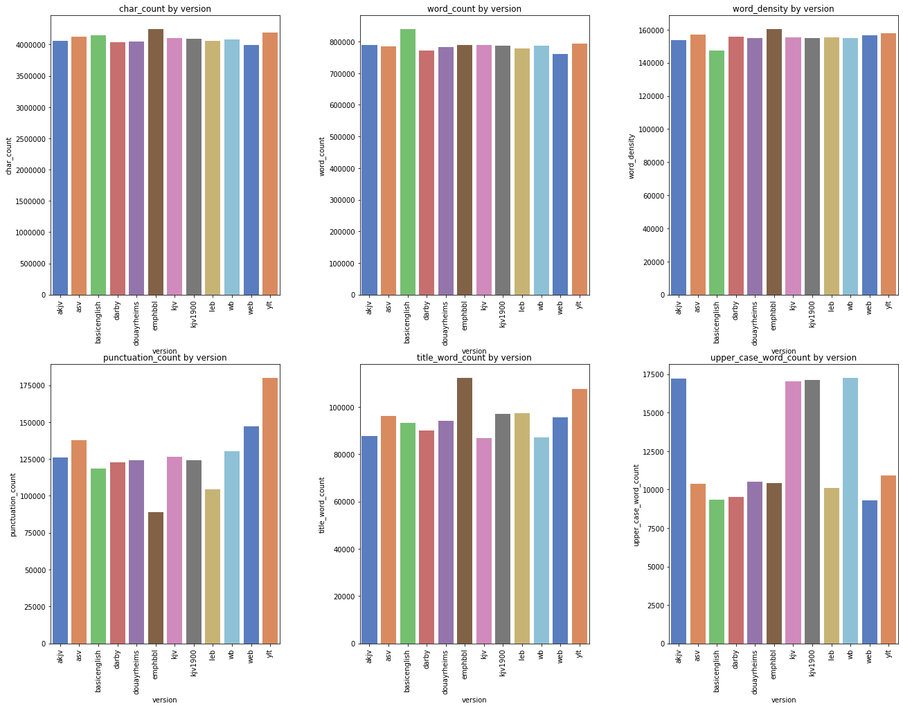
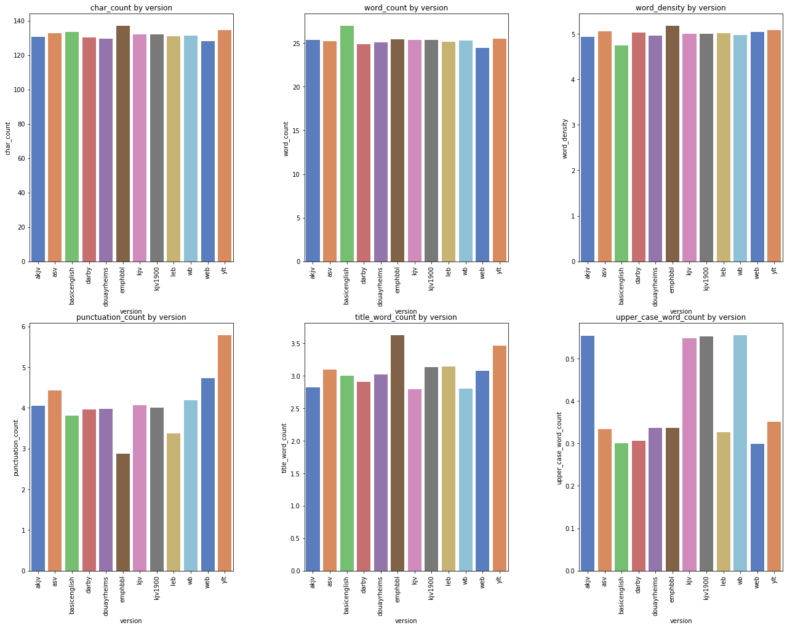
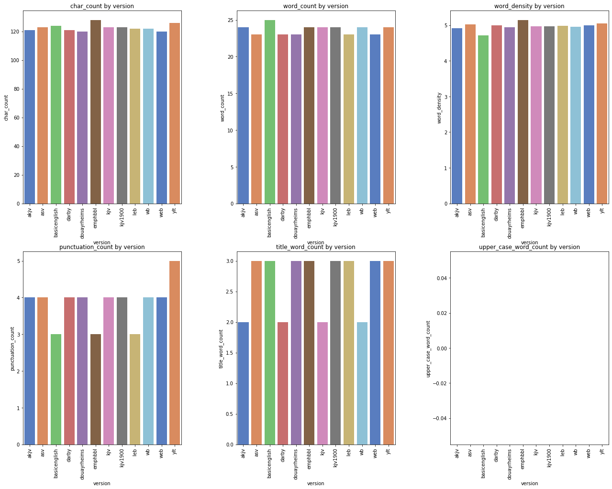

# Abstract

The Bible is the best selling book of all times and continues to be a source for many pointing towards God. Originally written in Hebrew, Aramaic, and Greek, the Bible has been translated into over 600+ languages, with each respective language having its own respective variations and verisons.  

In this project, we will be examinign a few English Translations of the Bible and using some natural language procesing (NLP) tools in attempt to see how some of these versions are similar and how they differ.

The goal of this project is not to declare which versions are better or worse than another, but simply to see how these versions relate to one another, using Python and some machine learning techniques to quantify and make comparisons.

___________________________

# Project Overview

In order to compare the different Bibles versions, we will first need a source to pull the Bibles from.  For this project, we will utilize the following online APIs to pull Bible text:

* Biblia
* GetBible

Below is a diagram on what this project will look like:


_________________________________________________

### Import Files


```python
import requests
import pandas as pd
import numpy as np
import json
import re
import string
import seaborn as sns
import matplotlib.pyplot as plt
import plotly.graph_objects as go
import io
import cv2
import nltk
from mpl_toolkits.axes_grid1 import ImageGrid
from plotly.subplots import make_subplots
from nltk import word_tokenize, sent_tokenize
from nltk.corpus import stopwords
from keras import models
from keras.layers import Dense, Activation
from gensim.models import Word2Vec
from PIL import Image
from API import My_API
import text_handling as th

%load_ext autoreload
%autoreload 2
%matplotlib inline
```

    Using TensorFlow backend.
    C:\Users\Rahkeem\Anaconda3\envs\learn-env\lib\site-packages\gensim\utils.py:1197: UserWarning:
    
    detected Windows; aliasing chunkize to chunkize_serial
    
    

# Accessing APIs for Bible text

To store the different versions of the Bible, we will use a dictionary as the main structure to hold the content of each, called `versions`


```python
versions = {}
```

In this section, the most care had to be taken into consideration when pulling information from each API.  In an attempt to access the text as easily as possible, I am using a custom API to accesss each site. The queries are inserted and built by hand using the respective documentation at each site.  

#### Cannonical books

The API _Biblia API_ is a very useful site that is well documented and also has services built in to get the contents fo each specific bible.  To make the text retrieval process more seamless, the list of books within standard canonical bibles are retrieved, then stored for later use within different queries.


```python
## Pull the canonical books from Website
my_api = My_API(url="https://api.biblia.com/v1/bible/", key='fd37d8f28e95d3be8cb4fbc37e15e18e')
query = 'contents/KJV?'
resp = my_api.run_query(query)

## Strip out the books and remvoe whitespace with '_' 
# canonical_books = [book['passage'].replace(" ","_").strip() for book in resp['books']]
canonical_books = [book['passage'].strip() for book in resp['books']]
```


```python
print(canonical_books)
```

    ['Genesis', 'Exodus', 'Leviticus', 'Numbers', 'Deuteronomy', 'Joshua', 'Judges', 'Ruth', '1 Samuel', '2 Samuel', '1 Kings', '2 Kings', '1 Chronicles', '2 Chronicles', 'Ezra', 'Nehemiah', 'Esther', 'Job', 'Psalms', 'Proverbs', 'Ecclesiastes', 'Song of Solomon', 'Isaiah', 'Jeremiah', 'Lamentations', 'Ezekiel', 'Daniel', 'Hosea', 'Joel', 'Amos', 'Obadiah', 'Jonah', 'Micah', 'Nahum', 'Habakkuk', 'Zephaniah', 'Haggai', 'Zechariah', 'Malachi', 'Matthew', 'Mark', 'Luke', 'John', 'Acts', 'Romans', '1 Corinthians', '2 Corinthians', 'Galatians', 'Ephesians', 'Philippians', 'Colossians', '1 Thessalonians', '2 Thessalonians', '1 Timothy', '2 Timothy', 'Titus', 'Philemon', 'Hebrews', 'James', '1 Peter', '2 Peter', '1 John', '2 John', '3 John', 'Jude', 'Revelation']
    

### Custom functions for Bible text retrieval and formatting

Text retrieval was the most difficult part of the project. Each API differs significantly and the format of the text returned made this even more difficult. To take care of these differences, custom functions were created and stored in the helper filed, _Text_Handling.py_

Format of downloaded text

To simplify the retrieval and storage of Bible text across different platforms, the text is stored as fully formatted verse as seen in the example below.

```
{"KJV":
   {
    "Genesis 1:1": "In the beginning God created heaven, and earth.",
    "Genesis 1:2": "And the earth was void and empty, and darkness was upon the face of the deep; and the spirit of God moved over the waters.",
    "Genesis 1:3": "And God said: Be light made. And light was made.",
    "Genesis 1:4": "And God saw the light that it was good; and he divided the light from the darkness.",
    ...
    "Revelation 22:21": "The grace of our Lord Jesus Christ be with you all. Amen."
    }
}
```

### _Biblia API_

This site is very useful and hosts a strong amount of services for pulling Bible text from the website.
Finding the right query to use was the most difficiult part of using this query.  

As a result, the decision was made to use the following versions below, and offset the remaining versions to another API:

Bible Version |	Version ID  
:---:     |:----:  |
1890 Darby Bible |	DARBY  
The Emphasized Bible |	EMPHBBL 
King James Version |	KJV1900  
The Lexham English Bible |	LEB


```python
biblia_available_versions = ['KJV1900','LEB','EMPHBBL','DARBY']
```

To get the content from a specific bible, the `content` service of the API has to be used.  Selecting different services is pretty simple.  To do so, you enter the name of the service as a path, within a directory as seen below.  

Pull the text for each book from website and store in dictionary for later use


```python
my_api = My_API(url="https://api.biblia.com/v1/bible/", key='fd37d8f28e95d3be8cb4fbc37e15e18e')

biblia_versions = {}

for v in biblia_available_versions:
    print(v)
    ver = {}
    for book in canonical_books:

        query = f'content/{v}.txt?passage={book}&style=oneVersePerLineFullReference'
        resp = my_api.run_query(query)

        book_dict = th.parse_formatted_verse_ref(resp)
        ver.update(book_dict)
        
    versions[v] = ver
```

    KJV1900
    LEB
    EMPHBBL
    DARBY
    


```python
versions.keys()
```


    dict_keys(['KJV1900', 'LEB', 'EMPHBBL', 'DARBY'])


### _GetBible.net_

This site was the easiest to use and gave the information in the ideal format.
Each verse was in its own respective JSON array, requiriing less effort to retrieve the information.

Below are the English BIble Versions available at this website:

Bible Version |	Version ID  
:---:     |:----:  
American Standard Version |	ASV 
Authorized Version |	KJV  
The Lexham English Bible |	LEB 
Young’s Literal Translation |	YLT
BasicEnglish Bible  | BASICENGLISH
Douary Rheims Bible | DOUAYRHEIMS
Webster's Bible  | WB
World English Bible | WEB


```python
getbible_eng_versions = ['KJV','AKJV','ASV','BASICENGLISH','DOUAYRHEIMS', 'WB','WEB','YLT']
```


```python
my_api = My_API(url="https://getbible.net/")

for v in getbible_eng_versions:
    v_dict = {}
    print(v)
    for book in canonical_books:
        resp = my_api.run_query(f'json?passage={book}&v={v.lower()}')
        resp_dict = json.loads(resp[1:-2])
        v_dict.update(th.parse_book(resp_dict))
    versions[v] = v_dict
```

    KJV
    AKJV
    ASV
    BASICENGLISH
    DOUAYRHEIMS
    WB
    WEB
    YLT
    


```python
versions.keys()
```


    dict_keys(['KJV1900', 'LEB', 'EMPHBBL', 'DARBY', 'KJV', 'AKJV', 'ASV', 'BASICENGLISH', 'DOUAYRHEIMS', 'WB', 'WEB', 'YLT'])


### Save data to file

Here, we are saving the dictionary as a json object to a file, for easier access later on


```python
for key in versions.keys():
    key_dict = {key: versions[key]}
    with open(f"./data/{key}.json", "w") as f:
        js = json.dump(key_dict, fp=f, indent=4, separators=(',', ': '))
```

### Pull data from saved file

Pulling files from `/data` directory


```python
from os import listdir
from os.path import isfile, join

mypath = './data'
onlyfiles = [f for f in listdir(mypath) if isfile(join(mypath, f))]
```


```python
onlyfiles
```


    ['AKJV.json',
     'ASV.json',
     'BASICENGLISH.json',
     'DARBY.json',
     'DOUAYRHEIMS.json',
     'EMPHBBL.json',
     'KJV.json',
     'KJV1900.json',
     'LEB.json',
     'WB.json',
     'WEB.json',
     'YLT.json']


```python
data = {}
for file in onlyfiles:
    with open(f"./data/{file}") as f:
        bible = json.load(f)
    data.update(bible)
```


```python
for key in data.keys():
    print(key)
```

    AKJV
    ASV
    BASICENGLISH
    DARBY
    DOUAYRHEIMS
    EMPHBBL
    KJV
    KJV1900
    LEB
    WB
    WEB
    YLT
    

# General Statistics

Here, we will make a dataframe out of the parsed text to get a better idea of how the information is formatted.  All of the versions will be added and general statistics will be calculated to see how the available Bibles differ from one another.

Some of these statistics include the following:

`char_count` <br>
`word_count` <br>
`punctuation_count` <br>


```python
# Create dataframes out of the Bible versions stored
list_of_df = []
for version in data.keys():
    content = []
    for item in data[version].items():
        ref, text = item

        book = ' '.join(ref.split()[:-1]).lower().replace(' ','_')
        chapter = ref.split()[-1].split(":")[0]
        verse = ref.split()[-1].split(":")[1]
        
        if book == 'psalm':
            book = 'psalms'
        if book == 'song_of_solomon':
            book = 'song_of_songs'

        content.append((version.lower(),book,chapter,verse,text))
    
    df = pd.DataFrame(data=content, columns=['version','book','chapter','verse','text'])
    list_of_df.append(df)

df = pd.concat(list_of_df)
```

Create general word statistics


```python
df['char_count'] = df['text'].apply(len)
df['word_count'] = df['text'].apply(lambda x: len(x.split()))
df['word_density'] = df['char_count'] / (df['word_count']+1)
df['punctuation_count'] = df['text'].apply(lambda x: len("".join(_ for _ in x if _ in string.punctuation))) 
df['title_word_count'] = df['text'].apply(lambda x: len([wrd for wrd in x.split() if wrd.istitle()]))
df['upper_case_word_count'] = df['text'].apply(lambda x: len([wrd for wrd in x.split() if wrd.isupper()]))
```


```python
df.info()
```

    <class 'pandas.core.frame.DataFrame'>
    Int64Index: 372964 entries, 0 to 31101
    Data columns (total 11 columns):
    version                  372964 non-null object
    book                     372964 non-null object
    chapter                  372964 non-null object
    verse                    372964 non-null object
    text                     372964 non-null object
    char_count               372964 non-null int64
    word_count               372964 non-null int64
    word_density             372964 non-null float64
    punctuation_count        372964 non-null int64
    title_word_count         372964 non-null int64
    upper_case_word_count    372964 non-null int64
    dtypes: float64(1), int64(5), object(5)
    memory usage: 34.1+ MB
    


```python
df.head()
```


<div>
<style scoped>
    .dataframe tbody tr th:only-of-type {
        vertical-align: middle;
    }

    .dataframe tbody tr th {
        vertical-align: top;
    }

    .dataframe thead th {
        text-align: right;
    }
</style>
<table border="1" class="dataframe">
  <thead>
    <tr style="text-align: right;">
      <th></th>
      <th>version</th>
      <th>book</th>
      <th>chapter</th>
      <th>verse</th>
      <th>text</th>
      <th>char_count</th>
      <th>word_count</th>
      <th>word_density</th>
      <th>punctuation_count</th>
      <th>title_word_count</th>
      <th>upper_case_word_count</th>
    </tr>
  </thead>
  <tbody>
    <tr>
      <th>0</th>
      <td>akjv</td>
      <td>genesis</td>
      <td>1</td>
      <td>1</td>
      <td>In the beginning God created the heaven and th...</td>
      <td>54</td>
      <td>10</td>
      <td>4.909091</td>
      <td>1</td>
      <td>2</td>
      <td>0</td>
    </tr>
    <tr>
      <th>1</th>
      <td>akjv</td>
      <td>genesis</td>
      <td>1</td>
      <td>2</td>
      <td>And the earth was without form, and void; and ...</td>
      <td>138</td>
      <td>29</td>
      <td>4.600000</td>
      <td>4</td>
      <td>4</td>
      <td>0</td>
    </tr>
    <tr>
      <th>2</th>
      <td>akjv</td>
      <td>genesis</td>
      <td>1</td>
      <td>3</td>
      <td>And God said, Let there be light: and there wa...</td>
      <td>54</td>
      <td>11</td>
      <td>4.500000</td>
      <td>3</td>
      <td>3</td>
      <td>0</td>
    </tr>
    <tr>
      <th>3</th>
      <td>akjv</td>
      <td>genesis</td>
      <td>1</td>
      <td>4</td>
      <td>And God saw the light, that it was good: and G...</td>
      <td>85</td>
      <td>17</td>
      <td>4.722222</td>
      <td>3</td>
      <td>3</td>
      <td>0</td>
    </tr>
    <tr>
      <th>4</th>
      <td>akjv</td>
      <td>genesis</td>
      <td>1</td>
      <td>5</td>
      <td>And God called the light Day, and the darkness...</td>
      <td>115</td>
      <td>22</td>
      <td>5.000000</td>
      <td>3</td>
      <td>5</td>
      <td>0</td>
    </tr>
  </tbody>
</table>
</div>


```python
df.book.unique()
```


    array(['genesis', 'exodus', 'leviticus', 'numbers', 'deuteronomy',
           'joshua', 'judges', 'ruth', '1_samuel', '2_samuel', '1_kings',
           '2_kings', '1_chronicles', '2_chronicles', 'ezra', 'nehemiah',
           'esther', 'job', 'psalms', 'proverbs', 'ecclesiastes',
           'song_of_songs', 'isaiah', 'jeremiah', 'lamentations', 'ezekiel',
           'daniel', 'hosea', 'joel', 'amos', 'obadiah', 'jonah', 'micah',
           'nahum', 'habakkuk', 'zephaniah', 'haggai', 'zechariah', 'malachi',
           'matthew', 'mark', 'luke', 'john', 'acts', 'romans',
           '1_corinthians', '2_corinthians', 'galatians', 'ephesians',
           'philippians', 'colossians', '1_thessalonians', '2_thessalonians',
           '1_timothy', '2_timothy', 'titus', 'philemon', 'hebrews', 'james',
           '1_peter', '2_peter', '1_john', '2_john', '3_john', 'jude',
           'revelation'], dtype=object)


```python
## Tokenize text and add it as a column in the dataframe
# df['tokenize_verses'] = df['text'].apply(lambda x: th.tokenize_verse(x))
```

Old Testament Comparison & New Testament Comparision against different versions


```python
list_of_funct = ['sum','mean','median']
```


```python
aggrts = df.groupby(['version']).agg('sum')
```


```python
aggrts.columns
```


    Index(['char_count', 'word_count', 'word_density', 'punctuation_count',
           'title_word_count', 'upper_case_word_count'],
          dtype='object')


```python
#Graph function to make bar graph
def generate_bar_graph(df=df, metric='', function='', title='Graph'):
    fig = go.Figure([go.Bar(x=[item[0]], y=[item[1]], 
                            name=item[0], showlegend=True) 
                     for item in df[metric].items()
                    ])
    fig.update_layout(title_text=title)
    fig.show()
```


```python
generate_bar_graph(aggrts, metric='char_count', function='sum')
```


        <script type="text/javascript">
        window.PlotlyConfig = {MathJaxConfig: 'local'};
        if (window.MathJax) {MathJax.Hub.Config({SVG: {font: "STIX-Web"}});}
        if (typeof require !== 'undefined') {
        require.undef("plotly");
        define('plotly', function(require, exports, module) {
            /**
* plotly.js v1.51.2
* Copyright 2012-2019, Plotly, Inc.
* All rights reserved.
* Licensed under the MIT license
*/
!function(t){if("object"==typeof exports&&"undefined"!=typeof module)module.exports=t();else if("function"==typeof define&&define.amd)define([],t);else{("undefined"!=typeof window?window:"undefined"!=typeof global?global:"undefined"!=typeof self?self:this).Plotly=t()}}(function(){return function(){return function t(e,r,n){function a(o,s){if(!r[o]){if(!e[o]){var l="function"==typeof require&&require;if(!s&&l)return l(o,!0);if(i)return i(o,!0);var c=new Error("Cannot find module '"+o+"'");throw c.code="MODULE_NOT_FOUND",c}var u=r[o]={exports:{}};e[o][0].call(u.exports,function(t){return a(e[o][1][t]||t)},u,u.exports,t,e,r,n)}return r[o].exports}for(var i="function"==typeof require&&require,o=0;o<n.length;o++)a(n[o]);return a}}()({1:[function(t,e,r){"use strict";var n=t("../src/lib"),a={"X,X div":"direction:ltr;font-family:'Open Sans', verdana, arial, sans-serif;margin:0;padding:0;","X input,X button":"font-family:'Open Sans', verdana, arial, sans-serif;","X input:focus,X button:focus":"outline:none;","X a":"text-decoration:none;","X a:hover":"text-decoration:none;","X .crisp":"shape-rendering:crispEdges;","X .user-select-none":"-webkit-user-select:none;-moz-user-select:none;-ms-user-select:none;-o-user-select:none;user-select:none;","X svg":"overflow:hidden;","X svg a":"fill:#447adb;","X svg a:hover":"fill:#3c6dc5;","X .main-svg":"position:absolute;top:0;left:0;pointer-events:none;","X .main-svg .draglayer":"pointer-events:all;","X .cursor-default":"cursor:default;","X .cursor-pointer":"cursor:pointer;","X .cursor-crosshair":"cursor:crosshair;","X .cursor-move":"cursor:move;","X .cursor-col-resize":"cursor:col-resize;","X .cursor-row-resize":"cursor:row-resize;","X .cursor-ns-resize":"cursor:ns-resize;","X .cursor-ew-resize":"cursor:ew-resize;","X .cursor-sw-resize":"cursor:sw-resize;","X .cursor-s-resize":"cursor:s-resize;","X .cursor-se-resize":"cursor:se-resize;","X .cursor-w-resize":"cursor:w-resize;","X .cursor-e-resize":"cursor:e-resize;","X .cursor-nw-resize":"cursor:nw-resize;","X .cursor-n-resize":"cursor:n-resize;","X .cursor-ne-resize":"cursor:ne-resize;","X .cursor-grab":"cursor:-webkit-grab;cursor:grab;","X .modebar":"position:absolute;top:2px;right:2px;","X .ease-bg":"-webkit-transition:background-color 0.3s ease 0s;-moz-transition:background-color 0.3s ease 0s;-ms-transition:background-color 0.3s ease 0s;-o-transition:background-color 0.3s ease 0s;transition:background-color 0.3s ease 0s;","X .modebar--hover>:not(.watermark)":"opacity:0;-webkit-transition:opacity 0.3s ease 0s;-moz-transition:opacity 0.3s ease 0s;-ms-transition:opacity 0.3s ease 0s;-o-transition:opacity 0.3s ease 0s;transition:opacity 0.3s ease 0s;","X:hover .modebar--hover .modebar-group":"opacity:1;","X .modebar-group":"float:left;display:inline-block;box-sizing:border-box;padding-left:8px;position:relative;vertical-align:middle;white-space:nowrap;","X .modebar-btn":"position:relative;font-size:16px;padding:3px 4px;height:22px;cursor:pointer;line-height:normal;box-sizing:border-box;","X .modebar-btn svg":"position:relative;top:2px;","X .modebar.vertical":"display:flex;flex-direction:column;flex-wrap:wrap;align-content:flex-end;max-height:100%;","X .modebar.vertical svg":"top:-1px;","X .modebar.vertical .modebar-group":"display:block;float:none;padding-left:0px;padding-bottom:8px;","X .modebar.vertical .modebar-group .modebar-btn":"display:block;text-align:center;","X [data-title]:before,X [data-title]:after":"position:absolute;-webkit-transform:translate3d(0, 0, 0);-moz-transform:translate3d(0, 0, 0);-ms-transform:translate3d(0, 0, 0);-o-transform:translate3d(0, 0, 0);transform:translate3d(0, 0, 0);display:none;opacity:0;z-index:1001;pointer-events:none;top:110%;right:50%;","X [data-title]:hover:before,X [data-title]:hover:after":"display:block;opacity:1;","X [data-title]:before":"content:'';position:absolute;background:transparent;border:6px solid transparent;z-index:1002;margin-top:-12px;border-bottom-color:#69738a;margin-right:-6px;","X [data-title]:after":"content:attr(data-title);background:#69738a;color:white;padding:8px 10px;font-size:12px;line-height:12px;white-space:nowrap;margin-right:-18px;border-radius:2px;","X .vertical [data-title]:before,X .vertical [data-title]:after":"top:0%;right:200%;","X .vertical [data-title]:before":"border:6px solid transparent;border-left-color:#69738a;margin-top:8px;margin-right:-30px;","X .select-outline":"fill:none;stroke-width:1;shape-rendering:crispEdges;","X .select-outline-1":"stroke:white;","X .select-outline-2":"stroke:black;stroke-dasharray:2px 2px;",Y:"font-family:'Open Sans';position:fixed;top:50px;right:20px;z-index:10000;font-size:10pt;max-width:180px;","Y p":"margin:0;","Y .notifier-note":"min-width:180px;max-width:250px;border:1px solid #fff;z-index:3000;margin:0;background-color:#8c97af;background-color:rgba(140,151,175,0.9);color:#fff;padding:10px;overflow-wrap:break-word;word-wrap:break-word;-ms-hyphens:auto;-webkit-hyphens:auto;hyphens:auto;","Y .notifier-close":"color:#fff;opacity:0.8;float:right;padding:0 5px;background:none;border:none;font-size:20px;font-weight:bold;line-height:20px;","Y .notifier-close:hover":"color:#444;text-decoration:none;cursor:pointer;"};for(var i in a){var o=i.replace(/^,/," ,").replace(/X/g,".js-plotly-plot .plotly").replace(/Y/g,".plotly-notifier");n.addStyleRule(o,a[i])}},{"../src/lib":716}],2:[function(t,e,r){"use strict";e.exports=t("../src/transforms/aggregate")},{"../src/transforms/aggregate":1294}],3:[function(t,e,r){"use strict";e.exports=t("../src/traces/bar")},{"../src/traces/bar":863}],4:[function(t,e,r){"use strict";e.exports=t("../src/traces/barpolar")},{"../src/traces/barpolar":875}],5:[function(t,e,r){"use strict";e.exports=t("../src/traces/box")},{"../src/traces/box":885}],6:[function(t,e,r){"use strict";e.exports=t("../src/components/calendars")},{"../src/components/calendars":589}],7:[function(t,e,r){"use strict";e.exports=t("../src/traces/candlestick")},{"../src/traces/candlestick":894}],8:[function(t,e,r){"use strict";e.exports=t("../src/traces/carpet")},{"../src/traces/carpet":913}],9:[function(t,e,r){"use strict";e.exports=t("../src/traces/choropleth")},{"../src/traces/choropleth":927}],10:[function(t,e,r){"use strict";e.exports=t("../src/traces/choroplethmapbox")},{"../src/traces/choroplethmapbox":934}],11:[function(t,e,r){"use strict";e.exports=t("../src/traces/cone")},{"../src/traces/cone":940}],12:[function(t,e,r){"use strict";e.exports=t("../src/traces/contour")},{"../src/traces/contour":955}],13:[function(t,e,r){"use strict";e.exports=t("../src/traces/contourcarpet")},{"../src/traces/contourcarpet":966}],14:[function(t,e,r){"use strict";e.exports=t("../src/core")},{"../src/core":694}],15:[function(t,e,r){"use strict";e.exports=t("../src/traces/densitymapbox")},{"../src/traces/densitymapbox":974}],16:[function(t,e,r){"use strict";e.exports=t("../src/transforms/filter")},{"../src/transforms/filter":1295}],17:[function(t,e,r){"use strict";e.exports=t("../src/traces/funnel")},{"../src/traces/funnel":984}],18:[function(t,e,r){"use strict";e.exports=t("../src/traces/funnelarea")},{"../src/traces/funnelarea":993}],19:[function(t,e,r){"use strict";e.exports=t("../src/transforms/groupby")},{"../src/transforms/groupby":1296}],20:[function(t,e,r){"use strict";e.exports=t("../src/traces/heatmap")},{"../src/traces/heatmap":1006}],21:[function(t,e,r){"use strict";e.exports=t("../src/traces/heatmapgl")},{"../src/traces/heatmapgl":1015}],22:[function(t,e,r){"use strict";e.exports=t("../src/traces/histogram")},{"../src/traces/histogram":1027}],23:[function(t,e,r){"use strict";e.exports=t("../src/traces/histogram2d")},{"../src/traces/histogram2d":1033}],24:[function(t,e,r){"use strict";e.exports=t("../src/traces/histogram2dcontour")},{"../src/traces/histogram2dcontour":1037}],25:[function(t,e,r){"use strict";e.exports=t("../src/traces/image")},{"../src/traces/image":1044}],26:[function(t,e,r){"use strict";var n=t("./core");n.register([t("./bar"),t("./box"),t("./heatmap"),t("./histogram"),t("./histogram2d"),t("./histogram2dcontour"),t("./contour"),t("./scatterternary"),t("./violin"),t("./funnel"),t("./waterfall"),t("./image"),t("./pie"),t("./sunburst"),t("./treemap"),t("./funnelarea"),t("./scatter3d"),t("./surface"),t("./isosurface"),t("./volume"),t("./mesh3d"),t("./cone"),t("./streamtube"),t("./scattergeo"),t("./choropleth"),t("./scattergl"),t("./splom"),t("./pointcloud"),t("./heatmapgl"),t("./parcoords"),t("./parcats"),t("./scattermapbox"),t("./choroplethmapbox"),t("./densitymapbox"),t("./sankey"),t("./indicator"),t("./table"),t("./carpet"),t("./scattercarpet"),t("./contourcarpet"),t("./ohlc"),t("./candlestick"),t("./scatterpolar"),t("./scatterpolargl"),t("./barpolar")]),n.register([t("./aggregate"),t("./filter"),t("./groupby"),t("./sort")]),n.register([t("./calendars")]),e.exports=n},{"./aggregate":2,"./bar":3,"./barpolar":4,"./box":5,"./calendars":6,"./candlestick":7,"./carpet":8,"./choropleth":9,"./choroplethmapbox":10,"./cone":11,"./contour":12,"./contourcarpet":13,"./core":14,"./densitymapbox":15,"./filter":16,"./funnel":17,"./funnelarea":18,"./groupby":19,"./heatmap":20,"./heatmapgl":21,"./histogram":22,"./histogram2d":23,"./histogram2dcontour":24,"./image":25,"./indicator":27,"./isosurface":28,"./mesh3d":29,"./ohlc":30,"./parcats":31,"./parcoords":32,"./pie":33,"./pointcloud":34,"./sankey":35,"./scatter3d":36,"./scattercarpet":37,"./scattergeo":38,"./scattergl":39,"./scattermapbox":40,"./scatterpolar":41,"./scatterpolargl":42,"./scatterternary":43,"./sort":44,"./splom":45,"./streamtube":46,"./sunburst":47,"./surface":48,"./table":49,"./treemap":50,"./violin":51,"./volume":52,"./waterfall":53}],27:[function(t,e,r){"use strict";e.exports=t("../src/traces/indicator")},{"../src/traces/indicator":1052}],28:[function(t,e,r){"use strict";e.exports=t("../src/traces/isosurface")},{"../src/traces/isosurface":1058}],29:[function(t,e,r){"use strict";e.exports=t("../src/traces/mesh3d")},{"../src/traces/mesh3d":1063}],30:[function(t,e,r){"use strict";e.exports=t("../src/traces/ohlc")},{"../src/traces/ohlc":1068}],31:[function(t,e,r){"use strict";e.exports=t("../src/traces/parcats")},{"../src/traces/parcats":1077}],32:[function(t,e,r){"use strict";e.exports=t("../src/traces/parcoords")},{"../src/traces/parcoords":1087}],33:[function(t,e,r){"use strict";e.exports=t("../src/traces/pie")},{"../src/traces/pie":1098}],34:[function(t,e,r){"use strict";e.exports=t("../src/traces/pointcloud")},{"../src/traces/pointcloud":1107}],35:[function(t,e,r){"use strict";e.exports=t("../src/traces/sankey")},{"../src/traces/sankey":1113}],36:[function(t,e,r){"use strict";e.exports=t("../src/traces/scatter3d")},{"../src/traces/scatter3d":1150}],37:[function(t,e,r){"use strict";e.exports=t("../src/traces/scattercarpet")},{"../src/traces/scattercarpet":1157}],38:[function(t,e,r){"use strict";e.exports=t("../src/traces/scattergeo")},{"../src/traces/scattergeo":1165}],39:[function(t,e,r){"use strict";e.exports=t("../src/traces/scattergl")},{"../src/traces/scattergl":1177}],40:[function(t,e,r){"use strict";e.exports=t("../src/traces/scattermapbox")},{"../src/traces/scattermapbox":1187}],41:[function(t,e,r){"use strict";e.exports=t("../src/traces/scatterpolar")},{"../src/traces/scatterpolar":1195}],42:[function(t,e,r){"use strict";e.exports=t("../src/traces/scatterpolargl")},{"../src/traces/scatterpolargl":1202}],43:[function(t,e,r){"use strict";e.exports=t("../src/traces/scatterternary")},{"../src/traces/scatterternary":1210}],44:[function(t,e,r){"use strict";e.exports=t("../src/transforms/sort")},{"../src/transforms/sort":1298}],45:[function(t,e,r){"use strict";e.exports=t("../src/traces/splom")},{"../src/traces/splom":1219}],46:[function(t,e,r){"use strict";e.exports=t("../src/traces/streamtube")},{"../src/traces/streamtube":1227}],47:[function(t,e,r){"use strict";e.exports=t("../src/traces/sunburst")},{"../src/traces/sunburst":1235}],48:[function(t,e,r){"use strict";e.exports=t("../src/traces/surface")},{"../src/traces/surface":1244}],49:[function(t,e,r){"use strict";e.exports=t("../src/traces/table")},{"../src/traces/table":1252}],50:[function(t,e,r){"use strict";e.exports=t("../src/traces/treemap")},{"../src/traces/treemap":1261}],51:[function(t,e,r){"use strict";e.exports=t("../src/traces/violin")},{"../src/traces/violin":1273}],52:[function(t,e,r){"use strict";e.exports=t("../src/traces/volume")},{"../src/traces/volume":1281}],53:[function(t,e,r){"use strict";e.exports=t("../src/traces/waterfall")},{"../src/traces/waterfall":1289}],54:[function(t,e,r){"use strict";e.exports=function(t){var e=(t=t||{}).eye||[0,0,1],r=t.center||[0,0,0],s=t.up||[0,1,0],l=t.distanceLimits||[0,1/0],c=t.mode||"turntable",u=n(),h=a(),f=i();return u.setDistanceLimits(l[0],l[1]),u.lookAt(0,e,r,s),h.setDistanceLimits(l[0],l[1]),h.lookAt(0,e,r,s),f.setDistanceLimits(l[0],l[1]),f.lookAt(0,e,r,s),new o({turntable:u,orbit:h,matrix:f},c)};var n=t("turntable-camera-controller"),a=t("orbit-camera-controller"),i=t("matrix-camera-controller");function o(t,e){this._controllerNames=Object.keys(t),this._controllerList=this._controllerNames.map(function(e){return t[e]}),this._mode=e,this._active=t[e],this._active||(this._mode="turntable",this._active=t.turntable),this.modes=this._controllerNames,this.computedMatrix=this._active.computedMatrix,this.computedEye=this._active.computedEye,this.computedUp=this._active.computedUp,this.computedCenter=this._active.computedCenter,this.computedRadius=this._active.computedRadius}var s=o.prototype;[["flush",1],["idle",1],["lookAt",4],["rotate",4],["pan",4],["translate",4],["setMatrix",2],["setDistanceLimits",2],["setDistance",2]].forEach(function(t){for(var e=t[0],r=[],n=0;n<t[1];++n)r.push("a"+n);var a="var cc=this._controllerList;for(var i=0;i<cc.length;++i){cc[i]."+t[0]+"("+r.join()+")}";s[e]=Function.apply(null,r.concat(a))}),s.recalcMatrix=function(t){this._active.recalcMatrix(t)},s.getDistance=function(t){return this._active.getDistance(t)},s.getDistanceLimits=function(t){return this._active.getDistanceLimits(t)},s.lastT=function(){return this._active.lastT()},s.setMode=function(t){if(t!==this._mode){var e=this._controllerNames.indexOf(t);if(!(e<0)){var r=this._active,n=this._controllerList[e],a=Math.max(r.lastT(),n.lastT());r.recalcMatrix(a),n.setMatrix(a,r.computedMatrix),this._active=n,this._mode=t,this.computedMatrix=this._active.computedMatrix,this.computedEye=this._active.computedEye,this.computedUp=this._active.computedUp,this.computedCenter=this._active.computedCenter,this.computedRadius=this._active.computedRadius}}},s.getMode=function(){return this._mode}},{"matrix-camera-controller":434,"orbit-camera-controller":457,"turntable-camera-controller":540}],55:[function(t,e,r){var n,a;n=this,a=function(t,e,r,n,a){"use strict";function i(t){return t.target.depth}function o(t,e){return t.sourceLinks.length?t.depth:e-1}function s(t){return function(){return t}}a=a&&a.hasOwnProperty("default")?a.default:a;var l="function"==typeof Symbol&&"symbol"==typeof Symbol.iterator?function(t){return typeof t}:function(t){return t&&"function"==typeof Symbol&&t.constructor===Symbol&&t!==Symbol.prototype?"symbol":typeof t};function c(t,e){return h(t.source,e.source)||t.index-e.index}function u(t,e){return h(t.target,e.target)||t.index-e.index}function h(t,e){return t.partOfCycle===e.partOfCycle?t.y0-e.y0:"top"===t.circularLinkType||"bottom"===e.circularLinkType?-1:1}function f(t){return t.value}function p(t){return(t.y0+t.y1)/2}function d(t){return p(t.source)}function g(t){return p(t.target)}function v(t){return t.index}function m(t){return t.nodes}function y(t){return t.links}function x(t,e){var r=t.get(e);if(!r)throw new Error("missing: "+e);return r}function b(t,e){return e(t)}var _=25,w=10,k=.3;function T(t,e){var r=0,n=0;t.links.forEach(function(a){a.circular&&(a.source.circularLinkType||a.target.circularLinkType?a.circularLinkType=a.source.circularLinkType?a.source.circularLinkType:a.target.circularLinkType:a.circularLinkType=r<n?"top":"bottom","top"==a.circularLinkType?r+=1:n+=1,t.nodes.forEach(function(t){b(t,e)!=b(a.source,e)&&b(t,e)!=b(a.target,e)||(t.circularLinkType=a.circularLinkType)}))}),t.links.forEach(function(t){t.circular&&(t.source.circularLinkType==t.target.circularLinkType&&(t.circularLinkType=t.source.circularLinkType),Y(t,e)&&(t.circularLinkType=t.source.circularLinkType))})}function A(t){var e=Math.abs(t.y1-t.y0),r=Math.abs(t.target.x0-t.source.x1);return Math.atan(r/e)}function M(t,e){var r=0;t.sourceLinks.forEach(function(t){r=t.circular&&!Y(t,e)?r+1:r});var n=0;return t.targetLinks.forEach(function(t){n=t.circular&&!Y(t,e)?n+1:n}),r+n}function S(t){var e=t.source.sourceLinks,r=0;e.forEach(function(t){r=t.circular?r+1:r});var n=t.target.targetLinks,a=0;return n.forEach(function(t){a=t.circular?a+1:a}),!(r>1||a>1)}function E(t,e,r){return t.sort(C),t.forEach(function(n,a){var i,o,s=0;if(Y(n,r)&&S(n))n.circularPathData.verticalBuffer=s+n.width/2;else{for(var l=0;l<a;l++)if(i=t[a],o=t[l],!(i.source.column<o.target.column||i.target.column>o.source.column)){var c=t[l].circularPathData.verticalBuffer+t[l].width/2+e;s=c>s?c:s}n.circularPathData.verticalBuffer=s+n.width/2}}),t}function L(t,r,a,i){var o=e.min(t.links,function(t){return t.source.y0});t.links.forEach(function(t){t.circular&&(t.circularPathData={})}),E(t.links.filter(function(t){return"top"==t.circularLinkType}),r,i),E(t.links.filter(function(t){return"bottom"==t.circularLinkType}),r,i),t.links.forEach(function(e){if(e.circular){if(e.circularPathData.arcRadius=e.width+w,e.circularPathData.leftNodeBuffer=5,e.circularPathData.rightNodeBuffer=5,e.circularPathData.sourceWidth=e.source.x1-e.source.x0,e.circularPathData.sourceX=e.source.x0+e.circularPathData.sourceWidth,e.circularPathData.targetX=e.target.x0,e.circularPathData.sourceY=e.y0,e.circularPathData.targetY=e.y1,Y(e,i)&&S(e))e.circularPathData.leftSmallArcRadius=w+e.width/2,e.circularPathData.leftLargeArcRadius=w+e.width/2,e.circularPathData.rightSmallArcRadius=w+e.width/2,e.circularPathData.rightLargeArcRadius=w+e.width/2,"bottom"==e.circularLinkType?(e.circularPathData.verticalFullExtent=e.source.y1+_+e.circularPathData.verticalBuffer,e.circularPathData.verticalLeftInnerExtent=e.circularPathData.verticalFullExtent-e.circularPathData.leftLargeArcRadius,e.circularPathData.verticalRightInnerExtent=e.circularPathData.verticalFullExtent-e.circularPathData.rightLargeArcRadius):(e.circularPathData.verticalFullExtent=e.source.y0-_-e.circularPathData.verticalBuffer,e.circularPathData.verticalLeftInnerExtent=e.circularPathData.verticalFullExtent+e.circularPathData.leftLargeArcRadius,e.circularPathData.verticalRightInnerExtent=e.circularPathData.verticalFullExtent+e.circularPathData.rightLargeArcRadius);else{var s=e.source.column,l=e.circularLinkType,c=t.links.filter(function(t){return t.source.column==s&&t.circularLinkType==l});"bottom"==e.circularLinkType?c.sort(O):c.sort(P);var u=0;c.forEach(function(t,n){t.circularLinkID==e.circularLinkID&&(e.circularPathData.leftSmallArcRadius=w+e.width/2+u,e.circularPathData.leftLargeArcRadius=w+e.width/2+n*r+u),u+=t.width}),s=e.target.column,c=t.links.filter(function(t){return t.target.column==s&&t.circularLinkType==l}),"bottom"==e.circularLinkType?c.sort(I):c.sort(z),u=0,c.forEach(function(t,n){t.circularLinkID==e.circularLinkID&&(e.circularPathData.rightSmallArcRadius=w+e.width/2+u,e.circularPathData.rightLargeArcRadius=w+e.width/2+n*r+u),u+=t.width}),"bottom"==e.circularLinkType?(e.circularPathData.verticalFullExtent=Math.max(a,e.source.y1,e.target.y1)+_+e.circularPathData.verticalBuffer,e.circularPathData.verticalLeftInnerExtent=e.circularPathData.verticalFullExtent-e.circularPathData.leftLargeArcRadius,e.circularPathData.verticalRightInnerExtent=e.circularPathData.verticalFullExtent-e.circularPathData.rightLargeArcRadius):(e.circularPathData.verticalFullExtent=o-_-e.circularPathData.verticalBuffer,e.circularPathData.verticalLeftInnerExtent=e.circularPathData.verticalFullExtent+e.circularPathData.leftLargeArcRadius,e.circularPathData.verticalRightInnerExtent=e.circularPathData.verticalFullExtent+e.circularPathData.rightLargeArcRadius)}e.circularPathData.leftInnerExtent=e.circularPathData.sourceX+e.circularPathData.leftNodeBuffer,e.circularPathData.rightInnerExtent=e.circularPathData.targetX-e.circularPathData.rightNodeBuffer,e.circularPathData.leftFullExtent=e.circularPathData.sourceX+e.circularPathData.leftLargeArcRadius+e.circularPathData.leftNodeBuffer,e.circularPathData.rightFullExtent=e.circularPathData.targetX-e.circularPathData.rightLargeArcRadius-e.circularPathData.rightNodeBuffer}if(e.circular)e.path=function(t){var e="";e="top"==t.circularLinkType?"M"+t.circularPathData.sourceX+" "+t.circularPathData.sourceY+" L"+t.circularPathData.leftInnerExtent+" "+t.circularPathData.sourceY+" A"+t.circularPathData.leftLargeArcRadius+" "+t.circularPathData.leftSmallArcRadius+" 0 0 0 "+t.circularPathData.leftFullExtent+" "+(t.circularPathData.sourceY-t.circularPathData.leftSmallArcRadius)+" L"+t.circularPathData.leftFullExtent+" "+t.circularPathData.verticalLeftInnerExtent+" A"+t.circularPathData.leftLargeArcRadius+" "+t.circularPathData.leftLargeArcRadius+" 0 0 0 "+t.circularPathData.leftInnerExtent+" "+t.circularPathData.verticalFullExtent+" L"+t.circularPathData.rightInnerExtent+" "+t.circularPathData.verticalFullExtent+" A"+t.circularPathData.rightLargeArcRadius+" "+t.circularPathData.rightLargeArcRadius+" 0 0 0 "+t.circularPathData.rightFullExtent+" "+t.circularPathData.verticalRightInnerExtent+" L"+t.circularPathData.rightFullExtent+" "+(t.circularPathData.targetY-t.circularPathData.rightSmallArcRadius)+" A"+t.circularPathData.rightLargeArcRadius+" "+t.circularPathData.rightSmallArcRadius+" 0 0 0 "+t.circularPathData.rightInnerExtent+" "+t.circularPathData.targetY+" L"+t.circularPathData.targetX+" "+t.circularPathData.targetY:"M"+t.circularPathData.sourceX+" "+t.circularPathData.sourceY+" L"+t.circularPathData.leftInnerExtent+" "+t.circularPathData.sourceY+" A"+t.circularPathData.leftLargeArcRadius+" "+t.circularPathData.leftSmallArcRadius+" 0 0 1 "+t.circularPathData.leftFullExtent+" "+(t.circularPathData.sourceY+t.circularPathData.leftSmallArcRadius)+" L"+t.circularPathData.leftFullExtent+" "+t.circularPathData.verticalLeftInnerExtent+" A"+t.circularPathData.leftLargeArcRadius+" "+t.circularPathData.leftLargeArcRadius+" 0 0 1 "+t.circularPathData.leftInnerExtent+" "+t.circularPathData.verticalFullExtent+" L"+t.circularPathData.rightInnerExtent+" "+t.circularPathData.verticalFullExtent+" A"+t.circularPathData.rightLargeArcRadius+" "+t.circularPathData.rightLargeArcRadius+" 0 0 1 "+t.circularPathData.rightFullExtent+" "+t.circularPathData.verticalRightInnerExtent+" L"+t.circularPathData.rightFullExtent+" "+(t.circularPathData.targetY+t.circularPathData.rightSmallArcRadius)+" A"+t.circularPathData.rightLargeArcRadius+" "+t.circularPathData.rightSmallArcRadius+" 0 0 1 "+t.circularPathData.rightInnerExtent+" "+t.circularPathData.targetY+" L"+t.circularPathData.targetX+" "+t.circularPathData.targetY;return e}(e);else{var h=n.linkHorizontal().source(function(t){return[t.source.x0+(t.source.x1-t.source.x0),t.y0]}).target(function(t){return[t.target.x0,t.y1]});e.path=h(e)}})}function C(t,e){return D(t)==D(e)?"bottom"==t.circularLinkType?O(t,e):P(t,e):D(e)-D(t)}function P(t,e){return t.y0-e.y0}function O(t,e){return e.y0-t.y0}function z(t,e){return t.y1-e.y1}function I(t,e){return e.y1-t.y1}function D(t){return t.target.column-t.source.column}function R(t){return t.target.x0-t.source.x1}function F(t,e){var r=A(t),n=R(e)/Math.tan(r);return"up"==G(t)?t.y1+n:t.y1-n}function B(t,e){var r=A(t),n=R(e)/Math.tan(r);return"up"==G(t)?t.y1-n:t.y1+n}function N(t,e,r,n){t.links.forEach(function(a){if(!a.circular&&a.target.column-a.source.column>1){var i=a.source.column+1,o=a.target.column-1,s=1,l=o-i+1;for(s=1;i<=o;i++,s++)t.nodes.forEach(function(o){if(o.column==i){var c,u=s/(l+1),h=Math.pow(1-u,3),f=3*u*Math.pow(1-u,2),p=3*Math.pow(u,2)*(1-u),d=Math.pow(u,3),g=h*a.y0+f*a.y0+p*a.y1+d*a.y1,v=g-a.width/2,m=g+a.width/2;v>o.y0&&v<o.y1?(c=o.y1-v+10,c="bottom"==o.circularLinkType?c:-c,o=V(o,c,e,r),t.nodes.forEach(function(t){b(t,n)!=b(o,n)&&t.column==o.column&&j(o,t)&&V(t,c,e,r)})):m>o.y0&&m<o.y1?(c=m-o.y0+10,o=V(o,c,e,r),t.nodes.forEach(function(t){b(t,n)!=b(o,n)&&t.column==o.column&&t.y0<o.y1&&t.y1>o.y1&&V(t,c,e,r)})):v<o.y0&&m>o.y1&&(c=m-o.y0+10,o=V(o,c,e,r),t.nodes.forEach(function(t){b(t,n)!=b(o,n)&&t.column==o.column&&t.y0<o.y1&&t.y1>o.y1&&V(t,c,e,r)}))}})}})}function j(t,e){return t.y0>e.y0&&t.y0<e.y1||(t.y1>e.y0&&t.y1<e.y1||t.y0<e.y0&&t.y1>e.y1)}function V(t,e,r,n){return t.y0+e>=r&&t.y1+e<=n&&(t.y0=t.y0+e,t.y1=t.y1+e,t.targetLinks.forEach(function(t){t.y1=t.y1+e}),t.sourceLinks.forEach(function(t){t.y0=t.y0+e})),t}function U(t,e,r,n){t.nodes.forEach(function(a){n&&a.y+(a.y1-a.y0)>e&&(a.y=a.y-(a.y+(a.y1-a.y0)-e));var i=t.links.filter(function(t){return b(t.source,r)==b(a,r)}),o=i.length;o>1&&i.sort(function(t,e){if(!t.circular&&!e.circular){if(t.target.column==e.target.column)return t.y1-e.y1;if(!H(t,e))return t.y1-e.y1;if(t.target.column>e.target.column){var r=B(e,t);return t.y1-r}if(e.target.column>t.target.column)return B(t,e)-e.y1}return t.circular&&!e.circular?"top"==t.circularLinkType?-1:1:e.circular&&!t.circular?"top"==e.circularLinkType?1:-1:t.circular&&e.circular?t.circularLinkType===e.circularLinkType&&"top"==t.circularLinkType?t.target.column===e.target.column?t.target.y1-e.target.y1:e.target.column-t.target.column:t.circularLinkType===e.circularLinkType&&"bottom"==t.circularLinkType?t.target.column===e.target.column?e.target.y1-t.target.y1:t.target.column-e.target.column:"top"==t.circularLinkType?-1:1:void 0});var s=a.y0;i.forEach(function(t){t.y0=s+t.width/2,s+=t.width}),i.forEach(function(t,e){if("bottom"==t.circularLinkType){for(var r=e+1,n=0;r<o;r++)n+=i[r].width;t.y0=a.y1-n-t.width/2}})})}function q(t,e,r){t.nodes.forEach(function(e){var n=t.links.filter(function(t){return b(t.target,r)==b(e,r)}),a=n.length;a>1&&n.sort(function(t,e){if(!t.circular&&!e.circular){if(t.source.column==e.source.column)return t.y0-e.y0;if(!H(t,e))return t.y0-e.y0;if(e.source.column<t.source.column){var r=F(e,t);return t.y0-r}if(t.source.column<e.source.column)return F(t,e)-e.y0}return t.circular&&!e.circular?"top"==t.circularLinkType?-1:1:e.circular&&!t.circular?"top"==e.circularLinkType?1:-1:t.circular&&e.circular?t.circularLinkType===e.circularLinkType&&"top"==t.circularLinkType?t.source.column===e.source.column?t.source.y1-e.source.y1:t.source.column-e.source.column:t.circularLinkType===e.circularLinkType&&"bottom"==t.circularLinkType?t.source.column===e.source.column?t.source.y1-e.source.y1:e.source.column-t.source.column:"top"==t.circularLinkType?-1:1:void 0});var i=e.y0;n.forEach(function(t){t.y1=i+t.width/2,i+=t.width}),n.forEach(function(t,r){if("bottom"==t.circularLinkType){for(var i=r+1,o=0;i<a;i++)o+=n[i].width;t.y1=e.y1-o-t.width/2}})})}function H(t,e){return G(t)==G(e)}function G(t){return t.y0-t.y1>0?"up":"down"}function Y(t,e){return b(t.source,e)==b(t.target,e)}t.sankeyCircular=function(){var t,n,i=0,b=0,A=1,S=1,E=24,C=v,P=o,O=m,z=y,I=32,D=2,R=null;function F(){var o={nodes:O.apply(null,arguments),links:z.apply(null,arguments)};!function(t){t.nodes.forEach(function(t,e){t.index=e,t.sourceLinks=[],t.targetLinks=[]});var e=r.map(t.nodes,C);t.links.forEach(function(t,r){t.index=r;var n=t.source,a=t.target;"object"!==("undefined"==typeof n?"undefined":l(n))&&(n=t.source=x(e,n)),"object"!==("undefined"==typeof a?"undefined":l(a))&&(a=t.target=x(e,a)),n.sourceLinks.push(t),a.targetLinks.push(t)})}(o),function(t,e,r){var n=0;if(null===r){for(var i=[],o=0;o<t.links.length;o++){var s=t.links[o],l=s.source.index,c=s.target.index;i[l]||(i[l]=[]),i[c]||(i[c]=[]),-1===i[l].indexOf(c)&&i[l].push(c)}var u=a(i);u.sort(function(t,e){return t.length-e.length});var h={};for(o=0;o<u.length;o++){var f=u[o],p=f.slice(-2);h[p[0]]||(h[p[0]]={}),h[p[0]][p[1]]=!0}t.links.forEach(function(t){var e=t.target.index,r=t.source.index;e===r||h[r]&&h[r][e]?(t.circular=!0,t.circularLinkID=n,n+=1):t.circular=!1})}else t.links.forEach(function(t){t.source[r]<t.target[r]?t.circular=!1:(t.circular=!0,t.circularLinkID=n,n+=1)})}(o,0,R),function(t){t.nodes.forEach(function(t){t.partOfCycle=!1,t.value=Math.max(e.sum(t.sourceLinks,f),e.sum(t.targetLinks,f)),t.sourceLinks.forEach(function(e){e.circular&&(t.partOfCycle=!0,t.circularLinkType=e.circularLinkType)}),t.targetLinks.forEach(function(e){e.circular&&(t.partOfCycle=!0,t.circularLinkType=e.circularLinkType)})})}(o),function(t){var e,r,n;for(e=t.nodes,r=[],n=0;e.length;++n,e=r,r=[])e.forEach(function(t){t.depth=n,t.sourceLinks.forEach(function(t){r.indexOf(t.target)<0&&!t.circular&&r.push(t.target)})});for(e=t.nodes,r=[],n=0;e.length;++n,e=r,r=[])e.forEach(function(t){t.height=n,t.targetLinks.forEach(function(t){r.indexOf(t.source)<0&&!t.circular&&r.push(t.source)})});t.nodes.forEach(function(t){t.column=Math.floor(P.call(null,t,n))})}(o),T(o,C),function(a,o,s){var l=r.nest().key(function(t){return t.column}).sortKeys(e.ascending).entries(a.nodes).map(function(t){return t.values});(function(r){if(n){var o=1/0;l.forEach(function(t){var e=S*n/(t.length+1);o=e<o?e:o}),t=o}var s=e.min(l,function(r){return(S-b-(r.length-1)*t)/e.sum(r,f)});s*=k,a.links.forEach(function(t){t.width=t.value*s});var c=function(t){var r=0,n=0,a=0,i=0,o=e.max(t.nodes,function(t){return t.column});return t.links.forEach(function(t){t.circular&&("top"==t.circularLinkType?r+=t.width:n+=t.width,0==t.target.column&&(i+=t.width),t.source.column==o&&(a+=t.width))}),{top:r=r>0?r+_+w:r,bottom:n=n>0?n+_+w:n,left:i=i>0?i+_+w:i,right:a=a>0?a+_+w:a}}(a),u=function(t,r){var n=e.max(t.nodes,function(t){return t.column}),a=A-i,o=S-b,s=a+r.right+r.left,l=o+r.top+r.bottom,c=a/s,u=o/l;return i=i*c+r.left,A=0==r.right?A:A*c,b=b*u+r.top,S*=u,t.nodes.forEach(function(t){t.x0=i+t.column*((A-i-E)/n),t.x1=t.x0+E}),u}(a,c);s*=u,a.links.forEach(function(t){t.width=t.value*s}),l.forEach(function(t){var e=t.length;t.forEach(function(t,n){t.depth==l.length-1&&1==e?(t.y0=S/2-t.value*s,t.y1=t.y0+t.value*s):0==t.depth&&1==e?(t.y0=S/2-t.value*s,t.y1=t.y0+t.value*s):t.partOfCycle?0==M(t,r)?(t.y0=S/2+n,t.y1=t.y0+t.value*s):"top"==t.circularLinkType?(t.y0=b+n,t.y1=t.y0+t.value*s):(t.y0=S-t.value*s-n,t.y1=t.y0+t.value*s):0==c.top||0==c.bottom?(t.y0=(S-b)/e*n,t.y1=t.y0+t.value*s):(t.y0=(S-b)/2-e/2+n,t.y1=t.y0+t.value*s)})})})(s),m();for(var c=1,u=o;u>0;--u)v(c*=.99,s),m();function v(t,r){var n=l.length;l.forEach(function(a){var i=a.length,o=a[0].depth;a.forEach(function(a){var s;if(a.sourceLinks.length||a.targetLinks.length)if(a.partOfCycle&&M(a,r)>0);else if(0==o&&1==i)s=a.y1-a.y0,a.y0=S/2-s/2,a.y1=S/2+s/2;else if(o==n-1&&1==i)s=a.y1-a.y0,a.y0=S/2-s/2,a.y1=S/2+s/2;else{var l=e.mean(a.sourceLinks,g),c=e.mean(a.targetLinks,d),u=((l&&c?(l+c)/2:l||c)-p(a))*t;a.y0+=u,a.y1+=u}})})}function m(){l.forEach(function(e){var r,n,a,i=b,o=e.length;for(e.sort(h),a=0;a<o;++a)r=e[a],(n=i-r.y0)>0&&(r.y0+=n,r.y1+=n),i=r.y1+t;if((n=i-t-S)>0)for(i=r.y0-=n,r.y1-=n,a=o-2;a>=0;--a)r=e[a],(n=r.y1+t-i)>0&&(r.y0-=n,r.y1-=n),i=r.y0})}}(o,I,C),B(o);for(var s=0;s<4;s++)U(o,S,C),q(o,0,C),N(o,b,S,C),U(o,S,C),q(o,0,C);return function(t,r,n){var a=t.nodes,i=t.links,o=!1,s=!1;if(i.forEach(function(t){"top"==t.circularLinkType?o=!0:"bottom"==t.circularLinkType&&(s=!0)}),0==o||0==s){var l=e.min(a,function(t){return t.y0}),c=e.max(a,function(t){return t.y1}),u=c-l,h=n-r,f=h/u;a.forEach(function(t){var e=(t.y1-t.y0)*f;t.y0=(t.y0-l)*f,t.y1=t.y0+e}),i.forEach(function(t){t.y0=(t.y0-l)*f,t.y1=(t.y1-l)*f,t.width=t.width*f})}}(o,b,S),L(o,D,S,C),o}function B(t){t.nodes.forEach(function(t){t.sourceLinks.sort(u),t.targetLinks.sort(c)}),t.nodes.forEach(function(t){var e=t.y0,r=e,n=t.y1,a=n;t.sourceLinks.forEach(function(t){t.circular?(t.y0=n-t.width/2,n-=t.width):(t.y0=e+t.width/2,e+=t.width)}),t.targetLinks.forEach(function(t){t.circular?(t.y1=a-t.width/2,a-=t.width):(t.y1=r+t.width/2,r+=t.width)})})}return F.nodeId=function(t){return arguments.length?(C="function"==typeof t?t:s(t),F):C},F.nodeAlign=function(t){return arguments.length?(P="function"==typeof t?t:s(t),F):P},F.nodeWidth=function(t){return arguments.length?(E=+t,F):E},F.nodePadding=function(e){return arguments.length?(t=+e,F):t},F.nodes=function(t){return arguments.length?(O="function"==typeof t?t:s(t),F):O},F.links=function(t){return arguments.length?(z="function"==typeof t?t:s(t),F):z},F.size=function(t){return arguments.length?(i=b=0,A=+t[0],S=+t[1],F):[A-i,S-b]},F.extent=function(t){return arguments.length?(i=+t[0][0],A=+t[1][0],b=+t[0][1],S=+t[1][1],F):[[i,b],[A,S]]},F.iterations=function(t){return arguments.length?(I=+t,F):I},F.circularLinkGap=function(t){return arguments.length?(D=+t,F):D},F.nodePaddingRatio=function(t){return arguments.length?(n=+t,F):n},F.sortNodes=function(t){return arguments.length?(R=t,F):R},F.update=function(t){return T(t,C),B(t),t.links.forEach(function(t){t.circular&&(t.circularLinkType=t.y0+t.y1<S?"top":"bottom",t.source.circularLinkType=t.circularLinkType,t.target.circularLinkType=t.circularLinkType)}),U(t,S,C,!1),q(t,0,C),L(t,D,S,C),t},F},t.sankeyCenter=function(t){return t.targetLinks.length?t.depth:t.sourceLinks.length?e.min(t.sourceLinks,i)-1:0},t.sankeyLeft=function(t){return t.depth},t.sankeyRight=function(t,e){return e-1-t.height},t.sankeyJustify=o,Object.defineProperty(t,"__esModule",{value:!0})},"object"==typeof r&&"undefined"!=typeof e?a(r,t("d3-array"),t("d3-collection"),t("d3-shape"),t("elementary-circuits-directed-graph")):a(n.d3=n.d3||{},n.d3,n.d3,n.d3,null)},{"d3-array":153,"d3-collection":154,"d3-shape":162,"elementary-circuits-directed-graph":174}],56:[function(t,e,r){var n,a;n=this,a=function(t,e,r,n){"use strict";function a(t){return t.target.depth}function i(t,e){return t.sourceLinks.length?t.depth:e-1}function o(t){return function(){return t}}function s(t,e){return c(t.source,e.source)||t.index-e.index}function l(t,e){return c(t.target,e.target)||t.index-e.index}function c(t,e){return t.y0-e.y0}function u(t){return t.value}function h(t){return(t.y0+t.y1)/2}function f(t){return h(t.source)*t.value}function p(t){return h(t.target)*t.value}function d(t){return t.index}function g(t){return t.nodes}function v(t){return t.links}function m(t,e){var r=t.get(e);if(!r)throw new Error("missing: "+e);return r}function y(t){return[t.source.x1,t.y0]}function x(t){return[t.target.x0,t.y1]}t.sankey=function(){var t=0,n=0,a=1,y=1,x=24,b=8,_=d,w=i,k=g,T=v,A=32,M=2/3;function S(){var i={nodes:k.apply(null,arguments),links:T.apply(null,arguments)};return function(t){t.nodes.forEach(function(t,e){t.index=e,t.sourceLinks=[],t.targetLinks=[]});var e=r.map(t.nodes,_);t.links.forEach(function(t,r){t.index=r;var n=t.source,a=t.target;"object"!=typeof n&&(n=t.source=m(e,n)),"object"!=typeof a&&(a=t.target=m(e,a)),n.sourceLinks.push(t),a.targetLinks.push(t)})}(i),function(t){t.nodes.forEach(function(t){t.value=Math.max(e.sum(t.sourceLinks,u),e.sum(t.targetLinks,u))})}(i),function(e){var r,n,i;for(r=e.nodes,n=[],i=0;r.length;++i,r=n,n=[])r.forEach(function(t){t.depth=i,t.sourceLinks.forEach(function(t){n.indexOf(t.target)<0&&n.push(t.target)})});for(r=e.nodes,n=[],i=0;r.length;++i,r=n,n=[])r.forEach(function(t){t.height=i,t.targetLinks.forEach(function(t){n.indexOf(t.source)<0&&n.push(t.source)})});var o=(a-t-x)/(i-1);e.nodes.forEach(function(e){e.x1=(e.x0=t+Math.max(0,Math.min(i-1,Math.floor(w.call(null,e,i))))*o)+x})}(i),function(t){var a=r.nest().key(function(t){return t.x0}).sortKeys(e.ascending).entries(t.nodes).map(function(t){return t.values});(function(){var r=e.max(a,function(t){return t.length}),i=M*(y-n)/(r-1);b>i&&(b=i);var o=e.min(a,function(t){return(y-n-(t.length-1)*b)/e.sum(t,u)});a.forEach(function(t){t.forEach(function(t,e){t.y1=(t.y0=e)+t.value*o})}),t.links.forEach(function(t){t.width=t.value*o})})(),d();for(var i=1,o=A;o>0;--o)l(i*=.99),d(),s(i),d();function s(t){a.forEach(function(r){r.forEach(function(r){if(r.targetLinks.length){var n=(e.sum(r.targetLinks,f)/e.sum(r.targetLinks,u)-h(r))*t;r.y0+=n,r.y1+=n}})})}function l(t){a.slice().reverse().forEach(function(r){r.forEach(function(r){if(r.sourceLinks.length){var n=(e.sum(r.sourceLinks,p)/e.sum(r.sourceLinks,u)-h(r))*t;r.y0+=n,r.y1+=n}})})}function d(){a.forEach(function(t){var e,r,a,i=n,o=t.length;for(t.sort(c),a=0;a<o;++a)e=t[a],(r=i-e.y0)>0&&(e.y0+=r,e.y1+=r),i=e.y1+b;if((r=i-b-y)>0)for(i=e.y0-=r,e.y1-=r,a=o-2;a>=0;--a)e=t[a],(r=e.y1+b-i)>0&&(e.y0-=r,e.y1-=r),i=e.y0})}}(i),E(i),i}function E(t){t.nodes.forEach(function(t){t.sourceLinks.sort(l),t.targetLinks.sort(s)}),t.nodes.forEach(function(t){var e=t.y0,r=e;t.sourceLinks.forEach(function(t){t.y0=e+t.width/2,e+=t.width}),t.targetLinks.forEach(function(t){t.y1=r+t.width/2,r+=t.width})})}return S.update=function(t){return E(t),t},S.nodeId=function(t){return arguments.length?(_="function"==typeof t?t:o(t),S):_},S.nodeAlign=function(t){return arguments.length?(w="function"==typeof t?t:o(t),S):w},S.nodeWidth=function(t){return arguments.length?(x=+t,S):x},S.nodePadding=function(t){return arguments.length?(b=+t,S):b},S.nodes=function(t){return arguments.length?(k="function"==typeof t?t:o(t),S):k},S.links=function(t){return arguments.length?(T="function"==typeof t?t:o(t),S):T},S.size=function(e){return arguments.length?(t=n=0,a=+e[0],y=+e[1],S):[a-t,y-n]},S.extent=function(e){return arguments.length?(t=+e[0][0],a=+e[1][0],n=+e[0][1],y=+e[1][1],S):[[t,n],[a,y]]},S.iterations=function(t){return arguments.length?(A=+t,S):A},S},t.sankeyCenter=function(t){return t.targetLinks.length?t.depth:t.sourceLinks.length?e.min(t.sourceLinks,a)-1:0},t.sankeyLeft=function(t){return t.depth},t.sankeyRight=function(t,e){return e-1-t.height},t.sankeyJustify=i,t.sankeyLinkHorizontal=function(){return n.linkHorizontal().source(y).target(x)},Object.defineProperty(t,"__esModule",{value:!0})},"object"==typeof r&&"undefined"!=typeof e?a(r,t("d3-array"),t("d3-collection"),t("d3-shape")):a(n.d3=n.d3||{},n.d3,n.d3,n.d3)},{"d3-array":153,"d3-collection":154,"d3-shape":162}],57:[function(t,e,r){"use strict";Object.defineProperty(r,"__esModule",{value:!0});var n=t("@turf/meta"),a=6378137;function i(t){var e=0;if(t&&t.length>0){e+=Math.abs(o(t[0]));for(var r=1;r<t.length;r++)e-=Math.abs(o(t[r]))}return e}function o(t){var e,r,n,i,o,l,c=0,u=t.length;if(u>2){for(l=0;l<u;l++)l===u-2?(n=u-2,i=u-1,o=0):l===u-1?(n=u-1,i=0,o=1):(n=l,i=l+1,o=l+2),e=t[n],r=t[i],c+=(s(t[o][0])-s(e[0]))*Math.sin(s(r[1]));c=c*a*a/2}return c}function s(t){return t*Math.PI/180}r.default=function(t){return n.geomReduce(t,function(t,e){return t+function(t){var e,r=0;switch(t.type){case"Polygon":return i(t.coordinates);case"MultiPolygon":for(e=0;e<t.coordinates.length;e++)r+=i(t.coordinates[e]);return r;case"Point":case"MultiPoint":case"LineString":case"MultiLineString":return 0}return 0}(e)},0)}},{"@turf/meta":60}],58:[function(t,e,r){"use strict";Object.defineProperty(r,"__esModule",{value:!0});var n=t("@turf/meta"),a=t("@turf/helpers");r.default=function(t,e){void 0===e&&(e={});var r=0,i=0,o=0;return n.coordEach(t,function(t){r+=t[0],i+=t[1],o++}),a.point([r/o,i/o],e.properties)}},{"@turf/helpers":59,"@turf/meta":60}],59:[function(t,e,r){"use strict";function n(t,e,r){void 0===r&&(r={});var n={type:"Feature"};return(0===r.id||r.id)&&(n.id=r.id),r.bbox&&(n.bbox=r.bbox),n.properties=e||{},n.geometry=t,n}function a(t,e,r){return void 0===r&&(r={}),n({type:"Point",coordinates:t},e,r)}function i(t,e,r){void 0===r&&(r={});for(var a=0,i=t;a<i.length;a++){var o=i[a];if(o.length<4)throw new Error("Each LinearRing of a Polygon must have 4 or more Positions.");for(var s=0;s<o[o.length-1].length;s++)if(o[o.length-1][s]!==o[0][s])throw new Error("First and last Position are not equivalent.")}return n({type:"Polygon",coordinates:t},e,r)}function o(t,e,r){if(void 0===r&&(r={}),t.length<2)throw new Error("coordinates must be an array of two or more positions");return n({type:"LineString",coordinates:t},e,r)}function s(t,e){void 0===e&&(e={});var r={type:"FeatureCollection"};return e.id&&(r.id=e.id),e.bbox&&(r.bbox=e.bbox),r.features=t,r}function l(t,e,r){return void 0===r&&(r={}),n({type:"MultiLineString",coordinates:t},e,r)}function c(t,e,r){return void 0===r&&(r={}),n({type:"MultiPoint",coordinates:t},e,r)}function u(t,e,r){return void 0===r&&(r={}),n({type:"MultiPolygon",coordinates:t},e,r)}function h(t,e){void 0===e&&(e="kilometers");var n=r.factors[e];if(!n)throw new Error(e+" units is invalid");return t*n}function f(t,e){void 0===e&&(e="kilometers");var n=r.factors[e];if(!n)throw new Error(e+" units is invalid");return t/n}function p(t){return 180*(t%(2*Math.PI))/Math.PI}function d(t){return!isNaN(t)&&null!==t&&!Array.isArray(t)&&!/^\s*$/.test(t)}Object.defineProperty(r,"__esModule",{value:!0}),r.earthRadius=6371008.8,r.factors={centimeters:100*r.earthRadius,centimetres:100*r.earthRadius,degrees:r.earthRadius/111325,feet:3.28084*r.earthRadius,inches:39.37*r.earthRadius,kilometers:r.earthRadius/1e3,kilometres:r.earthRadius/1e3,meters:r.earthRadius,metres:r.earthRadius,miles:r.earthRadius/1609.344,millimeters:1e3*r.earthRadius,millimetres:1e3*r.earthRadius,nauticalmiles:r.earthRadius/1852,radians:1,yards:r.earthRadius/1.0936},r.unitsFactors={centimeters:100,centimetres:100,degrees:1/111325,feet:3.28084,inches:39.37,kilometers:.001,kilometres:.001,meters:1,metres:1,miles:1/1609.344,millimeters:1e3,millimetres:1e3,nauticalmiles:1/1852,radians:1/r.earthRadius,yards:1/1.0936},r.areaFactors={acres:247105e-9,centimeters:1e4,centimetres:1e4,feet:10.763910417,inches:1550.003100006,kilometers:1e-6,kilometres:1e-6,meters:1,metres:1,miles:3.86e-7,millimeters:1e6,millimetres:1e6,yards:1.195990046},r.feature=n,r.geometry=function(t,e,r){switch(void 0===r&&(r={}),t){case"Point":return a(e).geometry;case"LineString":return o(e).geometry;case"Polygon":return i(e).geometry;case"MultiPoint":return c(e).geometry;case"MultiLineString":return l(e).geometry;case"MultiPolygon":return u(e).geometry;default:throw new Error(t+" is invalid")}},r.point=a,r.points=function(t,e,r){return void 0===r&&(r={}),s(t.map(function(t){return a(t,e)}),r)},r.polygon=i,r.polygons=function(t,e,r){return void 0===r&&(r={}),s(t.map(function(t){return i(t,e)}),r)},r.lineString=o,r.lineStrings=function(t,e,r){return void 0===r&&(r={}),s(t.map(function(t){return o(t,e)}),r)},r.featureCollection=s,r.multiLineString=l,r.multiPoint=c,r.multiPolygon=u,r.geometryCollection=function(t,e,r){return void 0===r&&(r={}),n({type:"GeometryCollection",geometries:t},e,r)},r.round=function(t,e){if(void 0===e&&(e=0),e&&!(e>=0))throw new Error("precision must be a positive number");var r=Math.pow(10,e||0);return Math.round(t*r)/r},r.radiansToLength=h,r.lengthToRadians=f,r.lengthToDegrees=function(t,e){return p(f(t,e))},r.bearingToAzimuth=function(t){var e=t%360;return e<0&&(e+=360),e},r.radiansToDegrees=p,r.degreesToRadians=function(t){return t%360*Math.PI/180},r.convertLength=function(t,e,r){if(void 0===e&&(e="kilometers"),void 0===r&&(r="kilometers"),!(t>=0))throw new Error("length must be a positive number");return h(f(t,e),r)},r.convertArea=function(t,e,n){if(void 0===e&&(e="meters"),void 0===n&&(n="kilometers"),!(t>=0))throw new Error("area must be a positive number");var a=r.areaFactors[e];if(!a)throw new Error("invalid original units");var i=r.areaFactors[n];if(!i)throw new Error("invalid final units");return t/a*i},r.isNumber=d,r.isObject=function(t){return!!t&&t.constructor===Object},r.validateBBox=function(t){if(!t)throw new Error("bbox is required");if(!Array.isArray(t))throw new Error("bbox must be an Array");if(4!==t.length&&6!==t.length)throw new Error("bbox must be an Array of 4 or 6 numbers");t.forEach(function(t){if(!d(t))throw new Error("bbox must only contain numbers")})},r.validateId=function(t){if(!t)throw new Error("id is required");if(-1===["string","number"].indexOf(typeof t))throw new Error("id must be a number or a string")},r.radians2degrees=function(){throw new Error("method has been renamed to `radiansToDegrees`")},r.degrees2radians=function(){throw new Error("method has been renamed to `degreesToRadians`")},r.distanceToDegrees=function(){throw new Error("method has been renamed to `lengthToDegrees`")},r.distanceToRadians=function(){throw new Error("method has been renamed to `lengthToRadians`")},r.radiansToDistance=function(){throw new Error("method has been renamed to `radiansToLength`")},r.bearingToAngle=function(){throw new Error("method has been renamed to `bearingToAzimuth`")},r.convertDistance=function(){throw new Error("method has been renamed to `convertLength`")}},{}],60:[function(t,e,r){"use strict";Object.defineProperty(r,"__esModule",{value:!0});var n=t("@turf/helpers");function a(t,e,r){if(null!==t)for(var n,i,o,s,l,c,u,h,f=0,p=0,d=t.type,g="FeatureCollection"===d,v="Feature"===d,m=g?t.features.length:1,y=0;y<m;y++){l=(h=!!(u=g?t.features[y].geometry:v?t.geometry:t)&&"GeometryCollection"===u.type)?u.geometries.length:1;for(var x=0;x<l;x++){var b=0,_=0;if(null!==(s=h?u.geometries[x]:u)){c=s.coordinates;var w=s.type;switch(f=!r||"Polygon"!==w&&"MultiPolygon"!==w?0:1,w){case null:break;case"Point":if(!1===e(c,p,y,b,_))return!1;p++,b++;break;case"LineString":case"MultiPoint":for(n=0;n<c.length;n++){if(!1===e(c[n],p,y,b,_))return!1;p++,"MultiPoint"===w&&b++}"LineString"===w&&b++;break;case"Polygon":case"MultiLineString":for(n=0;n<c.length;n++){for(i=0;i<c[n].length-f;i++){if(!1===e(c[n][i],p,y,b,_))return!1;p++}"MultiLineString"===w&&b++,"Polygon"===w&&_++}"Polygon"===w&&b++;break;case"MultiPolygon":for(n=0;n<c.length;n++){for(_=0,i=0;i<c[n].length;i++){for(o=0;o<c[n][i].length-f;o++){if(!1===e(c[n][i][o],p,y,b,_))return!1;p++}_++}b++}break;case"GeometryCollection":for(n=0;n<s.geometries.length;n++)if(!1===a(s.geometries[n],e,r))return!1;break;default:throw new Error("Unknown Geometry Type")}}}}}function i(t,e){var r;switch(t.type){case"FeatureCollection":for(r=0;r<t.features.length&&!1!==e(t.features[r].properties,r);r++);break;case"Feature":e(t.properties,0)}}function o(t,e){if("Feature"===t.type)e(t,0);else if("FeatureCollection"===t.type)for(var r=0;r<t.features.length&&!1!==e(t.features[r],r);r++);}function s(t,e){var r,n,a,i,o,s,l,c,u,h,f=0,p="FeatureCollection"===t.type,d="Feature"===t.type,g=p?t.features.length:1;for(r=0;r<g;r++){for(s=p?t.features[r].geometry:d?t.geometry:t,c=p?t.features[r].properties:d?t.properties:{},u=p?t.features[r].bbox:d?t.bbox:void 0,h=p?t.features[r].id:d?t.id:void 0,o=(l=!!s&&"GeometryCollection"===s.type)?s.geometries.length:1,a=0;a<o;a++)if(null!==(i=l?s.geometries[a]:s))switch(i.type){case"Point":case"LineString":case"MultiPoint":case"Polygon":case"MultiLineString":case"MultiPolygon":if(!1===e(i,f,c,u,h))return!1;break;case"GeometryCollection":for(n=0;n<i.geometries.length;n++)if(!1===e(i.geometries[n],f,c,u,h))return!1;break;default:throw new Error("Unknown Geometry Type")}else if(!1===e(null,f,c,u,h))return!1;f++}}function l(t,e){s(t,function(t,r,a,i,o){var s,l=null===t?null:t.type;switch(l){case null:case"Point":case"LineString":case"Polygon":return!1!==e(n.feature(t,a,{bbox:i,id:o}),r,0)&&void 0}switch(l){case"MultiPoint":s="Point";break;case"MultiLineString":s="LineString";break;case"MultiPolygon":s="Polygon"}for(var c=0;c<t.coordinates.length;c++){var u={type:s,coordinates:t.coordinates[c]};if(!1===e(n.feature(u,a),r,c))return!1}})}function c(t,e){l(t,function(t,r,i){var o=0;if(t.geometry){var s=t.geometry.type;if("Point"!==s&&"MultiPoint"!==s){var l,c=0,u=0,h=0;return!1!==a(t,function(a,s,f,p,d){if(void 0===l||r>c||p>u||d>h)return l=a,c=r,u=p,h=d,void(o=0);var g=n.lineString([l,a],t.properties);if(!1===e(g,r,i,d,o))return!1;o++,l=a})&&void 0}}})}function u(t,e){if(!t)throw new Error("geojson is required");l(t,function(t,r,a){if(null!==t.geometry){var i=t.geometry.type,o=t.geometry.coordinates;switch(i){case"LineString":if(!1===e(t,r,a,0,0))return!1;break;case"Polygon":for(var s=0;s<o.length;s++)if(!1===e(n.lineString(o[s],t.properties),r,a,s))return!1}}})}r.coordEach=a,r.coordReduce=function(t,e,r,n){var i=r;return a(t,function(t,n,a,o,s){i=0===n&&void 0===r?t:e(i,t,n,a,o,s)},n),i},r.propEach=i,r.propReduce=function(t,e,r){var n=r;return i(t,function(t,a){n=0===a&&void 0===r?t:e(n,t,a)}),n},r.featureEach=o,r.featureReduce=function(t,e,r){var n=r;return o(t,function(t,a){n=0===a&&void 0===r?t:e(n,t,a)}),n},r.coordAll=function(t){var e=[];return a(t,function(t){e.push(t)}),e},r.geomEach=s,r.geomReduce=function(t,e,r){var n=r;return s(t,function(t,a,i,o,s){n=0===a&&void 0===r?t:e(n,t,a,i,o,s)}),n},r.flattenEach=l,r.flattenReduce=function(t,e,r){var n=r;return l(t,function(t,a,i){n=0===a&&0===i&&void 0===r?t:e(n,t,a,i)}),n},r.segmentEach=c,r.segmentReduce=function(t,e,r){var n=r,a=!1;return c(t,function(t,i,o,s,l){n=!1===a&&void 0===r?t:e(n,t,i,o,s,l),a=!0}),n},r.lineEach=u,r.lineReduce=function(t,e,r){var n=r;return u(t,function(t,a,i,o){n=0===a&&void 0===r?t:e(n,t,a,i,o)}),n},r.findSegment=function(t,e){if(e=e||{},!n.isObject(e))throw new Error("options is invalid");var r,a=e.featureIndex||0,i=e.multiFeatureIndex||0,o=e.geometryIndex||0,s=e.segmentIndex||0,l=e.properties;switch(t.type){case"FeatureCollection":a<0&&(a=t.features.length+a),l=l||t.features[a].properties,r=t.features[a].geometry;break;case"Feature":l=l||t.properties,r=t.geometry;break;case"Point":case"MultiPoint":return null;case"LineString":case"Polygon":case"MultiLineString":case"MultiPolygon":r=t;break;default:throw new Error("geojson is invalid")}if(null===r)return null;var c=r.coordinates;switch(r.type){case"Point":case"MultiPoint":return null;case"LineString":return s<0&&(s=c.length+s-1),n.lineString([c[s],c[s+1]],l,e);case"Polygon":return o<0&&(o=c.length+o),s<0&&(s=c[o].length+s-1),n.lineString([c[o][s],c[o][s+1]],l,e);case"MultiLineString":return i<0&&(i=c.length+i),s<0&&(s=c[i].length+s-1),n.lineString([c[i][s],c[i][s+1]],l,e);case"MultiPolygon":return i<0&&(i=c.length+i),o<0&&(o=c[i].length+o),s<0&&(s=c[i][o].length-s-1),n.lineString([c[i][o][s],c[i][o][s+1]],l,e)}throw new Error("geojson is invalid")},r.findPoint=function(t,e){if(e=e||{},!n.isObject(e))throw new Error("options is invalid");var r,a=e.featureIndex||0,i=e.multiFeatureIndex||0,o=e.geometryIndex||0,s=e.coordIndex||0,l=e.properties;switch(t.type){case"FeatureCollection":a<0&&(a=t.features.length+a),l=l||t.features[a].properties,r=t.features[a].geometry;break;case"Feature":l=l||t.properties,r=t.geometry;break;case"Point":case"MultiPoint":return null;case"LineString":case"Polygon":case"MultiLineString":case"MultiPolygon":r=t;break;default:throw new Error("geojson is invalid")}if(null===r)return null;var c=r.coordinates;switch(r.type){case"Point":return n.point(c,l,e);case"MultiPoint":return i<0&&(i=c.length+i),n.point(c[i],l,e);case"LineString":return s<0&&(s=c.length+s),n.point(c[s],l,e);case"Polygon":return o<0&&(o=c.length+o),s<0&&(s=c[o].length+s),n.point(c[o][s],l,e);case"MultiLineString":return i<0&&(i=c.length+i),s<0&&(s=c[i].length+s),n.point(c[i][s],l,e);case"MultiPolygon":return i<0&&(i=c.length+i),o<0&&(o=c[i].length+o),s<0&&(s=c[i][o].length-s),n.point(c[i][o][s],l,e)}throw new Error("geojson is invalid")}},{"@turf/helpers":59}],61:[function(t,e,r){"use strict";var n="undefined"==typeof WeakMap?t("weak-map"):WeakMap,a=t("gl-buffer"),i=t("gl-vao"),o=new n;e.exports=function(t){var e=o.get(t),r=e&&(e._triangleBuffer.handle||e._triangleBuffer.buffer);if(!r||!t.isBuffer(r)){var n=a(t,new Float32Array([-1,-1,-1,4,4,-1]));(e=i(t,[{buffer:n,type:t.FLOAT,size:2}]))._triangleBuffer=n,o.set(t,e)}e.bind(),t.drawArrays(t.TRIANGLES,0,3),e.unbind()}},{"gl-buffer":243,"gl-vao":328,"weak-map":550}],62:[function(t,e,r){e.exports=function(t){var e=0,r=0,n=0,a=0;return t.map(function(t){var i=(t=t.slice())[0],o=i.toUpperCase();if(i!=o)switch(t[0]=o,i){case"a":t[6]+=n,t[7]+=a;break;case"v":t[1]+=a;break;case"h":t[1]+=n;break;default:for(var s=1;s<t.length;)t[s++]+=n,t[s++]+=a}switch(o){case"Z":n=e,a=r;break;case"H":n=t[1];break;case"V":a=t[1];break;case"M":n=e=t[1],a=r=t[2];break;default:n=t[t.length-2],a=t[t.length-1]}return t})}},{}],63:[function(t,e,r){var n=t("pad-left");e.exports=function(t,e,r){e="number"==typeof e?e:1,r=r||": ";var a=t.split(/\r?\n/),i=String(a.length+e-1).length;return a.map(function(t,a){var o=a+e,s=String(o).length,l=n(o,i-s);return l+r+t}).join("\n")}},{"pad-left":458}],64:[function(t,e,r){"use strict";e.exports=function(t){var e=t.length;if(0===e)return[];if(1===e)return[0];for(var r=t[0].length,n=[t[0]],i=[0],o=1;o<e;++o)if(n.push(t[o]),a(n,r)){if(i.push(o),i.length===r+1)return i}else n.pop();return i};var n=t("robust-orientation");function a(t,e){for(var r=new Array(e+1),a=0;a<t.length;++a)r[a]=t[a];for(a=0;a<=t.length;++a){for(var i=t.length;i<=e;++i){for(var o=new Array(e),s=0;s<e;++s)o[s]=Math.pow(i+1-a,s);r[i]=o}if(n.apply(void 0,r))return!0}return!1}},{"robust-orientation":508}],65:[function(t,e,r){"use strict";e.exports=function(t,e){return n(e).filter(function(r){for(var n=new Array(r.length),i=0;i<r.length;++i)n[i]=e[r[i]];return a(n)*t<1})};var n=t("delaunay-triangulate"),a=t("circumradius")},{circumradius:115,"delaunay-triangulate":166}],66:[function(t,e,r){e.exports=function(t,e){return a(n(t,e))};var n=t("alpha-complex"),a=t("simplicial-complex-boundary")},{"alpha-complex":65,"simplicial-complex-boundary":515}],67:[function(t,e,r){"use strict";e.exports=function(t,e){if(!t||null==t.length)throw Error("Argument should be an array");e=null==e?1:Math.floor(e);for(var r=Array(2*e),n=0;n<e;n++){for(var a=-1/0,i=1/0,o=n,s=t.length;o<s;o+=e)t[o]>a&&(a=t[o]),t[o]<i&&(i=t[o]);r[n]=i,r[e+n]=a}return r}},{}],68:[function(t,e,r){e.exports=function(t,e){var r="number"==typeof t,n="number"==typeof e;r&&!n?(e=t,t=0):r||n||(t=0,e=0);var a=(e|=0)-(t|=0);if(a<0)throw new Error("array length must be positive");for(var i=new Array(a),o=0,s=t;o<a;o++,s++)i[o]=s;return i}},{}],69:[function(t,e,r){(function(r){"use strict";var n=t("object-assign");function a(t,e){if(t===e)return 0;for(var r=t.length,n=e.length,a=0,i=Math.min(r,n);a<i;++a)if(t[a]!==e[a]){r=t[a],n=e[a];break}return r<n?-1:n<r?1:0}function i(t){return r.Buffer&&"function"==typeof r.Buffer.isBuffer?r.Buffer.isBuffer(t):!(null==t||!t._isBuffer)}var o=t("util/"),s=Object.prototype.hasOwnProperty,l=Array.prototype.slice,c="foo"===function(){}.name;function u(t){return Object.prototype.toString.call(t)}function h(t){return!i(t)&&("function"==typeof r.ArrayBuffer&&("function"==typeof ArrayBuffer.isView?ArrayBuffer.isView(t):!!t&&(t instanceof DataView||!!(t.buffer&&t.buffer instanceof ArrayBuffer))))}var f=e.exports=y,p=/\s*function\s+([^\(\s]*)\s*/;function d(t){if(o.isFunction(t)){if(c)return t.name;var e=t.toString().match(p);return e&&e[1]}}function g(t,e){return"string"==typeof t?t.length<e?t:t.slice(0,e):t}function v(t){if(c||!o.isFunction(t))return o.inspect(t);var e=d(t);return"[Function"+(e?": "+e:"")+"]"}function m(t,e,r,n,a){throw new f.AssertionError({message:r,actual:t,expected:e,operator:n,stackStartFunction:a})}function y(t,e){t||m(t,!0,e,"==",f.ok)}function x(t,e,r,n){if(t===e)return!0;if(i(t)&&i(e))return 0===a(t,e);if(o.isDate(t)&&o.isDate(e))return t.getTime()===e.getTime();if(o.isRegExp(t)&&o.isRegExp(e))return t.source===e.source&&t.global===e.global&&t.multiline===e.multiline&&t.lastIndex===e.lastIndex&&t.ignoreCase===e.ignoreCase;if(null!==t&&"object"==typeof t||null!==e&&"object"==typeof e){if(h(t)&&h(e)&&u(t)===u(e)&&!(t instanceof Float32Array||t instanceof Float64Array))return 0===a(new Uint8Array(t.buffer),new Uint8Array(e.buffer));if(i(t)!==i(e))return!1;var s=(n=n||{actual:[],expected:[]}).actual.indexOf(t);return-1!==s&&s===n.expected.indexOf(e)||(n.actual.push(t),n.expected.push(e),function(t,e,r,n){if(null==t||null==e)return!1;if(o.isPrimitive(t)||o.isPrimitive(e))return t===e;if(r&&Object.getPrototypeOf(t)!==Object.getPrototypeOf(e))return!1;var a=b(t),i=b(e);if(a&&!i||!a&&i)return!1;if(a)return t=l.call(t),e=l.call(e),x(t,e,r);var s,c,u=k(t),h=k(e);if(u.length!==h.length)return!1;for(u.sort(),h.sort(),c=u.length-1;c>=0;c--)if(u[c]!==h[c])return!1;for(c=u.length-1;c>=0;c--)if(s=u[c],!x(t[s],e[s],r,n))return!1;return!0}(t,e,r,n))}return r?t===e:t==e}function b(t){return"[object Arguments]"==Object.prototype.toString.call(t)}function _(t,e){if(!t||!e)return!1;if("[object RegExp]"==Object.prototype.toString.call(e))return e.test(t);try{if(t instanceof e)return!0}catch(t){}return!Error.isPrototypeOf(e)&&!0===e.call({},t)}function w(t,e,r,n){var a;if("function"!=typeof e)throw new TypeError('"block" argument must be a function');"string"==typeof r&&(n=r,r=null),a=function(t){var e;try{t()}catch(t){e=t}return e}(e),n=(r&&r.name?" ("+r.name+").":".")+(n?" "+n:"."),t&&!a&&m(a,r,"Missing expected exception"+n);var i="string"==typeof n,s=!t&&a&&!r;if((!t&&o.isError(a)&&i&&_(a,r)||s)&&m(a,r,"Got unwanted exception"+n),t&&a&&r&&!_(a,r)||!t&&a)throw a}f.AssertionError=function(t){var e;this.name="AssertionError",this.actual=t.actual,this.expected=t.expected,this.operator=t.operator,t.message?(this.message=t.message,this.generatedMessage=!1):(this.message=g(v((e=this).actual),128)+" "+e.operator+" "+g(v(e.expected),128),this.generatedMessage=!0);var r=t.stackStartFunction||m;if(Error.captureStackTrace)Error.captureStackTrace(this,r);else{var n=new Error;if(n.stack){var a=n.stack,i=d(r),o=a.indexOf("\n"+i);if(o>=0){var s=a.indexOf("\n",o+1);a=a.substring(s+1)}this.stack=a}}},o.inherits(f.AssertionError,Error),f.fail=m,f.ok=y,f.equal=function(t,e,r){t!=e&&m(t,e,r,"==",f.equal)},f.notEqual=function(t,e,r){t==e&&m(t,e,r,"!=",f.notEqual)},f.deepEqual=function(t,e,r){x(t,e,!1)||m(t,e,r,"deepEqual",f.deepEqual)},f.deepStrictEqual=function(t,e,r){x(t,e,!0)||m(t,e,r,"deepStrictEqual",f.deepStrictEqual)},f.notDeepEqual=function(t,e,r){x(t,e,!1)&&m(t,e,r,"notDeepEqual",f.notDeepEqual)},f.notDeepStrictEqual=function t(e,r,n){x(e,r,!0)&&m(e,r,n,"notDeepStrictEqual",t)},f.strictEqual=function(t,e,r){t!==e&&m(t,e,r,"===",f.strictEqual)},f.notStrictEqual=function(t,e,r){t===e&&m(t,e,r,"!==",f.notStrictEqual)},f.throws=function(t,e,r){w(!0,t,e,r)},f.doesNotThrow=function(t,e,r){w(!1,t,e,r)},f.ifError=function(t){if(t)throw t},f.strict=n(function t(e,r){e||m(e,!0,r,"==",t)},f,{equal:f.strictEqual,deepEqual:f.deepStrictEqual,notEqual:f.notStrictEqual,notDeepEqual:f.notDeepStrictEqual}),f.strict.strict=f.strict;var k=Object.keys||function(t){var e=[];for(var r in t)s.call(t,r)&&e.push(r);return e}}).call(this,"undefined"!=typeof global?global:"undefined"!=typeof self?self:"undefined"!=typeof window?window:{})},{"object-assign":455,"util/":72}],70:[function(t,e,r){"function"==typeof Object.create?e.exports=function(t,e){t.super_=e,t.prototype=Object.create(e.prototype,{constructor:{value:t,enumerable:!1,writable:!0,configurable:!0}})}:e.exports=function(t,e){t.super_=e;var r=function(){};r.prototype=e.prototype,t.prototype=new r,t.prototype.constructor=t}},{}],71:[function(t,e,r){e.exports=function(t){return t&&"object"==typeof t&&"function"==typeof t.copy&&"function"==typeof t.fill&&"function"==typeof t.readUInt8}},{}],72:[function(t,e,r){(function(e,n){var a=/%[sdj%]/g;r.format=function(t){if(!m(t)){for(var e=[],r=0;r<arguments.length;r++)e.push(s(arguments[r]));return e.join(" ")}r=1;for(var n=arguments,i=n.length,o=String(t).replace(a,function(t){if("%%"===t)return"%";if(r>=i)return t;switch(t){case"%s":return String(n[r++]);case"%d":return Number(n[r++]);case"%j":try{return JSON.stringify(n[r++])}catch(t){return"[Circular]"}default:return t}}),l=n[r];r<i;l=n[++r])g(l)||!b(l)?o+=" "+l:o+=" "+s(l);return o},r.deprecate=function(t,a){if(y(n.process))return function(){return r.deprecate(t,a).apply(this,arguments)};if(!0===e.noDeprecation)return t;var i=!1;return function(){if(!i){if(e.throwDeprecation)throw new Error(a);e.traceDeprecation?console.trace(a):console.error(a),i=!0}return t.apply(this,arguments)}};var i,o={};function s(t,e){var n={seen:[],stylize:c};return arguments.length>=3&&(n.depth=arguments[2]),arguments.length>=4&&(n.colors=arguments[3]),d(e)?n.showHidden=e:e&&r._extend(n,e),y(n.showHidden)&&(n.showHidden=!1),y(n.depth)&&(n.depth=2),y(n.colors)&&(n.colors=!1),y(n.customInspect)&&(n.customInspect=!0),n.colors&&(n.stylize=l),u(n,t,n.depth)}function l(t,e){var r=s.styles[e];return r?"\x1b["+s.colors[r][0]+"m"+t+"\x1b["+s.colors[r][1]+"m":t}function c(t,e){return t}function u(t,e,n){if(t.customInspect&&e&&k(e.inspect)&&e.inspect!==r.inspect&&(!e.constructor||e.constructor.prototype!==e)){var a=e.inspect(n,t);return m(a)||(a=u(t,a,n)),a}var i=function(t,e){if(y(e))return t.stylize("undefined","undefined");if(m(e)){var r="'"+JSON.stringify(e).replace(/^"|"$/g,"").replace(/'/g,"\\'").replace(/\\"/g,'"')+"'";return t.stylize(r,"string")}if(v(e))return t.stylize(""+e,"number");if(d(e))return t.stylize(""+e,"boolean");if(g(e))return t.stylize("null","null")}(t,e);if(i)return i;var o=Object.keys(e),s=function(t){var e={};return t.forEach(function(t,r){e[t]=!0}),e}(o);if(t.showHidden&&(o=Object.getOwnPropertyNames(e)),w(e)&&(o.indexOf("message")>=0||o.indexOf("description")>=0))return h(e);if(0===o.length){if(k(e)){var l=e.name?": "+e.name:"";return t.stylize("[Function"+l+"]","special")}if(x(e))return t.stylize(RegExp.prototype.toString.call(e),"regexp");if(_(e))return t.stylize(Date.prototype.toString.call(e),"date");if(w(e))return h(e)}var c,b="",T=!1,A=["{","}"];(p(e)&&(T=!0,A=["[","]"]),k(e))&&(b=" [Function"+(e.name?": "+e.name:"")+"]");return x(e)&&(b=" "+RegExp.prototype.toString.call(e)),_(e)&&(b=" "+Date.prototype.toUTCString.call(e)),w(e)&&(b=" "+h(e)),0!==o.length||T&&0!=e.length?n<0?x(e)?t.stylize(RegExp.prototype.toString.call(e),"regexp"):t.stylize("[Object]","special"):(t.seen.push(e),c=T?function(t,e,r,n,a){for(var i=[],o=0,s=e.length;o<s;++o)S(e,String(o))?i.push(f(t,e,r,n,String(o),!0)):i.push("");return a.forEach(function(a){a.match(/^\d+$/)||i.push(f(t,e,r,n,a,!0))}),i}(t,e,n,s,o):o.map(function(r){return f(t,e,n,s,r,T)}),t.seen.pop(),function(t,e,r){if(t.reduce(function(t,e){return 0,e.indexOf("\n")>=0&&0,t+e.replace(/\u001b\[\d\d?m/g,"").length+1},0)>60)return r[0]+(""===e?"":e+"\n ")+" "+t.join(",\n  ")+" "+r[1];return r[0]+e+" "+t.join(", ")+" "+r[1]}(c,b,A)):A[0]+b+A[1]}function h(t){return"["+Error.prototype.toString.call(t)+"]"}function f(t,e,r,n,a,i){var o,s,l;if((l=Object.getOwnPropertyDescriptor(e,a)||{value:e[a]}).get?s=l.set?t.stylize("[Getter/Setter]","special"):t.stylize("[Getter]","special"):l.set&&(s=t.stylize("[Setter]","special")),S(n,a)||(o="["+a+"]"),s||(t.seen.indexOf(l.value)<0?(s=g(r)?u(t,l.value,null):u(t,l.value,r-1)).indexOf("\n")>-1&&(s=i?s.split("\n").map(function(t){return"  "+t}).join("\n").substr(2):"\n"+s.split("\n").map(function(t){return"   "+t}).join("\n")):s=t.stylize("[Circular]","special")),y(o)){if(i&&a.match(/^\d+$/))return s;(o=JSON.stringify(""+a)).match(/^"([a-zA-Z_][a-zA-Z_0-9]*)"$/)?(o=o.substr(1,o.length-2),o=t.stylize(o,"name")):(o=o.replace(/'/g,"\\'").replace(/\\"/g,'"').replace(/(^"|"$)/g,"'"),o=t.stylize(o,"string"))}return o+": "+s}function p(t){return Array.isArray(t)}function d(t){return"boolean"==typeof t}function g(t){return null===t}function v(t){return"number"==typeof t}function m(t){return"string"==typeof t}function y(t){return void 0===t}function x(t){return b(t)&&"[object RegExp]"===T(t)}function b(t){return"object"==typeof t&&null!==t}function _(t){return b(t)&&"[object Date]"===T(t)}function w(t){return b(t)&&("[object Error]"===T(t)||t instanceof Error)}function k(t){return"function"==typeof t}function T(t){return Object.prototype.toString.call(t)}function A(t){return t<10?"0"+t.toString(10):t.toString(10)}r.debuglog=function(t){if(y(i)&&(i=e.env.NODE_DEBUG||""),t=t.toUpperCase(),!o[t])if(new RegExp("\\b"+t+"\\b","i").test(i)){var n=e.pid;o[t]=function(){var e=r.format.apply(r,arguments);console.error("%s %d: %s",t,n,e)}}else o[t]=function(){};return o[t]},r.inspect=s,s.colors={bold:[1,22],italic:[3,23],underline:[4,24],inverse:[7,27],white:[37,39],grey:[90,39],black:[30,39],blue:[34,39],cyan:[36,39],green:[32,39],magenta:[35,39],red:[31,39],yellow:[33,39]},s.styles={special:"cyan",number:"yellow",boolean:"yellow",undefined:"grey",null:"bold",string:"green",date:"magenta",regexp:"red"},r.isArray=p,r.isBoolean=d,r.isNull=g,r.isNullOrUndefined=function(t){return null==t},r.isNumber=v,r.isString=m,r.isSymbol=function(t){return"symbol"==typeof t},r.isUndefined=y,r.isRegExp=x,r.isObject=b,r.isDate=_,r.isError=w,r.isFunction=k,r.isPrimitive=function(t){return null===t||"boolean"==typeof t||"number"==typeof t||"string"==typeof t||"symbol"==typeof t||"undefined"==typeof t},r.isBuffer=t("./support/isBuffer");var M=["Jan","Feb","Mar","Apr","May","Jun","Jul","Aug","Sep","Oct","Nov","Dec"];function S(t,e){return Object.prototype.hasOwnProperty.call(t,e)}r.log=function(){var t,e;console.log("%s - %s",(t=new Date,e=[A(t.getHours()),A(t.getMinutes()),A(t.getSeconds())].join(":"),[t.getDate(),M[t.getMonth()],e].join(" ")),r.format.apply(r,arguments))},r.inherits=t("inherits"),r._extend=function(t,e){if(!e||!b(e))return t;for(var r=Object.keys(e),n=r.length;n--;)t[r[n]]=e[r[n]];return t}}).call(this,t("_process"),"undefined"!=typeof global?global:"undefined"!=typeof self?self:"undefined"!=typeof window?window:{})},{"./support/isBuffer":71,_process:483,inherits:70}],73:[function(t,e,r){e.exports=function(t){return atob(t)}},{}],74:[function(t,e,r){"use strict";e.exports=function(t,e){for(var r=e.length,i=new Array(r+1),o=0;o<r;++o){for(var s=new Array(r+1),l=0;l<=r;++l)s[l]=t[l][o];i[o]=s}i[r]=new Array(r+1);for(var o=0;o<=r;++o)i[r][o]=1;for(var c=new Array(r+1),o=0;o<r;++o)c[o]=e[o];c[r]=1;var u=n(i,c),h=a(u[r+1]);0===h&&(h=1);for(var f=new Array(r+1),o=0;o<=r;++o)f[o]=a(u[o])/h;return f};var n=t("robust-linear-solve");function a(t){for(var e=0,r=0;r<t.length;++r)e+=t[r];return e}},{"robust-linear-solve":507}],75:[function(t,e,r){"use strict";r.byteLength=function(t){var e=c(t),r=e[0],n=e[1];return 3*(r+n)/4-n},r.toByteArray=function(t){var e,r,n=c(t),o=n[0],s=n[1],l=new i(function(t,e,r){return 3*(e+r)/4-r}(0,o,s)),u=0,h=s>0?o-4:o;for(r=0;r<h;r+=4)e=a[t.charCodeAt(r)]<<18|a[t.charCodeAt(r+1)]<<12|a[t.charCodeAt(r+2)]<<6|a[t.charCodeAt(r+3)],l[u++]=e>>16&255,l[u++]=e>>8&255,l[u++]=255&e;2===s&&(e=a[t.charCodeAt(r)]<<2|a[t.charCodeAt(r+1)]>>4,l[u++]=255&e);1===s&&(e=a[t.charCodeAt(r)]<<10|a[t.charCodeAt(r+1)]<<4|a[t.charCodeAt(r+2)]>>2,l[u++]=e>>8&255,l[u++]=255&e);return l},r.fromByteArray=function(t){for(var e,r=t.length,a=r%3,i=[],o=0,s=r-a;o<s;o+=16383)i.push(u(t,o,o+16383>s?s:o+16383));1===a?(e=t[r-1],i.push(n[e>>2]+n[e<<4&63]+"==")):2===a&&(e=(t[r-2]<<8)+t[r-1],i.push(n[e>>10]+n[e>>4&63]+n[e<<2&63]+"="));return i.join("")};for(var n=[],a=[],i="undefined"!=typeof Uint8Array?Uint8Array:Array,o="ABCDEFGHIJKLMNOPQRSTUVWXYZabcdefghijklmnopqrstuvwxyz0123456789+/",s=0,l=o.length;s<l;++s)n[s]=o[s],a[o.charCodeAt(s)]=s;function c(t){var e=t.length;if(e%4>0)throw new Error("Invalid string. Length must be a multiple of 4");var r=t.indexOf("=");return-1===r&&(r=e),[r,r===e?0:4-r%4]}function u(t,e,r){for(var a,i,o=[],s=e;s<r;s+=3)a=(t[s]<<16&16711680)+(t[s+1]<<8&65280)+(255&t[s+2]),o.push(n[(i=a)>>18&63]+n[i>>12&63]+n[i>>6&63]+n[63&i]);return o.join("")}a["-".charCodeAt(0)]=62,a["_".charCodeAt(0)]=63},{}],76:[function(t,e,r){"use strict";var n=t("./lib/rationalize");e.exports=function(t,e){return n(t[0].mul(e[1]).add(e[0].mul(t[1])),t[1].mul(e[1]))}},{"./lib/rationalize":86}],77:[function(t,e,r){"use strict";e.exports=function(t,e){return t[0].mul(e[1]).cmp(e[0].mul(t[1]))}},{}],78:[function(t,e,r){"use strict";var n=t("./lib/rationalize");e.exports=function(t,e){return n(t[0].mul(e[1]),t[1].mul(e[0]))}},{"./lib/rationalize":86}],79:[function(t,e,r){"use strict";var n=t("./is-rat"),a=t("./lib/is-bn"),i=t("./lib/num-to-bn"),o=t("./lib/str-to-bn"),s=t("./lib/rationalize"),l=t("./div");e.exports=function t(e,r){if(n(e))return r?l(e,t(r)):[e[0].clone(),e[1].clone()];var c=0;var u,h;if(a(e))u=e.clone();else if("string"==typeof e)u=o(e);else{if(0===e)return[i(0),i(1)];if(e===Math.floor(e))u=i(e);else{for(;e!==Math.floor(e);)e*=Math.pow(2,256),c-=256;u=i(e)}}if(n(r))u.mul(r[1]),h=r[0].clone();else if(a(r))h=r.clone();else if("string"==typeof r)h=o(r);else if(r)if(r===Math.floor(r))h=i(r);else{for(;r!==Math.floor(r);)r*=Math.pow(2,256),c+=256;h=i(r)}else h=i(1);c>0?u=u.ushln(c):c<0&&(h=h.ushln(-c));return s(u,h)}},{"./div":78,"./is-rat":80,"./lib/is-bn":84,"./lib/num-to-bn":85,"./lib/rationalize":86,"./lib/str-to-bn":87}],80:[function(t,e,r){"use strict";var n=t("./lib/is-bn");e.exports=function(t){return Array.isArray(t)&&2===t.length&&n(t[0])&&n(t[1])}},{"./lib/is-bn":84}],81:[function(t,e,r){"use strict";var n=t("bn.js");e.exports=function(t){return t.cmp(new n(0))}},{"bn.js":95}],82:[function(t,e,r){"use strict";var n=t("./bn-sign");e.exports=function(t){var e=t.length,r=t.words,a=0;if(1===e)a=r[0];else if(2===e)a=r[0]+67108864*r[1];else for(var i=0;i<e;i++){var o=r[i];a+=o*Math.pow(67108864,i)}return n(t)*a}},{"./bn-sign":81}],83:[function(t,e,r){"use strict";var n=t("double-bits"),a=t("bit-twiddle").countTrailingZeros;e.exports=function(t){var e=a(n.lo(t));if(e<32)return e;var r=a(n.hi(t));if(r>20)return 52;return r+32}},{"bit-twiddle":93,"double-bits":168}],84:[function(t,e,r){"use strict";t("bn.js");e.exports=function(t){return t&&"object"==typeof t&&Boolean(t.words)}},{"bn.js":95}],85:[function(t,e,r){"use strict";var n=t("bn.js"),a=t("double-bits");e.exports=function(t){var e=a.exponent(t);return e<52?new n(t):new n(t*Math.pow(2,52-e)).ushln(e-52)}},{"bn.js":95,"double-bits":168}],86:[function(t,e,r){"use strict";var n=t("./num-to-bn"),a=t("./bn-sign");e.exports=function(t,e){var r=a(t),i=a(e);if(0===r)return[n(0),n(1)];if(0===i)return[n(0),n(0)];i<0&&(t=t.neg(),e=e.neg());var o=t.gcd(e);if(o.cmpn(1))return[t.div(o),e.div(o)];return[t,e]}},{"./bn-sign":81,"./num-to-bn":85}],87:[function(t,e,r){"use strict";var n=t("bn.js");e.exports=function(t){return new n(t)}},{"bn.js":95}],88:[function(t,e,r){"use strict";var n=t("./lib/rationalize");e.exports=function(t,e){return n(t[0].mul(e[0]),t[1].mul(e[1]))}},{"./lib/rationalize":86}],89:[function(t,e,r){"use strict";var n=t("./lib/bn-sign");e.exports=function(t){return n(t[0])*n(t[1])}},{"./lib/bn-sign":81}],90:[function(t,e,r){"use strict";var n=t("./lib/rationalize");e.exports=function(t,e){return n(t[0].mul(e[1]).sub(t[1].mul(e[0])),t[1].mul(e[1]))}},{"./lib/rationalize":86}],91:[function(t,e,r){"use strict";var n=t("./lib/bn-to-num"),a=t("./lib/ctz");e.exports=function(t){var e=t[0],r=t[1];if(0===e.cmpn(0))return 0;var i=e.abs().divmod(r.abs()),o=i.div,s=n(o),l=i.mod,c=e.negative!==r.negative?-1:1;if(0===l.cmpn(0))return c*s;if(s){var u=a(s)+4,h=n(l.ushln(u).divRound(r));return c*(s+h*Math.pow(2,-u))}var f=r.bitLength()-l.bitLength()+53,h=n(l.ushln(f).divRound(r));return f<1023?c*h*Math.pow(2,-f):(h*=Math.pow(2,-1023),c*h*Math.pow(2,1023-f))}},{"./lib/bn-to-num":82,"./lib/ctz":83}],92:[function(t,e,r){"use strict";function n(t,e,r,n,a,i){var o=["function ",t,"(a,l,h,",n.join(","),"){",i?"":"var i=",r?"l-1":"h+1",";while(l<=h){var m=(l+h)>>>1,x=a",a?".get(m)":"[m]"];return i?e.indexOf("c")<0?o.push(";if(x===y){return m}else if(x<=y){"):o.push(";var p=c(x,y);if(p===0){return m}else if(p<=0){"):o.push(";if(",e,"){i=m;"),r?o.push("l=m+1}else{h=m-1}"):o.push("h=m-1}else{l=m+1}"),o.push("}"),i?o.push("return -1};"):o.push("return i};"),o.join("")}function a(t,e,r,a){return new Function([n("A","x"+t+"y",e,["y"],!1,a),n("B","x"+t+"y",e,["y"],!0,a),n("P","c(x,y)"+t+"0",e,["y","c"],!1,a),n("Q","c(x,y)"+t+"0",e,["y","c"],!0,a),"function dispatchBsearch",r,"(a,y,c,l,h){if(a.shape){if(typeof(c)==='function'){return Q(a,(l===undefined)?0:l|0,(h===undefined)?a.shape[0]-1:h|0,y,c)}else{return B(a,(c===undefined)?0:c|0,(l===undefined)?a.shape[0]-1:l|0,y)}}else{if(typeof(c)==='function'){return P(a,(l===undefined)?0:l|0,(h===undefined)?a.length-1:h|0,y,c)}else{return A(a,(c===undefined)?0:c|0,(l===undefined)?a.length-1:l|0,y)}}}return dispatchBsearch",r].join(""))()}e.exports={ge:a(">=",!1,"GE"),gt:a(">",!1,"GT"),lt:a("<",!0,"LT"),le:a("<=",!0,"LE"),eq:a("-",!0,"EQ",!0)}},{}],93:[function(t,e,r){"use strict";function n(t){var e=32;return(t&=-t)&&e--,65535&t&&(e-=16),16711935&t&&(e-=8),252645135&t&&(e-=4),858993459&t&&(e-=2),1431655765&t&&(e-=1),e}r.INT_BITS=32,r.INT_MAX=2147483647,r.INT_MIN=-1<<31,r.sign=function(t){return(t>0)-(t<0)},r.abs=function(t){var e=t>>31;return(t^e)-e},r.min=function(t,e){return e^(t^e)&-(t<e)},r.max=function(t,e){return t^(t^e)&-(t<e)},r.isPow2=function(t){return!(t&t-1||!t)},r.log2=function(t){var e,r;return e=(t>65535)<<4,e|=r=((t>>>=e)>255)<<3,e|=r=((t>>>=r)>15)<<2,(e|=r=((t>>>=r)>3)<<1)|(t>>>=r)>>1},r.log10=function(t){return t>=1e9?9:t>=1e8?8:t>=1e7?7:t>=1e6?6:t>=1e5?5:t>=1e4?4:t>=1e3?3:t>=100?2:t>=10?1:0},r.popCount=function(t){return 16843009*((t=(858993459&(t-=t>>>1&1431655765))+(t>>>2&858993459))+(t>>>4)&252645135)>>>24},r.countTrailingZeros=n,r.nextPow2=function(t){return t+=0===t,--t,t|=t>>>1,t|=t>>>2,t|=t>>>4,t|=t>>>8,(t|=t>>>16)+1},r.prevPow2=function(t){return t|=t>>>1,t|=t>>>2,t|=t>>>4,t|=t>>>8,(t|=t>>>16)-(t>>>1)},r.parity=function(t){return t^=t>>>16,t^=t>>>8,t^=t>>>4,27030>>>(t&=15)&1};var a=new Array(256);!function(t){for(var e=0;e<256;++e){var r=e,n=e,a=7;for(r>>>=1;r;r>>>=1)n<<=1,n|=1&r,--a;t[e]=n<<a&255}}(a),r.reverse=function(t){return a[255&t]<<24|a[t>>>8&255]<<16|a[t>>>16&255]<<8|a[t>>>24&255]},r.interleave2=function(t,e){return(t=1431655765&((t=858993459&((t=252645135&((t=16711935&((t&=65535)|t<<8))|t<<4))|t<<2))|t<<1))|(e=1431655765&((e=858993459&((e=252645135&((e=16711935&((e&=65535)|e<<8))|e<<4))|e<<2))|e<<1))<<1},r.deinterleave2=function(t,e){return(t=65535&((t=16711935&((t=252645135&((t=858993459&((t=t>>>e&1431655765)|t>>>1))|t>>>2))|t>>>4))|t>>>16))<<16>>16},r.interleave3=function(t,e,r){return t=1227133513&((t=3272356035&((t=251719695&((t=4278190335&((t&=1023)|t<<16))|t<<8))|t<<4))|t<<2),(t|=(e=1227133513&((e=3272356035&((e=251719695&((e=4278190335&((e&=1023)|e<<16))|e<<8))|e<<4))|e<<2))<<1)|(r=1227133513&((r=3272356035&((r=251719695&((r=4278190335&((r&=1023)|r<<16))|r<<8))|r<<4))|r<<2))<<2},r.deinterleave3=function(t,e){return(t=1023&((t=4278190335&((t=251719695&((t=3272356035&((t=t>>>e&1227133513)|t>>>2))|t>>>4))|t>>>8))|t>>>16))<<22>>22},r.nextCombination=function(t){var e=t|t-1;return e+1|(~e&-~e)-1>>>n(t)+1}},{}],94:[function(t,e,r){"use strict";var n=t("clamp");e.exports=function(t,e){e||(e={});var r,o,s,l,c,u,h,f,p,d,g,v=null==e.cutoff?.25:e.cutoff,m=null==e.radius?8:e.radius,y=e.channel||0;if(ArrayBuffer.isView(t)||Array.isArray(t)){if(!e.width||!e.height)throw Error("For raw data width and height should be provided by options");r=e.width,o=e.height,l=t,u=e.stride?e.stride:Math.floor(t.length/r/o)}else window.HTMLCanvasElement&&t instanceof window.HTMLCanvasElement?(h=(f=t).getContext("2d"),r=f.width,o=f.height,p=h.getImageData(0,0,r,o),l=p.data,u=4):window.CanvasRenderingContext2D&&t instanceof window.CanvasRenderingContext2D?(f=t.canvas,h=t,r=f.width,o=f.height,p=h.getImageData(0,0,r,o),l=p.data,u=4):window.ImageData&&t instanceof window.ImageData&&(p=t,r=t.width,o=t.height,l=p.data,u=4);if(s=Math.max(r,o),window.Uint8ClampedArray&&l instanceof window.Uint8ClampedArray||window.Uint8Array&&l instanceof window.Uint8Array)for(c=l,l=Array(r*o),d=0,g=c.length;d<g;d++)l[d]=c[d*u+y]/255;else if(1!==u)throw Error("Raw data can have only 1 value per pixel");var x=Array(r*o),b=Array(r*o),_=Array(s),w=Array(s),k=Array(s+1),T=Array(s);for(d=0,g=r*o;d<g;d++){var A=l[d];x[d]=1===A?0:0===A?a:Math.pow(Math.max(0,.5-A),2),b[d]=1===A?a:0===A?0:Math.pow(Math.max(0,A-.5),2)}i(x,r,o,_,w,T,k),i(b,r,o,_,w,T,k);var M=window.Float32Array?new Float32Array(r*o):new Array(r*o);for(d=0,g=r*o;d<g;d++)M[d]=n(1-((x[d]-b[d])/m+v),0,1);return M};var a=1e20;function i(t,e,r,n,a,i,s){for(var l=0;l<e;l++){for(var c=0;c<r;c++)n[c]=t[c*e+l];for(o(n,a,i,s,r),c=0;c<r;c++)t[c*e+l]=a[c]}for(c=0;c<r;c++){for(l=0;l<e;l++)n[l]=t[c*e+l];for(o(n,a,i,s,e),l=0;l<e;l++)t[c*e+l]=Math.sqrt(a[l])}}function o(t,e,r,n,i){r[0]=0,n[0]=-a,n[1]=+a;for(var o=1,s=0;o<i;o++){for(var l=(t[o]+o*o-(t[r[s]]+r[s]*r[s]))/(2*o-2*r[s]);l<=n[s];)s--,l=(t[o]+o*o-(t[r[s]]+r[s]*r[s]))/(2*o-2*r[s]);r[++s]=o,n[s]=l,n[s+1]=+a}for(o=0,s=0;o<i;o++){for(;n[s+1]<o;)s++;e[o]=(o-r[s])*(o-r[s])+t[r[s]]}}},{clamp:116}],95:[function(t,e,r){!function(e,r){"use strict";function n(t,e){if(!t)throw new Error(e||"Assertion failed")}function a(t,e){t.super_=e;var r=function(){};r.prototype=e.prototype,t.prototype=new r,t.prototype.constructor=t}function i(t,e,r){if(i.isBN(t))return t;this.negative=0,this.words=null,this.length=0,this.red=null,null!==t&&("le"!==e&&"be"!==e||(r=e,e=10),this._init(t||0,e||10,r||"be"))}var o;"object"==typeof e?e.exports=i:r.BN=i,i.BN=i,i.wordSize=26;try{o=t("buffer").Buffer}catch(t){}function s(t,e,r){for(var n=0,a=Math.min(t.length,r),i=e;i<a;i++){var o=t.charCodeAt(i)-48;n<<=4,n|=o>=49&&o<=54?o-49+10:o>=17&&o<=22?o-17+10:15&o}return n}function l(t,e,r,n){for(var a=0,i=Math.min(t.length,r),o=e;o<i;o++){var s=t.charCodeAt(o)-48;a*=n,a+=s>=49?s-49+10:s>=17?s-17+10:s}return a}i.isBN=function(t){return t instanceof i||null!==t&&"object"==typeof t&&t.constructor.wordSize===i.wordSize&&Array.isArray(t.words)},i.max=function(t,e){return t.cmp(e)>0?t:e},i.min=function(t,e){return t.cmp(e)<0?t:e},i.prototype._init=function(t,e,r){if("number"==typeof t)return this._initNumber(t,e,r);if("object"==typeof t)return this._initArray(t,e,r);"hex"===e&&(e=16),n(e===(0|e)&&e>=2&&e<=36);var a=0;"-"===(t=t.toString().replace(/\s+/g,""))[0]&&a++,16===e?this._parseHex(t,a):this._parseBase(t,e,a),"-"===t[0]&&(this.negative=1),this.strip(),"le"===r&&this._initArray(this.toArray(),e,r)},i.prototype._initNumber=function(t,e,r){t<0&&(this.negative=1,t=-t),t<67108864?(this.words=[67108863&t],this.length=1):t<4503599627370496?(this.words=[67108863&t,t/67108864&67108863],this.length=2):(n(t<9007199254740992),this.words=[67108863&t,t/67108864&67108863,1],this.length=3),"le"===r&&this._initArray(this.toArray(),e,r)},i.prototype._initArray=function(t,e,r){if(n("number"==typeof t.length),t.length<=0)return this.words=[0],this.length=1,this;this.length=Math.ceil(t.length/3),this.words=new Array(this.length);for(var a=0;a<this.length;a++)this.words[a]=0;var i,o,s=0;if("be"===r)for(a=t.length-1,i=0;a>=0;a-=3)o=t[a]|t[a-1]<<8|t[a-2]<<16,this.words[i]|=o<<s&67108863,this.words[i+1]=o>>>26-s&67108863,(s+=24)>=26&&(s-=26,i++);else if("le"===r)for(a=0,i=0;a<t.length;a+=3)o=t[a]|t[a+1]<<8|t[a+2]<<16,this.words[i]|=o<<s&67108863,this.words[i+1]=o>>>26-s&67108863,(s+=24)>=26&&(s-=26,i++);return this.strip()},i.prototype._parseHex=function(t,e){this.length=Math.ceil((t.length-e)/6),this.words=new Array(this.length);for(var r=0;r<this.length;r++)this.words[r]=0;var n,a,i=0;for(r=t.length-6,n=0;r>=e;r-=6)a=s(t,r,r+6),this.words[n]|=a<<i&67108863,this.words[n+1]|=a>>>26-i&4194303,(i+=24)>=26&&(i-=26,n++);r+6!==e&&(a=s(t,e,r+6),this.words[n]|=a<<i&67108863,this.words[n+1]|=a>>>26-i&4194303),this.strip()},i.prototype._parseBase=function(t,e,r){this.words=[0],this.length=1;for(var n=0,a=1;a<=67108863;a*=e)n++;n--,a=a/e|0;for(var i=t.length-r,o=i%n,s=Math.min(i,i-o)+r,c=0,u=r;u<s;u+=n)c=l(t,u,u+n,e),this.imuln(a),this.words[0]+c<67108864?this.words[0]+=c:this._iaddn(c);if(0!==o){var h=1;for(c=l(t,u,t.length,e),u=0;u<o;u++)h*=e;this.imuln(h),this.words[0]+c<67108864?this.words[0]+=c:this._iaddn(c)}},i.prototype.copy=function(t){t.words=new Array(this.length);for(var e=0;e<this.length;e++)t.words[e]=this.words[e];t.length=this.length,t.negative=this.negative,t.red=this.red},i.prototype.clone=function(){var t=new i(null);return this.copy(t),t},i.prototype._expand=function(t){for(;this.length<t;)this.words[this.length++]=0;return this},i.prototype.strip=function(){for(;this.length>1&&0===this.words[this.length-1];)this.length--;return this._normSign()},i.prototype._normSign=function(){return 1===this.length&&0===this.words[0]&&(this.negative=0),this},i.prototype.inspect=function(){return(this.red?"<BN-R: ":"<BN: ")+this.toString(16)+">"};var c=["","0","00","000","0000","00000","000000","0000000","00000000","000000000","0000000000","00000000000","000000000000","0000000000000","00000000000000","000000000000000","0000000000000000","00000000000000000","000000000000000000","0000000000000000000","00000000000000000000","000000000000000000000","0000000000000000000000","00000000000000000000000","000000000000000000000000","0000000000000000000000000"],u=[0,0,25,16,12,11,10,9,8,8,7,7,7,7,6,6,6,6,6,6,6,5,5,5,5,5,5,5,5,5,5,5,5,5,5,5,5],h=[0,0,33554432,43046721,16777216,48828125,60466176,40353607,16777216,43046721,1e7,19487171,35831808,62748517,7529536,11390625,16777216,24137569,34012224,47045881,64e6,4084101,5153632,6436343,7962624,9765625,11881376,14348907,17210368,20511149,243e5,28629151,33554432,39135393,45435424,52521875,60466176];function f(t,e,r){r.negative=e.negative^t.negative;var n=t.length+e.length|0;r.length=n,n=n-1|0;var a=0|t.words[0],i=0|e.words[0],o=a*i,s=67108863&o,l=o/67108864|0;r.words[0]=s;for(var c=1;c<n;c++){for(var u=l>>>26,h=67108863&l,f=Math.min(c,e.length-1),p=Math.max(0,c-t.length+1);p<=f;p++){var d=c-p|0;u+=(o=(a=0|t.words[d])*(i=0|e.words[p])+h)/67108864|0,h=67108863&o}r.words[c]=0|h,l=0|u}return 0!==l?r.words[c]=0|l:r.length--,r.strip()}i.prototype.toString=function(t,e){var r;if(e=0|e||1,16===(t=t||10)||"hex"===t){r="";for(var a=0,i=0,o=0;o<this.length;o++){var s=this.words[o],l=(16777215&(s<<a|i)).toString(16);r=0!==(i=s>>>24-a&16777215)||o!==this.length-1?c[6-l.length]+l+r:l+r,(a+=2)>=26&&(a-=26,o--)}for(0!==i&&(r=i.toString(16)+r);r.length%e!=0;)r="0"+r;return 0!==this.negative&&(r="-"+r),r}if(t===(0|t)&&t>=2&&t<=36){var f=u[t],p=h[t];r="";var d=this.clone();for(d.negative=0;!d.isZero();){var g=d.modn(p).toString(t);r=(d=d.idivn(p)).isZero()?g+r:c[f-g.length]+g+r}for(this.isZero()&&(r="0"+r);r.length%e!=0;)r="0"+r;return 0!==this.negative&&(r="-"+r),r}n(!1,"Base should be between 2 and 36")},i.prototype.toNumber=function(){var t=this.words[0];return 2===this.length?t+=67108864*this.words[1]:3===this.length&&1===this.words[2]?t+=4503599627370496+67108864*this.words[1]:this.length>2&&n(!1,"Number can only safely store up to 53 bits"),0!==this.negative?-t:t},i.prototype.toJSON=function(){return this.toString(16)},i.prototype.toBuffer=function(t,e){return n("undefined"!=typeof o),this.toArrayLike(o,t,e)},i.prototype.toArray=function(t,e){return this.toArrayLike(Array,t,e)},i.prototype.toArrayLike=function(t,e,r){var a=this.byteLength(),i=r||Math.max(1,a);n(a<=i,"byte array longer than desired length"),n(i>0,"Requested array length <= 0"),this.strip();var o,s,l="le"===e,c=new t(i),u=this.clone();if(l){for(s=0;!u.isZero();s++)o=u.andln(255),u.iushrn(8),c[s]=o;for(;s<i;s++)c[s]=0}else{for(s=0;s<i-a;s++)c[s]=0;for(s=0;!u.isZero();s++)o=u.andln(255),u.iushrn(8),c[i-s-1]=o}return c},Math.clz32?i.prototype._countBits=function(t){return 32-Math.clz32(t)}:i.prototype._countBits=function(t){var e=t,r=0;return e>=4096&&(r+=13,e>>>=13),e>=64&&(r+=7,e>>>=7),e>=8&&(r+=4,e>>>=4),e>=2&&(r+=2,e>>>=2),r+e},i.prototype._zeroBits=function(t){if(0===t)return 26;var e=t,r=0;return 0==(8191&e)&&(r+=13,e>>>=13),0==(127&e)&&(r+=7,e>>>=7),0==(15&e)&&(r+=4,e>>>=4),0==(3&e)&&(r+=2,e>>>=2),0==(1&e)&&r++,r},i.prototype.bitLength=function(){var t=this.words[this.length-1],e=this._countBits(t);return 26*(this.length-1)+e},i.prototype.zeroBits=function(){if(this.isZero())return 0;for(var t=0,e=0;e<this.length;e++){var r=this._zeroBits(this.words[e]);if(t+=r,26!==r)break}return t},i.prototype.byteLength=function(){return Math.ceil(this.bitLength()/8)},i.prototype.toTwos=function(t){return 0!==this.negative?this.abs().inotn(t).iaddn(1):this.clone()},i.prototype.fromTwos=function(t){return this.testn(t-1)?this.notn(t).iaddn(1).ineg():this.clone()},i.prototype.isNeg=function(){return 0!==this.negative},i.prototype.neg=function(){return this.clone().ineg()},i.prototype.ineg=function(){return this.isZero()||(this.negative^=1),this},i.prototype.iuor=function(t){for(;this.length<t.length;)this.words[this.length++]=0;for(var e=0;e<t.length;e++)this.words[e]=this.words[e]|t.words[e];return this.strip()},i.prototype.ior=function(t){return n(0==(this.negative|t.negative)),this.iuor(t)},i.prototype.or=function(t){return this.length>t.length?this.clone().ior(t):t.clone().ior(this)},i.prototype.uor=function(t){return this.length>t.length?this.clone().iuor(t):t.clone().iuor(this)},i.prototype.iuand=function(t){var e;e=this.length>t.length?t:this;for(var r=0;r<e.length;r++)this.words[r]=this.words[r]&t.words[r];return this.length=e.length,this.strip()},i.prototype.iand=function(t){return n(0==(this.negative|t.negative)),this.iuand(t)},i.prototype.and=function(t){return this.length>t.length?this.clone().iand(t):t.clone().iand(this)},i.prototype.uand=function(t){return this.length>t.length?this.clone().iuand(t):t.clone().iuand(this)},i.prototype.iuxor=function(t){var e,r;this.length>t.length?(e=this,r=t):(e=t,r=this);for(var n=0;n<r.length;n++)this.words[n]=e.words[n]^r.words[n];if(this!==e)for(;n<e.length;n++)this.words[n]=e.words[n];return this.length=e.length,this.strip()},i.prototype.ixor=function(t){return n(0==(this.negative|t.negative)),this.iuxor(t)},i.prototype.xor=function(t){return this.length>t.length?this.clone().ixor(t):t.clone().ixor(this)},i.prototype.uxor=function(t){return this.length>t.length?this.clone().iuxor(t):t.clone().iuxor(this)},i.prototype.inotn=function(t){n("number"==typeof t&&t>=0);var e=0|Math.ceil(t/26),r=t%26;this._expand(e),r>0&&e--;for(var a=0;a<e;a++)this.words[a]=67108863&~this.words[a];return r>0&&(this.words[a]=~this.words[a]&67108863>>26-r),this.strip()},i.prototype.notn=function(t){return this.clone().inotn(t)},i.prototype.setn=function(t,e){n("number"==typeof t&&t>=0);var r=t/26|0,a=t%26;return this._expand(r+1),this.words[r]=e?this.words[r]|1<<a:this.words[r]&~(1<<a),this.strip()},i.prototype.iadd=function(t){var e,r,n;if(0!==this.negative&&0===t.negative)return this.negative=0,e=this.isub(t),this.negative^=1,this._normSign();if(0===this.negative&&0!==t.negative)return t.negative=0,e=this.isub(t),t.negative=1,e._normSign();this.length>t.length?(r=this,n=t):(r=t,n=this);for(var a=0,i=0;i<n.length;i++)e=(0|r.words[i])+(0|n.words[i])+a,this.words[i]=67108863&e,a=e>>>26;for(;0!==a&&i<r.length;i++)e=(0|r.words[i])+a,this.words[i]=67108863&e,a=e>>>26;if(this.length=r.length,0!==a)this.words[this.length]=a,this.length++;else if(r!==this)for(;i<r.length;i++)this.words[i]=r.words[i];return this},i.prototype.add=function(t){var e;return 0!==t.negative&&0===this.negative?(t.negative=0,e=this.sub(t),t.negative^=1,e):0===t.negative&&0!==this.negative?(this.negative=0,e=t.sub(this),this.negative=1,e):this.length>t.length?this.clone().iadd(t):t.clone().iadd(this)},i.prototype.isub=function(t){if(0!==t.negative){t.negative=0;var e=this.iadd(t);return t.negative=1,e._normSign()}if(0!==this.negative)return this.negative=0,this.iadd(t),this.negative=1,this._normSign();var r,n,a=this.cmp(t);if(0===a)return this.negative=0,this.length=1,this.words[0]=0,this;a>0?(r=this,n=t):(r=t,n=this);for(var i=0,o=0;o<n.length;o++)i=(e=(0|r.words[o])-(0|n.words[o])+i)>>26,this.words[o]=67108863&e;for(;0!==i&&o<r.length;o++)i=(e=(0|r.words[o])+i)>>26,this.words[o]=67108863&e;if(0===i&&o<r.length&&r!==this)for(;o<r.length;o++)this.words[o]=r.words[o];return this.length=Math.max(this.length,o),r!==this&&(this.negative=1),this.strip()},i.prototype.sub=function(t){return this.clone().isub(t)};var p=function(t,e,r){var n,a,i,o=t.words,s=e.words,l=r.words,c=0,u=0|o[0],h=8191&u,f=u>>>13,p=0|o[1],d=8191&p,g=p>>>13,v=0|o[2],m=8191&v,y=v>>>13,x=0|o[3],b=8191&x,_=x>>>13,w=0|o[4],k=8191&w,T=w>>>13,A=0|o[5],M=8191&A,S=A>>>13,E=0|o[6],L=8191&E,C=E>>>13,P=0|o[7],O=8191&P,z=P>>>13,I=0|o[8],D=8191&I,R=I>>>13,F=0|o[9],B=8191&F,N=F>>>13,j=0|s[0],V=8191&j,U=j>>>13,q=0|s[1],H=8191&q,G=q>>>13,Y=0|s[2],W=8191&Y,X=Y>>>13,Z=0|s[3],J=8191&Z,K=Z>>>13,Q=0|s[4],$=8191&Q,tt=Q>>>13,et=0|s[5],rt=8191&et,nt=et>>>13,at=0|s[6],it=8191&at,ot=at>>>13,st=0|s[7],lt=8191&st,ct=st>>>13,ut=0|s[8],ht=8191&ut,ft=ut>>>13,pt=0|s[9],dt=8191&pt,gt=pt>>>13;r.negative=t.negative^e.negative,r.length=19;var vt=(c+(n=Math.imul(h,V))|0)+((8191&(a=(a=Math.imul(h,U))+Math.imul(f,V)|0))<<13)|0;c=((i=Math.imul(f,U))+(a>>>13)|0)+(vt>>>26)|0,vt&=67108863,n=Math.imul(d,V),a=(a=Math.imul(d,U))+Math.imul(g,V)|0,i=Math.imul(g,U);var mt=(c+(n=n+Math.imul(h,H)|0)|0)+((8191&(a=(a=a+Math.imul(h,G)|0)+Math.imul(f,H)|0))<<13)|0;c=((i=i+Math.imul(f,G)|0)+(a>>>13)|0)+(mt>>>26)|0,mt&=67108863,n=Math.imul(m,V),a=(a=Math.imul(m,U))+Math.imul(y,V)|0,i=Math.imul(y,U),n=n+Math.imul(d,H)|0,a=(a=a+Math.imul(d,G)|0)+Math.imul(g,H)|0,i=i+Math.imul(g,G)|0;var yt=(c+(n=n+Math.imul(h,W)|0)|0)+((8191&(a=(a=a+Math.imul(h,X)|0)+Math.imul(f,W)|0))<<13)|0;c=((i=i+Math.imul(f,X)|0)+(a>>>13)|0)+(yt>>>26)|0,yt&=67108863,n=Math.imul(b,V),a=(a=Math.imul(b,U))+Math.imul(_,V)|0,i=Math.imul(_,U),n=n+Math.imul(m,H)|0,a=(a=a+Math.imul(m,G)|0)+Math.imul(y,H)|0,i=i+Math.imul(y,G)|0,n=n+Math.imul(d,W)|0,a=(a=a+Math.imul(d,X)|0)+Math.imul(g,W)|0,i=i+Math.imul(g,X)|0;var xt=(c+(n=n+Math.imul(h,J)|0)|0)+((8191&(a=(a=a+Math.imul(h,K)|0)+Math.imul(f,J)|0))<<13)|0;c=((i=i+Math.imul(f,K)|0)+(a>>>13)|0)+(xt>>>26)|0,xt&=67108863,n=Math.imul(k,V),a=(a=Math.imul(k,U))+Math.imul(T,V)|0,i=Math.imul(T,U),n=n+Math.imul(b,H)|0,a=(a=a+Math.imul(b,G)|0)+Math.imul(_,H)|0,i=i+Math.imul(_,G)|0,n=n+Math.imul(m,W)|0,a=(a=a+Math.imul(m,X)|0)+Math.imul(y,W)|0,i=i+Math.imul(y,X)|0,n=n+Math.imul(d,J)|0,a=(a=a+Math.imul(d,K)|0)+Math.imul(g,J)|0,i=i+Math.imul(g,K)|0;var bt=(c+(n=n+Math.imul(h,$)|0)|0)+((8191&(a=(a=a+Math.imul(h,tt)|0)+Math.imul(f,$)|0))<<13)|0;c=((i=i+Math.imul(f,tt)|0)+(a>>>13)|0)+(bt>>>26)|0,bt&=67108863,n=Math.imul(M,V),a=(a=Math.imul(M,U))+Math.imul(S,V)|0,i=Math.imul(S,U),n=n+Math.imul(k,H)|0,a=(a=a+Math.imul(k,G)|0)+Math.imul(T,H)|0,i=i+Math.imul(T,G)|0,n=n+Math.imul(b,W)|0,a=(a=a+Math.imul(b,X)|0)+Math.imul(_,W)|0,i=i+Math.imul(_,X)|0,n=n+Math.imul(m,J)|0,a=(a=a+Math.imul(m,K)|0)+Math.imul(y,J)|0,i=i+Math.imul(y,K)|0,n=n+Math.imul(d,$)|0,a=(a=a+Math.imul(d,tt)|0)+Math.imul(g,$)|0,i=i+Math.imul(g,tt)|0;var _t=(c+(n=n+Math.imul(h,rt)|0)|0)+((8191&(a=(a=a+Math.imul(h,nt)|0)+Math.imul(f,rt)|0))<<13)|0;c=((i=i+Math.imul(f,nt)|0)+(a>>>13)|0)+(_t>>>26)|0,_t&=67108863,n=Math.imul(L,V),a=(a=Math.imul(L,U))+Math.imul(C,V)|0,i=Math.imul(C,U),n=n+Math.imul(M,H)|0,a=(a=a+Math.imul(M,G)|0)+Math.imul(S,H)|0,i=i+Math.imul(S,G)|0,n=n+Math.imul(k,W)|0,a=(a=a+Math.imul(k,X)|0)+Math.imul(T,W)|0,i=i+Math.imul(T,X)|0,n=n+Math.imul(b,J)|0,a=(a=a+Math.imul(b,K)|0)+Math.imul(_,J)|0,i=i+Math.imul(_,K)|0,n=n+Math.imul(m,$)|0,a=(a=a+Math.imul(m,tt)|0)+Math.imul(y,$)|0,i=i+Math.imul(y,tt)|0,n=n+Math.imul(d,rt)|0,a=(a=a+Math.imul(d,nt)|0)+Math.imul(g,rt)|0,i=i+Math.imul(g,nt)|0;var wt=(c+(n=n+Math.imul(h,it)|0)|0)+((8191&(a=(a=a+Math.imul(h,ot)|0)+Math.imul(f,it)|0))<<13)|0;c=((i=i+Math.imul(f,ot)|0)+(a>>>13)|0)+(wt>>>26)|0,wt&=67108863,n=Math.imul(O,V),a=(a=Math.imul(O,U))+Math.imul(z,V)|0,i=Math.imul(z,U),n=n+Math.imul(L,H)|0,a=(a=a+Math.imul(L,G)|0)+Math.imul(C,H)|0,i=i+Math.imul(C,G)|0,n=n+Math.imul(M,W)|0,a=(a=a+Math.imul(M,X)|0)+Math.imul(S,W)|0,i=i+Math.imul(S,X)|0,n=n+Math.imul(k,J)|0,a=(a=a+Math.imul(k,K)|0)+Math.imul(T,J)|0,i=i+Math.imul(T,K)|0,n=n+Math.imul(b,$)|0,a=(a=a+Math.imul(b,tt)|0)+Math.imul(_,$)|0,i=i+Math.imul(_,tt)|0,n=n+Math.imul(m,rt)|0,a=(a=a+Math.imul(m,nt)|0)+Math.imul(y,rt)|0,i=i+Math.imul(y,nt)|0,n=n+Math.imul(d,it)|0,a=(a=a+Math.imul(d,ot)|0)+Math.imul(g,it)|0,i=i+Math.imul(g,ot)|0;var kt=(c+(n=n+Math.imul(h,lt)|0)|0)+((8191&(a=(a=a+Math.imul(h,ct)|0)+Math.imul(f,lt)|0))<<13)|0;c=((i=i+Math.imul(f,ct)|0)+(a>>>13)|0)+(kt>>>26)|0,kt&=67108863,n=Math.imul(D,V),a=(a=Math.imul(D,U))+Math.imul(R,V)|0,i=Math.imul(R,U),n=n+Math.imul(O,H)|0,a=(a=a+Math.imul(O,G)|0)+Math.imul(z,H)|0,i=i+Math.imul(z,G)|0,n=n+Math.imul(L,W)|0,a=(a=a+Math.imul(L,X)|0)+Math.imul(C,W)|0,i=i+Math.imul(C,X)|0,n=n+Math.imul(M,J)|0,a=(a=a+Math.imul(M,K)|0)+Math.imul(S,J)|0,i=i+Math.imul(S,K)|0,n=n+Math.imul(k,$)|0,a=(a=a+Math.imul(k,tt)|0)+Math.imul(T,$)|0,i=i+Math.imul(T,tt)|0,n=n+Math.imul(b,rt)|0,a=(a=a+Math.imul(b,nt)|0)+Math.imul(_,rt)|0,i=i+Math.imul(_,nt)|0,n=n+Math.imul(m,it)|0,a=(a=a+Math.imul(m,ot)|0)+Math.imul(y,it)|0,i=i+Math.imul(y,ot)|0,n=n+Math.imul(d,lt)|0,a=(a=a+Math.imul(d,ct)|0)+Math.imul(g,lt)|0,i=i+Math.imul(g,ct)|0;var Tt=(c+(n=n+Math.imul(h,ht)|0)|0)+((8191&(a=(a=a+Math.imul(h,ft)|0)+Math.imul(f,ht)|0))<<13)|0;c=((i=i+Math.imul(f,ft)|0)+(a>>>13)|0)+(Tt>>>26)|0,Tt&=67108863,n=Math.imul(B,V),a=(a=Math.imul(B,U))+Math.imul(N,V)|0,i=Math.imul(N,U),n=n+Math.imul(D,H)|0,a=(a=a+Math.imul(D,G)|0)+Math.imul(R,H)|0,i=i+Math.imul(R,G)|0,n=n+Math.imul(O,W)|0,a=(a=a+Math.imul(O,X)|0)+Math.imul(z,W)|0,i=i+Math.imul(z,X)|0,n=n+Math.imul(L,J)|0,a=(a=a+Math.imul(L,K)|0)+Math.imul(C,J)|0,i=i+Math.imul(C,K)|0,n=n+Math.imul(M,$)|0,a=(a=a+Math.imul(M,tt)|0)+Math.imul(S,$)|0,i=i+Math.imul(S,tt)|0,n=n+Math.imul(k,rt)|0,a=(a=a+Math.imul(k,nt)|0)+Math.imul(T,rt)|0,i=i+Math.imul(T,nt)|0,n=n+Math.imul(b,it)|0,a=(a=a+Math.imul(b,ot)|0)+Math.imul(_,it)|0,i=i+Math.imul(_,ot)|0,n=n+Math.imul(m,lt)|0,a=(a=a+Math.imul(m,ct)|0)+Math.imul(y,lt)|0,i=i+Math.imul(y,ct)|0,n=n+Math.imul(d,ht)|0,a=(a=a+Math.imul(d,ft)|0)+Math.imul(g,ht)|0,i=i+Math.imul(g,ft)|0;var At=(c+(n=n+Math.imul(h,dt)|0)|0)+((8191&(a=(a=a+Math.imul(h,gt)|0)+Math.imul(f,dt)|0))<<13)|0;c=((i=i+Math.imul(f,gt)|0)+(a>>>13)|0)+(At>>>26)|0,At&=67108863,n=Math.imul(B,H),a=(a=Math.imul(B,G))+Math.imul(N,H)|0,i=Math.imul(N,G),n=n+Math.imul(D,W)|0,a=(a=a+Math.imul(D,X)|0)+Math.imul(R,W)|0,i=i+Math.imul(R,X)|0,n=n+Math.imul(O,J)|0,a=(a=a+Math.imul(O,K)|0)+Math.imul(z,J)|0,i=i+Math.imul(z,K)|0,n=n+Math.imul(L,$)|0,a=(a=a+Math.imul(L,tt)|0)+Math.imul(C,$)|0,i=i+Math.imul(C,tt)|0,n=n+Math.imul(M,rt)|0,a=(a=a+Math.imul(M,nt)|0)+Math.imul(S,rt)|0,i=i+Math.imul(S,nt)|0,n=n+Math.imul(k,it)|0,a=(a=a+Math.imul(k,ot)|0)+Math.imul(T,it)|0,i=i+Math.imul(T,ot)|0,n=n+Math.imul(b,lt)|0,a=(a=a+Math.imul(b,ct)|0)+Math.imul(_,lt)|0,i=i+Math.imul(_,ct)|0,n=n+Math.imul(m,ht)|0,a=(a=a+Math.imul(m,ft)|0)+Math.imul(y,ht)|0,i=i+Math.imul(y,ft)|0;var Mt=(c+(n=n+Math.imul(d,dt)|0)|0)+((8191&(a=(a=a+Math.imul(d,gt)|0)+Math.imul(g,dt)|0))<<13)|0;c=((i=i+Math.imul(g,gt)|0)+(a>>>13)|0)+(Mt>>>26)|0,Mt&=67108863,n=Math.imul(B,W),a=(a=Math.imul(B,X))+Math.imul(N,W)|0,i=Math.imul(N,X),n=n+Math.imul(D,J)|0,a=(a=a+Math.imul(D,K)|0)+Math.imul(R,J)|0,i=i+Math.imul(R,K)|0,n=n+Math.imul(O,$)|0,a=(a=a+Math.imul(O,tt)|0)+Math.imul(z,$)|0,i=i+Math.imul(z,tt)|0,n=n+Math.imul(L,rt)|0,a=(a=a+Math.imul(L,nt)|0)+Math.imul(C,rt)|0,i=i+Math.imul(C,nt)|0,n=n+Math.imul(M,it)|0,a=(a=a+Math.imul(M,ot)|0)+Math.imul(S,it)|0,i=i+Math.imul(S,ot)|0,n=n+Math.imul(k,lt)|0,a=(a=a+Math.imul(k,ct)|0)+Math.imul(T,lt)|0,i=i+Math.imul(T,ct)|0,n=n+Math.imul(b,ht)|0,a=(a=a+Math.imul(b,ft)|0)+Math.imul(_,ht)|0,i=i+Math.imul(_,ft)|0;var St=(c+(n=n+Math.imul(m,dt)|0)|0)+((8191&(a=(a=a+Math.imul(m,gt)|0)+Math.imul(y,dt)|0))<<13)|0;c=((i=i+Math.imul(y,gt)|0)+(a>>>13)|0)+(St>>>26)|0,St&=67108863,n=Math.imul(B,J),a=(a=Math.imul(B,K))+Math.imul(N,J)|0,i=Math.imul(N,K),n=n+Math.imul(D,$)|0,a=(a=a+Math.imul(D,tt)|0)+Math.imul(R,$)|0,i=i+Math.imul(R,tt)|0,n=n+Math.imul(O,rt)|0,a=(a=a+Math.imul(O,nt)|0)+Math.imul(z,rt)|0,i=i+Math.imul(z,nt)|0,n=n+Math.imul(L,it)|0,a=(a=a+Math.imul(L,ot)|0)+Math.imul(C,it)|0,i=i+Math.imul(C,ot)|0,n=n+Math.imul(M,lt)|0,a=(a=a+Math.imul(M,ct)|0)+Math.imul(S,lt)|0,i=i+Math.imul(S,ct)|0,n=n+Math.imul(k,ht)|0,a=(a=a+Math.imul(k,ft)|0)+Math.imul(T,ht)|0,i=i+Math.imul(T,ft)|0;var Et=(c+(n=n+Math.imul(b,dt)|0)|0)+((8191&(a=(a=a+Math.imul(b,gt)|0)+Math.imul(_,dt)|0))<<13)|0;c=((i=i+Math.imul(_,gt)|0)+(a>>>13)|0)+(Et>>>26)|0,Et&=67108863,n=Math.imul(B,$),a=(a=Math.imul(B,tt))+Math.imul(N,$)|0,i=Math.imul(N,tt),n=n+Math.imul(D,rt)|0,a=(a=a+Math.imul(D,nt)|0)+Math.imul(R,rt)|0,i=i+Math.imul(R,nt)|0,n=n+Math.imul(O,it)|0,a=(a=a+Math.imul(O,ot)|0)+Math.imul(z,it)|0,i=i+Math.imul(z,ot)|0,n=n+Math.imul(L,lt)|0,a=(a=a+Math.imul(L,ct)|0)+Math.imul(C,lt)|0,i=i+Math.imul(C,ct)|0,n=n+Math.imul(M,ht)|0,a=(a=a+Math.imul(M,ft)|0)+Math.imul(S,ht)|0,i=i+Math.imul(S,ft)|0;var Lt=(c+(n=n+Math.imul(k,dt)|0)|0)+((8191&(a=(a=a+Math.imul(k,gt)|0)+Math.imul(T,dt)|0))<<13)|0;c=((i=i+Math.imul(T,gt)|0)+(a>>>13)|0)+(Lt>>>26)|0,Lt&=67108863,n=Math.imul(B,rt),a=(a=Math.imul(B,nt))+Math.imul(N,rt)|0,i=Math.imul(N,nt),n=n+Math.imul(D,it)|0,a=(a=a+Math.imul(D,ot)|0)+Math.imul(R,it)|0,i=i+Math.imul(R,ot)|0,n=n+Math.imul(O,lt)|0,a=(a=a+Math.imul(O,ct)|0)+Math.imul(z,lt)|0,i=i+Math.imul(z,ct)|0,n=n+Math.imul(L,ht)|0,a=(a=a+Math.imul(L,ft)|0)+Math.imul(C,ht)|0,i=i+Math.imul(C,ft)|0;var Ct=(c+(n=n+Math.imul(M,dt)|0)|0)+((8191&(a=(a=a+Math.imul(M,gt)|0)+Math.imul(S,dt)|0))<<13)|0;c=((i=i+Math.imul(S,gt)|0)+(a>>>13)|0)+(Ct>>>26)|0,Ct&=67108863,n=Math.imul(B,it),a=(a=Math.imul(B,ot))+Math.imul(N,it)|0,i=Math.imul(N,ot),n=n+Math.imul(D,lt)|0,a=(a=a+Math.imul(D,ct)|0)+Math.imul(R,lt)|0,i=i+Math.imul(R,ct)|0,n=n+Math.imul(O,ht)|0,a=(a=a+Math.imul(O,ft)|0)+Math.imul(z,ht)|0,i=i+Math.imul(z,ft)|0;var Pt=(c+(n=n+Math.imul(L,dt)|0)|0)+((8191&(a=(a=a+Math.imul(L,gt)|0)+Math.imul(C,dt)|0))<<13)|0;c=((i=i+Math.imul(C,gt)|0)+(a>>>13)|0)+(Pt>>>26)|0,Pt&=67108863,n=Math.imul(B,lt),a=(a=Math.imul(B,ct))+Math.imul(N,lt)|0,i=Math.imul(N,ct),n=n+Math.imul(D,ht)|0,a=(a=a+Math.imul(D,ft)|0)+Math.imul(R,ht)|0,i=i+Math.imul(R,ft)|0;var Ot=(c+(n=n+Math.imul(O,dt)|0)|0)+((8191&(a=(a=a+Math.imul(O,gt)|0)+Math.imul(z,dt)|0))<<13)|0;c=((i=i+Math.imul(z,gt)|0)+(a>>>13)|0)+(Ot>>>26)|0,Ot&=67108863,n=Math.imul(B,ht),a=(a=Math.imul(B,ft))+Math.imul(N,ht)|0,i=Math.imul(N,ft);var zt=(c+(n=n+Math.imul(D,dt)|0)|0)+((8191&(a=(a=a+Math.imul(D,gt)|0)+Math.imul(R,dt)|0))<<13)|0;c=((i=i+Math.imul(R,gt)|0)+(a>>>13)|0)+(zt>>>26)|0,zt&=67108863;var It=(c+(n=Math.imul(B,dt))|0)+((8191&(a=(a=Math.imul(B,gt))+Math.imul(N,dt)|0))<<13)|0;return c=((i=Math.imul(N,gt))+(a>>>13)|0)+(It>>>26)|0,It&=67108863,l[0]=vt,l[1]=mt,l[2]=yt,l[3]=xt,l[4]=bt,l[5]=_t,l[6]=wt,l[7]=kt,l[8]=Tt,l[9]=At,l[10]=Mt,l[11]=St,l[12]=Et,l[13]=Lt,l[14]=Ct,l[15]=Pt,l[16]=Ot,l[17]=zt,l[18]=It,0!==c&&(l[19]=c,r.length++),r};function d(t,e,r){return(new g).mulp(t,e,r)}function g(t,e){this.x=t,this.y=e}Math.imul||(p=f),i.prototype.mulTo=function(t,e){var r=this.length+t.length;return 10===this.length&&10===t.length?p(this,t,e):r<63?f(this,t,e):r<1024?function(t,e,r){r.negative=e.negative^t.negative,r.length=t.length+e.length;for(var n=0,a=0,i=0;i<r.length-1;i++){var o=a;a=0;for(var s=67108863&n,l=Math.min(i,e.length-1),c=Math.max(0,i-t.length+1);c<=l;c++){var u=i-c,h=(0|t.words[u])*(0|e.words[c]),f=67108863&h;s=67108863&(f=f+s|0),a+=(o=(o=o+(h/67108864|0)|0)+(f>>>26)|0)>>>26,o&=67108863}r.words[i]=s,n=o,o=a}return 0!==n?r.words[i]=n:r.length--,r.strip()}(this,t,e):d(this,t,e)},g.prototype.makeRBT=function(t){for(var e=new Array(t),r=i.prototype._countBits(t)-1,n=0;n<t;n++)e[n]=this.revBin(n,r,t);return e},g.prototype.revBin=function(t,e,r){if(0===t||t===r-1)return t;for(var n=0,a=0;a<e;a++)n|=(1&t)<<e-a-1,t>>=1;return n},g.prototype.permute=function(t,e,r,n,a,i){for(var o=0;o<i;o++)n[o]=e[t[o]],a[o]=r[t[o]]},g.prototype.transform=function(t,e,r,n,a,i){this.permute(i,t,e,r,n,a);for(var o=1;o<a;o<<=1)for(var s=o<<1,l=Math.cos(2*Math.PI/s),c=Math.sin(2*Math.PI/s),u=0;u<a;u+=s)for(var h=l,f=c,p=0;p<o;p++){var d=r[u+p],g=n[u+p],v=r[u+p+o],m=n[u+p+o],y=h*v-f*m;m=h*m+f*v,v=y,r[u+p]=d+v,n[u+p]=g+m,r[u+p+o]=d-v,n[u+p+o]=g-m,p!==s&&(y=l*h-c*f,f=l*f+c*h,h=y)}},g.prototype.guessLen13b=function(t,e){var r=1|Math.max(e,t),n=1&r,a=0;for(r=r/2|0;r;r>>>=1)a++;return 1<<a+1+n},g.prototype.conjugate=function(t,e,r){if(!(r<=1))for(var n=0;n<r/2;n++){var a=t[n];t[n]=t[r-n-1],t[r-n-1]=a,a=e[n],e[n]=-e[r-n-1],e[r-n-1]=-a}},g.prototype.normalize13b=function(t,e){for(var r=0,n=0;n<e/2;n++){var a=8192*Math.round(t[2*n+1]/e)+Math.round(t[2*n]/e)+r;t[n]=67108863&a,r=a<67108864?0:a/67108864|0}return t},g.prototype.convert13b=function(t,e,r,a){for(var i=0,o=0;o<e;o++)i+=0|t[o],r[2*o]=8191&i,i>>>=13,r[2*o+1]=8191&i,i>>>=13;for(o=2*e;o<a;++o)r[o]=0;n(0===i),n(0==(-8192&i))},g.prototype.stub=function(t){for(var e=new Array(t),r=0;r<t;r++)e[r]=0;return e},g.prototype.mulp=function(t,e,r){var n=2*this.guessLen13b(t.length,e.length),a=this.makeRBT(n),i=this.stub(n),o=new Array(n),s=new Array(n),l=new Array(n),c=new Array(n),u=new Array(n),h=new Array(n),f=r.words;f.length=n,this.convert13b(t.words,t.length,o,n),this.convert13b(e.words,e.length,c,n),this.transform(o,i,s,l,n,a),this.transform(c,i,u,h,n,a);for(var p=0;p<n;p++){var d=s[p]*u[p]-l[p]*h[p];l[p]=s[p]*h[p]+l[p]*u[p],s[p]=d}return this.conjugate(s,l,n),this.transform(s,l,f,i,n,a),this.conjugate(f,i,n),this.normalize13b(f,n),r.negative=t.negative^e.negative,r.length=t.length+e.length,r.strip()},i.prototype.mul=function(t){var e=new i(null);return e.words=new Array(this.length+t.length),this.mulTo(t,e)},i.prototype.mulf=function(t){var e=new i(null);return e.words=new Array(this.length+t.length),d(this,t,e)},i.prototype.imul=function(t){return this.clone().mulTo(t,this)},i.prototype.imuln=function(t){n("number"==typeof t),n(t<67108864);for(var e=0,r=0;r<this.length;r++){var a=(0|this.words[r])*t,i=(67108863&a)+(67108863&e);e>>=26,e+=a/67108864|0,e+=i>>>26,this.words[r]=67108863&i}return 0!==e&&(this.words[r]=e,this.length++),this},i.prototype.muln=function(t){return this.clone().imuln(t)},i.prototype.sqr=function(){return this.mul(this)},i.prototype.isqr=function(){return this.imul(this.clone())},i.prototype.pow=function(t){var e=function(t){for(var e=new Array(t.bitLength()),r=0;r<e.length;r++){var n=r/26|0,a=r%26;e[r]=(t.words[n]&1<<a)>>>a}return e}(t);if(0===e.length)return new i(1);for(var r=this,n=0;n<e.length&&0===e[n];n++,r=r.sqr());if(++n<e.length)for(var a=r.sqr();n<e.length;n++,a=a.sqr())0!==e[n]&&(r=r.mul(a));return r},i.prototype.iushln=function(t){n("number"==typeof t&&t>=0);var e,r=t%26,a=(t-r)/26,i=67108863>>>26-r<<26-r;if(0!==r){var o=0;for(e=0;e<this.length;e++){var s=this.words[e]&i,l=(0|this.words[e])-s<<r;this.words[e]=l|o,o=s>>>26-r}o&&(this.words[e]=o,this.length++)}if(0!==a){for(e=this.length-1;e>=0;e--)this.words[e+a]=this.words[e];for(e=0;e<a;e++)this.words[e]=0;this.length+=a}return this.strip()},i.prototype.ishln=function(t){return n(0===this.negative),this.iushln(t)},i.prototype.iushrn=function(t,e,r){var a;n("number"==typeof t&&t>=0),a=e?(e-e%26)/26:0;var i=t%26,o=Math.min((t-i)/26,this.length),s=67108863^67108863>>>i<<i,l=r;if(a-=o,a=Math.max(0,a),l){for(var c=0;c<o;c++)l.words[c]=this.words[c];l.length=o}if(0===o);else if(this.length>o)for(this.length-=o,c=0;c<this.length;c++)this.words[c]=this.words[c+o];else this.words[0]=0,this.length=1;var u=0;for(c=this.length-1;c>=0&&(0!==u||c>=a);c--){var h=0|this.words[c];this.words[c]=u<<26-i|h>>>i,u=h&s}return l&&0!==u&&(l.words[l.length++]=u),0===this.length&&(this.words[0]=0,this.length=1),this.strip()},i.prototype.ishrn=function(t,e,r){return n(0===this.negative),this.iushrn(t,e,r)},i.prototype.shln=function(t){return this.clone().ishln(t)},i.prototype.ushln=function(t){return this.clone().iushln(t)},i.prototype.shrn=function(t){return this.clone().ishrn(t)},i.prototype.ushrn=function(t){return this.clone().iushrn(t)},i.prototype.testn=function(t){n("number"==typeof t&&t>=0);var e=t%26,r=(t-e)/26,a=1<<e;return!(this.length<=r)&&!!(this.words[r]&a)},i.prototype.imaskn=function(t){n("number"==typeof t&&t>=0);var e=t%26,r=(t-e)/26;if(n(0===this.negative,"imaskn works only with positive numbers"),this.length<=r)return this;if(0!==e&&r++,this.length=Math.min(r,this.length),0!==e){var a=67108863^67108863>>>e<<e;this.words[this.length-1]&=a}return this.strip()},i.prototype.maskn=function(t){return this.clone().imaskn(t)},i.prototype.iaddn=function(t){return n("number"==typeof t),n(t<67108864),t<0?this.isubn(-t):0!==this.negative?1===this.length&&(0|this.words[0])<t?(this.words[0]=t-(0|this.words[0]),this.negative=0,this):(this.negative=0,this.isubn(t),this.negative=1,this):this._iaddn(t)},i.prototype._iaddn=function(t){this.words[0]+=t;for(var e=0;e<this.length&&this.words[e]>=67108864;e++)this.words[e]-=67108864,e===this.length-1?this.words[e+1]=1:this.words[e+1]++;return this.length=Math.max(this.length,e+1),this},i.prototype.isubn=function(t){if(n("number"==typeof t),n(t<67108864),t<0)return this.iaddn(-t);if(0!==this.negative)return this.negative=0,this.iaddn(t),this.negative=1,this;if(this.words[0]-=t,1===this.length&&this.words[0]<0)this.words[0]=-this.words[0],this.negative=1;else for(var e=0;e<this.length&&this.words[e]<0;e++)this.words[e]+=67108864,this.words[e+1]-=1;return this.strip()},i.prototype.addn=function(t){return this.clone().iaddn(t)},i.prototype.subn=function(t){return this.clone().isubn(t)},i.prototype.iabs=function(){return this.negative=0,this},i.prototype.abs=function(){return this.clone().iabs()},i.prototype._ishlnsubmul=function(t,e,r){var a,i,o=t.length+r;this._expand(o);var s=0;for(a=0;a<t.length;a++){i=(0|this.words[a+r])+s;var l=(0|t.words[a])*e;s=((i-=67108863&l)>>26)-(l/67108864|0),this.words[a+r]=67108863&i}for(;a<this.length-r;a++)s=(i=(0|this.words[a+r])+s)>>26,this.words[a+r]=67108863&i;if(0===s)return this.strip();for(n(-1===s),s=0,a=0;a<this.length;a++)s=(i=-(0|this.words[a])+s)>>26,this.words[a]=67108863&i;return this.negative=1,this.strip()},i.prototype._wordDiv=function(t,e){var r=(this.length,t.length),n=this.clone(),a=t,o=0|a.words[a.length-1];0!==(r=26-this._countBits(o))&&(a=a.ushln(r),n.iushln(r),o=0|a.words[a.length-1]);var s,l=n.length-a.length;if("mod"!==e){(s=new i(null)).length=l+1,s.words=new Array(s.length);for(var c=0;c<s.length;c++)s.words[c]=0}var u=n.clone()._ishlnsubmul(a,1,l);0===u.negative&&(n=u,s&&(s.words[l]=1));for(var h=l-1;h>=0;h--){var f=67108864*(0|n.words[a.length+h])+(0|n.words[a.length+h-1]);for(f=Math.min(f/o|0,67108863),n._ishlnsubmul(a,f,h);0!==n.negative;)f--,n.negative=0,n._ishlnsubmul(a,1,h),n.isZero()||(n.negative^=1);s&&(s.words[h]=f)}return s&&s.strip(),n.strip(),"div"!==e&&0!==r&&n.iushrn(r),{div:s||null,mod:n}},i.prototype.divmod=function(t,e,r){return n(!t.isZero()),this.isZero()?{div:new i(0),mod:new i(0)}:0!==this.negative&&0===t.negative?(s=this.neg().divmod(t,e),"mod"!==e&&(a=s.div.neg()),"div"!==e&&(o=s.mod.neg(),r&&0!==o.negative&&o.iadd(t)),{div:a,mod:o}):0===this.negative&&0!==t.negative?(s=this.divmod(t.neg(),e),"mod"!==e&&(a=s.div.neg()),{div:a,mod:s.mod}):0!=(this.negative&t.negative)?(s=this.neg().divmod(t.neg(),e),"div"!==e&&(o=s.mod.neg(),r&&0!==o.negative&&o.isub(t)),{div:s.div,mod:o}):t.length>this.length||this.cmp(t)<0?{div:new i(0),mod:this}:1===t.length?"div"===e?{div:this.divn(t.words[0]),mod:null}:"mod"===e?{div:null,mod:new i(this.modn(t.words[0]))}:{div:this.divn(t.words[0]),mod:new i(this.modn(t.words[0]))}:this._wordDiv(t,e);var a,o,s},i.prototype.div=function(t){return this.divmod(t,"div",!1).div},i.prototype.mod=function(t){return this.divmod(t,"mod",!1).mod},i.prototype.umod=function(t){return this.divmod(t,"mod",!0).mod},i.prototype.divRound=function(t){var e=this.divmod(t);if(e.mod.isZero())return e.div;var r=0!==e.div.negative?e.mod.isub(t):e.mod,n=t.ushrn(1),a=t.andln(1),i=r.cmp(n);return i<0||1===a&&0===i?e.div:0!==e.div.negative?e.div.isubn(1):e.div.iaddn(1)},i.prototype.modn=function(t){n(t<=67108863);for(var e=(1<<26)%t,r=0,a=this.length-1;a>=0;a--)r=(e*r+(0|this.words[a]))%t;return r},i.prototype.idivn=function(t){n(t<=67108863);for(var e=0,r=this.length-1;r>=0;r--){var a=(0|this.words[r])+67108864*e;this.words[r]=a/t|0,e=a%t}return this.strip()},i.prototype.divn=function(t){return this.clone().idivn(t)},i.prototype.egcd=function(t){n(0===t.negative),n(!t.isZero());var e=this,r=t.clone();e=0!==e.negative?e.umod(t):e.clone();for(var a=new i(1),o=new i(0),s=new i(0),l=new i(1),c=0;e.isEven()&&r.isEven();)e.iushrn(1),r.iushrn(1),++c;for(var u=r.clone(),h=e.clone();!e.isZero();){for(var f=0,p=1;0==(e.words[0]&p)&&f<26;++f,p<<=1);if(f>0)for(e.iushrn(f);f-- >0;)(a.isOdd()||o.isOdd())&&(a.iadd(u),o.isub(h)),a.iushrn(1),o.iushrn(1);for(var d=0,g=1;0==(r.words[0]&g)&&d<26;++d,g<<=1);if(d>0)for(r.iushrn(d);d-- >0;)(s.isOdd()||l.isOdd())&&(s.iadd(u),l.isub(h)),s.iushrn(1),l.iushrn(1);e.cmp(r)>=0?(e.isub(r),a.isub(s),o.isub(l)):(r.isub(e),s.isub(a),l.isub(o))}return{a:s,b:l,gcd:r.iushln(c)}},i.prototype._invmp=function(t){n(0===t.negative),n(!t.isZero());var e=this,r=t.clone();e=0!==e.negative?e.umod(t):e.clone();for(var a,o=new i(1),s=new i(0),l=r.clone();e.cmpn(1)>0&&r.cmpn(1)>0;){for(var c=0,u=1;0==(e.words[0]&u)&&c<26;++c,u<<=1);if(c>0)for(e.iushrn(c);c-- >0;)o.isOdd()&&o.iadd(l),o.iushrn(1);for(var h=0,f=1;0==(r.words[0]&f)&&h<26;++h,f<<=1);if(h>0)for(r.iushrn(h);h-- >0;)s.isOdd()&&s.iadd(l),s.iushrn(1);e.cmp(r)>=0?(e.isub(r),o.isub(s)):(r.isub(e),s.isub(o))}return(a=0===e.cmpn(1)?o:s).cmpn(0)<0&&a.iadd(t),a},i.prototype.gcd=function(t){if(this.isZero())return t.abs();if(t.isZero())return this.abs();var e=this.clone(),r=t.clone();e.negative=0,r.negative=0;for(var n=0;e.isEven()&&r.isEven();n++)e.iushrn(1),r.iushrn(1);for(;;){for(;e.isEven();)e.iushrn(1);for(;r.isEven();)r.iushrn(1);var a=e.cmp(r);if(a<0){var i=e;e=r,r=i}else if(0===a||0===r.cmpn(1))break;e.isub(r)}return r.iushln(n)},i.prototype.invm=function(t){return this.egcd(t).a.umod(t)},i.prototype.isEven=function(){return 0==(1&this.words[0])},i.prototype.isOdd=function(){return 1==(1&this.words[0])},i.prototype.andln=function(t){return this.words[0]&t},i.prototype.bincn=function(t){n("number"==typeof t);var e=t%26,r=(t-e)/26,a=1<<e;if(this.length<=r)return this._expand(r+1),this.words[r]|=a,this;for(var i=a,o=r;0!==i&&o<this.length;o++){var s=0|this.words[o];i=(s+=i)>>>26,s&=67108863,this.words[o]=s}return 0!==i&&(this.words[o]=i,this.length++),this},i.prototype.isZero=function(){return 1===this.length&&0===this.words[0]},i.prototype.cmpn=function(t){var e,r=t<0;if(0!==this.negative&&!r)return-1;if(0===this.negative&&r)return 1;if(this.strip(),this.length>1)e=1;else{r&&(t=-t),n(t<=67108863,"Number is too big");var a=0|this.words[0];e=a===t?0:a<t?-1:1}return 0!==this.negative?0|-e:e},i.prototype.cmp=function(t){if(0!==this.negative&&0===t.negative)return-1;if(0===this.negative&&0!==t.negative)return 1;var e=this.ucmp(t);return 0!==this.negative?0|-e:e},i.prototype.ucmp=function(t){if(this.length>t.length)return 1;if(this.length<t.length)return-1;for(var e=0,r=this.length-1;r>=0;r--){var n=0|this.words[r],a=0|t.words[r];if(n!==a){n<a?e=-1:n>a&&(e=1);break}}return e},i.prototype.gtn=function(t){return 1===this.cmpn(t)},i.prototype.gt=function(t){return 1===this.cmp(t)},i.prototype.gten=function(t){return this.cmpn(t)>=0},i.prototype.gte=function(t){return this.cmp(t)>=0},i.prototype.ltn=function(t){return-1===this.cmpn(t)},i.prototype.lt=function(t){return-1===this.cmp(t)},i.prototype.lten=function(t){return this.cmpn(t)<=0},i.prototype.lte=function(t){return this.cmp(t)<=0},i.prototype.eqn=function(t){return 0===this.cmpn(t)},i.prototype.eq=function(t){return 0===this.cmp(t)},i.red=function(t){return new w(t)},i.prototype.toRed=function(t){return n(!this.red,"Already a number in reduction context"),n(0===this.negative,"red works only with positives"),t.convertTo(this)._forceRed(t)},i.prototype.fromRed=function(){return n(this.red,"fromRed works only with numbers in reduction context"),this.red.convertFrom(this)},i.prototype._forceRed=function(t){return this.red=t,this},i.prototype.forceRed=function(t){return n(!this.red,"Already a number in reduction context"),this._forceRed(t)},i.prototype.redAdd=function(t){return n(this.red,"redAdd works only with red numbers"),this.red.add(this,t)},i.prototype.redIAdd=function(t){return n(this.red,"redIAdd works only with red numbers"),this.red.iadd(this,t)},i.prototype.redSub=function(t){return n(this.red,"redSub works only with red numbers"),this.red.sub(this,t)},i.prototype.redISub=function(t){return n(this.red,"redISub works only with red numbers"),this.red.isub(this,t)},i.prototype.redShl=function(t){return n(this.red,"redShl works only with red numbers"),this.red.shl(this,t)},i.prototype.redMul=function(t){return n(this.red,"redMul works only with red numbers"),this.red._verify2(this,t),this.red.mul(this,t)},i.prototype.redIMul=function(t){return n(this.red,"redMul works only with red numbers"),this.red._verify2(this,t),this.red.imul(this,t)},i.prototype.redSqr=function(){return n(this.red,"redSqr works only with red numbers"),this.red._verify1(this),this.red.sqr(this)},i.prototype.redISqr=function(){return n(this.red,"redISqr works only with red numbers"),this.red._verify1(this),this.red.isqr(this)},i.prototype.redSqrt=function(){return n(this.red,"redSqrt works only with red numbers"),this.red._verify1(this),this.red.sqrt(this)},i.prototype.redInvm=function(){return n(this.red,"redInvm works only with red numbers"),this.red._verify1(this),this.red.invm(this)},i.prototype.redNeg=function(){return n(this.red,"redNeg works only with red numbers"),this.red._verify1(this),this.red.neg(this)},i.prototype.redPow=function(t){return n(this.red&&!t.red,"redPow(normalNum)"),this.red._verify1(this),this.red.pow(this,t)};var v={k256:null,p224:null,p192:null,p25519:null};function m(t,e){this.name=t,this.p=new i(e,16),this.n=this.p.bitLength(),this.k=new i(1).iushln(this.n).isub(this.p),this.tmp=this._tmp()}function y(){m.call(this,"k256","ffffffff ffffffff ffffffff ffffffff ffffffff ffffffff fffffffe fffffc2f")}function x(){m.call(this,"p224","ffffffff ffffffff ffffffff ffffffff 00000000 00000000 00000001")}function b(){m.call(this,"p192","ffffffff ffffffff ffffffff fffffffe ffffffff ffffffff")}function _(){m.call(this,"25519","7fffffffffffffff ffffffffffffffff ffffffffffffffff ffffffffffffffed")}function w(t){if("string"==typeof t){var e=i._prime(t);this.m=e.p,this.prime=e}else n(t.gtn(1),"modulus must be greater than 1"),this.m=t,this.prime=null}function k(t){w.call(this,t),this.shift=this.m.bitLength(),this.shift%26!=0&&(this.shift+=26-this.shift%26),this.r=new i(1).iushln(this.shift),this.r2=this.imod(this.r.sqr()),this.rinv=this.r._invmp(this.m),this.minv=this.rinv.mul(this.r).isubn(1).div(this.m),this.minv=this.minv.umod(this.r),this.minv=this.r.sub(this.minv)}m.prototype._tmp=function(){var t=new i(null);return t.words=new Array(Math.ceil(this.n/13)),t},m.prototype.ireduce=function(t){var e,r=t;do{this.split(r,this.tmp),e=(r=(r=this.imulK(r)).iadd(this.tmp)).bitLength()}while(e>this.n);var n=e<this.n?-1:r.ucmp(this.p);return 0===n?(r.words[0]=0,r.length=1):n>0?r.isub(this.p):r.strip(),r},m.prototype.split=function(t,e){t.iushrn(this.n,0,e)},m.prototype.imulK=function(t){return t.imul(this.k)},a(y,m),y.prototype.split=function(t,e){for(var r=Math.min(t.length,9),n=0;n<r;n++)e.words[n]=t.words[n];if(e.length=r,t.length<=9)return t.words[0]=0,void(t.length=1);var a=t.words[9];for(e.words[e.length++]=4194303&a,n=10;n<t.length;n++){var i=0|t.words[n];t.words[n-10]=(4194303&i)<<4|a>>>22,a=i}a>>>=22,t.words[n-10]=a,0===a&&t.length>10?t.length-=10:t.length-=9},y.prototype.imulK=function(t){t.words[t.length]=0,t.words[t.length+1]=0,t.length+=2;for(var e=0,r=0;r<t.length;r++){var n=0|t.words[r];e+=977*n,t.words[r]=67108863&e,e=64*n+(e/67108864|0)}return 0===t.words[t.length-1]&&(t.length--,0===t.words[t.length-1]&&t.length--),t},a(x,m),a(b,m),a(_,m),_.prototype.imulK=function(t){for(var e=0,r=0;r<t.length;r++){var n=19*(0|t.words[r])+e,a=67108863&n;n>>>=26,t.words[r]=a,e=n}return 0!==e&&(t.words[t.length++]=e),t},i._prime=function(t){if(v[t])return v[t];var e;if("k256"===t)e=new y;else if("p224"===t)e=new x;else if("p192"===t)e=new b;else{if("p25519"!==t)throw new Error("Unknown prime "+t);e=new _}return v[t]=e,e},w.prototype._verify1=function(t){n(0===t.negative,"red works only with positives"),n(t.red,"red works only with red numbers")},w.prototype._verify2=function(t,e){n(0==(t.negative|e.negative),"red works only with positives"),n(t.red&&t.red===e.red,"red works only with red numbers")},w.prototype.imod=function(t){return this.prime?this.prime.ireduce(t)._forceRed(this):t.umod(this.m)._forceRed(this)},w.prototype.neg=function(t){return t.isZero()?t.clone():this.m.sub(t)._forceRed(this)},w.prototype.add=function(t,e){this._verify2(t,e);var r=t.add(e);return r.cmp(this.m)>=0&&r.isub(this.m),r._forceRed(this)},w.prototype.iadd=function(t,e){this._verify2(t,e);var r=t.iadd(e);return r.cmp(this.m)>=0&&r.isub(this.m),r},w.prototype.sub=function(t,e){this._verify2(t,e);var r=t.sub(e);return r.cmpn(0)<0&&r.iadd(this.m),r._forceRed(this)},w.prototype.isub=function(t,e){this._verify2(t,e);var r=t.isub(e);return r.cmpn(0)<0&&r.iadd(this.m),r},w.prototype.shl=function(t,e){return this._verify1(t),this.imod(t.ushln(e))},w.prototype.imul=function(t,e){return this._verify2(t,e),this.imod(t.imul(e))},w.prototype.mul=function(t,e){return this._verify2(t,e),this.imod(t.mul(e))},w.prototype.isqr=function(t){return this.imul(t,t.clone())},w.prototype.sqr=function(t){return this.mul(t,t)},w.prototype.sqrt=function(t){if(t.isZero())return t.clone();var e=this.m.andln(3);if(n(e%2==1),3===e){var r=this.m.add(new i(1)).iushrn(2);return this.pow(t,r)}for(var a=this.m.subn(1),o=0;!a.isZero()&&0===a.andln(1);)o++,a.iushrn(1);n(!a.isZero());var s=new i(1).toRed(this),l=s.redNeg(),c=this.m.subn(1).iushrn(1),u=this.m.bitLength();for(u=new i(2*u*u).toRed(this);0!==this.pow(u,c).cmp(l);)u.redIAdd(l);for(var h=this.pow(u,a),f=this.pow(t,a.addn(1).iushrn(1)),p=this.pow(t,a),d=o;0!==p.cmp(s);){for(var g=p,v=0;0!==g.cmp(s);v++)g=g.redSqr();n(v<d);var m=this.pow(h,new i(1).iushln(d-v-1));f=f.redMul(m),h=m.redSqr(),p=p.redMul(h),d=v}return f},w.prototype.invm=function(t){var e=t._invmp(this.m);return 0!==e.negative?(e.negative=0,this.imod(e).redNeg()):this.imod(e)},w.prototype.pow=function(t,e){if(e.isZero())return new i(1).toRed(this);if(0===e.cmpn(1))return t.clone();var r=new Array(16);r[0]=new i(1).toRed(this),r[1]=t;for(var n=2;n<r.length;n++)r[n]=this.mul(r[n-1],t);var a=r[0],o=0,s=0,l=e.bitLength()%26;for(0===l&&(l=26),n=e.length-1;n>=0;n--){for(var c=e.words[n],u=l-1;u>=0;u--){var h=c>>u&1;a!==r[0]&&(a=this.sqr(a)),0!==h||0!==o?(o<<=1,o|=h,(4===++s||0===n&&0===u)&&(a=this.mul(a,r[o]),s=0,o=0)):s=0}l=26}return a},w.prototype.convertTo=function(t){var e=t.umod(this.m);return e===t?e.clone():e},w.prototype.convertFrom=function(t){var e=t.clone();return e.red=null,e},i.mont=function(t){return new k(t)},a(k,w),k.prototype.convertTo=function(t){return this.imod(t.ushln(this.shift))},k.prototype.convertFrom=function(t){var e=this.imod(t.mul(this.rinv));return e.red=null,e},k.prototype.imul=function(t,e){if(t.isZero()||e.isZero())return t.words[0]=0,t.length=1,t;var r=t.imul(e),n=r.maskn(this.shift).mul(this.minv).imaskn(this.shift).mul(this.m),a=r.isub(n).iushrn(this.shift),i=a;return a.cmp(this.m)>=0?i=a.isub(this.m):a.cmpn(0)<0&&(i=a.iadd(this.m)),i._forceRed(this)},k.prototype.mul=function(t,e){if(t.isZero()||e.isZero())return new i(0)._forceRed(this);var r=t.mul(e),n=r.maskn(this.shift).mul(this.minv).imaskn(this.shift).mul(this.m),a=r.isub(n).iushrn(this.shift),o=a;return a.cmp(this.m)>=0?o=a.isub(this.m):a.cmpn(0)<0&&(o=a.iadd(this.m)),o._forceRed(this)},k.prototype.invm=function(t){return this.imod(t._invmp(this.m).mul(this.r2))._forceRed(this)}}("undefined"==typeof e||e,this)},{buffer:104}],96:[function(t,e,r){"use strict";e.exports=function(t){var e,r,n,a=t.length,i=0;for(e=0;e<a;++e)i+=t[e].length;var o=new Array(i),s=0;for(e=0;e<a;++e){var l=t[e],c=l.length;for(r=0;r<c;++r){var u=o[s++]=new Array(c-1),h=0;for(n=0;n<c;++n)n!==r&&(u[h++]=l[n]);if(1&r){var f=u[1];u[1]=u[0],u[0]=f}}}return o}},{}],97:[function(t,e,r){"use strict";e.exports=function(t,e,r){switch(arguments.length){case 1:return n=[],c(a=t,a,u,!0),n;case 2:return"function"==typeof e?c(t,t,e,!0):function(t,e){return n=[],c(t,e,u,!1),n}(t,e);case 3:return c(t,e,r,!1);default:throw new Error("box-intersect: Invalid arguments")}var a};var n,a=t("typedarray-pool"),i=t("./lib/sweep"),o=t("./lib/intersect");function s(t,e){for(var r=0;r<t;++r)if(!(e[r]<=e[r+t]))return!0;return!1}function l(t,e,r,n){for(var a=0,i=0,o=0,l=t.length;o<l;++o){var c=t[o];if(!s(e,c)){for(var u=0;u<2*e;++u)r[a++]=c[u];n[i++]=o}}return i}function c(t,e,r,n){var s=t.length,c=e.length;if(!(s<=0||c<=0)){var u=t[0].length>>>1;if(!(u<=0)){var h,f=a.mallocDouble(2*u*s),p=a.mallocInt32(s);if((s=l(t,u,f,p))>0){if(1===u&&n)i.init(s),h=i.sweepComplete(u,r,0,s,f,p,0,s,f,p);else{var d=a.mallocDouble(2*u*c),g=a.mallocInt32(c);(c=l(e,u,d,g))>0&&(i.init(s+c),h=1===u?i.sweepBipartite(u,r,0,s,f,p,0,c,d,g):o(u,r,n,s,f,p,c,d,g),a.free(d),a.free(g))}a.free(f),a.free(p)}return h}}}function u(t,e){n.push([t,e])}},{"./lib/intersect":99,"./lib/sweep":103,"typedarray-pool":543}],98:[function(t,e,r){"use strict";var n="d",a="ax",i="vv",o="fp",s="es",l="rs",c="re",u="rb",h="ri",f="rp",p="bs",d="be",g="bb",v="bi",m="bp",y="rv",x="Q",b=[n,a,i,l,c,u,h,p,d,g,v];function _(t){var e="bruteForce"+(t?"Full":"Partial"),r=[],_=b.slice();t||_.splice(3,0,o);var w=["function "+e+"("+_.join()+"){"];function k(e,o){var _=function(t,e,r){var o="bruteForce"+(t?"Red":"Blue")+(e?"Flip":"")+(r?"Full":""),_=["function ",o,"(",b.join(),"){","var ",s,"=2*",n,";"],w="for(var i="+l+","+f+"="+s+"*"+l+";i<"+c+";++i,"+f+"+="+s+"){var x0="+u+"["+a+"+"+f+"],x1="+u+"["+a+"+"+f+"+"+n+"],xi="+h+"[i];",k="for(var j="+p+","+m+"="+s+"*"+p+";j<"+d+";++j,"+m+"+="+s+"){var y0="+g+"["+a+"+"+m+"],"+(r?"y1="+g+"["+a+"+"+m+"+"+n+"],":"")+"yi="+v+"[j];";return t?_.push(w,x,":",k):_.push(k,x,":",w),r?_.push("if(y1<x0||x1<y0)continue;"):e?_.push("if(y0<=x0||x1<y0)continue;"):_.push("if(y0<x0||x1<y0)continue;"),_.push("for(var k="+a+"+1;k<"+n+";++k){var r0="+u+"[k+"+f+"],r1="+u+"[k+"+n+"+"+f+"],b0="+g+"[k+"+m+"],b1="+g+"[k+"+n+"+"+m+"];if(r1<b0||b1<r0)continue "+x+";}var "+y+"="+i+"("),e?_.push("yi,xi"):_.push("xi,yi"),_.push(");if("+y+"!==void 0)return "+y+";}}}"),{name:o,code:_.join("")}}(e,o,t);r.push(_.code),w.push("return "+_.name+"("+b.join()+");")}w.push("if("+c+"-"+l+">"+d+"-"+p+"){"),t?(k(!0,!1),w.push("}else{"),k(!1,!1)):(w.push("if("+o+"){"),k(!0,!0),w.push("}else{"),k(!0,!1),w.push("}}else{if("+o+"){"),k(!1,!0),w.push("}else{"),k(!1,!1),w.push("}")),w.push("}}return "+e);var T=r.join("")+w.join("");return new Function(T)()}r.partial=_(!1),r.full=_(!0)},{}],99:[function(t,e,r){"use strict";e.exports=function(t,e,r,i,u,S,E,L,C){!function(t,e){var r=8*a.log2(e+1)*(t+1)|0,i=a.nextPow2(b*r);w.length<i&&(n.free(w),w=n.mallocInt32(i));var o=a.nextPow2(_*r);k<o&&(n.free(k),k=n.mallocDouble(o))}(t,i+E);var P,O=0,z=2*t;T(O++,0,0,i,0,E,r?16:0,-1/0,1/0),r||T(O++,0,0,E,0,i,1,-1/0,1/0);for(;O>0;){var I=(O-=1)*b,D=w[I],R=w[I+1],F=w[I+2],B=w[I+3],N=w[I+4],j=w[I+5],V=O*_,U=k[V],q=k[V+1],H=1&j,G=!!(16&j),Y=u,W=S,X=L,Z=C;if(H&&(Y=L,W=C,X=u,Z=S),!(2&j&&(F=v(t,D,R,F,Y,W,q),R>=F)||4&j&&(R=m(t,D,R,F,Y,W,U))>=F)){var J=F-R,K=N-B;if(G){if(t*J*(J+K)<p){if(void 0!==(P=l.scanComplete(t,D,e,R,F,Y,W,B,N,X,Z)))return P;continue}}else{if(t*Math.min(J,K)<h){if(void 0!==(P=o(t,D,e,H,R,F,Y,W,B,N,X,Z)))return P;continue}if(t*J*K<f){if(void 0!==(P=l.scanBipartite(t,D,e,H,R,F,Y,W,B,N,X,Z)))return P;continue}}var Q=d(t,D,R,F,Y,W,U,q);if(R<Q)if(t*(Q-R)<h){if(void 0!==(P=s(t,D+1,e,R,Q,Y,W,B,N,X,Z)))return P}else if(D===t-2){if(void 0!==(P=H?l.sweepBipartite(t,e,B,N,X,Z,R,Q,Y,W):l.sweepBipartite(t,e,R,Q,Y,W,B,N,X,Z)))return P}else T(O++,D+1,R,Q,B,N,H,-1/0,1/0),T(O++,D+1,B,N,R,Q,1^H,-1/0,1/0);if(Q<F){var $=c(t,D,B,N,X,Z),tt=X[z*$+D],et=g(t,D,$,N,X,Z,tt);if(et<N&&T(O++,D,Q,F,et,N,(4|H)+(G?16:0),tt,q),B<$&&T(O++,D,Q,F,B,$,(2|H)+(G?16:0),U,tt),$+1===et){if(void 0!==(P=G?M(t,D,e,Q,F,Y,W,$,X,Z[$]):A(t,D,e,H,Q,F,Y,W,$,X,Z[$])))return P}else if($<et){var rt;if(G){if(rt=y(t,D,Q,F,Y,W,tt),Q<rt){var nt=g(t,D,Q,rt,Y,W,tt);if(D===t-2){if(Q<nt&&void 0!==(P=l.sweepComplete(t,e,Q,nt,Y,W,$,et,X,Z)))return P;if(nt<rt&&void 0!==(P=l.sweepBipartite(t,e,nt,rt,Y,W,$,et,X,Z)))return P}else Q<nt&&T(O++,D+1,Q,nt,$,et,16,-1/0,1/0),nt<rt&&(T(O++,D+1,nt,rt,$,et,0,-1/0,1/0),T(O++,D+1,$,et,nt,rt,1,-1/0,1/0))}}else rt=H?x(t,D,Q,F,Y,W,tt):y(t,D,Q,F,Y,W,tt),Q<rt&&(D===t-2?P=H?l.sweepBipartite(t,e,$,et,X,Z,Q,rt,Y,W):l.sweepBipartite(t,e,Q,rt,Y,W,$,et,X,Z):(T(O++,D+1,Q,rt,$,et,H,-1/0,1/0),T(O++,D+1,$,et,Q,rt,1^H,-1/0,1/0)))}}}}};var n=t("typedarray-pool"),a=t("bit-twiddle"),i=t("./brute"),o=i.partial,s=i.full,l=t("./sweep"),c=t("./median"),u=t("./partition"),h=128,f=1<<22,p=1<<22,d=u("!(lo>=p0)&&!(p1>=hi)",["p0","p1"]),g=u("lo===p0",["p0"]),v=u("lo<p0",["p0"]),m=u("hi<=p0",["p0"]),y=u("lo<=p0&&p0<=hi",["p0"]),x=u("lo<p0&&p0<=hi",["p0"]),b=6,_=2,w=n.mallocInt32(1024),k=n.mallocDouble(1024);function T(t,e,r,n,a,i,o,s,l){var c=b*t;w[c]=e,w[c+1]=r,w[c+2]=n,w[c+3]=a,w[c+4]=i,w[c+5]=o;var u=_*t;k[u]=s,k[u+1]=l}function A(t,e,r,n,a,i,o,s,l,c,u){var h=2*t,f=l*h,p=c[f+e];t:for(var d=a,g=a*h;d<i;++d,g+=h){var v=o[g+e],m=o[g+e+t];if(!(p<v||m<p)&&(!n||p!==v)){for(var y,x=s[d],b=e+1;b<t;++b){v=o[g+b],m=o[g+b+t];var _=c[f+b],w=c[f+b+t];if(m<_||w<v)continue t}if(void 0!==(y=n?r(u,x):r(x,u)))return y}}}function M(t,e,r,n,a,i,o,s,l,c){var u=2*t,h=s*u,f=l[h+e];t:for(var p=n,d=n*u;p<a;++p,d+=u){var g=o[p];if(g!==c){var v=i[d+e],m=i[d+e+t];if(!(f<v||m<f)){for(var y=e+1;y<t;++y){v=i[d+y],m=i[d+y+t];var x=l[h+y],b=l[h+y+t];if(m<x||b<v)continue t}var _=r(g,c);if(void 0!==_)return _}}}}},{"./brute":98,"./median":100,"./partition":101,"./sweep":103,"bit-twiddle":93,"typedarray-pool":543}],100:[function(t,e,r){"use strict";e.exports=function(t,e,r,o,s,l){if(o<=r+1)return r;var c=r,u=o,h=o+r>>>1,f=2*t,p=h,d=s[f*h+e];for(;c<u;){if(u-c<a){i(t,e,c,u,s,l),d=s[f*h+e];break}var g=u-c,v=Math.random()*g+c|0,m=s[f*v+e],y=Math.random()*g+c|0,x=s[f*y+e],b=Math.random()*g+c|0,_=s[f*b+e];m<=x?_>=x?(p=y,d=x):m>=_?(p=v,d=m):(p=b,d=_):x>=_?(p=y,d=x):_>=m?(p=v,d=m):(p=b,d=_);for(var w=f*(u-1),k=f*p,T=0;T<f;++T,++w,++k){var A=s[w];s[w]=s[k],s[k]=A}var M=l[u-1];l[u-1]=l[p],l[p]=M,p=n(t,e,c,u-1,s,l,d);for(var w=f*(u-1),k=f*p,T=0;T<f;++T,++w,++k){var A=s[w];s[w]=s[k],s[k]=A}var M=l[u-1];if(l[u-1]=l[p],l[p]=M,h<p){for(u=p-1;c<u&&s[f*(u-1)+e]===d;)u-=1;u+=1}else{if(!(p<h))break;for(c=p+1;c<u&&s[f*c+e]===d;)c+=1}}return n(t,e,r,h,s,l,s[f*h+e])};var n=t("./partition")("lo<p0",["p0"]),a=8;function i(t,e,r,n,a,i){for(var o=2*t,s=o*(r+1)+e,l=r+1;l<n;++l,s+=o)for(var c=a[s],u=l,h=o*(l-1);u>r&&a[h+e]>c;--u,h-=o){for(var f=h,p=h+o,d=0;d<o;++d,++f,++p){var g=a[f];a[f]=a[p],a[p]=g}var v=i[u];i[u]=i[u-1],i[u-1]=v}}},{"./partition":101}],101:[function(t,e,r){"use strict";e.exports=function(t,e){var r="abcdef".split("").concat(e),a=[];t.indexOf("lo")>=0&&a.push("lo=e[k+n]");t.indexOf("hi")>=0&&a.push("hi=e[k+o]");return r.push(n.replace("_",a.join()).replace("$",t)),Function.apply(void 0,r)};var n="for(var j=2*a,k=j*c,l=k,m=c,n=b,o=a+b,p=c;d>p;++p,k+=j){var _;if($)if(m===p)m+=1,l+=j;else{for(var s=0;j>s;++s){var t=e[k+s];e[k+s]=e[l],e[l++]=t}var u=f[p];f[p]=f[m],f[m++]=u}}return m"},{}],102:[function(t,e,r){"use strict";e.exports=function(t,e){e<=4*n?a(0,e-1,t):function t(e,r,h){var f=(r-e+1)/6|0,p=e+f,d=r-f,g=e+r>>1,v=g-f,m=g+f,y=p,x=v,b=g,_=m,w=d,k=e+1,T=r-1,A=0;c(y,x,h)&&(A=y,y=x,x=A);c(_,w,h)&&(A=_,_=w,w=A);c(y,b,h)&&(A=y,y=b,b=A);c(x,b,h)&&(A=x,x=b,b=A);c(y,_,h)&&(A=y,y=_,_=A);c(b,_,h)&&(A=b,b=_,_=A);c(x,w,h)&&(A=x,x=w,w=A);c(x,b,h)&&(A=x,x=b,b=A);c(_,w,h)&&(A=_,_=w,w=A);var M=h[2*x];var S=h[2*x+1];var E=h[2*_];var L=h[2*_+1];var C=2*y;var P=2*b;var O=2*w;var z=2*p;var I=2*g;var D=2*d;for(var R=0;R<2;++R){var F=h[C+R],B=h[P+R],N=h[O+R];h[z+R]=F,h[I+R]=B,h[D+R]=N}o(v,e,h);o(m,r,h);for(var j=k;j<=T;++j)if(u(j,M,S,h))j!==k&&i(j,k,h),++k;else if(!u(j,E,L,h))for(;;){if(u(T,E,L,h)){u(T,M,S,h)?(s(j,k,T,h),++k,--T):(i(j,T,h),--T);break}if(--T<j)break}l(e,k-1,M,S,h);l(r,T+1,E,L,h);k-2-e<=n?a(e,k-2,h):t(e,k-2,h);r-(T+2)<=n?a(T+2,r,h):t(T+2,r,h);T-k<=n?a(k,T,h):t(k,T,h)}(0,e-1,t)};var n=32;function a(t,e,r){for(var n=2*(t+1),a=t+1;a<=e;++a){for(var i=r[n++],o=r[n++],s=a,l=n-2;s-- >t;){var c=r[l-2],u=r[l-1];if(c<i)break;if(c===i&&u<o)break;r[l]=c,r[l+1]=u,l-=2}r[l]=i,r[l+1]=o}}function i(t,e,r){e*=2;var n=r[t*=2],a=r[t+1];r[t]=r[e],r[t+1]=r[e+1],r[e]=n,r[e+1]=a}function o(t,e,r){e*=2,r[t*=2]=r[e],r[t+1]=r[e+1]}function s(t,e,r,n){e*=2,r*=2;var a=n[t*=2],i=n[t+1];n[t]=n[e],n[t+1]=n[e+1],n[e]=n[r],n[e+1]=n[r+1],n[r]=a,n[r+1]=i}function l(t,e,r,n,a){e*=2,a[t*=2]=a[e],a[e]=r,a[t+1]=a[e+1],a[e+1]=n}function c(t,e,r){e*=2;var n=r[t*=2],a=r[e];return!(n<a)&&(n!==a||r[t+1]>r[e+1])}function u(t,e,r,n){var a=n[t*=2];return a<e||a===e&&n[t+1]<r}},{}],103:[function(t,e,r){"use strict";e.exports={init:function(t){var e=a.nextPow2(t);s.length<e&&(n.free(s),s=n.mallocInt32(e));l.length<e&&(n.free(l),l=n.mallocInt32(e));c.length<e&&(n.free(c),c=n.mallocInt32(e));u.length<e&&(n.free(u),u=n.mallocInt32(e));h.length<e&&(n.free(h),h=n.mallocInt32(e));f.length<e&&(n.free(f),f=n.mallocInt32(e));var r=8*e;p.length<r&&(n.free(p),p=n.mallocDouble(r))},sweepBipartite:function(t,e,r,n,a,h,f,v,m,y){for(var x=0,b=2*t,_=t-1,w=b-1,k=r;k<n;++k){var T=h[k],A=b*k;p[x++]=a[A+_],p[x++]=-(T+1),p[x++]=a[A+w],p[x++]=T}for(var k=f;k<v;++k){var T=y[k]+o,M=b*k;p[x++]=m[M+_],p[x++]=-T,p[x++]=m[M+w],p[x++]=T}var S=x>>>1;i(p,S);for(var E=0,L=0,k=0;k<S;++k){var C=0|p[2*k+1];if(C>=o)d(c,u,L--,C=C-o|0);else if(C>=0)d(s,l,E--,C);else if(C<=-o){C=-C-o|0;for(var P=0;P<E;++P){var O=e(s[P],C);if(void 0!==O)return O}g(c,u,L++,C)}else{C=-C-1|0;for(var P=0;P<L;++P){var O=e(C,c[P]);if(void 0!==O)return O}g(s,l,E++,C)}}},sweepComplete:function(t,e,r,n,a,o,v,m,y,x){for(var b=0,_=2*t,w=t-1,k=_-1,T=r;T<n;++T){var A=o[T]+1<<1,M=_*T;p[b++]=a[M+w],p[b++]=-A,p[b++]=a[M+k],p[b++]=A}for(var T=v;T<m;++T){var A=x[T]+1<<1,S=_*T;p[b++]=y[S+w],p[b++]=1|-A,p[b++]=y[S+k],p[b++]=1|A}var E=b>>>1;i(p,E);for(var L=0,C=0,P=0,T=0;T<E;++T){var O=0|p[2*T+1],z=1&O;if(T<E-1&&O>>1==p[2*T+3]>>1&&(z=2,T+=1),O<0){for(var I=-(O>>1)-1,D=0;D<P;++D){var R=e(h[D],I);if(void 0!==R)return R}if(0!==z)for(var D=0;D<L;++D){var R=e(s[D],I);if(void 0!==R)return R}if(1!==z)for(var D=0;D<C;++D){var R=e(c[D],I);if(void 0!==R)return R}0===z?g(s,l,L++,I):1===z?g(c,u,C++,I):2===z&&g(h,f,P++,I)}else{var I=(O>>1)-1;0===z?d(s,l,L--,I):1===z?d(c,u,C--,I):2===z&&d(h,f,P--,I)}}},scanBipartite:function(t,e,r,n,a,c,u,h,f,v,m,y){var x=0,b=2*t,_=e,w=e+t,k=1,T=1;n?T=o:k=o;for(var A=a;A<c;++A){var M=A+k,S=b*A;p[x++]=u[S+_],p[x++]=-M,p[x++]=u[S+w],p[x++]=M}for(var A=f;A<v;++A){var M=A+T,E=b*A;p[x++]=m[E+_],p[x++]=-M}var L=x>>>1;i(p,L);for(var C=0,A=0;A<L;++A){var P=0|p[2*A+1];if(P<0){var M=-P,O=!1;if(M>=o?(O=!n,M-=o):(O=!!n,M-=1),O)g(s,l,C++,M);else{var z=y[M],I=b*M,D=m[I+e+1],R=m[I+e+1+t];t:for(var F=0;F<C;++F){var B=s[F],N=b*B;if(!(R<u[N+e+1]||u[N+e+1+t]<D)){for(var j=e+2;j<t;++j)if(m[I+j+t]<u[N+j]||u[N+j+t]<m[I+j])continue t;var V,U=h[B];if(void 0!==(V=n?r(z,U):r(U,z)))return V}}}}else d(s,l,C--,P-k)}},scanComplete:function(t,e,r,n,a,l,c,u,h,f,d){for(var g=0,v=2*t,m=e,y=e+t,x=n;x<a;++x){var b=x+o,_=v*x;p[g++]=l[_+m],p[g++]=-b,p[g++]=l[_+y],p[g++]=b}for(var x=u;x<h;++x){var b=x+1,w=v*x;p[g++]=f[w+m],p[g++]=-b}var k=g>>>1;i(p,k);for(var T=0,x=0;x<k;++x){var A=0|p[2*x+1];if(A<0){var b=-A;if(b>=o)s[T++]=b-o;else{var M=d[b-=1],S=v*b,E=f[S+e+1],L=f[S+e+1+t];t:for(var C=0;C<T;++C){var P=s[C],O=c[P];if(O===M)break;var z=v*P;if(!(L<l[z+e+1]||l[z+e+1+t]<E)){for(var I=e+2;I<t;++I)if(f[S+I+t]<l[z+I]||l[z+I+t]<f[S+I])continue t;var D=r(O,M);if(void 0!==D)return D}}}}else{for(var b=A-o,C=T-1;C>=0;--C)if(s[C]===b){for(var I=C+1;I<T;++I)s[I-1]=s[I];break}--T}}}};var n=t("typedarray-pool"),a=t("bit-twiddle"),i=t("./sort"),o=1<<28,s=n.mallocInt32(1024),l=n.mallocInt32(1024),c=n.mallocInt32(1024),u=n.mallocInt32(1024),h=n.mallocInt32(1024),f=n.mallocInt32(1024),p=n.mallocDouble(8192);function d(t,e,r,n){var a=e[n],i=t[r-1];t[a]=i,e[i]=a}function g(t,e,r,n){t[r]=n,e[n]=r}},{"./sort":102,"bit-twiddle":93,"typedarray-pool":543}],104:[function(t,e,r){},{}],105:[function(t,e,r){var n=Object.create||function(t){var e=function(){};return e.prototype=t,new e},a=Object.keys||function(t){var e=[];for(var r in t)Object.prototype.hasOwnProperty.call(t,r)&&e.push(r);return r},i=Function.prototype.bind||function(t){var e=this;return function(){return e.apply(t,arguments)}};function o(){this._events&&Object.prototype.hasOwnProperty.call(this,"_events")||(this._events=n(null),this._eventsCount=0),this._maxListeners=this._maxListeners||void 0}e.exports=o,o.EventEmitter=o,o.prototype._events=void 0,o.prototype._maxListeners=void 0;var s,l=10;try{var c={};Object.defineProperty&&Object.defineProperty(c,"x",{value:0}),s=0===c.x}catch(t){s=!1}function u(t){return void 0===t._maxListeners?o.defaultMaxListeners:t._maxListeners}function h(t,e,r,a){var i,o,s;if("function"!=typeof r)throw new TypeError('"listener" argument must be a function');if((o=t._events)?(o.newListener&&(t.emit("newListener",e,r.listener?r.listener:r),o=t._events),s=o[e]):(o=t._events=n(null),t._eventsCount=0),s){if("function"==typeof s?s=o[e]=a?[r,s]:[s,r]:a?s.unshift(r):s.push(r),!s.warned&&(i=u(t))&&i>0&&s.length>i){s.warned=!0;var l=new Error("Possible EventEmitter memory leak detected. "+s.length+' "'+String(e)+'" listeners added. Use emitter.setMaxListeners() to increase limit.');l.name="MaxListenersExceededWarning",l.emitter=t,l.type=e,l.count=s.length,"object"==typeof console&&console.warn&&console.warn("%s: %s",l.name,l.message)}}else s=o[e]=r,++t._eventsCount;return t}function f(){if(!this.fired)switch(this.target.removeListener(this.type,this.wrapFn),this.fired=!0,arguments.length){case 0:return this.listener.call(this.target);case 1:return this.listener.call(this.target,arguments[0]);case 2:return this.listener.call(this.target,arguments[0],arguments[1]);case 3:return this.listener.call(this.target,arguments[0],arguments[1],arguments[2]);default:for(var t=new Array(arguments.length),e=0;e<t.length;++e)t[e]=arguments[e];this.listener.apply(this.target,t)}}function p(t,e,r){var n={fired:!1,wrapFn:void 0,target:t,type:e,listener:r},a=i.call(f,n);return a.listener=r,n.wrapFn=a,a}function d(t,e,r){var n=t._events;if(!n)return[];var a=n[e];return a?"function"==typeof a?r?[a.listener||a]:[a]:r?function(t){for(var e=new Array(t.length),r=0;r<e.length;++r)e[r]=t[r].listener||t[r];return e}(a):v(a,a.length):[]}function g(t){var e=this._events;if(e){var r=e[t];if("function"==typeof r)return 1;if(r)return r.length}return 0}function v(t,e){for(var r=new Array(e),n=0;n<e;++n)r[n]=t[n];return r}s?Object.defineProperty(o,"defaultMaxListeners",{enumerable:!0,get:function(){return l},set:function(t){if("number"!=typeof t||t<0||t!=t)throw new TypeError('"defaultMaxListeners" must be a positive number');l=t}}):o.defaultMaxListeners=l,o.prototype.setMaxListeners=function(t){if("number"!=typeof t||t<0||isNaN(t))throw new TypeError('"n" argument must be a positive number');return this._maxListeners=t,this},o.prototype.getMaxListeners=function(){return u(this)},o.prototype.emit=function(t){var e,r,n,a,i,o,s="error"===t;if(o=this._events)s=s&&null==o.error;else if(!s)return!1;if(s){if(arguments.length>1&&(e=arguments[1]),e instanceof Error)throw e;var l=new Error('Unhandled "error" event. ('+e+")");throw l.context=e,l}if(!(r=o[t]))return!1;var c="function"==typeof r;switch(n=arguments.length){case 1:!function(t,e,r){if(e)t.call(r);else for(var n=t.length,a=v(t,n),i=0;i<n;++i)a[i].call(r)}(r,c,this);break;case 2:!function(t,e,r,n){if(e)t.call(r,n);else for(var a=t.length,i=v(t,a),o=0;o<a;++o)i[o].call(r,n)}(r,c,this,arguments[1]);break;case 3:!function(t,e,r,n,a){if(e)t.call(r,n,a);else for(var i=t.length,o=v(t,i),s=0;s<i;++s)o[s].call(r,n,a)}(r,c,this,arguments[1],arguments[2]);break;case 4:!function(t,e,r,n,a,i){if(e)t.call(r,n,a,i);else for(var o=t.length,s=v(t,o),l=0;l<o;++l)s[l].call(r,n,a,i)}(r,c,this,arguments[1],arguments[2],arguments[3]);break;default:for(a=new Array(n-1),i=1;i<n;i++)a[i-1]=arguments[i];!function(t,e,r,n){if(e)t.apply(r,n);else for(var a=t.length,i=v(t,a),o=0;o<a;++o)i[o].apply(r,n)}(r,c,this,a)}return!0},o.prototype.addListener=function(t,e){return h(this,t,e,!1)},o.prototype.on=o.prototype.addListener,o.prototype.prependListener=function(t,e){return h(this,t,e,!0)},o.prototype.once=function(t,e){if("function"!=typeof e)throw new TypeError('"listener" argument must be a function');return this.on(t,p(this,t,e)),this},o.prototype.prependOnceListener=function(t,e){if("function"!=typeof e)throw new TypeError('"listener" argument must be a function');return this.prependListener(t,p(this,t,e)),this},o.prototype.removeListener=function(t,e){var r,a,i,o,s;if("function"!=typeof e)throw new TypeError('"listener" argument must be a function');if(!(a=this._events))return this;if(!(r=a[t]))return this;if(r===e||r.listener===e)0==--this._eventsCount?this._events=n(null):(delete a[t],a.removeListener&&this.emit("removeListener",t,r.listener||e));else if("function"!=typeof r){for(i=-1,o=r.length-1;o>=0;o--)if(r[o]===e||r[o].listener===e){s=r[o].listener,i=o;break}if(i<0)return this;0===i?r.shift():function(t,e){for(var r=e,n=r+1,a=t.length;n<a;r+=1,n+=1)t[r]=t[n];t.pop()}(r,i),1===r.length&&(a[t]=r[0]),a.removeListener&&this.emit("removeListener",t,s||e)}return this},o.prototype.removeAllListeners=function(t){var e,r,i;if(!(r=this._events))return this;if(!r.removeListener)return 0===arguments.length?(this._events=n(null),this._eventsCount=0):r[t]&&(0==--this._eventsCount?this._events=n(null):delete r[t]),this;if(0===arguments.length){var o,s=a(r);for(i=0;i<s.length;++i)"removeListener"!==(o=s[i])&&this.removeAllListeners(o);return this.removeAllListeners("removeListener"),this._events=n(null),this._eventsCount=0,this}if("function"==typeof(e=r[t]))this.removeListener(t,e);else if(e)for(i=e.length-1;i>=0;i--)this.removeListener(t,e[i]);return this},o.prototype.listeners=function(t){return d(this,t,!0)},o.prototype.rawListeners=function(t){return d(this,t,!1)},o.listenerCount=function(t,e){return"function"==typeof t.listenerCount?t.listenerCount(e):g.call(t,e)},o.prototype.listenerCount=g,o.prototype.eventNames=function(){return this._eventsCount>0?Reflect.ownKeys(this._events):[]}},{}],106:[function(t,e,r){(function(e){"use strict";var n=t("base64-js"),a=t("ieee754"),i="function"==typeof Symbol&&"function"==typeof Symbol.for?Symbol.for("nodejs.util.inspect.custom"):null;r.Buffer=e,r.SlowBuffer=function(t){+t!=t&&(t=0);return e.alloc(+t)},r.INSPECT_MAX_BYTES=50;var o=2147483647;function s(t){if(t>o)throw new RangeError('The value "'+t+'" is invalid for option "size"');var r=new Uint8Array(t);return Object.setPrototypeOf(r,e.prototype),r}function e(t,e,r){if("number"==typeof t){if("string"==typeof e)throw new TypeError('The "string" argument must be of type string. Received type number');return u(t)}return l(t,e,r)}function l(t,r,n){if("string"==typeof t)return function(t,r){"string"==typeof r&&""!==r||(r="utf8");if(!e.isEncoding(r))throw new TypeError("Unknown encoding: "+r);var n=0|p(t,r),a=s(n),i=a.write(t,r);i!==n&&(a=a.slice(0,i));return a}(t,r);if(ArrayBuffer.isView(t))return h(t);if(null==t)throw new TypeError("The first argument must be one of type string, Buffer, ArrayBuffer, Array, or Array-like Object. Received type "+typeof t);if(j(t,ArrayBuffer)||t&&j(t.buffer,ArrayBuffer))return function(t,r,n){if(r<0||t.byteLength<r)throw new RangeError('"offset" is outside of buffer bounds');if(t.byteLength<r+(n||0))throw new RangeError('"length" is outside of buffer bounds');var a;a=void 0===r&&void 0===n?new Uint8Array(t):void 0===n?new Uint8Array(t,r):new Uint8Array(t,r,n);return Object.setPrototypeOf(a,e.prototype),a}(t,r,n);if("number"==typeof t)throw new TypeError('The "value" argument must not be of type number. Received type number');var a=t.valueOf&&t.valueOf();if(null!=a&&a!==t)return e.from(a,r,n);var i=function(t){if(e.isBuffer(t)){var r=0|f(t.length),n=s(r);return 0===n.length?n:(t.copy(n,0,0,r),n)}if(void 0!==t.length)return"number"!=typeof t.length||V(t.length)?s(0):h(t);if("Buffer"===t.type&&Array.isArray(t.data))return h(t.data)}(t);if(i)return i;if("undefined"!=typeof Symbol&&null!=Symbol.toPrimitive&&"function"==typeof t[Symbol.toPrimitive])return e.from(t[Symbol.toPrimitive]("string"),r,n);throw new TypeError("The first argument must be one of type string, Buffer, ArrayBuffer, Array, or Array-like Object. Received type "+typeof t)}function c(t){if("number"!=typeof t)throw new TypeError('"size" argument must be of type number');if(t<0)throw new RangeError('The value "'+t+'" is invalid for option "size"')}function u(t){return c(t),s(t<0?0:0|f(t))}function h(t){for(var e=t.length<0?0:0|f(t.length),r=s(e),n=0;n<e;n+=1)r[n]=255&t[n];return r}function f(t){if(t>=o)throw new RangeError("Attempt to allocate Buffer larger than maximum size: 0x"+o.toString(16)+" bytes");return 0|t}function p(t,r){if(e.isBuffer(t))return t.length;if(ArrayBuffer.isView(t)||j(t,ArrayBuffer))return t.byteLength;if("string"!=typeof t)throw new TypeError('The "string" argument must be one of type string, Buffer, or ArrayBuffer. Received type '+typeof t);var n=t.length,a=arguments.length>2&&!0===arguments[2];if(!a&&0===n)return 0;for(var i=!1;;)switch(r){case"ascii":case"latin1":case"binary":return n;case"utf8":case"utf-8":return F(t).length;case"ucs2":case"ucs-2":case"utf16le":case"utf-16le":return 2*n;case"hex":return n>>>1;case"base64":return B(t).length;default:if(i)return a?-1:F(t).length;r=(""+r).toLowerCase(),i=!0}}function d(t,e,r){var n=t[e];t[e]=t[r],t[r]=n}function g(t,r,n,a,i){if(0===t.length)return-1;if("string"==typeof n?(a=n,n=0):n>2147483647?n=2147483647:n<-2147483648&&(n=-2147483648),V(n=+n)&&(n=i?0:t.length-1),n<0&&(n=t.length+n),n>=t.length){if(i)return-1;n=t.length-1}else if(n<0){if(!i)return-1;n=0}if("string"==typeof r&&(r=e.from(r,a)),e.isBuffer(r))return 0===r.length?-1:v(t,r,n,a,i);if("number"==typeof r)return r&=255,"function"==typeof Uint8Array.prototype.indexOf?i?Uint8Array.prototype.indexOf.call(t,r,n):Uint8Array.prototype.lastIndexOf.call(t,r,n):v(t,[r],n,a,i);throw new TypeError("val must be string, number or Buffer")}function v(t,e,r,n,a){var i,o=1,s=t.length,l=e.length;if(void 0!==n&&("ucs2"===(n=String(n).toLowerCase())||"ucs-2"===n||"utf16le"===n||"utf-16le"===n)){if(t.length<2||e.length<2)return-1;o=2,s/=2,l/=2,r/=2}function c(t,e){return 1===o?t[e]:t.readUInt16BE(e*o)}if(a){var u=-1;for(i=r;i<s;i++)if(c(t,i)===c(e,-1===u?0:i-u)){if(-1===u&&(u=i),i-u+1===l)return u*o}else-1!==u&&(i-=i-u),u=-1}else for(r+l>s&&(r=s-l),i=r;i>=0;i--){for(var h=!0,f=0;f<l;f++)if(c(t,i+f)!==c(e,f)){h=!1;break}if(h)return i}return-1}function m(t,e,r,n){r=Number(r)||0;var a=t.length-r;n?(n=Number(n))>a&&(n=a):n=a;var i=e.length;n>i/2&&(n=i/2);for(var o=0;o<n;++o){var s=parseInt(e.substr(2*o,2),16);if(V(s))return o;t[r+o]=s}return o}function y(t,e,r,n){return N(F(e,t.length-r),t,r,n)}function x(t,e,r,n){return N(function(t){for(var e=[],r=0;r<t.length;++r)e.push(255&t.charCodeAt(r));return e}(e),t,r,n)}function b(t,e,r,n){return x(t,e,r,n)}function _(t,e,r,n){return N(B(e),t,r,n)}function w(t,e,r,n){return N(function(t,e){for(var r,n,a,i=[],o=0;o<t.length&&!((e-=2)<0);++o)r=t.charCodeAt(o),n=r>>8,a=r%256,i.push(a),i.push(n);return i}(e,t.length-r),t,r,n)}function k(t,e,r){return 0===e&&r===t.length?n.fromByteArray(t):n.fromByteArray(t.slice(e,r))}function T(t,e,r){r=Math.min(t.length,r);for(var n=[],a=e;a<r;){var i,o,s,l,c=t[a],u=null,h=c>239?4:c>223?3:c>191?2:1;if(a+h<=r)switch(h){case 1:c<128&&(u=c);break;case 2:128==(192&(i=t[a+1]))&&(l=(31&c)<<6|63&i)>127&&(u=l);break;case 3:i=t[a+1],o=t[a+2],128==(192&i)&&128==(192&o)&&(l=(15&c)<<12|(63&i)<<6|63&o)>2047&&(l<55296||l>57343)&&(u=l);break;case 4:i=t[a+1],o=t[a+2],s=t[a+3],128==(192&i)&&128==(192&o)&&128==(192&s)&&(l=(15&c)<<18|(63&i)<<12|(63&o)<<6|63&s)>65535&&l<1114112&&(u=l)}null===u?(u=65533,h=1):u>65535&&(u-=65536,n.push(u>>>10&1023|55296),u=56320|1023&u),n.push(u),a+=h}return function(t){var e=t.length;if(e<=A)return String.fromCharCode.apply(String,t);var r="",n=0;for(;n<e;)r+=String.fromCharCode.apply(String,t.slice(n,n+=A));return r}(n)}r.kMaxLength=o,e.TYPED_ARRAY_SUPPORT=function(){try{var t=new Uint8Array(1),e={foo:function(){return 42}};return Object.setPrototypeOf(e,Uint8Array.prototype),Object.setPrototypeOf(t,e),42===t.foo()}catch(t){return!1}}(),e.TYPED_ARRAY_SUPPORT||"undefined"==typeof console||"function"!=typeof console.error||console.error("This browser lacks typed array (Uint8Array) support which is required by `buffer` v5.x. Use `buffer` v4.x if you require old browser support."),Object.defineProperty(e.prototype,"parent",{enumerable:!0,get:function(){if(e.isBuffer(this))return this.buffer}}),Object.defineProperty(e.prototype,"offset",{enumerable:!0,get:function(){if(e.isBuffer(this))return this.byteOffset}}),"undefined"!=typeof Symbol&&null!=Symbol.species&&e[Symbol.species]===e&&Object.defineProperty(e,Symbol.species,{value:null,configurable:!0,enumerable:!1,writable:!1}),e.poolSize=8192,e.from=function(t,e,r){return l(t,e,r)},Object.setPrototypeOf(e.prototype,Uint8Array.prototype),Object.setPrototypeOf(e,Uint8Array),e.alloc=function(t,e,r){return function(t,e,r){return c(t),t<=0?s(t):void 0!==e?"string"==typeof r?s(t).fill(e,r):s(t).fill(e):s(t)}(t,e,r)},e.allocUnsafe=function(t){return u(t)},e.allocUnsafeSlow=function(t){return u(t)},e.isBuffer=function(t){return null!=t&&!0===t._isBuffer&&t!==e.prototype},e.compare=function(t,r){if(j(t,Uint8Array)&&(t=e.from(t,t.offset,t.byteLength)),j(r,Uint8Array)&&(r=e.from(r,r.offset,r.byteLength)),!e.isBuffer(t)||!e.isBuffer(r))throw new TypeError('The "buf1", "buf2" arguments must be one of type Buffer or Uint8Array');if(t===r)return 0;for(var n=t.length,a=r.length,i=0,o=Math.min(n,a);i<o;++i)if(t[i]!==r[i]){n=t[i],a=r[i];break}return n<a?-1:a<n?1:0},e.isEncoding=function(t){switch(String(t).toLowerCase()){case"hex":case"utf8":case"utf-8":case"ascii":case"latin1":case"binary":case"base64":case"ucs2":case"ucs-2":case"utf16le":case"utf-16le":return!0;default:return!1}},e.concat=function(t,r){if(!Array.isArray(t))throw new TypeError('"list" argument must be an Array of Buffers');if(0===t.length)return e.alloc(0);var n;if(void 0===r)for(r=0,n=0;n<t.length;++n)r+=t[n].length;var a=e.allocUnsafe(r),i=0;for(n=0;n<t.length;++n){var o=t[n];if(j(o,Uint8Array)&&(o=e.from(o)),!e.isBuffer(o))throw new TypeError('"list" argument must be an Array of Buffers');o.copy(a,i),i+=o.length}return a},e.byteLength=p,e.prototype._isBuffer=!0,e.prototype.swap16=function(){var t=this.length;if(t%2!=0)throw new RangeError("Buffer size must be a multiple of 16-bits");for(var e=0;e<t;e+=2)d(this,e,e+1);return this},e.prototype.swap32=function(){var t=this.length;if(t%4!=0)throw new RangeError("Buffer size must be a multiple of 32-bits");for(var e=0;e<t;e+=4)d(this,e,e+3),d(this,e+1,e+2);return this},e.prototype.swap64=function(){var t=this.length;if(t%8!=0)throw new RangeError("Buffer size must be a multiple of 64-bits");for(var e=0;e<t;e+=8)d(this,e,e+7),d(this,e+1,e+6),d(this,e+2,e+5),d(this,e+3,e+4);return this},e.prototype.toString=function(){var t=this.length;return 0===t?"":0===arguments.length?T(this,0,t):function(t,e,r){var n=!1;if((void 0===e||e<0)&&(e=0),e>this.length)return"";if((void 0===r||r>this.length)&&(r=this.length),r<=0)return"";if((r>>>=0)<=(e>>>=0))return"";for(t||(t="utf8");;)switch(t){case"hex":return E(this,e,r);case"utf8":case"utf-8":return T(this,e,r);case"ascii":return M(this,e,r);case"latin1":case"binary":return S(this,e,r);case"base64":return k(this,e,r);case"ucs2":case"ucs-2":case"utf16le":case"utf-16le":return L(this,e,r);default:if(n)throw new TypeError("Unknown encoding: "+t);t=(t+"").toLowerCase(),n=!0}}.apply(this,arguments)},e.prototype.toLocaleString=e.prototype.toString,e.prototype.equals=function(t){if(!e.isBuffer(t))throw new TypeError("Argument must be a Buffer");return this===t||0===e.compare(this,t)},e.prototype.inspect=function(){var t="",e=r.INSPECT_MAX_BYTES;return t=this.toString("hex",0,e).replace(/(.{2})/g,"$1 ").trim(),this.length>e&&(t+=" ... "),"<Buffer "+t+">"},i&&(e.prototype[i]=e.prototype.inspect),e.prototype.compare=function(t,r,n,a,i){if(j(t,Uint8Array)&&(t=e.from(t,t.offset,t.byteLength)),!e.isBuffer(t))throw new TypeError('The "target" argument must be one of type Buffer or Uint8Array. Received type '+typeof t);if(void 0===r&&(r=0),void 0===n&&(n=t?t.length:0),void 0===a&&(a=0),void 0===i&&(i=this.length),r<0||n>t.length||a<0||i>this.length)throw new RangeError("out of range index");if(a>=i&&r>=n)return 0;if(a>=i)return-1;if(r>=n)return 1;if(this===t)return 0;for(var o=(i>>>=0)-(a>>>=0),s=(n>>>=0)-(r>>>=0),l=Math.min(o,s),c=this.slice(a,i),u=t.slice(r,n),h=0;h<l;++h)if(c[h]!==u[h]){o=c[h],s=u[h];break}return o<s?-1:s<o?1:0},e.prototype.includes=function(t,e,r){return-1!==this.indexOf(t,e,r)},e.prototype.indexOf=function(t,e,r){return g(this,t,e,r,!0)},e.prototype.lastIndexOf=function(t,e,r){return g(this,t,e,r,!1)},e.prototype.write=function(t,e,r,n){if(void 0===e)n="utf8",r=this.length,e=0;else if(void 0===r&&"string"==typeof e)n=e,r=this.length,e=0;else{if(!isFinite(e))throw new Error("Buffer.write(string, encoding, offset[, length]) is no longer supported");e>>>=0,isFinite(r)?(r>>>=0,void 0===n&&(n="utf8")):(n=r,r=void 0)}var a=this.length-e;if((void 0===r||r>a)&&(r=a),t.length>0&&(r<0||e<0)||e>this.length)throw new RangeError("Attempt to write outside buffer bounds");n||(n="utf8");for(var i=!1;;)switch(n){case"hex":return m(this,t,e,r);case"utf8":case"utf-8":return y(this,t,e,r);case"ascii":return x(this,t,e,r);case"latin1":case"binary":return b(this,t,e,r);case"base64":return _(this,t,e,r);case"ucs2":case"ucs-2":case"utf16le":case"utf-16le":return w(this,t,e,r);default:if(i)throw new TypeError("Unknown encoding: "+n);n=(""+n).toLowerCase(),i=!0}},e.prototype.toJSON=function(){return{type:"Buffer",data:Array.prototype.slice.call(this._arr||this,0)}};var A=4096;function M(t,e,r){var n="";r=Math.min(t.length,r);for(var a=e;a<r;++a)n+=String.fromCharCode(127&t[a]);return n}function S(t,e,r){var n="";r=Math.min(t.length,r);for(var a=e;a<r;++a)n+=String.fromCharCode(t[a]);return n}function E(t,e,r){var n=t.length;(!e||e<0)&&(e=0),(!r||r<0||r>n)&&(r=n);for(var a="",i=e;i<r;++i)a+=R(t[i]);return a}function L(t,e,r){for(var n=t.slice(e,r),a="",i=0;i<n.length;i+=2)a+=String.fromCharCode(n[i]+256*n[i+1]);return a}function C(t,e,r){if(t%1!=0||t<0)throw new RangeError("offset is not uint");if(t+e>r)throw new RangeError("Trying to access beyond buffer length")}function P(t,r,n,a,i,o){if(!e.isBuffer(t))throw new TypeError('"buffer" argument must be a Buffer instance');if(r>i||r<o)throw new RangeError('"value" argument is out of bounds');if(n+a>t.length)throw new RangeError("Index out of range")}function O(t,e,r,n,a,i){if(r+n>t.length)throw new RangeError("Index out of range");if(r<0)throw new RangeError("Index out of range")}function z(t,e,r,n,i){return e=+e,r>>>=0,i||O(t,0,r,4),a.write(t,e,r,n,23,4),r+4}function I(t,e,r,n,i){return e=+e,r>>>=0,i||O(t,0,r,8),a.write(t,e,r,n,52,8),r+8}e.prototype.slice=function(t,r){var n=this.length;(t=~~t)<0?(t+=n)<0&&(t=0):t>n&&(t=n),(r=void 0===r?n:~~r)<0?(r+=n)<0&&(r=0):r>n&&(r=n),r<t&&(r=t);var a=this.subarray(t,r);return Object.setPrototypeOf(a,e.prototype),a},e.prototype.readUIntLE=function(t,e,r){t>>>=0,e>>>=0,r||C(t,e,this.length);for(var n=this[t],a=1,i=0;++i<e&&(a*=256);)n+=this[t+i]*a;return n},e.prototype.readUIntBE=function(t,e,r){t>>>=0,e>>>=0,r||C(t,e,this.length);for(var n=this[t+--e],a=1;e>0&&(a*=256);)n+=this[t+--e]*a;return n},e.prototype.readUInt8=function(t,e){return t>>>=0,e||C(t,1,this.length),this[t]},e.prototype.readUInt16LE=function(t,e){return t>>>=0,e||C(t,2,this.length),this[t]|this[t+1]<<8},e.prototype.readUInt16BE=function(t,e){return t>>>=0,e||C(t,2,this.length),this[t]<<8|this[t+1]},e.prototype.readUInt32LE=function(t,e){return t>>>=0,e||C(t,4,this.length),(this[t]|this[t+1]<<8|this[t+2]<<16)+16777216*this[t+3]},e.prototype.readUInt32BE=function(t,e){return t>>>=0,e||C(t,4,this.length),16777216*this[t]+(this[t+1]<<16|this[t+2]<<8|this[t+3])},e.prototype.readIntLE=function(t,e,r){t>>>=0,e>>>=0,r||C(t,e,this.length);for(var n=this[t],a=1,i=0;++i<e&&(a*=256);)n+=this[t+i]*a;return n>=(a*=128)&&(n-=Math.pow(2,8*e)),n},e.prototype.readIntBE=function(t,e,r){t>>>=0,e>>>=0,r||C(t,e,this.length);for(var n=e,a=1,i=this[t+--n];n>0&&(a*=256);)i+=this[t+--n]*a;return i>=(a*=128)&&(i-=Math.pow(2,8*e)),i},e.prototype.readInt8=function(t,e){return t>>>=0,e||C(t,1,this.length),128&this[t]?-1*(255-this[t]+1):this[t]},e.prototype.readInt16LE=function(t,e){t>>>=0,e||C(t,2,this.length);var r=this[t]|this[t+1]<<8;return 32768&r?4294901760|r:r},e.prototype.readInt16BE=function(t,e){t>>>=0,e||C(t,2,this.length);var r=this[t+1]|this[t]<<8;return 32768&r?4294901760|r:r},e.prototype.readInt32LE=function(t,e){return t>>>=0,e||C(t,4,this.length),this[t]|this[t+1]<<8|this[t+2]<<16|this[t+3]<<24},e.prototype.readInt32BE=function(t,e){return t>>>=0,e||C(t,4,this.length),this[t]<<24|this[t+1]<<16|this[t+2]<<8|this[t+3]},e.prototype.readFloatLE=function(t,e){return t>>>=0,e||C(t,4,this.length),a.read(this,t,!0,23,4)},e.prototype.readFloatBE=function(t,e){return t>>>=0,e||C(t,4,this.length),a.read(this,t,!1,23,4)},e.prototype.readDoubleLE=function(t,e){return t>>>=0,e||C(t,8,this.length),a.read(this,t,!0,52,8)},e.prototype.readDoubleBE=function(t,e){return t>>>=0,e||C(t,8,this.length),a.read(this,t,!1,52,8)},e.prototype.writeUIntLE=function(t,e,r,n){(t=+t,e>>>=0,r>>>=0,n)||P(this,t,e,r,Math.pow(2,8*r)-1,0);var a=1,i=0;for(this[e]=255&t;++i<r&&(a*=256);)this[e+i]=t/a&255;return e+r},e.prototype.writeUIntBE=function(t,e,r,n){(t=+t,e>>>=0,r>>>=0,n)||P(this,t,e,r,Math.pow(2,8*r)-1,0);var a=r-1,i=1;for(this[e+a]=255&t;--a>=0&&(i*=256);)this[e+a]=t/i&255;return e+r},e.prototype.writeUInt8=function(t,e,r){return t=+t,e>>>=0,r||P(this,t,e,1,255,0),this[e]=255&t,e+1},e.prototype.writeUInt16LE=function(t,e,r){return t=+t,e>>>=0,r||P(this,t,e,2,65535,0),this[e]=255&t,this[e+1]=t>>>8,e+2},e.prototype.writeUInt16BE=function(t,e,r){return t=+t,e>>>=0,r||P(this,t,e,2,65535,0),this[e]=t>>>8,this[e+1]=255&t,e+2},e.prototype.writeUInt32LE=function(t,e,r){return t=+t,e>>>=0,r||P(this,t,e,4,4294967295,0),this[e+3]=t>>>24,this[e+2]=t>>>16,this[e+1]=t>>>8,this[e]=255&t,e+4},e.prototype.writeUInt32BE=function(t,e,r){return t=+t,e>>>=0,r||P(this,t,e,4,4294967295,0),this[e]=t>>>24,this[e+1]=t>>>16,this[e+2]=t>>>8,this[e+3]=255&t,e+4},e.prototype.writeIntLE=function(t,e,r,n){if(t=+t,e>>>=0,!n){var a=Math.pow(2,8*r-1);P(this,t,e,r,a-1,-a)}var i=0,o=1,s=0;for(this[e]=255&t;++i<r&&(o*=256);)t<0&&0===s&&0!==this[e+i-1]&&(s=1),this[e+i]=(t/o>>0)-s&255;return e+r},e.prototype.writeIntBE=function(t,e,r,n){if(t=+t,e>>>=0,!n){var a=Math.pow(2,8*r-1);P(this,t,e,r,a-1,-a)}var i=r-1,o=1,s=0;for(this[e+i]=255&t;--i>=0&&(o*=256);)t<0&&0===s&&0!==this[e+i+1]&&(s=1),this[e+i]=(t/o>>0)-s&255;return e+r},e.prototype.writeInt8=function(t,e,r){return t=+t,e>>>=0,r||P(this,t,e,1,127,-128),t<0&&(t=255+t+1),this[e]=255&t,e+1},e.prototype.writeInt16LE=function(t,e,r){return t=+t,e>>>=0,r||P(this,t,e,2,32767,-32768),this[e]=255&t,this[e+1]=t>>>8,e+2},e.prototype.writeInt16BE=function(t,e,r){return t=+t,e>>>=0,r||P(this,t,e,2,32767,-32768),this[e]=t>>>8,this[e+1]=255&t,e+2},e.prototype.writeInt32LE=function(t,e,r){return t=+t,e>>>=0,r||P(this,t,e,4,2147483647,-2147483648),this[e]=255&t,this[e+1]=t>>>8,this[e+2]=t>>>16,this[e+3]=t>>>24,e+4},e.prototype.writeInt32BE=function(t,e,r){return t=+t,e>>>=0,r||P(this,t,e,4,2147483647,-2147483648),t<0&&(t=4294967295+t+1),this[e]=t>>>24,this[e+1]=t>>>16,this[e+2]=t>>>8,this[e+3]=255&t,e+4},e.prototype.writeFloatLE=function(t,e,r){return z(this,t,e,!0,r)},e.prototype.writeFloatBE=function(t,e,r){return z(this,t,e,!1,r)},e.prototype.writeDoubleLE=function(t,e,r){return I(this,t,e,!0,r)},e.prototype.writeDoubleBE=function(t,e,r){return I(this,t,e,!1,r)},e.prototype.copy=function(t,r,n,a){if(!e.isBuffer(t))throw new TypeError("argument should be a Buffer");if(n||(n=0),a||0===a||(a=this.length),r>=t.length&&(r=t.length),r||(r=0),a>0&&a<n&&(a=n),a===n)return 0;if(0===t.length||0===this.length)return 0;if(r<0)throw new RangeError("targetStart out of bounds");if(n<0||n>=this.length)throw new RangeError("Index out of range");if(a<0)throw new RangeError("sourceEnd out of bounds");a>this.length&&(a=this.length),t.length-r<a-n&&(a=t.length-r+n);var i=a-n;if(this===t&&"function"==typeof Uint8Array.prototype.copyWithin)this.copyWithin(r,n,a);else if(this===t&&n<r&&r<a)for(var o=i-1;o>=0;--o)t[o+r]=this[o+n];else Uint8Array.prototype.set.call(t,this.subarray(n,a),r);return i},e.prototype.fill=function(t,r,n,a){if("string"==typeof t){if("string"==typeof r?(a=r,r=0,n=this.length):"string"==typeof n&&(a=n,n=this.length),void 0!==a&&"string"!=typeof a)throw new TypeError("encoding must be a string");if("string"==typeof a&&!e.isEncoding(a))throw new TypeError("Unknown encoding: "+a);if(1===t.length){var i=t.charCodeAt(0);("utf8"===a&&i<128||"latin1"===a)&&(t=i)}}else"number"==typeof t?t&=255:"boolean"==typeof t&&(t=Number(t));if(r<0||this.length<r||this.length<n)throw new RangeError("Out of range index");if(n<=r)return this;var o;if(r>>>=0,n=void 0===n?this.length:n>>>0,t||(t=0),"number"==typeof t)for(o=r;o<n;++o)this[o]=t;else{var s=e.isBuffer(t)?t:e.from(t,a),l=s.length;if(0===l)throw new TypeError('The value "'+t+'" is invalid for argument "value"');for(o=0;o<n-r;++o)this[o+r]=s[o%l]}return this};var D=/[^+/0-9A-Za-z-_]/g;function R(t){return t<16?"0"+t.toString(16):t.toString(16)}function F(t,e){var r;e=e||1/0;for(var n=t.length,a=null,i=[],o=0;o<n;++o){if((r=t.charCodeAt(o))>55295&&r<57344){if(!a){if(r>56319){(e-=3)>-1&&i.push(239,191,189);continue}if(o+1===n){(e-=3)>-1&&i.push(239,191,189);continue}a=r;continue}if(r<56320){(e-=3)>-1&&i.push(239,191,189),a=r;continue}r=65536+(a-55296<<10|r-56320)}else a&&(e-=3)>-1&&i.push(239,191,189);if(a=null,r<128){if((e-=1)<0)break;i.push(r)}else if(r<2048){if((e-=2)<0)break;i.push(r>>6|192,63&r|128)}else if(r<65536){if((e-=3)<0)break;i.push(r>>12|224,r>>6&63|128,63&r|128)}else{if(!(r<1114112))throw new Error("Invalid code point");if((e-=4)<0)break;i.push(r>>18|240,r>>12&63|128,r>>6&63|128,63&r|128)}}return i}function B(t){return n.toByteArray(function(t){if((t=(t=t.split("=")[0]).trim().replace(D,"")).length<2)return"";for(;t.length%4!=0;)t+="=";return t}(t))}function N(t,e,r,n){for(var a=0;a<n&&!(a+r>=e.length||a>=t.length);++a)e[a+r]=t[a];return a}function j(t,e){return t instanceof e||null!=t&&null!=t.constructor&&null!=t.constructor.name&&t.constructor.name===e.name}function V(t){return t!=t}}).call(this,t("buffer").Buffer)},{"base64-js":75,buffer:106,ieee754:413}],107:[function(t,e,r){"use strict";var n=t("./lib/monotone"),a=t("./lib/triangulation"),i=t("./lib/delaunay"),o=t("./lib/filter");function s(t){return[Math.min(t[0],t[1]),Math.max(t[0],t[1])]}function l(t,e){return t[0]-e[0]||t[1]-e[1]}function c(t,e,r){return e in t?t[e]:r}e.exports=function(t,e,r){Array.isArray(e)?(r=r||{},e=e||[]):(r=e||{},e=[]);var u=!!c(r,"delaunay",!0),h=!!c(r,"interior",!0),f=!!c(r,"exterior",!0),p=!!c(r,"infinity",!1);if(!h&&!f||0===t.length)return[];var d=n(t,e);if(u||h!==f||p){for(var g=a(t.length,function(t){return t.map(s).sort(l)}(e)),v=0;v<d.length;++v){var m=d[v];g.addTriangle(m[0],m[1],m[2])}return u&&i(t,g),f?h?p?o(g,0,p):g.cells():o(g,1,p):o(g,-1)}return d}},{"./lib/delaunay":108,"./lib/filter":109,"./lib/monotone":110,"./lib/triangulation":111}],108:[function(t,e,r){"use strict";var n=t("robust-in-sphere")[4];t("binary-search-bounds");function a(t,e,r,a,i,o){var s=e.opposite(a,i);if(!(s<0)){if(i<a){var l=a;a=i,i=l,l=o,o=s,s=l}e.isConstraint(a,i)||n(t[a],t[i],t[o],t[s])<0&&r.push(a,i)}}e.exports=function(t,e){for(var r=[],i=t.length,o=e.stars,s=0;s<i;++s)for(var l=o[s],c=1;c<l.length;c+=2){var u=l[c];if(!(u<s)&&!e.isConstraint(s,u)){for(var h=l[c-1],f=-1,p=1;p<l.length;p+=2)if(l[p-1]===u){f=l[p];break}f<0||n(t[s],t[u],t[h],t[f])<0&&r.push(s,u)}}for(;r.length>0;){for(var u=r.pop(),s=r.pop(),h=-1,f=-1,l=o[s],d=1;d<l.length;d+=2){var g=l[d-1],v=l[d];g===u?f=v:v===u&&(h=g)}h<0||f<0||(n(t[s],t[u],t[h],t[f])>=0||(e.flip(s,u),a(t,e,r,h,s,f),a(t,e,r,s,f,h),a(t,e,r,f,u,h),a(t,e,r,u,h,f)))}}},{"binary-search-bounds":112,"robust-in-sphere":506}],109:[function(t,e,r){"use strict";var n,a=t("binary-search-bounds");function i(t,e,r,n,a,i,o){this.cells=t,this.neighbor=e,this.flags=n,this.constraint=r,this.active=a,this.next=i,this.boundary=o}function o(t,e){return t[0]-e[0]||t[1]-e[1]||t[2]-e[2]}e.exports=function(t,e,r){var n=function(t,e){for(var r=t.cells(),n=r.length,a=0;a<n;++a){var s=r[a],l=s[0],c=s[1],u=s[2];c<u?c<l&&(s[0]=c,s[1]=u,s[2]=l):u<l&&(s[0]=u,s[1]=l,s[2]=c)}r.sort(o);for(var h=new Array(n),a=0;a<h.length;++a)h[a]=0;var f=[],p=[],d=new Array(3*n),g=new Array(3*n),v=null;e&&(v=[]);for(var m=new i(r,d,g,h,f,p,v),a=0;a<n;++a)for(var s=r[a],y=0;y<3;++y){var l=s[y],c=s[(y+1)%3],x=d[3*a+y]=m.locate(c,l,t.opposite(c,l)),b=g[3*a+y]=t.isConstraint(l,c);x<0&&(b?p.push(a):(f.push(a),h[a]=1),e&&v.push([c,l,-1]))}return m}(t,r);if(0===e)return r?n.cells.concat(n.boundary):n.cells;var a=1,s=n.active,l=n.next,c=n.flags,u=n.cells,h=n.constraint,f=n.neighbor;for(;s.length>0||l.length>0;){for(;s.length>0;){var p=s.pop();if(c[p]!==-a){c[p]=a;u[p];for(var d=0;d<3;++d){var g=f[3*p+d];g>=0&&0===c[g]&&(h[3*p+d]?l.push(g):(s.push(g),c[g]=a))}}}var v=l;l=s,s=v,l.length=0,a=-a}var m=function(t,e,r){for(var n=0,a=0;a<t.length;++a)e[a]===r&&(t[n++]=t[a]);return t.length=n,t}(u,c,e);if(r)return m.concat(n.boundary);return m},i.prototype.locate=(n=[0,0,0],function(t,e,r){var i=t,s=e,l=r;return e<r?e<t&&(i=e,s=r,l=t):r<t&&(i=r,s=t,l=e),i<0?-1:(n[0]=i,n[1]=s,n[2]=l,a.eq(this.cells,n,o))})},{"binary-search-bounds":112}],110:[function(t,e,r){"use strict";var n=t("binary-search-bounds"),a=t("robust-orientation")[3],i=0,o=1,s=2;function l(t,e,r,n,a){this.a=t,this.b=e,this.idx=r,this.lowerIds=n,this.upperIds=a}function c(t,e,r,n){this.a=t,this.b=e,this.type=r,this.idx=n}function u(t,e){var r=t.a[0]-e.a[0]||t.a[1]-e.a[1]||t.type-e.type;return r||(t.type!==i&&(r=a(t.a,t.b,e.b))?r:t.idx-e.idx)}function h(t,e){return a(t.a,t.b,e)}function f(t,e,r,i,o){for(var s=n.lt(e,i,h),l=n.gt(e,i,h),c=s;c<l;++c){for(var u=e[c],f=u.lowerIds,p=f.length;p>1&&a(r[f[p-2]],r[f[p-1]],i)>0;)t.push([f[p-1],f[p-2],o]),p-=1;f.length=p,f.push(o);var d=u.upperIds;for(p=d.length;p>1&&a(r[d[p-2]],r[d[p-1]],i)<0;)t.push([d[p-2],d[p-1],o]),p-=1;d.length=p,d.push(o)}}function p(t,e){var r;return(r=t.a[0]<e.a[0]?a(t.a,t.b,e.a):a(e.b,e.a,t.a))?r:(r=e.b[0]<t.b[0]?a(t.a,t.b,e.b):a(e.b,e.a,t.b))||t.idx-e.idx}function d(t,e,r){var a=n.le(t,r,p),i=t[a],o=i.upperIds,s=o[o.length-1];i.upperIds=[s],t.splice(a+1,0,new l(r.a,r.b,r.idx,[s],o))}function g(t,e,r){var a=r.a;r.a=r.b,r.b=a;var i=n.eq(t,r,p),o=t[i];t[i-1].upperIds=o.upperIds,t.splice(i,1)}e.exports=function(t,e){for(var r=t.length,n=e.length,a=[],h=0;h<r;++h)a.push(new c(t[h],null,i,h));for(var h=0;h<n;++h){var p=e[h],v=t[p[0]],m=t[p[1]];v[0]<m[0]?a.push(new c(v,m,s,h),new c(m,v,o,h)):v[0]>m[0]&&a.push(new c(m,v,s,h),new c(v,m,o,h))}a.sort(u);for(var y=a[0].a[0]-(1+Math.abs(a[0].a[0]))*Math.pow(2,-52),x=[new l([y,1],[y,0],-1,[],[],[],[])],b=[],h=0,_=a.length;h<_;++h){var w=a[h],k=w.type;k===i?f(b,x,t,w.a,w.idx):k===s?d(x,t,w):g(x,t,w)}return b}},{"binary-search-bounds":112,"robust-orientation":508}],111:[function(t,e,r){"use strict";var n=t("binary-search-bounds");function a(t,e){this.stars=t,this.edges=e}e.exports=function(t,e){for(var r=new Array(t),n=0;n<t;++n)r[n]=[];return new a(r,e)};var i=a.prototype;function o(t,e,r){for(var n=1,a=t.length;n<a;n+=2)if(t[n-1]===e&&t[n]===r)return t[n-1]=t[a-2],t[n]=t[a-1],void(t.length=a-2)}i.isConstraint=function(){var t=[0,0];function e(t,e){return t[0]-e[0]||t[1]-e[1]}return function(r,a){return t[0]=Math.min(r,a),t[1]=Math.max(r,a),n.eq(this.edges,t,e)>=0}}(),i.removeTriangle=function(t,e,r){var n=this.stars;o(n[t],e,r),o(n[e],r,t),o(n[r],t,e)},i.addTriangle=function(t,e,r){var n=this.stars;n[t].push(e,r),n[e].push(r,t),n[r].push(t,e)},i.opposite=function(t,e){for(var r=this.stars[e],n=1,a=r.length;n<a;n+=2)if(r[n]===t)return r[n-1];return-1},i.flip=function(t,e){var r=this.opposite(t,e),n=this.opposite(e,t);this.removeTriangle(t,e,r),this.removeTriangle(e,t,n),this.addTriangle(t,n,r),this.addTriangle(e,r,n)},i.edges=function(){for(var t=this.stars,e=[],r=0,n=t.length;r<n;++r)for(var a=t[r],i=0,o=a.length;i<o;i+=2)e.push([a[i],a[i+1]]);return e},i.cells=function(){for(var t=this.stars,e=[],r=0,n=t.length;r<n;++r)for(var a=t[r],i=0,o=a.length;i<o;i+=2){var s=a[i],l=a[i+1];r<Math.min(s,l)&&e.push([r,s,l])}return e}},{"binary-search-bounds":112}],112:[function(t,e,r){"use strict";function n(t,e,r,n,a){var i=["function ",t,"(a,l,h,",n.join(","),"){",a?"":"var i=",r?"l-1":"h+1",";while(l<=h){var m=(l+h)>>>1,x=a[m]"];return a?e.indexOf("c")<0?i.push(";if(x===y){return m}else if(x<=y){"):i.push(";var p=c(x,y);if(p===0){return m}else if(p<=0){"):i.push(";if(",e,"){i=m;"),r?i.push("l=m+1}else{h=m-1}"):i.push("h=m-1}else{l=m+1}"),i.push("}"),a?i.push("return -1};"):i.push("return i};"),i.join("")}function a(t,e,r,a){return new Function([n("A","x"+t+"y",e,["y"],a),n("P","c(x,y)"+t+"0",e,["y","c"],a),"function dispatchBsearch",r,"(a,y,c,l,h){if(typeof(c)==='function'){return P(a,(l===void 0)?0:l|0,(h===void 0)?a.length-1:h|0,y,c)}else{return A(a,(c===void 0)?0:c|0,(l===void 0)?a.length-1:l|0,y)}}return dispatchBsearch",r].join(""))()}e.exports={ge:a(">=",!1,"GE"),gt:a(">",!1,"GT"),lt:a("<",!0,"LT"),le:a("<=",!0,"LE"),eq:a("-",!0,"EQ",!0)}},{}],113:[function(t,e,r){"use strict";e.exports=function(t){for(var e=1,r=1;r<t.length;++r)for(var n=0;n<r;++n)if(t[r]<t[n])e=-e;else if(t[n]===t[r])return 0;return e}},{}],114:[function(t,e,r){"use strict";var n=t("dup"),a=t("robust-linear-solve");function i(t,e){for(var r=0,n=t.length,a=0;a<n;++a)r+=t[a]*e[a];return r}function o(t){var e=t.length;if(0===e)return[];t[0].length;var r=n([t.length+1,t.length+1],1),o=n([t.length+1],1);r[e][e]=0;for(var s=0;s<e;++s){for(var l=0;l<=s;++l)r[l][s]=r[s][l]=2*i(t[s],t[l]);o[s]=i(t[s],t[s])}var c=a(r,o),u=0,h=c[e+1];for(s=0;s<h.length;++s)u+=h[s];var f=new Array(e);for(s=0;s<e;++s){h=c[s];var p=0;for(l=0;l<h.length;++l)p+=h[l];f[s]=p/u}return f}function s(t){if(0===t.length)return[];for(var e=t[0].length,r=n([e]),a=o(t),i=0;i<t.length;++i)for(var s=0;s<e;++s)r[s]+=t[i][s]*a[i];return r}s.barycenetric=o,e.exports=s},{dup:171,"robust-linear-solve":507}],115:[function(t,e,r){e.exports=function(t){for(var e=n(t),r=0,a=0;a<t.length;++a)for(var i=t[a],o=0;o<e.length;++o)r+=Math.pow(i[o]-e[o],2);return Math.sqrt(r/t.length)};var n=t("circumcenter")},{circumcenter:114}],116:[function(t,e,r){e.exports=function(t,e,r){return e<r?t<e?e:t>r?r:t:t<r?r:t>e?e:t}},{}],117:[function(t,e,r){"use strict";e.exports=function(t,e,r){var n;if(r){n=e;for(var a=new Array(e.length),i=0;i<e.length;++i){var o=e[i];a[i]=[o[0],o[1],r[i]]}e=a}var s=function(t,e,r){var n=d(t,[],p(t));return m(e,n,r),!!n}(t,e,!!r);for(;y(t,e,!!r);)s=!0;if(r&&s){n.length=0,r.length=0;for(var i=0;i<e.length;++i){var o=e[i];n.push([o[0],o[1]]),r.push(o[2])}}return s};var n=t("union-find"),a=t("box-intersect"),i=t("robust-segment-intersect"),o=t("big-rat"),s=t("big-rat/cmp"),l=t("big-rat/to-float"),c=t("rat-vec"),u=t("nextafter"),h=t("./lib/rat-seg-intersect");function f(t){var e=l(t);return[u(e,-1/0),u(e,1/0)]}function p(t){for(var e=new Array(t.length),r=0;r<t.length;++r){var n=t[r];e[r]=[u(n[0],-1/0),u(n[1],-1/0),u(n[0],1/0),u(n[1],1/0)]}return e}function d(t,e,r){for(var i=e.length,o=new n(i),s=[],l=0;l<e.length;++l){var c=e[l],h=f(c[0]),p=f(c[1]);s.push([u(h[0],-1/0),u(p[0],-1/0),u(h[1],1/0),u(p[1],1/0)])}a(s,function(t,e){o.link(t,e)});var d=!0,g=new Array(i);for(l=0;l<i;++l){(m=o.find(l))!==l&&(d=!1,t[m]=[Math.min(t[l][0],t[m][0]),Math.min(t[l][1],t[m][1])])}if(d)return null;var v=0;for(l=0;l<i;++l){var m;(m=o.find(l))===l?(g[l]=v,t[v++]=t[l]):g[l]=-1}t.length=v;for(l=0;l<i;++l)g[l]<0&&(g[l]=g[o.find(l)]);return g}function g(t,e){return t[0]-e[0]||t[1]-e[1]}function v(t,e){var r=t[0]-e[0]||t[1]-e[1];return r||(t[2]<e[2]?-1:t[2]>e[2]?1:0)}function m(t,e,r){if(0!==t.length){if(e)for(var n=0;n<t.length;++n){var a=e[(o=t[n])[0]],i=e[o[1]];o[0]=Math.min(a,i),o[1]=Math.max(a,i)}else for(n=0;n<t.length;++n){var o;a=(o=t[n])[0],i=o[1];o[0]=Math.min(a,i),o[1]=Math.max(a,i)}r?t.sort(v):t.sort(g);var s=1;for(n=1;n<t.length;++n){var l=t[n-1],c=t[n];(c[0]!==l[0]||c[1]!==l[1]||r&&c[2]!==l[2])&&(t[s++]=c)}t.length=s}}function y(t,e,r){var n=function(t,e){for(var r=new Array(e.length),n=0;n<e.length;++n){var a=e[n],i=t[a[0]],o=t[a[1]];r[n]=[u(Math.min(i[0],o[0]),-1/0),u(Math.min(i[1],o[1]),-1/0),u(Math.max(i[0],o[0]),1/0),u(Math.max(i[1],o[1]),1/0)]}return r}(t,e),f=function(t,e,r){var n=[];return a(r,function(r,a){var o=e[r],s=e[a];if(o[0]!==s[0]&&o[0]!==s[1]&&o[1]!==s[0]&&o[1]!==s[1]){var l=t[o[0]],c=t[o[1]],u=t[s[0]],h=t[s[1]];i(l,c,u,h)&&n.push([r,a])}}),n}(t,e,n),g=p(t),v=function(t,e,r,n){var o=[];return a(r,n,function(r,n){var a=e[r];if(a[0]!==n&&a[1]!==n){var s=t[n],l=t[a[0]],c=t[a[1]];i(l,c,s,s)&&o.push([r,n])}}),o}(t,e,n,g),y=d(t,function(t,e,r,n,a){var i,u,f=t.map(function(t){return[o(t[0]),o(t[1])]});for(i=0;i<r.length;++i){var p=r[i];u=p[0];var d=p[1],g=e[u],v=e[d],m=h(c(t[g[0]]),c(t[g[1]]),c(t[v[0]]),c(t[v[1]]));if(m){var y=t.length;t.push([l(m[0]),l(m[1])]),f.push(m),n.push([u,y],[d,y])}}for(n.sort(function(t,e){if(t[0]!==e[0])return t[0]-e[0];var r=f[t[1]],n=f[e[1]];return s(r[0],n[0])||s(r[1],n[1])}),i=n.length-1;i>=0;--i){var x=e[u=(S=n[i])[0]],b=x[0],_=x[1],w=t[b],k=t[_];if((w[0]-k[0]||w[1]-k[1])<0){var T=b;b=_,_=T}x[0]=b;var A,M=x[1]=S[1];for(a&&(A=x[2]);i>0&&n[i-1][0]===u;){var S,E=(S=n[--i])[1];a?e.push([M,E,A]):e.push([M,E]),M=E}a?e.push([M,_,A]):e.push([M,_])}return f}(t,e,f,v,r));return m(e,y,r),!!y||(f.length>0||v.length>0)}},{"./lib/rat-seg-intersect":118,"big-rat":79,"big-rat/cmp":77,"big-rat/to-float":91,"box-intersect":97,nextafter:452,"rat-vec":487,"robust-segment-intersect":511,"union-find":544}],118:[function(t,e,r){"use strict";e.exports=function(t,e,r,n){var i=s(e,t),h=s(n,r),f=u(i,h);if(0===o(f))return null;var p=s(t,r),d=u(h,p),g=a(d,f),v=c(i,g);return l(t,v)};var n=t("big-rat/mul"),a=t("big-rat/div"),i=t("big-rat/sub"),o=t("big-rat/sign"),s=t("rat-vec/sub"),l=t("rat-vec/add"),c=t("rat-vec/muls");function u(t,e){return i(n(t[0],e[1]),n(t[1],e[0]))}},{"big-rat/div":78,"big-rat/mul":88,"big-rat/sign":89,"big-rat/sub":90,"rat-vec/add":486,"rat-vec/muls":488,"rat-vec/sub":489}],119:[function(t,e,r){"use strict";var n=t("clamp");function a(t,e){null==e&&(e=!0);var r=t[0],a=t[1],i=t[2],o=t[3];return null==o&&(o=e?1:255),e&&(r*=255,a*=255,i*=255,o*=255),16777216*(r=255&n(r,0,255))+((a=255&n(a,0,255))<<16)+((i=255&n(i,0,255))<<8)+(o=255&n(o,0,255))}e.exports=a,e.exports.to=a,e.exports.from=function(t,e){var r=(t=+t)>>>24,n=(16711680&t)>>>16,a=(65280&t)>>>8,i=255&t;return!1===e?[r,n,a,i]:[r/255,n/255,a/255,i/255]}},{clamp:116}],120:[function(t,e,r){"use strict";e.exports={aliceblue:[240,248,255],antiquewhite:[250,235,215],aqua:[0,255,255],aquamarine:[127,255,212],azure:[240,255,255],beige:[245,245,220],bisque:[255,228,196],black:[0,0,0],blanchedalmond:[255,235,205],blue:[0,0,255],blueviolet:[138,43,226],brown:[165,42,42],burlywood:[222,184,135],cadetblue:[95,158,160],chartreuse:[127,255,0],chocolate:[210,105,30],coral:[255,127,80],cornflowerblue:[100,149,237],cornsilk:[255,248,220],crimson:[220,20,60],cyan:[0,255,255],darkblue:[0,0,139],darkcyan:[0,139,139],darkgoldenrod:[184,134,11],darkgray:[169,169,169],darkgreen:[0,100,0],darkgrey:[169,169,169],darkkhaki:[189,183,107],darkmagenta:[139,0,139],darkolivegreen:[85,107,47],darkorange:[255,140,0],darkorchid:[153,50,204],darkred:[139,0,0],darksalmon:[233,150,122],darkseagreen:[143,188,143],darkslateblue:[72,61,139],darkslategray:[47,79,79],darkslategrey:[47,79,79],darkturquoise:[0,206,209],darkviolet:[148,0,211],deeppink:[255,20,147],deepskyblue:[0,191,255],dimgray:[105,105,105],dimgrey:[105,105,105],dodgerblue:[30,144,255],firebrick:[178,34,34],floralwhite:[255,250,240],forestgreen:[34,139,34],fuchsia:[255,0,255],gainsboro:[220,220,220],ghostwhite:[248,248,255],gold:[255,215,0],goldenrod:[218,165,32],gray:[128,128,128],green:[0,128,0],greenyellow:[173,255,47],grey:[128,128,128],honeydew:[240,255,240],hotpink:[255,105,180],indianred:[205,92,92],indigo:[75,0,130],ivory:[255,255,240],khaki:[240,230,140],lavender:[230,230,250],lavenderblush:[255,240,245],lawngreen:[124,252,0],lemonchiffon:[255,250,205],lightblue:[173,216,230],lightcoral:[240,128,128],lightcyan:[224,255,255],lightgoldenrodyellow:[250,250,210],lightgray:[211,211,211],lightgreen:[144,238,144],lightgrey:[211,211,211],lightpink:[255,182,193],lightsalmon:[255,160,122],lightseagreen:[32,178,170],lightskyblue:[135,206,250],lightslategray:[119,136,153],lightslategrey:[119,136,153],lightsteelblue:[176,196,222],lightyellow:[255,255,224],lime:[0,255,0],limegreen:[50,205,50],linen:[250,240,230],magenta:[255,0,255],maroon:[128,0,0],mediumaquamarine:[102,205,170],mediumblue:[0,0,205],mediumorchid:[186,85,211],mediumpurple:[147,112,219],mediumseagreen:[60,179,113],mediumslateblue:[123,104,238],mediumspringgreen:[0,250,154],mediumturquoise:[72,209,204],mediumvioletred:[199,21,133],midnightblue:[25,25,112],mintcream:[245,255,250],mistyrose:[255,228,225],moccasin:[255,228,181],navajowhite:[255,222,173],navy:[0,0,128],oldlace:[253,245,230],olive:[128,128,0],olivedrab:[107,142,35],orange:[255,165,0],orangered:[255,69,0],orchid:[218,112,214],palegoldenrod:[238,232,170],palegreen:[152,251,152],paleturquoise:[175,238,238],palevioletred:[219,112,147],papayawhip:[255,239,213],peachpuff:[255,218,185],peru:[205,133,63],pink:[255,192,203],plum:[221,160,221],powderblue:[176,224,230],purple:[128,0,128],rebeccapurple:[102,51,153],red:[255,0,0],rosybrown:[188,143,143],royalblue:[65,105,225],saddlebrown:[139,69,19],salmon:[250,128,114],sandybrown:[244,164,96],seagreen:[46,139,87],seashell:[255,245,238],sienna:[160,82,45],silver:[192,192,192],skyblue:[135,206,235],slateblue:[106,90,205],slategray:[112,128,144],slategrey:[112,128,144],snow:[255,250,250],springgreen:[0,255,127],steelblue:[70,130,180],tan:[210,180,140],teal:[0,128,128],thistle:[216,191,216],tomato:[255,99,71],turquoise:[64,224,208],violet:[238,130,238],wheat:[245,222,179],white:[255,255,255],whitesmoke:[245,245,245],yellow:[255,255,0],yellowgreen:[154,205,50]}},{}],121:[function(t,e,r){"use strict";var n=t("color-rgba"),a=t("clamp"),i=t("dtype");e.exports=function(t,e){"float"!==e&&e||(e="array"),"uint"===e&&(e="uint8"),"uint_clamped"===e&&(e="uint8_clamped");var r=new(i(e))(4),o="uint8"!==e&&"uint8_clamped"!==e;return t.length&&"string"!=typeof t||((t=n(t))[0]/=255,t[1]/=255,t[2]/=255),function(t){return t instanceof Uint8Array||t instanceof Uint8ClampedArray||!!(Array.isArray(t)&&(t[0]>1||0===t[0])&&(t[1]>1||0===t[1])&&(t[2]>1||0===t[2])&&(!t[3]||t[3]>1))}(t)?(r[0]=t[0],r[1]=t[1],r[2]=t[2],r[3]=null!=t[3]?t[3]:255,o&&(r[0]/=255,r[1]/=255,r[2]/=255,r[3]/=255),r):(o?(r[0]=t[0],r[1]=t[1],r[2]=t[2],r[3]=null!=t[3]?t[3]:1):(r[0]=a(Math.floor(255*t[0]),0,255),r[1]=a(Math.floor(255*t[1]),0,255),r[2]=a(Math.floor(255*t[2]),0,255),r[3]=null==t[3]?255:a(Math.floor(255*t[3]),0,255)),r)}},{clamp:116,"color-rgba":123,dtype:170}],122:[function(t,e,r){(function(r){"use strict";var n=t("color-name"),a=t("is-plain-obj"),i=t("defined");e.exports=function(t){var e,s,l=[],c=1;if("string"==typeof t)if(n[t])l=n[t].slice(),s="rgb";else if("transparent"===t)c=0,s="rgb",l=[0,0,0];else if(/^#[A-Fa-f0-9]+$/.test(t)){var u=t.slice(1),h=u.length,f=h<=4;c=1,f?(l=[parseInt(u[0]+u[0],16),parseInt(u[1]+u[1],16),parseInt(u[2]+u[2],16)],4===h&&(c=parseInt(u[3]+u[3],16)/255)):(l=[parseInt(u[0]+u[1],16),parseInt(u[2]+u[3],16),parseInt(u[4]+u[5],16)],8===h&&(c=parseInt(u[6]+u[7],16)/255)),l[0]||(l[0]=0),l[1]||(l[1]=0),l[2]||(l[2]=0),s="rgb"}else if(e=/^((?:rgb|hs[lvb]|hwb|cmyk?|xy[zy]|gray|lab|lchu?v?|[ly]uv|lms)a?)\s*\(([^\)]*)\)/.exec(t)){var p=e[1],d="rgb"===p,u=p.replace(/a$/,"");s=u;var h="cmyk"===u?4:"gray"===u?1:3;l=e[2].trim().split(/\s*,\s*/).map(function(t,e){if(/%$/.test(t))return e===h?parseFloat(t)/100:"rgb"===u?255*parseFloat(t)/100:parseFloat(t);if("h"===u[e]){if(/deg$/.test(t))return parseFloat(t);if(void 0!==o[t])return o[t]}return parseFloat(t)}),p===u&&l.push(1),c=d?1:void 0===l[h]?1:l[h],l=l.slice(0,h)}else t.length>10&&/[0-9](?:\s|\/)/.test(t)&&(l=t.match(/([0-9]+)/g).map(function(t){return parseFloat(t)}),s=t.match(/([a-z])/gi).join("").toLowerCase());else if(isNaN(t))if(a(t)){var g=i(t.r,t.red,t.R,null);null!==g?(s="rgb",l=[g,i(t.g,t.green,t.G),i(t.b,t.blue,t.B)]):(s="hsl",l=[i(t.h,t.hue,t.H),i(t.s,t.saturation,t.S),i(t.l,t.lightness,t.L,t.b,t.brightness)]),c=i(t.a,t.alpha,t.opacity,1),null!=t.opacity&&(c/=100)}else(Array.isArray(t)||r.ArrayBuffer&&ArrayBuffer.isView&&ArrayBuffer.isView(t))&&(l=[t[0],t[1],t[2]],s="rgb",c=4===t.length?t[3]:1);else s="rgb",l=[t>>>16,(65280&t)>>>8,255&t];return{space:s,values:l,alpha:c}};var o={red:0,orange:60,yellow:120,green:180,blue:240,purple:300}}).call(this,"undefined"!=typeof global?global:"undefined"!=typeof self?self:"undefined"!=typeof window?window:{})},{"color-name":120,defined:165,"is-plain-obj":423}],123:[function(t,e,r){"use strict";var n=t("color-parse"),a=t("color-space/hsl"),i=t("clamp");e.exports=function(t){var e,r=n(t);return r.space?((e=Array(3))[0]=i(r.values[0],0,255),e[1]=i(r.values[1],0,255),e[2]=i(r.values[2],0,255),"h"===r.space[0]&&(e=a.rgb(e)),e.push(i(r.alpha,0,1)),e):[]}},{clamp:116,"color-parse":122,"color-space/hsl":124}],124:[function(t,e,r){"use strict";var n=t("./rgb");e.exports={name:"hsl",min:[0,0,0],max:[360,100,100],channel:["hue","saturation","lightness"],alias:["HSL"],rgb:function(t){var e,r,n,a,i,o=t[0]/360,s=t[1]/100,l=t[2]/100;if(0===s)return[i=255*l,i,i];e=2*l-(r=l<.5?l*(1+s):l+s-l*s),a=[0,0,0];for(var c=0;c<3;c++)(n=o+1/3*-(c-1))<0?n++:n>1&&n--,i=6*n<1?e+6*(r-e)*n:2*n<1?r:3*n<2?e+(r-e)*(2/3-n)*6:e,a[c]=255*i;return a}},n.hsl=function(t){var e,r,n=t[0]/255,a=t[1]/255,i=t[2]/255,o=Math.min(n,a,i),s=Math.max(n,a,i),l=s-o;return s===o?e=0:n===s?e=(a-i)/l:a===s?e=2+(i-n)/l:i===s&&(e=4+(n-a)/l),(e=Math.min(60*e,360))<0&&(e+=360),r=(o+s)/2,[e,100*(s===o?0:r<=.5?l/(s+o):l/(2-s-o)),100*r]}},{"./rgb":125}],125:[function(t,e,r){"use strict";e.exports={name:"rgb",min:[0,0,0],max:[255,255,255],channel:["red","green","blue"],alias:["RGB"]}},{}],126:[function(t,e,r){e.exports={jet:[{index:0,rgb:[0,0,131]},{index:.125,rgb:[0,60,170]},{index:.375,rgb:[5,255,255]},{index:.625,rgb:[255,255,0]},{index:.875,rgb:[250,0,0]},{index:1,rgb:[128,0,0]}],hsv:[{index:0,rgb:[255,0,0]},{index:.169,rgb:[253,255,2]},{index:.173,rgb:[247,255,2]},{index:.337,rgb:[0,252,4]},{index:.341,rgb:[0,252,10]},{index:.506,rgb:[1,249,255]},{index:.671,rgb:[2,0,253]},{index:.675,rgb:[8,0,253]},{index:.839,rgb:[255,0,251]},{index:.843,rgb:[255,0,245]},{index:1,rgb:[255,0,6]}],hot:[{index:0,rgb:[0,0,0]},{index:.3,rgb:[230,0,0]},{index:.6,rgb:[255,210,0]},{index:1,rgb:[255,255,255]}],cool:[{index:0,rgb:[0,255,255]},{index:1,rgb:[255,0,255]}],spring:[{index:0,rgb:[255,0,255]},{index:1,rgb:[255,255,0]}],summer:[{index:0,rgb:[0,128,102]},{index:1,rgb:[255,255,102]}],autumn:[{index:0,rgb:[255,0,0]},{index:1,rgb:[255,255,0]}],winter:[{index:0,rgb:[0,0,255]},{index:1,rgb:[0,255,128]}],bone:[{index:0,rgb:[0,0,0]},{index:.376,rgb:[84,84,116]},{index:.753,rgb:[169,200,200]},{index:1,rgb:[255,255,255]}],copper:[{index:0,rgb:[0,0,0]},{index:.804,rgb:[255,160,102]},{index:1,rgb:[255,199,127]}],greys:[{index:0,rgb:[0,0,0]},{index:1,rgb:[255,255,255]}],yignbu:[{index:0,rgb:[8,29,88]},{index:.125,rgb:[37,52,148]},{index:.25,rgb:[34,94,168]},{index:.375,rgb:[29,145,192]},{index:.5,rgb:[65,182,196]},{index:.625,rgb:[127,205,187]},{index:.75,rgb:[199,233,180]},{index:.875,rgb:[237,248,217]},{index:1,rgb:[255,255,217]}],greens:[{index:0,rgb:[0,68,27]},{index:.125,rgb:[0,109,44]},{index:.25,rgb:[35,139,69]},{index:.375,rgb:[65,171,93]},{index:.5,rgb:[116,196,118]},{index:.625,rgb:[161,217,155]},{index:.75,rgb:[199,233,192]},{index:.875,rgb:[229,245,224]},{index:1,rgb:[247,252,245]}],yiorrd:[{index:0,rgb:[128,0,38]},{index:.125,rgb:[189,0,38]},{index:.25,rgb:[227,26,28]},{index:.375,rgb:[252,78,42]},{index:.5,rgb:[253,141,60]},{index:.625,rgb:[254,178,76]},{index:.75,rgb:[254,217,118]},{index:.875,rgb:[255,237,160]},{index:1,rgb:[255,255,204]}],bluered:[{index:0,rgb:[0,0,255]},{index:1,rgb:[255,0,0]}],rdbu:[{index:0,rgb:[5,10,172]},{index:.35,rgb:[106,137,247]},{index:.5,rgb:[190,190,190]},{index:.6,rgb:[220,170,132]},{index:.7,rgb:[230,145,90]},{index:1,rgb:[178,10,28]}],picnic:[{index:0,rgb:[0,0,255]},{index:.1,rgb:[51,153,255]},{index:.2,rgb:[102,204,255]},{index:.3,rgb:[153,204,255]},{index:.4,rgb:[204,204,255]},{index:.5,rgb:[255,255,255]},{index:.6,rgb:[255,204,255]},{index:.7,rgb:[255,153,255]},{index:.8,rgb:[255,102,204]},{index:.9,rgb:[255,102,102]},{index:1,rgb:[255,0,0]}],rainbow:[{index:0,rgb:[150,0,90]},{index:.125,rgb:[0,0,200]},{index:.25,rgb:[0,25,255]},{index:.375,rgb:[0,152,255]},{index:.5,rgb:[44,255,150]},{index:.625,rgb:[151,255,0]},{index:.75,rgb:[255,234,0]},{index:.875,rgb:[255,111,0]},{index:1,rgb:[255,0,0]}],portland:[{index:0,rgb:[12,51,131]},{index:.25,rgb:[10,136,186]},{index:.5,rgb:[242,211,56]},{index:.75,rgb:[242,143,56]},{index:1,rgb:[217,30,30]}],blackbody:[{index:0,rgb:[0,0,0]},{index:.2,rgb:[230,0,0]},{index:.4,rgb:[230,210,0]},{index:.7,rgb:[255,255,255]},{index:1,rgb:[160,200,255]}],earth:[{index:0,rgb:[0,0,130]},{index:.1,rgb:[0,180,180]},{index:.2,rgb:[40,210,40]},{index:.4,rgb:[230,230,50]},{index:.6,rgb:[120,70,20]},{index:1,rgb:[255,255,255]}],electric:[{index:0,rgb:[0,0,0]},{index:.15,rgb:[30,0,100]},{index:.4,rgb:[120,0,100]},{index:.6,rgb:[160,90,0]},{index:.8,rgb:[230,200,0]},{index:1,rgb:[255,250,220]}],alpha:[{index:0,rgb:[255,255,255,0]},{index:1,rgb:[255,255,255,1]}],viridis:[{index:0,rgb:[68,1,84]},{index:.13,rgb:[71,44,122]},{index:.25,rgb:[59,81,139]},{index:.38,rgb:[44,113,142]},{index:.5,rgb:[33,144,141]},{index:.63,rgb:[39,173,129]},{index:.75,rgb:[92,200,99]},{index:.88,rgb:[170,220,50]},{index:1,rgb:[253,231,37]}],inferno:[{index:0,rgb:[0,0,4]},{index:.13,rgb:[31,12,72]},{index:.25,rgb:[85,15,109]},{index:.38,rgb:[136,34,106]},{index:.5,rgb:[186,54,85]},{index:.63,rgb:[227,89,51]},{index:.75,rgb:[249,140,10]},{index:.88,rgb:[249,201,50]},{index:1,rgb:[252,255,164]}],magma:[{index:0,rgb:[0,0,4]},{index:.13,rgb:[28,16,68]},{index:.25,rgb:[79,18,123]},{index:.38,rgb:[129,37,129]},{index:.5,rgb:[181,54,122]},{index:.63,rgb:[229,80,100]},{index:.75,rgb:[251,135,97]},{index:.88,rgb:[254,194,135]},{index:1,rgb:[252,253,191]}],plasma:[{index:0,rgb:[13,8,135]},{index:.13,rgb:[75,3,161]},{index:.25,rgb:[125,3,168]},{index:.38,rgb:[168,34,150]},{index:.5,rgb:[203,70,121]},{index:.63,rgb:[229,107,93]},{index:.75,rgb:[248,148,65]},{index:.88,rgb:[253,195,40]},{index:1,rgb:[240,249,33]}],warm:[{index:0,rgb:[125,0,179]},{index:.13,rgb:[172,0,187]},{index:.25,rgb:[219,0,170]},{index:.38,rgb:[255,0,130]},{index:.5,rgb:[255,63,74]},{index:.63,rgb:[255,123,0]},{index:.75,rgb:[234,176,0]},{index:.88,rgb:[190,228,0]},{index:1,rgb:[147,255,0]}],cool:[{index:0,rgb:[125,0,179]},{index:.13,rgb:[116,0,218]},{index:.25,rgb:[98,74,237]},{index:.38,rgb:[68,146,231]},{index:.5,rgb:[0,204,197]},{index:.63,rgb:[0,247,146]},{index:.75,rgb:[0,255,88]},{index:.88,rgb:[40,255,8]},{index:1,rgb:[147,255,0]}],"rainbow-soft":[{index:0,rgb:[125,0,179]},{index:.1,rgb:[199,0,180]},{index:.2,rgb:[255,0,121]},{index:.3,rgb:[255,108,0]},{index:.4,rgb:[222,194,0]},{index:.5,rgb:[150,255,0]},{index:.6,rgb:[0,255,55]},{index:.7,rgb:[0,246,150]},{index:.8,rgb:[50,167,222]},{index:.9,rgb:[103,51,235]},{index:1,rgb:[124,0,186]}],bathymetry:[{index:0,rgb:[40,26,44]},{index:.13,rgb:[59,49,90]},{index:.25,rgb:[64,76,139]},{index:.38,rgb:[63,110,151]},{index:.5,rgb:[72,142,158]},{index:.63,rgb:[85,174,163]},{index:.75,rgb:[120,206,163]},{index:.88,rgb:[187,230,172]},{index:1,rgb:[253,254,204]}],cdom:[{index:0,rgb:[47,15,62]},{index:.13,rgb:[87,23,86]},{index:.25,rgb:[130,28,99]},{index:.38,rgb:[171,41,96]},{index:.5,rgb:[206,67,86]},{index:.63,rgb:[230,106,84]},{index:.75,rgb:[242,149,103]},{index:.88,rgb:[249,193,135]},{index:1,rgb:[254,237,176]}],chlorophyll:[{index:0,rgb:[18,36,20]},{index:.13,rgb:[25,63,41]},{index:.25,rgb:[24,91,59]},{index:.38,rgb:[13,119,72]},{index:.5,rgb:[18,148,80]},{index:.63,rgb:[80,173,89]},{index:.75,rgb:[132,196,122]},{index:.88,rgb:[175,221,162]},{index:1,rgb:[215,249,208]}],density:[{index:0,rgb:[54,14,36]},{index:.13,rgb:[89,23,80]},{index:.25,rgb:[110,45,132]},{index:.38,rgb:[120,77,178]},{index:.5,rgb:[120,113,213]},{index:.63,rgb:[115,151,228]},{index:.75,rgb:[134,185,227]},{index:.88,rgb:[177,214,227]},{index:1,rgb:[230,241,241]}],"freesurface-blue":[{index:0,rgb:[30,4,110]},{index:.13,rgb:[47,14,176]},{index:.25,rgb:[41,45,236]},{index:.38,rgb:[25,99,212]},{index:.5,rgb:[68,131,200]},{index:.63,rgb:[114,156,197]},{index:.75,rgb:[157,181,203]},{index:.88,rgb:[200,208,216]},{index:1,rgb:[241,237,236]}],"freesurface-red":[{index:0,rgb:[60,9,18]},{index:.13,rgb:[100,17,27]},{index:.25,rgb:[142,20,29]},{index:.38,rgb:[177,43,27]},{index:.5,rgb:[192,87,63]},{index:.63,rgb:[205,125,105]},{index:.75,rgb:[216,162,148]},{index:.88,rgb:[227,199,193]},{index:1,rgb:[241,237,236]}],oxygen:[{index:0,rgb:[64,5,5]},{index:.13,rgb:[106,6,15]},{index:.25,rgb:[144,26,7]},{index:.38,rgb:[168,64,3]},{index:.5,rgb:[188,100,4]},{index:.63,rgb:[206,136,11]},{index:.75,rgb:[220,174,25]},{index:.88,rgb:[231,215,44]},{index:1,rgb:[248,254,105]}],par:[{index:0,rgb:[51,20,24]},{index:.13,rgb:[90,32,35]},{index:.25,rgb:[129,44,34]},{index:.38,rgb:[159,68,25]},{index:.5,rgb:[182,99,19]},{index:.63,rgb:[199,134,22]},{index:.75,rgb:[212,171,35]},{index:.88,rgb:[221,210,54]},{index:1,rgb:[225,253,75]}],phase:[{index:0,rgb:[145,105,18]},{index:.13,rgb:[184,71,38]},{index:.25,rgb:[186,58,115]},{index:.38,rgb:[160,71,185]},{index:.5,rgb:[110,97,218]},{index:.63,rgb:[50,123,164]},{index:.75,rgb:[31,131,110]},{index:.88,rgb:[77,129,34]},{index:1,rgb:[145,105,18]}],salinity:[{index:0,rgb:[42,24,108]},{index:.13,rgb:[33,50,162]},{index:.25,rgb:[15,90,145]},{index:.38,rgb:[40,118,137]},{index:.5,rgb:[59,146,135]},{index:.63,rgb:[79,175,126]},{index:.75,rgb:[120,203,104]},{index:.88,rgb:[193,221,100]},{index:1,rgb:[253,239,154]}],temperature:[{index:0,rgb:[4,35,51]},{index:.13,rgb:[23,51,122]},{index:.25,rgb:[85,59,157]},{index:.38,rgb:[129,79,143]},{index:.5,rgb:[175,95,130]},{index:.63,rgb:[222,112,101]},{index:.75,rgb:[249,146,66]},{index:.88,rgb:[249,196,65]},{index:1,rgb:[232,250,91]}],turbidity:[{index:0,rgb:[34,31,27]},{index:.13,rgb:[65,50,41]},{index:.25,rgb:[98,69,52]},{index:.38,rgb:[131,89,57]},{index:.5,rgb:[161,112,59]},{index:.63,rgb:[185,140,66]},{index:.75,rgb:[202,174,88]},{index:.88,rgb:[216,209,126]},{index:1,rgb:[233,246,171]}],"velocity-blue":[{index:0,rgb:[17,32,64]},{index:.13,rgb:[35,52,116]},{index:.25,rgb:[29,81,156]},{index:.38,rgb:[31,113,162]},{index:.5,rgb:[50,144,169]},{index:.63,rgb:[87,173,176]},{index:.75,rgb:[149,196,189]},{index:.88,rgb:[203,221,211]},{index:1,rgb:[254,251,230]}],"velocity-green":[{index:0,rgb:[23,35,19]},{index:.13,rgb:[24,64,38]},{index:.25,rgb:[11,95,45]},{index:.38,rgb:[39,123,35]},{index:.5,rgb:[95,146,12]},{index:.63,rgb:[152,165,18]},{index:.75,rgb:[201,186,69]},{index:.88,rgb:[233,216,137]},{index:1,rgb:[255,253,205]}],cubehelix:[{index:0,rgb:[0,0,0]},{index:.07,rgb:[22,5,59]},{index:.13,rgb:[60,4,105]},{index:.2,rgb:[109,1,135]},{index:.27,rgb:[161,0,147]},{index:.33,rgb:[210,2,142]},{index:.4,rgb:[251,11,123]},{index:.47,rgb:[255,29,97]},{index:.53,rgb:[255,54,69]},{index:.6,rgb:[255,85,46]},{index:.67,rgb:[255,120,34]},{index:.73,rgb:[255,157,37]},{index:.8,rgb:[241,191,57]},{index:.87,rgb:[224,220,93]},{index:.93,rgb:[218,241,142]},{index:1,rgb:[227,253,198]}]}},{}],127:[function(t,e,r){"use strict";var n=t("./colorScale"),a=t("lerp");function i(t){return[t[0]/255,t[1]/255,t[2]/255,t[3]]}function o(t){for(var e,r="#",n=0;n<3;++n)r+=("00"+(e=(e=t[n]).toString(16))).substr(e.length);return r}function s(t){return"rgba("+t.join(",")+")"}e.exports=function(t){var e,r,l,c,u,h,f,p,d,g;t||(t={});p=(t.nshades||72)-1,f=t.format||"hex",(h=t.colormap)||(h="jet");if("string"==typeof h){if(h=h.toLowerCase(),!n[h])throw Error(h+" not a supported colorscale");u=n[h]}else{if(!Array.isArray(h))throw Error("unsupported colormap option",h);u=h.slice()}if(u.length>p+1)throw new Error(h+" map requires nshades to be at least size "+u.length);d=Array.isArray(t.alpha)?2!==t.alpha.length?[1,1]:t.alpha.slice():"number"==typeof t.alpha?[t.alpha,t.alpha]:[1,1];e=u.map(function(t){return Math.round(t.index*p)}),d[0]=Math.min(Math.max(d[0],0),1),d[1]=Math.min(Math.max(d[1],0),1);var v=u.map(function(t,e){var r=u[e].index,n=u[e].rgb.slice();return 4===n.length&&n[3]>=0&&n[3]<=1?n:(n[3]=d[0]+(d[1]-d[0])*r,n)}),m=[];for(g=0;g<e.length-1;++g){c=e[g+1]-e[g],r=v[g],l=v[g+1];for(var y=0;y<c;y++){var x=y/c;m.push([Math.round(a(r[0],l[0],x)),Math.round(a(r[1],l[1],x)),Math.round(a(r[2],l[2],x)),a(r[3],l[3],x)])}}m.push(u[u.length-1].rgb.concat(d[1])),"hex"===f?m=m.map(o):"rgbaString"===f?m=m.map(s):"float"===f&&(m=m.map(i));return m}},{"./colorScale":126,lerp:426}],128:[function(t,e,r){"use strict";e.exports=function(t,e,r,i){var o=n(e,r,i);if(0===o){var s=a(n(t,e,r)),c=a(n(t,e,i));if(s===c){if(0===s){var u=l(t,e,r),h=l(t,e,i);return u===h?0:u?1:-1}return 0}return 0===c?s>0?-1:l(t,e,i)?-1:1:0===s?c>0?1:l(t,e,r)?1:-1:a(c-s)}var f=n(t,e,r);if(f>0)return o>0&&n(t,e,i)>0?1:-1;if(f<0)return o>0||n(t,e,i)>0?1:-1;var p=n(t,e,i);return p>0?1:l(t,e,r)?1:-1};var n=t("robust-orientation"),a=t("signum"),i=t("two-sum"),o=t("robust-product"),s=t("robust-sum");function l(t,e,r){var n=i(t[0],-e[0]),a=i(t[1],-e[1]),l=i(r[0],-e[0]),c=i(r[1],-e[1]),u=s(o(n,l),o(a,c));return u[u.length-1]>=0}},{"robust-orientation":508,"robust-product":509,"robust-sum":513,signum:514,"two-sum":542}],129:[function(t,e,r){e.exports=function(t,e){var r=t.length,i=t.length-e.length;if(i)return i;switch(r){case 0:return 0;case 1:return t[0]-e[0];case 2:return t[0]+t[1]-e[0]-e[1]||n(t[0],t[1])-n(e[0],e[1]);case 3:var o=t[0]+t[1],s=e[0]+e[1];if(i=o+t[2]-(s+e[2]))return i;var l=n(t[0],t[1]),c=n(e[0],e[1]);return n(l,t[2])-n(c,e[2])||n(l+t[2],o)-n(c+e[2],s);case 4:var u=t[0],h=t[1],f=t[2],p=t[3],d=e[0],g=e[1],v=e[2],m=e[3];return u+h+f+p-(d+g+v+m)||n(u,h,f,p)-n(d,g,v,m,d)||n(u+h,u+f,u+p,h+f,h+p,f+p)-n(d+g,d+v,d+m,g+v,g+m,v+m)||n(u+h+f,u+h+p,u+f+p,h+f+p)-n(d+g+v,d+g+m,d+v+m,g+v+m);default:for(var y=t.slice().sort(a),x=e.slice().sort(a),b=0;b<r;++b)if(i=y[b]-x[b])return i;return 0}};var n=Math.min;function a(t,e){return t-e}},{}],130:[function(t,e,r){"use strict";var n=t("compare-cell"),a=t("cell-orientation");e.exports=function(t,e){return n(t,e)||a(t)-a(e)}},{"cell-orientation":113,"compare-cell":129}],131:[function(t,e,r){"use strict";var n=t("./lib/ch1d"),a=t("./lib/ch2d"),i=t("./lib/chnd");e.exports=function(t){var e=t.length;if(0===e)return[];if(1===e)return[[0]];var r=t[0].length;if(0===r)return[];if(1===r)return n(t);if(2===r)return a(t);return i(t,r)}},{"./lib/ch1d":132,"./lib/ch2d":133,"./lib/chnd":134}],132:[function(t,e,r){"use strict";e.exports=function(t){for(var e=0,r=0,n=1;n<t.length;++n)t[n][0]<t[e][0]&&(e=n),t[n][0]>t[r][0]&&(r=n);return e<r?[[e],[r]]:e>r?[[r],[e]]:[[e]]}},{}],133:[function(t,e,r){"use strict";e.exports=function(t){var e=n(t),r=e.length;if(r<=2)return[];for(var a=new Array(r),i=e[r-1],o=0;o<r;++o){var s=e[o];a[o]=[i,s],i=s}return a};var n=t("monotone-convex-hull-2d")},{"monotone-convex-hull-2d":435}],134:[function(t,e,r){"use strict";e.exports=function(t,e){try{return n(t,!0)}catch(s){var r=a(t);if(r.length<=e)return[];var i=function(t,e){for(var r=t.length,n=new Array(r),a=0;a<e.length;++a)n[a]=t[e[a]];for(var i=e.length,a=0;a<r;++a)e.indexOf(a)<0&&(n[i++]=t[a]);return n}(t,r),o=n(i,!0);return function(t,e){for(var r=t.length,n=e.length,a=0;a<r;++a)for(var i=t[a],o=0;o<i.length;++o){var s=i[o];if(s<n)i[o]=e[s];else{s-=n;for(var l=0;l<n;++l)s>=e[l]&&(s+=1);i[o]=s}}return t}(o,r)}};var n=t("incremental-convex-hull"),a=t("affine-hull")},{"affine-hull":64,"incremental-convex-hull":414}],135:[function(t,e,r){e.exports={AFG:"afghan",ALA:"\\b\\wland",ALB:"albania",DZA:"algeria",ASM:"^(?=.*americ).*samoa",AND:"andorra",AGO:"angola",AIA:"anguill?a",ATA:"antarctica",ATG:"antigua",ARG:"argentin",ARM:"armenia",ABW:"^(?!.*bonaire).*\\baruba",AUS:"australia",AUT:"^(?!.*hungary).*austria|\\baustri.*\\bemp",AZE:"azerbaijan",BHS:"bahamas",BHR:"bahrain",BGD:"bangladesh|^(?=.*east).*paki?stan",BRB:"barbados",BLR:"belarus|byelo",BEL:"^(?!.*luxem).*belgium",BLZ:"belize|^(?=.*british).*honduras",BEN:"benin|dahome",BMU:"bermuda",BTN:"bhutan",BOL:"bolivia",BES:"^(?=.*bonaire).*eustatius|^(?=.*carib).*netherlands|\\bbes.?islands",BIH:"herzegovina|bosnia",BWA:"botswana|bechuana",BVT:"bouvet",BRA:"brazil",IOT:"british.?indian.?ocean",BRN:"brunei",BGR:"bulgaria",BFA:"burkina|\\bfaso|upper.?volta",BDI:"burundi",CPV:"verde",KHM:"cambodia|kampuchea|khmer",CMR:"cameroon",CAN:"canada",CYM:"cayman",CAF:"\\bcentral.african.republic",TCD:"\\bchad",CHL:"\\bchile",CHN:"^(?!.*\\bmac)(?!.*\\bhong)(?!.*\\btai)(?!.*\\brep).*china|^(?=.*peo)(?=.*rep).*china",CXR:"christmas",CCK:"\\bcocos|keeling",COL:"colombia",COM:"comoro",COG:"^(?!.*\\bdem)(?!.*\\bd[\\.]?r)(?!.*kinshasa)(?!.*zaire)(?!.*belg)(?!.*l.opoldville)(?!.*free).*\\bcongo",COK:"\\bcook",CRI:"costa.?rica",CIV:"ivoire|ivory",HRV:"croatia",CUB:"\\bcuba",CUW:"^(?!.*bonaire).*\\bcura(c|\xe7)ao",CYP:"cyprus",CSK:"czechoslovakia",CZE:"^(?=.*rep).*czech|czechia|bohemia",COD:"\\bdem.*congo|congo.*\\bdem|congo.*\\bd[\\.]?r|\\bd[\\.]?r.*congo|belgian.?congo|congo.?free.?state|kinshasa|zaire|l.opoldville|drc|droc|rdc",DNK:"denmark",DJI:"djibouti",DMA:"dominica(?!n)",DOM:"dominican.rep",ECU:"ecuador",EGY:"egypt",SLV:"el.?salvador",GNQ:"guine.*eq|eq.*guine|^(?=.*span).*guinea",ERI:"eritrea",EST:"estonia",ETH:"ethiopia|abyssinia",FLK:"falkland|malvinas",FRO:"faroe|faeroe",FJI:"fiji",FIN:"finland",FRA:"^(?!.*\\bdep)(?!.*martinique).*france|french.?republic|\\bgaul",GUF:"^(?=.*french).*guiana",PYF:"french.?polynesia|tahiti",ATF:"french.?southern",GAB:"gabon",GMB:"gambia",GEO:"^(?!.*south).*georgia",DDR:"german.?democratic.?republic|democratic.?republic.*germany|east.germany",DEU:"^(?!.*east).*germany|^(?=.*\\bfed.*\\brep).*german",GHA:"ghana|gold.?coast",GIB:"gibraltar",GRC:"greece|hellenic|hellas",GRL:"greenland",GRD:"grenada",GLP:"guadeloupe",GUM:"\\bguam",GTM:"guatemala",GGY:"guernsey",GIN:"^(?!.*eq)(?!.*span)(?!.*bissau)(?!.*portu)(?!.*new).*guinea",GNB:"bissau|^(?=.*portu).*guinea",GUY:"guyana|british.?guiana",HTI:"haiti",HMD:"heard.*mcdonald",VAT:"holy.?see|vatican|papal.?st",HND:"^(?!.*brit).*honduras",HKG:"hong.?kong",HUN:"^(?!.*austr).*hungary",ISL:"iceland",IND:"india(?!.*ocea)",IDN:"indonesia",IRN:"\\biran|persia",IRQ:"\\biraq|mesopotamia",IRL:"(^ireland)|(^republic.*ireland)",IMN:"^(?=.*isle).*\\bman",ISR:"israel",ITA:"italy",JAM:"jamaica",JPN:"japan",JEY:"jersey",JOR:"jordan",KAZ:"kazak",KEN:"kenya|british.?east.?africa|east.?africa.?prot",KIR:"kiribati",PRK:"^(?=.*democrat|people|north|d.*p.*.r).*\\bkorea|dprk|korea.*(d.*p.*r)",KWT:"kuwait",KGZ:"kyrgyz|kirghiz",LAO:"\\blaos?\\b",LVA:"latvia",LBN:"lebanon",LSO:"lesotho|basuto",LBR:"liberia",LBY:"libya",LIE:"liechtenstein",LTU:"lithuania",LUX:"^(?!.*belg).*luxem",MAC:"maca(o|u)",MDG:"madagascar|malagasy",MWI:"malawi|nyasa",MYS:"malaysia",MDV:"maldive",MLI:"\\bmali\\b",MLT:"\\bmalta",MHL:"marshall",MTQ:"martinique",MRT:"mauritania",MUS:"mauritius",MYT:"\\bmayotte",MEX:"\\bmexic",FSM:"fed.*micronesia|micronesia.*fed",MCO:"monaco",MNG:"mongolia",MNE:"^(?!.*serbia).*montenegro",MSR:"montserrat",MAR:"morocco|\\bmaroc",MOZ:"mozambique",MMR:"myanmar|burma",NAM:"namibia",NRU:"nauru",NPL:"nepal",NLD:"^(?!.*\\bant)(?!.*\\bcarib).*netherlands",ANT:"^(?=.*\\bant).*(nether|dutch)",NCL:"new.?caledonia",NZL:"new.?zealand",NIC:"nicaragua",NER:"\\bniger(?!ia)",NGA:"nigeria",NIU:"niue",NFK:"norfolk",MNP:"mariana",NOR:"norway",OMN:"\\boman|trucial",PAK:"^(?!.*east).*paki?stan",PLW:"palau",PSE:"palestin|\\bgaza|west.?bank",PAN:"panama",PNG:"papua|new.?guinea",PRY:"paraguay",PER:"peru",PHL:"philippines",PCN:"pitcairn",POL:"poland",PRT:"portugal",PRI:"puerto.?rico",QAT:"qatar",KOR:"^(?!.*d.*p.*r)(?!.*democrat)(?!.*people)(?!.*north).*\\bkorea(?!.*d.*p.*r)",MDA:"moldov|b(a|e)ssarabia",REU:"r(e|\xe9)union",ROU:"r(o|u|ou)mania",RUS:"\\brussia|soviet.?union|u\\.?s\\.?s\\.?r|socialist.?republics",RWA:"rwanda",BLM:"barth(e|\xe9)lemy",SHN:"helena",KNA:"kitts|\\bnevis",LCA:"\\blucia",MAF:"^(?=.*collectivity).*martin|^(?=.*france).*martin(?!ique)|^(?=.*french).*martin(?!ique)",SPM:"miquelon",VCT:"vincent",WSM:"^(?!.*amer).*samoa",SMR:"san.?marino",STP:"\\bs(a|\xe3)o.?tom(e|\xe9)",SAU:"\\bsa\\w*.?arabia",SEN:"senegal",SRB:"^(?!.*monte).*serbia",SYC:"seychell",SLE:"sierra",SGP:"singapore",SXM:"^(?!.*martin)(?!.*saba).*maarten",SVK:"^(?!.*cze).*slovak",SVN:"slovenia",SLB:"solomon",SOM:"somali",ZAF:"south.africa|s\\\\..?africa",SGS:"south.?georgia|sandwich",SSD:"\\bs\\w*.?sudan",ESP:"spain",LKA:"sri.?lanka|ceylon",SDN:"^(?!.*\\bs(?!u)).*sudan",SUR:"surinam|dutch.?guiana",SJM:"svalbard",SWZ:"swaziland",SWE:"sweden",CHE:"switz|swiss",SYR:"syria",TWN:"taiwan|taipei|formosa|^(?!.*peo)(?=.*rep).*china",TJK:"tajik",THA:"thailand|\\bsiam",MKD:"macedonia|fyrom",TLS:"^(?=.*leste).*timor|^(?=.*east).*timor",TGO:"togo",TKL:"tokelau",TON:"tonga",TTO:"trinidad|tobago",TUN:"tunisia",TUR:"turkey",TKM:"turkmen",TCA:"turks",TUV:"tuvalu",UGA:"uganda",UKR:"ukrain",ARE:"emirates|^u\\.?a\\.?e\\.?$|united.?arab.?em",GBR:"united.?kingdom|britain|^u\\.?k\\.?$",TZA:"tanzania",USA:"united.?states\\b(?!.*islands)|\\bu\\.?s\\.?a\\.?\\b|^\\s*u\\.?s\\.?\\b(?!.*islands)",UMI:"minor.?outlying.?is",URY:"uruguay",UZB:"uzbek",VUT:"vanuatu|new.?hebrides",VEN:"venezuela",VNM:"^(?!.*republic).*viet.?nam|^(?=.*socialist).*viet.?nam",VGB:"^(?=.*\\bu\\.?\\s?k).*virgin|^(?=.*brit).*virgin|^(?=.*kingdom).*virgin",VIR:"^(?=.*\\bu\\.?\\s?s).*virgin|^(?=.*states).*virgin",WLF:"futuna|wallis",ESH:"western.sahara",YEM:"^(?!.*arab)(?!.*north)(?!.*sana)(?!.*peo)(?!.*dem)(?!.*south)(?!.*aden)(?!.*\\bp\\.?d\\.?r).*yemen",YMD:"^(?=.*peo).*yemen|^(?!.*rep)(?=.*dem).*yemen|^(?=.*south).*yemen|^(?=.*aden).*yemen|^(?=.*\\bp\\.?d\\.?r).*yemen",YUG:"yugoslavia",ZMB:"zambia|northern.?rhodesia",EAZ:"zanzibar",ZWE:"zimbabwe|^(?!.*northern).*rhodesia"}},{}],136:[function(t,e,r){e.exports=["xx-small","x-small","small","medium","large","x-large","xx-large","larger","smaller"]},{}],137:[function(t,e,r){e.exports=["normal","condensed","semi-condensed","extra-condensed","ultra-condensed","expanded","semi-expanded","extra-expanded","ultra-expanded"]},{}],138:[function(t,e,r){e.exports=["normal","italic","oblique"]},{}],139:[function(t,e,r){e.exports=["normal","bold","bolder","lighter","100","200","300","400","500","600","700","800","900"]},{}],140:[function(t,e,r){"use strict";e.exports={parse:t("./parse"),stringify:t("./stringify")}},{"./parse":142,"./stringify":143}],141:[function(t,e,r){"use strict";var n=t("css-font-size-keywords");e.exports={isSize:function(t){return/^[\d\.]/.test(t)||-1!==t.indexOf("/")||-1!==n.indexOf(t)}}},{"css-font-size-keywords":136}],142:[function(t,e,r){"use strict";var n=t("unquote"),a=t("css-global-keywords"),i=t("css-system-font-keywords"),o=t("css-font-weight-keywords"),s=t("css-font-style-keywords"),l=t("css-font-stretch-keywords"),c=t("string-split-by"),u=t("./lib/util").isSize;e.exports=f;var h=f.cache={};function f(t){if("string"!=typeof t)throw new Error("Font argument must be a string.");if(h[t])return h[t];if(""===t)throw new Error("Cannot parse an empty string.");if(-1!==i.indexOf(t))return h[t]={system:t};for(var e,r={style:"normal",variant:"normal",weight:"normal",stretch:"normal",lineHeight:"normal",size:"1rem",family:["serif"]},f=c(t,/\s+/);e=f.shift();){if(-1!==a.indexOf(e))return["style","variant","weight","stretch"].forEach(function(t){r[t]=e}),h[t]=r;if(-1===s.indexOf(e))if("normal"!==e&&"small-caps"!==e)if(-1===l.indexOf(e)){if(-1===o.indexOf(e)){if(u(e)){var d=c(e,"/");if(r.size=d[0],null!=d[1]?r.lineHeight=p(d[1]):"/"===f[0]&&(f.shift(),r.lineHeight=p(f.shift())),!f.length)throw new Error("Missing required font-family.");return r.family=c(f.join(" "),/\s*,\s*/).map(n),h[t]=r}throw new Error("Unknown or unsupported font token: "+e)}r.weight=e}else r.stretch=e;else r.variant=e;else r.style=e}throw new Error("Missing required font-size.")}function p(t){var e=parseFloat(t);return e.toString()===t?e:t}},{"./lib/util":141,"css-font-stretch-keywords":137,"css-font-style-keywords":138,"css-font-weight-keywords":139,"css-global-keywords":144,"css-system-font-keywords":145,"string-split-by":527,unquote:546}],143:[function(t,e,r){"use strict";var n=t("pick-by-alias"),a=t("./lib/util").isSize,i=g(t("css-global-keywords")),o=g(t("css-system-font-keywords")),s=g(t("css-font-weight-keywords")),l=g(t("css-font-style-keywords")),c=g(t("css-font-stretch-keywords")),u={normal:1,"small-caps":1},h={serif:1,"sans-serif":1,monospace:1,cursive:1,fantasy:1,"system-ui":1},f="1rem",p="serif";function d(t,e){if(t&&!e[t]&&!i[t])throw Error("Unknown keyword `"+t+"`");return t}function g(t){for(var e={},r=0;r<t.length;r++)e[t[r]]=1;return e}e.exports=function(t){if((t=n(t,{style:"style fontstyle fontStyle font-style slope distinction",variant:"variant font-variant fontVariant fontvariant var capitalization",weight:"weight w font-weight fontWeight fontweight",stretch:"stretch font-stretch fontStretch fontstretch width",size:"size s font-size fontSize fontsize height em emSize",lineHeight:"lh line-height lineHeight lineheight leading",family:"font family fontFamily font-family fontfamily type typeface face",system:"system reserved default global"})).system)return t.system&&d(t.system,o),t.system;if(d(t.style,l),d(t.variant,u),d(t.weight,s),d(t.stretch,c),null==t.size&&(t.size=f),"number"==typeof t.size&&(t.size+="px"),!a)throw Error("Bad size value `"+t.size+"`");t.family||(t.family=p),Array.isArray(t.family)&&(t.family.length||(t.family=[p]),t.family=t.family.map(function(t){return h[t]?t:'"'+t+'"'}).join(", "));var e=[];return e.push(t.style),t.variant!==t.style&&e.push(t.variant),t.weight!==t.variant&&t.weight!==t.style&&e.push(t.weight),t.stretch!==t.weight&&t.stretch!==t.variant&&t.stretch!==t.style&&e.push(t.stretch),e.push(t.size+(null==t.lineHeight||"normal"===t.lineHeight||t.lineHeight+""=="1"?"":"/"+t.lineHeight)),e.push(t.family),e.filter(Boolean).join(" ")}},{"./lib/util":141,"css-font-stretch-keywords":137,"css-font-style-keywords":138,"css-font-weight-keywords":139,"css-global-keywords":144,"css-system-font-keywords":145,"pick-by-alias":466}],144:[function(t,e,r){e.exports=["inherit","initial","unset"]},{}],145:[function(t,e,r){e.exports=["caption","icon","menu","message-box","small-caption","status-bar"]},{}],146:[function(t,e,r){"use strict";e.exports=function(t,e,r,n,a,i){var o=a-1,s=a*a,l=o*o,c=(1+2*a)*l,u=a*l,h=s*(3-2*a),f=s*o;if(t.length){i||(i=new Array(t.length));for(var p=t.length-1;p>=0;--p)i[p]=c*t[p]+u*e[p]+h*r[p]+f*n[p];return i}return c*t+u*e+h*r+f*n},e.exports.derivative=function(t,e,r,n,a,i){var o=6*a*a-6*a,s=3*a*a-4*a+1,l=-6*a*a+6*a,c=3*a*a-2*a;if(t.length){i||(i=new Array(t.length));for(var u=t.length-1;u>=0;--u)i[u]=o*t[u]+s*e[u]+l*r[u]+c*n[u];return i}return o*t+s*e+l*r[u]+c*n}},{}],147:[function(t,e,r){"use strict";var n=t("./lib/thunk.js");function a(){this.argTypes=[],this.shimArgs=[],this.arrayArgs=[],this.arrayBlockIndices=[],this.scalarArgs=[],this.offsetArgs=[],this.offsetArgIndex=[],this.indexArgs=[],this.shapeArgs=[],this.funcName="",this.pre=null,this.body=null,this.post=null,this.debug=!1}e.exports=function(t){var e=new a;e.pre=t.pre,e.body=t.body,e.post=t.post;var r=t.args.slice(0);e.argTypes=r;for(var i=0;i<r.length;++i){var o=r[i];if("array"===o||"object"==typeof o&&o.blockIndices){if(e.argTypes[i]="array",e.arrayArgs.push(i),e.arrayBlockIndices.push(o.blockIndices?o.blockIndices:0),e.shimArgs.push("array"+i),i<e.pre.args.length&&e.pre.args[i].count>0)throw new Error("cwise: pre() block may not reference array args");if(i<e.post.args.length&&e.post.args[i].count>0)throw new Error("cwise: post() block may not reference array args")}else if("scalar"===o)e.scalarArgs.push(i),e.shimArgs.push("scalar"+i);else if("index"===o){if(e.indexArgs.push(i),i<e.pre.args.length&&e.pre.args[i].count>0)throw new Error("cwise: pre() block may not reference array index");if(i<e.body.args.length&&e.body.args[i].lvalue)throw new Error("cwise: body() block may not write to array index");if(i<e.post.args.length&&e.post.args[i].count>0)throw new Error("cwise: post() block may not reference array index")}else if("shape"===o){if(e.shapeArgs.push(i),i<e.pre.args.length&&e.pre.args[i].lvalue)throw new Error("cwise: pre() block may not write to array shape");if(i<e.body.args.length&&e.body.args[i].lvalue)throw new Error("cwise: body() block may not write to array shape");if(i<e.post.args.length&&e.post.args[i].lvalue)throw new Error("cwise: post() block may not write to array shape")}else{if("object"!=typeof o||!o.offset)throw new Error("cwise: Unknown argument type "+r[i]);e.argTypes[i]="offset",e.offsetArgs.push({array:o.array,offset:o.offset}),e.offsetArgIndex.push(i)}}if(e.arrayArgs.length<=0)throw new Error("cwise: No array arguments specified");if(e.pre.args.length>r.length)throw new Error("cwise: Too many arguments in pre() block");if(e.body.args.length>r.length)throw new Error("cwise: Too many arguments in body() block");if(e.post.args.length>r.length)throw new Error("cwise: Too many arguments in post() block");return e.debug=!!t.printCode||!!t.debug,e.funcName=t.funcName||"cwise",e.blockSize=t.blockSize||64,n(e)}},{"./lib/thunk.js":149}],148:[function(t,e,r){"use strict";var n=t("uniq");function a(t,e,r){var n,a,i=t.length,o=e.arrayArgs.length,s=e.indexArgs.length>0,l=[],c=[],u=0,h=0;for(n=0;n<i;++n)c.push(["i",n,"=0"].join(""));for(a=0;a<o;++a)for(n=0;n<i;++n)h=u,u=t[n],0===n?c.push(["d",a,"s",n,"=t",a,"p",u].join("")):c.push(["d",a,"s",n,"=(t",a,"p",u,"-s",h,"*t",a,"p",h,")"].join(""));for(c.length>0&&l.push("var "+c.join(",")),n=i-1;n>=0;--n)u=t[n],l.push(["for(i",n,"=0;i",n,"<s",u,";++i",n,"){"].join(""));for(l.push(r),n=0;n<i;++n){for(h=u,u=t[n],a=0;a<o;++a)l.push(["p",a,"+=d",a,"s",n].join(""));s&&(n>0&&l.push(["index[",h,"]-=s",h].join("")),l.push(["++index[",u,"]"].join(""))),l.push("}")}return l.join("\n")}function i(t,e,r){for(var n=t.body,a=[],i=[],o=0;o<t.args.length;++o){var s=t.args[o];if(!(s.count<=0)){var l=new RegExp(s.name,"g"),c="",u=e.arrayArgs.indexOf(o);switch(e.argTypes[o]){case"offset":var h=e.offsetArgIndex.indexOf(o);u=e.offsetArgs[h].array,c="+q"+h;case"array":c="p"+u+c;var f="l"+o,p="a"+u;if(0===e.arrayBlockIndices[u])1===s.count?"generic"===r[u]?s.lvalue?(a.push(["var ",f,"=",p,".get(",c,")"].join("")),n=n.replace(l,f),i.push([p,".set(",c,",",f,")"].join(""))):n=n.replace(l,[p,".get(",c,")"].join("")):n=n.replace(l,[p,"[",c,"]"].join("")):"generic"===r[u]?(a.push(["var ",f,"=",p,".get(",c,")"].join("")),n=n.replace(l,f),s.lvalue&&i.push([p,".set(",c,",",f,")"].join(""))):(a.push(["var ",f,"=",p,"[",c,"]"].join("")),n=n.replace(l,f),s.lvalue&&i.push([p,"[",c,"]=",f].join("")));else{for(var d=[s.name],g=[c],v=0;v<Math.abs(e.arrayBlockIndices[u]);v++)d.push("\\s*\\[([^\\]]+)\\]"),g.push("$"+(v+1)+"*t"+u+"b"+v);if(l=new RegExp(d.join(""),"g"),c=g.join("+"),"generic"===r[u])throw new Error("cwise: Generic arrays not supported in combination with blocks!");n=n.replace(l,[p,"[",c,"]"].join(""))}break;case"scalar":n=n.replace(l,"Y"+e.scalarArgs.indexOf(o));break;case"index":n=n.replace(l,"index");break;case"shape":n=n.replace(l,"shape")}}}return[a.join("\n"),n,i.join("\n")].join("\n").trim()}e.exports=function(t,e){for(var r=e[1].length-Math.abs(t.arrayBlockIndices[0])|0,o=new Array(t.arrayArgs.length),s=new Array(t.arrayArgs.length),l=0;l<t.arrayArgs.length;++l)s[l]=e[2*l],o[l]=e[2*l+1];var c=[],u=[],h=[],f=[],p=[];for(l=0;l<t.arrayArgs.length;++l){t.arrayBlockIndices[l]<0?(h.push(0),f.push(r),c.push(r),u.push(r+t.arrayBlockIndices[l])):(h.push(t.arrayBlockIndices[l]),f.push(t.arrayBlockIndices[l]+r),c.push(0),u.push(t.arrayBlockIndices[l]));for(var d=[],g=0;g<o[l].length;g++)h[l]<=o[l][g]&&o[l][g]<f[l]&&d.push(o[l][g]-h[l]);p.push(d)}var v=["SS"],m=["'use strict'"],y=[];for(g=0;g<r;++g)y.push(["s",g,"=SS[",g,"]"].join(""));for(l=0;l<t.arrayArgs.length;++l){for(v.push("a"+l),v.push("t"+l),v.push("p"+l),g=0;g<r;++g)y.push(["t",l,"p",g,"=t",l,"[",h[l]+g,"]"].join(""));for(g=0;g<Math.abs(t.arrayBlockIndices[l]);++g)y.push(["t",l,"b",g,"=t",l,"[",c[l]+g,"]"].join(""))}for(l=0;l<t.scalarArgs.length;++l)v.push("Y"+l);if(t.shapeArgs.length>0&&y.push("shape=SS.slice(0)"),t.indexArgs.length>0){var x=new Array(r);for(l=0;l<r;++l)x[l]="0";y.push(["index=[",x.join(","),"]"].join(""))}for(l=0;l<t.offsetArgs.length;++l){var b=t.offsetArgs[l],_=[];for(g=0;g<b.offset.length;++g)0!==b.offset[g]&&(1===b.offset[g]?_.push(["t",b.array,"p",g].join("")):_.push([b.offset[g],"*t",b.array,"p",g].join("")));0===_.length?y.push("q"+l+"=0"):y.push(["q",l,"=",_.join("+")].join(""))}var w=n([].concat(t.pre.thisVars).concat(t.body.thisVars).concat(t.post.thisVars));for((y=y.concat(w)).length>0&&m.push("var "+y.join(",")),l=0;l<t.arrayArgs.length;++l)m.push("p"+l+"|=0");t.pre.body.length>3&&m.push(i(t.pre,t,s));var k=i(t.body,t,s),T=function(t){for(var e=0,r=t[0].length;e<r;){for(var n=1;n<t.length;++n)if(t[n][e]!==t[0][e])return e;++e}return e}(p);T<r?m.push(function(t,e,r,n){for(var i=e.length,o=r.arrayArgs.length,s=r.blockSize,l=r.indexArgs.length>0,c=[],u=0;u<o;++u)c.push(["var offset",u,"=p",u].join(""));for(u=t;u<i;++u)c.push(["for(var j"+u+"=SS[",e[u],"]|0;j",u,">0;){"].join("")),c.push(["if(j",u,"<",s,"){"].join("")),c.push(["s",e[u],"=j",u].join("")),c.push(["j",u,"=0"].join("")),c.push(["}else{s",e[u],"=",s].join("")),c.push(["j",u,"-=",s,"}"].join("")),l&&c.push(["index[",e[u],"]=j",u].join(""));for(u=0;u<o;++u){for(var h=["offset"+u],f=t;f<i;++f)h.push(["j",f,"*t",u,"p",e[f]].join(""));c.push(["p",u,"=(",h.join("+"),")"].join(""))}for(c.push(a(e,r,n)),u=t;u<i;++u)c.push("}");return c.join("\n")}(T,p[0],t,k)):m.push(a(p[0],t,k)),t.post.body.length>3&&m.push(i(t.post,t,s)),t.debug&&console.log("-----Generated cwise routine for ",e,":\n"+m.join("\n")+"\n----------");var A=[t.funcName||"unnamed","_cwise_loop_",o[0].join("s"),"m",T,function(t){for(var e=new Array(t.length),r=!0,n=0;n<t.length;++n){var a=t[n],i=a.match(/\d+/);i=i?i[0]:"",0===a.charAt(0)?e[n]="u"+a.charAt(1)+i:e[n]=a.charAt(0)+i,n>0&&(r=r&&e[n]===e[n-1])}return r?e[0]:e.join("")}(s)].join("");return new Function(["function ",A,"(",v.join(","),"){",m.join("\n"),"} return ",A].join(""))()}},{uniq:545}],149:[function(t,e,r){"use strict";var n=t("./compile.js");e.exports=function(t){var e=["'use strict'","var CACHED={}"],r=[],a=t.funcName+"_cwise_thunk";e.push(["return function ",a,"(",t.shimArgs.join(","),"){"].join(""));for(var i=[],o=[],s=[["array",t.arrayArgs[0],".shape.slice(",Math.max(0,t.arrayBlockIndices[0]),t.arrayBlockIndices[0]<0?","+t.arrayBlockIndices[0]+")":")"].join("")],l=[],c=[],u=0;u<t.arrayArgs.length;++u){var h=t.arrayArgs[u];r.push(["t",h,"=array",h,".dtype,","r",h,"=array",h,".order"].join("")),i.push("t"+h),i.push("r"+h),o.push("t"+h),o.push("r"+h+".join()"),s.push("array"+h+".data"),s.push("array"+h+".stride"),s.push("array"+h+".offset|0"),u>0&&(l.push("array"+t.arrayArgs[0]+".shape.length===array"+h+".shape.length+"+(Math.abs(t.arrayBlockIndices[0])-Math.abs(t.arrayBlockIndices[u]))),c.push("array"+t.arrayArgs[0]+".shape[shapeIndex+"+Math.max(0,t.arrayBlockIndices[0])+"]===array"+h+".shape[shapeIndex+"+Math.max(0,t.arrayBlockIndices[u])+"]"))}for(t.arrayArgs.length>1&&(e.push("if (!("+l.join(" && ")+")) throw new Error('cwise: Arrays do not all have the same dimensionality!')"),e.push("for(var shapeIndex=array"+t.arrayArgs[0]+".shape.length-"+Math.abs(t.arrayBlockIndices[0])+"; shapeIndex--\x3e0;) {"),e.push("if (!("+c.join(" && ")+")) throw new Error('cwise: Arrays do not all have the same shape!')"),e.push("}")),u=0;u<t.scalarArgs.length;++u)s.push("scalar"+t.scalarArgs[u]);return r.push(["type=[",o.join(","),"].join()"].join("")),r.push("proc=CACHED[type]"),e.push("var "+r.join(",")),e.push(["if(!proc){","CACHED[type]=proc=compile([",i.join(","),"])}","return proc(",s.join(","),")}"].join("")),t.debug&&console.log("-----Generated thunk:\n"+e.join("\n")+"\n----------"),new Function("compile",e.join("\n"))(n.bind(void 0,t))}},{"./compile.js":148}],150:[function(t,e,r){e.exports=t("cwise-compiler")},{"cwise-compiler":147}],151:[function(t,e,r){"use strict";var n,a=t("es5-ext/object/copy"),i=t("es5-ext/object/normalize-options"),o=t("es5-ext/object/valid-callable"),s=t("es5-ext/object/map"),l=t("es5-ext/object/valid-callable"),c=t("es5-ext/object/valid-value"),u=Function.prototype.bind,h=Object.defineProperty,f=Object.prototype.hasOwnProperty;n=function(t,e,r){var n,i=c(e)&&l(e.value);return delete(n=a(e)).writable,delete n.value,n.get=function(){return!r.overwriteDefinition&&f.call(this,t)?i:(e.value=u.call(i,r.resolveContext?r.resolveContext(this):this),h(this,t,e),this[t])},n},e.exports=function(t){var e=i(arguments[1]);return null!=e.resolveContext&&o(e.resolveContext),s(t,function(t,r){return n(r,t,e)})}},{"es5-ext/object/copy":191,"es5-ext/object/map":200,"es5-ext/object/normalize-options":201,"es5-ext/object/valid-callable":205,"es5-ext/object/valid-value":207}],152:[function(t,e,r){"use strict";var n=t("es5-ext/object/assign"),a=t("es5-ext/object/normalize-options"),i=t("es5-ext/object/is-callable"),o=t("es5-ext/string/#/contains");(e.exports=function(t,e){var r,i,s,l,c;return arguments.length<2||"string"!=typeof t?(l=e,e=t,t=null):l=arguments[2],null==t?(r=s=!0,i=!1):(r=o.call(t,"c"),i=o.call(t,"e"),s=o.call(t,"w")),c={value:e,configurable:r,enumerable:i,writable:s},l?n(a(l),c):c}).gs=function(t,e,r){var s,l,c,u;return"string"!=typeof t?(c=r,r=e,e=t,t=null):c=arguments[3],null==e?e=void 0:i(e)?null==r?r=void 0:i(r)||(c=r,r=void 0):(c=e,e=r=void 0),null==t?(s=!0,l=!1):(s=o.call(t,"c"),l=o.call(t,"e")),u={get:e,set:r,configurable:s,enumerable:l},c?n(a(c),u):u}},{"es5-ext/object/assign":188,"es5-ext/object/is-callable":194,"es5-ext/object/normalize-options":201,"es5-ext/string/#/contains":208}],153:[function(t,e,r){var n;n=this,function(t){"use strict";function e(t,e){return t<e?-1:t>e?1:t>=e?0:NaN}function r(t){var r;return 1===t.length&&(r=t,t=function(t,n){return e(r(t),n)}),{left:function(e,r,n,a){for(null==n&&(n=0),null==a&&(a=e.length);n<a;){var i=n+a>>>1;t(e[i],r)<0?n=i+1:a=i}return n},right:function(e,r,n,a){for(null==n&&(n=0),null==a&&(a=e.length);n<a;){var i=n+a>>>1;t(e[i],r)>0?a=i:n=i+1}return n}}}var n=r(e),a=n.right,i=n.left;function o(t,e){return[t,e]}function s(t){return null===t?NaN:+t}function l(t,e){var r,n,a=t.length,i=0,o=-1,l=0,c=0;if(null==e)for(;++o<a;)isNaN(r=s(t[o]))||(c+=(n=r-l)*(r-(l+=n/++i)));else for(;++o<a;)isNaN(r=s(e(t[o],o,t)))||(c+=(n=r-l)*(r-(l+=n/++i)));if(i>1)return c/(i-1)}function c(t,e){var r=l(t,e);return r?Math.sqrt(r):r}function u(t,e){var r,n,a,i=t.length,o=-1;if(null==e){for(;++o<i;)if(null!=(r=t[o])&&r>=r)for(n=a=r;++o<i;)null!=(r=t[o])&&(n>r&&(n=r),a<r&&(a=r))}else for(;++o<i;)if(null!=(r=e(t[o],o,t))&&r>=r)for(n=a=r;++o<i;)null!=(r=e(t[o],o,t))&&(n>r&&(n=r),a<r&&(a=r));return[n,a]}var h=Array.prototype,f=h.slice,p=h.map;function d(t){return function(){return t}}function g(t){return t}function v(t,e,r){t=+t,e=+e,r=(a=arguments.length)<2?(e=t,t=0,1):a<3?1:+r;for(var n=-1,a=0|Math.max(0,Math.ceil((e-t)/r)),i=new Array(a);++n<a;)i[n]=t+n*r;return i}var m=Math.sqrt(50),y=Math.sqrt(10),x=Math.sqrt(2);function b(t,e,r){var n=(e-t)/Math.max(0,r),a=Math.floor(Math.log(n)/Math.LN10),i=n/Math.pow(10,a);return a>=0?(i>=m?10:i>=y?5:i>=x?2:1)*Math.pow(10,a):-Math.pow(10,-a)/(i>=m?10:i>=y?5:i>=x?2:1)}function _(t,e,r){var n=Math.abs(e-t)/Math.max(0,r),a=Math.pow(10,Math.floor(Math.log(n)/Math.LN10)),i=n/a;return i>=m?a*=10:i>=y?a*=5:i>=x&&(a*=2),e<t?-a:a}function w(t){return Math.ceil(Math.log(t.length)/Math.LN2)+1}function k(t,e,r){if(null==r&&(r=s),n=t.length){if((e=+e)<=0||n<2)return+r(t[0],0,t);if(e>=1)return+r(t[n-1],n-1,t);var n,a=(n-1)*e,i=Math.floor(a),o=+r(t[i],i,t);return o+(+r(t[i+1],i+1,t)-o)*(a-i)}}function T(t,e){var r,n,a=t.length,i=-1;if(null==e){for(;++i<a;)if(null!=(r=t[i])&&r>=r)for(n=r;++i<a;)null!=(r=t[i])&&n>r&&(n=r)}else for(;++i<a;)if(null!=(r=e(t[i],i,t))&&r>=r)for(n=r;++i<a;)null!=(r=e(t[i],i,t))&&n>r&&(n=r);return n}function A(t){if(!(a=t.length))return[];for(var e=-1,r=T(t,M),n=new Array(r);++e<r;)for(var a,i=-1,o=n[e]=new Array(a);++i<a;)o[i]=t[i][e];return n}function M(t){return t.length}t.bisect=a,t.bisectRight=a,t.bisectLeft=i,t.ascending=e,t.bisector=r,t.cross=function(t,e,r){var n,a,i,s,l=t.length,c=e.length,u=new Array(l*c);for(null==r&&(r=o),n=i=0;n<l;++n)for(s=t[n],a=0;a<c;++a,++i)u[i]=r(s,e[a]);return u},t.descending=function(t,e){return e<t?-1:e>t?1:e>=t?0:NaN},t.deviation=c,t.extent=u,t.histogram=function(){var t=g,e=u,r=w;function n(n){var i,o,s=n.length,l=new Array(s);for(i=0;i<s;++i)l[i]=t(n[i],i,n);var c=e(l),u=c[0],h=c[1],f=r(l,u,h);Array.isArray(f)||(f=_(u,h,f),f=v(Math.ceil(u/f)*f,h,f));for(var p=f.length;f[0]<=u;)f.shift(),--p;for(;f[p-1]>h;)f.pop(),--p;var d,g=new Array(p+1);for(i=0;i<=p;++i)(d=g[i]=[]).x0=i>0?f[i-1]:u,d.x1=i<p?f[i]:h;for(i=0;i<s;++i)u<=(o=l[i])&&o<=h&&g[a(f,o,0,p)].push(n[i]);return g}return n.value=function(e){return arguments.length?(t="function"==typeof e?e:d(e),n):t},n.domain=function(t){return arguments.length?(e="function"==typeof t?t:d([t[0],t[1]]),n):e},n.thresholds=function(t){return arguments.length?(r="function"==typeof t?t:Array.isArray(t)?d(f.call(t)):d(t),n):r},n},t.thresholdFreedmanDiaconis=function(t,r,n){return t=p.call(t,s).sort(e),Math.ceil((n-r)/(2*(k(t,.75)-k(t,.25))*Math.pow(t.length,-1/3)))},t.thresholdScott=function(t,e,r){return Math.ceil((r-e)/(3.5*c(t)*Math.pow(t.length,-1/3)))},t.thresholdSturges=w,t.max=function(t,e){var r,n,a=t.length,i=-1;if(null==e){for(;++i<a;)if(null!=(r=t[i])&&r>=r)for(n=r;++i<a;)null!=(r=t[i])&&r>n&&(n=r)}else for(;++i<a;)if(null!=(r=e(t[i],i,t))&&r>=r)for(n=r;++i<a;)null!=(r=e(t[i],i,t))&&r>n&&(n=r);return n},t.mean=function(t,e){var r,n=t.length,a=n,i=-1,o=0;if(null==e)for(;++i<n;)isNaN(r=s(t[i]))?--a:o+=r;else for(;++i<n;)isNaN(r=s(e(t[i],i,t)))?--a:o+=r;if(a)return o/a},t.median=function(t,r){var n,a=t.length,i=-1,o=[];if(null==r)for(;++i<a;)isNaN(n=s(t[i]))||o.push(n);else for(;++i<a;)isNaN(n=s(r(t[i],i,t)))||o.push(n);return k(o.sort(e),.5)},t.merge=function(t){for(var e,r,n,a=t.length,i=-1,o=0;++i<a;)o+=t[i].length;for(r=new Array(o);--a>=0;)for(e=(n=t[a]).length;--e>=0;)r[--o]=n[e];return r},t.min=T,t.pairs=function(t,e){null==e&&(e=o);for(var r=0,n=t.length-1,a=t[0],i=new Array(n<0?0:n);r<n;)i[r]=e(a,a=t[++r]);return i},t.permute=function(t,e){for(var r=e.length,n=new Array(r);r--;)n[r]=t[e[r]];return n},t.quantile=k,t.range=v,t.scan=function(t,r){if(n=t.length){var n,a,i=0,o=0,s=t[o];for(null==r&&(r=e);++i<n;)(r(a=t[i],s)<0||0!==r(s,s))&&(s=a,o=i);return 0===r(s,s)?o:void 0}},t.shuffle=function(t,e,r){for(var n,a,i=(null==r?t.length:r)-(e=null==e?0:+e);i;)a=Math.random()*i--|0,n=t[i+e],t[i+e]=t[a+e],t[a+e]=n;return t},t.sum=function(t,e){var r,n=t.length,a=-1,i=0;if(null==e)for(;++a<n;)(r=+t[a])&&(i+=r);else for(;++a<n;)(r=+e(t[a],a,t))&&(i+=r);return i},t.ticks=function(t,e,r){var n,a,i,o,s=-1;if(r=+r,(t=+t)==(e=+e)&&r>0)return[t];if((n=e<t)&&(a=t,t=e,e=a),0===(o=b(t,e,r))||!isFinite(o))return[];if(o>0)for(t=Math.ceil(t/o),e=Math.floor(e/o),i=new Array(a=Math.ceil(e-t+1));++s<a;)i[s]=(t+s)*o;else for(t=Math.floor(t*o),e=Math.ceil(e*o),i=new Array(a=Math.ceil(t-e+1));++s<a;)i[s]=(t-s)/o;return n&&i.reverse(),i},t.tickIncrement=b,t.tickStep=_,t.transpose=A,t.variance=l,t.zip=function(){return A(arguments)},Object.defineProperty(t,"__esModule",{value:!0})}("object"==typeof r&&"undefined"!=typeof e?r:n.d3=n.d3||{})},{}],154:[function(t,e,r){var n;n=this,function(t){"use strict";function e(){}function r(t,r){var n=new e;if(t instanceof e)t.each(function(t,e){n.set(e,t)});else if(Array.isArray(t)){var a,i=-1,o=t.length;if(null==r)for(;++i<o;)n.set(i,t[i]);else for(;++i<o;)n.set(r(a=t[i],i,t),a)}else if(t)for(var s in t)n.set(s,t[s]);return n}e.prototype=r.prototype={constructor:e,has:function(t){return"$"+t in this},get:function(t){return this["$"+t]},set:function(t,e){return this["$"+t]=e,this},remove:function(t){var e="$"+t;return e in this&&delete this[e]},clear:function(){for(var t in this)"$"===t[0]&&delete this[t]},keys:function(){var t=[];for(var e in this)"$"===e[0]&&t.push(e.slice(1));return t},values:function(){var t=[];for(var e in this)"$"===e[0]&&t.push(this[e]);return t},entries:function(){var t=[];for(var e in this)"$"===e[0]&&t.push({key:e.slice(1),value:this[e]});return t},size:function(){var t=0;for(var e in this)"$"===e[0]&&++t;return t},empty:function(){for(var t in this)if("$"===t[0])return!1;return!0},each:function(t){for(var e in this)"$"===e[0]&&t(this[e],e.slice(1),this)}};function n(){return{}}function a(t,e,r){t[e]=r}function i(){return r()}function o(t,e,r){t.set(e,r)}function s(){}var l=r.prototype;function c(t,e){var r=new s;if(t instanceof s)t.each(function(t){r.add(t)});else if(t){var n=-1,a=t.length;if(null==e)for(;++n<a;)r.add(t[n]);else for(;++n<a;)r.add(e(t[n],n,t))}return r}s.prototype=c.prototype={constructor:s,has:l.has,add:function(t){return this["$"+(t+="")]=t,this},remove:l.remove,clear:l.clear,values:l.keys,size:l.size,empty:l.empty,each:l.each};t.nest=function(){var t,e,s,l=[],c=[];function u(n,a,i,o){if(a>=l.length)return null!=t&&n.sort(t),null!=e?e(n):n;for(var s,c,h,f=-1,p=n.length,d=l[a++],g=r(),v=i();++f<p;)(h=g.get(s=d(c=n[f])+""))?h.push(c):g.set(s,[c]);return g.each(function(t,e){o(v,e,u(t,a,i,o))}),v}return s={object:function(t){return u(t,0,n,a)},map:function(t){return u(t,0,i,o)},entries:function(t){return function t(r,n){if(++n>l.length)return r;var a,i=c[n-1];return null!=e&&n>=l.length?a=r.entries():(a=[],r.each(function(e,r){a.push({key:r,values:t(e,n)})})),null!=i?a.sort(function(t,e){return i(t.key,e.key)}):a}(u(t,0,i,o),0)},key:function(t){return l.push(t),s},sortKeys:function(t){return c[l.length-1]=t,s},sortValues:function(e){return t=e,s},rollup:function(t){return e=t,s}}},t.set=c,t.map=r,t.keys=function(t){var e=[];for(var r in t)e.push(r);return e},t.values=function(t){var e=[];for(var r in t)e.push(t[r]);return e},t.entries=function(t){var e=[];for(var r in t)e.push({key:r,value:t[r]});return e},Object.defineProperty(t,"__esModule",{value:!0})}("object"==typeof r&&"undefined"!=typeof e?r:n.d3=n.d3||{})},{}],155:[function(t,e,r){var n;n=this,function(t){"use strict";function e(t,e,r){t.prototype=e.prototype=r,r.constructor=t}function r(t,e){var r=Object.create(t.prototype);for(var n in e)r[n]=e[n];return r}function n(){}var a="\\s*([+-]?\\d+)\\s*",i="\\s*([+-]?\\d*\\.?\\d+(?:[eE][+-]?\\d+)?)\\s*",o="\\s*([+-]?\\d*\\.?\\d+(?:[eE][+-]?\\d+)?)%\\s*",s=/^#([0-9a-f]{3})$/,l=/^#([0-9a-f]{6})$/,c=new RegExp("^rgb\\("+[a,a,a]+"\\)$"),u=new RegExp("^rgb\\("+[o,o,o]+"\\)$"),h=new RegExp("^rgba\\("+[a,a,a,i]+"\\)$"),f=new RegExp("^rgba\\("+[o,o,o,i]+"\\)$"),p=new RegExp("^hsl\\("+[i,o,o]+"\\)$"),d=new RegExp("^hsla\\("+[i,o,o,i]+"\\)$"),g={aliceblue:15792383,antiquewhite:16444375,aqua:65535,aquamarine:8388564,azure:15794175,beige:16119260,bisque:16770244,black:0,blanchedalmond:16772045,blue:255,blueviolet:9055202,brown:10824234,burlywood:14596231,cadetblue:6266528,chartreuse:8388352,chocolate:13789470,coral:16744272,cornflowerblue:6591981,cornsilk:16775388,crimson:14423100,cyan:65535,darkblue:139,darkcyan:35723,darkgoldenrod:12092939,darkgray:11119017,darkgreen:25600,darkgrey:11119017,darkkhaki:12433259,darkmagenta:9109643,darkolivegreen:5597999,darkorange:16747520,darkorchid:10040012,darkred:9109504,darksalmon:15308410,darkseagreen:9419919,darkslateblue:4734347,darkslategray:3100495,darkslategrey:3100495,darkturquoise:52945,darkviolet:9699539,deeppink:16716947,deepskyblue:49151,dimgray:6908265,dimgrey:6908265,dodgerblue:2003199,firebrick:11674146,floralwhite:16775920,forestgreen:2263842,fuchsia:16711935,gainsboro:14474460,ghostwhite:16316671,gold:16766720,goldenrod:14329120,gray:8421504,green:32768,greenyellow:11403055,grey:8421504,honeydew:15794160,hotpink:16738740,indianred:13458524,indigo:4915330,ivory:16777200,khaki:15787660,lavender:15132410,lavenderblush:16773365,lawngreen:8190976,lemonchiffon:16775885,lightblue:11393254,lightcoral:15761536,lightcyan:14745599,lightgoldenrodyellow:16448210,lightgray:13882323,lightgreen:9498256,lightgrey:13882323,lightpink:16758465,lightsalmon:16752762,lightseagreen:2142890,lightskyblue:8900346,lightslategray:7833753,lightslategrey:7833753,lightsteelblue:11584734,lightyellow:16777184,lime:65280,limegreen:3329330,linen:16445670,magenta:16711935,maroon:8388608,mediumaquamarine:6737322,mediumblue:205,mediumorchid:12211667,mediumpurple:9662683,mediumseagreen:3978097,mediumslateblue:8087790,mediumspringgreen:64154,mediumturquoise:4772300,mediumvioletred:13047173,midnightblue:1644912,mintcream:16121850,mistyrose:16770273,moccasin:16770229,navajowhite:16768685,navy:128,oldlace:16643558,olive:8421376,olivedrab:7048739,orange:16753920,orangered:16729344,orchid:14315734,palegoldenrod:15657130,palegreen:10025880,paleturquoise:11529966,palevioletred:14381203,papayawhip:16773077,peachpuff:16767673,peru:13468991,pink:16761035,plum:14524637,powderblue:11591910,purple:8388736,rebeccapurple:6697881,red:16711680,rosybrown:12357519,royalblue:4286945,saddlebrown:9127187,salmon:16416882,sandybrown:16032864,seagreen:3050327,seashell:16774638,sienna:10506797,silver:12632256,skyblue:8900331,slateblue:6970061,slategray:7372944,slategrey:7372944,snow:16775930,springgreen:65407,steelblue:4620980,tan:13808780,teal:32896,thistle:14204888,tomato:16737095,turquoise:4251856,violet:15631086,wheat:16113331,white:16777215,whitesmoke:16119285,yellow:16776960,yellowgreen:10145074};function v(t){var e;return t=(t+"").trim().toLowerCase(),(e=s.exec(t))?new _((e=parseInt(e[1],16))>>8&15|e>>4&240,e>>4&15|240&e,(15&e)<<4|15&e,1):(e=l.exec(t))?m(parseInt(e[1],16)):(e=c.exec(t))?new _(e[1],e[2],e[3],1):(e=u.exec(t))?new _(255*e[1]/100,255*e[2]/100,255*e[3]/100,1):(e=h.exec(t))?y(e[1],e[2],e[3],e[4]):(e=f.exec(t))?y(255*e[1]/100,255*e[2]/100,255*e[3]/100,e[4]):(e=p.exec(t))?k(e[1],e[2]/100,e[3]/100,1):(e=d.exec(t))?k(e[1],e[2]/100,e[3]/100,e[4]):g.hasOwnProperty(t)?m(g[t]):"transparent"===t?new _(NaN,NaN,NaN,0):null}function m(t){return new _(t>>16&255,t>>8&255,255&t,1)}function y(t,e,r,n){return n<=0&&(t=e=r=NaN),new _(t,e,r,n)}function x(t){return t instanceof n||(t=v(t)),t?new _((t=t.rgb()).r,t.g,t.b,t.opacity):new _}function b(t,e,r,n){return 1===arguments.length?x(t):new _(t,e,r,null==n?1:n)}function _(t,e,r,n){this.r=+t,this.g=+e,this.b=+r,this.opacity=+n}function w(t){return((t=Math.max(0,Math.min(255,Math.round(t)||0)))<16?"0":"")+t.toString(16)}function k(t,e,r,n){return n<=0?t=e=r=NaN:r<=0||r>=1?t=e=NaN:e<=0&&(t=NaN),new A(t,e,r,n)}function T(t,e,r,a){return 1===arguments.length?function(t){if(t instanceof A)return new A(t.h,t.s,t.l,t.opacity);if(t instanceof n||(t=v(t)),!t)return new A;if(t instanceof A)return t;var e=(t=t.rgb()).r/255,r=t.g/255,a=t.b/255,i=Math.min(e,r,a),o=Math.max(e,r,a),s=NaN,l=o-i,c=(o+i)/2;return l?(s=e===o?(r-a)/l+6*(r<a):r===o?(a-e)/l+2:(e-r)/l+4,l/=c<.5?o+i:2-o-i,s*=60):l=c>0&&c<1?0:s,new A(s,l,c,t.opacity)}(t):new A(t,e,r,null==a?1:a)}function A(t,e,r,n){this.h=+t,this.s=+e,this.l=+r,this.opacity=+n}function M(t,e,r){return 255*(t<60?e+(r-e)*t/60:t<180?r:t<240?e+(r-e)*(240-t)/60:e)}e(n,v,{displayable:function(){return this.rgb().displayable()},hex:function(){return this.rgb().hex()},toString:function(){return this.rgb()+""}}),e(_,b,r(n,{brighter:function(t){return t=null==t?1/.7:Math.pow(1/.7,t),new _(this.r*t,this.g*t,this.b*t,this.opacity)},darker:function(t){return t=null==t?.7:Math.pow(.7,t),new _(this.r*t,this.g*t,this.b*t,this.opacity)},rgb:function(){return this},displayable:function(){return 0<=this.r&&this.r<=255&&0<=this.g&&this.g<=255&&0<=this.b&&this.b<=255&&0<=this.opacity&&this.opacity<=1},hex:function(){return"#"+w(this.r)+w(this.g)+w(this.b)},toString:function(){var t=this.opacity;return(1===(t=isNaN(t)?1:Math.max(0,Math.min(1,t)))?"rgb(":"rgba(")+Math.max(0,Math.min(255,Math.round(this.r)||0))+", "+Math.max(0,Math.min(255,Math.round(this.g)||0))+", "+Math.max(0,Math.min(255,Math.round(this.b)||0))+(1===t?")":", "+t+")")}})),e(A,T,r(n,{brighter:function(t){return t=null==t?1/.7:Math.pow(1/.7,t),new A(this.h,this.s,this.l*t,this.opacity)},darker:function(t){return t=null==t?.7:Math.pow(.7,t),new A(this.h,this.s,this.l*t,this.opacity)},rgb:function(){var t=this.h%360+360*(this.h<0),e=isNaN(t)||isNaN(this.s)?0:this.s,r=this.l,n=r+(r<.5?r:1-r)*e,a=2*r-n;return new _(M(t>=240?t-240:t+120,a,n),M(t,a,n),M(t<120?t+240:t-120,a,n),this.opacity)},displayable:function(){return(0<=this.s&&this.s<=1||isNaN(this.s))&&0<=this.l&&this.l<=1&&0<=this.opacity&&this.opacity<=1}}));var S=Math.PI/180,E=180/Math.PI,L=.96422,C=1,P=.82521,O=4/29,z=6/29,I=3*z*z,D=z*z*z;function R(t){if(t instanceof B)return new B(t.l,t.a,t.b,t.opacity);if(t instanceof G){if(isNaN(t.h))return new B(t.l,0,0,t.opacity);var e=t.h*S;return new B(t.l,Math.cos(e)*t.c,Math.sin(e)*t.c,t.opacity)}t instanceof _||(t=x(t));var r,n,a=U(t.r),i=U(t.g),o=U(t.b),s=N((.2225045*a+.7168786*i+.0606169*o)/C);return a===i&&i===o?r=n=s:(r=N((.4360747*a+.3850649*i+.1430804*o)/L),n=N((.0139322*a+.0971045*i+.7141733*o)/P)),new B(116*s-16,500*(r-s),200*(s-n),t.opacity)}function F(t,e,r,n){return 1===arguments.length?R(t):new B(t,e,r,null==n?1:n)}function B(t,e,r,n){this.l=+t,this.a=+e,this.b=+r,this.opacity=+n}function N(t){return t>D?Math.pow(t,1/3):t/I+O}function j(t){return t>z?t*t*t:I*(t-O)}function V(t){return 255*(t<=.0031308?12.92*t:1.055*Math.pow(t,1/2.4)-.055)}function U(t){return(t/=255)<=.04045?t/12.92:Math.pow((t+.055)/1.055,2.4)}function q(t){if(t instanceof G)return new G(t.h,t.c,t.l,t.opacity);if(t instanceof B||(t=R(t)),0===t.a&&0===t.b)return new G(NaN,0,t.l,t.opacity);var e=Math.atan2(t.b,t.a)*E;return new G(e<0?e+360:e,Math.sqrt(t.a*t.a+t.b*t.b),t.l,t.opacity)}function H(t,e,r,n){return 1===arguments.length?q(t):new G(t,e,r,null==n?1:n)}function G(t,e,r,n){this.h=+t,this.c=+e,this.l=+r,this.opacity=+n}e(B,F,r(n,{brighter:function(t){return new B(this.l+18*(null==t?1:t),this.a,this.b,this.opacity)},darker:function(t){return new B(this.l-18*(null==t?1:t),this.a,this.b,this.opacity)},rgb:function(){var t=(this.l+16)/116,e=isNaN(this.a)?t:t+this.a/500,r=isNaN(this.b)?t:t-this.b/200;return new _(V(3.1338561*(e=L*j(e))-1.6168667*(t=C*j(t))-.4906146*(r=P*j(r))),V(-.9787684*e+1.9161415*t+.033454*r),V(.0719453*e-.2289914*t+1.4052427*r),this.opacity)}})),e(G,H,r(n,{brighter:function(t){return new G(this.h,this.c,this.l+18*(null==t?1:t),this.opacity)},darker:function(t){return new G(this.h,this.c,this.l-18*(null==t?1:t),this.opacity)},rgb:function(){return R(this).rgb()}}));var Y=-.14861,W=1.78277,X=-.29227,Z=-.90649,J=1.97294,K=J*Z,Q=J*W,$=W*X-Z*Y;function tt(t,e,r,n){return 1===arguments.length?function(t){if(t instanceof et)return new et(t.h,t.s,t.l,t.opacity);t instanceof _||(t=x(t));var e=t.r/255,r=t.g/255,n=t.b/255,a=($*n+K*e-Q*r)/($+K-Q),i=n-a,o=(J*(r-a)-X*i)/Z,s=Math.sqrt(o*o+i*i)/(J*a*(1-a)),l=s?Math.atan2(o,i)*E-120:NaN;return new et(l<0?l+360:l,s,a,t.opacity)}(t):new et(t,e,r,null==n?1:n)}function et(t,e,r,n){this.h=+t,this.s=+e,this.l=+r,this.opacity=+n}e(et,tt,r(n,{brighter:function(t){return t=null==t?1/.7:Math.pow(1/.7,t),new et(this.h,this.s,this.l*t,this.opacity)},darker:function(t){return t=null==t?.7:Math.pow(.7,t),new et(this.h,this.s,this.l*t,this.opacity)},rgb:function(){var t=isNaN(this.h)?0:(this.h+120)*S,e=+this.l,r=isNaN(this.s)?0:this.s*e*(1-e),n=Math.cos(t),a=Math.sin(t);return new _(255*(e+r*(Y*n+W*a)),255*(e+r*(X*n+Z*a)),255*(e+r*(J*n)),this.opacity)}})),t.color=v,t.rgb=b,t.hsl=T,t.lab=F,t.hcl=H,t.lch=function(t,e,r,n){return 1===arguments.length?q(t):new G(r,e,t,null==n?1:n)},t.gray=function(t,e){return new B(t,0,0,null==e?1:e)},t.cubehelix=tt,Object.defineProperty(t,"__esModule",{value:!0})}("object"==typeof r&&"undefined"!=typeof e?r:n.d3=n.d3||{})},{}],156:[function(t,e,r){var n;n=this,function(t){"use strict";var e={value:function(){}};function r(){for(var t,e=0,r=arguments.length,a={};e<r;++e){if(!(t=arguments[e]+"")||t in a)throw new Error("illegal type: "+t);a[t]=[]}return new n(a)}function n(t){this._=t}function a(t,e){for(var r,n=0,a=t.length;n<a;++n)if((r=t[n]).name===e)return r.value}function i(t,r,n){for(var a=0,i=t.length;a<i;++a)if(t[a].name===r){t[a]=e,t=t.slice(0,a).concat(t.slice(a+1));break}return null!=n&&t.push({name:r,value:n}),t}n.prototype=r.prototype={constructor:n,on:function(t,e){var r,n,o=this._,s=(n=o,(t+"").trim().split(/^|\s+/).map(function(t){var e="",r=t.indexOf(".");if(r>=0&&(e=t.slice(r+1),t=t.slice(0,r)),t&&!n.hasOwnProperty(t))throw new Error("unknown type: "+t);return{type:t,name:e}})),l=-1,c=s.length;if(!(arguments.length<2)){if(null!=e&&"function"!=typeof e)throw new Error("invalid callback: "+e);for(;++l<c;)if(r=(t=s[l]).type)o[r]=i(o[r],t.name,e);else if(null==e)for(r in o)o[r]=i(o[r],t.name,null);return this}for(;++l<c;)if((r=(t=s[l]).type)&&(r=a(o[r],t.name)))return r},copy:function(){var t={},e=this._;for(var r in e)t[r]=e[r].slice();return new n(t)},call:function(t,e){if((r=arguments.length-2)>0)for(var r,n,a=new Array(r),i=0;i<r;++i)a[i]=arguments[i+2];if(!this._.hasOwnProperty(t))throw new Error("unknown type: "+t);for(i=0,r=(n=this._[t]).length;i<r;++i)n[i].value.apply(e,a)},apply:function(t,e,r){if(!this._.hasOwnProperty(t))throw new Error("unknown type: "+t);for(var n=this._[t],a=0,i=n.length;a<i;++a)n[a].value.apply(e,r)}},t.dispatch=r,Object.defineProperty(t,"__esModule",{value:!0})}("object"==typeof r&&"undefined"!=typeof e?r:n.d3=n.d3||{})},{}],157:[function(t,e,r){var n,a;n=this,a=function(t,e,r,n,a){"use strict";var i=function(t){return function(){return t}},o=function(){return 1e-6*(Math.random()-.5)};function s(t){return t.x+t.vx}function l(t){return t.y+t.vy}function c(t){return t.index}function u(t,e){var r=t.get(e);if(!r)throw new Error("missing: "+e);return r}function h(t){return t.x}function f(t){return t.y}var p=10,d=Math.PI*(3-Math.sqrt(5));t.forceCenter=function(t,e){var r;function n(){var n,a,i=r.length,o=0,s=0;for(n=0;n<i;++n)o+=(a=r[n]).x,s+=a.y;for(o=o/i-t,s=s/i-e,n=0;n<i;++n)(a=r[n]).x-=o,a.y-=s}return null==t&&(t=0),null==e&&(e=0),n.initialize=function(t){r=t},n.x=function(e){return arguments.length?(t=+e,n):t},n.y=function(t){return arguments.length?(e=+t,n):e},n},t.forceCollide=function(t){var r,n,a=1,c=1;function u(){for(var t,i,u,f,p,d,g,v=r.length,m=0;m<c;++m)for(i=e.quadtree(r,s,l).visitAfter(h),t=0;t<v;++t)u=r[t],d=n[u.index],g=d*d,f=u.x+u.vx,p=u.y+u.vy,i.visit(y);function y(t,e,r,n,i){var s=t.data,l=t.r,c=d+l;if(!s)return e>f+c||n<f-c||r>p+c||i<p-c;if(s.index>u.index){var h=f-s.x-s.vx,v=p-s.y-s.vy,m=h*h+v*v;m<c*c&&(0===h&&(m+=(h=o())*h),0===v&&(m+=(v=o())*v),m=(c-(m=Math.sqrt(m)))/m*a,u.vx+=(h*=m)*(c=(l*=l)/(g+l)),u.vy+=(v*=m)*c,s.vx-=h*(c=1-c),s.vy-=v*c)}}}function h(t){if(t.data)return t.r=n[t.data.index];for(var e=t.r=0;e<4;++e)t[e]&&t[e].r>t.r&&(t.r=t[e].r)}function f(){if(r){var e,a,i=r.length;for(n=new Array(i),e=0;e<i;++e)a=r[e],n[a.index]=+t(a,e,r)}}return"function"!=typeof t&&(t=i(null==t?1:+t)),u.initialize=function(t){r=t,f()},u.iterations=function(t){return arguments.length?(c=+t,u):c},u.strength=function(t){return arguments.length?(a=+t,u):a},u.radius=function(e){return arguments.length?(t="function"==typeof e?e:i(+e),f(),u):t},u},t.forceLink=function(t){var e,n,a,s,l,h=c,f=function(t){return 1/Math.min(s[t.source.index],s[t.target.index])},p=i(30),d=1;function g(r){for(var a=0,i=t.length;a<d;++a)for(var s,c,u,h,f,p,g,v=0;v<i;++v)c=(s=t[v]).source,h=(u=s.target).x+u.vx-c.x-c.vx||o(),f=u.y+u.vy-c.y-c.vy||o(),h*=p=((p=Math.sqrt(h*h+f*f))-n[v])/p*r*e[v],f*=p,u.vx-=h*(g=l[v]),u.vy-=f*g,c.vx+=h*(g=1-g),c.vy+=f*g}function v(){if(a){var i,o,c=a.length,f=t.length,p=r.map(a,h);for(i=0,s=new Array(c);i<f;++i)(o=t[i]).index=i,"object"!=typeof o.source&&(o.source=u(p,o.source)),"object"!=typeof o.target&&(o.target=u(p,o.target)),s[o.source.index]=(s[o.source.index]||0)+1,s[o.target.index]=(s[o.target.index]||0)+1;for(i=0,l=new Array(f);i<f;++i)o=t[i],l[i]=s[o.source.index]/(s[o.source.index]+s[o.target.index]);e=new Array(f),m(),n=new Array(f),y()}}function m(){if(a)for(var r=0,n=t.length;r<n;++r)e[r]=+f(t[r],r,t)}function y(){if(a)for(var e=0,r=t.length;e<r;++e)n[e]=+p(t[e],e,t)}return null==t&&(t=[]),g.initialize=function(t){a=t,v()},g.links=function(e){return arguments.length?(t=e,v(),g):t},g.id=function(t){return arguments.length?(h=t,g):h},g.iterations=function(t){return arguments.length?(d=+t,g):d},g.strength=function(t){return arguments.length?(f="function"==typeof t?t:i(+t),m(),g):f},g.distance=function(t){return arguments.length?(p="function"==typeof t?t:i(+t),y(),g):p},g},t.forceManyBody=function(){var t,r,n,a,s=i(-30),l=1,c=1/0,u=.81;function p(a){var i,o=t.length,s=e.quadtree(t,h,f).visitAfter(g);for(n=a,i=0;i<o;++i)r=t[i],s.visit(v)}function d(){if(t){var e,r,n=t.length;for(a=new Array(n),e=0;e<n;++e)r=t[e],a[r.index]=+s(r,e,t)}}function g(t){var e,r,n,i,o,s=0,l=0;if(t.length){for(n=i=o=0;o<4;++o)(e=t[o])&&(r=Math.abs(e.value))&&(s+=e.value,l+=r,n+=r*e.x,i+=r*e.y);t.x=n/l,t.y=i/l}else{(e=t).x=e.data.x,e.y=e.data.y;do{s+=a[e.data.index]}while(e=e.next)}t.value=s}function v(t,e,i,s){if(!t.value)return!0;var h=t.x-r.x,f=t.y-r.y,p=s-e,d=h*h+f*f;if(p*p/u<d)return d<c&&(0===h&&(d+=(h=o())*h),0===f&&(d+=(f=o())*f),d<l&&(d=Math.sqrt(l*d)),r.vx+=h*t.value*n/d,r.vy+=f*t.value*n/d),!0;if(!(t.length||d>=c)){(t.data!==r||t.next)&&(0===h&&(d+=(h=o())*h),0===f&&(d+=(f=o())*f),d<l&&(d=Math.sqrt(l*d)));do{t.data!==r&&(p=a[t.data.index]*n/d,r.vx+=h*p,r.vy+=f*p)}while(t=t.next)}}return p.initialize=function(e){t=e,d()},p.strength=function(t){return arguments.length?(s="function"==typeof t?t:i(+t),d(),p):s},p.distanceMin=function(t){return arguments.length?(l=t*t,p):Math.sqrt(l)},p.distanceMax=function(t){return arguments.length?(c=t*t,p):Math.sqrt(c)},p.theta=function(t){return arguments.length?(u=t*t,p):Math.sqrt(u)},p},t.forceRadial=function(t,e,r){var n,a,o,s=i(.1);function l(t){for(var i=0,s=n.length;i<s;++i){var l=n[i],c=l.x-e||1e-6,u=l.y-r||1e-6,h=Math.sqrt(c*c+u*u),f=(o[i]-h)*a[i]*t/h;l.vx+=c*f,l.vy+=u*f}}function c(){if(n){var e,r=n.length;for(a=new Array(r),o=new Array(r),e=0;e<r;++e)o[e]=+t(n[e],e,n),a[e]=isNaN(o[e])?0:+s(n[e],e,n)}}return"function"!=typeof t&&(t=i(+t)),null==e&&(e=0),null==r&&(r=0),l.initialize=function(t){n=t,c()},l.strength=function(t){return arguments.length?(s="function"==typeof t?t:i(+t),c(),l):s},l.radius=function(e){return arguments.length?(t="function"==typeof e?e:i(+e),c(),l):t},l.x=function(t){return arguments.length?(e=+t,l):e},l.y=function(t){return arguments.length?(r=+t,l):r},l},t.forceSimulation=function(t){var e,i=1,o=.001,s=1-Math.pow(o,1/300),l=0,c=.6,u=r.map(),h=a.timer(g),f=n.dispatch("tick","end");function g(){v(),f.call("tick",e),i<o&&(h.stop(),f.call("end",e))}function v(){var e,r,n=t.length;for(i+=(l-i)*s,u.each(function(t){t(i)}),e=0;e<n;++e)null==(r=t[e]).fx?r.x+=r.vx*=c:(r.x=r.fx,r.vx=0),null==r.fy?r.y+=r.vy*=c:(r.y=r.fy,r.vy=0)}function m(){for(var e,r=0,n=t.length;r<n;++r){if((e=t[r]).index=r,isNaN(e.x)||isNaN(e.y)){var a=p*Math.sqrt(r),i=r*d;e.x=a*Math.cos(i),e.y=a*Math.sin(i)}(isNaN(e.vx)||isNaN(e.vy))&&(e.vx=e.vy=0)}}function y(e){return e.initialize&&e.initialize(t),e}return null==t&&(t=[]),m(),e={tick:v,restart:function(){return h.restart(g),e},stop:function(){return h.stop(),e},nodes:function(r){return arguments.length?(t=r,m(),u.each(y),e):t},alpha:function(t){return arguments.length?(i=+t,e):i},alphaMin:function(t){return arguments.length?(o=+t,e):o},alphaDecay:function(t){return arguments.length?(s=+t,e):+s},alphaTarget:function(t){return arguments.length?(l=+t,e):l},velocityDecay:function(t){return arguments.length?(c=1-t,e):1-c},force:function(t,r){return arguments.length>1?(null==r?u.remove(t):u.set(t,y(r)),e):u.get(t)},find:function(e,r,n){var a,i,o,s,l,c=0,u=t.length;for(null==n?n=1/0:n*=n,c=0;c<u;++c)(o=(a=e-(s=t[c]).x)*a+(i=r-s.y)*i)<n&&(l=s,n=o);return l},on:function(t,r){return arguments.length>1?(f.on(t,r),e):f.on(t)}}},t.forceX=function(t){var e,r,n,a=i(.1);function o(t){for(var a,i=0,o=e.length;i<o;++i)(a=e[i]).vx+=(n[i]-a.x)*r[i]*t}function s(){if(e){var i,o=e.length;for(r=new Array(o),n=new Array(o),i=0;i<o;++i)r[i]=isNaN(n[i]=+t(e[i],i,e))?0:+a(e[i],i,e)}}return"function"!=typeof t&&(t=i(null==t?0:+t)),o.initialize=function(t){e=t,s()},o.strength=function(t){return arguments.length?(a="function"==typeof t?t:i(+t),s(),o):a},o.x=function(e){return arguments.length?(t="function"==typeof e?e:i(+e),s(),o):t},o},t.forceY=function(t){var e,r,n,a=i(.1);function o(t){for(var a,i=0,o=e.length;i<o;++i)(a=e[i]).vy+=(n[i]-a.y)*r[i]*t}function s(){if(e){var i,o=e.length;for(r=new Array(o),n=new Array(o),i=0;i<o;++i)r[i]=isNaN(n[i]=+t(e[i],i,e))?0:+a(e[i],i,e)}}return"function"!=typeof t&&(t=i(null==t?0:+t)),o.initialize=function(t){e=t,s()},o.strength=function(t){return arguments.length?(a="function"==typeof t?t:i(+t),s(),o):a},o.y=function(e){return arguments.length?(t="function"==typeof e?e:i(+e),s(),o):t},o},Object.defineProperty(t,"__esModule",{value:!0})},"object"==typeof r&&"undefined"!=typeof e?a(r,t("d3-quadtree"),t("d3-collection"),t("d3-dispatch"),t("d3-timer")):a(n.d3=n.d3||{},n.d3,n.d3,n.d3,n.d3)},{"d3-collection":154,"d3-dispatch":156,"d3-quadtree":161,"d3-timer":163}],158:[function(t,e,r){var n;n=this,function(t){"use strict";function e(t,e){return t.parent===e.parent?1:2}function r(t,e){return t+e.x}function n(t,e){return Math.max(t,e.y)}function a(t){var e=0,r=t.children,n=r&&r.length;if(n)for(;--n>=0;)e+=r[n].value;else e=1;t.value=e}function i(t,e){var r,n,a,i,s,u=new c(t),h=+t.value&&(u.value=t.value),f=[u];for(null==e&&(e=o);r=f.pop();)if(h&&(r.value=+r.data.value),(a=e(r.data))&&(s=a.length))for(r.children=new Array(s),i=s-1;i>=0;--i)f.push(n=r.children[i]=new c(a[i])),n.parent=r,n.depth=r.depth+1;return u.eachBefore(l)}function o(t){return t.children}function s(t){t.data=t.data.data}function l(t){var e=0;do{t.height=e}while((t=t.parent)&&t.height<++e)}function c(t){this.data=t,this.depth=this.height=0,this.parent=null}c.prototype=i.prototype={constructor:c,count:function(){return this.eachAfter(a)},each:function(t){var e,r,n,a,i=this,o=[i];do{for(e=o.reverse(),o=[];i=e.pop();)if(t(i),r=i.children)for(n=0,a=r.length;n<a;++n)o.push(r[n])}while(o.length);return this},eachAfter:function(t){for(var e,r,n,a=this,i=[a],o=[];a=i.pop();)if(o.push(a),e=a.children)for(r=0,n=e.length;r<n;++r)i.push(e[r]);for(;a=o.pop();)t(a);return this},eachBefore:function(t){for(var e,r,n=this,a=[n];n=a.pop();)if(t(n),e=n.children)for(r=e.length-1;r>=0;--r)a.push(e[r]);return this},sum:function(t){return this.eachAfter(function(e){for(var r=+t(e.data)||0,n=e.children,a=n&&n.length;--a>=0;)r+=n[a].value;e.value=r})},sort:function(t){return this.eachBefore(function(e){e.children&&e.children.sort(t)})},path:function(t){for(var e=this,r=function(t,e){if(t===e)return t;var r=t.ancestors(),n=e.ancestors(),a=null;for(t=r.pop(),e=n.pop();t===e;)a=t,t=r.pop(),e=n.pop();return a}(e,t),n=[e];e!==r;)e=e.parent,n.push(e);for(var a=n.length;t!==r;)n.splice(a,0,t),t=t.parent;return n},ancestors:function(){for(var t=this,e=[t];t=t.parent;)e.push(t);return e},descendants:function(){var t=[];return this.each(function(e){t.push(e)}),t},leaves:function(){var t=[];return this.eachBefore(function(e){e.children||t.push(e)}),t},links:function(){var t=this,e=[];return t.each(function(r){r!==t&&e.push({source:r.parent,target:r})}),e},copy:function(){return i(this).eachBefore(s)}};var u=Array.prototype.slice;function h(t){for(var e,r,n=0,a=(t=function(t){for(var e,r,n=t.length;n;)r=Math.random()*n--|0,e=t[n],t[n]=t[r],t[r]=e;return t}(u.call(t))).length,i=[];n<a;)e=t[n],r&&d(r,e)?++n:(r=v(i=f(i,e)),n=0);return r}function f(t,e){var r,n;if(g(e,t))return[e];for(r=0;r<t.length;++r)if(p(e,t[r])&&g(m(t[r],e),t))return[t[r],e];for(r=0;r<t.length-1;++r)for(n=r+1;n<t.length;++n)if(p(m(t[r],t[n]),e)&&p(m(t[r],e),t[n])&&p(m(t[n],e),t[r])&&g(y(t[r],t[n],e),t))return[t[r],t[n],e];throw new Error}function p(t,e){var r=t.r-e.r,n=e.x-t.x,a=e.y-t.y;return r<0||r*r<n*n+a*a}function d(t,e){var r=t.r-e.r+1e-6,n=e.x-t.x,a=e.y-t.y;return r>0&&r*r>n*n+a*a}function g(t,e){for(var r=0;r<e.length;++r)if(!d(t,e[r]))return!1;return!0}function v(t){switch(t.length){case 1:return{x:(e=t[0]).x,y:e.y,r:e.r};case 2:return m(t[0],t[1]);case 3:return y(t[0],t[1],t[2])}var e}function m(t,e){var r=t.x,n=t.y,a=t.r,i=e.x,o=e.y,s=e.r,l=i-r,c=o-n,u=s-a,h=Math.sqrt(l*l+c*c);return{x:(r+i+l/h*u)/2,y:(n+o+c/h*u)/2,r:(h+a+s)/2}}function y(t,e,r){var n=t.x,a=t.y,i=t.r,o=e.x,s=e.y,l=e.r,c=r.x,u=r.y,h=r.r,f=n-o,p=n-c,d=a-s,g=a-u,v=l-i,m=h-i,y=n*n+a*a-i*i,x=y-o*o-s*s+l*l,b=y-c*c-u*u+h*h,_=p*d-f*g,w=(d*b-g*x)/(2*_)-n,k=(g*v-d*m)/_,T=(p*x-f*b)/(2*_)-a,A=(f*m-p*v)/_,M=k*k+A*A-1,S=2*(i+w*k+T*A),E=w*w+T*T-i*i,L=-(M?(S+Math.sqrt(S*S-4*M*E))/(2*M):E/S);return{x:n+w+k*L,y:a+T+A*L,r:L}}function x(t,e,r){var n,a,i,o,s=t.x-e.x,l=t.y-e.y,c=s*s+l*l;c?(a=e.r+r.r,a*=a,o=t.r+r.r,a>(o*=o)?(n=(c+o-a)/(2*c),i=Math.sqrt(Math.max(0,o/c-n*n)),r.x=t.x-n*s-i*l,r.y=t.y-n*l+i*s):(n=(c+a-o)/(2*c),i=Math.sqrt(Math.max(0,a/c-n*n)),r.x=e.x+n*s-i*l,r.y=e.y+n*l+i*s)):(r.x=e.x+r.r,r.y=e.y)}function b(t,e){var r=t.r+e.r-1e-6,n=e.x-t.x,a=e.y-t.y;return r>0&&r*r>n*n+a*a}function _(t){var e=t._,r=t.next._,n=e.r+r.r,a=(e.x*r.r+r.x*e.r)/n,i=(e.y*r.r+r.y*e.r)/n;return a*a+i*i}function w(t){this._=t,this.next=null,this.previous=null}function k(t){if(!(a=t.length))return 0;var e,r,n,a,i,o,s,l,c,u,f;if((e=t[0]).x=0,e.y=0,!(a>1))return e.r;if(r=t[1],e.x=-r.r,r.x=e.r,r.y=0,!(a>2))return e.r+r.r;x(r,e,n=t[2]),e=new w(e),r=new w(r),n=new w(n),e.next=n.previous=r,r.next=e.previous=n,n.next=r.previous=e;t:for(s=3;s<a;++s){x(e._,r._,n=t[s]),n=new w(n),l=r.next,c=e.previous,u=r._.r,f=e._.r;do{if(u<=f){if(b(l._,n._)){r=l,e.next=r,r.previous=e,--s;continue t}u+=l._.r,l=l.next}else{if(b(c._,n._)){(e=c).next=r,r.previous=e,--s;continue t}f+=c._.r,c=c.previous}}while(l!==c.next);for(n.previous=e,n.next=r,e.next=r.previous=r=n,i=_(e);(n=n.next)!==r;)(o=_(n))<i&&(e=n,i=o);r=e.next}for(e=[r._],n=r;(n=n.next)!==r;)e.push(n._);for(n=h(e),s=0;s<a;++s)(e=t[s]).x-=n.x,e.y-=n.y;return n.r}function T(t){if("function"!=typeof t)throw new Error;return t}function A(){return 0}function M(t){return function(){return t}}function S(t){return Math.sqrt(t.value)}function E(t){return function(e){e.children||(e.r=Math.max(0,+t(e)||0))}}function L(t,e){return function(r){if(n=r.children){var n,a,i,o=n.length,s=t(r)*e||0;if(s)for(a=0;a<o;++a)n[a].r+=s;if(i=k(n),s)for(a=0;a<o;++a)n[a].r-=s;r.r=i+s}}}function C(t){return function(e){var r=e.parent;e.r*=t,r&&(e.x=r.x+t*e.x,e.y=r.y+t*e.y)}}function P(t){t.x0=Math.round(t.x0),t.y0=Math.round(t.y0),t.x1=Math.round(t.x1),t.y1=Math.round(t.y1)}function O(t,e,r,n,a){for(var i,o=t.children,s=-1,l=o.length,c=t.value&&(n-e)/t.value;++s<l;)(i=o[s]).y0=r,i.y1=a,i.x0=e,i.x1=e+=i.value*c}var z="$",I={depth:-1},D={};function R(t){return t.id}function F(t){return t.parentId}function B(t,e){return t.parent===e.parent?1:2}function N(t){var e=t.children;return e?e[0]:t.t}function j(t){var e=t.children;return e?e[e.length-1]:t.t}function V(t,e,r){var n=r/(e.i-t.i);e.c-=n,e.s+=r,t.c+=n,e.z+=r,e.m+=r}function U(t,e,r){return t.a.parent===e.parent?t.a:r}function q(t,e){this._=t,this.parent=null,this.children=null,this.A=null,this.a=this,this.z=0,this.m=0,this.c=0,this.s=0,this.t=null,this.i=e}function H(t,e,r,n,a){for(var i,o=t.children,s=-1,l=o.length,c=t.value&&(a-r)/t.value;++s<l;)(i=o[s]).x0=e,i.x1=n,i.y0=r,i.y1=r+=i.value*c}q.prototype=Object.create(c.prototype);var G=(1+Math.sqrt(5))/2;function Y(t,e,r,n,a,i){for(var o,s,l,c,u,h,f,p,d,g,v,m=[],y=e.children,x=0,b=0,_=y.length,w=e.value;x<_;){l=a-r,c=i-n;do{u=y[b++].value}while(!u&&b<_);for(h=f=u,v=u*u*(g=Math.max(c/l,l/c)/(w*t)),d=Math.max(f/v,v/h);b<_;++b){if(u+=s=y[b].value,s<h&&(h=s),s>f&&(f=s),v=u*u*g,(p=Math.max(f/v,v/h))>d){u-=s;break}d=p}m.push(o={value:u,dice:l<c,children:y.slice(x,b)}),o.dice?O(o,r,n,a,w?n+=c*u/w:i):H(o,r,n,w?r+=l*u/w:a,i),w-=u,x=b}return m}var W=function t(e){function r(t,r,n,a,i){Y(e,t,r,n,a,i)}return r.ratio=function(e){return t((e=+e)>1?e:1)},r}(G);var X=function t(e){function r(t,r,n,a,i){if((o=t._squarify)&&o.ratio===e)for(var o,s,l,c,u,h=-1,f=o.length,p=t.value;++h<f;){for(l=(s=o[h]).children,c=s.value=0,u=l.length;c<u;++c)s.value+=l[c].value;s.dice?O(s,r,n,a,n+=(i-n)*s.value/p):H(s,r,n,r+=(a-r)*s.value/p,i),p-=s.value}else t._squarify=o=Y(e,t,r,n,a,i),o.ratio=e}return r.ratio=function(e){return t((e=+e)>1?e:1)},r}(G);t.cluster=function(){var t=e,a=1,i=1,o=!1;function s(e){var s,l=0;e.eachAfter(function(e){var a=e.children;a?(e.x=function(t){return t.reduce(r,0)/t.length}(a),e.y=function(t){return 1+t.reduce(n,0)}(a)):(e.x=s?l+=t(e,s):0,e.y=0,s=e)});var c=function(t){for(var e;e=t.children;)t=e[0];return t}(e),u=function(t){for(var e;e=t.children;)t=e[e.length-1];return t}(e),h=c.x-t(c,u)/2,f=u.x+t(u,c)/2;return e.eachAfter(o?function(t){t.x=(t.x-e.x)*a,t.y=(e.y-t.y)*i}:function(t){t.x=(t.x-h)/(f-h)*a,t.y=(1-(e.y?t.y/e.y:1))*i})}return s.separation=function(e){return arguments.length?(t=e,s):t},s.size=function(t){return arguments.length?(o=!1,a=+t[0],i=+t[1],s):o?null:[a,i]},s.nodeSize=function(t){return arguments.length?(o=!0,a=+t[0],i=+t[1],s):o?[a,i]:null},s},t.hierarchy=i,t.pack=function(){var t=null,e=1,r=1,n=A;function a(a){return a.x=e/2,a.y=r/2,t?a.eachBefore(E(t)).eachAfter(L(n,.5)).eachBefore(C(1)):a.eachBefore(E(S)).eachAfter(L(A,1)).eachAfter(L(n,a.r/Math.min(e,r))).eachBefore(C(Math.min(e,r)/(2*a.r))),a}return a.radius=function(e){return arguments.length?(t=null==(r=e)?null:T(r),a):t;var r},a.size=function(t){return arguments.length?(e=+t[0],r=+t[1],a):[e,r]},a.padding=function(t){return arguments.length?(n="function"==typeof t?t:M(+t),a):n},a},t.packSiblings=function(t){return k(t),t},t.packEnclose=h,t.partition=function(){var t=1,e=1,r=0,n=!1;function a(a){var i=a.height+1;return a.x0=a.y0=r,a.x1=t,a.y1=e/i,a.eachBefore(function(t,e){return function(n){n.children&&O(n,n.x0,t*(n.depth+1)/e,n.x1,t*(n.depth+2)/e);var a=n.x0,i=n.y0,o=n.x1-r,s=n.y1-r;o<a&&(a=o=(a+o)/2),s<i&&(i=s=(i+s)/2),n.x0=a,n.y0=i,n.x1=o,n.y1=s}}(e,i)),n&&a.eachBefore(P),a}return a.round=function(t){return arguments.length?(n=!!t,a):n},a.size=function(r){return arguments.length?(t=+r[0],e=+r[1],a):[t,e]},a.padding=function(t){return arguments.length?(r=+t,a):r},a},t.stratify=function(){var t=R,e=F;function r(r){var n,a,i,o,s,u,h,f=r.length,p=new Array(f),d={};for(a=0;a<f;++a)n=r[a],s=p[a]=new c(n),null!=(u=t(n,a,r))&&(u+="")&&(d[h=z+(s.id=u)]=h in d?D:s);for(a=0;a<f;++a)if(s=p[a],null!=(u=e(r[a],a,r))&&(u+="")){if(!(o=d[z+u]))throw new Error("missing: "+u);if(o===D)throw new Error("ambiguous: "+u);o.children?o.children.push(s):o.children=[s],s.parent=o}else{if(i)throw new Error("multiple roots");i=s}if(!i)throw new Error("no root");if(i.parent=I,i.eachBefore(function(t){t.depth=t.parent.depth+1,--f}).eachBefore(l),i.parent=null,f>0)throw new Error("cycle");return i}return r.id=function(e){return arguments.length?(t=T(e),r):t},r.parentId=function(t){return arguments.length?(e=T(t),r):e},r},t.tree=function(){var t=B,e=1,r=1,n=null;function a(a){var l=function(t){for(var e,r,n,a,i,o=new q(t,0),s=[o];e=s.pop();)if(n=e._.children)for(e.children=new Array(i=n.length),a=i-1;a>=0;--a)s.push(r=e.children[a]=new q(n[a],a)),r.parent=e;return(o.parent=new q(null,0)).children=[o],o}(a);if(l.eachAfter(i),l.parent.m=-l.z,l.eachBefore(o),n)a.eachBefore(s);else{var c=a,u=a,h=a;a.eachBefore(function(t){t.x<c.x&&(c=t),t.x>u.x&&(u=t),t.depth>h.depth&&(h=t)});var f=c===u?1:t(c,u)/2,p=f-c.x,d=e/(u.x+f+p),g=r/(h.depth||1);a.eachBefore(function(t){t.x=(t.x+p)*d,t.y=t.depth*g})}return a}function i(e){var r=e.children,n=e.parent.children,a=e.i?n[e.i-1]:null;if(r){!function(t){for(var e,r=0,n=0,a=t.children,i=a.length;--i>=0;)(e=a[i]).z+=r,e.m+=r,r+=e.s+(n+=e.c)}(e);var i=(r[0].z+r[r.length-1].z)/2;a?(e.z=a.z+t(e._,a._),e.m=e.z-i):e.z=i}else a&&(e.z=a.z+t(e._,a._));e.parent.A=function(e,r,n){if(r){for(var a,i=e,o=e,s=r,l=i.parent.children[0],c=i.m,u=o.m,h=s.m,f=l.m;s=j(s),i=N(i),s&&i;)l=N(l),(o=j(o)).a=e,(a=s.z+h-i.z-c+t(s._,i._))>0&&(V(U(s,e,n),e,a),c+=a,u+=a),h+=s.m,c+=i.m,f+=l.m,u+=o.m;s&&!j(o)&&(o.t=s,o.m+=h-u),i&&!N(l)&&(l.t=i,l.m+=c-f,n=e)}return n}(e,a,e.parent.A||n[0])}function o(t){t._.x=t.z+t.parent.m,t.m+=t.parent.m}function s(t){t.x*=e,t.y=t.depth*r}return a.separation=function(e){return arguments.length?(t=e,a):t},a.size=function(t){return arguments.length?(n=!1,e=+t[0],r=+t[1],a):n?null:[e,r]},a.nodeSize=function(t){return arguments.length?(n=!0,e=+t[0],r=+t[1],a):n?[e,r]:null},a},t.treemap=function(){var t=W,e=!1,r=1,n=1,a=[0],i=A,o=A,s=A,l=A,c=A;function u(t){return t.x0=t.y0=0,t.x1=r,t.y1=n,t.eachBefore(h),a=[0],e&&t.eachBefore(P),t}function h(e){var r=a[e.depth],n=e.x0+r,u=e.y0+r,h=e.x1-r,f=e.y1-r;h<n&&(n=h=(n+h)/2),f<u&&(u=f=(u+f)/2),e.x0=n,e.y0=u,e.x1=h,e.y1=f,e.children&&(r=a[e.depth+1]=i(e)/2,n+=c(e)-r,u+=o(e)-r,(h-=s(e)-r)<n&&(n=h=(n+h)/2),(f-=l(e)-r)<u&&(u=f=(u+f)/2),t(e,n,u,h,f))}return u.round=function(t){return arguments.length?(e=!!t,u):e},u.size=function(t){return arguments.length?(r=+t[0],n=+t[1],u):[r,n]},u.tile=function(e){return arguments.length?(t=T(e),u):t},u.padding=function(t){return arguments.length?u.paddingInner(t).paddingOuter(t):u.paddingInner()},u.paddingInner=function(t){return arguments.length?(i="function"==typeof t?t:M(+t),u):i},u.paddingOuter=function(t){return arguments.length?u.paddingTop(t).paddingRight(t).paddingBottom(t).paddingLeft(t):u.paddingTop()},u.paddingTop=function(t){return arguments.length?(o="function"==typeof t?t:M(+t),u):o},u.paddingRight=function(t){return arguments.length?(s="function"==typeof t?t:M(+t),u):s},u.paddingBottom=function(t){return arguments.length?(l="function"==typeof t?t:M(+t),u):l},u.paddingLeft=function(t){return arguments.length?(c="function"==typeof t?t:M(+t),u):c},u},t.treemapBinary=function(t,e,r,n,a){var i,o,s=t.children,l=s.length,c=new Array(l+1);for(c[0]=o=i=0;i<l;++i)c[i+1]=o+=s[i].value;!function t(e,r,n,a,i,o,l){if(e>=r-1){var u=s[e];return u.x0=a,u.y0=i,u.x1=o,void(u.y1=l)}for(var h=c[e],f=n/2+h,p=e+1,d=r-1;p<d;){var g=p+d>>>1;c[g]<f?p=g+1:d=g}f-c[p-1]<c[p]-f&&e+1<p&&--p;var v=c[p]-h,m=n-v;if(o-a>l-i){var y=(a*m+o*v)/n;t(e,p,v,a,i,y,l),t(p,r,m,y,i,o,l)}else{var x=(i*m+l*v)/n;t(e,p,v,a,i,o,x),t(p,r,m,a,x,o,l)}}(0,l,t.value,e,r,n,a)},t.treemapDice=O,t.treemapSlice=H,t.treemapSliceDice=function(t,e,r,n,a){(1&t.depth?H:O)(t,e,r,n,a)},t.treemapSquarify=W,t.treemapResquarify=X,Object.defineProperty(t,"__esModule",{value:!0})}("object"==typeof r&&"undefined"!=typeof e?r:n.d3=n.d3||{})},{}],159:[function(t,e,r){var n,a;n=this,a=function(t,e){"use strict";function r(t,e,r,n,a){var i=t*t,o=i*t;return((1-3*t+3*i-o)*e+(4-6*i+3*o)*r+(1+3*t+3*i-3*o)*n+o*a)/6}function n(t){var e=t.length-1;return function(n){var a=n<=0?n=0:n>=1?(n=1,e-1):Math.floor(n*e),i=t[a],o=t[a+1],s=a>0?t[a-1]:2*i-o,l=a<e-1?t[a+2]:2*o-i;return r((n-a/e)*e,s,i,o,l)}}function a(t){var e=t.length;return function(n){var a=Math.floor(((n%=1)<0?++n:n)*e),i=t[(a+e-1)%e],o=t[a%e],s=t[(a+1)%e],l=t[(a+2)%e];return r((n-a/e)*e,i,o,s,l)}}function i(t){return function(){return t}}function o(t,e){return function(r){return t+r*e}}function s(t,e){var r=e-t;return r?o(t,r>180||r<-180?r-360*Math.round(r/360):r):i(isNaN(t)?e:t)}function l(t){return 1==(t=+t)?c:function(e,r){return r-e?function(t,e,r){return t=Math.pow(t,r),e=Math.pow(e,r)-t,r=1/r,function(n){return Math.pow(t+n*e,r)}}(e,r,t):i(isNaN(e)?r:e)}}function c(t,e){var r=e-t;return r?o(t,r):i(isNaN(t)?e:t)}var u=function t(r){var n=l(r);function a(t,r){var a=n((t=e.rgb(t)).r,(r=e.rgb(r)).r),i=n(t.g,r.g),o=n(t.b,r.b),s=c(t.opacity,r.opacity);return function(e){return t.r=a(e),t.g=i(e),t.b=o(e),t.opacity=s(e),t+""}}return a.gamma=t,a}(1);function h(t){return function(r){var n,a,i=r.length,o=new Array(i),s=new Array(i),l=new Array(i);for(n=0;n<i;++n)a=e.rgb(r[n]),o[n]=a.r||0,s[n]=a.g||0,l[n]=a.b||0;return o=t(o),s=t(s),l=t(l),a.opacity=1,function(t){return a.r=o(t),a.g=s(t),a.b=l(t),a+""}}}var f=h(n),p=h(a);function d(t,e){var r,n=e?e.length:0,a=t?Math.min(n,t.length):0,i=new Array(a),o=new Array(n);for(r=0;r<a;++r)i[r]=_(t[r],e[r]);for(;r<n;++r)o[r]=e[r];return function(t){for(r=0;r<a;++r)o[r]=i[r](t);return o}}function g(t,e){var r=new Date;return e-=t=+t,function(n){return r.setTime(t+e*n),r}}function v(t,e){return e-=t=+t,function(r){return t+e*r}}function m(t,e){var r,n={},a={};for(r in null!==t&&"object"==typeof t||(t={}),null!==e&&"object"==typeof e||(e={}),e)r in t?n[r]=_(t[r],e[r]):a[r]=e[r];return function(t){for(r in n)a[r]=n[r](t);return a}}var y=/[-+]?(?:\d+\.?\d*|\.?\d+)(?:[eE][-+]?\d+)?/g,x=new RegExp(y.source,"g");function b(t,e){var r,n,a,i=y.lastIndex=x.lastIndex=0,o=-1,s=[],l=[];for(t+="",e+="";(r=y.exec(t))&&(n=x.exec(e));)(a=n.index)>i&&(a=e.slice(i,a),s[o]?s[o]+=a:s[++o]=a),(r=r[0])===(n=n[0])?s[o]?s[o]+=n:s[++o]=n:(s[++o]=null,l.push({i:o,x:v(r,n)})),i=x.lastIndex;return i<e.length&&(a=e.slice(i),s[o]?s[o]+=a:s[++o]=a),s.length<2?l[0]?function(t){return function(e){return t(e)+""}}(l[0].x):function(t){return function(){return t}}(e):(e=l.length,function(t){for(var r,n=0;n<e;++n)s[(r=l[n]).i]=r.x(t);return s.join("")})}function _(t,r){var n,a=typeof r;return null==r||"boolean"===a?i(r):("number"===a?v:"string"===a?(n=e.color(r))?(r=n,u):b:r instanceof e.color?u:r instanceof Date?g:Array.isArray(r)?d:"function"!=typeof r.valueOf&&"function"!=typeof r.toString||isNaN(r)?m:v)(t,r)}var w,k,T,A,M=180/Math.PI,S={translateX:0,translateY:0,rotate:0,skewX:0,scaleX:1,scaleY:1};function E(t,e,r,n,a,i){var o,s,l;return(o=Math.sqrt(t*t+e*e))&&(t/=o,e/=o),(l=t*r+e*n)&&(r-=t*l,n-=e*l),(s=Math.sqrt(r*r+n*n))&&(r/=s,n/=s,l/=s),t*n<e*r&&(t=-t,e=-e,l=-l,o=-o),{translateX:a,translateY:i,rotate:Math.atan2(e,t)*M,skewX:Math.atan(l)*M,scaleX:o,scaleY:s}}function L(t,e,r,n){function a(t){return t.length?t.pop()+" ":""}return function(i,o){var s=[],l=[];return i=t(i),o=t(o),function(t,n,a,i,o,s){if(t!==a||n!==i){var l=o.push("translate(",null,e,null,r);s.push({i:l-4,x:v(t,a)},{i:l-2,x:v(n,i)})}else(a||i)&&o.push("translate("+a+e+i+r)}(i.translateX,i.translateY,o.translateX,o.translateY,s,l),function(t,e,r,i){t!==e?(t-e>180?e+=360:e-t>180&&(t+=360),i.push({i:r.push(a(r)+"rotate(",null,n)-2,x:v(t,e)})):e&&r.push(a(r)+"rotate("+e+n)}(i.rotate,o.rotate,s,l),function(t,e,r,i){t!==e?i.push({i:r.push(a(r)+"skewX(",null,n)-2,x:v(t,e)}):e&&r.push(a(r)+"skewX("+e+n)}(i.skewX,o.skewX,s,l),function(t,e,r,n,i,o){if(t!==r||e!==n){var s=i.push(a(i)+"scale(",null,",",null,")");o.push({i:s-4,x:v(t,r)},{i:s-2,x:v(e,n)})}else 1===r&&1===n||i.push(a(i)+"scale("+r+","+n+")")}(i.scaleX,i.scaleY,o.scaleX,o.scaleY,s,l),i=o=null,function(t){for(var e,r=-1,n=l.length;++r<n;)s[(e=l[r]).i]=e.x(t);return s.join("")}}}var C=L(function(t){return"none"===t?S:(w||(w=document.createElement("DIV"),k=document.documentElement,T=document.defaultView),w.style.transform=t,t=T.getComputedStyle(k.appendChild(w),null).getPropertyValue("transform"),k.removeChild(w),E(+(t=t.slice(7,-1).split(","))[0],+t[1],+t[2],+t[3],+t[4],+t[5]))},"px, ","px)","deg)"),P=L(function(t){return null==t?S:(A||(A=document.createElementNS("http://www.w3.org/2000/svg","g")),A.setAttribute("transform",t),(t=A.transform.baseVal.consolidate())?E((t=t.matrix).a,t.b,t.c,t.d,t.e,t.f):S)},", ",")",")"),O=Math.SQRT2,z=2,I=4,D=1e-12;function R(t){return((t=Math.exp(t))+1/t)/2}function F(t){return function(r,n){var a=t((r=e.hsl(r)).h,(n=e.hsl(n)).h),i=c(r.s,n.s),o=c(r.l,n.l),s=c(r.opacity,n.opacity);return function(t){return r.h=a(t),r.s=i(t),r.l=o(t),r.opacity=s(t),r+""}}}var B=F(s),N=F(c);function j(t){return function(r,n){var a=t((r=e.hcl(r)).h,(n=e.hcl(n)).h),i=c(r.c,n.c),o=c(r.l,n.l),s=c(r.opacity,n.opacity);return function(t){return r.h=a(t),r.c=i(t),r.l=o(t),r.opacity=s(t),r+""}}}var V=j(s),U=j(c);function q(t){return function r(n){function a(r,a){var i=t((r=e.cubehelix(r)).h,(a=e.cubehelix(a)).h),o=c(r.s,a.s),s=c(r.l,a.l),l=c(r.opacity,a.opacity);return function(t){return r.h=i(t),r.s=o(t),r.l=s(Math.pow(t,n)),r.opacity=l(t),r+""}}return n=+n,a.gamma=r,a}(1)}var H=q(s),G=q(c);t.interpolate=_,t.interpolateArray=d,t.interpolateBasis=n,t.interpolateBasisClosed=a,t.interpolateDate=g,t.interpolateDiscrete=function(t){var e=t.length;return function(r){return t[Math.max(0,Math.min(e-1,Math.floor(r*e)))]}},t.interpolateHue=function(t,e){var r=s(+t,+e);return function(t){var e=r(t);return e-360*Math.floor(e/360)}},t.interpolateNumber=v,t.interpolateObject=m,t.interpolateRound=function(t,e){return e-=t=+t,function(r){return Math.round(t+e*r)}},t.interpolateString=b,t.interpolateTransformCss=C,t.interpolateTransformSvg=P,t.interpolateZoom=function(t,e){var r,n,a=t[0],i=t[1],o=t[2],s=e[0],l=e[1],c=e[2],u=s-a,h=l-i,f=u*u+h*h;if(f<D)n=Math.log(c/o)/O,r=function(t){return[a+t*u,i+t*h,o*Math.exp(O*t*n)]};else{var p=Math.sqrt(f),d=(c*c-o*o+I*f)/(2*o*z*p),g=(c*c-o*o-I*f)/(2*c*z*p),v=Math.log(Math.sqrt(d*d+1)-d),m=Math.log(Math.sqrt(g*g+1)-g);n=(m-v)/O,r=function(t){var e,r=t*n,s=R(v),l=o/(z*p)*(s*(e=O*r+v,((e=Math.exp(2*e))-1)/(e+1))-function(t){return((t=Math.exp(t))-1/t)/2}(v));return[a+l*u,i+l*h,o*s/R(O*r+v)]}}return r.duration=1e3*n,r},t.interpolateRgb=u,t.interpolateRgbBasis=f,t.interpolateRgbBasisClosed=p,t.interpolateHsl=B,t.interpolateHslLong=N,t.interpolateLab=function(t,r){var n=c((t=e.lab(t)).l,(r=e.lab(r)).l),a=c(t.a,r.a),i=c(t.b,r.b),o=c(t.opacity,r.opacity);return function(e){return t.l=n(e),t.a=a(e),t.b=i(e),t.opacity=o(e),t+""}},t.interpolateHcl=V,t.interpolateHclLong=U,t.interpolateCubehelix=H,t.interpolateCubehelixLong=G,t.piecewise=function(t,e){for(var r=0,n=e.length-1,a=e[0],i=new Array(n<0?0:n);r<n;)i[r]=t(a,a=e[++r]);return function(t){var e=Math.max(0,Math.min(n-1,Math.floor(t*=n)));return i[e](t-e)}},t.quantize=function(t,e){for(var r=new Array(e),n=0;n<e;++n)r[n]=t(n/(e-1));return r},Object.defineProperty(t,"__esModule",{value:!0})},"object"==typeof r&&"undefined"!=typeof e?a(r,t("d3-color")):a(n.d3=n.d3||{},n.d3)},{"d3-color":155}],160:[function(t,e,r){var n;n=this,function(t){"use strict";var e=Math.PI,r=2*e,n=r-1e-6;function a(){this._x0=this._y0=this._x1=this._y1=null,this._=""}function i(){return new a}a.prototype=i.prototype={constructor:a,moveTo:function(t,e){this._+="M"+(this._x0=this._x1=+t)+","+(this._y0=this._y1=+e)},closePath:function(){null!==this._x1&&(this._x1=this._x0,this._y1=this._y0,this._+="Z")},lineTo:function(t,e){this._+="L"+(this._x1=+t)+","+(this._y1=+e)},quadraticCurveTo:function(t,e,r,n){this._+="Q"+ +t+","+ +e+","+(this._x1=+r)+","+(this._y1=+n)},bezierCurveTo:function(t,e,r,n,a,i){this._+="C"+ +t+","+ +e+","+ +r+","+ +n+","+(this._x1=+a)+","+(this._y1=+i)},arcTo:function(t,r,n,a,i){t=+t,r=+r,n=+n,a=+a,i=+i;var o=this._x1,s=this._y1,l=n-t,c=a-r,u=o-t,h=s-r,f=u*u+h*h;if(i<0)throw new Error("negative radius: "+i);if(null===this._x1)this._+="M"+(this._x1=t)+","+(this._y1=r);else if(f>1e-6)if(Math.abs(h*l-c*u)>1e-6&&i){var p=n-o,d=a-s,g=l*l+c*c,v=p*p+d*d,m=Math.sqrt(g),y=Math.sqrt(f),x=i*Math.tan((e-Math.acos((g+f-v)/(2*m*y)))/2),b=x/y,_=x/m;Math.abs(b-1)>1e-6&&(this._+="L"+(t+b*u)+","+(r+b*h)),this._+="A"+i+","+i+",0,0,"+ +(h*p>u*d)+","+(this._x1=t+_*l)+","+(this._y1=r+_*c)}else this._+="L"+(this._x1=t)+","+(this._y1=r);else;},arc:function(t,a,i,o,s,l){t=+t,a=+a;var c=(i=+i)*Math.cos(o),u=i*Math.sin(o),h=t+c,f=a+u,p=1^l,d=l?o-s:s-o;if(i<0)throw new Error("negative radius: "+i);null===this._x1?this._+="M"+h+","+f:(Math.abs(this._x1-h)>1e-6||Math.abs(this._y1-f)>1e-6)&&(this._+="L"+h+","+f),i&&(d<0&&(d=d%r+r),d>n?this._+="A"+i+","+i+",0,1,"+p+","+(t-c)+","+(a-u)+"A"+i+","+i+",0,1,"+p+","+(this._x1=h)+","+(this._y1=f):d>1e-6&&(this._+="A"+i+","+i+",0,"+ +(d>=e)+","+p+","+(this._x1=t+i*Math.cos(s))+","+(this._y1=a+i*Math.sin(s))))},rect:function(t,e,r,n){this._+="M"+(this._x0=this._x1=+t)+","+(this._y0=this._y1=+e)+"h"+ +r+"v"+ +n+"h"+-r+"Z"},toString:function(){return this._}},t.path=i,Object.defineProperty(t,"__esModule",{value:!0})}("object"==typeof r&&"undefined"!=typeof e?r:n.d3=n.d3||{})},{}],161:[function(t,e,r){var n;n=this,function(t){"use strict";function e(t,e,r,n){if(isNaN(e)||isNaN(r))return t;var a,i,o,s,l,c,u,h,f,p=t._root,d={data:n},g=t._x0,v=t._y0,m=t._x1,y=t._y1;if(!p)return t._root=d,t;for(;p.length;)if((c=e>=(i=(g+m)/2))?g=i:m=i,(u=r>=(o=(v+y)/2))?v=o:y=o,a=p,!(p=p[h=u<<1|c]))return a[h]=d,t;if(s=+t._x.call(null,p.data),l=+t._y.call(null,p.data),e===s&&r===l)return d.next=p,a?a[h]=d:t._root=d,t;do{a=a?a[h]=new Array(4):t._root=new Array(4),(c=e>=(i=(g+m)/2))?g=i:m=i,(u=r>=(o=(v+y)/2))?v=o:y=o}while((h=u<<1|c)==(f=(l>=o)<<1|s>=i));return a[f]=p,a[h]=d,t}var r=function(t,e,r,n,a){this.node=t,this.x0=e,this.y0=r,this.x1=n,this.y1=a};function n(t){return t[0]}function a(t){return t[1]}function i(t,e,r){var i=new o(null==e?n:e,null==r?a:r,NaN,NaN,NaN,NaN);return null==t?i:i.addAll(t)}function o(t,e,r,n,a,i){this._x=t,this._y=e,this._x0=r,this._y0=n,this._x1=a,this._y1=i,this._root=void 0}function s(t){for(var e={data:t.data},r=e;t=t.next;)r=r.next={data:t.data};return e}var l=i.prototype=o.prototype;l.copy=function(){var t,e,r=new o(this._x,this._y,this._x0,this._y0,this._x1,this._y1),n=this._root;if(!n)return r;if(!n.length)return r._root=s(n),r;for(t=[{source:n,target:r._root=new Array(4)}];n=t.pop();)for(var a=0;a<4;++a)(e=n.source[a])&&(e.length?t.push({source:e,target:n.target[a]=new Array(4)}):n.target[a]=s(e));return r},l.add=function(t){var r=+this._x.call(null,t),n=+this._y.call(null,t);return e(this.cover(r,n),r,n,t)},l.addAll=function(t){var r,n,a,i,o=t.length,s=new Array(o),l=new Array(o),c=1/0,u=1/0,h=-1/0,f=-1/0;for(n=0;n<o;++n)isNaN(a=+this._x.call(null,r=t[n]))||isNaN(i=+this._y.call(null,r))||(s[n]=a,l[n]=i,a<c&&(c=a),a>h&&(h=a),i<u&&(u=i),i>f&&(f=i));for(h<c&&(c=this._x0,h=this._x1),f<u&&(u=this._y0,f=this._y1),this.cover(c,u).cover(h,f),n=0;n<o;++n)e(this,s[n],l[n],t[n]);return this},l.cover=function(t,e){if(isNaN(t=+t)||isNaN(e=+e))return this;var r=this._x0,n=this._y0,a=this._x1,i=this._y1;if(isNaN(r))a=(r=Math.floor(t))+1,i=(n=Math.floor(e))+1;else{if(!(r>t||t>a||n>e||e>i))return this;var o,s,l=a-r,c=this._root;switch(s=(e<(n+i)/2)<<1|t<(r+a)/2){case 0:do{(o=new Array(4))[s]=c,c=o}while(i=n+(l*=2),t>(a=r+l)||e>i);break;case 1:do{(o=new Array(4))[s]=c,c=o}while(i=n+(l*=2),(r=a-l)>t||e>i);break;case 2:do{(o=new Array(4))[s]=c,c=o}while(n=i-(l*=2),t>(a=r+l)||n>e);break;case 3:do{(o=new Array(4))[s]=c,c=o}while(n=i-(l*=2),(r=a-l)>t||n>e)}this._root&&this._root.length&&(this._root=c)}return this._x0=r,this._y0=n,this._x1=a,this._y1=i,this},l.data=function(){var t=[];return this.visit(function(e){if(!e.length)do{t.push(e.data)}while(e=e.next)}),t},l.extent=function(t){return arguments.length?this.cover(+t[0][0],+t[0][1]).cover(+t[1][0],+t[1][1]):isNaN(this._x0)?void 0:[[this._x0,this._y0],[this._x1,this._y1]]},l.find=function(t,e,n){var a,i,o,s,l,c,u,h=this._x0,f=this._y0,p=this._x1,d=this._y1,g=[],v=this._root;for(v&&g.push(new r(v,h,f,p,d)),null==n?n=1/0:(h=t-n,f=e-n,p=t+n,d=e+n,n*=n);c=g.pop();)if(!(!(v=c.node)||(i=c.x0)>p||(o=c.y0)>d||(s=c.x1)<h||(l=c.y1)<f))if(v.length){var m=(i+s)/2,y=(o+l)/2;g.push(new r(v[3],m,y,s,l),new r(v[2],i,y,m,l),new r(v[1],m,o,s,y),new r(v[0],i,o,m,y)),(u=(e>=y)<<1|t>=m)&&(c=g[g.length-1],g[g.length-1]=g[g.length-1-u],g[g.length-1-u]=c)}else{var x=t-+this._x.call(null,v.data),b=e-+this._y.call(null,v.data),_=x*x+b*b;if(_<n){var w=Math.sqrt(n=_);h=t-w,f=e-w,p=t+w,d=e+w,a=v.data}}return a},l.remove=function(t){if(isNaN(i=+this._x.call(null,t))||isNaN(o=+this._y.call(null,t)))return this;var e,r,n,a,i,o,s,l,c,u,h,f,p=this._root,d=this._x0,g=this._y0,v=this._x1,m=this._y1;if(!p)return this;if(p.length)for(;;){if((c=i>=(s=(d+v)/2))?d=s:v=s,(u=o>=(l=(g+m)/2))?g=l:m=l,e=p,!(p=p[h=u<<1|c]))return this;if(!p.length)break;(e[h+1&3]||e[h+2&3]||e[h+3&3])&&(r=e,f=h)}for(;p.data!==t;)if(n=p,!(p=p.next))return this;return(a=p.next)&&delete p.next,n?(a?n.next=a:delete n.next,this):e?(a?e[h]=a:delete e[h],(p=e[0]||e[1]||e[2]||e[3])&&p===(e[3]||e[2]||e[1]||e[0])&&!p.length&&(r?r[f]=p:this._root=p),this):(this._root=a,this)},l.removeAll=function(t){for(var e=0,r=t.length;e<r;++e)this.remove(t[e]);return this},l.root=function(){return this._root},l.size=function(){var t=0;return this.visit(function(e){if(!e.length)do{++t}while(e=e.next)}),t},l.visit=function(t){var e,n,a,i,o,s,l=[],c=this._root;for(c&&l.push(new r(c,this._x0,this._y0,this._x1,this._y1));e=l.pop();)if(!t(c=e.node,a=e.x0,i=e.y0,o=e.x1,s=e.y1)&&c.length){var u=(a+o)/2,h=(i+s)/2;(n=c[3])&&l.push(new r(n,u,h,o,s)),(n=c[2])&&l.push(new r(n,a,h,u,s)),(n=c[1])&&l.push(new r(n,u,i,o,h)),(n=c[0])&&l.push(new r(n,a,i,u,h))}return this},l.visitAfter=function(t){var e,n=[],a=[];for(this._root&&n.push(new r(this._root,this._x0,this._y0,this._x1,this._y1));e=n.pop();){var i=e.node;if(i.length){var o,s=e.x0,l=e.y0,c=e.x1,u=e.y1,h=(s+c)/2,f=(l+u)/2;(o=i[0])&&n.push(new r(o,s,l,h,f)),(o=i[1])&&n.push(new r(o,h,l,c,f)),(o=i[2])&&n.push(new r(o,s,f,h,u)),(o=i[3])&&n.push(new r(o,h,f,c,u))}a.push(e)}for(;e=a.pop();)t(e.node,e.x0,e.y0,e.x1,e.y1);return this},l.x=function(t){return arguments.length?(this._x=t,this):this._x},l.y=function(t){return arguments.length?(this._y=t,this):this._y},t.quadtree=i,Object.defineProperty(t,"__esModule",{value:!0})}("object"==typeof r&&"undefined"!=typeof e?r:n.d3=n.d3||{})},{}],162:[function(t,e,r){var n,a;n=this,a=function(t,e){"use strict";function r(t){return function(){return t}}var n=Math.abs,a=Math.atan2,i=Math.cos,o=Math.max,s=Math.min,l=Math.sin,c=Math.sqrt,u=1e-12,h=Math.PI,f=h/2,p=2*h;function d(t){return t>=1?f:t<=-1?-f:Math.asin(t)}function g(t){return t.innerRadius}function v(t){return t.outerRadius}function m(t){return t.startAngle}function y(t){return t.endAngle}function x(t){return t&&t.padAngle}function b(t,e,r,n,a,i,s){var l=t-r,u=e-n,h=(s?i:-i)/c(l*l+u*u),f=h*u,p=-h*l,d=t+f,g=e+p,v=r+f,m=n+p,y=(d+v)/2,x=(g+m)/2,b=v-d,_=m-g,w=b*b+_*_,k=a-i,T=d*m-v*g,A=(_<0?-1:1)*c(o(0,k*k*w-T*T)),M=(T*_-b*A)/w,S=(-T*b-_*A)/w,E=(T*_+b*A)/w,L=(-T*b+_*A)/w,C=M-y,P=S-x,O=E-y,z=L-x;return C*C+P*P>O*O+z*z&&(M=E,S=L),{cx:M,cy:S,x01:-f,y01:-p,x11:M*(a/k-1),y11:S*(a/k-1)}}function _(t){this._context=t}function w(t){return new _(t)}function k(t){return t[0]}function T(t){return t[1]}function A(){var t=k,n=T,a=r(!0),i=null,o=w,s=null;function l(r){var l,c,u,h=r.length,f=!1;for(null==i&&(s=o(u=e.path())),l=0;l<=h;++l)!(l<h&&a(c=r[l],l,r))===f&&((f=!f)?s.lineStart():s.lineEnd()),f&&s.point(+t(c,l,r),+n(c,l,r));if(u)return s=null,u+""||null}return l.x=function(e){return arguments.length?(t="function"==typeof e?e:r(+e),l):t},l.y=function(t){return arguments.length?(n="function"==typeof t?t:r(+t),l):n},l.defined=function(t){return arguments.length?(a="function"==typeof t?t:r(!!t),l):a},l.curve=function(t){return arguments.length?(o=t,null!=i&&(s=o(i)),l):o},l.context=function(t){return arguments.length?(null==t?i=s=null:s=o(i=t),l):i},l}function M(){var t=k,n=null,a=r(0),i=T,o=r(!0),s=null,l=w,c=null;function u(r){var u,h,f,p,d,g=r.length,v=!1,m=new Array(g),y=new Array(g);for(null==s&&(c=l(d=e.path())),u=0;u<=g;++u){if(!(u<g&&o(p=r[u],u,r))===v)if(v=!v)h=u,c.areaStart(),c.lineStart();else{for(c.lineEnd(),c.lineStart(),f=u-1;f>=h;--f)c.point(m[f],y[f]);c.lineEnd(),c.areaEnd()}v&&(m[u]=+t(p,u,r),y[u]=+a(p,u,r),c.point(n?+n(p,u,r):m[u],i?+i(p,u,r):y[u]))}if(d)return c=null,d+""||null}function h(){return A().defined(o).curve(l).context(s)}return u.x=function(e){return arguments.length?(t="function"==typeof e?e:r(+e),n=null,u):t},u.x0=function(e){return arguments.length?(t="function"==typeof e?e:r(+e),u):t},u.x1=function(t){return arguments.length?(n=null==t?null:"function"==typeof t?t:r(+t),u):n},u.y=function(t){return arguments.length?(a="function"==typeof t?t:r(+t),i=null,u):a},u.y0=function(t){return arguments.length?(a="function"==typeof t?t:r(+t),u):a},u.y1=function(t){return arguments.length?(i=null==t?null:"function"==typeof t?t:r(+t),u):i},u.lineX0=u.lineY0=function(){return h().x(t).y(a)},u.lineY1=function(){return h().x(t).y(i)},u.lineX1=function(){return h().x(n).y(a)},u.defined=function(t){return arguments.length?(o="function"==typeof t?t:r(!!t),u):o},u.curve=function(t){return arguments.length?(l=t,null!=s&&(c=l(s)),u):l},u.context=function(t){return arguments.length?(null==t?s=c=null:c=l(s=t),u):s},u}function S(t,e){return e<t?-1:e>t?1:e>=t?0:NaN}function E(t){return t}_.prototype={areaStart:function(){this._line=0},areaEnd:function(){this._line=NaN},lineStart:function(){this._point=0},lineEnd:function(){(this._line||0!==this._line&&1===this._point)&&this._context.closePath(),this._line=1-this._line},point:function(t,e){switch(t=+t,e=+e,this._point){case 0:this._point=1,this._line?this._context.lineTo(t,e):this._context.moveTo(t,e);break;case 1:this._point=2;default:this._context.lineTo(t,e)}}};var L=P(w);function C(t){this._curve=t}function P(t){function e(e){return new C(t(e))}return e._curve=t,e}function O(t){var e=t.curve;return t.angle=t.x,delete t.x,t.radius=t.y,delete t.y,t.curve=function(t){return arguments.length?e(P(t)):e()._curve},t}function z(){return O(A().curve(L))}function I(){var t=M().curve(L),e=t.curve,r=t.lineX0,n=t.lineX1,a=t.lineY0,i=t.lineY1;return t.angle=t.x,delete t.x,t.startAngle=t.x0,delete t.x0,t.endAngle=t.x1,delete t.x1,t.radius=t.y,delete t.y,t.innerRadius=t.y0,delete t.y0,t.outerRadius=t.y1,delete t.y1,t.lineStartAngle=function(){return O(r())},delete t.lineX0,t.lineEndAngle=function(){return O(n())},delete t.lineX1,t.lineInnerRadius=function(){return O(a())},delete t.lineY0,t.lineOuterRadius=function(){return O(i())},delete t.lineY1,t.curve=function(t){return arguments.length?e(P(t)):e()._curve},t}function D(t,e){return[(e=+e)*Math.cos(t-=Math.PI/2),e*Math.sin(t)]}C.prototype={areaStart:function(){this._curve.areaStart()},areaEnd:function(){this._curve.areaEnd()},lineStart:function(){this._curve.lineStart()},lineEnd:function(){this._curve.lineEnd()},point:function(t,e){this._curve.point(e*Math.sin(t),e*-Math.cos(t))}};var R=Array.prototype.slice;function F(t){return t.source}function B(t){return t.target}function N(t){var n=F,a=B,i=k,o=T,s=null;function l(){var r,l=R.call(arguments),c=n.apply(this,l),u=a.apply(this,l);if(s||(s=r=e.path()),t(s,+i.apply(this,(l[0]=c,l)),+o.apply(this,l),+i.apply(this,(l[0]=u,l)),+o.apply(this,l)),r)return s=null,r+""||null}return l.source=function(t){return arguments.length?(n=t,l):n},l.target=function(t){return arguments.length?(a=t,l):a},l.x=function(t){return arguments.length?(i="function"==typeof t?t:r(+t),l):i},l.y=function(t){return arguments.length?(o="function"==typeof t?t:r(+t),l):o},l.context=function(t){return arguments.length?(s=null==t?null:t,l):s},l}function j(t,e,r,n,a){t.moveTo(e,r),t.bezierCurveTo(e=(e+n)/2,r,e,a,n,a)}function V(t,e,r,n,a){t.moveTo(e,r),t.bezierCurveTo(e,r=(r+a)/2,n,r,n,a)}function U(t,e,r,n,a){var i=D(e,r),o=D(e,r=(r+a)/2),s=D(n,r),l=D(n,a);t.moveTo(i[0],i[1]),t.bezierCurveTo(o[0],o[1],s[0],s[1],l[0],l[1])}var q={draw:function(t,e){var r=Math.sqrt(e/h);t.moveTo(r,0),t.arc(0,0,r,0,p)}},H={draw:function(t,e){var r=Math.sqrt(e/5)/2;t.moveTo(-3*r,-r),t.lineTo(-r,-r),t.lineTo(-r,-3*r),t.lineTo(r,-3*r),t.lineTo(r,-r),t.lineTo(3*r,-r),t.lineTo(3*r,r),t.lineTo(r,r),t.lineTo(r,3*r),t.lineTo(-r,3*r),t.lineTo(-r,r),t.lineTo(-3*r,r),t.closePath()}},G=Math.sqrt(1/3),Y=2*G,W={draw:function(t,e){var r=Math.sqrt(e/Y),n=r*G;t.moveTo(0,-r),t.lineTo(n,0),t.lineTo(0,r),t.lineTo(-n,0),t.closePath()}},X=Math.sin(h/10)/Math.sin(7*h/10),Z=Math.sin(p/10)*X,J=-Math.cos(p/10)*X,K={draw:function(t,e){var r=Math.sqrt(.8908130915292852*e),n=Z*r,a=J*r;t.moveTo(0,-r),t.lineTo(n,a);for(var i=1;i<5;++i){var o=p*i/5,s=Math.cos(o),l=Math.sin(o);t.lineTo(l*r,-s*r),t.lineTo(s*n-l*a,l*n+s*a)}t.closePath()}},Q={draw:function(t,e){var r=Math.sqrt(e),n=-r/2;t.rect(n,n,r,r)}},$=Math.sqrt(3),tt={draw:function(t,e){var r=-Math.sqrt(e/(3*$));t.moveTo(0,2*r),t.lineTo(-$*r,-r),t.lineTo($*r,-r),t.closePath()}},et=-.5,rt=Math.sqrt(3)/2,nt=1/Math.sqrt(12),at=3*(nt/2+1),it={draw:function(t,e){var r=Math.sqrt(e/at),n=r/2,a=r*nt,i=n,o=r*nt+r,s=-i,l=o;t.moveTo(n,a),t.lineTo(i,o),t.lineTo(s,l),t.lineTo(et*n-rt*a,rt*n+et*a),t.lineTo(et*i-rt*o,rt*i+et*o),t.lineTo(et*s-rt*l,rt*s+et*l),t.lineTo(et*n+rt*a,et*a-rt*n),t.lineTo(et*i+rt*o,et*o-rt*i),t.lineTo(et*s+rt*l,et*l-rt*s),t.closePath()}},ot=[q,H,W,Q,K,tt,it];function st(){}function lt(t,e,r){t._context.bezierCurveTo((2*t._x0+t._x1)/3,(2*t._y0+t._y1)/3,(t._x0+2*t._x1)/3,(t._y0+2*t._y1)/3,(t._x0+4*t._x1+e)/6,(t._y0+4*t._y1+r)/6)}function ct(t){this._context=t}function ut(t){this._context=t}function ht(t){this._context=t}function ft(t,e){this._basis=new ct(t),this._beta=e}ct.prototype={areaStart:function(){this._line=0},areaEnd:function(){this._line=NaN},lineStart:function(){this._x0=this._x1=this._y0=this._y1=NaN,this._point=0},lineEnd:function(){switch(this._point){case 3:lt(this,this._x1,this._y1);case 2:this._context.lineTo(this._x1,this._y1)}(this._line||0!==this._line&&1===this._point)&&this._context.closePath(),this._line=1-this._line},point:function(t,e){switch(t=+t,e=+e,this._point){case 0:this._point=1,this._line?this._context.lineTo(t,e):this._context.moveTo(t,e);break;case 1:this._point=2;break;case 2:this._point=3,this._context.lineTo((5*this._x0+this._x1)/6,(5*this._y0+this._y1)/6);default:lt(this,t,e)}this._x0=this._x1,this._x1=t,this._y0=this._y1,this._y1=e}},ut.prototype={areaStart:st,areaEnd:st,lineStart:function(){this._x0=this._x1=this._x2=this._x3=this._x4=this._y0=this._y1=this._y2=this._y3=this._y4=NaN,this._point=0},lineEnd:function(){switch(this._point){case 1:this._context.moveTo(this._x2,this._y2),this._context.closePath();break;case 2:this._context.moveTo((this._x2+2*this._x3)/3,(this._y2+2*this._y3)/3),this._context.lineTo((this._x3+2*this._x2)/3,(this._y3+2*this._y2)/3),this._context.closePath();break;case 3:this.point(this._x2,this._y2),this.point(this._x3,this._y3),this.point(this._x4,this._y4)}},point:function(t,e){switch(t=+t,e=+e,this._point){case 0:this._point=1,this._x2=t,this._y2=e;break;case 1:this._point=2,this._x3=t,this._y3=e;break;case 2:this._point=3,this._x4=t,this._y4=e,this._context.moveTo((this._x0+4*this._x1+t)/6,(this._y0+4*this._y1+e)/6);break;default:lt(this,t,e)}this._x0=this._x1,this._x1=t,this._y0=this._y1,this._y1=e}},ht.prototype={areaStart:function(){this._line=0},areaEnd:function(){this._line=NaN},lineStart:function(){this._x0=this._x1=this._y0=this._y1=NaN,this._point=0},lineEnd:function(){(this._line||0!==this._line&&3===this._point)&&this._context.closePath(),this._line=1-this._line},point:function(t,e){switch(t=+t,e=+e,this._point){case 0:this._point=1;break;case 1:this._point=2;break;case 2:this._point=3;var r=(this._x0+4*this._x1+t)/6,n=(this._y0+4*this._y1+e)/6;this._line?this._context.lineTo(r,n):this._context.moveTo(r,n);break;case 3:this._point=4;default:lt(this,t,e)}this._x0=this._x1,this._x1=t,this._y0=this._y1,this._y1=e}},ft.prototype={lineStart:function(){this._x=[],this._y=[],this._basis.lineStart()},lineEnd:function(){var t=this._x,e=this._y,r=t.length-1;if(r>0)for(var n,a=t[0],i=e[0],o=t[r]-a,s=e[r]-i,l=-1;++l<=r;)n=l/r,this._basis.point(this._beta*t[l]+(1-this._beta)*(a+n*o),this._beta*e[l]+(1-this._beta)*(i+n*s));this._x=this._y=null,this._basis.lineEnd()},point:function(t,e){this._x.push(+t),this._y.push(+e)}};var pt=function t(e){function r(t){return 1===e?new ct(t):new ft(t,e)}return r.beta=function(e){return t(+e)},r}(.85);function dt(t,e,r){t._context.bezierCurveTo(t._x1+t._k*(t._x2-t._x0),t._y1+t._k*(t._y2-t._y0),t._x2+t._k*(t._x1-e),t._y2+t._k*(t._y1-r),t._x2,t._y2)}function gt(t,e){this._context=t,this._k=(1-e)/6}gt.prototype={areaStart:function(){this._line=0},areaEnd:function(){this._line=NaN},lineStart:function(){this._x0=this._x1=this._x2=this._y0=this._y1=this._y2=NaN,this._point=0},lineEnd:function(){switch(this._point){case 2:this._context.lineTo(this._x2,this._y2);break;case 3:dt(this,this._x1,this._y1)}(this._line||0!==this._line&&1===this._point)&&this._context.closePath(),this._line=1-this._line},point:function(t,e){switch(t=+t,e=+e,this._point){case 0:this._point=1,this._line?this._context.lineTo(t,e):this._context.moveTo(t,e);break;case 1:this._point=2,this._x1=t,this._y1=e;break;case 2:this._point=3;default:dt(this,t,e)}this._x0=this._x1,this._x1=this._x2,this._x2=t,this._y0=this._y1,this._y1=this._y2,this._y2=e}};var vt=function t(e){function r(t){return new gt(t,e)}return r.tension=function(e){return t(+e)},r}(0);function mt(t,e){this._context=t,this._k=(1-e)/6}mt.prototype={areaStart:st,areaEnd:st,lineStart:function(){this._x0=this._x1=this._x2=this._x3=this._x4=this._x5=this._y0=this._y1=this._y2=this._y3=this._y4=this._y5=NaN,this._point=0},lineEnd:function(){switch(this._point){case 1:this._context.moveTo(this._x3,this._y3),this._context.closePath();break;case 2:this._context.lineTo(this._x3,this._y3),this._context.closePath();break;case 3:this.point(this._x3,this._y3),this.point(this._x4,this._y4),this.point(this._x5,this._y5)}},point:function(t,e){switch(t=+t,e=+e,this._point){case 0:this._point=1,this._x3=t,this._y3=e;break;case 1:this._point=2,this._context.moveTo(this._x4=t,this._y4=e);break;case 2:this._point=3,this._x5=t,this._y5=e;break;default:dt(this,t,e)}this._x0=this._x1,this._x1=this._x2,this._x2=t,this._y0=this._y1,this._y1=this._y2,this._y2=e}};var yt=function t(e){function r(t){return new mt(t,e)}return r.tension=function(e){return t(+e)},r}(0);function xt(t,e){this._context=t,this._k=(1-e)/6}xt.prototype={areaStart:function(){this._line=0},areaEnd:function(){this._line=NaN},lineStart:function(){this._x0=this._x1=this._x2=this._y0=this._y1=this._y2=NaN,this._point=0},lineEnd:function(){(this._line||0!==this._line&&3===this._point)&&this._context.closePath(),this._line=1-this._line},point:function(t,e){switch(t=+t,e=+e,this._point){case 0:this._point=1;break;case 1:this._point=2;break;case 2:this._point=3,this._line?this._context.lineTo(this._x2,this._y2):this._context.moveTo(this._x2,this._y2);break;case 3:this._point=4;default:dt(this,t,e)}this._x0=this._x1,this._x1=this._x2,this._x2=t,this._y0=this._y1,this._y1=this._y2,this._y2=e}};var bt=function t(e){function r(t){return new xt(t,e)}return r.tension=function(e){return t(+e)},r}(0);function _t(t,e,r){var n=t._x1,a=t._y1,i=t._x2,o=t._y2;if(t._l01_a>u){var s=2*t._l01_2a+3*t._l01_a*t._l12_a+t._l12_2a,l=3*t._l01_a*(t._l01_a+t._l12_a);n=(n*s-t._x0*t._l12_2a+t._x2*t._l01_2a)/l,a=(a*s-t._y0*t._l12_2a+t._y2*t._l01_2a)/l}if(t._l23_a>u){var c=2*t._l23_2a+3*t._l23_a*t._l12_a+t._l12_2a,h=3*t._l23_a*(t._l23_a+t._l12_a);i=(i*c+t._x1*t._l23_2a-e*t._l12_2a)/h,o=(o*c+t._y1*t._l23_2a-r*t._l12_2a)/h}t._context.bezierCurveTo(n,a,i,o,t._x2,t._y2)}function wt(t,e){this._context=t,this._alpha=e}wt.prototype={areaStart:function(){this._line=0},areaEnd:function(){this._line=NaN},lineStart:function(){this._x0=this._x1=this._x2=this._y0=this._y1=this._y2=NaN,this._l01_a=this._l12_a=this._l23_a=this._l01_2a=this._l12_2a=this._l23_2a=this._point=0},lineEnd:function(){switch(this._point){case 2:this._context.lineTo(this._x2,this._y2);break;case 3:this.point(this._x2,this._y2)}(this._line||0!==this._line&&1===this._point)&&this._context.closePath(),this._line=1-this._line},point:function(t,e){if(t=+t,e=+e,this._point){var r=this._x2-t,n=this._y2-e;this._l23_a=Math.sqrt(this._l23_2a=Math.pow(r*r+n*n,this._alpha))}switch(this._point){case 0:this._point=1,this._line?this._context.lineTo(t,e):this._context.moveTo(t,e);break;case 1:this._point=2;break;case 2:this._point=3;default:_t(this,t,e)}this._l01_a=this._l12_a,this._l12_a=this._l23_a,this._l01_2a=this._l12_2a,this._l12_2a=this._l23_2a,this._x0=this._x1,this._x1=this._x2,this._x2=t,this._y0=this._y1,this._y1=this._y2,this._y2=e}};var kt=function t(e){function r(t){return e?new wt(t,e):new gt(t,0)}return r.alpha=function(e){return t(+e)},r}(.5);function Tt(t,e){this._context=t,this._alpha=e}Tt.prototype={areaStart:st,areaEnd:st,lineStart:function(){this._x0=this._x1=this._x2=this._x3=this._x4=this._x5=this._y0=this._y1=this._y2=this._y3=this._y4=this._y5=NaN,this._l01_a=this._l12_a=this._l23_a=this._l01_2a=this._l12_2a=this._l23_2a=this._point=0},lineEnd:function(){switch(this._point){case 1:this._context.moveTo(this._x3,this._y3),this._context.closePath();break;case 2:this._context.lineTo(this._x3,this._y3),this._context.closePath();break;case 3:this.point(this._x3,this._y3),this.point(this._x4,this._y4),this.point(this._x5,this._y5)}},point:function(t,e){if(t=+t,e=+e,this._point){var r=this._x2-t,n=this._y2-e;this._l23_a=Math.sqrt(this._l23_2a=Math.pow(r*r+n*n,this._alpha))}switch(this._point){case 0:this._point=1,this._x3=t,this._y3=e;break;case 1:this._point=2,this._context.moveTo(this._x4=t,this._y4=e);break;case 2:this._point=3,this._x5=t,this._y5=e;break;default:_t(this,t,e)}this._l01_a=this._l12_a,this._l12_a=this._l23_a,this._l01_2a=this._l12_2a,this._l12_2a=this._l23_2a,this._x0=this._x1,this._x1=this._x2,this._x2=t,this._y0=this._y1,this._y1=this._y2,this._y2=e}};var At=function t(e){function r(t){return e?new Tt(t,e):new mt(t,0)}return r.alpha=function(e){return t(+e)},r}(.5);function Mt(t,e){this._context=t,this._alpha=e}Mt.prototype={areaStart:function(){this._line=0},areaEnd:function(){this._line=NaN},lineStart:function(){this._x0=this._x1=this._x2=this._y0=this._y1=this._y2=NaN,this._l01_a=this._l12_a=this._l23_a=this._l01_2a=this._l12_2a=this._l23_2a=this._point=0},lineEnd:function(){(this._line||0!==this._line&&3===this._point)&&this._context.closePath(),this._line=1-this._line},point:function(t,e){if(t=+t,e=+e,this._point){var r=this._x2-t,n=this._y2-e;this._l23_a=Math.sqrt(this._l23_2a=Math.pow(r*r+n*n,this._alpha))}switch(this._point){case 0:this._point=1;break;case 1:this._point=2;break;case 2:this._point=3,this._line?this._context.lineTo(this._x2,this._y2):this._context.moveTo(this._x2,this._y2);break;case 3:this._point=4;default:_t(this,t,e)}this._l01_a=this._l12_a,this._l12_a=this._l23_a,this._l01_2a=this._l12_2a,this._l12_2a=this._l23_2a,this._x0=this._x1,this._x1=this._x2,this._x2=t,this._y0=this._y1,this._y1=this._y2,this._y2=e}};var St=function t(e){function r(t){return e?new Mt(t,e):new xt(t,0)}return r.alpha=function(e){return t(+e)},r}(.5);function Et(t){this._context=t}function Lt(t){return t<0?-1:1}function Ct(t,e,r){var n=t._x1-t._x0,a=e-t._x1,i=(t._y1-t._y0)/(n||a<0&&-0),o=(r-t._y1)/(a||n<0&&-0),s=(i*a+o*n)/(n+a);return(Lt(i)+Lt(o))*Math.min(Math.abs(i),Math.abs(o),.5*Math.abs(s))||0}function Pt(t,e){var r=t._x1-t._x0;return r?(3*(t._y1-t._y0)/r-e)/2:e}function Ot(t,e,r){var n=t._x0,a=t._y0,i=t._x1,o=t._y1,s=(i-n)/3;t._context.bezierCurveTo(n+s,a+s*e,i-s,o-s*r,i,o)}function zt(t){this._context=t}function It(t){this._context=new Dt(t)}function Dt(t){this._context=t}function Rt(t){this._context=t}function Ft(t){var e,r,n=t.length-1,a=new Array(n),i=new Array(n),o=new Array(n);for(a[0]=0,i[0]=2,o[0]=t[0]+2*t[1],e=1;e<n-1;++e)a[e]=1,i[e]=4,o[e]=4*t[e]+2*t[e+1];for(a[n-1]=2,i[n-1]=7,o[n-1]=8*t[n-1]+t[n],e=1;e<n;++e)r=a[e]/i[e-1],i[e]-=r,o[e]-=r*o[e-1];for(a[n-1]=o[n-1]/i[n-1],e=n-2;e>=0;--e)a[e]=(o[e]-a[e+1])/i[e];for(i[n-1]=(t[n]+a[n-1])/2,e=0;e<n-1;++e)i[e]=2*t[e+1]-a[e+1];return[a,i]}function Bt(t,e){this._context=t,this._t=e}function Nt(t,e){if((a=t.length)>1)for(var r,n,a,i=1,o=t[e[0]],s=o.length;i<a;++i)for(n=o,o=t[e[i]],r=0;r<s;++r)o[r][1]+=o[r][0]=isNaN(n[r][1])?n[r][0]:n[r][1]}function jt(t){for(var e=t.length,r=new Array(e);--e>=0;)r[e]=e;return r}function Vt(t,e){return t[e]}function Ut(t){var e=t.map(qt);return jt(t).sort(function(t,r){return e[t]-e[r]})}function qt(t){for(var e,r=-1,n=0,a=t.length,i=-1/0;++r<a;)(e=+t[r][1])>i&&(i=e,n=r);return n}function Ht(t){var e=t.map(Gt);return jt(t).sort(function(t,r){return e[t]-e[r]})}function Gt(t){for(var e,r=0,n=-1,a=t.length;++n<a;)(e=+t[n][1])&&(r+=e);return r}Et.prototype={areaStart:st,areaEnd:st,lineStart:function(){this._point=0},lineEnd:function(){this._point&&this._context.closePath()},point:function(t,e){t=+t,e=+e,this._point?this._context.lineTo(t,e):(this._point=1,this._context.moveTo(t,e))}},zt.prototype={areaStart:function(){this._line=0},areaEnd:function(){this._line=NaN},lineStart:function(){this._x0=this._x1=this._y0=this._y1=this._t0=NaN,this._point=0},lineEnd:function(){switch(this._point){case 2:this._context.lineTo(this._x1,this._y1);break;case 3:Ot(this,this._t0,Pt(this,this._t0))}(this._line||0!==this._line&&1===this._point)&&this._context.closePath(),this._line=1-this._line},point:function(t,e){var r=NaN;if(e=+e,(t=+t)!==this._x1||e!==this._y1){switch(this._point){case 0:this._point=1,this._line?this._context.lineTo(t,e):this._context.moveTo(t,e);break;case 1:this._point=2;break;case 2:this._point=3,Ot(this,Pt(this,r=Ct(this,t,e)),r);break;default:Ot(this,this._t0,r=Ct(this,t,e))}this._x0=this._x1,this._x1=t,this._y0=this._y1,this._y1=e,this._t0=r}}},(It.prototype=Object.create(zt.prototype)).point=function(t,e){zt.prototype.point.call(this,e,t)},Dt.prototype={moveTo:function(t,e){this._context.moveTo(e,t)},closePath:function(){this._context.closePath()},lineTo:function(t,e){this._context.lineTo(e,t)},bezierCurveTo:function(t,e,r,n,a,i){this._context.bezierCurveTo(e,t,n,r,i,a)}},Rt.prototype={areaStart:function(){this._line=0},areaEnd:function(){this._line=NaN},lineStart:function(){this._x=[],this._y=[]},lineEnd:function(){var t=this._x,e=this._y,r=t.length;if(r)if(this._line?this._context.lineTo(t[0],e[0]):this._context.moveTo(t[0],e[0]),2===r)this._context.lineTo(t[1],e[1]);else for(var n=Ft(t),a=Ft(e),i=0,o=1;o<r;++i,++o)this._context.bezierCurveTo(n[0][i],a[0][i],n[1][i],a[1][i],t[o],e[o]);(this._line||0!==this._line&&1===r)&&this._context.closePath(),this._line=1-this._line,this._x=this._y=null},point:function(t,e){this._x.push(+t),this._y.push(+e)}},Bt.prototype={areaStart:function(){this._line=0},areaEnd:function(){this._line=NaN},lineStart:function(){this._x=this._y=NaN,this._point=0},lineEnd:function(){0<this._t&&this._t<1&&2===this._point&&this._context.lineTo(this._x,this._y),(this._line||0!==this._line&&1===this._point)&&this._context.closePath(),this._line>=0&&(this._t=1-this._t,this._line=1-this._line)},point:function(t,e){switch(t=+t,e=+e,this._point){case 0:this._point=1,this._line?this._context.lineTo(t,e):this._context.moveTo(t,e);break;case 1:this._point=2;default:if(this._t<=0)this._context.lineTo(this._x,e),this._context.lineTo(t,e);else{var r=this._x*(1-this._t)+t*this._t;this._context.lineTo(r,this._y),this._context.lineTo(r,e)}}this._x=t,this._y=e}},t.arc=function(){var t=g,o=v,_=r(0),w=null,k=m,T=y,A=x,M=null;function S(){var r,g,v,m=+t.apply(this,arguments),y=+o.apply(this,arguments),x=k.apply(this,arguments)-f,S=T.apply(this,arguments)-f,E=n(S-x),L=S>x;if(M||(M=r=e.path()),y<m&&(g=y,y=m,m=g),y>u)if(E>p-u)M.moveTo(y*i(x),y*l(x)),M.arc(0,0,y,x,S,!L),m>u&&(M.moveTo(m*i(S),m*l(S)),M.arc(0,0,m,S,x,L));else{var C,P,O=x,z=S,I=x,D=S,R=E,F=E,B=A.apply(this,arguments)/2,N=B>u&&(w?+w.apply(this,arguments):c(m*m+y*y)),j=s(n(y-m)/2,+_.apply(this,arguments)),V=j,U=j;if(N>u){var q=d(N/m*l(B)),H=d(N/y*l(B));(R-=2*q)>u?(I+=q*=L?1:-1,D-=q):(R=0,I=D=(x+S)/2),(F-=2*H)>u?(O+=H*=L?1:-1,z-=H):(F=0,O=z=(x+S)/2)}var G=y*i(O),Y=y*l(O),W=m*i(D),X=m*l(D);if(j>u){var Z,J=y*i(z),K=y*l(z),Q=m*i(I),$=m*l(I);if(E<h&&(Z=function(t,e,r,n,a,i,o,s){var l=r-t,c=n-e,h=o-a,f=s-i,p=f*l-h*c;if(!(p*p<u))return[t+(p=(h*(e-i)-f*(t-a))/p)*l,e+p*c]}(G,Y,Q,$,J,K,W,X))){var tt=G-Z[0],et=Y-Z[1],rt=J-Z[0],nt=K-Z[1],at=1/l(((v=(tt*rt+et*nt)/(c(tt*tt+et*et)*c(rt*rt+nt*nt)))>1?0:v<-1?h:Math.acos(v))/2),it=c(Z[0]*Z[0]+Z[1]*Z[1]);V=s(j,(m-it)/(at-1)),U=s(j,(y-it)/(at+1))}}F>u?U>u?(C=b(Q,$,G,Y,y,U,L),P=b(J,K,W,X,y,U,L),M.moveTo(C.cx+C.x01,C.cy+C.y01),U<j?M.arc(C.cx,C.cy,U,a(C.y01,C.x01),a(P.y01,P.x01),!L):(M.arc(C.cx,C.cy,U,a(C.y01,C.x01),a(C.y11,C.x11),!L),M.arc(0,0,y,a(C.cy+C.y11,C.cx+C.x11),a(P.cy+P.y11,P.cx+P.x11),!L),M.arc(P.cx,P.cy,U,a(P.y11,P.x11),a(P.y01,P.x01),!L))):(M.moveTo(G,Y),M.arc(0,0,y,O,z,!L)):M.moveTo(G,Y),m>u&&R>u?V>u?(C=b(W,X,J,K,m,-V,L),P=b(G,Y,Q,$,m,-V,L),M.lineTo(C.cx+C.x01,C.cy+C.y01),V<j?M.arc(C.cx,C.cy,V,a(C.y01,C.x01),a(P.y01,P.x01),!L):(M.arc(C.cx,C.cy,V,a(C.y01,C.x01),a(C.y11,C.x11),!L),M.arc(0,0,m,a(C.cy+C.y11,C.cx+C.x11),a(P.cy+P.y11,P.cx+P.x11),L),M.arc(P.cx,P.cy,V,a(P.y11,P.x11),a(P.y01,P.x01),!L))):M.arc(0,0,m,D,I,L):M.lineTo(W,X)}else M.moveTo(0,0);if(M.closePath(),r)return M=null,r+""||null}return S.centroid=function(){var e=(+t.apply(this,arguments)+ +o.apply(this,arguments))/2,r=(+k.apply(this,arguments)+ +T.apply(this,arguments))/2-h/2;return[i(r)*e,l(r)*e]},S.innerRadius=function(e){return arguments.length?(t="function"==typeof e?e:r(+e),S):t},S.outerRadius=function(t){return arguments.length?(o="function"==typeof t?t:r(+t),S):o},S.cornerRadius=function(t){return arguments.length?(_="function"==typeof t?t:r(+t),S):_},S.padRadius=function(t){return arguments.length?(w=null==t?null:"function"==typeof t?t:r(+t),S):w},S.startAngle=function(t){return arguments.length?(k="function"==typeof t?t:r(+t),S):k},S.endAngle=function(t){return arguments.length?(T="function"==typeof t?t:r(+t),S):T},S.padAngle=function(t){return arguments.length?(A="function"==typeof t?t:r(+t),S):A},S.context=function(t){return arguments.length?(M=null==t?null:t,S):M},S},t.area=M,t.line=A,t.pie=function(){var t=E,e=S,n=null,a=r(0),i=r(p),o=r(0);function s(r){var s,l,c,u,h,f=r.length,d=0,g=new Array(f),v=new Array(f),m=+a.apply(this,arguments),y=Math.min(p,Math.max(-p,i.apply(this,arguments)-m)),x=Math.min(Math.abs(y)/f,o.apply(this,arguments)),b=x*(y<0?-1:1);for(s=0;s<f;++s)(h=v[g[s]=s]=+t(r[s],s,r))>0&&(d+=h);for(null!=e?g.sort(function(t,r){return e(v[t],v[r])}):null!=n&&g.sort(function(t,e){return n(r[t],r[e])}),s=0,c=d?(y-f*b)/d:0;s<f;++s,m=u)l=g[s],u=m+((h=v[l])>0?h*c:0)+b,v[l]={data:r[l],index:s,value:h,startAngle:m,endAngle:u,padAngle:x};return v}return s.value=function(e){return arguments.length?(t="function"==typeof e?e:r(+e),s):t},s.sortValues=function(t){return arguments.length?(e=t,n=null,s):e},s.sort=function(t){return arguments.length?(n=t,e=null,s):n},s.startAngle=function(t){return arguments.length?(a="function"==typeof t?t:r(+t),s):a},s.endAngle=function(t){return arguments.length?(i="function"==typeof t?t:r(+t),s):i},s.padAngle=function(t){return arguments.length?(o="function"==typeof t?t:r(+t),s):o},s},t.areaRadial=I,t.radialArea=I,t.lineRadial=z,t.radialLine=z,t.pointRadial=D,t.linkHorizontal=function(){return N(j)},t.linkVertical=function(){return N(V)},t.linkRadial=function(){var t=N(U);return t.angle=t.x,delete t.x,t.radius=t.y,delete t.y,t},t.symbol=function(){var t=r(q),n=r(64),a=null;function i(){var r;if(a||(a=r=e.path()),t.apply(this,arguments).draw(a,+n.apply(this,arguments)),r)return a=null,r+""||null}return i.type=function(e){return arguments.length?(t="function"==typeof e?e:r(e),i):t},i.size=function(t){return arguments.length?(n="function"==typeof t?t:r(+t),i):n},i.context=function(t){return arguments.length?(a=null==t?null:t,i):a},i},t.symbols=ot,t.symbolCircle=q,t.symbolCross=H,t.symbolDiamond=W,t.symbolSquare=Q,t.symbolStar=K,t.symbolTriangle=tt,t.symbolWye=it,t.curveBasisClosed=function(t){return new ut(t)},t.curveBasisOpen=function(t){return new ht(t)},t.curveBasis=function(t){return new ct(t)},t.curveBundle=pt,t.curveCardinalClosed=yt,t.curveCardinalOpen=bt,t.curveCardinal=vt,t.curveCatmullRomClosed=At,t.curveCatmullRomOpen=St,t.curveCatmullRom=kt,t.curveLinearClosed=function(t){return new Et(t)},t.curveLinear=w,t.curveMonotoneX=function(t){return new zt(t)},t.curveMonotoneY=function(t){return new It(t)},t.curveNatural=function(t){return new Rt(t)},t.curveStep=function(t){return new Bt(t,.5)},t.curveStepAfter=function(t){return new Bt(t,1)},t.curveStepBefore=function(t){return new Bt(t,0)},t.stack=function(){var t=r([]),e=jt,n=Nt,a=Vt;function i(r){var i,o,s=t.apply(this,arguments),l=r.length,c=s.length,u=new Array(c);for(i=0;i<c;++i){for(var h,f=s[i],p=u[i]=new Array(l),d=0;d<l;++d)p[d]=h=[0,+a(r[d],f,d,r)],h.data=r[d];p.key=f}for(i=0,o=e(u);i<c;++i)u[o[i]].index=i;return n(u,o),u}return i.keys=function(e){return arguments.length?(t="function"==typeof e?e:r(R.call(e)),i):t},i.value=function(t){return arguments.length?(a="function"==typeof t?t:r(+t),i):a},i.order=function(t){return arguments.length?(e=null==t?jt:"function"==typeof t?t:r(R.call(t)),i):e},i.offset=function(t){return arguments.length?(n=null==t?Nt:t,i):n},i},t.stackOffsetExpand=function(t,e){if((n=t.length)>0){for(var r,n,a,i=0,o=t[0].length;i<o;++i){for(a=r=0;r<n;++r)a+=t[r][i][1]||0;if(a)for(r=0;r<n;++r)t[r][i][1]/=a}Nt(t,e)}},t.stackOffsetDiverging=function(t,e){if((s=t.length)>1)for(var r,n,a,i,o,s,l=0,c=t[e[0]].length;l<c;++l)for(i=o=0,r=0;r<s;++r)(a=(n=t[e[r]][l])[1]-n[0])>=0?(n[0]=i,n[1]=i+=a):a<0?(n[1]=o,n[0]=o+=a):n[0]=i},t.stackOffsetNone=Nt,t.stackOffsetSilhouette=function(t,e){if((r=t.length)>0){for(var r,n=0,a=t[e[0]],i=a.length;n<i;++n){for(var o=0,s=0;o<r;++o)s+=t[o][n][1]||0;a[n][1]+=a[n][0]=-s/2}Nt(t,e)}},t.stackOffsetWiggle=function(t,e){if((a=t.length)>0&&(n=(r=t[e[0]]).length)>0){for(var r,n,a,i=0,o=1;o<n;++o){for(var s=0,l=0,c=0;s<a;++s){for(var u=t[e[s]],h=u[o][1]||0,f=(h-(u[o-1][1]||0))/2,p=0;p<s;++p){var d=t[e[p]];f+=(d[o][1]||0)-(d[o-1][1]||0)}l+=h,c+=f*h}r[o-1][1]+=r[o-1][0]=i,l&&(i-=c/l)}r[o-1][1]+=r[o-1][0]=i,Nt(t,e)}},t.stackOrderAppearance=Ut,t.stackOrderAscending=Ht,t.stackOrderDescending=function(t){return Ht(t).reverse()},t.stackOrderInsideOut=function(t){var e,r,n=t.length,a=t.map(Gt),i=Ut(t),o=0,s=0,l=[],c=[];for(e=0;e<n;++e)r=i[e],o<s?(o+=a[r],l.push(r)):(s+=a[r],c.push(r));return c.reverse().concat(l)},t.stackOrderNone=jt,t.stackOrderReverse=function(t){return jt(t).reverse()},Object.defineProperty(t,"__esModule",{value:!0})},"object"==typeof r&&"undefined"!=typeof e?a(r,t("d3-path")):a(n.d3=n.d3||{},n.d3)},{"d3-path":160}],163:[function(t,e,r){var n;n=this,function(t){"use strict";var e,r,n=0,a=0,i=0,o=1e3,s=0,l=0,c=0,u="object"==typeof performance&&performance.now?performance:Date,h="object"==typeof window&&window.requestAnimationFrame?window.requestAnimationFrame.bind(window):function(t){setTimeout(t,17)};function f(){return l||(h(p),l=u.now()+c)}function p(){l=0}function d(){this._call=this._time=this._next=null}function g(t,e,r){var n=new d;return n.restart(t,e,r),n}function v(){f(),++n;for(var t,r=e;r;)(t=l-r._time)>=0&&r._call.call(null,t),r=r._next;--n}function m(){l=(s=u.now())+c,n=a=0;try{v()}finally{n=0,function(){var t,n,a=e,i=1/0;for(;a;)a._call?(i>a._time&&(i=a._time),t=a,a=a._next):(n=a._next,a._next=null,a=t?t._next=n:e=n);r=t,x(i)}(),l=0}}function y(){var t=u.now(),e=t-s;e>o&&(c-=e,s=t)}function x(t){n||(a&&(a=clearTimeout(a)),t-l>24?(t<1/0&&(a=setTimeout(m,t-u.now()-c)),i&&(i=clearInterval(i))):(i||(s=u.now(),i=setInterval(y,o)),n=1,h(m)))}d.prototype=g.prototype={constructor:d,restart:function(t,n,a){if("function"!=typeof t)throw new TypeError("callback is not a function");a=(null==a?f():+a)+(null==n?0:+n),this._next||r===this||(r?r._next=this:e=this,r=this),this._call=t,this._time=a,x()},stop:function(){this._call&&(this._call=null,this._time=1/0,x())}};t.now=f,t.timer=g,t.timerFlush=v,t.timeout=function(t,e,r){var n=new d;return e=null==e?0:+e,n.restart(function(r){n.stop(),t(r+e)},e,r),n},t.interval=function(t,e,r){var n=new d,a=e;return null==e?(n.restart(t,e,r),n):(e=+e,r=null==r?f():+r,n.restart(function i(o){o+=a,n.restart(i,a+=e,r),t(o)},e,r),n)},Object.defineProperty(t,"__esModule",{value:!0})}("object"==typeof r&&"undefined"!=typeof e?r:n.d3=n.d3||{})},{}],164:[function(t,e,r){!function(){var t={version:"3.5.17"},r=[].slice,n=function(t){return r.call(t)},a=this.document;function i(t){return t&&(t.ownerDocument||t.document||t).documentElement}function o(t){return t&&(t.ownerDocument&&t.ownerDocument.defaultView||t.document&&t||t.defaultView)}if(a)try{n(a.documentElement.childNodes)[0].nodeType}catch(t){n=function(t){for(var e=t.length,r=new Array(e);e--;)r[e]=t[e];return r}}if(Date.now||(Date.now=function(){return+new Date}),a)try{a.createElement("DIV").style.setProperty("opacity",0,"")}catch(t){var s=this.Element.prototype,l=s.setAttribute,c=s.setAttributeNS,u=this.CSSStyleDeclaration.prototype,h=u.setProperty;s.setAttribute=function(t,e){l.call(this,t,e+"")},s.setAttributeNS=function(t,e,r){c.call(this,t,e,r+"")},u.setProperty=function(t,e,r){h.call(this,t,e+"",r)}}function f(t,e){return t<e?-1:t>e?1:t>=e?0:NaN}function p(t){return null===t?NaN:+t}function d(t){return!isNaN(t)}function g(t){return{left:function(e,r,n,a){for(arguments.length<3&&(n=0),arguments.length<4&&(a=e.length);n<a;){var i=n+a>>>1;t(e[i],r)<0?n=i+1:a=i}return n},right:function(e,r,n,a){for(arguments.length<3&&(n=0),arguments.length<4&&(a=e.length);n<a;){var i=n+a>>>1;t(e[i],r)>0?a=i:n=i+1}return n}}}t.ascending=f,t.descending=function(t,e){return e<t?-1:e>t?1:e>=t?0:NaN},t.min=function(t,e){var r,n,a=-1,i=t.length;if(1===arguments.length){for(;++a<i;)if(null!=(n=t[a])&&n>=n){r=n;break}for(;++a<i;)null!=(n=t[a])&&r>n&&(r=n)}else{for(;++a<i;)if(null!=(n=e.call(t,t[a],a))&&n>=n){r=n;break}for(;++a<i;)null!=(n=e.call(t,t[a],a))&&r>n&&(r=n)}return r},t.max=function(t,e){var r,n,a=-1,i=t.length;if(1===arguments.length){for(;++a<i;)if(null!=(n=t[a])&&n>=n){r=n;break}for(;++a<i;)null!=(n=t[a])&&n>r&&(r=n)}else{for(;++a<i;)if(null!=(n=e.call(t,t[a],a))&&n>=n){r=n;break}for(;++a<i;)null!=(n=e.call(t,t[a],a))&&n>r&&(r=n)}return r},t.extent=function(t,e){var r,n,a,i=-1,o=t.length;if(1===arguments.length){for(;++i<o;)if(null!=(n=t[i])&&n>=n){r=a=n;break}for(;++i<o;)null!=(n=t[i])&&(r>n&&(r=n),a<n&&(a=n))}else{for(;++i<o;)if(null!=(n=e.call(t,t[i],i))&&n>=n){r=a=n;break}for(;++i<o;)null!=(n=e.call(t,t[i],i))&&(r>n&&(r=n),a<n&&(a=n))}return[r,a]},t.sum=function(t,e){var r,n=0,a=t.length,i=-1;if(1===arguments.length)for(;++i<a;)d(r=+t[i])&&(n+=r);else for(;++i<a;)d(r=+e.call(t,t[i],i))&&(n+=r);return n},t.mean=function(t,e){var r,n=0,a=t.length,i=-1,o=a;if(1===arguments.length)for(;++i<a;)d(r=p(t[i]))?n+=r:--o;else for(;++i<a;)d(r=p(e.call(t,t[i],i)))?n+=r:--o;if(o)return n/o},t.quantile=function(t,e){var r=(t.length-1)*e+1,n=Math.floor(r),a=+t[n-1],i=r-n;return i?a+i*(t[n]-a):a},t.median=function(e,r){var n,a=[],i=e.length,o=-1;if(1===arguments.length)for(;++o<i;)d(n=p(e[o]))&&a.push(n);else for(;++o<i;)d(n=p(r.call(e,e[o],o)))&&a.push(n);if(a.length)return t.quantile(a.sort(f),.5)},t.variance=function(t,e){var r,n,a=t.length,i=0,o=0,s=-1,l=0;if(1===arguments.length)for(;++s<a;)d(r=p(t[s]))&&(o+=(n=r-i)*(r-(i+=n/++l)));else for(;++s<a;)d(r=p(e.call(t,t[s],s)))&&(o+=(n=r-i)*(r-(i+=n/++l)));if(l>1)return o/(l-1)},t.deviation=function(){var e=t.variance.apply(this,arguments);return e?Math.sqrt(e):e};var v=g(f);function m(t){return t.length}t.bisectLeft=v.left,t.bisect=t.bisectRight=v.right,t.bisector=function(t){return g(1===t.length?function(e,r){return f(t(e),r)}:t)},t.shuffle=function(t,e,r){(i=arguments.length)<3&&(r=t.length,i<2&&(e=0));for(var n,a,i=r-e;i;)a=Math.random()*i--|0,n=t[i+e],t[i+e]=t[a+e],t[a+e]=n;return t},t.permute=function(t,e){for(var r=e.length,n=new Array(r);r--;)n[r]=t[e[r]];return n},t.pairs=function(t){for(var e=0,r=t.length-1,n=t[0],a=new Array(r<0?0:r);e<r;)a[e]=[n,n=t[++e]];return a},t.transpose=function(e){if(!(i=e.length))return[];for(var r=-1,n=t.min(e,m),a=new Array(n);++r<n;)for(var i,o=-1,s=a[r]=new Array(i);++o<i;)s[o]=e[o][r];return a},t.zip=function(){return t.transpose(arguments)},t.keys=function(t){var e=[];for(var r in t)e.push(r);return e},t.values=function(t){var e=[];for(var r in t)e.push(t[r]);return e},t.entries=function(t){var e=[];for(var r in t)e.push({key:r,value:t[r]});return e},t.merge=function(t){for(var e,r,n,a=t.length,i=-1,o=0;++i<a;)o+=t[i].length;for(r=new Array(o);--a>=0;)for(e=(n=t[a]).length;--e>=0;)r[--o]=n[e];return r};var y=Math.abs;function x(t,e){for(var r in e)Object.defineProperty(t.prototype,r,{value:e[r],enumerable:!1})}function b(){this._=Object.create(null)}t.range=function(t,e,r){if(arguments.length<3&&(r=1,arguments.length<2&&(e=t,t=0)),(e-t)/r==1/0)throw new Error("infinite range");var n,a=[],i=function(t){var e=1;for(;t*e%1;)e*=10;return e}(y(r)),o=-1;if(t*=i,e*=i,(r*=i)<0)for(;(n=t+r*++o)>e;)a.push(n/i);else for(;(n=t+r*++o)<e;)a.push(n/i);return a},t.map=function(t,e){var r=new b;if(t instanceof b)t.forEach(function(t,e){r.set(t,e)});else if(Array.isArray(t)){var n,a=-1,i=t.length;if(1===arguments.length)for(;++a<i;)r.set(a,t[a]);else for(;++a<i;)r.set(e.call(t,n=t[a],a),n)}else for(var o in t)r.set(o,t[o]);return r};var _="__proto__",w="\0";function k(t){return(t+="")===_||t[0]===w?w+t:t}function T(t){return(t+="")[0]===w?t.slice(1):t}function A(t){return k(t)in this._}function M(t){return(t=k(t))in this._&&delete this._[t]}function S(){var t=[];for(var e in this._)t.push(T(e));return t}function E(){var t=0;for(var e in this._)++t;return t}function L(){for(var t in this._)return!1;return!0}function C(){this._=Object.create(null)}function P(t){return t}function O(t,e,r){return function(){var n=r.apply(e,arguments);return n===e?t:n}}function z(t,e){if(e in t)return e;e=e.charAt(0).toUpperCase()+e.slice(1);for(var r=0,n=I.length;r<n;++r){var a=I[r]+e;if(a in t)return a}}x(b,{has:A,get:function(t){return this._[k(t)]},set:function(t,e){return this._[k(t)]=e},remove:M,keys:S,values:function(){var t=[];for(var e in this._)t.push(this._[e]);return t},entries:function(){var t=[];for(var e in this._)t.push({key:T(e),value:this._[e]});return t},size:E,empty:L,forEach:function(t){for(var e in this._)t.call(this,T(e),this._[e])}}),t.nest=function(){var e,r,n={},a=[],i=[];function o(t,i,s){if(s>=a.length)return r?r.call(n,i):e?i.sort(e):i;for(var l,c,u,h,f=-1,p=i.length,d=a[s++],g=new b;++f<p;)(h=g.get(l=d(c=i[f])))?h.push(c):g.set(l,[c]);return t?(c=t(),u=function(e,r){c.set(e,o(t,r,s))}):(c={},u=function(e,r){c[e]=o(t,r,s)}),g.forEach(u),c}return n.map=function(t,e){return o(e,t,0)},n.entries=function(e){return function t(e,r){if(r>=a.length)return e;var n=[],o=i[r++];return e.forEach(function(e,a){n.push({key:e,values:t(a,r)})}),o?n.sort(function(t,e){return o(t.key,e.key)}):n}(o(t.map,e,0),0)},n.key=function(t){return a.push(t),n},n.sortKeys=function(t){return i[a.length-1]=t,n},n.sortValues=function(t){return e=t,n},n.rollup=function(t){return r=t,n},n},t.set=function(t){var e=new C;if(t)for(var r=0,n=t.length;r<n;++r)e.add(t[r]);return e},x(C,{has:A,add:function(t){return this._[k(t+="")]=!0,t},remove:M,values:S,size:E,empty:L,forEach:function(t){for(var e in this._)t.call(this,T(e))}}),t.behavior={},t.rebind=function(t,e){for(var r,n=1,a=arguments.length;++n<a;)t[r=arguments[n]]=O(t,e,e[r]);return t};var I=["webkit","ms","moz","Moz","o","O"];function D(){}function R(){}function F(t){var e=[],r=new b;function n(){for(var r,n=e,a=-1,i=n.length;++a<i;)(r=n[a].on)&&r.apply(this,arguments);return t}return n.on=function(n,a){var i,o=r.get(n);return arguments.length<2?o&&o.on:(o&&(o.on=null,e=e.slice(0,i=e.indexOf(o)).concat(e.slice(i+1)),r.remove(n)),a&&e.push(r.set(n,{on:a})),t)},n}function B(){t.event.preventDefault()}function N(){for(var e,r=t.event;e=r.sourceEvent;)r=e;return r}function j(e){for(var r=new R,n=0,a=arguments.length;++n<a;)r[arguments[n]]=F(r);return r.of=function(n,a){return function(i){try{var o=i.sourceEvent=t.event;i.target=e,t.event=i,r[i.type].apply(n,a)}finally{t.event=o}}},r}t.dispatch=function(){for(var t=new R,e=-1,r=arguments.length;++e<r;)t[arguments[e]]=F(t);return t},R.prototype.on=function(t,e){var r=t.indexOf("."),n="";if(r>=0&&(n=t.slice(r+1),t=t.slice(0,r)),t)return arguments.length<2?this[t].on(n):this[t].on(n,e);if(2===arguments.length){if(null==e)for(t in this)this.hasOwnProperty(t)&&this[t].on(n,null);return this}},t.event=null,t.requote=function(t){return t.replace(V,"\\$&")};var V=/[\\\^\$\*\+\?\|\[\]\(\)\.\{\}]/g,U={}.__proto__?function(t,e){t.__proto__=e}:function(t,e){for(var r in e)t[r]=e[r]};function q(t){return U(t,W),t}var H=function(t,e){return e.querySelector(t)},G=function(t,e){return e.querySelectorAll(t)},Y=function(t,e){var r=t.matches||t[z(t,"matchesSelector")];return(Y=function(t,e){return r.call(t,e)})(t,e)};"function"==typeof Sizzle&&(H=function(t,e){return Sizzle(t,e)[0]||null},G=Sizzle,Y=Sizzle.matchesSelector),t.selection=function(){return t.select(a.documentElement)};var W=t.selection.prototype=[];function X(t){return"function"==typeof t?t:function(){return H(t,this)}}function Z(t){return"function"==typeof t?t:function(){return G(t,this)}}W.select=function(t){var e,r,n,a,i=[];t=X(t);for(var o=-1,s=this.length;++o<s;){i.push(e=[]),e.parentNode=(n=this[o]).parentNode;for(var l=-1,c=n.length;++l<c;)(a=n[l])?(e.push(r=t.call(a,a.__data__,l,o)),r&&"__data__"in a&&(r.__data__=a.__data__)):e.push(null)}return q(i)},W.selectAll=function(t){var e,r,a=[];t=Z(t);for(var i=-1,o=this.length;++i<o;)for(var s=this[i],l=-1,c=s.length;++l<c;)(r=s[l])&&(a.push(e=n(t.call(r,r.__data__,l,i))),e.parentNode=r);return q(a)};var J="http://www.w3.org/1999/xhtml",K={svg:"http://www.w3.org/2000/svg",xhtml:J,xlink:"http://www.w3.org/1999/xlink",xml:"http://www.w3.org/XML/1998/namespace",xmlns:"http://www.w3.org/2000/xmlns/"};function Q(e,r){return e=t.ns.qualify(e),null==r?e.local?function(){this.removeAttributeNS(e.space,e.local)}:function(){this.removeAttribute(e)}:"function"==typeof r?e.local?function(){var t=r.apply(this,arguments);null==t?this.removeAttributeNS(e.space,e.local):this.setAttributeNS(e.space,e.local,t)}:function(){var t=r.apply(this,arguments);null==t?this.removeAttribute(e):this.setAttribute(e,t)}:e.local?function(){this.setAttributeNS(e.space,e.local,r)}:function(){this.setAttribute(e,r)}}function $(t){return t.trim().replace(/\s+/g," ")}function tt(e){return new RegExp("(?:^|\\s+)"+t.requote(e)+"(?:\\s+|$)","g")}function et(t){return(t+"").trim().split(/^|\s+/)}function rt(t,e){var r=(t=et(t).map(nt)).length;return"function"==typeof e?function(){for(var n=-1,a=e.apply(this,arguments);++n<r;)t[n](this,a)}:function(){for(var n=-1;++n<r;)t[n](this,e)}}function nt(t){var e=tt(t);return function(r,n){if(a=r.classList)return n?a.add(t):a.remove(t);var a=r.getAttribute("class")||"";n?(e.lastIndex=0,e.test(a)||r.setAttribute("class",$(a+" "+t))):r.setAttribute("class",$(a.replace(e," ")))}}function at(t,e,r){return null==e?function(){this.style.removeProperty(t)}:"function"==typeof e?function(){var n=e.apply(this,arguments);null==n?this.style.removeProperty(t):this.style.setProperty(t,n,r)}:function(){this.style.setProperty(t,e,r)}}function it(t,e){return null==e?function(){delete this[t]}:"function"==typeof e?function(){var r=e.apply(this,arguments);null==r?delete this[t]:this[t]=r}:function(){this[t]=e}}function ot(e){return"function"==typeof e?e:(e=t.ns.qualify(e)).local?function(){return this.ownerDocument.createElementNS(e.space,e.local)}:function(){var t=this.ownerDocument,r=this.namespaceURI;return r===J&&t.documentElement.namespaceURI===J?t.createElement(e):t.createElementNS(r,e)}}function st(){var t=this.parentNode;t&&t.removeChild(this)}function lt(t){return{__data__:t}}function ct(t){return function(){return Y(this,t)}}function ut(t,e){for(var r=0,n=t.length;r<n;r++)for(var a,i=t[r],o=0,s=i.length;o<s;o++)(a=i[o])&&e(a,o,r);return t}function ht(t){return U(t,ft),t}t.ns={prefix:K,qualify:function(t){var e=t.indexOf(":"),r=t;return e>=0&&"xmlns"!==(r=t.slice(0,e))&&(t=t.slice(e+1)),K.hasOwnProperty(r)?{space:K[r],local:t}:t}},W.attr=function(e,r){if(arguments.length<2){if("string"==typeof e){var n=this.node();return(e=t.ns.qualify(e)).local?n.getAttributeNS(e.space,e.local):n.getAttribute(e)}for(r in e)this.each(Q(r,e[r]));return this}return this.each(Q(e,r))},W.classed=function(t,e){if(arguments.length<2){if("string"==typeof t){var r=this.node(),n=(t=et(t)).length,a=-1;if(e=r.classList){for(;++a<n;)if(!e.contains(t[a]))return!1}else for(e=r.getAttribute("class");++a<n;)if(!tt(t[a]).test(e))return!1;return!0}for(e in t)this.each(rt(e,t[e]));return this}return this.each(rt(t,e))},W.style=function(t,e,r){var n=arguments.length;if(n<3){if("string"!=typeof t){for(r in n<2&&(e=""),t)this.each(at(r,t[r],e));return this}if(n<2){var a=this.node();return o(a).getComputedStyle(a,null).getPropertyValue(t)}r=""}return this.each(at(t,e,r))},W.property=function(t,e){if(arguments.length<2){if("string"==typeof t)return this.node()[t];for(e in t)this.each(it(e,t[e]));return this}return this.each(it(t,e))},W.text=function(t){return arguments.length?this.each("function"==typeof t?function(){var e=t.apply(this,arguments);this.textContent=null==e?"":e}:null==t?function(){this.textContent=""}:function(){this.textContent=t}):this.node().textContent},W.html=function(t){return arguments.length?this.each("function"==typeof t?function(){var e=t.apply(this,arguments);this.innerHTML=null==e?"":e}:null==t?function(){this.innerHTML=""}:function(){this.innerHTML=t}):this.node().innerHTML},W.append=function(t){return t=ot(t),this.select(function(){return this.appendChild(t.apply(this,arguments))})},W.insert=function(t,e){return t=ot(t),e=X(e),this.select(function(){return this.insertBefore(t.apply(this,arguments),e.apply(this,arguments)||null)})},W.remove=function(){return this.each(st)},W.data=function(t,e){var r,n,a=-1,i=this.length;if(!arguments.length){for(t=new Array(i=(r=this[0]).length);++a<i;)(n=r[a])&&(t[a]=n.__data__);return t}function o(t,r){var n,a,i,o=t.length,u=r.length,h=Math.min(o,u),f=new Array(u),p=new Array(u),d=new Array(o);if(e){var g,v=new b,m=new Array(o);for(n=-1;++n<o;)(a=t[n])&&(v.has(g=e.call(a,a.__data__,n))?d[n]=a:v.set(g,a),m[n]=g);for(n=-1;++n<u;)(a=v.get(g=e.call(r,i=r[n],n)))?!0!==a&&(f[n]=a,a.__data__=i):p[n]=lt(i),v.set(g,!0);for(n=-1;++n<o;)n in m&&!0!==v.get(m[n])&&(d[n]=t[n])}else{for(n=-1;++n<h;)a=t[n],i=r[n],a?(a.__data__=i,f[n]=a):p[n]=lt(i);for(;n<u;++n)p[n]=lt(r[n]);for(;n<o;++n)d[n]=t[n]}p.update=f,p.parentNode=f.parentNode=d.parentNode=t.parentNode,s.push(p),l.push(f),c.push(d)}var s=ht([]),l=q([]),c=q([]);if("function"==typeof t)for(;++a<i;)o(r=this[a],t.call(r,r.parentNode.__data__,a));else for(;++a<i;)o(r=this[a],t);return l.enter=function(){return s},l.exit=function(){return c},l},W.datum=function(t){return arguments.length?this.property("__data__",t):this.property("__data__")},W.filter=function(t){var e,r,n,a=[];"function"!=typeof t&&(t=ct(t));for(var i=0,o=this.length;i<o;i++){a.push(e=[]),e.parentNode=(r=this[i]).parentNode;for(var s=0,l=r.length;s<l;s++)(n=r[s])&&t.call(n,n.__data__,s,i)&&e.push(n)}return q(a)},W.order=function(){for(var t=-1,e=this.length;++t<e;)for(var r,n=this[t],a=n.length-1,i=n[a];--a>=0;)(r=n[a])&&(i&&i!==r.nextSibling&&i.parentNode.insertBefore(r,i),i=r);return this},W.sort=function(t){t=function(t){arguments.length||(t=f);return function(e,r){return e&&r?t(e.__data__,r.__data__):!e-!r}}.apply(this,arguments);for(var e=-1,r=this.length;++e<r;)this[e].sort(t);return this.order()},W.each=function(t){return ut(this,function(e,r,n){t.call(e,e.__data__,r,n)})},W.call=function(t){var e=n(arguments);return t.apply(e[0]=this,e),this},W.empty=function(){return!this.node()},W.node=function(){for(var t=0,e=this.length;t<e;t++)for(var r=this[t],n=0,a=r.length;n<a;n++){var i=r[n];if(i)return i}return null},W.size=function(){var t=0;return ut(this,function(){++t}),t};var ft=[];function pt(e,r,a){var i="__on"+e,o=e.indexOf("."),s=gt;o>0&&(e=e.slice(0,o));var l=dt.get(e);function c(){var t=this[i];t&&(this.removeEventListener(e,t,t.$),delete this[i])}return l&&(e=l,s=vt),o?r?function(){var t=s(r,n(arguments));c.call(this),this.addEventListener(e,this[i]=t,t.$=a),t._=r}:c:r?D:function(){var r,n=new RegExp("^__on([^.]+)"+t.requote(e)+"$");for(var a in this)if(r=a.match(n)){var i=this[a];this.removeEventListener(r[1],i,i.$),delete this[a]}}}t.selection.enter=ht,t.selection.enter.prototype=ft,ft.append=W.append,ft.empty=W.empty,ft.node=W.node,ft.call=W.call,ft.size=W.size,ft.select=function(t){for(var e,r,n,a,i,o=[],s=-1,l=this.length;++s<l;){n=(a=this[s]).update,o.push(e=[]),e.parentNode=a.parentNode;for(var c=-1,u=a.length;++c<u;)(i=a[c])?(e.push(n[c]=r=t.call(a.parentNode,i.__data__,c,s)),r.__data__=i.__data__):e.push(null)}return q(o)},ft.insert=function(t,e){var r,n,a;return arguments.length<2&&(r=this,e=function(t,e,i){var o,s=r[i].update,l=s.length;for(i!=a&&(a=i,n=0),e>=n&&(n=e+1);!(o=s[n])&&++n<l;);return o}),W.insert.call(this,t,e)},t.select=function(t){var e;return"string"==typeof t?(e=[H(t,a)]).parentNode=a.documentElement:(e=[t]).parentNode=i(t),q([e])},t.selectAll=function(t){var e;return"string"==typeof t?(e=n(G(t,a))).parentNode=a.documentElement:(e=n(t)).parentNode=null,q([e])},W.on=function(t,e,r){var n=arguments.length;if(n<3){if("string"!=typeof t){for(r in n<2&&(e=!1),t)this.each(pt(r,t[r],e));return this}if(n<2)return(n=this.node()["__on"+t])&&n._;r=!1}return this.each(pt(t,e,r))};var dt=t.map({mouseenter:"mouseover",mouseleave:"mouseout"});function gt(e,r){return function(n){var a=t.event;t.event=n,r[0]=this.__data__;try{e.apply(this,r)}finally{t.event=a}}}function vt(t,e){var r=gt(t,e);return function(t){var e=t.relatedTarget;e&&(e===this||8&e.compareDocumentPosition(this))||r.call(this,t)}}a&&dt.forEach(function(t){"on"+t in a&&dt.remove(t)});var mt,yt=0;function xt(e){var r=".dragsuppress-"+ ++yt,n="click"+r,a=t.select(o(e)).on("touchmove"+r,B).on("dragstart"+r,B).on("selectstart"+r,B);if(null==mt&&(mt=!("onselectstart"in e)&&z(e.style,"userSelect")),mt){var s=i(e).style,l=s[mt];s[mt]="none"}return function(t){if(a.on(r,null),mt&&(s[mt]=l),t){var e=function(){a.on(n,null)};a.on(n,function(){B(),e()},!0),setTimeout(e,0)}}}t.mouse=function(t){return _t(t,N())};var bt=this.navigator&&/WebKit/.test(this.navigator.userAgent)?-1:0;function _t(e,r){r.changedTouches&&(r=r.changedTouches[0]);var n=e.ownerSVGElement||e;if(n.createSVGPoint){var a=n.createSVGPoint();if(bt<0){var i=o(e);if(i.scrollX||i.scrollY){var s=(n=t.select("body").append("svg").style({position:"absolute",top:0,left:0,margin:0,padding:0,border:"none"},"important"))[0][0].getScreenCTM();bt=!(s.f||s.e),n.remove()}}return bt?(a.x=r.pageX,a.y=r.pageY):(a.x=r.clientX,a.y=r.clientY),[(a=a.matrixTransform(e.getScreenCTM().inverse())).x,a.y]}var l=e.getBoundingClientRect();return[r.clientX-l.left-e.clientLeft,r.clientY-l.top-e.clientTop]}function wt(){return t.event.changedTouches[0].identifier}t.touch=function(t,e,r){if(arguments.length<3&&(r=e,e=N().changedTouches),e)for(var n,a=0,i=e.length;a<i;++a)if((n=e[a]).identifier===r)return _t(t,n)},t.behavior.drag=function(){var e=j(i,"drag","dragstart","dragend"),r=null,n=s(D,t.mouse,o,"mousemove","mouseup"),a=s(wt,t.touch,P,"touchmove","touchend");function i(){this.on("mousedown.drag",n).on("touchstart.drag",a)}function s(n,a,i,o,s){return function(){var l,c=t.event.target.correspondingElement||t.event.target,u=this.parentNode,h=e.of(this,arguments),f=0,p=n(),d=".drag"+(null==p?"":"-"+p),g=t.select(i(c)).on(o+d,function(){var t,e,r=a(u,p);if(!r)return;t=r[0]-m[0],e=r[1]-m[1],f|=t|e,m=r,h({type:"drag",x:r[0]+l[0],y:r[1]+l[1],dx:t,dy:e})}).on(s+d,function(){if(!a(u,p))return;g.on(o+d,null).on(s+d,null),v(f),h({type:"dragend"})}),v=xt(c),m=a(u,p);l=r?[(l=r.apply(this,arguments)).x-m[0],l.y-m[1]]:[0,0],h({type:"dragstart"})}}return i.origin=function(t){return arguments.length?(r=t,i):r},t.rebind(i,e,"on")},t.touches=function(t,e){return arguments.length<2&&(e=N().touches),e?n(e).map(function(e){var r=_t(t,e);return r.identifier=e.identifier,r}):[]};var kt=1e-6,Tt=kt*kt,At=Math.PI,Mt=2*At,St=Mt-kt,Et=At/2,Lt=At/180,Ct=180/At;function Pt(t){return t>0?1:t<0?-1:0}function Ot(t,e,r){return(e[0]-t[0])*(r[1]-t[1])-(e[1]-t[1])*(r[0]-t[0])}function zt(t){return t>1?0:t<-1?At:Math.acos(t)}function It(t){return t>1?Et:t<-1?-Et:Math.asin(t)}function Dt(t){return((t=Math.exp(t))+1/t)/2}function Rt(t){return(t=Math.sin(t/2))*t}var Ft=Math.SQRT2;t.interpolateZoom=function(t,e){var r,n,a=t[0],i=t[1],o=t[2],s=e[0],l=e[1],c=e[2],u=s-a,h=l-i,f=u*u+h*h;if(f<Tt)n=Math.log(c/o)/Ft,r=function(t){return[a+t*u,i+t*h,o*Math.exp(Ft*t*n)]};else{var p=Math.sqrt(f),d=(c*c-o*o+4*f)/(2*o*2*p),g=(c*c-o*o-4*f)/(2*c*2*p),v=Math.log(Math.sqrt(d*d+1)-d),m=Math.log(Math.sqrt(g*g+1)-g);n=(m-v)/Ft,r=function(t){var e,r=t*n,s=Dt(v),l=o/(2*p)*(s*(e=Ft*r+v,((e=Math.exp(2*e))-1)/(e+1))-function(t){return((t=Math.exp(t))-1/t)/2}(v));return[a+l*u,i+l*h,o*s/Dt(Ft*r+v)]}}return r.duration=1e3*n,r},t.behavior.zoom=function(){var e,r,n,i,s,l,c,u,h,f={x:0,y:0,k:1},p=[960,500],d=jt,g=250,v=0,m="mousedown.zoom",y="mousemove.zoom",x="mouseup.zoom",b="touchstart.zoom",_=j(w,"zoomstart","zoom","zoomend");function w(t){t.on(m,P).on(Nt+".zoom",z).on("dblclick.zoom",I).on(b,O)}function k(t){return[(t[0]-f.x)/f.k,(t[1]-f.y)/f.k]}function T(t){f.k=Math.max(d[0],Math.min(d[1],t))}function A(t,e){e=function(t){return[t[0]*f.k+f.x,t[1]*f.k+f.y]}(e),f.x+=t[0]-e[0],f.y+=t[1]-e[1]}function M(e,n,a,i){e.__chart__={x:f.x,y:f.y,k:f.k},T(Math.pow(2,i)),A(r=n,a),e=t.select(e),g>0&&(e=e.transition().duration(g)),e.call(w.event)}function S(){c&&c.domain(l.range().map(function(t){return(t-f.x)/f.k}).map(l.invert)),h&&h.domain(u.range().map(function(t){return(t-f.y)/f.k}).map(u.invert))}function E(t){v++||t({type:"zoomstart"})}function L(t){S(),t({type:"zoom",scale:f.k,translate:[f.x,f.y]})}function C(t){--v||(t({type:"zoomend"}),r=null)}function P(){var e=this,r=_.of(e,arguments),n=0,a=t.select(o(e)).on(y,function(){n=1,A(t.mouse(e),i),L(r)}).on(x,function(){a.on(y,null).on(x,null),s(n),C(r)}),i=k(t.mouse(e)),s=xt(e);hs.call(e),E(r)}function O(){var e,r=this,n=_.of(r,arguments),a={},i=0,o=".zoom-"+t.event.changedTouches[0].identifier,l="touchmove"+o,c="touchend"+o,u=[],h=t.select(r),p=xt(r);function d(){var n=t.touches(r);return e=f.k,n.forEach(function(t){t.identifier in a&&(a[t.identifier]=k(t))}),n}function g(){var e=t.event.target;t.select(e).on(l,v).on(c,y),u.push(e);for(var n=t.event.changedTouches,o=0,h=n.length;o<h;++o)a[n[o].identifier]=null;var p=d(),g=Date.now();if(1===p.length){if(g-s<500){var m=p[0];M(r,m,a[m.identifier],Math.floor(Math.log(f.k)/Math.LN2)+1),B()}s=g}else if(p.length>1){m=p[0];var x=p[1],b=m[0]-x[0],_=m[1]-x[1];i=b*b+_*_}}function v(){var o,l,c,u,h=t.touches(r);hs.call(r);for(var f=0,p=h.length;f<p;++f,u=null)if(c=h[f],u=a[c.identifier]){if(l)break;o=c,l=u}if(u){var d=(d=c[0]-o[0])*d+(d=c[1]-o[1])*d,g=i&&Math.sqrt(d/i);o=[(o[0]+c[0])/2,(o[1]+c[1])/2],l=[(l[0]+u[0])/2,(l[1]+u[1])/2],T(g*e)}s=null,A(o,l),L(n)}function y(){if(t.event.touches.length){for(var e=t.event.changedTouches,r=0,i=e.length;r<i;++r)delete a[e[r].identifier];for(var s in a)return void d()}t.selectAll(u).on(o,null),h.on(m,P).on(b,O),p(),C(n)}g(),E(n),h.on(m,null).on(b,g)}function z(){var a=_.of(this,arguments);i?clearTimeout(i):(hs.call(this),e=k(r=n||t.mouse(this)),E(a)),i=setTimeout(function(){i=null,C(a)},50),B(),T(Math.pow(2,.002*Bt())*f.k),A(r,e),L(a)}function I(){var e=t.mouse(this),r=Math.log(f.k)/Math.LN2;M(this,e,k(e),t.event.shiftKey?Math.ceil(r)-1:Math.floor(r)+1)}return Nt||(Nt="onwheel"in a?(Bt=function(){return-t.event.deltaY*(t.event.deltaMode?120:1)},"wheel"):"onmousewheel"in a?(Bt=function(){return t.event.wheelDelta},"mousewheel"):(Bt=function(){return-t.event.detail},"MozMousePixelScroll")),w.event=function(e){e.each(function(){var e=_.of(this,arguments),n=f;ds?t.select(this).transition().each("start.zoom",function(){f=this.__chart__||{x:0,y:0,k:1},E(e)}).tween("zoom:zoom",function(){var a=p[0],i=p[1],o=r?r[0]:a/2,s=r?r[1]:i/2,l=t.interpolateZoom([(o-f.x)/f.k,(s-f.y)/f.k,a/f.k],[(o-n.x)/n.k,(s-n.y)/n.k,a/n.k]);return function(t){var r=l(t),n=a/r[2];this.__chart__=f={x:o-r[0]*n,y:s-r[1]*n,k:n},L(e)}}).each("interrupt.zoom",function(){C(e)}).each("end.zoom",function(){C(e)}):(this.__chart__=f,E(e),L(e),C(e))})},w.translate=function(t){return arguments.length?(f={x:+t[0],y:+t[1],k:f.k},S(),w):[f.x,f.y]},w.scale=function(t){return arguments.length?(f={x:f.x,y:f.y,k:null},T(+t),S(),w):f.k},w.scaleExtent=function(t){return arguments.length?(d=null==t?jt:[+t[0],+t[1]],w):d},w.center=function(t){return arguments.length?(n=t&&[+t[0],+t[1]],w):n},w.size=function(t){return arguments.length?(p=t&&[+t[0],+t[1]],w):p},w.duration=function(t){return arguments.length?(g=+t,w):g},w.x=function(t){return arguments.length?(c=t,l=t.copy(),f={x:0,y:0,k:1},w):c},w.y=function(t){return arguments.length?(h=t,u=t.copy(),f={x:0,y:0,k:1},w):h},t.rebind(w,_,"on")};var Bt,Nt,jt=[0,1/0];function Vt(){}function Ut(t,e,r){return this instanceof Ut?(this.h=+t,this.s=+e,void(this.l=+r)):arguments.length<2?t instanceof Ut?new Ut(t.h,t.s,t.l):ue(""+t,he,Ut):new Ut(t,e,r)}t.color=Vt,Vt.prototype.toString=function(){return this.rgb()+""},t.hsl=Ut;var qt=Ut.prototype=new Vt;function Ht(t,e,r){var n,a;function i(t){return Math.round(255*function(t){return t>360?t-=360:t<0&&(t+=360),t<60?n+(a-n)*t/60:t<180?a:t<240?n+(a-n)*(240-t)/60:n}(t))}return t=isNaN(t)?0:(t%=360)<0?t+360:t,e=isNaN(e)?0:e<0?0:e>1?1:e,n=2*(r=r<0?0:r>1?1:r)-(a=r<=.5?r*(1+e):r+e-r*e),new ie(i(t+120),i(t),i(t-120))}function Gt(e,r,n){return this instanceof Gt?(this.h=+e,this.c=+r,void(this.l=+n)):arguments.length<2?e instanceof Gt?new Gt(e.h,e.c,e.l):ee(e instanceof Xt?e.l:(e=fe((e=t.rgb(e)).r,e.g,e.b)).l,e.a,e.b):new Gt(e,r,n)}qt.brighter=function(t){return t=Math.pow(.7,arguments.length?t:1),new Ut(this.h,this.s,this.l/t)},qt.darker=function(t){return t=Math.pow(.7,arguments.length?t:1),new Ut(this.h,this.s,t*this.l)},qt.rgb=function(){return Ht(this.h,this.s,this.l)},t.hcl=Gt;var Yt=Gt.prototype=new Vt;function Wt(t,e,r){return isNaN(t)&&(t=0),isNaN(e)&&(e=0),new Xt(r,Math.cos(t*=Lt)*e,Math.sin(t)*e)}function Xt(t,e,r){return this instanceof Xt?(this.l=+t,this.a=+e,void(this.b=+r)):arguments.length<2?t instanceof Xt?new Xt(t.l,t.a,t.b):t instanceof Gt?Wt(t.h,t.c,t.l):fe((t=ie(t)).r,t.g,t.b):new Xt(t,e,r)}Yt.brighter=function(t){return new Gt(this.h,this.c,Math.min(100,this.l+Zt*(arguments.length?t:1)))},Yt.darker=function(t){return new Gt(this.h,this.c,Math.max(0,this.l-Zt*(arguments.length?t:1)))},Yt.rgb=function(){return Wt(this.h,this.c,this.l).rgb()},t.lab=Xt;var Zt=18,Jt=.95047,Kt=1,Qt=1.08883,$t=Xt.prototype=new Vt;function te(t,e,r){var n=(t+16)/116,a=n+e/500,i=n-r/200;return new ie(ae(3.2404542*(a=re(a)*Jt)-1.5371385*(n=re(n)*Kt)-.4985314*(i=re(i)*Qt)),ae(-.969266*a+1.8760108*n+.041556*i),ae(.0556434*a-.2040259*n+1.0572252*i))}function ee(t,e,r){return t>0?new Gt(Math.atan2(r,e)*Ct,Math.sqrt(e*e+r*r),t):new Gt(NaN,NaN,t)}function re(t){return t>.206893034?t*t*t:(t-4/29)/7.787037}function ne(t){return t>.008856?Math.pow(t,1/3):7.787037*t+4/29}function ae(t){return Math.round(255*(t<=.00304?12.92*t:1.055*Math.pow(t,1/2.4)-.055))}function ie(t,e,r){return this instanceof ie?(this.r=~~t,this.g=~~e,void(this.b=~~r)):arguments.length<2?t instanceof ie?new ie(t.r,t.g,t.b):ue(""+t,ie,Ht):new ie(t,e,r)}function oe(t){return new ie(t>>16,t>>8&255,255&t)}function se(t){return oe(t)+""}$t.brighter=function(t){return new Xt(Math.min(100,this.l+Zt*(arguments.length?t:1)),this.a,this.b)},$t.darker=function(t){return new Xt(Math.max(0,this.l-Zt*(arguments.length?t:1)),this.a,this.b)},$t.rgb=function(){return te(this.l,this.a,this.b)},t.rgb=ie;var le=ie.prototype=new Vt;function ce(t){return t<16?"0"+Math.max(0,t).toString(16):Math.min(255,t).toString(16)}function ue(t,e,r){var n,a,i,o=0,s=0,l=0;if(n=/([a-z]+)\((.*)\)/.exec(t=t.toLowerCase()))switch(a=n[2].split(","),n[1]){case"hsl":return r(parseFloat(a[0]),parseFloat(a[1])/100,parseFloat(a[2])/100);case"rgb":return e(de(a[0]),de(a[1]),de(a[2]))}return(i=ge.get(t))?e(i.r,i.g,i.b):(null==t||"#"!==t.charAt(0)||isNaN(i=parseInt(t.slice(1),16))||(4===t.length?(o=(3840&i)>>4,o|=o>>4,s=240&i,s|=s>>4,l=15&i,l|=l<<4):7===t.length&&(o=(16711680&i)>>16,s=(65280&i)>>8,l=255&i)),e(o,s,l))}function he(t,e,r){var n,a,i=Math.min(t/=255,e/=255,r/=255),o=Math.max(t,e,r),s=o-i,l=(o+i)/2;return s?(a=l<.5?s/(o+i):s/(2-o-i),n=t==o?(e-r)/s+(e<r?6:0):e==o?(r-t)/s+2:(t-e)/s+4,n*=60):(n=NaN,a=l>0&&l<1?0:n),new Ut(n,a,l)}function fe(t,e,r){var n=ne((.4124564*(t=pe(t))+.3575761*(e=pe(e))+.1804375*(r=pe(r)))/Jt),a=ne((.2126729*t+.7151522*e+.072175*r)/Kt);return Xt(116*a-16,500*(n-a),200*(a-ne((.0193339*t+.119192*e+.9503041*r)/Qt)))}function pe(t){return(t/=255)<=.04045?t/12.92:Math.pow((t+.055)/1.055,2.4)}function de(t){var e=parseFloat(t);return"%"===t.charAt(t.length-1)?Math.round(2.55*e):e}le.brighter=function(t){t=Math.pow(.7,arguments.length?t:1);var e=this.r,r=this.g,n=this.b,a=30;return e||r||n?(e&&e<a&&(e=a),r&&r<a&&(r=a),n&&n<a&&(n=a),new ie(Math.min(255,e/t),Math.min(255,r/t),Math.min(255,n/t))):new ie(a,a,a)},le.darker=function(t){return new ie((t=Math.pow(.7,arguments.length?t:1))*this.r,t*this.g,t*this.b)},le.hsl=function(){return he(this.r,this.g,this.b)},le.toString=function(){return"#"+ce(this.r)+ce(this.g)+ce(this.b)};var ge=t.map({aliceblue:15792383,antiquewhite:16444375,aqua:65535,aquamarine:8388564,azure:15794175,beige:16119260,bisque:16770244,black:0,blanchedalmond:16772045,blue:255,blueviolet:9055202,brown:10824234,burlywood:14596231,cadetblue:6266528,chartreuse:8388352,chocolate:13789470,coral:16744272,cornflowerblue:6591981,cornsilk:16775388,crimson:14423100,cyan:65535,darkblue:139,darkcyan:35723,darkgoldenrod:12092939,darkgray:11119017,darkgreen:25600,darkgrey:11119017,darkkhaki:12433259,darkmagenta:9109643,darkolivegreen:5597999,darkorange:16747520,darkorchid:10040012,darkred:9109504,darksalmon:15308410,darkseagreen:9419919,darkslateblue:4734347,darkslategray:3100495,darkslategrey:3100495,darkturquoise:52945,darkviolet:9699539,deeppink:16716947,deepskyblue:49151,dimgray:6908265,dimgrey:6908265,dodgerblue:2003199,firebrick:11674146,floralwhite:16775920,forestgreen:2263842,fuchsia:16711935,gainsboro:14474460,ghostwhite:16316671,gold:16766720,goldenrod:14329120,gray:8421504,green:32768,greenyellow:11403055,grey:8421504,honeydew:15794160,hotpink:16738740,indianred:13458524,indigo:4915330,ivory:16777200,khaki:15787660,lavender:15132410,lavenderblush:16773365,lawngreen:8190976,lemonchiffon:16775885,lightblue:11393254,lightcoral:15761536,lightcyan:14745599,lightgoldenrodyellow:16448210,lightgray:13882323,lightgreen:9498256,lightgrey:13882323,lightpink:16758465,lightsalmon:16752762,lightseagreen:2142890,lightskyblue:8900346,lightslategray:7833753,lightslategrey:7833753,lightsteelblue:11584734,lightyellow:16777184,lime:65280,limegreen:3329330,linen:16445670,magenta:16711935,maroon:8388608,mediumaquamarine:6737322,mediumblue:205,mediumorchid:12211667,mediumpurple:9662683,mediumseagreen:3978097,mediumslateblue:8087790,mediumspringgreen:64154,mediumturquoise:4772300,mediumvioletred:13047173,midnightblue:1644912,mintcream:16121850,mistyrose:16770273,moccasin:16770229,navajowhite:16768685,navy:128,oldlace:16643558,olive:8421376,olivedrab:7048739,orange:16753920,orangered:16729344,orchid:14315734,palegoldenrod:15657130,palegreen:10025880,paleturquoise:11529966,palevioletred:14381203,papayawhip:16773077,peachpuff:16767673,peru:13468991,pink:16761035,plum:14524637,powderblue:11591910,purple:8388736,rebeccapurple:6697881,red:16711680,rosybrown:12357519,royalblue:4286945,saddlebrown:9127187,salmon:16416882,sandybrown:16032864,seagreen:3050327,seashell:16774638,sienna:10506797,silver:12632256,skyblue:8900331,slateblue:6970061,slategray:7372944,slategrey:7372944,snow:16775930,springgreen:65407,steelblue:4620980,tan:13808780,teal:32896,thistle:14204888,tomato:16737095,turquoise:4251856,violet:15631086,wheat:16113331,white:16777215,whitesmoke:16119285,yellow:16776960,yellowgreen:10145074});function ve(t){return"function"==typeof t?t:function(){return t}}function me(t){return function(e,r,n){return 2===arguments.length&&"function"==typeof r&&(n=r,r=null),ye(e,r,t,n)}}function ye(e,r,a,i){var o={},s=t.dispatch("beforesend","progress","load","error"),l={},c=new XMLHttpRequest,u=null;function h(){var t,e=c.status;if(!e&&function(t){var e=t.responseType;return e&&"text"!==e?t.response:t.responseText}(c)||e>=200&&e<300||304===e){try{t=a.call(o,c)}catch(t){return void s.error.call(o,t)}s.load.call(o,t)}else s.error.call(o,c)}return!this.XDomainRequest||"withCredentials"in c||!/^(http(s)?:)?\/\//.test(e)||(c=new XDomainRequest),"onload"in c?c.onload=c.onerror=h:c.onreadystatechange=function(){c.readyState>3&&h()},c.onprogress=function(e){var r=t.event;t.event=e;try{s.progress.call(o,c)}finally{t.event=r}},o.header=function(t,e){return t=(t+"").toLowerCase(),arguments.length<2?l[t]:(null==e?delete l[t]:l[t]=e+"",o)},o.mimeType=function(t){return arguments.length?(r=null==t?null:t+"",o):r},o.responseType=function(t){return arguments.length?(u=t,o):u},o.response=function(t){return a=t,o},["get","post"].forEach(function(t){o[t]=function(){return o.send.apply(o,[t].concat(n(arguments)))}}),o.send=function(t,n,a){if(2===arguments.length&&"function"==typeof n&&(a=n,n=null),c.open(t,e,!0),null==r||"accept"in l||(l.accept=r+",*/*"),c.setRequestHeader)for(var i in l)c.setRequestHeader(i,l[i]);return null!=r&&c.overrideMimeType&&c.overrideMimeType(r),null!=u&&(c.responseType=u),null!=a&&o.on("error",a).on("load",function(t){a(null,t)}),s.beforesend.call(o,c),c.send(null==n?null:n),o},o.abort=function(){return c.abort(),o},t.rebind(o,s,"on"),null==i?o:o.get(function(t){return 1===t.length?function(e,r){t(null==e?r:null)}:t}(i))}ge.forEach(function(t,e){ge.set(t,oe(e))}),t.functor=ve,t.xhr=me(P),t.dsv=function(t,e){var r=new RegExp('["'+t+"\n]"),n=t.charCodeAt(0);function a(t,r,n){arguments.length<3&&(n=r,r=null);var a=ye(t,e,null==r?i:o(r),n);return a.row=function(t){return arguments.length?a.response(null==(r=t)?i:o(t)):r},a}function i(t){return a.parse(t.responseText)}function o(t){return function(e){return a.parse(e.responseText,t)}}function s(e){return e.map(l).join(t)}function l(t){return r.test(t)?'"'+t.replace(/\"/g,'""')+'"':t}return a.parse=function(t,e){var r;return a.parseRows(t,function(t,n){if(r)return r(t,n-1);var a=new Function("d","return {"+t.map(function(t,e){return JSON.stringify(t)+": d["+e+"]"}).join(",")+"}");r=e?function(t,r){return e(a(t),r)}:a})},a.parseRows=function(t,e){var r,a,i={},o={},s=[],l=t.length,c=0,u=0;function h(){if(c>=l)return o;if(a)return a=!1,i;var e=c;if(34===t.charCodeAt(e)){for(var r=e;r++<l;)if(34===t.charCodeAt(r)){if(34!==t.charCodeAt(r+1))break;++r}return c=r+2,13===(s=t.charCodeAt(r+1))?(a=!0,10===t.charCodeAt(r+2)&&++c):10===s&&(a=!0),t.slice(e+1,r).replace(/""/g,'"')}for(;c<l;){var s,u=1;if(10===(s=t.charCodeAt(c++)))a=!0;else if(13===s)a=!0,10===t.charCodeAt(c)&&(++c,++u);else if(s!==n)continue;return t.slice(e,c-u)}return t.slice(e)}for(;(r=h())!==o;){for(var f=[];r!==i&&r!==o;)f.push(r),r=h();e&&null==(f=e(f,u++))||s.push(f)}return s},a.format=function(e){if(Array.isArray(e[0]))return a.formatRows(e);var r=new C,n=[];return e.forEach(function(t){for(var e in t)r.has(e)||n.push(r.add(e))}),[n.map(l).join(t)].concat(e.map(function(e){return n.map(function(t){return l(e[t])}).join(t)})).join("\n")},a.formatRows=function(t){return t.map(s).join("\n")},a},t.csv=t.dsv(",","text/csv"),t.tsv=t.dsv("\t","text/tab-separated-values");var xe,be,_e,we,ke=this[z(this,"requestAnimationFrame")]||function(t){setTimeout(t,17)};function Te(t,e,r){var n=arguments.length;n<2&&(e=0),n<3&&(r=Date.now());var a={c:t,t:r+e,n:null};return be?be.n=a:xe=a,be=a,_e||(we=clearTimeout(we),_e=1,ke(Ae)),a}function Ae(){var t=Me(),e=Se()-t;e>24?(isFinite(e)&&(clearTimeout(we),we=setTimeout(Ae,e)),_e=0):(_e=1,ke(Ae))}function Me(){for(var t=Date.now(),e=xe;e;)t>=e.t&&e.c(t-e.t)&&(e.c=null),e=e.n;return t}function Se(){for(var t,e=xe,r=1/0;e;)e.c?(e.t<r&&(r=e.t),e=(t=e).n):e=t?t.n=e.n:xe=e.n;return be=t,r}function Ee(t,e){return e-(t?Math.ceil(Math.log(t)/Math.LN10):1)}t.timer=function(){Te.apply(this,arguments)},t.timer.flush=function(){Me(),Se()},t.round=function(t,e){return e?Math.round(t*(e=Math.pow(10,e)))/e:Math.round(t)};var Le=["y","z","a","f","p","n","\xb5","m","","k","M","G","T","P","E","Z","Y"].map(function(t,e){var r=Math.pow(10,3*y(8-e));return{scale:e>8?function(t){return t/r}:function(t){return t*r},symbol:t}});t.formatPrefix=function(e,r){var n=0;return(e=+e)&&(e<0&&(e*=-1),r&&(e=t.round(e,Ee(e,r))),n=1+Math.floor(1e-12+Math.log(e)/Math.LN10),n=Math.max(-24,Math.min(24,3*Math.floor((n-1)/3)))),Le[8+n/3]};var Ce=/(?:([^{])?([<>=^]))?([+\- ])?([$#])?(0)?(\d+)?(,)?(\.-?\d+)?([a-z%])?/i,Pe=t.map({b:function(t){return t.toString(2)},c:function(t){return String.fromCharCode(t)},o:function(t){return t.toString(8)},x:function(t){return t.toString(16)},X:function(t){return t.toString(16).toUpperCase()},g:function(t,e){return t.toPrecision(e)},e:function(t,e){return t.toExponential(e)},f:function(t,e){return t.toFixed(e)},r:function(e,r){return(e=t.round(e,Ee(e,r))).toFixed(Math.max(0,Math.min(20,Ee(e*(1+1e-15),r))))}});function Oe(t){return t+""}var ze=t.time={},Ie=Date;function De(){this._=new Date(arguments.length>1?Date.UTC.apply(this,arguments):arguments[0])}De.prototype={getDate:function(){return this._.getUTCDate()},getDay:function(){return this._.getUTCDay()},getFullYear:function(){return this._.getUTCFullYear()},getHours:function(){return this._.getUTCHours()},getMilliseconds:function(){return this._.getUTCMilliseconds()},getMinutes:function(){return this._.getUTCMinutes()},getMonth:function(){return this._.getUTCMonth()},getSeconds:function(){return this._.getUTCSeconds()},getTime:function(){return this._.getTime()},getTimezoneOffset:function(){return 0},valueOf:function(){return this._.valueOf()},setDate:function(){Re.setUTCDate.apply(this._,arguments)},setDay:function(){Re.setUTCDay.apply(this._,arguments)},setFullYear:function(){Re.setUTCFullYear.apply(this._,arguments)},setHours:function(){Re.setUTCHours.apply(this._,arguments)},setMilliseconds:function(){Re.setUTCMilliseconds.apply(this._,arguments)},setMinutes:function(){Re.setUTCMinutes.apply(this._,arguments)},setMonth:function(){Re.setUTCMonth.apply(this._,arguments)},setSeconds:function(){Re.setUTCSeconds.apply(this._,arguments)},setTime:function(){Re.setTime.apply(this._,arguments)}};var Re=Date.prototype;function Fe(t,e,r){function n(e){var r=t(e),n=i(r,1);return e-r<n-e?r:n}function a(r){return e(r=t(new Ie(r-1)),1),r}function i(t,r){return e(t=new Ie(+t),r),t}function o(t,n,i){var o=a(t),s=[];if(i>1)for(;o<n;)r(o)%i||s.push(new Date(+o)),e(o,1);else for(;o<n;)s.push(new Date(+o)),e(o,1);return s}t.floor=t,t.round=n,t.ceil=a,t.offset=i,t.range=o;var s=t.utc=Be(t);return s.floor=s,s.round=Be(n),s.ceil=Be(a),s.offset=Be(i),s.range=function(t,e,r){try{Ie=De;var n=new De;return n._=t,o(n,e,r)}finally{Ie=Date}},t}function Be(t){return function(e,r){try{Ie=De;var n=new De;return n._=e,t(n,r)._}finally{Ie=Date}}}ze.year=Fe(function(t){return(t=ze.day(t)).setMonth(0,1),t},function(t,e){t.setFullYear(t.getFullYear()+e)},function(t){return t.getFullYear()}),ze.years=ze.year.range,ze.years.utc=ze.year.utc.range,ze.day=Fe(function(t){var e=new Ie(2e3,0);return e.setFullYear(t.getFullYear(),t.getMonth(),t.getDate()),e},function(t,e){t.setDate(t.getDate()+e)},function(t){return t.getDate()-1}),ze.days=ze.day.range,ze.days.utc=ze.day.utc.range,ze.dayOfYear=function(t){var e=ze.year(t);return Math.floor((t-e-6e4*(t.getTimezoneOffset()-e.getTimezoneOffset()))/864e5)},["sunday","monday","tuesday","wednesday","thursday","friday","saturday"].forEach(function(t,e){e=7-e;var r=ze[t]=Fe(function(t){return(t=ze.day(t)).setDate(t.getDate()-(t.getDay()+e)%7),t},function(t,e){t.setDate(t.getDate()+7*Math.floor(e))},function(t){var r=ze.year(t).getDay();return Math.floor((ze.dayOfYear(t)+(r+e)%7)/7)-(r!==e)});ze[t+"s"]=r.range,ze[t+"s"].utc=r.utc.range,ze[t+"OfYear"]=function(t){var r=ze.year(t).getDay();return Math.floor((ze.dayOfYear(t)+(r+e)%7)/7)}}),ze.week=ze.sunday,ze.weeks=ze.sunday.range,ze.weeks.utc=ze.sunday.utc.range,ze.weekOfYear=ze.sundayOfYear;var Ne={"-":"",_:" ",0:"0"},je=/^\s*\d+/,Ve=/^%/;function Ue(t,e,r){var n=t<0?"-":"",a=(n?-t:t)+"",i=a.length;return n+(i<r?new Array(r-i+1).join(e)+a:a)}function qe(e){return new RegExp("^(?:"+e.map(t.requote).join("|")+")","i")}function He(t){for(var e=new b,r=-1,n=t.length;++r<n;)e.set(t[r].toLowerCase(),r);return e}function Ge(t,e,r){je.lastIndex=0;var n=je.exec(e.slice(r,r+1));return n?(t.w=+n[0],r+n[0].length):-1}function Ye(t,e,r){je.lastIndex=0;var n=je.exec(e.slice(r));return n?(t.U=+n[0],r+n[0].length):-1}function We(t,e,r){je.lastIndex=0;var n=je.exec(e.slice(r));return n?(t.W=+n[0],r+n[0].length):-1}function Xe(t,e,r){je.lastIndex=0;var n=je.exec(e.slice(r,r+4));return n?(t.y=+n[0],r+n[0].length):-1}function Ze(t,e,r){je.lastIndex=0;var n,a=je.exec(e.slice(r,r+2));return a?(t.y=(n=+a[0])+(n>68?1900:2e3),r+a[0].length):-1}function Je(t,e,r){return/^[+-]\d{4}$/.test(e=e.slice(r,r+5))?(t.Z=-e,r+5):-1}function Ke(t,e,r){je.lastIndex=0;var n=je.exec(e.slice(r,r+2));return n?(t.m=n[0]-1,r+n[0].length):-1}function Qe(t,e,r){je.lastIndex=0;var n=je.exec(e.slice(r,r+2));return n?(t.d=+n[0],r+n[0].length):-1}function $e(t,e,r){je.lastIndex=0;var n=je.exec(e.slice(r,r+3));return n?(t.j=+n[0],r+n[0].length):-1}function tr(t,e,r){je.lastIndex=0;var n=je.exec(e.slice(r,r+2));return n?(t.H=+n[0],r+n[0].length):-1}function er(t,e,r){je.lastIndex=0;var n=je.exec(e.slice(r,r+2));return n?(t.M=+n[0],r+n[0].length):-1}function rr(t,e,r){je.lastIndex=0;var n=je.exec(e.slice(r,r+2));return n?(t.S=+n[0],r+n[0].length):-1}function nr(t,e,r){je.lastIndex=0;var n=je.exec(e.slice(r,r+3));return n?(t.L=+n[0],r+n[0].length):-1}function ar(t){var e=t.getTimezoneOffset(),r=e>0?"-":"+",n=y(e)/60|0,a=y(e)%60;return r+Ue(n,"0",2)+Ue(a,"0",2)}function ir(t,e,r){Ve.lastIndex=0;var n=Ve.exec(e.slice(r,r+1));return n?r+n[0].length:-1}function or(t){for(var e=t.length,r=-1;++r<e;)t[r][0]=this(t[r][0]);return function(e){for(var r=0,n=t[r];!n[1](e);)n=t[++r];return n[0](e)}}t.locale=function(e){return{numberFormat:function(e){var r=e.decimal,n=e.thousands,a=e.grouping,i=e.currency,o=a&&n?function(t,e){for(var r=t.length,i=[],o=0,s=a[0],l=0;r>0&&s>0&&(l+s+1>e&&(s=Math.max(1,e-l)),i.push(t.substring(r-=s,r+s)),!((l+=s+1)>e));)s=a[o=(o+1)%a.length];return i.reverse().join(n)}:P;return function(e){var n=Ce.exec(e),a=n[1]||" ",s=n[2]||">",l=n[3]||"-",c=n[4]||"",u=n[5],h=+n[6],f=n[7],p=n[8],d=n[9],g=1,v="",m="",y=!1,x=!0;switch(p&&(p=+p.substring(1)),(u||"0"===a&&"="===s)&&(u=a="0",s="="),d){case"n":f=!0,d="g";break;case"%":g=100,m="%",d="f";break;case"p":g=100,m="%",d="r";break;case"b":case"o":case"x":case"X":"#"===c&&(v="0"+d.toLowerCase());case"c":x=!1;case"d":y=!0,p=0;break;case"s":g=-1,d="r"}"$"===c&&(v=i[0],m=i[1]),"r"!=d||p||(d="g"),null!=p&&("g"==d?p=Math.max(1,Math.min(21,p)):"e"!=d&&"f"!=d||(p=Math.max(0,Math.min(20,p)))),d=Pe.get(d)||Oe;var b=u&&f;return function(e){var n=m;if(y&&e%1)return"";var i=e<0||0===e&&1/e<0?(e=-e,"-"):"-"===l?"":l;if(g<0){var c=t.formatPrefix(e,p);e=c.scale(e),n=c.symbol+m}else e*=g;var _,w,k=(e=d(e,p)).lastIndexOf(".");if(k<0){var T=x?e.lastIndexOf("e"):-1;T<0?(_=e,w=""):(_=e.substring(0,T),w=e.substring(T))}else _=e.substring(0,k),w=r+e.substring(k+1);!u&&f&&(_=o(_,1/0));var A=v.length+_.length+w.length+(b?0:i.length),M=A<h?new Array(A=h-A+1).join(a):"";return b&&(_=o(M+_,M.length?h-w.length:1/0)),i+=v,e=_+w,("<"===s?i+e+M:">"===s?M+i+e:"^"===s?M.substring(0,A>>=1)+i+e+M.substring(A):i+(b?e:M+e))+n}}}(e),timeFormat:function(e){var r=e.dateTime,n=e.date,a=e.time,i=e.periods,o=e.days,s=e.shortDays,l=e.months,c=e.shortMonths;function u(t){var e=t.length;function r(r){for(var n,a,i,o=[],s=-1,l=0;++s<e;)37===t.charCodeAt(s)&&(o.push(t.slice(l,s)),null!=(a=Ne[n=t.charAt(++s)])&&(n=t.charAt(++s)),(i=_[n])&&(n=i(r,null==a?"e"===n?" ":"0":a)),o.push(n),l=s+1);return o.push(t.slice(l,s)),o.join("")}return r.parse=function(e){var r={y:1900,m:0,d:1,H:0,M:0,S:0,L:0,Z:null};if(h(r,t,e,0)!=e.length)return null;"p"in r&&(r.H=r.H%12+12*r.p);var n=null!=r.Z&&Ie!==De,a=new(n?De:Ie);return"j"in r?a.setFullYear(r.y,0,r.j):"W"in r||"U"in r?("w"in r||(r.w="W"in r?1:0),a.setFullYear(r.y,0,1),a.setFullYear(r.y,0,"W"in r?(r.w+6)%7+7*r.W-(a.getDay()+5)%7:r.w+7*r.U-(a.getDay()+6)%7)):a.setFullYear(r.y,r.m,r.d),a.setHours(r.H+(r.Z/100|0),r.M+r.Z%100,r.S,r.L),n?a._:a},r.toString=function(){return t},r}function h(t,e,r,n){for(var a,i,o,s=0,l=e.length,c=r.length;s<l;){if(n>=c)return-1;if(37===(a=e.charCodeAt(s++))){if(o=e.charAt(s++),!(i=w[o in Ne?e.charAt(s++):o])||(n=i(t,r,n))<0)return-1}else if(a!=r.charCodeAt(n++))return-1}return n}u.utc=function(t){var e=u(t);function r(t){try{var r=new(Ie=De);return r._=t,e(r)}finally{Ie=Date}}return r.parse=function(t){try{Ie=De;var r=e.parse(t);return r&&r._}finally{Ie=Date}},r.toString=e.toString,r},u.multi=u.utc.multi=or;var f=t.map(),p=qe(o),d=He(o),g=qe(s),v=He(s),m=qe(l),y=He(l),x=qe(c),b=He(c);i.forEach(function(t,e){f.set(t.toLowerCase(),e)});var _={a:function(t){return s[t.getDay()]},A:function(t){return o[t.getDay()]},b:function(t){return c[t.getMonth()]},B:function(t){return l[t.getMonth()]},c:u(r),d:function(t,e){return Ue(t.getDate(),e,2)},e:function(t,e){return Ue(t.getDate(),e,2)},H:function(t,e){return Ue(t.getHours(),e,2)},I:function(t,e){return Ue(t.getHours()%12||12,e,2)},j:function(t,e){return Ue(1+ze.dayOfYear(t),e,3)},L:function(t,e){return Ue(t.getMilliseconds(),e,3)},m:function(t,e){return Ue(t.getMonth()+1,e,2)},M:function(t,e){return Ue(t.getMinutes(),e,2)},p:function(t){return i[+(t.getHours()>=12)]},S:function(t,e){return Ue(t.getSeconds(),e,2)},U:function(t,e){return Ue(ze.sundayOfYear(t),e,2)},w:function(t){return t.getDay()},W:function(t,e){return Ue(ze.mondayOfYear(t),e,2)},x:u(n),X:u(a),y:function(t,e){return Ue(t.getFullYear()%100,e,2)},Y:function(t,e){return Ue(t.getFullYear()%1e4,e,4)},Z:ar,"%":function(){return"%"}},w={a:function(t,e,r){g.lastIndex=0;var n=g.exec(e.slice(r));return n?(t.w=v.get(n[0].toLowerCase()),r+n[0].length):-1},A:function(t,e,r){p.lastIndex=0;var n=p.exec(e.slice(r));return n?(t.w=d.get(n[0].toLowerCase()),r+n[0].length):-1},b:function(t,e,r){x.lastIndex=0;var n=x.exec(e.slice(r));return n?(t.m=b.get(n[0].toLowerCase()),r+n[0].length):-1},B:function(t,e,r){m.lastIndex=0;var n=m.exec(e.slice(r));return n?(t.m=y.get(n[0].toLowerCase()),r+n[0].length):-1},c:function(t,e,r){return h(t,_.c.toString(),e,r)},d:Qe,e:Qe,H:tr,I:tr,j:$e,L:nr,m:Ke,M:er,p:function(t,e,r){var n=f.get(e.slice(r,r+=2).toLowerCase());return null==n?-1:(t.p=n,r)},S:rr,U:Ye,w:Ge,W:We,x:function(t,e,r){return h(t,_.x.toString(),e,r)},X:function(t,e,r){return h(t,_.X.toString(),e,r)},y:Ze,Y:Xe,Z:Je,"%":ir};return u}(e)}};var sr=t.locale({decimal:".",thousands:",",grouping:[3],currency:["$",""],dateTime:"%a %b %e %X %Y",date:"%m/%d/%Y",time:"%H:%M:%S",periods:["AM","PM"],days:["Sunday","Monday","Tuesday","Wednesday","Thursday","Friday","Saturday"],shortDays:["Sun","Mon","Tue","Wed","Thu","Fri","Sat"],months:["January","February","March","April","May","June","July","August","September","October","November","December"],shortMonths:["Jan","Feb","Mar","Apr","May","Jun","Jul","Aug","Sep","Oct","Nov","Dec"]});function lr(){}t.format=sr.numberFormat,t.geo={},lr.prototype={s:0,t:0,add:function(t){ur(t,this.t,cr),ur(cr.s,this.s,this),this.s?this.t+=cr.t:this.s=cr.t},reset:function(){this.s=this.t=0},valueOf:function(){return this.s}};var cr=new lr;function ur(t,e,r){var n=r.s=t+e,a=n-t,i=n-a;r.t=t-i+(e-a)}function hr(t,e){t&&pr.hasOwnProperty(t.type)&&pr[t.type](t,e)}t.geo.stream=function(t,e){t&&fr.hasOwnProperty(t.type)?fr[t.type](t,e):hr(t,e)};var fr={Feature:function(t,e){hr(t.geometry,e)},FeatureCollection:function(t,e){for(var r=t.features,n=-1,a=r.length;++n<a;)hr(r[n].geometry,e)}},pr={Sphere:function(t,e){e.sphere()},Point:function(t,e){t=t.coordinates,e.point(t[0],t[1],t[2])},MultiPoint:function(t,e){for(var r=t.coordinates,n=-1,a=r.length;++n<a;)t=r[n],e.point(t[0],t[1],t[2])},LineString:function(t,e){dr(t.coordinates,e,0)},MultiLineString:function(t,e){for(var r=t.coordinates,n=-1,a=r.length;++n<a;)dr(r[n],e,0)},Polygon:function(t,e){gr(t.coordinates,e)},MultiPolygon:function(t,e){for(var r=t.coordinates,n=-1,a=r.length;++n<a;)gr(r[n],e)},GeometryCollection:function(t,e){for(var r=t.geometries,n=-1,a=r.length;++n<a;)hr(r[n],e)}};function dr(t,e,r){var n,a=-1,i=t.length-r;for(e.lineStart();++a<i;)n=t[a],e.point(n[0],n[1],n[2]);e.lineEnd()}function gr(t,e){var r=-1,n=t.length;for(e.polygonStart();++r<n;)dr(t[r],e,1);e.polygonEnd()}t.geo.area=function(e){return vr=0,t.geo.stream(e,Lr),vr};var vr,mr,yr,xr,br,_r,wr,kr,Tr,Ar,Mr,Sr,Er=new lr,Lr={sphere:function(){vr+=4*At},point:D,lineStart:D,lineEnd:D,polygonStart:function(){Er.reset(),Lr.lineStart=Cr},polygonEnd:function(){var t=2*Er;vr+=t<0?4*At+t:t,Lr.lineStart=Lr.lineEnd=Lr.point=D}};function Cr(){var t,e,r,n,a;function i(t,e){e=e*Lt/2+At/4;var i=(t*=Lt)-r,o=i>=0?1:-1,s=o*i,l=Math.cos(e),c=Math.sin(e),u=a*c,h=n*l+u*Math.cos(s),f=u*o*Math.sin(s);Er.add(Math.atan2(f,h)),r=t,n=l,a=c}Lr.point=function(o,s){Lr.point=i,r=(t=o)*Lt,n=Math.cos(s=(e=s)*Lt/2+At/4),a=Math.sin(s)},Lr.lineEnd=function(){i(t,e)}}function Pr(t){var e=t[0],r=t[1],n=Math.cos(r);return[n*Math.cos(e),n*Math.sin(e),Math.sin(r)]}function Or(t,e){return t[0]*e[0]+t[1]*e[1]+t[2]*e[2]}function zr(t,e){return[t[1]*e[2]-t[2]*e[1],t[2]*e[0]-t[0]*e[2],t[0]*e[1]-t[1]*e[0]]}function Ir(t,e){t[0]+=e[0],t[1]+=e[1],t[2]+=e[2]}function Dr(t,e){return[t[0]*e,t[1]*e,t[2]*e]}function Rr(t){var e=Math.sqrt(t[0]*t[0]+t[1]*t[1]+t[2]*t[2]);t[0]/=e,t[1]/=e,t[2]/=e}function Fr(t){return[Math.atan2(t[1],t[0]),It(t[2])]}function Br(t,e){return y(t[0]-e[0])<kt&&y(t[1]-e[1])<kt}t.geo.bounds=function(){var e,r,n,a,i,o,s,l,c,u,h,f={point:p,lineStart:g,lineEnd:v,polygonStart:function(){f.point=m,f.lineStart=x,f.lineEnd=b,c=0,Lr.polygonStart()},polygonEnd:function(){Lr.polygonEnd(),f.point=p,f.lineStart=g,f.lineEnd=v,Er<0?(e=-(n=180),r=-(a=90)):c>kt?a=90:c<-kt&&(r=-90),h[0]=e,h[1]=n}};function p(t,i){u.push(h=[e=t,n=t]),i<r&&(r=i),i>a&&(a=i)}function d(t,o){var s=Pr([t*Lt,o*Lt]);if(l){var c=zr(l,s),u=zr([c[1],-c[0],0],c);Rr(u),u=Fr(u);var h=t-i,f=h>0?1:-1,d=u[0]*Ct*f,g=y(h)>180;if(g^(f*i<d&&d<f*t))(v=u[1]*Ct)>a&&(a=v);else if(g^(f*i<(d=(d+360)%360-180)&&d<f*t)){var v;(v=-u[1]*Ct)<r&&(r=v)}else o<r&&(r=o),o>a&&(a=o);g?t<i?_(e,t)>_(e,n)&&(n=t):_(t,n)>_(e,n)&&(e=t):n>=e?(t<e&&(e=t),t>n&&(n=t)):t>i?_(e,t)>_(e,n)&&(n=t):_(t,n)>_(e,n)&&(e=t)}else p(t,o);l=s,i=t}function g(){f.point=d}function v(){h[0]=e,h[1]=n,f.point=p,l=null}function m(t,e){if(l){var r=t-i;c+=y(r)>180?r+(r>0?360:-360):r}else o=t,s=e;Lr.point(t,e),d(t,e)}function x(){Lr.lineStart()}function b(){m(o,s),Lr.lineEnd(),y(c)>kt&&(e=-(n=180)),h[0]=e,h[1]=n,l=null}function _(t,e){return(e-=t)<0?e+360:e}function w(t,e){return t[0]-e[0]}function k(t,e){return e[0]<=e[1]?e[0]<=t&&t<=e[1]:t<e[0]||e[1]<t}return function(i){if(a=n=-(e=r=1/0),u=[],t.geo.stream(i,f),c=u.length){u.sort(w);for(var o=1,s=[g=u[0]];o<c;++o)k((p=u[o])[0],g)||k(p[1],g)?(_(g[0],p[1])>_(g[0],g[1])&&(g[1]=p[1]),_(p[0],g[1])>_(g[0],g[1])&&(g[0]=p[0])):s.push(g=p);for(var l,c,p,d=-1/0,g=(o=0,s[c=s.length-1]);o<=c;g=p,++o)p=s[o],(l=_(g[1],p[0]))>d&&(d=l,e=p[0],n=g[1])}return u=h=null,e===1/0||r===1/0?[[NaN,NaN],[NaN,NaN]]:[[e,r],[n,a]]}}(),t.geo.centroid=function(e){mr=yr=xr=br=_r=wr=kr=Tr=Ar=Mr=Sr=0,t.geo.stream(e,Nr);var r=Ar,n=Mr,a=Sr,i=r*r+n*n+a*a;return i<Tt&&(r=wr,n=kr,a=Tr,yr<kt&&(r=xr,n=br,a=_r),(i=r*r+n*n+a*a)<Tt)?[NaN,NaN]:[Math.atan2(n,r)*Ct,It(a/Math.sqrt(i))*Ct]};var Nr={sphere:D,point:jr,lineStart:Ur,lineEnd:qr,polygonStart:function(){Nr.lineStart=Hr},polygonEnd:function(){Nr.lineStart=Ur}};function jr(t,e){t*=Lt;var r=Math.cos(e*=Lt);Vr(r*Math.cos(t),r*Math.sin(t),Math.sin(e))}function Vr(t,e,r){xr+=(t-xr)/++mr,br+=(e-br)/mr,_r+=(r-_r)/mr}function Ur(){var t,e,r;function n(n,a){n*=Lt;var i=Math.cos(a*=Lt),o=i*Math.cos(n),s=i*Math.sin(n),l=Math.sin(a),c=Math.atan2(Math.sqrt((c=e*l-r*s)*c+(c=r*o-t*l)*c+(c=t*s-e*o)*c),t*o+e*s+r*l);yr+=c,wr+=c*(t+(t=o)),kr+=c*(e+(e=s)),Tr+=c*(r+(r=l)),Vr(t,e,r)}Nr.point=function(a,i){a*=Lt;var o=Math.cos(i*=Lt);t=o*Math.cos(a),e=o*Math.sin(a),r=Math.sin(i),Nr.point=n,Vr(t,e,r)}}function qr(){Nr.point=jr}function Hr(){var t,e,r,n,a;function i(t,e){t*=Lt;var i=Math.cos(e*=Lt),o=i*Math.cos(t),s=i*Math.sin(t),l=Math.sin(e),c=n*l-a*s,u=a*o-r*l,h=r*s-n*o,f=Math.sqrt(c*c+u*u+h*h),p=r*o+n*s+a*l,d=f&&-zt(p)/f,g=Math.atan2(f,p);Ar+=d*c,Mr+=d*u,Sr+=d*h,yr+=g,wr+=g*(r+(r=o)),kr+=g*(n+(n=s)),Tr+=g*(a+(a=l)),Vr(r,n,a)}Nr.point=function(o,s){t=o,e=s,Nr.point=i,o*=Lt;var l=Math.cos(s*=Lt);r=l*Math.cos(o),n=l*Math.sin(o),a=Math.sin(s),Vr(r,n,a)},Nr.lineEnd=function(){i(t,e),Nr.lineEnd=qr,Nr.point=jr}}function Gr(t,e){function r(r,n){return r=t(r,n),e(r[0],r[1])}return t.invert&&e.invert&&(r.invert=function(r,n){return(r=e.invert(r,n))&&t.invert(r[0],r[1])}),r}function Yr(){return!0}function Wr(t,e,r,n,a){var i=[],o=[];if(t.forEach(function(t){if(!((e=t.length-1)<=0)){var e,r=t[0],n=t[e];if(Br(r,n)){a.lineStart();for(var s=0;s<e;++s)a.point((r=t[s])[0],r[1]);a.lineEnd()}else{var l=new Zr(r,t,null,!0),c=new Zr(r,null,l,!1);l.o=c,i.push(l),o.push(c),l=new Zr(n,t,null,!1),c=new Zr(n,null,l,!0),l.o=c,i.push(l),o.push(c)}}}),o.sort(e),Xr(i),Xr(o),i.length){for(var s=0,l=r,c=o.length;s<c;++s)o[s].e=l=!l;for(var u,h,f=i[0];;){for(var p=f,d=!0;p.v;)if((p=p.n)===f)return;u=p.z,a.lineStart();do{if(p.v=p.o.v=!0,p.e){if(d)for(s=0,c=u.length;s<c;++s)a.point((h=u[s])[0],h[1]);else n(p.x,p.n.x,1,a);p=p.n}else{if(d)for(s=(u=p.p.z).length-1;s>=0;--s)a.point((h=u[s])[0],h[1]);else n(p.x,p.p.x,-1,a);p=p.p}u=(p=p.o).z,d=!d}while(!p.v);a.lineEnd()}}}function Xr(t){if(e=t.length){for(var e,r,n=0,a=t[0];++n<e;)a.n=r=t[n],r.p=a,a=r;a.n=r=t[0],r.p=a}}function Zr(t,e,r,n){this.x=t,this.z=e,this.o=r,this.e=n,this.v=!1,this.n=this.p=null}function Jr(e,r,n,a){return function(i,o){var s,l=r(o),c=i.invert(a[0],a[1]),u={point:h,lineStart:p,lineEnd:d,polygonStart:function(){u.point=b,u.lineStart=_,u.lineEnd=w,s=[],g=[]},polygonEnd:function(){u.point=h,u.lineStart=p,u.lineEnd=d,s=t.merge(s);var e=function(t,e){var r=t[0],n=t[1],a=[Math.sin(r),-Math.cos(r),0],i=0,o=0;Er.reset();for(var s=0,l=e.length;s<l;++s){var c=e[s],u=c.length;if(u)for(var h=c[0],f=h[0],p=h[1]/2+At/4,d=Math.sin(p),g=Math.cos(p),v=1;;){v===u&&(v=0);var m=(t=c[v])[0],y=t[1]/2+At/4,x=Math.sin(y),b=Math.cos(y),_=m-f,w=_>=0?1:-1,k=w*_,T=k>At,A=d*x;if(Er.add(Math.atan2(A*w*Math.sin(k),g*b+A*Math.cos(k))),i+=T?_+w*Mt:_,T^f>=r^m>=r){var M=zr(Pr(h),Pr(t));Rr(M);var S=zr(a,M);Rr(S);var E=(T^_>=0?-1:1)*It(S[2]);(n>E||n===E&&(M[0]||M[1]))&&(o+=T^_>=0?1:-1)}if(!v++)break;f=m,d=x,g=b,h=t}}return(i<-kt||i<kt&&Er<-kt)^1&o}(c,g);s.length?(x||(o.polygonStart(),x=!0),Wr(s,$r,e,n,o)):e&&(x||(o.polygonStart(),x=!0),o.lineStart(),n(null,null,1,o),o.lineEnd()),x&&(o.polygonEnd(),x=!1),s=g=null},sphere:function(){o.polygonStart(),o.lineStart(),n(null,null,1,o),o.lineEnd(),o.polygonEnd()}};function h(t,r){var n=i(t,r);e(t=n[0],r=n[1])&&o.point(t,r)}function f(t,e){var r=i(t,e);l.point(r[0],r[1])}function p(){u.point=f,l.lineStart()}function d(){u.point=h,l.lineEnd()}var g,v,m=Qr(),y=r(m),x=!1;function b(t,e){v.push([t,e]);var r=i(t,e);y.point(r[0],r[1])}function _(){y.lineStart(),v=[]}function w(){b(v[0][0],v[0][1]),y.lineEnd();var t,e=y.clean(),r=m.buffer(),n=r.length;if(v.pop(),g.push(v),v=null,n)if(1&e){var a,i=-1;if((n=(t=r[0]).length-1)>0){for(x||(o.polygonStart(),x=!0),o.lineStart();++i<n;)o.point((a=t[i])[0],a[1]);o.lineEnd()}}else n>1&&2&e&&r.push(r.pop().concat(r.shift())),s.push(r.filter(Kr))}return u}}function Kr(t){return t.length>1}function Qr(){var t,e=[];return{lineStart:function(){e.push(t=[])},point:function(e,r){t.push([e,r])},lineEnd:D,buffer:function(){var r=e;return e=[],t=null,r},rejoin:function(){e.length>1&&e.push(e.pop().concat(e.shift()))}}}function $r(t,e){return((t=t.x)[0]<0?t[1]-Et-kt:Et-t[1])-((e=e.x)[0]<0?e[1]-Et-kt:Et-e[1])}var tn=Jr(Yr,function(t){var e,r=NaN,n=NaN,a=NaN;return{lineStart:function(){t.lineStart(),e=1},point:function(i,o){var s=i>0?At:-At,l=y(i-r);y(l-At)<kt?(t.point(r,n=(n+o)/2>0?Et:-Et),t.point(a,n),t.lineEnd(),t.lineStart(),t.point(s,n),t.point(i,n),e=0):a!==s&&l>=At&&(y(r-a)<kt&&(r-=a*kt),y(i-s)<kt&&(i-=s*kt),n=function(t,e,r,n){var a,i,o=Math.sin(t-r);return y(o)>kt?Math.atan((Math.sin(e)*(i=Math.cos(n))*Math.sin(r)-Math.sin(n)*(a=Math.cos(e))*Math.sin(t))/(a*i*o)):(e+n)/2}(r,n,i,o),t.point(a,n),t.lineEnd(),t.lineStart(),t.point(s,n),e=0),t.point(r=i,n=o),a=s},lineEnd:function(){t.lineEnd(),r=n=NaN},clean:function(){return 2-e}}},function(t,e,r,n){var a;if(null==t)a=r*Et,n.point(-At,a),n.point(0,a),n.point(At,a),n.point(At,0),n.point(At,-a),n.point(0,-a),n.point(-At,-a),n.point(-At,0),n.point(-At,a);else if(y(t[0]-e[0])>kt){var i=t[0]<e[0]?At:-At;a=r*i/2,n.point(-i,a),n.point(0,a),n.point(i,a)}else n.point(e[0],e[1])},[-At,-At/2]);function en(t,e,r,n){return function(a){var i,o=a.a,s=a.b,l=o.x,c=o.y,u=0,h=1,f=s.x-l,p=s.y-c;if(i=t-l,f||!(i>0)){if(i/=f,f<0){if(i<u)return;i<h&&(h=i)}else if(f>0){if(i>h)return;i>u&&(u=i)}if(i=r-l,f||!(i<0)){if(i/=f,f<0){if(i>h)return;i>u&&(u=i)}else if(f>0){if(i<u)return;i<h&&(h=i)}if(i=e-c,p||!(i>0)){if(i/=p,p<0){if(i<u)return;i<h&&(h=i)}else if(p>0){if(i>h)return;i>u&&(u=i)}if(i=n-c,p||!(i<0)){if(i/=p,p<0){if(i>h)return;i>u&&(u=i)}else if(p>0){if(i<u)return;i<h&&(h=i)}return u>0&&(a.a={x:l+u*f,y:c+u*p}),h<1&&(a.b={x:l+h*f,y:c+h*p}),a}}}}}}var rn=1e9;function nn(e,r,n,a){return function(l){var c,u,h,f,p,d,g,v,m,y,x,b=l,_=Qr(),w=en(e,r,n,a),k={point:M,lineStart:function(){k.point=S,u&&u.push(h=[]);y=!0,m=!1,g=v=NaN},lineEnd:function(){c&&(S(f,p),d&&m&&_.rejoin(),c.push(_.buffer()));k.point=M,m&&l.lineEnd()},polygonStart:function(){l=_,c=[],u=[],x=!0},polygonEnd:function(){l=b,c=t.merge(c);var r=function(t){for(var e=0,r=u.length,n=t[1],a=0;a<r;++a)for(var i,o=1,s=u[a],l=s.length,c=s[0];o<l;++o)i=s[o],c[1]<=n?i[1]>n&&Ot(c,i,t)>0&&++e:i[1]<=n&&Ot(c,i,t)<0&&--e,c=i;return 0!==e}([e,a]),n=x&&r,i=c.length;(n||i)&&(l.polygonStart(),n&&(l.lineStart(),T(null,null,1,l),l.lineEnd()),i&&Wr(c,o,r,T,l),l.polygonEnd()),c=u=h=null}};function T(t,o,l,c){var u=0,h=0;if(null==t||(u=i(t,l))!==(h=i(o,l))||s(t,o)<0^l>0)do{c.point(0===u||3===u?e:n,u>1?a:r)}while((u=(u+l+4)%4)!==h);else c.point(o[0],o[1])}function A(t,i){return e<=t&&t<=n&&r<=i&&i<=a}function M(t,e){A(t,e)&&l.point(t,e)}function S(t,e){var r=A(t=Math.max(-rn,Math.min(rn,t)),e=Math.max(-rn,Math.min(rn,e)));if(u&&h.push([t,e]),y)f=t,p=e,d=r,y=!1,r&&(l.lineStart(),l.point(t,e));else if(r&&m)l.point(t,e);else{var n={a:{x:g,y:v},b:{x:t,y:e}};w(n)?(m||(l.lineStart(),l.point(n.a.x,n.a.y)),l.point(n.b.x,n.b.y),r||l.lineEnd(),x=!1):r&&(l.lineStart(),l.point(t,e),x=!1)}g=t,v=e,m=r}return k};function i(t,a){return y(t[0]-e)<kt?a>0?0:3:y(t[0]-n)<kt?a>0?2:1:y(t[1]-r)<kt?a>0?1:0:a>0?3:2}function o(t,e){return s(t.x,e.x)}function s(t,e){var r=i(t,1),n=i(e,1);return r!==n?r-n:0===r?e[1]-t[1]:1===r?t[0]-e[0]:2===r?t[1]-e[1]:e[0]-t[0]}}function an(t){var e=0,r=At/3,n=Ln(t),a=n(e,r);return a.parallels=function(t){return arguments.length?n(e=t[0]*At/180,r=t[1]*At/180):[e/At*180,r/At*180]},a}function on(t,e){var r=Math.sin(t),n=(r+Math.sin(e))/2,a=1+r*(2*n-r),i=Math.sqrt(a)/n;function o(t,e){var r=Math.sqrt(a-2*n*Math.sin(e))/n;return[r*Math.sin(t*=n),i-r*Math.cos(t)]}return o.invert=function(t,e){var r=i-e;return[Math.atan2(t,r)/n,It((a-(t*t+r*r)*n*n)/(2*n))]},o}t.geo.clipExtent=function(){var t,e,r,n,a,i,o={stream:function(t){return a&&(a.valid=!1),(a=i(t)).valid=!0,a},extent:function(s){return arguments.length?(i=nn(t=+s[0][0],e=+s[0][1],r=+s[1][0],n=+s[1][1]),a&&(a.valid=!1,a=null),o):[[t,e],[r,n]]}};return o.extent([[0,0],[960,500]])},(t.geo.conicEqualArea=function(){return an(on)}).raw=on,t.geo.albers=function(){return t.geo.conicEqualArea().rotate([96,0]).center([-.6,38.7]).parallels([29.5,45.5]).scale(1070)},t.geo.albersUsa=function(){var e,r,n,a,i=t.geo.albers(),o=t.geo.conicEqualArea().rotate([154,0]).center([-2,58.5]).parallels([55,65]),s=t.geo.conicEqualArea().rotate([157,0]).center([-3,19.9]).parallels([8,18]),l={point:function(t,r){e=[t,r]}};function c(t){var i=t[0],o=t[1];return e=null,r(i,o),e||(n(i,o),e)||a(i,o),e}return c.invert=function(t){var e=i.scale(),r=i.translate(),n=(t[0]-r[0])/e,a=(t[1]-r[1])/e;return(a>=.12&&a<.234&&n>=-.425&&n<-.214?o:a>=.166&&a<.234&&n>=-.214&&n<-.115?s:i).invert(t)},c.stream=function(t){var e=i.stream(t),r=o.stream(t),n=s.stream(t);return{point:function(t,a){e.point(t,a),r.point(t,a),n.point(t,a)},sphere:function(){e.sphere(),r.sphere(),n.sphere()},lineStart:function(){e.lineStart(),r.lineStart(),n.lineStart()},lineEnd:function(){e.lineEnd(),r.lineEnd(),n.lineEnd()},polygonStart:function(){e.polygonStart(),r.polygonStart(),n.polygonStart()},polygonEnd:function(){e.polygonEnd(),r.polygonEnd(),n.polygonEnd()}}},c.precision=function(t){return arguments.length?(i.precision(t),o.precision(t),s.precision(t),c):i.precision()},c.scale=function(t){return arguments.length?(i.scale(t),o.scale(.35*t),s.scale(t),c.translate(i.translate())):i.scale()},c.translate=function(t){if(!arguments.length)return i.translate();var e=i.scale(),u=+t[0],h=+t[1];return r=i.translate(t).clipExtent([[u-.455*e,h-.238*e],[u+.455*e,h+.238*e]]).stream(l).point,n=o.translate([u-.307*e,h+.201*e]).clipExtent([[u-.425*e+kt,h+.12*e+kt],[u-.214*e-kt,h+.234*e-kt]]).stream(l).point,a=s.translate([u-.205*e,h+.212*e]).clipExtent([[u-.214*e+kt,h+.166*e+kt],[u-.115*e-kt,h+.234*e-kt]]).stream(l).point,c},c.scale(1070)};var sn,ln,cn,un,hn,fn,pn={point:D,lineStart:D,lineEnd:D,polygonStart:function(){ln=0,pn.lineStart=dn},polygonEnd:function(){pn.lineStart=pn.lineEnd=pn.point=D,sn+=y(ln/2)}};function dn(){var t,e,r,n;function a(t,e){ln+=n*t-r*e,r=t,n=e}pn.point=function(i,o){pn.point=a,t=r=i,e=n=o},pn.lineEnd=function(){a(t,e)}}var gn={point:function(t,e){t<cn&&(cn=t);t>hn&&(hn=t);e<un&&(un=e);e>fn&&(fn=e)},lineStart:D,lineEnd:D,polygonStart:D,polygonEnd:D};function vn(){var t=mn(4.5),e=[],r={point:n,lineStart:function(){r.point=a},lineEnd:o,polygonStart:function(){r.lineEnd=s},polygonEnd:function(){r.lineEnd=o,r.point=n},pointRadius:function(e){return t=mn(e),r},result:function(){if(e.length){var t=e.join("");return e=[],t}}};function n(r,n){e.push("M",r,",",n,t)}function a(t,n){e.push("M",t,",",n),r.point=i}function i(t,r){e.push("L",t,",",r)}function o(){r.point=n}function s(){e.push("Z")}return r}function mn(t){return"m0,"+t+"a"+t+","+t+" 0 1,1 0,"+-2*t+"a"+t+","+t+" 0 1,1 0,"+2*t+"z"}var yn,xn={point:bn,lineStart:_n,lineEnd:wn,polygonStart:function(){xn.lineStart=kn},polygonEnd:function(){xn.point=bn,xn.lineStart=_n,xn.lineEnd=wn}};function bn(t,e){xr+=t,br+=e,++_r}function _n(){var t,e;function r(r,n){var a=r-t,i=n-e,o=Math.sqrt(a*a+i*i);wr+=o*(t+r)/2,kr+=o*(e+n)/2,Tr+=o,bn(t=r,e=n)}xn.point=function(n,a){xn.point=r,bn(t=n,e=a)}}function wn(){xn.point=bn}function kn(){var t,e,r,n;function a(t,e){var a=t-r,i=e-n,o=Math.sqrt(a*a+i*i);wr+=o*(r+t)/2,kr+=o*(n+e)/2,Tr+=o,Ar+=(o=n*t-r*e)*(r+t),Mr+=o*(n+e),Sr+=3*o,bn(r=t,n=e)}xn.point=function(i,o){xn.point=a,bn(t=r=i,e=n=o)},xn.lineEnd=function(){a(t,e)}}function Tn(t){var e=4.5,r={point:n,lineStart:function(){r.point=a},lineEnd:o,polygonStart:function(){r.lineEnd=s},polygonEnd:function(){r.lineEnd=o,r.point=n},pointRadius:function(t){return e=t,r},result:D};function n(r,n){t.moveTo(r+e,n),t.arc(r,n,e,0,Mt)}function a(e,n){t.moveTo(e,n),r.point=i}function i(e,r){t.lineTo(e,r)}function o(){r.point=n}function s(){t.closePath()}return r}function An(t){var e=.5,r=Math.cos(30*Lt),n=16;function a(e){return(n?function(e){var r,a,o,s,l,c,u,h,f,p,d,g,v={point:m,lineStart:y,lineEnd:b,polygonStart:function(){e.polygonStart(),v.lineStart=_},polygonEnd:function(){e.polygonEnd(),v.lineStart=y}};function m(r,n){r=t(r,n),e.point(r[0],r[1])}function y(){h=NaN,v.point=x,e.lineStart()}function x(r,a){var o=Pr([r,a]),s=t(r,a);i(h,f,u,p,d,g,h=s[0],f=s[1],u=r,p=o[0],d=o[1],g=o[2],n,e),e.point(h,f)}function b(){v.point=m,e.lineEnd()}function _(){y(),v.point=w,v.lineEnd=k}function w(t,e){x(r=t,e),a=h,o=f,s=p,l=d,c=g,v.point=x}function k(){i(h,f,u,p,d,g,a,o,r,s,l,c,n,e),v.lineEnd=b,b()}return v}:function(e){return Sn(e,function(r,n){r=t(r,n),e.point(r[0],r[1])})})(e)}function i(n,a,o,s,l,c,u,h,f,p,d,g,v,m){var x=u-n,b=h-a,_=x*x+b*b;if(_>4*e&&v--){var w=s+p,k=l+d,T=c+g,A=Math.sqrt(w*w+k*k+T*T),M=Math.asin(T/=A),S=y(y(T)-1)<kt||y(o-f)<kt?(o+f)/2:Math.atan2(k,w),E=t(S,M),L=E[0],C=E[1],P=L-n,O=C-a,z=b*P-x*O;(z*z/_>e||y((x*P+b*O)/_-.5)>.3||s*p+l*d+c*g<r)&&(i(n,a,o,s,l,c,L,C,S,w/=A,k/=A,T,v,m),m.point(L,C),i(L,C,S,w,k,T,u,h,f,p,d,g,v,m))}}return a.precision=function(t){return arguments.length?(n=(e=t*t)>0&&16,a):Math.sqrt(e)},a}function Mn(t){this.stream=t}function Sn(t,e){return{point:e,sphere:function(){t.sphere()},lineStart:function(){t.lineStart()},lineEnd:function(){t.lineEnd()},polygonStart:function(){t.polygonStart()},polygonEnd:function(){t.polygonEnd()}}}function En(t){return Ln(function(){return t})()}function Ln(e){var r,n,a,i,o,s,l=An(function(t,e){return[(t=r(t,e))[0]*c+i,o-t[1]*c]}),c=150,u=480,h=250,f=0,p=0,d=0,g=0,v=0,m=tn,x=P,b=null,_=null;function w(t){return[(t=a(t[0]*Lt,t[1]*Lt))[0]*c+i,o-t[1]*c]}function k(t){return(t=a.invert((t[0]-i)/c,(o-t[1])/c))&&[t[0]*Ct,t[1]*Ct]}function T(){a=Gr(n=zn(d,g,v),r);var t=r(f,p);return i=u-t[0]*c,o=h+t[1]*c,A()}function A(){return s&&(s.valid=!1,s=null),w}return w.stream=function(t){return s&&(s.valid=!1),(s=Cn(m(n,l(x(t))))).valid=!0,s},w.clipAngle=function(t){return arguments.length?(m=null==t?(b=t,tn):function(t){var e=Math.cos(t),r=e>0,n=y(e)>kt;return Jr(a,function(t){var e,s,l,c,u;return{lineStart:function(){c=l=!1,u=1},point:function(h,f){var p,d=[h,f],g=a(h,f),v=r?g?0:o(h,f):g?o(h+(h<0?At:-At),f):0;if(!e&&(c=l=g)&&t.lineStart(),g!==l&&(p=i(e,d),(Br(e,p)||Br(d,p))&&(d[0]+=kt,d[1]+=kt,g=a(d[0],d[1]))),g!==l)u=0,g?(t.lineStart(),p=i(d,e),t.point(p[0],p[1])):(p=i(e,d),t.point(p[0],p[1]),t.lineEnd()),e=p;else if(n&&e&&r^g){var m;v&s||!(m=i(d,e,!0))||(u=0,r?(t.lineStart(),t.point(m[0][0],m[0][1]),t.point(m[1][0],m[1][1]),t.lineEnd()):(t.point(m[1][0],m[1][1]),t.lineEnd(),t.lineStart(),t.point(m[0][0],m[0][1])))}!g||e&&Br(e,d)||t.point(d[0],d[1]),e=d,l=g,s=v},lineEnd:function(){l&&t.lineEnd(),e=null},clean:function(){return u|(c&&l)<<1}}},Fn(t,6*Lt),r?[0,-t]:[-At,t-At]);function a(t,r){return Math.cos(t)*Math.cos(r)>e}function i(t,r,n){var a=[1,0,0],i=zr(Pr(t),Pr(r)),o=Or(i,i),s=i[0],l=o-s*s;if(!l)return!n&&t;var c=e*o/l,u=-e*s/l,h=zr(a,i),f=Dr(a,c);Ir(f,Dr(i,u));var p=h,d=Or(f,p),g=Or(p,p),v=d*d-g*(Or(f,f)-1);if(!(v<0)){var m=Math.sqrt(v),x=Dr(p,(-d-m)/g);if(Ir(x,f),x=Fr(x),!n)return x;var b,_=t[0],w=r[0],k=t[1],T=r[1];w<_&&(b=_,_=w,w=b);var A=w-_,M=y(A-At)<kt;if(!M&&T<k&&(b=k,k=T,T=b),M||A<kt?M?k+T>0^x[1]<(y(x[0]-_)<kt?k:T):k<=x[1]&&x[1]<=T:A>At^(_<=x[0]&&x[0]<=w)){var S=Dr(p,(-d+m)/g);return Ir(S,f),[x,Fr(S)]}}}function o(e,n){var a=r?t:At-t,i=0;return e<-a?i|=1:e>a&&(i|=2),n<-a?i|=4:n>a&&(i|=8),i}}((b=+t)*Lt),A()):b},w.clipExtent=function(t){return arguments.length?(_=t,x=t?nn(t[0][0],t[0][1],t[1][0],t[1][1]):P,A()):_},w.scale=function(t){return arguments.length?(c=+t,T()):c},w.translate=function(t){return arguments.length?(u=+t[0],h=+t[1],T()):[u,h]},w.center=function(t){return arguments.length?(f=t[0]%360*Lt,p=t[1]%360*Lt,T()):[f*Ct,p*Ct]},w.rotate=function(t){return arguments.length?(d=t[0]%360*Lt,g=t[1]%360*Lt,v=t.length>2?t[2]%360*Lt:0,T()):[d*Ct,g*Ct,v*Ct]},t.rebind(w,l,"precision"),function(){return r=e.apply(this,arguments),w.invert=r.invert&&k,T()}}function Cn(t){return Sn(t,function(e,r){t.point(e*Lt,r*Lt)})}function Pn(t,e){return[t,e]}function On(t,e){return[t>At?t-Mt:t<-At?t+Mt:t,e]}function zn(t,e,r){return t?e||r?Gr(Dn(t),Rn(e,r)):Dn(t):e||r?Rn(e,r):On}function In(t){return function(e,r){return[(e+=t)>At?e-Mt:e<-At?e+Mt:e,r]}}function Dn(t){var e=In(t);return e.invert=In(-t),e}function Rn(t,e){var r=Math.cos(t),n=Math.sin(t),a=Math.cos(e),i=Math.sin(e);function o(t,e){var o=Math.cos(e),s=Math.cos(t)*o,l=Math.sin(t)*o,c=Math.sin(e),u=c*r+s*n;return[Math.atan2(l*a-u*i,s*r-c*n),It(u*a+l*i)]}return o.invert=function(t,e){var o=Math.cos(e),s=Math.cos(t)*o,l=Math.sin(t)*o,c=Math.sin(e),u=c*a-l*i;return[Math.atan2(l*a+c*i,s*r+u*n),It(u*r-s*n)]},o}function Fn(t,e){var r=Math.cos(t),n=Math.sin(t);return function(a,i,o,s){var l=o*e;null!=a?(a=Bn(r,a),i=Bn(r,i),(o>0?a<i:a>i)&&(a+=o*Mt)):(a=t+o*Mt,i=t-.5*l);for(var c,u=a;o>0?u>i:u<i;u-=l)s.point((c=Fr([r,-n*Math.cos(u),-n*Math.sin(u)]))[0],c[1])}}function Bn(t,e){var r=Pr(e);r[0]-=t,Rr(r);var n=zt(-r[1]);return((-r[2]<0?-n:n)+2*Math.PI-kt)%(2*Math.PI)}function Nn(e,r,n){var a=t.range(e,r-kt,n).concat(r);return function(t){return a.map(function(e){return[t,e]})}}function jn(e,r,n){var a=t.range(e,r-kt,n).concat(r);return function(t){return a.map(function(e){return[e,t]})}}function Vn(t){return t.source}function Un(t){return t.target}t.geo.path=function(){var e,r,n,a,i,o=4.5;function s(e){return e&&("function"==typeof o&&a.pointRadius(+o.apply(this,arguments)),i&&i.valid||(i=n(a)),t.geo.stream(e,i)),a.result()}function l(){return i=null,s}return s.area=function(e){return sn=0,t.geo.stream(e,n(pn)),sn},s.centroid=function(e){return xr=br=_r=wr=kr=Tr=Ar=Mr=Sr=0,t.geo.stream(e,n(xn)),Sr?[Ar/Sr,Mr/Sr]:Tr?[wr/Tr,kr/Tr]:_r?[xr/_r,br/_r]:[NaN,NaN]},s.bounds=function(e){return hn=fn=-(cn=un=1/0),t.geo.stream(e,n(gn)),[[cn,un],[hn,fn]]},s.projection=function(t){return arguments.length?(n=(e=t)?t.stream||(r=t,a=An(function(t,e){return r([t*Ct,e*Ct])}),function(t){return Cn(a(t))}):P,l()):e;var r,a},s.context=function(t){return arguments.length?(a=null==(r=t)?new vn:new Tn(t),"function"!=typeof o&&a.pointRadius(o),l()):r},s.pointRadius=function(t){return arguments.length?(o="function"==typeof t?t:(a.pointRadius(+t),+t),s):o},s.projection(t.geo.albersUsa()).context(null)},t.geo.transform=function(t){return{stream:function(e){var r=new Mn(e);for(var n in t)r[n]=t[n];return r}}},Mn.prototype={point:function(t,e){this.stream.point(t,e)},sphere:function(){this.stream.sphere()},lineStart:function(){this.stream.lineStart()},lineEnd:function(){this.stream.lineEnd()},polygonStart:function(){this.stream.polygonStart()},polygonEnd:function(){this.stream.polygonEnd()}},t.geo.projection=En,t.geo.projectionMutator=Ln,(t.geo.equirectangular=function(){return En(Pn)}).raw=Pn.invert=Pn,t.geo.rotation=function(t){function e(e){return(e=t(e[0]*Lt,e[1]*Lt))[0]*=Ct,e[1]*=Ct,e}return t=zn(t[0]%360*Lt,t[1]*Lt,t.length>2?t[2]*Lt:0),e.invert=function(e){return(e=t.invert(e[0]*Lt,e[1]*Lt))[0]*=Ct,e[1]*=Ct,e},e},On.invert=Pn,t.geo.circle=function(){var t,e,r=[0,0],n=6;function a(){var t="function"==typeof r?r.apply(this,arguments):r,n=zn(-t[0]*Lt,-t[1]*Lt,0).invert,a=[];return e(null,null,1,{point:function(t,e){a.push(t=n(t,e)),t[0]*=Ct,t[1]*=Ct}}),{type:"Polygon",coordinates:[a]}}return a.origin=function(t){return arguments.length?(r=t,a):r},a.angle=function(r){return arguments.length?(e=Fn((t=+r)*Lt,n*Lt),a):t},a.precision=function(r){return arguments.length?(e=Fn(t*Lt,(n=+r)*Lt),a):n},a.angle(90)},t.geo.distance=function(t,e){var r,n=(e[0]-t[0])*Lt,a=t[1]*Lt,i=e[1]*Lt,o=Math.sin(n),s=Math.cos(n),l=Math.sin(a),c=Math.cos(a),u=Math.sin(i),h=Math.cos(i);return Math.atan2(Math.sqrt((r=h*o)*r+(r=c*u-l*h*s)*r),l*u+c*h*s)},t.geo.graticule=function(){var e,r,n,a,i,o,s,l,c,u,h,f,p=10,d=p,g=90,v=360,m=2.5;function x(){return{type:"MultiLineString",coordinates:b()}}function b(){return t.range(Math.ceil(a/g)*g,n,g).map(h).concat(t.range(Math.ceil(l/v)*v,s,v).map(f)).concat(t.range(Math.ceil(r/p)*p,e,p).filter(function(t){return y(t%g)>kt}).map(c)).concat(t.range(Math.ceil(o/d)*d,i,d).filter(function(t){return y(t%v)>kt}).map(u))}return x.lines=function(){return b().map(function(t){return{type:"LineString",coordinates:t}})},x.outline=function(){return{type:"Polygon",coordinates:[h(a).concat(f(s).slice(1),h(n).reverse().slice(1),f(l).reverse().slice(1))]}},x.extent=function(t){return arguments.length?x.majorExtent(t).minorExtent(t):x.minorExtent()},x.majorExtent=function(t){return arguments.length?(a=+t[0][0],n=+t[1][0],l=+t[0][1],s=+t[1][1],a>n&&(t=a,a=n,n=t),l>s&&(t=l,l=s,s=t),x.precision(m)):[[a,l],[n,s]]},x.minorExtent=function(t){return arguments.length?(r=+t[0][0],e=+t[1][0],o=+t[0][1],i=+t[1][1],r>e&&(t=r,r=e,e=t),o>i&&(t=o,o=i,i=t),x.precision(m)):[[r,o],[e,i]]},x.step=function(t){return arguments.length?x.majorStep(t).minorStep(t):x.minorStep()},x.majorStep=function(t){return arguments.length?(g=+t[0],v=+t[1],x):[g,v]},x.minorStep=function(t){return arguments.length?(p=+t[0],d=+t[1],x):[p,d]},x.precision=function(t){return arguments.length?(m=+t,c=Nn(o,i,90),u=jn(r,e,m),h=Nn(l,s,90),f=jn(a,n,m),x):m},x.majorExtent([[-180,-90+kt],[180,90-kt]]).minorExtent([[-180,-80-kt],[180,80+kt]])},t.geo.greatArc=function(){var e,r,n=Vn,a=Un;function i(){return{type:"LineString",coordinates:[e||n.apply(this,arguments),r||a.apply(this,arguments)]}}return i.distance=function(){return t.geo.distance(e||n.apply(this,arguments),r||a.apply(this,arguments))},i.source=function(t){return arguments.length?(n=t,e="function"==typeof t?null:t,i):n},i.target=function(t){return arguments.length?(a=t,r="function"==typeof t?null:t,i):a},i.precision=function(){return arguments.length?i:0},i},t.geo.interpolate=function(t,e){return r=t[0]*Lt,n=t[1]*Lt,a=e[0]*Lt,i=e[1]*Lt,o=Math.cos(n),s=Math.sin(n),l=Math.cos(i),c=Math.sin(i),u=o*Math.cos(r),h=o*Math.sin(r),f=l*Math.cos(a),p=l*Math.sin(a),d=2*Math.asin(Math.sqrt(Rt(i-n)+o*l*Rt(a-r))),g=1/Math.sin(d),(v=d?function(t){var e=Math.sin(t*=d)*g,r=Math.sin(d-t)*g,n=r*u+e*f,a=r*h+e*p,i=r*s+e*c;return[Math.atan2(a,n)*Ct,Math.atan2(i,Math.sqrt(n*n+a*a))*Ct]}:function(){return[r*Ct,n*Ct]}).distance=d,v;var r,n,a,i,o,s,l,c,u,h,f,p,d,g,v},t.geo.length=function(e){return yn=0,t.geo.stream(e,qn),yn};var qn={sphere:D,point:D,lineStart:function(){var t,e,r;function n(n,a){var i=Math.sin(a*=Lt),o=Math.cos(a),s=y((n*=Lt)-t),l=Math.cos(s);yn+=Math.atan2(Math.sqrt((s=o*Math.sin(s))*s+(s=r*i-e*o*l)*s),e*i+r*o*l),t=n,e=i,r=o}qn.point=function(a,i){t=a*Lt,e=Math.sin(i*=Lt),r=Math.cos(i),qn.point=n},qn.lineEnd=function(){qn.point=qn.lineEnd=D}},lineEnd:D,polygonStart:D,polygonEnd:D};function Hn(t,e){function r(e,r){var n=Math.cos(e),a=Math.cos(r),i=t(n*a);return[i*a*Math.sin(e),i*Math.sin(r)]}return r.invert=function(t,r){var n=Math.sqrt(t*t+r*r),a=e(n),i=Math.sin(a),o=Math.cos(a);return[Math.atan2(t*i,n*o),Math.asin(n&&r*i/n)]},r}var Gn=Hn(function(t){return Math.sqrt(2/(1+t))},function(t){return 2*Math.asin(t/2)});(t.geo.azimuthalEqualArea=function(){return En(Gn)}).raw=Gn;var Yn=Hn(function(t){var e=Math.acos(t);return e&&e/Math.sin(e)},P);function Wn(t,e){var r=Math.cos(t),n=function(t){return Math.tan(At/4+t/2)},a=t===e?Math.sin(t):Math.log(r/Math.cos(e))/Math.log(n(e)/n(t)),i=r*Math.pow(n(t),a)/a;if(!a)return Jn;function o(t,e){i>0?e<-Et+kt&&(e=-Et+kt):e>Et-kt&&(e=Et-kt);var r=i/Math.pow(n(e),a);return[r*Math.sin(a*t),i-r*Math.cos(a*t)]}return o.invert=function(t,e){var r=i-e,n=Pt(a)*Math.sqrt(t*t+r*r);return[Math.atan2(t,r)/a,2*Math.atan(Math.pow(i/n,1/a))-Et]},o}function Xn(t,e){var r=Math.cos(t),n=t===e?Math.sin(t):(r-Math.cos(e))/(e-t),a=r/n+t;if(y(n)<kt)return Pn;function i(t,e){var r=a-e;return[r*Math.sin(n*t),a-r*Math.cos(n*t)]}return i.invert=function(t,e){var r=a-e;return[Math.atan2(t,r)/n,a-Pt(n)*Math.sqrt(t*t+r*r)]},i}(t.geo.azimuthalEquidistant=function(){return En(Yn)}).raw=Yn,(t.geo.conicConformal=function(){return an(Wn)}).raw=Wn,(t.geo.conicEquidistant=function(){return an(Xn)}).raw=Xn;var Zn=Hn(function(t){return 1/t},Math.atan);function Jn(t,e){return[t,Math.log(Math.tan(At/4+e/2))]}function Kn(t){var e,r=En(t),n=r.scale,a=r.translate,i=r.clipExtent;return r.scale=function(){var t=n.apply(r,arguments);return t===r?e?r.clipExtent(null):r:t},r.translate=function(){var t=a.apply(r,arguments);return t===r?e?r.clipExtent(null):r:t},r.clipExtent=function(t){var o=i.apply(r,arguments);if(o===r){if(e=null==t){var s=At*n(),l=a();i([[l[0]-s,l[1]-s],[l[0]+s,l[1]+s]])}}else e&&(o=null);return o},r.clipExtent(null)}(t.geo.gnomonic=function(){return En(Zn)}).raw=Zn,Jn.invert=function(t,e){return[t,2*Math.atan(Math.exp(e))-Et]},(t.geo.mercator=function(){return Kn(Jn)}).raw=Jn;var Qn=Hn(function(){return 1},Math.asin);(t.geo.orthographic=function(){return En(Qn)}).raw=Qn;var $n=Hn(function(t){return 1/(1+t)},function(t){return 2*Math.atan(t)});function ta(t,e){return[Math.log(Math.tan(At/4+e/2)),-t]}function ea(t){return t[0]}function ra(t){return t[1]}function na(t){for(var e=t.length,r=[0,1],n=2,a=2;a<e;a++){for(;n>1&&Ot(t[r[n-2]],t[r[n-1]],t[a])<=0;)--n;r[n++]=a}return r.slice(0,n)}function aa(t,e){return t[0]-e[0]||t[1]-e[1]}(t.geo.stereographic=function(){return En($n)}).raw=$n,ta.invert=function(t,e){return[-e,2*Math.atan(Math.exp(t))-Et]},(t.geo.transverseMercator=function(){var t=Kn(ta),e=t.center,r=t.rotate;return t.center=function(t){return t?e([-t[1],t[0]]):[(t=e())[1],-t[0]]},t.rotate=function(t){return t?r([t[0],t[1],t.length>2?t[2]+90:90]):[(t=r())[0],t[1],t[2]-90]},r([0,0,90])}).raw=ta,t.geom={},t.geom.hull=function(t){var e=ea,r=ra;if(arguments.length)return n(t);function n(t){if(t.length<3)return[];var n,a=ve(e),i=ve(r),o=t.length,s=[],l=[];for(n=0;n<o;n++)s.push([+a.call(this,t[n],n),+i.call(this,t[n],n),n]);for(s.sort(aa),n=0;n<o;n++)l.push([s[n][0],-s[n][1]]);var c=na(s),u=na(l),h=u[0]===c[0],f=u[u.length-1]===c[c.length-1],p=[];for(n=c.length-1;n>=0;--n)p.push(t[s[c[n]][2]]);for(n=+h;n<u.length-f;++n)p.push(t[s[u[n]][2]]);return p}return n.x=function(t){return arguments.length?(e=t,n):e},n.y=function(t){return arguments.length?(r=t,n):r},n},t.geom.polygon=function(t){return U(t,ia),t};var ia=t.geom.polygon.prototype=[];function oa(t,e,r){return(r[0]-e[0])*(t[1]-e[1])<(r[1]-e[1])*(t[0]-e[0])}function sa(t,e,r,n){var a=t[0],i=r[0],o=e[0]-a,s=n[0]-i,l=t[1],c=r[1],u=e[1]-l,h=n[1]-c,f=(s*(l-c)-h*(a-i))/(h*o-s*u);return[a+f*o,l+f*u]}function la(t){var e=t[0],r=t[t.length-1];return!(e[0]-r[0]||e[1]-r[1])}ia.area=function(){for(var t,e=-1,r=this.length,n=this[r-1],a=0;++e<r;)t=n,n=this[e],a+=t[1]*n[0]-t[0]*n[1];return.5*a},ia.centroid=function(t){var e,r,n=-1,a=this.length,i=0,o=0,s=this[a-1];for(arguments.length||(t=-1/(6*this.area()));++n<a;)e=s,s=this[n],r=e[0]*s[1]-s[0]*e[1],i+=(e[0]+s[0])*r,o+=(e[1]+s[1])*r;return[i*t,o*t]},ia.clip=function(t){for(var e,r,n,a,i,o,s=la(t),l=-1,c=this.length-la(this),u=this[c-1];++l<c;){for(e=t.slice(),t.length=0,a=this[l],i=e[(n=e.length-s)-1],r=-1;++r<n;)oa(o=e[r],u,a)?(oa(i,u,a)||t.push(sa(i,o,u,a)),t.push(o)):oa(i,u,a)&&t.push(sa(i,o,u,a)),i=o;s&&t.push(t[0]),u=a}return t};var ca,ua,ha,fa,pa,da=[],ga=[];function va(){Ia(this),this.edge=this.site=this.circle=null}function ma(t){var e=da.pop()||new va;return e.site=t,e}function ya(t){Sa(t),ha.remove(t),da.push(t),Ia(t)}function xa(t){var e=t.circle,r=e.x,n=e.cy,a={x:r,y:n},i=t.P,o=t.N,s=[t];ya(t);for(var l=i;l.circle&&y(r-l.circle.x)<kt&&y(n-l.circle.cy)<kt;)i=l.P,s.unshift(l),ya(l),l=i;s.unshift(l),Sa(l);for(var c=o;c.circle&&y(r-c.circle.x)<kt&&y(n-c.circle.cy)<kt;)o=c.N,s.push(c),ya(c),c=o;s.push(c),Sa(c);var u,h=s.length;for(u=1;u<h;++u)c=s[u],l=s[u-1],Pa(c.edge,l.site,c.site,a);l=s[0],(c=s[h-1]).edge=Ca(l.site,c.site,null,a),Ma(l),Ma(c)}function ba(t){for(var e,r,n,a,i=t.x,o=t.y,s=ha._;s;)if((n=_a(s,o)-i)>kt)s=s.L;else{if(!((a=i-wa(s,o))>kt)){n>-kt?(e=s.P,r=s):a>-kt?(e=s,r=s.N):e=r=s;break}if(!s.R){e=s;break}s=s.R}var l=ma(t);if(ha.insert(e,l),e||r){if(e===r)return Sa(e),r=ma(e.site),ha.insert(l,r),l.edge=r.edge=Ca(e.site,l.site),Ma(e),void Ma(r);if(r){Sa(e),Sa(r);var c=e.site,u=c.x,h=c.y,f=t.x-u,p=t.y-h,d=r.site,g=d.x-u,v=d.y-h,m=2*(f*v-p*g),y=f*f+p*p,x=g*g+v*v,b={x:(v*y-p*x)/m+u,y:(f*x-g*y)/m+h};Pa(r.edge,c,d,b),l.edge=Ca(c,t,null,b),r.edge=Ca(t,d,null,b),Ma(e),Ma(r)}else l.edge=Ca(e.site,l.site)}}function _a(t,e){var r=t.site,n=r.x,a=r.y,i=a-e;if(!i)return n;var o=t.P;if(!o)return-1/0;var s=(r=o.site).x,l=r.y,c=l-e;if(!c)return s;var u=s-n,h=1/i-1/c,f=u/c;return h?(-f+Math.sqrt(f*f-2*h*(u*u/(-2*c)-l+c/2+a-i/2)))/h+n:(n+s)/2}function wa(t,e){var r=t.N;if(r)return _a(r,e);var n=t.site;return n.y===e?n.x:1/0}function ka(t){this.site=t,this.edges=[]}function Ta(t,e){return e.angle-t.angle}function Aa(){Ia(this),this.x=this.y=this.arc=this.site=this.cy=null}function Ma(t){var e=t.P,r=t.N;if(e&&r){var n=e.site,a=t.site,i=r.site;if(n!==i){var o=a.x,s=a.y,l=n.x-o,c=n.y-s,u=i.x-o,h=2*(l*(v=i.y-s)-c*u);if(!(h>=-Tt)){var f=l*l+c*c,p=u*u+v*v,d=(v*f-c*p)/h,g=(l*p-u*f)/h,v=g+s,m=ga.pop()||new Aa;m.arc=t,m.site=a,m.x=d+o,m.y=v+Math.sqrt(d*d+g*g),m.cy=v,t.circle=m;for(var y=null,x=pa._;x;)if(m.y<x.y||m.y===x.y&&m.x<=x.x){if(!x.L){y=x.P;break}x=x.L}else{if(!x.R){y=x;break}x=x.R}pa.insert(y,m),y||(fa=m)}}}}function Sa(t){var e=t.circle;e&&(e.P||(fa=e.N),pa.remove(e),ga.push(e),Ia(e),t.circle=null)}function Ea(t,e){var r=t.b;if(r)return!0;var n,a,i=t.a,o=e[0][0],s=e[1][0],l=e[0][1],c=e[1][1],u=t.l,h=t.r,f=u.x,p=u.y,d=h.x,g=h.y,v=(f+d)/2,m=(p+g)/2;if(g===p){if(v<o||v>=s)return;if(f>d){if(i){if(i.y>=c)return}else i={x:v,y:l};r={x:v,y:c}}else{if(i){if(i.y<l)return}else i={x:v,y:c};r={x:v,y:l}}}else if(a=m-(n=(f-d)/(g-p))*v,n<-1||n>1)if(f>d){if(i){if(i.y>=c)return}else i={x:(l-a)/n,y:l};r={x:(c-a)/n,y:c}}else{if(i){if(i.y<l)return}else i={x:(c-a)/n,y:c};r={x:(l-a)/n,y:l}}else if(p<g){if(i){if(i.x>=s)return}else i={x:o,y:n*o+a};r={x:s,y:n*s+a}}else{if(i){if(i.x<o)return}else i={x:s,y:n*s+a};r={x:o,y:n*o+a}}return t.a=i,t.b=r,!0}function La(t,e){this.l=t,this.r=e,this.a=this.b=null}function Ca(t,e,r,n){var a=new La(t,e);return ca.push(a),r&&Pa(a,t,e,r),n&&Pa(a,e,t,n),ua[t.i].edges.push(new Oa(a,t,e)),ua[e.i].edges.push(new Oa(a,e,t)),a}function Pa(t,e,r,n){t.a||t.b?t.l===r?t.b=n:t.a=n:(t.a=n,t.l=e,t.r=r)}function Oa(t,e,r){var n=t.a,a=t.b;this.edge=t,this.site=e,this.angle=r?Math.atan2(r.y-e.y,r.x-e.x):t.l===e?Math.atan2(a.x-n.x,n.y-a.y):Math.atan2(n.x-a.x,a.y-n.y)}function za(){this._=null}function Ia(t){t.U=t.C=t.L=t.R=t.P=t.N=null}function Da(t,e){var r=e,n=e.R,a=r.U;a?a.L===r?a.L=n:a.R=n:t._=n,n.U=a,r.U=n,r.R=n.L,r.R&&(r.R.U=r),n.L=r}function Ra(t,e){var r=e,n=e.L,a=r.U;a?a.L===r?a.L=n:a.R=n:t._=n,n.U=a,r.U=n,r.L=n.R,r.L&&(r.L.U=r),n.R=r}function Fa(t){for(;t.L;)t=t.L;return t}function Ba(t,e){var r,n,a,i=t.sort(Na).pop();for(ca=[],ua=new Array(t.length),ha=new za,pa=new za;;)if(a=fa,i&&(!a||i.y<a.y||i.y===a.y&&i.x<a.x))i.x===r&&i.y===n||(ua[i.i]=new ka(i),ba(i),r=i.x,n=i.y),i=t.pop();else{if(!a)break;xa(a.arc)}e&&(function(t){for(var e,r=ca,n=en(t[0][0],t[0][1],t[1][0],t[1][1]),a=r.length;a--;)(!Ea(e=r[a],t)||!n(e)||y(e.a.x-e.b.x)<kt&&y(e.a.y-e.b.y)<kt)&&(e.a=e.b=null,r.splice(a,1))}(e),function(t){for(var e,r,n,a,i,o,s,l,c,u,h=t[0][0],f=t[1][0],p=t[0][1],d=t[1][1],g=ua,v=g.length;v--;)if((i=g[v])&&i.prepare())for(l=(s=i.edges).length,o=0;o<l;)n=(u=s[o].end()).x,a=u.y,e=(c=s[++o%l].start()).x,r=c.y,(y(n-e)>kt||y(a-r)>kt)&&(s.splice(o,0,new Oa((m=i.site,x=u,b=y(n-h)<kt&&d-a>kt?{x:h,y:y(e-h)<kt?r:d}:y(a-d)<kt&&f-n>kt?{x:y(r-d)<kt?e:f,y:d}:y(n-f)<kt&&a-p>kt?{x:f,y:y(e-f)<kt?r:p}:y(a-p)<kt&&n-h>kt?{x:y(r-p)<kt?e:h,y:p}:null,_=void 0,_=new La(m,null),_.a=x,_.b=b,ca.push(_),_),i.site,null)),++l);var m,x,b,_}(e));var o={cells:ua,edges:ca};return ha=pa=ca=ua=null,o}function Na(t,e){return e.y-t.y||e.x-t.x}ka.prototype.prepare=function(){for(var t,e=this.edges,r=e.length;r--;)(t=e[r].edge).b&&t.a||e.splice(r,1);return e.sort(Ta),e.length},Oa.prototype={start:function(){return this.edge.l===this.site?this.edge.a:this.edge.b},end:function(){return this.edge.l===this.site?this.edge.b:this.edge.a}},za.prototype={insert:function(t,e){var r,n,a;if(t){if(e.P=t,e.N=t.N,t.N&&(t.N.P=e),t.N=e,t.R){for(t=t.R;t.L;)t=t.L;t.L=e}else t.R=e;r=t}else this._?(t=Fa(this._),e.P=null,e.N=t,t.P=t.L=e,r=t):(e.P=e.N=null,this._=e,r=null);for(e.L=e.R=null,e.U=r,e.C=!0,t=e;r&&r.C;)r===(n=r.U).L?(a=n.R)&&a.C?(r.C=a.C=!1,n.C=!0,t=n):(t===r.R&&(Da(this,r),r=(t=r).U),r.C=!1,n.C=!0,Ra(this,n)):(a=n.L)&&a.C?(r.C=a.C=!1,n.C=!0,t=n):(t===r.L&&(Ra(this,r),r=(t=r).U),r.C=!1,n.C=!0,Da(this,n)),r=t.U;this._.C=!1},remove:function(t){t.N&&(t.N.P=t.P),t.P&&(t.P.N=t.N),t.N=t.P=null;var e,r,n,a=t.U,i=t.L,o=t.R;if(r=i?o?Fa(o):i:o,a?a.L===t?a.L=r:a.R=r:this._=r,i&&o?(n=r.C,r.C=t.C,r.L=i,i.U=r,r!==o?(a=r.U,r.U=t.U,t=r.R,a.L=t,r.R=o,o.U=r):(r.U=a,a=r,t=r.R)):(n=t.C,t=r),t&&(t.U=a),!n)if(t&&t.C)t.C=!1;else{do{if(t===this._)break;if(t===a.L){if((e=a.R).C&&(e.C=!1,a.C=!0,Da(this,a),e=a.R),e.L&&e.L.C||e.R&&e.R.C){e.R&&e.R.C||(e.L.C=!1,e.C=!0,Ra(this,e),e=a.R),e.C=a.C,a.C=e.R.C=!1,Da(this,a),t=this._;break}}else if((e=a.L).C&&(e.C=!1,a.C=!0,Ra(this,a),e=a.L),e.L&&e.L.C||e.R&&e.R.C){e.L&&e.L.C||(e.R.C=!1,e.C=!0,Da(this,e),e=a.L),e.C=a.C,a.C=e.L.C=!1,Ra(this,a),t=this._;break}e.C=!0,t=a,a=a.U}while(!t.C);t&&(t.C=!1)}}},t.geom.voronoi=function(t){var e=ea,r=ra,n=e,a=r,i=ja;if(t)return o(t);function o(t){var e=new Array(t.length),r=i[0][0],n=i[0][1],a=i[1][0],o=i[1][1];return Ba(s(t),i).cells.forEach(function(i,s){var l=i.edges,c=i.site;(e[s]=l.length?l.map(function(t){var e=t.start();return[e.x,e.y]}):c.x>=r&&c.x<=a&&c.y>=n&&c.y<=o?[[r,o],[a,o],[a,n],[r,n]]:[]).point=t[s]}),e}function s(t){return t.map(function(t,e){return{x:Math.round(n(t,e)/kt)*kt,y:Math.round(a(t,e)/kt)*kt,i:e}})}return o.links=function(t){return Ba(s(t)).edges.filter(function(t){return t.l&&t.r}).map(function(e){return{source:t[e.l.i],target:t[e.r.i]}})},o.triangles=function(t){var e=[];return Ba(s(t)).cells.forEach(function(r,n){for(var a,i,o,s,l=r.site,c=r.edges.sort(Ta),u=-1,h=c.length,f=c[h-1].edge,p=f.l===l?f.r:f.l;++u<h;)f,a=p,p=(f=c[u].edge).l===l?f.r:f.l,n<a.i&&n<p.i&&(o=a,s=p,((i=l).x-s.x)*(o.y-i.y)-(i.x-o.x)*(s.y-i.y)<0)&&e.push([t[n],t[a.i],t[p.i]])}),e},o.x=function(t){return arguments.length?(n=ve(e=t),o):e},o.y=function(t){return arguments.length?(a=ve(r=t),o):r},o.clipExtent=function(t){return arguments.length?(i=null==t?ja:t,o):i===ja?null:i},o.size=function(t){return arguments.length?o.clipExtent(t&&[[0,0],t]):i===ja?null:i&&i[1]},o};var ja=[[-1e6,-1e6],[1e6,1e6]];function Va(t){return t.x}function Ua(t){return t.y}function qa(e,r){e=t.rgb(e),r=t.rgb(r);var n=e.r,a=e.g,i=e.b,o=r.r-n,s=r.g-a,l=r.b-i;return function(t){return"#"+ce(Math.round(n+o*t))+ce(Math.round(a+s*t))+ce(Math.round(i+l*t))}}function Ha(t,e){var r,n={},a={};for(r in t)r in e?n[r]=Za(t[r],e[r]):a[r]=t[r];for(r in e)r in t||(a[r]=e[r]);return function(t){for(r in n)a[r]=n[r](t);return a}}function Ga(t,e){return t=+t,e=+e,function(r){return t*(1-r)+e*r}}function Ya(t,e){var r,n,a,i=Wa.lastIndex=Xa.lastIndex=0,o=-1,s=[],l=[];for(t+="",e+="";(r=Wa.exec(t))&&(n=Xa.exec(e));)(a=n.index)>i&&(a=e.slice(i,a),s[o]?s[o]+=a:s[++o]=a),(r=r[0])===(n=n[0])?s[o]?s[o]+=n:s[++o]=n:(s[++o]=null,l.push({i:o,x:Ga(r,n)})),i=Xa.lastIndex;return i<e.length&&(a=e.slice(i),s[o]?s[o]+=a:s[++o]=a),s.length<2?l[0]?(e=l[0].x,function(t){return e(t)+""}):function(){return e}:(e=l.length,function(t){for(var r,n=0;n<e;++n)s[(r=l[n]).i]=r.x(t);return s.join("")})}t.geom.delaunay=function(e){return t.geom.voronoi().triangles(e)},t.geom.quadtree=function(t,e,r,n,a){var i,o=ea,s=ra;if(i=arguments.length)return o=Va,s=Ua,3===i&&(a=r,n=e,r=e=0),l(t);function l(t){var l,c,u,h,f,p,d,g,v,m=ve(o),x=ve(s);if(null!=e)p=e,d=r,g=n,v=a;else if(g=v=-(p=d=1/0),c=[],u=[],f=t.length,i)for(h=0;h<f;++h)(l=t[h]).x<p&&(p=l.x),l.y<d&&(d=l.y),l.x>g&&(g=l.x),l.y>v&&(v=l.y),c.push(l.x),u.push(l.y);else for(h=0;h<f;++h){var b=+m(l=t[h],h),_=+x(l,h);b<p&&(p=b),_<d&&(d=_),b>g&&(g=b),_>v&&(v=_),c.push(b),u.push(_)}var w=g-p,k=v-d;function T(t,e,r,n,a,i,o,s){if(!isNaN(r)&&!isNaN(n))if(t.leaf){var l=t.x,c=t.y;if(null!=l)if(y(l-r)+y(c-n)<.01)A(t,e,r,n,a,i,o,s);else{var u=t.point;t.x=t.y=t.point=null,A(t,u,l,c,a,i,o,s),A(t,e,r,n,a,i,o,s)}else t.x=r,t.y=n,t.point=e}else A(t,e,r,n,a,i,o,s)}function A(t,e,r,n,a,i,o,s){var l=.5*(a+o),c=.5*(i+s),u=r>=l,h=n>=c,f=h<<1|u;t.leaf=!1,u?a=l:o=l,h?i=c:s=c,T(t=t.nodes[f]||(t.nodes[f]={leaf:!0,nodes:[],point:null,x:null,y:null,add:function(t){T(M,t,+m(t,++h),+x(t,h),p,d,g,v)}}),e,r,n,a,i,o,s)}w>k?v=d+w:g=p+k;var M={leaf:!0,nodes:[],point:null,x:null,y:null,add:function(t){T(M,t,+m(t,++h),+x(t,h),p,d,g,v)}};if(M.visit=function(t){!function t(e,r,n,a,i,o){if(!e(r,n,a,i,o)){var s=.5*(n+i),l=.5*(a+o),c=r.nodes;c[0]&&t(e,c[0],n,a,s,l),c[1]&&t(e,c[1],s,a,i,l),c[2]&&t(e,c[2],n,l,s,o),c[3]&&t(e,c[3],s,l,i,o)}}(t,M,p,d,g,v)},M.find=function(t){return function(t,e,r,n,a,i,o){var s,l=1/0;return function t(c,u,h,f,p){if(!(u>i||h>o||f<n||p<a)){if(d=c.point){var d,g=e-c.x,v=r-c.y,m=g*g+v*v;if(m<l){var y=Math.sqrt(l=m);n=e-y,a=r-y,i=e+y,o=r+y,s=d}}for(var x=c.nodes,b=.5*(u+f),_=.5*(h+p),w=(r>=_)<<1|e>=b,k=w+4;w<k;++w)if(c=x[3&w])switch(3&w){case 0:t(c,u,h,b,_);break;case 1:t(c,b,h,f,_);break;case 2:t(c,u,_,b,p);break;case 3:t(c,b,_,f,p)}}}(t,n,a,i,o),s}(M,t[0],t[1],p,d,g,v)},h=-1,null==e){for(;++h<f;)T(M,t[h],c[h],u[h],p,d,g,v);--h}else t.forEach(M.add);return c=u=t=l=null,M}return l.x=function(t){return arguments.length?(o=t,l):o},l.y=function(t){return arguments.length?(s=t,l):s},l.extent=function(t){return arguments.length?(null==t?e=r=n=a=null:(e=+t[0][0],r=+t[0][1],n=+t[1][0],a=+t[1][1]),l):null==e?null:[[e,r],[n,a]]},l.size=function(t){return arguments.length?(null==t?e=r=n=a=null:(e=r=0,n=+t[0],a=+t[1]),l):null==e?null:[n-e,a-r]},l},t.interpolateRgb=qa,t.interpolateObject=Ha,t.interpolateNumber=Ga,t.interpolateString=Ya;var Wa=/[-+]?(?:\d+\.?\d*|\.?\d+)(?:[eE][-+]?\d+)?/g,Xa=new RegExp(Wa.source,"g");function Za(e,r){for(var n,a=t.interpolators.length;--a>=0&&!(n=t.interpolators[a](e,r)););return n}function Ja(t,e){var r,n=[],a=[],i=t.length,o=e.length,s=Math.min(t.length,e.length);for(r=0;r<s;++r)n.push(Za(t[r],e[r]));for(;r<i;++r)a[r]=t[r];for(;r<o;++r)a[r]=e[r];return function(t){for(r=0;r<s;++r)a[r]=n[r](t);return a}}t.interpolate=Za,t.interpolators=[function(t,e){var r=typeof e;return("string"===r?ge.has(e.toLowerCase())||/^(#|rgb\(|hsl\()/i.test(e)?qa:Ya:e instanceof Vt?qa:Array.isArray(e)?Ja:"object"===r&&isNaN(e)?Ha:Ga)(t,e)}],t.interpolateArray=Ja;var Ka=function(){return P},Qa=t.map({linear:Ka,poly:function(t){return function(e){return Math.pow(e,t)}},quad:function(){return ri},cubic:function(){return ni},sin:function(){return ii},exp:function(){return oi},circle:function(){return si},elastic:function(t,e){var r;arguments.length<2&&(e=.45);arguments.length?r=e/Mt*Math.asin(1/t):(t=1,r=e/4);return function(n){return 1+t*Math.pow(2,-10*n)*Math.sin((n-r)*Mt/e)}},back:function(t){t||(t=1.70158);return function(e){return e*e*((t+1)*e-t)}},bounce:function(){return li}}),$a=t.map({in:P,out:ti,"in-out":ei,"out-in":function(t){return ei(ti(t))}});function ti(t){return function(e){return 1-t(1-e)}}function ei(t){return function(e){return.5*(e<.5?t(2*e):2-t(2-2*e))}}function ri(t){return t*t}function ni(t){return t*t*t}function ai(t){if(t<=0)return 0;if(t>=1)return 1;var e=t*t,r=e*t;return 4*(t<.5?r:3*(t-e)+r-.75)}function ii(t){return 1-Math.cos(t*Et)}function oi(t){return Math.pow(2,10*(t-1))}function si(t){return 1-Math.sqrt(1-t*t)}function li(t){return t<1/2.75?7.5625*t*t:t<2/2.75?7.5625*(t-=1.5/2.75)*t+.75:t<2.5/2.75?7.5625*(t-=2.25/2.75)*t+.9375:7.5625*(t-=2.625/2.75)*t+.984375}function ci(t,e){return e-=t,function(r){return Math.round(t+e*r)}}function ui(t){var e,r,n,a=[t.a,t.b],i=[t.c,t.d],o=fi(a),s=hi(a,i),l=fi(((e=i)[0]+=(n=-s)*(r=a)[0],e[1]+=n*r[1],e))||0;a[0]*i[1]<i[0]*a[1]&&(a[0]*=-1,a[1]*=-1,o*=-1,s*=-1),this.rotate=(o?Math.atan2(a[1],a[0]):Math.atan2(-i[0],i[1]))*Ct,this.translate=[t.e,t.f],this.scale=[o,l],this.skew=l?Math.atan2(s,l)*Ct:0}function hi(t,e){return t[0]*e[0]+t[1]*e[1]}function fi(t){var e=Math.sqrt(hi(t,t));return e&&(t[0]/=e,t[1]/=e),e}t.ease=function(t){var e,n=t.indexOf("-"),a=n>=0?t.slice(0,n):t,i=n>=0?t.slice(n+1):"in";return a=Qa.get(a)||Ka,i=$a.get(i)||P,e=i(a.apply(null,r.call(arguments,1))),function(t){return t<=0?0:t>=1?1:e(t)}},t.interpolateHcl=function(e,r){e=t.hcl(e),r=t.hcl(r);var n=e.h,a=e.c,i=e.l,o=r.h-n,s=r.c-a,l=r.l-i;isNaN(s)&&(s=0,a=isNaN(a)?r.c:a);isNaN(o)?(o=0,n=isNaN(n)?r.h:n):o>180?o-=360:o<-180&&(o+=360);return function(t){return Wt(n+o*t,a+s*t,i+l*t)+""}},t.interpolateHsl=function(e,r){e=t.hsl(e),r=t.hsl(r);var n=e.h,a=e.s,i=e.l,o=r.h-n,s=r.s-a,l=r.l-i;isNaN(s)&&(s=0,a=isNaN(a)?r.s:a);isNaN(o)?(o=0,n=isNaN(n)?r.h:n):o>180?o-=360:o<-180&&(o+=360);return function(t){return Ht(n+o*t,a+s*t,i+l*t)+""}},t.interpolateLab=function(e,r){e=t.lab(e),r=t.lab(r);var n=e.l,a=e.a,i=e.b,o=r.l-n,s=r.a-a,l=r.b-i;return function(t){return te(n+o*t,a+s*t,i+l*t)+""}},t.interpolateRound=ci,t.transform=function(e){var r=a.createElementNS(t.ns.prefix.svg,"g");return(t.transform=function(t){if(null!=t){r.setAttribute("transform",t);var e=r.transform.baseVal.consolidate()}return new ui(e?e.matrix:pi)})(e)},ui.prototype.toString=function(){return"translate("+this.translate+")rotate("+this.rotate+")skewX("+this.skew+")scale("+this.scale+")"};var pi={a:1,b:0,c:0,d:1,e:0,f:0};function di(t){return t.length?t.pop()+",":""}function gi(e,r){var n=[],a=[];return e=t.transform(e),r=t.transform(r),function(t,e,r,n){if(t[0]!==e[0]||t[1]!==e[1]){var a=r.push("translate(",null,",",null,")");n.push({i:a-4,x:Ga(t[0],e[0])},{i:a-2,x:Ga(t[1],e[1])})}else(e[0]||e[1])&&r.push("translate("+e+")")}(e.translate,r.translate,n,a),function(t,e,r,n){t!==e?(t-e>180?e+=360:e-t>180&&(t+=360),n.push({i:r.push(di(r)+"rotate(",null,")")-2,x:Ga(t,e)})):e&&r.push(di(r)+"rotate("+e+")")}(e.rotate,r.rotate,n,a),function(t,e,r,n){t!==e?n.push({i:r.push(di(r)+"skewX(",null,")")-2,x:Ga(t,e)}):e&&r.push(di(r)+"skewX("+e+")")}(e.skew,r.skew,n,a),function(t,e,r,n){if(t[0]!==e[0]||t[1]!==e[1]){var a=r.push(di(r)+"scale(",null,",",null,")");n.push({i:a-4,x:Ga(t[0],e[0])},{i:a-2,x:Ga(t[1],e[1])})}else 1===e[0]&&1===e[1]||r.push(di(r)+"scale("+e+")")}(e.scale,r.scale,n,a),e=r=null,function(t){for(var e,r=-1,i=a.length;++r<i;)n[(e=a[r]).i]=e.x(t);return n.join("")}}function vi(t,e){return e=(e-=t=+t)||1/e,function(r){return(r-t)/e}}function mi(t,e){return e=(e-=t=+t)||1/e,function(r){return Math.max(0,Math.min(1,(r-t)/e))}}function yi(t){for(var e=t.source,r=t.target,n=function(t,e){if(t===e)return t;var r=xi(t),n=xi(e),a=r.pop(),i=n.pop(),o=null;for(;a===i;)o=a,a=r.pop(),i=n.pop();return o}(e,r),a=[e];e!==n;)e=e.parent,a.push(e);for(var i=a.length;r!==n;)a.splice(i,0,r),r=r.parent;return a}function xi(t){for(var e=[],r=t.parent;null!=r;)e.push(t),t=r,r=r.parent;return e.push(t),e}function bi(t){t.fixed|=2}function _i(t){t.fixed&=-7}function wi(t){t.fixed|=4,t.px=t.x,t.py=t.y}function ki(t){t.fixed&=-5}t.interpolateTransform=gi,t.layout={},t.layout.bundle=function(){return function(t){for(var e=[],r=-1,n=t.length;++r<n;)e.push(yi(t[r]));return e}},t.layout.chord=function(){var e,r,n,a,i,o,s,l={},c=0;function u(){var l,u,f,p,d,g={},v=[],m=t.range(a),y=[];for(e=[],r=[],l=0,p=-1;++p<a;){for(u=0,d=-1;++d<a;)u+=n[p][d];v.push(u),y.push(t.range(a)),l+=u}for(i&&m.sort(function(t,e){return i(v[t],v[e])}),o&&y.forEach(function(t,e){t.sort(function(t,r){return o(n[e][t],n[e][r])})}),l=(Mt-c*a)/l,u=0,p=-1;++p<a;){for(f=u,d=-1;++d<a;){var x=m[p],b=y[x][d],_=n[x][b],w=u,k=u+=_*l;g[x+"-"+b]={index:x,subindex:b,startAngle:w,endAngle:k,value:_}}r[x]={index:x,startAngle:f,endAngle:u,value:v[x]},u+=c}for(p=-1;++p<a;)for(d=p-1;++d<a;){var T=g[p+"-"+d],A=g[d+"-"+p];(T.value||A.value)&&e.push(T.value<A.value?{source:A,target:T}:{source:T,target:A})}s&&h()}function h(){e.sort(function(t,e){return s((t.source.value+t.target.value)/2,(e.source.value+e.target.value)/2)})}return l.matrix=function(t){return arguments.length?(a=(n=t)&&n.length,e=r=null,l):n},l.padding=function(t){return arguments.length?(c=t,e=r=null,l):c},l.sortGroups=function(t){return arguments.length?(i=t,e=r=null,l):i},l.sortSubgroups=function(t){return arguments.length?(o=t,e=null,l):o},l.sortChords=function(t){return arguments.length?(s=t,e&&h(),l):s},l.chords=function(){return e||u(),e},l.groups=function(){return r||u(),r},l},t.layout.force=function(){var e,r,n,a,i,o,s={},l=t.dispatch("start","tick","end"),c=[1,1],u=.9,h=Ti,f=Ai,p=-30,d=Mi,g=.1,v=.64,m=[],y=[];function x(t){return function(e,r,n,a){if(e.point!==t){var i=e.cx-t.x,o=e.cy-t.y,s=a-r,l=i*i+o*o;if(s*s/v<l){if(l<d){var c=e.charge/l;t.px-=i*c,t.py-=o*c}return!0}if(e.point&&l&&l<d){c=e.pointCharge/l;t.px-=i*c,t.py-=o*c}}return!e.charge}}function b(e){e.px=t.event.x,e.py=t.event.y,s.resume()}return s.tick=function(){if((n*=.99)<.005)return e=null,l.end({type:"end",alpha:n=0}),!0;var r,s,h,f,d,v,b,_,w,k=m.length,T=y.length;for(s=0;s<T;++s)f=(h=y[s]).source,(v=(_=(d=h.target).x-f.x)*_+(w=d.y-f.y)*w)&&(_*=v=n*i[s]*((v=Math.sqrt(v))-a[s])/v,w*=v,d.x-=_*(b=f.weight+d.weight?f.weight/(f.weight+d.weight):.5),d.y-=w*b,f.x+=_*(b=1-b),f.y+=w*b);if((b=n*g)&&(_=c[0]/2,w=c[1]/2,s=-1,b))for(;++s<k;)(h=m[s]).x+=(_-h.x)*b,h.y+=(w-h.y)*b;if(p)for(!function t(e,r,n){var a=0,i=0;e.charge=0;if(!e.leaf)for(var o,s=e.nodes,l=s.length,c=-1;++c<l;)null!=(o=s[c])&&(t(o,r,n),e.charge+=o.charge,a+=o.charge*o.cx,i+=o.charge*o.cy);if(e.point){e.leaf||(e.point.x+=Math.random()-.5,e.point.y+=Math.random()-.5);var u=r*n[e.point.index];e.charge+=e.pointCharge=u,a+=u*e.point.x,i+=u*e.point.y}e.cx=a/e.charge;e.cy=i/e.charge}(r=t.geom.quadtree(m),n,o),s=-1;++s<k;)(h=m[s]).fixed||r.visit(x(h));for(s=-1;++s<k;)(h=m[s]).fixed?(h.x=h.px,h.y=h.py):(h.x-=(h.px-(h.px=h.x))*u,h.y-=(h.py-(h.py=h.y))*u);l.tick({type:"tick",alpha:n})},s.nodes=function(t){return arguments.length?(m=t,s):m},s.links=function(t){return arguments.length?(y=t,s):y},s.size=function(t){return arguments.length?(c=t,s):c},s.linkDistance=function(t){return arguments.length?(h="function"==typeof t?t:+t,s):h},s.distance=s.linkDistance,s.linkStrength=function(t){return arguments.length?(f="function"==typeof t?t:+t,s):f},s.friction=function(t){return arguments.length?(u=+t,s):u},s.charge=function(t){return arguments.length?(p="function"==typeof t?t:+t,s):p},s.chargeDistance=function(t){return arguments.length?(d=t*t,s):Math.sqrt(d)},s.gravity=function(t){return arguments.length?(g=+t,s):g},s.theta=function(t){return arguments.length?(v=t*t,s):Math.sqrt(v)},s.alpha=function(t){return arguments.length?(t=+t,n?t>0?n=t:(e.c=null,e.t=NaN,e=null,l.end({type:"end",alpha:n=0})):t>0&&(l.start({type:"start",alpha:n=t}),e=Te(s.tick)),s):n},s.start=function(){var t,e,r,n=m.length,l=y.length,u=c[0],d=c[1];for(t=0;t<n;++t)(r=m[t]).index=t,r.weight=0;for(t=0;t<l;++t)"number"==typeof(r=y[t]).source&&(r.source=m[r.source]),"number"==typeof r.target&&(r.target=m[r.target]),++r.source.weight,++r.target.weight;for(t=0;t<n;++t)r=m[t],isNaN(r.x)&&(r.x=g("x",u)),isNaN(r.y)&&(r.y=g("y",d)),isNaN(r.px)&&(r.px=r.x),isNaN(r.py)&&(r.py=r.y);if(a=[],"function"==typeof h)for(t=0;t<l;++t)a[t]=+h.call(this,y[t],t);else for(t=0;t<l;++t)a[t]=h;if(i=[],"function"==typeof f)for(t=0;t<l;++t)i[t]=+f.call(this,y[t],t);else for(t=0;t<l;++t)i[t]=f;if(o=[],"function"==typeof p)for(t=0;t<n;++t)o[t]=+p.call(this,m[t],t);else for(t=0;t<n;++t)o[t]=p;function g(r,a){if(!e){for(e=new Array(n),c=0;c<n;++c)e[c]=[];for(c=0;c<l;++c){var i=y[c];e[i.source.index].push(i.target),e[i.target.index].push(i.source)}}for(var o,s=e[t],c=-1,u=s.length;++c<u;)if(!isNaN(o=s[c][r]))return o;return Math.random()*a}return s.resume()},s.resume=function(){return s.alpha(.1)},s.stop=function(){return s.alpha(0)},s.drag=function(){if(r||(r=t.behavior.drag().origin(P).on("dragstart.force",bi).on("drag.force",b).on("dragend.force",_i)),!arguments.length)return r;this.on("mouseover.force",wi).on("mouseout.force",ki).call(r)},t.rebind(s,l,"on")};var Ti=20,Ai=1,Mi=1/0;function Si(e,r){return t.rebind(e,r,"sort","children","value"),e.nodes=e,e.links=zi,e}function Ei(t,e){for(var r=[t];null!=(t=r.pop());)if(e(t),(a=t.children)&&(n=a.length))for(var n,a;--n>=0;)r.push(a[n])}function Li(t,e){for(var r=[t],n=[];null!=(t=r.pop());)if(n.push(t),(i=t.children)&&(a=i.length))for(var a,i,o=-1;++o<a;)r.push(i[o]);for(;null!=(t=n.pop());)e(t)}function Ci(t){return t.children}function Pi(t){return t.value}function Oi(t,e){return e.value-t.value}function zi(e){return t.merge(e.map(function(t){return(t.children||[]).map(function(e){return{source:t,target:e}})}))}t.layout.hierarchy=function(){var t=Oi,e=Ci,r=Pi;function n(a){var i,o=[a],s=[];for(a.depth=0;null!=(i=o.pop());)if(s.push(i),(c=e.call(n,i,i.depth))&&(l=c.length)){for(var l,c,u;--l>=0;)o.push(u=c[l]),u.parent=i,u.depth=i.depth+1;r&&(i.value=0),i.children=c}else r&&(i.value=+r.call(n,i,i.depth)||0),delete i.children;return Li(a,function(e){var n,a;t&&(n=e.children)&&n.sort(t),r&&(a=e.parent)&&(a.value+=e.value)}),s}return n.sort=function(e){return arguments.length?(t=e,n):t},n.children=function(t){return arguments.length?(e=t,n):e},n.value=function(t){return arguments.length?(r=t,n):r},n.revalue=function(t){return r&&(Ei(t,function(t){t.children&&(t.value=0)}),Li(t,function(t){var e;t.children||(t.value=+r.call(n,t,t.depth)||0),(e=t.parent)&&(e.value+=t.value)})),t},n},t.layout.partition=function(){var e=t.layout.hierarchy(),r=[1,1];function n(t,n){var a=e.call(this,t,n);return function t(e,r,n,a){var i=e.children;if(e.x=r,e.y=e.depth*a,e.dx=n,e.dy=a,i&&(o=i.length)){var o,s,l,c=-1;for(n=e.value?n/e.value:0;++c<o;)t(s=i[c],r,l=s.value*n,a),r+=l}}(a[0],0,r[0],r[1]/function t(e){var r=e.children,n=0;if(r&&(a=r.length))for(var a,i=-1;++i<a;)n=Math.max(n,t(r[i]));return 1+n}(a[0])),a}return n.size=function(t){return arguments.length?(r=t,n):r},Si(n,e)},t.layout.pie=function(){var e=Number,r=Ii,n=0,a=Mt,i=0;function o(s){var l,c=s.length,u=s.map(function(t,r){return+e.call(o,t,r)}),h=+("function"==typeof n?n.apply(this,arguments):n),f=("function"==typeof a?a.apply(this,arguments):a)-h,p=Math.min(Math.abs(f)/c,+("function"==typeof i?i.apply(this,arguments):i)),d=p*(f<0?-1:1),g=t.sum(u),v=g?(f-c*d)/g:0,m=t.range(c),y=[];return null!=r&&m.sort(r===Ii?function(t,e){return u[e]-u[t]}:function(t,e){return r(s[t],s[e])}),m.forEach(function(t){y[t]={data:s[t],value:l=u[t],startAngle:h,endAngle:h+=l*v+d,padAngle:p}}),y}return o.value=function(t){return arguments.length?(e=t,o):e},o.sort=function(t){return arguments.length?(r=t,o):r},o.startAngle=function(t){return arguments.length?(n=t,o):n},o.endAngle=function(t){return arguments.length?(a=t,o):a},o.padAngle=function(t){return arguments.length?(i=t,o):i},o};var Ii={};function Di(t){return t.x}function Ri(t){return t.y}function Fi(t,e,r){t.y0=e,t.y=r}t.layout.stack=function(){var e=P,r=ji,n=Vi,a=Fi,i=Di,o=Ri;function s(l,c){if(!(p=l.length))return l;var u=l.map(function(t,r){return e.call(s,t,r)}),h=u.map(function(t){return t.map(function(t,e){return[i.call(s,t,e),o.call(s,t,e)]})}),f=r.call(s,h,c);u=t.permute(u,f),h=t.permute(h,f);var p,d,g,v,m=n.call(s,h,c),y=u[0].length;for(g=0;g<y;++g)for(a.call(s,u[0][g],v=m[g],h[0][g][1]),d=1;d<p;++d)a.call(s,u[d][g],v+=h[d-1][g][1],h[d][g][1]);return l}return s.values=function(t){return arguments.length?(e=t,s):e},s.order=function(t){return arguments.length?(r="function"==typeof t?t:Bi.get(t)||ji,s):r},s.offset=function(t){return arguments.length?(n="function"==typeof t?t:Ni.get(t)||Vi,s):n},s.x=function(t){return arguments.length?(i=t,s):i},s.y=function(t){return arguments.length?(o=t,s):o},s.out=function(t){return arguments.length?(a=t,s):a},s};var Bi=t.map({"inside-out":function(e){var r,n,a=e.length,i=e.map(Ui),o=e.map(qi),s=t.range(a).sort(function(t,e){return i[t]-i[e]}),l=0,c=0,u=[],h=[];for(r=0;r<a;++r)n=s[r],l<c?(l+=o[n],u.push(n)):(c+=o[n],h.push(n));return h.reverse().concat(u)},reverse:function(e){return t.range(e.length).reverse()},default:ji}),Ni=t.map({silhouette:function(t){var e,r,n,a=t.length,i=t[0].length,o=[],s=0,l=[];for(r=0;r<i;++r){for(e=0,n=0;e<a;e++)n+=t[e][r][1];n>s&&(s=n),o.push(n)}for(r=0;r<i;++r)l[r]=(s-o[r])/2;return l},wiggle:function(t){var e,r,n,a,i,o,s,l,c,u=t.length,h=t[0],f=h.length,p=[];for(p[0]=l=c=0,r=1;r<f;++r){for(e=0,a=0;e<u;++e)a+=t[e][r][1];for(e=0,i=0,s=h[r][0]-h[r-1][0];e<u;++e){for(n=0,o=(t[e][r][1]-t[e][r-1][1])/(2*s);n<e;++n)o+=(t[n][r][1]-t[n][r-1][1])/s;i+=o*t[e][r][1]}p[r]=l-=a?i/a*s:0,l<c&&(c=l)}for(r=0;r<f;++r)p[r]-=c;return p},expand:function(t){var e,r,n,a=t.length,i=t[0].length,o=1/a,s=[];for(r=0;r<i;++r){for(e=0,n=0;e<a;e++)n+=t[e][r][1];if(n)for(e=0;e<a;e++)t[e][r][1]/=n;else for(e=0;e<a;e++)t[e][r][1]=o}for(r=0;r<i;++r)s[r]=0;return s},zero:Vi});function ji(e){return t.range(e.length)}function Vi(t){for(var e=-1,r=t[0].length,n=[];++e<r;)n[e]=0;return n}function Ui(t){for(var e,r=1,n=0,a=t[0][1],i=t.length;r<i;++r)(e=t[r][1])>a&&(n=r,a=e);return n}function qi(t){return t.reduce(Hi,0)}function Hi(t,e){return t+e[1]}function Gi(t,e){return Yi(t,Math.ceil(Math.log(e.length)/Math.LN2+1))}function Yi(t,e){for(var r=-1,n=+t[0],a=(t[1]-n)/e,i=[];++r<=e;)i[r]=a*r+n;return i}function Wi(e){return[t.min(e),t.max(e)]}function Xi(t,e){return t.value-e.value}function Zi(t,e){var r=t._pack_next;t._pack_next=e,e._pack_prev=t,e._pack_next=r,r._pack_prev=e}function Ji(t,e){t._pack_next=e,e._pack_prev=t}function Ki(t,e){var r=e.x-t.x,n=e.y-t.y,a=t.r+e.r;return.999*a*a>r*r+n*n}function Qi(t){if((e=t.children)&&(l=e.length)){var e,r,n,a,i,o,s,l,c=1/0,u=-1/0,h=1/0,f=-1/0;if(e.forEach($i),(r=e[0]).x=-r.r,r.y=0,x(r),l>1&&((n=e[1]).x=n.r,n.y=0,x(n),l>2))for(eo(r,n,a=e[2]),x(a),Zi(r,a),r._pack_prev=a,Zi(a,n),n=r._pack_next,i=3;i<l;i++){eo(r,n,a=e[i]);var p=0,d=1,g=1;for(o=n._pack_next;o!==n;o=o._pack_next,d++)if(Ki(o,a)){p=1;break}if(1==p)for(s=r._pack_prev;s!==o._pack_prev&&!Ki(s,a);s=s._pack_prev,g++);p?(d<g||d==g&&n.r<r.r?Ji(r,n=o):Ji(r=s,n),i--):(Zi(r,a),n=a,x(a))}var v=(c+u)/2,m=(h+f)/2,y=0;for(i=0;i<l;i++)(a=e[i]).x-=v,a.y-=m,y=Math.max(y,a.r+Math.sqrt(a.x*a.x+a.y*a.y));t.r=y,e.forEach(to)}function x(t){c=Math.min(t.x-t.r,c),u=Math.max(t.x+t.r,u),h=Math.min(t.y-t.r,h),f=Math.max(t.y+t.r,f)}}function $i(t){t._pack_next=t._pack_prev=t}function to(t){delete t._pack_next,delete t._pack_prev}function eo(t,e,r){var n=t.r+r.r,a=e.x-t.x,i=e.y-t.y;if(n&&(a||i)){var o=e.r+r.r,s=a*a+i*i,l=.5+((n*=n)-(o*=o))/(2*s),c=Math.sqrt(Math.max(0,2*o*(n+s)-(n-=s)*n-o*o))/(2*s);r.x=t.x+l*a+c*i,r.y=t.y+l*i-c*a}else r.x=t.x+n,r.y=t.y}function ro(t,e){return t.parent==e.parent?1:2}function no(t){var e=t.children;return e.length?e[0]:t.t}function ao(t){var e,r=t.children;return(e=r.length)?r[e-1]:t.t}function io(t,e,r){var n=r/(e.i-t.i);e.c-=n,e.s+=r,t.c+=n,e.z+=r,e.m+=r}function oo(t,e,r){return t.a.parent===e.parent?t.a:r}function so(t){return{x:t.x,y:t.y,dx:t.dx,dy:t.dy}}function lo(t,e){var r=t.x+e[3],n=t.y+e[0],a=t.dx-e[1]-e[3],i=t.dy-e[0]-e[2];return a<0&&(r+=a/2,a=0),i<0&&(n+=i/2,i=0),{x:r,y:n,dx:a,dy:i}}function co(t){var e=t[0],r=t[t.length-1];return e<r?[e,r]:[r,e]}function uo(t){return t.rangeExtent?t.rangeExtent():co(t.range())}function ho(t,e,r,n){var a=r(t[0],t[1]),i=n(e[0],e[1]);return function(t){return i(a(t))}}function fo(t,e){var r,n=0,a=t.length-1,i=t[n],o=t[a];return o<i&&(r=n,n=a,a=r,r=i,i=o,o=r),t[n]=e.floor(i),t[a]=e.ceil(o),t}function po(t){return t?{floor:function(e){return Math.floor(e/t)*t},ceil:function(e){return Math.ceil(e/t)*t}}:go}t.layout.histogram=function(){var e=!0,r=Number,n=Wi,a=Gi;function i(i,o){for(var s,l,c=[],u=i.map(r,this),h=n.call(this,u,o),f=a.call(this,h,u,o),p=(o=-1,u.length),d=f.length-1,g=e?1:1/p;++o<d;)(s=c[o]=[]).dx=f[o+1]-(s.x=f[o]),s.y=0;if(d>0)for(o=-1;++o<p;)(l=u[o])>=h[0]&&l<=h[1]&&((s=c[t.bisect(f,l,1,d)-1]).y+=g,s.push(i[o]));return c}return i.value=function(t){return arguments.length?(r=t,i):r},i.range=function(t){return arguments.length?(n=ve(t),i):n},i.bins=function(t){return arguments.length?(a="number"==typeof t?function(e){return Yi(e,t)}:ve(t),i):a},i.frequency=function(t){return arguments.length?(e=!!t,i):e},i},t.layout.pack=function(){var e,r=t.layout.hierarchy().sort(Xi),n=0,a=[1,1];function i(t,i){var o=r.call(this,t,i),s=o[0],l=a[0],c=a[1],u=null==e?Math.sqrt:"function"==typeof e?e:function(){return e};if(s.x=s.y=0,Li(s,function(t){t.r=+u(t.value)}),Li(s,Qi),n){var h=n*(e?1:Math.max(2*s.r/l,2*s.r/c))/2;Li(s,function(t){t.r+=h}),Li(s,Qi),Li(s,function(t){t.r-=h})}return function t(e,r,n,a){var i=e.children;e.x=r+=a*e.x;e.y=n+=a*e.y;e.r*=a;if(i)for(var o=-1,s=i.length;++o<s;)t(i[o],r,n,a)}(s,l/2,c/2,e?1:1/Math.max(2*s.r/l,2*s.r/c)),o}return i.size=function(t){return arguments.length?(a=t,i):a},i.radius=function(t){return arguments.length?(e=null==t||"function"==typeof t?t:+t,i):e},i.padding=function(t){return arguments.length?(n=+t,i):n},Si(i,r)},t.layout.tree=function(){var e=t.layout.hierarchy().sort(null).value(null),r=ro,n=[1,1],a=null;function i(t,i){var c=e.call(this,t,i),u=c[0],h=function(t){var e,r={A:null,children:[t]},n=[r];for(;null!=(e=n.pop());)for(var a,i=e.children,o=0,s=i.length;o<s;++o)n.push((i[o]=a={_:i[o],parent:e,children:(a=i[o].children)&&a.slice()||[],A:null,a:null,z:0,m:0,c:0,s:0,t:null,i:o}).a=a);return r.children[0]}(u);if(Li(h,o),h.parent.m=-h.z,Ei(h,s),a)Ei(u,l);else{var f=u,p=u,d=u;Ei(u,function(t){t.x<f.x&&(f=t),t.x>p.x&&(p=t),t.depth>d.depth&&(d=t)});var g=r(f,p)/2-f.x,v=n[0]/(p.x+r(p,f)/2+g),m=n[1]/(d.depth||1);Ei(u,function(t){t.x=(t.x+g)*v,t.y=t.depth*m})}return c}function o(t){var e=t.children,n=t.parent.children,a=t.i?n[t.i-1]:null;if(e.length){!function(t){var e,r=0,n=0,a=t.children,i=a.length;for(;--i>=0;)(e=a[i]).z+=r,e.m+=r,r+=e.s+(n+=e.c)}(t);var i=(e[0].z+e[e.length-1].z)/2;a?(t.z=a.z+r(t._,a._),t.m=t.z-i):t.z=i}else a&&(t.z=a.z+r(t._,a._));t.parent.A=function(t,e,n){if(e){for(var a,i=t,o=t,s=e,l=i.parent.children[0],c=i.m,u=o.m,h=s.m,f=l.m;s=ao(s),i=no(i),s&&i;)l=no(l),(o=ao(o)).a=t,(a=s.z+h-i.z-c+r(s._,i._))>0&&(io(oo(s,t,n),t,a),c+=a,u+=a),h+=s.m,c+=i.m,f+=l.m,u+=o.m;s&&!ao(o)&&(o.t=s,o.m+=h-u),i&&!no(l)&&(l.t=i,l.m+=c-f,n=t)}return n}(t,a,t.parent.A||n[0])}function s(t){t._.x=t.z+t.parent.m,t.m+=t.parent.m}function l(t){t.x*=n[0],t.y=t.depth*n[1]}return i.separation=function(t){return arguments.length?(r=t,i):r},i.size=function(t){return arguments.length?(a=null==(n=t)?l:null,i):a?null:n},i.nodeSize=function(t){return arguments.length?(a=null==(n=t)?null:l,i):a?n:null},Si(i,e)},t.layout.cluster=function(){var e=t.layout.hierarchy().sort(null).value(null),r=ro,n=[1,1],a=!1;function i(i,o){var s,l=e.call(this,i,o),c=l[0],u=0;Li(c,function(e){var n=e.children;n&&n.length?(e.x=function(t){return t.reduce(function(t,e){return t+e.x},0)/t.length}(n),e.y=function(e){return 1+t.max(e,function(t){return t.y})}(n)):(e.x=s?u+=r(e,s):0,e.y=0,s=e)});var h=function t(e){var r=e.children;return r&&r.length?t(r[0]):e}(c),f=function t(e){var r,n=e.children;return n&&(r=n.length)?t(n[r-1]):e}(c),p=h.x-r(h,f)/2,d=f.x+r(f,h)/2;return Li(c,a?function(t){t.x=(t.x-c.x)*n[0],t.y=(c.y-t.y)*n[1]}:function(t){t.x=(t.x-p)/(d-p)*n[0],t.y=(1-(c.y?t.y/c.y:1))*n[1]}),l}return i.separation=function(t){return arguments.length?(r=t,i):r},i.size=function(t){return arguments.length?(a=null==(n=t),i):a?null:n},i.nodeSize=function(t){return arguments.length?(a=null!=(n=t),i):a?n:null},Si(i,e)},t.layout.treemap=function(){var e,r=t.layout.hierarchy(),n=Math.round,a=[1,1],i=null,o=so,s=!1,l="squarify",c=.5*(1+Math.sqrt(5));function u(t,e){for(var r,n,a=-1,i=t.length;++a<i;)n=(r=t[a]).value*(e<0?0:e),r.area=isNaN(n)||n<=0?0:n}function h(t){var e=t.children;if(e&&e.length){var r,n,a,i=o(t),s=[],c=e.slice(),f=1/0,g="slice"===l?i.dx:"dice"===l?i.dy:"slice-dice"===l?1&t.depth?i.dy:i.dx:Math.min(i.dx,i.dy);for(u(c,i.dx*i.dy/t.value),s.area=0;(a=c.length)>0;)s.push(r=c[a-1]),s.area+=r.area,"squarify"!==l||(n=p(s,g))<=f?(c.pop(),f=n):(s.area-=s.pop().area,d(s,g,i,!1),g=Math.min(i.dx,i.dy),s.length=s.area=0,f=1/0);s.length&&(d(s,g,i,!0),s.length=s.area=0),e.forEach(h)}}function f(t){var e=t.children;if(e&&e.length){var r,n=o(t),a=e.slice(),i=[];for(u(a,n.dx*n.dy/t.value),i.area=0;r=a.pop();)i.push(r),i.area+=r.area,null!=r.z&&(d(i,r.z?n.dx:n.dy,n,!a.length),i.length=i.area=0);e.forEach(f)}}function p(t,e){for(var r,n=t.area,a=0,i=1/0,o=-1,s=t.length;++o<s;)(r=t[o].area)&&(r<i&&(i=r),r>a&&(a=r));return e*=e,(n*=n)?Math.max(e*a*c/n,n/(e*i*c)):1/0}function d(t,e,r,a){var i,o=-1,s=t.length,l=r.x,c=r.y,u=e?n(t.area/e):0;if(e==r.dx){for((a||u>r.dy)&&(u=r.dy);++o<s;)(i=t[o]).x=l,i.y=c,i.dy=u,l+=i.dx=Math.min(r.x+r.dx-l,u?n(i.area/u):0);i.z=!0,i.dx+=r.x+r.dx-l,r.y+=u,r.dy-=u}else{for((a||u>r.dx)&&(u=r.dx);++o<s;)(i=t[o]).x=l,i.y=c,i.dx=u,c+=i.dy=Math.min(r.y+r.dy-c,u?n(i.area/u):0);i.z=!1,i.dy+=r.y+r.dy-c,r.x+=u,r.dx-=u}}function g(t){var n=e||r(t),i=n[0];return i.x=i.y=0,i.value?(i.dx=a[0],i.dy=a[1]):i.dx=i.dy=0,e&&r.revalue(i),u([i],i.dx*i.dy/i.value),(e?f:h)(i),s&&(e=n),n}return g.size=function(t){return arguments.length?(a=t,g):a},g.padding=function(t){if(!arguments.length)return i;function e(e){return lo(e,t)}var r;return o=null==(i=t)?so:"function"==(r=typeof t)?function(e){var r=t.call(g,e,e.depth);return null==r?so(e):lo(e,"number"==typeof r?[r,r,r,r]:r)}:"number"===r?(t=[t,t,t,t],e):e,g},g.round=function(t){return arguments.length?(n=t?Math.round:Number,g):n!=Number},g.sticky=function(t){return arguments.length?(s=t,e=null,g):s},g.ratio=function(t){return arguments.length?(c=t,g):c},g.mode=function(t){return arguments.length?(l=t+"",g):l},Si(g,r)},t.random={normal:function(t,e){var r=arguments.length;return r<2&&(e=1),r<1&&(t=0),function(){var r,n,a;do{a=(r=2*Math.random()-1)*r+(n=2*Math.random()-1)*n}while(!a||a>1);return t+e*r*Math.sqrt(-2*Math.log(a)/a)}},logNormal:function(){var e=t.random.normal.apply(t,arguments);return function(){return Math.exp(e())}},bates:function(e){var r=t.random.irwinHall(e);return function(){return r()/e}},irwinHall:function(t){return function(){for(var e=0,r=0;r<t;r++)e+=Math.random();return e}}},t.scale={};var go={floor:P,ceil:P};function vo(e,r,n,a){var i=[],o=[],s=0,l=Math.min(e.length,r.length)-1;for(e[l]<e[0]&&(e=e.slice().reverse(),r=r.slice().reverse());++s<=l;)i.push(n(e[s-1],e[s])),o.push(a(r[s-1],r[s]));return function(r){var n=t.bisect(e,r,1,l)-1;return o[n](i[n](r))}}function mo(e,r){return t.rebind(e,r,"range","rangeRound","interpolate","clamp")}function yo(t,e){return fo(t,po(xo(t,e)[2])),fo(t,po(xo(t,e)[2])),t}function xo(t,e){null==e&&(e=10);var r=co(t),n=r[1]-r[0],a=Math.pow(10,Math.floor(Math.log(n/e)/Math.LN10)),i=e/n*a;return i<=.15?a*=10:i<=.35?a*=5:i<=.75&&(a*=2),r[0]=Math.ceil(r[0]/a)*a,r[1]=Math.floor(r[1]/a)*a+.5*a,r[2]=a,r}function bo(e,r){return t.range.apply(t,xo(e,r))}function _o(e,r,n){var a=xo(e,r);if(n){var i=Ce.exec(n);if(i.shift(),"s"===i[8]){var o=t.formatPrefix(Math.max(y(a[0]),y(a[1])));return i[7]||(i[7]="."+ko(o.scale(a[2]))),i[8]="f",n=t.format(i.join("")),function(t){return n(o.scale(t))+o.symbol}}i[7]||(i[7]="."+function(t,e){var r=ko(e[2]);return t in wo?Math.abs(r-ko(Math.max(y(e[0]),y(e[1]))))+ +("e"!==t):r-2*("%"===t)}(i[8],a)),n=i.join("")}else n=",."+ko(a[2])+"f";return t.format(n)}t.scale.linear=function(){return function t(e,r,n,a){var i,o;function s(){var t=Math.min(e.length,r.length)>2?vo:ho,s=a?mi:vi;return i=t(e,r,s,n),o=t(r,e,s,Za),l}function l(t){return i(t)}l.invert=function(t){return o(t)};l.domain=function(t){return arguments.length?(e=t.map(Number),s()):e};l.range=function(t){return arguments.length?(r=t,s()):r};l.rangeRound=function(t){return l.range(t).interpolate(ci)};l.clamp=function(t){return arguments.length?(a=t,s()):a};l.interpolate=function(t){return arguments.length?(n=t,s()):n};l.ticks=function(t){return bo(e,t)};l.tickFormat=function(t,r){return _o(e,t,r)};l.nice=function(t){return yo(e,t),s()};l.copy=function(){return t(e,r,n,a)};return s()}([0,1],[0,1],Za,!1)};var wo={s:1,g:1,p:1,r:1,e:1};function ko(t){return-Math.floor(Math.log(t)/Math.LN10+.01)}t.scale.log=function(){return function e(r,n,a,i){function o(t){return(a?Math.log(t<0?0:t):-Math.log(t>0?0:-t))/Math.log(n)}function s(t){return a?Math.pow(n,t):-Math.pow(n,-t)}function l(t){return r(o(t))}l.invert=function(t){return s(r.invert(t))};l.domain=function(t){return arguments.length?(a=t[0]>=0,r.domain((i=t.map(Number)).map(o)),l):i};l.base=function(t){return arguments.length?(n=+t,r.domain(i.map(o)),l):n};l.nice=function(){var t=fo(i.map(o),a?Math:Ao);return r.domain(t),i=t.map(s),l};l.ticks=function(){var t=co(i),e=[],r=t[0],l=t[1],c=Math.floor(o(r)),u=Math.ceil(o(l)),h=n%1?2:n;if(isFinite(u-c)){if(a){for(;c<u;c++)for(var f=1;f<h;f++)e.push(s(c)*f);e.push(s(c))}else for(e.push(s(c));c++<u;)for(var f=h-1;f>0;f--)e.push(s(c)*f);for(c=0;e[c]<r;c++);for(u=e.length;e[u-1]>l;u--);e=e.slice(c,u)}return e};l.tickFormat=function(e,r){if(!arguments.length)return To;arguments.length<2?r=To:"function"!=typeof r&&(r=t.format(r));var a=Math.max(1,n*e/l.ticks().length);return function(t){var e=t/s(Math.round(o(t)));return e*n<n-.5&&(e*=n),e<=a?r(t):""}};l.copy=function(){return e(r.copy(),n,a,i)};return mo(l,r)}(t.scale.linear().domain([0,1]),10,!0,[1,10])};var To=t.format(".0e"),Ao={floor:function(t){return-Math.ceil(-t)},ceil:function(t){return-Math.floor(-t)}};function Mo(t){return function(e){return e<0?-Math.pow(-e,t):Math.pow(e,t)}}t.scale.pow=function(){return function t(e,r,n){var a=Mo(r),i=Mo(1/r);function o(t){return e(a(t))}o.invert=function(t){return i(e.invert(t))};o.domain=function(t){return arguments.length?(e.domain((n=t.map(Number)).map(a)),o):n};o.ticks=function(t){return bo(n,t)};o.tickFormat=function(t,e){return _o(n,t,e)};o.nice=function(t){return o.domain(yo(n,t))};o.exponent=function(t){return arguments.length?(a=Mo(r=t),i=Mo(1/r),e.domain(n.map(a)),o):r};o.copy=function(){return t(e.copy(),r,n)};return mo(o,e)}(t.scale.linear(),1,[0,1])},t.scale.sqrt=function(){return t.scale.pow().exponent(.5)},t.scale.ordinal=function(){return function e(r,n){var a,i,o;function s(t){return i[((a.get(t)||("range"===n.t?a.set(t,r.push(t)):NaN))-1)%i.length]}function l(e,n){return t.range(r.length).map(function(t){return e+n*t})}s.domain=function(t){if(!arguments.length)return r;r=[],a=new b;for(var e,i=-1,o=t.length;++i<o;)a.has(e=t[i])||a.set(e,r.push(e));return s[n.t].apply(s,n.a)};s.range=function(t){return arguments.length?(i=t,o=0,n={t:"range",a:arguments},s):i};s.rangePoints=function(t,e){arguments.length<2&&(e=0);var a=t[0],c=t[1],u=r.length<2?(a=(a+c)/2,0):(c-a)/(r.length-1+e);return i=l(a+u*e/2,u),o=0,n={t:"rangePoints",a:arguments},s};s.rangeRoundPoints=function(t,e){arguments.length<2&&(e=0);var a=t[0],c=t[1],u=r.length<2?(a=c=Math.round((a+c)/2),0):(c-a)/(r.length-1+e)|0;return i=l(a+Math.round(u*e/2+(c-a-(r.length-1+e)*u)/2),u),o=0,n={t:"rangeRoundPoints",a:arguments},s};s.rangeBands=function(t,e,a){arguments.length<2&&(e=0),arguments.length<3&&(a=e);var c=t[1]<t[0],u=t[c-0],h=t[1-c],f=(h-u)/(r.length-e+2*a);return i=l(u+f*a,f),c&&i.reverse(),o=f*(1-e),n={t:"rangeBands",a:arguments},s};s.rangeRoundBands=function(t,e,a){arguments.length<2&&(e=0),arguments.length<3&&(a=e);var c=t[1]<t[0],u=t[c-0],h=t[1-c],f=Math.floor((h-u)/(r.length-e+2*a));return i=l(u+Math.round((h-u-(r.length-e)*f)/2),f),c&&i.reverse(),o=Math.round(f*(1-e)),n={t:"rangeRoundBands",a:arguments},s};s.rangeBand=function(){return o};s.rangeExtent=function(){return co(n.a[0])};s.copy=function(){return e(r,n)};return s.domain(r)}([],{t:"range",a:[[]]})},t.scale.category10=function(){return t.scale.ordinal().range(So)},t.scale.category20=function(){return t.scale.ordinal().range(Eo)},t.scale.category20b=function(){return t.scale.ordinal().range(Lo)},t.scale.category20c=function(){return t.scale.ordinal().range(Co)};var So=[2062260,16744206,2924588,14034728,9725885,9197131,14907330,8355711,12369186,1556175].map(se),Eo=[2062260,11454440,16744206,16759672,2924588,10018698,14034728,16750742,9725885,12955861,9197131,12885140,14907330,16234194,8355711,13092807,12369186,14408589,1556175,10410725].map(se),Lo=[3750777,5395619,7040719,10264286,6519097,9216594,11915115,13556636,9202993,12426809,15186514,15190932,8666169,11356490,14049643,15177372,8077683,10834324,13528509,14589654].map(se),Co=[3244733,7057110,10406625,13032431,15095053,16616764,16625259,16634018,3253076,7652470,10607003,13101504,7695281,10394312,12369372,14342891,6513507,9868950,12434877,14277081].map(se);function Po(){return 0}t.scale.quantile=function(){return function e(r,n){var a;function i(){var e=0,i=n.length;for(a=[];++e<i;)a[e-1]=t.quantile(r,e/i);return o}function o(e){if(!isNaN(e=+e))return n[t.bisect(a,e)]}o.domain=function(t){return arguments.length?(r=t.map(p).filter(d).sort(f),i()):r};o.range=function(t){return arguments.length?(n=t,i()):n};o.quantiles=function(){return a};o.invertExtent=function(t){return(t=n.indexOf(t))<0?[NaN,NaN]:[t>0?a[t-1]:r[0],t<a.length?a[t]:r[r.length-1]]};o.copy=function(){return e(r,n)};return i()}([],[])},t.scale.quantize=function(){return function t(e,r,n){var a,i;function o(t){return n[Math.max(0,Math.min(i,Math.floor(a*(t-e))))]}function s(){return a=n.length/(r-e),i=n.length-1,o}o.domain=function(t){return arguments.length?(e=+t[0],r=+t[t.length-1],s()):[e,r]};o.range=function(t){return arguments.length?(n=t,s()):n};o.invertExtent=function(t){return[t=(t=n.indexOf(t))<0?NaN:t/a+e,t+1/a]};o.copy=function(){return t(e,r,n)};return s()}(0,1,[0,1])},t.scale.threshold=function(){return function e(r,n){function a(e){if(e<=e)return n[t.bisect(r,e)]}a.domain=function(t){return arguments.length?(r=t,a):r};a.range=function(t){return arguments.length?(n=t,a):n};a.invertExtent=function(t){return t=n.indexOf(t),[r[t-1],r[t]]};a.copy=function(){return e(r,n)};return a}([.5],[0,1])},t.scale.identity=function(){return function t(e){function r(t){return+t}r.invert=r;r.domain=r.range=function(t){return arguments.length?(e=t.map(r),r):e};r.ticks=function(t){return bo(e,t)};r.tickFormat=function(t,r){return _o(e,t,r)};r.copy=function(){return t(e)};return r}([0,1])},t.svg={},t.svg.arc=function(){var t=zo,e=Io,r=Po,n=Oo,a=Do,i=Ro,o=Fo;function s(){var s=Math.max(0,+t.apply(this,arguments)),c=Math.max(0,+e.apply(this,arguments)),u=a.apply(this,arguments)-Et,h=i.apply(this,arguments)-Et,f=Math.abs(h-u),p=u>h?0:1;if(c<s&&(d=c,c=s,s=d),f>=St)return l(c,p)+(s?l(s,1-p):"")+"Z";var d,g,v,m,y,x,b,_,w,k,T,A,M=0,S=0,E=[];if((m=(+o.apply(this,arguments)||0)/2)&&(v=n===Oo?Math.sqrt(s*s+c*c):+n.apply(this,arguments),p||(S*=-1),c&&(S=It(v/c*Math.sin(m))),s&&(M=It(v/s*Math.sin(m)))),c){y=c*Math.cos(u+S),x=c*Math.sin(u+S),b=c*Math.cos(h-S),_=c*Math.sin(h-S);var L=Math.abs(h-u-2*S)<=At?0:1;if(S&&Bo(y,x,b,_)===p^L){var C=(u+h)/2;y=c*Math.cos(C),x=c*Math.sin(C),b=_=null}}else y=x=0;if(s){w=s*Math.cos(h-M),k=s*Math.sin(h-M),T=s*Math.cos(u+M),A=s*Math.sin(u+M);var P=Math.abs(u-h+2*M)<=At?0:1;if(M&&Bo(w,k,T,A)===1-p^P){var O=(u+h)/2;w=s*Math.cos(O),k=s*Math.sin(O),T=A=null}}else w=k=0;if(f>kt&&(d=Math.min(Math.abs(c-s)/2,+r.apply(this,arguments)))>.001){g=s<c^p?0:1;var z=d,I=d;if(f<At){var D=null==T?[w,k]:null==b?[y,x]:sa([y,x],[T,A],[b,_],[w,k]),R=y-D[0],F=x-D[1],B=b-D[0],N=_-D[1],j=1/Math.sin(Math.acos((R*B+F*N)/(Math.sqrt(R*R+F*F)*Math.sqrt(B*B+N*N)))/2),V=Math.sqrt(D[0]*D[0]+D[1]*D[1]);I=Math.min(d,(s-V)/(j-1)),z=Math.min(d,(c-V)/(j+1))}if(null!=b){var U=No(null==T?[w,k]:[T,A],[y,x],c,z,p),q=No([b,_],[w,k],c,z,p);d===z?E.push("M",U[0],"A",z,",",z," 0 0,",g," ",U[1],"A",c,",",c," 0 ",1-p^Bo(U[1][0],U[1][1],q[1][0],q[1][1]),",",p," ",q[1],"A",z,",",z," 0 0,",g," ",q[0]):E.push("M",U[0],"A",z,",",z," 0 1,",g," ",q[0])}else E.push("M",y,",",x);if(null!=T){var H=No([y,x],[T,A],s,-I,p),G=No([w,k],null==b?[y,x]:[b,_],s,-I,p);d===I?E.push("L",G[0],"A",I,",",I," 0 0,",g," ",G[1],"A",s,",",s," 0 ",p^Bo(G[1][0],G[1][1],H[1][0],H[1][1]),",",1-p," ",H[1],"A",I,",",I," 0 0,",g," ",H[0]):E.push("L",G[0],"A",I,",",I," 0 0,",g," ",H[0])}else E.push("L",w,",",k)}else E.push("M",y,",",x),null!=b&&E.push("A",c,",",c," 0 ",L,",",p," ",b,",",_),E.push("L",w,",",k),null!=T&&E.push("A",s,",",s," 0 ",P,",",1-p," ",T,",",A);return E.push("Z"),E.join("")}function l(t,e){return"M0,"+t+"A"+t+","+t+" 0 1,"+e+" 0,"+-t+"A"+t+","+t+" 0 1,"+e+" 0,"+t}return s.innerRadius=function(e){return arguments.length?(t=ve(e),s):t},s.outerRadius=function(t){return arguments.length?(e=ve(t),s):e},s.cornerRadius=function(t){return arguments.length?(r=ve(t),s):r},s.padRadius=function(t){return arguments.length?(n=t==Oo?Oo:ve(t),s):n},s.startAngle=function(t){return arguments.length?(a=ve(t),s):a},s.endAngle=function(t){return arguments.length?(i=ve(t),s):i},s.padAngle=function(t){return arguments.length?(o=ve(t),s):o},s.centroid=function(){var r=(+t.apply(this,arguments)+ +e.apply(this,arguments))/2,n=(+a.apply(this,arguments)+ +i.apply(this,arguments))/2-Et;return[Math.cos(n)*r,Math.sin(n)*r]},s};var Oo="auto";function zo(t){return t.innerRadius}function Io(t){return t.outerRadius}function Do(t){return t.startAngle}function Ro(t){return t.endAngle}function Fo(t){return t&&t.padAngle}function Bo(t,e,r,n){return(t-r)*e-(e-n)*t>0?0:1}function No(t,e,r,n,a){var i=t[0]-e[0],o=t[1]-e[1],s=(a?n:-n)/Math.sqrt(i*i+o*o),l=s*o,c=-s*i,u=t[0]+l,h=t[1]+c,f=e[0]+l,p=e[1]+c,d=(u+f)/2,g=(h+p)/2,v=f-u,m=p-h,y=v*v+m*m,x=r-n,b=u*p-f*h,_=(m<0?-1:1)*Math.sqrt(Math.max(0,x*x*y-b*b)),w=(b*m-v*_)/y,k=(-b*v-m*_)/y,T=(b*m+v*_)/y,A=(-b*v+m*_)/y,M=w-d,S=k-g,E=T-d,L=A-g;return M*M+S*S>E*E+L*L&&(w=T,k=A),[[w-l,k-c],[w*r/x,k*r/x]]}function jo(t){var e=ea,r=ra,n=Yr,a=Uo,i=a.key,o=.7;function s(i){var s,l=[],c=[],u=-1,h=i.length,f=ve(e),p=ve(r);function d(){l.push("M",a(t(c),o))}for(;++u<h;)n.call(this,s=i[u],u)?c.push([+f.call(this,s,u),+p.call(this,s,u)]):c.length&&(d(),c=[]);return c.length&&d(),l.length?l.join(""):null}return s.x=function(t){return arguments.length?(e=t,s):e},s.y=function(t){return arguments.length?(r=t,s):r},s.defined=function(t){return arguments.length?(n=t,s):n},s.interpolate=function(t){return arguments.length?(i="function"==typeof t?a=t:(a=Vo.get(t)||Uo).key,s):i},s.tension=function(t){return arguments.length?(o=t,s):o},s}t.svg.line=function(){return jo(P)};var Vo=t.map({linear:Uo,"linear-closed":qo,step:function(t){var e=0,r=t.length,n=t[0],a=[n[0],",",n[1]];for(;++e<r;)a.push("H",(n[0]+(n=t[e])[0])/2,"V",n[1]);r>1&&a.push("H",n[0]);return a.join("")},"step-before":Ho,"step-after":Go,basis:Xo,"basis-open":function(t){if(t.length<4)return Uo(t);var e,r=[],n=-1,a=t.length,i=[0],o=[0];for(;++n<3;)e=t[n],i.push(e[0]),o.push(e[1]);r.push(Zo(Qo,i)+","+Zo(Qo,o)),--n;for(;++n<a;)e=t[n],i.shift(),i.push(e[0]),o.shift(),o.push(e[1]),$o(r,i,o);return r.join("")},"basis-closed":function(t){var e,r,n=-1,a=t.length,i=a+4,o=[],s=[];for(;++n<4;)r=t[n%a],o.push(r[0]),s.push(r[1]);e=[Zo(Qo,o),",",Zo(Qo,s)],--n;for(;++n<i;)r=t[n%a],o.shift(),o.push(r[0]),s.shift(),s.push(r[1]),$o(e,o,s);return e.join("")},bundle:function(t,e){var r=t.length-1;if(r)for(var n,a,i=t[0][0],o=t[0][1],s=t[r][0]-i,l=t[r][1]-o,c=-1;++c<=r;)n=t[c],a=c/r,n[0]=e*n[0]+(1-e)*(i+a*s),n[1]=e*n[1]+(1-e)*(o+a*l);return Xo(t)},cardinal:function(t,e){return t.length<3?Uo(t):t[0]+Yo(t,Wo(t,e))},"cardinal-open":function(t,e){return t.length<4?Uo(t):t[1]+Yo(t.slice(1,-1),Wo(t,e))},"cardinal-closed":function(t,e){return t.length<3?qo(t):t[0]+Yo((t.push(t[0]),t),Wo([t[t.length-2]].concat(t,[t[1]]),e))},monotone:function(t){return t.length<3?Uo(t):t[0]+Yo(t,function(t){var e,r,n,a,i=[],o=function(t){var e=0,r=t.length-1,n=[],a=t[0],i=t[1],o=n[0]=ts(a,i);for(;++e<r;)n[e]=(o+(o=ts(a=i,i=t[e+1])))/2;return n[e]=o,n}(t),s=-1,l=t.length-1;for(;++s<l;)e=ts(t[s],t[s+1]),y(e)<kt?o[s]=o[s+1]=0:(r=o[s]/e,n=o[s+1]/e,(a=r*r+n*n)>9&&(a=3*e/Math.sqrt(a),o[s]=a*r,o[s+1]=a*n));s=-1;for(;++s<=l;)a=(t[Math.min(l,s+1)][0]-t[Math.max(0,s-1)][0])/(6*(1+o[s]*o[s])),i.push([a||0,o[s]*a||0]);return i}(t))}});function Uo(t){return t.length>1?t.join("L"):t+"Z"}function qo(t){return t.join("L")+"Z"}function Ho(t){for(var e=0,r=t.length,n=t[0],a=[n[0],",",n[1]];++e<r;)a.push("V",(n=t[e])[1],"H",n[0]);return a.join("")}function Go(t){for(var e=0,r=t.length,n=t[0],a=[n[0],",",n[1]];++e<r;)a.push("H",(n=t[e])[0],"V",n[1]);return a.join("")}function Yo(t,e){if(e.length<1||t.length!=e.length&&t.length!=e.length+2)return Uo(t);var r=t.length!=e.length,n="",a=t[0],i=t[1],o=e[0],s=o,l=1;if(r&&(n+="Q"+(i[0]-2*o[0]/3)+","+(i[1]-2*o[1]/3)+","+i[0]+","+i[1],a=t[1],l=2),e.length>1){s=e[1],i=t[l],l++,n+="C"+(a[0]+o[0])+","+(a[1]+o[1])+","+(i[0]-s[0])+","+(i[1]-s[1])+","+i[0]+","+i[1];for(var c=2;c<e.length;c++,l++)i=t[l],s=e[c],n+="S"+(i[0]-s[0])+","+(i[1]-s[1])+","+i[0]+","+i[1]}if(r){var u=t[l];n+="Q"+(i[0]+2*s[0]/3)+","+(i[1]+2*s[1]/3)+","+u[0]+","+u[1]}return n}function Wo(t,e){for(var r,n=[],a=(1-e)/2,i=t[0],o=t[1],s=1,l=t.length;++s<l;)r=i,i=o,o=t[s],n.push([a*(o[0]-r[0]),a*(o[1]-r[1])]);return n}function Xo(t){if(t.length<3)return Uo(t);var e=1,r=t.length,n=t[0],a=n[0],i=n[1],o=[a,a,a,(n=t[1])[0]],s=[i,i,i,n[1]],l=[a,",",i,"L",Zo(Qo,o),",",Zo(Qo,s)];for(t.push(t[r-1]);++e<=r;)n=t[e],o.shift(),o.push(n[0]),s.shift(),s.push(n[1]),$o(l,o,s);return t.pop(),l.push("L",n),l.join("")}function Zo(t,e){return t[0]*e[0]+t[1]*e[1]+t[2]*e[2]+t[3]*e[3]}Vo.forEach(function(t,e){e.key=t,e.closed=/-closed$/.test(t)});var Jo=[0,2/3,1/3,0],Ko=[0,1/3,2/3,0],Qo=[0,1/6,2/3,1/6];function $o(t,e,r){t.push("C",Zo(Jo,e),",",Zo(Jo,r),",",Zo(Ko,e),",",Zo(Ko,r),",",Zo(Qo,e),",",Zo(Qo,r))}function ts(t,e){return(e[1]-t[1])/(e[0]-t[0])}function es(t){for(var e,r,n,a=-1,i=t.length;++a<i;)r=(e=t[a])[0],n=e[1]-Et,e[0]=r*Math.cos(n),e[1]=r*Math.sin(n);return t}function rs(t){var e=ea,r=ea,n=0,a=ra,i=Yr,o=Uo,s=o.key,l=o,c="L",u=.7;function h(s){var h,f,p,d=[],g=[],v=[],m=-1,y=s.length,x=ve(e),b=ve(n),_=e===r?function(){return f}:ve(r),w=n===a?function(){return p}:ve(a);function k(){d.push("M",o(t(v),u),c,l(t(g.reverse()),u),"Z")}for(;++m<y;)i.call(this,h=s[m],m)?(g.push([f=+x.call(this,h,m),p=+b.call(this,h,m)]),v.push([+_.call(this,h,m),+w.call(this,h,m)])):g.length&&(k(),g=[],v=[]);return g.length&&k(),d.length?d.join(""):null}return h.x=function(t){return arguments.length?(e=r=t,h):r},h.x0=function(t){return arguments.length?(e=t,h):e},h.x1=function(t){return arguments.length?(r=t,h):r},h.y=function(t){return arguments.length?(n=a=t,h):a},h.y0=function(t){return arguments.length?(n=t,h):n},h.y1=function(t){return arguments.length?(a=t,h):a},h.defined=function(t){return arguments.length?(i=t,h):i},h.interpolate=function(t){return arguments.length?(s="function"==typeof t?o=t:(o=Vo.get(t)||Uo).key,l=o.reverse||o,c=o.closed?"M":"L",h):s},h.tension=function(t){return arguments.length?(u=t,h):u},h}function ns(t){return t.radius}function as(t){return[t.x,t.y]}function is(){return 64}function os(){return"circle"}function ss(t){var e=Math.sqrt(t/At);return"M0,"+e+"A"+e+","+e+" 0 1,1 0,"+-e+"A"+e+","+e+" 0 1,1 0,"+e+"Z"}t.svg.line.radial=function(){var t=jo(es);return t.radius=t.x,delete t.x,t.angle=t.y,delete t.y,t},Ho.reverse=Go,Go.reverse=Ho,t.svg.area=function(){return rs(P)},t.svg.area.radial=function(){var t=rs(es);return t.radius=t.x,delete t.x,t.innerRadius=t.x0,delete t.x0,t.outerRadius=t.x1,delete t.x1,t.angle=t.y,delete t.y,t.startAngle=t.y0,delete t.y0,t.endAngle=t.y1,delete t.y1,t},t.svg.chord=function(){var t=Vn,e=Un,r=ns,n=Do,a=Ro;function i(r,n){var a,i,c=o(this,t,r,n),u=o(this,e,r,n);return"M"+c.p0+s(c.r,c.p1,c.a1-c.a0)+(i=u,(a=c).a0==i.a0&&a.a1==i.a1?l(c.r,c.p1,c.r,c.p0):l(c.r,c.p1,u.r,u.p0)+s(u.r,u.p1,u.a1-u.a0)+l(u.r,u.p1,c.r,c.p0))+"Z"}function o(t,e,i,o){var s=e.call(t,i,o),l=r.call(t,s,o),c=n.call(t,s,o)-Et,u=a.call(t,s,o)-Et;return{r:l,a0:c,a1:u,p0:[l*Math.cos(c),l*Math.sin(c)],p1:[l*Math.cos(u),l*Math.sin(u)]}}function s(t,e,r){return"A"+t+","+t+" 0 "+ +(r>At)+",1 "+e}function l(t,e,r,n){return"Q 0,0 "+n}return i.radius=function(t){return arguments.length?(r=ve(t),i):r},i.source=function(e){return arguments.length?(t=ve(e),i):t},i.target=function(t){return arguments.length?(e=ve(t),i):e},i.startAngle=function(t){return arguments.length?(n=ve(t),i):n},i.endAngle=function(t){return arguments.length?(a=ve(t),i):a},i},t.svg.diagonal=function(){var t=Vn,e=Un,r=as;function n(n,a){var i=t.call(this,n,a),o=e.call(this,n,a),s=(i.y+o.y)/2,l=[i,{x:i.x,y:s},{x:o.x,y:s},o];return"M"+(l=l.map(r))[0]+"C"+l[1]+" "+l[2]+" "+l[3]}return n.source=function(e){return arguments.length?(t=ve(e),n):t},n.target=function(t){return arguments.length?(e=ve(t),n):e},n.projection=function(t){return arguments.length?(r=t,n):r},n},t.svg.diagonal.radial=function(){var e=t.svg.diagonal(),r=as,n=e.projection;return e.projection=function(t){return arguments.length?n(function(t){return function(){var e=t.apply(this,arguments),r=e[0],n=e[1]-Et;return[r*Math.cos(n),r*Math.sin(n)]}}(r=t)):r},e},t.svg.symbol=function(){var t=os,e=is;function r(r,n){return(ls.get(t.call(this,r,n))||ss)(e.call(this,r,n))}return r.type=function(e){return arguments.length?(t=ve(e),r):t},r.size=function(t){return arguments.length?(e=ve(t),r):e},r};var ls=t.map({circle:ss,cross:function(t){var e=Math.sqrt(t/5)/2;return"M"+-3*e+","+-e+"H"+-e+"V"+-3*e+"H"+e+"V"+-e+"H"+3*e+"V"+e+"H"+e+"V"+3*e+"H"+-e+"V"+e+"H"+-3*e+"Z"},diamond:function(t){var e=Math.sqrt(t/(2*us)),r=e*us;return"M0,"+-e+"L"+r+",0 0,"+e+" "+-r+",0Z"},square:function(t){var e=Math.sqrt(t)/2;return"M"+-e+","+-e+"L"+e+","+-e+" "+e+","+e+" "+-e+","+e+"Z"},"triangle-down":function(t){var e=Math.sqrt(t/cs),r=e*cs/2;return"M0,"+r+"L"+e+","+-r+" "+-e+","+-r+"Z"},"triangle-up":function(t){var e=Math.sqrt(t/cs),r=e*cs/2;return"M0,"+-r+"L"+e+","+r+" "+-e+","+r+"Z"}});t.svg.symbolTypes=ls.keys();var cs=Math.sqrt(3),us=Math.tan(30*Lt);W.transition=function(t){for(var e,r,n=ds||++ms,a=bs(t),i=[],o=gs||{time:Date.now(),ease:ai,delay:0,duration:250},s=-1,l=this.length;++s<l;){i.push(e=[]);for(var c=this[s],u=-1,h=c.length;++u<h;)(r=c[u])&&_s(r,u,a,n,o),e.push(r)}return ps(i,a,n)},W.interrupt=function(t){return this.each(null==t?hs:fs(bs(t)))};var hs=fs(bs());function fs(t){return function(){var e,r,n;(e=this[t])&&(n=e[r=e.active])&&(n.timer.c=null,n.timer.t=NaN,--e.count?delete e[r]:delete this[t],e.active+=.5,n.event&&n.event.interrupt.call(this,this.__data__,n.index))}}function ps(t,e,r){return U(t,vs),t.namespace=e,t.id=r,t}var ds,gs,vs=[],ms=0;function ys(t,e,r,n){var a=t.id,i=t.namespace;return ut(t,"function"==typeof r?function(t,o,s){t[i][a].tween.set(e,n(r.call(t,t.__data__,o,s)))}:(r=n(r),function(t){t[i][a].tween.set(e,r)}))}function xs(t){return null==t&&(t=""),function(){this.textContent=t}}function bs(t){return null==t?"__transition__":"__transition_"+t+"__"}function _s(t,e,r,n,a){var i,o,s,l,c,u=t[r]||(t[r]={active:0,count:0}),h=u[n];function f(r){var a=u.active,f=u[a];for(var d in f&&(f.timer.c=null,f.timer.t=NaN,--u.count,delete u[a],f.event&&f.event.interrupt.call(t,t.__data__,f.index)),u)if(+d<n){var g=u[d];g.timer.c=null,g.timer.t=NaN,--u.count,delete u[d]}o.c=p,Te(function(){return o.c&&p(r||1)&&(o.c=null,o.t=NaN),1},0,i),u.active=n,h.event&&h.event.start.call(t,t.__data__,e),c=[],h.tween.forEach(function(r,n){(n=n.call(t,t.__data__,e))&&c.push(n)}),l=h.ease,s=h.duration}function p(a){for(var i=a/s,o=l(i),f=c.length;f>0;)c[--f].call(t,o);if(i>=1)return h.event&&h.event.end.call(t,t.__data__,e),--u.count?delete u[n]:delete t[r],1}h||(i=a.time,o=Te(function(t){var e=h.delay;if(o.t=e+i,e<=t)return f(t-e);o.c=f},0,i),h=u[n]={tween:new b,time:i,timer:o,delay:a.delay,duration:a.duration,ease:a.ease,index:e},a=null,++u.count)}vs.call=W.call,vs.empty=W.empty,vs.node=W.node,vs.size=W.size,t.transition=function(e,r){return e&&e.transition?ds?e.transition(r):e:t.selection().transition(e)},t.transition.prototype=vs,vs.select=function(t){var e,r,n,a=this.id,i=this.namespace,o=[];t=X(t);for(var s=-1,l=this.length;++s<l;){o.push(e=[]);for(var c=this[s],u=-1,h=c.length;++u<h;)(n=c[u])&&(r=t.call(n,n.__data__,u,s))?("__data__"in n&&(r.__data__=n.__data__),_s(r,u,i,a,n[i][a]),e.push(r)):e.push(null)}return ps(o,i,a)},vs.selectAll=function(t){var e,r,n,a,i,o=this.id,s=this.namespace,l=[];t=Z(t);for(var c=-1,u=this.length;++c<u;)for(var h=this[c],f=-1,p=h.length;++f<p;)if(n=h[f]){i=n[s][o],r=t.call(n,n.__data__,f,c),l.push(e=[]);for(var d=-1,g=r.length;++d<g;)(a=r[d])&&_s(a,d,s,o,i),e.push(a)}return ps(l,s,o)},vs.filter=function(t){var e,r,n=[];"function"!=typeof t&&(t=ct(t));for(var a=0,i=this.length;a<i;a++){n.push(e=[]);for(var o,s=0,l=(o=this[a]).length;s<l;s++)(r=o[s])&&t.call(r,r.__data__,s,a)&&e.push(r)}return ps(n,this.namespace,this.id)},vs.tween=function(t,e){var r=this.id,n=this.namespace;return arguments.length<2?this.node()[n][r].tween.get(t):ut(this,null==e?function(e){e[n][r].tween.remove(t)}:function(a){a[n][r].tween.set(t,e)})},vs.attr=function(e,r){if(arguments.length<2){for(r in e)this.attr(r,e[r]);return this}var n="transform"==e?gi:Za,a=t.ns.qualify(e);function i(){this.removeAttribute(a)}function o(){this.removeAttributeNS(a.space,a.local)}return ys(this,"attr."+e,r,a.local?function(t){return null==t?o:(t+="",function(){var e,r=this.getAttributeNS(a.space,a.local);return r!==t&&(e=n(r,t),function(t){this.setAttributeNS(a.space,a.local,e(t))})})}:function(t){return null==t?i:(t+="",function(){var e,r=this.getAttribute(a);return r!==t&&(e=n(r,t),function(t){this.setAttribute(a,e(t))})})})},vs.attrTween=function(e,r){var n=t.ns.qualify(e);return this.tween("attr."+e,n.local?function(t,e){var a=r.call(this,t,e,this.getAttributeNS(n.space,n.local));return a&&function(t){this.setAttributeNS(n.space,n.local,a(t))}}:function(t,e){var a=r.call(this,t,e,this.getAttribute(n));return a&&function(t){this.setAttribute(n,a(t))}})},vs.style=function(t,e,r){var n=arguments.length;if(n<3){if("string"!=typeof t){for(r in n<2&&(e=""),t)this.style(r,t[r],e);return this}r=""}function a(){this.style.removeProperty(t)}return ys(this,"style."+t,e,function(e){return null==e?a:(e+="",function(){var n,a=o(this).getComputedStyle(this,null).getPropertyValue(t);return a!==e&&(n=Za(a,e),function(e){this.style.setProperty(t,n(e),r)})})})},vs.styleTween=function(t,e,r){return arguments.length<3&&(r=""),this.tween("style."+t,function(n,a){var i=e.call(this,n,a,o(this).getComputedStyle(this,null).getPropertyValue(t));return i&&function(e){this.style.setProperty(t,i(e),r)}})},vs.text=function(t){return ys(this,"text",t,xs)},vs.remove=function(){var t=this.namespace;return this.each("end.transition",function(){var e;this[t].count<2&&(e=this.parentNode)&&e.removeChild(this)})},vs.ease=function(e){var r=this.id,n=this.namespace;return arguments.length<1?this.node()[n][r].ease:("function"!=typeof e&&(e=t.ease.apply(t,arguments)),ut(this,function(t){t[n][r].ease=e}))},vs.delay=function(t){var e=this.id,r=this.namespace;return arguments.length<1?this.node()[r][e].delay:ut(this,"function"==typeof t?function(n,a,i){n[r][e].delay=+t.call(n,n.__data__,a,i)}:(t=+t,function(n){n[r][e].delay=t}))},vs.duration=function(t){var e=this.id,r=this.namespace;return arguments.length<1?this.node()[r][e].duration:ut(this,"function"==typeof t?function(n,a,i){n[r][e].duration=Math.max(1,t.call(n,n.__data__,a,i))}:(t=Math.max(1,t),function(n){n[r][e].duration=t}))},vs.each=function(e,r){var n=this.id,a=this.namespace;if(arguments.length<2){var i=gs,o=ds;try{ds=n,ut(this,function(t,r,i){gs=t[a][n],e.call(t,t.__data__,r,i)})}finally{gs=i,ds=o}}else ut(this,function(i){var o=i[a][n];(o.event||(o.event=t.dispatch("start","end","interrupt"))).on(e,r)});return this},vs.transition=function(){for(var t,e,r,n=this.id,a=++ms,i=this.namespace,o=[],s=0,l=this.length;s<l;s++){o.push(t=[]);for(var c,u=0,h=(c=this[s]).length;u<h;u++)(e=c[u])&&_s(e,u,i,a,{time:(r=e[i][n]).time,ease:r.ease,delay:r.delay+r.duration,duration:r.duration}),t.push(e)}return ps(o,i,a)},t.svg.axis=function(){var e,r=t.scale.linear(),a=ws,i=6,o=6,s=3,l=[10],c=null;function u(n){n.each(function(){var n,u=t.select(this),h=this.__chart__||r,f=this.__chart__=r.copy(),p=null==c?f.ticks?f.ticks.apply(f,l):f.domain():c,d=null==e?f.tickFormat?f.tickFormat.apply(f,l):P:e,g=u.selectAll(".tick").data(p,f),v=g.enter().insert("g",".domain").attr("class","tick").style("opacity",kt),m=t.transition(g.exit()).style("opacity",kt).remove(),y=t.transition(g.order()).style("opacity",1),x=Math.max(i,0)+s,b=uo(f),_=u.selectAll(".domain").data([0]),w=(_.enter().append("path").attr("class","domain"),t.transition(_));v.append("line"),v.append("text");var k,T,A,M,S=v.select("line"),E=y.select("line"),L=g.select("text").text(d),C=v.select("text"),O=y.select("text"),z="top"===a||"left"===a?-1:1;if("bottom"===a||"top"===a?(n=Ts,k="x",A="y",T="x2",M="y2",L.attr("dy",z<0?"0em":".71em").style("text-anchor","middle"),w.attr("d","M"+b[0]+","+z*o+"V0H"+b[1]+"V"+z*o)):(n=As,k="y",A="x",T="y2",M="x2",L.attr("dy",".32em").style("text-anchor",z<0?"end":"start"),w.attr("d","M"+z*o+","+b[0]+"H0V"+b[1]+"H"+z*o)),S.attr(M,z*i),C.attr(A,z*x),E.attr(T,0).attr(M,z*i),O.attr(k,0).attr(A,z*x),f.rangeBand){var I=f,D=I.rangeBand()/2;h=f=function(t){return I(t)+D}}else h.rangeBand?h=f:m.call(n,f,h);v.call(n,h,f),y.call(n,f,f)})}return u.scale=function(t){return arguments.length?(r=t,u):r},u.orient=function(t){return arguments.length?(a=t in ks?t+"":ws,u):a},u.ticks=function(){return arguments.length?(l=n(arguments),u):l},u.tickValues=function(t){return arguments.length?(c=t,u):c},u.tickFormat=function(t){return arguments.length?(e=t,u):e},u.tickSize=function(t){var e=arguments.length;return e?(i=+t,o=+arguments[e-1],u):i},u.innerTickSize=function(t){return arguments.length?(i=+t,u):i},u.outerTickSize=function(t){return arguments.length?(o=+t,u):o},u.tickPadding=function(t){return arguments.length?(s=+t,u):s},u.tickSubdivide=function(){return arguments.length&&u},u};var ws="bottom",ks={top:1,right:1,bottom:1,left:1};function Ts(t,e,r){t.attr("transform",function(t){var n=e(t);return"translate("+(isFinite(n)?n:r(t))+",0)"})}function As(t,e,r){t.attr("transform",function(t){var n=e(t);return"translate(0,"+(isFinite(n)?n:r(t))+")"})}t.svg.brush=function(){var e,r,n=j(f,"brushstart","brush","brushend"),a=null,i=null,s=[0,0],l=[0,0],c=!0,u=!0,h=Ss[0];function f(e){e.each(function(){var e=t.select(this).style("pointer-events","all").style("-webkit-tap-highlight-color","rgba(0,0,0,0)").on("mousedown.brush",v).on("touchstart.brush",v),r=e.selectAll(".background").data([0]);r.enter().append("rect").attr("class","background").style("visibility","hidden").style("cursor","crosshair"),e.selectAll(".extent").data([0]).enter().append("rect").attr("class","extent").style("cursor","move");var n=e.selectAll(".resize").data(h,P);n.exit().remove(),n.enter().append("g").attr("class",function(t){return"resize "+t}).style("cursor",function(t){return Ms[t]}).append("rect").attr("x",function(t){return/[ew]$/.test(t)?-3:null}).attr("y",function(t){return/^[ns]/.test(t)?-3:null}).attr("width",6).attr("height",6).style("visibility","hidden"),n.style("display",f.empty()?"none":null);var o,s=t.transition(e),l=t.transition(r);a&&(o=uo(a),l.attr("x",o[0]).attr("width",o[1]-o[0]),d(s)),i&&(o=uo(i),l.attr("y",o[0]).attr("height",o[1]-o[0]),g(s)),p(s)})}function p(t){t.selectAll(".resize").attr("transform",function(t){return"translate("+s[+/e$/.test(t)]+","+l[+/^s/.test(t)]+")"})}function d(t){t.select(".extent").attr("x",s[0]),t.selectAll(".extent,.n>rect,.s>rect").attr("width",s[1]-s[0])}function g(t){t.select(".extent").attr("y",l[0]),t.selectAll(".extent,.e>rect,.w>rect").attr("height",l[1]-l[0])}function v(){var h,v,m=this,y=t.select(t.event.target),x=n.of(m,arguments),b=t.select(m),_=y.datum(),w=!/^(n|s)$/.test(_)&&a,k=!/^(e|w)$/.test(_)&&i,T=y.classed("extent"),A=xt(m),M=t.mouse(m),S=t.select(o(m)).on("keydown.brush",function(){32==t.event.keyCode&&(T||(h=null,M[0]-=s[1],M[1]-=l[1],T=2),B())}).on("keyup.brush",function(){32==t.event.keyCode&&2==T&&(M[0]+=s[1],M[1]+=l[1],T=0,B())});if(t.event.changedTouches?S.on("touchmove.brush",C).on("touchend.brush",O):S.on("mousemove.brush",C).on("mouseup.brush",O),b.interrupt().selectAll("*").interrupt(),T)M[0]=s[0]-M[0],M[1]=l[0]-M[1];else if(_){var E=+/w$/.test(_),L=+/^n/.test(_);v=[s[1-E]-M[0],l[1-L]-M[1]],M[0]=s[E],M[1]=l[L]}else t.event.altKey&&(h=M.slice());function C(){var e=t.mouse(m),r=!1;v&&(e[0]+=v[0],e[1]+=v[1]),T||(t.event.altKey?(h||(h=[(s[0]+s[1])/2,(l[0]+l[1])/2]),M[0]=s[+(e[0]<h[0])],M[1]=l[+(e[1]<h[1])]):h=null),w&&P(e,a,0)&&(d(b),r=!0),k&&P(e,i,1)&&(g(b),r=!0),r&&(p(b),x({type:"brush",mode:T?"move":"resize"}))}function P(t,n,a){var i,o,f=uo(n),p=f[0],d=f[1],g=M[a],v=a?l:s,m=v[1]-v[0];if(T&&(p-=g,d-=m+g),i=(a?u:c)?Math.max(p,Math.min(d,t[a])):t[a],T?o=(i+=g)+m:(h&&(g=Math.max(p,Math.min(d,2*h[a]-i))),g<i?(o=i,i=g):o=g),v[0]!=i||v[1]!=o)return a?r=null:e=null,v[0]=i,v[1]=o,!0}function O(){C(),b.style("pointer-events","all").selectAll(".resize").style("display",f.empty()?"none":null),t.select("body").style("cursor",null),S.on("mousemove.brush",null).on("mouseup.brush",null).on("touchmove.brush",null).on("touchend.brush",null).on("keydown.brush",null).on("keyup.brush",null),A(),x({type:"brushend"})}b.style("pointer-events","none").selectAll(".resize").style("display",null),t.select("body").style("cursor",y.style("cursor")),x({type:"brushstart"}),C()}return f.event=function(a){a.each(function(){var a=n.of(this,arguments),i={x:s,y:l,i:e,j:r},o=this.__chart__||i;this.__chart__=i,ds?t.select(this).transition().each("start.brush",function(){e=o.i,r=o.j,s=o.x,l=o.y,a({type:"brushstart"})}).tween("brush:brush",function(){var t=Ja(s,i.x),n=Ja(l,i.y);return e=r=null,function(e){s=i.x=t(e),l=i.y=n(e),a({type:"brush",mode:"resize"})}}).each("end.brush",function(){e=i.i,r=i.j,a({type:"brush",mode:"resize"}),a({type:"brushend"})}):(a({type:"brushstart"}),a({type:"brush",mode:"resize"}),a({type:"brushend"}))})},f.x=function(t){return arguments.length?(h=Ss[!(a=t)<<1|!i],f):a},f.y=function(t){return arguments.length?(h=Ss[!a<<1|!(i=t)],f):i},f.clamp=function(t){return arguments.length?(a&&i?(c=!!t[0],u=!!t[1]):a?c=!!t:i&&(u=!!t),f):a&&i?[c,u]:a?c:i?u:null},f.extent=function(t){var n,o,c,u,h;return arguments.length?(a&&(n=t[0],o=t[1],i&&(n=n[0],o=o[0]),e=[n,o],a.invert&&(n=a(n),o=a(o)),o<n&&(h=n,n=o,o=h),n==s[0]&&o==s[1]||(s=[n,o])),i&&(c=t[0],u=t[1],a&&(c=c[1],u=u[1]),r=[c,u],i.invert&&(c=i(c),u=i(u)),u<c&&(h=c,c=u,u=h),c==l[0]&&u==l[1]||(l=[c,u])),f):(a&&(e?(n=e[0],o=e[1]):(n=s[0],o=s[1],a.invert&&(n=a.invert(n),o=a.invert(o)),o<n&&(h=n,n=o,o=h))),i&&(r?(c=r[0],u=r[1]):(c=l[0],u=l[1],i.invert&&(c=i.invert(c),u=i.invert(u)),u<c&&(h=c,c=u,u=h))),a&&i?[[n,c],[o,u]]:a?[n,o]:i&&[c,u])},f.clear=function(){return f.empty()||(s=[0,0],l=[0,0],e=r=null),f},f.empty=function(){return!!a&&s[0]==s[1]||!!i&&l[0]==l[1]},t.rebind(f,n,"on")};var Ms={n:"ns-resize",e:"ew-resize",s:"ns-resize",w:"ew-resize",nw:"nwse-resize",ne:"nesw-resize",se:"nwse-resize",sw:"nesw-resize"},Ss=[["n","e","s","w","nw","ne","se","sw"],["e","w"],["n","s"],[]],Es=ze.format=sr.timeFormat,Ls=Es.utc,Cs=Ls("%Y-%m-%dT%H:%M:%S.%LZ");function Ps(t){return t.toISOString()}function Os(e,r,n){function a(t){return e(t)}function i(e,n){var a=(e[1]-e[0])/n,i=t.bisect(Is,a);return i==Is.length?[r.year,xo(e.map(function(t){return t/31536e6}),n)[2]]:i?r[a/Is[i-1]<Is[i]/a?i-1:i]:[Fs,xo(e,n)[2]]}return a.invert=function(t){return zs(e.invert(t))},a.domain=function(t){return arguments.length?(e.domain(t),a):e.domain().map(zs)},a.nice=function(t,e){var r=a.domain(),n=co(r),o=null==t?i(n,10):"number"==typeof t&&i(n,t);function s(r){return!isNaN(r)&&!t.range(r,zs(+r+1),e).length}return o&&(t=o[0],e=o[1]),a.domain(fo(r,e>1?{floor:function(e){for(;s(e=t.floor(e));)e=zs(e-1);return e},ceil:function(e){for(;s(e=t.ceil(e));)e=zs(+e+1);return e}}:t))},a.ticks=function(t,e){var r=co(a.domain()),n=null==t?i(r,10):"number"==typeof t?i(r,t):!t.range&&[{range:t},e];return n&&(t=n[0],e=n[1]),t.range(r[0],zs(+r[1]+1),e<1?1:e)},a.tickFormat=function(){return n},a.copy=function(){return Os(e.copy(),r,n)},mo(a,e)}function zs(t){return new Date(t)}Es.iso=Date.prototype.toISOString&&+new Date("2000-01-01T00:00:00.000Z")?Ps:Cs,Ps.parse=function(t){var e=new Date(t);return isNaN(e)?null:e},Ps.toString=Cs.toString,ze.second=Fe(function(t){return new Ie(1e3*Math.floor(t/1e3))},function(t,e){t.setTime(t.getTime()+1e3*Math.floor(e))},function(t){return t.getSeconds()}),ze.seconds=ze.second.range,ze.seconds.utc=ze.second.utc.range,ze.minute=Fe(function(t){return new Ie(6e4*Math.floor(t/6e4))},function(t,e){t.setTime(t.getTime()+6e4*Math.floor(e))},function(t){return t.getMinutes()}),ze.minutes=ze.minute.range,ze.minutes.utc=ze.minute.utc.range,ze.hour=Fe(function(t){var e=t.getTimezoneOffset()/60;return new Ie(36e5*(Math.floor(t/36e5-e)+e))},function(t,e){t.setTime(t.getTime()+36e5*Math.floor(e))},function(t){return t.getHours()}),ze.hours=ze.hour.range,ze.hours.utc=ze.hour.utc.range,ze.month=Fe(function(t){return(t=ze.day(t)).setDate(1),t},function(t,e){t.setMonth(t.getMonth()+e)},function(t){return t.getMonth()}),ze.months=ze.month.range,ze.months.utc=ze.month.utc.range;var Is=[1e3,5e3,15e3,3e4,6e4,3e5,9e5,18e5,36e5,108e5,216e5,432e5,864e5,1728e5,6048e5,2592e6,7776e6,31536e6],Ds=[[ze.second,1],[ze.second,5],[ze.second,15],[ze.second,30],[ze.minute,1],[ze.minute,5],[ze.minute,15],[ze.minute,30],[ze.hour,1],[ze.hour,3],[ze.hour,6],[ze.hour,12],[ze.day,1],[ze.day,2],[ze.week,1],[ze.month,1],[ze.month,3],[ze.year,1]],Rs=Es.multi([[".%L",function(t){return t.getMilliseconds()}],[":%S",function(t){return t.getSeconds()}],["%I:%M",function(t){return t.getMinutes()}],["%I %p",function(t){return t.getHours()}],["%a %d",function(t){return t.getDay()&&1!=t.getDate()}],["%b %d",function(t){return 1!=t.getDate()}],["%B",function(t){return t.getMonth()}],["%Y",Yr]]),Fs={range:function(e,r,n){return t.range(Math.ceil(e/n)*n,+r,n).map(zs)},floor:P,ceil:P};Ds.year=ze.year,ze.scale=function(){return Os(t.scale.linear(),Ds,Rs)};var Bs=Ds.map(function(t){return[t[0].utc,t[1]]}),Ns=Ls.multi([[".%L",function(t){return t.getUTCMilliseconds()}],[":%S",function(t){return t.getUTCSeconds()}],["%I:%M",function(t){return t.getUTCMinutes()}],["%I %p",function(t){return t.getUTCHours()}],["%a %d",function(t){return t.getUTCDay()&&1!=t.getUTCDate()}],["%b %d",function(t){return 1!=t.getUTCDate()}],["%B",function(t){return t.getUTCMonth()}],["%Y",Yr]]);function js(t){return JSON.parse(t.responseText)}function Vs(t){var e=a.createRange();return e.selectNode(a.body),e.createContextualFragment(t.responseText)}Bs.year=ze.year.utc,ze.scale.utc=function(){return Os(t.scale.linear(),Bs,Ns)},t.text=me(function(t){return t.responseText}),t.json=function(t,e){return ye(t,"application/json",js,e)},t.html=function(t,e){return ye(t,"text/html",Vs,e)},t.xml=me(function(t){return t.responseXML}),"object"==typeof e&&e.exports?e.exports=t:this.d3=t}()},{}],165:[function(t,e,r){e.exports=function(){for(var t=0;t<arguments.length;t++)if(void 0!==arguments[t])return arguments[t]}},{}],166:[function(t,e,r){"use strict";var n=t("incremental-convex-hull"),a=t("uniq");function i(t,e){this.point=t,this.index=e}function o(t,e){for(var r=t.point,n=e.point,a=r.length,i=0;i<a;++i){var o=n[i]-r[i];if(o)return o}return 0}e.exports=function(t,e){var r=t.length;if(0===r)return[];var s=t[0].length;if(s<1)return[];if(1===s)return function(t,e,r){if(1===t)return r?[[-1,0]]:[];var n=e.map(function(t,e){return[t[0],e]});n.sort(function(t,e){return t[0]-e[0]});for(var a=new Array(t-1),i=1;i<t;++i){var o=n[i-1],s=n[i];a[i-1]=[o[1],s[1]]}r&&a.push([-1,a[0][1]],[a[t-1][1],-1]);return a}(r,t,e);for(var l=new Array(r),c=1,u=0;u<r;++u){for(var h=t[u],f=new Array(s+1),p=0,d=0;d<s;++d){var g=h[d];f[d]=g,p+=g*g}f[s]=p,l[u]=new i(f,u),c=Math.max(p,c)}a(l,o),r=l.length;for(var v=new Array(r+s+1),m=new Array(r+s+1),y=(s+1)*(s+1)*c,x=new Array(s+1),u=0;u<=s;++u)x[u]=0;x[s]=y,v[0]=x.slice(),m[0]=-1;for(var u=0;u<=s;++u){var f=x.slice();f[u]=1,v[u+1]=f,m[u+1]=-1}for(var u=0;u<r;++u){var b=l[u];v[u+s+1]=b.point,m[u+s+1]=b.index}var _=n(v,!1);_=e?_.filter(function(t){for(var e=0,r=0;r<=s;++r){var n=m[t[r]];if(n<0&&++e>=2)return!1;t[r]=n}return!0}):_.filter(function(t){for(var e=0;e<=s;++e){var r=m[t[e]];if(r<0)return!1;t[e]=r}return!0});if(1&s)for(var u=0;u<_.length;++u){var b=_[u],f=b[0];b[0]=b[1],b[1]=f}return _}},{"incremental-convex-hull":414,uniq:545}],167:[function(t,e,r){"use strict";e.exports=i;var n=(i.canvas=document.createElement("canvas")).getContext("2d"),a=o([32,126]);function i(t,e){Array.isArray(t)&&(t=t.join(", "));var r,i={},s=16,l=.05;e&&(2===e.length&&"number"==typeof e[0]?r=o(e):Array.isArray(e)?r=e:(e.o?r=o(e.o):e.pairs&&(r=e.pairs),e.fontSize&&(s=e.fontSize),null!=e.threshold&&(l=e.threshold))),r||(r=a),n.font=s+"px "+t;for(var c=0;c<r.length;c++){var u=r[c],h=n.measureText(u[0]).width+n.measureText(u[1]).width,f=n.measureText(u).width;if(Math.abs(h-f)>s*l){var p=(f-h)/s;i[u]=1e3*p}}return i}function o(t){for(var e=[],r=t[0];r<=t[1];r++)for(var n=String.fromCharCode(r),a=t[0];a<t[1];a++){var i=n+String.fromCharCode(a);e.push(i)}return e}i.createPairs=o,i.ascii=a},{}],168:[function(t,e,r){(function(t){var r=!1;if("undefined"!=typeof Float64Array){var n=new Float64Array(1),a=new Uint32Array(n.buffer);if(n[0]=1,r=!0,1072693248===a[1]){e.exports=function(t){return n[0]=t,[a[0],a[1]]},e.exports.pack=function(t,e){return a[0]=t,a[1]=e,n[0]},e.exports.lo=function(t){return n[0]=t,a[0]},e.exports.hi=function(t){return n[0]=t,a[1]}}else if(1072693248===a[0]){e.exports=function(t){return n[0]=t,[a[1],a[0]]},e.exports.pack=function(t,e){return a[1]=t,a[0]=e,n[0]},e.exports.lo=function(t){return n[0]=t,a[1]},e.exports.hi=function(t){return n[0]=t,a[0]}}else r=!1}if(!r){var i=new t(8);e.exports=function(t){return i.writeDoubleLE(t,0,!0),[i.readUInt32LE(0,!0),i.readUInt32LE(4,!0)]},e.exports.pack=function(t,e){return i.writeUInt32LE(t,0,!0),i.writeUInt32LE(e,4,!0),i.readDoubleLE(0,!0)},e.exports.lo=function(t){return i.writeDoubleLE(t,0,!0),i.readUInt32LE(0,!0)},e.exports.hi=function(t){return i.writeDoubleLE(t,0,!0),i.readUInt32LE(4,!0)}}e.exports.sign=function(t){return e.exports.hi(t)>>>31},e.exports.exponent=function(t){return(e.exports.hi(t)<<1>>>21)-1023},e.exports.fraction=function(t){var r=e.exports.lo(t),n=e.exports.hi(t),a=1048575&n;return 2146435072&n&&(a+=1<<20),[r,a]},e.exports.denormalized=function(t){return!(2146435072&e.exports.hi(t))}}).call(this,t("buffer").Buffer)},{buffer:106}],169:[function(t,e,r){var n=t("abs-svg-path"),a=t("normalize-svg-path"),i={M:"moveTo",C:"bezierCurveTo"};e.exports=function(t,e){t.beginPath(),a(n(e)).forEach(function(e){var r=e[0],n=e.slice(1);t[i[r]].apply(t,n)}),t.closePath()}},{"abs-svg-path":62,"normalize-svg-path":453}],170:[function(t,e,r){e.exports=function(t){switch(t){case"int8":return Int8Array;case"int16":return Int16Array;case"int32":return Int32Array;case"uint8":return Uint8Array;case"uint16":return Uint16Array;case"uint32":return Uint32Array;case"float32":return Float32Array;case"float64":return Float64Array;case"array":return Array;case"uint8_clamped":return Uint8ClampedArray}}},{}],171:[function(t,e,r){"use strict";e.exports=function(t,e){switch("undefined"==typeof e&&(e=0),typeof t){case"number":if(t>0)return function(t,e){var r,n;for(r=new Array(t),n=0;n<t;++n)r[n]=e;return r}(0|t,e);break;case"object":if("number"==typeof t.length)return function t(e,r,n){var a=0|e[n];if(a<=0)return[];var i,o=new Array(a);if(n===e.length-1)for(i=0;i<a;++i)o[i]=r;else for(i=0;i<a;++i)o[i]=t(e,r,n+1);return o}(t,e,0)}return[]}},{}],172:[function(t,e,r){"use strict";function n(t,e,r){r=r||2;var n,s,l,c,u,p,d,v=e&&e.length,m=v?e[0]*r:t.length,y=a(t,0,m,r,!0),x=[];if(!y||y.next===y.prev)return x;if(v&&(y=function(t,e,r,n){var o,s,l,c,u,p=[];for(o=0,s=e.length;o<s;o++)l=e[o]*n,c=o<s-1?e[o+1]*n:t.length,(u=a(t,l,c,n,!1))===u.next&&(u.steiner=!0),p.push(g(u));for(p.sort(h),o=0;o<p.length;o++)f(p[o],r),r=i(r,r.next);return r}(t,e,y,r)),t.length>80*r){n=l=t[0],s=c=t[1];for(var b=r;b<m;b+=r)(u=t[b])<n&&(n=u),(p=t[b+1])<s&&(s=p),u>l&&(l=u),p>c&&(c=p);d=0!==(d=Math.max(l-n,c-s))?1/d:0}return o(y,x,r,n,s,d),x}function a(t,e,r,n,a){var i,o;if(a===E(t,e,r,n)>0)for(i=e;i<r;i+=n)o=A(i,t[i],t[i+1],o);else for(i=r-n;i>=e;i-=n)o=A(i,t[i],t[i+1],o);return o&&x(o,o.next)&&(M(o),o=o.next),o}function i(t,e){if(!t)return t;e||(e=t);var r,n=t;do{if(r=!1,n.steiner||!x(n,n.next)&&0!==y(n.prev,n,n.next))n=n.next;else{if(M(n),(n=e=n.prev)===n.next)break;r=!0}}while(r||n!==e);return e}function o(t,e,r,n,a,h,f){if(t){!f&&h&&function(t,e,r,n){var a=t;do{null===a.z&&(a.z=d(a.x,a.y,e,r,n)),a.prevZ=a.prev,a.nextZ=a.next,a=a.next}while(a!==t);a.prevZ.nextZ=null,a.prevZ=null,function(t){var e,r,n,a,i,o,s,l,c=1;do{for(r=t,t=null,i=null,o=0;r;){for(o++,n=r,s=0,e=0;e<c&&(s++,n=n.nextZ);e++);for(l=c;s>0||l>0&&n;)0!==s&&(0===l||!n||r.z<=n.z)?(a=r,r=r.nextZ,s--):(a=n,n=n.nextZ,l--),i?i.nextZ=a:t=a,a.prevZ=i,i=a;r=n}i.nextZ=null,c*=2}while(o>1)}(a)}(t,n,a,h);for(var p,g,v=t;t.prev!==t.next;)if(p=t.prev,g=t.next,h?l(t,n,a,h):s(t))e.push(p.i/r),e.push(t.i/r),e.push(g.i/r),M(t),t=g.next,v=g.next;else if((t=g)===v){f?1===f?o(t=c(i(t),e,r),e,r,n,a,h,2):2===f&&u(t,e,r,n,a,h):o(i(t),e,r,n,a,h,1);break}}}function s(t){var e=t.prev,r=t,n=t.next;if(y(e,r,n)>=0)return!1;for(var a=t.next.next;a!==t.prev;){if(v(e.x,e.y,r.x,r.y,n.x,n.y,a.x,a.y)&&y(a.prev,a,a.next)>=0)return!1;a=a.next}return!0}function l(t,e,r,n){var a=t.prev,i=t,o=t.next;if(y(a,i,o)>=0)return!1;for(var s=a.x<i.x?a.x<o.x?a.x:o.x:i.x<o.x?i.x:o.x,l=a.y<i.y?a.y<o.y?a.y:o.y:i.y<o.y?i.y:o.y,c=a.x>i.x?a.x>o.x?a.x:o.x:i.x>o.x?i.x:o.x,u=a.y>i.y?a.y>o.y?a.y:o.y:i.y>o.y?i.y:o.y,h=d(s,l,e,r,n),f=d(c,u,e,r,n),p=t.prevZ,g=t.nextZ;p&&p.z>=h&&g&&g.z<=f;){if(p!==t.prev&&p!==t.next&&v(a.x,a.y,i.x,i.y,o.x,o.y,p.x,p.y)&&y(p.prev,p,p.next)>=0)return!1;if(p=p.prevZ,g!==t.prev&&g!==t.next&&v(a.x,a.y,i.x,i.y,o.x,o.y,g.x,g.y)&&y(g.prev,g,g.next)>=0)return!1;g=g.nextZ}for(;p&&p.z>=h;){if(p!==t.prev&&p!==t.next&&v(a.x,a.y,i.x,i.y,o.x,o.y,p.x,p.y)&&y(p.prev,p,p.next)>=0)return!1;p=p.prevZ}for(;g&&g.z<=f;){if(g!==t.prev&&g!==t.next&&v(a.x,a.y,i.x,i.y,o.x,o.y,g.x,g.y)&&y(g.prev,g,g.next)>=0)return!1;g=g.nextZ}return!0}function c(t,e,r){var n=t;do{var a=n.prev,o=n.next.next;!x(a,o)&&b(a,n,n.next,o)&&k(a,o)&&k(o,a)&&(e.push(a.i/r),e.push(n.i/r),e.push(o.i/r),M(n),M(n.next),n=t=o),n=n.next}while(n!==t);return i(n)}function u(t,e,r,n,a,s){var l=t;do{for(var c=l.next.next;c!==l.prev;){if(l.i!==c.i&&m(l,c)){var u=T(l,c);return l=i(l,l.next),u=i(u,u.next),o(l,e,r,n,a,s),void o(u,e,r,n,a,s)}c=c.next}l=l.next}while(l!==t)}function h(t,e){return t.x-e.x}function f(t,e){if(e=function(t,e){var r,n=e,a=t.x,i=t.y,o=-1/0;do{if(i<=n.y&&i>=n.next.y&&n.next.y!==n.y){var s=n.x+(i-n.y)*(n.next.x-n.x)/(n.next.y-n.y);if(s<=a&&s>o){if(o=s,s===a){if(i===n.y)return n;if(i===n.next.y)return n.next}r=n.x<n.next.x?n:n.next}}n=n.next}while(n!==e);if(!r)return null;if(a===o)return r;var l,c=r,u=r.x,h=r.y,f=1/0;n=r;do{a>=n.x&&n.x>=u&&a!==n.x&&v(i<h?a:o,i,u,h,i<h?o:a,i,n.x,n.y)&&(l=Math.abs(i-n.y)/(a-n.x),k(n,t)&&(l<f||l===f&&(n.x>r.x||n.x===r.x&&p(r,n)))&&(r=n,f=l)),n=n.next}while(n!==c);return r}(t,e)){var r=T(e,t);i(r,r.next)}}function p(t,e){return y(t.prev,t,e.prev)<0&&y(e.next,t,t.next)<0}function d(t,e,r,n,a){return(t=1431655765&((t=858993459&((t=252645135&((t=16711935&((t=32767*(t-r)*a)|t<<8))|t<<4))|t<<2))|t<<1))|(e=1431655765&((e=858993459&((e=252645135&((e=16711935&((e=32767*(e-n)*a)|e<<8))|e<<4))|e<<2))|e<<1))<<1}function g(t){var e=t,r=t;do{(e.x<r.x||e.x===r.x&&e.y<r.y)&&(r=e),e=e.next}while(e!==t);return r}function v(t,e,r,n,a,i,o,s){return(a-o)*(e-s)-(t-o)*(i-s)>=0&&(t-o)*(n-s)-(r-o)*(e-s)>=0&&(r-o)*(i-s)-(a-o)*(n-s)>=0}function m(t,e){return t.next.i!==e.i&&t.prev.i!==e.i&&!function(t,e){var r=t;do{if(r.i!==t.i&&r.next.i!==t.i&&r.i!==e.i&&r.next.i!==e.i&&b(r,r.next,t,e))return!0;r=r.next}while(r!==t);return!1}(t,e)&&(k(t,e)&&k(e,t)&&function(t,e){var r=t,n=!1,a=(t.x+e.x)/2,i=(t.y+e.y)/2;do{r.y>i!=r.next.y>i&&r.next.y!==r.y&&a<(r.next.x-r.x)*(i-r.y)/(r.next.y-r.y)+r.x&&(n=!n),r=r.next}while(r!==t);return n}(t,e)&&(y(t.prev,t,e.prev)||y(t,e.prev,e))||x(t,e)&&y(t.prev,t,t.next)>0&&y(e.prev,e,e.next)>0)}function y(t,e,r){return(e.y-t.y)*(r.x-e.x)-(e.x-t.x)*(r.y-e.y)}function x(t,e){return t.x===e.x&&t.y===e.y}function b(t,e,r,n){var a=w(y(t,e,r)),i=w(y(t,e,n)),o=w(y(r,n,t)),s=w(y(r,n,e));return a!==i&&o!==s||(!(0!==a||!_(t,r,e))||(!(0!==i||!_(t,n,e))||(!(0!==o||!_(r,t,n))||!(0!==s||!_(r,e,n)))))}function _(t,e,r){return e.x<=Math.max(t.x,r.x)&&e.x>=Math.min(t.x,r.x)&&e.y<=Math.max(t.y,r.y)&&e.y>=Math.min(t.y,r.y)}function w(t){return t>0?1:t<0?-1:0}function k(t,e){return y(t.prev,t,t.next)<0?y(t,e,t.next)>=0&&y(t,t.prev,e)>=0:y(t,e,t.prev)<0||y(t,t.next,e)<0}function T(t,e){var r=new S(t.i,t.x,t.y),n=new S(e.i,e.x,e.y),a=t.next,i=e.prev;return t.next=e,e.prev=t,r.next=a,a.prev=r,n.next=r,r.prev=n,i.next=n,n.prev=i,n}function A(t,e,r,n){var a=new S(t,e,r);return n?(a.next=n.next,a.prev=n,n.next.prev=a,n.next=a):(a.prev=a,a.next=a),a}function M(t){t.next.prev=t.prev,t.prev.next=t.next,t.prevZ&&(t.prevZ.nextZ=t.nextZ),t.nextZ&&(t.nextZ.prevZ=t.prevZ)}function S(t,e,r){this.i=t,this.x=e,this.y=r,this.prev=null,this.next=null,this.z=null,this.prevZ=null,this.nextZ=null,this.steiner=!1}function E(t,e,r,n){for(var a=0,i=e,o=r-n;i<r;i+=n)a+=(t[o]-t[i])*(t[i+1]+t[o+1]),o=i;return a}e.exports=n,e.exports.default=n,n.deviation=function(t,e,r,n){var a=e&&e.length,i=a?e[0]*r:t.length,o=Math.abs(E(t,0,i,r));if(a)for(var s=0,l=e.length;s<l;s++){var c=e[s]*r,u=s<l-1?e[s+1]*r:t.length;o-=Math.abs(E(t,c,u,r))}var h=0;for(s=0;s<n.length;s+=3){var f=n[s]*r,p=n[s+1]*r,d=n[s+2]*r;h+=Math.abs((t[f]-t[d])*(t[p+1]-t[f+1])-(t[f]-t[p])*(t[d+1]-t[f+1]))}return 0===o&&0===h?0:Math.abs((h-o)/o)},n.flatten=function(t){for(var e=t[0][0].length,r={vertices:[],holes:[],dimensions:e},n=0,a=0;a<t.length;a++){for(var i=0;i<t[a].length;i++)for(var o=0;o<e;o++)r.vertices.push(t[a][i][o]);a>0&&(n+=t[a-1].length,r.holes.push(n))}return r}},{}],173:[function(t,e,r){"use strict";e.exports=function(t,e){var r=t.length;if("number"!=typeof e){e=0;for(var a=0;a<r;++a){var i=t[a];e=Math.max(e,i[0],i[1])}e=1+(0|e)}e|=0;for(var o=new Array(e),a=0;a<e;++a)o[a]=[];for(var a=0;a<r;++a){var i=t[a];o[i[0]].push(i[1]),o[i[1]].push(i[0])}for(var s=0;s<e;++s)n(o[s],function(t,e){return t-e});return o};var n=t("uniq")},{uniq:545}],174:[function(t,e,r){var n=t("strongly-connected-components");e.exports=function(t){var e,r=[],a=[],i=[],o={},s=[];function l(t){var r,n,u=!1;for(a.push(t),i[t]=!0,r=0;r<s[t].length;r++)(n=s[t][r])===e?(c(e,a),u=!0):i[n]||(u=l(n));if(u)!function t(e){i[e]=!1,o.hasOwnProperty(e)&&Object.keys(o[e]).forEach(function(r){delete o[e][r],i[r]&&t(r)})}(t);else for(r=0;r<s[t].length;r++){n=s[t][r];var h=o[n];h||(h={},o[n]=h),h[n]=!0}return a.pop(),u}function c(t,e){var n=[].concat(e).concat(t);r.push(n)}function u(e){!function(e){for(var r=0;r<t.length;r++)r<e&&(t[r]=[]),t[r]=t[r].filter(function(t){return t>=e})}(e);for(var r,a=n(t).components.filter(function(t){return t.length>1}),i=1/0,o=0;o<a.length;o++)for(var s=0;s<a[o].length;s++)a[o][s]<i&&(i=a[o][s],r=o);var l=a[r];return!!l&&{leastVertex:i,adjList:t.map(function(t,e){return-1===l.indexOf(e)?[]:t.filter(function(t){return-1!==l.indexOf(t)})})}}e=0;for(var h=t.length;e<h;){var f=u(e);if(e=f.leastVertex,s=f.adjList){for(var p=0;p<s.length;p++)for(var d=0;d<s[p].length;d++){var g=s[p][d];i[+g]=!1,o[g]={}}l(e),e+=1}else e=h}return r}},{"strongly-connected-components":528}],175:[function(t,e,r){"use strict";var n=t("../../object/valid-value");e.exports=function(){return n(this).length=0,this}},{"../../object/valid-value":207}],176:[function(t,e,r){"use strict";e.exports=t("./is-implemented")()?Array.from:t("./shim")},{"./is-implemented":177,"./shim":178}],177:[function(t,e,r){"use strict";e.exports=function(){var t,e,r=Array.from;return"function"==typeof r&&(e=r(t=["raz","dwa"]),Boolean(e&&e!==t&&"dwa"===e[1]))}},{}],178:[function(t,e,r){"use strict";var n=t("es6-symbol").iterator,a=t("../../function/is-arguments"),i=t("../../function/is-function"),o=t("../../number/to-pos-integer"),s=t("../../object/valid-callable"),l=t("../../object/valid-value"),c=t("../../object/is-value"),u=t("../../string/is-string"),h=Array.isArray,f=Function.prototype.call,p={configurable:!0,enumerable:!0,writable:!0,value:null},d=Object.defineProperty;e.exports=function(t){var e,r,g,v,m,y,x,b,_,w,k=arguments[1],T=arguments[2];if(t=Object(l(t)),c(k)&&s(k),this&&this!==Array&&i(this))e=this;else{if(!k){if(a(t))return 1!==(m=t.length)?Array.apply(null,t):((v=new Array(1))[0]=t[0],v);if(h(t)){for(v=new Array(m=t.length),r=0;r<m;++r)v[r]=t[r];return v}}v=[]}if(!h(t))if(void 0!==(_=t[n])){for(x=s(_).call(t),e&&(v=new e),b=x.next(),r=0;!b.done;)w=k?f.call(k,T,b.value,r):b.value,e?(p.value=w,d(v,r,p)):v[r]=w,b=x.next(),++r;m=r}else if(u(t)){for(m=t.length,e&&(v=new e),r=0,g=0;r<m;++r)w=t[r],r+1<m&&(y=w.charCodeAt(0))>=55296&&y<=56319&&(w+=t[++r]),w=k?f.call(k,T,w,g):w,e?(p.value=w,d(v,g,p)):v[g]=w,++g;m=g}if(void 0===m)for(m=o(t.length),e&&(v=new e(m)),r=0;r<m;++r)w=k?f.call(k,T,t[r],r):t[r],e?(p.value=w,d(v,r,p)):v[r]=w;return e&&(p.value=null,v.length=m),v}},{"../../function/is-arguments":179,"../../function/is-function":180,"../../number/to-pos-integer":186,"../../object/is-value":196,"../../object/valid-callable":205,"../../object/valid-value":207,"../../string/is-string":211,"es6-symbol":221}],179:[function(t,e,r){"use strict";var n=Object.prototype.toString,a=n.call(function(){return arguments}());e.exports=function(t){return n.call(t)===a}},{}],180:[function(t,e,r){"use strict";var n=Object.prototype.toString,a=n.call(t("./noop"));e.exports=function(t){return"function"==typeof t&&n.call(t)===a}},{"./noop":181}],181:[function(t,e,r){"use strict";e.exports=function(){}},{}],182:[function(t,e,r){"use strict";e.exports=t("./is-implemented")()?Math.sign:t("./shim")},{"./is-implemented":183,"./shim":184}],183:[function(t,e,r){"use strict";e.exports=function(){var t=Math.sign;return"function"==typeof t&&(1===t(10)&&-1===t(-20))}},{}],184:[function(t,e,r){"use strict";e.exports=function(t){return t=Number(t),isNaN(t)||0===t?t:t>0?1:-1}},{}],185:[function(t,e,r){"use strict";var n=t("../math/sign"),a=Math.abs,i=Math.floor;e.exports=function(t){return isNaN(t)?0:0!==(t=Number(t))&&isFinite(t)?n(t)*i(a(t)):t}},{"../math/sign":182}],186:[function(t,e,r){"use strict";var n=t("./to-integer"),a=Math.max;e.exports=function(t){return a(0,n(t))}},{"./to-integer":185}],187:[function(t,e,r){"use strict";var n=t("./valid-callable"),a=t("./valid-value"),i=Function.prototype.bind,o=Function.prototype.call,s=Object.keys,l=Object.prototype.propertyIsEnumerable;e.exports=function(t,e){return function(r,c){var u,h=arguments[2],f=arguments[3];return r=Object(a(r)),n(c),u=s(r),f&&u.sort("function"==typeof f?i.call(f,r):void 0),"function"!=typeof t&&(t=u[t]),o.call(t,u,function(t,n){return l.call(r,t)?o.call(c,h,r[t],t,r,n):e})}}},{"./valid-callable":205,"./valid-value":207}],188:[function(t,e,r){"use strict";e.exports=t("./is-implemented")()?Object.assign:t("./shim")},{"./is-implemented":189,"./shim":190}],189:[function(t,e,r){"use strict";e.exports=function(){var t,e=Object.assign;return"function"==typeof e&&(e(t={foo:"raz"},{bar:"dwa"},{trzy:"trzy"}),t.foo+t.bar+t.trzy==="razdwatrzy")}},{}],190:[function(t,e,r){"use strict";var n=t("../keys"),a=t("../valid-value"),i=Math.max;e.exports=function(t,e){var r,o,s,l=i(arguments.length,2);for(t=Object(a(t)),s=function(n){try{t[n]=e[n]}catch(t){r||(r=t)}},o=1;o<l;++o)e=arguments[o],n(e).forEach(s);if(void 0!==r)throw r;return t}},{"../keys":197,"../valid-value":207}],191:[function(t,e,r){"use strict";var n=t("../array/from"),a=t("./assign"),i=t("./valid-value");e.exports=function(t){var e=Object(i(t)),r=arguments[1],o=Object(arguments[2]);if(e!==t&&!r)return e;var s={};return r?n(r,function(e){(o.ensure||e in t)&&(s[e]=t[e])}):a(s,t),s}},{"../array/from":176,"./assign":188,"./valid-value":207}],192:[function(t,e,r){"use strict";var n,a,i,o,s=Object.create;t("./set-prototype-of/is-implemented")()||(n=t("./set-prototype-of/shim")),e.exports=n?1!==n.level?s:(a={},i={},o={configurable:!1,enumerable:!1,writable:!0,value:void 0},Object.getOwnPropertyNames(Object.prototype).forEach(function(t){i[t]="__proto__"!==t?o:{configurable:!0,enumerable:!1,writable:!0,value:void 0}}),Object.defineProperties(a,i),Object.defineProperty(n,"nullPolyfill",{configurable:!1,enumerable:!1,writable:!1,value:a}),function(t,e){return s(null===t?a:t,e)}):s},{"./set-prototype-of/is-implemented":203,"./set-prototype-of/shim":204}],193:[function(t,e,r){"use strict";e.exports=t("./_iterate")("forEach")},{"./_iterate":187}],194:[function(t,e,r){"use strict";e.exports=function(t){return"function"==typeof t}},{}],195:[function(t,e,r){"use strict";var n=t("./is-value"),a={function:!0,object:!0};e.exports=function(t){return n(t)&&a[typeof t]||!1}},{"./is-value":196}],196:[function(t,e,r){"use strict";var n=t("../function/noop")();e.exports=function(t){return t!==n&&null!==t}},{"../function/noop":181}],197:[function(t,e,r){"use strict";e.exports=t("./is-implemented")()?Object.keys:t("./shim")},{"./is-implemented":198,"./shim":199}],198:[function(t,e,r){"use strict";e.exports=function(){try{return Object.keys("primitive"),!0}catch(t){return!1}}},{}],199:[function(t,e,r){"use strict";var n=t("../is-value"),a=Object.keys;e.exports=function(t){return a(n(t)?Object(t):t)}},{"../is-value":196}],200:[function(t,e,r){"use strict";var n=t("./valid-callable"),a=t("./for-each"),i=Function.prototype.call;e.exports=function(t,e){var r={},o=arguments[2];return n(e),a(t,function(t,n,a,s){r[n]=i.call(e,o,t,n,a,s)}),r}},{"./for-each":193,"./valid-callable":205}],201:[function(t,e,r){"use strict";var n=t("./is-value"),a=Array.prototype.forEach,i=Object.create;e.exports=function(t){var e=i(null);return a.call(arguments,function(t){n(t)&&function(t,e){var r;for(r in t)e[r]=t[r]}(Object(t),e)}),e}},{"./is-value":196}],202:[function(t,e,r){"use strict";e.exports=t("./is-implemented")()?Object.setPrototypeOf:t("./shim")},{"./is-implemented":203,"./shim":204}],203:[function(t,e,r){"use strict";var n=Object.create,a=Object.getPrototypeOf,i={};e.exports=function(){var t=Object.setPrototypeOf,e=arguments[0]||n;return"function"==typeof t&&a(t(e(null),i))===i}},{}],204:[function(t,e,r){"use strict";var n,a,i,o,s=t("../is-object"),l=t("../valid-value"),c=Object.prototype.isPrototypeOf,u=Object.defineProperty,h={configurable:!0,enumerable:!1,writable:!0,value:void 0};n=function(t,e){if(l(t),null===e||s(e))return t;throw new TypeError("Prototype must be null or an object")},e.exports=(a=function(){var t,e=Object.create(null),r={},n=Object.getOwnPropertyDescriptor(Object.prototype,"__proto__");if(n){try{(t=n.set).call(e,r)}catch(t){}if(Object.getPrototypeOf(e)===r)return{set:t,level:2}}return e.__proto__=r,Object.getPrototypeOf(e)===r?{level:2}:((e={}).__proto__=r,Object.getPrototypeOf(e)===r&&{level:1})}())?(2===a.level?a.set?(o=a.set,i=function(t,e){return o.call(n(t,e),e),t}):i=function(t,e){return n(t,e).__proto__=e,t}:i=function t(e,r){var a;return n(e,r),(a=c.call(t.nullPolyfill,e))&&delete t.nullPolyfill.__proto__,null===r&&(r=t.nullPolyfill),e.__proto__=r,a&&u(t.nullPolyfill,"__proto__",h),e},Object.defineProperty(i,"level",{configurable:!1,enumerable:!1,writable:!1,value:a.level})):null,t("../create")},{"../create":192,"../is-object":195,"../valid-value":207}],205:[function(t,e,r){"use strict";e.exports=function(t){if("function"!=typeof t)throw new TypeError(t+" is not a function");return t}},{}],206:[function(t,e,r){"use strict";var n=t("./is-object");e.exports=function(t){if(!n(t))throw new TypeError(t+" is not an Object");return t}},{"./is-object":195}],207:[function(t,e,r){"use strict";var n=t("./is-value");e.exports=function(t){if(!n(t))throw new TypeError("Cannot use null or undefined");return t}},{"./is-value":196}],208:[function(t,e,r){"use strict";e.exports=t("./is-implemented")()?String.prototype.contains:t("./shim")},{"./is-implemented":209,"./shim":210}],209:[function(t,e,r){"use strict";var n="razdwatrzy";e.exports=function(){return"function"==typeof n.contains&&(!0===n.contains("dwa")&&!1===n.contains("foo"))}},{}],210:[function(t,e,r){"use strict";var n=String.prototype.indexOf;e.exports=function(t){return n.call(this,t,arguments[1])>-1}},{}],211:[function(t,e,r){"use strict";var n=Object.prototype.toString,a=n.call("");e.exports=function(t){return"string"==typeof t||t&&"object"==typeof t&&(t instanceof String||n.call(t)===a)||!1}},{}],212:[function(t,e,r){"use strict";var n=Object.create(null),a=Math.random;e.exports=function(){var t;do{t=a().toString(36).slice(2)}while(n[t]);return t}},{}],213:[function(t,e,r){"use strict";var n,a=t("es5-ext/object/set-prototype-of"),i=t("es5-ext/string/#/contains"),o=t("d"),s=t("es6-symbol"),l=t("./"),c=Object.defineProperty;n=e.exports=function(t,e){if(!(this instanceof n))throw new TypeError("Constructor requires 'new'");l.call(this,t),e=e?i.call(e,"key+value")?"key+value":i.call(e,"key")?"key":"value":"value",c(this,"__kind__",o("",e))},a&&a(n,l),delete n.prototype.constructor,n.prototype=Object.create(l.prototype,{_resolve:o(function(t){return"value"===this.__kind__?this.__list__[t]:"key+value"===this.__kind__?[t,this.__list__[t]]:t})}),c(n.prototype,s.toStringTag,o("c","Array Iterator"))},{"./":216,d:152,"es5-ext/object/set-prototype-of":202,"es5-ext/string/#/contains":208,"es6-symbol":221}],214:[function(t,e,r){"use strict";var n=t("es5-ext/function/is-arguments"),a=t("es5-ext/object/valid-callable"),i=t("es5-ext/string/is-string"),o=t("./get"),s=Array.isArray,l=Function.prototype.call,c=Array.prototype.some;e.exports=function(t,e){var r,u,h,f,p,d,g,v,m=arguments[2];if(s(t)||n(t)?r="array":i(t)?r="string":t=o(t),a(e),h=function(){f=!0},"array"!==r)if("string"!==r)for(u=t.next();!u.done;){if(l.call(e,m,u.value,h),f)return;u=t.next()}else for(d=t.length,p=0;p<d&&(g=t[p],p+1<d&&(v=g.charCodeAt(0))>=55296&&v<=56319&&(g+=t[++p]),l.call(e,m,g,h),!f);++p);else c.call(t,function(t){return l.call(e,m,t,h),f})}},{"./get":215,"es5-ext/function/is-arguments":179,"es5-ext/object/valid-callable":205,"es5-ext/string/is-string":211}],215:[function(t,e,r){"use strict";var n=t("es5-ext/function/is-arguments"),a=t("es5-ext/string/is-string"),i=t("./array"),o=t("./string"),s=t("./valid-iterable"),l=t("es6-symbol").iterator;e.exports=function(t){return"function"==typeof s(t)[l]?t[l]():n(t)?new i(t):a(t)?new o(t):new i(t)}},{"./array":213,"./string":218,"./valid-iterable":219,"es5-ext/function/is-arguments":179,"es5-ext/string/is-string":211,"es6-symbol":221}],216:[function(t,e,r){"use strict";var n,a=t("es5-ext/array/#/clear"),i=t("es5-ext/object/assign"),o=t("es5-ext/object/valid-callable"),s=t("es5-ext/object/valid-value"),l=t("d"),c=t("d/auto-bind"),u=t("es6-symbol"),h=Object.defineProperty,f=Object.defineProperties;e.exports=n=function(t,e){if(!(this instanceof n))throw new TypeError("Constructor requires 'new'");f(this,{__list__:l("w",s(t)),__context__:l("w",e),__nextIndex__:l("w",0)}),e&&(o(e.on),e.on("_add",this._onAdd),e.on("_delete",this._onDelete),e.on("_clear",this._onClear))},delete n.prototype.constructor,f(n.prototype,i({_next:l(function(){var t;if(this.__list__)return this.__redo__&&void 0!==(t=this.__redo__.shift())?t:this.__nextIndex__<this.__list__.length?this.__nextIndex__++:void this._unBind()}),next:l(function(){return this._createResult(this._next())}),_createResult:l(function(t){return void 0===t?{done:!0,value:void 0}:{done:!1,value:this._resolve(t)}}),_resolve:l(function(t){return this.__list__[t]}),_unBind:l(function(){this.__list__=null,delete this.__redo__,this.__context__&&(this.__context__.off("_add",this._onAdd),this.__context__.off("_delete",this._onDelete),this.__context__.off("_clear",this._onClear),this.__context__=null)}),toString:l(function(){return"[object "+(this[u.toStringTag]||"Object")+"]"})},c({_onAdd:l(function(t){t>=this.__nextIndex__||(++this.__nextIndex__,this.__redo__?(this.__redo__.forEach(function(e,r){e>=t&&(this.__redo__[r]=++e)},this),this.__redo__.push(t)):h(this,"__redo__",l("c",[t])))}),_onDelete:l(function(t){var e;t>=this.__nextIndex__||(--this.__nextIndex__,this.__redo__&&(-1!==(e=this.__redo__.indexOf(t))&&this.__redo__.splice(e,1),this.__redo__.forEach(function(e,r){e>t&&(this.__redo__[r]=--e)},this)))}),_onClear:l(function(){this.__redo__&&a.call(this.__redo__),this.__nextIndex__=0})}))),h(n.prototype,u.iterator,l(function(){return this}))},{d:152,"d/auto-bind":151,"es5-ext/array/#/clear":175,"es5-ext/object/assign":188,"es5-ext/object/valid-callable":205,"es5-ext/object/valid-value":207,"es6-symbol":221}],217:[function(t,e,r){"use strict";var n=t("es5-ext/function/is-arguments"),a=t("es5-ext/object/is-value"),i=t("es5-ext/string/is-string"),o=t("es6-symbol").iterator,s=Array.isArray;e.exports=function(t){return!!a(t)&&(!!s(t)||(!!i(t)||(!!n(t)||"function"==typeof t[o])))}},{"es5-ext/function/is-arguments":179,"es5-ext/object/is-value":196,"es5-ext/string/is-string":211,"es6-symbol":221}],218:[function(t,e,r){"use strict";var n,a=t("es5-ext/object/set-prototype-of"),i=t("d"),o=t("es6-symbol"),s=t("./"),l=Object.defineProperty;n=e.exports=function(t){if(!(this instanceof n))throw new TypeError("Constructor requires 'new'");t=String(t),s.call(this,t),l(this,"__length__",i("",t.length))},a&&a(n,s),delete n.prototype.constructor,n.prototype=Object.create(s.prototype,{_next:i(function(){if(this.__list__)return this.__nextIndex__<this.__length__?this.__nextIndex__++:void this._unBind()}),_resolve:i(function(t){var e,r=this.__list__[t];return this.__nextIndex__===this.__length__?r:(e=r.charCodeAt(0))>=55296&&e<=56319?r+this.__list__[this.__nextIndex__++]:r})}),l(n.prototype,o.toStringTag,i("c","String Iterator"))},{"./":216,d:152,"es5-ext/object/set-prototype-of":202,"es6-symbol":221}],219:[function(t,e,r){"use strict";var n=t("./is-iterable");e.exports=function(t){if(!n(t))throw new TypeError(t+" is not iterable");return t}},{"./is-iterable":217}],220:[function(t,e,r){(function(n,a){!function(t,n){"object"==typeof r&&"undefined"!=typeof e?e.exports=n():t.ES6Promise=n()}(this,function(){"use strict";function e(t){return"function"==typeof t}var r=Array.isArray?Array.isArray:function(t){return"[object Array]"===Object.prototype.toString.call(t)},i=0,o=void 0,s=void 0,l=function(t,e){g[i]=t,g[i+1]=e,2===(i+=2)&&(s?s(v):_())};var c="undefined"!=typeof window?window:void 0,u=c||{},h=u.MutationObserver||u.WebKitMutationObserver,f="undefined"==typeof self&&"undefined"!=typeof n&&"[object process]"==={}.toString.call(n),p="undefined"!=typeof Uint8ClampedArray&&"undefined"!=typeof importScripts&&"undefined"!=typeof MessageChannel;function d(){var t=setTimeout;return function(){return t(v,1)}}var g=new Array(1e3);function v(){for(var t=0;t<i;t+=2){(0,g[t])(g[t+1]),g[t]=void 0,g[t+1]=void 0}i=0}var m,y,x,b,_=void 0;function w(t,e){var r=arguments,n=this,a=new this.constructor(A);void 0===a[T]&&U(a);var i,o=n._state;return o?(i=r[o-1],l(function(){return j(o,a,i,n._result)})):R(n,a,t,e),a}function k(t){if(t&&"object"==typeof t&&t.constructor===this)return t;var e=new this(A);return O(e,t),e}f?_=function(){return n.nextTick(v)}:h?(y=0,x=new h(v),b=document.createTextNode(""),x.observe(b,{characterData:!0}),_=function(){b.data=y=++y%2}):p?((m=new MessageChannel).port1.onmessage=v,_=function(){return m.port2.postMessage(0)}):_=void 0===c&&"function"==typeof t?function(){try{var e=t("vertx");return o=e.runOnLoop||e.runOnContext,function(){o(v)}}catch(t){return d()}}():d();var T=Math.random().toString(36).substring(16);function A(){}var M=void 0,S=1,E=2,L=new B;function C(t){try{return t.then}catch(t){return L.error=t,L}}function P(t,r,n){r.constructor===t.constructor&&n===w&&r.constructor.resolve===k?function(t,e){e._state===S?I(t,e._result):e._state===E?D(t,e._result):R(e,void 0,function(e){return O(t,e)},function(e){return D(t,e)})}(t,r):n===L?D(t,L.error):void 0===n?I(t,r):e(n)?function(t,e,r){l(function(t){var n=!1,a=function(t,e,r,n){try{t.call(e,r,n)}catch(t){return t}}(r,e,function(r){n||(n=!0,e!==r?O(t,r):I(t,r))},function(e){n||(n=!0,D(t,e))},t._label);!n&&a&&(n=!0,D(t,a))},t)}(t,r,n):I(t,r)}function O(t,e){var r;t===e?D(t,new TypeError("You cannot resolve a promise with itself")):"function"==typeof(r=e)||"object"==typeof r&&null!==r?P(t,e,C(e)):I(t,e)}function z(t){t._onerror&&t._onerror(t._result),F(t)}function I(t,e){t._state===M&&(t._result=e,t._state=S,0!==t._subscribers.length&&l(F,t))}function D(t,e){t._state===M&&(t._state=E,t._result=e,l(z,t))}function R(t,e,r,n){var a=t._subscribers,i=a.length;t._onerror=null,a[i]=e,a[i+S]=r,a[i+E]=n,0===i&&t._state&&l(F,t)}function F(t){var e=t._subscribers,r=t._state;if(0!==e.length){for(var n=void 0,a=void 0,i=t._result,o=0;o<e.length;o+=3)n=e[o],a=e[o+r],n?j(r,n,a,i):a(i);t._subscribers.length=0}}function B(){this.error=null}var N=new B;function j(t,r,n,a){var i=e(n),o=void 0,s=void 0,l=void 0,c=void 0;if(i){if((o=function(t,e){try{return t(e)}catch(t){return N.error=t,N}}(n,a))===N?(c=!0,s=o.error,o=null):l=!0,r===o)return void D(r,new TypeError("A promises callback cannot return that same promise."))}else o=a,l=!0;r._state!==M||(i&&l?O(r,o):c?D(r,s):t===S?I(r,o):t===E&&D(r,o))}var V=0;function U(t){t[T]=V++,t._state=void 0,t._result=void 0,t._subscribers=[]}function q(t,e){this._instanceConstructor=t,this.promise=new t(A),this.promise[T]||U(this.promise),r(e)?(this._input=e,this.length=e.length,this._remaining=e.length,this._result=new Array(this.length),0===this.length?I(this.promise,this._result):(this.length=this.length||0,this._enumerate(),0===this._remaining&&I(this.promise,this._result))):D(this.promise,new Error("Array Methods must be provided an Array"))}function H(t){this[T]=V++,this._result=this._state=void 0,this._subscribers=[],A!==t&&("function"!=typeof t&&function(){throw new TypeError("You must pass a resolver function as the first argument to the promise constructor")}(),this instanceof H?function(t,e){try{e(function(e){O(t,e)},function(e){D(t,e)})}catch(e){D(t,e)}}(this,t):function(){throw new TypeError("Failed to construct 'Promise': Please use the 'new' operator, this object constructor cannot be called as a function.")}())}function G(){var t=void 0;if("undefined"!=typeof a)t=a;else if("undefined"!=typeof self)t=self;else try{t=Function("return this")()}catch(t){throw new Error("polyfill failed because global object is unavailable in this environment")}var e=t.Promise;if(e){var r=null;try{r=Object.prototype.toString.call(e.resolve())}catch(t){}if("[object Promise]"===r&&!e.cast)return}t.Promise=H}return q.prototype._enumerate=function(){for(var t=this.length,e=this._input,r=0;this._state===M&&r<t;r++)this._eachEntry(e[r],r)},q.prototype._eachEntry=function(t,e){var r=this._instanceConstructor,n=r.resolve;if(n===k){var a=C(t);if(a===w&&t._state!==M)this._settledAt(t._state,e,t._result);else if("function"!=typeof a)this._remaining--,this._result[e]=t;else if(r===H){var i=new r(A);P(i,t,a),this._willSettleAt(i,e)}else this._willSettleAt(new r(function(e){return e(t)}),e)}else this._willSettleAt(n(t),e)},q.prototype._settledAt=function(t,e,r){var n=this.promise;n._state===M&&(this._remaining--,t===E?D(n,r):this._result[e]=r),0===this._remaining&&I(n,this._result)},q.prototype._willSettleAt=function(t,e){var r=this;R(t,void 0,function(t){return r._settledAt(S,e,t)},function(t){return r._settledAt(E,e,t)})},H.all=function(t){return new q(this,t).promise},H.race=function(t){var e=this;return r(t)?new e(function(r,n){for(var a=t.length,i=0;i<a;i++)e.resolve(t[i]).then(r,n)}):new e(function(t,e){return e(new TypeError("You must pass an array to race."))})},H.resolve=k,H.reject=function(t){var e=new this(A);return D(e,t),e},H._setScheduler=function(t){s=t},H._setAsap=function(t){l=t},H._asap=l,H.prototype={constructor:H,then:w,catch:function(t){return this.then(null,t)}},G(),H.polyfill=G,H.Promise=H,H})}).call(this,t("_process"),"undefined"!=typeof global?global:"undefined"!=typeof self?self:"undefined"!=typeof window?window:{})},{_process:483}],221:[function(t,e,r){"use strict";e.exports=t("./is-implemented")()?Symbol:t("./polyfill")},{"./is-implemented":222,"./polyfill":224}],222:[function(t,e,r){"use strict";var n={object:!0,symbol:!0};e.exports=function(){var t;if("function"!=typeof Symbol)return!1;t=Symbol("test symbol");try{String(t)}catch(t){return!1}return!!n[typeof Symbol.iterator]&&(!!n[typeof Symbol.toPrimitive]&&!!n[typeof Symbol.toStringTag])}},{}],223:[function(t,e,r){"use strict";e.exports=function(t){return!!t&&("symbol"==typeof t||!!t.constructor&&("Symbol"===t.constructor.name&&"Symbol"===t[t.constructor.toStringTag]))}},{}],224:[function(t,e,r){"use strict";var n,a,i,o,s=t("d"),l=t("./validate-symbol"),c=Object.create,u=Object.defineProperties,h=Object.defineProperty,f=Object.prototype,p=c(null);if("function"==typeof Symbol){n=Symbol;try{String(n()),o=!0}catch(t){}}var d,g=(d=c(null),function(t){for(var e,r,n=0;d[t+(n||"")];)++n;return d[t+=n||""]=!0,h(f,e="@@"+t,s.gs(null,function(t){r||(r=!0,h(this,e,s(t)),r=!1)})),e});i=function(t){if(this instanceof i)throw new TypeError("Symbol is not a constructor");return a(t)},e.exports=a=function t(e){var r;if(this instanceof t)throw new TypeError("Symbol is not a constructor");return o?n(e):(r=c(i.prototype),e=void 0===e?"":String(e),u(r,{__description__:s("",e),__name__:s("",g(e))}))},u(a,{for:s(function(t){return p[t]?p[t]:p[t]=a(String(t))}),keyFor:s(function(t){var e;for(e in l(t),p)if(p[e]===t)return e}),hasInstance:s("",n&&n.hasInstance||a("hasInstance")),isConcatSpreadable:s("",n&&n.isConcatSpreadable||a("isConcatSpreadable")),iterator:s("",n&&n.iterator||a("iterator")),match:s("",n&&n.match||a("match")),replace:s("",n&&n.replace||a("replace")),search:s("",n&&n.search||a("search")),species:s("",n&&n.species||a("species")),split:s("",n&&n.split||a("split")),toPrimitive:s("",n&&n.toPrimitive||a("toPrimitive")),toStringTag:s("",n&&n.toStringTag||a("toStringTag")),unscopables:s("",n&&n.unscopables||a("unscopables"))}),u(i.prototype,{constructor:s(a),toString:s("",function(){return this.__name__})}),u(a.prototype,{toString:s(function(){return"Symbol ("+l(this).__description__+")"}),valueOf:s(function(){return l(this)})}),h(a.prototype,a.toPrimitive,s("",function(){var t=l(this);return"symbol"==typeof t?t:t.toString()})),h(a.prototype,a.toStringTag,s("c","Symbol")),h(i.prototype,a.toStringTag,s("c",a.prototype[a.toStringTag])),h(i.prototype,a.toPrimitive,s("c",a.prototype[a.toPrimitive]))},{"./validate-symbol":225,d:152}],225:[function(t,e,r){"use strict";var n=t("./is-symbol");e.exports=function(t){if(!n(t))throw new TypeError(t+" is not a symbol");return t}},{"./is-symbol":223}],226:[function(t,e,r){"use strict";e.exports=function(t,e,r){var n=e||0,a=r||1;return[[t[12]+t[0],t[13]+t[1],t[14]+t[2],t[15]+t[3]],[t[12]-t[0],t[13]-t[1],t[14]-t[2],t[15]-t[3]],[t[12]+t[4],t[13]+t[5],t[14]+t[6],t[15]+t[7]],[t[12]-t[4],t[13]-t[5],t[14]-t[6],t[15]-t[7]],[n*t[12]+t[8],n*t[13]+t[9],n*t[14]+t[10],n*t[15]+t[11]],[a*t[12]-t[8],a*t[13]-t[9],a*t[14]-t[10],a*t[15]-t[11]]]}},{}],227:[function(t,e,r){"use strict";var n=t("is-string-blank");e.exports=function(t){var e=typeof t;if("string"===e){var r=t;if(0===(t=+t)&&n(r))return!1}else if("number"!==e)return!1;return t-t<1}},{"is-string-blank":424}],228:[function(t,e,r){"use strict";e.exports=function(t,e,r){switch(arguments.length){case 0:return new o([0],[0],0);case 1:if("number"==typeof t){var n=l(t);return new o(n,n,0)}return new o(t,l(t.length),0);case 2:if("number"==typeof e){var n=l(t.length);return new o(t,n,+e)}r=0;case 3:if(t.length!==e.length)throw new Error("state and velocity lengths must match");return new o(t,e,r)}};var n=t("cubic-hermite"),a=t("binary-search-bounds");function i(t,e,r){return Math.min(e,Math.max(t,r))}function o(t,e,r){this.dimension=t.length,this.bounds=[new Array(this.dimension),new Array(this.dimension)];for(var n=0;n<this.dimension;++n)this.bounds[0][n]=-1/0,this.bounds[1][n]=1/0;this._state=t.slice().reverse(),this._velocity=e.slice().reverse(),this._time=[r],this._scratch=[t.slice(),t.slice(),t.slice(),t.slice(),t.slice()]}var s=o.prototype;function l(t){for(var e=new Array(t),r=0;r<t;++r)e[r]=0;return e}s.flush=function(t){var e=a.gt(this._time,t)-1;e<=0||(this._time.splice(0,e),this._state.splice(0,e*this.dimension),this._velocity.splice(0,e*this.dimension))},s.curve=function(t){var e=this._time,r=e.length,o=a.le(e,t),s=this._scratch[0],l=this._state,c=this._velocity,u=this.dimension,h=this.bounds;if(o<0)for(var f=u-1,p=0;p<u;++p,--f)s[p]=l[f];else if(o>=r-1){f=l.length-1;var d=t-e[r-1];for(p=0;p<u;++p,--f)s[p]=l[f]+d*c[f]}else{f=u*(o+1)-1;var g=e[o],v=e[o+1]-g||1,m=this._scratch[1],y=this._scratch[2],x=this._scratch[3],b=this._scratch[4],_=!0;for(p=0;p<u;++p,--f)m[p]=l[f],x[p]=c[f]*v,y[p]=l[f+u],b[p]=c[f+u]*v,_=_&&m[p]===y[p]&&x[p]===b[p]&&0===x[p];if(_)for(p=0;p<u;++p)s[p]=m[p];else n(m,x,y,b,(t-g)/v,s)}var w=h[0],k=h[1];for(p=0;p<u;++p)s[p]=i(w[p],k[p],s[p]);return s},s.dcurve=function(t){var e=this._time,r=e.length,i=a.le(e,t),o=this._scratch[0],s=this._state,l=this._velocity,c=this.dimension;if(i>=r-1)for(var u=s.length-1,h=(e[r-1],0);h<c;++h,--u)o[h]=l[u];else{u=c*(i+1)-1;var f=e[i],p=e[i+1]-f||1,d=this._scratch[1],g=this._scratch[2],v=this._scratch[3],m=this._scratch[4],y=!0;for(h=0;h<c;++h,--u)d[h]=s[u],v[h]=l[u]*p,g[h]=s[u+c],m[h]=l[u+c]*p,y=y&&d[h]===g[h]&&v[h]===m[h]&&0===v[h];if(y)for(h=0;h<c;++h)o[h]=0;else{n.derivative(d,v,g,m,(t-f)/p,o);for(h=0;h<c;++h)o[h]/=p}}return o},s.lastT=function(){var t=this._time;return t[t.length-1]},s.stable=function(){for(var t=this._velocity,e=t.length,r=this.dimension-1;r>=0;--r)if(t[--e])return!1;return!0},s.jump=function(t){var e=this.lastT(),r=this.dimension;if(!(t<e||arguments.length!==r+1)){var n=this._state,a=this._velocity,o=n.length-this.dimension,s=this.bounds,l=s[0],c=s[1];this._time.push(e,t);for(var u=0;u<2;++u)for(var h=0;h<r;++h)n.push(n[o++]),a.push(0);this._time.push(t);for(h=r;h>0;--h)n.push(i(l[h-1],c[h-1],arguments[h])),a.push(0)}},s.push=function(t){var e=this.lastT(),r=this.dimension;if(!(t<e||arguments.length!==r+1)){var n=this._state,a=this._velocity,o=n.length-this.dimension,s=t-e,l=this.bounds,c=l[0],u=l[1],h=s>1e-6?1/s:0;this._time.push(t);for(var f=r;f>0;--f){var p=i(c[f-1],u[f-1],arguments[f]);n.push(p),a.push((p-n[o++])*h)}}},s.set=function(t){var e=this.dimension;if(!(t<this.lastT()||arguments.length!==e+1)){var r=this._state,n=this._velocity,a=this.bounds,o=a[0],s=a[1];this._time.push(t);for(var l=e;l>0;--l)r.push(i(o[l-1],s[l-1],arguments[l])),n.push(0)}},s.move=function(t){var e=this.lastT(),r=this.dimension;if(!(t<=e||arguments.length!==r+1)){var n=this._state,a=this._velocity,o=n.length-this.dimension,s=this.bounds,l=s[0],c=s[1],u=t-e,h=u>1e-6?1/u:0;this._time.push(t);for(var f=r;f>0;--f){var p=arguments[f];n.push(i(l[f-1],c[f-1],n[o++]+p)),a.push(p*h)}}},s.idle=function(t){var e=this.lastT();if(!(t<e)){var r=this.dimension,n=this._state,a=this._velocity,o=n.length-r,s=this.bounds,l=s[0],c=s[1],u=t-e;this._time.push(t);for(var h=r-1;h>=0;--h)n.push(i(l[h],c[h],n[o]+u*a[o])),a.push(0),o+=1}}},{"binary-search-bounds":92,"cubic-hermite":146}],229:[function(t,e,r){var n=t("dtype");e.exports=function(t,e,r){if(!t)throw new TypeError("must specify data as first parameter");if(r=0|+(r||0),Array.isArray(t)&&t[0]&&"number"==typeof t[0][0]){var a,i,o,s,l=t[0].length,c=t.length*l;e&&"string"!=typeof e||(e=new(n(e||"float32"))(c+r));var u=e.length-r;if(c!==u)throw new Error("source length "+c+" ("+l+"x"+t.length+") does not match destination length "+u);for(a=0,o=r;a<t.length;a++)for(i=0;i<l;i++)e[o++]=null===t[a][i]?NaN:t[a][i]}else if(e&&"string"!=typeof e)e.set(t,r);else{var h=n(e||"float32");if(Array.isArray(t)||"array"===e)for(e=new h(t.length+r),a=0,o=r,s=e.length;o<s;o++,a++)e[o]=null===t[a]?NaN:t[a];else 0===r?e=new h(t):(e=new h(t.length+r)).set(t,r)}return e}},{dtype:170}],230:[function(t,e,r){"use strict";var n=t("css-font/stringify"),a=[32,126];e.exports=function(t){var e=(t=t||{}).shape?t.shape:t.canvas?[t.canvas.width,t.canvas.height]:[512,512],r=t.canvas||document.createElement("canvas"),i=t.font,o="number"==typeof t.step?[t.step,t.step]:t.step||[32,32],s=t.chars||a;i&&"string"!=typeof i&&(i=n(i));if(Array.isArray(s)){if(2===s.length&&"number"==typeof s[0]&&"number"==typeof s[1]){for(var l=[],c=s[0],u=0;c<=s[1];c++)l[u++]=String.fromCharCode(c);s=l}}else s=String(s).split("");e=e.slice(),r.width=e[0],r.height=e[1];var h=r.getContext("2d");h.fillStyle="#000",h.fillRect(0,0,r.width,r.height),h.font=i,h.textAlign="center",h.textBaseline="middle",h.fillStyle="#fff";for(var f=o[0]/2,p=o[1]/2,c=0;c<s.length;c++)h.fillText(s[c],f,p),(f+=o[0])>e[0]-o[0]/2&&(f=o[0]/2,p+=o[1]);return r}},{"css-font/stringify":143}],231:[function(t,e,r){"use strict";function n(t,e){e||(e={}),("string"==typeof t||Array.isArray(t))&&(e.family=t);var r=Array.isArray(e.family)?e.family.join(", "):e.family;if(!r)throw Error("`family` must be defined");var s=e.size||e.fontSize||e.em||48,l=e.weight||e.fontWeight||"",c=(t=[e.style||e.fontStyle||"",l,s].join(" ")+"px "+r,e.origin||"top");if(n.cache[r]&&s<=n.cache[r].em)return a(n.cache[r],c);var u=e.canvas||n.canvas,h=u.getContext("2d"),f={upper:void 0!==e.upper?e.upper:"H",lower:void 0!==e.lower?e.lower:"x",descent:void 0!==e.descent?e.descent:"p",ascent:void 0!==e.ascent?e.ascent:"h",tittle:void 0!==e.tittle?e.tittle:"i",overshoot:void 0!==e.overshoot?e.overshoot:"O"},p=Math.ceil(1.5*s);u.height=p,u.width=.5*p,h.font=t;var d={top:0};h.clearRect(0,0,p,p),h.textBaseline="top",h.fillStyle="black",h.fillText("H",0,0);var g=i(h.getImageData(0,0,p,p));h.clearRect(0,0,p,p),h.textBaseline="bottom",h.fillText("H",0,p);var v=i(h.getImageData(0,0,p,p));d.lineHeight=d.bottom=p-v+g,h.clearRect(0,0,p,p),h.textBaseline="alphabetic",h.fillText("H",0,p);var m=p-i(h.getImageData(0,0,p,p))-1+g;d.baseline=d.alphabetic=m,h.clearRect(0,0,p,p),h.textBaseline="middle",h.fillText("H",0,.5*p);var y=i(h.getImageData(0,0,p,p));d.median=d.middle=p-y-1+g-.5*p,h.clearRect(0,0,p,p),h.textBaseline="hanging",h.fillText("H",0,.5*p);var x=i(h.getImageData(0,0,p,p));d.hanging=p-x-1+g-.5*p,h.clearRect(0,0,p,p),h.textBaseline="ideographic",h.fillText("H",0,p);var b=i(h.getImageData(0,0,p,p));if(d.ideographic=p-b-1+g,f.upper&&(h.clearRect(0,0,p,p),h.textBaseline="top",h.fillText(f.upper,0,0),d.upper=i(h.getImageData(0,0,p,p)),d.capHeight=d.baseline-d.upper),f.lower&&(h.clearRect(0,0,p,p),h.textBaseline="top",h.fillText(f.lower,0,0),d.lower=i(h.getImageData(0,0,p,p)),d.xHeight=d.baseline-d.lower),f.tittle&&(h.clearRect(0,0,p,p),h.textBaseline="top",h.fillText(f.tittle,0,0),d.tittle=i(h.getImageData(0,0,p,p))),f.ascent&&(h.clearRect(0,0,p,p),h.textBaseline="top",h.fillText(f.ascent,0,0),d.ascent=i(h.getImageData(0,0,p,p))),f.descent&&(h.clearRect(0,0,p,p),h.textBaseline="top",h.fillText(f.descent,0,0),d.descent=o(h.getImageData(0,0,p,p))),f.overshoot){h.clearRect(0,0,p,p),h.textBaseline="top",h.fillText(f.overshoot,0,0);var _=o(h.getImageData(0,0,p,p));d.overshoot=_-m}for(var w in d)d[w]/=s;return d.em=s,n.cache[r]=d,a(d,c)}function a(t,e){var r={};for(var n in"string"==typeof e&&(e=t[e]),t)"em"!==n&&(r[n]=t[n]-e);return r}function i(t){for(var e=t.height,r=t.data,n=3;n<r.length;n+=4)if(0!==r[n])return Math.floor(.25*(n-3)/e)}function o(t){for(var e=t.height,r=t.data,n=r.length-1;n>0;n-=4)if(0!==r[n])return Math.floor(.25*(n-3)/e)}e.exports=n,n.canvas=document.createElement("canvas"),n.cache={}},{}],232:[function(t,e,r){"use strict";e.exports=function(t){return new c(t||d,null)};var n=0,a=1;function i(t,e,r,n,a,i){this._color=t,this.key=e,this.value=r,this.left=n,this.right=a,this._count=i}function o(t){return new i(t._color,t.key,t.value,t.left,t.right,t._count)}function s(t,e){return new i(t,e.key,e.value,e.left,e.right,e._count)}function l(t){t._count=1+(t.left?t.left._count:0)+(t.right?t.right._count:0)}function c(t,e){this._compare=t,this.root=e}var u=c.prototype;function h(t,e){this.tree=t,this._stack=e}Object.defineProperty(u,"keys",{get:function(){var t=[];return this.forEach(function(e,r){t.push(e)}),t}}),Object.defineProperty(u,"values",{get:function(){var t=[];return this.forEach(function(e,r){t.push(r)}),t}}),Object.defineProperty(u,"length",{get:function(){return this.root?this.root._count:0}}),u.insert=function(t,e){for(var r=this._compare,o=this.root,u=[],h=[];o;){var f=r(t,o.key);u.push(o),h.push(f),o=f<=0?o.left:o.right}u.push(new i(n,t,e,null,null,1));for(var p=u.length-2;p>=0;--p){o=u[p];h[p]<=0?u[p]=new i(o._color,o.key,o.value,u[p+1],o.right,o._count+1):u[p]=new i(o._color,o.key,o.value,o.left,u[p+1],o._count+1)}for(p=u.length-1;p>1;--p){var d=u[p-1];o=u[p];if(d._color===a||o._color===a)break;var g=u[p-2];if(g.left===d)if(d.left===o){if(!(v=g.right)||v._color!==n){if(g._color=n,g.left=d.right,d._color=a,d.right=g,u[p-2]=d,u[p-1]=o,l(g),l(d),p>=3)(m=u[p-3]).left===g?m.left=d:m.right=d;break}d._color=a,g.right=s(a,v),g._color=n,p-=1}else{if(!(v=g.right)||v._color!==n){if(d.right=o.left,g._color=n,g.left=o.right,o._color=a,o.left=d,o.right=g,u[p-2]=o,u[p-1]=d,l(g),l(d),l(o),p>=3)(m=u[p-3]).left===g?m.left=o:m.right=o;break}d._color=a,g.right=s(a,v),g._color=n,p-=1}else if(d.right===o){if(!(v=g.left)||v._color!==n){if(g._color=n,g.right=d.left,d._color=a,d.left=g,u[p-2]=d,u[p-1]=o,l(g),l(d),p>=3)(m=u[p-3]).right===g?m.right=d:m.left=d;break}d._color=a,g.left=s(a,v),g._color=n,p-=1}else{var v;if(!(v=g.left)||v._color!==n){var m;if(d.left=o.right,g._color=n,g.right=o.left,o._color=a,o.right=d,o.left=g,u[p-2]=o,u[p-1]=d,l(g),l(d),l(o),p>=3)(m=u[p-3]).right===g?m.right=o:m.left=o;break}d._color=a,g.left=s(a,v),g._color=n,p-=1}}return u[0]._color=a,new c(r,u[0])},u.forEach=function(t,e,r){if(this.root)switch(arguments.length){case 1:return function t(e,r){var n;if(r.left&&(n=t(e,r.left)))return n;return(n=e(r.key,r.value))||(r.right?t(e,r.right):void 0)}(t,this.root);case 2:return function t(e,r,n,a){if(r(e,a.key)<=0){var i;if(a.left&&(i=t(e,r,n,a.left)))return i;if(i=n(a.key,a.value))return i}if(a.right)return t(e,r,n,a.right)}(e,this._compare,t,this.root);case 3:if(this._compare(e,r)>=0)return;return function t(e,r,n,a,i){var o,s=n(e,i.key),l=n(r,i.key);if(s<=0){if(i.left&&(o=t(e,r,n,a,i.left)))return o;if(l>0&&(o=a(i.key,i.value)))return o}if(l>0&&i.right)return t(e,r,n,a,i.right)}(e,r,this._compare,t,this.root)}},Object.defineProperty(u,"begin",{get:function(){for(var t=[],e=this.root;e;)t.push(e),e=e.left;return new h(this,t)}}),Object.defineProperty(u,"end",{get:function(){for(var t=[],e=this.root;e;)t.push(e),e=e.right;return new h(this,t)}}),u.at=function(t){if(t<0)return new h(this,[]);for(var e=this.root,r=[];;){if(r.push(e),e.left){if(t<e.left._count){e=e.left;continue}t-=e.left._count}if(!t)return new h(this,r);if(t-=1,!e.right)break;if(t>=e.right._count)break;e=e.right}return new h(this,[])},u.ge=function(t){for(var e=this._compare,r=this.root,n=[],a=0;r;){var i=e(t,r.key);n.push(r),i<=0&&(a=n.length),r=i<=0?r.left:r.right}return n.length=a,new h(this,n)},u.gt=function(t){for(var e=this._compare,r=this.root,n=[],a=0;r;){var i=e(t,r.key);n.push(r),i<0&&(a=n.length),r=i<0?r.left:r.right}return n.length=a,new h(this,n)},u.lt=function(t){for(var e=this._compare,r=this.root,n=[],a=0;r;){var i=e(t,r.key);n.push(r),i>0&&(a=n.length),r=i<=0?r.left:r.right}return n.length=a,new h(this,n)},u.le=function(t){for(var e=this._compare,r=this.root,n=[],a=0;r;){var i=e(t,r.key);n.push(r),i>=0&&(a=n.length),r=i<0?r.left:r.right}return n.length=a,new h(this,n)},u.find=function(t){for(var e=this._compare,r=this.root,n=[];r;){var a=e(t,r.key);if(n.push(r),0===a)return new h(this,n);r=a<=0?r.left:r.right}return new h(this,[])},u.remove=function(t){var e=this.find(t);return e?e.remove():this},u.get=function(t){for(var e=this._compare,r=this.root;r;){var n=e(t,r.key);if(0===n)return r.value;r=n<=0?r.left:r.right}};var f=h.prototype;function p(t,e){t.key=e.key,t.value=e.value,t.left=e.left,t.right=e.right,t._color=e._color,t._count=e._count}function d(t,e){return t<e?-1:t>e?1:0}Object.defineProperty(f,"valid",{get:function(){return this._stack.length>0}}),Object.defineProperty(f,"node",{get:function(){return this._stack.length>0?this._stack[this._stack.length-1]:null},enumerable:!0}),f.clone=function(){return new h(this.tree,this._stack.slice())},f.remove=function(){var t=this._stack;if(0===t.length)return this.tree;var e=new Array(t.length),r=t[t.length-1];e[e.length-1]=new i(r._color,r.key,r.value,r.left,r.right,r._count);for(var u=t.length-2;u>=0;--u){(r=t[u]).left===t[u+1]?e[u]=new i(r._color,r.key,r.value,e[u+1],r.right,r._count):e[u]=new i(r._color,r.key,r.value,r.left,e[u+1],r._count)}if((r=e[e.length-1]).left&&r.right){var h=e.length;for(r=r.left;r.right;)e.push(r),r=r.right;var f=e[h-1];e.push(new i(r._color,f.key,f.value,r.left,r.right,r._count)),e[h-1].key=r.key,e[h-1].value=r.value;for(u=e.length-2;u>=h;--u)r=e[u],e[u]=new i(r._color,r.key,r.value,r.left,e[u+1],r._count);e[h-1].left=e[h]}if((r=e[e.length-1])._color===n){var d=e[e.length-2];d.left===r?d.left=null:d.right===r&&(d.right=null),e.pop();for(u=0;u<e.length;++u)e[u]._count--;return new c(this.tree._compare,e[0])}if(r.left||r.right){r.left?p(r,r.left):r.right&&p(r,r.right),r._color=a;for(u=0;u<e.length-1;++u)e[u]._count--;return new c(this.tree._compare,e[0])}if(1===e.length)return new c(this.tree._compare,null);for(u=0;u<e.length;++u)e[u]._count--;var g=e[e.length-2];return function(t){for(var e,r,i,c,u=t.length-1;u>=0;--u){if(e=t[u],0===u)return void(e._color=a);if((r=t[u-1]).left===e){if((i=r.right).right&&i.right._color===n)return c=(i=r.right=o(i)).right=o(i.right),r.right=i.left,i.left=r,i.right=c,i._color=r._color,e._color=a,r._color=a,c._color=a,l(r),l(i),u>1&&((h=t[u-2]).left===r?h.left=i:h.right=i),void(t[u-1]=i);if(i.left&&i.left._color===n)return c=(i=r.right=o(i)).left=o(i.left),r.right=c.left,i.left=c.right,c.left=r,c.right=i,c._color=r._color,r._color=a,i._color=a,e._color=a,l(r),l(i),l(c),u>1&&((h=t[u-2]).left===r?h.left=c:h.right=c),void(t[u-1]=c);if(i._color===a){if(r._color===n)return r._color=a,void(r.right=s(n,i));r.right=s(n,i);continue}i=o(i),r.right=i.left,i.left=r,i._color=r._color,r._color=n,l(r),l(i),u>1&&((h=t[u-2]).left===r?h.left=i:h.right=i),t[u-1]=i,t[u]=r,u+1<t.length?t[u+1]=e:t.push(e),u+=2}else{if((i=r.left).left&&i.left._color===n)return c=(i=r.left=o(i)).left=o(i.left),r.left=i.right,i.right=r,i.left=c,i._color=r._color,e._color=a,r._color=a,c._color=a,l(r),l(i),u>1&&((h=t[u-2]).right===r?h.right=i:h.left=i),void(t[u-1]=i);if(i.right&&i.right._color===n)return c=(i=r.left=o(i)).right=o(i.right),r.left=c.right,i.right=c.left,c.right=r,c.left=i,c._color=r._color,r._color=a,i._color=a,e._color=a,l(r),l(i),l(c),u>1&&((h=t[u-2]).right===r?h.right=c:h.left=c),void(t[u-1]=c);if(i._color===a){if(r._color===n)return r._color=a,void(r.left=s(n,i));r.left=s(n,i);continue}var h;i=o(i),r.left=i.right,i.right=r,i._color=r._color,r._color=n,l(r),l(i),u>1&&((h=t[u-2]).right===r?h.right=i:h.left=i),t[u-1]=i,t[u]=r,u+1<t.length?t[u+1]=e:t.push(e),u+=2}}}(e),g.left===r?g.left=null:g.right=null,new c(this.tree._compare,e[0])},Object.defineProperty(f,"key",{get:function(){if(this._stack.length>0)return this._stack[this._stack.length-1].key},enumerable:!0}),Object.defineProperty(f,"value",{get:function(){if(this._stack.length>0)return this._stack[this._stack.length-1].value},enumerable:!0}),Object.defineProperty(f,"index",{get:function(){var t=0,e=this._stack;if(0===e.length){var r=this.tree.root;return r?r._count:0}e[e.length-1].left&&(t=e[e.length-1].left._count);for(var n=e.length-2;n>=0;--n)e[n+1]===e[n].right&&(++t,e[n].left&&(t+=e[n].left._count));return t},enumerable:!0}),f.next=function(){var t=this._stack;if(0!==t.length){var e=t[t.length-1];if(e.right)for(e=e.right;e;)t.push(e),e=e.left;else for(t.pop();t.length>0&&t[t.length-1].right===e;)e=t[t.length-1],t.pop()}},Object.defineProperty(f,"hasNext",{get:function(){var t=this._stack;if(0===t.length)return!1;if(t[t.length-1].right)return!0;for(var e=t.length-1;e>0;--e)if(t[e-1].left===t[e])return!0;return!1}}),f.update=function(t){var e=this._stack;if(0===e.length)throw new Error("Can't update empty node!");var r=new Array(e.length),n=e[e.length-1];r[r.length-1]=new i(n._color,n.key,t,n.left,n.right,n._count);for(var a=e.length-2;a>=0;--a)(n=e[a]).left===e[a+1]?r[a]=new i(n._color,n.key,n.value,r[a+1],n.right,n._count):r[a]=new i(n._color,n.key,n.value,n.left,r[a+1],n._count);return new c(this.tree._compare,r[0])},f.prev=function(){var t=this._stack;if(0!==t.length){var e=t[t.length-1];if(e.left)for(e=e.left;e;)t.push(e),e=e.right;else for(t.pop();t.length>0&&t[t.length-1].left===e;)e=t[t.length-1],t.pop()}},Object.defineProperty(f,"hasPrev",{get:function(){var t=this._stack;if(0===t.length)return!1;if(t[t.length-1].left)return!0;for(var e=t.length-1;e>0;--e)if(t[e-1].right===t[e])return!0;return!1}})},{}],233:[function(t,e,r){var n=[.9999999999998099,676.5203681218851,-1259.1392167224028,771.3234287776531,-176.6150291621406,12.507343278686905,-.13857109526572012,9984369578019572e-21,1.5056327351493116e-7],a=607/128,i=[.9999999999999971,57.15623566586292,-59.59796035547549,14.136097974741746,-.4919138160976202,3399464998481189e-20,4652362892704858e-20,-9837447530487956e-20,.0001580887032249125,-.00021026444172410488,.00021743961811521265,-.0001643181065367639,8441822398385275e-20,-26190838401581408e-21,36899182659531625e-22];function o(t){if(t<0)return Number("0/0");for(var e=i[0],r=i.length-1;r>0;--r)e+=i[r]/(t+r);var n=t+a+.5;return.5*Math.log(2*Math.PI)+(t+.5)*Math.log(n)-n+Math.log(e)-Math.log(t)}e.exports=function t(e){if(e<.5)return Math.PI/(Math.sin(Math.PI*e)*t(1-e));if(e>100)return Math.exp(o(e));e-=1;for(var r=n[0],a=1;a<9;a++)r+=n[a]/(e+a);var i=e+7+.5;return Math.sqrt(2*Math.PI)*Math.pow(i,e+.5)*Math.exp(-i)*r},e.exports.log=o},{}],234:[function(t,e,r){e.exports=function(t,e){if("string"!=typeof t)throw new TypeError("must specify type string");if(e=e||{},"undefined"==typeof document&&!e.canvas)return null;var r=e.canvas||document.createElement("canvas");"number"==typeof e.width&&(r.width=e.width);"number"==typeof e.height&&(r.height=e.height);var n,a=e;try{var i=[t];0===t.indexOf("webgl")&&i.push("experimental-"+t);for(var o=0;o<i.length;o++)if(n=r.getContext(i[o],a))return n}catch(t){n=null}return n||null}},{}],235:[function(t,e,r){"use strict";e.exports=function(t,e){var r=new u(t);return r.update(e),r};var n=t("./lib/text.js"),a=t("./lib/lines.js"),i=t("./lib/background.js"),o=t("./lib/cube.js"),s=t("./lib/ticks.js"),l=new Float32Array([1,0,0,0,0,1,0,0,0,0,1,0,0,0,0,1]);function c(t,e){return t[0]=e[0],t[1]=e[1],t[2]=e[2],t}function u(t){this.gl=t,this.pixelRatio=1,this.bounds=[[-10,-10,-10],[10,10,10]],this.ticks=[[],[],[]],this.autoTicks=!0,this.tickSpacing=[1,1,1],this.tickEnable=[!0,!0,!0],this.tickFont=["sans-serif","sans-serif","sans-serif"],this.tickSize=[12,12,12],this.tickAngle=[0,0,0],this.tickAlign=["auto","auto","auto"],this.tickColor=[[0,0,0,1],[0,0,0,1],[0,0,0,1]],this.tickPad=[10,10,10],this.lastCubeProps={cubeEdges:[0,0,0],axis:[0,0,0]},this.labels=["x","y","z"],this.labelEnable=[!0,!0,!0],this.labelFont="sans-serif",this.labelSize=[20,20,20],this.labelAngle=[0,0,0],this.labelAlign=["auto","auto","auto"],this.labelColor=[[0,0,0,1],[0,0,0,1],[0,0,0,1]],this.labelPad=[10,10,10],this.lineEnable=[!0,!0,!0],this.lineMirror=[!1,!1,!1],this.lineWidth=[1,1,1],this.lineColor=[[0,0,0,1],[0,0,0,1],[0,0,0,1]],this.lineTickEnable=[!0,!0,!0],this.lineTickMirror=[!1,!1,!1],this.lineTickLength=[0,0,0],this.lineTickWidth=[1,1,1],this.lineTickColor=[[0,0,0,1],[0,0,0,1],[0,0,0,1]],this.gridEnable=[!0,!0,!0],this.gridWidth=[1,1,1],this.gridColor=[[0,0,0,1],[0,0,0,1],[0,0,0,1]],this.zeroEnable=[!0,!0,!0],this.zeroLineColor=[[0,0,0,1],[0,0,0,1],[0,0,0,1]],this.zeroLineWidth=[2,2,2],this.backgroundEnable=[!1,!1,!1],this.backgroundColor=[[.8,.8,.8,.5],[.8,.8,.8,.5],[.8,.8,.8,.5]],this._firstInit=!0,this._text=null,this._lines=null,this._background=i(t)}var h=u.prototype;function f(){this.primalOffset=[0,0,0],this.primalMinor=[0,0,0],this.mirrorOffset=[0,0,0],this.mirrorMinor=[0,0,0]}h.update=function(t){function e(e,r,n){if(n in t){var a,i=t[n],o=this[n];(e?Array.isArray(i)&&Array.isArray(i[0]):Array.isArray(i))?this[n]=a=[r(i[0]),r(i[1]),r(i[2])]:this[n]=a=[r(i),r(i),r(i)];for(var s=0;s<3;++s)if(a[s]!==o[s])return!0}return!1}t=t||{};var r,i=e.bind(this,!1,Number),o=e.bind(this,!1,Boolean),l=e.bind(this,!1,String),c=e.bind(this,!0,function(t){if(Array.isArray(t)){if(3===t.length)return[+t[0],+t[1],+t[2],1];if(4===t.length)return[+t[0],+t[1],+t[2],+t[3]]}return[0,0,0,1]}),u=!1,h=!1;if("bounds"in t)for(var f=t.bounds,p=0;p<2;++p)for(var d=0;d<3;++d)f[p][d]!==this.bounds[p][d]&&(h=!0),this.bounds[p][d]=f[p][d];if("ticks"in t){r=t.ticks,u=!0,this.autoTicks=!1;for(p=0;p<3;++p)this.tickSpacing[p]=0}else i("tickSpacing")&&(this.autoTicks=!0,h=!0);if(this._firstInit&&("ticks"in t||"tickSpacing"in t||(this.autoTicks=!0),h=!0,u=!0,this._firstInit=!1),h&&this.autoTicks&&(r=s.create(this.bounds,this.tickSpacing),u=!0),u){for(p=0;p<3;++p)r[p].sort(function(t,e){return t.x-e.x});s.equal(r,this.ticks)?u=!1:this.ticks=r}o("tickEnable"),l("tickFont")&&(u=!0),i("tickSize"),i("tickAngle"),i("tickPad"),c("tickColor");var g=l("labels");l("labelFont")&&(g=!0),o("labelEnable"),i("labelSize"),i("labelPad"),c("labelColor"),o("lineEnable"),o("lineMirror"),i("lineWidth"),c("lineColor"),o("lineTickEnable"),o("lineTickMirror"),i("lineTickLength"),i("lineTickWidth"),c("lineTickColor"),o("gridEnable"),i("gridWidth"),c("gridColor"),o("zeroEnable"),c("zeroLineColor"),i("zeroLineWidth"),o("backgroundEnable"),c("backgroundColor"),this._text?this._text&&(g||u)&&this._text.update(this.bounds,this.labels,this.labelFont,this.ticks,this.tickFont):this._text=n(this.gl,this.bounds,this.labels,this.labelFont,this.ticks,this.tickFont),this._lines&&u&&(this._lines.dispose(),this._lines=null),this._lines||(this._lines=a(this.gl,this.bounds,this.ticks))};var p=[new f,new f,new f];function d(t,e,r,n,a){for(var i=t.primalOffset,o=t.primalMinor,s=t.mirrorOffset,l=t.mirrorMinor,c=n[e],u=0;u<3;++u)if(e!==u){var h=i,f=s,p=o,d=l;c&1<<u&&(h=s,f=i,p=l,d=o),h[u]=r[0][u],f[u]=r[1][u],a[u]>0?(p[u]=-1,d[u]=0):(p[u]=0,d[u]=1)}}var g=[0,0,0],v={model:l,view:l,projection:l,_ortho:!1};h.isOpaque=function(){return!0},h.isTransparent=function(){return!1},h.drawTransparent=function(t){};var m=[0,0,0],y=[0,0,0],x=[0,0,0];h.draw=function(t){t=t||v;for(var e=this.gl,r=t.model||l,n=t.view||l,a=t.projection||l,i=this.bounds,s=t._ortho||!1,u=o(r,n,a,i,s),h=u.cubeEdges,f=u.axis,b=n[12],_=n[13],w=n[14],k=n[15],T=(s?2:1)*this.pixelRatio*(a[3]*b+a[7]*_+a[11]*w+a[15]*k)/e.drawingBufferHeight,A=0;A<3;++A)this.lastCubeProps.cubeEdges[A]=h[A],this.lastCubeProps.axis[A]=f[A];var M=p;for(A=0;A<3;++A)d(p[A],A,this.bounds,h,f);e=this.gl;var S,E=g;for(A=0;A<3;++A)this.backgroundEnable[A]?E[A]=f[A]:E[A]=0;this._background.draw(r,n,a,i,E,this.backgroundColor),this._lines.bind(r,n,a,this);for(A=0;A<3;++A){var L=[0,0,0];f[A]>0?L[A]=i[1][A]:L[A]=i[0][A];for(var C=0;C<2;++C){var P=(A+1+C)%3,O=(A+1+(1^C))%3;this.gridEnable[P]&&this._lines.drawGrid(P,O,this.bounds,L,this.gridColor[P],this.gridWidth[P]*this.pixelRatio)}for(C=0;C<2;++C){P=(A+1+C)%3,O=(A+1+(1^C))%3;this.zeroEnable[O]&&Math.min(i[0][O],i[1][O])<=0&&Math.max(i[0][O],i[1][O])>=0&&this._lines.drawZero(P,O,this.bounds,L,this.zeroLineColor[O],this.zeroLineWidth[O]*this.pixelRatio)}}for(A=0;A<3;++A){this.lineEnable[A]&&this._lines.drawAxisLine(A,this.bounds,M[A].primalOffset,this.lineColor[A],this.lineWidth[A]*this.pixelRatio),this.lineMirror[A]&&this._lines.drawAxisLine(A,this.bounds,M[A].mirrorOffset,this.lineColor[A],this.lineWidth[A]*this.pixelRatio);var z=c(m,M[A].primalMinor),I=c(y,M[A].mirrorMinor),D=this.lineTickLength;for(C=0;C<3;++C){var R=T/r[5*C];z[C]*=D[C]*R,I[C]*=D[C]*R}this.lineTickEnable[A]&&this._lines.drawAxisTicks(A,M[A].primalOffset,z,this.lineTickColor[A],this.lineTickWidth[A]*this.pixelRatio),this.lineTickMirror[A]&&this._lines.drawAxisTicks(A,M[A].mirrorOffset,I,this.lineTickColor[A],this.lineTickWidth[A]*this.pixelRatio)}this._lines.unbind(),this._text.bind(r,n,a,this.pixelRatio);var F,B;function N(t){(B=[0,0,0])[t]=1}function j(t,e,r){var n=(t+1)%3,a=(t+2)%3,i=e[n],o=e[a],s=r[n],l=r[a];i>0&&l>0?N(n):i>0&&l<0?N(n):i<0&&l>0?N(n):i<0&&l<0?N(n):o>0&&s>0?N(a):o>0&&s<0?N(a):o<0&&s>0?N(a):o<0&&s<0&&N(a)}for(A=0;A<3;++A){var V=M[A].primalMinor,U=M[A].mirrorMinor,q=c(x,M[A].primalOffset);for(C=0;C<3;++C)this.lineTickEnable[A]&&(q[C]+=T*V[C]*Math.max(this.lineTickLength[C],0)/r[5*C]);var H=[0,0,0];if(H[A]=1,this.tickEnable[A]){-3600===this.tickAngle[A]?(this.tickAngle[A]=0,this.tickAlign[A]="auto"):this.tickAlign[A]=-1,F=1,"auto"===(S=[this.tickAlign[A],.5,F])[0]?S[0]=0:S[0]=parseInt(""+S[0]),B=[0,0,0],j(A,V,U);for(C=0;C<3;++C)q[C]+=T*V[C]*this.tickPad[C]/r[5*C];this._text.drawTicks(A,this.tickSize[A],this.tickAngle[A],q,this.tickColor[A],H,B,S)}if(this.labelEnable[A]){F=0,B=[0,0,0],this.labels[A].length>4&&(N(A),F=1),"auto"===(S=[this.labelAlign[A],.5,F])[0]?S[0]=0:S[0]=parseInt(""+S[0]);for(C=0;C<3;++C)q[C]+=T*V[C]*this.labelPad[C]/r[5*C];q[A]+=.5*(i[0][A]+i[1][A]),this._text.drawLabel(A,this.labelSize[A],this.labelAngle[A],q,this.labelColor[A],[0,0,0],B,S)}}this._text.unbind()},h.dispose=function(){this._text.dispose(),this._lines.dispose(),this._background.dispose(),this._lines=null,this._text=null,this._background=null,this.gl=null}},{"./lib/background.js":236,"./lib/cube.js":237,"./lib/lines.js":238,"./lib/text.js":240,"./lib/ticks.js":241}],236:[function(t,e,r){"use strict";e.exports=function(t){for(var e=[],r=[],s=0,l=0;l<3;++l)for(var c=(l+1)%3,u=(l+2)%3,h=[0,0,0],f=[0,0,0],p=-1;p<=1;p+=2){r.push(s,s+2,s+1,s+1,s+2,s+3),h[l]=p,f[l]=p;for(var d=-1;d<=1;d+=2){h[c]=d;for(var g=-1;g<=1;g+=2)h[u]=g,e.push(h[0],h[1],h[2],f[0],f[1],f[2]),s+=1}var v=c;c=u,u=v}var m=n(t,new Float32Array(e)),y=n(t,new Uint16Array(r),t.ELEMENT_ARRAY_BUFFER),x=a(t,[{buffer:m,type:t.FLOAT,size:3,offset:0,stride:24},{buffer:m,type:t.FLOAT,size:3,offset:12,stride:24}],y),b=i(t);return b.attributes.position.location=0,b.attributes.normal.location=1,new o(t,m,x,b)};var n=t("gl-buffer"),a=t("gl-vao"),i=t("./shaders").bg;function o(t,e,r,n){this.gl=t,this.buffer=e,this.vao=r,this.shader=n}var s=o.prototype;s.draw=function(t,e,r,n,a,i){for(var o=!1,s=0;s<3;++s)o=o||a[s];if(o){var l=this.gl;l.enable(l.POLYGON_OFFSET_FILL),l.polygonOffset(1,2),this.shader.bind(),this.shader.uniforms={model:t,view:e,projection:r,bounds:n,enable:a,colors:i},this.vao.bind(),this.vao.draw(this.gl.TRIANGLES,36),this.vao.unbind(),l.disable(l.POLYGON_OFFSET_FILL)}},s.dispose=function(){this.vao.dispose(),this.buffer.dispose(),this.shader.dispose()}},{"./shaders":239,"gl-buffer":243,"gl-vao":328}],237:[function(t,e,r){"use strict";e.exports=function(t,e,r,i,p){a(s,e,t),a(s,r,s);for(var y=0,x=0;x<2;++x){u[2]=i[x][2];for(var b=0;b<2;++b){u[1]=i[b][1];for(var _=0;_<2;++_)u[0]=i[_][0],f(l[y],u,s),y+=1}}for(var w=-1,x=0;x<8;++x){for(var k=l[x][3],T=0;T<3;++T)c[x][T]=l[x][T]/k;p&&(c[x][2]*=-1),k<0&&(w<0?w=x:c[x][2]<c[w][2]&&(w=x))}if(w<0){w=0;for(var A=0;A<3;++A){for(var M=(A+2)%3,S=(A+1)%3,E=-1,L=-1,C=0;C<2;++C){var P=C<<A,O=P+(C<<M)+(1-C<<S),z=P+(1-C<<M)+(C<<S);o(c[P],c[O],c[z],h)<0||(C?E=1:L=1)}if(E<0||L<0)L>E&&(w|=1<<A);else{for(var C=0;C<2;++C){var P=C<<A,O=P+(C<<M)+(1-C<<S),z=P+(1-C<<M)+(C<<S),I=d([l[P],l[O],l[z],l[P+(1<<M)+(1<<S)]]);C?E=I:L=I}L>E&&(w|=1<<A)}}}for(var D=7^w,R=-1,x=0;x<8;++x)x!==w&&x!==D&&(R<0?R=x:c[R][1]>c[x][1]&&(R=x));for(var F=-1,x=0;x<3;++x){var B=R^1<<x;if(B!==w&&B!==D){F<0&&(F=B);var S=c[B];S[0]<c[F][0]&&(F=B)}}for(var N=-1,x=0;x<3;++x){var B=R^1<<x;if(B!==w&&B!==D&&B!==F){N<0&&(N=B);var S=c[B];S[0]>c[N][0]&&(N=B)}}var j=g;j[0]=j[1]=j[2]=0,j[n.log2(F^R)]=R&F,j[n.log2(R^N)]=R&N;var V=7^N;V===w||V===D?(V=7^F,j[n.log2(N^V)]=V&N):j[n.log2(F^V)]=V&F;for(var U=v,q=w,A=0;A<3;++A)U[A]=q&1<<A?-1:1;return m};var n=t("bit-twiddle"),a=t("gl-mat4/multiply"),i=t("split-polygon"),o=t("robust-orientation"),s=new Array(16),l=new Array(8),c=new Array(8),u=new Array(3),h=[0,0,0];function f(t,e,r){for(var n=0;n<4;++n){t[n]=r[12+n];for(var a=0;a<3;++a)t[n]+=e[a]*r[4*a+n]}}!function(){for(var t=0;t<8;++t)l[t]=[1,1,1,1],c[t]=[1,1,1]}();var p=[[0,0,1,0,0],[0,0,-1,1,0],[0,-1,0,1,0],[0,1,0,1,0],[-1,0,0,1,0],[1,0,0,1,0]];function d(t){for(var e=0;e<p.length;++e)if((t=i.positive(t,p[e])).length<3)return 0;var r=t[0],n=r[0]/r[3],a=r[1]/r[3],o=0;for(e=1;e+1<t.length;++e){var s=t[e],l=t[e+1],c=s[0]/s[3]-n,u=s[1]/s[3]-a,h=l[0]/l[3]-n,f=l[1]/l[3]-a;o+=Math.abs(c*f-u*h)}return o}var g=[1,1,1],v=[0,0,0],m={cubeEdges:g,axis:v}},{"bit-twiddle":93,"gl-mat4/multiply":269,"robust-orientation":508,"split-polygon":525}],238:[function(t,e,r){"use strict";e.exports=function(t,e,r){var o=[],s=[0,0,0],l=[0,0,0],c=[0,0,0],u=[0,0,0];o.push(0,0,1,0,1,1,0,0,-1,0,0,-1,0,1,1,0,1,-1);for(var h=0;h<3;++h){for(var f=o.length/3|0,d=0;d<r[h].length;++d){var g=+r[h][d].x;o.push(g,0,1,g,1,1,g,0,-1,g,0,-1,g,1,1,g,1,-1)}var v=o.length/3|0;s[h]=f,l[h]=v-f;for(var f=o.length/3|0,m=0;m<r[h].length;++m){var g=+r[h][m].x;o.push(g,0,1,g,1,1,g,0,-1,g,0,-1,g,1,1,g,1,-1)}var v=o.length/3|0;c[h]=f,u[h]=v-f}var y=n(t,new Float32Array(o)),x=a(t,[{buffer:y,type:t.FLOAT,size:3,stride:0,offset:0}]),b=i(t);return b.attributes.position.location=0,new p(t,y,x,b,l,s,u,c)};var n=t("gl-buffer"),a=t("gl-vao"),i=t("./shaders").line,o=[0,0,0],s=[0,0,0],l=[0,0,0],c=[0,0,0],u=[1,1];function h(t){return t[0]=t[1]=t[2]=0,t}function f(t,e){return t[0]=e[0],t[1]=e[1],t[2]=e[2],t}function p(t,e,r,n,a,i,o,s){this.gl=t,this.vertBuffer=e,this.vao=r,this.shader=n,this.tickCount=a,this.tickOffset=i,this.gridCount=o,this.gridOffset=s}var d=p.prototype;d.bind=function(t,e,r){this.shader.bind(),this.shader.uniforms.model=t,this.shader.uniforms.view=e,this.shader.uniforms.projection=r,u[0]=this.gl.drawingBufferWidth,u[1]=this.gl.drawingBufferHeight,this.shader.uniforms.screenShape=u,this.vao.bind()},d.unbind=function(){this.vao.unbind()},d.drawAxisLine=function(t,e,r,n,a){var i=h(s);this.shader.uniforms.majorAxis=s,i[t]=e[1][t]-e[0][t],this.shader.uniforms.minorAxis=i;var o,u=f(c,r);u[t]+=e[0][t],this.shader.uniforms.offset=u,this.shader.uniforms.lineWidth=a,this.shader.uniforms.color=n,(o=h(l))[(t+2)%3]=1,this.shader.uniforms.screenAxis=o,this.vao.draw(this.gl.TRIANGLES,6),(o=h(l))[(t+1)%3]=1,this.shader.uniforms.screenAxis=o,this.vao.draw(this.gl.TRIANGLES,6)},d.drawAxisTicks=function(t,e,r,n,a){if(this.tickCount[t]){var i=h(o);i[t]=1,this.shader.uniforms.majorAxis=i,this.shader.uniforms.offset=e,this.shader.uniforms.minorAxis=r,this.shader.uniforms.color=n,this.shader.uniforms.lineWidth=a;var s=h(l);s[t]=1,this.shader.uniforms.screenAxis=s,this.vao.draw(this.gl.TRIANGLES,this.tickCount[t],this.tickOffset[t])}},d.drawGrid=function(t,e,r,n,a,i){if(this.gridCount[t]){var u=h(s);u[e]=r[1][e]-r[0][e],this.shader.uniforms.minorAxis=u;var p=f(c,n);p[e]+=r[0][e],this.shader.uniforms.offset=p;var d=h(o);d[t]=1,this.shader.uniforms.majorAxis=d;var g=h(l);g[t]=1,this.shader.uniforms.screenAxis=g,this.shader.uniforms.lineWidth=i,this.shader.uniforms.color=a,this.vao.draw(this.gl.TRIANGLES,this.gridCount[t],this.gridOffset[t])}},d.drawZero=function(t,e,r,n,a,i){var o=h(s);this.shader.uniforms.majorAxis=o,o[t]=r[1][t]-r[0][t],this.shader.uniforms.minorAxis=o;var u=f(c,n);u[t]+=r[0][t],this.shader.uniforms.offset=u;var p=h(l);p[e]=1,this.shader.uniforms.screenAxis=p,this.shader.uniforms.lineWidth=i,this.shader.uniforms.color=a,this.vao.draw(this.gl.TRIANGLES,6)},d.dispose=function(){this.vao.dispose(),this.vertBuffer.dispose(),this.shader.dispose()}},{"./shaders":239,"gl-buffer":243,"gl-vao":328}],239:[function(t,e,r){"use strict";var n=t("glslify"),a=t("gl-shader"),i=n(["precision highp float;\n#define GLSLIFY 1\n\nattribute vec3 position;\n\nuniform mat4 model, view, projection;\nuniform vec3 offset, majorAxis, minorAxis, screenAxis;\nuniform float lineWidth;\nuniform vec2 screenShape;\n\nvec3 project(vec3 p) {\n  vec4 pp = projection * view * model * vec4(p, 1.0);\n  return pp.xyz / max(pp.w, 0.0001);\n}\n\nvoid main() {\n  vec3 major = position.x * majorAxis;\n  vec3 minor = position.y * minorAxis;\n\n  vec3 vPosition = major + minor + offset;\n  vec3 pPosition = project(vPosition);\n  vec3 offset = project(vPosition + screenAxis * position.z);\n\n  vec2 screen = normalize((offset - pPosition).xy * screenShape) / screenShape;\n\n  gl_Position = vec4(pPosition + vec3(0.5 * screen * lineWidth, 0), 1.0);\n}\n"]),o=n(["precision highp float;\n#define GLSLIFY 1\n\nuniform vec4 color;\nvoid main() {\n  gl_FragColor = color;\n}"]);r.line=function(t){return a(t,i,o,null,[{name:"position",type:"vec3"}])};var s=n(["precision highp float;\n#define GLSLIFY 1\n\nattribute vec3 position;\n\nuniform mat4 model, view, projection;\nuniform vec3 offset, axis, alignDir, alignOpt;\nuniform float scale, angle, pixelScale;\nuniform vec2 resolution;\n\nvec3 project(vec3 p) {\n  vec4 pp = projection * view * model * vec4(p, 1.0);\n  return pp.xyz / max(pp.w, 0.0001);\n}\n\nfloat computeViewAngle(vec3 a, vec3 b) {\n  vec3 A = project(a);\n  vec3 B = project(b);\n\n  return atan(\n    (B.y - A.y) * resolution.y,\n    (B.x - A.x) * resolution.x\n  );\n}\n\nconst float PI = 3.141592;\nconst float TWO_PI = 2.0 * PI;\nconst float HALF_PI = 0.5 * PI;\nconst float ONE_AND_HALF_PI = 1.5 * PI;\n\nint option = int(floor(alignOpt.x + 0.001));\nfloat hv_ratio =       alignOpt.y;\nbool enableAlign =    (alignOpt.z != 0.0);\n\nfloat mod_angle(float a) {\n  return mod(a, PI);\n}\n\nfloat positive_angle(float a) {\n  return mod_angle((a < 0.0) ?\n    a + TWO_PI :\n    a\n  );\n}\n\nfloat look_upwards(float a) {\n  float b = positive_angle(a);\n  return ((b > HALF_PI) && (b <= ONE_AND_HALF_PI)) ?\n    b - PI :\n    b;\n}\n\nfloat look_horizontal_or_vertical(float a, float ratio) {\n  // ratio controls the ratio between being horizontal to (vertical + horizontal)\n  // if ratio is set to 0.5 then it is 50%, 50%.\n  // when using a higher ratio e.g. 0.75 the result would\n  // likely be more horizontal than vertical.\n\n  float b = positive_angle(a);\n\n  return\n    (b < (      ratio) * HALF_PI) ? 0.0 :\n    (b < (2.0 - ratio) * HALF_PI) ? -HALF_PI :\n    (b < (2.0 + ratio) * HALF_PI) ? 0.0 :\n    (b < (4.0 - ratio) * HALF_PI) ? HALF_PI :\n                                    0.0;\n}\n\nfloat roundTo(float a, float b) {\n  return float(b * floor((a + 0.5 * b) / b));\n}\n\nfloat look_round_n_directions(float a, int n) {\n  float b = positive_angle(a);\n  float div = TWO_PI / float(n);\n  float c = roundTo(b, div);\n  return look_upwards(c);\n}\n\nfloat applyAlignOption(float rawAngle, float delta) {\n  return\n    (option >  2) ? look_round_n_directions(rawAngle + delta, option) :       // option 3-n: round to n directions\n    (option == 2) ? look_horizontal_or_vertical(rawAngle + delta, hv_ratio) : // horizontal or vertical\n    (option == 1) ? rawAngle + delta :       // use free angle, and flip to align with one direction of the axis\n    (option == 0) ? look_upwards(rawAngle) : // use free angle, and stay upwards\n    (option ==-1) ? 0.0 :                    // useful for backward compatibility, all texts remains horizontal\n                    rawAngle;                // otherwise return back raw input angle\n}\n\nbool isAxisTitle = (axis.x == 0.0) &&\n                   (axis.y == 0.0) &&\n                   (axis.z == 0.0);\n\nvoid main() {\n  //Compute world offset\n  float axisDistance = position.z;\n  vec3 dataPosition = axisDistance * axis + offset;\n\n  float beta = angle; // i.e. user defined attributes for each tick\n\n  float axisAngle;\n  float clipAngle;\n  float flip;\n\n  if (enableAlign) {\n    axisAngle = (isAxisTitle) ? HALF_PI :\n                      computeViewAngle(dataPosition, dataPosition + axis);\n    clipAngle = computeViewAngle(dataPosition, dataPosition + alignDir);\n\n    axisAngle += (sin(axisAngle) < 0.0) ? PI : 0.0;\n    clipAngle += (sin(clipAngle) < 0.0) ? PI : 0.0;\n\n    flip = (dot(vec2(cos(axisAngle), sin(axisAngle)),\n                vec2(sin(clipAngle),-cos(clipAngle))) > 0.0) ? 1.0 : 0.0;\n\n    beta += applyAlignOption(clipAngle, flip * PI);\n  }\n\n  //Compute plane offset\n  vec2 planeCoord = position.xy * pixelScale;\n\n  mat2 planeXform = scale * mat2(\n     cos(beta), sin(beta),\n    -sin(beta), cos(beta)\n  );\n\n  vec2 viewOffset = 2.0 * planeXform * planeCoord / resolution;\n\n  //Compute clip position\n  vec3 clipPosition = project(dataPosition);\n\n  //Apply text offset in clip coordinates\n  clipPosition += vec3(viewOffset, 0.0);\n\n  //Done\n  gl_Position = vec4(clipPosition, 1.0);\n}"]),l=n(["precision highp float;\n#define GLSLIFY 1\n\nuniform vec4 color;\nvoid main() {\n  gl_FragColor = color;\n}"]);r.text=function(t){return a(t,s,l,null,[{name:"position",type:"vec3"}])};var c=n(["precision highp float;\n#define GLSLIFY 1\n\nattribute vec3 position;\nattribute vec3 normal;\n\nuniform mat4 model, view, projection;\nuniform vec3 enable;\nuniform vec3 bounds[2];\n\nvarying vec3 colorChannel;\n\nvoid main() {\n\n  vec3 signAxis = sign(bounds[1] - bounds[0]);\n\n  vec3 realNormal = signAxis * normal;\n\n  if(dot(realNormal, enable) > 0.0) {\n    vec3 minRange = min(bounds[0], bounds[1]);\n    vec3 maxRange = max(bounds[0], bounds[1]);\n    vec3 nPosition = mix(minRange, maxRange, 0.5 * (position + 1.0));\n    gl_Position = projection * view * model * vec4(nPosition, 1.0);\n  } else {\n    gl_Position = vec4(0,0,0,0);\n  }\n\n  colorChannel = abs(realNormal);\n}"]),u=n(["precision highp float;\n#define GLSLIFY 1\n\nuniform vec4 colors[3];\n\nvarying vec3 colorChannel;\n\nvoid main() {\n  gl_FragColor = colorChannel.x * colors[0] +\n                 colorChannel.y * colors[1] +\n                 colorChannel.z * colors[2];\n}"]);r.bg=function(t){return a(t,c,u,null,[{name:"position",type:"vec3"},{name:"normal",type:"vec3"}])}},{"gl-shader":303,glslify:410}],240:[function(t,e,r){(function(r){"use strict";e.exports=function(t,e,r,i,s,l){var u=n(t),h=a(t,[{buffer:u,size:3}]),f=o(t);f.attributes.position.location=0;var p=new c(t,f,u,h);return p.update(e,r,i,s,l),p};var n=t("gl-buffer"),a=t("gl-vao"),i=t("vectorize-text"),o=t("./shaders").text,s=window||r.global||{},l=s.__TEXT_CACHE||{};s.__TEXT_CACHE={};function c(t,e,r,n){this.gl=t,this.shader=e,this.buffer=r,this.vao=n,this.tickOffset=this.tickCount=this.labelOffset=this.labelCount=null}var u=c.prototype,h=[0,0];u.bind=function(t,e,r,n){this.vao.bind(),this.shader.bind();var a=this.shader.uniforms;a.model=t,a.view=e,a.projection=r,a.pixelScale=n,h[0]=this.gl.drawingBufferWidth,h[1]=this.gl.drawingBufferHeight,this.shader.uniforms.resolution=h},u.unbind=function(){this.vao.unbind()},u.update=function(t,e,r,n,a){var o=[];function s(t,e,r,n,a,s){var c=l[r];c||(c=l[r]={});var u=c[e];u||(u=c[e]=function(t,e){try{return i(t,e)}catch(e){return console.warn('error vectorizing text:"'+t+'" error:',e),{cells:[],positions:[]}}}(e,{triangles:!0,font:r,textAlign:"center",textBaseline:"middle",lineSpacing:a,styletags:s}));for(var h=(n||12)/12,f=u.positions,p=u.cells,d=0,g=p.length;d<g;++d)for(var v=p[d],m=2;m>=0;--m){var y=f[v[m]];o.push(h*y[0],-h*y[1],t)}}for(var c=[0,0,0],u=[0,0,0],h=[0,0,0],f=[0,0,0],p={breaklines:!0,bolds:!0,italics:!0,subscripts:!0,superscripts:!0},d=0;d<3;++d){h[d]=o.length/3|0,s(.5*(t[0][d]+t[1][d]),e[d],r[d],12,1.25,p),f[d]=(o.length/3|0)-h[d],c[d]=o.length/3|0;for(var g=0;g<n[d].length;++g)n[d][g].text&&s(n[d][g].x,n[d][g].text,n[d][g].font||a,n[d][g].fontSize||12,1.25,p);u[d]=(o.length/3|0)-c[d]}this.buffer.update(o),this.tickOffset=c,this.tickCount=u,this.labelOffset=h,this.labelCount=f},u.drawTicks=function(t,e,r,n,a,i,o,s){this.tickCount[t]&&(this.shader.uniforms.axis=i,this.shader.uniforms.color=a,this.shader.uniforms.angle=r,this.shader.uniforms.scale=e,this.shader.uniforms.offset=n,this.shader.uniforms.alignDir=o,this.shader.uniforms.alignOpt=s,this.vao.draw(this.gl.TRIANGLES,this.tickCount[t],this.tickOffset[t]))},u.drawLabel=function(t,e,r,n,a,i,o,s){this.labelCount[t]&&(this.shader.uniforms.axis=i,this.shader.uniforms.color=a,this.shader.uniforms.angle=r,this.shader.uniforms.scale=e,this.shader.uniforms.offset=n,this.shader.uniforms.alignDir=o,this.shader.uniforms.alignOpt=s,this.vao.draw(this.gl.TRIANGLES,this.labelCount[t],this.labelOffset[t]))},u.dispose=function(){this.shader.dispose(),this.vao.dispose(),this.buffer.dispose()}}).call(this,t("_process"))},{"./shaders":239,_process:483,"gl-buffer":243,"gl-vao":328,"vectorize-text":548}],241:[function(t,e,r){"use strict";function n(t,e){var r=t+"",n=r.indexOf("."),a=0;n>=0&&(a=r.length-n-1);var i=Math.pow(10,a),o=Math.round(t*e*i),s=o+"";if(s.indexOf("e")>=0)return s;var l=o/i,c=o%i;o<0?(l=0|-Math.ceil(l),c=0|-c):(l=0|Math.floor(l),c|=0);var u=""+l;if(o<0&&(u="-"+u),a){for(var h=""+c;h.length<a;)h="0"+h;return u+"."+h}return u}r.create=function(t,e){for(var r=[],a=0;a<3;++a){for(var i=[],o=(t[0][a],t[1][a],0);o*e[a]<=t[1][a];++o)i.push({x:o*e[a],text:n(e[a],o)});for(var o=-1;o*e[a]>=t[0][a];--o)i.push({x:o*e[a],text:n(e[a],o)});r.push(i)}return r},r.equal=function(t,e){for(var r=0;r<3;++r){if(t[r].length!==e[r].length)return!1;for(var n=0;n<t[r].length;++n){var a=t[r][n],i=e[r][n];if(a.x!==i.x||a.text!==i.text||a.font!==i.font||a.fontColor!==i.fontColor||a.fontSize!==i.fontSize||a.dx!==i.dx||a.dy!==i.dy)return!1}}return!0}},{}],242:[function(t,e,r){"use strict";e.exports=function(t,e,r,l,h){var f=e.model||c,p=e.view||c,m=e.projection||c,y=e._ortho||!1,x=t.bounds,b=(h=h||i(f,p,m,x,y)).axis;o(u,p,f),o(u,m,u);for(var _=g,w=0;w<3;++w)_[w].lo=1/0,_[w].hi=-1/0,_[w].pixelsPerDataUnit=1/0;var k=n(s(u,u));s(u,u);for(var T=0;T<3;++T){var A=(T+1)%3,M=(T+2)%3,S=v;t:for(var w=0;w<2;++w){var E=[];if(b[T]<0!=!!w){S[T]=x[w][T];for(var L=0;L<2;++L){S[A]=x[L^w][A];for(var C=0;C<2;++C)S[M]=x[C^L^w][M],E.push(S.slice())}for(var P=y?5:4,L=P;L===P;++L){if(0===E.length)continue t;E=a.positive(E,k[L])}for(var L=0;L<E.length;++L)for(var M=E[L],O=d(v,u,M,r,l),C=0;C<3;++C)_[C].lo=Math.min(_[C].lo,M[C]),_[C].hi=Math.max(_[C].hi,M[C]),C!==T&&(_[C].pixelsPerDataUnit=Math.min(_[C].pixelsPerDataUnit,Math.abs(O[C])))}}}return _};var n=t("extract-frustum-planes"),a=t("split-polygon"),i=t("./lib/cube.js"),o=t("gl-mat4/multiply"),s=t("gl-mat4/transpose"),l=t("gl-vec4/transformMat4"),c=new Float32Array([1,0,0,0,0,1,0,0,0,0,1,0,0,0,0,1]),u=new Float32Array(16);function h(t,e,r){this.lo=t,this.hi=e,this.pixelsPerDataUnit=r}var f=[0,0,0,1],p=[0,0,0,1];function d(t,e,r,n,a){for(var i=0;i<3;++i){for(var o=f,s=p,c=0;c<3;++c)s[c]=o[c]=r[c];s[3]=o[3]=1,s[i]+=1,l(s,s,e),s[3]<0&&(t[i]=1/0),o[i]-=1,l(o,o,e),o[3]<0&&(t[i]=1/0);var u=(o[0]/o[3]-s[0]/s[3])*n,h=(o[1]/o[3]-s[1]/s[3])*a;t[i]=.25*Math.sqrt(u*u+h*h)}return t}var g=[new h(1/0,-1/0,1/0),new h(1/0,-1/0,1/0),new h(1/0,-1/0,1/0)],v=[0,0,0]},{"./lib/cube.js":237,"extract-frustum-planes":226,"gl-mat4/multiply":269,"gl-mat4/transpose":278,"gl-vec4/transformMat4":399,"split-polygon":525}],243:[function(t,e,r){"use strict";var n=t("typedarray-pool"),a=t("ndarray-ops"),i=t("ndarray"),o=["uint8","uint8_clamped","uint16","uint32","int8","int16","int32","float32"];function s(t,e,r,n,a){this.gl=t,this.type=e,this.handle=r,this.length=n,this.usage=a}var l=s.prototype;function c(t,e,r,n,a,i){var o=a.length*a.BYTES_PER_ELEMENT;if(i<0)return t.bufferData(e,a,n),o;if(o+i>r)throw new Error("gl-buffer: If resizing buffer, must not specify offset");return t.bufferSubData(e,i,a),r}function u(t,e){for(var r=n.malloc(t.length,e),a=t.length,i=0;i<a;++i)r[i]=t[i];return r}l.bind=function(){this.gl.bindBuffer(this.type,this.handle)},l.unbind=function(){this.gl.bindBuffer(this.type,null)},l.dispose=function(){this.gl.deleteBuffer(this.handle)},l.update=function(t,e){if("number"!=typeof e&&(e=-1),this.bind(),"object"==typeof t&&"undefined"!=typeof t.shape){var r=t.dtype;if(o.indexOf(r)<0&&(r="float32"),this.type===this.gl.ELEMENT_ARRAY_BUFFER)r=gl.getExtension("OES_element_index_uint")&&"uint16"!==r?"uint32":"uint16";if(r===t.dtype&&function(t,e){for(var r=1,n=e.length-1;n>=0;--n){if(e[n]!==r)return!1;r*=t[n]}return!0}(t.shape,t.stride))0===t.offset&&t.data.length===t.shape[0]?this.length=c(this.gl,this.type,this.length,this.usage,t.data,e):this.length=c(this.gl,this.type,this.length,this.usage,t.data.subarray(t.offset,t.shape[0]),e);else{var s=n.malloc(t.size,r),l=i(s,t.shape);a.assign(l,t),this.length=c(this.gl,this.type,this.length,this.usage,e<0?s:s.subarray(0,t.size),e),n.free(s)}}else if(Array.isArray(t)){var h;h=this.type===this.gl.ELEMENT_ARRAY_BUFFER?u(t,"uint16"):u(t,"float32"),this.length=c(this.gl,this.type,this.length,this.usage,e<0?h:h.subarray(0,t.length),e),n.free(h)}else if("object"==typeof t&&"number"==typeof t.length)this.length=c(this.gl,this.type,this.length,this.usage,t,e);else{if("number"!=typeof t&&void 0!==t)throw new Error("gl-buffer: Invalid data type");if(e>=0)throw new Error("gl-buffer: Cannot specify offset when resizing buffer");(t|=0)<=0&&(t=1),this.gl.bufferData(this.type,0|t,this.usage),this.length=t}},e.exports=function(t,e,r,n){if(r=r||t.ARRAY_BUFFER,n=n||t.DYNAMIC_DRAW,r!==t.ARRAY_BUFFER&&r!==t.ELEMENT_ARRAY_BUFFER)throw new Error("gl-buffer: Invalid type for webgl buffer, must be either gl.ARRAY_BUFFER or gl.ELEMENT_ARRAY_BUFFER");if(n!==t.DYNAMIC_DRAW&&n!==t.STATIC_DRAW&&n!==t.STREAM_DRAW)throw new Error("gl-buffer: Invalid usage for buffer, must be either gl.DYNAMIC_DRAW, gl.STATIC_DRAW or gl.STREAM_DRAW");var a=t.createBuffer(),i=new s(t,r,a,0,n);return i.update(e),i}},{ndarray:451,"ndarray-ops":445,"typedarray-pool":543}],244:[function(t,e,r){"use strict";var n=t("gl-vec3");e.exports=function(t,e){var r=t.positions,a=t.vectors,i={positions:[],vertexIntensity:[],vertexIntensityBounds:t.vertexIntensityBounds,vectors:[],cells:[],coneOffset:t.coneOffset,colormap:t.colormap};if(0===t.positions.length)return e&&(e[0]=[0,0,0],e[1]=[0,0,0]),i;for(var o=0,s=1/0,l=-1/0,c=1/0,u=-1/0,h=1/0,f=-1/0,p=null,d=null,g=[],v=1/0,m=!1,y=0;y<r.length;y++){var x=r[y];s=Math.min(x[0],s),l=Math.max(x[0],l),c=Math.min(x[1],c),u=Math.max(x[1],u),h=Math.min(x[2],h),f=Math.max(x[2],f);var b=a[y];if(n.length(b)>o&&(o=n.length(b)),y){var _=2*n.distance(p,x)/(n.length(d)+n.length(b));_?(v=Math.min(v,_),m=!1):m=!0}m||(p=x,d=b),g.push(b)}var w=[s,c,h],k=[l,u,f];e&&(e[0]=w,e[1]=k),0===o&&(o=1);var T=1/o;isFinite(v)||(v=1),i.vectorScale=v;var A=t.coneSize||.5;t.absoluteConeSize&&(A=t.absoluteConeSize*T),i.coneScale=A;y=0;for(var M=0;y<r.length;y++)for(var S=(x=r[y])[0],E=x[1],L=x[2],C=g[y],P=n.length(C)*T,O=0;O<8;O++){i.positions.push([S,E,L,M++]),i.positions.push([S,E,L,M++]),i.positions.push([S,E,L,M++]),i.positions.push([S,E,L,M++]),i.positions.push([S,E,L,M++]),i.positions.push([S,E,L,M++]),i.vectors.push(C),i.vectors.push(C),i.vectors.push(C),i.vectors.push(C),i.vectors.push(C),i.vectors.push(C),i.vertexIntensity.push(P,P,P),i.vertexIntensity.push(P,P,P);var z=i.positions.length;i.cells.push([z-6,z-5,z-4],[z-3,z-2,z-1])}return i};var a=t("./lib/shaders");e.exports.createMesh=t("./create_mesh"),e.exports.createConeMesh=function(t,r){return e.exports.createMesh(t,r,{shaders:a,traceType:"cone"})}},{"./create_mesh":245,"./lib/shaders":246,"gl-vec3":347}],245:[function(t,e,r){"use strict";var n=t("gl-shader"),a=t("gl-buffer"),i=t("gl-vao"),o=t("gl-texture2d"),s=t("gl-mat4/multiply"),l=t("gl-mat4/invert"),c=t("ndarray"),u=t("colormap"),h=[1,0,0,0,0,1,0,0,0,0,1,0,0,0,0,1];function f(t,e,r,n,a,i,o,s,l,c,u){this.gl=t,this.pixelRatio=1,this.cells=[],this.positions=[],this.intensity=[],this.texture=e,this.dirty=!0,this.triShader=r,this.pickShader=n,this.trianglePositions=a,this.triangleVectors=i,this.triangleColors=s,this.triangleUVs=l,this.triangleIds=o,this.triangleVAO=c,this.triangleCount=0,this.pickId=1,this.bounds=[[1/0,1/0,1/0],[-1/0,-1/0,-1/0]],this.clipBounds=[[-1/0,-1/0,-1/0],[1/0,1/0,1/0]],this.lightPosition=[1e5,1e5,0],this.ambientLight=.8,this.diffuseLight=.8,this.specularLight=2,this.roughness=.5,this.fresnel=1.5,this.opacity=1,this.traceType=u,this.tubeScale=1,this.coneScale=2,this.vectorScale=1,this.coneOffset=.25,this._model=h,this._view=h,this._projection=h,this._resolution=[1,1]}var p=f.prototype;p.isOpaque=function(){return this.opacity>=1},p.isTransparent=function(){return this.opacity<1},p.pickSlots=1,p.setPickBase=function(t){this.pickId=t},p.update=function(t){t=t||{};var e=this.gl;this.dirty=!0,"lightPosition"in t&&(this.lightPosition=t.lightPosition),"opacity"in t&&(this.opacity=t.opacity),"ambient"in t&&(this.ambientLight=t.ambient),"diffuse"in t&&(this.diffuseLight=t.diffuse),"specular"in t&&(this.specularLight=t.specular),"roughness"in t&&(this.roughness=t.roughness),"fresnel"in t&&(this.fresnel=t.fresnel),void 0!==t.tubeScale&&(this.tubeScale=t.tubeScale),void 0!==t.vectorScale&&(this.vectorScale=t.vectorScale),void 0!==t.coneScale&&(this.coneScale=t.coneScale),void 0!==t.coneOffset&&(this.coneOffset=t.coneOffset),t.colormap&&(this.texture.shape=[256,256],this.texture.minFilter=e.LINEAR_MIPMAP_LINEAR,this.texture.magFilter=e.LINEAR,this.texture.setPixels(function(t){for(var e=u({colormap:t,nshades:256,format:"rgba"}),r=new Uint8Array(1024),n=0;n<256;++n){for(var a=e[n],i=0;i<3;++i)r[4*n+i]=a[i];r[4*n+3]=255*a[3]}return c(r,[256,256,4],[4,0,1])}(t.colormap)),this.texture.generateMipmap());var r=t.cells,n=t.positions,a=t.vectors;if(n&&r&&a){var i=[],o=[],s=[],l=[],h=[];this.cells=r,this.positions=n,this.vectors=a;var f=t.meshColor||[1,1,1,1],p=t.vertexIntensity,d=1/0,g=-1/0;if(p)if(t.vertexIntensityBounds)d=+t.vertexIntensityBounds[0],g=+t.vertexIntensityBounds[1];else for(var v=0;v<p.length;++v){var m=p[v];d=Math.min(d,m),g=Math.max(g,m)}else for(v=0;v<n.length;++v){m=n[v][2];d=Math.min(d,m),g=Math.max(g,m)}this.intensity=p||function(t){for(var e=t.length,r=new Array(e),n=0;n<e;++n)r[n]=t[n][2];return r}(n),this.bounds=[[1/0,1/0,1/0],[-1/0,-1/0,-1/0]];for(v=0;v<n.length;++v)for(var y=n[v],x=0;x<3;++x)!isNaN(y[x])&&isFinite(y[x])&&(this.bounds[0][x]=Math.min(this.bounds[0][x],y[x]),this.bounds[1][x]=Math.max(this.bounds[1][x],y[x]));var b=0;t:for(v=0;v<r.length;++v){var _=r[v];switch(_.length){case 3:for(x=0;x<3;++x){y=n[k=_[x]];for(var w=0;w<3;++w)if(isNaN(y[w])||!isFinite(y[w]))continue t}for(x=0;x<3;++x){var k;y=n[k=_[2-x]];i.push(y[0],y[1],y[2],y[3]);var T=a[k];o.push(T[0],T[1],T[2],T[3]||0);var A,M=f;3===M.length?s.push(M[0],M[1],M[2],1):s.push(M[0],M[1],M[2],M[3]),A=p?[(p[k]-d)/(g-d),0]:[(y[2]-d)/(g-d),0],l.push(A[0],A[1]),h.push(v)}b+=1}}this.triangleCount=b,this.trianglePositions.update(i),this.triangleVectors.update(o),this.triangleColors.update(s),this.triangleUVs.update(l),this.triangleIds.update(new Uint32Array(h))}},p.drawTransparent=p.draw=function(t){t=t||{};for(var e=this.gl,r=t.model||h,n=t.view||h,a=t.projection||h,i=[[-1e6,-1e6,-1e6],[1e6,1e6,1e6]],o=0;o<3;++o)i[0][o]=Math.max(i[0][o],this.clipBounds[0][o]),i[1][o]=Math.min(i[1][o],this.clipBounds[1][o]);var c={model:r,view:n,projection:a,inverseModel:h.slice(),clipBounds:i,kambient:this.ambientLight,kdiffuse:this.diffuseLight,kspecular:this.specularLight,roughness:this.roughness,fresnel:this.fresnel,eyePosition:[0,0,0],lightPosition:[0,0,0],opacity:this.opacity,tubeScale:this.tubeScale,vectorScale:this.vectorScale,coneScale:this.coneScale,coneOffset:this.coneOffset,texture:0};c.inverseModel=l(c.inverseModel,c.model),e.disable(e.CULL_FACE),this.texture.bind(0);var u=new Array(16);s(u,c.view,c.model),s(u,c.projection,u),l(u,u);for(o=0;o<3;++o)c.eyePosition[o]=u[12+o]/u[15];var f=u[15];for(o=0;o<3;++o)f+=this.lightPosition[o]*u[4*o+3];for(o=0;o<3;++o){for(var p=u[12+o],d=0;d<3;++d)p+=u[4*d+o]*this.lightPosition[d];c.lightPosition[o]=p/f}if(this.triangleCount>0){var g=this.triShader;g.bind(),g.uniforms=c,this.triangleVAO.bind(),e.drawArrays(e.TRIANGLES,0,3*this.triangleCount),this.triangleVAO.unbind()}},p.drawPick=function(t){t=t||{};for(var e=this.gl,r=t.model||h,n=t.view||h,a=t.projection||h,i=[[-1e6,-1e6,-1e6],[1e6,1e6,1e6]],o=0;o<3;++o)i[0][o]=Math.max(i[0][o],this.clipBounds[0][o]),i[1][o]=Math.min(i[1][o],this.clipBounds[1][o]);this._model=[].slice.call(r),this._view=[].slice.call(n),this._projection=[].slice.call(a),this._resolution=[e.drawingBufferWidth,e.drawingBufferHeight];var s={model:r,view:n,projection:a,clipBounds:i,tubeScale:this.tubeScale,vectorScale:this.vectorScale,coneScale:this.coneScale,coneOffset:this.coneOffset,pickId:this.pickId/255},l=this.pickShader;l.bind(),l.uniforms=s,this.triangleCount>0&&(this.triangleVAO.bind(),e.drawArrays(e.TRIANGLES,0,3*this.triangleCount),this.triangleVAO.unbind())},p.pick=function(t){if(!t)return null;if(t.id!==this.pickId)return null;var e=t.value[0]+256*t.value[1]+65536*t.value[2],r=this.cells[e],n=this.positions[r[1]].slice(0,3),a={position:n,dataCoordinate:n,index:Math.floor(r[1]/48)};return"cone"===this.traceType?a.index=Math.floor(r[1]/48):"streamtube"===this.traceType&&(a.intensity=this.intensity[r[1]],a.velocity=this.vectors[r[1]].slice(0,3),a.divergence=this.vectors[r[1]][3],a.index=e),a},p.dispose=function(){this.texture.dispose(),this.triShader.dispose(),this.pickShader.dispose(),this.triangleVAO.dispose(),this.trianglePositions.dispose(),this.triangleVectors.dispose(),this.triangleColors.dispose(),this.triangleUVs.dispose(),this.triangleIds.dispose()},e.exports=function(t,e,r){var s=r.shaders;1===arguments.length&&(t=(e=t).gl);var l=function(t,e){var r=n(t,e.meshShader.vertex,e.meshShader.fragment,null,e.meshShader.attributes);return r.attributes.position.location=0,r.attributes.color.location=2,r.attributes.uv.location=3,r.attributes.vector.location=4,r}(t,s),u=function(t,e){var r=n(t,e.pickShader.vertex,e.pickShader.fragment,null,e.pickShader.attributes);return r.attributes.position.location=0,r.attributes.id.location=1,r.attributes.vector.location=4,r}(t,s),h=o(t,c(new Uint8Array([255,255,255,255]),[1,1,4]));h.generateMipmap(),h.minFilter=t.LINEAR_MIPMAP_LINEAR,h.magFilter=t.LINEAR;var p=a(t),d=a(t),g=a(t),v=a(t),m=a(t),y=new f(t,h,l,u,p,d,m,g,v,i(t,[{buffer:p,type:t.FLOAT,size:4},{buffer:m,type:t.UNSIGNED_BYTE,size:4,normalized:!0},{buffer:g,type:t.FLOAT,size:4},{buffer:v,type:t.FLOAT,size:2},{buffer:d,type:t.FLOAT,size:4}]),r.traceType||"cone");return y.update(e),y}},{colormap:127,"gl-buffer":243,"gl-mat4/invert":267,"gl-mat4/multiply":269,"gl-shader":303,"gl-texture2d":323,"gl-vao":328,ndarray:451}],246:[function(t,e,r){var n=t("glslify"),a=n(["precision highp float;\n\nprecision highp float;\n#define GLSLIFY 1\n\nvec3 getOrthogonalVector(vec3 v) {\n  // Return up-vector for only-z vector.\n  // Return ax + by + cz = 0, a point that lies on the plane that has v as a normal and that isn't (0,0,0).\n  // From the above if-statement we have ||a|| > 0  U  ||b|| > 0.\n  // Assign z = 0, x = -b, y = a:\n  // a*-b + b*a + c*0 = -ba + ba + 0 = 0\n  if (v.x*v.x > v.z*v.z || v.y*v.y > v.z*v.z) {\n    return normalize(vec3(-v.y, v.x, 0.0));\n  } else {\n    return normalize(vec3(0.0, v.z, -v.y));\n  }\n}\n\n// Calculate the cone vertex and normal at the given index.\n//\n// The returned vertex is for a cone with its top at origin and height of 1.0,\n// pointing in the direction of the vector attribute.\n//\n// Each cone is made up of a top vertex, a center base vertex and base perimeter vertices.\n// These vertices are used to make up the triangles of the cone by the following:\n//   segment + 0 top vertex\n//   segment + 1 perimeter vertex a+1\n//   segment + 2 perimeter vertex a\n//   segment + 3 center base vertex\n//   segment + 4 perimeter vertex a\n//   segment + 5 perimeter vertex a+1\n// Where segment is the number of the radial segment * 6 and a is the angle at that radial segment.\n// To go from index to segment, floor(index / 6)\n// To go from segment to angle, 2*pi * (segment/segmentCount)\n// To go from index to segment index, index - (segment*6)\n//\nvec3 getConePosition(vec3 d, float rawIndex, float coneOffset, out vec3 normal) {\n\n  const float segmentCount = 8.0;\n\n  float index = rawIndex - floor(rawIndex /\n    (segmentCount * 6.0)) *\n    (segmentCount * 6.0);\n\n  float segment = floor(0.001 + index/6.0);\n  float segmentIndex = index - (segment*6.0);\n\n  normal = -normalize(d);\n\n  if (segmentIndex > 2.99 && segmentIndex < 3.01) {\n    return mix(vec3(0.0), -d, coneOffset);\n  }\n\n  float nextAngle = (\n    (segmentIndex > 0.99 &&  segmentIndex < 1.01) ||\n    (segmentIndex > 4.99 &&  segmentIndex < 5.01)\n  ) ? 1.0 : 0.0;\n  float angle = 2.0 * 3.14159 * ((segment + nextAngle) / segmentCount);\n\n  vec3 v1 = mix(d, vec3(0.0), coneOffset);\n  vec3 v2 = v1 - d;\n\n  vec3 u = getOrthogonalVector(d);\n  vec3 v = normalize(cross(u, d));\n\n  vec3 x = u * cos(angle) * length(d)*0.25;\n  vec3 y = v * sin(angle) * length(d)*0.25;\n  vec3 v3 = v2 + x + y;\n  if (segmentIndex < 3.0) {\n    vec3 tx = u * sin(angle);\n    vec3 ty = v * -cos(angle);\n    vec3 tangent = tx + ty;\n    normal = normalize(cross(v3 - v1, tangent));\n  }\n\n  if (segmentIndex == 0.0) {\n    return mix(d, vec3(0.0), coneOffset);\n  }\n  return v3;\n}\n\nattribute vec3 vector;\nattribute vec4 color, position;\nattribute vec2 uv;\n\nuniform float vectorScale, coneScale, coneOffset;\nuniform mat4 model, view, projection, inverseModel;\nuniform vec3 eyePosition, lightPosition;\n\nvarying vec3 f_normal, f_lightDirection, f_eyeDirection, f_data, f_position;\nvarying vec4 f_color;\nvarying vec2 f_uv;\n\nvoid main() {\n  // Scale the vector magnitude to stay constant with\n  // model & view changes.\n  vec3 normal;\n  vec3 XYZ = getConePosition(mat3(model) * ((vectorScale * coneScale) * vector), position.w, coneOffset, normal);\n  vec4 conePosition = model * vec4(position.xyz, 1.0) + vec4(XYZ, 0.0);\n\n  //Lighting geometry parameters\n  vec4 cameraCoordinate = view * conePosition;\n  cameraCoordinate.xyz /= cameraCoordinate.w;\n  f_lightDirection = lightPosition - cameraCoordinate.xyz;\n  f_eyeDirection   = eyePosition - cameraCoordinate.xyz;\n  f_normal = normalize((vec4(normal, 0.0) * inverseModel).xyz);\n\n  // vec4 m_position  = model * vec4(conePosition, 1.0);\n  vec4 t_position  = view * conePosition;\n  gl_Position      = projection * t_position;\n\n  f_color          = color;\n  f_data           = conePosition.xyz;\n  f_position       = position.xyz;\n  f_uv             = uv;\n}\n"]),i=n(["#extension GL_OES_standard_derivatives : enable\n\nprecision highp float;\n#define GLSLIFY 1\n\nfloat beckmannDistribution(float x, float roughness) {\n  float NdotH = max(x, 0.0001);\n  float cos2Alpha = NdotH * NdotH;\n  float tan2Alpha = (cos2Alpha - 1.0) / cos2Alpha;\n  float roughness2 = roughness * roughness;\n  float denom = 3.141592653589793 * roughness2 * cos2Alpha * cos2Alpha;\n  return exp(tan2Alpha / roughness2) / denom;\n}\n\nfloat cookTorranceSpecular(\n  vec3 lightDirection,\n  vec3 viewDirection,\n  vec3 surfaceNormal,\n  float roughness,\n  float fresnel) {\n\n  float VdotN = max(dot(viewDirection, surfaceNormal), 0.0);\n  float LdotN = max(dot(lightDirection, surfaceNormal), 0.0);\n\n  //Half angle vector\n  vec3 H = normalize(lightDirection + viewDirection);\n\n  //Geometric term\n  float NdotH = max(dot(surfaceNormal, H), 0.0);\n  float VdotH = max(dot(viewDirection, H), 0.000001);\n  float LdotH = max(dot(lightDirection, H), 0.000001);\n  float G1 = (2.0 * NdotH * VdotN) / VdotH;\n  float G2 = (2.0 * NdotH * LdotN) / LdotH;\n  float G = min(1.0, min(G1, G2));\n  \n  //Distribution term\n  float D = beckmannDistribution(NdotH, roughness);\n\n  //Fresnel term\n  float F = pow(1.0 - VdotN, fresnel);\n\n  //Multiply terms and done\n  return  G * F * D / max(3.14159265 * VdotN, 0.000001);\n}\n\nbool outOfRange(float a, float b, float p) {\n  return ((p > max(a, b)) || \n          (p < min(a, b)));\n}\n\nbool outOfRange(vec2 a, vec2 b, vec2 p) {\n  return (outOfRange(a.x, b.x, p.x) ||\n          outOfRange(a.y, b.y, p.y));\n}\n\nbool outOfRange(vec3 a, vec3 b, vec3 p) {\n  return (outOfRange(a.x, b.x, p.x) ||\n          outOfRange(a.y, b.y, p.y) ||\n          outOfRange(a.z, b.z, p.z));\n}\n\nbool outOfRange(vec4 a, vec4 b, vec4 p) {\n  return outOfRange(a.xyz, b.xyz, p.xyz);\n}\n\nuniform vec3 clipBounds[2];\nuniform float roughness, fresnel, kambient, kdiffuse, kspecular, opacity;\nuniform sampler2D texture;\n\nvarying vec3 f_normal, f_lightDirection, f_eyeDirection, f_data, f_position;\nvarying vec4 f_color;\nvarying vec2 f_uv;\n\nvoid main() {\n  if (outOfRange(clipBounds[0], clipBounds[1], f_position)) discard;\n  vec3 N = normalize(f_normal);\n  vec3 L = normalize(f_lightDirection);\n  vec3 V = normalize(f_eyeDirection);\n\n  if(gl_FrontFacing) {\n    N = -N;\n  }\n\n  float specular = min(1.0, max(0.0, cookTorranceSpecular(L, V, N, roughness, fresnel)));\n  float diffuse  = min(kambient + kdiffuse * max(dot(N, L), 0.0), 1.0);\n\n  vec4 surfaceColor = f_color * texture2D(texture, f_uv);\n  vec4 litColor = surfaceColor.a * vec4(diffuse * surfaceColor.rgb + kspecular * vec3(1,1,1) * specular,  1.0);\n\n  gl_FragColor = litColor * opacity;\n}\n"]),o=n(["precision highp float;\n\nprecision highp float;\n#define GLSLIFY 1\n\nvec3 getOrthogonalVector(vec3 v) {\n  // Return up-vector for only-z vector.\n  // Return ax + by + cz = 0, a point that lies on the plane that has v as a normal and that isn't (0,0,0).\n  // From the above if-statement we have ||a|| > 0  U  ||b|| > 0.\n  // Assign z = 0, x = -b, y = a:\n  // a*-b + b*a + c*0 = -ba + ba + 0 = 0\n  if (v.x*v.x > v.z*v.z || v.y*v.y > v.z*v.z) {\n    return normalize(vec3(-v.y, v.x, 0.0));\n  } else {\n    return normalize(vec3(0.0, v.z, -v.y));\n  }\n}\n\n// Calculate the cone vertex and normal at the given index.\n//\n// The returned vertex is for a cone with its top at origin and height of 1.0,\n// pointing in the direction of the vector attribute.\n//\n// Each cone is made up of a top vertex, a center base vertex and base perimeter vertices.\n// These vertices are used to make up the triangles of the cone by the following:\n//   segment + 0 top vertex\n//   segment + 1 perimeter vertex a+1\n//   segment + 2 perimeter vertex a\n//   segment + 3 center base vertex\n//   segment + 4 perimeter vertex a\n//   segment + 5 perimeter vertex a+1\n// Where segment is the number of the radial segment * 6 and a is the angle at that radial segment.\n// To go from index to segment, floor(index / 6)\n// To go from segment to angle, 2*pi * (segment/segmentCount)\n// To go from index to segment index, index - (segment*6)\n//\nvec3 getConePosition(vec3 d, float rawIndex, float coneOffset, out vec3 normal) {\n\n  const float segmentCount = 8.0;\n\n  float index = rawIndex - floor(rawIndex /\n    (segmentCount * 6.0)) *\n    (segmentCount * 6.0);\n\n  float segment = floor(0.001 + index/6.0);\n  float segmentIndex = index - (segment*6.0);\n\n  normal = -normalize(d);\n\n  if (segmentIndex > 2.99 && segmentIndex < 3.01) {\n    return mix(vec3(0.0), -d, coneOffset);\n  }\n\n  float nextAngle = (\n    (segmentIndex > 0.99 &&  segmentIndex < 1.01) ||\n    (segmentIndex > 4.99 &&  segmentIndex < 5.01)\n  ) ? 1.0 : 0.0;\n  float angle = 2.0 * 3.14159 * ((segment + nextAngle) / segmentCount);\n\n  vec3 v1 = mix(d, vec3(0.0), coneOffset);\n  vec3 v2 = v1 - d;\n\n  vec3 u = getOrthogonalVector(d);\n  vec3 v = normalize(cross(u, d));\n\n  vec3 x = u * cos(angle) * length(d)*0.25;\n  vec3 y = v * sin(angle) * length(d)*0.25;\n  vec3 v3 = v2 + x + y;\n  if (segmentIndex < 3.0) {\n    vec3 tx = u * sin(angle);\n    vec3 ty = v * -cos(angle);\n    vec3 tangent = tx + ty;\n    normal = normalize(cross(v3 - v1, tangent));\n  }\n\n  if (segmentIndex == 0.0) {\n    return mix(d, vec3(0.0), coneOffset);\n  }\n  return v3;\n}\n\nattribute vec4 vector;\nattribute vec4 position;\nattribute vec4 id;\n\nuniform mat4 model, view, projection;\nuniform float vectorScale, coneScale, coneOffset;\n\nvarying vec3 f_position;\nvarying vec4 f_id;\n\nvoid main() {\n  vec3 normal;\n  vec3 XYZ = getConePosition(mat3(model) * ((vectorScale * coneScale) * vector.xyz), position.w, coneOffset, normal);\n  vec4 conePosition = model * vec4(position.xyz, 1.0) + vec4(XYZ, 0.0);\n  gl_Position = projection * view * conePosition;\n  f_id        = id;\n  f_position  = position.xyz;\n}\n"]),s=n(["precision highp float;\n#define GLSLIFY 1\n\nbool outOfRange(float a, float b, float p) {\n  return ((p > max(a, b)) || \n          (p < min(a, b)));\n}\n\nbool outOfRange(vec2 a, vec2 b, vec2 p) {\n  return (outOfRange(a.x, b.x, p.x) ||\n          outOfRange(a.y, b.y, p.y));\n}\n\nbool outOfRange(vec3 a, vec3 b, vec3 p) {\n  return (outOfRange(a.x, b.x, p.x) ||\n          outOfRange(a.y, b.y, p.y) ||\n          outOfRange(a.z, b.z, p.z));\n}\n\nbool outOfRange(vec4 a, vec4 b, vec4 p) {\n  return outOfRange(a.xyz, b.xyz, p.xyz);\n}\n\nuniform vec3  clipBounds[2];\nuniform float pickId;\n\nvarying vec3 f_position;\nvarying vec4 f_id;\n\nvoid main() {\n  if (outOfRange(clipBounds[0], clipBounds[1], f_position)) discard;\n\n  gl_FragColor = vec4(pickId, f_id.xyz);\n}"]);r.meshShader={vertex:a,fragment:i,attributes:[{name:"position",type:"vec4"},{name:"color",type:"vec4"},{name:"uv",type:"vec2"},{name:"vector",type:"vec3"}]},r.pickShader={vertex:o,fragment:s,attributes:[{name:"position",type:"vec4"},{name:"id",type:"vec4"},{name:"vector",type:"vec3"}]}},{glslify:410}],247:[function(t,e,r){e.exports={0:"NONE",1:"ONE",2:"LINE_LOOP",3:"LINE_STRIP",4:"TRIANGLES",5:"TRIANGLE_STRIP",6:"TRIANGLE_FAN",256:"DEPTH_BUFFER_BIT",512:"NEVER",513:"LESS",514:"EQUAL",515:"LEQUAL",516:"GREATER",517:"NOTEQUAL",518:"GEQUAL",519:"ALWAYS",768:"SRC_COLOR",769:"ONE_MINUS_SRC_COLOR",770:"SRC_ALPHA",771:"ONE_MINUS_SRC_ALPHA",772:"DST_ALPHA",773:"ONE_MINUS_DST_ALPHA",774:"DST_COLOR",775:"ONE_MINUS_DST_COLOR",776:"SRC_ALPHA_SATURATE",1024:"STENCIL_BUFFER_BIT",1028:"FRONT",1029:"BACK",1032:"FRONT_AND_BACK",1280:"INVALID_ENUM",1281:"INVALID_VALUE",1282:"INVALID_OPERATION",1285:"OUT_OF_MEMORY",1286:"INVALID_FRAMEBUFFER_OPERATION",2304:"CW",2305:"CCW",2849:"LINE_WIDTH",2884:"CULL_FACE",2885:"CULL_FACE_MODE",2886:"FRONT_FACE",2928:"DEPTH_RANGE",2929:"DEPTH_TEST",2930:"DEPTH_WRITEMASK",2931:"DEPTH_CLEAR_VALUE",2932:"DEPTH_FUNC",2960:"STENCIL_TEST",2961:"STENCIL_CLEAR_VALUE",2962:"STENCIL_FUNC",2963:"STENCIL_VALUE_MASK",2964:"STENCIL_FAIL",2965:"STENCIL_PASS_DEPTH_FAIL",2966:"STENCIL_PASS_DEPTH_PASS",2967:"STENCIL_REF",2968:"STENCIL_WRITEMASK",2978:"VIEWPORT",3024:"DITHER",3042:"BLEND",3088:"SCISSOR_BOX",3089:"SCISSOR_TEST",3106:"COLOR_CLEAR_VALUE",3107:"COLOR_WRITEMASK",3317:"UNPACK_ALIGNMENT",3333:"PACK_ALIGNMENT",3379:"MAX_TEXTURE_SIZE",3386:"MAX_VIEWPORT_DIMS",3408:"SUBPIXEL_BITS",3410:"RED_BITS",3411:"GREEN_BITS",3412:"BLUE_BITS",3413:"ALPHA_BITS",3414:"DEPTH_BITS",3415:"STENCIL_BITS",3553:"TEXTURE_2D",4352:"DONT_CARE",4353:"FASTEST",4354:"NICEST",5120:"BYTE",5121:"UNSIGNED_BYTE",5122:"SHORT",5123:"UNSIGNED_SHORT",5124:"INT",5125:"UNSIGNED_INT",5126:"FLOAT",5386:"INVERT",5890:"TEXTURE",6401:"STENCIL_INDEX",6402:"DEPTH_COMPONENT",6406:"ALPHA",6407:"RGB",6408:"RGBA",6409:"LUMINANCE",6410:"LUMINANCE_ALPHA",7680:"KEEP",7681:"REPLACE",7682:"INCR",7683:"DECR",7936:"VENDOR",7937:"RENDERER",7938:"VERSION",9728:"NEAREST",9729:"LINEAR",9984:"NEAREST_MIPMAP_NEAREST",9985:"LINEAR_MIPMAP_NEAREST",9986:"NEAREST_MIPMAP_LINEAR",9987:"LINEAR_MIPMAP_LINEAR",10240:"TEXTURE_MAG_FILTER",10241:"TEXTURE_MIN_FILTER",10242:"TEXTURE_WRAP_S",10243:"TEXTURE_WRAP_T",10497:"REPEAT",10752:"POLYGON_OFFSET_UNITS",16384:"COLOR_BUFFER_BIT",32769:"CONSTANT_COLOR",32770:"ONE_MINUS_CONSTANT_COLOR",32771:"CONSTANT_ALPHA",32772:"ONE_MINUS_CONSTANT_ALPHA",32773:"BLEND_COLOR",32774:"FUNC_ADD",32777:"BLEND_EQUATION_RGB",32778:"FUNC_SUBTRACT",32779:"FUNC_REVERSE_SUBTRACT",32819:"UNSIGNED_SHORT_4_4_4_4",32820:"UNSIGNED_SHORT_5_5_5_1",32823:"POLYGON_OFFSET_FILL",32824:"POLYGON_OFFSET_FACTOR",32854:"RGBA4",32855:"RGB5_A1",32873:"TEXTURE_BINDING_2D",32926:"SAMPLE_ALPHA_TO_COVERAGE",32928:"SAMPLE_COVERAGE",32936:"SAMPLE_BUFFERS",32937:"SAMPLES",32938:"SAMPLE_COVERAGE_VALUE",32939:"SAMPLE_COVERAGE_INVERT",32968:"BLEND_DST_RGB",32969:"BLEND_SRC_RGB",32970:"BLEND_DST_ALPHA",32971:"BLEND_SRC_ALPHA",33071:"CLAMP_TO_EDGE",33170:"GENERATE_MIPMAP_HINT",33189:"DEPTH_COMPONENT16",33306:"DEPTH_STENCIL_ATTACHMENT",33635:"UNSIGNED_SHORT_5_6_5",33648:"MIRRORED_REPEAT",33901:"ALIASED_POINT_SIZE_RANGE",33902:"ALIASED_LINE_WIDTH_RANGE",33984:"TEXTURE0",33985:"TEXTURE1",33986:"TEXTURE2",33987:"TEXTURE3",33988:"TEXTURE4",33989:"TEXTURE5",33990:"TEXTURE6",33991:"TEXTURE7",33992:"TEXTURE8",33993:"TEXTURE9",33994:"TEXTURE10",33995:"TEXTURE11",33996:"TEXTURE12",33997:"TEXTURE13",33998:"TEXTURE14",33999:"TEXTURE15",34000:"TEXTURE16",34001:"TEXTURE17",34002:"TEXTURE18",34003:"TEXTURE19",34004:"TEXTURE20",34005:"TEXTURE21",34006:"TEXTURE22",34007:"TEXTURE23",34008:"TEXTURE24",34009:"TEXTURE25",34010:"TEXTURE26",34011:"TEXTURE27",34012:"TEXTURE28",34013:"TEXTURE29",34014:"TEXTURE30",34015:"TEXTURE31",34016:"ACTIVE_TEXTURE",34024:"MAX_RENDERBUFFER_SIZE",34041:"DEPTH_STENCIL",34055:"INCR_WRAP",34056:"DECR_WRAP",34067:"TEXTURE_CUBE_MAP",34068:"TEXTURE_BINDING_CUBE_MAP",34069:"TEXTURE_CUBE_MAP_POSITIVE_X",34070:"TEXTURE_CUBE_MAP_NEGATIVE_X",34071:"TEXTURE_CUBE_MAP_POSITIVE_Y",34072:"TEXTURE_CUBE_MAP_NEGATIVE_Y",34073:"TEXTURE_CUBE_MAP_POSITIVE_Z",34074:"TEXTURE_CUBE_MAP_NEGATIVE_Z",34076:"MAX_CUBE_MAP_TEXTURE_SIZE",34338:"VERTEX_ATTRIB_ARRAY_ENABLED",34339:"VERTEX_ATTRIB_ARRAY_SIZE",34340:"VERTEX_ATTRIB_ARRAY_STRIDE",34341:"VERTEX_ATTRIB_ARRAY_TYPE",34342:"CURRENT_VERTEX_ATTRIB",34373:"VERTEX_ATTRIB_ARRAY_POINTER",34466:"NUM_COMPRESSED_TEXTURE_FORMATS",34467:"COMPRESSED_TEXTURE_FORMATS",34660:"BUFFER_SIZE",34661:"BUFFER_USAGE",34816:"STENCIL_BACK_FUNC",34817:"STENCIL_BACK_FAIL",34818:"STENCIL_BACK_PASS_DEPTH_FAIL",34819:"STENCIL_BACK_PASS_DEPTH_PASS",34877:"BLEND_EQUATION_ALPHA",34921:"MAX_VERTEX_ATTRIBS",34922:"VERTEX_ATTRIB_ARRAY_NORMALIZED",34930:"MAX_TEXTURE_IMAGE_UNITS",34962:"ARRAY_BUFFER",34963:"ELEMENT_ARRAY_BUFFER",34964:"ARRAY_BUFFER_BINDING",34965:"ELEMENT_ARRAY_BUFFER_BINDING",34975:"VERTEX_ATTRIB_ARRAY_BUFFER_BINDING",35040:"STREAM_DRAW",35044:"STATIC_DRAW",35048:"DYNAMIC_DRAW",35632:"FRAGMENT_SHADER",35633:"VERTEX_SHADER",35660:"MAX_VERTEX_TEXTURE_IMAGE_UNITS",35661:"MAX_COMBINED_TEXTURE_IMAGE_UNITS",35663:"SHADER_TYPE",35664:"FLOAT_VEC2",35665:"FLOAT_VEC3",35666:"FLOAT_VEC4",35667:"INT_VEC2",35668:"INT_VEC3",35669:"INT_VEC4",35670:"BOOL",35671:"BOOL_VEC2",35672:"BOOL_VEC3",35673:"BOOL_VEC4",35674:"FLOAT_MAT2",35675:"FLOAT_MAT3",35676:"FLOAT_MAT4",35678:"SAMPLER_2D",35680:"SAMPLER_CUBE",35712:"DELETE_STATUS",35713:"COMPILE_STATUS",35714:"LINK_STATUS",35715:"VALIDATE_STATUS",35716:"INFO_LOG_LENGTH",35717:"ATTACHED_SHADERS",35718:"ACTIVE_UNIFORMS",35719:"ACTIVE_UNIFORM_MAX_LENGTH",35720:"SHADER_SOURCE_LENGTH",35721:"ACTIVE_ATTRIBUTES",35722:"ACTIVE_ATTRIBUTE_MAX_LENGTH",35724:"SHADING_LANGUAGE_VERSION",35725:"CURRENT_PROGRAM",36003:"STENCIL_BACK_REF",36004:"STENCIL_BACK_VALUE_MASK",36005:"STENCIL_BACK_WRITEMASK",36006:"FRAMEBUFFER_BINDING",36007:"RENDERBUFFER_BINDING",36048:"FRAMEBUFFER_ATTACHMENT_OBJECT_TYPE",36049:"FRAMEBUFFER_ATTACHMENT_OBJECT_NAME",36050:"FRAMEBUFFER_ATTACHMENT_TEXTURE_LEVEL",36051:"FRAMEBUFFER_ATTACHMENT_TEXTURE_CUBE_MAP_FACE",36053:"FRAMEBUFFER_COMPLETE",36054:"FRAMEBUFFER_INCOMPLETE_ATTACHMENT",36055:"FRAMEBUFFER_INCOMPLETE_MISSING_ATTACHMENT",36057:"FRAMEBUFFER_INCOMPLETE_DIMENSIONS",36061:"FRAMEBUFFER_UNSUPPORTED",36064:"COLOR_ATTACHMENT0",36096:"DEPTH_ATTACHMENT",36128:"STENCIL_ATTACHMENT",36160:"FRAMEBUFFER",36161:"RENDERBUFFER",36162:"RENDERBUFFER_WIDTH",36163:"RENDERBUFFER_HEIGHT",36164:"RENDERBUFFER_INTERNAL_FORMAT",36168:"STENCIL_INDEX8",36176:"RENDERBUFFER_RED_SIZE",36177:"RENDERBUFFER_GREEN_SIZE",36178:"RENDERBUFFER_BLUE_SIZE",36179:"RENDERBUFFER_ALPHA_SIZE",36180:"RENDERBUFFER_DEPTH_SIZE",36181:"RENDERBUFFER_STENCIL_SIZE",36194:"RGB565",36336:"LOW_FLOAT",36337:"MEDIUM_FLOAT",36338:"HIGH_FLOAT",36339:"LOW_INT",36340:"MEDIUM_INT",36341:"HIGH_INT",36346:"SHADER_COMPILER",36347:"MAX_VERTEX_UNIFORM_VECTORS",36348:"MAX_VARYING_VECTORS",36349:"MAX_FRAGMENT_UNIFORM_VECTORS",37440:"UNPACK_FLIP_Y_WEBGL",37441:"UNPACK_PREMULTIPLY_ALPHA_WEBGL",37442:"CONTEXT_LOST_WEBGL",37443:"UNPACK_COLORSPACE_CONVERSION_WEBGL",37444:"BROWSER_DEFAULT_WEBGL"}},{}],248:[function(t,e,r){var n=t("./1.0/numbers");e.exports=function(t){return n[t]}},{"./1.0/numbers":247}],249:[function(t,e,r){"use strict";e.exports=function(t){var e=t.gl,r=n(e),o=a(e,[{buffer:r,type:e.FLOAT,size:3,offset:0,stride:40},{buffer:r,type:e.FLOAT,size:4,offset:12,stride:40},{buffer:r,type:e.FLOAT,size:3,offset:28,stride:40}]),l=i(e);l.attributes.position.location=0,l.attributes.color.location=1,l.attributes.offset.location=2;var c=new s(e,r,o,l);return c.update(t),c};var n=t("gl-buffer"),a=t("gl-vao"),i=t("./shaders/index"),o=[1,0,0,0,0,1,0,0,0,0,1,0,0,0,0,1];function s(t,e,r,n){this.gl=t,this.shader=n,this.buffer=e,this.vao=r,this.pixelRatio=1,this.bounds=[[1/0,1/0,1/0],[-1/0,-1/0,-1/0]],this.clipBounds=[[-1/0,-1/0,-1/0],[1/0,1/0,1/0]],this.lineWidth=[1,1,1],this.capSize=[10,10,10],this.lineCount=[0,0,0],this.lineOffset=[0,0,0],this.opacity=1,this.hasAlpha=!1}var l=s.prototype;function c(t,e){for(var r=0;r<3;++r)t[0][r]=Math.min(t[0][r],e[r]),t[1][r]=Math.max(t[1][r],e[r])}l.isOpaque=function(){return!this.hasAlpha},l.isTransparent=function(){return this.hasAlpha},l.drawTransparent=l.draw=function(t){var e=this.gl,r=this.shader.uniforms;this.shader.bind();var n=r.view=t.view||o,a=r.projection=t.projection||o;r.model=t.model||o,r.clipBounds=this.clipBounds,r.opacity=this.opacity;var i=n[12],s=n[13],l=n[14],c=n[15],u=(t._ortho||!1?2:1)*this.pixelRatio*(a[3]*i+a[7]*s+a[11]*l+a[15]*c)/e.drawingBufferHeight;this.vao.bind();for(var h=0;h<3;++h)e.lineWidth(this.lineWidth[h]*this.pixelRatio),r.capSize=this.capSize[h]*u,this.lineCount[h]&&e.drawArrays(e.LINES,this.lineOffset[h],this.lineCount[h]);this.vao.unbind()};var u=function(){for(var t=new Array(3),e=0;e<3;++e){for(var r=[],n=1;n<=2;++n)for(var a=-1;a<=1;a+=2){var i=[0,0,0];i[(n+e)%3]=a,r.push(i)}t[e]=r}return t}();function h(t,e,r,n){for(var a=u[n],i=0;i<a.length;++i){var o=a[i];t.push(e[0],e[1],e[2],r[0],r[1],r[2],r[3],o[0],o[1],o[2])}return a.length}l.update=function(t){"lineWidth"in(t=t||{})&&(this.lineWidth=t.lineWidth,Array.isArray(this.lineWidth)||(this.lineWidth=[this.lineWidth,this.lineWidth,this.lineWidth])),"capSize"in t&&(this.capSize=t.capSize,Array.isArray(this.capSize)||(this.capSize=[this.capSize,this.capSize,this.capSize])),this.hasAlpha=!1,"opacity"in t&&(this.opacity=+t.opacity,this.opacity<1&&(this.hasAlpha=!0));var e=t.color||[[0,0,0],[0,0,0],[0,0,0]],r=t.position,n=t.error;if(Array.isArray(e[0])||(e=[e,e,e]),r&&n){var a=[],i=r.length,o=0;this.bounds=[[1/0,1/0,1/0],[-1/0,-1/0,-1/0]],this.lineCount=[0,0,0];for(var s=0;s<3;++s){this.lineOffset[s]=o;t:for(var l=0;l<i;++l){for(var u=r[l],f=0;f<3;++f)if(isNaN(u[f])||!isFinite(u[f]))continue t;var p=n[l],d=e[s];if(Array.isArray(d[0])&&(d=e[l]),3===d.length?d=[d[0],d[1],d[2],1]:4===d.length&&(d=[d[0],d[1],d[2],d[3]],!this.hasAlpha&&d[3]<1&&(this.hasAlpha=!0)),!isNaN(p[0][s])&&!isNaN(p[1][s])){var g;if(p[0][s]<0)(g=u.slice())[s]+=p[0][s],a.push(u[0],u[1],u[2],d[0],d[1],d[2],d[3],0,0,0,g[0],g[1],g[2],d[0],d[1],d[2],d[3],0,0,0),c(this.bounds,g),o+=2+h(a,g,d,s);if(p[1][s]>0)(g=u.slice())[s]+=p[1][s],a.push(u[0],u[1],u[2],d[0],d[1],d[2],d[3],0,0,0,g[0],g[1],g[2],d[0],d[1],d[2],d[3],0,0,0),c(this.bounds,g),o+=2+h(a,g,d,s)}}this.lineCount[s]=o-this.lineOffset[s]}this.buffer.update(a)}},l.dispose=function(){this.shader.dispose(),this.buffer.dispose(),this.vao.dispose()}},{"./shaders/index":250,"gl-buffer":243,"gl-vao":328}],250:[function(t,e,r){"use strict";var n=t("glslify"),a=t("gl-shader"),i=n(["precision highp float;\n#define GLSLIFY 1\n\nattribute vec3 position, offset;\nattribute vec4 color;\nuniform mat4 model, view, projection;\nuniform float capSize;\nvarying vec4 fragColor;\nvarying vec3 fragPosition;\n\nvoid main() {\n  vec4 worldPosition  = model * vec4(position, 1.0);\n  worldPosition       = (worldPosition / worldPosition.w) + vec4(capSize * offset, 0.0);\n  gl_Position         = projection * view * worldPosition;\n  fragColor           = color;\n  fragPosition        = position;\n}"]),o=n(["precision highp float;\n#define GLSLIFY 1\n\nbool outOfRange(float a, float b, float p) {\n  return ((p > max(a, b)) || \n          (p < min(a, b)));\n}\n\nbool outOfRange(vec2 a, vec2 b, vec2 p) {\n  return (outOfRange(a.x, b.x, p.x) ||\n          outOfRange(a.y, b.y, p.y));\n}\n\nbool outOfRange(vec3 a, vec3 b, vec3 p) {\n  return (outOfRange(a.x, b.x, p.x) ||\n          outOfRange(a.y, b.y, p.y) ||\n          outOfRange(a.z, b.z, p.z));\n}\n\nbool outOfRange(vec4 a, vec4 b, vec4 p) {\n  return outOfRange(a.xyz, b.xyz, p.xyz);\n}\n\nuniform vec3 clipBounds[2];\nuniform float opacity;\nvarying vec3 fragPosition;\nvarying vec4 fragColor;\n\nvoid main() {\n  if (\n    outOfRange(clipBounds[0], clipBounds[1], fragPosition) ||\n    fragColor.a * opacity == 0.\n  ) discard;\n\n  gl_FragColor = opacity * fragColor;\n}"]);e.exports=function(t){return a(t,i,o,null,[{name:"position",type:"vec3"},{name:"color",type:"vec4"},{name:"offset",type:"vec3"}])}},{"gl-shader":303,glslify:410}],251:[function(t,e,r){"use strict";var n=t("gl-texture2d");e.exports=function(t,e,r,n){a||(a=t.FRAMEBUFFER_UNSUPPORTED,i=t.FRAMEBUFFER_INCOMPLETE_ATTACHMENT,o=t.FRAMEBUFFER_INCOMPLETE_DIMENSIONS,s=t.FRAMEBUFFER_INCOMPLETE_MISSING_ATTACHMENT);var c=t.getExtension("WEBGL_draw_buffers");!l&&c&&function(t,e){var r=t.getParameter(e.MAX_COLOR_ATTACHMENTS_WEBGL);l=new Array(r+1);for(var n=0;n<=r;++n){for(var a=new Array(r),i=0;i<n;++i)a[i]=t.COLOR_ATTACHMENT0+i;for(var i=n;i<r;++i)a[i]=t.NONE;l[n]=a}}(t,c);Array.isArray(e)&&(n=r,r=0|e[1],e=0|e[0]);if("number"!=typeof e)throw new Error("gl-fbo: Missing shape parameter");var u=t.getParameter(t.MAX_RENDERBUFFER_SIZE);if(e<0||e>u||r<0||r>u)throw new Error("gl-fbo: Parameters are too large for FBO");var h=1;if("color"in(n=n||{})){if((h=Math.max(0|n.color,0))<0)throw new Error("gl-fbo: Must specify a nonnegative number of colors");if(h>1){if(!c)throw new Error("gl-fbo: Multiple draw buffer extension not supported");if(h>t.getParameter(c.MAX_COLOR_ATTACHMENTS_WEBGL))throw new Error("gl-fbo: Context does not support "+h+" draw buffers")}}var f=t.UNSIGNED_BYTE,p=t.getExtension("OES_texture_float");if(n.float&&h>0){if(!p)throw new Error("gl-fbo: Context does not support floating point textures");f=t.FLOAT}else n.preferFloat&&h>0&&p&&(f=t.FLOAT);var g=!0;"depth"in n&&(g=!!n.depth);var v=!1;"stencil"in n&&(v=!!n.stencil);return new d(t,e,r,f,h,g,v,c)};var a,i,o,s,l=null;function c(t){return[t.getParameter(t.FRAMEBUFFER_BINDING),t.getParameter(t.RENDERBUFFER_BINDING),t.getParameter(t.TEXTURE_BINDING_2D)]}function u(t,e){t.bindFramebuffer(t.FRAMEBUFFER,e[0]),t.bindRenderbuffer(t.RENDERBUFFER,e[1]),t.bindTexture(t.TEXTURE_2D,e[2])}function h(t){switch(t){case a:throw new Error("gl-fbo: Framebuffer unsupported");case i:throw new Error("gl-fbo: Framebuffer incomplete attachment");case o:throw new Error("gl-fbo: Framebuffer incomplete dimensions");case s:throw new Error("gl-fbo: Framebuffer incomplete missing attachment");default:throw new Error("gl-fbo: Framebuffer failed for unspecified reason")}}function f(t,e,r,a,i,o){if(!a)return null;var s=n(t,e,r,i,a);return s.magFilter=t.NEAREST,s.minFilter=t.NEAREST,s.mipSamples=1,s.bind(),t.framebufferTexture2D(t.FRAMEBUFFER,o,t.TEXTURE_2D,s.handle,0),s}function p(t,e,r,n,a){var i=t.createRenderbuffer();return t.bindRenderbuffer(t.RENDERBUFFER,i),t.renderbufferStorage(t.RENDERBUFFER,n,e,r),t.framebufferRenderbuffer(t.FRAMEBUFFER,a,t.RENDERBUFFER,i),i}function d(t,e,r,n,a,i,o,s){this.gl=t,this._shape=[0|e,0|r],this._destroyed=!1,this._ext=s,this.color=new Array(a);for(var d=0;d<a;++d)this.color[d]=null;this._color_rb=null,this.depth=null,this._depth_rb=null,this._colorType=n,this._useDepth=i,this._useStencil=o;var g=this,v=[0|e,0|r];Object.defineProperties(v,{0:{get:function(){return g._shape[0]},set:function(t){return g.width=t}},1:{get:function(){return g._shape[1]},set:function(t){return g.height=t}}}),this._shapeVector=v,function(t){var e=c(t.gl),r=t.gl,n=t.handle=r.createFramebuffer(),a=t._shape[0],i=t._shape[1],o=t.color.length,s=t._ext,d=t._useStencil,g=t._useDepth,v=t._colorType;r.bindFramebuffer(r.FRAMEBUFFER,n);for(var m=0;m<o;++m)t.color[m]=f(r,a,i,v,r.RGBA,r.COLOR_ATTACHMENT0+m);0===o?(t._color_rb=p(r,a,i,r.RGBA4,r.COLOR_ATTACHMENT0),s&&s.drawBuffersWEBGL(l[0])):o>1&&s.drawBuffersWEBGL(l[o]);var y=r.getExtension("WEBGL_depth_texture");y?d?t.depth=f(r,a,i,y.UNSIGNED_INT_24_8_WEBGL,r.DEPTH_STENCIL,r.DEPTH_STENCIL_ATTACHMENT):g&&(t.depth=f(r,a,i,r.UNSIGNED_SHORT,r.DEPTH_COMPONENT,r.DEPTH_ATTACHMENT)):g&&d?t._depth_rb=p(r,a,i,r.DEPTH_STENCIL,r.DEPTH_STENCIL_ATTACHMENT):g?t._depth_rb=p(r,a,i,r.DEPTH_COMPONENT16,r.DEPTH_ATTACHMENT):d&&(t._depth_rb=p(r,a,i,r.STENCIL_INDEX,r.STENCIL_ATTACHMENT));var x=r.checkFramebufferStatus(r.FRAMEBUFFER);if(x!==r.FRAMEBUFFER_COMPLETE){for(t._destroyed=!0,r.bindFramebuffer(r.FRAMEBUFFER,null),r.deleteFramebuffer(t.handle),t.handle=null,t.depth&&(t.depth.dispose(),t.depth=null),t._depth_rb&&(r.deleteRenderbuffer(t._depth_rb),t._depth_rb=null),m=0;m<t.color.length;++m)t.color[m].dispose(),t.color[m]=null;t._color_rb&&(r.deleteRenderbuffer(t._color_rb),t._color_rb=null),u(r,e),h(x)}u(r,e)}(this)}var g=d.prototype;function v(t,e,r){if(t._destroyed)throw new Error("gl-fbo: Can't resize destroyed FBO");if(t._shape[0]!==e||t._shape[1]!==r){var n=t.gl,a=n.getParameter(n.MAX_RENDERBUFFER_SIZE);if(e<0||e>a||r<0||r>a)throw new Error("gl-fbo: Can't resize FBO, invalid dimensions");t._shape[0]=e,t._shape[1]=r;for(var i=c(n),o=0;o<t.color.length;++o)t.color[o].shape=t._shape;t._color_rb&&(n.bindRenderbuffer(n.RENDERBUFFER,t._color_rb),n.renderbufferStorage(n.RENDERBUFFER,n.RGBA4,t._shape[0],t._shape[1])),t.depth&&(t.depth.shape=t._shape),t._depth_rb&&(n.bindRenderbuffer(n.RENDERBUFFER,t._depth_rb),t._useDepth&&t._useStencil?n.renderbufferStorage(n.RENDERBUFFER,n.DEPTH_STENCIL,t._shape[0],t._shape[1]):t._useDepth?n.renderbufferStorage(n.RENDERBUFFER,n.DEPTH_COMPONENT16,t._shape[0],t._shape[1]):t._useStencil&&n.renderbufferStorage(n.RENDERBUFFER,n.STENCIL_INDEX,t._shape[0],t._shape[1])),n.bindFramebuffer(n.FRAMEBUFFER,t.handle);var s=n.checkFramebufferStatus(n.FRAMEBUFFER);s!==n.FRAMEBUFFER_COMPLETE&&(t.dispose(),u(n,i),h(s)),u(n,i)}}Object.defineProperties(g,{shape:{get:function(){return this._destroyed?[0,0]:this._shapeVector},set:function(t){if(Array.isArray(t)||(t=[0|t,0|t]),2!==t.length)throw new Error("gl-fbo: Shape vector must be length 2");var e=0|t[0],r=0|t[1];return v(this,e,r),[e,r]},enumerable:!1},width:{get:function(){return this._destroyed?0:this._shape[0]},set:function(t){return v(this,t|=0,this._shape[1]),t},enumerable:!1},height:{get:function(){return this._destroyed?0:this._shape[1]},set:function(t){return t|=0,v(this,this._shape[0],t),t},enumerable:!1}}),g.bind=function(){if(!this._destroyed){var t=this.gl;t.bindFramebuffer(t.FRAMEBUFFER,this.handle),t.viewport(0,0,this._shape[0],this._shape[1])}},g.dispose=function(){if(!this._destroyed){this._destroyed=!0;var t=this.gl;t.deleteFramebuffer(this.handle),this.handle=null,this.depth&&(this.depth.dispose(),this.depth=null),this._depth_rb&&(t.deleteRenderbuffer(this._depth_rb),this._depth_rb=null);for(var e=0;e<this.color.length;++e)this.color[e].dispose(),this.color[e]=null;this._color_rb&&(t.deleteRenderbuffer(this._color_rb),this._color_rb=null)}}},{"gl-texture2d":323}],252:[function(t,e,r){var n=t("sprintf-js").sprintf,a=t("gl-constants/lookup"),i=t("glsl-shader-name"),o=t("add-line-numbers");e.exports=function(t,e,r){"use strict";var s=i(e)||"of unknown name (see npm glsl-shader-name)",l="unknown type";void 0!==r&&(l=r===a.FRAGMENT_SHADER?"fragment":"vertex");for(var c=n("Error compiling %s shader %s:\n",l,s),u=n("%s%s",c,t),h=t.split("\n"),f={},p=0;p<h.length;p++){var d=h[p];if(""!==d&&"\0"!==d){var g=parseInt(d.split(":")[2]);if(isNaN(g))throw new Error(n("Could not parse error: %s",d));f[g]=d}}for(var v=o(e).split("\n"),p=0;p<v.length;p++)if(f[p+3]||f[p+2]||f[p+1]){var m=v[p];if(c+=m+"\n",f[p+1]){var y=f[p+1];y=y.substr(y.split(":",3).join(":").length+1).trim(),c+=n("^^^ %s\n\n",y)}}return{long:c.trim(),short:u.trim()}}},{"add-line-numbers":63,"gl-constants/lookup":248,"glsl-shader-name":402,"sprintf-js":526}],253:[function(t,e,r){"use strict";e.exports=function(t,e){var r=t.gl,n=o(r,l.vertex,l.fragment),a=o(r,l.pickVertex,l.pickFragment),i=s(r),u=s(r),h=s(r),f=s(r),p=new c(t,n,a,i,u,h,f);return p.update(e),t.addObject(p),p};var n=t("binary-search-bounds"),a=t("iota-array"),i=t("typedarray-pool"),o=t("gl-shader"),s=t("gl-buffer"),l=t("./lib/shaders");function c(t,e,r,n,a,i,o){this.plot=t,this.shader=e,this.pickShader=r,this.positionBuffer=n,this.weightBuffer=a,this.colorBuffer=i,this.idBuffer=o,this.xData=[],this.yData=[],this.shape=[0,0],this.bounds=[1/0,1/0,-1/0,-1/0],this.pickOffset=0}var u,h=c.prototype,f=[0,0,1,0,0,1,1,0,1,1,0,1];h.draw=(u=[1,0,0,0,1,0,0,0,1],function(){var t=this.plot,e=this.shader,r=this.bounds,n=this.numVertices;if(!(n<=0)){var a=t.gl,i=t.dataBox,o=r[2]-r[0],s=r[3]-r[1],l=i[2]-i[0],c=i[3]-i[1];u[0]=2*o/l,u[4]=2*s/c,u[6]=2*(r[0]-i[0])/l-1,u[7]=2*(r[1]-i[1])/c-1,e.bind();var h=e.uniforms;h.viewTransform=u,h.shape=this.shape;var f=e.attributes;this.positionBuffer.bind(),f.position.pointer(),this.weightBuffer.bind(),f.weight.pointer(a.UNSIGNED_BYTE,!1),this.colorBuffer.bind(),f.color.pointer(a.UNSIGNED_BYTE,!0),a.drawArrays(a.TRIANGLES,0,n)}}),h.drawPick=function(){var t=[1,0,0,0,1,0,0,0,1],e=[0,0,0,0];return function(r){var n=this.plot,a=this.pickShader,i=this.bounds,o=this.numVertices;if(!(o<=0)){var s=n.gl,l=n.dataBox,c=i[2]-i[0],u=i[3]-i[1],h=l[2]-l[0],f=l[3]-l[1];t[0]=2*c/h,t[4]=2*u/f,t[6]=2*(i[0]-l[0])/h-1,t[7]=2*(i[1]-l[1])/f-1;for(var p=0;p<4;++p)e[p]=r>>8*p&255;this.pickOffset=r,a.bind();var d=a.uniforms;d.viewTransform=t,d.pickOffset=e,d.shape=this.shape;var g=a.attributes;return this.positionBuffer.bind(),g.position.pointer(),this.weightBuffer.bind(),g.weight.pointer(s.UNSIGNED_BYTE,!1),this.idBuffer.bind(),g.pickId.pointer(s.UNSIGNED_BYTE,!1),s.drawArrays(s.TRIANGLES,0,o),r+this.shape[0]*this.shape[1]}}}(),h.pick=function(t,e,r){var n=this.pickOffset,a=this.shape[0]*this.shape[1];if(r<n||r>=n+a)return null;var i=r-n,o=this.xData,s=this.yData;return{object:this,pointId:i,dataCoord:[o[i%this.shape[0]],s[i/this.shape[0]|0]]}},h.update=function(t){var e=(t=t||{}).shape||[0,0],r=t.x||a(e[0]),o=t.y||a(e[1]),s=t.z||new Float32Array(e[0]*e[1]);this.xData=r,this.yData=o;var l=t.colorLevels||[0],c=t.colorValues||[0,0,0,1],u=l.length,h=this.bounds,p=h[0]=r[0],d=h[1]=o[0],g=1/((h[2]=r[r.length-1])-p),v=1/((h[3]=o[o.length-1])-d),m=e[0],y=e[1];this.shape=[m,y];var x=(m-1)*(y-1)*(f.length>>>1);this.numVertices=x;for(var b=i.mallocUint8(4*x),_=i.mallocFloat32(2*x),w=i.mallocUint8(2*x),k=i.mallocUint32(x),T=0,A=0;A<y-1;++A)for(var M=v*(o[A]-d),S=v*(o[A+1]-d),E=0;E<m-1;++E)for(var L=g*(r[E]-p),C=g*(r[E+1]-p),P=0;P<f.length;P+=2){var O,z,I,D,R=f[P],F=f[P+1],B=s[(A+F)*m+(E+R)],N=n.le(l,B);if(N<0)O=c[0],z=c[1],I=c[2],D=c[3];else if(N===u-1)O=c[4*u-4],z=c[4*u-3],I=c[4*u-2],D=c[4*u-1];else{var j=(B-l[N])/(l[N+1]-l[N]),V=1-j,U=4*N,q=4*(N+1);O=V*c[U]+j*c[q],z=V*c[U+1]+j*c[q+1],I=V*c[U+2]+j*c[q+2],D=V*c[U+3]+j*c[q+3]}b[4*T]=255*O,b[4*T+1]=255*z,b[4*T+2]=255*I,b[4*T+3]=255*D,_[2*T]=.5*L+.5*C,_[2*T+1]=.5*M+.5*S,w[2*T]=R,w[2*T+1]=F,k[T]=A*m+E,T+=1}this.positionBuffer.update(_),this.weightBuffer.update(w),this.colorBuffer.update(b),this.idBuffer.update(k),i.free(_),i.free(b),i.free(w),i.free(k)},h.dispose=function(){this.shader.dispose(),this.pickShader.dispose(),this.positionBuffer.dispose(),this.weightBuffer.dispose(),this.colorBuffer.dispose(),this.idBuffer.dispose(),this.plot.removeObject(this)}},{"./lib/shaders":254,"binary-search-bounds":255,"gl-buffer":243,"gl-shader":303,"iota-array":417,"typedarray-pool":543}],254:[function(t,e,r){"use strict";var n=t("glslify");e.exports={fragment:n(["precision lowp float;\n#define GLSLIFY 1\nvarying vec4 fragColor;\nvoid main() {\n  gl_FragColor = vec4(fragColor.rgb * fragColor.a, fragColor.a);\n}\n"]),vertex:n(["precision mediump float;\n#define GLSLIFY 1\n\nattribute vec2 position;\nattribute vec4 color;\nattribute vec2 weight;\n\nuniform vec2 shape;\nuniform mat3 viewTransform;\n\nvarying vec4 fragColor;\n\nvoid main() {\n  vec3 vPosition = viewTransform * vec3( position + (weight-.5)/(shape-1.) , 1.0);\n  fragColor = color;\n  gl_Position = vec4(vPosition.xy, 0, vPosition.z);\n}\n"]),pickFragment:n(["precision mediump float;\n#define GLSLIFY 1\n\nvarying vec4 fragId;\nvarying vec2 vWeight;\n\nuniform vec2 shape;\nuniform vec4 pickOffset;\n\nvoid main() {\n  vec2 d = step(.5, vWeight);\n  vec4 id = fragId + pickOffset;\n  id.x += d.x + d.y*shape.x;\n\n  id.y += floor(id.x / 256.0);\n  id.x -= floor(id.x / 256.0) * 256.0;\n\n  id.z += floor(id.y / 256.0);\n  id.y -= floor(id.y / 256.0) * 256.0;\n\n  id.w += floor(id.z / 256.0);\n  id.z -= floor(id.z / 256.0) * 256.0;\n\n  gl_FragColor = id/255.;\n}\n"]),pickVertex:n(["precision mediump float;\n#define GLSLIFY 1\n\nattribute vec2 position;\nattribute vec4 pickId;\nattribute vec2 weight;\n\nuniform vec2 shape;\nuniform mat3 viewTransform;\n\nvarying vec4 fragId;\nvarying vec2 vWeight;\n\nvoid main() {\n  vWeight = weight;\n\n  fragId = pickId;\n\n  vec3 vPosition = viewTransform * vec3( position + (weight-.5)/(shape-1.) , 1.0);\n  gl_Position = vec4(vPosition.xy, 0, vPosition.z);\n}\n"])}},{glslify:410}],255:[function(t,e,r){arguments[4][112][0].apply(r,arguments)},{dup:112}],256:[function(t,e,r){var n=t("glslify"),a=t("gl-shader"),i=n(["precision highp float;\n#define GLSLIFY 1\n\nattribute vec3 position, nextPosition;\nattribute float arcLength, lineWidth;\nattribute vec4 color;\n\nuniform vec2 screenShape;\nuniform float pixelRatio;\nuniform mat4 model, view, projection;\n\nvarying vec4 fragColor;\nvarying vec3 worldPosition;\nvarying float pixelArcLength;\n\nvec4 project(vec3 p) {\n  return projection * view * model * vec4(p, 1.0);\n}\n\nvoid main() {\n  vec4 startPoint = project(position);\n  vec4 endPoint   = project(nextPosition);\n\n  vec2 A = startPoint.xy / startPoint.w;\n  vec2 B =   endPoint.xy /   endPoint.w;\n\n  float clipAngle = atan(\n    (B.y - A.y) * screenShape.y,\n    (B.x - A.x) * screenShape.x\n  );\n\n  vec2 offset = 0.5 * pixelRatio * lineWidth * vec2(\n    sin(clipAngle),\n    -cos(clipAngle)\n  ) / screenShape;\n\n  gl_Position = vec4(startPoint.xy + startPoint.w * offset, startPoint.zw);\n\n  worldPosition = position;\n  pixelArcLength = arcLength;\n  fragColor = color;\n}\n"]),o=n(["precision highp float;\n#define GLSLIFY 1\n\nbool outOfRange(float a, float b, float p) {\n  return ((p > max(a, b)) || \n          (p < min(a, b)));\n}\n\nbool outOfRange(vec2 a, vec2 b, vec2 p) {\n  return (outOfRange(a.x, b.x, p.x) ||\n          outOfRange(a.y, b.y, p.y));\n}\n\nbool outOfRange(vec3 a, vec3 b, vec3 p) {\n  return (outOfRange(a.x, b.x, p.x) ||\n          outOfRange(a.y, b.y, p.y) ||\n          outOfRange(a.z, b.z, p.z));\n}\n\nbool outOfRange(vec4 a, vec4 b, vec4 p) {\n  return outOfRange(a.xyz, b.xyz, p.xyz);\n}\n\nuniform vec3      clipBounds[2];\nuniform sampler2D dashTexture;\nuniform float     dashScale;\nuniform float     opacity;\n\nvarying vec3    worldPosition;\nvarying float   pixelArcLength;\nvarying vec4    fragColor;\n\nvoid main() {\n  if (\n    outOfRange(clipBounds[0], clipBounds[1], worldPosition) ||\n    fragColor.a * opacity == 0.\n  ) discard;\n\n  float dashWeight = texture2D(dashTexture, vec2(dashScale * pixelArcLength, 0)).r;\n  if(dashWeight < 0.5) {\n    discard;\n  }\n  gl_FragColor = fragColor * opacity;\n}\n"]),s=n(["precision highp float;\n#define GLSLIFY 1\n\n#define FLOAT_MAX  1.70141184e38\n#define FLOAT_MIN  1.17549435e-38\n\nlowp vec4 encode_float_1540259130(highp float v) {\n  highp float av = abs(v);\n\n  //Handle special cases\n  if(av < FLOAT_MIN) {\n    return vec4(0.0, 0.0, 0.0, 0.0);\n  } else if(v > FLOAT_MAX) {\n    return vec4(127.0, 128.0, 0.0, 0.0) / 255.0;\n  } else if(v < -FLOAT_MAX) {\n    return vec4(255.0, 128.0, 0.0, 0.0) / 255.0;\n  }\n\n  highp vec4 c = vec4(0,0,0,0);\n\n  //Compute exponent and mantissa\n  highp float e = floor(log2(av));\n  highp float m = av * pow(2.0, -e) - 1.0;\n  \n  //Unpack mantissa\n  c[1] = floor(128.0 * m);\n  m -= c[1] / 128.0;\n  c[2] = floor(32768.0 * m);\n  m -= c[2] / 32768.0;\n  c[3] = floor(8388608.0 * m);\n  \n  //Unpack exponent\n  highp float ebias = e + 127.0;\n  c[0] = floor(ebias / 2.0);\n  ebias -= c[0] * 2.0;\n  c[1] += floor(ebias) * 128.0; \n\n  //Unpack sign bit\n  c[0] += 128.0 * step(0.0, -v);\n\n  //Scale back to range\n  return c / 255.0;\n}\n\nbool outOfRange(float a, float b, float p) {\n  return ((p > max(a, b)) || \n          (p < min(a, b)));\n}\n\nbool outOfRange(vec2 a, vec2 b, vec2 p) {\n  return (outOfRange(a.x, b.x, p.x) ||\n          outOfRange(a.y, b.y, p.y));\n}\n\nbool outOfRange(vec3 a, vec3 b, vec3 p) {\n  return (outOfRange(a.x, b.x, p.x) ||\n          outOfRange(a.y, b.y, p.y) ||\n          outOfRange(a.z, b.z, p.z));\n}\n\nbool outOfRange(vec4 a, vec4 b, vec4 p) {\n  return outOfRange(a.xyz, b.xyz, p.xyz);\n}\n\nuniform float pickId;\nuniform vec3 clipBounds[2];\n\nvarying vec3 worldPosition;\nvarying float pixelArcLength;\nvarying vec4 fragColor;\n\nvoid main() {\n  if (outOfRange(clipBounds[0], clipBounds[1], worldPosition)) discard;\n\n  gl_FragColor = vec4(pickId/255.0, encode_float_1540259130(pixelArcLength).xyz);\n}"]),l=[{name:"position",type:"vec3"},{name:"nextPosition",type:"vec3"},{name:"arcLength",type:"float"},{name:"lineWidth",type:"float"},{name:"color",type:"vec4"}];r.createShader=function(t){return a(t,i,o,null,l)},r.createPickShader=function(t){return a(t,i,s,null,l)}},{"gl-shader":303,glslify:410}],257:[function(t,e,r){"use strict";e.exports=function(t){var e=t.gl||t.scene&&t.scene.gl,r=u(e);r.attributes.position.location=0,r.attributes.nextPosition.location=1,r.attributes.arcLength.location=2,r.attributes.lineWidth.location=3,r.attributes.color.location=4;var o=h(e);o.attributes.position.location=0,o.attributes.nextPosition.location=1,o.attributes.arcLength.location=2,o.attributes.lineWidth.location=3,o.attributes.color.location=4;for(var s=n(e),c=a(e,[{buffer:s,size:3,offset:0,stride:48},{buffer:s,size:3,offset:12,stride:48},{buffer:s,size:1,offset:24,stride:48},{buffer:s,size:1,offset:28,stride:48},{buffer:s,size:4,offset:32,stride:48}]),f=l(new Array(1024),[256,1,4]),p=0;p<1024;++p)f.data[p]=255;var d=i(e,f);d.wrap=e.REPEAT;var g=new v(e,r,o,s,c,d);return g.update(t),g};var n=t("gl-buffer"),a=t("gl-vao"),i=t("gl-texture2d"),o=t("glsl-read-float"),s=t("binary-search-bounds"),l=t("ndarray"),c=t("./lib/shaders"),u=c.createShader,h=c.createPickShader,f=[1,0,0,0,0,1,0,0,0,0,1,0,0,0,0,1];function p(t,e){for(var r=0,n=0;n<3;++n){var a=t[n]-e[n];r+=a*a}return Math.sqrt(r)}function d(t){for(var e=[[-1e6,-1e6,-1e6],[1e6,1e6,1e6]],r=0;r<3;++r)e[0][r]=Math.max(t[0][r],e[0][r]),e[1][r]=Math.min(t[1][r],e[1][r]);return e}function g(t,e,r,n){this.arcLength=t,this.position=e,this.index=r,this.dataCoordinate=n}function v(t,e,r,n,a,i){this.gl=t,this.shader=e,this.pickShader=r,this.buffer=n,this.vao=a,this.clipBounds=[[-1/0,-1/0,-1/0],[1/0,1/0,1/0]],this.points=[],this.arcLength=[],this.vertexCount=0,this.bounds=[[0,0,0],[0,0,0]],this.pickId=0,this.lineWidth=1,this.texture=i,this.dashScale=1,this.opacity=1,this.hasAlpha=!1,this.dirty=!0,this.pixelRatio=1}var m=v.prototype;m.isTransparent=function(){return this.hasAlpha},m.isOpaque=function(){return!this.hasAlpha},m.pickSlots=1,m.setPickBase=function(t){this.pickId=t},m.drawTransparent=m.draw=function(t){if(this.vertexCount){var e=this.gl,r=this.shader,n=this.vao;r.bind(),r.uniforms={model:t.model||f,view:t.view||f,projection:t.projection||f,clipBounds:d(this.clipBounds),dashTexture:this.texture.bind(),dashScale:this.dashScale/this.arcLength[this.arcLength.length-1],opacity:this.opacity,screenShape:[e.drawingBufferWidth,e.drawingBufferHeight],pixelRatio:this.pixelRatio},n.bind(),n.draw(e.TRIANGLE_STRIP,this.vertexCount),n.unbind()}},m.drawPick=function(t){if(this.vertexCount){var e=this.gl,r=this.pickShader,n=this.vao;r.bind(),r.uniforms={model:t.model||f,view:t.view||f,projection:t.projection||f,pickId:this.pickId,clipBounds:d(this.clipBounds),screenShape:[e.drawingBufferWidth,e.drawingBufferHeight],pixelRatio:this.pixelRatio},n.bind(),n.draw(e.TRIANGLE_STRIP,this.vertexCount),n.unbind()}},m.update=function(t){var e,r;this.dirty=!0;var n=!!t.connectGaps;"dashScale"in t&&(this.dashScale=t.dashScale),this.hasAlpha=!1,"opacity"in t&&(this.opacity=+t.opacity,this.opacity<1&&(this.hasAlpha=!0));var a=[],i=[],o=[],c=0,u=0,h=[[1/0,1/0,1/0],[-1/0,-1/0,-1/0]],f=t.position||t.positions;if(f){var d=t.color||t.colors||[0,0,0,1],g=t.lineWidth||1,v=!1;t:for(e=1;e<f.length;++e){var m,y,x,b=f[e-1],_=f[e];for(i.push(c),o.push(b.slice()),r=0;r<3;++r){if(isNaN(b[r])||isNaN(_[r])||!isFinite(b[r])||!isFinite(_[r])){if(!n&&a.length>0){for(var w=0;w<24;++w)a.push(a[a.length-12]);u+=2,v=!0}continue t}h[0][r]=Math.min(h[0][r],b[r],_[r]),h[1][r]=Math.max(h[1][r],b[r],_[r])}Array.isArray(d[0])?(m=d.length>e-1?d[e-1]:d.length>0?d[d.length-1]:[0,0,0,1],y=d.length>e?d[e]:d.length>0?d[d.length-1]:[0,0,0,1]):m=y=d,3===m.length&&(m=[m[0],m[1],m[2],1]),3===y.length&&(y=[y[0],y[1],y[2],1]),!this.hasAlpha&&m[3]<1&&(this.hasAlpha=!0),x=Array.isArray(g)?g.length>e-1?g[e-1]:g.length>0?g[g.length-1]:[0,0,0,1]:g;var k=c;if(c+=p(b,_),v){for(r=0;r<2;++r)a.push(b[0],b[1],b[2],_[0],_[1],_[2],k,x,m[0],m[1],m[2],m[3]);u+=2,v=!1}a.push(b[0],b[1],b[2],_[0],_[1],_[2],k,x,m[0],m[1],m[2],m[3],b[0],b[1],b[2],_[0],_[1],_[2],k,-x,m[0],m[1],m[2],m[3],_[0],_[1],_[2],b[0],b[1],b[2],c,-x,y[0],y[1],y[2],y[3],_[0],_[1],_[2],b[0],b[1],b[2],c,x,y[0],y[1],y[2],y[3]),u+=4}}if(this.buffer.update(a),i.push(c),o.push(f[f.length-1].slice()),this.bounds=h,this.vertexCount=u,this.points=o,this.arcLength=i,"dashes"in t){var T=t.dashes.slice();for(T.unshift(0),e=1;e<T.length;++e)T[e]=T[e-1]+T[e];var A=l(new Array(1024),[256,1,4]);for(e=0;e<256;++e){for(r=0;r<4;++r)A.set(e,0,r,0);1&s.le(T,T[T.length-1]*e/255)?A.set(e,0,0,0):A.set(e,0,0,255)}this.texture.setPixels(A)}},m.dispose=function(){this.shader.dispose(),this.vao.dispose(),this.buffer.dispose()},m.pick=function(t){if(!t)return null;if(t.id!==this.pickId)return null;var e=o(t.value[0],t.value[1],t.value[2],0),r=s.le(this.arcLength,e);if(r<0)return null;if(r===this.arcLength.length-1)return new g(this.arcLength[this.arcLength.length-1],this.points[this.points.length-1].slice(),r);for(var n=this.points[r],a=this.points[Math.min(r+1,this.points.length-1)],i=(e-this.arcLength[r])/(this.arcLength[r+1]-this.arcLength[r]),l=1-i,c=[0,0,0],u=0;u<3;++u)c[u]=l*n[u]+i*a[u];var h=Math.min(i<.5?r:r+1,this.points.length-1);return new g(e,c,h,this.points[h])}},{"./lib/shaders":256,"binary-search-bounds":258,"gl-buffer":243,"gl-texture2d":323,"gl-vao":328,"glsl-read-float":401,ndarray:451}],258:[function(t,e,r){arguments[4][112][0].apply(r,arguments)},{dup:112}],259:[function(t,e,r){e.exports=function(t,e){var r=e[0],n=e[1],a=e[2],i=e[3],o=r*i-a*n;return o?(o=1/o,t[0]=i*o,t[1]=-n*o,t[2]=-a*o,t[3]=r*o,t):null}},{}],260:[function(t,e,r){e.exports=function(t,e){var r=e[0],n=e[1],a=e[2],i=e[3],o=e[4],s=e[5],l=e[6],c=e[7],u=e[8],h=u*o-s*c,f=-u*i+s*l,p=c*i-o*l,d=r*h+n*f+a*p;return d?(d=1/d,t[0]=h*d,t[1]=(-u*n+a*c)*d,t[2]=(s*n-a*o)*d,t[3]=f*d,t[4]=(u*r-a*l)*d,t[5]=(-s*r+a*i)*d,t[6]=p*d,t[7]=(-c*r+n*l)*d,t[8]=(o*r-n*i)*d,t):null}},{}],261:[function(t,e,r){e.exports=function(t){var e=new Float32Array(16);return e[0]=t[0],e[1]=t[1],e[2]=t[2],e[3]=t[3],e[4]=t[4],e[5]=t[5],e[6]=t[6],e[7]=t[7],e[8]=t[8],e[9]=t[9],e[10]=t[10],e[11]=t[11],e[12]=t[12],e[13]=t[13],e[14]=t[14],e[15]=t[15],e}},{}],262:[function(t,e,r){e.exports=function(){var t=new Float32Array(16);return t[0]=1,t[1]=0,t[2]=0,t[3]=0,t[4]=0,t[5]=1,t[6]=0,t[7]=0,t[8]=0,t[9]=0,t[10]=1,t[11]=0,t[12]=0,t[13]=0,t[14]=0,t[15]=1,t}},{}],263:[function(t,e,r){e.exports=function(t){var e=t[0],r=t[1],n=t[2],a=t[3],i=t[4],o=t[5],s=t[6],l=t[7],c=t[8],u=t[9],h=t[10],f=t[11],p=t[12],d=t[13],g=t[14],v=t[15];return(e*o-r*i)*(h*v-f*g)-(e*s-n*i)*(u*v-f*d)+(e*l-a*i)*(u*g-h*d)+(r*s-n*o)*(c*v-f*p)-(r*l-a*o)*(c*g-h*p)+(n*l-a*s)*(c*d-u*p)}},{}],264:[function(t,e,r){e.exports=function(t,e){var r=e[0],n=e[1],a=e[2],i=e[3],o=r+r,s=n+n,l=a+a,c=r*o,u=n*o,h=n*s,f=a*o,p=a*s,d=a*l,g=i*o,v=i*s,m=i*l;return t[0]=1-h-d,t[1]=u+m,t[2]=f-v,t[3]=0,t[4]=u-m,t[5]=1-c-d,t[6]=p+g,t[7]=0,t[8]=f+v,t[9]=p-g,t[10]=1-c-h,t[11]=0,t[12]=0,t[13]=0,t[14]=0,t[15]=1,t}},{}],265:[function(t,e,r){e.exports=function(t,e,r){var n=e[0],a=e[1],i=e[2],o=e[3],s=n+n,l=a+a,c=i+i,u=n*s,h=n*l,f=n*c,p=a*l,d=a*c,g=i*c,v=o*s,m=o*l,y=o*c;return t[0]=1-(p+g),t[1]=h+y,t[2]=f-m,t[3]=0,t[4]=h-y,t[5]=1-(u+g),t[6]=d+v,t[7]=0,t[8]=f+m,t[9]=d-v,t[10]=1-(u+p),t[11]=0,t[12]=r[0],t[13]=r[1],t[14]=r[2],t[15]=1,t}},{}],266:[function(t,e,r){e.exports=function(t){return t[0]=1,t[1]=0,t[2]=0,t[3]=0,t[4]=0,t[5]=1,t[6]=0,t[7]=0,t[8]=0,t[9]=0,t[10]=1,t[11]=0,t[12]=0,t[13]=0,t[14]=0,t[15]=1,t}},{}],267:[function(t,e,r){e.exports=function(t,e){var r=e[0],n=e[1],a=e[2],i=e[3],o=e[4],s=e[5],l=e[6],c=e[7],u=e[8],h=e[9],f=e[10],p=e[11],d=e[12],g=e[13],v=e[14],m=e[15],y=r*s-n*o,x=r*l-a*o,b=r*c-i*o,_=n*l-a*s,w=n*c-i*s,k=a*c-i*l,T=u*g-h*d,A=u*v-f*d,M=u*m-p*d,S=h*v-f*g,E=h*m-p*g,L=f*m-p*v,C=y*L-x*E+b*S+_*M-w*A+k*T;if(!C)return null;return C=1/C,t[0]=(s*L-l*E+c*S)*C,t[1]=(a*E-n*L-i*S)*C,t[2]=(g*k-v*w+m*_)*C,t[3]=(f*w-h*k-p*_)*C,t[4]=(l*M-o*L-c*A)*C,t[5]=(r*L-a*M+i*A)*C,t[6]=(v*b-d*k-m*x)*C,t[7]=(u*k-f*b+p*x)*C,t[8]=(o*E-s*M+c*T)*C,t[9]=(n*M-r*E-i*T)*C,t[10]=(d*w-g*b+m*y)*C,t[11]=(h*b-u*w-p*y)*C,t[12]=(s*A-o*S-l*T)*C,t[13]=(r*S-n*A+a*T)*C,t[14]=(g*x-d*_-v*y)*C,t[15]=(u*_-h*x+f*y)*C,t}},{}],268:[function(t,e,r){var n=t("./identity");e.exports=function(t,e,r,a){var i,o,s,l,c,u,h,f,p,d,g=e[0],v=e[1],m=e[2],y=a[0],x=a[1],b=a[2],_=r[0],w=r[1],k=r[2];if(Math.abs(g-_)<1e-6&&Math.abs(v-w)<1e-6&&Math.abs(m-k)<1e-6)return n(t);h=g-_,f=v-w,p=m-k,d=1/Math.sqrt(h*h+f*f+p*p),i=x*(p*=d)-b*(f*=d),o=b*(h*=d)-y*p,s=y*f-x*h,(d=Math.sqrt(i*i+o*o+s*s))?(i*=d=1/d,o*=d,s*=d):(i=0,o=0,s=0);l=f*s-p*o,c=p*i-h*s,u=h*o-f*i,(d=Math.sqrt(l*l+c*c+u*u))?(l*=d=1/d,c*=d,u*=d):(l=0,c=0,u=0);return t[0]=i,t[1]=l,t[2]=h,t[3]=0,t[4]=o,t[5]=c,t[6]=f,t[7]=0,t[8]=s,t[9]=u,t[10]=p,t[11]=0,t[12]=-(i*g+o*v+s*m),t[13]=-(l*g+c*v+u*m),t[14]=-(h*g+f*v+p*m),t[15]=1,t}},{"./identity":266}],269:[function(t,e,r){e.exports=function(t,e,r){var n=e[0],a=e[1],i=e[2],o=e[3],s=e[4],l=e[5],c=e[6],u=e[7],h=e[8],f=e[9],p=e[10],d=e[11],g=e[12],v=e[13],m=e[14],y=e[15],x=r[0],b=r[1],_=r[2],w=r[3];return t[0]=x*n+b*s+_*h+w*g,t[1]=x*a+b*l+_*f+w*v,t[2]=x*i+b*c+_*p+w*m,t[3]=x*o+b*u+_*d+w*y,x=r[4],b=r[5],_=r[6],w=r[7],t[4]=x*n+b*s+_*h+w*g,t[5]=x*a+b*l+_*f+w*v,t[6]=x*i+b*c+_*p+w*m,t[7]=x*o+b*u+_*d+w*y,x=r[8],b=r[9],_=r[10],w=r[11],t[8]=x*n+b*s+_*h+w*g,t[9]=x*a+b*l+_*f+w*v,t[10]=x*i+b*c+_*p+w*m,t[11]=x*o+b*u+_*d+w*y,x=r[12],b=r[13],_=r[14],w=r[15],t[12]=x*n+b*s+_*h+w*g,t[13]=x*a+b*l+_*f+w*v,t[14]=x*i+b*c+_*p+w*m,t[15]=x*o+b*u+_*d+w*y,t}},{}],270:[function(t,e,r){e.exports=function(t,e,r,n,a,i,o){var s=1/(e-r),l=1/(n-a),c=1/(i-o);return t[0]=-2*s,t[1]=0,t[2]=0,t[3]=0,t[4]=0,t[5]=-2*l,t[6]=0,t[7]=0,t[8]=0,t[9]=0,t[10]=2*c,t[11]=0,t[12]=(e+r)*s,t[13]=(a+n)*l,t[14]=(o+i)*c,t[15]=1,t}},{}],271:[function(t,e,r){e.exports=function(t,e,r,n,a){var i=1/Math.tan(e/2),o=1/(n-a);return t[0]=i/r,t[1]=0,t[2]=0,t[3]=0,t[4]=0,t[5]=i,t[6]=0,t[7]=0,t[8]=0,t[9]=0,t[10]=(a+n)*o,t[11]=-1,t[12]=0,t[13]=0,t[14]=2*a*n*o,t[15]=0,t}},{}],272:[function(t,e,r){e.exports=function(t,e,r,n){var a,i,o,s,l,c,u,h,f,p,d,g,v,m,y,x,b,_,w,k,T,A,M,S,E=n[0],L=n[1],C=n[2],P=Math.sqrt(E*E+L*L+C*C);if(Math.abs(P)<1e-6)return null;E*=P=1/P,L*=P,C*=P,a=Math.sin(r),i=Math.cos(r),o=1-i,s=e[0],l=e[1],c=e[2],u=e[3],h=e[4],f=e[5],p=e[6],d=e[7],g=e[8],v=e[9],m=e[10],y=e[11],x=E*E*o+i,b=L*E*o+C*a,_=C*E*o-L*a,w=E*L*o-C*a,k=L*L*o+i,T=C*L*o+E*a,A=E*C*o+L*a,M=L*C*o-E*a,S=C*C*o+i,t[0]=s*x+h*b+g*_,t[1]=l*x+f*b+v*_,t[2]=c*x+p*b+m*_,t[3]=u*x+d*b+y*_,t[4]=s*w+h*k+g*T,t[5]=l*w+f*k+v*T,t[6]=c*w+p*k+m*T,t[7]=u*w+d*k+y*T,t[8]=s*A+h*M+g*S,t[9]=l*A+f*M+v*S,t[10]=c*A+p*M+m*S,t[11]=u*A+d*M+y*S,e!==t&&(t[12]=e[12],t[13]=e[13],t[14]=e[14],t[15]=e[15]);return t}},{}],273:[function(t,e,r){e.exports=function(t,e,r){var n=Math.sin(r),a=Math.cos(r),i=e[4],o=e[5],s=e[6],l=e[7],c=e[8],u=e[9],h=e[10],f=e[11];e!==t&&(t[0]=e[0],t[1]=e[1],t[2]=e[2],t[3]=e[3],t[12]=e[12],t[13]=e[13],t[14]=e[14],t[15]=e[15]);return t[4]=i*a+c*n,t[5]=o*a+u*n,t[6]=s*a+h*n,t[7]=l*a+f*n,t[8]=c*a-i*n,t[9]=u*a-o*n,t[10]=h*a-s*n,t[11]=f*a-l*n,t}},{}],274:[function(t,e,r){e.exports=function(t,e,r){var n=Math.sin(r),a=Math.cos(r),i=e[0],o=e[1],s=e[2],l=e[3],c=e[8],u=e[9],h=e[10],f=e[11];e!==t&&(t[4]=e[4],t[5]=e[5],t[6]=e[6],t[7]=e[7],t[12]=e[12],t[13]=e[13],t[14]=e[14],t[15]=e[15]);return t[0]=i*a-c*n,t[1]=o*a-u*n,t[2]=s*a-h*n,t[3]=l*a-f*n,t[8]=i*n+c*a,t[9]=o*n+u*a,t[10]=s*n+h*a,t[11]=l*n+f*a,t}},{}],275:[function(t,e,r){e.exports=function(t,e,r){var n=Math.sin(r),a=Math.cos(r),i=e[0],o=e[1],s=e[2],l=e[3],c=e[4],u=e[5],h=e[6],f=e[7];e!==t&&(t[8]=e[8],t[9]=e[9],t[10]=e[10],t[11]=e[11],t[12]=e[12],t[13]=e[13],t[14]=e[14],t[15]=e[15]);return t[0]=i*a+c*n,t[1]=o*a+u*n,t[2]=s*a+h*n,t[3]=l*a+f*n,t[4]=c*a-i*n,t[5]=u*a-o*n,t[6]=h*a-s*n,t[7]=f*a-l*n,t}},{}],276:[function(t,e,r){e.exports=function(t,e,r){var n=r[0],a=r[1],i=r[2];return t[0]=e[0]*n,t[1]=e[1]*n,t[2]=e[2]*n,t[3]=e[3]*n,t[4]=e[4]*a,t[5]=e[5]*a,t[6]=e[6]*a,t[7]=e[7]*a,t[8]=e[8]*i,t[9]=e[9]*i,t[10]=e[10]*i,t[11]=e[11]*i,t[12]=e[12],t[13]=e[13],t[14]=e[14],t[15]=e[15],t}},{}],277:[function(t,e,r){e.exports=function(t,e,r){var n,a,i,o,s,l,c,u,h,f,p,d,g=r[0],v=r[1],m=r[2];e===t?(t[12]=e[0]*g+e[4]*v+e[8]*m+e[12],t[13]=e[1]*g+e[5]*v+e[9]*m+e[13],t[14]=e[2]*g+e[6]*v+e[10]*m+e[14],t[15]=e[3]*g+e[7]*v+e[11]*m+e[15]):(n=e[0],a=e[1],i=e[2],o=e[3],s=e[4],l=e[5],c=e[6],u=e[7],h=e[8],f=e[9],p=e[10],d=e[11],t[0]=n,t[1]=a,t[2]=i,t[3]=o,t[4]=s,t[5]=l,t[6]=c,t[7]=u,t[8]=h,t[9]=f,t[10]=p,t[11]=d,t[12]=n*g+s*v+h*m+e[12],t[13]=a*g+l*v+f*m+e[13],t[14]=i*g+c*v+p*m+e[14],t[15]=o*g+u*v+d*m+e[15]);return t}},{}],278:[function(t,e,r){e.exports=function(t,e){if(t===e){var r=e[1],n=e[2],a=e[3],i=e[6],o=e[7],s=e[11];t[1]=e[4],t[2]=e[8],t[3]=e[12],t[4]=r,t[6]=e[9],t[7]=e[13],t[8]=n,t[9]=i,t[11]=e[14],t[12]=a,t[13]=o,t[14]=s}else t[0]=e[0],t[1]=e[4],t[2]=e[8],t[3]=e[12],t[4]=e[1],t[5]=e[5],t[6]=e[9],t[7]=e[13],t[8]=e[2],t[9]=e[6],t[10]=e[10],t[11]=e[14],t[12]=e[3],t[13]=e[7],t[14]=e[11],t[15]=e[15];return t}},{}],279:[function(t,e,r){"use strict";e.exports=function(t,e){switch(e.length){case 0:break;case 1:t[0]=1/e[0];break;case 4:n(t,e);break;case 9:a(t,e);break;case 16:i(t,e);break;default:throw new Error("currently supports matrices up to 4x4")}return t};var n=t("gl-mat2/invert"),a=t("gl-mat3/invert"),i=t("gl-mat4/invert")},{"gl-mat2/invert":259,"gl-mat3/invert":260,"gl-mat4/invert":267}],280:[function(t,e,r){"use strict";var n=t("barycentric"),a=t("polytope-closest-point/lib/closest_point_2d.js");function i(t,e){for(var r=[0,0,0,0],n=0;n<4;++n)for(var a=0;a<4;++a)r[a]+=t[4*n+a]*e[n];return r}function o(t,e,r,n,a){for(var o=i(n,i(r,i(e,[t[0],t[1],t[2],1]))),s=0;s<3;++s)o[s]/=o[3];return[.5*a[0]*(1+o[0]),.5*a[1]*(1-o[1])]}e.exports=function(t,e,r,i,s,l){if(1===t.length)return[0,t[0].slice()];for(var c=new Array(t.length),u=0;u<t.length;++u)c[u]=o(t[u],r,i,s,l);for(var h=0,f=1/0,u=0;u<c.length;++u){for(var p=0,d=0;d<2;++d)p+=Math.pow(c[u][d]-e[d],2);p<f&&(f=p,h=u)}for(var g=function(t,e){if(2===t.length){for(var r=0,i=0,o=0;o<2;++o)r+=Math.pow(e[o]-t[0][o],2),i+=Math.pow(e[o]-t[1][o],2);return r=Math.sqrt(r),i=Math.sqrt(i),r+i<1e-6?[1,0]:[i/(r+i),r/(i+r)]}if(3===t.length){var s=[0,0];return a(t[0],t[1],t[2],e,s),n(t,s)}return[]}(c,e),v=0,u=0;u<3;++u){if(g[u]<-.001||g[u]>1.0001)return null;v+=g[u]}if(Math.abs(v-1)>.001)return null;return[h,function(t,e){for(var r=[0,0,0],n=0;n<t.length;++n)for(var a=t[n],i=e[n],o=0;o<3;++o)r[o]+=i*a[o];return r}(t,g),g]}},{barycentric:74,"polytope-closest-point/lib/closest_point_2d.js":482}],281:[function(t,e,r){var n=t("glslify"),a=n(["precision highp float;\n#define GLSLIFY 1\n\nattribute vec3 position, normal;\nattribute vec4 color;\nattribute vec2 uv;\n\nuniform mat4 model\n           , view\n           , projection\n           , inverseModel;\nuniform vec3 eyePosition\n           , lightPosition;\n\nvarying vec3 f_normal\n           , f_lightDirection\n           , f_eyeDirection\n           , f_data;\nvarying vec4 f_color;\nvarying vec2 f_uv;\n\nvec4 project(vec3 p) {\n  return projection * view * model * vec4(p, 1.0);\n}\n\nvoid main() {\n  gl_Position      = project(position);\n\n  //Lighting geometry parameters\n  vec4 cameraCoordinate = view * vec4(position , 1.0);\n  cameraCoordinate.xyz /= cameraCoordinate.w;\n  f_lightDirection = lightPosition - cameraCoordinate.xyz;\n  f_eyeDirection   = eyePosition - cameraCoordinate.xyz;\n  f_normal  = normalize((vec4(normal, 0.0) * inverseModel).xyz);\n\n  f_color          = color;\n  f_data           = position;\n  f_uv             = uv;\n}\n"]),i=n(["#extension GL_OES_standard_derivatives : enable\n\nprecision highp float;\n#define GLSLIFY 1\n\nfloat beckmannDistribution(float x, float roughness) {\n  float NdotH = max(x, 0.0001);\n  float cos2Alpha = NdotH * NdotH;\n  float tan2Alpha = (cos2Alpha - 1.0) / cos2Alpha;\n  float roughness2 = roughness * roughness;\n  float denom = 3.141592653589793 * roughness2 * cos2Alpha * cos2Alpha;\n  return exp(tan2Alpha / roughness2) / denom;\n}\n\nfloat cookTorranceSpecular(\n  vec3 lightDirection,\n  vec3 viewDirection,\n  vec3 surfaceNormal,\n  float roughness,\n  float fresnel) {\n\n  float VdotN = max(dot(viewDirection, surfaceNormal), 0.0);\n  float LdotN = max(dot(lightDirection, surfaceNormal), 0.0);\n\n  //Half angle vector\n  vec3 H = normalize(lightDirection + viewDirection);\n\n  //Geometric term\n  float NdotH = max(dot(surfaceNormal, H), 0.0);\n  float VdotH = max(dot(viewDirection, H), 0.000001);\n  float LdotH = max(dot(lightDirection, H), 0.000001);\n  float G1 = (2.0 * NdotH * VdotN) / VdotH;\n  float G2 = (2.0 * NdotH * LdotN) / LdotH;\n  float G = min(1.0, min(G1, G2));\n  \n  //Distribution term\n  float D = beckmannDistribution(NdotH, roughness);\n\n  //Fresnel term\n  float F = pow(1.0 - VdotN, fresnel);\n\n  //Multiply terms and done\n  return  G * F * D / max(3.14159265 * VdotN, 0.000001);\n}\n\n//#pragma glslify: beckmann = require(glsl-specular-beckmann) // used in gl-surface3d\n\nbool outOfRange(float a, float b, float p) {\n  return ((p > max(a, b)) || \n          (p < min(a, b)));\n}\n\nbool outOfRange(vec2 a, vec2 b, vec2 p) {\n  return (outOfRange(a.x, b.x, p.x) ||\n          outOfRange(a.y, b.y, p.y));\n}\n\nbool outOfRange(vec3 a, vec3 b, vec3 p) {\n  return (outOfRange(a.x, b.x, p.x) ||\n          outOfRange(a.y, b.y, p.y) ||\n          outOfRange(a.z, b.z, p.z));\n}\n\nbool outOfRange(vec4 a, vec4 b, vec4 p) {\n  return outOfRange(a.xyz, b.xyz, p.xyz);\n}\n\nuniform vec3 clipBounds[2];\nuniform float roughness\n            , fresnel\n            , kambient\n            , kdiffuse\n            , kspecular;\nuniform sampler2D texture;\n\nvarying vec3 f_normal\n           , f_lightDirection\n           , f_eyeDirection\n           , f_data;\nvarying vec4 f_color;\nvarying vec2 f_uv;\n\nvoid main() {\n  if (f_color.a == 0.0 ||\n    outOfRange(clipBounds[0], clipBounds[1], f_data)\n  ) discard;\n\n  vec3 N = normalize(f_normal);\n  vec3 L = normalize(f_lightDirection);\n  vec3 V = normalize(f_eyeDirection);\n\n  if(gl_FrontFacing) {\n    N = -N;\n  }\n\n  float specular = min(1.0, max(0.0, cookTorranceSpecular(L, V, N, roughness, fresnel)));\n  //float specular = max(0.0, beckmann(L, V, N, roughness)); // used in gl-surface3d\n\n  float diffuse  = min(kambient + kdiffuse * max(dot(N, L), 0.0), 1.0);\n\n  vec4 surfaceColor = vec4(f_color.rgb, 1.0) * texture2D(texture, f_uv);\n  vec4 litColor = surfaceColor.a * vec4(diffuse * surfaceColor.rgb + kspecular * vec3(1,1,1) * specular,  1.0);\n\n  gl_FragColor = litColor * f_color.a;\n}\n"]),o=n(["precision highp float;\n#define GLSLIFY 1\n\nattribute vec3 position;\nattribute vec4 color;\nattribute vec2 uv;\n\nuniform mat4 model, view, projection;\n\nvarying vec4 f_color;\nvarying vec3 f_data;\nvarying vec2 f_uv;\n\nvoid main() {\n  gl_Position = projection * view * model * vec4(position, 1.0);\n  f_color = color;\n  f_data  = position;\n  f_uv    = uv;\n}"]),s=n(["precision highp float;\n#define GLSLIFY 1\n\nbool outOfRange(float a, float b, float p) {\n  return ((p > max(a, b)) || \n          (p < min(a, b)));\n}\n\nbool outOfRange(vec2 a, vec2 b, vec2 p) {\n  return (outOfRange(a.x, b.x, p.x) ||\n          outOfRange(a.y, b.y, p.y));\n}\n\nbool outOfRange(vec3 a, vec3 b, vec3 p) {\n  return (outOfRange(a.x, b.x, p.x) ||\n          outOfRange(a.y, b.y, p.y) ||\n          outOfRange(a.z, b.z, p.z));\n}\n\nbool outOfRange(vec4 a, vec4 b, vec4 p) {\n  return outOfRange(a.xyz, b.xyz, p.xyz);\n}\n\nuniform vec3 clipBounds[2];\nuniform sampler2D texture;\nuniform float opacity;\n\nvarying vec4 f_color;\nvarying vec3 f_data;\nvarying vec2 f_uv;\n\nvoid main() {\n  if (outOfRange(clipBounds[0], clipBounds[1], f_data)) discard;\n\n  gl_FragColor = f_color * texture2D(texture, f_uv) * opacity;\n}"]),l=n(["precision highp float;\n#define GLSLIFY 1\n\nbool outOfRange(float a, float b, float p) {\n  return ((p > max(a, b)) || \n          (p < min(a, b)));\n}\n\nbool outOfRange(vec2 a, vec2 b, vec2 p) {\n  return (outOfRange(a.x, b.x, p.x) ||\n          outOfRange(a.y, b.y, p.y));\n}\n\nbool outOfRange(vec3 a, vec3 b, vec3 p) {\n  return (outOfRange(a.x, b.x, p.x) ||\n          outOfRange(a.y, b.y, p.y) ||\n          outOfRange(a.z, b.z, p.z));\n}\n\nbool outOfRange(vec4 a, vec4 b, vec4 p) {\n  return outOfRange(a.xyz, b.xyz, p.xyz);\n}\n\nattribute vec3 position;\nattribute vec4 color;\nattribute vec2 uv;\nattribute float pointSize;\n\nuniform mat4 model, view, projection;\nuniform vec3 clipBounds[2];\n\nvarying vec4 f_color;\nvarying vec2 f_uv;\n\nvoid main() {\n  if (outOfRange(clipBounds[0], clipBounds[1], position)) {\n\n    gl_Position = vec4(0.0, 0.0 ,0.0 ,0.0);\n  } else {\n    gl_Position = projection * view * model * vec4(position, 1.0);\n  }\n  gl_PointSize = pointSize;\n  f_color = color;\n  f_uv = uv;\n}"]),c=n(["precision highp float;\n#define GLSLIFY 1\n\nuniform sampler2D texture;\nuniform float opacity;\n\nvarying vec4 f_color;\nvarying vec2 f_uv;\n\nvoid main() {\n  vec2 pointR = gl_PointCoord.xy - vec2(0.5, 0.5);\n  if(dot(pointR, pointR) > 0.25) {\n    discard;\n  }\n  gl_FragColor = f_color * texture2D(texture, f_uv) * opacity;\n}"]),u=n(["precision highp float;\n#define GLSLIFY 1\n\nattribute vec3 position;\nattribute vec4 id;\n\nuniform mat4 model, view, projection;\n\nvarying vec3 f_position;\nvarying vec4 f_id;\n\nvoid main() {\n  gl_Position = projection * view * model * vec4(position, 1.0);\n  f_id        = id;\n  f_position  = position;\n}"]),h=n(["precision highp float;\n#define GLSLIFY 1\n\nbool outOfRange(float a, float b, float p) {\n  return ((p > max(a, b)) || \n          (p < min(a, b)));\n}\n\nbool outOfRange(vec2 a, vec2 b, vec2 p) {\n  return (outOfRange(a.x, b.x, p.x) ||\n          outOfRange(a.y, b.y, p.y));\n}\n\nbool outOfRange(vec3 a, vec3 b, vec3 p) {\n  return (outOfRange(a.x, b.x, p.x) ||\n          outOfRange(a.y, b.y, p.y) ||\n          outOfRange(a.z, b.z, p.z));\n}\n\nbool outOfRange(vec4 a, vec4 b, vec4 p) {\n  return outOfRange(a.xyz, b.xyz, p.xyz);\n}\n\nuniform vec3  clipBounds[2];\nuniform float pickId;\n\nvarying vec3 f_position;\nvarying vec4 f_id;\n\nvoid main() {\n  if (outOfRange(clipBounds[0], clipBounds[1], f_position)) discard;\n\n  gl_FragColor = vec4(pickId, f_id.xyz);\n}"]),f=n(["precision highp float;\n#define GLSLIFY 1\n\nbool outOfRange(float a, float b, float p) {\n  return ((p > max(a, b)) || \n          (p < min(a, b)));\n}\n\nbool outOfRange(vec2 a, vec2 b, vec2 p) {\n  return (outOfRange(a.x, b.x, p.x) ||\n          outOfRange(a.y, b.y, p.y));\n}\n\nbool outOfRange(vec3 a, vec3 b, vec3 p) {\n  return (outOfRange(a.x, b.x, p.x) ||\n          outOfRange(a.y, b.y, p.y) ||\n          outOfRange(a.z, b.z, p.z));\n}\n\nbool outOfRange(vec4 a, vec4 b, vec4 p) {\n  return outOfRange(a.xyz, b.xyz, p.xyz);\n}\n\nattribute vec3  position;\nattribute float pointSize;\nattribute vec4  id;\n\nuniform mat4 model, view, projection;\nuniform vec3 clipBounds[2];\n\nvarying vec3 f_position;\nvarying vec4 f_id;\n\nvoid main() {\n  if (outOfRange(clipBounds[0], clipBounds[1], position)) {\n\n    gl_Position = vec4(0.0, 0.0, 0.0, 0.0);\n  } else {\n    gl_Position  = projection * view * model * vec4(position, 1.0);\n    gl_PointSize = pointSize;\n  }\n  f_id         = id;\n  f_position   = position;\n}"]),p=n(["precision highp float;\n#define GLSLIFY 1\n\nattribute vec3 position;\n\nuniform mat4 model, view, projection;\n\nvoid main() {\n  gl_Position = projection * view * model * vec4(position, 1.0);\n}"]),d=n(["precision highp float;\n#define GLSLIFY 1\n\nuniform vec3 contourColor;\n\nvoid main() {\n  gl_FragColor = vec4(contourColor, 1.0);\n}\n"]);r.meshShader={vertex:a,fragment:i,attributes:[{name:"position",type:"vec3"},{name:"normal",type:"vec3"},{name:"color",type:"vec4"},{name:"uv",type:"vec2"}]},r.wireShader={vertex:o,fragment:s,attributes:[{name:"position",type:"vec3"},{name:"color",type:"vec4"},{name:"uv",type:"vec2"}]},r.pointShader={vertex:l,fragment:c,attributes:[{name:"position",type:"vec3"},{name:"color",type:"vec4"},{name:"uv",type:"vec2"},{name:"pointSize",type:"float"}]},r.pickShader={vertex:u,fragment:h,attributes:[{name:"position",type:"vec3"},{name:"id",type:"vec4"}]},r.pointPickShader={vertex:f,fragment:h,attributes:[{name:"position",type:"vec3"},{name:"pointSize",type:"float"},{name:"id",type:"vec4"}]},r.contourShader={vertex:p,fragment:d,attributes:[{name:"position",type:"vec3"}]}},{glslify:410}],282:[function(t,e,r){"use strict";var n=t("gl-shader"),a=t("gl-buffer"),i=t("gl-vao"),o=t("gl-texture2d"),s=t("normals"),l=t("gl-mat4/multiply"),c=t("gl-mat4/invert"),u=t("ndarray"),h=t("colormap"),f=t("simplicial-complex-contour"),p=t("typedarray-pool"),d=t("./lib/shaders"),g=t("./lib/closest-point"),v=d.meshShader,m=d.wireShader,y=d.pointShader,x=d.pickShader,b=d.pointPickShader,_=d.contourShader,w=[1,0,0,0,0,1,0,0,0,0,1,0,0,0,0,1];function k(t,e,r,n,a,i,o,s,l,c,u,h,f,p,d,g,v,m,y,x,b,_,k,T,A,M,S){this.gl=t,this.pixelRatio=1,this.cells=[],this.positions=[],this.intensity=[],this.texture=e,this.dirty=!0,this.triShader=r,this.lineShader=n,this.pointShader=a,this.pickShader=i,this.pointPickShader=o,this.contourShader=s,this.trianglePositions=l,this.triangleColors=u,this.triangleNormals=f,this.triangleUVs=h,this.triangleIds=c,this.triangleVAO=p,this.triangleCount=0,this.lineWidth=1,this.edgePositions=d,this.edgeColors=v,this.edgeUVs=m,this.edgeIds=g,this.edgeVAO=y,this.edgeCount=0,this.pointPositions=x,this.pointColors=_,this.pointUVs=k,this.pointSizes=T,this.pointIds=b,this.pointVAO=A,this.pointCount=0,this.contourLineWidth=1,this.contourPositions=M,this.contourVAO=S,this.contourCount=0,this.contourColor=[0,0,0],this.contourEnable=!0,this.pickId=1,this.bounds=[[1/0,1/0,1/0],[-1/0,-1/0,-1/0]],this.clipBounds=[[-1/0,-1/0,-1/0],[1/0,1/0,1/0]],this.lightPosition=[1e5,1e5,0],this.ambientLight=.8,this.diffuseLight=.8,this.specularLight=2,this.roughness=.5,this.fresnel=1.5,this.opacity=1,this.hasAlpha=!1,this.opacityscale=!1,this._model=w,this._view=w,this._projection=w,this._resolution=[1,1]}var T=k.prototype;function A(t,e){if(!e)return 1;if(!e.length)return 1;for(var r=0;r<e.length;++r){if(e.length<2)return 1;if(e[r][0]===t)return e[r][1];if(e[r][0]>t&&r>0){var n=(e[r][0]-t)/(e[r][0]-e[r-1][0]);return e[r][1]*(1-n)+n*e[r-1][1]}}return 1}function M(t){var e=n(t,y.vertex,y.fragment);return e.attributes.position.location=0,e.attributes.color.location=2,e.attributes.uv.location=3,e.attributes.pointSize.location=4,e}function S(t){var e=n(t,x.vertex,x.fragment);return e.attributes.position.location=0,e.attributes.id.location=1,e}function E(t){var e=n(t,b.vertex,b.fragment);return e.attributes.position.location=0,e.attributes.id.location=1,e.attributes.pointSize.location=4,e}function L(t){var e=n(t,_.vertex,_.fragment);return e.attributes.position.location=0,e}T.isOpaque=function(){return!this.hasAlpha},T.isTransparent=function(){return this.hasAlpha},T.pickSlots=1,T.setPickBase=function(t){this.pickId=t},T.highlight=function(t){if(t&&this.contourEnable){for(var e=f(this.cells,this.intensity,t.intensity),r=e.cells,n=e.vertexIds,a=e.vertexWeights,i=r.length,o=p.mallocFloat32(6*i),s=0,l=0;l<i;++l)for(var c=r[l],u=0;u<2;++u){var h=c[0];2===c.length&&(h=c[u]);for(var d=n[h][0],g=n[h][1],v=a[h],m=1-v,y=this.positions[d],x=this.positions[g],b=0;b<3;++b)o[s++]=v*y[b]+m*x[b]}this.contourCount=s/3|0,this.contourPositions.update(o.subarray(0,s)),p.free(o)}else this.contourCount=0},T.update=function(t){t=t||{};var e=this.gl;this.dirty=!0,"contourEnable"in t&&(this.contourEnable=t.contourEnable),"contourColor"in t&&(this.contourColor=t.contourColor),"lineWidth"in t&&(this.lineWidth=t.lineWidth),"lightPosition"in t&&(this.lightPosition=t.lightPosition),this.hasAlpha=!1,"opacity"in t&&(this.opacity=t.opacity,this.opacity<1&&(this.hasAlpha=!0)),"opacityscale"in t&&(this.opacityscale=t.opacityscale,this.hasAlpha=!0),"ambient"in t&&(this.ambientLight=t.ambient),"diffuse"in t&&(this.diffuseLight=t.diffuse),"specular"in t&&(this.specularLight=t.specular),"roughness"in t&&(this.roughness=t.roughness),"fresnel"in t&&(this.fresnel=t.fresnel),t.texture?(this.texture.dispose(),this.texture=o(e,t.texture)):t.colormap&&(this.texture.shape=[256,256],this.texture.minFilter=e.LINEAR_MIPMAP_LINEAR,this.texture.magFilter=e.LINEAR,this.texture.setPixels(function(t,e){for(var r=h({colormap:t,nshades:256,format:"rgba"}),n=new Uint8Array(1024),a=0;a<256;++a){for(var i=r[a],o=0;o<3;++o)n[4*a+o]=i[o];n[4*a+3]=e?255*A(a/255,e):255*i[3]}return u(n,[256,256,4],[4,0,1])}(t.colormap,this.opacityscale)),this.texture.generateMipmap());var r=t.cells,n=t.positions;if(n&&r){var a=[],i=[],l=[],c=[],f=[],p=[],d=[],g=[],v=[],m=[],y=[],x=[],b=[],_=[];this.cells=r,this.positions=n;var w=t.vertexNormals,k=t.cellNormals,T=void 0===t.vertexNormalsEpsilon?1e-6:t.vertexNormalsEpsilon,M=void 0===t.faceNormalsEpsilon?1e-6:t.faceNormalsEpsilon;t.useFacetNormals&&!k&&(k=s.faceNormals(r,n,M)),k||w||(w=s.vertexNormals(r,n,T));var S=t.vertexColors,E=t.cellColors,L=t.meshColor||[1,1,1,1],C=t.vertexUVs,P=t.vertexIntensity,O=t.cellUVs,z=t.cellIntensity,I=1/0,D=-1/0;if(!C&&!O)if(P)if(t.vertexIntensityBounds)I=+t.vertexIntensityBounds[0],D=+t.vertexIntensityBounds[1];else for(var R=0;R<P.length;++R){var F=P[R];I=Math.min(I,F),D=Math.max(D,F)}else if(z)for(R=0;R<z.length;++R){F=z[R];I=Math.min(I,F),D=Math.max(D,F)}else for(R=0;R<n.length;++R){F=n[R][2];I=Math.min(I,F),D=Math.max(D,F)}this.intensity=P||(z?function(t,e,r){for(var n=new Array(e),a=0;a<e;++a)n[a]=0;var i=t.length;for(a=0;a<i;++a)for(var o=t[a],s=0;s<o.length;++s)n[o[s]]=r[a];return n}(r,n.length,z):function(t){for(var e=t.length,r=new Array(e),n=0;n<e;++n)r[n]=t[n][2];return r}(n));var B=t.pointSizes,N=t.pointSize||1;this.bounds=[[1/0,1/0,1/0],[-1/0,-1/0,-1/0]];for(R=0;R<n.length;++R)for(var j=n[R],V=0;V<3;++V)!isNaN(j[V])&&isFinite(j[V])&&(this.bounds[0][V]=Math.min(this.bounds[0][V],j[V]),this.bounds[1][V]=Math.max(this.bounds[1][V],j[V]));var U=0,q=0,H=0;t:for(R=0;R<r.length;++R){var G=r[R];switch(G.length){case 1:for(j=n[W=G[0]],V=0;V<3;++V)if(isNaN(j[V])||!isFinite(j[V]))continue t;m.push(j[0],j[1],j[2]),X=S?S[W]:E?E[R]:L,this.opacityscale&&P?i.push(X[0],X[1],X[2],this.opacity*A((P[W]-I)/(D-I),this.opacityscale)):3===X.length?y.push(X[0],X[1],X[2],this.opacity):(y.push(X[0],X[1],X[2],X[3]*this.opacity),X[3]<1&&(this.hasAlpha=!0)),Z=C?C[W]:P?[(P[W]-I)/(D-I),0]:O?O[R]:z?[(z[R]-I)/(D-I),0]:[(j[2]-I)/(D-I),0],x.push(Z[0],Z[1]),B?b.push(B[W]):b.push(N),_.push(R),H+=1;break;case 2:for(V=0;V<2;++V){j=n[W=G[V]];for(var Y=0;Y<3;++Y)if(isNaN(j[Y])||!isFinite(j[Y]))continue t}for(V=0;V<2;++V){j=n[W=G[V]];p.push(j[0],j[1],j[2]),X=S?S[W]:E?E[R]:L,this.opacityscale&&P?i.push(X[0],X[1],X[2],this.opacity*A((P[W]-I)/(D-I),this.opacityscale)):3===X.length?d.push(X[0],X[1],X[2],this.opacity):(d.push(X[0],X[1],X[2],X[3]*this.opacity),X[3]<1&&(this.hasAlpha=!0)),Z=C?C[W]:P?[(P[W]-I)/(D-I),0]:O?O[R]:z?[(z[R]-I)/(D-I),0]:[(j[2]-I)/(D-I),0],g.push(Z[0],Z[1]),v.push(R)}q+=1;break;case 3:for(V=0;V<3;++V)for(j=n[W=G[V]],Y=0;Y<3;++Y)if(isNaN(j[Y])||!isFinite(j[Y]))continue t;for(V=0;V<3;++V){var W,X,Z,J;j=n[W=G[2-V]];a.push(j[0],j[1],j[2]),(X=S?S[W]:E?E[R]:L)?this.opacityscale&&P?i.push(X[0],X[1],X[2],this.opacity*A((P[W]-I)/(D-I),this.opacityscale)):3===X.length?i.push(X[0],X[1],X[2],this.opacity):(i.push(X[0],X[1],X[2],X[3]*this.opacity),X[3]<1&&(this.hasAlpha=!0)):i.push(.5,.5,.5,1),Z=C?C[W]:P?[(P[W]-I)/(D-I),0]:O?O[R]:z?[(z[R]-I)/(D-I),0]:[(j[2]-I)/(D-I),0],c.push(Z[0],Z[1]),J=w?w[W]:k[R],l.push(J[0],J[1],J[2]),f.push(R)}U+=1}}this.pointCount=H,this.edgeCount=q,this.triangleCount=U,this.pointPositions.update(m),this.pointColors.update(y),this.pointUVs.update(x),this.pointSizes.update(b),this.pointIds.update(new Uint32Array(_)),this.edgePositions.update(p),this.edgeColors.update(d),this.edgeUVs.update(g),this.edgeIds.update(new Uint32Array(v)),this.trianglePositions.update(a),this.triangleColors.update(i),this.triangleUVs.update(c),this.triangleNormals.update(l),this.triangleIds.update(new Uint32Array(f))}},T.drawTransparent=T.draw=function(t){t=t||{};for(var e=this.gl,r=t.model||w,n=t.view||w,a=t.projection||w,i=[[-1e6,-1e6,-1e6],[1e6,1e6,1e6]],o=0;o<3;++o)i[0][o]=Math.max(i[0][o],this.clipBounds[0][o]),i[1][o]=Math.min(i[1][o],this.clipBounds[1][o]);var s={model:r,view:n,projection:a,inverseModel:w.slice(),clipBounds:i,kambient:this.ambientLight,kdiffuse:this.diffuseLight,kspecular:this.specularLight,roughness:this.roughness,fresnel:this.fresnel,eyePosition:[0,0,0],lightPosition:[0,0,0],contourColor:this.contourColor,texture:0};s.inverseModel=c(s.inverseModel,s.model),e.disable(e.CULL_FACE),this.texture.bind(0);var u=new Array(16);l(u,s.view,s.model),l(u,s.projection,u),c(u,u);for(o=0;o<3;++o)s.eyePosition[o]=u[12+o]/u[15];var h,f=u[15];for(o=0;o<3;++o)f+=this.lightPosition[o]*u[4*o+3];for(o=0;o<3;++o){for(var p=u[12+o],d=0;d<3;++d)p+=u[4*d+o]*this.lightPosition[d];s.lightPosition[o]=p/f}this.triangleCount>0&&((h=this.triShader).bind(),h.uniforms=s,this.triangleVAO.bind(),e.drawArrays(e.TRIANGLES,0,3*this.triangleCount),this.triangleVAO.unbind());this.edgeCount>0&&this.lineWidth>0&&((h=this.lineShader).bind(),h.uniforms=s,this.edgeVAO.bind(),e.lineWidth(this.lineWidth*this.pixelRatio),e.drawArrays(e.LINES,0,2*this.edgeCount),this.edgeVAO.unbind());this.pointCount>0&&((h=this.pointShader).bind(),h.uniforms=s,this.pointVAO.bind(),e.drawArrays(e.POINTS,0,this.pointCount),this.pointVAO.unbind());this.contourEnable&&this.contourCount>0&&this.contourLineWidth>0&&((h=this.contourShader).bind(),h.uniforms=s,this.contourVAO.bind(),e.drawArrays(e.LINES,0,this.contourCount),this.contourVAO.unbind())},T.drawPick=function(t){t=t||{};for(var e=this.gl,r=t.model||w,n=t.view||w,a=t.projection||w,i=[[-1e6,-1e6,-1e6],[1e6,1e6,1e6]],o=0;o<3;++o)i[0][o]=Math.max(i[0][o],this.clipBounds[0][o]),i[1][o]=Math.min(i[1][o],this.clipBounds[1][o]);this._model=[].slice.call(r),this._view=[].slice.call(n),this._projection=[].slice.call(a),this._resolution=[e.drawingBufferWidth,e.drawingBufferHeight];var s,l={model:r,view:n,projection:a,clipBounds:i,pickId:this.pickId/255};((s=this.pickShader).bind(),s.uniforms=l,this.triangleCount>0&&(this.triangleVAO.bind(),e.drawArrays(e.TRIANGLES,0,3*this.triangleCount),this.triangleVAO.unbind()),this.edgeCount>0&&(this.edgeVAO.bind(),e.lineWidth(this.lineWidth*this.pixelRatio),e.drawArrays(e.LINES,0,2*this.edgeCount),this.edgeVAO.unbind()),this.pointCount>0)&&((s=this.pointPickShader).bind(),s.uniforms=l,this.pointVAO.bind(),e.drawArrays(e.POINTS,0,this.pointCount),this.pointVAO.unbind())},T.pick=function(t){if(!t)return null;if(t.id!==this.pickId)return null;for(var e=t.value[0]+256*t.value[1]+65536*t.value[2],r=this.cells[e],n=this.positions,a=new Array(r.length),i=0;i<r.length;++i)a[i]=n[r[i]];var o=g(a,[t.coord[0],this._resolution[1]-t.coord[1]],this._model,this._view,this._projection,this._resolution);if(!o)return null;var s=o[2],l=0;for(i=0;i<r.length;++i)l+=s[i]*this.intensity[r[i]];return{position:o[1],index:r[o[0]],cell:r,cellId:e,intensity:l,dataCoordinate:this.positions[r[o[0]]]}},T.dispose=function(){this.texture.dispose(),this.triShader.dispose(),this.lineShader.dispose(),this.pointShader.dispose(),this.pickShader.dispose(),this.pointPickShader.dispose(),this.triangleVAO.dispose(),this.trianglePositions.dispose(),this.triangleColors.dispose(),this.triangleUVs.dispose(),this.triangleNormals.dispose(),this.triangleIds.dispose(),this.edgeVAO.dispose(),this.edgePositions.dispose(),this.edgeColors.dispose(),this.edgeUVs.dispose(),this.edgeIds.dispose(),this.pointVAO.dispose(),this.pointPositions.dispose(),this.pointColors.dispose(),this.pointUVs.dispose(),this.pointSizes.dispose(),this.pointIds.dispose(),this.contourVAO.dispose(),this.contourPositions.dispose(),this.contourShader.dispose()},e.exports=function(t,e){if(1===arguments.length&&(t=(e=t).gl),!(t.getExtension("OES_standard_derivatives")||t.getExtension("MOZ_OES_standard_derivatives")||t.getExtension("WEBKIT_OES_standard_derivatives")))throw new Error("derivatives not supported");var r=function(t){var e=n(t,v.vertex,v.fragment);return e.attributes.position.location=0,e.attributes.color.location=2,e.attributes.uv.location=3,e.attributes.normal.location=4,e}(t),s=function(t){var e=n(t,m.vertex,m.fragment);return e.attributes.position.location=0,e.attributes.color.location=2,e.attributes.uv.location=3,e}(t),l=M(t),c=S(t),h=E(t),f=L(t),p=o(t,u(new Uint8Array([255,255,255,255]),[1,1,4]));p.generateMipmap(),p.minFilter=t.LINEAR_MIPMAP_LINEAR,p.magFilter=t.LINEAR;var d=a(t),g=a(t),y=a(t),x=a(t),b=a(t),_=i(t,[{buffer:d,type:t.FLOAT,size:3},{buffer:b,type:t.UNSIGNED_BYTE,size:4,normalized:!0},{buffer:g,type:t.FLOAT,size:4},{buffer:y,type:t.FLOAT,size:2},{buffer:x,type:t.FLOAT,size:3}]),w=a(t),T=a(t),A=a(t),C=a(t),P=i(t,[{buffer:w,type:t.FLOAT,size:3},{buffer:C,type:t.UNSIGNED_BYTE,size:4,normalized:!0},{buffer:T,type:t.FLOAT,size:4},{buffer:A,type:t.FLOAT,size:2}]),O=a(t),z=a(t),I=a(t),D=a(t),R=a(t),F=i(t,[{buffer:O,type:t.FLOAT,size:3},{buffer:R,type:t.UNSIGNED_BYTE,size:4,normalized:!0},{buffer:z,type:t.FLOAT,size:4},{buffer:I,type:t.FLOAT,size:2},{buffer:D,type:t.FLOAT,size:1}]),B=a(t),N=new k(t,p,r,s,l,c,h,f,d,b,g,y,x,_,w,C,T,A,P,O,R,z,I,D,F,B,i(t,[{buffer:B,type:t.FLOAT,size:3}]));return N.update(e),N}},{"./lib/closest-point":280,"./lib/shaders":281,colormap:127,"gl-buffer":243,"gl-mat4/invert":267,"gl-mat4/multiply":269,"gl-shader":303,"gl-texture2d":323,"gl-vao":328,ndarray:451,normals:454,"simplicial-complex-contour":516,"typedarray-pool":543}],283:[function(t,e,r){"use strict";e.exports=function(t){var e=t.gl,r=n(e,[0,0,0,1,1,0,1,1]),s=a(e,i.boxVert,i.lineFrag);return new o(t,r,s)};var n=t("gl-buffer"),a=t("gl-shader"),i=t("./shaders");function o(t,e,r){this.plot=t,this.vbo=e,this.shader=r}var s,l,c=o.prototype;c.bind=function(){var t=this.shader;this.vbo.bind(),this.shader.bind(),t.attributes.coord.pointer(),t.uniforms.screenBox=this.plot.screenBox},c.drawBox=(s=[0,0],l=[0,0],function(t,e,r,n,a){var i=this.plot,o=this.shader,c=i.gl;s[0]=t,s[1]=e,l[0]=r,l[1]=n,o.uniforms.lo=s,o.uniforms.hi=l,o.uniforms.color=a,c.drawArrays(c.TRIANGLE_STRIP,0,4)}),c.dispose=function(){this.vbo.dispose(),this.shader.dispose()}},{"./shaders":286,"gl-buffer":243,"gl-shader":303}],284:[function(t,e,r){"use strict";e.exports=function(t){var e=t.gl,r=n(e),i=a(e,o.gridVert,o.gridFrag),l=a(e,o.tickVert,o.gridFrag);return new s(t,r,i,l)};var n=t("gl-buffer"),a=t("gl-shader"),i=t("binary-search-bounds"),o=t("./shaders");function s(t,e,r,n){this.plot=t,this.vbo=e,this.shader=r,this.tickShader=n,this.ticks=[[],[]]}function l(t,e){return t-e}var c,u,h,f,p,d=s.prototype;d.draw=(c=[0,0],u=[0,0],h=[0,0],function(){for(var t=this.plot,e=this.vbo,r=this.shader,n=this.ticks,a=t.gl,i=t._tickBounds,o=t.dataBox,s=t.viewBox,l=t.gridLineWidth,f=t.gridLineColor,p=t.gridLineEnable,d=t.pixelRatio,g=0;g<2;++g){var v=i[g],m=i[g+2]-v,y=.5*(o[g+2]+o[g]),x=o[g+2]-o[g];u[g]=2*m/x,c[g]=2*(v-y)/x}r.bind(),e.bind(),r.attributes.dataCoord.pointer(),r.uniforms.dataShift=c,r.uniforms.dataScale=u;var b=0;for(g=0;g<2;++g){h[0]=h[1]=0,h[g]=1,r.uniforms.dataAxis=h,r.uniforms.lineWidth=l[g]/(s[g+2]-s[g])*d,r.uniforms.color=f[g];var _=6*n[g].length;p[g]&&_&&a.drawArrays(a.TRIANGLES,b,_),b+=_}}),d.drawTickMarks=function(){var t=[0,0],e=[0,0],r=[1,0],n=[0,1],a=[0,0],o=[0,0];return function(){for(var s=this.plot,c=this.vbo,u=this.tickShader,h=this.ticks,f=s.gl,p=s._tickBounds,d=s.dataBox,g=s.viewBox,v=s.pixelRatio,m=s.screenBox,y=m[2]-m[0],x=m[3]-m[1],b=g[2]-g[0],_=g[3]-g[1],w=0;w<2;++w){var k=p[w],T=p[w+2]-k,A=.5*(d[w+2]+d[w]),M=d[w+2]-d[w];e[w]=2*T/M,t[w]=2*(k-A)/M}e[0]*=b/y,t[0]*=b/y,e[1]*=_/x,t[1]*=_/x,u.bind(),c.bind(),u.attributes.dataCoord.pointer();var S=u.uniforms;S.dataShift=t,S.dataScale=e;var E=s.tickMarkLength,L=s.tickMarkWidth,C=s.tickMarkColor,P=6*h[0].length,O=Math.min(i.ge(h[0],(d[0]-p[0])/(p[2]-p[0]),l),h[0].length),z=Math.min(i.gt(h[0],(d[2]-p[0])/(p[2]-p[0]),l),h[0].length),I=0+6*O,D=6*Math.max(0,z-O),R=Math.min(i.ge(h[1],(d[1]-p[1])/(p[3]-p[1]),l),h[1].length),F=Math.min(i.gt(h[1],(d[3]-p[1])/(p[3]-p[1]),l),h[1].length),B=P+6*R,N=6*Math.max(0,F-R);a[0]=2*(g[0]-E[1])/y-1,a[1]=(g[3]+g[1])/x-1,o[0]=E[1]*v/y,o[1]=L[1]*v/x,N&&(S.color=C[1],S.tickScale=o,S.dataAxis=n,S.screenOffset=a,f.drawArrays(f.TRIANGLES,B,N)),a[0]=(g[2]+g[0])/y-1,a[1]=2*(g[1]-E[0])/x-1,o[0]=L[0]*v/y,o[1]=E[0]*v/x,D&&(S.color=C[0],S.tickScale=o,S.dataAxis=r,S.screenOffset=a,f.drawArrays(f.TRIANGLES,I,D)),a[0]=2*(g[2]+E[3])/y-1,a[1]=(g[3]+g[1])/x-1,o[0]=E[3]*v/y,o[1]=L[3]*v/x,N&&(S.color=C[3],S.tickScale=o,S.dataAxis=n,S.screenOffset=a,f.drawArrays(f.TRIANGLES,B,N)),a[0]=(g[2]+g[0])/y-1,a[1]=2*(g[3]+E[2])/x-1,o[0]=L[2]*v/y,o[1]=E[2]*v/x,D&&(S.color=C[2],S.tickScale=o,S.dataAxis=r,S.screenOffset=a,f.drawArrays(f.TRIANGLES,I,D))}}(),d.update=(f=[1,1,-1,-1,1,-1],p=[1,-1,1,1,-1,-1],function(t){for(var e=t.ticks,r=t.bounds,n=new Float32Array(18*(e[0].length+e[1].length)),a=(this.plot.zeroLineEnable,0),i=[[],[]],o=0;o<2;++o)for(var s=i[o],l=e[o],c=r[o],u=r[o+2],h=0;h<l.length;++h){var d=(l[h].x-c)/(u-c);s.push(d);for(var g=0;g<6;++g)n[a++]=d,n[a++]=f[g],n[a++]=p[g]}this.ticks=i,this.vbo.update(n)}),d.dispose=function(){this.vbo.dispose(),this.shader.dispose(),this.tickShader.dispose()}},{"./shaders":286,"binary-search-bounds":288,"gl-buffer":243,"gl-shader":303}],285:[function(t,e,r){"use strict";e.exports=function(t){var e=t.gl,r=n(e,[-1,-1,-1,1,1,-1,1,1]),s=a(e,i.lineVert,i.lineFrag);return new o(t,r,s)};var n=t("gl-buffer"),a=t("gl-shader"),i=t("./shaders");function o(t,e,r){this.plot=t,this.vbo=e,this.shader=r}var s,l,c=o.prototype;c.bind=function(){var t=this.shader;this.vbo.bind(),this.shader.bind(),t.attributes.coord.pointer(),t.uniforms.screenBox=this.plot.screenBox},c.drawLine=(s=[0,0],l=[0,0],function(t,e,r,n,a,i){var o=this.plot,c=this.shader,u=o.gl;s[0]=t,s[1]=e,l[0]=r,l[1]=n,c.uniforms.start=s,c.uniforms.end=l,c.uniforms.width=a*o.pixelRatio,c.uniforms.color=i,u.drawArrays(u.TRIANGLE_STRIP,0,4)}),c.dispose=function(){this.vbo.dispose(),this.shader.dispose()}},{"./shaders":286,"gl-buffer":243,"gl-shader":303}],286:[function(t,e,r){"use strict";var n=t("glslify"),a=n(["precision lowp float;\n#define GLSLIFY 1\nuniform vec4 color;\nvoid main() {\n  gl_FragColor = vec4(color.xyz * color.w, color.w);\n}\n"]);e.exports={lineVert:n(["precision mediump float;\n#define GLSLIFY 1\n\nattribute vec2 coord;\n\nuniform vec4 screenBox;\nuniform vec2 start, end;\nuniform float width;\n\nvec2 perp(vec2 v) {\n  return vec2(v.y, -v.x);\n}\n\nvec2 screen(vec2 v) {\n  return 2.0 * (v - screenBox.xy) / (screenBox.zw - screenBox.xy) - 1.0;\n}\n\nvoid main() {\n  vec2 delta = normalize(perp(start - end));\n  vec2 offset = mix(start, end, 0.5 * (coord.y+1.0));\n  gl_Position = vec4(screen(offset + 0.5 * width * delta * coord.x), 0, 1);\n}\n"]),lineFrag:a,textVert:n(["#define GLSLIFY 1\nattribute vec3 textCoordinate;\n\nuniform vec2 dataScale, dataShift, dataAxis, screenOffset, textScale;\nuniform float angle;\n\nvoid main() {\n  float dataOffset  = textCoordinate.z;\n  vec2 glyphOffset  = textCoordinate.xy;\n  mat2 glyphMatrix = mat2(cos(angle), sin(angle), -sin(angle), cos(angle));\n  vec2 screenCoordinate = dataAxis * (dataScale * dataOffset + dataShift) +\n    glyphMatrix * glyphOffset * textScale + screenOffset;\n  gl_Position = vec4(screenCoordinate, 0, 1);\n}\n"]),textFrag:a,gridVert:n(["precision mediump float;\n#define GLSLIFY 1\n\nattribute vec3 dataCoord;\n\nuniform vec2 dataAxis, dataShift, dataScale;\nuniform float lineWidth;\n\nvoid main() {\n  vec2 pos = dataAxis * (dataScale * dataCoord.x + dataShift);\n  pos += 10.0 * dataCoord.y * vec2(dataAxis.y, -dataAxis.x) + dataCoord.z * lineWidth;\n  gl_Position = vec4(pos, 0, 1);\n}\n"]),gridFrag:a,boxVert:n(["precision mediump float;\n#define GLSLIFY 1\n\nattribute vec2 coord;\n\nuniform vec4 screenBox;\nuniform vec2 lo, hi;\n\nvec2 screen(vec2 v) {\n  return 2.0 * (v - screenBox.xy) / (screenBox.zw - screenBox.xy) - 1.0;\n}\n\nvoid main() {\n  gl_Position = vec4(screen(mix(lo, hi, coord)), 0, 1);\n}\n"]),tickVert:n(["precision mediump float;\n#define GLSLIFY 1\n\nattribute vec3 dataCoord;\n\nuniform vec2 dataAxis, dataShift, dataScale, screenOffset, tickScale;\n\nvoid main() {\n  vec2 pos = dataAxis * (dataScale * dataCoord.x + dataShift);\n  gl_Position = vec4(pos + tickScale*dataCoord.yz + screenOffset, 0, 1);\n}\n"])}},{glslify:410}],287:[function(t,e,r){"use strict";e.exports=function(t){var e=t.gl,r=n(e),i=a(e,s.textVert,s.textFrag);return new l(t,r,i)};var n=t("gl-buffer"),a=t("gl-shader"),i=t("text-cache"),o=t("binary-search-bounds"),s=t("./shaders");function l(t,e,r){this.plot=t,this.vbo=e,this.shader=r,this.tickOffset=[[],[]],this.tickX=[[],[]],this.labelOffset=[0,0],this.labelCount=[0,0]}var c,u,h,f,p,d,g=l.prototype;g.drawTicks=(c=[0,0],u=[0,0],h=[0,0],function(t){var e=this.plot,r=this.shader,n=this.tickX[t],a=this.tickOffset[t],i=e.gl,s=e.viewBox,l=e.dataBox,f=e.screenBox,p=e.pixelRatio,d=e.tickEnable,g=e.tickPad,v=e.tickColor,m=e.tickAngle,y=e.labelEnable,x=e.labelPad,b=e.labelColor,_=e.labelAngle,w=this.labelOffset[t],k=this.labelCount[t],T=o.lt(n,l[t]),A=o.le(n,l[t+2]);c[0]=c[1]=0,c[t]=1,u[t]=(s[2+t]+s[t])/(f[2+t]-f[t])-1;var M=2/f[2+(1^t)]-f[1^t];u[1^t]=M*s[1^t]-1,d[t]&&(u[1^t]-=M*p*g[t],T<A&&a[A]>a[T]&&(r.uniforms.dataAxis=c,r.uniforms.screenOffset=u,r.uniforms.color=v[t],r.uniforms.angle=m[t],i.drawArrays(i.TRIANGLES,a[T],a[A]-a[T]))),y[t]&&k&&(u[1^t]-=M*p*x[t],r.uniforms.dataAxis=h,r.uniforms.screenOffset=u,r.uniforms.color=b[t],r.uniforms.angle=_[t],i.drawArrays(i.TRIANGLES,w,k)),u[1^t]=M*s[2+(1^t)]-1,d[t+2]&&(u[1^t]+=M*p*g[t+2],T<A&&a[A]>a[T]&&(r.uniforms.dataAxis=c,r.uniforms.screenOffset=u,r.uniforms.color=v[t+2],r.uniforms.angle=m[t+2],i.drawArrays(i.TRIANGLES,a[T],a[A]-a[T]))),y[t+2]&&k&&(u[1^t]+=M*p*x[t+2],r.uniforms.dataAxis=h,r.uniforms.screenOffset=u,r.uniforms.color=b[t+2],r.uniforms.angle=_[t+2],i.drawArrays(i.TRIANGLES,w,k))}),g.drawTitle=function(){var t=[0,0],e=[0,0];return function(){var r=this.plot,n=this.shader,a=r.gl,i=r.screenBox,o=r.titleCenter,s=r.titleAngle,l=r.titleColor,c=r.pixelRatio;if(this.titleCount){for(var u=0;u<2;++u)e[u]=2*(o[u]*c-i[u])/(i[2+u]-i[u])-1;n.bind(),n.uniforms.dataAxis=t,n.uniforms.screenOffset=e,n.uniforms.angle=s,n.uniforms.color=l,a.drawArrays(a.TRIANGLES,this.titleOffset,this.titleCount)}}}(),g.bind=(f=[0,0],p=[0,0],d=[0,0],function(){var t=this.plot,e=this.shader,r=t._tickBounds,n=t.dataBox,a=t.screenBox,i=t.viewBox;e.bind();for(var o=0;o<2;++o){var s=r[o],l=r[o+2]-s,c=.5*(n[o+2]+n[o]),u=n[o+2]-n[o],h=i[o],g=i[o+2]-h,v=a[o],m=a[o+2]-v;p[o]=2*l/u*g/m,f[o]=2*(s-c)/u*g/m}d[1]=2*t.pixelRatio/(a[3]-a[1]),d[0]=d[1]*(a[3]-a[1])/(a[2]-a[0]),e.uniforms.dataScale=p,e.uniforms.dataShift=f,e.uniforms.textScale=d,this.vbo.bind(),e.attributes.textCoordinate.pointer()}),g.update=function(t){var e,r,n,a,o,s=[],l=t.ticks,c=t.bounds;for(o=0;o<2;++o){var u=[Math.floor(s.length/3)],h=[-1/0],f=l[o];for(e=0;e<f.length;++e){var p=f[e],d=p.x,g=p.text,v=p.font||"sans-serif";a=p.fontSize||12;for(var m=1/(c[o+2]-c[o]),y=c[o],x=g.split("\n"),b=0;b<x.length;b++)for(n=i(v,x[b]).data,r=0;r<n.length;r+=2)s.push(n[r]*a,-n[r+1]*a-b*a*1.2,(d-y)*m);u.push(Math.floor(s.length/3)),h.push(d)}this.tickOffset[o]=u,this.tickX[o]=h}for(o=0;o<2;++o){for(this.labelOffset[o]=Math.floor(s.length/3),n=i(t.labelFont[o],t.labels[o],{textAlign:"center"}).data,a=t.labelSize[o],e=0;e<n.length;e+=2)s.push(n[e]*a,-n[e+1]*a,0);this.labelCount[o]=Math.floor(s.length/3)-this.labelOffset[o]}for(this.titleOffset=Math.floor(s.length/3),n=i(t.titleFont,t.title).data,a=t.titleSize,e=0;e<n.length;e+=2)s.push(n[e]*a,-n[e+1]*a,0);this.titleCount=Math.floor(s.length/3)-this.titleOffset,this.vbo.update(s)},g.dispose=function(){this.vbo.dispose(),this.shader.dispose()}},{"./shaders":286,"binary-search-bounds":288,"gl-buffer":243,"gl-shader":303,"text-cache":534}],288:[function(t,e,r){arguments[4][112][0].apply(r,arguments)},{dup:112}],289:[function(t,e,r){"use strict";e.exports=function(t){var e=t.gl,r=n(e,[e.drawingBufferWidth,e.drawingBufferHeight]),c=new l(e,r);return c.grid=a(c),c.text=i(c),c.line=o(c),c.box=s(c),c.update(t),c};var n=t("gl-select-static"),a=t("./lib/grid"),i=t("./lib/text"),o=t("./lib/line"),s=t("./lib/box");function l(t,e){this.gl=t,this.pickBuffer=e,this.screenBox=[0,0,t.drawingBufferWidth,t.drawingBufferHeight],this.viewBox=[0,0,0,0],this.dataBox=[-10,-10,10,10],this.gridLineEnable=[!0,!0],this.gridLineWidth=[1,1],this.gridLineColor=[[0,0,0,1],[0,0,0,1]],this.pixelRatio=1,this.tickMarkLength=[0,0,0,0],this.tickMarkWidth=[0,0,0,0],this.tickMarkColor=[[0,0,0,1],[0,0,0,1],[0,0,0,1],[0,0,0,1]],this.tickPad=[15,15,15,15],this.tickAngle=[0,0,0,0],this.tickEnable=[!0,!0,!0,!0],this.tickColor=[[0,0,0,1],[0,0,0,1],[0,0,0,1],[0,0,0,1]],this.labelPad=[15,15,15,15],this.labelAngle=[0,Math.PI/2,0,3*Math.PI/2],this.labelEnable=[!0,!0,!0,!0],this.labelColor=[[0,0,0,1],[0,0,0,1],[0,0,0,1],[0,0,0,1]],this.titleCenter=[0,0],this.titleEnable=!0,this.titleAngle=0,this.titleColor=[0,0,0,1],this.borderColor=[0,0,0,0],this.backgroundColor=[0,0,0,0],this.zeroLineEnable=[!0,!0],this.zeroLineWidth=[4,4],this.zeroLineColor=[[0,0,0,1],[0,0,0,1]],this.borderLineEnable=[!0,!0,!0,!0],this.borderLineWidth=[2,2,2,2],this.borderLineColor=[[0,0,0,1],[0,0,0,1],[0,0,0,1],[0,0,0,1]],this.grid=null,this.text=null,this.line=null,this.box=null,this.objects=[],this.overlays=[],this._tickBounds=[1/0,1/0,-1/0,-1/0],this.static=!1,this.dirty=!1,this.pickDirty=!1,this.pickDelay=120,this.pickRadius=10,this._pickTimeout=null,this._drawPick=this.drawPick.bind(this),this._depthCounter=0}var c=l.prototype;function u(t){for(var e=t.slice(),r=0;r<e.length;++r)e[r]=e[r].slice();return e}function h(t,e){return t.x-e.x}c.setDirty=function(){this.dirty=this.pickDirty=!0},c.setOverlayDirty=function(){this.dirty=!0},c.nextDepthValue=function(){return this._depthCounter++/65536},c.draw=function(){var t=this.gl,e=this.screenBox,r=this.viewBox,n=this.dataBox,a=this.pixelRatio,i=this.grid,o=this.line,s=this.text,l=this.objects;if(this._depthCounter=0,this.pickDirty&&(this._pickTimeout&&clearTimeout(this._pickTimeout),this.pickDirty=!1,this._pickTimeout=setTimeout(this._drawPick,this.pickDelay)),this.dirty){if(this.dirty=!1,t.bindFramebuffer(t.FRAMEBUFFER,null),t.enable(t.SCISSOR_TEST),t.disable(t.DEPTH_TEST),t.depthFunc(t.LESS),t.depthMask(!1),t.enable(t.BLEND),t.blendEquation(t.FUNC_ADD,t.FUNC_ADD),t.blendFunc(t.ONE,t.ONE_MINUS_SRC_ALPHA),this.borderColor){t.scissor(e[0],e[1],e[2]-e[0],e[3]-e[1]);var c=this.borderColor;t.clearColor(c[0]*c[3],c[1]*c[3],c[2]*c[3],c[3]),t.clear(t.COLOR_BUFFER_BIT|t.DEPTH_BUFFER_BIT)}t.scissor(r[0],r[1],r[2]-r[0],r[3]-r[1]),t.viewport(r[0],r[1],r[2]-r[0],r[3]-r[1]);var u=this.backgroundColor;t.clearColor(u[0]*u[3],u[1]*u[3],u[2]*u[3],u[3]),t.clear(t.COLOR_BUFFER_BIT),i.draw();var h=this.zeroLineEnable,f=this.zeroLineColor,p=this.zeroLineWidth;if(h[0]||h[1]){o.bind();for(var d=0;d<2;++d)if(h[d]&&n[d]<=0&&n[d+2]>=0){var g=e[d]-n[d]*(e[d+2]-e[d])/(n[d+2]-n[d]);0===d?o.drawLine(g,e[1],g,e[3],p[d],f[d]):o.drawLine(e[0],g,e[2],g,p[d],f[d])}}for(d=0;d<l.length;++d)l[d].draw();t.viewport(e[0],e[1],e[2]-e[0],e[3]-e[1]),t.scissor(e[0],e[1],e[2]-e[0],e[3]-e[1]),this.grid.drawTickMarks(),o.bind();var v=this.borderLineEnable,m=this.borderLineWidth,y=this.borderLineColor;for(v[1]&&o.drawLine(r[0],r[1]-.5*m[1]*a,r[0],r[3]+.5*m[3]*a,m[1],y[1]),v[0]&&o.drawLine(r[0]-.5*m[0]*a,r[1],r[2]+.5*m[2]*a,r[1],m[0],y[0]),v[3]&&o.drawLine(r[2],r[1]-.5*m[1]*a,r[2],r[3]+.5*m[3]*a,m[3],y[3]),v[2]&&o.drawLine(r[0]-.5*m[0]*a,r[3],r[2]+.5*m[2]*a,r[3],m[2],y[2]),s.bind(),d=0;d<2;++d)s.drawTicks(d);this.titleEnable&&s.drawTitle();var x=this.overlays;for(d=0;d<x.length;++d)x[d].draw();t.disable(t.SCISSOR_TEST),t.disable(t.BLEND),t.depthMask(!0)}},c.drawPick=function(){if(!this.static){var t=this.pickBuffer;this.gl;this._pickTimeout=null,t.begin();for(var e=1,r=this.objects,n=0;n<r.length;++n)e=r[n].drawPick(e);t.end()}},c.pick=function(t,e){if(!this.static){var r=this.pixelRatio,n=this.pickPixelRatio,a=this.viewBox,i=0|Math.round((t-a[0]/r)*n),o=0|Math.round((e-a[1]/r)*n),s=this.pickBuffer.query(i,o,this.pickRadius);if(!s)return null;for(var l=s.id+(s.value[0]<<8)+(s.value[1]<<16)+(s.value[2]<<24),c=this.objects,u=0;u<c.length;++u){var h=c[u].pick(i,o,l);if(h)return h}return null}},c.setScreenBox=function(t){var e=this.screenBox,r=this.pixelRatio;e[0]=0|Math.round(t[0]*r),e[1]=0|Math.round(t[1]*r),e[2]=0|Math.round(t[2]*r),e[3]=0|Math.round(t[3]*r),this.setDirty()},c.setDataBox=function(t){var e=this.dataBox;(e[0]!==t[0]||e[1]!==t[1]||e[2]!==t[2]||e[3]!==t[3])&&(e[0]=t[0],e[1]=t[1],e[2]=t[2],e[3]=t[3],this.setDirty())},c.setViewBox=function(t){var e=this.pixelRatio,r=this.viewBox;r[0]=0|Math.round(t[0]*e),r[1]=0|Math.round(t[1]*e),r[2]=0|Math.round(t[2]*e),r[3]=0|Math.round(t[3]*e);var n=this.pickPixelRatio;this.pickBuffer.shape=[0|Math.round((t[2]-t[0])*n),0|Math.round((t[3]-t[1])*n)],this.setDirty()},c.update=function(t){t=t||{};var e=this.gl;this.pixelRatio=t.pixelRatio||1;var r=this.pixelRatio;this.pickPixelRatio=Math.max(r,1),this.setScreenBox(t.screenBox||[0,0,e.drawingBufferWidth/r,e.drawingBufferHeight/r]);this.screenBox;this.setViewBox(t.viewBox||[.125*(this.screenBox[2]-this.screenBox[0])/r,.125*(this.screenBox[3]-this.screenBox[1])/r,.875*(this.screenBox[2]-this.screenBox[0])/r,.875*(this.screenBox[3]-this.screenBox[1])/r]);var n=this.viewBox,a=(n[2]-n[0])/(n[3]-n[1]);this.setDataBox(t.dataBox||[-10,-10/a,10,10/a]),this.borderColor=!1!==t.borderColor&&(t.borderColor||[0,0,0,0]).slice(),this.backgroundColor=(t.backgroundColor||[0,0,0,0]).slice(),this.gridLineEnable=(t.gridLineEnable||[!0,!0]).slice(),this.gridLineWidth=(t.gridLineWidth||[1,1]).slice(),this.gridLineColor=u(t.gridLineColor||[[.5,.5,.5,1],[.5,.5,.5,1]]),this.zeroLineEnable=(t.zeroLineEnable||[!0,!0]).slice(),this.zeroLineWidth=(t.zeroLineWidth||[4,4]).slice(),this.zeroLineColor=u(t.zeroLineColor||[[0,0,0,1],[0,0,0,1]]),this.tickMarkLength=(t.tickMarkLength||[0,0,0,0]).slice(),this.tickMarkWidth=(t.tickMarkWidth||[0,0,0,0]).slice(),this.tickMarkColor=u(t.tickMarkColor||[[0,0,0,1],[0,0,0,1],[0,0,0,1],[0,0,0,1]]),this.titleCenter=(t.titleCenter||[.5*(n[0]+n[2])/r,(n[3]+120)/r]).slice(),this.titleEnable=!("titleEnable"in t&&!t.titleEnable),this.titleAngle=t.titleAngle||0,this.titleColor=(t.titleColor||[0,0,0,1]).slice(),this.labelPad=(t.labelPad||[15,15,15,15]).slice(),this.labelAngle=(t.labelAngle||[0,Math.PI/2,0,3*Math.PI/2]).slice(),this.labelEnable=(t.labelEnable||[!0,!0,!0,!0]).slice(),this.labelColor=u(t.labelColor||[[0,0,0,1],[0,0,0,1],[0,0,0,1],[0,0,0,1]]),this.tickPad=(t.tickPad||[15,15,15,15]).slice(),this.tickAngle=(t.tickAngle||[0,0,0,0]).slice(),this.tickEnable=(t.tickEnable||[!0,!0,!0,!0]).slice(),this.tickColor=u(t.tickColor||[[0,0,0,1],[0,0,0,1],[0,0,0,1],[0,0,0,1]]),this.borderLineEnable=(t.borderLineEnable||[!0,!0,!0,!0]).slice(),this.borderLineWidth=(t.borderLineWidth||[2,2,2,2]).slice(),this.borderLineColor=u(t.borderLineColor||[[0,0,0,1],[0,0,0,1],[0,0,0,1],[0,0,0,1]]);var i=t.ticks||[[],[]],o=this._tickBounds;o[0]=o[1]=1/0,o[2]=o[3]=-1/0;for(var s=0;s<2;++s){var l=i[s].slice(0);0!==l.length&&(l.sort(h),o[s]=Math.min(o[s],l[0].x),o[s+2]=Math.max(o[s+2],l[l.length-1].x))}this.grid.update({bounds:o,ticks:i}),this.text.update({bounds:o,ticks:i,labels:t.labels||["x","y"],labelSize:t.labelSize||[12,12],labelFont:t.labelFont||["sans-serif","sans-serif"],title:t.title||"",titleSize:t.titleSize||18,titleFont:t.titleFont||"sans-serif"}),this.static=!!t.static,this.setDirty()},c.dispose=function(){this.box.dispose(),this.grid.dispose(),this.text.dispose(),this.line.dispose();for(var t=this.objects.length-1;t>=0;--t)this.objects[t].dispose();this.objects.length=0;for(t=this.overlays.length-1;t>=0;--t)this.overlays[t].dispose();this.overlays.length=0,this.gl=null},c.addObject=function(t){this.objects.indexOf(t)<0&&(this.objects.push(t),this.setDirty())},c.removeObject=function(t){for(var e=this.objects,r=0;r<e.length;++r)if(e[r]===t){e.splice(r,1),this.setDirty();break}},c.addOverlay=function(t){this.overlays.indexOf(t)<0&&(this.overlays.push(t),this.setOverlayDirty())},c.removeOverlay=function(t){for(var e=this.overlays,r=0;r<e.length;++r)if(e[r]===t){e.splice(r,1),this.setOverlayDirty();break}}},{"./lib/box":283,"./lib/grid":284,"./lib/line":285,"./lib/text":287,"gl-select-static":302}],290:[function(t,e,r){"use strict";e.exports=function(t,e){t=t||document.body,e=e||{};var r=[.01,1/0];"distanceLimits"in e&&(r[0]=e.distanceLimits[0],r[1]=e.distanceLimits[1]);"zoomMin"in e&&(r[0]=e.zoomMin);"zoomMax"in e&&(r[1]=e.zoomMax);var c=a({center:e.center||[0,0,0],up:e.up||[0,1,0],eye:e.eye||[0,0,10],mode:e.mode||"orbit",distanceLimits:r}),u=[0,0,0,0,0,0,0,0,0,0,0,0,0,0,0,0],h=0,f=t.clientWidth,p=t.clientHeight,d={keyBindingMode:"rotate",enableWheel:!0,view:c,element:t,delay:e.delay||16,rotateSpeed:e.rotateSpeed||1,zoomSpeed:e.zoomSpeed||1,translateSpeed:e.translateSpeed||1,flipX:!!e.flipX,flipY:!!e.flipY,modes:c.modes,_ortho:e._ortho||e.projection&&"orthographic"===e.projection.type||!1,tick:function(){var e=n(),r=this.delay,a=e-2*r;c.idle(e-r),c.recalcMatrix(a),c.flush(e-(100+2*r));for(var i=!0,o=c.computedMatrix,s=0;s<16;++s)i=i&&u[s]===o[s],u[s]=o[s];var l=t.clientWidth===f&&t.clientHeight===p;return f=t.clientWidth,p=t.clientHeight,i?!l:(h=Math.exp(c.computedRadius[0]),!0)},lookAt:function(t,e,r){c.lookAt(c.lastT(),t,e,r)},rotate:function(t,e,r){c.rotate(c.lastT(),t,e,r)},pan:function(t,e,r){c.pan(c.lastT(),t,e,r)},translate:function(t,e,r){c.translate(c.lastT(),t,e,r)}};return Object.defineProperties(d,{matrix:{get:function(){return c.computedMatrix},set:function(t){return c.setMatrix(c.lastT(),t),c.computedMatrix},enumerable:!0},mode:{get:function(){return c.getMode()},set:function(t){var e=c.computedUp.slice(),r=c.computedEye.slice(),a=c.computedCenter.slice();if(c.setMode(t),"turntable"===t){var i=n();c._active.lookAt(i,r,a,e),c._active.lookAt(i+500,r,a,[0,0,1]),c._active.flush(i)}return c.getMode()},enumerable:!0},center:{get:function(){return c.computedCenter},set:function(t){return c.lookAt(c.lastT(),null,t),c.computedCenter},enumerable:!0},eye:{get:function(){return c.computedEye},set:function(t){return c.lookAt(c.lastT(),t),c.computedEye},enumerable:!0},up:{get:function(){return c.computedUp},set:function(t){return c.lookAt(c.lastT(),null,null,t),c.computedUp},enumerable:!0},distance:{get:function(){return h},set:function(t){return c.setDistance(c.lastT(),t),t},enumerable:!0},distanceLimits:{get:function(){return c.getDistanceLimits(r)},set:function(t){return c.setDistanceLimits(t),t},enumerable:!0}}),t.addEventListener("contextmenu",function(t){return t.preventDefault(),!1}),d._lastX=-1,d._lastY=-1,d._lastMods={shift:!1,control:!1,alt:!1,meta:!1},d.enableMouseListeners=function(){function e(e,r,a,i){var o=d.keyBindingMode;if(!1!==o){var s="rotate"===o,l="pan"===o,u="zoom"===o,f=!!i.control,p=!!i.alt,g=!!i.shift,v=!!(1&e),m=!!(2&e),y=!!(4&e),x=1/t.clientHeight,b=x*(r-d._lastX),_=x*(a-d._lastY),w=d.flipX?1:-1,k=d.flipY?1:-1,T=Math.PI*d.rotateSpeed,A=n();if(-1!==d._lastX&&-1!==d._lastY&&((s&&v&&!f&&!p&&!g||v&&!f&&!p&&g)&&c.rotate(A,w*T*b,-k*T*_,0),(l&&v&&!f&&!p&&!g||m||v&&f&&!p&&!g)&&c.pan(A,-d.translateSpeed*b*h,d.translateSpeed*_*h,0),u&&v&&!f&&!p&&!g||y||v&&!f&&p&&!g)){var M=-d.zoomSpeed*_/window.innerHeight*(A-c.lastT())*100;c.pan(A,0,0,h*(Math.exp(M)-1))}return d._lastX=r,d._lastY=a,d._lastMods=i,!0}}d.mouseListener=i(t,e),t.addEventListener("touchstart",function(r){var n=s(r.changedTouches[0],t);e(0,n[0],n[1],d._lastMods),e(1,n[0],n[1],d._lastMods),r.preventDefault()},!!l&&{passive:!1}),t.addEventListener("touchmove",function(r){var n=s(r.changedTouches[0],t);e(1,n[0],n[1],d._lastMods),r.preventDefault()},!!l&&{passive:!1}),t.addEventListener("touchend",function(t){e(0,d._lastX,d._lastY,d._lastMods),t.preventDefault()},!!l&&{passive:!1}),d.wheelListener=o(t,function(t,e){if(!1!==d.keyBindingMode&&d.enableWheel){var r=d.flipX?1:-1,a=d.flipY?1:-1,i=n();if(Math.abs(t)>Math.abs(e))c.rotate(i,0,0,-t*r*Math.PI*d.rotateSpeed/window.innerWidth);else if(!d._ortho){var o=-d.zoomSpeed*a*e/window.innerHeight*(i-c.lastT())/20;c.pan(i,0,0,h*(Math.exp(o)-1))}}},!0)},d.enableMouseListeners(),d};var n=t("right-now"),a=t("3d-view"),i=t("mouse-change"),o=t("mouse-wheel"),s=t("mouse-event-offset"),l=t("has-passive-events")},{"3d-view":54,"has-passive-events":412,"mouse-change":436,"mouse-event-offset":437,"mouse-wheel":439,"right-now":502}],291:[function(t,e,r){var n=t("glslify"),a=t("gl-shader"),i=n(["precision mediump float;\n#define GLSLIFY 1\nattribute vec2 position;\nvarying vec2 uv;\nvoid main() {\n  uv = position;\n  gl_Position = vec4(position, 0, 1);\n}"]),o=n(["precision mediump float;\n#define GLSLIFY 1\n\nuniform sampler2D accumBuffer;\nvarying vec2 uv;\n\nvoid main() {\n  vec4 accum = texture2D(accumBuffer, 0.5 * (uv + 1.0));\n  gl_FragColor = min(vec4(1,1,1,1), accum);\n}"]);e.exports=function(t){return a(t,i,o,null,[{name:"position",type:"vec2"}])}},{"gl-shader":303,glslify:410}],292:[function(t,e,r){"use strict";var n=t("./camera.js"),a=t("gl-axes3d"),i=t("gl-axes3d/properties"),o=t("gl-spikes3d"),s=t("gl-select-static"),l=t("gl-fbo"),c=t("a-big-triangle"),u=t("mouse-change"),h=t("gl-mat4/perspective"),f=t("gl-mat4/ortho"),p=t("./lib/shader"),d=t("is-mobile")({tablet:!0});function g(){this.mouse=[-1,-1],this.screen=null,this.distance=1/0,this.index=null,this.dataCoordinate=null,this.dataPosition=null,this.object=null,this.data=null}function v(t){var e=Math.round(Math.log(Math.abs(t))/Math.log(10));if(e<0){var r=Math.round(Math.pow(10,-e));return Math.ceil(t*r)/r}if(e>0){r=Math.round(Math.pow(10,e));return Math.ceil(t/r)*r}return Math.ceil(t)}function m(t){return"boolean"!=typeof t||t}e.exports={createScene:function(t){(t=t||{}).camera=t.camera||{};var e=t.canvas;if(!e)if(e=document.createElement("canvas"),t.container){var r=t.container;r.appendChild(e)}else document.body.appendChild(e);var y=t.gl;y||(y=function(t,e){var r=null;try{(r=t.getContext("webgl",e))||(r=t.getContext("experimental-webgl",e))}catch(t){return null}return r}(e,t.glOptions||{premultipliedAlpha:!0,antialias:!0,preserveDrawingBuffer:d}));if(!y)throw new Error("webgl not supported");var x=t.bounds||[[-10,-10,-10],[10,10,10]],b=new g,_=l(y,[y.drawingBufferWidth,y.drawingBufferHeight],{preferFloat:!d}),w=p(y),k=t.cameraObject&&!0===t.cameraObject._ortho||t.camera.projection&&"orthographic"===t.camera.projection.type||!1,T={eye:t.camera.eye||[2,0,0],center:t.camera.center||[0,0,0],up:t.camera.up||[0,1,0],zoomMin:t.camera.zoomMax||.1,zoomMax:t.camera.zoomMin||100,mode:t.camera.mode||"turntable",_ortho:k},A=t.axes||{},M=a(y,A);M.enable=!A.disable;var S=t.spikes||{},E=o(y,S),L=[],C=[],P=[],O=[],z=!0,I=!0,D=new Array(16),R=new Array(16),F={view:null,projection:D,model:R,_ortho:!1},I=!0,B=[y.drawingBufferWidth,y.drawingBufferHeight],N=t.cameraObject||n(e,T),j={gl:y,contextLost:!1,pixelRatio:t.pixelRatio||1,canvas:e,selection:b,camera:N,axes:M,axesPixels:null,spikes:E,bounds:x,objects:L,shape:B,aspect:t.aspectRatio||[1,1,1],pickRadius:t.pickRadius||10,zNear:t.zNear||.01,zFar:t.zFar||1e3,fovy:t.fovy||Math.PI/4,clearColor:t.clearColor||[0,0,0,0],autoResize:m(t.autoResize),autoBounds:m(t.autoBounds),autoScale:!!t.autoScale,autoCenter:m(t.autoCenter),clipToBounds:m(t.clipToBounds),snapToData:!!t.snapToData,onselect:t.onselect||null,onrender:t.onrender||null,onclick:t.onclick||null,cameraParams:F,oncontextloss:null,mouseListener:null,_stopped:!1,getAspectratio:function(){return{x:this.aspect[0],y:this.aspect[1],z:this.aspect[2]}},setAspectratio:function(t){this.aspect[0]=t.x,this.aspect[1]=t.y,this.aspect[2]=t.z}},V=[y.drawingBufferWidth/j.pixelRatio|0,y.drawingBufferHeight/j.pixelRatio|0];function U(){if(!j._stopped&&j.autoResize){var t=e.parentNode,r=1,n=1;t&&t!==document.body?(r=t.clientWidth,n=t.clientHeight):(r=window.innerWidth,n=window.innerHeight);var a=0|Math.ceil(r*j.pixelRatio),i=0|Math.ceil(n*j.pixelRatio);if(a!==e.width||i!==e.height){e.width=a,e.height=i;var o=e.style;o.position=o.position||"absolute",o.left="0px",o.top="0px",o.width=r+"px",o.height=n+"px",z=!0}}}j.autoResize&&U();function q(){for(var t=L.length,e=O.length,r=0;r<e;++r)P[r]=0;t:for(var r=0;r<t;++r){var n=L[r],a=n.pickSlots;if(a){for(var i=0;i<e;++i)if(P[i]+a<255){C[r]=i,n.setPickBase(P[i]+1),P[i]+=a;continue t}var o=s(y,B);C[r]=e,O.push(o),P.push(a),n.setPickBase(1),e+=1}else C[r]=-1}for(;e>0&&0===P[e-1];)P.pop(),O.pop().dispose()}function H(){if(j.contextLost)return!0;y.isContextLost()&&(j.contextLost=!0,j.mouseListener.enabled=!1,j.selection.object=null,j.oncontextloss&&j.oncontextloss())}window.addEventListener("resize",U),j.update=function(t){j._stopped||(t=t||{},z=!0,I=!0)},j.add=function(t){j._stopped||(t.axes=M,L.push(t),C.push(-1),z=!0,I=!0,q())},j.remove=function(t){if(!j._stopped){var e=L.indexOf(t);e<0||(L.splice(e,1),C.pop(),z=!0,I=!0,q())}},j.dispose=function(){if(!j._stopped&&(j._stopped=!0,window.removeEventListener("resize",U),e.removeEventListener("webglcontextlost",H),j.mouseListener.enabled=!1,!j.contextLost)){M.dispose(),E.dispose();for(var t=0;t<L.length;++t)L[t].dispose();_.dispose();for(var t=0;t<O.length;++t)O[t].dispose();w.dispose(),y=null,M=null,E=null,L=[]}},j._mouseRotating=!1,j._prevButtons=0,j.enableMouseListeners=function(){j.mouseListener=u(e,function(t,e,r){if(!j._stopped){var n=O.length,a=L.length,i=b.object;b.distance=1/0,b.mouse[0]=e,b.mouse[1]=r,b.object=null,b.screen=null,b.dataCoordinate=b.dataPosition=null;var o=!1;if(t&&j._prevButtons)j._mouseRotating=!0;else{j._mouseRotating&&(I=!0),j._mouseRotating=!1;for(var s=0;s<n;++s){var l=O[s].query(e,V[1]-r-1,j.pickRadius);if(l){if(l.distance>b.distance)continue;for(var c=0;c<a;++c){var u=L[c];if(C[c]===s){var h=u.pick(l);h&&(b.buttons=t,b.screen=l.coord,b.distance=l.distance,b.object=u,b.index=h.distance,b.dataPosition=h.position,b.dataCoordinate=h.dataCoordinate,b.data=h,o=!0)}}}}}i&&i!==b.object&&(i.highlight&&i.highlight(null),z=!0),b.object&&(b.object.highlight&&b.object.highlight(b.data),z=!0),(o=o||b.object!==i)&&j.onselect&&j.onselect(b),1&t&&!(1&j._prevButtons)&&j.onclick&&j.onclick(b),j._prevButtons=t}})},e.addEventListener("webglcontextlost",H);var G=[[1/0,1/0,1/0],[-1/0,-1/0,-1/0]],Y=[G[0].slice(),G[1].slice()];function W(){if(!H()){U();var t=j.camera.tick();F.view=j.camera.matrix,z=z||t,I=I||t,M.pixelRatio=j.pixelRatio,E.pixelRatio=j.pixelRatio;var e=L.length,r=G[0],n=G[1];r[0]=r[1]=r[2]=1/0,n[0]=n[1]=n[2]=-1/0;for(var a=0;a<e;++a){var o=L[a];o.pixelRatio=j.pixelRatio,o.axes=j.axes,z=z||!!o.dirty,I=I||!!o.dirty;var s=o.bounds;if(s)for(var l=s[0],u=s[1],p=0;p<3;++p)r[p]=Math.min(r[p],l[p]),n[p]=Math.max(n[p],u[p])}var d=j.bounds;if(j.autoBounds)for(var p=0;p<3;++p){if(n[p]<r[p])r[p]=-1,n[p]=1;else{r[p]===n[p]&&(r[p]-=1,n[p]+=1);var g=.05*(n[p]-r[p]);r[p]=r[p]-g,n[p]=n[p]+g}d[0][p]=r[p],d[1][p]=n[p]}for(var m=!1,p=0;p<3;++p)m=m||Y[0][p]!==d[0][p]||Y[1][p]!==d[1][p],Y[0][p]=d[0][p],Y[1][p]=d[1][p];if(I=I||m,z=z||m){if(m){for(var x=[0,0,0],a=0;a<3;++a)x[a]=v((d[1][a]-d[0][a])/10);M.autoTicks?M.update({bounds:d,tickSpacing:x}):M.update({bounds:d})}var T=y.drawingBufferWidth,A=y.drawingBufferHeight;B[0]=T,B[1]=A,V[0]=0|Math.max(T/j.pixelRatio,1),V[1]=0|Math.max(A/j.pixelRatio,1),k?(f(D,-T/A,T/A,-1,1,j.zNear,j.zFar),F._ortho=!0):(h(D,j.fovy,T/A,j.zNear,j.zFar),F._ortho=!1);for(var a=0;a<16;++a)R[a]=0;R[15]=1;for(var S=0,a=0;a<3;++a)S=Math.max(S,d[1][a]-d[0][a]);for(var a=0;a<3;++a)j.autoScale?R[5*a]=j.aspect[a]/(d[1][a]-d[0][a]):R[5*a]=1/S,j.autoCenter&&(R[12+a]=.5*-R[5*a]*(d[0][a]+d[1][a]));for(var a=0;a<e;++a){var o=L[a];o.axesBounds=d,j.clipToBounds&&(o.clipBounds=d)}b.object&&(j.snapToData?E.position=b.dataCoordinate:E.position=b.dataPosition,E.bounds=d),I&&(I=!1,function(){if(H())return;y.colorMask(!0,!0,!0,!0),y.depthMask(!0),y.disable(y.BLEND),y.enable(y.DEPTH_TEST),y.depthFunc(y.LEQUAL);for(var t=L.length,e=O.length,r=0;r<e;++r){var n=O[r];n.shape=V,n.begin();for(var a=0;a<t;++a)if(C[a]===r){var i=L[a];i.drawPick&&(i.pixelRatio=1,i.drawPick(F))}n.end()}}()),j.axesPixels=i(j.axes,F,T,A),j.onrender&&j.onrender(),y.bindFramebuffer(y.FRAMEBUFFER,null),y.viewport(0,0,T,A);var P=j.clearColor;y.clearColor(P[0],P[1],P[2],P[3]),y.clear(y.COLOR_BUFFER_BIT|y.DEPTH_BUFFER_BIT),y.depthMask(!0),y.colorMask(!0,!0,!0,!0),y.enable(y.DEPTH_TEST),y.depthFunc(y.LEQUAL),y.disable(y.BLEND),y.disable(y.CULL_FACE);var N=!1;M.enable&&(N=N||M.isTransparent(),M.draw(F)),E.axes=M,b.object&&E.draw(F),y.disable(y.CULL_FACE);for(var a=0;a<e;++a){var o=L[a];o.axes=M,o.pixelRatio=j.pixelRatio,o.isOpaque&&o.isOpaque()&&o.draw(F),o.isTransparent&&o.isTransparent()&&(N=!0)}if(N){_.shape=B,_.bind(),y.clear(y.DEPTH_BUFFER_BIT),y.colorMask(!1,!1,!1,!1),y.depthMask(!0),y.depthFunc(y.LESS),M.enable&&M.isTransparent()&&M.drawTransparent(F);for(var a=0;a<e;++a){var o=L[a];o.isOpaque&&o.isOpaque()&&o.draw(F)}y.enable(y.BLEND),y.blendEquation(y.FUNC_ADD),y.blendFunc(y.ONE,y.ONE_MINUS_SRC_ALPHA),y.colorMask(!0,!0,!0,!0),y.depthMask(!1),y.clearColor(0,0,0,0),y.clear(y.COLOR_BUFFER_BIT),M.isTransparent()&&M.drawTransparent(F);for(var a=0;a<e;++a){var o=L[a];o.isTransparent&&o.isTransparent()&&o.drawTransparent(F)}y.bindFramebuffer(y.FRAMEBUFFER,null),y.blendFunc(y.ONE,y.ONE_MINUS_SRC_ALPHA),y.disable(y.DEPTH_TEST),w.bind(),_.color[0].bind(0),w.uniforms.accumBuffer=0,c(y),y.disable(y.BLEND)}z=!1;for(var a=0;a<e;++a)L[a].dirty=!1}}}return j.enableMouseListeners(),function t(){j._stopped||j.contextLost||(W(),requestAnimationFrame(t))}(),j.redraw=function(){j._stopped||(z=!0,W())},j},createCamera:n}},{"./camera.js":290,"./lib/shader":291,"a-big-triangle":61,"gl-axes3d":235,"gl-axes3d/properties":242,"gl-fbo":251,"gl-mat4/ortho":270,"gl-mat4/perspective":271,"gl-select-static":302,"gl-spikes3d":312,"is-mobile":421,"mouse-change":436}],293:[function(t,e,r){var n=t("glslify");r.pointVertex=n(["precision mediump float;\n#define GLSLIFY 1\n\nattribute vec2 position;\n\nuniform mat3 matrix;\nuniform float pointSize;\nuniform float pointCloud;\n\nhighp float rand(vec2 co) {\n  highp float a = 12.9898;\n  highp float b = 78.233;\n  highp float c = 43758.5453;\n  highp float d = dot(co.xy, vec2(a, b));\n  highp float e = mod(d, 3.14);\n  return fract(sin(e) * c);\n}\n\nvoid main() {\n  vec3 hgPosition = matrix * vec3(position, 1);\n  gl_Position  = vec4(hgPosition.xy, 0, hgPosition.z);\n    // if we don't jitter the point size a bit, overall point cloud\n    // saturation 'jumps' on zooming, which is disturbing and confusing\n  gl_PointSize = pointSize * ((19.5 + rand(position)) / 20.0);\n  if(pointCloud != 0.0) { // pointCloud is truthy\n    // get the same square surface as circle would be\n    gl_PointSize *= 0.886;\n  }\n}"]),r.pointFragment=n(["precision mediump float;\n#define GLSLIFY 1\n\nuniform vec4 color, borderColor;\nuniform float centerFraction;\nuniform float pointCloud;\n\nvoid main() {\n  float radius;\n  vec4 baseColor;\n  if(pointCloud != 0.0) { // pointCloud is truthy\n    if(centerFraction == 1.0) {\n      gl_FragColor = color;\n    } else {\n      gl_FragColor = mix(borderColor, color, centerFraction);\n    }\n  } else {\n    radius = length(2.0 * gl_PointCoord.xy - 1.0);\n    if(radius > 1.0) {\n      discard;\n    }\n    baseColor = mix(borderColor, color, step(radius, centerFraction));\n    gl_FragColor = vec4(baseColor.rgb * baseColor.a, baseColor.a);\n  }\n}\n"]),r.pickVertex=n(["precision mediump float;\n#define GLSLIFY 1\n\nattribute vec2 position;\nattribute vec4 pickId;\n\nuniform mat3 matrix;\nuniform float pointSize;\nuniform vec4 pickOffset;\n\nvarying vec4 fragId;\n\nvoid main() {\n  vec3 hgPosition = matrix * vec3(position, 1);\n  gl_Position  = vec4(hgPosition.xy, 0, hgPosition.z);\n  gl_PointSize = pointSize;\n\n  vec4 id = pickId + pickOffset;\n  id.y += floor(id.x / 256.0);\n  id.x -= floor(id.x / 256.0) * 256.0;\n\n  id.z += floor(id.y / 256.0);\n  id.y -= floor(id.y / 256.0) * 256.0;\n\n  id.w += floor(id.z / 256.0);\n  id.z -= floor(id.z / 256.0) * 256.0;\n\n  fragId = id;\n}\n"]),r.pickFragment=n(["precision mediump float;\n#define GLSLIFY 1\n\nvarying vec4 fragId;\n\nvoid main() {\n  float radius = length(2.0 * gl_PointCoord.xy - 1.0);\n  if(radius > 1.0) {\n    discard;\n  }\n  gl_FragColor = fragId / 255.0;\n}\n"])},{glslify:410}],294:[function(t,e,r){"use strict";var n=t("gl-shader"),a=t("gl-buffer"),i=t("typedarray-pool"),o=t("./lib/shader");function s(t,e,r,n,a){this.plot=t,this.offsetBuffer=e,this.pickBuffer=r,this.shader=n,this.pickShader=a,this.sizeMin=.5,this.sizeMinCap=2,this.sizeMax=20,this.areaRatio=1,this.pointCount=0,this.color=[1,0,0,1],this.borderColor=[0,0,0,1],this.blend=!1,this.pickOffset=0,this.points=null}e.exports=function(t,e){var r=t.gl,i=a(r),l=a(r),c=n(r,o.pointVertex,o.pointFragment),u=n(r,o.pickVertex,o.pickFragment),h=new s(t,i,l,c,u);return h.update(e),t.addObject(h),h};var l,c,u=s.prototype;u.dispose=function(){this.shader.dispose(),this.pickShader.dispose(),this.offsetBuffer.dispose(),this.pickBuffer.dispose(),this.plot.removeObject(this)},u.update=function(t){var e;function r(e,r){return e in t?t[e]:r}t=t||{},this.sizeMin=r("sizeMin",.5),this.sizeMax=r("sizeMax",20),this.color=r("color",[1,0,0,1]).slice(),this.areaRatio=r("areaRatio",1),this.borderColor=r("borderColor",[0,0,0,1]).slice(),this.blend=r("blend",!1);var n=t.positions.length>>>1,a=t.positions instanceof Float32Array,o=t.idToIndex instanceof Int32Array&&t.idToIndex.length>=n,s=t.positions,l=a?s:i.mallocFloat32(s.length),c=o?t.idToIndex:i.mallocInt32(n);if(a||l.set(s),!o)for(l.set(s),e=0;e<n;e++)c[e]=e;this.points=s,this.offsetBuffer.update(l),this.pickBuffer.update(c),a||i.free(l),o||i.free(c),this.pointCount=n,this.pickOffset=0},u.unifiedDraw=(l=[1,0,0,0,1,0,0,0,1],c=[0,0,0,0],function(t){var e=void 0!==t,r=e?this.pickShader:this.shader,n=this.plot.gl,a=this.plot.dataBox;if(0===this.pointCount)return t;var i=a[2]-a[0],o=a[3]-a[1],s=function(t,e){var r,n=0,a=t.length>>>1;for(r=0;r<a;r++){var i=t[2*r],o=t[2*r+1];i>=e[0]&&i<=e[2]&&o>=e[1]&&o<=e[3]&&n++}return n}(this.points,a),u=this.plot.pickPixelRatio*Math.max(Math.min(this.sizeMinCap,this.sizeMin),Math.min(this.sizeMax,this.sizeMax/Math.pow(s,.33333)));l[0]=2/i,l[4]=2/o,l[6]=-2*a[0]/i-1,l[7]=-2*a[1]/o-1,this.offsetBuffer.bind(),r.bind(),r.attributes.position.pointer(),r.uniforms.matrix=l,r.uniforms.color=this.color,r.uniforms.borderColor=this.borderColor,r.uniforms.pointCloud=u<5,r.uniforms.pointSize=u,r.uniforms.centerFraction=Math.min(1,Math.max(0,Math.sqrt(1-this.areaRatio))),e&&(c[0]=255&t,c[1]=t>>8&255,c[2]=t>>16&255,c[3]=t>>24&255,this.pickBuffer.bind(),r.attributes.pickId.pointer(n.UNSIGNED_BYTE),r.uniforms.pickOffset=c,this.pickOffset=t);var h=n.getParameter(n.BLEND),f=n.getParameter(n.DITHER);return h&&!this.blend&&n.disable(n.BLEND),f&&n.disable(n.DITHER),n.drawArrays(n.POINTS,0,this.pointCount),h&&!this.blend&&n.enable(n.BLEND),f&&n.enable(n.DITHER),t+this.pointCount}),u.draw=u.unifiedDraw,u.drawPick=u.unifiedDraw,u.pick=function(t,e,r){var n=this.pickOffset,a=this.pointCount;if(r<n||r>=n+a)return null;var i=r-n,o=this.points;return{object:this,pointId:i,dataCoord:[o[2*i],o[2*i+1]]}}},{"./lib/shader":293,"gl-buffer":243,"gl-shader":303,"typedarray-pool":543}],295:[function(t,e,r){e.exports=function(t,e,r,n){var a,i,o,s,l,c=e[0],u=e[1],h=e[2],f=e[3],p=r[0],d=r[1],g=r[2],v=r[3];(i=c*p+u*d+h*g+f*v)<0&&(i=-i,p=-p,d=-d,g=-g,v=-v);1-i>1e-6?(a=Math.acos(i),o=Math.sin(a),s=Math.sin((1-n)*a)/o,l=Math.sin(n*a)/o):(s=1-n,l=n);return t[0]=s*c+l*p,t[1]=s*u+l*d,t[2]=s*h+l*g,t[3]=s*f+l*v,t}},{}],296:[function(t,e,r){"use strict";e.exports=function(t){return t||0===t?t.toString():""}},{}],297:[function(t,e,r){"use strict";var n=t("vectorize-text");e.exports=function(t,e,r){var i=a[e];i||(i=a[e]={});if(t in i)return i[t];var o={textAlign:"center",textBaseline:"middle",lineHeight:1,font:e,lineSpacing:1.25,styletags:{breaklines:!0,bolds:!0,italics:!0,subscripts:!0,superscripts:!0},triangles:!0},s=n(t,o);o.triangles=!1;var l,c,u=n(t,o);if(r&&1!==r){for(l=0;l<s.positions.length;++l)for(c=0;c<s.positions[l].length;++c)s.positions[l][c]/=r;for(l=0;l<u.positions.length;++l)for(c=0;c<u.positions[l].length;++c)u.positions[l][c]/=r}var h=[[1/0,1/0],[-1/0,-1/0]],f=u.positions.length;for(l=0;l<f;++l){var p=u.positions[l];for(c=0;c<2;++c)h[0][c]=Math.min(h[0][c],p[c]),h[1][c]=Math.max(h[1][c],p[c])}return i[t]=[s,u,h]};var a={}},{"vectorize-text":548}],298:[function(t,e,r){var n=t("gl-shader"),a=t("glslify"),i=a(["precision highp float;\n#define GLSLIFY 1\n\nbool outOfRange(float a, float b, float p) {\n  return ((p > max(a, b)) || \n          (p < min(a, b)));\n}\n\nbool outOfRange(vec2 a, vec2 b, vec2 p) {\n  return (outOfRange(a.x, b.x, p.x) ||\n          outOfRange(a.y, b.y, p.y));\n}\n\nbool outOfRange(vec3 a, vec3 b, vec3 p) {\n  return (outOfRange(a.x, b.x, p.x) ||\n          outOfRange(a.y, b.y, p.y) ||\n          outOfRange(a.z, b.z, p.z));\n}\n\nbool outOfRange(vec4 a, vec4 b, vec4 p) {\n  return outOfRange(a.xyz, b.xyz, p.xyz);\n}\n\nattribute vec3 position;\nattribute vec4 color;\nattribute vec2 glyph;\nattribute vec4 id;\n\nuniform vec4 highlightId;\nuniform float highlightScale;\nuniform mat4 model, view, projection;\nuniform vec3 clipBounds[2];\n\nvarying vec4 interpColor;\nvarying vec4 pickId;\nvarying vec3 dataCoordinate;\n\nvoid main() {\n  if (outOfRange(clipBounds[0], clipBounds[1], position)) {\n\n    gl_Position = vec4(0,0,0,0);\n  } else {\n    float scale = 1.0;\n    if(distance(highlightId, id) < 0.0001) {\n      scale = highlightScale;\n    }\n\n    vec4 worldPosition = model * vec4(position, 1);\n    vec4 viewPosition = view * worldPosition;\n    viewPosition = viewPosition / viewPosition.w;\n    vec4 clipPosition = projection * (viewPosition + scale * vec4(glyph.x, -glyph.y, 0, 0));\n\n    gl_Position = clipPosition;\n    interpColor = color;\n    pickId = id;\n    dataCoordinate = position;\n  }\n}"]),o=a(["precision highp float;\n#define GLSLIFY 1\n\nbool outOfRange(float a, float b, float p) {\n  return ((p > max(a, b)) || \n          (p < min(a, b)));\n}\n\nbool outOfRange(vec2 a, vec2 b, vec2 p) {\n  return (outOfRange(a.x, b.x, p.x) ||\n          outOfRange(a.y, b.y, p.y));\n}\n\nbool outOfRange(vec3 a, vec3 b, vec3 p) {\n  return (outOfRange(a.x, b.x, p.x) ||\n          outOfRange(a.y, b.y, p.y) ||\n          outOfRange(a.z, b.z, p.z));\n}\n\nbool outOfRange(vec4 a, vec4 b, vec4 p) {\n  return outOfRange(a.xyz, b.xyz, p.xyz);\n}\n\nattribute vec3 position;\nattribute vec4 color;\nattribute vec2 glyph;\nattribute vec4 id;\n\nuniform mat4 model, view, projection;\nuniform vec2 screenSize;\nuniform vec3 clipBounds[2];\nuniform float highlightScale, pixelRatio;\nuniform vec4 highlightId;\n\nvarying vec4 interpColor;\nvarying vec4 pickId;\nvarying vec3 dataCoordinate;\n\nvoid main() {\n  if (outOfRange(clipBounds[0], clipBounds[1], position)) {\n\n    gl_Position = vec4(0,0,0,0);\n  } else {\n    float scale = pixelRatio;\n    if(distance(highlightId.bgr, id.bgr) < 0.001) {\n      scale *= highlightScale;\n    }\n\n    vec4 worldPosition = model * vec4(position, 1.0);\n    vec4 viewPosition = view * worldPosition;\n    vec4 clipPosition = projection * viewPosition;\n    clipPosition /= clipPosition.w;\n\n    gl_Position = clipPosition + vec4(screenSize * scale * vec2(glyph.x, -glyph.y), 0.0, 0.0);\n    interpColor = color;\n    pickId = id;\n    dataCoordinate = position;\n  }\n}"]),s=a(["precision highp float;\n#define GLSLIFY 1\n\nbool outOfRange(float a, float b, float p) {\n  return ((p > max(a, b)) || \n          (p < min(a, b)));\n}\n\nbool outOfRange(vec2 a, vec2 b, vec2 p) {\n  return (outOfRange(a.x, b.x, p.x) ||\n          outOfRange(a.y, b.y, p.y));\n}\n\nbool outOfRange(vec3 a, vec3 b, vec3 p) {\n  return (outOfRange(a.x, b.x, p.x) ||\n          outOfRange(a.y, b.y, p.y) ||\n          outOfRange(a.z, b.z, p.z));\n}\n\nbool outOfRange(vec4 a, vec4 b, vec4 p) {\n  return outOfRange(a.xyz, b.xyz, p.xyz);\n}\n\nattribute vec3 position;\nattribute vec4 color;\nattribute vec2 glyph;\nattribute vec4 id;\n\nuniform float highlightScale;\nuniform vec4 highlightId;\nuniform vec3 axes[2];\nuniform mat4 model, view, projection;\nuniform vec2 screenSize;\nuniform vec3 clipBounds[2];\nuniform float scale, pixelRatio;\n\nvarying vec4 interpColor;\nvarying vec4 pickId;\nvarying vec3 dataCoordinate;\n\nvoid main() {\n  if (outOfRange(clipBounds[0], clipBounds[1], position)) {\n\n    gl_Position = vec4(0,0,0,0);\n  } else {\n    float lscale = pixelRatio * scale;\n    if(distance(highlightId, id) < 0.0001) {\n      lscale *= highlightScale;\n    }\n\n    vec4 clipCenter   = projection * view * model * vec4(position, 1);\n    vec3 dataPosition = position + 0.5*lscale*(axes[0] * glyph.x + axes[1] * glyph.y) * clipCenter.w * screenSize.y;\n    vec4 clipPosition = projection * view * model * vec4(dataPosition, 1);\n\n    gl_Position = clipPosition;\n    interpColor = color;\n    pickId = id;\n    dataCoordinate = dataPosition;\n  }\n}\n"]),l=a(["precision highp float;\n#define GLSLIFY 1\n\nbool outOfRange(float a, float b, float p) {\n  return ((p > max(a, b)) || \n          (p < min(a, b)));\n}\n\nbool outOfRange(vec2 a, vec2 b, vec2 p) {\n  return (outOfRange(a.x, b.x, p.x) ||\n          outOfRange(a.y, b.y, p.y));\n}\n\nbool outOfRange(vec3 a, vec3 b, vec3 p) {\n  return (outOfRange(a.x, b.x, p.x) ||\n          outOfRange(a.y, b.y, p.y) ||\n          outOfRange(a.z, b.z, p.z));\n}\n\nbool outOfRange(vec4 a, vec4 b, vec4 p) {\n  return outOfRange(a.xyz, b.xyz, p.xyz);\n}\n\nuniform vec3 fragClipBounds[2];\nuniform float opacity;\n\nvarying vec4 interpColor;\nvarying vec3 dataCoordinate;\n\nvoid main() {\n  if (\n    outOfRange(fragClipBounds[0], fragClipBounds[1], dataCoordinate) ||\n    interpColor.a * opacity == 0.\n  ) discard;\n  gl_FragColor = interpColor * opacity;\n}\n"]),c=a(["precision highp float;\n#define GLSLIFY 1\n\nbool outOfRange(float a, float b, float p) {\n  return ((p > max(a, b)) || \n          (p < min(a, b)));\n}\n\nbool outOfRange(vec2 a, vec2 b, vec2 p) {\n  return (outOfRange(a.x, b.x, p.x) ||\n          outOfRange(a.y, b.y, p.y));\n}\n\nbool outOfRange(vec3 a, vec3 b, vec3 p) {\n  return (outOfRange(a.x, b.x, p.x) ||\n          outOfRange(a.y, b.y, p.y) ||\n          outOfRange(a.z, b.z, p.z));\n}\n\nbool outOfRange(vec4 a, vec4 b, vec4 p) {\n  return outOfRange(a.xyz, b.xyz, p.xyz);\n}\n\nuniform vec3 fragClipBounds[2];\nuniform float pickGroup;\n\nvarying vec4 pickId;\nvarying vec3 dataCoordinate;\n\nvoid main() {\n  if (outOfRange(fragClipBounds[0], fragClipBounds[1], dataCoordinate)) discard;\n\n  gl_FragColor = vec4(pickGroup, pickId.bgr);\n}"]),u=[{name:"position",type:"vec3"},{name:"color",type:"vec4"},{name:"glyph",type:"vec2"},{name:"id",type:"vec4"}],h={vertex:i,fragment:l,attributes:u},f={vertex:o,fragment:l,attributes:u},p={vertex:s,fragment:l,attributes:u},d={vertex:i,fragment:c,attributes:u},g={vertex:o,fragment:c,attributes:u},v={vertex:s,fragment:c,attributes:u};function m(t,e){var r=n(t,e),a=r.attributes;return a.position.location=0,a.color.location=1,a.glyph.location=2,a.id.location=3,r}r.createPerspective=function(t){return m(t,h)},r.createOrtho=function(t){return m(t,f)},r.createProject=function(t){return m(t,p)},r.createPickPerspective=function(t){return m(t,d)},r.createPickOrtho=function(t){return m(t,g)},r.createPickProject=function(t){return m(t,v)}},{"gl-shader":303,glslify:410}],299:[function(t,e,r){"use strict";var n=t("is-string-blank"),a=t("gl-buffer"),i=t("gl-vao"),o=t("typedarray-pool"),s=t("gl-mat4/multiply"),l=t("./lib/shaders"),c=t("./lib/glyphs"),u=t("./lib/get-simple-string"),h=[1,0,0,0,0,1,0,0,0,0,1,0,0,0,0,1];function f(t,e){var r=t[0],n=t[1],a=t[2],i=t[3];return t[0]=e[0]*r+e[4]*n+e[8]*a+e[12]*i,t[1]=e[1]*r+e[5]*n+e[9]*a+e[13]*i,t[2]=e[2]*r+e[6]*n+e[10]*a+e[14]*i,t[3]=e[3]*r+e[7]*n+e[11]*a+e[15]*i,t}function p(t,e,r,n){return f(n,n),f(n,n),f(n,n)}function d(t,e){this.index=t,this.dataCoordinate=this.position=e}function g(t){return!0===t?1:t>1?1:t}function v(t,e,r,n,a,i,o,s,l,c,u,h){this.gl=t,this.pixelRatio=1,this.shader=e,this.orthoShader=r,this.projectShader=n,this.pointBuffer=a,this.colorBuffer=i,this.glyphBuffer=o,this.idBuffer=s,this.vao=l,this.vertexCount=0,this.lineVertexCount=0,this.opacity=1,this.hasAlpha=!1,this.lineWidth=0,this.projectScale=[2/3,2/3,2/3],this.projectOpacity=[1,1,1],this.projectHasAlpha=!1,this.pickId=0,this.pickPerspectiveShader=c,this.pickOrthoShader=u,this.pickProjectShader=h,this.points=[],this._selectResult=new d(0,[0,0,0]),this.useOrtho=!0,this.bounds=[[1/0,1/0,1/0],[-1/0,-1/0,-1/0]],this.axesProject=[!0,!0,!0],this.axesBounds=[[-1/0,-1/0,-1/0],[1/0,1/0,1/0]],this.highlightId=[1,1,1,1],this.highlightScale=2,this.clipBounds=[[-1/0,-1/0,-1/0],[1/0,1/0,1/0]],this.dirty=!0}e.exports=function(t){var e=t.gl,r=l.createPerspective(e),n=l.createOrtho(e),o=l.createProject(e),s=l.createPickPerspective(e),c=l.createPickOrtho(e),u=l.createPickProject(e),h=a(e),f=a(e),p=a(e),d=a(e),g=i(e,[{buffer:h,size:3,type:e.FLOAT},{buffer:f,size:4,type:e.FLOAT},{buffer:p,size:2,type:e.FLOAT},{buffer:d,size:4,type:e.UNSIGNED_BYTE,normalized:!0}]),m=new v(e,r,n,o,h,f,p,d,g,s,c,u);return m.update(t),m};var m=v.prototype;m.pickSlots=1,m.setPickBase=function(t){this.pickId=t},m.isTransparent=function(){if(this.hasAlpha)return!0;for(var t=0;t<3;++t)if(this.axesProject[t]&&this.projectHasAlpha)return!0;return!1},m.isOpaque=function(){if(!this.hasAlpha)return!0;for(var t=0;t<3;++t)if(this.axesProject[t]&&!this.projectHasAlpha)return!0;return!1};var y=[0,0],x=[0,0,0],b=[0,0,0],_=[0,0,0,1],w=[0,0,0,1],k=h.slice(),T=[0,0,0],A=[[0,0,0],[0,0,0]];function M(t){return t[0]=t[1]=t[2]=0,t}function S(t,e){return t[0]=e[0],t[1]=e[1],t[2]=e[2],t[3]=1,t}function E(t,e,r,n){return t[0]=e[0],t[1]=e[1],t[2]=e[2],t[r]=n,t}function L(t,e,r,n){var a,i=e.axesProject,o=e.gl,l=t.uniforms,c=r.model||h,u=r.view||h,f=r.projection||h,d=e.axesBounds,g=function(t){for(var e=A,r=0;r<2;++r)for(var n=0;n<3;++n)e[r][n]=Math.max(Math.min(t[r][n],1e8),-1e8);return e}(e.clipBounds);a=e.axes&&e.axes.lastCubeProps?e.axes.lastCubeProps.axis:[1,1,1],y[0]=2/o.drawingBufferWidth,y[1]=2/o.drawingBufferHeight,t.bind(),l.view=u,l.projection=f,l.screenSize=y,l.highlightId=e.highlightId,l.highlightScale=e.highlightScale,l.clipBounds=g,l.pickGroup=e.pickId/255,l.pixelRatio=n;for(var v=0;v<3;++v)if(i[v]){l.scale=e.projectScale[v],l.opacity=e.projectOpacity[v];for(var m=k,L=0;L<16;++L)m[L]=0;for(L=0;L<4;++L)m[5*L]=1;m[5*v]=0,a[v]<0?m[12+v]=d[0][v]:m[12+v]=d[1][v],s(m,c,m),l.model=m;var C=(v+1)%3,P=(v+2)%3,O=M(x),z=M(b);O[C]=1,z[P]=1;var I=p(0,0,0,S(_,O)),D=p(0,0,0,S(w,z));if(Math.abs(I[1])>Math.abs(D[1])){var R=I;I=D,D=R,R=O,O=z,z=R;var F=C;C=P,P=F}I[0]<0&&(O[C]=-1),D[1]>0&&(z[P]=-1);var B=0,N=0;for(L=0;L<4;++L)B+=Math.pow(c[4*C+L],2),N+=Math.pow(c[4*P+L],2);O[C]/=Math.sqrt(B),z[P]/=Math.sqrt(N),l.axes[0]=O,l.axes[1]=z,l.fragClipBounds[0]=E(T,g[0],v,-1e8),l.fragClipBounds[1]=E(T,g[1],v,1e8),e.vao.bind(),e.vao.draw(o.TRIANGLES,e.vertexCount),e.lineWidth>0&&(o.lineWidth(e.lineWidth*n),e.vao.draw(o.LINES,e.lineVertexCount,e.vertexCount)),e.vao.unbind()}}var C=[[-1e8,-1e8,-1e8],[1e8,1e8,1e8]];function P(t,e,r,n,a,i,o){var s=r.gl;if((i===r.projectHasAlpha||o)&&L(e,r,n,a),i===r.hasAlpha||o){t.bind();var l=t.uniforms;l.model=n.model||h,l.view=n.view||h,l.projection=n.projection||h,y[0]=2/s.drawingBufferWidth,y[1]=2/s.drawingBufferHeight,l.screenSize=y,l.highlightId=r.highlightId,l.highlightScale=r.highlightScale,l.fragClipBounds=C,l.clipBounds=r.axes.bounds,l.opacity=r.opacity,l.pickGroup=r.pickId/255,l.pixelRatio=a,r.vao.bind(),r.vao.draw(s.TRIANGLES,r.vertexCount),r.lineWidth>0&&(s.lineWidth(r.lineWidth*a),r.vao.draw(s.LINES,r.lineVertexCount,r.vertexCount)),r.vao.unbind()}}function O(t,e,r,a){var i;i=Array.isArray(t)?e<t.length?t[e]:void 0:t,i=u(i);var o=!0;n(i)&&(i="\u25bc",o=!1);var s=c(i,r,a);return{mesh:s[0],lines:s[1],bounds:s[2],visible:o}}m.draw=function(t){P(this.useOrtho?this.orthoShader:this.shader,this.projectShader,this,t,this.pixelRatio,!1,!1)},m.drawTransparent=function(t){P(this.useOrtho?this.orthoShader:this.shader,this.projectShader,this,t,this.pixelRatio,!0,!1)},m.drawPick=function(t){P(this.useOrtho?this.pickOrthoShader:this.pickPerspectiveShader,this.pickProjectShader,this,t,1,!0,!0)},m.pick=function(t){if(!t)return null;if(t.id!==this.pickId)return null;var e=t.value[2]+(t.value[1]<<8)+(t.value[0]<<16);if(e>=this.pointCount||e<0)return null;var r=this.points[e],n=this._selectResult;n.index=e;for(var a=0;a<3;++a)n.position[a]=n.dataCoordinate[a]=r[a];return n},m.highlight=function(t){if(t){var e=t.index,r=255&e,n=e>>8&255,a=e>>16&255;this.highlightId=[r/255,n/255,a/255,0]}else this.highlightId=[1,1,1,1]},m.update=function(t){if("perspective"in(t=t||{})&&(this.useOrtho=!t.perspective),"orthographic"in t&&(this.useOrtho=!!t.orthographic),"lineWidth"in t&&(this.lineWidth=t.lineWidth),"project"in t)if(Array.isArray(t.project))this.axesProject=t.project;else{var e=!!t.project;this.axesProject=[e,e,e]}if("projectScale"in t)if(Array.isArray(t.projectScale))this.projectScale=t.projectScale.slice();else{var r=+t.projectScale;this.projectScale=[r,r,r]}if(this.projectHasAlpha=!1,"projectOpacity"in t){if(Array.isArray(t.projectOpacity))this.projectOpacity=t.projectOpacity.slice();else{r=+t.projectOpacity;this.projectOpacity=[r,r,r]}for(var n=0;n<3;++n)this.projectOpacity[n]=g(this.projectOpacity[n]),this.projectOpacity[n]<1&&(this.projectHasAlpha=!0)}this.hasAlpha=!1,"opacity"in t&&(this.opacity=g(t.opacity),this.opacity<1&&(this.hasAlpha=!0)),this.dirty=!0;var a,i,s=t.position,l=t.font||"normal",c=t.alignment||[0,0];if(2===c.length)a=c[0],i=c[1];else{a=[],i=[];for(n=0;n<c.length;++n)a[n]=c[n][0],i[n]=c[n][1]}var u=[1/0,1/0,1/0],h=[-1/0,-1/0,-1/0],f=t.glyph,p=t.color,d=t.size,v=t.angle,m=t.lineColor,y=-1,x=0,b=0,_=0;if(s.length){_=s.length;t:for(n=0;n<_;++n){for(var w=s[n],k=0;k<3;++k)if(isNaN(w[k])||!isFinite(w[k]))continue t;var T=(N=O(f,n,l,this.pixelRatio)).mesh,A=N.lines,M=N.bounds;x+=3*T.cells.length,b+=2*A.edges.length}}var S=x+b,E=o.mallocFloat(3*S),L=o.mallocFloat(4*S),C=o.mallocFloat(2*S),P=o.mallocUint32(S);if(S>0){var z=0,I=x,D=[0,0,0,1],R=[0,0,0,1],F=Array.isArray(p)&&Array.isArray(p[0]),B=Array.isArray(m)&&Array.isArray(m[0]);t:for(n=0;n<_;++n){y+=1;for(w=s[n],k=0;k<3;++k){if(isNaN(w[k])||!isFinite(w[k]))continue t;h[k]=Math.max(h[k],w[k]),u[k]=Math.min(u[k],w[k])}T=(N=O(f,n,l,this.pixelRatio)).mesh,A=N.lines,M=N.bounds;var N,j=N.visible;if(j)if(Array.isArray(p)){if(3===(V=F?n<p.length?p[n]:[0,0,0,0]:p).length){for(k=0;k<3;++k)D[k]=V[k];D[3]=1}else if(4===V.length){for(k=0;k<4;++k)D[k]=V[k];!this.hasAlpha&&V[3]<1&&(this.hasAlpha=!0)}}else D[0]=D[1]=D[2]=0,D[3]=1;else D=[1,1,1,0];if(j)if(Array.isArray(m)){var V;if(3===(V=B?n<m.length?m[n]:[0,0,0,0]:m).length){for(k=0;k<3;++k)R[k]=V[k];R[k]=1}else if(4===V.length){for(k=0;k<4;++k)R[k]=V[k];!this.hasAlpha&&V[3]<1&&(this.hasAlpha=!0)}}else R[0]=R[1]=R[2]=0,R[3]=1;else R=[1,1,1,0];var U=.5;j?Array.isArray(d)?U=n<d.length?+d[n]:12:d?U=+d:this.useOrtho&&(U=12):U=0;var q=0;Array.isArray(v)?q=n<v.length?+v[n]:0:v&&(q=+v);var H=Math.cos(q),G=Math.sin(q);for(w=s[n],k=0;k<3;++k)h[k]=Math.max(h[k],w[k]),u[k]=Math.min(u[k],w[k]);var Y=a,W=i;Y=0;Array.isArray(a)?Y=n<a.length?a[n]:0:a&&(Y=a);W=0;Array.isArray(i)?W=n<i.length?i[n]:0:i&&(W=i);var X=[Y*=Y>0?1-M[0][0]:Y<0?1+M[1][0]:1,W*=W>0?1-M[0][1]:W<0?1+M[1][1]:1],Z=T.cells||[],J=T.positions||[];for(k=0;k<Z.length;++k)for(var K=Z[k],Q=0;Q<3;++Q){for(var $=0;$<3;++$)E[3*z+$]=w[$];for($=0;$<4;++$)L[4*z+$]=D[$];P[z]=y;var tt=J[K[Q]];C[2*z]=U*(H*tt[0]-G*tt[1]+X[0]),C[2*z+1]=U*(G*tt[0]+H*tt[1]+X[1]),z+=1}for(Z=A.edges,J=A.positions,k=0;k<Z.length;++k)for(K=Z[k],Q=0;Q<2;++Q){for($=0;$<3;++$)E[3*I+$]=w[$];for($=0;$<4;++$)L[4*I+$]=R[$];P[I]=y;tt=J[K[Q]];C[2*I]=U*(H*tt[0]-G*tt[1]+X[0]),C[2*I+1]=U*(G*tt[0]+H*tt[1]+X[1]),I+=1}}}this.bounds=[u,h],this.points=s,this.pointCount=s.length,this.vertexCount=x,this.lineVertexCount=b,this.pointBuffer.update(E),this.colorBuffer.update(L),this.glyphBuffer.update(C),this.idBuffer.update(P),o.free(E),o.free(L),o.free(C),o.free(P)},m.dispose=function(){this.shader.dispose(),this.orthoShader.dispose(),this.pickPerspectiveShader.dispose(),this.pickOrthoShader.dispose(),this.vao.dispose(),this.pointBuffer.dispose(),this.colorBuffer.dispose(),this.glyphBuffer.dispose(),this.idBuffer.dispose()}},{"./lib/get-simple-string":296,"./lib/glyphs":297,"./lib/shaders":298,"gl-buffer":243,"gl-mat4/multiply":269,"gl-vao":328,"is-string-blank":424,"typedarray-pool":543}],300:[function(t,e,r){"use strict";var n=t("glslify");r.boxVertex=n(["precision mediump float;\n#define GLSLIFY 1\n\nattribute vec2 vertex;\n\nuniform vec2 cornerA, cornerB;\n\nvoid main() {\n  gl_Position = vec4(mix(cornerA, cornerB, vertex), 0, 1);\n}\n"]),r.boxFragment=n(["precision mediump float;\n#define GLSLIFY 1\n\nuniform vec4 color;\n\nvoid main() {\n  gl_FragColor = color;\n}\n"])},{glslify:410}],301:[function(t,e,r){"use strict";var n=t("gl-shader"),a=t("gl-buffer"),i=t("./lib/shaders");function o(t,e,r){this.plot=t,this.boxBuffer=e,this.boxShader=r,this.enabled=!0,this.selectBox=[1/0,1/0,-1/0,-1/0],this.borderColor=[0,0,0,1],this.innerFill=!1,this.innerColor=[0,0,0,.25],this.outerFill=!0,this.outerColor=[0,0,0,.5],this.borderWidth=10}e.exports=function(t,e){var r=t.gl,s=a(r,[0,0,0,1,1,0,1,1]),l=n(r,i.boxVertex,i.boxFragment),c=new o(t,s,l);return c.update(e),t.addOverlay(c),c};var s=o.prototype;s.draw=function(){if(this.enabled){var t=this.plot,e=this.selectBox,r=this.borderWidth,n=(this.innerFill,this.innerColor),a=(this.outerFill,this.outerColor),i=this.borderColor,o=t.box,s=t.screenBox,l=t.dataBox,c=t.viewBox,u=t.pixelRatio,h=(e[0]-l[0])*(c[2]-c[0])/(l[2]-l[0])+c[0],f=(e[1]-l[1])*(c[3]-c[1])/(l[3]-l[1])+c[1],p=(e[2]-l[0])*(c[2]-c[0])/(l[2]-l[0])+c[0],d=(e[3]-l[1])*(c[3]-c[1])/(l[3]-l[1])+c[1];if(h=Math.max(h,c[0]),f=Math.max(f,c[1]),p=Math.min(p,c[2]),d=Math.min(d,c[3]),!(p<h||d<f)){o.bind();var g=s[2]-s[0],v=s[3]-s[1];if(this.outerFill&&(o.drawBox(0,0,g,f,a),o.drawBox(0,f,h,d,a),o.drawBox(0,d,g,v,a),o.drawBox(p,f,g,d,a)),this.innerFill&&o.drawBox(h,f,p,d,n),r>0){var m=r*u;o.drawBox(h-m,f-m,p+m,f+m,i),o.drawBox(h-m,d-m,p+m,d+m,i),o.drawBox(h-m,f-m,h+m,d+m,i),o.drawBox(p-m,f-m,p+m,d+m,i)}}}},s.update=function(t){t=t||{},this.innerFill=!!t.innerFill,this.outerFill=!!t.outerFill,this.innerColor=(t.innerColor||[0,0,0,.5]).slice(),this.outerColor=(t.outerColor||[0,0,0,.5]).slice(),this.borderColor=(t.borderColor||[0,0,0,1]).slice(),this.borderWidth=t.borderWidth||0,this.selectBox=(t.selectBox||this.selectBox).slice()},s.dispose=function(){this.boxBuffer.dispose(),this.boxShader.dispose(),this.plot.removeOverlay(this)}},{"./lib/shaders":300,"gl-buffer":243,"gl-shader":303}],302:[function(t,e,r){"use strict";e.exports=function(t,e){var r=n(t,e),i=a.mallocUint8(e[0]*e[1]*4);return new c(t,r,i)};var n=t("gl-fbo"),a=t("typedarray-pool"),i=t("ndarray"),o=t("bit-twiddle").nextPow2,s=t("cwise/lib/wrapper")({args:["array",{offset:[0,0,1],array:0},{offset:[0,0,2],array:0},{offset:[0,0,3],array:0},"scalar","scalar","index"],pre:{body:"{this_closestD2=1e8,this_closestX=-1,this_closestY=-1}",args:[],thisVars:["this_closestD2","this_closestX","this_closestY"],localVars:[]},body:{body:"{if(_inline_16_arg0_<255||_inline_16_arg1_<255||_inline_16_arg2_<255||_inline_16_arg3_<255){var _inline_16_l=_inline_16_arg4_-_inline_16_arg6_[0],_inline_16_a=_inline_16_arg5_-_inline_16_arg6_[1],_inline_16_f=_inline_16_l*_inline_16_l+_inline_16_a*_inline_16_a;_inline_16_f<this_closestD2&&(this_closestD2=_inline_16_f,this_closestX=_inline_16_arg6_[0],this_closestY=_inline_16_arg6_[1])}}",args:[{name:"_inline_16_arg0_",lvalue:!1,rvalue:!0,count:1},{name:"_inline_16_arg1_",lvalue:!1,rvalue:!0,count:1},{name:"_inline_16_arg2_",lvalue:!1,rvalue:!0,count:1},{name:"_inline_16_arg3_",lvalue:!1,rvalue:!0,count:1},{name:"_inline_16_arg4_",lvalue:!1,rvalue:!0,count:1},{name:"_inline_16_arg5_",lvalue:!1,rvalue:!0,count:1},{name:"_inline_16_arg6_",lvalue:!1,rvalue:!0,count:4}],thisVars:["this_closestD2","this_closestX","this_closestY"],localVars:["_inline_16_a","_inline_16_f","_inline_16_l"]},post:{body:"{return[this_closestX,this_closestY,this_closestD2]}",args:[],thisVars:["this_closestD2","this_closestX","this_closestY"],localVars:[]},debug:!1,funcName:"cwise",blockSize:64});function l(t,e,r,n,a){this.coord=[t,e],this.id=r,this.value=n,this.distance=a}function c(t,e,r){this.gl=t,this.fbo=e,this.buffer=r,this._readTimeout=null;var n=this;this._readCallback=function(){n.gl&&(e.bind(),t.readPixels(0,0,e.shape[0],e.shape[1],t.RGBA,t.UNSIGNED_BYTE,n.buffer),n._readTimeout=null)}}var u=c.prototype;Object.defineProperty(u,"shape",{get:function(){return this.gl?this.fbo.shape.slice():[0,0]},set:function(t){if(this.gl){this.fbo.shape=t;var e=this.fbo.shape[0],r=this.fbo.shape[1];if(r*e*4>this.buffer.length){a.free(this.buffer);for(var n=this.buffer=a.mallocUint8(o(r*e*4)),i=0;i<r*e*4;++i)n[i]=255}return t}}}),u.begin=function(){var t=this.gl;this.shape;t&&(this.fbo.bind(),t.clearColor(1,1,1,1),t.clear(t.COLOR_BUFFER_BIT|t.DEPTH_BUFFER_BIT))},u.end=function(){var t=this.gl;t&&(t.bindFramebuffer(t.FRAMEBUFFER,null),this._readTimeout||clearTimeout(this._readTimeout),this._readTimeout=setTimeout(this._readCallback,1))},u.query=function(t,e,r){if(!this.gl)return null;var n=this.fbo.shape.slice();t|=0,e|=0,"number"!=typeof r&&(r=1);var a=0|Math.min(Math.max(t-r,0),n[0]),o=0|Math.min(Math.max(t+r,0),n[0]),c=0|Math.min(Math.max(e-r,0),n[1]),u=0|Math.min(Math.max(e+r,0),n[1]);if(o<=a||u<=c)return null;var h=[o-a,u-c],f=i(this.buffer,[h[0],h[1],4],[4,4*n[0],1],4*(a+n[0]*c)),p=s(f.hi(h[0],h[1],1),r,r),d=p[0],g=p[1];return d<0||Math.pow(this.radius,2)<p[2]?null:new l(d+a|0,g+c|0,f.get(d,g,0),[f.get(d,g,1),f.get(d,g,2),f.get(d,g,3)],Math.sqrt(p[2]))},u.dispose=function(){this.gl&&(this.fbo.dispose(),a.free(this.buffer),this.gl=null,this._readTimeout&&clearTimeout(this._readTimeout))}},{"bit-twiddle":93,"cwise/lib/wrapper":150,"gl-fbo":251,ndarray:451,"typedarray-pool":543}],303:[function(t,e,r){"use strict";var n=t("./lib/create-uniforms"),a=t("./lib/create-attributes"),i=t("./lib/reflect"),o=t("./lib/shader-cache"),s=t("./lib/runtime-reflect"),l=t("./lib/GLError");function c(t){this.gl=t,this.gl.lastAttribCount=0,this._vref=this._fref=this._relink=this.vertShader=this.fragShader=this.program=this.attributes=this.uniforms=this.types=null}var u=c.prototype;function h(t,e){return t.name<e.name?-1:1}u.bind=function(){var t;this.program||this._relink();var e=this.gl.getProgramParameter(this.program,this.gl.ACTIVE_ATTRIBUTES),r=this.gl.lastAttribCount;if(e>r)for(t=r;t<e;t++)this.gl.enableVertexAttribArray(t);else if(r>e)for(t=e;t<r;t++)this.gl.disableVertexAttribArray(t);this.gl.lastAttribCount=e,this.gl.useProgram(this.program)},u.dispose=function(){for(var t=this.gl.lastAttribCount,e=0;e<t;e++)this.gl.disableVertexAttribArray(e);this.gl.lastAttribCount=0,this._fref&&this._fref.dispose(),this._vref&&this._vref.dispose(),this.attributes=this.types=this.vertShader=this.fragShader=this.program=this._relink=this._fref=this._vref=null},u.update=function(t,e,r,c){if(!e||1===arguments.length){var u=t;t=u.vertex,e=u.fragment,r=u.uniforms,c=u.attributes}var f=this,p=f.gl,d=f._vref;f._vref=o.shader(p,p.VERTEX_SHADER,t),d&&d.dispose(),f.vertShader=f._vref.shader;var g=this._fref;if(f._fref=o.shader(p,p.FRAGMENT_SHADER,e),g&&g.dispose(),f.fragShader=f._fref.shader,!r||!c){var v=p.createProgram();if(p.attachShader(v,f.fragShader),p.attachShader(v,f.vertShader),p.linkProgram(v),!p.getProgramParameter(v,p.LINK_STATUS)){var m=p.getProgramInfoLog(v);throw new l(m,"Error linking program:"+m)}r=r||s.uniforms(p,v),c=c||s.attributes(p,v),p.deleteProgram(v)}(c=c.slice()).sort(h);var y,x=[],b=[],_=[];for(y=0;y<c.length;++y){var w=c[y];if(w.type.indexOf("mat")>=0){for(var k=0|w.type.charAt(w.type.length-1),T=new Array(k),A=0;A<k;++A)T[A]=_.length,b.push(w.name+"["+A+"]"),"number"==typeof w.location?_.push(w.location+A):Array.isArray(w.location)&&w.location.length===k&&"number"==typeof w.location[A]?_.push(0|w.location[A]):_.push(-1);x.push({name:w.name,type:w.type,locations:T})}else x.push({name:w.name,type:w.type,locations:[_.length]}),b.push(w.name),"number"==typeof w.location?_.push(0|w.location):_.push(-1)}var M=0;for(y=0;y<_.length;++y)if(_[y]<0){for(;_.indexOf(M)>=0;)M+=1;_[y]=M}var S=new Array(r.length);function E(){f.program=o.program(p,f._vref,f._fref,b,_);for(var t=0;t<r.length;++t)S[t]=p.getUniformLocation(f.program,r[t].name)}E(),f._relink=E,f.types={uniforms:i(r),attributes:i(c)},f.attributes=a(p,f,x,_),Object.defineProperty(f,"uniforms",n(p,f,r,S))},e.exports=function(t,e,r,n,a){var i=new c(t);return i.update(e,r,n,a),i}},{"./lib/GLError":304,"./lib/create-attributes":305,"./lib/create-uniforms":306,"./lib/reflect":307,"./lib/runtime-reflect":308,"./lib/shader-cache":309}],304:[function(t,e,r){function n(t,e,r){this.shortMessage=e||"",this.longMessage=r||"",this.rawError=t||"",this.message="gl-shader: "+(e||t||"")+(r?"\n"+r:""),this.stack=(new Error).stack}n.prototype=new Error,n.prototype.name="GLError",n.prototype.constructor=n,e.exports=n},{}],305:[function(t,e,r){"use strict";e.exports=function(t,e,r,a){for(var i={},l=0,c=r.length;l<c;++l){var u=r[l],h=u.name,f=u.type,p=u.locations;switch(f){case"bool":case"int":case"float":o(t,e,p[0],a,1,i,h);break;default:if(f.indexOf("vec")>=0){var d=f.charCodeAt(f.length-1)-48;if(d<2||d>4)throw new n("","Invalid data type for attribute "+h+": "+f);o(t,e,p[0],a,d,i,h)}else{if(!(f.indexOf("mat")>=0))throw new n("","Unknown data type for attribute "+h+": "+f);var d=f.charCodeAt(f.length-1)-48;if(d<2||d>4)throw new n("","Invalid data type for attribute "+h+": "+f);s(t,e,p,a,d,i,h)}}}return i};var n=t("./GLError");function a(t,e,r,n,a,i){this._gl=t,this._wrapper=e,this._index=r,this._locations=n,this._dimension=a,this._constFunc=i}var i=a.prototype;function o(t,e,r,n,i,o,s){for(var l=["gl","v"],c=[],u=0;u<i;++u)l.push("x"+u),c.push("x"+u);l.push("if(x0.length===void 0){return gl.vertexAttrib"+i+"f(v,"+c.join()+")}else{return gl.vertexAttrib"+i+"fv(v,x0)}");var h=Function.apply(null,l),f=new a(t,e,r,n,i,h);Object.defineProperty(o,s,{set:function(e){return t.disableVertexAttribArray(n[r]),h(t,n[r],e),e},get:function(){return f},enumerable:!0})}function s(t,e,r,n,a,i,s){for(var l=new Array(a),c=new Array(a),u=0;u<a;++u)o(t,e,r[u],n,a,l,u),c[u]=l[u];Object.defineProperty(l,"location",{set:function(t){if(Array.isArray(t))for(var e=0;e<a;++e)c[e].location=t[e];else for(e=0;e<a;++e)c[e].location=t+e;return t},get:function(){for(var t=new Array(a),e=0;e<a;++e)t[e]=n[r[e]];return t},enumerable:!0}),l.pointer=function(e,i,o,s){e=e||t.FLOAT,i=!!i,o=o||a*a,s=s||0;for(var l=0;l<a;++l){var c=n[r[l]];t.vertexAttribPointer(c,a,e,i,o,s+l*a),t.enableVertexAttribArray(c)}};var h=new Array(a),f=t["vertexAttrib"+a+"fv"];Object.defineProperty(i,s,{set:function(e){for(var i=0;i<a;++i){var o=n[r[i]];if(t.disableVertexAttribArray(o),Array.isArray(e[0]))f.call(t,o,e[i]);else{for(var s=0;s<a;++s)h[s]=e[a*i+s];f.call(t,o,h)}}return e},get:function(){return l},enumerable:!0})}i.pointer=function(t,e,r,n){var a=this._gl,i=this._locations[this._index];a.vertexAttribPointer(i,this._dimension,t||a.FLOAT,!!e,r||0,n||0),a.enableVertexAttribArray(i)},i.set=function(t,e,r,n){return this._constFunc(this._locations[this._index],t,e,r,n)},Object.defineProperty(i,"location",{get:function(){return this._locations[this._index]},set:function(t){return t!==this._locations[this._index]&&(this._locations[this._index]=0|t,this._wrapper.program=null),0|t}})},{"./GLError":304}],306:[function(t,e,r){"use strict";var n=t("./reflect"),a=t("./GLError");function i(t){return new Function("y","return function(){return y}")(t)}function o(t,e){for(var r=new Array(t),n=0;n<t;++n)r[n]=e;return r}e.exports=function(t,e,r,s){function l(t,e,r){switch(r){case"bool":case"int":case"sampler2D":case"samplerCube":return"gl.uniform1i(locations["+e+"],obj"+t+")";case"float":return"gl.uniform1f(locations["+e+"],obj"+t+")";default:var n=r.indexOf("vec");if(!(0<=n&&n<=1&&r.length===4+n)){if(0===r.indexOf("mat")&&4===r.length){var i=r.charCodeAt(r.length-1)-48;if(i<2||i>4)throw new a("","Invalid uniform dimension type for matrix "+name+": "+r);return"gl.uniformMatrix"+i+"fv(locations["+e+"],false,obj"+t+")"}throw new a("","Unknown uniform data type for "+name+": "+r)}var i=r.charCodeAt(r.length-1)-48;if(i<2||i>4)throw new a("","Invalid data type");switch(r.charAt(0)){case"b":case"i":return"gl.uniform"+i+"iv(locations["+e+"],obj"+t+")";case"v":return"gl.uniform"+i+"fv(locations["+e+"],obj"+t+")";default:throw new a("","Unrecognized data type for vector "+name+": "+r)}}}function c(e){for(var n=["return function updateProperty(obj){"],a=function t(e,r){if("object"!=typeof r)return[[e,r]];var n=[];for(var a in r){var i=r[a],o=e;parseInt(a)+""===a?o+="["+a+"]":o+="."+a,"object"==typeof i?n.push.apply(n,t(o,i)):n.push([o,i])}return n}("",e),i=0;i<a.length;++i){var o=a[i],c=o[0],u=o[1];s[u]&&n.push(l(c,u,r[u].type))}n.push("return obj}");var h=new Function("gl","locations",n.join("\n"));return h(t,s)}function u(n,l,u){if("object"==typeof u){var f=h(u);Object.defineProperty(n,l,{get:i(f),set:c(u),enumerable:!0,configurable:!1})}else s[u]?Object.defineProperty(n,l,{get:(p=u,new Function("gl","wrapper","locations","return function(){return gl.getUniform(wrapper.program,locations["+p+"])}")(t,e,s)),set:c(u),enumerable:!0,configurable:!1}):n[l]=function(t){switch(t){case"bool":return!1;case"int":case"sampler2D":case"samplerCube":case"float":return 0;default:var e=t.indexOf("vec");if(0<=e&&e<=1&&t.length===4+e){var r=t.charCodeAt(t.length-1)-48;if(r<2||r>4)throw new a("","Invalid data type");return"b"===t.charAt(0)?o(r,!1):o(r,0)}if(0===t.indexOf("mat")&&4===t.length){var r=t.charCodeAt(t.length-1)-48;if(r<2||r>4)throw new a("","Invalid uniform dimension type for matrix "+name+": "+t);return o(r*r,0)}throw new a("","Unknown uniform data type for "+name+": "+t)}}(r[u].type);var p}function h(t){var e;if(Array.isArray(t)){e=new Array(t.length);for(var r=0;r<t.length;++r)u(e,r,t[r])}else for(var n in e={},t)u(e,n,t[n]);return e}var f=n(r,!0);return{get:i(h(f)),set:c(f),enumerable:!0,configurable:!0}}},{"./GLError":304,"./reflect":307}],307:[function(t,e,r){"use strict";e.exports=function(t,e){for(var r={},n=0;n<t.length;++n)for(var a=t[n].name,i=a.split("."),o=r,s=0;s<i.length;++s){var l=i[s].split("[");if(l.length>1){l[0]in o||(o[l[0]]=[]),o=o[l[0]];for(var c=1;c<l.length;++c){var u=parseInt(l[c]);c<l.length-1||s<i.length-1?(u in o||(c<l.length-1?o[u]=[]:o[u]={}),o=o[u]):o[u]=e?n:t[n].type}}else s<i.length-1?(l[0]in o||(o[l[0]]={}),o=o[l[0]]):o[l[0]]=e?n:t[n].type}return r}},{}],308:[function(t,e,r){"use strict";r.uniforms=function(t,e){for(var r=t.getProgramParameter(e,t.ACTIVE_UNIFORMS),n=[],a=0;a<r;++a){var o=t.getActiveUniform(e,a);if(o){var s=i(t,o.type);if(o.size>1)for(var l=0;l<o.size;++l)n.push({name:o.name.replace("[0]","["+l+"]"),type:s});else n.push({name:o.name,type:s})}}return n},r.attributes=function(t,e){for(var r=t.getProgramParameter(e,t.ACTIVE_ATTRIBUTES),n=[],a=0;a<r;++a){var o=t.getActiveAttrib(e,a);o&&n.push({name:o.name,type:i(t,o.type)})}return n};var n={FLOAT:"float",FLOAT_VEC2:"vec2",FLOAT_VEC3:"vec3",FLOAT_VEC4:"vec4",INT:"int",INT_VEC2:"ivec2",INT_VEC3:"ivec3",INT_VEC4:"ivec4",BOOL:"bool",BOOL_VEC2:"bvec2",BOOL_VEC3:"bvec3",BOOL_VEC4:"bvec4",FLOAT_MAT2:"mat2",FLOAT_MAT3:"mat3",FLOAT_MAT4:"mat4",SAMPLER_2D:"sampler2D",SAMPLER_CUBE:"samplerCube"},a=null;function i(t,e){if(!a){var r=Object.keys(n);a={};for(var i=0;i<r.length;++i){var o=r[i];a[t[o]]=n[o]}}return a[e]}},{}],309:[function(t,e,r){"use strict";r.shader=function(t,e,r){return u(t).getShaderReference(e,r)},r.program=function(t,e,r,n,a){return u(t).getProgram(e,r,n,a)};var n=t("./GLError"),a=t("gl-format-compiler-error"),i=new("undefined"==typeof WeakMap?t("weakmap-shim"):WeakMap),o=0;function s(t,e,r,n,a,i,o){this.id=t,this.src=e,this.type=r,this.shader=n,this.count=i,this.programs=[],this.cache=o}function l(t){this.gl=t,this.shaders=[{},{}],this.programs={}}s.prototype.dispose=function(){if(0==--this.count){for(var t=this.cache,e=t.gl,r=this.programs,n=0,a=r.length;n<a;++n){var i=t.programs[r[n]];i&&(delete t.programs[n],e.deleteProgram(i))}e.deleteShader(this.shader),delete t.shaders[this.type===e.FRAGMENT_SHADER|0][this.src]}};var c=l.prototype;function u(t){var e=i.get(t);return e||(e=new l(t),i.set(t,e)),e}c.getShaderReference=function(t,e){var r=this.gl,i=this.shaders[t===r.FRAGMENT_SHADER|0],l=i[e];if(l&&r.isShader(l.shader))l.count+=1;else{var c=function(t,e,r){var i=t.createShader(e);if(t.shaderSource(i,r),t.compileShader(i),!t.getShaderParameter(i,t.COMPILE_STATUS)){var o=t.getShaderInfoLog(i);try{var s=a(o,r,e)}catch(t){throw console.warn("Failed to format compiler error: "+t),new n(o,"Error compiling shader:\n"+o)}throw new n(o,s.short,s.long)}return i}(r,t,e);l=i[e]=new s(o++,e,t,c,[],1,this)}return l},c.getProgram=function(t,e,r,a){var i=[t.id,e.id,r.join(":"),a.join(":")].join("@"),o=this.programs[i];return o&&this.gl.isProgram(o)||(this.programs[i]=o=function(t,e,r,a,i){var o=t.createProgram();t.attachShader(o,e),t.attachShader(o,r);for(var s=0;s<a.length;++s)t.bindAttribLocation(o,i[s],a[s]);if(t.linkProgram(o),!t.getProgramParameter(o,t.LINK_STATUS)){var l=t.getProgramInfoLog(o);throw new n(l,"Error linking program: "+l)}return o}(this.gl,t.shader,e.shader,r,a),t.programs.push(i),e.programs.push(i)),o}},{"./GLError":304,"gl-format-compiler-error":252,"weakmap-shim":553}],310:[function(t,e,r){"use strict";function n(t){this.plot=t,this.enable=[!0,!0,!1,!1],this.width=[1,1,1,1],this.color=[[0,0,0,1],[0,0,0,1],[0,0,0,1],[0,0,0,1]],this.center=[1/0,1/0]}e.exports=function(t,e){var r=new n(t);return r.update(e),t.addOverlay(r),r};var a=n.prototype;a.update=function(t){t=t||{},this.enable=(t.enable||[!0,!0,!1,!1]).slice(),this.width=(t.width||[1,1,1,1]).slice(),this.color=(t.color||[[0,0,0,1],[0,0,0,1],[0,0,0,1],[0,0,0,1]]).map(function(t){return t.slice()}),this.center=(t.center||[1/0,1/0]).slice(),this.plot.setOverlayDirty()},a.draw=function(){var t=this.enable,e=this.width,r=this.color,n=this.center,a=this.plot,i=a.line,o=a.dataBox,s=a.viewBox;if(i.bind(),o[0]<=n[0]&&n[0]<=o[2]&&o[1]<=n[1]&&n[1]<=o[3]){var l=s[0]+(n[0]-o[0])/(o[2]-o[0])*(s[2]-s[0]),c=s[1]+(n[1]-o[1])/(o[3]-o[1])*(s[3]-s[1]);t[0]&&i.drawLine(l,c,s[0],c,e[0],r[0]),t[1]&&i.drawLine(l,c,l,s[1],e[1],r[1]),t[2]&&i.drawLine(l,c,s[2],c,e[2],r[2]),t[3]&&i.drawLine(l,c,l,s[3],e[3],r[3])}},a.dispose=function(){this.plot.removeOverlay(this)}},{}],311:[function(t,e,r){"use strict";var n=t("glslify"),a=t("gl-shader"),i=n(["precision mediump float;\n#define GLSLIFY 1\n\nattribute vec3 position, color;\nattribute float weight;\n\nuniform mat4 model, view, projection;\nuniform vec3 coordinates[3];\nuniform vec4 colors[3];\nuniform vec2 screenShape;\nuniform float lineWidth;\n\nvarying vec4 fragColor;\n\nvoid main() {\n  vec3 vertexPosition = mix(coordinates[0],\n    mix(coordinates[2], coordinates[1], 0.5 * (position + 1.0)), abs(position));\n\n  vec4 clipPos = projection * view * model * vec4(vertexPosition, 1.0);\n  vec2 clipOffset = (projection * view * model * vec4(color, 0.0)).xy;\n  vec2 delta = weight * clipOffset * screenShape;\n  vec2 lineOffset = normalize(vec2(delta.y, -delta.x)) / screenShape;\n\n  gl_Position   = vec4(clipPos.xy + clipPos.w * 0.5 * lineWidth * lineOffset, clipPos.z, clipPos.w);\n  fragColor     = color.x * colors[0] + color.y * colors[1] + color.z * colors[2];\n}\n"]),o=n(["precision mediump float;\n#define GLSLIFY 1\n\nvarying vec4 fragColor;\n\nvoid main() {\n  gl_FragColor = fragColor;\n}"]);e.exports=function(t){return a(t,i,o,null,[{name:"position",type:"vec3"},{name:"color",type:"vec3"},{name:"weight",type:"float"}])}},{"gl-shader":303,glslify:410}],312:[function(t,e,r){"use strict";var n=t("gl-buffer"),a=t("gl-vao"),i=t("./shaders/index");e.exports=function(t,e){var r=[];function o(t,e,n,a,i,o){var s=[t,e,n,0,0,0,1];s[a+3]=1,s[a]=i,r.push.apply(r,s),s[6]=-1,r.push.apply(r,s),s[a]=o,r.push.apply(r,s),r.push.apply(r,s),s[6]=1,r.push.apply(r,s),s[a]=i,r.push.apply(r,s)}o(0,0,0,0,0,1),o(0,0,0,1,0,1),o(0,0,0,2,0,1),o(1,0,0,1,-1,1),o(1,0,0,2,-1,1),o(0,1,0,0,-1,1),o(0,1,0,2,-1,1),o(0,0,1,0,-1,1),o(0,0,1,1,-1,1);var l=n(t,r),c=a(t,[{type:t.FLOAT,buffer:l,size:3,offset:0,stride:28},{type:t.FLOAT,buffer:l,size:3,offset:12,stride:28},{type:t.FLOAT,buffer:l,size:1,offset:24,stride:28}]),u=i(t);u.attributes.position.location=0,u.attributes.color.location=1,u.attributes.weight.location=2;var h=new s(t,l,c,u);return h.update(e),h};var o=[1,0,0,0,0,1,0,0,0,0,1,0,0,0,0,1];function s(t,e,r,n){this.gl=t,this.buffer=e,this.vao=r,this.shader=n,this.pixelRatio=1,this.bounds=[[-1e3,-1e3,-1e3],[1e3,1e3,1e3]],this.position=[0,0,0],this.lineWidth=[2,2,2],this.colors=[[0,0,0,1],[0,0,0,1],[0,0,0,1]],this.enabled=[!0,!0,!0],this.drawSides=[!0,!0,!0],this.axes=null}var l=s.prototype,c=[0,0,0],u=[0,0,0],h=[0,0];l.isTransparent=function(){return!1},l.drawTransparent=function(t){},l.draw=function(t){var e=this.gl,r=this.vao,n=this.shader;r.bind(),n.bind();var a,i=t.model||o,s=t.view||o,l=t.projection||o;this.axes&&(a=this.axes.lastCubeProps.axis);for(var f=c,p=u,d=0;d<3;++d)a&&a[d]<0?(f[d]=this.bounds[0][d],p[d]=this.bounds[1][d]):(f[d]=this.bounds[1][d],p[d]=this.bounds[0][d]);h[0]=e.drawingBufferWidth,h[1]=e.drawingBufferHeight,n.uniforms.model=i,n.uniforms.view=s,n.uniforms.projection=l,n.uniforms.coordinates=[this.position,f,p],n.uniforms.colors=this.colors,n.uniforms.screenShape=h;for(d=0;d<3;++d)n.uniforms.lineWidth=this.lineWidth[d]*this.pixelRatio,this.enabled[d]&&(r.draw(e.TRIANGLES,6,6*d),this.drawSides[d]&&r.draw(e.TRIANGLES,12,18+12*d));r.unbind()},l.update=function(t){t&&("bounds"in t&&(this.bounds=t.bounds),"position"in t&&(this.position=t.position),"lineWidth"in t&&(this.lineWidth=t.lineWidth),"colors"in t&&(this.colors=t.colors),"enabled"in t&&(this.enabled=t.enabled),"drawSides"in t&&(this.drawSides=t.drawSides))},l.dispose=function(){this.vao.dispose(),this.buffer.dispose(),this.shader.dispose()}},{"./shaders/index":311,"gl-buffer":243,"gl-vao":328}],313:[function(t,e,r){var n=t("glslify"),a=n(["precision highp float;\n\nprecision highp float;\n#define GLSLIFY 1\n\nvec3 getOrthogonalVector(vec3 v) {\n  // Return up-vector for only-z vector.\n  // Return ax + by + cz = 0, a point that lies on the plane that has v as a normal and that isn't (0,0,0).\n  // From the above if-statement we have ||a|| > 0  U  ||b|| > 0.\n  // Assign z = 0, x = -b, y = a:\n  // a*-b + b*a + c*0 = -ba + ba + 0 = 0\n  if (v.x*v.x > v.z*v.z || v.y*v.y > v.z*v.z) {\n    return normalize(vec3(-v.y, v.x, 0.0));\n  } else {\n    return normalize(vec3(0.0, v.z, -v.y));\n  }\n}\n\n// Calculate the tube vertex and normal at the given index.\n//\n// The returned vertex is for a tube ring with its center at origin, radius of length(d), pointing in the direction of d.\n//\n// Each tube segment is made up of a ring of vertices.\n// These vertices are used to make up the triangles of the tube by connecting them together in the vertex array.\n// The indexes of tube segments run from 0 to 8.\n//\nvec3 getTubePosition(vec3 d, float index, out vec3 normal) {\n  float segmentCount = 8.0;\n\n  float angle = 2.0 * 3.14159 * (index / segmentCount);\n\n  vec3 u = getOrthogonalVector(d);\n  vec3 v = normalize(cross(u, d));\n\n  vec3 x = u * cos(angle) * length(d);\n  vec3 y = v * sin(angle) * length(d);\n  vec3 v3 = x + y;\n\n  normal = normalize(v3);\n\n  return v3;\n}\n\nattribute vec4 vector;\nattribute vec4 color, position;\nattribute vec2 uv;\n\nuniform float vectorScale, tubeScale;\nuniform mat4 model, view, projection, inverseModel;\nuniform vec3 eyePosition, lightPosition;\n\nvarying vec3 f_normal, f_lightDirection, f_eyeDirection, f_data, f_position;\nvarying vec4 f_color;\nvarying vec2 f_uv;\n\nvoid main() {\n  // Scale the vector magnitude to stay constant with\n  // model & view changes.\n  vec3 normal;\n  vec3 XYZ = getTubePosition(mat3(model) * (tubeScale * vector.w * normalize(vector.xyz)), position.w, normal);\n  vec4 tubePosition = model * vec4(position.xyz, 1.0) + vec4(XYZ, 0.0);\n\n  //Lighting geometry parameters\n  vec4 cameraCoordinate = view * tubePosition;\n  cameraCoordinate.xyz /= cameraCoordinate.w;\n  f_lightDirection = lightPosition - cameraCoordinate.xyz;\n  f_eyeDirection   = eyePosition - cameraCoordinate.xyz;\n  f_normal = normalize((vec4(normal, 0.0) * inverseModel).xyz);\n\n  // vec4 m_position  = model * vec4(tubePosition, 1.0);\n  vec4 t_position  = view * tubePosition;\n  gl_Position      = projection * t_position;\n\n  f_color          = color;\n  f_data           = tubePosition.xyz;\n  f_position       = position.xyz;\n  f_uv             = uv;\n}\n"]),i=n(["#extension GL_OES_standard_derivatives : enable\n\nprecision highp float;\n#define GLSLIFY 1\n\nfloat beckmannDistribution(float x, float roughness) {\n  float NdotH = max(x, 0.0001);\n  float cos2Alpha = NdotH * NdotH;\n  float tan2Alpha = (cos2Alpha - 1.0) / cos2Alpha;\n  float roughness2 = roughness * roughness;\n  float denom = 3.141592653589793 * roughness2 * cos2Alpha * cos2Alpha;\n  return exp(tan2Alpha / roughness2) / denom;\n}\n\nfloat cookTorranceSpecular(\n  vec3 lightDirection,\n  vec3 viewDirection,\n  vec3 surfaceNormal,\n  float roughness,\n  float fresnel) {\n\n  float VdotN = max(dot(viewDirection, surfaceNormal), 0.0);\n  float LdotN = max(dot(lightDirection, surfaceNormal), 0.0);\n\n  //Half angle vector\n  vec3 H = normalize(lightDirection + viewDirection);\n\n  //Geometric term\n  float NdotH = max(dot(surfaceNormal, H), 0.0);\n  float VdotH = max(dot(viewDirection, H), 0.000001);\n  float LdotH = max(dot(lightDirection, H), 0.000001);\n  float G1 = (2.0 * NdotH * VdotN) / VdotH;\n  float G2 = (2.0 * NdotH * LdotN) / LdotH;\n  float G = min(1.0, min(G1, G2));\n  \n  //Distribution term\n  float D = beckmannDistribution(NdotH, roughness);\n\n  //Fresnel term\n  float F = pow(1.0 - VdotN, fresnel);\n\n  //Multiply terms and done\n  return  G * F * D / max(3.14159265 * VdotN, 0.000001);\n}\n\nbool outOfRange(float a, float b, float p) {\n  return ((p > max(a, b)) || \n          (p < min(a, b)));\n}\n\nbool outOfRange(vec2 a, vec2 b, vec2 p) {\n  return (outOfRange(a.x, b.x, p.x) ||\n          outOfRange(a.y, b.y, p.y));\n}\n\nbool outOfRange(vec3 a, vec3 b, vec3 p) {\n  return (outOfRange(a.x, b.x, p.x) ||\n          outOfRange(a.y, b.y, p.y) ||\n          outOfRange(a.z, b.z, p.z));\n}\n\nbool outOfRange(vec4 a, vec4 b, vec4 p) {\n  return outOfRange(a.xyz, b.xyz, p.xyz);\n}\n\nuniform vec3 clipBounds[2];\nuniform float roughness, fresnel, kambient, kdiffuse, kspecular, opacity;\nuniform sampler2D texture;\n\nvarying vec3 f_normal, f_lightDirection, f_eyeDirection, f_data, f_position;\nvarying vec4 f_color;\nvarying vec2 f_uv;\n\nvoid main() {\n  if (outOfRange(clipBounds[0], clipBounds[1], f_position)) discard;\n  vec3 N = normalize(f_normal);\n  vec3 L = normalize(f_lightDirection);\n  vec3 V = normalize(f_eyeDirection);\n\n  if(gl_FrontFacing) {\n    N = -N;\n  }\n\n  float specular = min(1.0, max(0.0, cookTorranceSpecular(L, V, N, roughness, fresnel)));\n  float diffuse  = min(kambient + kdiffuse * max(dot(N, L), 0.0), 1.0);\n\n  vec4 surfaceColor = f_color * texture2D(texture, f_uv);\n  vec4 litColor = surfaceColor.a * vec4(diffuse * surfaceColor.rgb + kspecular * vec3(1,1,1) * specular,  1.0);\n\n  gl_FragColor = litColor * opacity;\n}\n"]),o=n(["precision highp float;\n\nprecision highp float;\n#define GLSLIFY 1\n\nvec3 getOrthogonalVector(vec3 v) {\n  // Return up-vector for only-z vector.\n  // Return ax + by + cz = 0, a point that lies on the plane that has v as a normal and that isn't (0,0,0).\n  // From the above if-statement we have ||a|| > 0  U  ||b|| > 0.\n  // Assign z = 0, x = -b, y = a:\n  // a*-b + b*a + c*0 = -ba + ba + 0 = 0\n  if (v.x*v.x > v.z*v.z || v.y*v.y > v.z*v.z) {\n    return normalize(vec3(-v.y, v.x, 0.0));\n  } else {\n    return normalize(vec3(0.0, v.z, -v.y));\n  }\n}\n\n// Calculate the tube vertex and normal at the given index.\n//\n// The returned vertex is for a tube ring with its center at origin, radius of length(d), pointing in the direction of d.\n//\n// Each tube segment is made up of a ring of vertices.\n// These vertices are used to make up the triangles of the tube by connecting them together in the vertex array.\n// The indexes of tube segments run from 0 to 8.\n//\nvec3 getTubePosition(vec3 d, float index, out vec3 normal) {\n  float segmentCount = 8.0;\n\n  float angle = 2.0 * 3.14159 * (index / segmentCount);\n\n  vec3 u = getOrthogonalVector(d);\n  vec3 v = normalize(cross(u, d));\n\n  vec3 x = u * cos(angle) * length(d);\n  vec3 y = v * sin(angle) * length(d);\n  vec3 v3 = x + y;\n\n  normal = normalize(v3);\n\n  return v3;\n}\n\nattribute vec4 vector;\nattribute vec4 position;\nattribute vec4 id;\n\nuniform mat4 model, view, projection;\nuniform float tubeScale;\n\nvarying vec3 f_position;\nvarying vec4 f_id;\n\nvoid main() {\n  vec3 normal;\n  vec3 XYZ = getTubePosition(mat3(model) * (tubeScale * vector.w * normalize(vector.xyz)), position.w, normal);\n  vec4 tubePosition = model * vec4(position.xyz, 1.0) + vec4(XYZ, 0.0);\n\n  gl_Position = projection * view * tubePosition;\n  f_id        = id;\n  f_position  = position.xyz;\n}\n"]),s=n(["precision highp float;\n#define GLSLIFY 1\n\nbool outOfRange(float a, float b, float p) {\n  return ((p > max(a, b)) || \n          (p < min(a, b)));\n}\n\nbool outOfRange(vec2 a, vec2 b, vec2 p) {\n  return (outOfRange(a.x, b.x, p.x) ||\n          outOfRange(a.y, b.y, p.y));\n}\n\nbool outOfRange(vec3 a, vec3 b, vec3 p) {\n  return (outOfRange(a.x, b.x, p.x) ||\n          outOfRange(a.y, b.y, p.y) ||\n          outOfRange(a.z, b.z, p.z));\n}\n\nbool outOfRange(vec4 a, vec4 b, vec4 p) {\n  return outOfRange(a.xyz, b.xyz, p.xyz);\n}\n\nuniform vec3  clipBounds[2];\nuniform float pickId;\n\nvarying vec3 f_position;\nvarying vec4 f_id;\n\nvoid main() {\n  if (outOfRange(clipBounds[0], clipBounds[1], f_position)) discard;\n\n  gl_FragColor = vec4(pickId, f_id.xyz);\n}"]);r.meshShader={vertex:a,fragment:i,attributes:[{name:"position",type:"vec4"},{name:"color",type:"vec4"},{name:"uv",type:"vec2"},{name:"vector",type:"vec4"}]},r.pickShader={vertex:o,fragment:s,attributes:[{name:"position",type:"vec4"},{name:"id",type:"vec4"},{name:"vector",type:"vec4"}]}},{glslify:410}],314:[function(t,e,r){"use strict";var n=t("gl-vec3"),a=t("gl-vec4"),i=["xyz","xzy","yxz","yzx","zxy","zyx"],o=function(t,e,r,i){for(var o=0,s=0;s<t.length;s++)for(var l=t[s].velocities,c=0;c<l.length;c++)o=Math.max(o,n.length(l[c]));var u=t.map(function(t){return function(t,e,r,i){for(var o=t.points,s=t.velocities,l=t.divergences,c=[],u=[],h=[],f=[],p=[],d=[],g=0,v=0,m=a.create(),y=a.create(),x=0;x<o.length;x++){var b=o[x],_=s[x],w=l[x];0===e&&(w=.05*r),v=n.length(_)/i,m=a.create(),n.copy(m,_),m[3]=w;for(var k=0;k<8;k++)p[k]=[b[0],b[1],b[2],k];if(f.length>0)for(k=0;k<8;k++){var T=(k+1)%8;c.push(f[k],p[k],p[T],p[T],f[T],f[k]),h.push(y,m,m,m,y,y),d.push(g,v,v,v,g,g);var A=c.length;u.push([A-6,A-5,A-4],[A-3,A-2,A-1])}var M=f;f=p,p=M;var S=y;y=m,m=S;var E=g;g=v,v=E}return{positions:c,cells:u,vectors:h,vertexIntensity:d}}(t,r,i,o)}),h=[],f=[],p=[],d=[];for(s=0;s<u.length;s++){var g=u[s],v=h.length;h=h.concat(g.positions),p=p.concat(g.vectors),d=d.concat(g.vertexIntensity);for(c=0;c<g.cells.length;c++){var m=g.cells[c],y=[];f.push(y);for(var x=0;x<m.length;x++)y.push(m[x]+v)}}return{positions:h,cells:f,vectors:p,vertexIntensity:d,colormap:e}},s=function(t,e){var r,n=t.length;for(r=0;r<n;r++){var a=t[r];if(a===e)return r;if(a>e)return r-1}return r},l=function(t,e,r){return t<e?e:t>r?r:t},c=function(t){var e=1/0;t.sort(function(t,e){return t-e});for(var r=t.length,n=1;n<r;n++){var a=Math.abs(t[n]-t[n-1]);a<e&&(e=a)}return e};e.exports=function(t,e){var r=t.startingPositions,a=t.maxLength||1e3,u=t.tubeSize||1,h=t.absoluteTubeSize,f=t.gridFill||"+x+y+z",p={};-1!==f.indexOf("-x")&&(p.reversedX=!0),-1!==f.indexOf("-y")&&(p.reversedY=!0),-1!==f.indexOf("-z")&&(p.reversedZ=!0),p.filled=i.indexOf(f.replace(/-/g,"").replace(/\+/g,""));var d=t.getVelocity||function(e){return function(t,e,r){var a=e.vectors,i=e.meshgrid,o=t[0],c=t[1],u=t[2],h=i[0].length,f=i[1].length,p=i[2].length,d=s(i[0],o),g=s(i[1],c),v=s(i[2],u),m=d+1,y=g+1,x=v+1;if(d=l(d,0,h-1),m=l(m,0,h-1),g=l(g,0,f-1),y=l(y,0,f-1),v=l(v,0,p-1),x=l(x,0,p-1),d<0||g<0||v<0||m>h-1||y>f-1||x>p-1)return n.create();var b,_,w,k,T,A,M=i[0][d],S=i[0][m],E=i[1][g],L=i[1][y],C=i[2][v],P=(o-M)/(S-M),O=(c-E)/(L-E),z=(u-C)/(i[2][x]-C);switch(isFinite(P)||(P=.5),isFinite(O)||(O=.5),isFinite(z)||(z=.5),r.reversedX&&(d=h-1-d,m=h-1-m),r.reversedY&&(g=f-1-g,y=f-1-y),r.reversedZ&&(v=p-1-v,x=p-1-x),r.filled){case 5:T=v,A=x,w=g*p,k=y*p,b=d*p*f,_=m*p*f;break;case 4:T=v,A=x,b=d*p,_=m*p,w=g*p*h,k=y*p*h;break;case 3:w=g,k=y,T=v*f,A=x*f,b=d*f*p,_=m*f*p;break;case 2:w=g,k=y,b=d*f,_=m*f,T=v*f*h,A=x*f*h;break;case 1:b=d,_=m,T=v*h,A=x*h,w=g*h*p,k=y*h*p;break;default:b=d,_=m,w=g*h,k=y*h,T=v*h*f,A=x*h*f}var I=a[b+w+T],D=a[b+w+A],R=a[b+k+T],F=a[b+k+A],B=a[_+w+T],N=a[_+w+A],j=a[_+k+T],V=a[_+k+A],U=n.create(),q=n.create(),H=n.create(),G=n.create();n.lerp(U,I,B,P),n.lerp(q,D,N,P),n.lerp(H,R,j,P),n.lerp(G,F,V,P);var Y=n.create(),W=n.create();n.lerp(Y,U,H,O),n.lerp(W,q,G,O);var X=n.create();return n.lerp(X,Y,W,z),X}(e,t,p)},g=t.getDivergence||function(t,e){var r=n.create(),a=1e-4;n.add(r,t,[a,0,0]);var i=d(r);n.subtract(i,i,e),n.scale(i,i,1e4),n.add(r,t,[0,a,0]);var o=d(r);n.subtract(o,o,e),n.scale(o,o,1e4),n.add(r,t,[0,0,a]);var s=d(r);return n.subtract(s,s,e),n.scale(s,s,1e4),n.add(r,i,o),n.add(r,r,s),r},v=[],m=e[0][0],y=e[0][1],x=e[0][2],b=e[1][0],_=e[1][1],w=e[1][2],k=function(t){var e=t[0],r=t[1],n=t[2];return!(e<m||e>b||r<y||r>_||n<x||n>w)},T=10*n.distance(e[0],e[1])/a,A=T*T,M=1,S=0,E=r.length;E>1&&(M=function(t){for(var e=[],r=[],n=[],a={},i={},o={},s=t.length,l=0;l<s;l++){var u=t[l],h=u[0],f=u[1],p=u[2];a[h]||(e.push(h),a[h]=!0),i[f]||(r.push(f),i[f]=!0),o[p]||(n.push(p),o[p]=!0)}var d=c(e),g=c(r),v=c(n),m=Math.min(d,g,v);return isFinite(m)?m:1}(r));for(var L=0;L<E;L++){var C=n.create();n.copy(C,r[L]);var P=[C],O=[],z=d(C),I=C;O.push(z);var D=[],R=g(C,z),F=n.length(R);isFinite(F)&&F>S&&(S=F),D.push(F),v.push({points:P,velocities:O,divergences:D});for(var B=0;B<100*a&&P.length<a&&k(C);){B++;var N=n.clone(z),j=n.squaredLength(N);if(0===j)break;if(j>A&&n.scale(N,N,T/Math.sqrt(j)),n.add(N,N,C),z=d(N),n.squaredDistance(I,N)-A>-1e-4*A){P.push(N),I=N,O.push(z);R=g(N,z),F=n.length(R);isFinite(F)&&F>S&&(S=F),D.push(F)}C=N}}var V=o(v,t.colormap,S,M);return h?V.tubeScale=h:(0===S&&(S=1),V.tubeScale=.5*u*M/S),V};var u=t("./lib/shaders"),h=t("gl-cone3d").createMesh;e.exports.createTubeMesh=function(t,e){return h(t,e,{shaders:u,traceType:"streamtube"})}},{"./lib/shaders":313,"gl-cone3d":244,"gl-vec3":347,"gl-vec4":383}],315:[function(t,e,r){var n=t("gl-shader"),a=t("glslify"),i=a(["precision highp float;\n#define GLSLIFY 1\n\nattribute vec4 uv;\nattribute vec3 f;\nattribute vec3 normal;\n\nuniform vec3 objectOffset;\nuniform mat4 model, view, projection, inverseModel;\nuniform vec3 lightPosition, eyePosition;\nuniform sampler2D colormap;\n\nvarying float value, kill;\nvarying vec3 worldCoordinate;\nvarying vec2 planeCoordinate;\nvarying vec3 lightDirection, eyeDirection, surfaceNormal;\nvarying vec4 vColor;\n\nvoid main() {\n  vec3 localCoordinate = vec3(uv.zw, f.x);\n  worldCoordinate = objectOffset + localCoordinate;\n  vec4 worldPosition = model * vec4(worldCoordinate, 1.0);\n  vec4 clipPosition = projection * view * worldPosition;\n  gl_Position = clipPosition;\n  kill = f.y;\n  value = f.z;\n  planeCoordinate = uv.xy;\n\n  vColor = texture2D(colormap, vec2(value, value));\n\n  //Lighting geometry parameters\n  vec4 cameraCoordinate = view * worldPosition;\n  cameraCoordinate.xyz /= cameraCoordinate.w;\n  lightDirection = lightPosition - cameraCoordinate.xyz;\n  eyeDirection   = eyePosition - cameraCoordinate.xyz;\n  surfaceNormal  = normalize((vec4(normal,0) * inverseModel).xyz);\n}\n"]),o=a(["precision highp float;\n#define GLSLIFY 1\n\nfloat beckmannDistribution(float x, float roughness) {\n  float NdotH = max(x, 0.0001);\n  float cos2Alpha = NdotH * NdotH;\n  float tan2Alpha = (cos2Alpha - 1.0) / cos2Alpha;\n  float roughness2 = roughness * roughness;\n  float denom = 3.141592653589793 * roughness2 * cos2Alpha * cos2Alpha;\n  return exp(tan2Alpha / roughness2) / denom;\n}\n\nfloat beckmannSpecular(\n  vec3 lightDirection,\n  vec3 viewDirection,\n  vec3 surfaceNormal,\n  float roughness) {\n  return beckmannDistribution(dot(surfaceNormal, normalize(lightDirection + viewDirection)), roughness);\n}\n\nbool outOfRange(float a, float b, float p) {\n  return ((p > max(a, b)) || \n          (p < min(a, b)));\n}\n\nbool outOfRange(vec2 a, vec2 b, vec2 p) {\n  return (outOfRange(a.x, b.x, p.x) ||\n          outOfRange(a.y, b.y, p.y));\n}\n\nbool outOfRange(vec3 a, vec3 b, vec3 p) {\n  return (outOfRange(a.x, b.x, p.x) ||\n          outOfRange(a.y, b.y, p.y) ||\n          outOfRange(a.z, b.z, p.z));\n}\n\nbool outOfRange(vec4 a, vec4 b, vec4 p) {\n  return outOfRange(a.xyz, b.xyz, p.xyz);\n}\n\nuniform vec3 lowerBound, upperBound;\nuniform float contourTint;\nuniform vec4 contourColor;\nuniform sampler2D colormap;\nuniform vec3 clipBounds[2];\nuniform float roughness, fresnel, kambient, kdiffuse, kspecular, opacity;\nuniform float vertexColor;\n\nvarying float value, kill;\nvarying vec3 worldCoordinate;\nvarying vec3 lightDirection, eyeDirection, surfaceNormal;\nvarying vec4 vColor;\n\nvoid main() {\n  if ((kill > 0.0) ||\n      (outOfRange(clipBounds[0], clipBounds[1], worldCoordinate))) discard;\n\n  vec3 N = normalize(surfaceNormal);\n  vec3 V = normalize(eyeDirection);\n  vec3 L = normalize(lightDirection);\n\n  if(gl_FrontFacing) {\n    N = -N;\n  }\n\n  float specular = max(beckmannSpecular(L, V, N, roughness), 0.);\n  float diffuse  = min(kambient + kdiffuse * max(dot(N, L), 0.0), 1.0);\n\n  //decide how to interpolate color \u2014 in vertex or in fragment\n  vec4 surfaceColor =\n    step(vertexColor, .5) * texture2D(colormap, vec2(value, value)) +\n    step(.5, vertexColor) * vColor;\n\n  vec4 litColor = surfaceColor.a * vec4(diffuse * surfaceColor.rgb + kspecular * vec3(1,1,1) * specular,  1.0);\n\n  gl_FragColor = mix(litColor, contourColor, contourTint) * opacity;\n}\n"]),s=a(["precision highp float;\n#define GLSLIFY 1\n\nattribute vec4 uv;\nattribute float f;\n\nuniform vec3 objectOffset;\nuniform mat3 permutation;\nuniform mat4 model, view, projection;\nuniform float height, zOffset;\nuniform sampler2D colormap;\n\nvarying float value, kill;\nvarying vec3 worldCoordinate;\nvarying vec2 planeCoordinate;\nvarying vec3 lightDirection, eyeDirection, surfaceNormal;\nvarying vec4 vColor;\n\nvoid main() {\n  vec3 dataCoordinate = permutation * vec3(uv.xy, height);\n  worldCoordinate = objectOffset + dataCoordinate;\n  vec4 worldPosition = model * vec4(worldCoordinate, 1.0);\n\n  vec4 clipPosition = projection * view * worldPosition;\n  clipPosition.z += zOffset;\n\n  gl_Position = clipPosition;\n  value = f + objectOffset.z;\n  kill = -1.0;\n  planeCoordinate = uv.zw;\n\n  vColor = texture2D(colormap, vec2(value, value));\n\n  //Don't do lighting for contours\n  surfaceNormal   = vec3(1,0,0);\n  eyeDirection    = vec3(0,1,0);\n  lightDirection  = vec3(0,0,1);\n}\n"]),l=a(["precision highp float;\n#define GLSLIFY 1\n\nbool outOfRange(float a, float b, float p) {\n  return ((p > max(a, b)) || \n          (p < min(a, b)));\n}\n\nbool outOfRange(vec2 a, vec2 b, vec2 p) {\n  return (outOfRange(a.x, b.x, p.x) ||\n          outOfRange(a.y, b.y, p.y));\n}\n\nbool outOfRange(vec3 a, vec3 b, vec3 p) {\n  return (outOfRange(a.x, b.x, p.x) ||\n          outOfRange(a.y, b.y, p.y) ||\n          outOfRange(a.z, b.z, p.z));\n}\n\nbool outOfRange(vec4 a, vec4 b, vec4 p) {\n  return outOfRange(a.xyz, b.xyz, p.xyz);\n}\n\nuniform vec2 shape;\nuniform vec3 clipBounds[2];\nuniform float pickId;\n\nvarying float value, kill;\nvarying vec3 worldCoordinate;\nvarying vec2 planeCoordinate;\nvarying vec3 surfaceNormal;\n\nvec2 splitFloat(float v) {\n  float vh = 255.0 * v;\n  float upper = floor(vh);\n  float lower = fract(vh);\n  return vec2(upper / 255.0, floor(lower * 16.0) / 16.0);\n}\n\nvoid main() {\n  if ((kill > 0.0) ||\n      (outOfRange(clipBounds[0], clipBounds[1], worldCoordinate))) discard;\n\n  vec2 ux = splitFloat(planeCoordinate.x / shape.x);\n  vec2 uy = splitFloat(planeCoordinate.y / shape.y);\n  gl_FragColor = vec4(pickId, ux.x, uy.x, ux.y + (uy.y/16.0));\n}\n"]);r.createShader=function(t){var e=n(t,i,o,null,[{name:"uv",type:"vec4"},{name:"f",type:"vec3"},{name:"normal",type:"vec3"}]);return e.attributes.uv.location=0,e.attributes.f.location=1,e.attributes.normal.location=2,e},r.createPickShader=function(t){var e=n(t,i,l,null,[{name:"uv",type:"vec4"},{name:"f",type:"vec3"},{name:"normal",type:"vec3"}]);return e.attributes.uv.location=0,e.attributes.f.location=1,e.attributes.normal.location=2,e},r.createContourShader=function(t){var e=n(t,s,o,null,[{name:"uv",type:"vec4"},{name:"f",type:"float"}]);return e.attributes.uv.location=0,e.attributes.f.location=1,e},r.createPickContourShader=function(t){var e=n(t,s,l,null,[{name:"uv",type:"vec4"},{name:"f",type:"float"}]);return e.attributes.uv.location=0,e.attributes.f.location=1,e}},{"gl-shader":303,glslify:410}],316:[function(t,e,r){arguments[4][112][0].apply(r,arguments)},{dup:112}],317:[function(t,e,r){"use strict";e.exports=function(t){var e=t.gl,r=y(e),n=b(e),s=x(e),l=_(e),c=a(e),u=i(e,[{buffer:c,size:4,stride:w,offset:0},{buffer:c,size:3,stride:w,offset:16},{buffer:c,size:3,stride:w,offset:28}]),h=a(e),f=i(e,[{buffer:h,size:4,stride:20,offset:0},{buffer:h,size:1,stride:20,offset:16}]),p=a(e),d=i(e,[{buffer:p,size:2,type:e.FLOAT}]),g=o(e,1,S,e.RGBA,e.UNSIGNED_BYTE);g.minFilter=e.LINEAR,g.magFilter=e.LINEAR;var v=new E(e,[0,0],[[0,0,0],[0,0,0]],r,n,c,u,g,s,l,h,f,p,d,[0,0,0]),m={levels:[[],[],[]]};for(var k in t)m[k]=t[k];return m.colormap=m.colormap||"jet",v.update(m),v};var n=t("bit-twiddle"),a=t("gl-buffer"),i=t("gl-vao"),o=t("gl-texture2d"),s=t("typedarray-pool"),l=t("colormap"),c=t("ndarray-ops"),u=t("ndarray-pack"),h=t("ndarray"),f=t("surface-nets"),p=t("gl-mat4/multiply"),d=t("gl-mat4/invert"),g=t("binary-search-bounds"),v=t("ndarray-gradient"),m=t("./lib/shaders"),y=m.createShader,x=m.createContourShader,b=m.createPickShader,_=m.createPickContourShader,w=40,k=[1,0,0,0,0,1,0,0,0,0,1,0,0,0,0,1],T=[[0,0],[0,1],[1,0],[1,1],[1,0],[0,1]],A=[[0,0,0,0,0,0,0,0,0],[0,0,0,0,0,0,0,0,0],[0,0,0,0,0,0,0,0,0]];function M(t,e,r,n,a){this.position=t,this.index=e,this.uv=r,this.level=n,this.dataCoordinate=a}!function(){for(var t=0;t<3;++t){var e=A[t],r=(t+2)%3;e[(t+1)%3+0]=1,e[r+3]=1,e[t+6]=1}}();var S=256;function E(t,e,r,n,a,i,o,l,c,u,f,p,d,g,v){this.gl=t,this.shape=e,this.bounds=r,this.objectOffset=v,this.intensityBounds=[],this._shader=n,this._pickShader=a,this._coordinateBuffer=i,this._vao=o,this._colorMap=l,this._contourShader=c,this._contourPickShader=u,this._contourBuffer=f,this._contourVAO=p,this._contourOffsets=[[],[],[]],this._contourCounts=[[],[],[]],this._vertexCount=0,this._pickResult=new M([0,0,0],[0,0],[0,0],[0,0,0],[0,0,0]),this._dynamicBuffer=d,this._dynamicVAO=g,this._dynamicOffsets=[0,0,0],this._dynamicCounts=[0,0,0],this.contourWidth=[1,1,1],this.contourLevels=[[1],[1],[1]],this.contourTint=[0,0,0],this.contourColor=[[.5,.5,.5,1],[.5,.5,.5,1],[.5,.5,.5,1]],this.showContour=!0,this.showSurface=!0,this.enableHighlight=[!0,!0,!0],this.highlightColor=[[0,0,0,1],[0,0,0,1],[0,0,0,1]],this.highlightTint=[1,1,1],this.highlightLevel=[-1,-1,-1],this.enableDynamic=[!0,!0,!0],this.dynamicLevel=[NaN,NaN,NaN],this.dynamicColor=[[0,0,0,1],[0,0,0,1],[0,0,0,1]],this.dynamicTint=[1,1,1],this.dynamicWidth=[1,1,1],this.axesBounds=[[1/0,1/0,1/0],[-1/0,-1/0,-1/0]],this.surfaceProject=[!1,!1,!1],this.contourProject=[[!1,!1,!1],[!1,!1,!1],[!1,!1,!1]],this.colorBounds=[!1,!1],this._field=[h(s.mallocFloat(1024),[0,0]),h(s.mallocFloat(1024),[0,0]),h(s.mallocFloat(1024),[0,0])],this.pickId=1,this.clipBounds=[[-1/0,-1/0,-1/0],[1/0,1/0,1/0]],this.snapToData=!1,this.pixelRatio=1,this.opacity=1,this.lightPosition=[10,1e4,0],this.ambientLight=.8,this.diffuseLight=.8,this.specularLight=2,this.roughness=.5,this.fresnel=1.5,this.vertexColor=0,this.dirty=!0}var L=E.prototype;L.isTransparent=function(){return this.opacity<1},L.isOpaque=function(){if(this.opacity>=1)return!0;for(var t=0;t<3;++t)if(this._contourCounts[t].length>0||this._dynamicCounts[t]>0)return!0;return!1},L.pickSlots=1,L.setPickBase=function(t){this.pickId=t};var C=[0,0,0],P={showSurface:!1,showContour:!1,projections:[k.slice(),k.slice(),k.slice()],clipBounds:[[[0,0,0],[0,0,0]],[[0,0,0],[0,0,0]],[[0,0,0],[0,0,0]]]};function O(t,e){var r,n,a,i=e.axes&&e.axes.lastCubeProps.axis||C,o=e.showSurface,s=e.showContour;for(r=0;r<3;++r)for(o=o||e.surfaceProject[r],n=0;n<3;++n)s=s||e.contourProject[r][n];for(r=0;r<3;++r){var l=P.projections[r];for(n=0;n<16;++n)l[n]=0;for(n=0;n<4;++n)l[5*n]=1;l[5*r]=0,l[12+r]=e.axesBounds[+(i[r]>0)][r],p(l,t.model,l);var c=P.clipBounds[r];for(a=0;a<2;++a)for(n=0;n<3;++n)c[a][n]=t.clipBounds[a][n];c[0][r]=-1e8,c[1][r]=1e8}return P.showSurface=o,P.showContour=s,P}var z={model:k,view:k,projection:k,inverseModel:k.slice(),lowerBound:[0,0,0],upperBound:[0,0,0],colorMap:0,clipBounds:[[0,0,0],[0,0,0]],height:0,contourTint:0,contourColor:[0,0,0,1],permutation:[1,0,0,0,1,0,0,0,1],zOffset:-1e-4,objectOffset:[0,0,0],kambient:1,kdiffuse:1,kspecular:1,lightPosition:[1e3,1e3,1e3],eyePosition:[0,0,0],roughness:1,fresnel:1,opacity:1,vertexColor:0},I=k.slice(),D=[1,0,0,0,1,0,0,0,1];function R(t,e){t=t||{};var r=this.gl;r.disable(r.CULL_FACE),this._colorMap.bind(0);var n=z;n.model=t.model||k,n.view=t.view||k,n.projection=t.projection||k,n.lowerBound=[this.bounds[0][0],this.bounds[0][1],this.colorBounds[0]||this.bounds[0][2]],n.upperBound=[this.bounds[1][0],this.bounds[1][1],this.colorBounds[1]||this.bounds[1][2]],n.objectOffset=this.objectOffset,n.contourColor=this.contourColor[0],n.inverseModel=d(n.inverseModel,n.model);for(var a=0;a<2;++a)for(var i=n.clipBounds[a],o=0;o<3;++o)i[o]=Math.min(Math.max(this.clipBounds[a][o],-1e8),1e8);n.kambient=this.ambientLight,n.kdiffuse=this.diffuseLight,n.kspecular=this.specularLight,n.roughness=this.roughness,n.fresnel=this.fresnel,n.opacity=this.opacity,n.height=0,n.permutation=D,n.vertexColor=this.vertexColor;var s=I;for(p(s,n.view,n.model),p(s,n.projection,s),d(s,s),a=0;a<3;++a)n.eyePosition[a]=s[12+a]/s[15];var l=s[15];for(a=0;a<3;++a)l+=this.lightPosition[a]*s[4*a+3];for(a=0;a<3;++a){var c=s[12+a];for(o=0;o<3;++o)c+=s[4*o+a]*this.lightPosition[o];n.lightPosition[a]=c/l}var u=O(n,this);if(u.showSurface&&e===this.opacity<1){for(this._shader.bind(),this._shader.uniforms=n,this._vao.bind(),this.showSurface&&this._vertexCount&&this._vao.draw(r.TRIANGLES,this._vertexCount),a=0;a<3;++a)this.surfaceProject[a]&&this.vertexCount&&(this._shader.uniforms.model=u.projections[a],this._shader.uniforms.clipBounds=u.clipBounds[a],this._vao.draw(r.TRIANGLES,this._vertexCount));this._vao.unbind()}if(u.showContour&&!e){var h=this._contourShader;n.kambient=1,n.kdiffuse=0,n.kspecular=0,n.opacity=1,h.bind(),h.uniforms=n;var f=this._contourVAO;for(f.bind(),a=0;a<3;++a)for(h.uniforms.permutation=A[a],r.lineWidth(this.contourWidth[a]*this.pixelRatio),o=0;o<this.contourLevels[a].length;++o)o===this.highlightLevel[a]?(h.uniforms.contourColor=this.highlightColor[a],h.uniforms.contourTint=this.highlightTint[a]):0!==o&&o-1!==this.highlightLevel[a]||(h.uniforms.contourColor=this.contourColor[a],h.uniforms.contourTint=this.contourTint[a]),this._contourCounts[a][o]&&(h.uniforms.height=this.contourLevels[a][o],f.draw(r.LINES,this._contourCounts[a][o],this._contourOffsets[a][o]));for(a=0;a<3;++a)for(h.uniforms.model=u.projections[a],h.uniforms.clipBounds=u.clipBounds[a],o=0;o<3;++o)if(this.contourProject[a][o]){h.uniforms.permutation=A[o],r.lineWidth(this.contourWidth[o]*this.pixelRatio);for(var g=0;g<this.contourLevels[o].length;++g)g===this.highlightLevel[o]?(h.uniforms.contourColor=this.highlightColor[o],h.uniforms.contourTint=this.highlightTint[o]):0!==g&&g-1!==this.highlightLevel[o]||(h.uniforms.contourColor=this.contourColor[o],h.uniforms.contourTint=this.contourTint[o]),this._contourCounts[o][g]&&(h.uniforms.height=this.contourLevels[o][g],f.draw(r.LINES,this._contourCounts[o][g],this._contourOffsets[o][g]))}for(f.unbind(),(f=this._dynamicVAO).bind(),a=0;a<3;++a)if(0!==this._dynamicCounts[a])for(h.uniforms.model=n.model,h.uniforms.clipBounds=n.clipBounds,h.uniforms.permutation=A[a],r.lineWidth(this.dynamicWidth[a]*this.pixelRatio),h.uniforms.contourColor=this.dynamicColor[a],h.uniforms.contourTint=this.dynamicTint[a],h.uniforms.height=this.dynamicLevel[a],f.draw(r.LINES,this._dynamicCounts[a],this._dynamicOffsets[a]),o=0;o<3;++o)this.contourProject[o][a]&&(h.uniforms.model=u.projections[o],h.uniforms.clipBounds=u.clipBounds[o],f.draw(r.LINES,this._dynamicCounts[a],this._dynamicOffsets[a]));f.unbind()}}L.draw=function(t){return R.call(this,t,!1)},L.drawTransparent=function(t){return R.call(this,t,!0)};var F={model:k,view:k,projection:k,inverseModel:k,clipBounds:[[0,0,0],[0,0,0]],height:0,shape:[0,0],pickId:0,lowerBound:[0,0,0],upperBound:[0,0,0],zOffset:0,objectOffset:[0,0,0],permutation:[1,0,0,0,1,0,0,0,1],lightPosition:[0,0,0],eyePosition:[0,0,0]};function B(t,e){return Array.isArray(t)?[e(t[0]),e(t[1]),e(t[2])]:[e(t),e(t),e(t)]}function N(t){return Array.isArray(t)?3===t.length?[t[0],t[1],t[2],1]:[t[0],t[1],t[2],t[3]]:[0,0,0,1]}function j(t){if(Array.isArray(t)){if(Array.isArray(t))return[N(t[0]),N(t[1]),N(t[2])];var e=N(t);return[e.slice(),e.slice(),e.slice()]}}L.drawPick=function(t){t=t||{};var e=this.gl;e.disable(e.CULL_FACE);var r=F;r.model=t.model||k,r.view=t.view||k,r.projection=t.projection||k,r.shape=this._field[2].shape,r.pickId=this.pickId/255,r.lowerBound=this.bounds[0],r.upperBound=this.bounds[1],r.objectOffset=this.objectOffset,r.permutation=D;for(var n=0;n<2;++n)for(var a=r.clipBounds[n],i=0;i<3;++i)a[i]=Math.min(Math.max(this.clipBounds[n][i],-1e8),1e8);var o=O(r,this);if(o.showSurface){for(this._pickShader.bind(),this._pickShader.uniforms=r,this._vao.bind(),this._vao.draw(e.TRIANGLES,this._vertexCount),n=0;n<3;++n)this.surfaceProject[n]&&(this._pickShader.uniforms.model=o.projections[n],this._pickShader.uniforms.clipBounds=o.clipBounds[n],this._vao.draw(e.TRIANGLES,this._vertexCount));this._vao.unbind()}if(o.showContour){var s=this._contourPickShader;s.bind(),s.uniforms=r;var l=this._contourVAO;for(l.bind(),i=0;i<3;++i)for(e.lineWidth(this.contourWidth[i]*this.pixelRatio),s.uniforms.permutation=A[i],n=0;n<this.contourLevels[i].length;++n)this._contourCounts[i][n]&&(s.uniforms.height=this.contourLevels[i][n],l.draw(e.LINES,this._contourCounts[i][n],this._contourOffsets[i][n]));for(n=0;n<3;++n)for(s.uniforms.model=o.projections[n],s.uniforms.clipBounds=o.clipBounds[n],i=0;i<3;++i)if(this.contourProject[n][i]){s.uniforms.permutation=A[i],e.lineWidth(this.contourWidth[i]*this.pixelRatio);for(var c=0;c<this.contourLevels[i].length;++c)this._contourCounts[i][c]&&(s.uniforms.height=this.contourLevels[i][c],l.draw(e.LINES,this._contourCounts[i][c],this._contourOffsets[i][c]))}l.unbind()}},L.pick=function(t){if(!t)return null;if(t.id!==this.pickId)return null;var e=this._field[2].shape,r=this._pickResult,n=e[0]*(t.value[0]+(t.value[2]>>4)/16)/255,a=Math.floor(n),i=n-a,o=e[1]*(t.value[1]+(15&t.value[2])/16)/255,s=Math.floor(o),l=o-s;a+=1,s+=1;var c=r.position;c[0]=c[1]=c[2]=0;for(var u=0;u<2;++u)for(var h=u?i:1-i,f=0;f<2;++f)for(var p=a+u,d=s+f,v=h*(f?l:1-l),m=0;m<3;++m)c[m]+=this._field[m].get(p,d)*v;for(var y=this._pickResult.level,x=0;x<3;++x)if(y[x]=g.le(this.contourLevels[x],c[x]),y[x]<0)this.contourLevels[x].length>0&&(y[x]=0);else if(y[x]<this.contourLevels[x].length-1){var b=this.contourLevels[x][y[x]],_=this.contourLevels[x][y[x]+1];Math.abs(b-c[x])>Math.abs(_-c[x])&&(y[x]+=1)}for(r.index[0]=i<.5?a:a+1,r.index[1]=l<.5?s:s+1,r.uv[0]=n/e[0],r.uv[1]=o/e[1],m=0;m<3;++m)r.dataCoordinate[m]=this._field[m].get(r.index[0],r.index[1]);return r},L.padField=function(t,e){var r=e.shape.slice(),n=t.shape.slice();c.assign(t.lo(1,1).hi(r[0],r[1]),e),c.assign(t.lo(1).hi(r[0],1),e.hi(r[0],1)),c.assign(t.lo(1,n[1]-1).hi(r[0],1),e.lo(0,r[1]-1).hi(r[0],1)),c.assign(t.lo(0,1).hi(1,r[1]),e.hi(1)),c.assign(t.lo(n[0]-1,1).hi(1,r[1]),e.lo(r[0]-1)),t.set(0,0,e.get(0,0)),t.set(0,n[1]-1,e.get(0,r[1]-1)),t.set(n[0]-1,0,e.get(r[0]-1,0)),t.set(n[0]-1,n[1]-1,e.get(r[0]-1,r[1]-1))},L.update=function(t){t=t||{},this.objectOffset=t.objectOffset||this.objectOffset,this.dirty=!0,"contourWidth"in t&&(this.contourWidth=B(t.contourWidth,Number)),"showContour"in t&&(this.showContour=B(t.showContour,Boolean)),"showSurface"in t&&(this.showSurface=!!t.showSurface),"contourTint"in t&&(this.contourTint=B(t.contourTint,Boolean)),"contourColor"in t&&(this.contourColor=j(t.contourColor)),"contourProject"in t&&(this.contourProject=B(t.contourProject,function(t){return B(t,Boolean)})),"surfaceProject"in t&&(this.surfaceProject=t.surfaceProject),"dynamicColor"in t&&(this.dynamicColor=j(t.dynamicColor)),"dynamicTint"in t&&(this.dynamicTint=B(t.dynamicTint,Number)),"dynamicWidth"in t&&(this.dynamicWidth=B(t.dynamicWidth,Number)),"opacity"in t&&(this.opacity=t.opacity),"colorBounds"in t&&(this.colorBounds=t.colorBounds),"vertexColor"in t&&(this.vertexColor=t.vertexColor?1:0);var e=t.field||t.coords&&t.coords[2]||null,r=!1;if(e||(e=this._field[2].shape[0]||this._field[2].shape[2]?this._field[2].lo(1,1).hi(this._field[2].shape[0]-2,this._field[2].shape[1]-2):this._field[2].hi(0,0)),"field"in t||"coords"in t){var a=(e.shape[0]+2)*(e.shape[1]+2);a>this._field[2].data.length&&(s.freeFloat(this._field[2].data),this._field[2].data=s.mallocFloat(n.nextPow2(a))),this._field[2]=h(this._field[2].data,[e.shape[0]+2,e.shape[1]+2]),this.padField(this._field[2],e),this.shape=e.shape.slice();for(var i=this.shape,o=0;o<2;++o)this._field[2].size>this._field[o].data.length&&(s.freeFloat(this._field[o].data),this._field[o].data=s.mallocFloat(this._field[2].size)),this._field[o]=h(this._field[o].data,[i[0]+2,i[1]+2]);if(t.coords){var p=t.coords;if(!Array.isArray(p)||3!==p.length)throw new Error("gl-surface: invalid coordinates for x/y");for(o=0;o<2;++o){var d=p[o];for(b=0;b<2;++b)if(d.shape[b]!==i[b])throw new Error("gl-surface: coords have incorrect shape");this.padField(this._field[o],d)}}else if(t.ticks){var g=t.ticks;if(!Array.isArray(g)||2!==g.length)throw new Error("gl-surface: invalid ticks");for(o=0;o<2;++o){var m=g[o];if((Array.isArray(m)||m.length)&&(m=h(m)),m.shape[0]!==i[o])throw new Error("gl-surface: invalid tick length");var y=h(m.data,i);y.stride[o]=m.stride[0],y.stride[1^o]=0,this.padField(this._field[o],y)}}else{for(o=0;o<2;++o){var x=[0,0];x[o]=1,this._field[o]=h(this._field[o].data,[i[0]+2,i[1]+2],x,0)}this._field[0].set(0,0,0);for(var b=0;b<i[0];++b)this._field[0].set(b+1,0,b);for(this._field[0].set(i[0]+1,0,i[0]-1),this._field[1].set(0,0,0),b=0;b<i[1];++b)this._field[1].set(0,b+1,b);this._field[1].set(0,i[1]+1,i[1]-1)}var _=this._field,w=h(s.mallocFloat(3*_[2].size*2),[3,i[0]+2,i[1]+2,2]);for(o=0;o<3;++o)v(w.pick(o),_[o],"mirror");var k=h(s.mallocFloat(3*_[2].size),[i[0]+2,i[1]+2,3]);for(o=0;o<i[0]+2;++o)for(b=0;b<i[1]+2;++b){var A=w.get(0,o,b,0),M=w.get(0,o,b,1),E=w.get(1,o,b,0),L=w.get(1,o,b,1),C=w.get(2,o,b,0),P=w.get(2,o,b,1),O=E*P-L*C,z=C*M-P*A,I=A*L-M*E,D=Math.sqrt(O*O+z*z+I*I);D<1e-8?(D=Math.max(Math.abs(O),Math.abs(z),Math.abs(I)))<1e-8?(I=1,z=O=0,D=1):D=1/D:D=1/Math.sqrt(D),k.set(o,b,0,O*D),k.set(o,b,1,z*D),k.set(o,b,2,I*D)}s.free(w.data);var R=[1/0,1/0,1/0],F=[-1/0,-1/0,-1/0],N=1/0,V=-1/0,U=(i[0]-1)*(i[1]-1)*6,q=s.mallocFloat(n.nextPow2(10*U)),H=0,G=0;for(o=0;o<i[0]-1;++o)t:for(b=0;b<i[1]-1;++b){for(var Y=0;Y<2;++Y)for(var W=0;W<2;++W)for(var X=0;X<3;++X){var Z=this._field[X].get(1+o+Y,1+b+W);if(isNaN(Z)||!isFinite(Z))continue t}for(X=0;X<6;++X){var J=o+T[X][0],K=b+T[X][1],Q=this._field[0].get(J+1,K+1),$=this._field[1].get(J+1,K+1);Z=this._field[2].get(J+1,K+1),O=k.get(J+1,K+1,0),z=k.get(J+1,K+1,1),I=k.get(J+1,K+1,2),t.intensity&&(tt=t.intensity.get(J,K));var tt=t.intensity?t.intensity.get(J,K):Z+this.objectOffset[2];q[H++]=J,q[H++]=K,q[H++]=Q,q[H++]=$,q[H++]=Z,q[H++]=0,q[H++]=tt,q[H++]=O,q[H++]=z,q[H++]=I,R[0]=Math.min(R[0],Q+this.objectOffset[0]),R[1]=Math.min(R[1],$+this.objectOffset[1]),R[2]=Math.min(R[2],Z+this.objectOffset[2]),N=Math.min(N,tt),F[0]=Math.max(F[0],Q+this.objectOffset[0]),F[1]=Math.max(F[1],$+this.objectOffset[1]),F[2]=Math.max(F[2],Z+this.objectOffset[2]),V=Math.max(V,tt),G+=1}}for(t.intensityBounds&&(N=+t.intensityBounds[0],V=+t.intensityBounds[1]),o=6;o<H;o+=10)q[o]=(q[o]-N)/(V-N);this._vertexCount=G,this._coordinateBuffer.update(q.subarray(0,H)),s.freeFloat(q),s.free(k.data),this.bounds=[R,F],this.intensity=t.intensity||this._field[2],this.intensityBounds[0]===N&&this.intensityBounds[1]===V||(r=!0),this.intensityBounds=[N,V]}if("levels"in t){var et=t.levels;for(et=Array.isArray(et[0])?et.slice():[[],[],et],o=0;o<3;++o)et[o]=et[o].slice(),et[o].sort(function(t,e){return t-e});for(o=0;o<3;++o)for(b=0;b<et[o].length;++b)et[o][b]-=this.objectOffset[o];t:for(o=0;o<3;++o){if(et[o].length!==this.contourLevels[o].length){r=!0;break}for(b=0;b<et[o].length;++b)if(et[o][b]!==this.contourLevels[o][b]){r=!0;break t}}this.contourLevels=et}if(r){_=this._field,i=this.shape;for(var rt=[],nt=0;nt<3;++nt){var at=this.contourLevels[nt],it=[],ot=[],st=[0,0,0];for(o=0;o<at.length;++o){var lt=f(this._field[nt],at[o]);it.push(rt.length/5|0),G=0;t:for(b=0;b<lt.cells.length;++b){var ct=lt.cells[b];for(X=0;X<2;++X){var ut=lt.positions[ct[X]],ht=ut[0],ft=0|Math.floor(ht),pt=ht-ft,dt=ut[1],gt=0|Math.floor(dt),vt=dt-gt,mt=!1;e:for(var yt=0;yt<3;++yt){st[yt]=0;var xt=(nt+yt+1)%3;for(Y=0;Y<2;++Y){var bt=Y?pt:1-pt;for(J=0|Math.min(Math.max(ft+Y,0),i[0]),W=0;W<2;++W){var _t=W?vt:1-vt;if(K=0|Math.min(Math.max(gt+W,0),i[1]),Z=yt<2?this._field[xt].get(J,K):(this.intensity.get(J,K)-this.intensityBounds[0])/(this.intensityBounds[1]-this.intensityBounds[0]),!isFinite(Z)||isNaN(Z)){mt=!0;break e}var wt=bt*_t;st[yt]+=wt*Z}}}if(mt){if(X>0){for(var kt=0;kt<5;++kt)rt.pop();G-=1}continue t}rt.push(st[0],st[1],ut[0],ut[1],st[2]),G+=1}}ot.push(G)}this._contourOffsets[nt]=it,this._contourCounts[nt]=ot}var Tt=s.mallocFloat(rt.length);for(o=0;o<rt.length;++o)Tt[o]=rt[o];this._contourBuffer.update(Tt),s.freeFloat(Tt)}t.colormap&&this._colorMap.setPixels(function(t){var e=u([l({colormap:t,nshades:S,format:"rgba"}).map(function(t){return[t[0],t[1],t[2],255*t[3]]})]);return c.divseq(e,255),e}(t.colormap))},L.dispose=function(){this._shader.dispose(),this._vao.dispose(),this._coordinateBuffer.dispose(),this._colorMap.dispose(),this._contourBuffer.dispose(),this._contourVAO.dispose(),this._contourShader.dispose(),this._contourPickShader.dispose(),this._dynamicBuffer.dispose(),this._dynamicVAO.dispose();for(var t=0;t<3;++t)s.freeFloat(this._field[t].data)},L.highlight=function(t){var e,r;if(!t)return this._dynamicCounts=[0,0,0],this.dyanamicLevel=[NaN,NaN,NaN],void(this.highlightLevel=[-1,-1,-1]);for(e=0;e<3;++e)this.enableHighlight[e]?this.highlightLevel[e]=t.level[e]:this.highlightLevel[e]=-1;for(r=this.snapToData?t.dataCoordinate:t.position,e=0;e<3;++e)r[e]-=this.objectOffset[e];if(this.enableDynamic[0]&&r[0]!==this.dynamicLevel[0]||this.enableDynamic[1]&&r[1]!==this.dynamicLevel[1]||this.enableDynamic[2]&&r[2]!==this.dynamicLevel[2]){for(var n=0,a=this.shape,i=s.mallocFloat(12*a[0]*a[1]),o=0;o<3;++o)if(this.enableDynamic[o]){this.dynamicLevel[o]=r[o];var l=(o+1)%3,c=(o+2)%3,u=this._field[o],h=this._field[l],p=this._field[c],d=f(u,r[o]),g=d.cells,v=d.positions;for(this._dynamicOffsets[o]=n,e=0;e<g.length;++e)for(var m=g[e],y=0;y<2;++y){var x=v[m[y]],b=+x[0],_=0|b,w=0|Math.min(_+1,a[0]),k=b-_,T=1-k,A=+x[1],M=0|A,S=0|Math.min(M+1,a[1]),E=A-M,L=1-E,C=T*L,P=T*E,O=k*L,z=k*E,I=C*h.get(_,M)+P*h.get(_,S)+O*h.get(w,M)+z*h.get(w,S),D=C*p.get(_,M)+P*p.get(_,S)+O*p.get(w,M)+z*p.get(w,S);if(isNaN(I)||isNaN(D)){y&&(n-=1);break}i[2*n+0]=I,i[2*n+1]=D,n+=1}this._dynamicCounts[o]=n-this._dynamicOffsets[o]}else this.dynamicLevel[o]=NaN,this._dynamicCounts[o]=0;this._dynamicBuffer.update(i.subarray(0,2*n)),s.freeFloat(i)}}},{"./lib/shaders":315,"binary-search-bounds":316,"bit-twiddle":93,colormap:127,"gl-buffer":243,"gl-mat4/invert":267,"gl-mat4/multiply":269,"gl-texture2d":323,"gl-vao":328,ndarray:451,"ndarray-gradient":442,"ndarray-ops":445,"ndarray-pack":446,"surface-nets":529,"typedarray-pool":543}],318:[function(t,e,r){"use strict";var n=t("css-font"),a=t("pick-by-alias"),i=t("regl"),o=t("gl-util/context"),s=t("es6-weak-map"),l=t("color-normalize"),c=t("font-atlas"),u=t("typedarray-pool"),h=t("parse-rect"),f=t("is-plain-obj"),p=t("parse-unit"),d=t("to-px"),g=t("detect-kerning"),v=t("object-assign"),m=t("font-measure"),y=t("flatten-vertex-data"),x=t("bit-twiddle").nextPow2,b=new s,_=!1;if(document.body){var w=document.body.appendChild(document.createElement("div"));w.style.font="italic small-caps bold condensed 16px/2 cursive",getComputedStyle(w).fontStretch&&(_=!0),document.body.removeChild(w)}var k=function(t){!function(t){return"function"==typeof t&&t._gl&&t.prop&&t.texture&&t.buffer}(t)?this.gl=o(t):(t={regl:t},this.gl=t.regl._gl),this.shader=b.get(this.gl),this.shader?this.regl=this.shader.regl:this.regl=t.regl||i({gl:this.gl}),this.charBuffer=this.regl.buffer({type:"uint8",usage:"stream"}),this.sizeBuffer=this.regl.buffer({type:"float",usage:"stream"}),this.shader||(this.shader=this.createShader(),b.set(this.gl,this.shader)),this.batch=[],this.fontSize=[],this.font=[],this.fontAtlas=[],this.draw=this.shader.draw.bind(this),this.render=function(){this.regl._refresh(),this.draw(this.batch)},this.canvas=this.gl.canvas,this.update(f(t)?t:{})};k.prototype.createShader=function(){var t=this.regl,e=t({blend:{enable:!0,color:[0,0,0,1],func:{srcRGB:"src alpha",dstRGB:"one minus src alpha",srcAlpha:"one minus dst alpha",dstAlpha:"one"}},stencil:{enable:!1},depth:{enable:!1},count:t.prop("count"),offset:t.prop("offset"),attributes:{charOffset:{offset:4,stride:8,buffer:t.this("sizeBuffer")},width:{offset:0,stride:8,buffer:t.this("sizeBuffer")},char:t.this("charBuffer"),position:t.this("position")},uniforms:{atlasSize:function(t,e){return[e.atlas.width,e.atlas.height]},atlasDim:function(t,e){return[e.atlas.cols,e.atlas.rows]},atlas:function(t,e){return e.atlas.texture},charStep:function(t,e){return e.atlas.step},em:function(t,e){return e.atlas.em},color:t.prop("color"),opacity:t.prop("opacity"),viewport:t.this("viewportArray"),scale:t.this("scale"),align:t.prop("align"),baseline:t.prop("baseline"),translate:t.this("translate"),positionOffset:t.prop("positionOffset")},primitive:"points",viewport:t.this("viewport"),vert:"\n\t\t\tprecision highp float;\n\t\t\tattribute float width, charOffset, char;\n\t\t\tattribute vec2 position;\n\t\t\tuniform float fontSize, charStep, em, align, baseline;\n\t\t\tuniform vec4 viewport;\n\t\t\tuniform vec4 color;\n\t\t\tuniform vec2 atlasSize, atlasDim, scale, translate, positionOffset;\n\t\t\tvarying vec2 charCoord, charId;\n\t\t\tvarying float charWidth;\n\t\t\tvarying vec4 fontColor;\n\t\t\tvoid main () {\n\t\t\t\t"+(k.normalViewport?"":"vec2 positionOffset = vec2(positionOffset.x,- positionOffset.y);")+"\n\n\t\t\t\tvec2 offset = floor(em * (vec2(align + charOffset, baseline)\n\t\t\t\t\t+ positionOffset))\n\t\t\t\t\t/ (viewport.zw * scale.xy);\n\n\t\t\t\tvec2 position = (position + translate) * scale;\n\t\t\t\tposition += offset * scale;\n\n\t\t\t\t"+(k.normalViewport?"position.y = 1. - position.y;":"")+"\n\n\t\t\t\tcharCoord = position * viewport.zw + viewport.xy;\n\n\t\t\t\tgl_Position = vec4(position * 2. - 1., 0, 1);\n\n\t\t\t\tgl_PointSize = charStep;\n\n\t\t\t\tcharId.x = mod(char, atlasDim.x);\n\t\t\t\tcharId.y = floor(char / atlasDim.x);\n\n\t\t\t\tcharWidth = width * em;\n\n\t\t\t\tfontColor = color / 255.;\n\t\t\t}",frag:"\n\t\t\tprecision highp float;\n\t\t\tuniform sampler2D atlas;\n\t\t\tuniform float fontSize, charStep, opacity;\n\t\t\tuniform vec2 atlasSize;\n\t\t\tuniform vec4 viewport;\n\t\t\tvarying vec4 fontColor;\n\t\t\tvarying vec2 charCoord, charId;\n\t\t\tvarying float charWidth;\n\n\t\t\tfloat lightness(vec4 color) {\n\t\t\t\treturn color.r * 0.299 + color.g * 0.587 + color.b * 0.114;\n\t\t\t}\n\n\t\t\tvoid main () {\n\t\t\t\tvec2 uv = gl_FragCoord.xy - charCoord + charStep * .5;\n\t\t\t\tfloat halfCharStep = floor(charStep * .5 + .5);\n\n\t\t\t\t// invert y and shift by 1px (FF expecially needs that)\n\t\t\t\tuv.y = charStep - uv.y;\n\n\t\t\t\t// ignore points outside of character bounding box\n\t\t\t\tfloat halfCharWidth = ceil(charWidth * .5);\n\t\t\t\tif (floor(uv.x) > halfCharStep + halfCharWidth ||\n\t\t\t\t\tfloor(uv.x) < halfCharStep - halfCharWidth) return;\n\n\t\t\t\tuv += charId * charStep;\n\t\t\t\tuv = uv / atlasSize;\n\n\t\t\t\tvec4 color = fontColor;\n\t\t\t\tvec4 mask = texture2D(atlas, uv);\n\n\t\t\t\tfloat maskY = lightness(mask);\n\t\t\t\t// float colorY = lightness(color);\n\t\t\t\tcolor.a *= maskY;\n\t\t\t\tcolor.a *= opacity;\n\n\t\t\t\t// color.a += .1;\n\n\t\t\t\t// antialiasing, see yiq color space y-channel formula\n\t\t\t\t// color.rgb += (1. - color.rgb) * (1. - mask.rgb);\n\n\t\t\t\tgl_FragColor = color;\n\t\t\t}"});return{regl:t,draw:e,atlas:{}}},k.prototype.update=function(t){var e=this;if("string"==typeof t)t={text:t};else if(!t)return;null!=(t=a(t,{position:"position positions coord coords coordinates",font:"font fontFace fontface typeface cssFont css-font family fontFamily",fontSize:"fontSize fontsize size font-size",text:"text texts chars characters value values symbols",align:"align alignment textAlign textbaseline",baseline:"baseline textBaseline textbaseline",direction:"dir direction textDirection",color:"color colour fill fill-color fillColor textColor textcolor",kerning:"kerning kern",range:"range dataBox",viewport:"vp viewport viewBox viewbox viewPort",opacity:"opacity alpha transparency visible visibility opaque",offset:"offset positionOffset padding shift indent indentation"},!0)).opacity&&(Array.isArray(t.opacity)?this.opacity=t.opacity.map(function(t){return parseFloat(t)}):this.opacity=parseFloat(t.opacity)),null!=t.viewport&&(this.viewport=h(t.viewport),k.normalViewport&&(this.viewport.y=this.canvas.height-this.viewport.y-this.viewport.height),this.viewportArray=[this.viewport.x,this.viewport.y,this.viewport.width,this.viewport.height]),null==this.viewport&&(this.viewport={x:0,y:0,width:this.gl.drawingBufferWidth,height:this.gl.drawingBufferHeight},this.viewportArray=[this.viewport.x,this.viewport.y,this.viewport.width,this.viewport.height]),null!=t.kerning&&(this.kerning=t.kerning),null!=t.offset&&("number"==typeof t.offset&&(t.offset=[t.offset,0]),this.positionOffset=y(t.offset)),t.direction&&(this.direction=t.direction),t.range&&(this.range=t.range,this.scale=[1/(t.range[2]-t.range[0]),1/(t.range[3]-t.range[1])],this.translate=[-t.range[0],-t.range[1]]),t.scale&&(this.scale=t.scale),t.translate&&(this.translate=t.translate),this.scale||(this.scale=[1/this.viewport.width,1/this.viewport.height]),this.translate||(this.translate=[0,0]),this.font.length||t.font||(t.font=k.baseFontSize+"px sans-serif");var r,i=!1,o=!1;if(t.font&&(Array.isArray(t.font)?t.font:[t.font]).forEach(function(t,r){if("string"==typeof t)try{t=n.parse(t)}catch(e){t=n.parse(k.baseFontSize+"px "+t)}else t=n.parse(n.stringify(t));var a=n.stringify({size:k.baseFontSize,family:t.family,stretch:_?t.stretch:void 0,variant:t.variant,weight:t.weight,style:t.style}),s=p(t.size),l=Math.round(s[0]*d(s[1]));if(l!==e.fontSize[r]&&(o=!0,e.fontSize[r]=l),!(e.font[r]&&a==e.font[r].baseString||(i=!0,e.font[r]=k.fonts[a],e.font[r]))){var c=t.family.join(", "),u=[t.style];t.style!=t.variant&&u.push(t.variant),t.variant!=t.weight&&u.push(t.weight),_&&t.weight!=t.stretch&&u.push(t.stretch),e.font[r]={baseString:a,family:c,weight:t.weight,stretch:t.stretch,style:t.style,variant:t.variant,width:{},kerning:{},metrics:m(c,{origin:"top",fontSize:k.baseFontSize,fontStyle:u.join(" ")})},k.fonts[a]=e.font[r]}}),(i||o)&&this.font.forEach(function(r,a){var i=n.stringify({size:e.fontSize[a],family:r.family,stretch:_?r.stretch:void 0,variant:r.variant,weight:r.weight,style:r.style});if(e.fontAtlas[a]=e.shader.atlas[i],!e.fontAtlas[a]){var o=r.metrics;e.shader.atlas[i]=e.fontAtlas[a]={fontString:i,step:2*Math.ceil(e.fontSize[a]*o.bottom*.5),em:e.fontSize[a],cols:0,rows:0,height:0,width:0,chars:[],ids:{},texture:e.regl.texture()}}null==t.text&&(t.text=e.text)}),"string"==typeof t.text&&t.position&&t.position.length>2){for(var s=Array(.5*t.position.length),f=0;f<s.length;f++)s[f]=t.text;t.text=s}if(null!=t.text||i){if(this.textOffsets=[0],Array.isArray(t.text)){this.count=t.text[0].length,this.counts=[this.count];for(var b=1;b<t.text.length;b++)this.textOffsets[b]=this.textOffsets[b-1]+t.text[b-1].length,this.count+=t.text[b].length,this.counts.push(t.text[b].length);this.text=t.text.join("")}else this.text=t.text,this.count=this.text.length,this.counts=[this.count];r=[],this.font.forEach(function(t,n){k.atlasContext.font=t.baseString;for(var a=e.fontAtlas[n],i=0;i<e.text.length;i++){var o=e.text.charAt(i);if(null==a.ids[o]&&(a.ids[o]=a.chars.length,a.chars.push(o),r.push(o)),null==t.width[o]&&(t.width[o]=k.atlasContext.measureText(o).width/k.baseFontSize,e.kerning)){var s=[];for(var l in t.width)s.push(l+o,o+l);v(t.kerning,g(t.family,{pairs:s}))}}})}if(t.position)if(t.position.length>2){for(var w=!t.position[0].length,T=u.mallocFloat(2*this.count),A=0,M=0;A<this.counts.length;A++){var S=this.counts[A];if(w)for(var E=0;E<S;E++)T[M++]=t.position[2*A],T[M++]=t.position[2*A+1];else for(var L=0;L<S;L++)T[M++]=t.position[A][0],T[M++]=t.position[A][1]}this.position.call?this.position({type:"float",data:T}):this.position=this.regl.buffer({type:"float",data:T}),u.freeFloat(T)}else this.position.destroy&&this.position.destroy(),this.position={constant:t.position};if(t.text||i){var C=u.mallocUint8(this.count),P=u.mallocFloat(2*this.count);this.textWidth=[];for(var O=0,z=0;O<this.counts.length;O++){for(var I=this.counts[O],D=this.font[O]||this.font[0],R=this.fontAtlas[O]||this.fontAtlas[0],F=0;F<I;F++){var B=this.text.charAt(z),N=this.text.charAt(z-1);if(C[z]=R.ids[B],P[2*z]=D.width[B],F){var j=P[2*z-2],V=P[2*z],U=P[2*z-1]+.5*j+.5*V;if(this.kerning){var q=D.kerning[N+B];q&&(U+=.001*q)}P[2*z+1]=U}else P[2*z+1]=.5*P[2*z];z++}this.textWidth.push(P.length?.5*P[2*z-2]+P[2*z-1]:0)}t.align||(t.align=this.align),this.charBuffer({data:C,type:"uint8",usage:"stream"}),this.sizeBuffer({data:P,type:"float",usage:"stream"}),u.freeUint8(C),u.freeFloat(P),r.length&&this.font.forEach(function(t,r){var n=e.fontAtlas[r],a=n.step,i=Math.floor(k.maxAtlasSize/a),o=Math.min(i,n.chars.length),s=Math.ceil(n.chars.length/o),l=x(o*a),u=x(s*a);n.width=l,n.height=u,n.rows=s,n.cols=o,n.em&&n.texture({data:c({canvas:k.atlasCanvas,font:n.fontString,chars:n.chars,shape:[l,u],step:[a,a]})})})}if(t.align&&(this.align=t.align,this.alignOffset=this.textWidth.map(function(t,r){var n=Array.isArray(e.align)?e.align.length>1?e.align[r]:e.align[0]:e.align;if("number"==typeof n)return n;switch(n){case"right":case"end":return-t;case"center":case"centre":case"middle":return.5*-t}return 0})),null==this.baseline&&null==t.baseline&&(t.baseline=0),null!=t.baseline&&(this.baseline=t.baseline,Array.isArray(this.baseline)||(this.baseline=[this.baseline]),this.baselineOffset=this.baseline.map(function(t,r){var n=(e.font[r]||e.font[0]).metrics,a=0;return a+=.5*n.bottom,a+="number"==typeof t?t-n.baseline:-n[t],k.normalViewport||(a*=-1),a})),null!=t.color)if(t.color||(t.color="transparent"),"string"!=typeof t.color&&isNaN(t.color)){var H;if("number"==typeof t.color[0]&&t.color.length>this.counts.length){var G=t.color.length;H=u.mallocUint8(G);for(var Y=(t.color.subarray||t.color.slice).bind(t.color),W=0;W<G;W+=4)H.set(l(Y(W,W+4),"uint8"),W)}else{var X=t.color.length;H=u.mallocUint8(4*X);for(var Z=0;Z<X;Z++)H.set(l(t.color[Z]||0,"uint8"),4*Z)}this.color=H}else this.color=l(t.color,"uint8");if(t.position||t.text||t.color||t.baseline||t.align||t.font||t.offset||t.opacity)if(this.color.length>4||this.baselineOffset.length>1||this.align&&this.align.length>1||this.fontAtlas.length>1||this.positionOffset.length>2){var J=Math.max(.5*this.position.length||0,.25*this.color.length||0,this.baselineOffset.length||0,this.alignOffset.length||0,this.font.length||0,this.opacity.length||0,.5*this.positionOffset.length||0);this.batch=Array(J);for(var K=0;K<this.batch.length;K++)this.batch[K]={count:this.counts.length>1?this.counts[K]:this.counts[0],offset:this.textOffsets.length>1?this.textOffsets[K]:this.textOffsets[0],color:this.color?this.color.length<=4?this.color:this.color.subarray(4*K,4*K+4):[0,0,0,255],opacity:Array.isArray(this.opacity)?this.opacity[K]:this.opacity,baseline:null!=this.baselineOffset[K]?this.baselineOffset[K]:this.baselineOffset[0],align:this.align?null!=this.alignOffset[K]?this.alignOffset[K]:this.alignOffset[0]:0,atlas:this.fontAtlas[K]||this.fontAtlas[0],positionOffset:this.positionOffset.length>2?this.positionOffset.subarray(2*K,2*K+2):this.positionOffset}}else this.count?this.batch=[{count:this.count,offset:0,color:this.color||[0,0,0,255],opacity:Array.isArray(this.opacity)?this.opacity[0]:this.opacity,baseline:this.baselineOffset[0],align:this.alignOffset?this.alignOffset[0]:0,atlas:this.fontAtlas[0],positionOffset:this.positionOffset}]:this.batch=[]},k.prototype.destroy=function(){},k.prototype.kerning=!0,k.prototype.position={constant:new Float32Array(2)},k.prototype.translate=null,k.prototype.scale=null,k.prototype.font=null,k.prototype.text="",k.prototype.positionOffset=[0,0],k.prototype.opacity=1,k.prototype.color=new Uint8Array([0,0,0,255]),k.prototype.alignOffset=[0,0],k.normalViewport=!1,k.maxAtlasSize=1024,k.atlasCanvas=document.createElement("canvas"),k.atlasContext=k.atlasCanvas.getContext("2d",{alpha:!1}),k.baseFontSize=64,k.fonts={},e.exports=k},{"bit-twiddle":93,"color-normalize":121,"css-font":140,"detect-kerning":167,"es6-weak-map":319,"flatten-vertex-data":229,"font-atlas":230,"font-measure":231,"gl-util/context":324,"is-plain-obj":423,"object-assign":455,"parse-rect":460,"parse-unit":462,"pick-by-alias":466,regl:500,"to-px":537,"typedarray-pool":543}],319:[function(t,e,r){"use strict";e.exports=t("./is-implemented")()?WeakMap:t("./polyfill")},{"./is-implemented":320,"./polyfill":322}],320:[function(t,e,r){"use strict";e.exports=function(){var t,e;if("function"!=typeof WeakMap)return!1;try{t=new WeakMap([[e={},"one"],[{},"two"],[{},"three"]])}catch(t){return!1}return"[object WeakMap]"===String(t)&&("function"==typeof t.set&&(t.set({},1)===t&&("function"==typeof t.delete&&("function"==typeof t.has&&"one"===t.get(e)))))}},{}],321:[function(t,e,r){"use strict";e.exports="function"==typeof WeakMap&&"[object WeakMap]"===Object.prototype.toString.call(new WeakMap)},{}],322:[function(t,e,r){"use strict";var n,a=t("es5-ext/object/is-value"),i=t("es5-ext/object/set-prototype-of"),o=t("es5-ext/object/valid-object"),s=t("es5-ext/object/valid-value"),l=t("es5-ext/string/random-uniq"),c=t("d"),u=t("es6-iterator/get"),h=t("es6-iterator/for-of"),f=t("es6-symbol").toStringTag,p=t("./is-native-implemented"),d=Array.isArray,g=Object.defineProperty,v=Object.prototype.hasOwnProperty,m=Object.getPrototypeOf;e.exports=n=function(){var t,e=arguments[0];if(!(this instanceof n))throw new TypeError("Constructor requires 'new'");return t=p&&i&&WeakMap!==n?i(new WeakMap,m(this)):this,a(e)&&(d(e)||(e=u(e))),g(t,"__weakMapData__",c("c","$weakMap$"+l())),e?(h(e,function(e){s(e),t.set(e[0],e[1])}),t):t},p&&(i&&i(n,WeakMap),n.prototype=Object.create(WeakMap.prototype,{constructor:c(n)})),Object.defineProperties(n.prototype,{delete:c(function(t){return!!v.call(o(t),this.__weakMapData__)&&(delete t[this.__weakMapData__],!0)}),get:c(function(t){if(v.call(o(t),this.__weakMapData__))return t[this.__weakMapData__]}),has:c(function(t){return v.call(o(t),this.__weakMapData__)}),set:c(function(t,e){return g(o(t),this.__weakMapData__,c("c",e)),this}),toString:c(function(){return"[object WeakMap]"})}),g(n.prototype,f,c("c","WeakMap"))},{"./is-native-implemented":321,d:152,"es5-ext/object/is-value":196,"es5-ext/object/set-prototype-of":202,"es5-ext/object/valid-object":206,"es5-ext/object/valid-value":207,"es5-ext/string/random-uniq":212,"es6-iterator/for-of":214,"es6-iterator/get":215,"es6-symbol":221}],323:[function(t,e,r){"use strict";var n=t("ndarray"),a=t("ndarray-ops"),i=t("typedarray-pool");e.exports=function(t){if(arguments.length<=1)throw new Error("gl-texture2d: Missing arguments for texture2d constructor");o||function(t){o=[t.LINEAR,t.NEAREST_MIPMAP_LINEAR,t.LINEAR_MIPMAP_NEAREST,t.LINEAR_MIPMAP_NEAREST],s=[t.NEAREST,t.LINEAR,t.NEAREST_MIPMAP_NEAREST,t.NEAREST_MIPMAP_LINEAR,t.LINEAR_MIPMAP_NEAREST,t.LINEAR_MIPMAP_LINEAR],l=[t.REPEAT,t.CLAMP_TO_EDGE,t.MIRRORED_REPEAT]}(t);if("number"==typeof arguments[1])return v(t,arguments[1],arguments[2],arguments[3]||t.RGBA,arguments[4]||t.UNSIGNED_BYTE);if(Array.isArray(arguments[1]))return v(t,0|arguments[1][0],0|arguments[1][1],arguments[2]||t.RGBA,arguments[3]||t.UNSIGNED_BYTE);if("object"==typeof arguments[1]){var e=arguments[1],r=c(e)?e:e.raw;if(r)return function(t,e,r,n,a,i){var o=g(t);return t.texImage2D(t.TEXTURE_2D,0,a,a,i,e),new f(t,o,r,n,a,i)}(t,r,0|e.width,0|e.height,arguments[2]||t.RGBA,arguments[3]||t.UNSIGNED_BYTE);if(e.shape&&e.data&&e.stride)return function(t,e){var r=e.dtype,o=e.shape.slice(),s=t.getParameter(t.MAX_TEXTURE_SIZE);if(o[0]<0||o[0]>s||o[1]<0||o[1]>s)throw new Error("gl-texture2d: Invalid texture size");var l=d(o,e.stride.slice()),c=0;"float32"===r?c=t.FLOAT:"float64"===r?(c=t.FLOAT,l=!1,r="float32"):"uint8"===r?c=t.UNSIGNED_BYTE:(c=t.UNSIGNED_BYTE,l=!1,r="uint8");var h,p,v=0;if(2===o.length)v=t.LUMINANCE,o=[o[0],o[1],1],e=n(e.data,o,[e.stride[0],e.stride[1],1],e.offset);else{if(3!==o.length)throw new Error("gl-texture2d: Invalid shape for texture");if(1===o[2])v=t.ALPHA;else if(2===o[2])v=t.LUMINANCE_ALPHA;else if(3===o[2])v=t.RGB;else{if(4!==o[2])throw new Error("gl-texture2d: Invalid shape for pixel coords");v=t.RGBA}}c!==t.FLOAT||t.getExtension("OES_texture_float")||(c=t.UNSIGNED_BYTE,l=!1);var m=e.size;if(l)h=0===e.offset&&e.data.length===m?e.data:e.data.subarray(e.offset,e.offset+m);else{var y=[o[2],o[2]*o[0],1];p=i.malloc(m,r);var x=n(p,o,y,0);"float32"!==r&&"float64"!==r||c!==t.UNSIGNED_BYTE?a.assign(x,e):u(x,e),h=p.subarray(0,m)}var b=g(t);t.texImage2D(t.TEXTURE_2D,0,v,o[0],o[1],0,v,c,h),l||i.free(p);return new f(t,b,o[0],o[1],v,c)}(t,e)}throw new Error("gl-texture2d: Invalid arguments for texture2d constructor")};var o=null,s=null,l=null;function c(t){return"undefined"!=typeof HTMLCanvasElement&&t instanceof HTMLCanvasElement||"undefined"!=typeof HTMLImageElement&&t instanceof HTMLImageElement||"undefined"!=typeof HTMLVideoElement&&t instanceof HTMLVideoElement||"undefined"!=typeof ImageData&&t instanceof ImageData}var u=function(t,e){a.muls(t,e,255)};function h(t,e,r){var n=t.gl,a=n.getParameter(n.MAX_TEXTURE_SIZE);if(e<0||e>a||r<0||r>a)throw new Error("gl-texture2d: Invalid texture size");return t._shape=[e,r],t.bind(),n.texImage2D(n.TEXTURE_2D,0,t.format,e,r,0,t.format,t.type,null),t._mipLevels=[0],t}function f(t,e,r,n,a,i){this.gl=t,this.handle=e,this.format=a,this.type=i,this._shape=[r,n],this._mipLevels=[0],this._magFilter=t.NEAREST,this._minFilter=t.NEAREST,this._wrapS=t.CLAMP_TO_EDGE,this._wrapT=t.CLAMP_TO_EDGE,this._anisoSamples=1;var o=this,s=[this._wrapS,this._wrapT];Object.defineProperties(s,[{get:function(){return o._wrapS},set:function(t){return o.wrapS=t}},{get:function(){return o._wrapT},set:function(t){return o.wrapT=t}}]),this._wrapVector=s;var l=[this._shape[0],this._shape[1]];Object.defineProperties(l,[{get:function(){return o._shape[0]},set:function(t){return o.width=t}},{get:function(){return o._shape[1]},set:function(t){return o.height=t}}]),this._shapeVector=l}var p=f.prototype;function d(t,e){return 3===t.length?1===e[2]&&e[1]===t[0]*t[2]&&e[0]===t[2]:1===e[0]&&e[1]===t[0]}function g(t){var e=t.createTexture();return t.bindTexture(t.TEXTURE_2D,e),t.texParameteri(t.TEXTURE_2D,t.TEXTURE_MIN_FILTER,t.NEAREST),t.texParameteri(t.TEXTURE_2D,t.TEXTURE_MAG_FILTER,t.NEAREST),t.texParameteri(t.TEXTURE_2D,t.TEXTURE_WRAP_S,t.CLAMP_TO_EDGE),t.texParameteri(t.TEXTURE_2D,t.TEXTURE_WRAP_T,t.CLAMP_TO_EDGE),e}function v(t,e,r,n,a){var i=t.getParameter(t.MAX_TEXTURE_SIZE);if(e<0||e>i||r<0||r>i)throw new Error("gl-texture2d: Invalid texture shape");if(a===t.FLOAT&&!t.getExtension("OES_texture_float"))throw new Error("gl-texture2d: Floating point textures not supported on this platform");var o=g(t);return t.texImage2D(t.TEXTURE_2D,0,n,e,r,0,n,a,null),new f(t,o,e,r,n,a)}Object.defineProperties(p,{minFilter:{get:function(){return this._minFilter},set:function(t){this.bind();var e=this.gl;if(this.type===e.FLOAT&&o.indexOf(t)>=0&&(e.getExtension("OES_texture_float_linear")||(t=e.NEAREST)),s.indexOf(t)<0)throw new Error("gl-texture2d: Unknown filter mode "+t);return e.texParameteri(e.TEXTURE_2D,e.TEXTURE_MIN_FILTER,t),this._minFilter=t}},magFilter:{get:function(){return this._magFilter},set:function(t){this.bind();var e=this.gl;if(this.type===e.FLOAT&&o.indexOf(t)>=0&&(e.getExtension("OES_texture_float_linear")||(t=e.NEAREST)),s.indexOf(t)<0)throw new Error("gl-texture2d: Unknown filter mode "+t);return e.texParameteri(e.TEXTURE_2D,e.TEXTURE_MAG_FILTER,t),this._magFilter=t}},mipSamples:{get:function(){return this._anisoSamples},set:function(t){var e=this._anisoSamples;if(this._anisoSamples=0|Math.max(t,1),e!==this._anisoSamples){var r=this.gl.getExtension("EXT_texture_filter_anisotropic");r&&this.gl.texParameterf(this.gl.TEXTURE_2D,r.TEXTURE_MAX_ANISOTROPY_EXT,this._anisoSamples)}return this._anisoSamples}},wrapS:{get:function(){return this._wrapS},set:function(t){if(this.bind(),l.indexOf(t)<0)throw new Error("gl-texture2d: Unknown wrap mode "+t);return this.gl.texParameteri(this.gl.TEXTURE_2D,this.gl.TEXTURE_WRAP_S,t),this._wrapS=t}},wrapT:{get:function(){return this._wrapT},set:function(t){if(this.bind(),l.indexOf(t)<0)throw new Error("gl-texture2d: Unknown wrap mode "+t);return this.gl.texParameteri(this.gl.TEXTURE_2D,this.gl.TEXTURE_WRAP_T,t),this._wrapT=t}},wrap:{get:function(){return this._wrapVector},set:function(t){if(Array.isArray(t)||(t=[t,t]),2!==t.length)throw new Error("gl-texture2d: Must specify wrap mode for rows and columns");for(var e=0;e<2;++e)if(l.indexOf(t[e])<0)throw new Error("gl-texture2d: Unknown wrap mode "+t);this._wrapS=t[0],this._wrapT=t[1];var r=this.gl;return this.bind(),r.texParameteri(r.TEXTURE_2D,r.TEXTURE_WRAP_S,this._wrapS),r.texParameteri(r.TEXTURE_2D,r.TEXTURE_WRAP_T,this._wrapT),t}},shape:{get:function(){return this._shapeVector},set:function(t){if(Array.isArray(t)){if(2!==t.length)throw new Error("gl-texture2d: Invalid texture shape")}else t=[0|t,0|t];return h(this,0|t[0],0|t[1]),[0|t[0],0|t[1]]}},width:{get:function(){return this._shape[0]},set:function(t){return h(this,t|=0,this._shape[1]),t}},height:{get:function(){return this._shape[1]},set:function(t){return t|=0,h(this,this._shape[0],t),t}}}),p.bind=function(t){var e=this.gl;return void 0!==t&&e.activeTexture(e.TEXTURE0+(0|t)),e.bindTexture(e.TEXTURE_2D,this.handle),void 0!==t?0|t:e.getParameter(e.ACTIVE_TEXTURE)-e.TEXTURE0},p.dispose=function(){this.gl.deleteTexture(this.handle)},p.generateMipmap=function(){this.bind(),this.gl.generateMipmap(this.gl.TEXTURE_2D);for(var t=Math.min(this._shape[0],this._shape[1]),e=0;t>0;++e,t>>>=1)this._mipLevels.indexOf(e)<0&&this._mipLevels.push(e)},p.setPixels=function(t,e,r,o){var s=this.gl;this.bind(),Array.isArray(e)?(o=r,r=0|e[1],e=0|e[0]):(e=e||0,r=r||0),o=o||0;var l=c(t)?t:t.raw;if(l){this._mipLevels.indexOf(o)<0?(s.texImage2D(s.TEXTURE_2D,0,this.format,this.format,this.type,l),this._mipLevels.push(o)):s.texSubImage2D(s.TEXTURE_2D,o,e,r,this.format,this.type,l)}else{if(!(t.shape&&t.stride&&t.data))throw new Error("gl-texture2d: Unsupported data type");if(t.shape.length<2||e+t.shape[1]>this._shape[1]>>>o||r+t.shape[0]>this._shape[0]>>>o||e<0||r<0)throw new Error("gl-texture2d: Texture dimensions are out of bounds");!function(t,e,r,o,s,l,c,h){var f=h.dtype,p=h.shape.slice();if(p.length<2||p.length>3)throw new Error("gl-texture2d: Invalid ndarray, must be 2d or 3d");var g=0,v=0,m=d(p,h.stride.slice());"float32"===f?g=t.FLOAT:"float64"===f?(g=t.FLOAT,m=!1,f="float32"):"uint8"===f?g=t.UNSIGNED_BYTE:(g=t.UNSIGNED_BYTE,m=!1,f="uint8");if(2===p.length)v=t.LUMINANCE,p=[p[0],p[1],1],h=n(h.data,p,[h.stride[0],h.stride[1],1],h.offset);else{if(3!==p.length)throw new Error("gl-texture2d: Invalid shape for texture");if(1===p[2])v=t.ALPHA;else if(2===p[2])v=t.LUMINANCE_ALPHA;else if(3===p[2])v=t.RGB;else{if(4!==p[2])throw new Error("gl-texture2d: Invalid shape for pixel coords");v=t.RGBA}p[2]}v!==t.LUMINANCE&&v!==t.ALPHA||s!==t.LUMINANCE&&s!==t.ALPHA||(v=s);if(v!==s)throw new Error("gl-texture2d: Incompatible texture format for setPixels");var y=h.size,x=c.indexOf(o)<0;x&&c.push(o);if(g===l&&m)0===h.offset&&h.data.length===y?x?t.texImage2D(t.TEXTURE_2D,o,s,p[0],p[1],0,s,l,h.data):t.texSubImage2D(t.TEXTURE_2D,o,e,r,p[0],p[1],s,l,h.data):x?t.texImage2D(t.TEXTURE_2D,o,s,p[0],p[1],0,s,l,h.data.subarray(h.offset,h.offset+y)):t.texSubImage2D(t.TEXTURE_2D,o,e,r,p[0],p[1],s,l,h.data.subarray(h.offset,h.offset+y));else{var b;b=l===t.FLOAT?i.mallocFloat32(y):i.mallocUint8(y);var _=n(b,p,[p[2],p[2]*p[0],1]);g===t.FLOAT&&l===t.UNSIGNED_BYTE?u(_,h):a.assign(_,h),x?t.texImage2D(t.TEXTURE_2D,o,s,p[0],p[1],0,s,l,b.subarray(0,y)):t.texSubImage2D(t.TEXTURE_2D,o,e,r,p[0],p[1],s,l,b.subarray(0,y)),l===t.FLOAT?i.freeFloat32(b):i.freeUint8(b)}}(s,e,r,o,this.format,this.type,this._mipLevels,t)}}},{ndarray:451,"ndarray-ops":445,"typedarray-pool":543}],324:[function(t,e,r){(function(r){"use strict";var n=t("pick-by-alias");function a(t){if(t.container)if(t.container==document.body)document.body.style.width||(t.canvas.width=t.width||t.pixelRatio*r.innerWidth),document.body.style.height||(t.canvas.height=t.height||t.pixelRatio*r.innerHeight);else{var e=t.container.getBoundingClientRect();t.canvas.width=t.width||e.right-e.left,t.canvas.height=t.height||e.bottom-e.top}}function i(t){return"function"==typeof t.getContext&&"width"in t&&"height"in t}function o(){var t=document.createElement("canvas");return t.style.position="absolute",t.style.top=0,t.style.left=0,t}e.exports=function(t){var e;if(t?"string"==typeof t&&(t={container:t}):t={},i(t)?t={container:t}:t="string"==typeof(e=t).nodeName&&"function"==typeof e.appendChild&&"function"==typeof e.getBoundingClientRect?{container:t}:function(t){return"function"==typeof t.drawArrays||"function"==typeof t.drawElements}(t)?{gl:t}:n(t,{container:"container target element el canvas holder parent parentNode wrapper use ref root node",gl:"gl context webgl glContext",attrs:"attributes attrs contextAttributes",pixelRatio:"pixelRatio pxRatio px ratio pxratio pixelratio",width:"w width",height:"h height"},!0),t.pixelRatio||(t.pixelRatio=r.pixelRatio||1),t.gl)return t.gl;if(t.canvas&&(t.container=t.canvas.parentNode),t.container){if("string"==typeof t.container){var s=document.querySelector(t.container);if(!s)throw Error("Element "+t.container+" is not found");t.container=s}i(t.container)?(t.canvas=t.container,t.container=t.canvas.parentNode):t.canvas||(t.canvas=o(),t.container.appendChild(t.canvas),a(t))}else if(!t.canvas){if("undefined"==typeof document)throw Error("Not DOM environment. Use headless-gl.");t.container=document.body||document.documentElement,t.canvas=o(),t.container.appendChild(t.canvas),a(t)}if(!t.gl)try{t.gl=t.canvas.getContext("webgl",t.attrs)}catch(e){try{t.gl=t.canvas.getContext("experimental-webgl",t.attrs)}catch(e){t.gl=t.canvas.getContext("webgl-experimental",t.attrs)}}return t.gl}}).call(this,"undefined"!=typeof global?global:"undefined"!=typeof self?self:"undefined"!=typeof window?window:{})},{"pick-by-alias":466}],325:[function(t,e,r){"use strict";e.exports=function(t,e,r){e?e.bind():t.bindBuffer(t.ELEMENT_ARRAY_BUFFER,null);var n=0|t.getParameter(t.MAX_VERTEX_ATTRIBS);if(r){if(r.length>n)throw new Error("gl-vao: Too many vertex attributes");for(var a=0;a<r.length;++a){var i=r[a];if(i.buffer){var o=i.buffer,s=i.size||4,l=i.type||t.FLOAT,c=!!i.normalized,u=i.stride||0,h=i.offset||0;o.bind(),t.enableVertexAttribArray(a),t.vertexAttribPointer(a,s,l,c,u,h)}else{if("number"==typeof i)t.vertexAttrib1f(a,i);else if(1===i.length)t.vertexAttrib1f(a,i[0]);else if(2===i.length)t.vertexAttrib2f(a,i[0],i[1]);else if(3===i.length)t.vertexAttrib3f(a,i[0],i[1],i[2]);else{if(4!==i.length)throw new Error("gl-vao: Invalid vertex attribute");t.vertexAttrib4f(a,i[0],i[1],i[2],i[3])}t.disableVertexAttribArray(a)}}for(;a<n;++a)t.disableVertexAttribArray(a)}else for(t.bindBuffer(t.ARRAY_BUFFER,null),a=0;a<n;++a)t.disableVertexAttribArray(a)}},{}],326:[function(t,e,r){"use strict";var n=t("./do-bind.js");function a(t){this.gl=t,this._elements=null,this._attributes=null,this._elementsType=t.UNSIGNED_SHORT}a.prototype.bind=function(){n(this.gl,this._elements,this._attributes)},a.prototype.update=function(t,e,r){this._elements=e,this._attributes=t,this._elementsType=r||this.gl.UNSIGNED_SHORT},a.prototype.dispose=function(){},a.prototype.unbind=function(){},a.prototype.draw=function(t,e,r){r=r||0;var n=this.gl;this._elements?n.drawElements(t,e,this._elementsType,r):n.drawArrays(t,r,e)},e.exports=function(t){return new a(t)}},{"./do-bind.js":325}],327:[function(t,e,r){"use strict";var n=t("./do-bind.js");function a(t,e,r,n,a,i){this.location=t,this.dimension=e,this.a=r,this.b=n,this.c=a,this.d=i}function i(t,e,r){this.gl=t,this._ext=e,this.handle=r,this._attribs=[],this._useElements=!1,this._elementsType=t.UNSIGNED_SHORT}a.prototype.bind=function(t){switch(this.dimension){case 1:t.vertexAttrib1f(this.location,this.a);break;case 2:t.vertexAttrib2f(this.location,this.a,this.b);break;case 3:t.vertexAttrib3f(this.location,this.a,this.b,this.c);break;case 4:t.vertexAttrib4f(this.location,this.a,this.b,this.c,this.d)}},i.prototype.bind=function(){this._ext.bindVertexArrayOES(this.handle);for(var t=0;t<this._attribs.length;++t)this._attribs[t].bind(this.gl)},i.prototype.unbind=function(){this._ext.bindVertexArrayOES(null)},i.prototype.dispose=function(){this._ext.deleteVertexArrayOES(this.handle)},i.prototype.update=function(t,e,r){if(this.bind(),n(this.gl,e,t),this.unbind(),this._attribs.length=0,t)for(var i=0;i<t.length;++i){var o=t[i];"number"==typeof o?this._attribs.push(new a(i,1,o)):Array.isArray(o)&&this._attribs.push(new a(i,o.length,o[0],o[1],o[2],o[3]))}this._useElements=!!e,this._elementsType=r||this.gl.UNSIGNED_SHORT},i.prototype.draw=function(t,e,r){r=r||0;var n=this.gl;this._useElements?n.drawElements(t,e,this._elementsType,r):n.drawArrays(t,r,e)},e.exports=function(t,e){return new i(t,e,e.createVertexArrayOES())}},{"./do-bind.js":325}],328:[function(t,e,r){"use strict";var n=t("./lib/vao-native.js"),a=t("./lib/vao-emulated.js");function i(t){this.bindVertexArrayOES=t.bindVertexArray.bind(t),this.createVertexArrayOES=t.createVertexArray.bind(t),this.deleteVertexArrayOES=t.deleteVertexArray.bind(t)}e.exports=function(t,e,r,o){var s,l=t.createVertexArray?new i(t):t.getExtension("OES_vertex_array_object");return(s=l?n(t,l):a(t)).update(e,r,o),s}},{"./lib/vao-emulated.js":326,"./lib/vao-native.js":327}],329:[function(t,e,r){e.exports=function(t,e,r){return t[0]=e[0]+r[0],t[1]=e[1]+r[1],t[2]=e[2]+r[2],t}},{}],330:[function(t,e,r){e.exports=function(t,e){var r=n(t[0],t[1],t[2]),o=n(e[0],e[1],e[2]);a(r,r),a(o,o);var s=i(r,o);return s>1?0:Math.acos(s)};var n=t("./fromValues"),a=t("./normalize"),i=t("./dot")},{"./dot":340,"./fromValues":346,"./normalize":357}],331:[function(t,e,r){e.exports=function(t,e){return t[0]=Math.ceil(e[0]),t[1]=Math.ceil(e[1]),t[2]=Math.ceil(e[2]),t}},{}],332:[function(t,e,r){e.exports=function(t){var e=new Float32Array(3);return e[0]=t[0],e[1]=t[1],e[2]=t[2],e}},{}],333:[function(t,e,r){e.exports=function(t,e){return t[0]=e[0],t[1]=e[1],t[2]=e[2],t}},{}],334:[function(t,e,r){e.exports=function(){var t=new Float32Array(3);return t[0]=0,t[1]=0,t[2]=0,t}},{}],335:[function(t,e,r){e.exports=function(t,e,r){var n=e[0],a=e[1],i=e[2],o=r[0],s=r[1],l=r[2];return t[0]=a*l-i*s,t[1]=i*o-n*l,t[2]=n*s-a*o,t}},{}],336:[function(t,e,r){e.exports=t("./distance")},{"./distance":337}],337:[function(t,e,r){e.exports=function(t,e){var r=e[0]-t[0],n=e[1]-t[1],a=e[2]-t[2];return Math.sqrt(r*r+n*n+a*a)}},{}],338:[function(t,e,r){e.exports=t("./divide")},{"./divide":339}],339:[function(t,e,r){e.exports=function(t,e,r){return t[0]=e[0]/r[0],t[1]=e[1]/r[1],t[2]=e[2]/r[2],t}},{}],340:[function(t,e,r){e.exports=function(t,e){return t[0]*e[0]+t[1]*e[1]+t[2]*e[2]}},{}],341:[function(t,e,r){e.exports=1e-6},{}],342:[function(t,e,r){e.exports=function(t,e){var r=t[0],a=t[1],i=t[2],o=e[0],s=e[1],l=e[2];return Math.abs(r-o)<=n*Math.max(1,Math.abs(r),Math.abs(o))&&Math.abs(a-s)<=n*Math.max(1,Math.abs(a),Math.abs(s))&&Math.abs(i-l)<=n*Math.max(1,Math.abs(i),Math.abs(l))};var n=t("./epsilon")},{"./epsilon":341}],343:[function(t,e,r){e.exports=function(t,e){return t[0]===e[0]&&t[1]===e[1]&&t[2]===e[2]}},{}],344:[function(t,e,r){e.exports=function(t,e){return t[0]=Math.floor(e[0]),t[1]=Math.floor(e[1]),t[2]=Math.floor(e[2]),t}},{}],345:[function(t,e,r){e.exports=function(t,e,r,a,i,o){var s,l;e||(e=3);r||(r=0);l=a?Math.min(a*e+r,t.length):t.length;for(s=r;s<l;s+=e)n[0]=t[s],n[1]=t[s+1],n[2]=t[s+2],i(n,n,o),t[s]=n[0],t[s+1]=n[1],t[s+2]=n[2];return t};var n=t("./create")()},{"./create":334}],346:[function(t,e,r){e.exports=function(t,e,r){var n=new Float32Array(3);return n[0]=t,n[1]=e,n[2]=r,n}},{}],347:[function(t,e,r){e.exports={EPSILON:t("./epsilon"),create:t("./create"),clone:t("./clone"),angle:t("./angle"),fromValues:t("./fromValues"),copy:t("./copy"),set:t("./set"),equals:t("./equals"),exactEquals:t("./exactEquals"),add:t("./add"),subtract:t("./subtract"),sub:t("./sub"),multiply:t("./multiply"),mul:t("./mul"),divide:t("./divide"),div:t("./div"),min:t("./min"),max:t("./max"),floor:t("./floor"),ceil:t("./ceil"),round:t("./round"),scale:t("./scale"),scaleAndAdd:t("./scaleAndAdd"),distance:t("./distance"),dist:t("./dist"),squaredDistance:t("./squaredDistance"),sqrDist:t("./sqrDist"),length:t("./length"),len:t("./len"),squaredLength:t("./squaredLength"),sqrLen:t("./sqrLen"),negate:t("./negate"),inverse:t("./inverse"),normalize:t("./normalize"),dot:t("./dot"),cross:t("./cross"),lerp:t("./lerp"),random:t("./random"),transformMat4:t("./transformMat4"),transformMat3:t("./transformMat3"),transformQuat:t("./transformQuat"),rotateX:t("./rotateX"),rotateY:t("./rotateY"),rotateZ:t("./rotateZ"),forEach:t("./forEach")}},{"./add":329,"./angle":330,"./ceil":331,"./clone":332,"./copy":333,"./create":334,"./cross":335,"./dist":336,"./distance":337,"./div":338,"./divide":339,"./dot":340,"./epsilon":341,"./equals":342,"./exactEquals":343,"./floor":344,"./forEach":345,"./fromValues":346,"./inverse":348,"./len":349,"./length":350,"./lerp":351,"./max":352,"./min":353,"./mul":354,"./multiply":355,"./negate":356,"./normalize":357,"./random":358,"./rotateX":359,"./rotateY":360,"./rotateZ":361,"./round":362,"./scale":363,"./scaleAndAdd":364,"./set":365,"./sqrDist":366,"./sqrLen":367,"./squaredDistance":368,"./squaredLength":369,"./sub":370,"./subtract":371,"./transformMat3":372,"./transformMat4":373,"./transformQuat":374}],348:[function(t,e,r){e.exports=function(t,e){return t[0]=1/e[0],t[1]=1/e[1],t[2]=1/e[2],t}},{}],349:[function(t,e,r){e.exports=t("./length")},{"./length":350}],350:[function(t,e,r){e.exports=function(t){var e=t[0],r=t[1],n=t[2];return Math.sqrt(e*e+r*r+n*n)}},{}],351:[function(t,e,r){e.exports=function(t,e,r,n){var a=e[0],i=e[1],o=e[2];return t[0]=a+n*(r[0]-a),t[1]=i+n*(r[1]-i),t[2]=o+n*(r[2]-o),t}},{}],352:[function(t,e,r){e.exports=function(t,e,r){return t[0]=Math.max(e[0],r[0]),t[1]=Math.max(e[1],r[1]),t[2]=Math.max(e[2],r[2]),t}},{}],353:[function(t,e,r){e.exports=function(t,e,r){return t[0]=Math.min(e[0],r[0]),t[1]=Math.min(e[1],r[1]),t[2]=Math.min(e[2],r[2]),t}},{}],354:[function(t,e,r){e.exports=t("./multiply")},{"./multiply":355}],355:[function(t,e,r){e.exports=function(t,e,r){return t[0]=e[0]*r[0],t[1]=e[1]*r[1],t[2]=e[2]*r[2],t}},{}],356:[function(t,e,r){e.exports=function(t,e){return t[0]=-e[0],t[1]=-e[1],t[2]=-e[2],t}},{}],357:[function(t,e,r){e.exports=function(t,e){var r=e[0],n=e[1],a=e[2],i=r*r+n*n+a*a;i>0&&(i=1/Math.sqrt(i),t[0]=e[0]*i,t[1]=e[1]*i,t[2]=e[2]*i);return t}},{}],358:[function(t,e,r){e.exports=function(t,e){e=e||1;var r=2*Math.random()*Math.PI,n=2*Math.random()-1,a=Math.sqrt(1-n*n)*e;return t[0]=Math.cos(r)*a,t[1]=Math.sin(r)*a,t[2]=n*e,t}},{}],359:[function(t,e,r){e.exports=function(t,e,r,n){var a=r[1],i=r[2],o=e[1]-a,s=e[2]-i,l=Math.sin(n),c=Math.cos(n);return t[0]=e[0],t[1]=a+o*c-s*l,t[2]=i+o*l+s*c,t}},{}],360:[function(t,e,r){e.exports=function(t,e,r,n){var a=r[0],i=r[2],o=e[0]-a,s=e[2]-i,l=Math.sin(n),c=Math.cos(n);return t[0]=a+s*l+o*c,t[1]=e[1],t[2]=i+s*c-o*l,t}},{}],361:[function(t,e,r){e.exports=function(t,e,r,n){var a=r[0],i=r[1],o=e[0]-a,s=e[1]-i,l=Math.sin(n),c=Math.cos(n);return t[0]=a+o*c-s*l,t[1]=i+o*l+s*c,t[2]=e[2],t}},{}],362:[function(t,e,r){e.exports=function(t,e){return t[0]=Math.round(e[0]),t[1]=Math.round(e[1]),t[2]=Math.round(e[2]),t}},{}],363:[function(t,e,r){e.exports=function(t,e,r){return t[0]=e[0]*r,t[1]=e[1]*r,t[2]=e[2]*r,t}},{}],364:[function(t,e,r){e.exports=function(t,e,r,n){return t[0]=e[0]+r[0]*n,t[1]=e[1]+r[1]*n,t[2]=e[2]+r[2]*n,t}},{}],365:[function(t,e,r){e.exports=function(t,e,r,n){return t[0]=e,t[1]=r,t[2]=n,t}},{}],366:[function(t,e,r){e.exports=t("./squaredDistance")},{"./squaredDistance":368}],367:[function(t,e,r){e.exports=t("./squaredLength")},{"./squaredLength":369}],368:[function(t,e,r){e.exports=function(t,e){var r=e[0]-t[0],n=e[1]-t[1],a=e[2]-t[2];return r*r+n*n+a*a}},{}],369:[function(t,e,r){e.exports=function(t){var e=t[0],r=t[1],n=t[2];return e*e+r*r+n*n}},{}],370:[function(t,e,r){e.exports=t("./subtract")},{"./subtract":371}],371:[function(t,e,r){e.exports=function(t,e,r){return t[0]=e[0]-r[0],t[1]=e[1]-r[1],t[2]=e[2]-r[2],t}},{}],372:[function(t,e,r){e.exports=function(t,e,r){var n=e[0],a=e[1],i=e[2];return t[0]=n*r[0]+a*r[3]+i*r[6],t[1]=n*r[1]+a*r[4]+i*r[7],t[2]=n*r[2]+a*r[5]+i*r[8],t}},{}],373:[function(t,e,r){e.exports=function(t,e,r){var n=e[0],a=e[1],i=e[2],o=r[3]*n+r[7]*a+r[11]*i+r[15];return o=o||1,t[0]=(r[0]*n+r[4]*a+r[8]*i+r[12])/o,t[1]=(r[1]*n+r[5]*a+r[9]*i+r[13])/o,t[2]=(r[2]*n+r[6]*a+r[10]*i+r[14])/o,t}},{}],374:[function(t,e,r){e.exports=function(t,e,r){var n=e[0],a=e[1],i=e[2],o=r[0],s=r[1],l=r[2],c=r[3],u=c*n+s*i-l*a,h=c*a+l*n-o*i,f=c*i+o*a-s*n,p=-o*n-s*a-l*i;return t[0]=u*c+p*-o+h*-l-f*-s,t[1]=h*c+p*-s+f*-o-u*-l,t[2]=f*c+p*-l+u*-s-h*-o,t}},{}],375:[function(t,e,r){e.exports=function(t,e,r){return t[0]=e[0]+r[0],t[1]=e[1]+r[1],t[2]=e[2]+r[2],t[3]=e[3]+r[3],t}},{}],376:[function(t,e,r){e.exports=function(t){var e=new Float32Array(4);return e[0]=t[0],e[1]=t[1],e[2]=t[2],e[3]=t[3],e}},{}],377:[function(t,e,r){e.exports=function(t,e){return t[0]=e[0],t[1]=e[1],t[2]=e[2],t[3]=e[3],t}},{}],378:[function(t,e,r){e.exports=function(){var t=new Float32Array(4);return t[0]=0,t[1]=0,t[2]=0,t[3]=0,t}},{}],379:[function(t,e,r){e.exports=function(t,e){var r=e[0]-t[0],n=e[1]-t[1],a=e[2]-t[2],i=e[3]-t[3];return Math.sqrt(r*r+n*n+a*a+i*i)}},{}],380:[function(t,e,r){e.exports=function(t,e,r){return t[0]=e[0]/r[0],t[1]=e[1]/r[1],t[2]=e[2]/r[2],t[3]=e[3]/r[3],t}},{}],381:[function(t,e,r){e.exports=function(t,e){return t[0]*e[0]+t[1]*e[1]+t[2]*e[2]+t[3]*e[3]}},{}],382:[function(t,e,r){e.exports=function(t,e,r,n){var a=new Float32Array(4);return a[0]=t,a[1]=e,a[2]=r,a[3]=n,a}},{}],383:[function(t,e,r){e.exports={create:t("./create"),clone:t("./clone"),fromValues:t("./fromValues"),copy:t("./copy"),set:t("./set"),add:t("./add"),subtract:t("./subtract"),multiply:t("./multiply"),divide:t("./divide"),min:t("./min"),max:t("./max"),scale:t("./scale"),scaleAndAdd:t("./scaleAndAdd"),distance:t("./distance"),squaredDistance:t("./squaredDistance"),length:t("./length"),squaredLength:t("./squaredLength"),negate:t("./negate"),inverse:t("./inverse"),normalize:t("./normalize"),dot:t("./dot"),lerp:t("./lerp"),random:t("./random"),transformMat4:t("./transformMat4"),transformQuat:t("./transformQuat")}},{"./add":375,"./clone":376,"./copy":377,"./create":378,"./distance":379,"./divide":380,"./dot":381,"./fromValues":382,"./inverse":384,"./length":385,"./lerp":386,"./max":387,"./min":388,"./multiply":389,"./negate":390,"./normalize":391,"./random":392,"./scale":393,"./scaleAndAdd":394,"./set":395,"./squaredDistance":396,"./squaredLength":397,"./subtract":398,"./transformMat4":399,"./transformQuat":400}],384:[function(t,e,r){e.exports=function(t,e){return t[0]=1/e[0],t[1]=1/e[1],t[2]=1/e[2],t[3]=1/e[3],t}},{}],385:[function(t,e,r){e.exports=function(t){var e=t[0],r=t[1],n=t[2],a=t[3];return Math.sqrt(e*e+r*r+n*n+a*a)}},{}],386:[function(t,e,r){e.exports=function(t,e,r,n){var a=e[0],i=e[1],o=e[2],s=e[3];return t[0]=a+n*(r[0]-a),t[1]=i+n*(r[1]-i),t[2]=o+n*(r[2]-o),t[3]=s+n*(r[3]-s),t}},{}],387:[function(t,e,r){e.exports=function(t,e,r){return t[0]=Math.max(e[0],r[0]),t[1]=Math.max(e[1],r[1]),t[2]=Math.max(e[2],r[2]),t[3]=Math.max(e[3],r[3]),t}},{}],388:[function(t,e,r){e.exports=function(t,e,r){return t[0]=Math.min(e[0],r[0]),t[1]=Math.min(e[1],r[1]),t[2]=Math.min(e[2],r[2]),t[3]=Math.min(e[3],r[3]),t}},{}],389:[function(t,e,r){e.exports=function(t,e,r){return t[0]=e[0]*r[0],t[1]=e[1]*r[1],t[2]=e[2]*r[2],t[3]=e[3]*r[3],t}},{}],390:[function(t,e,r){e.exports=function(t,e){return t[0]=-e[0],t[1]=-e[1],t[2]=-e[2],t[3]=-e[3],t}},{}],391:[function(t,e,r){e.exports=function(t,e){var r=e[0],n=e[1],a=e[2],i=e[3],o=r*r+n*n+a*a+i*i;o>0&&(o=1/Math.sqrt(o),t[0]=r*o,t[1]=n*o,t[2]=a*o,t[3]=i*o);return t}},{}],392:[function(t,e,r){var n=t("./normalize"),a=t("./scale");e.exports=function(t,e){return e=e||1,t[0]=Math.random(),t[1]=Math.random(),t[2]=Math.random(),t[3]=Math.random(),n(t,t),a(t,t,e),t}},{"./normalize":391,"./scale":393}],393:[function(t,e,r){e.exports=function(t,e,r){return t[0]=e[0]*r,t[1]=e[1]*r,t[2]=e[2]*r,t[3]=e[3]*r,t}},{}],394:[function(t,e,r){e.exports=function(t,e,r,n){return t[0]=e[0]+r[0]*n,t[1]=e[1]+r[1]*n,t[2]=e[2]+r[2]*n,t[3]=e[3]+r[3]*n,t}},{}],395:[function(t,e,r){e.exports=function(t,e,r,n,a){return t[0]=e,t[1]=r,t[2]=n,t[3]=a,t}},{}],396:[function(t,e,r){e.exports=function(t,e){var r=e[0]-t[0],n=e[1]-t[1],a=e[2]-t[2],i=e[3]-t[3];return r*r+n*n+a*a+i*i}},{}],397:[function(t,e,r){e.exports=function(t){var e=t[0],r=t[1],n=t[2],a=t[3];return e*e+r*r+n*n+a*a}},{}],398:[function(t,e,r){e.exports=function(t,e,r){return t[0]=e[0]-r[0],t[1]=e[1]-r[1],t[2]=e[2]-r[2],t[3]=e[3]-r[3],t}},{}],399:[function(t,e,r){e.exports=function(t,e,r){var n=e[0],a=e[1],i=e[2],o=e[3];return t[0]=r[0]*n+r[4]*a+r[8]*i+r[12]*o,t[1]=r[1]*n+r[5]*a+r[9]*i+r[13]*o,t[2]=r[2]*n+r[6]*a+r[10]*i+r[14]*o,t[3]=r[3]*n+r[7]*a+r[11]*i+r[15]*o,t}},{}],400:[function(t,e,r){e.exports=function(t,e,r){var n=e[0],a=e[1],i=e[2],o=r[0],s=r[1],l=r[2],c=r[3],u=c*n+s*i-l*a,h=c*a+l*n-o*i,f=c*i+o*a-s*n,p=-o*n-s*a-l*i;return t[0]=u*c+p*-o+h*-l-f*-s,t[1]=h*c+p*-s+f*-o-u*-l,t[2]=f*c+p*-l+u*-s-h*-o,t[3]=e[3],t}},{}],401:[function(t,e,r){e.exports=function(t,e,r,i){return n[0]=i,n[1]=r,n[2]=e,n[3]=t,a[0]};var n=new Uint8Array(4),a=new Float32Array(n.buffer)},{}],402:[function(t,e,r){var n=t("glsl-tokenizer"),a=t("atob-lite");e.exports=function(t){for(var e=Array.isArray(t)?t:n(t),r=0;r<e.length;r++){var i=e[r];if("preprocessor"===i.type){var o=i.data.match(/\#define\s+SHADER_NAME(_B64)?\s+(.+)$/);if(o&&o[2]){var s=o[1],l=o[2];return(s?a(l):l).trim()}}}}},{"atob-lite":73,"glsl-tokenizer":409}],403:[function(t,e,r){e.exports=function(t){var e,r,k,T=0,A=0,M=l,S=[],E=[],L=1,C=0,P=0,O=!1,z=!1,I="",D=i,R=n;"300 es"===(t=t||{}).version&&(D=s,R=o);return function(t){return E=[],null!==t?function(t){var r;T=0,k=(I+=t).length;for(;e=I[T],T<k;){switch(r=T,M){case u:T=V();break;case h:case f:T=j();break;case p:T=U();break;case d:T=G();break;case _:T=H();break;case g:T=Y();break;case c:T=W();break;case x:T=N();break;case l:T=B()}if(r!==T)switch(I[r]){case"\n":C=0,++L;break;default:++C}}return A+=T,I=I.slice(T),E}(t.replace?t.replace(/\r\n/g,"\n"):t):function(t){S.length&&F(S.join(""));return M=b,F("(eof)"),E}()};function F(t){t.length&&E.push({type:w[M],data:t,position:P,line:L,column:C})}function B(){return S=S.length?[]:S,"/"===r&&"*"===e?(P=A+T-1,M=u,r=e,T+1):"/"===r&&"/"===e?(P=A+T-1,M=h,r=e,T+1):"#"===e?(M=f,P=A+T,T):/\s/.test(e)?(M=x,P=A+T,T):(O=/\d/.test(e),z=/[^\w_]/.test(e),P=A+T,M=O?d:z?p:c,T)}function N(){return/[^\s]/g.test(e)?(F(S.join("")),M=l,T):(S.push(e),r=e,T+1)}function j(){return"\r"!==e&&"\n"!==e||"\\"===r?(S.push(e),r=e,T+1):(F(S.join("")),M=l,T)}function V(){return"/"===e&&"*"===r?(S.push(e),F(S.join("")),M=l,T+1):(S.push(e),r=e,T+1)}function U(){if("."===r&&/\d/.test(e))return M=g,T;if("/"===r&&"*"===e)return M=u,T;if("/"===r&&"/"===e)return M=h,T;if("."===e&&S.length){for(;q(S););return M=g,T}if(";"===e||")"===e||"("===e){if(S.length)for(;q(S););return F(e),M=l,T+1}var t=2===S.length&&"="!==e;if(/[\w_\d\s]/.test(e)||t){for(;q(S););return M=l,T}return S.push(e),r=e,T+1}function q(t){for(var e,r,n=0;;){if(e=a.indexOf(t.slice(0,t.length+n).join("")),r=a[e],-1===e){if(n--+t.length>0)continue;r=t.slice(0,1).join("")}return F(r),P+=r.length,(S=S.slice(r.length)).length}}function H(){return/[^a-fA-F0-9]/.test(e)?(F(S.join("")),M=l,T):(S.push(e),r=e,T+1)}function G(){return"."===e?(S.push(e),M=g,r=e,T+1):/[eE]/.test(e)?(S.push(e),M=g,r=e,T+1):"x"===e&&1===S.length&&"0"===S[0]?(M=_,S.push(e),r=e,T+1):/[^\d]/.test(e)?(F(S.join("")),M=l,T):(S.push(e),r=e,T+1)}function Y(){return"f"===e&&(S.push(e),r=e,T+=1),/[eE]/.test(e)?(S.push(e),r=e,T+1):"-"===e&&/[eE]/.test(r)?(S.push(e),r=e,T+1):/[^\d]/.test(e)?(F(S.join("")),M=l,T):(S.push(e),r=e,T+1)}function W(){if(/[^\d\w_]/.test(e)){var t=S.join("");return M=R.indexOf(t)>-1?y:D.indexOf(t)>-1?m:v,F(S.join("")),M=l,T}return S.push(e),r=e,T+1}};var n=t("./lib/literals"),a=t("./lib/operators"),i=t("./lib/builtins"),o=t("./lib/literals-300es"),s=t("./lib/builtins-300es"),l=999,c=9999,u=0,h=1,f=2,p=3,d=4,g=5,v=6,m=7,y=8,x=9,b=10,_=11,w=["block-comment","line-comment","preprocessor","operator","integer","float","ident","builtin","keyword","whitespace","eof","integer"]},{"./lib/builtins":405,"./lib/builtins-300es":404,"./lib/literals":407,"./lib/literals-300es":406,"./lib/operators":408}],404:[function(t,e,r){var n=t("./builtins");n=n.slice().filter(function(t){return!/^(gl\_|texture)/.test(t)}),e.exports=n.concat(["gl_VertexID","gl_InstanceID","gl_Position","gl_PointSize","gl_FragCoord","gl_FrontFacing","gl_FragDepth","gl_PointCoord","gl_MaxVertexAttribs","gl_MaxVertexUniformVectors","gl_MaxVertexOutputVectors","gl_MaxFragmentInputVectors","gl_MaxVertexTextureImageUnits","gl_MaxCombinedTextureImageUnits","gl_MaxTextureImageUnits","gl_MaxFragmentUniformVectors","gl_MaxDrawBuffers","gl_MinProgramTexelOffset","gl_MaxProgramTexelOffset","gl_DepthRangeParameters","gl_DepthRange","trunc","round","roundEven","isnan","isinf","floatBitsToInt","floatBitsToUint","intBitsToFloat","uintBitsToFloat","packSnorm2x16","unpackSnorm2x16","packUnorm2x16","unpackUnorm2x16","packHalf2x16","unpackHalf2x16","outerProduct","transpose","determinant","inverse","texture","textureSize","textureProj","textureLod","textureOffset","texelFetch","texelFetchOffset","textureProjOffset","textureLodOffset","textureProjLod","textureProjLodOffset","textureGrad","textureGradOffset","textureProjGrad","textureProjGradOffset"])},{"./builtins":405}],405:[function(t,e,r){e.exports=["abs","acos","all","any","asin","atan","ceil","clamp","cos","cross","dFdx","dFdy","degrees","distance","dot","equal","exp","exp2","faceforward","floor","fract","gl_BackColor","gl_BackLightModelProduct","gl_BackLightProduct","gl_BackMaterial","gl_BackSecondaryColor","gl_ClipPlane","gl_ClipVertex","gl_Color","gl_DepthRange","gl_DepthRangeParameters","gl_EyePlaneQ","gl_EyePlaneR","gl_EyePlaneS","gl_EyePlaneT","gl_Fog","gl_FogCoord","gl_FogFragCoord","gl_FogParameters","gl_FragColor","gl_FragCoord","gl_FragData","gl_FragDepth","gl_FragDepthEXT","gl_FrontColor","gl_FrontFacing","gl_FrontLightModelProduct","gl_FrontLightProduct","gl_FrontMaterial","gl_FrontSecondaryColor","gl_LightModel","gl_LightModelParameters","gl_LightModelProducts","gl_LightProducts","gl_LightSource","gl_LightSourceParameters","gl_MaterialParameters","gl_MaxClipPlanes","gl_MaxCombinedTextureImageUnits","gl_MaxDrawBuffers","gl_MaxFragmentUniformComponents","gl_MaxLights","gl_MaxTextureCoords","gl_MaxTextureImageUnits","gl_MaxTextureUnits","gl_MaxVaryingFloats","gl_MaxVertexAttribs","gl_MaxVertexTextureImageUnits","gl_MaxVertexUniformComponents","gl_ModelViewMatrix","gl_ModelViewMatrixInverse","gl_ModelViewMatrixInverseTranspose","gl_ModelViewMatrixTranspose","gl_ModelViewProjectionMatrix","gl_ModelViewProjectionMatrixInverse","gl_ModelViewProjectionMatrixInverseTranspose","gl_ModelViewProjectionMatrixTranspose","gl_MultiTexCoord0","gl_MultiTexCoord1","gl_MultiTexCoord2","gl_MultiTexCoord3","gl_MultiTexCoord4","gl_MultiTexCoord5","gl_MultiTexCoord6","gl_MultiTexCoord7","gl_Normal","gl_NormalMatrix","gl_NormalScale","gl_ObjectPlaneQ","gl_ObjectPlaneR","gl_ObjectPlaneS","gl_ObjectPlaneT","gl_Point","gl_PointCoord","gl_PointParameters","gl_PointSize","gl_Position","gl_ProjectionMatrix","gl_ProjectionMatrixInverse","gl_ProjectionMatrixInverseTranspose","gl_ProjectionMatrixTranspose","gl_SecondaryColor","gl_TexCoord","gl_TextureEnvColor","gl_TextureMatrix","gl_TextureMatrixInverse","gl_TextureMatrixInverseTranspose","gl_TextureMatrixTranspose","gl_Vertex","greaterThan","greaterThanEqual","inversesqrt","length","lessThan","lessThanEqual","log","log2","matrixCompMult","max","min","mix","mod","normalize","not","notEqual","pow","radians","reflect","refract","sign","sin","smoothstep","sqrt","step","tan","texture2D","texture2DLod","texture2DProj","texture2DProjLod","textureCube","textureCubeLod","texture2DLodEXT","texture2DProjLodEXT","textureCubeLodEXT","texture2DGradEXT","texture2DProjGradEXT","textureCubeGradEXT"]},{}],406:[function(t,e,r){var n=t("./literals");e.exports=n.slice().concat(["layout","centroid","smooth","case","mat2x2","mat2x3","mat2x4","mat3x2","mat3x3","mat3x4","mat4x2","mat4x3","mat4x4","uint","uvec2","uvec3","uvec4","samplerCubeShadow","sampler2DArray","sampler2DArrayShadow","isampler2D","isampler3D","isamplerCube","isampler2DArray","usampler2D","usampler3D","usamplerCube","usampler2DArray","coherent","restrict","readonly","writeonly","resource","atomic_uint","noperspective","patch","sample","subroutine","common","partition","active","filter","image1D","image2D","image3D","imageCube","iimage1D","iimage2D","iimage3D","iimageCube","uimage1D","uimage2D","uimage3D","uimageCube","image1DArray","image2DArray","iimage1DArray","iimage2DArray","uimage1DArray","uimage2DArray","image1DShadow","image2DShadow","image1DArrayShadow","image2DArrayShadow","imageBuffer","iimageBuffer","uimageBuffer","sampler1DArray","sampler1DArrayShadow","isampler1D","isampler1DArray","usampler1D","usampler1DArray","isampler2DRect","usampler2DRect","samplerBuffer","isamplerBuffer","usamplerBuffer","sampler2DMS","isampler2DMS","usampler2DMS","sampler2DMSArray","isampler2DMSArray","usampler2DMSArray"])},{"./literals":407}],407:[function(t,e,r){e.exports=["precision","highp","mediump","lowp","attribute","const","uniform","varying","break","continue","do","for","while","if","else","in","out","inout","float","int","void","bool","true","false","discard","return","mat2","mat3","mat4","vec2","vec3","vec4","ivec2","ivec3","ivec4","bvec2","bvec3","bvec4","sampler1D","sampler2D","sampler3D","samplerCube","sampler1DShadow","sampler2DShadow","struct","asm","class","union","enum","typedef","template","this","packed","goto","switch","default","inline","noinline","volatile","public","static","extern","external","interface","long","short","double","half","fixed","unsigned","input","output","hvec2","hvec3","hvec4","dvec2","dvec3","dvec4","fvec2","fvec3","fvec4","sampler2DRect","sampler3DRect","sampler2DRectShadow","sizeof","cast","namespace","using"]},{}],408:[function(t,e,r){e.exports=["<<=",">>=","++","--","<<",">>","<=",">=","==","!=","&&","||","+=","-=","*=","/=","%=","&=","^^","^=","|=","(",")","[","]",".","!","~","*","/","%","+","-","<",">","&","^","|","?",":","=",",",";","{","}"]},{}],409:[function(t,e,r){var n=t("./index");e.exports=function(t,e){var r=n(e),a=[];return a=(a=a.concat(r(t))).concat(r(null))}},{"./index":403}],410:[function(t,e,r){e.exports=function(t){"string"==typeof t&&(t=[t]);for(var e=[].slice.call(arguments,1),r=[],n=0;n<t.length-1;n++)r.push(t[n],e[n]||"");return r.push(t[n]),r.join("")}},{}],411:[function(t,e,r){(function(r){"use strict";var n,a=t("is-browser");n="function"==typeof r.matchMedia?!r.matchMedia("(hover: none)").matches:a,e.exports=n}).call(this,"undefined"!=typeof global?global:"undefined"!=typeof self?self:"undefined"!=typeof window?window:{})},{"is-browser":418}],412:[function(t,e,r){"use strict";var n=t("is-browser");e.exports=n&&function(){var t=!1;try{var e=Object.defineProperty({},"passive",{get:function(){t=!0}});window.addEventListener("test",null,e),window.removeEventListener("test",null,e)}catch(e){t=!1}return t}()},{"is-browser":418}],413:[function(t,e,r){r.read=function(t,e,r,n,a){var i,o,s=8*a-n-1,l=(1<<s)-1,c=l>>1,u=-7,h=r?a-1:0,f=r?-1:1,p=t[e+h];for(h+=f,i=p&(1<<-u)-1,p>>=-u,u+=s;u>0;i=256*i+t[e+h],h+=f,u-=8);for(o=i&(1<<-u)-1,i>>=-u,u+=n;u>0;o=256*o+t[e+h],h+=f,u-=8);if(0===i)i=1-c;else{if(i===l)return o?NaN:1/0*(p?-1:1);o+=Math.pow(2,n),i-=c}return(p?-1:1)*o*Math.pow(2,i-n)},r.write=function(t,e,r,n,a,i){var o,s,l,c=8*i-a-1,u=(1<<c)-1,h=u>>1,f=23===a?Math.pow(2,-24)-Math.pow(2,-77):0,p=n?0:i-1,d=n?1:-1,g=e<0||0===e&&1/e<0?1:0;for(e=Math.abs(e),isNaN(e)||e===1/0?(s=isNaN(e)?1:0,o=u):(o=Math.floor(Math.log(e)/Math.LN2),e*(l=Math.pow(2,-o))<1&&(o--,l*=2),(e+=o+h>=1?f/l:f*Math.pow(2,1-h))*l>=2&&(o++,l/=2),o+h>=u?(s=0,o=u):o+h>=1?(s=(e*l-1)*Math.pow(2,a),o+=h):(s=e*Math.pow(2,h-1)*Math.pow(2,a),o=0));a>=8;t[r+p]=255&s,p+=d,s/=256,a-=8);for(o=o<<a|s,c+=a;c>0;t[r+p]=255&o,p+=d,o/=256,c-=8);t[r+p-d]|=128*g}},{}],414:[function(t,e,r){"use strict";e.exports=function(t,e){var r=t.length;if(0===r)throw new Error("Must have at least d+1 points");var a=t[0].length;if(r<=a)throw new Error("Must input at least d+1 points");var o=t.slice(0,a+1),s=n.apply(void 0,o);if(0===s)throw new Error("Input not in general position");for(var l=new Array(a+1),u=0;u<=a;++u)l[u]=u;s<0&&(l[0]=1,l[1]=0);for(var h=new i(l,new Array(a+1),!1),f=h.adjacent,p=new Array(a+2),u=0;u<=a;++u){for(var d=l.slice(),g=0;g<=a;++g)g===u&&(d[g]=-1);var v=d[0];d[0]=d[1],d[1]=v;var m=new i(d,new Array(a+1),!0);f[u]=m,p[u]=m}p[a+1]=h;for(var u=0;u<=a;++u)for(var d=f[u].vertices,y=f[u].adjacent,g=0;g<=a;++g){var x=d[g];if(x<0)y[g]=h;else for(var b=0;b<=a;++b)f[b].vertices.indexOf(x)<0&&(y[g]=f[b])}for(var _=new c(a,o,p),w=!!e,u=a+1;u<r;++u)_.insert(t[u],w);return _.boundary()};var n=t("robust-orientation"),a=t("simplicial-complex").compareCells;function i(t,e,r){this.vertices=t,this.adjacent=e,this.boundary=r,this.lastVisited=-1}function o(t,e,r){this.vertices=t,this.cell=e,this.index=r}function s(t,e){return a(t.vertices,e.vertices)}i.prototype.flip=function(){var t=this.vertices[0];this.vertices[0]=this.vertices[1],this.vertices[1]=t;var e=this.adjacent[0];this.adjacent[0]=this.adjacent[1],this.adjacent[1]=e};var l=[];function c(t,e,r){this.dimension=t,this.vertices=e,this.simplices=r,this.interior=r.filter(function(t){return!t.boundary}),this.tuple=new Array(t+1);for(var a=0;a<=t;++a)this.tuple[a]=this.vertices[a];var i=l[t];i||(i=l[t]=function(t){for(var e=["function orient(){var tuple=this.tuple;return test("],r=0;r<=t;++r)r>0&&e.push(","),e.push("tuple[",r,"]");e.push(")}return orient");var a=new Function("test",e.join("")),i=n[t+1];return i||(i=n),a(i)}(t)),this.orient=i}var u=c.prototype;u.handleBoundaryDegeneracy=function(t,e){var r=this.dimension,n=this.vertices.length-1,a=this.tuple,i=this.vertices,o=[t];for(t.lastVisited=-n;o.length>0;){(t=o.pop()).vertices;for(var s=t.adjacent,l=0;l<=r;++l){var c=s[l];if(c.boundary&&!(c.lastVisited<=-n)){for(var u=c.vertices,h=0;h<=r;++h){var f=u[h];a[h]=f<0?e:i[f]}var p=this.orient();if(p>0)return c;c.lastVisited=-n,0===p&&o.push(c)}}}return null},u.walk=function(t,e){var r=this.vertices.length-1,n=this.dimension,a=this.vertices,i=this.tuple,o=e?this.interior.length*Math.random()|0:this.interior.length-1,s=this.interior[o];t:for(;!s.boundary;){for(var l=s.vertices,c=s.adjacent,u=0;u<=n;++u)i[u]=a[l[u]];s.lastVisited=r;for(u=0;u<=n;++u){var h=c[u];if(!(h.lastVisited>=r)){var f=i[u];i[u]=t;var p=this.orient();if(i[u]=f,p<0){s=h;continue t}h.boundary?h.lastVisited=-r:h.lastVisited=r}}return}return s},u.addPeaks=function(t,e){var r=this.vertices.length-1,n=this.dimension,a=this.vertices,l=this.tuple,c=this.interior,u=this.simplices,h=[e];e.lastVisited=r,e.vertices[e.vertices.indexOf(-1)]=r,e.boundary=!1,c.push(e);for(var f=[];h.length>0;){var p=(e=h.pop()).vertices,d=e.adjacent,g=p.indexOf(r);if(!(g<0))for(var v=0;v<=n;++v)if(v!==g){var m=d[v];if(m.boundary&&!(m.lastVisited>=r)){var y=m.vertices;if(m.lastVisited!==-r){for(var x=0,b=0;b<=n;++b)y[b]<0?(x=b,l[b]=t):l[b]=a[y[b]];if(this.orient()>0){y[x]=r,m.boundary=!1,c.push(m),h.push(m),m.lastVisited=r;continue}m.lastVisited=-r}var _=m.adjacent,w=p.slice(),k=d.slice(),T=new i(w,k,!0);u.push(T);var A=_.indexOf(e);if(!(A<0)){_[A]=T,k[g]=m,w[v]=-1,k[v]=e,d[v]=T,T.flip();for(b=0;b<=n;++b){var M=w[b];if(!(M<0||M===r)){for(var S=new Array(n-1),E=0,L=0;L<=n;++L){var C=w[L];C<0||L===b||(S[E++]=C)}f.push(new o(S,T,b))}}}}}}f.sort(s);for(v=0;v+1<f.length;v+=2){var P=f[v],O=f[v+1],z=P.index,I=O.index;z<0||I<0||(P.cell.adjacent[P.index]=O.cell,O.cell.adjacent[O.index]=P.cell)}},u.insert=function(t,e){var r=this.vertices;r.push(t);var n=this.walk(t,e);if(n){for(var a=this.dimension,i=this.tuple,o=0;o<=a;++o){var s=n.vertices[o];i[o]=s<0?t:r[s]}var l=this.orient(i);l<0||(0!==l||(n=this.handleBoundaryDegeneracy(n,t)))&&this.addPeaks(t,n)}},u.boundary=function(){for(var t=this.dimension,e=[],r=this.simplices,n=r.length,a=0;a<n;++a){var i=r[a];if(i.boundary){for(var o=new Array(t),s=i.vertices,l=0,c=0,u=0;u<=t;++u)s[u]>=0?o[l++]=s[u]:c=1&u;if(c===(1&t)){var h=o[0];o[0]=o[1],o[1]=h}e.push(o)}}return e}},{"robust-orientation":508,"simplicial-complex":518}],415:[function(t,e,r){"use strict";var n=t("binary-search-bounds"),a=0,i=1;function o(t,e,r,n,a){this.mid=t,this.left=e,this.right=r,this.leftPoints=n,this.rightPoints=a,this.count=(e?e.count:0)+(r?r.count:0)+n.length}e.exports=function(t){if(!t||0===t.length)return new x(null);return new x(y(t))};var s=o.prototype;function l(t,e){t.mid=e.mid,t.left=e.left,t.right=e.right,t.leftPoints=e.leftPoints,t.rightPoints=e.rightPoints,t.count=e.count}function c(t,e){var r=y(e);t.mid=r.mid,t.left=r.left,t.right=r.right,t.leftPoints=r.leftPoints,t.rightPoints=r.rightPoints,t.count=r.count}function u(t,e){var r=t.intervals([]);r.push(e),c(t,r)}function h(t,e){var r=t.intervals([]),n=r.indexOf(e);return n<0?a:(r.splice(n,1),c(t,r),i)}function f(t,e,r){for(var n=0;n<t.length&&t[n][0]<=e;++n){var a=r(t[n]);if(a)return a}}function p(t,e,r){for(var n=t.length-1;n>=0&&t[n][1]>=e;--n){var a=r(t[n]);if(a)return a}}function d(t,e){for(var r=0;r<t.length;++r){var n=e(t[r]);if(n)return n}}function g(t,e){return t-e}function v(t,e){var r=t[0]-e[0];return r||t[1]-e[1]}function m(t,e){var r=t[1]-e[1];return r||t[0]-e[0]}function y(t){if(0===t.length)return null;for(var e=[],r=0;r<t.length;++r)e.push(t[r][0],t[r][1]);e.sort(g);var n=e[e.length>>1],a=[],i=[],s=[];for(r=0;r<t.length;++r){var l=t[r];l[1]<n?a.push(l):n<l[0]?i.push(l):s.push(l)}var c=s,u=s.slice();return c.sort(v),u.sort(m),new o(n,y(a),y(i),c,u)}function x(t){this.root=t}s.intervals=function(t){return t.push.apply(t,this.leftPoints),this.left&&this.left.intervals(t),this.right&&this.right.intervals(t),t},s.insert=function(t){var e=this.count-this.leftPoints.length;if(this.count+=1,t[1]<this.mid)this.left?4*(this.left.count+1)>3*(e+1)?u(this,t):this.left.insert(t):this.left=y([t]);else if(t[0]>this.mid)this.right?4*(this.right.count+1)>3*(e+1)?u(this,t):this.right.insert(t):this.right=y([t]);else{var r=n.ge(this.leftPoints,t,v),a=n.ge(this.rightPoints,t,m);this.leftPoints.splice(r,0,t),this.rightPoints.splice(a,0,t)}},s.remove=function(t){var e=this.count-this.leftPoints;if(t[1]<this.mid)return this.left?4*(this.right?this.right.count:0)>3*(e-1)?h(this,t):2===(c=this.left.remove(t))?(this.left=null,this.count-=1,i):(c===i&&(this.count-=1),c):a;if(t[0]>this.mid)return this.right?4*(this.left?this.left.count:0)>3*(e-1)?h(this,t):2===(c=this.right.remove(t))?(this.right=null,this.count-=1,i):(c===i&&(this.count-=1),c):a;if(1===this.count)return this.leftPoints[0]===t?2:a;if(1===this.leftPoints.length&&this.leftPoints[0]===t){if(this.left&&this.right){for(var r=this,o=this.left;o.right;)r=o,o=o.right;if(r===this)o.right=this.right;else{var s=this.left,c=this.right;r.count-=o.count,r.right=o.left,o.left=s,o.right=c}l(this,o),this.count=(this.left?this.left.count:0)+(this.right?this.right.count:0)+this.leftPoints.length}else this.left?l(this,this.left):l(this,this.right);return i}for(s=n.ge(this.leftPoints,t,v);s<this.leftPoints.length&&this.leftPoints[s][0]===t[0];++s)if(this.leftPoints[s]===t){this.count-=1,this.leftPoints.splice(s,1);for(c=n.ge(this.rightPoints,t,m);c<this.rightPoints.length&&this.rightPoints[c][1]===t[1];++c)if(this.rightPoints[c]===t)return this.rightPoints.splice(c,1),i}return a},s.queryPoint=function(t,e){if(t<this.mid){if(this.left)if(r=this.left.queryPoint(t,e))return r;return f(this.leftPoints,t,e)}if(t>this.mid){var r;if(this.right)if(r=this.right.queryPoint(t,e))return r;return p(this.rightPoints,t,e)}return d(this.leftPoints,e)},s.queryInterval=function(t,e,r){var n;if(t<this.mid&&this.left&&(n=this.left.queryInterval(t,e,r)))return n;if(e>this.mid&&this.right&&(n=this.right.queryInterval(t,e,r)))return n;return e<this.mid?f(this.leftPoints,e,r):t>this.mid?p(this.rightPoints,t,r):d(this.leftPoints,r)};var b=x.prototype;b.insert=function(t){this.root?this.root.insert(t):this.root=new o(t[0],null,null,[t],[t])},b.remove=function(t){if(this.root){var e=this.root.remove(t);return 2===e&&(this.root=null),e!==a}return!1},b.queryPoint=function(t,e){if(this.root)return this.root.queryPoint(t,e)},b.queryInterval=function(t,e,r){if(t<=e&&this.root)return this.root.queryInterval(t,e,r)},Object.defineProperty(b,"count",{get:function(){return this.root?this.root.count:0}}),Object.defineProperty(b,"intervals",{get:function(){return this.root?this.root.intervals([]):[]}})},{"binary-search-bounds":92}],416:[function(t,e,r){"use strict";e.exports=function(t,e){e=e||new Array(t.length);for(var r=0;r<t.length;++r)e[t[r]]=r;return e}},{}],417:[function(t,e,r){"use strict";e.exports=function(t){for(var e=new Array(t),r=0;r<t;++r)e[r]=r;return e}},{}],418:[function(t,e,r){e.exports=!0},{}],419:[function(t,e,r){function n(t){return!!t.constructor&&"function"==typeof t.constructor.isBuffer&&t.constructor.isBuffer(t)}e.exports=function(t){return null!=t&&(n(t)||function(t){return"function"==typeof t.readFloatLE&&"function"==typeof t.slice&&n(t.slice(0,0))}(t)||!!t._isBuffer)}},{}],420:[function(t,e,r){"use strict";e.exports="undefined"!=typeof navigator&&(/MSIE/.test(navigator.userAgent)||/Trident\//.test(navigator.appVersion))},{}],421:[function(t,e,r){"use strict";e.exports=i,e.exports.isMobile=i,e.exports.default=i;var n=/(android|bb\d+|meego).+mobile|avantgo|bada\/|blackberry|blazer|compal|elaine|fennec|hiptop|iemobile|ip(hone|od)|iris|kindle|lge |maemo|midp|mmp|mobile.+firefox|netfront|opera m(ob|in)i|palm( os)?|phone|p(ixi|re)\/|plucker|pocket|psp|series[46]0|symbian|treo|up\.(browser|link)|vodafone|wap|windows (ce|phone)|xda|xiino/i,a=/(android|bb\d+|meego).+mobile|avantgo|bada\/|blackberry|blazer|compal|elaine|fennec|hiptop|iemobile|ip(hone|od)|iris|kindle|lge |maemo|midp|mmp|mobile.+firefox|netfront|opera m(ob|in)i|palm( os)?|phone|p(ixi|re)\/|plucker|pocket|psp|series[46]0|symbian|treo|up\.(browser|link)|vodafone|wap|windows (ce|phone)|xda|xiino|android|ipad|playbook|silk/i;function i(t){t||(t={});var e=t.ua;return e||"undefined"==typeof navigator||(e=navigator.userAgent),e&&e.headers&&"string"==typeof e.headers["user-agent"]&&(e=e.headers["user-agent"]),"string"==typeof e&&(t.tablet?a.test(e):n.test(e))}},{}],422:[function(t,e,r){"use strict";e.exports=function(t){var e=typeof t;return null!==t&&("object"===e||"function"===e)}},{}],423:[function(t,e,r){"use strict";var n=Object.prototype.toString;e.exports=function(t){var e;return"[object Object]"===n.call(t)&&(null===(e=Object.getPrototypeOf(t))||e===Object.getPrototypeOf({}))}},{}],424:[function(t,e,r){"use strict";e.exports=function(t){for(var e,r=t.length,n=0;n<r;n++)if(((e=t.charCodeAt(n))<9||e>13)&&32!==e&&133!==e&&160!==e&&5760!==e&&6158!==e&&(e<8192||e>8205)&&8232!==e&&8233!==e&&8239!==e&&8287!==e&&8288!==e&&12288!==e&&65279!==e)return!1;return!0}},{}],425:[function(t,e,r){"use strict";e.exports=function(t){return"string"==typeof t&&(t=t.trim(),!!(/^[mzlhvcsqta]\s*[-+.0-9][^mlhvzcsqta]+/i.test(t)&&/[\dz]$/i.test(t)&&t.length>4))}},{}],426:[function(t,e,r){e.exports=function(t,e,r){return t*(1-r)+e*r}},{}],427:[function(t,e,r){var n,a;n=this,a=function(){"use strict";var t,e,r;function n(n,a){if(t)if(e){var i="var sharedChunk = {}; ("+t+")(sharedChunk); ("+e+")(sharedChunk);",o={};t(o),(r=a(o)).workerUrl=window.URL.createObjectURL(new Blob([i],{type:"text/javascript"}))}else e=a;else t=a}return n(0,function(t){function e(t,e){return t(e={exports:{}},e.exports),e.exports}var r=n;function n(t,e,r,n){this.cx=3*t,this.bx=3*(r-t)-this.cx,this.ax=1-this.cx-this.bx,this.cy=3*e,this.by=3*(n-e)-this.cy,this.ay=1-this.cy-this.by,this.p1x=t,this.p1y=n,this.p2x=r,this.p2y=n}n.prototype.sampleCurveX=function(t){return((this.ax*t+this.bx)*t+this.cx)*t},n.prototype.sampleCurveY=function(t){return((this.ay*t+this.by)*t+this.cy)*t},n.prototype.sampleCurveDerivativeX=function(t){return(3*this.ax*t+2*this.bx)*t+this.cx},n.prototype.solveCurveX=function(t,e){var r,n,a,i,o;for(void 0===e&&(e=1e-6),a=t,o=0;o<8;o++){if(i=this.sampleCurveX(a)-t,Math.abs(i)<e)return a;var s=this.sampleCurveDerivativeX(a);if(Math.abs(s)<1e-6)break;a-=i/s}if((a=t)<(r=0))return r;if(a>(n=1))return n;for(;r<n;){if(i=this.sampleCurveX(a),Math.abs(i-t)<e)return a;t>i?r=a:n=a,a=.5*(n-r)+r}return a},n.prototype.solve=function(t,e){return this.sampleCurveY(this.solveCurveX(t,e))};var a=i;function i(t,e){this.x=t,this.y=e}function o(t,e){if(Array.isArray(t)){if(!Array.isArray(e)||t.length!==e.length)return!1;for(var r=0;r<t.length;r++)if(!o(t[r],e[r]))return!1;return!0}if("object"==typeof t&&null!==t&&null!==e){if("object"!=typeof e)return!1;if(Object.keys(t).length!==Object.keys(e).length)return!1;for(var n in t)if(!o(t[n],e[n]))return!1;return!0}return t===e}function s(t,e,n,a){var i=new r(t,e,n,a);return function(t){return i.solve(t)}}i.prototype={clone:function(){return new i(this.x,this.y)},add:function(t){return this.clone()._add(t)},sub:function(t){return this.clone()._sub(t)},multByPoint:function(t){return this.clone()._multByPoint(t)},divByPoint:function(t){return this.clone()._divByPoint(t)},mult:function(t){return this.clone()._mult(t)},div:function(t){return this.clone()._div(t)},rotate:function(t){return this.clone()._rotate(t)},rotateAround:function(t,e){return this.clone()._rotateAround(t,e)},matMult:function(t){return this.clone()._matMult(t)},unit:function(){return this.clone()._unit()},perp:function(){return this.clone()._perp()},round:function(){return this.clone()._round()},mag:function(){return Math.sqrt(this.x*this.x+this.y*this.y)},equals:function(t){return this.x===t.x&&this.y===t.y},dist:function(t){return Math.sqrt(this.distSqr(t))},distSqr:function(t){var e=t.x-this.x,r=t.y-this.y;return e*e+r*r},angle:function(){return Math.atan2(this.y,this.x)},angleTo:function(t){return Math.atan2(this.y-t.y,this.x-t.x)},angleWith:function(t){return this.angleWithSep(t.x,t.y)},angleWithSep:function(t,e){return Math.atan2(this.x*e-this.y*t,this.x*t+this.y*e)},_matMult:function(t){var e=t[0]*this.x+t[1]*this.y,r=t[2]*this.x+t[3]*this.y;return this.x=e,this.y=r,this},_add:function(t){return this.x+=t.x,this.y+=t.y,this},_sub:function(t){return this.x-=t.x,this.y-=t.y,this},_mult:function(t){return this.x*=t,this.y*=t,this},_div:function(t){return this.x/=t,this.y/=t,this},_multByPoint:function(t){return this.x*=t.x,this.y*=t.y,this},_divByPoint:function(t){return this.x/=t.x,this.y/=t.y,this},_unit:function(){return this._div(this.mag()),this},_perp:function(){var t=this.y;return this.y=this.x,this.x=-t,this},_rotate:function(t){var e=Math.cos(t),r=Math.sin(t),n=e*this.x-r*this.y,a=r*this.x+e*this.y;return this.x=n,this.y=a,this},_rotateAround:function(t,e){var r=Math.cos(t),n=Math.sin(t),a=e.x+r*(this.x-e.x)-n*(this.y-e.y),i=e.y+n*(this.x-e.x)+r*(this.y-e.y);return this.x=a,this.y=i,this},_round:function(){return this.x=Math.round(this.x),this.y=Math.round(this.y),this}},i.convert=function(t){return t instanceof i?t:Array.isArray(t)?new i(t[0],t[1]):t};var l=s(.25,.1,.25,1);function c(t,e,r){return Math.min(r,Math.max(e,t))}function u(t,e,r){var n=r-e,a=((t-e)%n+n)%n+e;return a===e?r:a}function h(t){for(var e=[],r=arguments.length-1;r-- >0;)e[r]=arguments[r+1];for(var n=0,a=e;n<a.length;n+=1){var i=a[n];for(var o in i)t[o]=i[o]}return t}var f=1;function p(){return f++}function d(){return function t(e){return e?(e^16*Math.random()>>e/4).toString(16):([1e7]+-[1e3]+-4e3+-8e3+-1e11).replace(/[018]/g,t)}()}function g(t){return!!t&&/^[0-9a-f]{8}-[0-9a-f]{4}-[4][0-9a-f]{3}-[89ab][0-9a-f]{3}-[0-9a-f]{12}$/i.test(t)}function v(t,e){t.forEach(function(t){e[t]&&(e[t]=e[t].bind(e))})}function m(t,e){return-1!==t.indexOf(e,t.length-e.length)}function y(t,e,r){var n={};for(var a in t)n[a]=e.call(r||this,t[a],a,t);return n}function x(t,e,r){var n={};for(var a in t)e.call(r||this,t[a],a,t)&&(n[a]=t[a]);return n}function b(t){return Array.isArray(t)?t.map(b):"object"==typeof t&&t?y(t,b):t}var _={};function w(t){_[t]||("undefined"!=typeof console&&console.warn(t),_[t]=!0)}function k(t,e,r){return(r.y-t.y)*(e.x-t.x)>(e.y-t.y)*(r.x-t.x)}function T(t){for(var e=0,r=0,n=t.length,a=n-1,i=void 0,o=void 0;r<n;a=r++)i=t[r],e+=((o=t[a]).x-i.x)*(i.y+o.y);return e}function A(t){var e={};if(t.replace(/(?:^|(?:\s*\,\s*))([^\x00-\x20\(\)<>@\,;\:\\"\/\[\]\?\=\{\}\x7F]+)(?:\=(?:([^\x00-\x20\(\)<>@\,;\:\\"\/\[\]\?\=\{\}\x7F]+)|(?:\"((?:[^"\\]|\\.)*)\")))?/g,function(t,r,n,a){var i=n||a;return e[r]=!i||i.toLowerCase(),""}),e["max-age"]){var r=parseInt(e["max-age"],10);isNaN(r)?delete e["max-age"]:e["max-age"]=r}return e}function M(t){try{var e=self[t];return e.setItem("_mapbox_test_",1),e.removeItem("_mapbox_test_"),!0}catch(t){return!1}}var S,E,L,C,P=self.performance&&self.performance.now?self.performance.now.bind(self.performance):Date.now.bind(Date),O=self.requestAnimationFrame||self.mozRequestAnimationFrame||self.webkitRequestAnimationFrame||self.msRequestAnimationFrame,z=self.cancelAnimationFrame||self.mozCancelAnimationFrame||self.webkitCancelAnimationFrame||self.msCancelAnimationFrame,I={now:P,frame:function(t){var e=O(t);return{cancel:function(){return z(e)}}},getImageData:function(t){var e=self.document.createElement("canvas"),r=e.getContext("2d");if(!r)throw new Error("failed to create canvas 2d context");return e.width=t.width,e.height=t.height,r.drawImage(t,0,0,t.width,t.height),r.getImageData(0,0,t.width,t.height)},resolveURL:function(t){return S||(S=self.document.createElement("a")),S.href=t,S.href},hardwareConcurrency:self.navigator.hardwareConcurrency||4,get devicePixelRatio(){return self.devicePixelRatio},get prefersReducedMotion(){return!!self.matchMedia&&(null==E&&(E=self.matchMedia("(prefers-reduced-motion: reduce)")),E.matches)}},D={API_URL:"https://api.mapbox.com",get EVENTS_URL(){return this.API_URL?0===this.API_URL.indexOf("https://api.mapbox.cn")?"https://events.mapbox.cn/events/v2":0===this.API_URL.indexOf("https://api.mapbox.com")?"https://events.mapbox.com/events/v2":null:null},FEEDBACK_URL:"https://apps.mapbox.com/feedback",REQUIRE_ACCESS_TOKEN:!0,ACCESS_TOKEN:null,MAX_PARALLEL_IMAGE_REQUESTS:16},R={supported:!1,testSupport:function(t){!F&&C&&(B?N(t):L=t)}},F=!1,B=!1;function N(t){var e=t.createTexture();t.bindTexture(t.TEXTURE_2D,e);try{if(t.texImage2D(t.TEXTURE_2D,0,t.RGBA,t.RGBA,t.UNSIGNED_BYTE,C),t.isContextLost())return;R.supported=!0}catch(t){}t.deleteTexture(e),F=!0}self.document&&((C=self.document.createElement("img")).onload=function(){L&&N(L),L=null,B=!0},C.onerror=function(){F=!0,L=null},C.src="data:image/webp;base64,UklGRh4AAABXRUJQVlA4TBEAAAAvAQAAAAfQ//73v/+BiOh/AAA=");var j="01",V=function(t,e){this._transformRequestFn=t,this._customAccessToken=e,this._createSkuToken()};function U(t){return 0===t.indexOf("mapbox:")}V.prototype._createSkuToken=function(){var t=function(){for(var t="",e=0;e<10;e++)t+="0123456789abcdefghijklmnopqrstuvwxyzABCDEFGHIJKLMNOPQRSTUVWXYZ"[Math.floor(62*Math.random())];return{token:["1",j,t].join(""),tokenExpiresAt:Date.now()+432e5}}();this._skuToken=t.token,this._skuTokenExpiresAt=t.tokenExpiresAt},V.prototype._isSkuTokenExpired=function(){return Date.now()>this._skuTokenExpiresAt},V.prototype.transformRequest=function(t,e){return this._transformRequestFn&&this._transformRequestFn(t,e)||{url:t}},V.prototype.normalizeStyleURL=function(t,e){if(!U(t))return t;var r=Y(t);return r.path="/styles/v1"+r.path,this._makeAPIURL(r,this._customAccessToken||e)},V.prototype.normalizeGlyphsURL=function(t,e){if(!U(t))return t;var r=Y(t);return r.path="/fonts/v1"+r.path,this._makeAPIURL(r,this._customAccessToken||e)},V.prototype.normalizeSourceURL=function(t,e){if(!U(t))return t;var r=Y(t);return r.path="/v4/"+r.authority+".json",r.params.push("secure"),this._makeAPIURL(r,this._customAccessToken||e)},V.prototype.normalizeSpriteURL=function(t,e,r,n){var a=Y(t);return U(t)?(a.path="/styles/v1"+a.path+"/sprite"+e+r,this._makeAPIURL(a,this._customAccessToken||n)):(a.path+=""+e+r,W(a))},V.prototype.normalizeTileURL=function(t,e,r){if(this._isSkuTokenExpired()&&this._createSkuToken(),!e||!U(e))return t;var n=Y(t),a=I.devicePixelRatio>=2||512===r?"@2x":"",i=R.supported?".webp":"$1";return n.path=n.path.replace(/(\.(png|jpg)\d*)(?=$)/,""+a+i),n.path=n.path.replace(/^.+\/v4\//,"/"),n.path="/v4"+n.path,D.REQUIRE_ACCESS_TOKEN&&(D.ACCESS_TOKEN||this._customAccessToken)&&this._skuToken&&n.params.push("sku="+this._skuToken),this._makeAPIURL(n,this._customAccessToken)},V.prototype.canonicalizeTileURL=function(t){var e=Y(t);if(!e.path.match(/(^\/v4\/)/)||!e.path.match(/\.[\w]+$/))return t;var r="mapbox://tiles/";r+=e.path.replace("/v4/","");var n=e.params.filter(function(t){return!t.match(/^access_token=/)});return n.length&&(r+="?"+n.join("&")),r},V.prototype.canonicalizeTileset=function(t,e){if(!U(e))return t.tiles||[];for(var r=[],n=0,a=t.tiles;n<a.length;n+=1){var i=a[n],o=this.canonicalizeTileURL(i);r.push(o)}return r},V.prototype._makeAPIURL=function(t,e){var r="See https://www.mapbox.com/api-documentation/#access-tokens-and-token-scopes",n=Y(D.API_URL);if(t.protocol=n.protocol,t.authority=n.authority,"/"!==n.path&&(t.path=""+n.path+t.path),!D.REQUIRE_ACCESS_TOKEN)return W(t);if(!(e=e||D.ACCESS_TOKEN))throw new Error("An API access token is required to use Mapbox GL. "+r);if("s"===e[0])throw new Error("Use a public access token (pk.*) with Mapbox GL, not a secret access token (sk.*). "+r);return t.params=t.params.filter(function(t){return-1===t.indexOf("access_token")}),t.params.push("access_token="+e),W(t)};var q=/^((https?:)?\/\/)?([^\/]+\.)?mapbox\.c(n|om)(\/|\?|$)/i;function H(t){return q.test(t)}var G=/^(\w+):\/\/([^\/?]*)(\/[^?]+)?\??(.+)?/;function Y(t){var e=t.match(G);if(!e)throw new Error("Unable to parse URL object");return{protocol:e[1],authority:e[2],path:e[3]||"/",params:e[4]?e[4].split("&"):[]}}function W(t){var e=t.params.length?"?"+t.params.join("&"):"";return t.protocol+"://"+t.authority+t.path+e}function X(t){if(!t)return null;var e,r=t.split(".");if(!r||3!==r.length)return null;try{return JSON.parse((e=r[1],decodeURIComponent(self.atob(e).split("").map(function(t){return"%"+("00"+t.charCodeAt(0).toString(16)).slice(-2)}).join(""))))}catch(t){return null}}var Z=function(t){this.type=t,this.anonId=null,this.eventData={},this.queue=[],this.pendingRequest=null};Z.prototype.getStorageKey=function(t){var e,r=X(D.ACCESS_TOKEN),n="";return r&&r.u?(e=r.u,n=self.btoa(encodeURIComponent(e).replace(/%([0-9A-F]{2})/g,function(t,e){return String.fromCharCode(Number("0x"+e))}))):n=D.ACCESS_TOKEN||"",t?"mapbox.eventData."+t+":"+n:"mapbox.eventData:"+n},Z.prototype.fetchEventData=function(){var t=M("localStorage"),e=this.getStorageKey(),r=this.getStorageKey("uuid");if(t)try{var n=self.localStorage.getItem(e);n&&(this.eventData=JSON.parse(n));var a=self.localStorage.getItem(r);a&&(this.anonId=a)}catch(t){w("Unable to read from LocalStorage")}},Z.prototype.saveEventData=function(){var t=M("localStorage"),e=this.getStorageKey(),r=this.getStorageKey("uuid");if(t)try{self.localStorage.setItem(r,this.anonId),Object.keys(this.eventData).length>=1&&self.localStorage.setItem(e,JSON.stringify(this.eventData))}catch(t){w("Unable to write to LocalStorage")}},Z.prototype.processRequests=function(t){},Z.prototype.postEvent=function(t,e,r,n){var a=this;if(D.EVENTS_URL){var i=Y(D.EVENTS_URL);i.params.push("access_token="+(n||D.ACCESS_TOKEN||""));var o={event:this.type,created:new Date(t).toISOString(),sdkIdentifier:"mapbox-gl-js",sdkVersion:"1.3.2",skuId:j,userId:this.anonId},s=e?h(o,e):o,l={url:W(i),headers:{"Content-Type":"text/plain"},body:JSON.stringify([s])};this.pendingRequest=mt(l,function(t){a.pendingRequest=null,r(t),a.saveEventData(),a.processRequests(n)})}},Z.prototype.queueRequest=function(t,e){this.queue.push(t),this.processRequests(e)};var J,K=function(t){function e(){t.call(this,"map.load"),this.success={},this.skuToken=""}return t&&(e.__proto__=t),e.prototype=Object.create(t&&t.prototype),e.prototype.constructor=e,e.prototype.postMapLoadEvent=function(t,e,r,n){this.skuToken=r,(D.EVENTS_URL&&n||D.ACCESS_TOKEN&&Array.isArray(t)&&t.some(function(t){return U(t)||H(t)}))&&this.queueRequest({id:e,timestamp:Date.now()},n)},e.prototype.processRequests=function(t){var e=this;if(!this.pendingRequest&&0!==this.queue.length){var r=this.queue.shift(),n=r.id,a=r.timestamp;n&&this.success[n]||(this.anonId||this.fetchEventData(),g(this.anonId)||(this.anonId=d()),this.postEvent(a,{skuToken:this.skuToken},function(t){t||n&&(e.success[n]=!0)},t))}},e}(Z),Q=new(function(t){function e(e){t.call(this,"appUserTurnstile"),this._customAccessToken=e}return t&&(e.__proto__=t),e.prototype=Object.create(t&&t.prototype),e.prototype.constructor=e,e.prototype.postTurnstileEvent=function(t,e){D.EVENTS_URL&&D.ACCESS_TOKEN&&Array.isArray(t)&&t.some(function(t){return U(t)||H(t)})&&this.queueRequest(Date.now(),e)},e.prototype.processRequests=function(t){var e=this;if(!this.pendingRequest&&0!==this.queue.length){this.anonId&&this.eventData.lastSuccess&&this.eventData.tokenU||this.fetchEventData();var r=X(D.ACCESS_TOKEN),n=r?r.u:D.ACCESS_TOKEN,a=n!==this.eventData.tokenU;g(this.anonId)||(this.anonId=d(),a=!0);var i=this.queue.shift();if(this.eventData.lastSuccess){var o=new Date(this.eventData.lastSuccess),s=new Date(i),l=(i-this.eventData.lastSuccess)/864e5;a=a||l>=1||l<-1||o.getDate()!==s.getDate()}else a=!0;if(!a)return this.processRequests();this.postEvent(i,{"enabled.telemetry":!1},function(t){t||(e.eventData.lastSuccess=i,e.eventData.tokenU=n)},t)}},e}(Z)),$=Q.postTurnstileEvent.bind(Q),tt=new K,et=tt.postMapLoadEvent.bind(tt),rt="mapbox-tiles",nt=500,at=50,it=42e4;function ot(t){var e=t.indexOf("?");return e<0?t:t.slice(0,e)}var st=1/0,lt={Unknown:"Unknown",Style:"Style",Source:"Source",Tile:"Tile",Glyphs:"Glyphs",SpriteImage:"SpriteImage",SpriteJSON:"SpriteJSON",Image:"Image"};"function"==typeof Object.freeze&&Object.freeze(lt);var ct=function(t){function e(e,r,n){401===r&&H(n)&&(e+=": you may have provided an invalid Mapbox access token. See https://www.mapbox.com/api-documentation/#access-tokens-and-token-scopes"),t.call(this,e),this.status=r,this.url=n,this.name=this.constructor.name,this.message=e}return t&&(e.__proto__=t),e.prototype=Object.create(t&&t.prototype),e.prototype.constructor=e,e.prototype.toString=function(){return this.name+": "+this.message+" ("+this.status+"): "+this.url},e}(Error);function ut(){return"undefined"!=typeof WorkerGlobalScope&&"undefined"!=typeof self&&self instanceof WorkerGlobalScope}var ht=ut()?function(){return self.worker&&self.worker.referrer}:function(){return("blob:"===self.location.protocol?self.parent:self).location.href};function ft(t,e){var r,n=new self.AbortController,a=new self.Request(t.url,{method:t.method||"GET",body:t.body,credentials:t.credentials,headers:t.headers,referrer:ht(),signal:n.signal}),i=!1,o=!1,s=(r=a.url).indexOf("sku=")>0&&H(r);"json"===t.type&&a.headers.set("Accept","application/json");var l=function(r,n,i){if(!o){if(r&&"SecurityError"!==r.message&&w(r),n&&i)return c(n);var l=Date.now();self.fetch(a).then(function(r){if(r.ok){var n=s?r.clone():null;return c(r,n,l)}return e(new ct(r.statusText,r.status,t.url))}).catch(function(t){20!==t.code&&e(new Error(t.message))})}},c=function(r,n,s){("arrayBuffer"===t.type?r.arrayBuffer():"json"===t.type?r.json():r.text()).then(function(t){o||(n&&s&&function(t,e,r){if(self.caches){var n={status:e.status,statusText:e.statusText,headers:new self.Headers};e.headers.forEach(function(t,e){return n.headers.set(e,t)});var a=A(e.headers.get("Cache-Control")||"");a["no-store"]||(a["max-age"]&&n.headers.set("Expires",new Date(r+1e3*a["max-age"]).toUTCString()),new Date(n.headers.get("Expires")).getTime()-r<it||function(t,e){if(void 0===J)try{new Response(new ReadableStream),J=!0}catch(t){J=!1}J?e(t.body):t.blob().then(e)}(e,function(e){var r=new self.Response(e,n);self.caches.open(rt).then(function(e){return e.put(ot(t.url),r)}).catch(function(t){return w(t.message)})}))}}(a,n,s),i=!0,e(null,t,r.headers.get("Cache-Control"),r.headers.get("Expires")))}).catch(function(t){return e(new Error(t.message))})};return s?function(t,e){if(!self.caches)return e(null);var r=ot(t.url);self.caches.open(rt).then(function(t){t.match(r).then(function(n){var a=function(t){if(!t)return!1;var e=new Date(t.headers.get("Expires")),r=A(t.headers.get("Cache-Control")||"");return e>Date.now()&&!r["no-cache"]}(n);t.delete(r),a&&t.put(r,n.clone()),e(null,n,a)}).catch(e)}).catch(e)}(a,l):l(null,null),{cancel:function(){o=!0,i||n.abort()}}}var pt,dt,gt=function(t,e){if(r=t.url,!(/^file:/.test(r)||/^file:/.test(ht())&&!/^\w+:/.test(r))){if(self.fetch&&self.Request&&self.AbortController&&self.Request.prototype.hasOwnProperty("signal"))return ft(t,e);if(ut()&&self.worker&&self.worker.actor)return self.worker.actor.send("getResource",t,e)}var r;return function(t,e){var r=new self.XMLHttpRequest;for(var n in r.open(t.method||"GET",t.url,!0),"arrayBuffer"===t.type&&(r.responseType="arraybuffer"),t.headers)r.setRequestHeader(n,t.headers[n]);return"json"===t.type&&(r.responseType="text",r.setRequestHeader("Accept","application/json")),r.withCredentials="include"===t.credentials,r.onerror=function(){e(new Error(r.statusText))},r.onload=function(){if((r.status>=200&&r.status<300||0===r.status)&&null!==r.response){var n=r.response;if("json"===t.type)try{n=JSON.parse(r.response)}catch(t){return e(t)}e(null,n,r.getResponseHeader("Cache-Control"),r.getResponseHeader("Expires"))}else e(new ct(r.statusText,r.status,t.url))},r.send(t.body),{cancel:function(){return r.abort()}}}(t,e)},vt=function(t,e){return gt(h(t,{type:"arrayBuffer"}),e)},mt=function(t,e){return gt(h(t,{method:"POST"}),e)};pt=[],dt=0;var yt=function(t,e){if(dt>=D.MAX_PARALLEL_IMAGE_REQUESTS){var r={requestParameters:t,callback:e,cancelled:!1,cancel:function(){this.cancelled=!0}};return pt.push(r),r}dt++;var n=!1,a=function(){if(!n)for(n=!0,dt--;pt.length&&dt<D.MAX_PARALLEL_IMAGE_REQUESTS;){var t=pt.shift(),e=t.requestParameters,r=t.callback;t.cancelled||(t.cancel=yt(e,r).cancel)}},i=vt(t,function(t,r,n,i){if(a(),t)e(t);else if(r){var o=new self.Image,s=self.URL||self.webkitURL;o.onload=function(){e(null,o),s.revokeObjectURL(o.src)},o.onerror=function(){return e(new Error("Could not load image. Please make sure to use a supported image type such as PNG or JPEG. Note that SVGs are not supported."))};var l=new self.Blob([new Uint8Array(r)],{type:"image/png"});o.cacheControl=n,o.expires=i,o.src=r.byteLength?s.createObjectURL(l):"data:image/png;base64,iVBORw0KGgoAAAANSUhEUgAAAAEAAAABCAYAAAAfFcSJAAAAC0lEQVQYV2NgAAIAAAUAAarVyFEAAAAASUVORK5CYII="}});return{cancel:function(){i.cancel(),a()}}};function xt(t,e,r){r[t]&&-1!==r[t].indexOf(e)||(r[t]=r[t]||[],r[t].push(e))}function bt(t,e,r){if(r&&r[t]){var n=r[t].indexOf(e);-1!==n&&r[t].splice(n,1)}}var _t=function(t,e){void 0===e&&(e={}),h(this,e),this.type=t},wt=function(t){function e(e,r){void 0===r&&(r={}),t.call(this,"error",h({error:e},r))}return t&&(e.__proto__=t),e.prototype=Object.create(t&&t.prototype),e.prototype.constructor=e,e}(_t),kt=function(){};kt.prototype.on=function(t,e){return this._listeners=this._listeners||{},xt(t,e,this._listeners),this},kt.prototype.off=function(t,e){return bt(t,e,this._listeners),bt(t,e,this._oneTimeListeners),this},kt.prototype.once=function(t,e){return this._oneTimeListeners=this._oneTimeListeners||{},xt(t,e,this._oneTimeListeners),this},kt.prototype.fire=function(t,e){"string"==typeof t&&(t=new _t(t,e||{}));var r=t.type;if(this.listens(r)){t.target=this;for(var n=0,a=this._listeners&&this._listeners[r]?this._listeners[r].slice():[];n<a.length;n+=1)a[n].call(this,t);for(var i=0,o=this._oneTimeListeners&&this._oneTimeListeners[r]?this._oneTimeListeners[r].slice():[];i<o.length;i+=1){var s=o[i];bt(r,s,this._oneTimeListeners),s.call(this,t)}var l=this._eventedParent;l&&(h(t,"function"==typeof this._eventedParentData?this._eventedParentData():this._eventedParentData),l.fire(t))}else t instanceof wt&&console.error(t.error);return this},kt.prototype.listens=function(t){return this._listeners&&this._listeners[t]&&this._listeners[t].length>0||this._oneTimeListeners&&this._oneTimeListeners[t]&&this._oneTimeListeners[t].length>0||this._eventedParent&&this._eventedParent.listens(t)},kt.prototype.setEventedParent=function(t,e){return this._eventedParent=t,this._eventedParentData=e,this};var Tt={$version:8,$root:{version:{required:!0,type:"enum",values:[8]},name:{type:"string"},metadata:{type:"*"},center:{type:"array",value:"number"},zoom:{type:"number"},bearing:{type:"number",default:0,period:360,units:"degrees"},pitch:{type:"number",default:0,units:"degrees"},light:{type:"light"},sources:{required:!0,type:"sources"},sprite:{type:"string"},glyphs:{type:"string"},transition:{type:"transition"},layers:{required:!0,type:"array",value:"layer"}},sources:{"*":{type:"source"}},source:["source_vector","source_raster","source_raster_dem","source_geojson","source_video","source_image"],source_vector:{type:{required:!0,type:"enum",values:{vector:{}}},url:{type:"string"},tiles:{type:"array",value:"string"},bounds:{type:"array",value:"number",length:4,default:[-180,-85.051129,180,85.051129]},scheme:{type:"enum",values:{xyz:{},tms:{}},default:"xyz"},minzoom:{type:"number",default:0},maxzoom:{type:"number",default:22},attribution:{type:"string"},"*":{type:"*"}},source_raster:{type:{required:!0,type:"enum",values:{raster:{}}},url:{type:"string"},tiles:{type:"array",value:"string"},bounds:{type:"array",value:"number",length:4,default:[-180,-85.051129,180,85.051129]},minzoom:{type:"number",default:0},maxzoom:{type:"number",default:22},tileSize:{type:"number",default:512,units:"pixels"},scheme:{type:"enum",values:{xyz:{},tms:{}},default:"xyz"},attribution:{type:"string"},"*":{type:"*"}},source_raster_dem:{type:{required:!0,type:"enum",values:{"raster-dem":{}}},url:{type:"string"},tiles:{type:"array",value:"string"},bounds:{type:"array",value:"number",length:4,default:[-180,-85.051129,180,85.051129]},minzoom:{type:"number",default:0},maxzoom:{type:"number",default:22},tileSize:{type:"number",default:512,units:"pixels"},attribution:{type:"string"},encoding:{type:"enum",values:{terrarium:{},mapbox:{}},default:"mapbox"},"*":{type:"*"}},source_geojson:{type:{required:!0,type:"enum",values:{geojson:{}}},data:{type:"*"},maxzoom:{type:"number",default:18},attribution:{type:"string"},buffer:{type:"number",default:128,maximum:512,minimum:0},tolerance:{type:"number",default:.375},cluster:{type:"boolean",default:!1},clusterRadius:{type:"number",default:50,minimum:0},clusterMaxZoom:{type:"number"},clusterProperties:{type:"*"},lineMetrics:{type:"boolean",default:!1},generateId:{type:"boolean",default:!1}},source_video:{type:{required:!0,type:"enum",values:{video:{}}},urls:{required:!0,type:"array",value:"string"},coordinates:{required:!0,type:"array",length:4,value:{type:"array",length:2,value:"number"}}},source_image:{type:{required:!0,type:"enum",values:{image:{}}},url:{required:!0,type:"string"},coordinates:{required:!0,type:"array",length:4,value:{type:"array",length:2,value:"number"}}},layer:{id:{type:"string",required:!0},type:{type:"enum",values:{fill:{},line:{},symbol:{},circle:{},heatmap:{},"fill-extrusion":{},raster:{},hillshade:{},background:{}},required:!0},metadata:{type:"*"},source:{type:"string"},"source-layer":{type:"string"},minzoom:{type:"number",minimum:0,maximum:24},maxzoom:{type:"number",minimum:0,maximum:24},filter:{type:"filter"},layout:{type:"layout"},paint:{type:"paint"}},layout:["layout_fill","layout_line","layout_circle","layout_heatmap","layout_fill-extrusion","layout_symbol","layout_raster","layout_hillshade","layout_background"],layout_background:{visibility:{type:"enum",values:{visible:{},none:{}},default:"visible","property-type":"constant"}},layout_fill:{"fill-sort-key":{type:"number",expression:{interpolated:!1,parameters:["zoom","feature"]},"property-type":"data-driven"},visibility:{type:"enum",values:{visible:{},none:{}},default:"visible","property-type":"constant"}},layout_circle:{"circle-sort-key":{type:"number",expression:{interpolated:!1,parameters:["zoom","feature"]},"property-type":"data-driven"},visibility:{type:"enum",values:{visible:{},none:{}},default:"visible","property-type":"constant"}},layout_heatmap:{visibility:{type:"enum",values:{visible:{},none:{}},default:"visible","property-type":"constant"}},"layout_fill-extrusion":{visibility:{type:"enum",values:{visible:{},none:{}},default:"visible","property-type":"constant"}},layout_line:{"line-cap":{type:"enum",values:{butt:{},round:{},square:{}},default:"butt",expression:{interpolated:!1,parameters:["zoom"]},"property-type":"data-constant"},"line-join":{type:"enum",values:{bevel:{},round:{},miter:{}},default:"miter",expression:{interpolated:!1,parameters:["zoom","feature"]},"property-type":"data-driven"},"line-miter-limit":{type:"number",default:2,requires:[{"line-join":"miter"}],expression:{interpolated:!0,parameters:["zoom"]},"property-type":"data-constant"},"line-round-limit":{type:"number",default:1.05,requires:[{"line-join":"round"}],expression:{interpolated:!0,parameters:["zoom"]},"property-type":"data-constant"},"line-sort-key":{type:"number",expression:{interpolated:!1,parameters:["zoom","feature"]},"property-type":"data-driven"},visibility:{type:"enum",values:{visible:{},none:{}},default:"visible","property-type":"constant"}},layout_symbol:{"symbol-placement":{type:"enum",values:{point:{},line:{},"line-center":{}},default:"point",expression:{interpolated:!1,parameters:["zoom"]},"property-type":"data-constant"},"symbol-spacing":{type:"number",default:250,minimum:1,units:"pixels",requires:[{"symbol-placement":"line"}],expression:{interpolated:!0,parameters:["zoom"]},"property-type":"data-constant"},"symbol-avoid-edges":{type:"boolean",default:!1,expression:{interpolated:!1,parameters:["zoom"]},"property-type":"data-constant"},"symbol-sort-key":{type:"number",expression:{interpolated:!1,parameters:["zoom","feature"]},"property-type":"data-driven"},"symbol-z-order":{type:"enum",values:{auto:{},"viewport-y":{},source:{}},default:"auto",expression:{interpolated:!1,parameters:["zoom"]},"property-type":"data-constant"},"icon-allow-overlap":{type:"boolean",default:!1,requires:["icon-image"],expression:{interpolated:!1,parameters:["zoom"]},"property-type":"data-constant"},"icon-ignore-placement":{type:"boolean",default:!1,requires:["icon-image"],expression:{interpolated:!1,parameters:["zoom"]},"property-type":"data-constant"},"icon-optional":{type:"boolean",default:!1,requires:["icon-image","text-field"],expression:{interpolated:!1,parameters:["zoom"]},"property-type":"data-constant"},"icon-rotation-alignment":{type:"enum",values:{map:{},viewport:{},auto:{}},default:"auto",requires:["icon-image"],expression:{interpolated:!1,parameters:["zoom"]},"property-type":"data-constant"},"icon-size":{type:"number",default:1,minimum:0,units:"factor of the original icon size",requires:["icon-image"],expression:{interpolated:!0,parameters:["zoom","feature"]},"property-type":"data-driven"},"icon-text-fit":{type:"enum",values:{none:{},width:{},height:{},both:{}},default:"none",requires:["icon-image","text-field"],expression:{interpolated:!1,parameters:["zoom"]},"property-type":"data-constant"},"icon-text-fit-padding":{type:"array",value:"number",length:4,default:[0,0,0,0],units:"pixels",requires:["icon-image","text-field",{"icon-text-fit":["both","width","height"]}],expression:{interpolated:!0,parameters:["zoom"]},"property-type":"data-constant"},"icon-image":{type:"string",tokens:!0,expression:{interpolated:!1,parameters:["zoom","feature"]},"property-type":"data-driven"},"icon-rotate":{type:"number",default:0,period:360,units:"degrees",requires:["icon-image"],expression:{interpolated:!0,parameters:["zoom","feature"]},"property-type":"data-driven"},"icon-padding":{type:"number",default:2,minimum:0,units:"pixels",requires:["icon-image"],expression:{interpolated:!0,parameters:["zoom"]},"property-type":"data-constant"},"icon-keep-upright":{type:"boolean",default:!1,requires:["icon-image",{"icon-rotation-alignment":"map"},{"symbol-placement":["line","line-center"]}],expression:{interpolated:!1,parameters:["zoom"]},"property-type":"data-constant"},"icon-offset":{type:"array",value:"number",length:2,default:[0,0],requires:["icon-image"],expression:{interpolated:!0,parameters:["zoom","feature"]},"property-type":"data-driven"},"icon-anchor":{type:"enum",values:{center:{},left:{},right:{},top:{},bottom:{},"top-left":{},"top-right":{},"bottom-left":{},"bottom-right":{}},default:"center",requires:["icon-image"],expression:{interpolated:!1,parameters:["zoom","feature"]},"property-type":"data-driven"},"icon-pitch-alignment":{type:"enum",values:{map:{},viewport:{},auto:{}},default:"auto",requires:["icon-image"],expression:{interpolated:!1,parameters:["zoom"]},"property-type":"data-constant"},"text-pitch-alignment":{type:"enum",values:{map:{},viewport:{},auto:{}},default:"auto",requires:["text-field"],expression:{interpolated:!1,parameters:["zoom"]},"property-type":"data-constant"},"text-rotation-alignment":{type:"enum",values:{map:{},viewport:{},auto:{}},default:"auto",requires:["text-field"],expression:{interpolated:!1,parameters:["zoom"]},"property-type":"data-constant"},"text-field":{type:"formatted",default:"",tokens:!0,expression:{interpolated:!1,parameters:["zoom","feature"]},"property-type":"data-driven"},"text-font":{type:"array",value:"string",default:["Open Sans Regular","Arial Unicode MS Regular"],requires:["text-field"],expression:{interpolated:!1,parameters:["zoom","feature"]},"property-type":"data-driven"},"text-size":{type:"number",default:16,minimum:0,units:"pixels",requires:["text-field"],expression:{interpolated:!0,parameters:["zoom","feature"]},"property-type":"data-driven"},"text-max-width":{type:"number",default:10,minimum:0,units:"ems",requires:["text-field"],expression:{interpolated:!0,parameters:["zoom","feature"]},"property-type":"data-driven"},"text-line-height":{type:"number",default:1.2,units:"ems",requires:["text-field"],expression:{interpolated:!0,parameters:["zoom"]},"property-type":"data-constant"},"text-letter-spacing":{type:"number",default:0,units:"ems",requires:["text-field"],expression:{interpolated:!0,parameters:["zoom","feature"]},"property-type":"data-driven"},"text-justify":{type:"enum",values:{auto:{},left:{},center:{},right:{}},default:"center",requires:["text-field"],expression:{interpolated:!1,parameters:["zoom","feature"]},"property-type":"data-driven"},"text-radial-offset":{type:"number",units:"ems",default:0,requires:["text-field"],"property-type":"data-driven",expression:{interpolated:!0,parameters:["zoom","feature"]}},"text-variable-anchor":{type:"array",value:"enum",values:{center:{},left:{},right:{},top:{},bottom:{},"top-left":{},"top-right":{},"bottom-left":{},"bottom-right":{}},requires:["text-field",{"symbol-placement":["point"]}],expression:{interpolated:!1,parameters:["zoom"]},"property-type":"data-constant"},"text-anchor":{type:"enum",values:{center:{},left:{},right:{},top:{},bottom:{},"top-left":{},"top-right":{},"bottom-left":{},"bottom-right":{}},default:"center",requires:["text-field",{"!":"text-variable-anchor"}],expression:{interpolated:!1,parameters:["zoom","feature"]},"property-type":"data-driven"},"text-max-angle":{type:"number",default:45,units:"degrees",requires:["text-field",{"symbol-placement":["line","line-center"]}],expression:{interpolated:!0,parameters:["zoom"]},"property-type":"data-constant"},"text-writing-mode":{type:"array",value:"enum",values:{horizontal:{},vertical:{}},requires:["text-field",{"symbol-placement":["point"]}],expression:{interpolated:!1,parameters:["zoom"]},"property-type":"data-constant"},"text-rotate":{type:"number",default:0,period:360,units:"degrees",requires:["text-field"],expression:{interpolated:!0,parameters:["zoom","feature"]},"property-type":"data-driven"},"text-padding":{type:"number",default:2,minimum:0,units:"pixels",requires:["text-field"],expression:{interpolated:!0,parameters:["zoom"]},"property-type":"data-constant"},"text-keep-upright":{type:"boolean",default:!0,requires:["text-field",{"text-rotation-alignment":"map"},{"symbol-placement":["line","line-center"]}],expression:{interpolated:!1,parameters:["zoom"]},"property-type":"data-constant"},"text-transform":{type:"enum",values:{none:{},uppercase:{},lowercase:{}},default:"none",requires:["text-field"],expression:{interpolated:!1,parameters:["zoom","feature"]},"property-type":"data-driven"},"text-offset":{type:"array",value:"number",units:"ems",length:2,default:[0,0],requires:["text-field",{"!":"text-radial-offset"},{"!":"text-variable-anchor"}],expression:{interpolated:!0,parameters:["zoom","feature"]},"property-type":"data-driven"},"text-allow-overlap":{type:"boolean",default:!1,requires:["text-field"],expression:{interpolated:!1,parameters:["zoom"]},"property-type":"data-constant"},"text-ignore-placement":{type:"boolean",default:!1,requires:["text-field"],expression:{interpolated:!1,parameters:["zoom"]},"property-type":"data-constant"},"text-optional":{type:"boolean",default:!1,requires:["text-field","icon-image"],expression:{interpolated:!1,parameters:["zoom"]},"property-type":"data-constant"},visibility:{type:"enum",values:{visible:{},none:{}},default:"visible","property-type":"constant"}},layout_raster:{visibility:{type:"enum",values:{visible:{},none:{}},default:"visible","property-type":"constant"}},layout_hillshade:{visibility:{type:"enum",values:{visible:{},none:{}},default:"visible","property-type":"constant"}},filter:{type:"array",value:"*"},filter_operator:{type:"enum",values:{"==":{},"!=":{},">":{},">=":{},"<":{},"<=":{},in:{},"!in":{},all:{},any:{},none:{},has:{},"!has":{}}},geometry_type:{type:"enum",values:{Point:{},LineString:{},Polygon:{}}},function:{expression:{type:"expression"},stops:{type:"array",value:"function_stop"},base:{type:"number",default:1,minimum:0},property:{type:"string",default:"$zoom"},type:{type:"enum",values:{identity:{},exponential:{},interval:{},categorical:{}},default:"exponential"},colorSpace:{type:"enum",values:{rgb:{},lab:{},hcl:{}},default:"rgb"},default:{type:"*",required:!1}},function_stop:{type:"array",minimum:0,maximum:22,value:["number","color"],length:2},expression:{type:"array",value:"*",minimum:1},expression_name:{type:"enum",values:{let:{group:"Variable binding"},var:{group:"Variable binding"},literal:{group:"Types"},array:{group:"Types"},at:{group:"Lookup"},case:{group:"Decision"},match:{group:"Decision"},coalesce:{group:"Decision"},step:{group:"Ramps, scales, curves"},interpolate:{group:"Ramps, scales, curves"},"interpolate-hcl":{group:"Ramps, scales, curves"},"interpolate-lab":{group:"Ramps, scales, curves"},ln2:{group:"Math"},pi:{group:"Math"},e:{group:"Math"},typeof:{group:"Types"},string:{group:"Types"},number:{group:"Types"},boolean:{group:"Types"},object:{group:"Types"},collator:{group:"Types"},format:{group:"Types"},"number-format":{group:"Types"},"to-string":{group:"Types"},"to-number":{group:"Types"},"to-boolean":{group:"Types"},"to-rgba":{group:"Color"},"to-color":{group:"Types"},rgb:{group:"Color"},rgba:{group:"Color"},get:{group:"Lookup"},has:{group:"Lookup"},length:{group:"Lookup"},properties:{group:"Feature data"},"feature-state":{group:"Feature data"},"geometry-type":{group:"Feature data"},id:{group:"Feature data"},zoom:{group:"Zoom"},"heatmap-density":{group:"Heatmap"},"line-progress":{group:"Feature data"},accumulated:{group:"Feature data"},"+":{group:"Math"},"*":{group:"Math"},"-":{group:"Math"},"/":{group:"Math"},"%":{group:"Math"},"^":{group:"Math"},sqrt:{group:"Math"},log10:{group:"Math"},ln:{group:"Math"},log2:{group:"Math"},sin:{group:"Math"},cos:{group:"Math"},tan:{group:"Math"},asin:{group:"Math"},acos:{group:"Math"},atan:{group:"Math"},min:{group:"Math"},max:{group:"Math"},round:{group:"Math"},abs:{group:"Math"},ceil:{group:"Math"},floor:{group:"Math"},"==":{group:"Decision"},"!=":{group:"Decision"},">":{group:"Decision"},"<":{group:"Decision"},">=":{group:"Decision"},"<=":{group:"Decision"},all:{group:"Decision"},any:{group:"Decision"},"!":{group:"Decision"},"is-supported-script":{group:"String"},upcase:{group:"String"},downcase:{group:"String"},concat:{group:"String"},"resolved-locale":{group:"String"}}},light:{anchor:{type:"enum",default:"viewport",values:{map:{},viewport:{}},"property-type":"data-constant",transition:!1,expression:{interpolated:!1,parameters:["zoom"]}},position:{type:"array",default:[1.15,210,30],length:3,value:"number","property-type":"data-constant",transition:!0,expression:{interpolated:!0,parameters:["zoom"]}},color:{type:"color","property-type":"data-constant",default:"#ffffff",expression:{interpolated:!0,parameters:["zoom"]},transition:!0},intensity:{type:"number","property-type":"data-constant",default:.5,minimum:0,maximum:1,expression:{interpolated:!0,parameters:["zoom"]},transition:!0}},paint:["paint_fill","paint_line","paint_circle","paint_heatmap","paint_fill-extrusion","paint_symbol","paint_raster","paint_hillshade","paint_background"],paint_fill:{"fill-antialias":{type:"boolean",default:!0,expression:{interpolated:!1,parameters:["zoom"]},"property-type":"data-constant"},"fill-opacity":{type:"number",default:1,minimum:0,maximum:1,transition:!0,expression:{interpolated:!0,parameters:["zoom","feature","feature-state"]},"property-type":"data-driven"},"fill-color":{type:"color",default:"#000000",transition:!0,requires:[{"!":"fill-pattern"}],expression:{interpolated:!0,parameters:["zoom","feature","feature-state"]},"property-type":"data-driven"},"fill-outline-color":{type:"color",transition:!0,requires:[{"!":"fill-pattern"},{"fill-antialias":!0}],expression:{interpolated:!0,parameters:["zoom","feature","feature-state"]},"property-type":"data-driven"},"fill-translate":{type:"array",value:"number",length:2,default:[0,0],transition:!0,units:"pixels",expression:{interpolated:!0,parameters:["zoom"]},"property-type":"data-constant"},"fill-translate-anchor":{type:"enum",values:{map:{},viewport:{}},default:"map",requires:["fill-translate"],expression:{interpolated:!1,parameters:["zoom"]},"property-type":"data-constant"},"fill-pattern":{type:"string",transition:!0,expression:{interpolated:!1,parameters:["zoom","feature"]},"property-type":"cross-faded-data-driven"}},"paint_fill-extrusion":{"fill-extrusion-opacity":{type:"number",default:1,minimum:0,maximum:1,transition:!0,expression:{interpolated:!0,parameters:["zoom"]},"property-type":"data-constant"},"fill-extrusion-color":{type:"color",default:"#000000",transition:!0,requires:[{"!":"fill-extrusion-pattern"}],expression:{interpolated:!0,parameters:["zoom","feature","feature-state"]},"property-type":"data-driven"},"fill-extrusion-translate":{type:"array",value:"number",length:2,default:[0,0],transition:!0,units:"pixels",expression:{interpolated:!0,parameters:["zoom"]},"property-type":"data-constant"},"fill-extrusion-translate-anchor":{type:"enum",values:{map:{},viewport:{}},default:"map",requires:["fill-extrusion-translate"],expression:{interpolated:!1,parameters:["zoom"]},"property-type":"data-constant"},"fill-extrusion-pattern":{type:"string",transition:!0,expression:{interpolated:!1,parameters:["zoom","feature"]},"property-type":"cross-faded-data-driven"},"fill-extrusion-height":{type:"number",default:0,minimum:0,units:"meters",transition:!0,expression:{interpolated:!0,parameters:["zoom","feature","feature-state"]},"property-type":"data-driven"},"fill-extrusion-base":{type:"number",default:0,minimum:0,units:"meters",transition:!0,requires:["fill-extrusion-height"],expression:{interpolated:!0,parameters:["zoom","feature","feature-state"]},"property-type":"data-driven"},"fill-extrusion-vertical-gradient":{type:"boolean",default:!0,transition:!1,expression:{interpolated:!1,parameters:["zoom"]},"property-type":"data-constant"}},paint_line:{"line-opacity":{type:"number",default:1,minimum:0,maximum:1,transition:!0,expression:{interpolated:!0,parameters:["zoom","feature","feature-state"]},"property-type":"data-driven"},"line-color":{type:"color",default:"#000000",transition:!0,requires:[{"!":"line-pattern"}],expression:{interpolated:!0,parameters:["zoom","feature","feature-state"]},"property-type":"data-driven"},"line-translate":{type:"array",value:"number",length:2,default:[0,0],transition:!0,units:"pixels",expression:{interpolated:!0,parameters:["zoom"]},"property-type":"data-constant"},"line-translate-anchor":{type:"enum",values:{map:{},viewport:{}},default:"map",requires:["line-translate"],expression:{interpolated:!1,parameters:["zoom"]},"property-type":"data-constant"},"line-width":{type:"number",default:1,minimum:0,transition:!0,units:"pixels",expression:{interpolated:!0,parameters:["zoom","feature","feature-state"]},"property-type":"data-driven"},"line-gap-width":{type:"number",default:0,minimum:0,transition:!0,units:"pixels",expression:{interpolated:!0,parameters:["zoom","feature","feature-state"]},"property-type":"data-driven"},"line-offset":{type:"number",default:0,transition:!0,units:"pixels",expression:{interpolated:!0,parameters:["zoom","feature","feature-state"]},"property-type":"data-driven"},"line-blur":{type:"number",default:0,minimum:0,transition:!0,units:"pixels",expression:{interpolated:!0,parameters:["zoom","feature","feature-state"]},"property-type":"data-driven"},"line-dasharray":{type:"array",value:"number",minimum:0,transition:!0,units:"line widths",requires:[{"!":"line-pattern"}],expression:{interpolated:!1,parameters:["zoom"]},"property-type":"cross-faded"},"line-pattern":{type:"string",transition:!0,expression:{interpolated:!1,parameters:["zoom","feature"]},"property-type":"cross-faded-data-driven"},"line-gradient":{type:"color",transition:!1,requires:[{"!":"line-dasharray"},{"!":"line-pattern"},{source:"geojson",has:{lineMetrics:!0}}],expression:{interpolated:!0,parameters:["line-progress"]},"property-type":"color-ramp"}},paint_circle:{"circle-radius":{type:"number",default:5,minimum:0,transition:!0,units:"pixels",expression:{interpolated:!0,parameters:["zoom","feature","feature-state"]},"property-type":"data-driven"},"circle-color":{type:"color",default:"#000000",transition:!0,expression:{interpolated:!0,parameters:["zoom","feature","feature-state"]},"property-type":"data-driven"},"circle-blur":{type:"number",default:0,transition:!0,expression:{interpolated:!0,parameters:["zoom","feature","feature-state"]},"property-type":"data-driven"},"circle-opacity":{type:"number",default:1,minimum:0,maximum:1,transition:!0,expression:{interpolated:!0,parameters:["zoom","feature","feature-state"]},"property-type":"data-driven"},"circle-translate":{type:"array",value:"number",length:2,default:[0,0],transition:!0,units:"pixels",expression:{interpolated:!0,parameters:["zoom"]},"property-type":"data-constant"},"circle-translate-anchor":{type:"enum",values:{map:{},viewport:{}},default:"map",requires:["circle-translate"],expression:{interpolated:!1,parameters:["zoom"]},"property-type":"data-constant"},"circle-pitch-scale":{type:"enum",values:{map:{},viewport:{}},default:"map",expression:{interpolated:!1,parameters:["zoom"]},"property-type":"data-constant"},"circle-pitch-alignment":{type:"enum",values:{map:{},viewport:{}},default:"viewport",expression:{interpolated:!1,parameters:["zoom"]},"property-type":"data-constant"},"circle-stroke-width":{type:"number",default:0,minimum:0,transition:!0,units:"pixels",expression:{interpolated:!0,parameters:["zoom","feature","feature-state"]},"property-type":"data-driven"},"circle-stroke-color":{type:"color",default:"#000000",transition:!0,expression:{interpolated:!0,parameters:["zoom","feature","feature-state"]},"property-type":"data-driven"},"circle-stroke-opacity":{type:"number",default:1,minimum:0,maximum:1,transition:!0,expression:{interpolated:!0,parameters:["zoom","feature","feature-state"]},"property-type":"data-driven"}},paint_heatmap:{"heatmap-radius":{type:"number",default:30,minimum:1,transition:!0,units:"pixels",expression:{interpolated:!0,parameters:["zoom","feature","feature-state"]},"property-type":"data-driven"},"heatmap-weight":{type:"number",default:1,minimum:0,transition:!1,expression:{interpolated:!0,parameters:["zoom","feature","feature-state"]},"property-type":"data-driven"},"heatmap-intensity":{type:"number",default:1,minimum:0,transition:!0,expression:{interpolated:!0,parameters:["zoom"]},"property-type":"data-constant"},"heatmap-color":{type:"color",default:["interpolate",["linear"],["heatmap-density"],0,"rgba(0, 0, 255, 0)",.1,"royalblue",.3,"cyan",.5,"lime",.7,"yellow",1,"red"],transition:!1,expression:{interpolated:!0,parameters:["heatmap-density"]},"property-type":"color-ramp"},"heatmap-opacity":{type:"number",default:1,minimum:0,maximum:1,transition:!0,expression:{interpolated:!0,parameters:["zoom"]},"property-type":"data-constant"}},paint_symbol:{"icon-opacity":{type:"number",default:1,minimum:0,maximum:1,transition:!0,requires:["icon-image"],expression:{interpolated:!0,parameters:["zoom","feature","feature-state"]},"property-type":"data-driven"},"icon-color":{type:"color",default:"#000000",transition:!0,requires:["icon-image"],expression:{interpolated:!0,parameters:["zoom","feature","feature-state"]},"property-type":"data-driven"},"icon-halo-color":{type:"color",default:"rgba(0, 0, 0, 0)",transition:!0,requires:["icon-image"],expression:{interpolated:!0,parameters:["zoom","feature","feature-state"]},"property-type":"data-driven"},"icon-halo-width":{type:"number",default:0,minimum:0,transition:!0,units:"pixels",requires:["icon-image"],expression:{interpolated:!0,parameters:["zoom","feature","feature-state"]},"property-type":"data-driven"},"icon-halo-blur":{type:"number",default:0,minimum:0,transition:!0,units:"pixels",requires:["icon-image"],expression:{interpolated:!0,parameters:["zoom","feature","feature-state"]},"property-type":"data-driven"},"icon-translate":{type:"array",value:"number",length:2,default:[0,0],transition:!0,units:"pixels",requires:["icon-image"],expression:{interpolated:!0,parameters:["zoom"]},"property-type":"data-constant"},"icon-translate-anchor":{type:"enum",values:{map:{},viewport:{}},default:"map",requires:["icon-image","icon-translate"],expression:{interpolated:!1,parameters:["zoom"]},"property-type":"data-constant"},"text-opacity":{type:"number",default:1,minimum:0,maximum:1,transition:!0,requires:["text-field"],expression:{interpolated:!0,parameters:["zoom","feature","feature-state"]},"property-type":"data-driven"},"text-color":{type:"color",default:"#000000",transition:!0,overridable:!0,requires:["text-field"],expression:{interpolated:!0,parameters:["zoom","feature","feature-state"]},"property-type":"data-driven"},"text-halo-color":{type:"color",default:"rgba(0, 0, 0, 0)",transition:!0,requires:["text-field"],expression:{interpolated:!0,parameters:["zoom","feature","feature-state"]},"property-type":"data-driven"},"text-halo-width":{type:"number",default:0,minimum:0,transition:!0,units:"pixels",requires:["text-field"],expression:{interpolated:!0,parameters:["zoom","feature","feature-state"]},"property-type":"data-driven"},"text-halo-blur":{type:"number",default:0,minimum:0,transition:!0,units:"pixels",requires:["text-field"],expression:{interpolated:!0,parameters:["zoom","feature","feature-state"]},"property-type":"data-driven"},"text-translate":{type:"array",value:"number",length:2,default:[0,0],transition:!0,units:"pixels",requires:["text-field"],expression:{interpolated:!0,parameters:["zoom"]},"property-type":"data-constant"},"text-translate-anchor":{type:"enum",values:{map:{},viewport:{}},default:"map",requires:["text-field","text-translate"],expression:{interpolated:!1,parameters:["zoom"]},"property-type":"data-constant"}},paint_raster:{"raster-opacity":{type:"number",default:1,minimum:0,maximum:1,transition:!0,expression:{interpolated:!0,parameters:["zoom"]},"property-type":"data-constant"},"raster-hue-rotate":{type:"number",default:0,period:360,transition:!0,units:"degrees",expression:{interpolated:!0,parameters:["zoom"]},"property-type":"data-constant"},"raster-brightness-min":{type:"number",default:0,minimum:0,maximum:1,transition:!0,expression:{interpolated:!0,parameters:["zoom"]},"property-type":"data-constant"},"raster-brightness-max":{type:"number",default:1,minimum:0,maximum:1,transition:!0,expression:{interpolated:!0,parameters:["zoom"]},"property-type":"data-constant"},"raster-saturation":{type:"number",default:0,minimum:-1,maximum:1,transition:!0,expression:{interpolated:!0,parameters:["zoom"]},"property-type":"data-constant"},"raster-contrast":{type:"number",default:0,minimum:-1,maximum:1,transition:!0,expression:{interpolated:!0,parameters:["zoom"]},"property-type":"data-constant"},"raster-resampling":{type:"enum",values:{linear:{},nearest:{}},default:"linear",expression:{interpolated:!1,parameters:["zoom"]},"property-type":"data-constant"},"raster-fade-duration":{type:"number",default:300,minimum:0,transition:!1,units:"milliseconds",expression:{interpolated:!0,parameters:["zoom"]},"property-type":"data-constant"}},paint_hillshade:{"hillshade-illumination-direction":{type:"number",default:335,minimum:0,maximum:359,transition:!1,expression:{interpolated:!0,parameters:["zoom"]},"property-type":"data-constant"},"hillshade-illumination-anchor":{type:"enum",values:{map:{},viewport:{}},default:"viewport",expression:{interpolated:!1,parameters:["zoom"]},"property-type":"data-constant"},"hillshade-exaggeration":{type:"number",default:.5,minimum:0,maximum:1,transition:!0,expression:{interpolated:!0,parameters:["zoom"]},"property-type":"data-constant"},"hillshade-shadow-color":{type:"color",default:"#000000",transition:!0,expression:{interpolated:!0,parameters:["zoom"]},"property-type":"data-constant"},"hillshade-highlight-color":{type:"color",default:"#FFFFFF",transition:!0,expression:{interpolated:!0,parameters:["zoom"]},"property-type":"data-constant"},"hillshade-accent-color":{type:"color",default:"#000000",transition:!0,expression:{interpolated:!0,parameters:["zoom"]},"property-type":"data-constant"}},paint_background:{"background-color":{type:"color",default:"#000000",transition:!0,requires:[{"!":"background-pattern"}],expression:{interpolated:!0,parameters:["zoom"]},"property-type":"data-constant"},"background-pattern":{type:"string",transition:!0,expression:{interpolated:!1,parameters:["zoom"]},"property-type":"cross-faded"},"background-opacity":{type:"number",default:1,minimum:0,maximum:1,transition:!0,expression:{interpolated:!0,parameters:["zoom"]},"property-type":"data-constant"}},transition:{duration:{type:"number",default:300,minimum:0,units:"milliseconds"},delay:{type:"number",default:0,minimum:0,units:"milliseconds"}},"property-type":{"data-driven":{type:"property-type"},"cross-faded":{type:"property-type"},"cross-faded-data-driven":{type:"property-type"},"color-ramp":{type:"property-type"},"data-constant":{type:"property-type"},constant:{type:"property-type"}}},At=function(t,e,r,n){this.message=(t?t+": ":"")+r,n&&(this.identifier=n),null!=e&&e.__line__&&(this.line=e.__line__)};function Mt(t){var e=t.key,r=t.value;return r?[new At(e,r,"constants have been deprecated as of v8")]:[]}function St(t){for(var e=[],r=arguments.length-1;r-- >0;)e[r]=arguments[r+1];for(var n=0,a=e;n<a.length;n+=1){var i=a[n];for(var o in i)t[o]=i[o]}return t}function Et(t){return t instanceof Number||t instanceof String||t instanceof Boolean}function Lt(t){return Et(t)?t.valueOf():t}function Ct(t){if(Array.isArray(t))return t.map(Ct);if(t instanceof Object&&!Et(t)){var e={};for(var r in t)e[r]=Ct(t[r]);return e}return Lt(t)}var Pt=function(t){function e(e,r){t.call(this,r),this.message=r,this.key=e}return t&&(e.__proto__=t),e.prototype=Object.create(t&&t.prototype),e.prototype.constructor=e,e}(Error),Ot=function(t,e){void 0===e&&(e=[]),this.parent=t,this.bindings={};for(var r=0,n=e;r<n.length;r+=1){var a=n[r],i=a[0],o=a[1];this.bindings[i]=o}};Ot.prototype.concat=function(t){return new Ot(this,t)},Ot.prototype.get=function(t){if(this.bindings[t])return this.bindings[t];if(this.parent)return this.parent.get(t);throw new Error(t+" not found in scope.")},Ot.prototype.has=function(t){return!!this.bindings[t]||!!this.parent&&this.parent.has(t)};var zt={kind:"null"},It={kind:"number"},Dt={kind:"string"},Rt={kind:"boolean"},Ft={kind:"color"},Bt={kind:"object"},Nt={kind:"value"},jt={kind:"collator"},Vt={kind:"formatted"};function Ut(t,e){return{kind:"array",itemType:t,N:e}}function qt(t){if("array"===t.kind){var e=qt(t.itemType);return"number"==typeof t.N?"array<"+e+", "+t.N+">":"value"===t.itemType.kind?"array":"array<"+e+">"}return t.kind}var Ht=[zt,It,Dt,Rt,Ft,Vt,Bt,Ut(Nt)];function Gt(t,e){if("error"===e.kind)return null;if("array"===t.kind){if("array"===e.kind&&(0===e.N&&"value"===e.itemType.kind||!Gt(t.itemType,e.itemType))&&("number"!=typeof t.N||t.N===e.N))return null}else{if(t.kind===e.kind)return null;if("value"===t.kind)for(var r=0,n=Ht;r<n.length;r+=1)if(!Gt(n[r],e))return null}return"Expected "+qt(t)+" but found "+qt(e)+" instead."}var Yt=e(function(t,e){var r={transparent:[0,0,0,0],aliceblue:[240,248,255,1],antiquewhite:[250,235,215,1],aqua:[0,255,255,1],aquamarine:[127,255,212,1],azure:[240,255,255,1],beige:[245,245,220,1],bisque:[255,228,196,1],black:[0,0,0,1],blanchedalmond:[255,235,205,1],blue:[0,0,255,1],blueviolet:[138,43,226,1],brown:[165,42,42,1],burlywood:[222,184,135,1],cadetblue:[95,158,160,1],chartreuse:[127,255,0,1],chocolate:[210,105,30,1],coral:[255,127,80,1],cornflowerblue:[100,149,237,1],cornsilk:[255,248,220,1],crimson:[220,20,60,1],cyan:[0,255,255,1],darkblue:[0,0,139,1],darkcyan:[0,139,139,1],darkgoldenrod:[184,134,11,1],darkgray:[169,169,169,1],darkgreen:[0,100,0,1],darkgrey:[169,169,169,1],darkkhaki:[189,183,107,1],darkmagenta:[139,0,139,1],darkolivegreen:[85,107,47,1],darkorange:[255,140,0,1],darkorchid:[153,50,204,1],darkred:[139,0,0,1],darksalmon:[233,150,122,1],darkseagreen:[143,188,143,1],darkslateblue:[72,61,139,1],darkslategray:[47,79,79,1],darkslategrey:[47,79,79,1],darkturquoise:[0,206,209,1],darkviolet:[148,0,211,1],deeppink:[255,20,147,1],deepskyblue:[0,191,255,1],dimgray:[105,105,105,1],dimgrey:[105,105,105,1],dodgerblue:[30,144,255,1],firebrick:[178,34,34,1],floralwhite:[255,250,240,1],forestgreen:[34,139,34,1],fuchsia:[255,0,255,1],gainsboro:[220,220,220,1],ghostwhite:[248,248,255,1],gold:[255,215,0,1],goldenrod:[218,165,32,1],gray:[128,128,128,1],green:[0,128,0,1],greenyellow:[173,255,47,1],grey:[128,128,128,1],honeydew:[240,255,240,1],hotpink:[255,105,180,1],indianred:[205,92,92,1],indigo:[75,0,130,1],ivory:[255,255,240,1],khaki:[240,230,140,1],lavender:[230,230,250,1],lavenderblush:[255,240,245,1],lawngreen:[124,252,0,1],lemonchiffon:[255,250,205,1],lightblue:[173,216,230,1],lightcoral:[240,128,128,1],lightcyan:[224,255,255,1],lightgoldenrodyellow:[250,250,210,1],lightgray:[211,211,211,1],lightgreen:[144,238,144,1],lightgrey:[211,211,211,1],lightpink:[255,182,193,1],lightsalmon:[255,160,122,1],lightseagreen:[32,178,170,1],lightskyblue:[135,206,250,1],lightslategray:[119,136,153,1],lightslategrey:[119,136,153,1],lightsteelblue:[176,196,222,1],lightyellow:[255,255,224,1],lime:[0,255,0,1],limegreen:[50,205,50,1],linen:[250,240,230,1],magenta:[255,0,255,1],maroon:[128,0,0,1],mediumaquamarine:[102,205,170,1],mediumblue:[0,0,205,1],mediumorchid:[186,85,211,1],mediumpurple:[147,112,219,1],mediumseagreen:[60,179,113,1],mediumslateblue:[123,104,238,1],mediumspringgreen:[0,250,154,1],mediumturquoise:[72,209,204,1],mediumvioletred:[199,21,133,1],midnightblue:[25,25,112,1],mintcream:[245,255,250,1],mistyrose:[255,228,225,1],moccasin:[255,228,181,1],navajowhite:[255,222,173,1],navy:[0,0,128,1],oldlace:[253,245,230,1],olive:[128,128,0,1],olivedrab:[107,142,35,1],orange:[255,165,0,1],orangered:[255,69,0,1],orchid:[218,112,214,1],palegoldenrod:[238,232,170,1],palegreen:[152,251,152,1],paleturquoise:[175,238,238,1],palevioletred:[219,112,147,1],papayawhip:[255,239,213,1],peachpuff:[255,218,185,1],peru:[205,133,63,1],pink:[255,192,203,1],plum:[221,160,221,1],powderblue:[176,224,230,1],purple:[128,0,128,1],rebeccapurple:[102,51,153,1],red:[255,0,0,1],rosybrown:[188,143,143,1],royalblue:[65,105,225,1],saddlebrown:[139,69,19,1],salmon:[250,128,114,1],sandybrown:[244,164,96,1],seagreen:[46,139,87,1],seashell:[255,245,238,1],sienna:[160,82,45,1],silver:[192,192,192,1],skyblue:[135,206,235,1],slateblue:[106,90,205,1],slategray:[112,128,144,1],slategrey:[112,128,144,1],snow:[255,250,250,1],springgreen:[0,255,127,1],steelblue:[70,130,180,1],tan:[210,180,140,1],teal:[0,128,128,1],thistle:[216,191,216,1],tomato:[255,99,71,1],turquoise:[64,224,208,1],violet:[238,130,238,1],wheat:[245,222,179,1],white:[255,255,255,1],whitesmoke:[245,245,245,1],yellow:[255,255,0,1],yellowgreen:[154,205,50,1]};function n(t){return(t=Math.round(t))<0?0:t>255?255:t}function a(t){return t<0?0:t>1?1:t}function i(t){return"%"===t[t.length-1]?n(parseFloat(t)/100*255):n(parseInt(t))}function o(t){return"%"===t[t.length-1]?a(parseFloat(t)/100):a(parseFloat(t))}function s(t,e,r){return r<0?r+=1:r>1&&(r-=1),6*r<1?t+(e-t)*r*6:2*r<1?e:3*r<2?t+(e-t)*(2/3-r)*6:t}try{e.parseCSSColor=function(t){var e,a=t.replace(/ /g,"").toLowerCase();if(a in r)return r[a].slice();if("#"===a[0])return 4===a.length?(e=parseInt(a.substr(1),16))>=0&&e<=4095?[(3840&e)>>4|(3840&e)>>8,240&e|(240&e)>>4,15&e|(15&e)<<4,1]:null:7===a.length&&(e=parseInt(a.substr(1),16))>=0&&e<=16777215?[(16711680&e)>>16,(65280&e)>>8,255&e,1]:null;var l=a.indexOf("("),c=a.indexOf(")");if(-1!==l&&c+1===a.length){var u=a.substr(0,l),h=a.substr(l+1,c-(l+1)).split(","),f=1;switch(u){case"rgba":if(4!==h.length)return null;f=o(h.pop());case"rgb":return 3!==h.length?null:[i(h[0]),i(h[1]),i(h[2]),f];case"hsla":if(4!==h.length)return null;f=o(h.pop());case"hsl":if(3!==h.length)return null;var p=(parseFloat(h[0])%360+360)%360/360,d=o(h[1]),g=o(h[2]),v=g<=.5?g*(d+1):g+d-g*d,m=2*g-v;return[n(255*s(m,v,p+1/3)),n(255*s(m,v,p)),n(255*s(m,v,p-1/3)),f];default:return null}}return null}}catch(t){}}).parseCSSColor,Wt=function(t,e,r,n){void 0===n&&(n=1),this.r=t,this.g=e,this.b=r,this.a=n};Wt.parse=function(t){if(t){if(t instanceof Wt)return t;if("string"==typeof t){var e=Yt(t);if(e)return new Wt(e[0]/255*e[3],e[1]/255*e[3],e[2]/255*e[3],e[3])}}},Wt.prototype.toString=function(){var t=this.toArray(),e=t[0],r=t[1],n=t[2],a=t[3];return"rgba("+Math.round(e)+","+Math.round(r)+","+Math.round(n)+","+a+")"},Wt.prototype.toArray=function(){var t=this.r,e=this.g,r=this.b,n=this.a;return 0===n?[0,0,0,0]:[255*t/n,255*e/n,255*r/n,n]},Wt.black=new Wt(0,0,0,1),Wt.white=new Wt(1,1,1,1),Wt.transparent=new Wt(0,0,0,0),Wt.red=new Wt(1,0,0,1);var Xt=function(t,e,r){this.sensitivity=t?e?"variant":"case":e?"accent":"base",this.locale=r,this.collator=new Intl.Collator(this.locale?this.locale:[],{sensitivity:this.sensitivity,usage:"search"})};Xt.prototype.compare=function(t,e){return this.collator.compare(t,e)},Xt.prototype.resolvedLocale=function(){return new Intl.Collator(this.locale?this.locale:[]).resolvedOptions().locale};var Zt=function(t,e,r,n){this.text=t,this.scale=e,this.fontStack=r,this.textColor=n},Jt=function(t){this.sections=t};function Kt(t,e,r,n){return"number"==typeof t&&t>=0&&t<=255&&"number"==typeof e&&e>=0&&e<=255&&"number"==typeof r&&r>=0&&r<=255?void 0===n||"number"==typeof n&&n>=0&&n<=1?null:"Invalid rgba value ["+[t,e,r,n].join(", ")+"]: 'a' must be between 0 and 1.":"Invalid rgba value ["+("number"==typeof n?[t,e,r,n]:[t,e,r]).join(", ")+"]: 'r', 'g', and 'b' must be between 0 and 255."}function Qt(t){if(null===t)return zt;if("string"==typeof t)return Dt;if("boolean"==typeof t)return Rt;if("number"==typeof t)return It;if(t instanceof Wt)return Ft;if(t instanceof Xt)return jt;if(t instanceof Jt)return Vt;if(Array.isArray(t)){for(var e,r=t.length,n=0,a=t;n<a.length;n+=1){var i=Qt(a[n]);if(e){if(e===i)continue;e=Nt;break}e=i}return Ut(e||Nt,r)}return Bt}function $t(t){var e=typeof t;return null===t?"":"string"===e||"number"===e||"boolean"===e?String(t):t instanceof Wt||t instanceof Jt?t.toString():JSON.stringify(t)}Jt.fromString=function(t){return new Jt([new Zt(t,null,null,null)])},Jt.prototype.toString=function(){return this.sections.map(function(t){return t.text}).join("")},Jt.prototype.serialize=function(){for(var t=["format"],e=0,r=this.sections;e<r.length;e+=1){var n=r[e];t.push(n.text);var a={};n.fontStack&&(a["text-font"]=["literal",n.fontStack.split(",")]),n.scale&&(a["font-scale"]=n.scale),n.textColor&&(a["text-color"]=["rgba"].concat(n.textColor.toArray())),t.push(a)}return t};var te=function(t,e){this.type=t,this.value=e};te.parse=function(t,e){if(2!==t.length)return e.error("'literal' expression requires exactly one argument, but found "+(t.length-1)+" instead.");if(!function t(e){if(null===e)return!0;if("string"==typeof e)return!0;if("boolean"==typeof e)return!0;if("number"==typeof e)return!0;if(e instanceof Wt)return!0;if(e instanceof Xt)return!0;if(e instanceof Jt)return!0;if(Array.isArray(e)){for(var r=0,n=e;r<n.length;r+=1)if(!t(n[r]))return!1;return!0}if("object"==typeof e){for(var a in e)if(!t(e[a]))return!1;return!0}return!1}(t[1]))return e.error("invalid value");var r=t[1],n=Qt(r),a=e.expectedType;return"array"!==n.kind||0!==n.N||!a||"array"!==a.kind||"number"==typeof a.N&&0!==a.N||(n=a),new te(n,r)},te.prototype.evaluate=function(){return this.value},te.prototype.eachChild=function(){},te.prototype.possibleOutputs=function(){return[this.value]},te.prototype.serialize=function(){return"array"===this.type.kind||"object"===this.type.kind?["literal",this.value]:this.value instanceof Wt?["rgba"].concat(this.value.toArray()):this.value instanceof Jt?this.value.serialize():this.value};var ee=function(t){this.name="ExpressionEvaluationError",this.message=t};ee.prototype.toJSON=function(){return this.message};var re={string:Dt,number:It,boolean:Rt,object:Bt},ne=function(t,e){this.type=t,this.args=e};ne.parse=function(t,e){if(t.length<2)return e.error("Expected at least one argument.");var r,n=1,a=t[0];if("array"===a){var i,o;if(t.length>2){var s=t[1];if("string"!=typeof s||!(s in re)||"object"===s)return e.error('The item type argument of "array" must be one of string, number, boolean',1);i=re[s],n++}else i=Nt;if(t.length>3){if(null!==t[2]&&("number"!=typeof t[2]||t[2]<0||t[2]!==Math.floor(t[2])))return e.error('The length argument to "array" must be a positive integer literal',2);o=t[2],n++}r=Ut(i,o)}else r=re[a];for(var l=[];n<t.length;n++){var c=e.parse(t[n],n,Nt);if(!c)return null;l.push(c)}return new ne(r,l)},ne.prototype.evaluate=function(t){for(var e=0;e<this.args.length;e++){var r=this.args[e].evaluate(t);if(!Gt(this.type,Qt(r)))return r;if(e===this.args.length-1)throw new ee("Expected value to be of type "+qt(this.type)+", but found "+qt(Qt(r))+" instead.")}return null},ne.prototype.eachChild=function(t){this.args.forEach(t)},ne.prototype.possibleOutputs=function(){var t;return(t=[]).concat.apply(t,this.args.map(function(t){return t.possibleOutputs()}))},ne.prototype.serialize=function(){var t=this.type,e=[t.kind];if("array"===t.kind){var r=t.itemType;if("string"===r.kind||"number"===r.kind||"boolean"===r.kind){e.push(r.kind);var n=t.N;("number"==typeof n||this.args.length>1)&&e.push(n)}}return e.concat(this.args.map(function(t){return t.serialize()}))};var ae=function(t){this.type=Vt,this.sections=t};ae.parse=function(t,e){if(t.length<3)return e.error("Expected at least two arguments.");if((t.length-1)%2!=0)return e.error("Expected an even number of arguments.");for(var r=[],n=1;n<t.length-1;n+=2){var a=e.parse(t[n],1,Nt);if(!a)return null;var i=a.type.kind;if("string"!==i&&"value"!==i&&"null"!==i)return e.error("Formatted text type must be 'string', 'value', or 'null'.");var o=t[n+1];if("object"!=typeof o||Array.isArray(o))return e.error("Format options argument must be an object.");var s=null;if(o["font-scale"]&&!(s=e.parse(o["font-scale"],1,It)))return null;var l=null;if(o["text-font"]&&!(l=e.parse(o["text-font"],1,Ut(Dt))))return null;var c=null;if(o["text-color"]&&!(c=e.parse(o["text-color"],1,Ft)))return null;r.push({text:a,scale:s,font:l,textColor:c})}return new ae(r)},ae.prototype.evaluate=function(t){return new Jt(this.sections.map(function(e){return new Zt($t(e.text.evaluate(t)),e.scale?e.scale.evaluate(t):null,e.font?e.font.evaluate(t).join(","):null,e.textColor?e.textColor.evaluate(t):null)}))},ae.prototype.eachChild=function(t){for(var e=0,r=this.sections;e<r.length;e+=1){var n=r[e];t(n.text),n.scale&&t(n.scale),n.font&&t(n.font),n.textColor&&t(n.textColor)}},ae.prototype.possibleOutputs=function(){return[void 0]},ae.prototype.serialize=function(){for(var t=["format"],e=0,r=this.sections;e<r.length;e+=1){var n=r[e];t.push(n.text.serialize());var a={};n.scale&&(a["font-scale"]=n.scale.serialize()),n.font&&(a["text-font"]=n.font.serialize()),n.textColor&&(a["text-color"]=n.textColor.serialize()),t.push(a)}return t};var ie={"to-boolean":Rt,"to-color":Ft,"to-number":It,"to-string":Dt},oe=function(t,e){this.type=t,this.args=e};oe.parse=function(t,e){if(t.length<2)return e.error("Expected at least one argument.");var r=t[0];if(("to-boolean"===r||"to-string"===r)&&2!==t.length)return e.error("Expected one argument.");for(var n=ie[r],a=[],i=1;i<t.length;i++){var o=e.parse(t[i],i,Nt);if(!o)return null;a.push(o)}return new oe(n,a)},oe.prototype.evaluate=function(t){if("boolean"===this.type.kind)return Boolean(this.args[0].evaluate(t));if("color"===this.type.kind){for(var e,r,n=0,a=this.args;n<a.length;n+=1){if(r=null,(e=a[n].evaluate(t))instanceof Wt)return e;if("string"==typeof e){var i=t.parseColor(e);if(i)return i}else if(Array.isArray(e)&&!(r=e.length<3||e.length>4?"Invalid rbga value "+JSON.stringify(e)+": expected an array containing either three or four numeric values.":Kt(e[0],e[1],e[2],e[3])))return new Wt(e[0]/255,e[1]/255,e[2]/255,e[3])}throw new ee(r||"Could not parse color from value '"+("string"==typeof e?e:String(JSON.stringify(e)))+"'")}if("number"===this.type.kind){for(var o=null,s=0,l=this.args;s<l.length;s+=1){if(null===(o=l[s].evaluate(t)))return 0;var c=Number(o);if(!isNaN(c))return c}throw new ee("Could not convert "+JSON.stringify(o)+" to number.")}return"formatted"===this.type.kind?Jt.fromString($t(this.args[0].evaluate(t))):$t(this.args[0].evaluate(t))},oe.prototype.eachChild=function(t){this.args.forEach(t)},oe.prototype.possibleOutputs=function(){var t;return(t=[]).concat.apply(t,this.args.map(function(t){return t.possibleOutputs()}))},oe.prototype.serialize=function(){if("formatted"===this.type.kind)return new ae([{text:this.args[0],scale:null,font:null,textColor:null}]).serialize();var t=["to-"+this.type.kind];return this.eachChild(function(e){t.push(e.serialize())}),t};var se=["Unknown","Point","LineString","Polygon"],le=function(){this.globals=null,this.feature=null,this.featureState=null,this.formattedSection=null,this._parseColorCache={}};le.prototype.id=function(){return this.feature&&"id"in this.feature?this.feature.id:null},le.prototype.geometryType=function(){return this.feature?"number"==typeof this.feature.type?se[this.feature.type]:this.feature.type:null},le.prototype.properties=function(){return this.feature&&this.feature.properties||{}},le.prototype.parseColor=function(t){var e=this._parseColorCache[t];return e||(e=this._parseColorCache[t]=Wt.parse(t)),e};var ce=function(t,e,r,n){this.name=t,this.type=e,this._evaluate=r,this.args=n};ce.prototype.evaluate=function(t){return this._evaluate(t,this.args)},ce.prototype.eachChild=function(t){this.args.forEach(t)},ce.prototype.possibleOutputs=function(){return[void 0]},ce.prototype.serialize=function(){return[this.name].concat(this.args.map(function(t){return t.serialize()}))},ce.parse=function(t,e){var r,n=t[0],a=ce.definitions[n];if(!a)return e.error('Unknown expression "'+n+'". If you wanted a literal array, use ["literal", [...]].',0);for(var i=Array.isArray(a)?a[0]:a.type,o=Array.isArray(a)?[[a[1],a[2]]]:a.overloads,s=o.filter(function(e){var r=e[0];return!Array.isArray(r)||r.length===t.length-1}),l=null,c=0,u=s;c<u.length;c+=1){var h=u[c],f=h[0],p=h[1];l=new ge(e.registry,e.path,null,e.scope);for(var d=[],g=!1,v=1;v<t.length;v++){var m=t[v],y=Array.isArray(f)?f[v-1]:f.type,x=l.parse(m,1+d.length,y);if(!x){g=!0;break}d.push(x)}if(!g)if(Array.isArray(f)&&f.length!==d.length)l.error("Expected "+f.length+" arguments, but found "+d.length+" instead.");else{for(var b=0;b<d.length;b++){var _=Array.isArray(f)?f[b]:f.type,w=d[b];l.concat(b+1).checkSubtype(_,w.type)}if(0===l.errors.length)return new ce(n,i,p,d)}}if(1===s.length)(r=e.errors).push.apply(r,l.errors);else{for(var k=(s.length?s:o).map(function(t){var e;return e=t[0],Array.isArray(e)?"("+e.map(qt).join(", ")+")":"("+qt(e.type)+"...)"}).join(" | "),T=[],A=1;A<t.length;A++){var M=e.parse(t[A],1+T.length);if(!M)return null;T.push(qt(M.type))}e.error("Expected arguments of type "+k+", but found ("+T.join(", ")+") instead.")}return null},ce.register=function(t,e){for(var r in ce.definitions=e,e)t[r]=ce};var ue=function(t,e,r){this.type=jt,this.locale=r,this.caseSensitive=t,this.diacriticSensitive=e};function he(t){if(t instanceof ce){if("get"===t.name&&1===t.args.length)return!1;if("feature-state"===t.name)return!1;if("has"===t.name&&1===t.args.length)return!1;if("properties"===t.name||"geometry-type"===t.name||"id"===t.name)return!1;if(/^filter-/.test(t.name))return!1}var e=!0;return t.eachChild(function(t){e&&!he(t)&&(e=!1)}),e}function fe(t){if(t instanceof ce&&"feature-state"===t.name)return!1;var e=!0;return t.eachChild(function(t){e&&!fe(t)&&(e=!1)}),e}function pe(t,e){if(t instanceof ce&&e.indexOf(t.name)>=0)return!1;var r=!0;return t.eachChild(function(t){r&&!pe(t,e)&&(r=!1)}),r}ue.parse=function(t,e){if(2!==t.length)return e.error("Expected one argument.");var r=t[1];if("object"!=typeof r||Array.isArray(r))return e.error("Collator options argument must be an object.");var n=e.parse(void 0!==r["case-sensitive"]&&r["case-sensitive"],1,Rt);if(!n)return null;var a=e.parse(void 0!==r["diacritic-sensitive"]&&r["diacritic-sensitive"],1,Rt);if(!a)return null;var i=null;return r.locale&&!(i=e.parse(r.locale,1,Dt))?null:new ue(n,a,i)},ue.prototype.evaluate=function(t){return new Xt(this.caseSensitive.evaluate(t),this.diacriticSensitive.evaluate(t),this.locale?this.locale.evaluate(t):null)},ue.prototype.eachChild=function(t){t(this.caseSensitive),t(this.diacriticSensitive),this.locale&&t(this.locale)},ue.prototype.possibleOutputs=function(){return[void 0]},ue.prototype.serialize=function(){var t={};return t["case-sensitive"]=this.caseSensitive.serialize(),t["diacritic-sensitive"]=this.diacriticSensitive.serialize(),this.locale&&(t.locale=this.locale.serialize()),["collator",t]};var de=function(t,e){this.type=e.type,this.name=t,this.boundExpression=e};de.parse=function(t,e){if(2!==t.length||"string"!=typeof t[1])return e.error("'var' expression requires exactly one string literal argument.");var r=t[1];return e.scope.has(r)?new de(r,e.scope.get(r)):e.error('Unknown variable "'+r+'". Make sure "'+r+'" has been bound in an enclosing "let" expression before using it.',1)},de.prototype.evaluate=function(t){return this.boundExpression.evaluate(t)},de.prototype.eachChild=function(){},de.prototype.possibleOutputs=function(){return[void 0]},de.prototype.serialize=function(){return["var",this.name]};var ge=function(t,e,r,n,a){void 0===e&&(e=[]),void 0===n&&(n=new Ot),void 0===a&&(a=[]),this.registry=t,this.path=e,this.key=e.map(function(t){return"["+t+"]"}).join(""),this.scope=n,this.errors=a,this.expectedType=r};function ve(t,e){for(var r,n,a=t.length-1,i=0,o=a,s=0;i<=o;)if(r=t[s=Math.floor((i+o)/2)],n=t[s+1],r<=e){if(s===a||e<n)return s;i=s+1}else{if(!(r>e))throw new ee("Input is not a number.");o=s-1}return 0}ge.prototype.parse=function(t,e,r,n,a){return void 0===a&&(a={}),e?this.concat(e,r,n)._parse(t,a):this._parse(t,a)},ge.prototype._parse=function(t,e){function r(t,e,r){return"assert"===r?new ne(e,[t]):"coerce"===r?new oe(e,[t]):t}if(null!==t&&"string"!=typeof t&&"boolean"!=typeof t&&"number"!=typeof t||(t=["literal",t]),Array.isArray(t)){if(0===t.length)return this.error('Expected an array with at least one element. If you wanted a literal array, use ["literal", []].');var n=t[0];if("string"!=typeof n)return this.error("Expression name must be a string, but found "+typeof n+' instead. If you wanted a literal array, use ["literal", [...]].',0),null;var a=this.registry[n];if(a){var i=a.parse(t,this);if(!i)return null;if(this.expectedType){var o=this.expectedType,s=i.type;if("string"!==o.kind&&"number"!==o.kind&&"boolean"!==o.kind&&"object"!==o.kind&&"array"!==o.kind||"value"!==s.kind)if("color"!==o.kind&&"formatted"!==o.kind||"value"!==s.kind&&"string"!==s.kind){if(this.checkSubtype(o,s))return null}else i=r(i,o,e.typeAnnotation||"coerce");else i=r(i,o,e.typeAnnotation||"assert")}if(!(i instanceof te)&&function t(e){if(e instanceof de)return t(e.boundExpression);if(e instanceof ce&&"error"===e.name)return!1;if(e instanceof ue)return!1;var r=e instanceof oe||e instanceof ne,n=!0;return e.eachChild(function(e){n=r?n&&t(e):n&&e instanceof te}),!!n&&(he(e)&&pe(e,["zoom","heatmap-density","line-progress","accumulated","is-supported-script"]))}(i)){var l=new le;try{i=new te(i.type,i.evaluate(l))}catch(t){return this.error(t.message),null}}return i}return this.error('Unknown expression "'+n+'". If you wanted a literal array, use ["literal", [...]].',0)}return void 0===t?this.error("'undefined' value invalid. Use null instead."):"object"==typeof t?this.error('Bare objects invalid. Use ["literal", {...}] instead.'):this.error("Expected an array, but found "+typeof t+" instead.")},ge.prototype.concat=function(t,e,r){var n="number"==typeof t?this.path.concat(t):this.path,a=r?this.scope.concat(r):this.scope;return new ge(this.registry,n,e||null,a,this.errors)},ge.prototype.error=function(t){for(var e=[],r=arguments.length-1;r-- >0;)e[r]=arguments[r+1];var n=""+this.key+e.map(function(t){return"["+t+"]"}).join("");this.errors.push(new Pt(n,t))},ge.prototype.checkSubtype=function(t,e){var r=Gt(t,e);return r&&this.error(r),r};var me=function(t,e,r){this.type=t,this.input=e,this.labels=[],this.outputs=[];for(var n=0,a=r;n<a.length;n+=1){var i=a[n],o=i[0],s=i[1];this.labels.push(o),this.outputs.push(s)}};function ye(t,e,r){return t*(1-r)+e*r}me.parse=function(t,e){if(t.length-1<4)return e.error("Expected at least 4 arguments, but found only "+(t.length-1)+".");if((t.length-1)%2!=0)return e.error("Expected an even number of arguments.");var r=e.parse(t[1],1,It);if(!r)return null;var n=[],a=null;e.expectedType&&"value"!==e.expectedType.kind&&(a=e.expectedType);for(var i=1;i<t.length;i+=2){var o=1===i?-1/0:t[i],s=t[i+1],l=i,c=i+1;if("number"!=typeof o)return e.error('Input/output pairs for "step" expressions must be defined using literal numeric values (not computed expressions) for the input values.',l);if(n.length&&n[n.length-1][0]>=o)return e.error('Input/output pairs for "step" expressions must be arranged with input values in strictly ascending order.',l);var u=e.parse(s,c,a);if(!u)return null;a=a||u.type,n.push([o,u])}return new me(a,r,n)},me.prototype.evaluate=function(t){var e=this.labels,r=this.outputs;if(1===e.length)return r[0].evaluate(t);var n=this.input.evaluate(t);if(n<=e[0])return r[0].evaluate(t);var a=e.length;return n>=e[a-1]?r[a-1].evaluate(t):r[ve(e,n)].evaluate(t)},me.prototype.eachChild=function(t){t(this.input);for(var e=0,r=this.outputs;e<r.length;e+=1)t(r[e])},me.prototype.possibleOutputs=function(){var t;return(t=[]).concat.apply(t,this.outputs.map(function(t){return t.possibleOutputs()}))},me.prototype.serialize=function(){for(var t=["step",this.input.serialize()],e=0;e<this.labels.length;e++)e>0&&t.push(this.labels[e]),t.push(this.outputs[e].serialize());return t};var xe=Object.freeze({number:ye,color:function(t,e,r){return new Wt(ye(t.r,e.r,r),ye(t.g,e.g,r),ye(t.b,e.b,r),ye(t.a,e.a,r))},array:function(t,e,r){return t.map(function(t,n){return ye(t,e[n],r)})}}),be=.95047,_e=1,we=1.08883,ke=4/29,Te=6/29,Ae=3*Te*Te,Me=Te*Te*Te,Se=Math.PI/180,Ee=180/Math.PI;function Le(t){return t>Me?Math.pow(t,1/3):t/Ae+ke}function Ce(t){return t>Te?t*t*t:Ae*(t-ke)}function Pe(t){return 255*(t<=.0031308?12.92*t:1.055*Math.pow(t,1/2.4)-.055)}function Oe(t){return(t/=255)<=.04045?t/12.92:Math.pow((t+.055)/1.055,2.4)}function ze(t){var e=Oe(t.r),r=Oe(t.g),n=Oe(t.b),a=Le((.4124564*e+.3575761*r+.1804375*n)/be),i=Le((.2126729*e+.7151522*r+.072175*n)/_e);return{l:116*i-16,a:500*(a-i),b:200*(i-Le((.0193339*e+.119192*r+.9503041*n)/we)),alpha:t.a}}function Ie(t){var e=(t.l+16)/116,r=isNaN(t.a)?e:e+t.a/500,n=isNaN(t.b)?e:e-t.b/200;return e=_e*Ce(e),r=be*Ce(r),n=we*Ce(n),new Wt(Pe(3.2404542*r-1.5371385*e-.4985314*n),Pe(-.969266*r+1.8760108*e+.041556*n),Pe(.0556434*r-.2040259*e+1.0572252*n),t.alpha)}var De={forward:ze,reverse:Ie,interpolate:function(t,e,r){return{l:ye(t.l,e.l,r),a:ye(t.a,e.a,r),b:ye(t.b,e.b,r),alpha:ye(t.alpha,e.alpha,r)}}},Re={forward:function(t){var e=ze(t),r=e.l,n=e.a,a=e.b,i=Math.atan2(a,n)*Ee;return{h:i<0?i+360:i,c:Math.sqrt(n*n+a*a),l:r,alpha:t.a}},reverse:function(t){var e=t.h*Se,r=t.c;return Ie({l:t.l,a:Math.cos(e)*r,b:Math.sin(e)*r,alpha:t.alpha})},interpolate:function(t,e,r){return{h:function(t,e,r){var n=e-t;return t+r*(n>180||n<-180?n-360*Math.round(n/360):n)}(t.h,e.h,r),c:ye(t.c,e.c,r),l:ye(t.l,e.l,r),alpha:ye(t.alpha,e.alpha,r)}}},Fe=Object.freeze({lab:De,hcl:Re}),Be=function(t,e,r,n,a){this.type=t,this.operator=e,this.interpolation=r,this.input=n,this.labels=[],this.outputs=[];for(var i=0,o=a;i<o.length;i+=1){var s=o[i],l=s[0],c=s[1];this.labels.push(l),this.outputs.push(c)}};function Ne(t,e,r,n){var a=n-r,i=t-r;return 0===a?0:1===e?i/a:(Math.pow(e,i)-1)/(Math.pow(e,a)-1)}Be.interpolationFactor=function(t,e,n,a){var i=0;if("exponential"===t.name)i=Ne(e,t.base,n,a);else if("linear"===t.name)i=Ne(e,1,n,a);else if("cubic-bezier"===t.name){var o=t.controlPoints;i=new r(o[0],o[1],o[2],o[3]).solve(Ne(e,1,n,a))}return i},Be.parse=function(t,e){var r=t[0],n=t[1],a=t[2],i=t.slice(3);if(!Array.isArray(n)||0===n.length)return e.error("Expected an interpolation type expression.",1);if("linear"===n[0])n={name:"linear"};else if("exponential"===n[0]){var o=n[1];if("number"!=typeof o)return e.error("Exponential interpolation requires a numeric base.",1,1);n={name:"exponential",base:o}}else{if("cubic-bezier"!==n[0])return e.error("Unknown interpolation type "+String(n[0]),1,0);var s=n.slice(1);if(4!==s.length||s.some(function(t){return"number"!=typeof t||t<0||t>1}))return e.error("Cubic bezier interpolation requires four numeric arguments with values between 0 and 1.",1);n={name:"cubic-bezier",controlPoints:s}}if(t.length-1<4)return e.error("Expected at least 4 arguments, but found only "+(t.length-1)+".");if((t.length-1)%2!=0)return e.error("Expected an even number of arguments.");if(!(a=e.parse(a,2,It)))return null;var l=[],c=null;"interpolate-hcl"===r||"interpolate-lab"===r?c=Ft:e.expectedType&&"value"!==e.expectedType.kind&&(c=e.expectedType);for(var u=0;u<i.length;u+=2){var h=i[u],f=i[u+1],p=u+3,d=u+4;if("number"!=typeof h)return e.error('Input/output pairs for "interpolate" expressions must be defined using literal numeric values (not computed expressions) for the input values.',p);if(l.length&&l[l.length-1][0]>=h)return e.error('Input/output pairs for "interpolate" expressions must be arranged with input values in strictly ascending order.',p);var g=e.parse(f,d,c);if(!g)return null;c=c||g.type,l.push([h,g])}return"number"===c.kind||"color"===c.kind||"array"===c.kind&&"number"===c.itemType.kind&&"number"==typeof c.N?new Be(c,r,n,a,l):e.error("Type "+qt(c)+" is not interpolatable.")},Be.prototype.evaluate=function(t){var e=this.labels,r=this.outputs;if(1===e.length)return r[0].evaluate(t);var n=this.input.evaluate(t);if(n<=e[0])return r[0].evaluate(t);var a=e.length;if(n>=e[a-1])return r[a-1].evaluate(t);var i=ve(e,n),o=e[i],s=e[i+1],l=Be.interpolationFactor(this.interpolation,n,o,s),c=r[i].evaluate(t),u=r[i+1].evaluate(t);return"interpolate"===this.operator?xe[this.type.kind.toLowerCase()](c,u,l):"interpolate-hcl"===this.operator?Re.reverse(Re.interpolate(Re.forward(c),Re.forward(u),l)):De.reverse(De.interpolate(De.forward(c),De.forward(u),l))},Be.prototype.eachChild=function(t){t(this.input);for(var e=0,r=this.outputs;e<r.length;e+=1)t(r[e])},Be.prototype.possibleOutputs=function(){var t;return(t=[]).concat.apply(t,this.outputs.map(function(t){return t.possibleOutputs()}))},Be.prototype.serialize=function(){var t;t="linear"===this.interpolation.name?["linear"]:"exponential"===this.interpolation.name?1===this.interpolation.base?["linear"]:["exponential",this.interpolation.base]:["cubic-bezier"].concat(this.interpolation.controlPoints);for(var e=[this.operator,t,this.input.serialize()],r=0;r<this.labels.length;r++)e.push(this.labels[r],this.outputs[r].serialize());return e};var je=function(t,e){this.type=t,this.args=e};je.parse=function(t,e){if(t.length<2)return e.error("Expectected at least one argument.");var r=null,n=e.expectedType;n&&"value"!==n.kind&&(r=n);for(var a=[],i=0,o=t.slice(1);i<o.length;i+=1){var s=o[i],l=e.parse(s,1+a.length,r,void 0,{typeAnnotation:"omit"});if(!l)return null;r=r||l.type,a.push(l)}var c=n&&a.some(function(t){return Gt(n,t.type)});return new je(c?Nt:r,a)},je.prototype.evaluate=function(t){for(var e=null,r=0,n=this.args;r<n.length&&null===(e=n[r].evaluate(t));r+=1);return e},je.prototype.eachChild=function(t){this.args.forEach(t)},je.prototype.possibleOutputs=function(){var t;return(t=[]).concat.apply(t,this.args.map(function(t){return t.possibleOutputs()}))},je.prototype.serialize=function(){var t=["coalesce"];return this.eachChild(function(e){t.push(e.serialize())}),t};var Ve=function(t,e){this.type=e.type,this.bindings=[].concat(t),this.result=e};Ve.prototype.evaluate=function(t){return this.result.evaluate(t)},Ve.prototype.eachChild=function(t){for(var e=0,r=this.bindings;e<r.length;e+=1)t(r[e][1]);t(this.result)},Ve.parse=function(t,e){if(t.length<4)return e.error("Expected at least 3 arguments, but found "+(t.length-1)+" instead.");for(var r=[],n=1;n<t.length-1;n+=2){var a=t[n];if("string"!=typeof a)return e.error("Expected string, but found "+typeof a+" instead.",n);if(/[^a-zA-Z0-9_]/.test(a))return e.error("Variable names must contain only alphanumeric characters or '_'.",n);var i=e.parse(t[n+1],n+1);if(!i)return null;r.push([a,i])}var o=e.parse(t[t.length-1],t.length-1,e.expectedType,r);return o?new Ve(r,o):null},Ve.prototype.possibleOutputs=function(){return this.result.possibleOutputs()},Ve.prototype.serialize=function(){for(var t=["let"],e=0,r=this.bindings;e<r.length;e+=1){var n=r[e],a=n[0],i=n[1];t.push(a,i.serialize())}return t.push(this.result.serialize()),t};var Ue=function(t,e,r){this.type=t,this.index=e,this.input=r};Ue.parse=function(t,e){if(3!==t.length)return e.error("Expected 2 arguments, but found "+(t.length-1)+" instead.");var r=e.parse(t[1],1,It),n=e.parse(t[2],2,Ut(e.expectedType||Nt));if(!r||!n)return null;var a=n.type;return new Ue(a.itemType,r,n)},Ue.prototype.evaluate=function(t){var e=this.index.evaluate(t),r=this.input.evaluate(t);if(e<0)throw new ee("Array index out of bounds: "+e+" < 0.");if(e>=r.length)throw new ee("Array index out of bounds: "+e+" > "+(r.length-1)+".");if(e!==Math.floor(e))throw new ee("Array index must be an integer, but found "+e+" instead.");return r[e]},Ue.prototype.eachChild=function(t){t(this.index),t(this.input)},Ue.prototype.possibleOutputs=function(){return[void 0]},Ue.prototype.serialize=function(){return["at",this.index.serialize(),this.input.serialize()]};var qe=function(t,e,r,n,a,i){this.inputType=t,this.type=e,this.input=r,this.cases=n,this.outputs=a,this.otherwise=i};qe.parse=function(t,e){if(t.length<5)return e.error("Expected at least 4 arguments, but found only "+(t.length-1)+".");if(t.length%2!=1)return e.error("Expected an even number of arguments.");var r,n;e.expectedType&&"value"!==e.expectedType.kind&&(n=e.expectedType);for(var a={},i=[],o=2;o<t.length-1;o+=2){var s=t[o],l=t[o+1];Array.isArray(s)||(s=[s]);var c=e.concat(o);if(0===s.length)return c.error("Expected at least one branch label.");for(var u=0,h=s;u<h.length;u+=1){var f=h[u];if("number"!=typeof f&&"string"!=typeof f)return c.error("Branch labels must be numbers or strings.");if("number"==typeof f&&Math.abs(f)>Number.MAX_SAFE_INTEGER)return c.error("Branch labels must be integers no larger than "+Number.MAX_SAFE_INTEGER+".");if("number"==typeof f&&Math.floor(f)!==f)return c.error("Numeric branch labels must be integer values.");if(r){if(c.checkSubtype(r,Qt(f)))return null}else r=Qt(f);if(void 0!==a[String(f)])return c.error("Branch labels must be unique.");a[String(f)]=i.length}var p=e.parse(l,o,n);if(!p)return null;n=n||p.type,i.push(p)}var d=e.parse(t[1],1,Nt);if(!d)return null;var g=e.parse(t[t.length-1],t.length-1,n);return g?"value"!==d.type.kind&&e.concat(1).checkSubtype(r,d.type)?null:new qe(r,n,d,a,i,g):null},qe.prototype.evaluate=function(t){var e=this.input.evaluate(t);return(Qt(e)===this.inputType&&this.outputs[this.cases[e]]||this.otherwise).evaluate(t)},qe.prototype.eachChild=function(t){t(this.input),this.outputs.forEach(t),t(this.otherwise)},qe.prototype.possibleOutputs=function(){var t;return(t=[]).concat.apply(t,this.outputs.map(function(t){return t.possibleOutputs()})).concat(this.otherwise.possibleOutputs())},qe.prototype.serialize=function(){for(var t=this,e=["match",this.input.serialize()],r=[],n={},a=0,i=Object.keys(this.cases).sort();a<i.length;a+=1){var o=i[a];void 0===(h=n[this.cases[o]])?(n[this.cases[o]]=r.length,r.push([this.cases[o],[o]])):r[h][1].push(o)}for(var s=function(e){return"number"===t.inputType.kind?Number(e):e},l=0,c=r;l<c.length;l+=1){var u=c[l],h=u[0],f=u[1];1===f.length?e.push(s(f[0])):e.push(f.map(s)),e.push(this.outputs[outputIndex$1].serialize())}return e.push(this.otherwise.serialize()),e};var He=function(t,e,r){this.type=t,this.branches=e,this.otherwise=r};function Ge(t,e){return"=="===t||"!="===t?"boolean"===e.kind||"string"===e.kind||"number"===e.kind||"null"===e.kind||"value"===e.kind:"string"===e.kind||"number"===e.kind||"value"===e.kind}function Ye(t,e,r,n){return 0===n.compare(e,r)}function We(t,e,r){var n="=="!==t&&"!="!==t;return function(){function a(t,e,r){this.type=Rt,this.lhs=t,this.rhs=e,this.collator=r,this.hasUntypedArgument="value"===t.type.kind||"value"===e.type.kind}return a.parse=function(t,e){if(3!==t.length&&4!==t.length)return e.error("Expected two or three arguments.");var r=t[0],i=e.parse(t[1],1,Nt);if(!i)return null;if(!Ge(r,i.type))return e.concat(1).error('"'+r+"\" comparisons are not supported for type '"+qt(i.type)+"'.");var o=e.parse(t[2],2,Nt);if(!o)return null;if(!Ge(r,o.type))return e.concat(2).error('"'+r+"\" comparisons are not supported for type '"+qt(o.type)+"'.");if(i.type.kind!==o.type.kind&&"value"!==i.type.kind&&"value"!==o.type.kind)return e.error("Cannot compare types '"+qt(i.type)+"' and '"+qt(o.type)+"'.");n&&("value"===i.type.kind&&"value"!==o.type.kind?i=new ne(o.type,[i]):"value"!==i.type.kind&&"value"===o.type.kind&&(o=new ne(i.type,[o])));var s=null;if(4===t.length){if("string"!==i.type.kind&&"string"!==o.type.kind&&"value"!==i.type.kind&&"value"!==o.type.kind)return e.error("Cannot use collator to compare non-string types.");if(!(s=e.parse(t[3],3,jt)))return null}return new a(i,o,s)},a.prototype.evaluate=function(a){var i=this.lhs.evaluate(a),o=this.rhs.evaluate(a);if(n&&this.hasUntypedArgument){var s=Qt(i),l=Qt(o);if(s.kind!==l.kind||"string"!==s.kind&&"number"!==s.kind)throw new ee('Expected arguments for "'+t+'" to be (string, string) or (number, number), but found ('+s.kind+", "+l.kind+") instead.")}if(this.collator&&!n&&this.hasUntypedArgument){var c=Qt(i),u=Qt(o);if("string"!==c.kind||"string"!==u.kind)return e(a,i,o)}return this.collator?r(a,i,o,this.collator.evaluate(a)):e(a,i,o)},a.prototype.eachChild=function(t){t(this.lhs),t(this.rhs),this.collator&&t(this.collator)},a.prototype.possibleOutputs=function(){return[!0,!1]},a.prototype.serialize=function(){var e=[t];return this.eachChild(function(t){e.push(t.serialize())}),e},a}()}He.parse=function(t,e){if(t.length<4)return e.error("Expected at least 3 arguments, but found only "+(t.length-1)+".");if(t.length%2!=0)return e.error("Expected an odd number of arguments.");var r;e.expectedType&&"value"!==e.expectedType.kind&&(r=e.expectedType);for(var n=[],a=1;a<t.length-1;a+=2){var i=e.parse(t[a],a,Rt);if(!i)return null;var o=e.parse(t[a+1],a+1,r);if(!o)return null;n.push([i,o]),r=r||o.type}var s=e.parse(t[t.length-1],t.length-1,r);return s?new He(r,n,s):null},He.prototype.evaluate=function(t){for(var e=0,r=this.branches;e<r.length;e+=1){var n=r[e],a=n[0],i=n[1];if(a.evaluate(t))return i.evaluate(t)}return this.otherwise.evaluate(t)},He.prototype.eachChild=function(t){for(var e=0,r=this.branches;e<r.length;e+=1){var n=r[e],a=n[0],i=n[1];t(a),t(i)}t(this.otherwise)},He.prototype.possibleOutputs=function(){var t;return(t=[]).concat.apply(t,this.branches.map(function(t){return t[0],t[1].possibleOutputs()})).concat(this.otherwise.possibleOutputs())},He.prototype.serialize=function(){var t=["case"];return this.eachChild(function(e){t.push(e.serialize())}),t};var Xe=We("==",function(t,e,r){return e===r},Ye),Ze=We("!=",function(t,e,r){return e!==r},function(t,e,r,n){return!Ye(0,e,r,n)}),Je=We("<",function(t,e,r){return e<r},function(t,e,r,n){return n.compare(e,r)<0}),Ke=We(">",function(t,e,r){return e>r},function(t,e,r,n){return n.compare(e,r)>0}),Qe=We("<=",function(t,e,r){return e<=r},function(t,e,r,n){return n.compare(e,r)<=0}),$e=We(">=",function(t,e,r){return e>=r},function(t,e,r,n){return n.compare(e,r)>=0}),tr=function(t,e,r,n,a){this.type=Dt,this.number=t,this.locale=e,this.currency=r,this.minFractionDigits=n,this.maxFractionDigits=a};tr.parse=function(t,e){if(3!==t.length)return e.error("Expected two arguments.");var r=e.parse(t[1],1,It);if(!r)return null;var n=t[2];if("object"!=typeof n||Array.isArray(n))return e.error("NumberFormat options argument must be an object.");var a=null;if(n.locale&&!(a=e.parse(n.locale,1,Dt)))return null;var i=null;if(n.currency&&!(i=e.parse(n.currency,1,Dt)))return null;var o=null;if(n["min-fraction-digits"]&&!(o=e.parse(n["min-fraction-digits"],1,It)))return null;var s=null;return n["max-fraction-digits"]&&!(s=e.parse(n["max-fraction-digits"],1,It))?null:new tr(r,a,i,o,s)},tr.prototype.evaluate=function(t){return new Intl.NumberFormat(this.locale?this.locale.evaluate(t):[],{style:this.currency?"currency":"decimal",currency:this.currency?this.currency.evaluate(t):void 0,minimumFractionDigits:this.minFractionDigits?this.minFractionDigits.evaluate(t):void 0,maximumFractionDigits:this.maxFractionDigits?this.maxFractionDigits.evaluate(t):void 0}).format(this.number.evaluate(t))},tr.prototype.eachChild=function(t){t(this.number),this.locale&&t(this.locale),this.currency&&t(this.currency),this.minFractionDigits&&t(this.minFractionDigits),this.maxFractionDigits&&t(this.maxFractionDigits)},tr.prototype.possibleOutputs=function(){return[void 0]},tr.prototype.serialize=function(){var t={};return this.locale&&(t.locale=this.locale.serialize()),this.currency&&(t.currency=this.currency.serialize()),this.minFractionDigits&&(t["min-fraction-digits"]=this.minFractionDigits.serialize()),this.maxFractionDigits&&(t["max-fraction-digits"]=this.maxFractionDigits.serialize()),["number-format",this.number.serialize(),t]};var er=function(t){this.type=It,this.input=t};er.parse=function(t,e){if(2!==t.length)return e.error("Expected 1 argument, but found "+(t.length-1)+" instead.");var r=e.parse(t[1],1);return r?"array"!==r.type.kind&&"string"!==r.type.kind&&"value"!==r.type.kind?e.error("Expected argument of type string or array, but found "+qt(r.type)+" instead."):new er(r):null},er.prototype.evaluate=function(t){var e=this.input.evaluate(t);if("string"==typeof e)return e.length;if(Array.isArray(e))return e.length;throw new ee("Expected value to be of type string or array, but found "+qt(Qt(e))+" instead.")},er.prototype.eachChild=function(t){t(this.input)},er.prototype.possibleOutputs=function(){return[void 0]},er.prototype.serialize=function(){var t=["length"];return this.eachChild(function(e){t.push(e.serialize())}),t};var rr={"==":Xe,"!=":Ze,">":Ke,"<":Je,">=":$e,"<=":Qe,array:ne,at:Ue,boolean:ne,case:He,coalesce:je,collator:ue,format:ae,interpolate:Be,"interpolate-hcl":Be,"interpolate-lab":Be,length:er,let:Ve,literal:te,match:qe,number:ne,"number-format":tr,object:ne,step:me,string:ne,"to-boolean":oe,"to-color":oe,"to-number":oe,"to-string":oe,var:de};function nr(t,e){var r=e[0],n=e[1],a=e[2],i=e[3];r=r.evaluate(t),n=n.evaluate(t),a=a.evaluate(t);var o=i?i.evaluate(t):1,s=Kt(r,n,a,o);if(s)throw new ee(s);return new Wt(r/255*o,n/255*o,a/255*o,o)}function ar(t,e){return t in e}function ir(t,e){var r=e[t];return void 0===r?null:r}function or(t){return{type:t}}function sr(t){return{result:"success",value:t}}function lr(t){return{result:"error",value:t}}function cr(t){return"data-driven"===t["property-type"]||"cross-faded-data-driven"===t["property-type"]}function ur(t){return!!t.expression&&t.expression.parameters.indexOf("zoom")>-1}function hr(t){return!!t.expression&&t.expression.interpolated}function fr(t){return t instanceof Number?"number":t instanceof String?"string":t instanceof Boolean?"boolean":Array.isArray(t)?"array":null===t?"null":typeof t}function pr(t){return"object"==typeof t&&null!==t&&!Array.isArray(t)}function dr(t){return t}function gr(t,e,r){return void 0!==t?t:void 0!==e?e:void 0!==r?r:void 0}function vr(t,e,r,n,a){return gr(typeof r===a?n[r]:void 0,t.default,e.default)}function mr(t,e,r){if("number"!==fr(r))return gr(t.default,e.default);var n=t.stops.length;if(1===n)return t.stops[0][1];if(r<=t.stops[0][0])return t.stops[0][1];if(r>=t.stops[n-1][0])return t.stops[n-1][1];var a=ve(t.stops.map(function(t){return t[0]}),r);return t.stops[a][1]}function yr(t,e,r){var n=void 0!==t.base?t.base:1;if("number"!==fr(r))return gr(t.default,e.default);var a=t.stops.length;if(1===a)return t.stops[0][1];if(r<=t.stops[0][0])return t.stops[0][1];if(r>=t.stops[a-1][0])return t.stops[a-1][1];var i=ve(t.stops.map(function(t){return t[0]}),r),o=function(t,e,r,n){var a=n-r,i=t-r;return 0===a?0:1===e?i/a:(Math.pow(e,i)-1)/(Math.pow(e,a)-1)}(r,n,t.stops[i][0],t.stops[i+1][0]),s=t.stops[i][1],l=t.stops[i+1][1],c=xe[e.type]||dr;if(t.colorSpace&&"rgb"!==t.colorSpace){var u=Fe[t.colorSpace];c=function(t,e){return u.reverse(u.interpolate(u.forward(t),u.forward(e),o))}}return"function"==typeof s.evaluate?{evaluate:function(){for(var t=[],e=arguments.length;e--;)t[e]=arguments[e];var r=s.evaluate.apply(void 0,t),n=l.evaluate.apply(void 0,t);if(void 0!==r&&void 0!==n)return c(r,n,o)}}:c(s,l,o)}function xr(t,e,r){return"color"===e.type?r=Wt.parse(r):"formatted"===e.type?r=Jt.fromString(r.toString()):fr(r)===e.type||"enum"===e.type&&e.values[r]||(r=void 0),gr(r,t.default,e.default)}ce.register(rr,{error:[{kind:"error"},[Dt],function(t,e){var r=e[0];throw new ee(r.evaluate(t))}],typeof:[Dt,[Nt],function(t,e){return qt(Qt(e[0].evaluate(t)))}],"to-rgba":[Ut(It,4),[Ft],function(t,e){return e[0].evaluate(t).toArray()}],rgb:[Ft,[It,It,It],nr],rgba:[Ft,[It,It,It,It],nr],has:{type:Rt,overloads:[[[Dt],function(t,e){return ar(e[0].evaluate(t),t.properties())}],[[Dt,Bt],function(t,e){var r=e[0],n=e[1];return ar(r.evaluate(t),n.evaluate(t))}]]},get:{type:Nt,overloads:[[[Dt],function(t,e){return ir(e[0].evaluate(t),t.properties())}],[[Dt,Bt],function(t,e){var r=e[0],n=e[1];return ir(r.evaluate(t),n.evaluate(t))}]]},"feature-state":[Nt,[Dt],function(t,e){return ir(e[0].evaluate(t),t.featureState||{})}],properties:[Bt,[],function(t){return t.properties()}],"geometry-type":[Dt,[],function(t){return t.geometryType()}],id:[Nt,[],function(t){return t.id()}],zoom:[It,[],function(t){return t.globals.zoom}],"heatmap-density":[It,[],function(t){return t.globals.heatmapDensity||0}],"line-progress":[It,[],function(t){return t.globals.lineProgress||0}],accumulated:[Nt,[],function(t){return void 0===t.globals.accumulated?null:t.globals.accumulated}],"+":[It,or(It),function(t,e){for(var r=0,n=0,a=e;n<a.length;n+=1)r+=a[n].evaluate(t);return r}],"*":[It,or(It),function(t,e){for(var r=1,n=0,a=e;n<a.length;n+=1)r*=a[n].evaluate(t);return r}],"-":{type:It,overloads:[[[It,It],function(t,e){var r=e[0],n=e[1];return r.evaluate(t)-n.evaluate(t)}],[[It],function(t,e){return-e[0].evaluate(t)}]]},"/":[It,[It,It],function(t,e){var r=e[0],n=e[1];return r.evaluate(t)/n.evaluate(t)}],"%":[It,[It,It],function(t,e){var r=e[0],n=e[1];return r.evaluate(t)%n.evaluate(t)}],ln2:[It,[],function(){return Math.LN2}],pi:[It,[],function(){return Math.PI}],e:[It,[],function(){return Math.E}],"^":[It,[It,It],function(t,e){var r=e[0],n=e[1];return Math.pow(r.evaluate(t),n.evaluate(t))}],sqrt:[It,[It],function(t,e){var r=e[0];return Math.sqrt(r.evaluate(t))}],log10:[It,[It],function(t,e){var r=e[0];return Math.log(r.evaluate(t))/Math.LN10}],ln:[It,[It],function(t,e){var r=e[0];return Math.log(r.evaluate(t))}],log2:[It,[It],function(t,e){var r=e[0];return Math.log(r.evaluate(t))/Math.LN2}],sin:[It,[It],function(t,e){var r=e[0];return Math.sin(r.evaluate(t))}],cos:[It,[It],function(t,e){var r=e[0];return Math.cos(r.evaluate(t))}],tan:[It,[It],function(t,e){var r=e[0];return Math.tan(r.evaluate(t))}],asin:[It,[It],function(t,e){var r=e[0];return Math.asin(r.evaluate(t))}],acos:[It,[It],function(t,e){var r=e[0];return Math.acos(r.evaluate(t))}],atan:[It,[It],function(t,e){var r=e[0];return Math.atan(r.evaluate(t))}],min:[It,or(It),function(t,e){return Math.min.apply(Math,e.map(function(e){return e.evaluate(t)}))}],max:[It,or(It),function(t,e){return Math.max.apply(Math,e.map(function(e){return e.evaluate(t)}))}],abs:[It,[It],function(t,e){var r=e[0];return Math.abs(r.evaluate(t))}],round:[It,[It],function(t,e){var r=e[0].evaluate(t);return r<0?-Math.round(-r):Math.round(r)}],floor:[It,[It],function(t,e){var r=e[0];return Math.floor(r.evaluate(t))}],ceil:[It,[It],function(t,e){var r=e[0];return Math.ceil(r.evaluate(t))}],"filter-==":[Rt,[Dt,Nt],function(t,e){var r=e[0],n=e[1];return t.properties()[r.value]===n.value}],"filter-id-==":[Rt,[Nt],function(t,e){var r=e[0];return t.id()===r.value}],"filter-type-==":[Rt,[Dt],function(t,e){var r=e[0];return t.geometryType()===r.value}],"filter-<":[Rt,[Dt,Nt],function(t,e){var r=e[0],n=e[1],a=t.properties()[r.value],i=n.value;return typeof a==typeof i&&a<i}],"filter-id-<":[Rt,[Nt],function(t,e){var r=e[0],n=t.id(),a=r.value;return typeof n==typeof a&&n<a}],"filter->":[Rt,[Dt,Nt],function(t,e){var r=e[0],n=e[1],a=t.properties()[r.value],i=n.value;return typeof a==typeof i&&a>i}],"filter-id->":[Rt,[Nt],function(t,e){var r=e[0],n=t.id(),a=r.value;return typeof n==typeof a&&n>a}],"filter-<=":[Rt,[Dt,Nt],function(t,e){var r=e[0],n=e[1],a=t.properties()[r.value],i=n.value;return typeof a==typeof i&&a<=i}],"filter-id-<=":[Rt,[Nt],function(t,e){var r=e[0],n=t.id(),a=r.value;return typeof n==typeof a&&n<=a}],"filter->=":[Rt,[Dt,Nt],function(t,e){var r=e[0],n=e[1],a=t.properties()[r.value],i=n.value;return typeof a==typeof i&&a>=i}],"filter-id->=":[Rt,[Nt],function(t,e){var r=e[0],n=t.id(),a=r.value;return typeof n==typeof a&&n>=a}],"filter-has":[Rt,[Nt],function(t,e){return e[0].value in t.properties()}],"filter-has-id":[Rt,[],function(t){return null!==t.id()}],"filter-type-in":[Rt,[Ut(Dt)],function(t,e){return e[0].value.indexOf(t.geometryType())>=0}],"filter-id-in":[Rt,[Ut(Nt)],function(t,e){return e[0].value.indexOf(t.id())>=0}],"filter-in-small":[Rt,[Dt,Ut(Nt)],function(t,e){var r=e[0];return e[1].value.indexOf(t.properties()[r.value])>=0}],"filter-in-large":[Rt,[Dt,Ut(Nt)],function(t,e){var r=e[0],n=e[1];return function(t,e,r,n){for(;r<=n;){var a=r+n>>1;if(e[a]===t)return!0;e[a]>t?n=a-1:r=a+1}return!1}(t.properties()[r.value],n.value,0,n.value.length-1)}],all:{type:Rt,overloads:[[[Rt,Rt],function(t,e){var r=e[0],n=e[1];return r.evaluate(t)&&n.evaluate(t)}],[or(Rt),function(t,e){for(var r=0,n=e;r<n.length;r+=1)if(!n[r].evaluate(t))return!1;return!0}]]},any:{type:Rt,overloads:[[[Rt,Rt],function(t,e){var r=e[0],n=e[1];return r.evaluate(t)||n.evaluate(t)}],[or(Rt),function(t,e){for(var r=0,n=e;r<n.length;r+=1)if(n[r].evaluate(t))return!0;return!1}]]},"!":[Rt,[Rt],function(t,e){return!e[0].evaluate(t)}],"is-supported-script":[Rt,[Dt],function(t,e){var r=e[0],n=t.globals&&t.globals.isSupportedScript;return!n||n(r.evaluate(t))}],upcase:[Dt,[Dt],function(t,e){return e[0].evaluate(t).toUpperCase()}],downcase:[Dt,[Dt],function(t,e){return e[0].evaluate(t).toLowerCase()}],concat:[Dt,or(Nt),function(t,e){return e.map(function(e){return $t(e.evaluate(t))}).join("")}],"resolved-locale":[Dt,[jt],function(t,e){return e[0].evaluate(t).resolvedLocale()}]});var br=function(t,e){this.expression=t,this._warningHistory={},this._evaluator=new le,this._defaultValue=e?function(t){return"color"===t.type&&pr(t.default)?new Wt(0,0,0,0):"color"===t.type?Wt.parse(t.default)||null:void 0===t.default?null:t.default}(e):null,this._enumValues=e&&"enum"===e.type?e.values:null};function _r(t){return Array.isArray(t)&&t.length>0&&"string"==typeof t[0]&&t[0]in rr}function wr(t,e){var r=new ge(rr,[],e?function(t){var e={color:Ft,string:Dt,number:It,enum:Dt,boolean:Rt,formatted:Vt};return"array"===t.type?Ut(e[t.value]||Nt,t.length):e[t.type]}(e):void 0),n=r.parse(t,void 0,void 0,void 0,e&&"string"===e.type?{typeAnnotation:"coerce"}:void 0);return n?sr(new br(n,e)):lr(r.errors)}br.prototype.evaluateWithoutErrorHandling=function(t,e,r,n){return this._evaluator.globals=t,this._evaluator.feature=e,this._evaluator.featureState=r,this._evaluator.formattedSection=n,this.expression.evaluate(this._evaluator)},br.prototype.evaluate=function(t,e,r,n){this._evaluator.globals=t,this._evaluator.feature=e||null,this._evaluator.featureState=r||null,this._evaluator.formattedSection=n||null;try{var a=this.expression.evaluate(this._evaluator);if(null==a)return this._defaultValue;if(this._enumValues&&!(a in this._enumValues))throw new ee("Expected value to be one of "+Object.keys(this._enumValues).map(function(t){return JSON.stringify(t)}).join(", ")+", but found "+JSON.stringify(a)+" instead.");return a}catch(t){return this._warningHistory[t.message]||(this._warningHistory[t.message]=!0,"undefined"!=typeof console&&console.warn(t.message)),this._defaultValue}};var kr=function(t,e){this.kind=t,this._styleExpression=e,this.isStateDependent="constant"!==t&&!fe(e.expression)};kr.prototype.evaluateWithoutErrorHandling=function(t,e,r,n){return this._styleExpression.evaluateWithoutErrorHandling(t,e,r,n)},kr.prototype.evaluate=function(t,e,r,n){return this._styleExpression.evaluate(t,e,r,n)};var Tr=function(t,e,r,n){this.kind=t,this.zoomStops=r,this._styleExpression=e,this.isStateDependent="camera"!==t&&!fe(e.expression),this.interpolationType=n};function Ar(t,e){if("error"===(t=wr(t,e)).result)return t;var r=t.value.expression,n=he(r);if(!n&&!cr(e))return lr([new Pt("","data expressions not supported")]);var a=pe(r,["zoom"]);if(!a&&!ur(e))return lr([new Pt("","zoom expressions not supported")]);var i=function t(e){var r=null;if(e instanceof Ve)r=t(e.result);else if(e instanceof je)for(var n=0,a=e.args;n<a.length;n+=1){var i=a[n];if(r=t(i))break}else(e instanceof me||e instanceof Be)&&e.input instanceof ce&&"zoom"===e.input.name&&(r=e);return r instanceof Pt?r:(e.eachChild(function(e){var n=t(e);n instanceof Pt?r=n:!r&&n?r=new Pt("",'"zoom" expression may only be used as input to a top-level "step" or "interpolate" expression.'):r&&n&&r!==n&&(r=new Pt("",'Only one zoom-based "step" or "interpolate" subexpression may be used in an expression.'))}),r)}(r);if(!i&&!a)return lr([new Pt("",'"zoom" expression may only be used as input to a top-level "step" or "interpolate" expression.')]);if(i instanceof Pt)return lr([i]);if(i instanceof Be&&!hr(e))return lr([new Pt("",'"interpolate" expressions cannot be used with this property')]);if(!i)return sr(new kr(n?"constant":"source",t.value));var o=i instanceof Be?i.interpolation:void 0;return sr(new Tr(n?"camera":"composite",t.value,i.labels,o))}Tr.prototype.evaluateWithoutErrorHandling=function(t,e,r,n){return this._styleExpression.evaluateWithoutErrorHandling(t,e,r,n)},Tr.prototype.evaluate=function(t,e,r,n){return this._styleExpression.evaluate(t,e,r,n)},Tr.prototype.interpolationFactor=function(t,e,r){return this.interpolationType?Be.interpolationFactor(this.interpolationType,t,e,r):0};var Mr=function(t,e){this._parameters=t,this._specification=e,St(this,function t(e,r){var n,a,i,o="color"===r.type,s=e.stops&&"object"==typeof e.stops[0][0],l=s||void 0!==e.property,c=s||!l,u=e.type||(hr(r)?"exponential":"interval");if(o&&((e=St({},e)).stops&&(e.stops=e.stops.map(function(t){return[t[0],Wt.parse(t[1])]})),e.default?e.default=Wt.parse(e.default):e.default=Wt.parse(r.default)),e.colorSpace&&"rgb"!==e.colorSpace&&!Fe[e.colorSpace])throw new Error("Unknown color space: "+e.colorSpace);if("exponential"===u)n=yr;else if("interval"===u)n=mr;else if("categorical"===u){n=vr,a=Object.create(null);for(var h=0,f=e.stops;h<f.length;h+=1){var p=f[h];a[p[0]]=p[1]}i=typeof e.stops[0][0]}else{if("identity"!==u)throw new Error('Unknown function type "'+u+'"');n=xr}if(s){for(var d={},g=[],v=0;v<e.stops.length;v++){var m=e.stops[v],y=m[0].zoom;void 0===d[y]&&(d[y]={zoom:y,type:e.type,property:e.property,default:e.default,stops:[]},g.push(y)),d[y].stops.push([m[0].value,m[1]])}for(var x=[],b=0,_=g;b<_.length;b+=1){var w=_[b];x.push([d[w].zoom,t(d[w],r)])}var k={name:"linear"};return{kind:"composite",interpolationType:k,interpolationFactor:Be.interpolationFactor.bind(void 0,k),zoomStops:x.map(function(t){return t[0]}),evaluate:function(t,n){var a=t.zoom;return yr({stops:x,base:e.base},r,a).evaluate(a,n)}}}if(c){var T="exponential"===u?{name:"exponential",base:void 0!==e.base?e.base:1}:null;return{kind:"camera",interpolationType:T,interpolationFactor:Be.interpolationFactor.bind(void 0,T),zoomStops:e.stops.map(function(t){return t[0]}),evaluate:function(t){var o=t.zoom;return n(e,r,o,a,i)}}}return{kind:"source",evaluate:function(t,o){var s=o&&o.properties?o.properties[e.property]:void 0;return void 0===s?gr(e.default,r.default):n(e,r,s,a,i)}}}(this._parameters,this._specification))};function Sr(t){var e=t.key,r=t.value,n=t.valueSpec||{},a=t.objectElementValidators||{},i=t.style,o=t.styleSpec,s=[],l=fr(r);if("object"!==l)return[new At(e,r,"object expected, "+l+" found")];for(var c in r){var u=c.split(".")[0],h=n[u]||n["*"],f=void 0;if(a[u])f=a[u];else if(n[u])f=Kr;else if(a["*"])f=a["*"];else{if(!n["*"]){s.push(new At(e,r[c],'unknown property "'+c+'"'));continue}f=Kr}s=s.concat(f({key:(e?e+".":e)+c,value:r[c],valueSpec:h,style:i,styleSpec:o,object:r,objectKey:c},r))}for(var p in n)a[p]||n[p].required&&void 0===n[p].default&&void 0===r[p]&&s.push(new At(e,r,'missing required property "'+p+'"'));return s}function Er(t){var e=t.value,r=t.valueSpec,n=t.style,a=t.styleSpec,i=t.key,o=t.arrayElementValidator||Kr;if("array"!==fr(e))return[new At(i,e,"array expected, "+fr(e)+" found")];if(r.length&&e.length!==r.length)return[new At(i,e,"array length "+r.length+" expected, length "+e.length+" found")];if(r["min-length"]&&e.length<r["min-length"])return[new At(i,e,"array length at least "+r["min-length"]+" expected, length "+e.length+" found")];var s={type:r.value,values:r.values};a.$version<7&&(s.function=r.function),"object"===fr(r.value)&&(s=r.value);for(var l=[],c=0;c<e.length;c++)l=l.concat(o({array:e,arrayIndex:c,value:e[c],valueSpec:s,style:n,styleSpec:a,key:i+"["+c+"]"}));return l}function Lr(t){var e=t.key,r=t.value,n=t.valueSpec,a=fr(r);return"number"!==a?[new At(e,r,"number expected, "+a+" found")]:"minimum"in n&&r<n.minimum?[new At(e,r,r+" is less than the minimum value "+n.minimum)]:"maximum"in n&&r>n.maximum?[new At(e,r,r+" is greater than the maximum value "+n.maximum)]:[]}function Cr(t){var e,r,n,a=t.valueSpec,i=Lt(t.value.type),o={},s="categorical"!==i&&void 0===t.value.property,l=!s,c="array"===fr(t.value.stops)&&"array"===fr(t.value.stops[0])&&"object"===fr(t.value.stops[0][0]),u=Sr({key:t.key,value:t.value,valueSpec:t.styleSpec.function,style:t.style,styleSpec:t.styleSpec,objectElementValidators:{stops:function(t){if("identity"===i)return[new At(t.key,t.value,'identity function may not have a "stops" property')];var e=[],r=t.value;return e=e.concat(Er({key:t.key,value:r,valueSpec:t.valueSpec,style:t.style,styleSpec:t.styleSpec,arrayElementValidator:h})),"array"===fr(r)&&0===r.length&&e.push(new At(t.key,r,"array must have at least one stop")),e},default:function(t){return Kr({key:t.key,value:t.value,valueSpec:a,style:t.style,styleSpec:t.styleSpec})}}});return"identity"===i&&s&&u.push(new At(t.key,t.value,'missing required property "property"')),"identity"===i||t.value.stops||u.push(new At(t.key,t.value,'missing required property "stops"')),"exponential"===i&&t.valueSpec.expression&&!hr(t.valueSpec)&&u.push(new At(t.key,t.value,"exponential functions not supported")),t.styleSpec.$version>=8&&(l&&!cr(t.valueSpec)?u.push(new At(t.key,t.value,"property functions not supported")):s&&!ur(t.valueSpec)&&u.push(new At(t.key,t.value,"zoom functions not supported"))),"categorical"!==i&&!c||void 0!==t.value.property||u.push(new At(t.key,t.value,'"property" property is required')),u;function h(t){var e=[],i=t.value,s=t.key;if("array"!==fr(i))return[new At(s,i,"array expected, "+fr(i)+" found")];if(2!==i.length)return[new At(s,i,"array length 2 expected, length "+i.length+" found")];if(c){if("object"!==fr(i[0]))return[new At(s,i,"object expected, "+fr(i[0])+" found")];if(void 0===i[0].zoom)return[new At(s,i,"object stop key must have zoom")];if(void 0===i[0].value)return[new At(s,i,"object stop key must have value")];if(n&&n>Lt(i[0].zoom))return[new At(s,i[0].zoom,"stop zoom values must appear in ascending order")];Lt(i[0].zoom)!==n&&(n=Lt(i[0].zoom),r=void 0,o={}),e=e.concat(Sr({key:s+"[0]",value:i[0],valueSpec:{zoom:{}},style:t.style,styleSpec:t.styleSpec,objectElementValidators:{zoom:Lr,value:f}}))}else e=e.concat(f({key:s+"[0]",value:i[0],valueSpec:{},style:t.style,styleSpec:t.styleSpec},i));return _r(Ct(i[1]))?e.concat([new At(s+"[1]",i[1],"expressions are not allowed in function stops.")]):e.concat(Kr({key:s+"[1]",value:i[1],valueSpec:a,style:t.style,styleSpec:t.styleSpec}))}function f(t,n){var s=fr(t.value),l=Lt(t.value),c=null!==t.value?t.value:n;if(e){if(s!==e)return[new At(t.key,c,s+" stop domain type must match previous stop domain type "+e)]}else e=s;if("number"!==s&&"string"!==s&&"boolean"!==s)return[new At(t.key,c,"stop domain value must be a number, string, or boolean")];if("number"!==s&&"categorical"!==i){var u="number expected, "+s+" found";return cr(a)&&void 0===i&&(u+='\nIf you intended to use a categorical function, specify `"type": "categorical"`.'),[new At(t.key,c,u)]}return"categorical"!==i||"number"!==s||isFinite(l)&&Math.floor(l)===l?"categorical"!==i&&"number"===s&&void 0!==r&&l<r?[new At(t.key,c,"stop domain values must appear in ascending order")]:(r=l,"categorical"===i&&l in o?[new At(t.key,c,"stop domain values must be unique")]:(o[l]=!0,[])):[new At(t.key,c,"integer expected, found "+l)]}}function Pr(t){var e=("property"===t.expressionContext?Ar:wr)(Ct(t.value),t.valueSpec);if("error"===e.result)return e.value.map(function(e){return new At(""+t.key+e.key,t.value,e.message)});var r=e.value.expression||e.value._styleExpression.expression;if("property"===t.expressionContext&&"text-font"===t.propertyKey&&-1!==r.possibleOutputs().indexOf(void 0))return[new At(t.key,t.value,'Invalid data expression for "'+t.propertyKey+'". Output values must be contained as literals within the expression.')];if("property"===t.expressionContext&&"layout"===t.propertyType&&!fe(r))return[new At(t.key,t.value,'"feature-state" data expressions are not supported with layout properties.')];if("filter"===t.expressionContext&&!fe(r))return[new At(t.key,t.value,'"feature-state" data expressions are not supported with filters.')];if(t.expressionContext&&0===t.expressionContext.indexOf("cluster")){if(!pe(r,["zoom","feature-state"]))return[new At(t.key,t.value,'"zoom" and "feature-state" expressions are not supported with cluster properties.')];if("cluster-initial"===t.expressionContext&&!he(r))return[new At(t.key,t.value,"Feature data expressions are not supported with initial expression part of cluster properties.")]}return[]}function Or(t){var e=t.key,r=t.value,n=t.valueSpec,a=[];return Array.isArray(n.values)?-1===n.values.indexOf(Lt(r))&&a.push(new At(e,r,"expected one of ["+n.values.join(", ")+"], "+JSON.stringify(r)+" found")):-1===Object.keys(n.values).indexOf(Lt(r))&&a.push(new At(e,r,"expected one of ["+Object.keys(n.values).join(", ")+"], "+JSON.stringify(r)+" found")),a}function zr(t){if(!0===t||!1===t)return!0;if(!Array.isArray(t)||0===t.length)return!1;switch(t[0]){case"has":return t.length>=2&&"$id"!==t[1]&&"$type"!==t[1];case"in":case"!in":case"!has":case"none":return!1;case"==":case"!=":case">":case">=":case"<":case"<=":return 3!==t.length||Array.isArray(t[1])||Array.isArray(t[2]);case"any":case"all":for(var e=0,r=t.slice(1);e<r.length;e+=1){var n=r[e];if(!zr(n)&&"boolean"!=typeof n)return!1}return!0;default:return!0}}Mr.deserialize=function(t){return new Mr(t._parameters,t._specification)},Mr.serialize=function(t){return{_parameters:t._parameters,_specification:t._specification}};var Ir={type:"boolean",default:!1,transition:!1,"property-type":"data-driven",expression:{interpolated:!1,parameters:["zoom","feature"]}};function Dr(t){if(null==t)return function(){return!0};zr(t)||(t=Fr(t));var e=wr(t,Ir);if("error"===e.result)throw new Error(e.value.map(function(t){return t.key+": "+t.message}).join(", "));return function(t,r){return e.value.evaluate(t,r)}}function Rr(t,e){return t<e?-1:t>e?1:0}function Fr(t){if(!t)return!0;var e,r=t[0];return t.length<=1?"any"!==r:"=="===r?Br(t[1],t[2],"=="):"!="===r?Vr(Br(t[1],t[2],"==")):"<"===r||">"===r||"<="===r||">="===r?Br(t[1],t[2],r):"any"===r?(e=t.slice(1),["any"].concat(e.map(Fr))):"all"===r?["all"].concat(t.slice(1).map(Fr)):"none"===r?["all"].concat(t.slice(1).map(Fr).map(Vr)):"in"===r?Nr(t[1],t.slice(2)):"!in"===r?Vr(Nr(t[1],t.slice(2))):"has"===r?jr(t[1]):"!has"!==r||Vr(jr(t[1]))}function Br(t,e,r){switch(t){case"$type":return["filter-type-"+r,e];case"$id":return["filter-id-"+r,e];default:return["filter-"+r,t,e]}}function Nr(t,e){if(0===e.length)return!1;switch(t){case"$type":return["filter-type-in",["literal",e]];case"$id":return["filter-id-in",["literal",e]];default:return e.length>200&&!e.some(function(t){return typeof t!=typeof e[0]})?["filter-in-large",t,["literal",e.sort(Rr)]]:["filter-in-small",t,["literal",e]]}}function jr(t){switch(t){case"$type":return!0;case"$id":return["filter-has-id"];default:return["filter-has",t]}}function Vr(t){return["!",t]}function Ur(t){return zr(Ct(t.value))?Pr(St({},t,{expressionContext:"filter",valueSpec:{value:"boolean"}})):function t(e){var r=e.value,n=e.key;if("array"!==fr(r))return[new At(n,r,"array expected, "+fr(r)+" found")];var a,i=e.styleSpec,o=[];if(r.length<1)return[new At(n,r,"filter array must have at least 1 element")];switch(o=o.concat(Or({key:n+"[0]",value:r[0],valueSpec:i.filter_operator,style:e.style,styleSpec:e.styleSpec})),Lt(r[0])){case"<":case"<=":case">":case">=":r.length>=2&&"$type"===Lt(r[1])&&o.push(new At(n,r,'"$type" cannot be use with operator "'+r[0]+'"'));case"==":case"!=":3!==r.length&&o.push(new At(n,r,'filter array for operator "'+r[0]+'" must have 3 elements'));case"in":case"!in":r.length>=2&&"string"!==(a=fr(r[1]))&&o.push(new At(n+"[1]",r[1],"string expected, "+a+" found"));for(var s=2;s<r.length;s++)a=fr(r[s]),"$type"===Lt(r[1])?o=o.concat(Or({key:n+"["+s+"]",value:r[s],valueSpec:i.geometry_type,style:e.style,styleSpec:e.styleSpec})):"string"!==a&&"number"!==a&&"boolean"!==a&&o.push(new At(n+"["+s+"]",r[s],"string, number, or boolean expected, "+a+" found"));break;case"any":case"all":case"none":for(var l=1;l<r.length;l++)o=o.concat(t({key:n+"["+l+"]",value:r[l],style:e.style,styleSpec:e.styleSpec}));break;case"has":case"!has":a=fr(r[1]),2!==r.length?o.push(new At(n,r,'filter array for "'+r[0]+'" operator must have 2 elements')):"string"!==a&&o.push(new At(n+"[1]",r[1],"string expected, "+a+" found"))}return o}(t)}function qr(t,e){var r=t.key,n=t.style,a=t.styleSpec,i=t.value,o=t.objectKey,s=a[e+"_"+t.layerType];if(!s)return[];var l=o.match(/^(.*)-transition$/);if("paint"===e&&l&&s[l[1]]&&s[l[1]].transition)return Kr({key:r,value:i,valueSpec:a.transition,style:n,styleSpec:a});var c,u=t.valueSpec||s[o];if(!u)return[new At(r,i,'unknown property "'+o+'"')];if("string"===fr(i)&&cr(u)&&!u.tokens&&(c=/^{([^}]+)}$/.exec(i)))return[new At(r,i,'"'+o+'" does not support interpolation syntax\nUse an identity property function instead: `{ "type": "identity", "property": '+JSON.stringify(c[1])+" }`.")];var h=[];return"symbol"===t.layerType&&("text-field"===o&&n&&!n.glyphs&&h.push(new At(r,i,'use of "text-field" requires a style "glyphs" property')),"text-font"===o&&pr(Ct(i))&&"identity"===Lt(i.type)&&h.push(new At(r,i,'"text-font" does not support identity functions'))),h.concat(Kr({key:t.key,value:i,valueSpec:u,style:n,styleSpec:a,expressionContext:"property",propertyType:e,propertyKey:o}))}function Hr(t){return qr(t,"paint")}function Gr(t){return qr(t,"layout")}function Yr(t){var e=[],r=t.value,n=t.key,a=t.style,i=t.styleSpec;r.type||r.ref||e.push(new At(n,r,'either "type" or "ref" is required'));var o,s=Lt(r.type),l=Lt(r.ref);if(r.id)for(var c=Lt(r.id),u=0;u<t.arrayIndex;u++){var h=a.layers[u];Lt(h.id)===c&&e.push(new At(n,r.id,'duplicate layer id "'+r.id+'", previously used at line '+h.id.__line__))}if("ref"in r)["type","source","source-layer","filter","layout"].forEach(function(t){t in r&&e.push(new At(n,r[t],'"'+t+'" is prohibited for ref layers'))}),a.layers.forEach(function(t){Lt(t.id)===l&&(o=t)}),o?o.ref?e.push(new At(n,r.ref,"ref cannot reference another ref layer")):s=Lt(o.type):e.push(new At(n,r.ref,'ref layer "'+l+'" not found'));else if("background"!==s)if(r.source){var f=a.sources&&a.sources[r.source],p=f&&Lt(f.type);f?"vector"===p&&"raster"===s?e.push(new At(n,r.source,'layer "'+r.id+'" requires a raster source')):"raster"===p&&"raster"!==s?e.push(new At(n,r.source,'layer "'+r.id+'" requires a vector source')):"vector"!==p||r["source-layer"]?"raster-dem"===p&&"hillshade"!==s?e.push(new At(n,r.source,"raster-dem source can only be used with layer type 'hillshade'.")):"line"!==s||!r.paint||!r.paint["line-gradient"]||"geojson"===p&&f.lineMetrics||e.push(new At(n,r,'layer "'+r.id+'" specifies a line-gradient, which requires a GeoJSON source with `lineMetrics` enabled.')):e.push(new At(n,r,'layer "'+r.id+'" must specify a "source-layer"')):e.push(new At(n,r.source,'source "'+r.source+'" not found'))}else e.push(new At(n,r,'missing required property "source"'));return e=e.concat(Sr({key:n,value:r,valueSpec:i.layer,style:t.style,styleSpec:t.styleSpec,objectElementValidators:{"*":function(){return[]},type:function(){return Kr({key:n+".type",value:r.type,valueSpec:i.layer.type,style:t.style,styleSpec:t.styleSpec,object:r,objectKey:"type"})},filter:Ur,layout:function(t){return Sr({layer:r,key:t.key,value:t.value,style:t.style,styleSpec:t.styleSpec,objectElementValidators:{"*":function(t){return Gr(St({layerType:s},t))}}})},paint:function(t){return Sr({layer:r,key:t.key,value:t.value,style:t.style,styleSpec:t.styleSpec,objectElementValidators:{"*":function(t){return Hr(St({layerType:s},t))}}})}}}))}function Wr(t){var e=t.value,r=t.key,n=t.styleSpec,a=t.style;if(!e.type)return[new At(r,e,'"type" is required')];var i,o=Lt(e.type);switch(o){case"vector":case"raster":case"raster-dem":return Sr({key:r,value:e,valueSpec:n["source_"+o.replace("-","_")],style:t.style,styleSpec:n});case"geojson":if(i=Sr({key:r,value:e,valueSpec:n.source_geojson,style:a,styleSpec:n}),e.cluster)for(var s in e.clusterProperties){var l=e.clusterProperties[s],c=l[0],u=l[1],h="string"==typeof c?[c,["accumulated"],["get",s]]:c;i.push.apply(i,Pr({key:r+"."+s+".map",value:u,expressionContext:"cluster-map"})),i.push.apply(i,Pr({key:r+"."+s+".reduce",value:h,expressionContext:"cluster-reduce"}))}return i;case"video":return Sr({key:r,value:e,valueSpec:n.source_video,style:a,styleSpec:n});case"image":return Sr({key:r,value:e,valueSpec:n.source_image,style:a,styleSpec:n});case"canvas":return[new At(r,null,"Please use runtime APIs to add canvas sources, rather than including them in stylesheets.","source.canvas")];default:return Or({key:r+".type",value:e.type,valueSpec:{values:["vector","raster","raster-dem","geojson","video","image"]},style:a,styleSpec:n})}}function Xr(t){var e=t.value,r=t.styleSpec,n=r.light,a=t.style,i=[],o=fr(e);if(void 0===e)return i;if("object"!==o)return i.concat([new At("light",e,"object expected, "+o+" found")]);for(var s in e){var l=s.match(/^(.*)-transition$/);i=l&&n[l[1]]&&n[l[1]].transition?i.concat(Kr({key:s,value:e[s],valueSpec:r.transition,style:a,styleSpec:r})):n[s]?i.concat(Kr({key:s,value:e[s],valueSpec:n[s],style:a,styleSpec:r})):i.concat([new At(s,e[s],'unknown property "'+s+'"')])}return i}function Zr(t){var e=t.value,r=t.key,n=fr(e);return"string"!==n?[new At(r,e,"string expected, "+n+" found")]:[]}var Jr={"*":function(){return[]},array:Er,boolean:function(t){var e=t.value,r=t.key,n=fr(e);return"boolean"!==n?[new At(r,e,"boolean expected, "+n+" found")]:[]},number:Lr,color:function(t){var e=t.key,r=t.value,n=fr(r);return"string"!==n?[new At(e,r,"color expected, "+n+" found")]:null===Yt(r)?[new At(e,r,'color expected, "'+r+'" found')]:[]},constants:Mt,enum:Or,filter:Ur,function:Cr,layer:Yr,object:Sr,source:Wr,light:Xr,string:Zr,formatted:function(t){return 0===Zr(t).length?[]:Pr(t)}};function Kr(t){var e=t.value,r=t.valueSpec,n=t.styleSpec;return r.expression&&pr(Lt(e))?Cr(t):r.expression&&_r(Ct(e))?Pr(t):r.type&&Jr[r.type]?Jr[r.type](t):Sr(St({},t,{valueSpec:r.type?n[r.type]:r}))}function Qr(t){var e=t.value,r=t.key,n=Zr(t);return n.length?n:(-1===e.indexOf("{fontstack}")&&n.push(new At(r,e,'"glyphs" url must include a "{fontstack}" token')),-1===e.indexOf("{range}")&&n.push(new At(r,e,'"glyphs" url must include a "{range}" token')),n)}function $r(t,e){e=e||Tt;var r=[];return r=r.concat(Kr({key:"",value:t,valueSpec:e.$root,styleSpec:e,style:t,objectElementValidators:{glyphs:Qr,"*":function(){return[]}}})),t.constants&&(r=r.concat(Mt({key:"constants",value:t.constants,style:t,styleSpec:e}))),tn(r)}function tn(t){return[].concat(t).sort(function(t,e){return t.line-e.line})}function en(t){return function(){for(var e=[],r=arguments.length;r--;)e[r]=arguments[r];return tn(t.apply(this,e))}}$r.source=en(Wr),$r.light=en(Xr),$r.layer=en(Yr),$r.filter=en(Ur),$r.paintProperty=en(Hr),$r.layoutProperty=en(Gr);var rn=$r,nn=rn.light,an=rn.paintProperty,on=rn.layoutProperty;function sn(t,e){var r=!1;if(e&&e.length)for(var n=0,a=e;n<a.length;n+=1){var i=a[n];t.fire(new wt(new Error(i.message))),r=!0}return r}var ln=un,cn=3;function un(t,e,r){var n=this.cells=[];if(t instanceof ArrayBuffer){this.arrayBuffer=t;var a=new Int32Array(this.arrayBuffer);t=a[0],e=a[1],r=a[2],this.d=e+2*r;for(var i=0;i<this.d*this.d;i++){var o=a[cn+i],s=a[cn+i+1];n.push(o===s?null:a.subarray(o,s))}var l=a[cn+n.length],c=a[cn+n.length+1];this.keys=a.subarray(l,c),this.bboxes=a.subarray(c),this.insert=this._insertReadonly}else{this.d=e+2*r;for(var u=0;u<this.d*this.d;u++)n.push([]);this.keys=[],this.bboxes=[]}this.n=e,this.extent=t,this.padding=r,this.scale=e/t,this.uid=0;var h=r/e*t;this.min=-h,this.max=t+h}un.prototype.insert=function(t,e,r,n,a){this._forEachCell(e,r,n,a,this._insertCell,this.uid++),this.keys.push(t),this.bboxes.push(e),this.bboxes.push(r),this.bboxes.push(n),this.bboxes.push(a)},un.prototype._insertReadonly=function(){throw"Cannot insert into a GridIndex created from an ArrayBuffer."},un.prototype._insertCell=function(t,e,r,n,a,i){this.cells[a].push(i)},un.prototype.query=function(t,e,r,n,a){var i=this.min,o=this.max;if(t<=i&&e<=i&&o<=r&&o<=n&&!a)return Array.prototype.slice.call(this.keys);var s=[];return this._forEachCell(t,e,r,n,this._queryCell,s,{},a),s},un.prototype._queryCell=function(t,e,r,n,a,i,o,s){var l=this.cells[a];if(null!==l)for(var c=this.keys,u=this.bboxes,h=0;h<l.length;h++){var f=l[h];if(void 0===o[f]){var p=4*f;(s?s(u[p+0],u[p+1],u[p+2],u[p+3]):t<=u[p+2]&&e<=u[p+3]&&r>=u[p+0]&&n>=u[p+1])?(o[f]=!0,i.push(c[f])):o[f]=!1}}},un.prototype._forEachCell=function(t,e,r,n,a,i,o,s){for(var l=this._convertToCellCoord(t),c=this._convertToCellCoord(e),u=this._convertToCellCoord(r),h=this._convertToCellCoord(n),f=l;f<=u;f++)for(var p=c;p<=h;p++){var d=this.d*p+f;if((!s||s(this._convertFromCellCoord(f),this._convertFromCellCoord(p),this._convertFromCellCoord(f+1),this._convertFromCellCoord(p+1)))&&a.call(this,t,e,r,n,d,i,o,s))return}},un.prototype._convertFromCellCoord=function(t){return(t-this.padding)/this.scale},un.prototype._convertToCellCoord=function(t){return Math.max(0,Math.min(this.d-1,Math.floor(t*this.scale)+this.padding))},un.prototype.toArrayBuffer=function(){if(this.arrayBuffer)return this.arrayBuffer;for(var t=this.cells,e=cn+this.cells.length+1+1,r=0,n=0;n<this.cells.length;n++)r+=this.cells[n].length;var a=new Int32Array(e+r+this.keys.length+this.bboxes.length);a[0]=this.extent,a[1]=this.n,a[2]=this.padding;for(var i=e,o=0;o<t.length;o++){var s=t[o];a[cn+o]=i,a.set(s,i),i+=s.length}return a[cn+t.length]=i,a.set(this.keys,i),i+=this.keys.length,a[cn+t.length+1]=i,a.set(this.bboxes,i),i+=this.bboxes.length,a.buffer};var hn=self.ImageData,fn={};function pn(t,e,r){void 0===r&&(r={}),Object.defineProperty(e,"_classRegistryKey",{value:t,writeable:!1}),fn[t]={klass:e,omit:r.omit||[],shallow:r.shallow||[]}}for(var dn in pn("Object",Object),ln.serialize=function(t,e){var r=t.toArrayBuffer();return e&&e.push(r),{buffer:r}},ln.deserialize=function(t){return new ln(t.buffer)},pn("Grid",ln),pn("Color",Wt),pn("Error",Error),pn("StylePropertyFunction",Mr),pn("StyleExpression",br,{omit:["_evaluator"]}),pn("ZoomDependentExpression",Tr),pn("ZoomConstantExpression",kr),pn("CompoundExpression",ce,{omit:["_evaluate"]}),rr)rr[dn]._classRegistryKey||pn("Expression_"+dn,rr[dn]);function gn(t,e){if(null==t||"boolean"==typeof t||"number"==typeof t||"string"==typeof t||t instanceof Boolean||t instanceof Number||t instanceof String||t instanceof Date||t instanceof RegExp)return t;if(t instanceof ArrayBuffer)return e&&e.push(t),t;if(ArrayBuffer.isView(t)){var r=t;return e&&e.push(r.buffer),r}if(t instanceof hn)return e&&e.push(t.data.buffer),t;if(Array.isArray(t)){for(var n=[],a=0,i=t;a<i.length;a+=1){var o=i[a];n.push(gn(o,e))}return n}if("object"==typeof t){var s=t.constructor,l=s._classRegistryKey;if(!l)throw new Error("can't serialize object of unregistered class");var c=s.serialize?s.serialize(t,e):{};if(!s.serialize){for(var u in t)if(t.hasOwnProperty(u)&&!(fn[l].omit.indexOf(u)>=0)){var h=t[u];c[u]=fn[l].shallow.indexOf(u)>=0?h:gn(h,e)}t instanceof Error&&(c.message=t.message)}if(c.$name)throw new Error("$name property is reserved for worker serialization logic.");return"Object"!==l&&(c.$name=l),c}throw new Error("can't serialize object of type "+typeof t)}function vn(t){if(null==t||"boolean"==typeof t||"number"==typeof t||"string"==typeof t||t instanceof Boolean||t instanceof Number||t instanceof String||t instanceof Date||t instanceof RegExp||t instanceof ArrayBuffer||ArrayBuffer.isView(t)||t instanceof hn)return t;if(Array.isArray(t))return t.map(vn);if("object"==typeof t){var e=t.$name||"Object",r=fn[e].klass;if(!r)throw new Error("can't deserialize unregistered class "+e);if(r.deserialize)return r.deserialize(t);for(var n=Object.create(r.prototype),a=0,i=Object.keys(t);a<i.length;a+=1){var o=i[a];if("$name"!==o){var s=t[o];n[o]=fn[e].shallow.indexOf(o)>=0?s:vn(s)}}return n}throw new Error("can't deserialize object of type "+typeof t)}var mn=function(){this.first=!0};mn.prototype.update=function(t,e){var r=Math.floor(t);return this.first?(this.first=!1,this.lastIntegerZoom=r,this.lastIntegerZoomTime=0,this.lastZoom=t,this.lastFloorZoom=r,!0):(this.lastFloorZoom>r?(this.lastIntegerZoom=r+1,this.lastIntegerZoomTime=e):this.lastFloorZoom<r&&(this.lastIntegerZoom=r,this.lastIntegerZoomTime=e),t!==this.lastZoom&&(this.lastZoom=t,this.lastFloorZoom=r,!0))};var yn={"Latin-1 Supplement":function(t){return t>=128&&t<=255},Arabic:function(t){return t>=1536&&t<=1791},"Arabic Supplement":function(t){return t>=1872&&t<=1919},"Arabic Extended-A":function(t){return t>=2208&&t<=2303},"Hangul Jamo":function(t){return t>=4352&&t<=4607},"Unified Canadian Aboriginal Syllabics":function(t){return t>=5120&&t<=5759},Khmer:function(t){return t>=6016&&t<=6143},"Unified Canadian Aboriginal Syllabics Extended":function(t){return t>=6320&&t<=6399},"General Punctuation":function(t){return t>=8192&&t<=8303},"Letterlike Symbols":function(t){return t>=8448&&t<=8527},"Number Forms":function(t){return t>=8528&&t<=8591},"Miscellaneous Technical":function(t){return t>=8960&&t<=9215},"Control Pictures":function(t){return t>=9216&&t<=9279},"Optical Character Recognition":function(t){return t>=9280&&t<=9311},"Enclosed Alphanumerics":function(t){return t>=9312&&t<=9471},"Geometric Shapes":function(t){return t>=9632&&t<=9727},"Miscellaneous Symbols":function(t){return t>=9728&&t<=9983},"Miscellaneous Symbols and Arrows":function(t){return t>=11008&&t<=11263},"CJK Radicals Supplement":function(t){return t>=11904&&t<=12031},"Kangxi Radicals":function(t){return t>=12032&&t<=12255},"Ideographic Description Characters":function(t){return t>=12272&&t<=12287},"CJK Symbols and Punctuation":function(t){return t>=12288&&t<=12351},Hiragana:function(t){return t>=12352&&t<=12447},Katakana:function(t){return t>=12448&&t<=12543},Bopomofo:function(t){return t>=12544&&t<=12591},"Hangul Compatibility Jamo":function(t){return t>=12592&&t<=12687},Kanbun:function(t){return t>=12688&&t<=12703},"Bopomofo Extended":function(t){return t>=12704&&t<=12735},"CJK Strokes":function(t){return t>=12736&&t<=12783},"Katakana Phonetic Extensions":function(t){return t>=12784&&t<=12799},"Enclosed CJK Letters and Months":function(t){return t>=12800&&t<=13055},"CJK Compatibility":function(t){return t>=13056&&t<=13311},"CJK Unified Ideographs Extension A":function(t){return t>=13312&&t<=19903},"Yijing Hexagram Symbols":function(t){return t>=19904&&t<=19967},"CJK Unified Ideographs":function(t){return t>=19968&&t<=40959},"Yi Syllables":function(t){return t>=40960&&t<=42127},"Yi Radicals":function(t){return t>=42128&&t<=42191},"Hangul Jamo Extended-A":function(t){return t>=43360&&t<=43391},"Hangul Syllables":function(t){return t>=44032&&t<=55215},"Hangul Jamo Extended-B":function(t){return t>=55216&&t<=55295},"Private Use Area":function(t){return t>=57344&&t<=63743},"CJK Compatibility Ideographs":function(t){return t>=63744&&t<=64255},"Arabic Presentation Forms-A":function(t){return t>=64336&&t<=65023},"Vertical Forms":function(t){return t>=65040&&t<=65055},"CJK Compatibility Forms":function(t){return t>=65072&&t<=65103},"Small Form Variants":function(t){return t>=65104&&t<=65135},"Arabic Presentation Forms-B":function(t){return t>=65136&&t<=65279},"Halfwidth and Fullwidth Forms":function(t){return t>=65280&&t<=65519}};function xn(t){for(var e=0,r=t;e<r.length;e+=1)if(_n(r[e].charCodeAt(0)))return!0;return!1}function bn(t){return!(yn.Arabic(t)||yn["Arabic Supplement"](t)||yn["Arabic Extended-A"](t)||yn["Arabic Presentation Forms-A"](t)||yn["Arabic Presentation Forms-B"](t))}function _n(t){return!!(746===t||747===t||!(t<4352)&&(yn["Bopomofo Extended"](t)||yn.Bopomofo(t)||yn["CJK Compatibility Forms"](t)&&!(t>=65097&&t<=65103)||yn["CJK Compatibility Ideographs"](t)||yn["CJK Compatibility"](t)||yn["CJK Radicals Supplement"](t)||yn["CJK Strokes"](t)||!(!yn["CJK Symbols and Punctuation"](t)||t>=12296&&t<=12305||t>=12308&&t<=12319||12336===t)||yn["CJK Unified Ideographs Extension A"](t)||yn["CJK Unified Ideographs"](t)||yn["Enclosed CJK Letters and Months"](t)||yn["Hangul Compatibility Jamo"](t)||yn["Hangul Jamo Extended-A"](t)||yn["Hangul Jamo Extended-B"](t)||yn["Hangul Jamo"](t)||yn["Hangul Syllables"](t)||yn.Hiragana(t)||yn["Ideographic Description Characters"](t)||yn.Kanbun(t)||yn["Kangxi Radicals"](t)||yn["Katakana Phonetic Extensions"](t)||yn.Katakana(t)&&12540!==t||!(!yn["Halfwidth and Fullwidth Forms"](t)||65288===t||65289===t||65293===t||t>=65306&&t<=65310||65339===t||65341===t||65343===t||t>=65371&&t<=65503||65507===t||t>=65512&&t<=65519)||!(!yn["Small Form Variants"](t)||t>=65112&&t<=65118||t>=65123&&t<=65126)||yn["Unified Canadian Aboriginal Syllabics"](t)||yn["Unified Canadian Aboriginal Syllabics Extended"](t)||yn["Vertical Forms"](t)||yn["Yijing Hexagram Symbols"](t)||yn["Yi Syllables"](t)||yn["Yi Radicals"](t)))}function wn(t){return!(_n(t)||function(t){return!!(yn["Latin-1 Supplement"](t)&&(167===t||169===t||174===t||177===t||188===t||189===t||190===t||215===t||247===t)||yn["General Punctuation"](t)&&(8214===t||8224===t||8225===t||8240===t||8241===t||8251===t||8252===t||8258===t||8263===t||8264===t||8265===t||8273===t)||yn["Letterlike Symbols"](t)||yn["Number Forms"](t)||yn["Miscellaneous Technical"](t)&&(t>=8960&&t<=8967||t>=8972&&t<=8991||t>=8996&&t<=9e3||9003===t||t>=9085&&t<=9114||t>=9150&&t<=9165||9167===t||t>=9169&&t<=9179||t>=9186&&t<=9215)||yn["Control Pictures"](t)&&9251!==t||yn["Optical Character Recognition"](t)||yn["Enclosed Alphanumerics"](t)||yn["Geometric Shapes"](t)||yn["Miscellaneous Symbols"](t)&&!(t>=9754&&t<=9759)||yn["Miscellaneous Symbols and Arrows"](t)&&(t>=11026&&t<=11055||t>=11088&&t<=11097||t>=11192&&t<=11243)||yn["CJK Symbols and Punctuation"](t)||yn.Katakana(t)||yn["Private Use Area"](t)||yn["CJK Compatibility Forms"](t)||yn["Small Form Variants"](t)||yn["Halfwidth and Fullwidth Forms"](t)||8734===t||8756===t||8757===t||t>=9984&&t<=10087||t>=10102&&t<=10131||65532===t||65533===t)}(t))}function kn(t,e){return!(!e&&(t>=1424&&t<=2303||yn["Arabic Presentation Forms-A"](t)||yn["Arabic Presentation Forms-B"](t))||t>=2304&&t<=3583||t>=3840&&t<=4255||yn.Khmer(t))}var Tn,An=!1,Mn=null,Sn=!1,En=new kt,Ln={applyArabicShaping:null,processBidirectionalText:null,processStyledBidirectionalText:null,isLoaded:function(){return Sn||null!=Ln.applyArabicShaping}},Cn=function(t,e){this.zoom=t,e?(this.now=e.now,this.fadeDuration=e.fadeDuration,this.zoomHistory=e.zoomHistory,this.transition=e.transition):(this.now=0,this.fadeDuration=0,this.zoomHistory=new mn,this.transition={})};Cn.prototype.isSupportedScript=function(t){return function(t,e){for(var r=0,n=t;r<n.length;r+=1)if(!kn(n[r].charCodeAt(0),e))return!1;return!0}(t,Ln.isLoaded())},Cn.prototype.crossFadingFactor=function(){return 0===this.fadeDuration?1:Math.min((this.now-this.zoomHistory.lastIntegerZoomTime)/this.fadeDuration,1)},Cn.prototype.getCrossfadeParameters=function(){var t=this.zoom,e=t-Math.floor(t),r=this.crossFadingFactor();return t>this.zoomHistory.lastIntegerZoom?{fromScale:2,toScale:1,t:e+(1-e)*r}:{fromScale:.5,toScale:1,t:1-(1-r)*e}};var Pn=function(t,e){this.property=t,this.value=e,this.expression=function(t,e){if(pr(t))return new Mr(t,e);if(_r(t)){var r=Ar(t,e);if("error"===r.result)throw new Error(r.value.map(function(t){return t.key+": "+t.message}).join(", "));return r.value}var n=t;return"string"==typeof t&&"color"===e.type&&(n=Wt.parse(t)),{kind:"constant",evaluate:function(){return n}}}(void 0===e?t.specification.default:e,t.specification)};Pn.prototype.isDataDriven=function(){return"source"===this.expression.kind||"composite"===this.expression.kind},Pn.prototype.possiblyEvaluate=function(t){return this.property.possiblyEvaluate(this,t)};var On=function(t){this.property=t,this.value=new Pn(t,void 0)};On.prototype.transitioned=function(t,e){return new In(this.property,this.value,e,h({},t.transition,this.transition),t.now)},On.prototype.untransitioned=function(){return new In(this.property,this.value,null,{},0)};var zn=function(t){this._properties=t,this._values=Object.create(t.defaultTransitionablePropertyValues)};zn.prototype.getValue=function(t){return b(this._values[t].value.value)},zn.prototype.setValue=function(t,e){this._values.hasOwnProperty(t)||(this._values[t]=new On(this._values[t].property)),this._values[t].value=new Pn(this._values[t].property,null===e?void 0:b(e))},zn.prototype.getTransition=function(t){return b(this._values[t].transition)},zn.prototype.setTransition=function(t,e){this._values.hasOwnProperty(t)||(this._values[t]=new On(this._values[t].property)),this._values[t].transition=b(e)||void 0},zn.prototype.serialize=function(){for(var t={},e=0,r=Object.keys(this._values);e<r.length;e+=1){var n=r[e],a=this.getValue(n);void 0!==a&&(t[n]=a);var i=this.getTransition(n);void 0!==i&&(t[n+"-transition"]=i)}return t},zn.prototype.transitioned=function(t,e){for(var r=new Dn(this._properties),n=0,a=Object.keys(this._values);n<a.length;n+=1){var i=a[n];r._values[i]=this._values[i].transitioned(t,e._values[i])}return r},zn.prototype.untransitioned=function(){for(var t=new Dn(this._properties),e=0,r=Object.keys(this._values);e<r.length;e+=1){var n=r[e];t._values[n]=this._values[n].untransitioned()}return t};var In=function(t,e,r,n,a){this.property=t,this.value=e,this.begin=a+n.delay||0,this.end=this.begin+n.duration||0,t.specification.transition&&(n.delay||n.duration)&&(this.prior=r)};In.prototype.possiblyEvaluate=function(t){var e=t.now||0,r=this.value.possiblyEvaluate(t),n=this.prior;if(n){if(e>this.end)return this.prior=null,r;if(this.value.isDataDriven())return this.prior=null,r;if(e<this.begin)return n.possiblyEvaluate(t);var a=(e-this.begin)/(this.end-this.begin);return this.property.interpolate(n.possiblyEvaluate(t),r,function(t){if(a<=0)return 0;if(a>=1)return 1;var e=a*a,r=e*a;return 4*(a<.5?r:3*(a-e)+r-.75)}())}return r};var Dn=function(t){this._properties=t,this._values=Object.create(t.defaultTransitioningPropertyValues)};Dn.prototype.possiblyEvaluate=function(t){for(var e=new Bn(this._properties),r=0,n=Object.keys(this._values);r<n.length;r+=1){var a=n[r];e._values[a]=this._values[a].possiblyEvaluate(t)}return e},Dn.prototype.hasTransition=function(){for(var t=0,e=Object.keys(this._values);t<e.length;t+=1){var r=e[t];if(this._values[r].prior)return!0}return!1};var Rn=function(t){this._properties=t,this._values=Object.create(t.defaultPropertyValues)};Rn.prototype.getValue=function(t){return b(this._values[t].value)},Rn.prototype.setValue=function(t,e){this._values[t]=new Pn(this._values[t].property,null===e?void 0:b(e))},Rn.prototype.serialize=function(){for(var t={},e=0,r=Object.keys(this._values);e<r.length;e+=1){var n=r[e],a=this.getValue(n);void 0!==a&&(t[n]=a)}return t},Rn.prototype.possiblyEvaluate=function(t){for(var e=new Bn(this._properties),r=0,n=Object.keys(this._values);r<n.length;r+=1){var a=n[r];e._values[a]=this._values[a].possiblyEvaluate(t)}return e};var Fn=function(t,e,r){this.property=t,this.value=e,this.parameters=r};Fn.prototype.isConstant=function(){return"constant"===this.value.kind},Fn.prototype.constantOr=function(t){return"constant"===this.value.kind?this.value.value:t},Fn.prototype.evaluate=function(t,e){return this.property.evaluate(this.value,this.parameters,t,e)};var Bn=function(t){this._properties=t,this._values=Object.create(t.defaultPossiblyEvaluatedValues)};Bn.prototype.get=function(t){return this._values[t]};var Nn=function(t){this.specification=t};Nn.prototype.possiblyEvaluate=function(t,e){return t.expression.evaluate(e)},Nn.prototype.interpolate=function(t,e,r){var n=xe[this.specification.type];return n?n(t,e,r):t};var jn=function(t,e){this.specification=t,this.overrides=e};jn.prototype.possiblyEvaluate=function(t,e){return"constant"===t.expression.kind||"camera"===t.expression.kind?new Fn(this,{kind:"constant",value:t.expression.evaluate(e)},e):new Fn(this,t.expression,e)},jn.prototype.interpolate=function(t,e,r){if("constant"!==t.value.kind||"constant"!==e.value.kind)return t;if(void 0===t.value.value||void 0===e.value.value)return new Fn(this,{kind:"constant",value:void 0},t.parameters);var n=xe[this.specification.type];return n?new Fn(this,{kind:"constant",value:n(t.value.value,e.value.value,r)},t.parameters):t},jn.prototype.evaluate=function(t,e,r,n){return"constant"===t.kind?t.value:t.evaluate(e,r,n)};var Vn=function(t){function e(){t.apply(this,arguments)}return t&&(e.__proto__=t),e.prototype=Object.create(t&&t.prototype),e.prototype.constructor=e,e.prototype.possiblyEvaluate=function(t,e){if(void 0===t.value)return new Fn(this,{kind:"constant",value:void 0},e);if("constant"===t.expression.kind){var r=t.expression.evaluate(e),n=this._calculate(r,r,r,e);return new Fn(this,{kind:"constant",value:n},e)}if("camera"===t.expression.kind){var a=this._calculate(t.expression.evaluate({zoom:e.zoom-1}),t.expression.evaluate({zoom:e.zoom}),t.expression.evaluate({zoom:e.zoom+1}),e);return new Fn(this,{kind:"constant",value:a},e)}return new Fn(this,t.expression,e)},e.prototype.evaluate=function(t,e,r,n){if("source"===t.kind){var a=t.evaluate(e,r,n);return this._calculate(a,a,a,e)}return"composite"===t.kind?this._calculate(t.evaluate({zoom:Math.floor(e.zoom)-1},r,n),t.evaluate({zoom:Math.floor(e.zoom)},r,n),t.evaluate({zoom:Math.floor(e.zoom)+1},r,n),e):t.value},e.prototype._calculate=function(t,e,r,n){return n.zoom>n.zoomHistory.lastIntegerZoom?{from:t,to:e}:{from:r,to:e}},e.prototype.interpolate=function(t){return t},e}(jn),Un=function(t){this.specification=t};Un.prototype.possiblyEvaluate=function(t,e){if(void 0!==t.value){if("constant"===t.expression.kind){var r=t.expression.evaluate(e);return this._calculate(r,r,r,e)}return this._calculate(t.expression.evaluate(new Cn(Math.floor(e.zoom-1),e)),t.expression.evaluate(new Cn(Math.floor(e.zoom),e)),t.expression.evaluate(new Cn(Math.floor(e.zoom+1),e)),e)}},Un.prototype._calculate=function(t,e,r,n){return n.zoom>n.zoomHistory.lastIntegerZoom?{from:t,to:e}:{from:r,to:e}},Un.prototype.interpolate=function(t){return t};var qn=function(t){this.specification=t};qn.prototype.possiblyEvaluate=function(t,e){return!!t.expression.evaluate(e)},qn.prototype.interpolate=function(){return!1};var Hn=function(t){for(var e in this.properties=t,this.defaultPropertyValues={},this.defaultTransitionablePropertyValues={},this.defaultTransitioningPropertyValues={},this.defaultPossiblyEvaluatedValues={},this.overridableProperties=[],t){var r=t[e];r.specification.overridable&&this.overridableProperties.push(e);var n=this.defaultPropertyValues[e]=new Pn(r,void 0),a=this.defaultTransitionablePropertyValues[e]=new On(r);this.defaultTransitioningPropertyValues[e]=a.untransitioned(),this.defaultPossiblyEvaluatedValues[e]=n.possiblyEvaluate({})}};pn("DataDrivenProperty",jn),pn("DataConstantProperty",Nn),pn("CrossFadedDataDrivenProperty",Vn),pn("CrossFadedProperty",Un),pn("ColorRampProperty",qn);var Gn=function(t){function e(e,r){if(t.call(this),this.id=e.id,this.type=e.type,this._featureFilter=function(){return!0},"custom"!==e.type&&(e=e,this.metadata=e.metadata,this.minzoom=e.minzoom,this.maxzoom=e.maxzoom,"background"!==e.type&&(this.source=e.source,this.sourceLayer=e["source-layer"],this.filter=e.filter),r.layout&&(this._unevaluatedLayout=new Rn(r.layout)),r.paint)){for(var n in this._transitionablePaint=new zn(r.paint),e.paint)this.setPaintProperty(n,e.paint[n],{validate:!1});for(var a in e.layout)this.setLayoutProperty(a,e.layout[a],{validate:!1});this._transitioningPaint=this._transitionablePaint.untransitioned()}}return t&&(e.__proto__=t),e.prototype=Object.create(t&&t.prototype),e.prototype.constructor=e,e.prototype.getCrossfadeParameters=function(){return this._crossfadeParameters},e.prototype.getLayoutProperty=function(t){return"visibility"===t?this.visibility:this._unevaluatedLayout.getValue(t)},e.prototype.setLayoutProperty=function(t,e,r){if(void 0===r&&(r={}),null!=e){var n="layers."+this.id+".layout."+t;if(this._validate(on,n,t,e,r))return}"visibility"!==t?this._unevaluatedLayout.setValue(t,e):this.visibility=e},e.prototype.getPaintProperty=function(t){return m(t,"-transition")?this._transitionablePaint.getTransition(t.slice(0,-"-transition".length)):this._transitionablePaint.getValue(t)},e.prototype.setPaintProperty=function(t,e,r){if(void 0===r&&(r={}),null!=e){var n="layers."+this.id+".paint."+t;if(this._validate(an,n,t,e,r))return!1}if(m(t,"-transition"))return this._transitionablePaint.setTransition(t.slice(0,-"-transition".length),e||void 0),!1;var a=this._transitionablePaint._values[t],i="cross-faded-data-driven"===a.property.specification["property-type"],o=a.value.isDataDriven(),s=a.value;this._transitionablePaint.setValue(t,e),this._handleSpecialPaintPropertyUpdate(t);var l=this._transitionablePaint._values[t].value;return l.isDataDriven()||o||i||this._handleOverridablePaintPropertyUpdate(t,s,l)},e.prototype._handleSpecialPaintPropertyUpdate=function(t){},e.prototype._handleOverridablePaintPropertyUpdate=function(t,e,r){return!1},e.prototype.isHidden=function(t){return!!(this.minzoom&&t<this.minzoom)||!!(this.maxzoom&&t>=this.maxzoom)||"none"===this.visibility},e.prototype.updateTransitions=function(t){this._transitioningPaint=this._transitionablePaint.transitioned(t,this._transitioningPaint)},e.prototype.hasTransition=function(){return this._transitioningPaint.hasTransition()},e.prototype.recalculate=function(t){t.getCrossfadeParameters&&(this._crossfadeParameters=t.getCrossfadeParameters()),this._unevaluatedLayout&&(this.layout=this._unevaluatedLayout.possiblyEvaluate(t)),this.paint=this._transitioningPaint.possiblyEvaluate(t)},e.prototype.serialize=function(){var t={id:this.id,type:this.type,source:this.source,"source-layer":this.sourceLayer,metadata:this.metadata,minzoom:this.minzoom,maxzoom:this.maxzoom,filter:this.filter,layout:this._unevaluatedLayout&&this._unevaluatedLayout.serialize(),paint:this._transitionablePaint&&this._transitionablePaint.serialize()};return this.visibility&&(t.layout=t.layout||{},t.layout.visibility=this.visibility),x(t,function(t,e){return!(void 0===t||"layout"===e&&!Object.keys(t).length||"paint"===e&&!Object.keys(t).length)})},e.prototype._validate=function(t,e,r,n,a){return void 0===a&&(a={}),(!a||!1!==a.validate)&&sn(this,t.call(rn,{key:e,layerType:this.type,objectKey:r,value:n,styleSpec:Tt,style:{glyphs:!0,sprite:!0}}))},e.prototype.is3D=function(){return!1},e.prototype.isTileClipped=function(){return!1},e.prototype.hasOffscreenPass=function(){return!1},e.prototype.resize=function(){},e.prototype.isStateDependent=function(){for(var t in this.paint._values){var e=this.paint.get(t);if(e instanceof Fn&&cr(e.property.specification)&&("source"===e.value.kind||"composite"===e.value.kind)&&e.value.isStateDependent)return!0}return!1},e}(kt),Yn={Int8:Int8Array,Uint8:Uint8Array,Int16:Int16Array,Uint16:Uint16Array,Int32:Int32Array,Uint32:Uint32Array,Float32:Float32Array},Wn=function(t,e){this._structArray=t,this._pos1=e*this.size,this._pos2=this._pos1/2,this._pos4=this._pos1/4,this._pos8=this._pos1/8},Xn=function(){this.isTransferred=!1,this.capacity=-1,this.resize(0)};function Zn(t,e){void 0===e&&(e=1);var r=0,n=0;return{members:t.map(function(t){var a,i=(a=t.type,Yn[a].BYTES_PER_ELEMENT),o=r=Jn(r,Math.max(e,i)),s=t.components||1;return n=Math.max(n,i),r+=i*s,{name:t.name,type:t.type,components:s,offset:o}}),size:Jn(r,Math.max(n,e)),alignment:e}}function Jn(t,e){return Math.ceil(t/e)*e}Xn.serialize=function(t,e){return t._trim(),e&&(t.isTransferred=!0,e.push(t.arrayBuffer)),{length:t.length,arrayBuffer:t.arrayBuffer}},Xn.deserialize=function(t){var e=Object.create(this.prototype);return e.arrayBuffer=t.arrayBuffer,e.length=t.length,e.capacity=t.arrayBuffer.byteLength/e.bytesPerElement,e._refreshViews(),e},Xn.prototype._trim=function(){this.length!==this.capacity&&(this.capacity=this.length,this.arrayBuffer=this.arrayBuffer.slice(0,this.length*this.bytesPerElement),this._refreshViews())},Xn.prototype.clear=function(){this.length=0},Xn.prototype.resize=function(t){this.reserve(t),this.length=t},Xn.prototype.reserve=function(t){if(t>this.capacity){this.capacity=Math.max(t,Math.floor(5*this.capacity),128),this.arrayBuffer=new ArrayBuffer(this.capacity*this.bytesPerElement);var e=this.uint8;this._refreshViews(),e&&this.uint8.set(e)}},Xn.prototype._refreshViews=function(){throw new Error("_refreshViews() must be implemented by each concrete StructArray layout")};var Kn=function(t){function e(){t.apply(this,arguments)}return t&&(e.__proto__=t),e.prototype=Object.create(t&&t.prototype),e.prototype.constructor=e,e.prototype._refreshViews=function(){this.uint8=new Uint8Array(this.arrayBuffer),this.int16=new Int16Array(this.arrayBuffer)},e.prototype.emplaceBack=function(t,e){var r=this.length;return this.resize(r+1),this.emplace(r,t,e)},e.prototype.emplace=function(t,e,r){var n=2*t;return this.int16[n+0]=e,this.int16[n+1]=r,t},e}(Xn);Kn.prototype.bytesPerElement=4,pn("StructArrayLayout2i4",Kn);var Qn=function(t){function e(){t.apply(this,arguments)}return t&&(e.__proto__=t),e.prototype=Object.create(t&&t.prototype),e.prototype.constructor=e,e.prototype._refreshViews=function(){this.uint8=new Uint8Array(this.arrayBuffer),this.int16=new Int16Array(this.arrayBuffer)},e.prototype.emplaceBack=function(t,e,r,n){var a=this.length;return this.resize(a+1),this.emplace(a,t,e,r,n)},e.prototype.emplace=function(t,e,r,n,a){var i=4*t;return this.int16[i+0]=e,this.int16[i+1]=r,this.int16[i+2]=n,this.int16[i+3]=a,t},e}(Xn);Qn.prototype.bytesPerElement=8,pn("StructArrayLayout4i8",Qn);var $n=function(t){function e(){t.apply(this,arguments)}return t&&(e.__proto__=t),e.prototype=Object.create(t&&t.prototype),e.prototype.constructor=e,e.prototype._refreshViews=function(){this.uint8=new Uint8Array(this.arrayBuffer),this.int16=new Int16Array(this.arrayBuffer)},e.prototype.emplaceBack=function(t,e,r,n,a,i){var o=this.length;return this.resize(o+1),this.emplace(o,t,e,r,n,a,i)},e.prototype.emplace=function(t,e,r,n,a,i,o){var s=6*t;return this.int16[s+0]=e,this.int16[s+1]=r,this.int16[s+2]=n,this.int16[s+3]=a,this.int16[s+4]=i,this.int16[s+5]=o,t},e}(Xn);$n.prototype.bytesPerElement=12,pn("StructArrayLayout2i4i12",$n);var ta=function(t){function e(){t.apply(this,arguments)}return t&&(e.__proto__=t),e.prototype=Object.create(t&&t.prototype),e.prototype.constructor=e,e.prototype._refreshViews=function(){this.uint8=new Uint8Array(this.arrayBuffer),this.int16=new Int16Array(this.arrayBuffer)},e.prototype.emplaceBack=function(t,e,r,n,a,i){var o=this.length;return this.resize(o+1),this.emplace(o,t,e,r,n,a,i)},e.prototype.emplace=function(t,e,r,n,a,i,o){var s=4*t,l=8*t;return this.int16[s+0]=e,this.int16[s+1]=r,this.uint8[l+4]=n,this.uint8[l+5]=a,this.uint8[l+6]=i,this.uint8[l+7]=o,t},e}(Xn);ta.prototype.bytesPerElement=8,pn("StructArrayLayout2i4ub8",ta);var ea=function(t){function e(){t.apply(this,arguments)}return t&&(e.__proto__=t),e.prototype=Object.create(t&&t.prototype),e.prototype.constructor=e,e.prototype._refreshViews=function(){this.uint8=new Uint8Array(this.arrayBuffer),this.uint16=new Uint16Array(this.arrayBuffer)},e.prototype.emplaceBack=function(t,e,r,n,a,i,o,s){var l=this.length;return this.resize(l+1),this.emplace(l,t,e,r,n,a,i,o,s)},e.prototype.emplace=function(t,e,r,n,a,i,o,s,l){var c=8*t;return this.uint16[c+0]=e,this.uint16[c+1]=r,this.uint16[c+2]=n,this.uint16[c+3]=a,this.uint16[c+4]=i,this.uint16[c+5]=o,this.uint16[c+6]=s,this.uint16[c+7]=l,t},e}(Xn);ea.prototype.bytesPerElement=16,pn("StructArrayLayout8ui16",ea);var ra=function(t){function e(){t.apply(this,arguments)}return t&&(e.__proto__=t),e.prototype=Object.create(t&&t.prototype),e.prototype.constructor=e,e.prototype._refreshViews=function(){this.uint8=new Uint8Array(this.arrayBuffer),this.int16=new Int16Array(this.arrayBuffer),this.uint16=new Uint16Array(this.arrayBuffer)},e.prototype.emplaceBack=function(t,e,r,n,a,i,o,s){var l=this.length;return this.resize(l+1),this.emplace(l,t,e,r,n,a,i,o,s)},e.prototype.emplace=function(t,e,r,n,a,i,o,s,l){var c=8*t;return this.int16[c+0]=e,this.int16[c+1]=r,this.int16[c+2]=n,this.int16[c+3]=a,this.uint16[c+4]=i,this.uint16[c+5]=o,this.uint16[c+6]=s,this.uint16[c+7]=l,t},e}(Xn);ra.prototype.bytesPerElement=16,pn("StructArrayLayout4i4ui16",ra);var na=function(t){function e(){t.apply(this,arguments)}return t&&(e.__proto__=t),e.prototype=Object.create(t&&t.prototype),e.prototype.constructor=e,e.prototype._refreshViews=function(){this.uint8=new Uint8Array(this.arrayBuffer),this.float32=new Float32Array(this.arrayBuffer)},e.prototype.emplaceBack=function(t,e,r){var n=this.length;return this.resize(n+1),this.emplace(n,t,e,r)},e.prototype.emplace=function(t,e,r,n){var a=3*t;return this.float32[a+0]=e,this.float32[a+1]=r,this.float32[a+2]=n,t},e}(Xn);na.prototype.bytesPerElement=12,pn("StructArrayLayout3f12",na);var aa=function(t){function e(){t.apply(this,arguments)}return t&&(e.__proto__=t),e.prototype=Object.create(t&&t.prototype),e.prototype.constructor=e,e.prototype._refreshViews=function(){this.uint8=new Uint8Array(this.arrayBuffer),this.uint32=new Uint32Array(this.arrayBuffer)},e.prototype.emplaceBack=function(t){var e=this.length;return this.resize(e+1),this.emplace(e,t)},e.prototype.emplace=function(t,e){var r=1*t;return this.uint32[r+0]=e,t},e}(Xn);aa.prototype.bytesPerElement=4,pn("StructArrayLayout1ul4",aa);var ia=function(t){function e(){t.apply(this,arguments)}return t&&(e.__proto__=t),e.prototype=Object.create(t&&t.prototype),e.prototype.constructor=e,e.prototype._refreshViews=function(){this.uint8=new Uint8Array(this.arrayBuffer),this.int16=new Int16Array(this.arrayBuffer),this.uint32=new Uint32Array(this.arrayBuffer),this.uint16=new Uint16Array(this.arrayBuffer)},e.prototype.emplaceBack=function(t,e,r,n,a,i,o,s,l,c,u){var h=this.length;return this.resize(h+1),this.emplace(h,t,e,r,n,a,i,o,s,l,c,u)},e.prototype.emplace=function(t,e,r,n,a,i,o,s,l,c,u,h){var f=12*t,p=6*t;return this.int16[f+0]=e,this.int16[f+1]=r,this.int16[f+2]=n,this.int16[f+3]=a,this.int16[f+4]=i,this.int16[f+5]=o,this.uint32[p+3]=s,this.uint16[f+8]=l,this.uint16[f+9]=c,this.int16[f+10]=u,this.int16[f+11]=h,t},e}(Xn);ia.prototype.bytesPerElement=24,pn("StructArrayLayout6i1ul2ui2i24",ia);var oa=function(t){function e(){t.apply(this,arguments)}return t&&(e.__proto__=t),e.prototype=Object.create(t&&t.prototype),e.prototype.constructor=e,e.prototype._refreshViews=function(){this.uint8=new Uint8Array(this.arrayBuffer),this.int16=new Int16Array(this.arrayBuffer)},e.prototype.emplaceBack=function(t,e,r,n,a,i){var o=this.length;return this.resize(o+1),this.emplace(o,t,e,r,n,a,i)},e.prototype.emplace=function(t,e,r,n,a,i,o){var s=6*t;return this.int16[s+0]=e,this.int16[s+1]=r,this.int16[s+2]=n,this.int16[s+3]=a,this.int16[s+4]=i,this.int16[s+5]=o,t},e}(Xn);oa.prototype.bytesPerElement=12,pn("StructArrayLayout2i2i2i12",oa);var sa=function(t){function e(){t.apply(this,arguments)}return t&&(e.__proto__=t),e.prototype=Object.create(t&&t.prototype),e.prototype.constructor=e,e.prototype._refreshViews=function(){this.uint8=new Uint8Array(this.arrayBuffer),this.float32=new Float32Array(this.arrayBuffer)},e.prototype.emplaceBack=function(t,e,r,n){var a=this.length;return this.resize(a+1),this.emplace(a,t,e,r,n)},e.prototype.emplace=function(t,e,r,n,a){var i=12*t,o=3*t;return this.uint8[i+0]=e,this.uint8[i+1]=r,this.float32[o+1]=n,this.float32[o+2]=a,t},e}(Xn);sa.prototype.bytesPerElement=12,pn("StructArrayLayout2ub2f12",sa);var la=function(t){function e(){t.apply(this,arguments)}return t&&(e.__proto__=t),e.prototype=Object.create(t&&t.prototype),e.prototype.constructor=e,e.prototype._refreshViews=function(){this.uint8=new Uint8Array(this.arrayBuffer),this.int16=new Int16Array(this.arrayBuffer),this.uint16=new Uint16Array(this.arrayBuffer),this.uint32=new Uint32Array(this.arrayBuffer),this.float32=new Float32Array(this.arrayBuffer)},e.prototype.emplaceBack=function(t,e,r,n,a,i,o,s,l,c,u,h,f,p,d,g){var v=this.length;return this.resize(v+1),this.emplace(v,t,e,r,n,a,i,o,s,l,c,u,h,f,p,d,g)},e.prototype.emplace=function(t,e,r,n,a,i,o,s,l,c,u,h,f,p,d,g,v){var m=22*t,y=11*t,x=44*t;return this.int16[m+0]=e,this.int16[m+1]=r,this.uint16[m+2]=n,this.uint16[m+3]=a,this.uint32[y+2]=i,this.uint32[y+3]=o,this.uint32[y+4]=s,this.uint16[m+10]=l,this.uint16[m+11]=c,this.uint16[m+12]=u,this.float32[y+7]=h,this.float32[y+8]=f,this.uint8[x+36]=p,this.uint8[x+37]=d,this.uint8[x+38]=g,this.uint32[y+10]=v,t},e}(Xn);la.prototype.bytesPerElement=44,pn("StructArrayLayout2i2ui3ul3ui2f3ub1ul44",la);var ca=function(t){function e(){t.apply(this,arguments)}return t&&(e.__proto__=t),e.prototype=Object.create(t&&t.prototype),e.prototype.constructor=e,e.prototype._refreshViews=function(){this.uint8=new Uint8Array(this.arrayBuffer),this.int16=new Int16Array(this.arrayBuffer),this.uint16=new Uint16Array(this.arrayBuffer),this.uint32=new Uint32Array(this.arrayBuffer),this.float32=new Float32Array(this.arrayBuffer)},e.prototype.emplaceBack=function(t,e,r,n,a,i,o,s,l,c,u,h,f,p,d,g,v,m,y,x){var b=this.length;return this.resize(b+1),this.emplace(b,t,e,r,n,a,i,o,s,l,c,u,h,f,p,d,g,v,m,y,x)},e.prototype.emplace=function(t,e,r,n,a,i,o,s,l,c,u,h,f,p,d,g,v,m,y,x,b){var _=24*t,w=12*t;return this.int16[_+0]=e,this.int16[_+1]=r,this.int16[_+2]=n,this.int16[_+3]=a,this.int16[_+4]=i,this.int16[_+5]=o,this.uint16[_+6]=s,this.uint16[_+7]=l,this.uint16[_+8]=c,this.uint16[_+9]=u,this.uint16[_+10]=h,this.uint16[_+11]=f,this.uint16[_+12]=p,this.uint16[_+13]=d,this.uint16[_+14]=g,this.uint16[_+15]=v,this.uint16[_+16]=m,this.uint32[w+9]=y,this.float32[w+10]=x,this.float32[w+11]=b,t},e}(Xn);ca.prototype.bytesPerElement=48,pn("StructArrayLayout6i11ui1ul2f48",ca);var ua=function(t){function e(){t.apply(this,arguments)}return t&&(e.__proto__=t),e.prototype=Object.create(t&&t.prototype),e.prototype.constructor=e,e.prototype._refreshViews=function(){this.uint8=new Uint8Array(this.arrayBuffer),this.float32=new Float32Array(this.arrayBuffer)},e.prototype.emplaceBack=function(t){var e=this.length;return this.resize(e+1),this.emplace(e,t)},e.prototype.emplace=function(t,e){var r=1*t;return this.float32[r+0]=e,t},e}(Xn);ua.prototype.bytesPerElement=4,pn("StructArrayLayout1f4",ua);var ha=function(t){function e(){t.apply(this,arguments)}return t&&(e.__proto__=t),e.prototype=Object.create(t&&t.prototype),e.prototype.constructor=e,e.prototype._refreshViews=function(){this.uint8=new Uint8Array(this.arrayBuffer),this.int16=new Int16Array(this.arrayBuffer)},e.prototype.emplaceBack=function(t,e,r){var n=this.length;return this.resize(n+1),this.emplace(n,t,e,r)},e.prototype.emplace=function(t,e,r,n){var a=3*t;return this.int16[a+0]=e,this.int16[a+1]=r,this.int16[a+2]=n,t},e}(Xn);ha.prototype.bytesPerElement=6,pn("StructArrayLayout3i6",ha);var fa=function(t){function e(){t.apply(this,arguments)}return t&&(e.__proto__=t),e.prototype=Object.create(t&&t.prototype),e.prototype.constructor=e,e.prototype._refreshViews=function(){this.uint8=new Uint8Array(this.arrayBuffer),this.uint32=new Uint32Array(this.arrayBuffer),this.uint16=new Uint16Array(this.arrayBuffer)},e.prototype.emplaceBack=function(t,e,r){var n=this.length;return this.resize(n+1),this.emplace(n,t,e,r)},e.prototype.emplace=function(t,e,r,n){var a=2*t,i=4*t;return this.uint32[a+0]=e,this.uint16[i+2]=r,this.uint16[i+3]=n,t},e}(Xn);fa.prototype.bytesPerElement=8,pn("StructArrayLayout1ul2ui8",fa);var pa=function(t){function e(){t.apply(this,arguments)}return t&&(e.__proto__=t),e.prototype=Object.create(t&&t.prototype),e.prototype.constructor=e,e.prototype._refreshViews=function(){this.uint8=new Uint8Array(this.arrayBuffer),this.uint16=new Uint16Array(this.arrayBuffer)},e.prototype.emplaceBack=function(t,e,r){var n=this.length;return this.resize(n+1),this.emplace(n,t,e,r)},e.prototype.emplace=function(t,e,r,n){var a=3*t;return this.uint16[a+0]=e,this.uint16[a+1]=r,this.uint16[a+2]=n,t},e}(Xn);pa.prototype.bytesPerElement=6,pn("StructArrayLayout3ui6",pa);var da=function(t){function e(){t.apply(this,arguments)}return t&&(e.__proto__=t),e.prototype=Object.create(t&&t.prototype),e.prototype.constructor=e,e.prototype._refreshViews=function(){this.uint8=new Uint8Array(this.arrayBuffer),this.uint16=new Uint16Array(this.arrayBuffer)},e.prototype.emplaceBack=function(t,e){var r=this.length;return this.resize(r+1),this.emplace(r,t,e)},e.prototype.emplace=function(t,e,r){var n=2*t;return this.uint16[n+0]=e,this.uint16[n+1]=r,t},e}(Xn);da.prototype.bytesPerElement=4,pn("StructArrayLayout2ui4",da);var ga=function(t){function e(){t.apply(this,arguments)}return t&&(e.__proto__=t),e.prototype=Object.create(t&&t.prototype),e.prototype.constructor=e,e.prototype._refreshViews=function(){this.uint8=new Uint8Array(this.arrayBuffer),this.uint16=new Uint16Array(this.arrayBuffer)},e.prototype.emplaceBack=function(t){var e=this.length;return this.resize(e+1),this.emplace(e,t)},e.prototype.emplace=function(t,e){var r=1*t;return this.uint16[r+0]=e,t},e}(Xn);ga.prototype.bytesPerElement=2,pn("StructArrayLayout1ui2",ga);var va=function(t){function e(){t.apply(this,arguments)}return t&&(e.__proto__=t),e.prototype=Object.create(t&&t.prototype),e.prototype.constructor=e,e.prototype._refreshViews=function(){this.uint8=new Uint8Array(this.arrayBuffer),this.float32=new Float32Array(this.arrayBuffer)},e.prototype.emplaceBack=function(t,e){var r=this.length;return this.resize(r+1),this.emplace(r,t,e)},e.prototype.emplace=function(t,e,r){var n=2*t;return this.float32[n+0]=e,this.float32[n+1]=r,t},e}(Xn);va.prototype.bytesPerElement=8,pn("StructArrayLayout2f8",va);var ma=function(t){function e(){t.apply(this,arguments)}return t&&(e.__proto__=t),e.prototype=Object.create(t&&t.prototype),e.prototype.constructor=e,e.prototype._refreshViews=function(){this.uint8=new Uint8Array(this.arrayBuffer),this.float32=new Float32Array(this.arrayBuffer)},e.prototype.emplaceBack=function(t,e,r,n){var a=this.length;return this.resize(a+1),this.emplace(a,t,e,r,n)},e.prototype.emplace=function(t,e,r,n,a){var i=4*t;return this.float32[i+0]=e,this.float32[i+1]=r,this.float32[i+2]=n,this.float32[i+3]=a,t},e}(Xn);ma.prototype.bytesPerElement=16,pn("StructArrayLayout4f16",ma);var ya=function(t){function e(){t.apply(this,arguments)}t&&(e.__proto__=t),e.prototype=Object.create(t&&t.prototype),e.prototype.constructor=e;var r={anchorPointX:{configurable:!0},anchorPointY:{configurable:!0},x1:{configurable:!0},y1:{configurable:!0},x2:{configurable:!0},y2:{configurable:!0},featureIndex:{configurable:!0},sourceLayerIndex:{configurable:!0},bucketIndex:{configurable:!0},radius:{configurable:!0},signedDistanceFromAnchor:{configurable:!0},anchorPoint:{configurable:!0}};return r.anchorPointX.get=function(){return this._structArray.int16[this._pos2+0]},r.anchorPointX.set=function(t){this._structArray.int16[this._pos2+0]=t},r.anchorPointY.get=function(){return this._structArray.int16[this._pos2+1]},r.anchorPointY.set=function(t){this._structArray.int16[this._pos2+1]=t},r.x1.get=function(){return this._structArray.int16[this._pos2+2]},r.x1.set=function(t){this._structArray.int16[this._pos2+2]=t},r.y1.get=function(){return this._structArray.int16[this._pos2+3]},r.y1.set=function(t){this._structArray.int16[this._pos2+3]=t},r.x2.get=function(){return this._structArray.int16[this._pos2+4]},r.x2.set=function(t){this._structArray.int16[this._pos2+4]=t},r.y2.get=function(){return this._structArray.int16[this._pos2+5]},r.y2.set=function(t){this._structArray.int16[this._pos2+5]=t},r.featureIndex.get=function(){return this._structArray.uint32[this._pos4+3]},r.featureIndex.set=function(t){this._structArray.uint32[this._pos4+3]=t},r.sourceLayerIndex.get=function(){return this._structArray.uint16[this._pos2+8]},r.sourceLayerIndex.set=function(t){this._structArray.uint16[this._pos2+8]=t},r.bucketIndex.get=function(){return this._structArray.uint16[this._pos2+9]},r.bucketIndex.set=function(t){this._structArray.uint16[this._pos2+9]=t},r.radius.get=function(){return this._structArray.int16[this._pos2+10]},r.radius.set=function(t){this._structArray.int16[this._pos2+10]=t},r.signedDistanceFromAnchor.get=function(){return this._structArray.int16[this._pos2+11]},r.signedDistanceFromAnchor.set=function(t){this._structArray.int16[this._pos2+11]=t},r.anchorPoint.get=function(){return new a(this.anchorPointX,this.anchorPointY)},Object.defineProperties(e.prototype,r),e}(Wn);ya.prototype.size=24;var xa=function(t){function e(){t.apply(this,arguments)}return t&&(e.__proto__=t),e.prototype=Object.create(t&&t.prototype),e.prototype.constructor=e,e.prototype.get=function(t){return new ya(this,t)},e}(ia);pn("CollisionBoxArray",xa);var ba=function(t){function e(){t.apply(this,arguments)}t&&(e.__proto__=t),e.prototype=Object.create(t&&t.prototype),e.prototype.constructor=e;var r={anchorX:{configurable:!0},anchorY:{configurable:!0},glyphStartIndex:{configurable:!0},numGlyphs:{configurable:!0},vertexStartIndex:{configurable:!0},lineStartIndex:{configurable:!0},lineLength:{configurable:!0},segment:{configurable:!0},lowerSize:{configurable:!0},upperSize:{configurable:!0},lineOffsetX:{configurable:!0},lineOffsetY:{configurable:!0},writingMode:{configurable:!0},placedOrientation:{configurable:!0},hidden:{configurable:!0},crossTileID:{configurable:!0}};return r.anchorX.get=function(){return this._structArray.int16[this._pos2+0]},r.anchorX.set=function(t){this._structArray.int16[this._pos2+0]=t},r.anchorY.get=function(){return this._structArray.int16[this._pos2+1]},r.anchorY.set=function(t){this._structArray.int16[this._pos2+1]=t},r.glyphStartIndex.get=function(){return this._structArray.uint16[this._pos2+2]},r.glyphStartIndex.set=function(t){this._structArray.uint16[this._pos2+2]=t},r.numGlyphs.get=function(){return this._structArray.uint16[this._pos2+3]},r.numGlyphs.set=function(t){this._structArray.uint16[this._pos2+3]=t},r.vertexStartIndex.get=function(){return this._structArray.uint32[this._pos4+2]},r.vertexStartIndex.set=function(t){this._structArray.uint32[this._pos4+2]=t},r.lineStartIndex.get=function(){return this._structArray.uint32[this._pos4+3]},r.lineStartIndex.set=function(t){this._structArray.uint32[this._pos4+3]=t},r.lineLength.get=function(){return this._structArray.uint32[this._pos4+4]},r.lineLength.set=function(t){this._structArray.uint32[this._pos4+4]=t},r.segment.get=function(){return this._structArray.uint16[this._pos2+10]},r.segment.set=function(t){this._structArray.uint16[this._pos2+10]=t},r.lowerSize.get=function(){return this._structArray.uint16[this._pos2+11]},r.lowerSize.set=function(t){this._structArray.uint16[this._pos2+11]=t},r.upperSize.get=function(){return this._structArray.uint16[this._pos2+12]},r.upperSize.set=function(t){this._structArray.uint16[this._pos2+12]=t},r.lineOffsetX.get=function(){return this._structArray.float32[this._pos4+7]},r.lineOffsetX.set=function(t){this._structArray.float32[this._pos4+7]=t},r.lineOffsetY.get=function(){return this._structArray.float32[this._pos4+8]},r.lineOffsetY.set=function(t){this._structArray.float32[this._pos4+8]=t},r.writingMode.get=function(){return this._structArray.uint8[this._pos1+36]},r.writingMode.set=function(t){this._structArray.uint8[this._pos1+36]=t},r.placedOrientation.get=function(){return this._structArray.uint8[this._pos1+37]},r.placedOrientation.set=function(t){this._structArray.uint8[this._pos1+37]=t},r.hidden.get=function(){return this._structArray.uint8[this._pos1+38]},r.hidden.set=function(t){this._structArray.uint8[this._pos1+38]=t},r.crossTileID.get=function(){return this._structArray.uint32[this._pos4+10]},r.crossTileID.set=function(t){this._structArray.uint32[this._pos4+10]=t},Object.defineProperties(e.prototype,r),e}(Wn);ba.prototype.size=44;var _a=function(t){function e(){t.apply(this,arguments)}return t&&(e.__proto__=t),e.prototype=Object.create(t&&t.prototype),e.prototype.constructor=e,e.prototype.get=function(t){return new ba(this,t)},e}(la);pn("PlacedSymbolArray",_a);var wa=function(t){function e(){t.apply(this,arguments)}t&&(e.__proto__=t),e.prototype=Object.create(t&&t.prototype),e.prototype.constructor=e;var r={anchorX:{configurable:!0},anchorY:{configurable:!0},rightJustifiedTextSymbolIndex:{configurable:!0},centerJustifiedTextSymbolIndex:{configurable:!0},leftJustifiedTextSymbolIndex:{configurable:!0},verticalPlacedTextSymbolIndex:{configurable:!0},key:{configurable:!0},textBoxStartIndex:{configurable:!0},textBoxEndIndex:{configurable:!0},verticalTextBoxStartIndex:{configurable:!0},verticalTextBoxEndIndex:{configurable:!0},iconBoxStartIndex:{configurable:!0},iconBoxEndIndex:{configurable:!0},featureIndex:{configurable:!0},numHorizontalGlyphVertices:{configurable:!0},numVerticalGlyphVertices:{configurable:!0},numIconVertices:{configurable:!0},crossTileID:{configurable:!0},textBoxScale:{configurable:!0},radialTextOffset:{configurable:!0}};return r.anchorX.get=function(){return this._structArray.int16[this._pos2+0]},r.anchorX.set=function(t){this._structArray.int16[this._pos2+0]=t},r.anchorY.get=function(){return this._structArray.int16[this._pos2+1]},r.anchorY.set=function(t){this._structArray.int16[this._pos2+1]=t},r.rightJustifiedTextSymbolIndex.get=function(){return this._structArray.int16[this._pos2+2]},r.rightJustifiedTextSymbolIndex.set=function(t){this._structArray.int16[this._pos2+2]=t},r.centerJustifiedTextSymbolIndex.get=function(){return this._structArray.int16[this._pos2+3]},r.centerJustifiedTextSymbolIndex.set=function(t){this._structArray.int16[this._pos2+3]=t},r.leftJustifiedTextSymbolIndex.get=function(){return this._structArray.int16[this._pos2+4]},r.leftJustifiedTextSymbolIndex.set=function(t){this._structArray.int16[this._pos2+4]=t},r.verticalPlacedTextSymbolIndex.get=function(){return this._structArray.int16[this._pos2+5]},r.verticalPlacedTextSymbolIndex.set=function(t){this._structArray.int16[this._pos2+5]=t},r.key.get=function(){return this._structArray.uint16[this._pos2+6]},r.key.set=function(t){this._structArray.uint16[this._pos2+6]=t},r.textBoxStartIndex.get=function(){return this._structArray.uint16[this._pos2+7]},r.textBoxStartIndex.set=function(t){this._structArray.uint16[this._pos2+7]=t},r.textBoxEndIndex.get=function(){return this._structArray.uint16[this._pos2+8]},r.textBoxEndIndex.set=function(t){this._structArray.uint16[this._pos2+8]=t},r.verticalTextBoxStartIndex.get=function(){return this._structArray.uint16[this._pos2+9]},r.verticalTextBoxStartIndex.set=function(t){this._structArray.uint16[this._pos2+9]=t},r.verticalTextBoxEndIndex.get=function(){return this._structArray.uint16[this._pos2+10]},r.verticalTextBoxEndIndex.set=function(t){this._structArray.uint16[this._pos2+10]=t},r.iconBoxStartIndex.get=function(){return this._structArray.uint16[this._pos2+11]},r.iconBoxStartIndex.set=function(t){this._structArray.uint16[this._pos2+11]=t},r.iconBoxEndIndex.get=function(){return this._structArray.uint16[this._pos2+12]},r.iconBoxEndIndex.set=function(t){this._structArray.uint16[this._pos2+12]=t},r.featureIndex.get=function(){return this._structArray.uint16[this._pos2+13]},r.featureIndex.set=function(t){this._structArray.uint16[this._pos2+13]=t},r.numHorizontalGlyphVertices.get=function(){return this._structArray.uint16[this._pos2+14]},r.numHorizontalGlyphVertices.set=function(t){this._structArray.uint16[this._pos2+14]=t},r.numVerticalGlyphVertices.get=function(){return this._structArray.uint16[this._pos2+15]},r.numVerticalGlyphVertices.set=function(t){this._structArray.uint16[this._pos2+15]=t},r.numIconVertices.get=function(){return this._structArray.uint16[this._pos2+16]},r.numIconVertices.set=function(t){this._structArray.uint16[this._pos2+16]=t},r.crossTileID.get=function(){return this._structArray.uint32[this._pos4+9]},r.crossTileID.set=function(t){this._structArray.uint32[this._pos4+9]=t},r.textBoxScale.get=function(){return this._structArray.float32[this._pos4+10]},r.textBoxScale.set=function(t){this._structArray.float32[this._pos4+10]=t},r.radialTextOffset.get=function(){return this._structArray.float32[this._pos4+11]},r.radialTextOffset.set=function(t){this._structArray.float32[this._pos4+11]=t},Object.defineProperties(e.prototype,r),e}(Wn);wa.prototype.size=48;var ka=function(t){function e(){t.apply(this,arguments)}return t&&(e.__proto__=t),e.prototype=Object.create(t&&t.prototype),e.prototype.constructor=e,e.prototype.get=function(t){return new wa(this,t)},e}(ca);pn("SymbolInstanceArray",ka);var Ta=function(t){function e(){t.apply(this,arguments)}t&&(e.__proto__=t),e.prototype=Object.create(t&&t.prototype),e.prototype.constructor=e;var r={offsetX:{configurable:!0}};return r.offsetX.get=function(){return this._structArray.float32[this._pos4+0]},r.offsetX.set=function(t){this._structArray.float32[this._pos4+0]=t},Object.defineProperties(e.prototype,r),e}(Wn);Ta.prototype.size=4;var Aa=function(t){function e(){t.apply(this,arguments)}return t&&(e.__proto__=t),e.prototype=Object.create(t&&t.prototype),e.prototype.constructor=e,e.prototype.getoffsetX=function(t){return this.float32[1*t+0]},e.prototype.get=function(t){return new Ta(this,t)},e}(ua);pn("GlyphOffsetArray",Aa);var Ma=function(t){function e(){t.apply(this,arguments)}t&&(e.__proto__=t),e.prototype=Object.create(t&&t.prototype),e.prototype.constructor=e;var r={x:{configurable:!0},y:{configurable:!0},tileUnitDistanceFromAnchor:{configurable:!0}};return r.x.get=function(){return this._structArray.int16[this._pos2+0]},r.x.set=function(t){this._structArray.int16[this._pos2+0]=t},r.y.get=function(){return this._structArray.int16[this._pos2+1]},r.y.set=function(t){this._structArray.int16[this._pos2+1]=t},r.tileUnitDistanceFromAnchor.get=function(){return this._structArray.int16[this._pos2+2]},r.tileUnitDistanceFromAnchor.set=function(t){this._structArray.int16[this._pos2+2]=t},Object.defineProperties(e.prototype,r),e}(Wn);Ma.prototype.size=6;var Sa=function(t){function e(){t.apply(this,arguments)}return t&&(e.__proto__=t),e.prototype=Object.create(t&&t.prototype),e.prototype.constructor=e,e.prototype.getx=function(t){return this.int16[3*t+0]},e.prototype.gety=function(t){return this.int16[3*t+1]},e.prototype.gettileUnitDistanceFromAnchor=function(t){return this.int16[3*t+2]},e.prototype.get=function(t){return new Ma(this,t)},e}(ha);pn("SymbolLineVertexArray",Sa);var Ea=function(t){function e(){t.apply(this,arguments)}t&&(e.__proto__=t),e.prototype=Object.create(t&&t.prototype),e.prototype.constructor=e;var r={featureIndex:{configurable:!0},sourceLayerIndex:{configurable:!0},bucketIndex:{configurable:!0}};return r.featureIndex.get=function(){return this._structArray.uint32[this._pos4+0]},r.featureIndex.set=function(t){this._structArray.uint32[this._pos4+0]=t},r.sourceLayerIndex.get=function(){return this._structArray.uint16[this._pos2+2]},r.sourceLayerIndex.set=function(t){this._structArray.uint16[this._pos2+2]=t},r.bucketIndex.get=function(){return this._structArray.uint16[this._pos2+3]},r.bucketIndex.set=function(t){this._structArray.uint16[this._pos2+3]=t},Object.defineProperties(e.prototype,r),e}(Wn);Ea.prototype.size=8;var La=function(t){function e(){t.apply(this,arguments)}return t&&(e.__proto__=t),e.prototype=Object.create(t&&t.prototype),e.prototype.constructor=e,e.prototype.get=function(t){return new Ea(this,t)},e}(fa);pn("FeatureIndexArray",La);var Ca=Zn([{name:"a_pos",components:2,type:"Int16"}],4).members,Pa=function(t){void 0===t&&(t=[]),this.segments=t};function Oa(t,e){return 256*(t=c(Math.floor(t),0,255))+c(Math.floor(e),0,255)}Pa.prototype.prepareSegment=function(t,e,r,n){var a=this.segments[this.segments.length-1];return t>Pa.MAX_VERTEX_ARRAY_LENGTH&&w("Max vertices per segment is "+Pa.MAX_VERTEX_ARRAY_LENGTH+": bucket requested "+t),(!a||a.vertexLength+t>Pa.MAX_VERTEX_ARRAY_LENGTH||a.sortKey!==n)&&(a={vertexOffset:e.length,primitiveOffset:r.length,vertexLength:0,primitiveLength:0},void 0!==n&&(a.sortKey=n),this.segments.push(a)),a},Pa.prototype.get=function(){return this.segments},Pa.prototype.destroy=function(){for(var t=0,e=this.segments;t<e.length;t+=1){var r=e[t];for(var n in r.vaos)r.vaos[n].destroy()}},Pa.simpleSegment=function(t,e,r,n){return new Pa([{vertexOffset:t,primitiveOffset:e,vertexLength:r,primitiveLength:n,vaos:{},sortKey:0}])},Pa.MAX_VERTEX_ARRAY_LENGTH=Math.pow(2,16)-1,pn("SegmentVector",Pa);var za=function(){this.ids=[],this.positions=[],this.indexed=!1};function Ia(t,e,r){var n=t[e];t[e]=t[r],t[r]=n}za.prototype.add=function(t,e,r,n){this.ids.push(t),this.positions.push(e,r,n)},za.prototype.getPositions=function(t){for(var e=0,r=this.ids.length-1;e<r;){var n=e+r>>1;this.ids[n]>=t?r=n:e=n+1}for(var a=[];this.ids[e]===t;){var i=this.positions[3*e],o=this.positions[3*e+1],s=this.positions[3*e+2];a.push({index:i,start:o,end:s}),e++}return a},za.serialize=function(t,e){var r=new Float64Array(t.ids),n=new Uint32Array(t.positions);return function t(e,r,n,a){if(!(n>=a)){for(var i=e[n+a>>1],o=n-1,s=a+1;;){do{o++}while(e[o]<i);do{s--}while(e[s]>i);if(o>=s)break;Ia(e,o,s),Ia(r,3*o,3*s),Ia(r,3*o+1,3*s+1),Ia(r,3*o+2,3*s+2)}t(e,r,n,s),t(e,r,s+1,a)}}(r,n,0,r.length-1),e.push(r.buffer,n.buffer),{ids:r,positions:n}},za.deserialize=function(t){var e=new za;return e.ids=t.ids,e.positions=t.positions,e.indexed=!0,e},pn("FeaturePositionMap",za);var Da=function(t,e){this.gl=t.gl,this.location=e},Ra=function(t){function e(e,r){t.call(this,e,r),this.current=0}return t&&(e.__proto__=t),e.prototype=Object.create(t&&t.prototype),e.prototype.constructor=e,e.prototype.set=function(t){this.current!==t&&(this.current=t,this.gl.uniform1i(this.location,t))},e}(Da),Fa=function(t){function e(e,r){t.call(this,e,r),this.current=0}return t&&(e.__proto__=t),e.prototype=Object.create(t&&t.prototype),e.prototype.constructor=e,e.prototype.set=function(t){this.current!==t&&(this.current=t,this.gl.uniform1f(this.location,t))},e}(Da),Ba=function(t){function e(e,r){t.call(this,e,r),this.current=[0,0]}return t&&(e.__proto__=t),e.prototype=Object.create(t&&t.prototype),e.prototype.constructor=e,e.prototype.set=function(t){t[0]===this.current[0]&&t[1]===this.current[1]||(this.current=t,this.gl.uniform2f(this.location,t[0],t[1]))},e}(Da),Na=function(t){function e(e,r){t.call(this,e,r),this.current=[0,0,0]}return t&&(e.__proto__=t),e.prototype=Object.create(t&&t.prototype),e.prototype.constructor=e,e.prototype.set=function(t){t[0]===this.current[0]&&t[1]===this.current[1]&&t[2]===this.current[2]||(this.current=t,this.gl.uniform3f(this.location,t[0],t[1],t[2]))},e}(Da),ja=function(t){function e(e,r){t.call(this,e,r),this.current=[0,0,0,0]}return t&&(e.__proto__=t),e.prototype=Object.create(t&&t.prototype),e.prototype.constructor=e,e.prototype.set=function(t){t[0]===this.current[0]&&t[1]===this.current[1]&&t[2]===this.current[2]&&t[3]===this.current[3]||(this.current=t,this.gl.uniform4f(this.location,t[0],t[1],t[2],t[3]))},e}(Da),Va=function(t){function e(e,r){t.call(this,e,r),this.current=Wt.transparent}return t&&(e.__proto__=t),e.prototype=Object.create(t&&t.prototype),e.prototype.constructor=e,e.prototype.set=function(t){t.r===this.current.r&&t.g===this.current.g&&t.b===this.current.b&&t.a===this.current.a||(this.current=t,this.gl.uniform4f(this.location,t.r,t.g,t.b,t.a))},e}(Da),Ua=new Float32Array(16),qa=function(t){function e(e,r){t.call(this,e,r),this.current=Ua}return t&&(e.__proto__=t),e.prototype=Object.create(t&&t.prototype),e.prototype.constructor=e,e.prototype.set=function(t){if(t[12]!==this.current[12]||t[0]!==this.current[0])return this.current=t,void this.gl.uniformMatrix4fv(this.location,!1,t);for(var e=1;e<16;e++)if(t[e]!==this.current[e]){this.current=t,this.gl.uniformMatrix4fv(this.location,!1,t);break}},e}(Da);function Ha(t){return[Oa(255*t.r,255*t.g),Oa(255*t.b,255*t.a)]}var Ga=function(t,e,r){this.value=t,this.names=e,this.uniformNames=this.names.map(function(t){return"u_"+t}),this.type=r,this.maxValue=-1/0};Ga.prototype.defines=function(){return this.names.map(function(t){return"#define HAS_UNIFORM_u_"+t})},Ga.prototype.setConstantPatternPositions=function(){},Ga.prototype.populatePaintArray=function(){},Ga.prototype.updatePaintArray=function(){},Ga.prototype.upload=function(){},Ga.prototype.destroy=function(){},Ga.prototype.setUniforms=function(t,e,r,n){e.set(n.constantOr(this.value))},Ga.prototype.getBinding=function(t,e){return"color"===this.type?new Va(t,e):new Fa(t,e)},Ga.serialize=function(t){var e=t.value,r=t.names,n=t.type;return{value:gn(e),names:r,type:n}},Ga.deserialize=function(t){var e=t.value,r=t.names,n=t.type;return new Ga(vn(e),r,n)};var Ya=function(t,e,r){this.value=t,this.names=e,this.uniformNames=this.names.map(function(t){return"u_"+t}),this.type=r,this.maxValue=-1/0,this.patternPositions={patternTo:null,patternFrom:null}};Ya.prototype.defines=function(){return this.names.map(function(t){return"#define HAS_UNIFORM_u_"+t})},Ya.prototype.populatePaintArray=function(){},Ya.prototype.updatePaintArray=function(){},Ya.prototype.upload=function(){},Ya.prototype.destroy=function(){},Ya.prototype.setConstantPatternPositions=function(t,e){this.patternPositions.patternTo=t.tlbr,this.patternPositions.patternFrom=e.tlbr},Ya.prototype.setUniforms=function(t,e,r,n,a){var i=this.patternPositions;"u_pattern_to"===a&&i.patternTo&&e.set(i.patternTo),"u_pattern_from"===a&&i.patternFrom&&e.set(i.patternFrom)},Ya.prototype.getBinding=function(t,e){return new ja(t,e)};var Wa=function(t,e,r,n){this.expression=t,this.names=e,this.type=r,this.uniformNames=this.names.map(function(t){return"a_"+t}),this.maxValue=-1/0,this.paintVertexAttributes=e.map(function(t){return{name:"a_"+t,type:"Float32",components:"color"===r?2:1,offset:0}}),this.paintVertexArray=new n};Wa.prototype.defines=function(){return[]},Wa.prototype.setConstantPatternPositions=function(){},Wa.prototype.populatePaintArray=function(t,e,r,n){var a=this.paintVertexArray,i=a.length;a.reserve(t);var o=this.expression.evaluate(new Cn(0),e,{},n);if("color"===this.type)for(var s=Ha(o),l=i;l<t;l++)a.emplaceBack(s[0],s[1]);else{for(var c=i;c<t;c++)a.emplaceBack(o);this.maxValue=Math.max(this.maxValue,o)}},Wa.prototype.updatePaintArray=function(t,e,r,n){var a=this.paintVertexArray,i=this.expression.evaluate({zoom:0},r,n);if("color"===this.type)for(var o=Ha(i),s=t;s<e;s++)a.emplace(s,o[0],o[1]);else{for(var l=t;l<e;l++)a.emplace(l,i);this.maxValue=Math.max(this.maxValue,i)}},Wa.prototype.upload=function(t){this.paintVertexArray&&this.paintVertexArray.arrayBuffer&&(this.paintVertexBuffer&&this.paintVertexBuffer.buffer?this.paintVertexBuffer.updateData(this.paintVertexArray):this.paintVertexBuffer=t.createVertexBuffer(this.paintVertexArray,this.paintVertexAttributes,this.expression.isStateDependent))},Wa.prototype.destroy=function(){this.paintVertexBuffer&&this.paintVertexBuffer.destroy()},Wa.prototype.setUniforms=function(t,e){e.set(0)},Wa.prototype.getBinding=function(t,e){return new Fa(t,e)};var Xa=function(t,e,r,n,a,i){this.expression=t,this.names=e,this.uniformNames=this.names.map(function(t){return"u_"+t+"_t"}),this.type=r,this.useIntegerZoom=n,this.zoom=a,this.maxValue=-1/0;var o=i;this.paintVertexAttributes=e.map(function(t){return{name:"a_"+t,type:"Float32",components:"color"===r?4:2,offset:0}}),this.paintVertexArray=new o};Xa.prototype.defines=function(){return[]},Xa.prototype.setConstantPatternPositions=function(){},Xa.prototype.populatePaintArray=function(t,e,r,n){var a=this.paintVertexArray,i=a.length;a.reserve(t);var o=this.expression.evaluate(new Cn(this.zoom),e,{},n),s=this.expression.evaluate(new Cn(this.zoom+1),e,{},n);if("color"===this.type)for(var l=Ha(o),c=Ha(s),u=i;u<t;u++)a.emplaceBack(l[0],l[1],c[0],c[1]);else{for(var h=i;h<t;h++)a.emplaceBack(o,s);this.maxValue=Math.max(this.maxValue,o,s)}},Xa.prototype.updatePaintArray=function(t,e,r,n){var a=this.paintVertexArray,i=this.expression.evaluate({zoom:this.zoom},r,n),o=this.expression.evaluate({zoom:this.zoom+1},r,n);if("color"===this.type)for(var s=Ha(i),l=Ha(o),c=t;c<e;c++)a.emplace(c,s[0],s[1],l[0],l[1]);else{for(var u=t;u<e;u++)a.emplace(u,i,o);this.maxValue=Math.max(this.maxValue,i,o)}},Xa.prototype.upload=function(t){this.paintVertexArray&&this.paintVertexArray.arrayBuffer&&(this.paintVertexBuffer&&this.paintVertexBuffer.buffer?this.paintVertexBuffer.updateData(this.paintVertexArray):this.paintVertexBuffer=t.createVertexBuffer(this.paintVertexArray,this.paintVertexAttributes,this.expression.isStateDependent))},Xa.prototype.destroy=function(){this.paintVertexBuffer&&this.paintVertexBuffer.destroy()},Xa.prototype.interpolationFactor=function(t){return this.useIntegerZoom?this.expression.interpolationFactor(Math.floor(t),this.zoom,this.zoom+1):this.expression.interpolationFactor(t,this.zoom,this.zoom+1)},Xa.prototype.setUniforms=function(t,e,r){e.set(this.interpolationFactor(r.zoom))},Xa.prototype.getBinding=function(t,e){return new Fa(t,e)};var Za=function(t,e,r,n,a,i,o){this.expression=t,this.names=e,this.type=r,this.uniformNames=this.names.map(function(t){return"u_"+t+"_t"}),this.useIntegerZoom=n,this.zoom=a,this.maxValue=-1/0,this.layerId=o,this.paintVertexAttributes=e.map(function(t){return{name:"a_"+t,type:"Uint16",components:4,offset:0}}),this.zoomInPaintVertexArray=new i,this.zoomOutPaintVertexArray=new i};Za.prototype.defines=function(){return[]},Za.prototype.setConstantPatternPositions=function(){},Za.prototype.populatePaintArray=function(t,e,r){var n=this.zoomInPaintVertexArray,a=this.zoomOutPaintVertexArray,i=this.layerId,o=n.length;if(n.reserve(t),a.reserve(t),r&&e.patterns&&e.patterns[i]){var s=e.patterns[i],l=s.min,c=s.mid,u=s.max,h=r[l],f=r[c],p=r[u];if(!h||!f||!p)return;for(var d=o;d<t;d++)n.emplaceBack(f.tl[0],f.tl[1],f.br[0],f.br[1],h.tl[0],h.tl[1],h.br[0],h.br[1]),a.emplaceBack(f.tl[0],f.tl[1],f.br[0],f.br[1],p.tl[0],p.tl[1],p.br[0],p.br[1])}},Za.prototype.updatePaintArray=function(t,e,r,n,a){var i=this.zoomInPaintVertexArray,o=this.zoomOutPaintVertexArray,s=this.layerId;if(a&&r.patterns&&r.patterns[s]){var l=r.patterns[s],c=l.min,u=l.mid,h=l.max,f=a[c],p=a[u],d=a[h];if(!f||!p||!d)return;for(var g=t;g<e;g++)i.emplace(g,p.tl[0],p.tl[1],p.br[0],p.br[1],f.tl[0],f.tl[1],f.br[0],f.br[1]),o.emplace(g,p.tl[0],p.tl[1],p.br[0],p.br[1],d.tl[0],d.tl[1],d.br[0],d.br[1])}},Za.prototype.upload=function(t){this.zoomInPaintVertexArray&&this.zoomInPaintVertexArray.arrayBuffer&&this.zoomOutPaintVertexArray&&this.zoomOutPaintVertexArray.arrayBuffer&&(this.zoomInPaintVertexBuffer=t.createVertexBuffer(this.zoomInPaintVertexArray,this.paintVertexAttributes,this.expression.isStateDependent),this.zoomOutPaintVertexBuffer=t.createVertexBuffer(this.zoomOutPaintVertexArray,this.paintVertexAttributes,this.expression.isStateDependent))},Za.prototype.destroy=function(){this.zoomOutPaintVertexBuffer&&this.zoomOutPaintVertexBuffer.destroy(),this.zoomInPaintVertexBuffer&&this.zoomInPaintVertexBuffer.destroy()},Za.prototype.setUniforms=function(t,e){e.set(0)},Za.prototype.getBinding=function(t,e){return new Fa(t,e)};var Ja=function(){this.binders={},this.cacheKey="",this._buffers=[],this._featureMap=new za,this._bufferOffset=0};Ja.createDynamic=function(t,e,r){var n=new Ja,a=[];for(var i in t.paint._values)if(r(i)){var o=t.paint.get(i);if(o instanceof Fn&&cr(o.property.specification)){var s=Qa(i,t.type),l=o.property.specification.type,c=o.property.useIntegerZoom;if("cross-faded"===o.property.specification["property-type"]||"cross-faded-data-driven"===o.property.specification["property-type"])if("constant"===o.value.kind)n.binders[i]=new Ya(o.value.value,s,l),a.push("/u_"+i);else{var u=$a(i,l,"source");n.binders[i]=new Za(o.value,s,l,c,e,u,t.id),a.push("/a_"+i)}else if("constant"===o.value.kind)n.binders[i]=new Ga(o.value.value,s,l),a.push("/u_"+i);else if("source"===o.value.kind){var h=$a(i,l,"source");n.binders[i]=new Wa(o.value,s,l,h),a.push("/a_"+i)}else{var f=$a(i,l,"composite");n.binders[i]=new Xa(o.value,s,l,c,e,f),a.push("/z_"+i)}}}return n.cacheKey=a.sort().join(""),n},Ja.prototype.populatePaintArrays=function(t,e,r,n,a){for(var i in this.binders)this.binders[i].populatePaintArray(t,e,n,a);void 0!==e.id&&this._featureMap.add(+e.id,r,this._bufferOffset,t),this._bufferOffset=t},Ja.prototype.setConstantPatternPositions=function(t,e){for(var r in this.binders)this.binders[r].setConstantPatternPositions(t,e)},Ja.prototype.updatePaintArrays=function(t,e,r,n){var a=!1;for(var i in t)for(var o=0,s=this._featureMap.getPositions(+i);o<s.length;o+=1){var l=s[o],c=e.feature(l.index);for(var u in this.binders){var h=this.binders[u];if(!(h instanceof Ga||h instanceof Ya)&&!0===h.expression.isStateDependent){var f=r.paint.get(u);h.expression=f.value,h.updatePaintArray(l.start,l.end,c,t[i],n),a=!0}}}return a},Ja.prototype.defines=function(){var t=[];for(var e in this.binders)t.push.apply(t,this.binders[e].defines());return t},Ja.prototype.getPaintVertexBuffers=function(){return this._buffers},Ja.prototype.getUniforms=function(t,e){var r=[];for(var n in this.binders)for(var a=this.binders[n],i=0,o=a.uniformNames;i<o.length;i+=1){var s=o[i];if(e[s]){var l=a.getBinding(t,e[s]);r.push({name:s,property:n,binding:l})}}return r},Ja.prototype.setUniforms=function(t,e,r,n){for(var a=0,i=e;a<i.length;a+=1){var o=i[a],s=o.name,l=o.property,c=o.binding;this.binders[l].setUniforms(t,c,n,r.get(l),s)}},Ja.prototype.updatePatternPaintBuffers=function(t){var e=[];for(var r in this.binders){var n=this.binders[r];if(n instanceof Za){var a=2===t.fromScale?n.zoomInPaintVertexBuffer:n.zoomOutPaintVertexBuffer;a&&e.push(a)}else(n instanceof Wa||n instanceof Xa)&&n.paintVertexBuffer&&e.push(n.paintVertexBuffer)}this._buffers=e},Ja.prototype.upload=function(t){for(var e in this.binders)this.binders[e].upload(t);var r=[];for(var n in this.binders){var a=this.binders[n];(a instanceof Wa||a instanceof Xa)&&a.paintVertexBuffer&&r.push(a.paintVertexBuffer)}this._buffers=r},Ja.prototype.destroy=function(){for(var t in this.binders)this.binders[t].destroy()};var Ka=function(t,e,r,n){void 0===n&&(n=function(){return!0}),this.programConfigurations={};for(var a=0,i=e;a<i.length;a+=1){var o=i[a];this.programConfigurations[o.id]=Ja.createDynamic(o,r,n),this.programConfigurations[o.id].layoutAttributes=t}this.needsUpload=!1};function Qa(t,e){return{"text-opacity":["opacity"],"icon-opacity":["opacity"],"text-color":["fill_color"],"icon-color":["fill_color"],"text-halo-color":["halo_color"],"icon-halo-color":["halo_color"],"text-halo-blur":["halo_blur"],"icon-halo-blur":["halo_blur"],"text-halo-width":["halo_width"],"icon-halo-width":["halo_width"],"line-gap-width":["gapwidth"],"line-pattern":["pattern_to","pattern_from"],"fill-pattern":["pattern_to","pattern_from"],"fill-extrusion-pattern":["pattern_to","pattern_from"]}[t]||[t.replace(e+"-","").replace(/-/g,"_")]}function $a(t,e,r){var n={color:{source:va,composite:ma},number:{source:ua,composite:va}},a=function(t){return{"line-pattern":{source:ea,composite:ea},"fill-pattern":{source:ea,composite:ea},"fill-extrusion-pattern":{source:ea,composite:ea}}[t]}(t);return a&&a[r]||n[e][r]}Ka.prototype.populatePaintArrays=function(t,e,r,n,a){for(var i in this.programConfigurations)this.programConfigurations[i].populatePaintArrays(t,e,r,n,a);this.needsUpload=!0},Ka.prototype.updatePaintArrays=function(t,e,r,n){for(var a=0,i=r;a<i.length;a+=1){var o=i[a];this.needsUpload=this.programConfigurations[o.id].updatePaintArrays(t,e,o,n)||this.needsUpload}},Ka.prototype.get=function(t){return this.programConfigurations[t]},Ka.prototype.upload=function(t){if(this.needsUpload){for(var e in this.programConfigurations)this.programConfigurations[e].upload(t);this.needsUpload=!1}},Ka.prototype.destroy=function(){for(var t in this.programConfigurations)this.programConfigurations[t].destroy()},pn("ConstantBinder",Ga),pn("CrossFadedConstantBinder",Ya),pn("SourceExpressionBinder",Wa),pn("CrossFadedCompositeBinder",Za),pn("CompositeExpressionBinder",Xa),pn("ProgramConfiguration",Ja,{omit:["_buffers"]}),pn("ProgramConfigurationSet",Ka);var ti=8192,ei=(15,{min:-1*Math.pow(2,14),max:Math.pow(2,14)-1});function ri(t){for(var e=ti/t.extent,r=t.loadGeometry(),n=0;n<r.length;n++)for(var a=r[n],i=0;i<a.length;i++){var o=a[i];o.x=Math.round(o.x*e),o.y=Math.round(o.y*e),(o.x<ei.min||o.x>ei.max||o.y<ei.min||o.y>ei.max)&&(w("Geometry exceeds allowed extent, reduce your vector tile buffer size"),o.x=c(o.x,ei.min,ei.max),o.y=c(o.y,ei.min,ei.max))}return r}function ni(t,e,r,n,a){t.emplaceBack(2*e+(n+1)/2,2*r+(a+1)/2)}var ai=function(t){this.zoom=t.zoom,this.overscaling=t.overscaling,this.layers=t.layers,this.layerIds=this.layers.map(function(t){return t.id}),this.index=t.index,this.hasPattern=!1,this.layoutVertexArray=new Kn,this.indexArray=new pa,this.segments=new Pa,this.programConfigurations=new Ka(Ca,t.layers,t.zoom),this.stateDependentLayerIds=this.layers.filter(function(t){return t.isStateDependent()}).map(function(t){return t.id})};function ii(t,e){for(var r=0;r<t.length;r++)if(di(e,t[r]))return!0;for(var n=0;n<e.length;n++)if(di(t,e[n]))return!0;return!!ci(t,e)}function oi(t,e,r){return!!di(t,e)||!!hi(e,t,r)}function si(t,e){if(1===t.length)return pi(e,t[0]);for(var r=0;r<e.length;r++)for(var n=e[r],a=0;a<n.length;a++)if(di(t,n[a]))return!0;for(var i=0;i<t.length;i++)if(pi(e,t[i]))return!0;for(var o=0;o<e.length;o++)if(ci(t,e[o]))return!0;return!1}function li(t,e,r){if(t.length>1){if(ci(t,e))return!0;for(var n=0;n<e.length;n++)if(hi(e[n],t,r))return!0}for(var a=0;a<t.length;a++)if(hi(t[a],e,r))return!0;return!1}function ci(t,e){if(0===t.length||0===e.length)return!1;for(var r=0;r<t.length-1;r++)for(var n=t[r],a=t[r+1],i=0;i<e.length-1;i++)if(ui(n,a,e[i],e[i+1]))return!0;return!1}function ui(t,e,r,n){return k(t,r,n)!==k(e,r,n)&&k(t,e,r)!==k(t,e,n)}function hi(t,e,r){var n=r*r;if(1===e.length)return t.distSqr(e[0])<n;for(var a=1;a<e.length;a++)if(fi(t,e[a-1],e[a])<n)return!0;return!1}function fi(t,e,r){var n=e.distSqr(r);if(0===n)return t.distSqr(e);var a=((t.x-e.x)*(r.x-e.x)+(t.y-e.y)*(r.y-e.y))/n;return a<0?t.distSqr(e):a>1?t.distSqr(r):t.distSqr(r.sub(e)._mult(a)._add(e))}function pi(t,e){for(var r,n,a,i=!1,o=0;o<t.length;o++)for(var s=0,l=(r=t[o]).length-1;s<r.length;l=s++)n=r[s],a=r[l],n.y>e.y!=a.y>e.y&&e.x<(a.x-n.x)*(e.y-n.y)/(a.y-n.y)+n.x&&(i=!i);return i}function di(t,e){for(var r=!1,n=0,a=t.length-1;n<t.length;a=n++){var i=t[n],o=t[a];i.y>e.y!=o.y>e.y&&e.x<(o.x-i.x)*(e.y-i.y)/(o.y-i.y)+i.x&&(r=!r)}return r}function gi(t,e,r){var n=r[0],a=r[2];if(t.x<n.x&&e.x<n.x||t.x>a.x&&e.x>a.x||t.y<n.y&&e.y<n.y||t.y>a.y&&e.y>a.y)return!1;var i=k(t,e,r[0]);return i!==k(t,e,r[1])||i!==k(t,e,r[2])||i!==k(t,e,r[3])}function vi(t,e,r){var n=e.paint.get(t).value;return"constant"===n.kind?n.value:r.programConfigurations.get(e.id).binders[t].maxValue}function mi(t){return Math.sqrt(t[0]*t[0]+t[1]*t[1])}function yi(t,e,r,n,i){if(!e[0]&&!e[1])return t;var o=a.convert(e)._mult(i);"viewport"===r&&o._rotate(-n);for(var s=[],l=0;l<t.length;l++){var c=t[l];s.push(c.sub(o))}return s}ai.prototype.populate=function(t,e){var r=this.layers[0],n=[],a=null;"circle"===r.type&&(a=r.layout.get("circle-sort-key"));for(var i=0,o=t;i<o.length;i+=1){var s=o[i],l=s.feature,c=s.index,u=s.sourceLayerIndex;if(this.layers[0]._featureFilter(new Cn(this.zoom),l)){var h=ri(l),f=a?a.evaluate(l,{}):void 0,p={id:l.id,properties:l.properties,type:l.type,sourceLayerIndex:u,index:c,geometry:h,patterns:{},sortKey:f};n.push(p)}}a&&n.sort(function(t,e){return t.sortKey-e.sortKey});for(var d=0,g=n;d<g.length;d+=1){var v=g[d],m=v,y=m.geometry,x=m.index,b=m.sourceLayerIndex,_=t[x].feature;this.addFeature(v,y,x),e.featureIndex.insert(_,y,x,b,this.index)}},ai.prototype.update=function(t,e,r){this.stateDependentLayers.length&&this.programConfigurations.updatePaintArrays(t,e,this.stateDependentLayers,r)},ai.prototype.isEmpty=function(){return 0===this.layoutVertexArray.length},ai.prototype.uploadPending=function(){return!this.uploaded||this.programConfigurations.needsUpload},ai.prototype.upload=function(t){this.uploaded||(this.layoutVertexBuffer=t.createVertexBuffer(this.layoutVertexArray,Ca),this.indexBuffer=t.createIndexBuffer(this.indexArray)),this.programConfigurations.upload(t),this.uploaded=!0},ai.prototype.destroy=function(){this.layoutVertexBuffer&&(this.layoutVertexBuffer.destroy(),this.indexBuffer.destroy(),this.programConfigurations.destroy(),this.segments.destroy())},ai.prototype.addFeature=function(t,e,r){for(var n=0,a=e;n<a.length;n+=1)for(var i=0,o=a[n];i<o.length;i+=1){var s=o[i],l=s.x,c=s.y;if(!(l<0||l>=ti||c<0||c>=ti)){var u=this.segments.prepareSegment(4,this.layoutVertexArray,this.indexArray,t.sortKey),h=u.vertexLength;ni(this.layoutVertexArray,l,c,-1,-1),ni(this.layoutVertexArray,l,c,1,-1),ni(this.layoutVertexArray,l,c,1,1),ni(this.layoutVertexArray,l,c,-1,1),this.indexArray.emplaceBack(h,h+1,h+2),this.indexArray.emplaceBack(h,h+3,h+2),u.vertexLength+=4,u.primitiveLength+=2}}this.programConfigurations.populatePaintArrays(this.layoutVertexArray.length,t,r,{})},pn("CircleBucket",ai,{omit:["layers"]});var xi,bi=new Hn({"circle-sort-key":new jn(Tt.layout_circle["circle-sort-key"])}),_i={paint:new Hn({"circle-radius":new jn(Tt.paint_circle["circle-radius"]),"circle-color":new jn(Tt.paint_circle["circle-color"]),"circle-blur":new jn(Tt.paint_circle["circle-blur"]),"circle-opacity":new jn(Tt.paint_circle["circle-opacity"]),"circle-translate":new Nn(Tt.paint_circle["circle-translate"]),"circle-translate-anchor":new Nn(Tt.paint_circle["circle-translate-anchor"]),"circle-pitch-scale":new Nn(Tt.paint_circle["circle-pitch-scale"]),"circle-pitch-alignment":new Nn(Tt.paint_circle["circle-pitch-alignment"]),"circle-stroke-width":new jn(Tt.paint_circle["circle-stroke-width"]),"circle-stroke-color":new jn(Tt.paint_circle["circle-stroke-color"]),"circle-stroke-opacity":new jn(Tt.paint_circle["circle-stroke-opacity"])}),layout:bi},wi="undefined"!=typeof Float32Array?Float32Array:Array;function ki(t,e,r){var n=e[0],a=e[1],i=e[2],o=e[3];return t[0]=r[0]*n+r[4]*a+r[8]*i+r[12]*o,t[1]=r[1]*n+r[5]*a+r[9]*i+r[13]*o,t[2]=r[2]*n+r[6]*a+r[10]*i+r[14]*o,t[3]=r[3]*n+r[7]*a+r[11]*i+r[15]*o,t}Math.hypot||(Math.hypot=function(){for(var t=arguments,e=0,r=arguments.length;r--;)e+=t[r]*t[r];return Math.sqrt(e)}),xi=new wi(3),wi!=Float32Array&&(xi[0]=0,xi[1]=0,xi[2]=0),function(){var t=new wi(4);wi!=Float32Array&&(t[0]=0,t[1]=0,t[2]=0,t[3]=0)}();var Ti=function(t){function e(e){t.call(this,e,_i)}return t&&(e.__proto__=t),e.prototype=Object.create(t&&t.prototype),e.prototype.constructor=e,e.prototype.createBucket=function(t){return new ai(t)},e.prototype.queryRadius=function(t){var e=t;return vi("circle-radius",this,e)+vi("circle-stroke-width",this,e)+mi(this.paint.get("circle-translate"))},e.prototype.queryIntersectsFeature=function(t,e,r,n,a,i,o,s){for(var l=yi(t,this.paint.get("circle-translate"),this.paint.get("circle-translate-anchor"),i.angle,o),c=this.paint.get("circle-radius").evaluate(e,r)+this.paint.get("circle-stroke-width").evaluate(e,r),u="map"===this.paint.get("circle-pitch-alignment"),h=u?l:function(t,e){return l.map(function(t){return Ai(t,e)})}(0,s),f=u?c*o:c,p=0,d=n;p<d.length;p+=1)for(var g=0,v=d[p];g<v.length;g+=1){var m=v[g],y=u?m:Ai(m,s),x=f,b=ki([],[m.x,m.y,0,1],s);if("viewport"===this.paint.get("circle-pitch-scale")&&"map"===this.paint.get("circle-pitch-alignment")?x*=b[3]/i.cameraToCenterDistance:"map"===this.paint.get("circle-pitch-scale")&&"viewport"===this.paint.get("circle-pitch-alignment")&&(x*=i.cameraToCenterDistance/b[3]),oi(h,y,x))return!0}return!1},e}(Gn);function Ai(t,e){var r=ki([],[t.x,t.y,0,1],e);return new a(r[0]/r[3],r[1]/r[3])}var Mi=function(t){function e(){t.apply(this,arguments)}return t&&(e.__proto__=t),e.prototype=Object.create(t&&t.prototype),e.prototype.constructor=e,e}(ai);function Si(t,e,r,n){var a=e.width,i=e.height;if(n){if(n instanceof Uint8ClampedArray)n=new Uint8Array(n.buffer);else if(n.length!==a*i*r)throw new RangeError("mismatched image size")}else n=new Uint8Array(a*i*r);return t.width=a,t.height=i,t.data=n,t}function Ei(t,e,r){var n=e.width,a=e.height;if(n!==t.width||a!==t.height){var i=Si({},{width:n,height:a},r);Li(t,i,{x:0,y:0},{x:0,y:0},{width:Math.min(t.width,n),height:Math.min(t.height,a)},r),t.width=n,t.height=a,t.data=i.data}}function Li(t,e,r,n,a,i){if(0===a.width||0===a.height)return e;if(a.width>t.width||a.height>t.height||r.x>t.width-a.width||r.y>t.height-a.height)throw new RangeError("out of range source coordinates for image copy");if(a.width>e.width||a.height>e.height||n.x>e.width-a.width||n.y>e.height-a.height)throw new RangeError("out of range destination coordinates for image copy");for(var o=t.data,s=e.data,l=0;l<a.height;l++)for(var c=((r.y+l)*t.width+r.x)*i,u=((n.y+l)*e.width+n.x)*i,h=0;h<a.width*i;h++)s[u+h]=o[c+h];return e}pn("HeatmapBucket",Mi,{omit:["layers"]});var Ci=function(t,e){Si(this,t,1,e)};Ci.prototype.resize=function(t){Ei(this,t,1)},Ci.prototype.clone=function(){return new Ci({width:this.width,height:this.height},new Uint8Array(this.data))},Ci.copy=function(t,e,r,n,a){Li(t,e,r,n,a,1)};var Pi=function(t,e){Si(this,t,4,e)};Pi.prototype.resize=function(t){Ei(this,t,4)},Pi.prototype.replace=function(t,e){e?this.data.set(t):t instanceof Uint8ClampedArray?this.data=new Uint8Array(t.buffer):this.data=t},Pi.prototype.clone=function(){return new Pi({width:this.width,height:this.height},new Uint8Array(this.data))},Pi.copy=function(t,e,r,n,a){Li(t,e,r,n,a,4)},pn("AlphaImage",Ci),pn("RGBAImage",Pi);var Oi={paint:new Hn({"heatmap-radius":new jn(Tt.paint_heatmap["heatmap-radius"]),"heatmap-weight":new jn(Tt.paint_heatmap["heatmap-weight"]),"heatmap-intensity":new Nn(Tt.paint_heatmap["heatmap-intensity"]),"heatmap-color":new qn(Tt.paint_heatmap["heatmap-color"]),"heatmap-opacity":new Nn(Tt.paint_heatmap["heatmap-opacity"])})};function zi(t,e){for(var r=new Uint8Array(1024),n={},a=0,i=0;a<256;a++,i+=4){n[e]=a/255;var o=t.evaluate(n);r[i+0]=Math.floor(255*o.r/o.a),r[i+1]=Math.floor(255*o.g/o.a),r[i+2]=Math.floor(255*o.b/o.a),r[i+3]=Math.floor(255*o.a)}return new Pi({width:256,height:1},r)}var Ii=function(t){function e(e){t.call(this,e,Oi),this._updateColorRamp()}return t&&(e.__proto__=t),e.prototype=Object.create(t&&t.prototype),e.prototype.constructor=e,e.prototype.createBucket=function(t){return new Mi(t)},e.prototype._handleSpecialPaintPropertyUpdate=function(t){"heatmap-color"===t&&this._updateColorRamp()},e.prototype._updateColorRamp=function(){var t=this._transitionablePaint._values["heatmap-color"].value.expression;this.colorRamp=zi(t,"heatmapDensity"),this.colorRampTexture=null},e.prototype.resize=function(){this.heatmapFbo&&(this.heatmapFbo.destroy(),this.heatmapFbo=null)},e.prototype.queryRadius=function(){return 0},e.prototype.queryIntersectsFeature=function(){return!1},e.prototype.hasOffscreenPass=function(){return 0!==this.paint.get("heatmap-opacity")&&"none"!==this.visibility},e}(Gn),Di={paint:new Hn({"hillshade-illumination-direction":new Nn(Tt.paint_hillshade["hillshade-illumination-direction"]),"hillshade-illumination-anchor":new Nn(Tt.paint_hillshade["hillshade-illumination-anchor"]),"hillshade-exaggeration":new Nn(Tt.paint_hillshade["hillshade-exaggeration"]),"hillshade-shadow-color":new Nn(Tt.paint_hillshade["hillshade-shadow-color"]),"hillshade-highlight-color":new Nn(Tt.paint_hillshade["hillshade-highlight-color"]),"hillshade-accent-color":new Nn(Tt.paint_hillshade["hillshade-accent-color"])})},Ri=function(t){function e(e){t.call(this,e,Di)}return t&&(e.__proto__=t),e.prototype=Object.create(t&&t.prototype),e.prototype.constructor=e,e.prototype.hasOffscreenPass=function(){return 0!==this.paint.get("hillshade-exaggeration")&&"none"!==this.visibility},e}(Gn),Fi=Zn([{name:"a_pos",components:2,type:"Int16"}],4).members,Bi=ji,Ni=ji;function ji(t,e,r){r=r||2;var n,a,i,o,s,l,c,u=e&&e.length,h=u?e[0]*r:t.length,f=Vi(t,0,h,r,!0),p=[];if(!f||f.next===f.prev)return p;if(u&&(f=function(t,e,r,n){var a,i,o,s=[];for(a=0,i=e.length;a<i;a++)(o=Vi(t,e[a]*n,a<i-1?e[a+1]*n:t.length,n,!1))===o.next&&(o.steiner=!0),s.push(Qi(o));for(s.sort(Xi),a=0;a<s.length;a++)Zi(s[a],r),r=Ui(r,r.next);return r}(t,e,f,r)),t.length>80*r){n=i=t[0],a=o=t[1];for(var d=r;d<h;d+=r)(s=t[d])<n&&(n=s),(l=t[d+1])<a&&(a=l),s>i&&(i=s),l>o&&(o=l);c=0!==(c=Math.max(i-n,o-a))?1/c:0}return qi(f,p,r,n,a,c),p}function Vi(t,e,r,n,a){var i,o;if(a===ho(t,e,r,n)>0)for(i=e;i<r;i+=n)o=lo(i,t[i],t[i+1],o);else for(i=r-n;i>=e;i-=n)o=lo(i,t[i],t[i+1],o);return o&&ro(o,o.next)&&(co(o),o=o.next),o}function Ui(t,e){if(!t)return t;e||(e=t);var r,n=t;do{if(r=!1,n.steiner||!ro(n,n.next)&&0!==eo(n.prev,n,n.next))n=n.next;else{if(co(n),(n=e=n.prev)===n.next)break;r=!0}}while(r||n!==e);return e}function qi(t,e,r,n,a,i,o){if(t){!o&&i&&function(t,e,r,n){var a=t;do{null===a.z&&(a.z=Ki(a.x,a.y,e,r,n)),a.prevZ=a.prev,a.nextZ=a.next,a=a.next}while(a!==t);a.prevZ.nextZ=null,a.prevZ=null,function(t){var e,r,n,a,i,o,s,l,c=1;do{for(r=t,t=null,i=null,o=0;r;){for(o++,n=r,s=0,e=0;e<c&&(s++,n=n.nextZ);e++);for(l=c;s>0||l>0&&n;)0!==s&&(0===l||!n||r.z<=n.z)?(a=r,r=r.nextZ,s--):(a=n,n=n.nextZ,l--),i?i.nextZ=a:t=a,a.prevZ=i,i=a;r=n}i.nextZ=null,c*=2}while(o>1)}(a)}(t,n,a,i);for(var s,l,c=t;t.prev!==t.next;)if(s=t.prev,l=t.next,i?Gi(t,n,a,i):Hi(t))e.push(s.i/r),e.push(t.i/r),e.push(l.i/r),co(t),t=l.next,c=l.next;else if((t=l)===c){o?1===o?qi(t=Yi(Ui(t),e,r),e,r,n,a,i,2):2===o&&Wi(t,e,r,n,a,i):qi(Ui(t),e,r,n,a,i,1);break}}}function Hi(t){var e=t.prev,r=t,n=t.next;if(eo(e,r,n)>=0)return!1;for(var a=t.next.next;a!==t.prev;){if($i(e.x,e.y,r.x,r.y,n.x,n.y,a.x,a.y)&&eo(a.prev,a,a.next)>=0)return!1;a=a.next}return!0}function Gi(t,e,r,n){var a=t.prev,i=t,o=t.next;if(eo(a,i,o)>=0)return!1;for(var s=a.x<i.x?a.x<o.x?a.x:o.x:i.x<o.x?i.x:o.x,l=a.y<i.y?a.y<o.y?a.y:o.y:i.y<o.y?i.y:o.y,c=a.x>i.x?a.x>o.x?a.x:o.x:i.x>o.x?i.x:o.x,u=a.y>i.y?a.y>o.y?a.y:o.y:i.y>o.y?i.y:o.y,h=Ki(s,l,e,r,n),f=Ki(c,u,e,r,n),p=t.prevZ,d=t.nextZ;p&&p.z>=h&&d&&d.z<=f;){if(p!==t.prev&&p!==t.next&&$i(a.x,a.y,i.x,i.y,o.x,o.y,p.x,p.y)&&eo(p.prev,p,p.next)>=0)return!1;if(p=p.prevZ,d!==t.prev&&d!==t.next&&$i(a.x,a.y,i.x,i.y,o.x,o.y,d.x,d.y)&&eo(d.prev,d,d.next)>=0)return!1;d=d.nextZ}for(;p&&p.z>=h;){if(p!==t.prev&&p!==t.next&&$i(a.x,a.y,i.x,i.y,o.x,o.y,p.x,p.y)&&eo(p.prev,p,p.next)>=0)return!1;p=p.prevZ}for(;d&&d.z<=f;){if(d!==t.prev&&d!==t.next&&$i(a.x,a.y,i.x,i.y,o.x,o.y,d.x,d.y)&&eo(d.prev,d,d.next)>=0)return!1;d=d.nextZ}return!0}function Yi(t,e,r){var n=t;do{var a=n.prev,i=n.next.next;!ro(a,i)&&no(a,n,n.next,i)&&oo(a,i)&&oo(i,a)&&(e.push(a.i/r),e.push(n.i/r),e.push(i.i/r),co(n),co(n.next),n=t=i),n=n.next}while(n!==t);return Ui(n)}function Wi(t,e,r,n,a,i){var o=t;do{for(var s=o.next.next;s!==o.prev;){if(o.i!==s.i&&to(o,s)){var l=so(o,s);return o=Ui(o,o.next),l=Ui(l,l.next),qi(o,e,r,n,a,i),void qi(l,e,r,n,a,i)}s=s.next}o=o.next}while(o!==t)}function Xi(t,e){return t.x-e.x}function Zi(t,e){if(e=function(t,e){var r,n=e,a=t.x,i=t.y,o=-1/0;do{if(i<=n.y&&i>=n.next.y&&n.next.y!==n.y){var s=n.x+(i-n.y)*(n.next.x-n.x)/(n.next.y-n.y);if(s<=a&&s>o){if(o=s,s===a){if(i===n.y)return n;if(i===n.next.y)return n.next}r=n.x<n.next.x?n:n.next}}n=n.next}while(n!==e);if(!r)return null;if(a===o)return r;var l,c=r,u=r.x,h=r.y,f=1/0;n=r;do{a>=n.x&&n.x>=u&&a!==n.x&&$i(i<h?a:o,i,u,h,i<h?o:a,i,n.x,n.y)&&(l=Math.abs(i-n.y)/(a-n.x),oo(n,t)&&(l<f||l===f&&(n.x>r.x||n.x===r.x&&Ji(r,n)))&&(r=n,f=l)),n=n.next}while(n!==c);return r}(t,e)){var r=so(e,t);Ui(r,r.next)}}function Ji(t,e){return eo(t.prev,t,e.prev)<0&&eo(e.next,t,t.next)<0}function Ki(t,e,r,n,a){return(t=1431655765&((t=858993459&((t=252645135&((t=16711935&((t=32767*(t-r)*a)|t<<8))|t<<4))|t<<2))|t<<1))|(e=1431655765&((e=858993459&((e=252645135&((e=16711935&((e=32767*(e-n)*a)|e<<8))|e<<4))|e<<2))|e<<1))<<1}function Qi(t){var e=t,r=t;do{(e.x<r.x||e.x===r.x&&e.y<r.y)&&(r=e),e=e.next}while(e!==t);return r}function $i(t,e,r,n,a,i,o,s){return(a-o)*(e-s)-(t-o)*(i-s)>=0&&(t-o)*(n-s)-(r-o)*(e-s)>=0&&(r-o)*(i-s)-(a-o)*(n-s)>=0}function to(t,e){return t.next.i!==e.i&&t.prev.i!==e.i&&!function(t,e){var r=t;do{if(r.i!==t.i&&r.next.i!==t.i&&r.i!==e.i&&r.next.i!==e.i&&no(r,r.next,t,e))return!0;r=r.next}while(r!==t);return!1}(t,e)&&(oo(t,e)&&oo(e,t)&&function(t,e){var r=t,n=!1,a=(t.x+e.x)/2,i=(t.y+e.y)/2;do{r.y>i!=r.next.y>i&&r.next.y!==r.y&&a<(r.next.x-r.x)*(i-r.y)/(r.next.y-r.y)+r.x&&(n=!n),r=r.next}while(r!==t);return n}(t,e)&&(eo(t.prev,t,e.prev)||eo(t,e.prev,e))||ro(t,e)&&eo(t.prev,t,t.next)>0&&eo(e.prev,e,e.next)>0)}function eo(t,e,r){return(e.y-t.y)*(r.x-e.x)-(e.x-t.x)*(r.y-e.y)}function ro(t,e){return t.x===e.x&&t.y===e.y}function no(t,e,r,n){var a=io(eo(t,e,r)),i=io(eo(t,e,n)),o=io(eo(r,n,t)),s=io(eo(r,n,e));return a!==i&&o!==s||!(0!==a||!ao(t,r,e))||!(0!==i||!ao(t,n,e))||!(0!==o||!ao(r,t,n))||!(0!==s||!ao(r,e,n))}function ao(t,e,r){return e.x<=Math.max(t.x,r.x)&&e.x>=Math.min(t.x,r.x)&&e.y<=Math.max(t.y,r.y)&&e.y>=Math.min(t.y,r.y)}function io(t){return t>0?1:t<0?-1:0}function oo(t,e){return eo(t.prev,t,t.next)<0?eo(t,e,t.next)>=0&&eo(t,t.prev,e)>=0:eo(t,e,t.prev)<0||eo(t,t.next,e)<0}function so(t,e){var r=new uo(t.i,t.x,t.y),n=new uo(e.i,e.x,e.y),a=t.next,i=e.prev;return t.next=e,e.prev=t,r.next=a,a.prev=r,n.next=r,r.prev=n,i.next=n,n.prev=i,n}function lo(t,e,r,n){var a=new uo(t,e,r);return n?(a.next=n.next,a.prev=n,n.next.prev=a,n.next=a):(a.prev=a,a.next=a),a}function co(t){t.next.prev=t.prev,t.prev.next=t.next,t.prevZ&&(t.prevZ.nextZ=t.nextZ),t.nextZ&&(t.nextZ.prevZ=t.prevZ)}function uo(t,e,r){this.i=t,this.x=e,this.y=r,this.prev=null,this.next=null,this.z=null,this.prevZ=null,this.nextZ=null,this.steiner=!1}function ho(t,e,r,n){for(var a=0,i=e,o=r-n;i<r;i+=n)a+=(t[o]-t[i])*(t[i+1]+t[o+1]),o=i;return a}function fo(t,e,r,n,a){!function t(e,r,n,a,i){for(;a>n;){if(a-n>600){var o=a-n+1,s=r-n+1,l=Math.log(o),c=.5*Math.exp(2*l/3),u=.5*Math.sqrt(l*c*(o-c)/o)*(s-o/2<0?-1:1);t(e,r,Math.max(n,Math.floor(r-s*c/o+u)),Math.min(a,Math.floor(r+(o-s)*c/o+u)),i)}var h=e[r],f=n,p=a;for(po(e,n,r),i(e[a],h)>0&&po(e,n,a);f<p;){for(po(e,f,p),f++,p--;i(e[f],h)<0;)f++;for(;i(e[p],h)>0;)p--}0===i(e[n],h)?po(e,n,p):po(e,++p,a),p<=r&&(n=p+1),r<=p&&(a=p-1)}}(t,e,r||0,n||t.length-1,a||go)}function po(t,e,r){var n=t[e];t[e]=t[r],t[r]=n}function go(t,e){return t<e?-1:t>e?1:0}function vo(t,e){var r=t.length;if(r<=1)return[t];for(var n,a,i=[],o=0;o<r;o++){var s=T(t[o]);0!==s&&(t[o].area=Math.abs(s),void 0===a&&(a=s<0),a===s<0?(n&&i.push(n),n=[t[o]]):n.push(t[o]))}if(n&&i.push(n),e>1)for(var l=0;l<i.length;l++)i[l].length<=e||(fo(i[l],e,1,i[l].length-1,mo),i[l]=i[l].slice(0,e));return i}function mo(t,e){return e.area-t.area}function yo(t,e,r){for(var n=r.patternDependencies,a=!1,i=0,o=e;i<o.length;i+=1){var s=o[i].paint.get(t+"-pattern");s.isConstant()||(a=!0);var l=s.constantOr(null);l&&(a=!0,n[l.to]=!0,n[l.from]=!0)}return a}function xo(t,e,r,n,a){for(var i=a.patternDependencies,o=0,s=e;o<s.length;o+=1){var l=s[o],c=l.paint.get(t+"-pattern").value;if("constant"!==c.kind){var u=c.evaluate({zoom:n-1},r,{}),h=c.evaluate({zoom:n},r,{}),f=c.evaluate({zoom:n+1},r,{});i[u]=!0,i[h]=!0,i[f]=!0,r.patterns[l.id]={min:u,mid:h,max:f}}}return r}ji.deviation=function(t,e,r,n){var a=e&&e.length,i=a?e[0]*r:t.length,o=Math.abs(ho(t,0,i,r));if(a)for(var s=0,l=e.length;s<l;s++){var c=e[s]*r,u=s<l-1?e[s+1]*r:t.length;o-=Math.abs(ho(t,c,u,r))}var h=0;for(s=0;s<n.length;s+=3){var f=n[s]*r,p=n[s+1]*r,d=n[s+2]*r;h+=Math.abs((t[f]-t[d])*(t[p+1]-t[f+1])-(t[f]-t[p])*(t[d+1]-t[f+1]))}return 0===o&&0===h?0:Math.abs((h-o)/o)},ji.flatten=function(t){for(var e=t[0][0].length,r={vertices:[],holes:[],dimensions:e},n=0,a=0;a<t.length;a++){for(var i=0;i<t[a].length;i++)for(var o=0;o<e;o++)r.vertices.push(t[a][i][o]);a>0&&(n+=t[a-1].length,r.holes.push(n))}return r},Bi.default=Ni;var bo=function(t){this.zoom=t.zoom,this.overscaling=t.overscaling,this.layers=t.layers,this.layerIds=this.layers.map(function(t){return t.id}),this.index=t.index,this.hasPattern=!1,this.patternFeatures=[],this.layoutVertexArray=new Kn,this.indexArray=new pa,this.indexArray2=new da,this.programConfigurations=new Ka(Fi,t.layers,t.zoom),this.segments=new Pa,this.segments2=new Pa,this.stateDependentLayerIds=this.layers.filter(function(t){return t.isStateDependent()}).map(function(t){return t.id})};bo.prototype.populate=function(t,e){this.hasPattern=yo("fill",this.layers,e);for(var r=this.layers[0].layout.get("fill-sort-key"),n=[],a=0,i=t;a<i.length;a+=1){var o=i[a],s=o.feature,l=o.index,c=o.sourceLayerIndex;if(this.layers[0]._featureFilter(new Cn(this.zoom),s)){var u=ri(s),h=r?r.evaluate(s,{}):void 0,f={id:s.id,properties:s.properties,type:s.type,sourceLayerIndex:c,index:l,geometry:u,patterns:{},sortKey:h};n.push(f)}}r&&n.sort(function(t,e){return t.sortKey-e.sortKey});for(var p=0,d=n;p<d.length;p+=1){var g=d[p],v=g,m=v.geometry,y=v.index,x=v.sourceLayerIndex;if(this.hasPattern){var b=xo("fill",this.layers,g,this.zoom,e);this.patternFeatures.push(b)}else this.addFeature(g,m,y,{});var _=t[y].feature;e.featureIndex.insert(_,m,y,x,this.index)}},bo.prototype.update=function(t,e,r){this.stateDependentLayers.length&&this.programConfigurations.updatePaintArrays(t,e,this.stateDependentLayers,r)},bo.prototype.addFeatures=function(t,e){for(var r=0,n=this.patternFeatures;r<n.length;r+=1){var a=n[r];this.addFeature(a,a.geometry,a.index,e)}},bo.prototype.isEmpty=function(){return 0===this.layoutVertexArray.length},bo.prototype.uploadPending=function(){return!this.uploaded||this.programConfigurations.needsUpload},bo.prototype.upload=function(t){this.uploaded||(this.layoutVertexBuffer=t.createVertexBuffer(this.layoutVertexArray,Fi),this.indexBuffer=t.createIndexBuffer(this.indexArray),this.indexBuffer2=t.createIndexBuffer(this.indexArray2)),this.programConfigurations.upload(t),this.uploaded=!0},bo.prototype.destroy=function(){this.layoutVertexBuffer&&(this.layoutVertexBuffer.destroy(),this.indexBuffer.destroy(),this.indexBuffer2.destroy(),this.programConfigurations.destroy(),this.segments.destroy(),this.segments2.destroy())},bo.prototype.addFeature=function(t,e,r,n){for(var a=0,i=vo(e,500);a<i.length;a+=1){for(var o=i[a],s=0,l=0,c=o;l<c.length;l+=1)s+=c[l].length;for(var u=this.segments.prepareSegment(s,this.layoutVertexArray,this.indexArray),h=u.vertexLength,f=[],p=[],d=0,g=o;d<g.length;d+=1){var v=g[d];if(0!==v.length){v!==o[0]&&p.push(f.length/2);var m=this.segments2.prepareSegment(v.length,this.layoutVertexArray,this.indexArray2),y=m.vertexLength;this.layoutVertexArray.emplaceBack(v[0].x,v[0].y),this.indexArray2.emplaceBack(y+v.length-1,y),f.push(v[0].x),f.push(v[0].y);for(var x=1;x<v.length;x++)this.layoutVertexArray.emplaceBack(v[x].x,v[x].y),this.indexArray2.emplaceBack(y+x-1,y+x),f.push(v[x].x),f.push(v[x].y);m.vertexLength+=v.length,m.primitiveLength+=v.length}}for(var b=Bi(f,p),_=0;_<b.length;_+=3)this.indexArray.emplaceBack(h+b[_],h+b[_+1],h+b[_+2]);u.vertexLength+=s,u.primitiveLength+=b.length/3}this.programConfigurations.populatePaintArrays(this.layoutVertexArray.length,t,r,n)},pn("FillBucket",bo,{omit:["layers","patternFeatures"]});var _o=new Hn({"fill-sort-key":new jn(Tt.layout_fill["fill-sort-key"])}),wo={paint:new Hn({"fill-antialias":new Nn(Tt.paint_fill["fill-antialias"]),"fill-opacity":new jn(Tt.paint_fill["fill-opacity"]),"fill-color":new jn(Tt.paint_fill["fill-color"]),"fill-outline-color":new jn(Tt.paint_fill["fill-outline-color"]),"fill-translate":new Nn(Tt.paint_fill["fill-translate"]),"fill-translate-anchor":new Nn(Tt.paint_fill["fill-translate-anchor"]),"fill-pattern":new Vn(Tt.paint_fill["fill-pattern"])}),layout:_o},ko=function(t){function e(e){t.call(this,e,wo)}return t&&(e.__proto__=t),e.prototype=Object.create(t&&t.prototype),e.prototype.constructor=e,e.prototype.recalculate=function(e){t.prototype.recalculate.call(this,e);var r=this.paint._values["fill-outline-color"];"constant"===r.value.kind&&void 0===r.value.value&&(this.paint._values["fill-outline-color"]=this.paint._values["fill-color"])},e.prototype.createBucket=function(t){return new bo(t)},e.prototype.queryRadius=function(){return mi(this.paint.get("fill-translate"))},e.prototype.queryIntersectsFeature=function(t,e,r,n,a,i,o){return si(yi(t,this.paint.get("fill-translate"),this.paint.get("fill-translate-anchor"),i.angle,o),n)},e.prototype.isTileClipped=function(){return!0},e}(Gn),To=Zn([{name:"a_pos",components:2,type:"Int16"},{name:"a_normal_ed",components:4,type:"Int16"}],4).members,Ao=Mo;function Mo(t,e,r,n,a){this.properties={},this.extent=r,this.type=0,this._pbf=t,this._geometry=-1,this._keys=n,this._values=a,t.readFields(So,this,e)}function So(t,e,r){1==t?e.id=r.readVarint():2==t?function(t,e){for(var r=t.readVarint()+t.pos;t.pos<r;){var n=e._keys[t.readVarint()],a=e._values[t.readVarint()];e.properties[n]=a}}(r,e):3==t?e.type=r.readVarint():4==t&&(e._geometry=r.pos)}function Eo(t){for(var e,r,n=0,a=0,i=t.length,o=i-1;a<i;o=a++)e=t[a],n+=((r=t[o]).x-e.x)*(e.y+r.y);return n}Mo.types=["Unknown","Point","LineString","Polygon"],Mo.prototype.loadGeometry=function(){var t=this._pbf;t.pos=this._geometry;for(var e,r=t.readVarint()+t.pos,n=1,i=0,o=0,s=0,l=[];t.pos<r;){if(i<=0){var c=t.readVarint();n=7&c,i=c>>3}if(i--,1===n||2===n)o+=t.readSVarint(),s+=t.readSVarint(),1===n&&(e&&l.push(e),e=[]),e.push(new a(o,s));else{if(7!==n)throw new Error("unknown command "+n);e&&e.push(e[0].clone())}}return e&&l.push(e),l},Mo.prototype.bbox=function(){var t=this._pbf;t.pos=this._geometry;for(var e=t.readVarint()+t.pos,r=1,n=0,a=0,i=0,o=1/0,s=-1/0,l=1/0,c=-1/0;t.pos<e;){if(n<=0){var u=t.readVarint();r=7&u,n=u>>3}if(n--,1===r||2===r)(a+=t.readSVarint())<o&&(o=a),a>s&&(s=a),(i+=t.readSVarint())<l&&(l=i),i>c&&(c=i);else if(7!==r)throw new Error("unknown command "+r)}return[o,l,s,c]},Mo.prototype.toGeoJSON=function(t,e,r){var n,a,i=this.extent*Math.pow(2,r),o=this.extent*t,s=this.extent*e,l=this.loadGeometry(),c=Mo.types[this.type];function u(t){for(var e=0;e<t.length;e++){var r=t[e],n=180-360*(r.y+s)/i;t[e]=[360*(r.x+o)/i-180,360/Math.PI*Math.atan(Math.exp(n*Math.PI/180))-90]}}switch(this.type){case 1:var h=[];for(n=0;n<l.length;n++)h[n]=l[n][0];u(l=h);break;case 2:for(n=0;n<l.length;n++)u(l[n]);break;case 3:for(l=function(t){var e=t.length;if(e<=1)return[t];for(var r,n,a=[],i=0;i<e;i++){var o=Eo(t[i]);0!==o&&(void 0===n&&(n=o<0),n===o<0?(r&&a.push(r),r=[t[i]]):r.push(t[i]))}return r&&a.push(r),a}(l),n=0;n<l.length;n++)for(a=0;a<l[n].length;a++)u(l[n][a])}1===l.length?l=l[0]:c="Multi"+c;var f={type:"Feature",geometry:{type:c,coordinates:l},properties:this.properties};return"id"in this&&(f.id=this.id),f};var Lo=Co;function Co(t,e){this.version=1,this.name=null,this.extent=4096,this.length=0,this._pbf=t,this._keys=[],this._values=[],this._features=[],t.readFields(Po,this,e),this.length=this._features.length}function Po(t,e,r){15===t?e.version=r.readVarint():1===t?e.name=r.readString():5===t?e.extent=r.readVarint():2===t?e._features.push(r.pos):3===t?e._keys.push(r.readString()):4===t&&e._values.push(function(t){for(var e=null,r=t.readVarint()+t.pos;t.pos<r;){var n=t.readVarint()>>3;e=1===n?t.readString():2===n?t.readFloat():3===n?t.readDouble():4===n?t.readVarint64():5===n?t.readVarint():6===n?t.readSVarint():7===n?t.readBoolean():null}return e}(r))}function Oo(t,e,r){if(3===t){var n=new Lo(r,r.readVarint()+r.pos);n.length&&(e[n.name]=n)}}Co.prototype.feature=function(t){if(t<0||t>=this._features.length)throw new Error("feature index out of bounds");this._pbf.pos=this._features[t];var e=this._pbf.readVarint()+this._pbf.pos;return new Ao(this._pbf,e,this.extent,this._keys,this._values)};var zo={VectorTile:function(t,e){this.layers=t.readFields(Oo,{},e)},VectorTileFeature:Ao,VectorTileLayer:Lo},Io=zo.VectorTileFeature.types,Do=Math.pow(2,13);function Ro(t,e,r,n,a,i,o,s){t.emplaceBack(e,r,2*Math.floor(n*Do)+o,a*Do*2,i*Do*2,Math.round(s))}var Fo=function(t){this.zoom=t.zoom,this.overscaling=t.overscaling,this.layers=t.layers,this.layerIds=this.layers.map(function(t){return t.id}),this.index=t.index,this.hasPattern=!1,this.layoutVertexArray=new $n,this.indexArray=new pa,this.programConfigurations=new Ka(To,t.layers,t.zoom),this.segments=new Pa,this.stateDependentLayerIds=this.layers.filter(function(t){return t.isStateDependent()}).map(function(t){return t.id})};function Bo(t,e){return t.x===e.x&&(t.x<0||t.x>ti)||t.y===e.y&&(t.y<0||t.y>ti)}function No(t){return t.every(function(t){return t.x<0})||t.every(function(t){return t.x>ti})||t.every(function(t){return t.y<0})||t.every(function(t){return t.y>ti})}Fo.prototype.populate=function(t,e){this.features=[],this.hasPattern=yo("fill-extrusion",this.layers,e);for(var r=0,n=t;r<n.length;r+=1){var a=n[r],i=a.feature,o=a.index,s=a.sourceLayerIndex;if(this.layers[0]._featureFilter(new Cn(this.zoom),i)){var l=ri(i),c={sourceLayerIndex:s,index:o,geometry:l,properties:i.properties,type:i.type,patterns:{}};void 0!==i.id&&(c.id=i.id),this.hasPattern?this.features.push(xo("fill-extrusion",this.layers,c,this.zoom,e)):this.addFeature(c,l,o,{}),e.featureIndex.insert(i,l,o,s,this.index,!0)}}},Fo.prototype.addFeatures=function(t,e){for(var r=0,n=this.features;r<n.length;r+=1){var a=n[r],i=a.geometry;this.addFeature(a,i,a.index,e)}},Fo.prototype.update=function(t,e,r){this.stateDependentLayers.length&&this.programConfigurations.updatePaintArrays(t,e,this.stateDependentLayers,r)},Fo.prototype.isEmpty=function(){return 0===this.layoutVertexArray.length},Fo.prototype.uploadPending=function(){return!this.uploaded||this.programConfigurations.needsUpload},Fo.prototype.upload=function(t){this.uploaded||(this.layoutVertexBuffer=t.createVertexBuffer(this.layoutVertexArray,To),this.indexBuffer=t.createIndexBuffer(this.indexArray)),this.programConfigurations.upload(t),this.uploaded=!0},Fo.prototype.destroy=function(){this.layoutVertexBuffer&&(this.layoutVertexBuffer.destroy(),this.indexBuffer.destroy(),this.programConfigurations.destroy(),this.segments.destroy())},Fo.prototype.addFeature=function(t,e,r,n){for(var a=0,i=vo(e,500);a<i.length;a+=1){for(var o=i[a],s=0,l=0,c=o;l<c.length;l+=1)s+=c[l].length;for(var u=this.segments.prepareSegment(4,this.layoutVertexArray,this.indexArray),h=0,f=o;h<f.length;h+=1){var p=f[h];if(0!==p.length&&!No(p))for(var d=0,g=0;g<p.length;g++){var v=p[g];if(g>=1){var m=p[g-1];if(!Bo(v,m)){u.vertexLength+4>Pa.MAX_VERTEX_ARRAY_LENGTH&&(u=this.segments.prepareSegment(4,this.layoutVertexArray,this.indexArray));var y=v.sub(m)._perp()._unit(),x=m.dist(v);d+x>32768&&(d=0),Ro(this.layoutVertexArray,v.x,v.y,y.x,y.y,0,0,d),Ro(this.layoutVertexArray,v.x,v.y,y.x,y.y,0,1,d),d+=x,Ro(this.layoutVertexArray,m.x,m.y,y.x,y.y,0,0,d),Ro(this.layoutVertexArray,m.x,m.y,y.x,y.y,0,1,d);var b=u.vertexLength;this.indexArray.emplaceBack(b,b+2,b+1),this.indexArray.emplaceBack(b+1,b+2,b+3),u.vertexLength+=4,u.primitiveLength+=2}}}}if(u.vertexLength+s>Pa.MAX_VERTEX_ARRAY_LENGTH&&(u=this.segments.prepareSegment(s,this.layoutVertexArray,this.indexArray)),"Polygon"===Io[t.type]){for(var _=[],w=[],k=u.vertexLength,T=0,A=o;T<A.length;T+=1){var M=A[T];if(0!==M.length){M!==o[0]&&w.push(_.length/2);for(var S=0;S<M.length;S++){var E=M[S];Ro(this.layoutVertexArray,E.x,E.y,0,0,1,1,0),_.push(E.x),_.push(E.y)}}}for(var L=Bi(_,w),C=0;C<L.length;C+=3)this.indexArray.emplaceBack(k+L[C],k+L[C+2],k+L[C+1]);u.primitiveLength+=L.length/3,u.vertexLength+=s}}this.programConfigurations.populatePaintArrays(this.layoutVertexArray.length,t,r,n)},pn("FillExtrusionBucket",Fo,{omit:["layers","features"]});var jo={paint:new Hn({"fill-extrusion-opacity":new Nn(Tt["paint_fill-extrusion"]["fill-extrusion-opacity"]),"fill-extrusion-color":new jn(Tt["paint_fill-extrusion"]["fill-extrusion-color"]),"fill-extrusion-translate":new Nn(Tt["paint_fill-extrusion"]["fill-extrusion-translate"]),"fill-extrusion-translate-anchor":new Nn(Tt["paint_fill-extrusion"]["fill-extrusion-translate-anchor"]),"fill-extrusion-pattern":new Vn(Tt["paint_fill-extrusion"]["fill-extrusion-pattern"]),"fill-extrusion-height":new jn(Tt["paint_fill-extrusion"]["fill-extrusion-height"]),"fill-extrusion-base":new jn(Tt["paint_fill-extrusion"]["fill-extrusion-base"]),"fill-extrusion-vertical-gradient":new Nn(Tt["paint_fill-extrusion"]["fill-extrusion-vertical-gradient"])})},Vo=function(t){function e(e){t.call(this,e,jo)}return t&&(e.__proto__=t),e.prototype=Object.create(t&&t.prototype),e.prototype.constructor=e,e.prototype.createBucket=function(t){return new Fo(t)},e.prototype.queryRadius=function(){return mi(this.paint.get("fill-extrusion-translate"))},e.prototype.is3D=function(){return!0},e.prototype.queryIntersectsFeature=function(t,e,r,n,i,o,s,l){var c=yi(t,this.paint.get("fill-extrusion-translate"),this.paint.get("fill-extrusion-translate-anchor"),o.angle,s),u=this.paint.get("fill-extrusion-height").evaluate(e,r),h=this.paint.get("fill-extrusion-base").evaluate(e,r),f=function(t,e,r,n){for(var i=[],o=0,s=t;o<s.length;o+=1){var l=s[o],c=[l.x,l.y,0,1];ki(c,c,e),i.push(new a(c[0]/c[3],c[1]/c[3]))}return i}(c,l),p=function(t,e,r,n){for(var i=[],o=[],s=n[8]*e,l=n[9]*e,c=n[10]*e,u=n[11]*e,h=n[8]*r,f=n[9]*r,p=n[10]*r,d=n[11]*r,g=0,v=t;g<v.length;g+=1){for(var m=[],y=[],x=0,b=v[g];x<b.length;x+=1){var _=b[x],w=_.x,k=_.y,T=n[0]*w+n[4]*k+n[12],A=n[1]*w+n[5]*k+n[13],M=n[2]*w+n[6]*k+n[14],S=n[3]*w+n[7]*k+n[15],E=M+c,L=S+u,C=T+h,P=A+f,O=M+p,z=S+d,I=new a((T+s)/L,(A+l)/L);I.z=E/L,m.push(I);var D=new a(C/z,P/z);D.z=O/z,y.push(D)}i.push(m),o.push(y)}return[i,o]}(n,h,u,l);return function(t,e,r){var n=1/0;si(r,e)&&(n=qo(r,e[0]));for(var a=0;a<e.length;a++)for(var i=e[a],o=t[a],s=0;s<i.length-1;s++){var l=i[s],c=i[s+1],u=o[s],h=[l,c,o[s+1],u,l];ii(r,h)&&(n=Math.min(n,qo(r,h)))}return n!==1/0&&n}(p[0],p[1],f)},e}(Gn);function Uo(t,e){return t.x*e.x+t.y*e.y}function qo(t,e){if(1===t.length){var r=e[0],n=e[1],a=e[3],i=t[0],o=n.sub(r),s=a.sub(r),l=i.sub(r),c=Uo(o,o),u=Uo(o,s),h=Uo(s,s),f=Uo(l,o),p=Uo(l,s),d=c*h-u*u,g=(h*f-u*p)/d,v=(c*p-u*f)/d,m=1-g-v;return r.z*m+n.z*g+a.z*v}for(var y=1/0,x=0,b=e;x<b.length;x+=1){var _=b[x];y=Math.min(y,_.z)}return y}var Ho=Zn([{name:"a_pos_normal",components:2,type:"Int16"},{name:"a_data",components:4,type:"Uint8"}],4).members,Go=zo.VectorTileFeature.types,Yo=Math.cos(Math.PI/180*37.5),Wo=Math.pow(2,14)/.5,Xo=function(t){this.zoom=t.zoom,this.overscaling=t.overscaling,this.layers=t.layers,this.layerIds=this.layers.map(function(t){return t.id}),this.index=t.index,this.hasPattern=!1,this.patternFeatures=[],this.layoutVertexArray=new ta,this.indexArray=new pa,this.programConfigurations=new Ka(Ho,t.layers,t.zoom),this.segments=new Pa,this.stateDependentLayerIds=this.layers.filter(function(t){return t.isStateDependent()}).map(function(t){return t.id})};Xo.prototype.populate=function(t,e){this.hasPattern=yo("line",this.layers,e);for(var r=this.layers[0].layout.get("line-sort-key"),n=[],a=0,i=t;a<i.length;a+=1){var o=i[a],s=o.feature,l=o.index,c=o.sourceLayerIndex;if(this.layers[0]._featureFilter(new Cn(this.zoom),s)){var u=ri(s),h=r?r.evaluate(s,{}):void 0,f={id:s.id,properties:s.properties,type:s.type,sourceLayerIndex:c,index:l,geometry:u,patterns:{},sortKey:h};n.push(f)}}r&&n.sort(function(t,e){return t.sortKey-e.sortKey});for(var p=0,d=n;p<d.length;p+=1){var g=d[p],v=g,m=v.geometry,y=v.index,x=v.sourceLayerIndex;if(this.hasPattern){var b=xo("line",this.layers,g,this.zoom,e);this.patternFeatures.push(b)}else this.addFeature(g,m,y,{});var _=t[y].feature;e.featureIndex.insert(_,m,y,x,this.index)}},Xo.prototype.update=function(t,e,r){this.stateDependentLayers.length&&this.programConfigurations.updatePaintArrays(t,e,this.stateDependentLayers,r)},Xo.prototype.addFeatures=function(t,e){for(var r=0,n=this.patternFeatures;r<n.length;r+=1){var a=n[r];this.addFeature(a,a.geometry,a.index,e)}},Xo.prototype.isEmpty=function(){return 0===this.layoutVertexArray.length},Xo.prototype.uploadPending=function(){return!this.uploaded||this.programConfigurations.needsUpload},Xo.prototype.upload=function(t){this.uploaded||(this.layoutVertexBuffer=t.createVertexBuffer(this.layoutVertexArray,Ho),this.indexBuffer=t.createIndexBuffer(this.indexArray)),this.programConfigurations.upload(t),this.uploaded=!0},Xo.prototype.destroy=function(){this.layoutVertexBuffer&&(this.layoutVertexBuffer.destroy(),this.indexBuffer.destroy(),this.programConfigurations.destroy(),this.segments.destroy())},Xo.prototype.addFeature=function(t,e,r,n){for(var a=this.layers[0].layout,i=a.get("line-join").evaluate(t,{}),o=a.get("line-cap"),s=a.get("line-miter-limit"),l=a.get("line-round-limit"),c=0,u=e;c<u.length;c+=1){var h=u[c];this.addLine(h,t,i,o,s,l,r,n)}},Xo.prototype.addLine=function(t,e,r,n,a,i,o,s){if(this.distance=0,this.scaledDistance=0,this.totalDistance=0,e.properties&&e.properties.hasOwnProperty("mapbox_clip_start")&&e.properties.hasOwnProperty("mapbox_clip_end")){this.clipStart=+e.properties.mapbox_clip_start,this.clipEnd=+e.properties.mapbox_clip_end;for(var l=0;l<t.length-1;l++)this.totalDistance+=t[l].dist(t[l+1])}for(var c="Polygon"===Go[e.type],u=t.length;u>=2&&t[u-1].equals(t[u-2]);)u--;for(var h=0;h<u-1&&t[h].equals(t[h+1]);)h++;if(!(u<(c?3:2))){"bevel"===r&&(a=1.05);var f,p=ti/(512*this.overscaling)*15,d=this.segments.prepareSegment(10*u,this.layoutVertexArray,this.indexArray),g=void 0,v=void 0,m=void 0,y=void 0;this.e1=this.e2=-1,c&&(f=t[u-2],y=t[h].sub(f)._unit()._perp());for(var x=h;x<u;x++)if(!(v=c&&x===u-1?t[h+1]:t[x+1])||!t[x].equals(v)){y&&(m=y),f&&(g=f),f=t[x],y=v?v.sub(f)._unit()._perp():m;var b=(m=m||y).add(y);0===b.x&&0===b.y||b._unit();var _=m.x*y.x+m.y*y.y,w=b.x*y.x+b.y*y.y,k=0!==w?1/w:1/0,T=2*Math.sqrt(2-2*w),A=w<Yo&&g&&v,M=m.x*y.y-m.y*y.x>0;if(A&&x>h){var S=f.dist(g);if(S>2*p){var E=f.sub(f.sub(g)._mult(p/S)._round());this.updateDistance(g,E),this.addCurrentVertex(E,m,0,0,d),g=E}}var L=g&&v,C=L?r:c?"butt":n;if(L&&"round"===C&&(k<i?C="miter":k<=2&&(C="fakeround")),"miter"===C&&k>a&&(C="bevel"),"bevel"===C&&(k>2&&(C="flipbevel"),k<a&&(C="miter")),g&&this.updateDistance(g,f),"miter"===C)b._mult(k),this.addCurrentVertex(f,b,0,0,d);else if("flipbevel"===C){if(k>100)b=y.mult(-1);else{var P=k*m.add(y).mag()/m.sub(y).mag();b._perp()._mult(P*(M?-1:1))}this.addCurrentVertex(f,b,0,0,d),this.addCurrentVertex(f,b.mult(-1),0,0,d)}else if("bevel"===C||"fakeround"===C){var O=-Math.sqrt(k*k-1),z=M?O:0,I=M?0:O;if(g&&this.addCurrentVertex(f,m,z,I,d),"fakeround"===C)for(var D=Math.round(180*T/Math.PI/20),R=1;R<D;R++){var F=R/D;if(.5!==F){var B=F-.5;F+=F*B*(F-1)*((1.0904+_*(_*(3.55645-1.43519*_)-3.2452))*B*B+(.848013+_*(.215638*_-1.06021)))}var N=y.sub(m)._mult(F)._add(m)._unit()._mult(M?-1:1);this.addHalfVertex(f,N.x,N.y,!1,M,0,d)}v&&this.addCurrentVertex(f,y,-z,-I,d)}else if("butt"===C)this.addCurrentVertex(f,b,0,0,d);else if("square"===C){var j=g?1:-1;this.addCurrentVertex(f,b,j,j,d)}else"round"===C&&(g&&(this.addCurrentVertex(f,m,0,0,d),this.addCurrentVertex(f,m,1,1,d,!0)),v&&(this.addCurrentVertex(f,y,-1,-1,d,!0),this.addCurrentVertex(f,y,0,0,d)));if(A&&x<u-1){var V=f.dist(v);if(V>2*p){var U=f.add(v.sub(f)._mult(p/V)._round());this.updateDistance(f,U),this.addCurrentVertex(U,y,0,0,d),f=U}}}this.programConfigurations.populatePaintArrays(this.layoutVertexArray.length,e,o,s)}},Xo.prototype.addCurrentVertex=function(t,e,r,n,a,i){void 0===i&&(i=!1);var o=e.x+e.y*r,s=e.y-e.x*r,l=-e.x+e.y*n,c=-e.y-e.x*n;this.addHalfVertex(t,o,s,i,!1,r,a),this.addHalfVertex(t,l,c,i,!0,-n,a),this.distance>Wo/2&&0===this.totalDistance&&(this.distance=0,this.addCurrentVertex(t,e,r,n,a,i))},Xo.prototype.addHalfVertex=function(t,e,r,n,a,i,o){var s=t.x,l=t.y,c=.5*this.scaledDistance;this.layoutVertexArray.emplaceBack((s<<1)+(n?1:0),(l<<1)+(a?1:0),Math.round(63*e)+128,Math.round(63*r)+128,1+(0===i?0:i<0?-1:1)|(63&c)<<2,c>>6);var u=o.vertexLength++;this.e1>=0&&this.e2>=0&&(this.indexArray.emplaceBack(this.e1,this.e2,u),o.primitiveLength++),a?this.e2=u:this.e1=u},Xo.prototype.updateDistance=function(t,e){this.distance+=t.dist(e),this.scaledDistance=this.totalDistance>0?(this.clipStart+(this.clipEnd-this.clipStart)*this.distance/this.totalDistance)*(Wo-1):this.distance},pn("LineBucket",Xo,{omit:["layers","patternFeatures"]});var Zo=new Hn({"line-cap":new Nn(Tt.layout_line["line-cap"]),"line-join":new jn(Tt.layout_line["line-join"]),"line-miter-limit":new Nn(Tt.layout_line["line-miter-limit"]),"line-round-limit":new Nn(Tt.layout_line["line-round-limit"]),"line-sort-key":new jn(Tt.layout_line["line-sort-key"])}),Jo={paint:new Hn({"line-opacity":new jn(Tt.paint_line["line-opacity"]),"line-color":new jn(Tt.paint_line["line-color"]),"line-translate":new Nn(Tt.paint_line["line-translate"]),"line-translate-anchor":new Nn(Tt.paint_line["line-translate-anchor"]),"line-width":new jn(Tt.paint_line["line-width"]),"line-gap-width":new jn(Tt.paint_line["line-gap-width"]),"line-offset":new jn(Tt.paint_line["line-offset"]),"line-blur":new jn(Tt.paint_line["line-blur"]),"line-dasharray":new Un(Tt.paint_line["line-dasharray"]),"line-pattern":new Vn(Tt.paint_line["line-pattern"]),"line-gradient":new qn(Tt.paint_line["line-gradient"])}),layout:Zo},Ko=new(function(t){function e(){t.apply(this,arguments)}return t&&(e.__proto__=t),e.prototype=Object.create(t&&t.prototype),e.prototype.constructor=e,e.prototype.possiblyEvaluate=function(e,r){return r=new Cn(Math.floor(r.zoom),{now:r.now,fadeDuration:r.fadeDuration,zoomHistory:r.zoomHistory,transition:r.transition}),t.prototype.possiblyEvaluate.call(this,e,r)},e.prototype.evaluate=function(e,r,n,a){return r=h({},r,{zoom:Math.floor(r.zoom)}),t.prototype.evaluate.call(this,e,r,n,a)},e}(jn))(Jo.paint.properties["line-width"].specification);Ko.useIntegerZoom=!0;var Qo=function(t){function e(e){t.call(this,e,Jo)}return t&&(e.__proto__=t),e.prototype=Object.create(t&&t.prototype),e.prototype.constructor=e,e.prototype._handleSpecialPaintPropertyUpdate=function(t){"line-gradient"===t&&this._updateGradient()},e.prototype._updateGradient=function(){var t=this._transitionablePaint._values["line-gradient"].value.expression;this.gradient=zi(t,"lineProgress"),this.gradientTexture=null},e.prototype.recalculate=function(e){t.prototype.recalculate.call(this,e),this.paint._values["line-floorwidth"]=Ko.possiblyEvaluate(this._transitioningPaint._values["line-width"].value,e)},e.prototype.createBucket=function(t){return new Xo(t)},e.prototype.queryRadius=function(t){var e=t,r=$o(vi("line-width",this,e),vi("line-gap-width",this,e)),n=vi("line-offset",this,e);return r/2+Math.abs(n)+mi(this.paint.get("line-translate"))},e.prototype.queryIntersectsFeature=function(t,e,r,n,i,o,s){var l=yi(t,this.paint.get("line-translate"),this.paint.get("line-translate-anchor"),o.angle,s),c=s/2*$o(this.paint.get("line-width").evaluate(e,r),this.paint.get("line-gap-width").evaluate(e,r)),u=this.paint.get("line-offset").evaluate(e,r);return u&&(n=function(t,e){for(var r=[],n=new a(0,0),i=0;i<t.length;i++){for(var o=t[i],s=[],l=0;l<o.length;l++){var c=o[l-1],u=o[l],h=o[l+1],f=0===l?n:u.sub(c)._unit()._perp(),p=l===o.length-1?n:h.sub(u)._unit()._perp(),d=f._add(p)._unit(),g=d.x*p.x+d.y*p.y;d._mult(1/g),s.push(d._mult(e)._add(u))}r.push(s)}return r}(n,u*s)),function(t,e,r){for(var n=0;n<e.length;n++){var a=e[n];if(t.length>=3)for(var i=0;i<a.length;i++)if(di(t,a[i]))return!0;if(li(t,a,r))return!0}return!1}(l,n,c)},e.prototype.isTileClipped=function(){return!0},e}(Gn);function $o(t,e){return e>0?e+2*t:t}var ts=Zn([{name:"a_pos_offset",components:4,type:"Int16"},{name:"a_data",components:4,type:"Uint16"}]),es=Zn([{name:"a_projected_pos",components:3,type:"Float32"}],4),rs=(Zn([{name:"a_fade_opacity",components:1,type:"Uint32"}],4),Zn([{name:"a_placed",components:2,type:"Uint8"},{name:"a_shift",components:2,type:"Float32"}])),ns=(Zn([{type:"Int16",name:"anchorPointX"},{type:"Int16",name:"anchorPointY"},{type:"Int16",name:"x1"},{type:"Int16",name:"y1"},{type:"Int16",name:"x2"},{type:"Int16",name:"y2"},{type:"Uint32",name:"featureIndex"},{type:"Uint16",name:"sourceLayerIndex"},{type:"Uint16",name:"bucketIndex"},{type:"Int16",name:"radius"},{type:"Int16",name:"signedDistanceFromAnchor"}]),Zn([{name:"a_pos",components:2,type:"Int16"},{name:"a_anchor_pos",components:2,type:"Int16"},{name:"a_extrude",components:2,type:"Int16"}],4)),as=Zn([{name:"a_pos",components:2,type:"Int16"},{name:"a_anchor_pos",components:2,type:"Int16"},{name:"a_extrude",components:2,type:"Int16"}],4);function is(t,e,r){return t.sections.forEach(function(t){t.text=function(t,e,r){var n=e.layout.get("text-transform").evaluate(r,{});return"uppercase"===n?t=t.toLocaleUpperCase():"lowercase"===n&&(t=t.toLocaleLowerCase()),Ln.applyArabicShaping&&(t=Ln.applyArabicShaping(t)),t}(t.text,e,r)}),t}Zn([{type:"Int16",name:"anchorX"},{type:"Int16",name:"anchorY"},{type:"Uint16",name:"glyphStartIndex"},{type:"Uint16",name:"numGlyphs"},{type:"Uint32",name:"vertexStartIndex"},{type:"Uint32",name:"lineStartIndex"},{type:"Uint32",name:"lineLength"},{type:"Uint16",name:"segment"},{type:"Uint16",name:"lowerSize"},{type:"Uint16",name:"upperSize"},{type:"Float32",name:"lineOffsetX"},{type:"Float32",name:"lineOffsetY"},{type:"Uint8",name:"writingMode"},{type:"Uint8",name:"placedOrientation"},{type:"Uint8",name:"hidden"},{type:"Uint32",name:"crossTileID"}]),Zn([{type:"Int16",name:"anchorX"},{type:"Int16",name:"anchorY"},{type:"Int16",name:"rightJustifiedTextSymbolIndex"},{type:"Int16",name:"centerJustifiedTextSymbolIndex"},{type:"Int16",name:"leftJustifiedTextSymbolIndex"},{type:"Int16",name:"verticalPlacedTextSymbolIndex"},{type:"Uint16",name:"key"},{type:"Uint16",name:"textBoxStartIndex"},{type:"Uint16",name:"textBoxEndIndex"},{type:"Uint16",name:"verticalTextBoxStartIndex"},{type:"Uint16",name:"verticalTextBoxEndIndex"},{type:"Uint16",name:"iconBoxStartIndex"},{type:"Uint16",name:"iconBoxEndIndex"},{type:"Uint16",name:"featureIndex"},{type:"Uint16",name:"numHorizontalGlyphVertices"},{type:"Uint16",name:"numVerticalGlyphVertices"},{type:"Uint16",name:"numIconVertices"},{type:"Uint32",name:"crossTileID"},{type:"Float32",name:"textBoxScale"},{type:"Float32",name:"radialTextOffset"}]),Zn([{type:"Float32",name:"offsetX"}]),Zn([{type:"Int16",name:"x"},{type:"Int16",name:"y"},{type:"Int16",name:"tileUnitDistanceFromAnchor"}]);var os={"!":"\ufe15","#":"\uff03",$:"\uff04","%":"\uff05","&":"\uff06","(":"\ufe35",")":"\ufe36","*":"\uff0a","+":"\uff0b",",":"\ufe10","-":"\ufe32",".":"\u30fb","/":"\uff0f",":":"\ufe13",";":"\ufe14","<":"\ufe3f","=":"\uff1d",">":"\ufe40","?":"\ufe16","@":"\uff20","[":"\ufe47","\\":"\uff3c","]":"\ufe48","^":"\uff3e",_:"\ufe33","`":"\uff40","{":"\ufe37","|":"\u2015","}":"\ufe38","~":"\uff5e","\xa2":"\uffe0","\xa3":"\uffe1","\xa5":"\uffe5","\xa6":"\uffe4","\xac":"\uffe2","\xaf":"\uffe3","\u2013":"\ufe32","\u2014":"\ufe31","\u2018":"\ufe43","\u2019":"\ufe44","\u201c":"\ufe41","\u201d":"\ufe42","\u2026":"\ufe19","\u2027":"\u30fb","\u20a9":"\uffe6","\u3001":"\ufe11","\u3002":"\ufe12","\u3008":"\ufe3f","\u3009":"\ufe40","\u300a":"\ufe3d","\u300b":"\ufe3e","\u300c":"\ufe41","\u300d":"\ufe42","\u300e":"\ufe43","\u300f":"\ufe44","\u3010":"\ufe3b","\u3011":"\ufe3c","\u3014":"\ufe39","\u3015":"\ufe3a","\u3016":"\ufe17","\u3017":"\ufe18","\uff01":"\ufe15","\uff08":"\ufe35","\uff09":"\ufe36","\uff0c":"\ufe10","\uff0d":"\ufe32","\uff0e":"\u30fb","\uff1a":"\ufe13","\uff1b":"\ufe14","\uff1c":"\ufe3f","\uff1e":"\ufe40","\uff1f":"\ufe16","\uff3b":"\ufe47","\uff3d":"\ufe48","\uff3f":"\ufe33","\uff5b":"\ufe37","\uff5c":"\u2015","\uff5d":"\ufe38","\uff5f":"\ufe35","\uff60":"\ufe36","\uff61":"\ufe12","\uff62":"\ufe41","\uff63":"\ufe42"},ss=24,ls={horizontal:1,vertical:2,horizontalOnly:3},cs=function(){this.text="",this.sectionIndex=[],this.sections=[]};function us(t,e,r,n,a,i,o,s,l,c,u){var h,f=cs.fromFeature(t,r);c===ls.vertical&&f.verticalizePunctuation();var p=Ln.processBidirectionalText,d=Ln.processStyledBidirectionalText;if(p&&1===f.sections.length){h=[];for(var g=0,v=p(f.toString(),vs(f,s,n,e));g<v.length;g+=1){var m=v[g],y=new cs;y.text=m,y.sections=f.sections;for(var x=0;x<m.length;x++)y.sectionIndex.push(0);h.push(y)}}else if(d){h=[];for(var b=0,_=d(f.text,f.sectionIndex,vs(f,s,n,e));b<_.length;b+=1){var w=_[b],k=new cs;k.text=w[0],k.sectionIndex=w[1],k.sections=f.sections,h.push(k)}}else h=function(t,e){for(var r=[],n=t.text,a=0,i=0,o=e;i<o.length;i+=1){var s=o[i];r.push(t.substring(a,s)),a=s}return a<n.length&&r.push(t.substring(a,n.length)),r}(f,vs(f,s,n,e));var T=[],A={positionedGlyphs:T,text:f.toString(),top:l[1],bottom:l[1],left:l[0],right:l[0],writingMode:c,lineCount:h.length,yOffset:-17};return function(t,e,r,n,a,i,o,s,l){for(var c=0,u=t.yOffset,h=0,f=t.positionedGlyphs,p="right"===i?1:"left"===i?0:.5,d=0,g=r;d<g.length;d+=1){var v=g[d];v.trim();var m=v.getMaxScale();if(v.length()){for(var y=f.length,x=0;x<v.length();x++){var b=v.getSection(x),_=v.getSectionIndex(x),w=v.getCharCode(x),k=24*(m-b.scale),T=e[b.fontStack],A=T&&T[w];A&&(o===ls.horizontal||!l&&!_n(w)||l&&(hs[w]||(S=w,yn.Arabic(S)||yn["Arabic Supplement"](S)||yn["Arabic Extended-A"](S)||yn["Arabic Presentation Forms-A"](S)||yn["Arabic Presentation Forms-B"](S)))?(f.push({glyph:w,x:c,y:u+k,vertical:!1,scale:b.scale,fontStack:b.fontStack,sectionIndex:_}),c+=A.metrics.advance*b.scale+s):(f.push({glyph:w,x:c,y:u+k,vertical:!0,scale:b.scale,fontStack:b.fontStack,sectionIndex:_}),c+=ss*b.scale+s))}if(f.length!==y){var M=c-s;h=Math.max(M,h),ys(f,e,y,f.length-1,p)}c=0,u+=n*m}else u+=n}var S,E=ms(a),L=E.horizontalAlign,C=E.verticalAlign;!function(t,e,r,n,a,i,o){for(var s=(e-r)*a,l=(-n*o+.5)*i,c=0;c<t.length;c++)t[c].x+=s,t[c].y+=l}(f,p,L,C,h,n,r.length);var P=u-t.yOffset;t.top+=-C*P,t.bottom=t.top+P,t.left+=-L*h,t.right=t.left+h}(A,e,h,a,i,o,c,s,u),!!T.length&&A}cs.fromFeature=function(t,e){for(var r=new cs,n=0;n<t.sections.length;n++){var a=t.sections[n];r.sections.push({scale:a.scale||1,fontStack:a.fontStack||e}),r.text+=a.text;for(var i=0;i<a.text.length;i++)r.sectionIndex.push(n)}return r},cs.prototype.length=function(){return this.text.length},cs.prototype.getSection=function(t){return this.sections[this.sectionIndex[t]]},cs.prototype.getSectionIndex=function(t){return this.sectionIndex[t]},cs.prototype.getCharCode=function(t){return this.text.charCodeAt(t)},cs.prototype.verticalizePunctuation=function(){this.text=function(t){for(var e="",r=0;r<t.length;r++){var n=t.charCodeAt(r+1)||null,a=t.charCodeAt(r-1)||null;n&&wn(n)&&!os[t[r+1]]||a&&wn(a)&&!os[t[r-1]]||!os[t[r]]?e+=t[r]:e+=os[t[r]]}return e}(this.text)},cs.prototype.trim=function(){for(var t=0,e=0;e<this.text.length&&hs[this.text.charCodeAt(e)];e++)t++;for(var r=this.text.length,n=this.text.length-1;n>=0&&n>=t&&hs[this.text.charCodeAt(n)];n--)r--;this.text=this.text.substring(t,r),this.sectionIndex=this.sectionIndex.slice(t,r)},cs.prototype.substring=function(t,e){var r=new cs;return r.text=this.text.substring(t,e),r.sectionIndex=this.sectionIndex.slice(t,e),r.sections=this.sections,r},cs.prototype.toString=function(){return this.text},cs.prototype.getMaxScale=function(){var t=this;return this.sectionIndex.reduce(function(e,r){return Math.max(e,t.sections[r].scale)},0)};var hs={9:!0,10:!0,11:!0,12:!0,13:!0,32:!0},fs={};function ps(t,e,r,n){var a=Math.pow(t-e,2);return n?t<e?a/2:2*a:a+Math.abs(r)*r}function ds(t,e,r){var n=0;return 10===t&&(n-=1e4),r&&(n+=150),40!==t&&65288!==t||(n+=50),41!==e&&65289!==e||(n+=50),n}function gs(t,e,r,n,a,i){for(var o=null,s=ps(e,r,a,i),l=0,c=n;l<c.length;l+=1){var u=c[l],h=ps(e-u.x,r,a,i)+u.badness;h<=s&&(o=u,s=h)}return{index:t,x:e,priorBreak:o,badness:s}}function vs(t,e,r,n){if(!r)return[];if(!t)return[];for(var a,i=[],o=function(t,e,r,n){for(var a=0,i=0;i<t.length();i++){var o=t.getSection(i),s=n[o.fontStack],l=s&&s[t.getCharCode(i)];l&&(a+=l.metrics.advance*o.scale+e)}return a/Math.max(1,Math.ceil(a/r))}(t,e,r,n),s=t.text.indexOf("\u200b")>=0,l=0,c=0;c<t.length();c++){var u=t.getSection(c),h=t.getCharCode(c),f=n[u.fontStack],p=f&&f[h];if(p&&!hs[h]&&(l+=p.metrics.advance*u.scale+e),c<t.length()-1){var d=!((a=h)<11904||!(yn["Bopomofo Extended"](a)||yn.Bopomofo(a)||yn["CJK Compatibility Forms"](a)||yn["CJK Compatibility Ideographs"](a)||yn["CJK Compatibility"](a)||yn["CJK Radicals Supplement"](a)||yn["CJK Strokes"](a)||yn["CJK Symbols and Punctuation"](a)||yn["CJK Unified Ideographs Extension A"](a)||yn["CJK Unified Ideographs"](a)||yn["Enclosed CJK Letters and Months"](a)||yn["Halfwidth and Fullwidth Forms"](a)||yn.Hiragana(a)||yn["Ideographic Description Characters"](a)||yn["Kangxi Radicals"](a)||yn["Katakana Phonetic Extensions"](a)||yn.Katakana(a)||yn["Vertical Forms"](a)||yn["Yi Radicals"](a)||yn["Yi Syllables"](a)));(fs[h]||d)&&i.push(gs(c+1,l,o,i,ds(h,t.getCharCode(c+1),d&&s),!1))}}return function t(e){return e?t(e.priorBreak).concat(e.index):[]}(gs(t.length(),l,o,i,0,!0))}function ms(t){var e=.5,r=.5;switch(t){case"right":case"top-right":case"bottom-right":e=1;break;case"left":case"top-left":case"bottom-left":e=0}switch(t){case"bottom":case"bottom-right":case"bottom-left":r=1;break;case"top":case"top-right":case"top-left":r=0}return{horizontalAlign:e,verticalAlign:r}}function ys(t,e,r,n,a){if(a){var i=t[n],o=e[i.fontStack],s=o&&o[i.glyph];if(s)for(var l=s.metrics.advance*i.scale,c=(t[n].x+l)*a,u=r;u<=n;u++)t[u].x-=c}}fs[10]=!0,fs[32]=!0,fs[38]=!0,fs[40]=!0,fs[41]=!0,fs[43]=!0,fs[45]=!0,fs[47]=!0,fs[173]=!0,fs[183]=!0,fs[8203]=!0,fs[8208]=!0,fs[8211]=!0,fs[8231]=!0;var xs=function(t){function e(e,r,n,a){t.call(this,e,r),this.angle=n,void 0!==a&&(this.segment=a)}return t&&(e.__proto__=t),e.prototype=Object.create(t&&t.prototype),e.prototype.constructor=e,e.prototype.clone=function(){return new e(this.x,this.y,this.angle,this.segment)},e}(a);pn("Anchor",xs);var bs=256;function _s(t,e){var r=e.expression;if("constant"===r.kind)return{kind:"constant",layoutSize:r.evaluate(new Cn(t+1))};if("source"===r.kind)return{kind:"source"};for(var n=r.zoomStops,a=r.interpolationType,i=0;i<n.length&&n[i]<=t;)i++;for(var o=i=Math.max(0,i-1);o<n.length&&n[o]<t+1;)o++;o=Math.min(n.length-1,o);var s=n[i],l=n[o];return"composite"===r.kind?{kind:"composite",minZoom:s,maxZoom:l,interpolationType:a}:{kind:"camera",minZoom:s,maxZoom:l,minSize:r.evaluate(new Cn(s)),maxSize:r.evaluate(new Cn(l)),interpolationType:a}}function ws(t,e,r){var n=e.uSize,a=e.uSizeT,i=r.lowerSize,o=r.upperSize;return"source"===t.kind?i/bs:"composite"===t.kind?ye(i/bs,o/bs,a):n}function ks(t,e){var r=0,n=0;if("constant"===t.kind)n=t.layoutSize;else if("source"!==t.kind){var a=t.interpolationType,i=t.minZoom,o=t.maxZoom,s=a?c(Be.interpolationFactor(a,e,i,o),0,1):0;"camera"===t.kind?n=ye(t.minSize,t.maxSize,s):r=s}return{uSizeT:r,uSize:n}}var Ts=Object.freeze({getSizeData:_s,evaluateSizeForFeature:ws,evaluateSizeForZoom:ks,SIZE_PACK_FACTOR:bs}),As=zo.VectorTileFeature.types,Ms=[{name:"a_fade_opacity",components:1,type:"Uint8",offset:0}];function Ss(t,e,r,n,a,i,o,s){t.emplaceBack(e,r,Math.round(32*n),Math.round(32*a),i,o,s?s[0]:0,s?s[1]:0)}function Es(t,e,r){t.emplaceBack(e.x,e.y,r),t.emplaceBack(e.x,e.y,r),t.emplaceBack(e.x,e.y,r),t.emplaceBack(e.x,e.y,r)}var Ls=function(t){this.layoutVertexArray=new ra,this.indexArray=new pa,this.programConfigurations=t,this.segments=new Pa,this.dynamicLayoutVertexArray=new na,this.opacityVertexArray=new aa,this.placedSymbolArray=new _a};Ls.prototype.upload=function(t,e,r,n){r&&(this.layoutVertexBuffer=t.createVertexBuffer(this.layoutVertexArray,ts.members),this.indexBuffer=t.createIndexBuffer(this.indexArray,e),this.dynamicLayoutVertexBuffer=t.createVertexBuffer(this.dynamicLayoutVertexArray,es.members,!0),this.opacityVertexBuffer=t.createVertexBuffer(this.opacityVertexArray,Ms,!0),this.opacityVertexBuffer.itemSize=1),(r||n)&&this.programConfigurations.upload(t)},Ls.prototype.destroy=function(){this.layoutVertexBuffer&&(this.layoutVertexBuffer.destroy(),this.indexBuffer.destroy(),this.programConfigurations.destroy(),this.segments.destroy(),this.dynamicLayoutVertexBuffer.destroy(),this.opacityVertexBuffer.destroy())},pn("SymbolBuffers",Ls);var Cs=function(t,e,r){this.layoutVertexArray=new t,this.layoutAttributes=e,this.indexArray=new r,this.segments=new Pa,this.collisionVertexArray=new sa};Cs.prototype.upload=function(t){this.layoutVertexBuffer=t.createVertexBuffer(this.layoutVertexArray,this.layoutAttributes),this.indexBuffer=t.createIndexBuffer(this.indexArray),this.collisionVertexBuffer=t.createVertexBuffer(this.collisionVertexArray,rs.members,!0)},Cs.prototype.destroy=function(){this.layoutVertexBuffer&&(this.layoutVertexBuffer.destroy(),this.indexBuffer.destroy(),this.segments.destroy(),this.collisionVertexBuffer.destroy())},pn("CollisionBuffers",Cs);var Ps=function(t){this.collisionBoxArray=t.collisionBoxArray,this.zoom=t.zoom,this.overscaling=t.overscaling,this.layers=t.layers,this.layerIds=this.layers.map(function(t){return t.id}),this.index=t.index,this.pixelRatio=t.pixelRatio,this.sourceLayerIndex=t.sourceLayerIndex,this.hasPattern=!1,this.hasPaintOverrides=!1;var e=this.layers[0]._unevaluatedLayout._values;this.textSizeData=_s(this.zoom,e["text-size"]),this.iconSizeData=_s(this.zoom,e["icon-size"]);var r=this.layers[0].layout,n=r.get("symbol-sort-key"),a=r.get("symbol-z-order");this.sortFeaturesByKey="viewport-y"!==a&&void 0!==n.constantOr(1);var i="viewport-y"===a||"auto"===a&&!this.sortFeaturesByKey;this.sortFeaturesByY=i&&(r.get("text-allow-overlap")||r.get("icon-allow-overlap")||r.get("text-ignore-placement")||r.get("icon-ignore-placement")),"point"===r.get("symbol-placement")&&(this.writingModes=r.get("text-writing-mode").map(function(t){return ls[t]})),this.stateDependentLayerIds=this.layers.filter(function(t){return t.isStateDependent()}).map(function(t){return t.id}),this.sourceID=t.sourceID};Ps.prototype.createArrays=function(){var t=this.layers[0].layout;this.hasPaintOverrides=Ds.hasPaintOverrides(t),this.text=new Ls(new Ka(ts.members,this.layers,this.zoom,function(t){return/^text/.test(t)})),this.icon=new Ls(new Ka(ts.members,this.layers,this.zoom,function(t){return/^icon/.test(t)})),this.collisionBox=new Cs(oa,ns.members,da),this.collisionCircle=new Cs(oa,as.members,pa),this.glyphOffsetArray=new Aa,this.lineVertexArray=new Sa,this.symbolInstances=new ka},Ps.prototype.calculateGlyphDependencies=function(t,e,r,n,a){for(var i=0;i<t.length;i++)if(e[t.charCodeAt(i)]=!0,(r||n)&&a){var o=os[t.charAt(i)];o&&(e[o.charCodeAt(0)]=!0)}},Ps.prototype.populate=function(t,e){var r=this.layers[0],n=r.layout,a=n.get("text-font"),i=n.get("text-field"),o=n.get("icon-image"),s=("constant"!==i.value.kind||i.value.value.toString().length>0)&&("constant"!==a.value.kind||a.value.value.length>0),l="constant"!==o.value.kind||o.value.value&&o.value.value.length>0,c=n.get("symbol-sort-key");if(this.features=[],s||l){for(var u=e.iconDependencies,h=e.glyphDependencies,f=new Cn(this.zoom),p=0,d=t;p<d.length;p+=1){var g=d[p],v=g.feature,m=g.index,y=g.sourceLayerIndex;if(r._featureFilter(f,v)){var x=void 0;if(s){var b=r.getValueAndResolveTokens("text-field",v);x=is(b instanceof Jt?b:Jt.fromString(b),r,v)}var _=void 0;if(l&&(_=r.getValueAndResolveTokens("icon-image",v)),x||_){var w=this.sortFeaturesByKey?c.evaluate(v,{}):void 0,k={text:x,icon:_,index:m,sourceLayerIndex:y,geometry:ri(v),properties:v.properties,type:As[v.type],sortKey:w};if(void 0!==v.id&&(k.id=v.id),this.features.push(k),_&&(u[_]=!0),x){var T=a.evaluate(v,{}).join(","),A="map"===n.get("text-rotation-alignment")&&"point"!==n.get("symbol-placement");this.allowVerticalPlacement=this.writingModes&&this.writingModes.indexOf(ls.vertical)>=0;for(var M=0,S=x.sections;M<S.length;M+=1){var E=S[M],L=xn(x.toString()),C=E.fontStack||T,P=h[C]=h[C]||{};this.calculateGlyphDependencies(E.text,P,A,this.allowVerticalPlacement,L)}}}}}"line"===n.get("symbol-placement")&&(this.features=function(t){var e={},r={},n=[],a=0;function i(e){n.push(t[e]),a++}function o(t,e,a){var i=r[t];return delete r[t],r[e]=i,n[i].geometry[0].pop(),n[i].geometry[0]=n[i].geometry[0].concat(a[0]),i}function s(t,r,a){var i=e[r];return delete e[r],e[t]=i,n[i].geometry[0].shift(),n[i].geometry[0]=a[0].concat(n[i].geometry[0]),i}function l(t,e,r){var n=r?e[0][e[0].length-1]:e[0][0];return t+":"+n.x+":"+n.y}for(var c=0;c<t.length;c++){var u=t[c],h=u.geometry,f=u.text?u.text.toString():null;if(f){var p=l(f,h),d=l(f,h,!0);if(p in r&&d in e&&r[p]!==e[d]){var g=s(p,d,h),v=o(p,d,n[g].geometry);delete e[p],delete r[d],r[l(f,n[v].geometry,!0)]=v,n[g].geometry=null}else p in r?o(p,d,h):d in e?s(p,d,h):(i(c),e[p]=a-1,r[d]=a-1)}else i(c)}return n.filter(function(t){return t.geometry})}(this.features)),this.sortFeaturesByKey&&this.features.sort(function(t,e){return t.sortKey-e.sortKey})}},Ps.prototype.update=function(t,e,r){this.stateDependentLayers.length&&(this.text.programConfigurations.updatePaintArrays(t,e,this.layers,r),this.icon.programConfigurations.updatePaintArrays(t,e,this.layers,r))},Ps.prototype.isEmpty=function(){return 0===this.symbolInstances.length},Ps.prototype.uploadPending=function(){return!this.uploaded||this.text.programConfigurations.needsUpload||this.icon.programConfigurations.needsUpload},Ps.prototype.upload=function(t){this.uploaded||(this.collisionBox.upload(t),this.collisionCircle.upload(t)),this.text.upload(t,this.sortFeaturesByY,!this.uploaded,this.text.programConfigurations.needsUpload),this.icon.upload(t,this.sortFeaturesByY,!this.uploaded,this.icon.programConfigurations.needsUpload),this.uploaded=!0},Ps.prototype.destroy=function(){this.text.destroy(),this.icon.destroy(),this.collisionBox.destroy(),this.collisionCircle.destroy()},Ps.prototype.addToLineVertexArray=function(t,e){var r=this.lineVertexArray.length;if(void 0!==t.segment){for(var n=t.dist(e[t.segment+1]),a=t.dist(e[t.segment]),i={},o=t.segment+1;o<e.length;o++)i[o]={x:e[o].x,y:e[o].y,tileUnitDistanceFromAnchor:n},o<e.length-1&&(n+=e[o+1].dist(e[o]));for(var s=t.segment||0;s>=0;s--)i[s]={x:e[s].x,y:e[s].y,tileUnitDistanceFromAnchor:a},s>0&&(a+=e[s-1].dist(e[s]));for(var l=0;l<e.length;l++){var c=i[l];this.lineVertexArray.emplaceBack(c.x,c.y,c.tileUnitDistanceFromAnchor)}}return{lineStartIndex:r,lineLength:this.lineVertexArray.length-r}},Ps.prototype.addSymbols=function(t,e,r,n,a,i,o,s,l,c){var u=this,h=t.indexArray,f=t.layoutVertexArray,p=t.dynamicLayoutVertexArray,d=t.segments.prepareSegment(4*e.length,t.layoutVertexArray,t.indexArray,i.sortKey),g=this.glyphOffsetArray.length,v=d.vertexLength,m=this.allowVerticalPlacement&&o===ls.vertical?Math.PI/2:0,y=function(t){var e=t.tl,n=t.tr,a=t.bl,i=t.br,o=t.tex,l=d.vertexLength,c=t.glyphOffset[1];Ss(f,s.x,s.y,e.x,c+e.y,o.x,o.y,r),Ss(f,s.x,s.y,n.x,c+n.y,o.x+o.w,o.y,r),Ss(f,s.x,s.y,a.x,c+a.y,o.x,o.y+o.h,r),Ss(f,s.x,s.y,i.x,c+i.y,o.x+o.w,o.y+o.h,r),Es(p,s,m),h.emplaceBack(l,l+1,l+2),h.emplaceBack(l+1,l+2,l+3),d.vertexLength+=4,d.primitiveLength+=2,u.glyphOffsetArray.emplaceBack(t.glyphOffset[0])};if(i.text&&i.text.sections){var x=i.text.sections;if(this.hasPaintOverrides){for(var b,_=function(e,r){void 0===b||b===e&&!r||t.programConfigurations.populatePaintArrays(t.layoutVertexArray.length,i,i.index,{},x[b]),b=e},w=0,k=e;w<k.length;w+=1){var T=k[w];_(T.sectionIndex,!1),y(T)}_(b,!0)}else{for(var A=0,M=e;A<M.length;A+=1)y(M[A]);t.programConfigurations.populatePaintArrays(t.layoutVertexArray.length,i,i.index,{},x[0])}}else{for(var S=0,E=e;S<E.length;S+=1)y(E[S]);t.programConfigurations.populatePaintArrays(t.layoutVertexArray.length,i,i.index,{})}t.placedSymbolArray.emplaceBack(s.x,s.y,g,this.glyphOffsetArray.length-g,v,l,c,s.segment,r?r[0]:0,r?r[1]:0,n[0],n[1],o,0,!1,0)},Ps.prototype._addCollisionDebugVertex=function(t,e,r,n,a,i){return e.emplaceBack(0,0),t.emplaceBack(r.x,r.y,n,a,Math.round(i.x),Math.round(i.y))},Ps.prototype.addCollisionDebugVertices=function(t,e,r,n,i,o,s,l){var c=i.segments.prepareSegment(4,i.layoutVertexArray,i.indexArray),u=c.vertexLength,h=i.layoutVertexArray,f=i.collisionVertexArray,p=s.anchorX,d=s.anchorY;if(this._addCollisionDebugVertex(h,f,o,p,d,new a(t,e)),this._addCollisionDebugVertex(h,f,o,p,d,new a(r,e)),this._addCollisionDebugVertex(h,f,o,p,d,new a(r,n)),this._addCollisionDebugVertex(h,f,o,p,d,new a(t,n)),c.vertexLength+=4,l){var g=i.indexArray;g.emplaceBack(u,u+1,u+2),g.emplaceBack(u,u+2,u+3),c.primitiveLength+=2}else{var v=i.indexArray;v.emplaceBack(u,u+1),v.emplaceBack(u+1,u+2),v.emplaceBack(u+2,u+3),v.emplaceBack(u+3,u),c.primitiveLength+=4}},Ps.prototype.addDebugCollisionBoxes=function(t,e,r){for(var n=t;n<e;n++){var a=this.collisionBoxArray.get(n),i=a.x1,o=a.y1,s=a.x2,l=a.y2,c=a.radius>0;this.addCollisionDebugVertices(i,o,s,l,c?this.collisionCircle:this.collisionBox,a.anchorPoint,r,c)}},Ps.prototype.generateCollisionDebugBuffers=function(){for(var t=0;t<this.symbolInstances.length;t++){var e=this.symbolInstances.get(t);this.addDebugCollisionBoxes(e.textBoxStartIndex,e.textBoxEndIndex,e),this.addDebugCollisionBoxes(e.verticalTextBoxStartIndex,e.verticalTextBoxEndIndex,e),this.addDebugCollisionBoxes(e.iconBoxStartIndex,e.iconBoxEndIndex,e)}},Ps.prototype._deserializeCollisionBoxesForSymbol=function(t,e,r,n,a,i,o){for(var s={},l=e;l<r;l++){var c=t.get(l);if(0===c.radius){s.textBox={x1:c.x1,y1:c.y1,x2:c.x2,y2:c.y2,anchorPointX:c.anchorPointX,anchorPointY:c.anchorPointY},s.textFeatureIndex=c.featureIndex;break}s.textCircles||(s.textCircles=[],s.textFeatureIndex=c.featureIndex),s.textCircles.push(c.anchorPointX,c.anchorPointY,c.radius,c.signedDistanceFromAnchor,1)}for(var u=n;u<a;u++){var h=t.get(u);if(0===h.radius){s.verticalTextBox={x1:h.x1,y1:h.y1,x2:h.x2,y2:h.y2,anchorPointX:h.anchorPointX,anchorPointY:h.anchorPointY},s.verticalTextFeatureIndex=h.featureIndex;break}}for(var f=i;f<o;f++){var p=t.get(f);if(0===p.radius){s.iconBox={x1:p.x1,y1:p.y1,x2:p.x2,y2:p.y2,anchorPointX:p.anchorPointX,anchorPointY:p.anchorPointY},s.iconFeatureIndex=p.featureIndex;break}}return s},Ps.prototype.deserializeCollisionBoxes=function(t){this.collisionArrays=[];for(var e=0;e<this.symbolInstances.length;e++){var r=this.symbolInstances.get(e);this.collisionArrays.push(this._deserializeCollisionBoxesForSymbol(t,r.textBoxStartIndex,r.textBoxEndIndex,r.verticalTextBoxStartIndex,r.verticalTextBoxEndIndex,r.iconBoxStartIndex,r.iconBoxEndIndex))}},Ps.prototype.hasTextData=function(){return this.text.segments.get().length>0},Ps.prototype.hasIconData=function(){return this.icon.segments.get().length>0},Ps.prototype.hasCollisionBoxData=function(){return this.collisionBox.segments.get().length>0},Ps.prototype.hasCollisionCircleData=function(){return this.collisionCircle.segments.get().length>0},Ps.prototype.addIndicesForPlacedTextSymbol=function(t){for(var e=this.text.placedSymbolArray.get(t),r=e.vertexStartIndex+4*e.numGlyphs,n=e.vertexStartIndex;n<r;n+=4)this.text.indexArray.emplaceBack(n,n+1,n+2),this.text.indexArray.emplaceBack(n+1,n+2,n+3)},Ps.prototype.getSortedSymbolIndexes=function(t){if(this.sortedAngle===t&&void 0!==this.symbolInstanceIndexes)return this.symbolInstanceIndexes;for(var e=Math.sin(t),r=Math.cos(t),n=[],a=[],i=[],o=0;o<this.symbolInstances.length;++o){i.push(o);var s=this.symbolInstances.get(o);n.push(0|Math.round(e*s.anchorX+r*s.anchorY)),a.push(s.featureIndex)}return i.sort(function(t,e){return n[t]-n[e]||a[e]-a[t]}),i},Ps.prototype.sortFeatures=function(t){var e=this;if(this.sortFeaturesByY&&this.sortedAngle!==t&&!(this.text.segments.get().length>1||this.icon.segments.get().length>1)){this.symbolInstanceIndexes=this.getSortedSymbolIndexes(t),this.sortedAngle=t,this.text.indexArray.clear(),this.icon.indexArray.clear(),this.featureSortOrder=[];for(var r=0,n=this.symbolInstanceIndexes;r<n.length;r+=1){var a=n[r],i=this.symbolInstances.get(a);this.featureSortOrder.push(i.featureIndex),[i.rightJustifiedTextSymbolIndex,i.centerJustifiedTextSymbolIndex,i.leftJustifiedTextSymbolIndex].forEach(function(t,r,n){t>=0&&n.indexOf(t)===r&&e.addIndicesForPlacedTextSymbol(t)}),i.verticalPlacedTextSymbolIndex>=0&&this.addIndicesForPlacedTextSymbol(i.verticalPlacedTextSymbolIndex);var o=this.icon.placedSymbolArray.get(a);if(o.numGlyphs){var s=o.vertexStartIndex;this.icon.indexArray.emplaceBack(s,s+1,s+2),this.icon.indexArray.emplaceBack(s+1,s+2,s+3)}}this.text.indexBuffer&&this.text.indexBuffer.updateData(this.text.indexArray),this.icon.indexBuffer&&this.icon.indexBuffer.updateData(this.icon.indexArray)}},pn("SymbolBucket",Ps,{omit:["layers","collisionBoxArray","features","compareText"]}),Ps.MAX_GLYPHS=65535,Ps.addDynamicAttributes=Es;var Os=new Hn({"symbol-placement":new Nn(Tt.layout_symbol["symbol-placement"]),"symbol-spacing":new Nn(Tt.layout_symbol["symbol-spacing"]),"symbol-avoid-edges":new Nn(Tt.layout_symbol["symbol-avoid-edges"]),"symbol-sort-key":new jn(Tt.layout_symbol["symbol-sort-key"]),"symbol-z-order":new Nn(Tt.layout_symbol["symbol-z-order"]),"icon-allow-overlap":new Nn(Tt.layout_symbol["icon-allow-overlap"]),"icon-ignore-placement":new Nn(Tt.layout_symbol["icon-ignore-placement"]),"icon-optional":new Nn(Tt.layout_symbol["icon-optional"]),"icon-rotation-alignment":new Nn(Tt.layout_symbol["icon-rotation-alignment"]),"icon-size":new jn(Tt.layout_symbol["icon-size"]),"icon-text-fit":new Nn(Tt.layout_symbol["icon-text-fit"]),"icon-text-fit-padding":new Nn(Tt.layout_symbol["icon-text-fit-padding"]),"icon-image":new jn(Tt.layout_symbol["icon-image"]),"icon-rotate":new jn(Tt.layout_symbol["icon-rotate"]),"icon-padding":new Nn(Tt.layout_symbol["icon-padding"]),"icon-keep-upright":new Nn(Tt.layout_symbol["icon-keep-upright"]),"icon-offset":new jn(Tt.layout_symbol["icon-offset"]),"icon-anchor":new jn(Tt.layout_symbol["icon-anchor"]),"icon-pitch-alignment":new Nn(Tt.layout_symbol["icon-pitch-alignment"]),"text-pitch-alignment":new Nn(Tt.layout_symbol["text-pitch-alignment"]),"text-rotation-alignment":new Nn(Tt.layout_symbol["text-rotation-alignment"]),"text-field":new jn(Tt.layout_symbol["text-field"]),"text-font":new jn(Tt.layout_symbol["text-font"]),"text-size":new jn(Tt.layout_symbol["text-size"]),"text-max-width":new jn(Tt.layout_symbol["text-max-width"]),"text-line-height":new Nn(Tt.layout_symbol["text-line-height"]),"text-letter-spacing":new jn(Tt.layout_symbol["text-letter-spacing"]),"text-justify":new jn(Tt.layout_symbol["text-justify"]),"text-radial-offset":new jn(Tt.layout_symbol["text-radial-offset"]),"text-variable-anchor":new Nn(Tt.layout_symbol["text-variable-anchor"]),"text-anchor":new jn(Tt.layout_symbol["text-anchor"]),"text-max-angle":new Nn(Tt.layout_symbol["text-max-angle"]),"text-writing-mode":new Nn(Tt.layout_symbol["text-writing-mode"]),"text-rotate":new jn(Tt.layout_symbol["text-rotate"]),"text-padding":new Nn(Tt.layout_symbol["text-padding"]),"text-keep-upright":new Nn(Tt.layout_symbol["text-keep-upright"]),"text-transform":new jn(Tt.layout_symbol["text-transform"]),"text-offset":new jn(Tt.layout_symbol["text-offset"]),"text-allow-overlap":new Nn(Tt.layout_symbol["text-allow-overlap"]),"text-ignore-placement":new Nn(Tt.layout_symbol["text-ignore-placement"]),"text-optional":new Nn(Tt.layout_symbol["text-optional"])}),zs={paint:new Hn({"icon-opacity":new jn(Tt.paint_symbol["icon-opacity"]),"icon-color":new jn(Tt.paint_symbol["icon-color"]),"icon-halo-color":new jn(Tt.paint_symbol["icon-halo-color"]),"icon-halo-width":new jn(Tt.paint_symbol["icon-halo-width"]),"icon-halo-blur":new jn(Tt.paint_symbol["icon-halo-blur"]),"icon-translate":new Nn(Tt.paint_symbol["icon-translate"]),"icon-translate-anchor":new Nn(Tt.paint_symbol["icon-translate-anchor"]),"text-opacity":new jn(Tt.paint_symbol["text-opacity"]),"text-color":new jn(Tt.paint_symbol["text-color"],{runtimeType:Ft,getOverride:function(t){return t.textColor},hasOverride:function(t){return!!t.textColor}}),"text-halo-color":new jn(Tt.paint_symbol["text-halo-color"]),"text-halo-width":new jn(Tt.paint_symbol["text-halo-width"]),"text-halo-blur":new jn(Tt.paint_symbol["text-halo-blur"]),"text-translate":new Nn(Tt.paint_symbol["text-translate"]),"text-translate-anchor":new Nn(Tt.paint_symbol["text-translate-anchor"])}),layout:Os},Is=function(t){this.type=t.property.overrides?t.property.overrides.runtimeType:zt,this.defaultValue=t};Is.prototype.evaluate=function(t){if(t.formattedSection){var e=this.defaultValue.property.overrides;if(e&&e.hasOverride(t.formattedSection))return e.getOverride(t.formattedSection)}return t.feature&&t.featureState?this.defaultValue.evaluate(t.feature,t.featureState):this.defaultValue.property.specification.default},Is.prototype.eachChild=function(t){this.defaultValue.isConstant()||t(this.defaultValue.value._styleExpression.expression)},Is.prototype.possibleOutputs=function(){return[void 0]},Is.prototype.serialize=function(){return null},pn("FormatSectionOverride",Is,{omit:["defaultValue"]});var Ds=function(t){function e(e){t.call(this,e,zs)}return t&&(e.__proto__=t),e.prototype=Object.create(t&&t.prototype),e.prototype.constructor=e,e.prototype.recalculate=function(e){if(t.prototype.recalculate.call(this,e),"auto"===this.layout.get("icon-rotation-alignment")&&("point"!==this.layout.get("symbol-placement")?this.layout._values["icon-rotation-alignment"]="map":this.layout._values["icon-rotation-alignment"]="viewport"),"auto"===this.layout.get("text-rotation-alignment")&&("point"!==this.layout.get("symbol-placement")?this.layout._values["text-rotation-alignment"]="map":this.layout._values["text-rotation-alignment"]="viewport"),"auto"===this.layout.get("text-pitch-alignment")&&(this.layout._values["text-pitch-alignment"]=this.layout.get("text-rotation-alignment")),"auto"===this.layout.get("icon-pitch-alignment")&&(this.layout._values["icon-pitch-alignment"]=this.layout.get("icon-rotation-alignment")),"point"===this.layout.get("symbol-placement")){var r=this.layout.get("text-writing-mode");if(r){for(var n=[],a=0,i=r;a<i.length;a+=1){var o=i[a];n.indexOf(o)<0&&n.push(o)}this.layout._values["text-writing-mode"]=n}else this.layout._values["text-writing-mode"]=["horizontal"]}this._setPaintOverrides()},e.prototype.getValueAndResolveTokens=function(t,e){var r=this.layout.get(t).evaluate(e,{}),n=this._unevaluatedLayout._values[t];return n.isDataDriven()||_r(n.value)?r:function(t,e){return r.replace(/{([^{}]+)}/g,function(e,r){return r in t?String(t[r]):""})}(e.properties)},e.prototype.createBucket=function(t){return new Ps(t)},e.prototype.queryRadius=function(){return 0},e.prototype.queryIntersectsFeature=function(){return!1},e.prototype._setPaintOverrides=function(){for(var t=0,r=zs.paint.overridableProperties;t<r.length;t+=1){var n=r[t];if(e.hasPaintOverride(this.layout,n)){var a,i=this.paint.get(n),o=new Is(i),s=new br(o,i.property.specification);a="constant"===i.value.kind||"source"===i.value.kind?new kr("source",s):new Tr("composite",s,i.value.zoomStops,i.value._interpolationType),this.paint._values[n]=new Fn(i.property,a,i.parameters)}}},e.prototype._handleOverridablePaintPropertyUpdate=function(t,r,n){return!(!this.layout||r.isDataDriven()||n.isDataDriven())&&e.hasPaintOverride(this.layout,t)},e.hasPaintOverride=function(t,e){var r=t.get("text-field"),n=zs.paint.properties[e],a=!1,i=function(t){for(var e=0,r=t;e<r.length;e+=1){var i=r[e];if(n.overrides&&n.overrides.hasOverride(i))return void(a=!0)}};if("constant"===r.value.kind&&r.value.value instanceof Jt)i(r.value.value.sections);else if("source"===r.value.kind){var o=function(t){if(!a)if(t instanceof te&&Qt(t.value)===Vt){var e=t.value;i(e.sections)}else t instanceof ae?i(t.sections):t.eachChild(o)},s=r.value;s._styleExpression&&o(s._styleExpression.expression)}return a},e.hasPaintOverrides=function(t){for(var r=0,n=zs.paint.overridableProperties;r<n.length;r+=1){var a=n[r];if(e.hasPaintOverride(t,a))return!0}return!1},e}(Gn),Rs={paint:new Hn({"background-color":new Nn(Tt.paint_background["background-color"]),"background-pattern":new Un(Tt.paint_background["background-pattern"]),"background-opacity":new Nn(Tt.paint_background["background-opacity"])})},Fs=function(t){function e(e){t.call(this,e,Rs)}return t&&(e.__proto__=t),e.prototype=Object.create(t&&t.prototype),e.prototype.constructor=e,e}(Gn),Bs={paint:new Hn({"raster-opacity":new Nn(Tt.paint_raster["raster-opacity"]),"raster-hue-rotate":new Nn(Tt.paint_raster["raster-hue-rotate"]),"raster-brightness-min":new Nn(Tt.paint_raster["raster-brightness-min"]),"raster-brightness-max":new Nn(Tt.paint_raster["raster-brightness-max"]),"raster-saturation":new Nn(Tt.paint_raster["raster-saturation"]),"raster-contrast":new Nn(Tt.paint_raster["raster-contrast"]),"raster-resampling":new Nn(Tt.paint_raster["raster-resampling"]),"raster-fade-duration":new Nn(Tt.paint_raster["raster-fade-duration"])})},Ns=function(t){function e(e){t.call(this,e,Bs)}return t&&(e.__proto__=t),e.prototype=Object.create(t&&t.prototype),e.prototype.constructor=e,e}(Gn),js=function(t){function e(e){t.call(this,e,{}),this.implementation=e}return t&&(e.__proto__=t),e.prototype=Object.create(t&&t.prototype),e.prototype.constructor=e,e.prototype.is3D=function(){return"3d"===this.implementation.renderingMode},e.prototype.hasOffscreenPass=function(){return void 0!==this.implementation.prerender},e.prototype.recalculate=function(){},e.prototype.updateTransitions=function(){},e.prototype.hasTransition=function(){},e.prototype.serialize=function(){},e.prototype.onAdd=function(t){this.implementation.onAdd&&this.implementation.onAdd(t,t.painter.context.gl)},e.prototype.onRemove=function(t){this.implementation.onRemove&&this.implementation.onRemove(t,t.painter.context.gl)},e}(Gn),Vs={circle:Ti,heatmap:Ii,hillshade:Ri,fill:ko,"fill-extrusion":Vo,line:Qo,symbol:Ds,background:Fs,raster:Ns};function Us(t){for(var e=0,r=0,n=0,a=t;n<a.length;n+=1){var i=a[n];e+=i.w*i.h,r=Math.max(r,i.w)}t.sort(function(t,e){return e.h-t.h});for(var o=[{x:0,y:0,w:Math.max(Math.ceil(Math.sqrt(e/.95)),r),h:1/0}],s=0,l=0,c=0,u=t;c<u.length;c+=1)for(var h=u[c],f=o.length-1;f>=0;f--){var p=o[f];if(!(h.w>p.w||h.h>p.h)){if(h.x=p.x,h.y=p.y,l=Math.max(l,h.y+h.h),s=Math.max(s,h.x+h.w),h.w===p.w&&h.h===p.h){var d=o.pop();f<o.length&&(o[f]=d)}else h.h===p.h?(p.x+=h.w,p.w-=h.w):h.w===p.w?(p.y+=h.h,p.h-=h.h):(o.push({x:p.x+h.w,y:p.y,w:p.w-h.w,h:h.h}),p.y+=h.h,p.h-=h.h);break}}return{w:s,h:l,fill:e/(s*l)||0}}var qs=function(t,e){var r=e.pixelRatio,n=e.version;this.paddedRect=t,this.pixelRatio=r,this.version=n},Hs={tl:{configurable:!0},br:{configurable:!0},tlbr:{configurable:!0},displaySize:{configurable:!0}};Hs.tl.get=function(){return[this.paddedRect.x+1,this.paddedRect.y+1]},Hs.br.get=function(){return[this.paddedRect.x+this.paddedRect.w-1,this.paddedRect.y+this.paddedRect.h-1]},Hs.tlbr.get=function(){return this.tl.concat(this.br)},Hs.displaySize.get=function(){return[(this.paddedRect.w-2)/this.pixelRatio,(this.paddedRect.h-2)/this.pixelRatio]},Object.defineProperties(qs.prototype,Hs);var Gs=function(t,e){var r={},n={};this.haveRenderCallbacks=[];var a=[];this.addImages(t,r,a),this.addImages(e,n,a);var i=Us(a),o=i.w,s=i.h,l=new Pi({width:o||1,height:s||1});for(var c in t){var u=t[c],h=r[c].paddedRect;Pi.copy(u.data,l,{x:0,y:0},{x:h.x+1,y:h.y+1},u.data)}for(var f in e){var p=e[f],d=n[f].paddedRect,g=d.x+1,v=d.y+1,m=p.data.width,y=p.data.height;Pi.copy(p.data,l,{x:0,y:0},{x:g,y:v},p.data),Pi.copy(p.data,l,{x:0,y:y-1},{x:g,y:v-1},{width:m,height:1}),Pi.copy(p.data,l,{x:0,y:0},{x:g,y:v+y},{width:m,height:1}),Pi.copy(p.data,l,{x:m-1,y:0},{x:g-1,y:v},{width:1,height:y}),Pi.copy(p.data,l,{x:0,y:0},{x:g+m,y:v},{width:1,height:y})}this.image=l,this.iconPositions=r,this.patternPositions=n};Gs.prototype.addImages=function(t,e,r){for(var n in t){var a=t[n],i={x:0,y:0,w:a.data.width+2,h:a.data.height+2};r.push(i),e[n]=new qs(i,a),a.hasRenderCallback&&this.haveRenderCallbacks.push(n)}},Gs.prototype.patchUpdatedImages=function(t,e){for(var r in t.dispatchRenderCallbacks(this.haveRenderCallbacks),t.updatedImages)this.patchUpdatedImage(this.iconPositions[r],t.getImage(r),e),this.patchUpdatedImage(this.patternPositions[r],t.getImage(r),e)},Gs.prototype.patchUpdatedImage=function(t,e,r){if(t&&e&&t.version!==e.version){t.version=e.version;var n=t.tl,a=n[0],i=n[1];r.update(e.data,void 0,{x:a,y:i})}},pn("ImagePosition",qs),pn("ImageAtlas",Gs);var Ys=self.HTMLImageElement,Ws=self.HTMLCanvasElement,Xs=self.HTMLVideoElement,Zs=self.ImageData,Js=function(t,e,r,n){this.context=t,this.format=r,this.texture=t.gl.createTexture(),this.update(e,n)};Js.prototype.update=function(t,e,r){var n=t.width,a=t.height,i=!(this.size&&this.size[0]===n&&this.size[1]===a||r),o=this.context,s=o.gl;if(this.useMipmap=Boolean(e&&e.useMipmap),s.bindTexture(s.TEXTURE_2D,this.texture),o.pixelStoreUnpackFlipY.set(!1),o.pixelStoreUnpack.set(1),o.pixelStoreUnpackPremultiplyAlpha.set(this.format===s.RGBA&&(!e||!1!==e.premultiply)),i)this.size=[n,a],t instanceof Ys||t instanceof Ws||t instanceof Xs||t instanceof Zs?s.texImage2D(s.TEXTURE_2D,0,this.format,this.format,s.UNSIGNED_BYTE,t):s.texImage2D(s.TEXTURE_2D,0,this.format,n,a,0,this.format,s.UNSIGNED_BYTE,t.data);else{var l=r||{x:0,y:0},c=l.x,u=l.y;t instanceof Ys||t instanceof Ws||t instanceof Xs||t instanceof Zs?s.texSubImage2D(s.TEXTURE_2D,0,c,u,s.RGBA,s.UNSIGNED_BYTE,t):s.texSubImage2D(s.TEXTURE_2D,0,c,u,n,a,s.RGBA,s.UNSIGNED_BYTE,t.data)}this.useMipmap&&this.isSizePowerOfTwo()&&s.generateMipmap(s.TEXTURE_2D)},Js.prototype.bind=function(t,e,r){var n=this.context.gl;n.bindTexture(n.TEXTURE_2D,this.texture),r!==n.LINEAR_MIPMAP_NEAREST||this.isSizePowerOfTwo()||(r=n.LINEAR),t!==this.filter&&(n.texParameteri(n.TEXTURE_2D,n.TEXTURE_MAG_FILTER,t),n.texParameteri(n.TEXTURE_2D,n.TEXTURE_MIN_FILTER,r||t),this.filter=t),e!==this.wrap&&(n.texParameteri(n.TEXTURE_2D,n.TEXTURE_WRAP_S,e),n.texParameteri(n.TEXTURE_2D,n.TEXTURE_WRAP_T,e),this.wrap=e)},Js.prototype.isSizePowerOfTwo=function(){return this.size[0]===this.size[1]&&Math.log(this.size[0])/Math.LN2%1==0},Js.prototype.destroy=function(){this.context.gl.deleteTexture(this.texture),this.texture=null};var Ks=function(t,e,r,n,a){var i,o,s=8*a-n-1,l=(1<<s)-1,c=l>>1,u=-7,h=r?a-1:0,f=r?-1:1,p=t[e+h];for(h+=f,i=p&(1<<-u)-1,p>>=-u,u+=s;u>0;i=256*i+t[e+h],h+=f,u-=8);for(o=i&(1<<-u)-1,i>>=-u,u+=n;u>0;o=256*o+t[e+h],h+=f,u-=8);if(0===i)i=1-c;else{if(i===l)return o?NaN:1/0*(p?-1:1);o+=Math.pow(2,n),i-=c}return(p?-1:1)*o*Math.pow(2,i-n)},Qs=function(t,e,r,n,a,i){var o,s,l,c=8*i-a-1,u=(1<<c)-1,h=u>>1,f=23===a?Math.pow(2,-24)-Math.pow(2,-77):0,p=n?0:i-1,d=n?1:-1,g=e<0||0===e&&1/e<0?1:0;for(e=Math.abs(e),isNaN(e)||e===1/0?(s=isNaN(e)?1:0,o=u):(o=Math.floor(Math.log(e)/Math.LN2),e*(l=Math.pow(2,-o))<1&&(o--,l*=2),(e+=o+h>=1?f/l:f*Math.pow(2,1-h))*l>=2&&(o++,l/=2),o+h>=u?(s=0,o=u):o+h>=1?(s=(e*l-1)*Math.pow(2,a),o+=h):(s=e*Math.pow(2,h-1)*Math.pow(2,a),o=0));a>=8;t[r+p]=255&s,p+=d,s/=256,a-=8);for(o=o<<a|s,c+=a;c>0;t[r+p]=255&o,p+=d,o/=256,c-=8);t[r+p-d]|=128*g},$s=tl;function tl(t){this.buf=ArrayBuffer.isView&&ArrayBuffer.isView(t)?t:new Uint8Array(t||0),this.pos=0,this.type=0,this.length=this.buf.length}function el(t){return t.type===tl.Bytes?t.readVarint()+t.pos:t.pos+1}function rl(t,e,r){return r?4294967296*e+(t>>>0):4294967296*(e>>>0)+(t>>>0)}function nl(t,e,r){var n=e<=16383?1:e<=2097151?2:e<=268435455?3:Math.floor(Math.log(e)/(7*Math.LN2));r.realloc(n);for(var a=r.pos-1;a>=t;a--)r.buf[a+n]=r.buf[a]}function al(t,e){for(var r=0;r<t.length;r++)e.writeVarint(t[r])}function il(t,e){for(var r=0;r<t.length;r++)e.writeSVarint(t[r])}function ol(t,e){for(var r=0;r<t.length;r++)e.writeFloat(t[r])}function sl(t,e){for(var r=0;r<t.length;r++)e.writeDouble(t[r])}function ll(t,e){for(var r=0;r<t.length;r++)e.writeBoolean(t[r])}function cl(t,e){for(var r=0;r<t.length;r++)e.writeFixed32(t[r])}function ul(t,e){for(var r=0;r<t.length;r++)e.writeSFixed32(t[r])}function hl(t,e){for(var r=0;r<t.length;r++)e.writeFixed64(t[r])}function fl(t,e){for(var r=0;r<t.length;r++)e.writeSFixed64(t[r])}function pl(t,e){return(t[e]|t[e+1]<<8|t[e+2]<<16)+16777216*t[e+3]}function dl(t,e,r){t[r]=e,t[r+1]=e>>>8,t[r+2]=e>>>16,t[r+3]=e>>>24}function gl(t,e){return(t[e]|t[e+1]<<8|t[e+2]<<16)+(t[e+3]<<24)}tl.Varint=0,tl.Fixed64=1,tl.Bytes=2,tl.Fixed32=5,tl.prototype={destroy:function(){this.buf=null},readFields:function(t,e,r){for(r=r||this.length;this.pos<r;){var n=this.readVarint(),a=n>>3,i=this.pos;this.type=7&n,t(a,e,this),this.pos===i&&this.skip(n)}return e},readMessage:function(t,e){return this.readFields(t,e,this.readVarint()+this.pos)},readFixed32:function(){var t=pl(this.buf,this.pos);return this.pos+=4,t},readSFixed32:function(){var t=gl(this.buf,this.pos);return this.pos+=4,t},readFixed64:function(){var t=pl(this.buf,this.pos)+4294967296*pl(this.buf,this.pos+4);return this.pos+=8,t},readSFixed64:function(){var t=pl(this.buf,this.pos)+4294967296*gl(this.buf,this.pos+4);return this.pos+=8,t},readFloat:function(){var t=Ks(this.buf,this.pos,!0,23,4);return this.pos+=4,t},readDouble:function(){var t=Ks(this.buf,this.pos,!0,52,8);return this.pos+=8,t},readVarint:function(t){var e,r,n=this.buf;return e=127&(r=n[this.pos++]),r<128?e:(e|=(127&(r=n[this.pos++]))<<7,r<128?e:(e|=(127&(r=n[this.pos++]))<<14,r<128?e:(e|=(127&(r=n[this.pos++]))<<21,r<128?e:function(t,e,r){var n,a,i=r.buf;if(n=(112&(a=i[r.pos++]))>>4,a<128)return rl(t,n,e);if(n|=(127&(a=i[r.pos++]))<<3,a<128)return rl(t,n,e);if(n|=(127&(a=i[r.pos++]))<<10,a<128)return rl(t,n,e);if(n|=(127&(a=i[r.pos++]))<<17,a<128)return rl(t,n,e);if(n|=(127&(a=i[r.pos++]))<<24,a<128)return rl(t,n,e);if(n|=(1&(a=i[r.pos++]))<<31,a<128)return rl(t,n,e);throw new Error("Expected varint not more than 10 bytes")}(e|=(15&(r=n[this.pos]))<<28,t,this))))},readVarint64:function(){return this.readVarint(!0)},readSVarint:function(){var t=this.readVarint();return t%2==1?(t+1)/-2:t/2},readBoolean:function(){return Boolean(this.readVarint())},readString:function(){var t=this.readVarint()+this.pos,e=function(t,e,r){for(var n="",a=e;a<r;){var i,o,s,l=t[a],c=null,u=l>239?4:l>223?3:l>191?2:1;if(a+u>r)break;1===u?l<128&&(c=l):2===u?128==(192&(i=t[a+1]))&&(c=(31&l)<<6|63&i)<=127&&(c=null):3===u?(i=t[a+1],o=t[a+2],128==(192&i)&&128==(192&o)&&((c=(15&l)<<12|(63&i)<<6|63&o)<=2047||c>=55296&&c<=57343)&&(c=null)):4===u&&(i=t[a+1],o=t[a+2],s=t[a+3],128==(192&i)&&128==(192&o)&&128==(192&s)&&((c=(15&l)<<18|(63&i)<<12|(63&o)<<6|63&s)<=65535||c>=1114112)&&(c=null)),null===c?(c=65533,u=1):c>65535&&(c-=65536,n+=String.fromCharCode(c>>>10&1023|55296),c=56320|1023&c),n+=String.fromCharCode(c),a+=u}return n}(this.buf,this.pos,t);return this.pos=t,e},readBytes:function(){var t=this.readVarint()+this.pos,e=this.buf.subarray(this.pos,t);return this.pos=t,e},readPackedVarint:function(t,e){if(this.type!==tl.Bytes)return t.push(this.readVarint(e));var r=el(this);for(t=t||[];this.pos<r;)t.push(this.readVarint(e));return t},readPackedSVarint:function(t){if(this.type!==tl.Bytes)return t.push(this.readSVarint());var e=el(this);for(t=t||[];this.pos<e;)t.push(this.readSVarint());return t},readPackedBoolean:function(t){if(this.type!==tl.Bytes)return t.push(this.readBoolean());var e=el(this);for(t=t||[];this.pos<e;)t.push(this.readBoolean());return t},readPackedFloat:function(t){if(this.type!==tl.Bytes)return t.push(this.readFloat());var e=el(this);for(t=t||[];this.pos<e;)t.push(this.readFloat());return t},readPackedDouble:function(t){if(this.type!==tl.Bytes)return t.push(this.readDouble());var e=el(this);for(t=t||[];this.pos<e;)t.push(this.readDouble());return t},readPackedFixed32:function(t){if(this.type!==tl.Bytes)return t.push(this.readFixed32());var e=el(this);for(t=t||[];this.pos<e;)t.push(this.readFixed32());return t},readPackedSFixed32:function(t){if(this.type!==tl.Bytes)return t.push(this.readSFixed32());var e=el(this);for(t=t||[];this.pos<e;)t.push(this.readSFixed32());return t},readPackedFixed64:function(t){if(this.type!==tl.Bytes)return t.push(this.readFixed64());var e=el(this);for(t=t||[];this.pos<e;)t.push(this.readFixed64());return t},readPackedSFixed64:function(t){if(this.type!==tl.Bytes)return t.push(this.readSFixed64());var e=el(this);for(t=t||[];this.pos<e;)t.push(this.readSFixed64());return t},skip:function(t){var e=7&t;if(e===tl.Varint)for(;this.buf[this.pos++]>127;);else if(e===tl.Bytes)this.pos=this.readVarint()+this.pos;else if(e===tl.Fixed32)this.pos+=4;else{if(e!==tl.Fixed64)throw new Error("Unimplemented type: "+e);this.pos+=8}},writeTag:function(t,e){this.writeVarint(t<<3|e)},realloc:function(t){for(var e=this.length||16;e<this.pos+t;)e*=2;if(e!==this.length){var r=new Uint8Array(e);r.set(this.buf),this.buf=r,this.length=e}},finish:function(){return this.length=this.pos,this.pos=0,this.buf.subarray(0,this.length)},writeFixed32:function(t){this.realloc(4),dl(this.buf,t,this.pos),this.pos+=4},writeSFixed32:function(t){this.realloc(4),dl(this.buf,t,this.pos),this.pos+=4},writeFixed64:function(t){this.realloc(8),dl(this.buf,-1&t,this.pos),dl(this.buf,Math.floor(t*(1/4294967296)),this.pos+4),this.pos+=8},writeSFixed64:function(t){this.realloc(8),dl(this.buf,-1&t,this.pos),dl(this.buf,Math.floor(t*(1/4294967296)),this.pos+4),this.pos+=8},writeVarint:function(t){(t=+t||0)>268435455||t<0?function(t,e){var r,n;if(t>=0?(r=t%4294967296|0,n=t/4294967296|0):(n=~(-t/4294967296),4294967295^(r=~(-t%4294967296))?r=r+1|0:(r=0,n=n+1|0)),t>=0x10000000000000000||t<-0x10000000000000000)throw new Error("Given varint doesn't fit into 10 bytes");e.realloc(10),function(t,e,r){r.buf[r.pos++]=127&t|128,t>>>=7,r.buf[r.pos++]=127&t|128,t>>>=7,r.buf[r.pos++]=127&t|128,t>>>=7,r.buf[r.pos++]=127&t|128,t>>>=7,r.buf[r.pos]=127&t}(r,0,e),function(t,e){var r=(7&t)<<4;e.buf[e.pos++]|=r|((t>>>=3)?128:0),t&&(e.buf[e.pos++]=127&t|((t>>>=7)?128:0),t&&(e.buf[e.pos++]=127&t|((t>>>=7)?128:0),t&&(e.buf[e.pos++]=127&t|((t>>>=7)?128:0),t&&(e.buf[e.pos++]=127&t|((t>>>=7)?128:0),t&&(e.buf[e.pos++]=127&t)))))}(n,e)}(t,this):(this.realloc(4),this.buf[this.pos++]=127&t|(t>127?128:0),t<=127||(this.buf[this.pos++]=127&(t>>>=7)|(t>127?128:0),t<=127||(this.buf[this.pos++]=127&(t>>>=7)|(t>127?128:0),t<=127||(this.buf[this.pos++]=t>>>7&127))))},writeSVarint:function(t){this.writeVarint(t<0?2*-t-1:2*t)},writeBoolean:function(t){this.writeVarint(Boolean(t))},writeString:function(t){t=String(t),this.realloc(4*t.length),this.pos++;var e=this.pos;this.pos=function(t,e,r){for(var n,a,i=0;i<e.length;i++){if((n=e.charCodeAt(i))>55295&&n<57344){if(!a){n>56319||i+1===e.length?(t[r++]=239,t[r++]=191,t[r++]=189):a=n;continue}if(n<56320){t[r++]=239,t[r++]=191,t[r++]=189,a=n;continue}n=a-55296<<10|n-56320|65536,a=null}else a&&(t[r++]=239,t[r++]=191,t[r++]=189,a=null);n<128?t[r++]=n:(n<2048?t[r++]=n>>6|192:(n<65536?t[r++]=n>>12|224:(t[r++]=n>>18|240,t[r++]=n>>12&63|128),t[r++]=n>>6&63|128),t[r++]=63&n|128)}return r}(this.buf,t,this.pos);var r=this.pos-e;r>=128&&nl(e,r,this),this.pos=e-1,this.writeVarint(r),this.pos+=r},writeFloat:function(t){this.realloc(4),Qs(this.buf,t,this.pos,!0,23,4),this.pos+=4},writeDouble:function(t){this.realloc(8),Qs(this.buf,t,this.pos,!0,52,8),this.pos+=8},writeBytes:function(t){var e=t.length;this.writeVarint(e),this.realloc(e);for(var r=0;r<e;r++)this.buf[this.pos++]=t[r]},writeRawMessage:function(t,e){this.pos++;var r=this.pos;t(e,this);var n=this.pos-r;n>=128&&nl(r,n,this),this.pos=r-1,this.writeVarint(n),this.pos+=n},writeMessage:function(t,e,r){this.writeTag(t,tl.Bytes),this.writeRawMessage(e,r)},writePackedVarint:function(t,e){e.length&&this.writeMessage(t,al,e)},writePackedSVarint:function(t,e){e.length&&this.writeMessage(t,il,e)},writePackedBoolean:function(t,e){e.length&&this.writeMessage(t,ll,e)},writePackedFloat:function(t,e){e.length&&this.writeMessage(t,ol,e)},writePackedDouble:function(t,e){e.length&&this.writeMessage(t,sl,e)},writePackedFixed32:function(t,e){e.length&&this.writeMessage(t,cl,e)},writePackedSFixed32:function(t,e){e.length&&this.writeMessage(t,ul,e)},writePackedFixed64:function(t,e){e.length&&this.writeMessage(t,hl,e)},writePackedSFixed64:function(t,e){e.length&&this.writeMessage(t,fl,e)},writeBytesField:function(t,e){this.writeTag(t,tl.Bytes),this.writeBytes(e)},writeFixed32Field:function(t,e){this.writeTag(t,tl.Fixed32),this.writeFixed32(e)},writeSFixed32Field:function(t,e){this.writeTag(t,tl.Fixed32),this.writeSFixed32(e)},writeFixed64Field:function(t,e){this.writeTag(t,tl.Fixed64),this.writeFixed64(e)},writeSFixed64Field:function(t,e){this.writeTag(t,tl.Fixed64),this.writeSFixed64(e)},writeVarintField:function(t,e){this.writeTag(t,tl.Varint),this.writeVarint(e)},writeSVarintField:function(t,e){this.writeTag(t,tl.Varint),this.writeSVarint(e)},writeStringField:function(t,e){this.writeTag(t,tl.Bytes),this.writeString(e)},writeFloatField:function(t,e){this.writeTag(t,tl.Fixed32),this.writeFloat(e)},writeDoubleField:function(t,e){this.writeTag(t,tl.Fixed64),this.writeDouble(e)},writeBooleanField:function(t,e){this.writeVarintField(t,Boolean(e))}};var vl=3;function ml(t,e,r){1===t&&r.readMessage(yl,e)}function yl(t,e,r){if(3===t){var n=r.readMessage(xl,{}),a=n.id,i=n.bitmap,o=n.width,s=n.height,l=n.left,c=n.top,u=n.advance;e.push({id:a,bitmap:new Ci({width:o+2*vl,height:s+2*vl},i),metrics:{width:o,height:s,left:l,top:c,advance:u}})}}function xl(t,e,r){1===t?e.id=r.readVarint():2===t?e.bitmap=r.readBytes():3===t?e.width=r.readVarint():4===t?e.height=r.readVarint():5===t?e.left=r.readSVarint():6===t?e.top=r.readSVarint():7===t&&(e.advance=r.readVarint())}var bl=vl,_l=function(t){var e=this;this._callback=t,this._triggered=!1,"undefined"!=typeof MessageChannel&&(this._channel=new MessageChannel,this._channel.port2.onmessage=function(){e._triggered=!1,e._callback()})};_l.prototype.trigger=function(){var t=this;this._triggered||(this._triggered=!0,this._channel?this._channel.port1.postMessage(!0):setTimeout(function(){t._triggered=!1,t._callback()},0))};var wl=function(t,e,r){this.target=t,this.parent=e,this.mapId=r,this.callbacks={},this.tasks={},this.taskQueue=[],this.cancelCallbacks={},v(["receive","process"],this),this.invoker=new _l(this.process),this.target.addEventListener("message",this.receive,!1)};function kl(t,e,r){var n=2*Math.PI*6378137/256/Math.pow(2,r);return[t*n-2*Math.PI*6378137/2,e*n-2*Math.PI*6378137/2]}wl.prototype.send=function(t,e,r,n){var a=this,i=Math.round(1e18*Math.random()).toString(36).substring(0,10);r&&(this.callbacks[i]=r);var o=[];return this.target.postMessage({id:i,type:t,hasCallback:!!r,targetMapId:n,sourceMapId:this.mapId,data:gn(e,o)},o),{cancel:function(){r&&delete a.callbacks[i],a.target.postMessage({id:i,type:"<cancel>",targetMapId:n,sourceMapId:a.mapId})}}},wl.prototype.receive=function(t){var e=t.data,r=e.id;if(r&&(!e.targetMapId||this.mapId===e.targetMapId))if("<cancel>"===e.type){delete this.tasks[r];var n=this.cancelCallbacks[r];delete this.cancelCallbacks[r],n&&n()}else this.tasks[r]=e,this.taskQueue.push(r),this.invoker.trigger()},wl.prototype.process=function(){var t=this;if(this.taskQueue.length){var e=this.taskQueue.shift(),r=this.tasks[e];if(delete this.tasks[e],this.taskQueue.length&&this.invoker.trigger(),r)if("<response>"===r.type){var n=this.callbacks[e];delete this.callbacks[e],n&&(r.error?n(vn(r.error)):n(null,vn(r.data)))}else{var a=!1,i=r.hasCallback?function(r,n){a=!0,delete t.cancelCallbacks[e];var i=[];t.target.postMessage({id:e,type:"<response>",sourceMapId:t.mapId,error:r?gn(r):null,data:gn(n,i)},i)}:function(t){a=!0},o=null,s=vn(r.data);if(this.parent[r.type])o=this.parent[r.type](r.sourceMapId,s,i);else if(this.parent.getWorkerSource){var l=r.type.split(".");o=this.parent.getWorkerSource(r.sourceMapId,l[0],s.source)[l[1]](s,i)}else i(new Error("Could not find function "+r.type));!a&&o&&o.cancel&&(this.cancelCallbacks[e]=o.cancel)}}},wl.prototype.remove=function(){this.target.removeEventListener("message",this.receive,!1)};var Tl=function(t,e){t&&(e?this.setSouthWest(t).setNorthEast(e):4===t.length?this.setSouthWest([t[0],t[1]]).setNorthEast([t[2],t[3]]):this.setSouthWest(t[0]).setNorthEast(t[1]))};Tl.prototype.setNorthEast=function(t){return this._ne=t instanceof Al?new Al(t.lng,t.lat):Al.convert(t),this},Tl.prototype.setSouthWest=function(t){return this._sw=t instanceof Al?new Al(t.lng,t.lat):Al.convert(t),this},Tl.prototype.extend=function(t){var e,r,n=this._sw,a=this._ne;if(t instanceof Al)e=t,r=t;else{if(!(t instanceof Tl))return Array.isArray(t)?t.every(Array.isArray)?this.extend(Tl.convert(t)):this.extend(Al.convert(t)):this;if(e=t._sw,r=t._ne,!e||!r)return this}return n||a?(n.lng=Math.min(e.lng,n.lng),n.lat=Math.min(e.lat,n.lat),a.lng=Math.max(r.lng,a.lng),a.lat=Math.max(r.lat,a.lat)):(this._sw=new Al(e.lng,e.lat),this._ne=new Al(r.lng,r.lat)),this},Tl.prototype.getCenter=function(){return new Al((this._sw.lng+this._ne.lng)/2,(this._sw.lat+this._ne.lat)/2)},Tl.prototype.getSouthWest=function(){return this._sw},Tl.prototype.getNorthEast=function(){return this._ne},Tl.prototype.getNorthWest=function(){return new Al(this.getWest(),this.getNorth())},Tl.prototype.getSouthEast=function(){return new Al(this.getEast(),this.getSouth())},Tl.prototype.getWest=function(){return this._sw.lng},Tl.prototype.getSouth=function(){return this._sw.lat},Tl.prototype.getEast=function(){return this._ne.lng},Tl.prototype.getNorth=function(){return this._ne.lat},Tl.prototype.toArray=function(){return[this._sw.toArray(),this._ne.toArray()]},Tl.prototype.toString=function(){return"LngLatBounds("+this._sw.toString()+", "+this._ne.toString()+")"},Tl.prototype.isEmpty=function(){return!(this._sw&&this._ne)},Tl.convert=function(t){return!t||t instanceof Tl?t:new Tl(t)};var Al=function(t,e){if(isNaN(t)||isNaN(e))throw new Error("Invalid LngLat object: ("+t+", "+e+")");if(this.lng=+t,this.lat=+e,this.lat>90||this.lat<-90)throw new Error("Invalid LngLat latitude value: must be between -90 and 90")};Al.prototype.wrap=function(){return new Al(u(this.lng,-180,180),this.lat)},Al.prototype.toArray=function(){return[this.lng,this.lat]},Al.prototype.toString=function(){return"LngLat("+this.lng+", "+this.lat+")"},Al.prototype.toBounds=function(t){void 0===t&&(t=0);var e=360*t/40075017,r=e/Math.cos(Math.PI/180*this.lat);return new Tl(new Al(this.lng-r,this.lat-e),new Al(this.lng+r,this.lat+e))},Al.convert=function(t){if(t instanceof Al)return t;if(Array.isArray(t)&&(2===t.length||3===t.length))return new Al(Number(t[0]),Number(t[1]));if(!Array.isArray(t)&&"object"==typeof t&&null!==t)return new Al(Number("lng"in t?t.lng:t.lon),Number(t.lat));throw new Error("`LngLatLike` argument must be specified as a LngLat instance, an object {lng: <lng>, lat: <lat>}, an object {lon: <lng>, lat: <lat>}, or an array of [<lng>, <lat>]")};var Ml=2*Math.PI*6378137;function Sl(t){return Ml*Math.cos(t*Math.PI/180)}function El(t){return(180+t)/360}function Ll(t){return(180-180/Math.PI*Math.log(Math.tan(Math.PI/4+t*Math.PI/360)))/360}function Cl(t,e){return t/Sl(e)}function Pl(t){var e=180-360*t;return 360/Math.PI*Math.atan(Math.exp(e*Math.PI/180))-90}var Ol=function(t,e,r){void 0===r&&(r=0),this.x=+t,this.y=+e,this.z=+r};Ol.fromLngLat=function(t,e){void 0===e&&(e=0);var r=Al.convert(t);return new Ol(El(r.lng),Ll(r.lat),Cl(e,r.lat))},Ol.prototype.toLngLat=function(){return new Al(360*this.x-180,Pl(this.y))},Ol.prototype.toAltitude=function(){return this.z*Sl(Pl(this.y))},Ol.prototype.meterInMercatorCoordinateUnits=function(){return 1/Ml*(t=Pl(this.y),1/Math.cos(t*Math.PI/180));var t};var zl=function(t,e,r){this.z=t,this.x=e,this.y=r,this.key=Rl(0,t,e,r)};zl.prototype.equals=function(t){return this.z===t.z&&this.x===t.x&&this.y===t.y},zl.prototype.url=function(t,e){var r,n,a,i,o,s=(r=this.x,n=this.y,a=this.z,i=kl(256*r,256*(n=Math.pow(2,a)-n-1),a),o=kl(256*(r+1),256*(n+1),a),i[0]+","+i[1]+","+o[0]+","+o[1]),l=function(t,e,r){for(var n,a="",i=t;i>0;i--)a+=(e&(n=1<<i-1)?1:0)+(r&n?2:0);return a}(this.z,this.x,this.y);return t[(this.x+this.y)%t.length].replace("{prefix}",(this.x%16).toString(16)+(this.y%16).toString(16)).replace("{z}",String(this.z)).replace("{x}",String(this.x)).replace("{y}",String("tms"===e?Math.pow(2,this.z)-this.y-1:this.y)).replace("{quadkey}",l).replace("{bbox-epsg-3857}",s)},zl.prototype.getTilePoint=function(t){var e=Math.pow(2,this.z);return new a((t.x*e-this.x)*ti,(t.y*e-this.y)*ti)};var Il=function(t,e){this.wrap=t,this.canonical=e,this.key=Rl(t,e.z,e.x,e.y)},Dl=function(t,e,r,n,a){this.overscaledZ=t,this.wrap=e,this.canonical=new zl(r,+n,+a),this.key=Rl(e,t,n,a)};function Rl(t,e,r,n){(t*=2)<0&&(t=-1*t-1);var a=1<<e;return 32*(a*a*t+a*n+r)+e}Dl.prototype.equals=function(t){return this.overscaledZ===t.overscaledZ&&this.wrap===t.wrap&&this.canonical.equals(t.canonical)},Dl.prototype.scaledTo=function(t){var e=this.canonical.z-t;return t>this.canonical.z?new Dl(t,this.wrap,this.canonical.z,this.canonical.x,this.canonical.y):new Dl(t,this.wrap,t,this.canonical.x>>e,this.canonical.y>>e)},Dl.prototype.isChildOf=function(t){if(t.wrap!==this.wrap)return!1;var e=this.canonical.z-t.canonical.z;return 0===t.overscaledZ||t.overscaledZ<this.overscaledZ&&t.canonical.x===this.canonical.x>>e&&t.canonical.y===this.canonical.y>>e},Dl.prototype.children=function(t){if(this.overscaledZ>=t)return[new Dl(this.overscaledZ+1,this.wrap,this.canonical.z,this.canonical.x,this.canonical.y)];var e=this.canonical.z+1,r=2*this.canonical.x,n=2*this.canonical.y;return[new Dl(e,this.wrap,e,r,n),new Dl(e,this.wrap,e,r+1,n),new Dl(e,this.wrap,e,r,n+1),new Dl(e,this.wrap,e,r+1,n+1)]},Dl.prototype.isLessThan=function(t){return this.wrap<t.wrap||!(this.wrap>t.wrap)&&(this.overscaledZ<t.overscaledZ||!(this.overscaledZ>t.overscaledZ)&&(this.canonical.x<t.canonical.x||!(this.canonical.x>t.canonical.x)&&this.canonical.y<t.canonical.y))},Dl.prototype.wrapped=function(){return new Dl(this.overscaledZ,0,this.canonical.z,this.canonical.x,this.canonical.y)},Dl.prototype.unwrapTo=function(t){return new Dl(this.overscaledZ,t,this.canonical.z,this.canonical.x,this.canonical.y)},Dl.prototype.overscaleFactor=function(){return Math.pow(2,this.overscaledZ-this.canonical.z)},Dl.prototype.toUnwrapped=function(){return new Il(this.wrap,this.canonical)},Dl.prototype.toString=function(){return this.overscaledZ+"/"+this.canonical.x+"/"+this.canonical.y},Dl.prototype.getTilePoint=function(t){return this.canonical.getTilePoint(new Ol(t.x-this.wrap,t.y))},pn("CanonicalTileID",zl),pn("OverscaledTileID",Dl,{omit:["posMatrix"]});var Fl=function(t,e,r){if(this.uid=t,e.height!==e.width)throw new RangeError("DEM tiles must be square");if(r&&"mapbox"!==r&&"terrarium"!==r)return w('"'+r+'" is not a valid encoding type. Valid types include "mapbox" and "terrarium".');var n=this.dim=e.height;this.stride=this.dim+2,this.data=new Int32Array(this.stride*this.stride);for(var a=e.data,i="terrarium"===r?this._unpackTerrarium:this._unpackMapbox,o=0;o<n;o++)for(var s=0;s<n;s++){var l=4*(o*n+s);this.set(s,o,i(a[l],a[l+1],a[l+2]))}for(var c=0;c<n;c++)this.set(-1,c,this.get(0,c)),this.set(n,c,this.get(n-1,c)),this.set(c,-1,this.get(c,0)),this.set(c,n,this.get(c,n-1));this.set(-1,-1,this.get(0,0)),this.set(n,-1,this.get(n-1,0)),this.set(-1,n,this.get(0,n-1)),this.set(n,n,this.get(n-1,n-1))};Fl.prototype.set=function(t,e,r){this.data[this._idx(t,e)]=r+65536},Fl.prototype.get=function(t,e){return this.data[this._idx(t,e)]-65536},Fl.prototype._idx=function(t,e){if(t<-1||t>=this.dim+1||e<-1||e>=this.dim+1)throw new RangeError("out of range source coordinates for DEM data");return(e+1)*this.stride+(t+1)},Fl.prototype._unpackMapbox=function(t,e,r){return(256*t*256+256*e+r)/10-1e4},Fl.prototype._unpackTerrarium=function(t,e,r){return 256*t+e+r/256-32768},Fl.prototype.getPixels=function(){return new Pi({width:this.stride,height:this.stride},new Uint8Array(this.data.buffer))},Fl.prototype.backfillBorder=function(t,e,r){if(this.dim!==t.dim)throw new Error("dem dimension mismatch");var n=e*this.dim,a=e*this.dim+this.dim,i=r*this.dim,o=r*this.dim+this.dim;switch(e){case-1:n=a-1;break;case 1:a=n+1}switch(r){case-1:i=o-1;break;case 1:o=i+1}for(var s=-e*this.dim,l=-r*this.dim,c=i;c<o;c++)for(var u=n;u<a;u++)this.set(u,c,t.get(u+s,c+l))},pn("DEMData",Fl);var Bl=Zn([{name:"a_pos",type:"Int16",components:2},{name:"a_texture_pos",type:"Int16",components:2}]),Nl=function(t){this._stringToNumber={},this._numberToString=[];for(var e=0;e<t.length;e++){var r=t[e];this._stringToNumber[r]=e,this._numberToString[e]=r}};Nl.prototype.encode=function(t){return this._stringToNumber[t]},Nl.prototype.decode=function(t){return this._numberToString[t]};var jl=function(t,e,r,n){this.type="Feature",this._vectorTileFeature=t,t._z=e,t._x=r,t._y=n,this.properties=t.properties,null!=t.id&&(this.id=t.id)},Vl={geometry:{configurable:!0}};Vl.geometry.get=function(){return void 0===this._geometry&&(this._geometry=this._vectorTileFeature.toGeoJSON(this._vectorTileFeature._x,this._vectorTileFeature._y,this._vectorTileFeature._z).geometry),this._geometry},Vl.geometry.set=function(t){this._geometry=t},jl.prototype.toJSON=function(){var t={geometry:this.geometry};for(var e in this)"_geometry"!==e&&"_vectorTileFeature"!==e&&(t[e]=this[e]);return t},Object.defineProperties(jl.prototype,Vl);var Ul=function(){this.state={},this.stateChanges={},this.deletedStates={}};Ul.prototype.updateState=function(t,e,r){var n=String(e);if(this.stateChanges[t]=this.stateChanges[t]||{},this.stateChanges[t][n]=this.stateChanges[t][n]||{},h(this.stateChanges[t][n],r),null===this.deletedStates[t])for(var a in this.deletedStates[t]={},this.state[t])a!==n&&(this.deletedStates[t][a]=null);else if(this.deletedStates[t]&&null===this.deletedStates[t][n])for(var i in this.deletedStates[t][n]={},this.state[t][n])r[i]||(this.deletedStates[t][n][i]=null);else for(var o in r)this.deletedStates[t]&&this.deletedStates[t][n]&&null===this.deletedStates[t][n][o]&&delete this.deletedStates[t][n][o]},Ul.prototype.removeFeatureState=function(t,e,r){if(null!==this.deletedStates[t]){var n=String(e);if(this.deletedStates[t]=this.deletedStates[t]||{},r&&void 0!==e&&e>=0)null!==this.deletedStates[t][n]&&(this.deletedStates[t][n]=this.deletedStates[t][n]||{},this.deletedStates[t][n][r]=null);else if(void 0!==e&&e>=0)if(this.stateChanges[t]&&this.stateChanges[t][n])for(r in this.deletedStates[t][n]={},this.stateChanges[t][n])this.deletedStates[t][n][r]=null;else this.deletedStates[t][n]=null;else this.deletedStates[t]=null}},Ul.prototype.getState=function(t,e){var r=String(e),n=this.state[t]||{},a=this.stateChanges[t]||{},i=h({},n[r],a[r]);if(null===this.deletedStates[t])return{};if(this.deletedStates[t]){var o=this.deletedStates[t][e];if(null===o)return{};for(var s in o)delete i[s]}return i},Ul.prototype.initializeTileState=function(t,e){t.setFeatureState(this.state,e)},Ul.prototype.coalesceChanges=function(t,e){var r={};for(var n in this.stateChanges){this.state[n]=this.state[n]||{};var a={};for(var i in this.stateChanges[n])this.state[n][i]||(this.state[n][i]={}),h(this.state[n][i],this.stateChanges[n][i]),a[i]=this.state[n][i];r[n]=a}for(var o in this.deletedStates){this.state[o]=this.state[o]||{};var s={};if(null===this.deletedStates[o])for(var l in this.state[o])s[l]={},this.state[o][l]={};else for(var c in this.deletedStates[o]){if(null===this.deletedStates[o][c])this.state[o][c]={};else for(var u=0,f=Object.keys(this.deletedStates[o][c]);u<f.length;u+=1){var p=f[u];delete this.state[o][c][p]}s[c]=this.state[o][c]}r[o]=r[o]||{},h(r[o],s)}if(this.stateChanges={},this.deletedStates={},0!==Object.keys(r).length)for(var d in t)t[d].setFeatureState(r,e)};var ql=function(t,e,r){this.tileID=t,this.x=t.canonical.x,this.y=t.canonical.y,this.z=t.canonical.z,this.grid=e||new ln(ti,16,0),this.grid3D=new ln(ti,16,0),this.featureIndexArray=r||new La};function Hl(t){for(var e=1/0,r=1/0,n=-1/0,a=-1/0,i=0,o=t;i<o.length;i+=1){var s=o[i];e=Math.min(e,s.x),r=Math.min(r,s.y),n=Math.max(n,s.x),a=Math.max(a,s.y)}return{minX:e,minY:r,maxX:n,maxY:a}}function Gl(t,e){return e-t}ql.prototype.insert=function(t,e,r,n,a,i){var o=this.featureIndexArray.length;this.featureIndexArray.emplaceBack(r,n,a);for(var s=i?this.grid3D:this.grid,l=0;l<e.length;l++){for(var c=e[l],u=[1/0,1/0,-1/0,-1/0],h=0;h<c.length;h++){var f=c[h];u[0]=Math.min(u[0],f.x),u[1]=Math.min(u[1],f.y),u[2]=Math.max(u[2],f.x),u[3]=Math.max(u[3],f.y)}u[0]<ti&&u[1]<ti&&u[2]>=0&&u[3]>=0&&s.insert(o,u[0],u[1],u[2],u[3])}},ql.prototype.loadVTLayers=function(){return this.vtLayers||(this.vtLayers=new zo.VectorTile(new $s(this.rawTileData)).layers,this.sourceLayerCoder=new Nl(this.vtLayers?Object.keys(this.vtLayers).sort():["_geojsonTileLayer"])),this.vtLayers},ql.prototype.query=function(t,e,r){var n=this;this.loadVTLayers();for(var i=t.params||{},o=ti/t.tileSize/t.scale,s=Dr(i.filter),l=t.queryGeometry,c=t.queryPadding*o,u=Hl(l),h=this.grid.query(u.minX-c,u.minY-c,u.maxX+c,u.maxY+c),f=Hl(t.cameraQueryGeometry),p=0,d=this.grid3D.query(f.minX-c,f.minY-c,f.maxX+c,f.maxY+c,function(e,r,n,i){return function(t,e,r,n,i){for(var o=0,s=t;o<s.length;o+=1){var l=s[o];if(e<=l.x&&r<=l.y&&n>=l.x&&i>=l.y)return!0}var c=[new a(e,r),new a(e,i),new a(n,i),new a(n,r)];if(t.length>2)for(var u=0,h=c;u<h.length;u+=1)if(di(t,h[u]))return!0;for(var f=0;f<t.length-1;f++)if(gi(t[f],t[f+1],c))return!0;return!1}(t.cameraQueryGeometry,e-c,r-c,n+c,i+c)});p<d.length;p+=1){var g=d[p];h.push(g)}h.sort(Gl);for(var v,m={},y=function(a){var c=h[a];if(c!==v){v=c;var u=n.featureIndexArray.get(c),f=null;n.loadMatchingFeature(m,u.bucketIndex,u.sourceLayerIndex,u.featureIndex,s,i.layers,e,function(e,a){f||(f=ri(e));var i={};return e.id&&(i=r.getState(a.sourceLayer||"_geojsonTileLayer",e.id)),a.queryIntersectsFeature(l,e,i,f,n.z,t.transform,o,t.pixelPosMatrix)})}},x=0;x<h.length;x++)y(x);return m},ql.prototype.loadMatchingFeature=function(t,e,r,n,a,i,o,s){var l=this.bucketLayerIDs[e];if(!i||function(t,e){for(var r=0;r<t.length;r++)if(e.indexOf(t[r])>=0)return!0;return!1}(i,l)){var c=this.sourceLayerCoder.decode(r),u=this.vtLayers[c].feature(n);if(a(new Cn(this.tileID.overscaledZ),u))for(var h=0;h<l.length;h++){var f=l[h];if(!(i&&i.indexOf(f)<0)){var p=o[f];if(p){var d=!s||s(u,p);if(d){var g=new jl(u,this.z,this.x,this.y);g.layer=p.serialize();var v=t[f];void 0===v&&(v=t[f]=[]),v.push({featureIndex:n,feature:g,intersectionZ:d})}}}}}},ql.prototype.lookupSymbolFeatures=function(t,e,r,n,a,i){var o={};this.loadVTLayers();for(var s=Dr(n),l=0,c=t;l<c.length;l+=1){var u=c[l];this.loadMatchingFeature(o,e,r,u,s,a,i)}return o},ql.prototype.hasLayer=function(t){for(var e=0,r=this.bucketLayerIDs;e<r.length;e+=1)for(var n=0,a=r[e];n<a.length;n+=1)if(t===a[n])return!0;return!1},pn("FeatureIndex",ql,{omit:["rawTileData","sourceLayerCoder"]});var Yl=function(t,e){this.tileID=t,this.uid=p(),this.uses=0,this.tileSize=e,this.buckets={},this.expirationTime=null,this.queryPadding=0,this.hasSymbolBuckets=!1,this.expiredRequestCount=0,this.state="loading"};function Wl(t,e,r,n,a){if(void 0===e.segment)return!0;for(var i=e,o=e.segment+1,s=0;s>-r/2;){if(--o<0)return!1;s-=t[o].dist(i),i=t[o]}s+=t[o].dist(t[o+1]),o++;for(var l=[],c=0;s<r/2;){var u=t[o-1],h=t[o],f=t[o+1];if(!f)return!1;var p=u.angleTo(h)-h.angleTo(f);for(p=Math.abs((p+3*Math.PI)%(2*Math.PI)-Math.PI),l.push({distance:s,angleDelta:p}),c+=p;s-l[0].distance>n;)c-=l.shift().angleDelta;if(c>a)return!1;o++,s+=h.dist(f)}return!0}function Xl(t){for(var e=0,r=0;r<t.length-1;r++)e+=t[r].dist(t[r+1]);return e}function Zl(t,e,r){return t?.6*e*r:0}function Jl(t,e){return Math.max(t?t.right-t.left:0,e?e.right-e.left:0)}function Kl(t,e,r,n,a,i){for(var o=Zl(r,a,i),s=Jl(r,n)*i,l=0,c=Xl(t)/2,u=0;u<t.length-1;u++){var h=t[u],f=t[u+1],p=h.dist(f);if(l+p>c){var d=(c-l)/p,g=ye(h.x,f.x,d),v=ye(h.y,f.y,d),m=new xs(g,v,f.angleTo(h),u);return m._round(),!o||Wl(t,m,s,o,e)?m:void 0}l+=p}}function Ql(t,e,r,n,a,i,o,s,l){var c=Zl(n,i,o),u=Jl(n,a),h=u*o,f=0===t[0].x||t[0].x===l||0===t[0].y||t[0].y===l;return e-h<e/4&&(e=h+e/4),function t(e,r,n,a,i,o,s,l,c){for(var u=o/2,h=Xl(e),f=0,p=r-n,d=[],g=0;g<e.length-1;g++){for(var v=e[g],m=e[g+1],y=v.dist(m),x=m.angleTo(v);p+n<f+y;){var b=((p+=n)-f)/y,_=ye(v.x,m.x,b),w=ye(v.y,m.y,b);if(_>=0&&_<c&&w>=0&&w<c&&p-u>=0&&p+u<=h){var k=new xs(_,w,x,g);k._round(),a&&!Wl(e,k,o,a,i)||d.push(k)}}f+=y}return l||d.length||s||(d=t(e,f/2,n,a,i,o,s,!0,c)),d}(t,f?e/2*s%e:(u/2+2*i)*o*s%e,e,c,r,h,f,!1,l)}Yl.prototype.registerFadeDuration=function(t){var e=t+this.timeAdded;e<I.now()||this.fadeEndTime&&e<this.fadeEndTime||(this.fadeEndTime=e)},Yl.prototype.wasRequested=function(){return"errored"===this.state||"loaded"===this.state||"reloading"===this.state},Yl.prototype.loadVectorData=function(t,e,r){if(this.hasData()&&this.unloadVectorData(),this.state="loaded",t){for(var n in t.featureIndex&&(this.latestFeatureIndex=t.featureIndex,t.rawTileData?(this.latestRawTileData=t.rawTileData,this.latestFeatureIndex.rawTileData=t.rawTileData):this.latestRawTileData&&(this.latestFeatureIndex.rawTileData=this.latestRawTileData)),this.collisionBoxArray=t.collisionBoxArray,this.buckets=function(t,e){var r={};if(!e)return r;for(var n=function(){var t=i[a],n=t.layerIds.map(function(t){return e.getLayer(t)}).filter(Boolean);if(0!==n.length){t.layers=n,t.stateDependentLayerIds&&(t.stateDependentLayers=t.stateDependentLayerIds.map(function(t){return n.filter(function(e){return e.id===t})[0]}));for(var o=0,s=n;o<s.length;o+=1){var l=s[o];r[l.id]=t}}},a=0,i=t;a<i.length;a+=1)n();return r}(t.buckets,e.style),this.hasSymbolBuckets=!1,this.buckets){var a=this.buckets[n];if(a instanceof Ps){if(this.hasSymbolBuckets=!0,!r)break;a.justReloaded=!0}}for(var i in this.queryPadding=0,this.buckets){var o=this.buckets[i];this.queryPadding=Math.max(this.queryPadding,e.style.getLayer(i).queryRadius(o))}t.imageAtlas&&(this.imageAtlas=t.imageAtlas),t.glyphAtlasImage&&(this.glyphAtlasImage=t.glyphAtlasImage)}else this.collisionBoxArray=new xa},Yl.prototype.unloadVectorData=function(){for(var t in this.buckets)this.buckets[t].destroy();this.buckets={},this.imageAtlasTexture&&this.imageAtlasTexture.destroy(),this.imageAtlas&&(this.imageAtlas=null),this.glyphAtlasTexture&&this.glyphAtlasTexture.destroy(),this.latestFeatureIndex=null,this.state="unloaded"},Yl.prototype.unloadDEMData=function(){this.dem=null,this.neighboringTiles=null,this.state="unloaded"},Yl.prototype.getBucket=function(t){return this.buckets[t.id]},Yl.prototype.upload=function(t){for(var e in this.buckets){var r=this.buckets[e];r.uploadPending()&&r.upload(t)}var n=t.gl;this.imageAtlas&&!this.imageAtlas.uploaded&&(this.imageAtlasTexture=new Js(t,this.imageAtlas.image,n.RGBA),this.imageAtlas.uploaded=!0),this.glyphAtlasImage&&(this.glyphAtlasTexture=new Js(t,this.glyphAtlasImage,n.ALPHA),this.glyphAtlasImage=null)},Yl.prototype.prepare=function(t){this.imageAtlas&&this.imageAtlas.patchUpdatedImages(t,this.imageAtlasTexture)},Yl.prototype.queryRenderedFeatures=function(t,e,r,n,a,i,o,s,l){return this.latestFeatureIndex&&this.latestFeatureIndex.rawTileData?this.latestFeatureIndex.query({queryGeometry:r,cameraQueryGeometry:n,scale:a,tileSize:this.tileSize,pixelPosMatrix:l,transform:o,params:i,queryPadding:this.queryPadding*s},t,e):{}},Yl.prototype.querySourceFeatures=function(t,e){if(this.latestFeatureIndex&&this.latestFeatureIndex.rawTileData){var r=this.latestFeatureIndex.loadVTLayers(),n=e?e.sourceLayer:"",a=r._geojsonTileLayer||r[n];if(a)for(var i=Dr(e&&e.filter),o=this.tileID.canonical,s=o.z,l=o.x,c=o.y,u={z:s,x:l,y:c},h=0;h<a.length;h++){var f=a.feature(h);if(i(new Cn(this.tileID.overscaledZ),f)){var p=new jl(f,s,l,c);p.tile=u,t.push(p)}}}},Yl.prototype.clearMask=function(){this.segments&&(this.segments.destroy(),delete this.segments),this.maskedBoundsBuffer&&(this.maskedBoundsBuffer.destroy(),delete this.maskedBoundsBuffer),this.maskedIndexBuffer&&(this.maskedIndexBuffer.destroy(),delete this.maskedIndexBuffer)},Yl.prototype.setMask=function(t,e){if(!o(this.mask,t)&&(this.mask=t,this.clearMask(),!o(t,{0:!0}))){var r=new Qn,n=new pa;this.segments=new Pa,this.segments.prepareSegment(0,r,n);for(var i=Object.keys(t),s=0;s<i.length;s++){var l=t[+i[s]],c=ti>>l.z,u=new a(l.x*c,l.y*c),h=new a(u.x+c,u.y+c),f=this.segments.prepareSegment(4,r,n);r.emplaceBack(u.x,u.y,u.x,u.y),r.emplaceBack(h.x,u.y,h.x,u.y),r.emplaceBack(u.x,h.y,u.x,h.y),r.emplaceBack(h.x,h.y,h.x,h.y);var p=f.vertexLength;n.emplaceBack(p,p+1,p+2),n.emplaceBack(p+1,p+2,p+3),f.vertexLength+=4,f.primitiveLength+=2}this.maskedBoundsBuffer=e.createVertexBuffer(r,Bl.members),this.maskedIndexBuffer=e.createIndexBuffer(n)}},Yl.prototype.hasData=function(){return"loaded"===this.state||"reloading"===this.state||"expired"===this.state},Yl.prototype.patternsLoaded=function(){return this.imageAtlas&&!!Object.keys(this.imageAtlas.patternPositions).length},Yl.prototype.setExpiryData=function(t){var e=this.expirationTime;if(t.cacheControl){var r=A(t.cacheControl);r["max-age"]&&(this.expirationTime=Date.now()+1e3*r["max-age"])}else t.expires&&(this.expirationTime=new Date(t.expires).getTime());if(this.expirationTime){var n=Date.now(),a=!1;if(this.expirationTime>n)a=!1;else if(e)if(this.expirationTime<e)a=!0;else{var i=this.expirationTime-e;i?this.expirationTime=n+Math.max(i,3e4):a=!0}else a=!0;a?(this.expiredRequestCount++,this.state="expired"):this.expiredRequestCount=0}},Yl.prototype.getExpiryTimeout=function(){if(this.expirationTime)return this.expiredRequestCount?1e3*(1<<Math.min(this.expiredRequestCount-1,31)):Math.min(this.expirationTime-(new Date).getTime(),Math.pow(2,31)-1)},Yl.prototype.setFeatureState=function(t,e){if(this.latestFeatureIndex&&this.latestFeatureIndex.rawTileData&&0!==Object.keys(t).length){var r=this.latestFeatureIndex.loadVTLayers();for(var n in this.buckets){var a=this.buckets[n],i=a.layers[0].sourceLayer||"_geojsonTileLayer",o=r[i],s=t[i];o&&s&&0!==Object.keys(s).length&&(a.update(s,o,this.imageAtlas&&this.imageAtlas.patternPositions||{}),e&&e.style&&(this.queryPadding=Math.max(this.queryPadding,e.style.getLayer(n).queryRadius(a))))}}},Yl.prototype.holdingForFade=function(){return void 0!==this.symbolFadeHoldUntil},Yl.prototype.symbolFadeFinished=function(){return!this.symbolFadeHoldUntil||this.symbolFadeHoldUntil<I.now()},Yl.prototype.clearFadeHold=function(){this.symbolFadeHoldUntil=void 0},Yl.prototype.setHoldDuration=function(t){this.symbolFadeHoldUntil=I.now()+t};var $l=function(t,e,r,n,i,o,s,l,c,u,h,f){var p=s.top*l-c,d=s.bottom*l+c,g=s.left*l-c,v=s.right*l+c;if(this.boxStartIndex=t.length,u){var m=d-p,y=v-g;m>0&&(m=Math.max(10*l,m),this._addLineCollisionCircles(t,e,r,r.segment,y,m,n,i,o,h))}else{if(f){var x=new a(g,p),b=new a(v,p),_=new a(g,d),w=new a(v,d),k=f*Math.PI/180;x._rotate(k),b._rotate(k),_._rotate(k),w._rotate(k),g=Math.min(x.x,b.x,_.x,w.x),v=Math.max(x.x,b.x,_.x,w.x),p=Math.min(x.y,b.y,_.y,w.y),d=Math.max(x.y,b.y,_.y,w.y)}t.emplaceBack(r.x,r.y,g,p,v,d,n,i,o,0,0)}this.boxEndIndex=t.length};$l.prototype._addLineCollisionCircles=function(t,e,r,n,a,i,o,s,l,c){var u=i/2,h=Math.floor(a/u)||1,f=1+.4*Math.log(c)/Math.LN2,p=Math.floor(h*f/2),d=-i/2,g=r,v=n+1,m=d,y=-a/2,x=y-a/4;do{if(--v<0){if(m>y)return;v=0;break}m-=e[v].dist(g),g=e[v]}while(m>x);for(var b=e[v].dist(e[v+1]),_=-p;_<h+p;_++){var w=_*u,k=y+w;if(w<0&&(k+=w),w>a&&(k+=w-a),!(k<m)){for(;m+b<k;){if(m+=b,++v+1>=e.length)return;b=e[v].dist(e[v+1])}var T=k-m,A=e[v],M=e[v+1].sub(A)._unit()._mult(T)._add(A)._round(),S=Math.abs(k-d)<u?0:.8*(k-d);t.emplaceBack(M.x,M.y,-i/2,-i/2,i/2,i/2,o,s,l,i/2,S)}}};var tc=function(t,e){if(void 0===t&&(t=[]),void 0===e&&(e=ec),this.data=t,this.length=this.data.length,this.compare=e,this.length>0)for(var r=(this.length>>1)-1;r>=0;r--)this._down(r)};function ec(t,e){return t<e?-1:t>e?1:0}function rc(t,e,r){void 0===e&&(e=1),void 0===r&&(r=!1);for(var n=1/0,i=1/0,o=-1/0,s=-1/0,l=t[0],c=0;c<l.length;c++){var u=l[c];(!c||u.x<n)&&(n=u.x),(!c||u.y<i)&&(i=u.y),(!c||u.x>o)&&(o=u.x),(!c||u.y>s)&&(s=u.y)}var h=o-n,f=s-i,p=Math.min(h,f),d=p/2,g=new tc([],nc);if(0===p)return new a(n,i);for(var v=n;v<o;v+=p)for(var m=i;m<s;m+=p)g.push(new ac(v+d,m+d,d,t));for(var y=function(t){for(var e=0,r=0,n=0,a=t[0],i=0,o=a.length,s=o-1;i<o;s=i++){var l=a[i],c=a[s],u=l.x*c.y-c.x*l.y;r+=(l.x+c.x)*u,n+=(l.y+c.y)*u,e+=3*u}return new ac(r/e,n/e,0,t)}(t),x=g.length;g.length;){var b=g.pop();(b.d>y.d||!y.d)&&(y=b,r&&console.log("found best %d after %d probes",Math.round(1e4*b.d)/1e4,x)),b.max-y.d<=e||(d=b.h/2,g.push(new ac(b.p.x-d,b.p.y-d,d,t)),g.push(new ac(b.p.x+d,b.p.y-d,d,t)),g.push(new ac(b.p.x-d,b.p.y+d,d,t)),g.push(new ac(b.p.x+d,b.p.y+d,d,t)),x+=4)}return r&&(console.log("num probes: "+x),console.log("best distance: "+y.d)),y.p}function nc(t,e){return e.max-t.max}function ac(t,e,r,n){this.p=new a(t,e),this.h=r,this.d=function(t,e){for(var r=!1,n=1/0,a=0;a<e.length;a++)for(var i=e[a],o=0,s=i.length,l=s-1;o<s;l=o++){var c=i[o],u=i[l];c.y>t.y!=u.y>t.y&&t.x<(u.x-c.x)*(t.y-c.y)/(u.y-c.y)+c.x&&(r=!r),n=Math.min(n,fi(t,c,u))}return(r?1:-1)*Math.sqrt(n)}(this.p,n),this.max=this.d+this.h*Math.SQRT2}tc.prototype.push=function(t){this.data.push(t),this.length++,this._up(this.length-1)},tc.prototype.pop=function(){if(0!==this.length){var t=this.data[0],e=this.data.pop();return this.length--,this.length>0&&(this.data[0]=e,this._down(0)),t}},tc.prototype.peek=function(){return this.data[0]},tc.prototype._up=function(t){for(var e=this.data,r=this.compare,n=e[t];t>0;){var a=t-1>>1,i=e[a];if(r(n,i)>=0)break;e[t]=i,t=a}e[t]=n},tc.prototype._down=function(t){for(var e=this.data,r=this.compare,n=this.length>>1,a=e[t];t<n;){var i=1+(t<<1),o=e[i],s=i+1;if(s<this.length&&r(e[s],o)<0&&(i=s,o=e[s]),r(o,a)>=0)break;e[t]=o,t=i}e[t]=a};var ic=e(function(t){t.exports=function(t,e){var r,n,a,i,o,s,l,c;for(r=3&t.length,n=t.length-r,a=e,o=3432918353,s=461845907,c=0;c<n;)l=255&t.charCodeAt(c)|(255&t.charCodeAt(++c))<<8|(255&t.charCodeAt(++c))<<16|(255&t.charCodeAt(++c))<<24,++c,a=27492+(65535&(i=5*(65535&(a=(a^=l=(65535&(l=(l=(65535&l)*o+(((l>>>16)*o&65535)<<16)&4294967295)<<15|l>>>17))*s+(((l>>>16)*s&65535)<<16)&4294967295)<<13|a>>>19))+((5*(a>>>16)&65535)<<16)&4294967295))+((58964+(i>>>16)&65535)<<16);switch(l=0,r){case 3:l^=(255&t.charCodeAt(c+2))<<16;case 2:l^=(255&t.charCodeAt(c+1))<<8;case 1:a^=l=(65535&(l=(l=(65535&(l^=255&t.charCodeAt(c)))*o+(((l>>>16)*o&65535)<<16)&4294967295)<<15|l>>>17))*s+(((l>>>16)*s&65535)<<16)&4294967295}return a^=t.length,a=2246822507*(65535&(a^=a>>>16))+((2246822507*(a>>>16)&65535)<<16)&4294967295,a=3266489909*(65535&(a^=a>>>13))+((3266489909*(a>>>16)&65535)<<16)&4294967295,(a^=a>>>16)>>>0}}),oc=e(function(t){t.exports=function(t,e){for(var r,n=t.length,a=e^n,i=0;n>=4;)r=1540483477*(65535&(r=255&t.charCodeAt(i)|(255&t.charCodeAt(++i))<<8|(255&t.charCodeAt(++i))<<16|(255&t.charCodeAt(++i))<<24))+((1540483477*(r>>>16)&65535)<<16),a=1540483477*(65535&a)+((1540483477*(a>>>16)&65535)<<16)^(r=1540483477*(65535&(r^=r>>>24))+((1540483477*(r>>>16)&65535)<<16)),n-=4,++i;switch(n){case 3:a^=(255&t.charCodeAt(i+2))<<16;case 2:a^=(255&t.charCodeAt(i+1))<<8;case 1:a=1540483477*(65535&(a^=255&t.charCodeAt(i)))+((1540483477*(a>>>16)&65535)<<16)}return a=1540483477*(65535&(a^=a>>>13))+((1540483477*(a>>>16)&65535)<<16),(a^=a>>>15)>>>0}}),sc=ic,lc=ic,cc=oc;sc.murmur3=lc,sc.murmur2=cc;var uc=7;function hc(t,e){var r=0,n=0,a=e/Math.sqrt(2);switch(t){case"top-right":case"top-left":n=a-uc;break;case"bottom-right":case"bottom-left":n=-a+uc;break;case"bottom":n=-e+uc;break;case"top":n=e-uc}switch(t){case"top-right":case"bottom-right":r=-a;break;case"top-left":case"bottom-left":r=a;break;case"left":r=e;break;case"right":r=-e}return[r,n]}function fc(t){switch(t){case"right":case"top-right":case"bottom-right":return"right";case"left":case"top-left":case"bottom-left":return"left"}return"center"}var pc=65535;function dc(t,e,r,n,i,o,s,l,c,u,h,f,p){var d=function(t,e,r,n,i,o,s,l){for(var c=n.layout.get("text-rotate").evaluate(o,{})*Math.PI/180,u=e.positionedGlyphs,h=[],f=0;f<u.length;f++){var p=u[f],d=s[p.fontStack],g=d&&d[p.glyph];if(g){var v=g.rect;if(v){var m=bl+1,y=g.metrics.advance*p.scale/2,x=i?[p.x+y,p.y]:[0,0],b=i?[0,0]:[p.x+y+r[0],p.y+r[1]],_=(i||l)&&p.vertical,w=[0,0];_&&(w=b,b=[0,0]);var k=(g.metrics.left-m)*p.scale-y+b[0],T=(-g.metrics.top-m)*p.scale+b[1],A=k+v.w*p.scale,M=T+v.h*p.scale,S=new a(k,T),E=new a(A,T),L=new a(k,M),C=new a(A,M);if(_){var P=new a(-y,y-e.yOffset),O=-Math.PI/2,z=ss/2-y,I=new a(5-e.yOffset-z,0),D=new(Function.prototype.bind.apply(a,[null].concat(w)));S._rotateAround(O,P)._add(I)._add(D),E._rotateAround(O,P)._add(I)._add(D),L._rotateAround(O,P)._add(I)._add(D),C._rotateAround(O,P)._add(I)._add(D)}if(c){var R=Math.sin(c),F=Math.cos(c),B=[F,-R,R,F];S._matMult(B),E._matMult(B),L._matMult(B),C._matMult(B)}h.push({tl:S,tr:E,bl:L,br:C,tex:v,writingMode:e.writingMode,glyphOffset:x,sectionIndex:p.sectionIndex})}}}return h}(0,r,s,n,i,o,f,t.allowVerticalPlacement),g=t.textSizeData,v=null;"source"===g.kind?(v=[bs*n.layout.get("text-size").evaluate(o,{})])[0]>pc&&w(t.layerIds[0]+': Value for "text-size" is >= 256. Reduce your "text-size".'):"composite"===g.kind&&((v=[bs*p.compositeTextSizes[0].evaluate(o,{}),bs*p.compositeTextSizes[1].evaluate(o,{})])[0]>pc||v[1]>pc)&&w(t.layerIds[0]+': Value for "text-size" is >= 256. Reduce your "text-size".'),t.addSymbols(t.text,d,v,s,i,o,c,e,l.lineStartIndex,l.lineLength);for(var m=0,y=u;m<y.length;m+=1)h[y[m]]=t.text.placedSymbolArray.length-1;return 4*d.length}function gc(t){for(var e in t)return t[e];return null}function vc(t,e,r,n){var a=t.compareText;if(e in a){for(var i=a[e],o=i.length-1;o>=0;o--)if(n.dist(i[o])<r)return!0}else a[e]=[];return a[e].push(n),!1}t.Actor=wl,t.AlphaImage=Ci,t.CanonicalTileID=zl,t.CollisionBoxArray=xa,t.Color=Wt,t.DEMData=Fl,t.DataConstantProperty=Nn,t.DictionaryCoder=Nl,t.EXTENT=ti,t.ErrorEvent=wt,t.EvaluationParameters=Cn,t.Event=_t,t.Evented=kt,t.FeatureIndex=ql,t.FillBucket=bo,t.FillExtrusionBucket=Fo,t.ImageAtlas=Gs,t.ImagePosition=qs,t.LineBucket=Xo,t.LngLat=Al,t.LngLatBounds=Tl,t.MercatorCoordinate=Ol,t.ONE_EM=ss,t.OverscaledTileID=Dl,t.Point=a,t.Point$1=a,t.ProgramConfiguration=Ja,t.Properties=Hn,t.Protobuf=$s,t.RGBAImage=Pi,t.RequestManager=V,t.ResourceType=lt,t.SegmentVector=Pa,t.SourceFeatureState=Ul,t.StructArrayLayout1ui2=ga,t.StructArrayLayout2i4=Kn,t.StructArrayLayout2ui4=da,t.StructArrayLayout3ui6=pa,t.StructArrayLayout4i8=Qn,t.SymbolBucket=Ps,t.Texture=Js,t.Tile=Yl,t.Transitionable=zn,t.Uniform1f=Fa,t.Uniform1i=Ra,t.Uniform2f=Ba,t.Uniform3f=Na,t.Uniform4f=ja,t.UniformColor=Va,t.UniformMatrix4f=qa,t.UnwrappedTileID=Il,t.ValidationError=At,t.WritingMode=ls,t.ZoomHistory=mn,t.addDynamicAttributes=Es,t.asyncAll=function(t,e,r){if(!t.length)return r(null,[]);var n=t.length,a=new Array(t.length),i=null;t.forEach(function(t,o){e(t,function(t,e){t&&(i=t),a[o]=e,0==--n&&r(i,a)})})},t.bezier=s,t.bindAll=v,t.browser=I,t.cacheEntryPossiblyAdded=function(t){++st>at&&(t.getActor().send("enforceCacheSizeLimit",nt),st=0)},t.clamp=c,t.clearTileCache=function(t){var e=self.caches.delete(rt);t&&e.catch(t).then(function(){return t()})},t.clone=function(t){var e=new wi(16);return e[0]=t[0],e[1]=t[1],e[2]=t[2],e[3]=t[3],e[4]=t[4],e[5]=t[5],e[6]=t[6],e[7]=t[7],e[8]=t[8],e[9]=t[9],e[10]=t[10],e[11]=t[11],e[12]=t[12],e[13]=t[13],e[14]=t[14],e[15]=t[15],e},t.clone$1=b,t.config=D,t.create=function(){var t=new wi(16);return wi!=Float32Array&&(t[1]=0,t[2]=0,t[3]=0,t[4]=0,t[6]=0,t[7]=0,t[8]=0,t[9]=0,t[11]=0,t[12]=0,t[13]=0,t[14]=0),t[0]=1,t[5]=1,t[10]=1,t[15]=1,t},t.create$1=function(){var t=new wi(9);return wi!=Float32Array&&(t[1]=0,t[2]=0,t[3]=0,t[5]=0,t[6]=0,t[7]=0),t[0]=1,t[4]=1,t[8]=1,t},t.create$2=function(){var t=new wi(4);return wi!=Float32Array&&(t[1]=0,t[2]=0),t[0]=1,t[3]=1,t},t.createCommonjsModule=e,t.createExpression=wr,t.createLayout=Zn,t.createStyleLayer=function(t){return"custom"===t.type?new js(t):new Vs[t.type](t)},t.deepEqual=o,t.ease=l,t.emitValidationErrors=sn,t.endsWith=m,t.enforceCacheSizeLimit=function(t){self.caches&&self.caches.open(rt).then(function(e){e.keys().then(function(r){for(var n=0;n<r.length-t;n++)e.delete(r[n])})})},t.evaluateRadialOffset=hc,t.evaluateSizeForFeature=ws,t.evaluateSizeForZoom=ks,t.evented=En,t.extend=h,t.featureFilter=Dr,t.filterObject=x,t.fromRotation=function(t,e){var r=Math.sin(e),n=Math.cos(e);return t[0]=n,t[1]=r,t[2]=0,t[3]=-r,t[4]=n,t[5]=0,t[6]=0,t[7]=0,t[8]=1,t},t.getAnchorAlignment=ms,t.getAnchorJustification=fc,t.getArrayBuffer=vt,t.getImage=yt,t.getJSON=function(t,e){return gt(h(t,{type:"json"}),e)},t.getReferrer=ht,t.getVideo=function(t,e){var r,n,a=self.document.createElement("video");a.muted=!0,a.onloadstart=function(){e(null,a)};for(var i=0;i<t.length;i++){var o=self.document.createElement("source");r=t[i],n=void 0,(n=self.document.createElement("a")).href=r,(n.protocol!==self.document.location.protocol||n.host!==self.document.location.host)&&(a.crossOrigin="Anonymous"),o.src=t[i],a.appendChild(o)}return{cancel:function(){}}},t.identity=function(t){return t[0]=1,t[1]=0,t[2]=0,t[3]=0,t[4]=0,t[5]=1,t[6]=0,t[7]=0,t[8]=0,t[9]=0,t[10]=1,t[11]=0,t[12]=0,t[13]=0,t[14]=0,t[15]=1,t},t.invert=function(t,e){var r=e[0],n=e[1],a=e[2],i=e[3],o=e[4],s=e[5],l=e[6],c=e[7],u=e[8],h=e[9],f=e[10],p=e[11],d=e[12],g=e[13],v=e[14],m=e[15],y=r*s-n*o,x=r*l-a*o,b=r*c-i*o,_=n*l-a*s,w=n*c-i*s,k=a*c-i*l,T=u*g-h*d,A=u*v-f*d,M=u*m-p*d,S=h*v-f*g,E=h*m-p*g,L=f*m-p*v,C=y*L-x*E+b*S+_*M-w*A+k*T;return C?(C=1/C,t[0]=(s*L-l*E+c*S)*C,t[1]=(a*E-n*L-i*S)*C,t[2]=(g*k-v*w+m*_)*C,t[3]=(f*w-h*k-p*_)*C,t[4]=(l*M-o*L-c*A)*C,t[5]=(r*L-a*M+i*A)*C,t[6]=(v*b-d*k-m*x)*C,t[7]=(u*k-f*b+p*x)*C,t[8]=(o*E-s*M+c*T)*C,t[9]=(n*M-r*E-i*T)*C,t[10]=(d*w-g*b+m*y)*C,t[11]=(h*b-u*w-p*y)*C,t[12]=(s*A-o*S-l*T)*C,t[13]=(r*S-n*A+a*T)*C,t[14]=(g*x-d*_-v*y)*C,t[15]=(u*_-h*x+f*y)*C,t):null},t.isChar=yn,t.isMapboxURL=U,t.keysDifference=function(t,e){var r=[];for(var n in t)n in e||r.push(n);return r},t.makeRequest=gt,t.mapObject=y,t.mercatorXfromLng=El,t.mercatorYfromLat=Ll,t.mercatorZfromAltitude=Cl,t.multiply=function(t,e,r){var n=e[0],a=e[1],i=e[2],o=e[3],s=e[4],l=e[5],c=e[6],u=e[7],h=e[8],f=e[9],p=e[10],d=e[11],g=e[12],v=e[13],m=e[14],y=e[15],x=r[0],b=r[1],_=r[2],w=r[3];return t[0]=x*n+b*s+_*h+w*g,t[1]=x*a+b*l+_*f+w*v,t[2]=x*i+b*c+_*p+w*m,t[3]=x*o+b*u+_*d+w*y,x=r[4],b=r[5],_=r[6],w=r[7],t[4]=x*n+b*s+_*h+w*g,t[5]=x*a+b*l+_*f+w*v,t[6]=x*i+b*c+_*p+w*m,t[7]=x*o+b*u+_*d+w*y,x=r[8],b=r[9],_=r[10],w=r[11],t[8]=x*n+b*s+_*h+w*g,t[9]=x*a+b*l+_*f+w*v,t[10]=x*i+b*c+_*p+w*m,t[11]=x*o+b*u+_*d+w*y,x=r[12],b=r[13],_=r[14],w=r[15],t[12]=x*n+b*s+_*h+w*g,t[13]=x*a+b*l+_*f+w*v,t[14]=x*i+b*c+_*p+w*m,t[15]=x*o+b*u+_*d+w*y,t},t.mvt=zo,t.number=ye,t.ortho=function(t,e,r,n,a,i,o){var s=1/(e-r),l=1/(n-a),c=1/(i-o);return t[0]=-2*s,t[1]=0,t[2]=0,t[3]=0,t[4]=0,t[5]=-2*l,t[6]=0,t[7]=0,t[8]=0,t[9]=0,t[10]=2*c,t[11]=0,t[12]=(e+r)*s,t[13]=(a+n)*l,t[14]=(o+i)*c,t[15]=1,t},t.parseGlyphPBF=function(t){return new $s(t).readFields(ml,[])},t.pbf=$s,t.performSymbolLayout=function(t,e,r,n,i,o){t.createArrays();var s=512*t.overscaling;t.tilePixelRatio=ti/s,t.compareText={},t.iconsNeedLinear=!1;var l=t.layers[0].layout,c=t.layers[0]._unevaluatedLayout._values,u={};if("composite"===t.textSizeData.kind){var h=t.textSizeData,f=h.minZoom,p=h.maxZoom;u.compositeTextSizes=[c["text-size"].possiblyEvaluate(new Cn(f)),c["text-size"].possiblyEvaluate(new Cn(p))]}if("composite"===t.iconSizeData.kind){var d=t.iconSizeData,g=d.minZoom,v=d.maxZoom;u.compositeIconSizes=[c["icon-size"].possiblyEvaluate(new Cn(g)),c["icon-size"].possiblyEvaluate(new Cn(v))]}u.layoutTextSize=c["text-size"].possiblyEvaluate(new Cn(t.zoom+1)),u.layoutIconSize=c["icon-size"].possiblyEvaluate(new Cn(t.zoom+1)),u.textMaxSize=c["text-size"].possiblyEvaluate(new Cn(18));for(var m=l.get("text-line-height")*ss,y="map"===l.get("text-rotation-alignment")&&"point"!==l.get("symbol-placement"),x=l.get("text-keep-upright"),b=function(){var o=k[_],s=l.get("text-font").evaluate(o,{}).join(","),c=r,h={horizontal:{},vertical:void 0},f=o.text,p=[0,0];if(f){var d=f.toString(),g=l.get("text-letter-spacing").evaluate(o,{})*ss,v=function(t){for(var e=0,r=d;e<r.length;e+=1)if(!bn(r[e].charCodeAt(0)))return!1;return!0}()?g:0,b=l.get("text-anchor").evaluate(o,{}),T=l.get("text-variable-anchor"),A=l.get("text-radial-offset").evaluate(o,{});T||(p=A?hc(b,A*ss):l.get("text-offset").evaluate(o,{}).map(function(t){return t*ss}));var M=y?"center":l.get("text-justify").evaluate(o,{}),S="point"===l.get("symbol-placement")?l.get("text-max-width").evaluate(o,{})*ss:0,E=function(){t.allowVerticalPlacement&&xn(d)&&(h.vertical=us(f,e,s,S,m,b,"left",v,p,ls.vertical,!0))};if(!y&&T){for(var L="auto"===M?T.map(function(t){return fc(t)}):[M],C=!1,P=0;P<L.length;P++){var O=L[P];if(!h.horizontal[O])if(C)h.horizontal[O]=h.horizontal[0];else{var z=us(f,e,s,S,m,"center",O,v,p,ls.horizontal,!1);z&&(h.horizontal[O]=z,C=1===z.lineCount)}}E()}else{"auto"===M&&(M=fc(b));var I=us(f,e,s,S,m,b,M,v,p,ls.horizontal,!1);I&&(h.horizontal[M]=I),E(),xn(d)&&y&&x&&(h.vertical=us(f,e,s,S,m,b,M,v,p,ls.vertical,!1))}}var D=void 0;if(o.icon){var R=n[o.icon];R&&(D=function(t,e,r){var n=ms(r),a=n.horizontalAlign,i=n.verticalAlign,o=e[0],s=e[1],l=o-t.displaySize[0]*a,c=l+t.displaySize[0],u=s-t.displaySize[1]*i;return{image:t,top:u,bottom:u+t.displaySize[1],left:l,right:c}}(i[o.icon],l.get("icon-offset").evaluate(o,{}),l.get("icon-anchor").evaluate(o,{})),void 0===t.sdfIcons?t.sdfIcons=R.sdf:t.sdfIcons!==R.sdf&&w("Style sheet warning: Cannot mix SDF and non-SDF icons in one buffer"),R.pixelRatio!==t.pixelRatio?t.iconsNeedLinear=!0:0!==l.get("icon-rotate").constantOr(1)&&(t.iconsNeedLinear=!0))}(Object.keys(h.horizontal).length||D)&&function(t,e,r,n,i,o,s){var l=o.layoutTextSize.evaluate(e,{}),c=o.layoutIconSize.evaluate(e,{}),u=o.textMaxSize.evaluate(e,{});void 0===u&&(u=l);var h=t.layers[0].layout,f=h.get("icon-offset").evaluate(e,{}),p=gc(r.horizontal),d=l/24,g=t.tilePixelRatio*d,v=t.tilePixelRatio*u/24,m=t.tilePixelRatio*c,y=t.tilePixelRatio*h.get("symbol-spacing"),x=h.get("text-padding")*t.tilePixelRatio,b=h.get("icon-padding")*t.tilePixelRatio,_=h.get("text-max-angle")/180*Math.PI,k="map"===h.get("text-rotation-alignment")&&"point"!==h.get("symbol-placement"),T="map"===h.get("icon-rotation-alignment")&&"point"!==h.get("symbol-placement"),A=h.get("symbol-placement"),M=y/2,S=function(l,c){c.x<0||c.x>=ti||c.y<0||c.y>=ti||function(t,e,r,n,i,o,s,l,c,u,h,f,p,d,g,v,m,y,x,b,_){var k,T,A,M=t.addToLineVertexArray(e,r),S=0,E=0,L=0,C={},P=sc(""),O=(o.layout.get("text-radial-offset").evaluate(x,{})||0)*ss;if(t.allowVerticalPlacement&&n.vertical){var z=o.layout.get("text-rotate").evaluate(x,{})+90,I=n.vertical;A=new $l(s,r,e,l,c,u,I,h,f,p,t.overscaling,z)}for(var D in n.horizontal){var R=n.horizontal[D];if(!k){P=sc(R.text);var F=o.layout.get("text-rotate").evaluate(x,{});k=new $l(s,r,e,l,c,u,R,h,f,p,t.overscaling,F)}var B=1===R.lineCount;if(E+=dc(t,e,R,o,p,x,d,M,n.vertical?ls.horizontal:ls.horizontalOnly,B?Object.keys(n.horizontal):[D],C,b,_),B)break}n.vertical&&(L+=dc(t,e,n.vertical,o,p,x,d,M,ls.vertical,["vertical"],C,b,_));var N=k?k.boxStartIndex:t.collisionBoxArray.length,j=k?k.boxEndIndex:t.collisionBoxArray.length,V=A?A.boxStartIndex:t.collisionBoxArray.length,U=A?A.boxEndIndex:t.collisionBoxArray.length;if(i){var q=function(t,e,r,n,i,o){var s,l,c,u,h=e.image,f=r.layout,p=e.top-1/h.pixelRatio,d=e.left-1/h.pixelRatio,g=e.bottom+1/h.pixelRatio,v=e.right+1/h.pixelRatio;if("none"!==f.get("icon-text-fit")&&i){var m=v-d,y=g-p,x=f.get("text-size").evaluate(o,{})/24,b=i.left*x,_=i.right*x,w=i.top*x,k=_-b,T=i.bottom*x-w,A=f.get("icon-text-fit-padding")[0],M=f.get("icon-text-fit-padding")[1],S=f.get("icon-text-fit-padding")[2],E=f.get("icon-text-fit-padding")[3],L="width"===f.get("icon-text-fit")?.5*(T-y):0,C="height"===f.get("icon-text-fit")?.5*(k-m):0,P="width"===f.get("icon-text-fit")||"both"===f.get("icon-text-fit")?k:m,O="height"===f.get("icon-text-fit")||"both"===f.get("icon-text-fit")?T:y;s=new a(b+C-E,w+L-A),l=new a(b+C+M+P,w+L-A),c=new a(b+C+M+P,w+L+S+O),u=new a(b+C-E,w+L+S+O)}else s=new a(d,p),l=new a(v,p),c=new a(v,g),u=new a(d,g);var z=r.layout.get("icon-rotate").evaluate(o,{})*Math.PI/180;if(z){var I=Math.sin(z),D=Math.cos(z),R=[D,-I,I,D];s._matMult(R),l._matMult(R),u._matMult(R),c._matMult(R)}return[{tl:s,tr:l,bl:u,br:c,tex:h.paddedRect,writingMode:void 0,glyphOffset:[0,0],sectionIndex:0}]}(0,i,o,0,gc(n.horizontal),x),H=o.layout.get("icon-rotate").evaluate(x,{});T=new $l(s,r,e,l,c,u,i,g,v,!1,t.overscaling,H),S=4*q.length;var G=t.iconSizeData,Y=null;"source"===G.kind?(Y=[bs*o.layout.get("icon-size").evaluate(x,{})])[0]>pc&&w(t.layerIds[0]+': Value for "icon-size" is >= 256. Reduce your "icon-size".'):"composite"===G.kind&&((Y=[bs*_.compositeIconSizes[0].evaluate(x,{}),bs*_.compositeIconSizes[1].evaluate(x,{})])[0]>pc||Y[1]>pc)&&w(t.layerIds[0]+': Value for "icon-size" is >= 256. Reduce your "icon-size".'),t.addSymbols(t.icon,q,Y,y,m,x,!1,e,M.lineStartIndex,M.lineLength)}var W=T?T.boxStartIndex:t.collisionBoxArray.length,X=T?T.boxEndIndex:t.collisionBoxArray.length;t.glyphOffsetArray.length>=Ps.MAX_GLYPHS&&w("Too many glyphs being rendered in a tile. See https://github.com/mapbox/mapbox-gl-js/issues/2907"),t.symbolInstances.emplaceBack(e.x,e.y,C.right>=0?C.right:-1,C.center>=0?C.center:-1,C.left>=0?C.left:-1,C.vertical||-1,P,N,j,V,U,W,X,l,E,L,S,0,h,O)}(t,c,l,r,n,t.layers[0],t.collisionBoxArray,e.index,e.sourceLayerIndex,t.index,g,x,k,s,m,b,T,f,e,i,o)};if("line"===A)for(var E=0,L=function(t,e,r,n,i){for(var o=[],s=0;s<t.length;s++)for(var l=t[s],c=void 0,u=0;u<l.length-1;u++){var h=l[u],f=l[u+1];h.x<0&&f.x<0||(h.x<0?h=new a(0,h.y+(f.y-h.y)*((0-h.x)/(f.x-h.x)))._round():f.x<0&&(f=new a(0,h.y+(f.y-h.y)*((0-h.x)/(f.x-h.x)))._round()),h.y<0&&f.y<0||(h.y<0?h=new a(h.x+(f.x-h.x)*((0-h.y)/(f.y-h.y)),0)._round():f.y<0&&(f=new a(h.x+(f.x-h.x)*((0-h.y)/(f.y-h.y)),0)._round()),h.x>=n&&f.x>=n||(h.x>=n?h=new a(n,h.y+(f.y-h.y)*((n-h.x)/(f.x-h.x)))._round():f.x>=n&&(f=new a(n,h.y+(f.y-h.y)*((n-h.x)/(f.x-h.x)))._round()),h.y>=i&&f.y>=i||(h.y>=i?h=new a(h.x+(f.x-h.x)*((i-h.y)/(f.y-h.y)),i)._round():f.y>=i&&(f=new a(h.x+(f.x-h.x)*((i-h.y)/(f.y-h.y)),i)._round()),c&&h.equals(c[c.length-1])||(c=[h],o.push(c)),c.push(f)))))}return o}(e.geometry,0,0,ti,ti);E<L.length;E+=1)for(var C=L[E],P=0,O=Ql(C,y,_,r.vertical||p,n,24,v,t.overscaling,ti);P<O.length;P+=1){var z=O[P];p&&vc(t,p.text,M,z)||S(C,z)}else if("line-center"===A)for(var I=0,D=e.geometry;I<D.length;I+=1){var R=D[I];if(R.length>1){var F=Kl(R,_,r.vertical||p,n,24,v);F&&S(R,F)}}else if("Polygon"===e.type)for(var B=0,N=vo(e.geometry,0);B<N.length;B+=1){var j=N[B],V=rc(j,16);S(j[0],new xs(V.x,V.y,0))}else if("LineString"===e.type)for(var U=0,q=e.geometry;U<q.length;U+=1){var H=q[U];S(H,new xs(H[0].x,H[0].y,0))}else if("Point"===e.type)for(var G=0,Y=e.geometry;G<Y.length;G+=1)for(var W=0,X=Y[G];W<X.length;W+=1){var Z=X[W];S([Z],new xs(Z.x,Z.y,0))}}(t,o,h,D,c,u,p)},_=0,k=t.features;_<k.length;_+=1)b();o&&t.generateCollisionDebugBuffers()},t.perspective=function(t,e,r,n,a){var i,o=1/Math.tan(e/2);return t[0]=o/r,t[1]=0,t[2]=0,t[3]=0,t[4]=0,t[5]=o,t[6]=0,t[7]=0,t[8]=0,t[9]=0,t[11]=-1,t[12]=0,t[13]=0,t[15]=0,null!=a&&a!==1/0?(i=1/(n-a),t[10]=(a+n)*i,t[14]=2*a*n*i):(t[10]=-1,t[14]=-2*n),t},t.pick=function(t,e){for(var r={},n=0;n<e.length;n++){var a=e[n];a in t&&(r[a]=t[a])}return r},t.plugin=Ln,t.polygonIntersectsPolygon=ii,t.postMapLoadEvent=et,t.postTurnstileEvent=$,t.potpack=Us,t.rasterBoundsAttributes=Bl,t.refProperties=["type","source","source-layer","minzoom","maxzoom","filter","layout"],t.register=pn,t.registerForPluginAvailability=function(t){return Mn?t({pluginURL:Mn,completionCallback:Tn}):En.once("pluginAvailable",t),t},t.rotate=function(t,e,r){var n=e[0],a=e[1],i=e[2],o=e[3],s=Math.sin(r),l=Math.cos(r);return t[0]=n*l+i*s,t[1]=a*l+o*s,t[2]=n*-s+i*l,t[3]=a*-s+o*l,t},t.rotateX=function(t,e,r){var n=Math.sin(r),a=Math.cos(r),i=e[4],o=e[5],s=e[6],l=e[7],c=e[8],u=e[9],h=e[10],f=e[11];return e!==t&&(t[0]=e[0],t[1]=e[1],t[2]=e[2],t[3]=e[3],t[12]=e[12],t[13]=e[13],t[14]=e[14],t[15]=e[15]),t[4]=i*a+c*n,t[5]=o*a+u*n,t[6]=s*a+h*n,t[7]=l*a+f*n,t[8]=c*a-i*n,t[9]=u*a-o*n,t[10]=h*a-s*n,t[11]=f*a-l*n,t},t.rotateZ=function(t,e,r){var n=Math.sin(r),a=Math.cos(r),i=e[0],o=e[1],s=e[2],l=e[3],c=e[4],u=e[5],h=e[6],f=e[7];return e!==t&&(t[8]=e[8],t[9]=e[9],t[10]=e[10],t[11]=e[11],t[12]=e[12],t[13]=e[13],t[14]=e[14],t[15]=e[15]),t[0]=i*a+c*n,t[1]=o*a+u*n,t[2]=s*a+h*n,t[3]=l*a+f*n,t[4]=c*a-i*n,t[5]=u*a-o*n,t[6]=h*a-s*n,t[7]=f*a-l*n,t},t.scale=function(t,e,r){var n=r[0],a=r[1],i=r[2];return t[0]=e[0]*n,t[1]=e[1]*n,t[2]=e[2]*n,t[3]=e[3]*n,t[4]=e[4]*a,t[5]=e[5]*a,t[6]=e[6]*a,t[7]=e[7]*a,t[8]=e[8]*i,t[9]=e[9]*i,t[10]=e[10]*i,t[11]=e[11]*i,t[12]=e[12],t[13]=e[13],t[14]=e[14],t[15]=e[15],t},t.setCacheLimits=function(t,e){nt=t,at=e},t.setRTLTextPlugin=function(t,e){if(An)throw new Error("setRTLTextPlugin cannot be called multiple times.");An=!0,Mn=I.resolveURL(t),Tn=function(t){t?(An=!1,Mn=null,e&&e(t)):Sn=!0},En.fire(new _t("pluginAvailable",{pluginURL:Mn,completionCallback:Tn}))},t.sphericalToCartesian=function(t){var e=t[0],r=t[1],n=t[2];return r+=90,r*=Math.PI/180,n*=Math.PI/180,{x:e*Math.cos(r)*Math.sin(n),y:e*Math.sin(r)*Math.sin(n),z:e*Math.cos(n)}},t.styleSpec=Tt,t.symbolSize=Ts,t.transformMat3=function(t,e,r){var n=e[0],a=e[1],i=e[2];return t[0]=n*r[0]+a*r[3]+i*r[6],t[1]=n*r[1]+a*r[4]+i*r[7],t[2]=n*r[2]+a*r[5]+i*r[8],t},t.transformMat4=ki,t.translate=function(t,e,r){var n,a,i,o,s,l,c,u,h,f,p,d,g=r[0],v=r[1],m=r[2];return e===t?(t[12]=e[0]*g+e[4]*v+e[8]*m+e[12],t[13]=e[1]*g+e[5]*v+e[9]*m+e[13],t[14]=e[2]*g+e[6]*v+e[10]*m+e[14],t[15]=e[3]*g+e[7]*v+e[11]*m+e[15]):(n=e[0],a=e[1],i=e[2],o=e[3],s=e[4],l=e[5],c=e[6],u=e[7],h=e[8],f=e[9],p=e[10],d=e[11],t[0]=n,t[1]=a,t[2]=i,t[3]=o,t[4]=s,t[5]=l,t[6]=c,t[7]=u,t[8]=h,t[9]=f,t[10]=p,t[11]=d,t[12]=n*g+s*v+h*m+e[12],t[13]=a*g+l*v+f*m+e[13],t[14]=i*g+c*v+p*m+e[14],t[15]=o*g+u*v+d*m+e[15]),t},t.uniqueId=p,t.validateCustomStyleLayer=function(t){var e=[],r=t.id;return void 0===r&&e.push({message:"layers."+r+': missing required property "id"'}),void 0===t.render&&e.push({message:"layers."+r+': missing required method "render"'}),t.renderingMode&&"2d"!==t.renderingMode&&"3d"!==t.renderingMode&&e.push({message:"layers."+r+': property "renderingMode" must be either "2d" or "3d"'}),e},t.validateLight=nn,t.validateStyle=rn,t.values=function(t){var e=[];for(var r in t)e.push(t[r]);return e},t.vectorTile=zo,t.version="1.3.2",t.warnOnce=w,t.webpSupported=R,t.window=self,t.wrap=u}),n(0,function(t){function e(t){var r=typeof t;if("number"===r||"boolean"===r||"string"===r||null==t)return JSON.stringify(t);if(Array.isArray(t)){for(var n="[",a=0,i=t;a<i.length;a+=1)n+=e(i[a])+",";return n+"]"}for(var o=Object.keys(t).sort(),s="{",l=0;l<o.length;l++)s+=JSON.stringify(o[l])+":"+e(t[o[l]])+",";return s+"}"}function r(r){for(var n="",a=0,i=t.refProperties;a<i.length;a+=1)n+="/"+e(r[i[a]]);return n}var n=function(t){this.keyCache={},t&&this.replace(t)};n.prototype.replace=function(t){this._layerConfigs={},this._layers={},this.update(t,[])},n.prototype.update=function(e,n){for(var a=this,i=0,o=e;i<o.length;i+=1){var s=o[i];this._layerConfigs[s.id]=s;var l=this._layers[s.id]=t.createStyleLayer(s);l._featureFilter=t.featureFilter(l.filter),this.keyCache[s.id]&&delete this.keyCache[s.id]}for(var c=0,u=n;c<u.length;c+=1){var h=u[c];delete this.keyCache[h],delete this._layerConfigs[h],delete this._layers[h]}this.familiesBySource={};for(var f=0,p=function(t,e){for(var n={},a=0;a<t.length;a++){var i=e&&e[t[a].id]||r(t[a]);e&&(e[t[a].id]=i);var o=n[i];o||(o=n[i]=[]),o.push(t[a])}var s=[];for(var l in n)s.push(n[l]);return s}(t.values(this._layerConfigs),this.keyCache);f<p.length;f+=1){var d=p[f].map(function(t){return a._layers[t.id]}),g=d[0];if("none"!==g.visibility){var v=g.source||"",m=this.familiesBySource[v];m||(m=this.familiesBySource[v]={});var y=g.sourceLayer||"_geojsonTileLayer",x=m[y];x||(x=m[y]=[]),x.push(d)}}};var a=function(e){var r={},n=[];for(var a in e){var i=e[a],o=r[a]={};for(var s in i){var l=i[+s];if(l&&0!==l.bitmap.width&&0!==l.bitmap.height){var c={x:0,y:0,w:l.bitmap.width+2,h:l.bitmap.height+2};n.push(c),o[s]={rect:c,metrics:l.metrics}}}}var u=t.potpack(n),h=u.w,f=u.h,p=new t.AlphaImage({width:h||1,height:f||1});for(var d in e){var g=e[d];for(var v in g){var m=g[+v];if(m&&0!==m.bitmap.width&&0!==m.bitmap.height){var y=r[d][v].rect;t.AlphaImage.copy(m.bitmap,p,{x:0,y:0},{x:y.x+1,y:y.y+1},m.bitmap)}}}this.image=p,this.positions=r};t.register("GlyphAtlas",a);var i=function(e){this.tileID=new t.OverscaledTileID(e.tileID.overscaledZ,e.tileID.wrap,e.tileID.canonical.z,e.tileID.canonical.x,e.tileID.canonical.y),this.uid=e.uid,this.zoom=e.zoom,this.pixelRatio=e.pixelRatio,this.tileSize=e.tileSize,this.source=e.source,this.overscaling=this.tileID.overscaleFactor(),this.showCollisionBoxes=e.showCollisionBoxes,this.collectResourceTiming=!!e.collectResourceTiming,this.returnDependencies=!!e.returnDependencies};function o(e,r){for(var n=new t.EvaluationParameters(r),a=0,i=e;a<i.length;a+=1)i[a].recalculate(n)}i.prototype.parse=function(e,r,n,i){var s=this;this.status="parsing",this.data=e,this.collisionBoxArray=new t.CollisionBoxArray;var l=new t.DictionaryCoder(Object.keys(e.layers).sort()),c=new t.FeatureIndex(this.tileID);c.bucketLayerIDs=[];var u,h,f,p,d={},g={featureIndex:c,iconDependencies:{},patternDependencies:{},glyphDependencies:{}},v=r.familiesBySource[this.source];for(var m in v){var y=e.layers[m];if(y){1===y.version&&t.warnOnce('Vector tile source "'+this.source+'" layer "'+m+'" does not use vector tile spec v2 and therefore may have some rendering errors.');for(var x=l.encode(m),b=[],_=0;_<y.length;_++){var w=y.feature(_);b.push({feature:w,index:_,sourceLayerIndex:x})}for(var k=0,T=v[m];k<T.length;k+=1){var A=T[k],M=A[0];M.minzoom&&this.zoom<Math.floor(M.minzoom)||M.maxzoom&&this.zoom>=M.maxzoom||"none"!==M.visibility&&(o(A,this.zoom),(d[M.id]=M.createBucket({index:c.bucketLayerIDs.length,layers:A,zoom:this.zoom,pixelRatio:this.pixelRatio,overscaling:this.overscaling,collisionBoxArray:this.collisionBoxArray,sourceLayerIndex:x,sourceID:this.source})).populate(b,g),c.bucketLayerIDs.push(A.map(function(t){return t.id})))}}}var S=t.mapObject(g.glyphDependencies,function(t){return Object.keys(t).map(Number)});Object.keys(S).length?n.send("getGlyphs",{uid:this.uid,stacks:S},function(t,e){u||(u=t,h=e,C.call(s))}):h={};var E=Object.keys(g.iconDependencies);E.length?n.send("getImages",{icons:E},function(t,e){u||(u=t,f=e,C.call(s))}):f={};var L=Object.keys(g.patternDependencies);function C(){if(u)return i(u);if(h&&f&&p){var e=new a(h),r=new t.ImageAtlas(f,p);for(var n in d){var s=d[n];s instanceof t.SymbolBucket?(o(s.layers,this.zoom),t.performSymbolLayout(s,h,e.positions,f,r.iconPositions,this.showCollisionBoxes)):s.hasPattern&&(s instanceof t.LineBucket||s instanceof t.FillBucket||s instanceof t.FillExtrusionBucket)&&(o(s.layers,this.zoom),s.addFeatures(g,r.patternPositions))}this.status="done",i(null,{buckets:t.values(d).filter(function(t){return!t.isEmpty()}),featureIndex:c,collisionBoxArray:this.collisionBoxArray,glyphAtlasImage:e.image,imageAtlas:r,glyphMap:this.returnDependencies?h:null,iconMap:this.returnDependencies?f:null,glyphPositions:this.returnDependencies?e.positions:null})}}L.length?n.send("getImages",{icons:L},function(t,e){u||(u=t,p=e,C.call(s))}):p={},C.call(this)};var s="undefined"!=typeof performance,l={getEntriesByName:function(t){return!!(s&&performance&&performance.getEntriesByName)&&performance.getEntriesByName(t)},mark:function(t){return!!(s&&performance&&performance.mark)&&performance.mark(t)},measure:function(t,e,r){return!!(s&&performance&&performance.measure)&&performance.measure(t,e,r)},clearMarks:function(t){return!!(s&&performance&&performance.clearMarks)&&performance.clearMarks(t)},clearMeasures:function(t){return!!(s&&performance&&performance.clearMeasures)&&performance.clearMeasures(t)}},c=function(t){this._marks={start:[t.url,"start"].join("#"),end:[t.url,"end"].join("#"),measure:t.url.toString()},l.mark(this._marks.start)};function u(e,r){var n=t.getArrayBuffer(e.request,function(e,n,a,i){e?r(e):n&&r(null,{vectorTile:new t.vectorTile.VectorTile(new t.pbf(n)),rawData:n,cacheControl:a,expires:i})});return function(){n.cancel(),r()}}c.prototype.finish=function(){l.mark(this._marks.end);var t=l.getEntriesByName(this._marks.measure);return 0===t.length&&(l.measure(this._marks.measure,this._marks.start,this._marks.end),t=l.getEntriesByName(this._marks.measure),l.clearMarks(this._marks.start),l.clearMarks(this._marks.end),l.clearMeasures(this._marks.measure)),t},l.Performance=c;var h=function(t,e,r){this.actor=t,this.layerIndex=e,this.loadVectorData=r||u,this.loading={},this.loaded={}};h.prototype.loadTile=function(e,r){var n=this,a=e.uid;this.loading||(this.loading={});var o=!!(e&&e.request&&e.request.collectResourceTiming)&&new l.Performance(e.request),s=this.loading[a]=new i(e);s.abort=this.loadVectorData(e,function(e,i){if(delete n.loading[a],e||!i)return s.status="done",n.loaded[a]=s,r(e);var l=i.rawData,c={};i.expires&&(c.expires=i.expires),i.cacheControl&&(c.cacheControl=i.cacheControl);var u={};if(o){var h=o.finish();h&&(u.resourceTiming=JSON.parse(JSON.stringify(h)))}s.vectorTile=i.vectorTile,s.parse(i.vectorTile,n.layerIndex,n.actor,function(e,n){if(e||!n)return r(e);r(null,t.extend({rawTileData:l.slice(0)},n,c,u))}),n.loaded=n.loaded||{},n.loaded[a]=s})},h.prototype.reloadTile=function(t,e){var r=this.loaded,n=t.uid,a=this;if(r&&r[n]){var i=r[n];i.showCollisionBoxes=t.showCollisionBoxes;var o=function(t,r){var n=i.reloadCallback;n&&(delete i.reloadCallback,i.parse(i.vectorTile,a.layerIndex,a.actor,n)),e(t,r)};"parsing"===i.status?i.reloadCallback=o:"done"===i.status&&(i.vectorTile?i.parse(i.vectorTile,this.layerIndex,this.actor,o):o())}},h.prototype.abortTile=function(t,e){var r=this.loading,n=t.uid;r&&r[n]&&r[n].abort&&(r[n].abort(),delete r[n]),e()},h.prototype.removeTile=function(t,e){var r=this.loaded,n=t.uid;r&&r[n]&&delete r[n],e()};var f=function(){this.loaded={}};f.prototype.loadTile=function(e,r){var n=e.uid,a=e.encoding,i=e.rawImageData,o=new t.DEMData(n,i,a);this.loaded=this.loaded||{},this.loaded[n]=o,r(null,o)},f.prototype.removeTile=function(t){var e=this.loaded,r=t.uid;e&&e[r]&&delete e[r]};var p={RADIUS:6378137,FLATTENING:1/298.257223563,POLAR_RADIUS:6356752.3142};function d(t){var e=0;if(t&&t.length>0){e+=Math.abs(g(t[0]));for(var r=1;r<t.length;r++)e-=Math.abs(g(t[r]))}return e}function g(t){var e,r,n,a,i,o,s=0,l=t.length;if(l>2){for(o=0;o<l;o++)o===l-2?(n=l-2,a=l-1,i=0):o===l-1?(n=l-1,a=0,i=1):(n=o,a=o+1,i=o+2),e=t[n],r=t[a],s+=(v(t[i][0])-v(e[0]))*Math.sin(v(r[1]));s=s*p.RADIUS*p.RADIUS/2}return s}function v(t){return t*Math.PI/180}var m={geometry:function t(e){var r,n=0;switch(e.type){case"Polygon":return d(e.coordinates);case"MultiPolygon":for(r=0;r<e.coordinates.length;r++)n+=d(e.coordinates[r]);return n;case"Point":case"MultiPoint":case"LineString":case"MultiLineString":return 0;case"GeometryCollection":for(r=0;r<e.geometries.length;r++)n+=t(e.geometries[r]);return n}},ring:g};function y(t,e){return function(r){return t(r,e)}}function x(t,e){e=!!e,t[0]=b(t[0],e);for(var r=1;r<t.length;r++)t[r]=b(t[r],!e);return t}function b(t,e){return function(t){return m.ring(t)>=0}(t)===e?t:t.reverse()}var _=t.vectorTile.VectorTileFeature.prototype.toGeoJSON,w=function(e){this._feature=e,this.extent=t.EXTENT,this.type=e.type,this.properties=e.tags,"id"in e&&!isNaN(e.id)&&(this.id=parseInt(e.id,10))};w.prototype.loadGeometry=function(){if(1===this._feature.type){for(var e=[],r=0,n=this._feature.geometry;r<n.length;r+=1){var a=n[r];e.push([new t.Point$1(a[0],a[1])])}return e}for(var i=[],o=0,s=this._feature.geometry;o<s.length;o+=1){for(var l=[],c=0,u=s[o];c<u.length;c+=1){var h=u[c];l.push(new t.Point$1(h[0],h[1]))}i.push(l)}return i},w.prototype.toGeoJSON=function(t,e,r){return _.call(this,t,e,r)};var k=function(e){this.layers={_geojsonTileLayer:this},this.name="_geojsonTileLayer",this.extent=t.EXTENT,this.length=e.length,this._features=e};k.prototype.feature=function(t){return new w(this._features[t])};var T=t.vectorTile.VectorTileFeature,A=M;function M(t,e){this.options=e||{},this.features=t,this.length=t.length}function S(t,e){this.id="number"==typeof t.id?t.id:void 0,this.type=t.type,this.rawGeometry=1===t.type?[t.geometry]:t.geometry,this.properties=t.tags,this.extent=e||4096}M.prototype.feature=function(t){return new S(this.features[t],this.options.extent)},S.prototype.loadGeometry=function(){var e=this.rawGeometry;this.geometry=[];for(var r=0;r<e.length;r++){for(var n=e[r],a=[],i=0;i<n.length;i++)a.push(new t.Point$1(n[i][0],n[i][1]));this.geometry.push(a)}return this.geometry},S.prototype.bbox=function(){this.geometry||this.loadGeometry();for(var t=this.geometry,e=1/0,r=-1/0,n=1/0,a=-1/0,i=0;i<t.length;i++)for(var o=t[i],s=0;s<o.length;s++){var l=o[s];e=Math.min(e,l.x),r=Math.max(r,l.x),n=Math.min(n,l.y),a=Math.max(a,l.y)}return[e,n,r,a]},S.prototype.toGeoJSON=T.prototype.toGeoJSON;var E=P,L=P,C=A;function P(e){var r=new t.pbf;return function(t,e){for(var r in t.layers)e.writeMessage(3,O,t.layers[r])}(e,r),r.finish()}function O(t,e){var r;e.writeVarintField(15,t.version||1),e.writeStringField(1,t.name||""),e.writeVarintField(5,t.extent||4096);var n={keys:[],values:[],keycache:{},valuecache:{}};for(r=0;r<t.length;r++)n.feature=t.feature(r),e.writeMessage(2,z,n);var a=n.keys;for(r=0;r<a.length;r++)e.writeStringField(3,a[r]);var i=n.values;for(r=0;r<i.length;r++)e.writeMessage(4,B,i[r])}function z(t,e){var r=t.feature;void 0!==r.id&&e.writeVarintField(1,r.id),e.writeMessage(2,I,t),e.writeVarintField(3,r.type),e.writeMessage(4,F,r)}function I(t,e){var r=t.feature,n=t.keys,a=t.values,i=t.keycache,o=t.valuecache;for(var s in r.properties){var l=i[s];void 0===l&&(n.push(s),l=n.length-1,i[s]=l),e.writeVarint(l);var c=r.properties[s],u=typeof c;"string"!==u&&"boolean"!==u&&"number"!==u&&(c=JSON.stringify(c));var h=u+":"+c,f=o[h];void 0===f&&(a.push(c),f=a.length-1,o[h]=f),e.writeVarint(f)}}function D(t,e){return(e<<3)+(7&t)}function R(t){return t<<1^t>>31}function F(t,e){for(var r=t.loadGeometry(),n=t.type,a=0,i=0,o=r.length,s=0;s<o;s++){var l=r[s],c=1;1===n&&(c=l.length),e.writeVarint(D(1,c));for(var u=3===n?l.length-1:l.length,h=0;h<u;h++){1===h&&1!==n&&e.writeVarint(D(2,u-1));var f=l[h].x-a,p=l[h].y-i;e.writeVarint(R(f)),e.writeVarint(R(p)),a+=f,i+=p}3===n&&e.writeVarint(D(7,1))}}function B(t,e){var r=typeof t;"string"===r?e.writeStringField(1,t):"boolean"===r?e.writeBooleanField(7,t):"number"===r&&(t%1!=0?e.writeDoubleField(3,t):t<0?e.writeSVarintField(6,t):e.writeVarintField(5,t))}function N(t,e,r,n){j(t,r,n),j(e,2*r,2*n),j(e,2*r+1,2*n+1)}function j(t,e,r){var n=t[e];t[e]=t[r],t[r]=n}function V(t,e,r,n){var a=t-r,i=e-n;return a*a+i*i}E.fromVectorTileJs=L,E.fromGeojsonVt=function(t,e){e=e||{};var r={};for(var n in t)r[n]=new A(t[n].features,e),r[n].name=n,r[n].version=e.version,r[n].extent=e.extent;return P({layers:r})},E.GeoJSONWrapper=C;var U=function(t){return t[0]},q=function(t){return t[1]},H=function(t,e,r,n,a){void 0===e&&(e=U),void 0===r&&(r=q),void 0===n&&(n=64),void 0===a&&(a=Float64Array),this.nodeSize=n,this.points=t;for(var i=t.length<65536?Uint16Array:Uint32Array,o=this.ids=new i(t.length),s=this.coords=new a(2*t.length),l=0;l<t.length;l++)o[l]=l,s[2*l]=e(t[l]),s[2*l+1]=r(t[l]);!function t(e,r,n,a,i,o){if(!(i-a<=n)){var s=a+i>>1;!function t(e,r,n,a,i,o){for(;i>a;){if(i-a>600){var s=i-a+1,l=n-a+1,c=Math.log(s),u=.5*Math.exp(2*c/3),h=.5*Math.sqrt(c*u*(s-u)/s)*(l-s/2<0?-1:1);t(e,r,n,Math.max(a,Math.floor(n-l*u/s+h)),Math.min(i,Math.floor(n+(s-l)*u/s+h)),o)}var f=r[2*n+o],p=a,d=i;for(N(e,r,a,n),r[2*i+o]>f&&N(e,r,a,i);p<d;){for(N(e,r,p,d),p++,d--;r[2*p+o]<f;)p++;for(;r[2*d+o]>f;)d--}r[2*a+o]===f?N(e,r,a,d):N(e,r,++d,i),d<=n&&(a=d+1),n<=d&&(i=d-1)}}(e,r,s,a,i,o%2),t(e,r,n,a,s-1,o+1),t(e,r,n,s+1,i,o+1)}}(o,s,n,0,o.length-1,0)};H.prototype.range=function(t,e,r,n){return function(t,e,r,n,a,i,o){for(var s,l,c=[0,t.length-1,0],u=[];c.length;){var h=c.pop(),f=c.pop(),p=c.pop();if(f-p<=o)for(var d=p;d<=f;d++)s=e[2*d],l=e[2*d+1],s>=r&&s<=a&&l>=n&&l<=i&&u.push(t[d]);else{var g=Math.floor((p+f)/2);s=e[2*g],l=e[2*g+1],s>=r&&s<=a&&l>=n&&l<=i&&u.push(t[g]);var v=(h+1)%2;(0===h?r<=s:n<=l)&&(c.push(p),c.push(g-1),c.push(v)),(0===h?a>=s:i>=l)&&(c.push(g+1),c.push(f),c.push(v))}}return u}(this.ids,this.coords,t,e,r,n,this.nodeSize)},H.prototype.within=function(t,e,r){return function(t,e,r,n,a,i){for(var o=[0,t.length-1,0],s=[],l=a*a;o.length;){var c=o.pop(),u=o.pop(),h=o.pop();if(u-h<=i)for(var f=h;f<=u;f++)V(e[2*f],e[2*f+1],r,n)<=l&&s.push(t[f]);else{var p=Math.floor((h+u)/2),d=e[2*p],g=e[2*p+1];V(d,g,r,n)<=l&&s.push(t[p]);var v=(c+1)%2;(0===c?r-a<=d:n-a<=g)&&(o.push(h),o.push(p-1),o.push(v)),(0===c?r+a>=d:n+a>=g)&&(o.push(p+1),o.push(u),o.push(v))}}return s}(this.ids,this.coords,t,e,r,this.nodeSize)};var G={minZoom:0,maxZoom:16,radius:40,extent:512,nodeSize:64,log:!1,reduce:null,map:function(t){return t}},Y=function(t){this.options=$(Object.create(G),t),this.trees=new Array(this.options.maxZoom+1)};function W(t,e,r,n,a){return{x:t,y:e,zoom:1/0,id:r,parentId:-1,numPoints:n,properties:a}}function X(t,e){var r=t.geometry.coordinates,n=r[0],a=r[1];return{x:K(n),y:Q(a),zoom:1/0,index:e,parentId:-1}}function Z(t){return{type:"Feature",id:t.id,properties:J(t),geometry:{type:"Point",coordinates:[(n=t.x,360*(n-.5)),(e=t.y,r=(180-360*e)*Math.PI/180,360*Math.atan(Math.exp(r))/Math.PI-90)]}};var e,r,n}function J(t){var e=t.numPoints,r=e>=1e4?Math.round(e/1e3)+"k":e>=1e3?Math.round(e/100)/10+"k":e;return $($({},t.properties),{cluster:!0,cluster_id:t.id,point_count:e,point_count_abbreviated:r})}function K(t){return t/360+.5}function Q(t){var e=Math.sin(t*Math.PI/180),r=.5-.25*Math.log((1+e)/(1-e))/Math.PI;return r<0?0:r>1?1:r}function $(t,e){for(var r in e)t[r]=e[r];return t}function tt(t){return t.x}function et(t){return t.y}function rt(t,e,r,n,a,i){var o=a-r,s=i-n;if(0!==o||0!==s){var l=((t-r)*o+(e-n)*s)/(o*o+s*s);l>1?(r=a,n=i):l>0&&(r+=o*l,n+=s*l)}return(o=t-r)*o+(s=e-n)*s}function nt(t,e,r,n){var a={id:void 0===t?null:t,type:e,geometry:r,tags:n,minX:1/0,minY:1/0,maxX:-1/0,maxY:-1/0};return function(t){var e=t.geometry,r=t.type;if("Point"===r||"MultiPoint"===r||"LineString"===r)at(t,e);else if("Polygon"===r||"MultiLineString"===r)for(var n=0;n<e.length;n++)at(t,e[n]);else if("MultiPolygon"===r)for(n=0;n<e.length;n++)for(var a=0;a<e[n].length;a++)at(t,e[n][a])}(a),a}function at(t,e){for(var r=0;r<e.length;r+=3)t.minX=Math.min(t.minX,e[r]),t.minY=Math.min(t.minY,e[r+1]),t.maxX=Math.max(t.maxX,e[r]),t.maxY=Math.max(t.maxY,e[r+1])}function it(t,e,r,n){if(e.geometry){var a=e.geometry.coordinates,i=e.geometry.type,o=Math.pow(r.tolerance/((1<<r.maxZoom)*r.extent),2),s=[],l=e.id;if(r.promoteId?l=e.properties[r.promoteId]:r.generateId&&(l=n||0),"Point"===i)ot(a,s);else if("MultiPoint"===i)for(var c=0;c<a.length;c++)ot(a[c],s);else if("LineString"===i)st(a,s,o,!1);else if("MultiLineString"===i){if(r.lineMetrics){for(c=0;c<a.length;c++)s=[],st(a[c],s,o,!1),t.push(nt(l,"LineString",s,e.properties));return}lt(a,s,o,!1)}else if("Polygon"===i)lt(a,s,o,!0);else{if("MultiPolygon"!==i){if("GeometryCollection"===i){for(c=0;c<e.geometry.geometries.length;c++)it(t,{id:l,geometry:e.geometry.geometries[c],properties:e.properties},r,n);return}throw new Error("Input data is not a valid GeoJSON object.")}for(c=0;c<a.length;c++){var u=[];lt(a[c],u,o,!0),s.push(u)}}t.push(nt(l,i,s,e.properties))}}function ot(t,e){e.push(ct(t[0])),e.push(ut(t[1])),e.push(0)}function st(t,e,r,n){for(var a,i,o=0,s=0;s<t.length;s++){var l=ct(t[s][0]),c=ut(t[s][1]);e.push(l),e.push(c),e.push(0),s>0&&(o+=n?(a*c-l*i)/2:Math.sqrt(Math.pow(l-a,2)+Math.pow(c-i,2))),a=l,i=c}var u=e.length-3;e[2]=1,function t(e,r,n,a){for(var i,o=a,s=n-r>>1,l=n-r,c=e[r],u=e[r+1],h=e[n],f=e[n+1],p=r+3;p<n;p+=3){var d=rt(e[p],e[p+1],c,u,h,f);if(d>o)i=p,o=d;else if(d===o){var g=Math.abs(p-s);g<l&&(i=p,l=g)}}o>a&&(i-r>3&&t(e,r,i,a),e[i+2]=o,n-i>3&&t(e,i,n,a))}(e,0,u,r),e[u+2]=1,e.size=Math.abs(o),e.start=0,e.end=e.size}function lt(t,e,r,n){for(var a=0;a<t.length;a++){var i=[];st(t[a],i,r,n),e.push(i)}}function ct(t){return t/360+.5}function ut(t){var e=Math.sin(t*Math.PI/180),r=.5-.25*Math.log((1+e)/(1-e))/Math.PI;return r<0?0:r>1?1:r}function ht(t,e,r,n,a,i,o,s){if(n/=e,i>=(r/=e)&&o<n)return t;if(o<r||i>=n)return null;for(var l=[],c=0;c<t.length;c++){var u=t[c],h=u.geometry,f=u.type,p=0===a?u.minX:u.minY,d=0===a?u.maxX:u.maxY;if(p>=r&&d<n)l.push(u);else if(!(d<r||p>=n)){var g=[];if("Point"===f||"MultiPoint"===f)ft(h,g,r,n,a);else if("LineString"===f)pt(h,g,r,n,a,!1,s.lineMetrics);else if("MultiLineString"===f)gt(h,g,r,n,a,!1);else if("Polygon"===f)gt(h,g,r,n,a,!0);else if("MultiPolygon"===f)for(var v=0;v<h.length;v++){var m=[];gt(h[v],m,r,n,a,!0),m.length&&g.push(m)}if(g.length){if(s.lineMetrics&&"LineString"===f){for(v=0;v<g.length;v++)l.push(nt(u.id,f,g[v],u.tags));continue}"LineString"!==f&&"MultiLineString"!==f||(1===g.length?(f="LineString",g=g[0]):f="MultiLineString"),"Point"!==f&&"MultiPoint"!==f||(f=3===g.length?"Point":"MultiPoint"),l.push(nt(u.id,f,g,u.tags))}}}return l.length?l:null}function ft(t,e,r,n,a){for(var i=0;i<t.length;i+=3){var o=t[i+a];o>=r&&o<=n&&(e.push(t[i]),e.push(t[i+1]),e.push(t[i+2]))}}function pt(t,e,r,n,a,i,o){for(var s,l,c=dt(t),u=0===a?mt:yt,h=t.start,f=0;f<t.length-3;f+=3){var p=t[f],d=t[f+1],g=t[f+2],v=t[f+3],m=t[f+4],y=0===a?p:d,x=0===a?v:m,b=!1;o&&(s=Math.sqrt(Math.pow(p-v,2)+Math.pow(d-m,2))),y<r?x>r&&(l=u(c,p,d,v,m,r),o&&(c.start=h+s*l)):y>n?x<n&&(l=u(c,p,d,v,m,n),o&&(c.start=h+s*l)):vt(c,p,d,g),x<r&&y>=r&&(l=u(c,p,d,v,m,r),b=!0),x>n&&y<=n&&(l=u(c,p,d,v,m,n),b=!0),!i&&b&&(o&&(c.end=h+s*l),e.push(c),c=dt(t)),o&&(h+=s)}var _=t.length-3;p=t[_],d=t[_+1],g=t[_+2],(y=0===a?p:d)>=r&&y<=n&&vt(c,p,d,g),_=c.length-3,i&&_>=3&&(c[_]!==c[0]||c[_+1]!==c[1])&&vt(c,c[0],c[1],c[2]),c.length&&e.push(c)}function dt(t){var e=[];return e.size=t.size,e.start=t.start,e.end=t.end,e}function gt(t,e,r,n,a,i){for(var o=0;o<t.length;o++)pt(t[o],e,r,n,a,i,!1)}function vt(t,e,r,n){t.push(e),t.push(r),t.push(n)}function mt(t,e,r,n,a,i){var o=(i-e)/(n-e);return t.push(i),t.push(r+(a-r)*o),t.push(1),o}function yt(t,e,r,n,a,i){var o=(i-r)/(a-r);return t.push(e+(n-e)*o),t.push(i),t.push(1),o}function xt(t,e){for(var r=[],n=0;n<t.length;n++){var a,i=t[n],o=i.type;if("Point"===o||"MultiPoint"===o||"LineString"===o)a=bt(i.geometry,e);else if("MultiLineString"===o||"Polygon"===o){a=[];for(var s=0;s<i.geometry.length;s++)a.push(bt(i.geometry[s],e))}else if("MultiPolygon"===o)for(a=[],s=0;s<i.geometry.length;s++){for(var l=[],c=0;c<i.geometry[s].length;c++)l.push(bt(i.geometry[s][c],e));a.push(l)}r.push(nt(i.id,o,a,i.tags))}return r}function bt(t,e){var r=[];r.size=t.size,void 0!==t.start&&(r.start=t.start,r.end=t.end);for(var n=0;n<t.length;n+=3)r.push(t[n]+e,t[n+1],t[n+2]);return r}function _t(t,e){if(t.transformed)return t;var r,n,a,i=1<<t.z,o=t.x,s=t.y;for(r=0;r<t.features.length;r++){var l=t.features[r],c=l.geometry,u=l.type;if(l.geometry=[],1===u)for(n=0;n<c.length;n+=2)l.geometry.push(wt(c[n],c[n+1],e,i,o,s));else for(n=0;n<c.length;n++){var h=[];for(a=0;a<c[n].length;a+=2)h.push(wt(c[n][a],c[n][a+1],e,i,o,s));l.geometry.push(h)}}return t.transformed=!0,t}function wt(t,e,r,n,a,i){return[Math.round(r*(t*n-a)),Math.round(r*(e*n-i))]}function kt(t,e,r,n,a){for(var i=e===a.maxZoom?0:a.tolerance/((1<<e)*a.extent),o={features:[],numPoints:0,numSimplified:0,numFeatures:0,source:null,x:r,y:n,z:e,transformed:!1,minX:2,minY:1,maxX:-1,maxY:0},s=0;s<t.length;s++){o.numFeatures++,Tt(o,t[s],i,a);var l=t[s].minX,c=t[s].minY,u=t[s].maxX,h=t[s].maxY;l<o.minX&&(o.minX=l),c<o.minY&&(o.minY=c),u>o.maxX&&(o.maxX=u),h>o.maxY&&(o.maxY=h)}return o}function Tt(t,e,r,n){var a=e.geometry,i=e.type,o=[];if("Point"===i||"MultiPoint"===i)for(var s=0;s<a.length;s+=3)o.push(a[s]),o.push(a[s+1]),t.numPoints++,t.numSimplified++;else if("LineString"===i)At(o,a,t,r,!1,!1);else if("MultiLineString"===i||"Polygon"===i)for(s=0;s<a.length;s++)At(o,a[s],t,r,"Polygon"===i,0===s);else if("MultiPolygon"===i)for(var l=0;l<a.length;l++){var c=a[l];for(s=0;s<c.length;s++)At(o,c[s],t,r,!0,0===s)}if(o.length){var u=e.tags||null;if("LineString"===i&&n.lineMetrics){for(var h in u={},e.tags)u[h]=e.tags[h];u.mapbox_clip_start=a.start/a.size,u.mapbox_clip_end=a.end/a.size}var f={geometry:o,type:"Polygon"===i||"MultiPolygon"===i?3:"LineString"===i||"MultiLineString"===i?2:1,tags:u};null!==e.id&&(f.id=e.id),t.features.push(f)}}function At(t,e,r,n,a,i){var o=n*n;if(n>0&&e.size<(a?o:n))r.numPoints+=e.length/3;else{for(var s=[],l=0;l<e.length;l+=3)(0===n||e[l+2]>o)&&(r.numSimplified++,s.push(e[l]),s.push(e[l+1])),r.numPoints++;a&&function(t,e){for(var r=0,n=0,a=t.length,i=a-2;n<a;i=n,n+=2)r+=(t[n]-t[i])*(t[n+1]+t[i+1]);if(r>0===e)for(n=0,a=t.length;n<a/2;n+=2){var o=t[n],s=t[n+1];t[n]=t[a-2-n],t[n+1]=t[a-1-n],t[a-2-n]=o,t[a-1-n]=s}}(s,i),t.push(s)}}function Mt(t,e){var r=(e=this.options=function(t,e){for(var r in e)t[r]=e[r];return t}(Object.create(this.options),e)).debug;if(r&&console.time("preprocess data"),e.maxZoom<0||e.maxZoom>24)throw new Error("maxZoom should be in the 0-24 range");if(e.promoteId&&e.generateId)throw new Error("promoteId and generateId cannot be used together.");var n=function(t,e){var r=[];if("FeatureCollection"===t.type)for(var n=0;n<t.features.length;n++)it(r,t.features[n],e,n);else"Feature"===t.type?it(r,t,e):it(r,{geometry:t},e);return r}(t,e);this.tiles={},this.tileCoords=[],r&&(console.timeEnd("preprocess data"),console.log("index: maxZoom: %d, maxPoints: %d",e.indexMaxZoom,e.indexMaxPoints),console.time("generate tiles"),this.stats={},this.total=0),(n=function(t,e){var r=e.buffer/e.extent,n=t,a=ht(t,1,-1-r,r,0,-1,2,e),i=ht(t,1,1-r,2+r,0,-1,2,e);return(a||i)&&(n=ht(t,1,-r,1+r,0,-1,2,e)||[],a&&(n=xt(a,1).concat(n)),i&&(n=n.concat(xt(i,-1)))),n}(n,e)).length&&this.splitTile(n,0,0,0),r&&(n.length&&console.log("features: %d, points: %d",this.tiles[0].numFeatures,this.tiles[0].numPoints),console.timeEnd("generate tiles"),console.log("tiles generated:",this.total,JSON.stringify(this.stats)))}function St(t,e,r){return 32*((1<<t)*r+e)+t}function Et(t,e){var r=t.tileID.canonical;if(!this._geoJSONIndex)return e(null,null);var n=this._geoJSONIndex.getTile(r.z,r.x,r.y);if(!n)return e(null,null);var a=new k(n.features),i=E(a);0===i.byteOffset&&i.byteLength===i.buffer.byteLength||(i=new Uint8Array(i)),e(null,{vectorTile:a,rawData:i.buffer})}Y.prototype.load=function(t){var e=this.options,r=e.log,n=e.minZoom,a=e.maxZoom,i=e.nodeSize;r&&console.time("total time");var o="prepare "+t.length+" points";r&&console.time(o),this.points=t;for(var s=[],l=0;l<t.length;l++)t[l].geometry&&s.push(X(t[l],l));this.trees[a+1]=new H(s,tt,et,i,Float32Array),r&&console.timeEnd(o);for(var c=a;c>=n;c--){var u=+Date.now();s=this._cluster(s,c),this.trees[c]=new H(s,tt,et,i,Float32Array),r&&console.log("z%d: %d clusters in %dms",c,s.length,+Date.now()-u)}return r&&console.timeEnd("total time"),this},Y.prototype.getClusters=function(t,e){var r=((t[0]+180)%360+360)%360-180,n=Math.max(-90,Math.min(90,t[1])),a=180===t[2]?180:((t[2]+180)%360+360)%360-180,i=Math.max(-90,Math.min(90,t[3]));if(t[2]-t[0]>=360)r=-180,a=180;else if(r>a){var o=this.getClusters([r,n,180,i],e),s=this.getClusters([-180,n,a,i],e);return o.concat(s)}for(var l=this.trees[this._limitZoom(e)],c=[],u=0,h=l.range(K(r),Q(i),K(a),Q(n));u<h.length;u+=1){var f=h[u],p=l.points[f];c.push(p.numPoints?Z(p):this.points[p.index])}return c},Y.prototype.getChildren=function(t){var e=t>>5,r=t%32,n="No cluster with the specified id.",a=this.trees[r];if(!a)throw new Error(n);var i=a.points[e];if(!i)throw new Error(n);for(var o=this.options.radius/(this.options.extent*Math.pow(2,r-1)),s=[],l=0,c=a.within(i.x,i.y,o);l<c.length;l+=1){var u=c[l],h=a.points[u];h.parentId===t&&s.push(h.numPoints?Z(h):this.points[h.index])}if(0===s.length)throw new Error(n);return s},Y.prototype.getLeaves=function(t,e,r){e=e||10,r=r||0;var n=[];return this._appendLeaves(n,t,e,r,0),n},Y.prototype.getTile=function(t,e,r){var n=this.trees[this._limitZoom(t)],a=Math.pow(2,t),i=this.options,o=i.extent,s=i.radius/o,l=(r-s)/a,c=(r+1+s)/a,u={features:[]};return this._addTileFeatures(n.range((e-s)/a,l,(e+1+s)/a,c),n.points,e,r,a,u),0===e&&this._addTileFeatures(n.range(1-s/a,l,1,c),n.points,a,r,a,u),e===a-1&&this._addTileFeatures(n.range(0,l,s/a,c),n.points,-1,r,a,u),u.features.length?u:null},Y.prototype.getClusterExpansionZoom=function(t){for(var e=t%32-1;e<=this.options.maxZoom;){var r=this.getChildren(t);if(e++,1!==r.length)break;t=r[0].properties.cluster_id}return e},Y.prototype._appendLeaves=function(t,e,r,n,a){for(var i=0,o=this.getChildren(e);i<o.length;i+=1){var s=o[i],l=s.properties;if(l&&l.cluster?a+l.point_count<=n?a+=l.point_count:a=this._appendLeaves(t,l.cluster_id,r,n,a):a<n?a++:t.push(s),t.length===r)break}return a},Y.prototype._addTileFeatures=function(t,e,r,n,a,i){for(var o=0,s=t;o<s.length;o+=1){var l=e[s[o]],c={type:1,geometry:[[Math.round(this.options.extent*(l.x*a-r)),Math.round(this.options.extent*(l.y*a-n))]],tags:l.numPoints?J(l):this.points[l.index].properties},u=l.numPoints?l.id:this.points[l.index].id;void 0!==u&&(c.id=u),i.features.push(c)}},Y.prototype._limitZoom=function(t){return Math.max(this.options.minZoom,Math.min(t,this.options.maxZoom+1))},Y.prototype._cluster=function(t,e){for(var r=[],n=this.options,a=n.radius,i=n.extent,o=n.reduce,s=a/(i*Math.pow(2,e)),l=0;l<t.length;l++){var c=t[l];if(!(c.zoom<=e)){c.zoom=e;for(var u=this.trees[e+1],h=u.within(c.x,c.y,s),f=c.numPoints||1,p=c.x*f,d=c.y*f,g=o&&f>1?this._map(c,!0):null,v=(l<<5)+(e+1),m=0,y=h;m<y.length;m+=1){var x=y[m],b=u.points[x];if(!(b.zoom<=e)){b.zoom=e;var _=b.numPoints||1;p+=b.x*_,d+=b.y*_,f+=_,b.parentId=v,o&&(g||(g=this._map(c,!0)),o(g,this._map(b)))}}1===f?r.push(c):(c.parentId=v,r.push(W(p/f,d/f,v,f,g)))}}return r},Y.prototype._map=function(t,e){if(t.numPoints)return e?$({},t.properties):t.properties;var r=this.points[t.index].properties,n=this.options.map(r);return e&&n===r?$({},n):n},Mt.prototype.options={maxZoom:14,indexMaxZoom:5,indexMaxPoints:1e5,tolerance:3,extent:4096,buffer:64,lineMetrics:!1,promoteId:null,generateId:!1,debug:0},Mt.prototype.splitTile=function(t,e,r,n,a,i,o){for(var s=[t,e,r,n],l=this.options,c=l.debug;s.length;){n=s.pop(),r=s.pop(),e=s.pop(),t=s.pop();var u=1<<e,h=St(e,r,n),f=this.tiles[h];if(!f&&(c>1&&console.time("creation"),f=this.tiles[h]=kt(t,e,r,n,l),this.tileCoords.push({z:e,x:r,y:n}),c)){c>1&&(console.log("tile z%d-%d-%d (features: %d, points: %d, simplified: %d)",e,r,n,f.numFeatures,f.numPoints,f.numSimplified),console.timeEnd("creation"));var p="z"+e;this.stats[p]=(this.stats[p]||0)+1,this.total++}if(f.source=t,a){if(e===l.maxZoom||e===a)continue;var d=1<<a-e;if(r!==Math.floor(i/d)||n!==Math.floor(o/d))continue}else if(e===l.indexMaxZoom||f.numPoints<=l.indexMaxPoints)continue;if(f.source=null,0!==t.length){c>1&&console.time("clipping");var g,v,m,y,x,b,_=.5*l.buffer/l.extent,w=.5-_,k=.5+_,T=1+_;g=v=m=y=null,x=ht(t,u,r-_,r+k,0,f.minX,f.maxX,l),b=ht(t,u,r+w,r+T,0,f.minX,f.maxX,l),t=null,x&&(g=ht(x,u,n-_,n+k,1,f.minY,f.maxY,l),v=ht(x,u,n+w,n+T,1,f.minY,f.maxY,l),x=null),b&&(m=ht(b,u,n-_,n+k,1,f.minY,f.maxY,l),y=ht(b,u,n+w,n+T,1,f.minY,f.maxY,l),b=null),c>1&&console.timeEnd("clipping"),s.push(g||[],e+1,2*r,2*n),s.push(v||[],e+1,2*r,2*n+1),s.push(m||[],e+1,2*r+1,2*n),s.push(y||[],e+1,2*r+1,2*n+1)}}},Mt.prototype.getTile=function(t,e,r){var n=this.options,a=n.extent,i=n.debug;if(t<0||t>24)return null;var o=1<<t,s=St(t,e=(e%o+o)%o,r);if(this.tiles[s])return _t(this.tiles[s],a);i>1&&console.log("drilling down to z%d-%d-%d",t,e,r);for(var l,c=t,u=e,h=r;!l&&c>0;)c--,u=Math.floor(u/2),h=Math.floor(h/2),l=this.tiles[St(c,u,h)];return l&&l.source?(i>1&&console.log("found parent tile z%d-%d-%d",c,u,h),i>1&&console.time("drilling down"),this.splitTile(l.source,c,u,h,t,e,r),i>1&&console.timeEnd("drilling down"),this.tiles[s]?_t(this.tiles[s],a):null):null};var Lt=function(e){function r(t,r,n){e.call(this,t,r,Et),n&&(this.loadGeoJSON=n)}return e&&(r.__proto__=e),r.prototype=Object.create(e&&e.prototype),r.prototype.constructor=r,r.prototype.loadData=function(t,e){this._pendingCallback&&this._pendingCallback(null,{abandoned:!0}),this._pendingCallback=e,this._pendingLoadDataParams=t,this._state&&"Idle"!==this._state?this._state="NeedsLoadData":(this._state="Coalescing",this._loadData())},r.prototype._loadData=function(){var e=this;if(this._pendingCallback&&this._pendingLoadDataParams){var r=this._pendingCallback,n=this._pendingLoadDataParams;delete this._pendingCallback,delete this._pendingLoadDataParams;var a=!!(n&&n.request&&n.request.collectResourceTiming)&&new l.Performance(n.request);this.loadGeoJSON(n,function(i,o){if(i||!o)return r(i);if("object"!=typeof o)return r(new Error("Input data given to '"+n.source+"' is not a valid GeoJSON object."));!function t(e,r){switch(e&&e.type||null){case"FeatureCollection":return e.features=e.features.map(y(t,r)),e;case"GeometryCollection":return e.geometries=e.geometries.map(y(t,r)),e;case"Feature":return e.geometry=t(e.geometry,r),e;case"Polygon":case"MultiPolygon":return function(t,e){return"Polygon"===t.type?t.coordinates=x(t.coordinates,e):"MultiPolygon"===t.type&&(t.coordinates=t.coordinates.map(y(x,e))),t}(e,r);default:return e}}(o,!0);try{e._geoJSONIndex=n.cluster?new Y(function(e){var r=e.superclusterOptions,n=e.clusterProperties;if(!n||!r)return r;for(var a={},i={},o={accumulated:null,zoom:0},s={properties:null},l=Object.keys(n),c=0,u=l;c<u.length;c+=1){var h=u[c],f=n[h],p=f[0],d=f[1],g=t.createExpression(d),v=t.createExpression("string"==typeof p?[p,["accumulated"],["get",h]]:p);a[h]=g.value,i[h]=v.value}return r.map=function(t){s.properties=t;for(var e={},r=0,n=l;r<n.length;r+=1){var i=n[r];e[i]=a[i].evaluate(o,s)}return e},r.reduce=function(t,e){s.properties=e;for(var r=0,n=l;r<n.length;r+=1){var a=n[r];o.accumulated=t[a],t[a]=i[a].evaluate(o,s)}},r}(n)).load(o.features):new Mt(o,n.geojsonVtOptions)}catch(i){return r(i)}e.loaded={};var s={};if(a){var l=a.finish();l&&(s.resourceTiming={},s.resourceTiming[n.source]=JSON.parse(JSON.stringify(l)))}r(null,s)})}},r.prototype.coalesce=function(){"Coalescing"===this._state?this._state="Idle":"NeedsLoadData"===this._state&&(this._state="Coalescing",this._loadData())},r.prototype.reloadTile=function(t,r){var n=this.loaded,a=t.uid;return n&&n[a]?e.prototype.reloadTile.call(this,t,r):this.loadTile(t,r)},r.prototype.loadGeoJSON=function(e,r){if(e.request)t.getJSON(e.request,r);else{if("string"!=typeof e.data)return r(new Error("Input data given to '"+e.source+"' is not a valid GeoJSON object."));try{return r(null,JSON.parse(e.data))}catch(t){return r(new Error("Input data given to '"+e.source+"' is not a valid GeoJSON object."))}}},r.prototype.removeSource=function(t,e){this._pendingCallback&&this._pendingCallback(null,{abandoned:!0}),e()},r.prototype.getClusterExpansionZoom=function(t,e){e(null,this._geoJSONIndex.getClusterExpansionZoom(t.clusterId))},r.prototype.getClusterChildren=function(t,e){e(null,this._geoJSONIndex.getChildren(t.clusterId))},r.prototype.getClusterLeaves=function(t,e){e(null,this._geoJSONIndex.getLeaves(t.clusterId,t.limit,t.offset))},r}(h),Ct=function(e){var r=this;this.self=e,this.actor=new t.Actor(e,this),this.layerIndexes={},this.workerSourceTypes={vector:h,geojson:Lt},this.workerSources={},this.demWorkerSources={},this.self.registerWorkerSource=function(t,e){if(r.workerSourceTypes[t])throw new Error('Worker source with name "'+t+'" already registered.');r.workerSourceTypes[t]=e},this.self.registerRTLTextPlugin=function(e){if(t.plugin.isLoaded())throw new Error("RTL text plugin already registered.");t.plugin.applyArabicShaping=e.applyArabicShaping,t.plugin.processBidirectionalText=e.processBidirectionalText,t.plugin.processStyledBidirectionalText=e.processStyledBidirectionalText}};return Ct.prototype.setReferrer=function(t,e){this.referrer=e},Ct.prototype.setLayers=function(t,e,r){this.getLayerIndex(t).replace(e),r()},Ct.prototype.updateLayers=function(t,e,r){this.getLayerIndex(t).update(e.layers,e.removedIds),r()},Ct.prototype.loadTile=function(t,e,r){this.getWorkerSource(t,e.type,e.source).loadTile(e,r)},Ct.prototype.loadDEMTile=function(t,e,r){this.getDEMWorkerSource(t,e.source).loadTile(e,r)},Ct.prototype.reloadTile=function(t,e,r){this.getWorkerSource(t,e.type,e.source).reloadTile(e,r)},Ct.prototype.abortTile=function(t,e,r){this.getWorkerSource(t,e.type,e.source).abortTile(e,r)},Ct.prototype.removeTile=function(t,e,r){this.getWorkerSource(t,e.type,e.source).removeTile(e,r)},Ct.prototype.removeDEMTile=function(t,e){this.getDEMWorkerSource(t,e.source).removeTile(e)},Ct.prototype.removeSource=function(t,e,r){if(this.workerSources[t]&&this.workerSources[t][e.type]&&this.workerSources[t][e.type][e.source]){var n=this.workerSources[t][e.type][e.source];delete this.workerSources[t][e.type][e.source],void 0!==n.removeSource?n.removeSource(e,r):r()}},Ct.prototype.loadWorkerSource=function(t,e,r){try{this.self.importScripts(e.url),r()}catch(t){r(t.toString())}},Ct.prototype.loadRTLTextPlugin=function(e,r,n){try{t.plugin.isLoaded()||(this.self.importScripts(r),n(t.plugin.isLoaded()?null:new Error("RTL Text Plugin failed to import scripts from "+r)))}catch(t){n(t.toString())}},Ct.prototype.getLayerIndex=function(t){var e=this.layerIndexes[t];return e||(e=this.layerIndexes[t]=new n),e},Ct.prototype.getWorkerSource=function(t,e,r){var n=this;if(this.workerSources[t]||(this.workerSources[t]={}),this.workerSources[t][e]||(this.workerSources[t][e]={}),!this.workerSources[t][e][r]){var a={send:function(e,r,a){n.actor.send(e,r,a,t)}};this.workerSources[t][e][r]=new this.workerSourceTypes[e](a,this.getLayerIndex(t))}return this.workerSources[t][e][r]},Ct.prototype.getDEMWorkerSource=function(t,e){return this.demWorkerSources[t]||(this.demWorkerSources[t]={}),this.demWorkerSources[t][e]||(this.demWorkerSources[t][e]=new f),this.demWorkerSources[t][e]},Ct.prototype.enforceCacheSizeLimit=function(e,r){t.enforceCacheSizeLimit(r)},"undefined"!=typeof WorkerGlobalScope&&void 0!==t.window&&t.window instanceof WorkerGlobalScope&&(t.window.worker=new Ct(t.window)),Ct}),n(0,function(t){var e=t.createCommonjsModule(function(t){function e(t){return!!("undefined"!=typeof window&&"undefined"!=typeof document&&Array.prototype&&Array.prototype.every&&Array.prototype.filter&&Array.prototype.forEach&&Array.prototype.indexOf&&Array.prototype.lastIndexOf&&Array.prototype.map&&Array.prototype.some&&Array.prototype.reduce&&Array.prototype.reduceRight&&Array.isArray&&Function.prototype&&Function.prototype.bind&&Object.keys&&Object.create&&Object.getPrototypeOf&&Object.getOwnPropertyNames&&Object.isSealed&&Object.isFrozen&&Object.isExtensible&&Object.getOwnPropertyDescriptor&&Object.defineProperty&&Object.defineProperties&&Object.seal&&Object.freeze&&Object.preventExtensions&&"JSON"in window&&"parse"in JSON&&"stringify"in JSON&&function(){if(!("Worker"in window&&"Blob"in window&&"URL"in window))return!1;var t,e,r=new Blob([""],{type:"text/javascript"}),n=URL.createObjectURL(r);try{e=new Worker(n),t=!0}catch(e){t=!1}return e&&e.terminate(),URL.revokeObjectURL(n),t}()&&"Uint8ClampedArray"in window&&ArrayBuffer.isView&&function(t){return void 0===r[t]&&(r[t]=function(t){var r=document.createElement("canvas"),n=Object.create(e.webGLContextAttributes);return n.failIfMajorPerformanceCaveat=t,r.probablySupportsContext?r.probablySupportsContext("webgl",n)||r.probablySupportsContext("experimental-webgl",n):r.supportsContext?r.supportsContext("webgl",n)||r.supportsContext("experimental-webgl",n):r.getContext("webgl",n)||r.getContext("experimental-webgl",n)}(t)),r[t]}(t&&t.failIfMajorPerformanceCaveat))}t.exports?t.exports=e:window&&(window.mapboxgl=window.mapboxgl||{},window.mapboxgl.supported=e);var r={};e.webGLContextAttributes={antialias:!1,alpha:!0,stencil:!0,depth:!0}}),r={create:function(e,r,n){var a=t.window.document.createElement(e);return void 0!==r&&(a.className=r),n&&n.appendChild(a),a},createNS:function(e,r){return t.window.document.createElementNS(e,r)}},n=t.window.document.documentElement.style;function a(t){if(!n)return t[0];for(var e=0;e<t.length;e++)if(t[e]in n)return t[e];return t[0]}var i,o=a(["userSelect","MozUserSelect","WebkitUserSelect","msUserSelect"]);r.disableDrag=function(){n&&o&&(i=n[o],n[o]="none")},r.enableDrag=function(){n&&o&&(n[o]=i)};var s=a(["transform","WebkitTransform"]);r.setTransform=function(t,e){t.style[s]=e};var l=!1;try{var c=Object.defineProperty({},"passive",{get:function(){l=!0}});t.window.addEventListener("test",c,c),t.window.removeEventListener("test",c,c)}catch(t){l=!1}r.addEventListener=function(t,e,r,n){void 0===n&&(n={}),"passive"in n&&l?t.addEventListener(e,r,n):t.addEventListener(e,r,n.capture)},r.removeEventListener=function(t,e,r,n){void 0===n&&(n={}),"passive"in n&&l?t.removeEventListener(e,r,n):t.removeEventListener(e,r,n.capture)};var u=function(e){e.preventDefault(),e.stopPropagation(),t.window.removeEventListener("click",u,!0)};function h(t){var e=t.userImage;return!!(e&&e.render&&e.render())&&(t.data.replace(new Uint8Array(e.data.buffer)),!0)}r.suppressClick=function(){t.window.addEventListener("click",u,!0),t.window.setTimeout(function(){t.window.removeEventListener("click",u,!0)},0)},r.mousePos=function(e,r){var n=e.getBoundingClientRect(),a=t.window.TouchEvent&&r instanceof t.window.TouchEvent?r.touches[0]:r;return new t.Point(a.clientX-n.left-e.clientLeft,a.clientY-n.top-e.clientTop)},r.touchPos=function(e,r){for(var n=e.getBoundingClientRect(),a=[],i="touchend"===r.type?r.changedTouches:r.touches,o=0;o<i.length;o++)a.push(new t.Point(i[o].clientX-n.left-e.clientLeft,i[o].clientY-n.top-e.clientTop));return a},r.mouseButton=function(e){return void 0!==t.window.InstallTrigger&&2===e.button&&e.ctrlKey&&t.window.navigator.platform.toUpperCase().indexOf("MAC")>=0?0:e.button},r.remove=function(t){t.parentNode&&t.parentNode.removeChild(t)};var f=function(e){function r(){e.call(this),this.images={},this.updatedImages={},this.callbackDispatchedThisFrame={},this.loaded=!1,this.requestors=[],this.patterns={},this.atlasImage=new t.RGBAImage({width:1,height:1}),this.dirty=!0}return e&&(r.__proto__=e),r.prototype=Object.create(e&&e.prototype),r.prototype.constructor=r,r.prototype.isLoaded=function(){return this.loaded},r.prototype.setLoaded=function(t){if(this.loaded!==t&&(this.loaded=t,t)){for(var e=0,r=this.requestors;e<r.length;e+=1){var n=r[e],a=n.ids,i=n.callback;this._notify(a,i)}this.requestors=[]}},r.prototype.getImage=function(t){return this.images[t]},r.prototype.addImage=function(t,e){this.images[t]=e},r.prototype.updateImage=function(t,e){var r=this.images[t];e.version=r.version+1,this.images[t]=e,this.updatedImages[t]=!0},r.prototype.removeImage=function(t){var e=this.images[t];delete this.images[t],delete this.patterns[t],e.userImage&&e.userImage.onRemove&&e.userImage.onRemove()},r.prototype.listImages=function(){return Object.keys(this.images)},r.prototype.getImages=function(t,e){var r=!0;if(!this.isLoaded())for(var n=0,a=t;n<a.length;n+=1){var i=a[n];this.images[i]||(r=!1)}this.isLoaded()||r?this._notify(t,e):this.requestors.push({ids:t,callback:e})},r.prototype._notify=function(e,r){for(var n={},a=0,i=e;a<i.length;a+=1){var o=i[a];this.images[o]||this.fire(new t.Event("styleimagemissing",{id:o}));var s=this.images[o];s?n[o]={data:s.data.clone(),pixelRatio:s.pixelRatio,sdf:s.sdf,version:s.version,hasRenderCallback:Boolean(s.userImage&&s.userImage.render)}:t.warnOnce('Image "'+o+'" could not be loaded. Please make sure you have added the image with map.addImage() or a "sprite" property in your style. You can provide missing images by listening for the "styleimagemissing" map event.')}r(null,n)},r.prototype.getPixelSize=function(){var t=this.atlasImage;return{width:t.width,height:t.height}},r.prototype.getPattern=function(e){var r=this.patterns[e],n=this.getImage(e);if(!n)return null;if(r&&r.position.version===n.version)return r.position;if(r)r.position.version=n.version;else{var a={w:n.data.width+2,h:n.data.height+2,x:0,y:0},i=new t.ImagePosition(a,n);this.patterns[e]={bin:a,position:i}}return this._updatePatternAtlas(),this.patterns[e].position},r.prototype.bind=function(e){var r=e.gl;this.atlasTexture?this.dirty&&(this.atlasTexture.update(this.atlasImage),this.dirty=!1):this.atlasTexture=new t.Texture(e,this.atlasImage,r.RGBA),this.atlasTexture.bind(r.LINEAR,r.CLAMP_TO_EDGE)},r.prototype._updatePatternAtlas=function(){var e=[];for(var r in this.patterns)e.push(this.patterns[r].bin);var n=t.potpack(e),a=n.w,i=n.h,o=this.atlasImage;for(var s in o.resize({width:a||1,height:i||1}),this.patterns){var l=this.patterns[s].bin,c=l.x+1,u=l.y+1,h=this.images[s].data,f=h.width,p=h.height;t.RGBAImage.copy(h,o,{x:0,y:0},{x:c,y:u},{width:f,height:p}),t.RGBAImage.copy(h,o,{x:0,y:p-1},{x:c,y:u-1},{width:f,height:1}),t.RGBAImage.copy(h,o,{x:0,y:0},{x:c,y:u+p},{width:f,height:1}),t.RGBAImage.copy(h,o,{x:f-1,y:0},{x:c-1,y:u},{width:1,height:p}),t.RGBAImage.copy(h,o,{x:0,y:0},{x:c+f,y:u},{width:1,height:p})}this.dirty=!0},r.prototype.beginFrame=function(){this.callbackDispatchedThisFrame={}},r.prototype.dispatchRenderCallbacks=function(t){for(var e=0,r=t;e<r.length;e+=1){var n=r[e];if(!this.callbackDispatchedThisFrame[n]){this.callbackDispatchedThisFrame[n]=!0;var a=this.images[n];h(a)&&this.updateImage(n,a)}}},r}(t.Evented),p=v,d=v,g=1e20;function v(t,e,r,n,a,i){this.fontSize=t||24,this.buffer=void 0===e?3:e,this.cutoff=n||.25,this.fontFamily=a||"sans-serif",this.fontWeight=i||"normal",this.radius=r||8;var o=this.size=this.fontSize+2*this.buffer;this.canvas=document.createElement("canvas"),this.canvas.width=this.canvas.height=o,this.ctx=this.canvas.getContext("2d"),this.ctx.font=this.fontWeight+" "+this.fontSize+"px "+this.fontFamily,this.ctx.textBaseline="middle",this.ctx.fillStyle="black",this.gridOuter=new Float64Array(o*o),this.gridInner=new Float64Array(o*o),this.f=new Float64Array(o),this.d=new Float64Array(o),this.z=new Float64Array(o+1),this.v=new Int16Array(o),this.middle=Math.round(o/2*(navigator.userAgent.indexOf("Gecko/")>=0?1.2:1))}function m(t,e,r,n,a,i,o){for(var s=0;s<e;s++){for(var l=0;l<r;l++)n[l]=t[l*e+s];for(y(n,a,i,o,r),l=0;l<r;l++)t[l*e+s]=a[l]}for(l=0;l<r;l++){for(s=0;s<e;s++)n[s]=t[l*e+s];for(y(n,a,i,o,e),s=0;s<e;s++)t[l*e+s]=Math.sqrt(a[s])}}function y(t,e,r,n,a){r[0]=0,n[0]=-g,n[1]=+g;for(var i=1,o=0;i<a;i++){for(var s=(t[i]+i*i-(t[r[o]]+r[o]*r[o]))/(2*i-2*r[o]);s<=n[o];)o--,s=(t[i]+i*i-(t[r[o]]+r[o]*r[o]))/(2*i-2*r[o]);r[++o]=i,n[o]=s,n[o+1]=+g}for(i=0,o=0;i<a;i++){for(;n[o+1]<i;)o++;e[i]=(i-r[o])*(i-r[o])+t[r[o]]}}v.prototype.draw=function(t){this.ctx.clearRect(0,0,this.size,this.size),this.ctx.fillText(t,this.buffer,this.middle);for(var e=this.ctx.getImageData(0,0,this.size,this.size),r=new Uint8ClampedArray(this.size*this.size),n=0;n<this.size*this.size;n++){var a=e.data[4*n+3]/255;this.gridOuter[n]=1===a?0:0===a?g:Math.pow(Math.max(0,.5-a),2),this.gridInner[n]=1===a?g:0===a?0:Math.pow(Math.max(0,a-.5),2)}for(m(this.gridOuter,this.size,this.size,this.f,this.d,this.v,this.z),m(this.gridInner,this.size,this.size,this.f,this.d,this.v,this.z),n=0;n<this.size*this.size;n++){var i=this.gridOuter[n]-this.gridInner[n];r[n]=Math.max(0,Math.min(255,Math.round(255-255*(i/this.radius+this.cutoff))))}return r},p.default=d;var x=function(t,e){this.requestManager=t,this.localIdeographFontFamily=e,this.entries={}};x.prototype.setURL=function(t){this.url=t},x.prototype.getGlyphs=function(e,r){var n=this,a=[];for(var i in e)for(var o=0,s=e[i];o<s.length;o+=1){var l=s[o];a.push({stack:i,id:l})}t.asyncAll(a,function(t,e){var r=t.stack,a=t.id,i=n.entries[r];i||(i=n.entries[r]={glyphs:{},requests:{}});var o=i.glyphs[a];if(void 0===o){if(o=n._tinySDF(i,r,a))return i.glyphs[a]=o,void e(null,{stack:r,id:a,glyph:o});var s=Math.floor(a/256);if(256*s>65535)e(new Error("glyphs > 65535 not supported"));else{var l=i.requests[s];l||(l=i.requests[s]=[],x.loadGlyphRange(r,s,n.url,n.requestManager,function(t,e){if(e)for(var r in e)n._doesCharSupportLocalGlyph(+r)||(i.glyphs[+r]=e[+r]);for(var a=0,o=l;a<o.length;a+=1)(0,o[a])(t,e);delete i.requests[s]})),l.push(function(t,n){t?e(t):n&&e(null,{stack:r,id:a,glyph:n[a]||null})})}}else e(null,{stack:r,id:a,glyph:o})},function(t,e){if(t)r(t);else if(e){for(var n={},a=0,i=e;a<i.length;a+=1){var o=i[a],s=o.stack,l=o.id,c=o.glyph;(n[s]||(n[s]={}))[l]=c&&{id:c.id,bitmap:c.bitmap.clone(),metrics:c.metrics}}r(null,n)}})},x.prototype._doesCharSupportLocalGlyph=function(e){return!!this.localIdeographFontFamily&&(t.isChar["CJK Unified Ideographs"](e)||t.isChar["Hangul Syllables"](e)||t.isChar.Hiragana(e)||t.isChar.Katakana(e))},x.prototype._tinySDF=function(e,r,n){var a=this.localIdeographFontFamily;if(a&&this._doesCharSupportLocalGlyph(n)){var i=e.tinySDF;if(!i){var o="400";/bold/i.test(r)?o="900":/medium/i.test(r)?o="500":/light/i.test(r)&&(o="200"),i=e.tinySDF=new x.TinySDF(24,3,8,.25,a,o)}return{id:n,bitmap:new t.AlphaImage({width:30,height:30},i.draw(String.fromCharCode(n))),metrics:{width:24,height:24,left:0,top:-8,advance:24}}}},x.loadGlyphRange=function(e,r,n,a,i){var o=256*r,s=o+255,l=a.transformRequest(a.normalizeGlyphsURL(n).replace("{fontstack}",e).replace("{range}",o+"-"+s),t.ResourceType.Glyphs);t.getArrayBuffer(l,function(e,r){if(e)i(e);else if(r){for(var n={},a=0,o=t.parseGlyphPBF(r);a<o.length;a+=1){var s=o[a];n[s.id]=s}i(null,n)}})},x.TinySDF=p;var b=function(){this.specification=t.styleSpec.light.position};b.prototype.possiblyEvaluate=function(e,r){return t.sphericalToCartesian(e.expression.evaluate(r))},b.prototype.interpolate=function(e,r,n){return{x:t.number(e.x,r.x,n),y:t.number(e.y,r.y,n),z:t.number(e.z,r.z,n)}};var _=new t.Properties({anchor:new t.DataConstantProperty(t.styleSpec.light.anchor),position:new b,color:new t.DataConstantProperty(t.styleSpec.light.color),intensity:new t.DataConstantProperty(t.styleSpec.light.intensity)}),w=function(e){function r(r){e.call(this),this._transitionable=new t.Transitionable(_),this.setLight(r),this._transitioning=this._transitionable.untransitioned()}return e&&(r.__proto__=e),r.prototype=Object.create(e&&e.prototype),r.prototype.constructor=r,r.prototype.getLight=function(){return this._transitionable.serialize()},r.prototype.setLight=function(e,r){if(void 0===r&&(r={}),!this._validate(t.validateLight,e,r))for(var n in e){var a=e[n];t.endsWith(n,"-transition")?this._transitionable.setTransition(n.slice(0,-"-transition".length),a):this._transitionable.setValue(n,a)}},r.prototype.updateTransitions=function(t){this._transitioning=this._transitionable.transitioned(t,this._transitioning)},r.prototype.hasTransition=function(){return this._transitioning.hasTransition()},r.prototype.recalculate=function(t){this.properties=this._transitioning.possiblyEvaluate(t)},r.prototype._validate=function(e,r,n){return(!n||!1!==n.validate)&&t.emitValidationErrors(this,e.call(t.validateStyle,t.extend({value:r,style:{glyphs:!0,sprite:!0},styleSpec:t.styleSpec})))},r}(t.Evented),k=function(t,e){this.width=t,this.height=e,this.nextRow=0,this.bytes=4,this.data=new Uint8Array(this.width*this.height*this.bytes),this.positions={}};k.prototype.getDash=function(t,e){var r=t.join(",")+String(e);return this.positions[r]||(this.positions[r]=this.addDash(t,e)),this.positions[r]},k.prototype.addDash=function(e,r){var n=r?7:0,a=2*n+1;if(this.nextRow+a>this.height)return t.warnOnce("LineAtlas out of space"),null;for(var i=0,o=0;o<e.length;o++)i+=e[o];for(var s=this.width/i,l=s/2,c=e.length%2==1,u=-n;u<=n;u++)for(var h=this.nextRow+n+u,f=this.width*h,p=c?-e[e.length-1]:0,d=e[0],g=1,v=0;v<this.width;v++){for(;d<v/s;)p=d,d+=e[g],c&&g===e.length-1&&(d+=e[0]),g++;var m=Math.abs(v-p*s),y=Math.abs(v-d*s),x=Math.min(m,y),b=g%2==1,_=void 0;if(r){var w=n?u/n*(l+1):0;if(b){var k=l-Math.abs(w);_=Math.sqrt(x*x+k*k)}else _=l-Math.sqrt(x*x+w*w)}else _=(b?1:-1)*x;this.data[3+4*(f+v)]=Math.max(0,Math.min(255,_+128))}var T={y:(this.nextRow+n+.5)/this.height,height:2*n/this.height,width:i};return this.nextRow+=a,this.dirty=!0,T},k.prototype.bind=function(t){var e=t.gl;this.texture?(e.bindTexture(e.TEXTURE_2D,this.texture),this.dirty&&(this.dirty=!1,e.texSubImage2D(e.TEXTURE_2D,0,0,0,this.width,this.height,e.RGBA,e.UNSIGNED_BYTE,this.data))):(this.texture=e.createTexture(),e.bindTexture(e.TEXTURE_2D,this.texture),e.texParameteri(e.TEXTURE_2D,e.TEXTURE_WRAP_S,e.REPEAT),e.texParameteri(e.TEXTURE_2D,e.TEXTURE_WRAP_T,e.REPEAT),e.texParameteri(e.TEXTURE_2D,e.TEXTURE_MIN_FILTER,e.LINEAR),e.texParameteri(e.TEXTURE_2D,e.TEXTURE_MAG_FILTER,e.LINEAR),e.texImage2D(e.TEXTURE_2D,0,e.RGBA,this.width,this.height,0,e.RGBA,e.UNSIGNED_BYTE,this.data))};var T=function e(r,n){this.workerPool=r,this.actors=[],this.currentActor=0,this.id=t.uniqueId();for(var a=this.workerPool.acquire(this.id),i=0;i<a.length;i++){var o=a[i],s=new e.Actor(o,n,this.id);s.name="Worker "+i,this.actors.push(s)}};function A(e,r,n){var a=function(a,i){if(a)return n(a);if(i){var o=t.pick(t.extend(i,e),["tiles","minzoom","maxzoom","attribution","mapbox_logo","bounds","scheme","tileSize","encoding"]);i.vector_layers&&(o.vectorLayers=i.vector_layers,o.vectorLayerIds=o.vectorLayers.map(function(t){return t.id})),e.url&&(o.tiles=r.canonicalizeTileset(o,e.url)),n(null,o)}};return e.url?t.getJSON(r.transformRequest(r.normalizeSourceURL(e.url),t.ResourceType.Source),a):t.browser.frame(function(){return a(null,e)})}T.prototype.broadcast=function(e,r,n){n=n||function(){},t.asyncAll(this.actors,function(t,n){t.send(e,r,n)},n)},T.prototype.getActor=function(){return this.currentActor=(this.currentActor+1)%this.actors.length,this.actors[this.currentActor]},T.prototype.remove=function(){this.actors.forEach(function(t){t.remove()}),this.actors=[],this.workerPool.release(this.id)},T.Actor=t.Actor;var M=function(e,r,n){this.bounds=t.LngLatBounds.convert(this.validateBounds(e)),this.minzoom=r||0,this.maxzoom=n||24};M.prototype.validateBounds=function(t){return Array.isArray(t)&&4===t.length?[Math.max(-180,t[0]),Math.max(-90,t[1]),Math.min(180,t[2]),Math.min(90,t[3])]:[-180,-90,180,90]},M.prototype.contains=function(e){var r=Math.pow(2,e.z),n=Math.floor(t.mercatorXfromLng(this.bounds.getWest())*r),a=Math.floor(t.mercatorYfromLat(this.bounds.getNorth())*r),i=Math.ceil(t.mercatorXfromLng(this.bounds.getEast())*r),o=Math.ceil(t.mercatorYfromLat(this.bounds.getSouth())*r);return e.x>=n&&e.x<i&&e.y>=a&&e.y<o};var S=function(e){function r(r,n,a,i){if(e.call(this),this.id=r,this.dispatcher=a,this.type="vector",this.minzoom=0,this.maxzoom=22,this.scheme="xyz",this.tileSize=512,this.reparseOverscaled=!0,this.isTileClipped=!0,this._loaded=!1,t.extend(this,t.pick(n,["url","scheme","tileSize"])),this._options=t.extend({type:"vector"},n),this._collectResourceTiming=n.collectResourceTiming,512!==this.tileSize)throw new Error("vector tile sources must have a tileSize of 512");this.setEventedParent(i)}return e&&(r.__proto__=e),r.prototype=Object.create(e&&e.prototype),r.prototype.constructor=r,r.prototype.load=function(){var e=this;this._loaded=!1,this.fire(new t.Event("dataloading",{dataType:"source"})),this._tileJSONRequest=A(this._options,this.map._requestManager,function(r,n){e._tileJSONRequest=null,e._loaded=!0,r?e.fire(new t.ErrorEvent(r)):n&&(t.extend(e,n),n.bounds&&(e.tileBounds=new M(n.bounds,e.minzoom,e.maxzoom)),t.postTurnstileEvent(n.tiles,e.map._requestManager._customAccessToken),t.postMapLoadEvent(n.tiles,e.map._getMapId(),e.map._requestManager._skuToken,e.map._requestManager._customAccessToken),e.fire(new t.Event("data",{dataType:"source",sourceDataType:"metadata"})),e.fire(new t.Event("data",{dataType:"source",sourceDataType:"content"})))})},r.prototype.loaded=function(){return this._loaded},r.prototype.hasTile=function(t){return!this.tileBounds||this.tileBounds.contains(t.canonical)},r.prototype.onAdd=function(t){this.map=t,this.load()},r.prototype.onRemove=function(){this._tileJSONRequest&&(this._tileJSONRequest.cancel(),this._tileJSONRequest=null)},r.prototype.serialize=function(){return t.extend({},this._options)},r.prototype.loadTile=function(e,r){var n=this.map._requestManager.normalizeTileURL(e.tileID.canonical.url(this.tiles,this.scheme),this.url,null),a={request:this.map._requestManager.transformRequest(n,t.ResourceType.Tile),uid:e.uid,tileID:e.tileID,zoom:e.tileID.overscaledZ,tileSize:this.tileSize*e.tileID.overscaleFactor(),type:this.type,source:this.id,pixelRatio:t.browser.devicePixelRatio,showCollisionBoxes:this.map.showCollisionBoxes};function i(n,a){return delete e.request,e.aborted?r(null):n&&404!==n.status?r(n):(a&&a.resourceTiming&&(e.resourceTiming=a.resourceTiming),this.map._refreshExpiredTiles&&a&&e.setExpiryData(a),e.loadVectorData(a,this.map.painter),t.cacheEntryPossiblyAdded(this.dispatcher),r(null),void(e.reloadCallback&&(this.loadTile(e,e.reloadCallback),e.reloadCallback=null)))}a.request.collectResourceTiming=this._collectResourceTiming,e.actor&&"expired"!==e.state?"loading"===e.state?e.reloadCallback=r:e.request=e.actor.send("reloadTile",a,i.bind(this)):(e.actor=this.dispatcher.getActor(),e.request=e.actor.send("loadTile",a,i.bind(this)))},r.prototype.abortTile=function(t){t.request&&(t.request.cancel(),delete t.request),t.actor&&t.actor.send("abortTile",{uid:t.uid,type:this.type,source:this.id},void 0)},r.prototype.unloadTile=function(t){t.unloadVectorData(),t.actor&&t.actor.send("removeTile",{uid:t.uid,type:this.type,source:this.id},void 0)},r.prototype.hasTransition=function(){return!1},r}(t.Evented),E=function(e){function r(r,n,a,i){e.call(this),this.id=r,this.dispatcher=a,this.setEventedParent(i),this.type="raster",this.minzoom=0,this.maxzoom=22,this.roundZoom=!0,this.scheme="xyz",this.tileSize=512,this._loaded=!1,this._options=t.extend({type:"raster"},n),t.extend(this,t.pick(n,["url","scheme","tileSize"]))}return e&&(r.__proto__=e),r.prototype=Object.create(e&&e.prototype),r.prototype.constructor=r,r.prototype.load=function(){var e=this;this._loaded=!1,this.fire(new t.Event("dataloading",{dataType:"source"})),this._tileJSONRequest=A(this._options,this.map._requestManager,function(r,n){e._tileJSONRequest=null,e._loaded=!0,r?e.fire(new t.ErrorEvent(r)):n&&(t.extend(e,n),n.bounds&&(e.tileBounds=new M(n.bounds,e.minzoom,e.maxzoom)),t.postTurnstileEvent(n.tiles),t.postMapLoadEvent(n.tiles,e.map._getMapId(),e.map._requestManager._skuToken),e.fire(new t.Event("data",{dataType:"source",sourceDataType:"metadata"})),e.fire(new t.Event("data",{dataType:"source",sourceDataType:"content"})))})},r.prototype.loaded=function(){return this._loaded},r.prototype.onAdd=function(t){this.map=t,this.load()},r.prototype.onRemove=function(){this._tileJSONRequest&&(this._tileJSONRequest.cancel(),this._tileJSONRequest=null)},r.prototype.serialize=function(){return t.extend({},this._options)},r.prototype.hasTile=function(t){return!this.tileBounds||this.tileBounds.contains(t.canonical)},r.prototype.loadTile=function(e,r){var n=this,a=this.map._requestManager.normalizeTileURL(e.tileID.canonical.url(this.tiles,this.scheme),this.url,this.tileSize);e.request=t.getImage(this.map._requestManager.transformRequest(a,t.ResourceType.Tile),function(a,i){if(delete e.request,e.aborted)e.state="unloaded",r(null);else if(a)e.state="errored",r(a);else if(i){n.map._refreshExpiredTiles&&e.setExpiryData(i),delete i.cacheControl,delete i.expires;var o=n.map.painter.context,s=o.gl;e.texture=n.map.painter.getTileTexture(i.width),e.texture?e.texture.update(i,{useMipmap:!0}):(e.texture=new t.Texture(o,i,s.RGBA,{useMipmap:!0}),e.texture.bind(s.LINEAR,s.CLAMP_TO_EDGE,s.LINEAR_MIPMAP_NEAREST),o.extTextureFilterAnisotropic&&s.texParameterf(s.TEXTURE_2D,o.extTextureFilterAnisotropic.TEXTURE_MAX_ANISOTROPY_EXT,o.extTextureFilterAnisotropicMax)),e.state="loaded",t.cacheEntryPossiblyAdded(n.dispatcher),r(null)}})},r.prototype.abortTile=function(t,e){t.request&&(t.request.cancel(),delete t.request),e()},r.prototype.unloadTile=function(t,e){t.texture&&this.map.painter.saveTileTexture(t.texture),e()},r.prototype.hasTransition=function(){return!1},r}(t.Evented),L=function(e){function r(r,n,a,i){e.call(this,r,n,a,i),this.type="raster-dem",this.maxzoom=22,this._options=t.extend({type:"raster-dem"},n),this.encoding=n.encoding||"mapbox"}return e&&(r.__proto__=e),r.prototype=Object.create(e&&e.prototype),r.prototype.constructor=r,r.prototype.serialize=function(){return{type:"raster-dem",url:this.url,tileSize:this.tileSize,tiles:this.tiles,bounds:this.bounds,encoding:this.encoding}},r.prototype.loadTile=function(e,r){var n=this.map._requestManager.normalizeTileURL(e.tileID.canonical.url(this.tiles,this.scheme),this.url,this.tileSize);e.request=t.getImage(this.map._requestManager.transformRequest(n,t.ResourceType.Tile),function(n,a){if(delete e.request,e.aborted)e.state="unloaded",r(null);else if(n)e.state="errored",r(n);else if(a){this.map._refreshExpiredTiles&&e.setExpiryData(a),delete a.cacheControl,delete a.expires;var i=t.browser.getImageData(a),o={uid:e.uid,coord:e.tileID,source:this.id,rawImageData:i,encoding:this.encoding};e.actor&&"expired"!==e.state||(e.actor=this.dispatcher.getActor(),e.actor.send("loadDEMTile",o,function(t,n){t&&(e.state="errored",r(t)),n&&(e.dem=n,e.needsHillshadePrepare=!0,e.state="loaded",r(null))}.bind(this)))}}.bind(this)),e.neighboringTiles=this._getNeighboringTiles(e.tileID)},r.prototype._getNeighboringTiles=function(e){var r=e.canonical,n=Math.pow(2,r.z),a=(r.x-1+n)%n,i=0===r.x?e.wrap-1:e.wrap,o=(r.x+1+n)%n,s=r.x+1===n?e.wrap+1:e.wrap,l={};return l[new t.OverscaledTileID(e.overscaledZ,i,r.z,a,r.y).key]={backfilled:!1},l[new t.OverscaledTileID(e.overscaledZ,s,r.z,o,r.y).key]={backfilled:!1},r.y>0&&(l[new t.OverscaledTileID(e.overscaledZ,i,r.z,a,r.y-1).key]={backfilled:!1},l[new t.OverscaledTileID(e.overscaledZ,e.wrap,r.z,r.x,r.y-1).key]={backfilled:!1},l[new t.OverscaledTileID(e.overscaledZ,s,r.z,o,r.y-1).key]={backfilled:!1}),r.y+1<n&&(l[new t.OverscaledTileID(e.overscaledZ,i,r.z,a,r.y+1).key]={backfilled:!1},l[new t.OverscaledTileID(e.overscaledZ,e.wrap,r.z,r.x,r.y+1).key]={backfilled:!1},l[new t.OverscaledTileID(e.overscaledZ,s,r.z,o,r.y+1).key]={backfilled:!1}),l},r.prototype.unloadTile=function(t){t.demTexture&&this.map.painter.saveTileTexture(t.demTexture),t.fbo&&(t.fbo.destroy(),delete t.fbo),t.dem&&delete t.dem,delete t.neighboringTiles,t.state="unloaded",t.actor&&t.actor.send("removeDEMTile",{uid:t.uid,source:this.id})},r}(E),C=function(e){function r(r,n,a,i){e.call(this),this.id=r,this.type="geojson",this.minzoom=0,this.maxzoom=18,this.tileSize=512,this.isTileClipped=!0,this.reparseOverscaled=!0,this._removed=!1,this._loaded=!1,this.actor=a.getActor(),this.setEventedParent(i),this._data=n.data,this._options=t.extend({},n),this._collectResourceTiming=n.collectResourceTiming,this._resourceTiming=[],void 0!==n.maxzoom&&(this.maxzoom=n.maxzoom),n.type&&(this.type=n.type),n.attribution&&(this.attribution=n.attribution);var o=t.EXTENT/this.tileSize;this.workerOptions=t.extend({source:this.id,cluster:n.cluster||!1,geojsonVtOptions:{buffer:(void 0!==n.buffer?n.buffer:128)*o,tolerance:(void 0!==n.tolerance?n.tolerance:.375)*o,extent:t.EXTENT,maxZoom:this.maxzoom,lineMetrics:n.lineMetrics||!1,generateId:n.generateId||!1},superclusterOptions:{maxZoom:void 0!==n.clusterMaxZoom?Math.min(n.clusterMaxZoom,this.maxzoom-1):this.maxzoom-1,extent:t.EXTENT,radius:(n.clusterRadius||50)*o,log:!1},clusterProperties:n.clusterProperties},n.workerOptions)}return e&&(r.__proto__=e),r.prototype=Object.create(e&&e.prototype),r.prototype.constructor=r,r.prototype.load=function(){var e=this;this.fire(new t.Event("dataloading",{dataType:"source"})),this._updateWorkerData(function(r){if(r)e.fire(new t.ErrorEvent(r));else{var n={dataType:"source",sourceDataType:"metadata"};e._collectResourceTiming&&e._resourceTiming&&e._resourceTiming.length>0&&(n.resourceTiming=e._resourceTiming,e._resourceTiming=[]),e.fire(new t.Event("data",n))}})},r.prototype.onAdd=function(t){this.map=t,this.load()},r.prototype.setData=function(e){var r=this;return this._data=e,this.fire(new t.Event("dataloading",{dataType:"source"})),this._updateWorkerData(function(e){if(e)r.fire(new t.ErrorEvent(e));else{var n={dataType:"source",sourceDataType:"content"};r._collectResourceTiming&&r._resourceTiming&&r._resourceTiming.length>0&&(n.resourceTiming=r._resourceTiming,r._resourceTiming=[]),r.fire(new t.Event("data",n))}}),this},r.prototype.getClusterExpansionZoom=function(t,e){return this.actor.send("geojson.getClusterExpansionZoom",{clusterId:t,source:this.id},e),this},r.prototype.getClusterChildren=function(t,e){return this.actor.send("geojson.getClusterChildren",{clusterId:t,source:this.id},e),this},r.prototype.getClusterLeaves=function(t,e,r,n){return this.actor.send("geojson.getClusterLeaves",{source:this.id,clusterId:t,limit:e,offset:r},n),this},r.prototype._updateWorkerData=function(e){var r=this;this._loaded=!1;var n=t.extend({},this.workerOptions),a=this._data;"string"==typeof a?(n.request=this.map._requestManager.transformRequest(t.browser.resolveURL(a),t.ResourceType.Source),n.request.collectResourceTiming=this._collectResourceTiming):n.data=JSON.stringify(a),this.actor.send(this.type+".loadData",n,function(t,a){r._removed||a&&a.abandoned||(r._loaded=!0,a&&a.resourceTiming&&a.resourceTiming[r.id]&&(r._resourceTiming=a.resourceTiming[r.id].slice(0)),r.actor.send(r.type+".coalesce",{source:n.source},null),e(t))})},r.prototype.loaded=function(){return this._loaded},r.prototype.loadTile=function(e,r){var n=this,a=e.actor?"reloadTile":"loadTile";e.actor=this.actor;var i={type:this.type,uid:e.uid,tileID:e.tileID,zoom:e.tileID.overscaledZ,maxZoom:this.maxzoom,tileSize:this.tileSize,source:this.id,pixelRatio:t.browser.devicePixelRatio,showCollisionBoxes:this.map.showCollisionBoxes};e.request=this.actor.send(a,i,function(t,i){return delete e.request,e.unloadVectorData(),e.aborted?r(null):t?r(t):(e.loadVectorData(i,n.map.painter,"reloadTile"===a),r(null))})},r.prototype.abortTile=function(t){t.request&&(t.request.cancel(),delete t.request),t.aborted=!0},r.prototype.unloadTile=function(t){t.unloadVectorData(),this.actor.send("removeTile",{uid:t.uid,type:this.type,source:this.id})},r.prototype.onRemove=function(){this._removed=!0,this.actor.send("removeSource",{type:this.type,source:this.id})},r.prototype.serialize=function(){return t.extend({},this._options,{type:this.type,data:this._data})},r.prototype.hasTransition=function(){return!1},r}(t.Evented),P=function(e){function r(t,r,n,a){e.call(this),this.id=t,this.dispatcher=n,this.coordinates=r.coordinates,this.type="image",this.minzoom=0,this.maxzoom=22,this.tileSize=512,this.tiles={},this._loaded=!1,this.setEventedParent(a),this.options=r}return e&&(r.__proto__=e),r.prototype=Object.create(e&&e.prototype),r.prototype.constructor=r,r.prototype.load=function(e,r){var n=this;this._loaded=!1,this.fire(new t.Event("dataloading",{dataType:"source"})),this.url=this.options.url,t.getImage(this.map._requestManager.transformRequest(this.url,t.ResourceType.Image),function(a,i){n._loaded=!0,a?n.fire(new t.ErrorEvent(a)):i&&(n.image=i,e&&(n.coordinates=e),r&&r(),n._finishLoading())})},r.prototype.loaded=function(){return this._loaded},r.prototype.updateImage=function(t){var e=this;return this.image&&t.url?(this.options.url=t.url,this.load(t.coordinates,function(){e.texture=null}),this):this},r.prototype._finishLoading=function(){this.map&&(this.setCoordinates(this.coordinates),this.fire(new t.Event("data",{dataType:"source",sourceDataType:"metadata"})))},r.prototype.onAdd=function(t){this.map=t,this.load()},r.prototype.setCoordinates=function(e){var r=this;this.coordinates=e;var n=e.map(t.MercatorCoordinate.fromLngLat);this.tileID=function(e){for(var r=1/0,n=1/0,a=-1/0,i=-1/0,o=0,s=e;o<s.length;o+=1){var l=s[o];r=Math.min(r,l.x),n=Math.min(n,l.y),a=Math.max(a,l.x),i=Math.max(i,l.y)}var c=a-r,u=i-n,h=Math.max(c,u),f=Math.max(0,Math.floor(-Math.log(h)/Math.LN2)),p=Math.pow(2,f);return new t.CanonicalTileID(f,Math.floor((r+a)/2*p),Math.floor((n+i)/2*p))}(n),this.minzoom=this.maxzoom=this.tileID.z;var a=n.map(function(t){return r.tileID.getTilePoint(t)._round()});return this._boundsArray=new t.StructArrayLayout4i8,this._boundsArray.emplaceBack(a[0].x,a[0].y,0,0),this._boundsArray.emplaceBack(a[1].x,a[1].y,t.EXTENT,0),this._boundsArray.emplaceBack(a[3].x,a[3].y,0,t.EXTENT),this._boundsArray.emplaceBack(a[2].x,a[2].y,t.EXTENT,t.EXTENT),this.boundsBuffer&&(this.boundsBuffer.destroy(),delete this.boundsBuffer),this.fire(new t.Event("data",{dataType:"source",sourceDataType:"content"})),this},r.prototype.prepare=function(){if(0!==Object.keys(this.tiles).length&&this.image){var e=this.map.painter.context,r=e.gl;for(var n in this.boundsBuffer||(this.boundsBuffer=e.createVertexBuffer(this._boundsArray,t.rasterBoundsAttributes.members)),this.boundsSegments||(this.boundsSegments=t.SegmentVector.simpleSegment(0,0,4,2)),this.texture||(this.texture=new t.Texture(e,this.image,r.RGBA),this.texture.bind(r.LINEAR,r.CLAMP_TO_EDGE)),this.tiles){var a=this.tiles[n];"loaded"!==a.state&&(a.state="loaded",a.texture=this.texture)}}},r.prototype.loadTile=function(t,e){this.tileID&&this.tileID.equals(t.tileID.canonical)?(this.tiles[String(t.tileID.wrap)]=t,t.buckets={},e(null)):(t.state="errored",e(null))},r.prototype.serialize=function(){return{type:"image",url:this.options.url,coordinates:this.coordinates}},r.prototype.hasTransition=function(){return!1},r}(t.Evented),O=function(e){function r(t,r,n,a){e.call(this,t,r,n,a),this.roundZoom=!0,this.type="video",this.options=r}return e&&(r.__proto__=e),r.prototype=Object.create(e&&e.prototype),r.prototype.constructor=r,r.prototype.load=function(){var e=this;this._loaded=!1;var r=this.options;this.urls=[];for(var n=0,a=r.urls;n<a.length;n+=1){var i=a[n];this.urls.push(this.map._requestManager.transformRequest(i,t.ResourceType.Source).url)}t.getVideo(this.urls,function(r,n){e._loaded=!0,r?e.fire(new t.ErrorEvent(r)):n&&(e.video=n,e.video.loop=!0,e.video.addEventListener("playing",function(){e.map.triggerRepaint()}),e.map&&e.video.play(),e._finishLoading())})},r.prototype.pause=function(){this.video&&this.video.pause()},r.prototype.play=function(){this.video&&this.video.play()},r.prototype.seek=function(e){if(this.video){var r=this.video.seekable;e<r.start(0)||e>r.end(0)?this.fire(new t.ErrorEvent(new t.ValidationError("Playback for this video can be set only between the "+r.start(0)+" and "+r.end(0)+"-second mark."))):this.video.currentTime=e}},r.prototype.getVideo=function(){return this.video},r.prototype.onAdd=function(t){this.map||(this.map=t,this.load(),this.video&&(this.video.play(),this.setCoordinates(this.coordinates)))},r.prototype.prepare=function(){if(!(0===Object.keys(this.tiles).length||this.video.readyState<2)){var e=this.map.painter.context,r=e.gl;for(var n in this.boundsBuffer||(this.boundsBuffer=e.createVertexBuffer(this._boundsArray,t.rasterBoundsAttributes.members)),this.boundsSegments||(this.boundsSegments=t.SegmentVector.simpleSegment(0,0,4,2)),this.texture?this.video.paused||(this.texture.bind(r.LINEAR,r.CLAMP_TO_EDGE),r.texSubImage2D(r.TEXTURE_2D,0,0,0,r.RGBA,r.UNSIGNED_BYTE,this.video)):(this.texture=new t.Texture(e,this.video,r.RGBA),this.texture.bind(r.LINEAR,r.CLAMP_TO_EDGE)),this.tiles){var a=this.tiles[n];"loaded"!==a.state&&(a.state="loaded",a.texture=this.texture)}}},r.prototype.serialize=function(){return{type:"video",urls:this.urls,coordinates:this.coordinates}},r.prototype.hasTransition=function(){return this.video&&!this.video.paused},r}(P),z=function(e){function r(r,n,a,i){e.call(this,r,n,a,i),n.coordinates?Array.isArray(n.coordinates)&&4===n.coordinates.length&&!n.coordinates.some(function(t){return!Array.isArray(t)||2!==t.length||t.some(function(t){return"number"!=typeof t})})||this.fire(new t.ErrorEvent(new t.ValidationError("sources."+r,null,'"coordinates" property must be an array of 4 longitude/latitude array pairs'))):this.fire(new t.ErrorEvent(new t.ValidationError("sources."+r,null,'missing required property "coordinates"'))),n.animate&&"boolean"!=typeof n.animate&&this.fire(new t.ErrorEvent(new t.ValidationError("sources."+r,null,'optional "animate" property must be a boolean value'))),n.canvas?"string"==typeof n.canvas||n.canvas instanceof t.window.HTMLCanvasElement||this.fire(new t.ErrorEvent(new t.ValidationError("sources."+r,null,'"canvas" must be either a string representing the ID of the canvas element from which to read, or an HTMLCanvasElement instance'))):this.fire(new t.ErrorEvent(new t.ValidationError("sources."+r,null,'missing required property "canvas"'))),this.options=n,this.animate=void 0===n.animate||n.animate}return e&&(r.__proto__=e),r.prototype=Object.create(e&&e.prototype),r.prototype.constructor=r,r.prototype.load=function(){this._loaded=!0,this.canvas||(this.canvas=this.options.canvas instanceof t.window.HTMLCanvasElement?this.options.canvas:t.window.document.getElementById(this.options.canvas)),this.width=this.canvas.width,this.height=this.canvas.height,this._hasInvalidDimensions()?this.fire(new t.ErrorEvent(new Error("Canvas dimensions cannot be less than or equal to zero."))):(this.play=function(){this._playing=!0,this.map.triggerRepaint()},this.pause=function(){this._playing&&(this.prepare(),this._playing=!1)},this._finishLoading())},r.prototype.getCanvas=function(){return this.canvas},r.prototype.onAdd=function(t){this.map=t,this.load(),this.canvas&&this.animate&&this.play()},r.prototype.onRemove=function(){this.pause()},r.prototype.prepare=function(){var e=!1;if(this.canvas.width!==this.width&&(this.width=this.canvas.width,e=!0),this.canvas.height!==this.height&&(this.height=this.canvas.height,e=!0),!this._hasInvalidDimensions()&&0!==Object.keys(this.tiles).length){var r=this.map.painter.context,n=r.gl;for(var a in this.boundsBuffer||(this.boundsBuffer=r.createVertexBuffer(this._boundsArray,t.rasterBoundsAttributes.members)),this.boundsSegments||(this.boundsSegments=t.SegmentVector.simpleSegment(0,0,4,2)),this.texture?(e||this._playing)&&this.texture.update(this.canvas,{premultiply:!0}):this.texture=new t.Texture(r,this.canvas,n.RGBA,{premultiply:!0}),this.tiles){var i=this.tiles[a];"loaded"!==i.state&&(i.state="loaded",i.texture=this.texture)}}},r.prototype.serialize=function(){return{type:"canvas",coordinates:this.coordinates}},r.prototype.hasTransition=function(){return this._playing},r.prototype._hasInvalidDimensions=function(){for(var t=0,e=[this.canvas.width,this.canvas.height];t<e.length;t+=1){var r=e[t];if(isNaN(r)||r<=0)return!0}return!1},r}(P),I={vector:S,raster:E,"raster-dem":L,geojson:C,video:O,image:P,canvas:z},D=function(e,r,n,a){var i=new I[r.type](e,r,n,a);if(i.id!==e)throw new Error("Expected Source id to be "+e+" instead of "+i.id);return t.bindAll(["load","abort","unload","serialize","prepare"],i),i};function R(e,r){var n=t.identity([]);return t.translate(n,n,[1,1,0]),t.scale(n,n,[.5*e.width,.5*e.height,1]),t.multiply(n,n,e.calculatePosMatrix(r.toUnwrapped()))}function F(t,e,r,n,a){var i=function(t,e,r){if(t)for(var n=0,a=t;n<a.length;n+=1){var i=e[a[n]];if(i&&i.source===r&&"fill-extrusion"===i.type)return!0}else for(var o in e){var s=e[o];if(s.source===r&&"fill-extrusion"===s.type)return!0}return!1}(n&&n.layers,e,t.id),o=a.maxPitchScaleFactor(),s=t.tilesIn(r,o,i);s.sort(B);for(var l=[],c=0,u=s;c<u.length;c+=1){var h=u[c];l.push({wrappedTileID:h.tileID.wrapped().key,queryResults:h.tile.queryRenderedFeatures(e,t._state,h.queryGeometry,h.cameraQueryGeometry,h.scale,n,a,o,R(t.transform,h.tileID))})}var f=function(t){for(var e={},r={},n=0,a=t;n<a.length;n+=1){var i=a[n],o=i.queryResults,s=i.wrappedTileID,l=r[s]=r[s]||{};for(var c in o)for(var u=o[c],h=l[c]=l[c]||{},f=e[c]=e[c]||[],p=0,d=u;p<d.length;p+=1){var g=d[p];h[g.featureIndex]||(h[g.featureIndex]=!0,f.push(g))}}return e}(l);for(var p in f)f[p].forEach(function(e){var r=e.feature,n=t.getFeatureState(r.layer["source-layer"],r.id);r.source=r.layer.source,r.layer["source-layer"]&&(r.sourceLayer=r.layer["source-layer"]),r.state=n});return f}function B(t,e){var r=t.tileID,n=e.tileID;return r.overscaledZ-n.overscaledZ||r.canonical.y-n.canonical.y||r.wrap-n.wrap||r.canonical.x-n.canonical.x}var N=function(t,e){this.max=t,this.onRemove=e,this.reset()};N.prototype.reset=function(){for(var t in this.data)for(var e=0,r=this.data[t];e<r.length;e+=1){var n=r[e];n.timeout&&clearTimeout(n.timeout),this.onRemove(n.value)}return this.data={},this.order=[],this},N.prototype.add=function(t,e,r){var n=this,a=t.wrapped().key;void 0===this.data[a]&&(this.data[a]=[]);var i={value:e,timeout:void 0};if(void 0!==r&&(i.timeout=setTimeout(function(){n.remove(t,i)},r)),this.data[a].push(i),this.order.push(a),this.order.length>this.max){var o=this._getAndRemoveByKey(this.order[0]);o&&this.onRemove(o)}return this},N.prototype.has=function(t){return t.wrapped().key in this.data},N.prototype.getAndRemove=function(t){return this.has(t)?this._getAndRemoveByKey(t.wrapped().key):null},N.prototype._getAndRemoveByKey=function(t){var e=this.data[t].shift();return e.timeout&&clearTimeout(e.timeout),0===this.data[t].length&&delete this.data[t],this.order.splice(this.order.indexOf(t),1),e.value},N.prototype.get=function(t){return this.has(t)?this.data[t.wrapped().key][0].value:null},N.prototype.remove=function(t,e){if(!this.has(t))return this;var r=t.wrapped().key,n=void 0===e?0:this.data[r].indexOf(e),a=this.data[r][n];return this.data[r].splice(n,1),a.timeout&&clearTimeout(a.timeout),0===this.data[r].length&&delete this.data[r],this.onRemove(a.value),this.order.splice(this.order.indexOf(r),1),this},N.prototype.setMaxSize=function(t){for(this.max=t;this.order.length>this.max;){var e=this._getAndRemoveByKey(this.order[0]);e&&this.onRemove(e)}return this};var j=function(t,e,r){this.context=t;var n=t.gl;this.buffer=n.createBuffer(),this.dynamicDraw=Boolean(r),this.context.unbindVAO(),t.bindElementBuffer.set(this.buffer),n.bufferData(n.ELEMENT_ARRAY_BUFFER,e.arrayBuffer,this.dynamicDraw?n.DYNAMIC_DRAW:n.STATIC_DRAW),this.dynamicDraw||delete e.arrayBuffer};j.prototype.bind=function(){this.context.bindElementBuffer.set(this.buffer)},j.prototype.updateData=function(t){var e=this.context.gl;this.context.unbindVAO(),this.bind(),e.bufferSubData(e.ELEMENT_ARRAY_BUFFER,0,t.arrayBuffer)},j.prototype.destroy=function(){var t=this.context.gl;this.buffer&&(t.deleteBuffer(this.buffer),delete this.buffer)};var V={Int8:"BYTE",Uint8:"UNSIGNED_BYTE",Int16:"SHORT",Uint16:"UNSIGNED_SHORT",Int32:"INT",Uint32:"UNSIGNED_INT",Float32:"FLOAT"},U=function(t,e,r,n){this.length=e.length,this.attributes=r,this.itemSize=e.bytesPerElement,this.dynamicDraw=n,this.context=t;var a=t.gl;this.buffer=a.createBuffer(),t.bindVertexBuffer.set(this.buffer),a.bufferData(a.ARRAY_BUFFER,e.arrayBuffer,this.dynamicDraw?a.DYNAMIC_DRAW:a.STATIC_DRAW),this.dynamicDraw||delete e.arrayBuffer};U.prototype.bind=function(){this.context.bindVertexBuffer.set(this.buffer)},U.prototype.updateData=function(t){var e=this.context.gl;this.bind(),e.bufferSubData(e.ARRAY_BUFFER,0,t.arrayBuffer)},U.prototype.enableAttributes=function(t,e){for(var r=0;r<this.attributes.length;r++){var n=this.attributes[r],a=e.attributes[n.name];void 0!==a&&t.enableVertexAttribArray(a)}},U.prototype.setVertexAttribPointers=function(t,e,r){for(var n=0;n<this.attributes.length;n++){var a=this.attributes[n],i=e.attributes[a.name];void 0!==i&&t.vertexAttribPointer(i,a.components,t[V[a.type]],!1,this.itemSize,a.offset+this.itemSize*(r||0))}},U.prototype.destroy=function(){var t=this.context.gl;this.buffer&&(t.deleteBuffer(this.buffer),delete this.buffer)};var q=function(t){this.gl=t.gl,this.default=this.getDefault(),this.current=this.default,this.dirty=!1};q.prototype.get=function(){return this.current},q.prototype.set=function(t){},q.prototype.getDefault=function(){return this.default},q.prototype.setDefault=function(){this.set(this.default)};var H=function(e){function r(){e.apply(this,arguments)}return e&&(r.__proto__=e),r.prototype=Object.create(e&&e.prototype),r.prototype.constructor=r,r.prototype.getDefault=function(){return t.Color.transparent},r.prototype.set=function(t){var e=this.current;(t.r!==e.r||t.g!==e.g||t.b!==e.b||t.a!==e.a||this.dirty)&&(this.gl.clearColor(t.r,t.g,t.b,t.a),this.current=t,this.dirty=!1)},r}(q),G=function(t){function e(){t.apply(this,arguments)}return t&&(e.__proto__=t),e.prototype=Object.create(t&&t.prototype),e.prototype.constructor=e,e.prototype.getDefault=function(){return 1},e.prototype.set=function(t){(t!==this.current||this.dirty)&&(this.gl.clearDepth(t),this.current=t,this.dirty=!1)},e}(q),Y=function(t){function e(){t.apply(this,arguments)}return t&&(e.__proto__=t),e.prototype=Object.create(t&&t.prototype),e.prototype.constructor=e,e.prototype.getDefault=function(){return 0},e.prototype.set=function(t){(t!==this.current||this.dirty)&&(this.gl.clearStencil(t),this.current=t,this.dirty=!1)},e}(q),W=function(t){function e(){t.apply(this,arguments)}return t&&(e.__proto__=t),e.prototype=Object.create(t&&t.prototype),e.prototype.constructor=e,e.prototype.getDefault=function(){return[!0,!0,!0,!0]},e.prototype.set=function(t){var e=this.current;(t[0]!==e[0]||t[1]!==e[1]||t[2]!==e[2]||t[3]!==e[3]||this.dirty)&&(this.gl.colorMask(t[0],t[1],t[2],t[3]),this.current=t,this.dirty=!1)},e}(q),X=function(t){function e(){t.apply(this,arguments)}return t&&(e.__proto__=t),e.prototype=Object.create(t&&t.prototype),e.prototype.constructor=e,e.prototype.getDefault=function(){return!0},e.prototype.set=function(t){(t!==this.current||this.dirty)&&(this.gl.depthMask(t),this.current=t,this.dirty=!1)},e}(q),Z=function(t){function e(){t.apply(this,arguments)}return t&&(e.__proto__=t),e.prototype=Object.create(t&&t.prototype),e.prototype.constructor=e,e.prototype.getDefault=function(){return 255},e.prototype.set=function(t){(t!==this.current||this.dirty)&&(this.gl.stencilMask(t),this.current=t,this.dirty=!1)},e}(q),J=function(t){function e(){t.apply(this,arguments)}return t&&(e.__proto__=t),e.prototype=Object.create(t&&t.prototype),e.prototype.constructor=e,e.prototype.getDefault=function(){return{func:this.gl.ALWAYS,ref:0,mask:255}},e.prototype.set=function(t){var e=this.current;(t.func!==e.func||t.ref!==e.ref||t.mask!==e.mask||this.dirty)&&(this.gl.stencilFunc(t.func,t.ref,t.mask),this.current=t,this.dirty=!1)},e}(q),K=function(t){function e(){t.apply(this,arguments)}return t&&(e.__proto__=t),e.prototype=Object.create(t&&t.prototype),e.prototype.constructor=e,e.prototype.getDefault=function(){var t=this.gl;return[t.KEEP,t.KEEP,t.KEEP]},e.prototype.set=function(t){var e=this.current;(t[0]!==e[0]||t[1]!==e[1]||t[2]!==e[2]||this.dirty)&&(this.gl.stencilOp(t[0],t[1],t[2]),this.current=t,this.dirty=!1)},e}(q),Q=function(t){function e(){t.apply(this,arguments)}return t&&(e.__proto__=t),e.prototype=Object.create(t&&t.prototype),e.prototype.constructor=e,e.prototype.getDefault=function(){return!1},e.prototype.set=function(t){if(t!==this.current||this.dirty){var e=this.gl;t?e.enable(e.STENCIL_TEST):e.disable(e.STENCIL_TEST),this.current=t,this.dirty=!1}},e}(q),$=function(t){function e(){t.apply(this,arguments)}return t&&(e.__proto__=t),e.prototype=Object.create(t&&t.prototype),e.prototype.constructor=e,e.prototype.getDefault=function(){return[0,1]},e.prototype.set=function(t){var e=this.current;(t[0]!==e[0]||t[1]!==e[1]||this.dirty)&&(this.gl.depthRange(t[0],t[1]),this.current=t,this.dirty=!1)},e}(q),tt=function(t){function e(){t.apply(this,arguments)}return t&&(e.__proto__=t),e.prototype=Object.create(t&&t.prototype),e.prototype.constructor=e,e.prototype.getDefault=function(){return!1},e.prototype.set=function(t){if(t!==this.current||this.dirty){var e=this.gl;t?e.enable(e.DEPTH_TEST):e.disable(e.DEPTH_TEST),this.current=t,this.dirty=!1}},e}(q),et=function(t){function e(){t.apply(this,arguments)}return t&&(e.__proto__=t),e.prototype=Object.create(t&&t.prototype),e.prototype.constructor=e,e.prototype.getDefault=function(){return this.gl.LESS},e.prototype.set=function(t){(t!==this.current||this.dirty)&&(this.gl.depthFunc(t),this.current=t,this.dirty=!1)},e}(q),rt=function(t){function e(){t.apply(this,arguments)}return t&&(e.__proto__=t),e.prototype=Object.create(t&&t.prototype),e.prototype.constructor=e,e.prototype.getDefault=function(){return!1},e.prototype.set=function(t){if(t!==this.current||this.dirty){var e=this.gl;t?e.enable(e.BLEND):e.disable(e.BLEND),this.current=t,this.dirty=!1}},e}(q),nt=function(t){function e(){t.apply(this,arguments)}return t&&(e.__proto__=t),e.prototype=Object.create(t&&t.prototype),e.prototype.constructor=e,e.prototype.getDefault=function(){var t=this.gl;return[t.ONE,t.ZERO]},e.prototype.set=function(t){var e=this.current;(t[0]!==e[0]||t[1]!==e[1]||this.dirty)&&(this.gl.blendFunc(t[0],t[1]),this.current=t,this.dirty=!1)},e}(q),at=function(e){function r(){e.apply(this,arguments)}return e&&(r.__proto__=e),r.prototype=Object.create(e&&e.prototype),r.prototype.constructor=r,r.prototype.getDefault=function(){return t.Color.transparent},r.prototype.set=function(t){var e=this.current;(t.r!==e.r||t.g!==e.g||t.b!==e.b||t.a!==e.a||this.dirty)&&(this.gl.blendColor(t.r,t.g,t.b,t.a),this.current=t,this.dirty=!1)},r}(q),it=function(t){function e(){t.apply(this,arguments)}return t&&(e.__proto__=t),e.prototype=Object.create(t&&t.prototype),e.prototype.constructor=e,e.prototype.getDefault=function(){return this.gl.FUNC_ADD},e.prototype.set=function(t){(t!==this.current||this.dirty)&&(this.gl.blendEquation(t),this.current=t,this.dirty=!1)},e}(q),ot=function(t){function e(){t.apply(this,arguments)}return t&&(e.__proto__=t),e.prototype=Object.create(t&&t.prototype),e.prototype.constructor=e,e.prototype.getDefault=function(){return!1},e.prototype.set=function(t){if(t!==this.current||this.dirty){var e=this.gl;t?e.enable(e.CULL_FACE):e.disable(e.CULL_FACE),this.current=t,this.dirty=!1}},e}(q),st=function(t){function e(){t.apply(this,arguments)}return t&&(e.__proto__=t),e.prototype=Object.create(t&&t.prototype),e.prototype.constructor=e,e.prototype.getDefault=function(){return this.gl.BACK},e.prototype.set=function(t){(t!==this.current||this.dirty)&&(this.gl.cullFace(t),this.current=t,this.dirty=!1)},e}(q),lt=function(t){function e(){t.apply(this,arguments)}return t&&(e.__proto__=t),e.prototype=Object.create(t&&t.prototype),e.prototype.constructor=e,e.prototype.getDefault=function(){return this.gl.CCW},e.prototype.set=function(t){(t!==this.current||this.dirty)&&(this.gl.frontFace(t),this.current=t,this.dirty=!1)},e}(q),ct=function(t){function e(){t.apply(this,arguments)}return t&&(e.__proto__=t),e.prototype=Object.create(t&&t.prototype),e.prototype.constructor=e,e.prototype.getDefault=function(){return null},e.prototype.set=function(t){(t!==this.current||this.dirty)&&(this.gl.useProgram(t),this.current=t,this.dirty=!1)},e}(q),ut=function(t){function e(){t.apply(this,arguments)}return t&&(e.__proto__=t),e.prototype=Object.create(t&&t.prototype),e.prototype.constructor=e,e.prototype.getDefault=function(){return this.gl.TEXTURE0},e.prototype.set=function(t){(t!==this.current||this.dirty)&&(this.gl.activeTexture(t),this.current=t,this.dirty=!1)},e}(q),ht=function(t){function e(){t.apply(this,arguments)}return t&&(e.__proto__=t),e.prototype=Object.create(t&&t.prototype),e.prototype.constructor=e,e.prototype.getDefault=function(){var t=this.gl;return[0,0,t.drawingBufferWidth,t.drawingBufferHeight]},e.prototype.set=function(t){var e=this.current;(t[0]!==e[0]||t[1]!==e[1]||t[2]!==e[2]||t[3]!==e[3]||this.dirty)&&(this.gl.viewport(t[0],t[1],t[2],t[3]),this.current=t,this.dirty=!1)},e}(q),ft=function(t){function e(){t.apply(this,arguments)}return t&&(e.__proto__=t),e.prototype=Object.create(t&&t.prototype),e.prototype.constructor=e,e.prototype.getDefault=function(){return null},e.prototype.set=function(t){if(t!==this.current||this.dirty){var e=this.gl;e.bindFramebuffer(e.FRAMEBUFFER,t),this.current=t,this.dirty=!1}},e}(q),pt=function(t){function e(){t.apply(this,arguments)}return t&&(e.__proto__=t),e.prototype=Object.create(t&&t.prototype),e.prototype.constructor=e,e.prototype.getDefault=function(){return null},e.prototype.set=function(t){if(t!==this.current||this.dirty){var e=this.gl;e.bindRenderbuffer(e.RENDERBUFFER,t),this.current=t,this.dirty=!1}},e}(q),dt=function(t){function e(){t.apply(this,arguments)}return t&&(e.__proto__=t),e.prototype=Object.create(t&&t.prototype),e.prototype.constructor=e,e.prototype.getDefault=function(){return null},e.prototype.set=function(t){if(t!==this.current||this.dirty){var e=this.gl;e.bindTexture(e.TEXTURE_2D,t),this.current=t,this.dirty=!1}},e}(q),gt=function(t){function e(){t.apply(this,arguments)}return t&&(e.__proto__=t),e.prototype=Object.create(t&&t.prototype),e.prototype.constructor=e,e.prototype.getDefault=function(){return null},e.prototype.set=function(t){if(t!==this.current||this.dirty){var e=this.gl;e.bindBuffer(e.ARRAY_BUFFER,t),this.current=t,this.dirty=!1}},e}(q),vt=function(t){function e(){t.apply(this,arguments)}return t&&(e.__proto__=t),e.prototype=Object.create(t&&t.prototype),e.prototype.constructor=e,e.prototype.getDefault=function(){return null},e.prototype.set=function(t){var e=this.gl;e.bindBuffer(e.ELEMENT_ARRAY_BUFFER,t),this.current=t,this.dirty=!1},e}(q),mt=function(t){function e(e){t.call(this,e),this.vao=e.extVertexArrayObject}return t&&(e.__proto__=t),e.prototype=Object.create(t&&t.prototype),e.prototype.constructor=e,e.prototype.getDefault=function(){return null},e.prototype.set=function(t){this.vao&&(t!==this.current||this.dirty)&&(this.vao.bindVertexArrayOES(t),this.current=t,this.dirty=!1)},e}(q),yt=function(t){function e(){t.apply(this,arguments)}return t&&(e.__proto__=t),e.prototype=Object.create(t&&t.prototype),e.prototype.constructor=e,e.prototype.getDefault=function(){return 4},e.prototype.set=function(t){if(t!==this.current||this.dirty){var e=this.gl;e.pixelStorei(e.UNPACK_ALIGNMENT,t),this.current=t,this.dirty=!1}},e}(q),xt=function(t){function e(){t.apply(this,arguments)}return t&&(e.__proto__=t),e.prototype=Object.create(t&&t.prototype),e.prototype.constructor=e,e.prototype.getDefault=function(){return!1},e.prototype.set=function(t){if(t!==this.current||this.dirty){var e=this.gl;e.pixelStorei(e.UNPACK_PREMULTIPLY_ALPHA_WEBGL,t),this.current=t,this.dirty=!1}},e}(q),bt=function(t){function e(){t.apply(this,arguments)}return t&&(e.__proto__=t),e.prototype=Object.create(t&&t.prototype),e.prototype.constructor=e,e.prototype.getDefault=function(){return!1},e.prototype.set=function(t){if(t!==this.current||this.dirty){var e=this.gl;e.pixelStorei(e.UNPACK_FLIP_Y_WEBGL,t),this.current=t,this.dirty=!1}},e}(q),_t=function(t){function e(e,r){t.call(this,e),this.context=e,this.parent=r}return t&&(e.__proto__=t),e.prototype=Object.create(t&&t.prototype),e.prototype.constructor=e,e.prototype.getDefault=function(){return null},e}(q),wt=function(t){function e(){t.apply(this,arguments)}return t&&(e.__proto__=t),e.prototype=Object.create(t&&t.prototype),e.prototype.constructor=e,e.prototype.setDirty=function(){this.dirty=!0},e.prototype.set=function(t){if(t!==this.current||this.dirty){this.context.bindFramebuffer.set(this.parent);var e=this.gl;e.framebufferTexture2D(e.FRAMEBUFFER,e.COLOR_ATTACHMENT0,e.TEXTURE_2D,t,0),this.current=t,this.dirty=!1}},e}(_t),kt=function(t){function e(){t.apply(this,arguments)}return t&&(e.__proto__=t),e.prototype=Object.create(t&&t.prototype),e.prototype.constructor=e,e.prototype.set=function(t){if(t!==this.current||this.dirty){this.context.bindFramebuffer.set(this.parent);var e=this.gl;e.framebufferRenderbuffer(e.FRAMEBUFFER,e.DEPTH_ATTACHMENT,e.RENDERBUFFER,t),this.current=t,this.dirty=!1}},e}(_t),Tt=function(t,e,r){this.context=t,this.width=e,this.height=r;var n=t.gl,a=this.framebuffer=n.createFramebuffer();this.colorAttachment=new wt(t,a),this.depthAttachment=new kt(t,a)};Tt.prototype.destroy=function(){var t=this.context.gl,e=this.colorAttachment.get();e&&t.deleteTexture(e);var r=this.depthAttachment.get();r&&t.deleteRenderbuffer(r),t.deleteFramebuffer(this.framebuffer)};var At=function(t,e,r){this.func=t,this.mask=e,this.range=r};At.ReadOnly=!1,At.ReadWrite=!0,At.disabled=new At(519,At.ReadOnly,[0,1]);var Mt=function(t,e,r,n,a,i){this.test=t,this.ref=e,this.mask=r,this.fail=n,this.depthFail=a,this.pass=i};Mt.disabled=new Mt({func:519,mask:0},0,0,7680,7680,7680);var St=function(t,e,r){this.blendFunction=t,this.blendColor=e,this.mask=r};St.disabled=new St(St.Replace=[1,0],t.Color.transparent,[!1,!1,!1,!1]),St.unblended=new St(St.Replace,t.Color.transparent,[!0,!0,!0,!0]),St.alphaBlended=new St([1,771],t.Color.transparent,[!0,!0,!0,!0]);var Et=function(t,e,r){this.enable=t,this.mode=e,this.frontFace=r};Et.disabled=new Et(!1,1029,2305),Et.backCCW=new Et(!0,1029,2305);var Lt=function(t){this.gl=t,this.extVertexArrayObject=this.gl.getExtension("OES_vertex_array_object"),this.clearColor=new H(this),this.clearDepth=new G(this),this.clearStencil=new Y(this),this.colorMask=new W(this),this.depthMask=new X(this),this.stencilMask=new Z(this),this.stencilFunc=new J(this),this.stencilOp=new K(this),this.stencilTest=new Q(this),this.depthRange=new $(this),this.depthTest=new tt(this),this.depthFunc=new et(this),this.blend=new rt(this),this.blendFunc=new nt(this),this.blendColor=new at(this),this.blendEquation=new it(this),this.cullFace=new ot(this),this.cullFaceSide=new st(this),this.frontFace=new lt(this),this.program=new ct(this),this.activeTexture=new ut(this),this.viewport=new ht(this),this.bindFramebuffer=new ft(this),this.bindRenderbuffer=new pt(this),this.bindTexture=new dt(this),this.bindVertexBuffer=new gt(this),this.bindElementBuffer=new vt(this),this.bindVertexArrayOES=this.extVertexArrayObject&&new mt(this),this.pixelStoreUnpack=new yt(this),this.pixelStoreUnpackPremultiplyAlpha=new xt(this),this.pixelStoreUnpackFlipY=new bt(this),this.extTextureFilterAnisotropic=t.getExtension("EXT_texture_filter_anisotropic")||t.getExtension("MOZ_EXT_texture_filter_anisotropic")||t.getExtension("WEBKIT_EXT_texture_filter_anisotropic"),this.extTextureFilterAnisotropic&&(this.extTextureFilterAnisotropicMax=t.getParameter(this.extTextureFilterAnisotropic.MAX_TEXTURE_MAX_ANISOTROPY_EXT)),this.extTextureHalfFloat=t.getExtension("OES_texture_half_float"),this.extTextureHalfFloat&&t.getExtension("OES_texture_half_float_linear")};Lt.prototype.setDefault=function(){this.unbindVAO(),this.clearColor.setDefault(),this.clearDepth.setDefault(),this.clearStencil.setDefault(),this.colorMask.setDefault(),this.depthMask.setDefault(),this.stencilMask.setDefault(),this.stencilFunc.setDefault(),this.stencilOp.setDefault(),this.stencilTest.setDefault(),this.depthRange.setDefault(),this.depthTest.setDefault(),this.depthFunc.setDefault(),this.blend.setDefault(),this.blendFunc.setDefault(),this.blendColor.setDefault(),this.blendEquation.setDefault(),this.cullFace.setDefault(),this.cullFaceSide.setDefault(),this.frontFace.setDefault(),this.program.setDefault(),this.activeTexture.setDefault(),this.bindFramebuffer.setDefault(),this.pixelStoreUnpack.setDefault(),this.pixelStoreUnpackPremultiplyAlpha.setDefault(),this.pixelStoreUnpackFlipY.setDefault()},Lt.prototype.setDirty=function(){this.clearColor.dirty=!0,this.clearDepth.dirty=!0,this.clearStencil.dirty=!0,this.colorMask.dirty=!0,this.depthMask.dirty=!0,this.stencilMask.dirty=!0,this.stencilFunc.dirty=!0,this.stencilOp.dirty=!0,this.stencilTest.dirty=!0,this.depthRange.dirty=!0,this.depthTest.dirty=!0,this.depthFunc.dirty=!0,this.blend.dirty=!0,this.blendFunc.dirty=!0,this.blendColor.dirty=!0,this.blendEquation.dirty=!0,this.cullFace.dirty=!0,this.cullFaceSide.dirty=!0,this.frontFace.dirty=!0,this.program.dirty=!0,this.activeTexture.dirty=!0,this.viewport.dirty=!0,this.bindFramebuffer.dirty=!0,this.bindRenderbuffer.dirty=!0,this.bindTexture.dirty=!0,this.bindVertexBuffer.dirty=!0,this.bindElementBuffer.dirty=!0,this.extVertexArrayObject&&(this.bindVertexArrayOES.dirty=!0),this.pixelStoreUnpack.dirty=!0,this.pixelStoreUnpackPremultiplyAlpha.dirty=!0,this.pixelStoreUnpackFlipY.dirty=!0},Lt.prototype.createIndexBuffer=function(t,e){return new j(this,t,e)},Lt.prototype.createVertexBuffer=function(t,e,r){return new U(this,t,e,r)},Lt.prototype.createRenderbuffer=function(t,e,r){var n=this.gl,a=n.createRenderbuffer();return this.bindRenderbuffer.set(a),n.renderbufferStorage(n.RENDERBUFFER,t,e,r),this.bindRenderbuffer.set(null),a},Lt.prototype.createFramebuffer=function(t,e){return new Tt(this,t,e)},Lt.prototype.clear=function(t){var e=t.color,r=t.depth,n=this.gl,a=0;e&&(a|=n.COLOR_BUFFER_BIT,this.clearColor.set(e),this.colorMask.set([!0,!0,!0,!0])),void 0!==r&&(a|=n.DEPTH_BUFFER_BIT,this.depthRange.set([0,1]),this.clearDepth.set(r),this.depthMask.set(!0)),n.clear(a)},Lt.prototype.setCullFace=function(t){!1===t.enable?this.cullFace.set(!1):(this.cullFace.set(!0),this.cullFaceSide.set(t.mode),this.frontFace.set(t.frontFace))},Lt.prototype.setDepthMode=function(t){t.func!==this.gl.ALWAYS||t.mask?(this.depthTest.set(!0),this.depthFunc.set(t.func),this.depthMask.set(t.mask),this.depthRange.set(t.range)):this.depthTest.set(!1)},Lt.prototype.setStencilMode=function(t){t.test.func!==this.gl.ALWAYS||t.mask?(this.stencilTest.set(!0),this.stencilMask.set(t.mask),this.stencilOp.set([t.fail,t.depthFail,t.pass]),this.stencilFunc.set({func:t.test.func,ref:t.ref,mask:t.test.mask})):this.stencilTest.set(!1)},Lt.prototype.setColorMode=function(e){t.deepEqual(e.blendFunction,St.Replace)?this.blend.set(!1):(this.blend.set(!0),this.blendFunc.set(e.blendFunction),this.blendColor.set(e.blendColor)),this.colorMask.set(e.mask)},Lt.prototype.unbindVAO=function(){this.extVertexArrayObject&&this.bindVertexArrayOES.set(null)};var Ct=function(e){function r(r,n,a){var i=this;e.call(this),this.id=r,this.dispatcher=a,this.on("data",function(t){"source"===t.dataType&&"metadata"===t.sourceDataType&&(i._sourceLoaded=!0),i._sourceLoaded&&!i._paused&&"source"===t.dataType&&"content"===t.sourceDataType&&(i.reload(),i.transform&&i.update(i.transform))}),this.on("error",function(){i._sourceErrored=!0}),this._source=D(r,n,a,this),this._tiles={},this._cache=new N(0,this._unloadTile.bind(this)),this._timers={},this._cacheTimers={},this._maxTileCacheSize=null,this._coveredTiles={},this._state=new t.SourceFeatureState}return e&&(r.__proto__=e),r.prototype=Object.create(e&&e.prototype),r.prototype.constructor=r,r.prototype.onAdd=function(t){this.map=t,this._maxTileCacheSize=t?t._maxTileCacheSize:null,this._source&&this._source.onAdd&&this._source.onAdd(t)},r.prototype.onRemove=function(t){this._source&&this._source.onRemove&&this._source.onRemove(t)},r.prototype.loaded=function(){if(this._sourceErrored)return!0;if(!this._sourceLoaded)return!1;if(!this._source.loaded())return!1;for(var t in this._tiles){var e=this._tiles[t];if("loaded"!==e.state&&"errored"!==e.state)return!1}return!0},r.prototype.getSource=function(){return this._source},r.prototype.pause=function(){this._paused=!0},r.prototype.resume=function(){if(this._paused){var t=this._shouldReloadOnResume;this._paused=!1,this._shouldReloadOnResume=!1,t&&this.reload(),this.transform&&this.update(this.transform)}},r.prototype._loadTile=function(t,e){return this._source.loadTile(t,e)},r.prototype._unloadTile=function(t){if(this._source.unloadTile)return this._source.unloadTile(t,function(){})},r.prototype._abortTile=function(t){if(this._source.abortTile)return this._source.abortTile(t,function(){})},r.prototype.serialize=function(){return this._source.serialize()},r.prototype.prepare=function(t){for(var e in this._source.prepare&&this._source.prepare(),this._state.coalesceChanges(this._tiles,this.map?this.map.painter:null),this._tiles){var r=this._tiles[e];r.upload(t),r.prepare(this.map.style.imageManager)}},r.prototype.getIds=function(){return Object.keys(this._tiles).map(Number).sort(Pt)},r.prototype.getRenderableIds=function(e){var r=this,n=[];for(var a in this._tiles)this._isIdRenderable(+a,e)&&n.push(+a);return e?n.sort(function(e,n){var a=r._tiles[e].tileID,i=r._tiles[n].tileID,o=new t.Point(a.canonical.x,a.canonical.y)._rotate(r.transform.angle),s=new t.Point(i.canonical.x,i.canonical.y)._rotate(r.transform.angle);return a.overscaledZ-i.overscaledZ||s.y-o.y||s.x-o.x}):n.sort(Pt)},r.prototype.hasRenderableParent=function(t){var e=this.findLoadedParent(t,0);return!!e&&this._isIdRenderable(e.tileID.key)},r.prototype._isIdRenderable=function(t,e){return this._tiles[t]&&this._tiles[t].hasData()&&!this._coveredTiles[t]&&(e||!this._tiles[t].holdingForFade())},r.prototype.reload=function(){if(this._paused)this._shouldReloadOnResume=!0;else for(var t in this._cache.reset(),this._tiles)"errored"!==this._tiles[t].state&&this._reloadTile(t,"reloading")},r.prototype._reloadTile=function(t,e){var r=this._tiles[t];r&&("loading"!==r.state&&(r.state=e),this._loadTile(r,this._tileLoaded.bind(this,r,t,e)))},r.prototype._tileLoaded=function(e,r,n,a){if(a)return e.state="errored",void(404!==a.status?this._source.fire(new t.ErrorEvent(a,{tile:e})):this.update(this.transform));e.timeAdded=t.browser.now(),"expired"===n&&(e.refreshedUponExpiration=!0),this._setTileReloadTimer(r,e),"raster-dem"===this.getSource().type&&e.dem&&this._backfillDEM(e),this._state.initializeTileState(e,this.map?this.map.painter:null),this._source.fire(new t.Event("data",{dataType:"source",tile:e,coord:e.tileID}))},r.prototype._backfillDEM=function(t){for(var e=this.getRenderableIds(),r=0;r<e.length;r++){var n=e[r];if(t.neighboringTiles&&t.neighboringTiles[n]){var a=this.getTileByID(n);i(t,a),i(a,t)}}function i(t,e){t.needsHillshadePrepare=!0;var r=e.tileID.canonical.x-t.tileID.canonical.x,n=e.tileID.canonical.y-t.tileID.canonical.y,a=Math.pow(2,t.tileID.canonical.z),i=e.tileID.key;0===r&&0===n||Math.abs(n)>1||(Math.abs(r)>1&&(1===Math.abs(r+a)?r+=a:1===Math.abs(r-a)&&(r-=a)),e.dem&&t.dem&&(t.dem.backfillBorder(e.dem,r,n),t.neighboringTiles&&t.neighboringTiles[i]&&(t.neighboringTiles[i].backfilled=!0)))}},r.prototype.getTile=function(t){return this.getTileByID(t.key)},r.prototype.getTileByID=function(t){return this._tiles[t]},r.prototype.getZoom=function(t){return t.zoom+t.scaleZoom(t.tileSize/this._source.tileSize)},r.prototype._retainLoadedChildren=function(t,e,r,n){for(var a in this._tiles){var i=this._tiles[a];if(!(n[a]||!i.hasData()||i.tileID.overscaledZ<=e||i.tileID.overscaledZ>r)){for(var o=i.tileID;i&&i.tileID.overscaledZ>e+1;){var s=i.tileID.scaledTo(i.tileID.overscaledZ-1);(i=this._tiles[s.key])&&i.hasData()&&(o=s)}for(var l=o;l.overscaledZ>e;)if(t[(l=l.scaledTo(l.overscaledZ-1)).key]){n[o.key]=o;break}}}},r.prototype.findLoadedParent=function(t,e){for(var r=t.overscaledZ-1;r>=e;r--){var n=t.scaledTo(r);if(!n)return;var a=String(n.key),i=this._tiles[a];if(i&&i.hasData())return i;if(this._cache.has(n))return this._cache.get(n)}},r.prototype.updateCacheSize=function(t){var e=(Math.ceil(t.width/this._source.tileSize)+1)*(Math.ceil(t.height/this._source.tileSize)+1),r=Math.floor(5*e),n="number"==typeof this._maxTileCacheSize?Math.min(this._maxTileCacheSize,r):r;this._cache.setMaxSize(n)},r.prototype.handleWrapJump=function(t){var e=(t-(void 0===this._prevLng?t:this._prevLng))/360,r=Math.round(e);if(this._prevLng=t,r){var n={};for(var a in this._tiles){var i=this._tiles[a];i.tileID=i.tileID.unwrapTo(i.tileID.wrap+r),n[i.tileID.key]=i}for(var o in this._tiles=n,this._timers)clearTimeout(this._timers[o]),delete this._timers[o];for(var s in this._tiles){var l=this._tiles[s];this._setTileReloadTimer(s,l)}}},r.prototype.update=function(e){var n=this;if(this.transform=e,this._sourceLoaded&&!this._paused){var a;this.updateCacheSize(e),this.handleWrapJump(this.transform.center.lng),this._coveredTiles={},this.used?this._source.tileID?a=e.getVisibleUnwrappedCoordinates(this._source.tileID).map(function(e){return new t.OverscaledTileID(e.canonical.z,e.wrap,e.canonical.z,e.canonical.x,e.canonical.y)}):(a=e.coveringTiles({tileSize:this._source.tileSize,minzoom:this._source.minzoom,maxzoom:this._source.maxzoom,roundZoom:this._source.roundZoom,reparseOverscaled:this._source.reparseOverscaled}),this._source.hasTile&&(a=a.filter(function(t){return n._source.hasTile(t)}))):a=[];var i=(this._source.roundZoom?Math.round:Math.floor)(this.getZoom(e)),o=Math.max(i-r.maxOverzooming,this._source.minzoom),s=Math.max(i+r.maxUnderzooming,this._source.minzoom),l=this._updateRetainedTiles(a,i);if(Ot(this._source.type)){for(var c={},u={},h=0,f=Object.keys(l);h<f.length;h+=1){var p=f[h],d=l[p],g=this._tiles[p];if(g&&!(g.fadeEndTime&&g.fadeEndTime<=t.browser.now())){var v=this.findLoadedParent(d,o);v&&(this._addTile(v.tileID),c[v.tileID.key]=v.tileID),u[p]=d}}for(var m in this._retainLoadedChildren(u,i,s,l),c)l[m]||(this._coveredTiles[m]=!0,l[m]=c[m])}for(var y in l)this._tiles[y].clearFadeHold();for(var x=0,b=t.keysDifference(this._tiles,l);x<b.length;x+=1){var _=b[x],w=this._tiles[_];w.hasSymbolBuckets&&!w.holdingForFade()?w.setHoldDuration(this.map._fadeDuration):w.hasSymbolBuckets&&!w.symbolFadeFinished()||this._removeTile(_)}}},r.prototype.releaseSymbolFadeTiles=function(){for(var t in this._tiles)this._tiles[t].holdingForFade()&&this._removeTile(t)},r.prototype._updateRetainedTiles=function(t,e){for(var n={},a={},i=Math.max(e-r.maxOverzooming,this._source.minzoom),o=Math.max(e+r.maxUnderzooming,this._source.minzoom),s={},l=0,c=t;l<c.length;l+=1){var u=c[l],h=this._addTile(u);n[u.key]=u,h.hasData()||e<this._source.maxzoom&&(s[u.key]=u)}this._retainLoadedChildren(s,e,o,n);for(var f=0,p=t;f<p.length;f+=1){var d=p[f],g=this._tiles[d.key];if(!g.hasData()){if(e+1>this._source.maxzoom){var v=d.children(this._source.maxzoom)[0],m=this.getTile(v);if(m&&m.hasData()){n[v.key]=v;continue}}else{var y=d.children(this._source.maxzoom);if(n[y[0].key]&&n[y[1].key]&&n[y[2].key]&&n[y[3].key])continue}for(var x=g.wasRequested(),b=d.overscaledZ-1;b>=i;--b){var _=d.scaledTo(b);if(a[_.key])break;if(a[_.key]=!0,!(g=this.getTile(_))&&x&&(g=this._addTile(_)),g&&(n[_.key]=_,x=g.wasRequested(),g.hasData()))break}}}return n},r.prototype._addTile=function(e){var r=this._tiles[e.key];if(r)return r;(r=this._cache.getAndRemove(e))&&(this._setTileReloadTimer(e.key,r),r.tileID=e,this._state.initializeTileState(r,this.map?this.map.painter:null),this._cacheTimers[e.key]&&(clearTimeout(this._cacheTimers[e.key]),delete this._cacheTimers[e.key],this._setTileReloadTimer(e.key,r)));var n=Boolean(r);return n||(r=new t.Tile(e,this._source.tileSize*e.overscaleFactor()),this._loadTile(r,this._tileLoaded.bind(this,r,e.key,r.state))),r?(r.uses++,this._tiles[e.key]=r,n||this._source.fire(new t.Event("dataloading",{tile:r,coord:r.tileID,dataType:"source"})),r):null},r.prototype._setTileReloadTimer=function(t,e){var r=this;t in this._timers&&(clearTimeout(this._timers[t]),delete this._timers[t]);var n=e.getExpiryTimeout();n&&(this._timers[t]=setTimeout(function(){r._reloadTile(t,"expired"),delete r._timers[t]},n))},r.prototype._removeTile=function(t){var e=this._tiles[t];e&&(e.uses--,delete this._tiles[t],this._timers[t]&&(clearTimeout(this._timers[t]),delete this._timers[t]),e.uses>0||(e.hasData()&&"reloading"!==e.state?this._cache.add(e.tileID,e,e.getExpiryTimeout()):(e.aborted=!0,this._abortTile(e),this._unloadTile(e))))},r.prototype.clearTiles=function(){for(var t in this._shouldReloadOnResume=!1,this._paused=!1,this._tiles)this._removeTile(t);this._cache.reset()},r.prototype.tilesIn=function(e,r,n){var a=this,i=[],o=this.transform;if(!o)return i;for(var s=n?o.getCameraQueryGeometry(e):e,l=e.map(function(t){return o.pointCoordinate(t)}),c=s.map(function(t){return o.pointCoordinate(t)}),u=this.getIds(),h=1/0,f=1/0,p=-1/0,d=-1/0,g=0,v=c;g<v.length;g+=1){var m=v[g];h=Math.min(h,m.x),f=Math.min(f,m.y),p=Math.max(p,m.x),d=Math.max(d,m.y)}for(var y=function(e){var n=a._tiles[u[e]];if(!n.holdingForFade()){var s=n.tileID,g=Math.pow(2,o.zoom-n.tileID.overscaledZ),v=r*n.queryPadding*t.EXTENT/n.tileSize/g,m=[s.getTilePoint(new t.MercatorCoordinate(h,f)),s.getTilePoint(new t.MercatorCoordinate(p,d))];if(m[0].x-v<t.EXTENT&&m[0].y-v<t.EXTENT&&m[1].x+v>=0&&m[1].y+v>=0){var y=l.map(function(t){return s.getTilePoint(t)}),x=c.map(function(t){return s.getTilePoint(t)});i.push({tile:n,tileID:s,queryGeometry:y,cameraQueryGeometry:x,scale:g})}}},x=0;x<u.length;x++)y(x);return i},r.prototype.getVisibleCoordinates=function(t){for(var e=this,r=this.getRenderableIds(t).map(function(t){return e._tiles[t].tileID}),n=0,a=r;n<a.length;n+=1){var i=a[n];i.posMatrix=this.transform.calculatePosMatrix(i.toUnwrapped())}return r},r.prototype.hasTransition=function(){if(this._source.hasTransition())return!0;if(Ot(this._source.type))for(var e in this._tiles){var r=this._tiles[e];if(void 0!==r.fadeEndTime&&r.fadeEndTime>=t.browser.now())return!0}return!1},r.prototype.setFeatureState=function(t,e,r){t=t||"_geojsonTileLayer",this._state.updateState(t,e,r)},r.prototype.removeFeatureState=function(t,e,r){t=t||"_geojsonTileLayer",this._state.removeFeatureState(t,e,r)},r.prototype.getFeatureState=function(t,e){return t=t||"_geojsonTileLayer",this._state.getState(t,e)},r}(t.Evented);function Pt(t,e){return t%32-e%32||e-t}function Ot(t){return"raster"===t||"image"===t||"video"===t}function zt(){return new t.window.Worker(Qn.workerUrl)}Ct.maxOverzooming=10,Ct.maxUnderzooming=3;var It=function(){this.active={}};It.prototype.acquire=function(t){if(!this.workers)for(this.workers=[];this.workers.length<It.workerCount;)this.workers.push(new zt);return this.active[t]=!0,this.workers.slice()},It.prototype.release=function(t){delete this.active[t],0===Object.keys(this.active).length&&(this.workers.forEach(function(t){t.terminate()}),this.workers=null)};var Dt,Rt=Math.floor(t.browser.hardwareConcurrency/2);function Ft(e,r){var n={};for(var a in e)"ref"!==a&&(n[a]=e[a]);return t.refProperties.forEach(function(t){t in r&&(n[t]=r[t])}),n}function Bt(t){t=t.slice();for(var e=Object.create(null),r=0;r<t.length;r++)e[t[r].id]=t[r];for(var n=0;n<t.length;n++)"ref"in t[n]&&(t[n]=Ft(t[n],e[t[n].ref]));return t}It.workerCount=Math.max(Math.min(Rt,6),1);var Nt={setStyle:"setStyle",addLayer:"addLayer",removeLayer:"removeLayer",setPaintProperty:"setPaintProperty",setLayoutProperty:"setLayoutProperty",setFilter:"setFilter",addSource:"addSource",removeSource:"removeSource",setGeoJSONSourceData:"setGeoJSONSourceData",setLayerZoomRange:"setLayerZoomRange",setLayerProperty:"setLayerProperty",setCenter:"setCenter",setZoom:"setZoom",setBearing:"setBearing",setPitch:"setPitch",setSprite:"setSprite",setGlyphs:"setGlyphs",setTransition:"setTransition",setLight:"setLight"};function jt(t,e,r){r.push({command:Nt.addSource,args:[t,e[t]]})}function Vt(t,e,r){e.push({command:Nt.removeSource,args:[t]}),r[t]=!0}function Ut(t,e,r,n){Vt(t,r,n),jt(t,e,r)}function qt(e,r,n){var a;for(a in e[n])if(e[n].hasOwnProperty(a)&&"data"!==a&&!t.deepEqual(e[n][a],r[n][a]))return!1;for(a in r[n])if(r[n].hasOwnProperty(a)&&"data"!==a&&!t.deepEqual(e[n][a],r[n][a]))return!1;return!0}function Ht(e,r,n,a,i,o){var s;for(s in r=r||{},e=e||{})e.hasOwnProperty(s)&&(t.deepEqual(e[s],r[s])||n.push({command:o,args:[a,s,r[s],i]}));for(s in r)r.hasOwnProperty(s)&&!e.hasOwnProperty(s)&&(t.deepEqual(e[s],r[s])||n.push({command:o,args:[a,s,r[s],i]}))}function Gt(t){return t.id}function Yt(t,e){return t[e.id]=e,t}var Wt=function(t,e,r){var n=this.boxCells=[],a=this.circleCells=[];this.xCellCount=Math.ceil(t/r),this.yCellCount=Math.ceil(e/r);for(var i=0;i<this.xCellCount*this.yCellCount;i++)n.push([]),a.push([]);this.circleKeys=[],this.boxKeys=[],this.bboxes=[],this.circles=[],this.width=t,this.height=e,this.xScale=this.xCellCount/t,this.yScale=this.yCellCount/e,this.boxUid=0,this.circleUid=0};function Xt(e,r,n,a,i){var o=t.create();return r?(t.scale(o,o,[1/i,1/i,1]),n||t.rotateZ(o,o,a.angle)):t.multiply(o,a.labelPlaneMatrix,e),o}function Zt(e,r,n,a,i){if(r){var o=t.clone(e);return t.scale(o,o,[i,i,1]),n||t.rotateZ(o,o,-a.angle),o}return a.glCoordMatrix}function Jt(e,r){var n=[e.x,e.y,0,1];oe(n,n,r);var a=n[3];return{point:new t.Point(n[0]/a,n[1]/a),signedDistanceFromCamera:a}}function Kt(t,e){var r=t[0]/t[3],n=t[1]/t[3];return r>=-e[0]&&r<=e[0]&&n>=-e[1]&&n<=e[1]}function Qt(e,r,n,a,i,o,s,l){var c=a?e.textSizeData:e.iconSizeData,u=t.evaluateSizeForZoom(c,n.transform.zoom),h=[256/n.width*2+1,256/n.height*2+1],f=a?e.text.dynamicLayoutVertexArray:e.icon.dynamicLayoutVertexArray;f.clear();for(var p=e.lineVertexArray,d=a?e.text.placedSymbolArray:e.icon.placedSymbolArray,g=n.transform.width/n.transform.height,v=!1,m=0;m<d.length;m++){var y=d.get(m);if(y.hidden||y.writingMode===t.WritingMode.vertical&&!v)ie(y.numGlyphs,f);else{v=!1;var x=[y.anchorX,y.anchorY,0,1];if(t.transformMat4(x,x,r),Kt(x,h)){var b=.5+x[3]/n.transform.cameraToCenterDistance*.5,_=t.evaluateSizeForFeature(c,u,y),w=s?_*b:_/b,k=new t.Point(y.anchorX,y.anchorY),T=Jt(k,i).point,A={},M=ee(y,w,!1,l,r,i,o,e.glyphOffsetArray,p,f,T,k,A,g);v=M.useVertical,(M.notEnoughRoom||v||M.needsFlipping&&ee(y,w,!0,l,r,i,o,e.glyphOffsetArray,p,f,T,k,A,g).notEnoughRoom)&&ie(y.numGlyphs,f)}else ie(y.numGlyphs,f)}}a?e.text.dynamicLayoutVertexBuffer.updateData(f):e.icon.dynamicLayoutVertexBuffer.updateData(f)}function $t(t,e,r,n,a,i,o,s,l,c,u,h){var f=s.glyphStartIndex+s.numGlyphs,p=s.lineStartIndex,d=s.lineStartIndex+s.lineLength,g=e.getoffsetX(s.glyphStartIndex),v=e.getoffsetX(f-1),m=ne(t*g,r,n,a,i,o,s.segment,p,d,l,c,u,h);if(!m)return null;var y=ne(t*v,r,n,a,i,o,s.segment,p,d,l,c,u,h);return y?{first:m,last:y}:null}function te(e,r,n,a){return e===t.WritingMode.horizontal&&Math.abs(n.y-r.y)>Math.abs(n.x-r.x)*a?{useVertical:!0}:(e===t.WritingMode.vertical?r.y<n.y:r.x>n.x)?{needsFlipping:!0}:null}function ee(e,r,n,a,i,o,s,l,c,u,h,f,p,d){var g,v=r/24,m=e.lineOffsetX*v,y=e.lineOffsetY*v;if(e.numGlyphs>1){var x=e.glyphStartIndex+e.numGlyphs,b=e.lineStartIndex,_=e.lineStartIndex+e.lineLength,w=$t(v,l,m,y,n,h,f,e,c,o,p,!1);if(!w)return{notEnoughRoom:!0};var k=Jt(w.first.point,s).point,T=Jt(w.last.point,s).point;if(a&&!n){var A=te(e.writingMode,k,T,d);if(A)return A}g=[w.first];for(var M=e.glyphStartIndex+1;M<x-1;M++)g.push(ne(v*l.getoffsetX(M),m,y,n,h,f,e.segment,b,_,c,o,p,!1));g.push(w.last)}else{if(a&&!n){var S=Jt(f,i).point,E=e.lineStartIndex+e.segment+1,L=new t.Point(c.getx(E),c.gety(E)),C=Jt(L,i),P=C.signedDistanceFromCamera>0?C.point:re(f,L,S,1,i),O=te(e.writingMode,S,P,d);if(O)return O}var z=ne(v*l.getoffsetX(e.glyphStartIndex),m,y,n,h,f,e.segment,e.lineStartIndex,e.lineStartIndex+e.lineLength,c,o,p,!1);if(!z)return{notEnoughRoom:!0};g=[z]}for(var I=0,D=g;I<D.length;I+=1){var R=D[I];t.addDynamicAttributes(u,R.point,R.angle)}return{}}function re(t,e,r,n,a){var i=Jt(t.add(t.sub(e)._unit()),a).point,o=r.sub(i);return r.add(o._mult(n/o.mag()))}function ne(e,r,n,a,i,o,s,l,c,u,h,f,p){var d=a?e-r:e+r,g=d>0?1:-1,v=0;a&&(g*=-1,v=Math.PI),g<0&&(v+=Math.PI);for(var m=g>0?l+s:l+s+1,y=m,x=i,b=i,_=0,w=0,k=Math.abs(d);_+w<=k;){if((m+=g)<l||m>=c)return null;if(b=x,void 0===(x=f[m])){var T=new t.Point(u.getx(m),u.gety(m)),A=Jt(T,h);if(A.signedDistanceFromCamera>0)x=f[m]=A.point;else{var M=m-g;x=re(0===_?o:new t.Point(u.getx(M),u.gety(M)),T,b,k-_+1,h)}}_+=w,w=b.dist(x)}var S=(k-_)/w,E=x.sub(b),L=E.mult(S)._add(b);return L._add(E._unit()._perp()._mult(n*g)),{point:L,angle:v+Math.atan2(x.y-b.y,x.x-b.x),tileDistance:p?{prevTileDistance:m-g===y?0:u.gettileUnitDistanceFromAnchor(m-g),lastSegmentViewportDistance:k-_}:null}}Wt.prototype.keysLength=function(){return this.boxKeys.length+this.circleKeys.length},Wt.prototype.insert=function(t,e,r,n,a){this._forEachCell(e,r,n,a,this._insertBoxCell,this.boxUid++),this.boxKeys.push(t),this.bboxes.push(e),this.bboxes.push(r),this.bboxes.push(n),this.bboxes.push(a)},Wt.prototype.insertCircle=function(t,e,r,n){this._forEachCell(e-n,r-n,e+n,r+n,this._insertCircleCell,this.circleUid++),this.circleKeys.push(t),this.circles.push(e),this.circles.push(r),this.circles.push(n)},Wt.prototype._insertBoxCell=function(t,e,r,n,a,i){this.boxCells[a].push(i)},Wt.prototype._insertCircleCell=function(t,e,r,n,a,i){this.circleCells[a].push(i)},Wt.prototype._query=function(t,e,r,n,a,i){if(r<0||t>this.width||n<0||e>this.height)return!a&&[];var o=[];if(t<=0&&e<=0&&this.width<=r&&this.height<=n){if(a)return!0;for(var s=0;s<this.boxKeys.length;s++)o.push({key:this.boxKeys[s],x1:this.bboxes[4*s],y1:this.bboxes[4*s+1],x2:this.bboxes[4*s+2],y2:this.bboxes[4*s+3]});for(var l=0;l<this.circleKeys.length;l++){var c=this.circles[3*l],u=this.circles[3*l+1],h=this.circles[3*l+2];o.push({key:this.circleKeys[l],x1:c-h,y1:u-h,x2:c+h,y2:u+h})}return i?o.filter(i):o}var f={hitTest:a,seenUids:{box:{},circle:{}}};return this._forEachCell(t,e,r,n,this._queryCell,o,f,i),a?o.length>0:o},Wt.prototype._queryCircle=function(t,e,r,n,a){var i=t-r,o=t+r,s=e-r,l=e+r;if(o<0||i>this.width||l<0||s>this.height)return!n&&[];var c=[],u={hitTest:n,circle:{x:t,y:e,radius:r},seenUids:{box:{},circle:{}}};return this._forEachCell(i,s,o,l,this._queryCellCircle,c,u,a),n?c.length>0:c},Wt.prototype.query=function(t,e,r,n,a){return this._query(t,e,r,n,!1,a)},Wt.prototype.hitTest=function(t,e,r,n,a){return this._query(t,e,r,n,!0,a)},Wt.prototype.hitTestCircle=function(t,e,r,n){return this._queryCircle(t,e,r,!0,n)},Wt.prototype._queryCell=function(t,e,r,n,a,i,o,s){var l=o.seenUids,c=this.boxCells[a];if(null!==c)for(var u=this.bboxes,h=0,f=c;h<f.length;h+=1){var p=f[h];if(!l.box[p]){l.box[p]=!0;var d=4*p;if(t<=u[d+2]&&e<=u[d+3]&&r>=u[d+0]&&n>=u[d+1]&&(!s||s(this.boxKeys[p]))){if(o.hitTest)return i.push(!0),!0;i.push({key:this.boxKeys[p],x1:u[d],y1:u[d+1],x2:u[d+2],y2:u[d+3]})}}}var g=this.circleCells[a];if(null!==g)for(var v=this.circles,m=0,y=g;m<y.length;m+=1){var x=y[m];if(!l.circle[x]){l.circle[x]=!0;var b=3*x;if(this._circleAndRectCollide(v[b],v[b+1],v[b+2],t,e,r,n)&&(!s||s(this.circleKeys[x]))){if(o.hitTest)return i.push(!0),!0;var _=v[b],w=v[b+1],k=v[b+2];i.push({key:this.circleKeys[x],x1:_-k,y1:w-k,x2:_+k,y2:w+k})}}}},Wt.prototype._queryCellCircle=function(t,e,r,n,a,i,o,s){var l=o.circle,c=o.seenUids,u=this.boxCells[a];if(null!==u)for(var h=this.bboxes,f=0,p=u;f<p.length;f+=1){var d=p[f];if(!c.box[d]){c.box[d]=!0;var g=4*d;if(this._circleAndRectCollide(l.x,l.y,l.radius,h[g+0],h[g+1],h[g+2],h[g+3])&&(!s||s(this.boxKeys[d])))return i.push(!0),!0}}var v=this.circleCells[a];if(null!==v)for(var m=this.circles,y=0,x=v;y<x.length;y+=1){var b=x[y];if(!c.circle[b]){c.circle[b]=!0;var _=3*b;if(this._circlesCollide(m[_],m[_+1],m[_+2],l.x,l.y,l.radius)&&(!s||s(this.circleKeys[b])))return i.push(!0),!0}}},Wt.prototype._forEachCell=function(t,e,r,n,a,i,o,s){for(var l=this._convertToXCellCoord(t),c=this._convertToYCellCoord(e),u=this._convertToXCellCoord(r),h=this._convertToYCellCoord(n),f=l;f<=u;f++)for(var p=c;p<=h;p++){var d=this.xCellCount*p+f;if(a.call(this,t,e,r,n,d,i,o,s))return}},Wt.prototype._convertToXCellCoord=function(t){return Math.max(0,Math.min(this.xCellCount-1,Math.floor(t*this.xScale)))},Wt.prototype._convertToYCellCoord=function(t){return Math.max(0,Math.min(this.yCellCount-1,Math.floor(t*this.yScale)))},Wt.prototype._circlesCollide=function(t,e,r,n,a,i){var o=n-t,s=a-e,l=r+i;return l*l>o*o+s*s},Wt.prototype._circleAndRectCollide=function(t,e,r,n,a,i,o){var s=(i-n)/2,l=Math.abs(t-(n+s));if(l>s+r)return!1;var c=(o-a)/2,u=Math.abs(e-(a+c));if(u>c+r)return!1;if(l<=s||u<=c)return!0;var h=l-s,f=u-c;return h*h+f*f<=r*r};var ae=new Float32Array([-1/0,-1/0,0,-1/0,-1/0,0,-1/0,-1/0,0,-1/0,-1/0,0]);function ie(t,e){for(var r=0;r<t;r++){var n=e.length;e.resize(n+4),e.float32.set(ae,3*n)}}function oe(t,e,r){var n=e[0],a=e[1];return t[0]=r[0]*n+r[4]*a+r[12],t[1]=r[1]*n+r[5]*a+r[13],t[3]=r[3]*n+r[7]*a+r[15],t}var se=function(t,e,r){void 0===e&&(e=new Wt(t.width+200,t.height+200,25)),void 0===r&&(r=new Wt(t.width+200,t.height+200,25)),this.transform=t,this.grid=e,this.ignoredGrid=r,this.pitchfactor=Math.cos(t._pitch)*t.cameraToCenterDistance,this.screenRightBoundary=t.width+100,this.screenBottomBoundary=t.height+100,this.gridRightBoundary=t.width+200,this.gridBottomBoundary=t.height+200};function le(t,e,r){t[e+4]=r?1:0}function ce(e,r,n){return r*(t.EXTENT/(e.tileSize*Math.pow(2,n-e.tileID.overscaledZ)))}se.prototype.placeCollisionBox=function(t,e,r,n,a){var i=this.projectAndGetPerspectiveRatio(n,t.anchorPointX,t.anchorPointY),o=r*i.perspectiveRatio,s=t.x1*o+i.point.x,l=t.y1*o+i.point.y,c=t.x2*o+i.point.x,u=t.y2*o+i.point.y;return!this.isInsideGrid(s,l,c,u)||!e&&this.grid.hitTest(s,l,c,u,a)?{box:[],offscreen:!1}:{box:[s,l,c,u],offscreen:this.isOffscreen(s,l,c,u)}},se.prototype.approximateTileDistance=function(t,e,r,n,a){var i=a?1:n/this.pitchfactor,o=t.lastSegmentViewportDistance*r;return t.prevTileDistance+o+(i-1)*o*Math.abs(Math.sin(e))},se.prototype.placeCollisionCircles=function(e,r,n,a,i,o,s,l,c,u,h,f,p){var d=[],g=this.projectAnchor(c,i.anchorX,i.anchorY),v=l/24,m=i.lineOffsetX*l,y=i.lineOffsetY*l,x=new t.Point(i.anchorX,i.anchorY),b=$t(v,s,m,y,!1,Jt(x,u).point,x,i,o,u,{},!0),_=!1,w=!1,k=!0,T=g.perspectiveRatio*a,A=1/(a*n),M=0,S=0;b&&(M=this.approximateTileDistance(b.first.tileDistance,b.first.angle,A,g.cameraDistance,f),S=this.approximateTileDistance(b.last.tileDistance,b.last.angle,A,g.cameraDistance,f));for(var E=0;E<e.length;E+=5){var L=e[E],C=e[E+1],P=e[E+2],O=e[E+3];if(!b||O<-M||O>S)le(e,E,!1);else{var z=this.projectPoint(c,L,C),I=P*T;if(d.length>0){var D=z.x-d[d.length-4],R=z.y-d[d.length-3];if(I*I*2>D*D+R*R&&E+8<e.length){var F=e[E+8];if(F>-M&&F<S){le(e,E,!1);continue}}}var B=E/5;d.push(z.x,z.y,I,B),le(e,E,!0);var N=z.x-I,j=z.y-I,V=z.x+I,U=z.y+I;if(k=k&&this.isOffscreen(N,j,V,U),w=w||this.isInsideGrid(N,j,V,U),!r&&this.grid.hitTestCircle(z.x,z.y,I,p)){if(!h)return{circles:[],offscreen:!1};_=!0}}}return{circles:_||!w?[]:d,offscreen:k}},se.prototype.queryRenderedSymbols=function(e){if(0===e.length||0===this.grid.keysLength()&&0===this.ignoredGrid.keysLength())return{};for(var r=[],n=1/0,a=1/0,i=-1/0,o=-1/0,s=0,l=e;s<l.length;s+=1){var c=l[s],u=new t.Point(c.x+100,c.y+100);n=Math.min(n,u.x),a=Math.min(a,u.y),i=Math.max(i,u.x),o=Math.max(o,u.y),r.push(u)}for(var h={},f={},p=0,d=this.grid.query(n,a,i,o).concat(this.ignoredGrid.query(n,a,i,o));p<d.length;p+=1){var g=d[p],v=g.key;if(void 0===h[v.bucketInstanceId]&&(h[v.bucketInstanceId]={}),!h[v.bucketInstanceId][v.featureIndex]){var m=[new t.Point(g.x1,g.y1),new t.Point(g.x2,g.y1),new t.Point(g.x2,g.y2),new t.Point(g.x1,g.y2)];t.polygonIntersectsPolygon(r,m)&&(h[v.bucketInstanceId][v.featureIndex]=!0,void 0===f[v.bucketInstanceId]&&(f[v.bucketInstanceId]=[]),f[v.bucketInstanceId].push(v.featureIndex))}}return f},se.prototype.insertCollisionBox=function(t,e,r,n,a){var i={bucketInstanceId:r,featureIndex:n,collisionGroupID:a};(e?this.ignoredGrid:this.grid).insert(i,t[0],t[1],t[2],t[3])},se.prototype.insertCollisionCircles=function(t,e,r,n,a){for(var i=e?this.ignoredGrid:this.grid,o={bucketInstanceId:r,featureIndex:n,collisionGroupID:a},s=0;s<t.length;s+=4)i.insertCircle(o,t[s],t[s+1],t[s+2])},se.prototype.projectAnchor=function(t,e,r){var n=[e,r,0,1];return oe(n,n,t),{perspectiveRatio:.5+this.transform.cameraToCenterDistance/n[3]*.5,cameraDistance:n[3]}},se.prototype.projectPoint=function(e,r,n){var a=[r,n,0,1];return oe(a,a,e),new t.Point((a[0]/a[3]+1)/2*this.transform.width+100,(-a[1]/a[3]+1)/2*this.transform.height+100)},se.prototype.projectAndGetPerspectiveRatio=function(e,r,n){var a=[r,n,0,1];return oe(a,a,e),{point:new t.Point((a[0]/a[3]+1)/2*this.transform.width+100,(-a[1]/a[3]+1)/2*this.transform.height+100),perspectiveRatio:.5+this.transform.cameraToCenterDistance/a[3]*.5}},se.prototype.isOffscreen=function(t,e,r,n){return r<100||t>=this.screenRightBoundary||n<100||e>this.screenBottomBoundary},se.prototype.isInsideGrid=function(t,e,r,n){return r>=0&&t<this.gridRightBoundary&&n>=0&&e<this.gridBottomBoundary};var ue=function(t,e,r,n){this.opacity=t?Math.max(0,Math.min(1,t.opacity+(t.placed?e:-e))):n&&r?1:0,this.placed=r};ue.prototype.isHidden=function(){return 0===this.opacity&&!this.placed};var he=function(t,e,r,n,a){this.text=new ue(t?t.text:null,e,r,a),this.icon=new ue(t?t.icon:null,e,n,a)};he.prototype.isHidden=function(){return this.text.isHidden()&&this.icon.isHidden()};var fe=function(t,e,r){this.text=t,this.icon=e,this.skipFade=r},pe=function(t,e,r,n,a){this.bucketInstanceId=t,this.featureIndex=e,this.sourceLayerIndex=r,this.bucketIndex=n,this.tileID=a},de=function(t){this.crossSourceCollisions=t,this.maxGroupID=0,this.collisionGroups={}};function ge(e,r,n,a,i){var o=t.getAnchorAlignment(e),s=-(o.horizontalAlign-.5)*r,l=-(o.verticalAlign-.5)*n,c=t.evaluateRadialOffset(e,a);return new t.Point(s+c[0]*i,l+c[1]*i)}de.prototype.get=function(t){if(this.crossSourceCollisions)return{ID:0,predicate:null};if(!this.collisionGroups[t]){var e=++this.maxGroupID;this.collisionGroups[t]={ID:e,predicate:function(t){return t.collisionGroupID===e}}}return this.collisionGroups[t]};var ve=function(t,e,r,n){this.transform=t.clone(),this.collisionIndex=new se(this.transform),this.placements={},this.opacities={},this.variableOffsets={},this.stale=!1,this.commitTime=0,this.fadeDuration=e,this.retainedQueryData={},this.collisionGroups=new de(r),this.prevPlacement=n,n&&(n.prevPlacement=void 0),this.placedOrientations={}};function me(t,e,r,n,a){t.emplaceBack(e?1:0,r?1:0,n||0,a||0),t.emplaceBack(e?1:0,r?1:0,n||0,a||0),t.emplaceBack(e?1:0,r?1:0,n||0,a||0),t.emplaceBack(e?1:0,r?1:0,n||0,a||0)}ve.prototype.placeLayerTile=function(e,r,n,a){var i=r.getBucket(e),o=r.latestFeatureIndex;if(i&&o&&e.id===i.layerIds[0]){var s=r.collisionBoxArray,l=i.layers[0].layout,c=Math.pow(2,this.transform.zoom-r.tileID.overscaledZ),u=r.tileSize/t.EXTENT,h=this.transform.calculatePosMatrix(r.tileID.toUnwrapped()),f=Xt(h,"map"===l.get("text-pitch-alignment"),"map"===l.get("text-rotation-alignment"),this.transform,ce(r,1,this.transform.zoom)),p=Xt(h,"map"===l.get("icon-pitch-alignment"),"map"===l.get("icon-rotation-alignment"),this.transform,ce(r,1,this.transform.zoom));this.retainedQueryData[i.bucketInstanceId]=new pe(i.bucketInstanceId,o,i.sourceLayerIndex,i.index,r.tileID),this.placeLayerBucket(i,h,f,p,c,u,n,r.holdingForFade(),a,s)}},ve.prototype.attemptAnchorPlacement=function(e,r,n,a,i,o,s,l,c,u,h,f,p,d,g){var v,m=ge(e,n,a,i,o),y=this.collisionIndex.placeCollisionBox(function(e,r,n,a,i,o){var s=e.x1,l=e.x2,c=e.y1,u=e.y2,h=e.anchorPointX,f=e.anchorPointY,p=new t.Point(r,n);return a&&p._rotate(i?o:-o),{x1:s+p.x,y1:c+p.y,x2:l+p.x,y2:u+p.y,anchorPointX:h,anchorPointY:f}}(r,m.x,m.y,s,l,this.transform.angle),f,c,u,h.predicate);if(y.box.length>0)return this.prevPlacement&&this.prevPlacement.variableOffsets[p.crossTileID]&&this.prevPlacement.placements[p.crossTileID]&&this.prevPlacement.placements[p.crossTileID].text&&(v=this.prevPlacement.variableOffsets[p.crossTileID].anchor),this.variableOffsets[p.crossTileID]={radialOffset:i,width:n,height:a,anchor:e,textBoxScale:o,prevAnchor:v},this.markUsedJustification(d,e,p,g),d.allowVerticalPlacement&&(this.markUsedOrientation(d,g,p),this.placedOrientations[p.crossTileID]=g),y},ve.prototype.placeLayerBucket=function(e,r,n,a,i,o,s,l,c,u){var h=this,f=e.layers[0].layout,p=t.evaluateSizeForZoom(e.textSizeData,this.transform.zoom),d=f.get("text-optional"),g=f.get("icon-optional"),v=f.get("text-allow-overlap"),m=f.get("icon-allow-overlap"),y=v&&(m||!e.hasIconData()||g),x=m&&(v||!e.hasTextData()||d),b=this.collisionGroups.get(e.sourceID),_="map"===f.get("text-rotation-alignment"),w="map"===f.get("text-pitch-alignment"),k="viewport-y"===f.get("symbol-z-order");!e.collisionArrays&&u&&e.deserializeCollisionBoxes(u);var T=function(a,u){if(!c[a.crossTileID])if(l)h.placements[a.crossTileID]=new fe(!1,!1,!1);else{var m,k=!1,T=!1,A=!0,M={box:null,offscreen:null},S={box:null,offscreen:null},E=null,L=null,C=0,P=0,O=0;u.textFeatureIndex&&(C=u.textFeatureIndex),u.verticalTextFeatureIndex&&(P=u.verticalTextFeatureIndex);var z=u.textBox;if(z){var I=function(r){var n=t.WritingMode.horizontal;if(e.allowVerticalPlacement&&!r&&h.prevPlacement){var i=h.prevPlacement.placedOrientations[a.crossTileID];i&&(h.placedOrientations[a.crossTileID]=i,n=i,h.markUsedOrientation(e,n,a))}return n},D=function(r,n){if(e.allowVerticalPlacement&&a.numVerticalGlyphVertices>0&&u.verticalTextBox)for(var i=0,o=e.writingModes;i<o.length&&(o[i]===t.WritingMode.vertical?(M=n(),S=M):M=r(),!(M&&M.box&&M.box.length));i+=1);else M=r()};if(f.get("text-variable-anchor")){var R=f.get("text-variable-anchor");if(h.prevPlacement&&h.prevPlacement.variableOffsets[a.crossTileID]){var F=h.prevPlacement.variableOffsets[a.crossTileID];R.indexOf(F.anchor)>0&&(R=R.filter(function(t){return t!==F.anchor})).unshift(F.anchor)}var B=function(t,n){for(var i=t.x2-t.x1,s=t.y2-t.y1,l=a.textBoxScale,c={box:[],offscreen:!1},u=v?2*R.length:R.length,f=0;f<u;++f){var p=R[f%R.length],d=f>=R.length;if((c=h.attemptAnchorPlacement(p,t,i,s,a.radialTextOffset,l,_,w,o,r,b,d,a,e,n))&&c.box&&c.box.length){k=!0;break}}return c};D(function(){return B(z,t.WritingMode.horizontal)},function(){var r=u.verticalTextBox,n=M&&M.box&&M.box.length;return e.allowVerticalPlacement&&!n&&a.numVerticalGlyphVertices>0&&r?B(r,t.WritingMode.vertical):{box:null,offscreen:null}}),M&&(k=M.box,A=M.offscreen);var N=I(M&&M.box);if(!k&&h.prevPlacement){var j=h.prevPlacement.variableOffsets[a.crossTileID];j&&(h.variableOffsets[a.crossTileID]=j,h.markUsedJustification(e,j.anchor,a,N))}}else{var V=function(t,n){var i=h.collisionIndex.placeCollisionBox(t,f.get("text-allow-overlap"),o,r,b.predicate);return i&&i.box&&i.box.length&&(h.markUsedOrientation(e,n,a),h.placedOrientations[a.crossTileID]=n),i};D(function(){return V(z,t.WritingMode.horizontal)},function(){var r=u.verticalTextBox;return e.allowVerticalPlacement&&a.numVerticalGlyphVertices>0&&r?V(r,t.WritingMode.vertical):{box:null,offscreen:null}}),I(M&&M.box&&M.box.length)}}k=(m=M)&&m.box&&m.box.length>0,A=m&&m.offscreen;var U=u.textCircles;if(U){var q=e.text.placedSymbolArray.get(a.centerJustifiedTextSymbolIndex),H=t.evaluateSizeForFeature(e.textSizeData,p,q);E=h.collisionIndex.placeCollisionCircles(U,f.get("text-allow-overlap"),i,o,q,e.lineVertexArray,e.glyphOffsetArray,H,r,n,s,w,b.predicate),k=f.get("text-allow-overlap")||E.circles.length>0,A=A&&E.offscreen}u.iconFeatureIndex&&(O=u.iconFeatureIndex),u.iconBox&&(T=(L=h.collisionIndex.placeCollisionBox(u.iconBox,f.get("icon-allow-overlap"),o,r,b.predicate)).box.length>0,A=A&&L.offscreen);var G=d||0===a.numHorizontalGlyphVertices&&0===a.numVerticalGlyphVertices,Y=g||0===a.numIconVertices;G||Y?Y?G||(T=T&&k):k=T&&k:T=k=T&&k,k&&m&&m.box&&(S&&S.box&&P?h.collisionIndex.insertCollisionBox(m.box,f.get("text-ignore-placement"),e.bucketInstanceId,P,b.ID):h.collisionIndex.insertCollisionBox(m.box,f.get("text-ignore-placement"),e.bucketInstanceId,C,b.ID)),T&&L&&h.collisionIndex.insertCollisionBox(L.box,f.get("icon-ignore-placement"),e.bucketInstanceId,O,b.ID),k&&E&&h.collisionIndex.insertCollisionCircles(E.circles,f.get("text-ignore-placement"),e.bucketInstanceId,C,b.ID),h.placements[a.crossTileID]=new fe(k||y,T||x,A||e.justReloaded),c[a.crossTileID]=!0}};if(k)for(var A=e.getSortedSymbolIndexes(this.transform.angle),M=A.length-1;M>=0;--M){var S=A[M];T(e.symbolInstances.get(S),e.collisionArrays[S])}else for(var E=0;E<e.symbolInstances.length;++E)T(e.symbolInstances.get(E),e.collisionArrays[E]);e.justReloaded=!1},ve.prototype.markUsedJustification=function(e,r,n,a){var i,o={left:n.leftJustifiedTextSymbolIndex,center:n.centerJustifiedTextSymbolIndex,right:n.rightJustifiedTextSymbolIndex};i=a===t.WritingMode.vertical?n.verticalPlacedTextSymbolIndex:o[t.getAnchorJustification(r)];for(var s=0,l=[n.leftJustifiedTextSymbolIndex,n.centerJustifiedTextSymbolIndex,n.rightJustifiedTextSymbolIndex,n.verticalPlacedTextSymbolIndex];s<l.length;s+=1){var c=l[s];c>=0&&(e.text.placedSymbolArray.get(c).crossTileID=i>=0&&c!==i?0:n.crossTileID)}},ve.prototype.markUsedOrientation=function(e,r,n){for(var a=r===t.WritingMode.horizontal||r===t.WritingMode.horizontalOnly?r:0,i=r===t.WritingMode.vertical?r:0,o=0,s=[n.leftJustifiedTextSymbolIndex,n.centerJustifiedTextSymbolIndex,n.rightJustifiedTextSymbolIndex];o<s.length;o+=1){var l=s[o];e.text.placedSymbolArray.get(l).placedOrientation=a}n.verticalPlacedTextSymbolIndex&&(e.text.placedSymbolArray.get(n.verticalPlacedTextSymbolIndex).placedOrientation=i)},ve.prototype.commit=function(t){this.commitTime=t;var e=this.prevPlacement,r=!1,n=e&&0!==this.fadeDuration?(this.commitTime-e.commitTime)/this.fadeDuration:1,a=e?e.opacities:{},i=e?e.variableOffsets:{},o=e?e.placedOrientations:{};for(var s in this.placements){var l=this.placements[s],c=a[s];c?(this.opacities[s]=new he(c,n,l.text,l.icon),r=r||l.text!==c.text.placed||l.icon!==c.icon.placed):(this.opacities[s]=new he(null,n,l.text,l.icon,l.skipFade),r=r||l.text||l.icon)}for(var u in a){var h=a[u];if(!this.opacities[u]){var f=new he(h,n,!1,!1);f.isHidden()||(this.opacities[u]=f,r=r||h.text.placed||h.icon.placed)}}for(var p in i)this.variableOffsets[p]||!this.opacities[p]||this.opacities[p].isHidden()||(this.variableOffsets[p]=i[p]);for(var d in o)this.placedOrientations[d]||!this.opacities[d]||this.opacities[d].isHidden()||(this.placedOrientations[d]=o[d]);r?this.lastPlacementChangeTime=t:"number"!=typeof this.lastPlacementChangeTime&&(this.lastPlacementChangeTime=e?e.lastPlacementChangeTime:t)},ve.prototype.updateLayerOpacities=function(t,e){for(var r={},n=0,a=e;n<a.length;n+=1){var i=a[n],o=i.getBucket(t);o&&i.latestFeatureIndex&&t.id===o.layerIds[0]&&this.updateBucketOpacities(o,r,i.collisionBoxArray)}},ve.prototype.updateBucketOpacities=function(e,r,n){e.hasTextData()&&e.text.opacityVertexArray.clear(),e.hasIconData()&&e.icon.opacityVertexArray.clear(),e.hasCollisionBoxData()&&e.collisionBox.collisionVertexArray.clear(),e.hasCollisionCircleData()&&e.collisionCircle.collisionVertexArray.clear();var a=e.layers[0].layout,i=new he(null,0,!1,!1,!0),o=a.get("text-allow-overlap"),s=a.get("icon-allow-overlap"),l=a.get("text-variable-anchor"),c="map"===a.get("text-rotation-alignment"),u="map"===a.get("text-pitch-alignment"),h=new he(null,0,o&&(s||!e.hasIconData()||a.get("icon-optional")),s&&(o||!e.hasTextData()||a.get("text-optional")),!0);!e.collisionArrays&&n&&(e.hasCollisionBoxData()||e.hasCollisionCircleData())&&e.deserializeCollisionBoxes(n);for(var f=0;f<e.symbolInstances.length;f++){var p=e.symbolInstances.get(f),d=p.numHorizontalGlyphVertices,g=p.numVerticalGlyphVertices,v=p.crossTileID,m=r[v],y=this.opacities[v];m?y=i:y||(y=h,this.opacities[v]=y),r[v]=!0;var x=d>0||g>0,b=p.numIconVertices>0;if(x){for(var _=Ae(y.text),w=(d+g)/4,k=0;k<w;k++)e.text.opacityVertexArray.emplaceBack(_);var T=y.text.isHidden()?1:0,A=this.placedOrientations[p.crossTileID],M=A===t.WritingMode.horizontal||A===t.WritingMode.horizontalOnly?1:0,S=A===t.WritingMode.vertical?1:0;[p.rightJustifiedTextSymbolIndex,p.centerJustifiedTextSymbolIndex,p.leftJustifiedTextSymbolIndex].forEach(function(t){t>=0&&(e.text.placedSymbolArray.get(t).hidden=T||S)}),p.verticalPlacedTextSymbolIndex>=0&&(e.text.placedSymbolArray.get(p.verticalPlacedTextSymbolIndex).hidden=T||M);var E=this.variableOffsets[p.crossTileID];E&&this.markUsedJustification(e,E.anchor,p,A);var L=this.placedOrientations[p.crossTileID];L&&(this.markUsedJustification(e,"left",p,L),this.markUsedOrientation(e,L,p))}if(b){for(var C=Ae(y.icon),P=0;P<p.numIconVertices/4;P++)e.icon.opacityVertexArray.emplaceBack(C);e.icon.placedSymbolArray.get(f).hidden=y.icon.isHidden()}if(e.hasCollisionBoxData()||e.hasCollisionCircleData()){var O=e.collisionArrays[f];if(O){if(O.textBox){var z=new t.Point(0,0),I=!0;if(l){var D=this.variableOffsets[v];D?(z=ge(D.anchor,D.width,D.height,D.radialOffset,D.textBoxScale),c&&z._rotate(u?this.transform.angle:-this.transform.angle)):I=!1}me(e.collisionBox.collisionVertexArray,y.text.placed,!I,z.x,z.y)}O.iconBox&&me(e.collisionBox.collisionVertexArray,y.icon.placed,!1);var R=O.textCircles;if(R&&e.hasCollisionCircleData())for(var F=0;F<R.length;F+=5){var B=m||0===R[F+4];me(e.collisionCircle.collisionVertexArray,y.text.placed,B)}}}}e.sortFeatures(this.transform.angle),this.retainedQueryData[e.bucketInstanceId]&&(this.retainedQueryData[e.bucketInstanceId].featureSortOrder=e.featureSortOrder),e.hasTextData()&&e.text.opacityVertexBuffer&&e.text.opacityVertexBuffer.updateData(e.text.opacityVertexArray),e.hasIconData()&&e.icon.opacityVertexBuffer&&e.icon.opacityVertexBuffer.updateData(e.icon.opacityVertexArray),e.hasCollisionBoxData()&&e.collisionBox.collisionVertexBuffer&&e.collisionBox.collisionVertexBuffer.updateData(e.collisionBox.collisionVertexArray),e.hasCollisionCircleData()&&e.collisionCircle.collisionVertexBuffer&&e.collisionCircle.collisionVertexBuffer.updateData(e.collisionCircle.collisionVertexArray)},ve.prototype.symbolFadeChange=function(t){return 0===this.fadeDuration?1:(t-this.commitTime)/this.fadeDuration},ve.prototype.hasTransitions=function(t){return this.stale||t-this.lastPlacementChangeTime<this.fadeDuration},ve.prototype.stillRecent=function(t){return this.commitTime+this.fadeDuration>t},ve.prototype.setStale=function(){this.stale=!0};var ye=Math.pow(2,25),xe=Math.pow(2,24),be=Math.pow(2,17),_e=Math.pow(2,16),we=Math.pow(2,9),ke=Math.pow(2,8),Te=Math.pow(2,1);function Ae(t){if(0===t.opacity&&!t.placed)return 0;if(1===t.opacity&&t.placed)return 4294967295;var e=t.placed?1:0,r=Math.floor(127*t.opacity);return r*ye+e*xe+r*be+e*_e+r*we+e*ke+r*Te+e}var Me=function(){this._currentTileIndex=0,this._seenCrossTileIDs={}};Me.prototype.continuePlacement=function(t,e,r,n,a){for(;this._currentTileIndex<t.length;){var i=t[this._currentTileIndex];if(e.placeLayerTile(n,i,r,this._seenCrossTileIDs),this._currentTileIndex++,a())return!0}};var Se=function(t,e,r,n,a,i,o){this.placement=new ve(t,a,i,o),this._currentPlacementIndex=e.length-1,this._forceFullPlacement=r,this._showCollisionBoxes=n,this._done=!1};Se.prototype.isDone=function(){return this._done},Se.prototype.continuePlacement=function(e,r,n){for(var a=this,i=t.browser.now(),o=function(){var e=t.browser.now()-i;return!a._forceFullPlacement&&e>2};this._currentPlacementIndex>=0;){var s=r[e[this._currentPlacementIndex]],l=this.placement.collisionIndex.transform.zoom;if("symbol"===s.type&&(!s.minzoom||s.minzoom<=l)&&(!s.maxzoom||s.maxzoom>l)){if(this._inProgressLayer||(this._inProgressLayer=new Me),this._inProgressLayer.continuePlacement(n[s.source],this.placement,this._showCollisionBoxes,s,o))return;delete this._inProgressLayer}this._currentPlacementIndex--}this._done=!0},Se.prototype.commit=function(t){return this.placement.commit(t),this.placement};var Ee=512/t.EXTENT/2,Le=function(t,e,r){this.tileID=t,this.indexedSymbolInstances={},this.bucketInstanceId=r;for(var n=0;n<e.length;n++){var a=e.get(n),i=a.key;this.indexedSymbolInstances[i]||(this.indexedSymbolInstances[i]=[]),this.indexedSymbolInstances[i].push({crossTileID:a.crossTileID,coord:this.getScaledCoordinates(a,t)})}};Le.prototype.getScaledCoordinates=function(e,r){var n=r.canonical.z-this.tileID.canonical.z,a=Ee/Math.pow(2,n);return{x:Math.floor((r.canonical.x*t.EXTENT+e.anchorX)*a),y:Math.floor((r.canonical.y*t.EXTENT+e.anchorY)*a)}},Le.prototype.findMatches=function(t,e,r){for(var n=this.tileID.canonical.z<e.canonical.z?1:Math.pow(2,this.tileID.canonical.z-e.canonical.z),a=0;a<t.length;a++){var i=t.get(a);if(!i.crossTileID){var o=this.indexedSymbolInstances[i.key];if(o)for(var s=this.getScaledCoordinates(i,e),l=0,c=o;l<c.length;l+=1){var u=c[l];if(Math.abs(u.coord.x-s.x)<=n&&Math.abs(u.coord.y-s.y)<=n&&!r[u.crossTileID]){r[u.crossTileID]=!0,i.crossTileID=u.crossTileID;break}}}}};var Ce=function(){this.maxCrossTileID=0};Ce.prototype.generate=function(){return++this.maxCrossTileID};var Pe=function(){this.indexes={},this.usedCrossTileIDs={},this.lng=0};Pe.prototype.handleWrapJump=function(t){var e=Math.round((t-this.lng)/360);if(0!==e)for(var r in this.indexes){var n=this.indexes[r],a={};for(var i in n){var o=n[i];o.tileID=o.tileID.unwrapTo(o.tileID.wrap+e),a[o.tileID.key]=o}this.indexes[r]=a}this.lng=t},Pe.prototype.addBucket=function(t,e,r){if(this.indexes[t.overscaledZ]&&this.indexes[t.overscaledZ][t.key]){if(this.indexes[t.overscaledZ][t.key].bucketInstanceId===e.bucketInstanceId)return!1;this.removeBucketCrossTileIDs(t.overscaledZ,this.indexes[t.overscaledZ][t.key])}for(var n=0;n<e.symbolInstances.length;n++)e.symbolInstances.get(n).crossTileID=0;this.usedCrossTileIDs[t.overscaledZ]||(this.usedCrossTileIDs[t.overscaledZ]={});var a=this.usedCrossTileIDs[t.overscaledZ];for(var i in this.indexes){var o=this.indexes[i];if(Number(i)>t.overscaledZ)for(var s in o){var l=o[s];l.tileID.isChildOf(t)&&l.findMatches(e.symbolInstances,t,a)}else{var c=o[t.scaledTo(Number(i)).key];c&&c.findMatches(e.symbolInstances,t,a)}}for(var u=0;u<e.symbolInstances.length;u++){var h=e.symbolInstances.get(u);h.crossTileID||(h.crossTileID=r.generate(),a[h.crossTileID]=!0)}return void 0===this.indexes[t.overscaledZ]&&(this.indexes[t.overscaledZ]={}),this.indexes[t.overscaledZ][t.key]=new Le(t,e.symbolInstances,e.bucketInstanceId),!0},Pe.prototype.removeBucketCrossTileIDs=function(t,e){for(var r in e.indexedSymbolInstances)for(var n=0,a=e.indexedSymbolInstances[r];n<a.length;n+=1){var i=a[n];delete this.usedCrossTileIDs[t][i.crossTileID]}},Pe.prototype.removeStaleBuckets=function(t){var e=!1;for(var r in this.indexes){var n=this.indexes[r];for(var a in n)t[n[a].bucketInstanceId]||(this.removeBucketCrossTileIDs(r,n[a]),delete n[a],e=!0)}return e};var Oe=function(){this.layerIndexes={},this.crossTileIDs=new Ce,this.maxBucketInstanceId=0,this.bucketsInCurrentPlacement={}};Oe.prototype.addLayer=function(t,e,r){var n=this.layerIndexes[t.id];void 0===n&&(n=this.layerIndexes[t.id]=new Pe);var a=!1,i={};n.handleWrapJump(r);for(var o=0,s=e;o<s.length;o+=1){var l=s[o],c=l.getBucket(t);c&&t.id===c.layerIds[0]&&(c.bucketInstanceId||(c.bucketInstanceId=++this.maxBucketInstanceId),n.addBucket(l.tileID,c,this.crossTileIDs)&&(a=!0),i[c.bucketInstanceId]=!0)}return n.removeStaleBuckets(i)&&(a=!0),a},Oe.prototype.pruneUnusedLayers=function(t){var e={};for(var r in t.forEach(function(t){e[t]=!0}),this.layerIndexes)e[r]||delete this.layerIndexes[r]};var ze=function(e,r){return t.emitValidationErrors(e,r&&r.filter(function(t){return"source.canvas"!==t.identifier}))},Ie=t.pick(Nt,["addLayer","removeLayer","setPaintProperty","setLayoutProperty","setFilter","addSource","removeSource","setLayerZoomRange","setLight","setTransition","setGeoJSONSourceData"]),De=t.pick(Nt,["setCenter","setZoom","setBearing","setPitch"]),Re=function(e){function r(n,a){var i=this;void 0===a&&(a={}),e.call(this),this.map=n,this.dispatcher=new T((Dt||(Dt=new It),Dt),this),this.imageManager=new f,this.imageManager.setEventedParent(this),this.glyphManager=new x(n._requestManager,a.localIdeographFontFamily),this.lineAtlas=new k(256,512),this.crossTileSymbolIndex=new Oe,this._layers={},this._order=[],this.sourceCaches={},this.zoomHistory=new t.ZoomHistory,this._loaded=!1,this._resetUpdates(),this.dispatcher.broadcast("setReferrer",t.getReferrer());var o=this;this._rtlTextPluginCallback=r.registerForPluginAvailability(function(t){for(var e in o.dispatcher.broadcast("loadRTLTextPlugin",t.pluginURL,t.completionCallback),o.sourceCaches)o.sourceCaches[e].reload()}),this.on("data",function(t){if("source"===t.dataType&&"metadata"===t.sourceDataType){var e=i.sourceCaches[t.sourceId];if(e){var r=e.getSource();if(r&&r.vectorLayerIds)for(var n in i._layers){var a=i._layers[n];a.source===r.id&&i._validateLayer(a)}}}})}return e&&(r.__proto__=e),r.prototype=Object.create(e&&e.prototype),r.prototype.constructor=r,r.prototype.loadURL=function(e,r){var n=this;void 0===r&&(r={}),this.fire(new t.Event("dataloading",{dataType:"style"}));var a="boolean"==typeof r.validate?r.validate:!t.isMapboxURL(e);e=this.map._requestManager.normalizeStyleURL(e,r.accessToken);var i=this.map._requestManager.transformRequest(e,t.ResourceType.Style);this._request=t.getJSON(i,function(e,r){n._request=null,e?n.fire(new t.ErrorEvent(e)):r&&n._load(r,a)})},r.prototype.loadJSON=function(e,r){var n=this;void 0===r&&(r={}),this.fire(new t.Event("dataloading",{dataType:"style"})),this._request=t.browser.frame(function(){n._request=null,n._load(e,!1!==r.validate)})},r.prototype._load=function(e,r){var n=this;if(!r||!ze(this,t.validateStyle(e))){for(var a in this._loaded=!0,this.stylesheet=e,e.sources)this.addSource(a,e.sources[a],{validate:!1});e.sprite?this._spriteRequest=function(e,r,n){var a,i,o,s=t.browser.devicePixelRatio>1?"@2x":"",l=t.getJSON(r.transformRequest(r.normalizeSpriteURL(e,s,".json"),t.ResourceType.SpriteJSON),function(t,e){l=null,o||(o=t,a=e,u())}),c=t.getImage(r.transformRequest(r.normalizeSpriteURL(e,s,".png"),t.ResourceType.SpriteImage),function(t,e){c=null,o||(o=t,i=e,u())});function u(){if(o)n(o);else if(a&&i){var e=t.browser.getImageData(i),r={};for(var s in a){var l=a[s],c=l.width,u=l.height,h=l.x,f=l.y,p=l.sdf,d=l.pixelRatio,g=new t.RGBAImage({width:c,height:u});t.RGBAImage.copy(e,g,{x:h,y:f},{x:0,y:0},{width:c,height:u}),r[s]={data:g,pixelRatio:d,sdf:p}}n(null,r)}}return{cancel:function(){l&&(l.cancel(),l=null),c&&(c.cancel(),c=null)}}}(e.sprite,this.map._requestManager,function(e,r){if(n._spriteRequest=null,e)n.fire(new t.ErrorEvent(e));else if(r)for(var a in r)n.imageManager.addImage(a,r[a]);n.imageManager.setLoaded(!0),n.fire(new t.Event("data",{dataType:"style"}))}):this.imageManager.setLoaded(!0),this.glyphManager.setURL(e.glyphs);var i=Bt(this.stylesheet.layers);this._order=i.map(function(t){return t.id}),this._layers={};for(var o=0,s=i;o<s.length;o+=1){var l=s[o];(l=t.createStyleLayer(l)).setEventedParent(this,{layer:{id:l.id}}),this._layers[l.id]=l}this.dispatcher.broadcast("setLayers",this._serializeLayers(this._order)),this.light=new w(this.stylesheet.light),this.fire(new t.Event("data",{dataType:"style"})),this.fire(new t.Event("style.load"))}},r.prototype._validateLayer=function(e){var r=this.sourceCaches[e.source];if(r){var n=e.sourceLayer;if(n){var a=r.getSource();("geojson"===a.type||a.vectorLayerIds&&-1===a.vectorLayerIds.indexOf(n))&&this.fire(new t.ErrorEvent(new Error('Source layer "'+n+'" does not exist on source "'+a.id+'" as specified by style layer "'+e.id+'"')))}}},r.prototype.loaded=function(){if(!this._loaded)return!1;if(Object.keys(this._updatedSources).length)return!1;for(var t in this.sourceCaches)if(!this.sourceCaches[t].loaded())return!1;return!!this.imageManager.isLoaded()},r.prototype._serializeLayers=function(t){for(var e=[],r=0,n=t;r<n.length;r+=1){var a=n[r],i=this._layers[a];"custom"!==i.type&&e.push(i.serialize())}return e},r.prototype.hasTransitions=function(){if(this.light&&this.light.hasTransition())return!0;for(var t in this.sourceCaches)if(this.sourceCaches[t].hasTransition())return!0;for(var e in this._layers)if(this._layers[e].hasTransition())return!0;return!1},r.prototype._checkLoaded=function(){if(!this._loaded)throw new Error("Style is not done loading")},r.prototype.update=function(e){if(this._loaded){var r=this._changed;if(this._changed){var n=Object.keys(this._updatedLayers),a=Object.keys(this._removedLayers);for(var i in(n.length||a.length)&&this._updateWorkerLayers(n,a),this._updatedSources){var o=this._updatedSources[i];"reload"===o?this._reloadSource(i):"clear"===o&&this._clearSource(i)}for(var s in this._updatedPaintProps)this._layers[s].updateTransitions(e);this.light.updateTransitions(e),this._resetUpdates()}for(var l in this.sourceCaches)this.sourceCaches[l].used=!1;for(var c=0,u=this._order;c<u.length;c+=1){var h=u[c],f=this._layers[h];f.recalculate(e),!f.isHidden(e.zoom)&&f.source&&(this.sourceCaches[f.source].used=!0)}this.light.recalculate(e),this.z=e.zoom,r&&this.fire(new t.Event("data",{dataType:"style"}))}},r.prototype._updateWorkerLayers=function(t,e){this.dispatcher.broadcast("updateLayers",{layers:this._serializeLayers(t),removedIds:e})},r.prototype._resetUpdates=function(){this._changed=!1,this._updatedLayers={},this._removedLayers={},this._updatedSources={},this._updatedPaintProps={}},r.prototype.setState=function(e){var r=this;if(this._checkLoaded(),ze(this,t.validateStyle(e)))return!1;(e=t.clone$1(e)).layers=Bt(e.layers);var n=function(e,r){if(!e)return[{command:Nt.setStyle,args:[r]}];var n=[];try{if(!t.deepEqual(e.version,r.version))return[{command:Nt.setStyle,args:[r]}];t.deepEqual(e.center,r.center)||n.push({command:Nt.setCenter,args:[r.center]}),t.deepEqual(e.zoom,r.zoom)||n.push({command:Nt.setZoom,args:[r.zoom]}),t.deepEqual(e.bearing,r.bearing)||n.push({command:Nt.setBearing,args:[r.bearing]}),t.deepEqual(e.pitch,r.pitch)||n.push({command:Nt.setPitch,args:[r.pitch]}),t.deepEqual(e.sprite,r.sprite)||n.push({command:Nt.setSprite,args:[r.sprite]}),t.deepEqual(e.glyphs,r.glyphs)||n.push({command:Nt.setGlyphs,args:[r.glyphs]}),t.deepEqual(e.transition,r.transition)||n.push({command:Nt.setTransition,args:[r.transition]}),t.deepEqual(e.light,r.light)||n.push({command:Nt.setLight,args:[r.light]});var a={},i=[];!function(e,r,n,a){var i;for(i in r=r||{},e=e||{})e.hasOwnProperty(i)&&(r.hasOwnProperty(i)||Vt(i,n,a));for(i in r)r.hasOwnProperty(i)&&(e.hasOwnProperty(i)?t.deepEqual(e[i],r[i])||("geojson"===e[i].type&&"geojson"===r[i].type&&qt(e,r,i)?n.push({command:Nt.setGeoJSONSourceData,args:[i,r[i].data]}):Ut(i,r,n,a)):jt(i,r,n))}(e.sources,r.sources,i,a);var o=[];e.layers&&e.layers.forEach(function(t){a[t.source]?n.push({command:Nt.removeLayer,args:[t.id]}):o.push(t)}),n=n.concat(i),function(e,r,n){r=r||[];var a,i,o,s,l,c,u,h=(e=e||[]).map(Gt),f=r.map(Gt),p=e.reduce(Yt,{}),d=r.reduce(Yt,{}),g=h.slice(),v=Object.create(null);for(a=0,i=0;a<h.length;a++)o=h[a],d.hasOwnProperty(o)?i++:(n.push({command:Nt.removeLayer,args:[o]}),g.splice(g.indexOf(o,i),1));for(a=0,i=0;a<f.length;a++)o=f[f.length-1-a],g[g.length-1-a]!==o&&(p.hasOwnProperty(o)?(n.push({command:Nt.removeLayer,args:[o]}),g.splice(g.lastIndexOf(o,g.length-i),1)):i++,c=g[g.length-a],n.push({command:Nt.addLayer,args:[d[o],c]}),g.splice(g.length-a,0,o),v[o]=!0);for(a=0;a<f.length;a++)if(s=p[o=f[a]],l=d[o],!v[o]&&!t.deepEqual(s,l))if(t.deepEqual(s.source,l.source)&&t.deepEqual(s["source-layer"],l["source-layer"])&&t.deepEqual(s.type,l.type)){for(u in Ht(s.layout,l.layout,n,o,null,Nt.setLayoutProperty),Ht(s.paint,l.paint,n,o,null,Nt.setPaintProperty),t.deepEqual(s.filter,l.filter)||n.push({command:Nt.setFilter,args:[o,l.filter]}),t.deepEqual(s.minzoom,l.minzoom)&&t.deepEqual(s.maxzoom,l.maxzoom)||n.push({command:Nt.setLayerZoomRange,args:[o,l.minzoom,l.maxzoom]}),s)s.hasOwnProperty(u)&&"layout"!==u&&"paint"!==u&&"filter"!==u&&"metadata"!==u&&"minzoom"!==u&&"maxzoom"!==u&&(0===u.indexOf("paint.")?Ht(s[u],l[u],n,o,u.slice(6),Nt.setPaintProperty):t.deepEqual(s[u],l[u])||n.push({command:Nt.setLayerProperty,args:[o,u,l[u]]}));for(u in l)l.hasOwnProperty(u)&&!s.hasOwnProperty(u)&&"layout"!==u&&"paint"!==u&&"filter"!==u&&"metadata"!==u&&"minzoom"!==u&&"maxzoom"!==u&&(0===u.indexOf("paint.")?Ht(s[u],l[u],n,o,u.slice(6),Nt.setPaintProperty):t.deepEqual(s[u],l[u])||n.push({command:Nt.setLayerProperty,args:[o,u,l[u]]}))}else n.push({command:Nt.removeLayer,args:[o]}),c=g[g.lastIndexOf(o)+1],n.push({command:Nt.addLayer,args:[l,c]})}(o,r.layers,n)}catch(t){console.warn("Unable to compute style diff:",t),n=[{command:Nt.setStyle,args:[r]}]}return n}(this.serialize(),e).filter(function(t){return!(t.command in De)});if(0===n.length)return!1;var a=n.filter(function(t){return!(t.command in Ie)});if(a.length>0)throw new Error("Unimplemented: "+a.map(function(t){return t.command}).join(", ")+".");return n.forEach(function(t){"setTransition"!==t.command&&r[t.command].apply(r,t.args)}),this.stylesheet=e,!0},r.prototype.addImage=function(e,r){if(this.getImage(e))return this.fire(new t.ErrorEvent(new Error("An image with this name already exists.")));this.imageManager.addImage(e,r),this.fire(new t.Event("data",{dataType:"style"}))},r.prototype.updateImage=function(t,e){this.imageManager.updateImage(t,e)},r.prototype.getImage=function(t){return this.imageManager.getImage(t)},r.prototype.removeImage=function(e){if(!this.getImage(e))return this.fire(new t.ErrorEvent(new Error("No image with this name exists.")));this.imageManager.removeImage(e),this.fire(new t.Event("data",{dataType:"style"}))},r.prototype.listImages=function(){return this._checkLoaded(),this.imageManager.listImages()},r.prototype.addSource=function(e,r,n){var a=this;if(void 0===n&&(n={}),this._checkLoaded(),void 0!==this.sourceCaches[e])throw new Error("There is already a source with this ID");if(!r.type)throw new Error("The type property must be defined, but the only the following properties were given: "+Object.keys(r).join(", ")+".");if(!(["vector","raster","geojson","video","image"].indexOf(r.type)>=0&&this._validate(t.validateStyle.source,"sources."+e,r,null,n))){this.map&&this.map._collectResourceTiming&&(r.collectResourceTiming=!0);var i=this.sourceCaches[e]=new Ct(e,r,this.dispatcher);i.style=this,i.setEventedParent(this,function(){return{isSourceLoaded:a.loaded(),source:i.serialize(),sourceId:e}}),i.onAdd(this.map),this._changed=!0}},r.prototype.removeSource=function(e){if(this._checkLoaded(),void 0===this.sourceCaches[e])throw new Error("There is no source with this ID");for(var r in this._layers)if(this._layers[r].source===e)return this.fire(new t.ErrorEvent(new Error('Source "'+e+'" cannot be removed while layer "'+r+'" is using it.')));var n=this.sourceCaches[e];delete this.sourceCaches[e],delete this._updatedSources[e],n.fire(new t.Event("data",{sourceDataType:"metadata",dataType:"source",sourceId:e})),n.setEventedParent(null),n.clearTiles(),n.onRemove&&n.onRemove(this.map),this._changed=!0},r.prototype.setGeoJSONSourceData=function(t,e){this._checkLoaded(),this.sourceCaches[t].getSource().setData(e),this._changed=!0},r.prototype.getSource=function(t){return this.sourceCaches[t]&&this.sourceCaches[t].getSource()},r.prototype.addLayer=function(e,r,n){void 0===n&&(n={}),this._checkLoaded();var a=e.id;if(this.getLayer(a))this.fire(new t.ErrorEvent(new Error('Layer with id "'+a+'" already exists on this map')));else{var i;if("custom"===e.type){if(ze(this,t.validateCustomStyleLayer(e)))return;i=t.createStyleLayer(e)}else{if("object"==typeof e.source&&(this.addSource(a,e.source),e=t.clone$1(e),e=t.extend(e,{source:a})),this._validate(t.validateStyle.layer,"layers."+a,e,{arrayIndex:-1},n))return;i=t.createStyleLayer(e),this._validateLayer(i),i.setEventedParent(this,{layer:{id:a}})}var o=r?this._order.indexOf(r):this._order.length;if(r&&-1===o)this.fire(new t.ErrorEvent(new Error('Layer with id "'+r+'" does not exist on this map.')));else{if(this._order.splice(o,0,a),this._layerOrderChanged=!0,this._layers[a]=i,this._removedLayers[a]&&i.source&&"custom"!==i.type){var s=this._removedLayers[a];delete this._removedLayers[a],s.type!==i.type?this._updatedSources[i.source]="clear":(this._updatedSources[i.source]="reload",this.sourceCaches[i.source].pause())}this._updateLayer(i),i.onAdd&&i.onAdd(this.map)}}},r.prototype.moveLayer=function(e,r){if(this._checkLoaded(),this._changed=!0,this._layers[e]){if(e!==r){var n=this._order.indexOf(e);this._order.splice(n,1);var a=r?this._order.indexOf(r):this._order.length;r&&-1===a?this.fire(new t.ErrorEvent(new Error('Layer with id "'+r+'" does not exist on this map.'))):(this._order.splice(a,0,e),this._layerOrderChanged=!0)}}else this.fire(new t.ErrorEvent(new Error("The layer '"+e+"' does not exist in the map's style and cannot be moved.")))},r.prototype.removeLayer=function(e){this._checkLoaded();var r=this._layers[e];if(r){r.setEventedParent(null);var n=this._order.indexOf(e);this._order.splice(n,1),this._layerOrderChanged=!0,this._changed=!0,this._removedLayers[e]=r,delete this._layers[e],delete this._updatedLayers[e],delete this._updatedPaintProps[e],r.onRemove&&r.onRemove(this.map)}else this.fire(new t.ErrorEvent(new Error("The layer '"+e+"' does not exist in the map's style and cannot be removed.")))},r.prototype.getLayer=function(t){return this._layers[t]},r.prototype.setLayerZoomRange=function(e,r,n){this._checkLoaded();var a=this.getLayer(e);a?a.minzoom===r&&a.maxzoom===n||(null!=r&&(a.minzoom=r),null!=n&&(a.maxzoom=n),this._updateLayer(a)):this.fire(new t.ErrorEvent(new Error("The layer '"+e+"' does not exist in the map's style and cannot have zoom extent.")))},r.prototype.setFilter=function(e,r,n){void 0===n&&(n={}),this._checkLoaded();var a=this.getLayer(e);if(a){if(!t.deepEqual(a.filter,r))return null==r?(a.filter=void 0,void this._updateLayer(a)):void(this._validate(t.validateStyle.filter,"layers."+a.id+".filter",r,null,n)||(a.filter=t.clone$1(r),this._updateLayer(a)))}else this.fire(new t.ErrorEvent(new Error("The layer '"+e+"' does not exist in the map's style and cannot be filtered.")))},r.prototype.getFilter=function(e){return t.clone$1(this.getLayer(e).filter)},r.prototype.setLayoutProperty=function(e,r,n,a){void 0===a&&(a={}),this._checkLoaded();var i=this.getLayer(e);i?t.deepEqual(i.getLayoutProperty(r),n)||(i.setLayoutProperty(r,n,a),this._updateLayer(i)):this.fire(new t.ErrorEvent(new Error("The layer '"+e+"' does not exist in the map's style and cannot be styled.")))},r.prototype.getLayoutProperty=function(e,r){var n=this.getLayer(e);if(n)return n.getLayoutProperty(r);this.fire(new t.ErrorEvent(new Error("The layer '"+e+"' does not exist in the map's style.")))},r.prototype.setPaintProperty=function(e,r,n,a){void 0===a&&(a={}),this._checkLoaded();var i=this.getLayer(e);i?t.deepEqual(i.getPaintProperty(r),n)||(i.setPaintProperty(r,n,a)&&this._updateLayer(i),this._changed=!0,this._updatedPaintProps[e]=!0):this.fire(new t.ErrorEvent(new Error("The layer '"+e+"' does not exist in the map's style and cannot be styled.")))},r.prototype.getPaintProperty=function(t,e){return this.getLayer(t).getPaintProperty(e)},r.prototype.setFeatureState=function(e,r){this._checkLoaded();var n=e.source,a=e.sourceLayer,i=this.sourceCaches[n],o=parseInt(e.id,10);if(void 0!==i){var s=i.getSource().type;"geojson"===s&&a?this.fire(new t.ErrorEvent(new Error("GeoJSON sources cannot have a sourceLayer parameter."))):"vector"!==s||a?isNaN(o)||o<0?this.fire(new t.ErrorEvent(new Error("The feature id parameter must be provided and non-negative."))):i.setFeatureState(a,o,r):this.fire(new t.ErrorEvent(new Error("The sourceLayer parameter must be provided for vector source types.")))}else this.fire(new t.ErrorEvent(new Error("The source '"+n+"' does not exist in the map's style.")))},r.prototype.removeFeatureState=function(e,r){this._checkLoaded();var n=e.source,a=this.sourceCaches[n];if(void 0!==a){var i=a.getSource().type,o="vector"===i?e.sourceLayer:void 0,s=parseInt(e.id,10);"vector"!==i||o?void 0!==e.id&&isNaN(s)||s<0?this.fire(new t.ErrorEvent(new Error("The feature id parameter must be non-negative."))):r&&"string"!=typeof e.id&&"number"!=typeof e.id?this.fire(new t.ErrorEvent(new Error("A feature id is requred to remove its specific state property."))):a.removeFeatureState(o,s,r):this.fire(new t.ErrorEvent(new Error("The sourceLayer parameter must be provided for vector source types.")))}else this.fire(new t.ErrorEvent(new Error("The source '"+n+"' does not exist in the map's style.")))},r.prototype.getFeatureState=function(e){this._checkLoaded();var r=e.source,n=e.sourceLayer,a=this.sourceCaches[r],i=parseInt(e.id,10);if(void 0!==a)if("vector"!==a.getSource().type||n){if(!(isNaN(i)||i<0))return a.getFeatureState(n,i);this.fire(new t.ErrorEvent(new Error("The feature id parameter must be provided and non-negative.")))}else this.fire(new t.ErrorEvent(new Error("The sourceLayer parameter must be provided for vector source types.")));else this.fire(new t.ErrorEvent(new Error("The source '"+r+"' does not exist in the map's style.")))},r.prototype.getTransition=function(){return t.extend({duration:300,delay:0},this.stylesheet&&this.stylesheet.transition)},r.prototype.serialize=function(){return t.filterObject({version:this.stylesheet.version,name:this.stylesheet.name,metadata:this.stylesheet.metadata,light:this.stylesheet.light,center:this.stylesheet.center,zoom:this.stylesheet.zoom,bearing:this.stylesheet.bearing,pitch:this.stylesheet.pitch,sprite:this.stylesheet.sprite,glyphs:this.stylesheet.glyphs,transition:this.stylesheet.transition,sources:t.mapObject(this.sourceCaches,function(t){return t.serialize()}),layers:this._serializeLayers(this._order)},function(t){return void 0!==t})},r.prototype._updateLayer=function(t){this._updatedLayers[t.id]=!0,t.source&&!this._updatedSources[t.source]&&(this._updatedSources[t.source]="reload",this.sourceCaches[t.source].pause()),this._changed=!0},r.prototype._flattenAndSortRenderedFeatures=function(t){for(var e=this,r=function(t){return"fill-extrusion"===e._layers[t].type},n={},a=[],i=this._order.length-1;i>=0;i--){var o=this._order[i];if(r(o)){n[o]=i;for(var s=0,l=t;s<l.length;s+=1){var c=l[s][o];if(c)for(var u=0,h=c;u<h.length;u+=1){var f=h[u];a.push(f)}}}}a.sort(function(t,e){return e.intersectionZ-t.intersectionZ});for(var p=[],d=this._order.length-1;d>=0;d--){var g=this._order[d];if(r(g))for(var v=a.length-1;v>=0;v--){var m=a[v].feature;if(n[m.layer.id]<d)break;p.push(m),a.pop()}else for(var y=0,x=t;y<x.length;y+=1){var b=x[y][g];if(b)for(var _=0,w=b;_<w.length;_+=1){var k=w[_];p.push(k.feature)}}}return p},r.prototype.queryRenderedFeatures=function(e,r,n){r&&r.filter&&this._validate(t.validateStyle.filter,"queryRenderedFeatures.filter",r.filter,null,r);var a={};if(r&&r.layers){if(!Array.isArray(r.layers))return this.fire(new t.ErrorEvent(new Error("parameters.layers must be an Array."))),[];for(var i=0,o=r.layers;i<o.length;i+=1){var s=o[i],l=this._layers[s];if(!l)return this.fire(new t.ErrorEvent(new Error("The layer '"+s+"' does not exist in the map's style and cannot be queried for features."))),[];a[l.source]=!0}}var c=[];for(var u in this.sourceCaches)r.layers&&!a[u]||c.push(F(this.sourceCaches[u],this._layers,e,r,n));return this.placement&&c.push(function(t,e,r,n,a,i){for(var o={},s=a.queryRenderedSymbols(r),l=[],c=0,u=Object.keys(s).map(Number);c<u.length;c+=1){var h=u[c];l.push(i[h])}l.sort(B);for(var f=function(){var e=d[p],r=e.featureIndex.lookupSymbolFeatures(s[e.bucketInstanceId],e.bucketIndex,e.sourceLayerIndex,n.filter,n.layers,t);for(var a in r){var i=o[a]=o[a]||[],l=r[a];l.sort(function(t,r){var n=e.featureSortOrder;if(n){var a=n.indexOf(t.featureIndex);return n.indexOf(r.featureIndex)-a}return r.featureIndex-t.featureIndex});for(var c=0,u=l;c<u.length;c+=1){var h=u[c];i.push(h)}}},p=0,d=l;p<d.length;p+=1)f();var g=function(r){o[r].forEach(function(n){var a=n.feature,i=t[r],o=e[i.source].getFeatureState(a.layer["source-layer"],a.id);a.source=a.layer.source,a.layer["source-layer"]&&(a.sourceLayer=a.layer["source-layer"]),a.state=o})};for(var v in o)g(v);return o}(this._layers,this.sourceCaches,e,r,this.placement.collisionIndex,this.placement.retainedQueryData)),this._flattenAndSortRenderedFeatures(c)},r.prototype.querySourceFeatures=function(e,r){r&&r.filter&&this._validate(t.validateStyle.filter,"querySourceFeatures.filter",r.filter,null,r);var n=this.sourceCaches[e];return n?function(t,e){for(var r=t.getRenderableIds().map(function(e){return t.getTileByID(e)}),n=[],a={},i=0;i<r.length;i++){var o=r[i],s=o.tileID.canonical.key;a[s]||(a[s]=!0,o.querySourceFeatures(n,e))}return n}(n,r):[]},r.prototype.addSourceType=function(t,e,n){return r.getSourceType(t)?n(new Error('A source type called "'+t+'" already exists.')):(r.setSourceType(t,e),e.workerSourceURL?void this.dispatcher.broadcast("loadWorkerSource",{name:t,url:e.workerSourceURL},n):n(null,null))},r.prototype.getLight=function(){return this.light.getLight()},r.prototype.setLight=function(e,r){void 0===r&&(r={}),this._checkLoaded();var n=this.light.getLight(),a=!1;for(var i in e)if(!t.deepEqual(e[i],n[i])){a=!0;break}if(a){var o={now:t.browser.now(),transition:t.extend({duration:300,delay:0},this.stylesheet.transition)};this.light.setLight(e,r),this.light.updateTransitions(o)}},r.prototype._validate=function(e,r,n,a,i){return void 0===i&&(i={}),(!i||!1!==i.validate)&&ze(this,e.call(t.validateStyle,t.extend({key:r,style:this.serialize(),value:n,styleSpec:t.styleSpec},a)))},r.prototype._remove=function(){for(var e in this._request&&(this._request.cancel(),this._request=null),this._spriteRequest&&(this._spriteRequest.cancel(),this._spriteRequest=null),t.evented.off("pluginAvailable",this._rtlTextPluginCallback),this.sourceCaches)this.sourceCaches[e].clearTiles();this.dispatcher.remove()},r.prototype._clearSource=function(t){this.sourceCaches[t].clearTiles()},r.prototype._reloadSource=function(t){this.sourceCaches[t].resume(),this.sourceCaches[t].reload()},r.prototype._updateSources=function(t){for(var e in this.sourceCaches)this.sourceCaches[e].update(t)},r.prototype._generateCollisionBoxes=function(){for(var t in this.sourceCaches)this._reloadSource(t)},r.prototype._updatePlacement=function(e,r,n,a){for(var i=!1,o=!1,s={},l=0,c=this._order;l<c.length;l+=1){var u=c[l],h=this._layers[u];if("symbol"===h.type){if(!s[h.source]){var f=this.sourceCaches[h.source];s[h.source]=f.getRenderableIds(!0).map(function(t){return f.getTileByID(t)}).sort(function(t,e){return e.tileID.overscaledZ-t.tileID.overscaledZ||(t.tileID.isLessThan(e.tileID)?-1:1)})}var p=this.crossTileSymbolIndex.addLayer(h,s[h.source],e.center.lng);i=i||p}}this.crossTileSymbolIndex.pruneUnusedLayers(this._order);var d=this._layerOrderChanged||0===n;if((d||!this.pauseablePlacement||this.pauseablePlacement.isDone()&&!this.placement.stillRecent(t.browser.now()))&&(this.pauseablePlacement=new Se(e,this._order,d,r,n,a,this.placement),this._layerOrderChanged=!1),this.pauseablePlacement.isDone()?this.placement.setStale():(this.pauseablePlacement.continuePlacement(this._order,this._layers,s),this.pauseablePlacement.isDone()&&(this.placement=this.pauseablePlacement.commit(t.browser.now()),o=!0),i&&this.pauseablePlacement.placement.setStale()),o||i)for(var g=0,v=this._order;g<v.length;g+=1){var m=v[g],y=this._layers[m];"symbol"===y.type&&this.placement.updateLayerOpacities(y,s[y.source])}return!this.pauseablePlacement.isDone()||this.placement.hasTransitions(t.browser.now())},r.prototype._releaseSymbolFadeTiles=function(){for(var t in this.sourceCaches)this.sourceCaches[t].releaseSymbolFadeTiles()},r.prototype.getImages=function(t,e,r){this.imageManager.getImages(e.icons,r)},r.prototype.getGlyphs=function(t,e,r){this.glyphManager.getGlyphs(e.stacks,r)},r.prototype.getResource=function(e,r,n){return t.makeRequest(r,n)},r}(t.Evented);Re.getSourceType=function(t){return I[t]},Re.setSourceType=function(t,e){I[t]=e},Re.registerForPluginAvailability=t.registerForPluginAvailability;var Fe=t.createLayout([{name:"a_pos",type:"Int16",components:2}]),Be=cr("#ifdef GL_ES\nprecision mediump float;\n#else\n#if !defined(lowp)\n#define lowp\n#endif\n#if !defined(mediump)\n#define mediump\n#endif\n#if !defined(highp)\n#define highp\n#endif\n#endif","#ifdef GL_ES\nprecision highp float;\n#else\n#if !defined(lowp)\n#define lowp\n#endif\n#if !defined(mediump)\n#define mediump\n#endif\n#if !defined(highp)\n#define highp\n#endif\n#endif\nvec2 unpack_float(const float packedValue) {int packedIntValue=int(packedValue);int v0=packedIntValue/256;return vec2(v0,packedIntValue-v0*256);}vec2 unpack_opacity(const float packedOpacity) {int intOpacity=int(packedOpacity)/2;return vec2(float(intOpacity)/127.0,mod(packedOpacity,2.0));}vec4 decode_color(const vec2 encodedColor) {return vec4(unpack_float(encodedColor[0])/255.0,unpack_float(encodedColor[1])/255.0\n);}float unpack_mix_vec2(const vec2 packedValue,const float t) {return mix(packedValue[0],packedValue[1],t);}vec4 unpack_mix_color(const vec4 packedColors,const float t) {vec4 minColor=decode_color(vec2(packedColors[0],packedColors[1]));vec4 maxColor=decode_color(vec2(packedColors[2],packedColors[3]));return mix(minColor,maxColor,t);}vec2 get_pattern_pos(const vec2 pixel_coord_upper,const vec2 pixel_coord_lower,const vec2 pattern_size,const float tile_units_to_pixels,const vec2 pos) {vec2 offset=mod(mod(mod(pixel_coord_upper,pattern_size)*256.0,pattern_size)*256.0+pixel_coord_lower,pattern_size);return (tile_units_to_pixels*pos+offset)/pattern_size;}"),Ne=cr("uniform vec4 u_color;uniform float u_opacity;void main() {gl_FragColor=u_color*u_opacity;\n#ifdef OVERDRAW_INSPECTOR\ngl_FragColor=vec4(1.0);\n#endif\n}","attribute vec2 a_pos;uniform mat4 u_matrix;void main() {gl_Position=u_matrix*vec4(a_pos,0,1);}"),je=cr("uniform vec2 u_pattern_tl_a;uniform vec2 u_pattern_br_a;uniform vec2 u_pattern_tl_b;uniform vec2 u_pattern_br_b;uniform vec2 u_texsize;uniform float u_mix;uniform float u_opacity;uniform sampler2D u_image;varying vec2 v_pos_a;varying vec2 v_pos_b;void main() {vec2 imagecoord=mod(v_pos_a,1.0);vec2 pos=mix(u_pattern_tl_a/u_texsize,u_pattern_br_a/u_texsize,imagecoord);vec4 color1=texture2D(u_image,pos);vec2 imagecoord_b=mod(v_pos_b,1.0);vec2 pos2=mix(u_pattern_tl_b/u_texsize,u_pattern_br_b/u_texsize,imagecoord_b);vec4 color2=texture2D(u_image,pos2);gl_FragColor=mix(color1,color2,u_mix)*u_opacity;\n#ifdef OVERDRAW_INSPECTOR\ngl_FragColor=vec4(1.0);\n#endif\n}","uniform mat4 u_matrix;uniform vec2 u_pattern_size_a;uniform vec2 u_pattern_size_b;uniform vec2 u_pixel_coord_upper;uniform vec2 u_pixel_coord_lower;uniform float u_scale_a;uniform float u_scale_b;uniform float u_tile_units_to_pixels;attribute vec2 a_pos;varying vec2 v_pos_a;varying vec2 v_pos_b;void main() {gl_Position=u_matrix*vec4(a_pos,0,1);v_pos_a=get_pattern_pos(u_pixel_coord_upper,u_pixel_coord_lower,u_scale_a*u_pattern_size_a,u_tile_units_to_pixels,a_pos);v_pos_b=get_pattern_pos(u_pixel_coord_upper,u_pixel_coord_lower,u_scale_b*u_pattern_size_b,u_tile_units_to_pixels,a_pos);}"),Ve=cr("varying vec3 v_data;\n#pragma mapbox: define highp vec4 color\n#pragma mapbox: define mediump float radius\n#pragma mapbox: define lowp float blur\n#pragma mapbox: define lowp float opacity\n#pragma mapbox: define highp vec4 stroke_color\n#pragma mapbox: define mediump float stroke_width\n#pragma mapbox: define lowp float stroke_opacity\nvoid main() {\n#pragma mapbox: initialize highp vec4 color\n#pragma mapbox: initialize mediump float radius\n#pragma mapbox: initialize lowp float blur\n#pragma mapbox: initialize lowp float opacity\n#pragma mapbox: initialize highp vec4 stroke_color\n#pragma mapbox: initialize mediump float stroke_width\n#pragma mapbox: initialize lowp float stroke_opacity\nvec2 extrude=v_data.xy;float extrude_length=length(extrude);lowp float antialiasblur=v_data.z;float antialiased_blur=-max(blur,antialiasblur);float opacity_t=smoothstep(0.0,antialiased_blur,extrude_length-1.0);float color_t=stroke_width < 0.01 ? 0.0 : smoothstep(antialiased_blur,0.0,extrude_length-radius/(radius+stroke_width));gl_FragColor=opacity_t*mix(color*opacity,stroke_color*stroke_opacity,color_t);\n#ifdef OVERDRAW_INSPECTOR\ngl_FragColor=vec4(1.0);\n#endif\n}","uniform mat4 u_matrix;uniform bool u_scale_with_map;uniform bool u_pitch_with_map;uniform vec2 u_extrude_scale;uniform lowp float u_device_pixel_ratio;uniform highp float u_camera_to_center_distance;attribute vec2 a_pos;varying vec3 v_data;\n#pragma mapbox: define highp vec4 color\n#pragma mapbox: define mediump float radius\n#pragma mapbox: define lowp float blur\n#pragma mapbox: define lowp float opacity\n#pragma mapbox: define highp vec4 stroke_color\n#pragma mapbox: define mediump float stroke_width\n#pragma mapbox: define lowp float stroke_opacity\nvoid main(void) {\n#pragma mapbox: initialize highp vec4 color\n#pragma mapbox: initialize mediump float radius\n#pragma mapbox: initialize lowp float blur\n#pragma mapbox: initialize lowp float opacity\n#pragma mapbox: initialize highp vec4 stroke_color\n#pragma mapbox: initialize mediump float stroke_width\n#pragma mapbox: initialize lowp float stroke_opacity\nvec2 extrude=vec2(mod(a_pos,2.0)*2.0-1.0);vec2 circle_center=floor(a_pos*0.5);if (u_pitch_with_map) {vec2 corner_position=circle_center;if (u_scale_with_map) {corner_position+=extrude*(radius+stroke_width)*u_extrude_scale;} else {vec4 projected_center=u_matrix*vec4(circle_center,0,1);corner_position+=extrude*(radius+stroke_width)*u_extrude_scale*(projected_center.w/u_camera_to_center_distance);}gl_Position=u_matrix*vec4(corner_position,0,1);} else {gl_Position=u_matrix*vec4(circle_center,0,1);if (u_scale_with_map) {gl_Position.xy+=extrude*(radius+stroke_width)*u_extrude_scale*u_camera_to_center_distance;} else {gl_Position.xy+=extrude*(radius+stroke_width)*u_extrude_scale*gl_Position.w;}}lowp float antialiasblur=1.0/u_device_pixel_ratio/(radius+stroke_width);v_data=vec3(extrude.x,extrude.y,antialiasblur);}"),Ue=cr("void main() {gl_FragColor=vec4(1.0);}","attribute vec2 a_pos;uniform mat4 u_matrix;void main() {gl_Position=u_matrix*vec4(a_pos,0,1);}"),qe=cr("uniform highp float u_intensity;varying vec2 v_extrude;\n#pragma mapbox: define highp float weight\n#define GAUSS_COEF 0.3989422804014327\nvoid main() {\n#pragma mapbox: initialize highp float weight\nfloat d=-0.5*3.0*3.0*dot(v_extrude,v_extrude);float val=weight*u_intensity*GAUSS_COEF*exp(d);gl_FragColor=vec4(val,1.0,1.0,1.0);\n#ifdef OVERDRAW_INSPECTOR\ngl_FragColor=vec4(1.0);\n#endif\n}","uniform mat4 u_matrix;uniform float u_extrude_scale;uniform float u_opacity;uniform float u_intensity;attribute vec2 a_pos;varying vec2 v_extrude;\n#pragma mapbox: define highp float weight\n#pragma mapbox: define mediump float radius\nconst highp float ZERO=1.0/255.0/16.0;\n#define GAUSS_COEF 0.3989422804014327\nvoid main(void) {\n#pragma mapbox: initialize highp float weight\n#pragma mapbox: initialize mediump float radius\nvec2 unscaled_extrude=vec2(mod(a_pos,2.0)*2.0-1.0);float S=sqrt(-2.0*log(ZERO/weight/u_intensity/GAUSS_COEF))/3.0;v_extrude=S*unscaled_extrude;vec2 extrude=v_extrude*radius*u_extrude_scale;vec4 pos=vec4(floor(a_pos*0.5)+extrude,0,1);gl_Position=u_matrix*pos;}"),He=cr("uniform sampler2D u_image;uniform sampler2D u_color_ramp;uniform float u_opacity;varying vec2 v_pos;void main() {float t=texture2D(u_image,v_pos).r;vec4 color=texture2D(u_color_ramp,vec2(t,0.5));gl_FragColor=color*u_opacity;\n#ifdef OVERDRAW_INSPECTOR\ngl_FragColor=vec4(0.0);\n#endif\n}","uniform mat4 u_matrix;uniform vec2 u_world;attribute vec2 a_pos;varying vec2 v_pos;void main() {gl_Position=u_matrix*vec4(a_pos*u_world,0,1);v_pos.x=a_pos.x;v_pos.y=1.0-a_pos.y;}"),Ge=cr("varying float v_placed;varying float v_notUsed;void main() {float alpha=0.5;gl_FragColor=vec4(1.0,0.0,0.0,1.0)*alpha;if (v_placed > 0.5) {gl_FragColor=vec4(0.0,0.0,1.0,0.5)*alpha;}if (v_notUsed > 0.5) {gl_FragColor*=.1;}}","attribute vec2 a_pos;attribute vec2 a_anchor_pos;attribute vec2 a_extrude;attribute vec2 a_placed;attribute vec2 a_shift;uniform mat4 u_matrix;uniform vec2 u_extrude_scale;uniform float u_camera_to_center_distance;varying float v_placed;varying float v_notUsed;void main() {vec4 projectedPoint=u_matrix*vec4(a_anchor_pos,0,1);highp float camera_to_anchor_distance=projectedPoint.w;highp float collision_perspective_ratio=clamp(0.5+0.5*(u_camera_to_center_distance/camera_to_anchor_distance),0.0,4.0);gl_Position=u_matrix*vec4(a_pos,0.0,1.0);gl_Position.xy+=(a_extrude+a_shift)*u_extrude_scale*gl_Position.w*collision_perspective_ratio;v_placed=a_placed.x;v_notUsed=a_placed.y;}"),Ye=cr("uniform float u_overscale_factor;varying float v_placed;varying float v_notUsed;varying float v_radius;varying vec2 v_extrude;varying vec2 v_extrude_scale;void main() {float alpha=0.5;vec4 color=vec4(1.0,0.0,0.0,1.0)*alpha;if (v_placed > 0.5) {color=vec4(0.0,0.0,1.0,0.5)*alpha;}if (v_notUsed > 0.5) {color*=.2;}float extrude_scale_length=length(v_extrude_scale);float extrude_length=length(v_extrude)*extrude_scale_length;float stroke_width=15.0*extrude_scale_length/u_overscale_factor;float radius=v_radius*extrude_scale_length;float distance_to_edge=abs(extrude_length-radius);float opacity_t=smoothstep(-stroke_width,0.0,-distance_to_edge);gl_FragColor=opacity_t*color;}","attribute vec2 a_pos;attribute vec2 a_anchor_pos;attribute vec2 a_extrude;attribute vec2 a_placed;uniform mat4 u_matrix;uniform vec2 u_extrude_scale;uniform float u_camera_to_center_distance;varying float v_placed;varying float v_notUsed;varying float v_radius;varying vec2 v_extrude;varying vec2 v_extrude_scale;void main() {vec4 projectedPoint=u_matrix*vec4(a_anchor_pos,0,1);highp float camera_to_anchor_distance=projectedPoint.w;highp float collision_perspective_ratio=clamp(0.5+0.5*(u_camera_to_center_distance/camera_to_anchor_distance),0.0,4.0);gl_Position=u_matrix*vec4(a_pos,0.0,1.0);highp float padding_factor=1.2;gl_Position.xy+=a_extrude*u_extrude_scale*padding_factor*gl_Position.w*collision_perspective_ratio;v_placed=a_placed.x;v_notUsed=a_placed.y;v_radius=abs(a_extrude.y);v_extrude=a_extrude*padding_factor;v_extrude_scale=u_extrude_scale*u_camera_to_center_distance*collision_perspective_ratio;}"),We=cr("uniform highp vec4 u_color;void main() {gl_FragColor=u_color;}","attribute vec2 a_pos;uniform mat4 u_matrix;void main() {gl_Position=u_matrix*vec4(a_pos,0,1);}"),Xe=cr("#pragma mapbox: define highp vec4 color\n#pragma mapbox: define lowp float opacity\nvoid main() {\n#pragma mapbox: initialize highp vec4 color\n#pragma mapbox: initialize lowp float opacity\ngl_FragColor=color*opacity;\n#ifdef OVERDRAW_INSPECTOR\ngl_FragColor=vec4(1.0);\n#endif\n}","attribute vec2 a_pos;uniform mat4 u_matrix;\n#pragma mapbox: define highp vec4 color\n#pragma mapbox: define lowp float opacity\nvoid main() {\n#pragma mapbox: initialize highp vec4 color\n#pragma mapbox: initialize lowp float opacity\ngl_Position=u_matrix*vec4(a_pos,0,1);}"),Ze=cr("varying vec2 v_pos;\n#pragma mapbox: define highp vec4 outline_color\n#pragma mapbox: define lowp float opacity\nvoid main() {\n#pragma mapbox: initialize highp vec4 outline_color\n#pragma mapbox: initialize lowp float opacity\nfloat dist=length(v_pos-gl_FragCoord.xy);float alpha=1.0-smoothstep(0.0,1.0,dist);gl_FragColor=outline_color*(alpha*opacity);\n#ifdef OVERDRAW_INSPECTOR\ngl_FragColor=vec4(1.0);\n#endif\n}","attribute vec2 a_pos;uniform mat4 u_matrix;uniform vec2 u_world;varying vec2 v_pos;\n#pragma mapbox: define highp vec4 outline_color\n#pragma mapbox: define lowp float opacity\nvoid main() {\n#pragma mapbox: initialize highp vec4 outline_color\n#pragma mapbox: initialize lowp float opacity\ngl_Position=u_matrix*vec4(a_pos,0,1);v_pos=(gl_Position.xy/gl_Position.w+1.0)/2.0*u_world;}"),Je=cr("uniform vec2 u_texsize;uniform sampler2D u_image;uniform float u_fade;varying vec2 v_pos_a;varying vec2 v_pos_b;varying vec2 v_pos;\n#pragma mapbox: define lowp float opacity\n#pragma mapbox: define lowp vec4 pattern_from\n#pragma mapbox: define lowp vec4 pattern_to\nvoid main() {\n#pragma mapbox: initialize lowp float opacity\n#pragma mapbox: initialize mediump vec4 pattern_from\n#pragma mapbox: initialize mediump vec4 pattern_to\nvec2 pattern_tl_a=pattern_from.xy;vec2 pattern_br_a=pattern_from.zw;vec2 pattern_tl_b=pattern_to.xy;vec2 pattern_br_b=pattern_to.zw;vec2 imagecoord=mod(v_pos_a,1.0);vec2 pos=mix(pattern_tl_a/u_texsize,pattern_br_a/u_texsize,imagecoord);vec4 color1=texture2D(u_image,pos);vec2 imagecoord_b=mod(v_pos_b,1.0);vec2 pos2=mix(pattern_tl_b/u_texsize,pattern_br_b/u_texsize,imagecoord_b);vec4 color2=texture2D(u_image,pos2);float dist=length(v_pos-gl_FragCoord.xy);float alpha=1.0-smoothstep(0.0,1.0,dist);gl_FragColor=mix(color1,color2,u_fade)*alpha*opacity;\n#ifdef OVERDRAW_INSPECTOR\ngl_FragColor=vec4(1.0);\n#endif\n}","uniform mat4 u_matrix;uniform vec2 u_world;uniform vec2 u_pixel_coord_upper;uniform vec2 u_pixel_coord_lower;uniform vec4 u_scale;attribute vec2 a_pos;varying vec2 v_pos_a;varying vec2 v_pos_b;varying vec2 v_pos;\n#pragma mapbox: define lowp float opacity\n#pragma mapbox: define lowp vec4 pattern_from\n#pragma mapbox: define lowp vec4 pattern_to\nvoid main() {\n#pragma mapbox: initialize lowp float opacity\n#pragma mapbox: initialize mediump vec4 pattern_from\n#pragma mapbox: initialize mediump vec4 pattern_to\nvec2 pattern_tl_a=pattern_from.xy;vec2 pattern_br_a=pattern_from.zw;vec2 pattern_tl_b=pattern_to.xy;vec2 pattern_br_b=pattern_to.zw;float pixelRatio=u_scale.x;float tileRatio=u_scale.y;float fromScale=u_scale.z;float toScale=u_scale.w;gl_Position=u_matrix*vec4(a_pos,0,1);vec2 display_size_a=vec2((pattern_br_a.x-pattern_tl_a.x)/pixelRatio,(pattern_br_a.y-pattern_tl_a.y)/pixelRatio);vec2 display_size_b=vec2((pattern_br_b.x-pattern_tl_b.x)/pixelRatio,(pattern_br_b.y-pattern_tl_b.y)/pixelRatio);v_pos_a=get_pattern_pos(u_pixel_coord_upper,u_pixel_coord_lower,fromScale*display_size_a,tileRatio,a_pos);v_pos_b=get_pattern_pos(u_pixel_coord_upper,u_pixel_coord_lower,toScale*display_size_b,tileRatio,a_pos);v_pos=(gl_Position.xy/gl_Position.w+1.0)/2.0*u_world;}"),Ke=cr("uniform vec2 u_texsize;uniform float u_fade;uniform sampler2D u_image;varying vec2 v_pos_a;varying vec2 v_pos_b;\n#pragma mapbox: define lowp float opacity\n#pragma mapbox: define lowp vec4 pattern_from\n#pragma mapbox: define lowp vec4 pattern_to\nvoid main() {\n#pragma mapbox: initialize lowp float opacity\n#pragma mapbox: initialize mediump vec4 pattern_from\n#pragma mapbox: initialize mediump vec4 pattern_to\nvec2 pattern_tl_a=pattern_from.xy;vec2 pattern_br_a=pattern_from.zw;vec2 pattern_tl_b=pattern_to.xy;vec2 pattern_br_b=pattern_to.zw;vec2 imagecoord=mod(v_pos_a,1.0);vec2 pos=mix(pattern_tl_a/u_texsize,pattern_br_a/u_texsize,imagecoord);vec4 color1=texture2D(u_image,pos);vec2 imagecoord_b=mod(v_pos_b,1.0);vec2 pos2=mix(pattern_tl_b/u_texsize,pattern_br_b/u_texsize,imagecoord_b);vec4 color2=texture2D(u_image,pos2);gl_FragColor=mix(color1,color2,u_fade)*opacity;\n#ifdef OVERDRAW_INSPECTOR\ngl_FragColor=vec4(1.0);\n#endif\n}","uniform mat4 u_matrix;uniform vec2 u_pixel_coord_upper;uniform vec2 u_pixel_coord_lower;uniform vec4 u_scale;attribute vec2 a_pos;varying vec2 v_pos_a;varying vec2 v_pos_b;\n#pragma mapbox: define lowp float opacity\n#pragma mapbox: define lowp vec4 pattern_from\n#pragma mapbox: define lowp vec4 pattern_to\nvoid main() {\n#pragma mapbox: initialize lowp float opacity\n#pragma mapbox: initialize mediump vec4 pattern_from\n#pragma mapbox: initialize mediump vec4 pattern_to\nvec2 pattern_tl_a=pattern_from.xy;vec2 pattern_br_a=pattern_from.zw;vec2 pattern_tl_b=pattern_to.xy;vec2 pattern_br_b=pattern_to.zw;float pixelRatio=u_scale.x;float tileZoomRatio=u_scale.y;float fromScale=u_scale.z;float toScale=u_scale.w;vec2 display_size_a=vec2((pattern_br_a.x-pattern_tl_a.x)/pixelRatio,(pattern_br_a.y-pattern_tl_a.y)/pixelRatio);vec2 display_size_b=vec2((pattern_br_b.x-pattern_tl_b.x)/pixelRatio,(pattern_br_b.y-pattern_tl_b.y)/pixelRatio);gl_Position=u_matrix*vec4(a_pos,0,1);v_pos_a=get_pattern_pos(u_pixel_coord_upper,u_pixel_coord_lower,fromScale*display_size_a,tileZoomRatio,a_pos);v_pos_b=get_pattern_pos(u_pixel_coord_upper,u_pixel_coord_lower,toScale*display_size_b,tileZoomRatio,a_pos);}"),Qe=cr("varying vec4 v_color;void main() {gl_FragColor=v_color;\n#ifdef OVERDRAW_INSPECTOR\ngl_FragColor=vec4(1.0);\n#endif\n}","uniform mat4 u_matrix;uniform vec3 u_lightcolor;uniform lowp vec3 u_lightpos;uniform lowp float u_lightintensity;uniform float u_vertical_gradient;uniform lowp float u_opacity;attribute vec2 a_pos;attribute vec4 a_normal_ed;varying vec4 v_color;\n#pragma mapbox: define highp float base\n#pragma mapbox: define highp float height\n#pragma mapbox: define highp vec4 color\nvoid main() {\n#pragma mapbox: initialize highp float base\n#pragma mapbox: initialize highp float height\n#pragma mapbox: initialize highp vec4 color\nvec3 normal=a_normal_ed.xyz;base=max(0.0,base);height=max(0.0,height);float t=mod(normal.x,2.0);gl_Position=u_matrix*vec4(a_pos,t > 0.0 ? height : base,1);float colorvalue=color.r*0.2126+color.g*0.7152+color.b*0.0722;v_color=vec4(0.0,0.0,0.0,1.0);vec4 ambientlight=vec4(0.03,0.03,0.03,1.0);color+=ambientlight;float directional=clamp(dot(normal/16384.0,u_lightpos),0.0,1.0);directional=mix((1.0-u_lightintensity),max((1.0-colorvalue+u_lightintensity),1.0),directional);if (normal.y !=0.0) {directional*=((1.0-u_vertical_gradient)+(u_vertical_gradient*clamp((t+base)*pow(height/150.0,0.5),mix(0.7,0.98,1.0-u_lightintensity),1.0)));}v_color.r+=clamp(color.r*directional*u_lightcolor.r,mix(0.0,0.3,1.0-u_lightcolor.r),1.0);v_color.g+=clamp(color.g*directional*u_lightcolor.g,mix(0.0,0.3,1.0-u_lightcolor.g),1.0);v_color.b+=clamp(color.b*directional*u_lightcolor.b,mix(0.0,0.3,1.0-u_lightcolor.b),1.0);v_color*=u_opacity;}"),$e=cr("uniform vec2 u_texsize;uniform float u_fade;uniform sampler2D u_image;varying vec2 v_pos_a;varying vec2 v_pos_b;varying vec4 v_lighting;\n#pragma mapbox: define lowp float base\n#pragma mapbox: define lowp float height\n#pragma mapbox: define lowp vec4 pattern_from\n#pragma mapbox: define lowp vec4 pattern_to\nvoid main() {\n#pragma mapbox: initialize lowp float base\n#pragma mapbox: initialize lowp float height\n#pragma mapbox: initialize mediump vec4 pattern_from\n#pragma mapbox: initialize mediump vec4 pattern_to\nvec2 pattern_tl_a=pattern_from.xy;vec2 pattern_br_a=pattern_from.zw;vec2 pattern_tl_b=pattern_to.xy;vec2 pattern_br_b=pattern_to.zw;vec2 imagecoord=mod(v_pos_a,1.0);vec2 pos=mix(pattern_tl_a/u_texsize,pattern_br_a/u_texsize,imagecoord);vec4 color1=texture2D(u_image,pos);vec2 imagecoord_b=mod(v_pos_b,1.0);vec2 pos2=mix(pattern_tl_b/u_texsize,pattern_br_b/u_texsize,imagecoord_b);vec4 color2=texture2D(u_image,pos2);vec4 mixedColor=mix(color1,color2,u_fade);gl_FragColor=mixedColor*v_lighting;\n#ifdef OVERDRAW_INSPECTOR\ngl_FragColor=vec4(1.0);\n#endif\n}","uniform mat4 u_matrix;uniform vec2 u_pixel_coord_upper;uniform vec2 u_pixel_coord_lower;uniform float u_height_factor;uniform vec4 u_scale;uniform float u_vertical_gradient;uniform lowp float u_opacity;uniform vec3 u_lightcolor;uniform lowp vec3 u_lightpos;uniform lowp float u_lightintensity;attribute vec2 a_pos;attribute vec4 a_normal_ed;varying vec2 v_pos_a;varying vec2 v_pos_b;varying vec4 v_lighting;\n#pragma mapbox: define lowp float base\n#pragma mapbox: define lowp float height\n#pragma mapbox: define lowp vec4 pattern_from\n#pragma mapbox: define lowp vec4 pattern_to\nvoid main() {\n#pragma mapbox: initialize lowp float base\n#pragma mapbox: initialize lowp float height\n#pragma mapbox: initialize mediump vec4 pattern_from\n#pragma mapbox: initialize mediump vec4 pattern_to\nvec2 pattern_tl_a=pattern_from.xy;vec2 pattern_br_a=pattern_from.zw;vec2 pattern_tl_b=pattern_to.xy;vec2 pattern_br_b=pattern_to.zw;float pixelRatio=u_scale.x;float tileRatio=u_scale.y;float fromScale=u_scale.z;float toScale=u_scale.w;vec3 normal=a_normal_ed.xyz;float edgedistance=a_normal_ed.w;vec2 display_size_a=vec2((pattern_br_a.x-pattern_tl_a.x)/pixelRatio,(pattern_br_a.y-pattern_tl_a.y)/pixelRatio);vec2 display_size_b=vec2((pattern_br_b.x-pattern_tl_b.x)/pixelRatio,(pattern_br_b.y-pattern_tl_b.y)/pixelRatio);base=max(0.0,base);height=max(0.0,height);float t=mod(normal.x,2.0);float z=t > 0.0 ? height : base;gl_Position=u_matrix*vec4(a_pos,z,1);vec2 pos=normal.x==1.0 && normal.y==0.0 && normal.z==16384.0\n? a_pos\n: vec2(edgedistance,z*u_height_factor);v_pos_a=get_pattern_pos(u_pixel_coord_upper,u_pixel_coord_lower,fromScale*display_size_a,tileRatio,pos);v_pos_b=get_pattern_pos(u_pixel_coord_upper,u_pixel_coord_lower,toScale*display_size_b,tileRatio,pos);v_lighting=vec4(0.0,0.0,0.0,1.0);float directional=clamp(dot(normal/16383.0,u_lightpos),0.0,1.0);directional=mix((1.0-u_lightintensity),max((0.5+u_lightintensity),1.0),directional);if (normal.y !=0.0) {directional*=((1.0-u_vertical_gradient)+(u_vertical_gradient*clamp((t+base)*pow(height/150.0,0.5),mix(0.7,0.98,1.0-u_lightintensity),1.0)));}v_lighting.rgb+=clamp(directional*u_lightcolor,mix(vec3(0.0),vec3(0.3),1.0-u_lightcolor),vec3(1.0));v_lighting*=u_opacity;}"),tr=cr("#ifdef GL_ES\nprecision highp float;\n#endif\nuniform sampler2D u_image;varying vec2 v_pos;uniform vec2 u_dimension;uniform float u_zoom;uniform float u_maxzoom;float getElevation(vec2 coord,float bias) {vec4 data=texture2D(u_image,coord)*255.0;return (data.r+data.g*256.0+data.b*256.0*256.0)/4.0;}void main() {vec2 epsilon=1.0/u_dimension;float a=getElevation(v_pos+vec2(-epsilon.x,-epsilon.y),0.0);float b=getElevation(v_pos+vec2(0,-epsilon.y),0.0);float c=getElevation(v_pos+vec2(epsilon.x,-epsilon.y),0.0);float d=getElevation(v_pos+vec2(-epsilon.x,0),0.0);float e=getElevation(v_pos,0.0);float f=getElevation(v_pos+vec2(epsilon.x,0),0.0);float g=getElevation(v_pos+vec2(-epsilon.x,epsilon.y),0.0);float h=getElevation(v_pos+vec2(0,epsilon.y),0.0);float i=getElevation(v_pos+vec2(epsilon.x,epsilon.y),0.0);float exaggeration=u_zoom < 2.0 ? 0.4 : u_zoom < 4.5 ? 0.35 : 0.3;vec2 deriv=vec2((c+f+f+i)-(a+d+d+g),(g+h+h+i)-(a+b+b+c))/ pow(2.0,(u_zoom-u_maxzoom)*exaggeration+19.2562-u_zoom);gl_FragColor=clamp(vec4(deriv.x/2.0+0.5,deriv.y/2.0+0.5,1.0,1.0),0.0,1.0);\n#ifdef OVERDRAW_INSPECTOR\ngl_FragColor=vec4(1.0);\n#endif\n}","uniform mat4 u_matrix;uniform vec2 u_dimension;attribute vec2 a_pos;attribute vec2 a_texture_pos;varying vec2 v_pos;void main() {gl_Position=u_matrix*vec4(a_pos,0,1);highp vec2 epsilon=1.0/u_dimension;float scale=(u_dimension.x-2.0)/u_dimension.x;v_pos=(a_texture_pos/8192.0)*scale+epsilon;}"),er=cr("uniform sampler2D u_image;varying vec2 v_pos;uniform vec2 u_latrange;uniform vec2 u_light;uniform vec4 u_shadow;uniform vec4 u_highlight;uniform vec4 u_accent;\n#define PI 3.141592653589793\nvoid main() {vec4 pixel=texture2D(u_image,v_pos);vec2 deriv=((pixel.rg*2.0)-1.0);float scaleFactor=cos(radians((u_latrange[0]-u_latrange[1])*(1.0-v_pos.y)+u_latrange[1]));float slope=atan(1.25*length(deriv)/scaleFactor);float aspect=deriv.x !=0.0 ? atan(deriv.y,-deriv.x) : PI/2.0*(deriv.y > 0.0 ? 1.0 :-1.0);float intensity=u_light.x;float azimuth=u_light.y+PI;float base=1.875-intensity*1.75;float maxValue=0.5*PI;float scaledSlope=intensity !=0.5 ? ((pow(base,slope)-1.0)/(pow(base,maxValue)-1.0))*maxValue : slope;float accent=cos(scaledSlope);vec4 accent_color=(1.0-accent)*u_accent*clamp(intensity*2.0,0.0,1.0);float shade=abs(mod((aspect+azimuth)/PI+0.5,2.0)-1.0);vec4 shade_color=mix(u_shadow,u_highlight,shade)*sin(scaledSlope)*clamp(intensity*2.0,0.0,1.0);gl_FragColor=accent_color*(1.0-shade_color.a)+shade_color;\n#ifdef OVERDRAW_INSPECTOR\ngl_FragColor=vec4(1.0);\n#endif\n}","uniform mat4 u_matrix;attribute vec2 a_pos;attribute vec2 a_texture_pos;varying vec2 v_pos;void main() {gl_Position=u_matrix*vec4(a_pos,0,1);v_pos=a_texture_pos/8192.0;}"),rr=cr("uniform lowp float u_device_pixel_ratio;varying vec2 v_width2;varying vec2 v_normal;varying float v_gamma_scale;\n#pragma mapbox: define highp vec4 color\n#pragma mapbox: define lowp float blur\n#pragma mapbox: define lowp float opacity\nvoid main() {\n#pragma mapbox: initialize highp vec4 color\n#pragma mapbox: initialize lowp float blur\n#pragma mapbox: initialize lowp float opacity\nfloat dist=length(v_normal)*v_width2.s;float blur2=(blur+1.0/u_device_pixel_ratio)*v_gamma_scale;float alpha=clamp(min(dist-(v_width2.t-blur2),v_width2.s-dist)/blur2,0.0,1.0);gl_FragColor=color*(alpha*opacity);\n#ifdef OVERDRAW_INSPECTOR\ngl_FragColor=vec4(1.0);\n#endif\n}","\n#define scale 0.015873016\nattribute vec2 a_pos_normal;attribute vec4 a_data;uniform mat4 u_matrix;uniform mediump float u_ratio;uniform vec2 u_units_to_pixels;uniform lowp float u_device_pixel_ratio;varying vec2 v_normal;varying vec2 v_width2;varying float v_gamma_scale;varying highp float v_linesofar;\n#pragma mapbox: define highp vec4 color\n#pragma mapbox: define lowp float blur\n#pragma mapbox: define lowp float opacity\n#pragma mapbox: define mediump float gapwidth\n#pragma mapbox: define lowp float offset\n#pragma mapbox: define mediump float width\nvoid main() {\n#pragma mapbox: initialize highp vec4 color\n#pragma mapbox: initialize lowp float blur\n#pragma mapbox: initialize lowp float opacity\n#pragma mapbox: initialize mediump float gapwidth\n#pragma mapbox: initialize lowp float offset\n#pragma mapbox: initialize mediump float width\nfloat ANTIALIASING=1.0/u_device_pixel_ratio/2.0;vec2 a_extrude=a_data.xy-128.0;float a_direction=mod(a_data.z,4.0)-1.0;v_linesofar=(floor(a_data.z/4.0)+a_data.w*64.0)*2.0;vec2 pos=floor(a_pos_normal*0.5);mediump vec2 normal=a_pos_normal-2.0*pos;normal.y=normal.y*2.0-1.0;v_normal=normal;gapwidth=gapwidth/2.0;float halfwidth=width/2.0;offset=-1.0*offset;float inset=gapwidth+(gapwidth > 0.0 ? ANTIALIASING : 0.0);float outset=gapwidth+halfwidth*(gapwidth > 0.0 ? 2.0 : 1.0)+(halfwidth==0.0 ? 0.0 : ANTIALIASING);mediump vec2 dist=outset*a_extrude*scale;mediump float u=0.5*a_direction;mediump float t=1.0-abs(u);mediump vec2 offset2=offset*a_extrude*scale*normal.y*mat2(t,-u,u,t);vec4 projected_extrude=u_matrix*vec4(dist/u_ratio,0.0,0.0);gl_Position=u_matrix*vec4(pos+offset2/u_ratio,0.0,1.0)+projected_extrude;float extrude_length_without_perspective=length(dist);float extrude_length_with_perspective=length(projected_extrude.xy/gl_Position.w*u_units_to_pixels);v_gamma_scale=extrude_length_without_perspective/extrude_length_with_perspective;v_width2=vec2(outset,inset);}"),nr=cr("uniform lowp float u_device_pixel_ratio;uniform sampler2D u_image;varying vec2 v_width2;varying vec2 v_normal;varying float v_gamma_scale;varying highp float v_lineprogress;\n#pragma mapbox: define lowp float blur\n#pragma mapbox: define lowp float opacity\nvoid main() {\n#pragma mapbox: initialize lowp float blur\n#pragma mapbox: initialize lowp float opacity\nfloat dist=length(v_normal)*v_width2.s;float blur2=(blur+1.0/u_device_pixel_ratio)*v_gamma_scale;float alpha=clamp(min(dist-(v_width2.t-blur2),v_width2.s-dist)/blur2,0.0,1.0);vec4 color=texture2D(u_image,vec2(v_lineprogress,0.5));gl_FragColor=color*(alpha*opacity);\n#ifdef OVERDRAW_INSPECTOR\ngl_FragColor=vec4(1.0);\n#endif\n}","\n#define MAX_LINE_DISTANCE 32767.0\n#define scale 0.015873016\nattribute vec2 a_pos_normal;attribute vec4 a_data;uniform mat4 u_matrix;uniform mediump float u_ratio;uniform lowp float u_device_pixel_ratio;uniform vec2 u_units_to_pixels;varying vec2 v_normal;varying vec2 v_width2;varying float v_gamma_scale;varying highp float v_lineprogress;\n#pragma mapbox: define lowp float blur\n#pragma mapbox: define lowp float opacity\n#pragma mapbox: define mediump float gapwidth\n#pragma mapbox: define lowp float offset\n#pragma mapbox: define mediump float width\nvoid main() {\n#pragma mapbox: initialize lowp float blur\n#pragma mapbox: initialize lowp float opacity\n#pragma mapbox: initialize mediump float gapwidth\n#pragma mapbox: initialize lowp float offset\n#pragma mapbox: initialize mediump float width\nfloat ANTIALIASING=1.0/u_device_pixel_ratio/2.0;vec2 a_extrude=a_data.xy-128.0;float a_direction=mod(a_data.z,4.0)-1.0;v_lineprogress=(floor(a_data.z/4.0)+a_data.w*64.0)*2.0/MAX_LINE_DISTANCE;vec2 pos=floor(a_pos_normal*0.5);mediump vec2 normal=a_pos_normal-2.0*pos;normal.y=normal.y*2.0-1.0;v_normal=normal;gapwidth=gapwidth/2.0;float halfwidth=width/2.0;offset=-1.0*offset;float inset=gapwidth+(gapwidth > 0.0 ? ANTIALIASING : 0.0);float outset=gapwidth+halfwidth*(gapwidth > 0.0 ? 2.0 : 1.0)+(halfwidth==0.0 ? 0.0 : ANTIALIASING);mediump vec2 dist=outset*a_extrude*scale;mediump float u=0.5*a_direction;mediump float t=1.0-abs(u);mediump vec2 offset2=offset*a_extrude*scale*normal.y*mat2(t,-u,u,t);vec4 projected_extrude=u_matrix*vec4(dist/u_ratio,0.0,0.0);gl_Position=u_matrix*vec4(pos+offset2/u_ratio,0.0,1.0)+projected_extrude;float extrude_length_without_perspective=length(dist);float extrude_length_with_perspective=length(projected_extrude.xy/gl_Position.w*u_units_to_pixels);v_gamma_scale=extrude_length_without_perspective/extrude_length_with_perspective;v_width2=vec2(outset,inset);}"),ar=cr("uniform lowp float u_device_pixel_ratio;uniform vec2 u_texsize;uniform float u_fade;uniform mediump vec4 u_scale;uniform sampler2D u_image;varying vec2 v_normal;varying vec2 v_width2;varying float v_linesofar;varying float v_gamma_scale;\n#pragma mapbox: define lowp vec4 pattern_from\n#pragma mapbox: define lowp vec4 pattern_to\n#pragma mapbox: define lowp float blur\n#pragma mapbox: define lowp float opacity\nvoid main() {\n#pragma mapbox: initialize mediump vec4 pattern_from\n#pragma mapbox: initialize mediump vec4 pattern_to\n#pragma mapbox: initialize lowp float blur\n#pragma mapbox: initialize lowp float opacity\nvec2 pattern_tl_a=pattern_from.xy;vec2 pattern_br_a=pattern_from.zw;vec2 pattern_tl_b=pattern_to.xy;vec2 pattern_br_b=pattern_to.zw;float pixelRatio=u_scale.x;float tileZoomRatio=u_scale.y;float fromScale=u_scale.z;float toScale=u_scale.w;vec2 display_size_a=vec2((pattern_br_a.x-pattern_tl_a.x)/pixelRatio,(pattern_br_a.y-pattern_tl_a.y)/pixelRatio);vec2 display_size_b=vec2((pattern_br_b.x-pattern_tl_b.x)/pixelRatio,(pattern_br_b.y-pattern_tl_b.y)/pixelRatio);vec2 pattern_size_a=vec2(display_size_a.x*fromScale/tileZoomRatio,display_size_a.y);vec2 pattern_size_b=vec2(display_size_b.x*toScale/tileZoomRatio,display_size_b.y);float dist=length(v_normal)*v_width2.s;float blur2=(blur+1.0/u_device_pixel_ratio)*v_gamma_scale;float alpha=clamp(min(dist-(v_width2.t-blur2),v_width2.s-dist)/blur2,0.0,1.0);float x_a=mod(v_linesofar/pattern_size_a.x,1.0);float x_b=mod(v_linesofar/pattern_size_b.x,1.0);float y_a=0.5+(v_normal.y*clamp(v_width2.s,0.0,(pattern_size_a.y+2.0)/2.0)/pattern_size_a.y);float y_b=0.5+(v_normal.y*clamp(v_width2.s,0.0,(pattern_size_b.y+2.0)/2.0)/pattern_size_b.y);vec2 pos_a=mix(pattern_tl_a/u_texsize,pattern_br_a/u_texsize,vec2(x_a,y_a));vec2 pos_b=mix(pattern_tl_b/u_texsize,pattern_br_b/u_texsize,vec2(x_b,y_b));vec4 color=mix(texture2D(u_image,pos_a),texture2D(u_image,pos_b),u_fade);gl_FragColor=color*alpha*opacity;\n#ifdef OVERDRAW_INSPECTOR\ngl_FragColor=vec4(1.0);\n#endif\n}","\n#define scale 0.015873016\n#define LINE_DISTANCE_SCALE 2.0\nattribute vec2 a_pos_normal;attribute vec4 a_data;uniform mat4 u_matrix;uniform vec2 u_units_to_pixels;uniform mediump float u_ratio;uniform lowp float u_device_pixel_ratio;varying vec2 v_normal;varying vec2 v_width2;varying float v_linesofar;varying float v_gamma_scale;\n#pragma mapbox: define lowp float blur\n#pragma mapbox: define lowp float opacity\n#pragma mapbox: define lowp float offset\n#pragma mapbox: define mediump float gapwidth\n#pragma mapbox: define mediump float width\n#pragma mapbox: define lowp vec4 pattern_from\n#pragma mapbox: define lowp vec4 pattern_to\nvoid main() {\n#pragma mapbox: initialize lowp float blur\n#pragma mapbox: initialize lowp float opacity\n#pragma mapbox: initialize lowp float offset\n#pragma mapbox: initialize mediump float gapwidth\n#pragma mapbox: initialize mediump float width\n#pragma mapbox: initialize mediump vec4 pattern_from\n#pragma mapbox: initialize mediump vec4 pattern_to\nfloat ANTIALIASING=1.0/u_device_pixel_ratio/2.0;vec2 a_extrude=a_data.xy-128.0;float a_direction=mod(a_data.z,4.0)-1.0;float a_linesofar=(floor(a_data.z/4.0)+a_data.w*64.0)*LINE_DISTANCE_SCALE;vec2 pos=floor(a_pos_normal*0.5);mediump vec2 normal=a_pos_normal-2.0*pos;normal.y=normal.y*2.0-1.0;v_normal=normal;gapwidth=gapwidth/2.0;float halfwidth=width/2.0;offset=-1.0*offset;float inset=gapwidth+(gapwidth > 0.0 ? ANTIALIASING : 0.0);float outset=gapwidth+halfwidth*(gapwidth > 0.0 ? 2.0 : 1.0)+(halfwidth==0.0 ? 0.0 : ANTIALIASING);mediump vec2 dist=outset*a_extrude*scale;mediump float u=0.5*a_direction;mediump float t=1.0-abs(u);mediump vec2 offset2=offset*a_extrude*scale*normal.y*mat2(t,-u,u,t);vec4 projected_extrude=u_matrix*vec4(dist/u_ratio,0.0,0.0);gl_Position=u_matrix*vec4(pos+offset2/u_ratio,0.0,1.0)+projected_extrude;float extrude_length_without_perspective=length(dist);float extrude_length_with_perspective=length(projected_extrude.xy/gl_Position.w*u_units_to_pixels);v_gamma_scale=extrude_length_without_perspective/extrude_length_with_perspective;v_linesofar=a_linesofar;v_width2=vec2(outset,inset);}"),ir=cr("uniform lowp float u_device_pixel_ratio;uniform sampler2D u_image;uniform float u_sdfgamma;uniform float u_mix;varying vec2 v_normal;varying vec2 v_width2;varying vec2 v_tex_a;varying vec2 v_tex_b;varying float v_gamma_scale;\n#pragma mapbox: define highp vec4 color\n#pragma mapbox: define lowp float blur\n#pragma mapbox: define lowp float opacity\n#pragma mapbox: define mediump float width\n#pragma mapbox: define lowp float floorwidth\nvoid main() {\n#pragma mapbox: initialize highp vec4 color\n#pragma mapbox: initialize lowp float blur\n#pragma mapbox: initialize lowp float opacity\n#pragma mapbox: initialize mediump float width\n#pragma mapbox: initialize lowp float floorwidth\nfloat dist=length(v_normal)*v_width2.s;float blur2=(blur+1.0/u_device_pixel_ratio)*v_gamma_scale;float alpha=clamp(min(dist-(v_width2.t-blur2),v_width2.s-dist)/blur2,0.0,1.0);float sdfdist_a=texture2D(u_image,v_tex_a).a;float sdfdist_b=texture2D(u_image,v_tex_b).a;float sdfdist=mix(sdfdist_a,sdfdist_b,u_mix);alpha*=smoothstep(0.5-u_sdfgamma/floorwidth,0.5+u_sdfgamma/floorwidth,sdfdist);gl_FragColor=color*(alpha*opacity);\n#ifdef OVERDRAW_INSPECTOR\ngl_FragColor=vec4(1.0);\n#endif\n}","\n#define scale 0.015873016\n#define LINE_DISTANCE_SCALE 2.0\nattribute vec2 a_pos_normal;attribute vec4 a_data;uniform mat4 u_matrix;uniform mediump float u_ratio;uniform lowp float u_device_pixel_ratio;uniform vec2 u_patternscale_a;uniform float u_tex_y_a;uniform vec2 u_patternscale_b;uniform float u_tex_y_b;uniform vec2 u_units_to_pixels;varying vec2 v_normal;varying vec2 v_width2;varying vec2 v_tex_a;varying vec2 v_tex_b;varying float v_gamma_scale;\n#pragma mapbox: define highp vec4 color\n#pragma mapbox: define lowp float blur\n#pragma mapbox: define lowp float opacity\n#pragma mapbox: define mediump float gapwidth\n#pragma mapbox: define lowp float offset\n#pragma mapbox: define mediump float width\n#pragma mapbox: define lowp float floorwidth\nvoid main() {\n#pragma mapbox: initialize highp vec4 color\n#pragma mapbox: initialize lowp float blur\n#pragma mapbox: initialize lowp float opacity\n#pragma mapbox: initialize mediump float gapwidth\n#pragma mapbox: initialize lowp float offset\n#pragma mapbox: initialize mediump float width\n#pragma mapbox: initialize lowp float floorwidth\nfloat ANTIALIASING=1.0/u_device_pixel_ratio/2.0;vec2 a_extrude=a_data.xy-128.0;float a_direction=mod(a_data.z,4.0)-1.0;float a_linesofar=(floor(a_data.z/4.0)+a_data.w*64.0)*LINE_DISTANCE_SCALE;vec2 pos=floor(a_pos_normal*0.5);mediump vec2 normal=a_pos_normal-2.0*pos;normal.y=normal.y*2.0-1.0;v_normal=normal;gapwidth=gapwidth/2.0;float halfwidth=width/2.0;offset=-1.0*offset;float inset=gapwidth+(gapwidth > 0.0 ? ANTIALIASING : 0.0);float outset=gapwidth+halfwidth*(gapwidth > 0.0 ? 2.0 : 1.0)+(halfwidth==0.0 ? 0.0 : ANTIALIASING);mediump vec2 dist=outset*a_extrude*scale;mediump float u=0.5*a_direction;mediump float t=1.0-abs(u);mediump vec2 offset2=offset*a_extrude*scale*normal.y*mat2(t,-u,u,t);vec4 projected_extrude=u_matrix*vec4(dist/u_ratio,0.0,0.0);gl_Position=u_matrix*vec4(pos+offset2/u_ratio,0.0,1.0)+projected_extrude;float extrude_length_without_perspective=length(dist);float extrude_length_with_perspective=length(projected_extrude.xy/gl_Position.w*u_units_to_pixels);v_gamma_scale=extrude_length_without_perspective/extrude_length_with_perspective;v_tex_a=vec2(a_linesofar*u_patternscale_a.x/floorwidth,normal.y*u_patternscale_a.y+u_tex_y_a);v_tex_b=vec2(a_linesofar*u_patternscale_b.x/floorwidth,normal.y*u_patternscale_b.y+u_tex_y_b);v_width2=vec2(outset,inset);}"),or=cr("uniform float u_fade_t;uniform float u_opacity;uniform sampler2D u_image0;uniform sampler2D u_image1;varying vec2 v_pos0;varying vec2 v_pos1;uniform float u_brightness_low;uniform float u_brightness_high;uniform float u_saturation_factor;uniform float u_contrast_factor;uniform vec3 u_spin_weights;void main() {vec4 color0=texture2D(u_image0,v_pos0);vec4 color1=texture2D(u_image1,v_pos1);if (color0.a > 0.0) {color0.rgb=color0.rgb/color0.a;}if (color1.a > 0.0) {color1.rgb=color1.rgb/color1.a;}vec4 color=mix(color0,color1,u_fade_t);color.a*=u_opacity;vec3 rgb=color.rgb;rgb=vec3(dot(rgb,u_spin_weights.xyz),dot(rgb,u_spin_weights.zxy),dot(rgb,u_spin_weights.yzx));float average=(color.r+color.g+color.b)/3.0;rgb+=(average-rgb)*u_saturation_factor;rgb=(rgb-0.5)*u_contrast_factor+0.5;vec3 u_high_vec=vec3(u_brightness_low,u_brightness_low,u_brightness_low);vec3 u_low_vec=vec3(u_brightness_high,u_brightness_high,u_brightness_high);gl_FragColor=vec4(mix(u_high_vec,u_low_vec,rgb)*color.a,color.a);\n#ifdef OVERDRAW_INSPECTOR\ngl_FragColor=vec4(1.0);\n#endif\n}","uniform mat4 u_matrix;uniform vec2 u_tl_parent;uniform float u_scale_parent;uniform float u_buffer_scale;attribute vec2 a_pos;attribute vec2 a_texture_pos;varying vec2 v_pos0;varying vec2 v_pos1;void main() {gl_Position=u_matrix*vec4(a_pos,0,1);v_pos0=(((a_texture_pos/8192.0)-0.5)/u_buffer_scale )+0.5;v_pos1=(v_pos0*u_scale_parent)+u_tl_parent;}"),sr=cr("uniform sampler2D u_texture;varying vec2 v_tex;varying float v_fade_opacity;\n#pragma mapbox: define lowp float opacity\nvoid main() {\n#pragma mapbox: initialize lowp float opacity\nlowp float alpha=opacity*v_fade_opacity;gl_FragColor=texture2D(u_texture,v_tex)*alpha;\n#ifdef OVERDRAW_INSPECTOR\ngl_FragColor=vec4(1.0);\n#endif\n}","const float PI=3.141592653589793;attribute vec4 a_pos_offset;attribute vec4 a_data;attribute vec3 a_projected_pos;attribute float a_fade_opacity;uniform bool u_is_size_zoom_constant;uniform bool u_is_size_feature_constant;uniform highp float u_size_t;uniform highp float u_size;uniform highp float u_camera_to_center_distance;uniform highp float u_pitch;uniform bool u_rotate_symbol;uniform highp float u_aspect_ratio;uniform float u_fade_change;uniform mat4 u_matrix;uniform mat4 u_label_plane_matrix;uniform mat4 u_coord_matrix;uniform bool u_is_text;uniform bool u_pitch_with_map;uniform vec2 u_texsize;varying vec2 v_tex;varying float v_fade_opacity;\n#pragma mapbox: define lowp float opacity\nvoid main() {\n#pragma mapbox: initialize lowp float opacity\nvec2 a_pos=a_pos_offset.xy;vec2 a_offset=a_pos_offset.zw;vec2 a_tex=a_data.xy;vec2 a_size=a_data.zw;highp float segment_angle=-a_projected_pos[2];float size;if (!u_is_size_zoom_constant && !u_is_size_feature_constant) {size=mix(a_size[0],a_size[1],u_size_t)/256.0;} else if (u_is_size_zoom_constant && !u_is_size_feature_constant) {size=a_size[0]/256.0;} else if (!u_is_size_zoom_constant && u_is_size_feature_constant) {size=u_size;} else {size=u_size;}vec4 projectedPoint=u_matrix*vec4(a_pos,0,1);highp float camera_to_anchor_distance=projectedPoint.w;highp float distance_ratio=u_pitch_with_map ?\ncamera_to_anchor_distance/u_camera_to_center_distance :\nu_camera_to_center_distance/camera_to_anchor_distance;highp float perspective_ratio=clamp(0.5+0.5*distance_ratio,0.0,4.0);size*=perspective_ratio;float fontScale=u_is_text ? size/24.0 : size;highp float symbol_rotation=0.0;if (u_rotate_symbol) {vec4 offsetProjectedPoint=u_matrix*vec4(a_pos+vec2(1,0),0,1);vec2 a=projectedPoint.xy/projectedPoint.w;vec2 b=offsetProjectedPoint.xy/offsetProjectedPoint.w;symbol_rotation=atan((b.y-a.y)/u_aspect_ratio,b.x-a.x);}highp float angle_sin=sin(segment_angle+symbol_rotation);highp float angle_cos=cos(segment_angle+symbol_rotation);mat2 rotation_matrix=mat2(angle_cos,-1.0*angle_sin,angle_sin,angle_cos);vec4 projected_pos=u_label_plane_matrix*vec4(a_projected_pos.xy,0.0,1.0);gl_Position=u_coord_matrix*vec4(projected_pos.xy/projected_pos.w+rotation_matrix*(a_offset/32.0*fontScale),0.0,1.0);v_tex=a_tex/u_texsize;vec2 fade_opacity=unpack_opacity(a_fade_opacity);float fade_change=fade_opacity[1] > 0.5 ? u_fade_change :-u_fade_change;v_fade_opacity=max(0.0,min(1.0,fade_opacity[0]+fade_change));}"),lr=cr("#define SDF_PX 8.0\nuniform bool u_is_halo;uniform sampler2D u_texture;uniform highp float u_gamma_scale;uniform lowp float u_device_pixel_ratio;uniform bool u_is_text;varying vec2 v_data0;varying vec3 v_data1;\n#pragma mapbox: define highp vec4 fill_color\n#pragma mapbox: define highp vec4 halo_color\n#pragma mapbox: define lowp float opacity\n#pragma mapbox: define lowp float halo_width\n#pragma mapbox: define lowp float halo_blur\nvoid main() {\n#pragma mapbox: initialize highp vec4 fill_color\n#pragma mapbox: initialize highp vec4 halo_color\n#pragma mapbox: initialize lowp float opacity\n#pragma mapbox: initialize lowp float halo_width\n#pragma mapbox: initialize lowp float halo_blur\nfloat EDGE_GAMMA=0.105/u_device_pixel_ratio;vec2 tex=v_data0.xy;float gamma_scale=v_data1.x;float size=v_data1.y;float fade_opacity=v_data1[2];float fontScale=u_is_text ? size/24.0 : size;lowp vec4 color=fill_color;highp float gamma=EDGE_GAMMA/(fontScale*u_gamma_scale);lowp float buff=(256.0-64.0)/256.0;if (u_is_halo) {color=halo_color;gamma=(halo_blur*1.19/SDF_PX+EDGE_GAMMA)/(fontScale*u_gamma_scale);buff=(6.0-halo_width/fontScale)/SDF_PX;}lowp float dist=texture2D(u_texture,tex).a;highp float gamma_scaled=gamma*gamma_scale;highp float alpha=smoothstep(buff-gamma_scaled,buff+gamma_scaled,dist);gl_FragColor=color*(alpha*opacity*fade_opacity);\n#ifdef OVERDRAW_INSPECTOR\ngl_FragColor=vec4(1.0);\n#endif\n}","const float PI=3.141592653589793;attribute vec4 a_pos_offset;attribute vec4 a_data;attribute vec3 a_projected_pos;attribute float a_fade_opacity;uniform bool u_is_size_zoom_constant;uniform bool u_is_size_feature_constant;uniform highp float u_size_t;uniform highp float u_size;uniform mat4 u_matrix;uniform mat4 u_label_plane_matrix;uniform mat4 u_coord_matrix;uniform bool u_is_text;uniform bool u_pitch_with_map;uniform highp float u_pitch;uniform bool u_rotate_symbol;uniform highp float u_aspect_ratio;uniform highp float u_camera_to_center_distance;uniform float u_fade_change;uniform vec2 u_texsize;varying vec2 v_data0;varying vec3 v_data1;\n#pragma mapbox: define highp vec4 fill_color\n#pragma mapbox: define highp vec4 halo_color\n#pragma mapbox: define lowp float opacity\n#pragma mapbox: define lowp float halo_width\n#pragma mapbox: define lowp float halo_blur\nvoid main() {\n#pragma mapbox: initialize highp vec4 fill_color\n#pragma mapbox: initialize highp vec4 halo_color\n#pragma mapbox: initialize lowp float opacity\n#pragma mapbox: initialize lowp float halo_width\n#pragma mapbox: initialize lowp float halo_blur\nvec2 a_pos=a_pos_offset.xy;vec2 a_offset=a_pos_offset.zw;vec2 a_tex=a_data.xy;vec2 a_size=a_data.zw;highp float segment_angle=-a_projected_pos[2];float size;if (!u_is_size_zoom_constant && !u_is_size_feature_constant) {size=mix(a_size[0],a_size[1],u_size_t)/256.0;} else if (u_is_size_zoom_constant && !u_is_size_feature_constant) {size=a_size[0]/256.0;} else if (!u_is_size_zoom_constant && u_is_size_feature_constant) {size=u_size;} else {size=u_size;}vec4 projectedPoint=u_matrix*vec4(a_pos,0,1);highp float camera_to_anchor_distance=projectedPoint.w;highp float distance_ratio=u_pitch_with_map ?\ncamera_to_anchor_distance/u_camera_to_center_distance :\nu_camera_to_center_distance/camera_to_anchor_distance;highp float perspective_ratio=clamp(0.5+0.5*distance_ratio,0.0,4.0);size*=perspective_ratio;float fontScale=u_is_text ? size/24.0 : size;highp float symbol_rotation=0.0;if (u_rotate_symbol) {vec4 offsetProjectedPoint=u_matrix*vec4(a_pos+vec2(1,0),0,1);vec2 a=projectedPoint.xy/projectedPoint.w;vec2 b=offsetProjectedPoint.xy/offsetProjectedPoint.w;symbol_rotation=atan((b.y-a.y)/u_aspect_ratio,b.x-a.x);}highp float angle_sin=sin(segment_angle+symbol_rotation);highp float angle_cos=cos(segment_angle+symbol_rotation);mat2 rotation_matrix=mat2(angle_cos,-1.0*angle_sin,angle_sin,angle_cos);vec4 projected_pos=u_label_plane_matrix*vec4(a_projected_pos.xy,0.0,1.0);gl_Position=u_coord_matrix*vec4(projected_pos.xy/projected_pos.w+rotation_matrix*(a_offset/32.0*fontScale),0.0,1.0);float gamma_scale=gl_Position.w;vec2 tex=a_tex/u_texsize;vec2 fade_opacity=unpack_opacity(a_fade_opacity);float fade_change=fade_opacity[1] > 0.5 ? u_fade_change :-u_fade_change;float interpolated_fade_opacity=max(0.0,min(1.0,fade_opacity[0]+fade_change));v_data0=vec2(tex.x,tex.y);v_data1=vec3(gamma_scale,size,interpolated_fade_opacity);}");function cr(t,e){var r=/#pragma mapbox: ([\w]+) ([\w]+) ([\w]+) ([\w]+)/g,n={};return{fragmentSource:t=t.replace(r,function(t,e,r,a,i){return n[i]=!0,"define"===e?"\n#ifndef HAS_UNIFORM_u_"+i+"\nvarying "+r+" "+a+" "+i+";\n#else\nuniform "+r+" "+a+" u_"+i+";\n#endif\n":"\n#ifdef HAS_UNIFORM_u_"+i+"\n    "+r+" "+a+" "+i+" = u_"+i+";\n#endif\n"}),vertexSource:e=e.replace(r,function(t,e,r,a,i){var o="float"===a?"vec2":"vec4",s=i.match(/color/)?"color":o;return n[i]?"define"===e?"\n#ifndef HAS_UNIFORM_u_"+i+"\nuniform lowp float u_"+i+"_t;\nattribute "+r+" "+o+" a_"+i+";\nvarying "+r+" "+a+" "+i+";\n#else\nuniform "+r+" "+a+" u_"+i+";\n#endif\n":"vec4"===s?"\n#ifndef HAS_UNIFORM_u_"+i+"\n    "+i+" = a_"+i+";\n#else\n    "+r+" "+a+" "+i+" = u_"+i+";\n#endif\n":"\n#ifndef HAS_UNIFORM_u_"+i+"\n    "+i+" = unpack_mix_"+s+"(a_"+i+", u_"+i+"_t);\n#else\n    "+r+" "+a+" "+i+" = u_"+i+";\n#endif\n":"define"===e?"\n#ifndef HAS_UNIFORM_u_"+i+"\nuniform lowp float u_"+i+"_t;\nattribute "+r+" "+o+" a_"+i+";\n#else\nuniform "+r+" "+a+" u_"+i+";\n#endif\n":"vec4"===s?"\n#ifndef HAS_UNIFORM_u_"+i+"\n    "+r+" "+a+" "+i+" = a_"+i+";\n#else\n    "+r+" "+a+" "+i+" = u_"+i+";\n#endif\n":"\n#ifndef HAS_UNIFORM_u_"+i+"\n    "+r+" "+a+" "+i+" = unpack_mix_"+s+"(a_"+i+", u_"+i+"_t);\n#else\n    "+r+" "+a+" "+i+" = u_"+i+";\n#endif\n"})}}var ur=Object.freeze({prelude:Be,background:Ne,backgroundPattern:je,circle:Ve,clippingMask:Ue,heatmap:qe,heatmapTexture:He,collisionBox:Ge,collisionCircle:Ye,debug:We,fill:Xe,fillOutline:Ze,fillOutlinePattern:Je,fillPattern:Ke,fillExtrusion:Qe,fillExtrusionPattern:$e,hillshadePrepare:tr,hillshade:er,line:rr,lineGradient:nr,linePattern:ar,lineSDF:ir,raster:or,symbolIcon:sr,symbolSDF:lr}),hr=function(){this.boundProgram=null,this.boundLayoutVertexBuffer=null,this.boundPaintVertexBuffers=[],this.boundIndexBuffer=null,this.boundVertexOffset=null,this.boundDynamicVertexBuffer=null,this.vao=null};hr.prototype.bind=function(t,e,r,n,a,i,o,s){this.context=t;for(var l=this.boundPaintVertexBuffers.length!==n.length,c=0;!l&&c<n.length;c++)this.boundPaintVertexBuffers[c]!==n[c]&&(l=!0);var u=!this.vao||this.boundProgram!==e||this.boundLayoutVertexBuffer!==r||l||this.boundIndexBuffer!==a||this.boundVertexOffset!==i||this.boundDynamicVertexBuffer!==o||this.boundDynamicVertexBuffer2!==s;!t.extVertexArrayObject||u?this.freshBind(e,r,n,a,i,o,s):(t.bindVertexArrayOES.set(this.vao),o&&o.bind(),a&&a.dynamicDraw&&a.bind(),s&&s.bind())},hr.prototype.freshBind=function(t,e,r,n,a,i,o){var s,l=t.numAttributes,c=this.context,u=c.gl;if(c.extVertexArrayObject)this.vao&&this.destroy(),this.vao=c.extVertexArrayObject.createVertexArrayOES(),c.bindVertexArrayOES.set(this.vao),s=0,this.boundProgram=t,this.boundLayoutVertexBuffer=e,this.boundPaintVertexBuffers=r,this.boundIndexBuffer=n,this.boundVertexOffset=a,this.boundDynamicVertexBuffer=i,this.boundDynamicVertexBuffer2=o;else{s=c.currentNumAttributes||0;for(var h=l;h<s;h++)u.disableVertexAttribArray(h)}e.enableAttributes(u,t);for(var f=0,p=r;f<p.length;f+=1)p[f].enableAttributes(u,t);i&&i.enableAttributes(u,t),o&&o.enableAttributes(u,t),e.bind(),e.setVertexAttribPointers(u,t,a);for(var d=0,g=r;d<g.length;d+=1){var v=g[d];v.bind(),v.setVertexAttribPointers(u,t,a)}i&&(i.bind(),i.setVertexAttribPointers(u,t,a)),n&&n.bind(),o&&(o.bind(),o.setVertexAttribPointers(u,t,a)),c.currentNumAttributes=l},hr.prototype.destroy=function(){this.vao&&(this.context.extVertexArrayObject.deleteVertexArrayOES(this.vao),this.vao=null)};var fr=function(t,e,r,n,a){var i=t.gl;this.program=i.createProgram();var o=r.defines();a&&o.push("#define OVERDRAW_INSPECTOR;");var s=o.concat(Be.fragmentSource,e.fragmentSource).join("\n"),l=o.concat(Be.vertexSource,e.vertexSource).join("\n"),c=i.createShader(i.FRAGMENT_SHADER);i.shaderSource(c,s),i.compileShader(c),i.attachShader(this.program,c);var u=i.createShader(i.VERTEX_SHADER);i.shaderSource(u,l),i.compileShader(u),i.attachShader(this.program,u);for(var h=r.layoutAttributes||[],f=0;f<h.length;f++)i.bindAttribLocation(this.program,f,h[f].name);i.linkProgram(this.program),this.numAttributes=i.getProgramParameter(this.program,i.ACTIVE_ATTRIBUTES),this.attributes={};for(var p={},d=0;d<this.numAttributes;d++){var g=i.getActiveAttrib(this.program,d);g&&(this.attributes[g.name]=i.getAttribLocation(this.program,g.name))}for(var v=i.getProgramParameter(this.program,i.ACTIVE_UNIFORMS),m=0;m<v;m++){var y=i.getActiveUniform(this.program,m);y&&(p[y.name]=i.getUniformLocation(this.program,y.name))}this.fixedUniforms=n(t,p),this.binderUniforms=r.getUniforms(t,p)};function pr(e,r,n){var a=1/ce(n,1,r.transform.tileZoom),i=Math.pow(2,n.tileID.overscaledZ),o=n.tileSize*Math.pow(2,r.transform.tileZoom)/i,s=o*(n.tileID.canonical.x+n.tileID.wrap*i),l=o*n.tileID.canonical.y;return{u_image:0,u_texsize:n.imageAtlasTexture.size,u_scale:[t.browser.devicePixelRatio,a,e.fromScale,e.toScale],u_fade:e.t,u_pixel_coord_upper:[s>>16,l>>16],u_pixel_coord_lower:[65535&s,65535&l]}}fr.prototype.draw=function(t,e,r,n,a,i,o,s,l,c,u,h,f,p,d,g){var v,m=t.gl;for(var y in t.program.set(this.program),t.setDepthMode(r),t.setStencilMode(n),t.setColorMode(a),t.setCullFace(i),this.fixedUniforms)this.fixedUniforms[y].set(o[y]);p&&p.setUniforms(t,this.binderUniforms,h,{zoom:f});for(var x=(v={},v[m.LINES]=2,v[m.TRIANGLES]=3,v[m.LINE_STRIP]=1,v)[e],b=0,_=u.get();b<_.length;b+=1){var w=_[b],k=w.vaos||(w.vaos={});(k[s]||(k[s]=new hr)).bind(t,this,l,p?p.getPaintVertexBuffers():[],c,w.vertexOffset,d,g),m.drawElements(e,w.primitiveLength*x,m.UNSIGNED_SHORT,w.primitiveOffset*x*2)}};var dr=function(e,r,n,a){var i=r.style.light,o=i.properties.get("position"),s=[o.x,o.y,o.z],l=t.create$1();"viewport"===i.properties.get("anchor")&&t.fromRotation(l,-r.transform.angle),t.transformMat3(s,s,l);var c=i.properties.get("color");return{u_matrix:e,u_lightpos:s,u_lightintensity:i.properties.get("intensity"),u_lightcolor:[c.r,c.g,c.b],u_vertical_gradient:+n,u_opacity:a}},gr=function(e,r,n,a,i,o,s){return t.extend(dr(e,r,n,a),pr(o,r,s),{u_height_factor:-Math.pow(2,i.overscaledZ)/s.tileSize/8})},vr=function(t){return{u_matrix:t}},mr=function(e,r,n,a){return t.extend(vr(e),pr(n,r,a))},yr=function(t,e){return{u_matrix:t,u_world:e}},xr=function(e,r,n,a,i){return t.extend(mr(e,r,n,a),{u_world:i})},br=function(e,r,n,a){var i,o,s=e.transform;if("map"===a.paint.get("circle-pitch-alignment")){var l=ce(n,1,s.zoom);i=!0,o=[l,l]}else i=!1,o=s.pixelsToGLUnits;return{u_camera_to_center_distance:s.cameraToCenterDistance,u_scale_with_map:+("map"===a.paint.get("circle-pitch-scale")),u_matrix:e.translatePosMatrix(r.posMatrix,n,a.paint.get("circle-translate"),a.paint.get("circle-translate-anchor")),u_pitch_with_map:+i,u_device_pixel_ratio:t.browser.devicePixelRatio,u_extrude_scale:o}},_r=function(e,r){return{u_matrix:new t.UniformMatrix4f(e,r.u_matrix),u_camera_to_center_distance:new t.Uniform1f(e,r.u_camera_to_center_distance),u_pixels_to_tile_units:new t.Uniform1f(e,r.u_pixels_to_tile_units),u_extrude_scale:new t.Uniform2f(e,r.u_extrude_scale),u_overscale_factor:new t.Uniform1f(e,r.u_overscale_factor)}},wr=function(t,e,r){var n=ce(r,1,e.zoom),a=Math.pow(2,e.zoom-r.tileID.overscaledZ),i=r.tileID.overscaleFactor();return{u_matrix:t,u_camera_to_center_distance:e.cameraToCenterDistance,u_pixels_to_tile_units:n,u_extrude_scale:[e.pixelsToGLUnits[0]/(n*a),e.pixelsToGLUnits[1]/(n*a)],u_overscale_factor:i}},kr=function(t,e){return{u_matrix:t,u_color:e}},Tr=function(t){return{u_matrix:t}},Ar=function(t,e,r,n){return{u_matrix:t,u_extrude_scale:ce(e,1,r),u_intensity:n}},Mr=function(t,e,r){var n=r.paint.get("hillshade-shadow-color"),a=r.paint.get("hillshade-highlight-color"),i=r.paint.get("hillshade-accent-color"),o=r.paint.get("hillshade-illumination-direction")*(Math.PI/180);"viewport"===r.paint.get("hillshade-illumination-anchor")&&(o-=t.transform.angle);var s=!t.options.moving;return{u_matrix:t.transform.calculatePosMatrix(e.tileID.toUnwrapped(),s),u_image:0,u_latrange:Er(t,e.tileID),u_light:[r.paint.get("hillshade-exaggeration"),o],u_shadow:n,u_highlight:a,u_accent:i}},Sr=function(e,r){var n=e.dem.stride,a=t.create();return t.ortho(a,0,t.EXTENT,-t.EXTENT,0,0,1),t.translate(a,a,[0,-t.EXTENT,0]),{u_matrix:a,u_image:1,u_dimension:[n,n],u_zoom:e.tileID.overscaledZ,u_maxzoom:r}};function Er(e,r){var n=Math.pow(2,r.canonical.z),a=r.canonical.y;return[new t.MercatorCoordinate(0,a/n).toLngLat().lat,new t.MercatorCoordinate(0,(a+1)/n).toLngLat().lat]}var Lr=function(e,r,n){var a=e.transform;return{u_matrix:Ir(e,r,n),u_ratio:1/ce(r,1,a.zoom),u_device_pixel_ratio:t.browser.devicePixelRatio,u_units_to_pixels:[1/a.pixelsToGLUnits[0],1/a.pixelsToGLUnits[1]]}},Cr=function(e,r,n){return t.extend(Lr(e,r,n),{u_image:0})},Pr=function(e,r,n,a){var i=e.transform,o=zr(r,i);return{u_matrix:Ir(e,r,n),u_texsize:r.imageAtlasTexture.size,u_ratio:1/ce(r,1,i.zoom),u_device_pixel_ratio:t.browser.devicePixelRatio,u_image:0,u_scale:[t.browser.devicePixelRatio,o,a.fromScale,a.toScale],u_fade:a.t,u_units_to_pixels:[1/i.pixelsToGLUnits[0],1/i.pixelsToGLUnits[1]]}},Or=function(e,r,n,a,i){var o=e.transform,s=e.lineAtlas,l=zr(r,o),c="round"===n.layout.get("line-cap"),u=s.getDash(a.from,c),h=s.getDash(a.to,c),f=u.width*i.fromScale,p=h.width*i.toScale;return t.extend(Lr(e,r,n),{u_patternscale_a:[l/f,-u.height/2],u_patternscale_b:[l/p,-h.height/2],u_sdfgamma:s.width/(256*Math.min(f,p)*t.browser.devicePixelRatio)/2,u_image:0,u_tex_y_a:u.y,u_tex_y_b:h.y,u_mix:i.t})};function zr(t,e){return 1/ce(t,1,e.tileZoom)}function Ir(t,e,r){return t.translatePosMatrix(e.tileID.posMatrix,e,r.paint.get("line-translate"),r.paint.get("line-translate-anchor"))}var Dr=function(t,e,r,n,a){return{u_matrix:t,u_tl_parent:e,u_scale_parent:r,u_buffer_scale:1,u_fade_t:n.mix,u_opacity:n.opacity*a.paint.get("raster-opacity"),u_image0:0,u_image1:1,u_brightness_low:a.paint.get("raster-brightness-min"),u_brightness_high:a.paint.get("raster-brightness-max"),u_saturation_factor:(o=a.paint.get("raster-saturation"),o>0?1-1/(1.001-o):-o),u_contrast_factor:(i=a.paint.get("raster-contrast"),i>0?1/(1-i):1+i),u_spin_weights:function(t){t*=Math.PI/180;var e=Math.sin(t),r=Math.cos(t);return[(2*r+1)/3,(-Math.sqrt(3)*e-r+1)/3,(Math.sqrt(3)*e-r+1)/3]}(a.paint.get("raster-hue-rotate"))};var i,o};var Rr=function(t,e,r,n,a,i,o,s,l,c){var u=a.transform;return{u_is_size_zoom_constant:+("constant"===t||"source"===t),u_is_size_feature_constant:+("constant"===t||"camera"===t),u_size_t:e?e.uSizeT:0,u_size:e?e.uSize:0,u_camera_to_center_distance:u.cameraToCenterDistance,u_pitch:u.pitch/360*2*Math.PI,u_rotate_symbol:+r,u_aspect_ratio:u.width/u.height,u_fade_change:a.options.fadeDuration?a.symbolFadeChange:1,u_matrix:i,u_label_plane_matrix:o,u_coord_matrix:s,u_is_text:+l,u_pitch_with_map:+n,u_texsize:c,u_texture:0}},Fr=function(e,r,n,a,i,o,s,l,c,u,h){var f=i.transform;return t.extend(Rr(e,r,n,a,i,o,s,l,c,u),{u_gamma_scale:a?Math.cos(f._pitch)*f.cameraToCenterDistance:1,u_device_pixel_ratio:t.browser.devicePixelRatio,u_is_halo:+h})},Br=function(t,e,r){return{u_matrix:t,u_opacity:e,u_color:r}},Nr=function(e,r,n,a,i,o){return t.extend(function(t,e,r,n){var a=r.imageManager.getPattern(t.from),i=r.imageManager.getPattern(t.to),o=r.imageManager.getPixelSize(),s=o.width,l=o.height,c=Math.pow(2,n.tileID.overscaledZ),u=n.tileSize*Math.pow(2,r.transform.tileZoom)/c,h=u*(n.tileID.canonical.x+n.tileID.wrap*c),f=u*n.tileID.canonical.y;return{u_image:0,u_pattern_tl_a:a.tl,u_pattern_br_a:a.br,u_pattern_tl_b:i.tl,u_pattern_br_b:i.br,u_texsize:[s,l],u_mix:e.t,u_pattern_size_a:a.displaySize,u_pattern_size_b:i.displaySize,u_scale_a:e.fromScale,u_scale_b:e.toScale,u_tile_units_to_pixels:1/ce(n,1,r.transform.tileZoom),u_pixel_coord_upper:[h>>16,f>>16],u_pixel_coord_lower:[65535&h,65535&f]}}(a,o,n,i),{u_matrix:e,u_opacity:r})},jr={fillExtrusion:function(e,r){return{u_matrix:new t.UniformMatrix4f(e,r.u_matrix),u_lightpos:new t.Uniform3f(e,r.u_lightpos),u_lightintensity:new t.Uniform1f(e,r.u_lightintensity),u_lightcolor:new t.Uniform3f(e,r.u_lightcolor),u_vertical_gradient:new t.Uniform1f(e,r.u_vertical_gradient),u_opacity:new t.Uniform1f(e,r.u_opacity)}},fillExtrusionPattern:function(e,r){return{u_matrix:new t.UniformMatrix4f(e,r.u_matrix),u_lightpos:new t.Uniform3f(e,r.u_lightpos),u_lightintensity:new t.Uniform1f(e,r.u_lightintensity),u_lightcolor:new t.Uniform3f(e,r.u_lightcolor),u_vertical_gradient:new t.Uniform1f(e,r.u_vertical_gradient),u_height_factor:new t.Uniform1f(e,r.u_height_factor),u_image:new t.Uniform1i(e,r.u_image),u_texsize:new t.Uniform2f(e,r.u_texsize),u_pixel_coord_upper:new t.Uniform2f(e,r.u_pixel_coord_upper),u_pixel_coord_lower:new t.Uniform2f(e,r.u_pixel_coord_lower),u_scale:new t.Uniform4f(e,r.u_scale),u_fade:new t.Uniform1f(e,r.u_fade),u_opacity:new t.Uniform1f(e,r.u_opacity)}},fill:function(e,r){return{u_matrix:new t.UniformMatrix4f(e,r.u_matrix)}},fillPattern:function(e,r){return{u_matrix:new t.UniformMatrix4f(e,r.u_matrix),u_image:new t.Uniform1i(e,r.u_image),u_texsize:new t.Uniform2f(e,r.u_texsize),u_pixel_coord_upper:new t.Uniform2f(e,r.u_pixel_coord_upper),u_pixel_coord_lower:new t.Uniform2f(e,r.u_pixel_coord_lower),u_scale:new t.Uniform4f(e,r.u_scale),u_fade:new t.Uniform1f(e,r.u_fade)}},fillOutline:function(e,r){return{u_matrix:new t.UniformMatrix4f(e,r.u_matrix),u_world:new t.Uniform2f(e,r.u_world)}},fillOutlinePattern:function(e,r){return{u_matrix:new t.UniformMatrix4f(e,r.u_matrix),u_world:new t.Uniform2f(e,r.u_world),u_image:new t.Uniform1i(e,r.u_image),u_texsize:new t.Uniform2f(e,r.u_texsize),u_pixel_coord_upper:new t.Uniform2f(e,r.u_pixel_coord_upper),u_pixel_coord_lower:new t.Uniform2f(e,r.u_pixel_coord_lower),u_scale:new t.Uniform4f(e,r.u_scale),u_fade:new t.Uniform1f(e,r.u_fade)}},circle:function(e,r){return{u_camera_to_center_distance:new t.Uniform1f(e,r.u_camera_to_center_distance),u_scale_with_map:new t.Uniform1i(e,r.u_scale_with_map),u_pitch_with_map:new t.Uniform1i(e,r.u_pitch_with_map),u_extrude_scale:new t.Uniform2f(e,r.u_extrude_scale),u_device_pixel_ratio:new t.Uniform1f(e,r.u_device_pixel_ratio),u_matrix:new t.UniformMatrix4f(e,r.u_matrix)}},collisionBox:_r,collisionCircle:_r,debug:function(e,r){return{u_color:new t.UniformColor(e,r.u_color),u_matrix:new t.UniformMatrix4f(e,r.u_matrix)}},clippingMask:function(e,r){return{u_matrix:new t.UniformMatrix4f(e,r.u_matrix)}},heatmap:function(e,r){return{u_extrude_scale:new t.Uniform1f(e,r.u_extrude_scale),u_intensity:new t.Uniform1f(e,r.u_intensity),u_matrix:new t.UniformMatrix4f(e,r.u_matrix)}},heatmapTexture:function(e,r){return{u_matrix:new t.UniformMatrix4f(e,r.u_matrix),u_world:new t.Uniform2f(e,r.u_world),u_image:new t.Uniform1i(e,r.u_image),u_color_ramp:new t.Uniform1i(e,r.u_color_ramp),u_opacity:new t.Uniform1f(e,r.u_opacity)}},hillshade:function(e,r){return{u_matrix:new t.UniformMatrix4f(e,r.u_matrix),u_image:new t.Uniform1i(e,r.u_image),u_latrange:new t.Uniform2f(e,r.u_latrange),u_light:new t.Uniform2f(e,r.u_light),u_shadow:new t.UniformColor(e,r.u_shadow),u_highlight:new t.UniformColor(e,r.u_highlight),u_accent:new t.UniformColor(e,r.u_accent)}},hillshadePrepare:function(e,r){return{u_matrix:new t.UniformMatrix4f(e,r.u_matrix),u_image:new t.Uniform1i(e,r.u_image),u_dimension:new t.Uniform2f(e,r.u_dimension),u_zoom:new t.Uniform1f(e,r.u_zoom),u_maxzoom:new t.Uniform1f(e,r.u_maxzoom)}},line:function(e,r){return{u_matrix:new t.UniformMatrix4f(e,r.u_matrix),u_ratio:new t.Uniform1f(e,r.u_ratio),u_device_pixel_ratio:new t.Uniform1f(e,r.u_device_pixel_ratio),u_units_to_pixels:new t.Uniform2f(e,r.u_units_to_pixels)}},lineGradient:function(e,r){return{u_matrix:new t.UniformMatrix4f(e,r.u_matrix),u_ratio:new t.Uniform1f(e,r.u_ratio),u_device_pixel_ratio:new t.Uniform1f(e,r.u_device_pixel_ratio),u_units_to_pixels:new t.Uniform2f(e,r.u_units_to_pixels),u_image:new t.Uniform1i(e,r.u_image)}},linePattern:function(e,r){return{u_matrix:new t.UniformMatrix4f(e,r.u_matrix),u_texsize:new t.Uniform2f(e,r.u_texsize),u_ratio:new t.Uniform1f(e,r.u_ratio),u_device_pixel_ratio:new t.Uniform1f(e,r.u_device_pixel_ratio),u_image:new t.Uniform1i(e,r.u_image),u_units_to_pixels:new t.Uniform2f(e,r.u_units_to_pixels),u_scale:new t.Uniform4f(e,r.u_scale),u_fade:new t.Uniform1f(e,r.u_fade)}},lineSDF:function(e,r){return{u_matrix:new t.UniformMatrix4f(e,r.u_matrix),u_ratio:new t.Uniform1f(e,r.u_ratio),u_device_pixel_ratio:new t.Uniform1f(e,r.u_device_pixel_ratio),u_units_to_pixels:new t.Uniform2f(e,r.u_units_to_pixels),u_patternscale_a:new t.Uniform2f(e,r.u_patternscale_a),u_patternscale_b:new t.Uniform2f(e,r.u_patternscale_b),u_sdfgamma:new t.Uniform1f(e,r.u_sdfgamma),u_image:new t.Uniform1i(e,r.u_image),u_tex_y_a:new t.Uniform1f(e,r.u_tex_y_a),u_tex_y_b:new t.Uniform1f(e,r.u_tex_y_b),u_mix:new t.Uniform1f(e,r.u_mix)}},raster:function(e,r){return{u_matrix:new t.UniformMatrix4f(e,r.u_matrix),u_tl_parent:new t.Uniform2f(e,r.u_tl_parent),u_scale_parent:new t.Uniform1f(e,r.u_scale_parent),u_buffer_scale:new t.Uniform1f(e,r.u_buffer_scale),u_fade_t:new t.Uniform1f(e,r.u_fade_t),u_opacity:new t.Uniform1f(e,r.u_opacity),u_image0:new t.Uniform1i(e,r.u_image0),u_image1:new t.Uniform1i(e,r.u_image1),u_brightness_low:new t.Uniform1f(e,r.u_brightness_low),u_brightness_high:new t.Uniform1f(e,r.u_brightness_high),u_saturation_factor:new t.Uniform1f(e,r.u_saturation_factor),u_contrast_factor:new t.Uniform1f(e,r.u_contrast_factor),u_spin_weights:new t.Uniform3f(e,r.u_spin_weights)}},symbolIcon:function(e,r){return{u_is_size_zoom_constant:new t.Uniform1i(e,r.u_is_size_zoom_constant),u_is_size_feature_constant:new t.Uniform1i(e,r.u_is_size_feature_constant),u_size_t:new t.Uniform1f(e,r.u_size_t),u_size:new t.Uniform1f(e,r.u_size),u_camera_to_center_distance:new t.Uniform1f(e,r.u_camera_to_center_distance),u_pitch:new t.Uniform1f(e,r.u_pitch),u_rotate_symbol:new t.Uniform1i(e,r.u_rotate_symbol),u_aspect_ratio:new t.Uniform1f(e,r.u_aspect_ratio),u_fade_change:new t.Uniform1f(e,r.u_fade_change),u_matrix:new t.UniformMatrix4f(e,r.u_matrix),u_label_plane_matrix:new t.UniformMatrix4f(e,r.u_label_plane_matrix),u_coord_matrix:new t.UniformMatrix4f(e,r.u_coord_matrix),u_is_text:new t.Uniform1f(e,r.u_is_text),u_pitch_with_map:new t.Uniform1i(e,r.u_pitch_with_map),u_texsize:new t.Uniform2f(e,r.u_texsize),u_texture:new t.Uniform1i(e,r.u_texture)}},symbolSDF:function(e,r){return{u_is_size_zoom_constant:new t.Uniform1i(e,r.u_is_size_zoom_constant),u_is_size_feature_constant:new t.Uniform1i(e,r.u_is_size_feature_constant),u_size_t:new t.Uniform1f(e,r.u_size_t),u_size:new t.Uniform1f(e,r.u_size),u_camera_to_center_distance:new t.Uniform1f(e,r.u_camera_to_center_distance),u_pitch:new t.Uniform1f(e,r.u_pitch),u_rotate_symbol:new t.Uniform1i(e,r.u_rotate_symbol),u_aspect_ratio:new t.Uniform1f(e,r.u_aspect_ratio),u_fade_change:new t.Uniform1f(e,r.u_fade_change),u_matrix:new t.UniformMatrix4f(e,r.u_matrix),u_label_plane_matrix:new t.UniformMatrix4f(e,r.u_label_plane_matrix),u_coord_matrix:new t.UniformMatrix4f(e,r.u_coord_matrix),u_is_text:new t.Uniform1f(e,r.u_is_text),u_pitch_with_map:new t.Uniform1i(e,r.u_pitch_with_map),u_texsize:new t.Uniform2f(e,r.u_texsize),u_texture:new t.Uniform1i(e,r.u_texture),u_gamma_scale:new t.Uniform1f(e,r.u_gamma_scale),u_device_pixel_ratio:new t.Uniform1f(e,r.u_device_pixel_ratio),u_is_halo:new t.Uniform1f(e,r.u_is_halo)}},background:function(e,r){return{u_matrix:new t.UniformMatrix4f(e,r.u_matrix),u_opacity:new t.Uniform1f(e,r.u_opacity),u_color:new t.UniformColor(e,r.u_color)}},backgroundPattern:function(e,r){return{u_matrix:new t.UniformMatrix4f(e,r.u_matrix),u_opacity:new t.Uniform1f(e,r.u_opacity),u_image:new t.Uniform1i(e,r.u_image),u_pattern_tl_a:new t.Uniform2f(e,r.u_pattern_tl_a),u_pattern_br_a:new t.Uniform2f(e,r.u_pattern_br_a),u_pattern_tl_b:new t.Uniform2f(e,r.u_pattern_tl_b),u_pattern_br_b:new t.Uniform2f(e,r.u_pattern_br_b),u_texsize:new t.Uniform2f(e,r.u_texsize),u_mix:new t.Uniform1f(e,r.u_mix),u_pattern_size_a:new t.Uniform2f(e,r.u_pattern_size_a),u_pattern_size_b:new t.Uniform2f(e,r.u_pattern_size_b),u_scale_a:new t.Uniform1f(e,r.u_scale_a),u_scale_b:new t.Uniform1f(e,r.u_scale_b),u_pixel_coord_upper:new t.Uniform2f(e,r.u_pixel_coord_upper),u_pixel_coord_lower:new t.Uniform2f(e,r.u_pixel_coord_lower),u_tile_units_to_pixels:new t.Uniform1f(e,r.u_tile_units_to_pixels)}}};function Vr(e,r){for(var n=e.sort(function(t,e){return t.tileID.isLessThan(e.tileID)?-1:e.tileID.isLessThan(t.tileID)?1:0}),a=0;a<n.length;a++){var i={},o=n[a],s=n.slice(a+1);Ur(o.tileID.wrapped(),o.tileID,s,new t.OverscaledTileID(0,o.tileID.wrap+1,0,0,0),i),o.setMask(i,r)}}function Ur(e,r,n,a,i){for(var o=0;o<n.length;o++){var s=n[o];if(a.isLessThan(s.tileID))break;if(r.key===s.tileID.key)return;if(s.tileID.isChildOf(r)){for(var l=r.children(1/0),c=0;c<l.length;c++)Ur(e,l[c],n.slice(o),a,i);return}}var u=r.overscaledZ-e.overscaledZ,h=new t.CanonicalTileID(u,r.canonical.x-(e.canonical.x<<u),r.canonical.y-(e.canonical.y<<u));i[h.key]=i[h.key]||h}function qr(t,e,r,n,a){for(var i=t.context,o=i.gl,s=a?t.useProgram("collisionCircle"):t.useProgram("collisionBox"),l=0;l<n.length;l++){var c=n[l],u=e.getTile(c),h=u.getBucket(r);if(h){var f=a?h.collisionCircle:h.collisionBox;f&&s.draw(i,a?o.TRIANGLES:o.LINES,At.disabled,Mt.disabled,t.colorModeForRenderPass(),Et.disabled,wr(c.posMatrix,t.transform,u),r.id,f.layoutVertexBuffer,f.indexBuffer,f.segments,null,t.transform.zoom,null,null,f.collisionVertexBuffer)}}}var Hr=t.identity(new Float32Array(16));function Gr(e,r,n,a,i,o){var s=t.getAnchorAlignment(e),l=-(s.horizontalAlign-.5)*r,c=-(s.verticalAlign-.5)*n,u=t.evaluateRadialOffset(e,a);return new t.Point((l/i+u[0])*o,(c/i+u[1])*o)}function Yr(e,r,n,a,i,o,s,l,c,u){var h=e.text.placedSymbolArray,f=e.text.dynamicLayoutVertexArray;f.clear();for(var p=0;p<h.length;p++){var d=h.get(p),g=e.allowVerticalPlacement&&!d.placedOrientation,v=d.hidden||!d.crossTileID||g?null:a[d.crossTileID];if(v){var m=new t.Point(d.anchorX,d.anchorY),y=Jt(m,n?l:s),x=.5+o.cameraToCenterDistance/y.signedDistanceFromCamera*.5,b=i.evaluateSizeForFeature(e.textSizeData,u,d)*x/t.ONE_EM;n&&(b*=e.tilePixelRatio/c);for(var _=v.width,w=v.height,k=v.radialOffset,T=v.textBoxScale,A=Gr(v.anchor,_,w,k,T,b),M=n?Jt(m.add(A),s).point:y.point.add(r?A.rotate(-o.angle):A),S=e.allowVerticalPlacement&&d.placedOrientation===t.WritingMode.vertical?Math.PI/2:0,E=0;E<d.numGlyphs;E++)t.addDynamicAttributes(f,M,S)}else ie(d.numGlyphs,f)}e.text.dynamicLayoutVertexBuffer.updateData(f)}function Wr(e){var r=e.text.placedSymbolArray,n=e.text.dynamicLayoutVertexArray;n.clear();for(var a=0;a<r.length;a++){var i=r.get(a);if(i.hidden||!i.placedOrientation)ie(i.numGlyphs,n);else for(var o=new t.Point(i.anchorX,i.anchorY),s=e.allowVerticalPlacement&&i.placedOrientation===t.WritingMode.vertical?Math.PI/2:0,l=0;l<i.numGlyphs;l++)t.addDynamicAttributes(n,o,s)}e.text.dynamicLayoutVertexBuffer.updateData(n)}function Xr(e,r,n,a,i,o,s,l,c,u,h,f,p){for(var d,g,v=e.context,m=v.gl,y=e.transform,x="map"===l,b="map"===c,_=x&&"point"!==n.layout.get("symbol-placement"),w=x&&!b&&!_,k=void 0!==n.layout.get("symbol-sort-key").constantOr(1),T=e.depthModeForSublayer(0,At.ReadOnly),A=n.layout.get("text-variable-anchor"),M=[],S=0,E=a;S<E.length;S+=1){var L=E[S],C=r.getTile(L),P=C.getBucket(n);if(P){var O=i?P.text:P.icon;if(O&&O.segments.get().length){var z=O.programConfigurations.get(n.id),I=i||P.sdfIcons,D=i?P.textSizeData:P.iconSizeData;d||(d=e.useProgram(I?"symbolSDF":"symbolIcon",z),g=t.evaluateSizeForZoom(D,y.zoom)),v.activeTexture.set(m.TEXTURE0);var R=void 0,F=void 0,B=void 0;if(i)F=C.glyphAtlasTexture,B=m.LINEAR,R=C.glyphAtlasTexture.size;else{var N=1!==n.layout.get("icon-size").constantOr(0)||P.iconsNeedLinear,j=b||0!==y.pitch;F=C.imageAtlasTexture,B=I||e.options.rotating||e.options.zooming||N||j?m.LINEAR:m.NEAREST,R=C.imageAtlasTexture.size}var V=ce(C,1,e.transform.zoom),U=Xt(L.posMatrix,b,x,e.transform,V),q=Zt(L.posMatrix,b,x,e.transform,V);if(_)Qt(P,L.posMatrix,e,i,U,q,b,u);else if(i&&g&&A){var H=Math.pow(2,y.zoom-C.tileID.overscaledZ);Yr(P,x,b,p,t.symbolSize,y,U,L.posMatrix,H,g)}else i&&g&&P.allowVerticalPlacement&&Wr(P);var G=e.translatePosMatrix(L.posMatrix,C,o,s),Y=_||i&&A?Hr:U,W=e.translatePosMatrix(q,C,o,s,!0),X=I&&0!==n.paint.get(i?"text-halo-width":"icon-halo-width").constantOr(1),Z={program:d,buffers:O,uniformValues:I?Fr(D.kind,g,w,b,e,G,Y,W,i,R,!0):Rr(D.kind,g,w,b,e,G,Y,W,i,R),atlasTexture:F,atlasInterpolation:B,isSDF:I,hasHalo:X};if(k)for(var J=0,K=O.segments.get();J<K.length;J+=1){var Q=K[J];M.push({segments:new t.SegmentVector([Q]),sortKey:Q.sortKey,state:Z})}else M.push({segments:O.segments,sortKey:0,state:Z})}}}k&&M.sort(function(t,e){return t.sortKey-e.sortKey});for(var $=0,tt=M;$<tt.length;$+=1){var et=tt[$],rt=et.state;if(rt.atlasTexture.bind(rt.atlasInterpolation,m.CLAMP_TO_EDGE),rt.isSDF){var nt=rt.uniformValues;rt.hasHalo&&(nt.u_is_halo=1,Zr(rt.buffers,et.segments,n,e,rt.program,T,h,f,nt)),nt.u_is_halo=0}Zr(rt.buffers,et.segments,n,e,rt.program,T,h,f,rt.uniformValues)}}function Zr(t,e,r,n,a,i,o,s,l){var c=n.context,u=c.gl;a.draw(c,u.TRIANGLES,i,o,s,Et.disabled,l,r.id,t.layoutVertexBuffer,t.indexBuffer,e,r.paint,n.transform.zoom,t.programConfigurations.get(r.id),t.dynamicLayoutVertexBuffer,t.opacityVertexBuffer)}function Jr(t,e,r,n,a,i,o){var s,l,c,u,h,f=t.context.gl,p=r.paint.get("fill-pattern"),d=p&&p.constantOr(1),g=r.getCrossfadeParameters();o?(l=d&&!r.getPaintProperty("fill-outline-color")?"fillOutlinePattern":"fillOutline",s=f.LINES):(l=d?"fillPattern":"fill",s=f.TRIANGLES);for(var v=0,m=n;v<m.length;v+=1){var y=m[v],x=e.getTile(y);if(!d||x.patternsLoaded()){var b=x.getBucket(r);if(b){var _=b.programConfigurations.get(r.id),w=t.useProgram(l,_);d&&(t.context.activeTexture.set(f.TEXTURE0),x.imageAtlasTexture.bind(f.LINEAR,f.CLAMP_TO_EDGE),_.updatePatternPaintBuffers(g));var k=p.constantOr(null);if(k&&x.imageAtlas){var T=x.imageAtlas.patternPositions[k.to],A=x.imageAtlas.patternPositions[k.from];T&&A&&_.setConstantPatternPositions(T,A)}var M=t.translatePosMatrix(y.posMatrix,x,r.paint.get("fill-translate"),r.paint.get("fill-translate-anchor"));if(o){u=b.indexBuffer2,h=b.segments2;var S=[f.drawingBufferWidth,f.drawingBufferHeight];c="fillOutlinePattern"===l&&d?xr(M,t,g,x,S):yr(M,S)}else u=b.indexBuffer,h=b.segments,c=d?mr(M,t,g,x):vr(M);w.draw(t.context,s,a,t.stencilModeForClipping(y),i,Et.disabled,c,r.id,b.layoutVertexBuffer,u,h,r.paint,t.transform.zoom,_)}}}}function Kr(t,e,r,n,a,i,o){for(var s=t.context,l=s.gl,c=r.paint.get("fill-extrusion-pattern"),u=c.constantOr(1),h=r.getCrossfadeParameters(),f=r.paint.get("fill-extrusion-opacity"),p=0,d=n;p<d.length;p+=1){var g=d[p],v=e.getTile(g),m=v.getBucket(r);if(m){var y=m.programConfigurations.get(r.id),x=t.useProgram(u?"fillExtrusionPattern":"fillExtrusion",y);u&&(t.context.activeTexture.set(l.TEXTURE0),v.imageAtlasTexture.bind(l.LINEAR,l.CLAMP_TO_EDGE),y.updatePatternPaintBuffers(h));var b=c.constantOr(null);if(b&&v.imageAtlas){var _=v.imageAtlas.patternPositions[b.to],w=v.imageAtlas.patternPositions[b.from];_&&w&&y.setConstantPatternPositions(_,w)}var k=t.translatePosMatrix(g.posMatrix,v,r.paint.get("fill-extrusion-translate"),r.paint.get("fill-extrusion-translate-anchor")),T=r.paint.get("fill-extrusion-vertical-gradient"),A=u?gr(k,t,T,f,g,h,v):dr(k,t,T,f);x.draw(s,s.gl.TRIANGLES,a,i,o,Et.backCCW,A,r.id,m.layoutVertexBuffer,m.indexBuffer,m.segments,r.paint,t.transform.zoom,y)}}}function Qr(t,e,r,n,a,i){var o=t.context,s=o.gl,l=e.fbo;if(l){var c=t.useProgram("hillshade");o.activeTexture.set(s.TEXTURE0),s.bindTexture(s.TEXTURE_2D,l.colorAttachment.get());var u=Mr(t,e,r);e.maskedBoundsBuffer&&e.maskedIndexBuffer&&e.segments?c.draw(o,s.TRIANGLES,n,a,i,Et.disabled,u,r.id,e.maskedBoundsBuffer,e.maskedIndexBuffer,e.segments):c.draw(o,s.TRIANGLES,n,a,i,Et.disabled,u,r.id,t.rasterBoundsBuffer,t.quadTriangleIndexBuffer,t.rasterBoundsSegments)}}function $r(e,r,n,a,i,o,s){var l=e.context,c=l.gl;if(r.dem&&r.dem.data){var u=r.dem.dim,h=r.dem.stride,f=r.dem.getPixels();if(l.activeTexture.set(c.TEXTURE1),l.pixelStoreUnpackPremultiplyAlpha.set(!1),r.demTexture=r.demTexture||e.getTileTexture(h),r.demTexture){var p=r.demTexture;p.update(f,{premultiply:!1}),p.bind(c.NEAREST,c.CLAMP_TO_EDGE)}else r.demTexture=new t.Texture(l,f,c.RGBA,{premultiply:!1}),r.demTexture.bind(c.NEAREST,c.CLAMP_TO_EDGE);l.activeTexture.set(c.TEXTURE0);var d=r.fbo;if(!d){var g=new t.Texture(l,{width:u,height:u,data:null},c.RGBA);g.bind(c.LINEAR,c.CLAMP_TO_EDGE),(d=r.fbo=l.createFramebuffer(u,u)).colorAttachment.set(g.texture)}l.bindFramebuffer.set(d.framebuffer),l.viewport.set([0,0,u,u]),e.useProgram("hillshadePrepare").draw(l,c.TRIANGLES,i,o,s,Et.disabled,Sr(r,a),n.id,e.rasterBoundsBuffer,e.quadTriangleIndexBuffer,e.rasterBoundsSegments),r.needsHillshadePrepare=!1}}function tn(e,r,n,a,i){var o=a.paint.get("raster-fade-duration");if(o>0){var s=t.browser.now(),l=(s-e.timeAdded)/o,c=r?(s-r.timeAdded)/o:-1,u=n.getSource(),h=i.coveringZoomLevel({tileSize:u.tileSize,roundZoom:u.roundZoom}),f=!r||Math.abs(r.tileID.overscaledZ-h)>Math.abs(e.tileID.overscaledZ-h),p=f&&e.refreshedUponExpiration?1:t.clamp(f?l:1-c,0,1);return e.refreshedUponExpiration&&l>=1&&(e.refreshedUponExpiration=!1),r?{opacity:1,mix:1-p}:{opacity:p,mix:0}}return{opacity:1,mix:0}}function en(e,r,n){var a=e.context,i=a.gl,o=n.posMatrix,s=e.useProgram("debug"),l=At.disabled,c=Mt.disabled,u=e.colorModeForRenderPass(),h="$debug";s.draw(a,i.LINE_STRIP,l,c,u,Et.disabled,kr(o,t.Color.red),h,e.debugBuffer,e.tileBorderIndexBuffer,e.debugSegments);for(var f=r.getTileByID(n.key).latestRawTileData,p=f&&f.byteLength||0,d=Math.floor(p/1024),g=r.getTile(n).tileSize,v=512/Math.min(g,512),m=function(t,e,r,n){n=n||1;var a,i,o,s,l,c,u,h,f=[];for(a=0,i=t.length;a<i;a++)if(l=rn[t[a]]){for(h=null,o=0,s=l[1].length;o<s;o+=2)-1===l[1][o]&&-1===l[1][o+1]?h=null:(c=e+l[1][o]*n,u=r-l[1][o+1]*n,h&&f.push(h.x,h.y,c,u),h={x:c,y:u});e+=l[0]*n}return f}(n.toString()+" "+d+"kb",50,200*v,5*v),y=new t.StructArrayLayout2i4,x=new t.StructArrayLayout2ui4,b=0;b<m.length;b+=2)y.emplaceBack(m[b],m[b+1]),x.emplaceBack(b,b+1);for(var _=a.createVertexBuffer(y,Fe.members),w=a.createIndexBuffer(x),k=t.SegmentVector.simpleSegment(0,0,y.length/2,y.length/2),T=t.EXTENT/(Math.pow(2,e.transform.zoom-n.overscaledZ)*g*v),A=[],M=-1;M<=1;M++)for(var S=-1;S<=1&&(0!==M||0!==S);S++)A.push([M,S]);for(var E=0;E<A.length;E++){var L=A[E];s.draw(a,i.LINES,l,c,u,Et.disabled,kr(t.translate([],o,[T*L[0],T*L[1],0]),t.Color.white),h,_,w,k)}s.draw(a,i.LINES,l,c,u,Et.disabled,kr(o,t.Color.black),h,_,w,k)}var rn={" ":[16,[]],"!":[10,[5,21,5,7,-1,-1,5,2,4,1,5,0,6,1,5,2]],'"':[16,[4,21,4,14,-1,-1,12,21,12,14]],"#":[21,[11,25,4,-7,-1,-1,17,25,10,-7,-1,-1,4,12,18,12,-1,-1,3,6,17,6]],$:[20,[8,25,8,-4,-1,-1,12,25,12,-4,-1,-1,17,18,15,20,12,21,8,21,5,20,3,18,3,16,4,14,5,13,7,12,13,10,15,9,16,8,17,6,17,3,15,1,12,0,8,0,5,1,3,3]],"%":[24,[21,21,3,0,-1,-1,8,21,10,19,10,17,9,15,7,14,5,14,3,16,3,18,4,20,6,21,8,21,10,20,13,19,16,19,19,20,21,21,-1,-1,17,7,15,6,14,4,14,2,16,0,18,0,20,1,21,3,21,5,19,7,17,7]],"&":[26,[23,12,23,13,22,14,21,14,20,13,19,11,17,6,15,3,13,1,11,0,7,0,5,1,4,2,3,4,3,6,4,8,5,9,12,13,13,14,14,16,14,18,13,20,11,21,9,20,8,18,8,16,9,13,11,10,16,3,18,1,20,0,22,0,23,1,23,2]],"'":[10,[5,19,4,20,5,21,6,20,6,18,5,16,4,15]],"(":[14,[11,25,9,23,7,20,5,16,4,11,4,7,5,2,7,-2,9,-5,11,-7]],")":[14,[3,25,5,23,7,20,9,16,10,11,10,7,9,2,7,-2,5,-5,3,-7]],"*":[16,[8,21,8,9,-1,-1,3,18,13,12,-1,-1,13,18,3,12]],"+":[26,[13,18,13,0,-1,-1,4,9,22,9]],",":[10,[6,1,5,0,4,1,5,2,6,1,6,-1,5,-3,4,-4]],"-":[26,[4,9,22,9]],".":[10,[5,2,4,1,5,0,6,1,5,2]],"/":[22,[20,25,2,-7]],0:[20,[9,21,6,20,4,17,3,12,3,9,4,4,6,1,9,0,11,0,14,1,16,4,17,9,17,12,16,17,14,20,11,21,9,21]],1:[20,[6,17,8,18,11,21,11,0]],2:[20,[4,16,4,17,5,19,6,20,8,21,12,21,14,20,15,19,16,17,16,15,15,13,13,10,3,0,17,0]],3:[20,[5,21,16,21,10,13,13,13,15,12,16,11,17,8,17,6,16,3,14,1,11,0,8,0,5,1,4,2,3,4]],4:[20,[13,21,3,7,18,7,-1,-1,13,21,13,0]],5:[20,[15,21,5,21,4,12,5,13,8,14,11,14,14,13,16,11,17,8,17,6,16,3,14,1,11,0,8,0,5,1,4,2,3,4]],6:[20,[16,18,15,20,12,21,10,21,7,20,5,17,4,12,4,7,5,3,7,1,10,0,11,0,14,1,16,3,17,6,17,7,16,10,14,12,11,13,10,13,7,12,5,10,4,7]],7:[20,[17,21,7,0,-1,-1,3,21,17,21]],8:[20,[8,21,5,20,4,18,4,16,5,14,7,13,11,12,14,11,16,9,17,7,17,4,16,2,15,1,12,0,8,0,5,1,4,2,3,4,3,7,4,9,6,11,9,12,13,13,15,14,16,16,16,18,15,20,12,21,8,21]],9:[20,[16,14,15,11,13,9,10,8,9,8,6,9,4,11,3,14,3,15,4,18,6,20,9,21,10,21,13,20,15,18,16,14,16,9,15,4,13,1,10,0,8,0,5,1,4,3]],":":[10,[5,14,4,13,5,12,6,13,5,14,-1,-1,5,2,4,1,5,0,6,1,5,2]],";":[10,[5,14,4,13,5,12,6,13,5,14,-1,-1,6,1,5,0,4,1,5,2,6,1,6,-1,5,-3,4,-4]],"<":[24,[20,18,4,9,20,0]],"=":[26,[4,12,22,12,-1,-1,4,6,22,6]],">":[24,[4,18,20,9,4,0]],"?":[18,[3,16,3,17,4,19,5,20,7,21,11,21,13,20,14,19,15,17,15,15,14,13,13,12,9,10,9,7,-1,-1,9,2,8,1,9,0,10,1,9,2]],"@":[27,[18,13,17,15,15,16,12,16,10,15,9,14,8,11,8,8,9,6,11,5,14,5,16,6,17,8,-1,-1,12,16,10,14,9,11,9,8,10,6,11,5,-1,-1,18,16,17,8,17,6,19,5,21,5,23,7,24,10,24,12,23,15,22,17,20,19,18,20,15,21,12,21,9,20,7,19,5,17,4,15,3,12,3,9,4,6,5,4,7,2,9,1,12,0,15,0,18,1,20,2,21,3,-1,-1,19,16,18,8,18,6,19,5]],A:[18,[9,21,1,0,-1,-1,9,21,17,0,-1,-1,4,7,14,7]],B:[21,[4,21,4,0,-1,-1,4,21,13,21,16,20,17,19,18,17,18,15,17,13,16,12,13,11,-1,-1,4,11,13,11,16,10,17,9,18,7,18,4,17,2,16,1,13,0,4,0]],C:[21,[18,16,17,18,15,20,13,21,9,21,7,20,5,18,4,16,3,13,3,8,4,5,5,3,7,1,9,0,13,0,15,1,17,3,18,5]],D:[21,[4,21,4,0,-1,-1,4,21,11,21,14,20,16,18,17,16,18,13,18,8,17,5,16,3,14,1,11,0,4,0]],E:[19,[4,21,4,0,-1,-1,4,21,17,21,-1,-1,4,11,12,11,-1,-1,4,0,17,0]],F:[18,[4,21,4,0,-1,-1,4,21,17,21,-1,-1,4,11,12,11]],G:[21,[18,16,17,18,15,20,13,21,9,21,7,20,5,18,4,16,3,13,3,8,4,5,5,3,7,1,9,0,13,0,15,1,17,3,18,5,18,8,-1,-1,13,8,18,8]],H:[22,[4,21,4,0,-1,-1,18,21,18,0,-1,-1,4,11,18,11]],I:[8,[4,21,4,0]],J:[16,[12,21,12,5,11,2,10,1,8,0,6,0,4,1,3,2,2,5,2,7]],K:[21,[4,21,4,0,-1,-1,18,21,4,7,-1,-1,9,12,18,0]],L:[17,[4,21,4,0,-1,-1,4,0,16,0]],M:[24,[4,21,4,0,-1,-1,4,21,12,0,-1,-1,20,21,12,0,-1,-1,20,21,20,0]],N:[22,[4,21,4,0,-1,-1,4,21,18,0,-1,-1,18,21,18,0]],O:[22,[9,21,7,20,5,18,4,16,3,13,3,8,4,5,5,3,7,1,9,0,13,0,15,1,17,3,18,5,19,8,19,13,18,16,17,18,15,20,13,21,9,21]],P:[21,[4,21,4,0,-1,-1,4,21,13,21,16,20,17,19,18,17,18,14,17,12,16,11,13,10,4,10]],Q:[22,[9,21,7,20,5,18,4,16,3,13,3,8,4,5,5,3,7,1,9,0,13,0,15,1,17,3,18,5,19,8,19,13,18,16,17,18,15,20,13,21,9,21,-1,-1,12,4,18,-2]],R:[21,[4,21,4,0,-1,-1,4,21,13,21,16,20,17,19,18,17,18,15,17,13,16,12,13,11,4,11,-1,-1,11,11,18,0]],S:[20,[17,18,15,20,12,21,8,21,5,20,3,18,3,16,4,14,5,13,7,12,13,10,15,9,16,8,17,6,17,3,15,1,12,0,8,0,5,1,3,3]],T:[16,[8,21,8,0,-1,-1,1,21,15,21]],U:[22,[4,21,4,6,5,3,7,1,10,0,12,0,15,1,17,3,18,6,18,21]],V:[18,[1,21,9,0,-1,-1,17,21,9,0]],W:[24,[2,21,7,0,-1,-1,12,21,7,0,-1,-1,12,21,17,0,-1,-1,22,21,17,0]],X:[20,[3,21,17,0,-1,-1,17,21,3,0]],Y:[18,[1,21,9,11,9,0,-1,-1,17,21,9,11]],Z:[20,[17,21,3,0,-1,-1,3,21,17,21,-1,-1,3,0,17,0]],"[":[14,[4,25,4,-7,-1,-1,5,25,5,-7,-1,-1,4,25,11,25,-1,-1,4,-7,11,-7]],"\\":[14,[0,21,14,-3]],"]":[14,[9,25,9,-7,-1,-1,10,25,10,-7,-1,-1,3,25,10,25,-1,-1,3,-7,10,-7]],"^":[16,[6,15,8,18,10,15,-1,-1,3,12,8,17,13,12,-1,-1,8,17,8,0]],_:[16,[0,-2,16,-2]],"`":[10,[6,21,5,20,4,18,4,16,5,15,6,16,5,17]],a:[19,[15,14,15,0,-1,-1,15,11,13,13,11,14,8,14,6,13,4,11,3,8,3,6,4,3,6,1,8,0,11,0,13,1,15,3]],b:[19,[4,21,4,0,-1,-1,4,11,6,13,8,14,11,14,13,13,15,11,16,8,16,6,15,3,13,1,11,0,8,0,6,1,4,3]],c:[18,[15,11,13,13,11,14,8,14,6,13,4,11,3,8,3,6,4,3,6,1,8,0,11,0,13,1,15,3]],d:[19,[15,21,15,0,-1,-1,15,11,13,13,11,14,8,14,6,13,4,11,3,8,3,6,4,3,6,1,8,0,11,0,13,1,15,3]],e:[18,[3,8,15,8,15,10,14,12,13,13,11,14,8,14,6,13,4,11,3,8,3,6,4,3,6,1,8,0,11,0,13,1,15,3]],f:[12,[10,21,8,21,6,20,5,17,5,0,-1,-1,2,14,9,14]],g:[19,[15,14,15,-2,14,-5,13,-6,11,-7,8,-7,6,-6,-1,-1,15,11,13,13,11,14,8,14,6,13,4,11,3,8,3,6,4,3,6,1,8,0,11,0,13,1,15,3]],h:[19,[4,21,4,0,-1,-1,4,10,7,13,9,14,12,14,14,13,15,10,15,0]],i:[8,[3,21,4,20,5,21,4,22,3,21,-1,-1,4,14,4,0]],j:[10,[5,21,6,20,7,21,6,22,5,21,-1,-1,6,14,6,-3,5,-6,3,-7,1,-7]],k:[17,[4,21,4,0,-1,-1,14,14,4,4,-1,-1,8,8,15,0]],l:[8,[4,21,4,0]],m:[30,[4,14,4,0,-1,-1,4,10,7,13,9,14,12,14,14,13,15,10,15,0,-1,-1,15,10,18,13,20,14,23,14,25,13,26,10,26,0]],n:[19,[4,14,4,0,-1,-1,4,10,7,13,9,14,12,14,14,13,15,10,15,0]],o:[19,[8,14,6,13,4,11,3,8,3,6,4,3,6,1,8,0,11,0,13,1,15,3,16,6,16,8,15,11,13,13,11,14,8,14]],p:[19,[4,14,4,-7,-1,-1,4,11,6,13,8,14,11,14,13,13,15,11,16,8,16,6,15,3,13,1,11,0,8,0,6,1,4,3]],q:[19,[15,14,15,-7,-1,-1,15,11,13,13,11,14,8,14,6,13,4,11,3,8,3,6,4,3,6,1,8,0,11,0,13,1,15,3]],r:[13,[4,14,4,0,-1,-1,4,8,5,11,7,13,9,14,12,14]],s:[17,[14,11,13,13,10,14,7,14,4,13,3,11,4,9,6,8,11,7,13,6,14,4,14,3,13,1,10,0,7,0,4,1,3,3]],t:[12,[5,21,5,4,6,1,8,0,10,0,-1,-1,2,14,9,14]],u:[19,[4,14,4,4,5,1,7,0,10,0,12,1,15,4,-1,-1,15,14,15,0]],v:[16,[2,14,8,0,-1,-1,14,14,8,0]],w:[22,[3,14,7,0,-1,-1,11,14,7,0,-1,-1,11,14,15,0,-1,-1,19,14,15,0]],x:[17,[3,14,14,0,-1,-1,14,14,3,0]],y:[16,[2,14,8,0,-1,-1,14,14,8,0,6,-4,4,-6,2,-7,1,-7]],z:[17,[14,14,3,0,-1,-1,3,14,14,14,-1,-1,3,0,14,0]],"{":[14,[9,25,7,24,6,23,5,21,5,19,6,17,7,16,8,14,8,12,6,10,-1,-1,7,24,6,22,6,20,7,18,8,17,9,15,9,13,8,11,4,9,8,7,9,5,9,3,8,1,7,0,6,-2,6,-4,7,-6,-1,-1,6,8,8,6,8,4,7,2,6,1,5,-1,5,-3,6,-5,7,-6,9,-7]],"|":[8,[4,25,4,-7]],"}":[14,[5,25,7,24,8,23,9,21,9,19,8,17,7,16,6,14,6,12,8,10,-1,-1,7,24,8,22,8,20,7,18,6,17,5,15,5,13,6,11,10,9,6,7,5,5,5,3,6,1,7,0,8,-2,8,-4,7,-6,-1,-1,8,8,6,6,6,4,7,2,8,1,9,-1,9,-3,8,-5,7,-6,5,-7]],"~":[24,[3,6,3,8,4,11,6,12,8,12,10,11,14,8,16,7,18,7,20,8,21,10,-1,-1,3,8,4,10,6,11,8,11,10,10,14,7,16,6,18,6,20,7,21,10,21,12]]},nn={symbol:function(t,e,r,n,a){if("translucent"===t.renderPass){var i=Mt.disabled,o=t.colorModeForRenderPass();0!==r.paint.get("icon-opacity").constantOr(1)&&Xr(t,e,r,n,!1,r.paint.get("icon-translate"),r.paint.get("icon-translate-anchor"),r.layout.get("icon-rotation-alignment"),r.layout.get("icon-pitch-alignment"),r.layout.get("icon-keep-upright"),i,o,a),0!==r.paint.get("text-opacity").constantOr(1)&&Xr(t,e,r,n,!0,r.paint.get("text-translate"),r.paint.get("text-translate-anchor"),r.layout.get("text-rotation-alignment"),r.layout.get("text-pitch-alignment"),r.layout.get("text-keep-upright"),i,o,a),e.map.showCollisionBoxes&&function(t,e,r,n){qr(t,e,r,n,!1),qr(t,e,r,n,!0)}(t,e,r,n)}},circle:function(e,r,n,a){if("translucent"===e.renderPass){var i=n.paint.get("circle-opacity"),o=n.paint.get("circle-stroke-width"),s=n.paint.get("circle-stroke-opacity"),l=void 0!==n.layout.get("circle-sort-key").constantOr(1);if(0!==i.constantOr(1)||0!==o.constantOr(1)&&0!==s.constantOr(1)){for(var c=e.context,u=c.gl,h=e.depthModeForSublayer(0,At.ReadOnly),f=Mt.disabled,p=e.colorModeForRenderPass(),d=[],g=0;g<a.length;g++){var v=a[g],m=r.getTile(v),y=m.getBucket(n);if(y){var x=y.programConfigurations.get(n.id),b={programConfiguration:x,program:e.useProgram("circle",x),layoutVertexBuffer:y.layoutVertexBuffer,indexBuffer:y.indexBuffer,uniformValues:br(e,v,m,n)};if(l)for(var _=0,w=y.segments.get();_<w.length;_+=1){var k=w[_];d.push({segments:new t.SegmentVector([k]),sortKey:k.sortKey,state:b})}else d.push({segments:y.segments,sortKey:0,state:b})}}l&&d.sort(function(t,e){return t.sortKey-e.sortKey});for(var T=0,A=d;T<A.length;T+=1){var M=A[T],S=M.state,E=S.programConfiguration,L=S.program,C=S.layoutVertexBuffer,P=S.indexBuffer,O=S.uniformValues,z=M.segments;L.draw(c,u.TRIANGLES,h,f,p,Et.disabled,O,n.id,C,P,z,n.paint,e.transform.zoom,E)}}}},heatmap:function(e,r,n,a){if(0!==n.paint.get("heatmap-opacity"))if("offscreen"===e.renderPass){var i=e.context,o=i.gl,s=e.depthModeForSublayer(0,At.ReadOnly),l=Mt.disabled,c=new St([o.ONE,o.ONE],t.Color.transparent,[!0,!0,!0,!0]);!function(t,e,r){var n=t.gl;t.activeTexture.set(n.TEXTURE1),t.viewport.set([0,0,e.width/4,e.height/4]);var a=r.heatmapFbo;if(a)n.bindTexture(n.TEXTURE_2D,a.colorAttachment.get()),t.bindFramebuffer.set(a.framebuffer);else{var i=n.createTexture();n.bindTexture(n.TEXTURE_2D,i),n.texParameteri(n.TEXTURE_2D,n.TEXTURE_WRAP_S,n.CLAMP_TO_EDGE),n.texParameteri(n.TEXTURE_2D,n.TEXTURE_WRAP_T,n.CLAMP_TO_EDGE),n.texParameteri(n.TEXTURE_2D,n.TEXTURE_MIN_FILTER,n.LINEAR),n.texParameteri(n.TEXTURE_2D,n.TEXTURE_MAG_FILTER,n.LINEAR),a=r.heatmapFbo=t.createFramebuffer(e.width/4,e.height/4),function t(e,r,n,a){var i=e.gl;i.texImage2D(i.TEXTURE_2D,0,i.RGBA,r.width/4,r.height/4,0,i.RGBA,e.extTextureHalfFloat?e.extTextureHalfFloat.HALF_FLOAT_OES:i.UNSIGNED_BYTE,null),a.colorAttachment.set(n),e.extTextureHalfFloat&&i.checkFramebufferStatus(i.FRAMEBUFFER)!==i.FRAMEBUFFER_COMPLETE&&(e.extTextureHalfFloat=null,a.colorAttachment.setDirty(),t(e,r,n,a))}(t,e,i,a)}}(i,e,n),i.clear({color:t.Color.transparent});for(var u=0;u<a.length;u++){var h=a[u];if(!r.hasRenderableParent(h)){var f=r.getTile(h),p=f.getBucket(n);if(p){var d=p.programConfigurations.get(n.id),g=e.useProgram("heatmap",d),v=e.transform.zoom;g.draw(i,o.TRIANGLES,s,l,c,Et.disabled,Ar(h.posMatrix,f,v,n.paint.get("heatmap-intensity")),n.id,p.layoutVertexBuffer,p.indexBuffer,p.segments,n.paint,e.transform.zoom,d)}}}i.viewport.set([0,0,e.width,e.height])}else"translucent"===e.renderPass&&(e.context.setColorMode(e.colorModeForRenderPass()),function(e,r){var n=e.context,a=n.gl,i=r.heatmapFbo;if(i){n.activeTexture.set(a.TEXTURE0),a.bindTexture(a.TEXTURE_2D,i.colorAttachment.get()),n.activeTexture.set(a.TEXTURE1);var o=r.colorRampTexture;o||(o=r.colorRampTexture=new t.Texture(n,r.colorRamp,a.RGBA)),o.bind(a.LINEAR,a.CLAMP_TO_EDGE),e.useProgram("heatmapTexture").draw(n,a.TRIANGLES,At.disabled,Mt.disabled,e.colorModeForRenderPass(),Et.disabled,function(e,r,n,a){var i=t.create();t.ortho(i,0,e.width,e.height,0,0,1);var o=e.context.gl;return{u_matrix:i,u_world:[o.drawingBufferWidth,o.drawingBufferHeight],u_image:n,u_color_ramp:a,u_opacity:r.paint.get("heatmap-opacity")}}(e,r,0,1),r.id,e.viewportBuffer,e.quadTriangleIndexBuffer,e.viewportSegments,r.paint,e.transform.zoom)}}(e,n))},line:function(e,r,n,a){if("translucent"===e.renderPass){var i=n.paint.get("line-opacity"),o=n.paint.get("line-width");if(0!==i.constantOr(1)&&0!==o.constantOr(1)){var s=e.depthModeForSublayer(0,At.ReadOnly),l=e.colorModeForRenderPass(),c=n.paint.get("line-dasharray"),u=n.paint.get("line-pattern"),h=u.constantOr(1),f=n.paint.get("line-gradient"),p=n.getCrossfadeParameters(),d=c?"lineSDF":h?"linePattern":f?"lineGradient":"line",g=e.context,v=g.gl,m=!0;if(f){g.activeTexture.set(v.TEXTURE0);var y=n.gradientTexture;if(!n.gradient)return;y||(y=n.gradientTexture=new t.Texture(g,n.gradient,v.RGBA)),y.bind(v.LINEAR,v.CLAMP_TO_EDGE)}for(var x=0,b=a;x<b.length;x+=1){var _=b[x],w=r.getTile(_);if(!h||w.patternsLoaded()){var k=w.getBucket(n);if(k){var T=k.programConfigurations.get(n.id),A=e.context.program.get(),M=e.useProgram(d,T),S=m||M.program!==A,E=u.constantOr(null);if(E&&w.imageAtlas){var L=w.imageAtlas.patternPositions[E.to],C=w.imageAtlas.patternPositions[E.from];L&&C&&T.setConstantPatternPositions(L,C)}var P=c?Or(e,w,n,c,p):h?Pr(e,w,n,p):f?Cr(e,w,n):Lr(e,w,n);c&&(S||e.lineAtlas.dirty)?(g.activeTexture.set(v.TEXTURE0),e.lineAtlas.bind(g)):h&&(g.activeTexture.set(v.TEXTURE0),w.imageAtlasTexture.bind(v.LINEAR,v.CLAMP_TO_EDGE),T.updatePatternPaintBuffers(p)),M.draw(g,v.TRIANGLES,s,e.stencilModeForClipping(_),l,Et.disabled,P,n.id,k.layoutVertexBuffer,k.indexBuffer,k.segments,n.paint,e.transform.zoom,T),m=!1}}}}}},fill:function(e,r,n,a){var i=n.paint.get("fill-color"),o=n.paint.get("fill-opacity");if(0!==o.constantOr(1)){var s=e.colorModeForRenderPass(),l=n.paint.get("fill-pattern"),c=e.opaquePassEnabledForLayer()&&!l.constantOr(1)&&1===i.constantOr(t.Color.transparent).a&&1===o.constantOr(0)?"opaque":"translucent";if(e.renderPass===c){var u=e.depthModeForSublayer(1,"opaque"===e.renderPass?At.ReadWrite:At.ReadOnly);Jr(e,r,n,a,u,s,!1)}if("translucent"===e.renderPass&&n.paint.get("fill-antialias")){var h=e.depthModeForSublayer(n.getPaintProperty("fill-outline-color")?2:0,At.ReadOnly);Jr(e,r,n,a,h,s,!0)}}},"fill-extrusion":function(t,e,r,n){var a=r.paint.get("fill-extrusion-opacity");if(0!==a&&"translucent"===t.renderPass){var i=new At(t.context.gl.LEQUAL,At.ReadWrite,t.depthRangeFor3D);if(1!==a||r.paint.get("fill-extrusion-pattern").constantOr(1))Kr(t,e,r,n,i,Mt.disabled,St.disabled),Kr(t,e,r,n,i,t.stencilModeFor3D(),t.colorModeForRenderPass());else{var o=t.colorModeForRenderPass();Kr(t,e,r,n,i,Mt.disabled,o)}}},hillshade:function(t,e,r,n){if("offscreen"===t.renderPass||"translucent"===t.renderPass){for(var a=t.context,i=e.getSource().maxzoom,o=t.depthModeForSublayer(0,At.ReadOnly),s=Mt.disabled,l=t.colorModeForRenderPass(),c=0,u=n;c<u.length;c+=1){var h=u[c],f=e.getTile(h);f.needsHillshadePrepare&&"offscreen"===t.renderPass?$r(t,f,r,i,o,s,l):"translucent"===t.renderPass&&Qr(t,f,r,o,s,l)}a.viewport.set([0,0,t.width,t.height])}},raster:function(t,e,r,n){if("translucent"===t.renderPass&&0!==r.paint.get("raster-opacity"))for(var a=t.context,i=a.gl,o=e.getSource(),s=t.useProgram("raster"),l=Mt.disabled,c=t.colorModeForRenderPass(),u=n.length&&n[0].overscaledZ,h=!t.options.moving,f=0,p=n;f<p.length;f+=1){var d=p[f],g=t.depthModeForSublayer(d.overscaledZ-u,1===r.paint.get("raster-opacity")?At.ReadWrite:At.ReadOnly,i.LESS),v=e.getTile(d),m=t.transform.calculatePosMatrix(d.toUnwrapped(),h);v.registerFadeDuration(r.paint.get("raster-fade-duration"));var y=e.findLoadedParent(d,0),x=tn(v,y,e,r,t.transform),b=void 0,_=void 0,w="nearest"===r.paint.get("raster-resampling")?i.NEAREST:i.LINEAR;a.activeTexture.set(i.TEXTURE0),v.texture.bind(w,i.CLAMP_TO_EDGE,i.LINEAR_MIPMAP_NEAREST),a.activeTexture.set(i.TEXTURE1),y?(y.texture.bind(w,i.CLAMP_TO_EDGE,i.LINEAR_MIPMAP_NEAREST),b=Math.pow(2,y.tileID.overscaledZ-v.tileID.overscaledZ),_=[v.tileID.canonical.x*b%1,v.tileID.canonical.y*b%1]):v.texture.bind(w,i.CLAMP_TO_EDGE,i.LINEAR_MIPMAP_NEAREST);var k=Dr(m,_||[0,0],b||1,x,r);o instanceof P?s.draw(a,i.TRIANGLES,g,l,c,Et.disabled,k,r.id,o.boundsBuffer,t.quadTriangleIndexBuffer,o.boundsSegments):v.maskedBoundsBuffer&&v.maskedIndexBuffer&&v.segments?s.draw(a,i.TRIANGLES,g,l,c,Et.disabled,k,r.id,v.maskedBoundsBuffer,v.maskedIndexBuffer,v.segments,r.paint,t.transform.zoom):s.draw(a,i.TRIANGLES,g,l,c,Et.disabled,k,r.id,t.rasterBoundsBuffer,t.quadTriangleIndexBuffer,t.rasterBoundsSegments)}},background:function(t,e,r){var n=r.paint.get("background-color"),a=r.paint.get("background-opacity");if(0!==a){var i=t.context,o=i.gl,s=t.transform,l=s.tileSize,c=r.paint.get("background-pattern");if(!t.isPatternMissing(c)){var u=!c&&1===n.a&&1===a&&t.opaquePassEnabledForLayer()?"opaque":"translucent";if(t.renderPass===u){var h=Mt.disabled,f=t.depthModeForSublayer(0,"opaque"===u?At.ReadWrite:At.ReadOnly),p=t.colorModeForRenderPass(),d=t.useProgram(c?"backgroundPattern":"background"),g=s.coveringTiles({tileSize:l});c&&(i.activeTexture.set(o.TEXTURE0),t.imageManager.bind(t.context));for(var v=r.getCrossfadeParameters(),m=0,y=g;m<y.length;m+=1){var x=y[m],b=t.transform.calculatePosMatrix(x.toUnwrapped()),_=c?Nr(b,a,t,c,{tileID:x,tileSize:l},v):Br(b,a,n);d.draw(i,o.TRIANGLES,f,h,p,Et.disabled,_,r.id,t.tileExtentBuffer,t.quadTriangleIndexBuffer,t.tileExtentSegments)}}}}},debug:function(t,e,r){for(var n=0;n<r.length;n++)en(t,e,r[n])},custom:function(t,e,r){var n=t.context,a=r.implementation;if("offscreen"===t.renderPass){var i=a.prerender;i&&(t.setCustomLayerDefaults(),n.setColorMode(t.colorModeForRenderPass()),i.call(a,n.gl,t.transform.customLayerMatrix()),n.setDirty(),t.setBaseState())}else if("translucent"===t.renderPass){t.setCustomLayerDefaults(),n.setColorMode(t.colorModeForRenderPass()),n.setStencilMode(Mt.disabled);var o="3d"===a.renderingMode?new At(t.context.gl.LEQUAL,At.ReadWrite,t.depthRangeFor3D):t.depthModeForSublayer(0,At.ReadOnly);n.setDepthMode(o),a.render(n.gl,t.transform.customLayerMatrix()),n.setDirty(),t.setBaseState(),n.bindFramebuffer.set(null)}}},an=function(e,r){this.context=new Lt(e),this.transform=r,this._tileTextures={},this.setup(),this.numSublayers=Ct.maxUnderzooming+Ct.maxOverzooming+1,this.depthEpsilon=1/Math.pow(2,16),this.depthRboNeedsClear=!0,this.emptyProgramConfiguration=new t.ProgramConfiguration,this.crossTileSymbolIndex=new Oe};function on(t,e){if(t.y>e.y){var r=t;t=e,e=r}return{x0:t.x,y0:t.y,x1:e.x,y1:e.y,dx:e.x-t.x,dy:e.y-t.y}}function sn(t,e,r,n,a){var i=Math.max(r,Math.floor(e.y0)),o=Math.min(n,Math.ceil(e.y1));if(t.x0===e.x0&&t.y0===e.y0?t.x0+e.dy/t.dy*t.dx<e.x1:t.x1-e.dy/t.dy*t.dx<e.x0){var s=t;t=e,e=s}for(var l=t.dx/t.dy,c=e.dx/e.dy,u=t.dx>0,h=e.dx<0,f=i;f<o;f++){var p=l*Math.max(0,Math.min(t.dy,f+u-t.y0))+t.x0,d=c*Math.max(0,Math.min(e.dy,f+h-e.y0))+e.x0;a(Math.floor(d),Math.ceil(p),f)}}function ln(t,e,r,n,a,i){var o,s=on(t,e),l=on(e,r),c=on(r,t);s.dy>l.dy&&(o=s,s=l,l=o),s.dy>c.dy&&(o=s,s=c,c=o),l.dy>c.dy&&(o=l,l=c,c=o),s.dy&&sn(c,s,n,a,i),l.dy&&sn(c,l,n,a,i)}an.prototype.resize=function(e,r){var n=this.context.gl;if(this.width=e*t.browser.devicePixelRatio,this.height=r*t.browser.devicePixelRatio,this.context.viewport.set([0,0,this.width,this.height]),this.style)for(var a=0,i=this.style._order;a<i.length;a+=1){var o=i[a];this.style._layers[o].resize()}this.depthRbo&&(n.deleteRenderbuffer(this.depthRbo),this.depthRbo=null)},an.prototype.setup=function(){var e=this.context,r=new t.StructArrayLayout2i4;r.emplaceBack(0,0),r.emplaceBack(t.EXTENT,0),r.emplaceBack(0,t.EXTENT),r.emplaceBack(t.EXTENT,t.EXTENT),this.tileExtentBuffer=e.createVertexBuffer(r,Fe.members),this.tileExtentSegments=t.SegmentVector.simpleSegment(0,0,4,2);var n=new t.StructArrayLayout2i4;n.emplaceBack(0,0),n.emplaceBack(t.EXTENT,0),n.emplaceBack(0,t.EXTENT),n.emplaceBack(t.EXTENT,t.EXTENT),this.debugBuffer=e.createVertexBuffer(n,Fe.members),this.debugSegments=t.SegmentVector.simpleSegment(0,0,4,5);var a=new t.StructArrayLayout4i8;a.emplaceBack(0,0,0,0),a.emplaceBack(t.EXTENT,0,t.EXTENT,0),a.emplaceBack(0,t.EXTENT,0,t.EXTENT),a.emplaceBack(t.EXTENT,t.EXTENT,t.EXTENT,t.EXTENT),this.rasterBoundsBuffer=e.createVertexBuffer(a,t.rasterBoundsAttributes.members),this.rasterBoundsSegments=t.SegmentVector.simpleSegment(0,0,4,2);var i=new t.StructArrayLayout2i4;i.emplaceBack(0,0),i.emplaceBack(1,0),i.emplaceBack(0,1),i.emplaceBack(1,1),this.viewportBuffer=e.createVertexBuffer(i,Fe.members),this.viewportSegments=t.SegmentVector.simpleSegment(0,0,4,2);var o=new t.StructArrayLayout1ui2;o.emplaceBack(0),o.emplaceBack(1),o.emplaceBack(3),o.emplaceBack(2),o.emplaceBack(0),this.tileBorderIndexBuffer=e.createIndexBuffer(o);var s=new t.StructArrayLayout3ui6;s.emplaceBack(0,1,2),s.emplaceBack(2,1,3),this.quadTriangleIndexBuffer=e.createIndexBuffer(s);var l=this.context.gl;this.stencilClearMode=new Mt({func:l.ALWAYS,mask:0},0,255,l.ZERO,l.ZERO,l.ZERO)},an.prototype.clearStencil=function(){var e=this.context,r=e.gl;this.nextStencilID=1,this.currentStencilSource=void 0;var n=t.create();t.ortho(n,0,this.width,this.height,0,0,1),t.scale(n,n,[r.drawingBufferWidth,r.drawingBufferHeight,0]),this.useProgram("clippingMask").draw(e,r.TRIANGLES,At.disabled,this.stencilClearMode,St.disabled,Et.disabled,Tr(n),"$clipping",this.viewportBuffer,this.quadTriangleIndexBuffer,this.viewportSegments)},an.prototype._renderTileClippingMasks=function(t,e){if(this.currentStencilSource!==t.source&&t.isTileClipped()&&e&&e.length){this.currentStencilSource=t.source;var r=this.context,n=r.gl;this.nextStencilID+e.length>256&&this.clearStencil(),r.setColorMode(St.disabled),r.setDepthMode(At.disabled);var a=this.useProgram("clippingMask");this._tileClippingMaskIDs={};for(var i=0,o=e;i<o.length;i+=1){var s=o[i],l=this._tileClippingMaskIDs[s.key]=this.nextStencilID++;a.draw(r,n.TRIANGLES,At.disabled,new Mt({func:n.ALWAYS,mask:0},l,255,n.KEEP,n.KEEP,n.REPLACE),St.disabled,Et.disabled,Tr(s.posMatrix),"$clipping",this.tileExtentBuffer,this.quadTriangleIndexBuffer,this.tileExtentSegments)}}},an.prototype.stencilModeFor3D=function(){this.currentStencilSource=void 0,this.nextStencilID+1>256&&this.clearStencil();var t=this.nextStencilID++,e=this.context.gl;return new Mt({func:e.NOTEQUAL,mask:255},t,255,e.KEEP,e.KEEP,e.REPLACE)},an.prototype.stencilModeForClipping=function(t){var e=this.context.gl;return new Mt({func:e.EQUAL,mask:255},this._tileClippingMaskIDs[t.key],0,e.KEEP,e.KEEP,e.REPLACE)},an.prototype.colorModeForRenderPass=function(){var e=this.context.gl;return this._showOverdrawInspector?new St([e.CONSTANT_COLOR,e.ONE],new t.Color(1/8,1/8,1/8,0),[!0,!0,!0,!0]):"opaque"===this.renderPass?St.unblended:St.alphaBlended},an.prototype.depthModeForSublayer=function(t,e,r){if(!this.opaquePassEnabledForLayer())return At.disabled;var n=1-((1+this.currentLayer)*this.numSublayers+t)*this.depthEpsilon;return new At(r||this.context.gl.LEQUAL,e,[n,n])},an.prototype.opaquePassEnabledForLayer=function(){return this.currentLayer<this.opaquePassCutoff},an.prototype.render=function(e,r){this.style=e,this.options=r,this.lineAtlas=e.lineAtlas,this.imageManager=e.imageManager,this.glyphManager=e.glyphManager,this.symbolFadeChange=e.placement.symbolFadeChange(t.browser.now()),this.imageManager.beginFrame();var n=this.style._order,a=this.style.sourceCaches;for(var i in a){var o=a[i];o.used&&o.prepare(this.context)}var s={},l={},c={};for(var u in a){var h=a[u];s[u]=h.getVisibleCoordinates(),l[u]=s[u].slice().reverse(),c[u]=h.getVisibleCoordinates(!0).reverse()}for(var f in a){var p=a[f],d=p.getSource();if("raster"===d.type||"raster-dem"===d.type){for(var g=[],v=0,m=s[f];v<m.length;v+=1){var y=m[v];g.push(p.getTile(y))}Vr(g,this.context)}}this.opaquePassCutoff=1/0;for(var x=0;x<n.length;x++){var b=n[x];if(this.style._layers[b].is3D()){this.opaquePassCutoff=x;break}}this.renderPass="offscreen",this.depthRboNeedsClear=!0;for(var _=0,w=n;_<w.length;_+=1){var k=w[_],T=this.style._layers[k];if(T.hasOffscreenPass()&&!T.isHidden(this.transform.zoom)){var A=l[T.source];("custom"===T.type||A.length)&&this.renderLayer(this,a[T.source],T,A)}}for(this.context.bindFramebuffer.set(null),this.context.clear({color:r.showOverdrawInspector?t.Color.black:t.Color.transparent,depth:1}),this.clearStencil(),this._showOverdrawInspector=r.showOverdrawInspector,this.depthRangeFor3D=[0,1-(e._order.length+2)*this.numSublayers*this.depthEpsilon],this.renderPass="opaque",this.currentLayer=n.length-1;this.currentLayer>=0;this.currentLayer--){var M=this.style._layers[n[this.currentLayer]],S=a[M.source],E=s[M.source];this._renderTileClippingMasks(M,E),this.renderLayer(this,S,M,E)}for(this.renderPass="translucent",this.currentLayer=0;this.currentLayer<n.length;this.currentLayer++){var L=this.style._layers[n[this.currentLayer]],C=a[L.source],P=("symbol"===L.type?c:l)[L.source];this._renderTileClippingMasks(L,s[L.source]),this.renderLayer(this,C,L,P)}if(this.options.showTileBoundaries)for(var O in a){nn.debug(this,a[O],s[O]);break}this.context.setDefault()},an.prototype.setupOffscreenDepthRenderbuffer=function(){var t=this.context;this.depthRbo||(this.depthRbo=t.createRenderbuffer(t.gl.DEPTH_COMPONENT16,this.width,this.height))},an.prototype.renderLayer=function(t,e,r,n){r.isHidden(this.transform.zoom)||("background"===r.type||"custom"===r.type||n.length)&&(this.id=r.id,nn[r.type](t,e,r,n,this.style.placement.variableOffsets))},an.prototype.translatePosMatrix=function(e,r,n,a,i){if(!n[0]&&!n[1])return e;var o=i?"map"===a?this.transform.angle:0:"viewport"===a?-this.transform.angle:0;if(o){var s=Math.sin(o),l=Math.cos(o);n=[n[0]*l-n[1]*s,n[0]*s+n[1]*l]}var c=[i?n[0]:ce(r,n[0],this.transform.zoom),i?n[1]:ce(r,n[1],this.transform.zoom),0],u=new Float32Array(16);return t.translate(u,e,c),u},an.prototype.saveTileTexture=function(t){var e=this._tileTextures[t.size[0]];e?e.push(t):this._tileTextures[t.size[0]]=[t]},an.prototype.getTileTexture=function(t){var e=this._tileTextures[t];return e&&e.length>0?e.pop():null},an.prototype.isPatternMissing=function(t){if(!t)return!1;var e=this.imageManager.getPattern(t.from),r=this.imageManager.getPattern(t.to);return!e||!r},an.prototype.useProgram=function(t,e){void 0===e&&(e=this.emptyProgramConfiguration),this.cache=this.cache||{};var r=""+t+(e.cacheKey||"")+(this._showOverdrawInspector?"/overdraw":"");return this.cache[r]||(this.cache[r]=new fr(this.context,ur[t],e,jr[t],this._showOverdrawInspector)),this.cache[r]},an.prototype.setCustomLayerDefaults=function(){this.context.unbindVAO(),this.context.cullFace.setDefault(),this.context.activeTexture.setDefault(),this.context.pixelStoreUnpack.setDefault(),this.context.pixelStoreUnpackPremultiplyAlpha.setDefault(),this.context.pixelStoreUnpackFlipY.setDefault()},an.prototype.setBaseState=function(){var t=this.context.gl;this.context.cullFace.set(!1),this.context.viewport.set([0,0,this.width,this.height]),this.context.blendEquation.set(t.FUNC_ADD)};var cn=function(e,r,n){this.tileSize=512,this.maxValidLatitude=85.051129,this._renderWorldCopies=void 0===n||n,this._minZoom=e||0,this._maxZoom=r||22,this.setMaxBounds(),this.width=0,this.height=0,this._center=new t.LngLat(0,0),this.zoom=0,this.angle=0,this._fov=.6435011087932844,this._pitch=0,this._unmodified=!0,this._posMatrixCache={},this._alignedPosMatrixCache={}},un={minZoom:{configurable:!0},maxZoom:{configurable:!0},renderWorldCopies:{configurable:!0},worldSize:{configurable:!0},centerPoint:{configurable:!0},size:{configurable:!0},bearing:{configurable:!0},pitch:{configurable:!0},fov:{configurable:!0},zoom:{configurable:!0},center:{configurable:!0},unmodified:{configurable:!0},point:{configurable:!0}};cn.prototype.clone=function(){var t=new cn(this._minZoom,this._maxZoom,this._renderWorldCopies);return t.tileSize=this.tileSize,t.latRange=this.latRange,t.width=this.width,t.height=this.height,t._center=this._center,t.zoom=this.zoom,t.angle=this.angle,t._fov=this._fov,t._pitch=this._pitch,t._unmodified=this._unmodified,t._calcMatrices(),t},un.minZoom.get=function(){return this._minZoom},un.minZoom.set=function(t){this._minZoom!==t&&(this._minZoom=t,this.zoom=Math.max(this.zoom,t))},un.maxZoom.get=function(){return this._maxZoom},un.maxZoom.set=function(t){this._maxZoom!==t&&(this._maxZoom=t,this.zoom=Math.min(this.zoom,t))},un.renderWorldCopies.get=function(){return this._renderWorldCopies},un.renderWorldCopies.set=function(t){void 0===t?t=!0:null===t&&(t=!1),this._renderWorldCopies=t},un.worldSize.get=function(){return this.tileSize*this.scale},un.centerPoint.get=function(){return this.size._div(2)},un.size.get=function(){return new t.Point(this.width,this.height)},un.bearing.get=function(){return-this.angle/Math.PI*180},un.bearing.set=function(e){var r=-t.wrap(e,-180,180)*Math.PI/180;this.angle!==r&&(this._unmodified=!1,this.angle=r,this._calcMatrices(),this.rotationMatrix=t.create$2(),t.rotate(this.rotationMatrix,this.rotationMatrix,this.angle))},un.pitch.get=function(){return this._pitch/Math.PI*180},un.pitch.set=function(e){var r=t.clamp(e,0,60)/180*Math.PI;this._pitch!==r&&(this._unmodified=!1,this._pitch=r,this._calcMatrices())},un.fov.get=function(){return this._fov/Math.PI*180},un.fov.set=function(t){t=Math.max(.01,Math.min(60,t)),this._fov!==t&&(this._unmodified=!1,this._fov=t/180*Math.PI,this._calcMatrices())},un.zoom.get=function(){return this._zoom},un.zoom.set=function(t){var e=Math.min(Math.max(t,this.minZoom),this.maxZoom);this._zoom!==e&&(this._unmodified=!1,this._zoom=e,this.scale=this.zoomScale(e),this.tileZoom=Math.floor(e),this.zoomFraction=e-this.tileZoom,this._constrain(),this._calcMatrices())},un.center.get=function(){return this._center},un.center.set=function(t){t.lat===this._center.lat&&t.lng===this._center.lng||(this._unmodified=!1,this._center=t,this._constrain(),this._calcMatrices())},cn.prototype.coveringZoomLevel=function(t){return(t.roundZoom?Math.round:Math.floor)(this.zoom+this.scaleZoom(this.tileSize/t.tileSize))},cn.prototype.getVisibleUnwrappedCoordinates=function(e){var r=[new t.UnwrappedTileID(0,e)];if(this._renderWorldCopies)for(var n=this.pointCoordinate(new t.Point(0,0)),a=this.pointCoordinate(new t.Point(this.width,0)),i=this.pointCoordinate(new t.Point(this.width,this.height)),o=this.pointCoordinate(new t.Point(0,this.height)),s=Math.floor(Math.min(n.x,a.x,i.x,o.x)),l=Math.floor(Math.max(n.x,a.x,i.x,o.x)),c=s-1;c<=l+1;c++)0!==c&&r.push(new t.UnwrappedTileID(c,e));return r},cn.prototype.coveringTiles=function(e){var r=this.coveringZoomLevel(e),n=r;if(void 0!==e.minzoom&&r<e.minzoom)return[];void 0!==e.maxzoom&&r>e.maxzoom&&(r=e.maxzoom);var a=t.MercatorCoordinate.fromLngLat(this.center),i=Math.pow(2,r),o=new t.Point(i*a.x-.5,i*a.y-.5);return function(e,r,n,a){void 0===a&&(a=!0);var i=1<<e,o={};function s(r,s,l){var c,u,h,f;if(l>=0&&l<=i)for(c=r;c<s;c++)u=Math.floor(c/i),h=(c%i+i)%i,0!==u&&!0!==a||(f=new t.OverscaledTileID(n,u,e,h,l),o[f.key]=f)}var l=r.map(function(e){return new t.Point(e.x,e.y)._mult(i)});return ln(l[0],l[1],l[2],0,i,s),ln(l[2],l[3],l[0],0,i,s),Object.keys(o).map(function(t){return o[t]})}(r,[this.pointCoordinate(new t.Point(0,0)),this.pointCoordinate(new t.Point(this.width,0)),this.pointCoordinate(new t.Point(this.width,this.height)),this.pointCoordinate(new t.Point(0,this.height))],e.reparseOverscaled?n:r,this._renderWorldCopies).sort(function(t,e){return o.dist(t.canonical)-o.dist(e.canonical)})},cn.prototype.resize=function(t,e){this.width=t,this.height=e,this.pixelsToGLUnits=[2/t,-2/e],this._constrain(),this._calcMatrices()},un.unmodified.get=function(){return this._unmodified},cn.prototype.zoomScale=function(t){return Math.pow(2,t)},cn.prototype.scaleZoom=function(t){return Math.log(t)/Math.LN2},cn.prototype.project=function(e){var r=t.clamp(e.lat,-this.maxValidLatitude,this.maxValidLatitude);return new t.Point(t.mercatorXfromLng(e.lng)*this.worldSize,t.mercatorYfromLat(r)*this.worldSize)},cn.prototype.unproject=function(e){return new t.MercatorCoordinate(e.x/this.worldSize,e.y/this.worldSize).toLngLat()},un.point.get=function(){return this.project(this.center)},cn.prototype.setLocationAtPoint=function(e,r){var n=this.pointCoordinate(r),a=this.pointCoordinate(this.centerPoint),i=this.locationCoordinate(e),o=new t.MercatorCoordinate(i.x-(n.x-a.x),i.y-(n.y-a.y));this.center=this.coordinateLocation(o),this._renderWorldCopies&&(this.center=this.center.wrap())},cn.prototype.locationPoint=function(t){return this.coordinatePoint(this.locationCoordinate(t))},cn.prototype.pointLocation=function(t){return this.coordinateLocation(this.pointCoordinate(t))},cn.prototype.locationCoordinate=function(e){return t.MercatorCoordinate.fromLngLat(e)},cn.prototype.coordinateLocation=function(t){return t.toLngLat()},cn.prototype.pointCoordinate=function(e){var r=[e.x,e.y,0,1],n=[e.x,e.y,1,1];t.transformMat4(r,r,this.pixelMatrixInverse),t.transformMat4(n,n,this.pixelMatrixInverse);var a=r[3],i=n[3],o=r[0]/a,s=n[0]/i,l=r[1]/a,c=n[1]/i,u=r[2]/a,h=n[2]/i,f=u===h?0:(0-u)/(h-u);return new t.MercatorCoordinate(t.number(o,s,f)/this.worldSize,t.number(l,c,f)/this.worldSize)},cn.prototype.coordinatePoint=function(e){var r=[e.x*this.worldSize,e.y*this.worldSize,0,1];return t.transformMat4(r,r,this.pixelMatrix),new t.Point(r[0]/r[3],r[1]/r[3])},cn.prototype.getBounds=function(){return(new t.LngLatBounds).extend(this.pointLocation(new t.Point(0,0))).extend(this.pointLocation(new t.Point(this.width,0))).extend(this.pointLocation(new t.Point(this.width,this.height))).extend(this.pointLocation(new t.Point(0,this.height)))},cn.prototype.getMaxBounds=function(){return this.latRange&&2===this.latRange.length&&this.lngRange&&2===this.lngRange.length?new t.LngLatBounds([this.lngRange[0],this.latRange[0]],[this.lngRange[1],this.latRange[1]]):null},cn.prototype.setMaxBounds=function(t){t?(this.lngRange=[t.getWest(),t.getEast()],this.latRange=[t.getSouth(),t.getNorth()],this._constrain()):(this.lngRange=null,this.latRange=[-this.maxValidLatitude,this.maxValidLatitude])},cn.prototype.calculatePosMatrix=function(e,r){void 0===r&&(r=!1);var n=e.key,a=r?this._alignedPosMatrixCache:this._posMatrixCache;if(a[n])return a[n];var i=e.canonical,o=this.worldSize/this.zoomScale(i.z),s=i.x+Math.pow(2,i.z)*e.wrap,l=t.identity(new Float64Array(16));return t.translate(l,l,[s*o,i.y*o,0]),t.scale(l,l,[o/t.EXTENT,o/t.EXTENT,1]),t.multiply(l,r?this.alignedProjMatrix:this.projMatrix,l),a[n]=new Float32Array(l),a[n]},cn.prototype.customLayerMatrix=function(){return this.mercatorMatrix.slice()},cn.prototype._constrain=function(){if(this.center&&this.width&&this.height&&!this._constraining){this._constraining=!0;var e,r,n,a,i=-90,o=90,s=-180,l=180,c=this.size,u=this._unmodified;if(this.latRange){var h=this.latRange;i=t.mercatorYfromLat(h[1])*this.worldSize,e=(o=t.mercatorYfromLat(h[0])*this.worldSize)-i<c.y?c.y/(o-i):0}if(this.lngRange){var f=this.lngRange;s=t.mercatorXfromLng(f[0])*this.worldSize,r=(l=t.mercatorXfromLng(f[1])*this.worldSize)-s<c.x?c.x/(l-s):0}var p=this.point,d=Math.max(r||0,e||0);if(d)return this.center=this.unproject(new t.Point(r?(l+s)/2:p.x,e?(o+i)/2:p.y)),this.zoom+=this.scaleZoom(d),this._unmodified=u,void(this._constraining=!1);if(this.latRange){var g=p.y,v=c.y/2;g-v<i&&(a=i+v),g+v>o&&(a=o-v)}if(this.lngRange){var m=p.x,y=c.x/2;m-y<s&&(n=s+y),m+y>l&&(n=l-y)}void 0===n&&void 0===a||(this.center=this.unproject(new t.Point(void 0!==n?n:p.x,void 0!==a?a:p.y))),this._unmodified=u,this._constraining=!1}},cn.prototype._calcMatrices=function(){if(this.height){this.cameraToCenterDistance=.5/Math.tan(this._fov/2)*this.height;var e=this._fov/2,r=Math.PI/2+this._pitch,n=Math.sin(e)*this.cameraToCenterDistance/Math.sin(Math.PI-r-e),a=this.point,i=a.x,o=a.y,s=1.01*(Math.cos(Math.PI/2-this._pitch)*n+this.cameraToCenterDistance),l=this.height/50,c=new Float64Array(16);t.perspective(c,this._fov,this.width/this.height,l,s),t.scale(c,c,[1,-1,1]),t.translate(c,c,[0,0,-this.cameraToCenterDistance]),t.rotateX(c,c,this._pitch),t.rotateZ(c,c,this.angle),t.translate(c,c,[-i,-o,0]),this.mercatorMatrix=t.scale([],c,[this.worldSize,this.worldSize,this.worldSize]),t.scale(c,c,[1,1,t.mercatorZfromAltitude(1,this.center.lat)*this.worldSize,1]),this.projMatrix=c;var u=this.width%2/2,h=this.height%2/2,f=Math.cos(this.angle),p=Math.sin(this.angle),d=i-Math.round(i)+f*u+p*h,g=o-Math.round(o)+f*h+p*u,v=new Float64Array(c);if(t.translate(v,v,[d>.5?d-1:d,g>.5?g-1:g,0]),this.alignedProjMatrix=v,c=t.create(),t.scale(c,c,[this.width/2,-this.height/2,1]),t.translate(c,c,[1,-1,0]),this.labelPlaneMatrix=c,c=t.create(),t.scale(c,c,[1,-1,1]),t.translate(c,c,[-1,-1,0]),t.scale(c,c,[2/this.width,2/this.height,1]),this.glCoordMatrix=c,this.pixelMatrix=t.multiply(new Float64Array(16),this.labelPlaneMatrix,this.projMatrix),!(c=t.invert(new Float64Array(16),this.pixelMatrix)))throw new Error("failed to invert matrix");this.pixelMatrixInverse=c,this._posMatrixCache={},this._alignedPosMatrixCache={}}},cn.prototype.maxPitchScaleFactor=function(){if(!this.pixelMatrixInverse)return 1;var e=this.pointCoordinate(new t.Point(0,0)),r=[e.x*this.worldSize,e.y*this.worldSize,0,1];return t.transformMat4(r,r,this.pixelMatrix)[3]/this.cameraToCenterDistance},cn.prototype.getCameraPoint=function(){var e=this._pitch,r=Math.tan(e)*(this.cameraToCenterDistance||1);return this.centerPoint.add(new t.Point(0,r))},cn.prototype.getCameraQueryGeometry=function(e){var r=this.getCameraPoint();if(1===e.length)return[e[0],r];for(var n=r.x,a=r.y,i=r.x,o=r.y,s=0,l=e;s<l.length;s+=1){var c=l[s];n=Math.min(n,c.x),a=Math.min(a,c.y),i=Math.max(i,c.x),o=Math.max(o,c.y)}return[new t.Point(n,a),new t.Point(i,a),new t.Point(i,o),new t.Point(n,o),new t.Point(n,a)]},Object.defineProperties(cn.prototype,un);var hn=function(){var e,r,n,a;t.bindAll(["_onHashChange","_updateHash"],this),this._updateHash=(e=this._updateHashUnthrottled.bind(this),300,r=!1,n=null,a=function(){n=null,r&&(e(),n=setTimeout(a,300),r=!1)},function(){return r=!0,n||a(),n})};hn.prototype.addTo=function(e){return this._map=e,t.window.addEventListener("hashchange",this._onHashChange,!1),this._map.on("moveend",this._updateHash),this},hn.prototype.remove=function(){return t.window.removeEventListener("hashchange",this._onHashChange,!1),this._map.off("moveend",this._updateHash),clearTimeout(this._updateHash()),delete this._map,this},hn.prototype.getHashString=function(t){var e=this._map.getCenter(),r=Math.round(100*this._map.getZoom())/100,n=Math.ceil((r*Math.LN2+Math.log(512/360/.5))/Math.LN10),a=Math.pow(10,n),i=Math.round(e.lng*a)/a,o=Math.round(e.lat*a)/a,s=this._map.getBearing(),l=this._map.getPitch(),c="";return c+=t?"#/"+i+"/"+o+"/"+r:"#"+r+"/"+o+"/"+i,(s||l)&&(c+="/"+Math.round(10*s)/10),l&&(c+="/"+Math.round(l)),c},hn.prototype._onHashChange=function(){var e=t.window.location.hash.replace("#","").split("/");return e.length>=3&&(this._map.jumpTo({center:[+e[2],+e[1]],zoom:+e[0],bearing:+(e[3]||0),pitch:+(e[4]||0)}),!0)},hn.prototype._updateHashUnthrottled=function(){var e=this.getHashString();try{t.window.history.replaceState(t.window.history.state,"",e)}catch(t){}};var fn=function(e){function n(n,a,i,o){void 0===o&&(o={});var s=r.mousePos(a.getCanvasContainer(),i),l=a.unproject(s);e.call(this,n,t.extend({point:s,lngLat:l,originalEvent:i},o)),this._defaultPrevented=!1,this.target=a}e&&(n.__proto__=e),n.prototype=Object.create(e&&e.prototype),n.prototype.constructor=n;var a={defaultPrevented:{configurable:!0}};return n.prototype.preventDefault=function(){this._defaultPrevented=!0},a.defaultPrevented.get=function(){return this._defaultPrevented},Object.defineProperties(n.prototype,a),n}(t.Event),pn=function(e){function n(n,a,i){var o=r.touchPos(a.getCanvasContainer(),i),s=o.map(function(t){return a.unproject(t)}),l=o.reduce(function(t,e,r,n){return t.add(e.div(n.length))},new t.Point(0,0)),c=a.unproject(l);e.call(this,n,{points:o,point:l,lngLats:s,lngLat:c,originalEvent:i}),this._defaultPrevented=!1}e&&(n.__proto__=e),n.prototype=Object.create(e&&e.prototype),n.prototype.constructor=n;var a={defaultPrevented:{configurable:!0}};return n.prototype.preventDefault=function(){this._defaultPrevented=!0},a.defaultPrevented.get=function(){return this._defaultPrevented},Object.defineProperties(n.prototype,a),n}(t.Event),dn=function(t){function e(e,r,n){t.call(this,e,{originalEvent:n}),this._defaultPrevented=!1}t&&(e.__proto__=t),e.prototype=Object.create(t&&t.prototype),e.prototype.constructor=e;var r={defaultPrevented:{configurable:!0}};return e.prototype.preventDefault=function(){this._defaultPrevented=!0},r.defaultPrevented.get=function(){return this._defaultPrevented},Object.defineProperties(e.prototype,r),e}(t.Event),gn=function(e){this._map=e,this._el=e.getCanvasContainer(),this._delta=0,this._defaultZoomRate=.01,this._wheelZoomRate=1/450,t.bindAll(["_onWheel","_onTimeout","_onScrollFrame","_onScrollFinished"],this)};gn.prototype.setZoomRate=function(t){this._defaultZoomRate=t},gn.prototype.setWheelZoomRate=function(t){this._wheelZoomRate=t},gn.prototype.isEnabled=function(){return!!this._enabled},gn.prototype.isActive=function(){return!!this._active},gn.prototype.isZooming=function(){return!!this._zooming},gn.prototype.enable=function(t){this.isEnabled()||(this._enabled=!0,this._aroundCenter=t&&"center"===t.around)},gn.prototype.disable=function(){this.isEnabled()&&(this._enabled=!1)},gn.prototype.onWheel=function(e){if(this.isEnabled()){var r=e.deltaMode===t.window.WheelEvent.DOM_DELTA_LINE?40*e.deltaY:e.deltaY,n=t.browser.now(),a=n-(this._lastWheelEventTime||0);this._lastWheelEventTime=n,0!==r&&r%4.000244140625==0?this._type="wheel":0!==r&&Math.abs(r)<4?this._type="trackpad":a>400?(this._type=null,this._lastValue=r,this._timeout=setTimeout(this._onTimeout,40,e)):this._type||(this._type=Math.abs(a*r)<200?"trackpad":"wheel",this._timeout&&(clearTimeout(this._timeout),this._timeout=null,r+=this._lastValue)),e.shiftKey&&r&&(r/=4),this._type&&(this._lastWheelEvent=e,this._delta-=r,this.isActive()||this._start(e)),e.preventDefault()}},gn.prototype._onTimeout=function(t){this._type="wheel",this._delta-=this._lastValue,this.isActive()||this._start(t)},gn.prototype._start=function(e){if(this._delta){this._frameId&&(this._map._cancelRenderFrame(this._frameId),this._frameId=null),this._active=!0,this.isZooming()||(this._zooming=!0,this._map.fire(new t.Event("movestart",{originalEvent:e})),this._map.fire(new t.Event("zoomstart",{originalEvent:e}))),this._finishTimeout&&clearTimeout(this._finishTimeout);var n=r.mousePos(this._el,e);this._around=t.LngLat.convert(this._aroundCenter?this._map.getCenter():this._map.unproject(n)),this._aroundPoint=this._map.transform.locationPoint(this._around),this._frameId||(this._frameId=this._map._requestRenderFrame(this._onScrollFrame))}},gn.prototype._onScrollFrame=function(){var e=this;if(this._frameId=null,this.isActive()){var r=this._map.transform;if(0!==this._delta){var n="wheel"===this._type&&Math.abs(this._delta)>4.000244140625?this._wheelZoomRate:this._defaultZoomRate,a=2/(1+Math.exp(-Math.abs(this._delta*n)));this._delta<0&&0!==a&&(a=1/a);var i="number"==typeof this._targetZoom?r.zoomScale(this._targetZoom):r.scale;this._targetZoom=Math.min(r.maxZoom,Math.max(r.minZoom,r.scaleZoom(i*a))),"wheel"===this._type&&(this._startZoom=r.zoom,this._easing=this._smoothOutEasing(200)),this._delta=0}var o="number"==typeof this._targetZoom?this._targetZoom:r.zoom,s=this._startZoom,l=this._easing,c=!1;if("wheel"===this._type&&s&&l){var u=Math.min((t.browser.now()-this._lastWheelEventTime)/200,1),h=l(u);r.zoom=t.number(s,o,h),u<1?this._frameId||(this._frameId=this._map._requestRenderFrame(this._onScrollFrame)):c=!0}else r.zoom=o,c=!0;r.setLocationAtPoint(this._around,this._aroundPoint),this._map.fire(new t.Event("move",{originalEvent:this._lastWheelEvent})),this._map.fire(new t.Event("zoom",{originalEvent:this._lastWheelEvent})),c&&(this._active=!1,this._finishTimeout=setTimeout(function(){e._zooming=!1,e._map.fire(new t.Event("zoomend",{originalEvent:e._lastWheelEvent})),e._map.fire(new t.Event("moveend",{originalEvent:e._lastWheelEvent})),delete e._targetZoom},200))}},gn.prototype._smoothOutEasing=function(e){var r=t.ease;if(this._prevEase){var n=this._prevEase,a=(t.browser.now()-n.start)/n.duration,i=n.easing(a+.01)-n.easing(a),o=.27/Math.sqrt(i*i+1e-4)*.01,s=Math.sqrt(.0729-o*o);r=t.bezier(o,s,.25,1)}return this._prevEase={start:t.browser.now(),duration:e,easing:r},r};var vn=function(e,r){this._map=e,this._el=e.getCanvasContainer(),this._container=e.getContainer(),this._clickTolerance=r.clickTolerance||1,t.bindAll(["_onMouseMove","_onMouseUp","_onKeyDown"],this)};vn.prototype.isEnabled=function(){return!!this._enabled},vn.prototype.isActive=function(){return!!this._active},vn.prototype.enable=function(){this.isEnabled()||(this._enabled=!0)},vn.prototype.disable=function(){this.isEnabled()&&(this._enabled=!1)},vn.prototype.onMouseDown=function(e){this.isEnabled()&&e.shiftKey&&0===e.button&&(t.window.document.addEventListener("mousemove",this._onMouseMove,!1),t.window.document.addEventListener("keydown",this._onKeyDown,!1),t.window.document.addEventListener("mouseup",this._onMouseUp,!1),r.disableDrag(),this._startPos=this._lastPos=r.mousePos(this._el,e),this._active=!0)},vn.prototype._onMouseMove=function(t){var e=r.mousePos(this._el,t);if(!(this._lastPos.equals(e)||!this._box&&e.dist(this._startPos)<this._clickTolerance)){var n=this._startPos;this._lastPos=e,this._box||(this._box=r.create("div","mapboxgl-boxzoom",this._container),this._container.classList.add("mapboxgl-crosshair"),this._fireEvent("boxzoomstart",t));var a=Math.min(n.x,e.x),i=Math.max(n.x,e.x),o=Math.min(n.y,e.y),s=Math.max(n.y,e.y);r.setTransform(this._box,"translate("+a+"px,"+o+"px)"),this._box.style.width=i-a+"px",this._box.style.height=s-o+"px"}},vn.prototype._onMouseUp=function(e){if(0===e.button){var n=this._startPos,a=r.mousePos(this._el,e);this._finish(),r.suppressClick(),n.x===a.x&&n.y===a.y?this._fireEvent("boxzoomcancel",e):this._map.fitScreenCoordinates(n,a,this._map.getBearing(),{linear:!0}).fire(new t.Event("boxzoomend",{originalEvent:e}))}},vn.prototype._onKeyDown=function(t){27===t.keyCode&&(this._finish(),this._fireEvent("boxzoomcancel",t))},vn.prototype._finish=function(){this._active=!1,t.window.document.removeEventListener("mousemove",this._onMouseMove,!1),t.window.document.removeEventListener("keydown",this._onKeyDown,!1),t.window.document.removeEventListener("mouseup",this._onMouseUp,!1),this._container.classList.remove("mapboxgl-crosshair"),this._box&&(r.remove(this._box),this._box=null),r.enableDrag(),delete this._startPos,delete this._lastPos},vn.prototype._fireEvent=function(e,r){return this._map.fire(new t.Event(e,{originalEvent:r}))};var mn=t.bezier(0,0,.25,1),yn=function(e,r){this._map=e,this._el=r.element||e.getCanvasContainer(),this._state="disabled",this._button=r.button||"right",this._bearingSnap=r.bearingSnap||0,this._pitchWithRotate=!1!==r.pitchWithRotate,t.bindAll(["onMouseDown","_onMouseMove","_onMouseUp","_onBlur","_onDragFrame"],this)};yn.prototype.isEnabled=function(){return"disabled"!==this._state},yn.prototype.isActive=function(){return"active"===this._state},yn.prototype.enable=function(){this.isEnabled()||(this._state="enabled")},yn.prototype.disable=function(){if(this.isEnabled())switch(this._state){case"active":this._state="disabled",this._unbind(),this._deactivate(),this._fireEvent("rotateend"),this._pitchWithRotate&&this._fireEvent("pitchend"),this._fireEvent("moveend");break;case"pending":this._state="disabled",this._unbind();break;default:this._state="disabled"}},yn.prototype.onMouseDown=function(e){if("enabled"===this._state){var n="touchstart"===e.type;if(n)this._startTime=Date.now();else if("right"===this._button){if(this._eventButton=r.mouseButton(e),this._eventButton!==(e.ctrlKey?0:2))return}else{if(e.ctrlKey||0!==r.mouseButton(e))return;this._eventButton=0}r.disableDrag(),n?(t.window.document.addEventListener("touchmove",this._onMouseMove,{capture:!0}),t.window.document.addEventListener("touchend",this._onMouseUp)):(t.window.document.addEventListener("mousemove",this._onMouseMove,{capture:!0}),t.window.document.addEventListener("mouseup",this._onMouseUp)),t.window.addEventListener("blur",this._onBlur),this._state="pending",this._inertia=[[t.browser.now(),this._map.getBearing()]],this._startPos=this._prevPos=this._lastPos=r.mousePos(this._el,e),this._center=this._map.transform.centerPoint,e.preventDefault()}},yn.prototype._onMouseMove=function(t){var e=r.mousePos(this._el,t);this._lastPos.equals(e)||(this._lastMoveEvent=t,this._lastPos=e,"pending"===this._state&&(this._state="active",this._fireEvent("rotatestart",t),this._fireEvent("movestart",t),this._pitchWithRotate&&this._fireEvent("pitchstart",t)),this._frameId||(this._frameId=this._map._requestRenderFrame(this._onDragFrame)))},yn.prototype._onDragFrame=function(){this._frameId=null;var e=this._lastMoveEvent;if(e){var r=this._map.transform,n=this._prevPos,a=this._lastPos,i=.8*(n.x-a.x),o=-.5*(n.y-a.y),s=r.bearing-i,l=r.pitch-o,c=this._inertia,u=c[c.length-1];this._drainInertiaBuffer(),c.push([t.browser.now(),this._map._normalizeBearing(s,u[1])]),r.bearing=s,this._pitchWithRotate&&(this._fireEvent("pitch",e),r.pitch=l),this._fireEvent("rotate",e),this._fireEvent("move",e),delete this._lastMoveEvent,this._prevPos=this._lastPos}},yn.prototype._onMouseUp=function(t){if("touchend"===t.type&&this._startPos===this._lastPos&&Date.now()-this._startTime<300&&this._el.click(),r.mouseButton(t)===this._eventButton)switch(this._state){case"active":this._state="enabled",r.suppressClick(),this._unbind(),this._deactivate(),this._inertialRotate(t);break;case"pending":this._state="enabled",this._unbind()}},yn.prototype._onBlur=function(t){switch(this._state){case"active":this._state="enabled",this._unbind(),this._deactivate(),this._fireEvent("rotateend",t),this._pitchWithRotate&&this._fireEvent("pitchend",t),this._fireEvent("moveend",t);break;case"pending":this._state="enabled",this._unbind()}},yn.prototype._unbind=function(){t.window.document.removeEventListener("mousemove",this._onMouseMove,{capture:!0}),t.window.document.removeEventListener("mouseup",this._onMouseUp),t.window.document.removeEventListener("touchmove",this._onMouseMove,{capture:!0}),t.window.document.removeEventListener("touchend",this._onMouseUp),t.window.removeEventListener("blur",this._onBlur),r.enableDrag()},yn.prototype._deactivate=function(){this._frameId&&(this._map._cancelRenderFrame(this._frameId),this._frameId=null),delete this._lastMoveEvent,delete this._startPos,delete this._prevPos,delete this._lastPos},yn.prototype._inertialRotate=function(t){var e=this;this._fireEvent("rotateend",t),this._drainInertiaBuffer();var r=this._map,n=r.getBearing(),a=this._inertia,i=function(){Math.abs(n)<e._bearingSnap?r.resetNorth({noMoveStart:!0},{originalEvent:t}):e._fireEvent("moveend",t),e._pitchWithRotate&&e._fireEvent("pitchend",t)};if(a.length<2)i();else{var o=a[0],s=a[a.length-1],l=a[a.length-2],c=r._normalizeBearing(n,l[1]),u=s[1]-o[1],h=u<0?-1:1,f=(s[0]-o[0])/1e3;if(0!==u&&0!==f){var p=Math.abs(u*(.25/f));p>180&&(p=180);var d=p/180;c+=h*p*(d/2),Math.abs(r._normalizeBearing(c,0))<this._bearingSnap&&(c=r._normalizeBearing(0,c)),r.rotateTo(c,{duration:1e3*d,easing:mn,noMoveStart:!0},{originalEvent:t})}else i()}},yn.prototype._fireEvent=function(e,r){return this._map.fire(new t.Event(e,r?{originalEvent:r}:{}))},yn.prototype._drainInertiaBuffer=function(){for(var e=this._inertia,r=t.browser.now();e.length>0&&r-e[0][0]>160;)e.shift()};var xn=t.bezier(0,0,.3,1),bn=function(e,r){this._map=e,this._el=e.getCanvasContainer(),this._state="disabled",this._clickTolerance=r.clickTolerance||1,t.bindAll(["_onMove","_onMouseUp","_onTouchEnd","_onBlur","_onDragFrame"],this)};bn.prototype.isEnabled=function(){return"disabled"!==this._state},bn.prototype.isActive=function(){return"active"===this._state},bn.prototype.enable=function(){this.isEnabled()||(this._el.classList.add("mapboxgl-touch-drag-pan"),this._state="enabled")},bn.prototype.disable=function(){if(this.isEnabled())switch(this._el.classList.remove("mapboxgl-touch-drag-pan"),this._state){case"active":this._state="disabled",this._unbind(),this._deactivate(),this._fireEvent("dragend"),this._fireEvent("moveend");break;case"pending":this._state="disabled",this._unbind();break;default:this._state="disabled"}},bn.prototype.onMouseDown=function(e){"enabled"===this._state&&(e.ctrlKey||0!==r.mouseButton(e)||(r.addEventListener(t.window.document,"mousemove",this._onMove,{capture:!0}),r.addEventListener(t.window.document,"mouseup",this._onMouseUp),this._start(e)))},bn.prototype.onTouchStart=function(e){"enabled"===this._state&&(e.touches.length>1||(r.addEventListener(t.window.document,"touchmove",this._onMove,{capture:!0,passive:!1}),r.addEventListener(t.window.document,"touchend",this._onTouchEnd),this._start(e)))},bn.prototype._start=function(e){t.window.addEventListener("blur",this._onBlur),this._state="pending",this._startPos=this._mouseDownPos=this._prevPos=this._lastPos=r.mousePos(this._el,e),this._inertia=[[t.browser.now(),this._startPos]]},bn.prototype._onMove=function(e){e.preventDefault();var n=r.mousePos(this._el,e);this._lastPos.equals(n)||"pending"===this._state&&n.dist(this._mouseDownPos)<this._clickTolerance||(this._lastMoveEvent=e,this._lastPos=n,this._drainInertiaBuffer(),this._inertia.push([t.browser.now(),this._lastPos]),"pending"===this._state&&(this._state="active",this._fireEvent("dragstart",e),this._fireEvent("movestart",e)),this._frameId||(this._frameId=this._map._requestRenderFrame(this._onDragFrame)))},bn.prototype._onDragFrame=function(){this._frameId=null;var t=this._lastMoveEvent;if(t){var e=this._map.transform;e.setLocationAtPoint(e.pointLocation(this._prevPos),this._lastPos),this._fireEvent("drag",t),this._fireEvent("move",t),this._prevPos=this._lastPos,delete this._lastMoveEvent}},bn.prototype._onMouseUp=function(t){if(0===r.mouseButton(t))switch(this._state){case"active":this._state="enabled",r.suppressClick(),this._unbind(),this._deactivate(),this._inertialPan(t);break;case"pending":this._state="enabled",this._unbind()}},bn.prototype._onTouchEnd=function(t){switch(this._state){case"active":this._state="enabled",this._unbind(),this._deactivate(),this._inertialPan(t);break;case"pending":this._state="enabled",this._unbind()}},bn.prototype._onBlur=function(t){switch(this._state){case"active":this._state="enabled",this._unbind(),this._deactivate(),this._fireEvent("dragend",t),this._fireEvent("moveend",t);break;case"pending":this._state="enabled",this._unbind()}},bn.prototype._unbind=function(){r.removeEventListener(t.window.document,"touchmove",this._onMove,{capture:!0,passive:!1}),r.removeEventListener(t.window.document,"touchend",this._onTouchEnd),r.removeEventListener(t.window.document,"mousemove",this._onMove,{capture:!0}),r.removeEventListener(t.window.document,"mouseup",this._onMouseUp),r.removeEventListener(t.window,"blur",this._onBlur)},bn.prototype._deactivate=function(){this._frameId&&(this._map._cancelRenderFrame(this._frameId),this._frameId=null),delete this._lastMoveEvent,delete this._startPos,delete this._prevPos,delete this._mouseDownPos,delete this._lastPos},bn.prototype._inertialPan=function(t){this._fireEvent("dragend",t),this._drainInertiaBuffer();var e=this._inertia;if(e.length<2)this._fireEvent("moveend",t);else{var r=e[e.length-1],n=e[0],a=r[1].sub(n[1]),i=(r[0]-n[0])/1e3;if(0===i||r[1].equals(n[1]))this._fireEvent("moveend",t);else{var o=a.mult(.3/i),s=o.mag();s>1400&&(s=1400,o._unit()._mult(s));var l=s/750,c=o.mult(-l/2);this._map.panBy(c,{duration:1e3*l,easing:xn,noMoveStart:!0},{originalEvent:t})}}},bn.prototype._fireEvent=function(e,r){return this._map.fire(new t.Event(e,r?{originalEvent:r}:{}))},bn.prototype._drainInertiaBuffer=function(){for(var e=this._inertia,r=t.browser.now();e.length>0&&r-e[0][0]>160;)e.shift()};var _n=function(e){this._map=e,this._el=e.getCanvasContainer(),t.bindAll(["_onKeyDown"],this)};function wn(t){return t*(2-t)}_n.prototype.isEnabled=function(){return!!this._enabled},_n.prototype.enable=function(){this.isEnabled()||(this._el.addEventListener("keydown",this._onKeyDown,!1),this._enabled=!0)},_n.prototype.disable=function(){this.isEnabled()&&(this._el.removeEventListener("keydown",this._onKeyDown),this._enabled=!1)},_n.prototype._onKeyDown=function(t){if(!(t.altKey||t.ctrlKey||t.metaKey)){var e=0,r=0,n=0,a=0,i=0;switch(t.keyCode){case 61:case 107:case 171:case 187:e=1;break;case 189:case 109:case 173:e=-1;break;case 37:t.shiftKey?r=-1:(t.preventDefault(),a=-1);break;case 39:t.shiftKey?r=1:(t.preventDefault(),a=1);break;case 38:t.shiftKey?n=1:(t.preventDefault(),i=-1);break;case 40:t.shiftKey?n=-1:(i=1,t.preventDefault());break;default:return}var o=this._map,s=o.getZoom(),l={duration:300,delayEndEvents:500,easing:wn,zoom:e?Math.round(s)+e*(t.shiftKey?2:1):s,bearing:o.getBearing()+15*r,pitch:o.getPitch()+10*n,offset:[100*-a,100*-i],center:o.getCenter()};o.easeTo(l,{originalEvent:t})}};var kn=function(e){this._map=e,t.bindAll(["_onDblClick","_onZoomEnd"],this)};kn.prototype.isEnabled=function(){return!!this._enabled},kn.prototype.isActive=function(){return!!this._active},kn.prototype.enable=function(){this.isEnabled()||(this._enabled=!0)},kn.prototype.disable=function(){this.isEnabled()&&(this._enabled=!1)},kn.prototype.onTouchStart=function(t){var e=this;if(this.isEnabled()&&!(t.points.length>1))if(this._tapped){var r=t.points[0],n=this._tappedPoint;if(n&&n.dist(r)<=30){t.originalEvent.preventDefault();var a=function(){e._tapped&&e._zoom(t),e._map.off("touchcancel",i),e._resetTapped()},i=function(){e._map.off("touchend",a),e._resetTapped()};this._map.once("touchend",a),this._map.once("touchcancel",i)}else this._resetTapped()}else this._tappedPoint=t.points[0],this._tapped=setTimeout(function(){e._tapped=null,e._tappedPoint=null},300)},kn.prototype._resetTapped=function(){clearTimeout(this._tapped),this._tapped=null,this._tappedPoint=null},kn.prototype.onDblClick=function(t){this.isEnabled()&&(t.originalEvent.preventDefault(),this._zoom(t))},kn.prototype._zoom=function(t){this._active=!0,this._map.on("zoomend",this._onZoomEnd),this._map.zoomTo(this._map.getZoom()+(t.originalEvent.shiftKey?-1:1),{around:t.lngLat},t)},kn.prototype._onZoomEnd=function(){this._active=!1,this._map.off("zoomend",this._onZoomEnd)};var Tn=t.bezier(0,0,.15,1),An=function(e){this._map=e,this._el=e.getCanvasContainer(),t.bindAll(["_onMove","_onEnd","_onTouchFrame"],this)};An.prototype.isEnabled=function(){return!!this._enabled},An.prototype.enable=function(t){this.isEnabled()||(this._el.classList.add("mapboxgl-touch-zoom-rotate"),this._enabled=!0,this._aroundCenter=!!t&&"center"===t.around)},An.prototype.disable=function(){this.isEnabled()&&(this._el.classList.remove("mapboxgl-touch-zoom-rotate"),this._enabled=!1)},An.prototype.disableRotation=function(){this._rotationDisabled=!0},An.prototype.enableRotation=function(){this._rotationDisabled=!1},An.prototype.onStart=function(e){if(this.isEnabled()&&2===e.touches.length){var n=r.mousePos(this._el,e.touches[0]),a=r.mousePos(this._el,e.touches[1]),i=n.add(a).div(2);this._startVec=n.sub(a),this._startAround=this._map.transform.pointLocation(i),this._gestureIntent=void 0,this._inertia=[],r.addEventListener(t.window.document,"touchmove",this._onMove,{passive:!1}),r.addEventListener(t.window.document,"touchend",this._onEnd)}},An.prototype._getTouchEventData=function(t){var e=r.mousePos(this._el,t.touches[0]),n=r.mousePos(this._el,t.touches[1]),a=e.sub(n);return{vec:a,center:e.add(n).div(2),scale:a.mag()/this._startVec.mag(),bearing:this._rotationDisabled?0:180*a.angleWith(this._startVec)/Math.PI}},An.prototype._onMove=function(e){if(2===e.touches.length){var r=this._getTouchEventData(e),n=r.vec,a=r.scale,i=r.bearing;if(!this._gestureIntent){var o=this._rotationDisabled&&1!==a||Math.abs(1-a)>.15;Math.abs(i)>10?this._gestureIntent="rotate":o&&(this._gestureIntent="zoom"),this._gestureIntent&&(this._map.fire(new t.Event(this._gestureIntent+"start",{originalEvent:e})),this._map.fire(new t.Event("movestart",{originalEvent:e})),this._startVec=n)}this._lastTouchEvent=e,this._frameId||(this._frameId=this._map._requestRenderFrame(this._onTouchFrame)),e.preventDefault()}},An.prototype._onTouchFrame=function(){this._frameId=null;var e=this._gestureIntent;if(e){var r=this._map.transform;this._startScale||(this._startScale=r.scale,this._startBearing=r.bearing);var n=this._getTouchEventData(this._lastTouchEvent),a=n.center,i=n.bearing,o=n.scale,s=r.pointLocation(a),l=r.locationPoint(s);"rotate"===e&&(r.bearing=this._startBearing+i),r.zoom=r.scaleZoom(this._startScale*o),r.setLocationAtPoint(this._startAround,l),this._map.fire(new t.Event(e,{originalEvent:this._lastTouchEvent})),this._map.fire(new t.Event("move",{originalEvent:this._lastTouchEvent})),this._drainInertiaBuffer(),this._inertia.push([t.browser.now(),o,a])}},An.prototype._onEnd=function(e){r.removeEventListener(t.window.document,"touchmove",this._onMove,{passive:!1}),r.removeEventListener(t.window.document,"touchend",this._onEnd);var n=this._gestureIntent,a=this._startScale;if(this._frameId&&(this._map._cancelRenderFrame(this._frameId),this._frameId=null),delete this._gestureIntent,delete this._startScale,delete this._startBearing,delete this._lastTouchEvent,n){this._map.fire(new t.Event(n+"end",{originalEvent:e})),this._drainInertiaBuffer();var i=this._inertia,o=this._map;if(i.length<2)o.snapToNorth({},{originalEvent:e});else{var s=i[i.length-1],l=i[0],c=o.transform.scaleZoom(a*s[1]),u=o.transform.scaleZoom(a*l[1]),h=c-u,f=(s[0]-l[0])/1e3,p=s[2];if(0!==f&&c!==u){var d=.15*h/f;Math.abs(d)>2.5&&(d=d>0?2.5:-2.5);var g=1e3*Math.abs(d/(12*.15)),v=c+d*g/2e3;v<0&&(v=0),o.easeTo({zoom:v,duration:g,easing:Tn,around:this._aroundCenter?o.getCenter():o.unproject(p),noMoveStart:!0},{originalEvent:e})}else o.snapToNorth({},{originalEvent:e})}}},An.prototype._drainInertiaBuffer=function(){for(var e=this._inertia,r=t.browser.now();e.length>2&&r-e[0][0]>160;)e.shift()};var Mn={scrollZoom:gn,boxZoom:vn,dragRotate:yn,dragPan:bn,keyboard:_n,doubleClickZoom:kn,touchZoomRotate:An},Sn=function(e){function r(r,n){e.call(this),this._moving=!1,this._zooming=!1,this.transform=r,this._bearingSnap=n.bearingSnap,t.bindAll(["_renderFrameCallback"],this)}return e&&(r.__proto__=e),r.prototype=Object.create(e&&e.prototype),r.prototype.constructor=r,r.prototype.getCenter=function(){return new t.LngLat(this.transform.center.lng,this.transform.center.lat)},r.prototype.setCenter=function(t,e){return this.jumpTo({center:t},e)},r.prototype.panBy=function(e,r,n){return e=t.Point.convert(e).mult(-1),this.panTo(this.transform.center,t.extend({offset:e},r),n)},r.prototype.panTo=function(e,r,n){return this.easeTo(t.extend({center:e},r),n)},r.prototype.getZoom=function(){return this.transform.zoom},r.prototype.setZoom=function(t,e){return this.jumpTo({zoom:t},e),this},r.prototype.zoomTo=function(e,r,n){return this.easeTo(t.extend({zoom:e},r),n)},r.prototype.zoomIn=function(t,e){return this.zoomTo(this.getZoom()+1,t,e),this},r.prototype.zoomOut=function(t,e){return this.zoomTo(this.getZoom()-1,t,e),this},r.prototype.getBearing=function(){return this.transform.bearing},r.prototype.setBearing=function(t,e){return this.jumpTo({bearing:t},e),this},r.prototype.rotateTo=function(e,r,n){return this.easeTo(t.extend({bearing:e},r),n)},r.prototype.resetNorth=function(e,r){return this.rotateTo(0,t.extend({duration:1e3},e),r),this},r.prototype.resetNorthPitch=function(e,r){return this.easeTo(t.extend({bearing:0,pitch:0,duration:1e3},e),r),this},r.prototype.snapToNorth=function(t,e){return Math.abs(this.getBearing())<this._bearingSnap?this.resetNorth(t,e):this},r.prototype.getPitch=function(){return this.transform.pitch},r.prototype.setPitch=function(t,e){return this.jumpTo({pitch:t},e),this},r.prototype.cameraForBounds=function(e,r){return e=t.LngLatBounds.convert(e),this._cameraForBoxAndBearing(e.getNorthWest(),e.getSouthEast(),0,r)},r.prototype._cameraForBoxAndBearing=function(e,r,n,a){if("number"==typeof(a=t.extend({padding:{top:0,bottom:0,right:0,left:0},offset:[0,0],maxZoom:this.transform.maxZoom},a)).padding){var i=a.padding;a.padding={top:i,bottom:i,right:i,left:i}}if(t.deepEqual(Object.keys(a.padding).sort(function(t,e){return t<e?-1:t>e?1:0}),["bottom","left","right","top"])){var o=this.transform,s=o.project(t.LngLat.convert(e)),l=o.project(t.LngLat.convert(r)),c=s.rotate(-n*Math.PI/180),u=l.rotate(-n*Math.PI/180),h=new t.Point(Math.max(c.x,u.x),Math.max(c.y,u.y)),f=new t.Point(Math.min(c.x,u.x),Math.min(c.y,u.y)),p=h.sub(f),d=(o.width-a.padding.left-a.padding.right)/p.x,g=(o.height-a.padding.top-a.padding.bottom)/p.y;if(!(g<0||d<0)){var v=Math.min(o.scaleZoom(o.scale*Math.min(d,g)),a.maxZoom),m=t.Point.convert(a.offset),y=(a.padding.left-a.padding.right)/2,x=(a.padding.top-a.padding.bottom)/2,b=new t.Point(m.x+y,m.y+x).mult(o.scale/o.zoomScale(v));return{center:o.unproject(s.add(l).div(2).sub(b)),zoom:v,bearing:n}}t.warnOnce("Map cannot fit within canvas with the given bounds, padding, and/or offset.")}else t.warnOnce("options.padding must be a positive number, or an Object with keys 'bottom', 'left', 'right', 'top'")},r.prototype.fitBounds=function(t,e,r){return this._fitInternal(this.cameraForBounds(t,e),e,r)},r.prototype.fitScreenCoordinates=function(e,r,n,a,i){return this._fitInternal(this._cameraForBoxAndBearing(this.transform.pointLocation(t.Point.convert(e)),this.transform.pointLocation(t.Point.convert(r)),n,a),a,i)},r.prototype._fitInternal=function(e,r,n){return e?(r=t.extend(e,r)).linear?this.easeTo(r,n):this.flyTo(r,n):this},r.prototype.jumpTo=function(e,r){this.stop();var n=this.transform,a=!1,i=!1,o=!1;return"zoom"in e&&n.zoom!==+e.zoom&&(a=!0,n.zoom=+e.zoom),void 0!==e.center&&(n.center=t.LngLat.convert(e.center)),"bearing"in e&&n.bearing!==+e.bearing&&(i=!0,n.bearing=+e.bearing),"pitch"in e&&n.pitch!==+e.pitch&&(o=!0,n.pitch=+e.pitch),this.fire(new t.Event("movestart",r)).fire(new t.Event("move",r)),a&&this.fire(new t.Event("zoomstart",r)).fire(new t.Event("zoom",r)).fire(new t.Event("zoomend",r)),i&&this.fire(new t.Event("rotatestart",r)).fire(new t.Event("rotate",r)).fire(new t.Event("rotateend",r)),o&&this.fire(new t.Event("pitchstart",r)).fire(new t.Event("pitch",r)).fire(new t.Event("pitchend",r)),this.fire(new t.Event("moveend",r))},r.prototype.easeTo=function(e,r){var n=this;this.stop(),(!1===(e=t.extend({offset:[0,0],duration:500,easing:t.ease},e)).animate||t.browser.prefersReducedMotion)&&(e.duration=0);var a=this.transform,i=this.getZoom(),o=this.getBearing(),s=this.getPitch(),l="zoom"in e?+e.zoom:i,c="bearing"in e?this._normalizeBearing(e.bearing,o):o,u="pitch"in e?+e.pitch:s,h=a.centerPoint.add(t.Point.convert(e.offset)),f=a.pointLocation(h),p=t.LngLat.convert(e.center||f);this._normalizeCenter(p);var d,g,v=a.project(f),m=a.project(p).sub(v),y=a.zoomScale(l-i);return e.around&&(d=t.LngLat.convert(e.around),g=a.locationPoint(d)),this._zooming=l!==i,this._rotating=o!==c,this._pitching=u!==s,this._prepareEase(r,e.noMoveStart),clearTimeout(this._easeEndTimeoutID),this._ease(function(e){if(n._zooming&&(a.zoom=t.number(i,l,e)),n._rotating&&(a.bearing=t.number(o,c,e)),n._pitching&&(a.pitch=t.number(s,u,e)),d)a.setLocationAtPoint(d,g);else{var f=a.zoomScale(a.zoom-i),p=l>i?Math.min(2,y):Math.max(.5,y),x=Math.pow(p,1-e),b=a.unproject(v.add(m.mult(e*x)).mult(f));a.setLocationAtPoint(a.renderWorldCopies?b.wrap():b,h)}n._fireMoveEvents(r)},function(){e.delayEndEvents?n._easeEndTimeoutID=setTimeout(function(){return n._afterEase(r)},e.delayEndEvents):n._afterEase(r)},e),this},r.prototype._prepareEase=function(e,r){this._moving=!0,r||this.fire(new t.Event("movestart",e)),this._zooming&&this.fire(new t.Event("zoomstart",e)),this._rotating&&this.fire(new t.Event("rotatestart",e)),this._pitching&&this.fire(new t.Event("pitchstart",e))},r.prototype._fireMoveEvents=function(e){this.fire(new t.Event("move",e)),this._zooming&&this.fire(new t.Event("zoom",e)),this._rotating&&this.fire(new t.Event("rotate",e)),this._pitching&&this.fire(new t.Event("pitch",e))},r.prototype._afterEase=function(e){var r=this._zooming,n=this._rotating,a=this._pitching;this._moving=!1,this._zooming=!1,this._rotating=!1,this._pitching=!1,r&&this.fire(new t.Event("zoomend",e)),n&&this.fire(new t.Event("rotateend",e)),a&&this.fire(new t.Event("pitchend",e)),this.fire(new t.Event("moveend",e))},r.prototype.flyTo=function(e,r){var n=this;if(t.browser.prefersReducedMotion){var a=t.pick(e,["center","zoom","bearing","pitch","around"]);return this.jumpTo(a,r)}this.stop(),e=t.extend({offset:[0,0],speed:1.2,curve:1.42,easing:t.ease},e);var i=this.transform,o=this.getZoom(),s=this.getBearing(),l=this.getPitch(),c="zoom"in e?t.clamp(+e.zoom,i.minZoom,i.maxZoom):o,u="bearing"in e?this._normalizeBearing(e.bearing,s):s,h="pitch"in e?+e.pitch:l,f=i.zoomScale(c-o),p=i.centerPoint.add(t.Point.convert(e.offset)),d=i.pointLocation(p),g=t.LngLat.convert(e.center||d);this._normalizeCenter(g);var v=i.project(d),m=i.project(g).sub(v),y=e.curve,x=Math.max(i.width,i.height),b=x/f,_=m.mag();if("minZoom"in e){var w=t.clamp(Math.min(e.minZoom,o,c),i.minZoom,i.maxZoom),k=x/i.zoomScale(w-o);y=Math.sqrt(k/_*2)}var T=y*y;function A(t){var e=(b*b-x*x+(t?-1:1)*T*T*_*_)/(2*(t?b:x)*T*_);return Math.log(Math.sqrt(e*e+1)-e)}function M(t){return(Math.exp(t)-Math.exp(-t))/2}function S(t){return(Math.exp(t)+Math.exp(-t))/2}var E=A(0),L=function(t){return S(E)/S(E+y*t)},C=function(t){return x*((S(E)*(M(e=E+y*t)/S(e))-M(E))/T)/_;var e},P=(A(1)-E)/y;if(Math.abs(_)<1e-6||!isFinite(P)){if(Math.abs(x-b)<1e-6)return this.easeTo(e,r);var O=b<x?-1:1;P=Math.abs(Math.log(b/x))/y,C=function(){return 0},L=function(t){return Math.exp(O*y*t)}}if("duration"in e)e.duration=+e.duration;else{var z="screenSpeed"in e?+e.screenSpeed/y:+e.speed;e.duration=1e3*P/z}return e.maxDuration&&e.duration>e.maxDuration&&(e.duration=0),this._zooming=!0,this._rotating=s!==u,this._pitching=h!==l,this._prepareEase(r,!1),this._ease(function(e){var a=e*P,f=1/L(a);i.zoom=1===e?c:o+i.scaleZoom(f),n._rotating&&(i.bearing=t.number(s,u,e)),n._pitching&&(i.pitch=t.number(l,h,e));var d=1===e?g:i.unproject(v.add(m.mult(C(a))).mult(f));i.setLocationAtPoint(i.renderWorldCopies?d.wrap():d,p),n._fireMoveEvents(r)},function(){return n._afterEase(r)},e),this},r.prototype.isEasing=function(){return!!this._easeFrameId},r.prototype.stop=function(){if(this._easeFrameId&&(this._cancelRenderFrame(this._easeFrameId),delete this._easeFrameId,delete this._onEaseFrame),this._onEaseEnd){var t=this._onEaseEnd;delete this._onEaseEnd,t.call(this)}return this},r.prototype._ease=function(e,r,n){!1===n.animate||0===n.duration?(e(1),r()):(this._easeStart=t.browser.now(),this._easeOptions=n,this._onEaseFrame=e,this._onEaseEnd=r,this._easeFrameId=this._requestRenderFrame(this._renderFrameCallback))},r.prototype._renderFrameCallback=function(){var e=Math.min((t.browser.now()-this._easeStart)/this._easeOptions.duration,1);this._onEaseFrame(this._easeOptions.easing(e)),e<1?this._easeFrameId=this._requestRenderFrame(this._renderFrameCallback):this.stop()},r.prototype._normalizeBearing=function(e,r){e=t.wrap(e,-180,180);var n=Math.abs(e-r);return Math.abs(e-360-r)<n&&(e-=360),Math.abs(e+360-r)<n&&(e+=360),e},r.prototype._normalizeCenter=function(t){var e=this.transform;if(e.renderWorldCopies&&!e.lngRange){var r=t.lng-e.center.lng;t.lng+=r>180?-360:r<-180?360:0}},r}(t.Evented),En=function(e){void 0===e&&(e={}),this.options=e,t.bindAll(["_updateEditLink","_updateData","_updateCompact"],this)};En.prototype.getDefaultPosition=function(){return"bottom-right"},En.prototype.onAdd=function(t){var e=this.options&&this.options.compact;return this._map=t,this._container=r.create("div","mapboxgl-ctrl mapboxgl-ctrl-attrib"),this._innerContainer=r.create("div","mapboxgl-ctrl-attrib-inner",this._container),e&&this._container.classList.add("mapboxgl-compact"),this._updateAttributions(),this._updateEditLink(),this._map.on("styledata",this._updateData),this._map.on("sourcedata",this._updateData),this._map.on("moveend",this._updateEditLink),void 0===e&&(this._map.on("resize",this._updateCompact),this._updateCompact()),this._container},En.prototype.onRemove=function(){r.remove(this._container),this._map.off("styledata",this._updateData),this._map.off("sourcedata",this._updateData),this._map.off("moveend",this._updateEditLink),this._map.off("resize",this._updateCompact),this._map=void 0},En.prototype._updateEditLink=function(){var e=this._editLink;e||(e=this._editLink=this._container.querySelector(".mapbox-improve-map"));var r=[{key:"owner",value:this.styleOwner},{key:"id",value:this.styleId},{key:"access_token",value:this._map._requestManager._customAccessToken||t.config.ACCESS_TOKEN}];if(e){var n=r.reduce(function(t,e,n){return e.value&&(t+=e.key+"="+e.value+(n<r.length-1?"&":"")),t},"?");e.href=t.config.FEEDBACK_URL+"/"+n+(this._map._hash?this._map._hash.getHashString(!0):""),e.rel="noopener nofollow"}},En.prototype._updateData=function(t){!t||"metadata"!==t.sourceDataType&&"style"!==t.dataType||(this._updateAttributions(),this._updateEditLink())},En.prototype._updateAttributions=function(){if(this._map.style){var t=[];if(this.options.customAttribution&&(Array.isArray(this.options.customAttribution)?t=t.concat(this.options.customAttribution.map(function(t){return"string"!=typeof t?"":t})):"string"==typeof this.options.customAttribution&&t.push(this.options.customAttribution)),this._map.style.stylesheet){var e=this._map.style.stylesheet;this.styleOwner=e.owner,this.styleId=e.id}var r=this._map.style.sourceCaches;for(var n in r){var a=r[n];if(a.used){var i=a.getSource();i.attribution&&t.indexOf(i.attribution)<0&&t.push(i.attribution)}}t.sort(function(t,e){return t.length-e.length});var o=(t=t.filter(function(e,r){for(var n=r+1;n<t.length;n++)if(t[n].indexOf(e)>=0)return!1;return!0})).join(" | ");o!==this._attribHTML&&(this._attribHTML=o,t.length?(this._innerContainer.innerHTML=o,this._container.classList.remove("mapboxgl-attrib-empty")):this._container.classList.add("mapboxgl-attrib-empty"),this._editLink=null)}},En.prototype._updateCompact=function(){this._map.getCanvasContainer().offsetWidth<=640?this._container.classList.add("mapboxgl-compact"):this._container.classList.remove("mapboxgl-compact")};var Ln=function(){t.bindAll(["_updateLogo"],this),t.bindAll(["_updateCompact"],this)};Ln.prototype.onAdd=function(t){this._map=t,this._container=r.create("div","mapboxgl-ctrl");var e=r.create("a","mapboxgl-ctrl-logo");return e.target="_blank",e.rel="noopener nofollow",e.href="https://www.mapbox.com/",e.setAttribute("aria-label","Mapbox logo"),e.setAttribute("rel","noopener nofollow"),this._container.appendChild(e),this._container.style.display="none",this._map.on("sourcedata",this._updateLogo),this._updateLogo(),this._map.on("resize",this._updateCompact),this._updateCompact(),this._container},Ln.prototype.onRemove=function(){r.remove(this._container),this._map.off("sourcedata",this._updateLogo),this._map.off("resize",this._updateCompact)},Ln.prototype.getDefaultPosition=function(){return"bottom-left"},Ln.prototype._updateLogo=function(t){t&&"metadata"!==t.sourceDataType||(this._container.style.display=this._logoRequired()?"block":"none")},Ln.prototype._logoRequired=function(){if(this._map.style){var t=this._map.style.sourceCaches;for(var e in t)if(t[e].getSource().mapbox_logo)return!0;return!1}},Ln.prototype._updateCompact=function(){var t=this._container.children;if(t.length){var e=t[0];this._map.getCanvasContainer().offsetWidth<250?e.classList.add("mapboxgl-compact"):e.classList.remove("mapboxgl-compact")}};var Cn=function(){this._queue=[],this._id=0,this._cleared=!1,this._currentlyRunning=!1};Cn.prototype.add=function(t){var e=++this._id;return this._queue.push({callback:t,id:e,cancelled:!1}),e},Cn.prototype.remove=function(t){for(var e=this._currentlyRunning,r=0,n=e?this._queue.concat(e):this._queue;r<n.length;r+=1){var a=n[r];if(a.id===t)return void(a.cancelled=!0)}},Cn.prototype.run=function(){var t=this._currentlyRunning=this._queue;this._queue=[];for(var e=0,r=t;e<r.length;e+=1){var n=r[e];if(!n.cancelled&&(n.callback(),this._cleared))break}this._cleared=!1,this._currentlyRunning=!1},Cn.prototype.clear=function(){this._currentlyRunning&&(this._cleared=!0),this._queue=[]};var Pn=t.window.HTMLImageElement,On=t.window.HTMLElement,zn={center:[0,0],zoom:0,bearing:0,pitch:0,minZoom:0,maxZoom:22,interactive:!0,scrollZoom:!0,boxZoom:!0,dragRotate:!0,dragPan:!0,keyboard:!0,doubleClickZoom:!0,touchZoomRotate:!0,bearingSnap:7,clickTolerance:3,hash:!1,attributionControl:!0,failIfMajorPerformanceCaveat:!1,preserveDrawingBuffer:!1,trackResize:!0,renderWorldCopies:!0,refreshExpiredTiles:!0,maxTileCacheSize:null,localIdeographFontFamily:"sans-serif",transformRequest:null,accessToken:null,fadeDuration:300,crossSourceCollisions:!0},In=function(n){function a(e){var a=this;if(null!=(e=t.extend({},zn,e)).minZoom&&null!=e.maxZoom&&e.minZoom>e.maxZoom)throw new Error("maxZoom must be greater than minZoom");var i=new cn(e.minZoom,e.maxZoom,e.renderWorldCopies);if(n.call(this,i,e),this._interactive=e.interactive,this._maxTileCacheSize=e.maxTileCacheSize,this._failIfMajorPerformanceCaveat=e.failIfMajorPerformanceCaveat,this._preserveDrawingBuffer=e.preserveDrawingBuffer,this._antialias=e.antialias,this._trackResize=e.trackResize,this._bearingSnap=e.bearingSnap,this._refreshExpiredTiles=e.refreshExpiredTiles,this._fadeDuration=e.fadeDuration,this._crossSourceCollisions=e.crossSourceCollisions,this._crossFadingFactor=1,this._collectResourceTiming=e.collectResourceTiming,this._renderTaskQueue=new Cn,this._controls=[],this._mapId=t.uniqueId(),this._requestManager=new t.RequestManager(e.transformRequest,e.accessToken),"string"==typeof e.container){if(this._container=t.window.document.getElementById(e.container),!this._container)throw new Error("Container '"+e.container+"' not found.")}else{if(!(e.container instanceof On))throw new Error("Invalid type: 'container' must be a String or HTMLElement.");this._container=e.container}if(e.maxBounds&&this.setMaxBounds(e.maxBounds),t.bindAll(["_onWindowOnline","_onWindowResize","_contextLost","_contextRestored"],this),this._setupContainer(),this._setupPainter(),void 0===this.painter)throw new Error("Failed to initialize WebGL.");this.on("move",function(){return a._update(!1)}),this.on("moveend",function(){return a._update(!1)}),this.on("zoom",function(){return a._update(!0)}),void 0!==t.window&&(t.window.addEventListener("online",this._onWindowOnline,!1),t.window.addEventListener("resize",this._onWindowResize,!1)),function(t,e){var n=t.getCanvasContainer(),a=null,i=!1,o=null;for(var s in Mn)t[s]=new Mn[s](t,e),e.interactive&&e[s]&&t[s].enable(e[s]);r.addEventListener(n,"mouseout",function(e){t.fire(new fn("mouseout",t,e))}),r.addEventListener(n,"mousedown",function(a){i=!0,o=r.mousePos(n,a);var s=new fn("mousedown",t,a);t.fire(s),s.defaultPrevented||(e.interactive&&!t.doubleClickZoom.isActive()&&t.stop(),t.boxZoom.onMouseDown(a),t.boxZoom.isActive()||t.dragPan.isActive()||t.dragRotate.onMouseDown(a),t.boxZoom.isActive()||t.dragRotate.isActive()||t.dragPan.onMouseDown(a))}),r.addEventListener(n,"mouseup",function(e){var r=t.dragRotate.isActive();a&&!r&&t.fire(new fn("contextmenu",t,a)),a=null,i=!1,t.fire(new fn("mouseup",t,e))}),r.addEventListener(n,"mousemove",function(e){if(!t.dragPan.isActive()&&!t.dragRotate.isActive()){for(var r=e.target;r&&r!==n;)r=r.parentNode;r===n&&t.fire(new fn("mousemove",t,e))}}),r.addEventListener(n,"mouseover",function(e){for(var r=e.target;r&&r!==n;)r=r.parentNode;r===n&&t.fire(new fn("mouseover",t,e))}),r.addEventListener(n,"touchstart",function(r){var n=new pn("touchstart",t,r);t.fire(n),n.defaultPrevented||(e.interactive&&t.stop(),t.boxZoom.isActive()||t.dragRotate.isActive()||t.dragPan.onTouchStart(r),t.touchZoomRotate.onStart(r),t.doubleClickZoom.onTouchStart(n))},{passive:!1}),r.addEventListener(n,"touchmove",function(e){t.fire(new pn("touchmove",t,e))},{passive:!1}),r.addEventListener(n,"touchend",function(e){t.fire(new pn("touchend",t,e))}),r.addEventListener(n,"touchcancel",function(e){t.fire(new pn("touchcancel",t,e))}),r.addEventListener(n,"click",function(a){var i=r.mousePos(n,a);(!o||i.equals(o)||i.dist(o)<e.clickTolerance)&&t.fire(new fn("click",t,a))}),r.addEventListener(n,"dblclick",function(e){var r=new fn("dblclick",t,e);t.fire(r),r.defaultPrevented||t.doubleClickZoom.onDblClick(r)}),r.addEventListener(n,"contextmenu",function(e){var r=t.dragRotate.isActive();i||r?i&&(a=e):t.fire(new fn("contextmenu",t,e)),(t.dragRotate.isEnabled()||t.listens("contextmenu"))&&e.preventDefault()}),r.addEventListener(n,"wheel",function(r){e.interactive&&t.stop();var n=new dn("wheel",t,r);t.fire(n),n.defaultPrevented||t.scrollZoom.onWheel(r)},{passive:!1})}(this,e),this._hash=e.hash&&(new hn).addTo(this),this._hash&&this._hash._onHashChange()||(this.jumpTo({center:e.center,zoom:e.zoom,bearing:e.bearing,pitch:e.pitch}),e.bounds&&(this.resize(),this.fitBounds(e.bounds,t.extend({},e.fitBoundsOptions,{duration:0})))),this.resize(),this._localIdeographFontFamily=e.localIdeographFontFamily,e.style&&this.setStyle(e.style,{localIdeographFontFamily:e.localIdeographFontFamily}),e.attributionControl&&this.addControl(new En({customAttribution:e.customAttribution})),this.addControl(new Ln,e.logoPosition),this.on("style.load",function(){a.transform.unmodified&&a.jumpTo(a.style.stylesheet)}),this.on("data",function(e){a._update("style"===e.dataType),a.fire(new t.Event(e.dataType+"data",e))}),this.on("dataloading",function(e){a.fire(new t.Event(e.dataType+"dataloading",e))})}n&&(a.__proto__=n),a.prototype=Object.create(n&&n.prototype),a.prototype.constructor=a;var i={showTileBoundaries:{configurable:!0},showCollisionBoxes:{configurable:!0},showOverdrawInspector:{configurable:!0},repaint:{configurable:!0},vertices:{configurable:!0},version:{configurable:!0}};return a.prototype._getMapId=function(){return this._mapId},a.prototype.addControl=function(e,r){if(void 0===r&&e.getDefaultPosition&&(r=e.getDefaultPosition()),void 0===r&&(r="top-right"),!e||!e.onAdd)return this.fire(new t.ErrorEvent(new Error("Invalid argument to map.addControl(). Argument must be a control with onAdd and onRemove methods.")));var n=e.onAdd(this);this._controls.push(e);var a=this._controlPositions[r];return-1!==r.indexOf("bottom")?a.insertBefore(n,a.firstChild):a.appendChild(n),this},a.prototype.removeControl=function(e){if(!e||!e.onRemove)return this.fire(new t.ErrorEvent(new Error("Invalid argument to map.removeControl(). Argument must be a control with onAdd and onRemove methods.")));var r=this._controls.indexOf(e);return r>-1&&this._controls.splice(r,1),e.onRemove(this),this},a.prototype.resize=function(e){var r=this._containerDimensions(),n=r[0],a=r[1];return this._resizeCanvas(n,a),this.transform.resize(n,a),this.painter.resize(n,a),this.fire(new t.Event("movestart",e)).fire(new t.Event("move",e)).fire(new t.Event("resize",e)).fire(new t.Event("moveend",e)),this},a.prototype.getBounds=function(){return this.transform.getBounds()},a.prototype.getMaxBounds=function(){return this.transform.getMaxBounds()},a.prototype.setMaxBounds=function(e){return this.transform.setMaxBounds(t.LngLatBounds.convert(e)),this._update()},a.prototype.setMinZoom=function(t){if((t=null==t?0:t)>=0&&t<=this.transform.maxZoom)return this.transform.minZoom=t,this._update(),this.getZoom()<t&&this.setZoom(t),this;throw new Error("minZoom must be between 0 and the current maxZoom, inclusive")},a.prototype.getMinZoom=function(){return this.transform.minZoom},a.prototype.setMaxZoom=function(t){if((t=null==t?22:t)>=this.transform.minZoom)return this.transform.maxZoom=t,this._update(),this.getZoom()>t&&this.setZoom(t),this;throw new Error("maxZoom must be greater than the current minZoom")},a.prototype.getRenderWorldCopies=function(){return this.transform.renderWorldCopies},a.prototype.setRenderWorldCopies=function(t){return this.transform.renderWorldCopies=t,this._update()},a.prototype.getMaxZoom=function(){return this.transform.maxZoom},a.prototype.project=function(e){return this.transform.locationPoint(t.LngLat.convert(e))},a.prototype.unproject=function(e){return this.transform.pointLocation(t.Point.convert(e))},a.prototype.isMoving=function(){return this._moving||this.dragPan.isActive()||this.dragRotate.isActive()||this.scrollZoom.isActive()},a.prototype.isZooming=function(){return this._zooming||this.scrollZoom.isZooming()},a.prototype.isRotating=function(){return this._rotating||this.dragRotate.isActive()},a.prototype.on=function(t,e,r){var a=this;if(void 0===r)return n.prototype.on.call(this,t,e);var i=function(){var n;if("mouseenter"===t||"mouseover"===t){var i=!1;return{layer:e,listener:r,delegates:{mousemove:function(n){var o=a.getLayer(e)?a.queryRenderedFeatures(n.point,{layers:[e]}):[];o.length?i||(i=!0,r.call(a,new fn(t,a,n.originalEvent,{features:o}))):i=!1},mouseout:function(){i=!1}}}}if("mouseleave"===t||"mouseout"===t){var o=!1;return{layer:e,listener:r,delegates:{mousemove:function(n){(a.getLayer(e)?a.queryRenderedFeatures(n.point,{layers:[e]}):[]).length?o=!0:o&&(o=!1,r.call(a,new fn(t,a,n.originalEvent)))},mouseout:function(e){o&&(o=!1,r.call(a,new fn(t,a,e.originalEvent)))}}}}return{layer:e,listener:r,delegates:(n={},n[t]=function(t){var n=a.getLayer(e)?a.queryRenderedFeatures(t.point,{layers:[e]}):[];n.length&&(t.features=n,r.call(a,t),delete t.features)},n)}}();for(var o in this._delegatedListeners=this._delegatedListeners||{},this._delegatedListeners[t]=this._delegatedListeners[t]||[],this._delegatedListeners[t].push(i),i.delegates)this.on(o,i.delegates[o]);return this},a.prototype.off=function(t,e,r){if(void 0===r)return n.prototype.off.call(this,t,e);if(this._delegatedListeners&&this._delegatedListeners[t])for(var a=this._delegatedListeners[t],i=0;i<a.length;i++){var o=a[i];if(o.layer===e&&o.listener===r){for(var s in o.delegates)this.off(s,o.delegates[s]);return a.splice(i,1),this}}return this},a.prototype.queryRenderedFeatures=function(e,r){if(!this.style)return[];var n;if(void 0!==r||void 0===e||e instanceof t.Point||Array.isArray(e)||(r=e,e=void 0),r=r||{},(e=e||[[0,0],[this.transform.width,this.transform.height]])instanceof t.Point||"number"==typeof e[0])n=[t.Point.convert(e)];else{var a=t.Point.convert(e[0]),i=t.Point.convert(e[1]);n=[a,new t.Point(i.x,a.y),i,new t.Point(a.x,i.y),a]}return this.style.queryRenderedFeatures(n,r,this.transform)},a.prototype.querySourceFeatures=function(t,e){return this.style.querySourceFeatures(t,e)},a.prototype.setStyle=function(e,r){return!1!==(r=t.extend({},{localIdeographFontFamily:this._localIdeographFontFamily},r)).diff&&r.localIdeographFontFamily===this._localIdeographFontFamily&&this.style&&e?(this._diffStyle(e,r),this):(this._localIdeographFontFamily=r.localIdeographFontFamily,this._updateStyle(e,r))},a.prototype._updateStyle=function(t,e){return this.style&&(this.style.setEventedParent(null),this.style._remove()),t?(this.style=new Re(this,e||{}),this.style.setEventedParent(this,{style:this.style}),"string"==typeof t?this.style.loadURL(t):this.style.loadJSON(t),this):(delete this.style,this)},a.prototype._diffStyle=function(e,r){var n=this;if("string"==typeof e){var a=this._requestManager.normalizeStyleURL(e),i=this._requestManager.transformRequest(a,t.ResourceType.Style);t.getJSON(i,function(e,a){e?n.fire(new t.ErrorEvent(e)):a&&n._updateDiff(a,r)})}else"object"==typeof e&&this._updateDiff(e,r)},a.prototype._updateDiff=function(e,r){try{this.style.setState(e)&&this._update(!0)}catch(n){t.warnOnce("Unable to perform style diff: "+(n.message||n.error||n)+".  Rebuilding the style from scratch."),this._updateStyle(e,r)}},a.prototype.getStyle=function(){if(this.style)return this.style.serialize()},a.prototype.isStyleLoaded=function(){return this.style?this.style.loaded():t.warnOnce("There is no style added to the map.")},a.prototype.addSource=function(t,e){return this.style.addSource(t,e),this._update(!0)},a.prototype.isSourceLoaded=function(e){var r=this.style&&this.style.sourceCaches[e];if(void 0!==r)return r.loaded();this.fire(new t.ErrorEvent(new Error("There is no source with ID '"+e+"'")))},a.prototype.areTilesLoaded=function(){var t=this.style&&this.style.sourceCaches;for(var e in t){var r=t[e]._tiles;for(var n in r){var a=r[n];if("loaded"!==a.state&&"errored"!==a.state)return!1}}return!0},a.prototype.addSourceType=function(t,e,r){return this.style.addSourceType(t,e,r)},a.prototype.removeSource=function(t){return this.style.removeSource(t),this._update(!0)},a.prototype.getSource=function(t){return this.style.getSource(t)},a.prototype.addImage=function(e,r,n){void 0===n&&(n={});var a=n.pixelRatio;void 0===a&&(a=1);var i=n.sdf;if(void 0===i&&(i=!1),r instanceof Pn){var o=t.browser.getImageData(r),s=o.width,l=o.height,c=o.data;this.style.addImage(e,{data:new t.RGBAImage({width:s,height:l},c),pixelRatio:a,sdf:i,version:0})}else{if(void 0===r.width||void 0===r.height)return this.fire(new t.ErrorEvent(new Error("Invalid arguments to map.addImage(). The second argument must be an `HTMLImageElement`, `ImageData`, or object with `width`, `height`, and `data` properties with the same format as `ImageData`")));var u=r.width,h=r.height,f=r.data,p=r;this.style.addImage(e,{data:new t.RGBAImage({width:u,height:h},new Uint8Array(f)),pixelRatio:a,sdf:i,version:0,userImage:p}),p.onAdd&&p.onAdd(this,e)}},a.prototype.updateImage=function(e,r){var n=this.style.getImage(e);if(!n)return this.fire(new t.ErrorEvent(new Error("The map has no image with that id. If you are adding a new image use `map.addImage(...)` instead.")));var a=r instanceof Pn?t.browser.getImageData(r):r,i=a.width,o=a.height,s=a.data;if(void 0===i||void 0===o)return this.fire(new t.ErrorEvent(new Error("Invalid arguments to map.updateImage(). The second argument must be an `HTMLImageElement`, `ImageData`, or object with `width`, `height`, and `data` properties with the same format as `ImageData`")));if(i!==n.data.width||o!==n.data.height)return this.fire(new t.ErrorEvent(new Error("The width and height of the updated image must be that same as the previous version of the image")));var l=!(r instanceof Pn);n.data.replace(s,l),this.style.updateImage(e,n)},a.prototype.hasImage=function(e){return e?!!this.style.getImage(e):(this.fire(new t.ErrorEvent(new Error("Missing required image id"))),!1)},a.prototype.removeImage=function(t){this.style.removeImage(t)},a.prototype.loadImage=function(e,r){t.getImage(this._requestManager.transformRequest(e,t.ResourceType.Image),r)},a.prototype.listImages=function(){return this.style.listImages()},a.prototype.addLayer=function(t,e){return this.style.addLayer(t,e),this._update(!0)},a.prototype.moveLayer=function(t,e){return this.style.moveLayer(t,e),this._update(!0)},a.prototype.removeLayer=function(t){return this.style.removeLayer(t),this._update(!0)},a.prototype.getLayer=function(t){return this.style.getLayer(t)},a.prototype.setFilter=function(t,e,r){return void 0===r&&(r={}),this.style.setFilter(t,e,r),this._update(!0)},a.prototype.setLayerZoomRange=function(t,e,r){return this.style.setLayerZoomRange(t,e,r),this._update(!0)},a.prototype.getFilter=function(t){return this.style.getFilter(t)},a.prototype.setPaintProperty=function(t,e,r,n){return void 0===n&&(n={}),this.style.setPaintProperty(t,e,r,n),this._update(!0)},a.prototype.getPaintProperty=function(t,e){return this.style.getPaintProperty(t,e)},a.prototype.setLayoutProperty=function(t,e,r,n){return void 0===n&&(n={}),this.style.setLayoutProperty(t,e,r,n),this._update(!0)},a.prototype.getLayoutProperty=function(t,e){return this.style.getLayoutProperty(t,e)},a.prototype.setLight=function(t,e){return void 0===e&&(e={}),this.style.setLight(t,e),this._update(!0)},a.prototype.getLight=function(){return this.style.getLight()},a.prototype.setFeatureState=function(t,e){return this.style.setFeatureState(t,e),this._update()},a.prototype.removeFeatureState=function(t,e){return this.style.removeFeatureState(t,e),this._update()},a.prototype.getFeatureState=function(t){return this.style.getFeatureState(t)},a.prototype.getContainer=function(){return this._container},a.prototype.getCanvasContainer=function(){return this._canvasContainer},a.prototype.getCanvas=function(){return this._canvas},a.prototype._containerDimensions=function(){var t=0,e=0;return this._container&&(t=this._container.clientWidth||400,e=this._container.clientHeight||300),[t,e]},a.prototype._detectMissingCSS=function(){"rgb(250, 128, 114)"!==t.window.getComputedStyle(this._missingCSSCanary).getPropertyValue("background-color")&&t.warnOnce("This page appears to be missing CSS declarations for Mapbox GL JS, which may cause the map to display incorrectly. Please ensure your page includes mapbox-gl.css, as described in https://www.mapbox.com/mapbox-gl-js/api/.")},a.prototype._setupContainer=function(){var t=this._container;t.classList.add("mapboxgl-map"),(this._missingCSSCanary=r.create("div","mapboxgl-canary",t)).style.visibility="hidden",this._detectMissingCSS();var e=this._canvasContainer=r.create("div","mapboxgl-canvas-container",t);this._interactive&&e.classList.add("mapboxgl-interactive"),this._canvas=r.create("canvas","mapboxgl-canvas",e),this._canvas.style.position="absolute",this._canvas.addEventListener("webglcontextlost",this._contextLost,!1),this._canvas.addEventListener("webglcontextrestored",this._contextRestored,!1),this._canvas.setAttribute("tabindex","0"),this._canvas.setAttribute("aria-label","Map");var n=this._containerDimensions();this._resizeCanvas(n[0],n[1]);var a=this._controlContainer=r.create("div","mapboxgl-control-container",t),i=this._controlPositions={};["top-left","top-right","bottom-left","bottom-right"].forEach(function(t){i[t]=r.create("div","mapboxgl-ctrl-"+t,a)})},a.prototype._resizeCanvas=function(e,r){var n=t.window.devicePixelRatio||1;this._canvas.width=n*e,this._canvas.height=n*r,this._canvas.style.width=e+"px",this._canvas.style.height=r+"px"},a.prototype._setupPainter=function(){var r=t.extend({},e.webGLContextAttributes,{failIfMajorPerformanceCaveat:this._failIfMajorPerformanceCaveat,preserveDrawingBuffer:this._preserveDrawingBuffer,antialias:this._antialias||!1}),n=this._canvas.getContext("webgl",r)||this._canvas.getContext("experimental-webgl",r);n?(this.painter=new an(n,this.transform),t.webpSupported.testSupport(n)):this.fire(new t.ErrorEvent(new Error("Failed to initialize WebGL")))},a.prototype._contextLost=function(e){e.preventDefault(),this._frame&&(this._frame.cancel(),this._frame=null),this.fire(new t.Event("webglcontextlost",{originalEvent:e}))},a.prototype._contextRestored=function(e){this._setupPainter(),this.resize(),this._update(),this.fire(new t.Event("webglcontextrestored",{originalEvent:e}))},a.prototype.loaded=function(){return!this._styleDirty&&!this._sourcesDirty&&!!this.style&&this.style.loaded()},a.prototype._update=function(t){return this.style?(this._styleDirty=this._styleDirty||t,this._sourcesDirty=!0,this.triggerRepaint(),this):this},a.prototype._requestRenderFrame=function(t){return this._update(),this._renderTaskQueue.add(t)},a.prototype._cancelRenderFrame=function(t){this._renderTaskQueue.remove(t)},a.prototype._render=function(){this.painter.context.setDirty(),this.painter.setBaseState(),this._renderTaskQueue.run();var e=!1;if(this.style&&this._styleDirty){this._styleDirty=!1;var r=this.transform.zoom,n=t.browser.now();this.style.zoomHistory.update(r,n);var a=new t.EvaluationParameters(r,{now:n,fadeDuration:this._fadeDuration,zoomHistory:this.style.zoomHistory,transition:this.style.getTransition()}),i=a.crossFadingFactor();1===i&&i===this._crossFadingFactor||(e=!0,this._crossFadingFactor=i),this.style.update(a)}return this.style&&this._sourcesDirty&&(this._sourcesDirty=!1,this.style._updateSources(this.transform)),this._placementDirty=this.style&&this.style._updatePlacement(this.painter.transform,this.showCollisionBoxes,this._fadeDuration,this._crossSourceCollisions),this.painter.render(this.style,{showTileBoundaries:this.showTileBoundaries,showOverdrawInspector:this._showOverdrawInspector,rotating:this.isRotating(),zooming:this.isZooming(),moving:this.isMoving(),fadeDuration:this._fadeDuration}),this.fire(new t.Event("render")),this.loaded()&&!this._loaded&&(this._loaded=!0,this.fire(new t.Event("load"))),this.style&&(this.style.hasTransitions()||e)&&(this._styleDirty=!0),this.style&&!this._placementDirty&&this.style._releaseSymbolFadeTiles(),this._sourcesDirty||this._repaint||this._styleDirty||this._placementDirty?this.triggerRepaint():!this.isMoving()&&this.loaded()&&this.fire(new t.Event("idle")),this},a.prototype.remove=function(){this._hash&&this._hash.remove();for(var e=0,r=this._controls;e<r.length;e+=1)r[e].onRemove(this);this._controls=[],this._frame&&(this._frame.cancel(),this._frame=null),this._renderTaskQueue.clear(),this.setStyle(null),void 0!==t.window&&(t.window.removeEventListener("resize",this._onWindowResize,!1),t.window.removeEventListener("online",this._onWindowOnline,!1));var n=this.painter.context.gl.getExtension("WEBGL_lose_context");n&&n.loseContext(),Dn(this._canvasContainer),Dn(this._controlContainer),Dn(this._missingCSSCanary),this._container.classList.remove("mapboxgl-map"),this.fire(new t.Event("remove"))},a.prototype.triggerRepaint=function(){var e=this;this.style&&!this._frame&&(this._frame=t.browser.frame(function(){e._frame=null,e._render()}))},a.prototype._onWindowOnline=function(){this._update()},a.prototype._onWindowResize=function(){this._trackResize&&this.resize()._update()},i.showTileBoundaries.get=function(){return!!this._showTileBoundaries},i.showTileBoundaries.set=function(t){this._showTileBoundaries!==t&&(this._showTileBoundaries=t,this._update())},i.showCollisionBoxes.get=function(){return!!this._showCollisionBoxes},i.showCollisionBoxes.set=function(t){this._showCollisionBoxes!==t&&(this._showCollisionBoxes=t,t?this.style._generateCollisionBoxes():this._update())},i.showOverdrawInspector.get=function(){return!!this._showOverdrawInspector},i.showOverdrawInspector.set=function(t){this._showOverdrawInspector!==t&&(this._showOverdrawInspector=t,this._update())},i.repaint.get=function(){return!!this._repaint},i.repaint.set=function(t){this._repaint!==t&&(this._repaint=t,this.triggerRepaint())},i.vertices.get=function(){return!!this._vertices},i.vertices.set=function(t){this._vertices=t,this._update()},a.prototype._setCacheLimits=function(e,r){t.setCacheLimits(e,r)},i.version.get=function(){return t.version},Object.defineProperties(a.prototype,i),a}(Sn);function Dn(t){t.parentNode&&t.parentNode.removeChild(t)}var Rn={showCompass:!0,showZoom:!0,visualizePitch:!1},Fn=function(e){var n=this;this.options=t.extend({},Rn,e),this._container=r.create("div","mapboxgl-ctrl mapboxgl-ctrl-group"),this._container.addEventListener("contextmenu",function(t){return t.preventDefault()}),this.options.showZoom&&(t.bindAll(["_updateZoomButtons"],this),this._zoomInButton=this._createButton("mapboxgl-ctrl-icon mapboxgl-ctrl-zoom-in","Zoom in",function(){return n._map.zoomIn()}),this._zoomOutButton=this._createButton("mapboxgl-ctrl-icon mapboxgl-ctrl-zoom-out","Zoom out",function(){return n._map.zoomOut()})),this.options.showCompass&&(t.bindAll(["_rotateCompassArrow"],this),this._compass=this._createButton("mapboxgl-ctrl-icon mapboxgl-ctrl-compass","Reset bearing to north",function(){n.options.visualizePitch?n._map.resetNorthPitch():n._map.resetNorth()}),this._compassArrow=r.create("span","mapboxgl-ctrl-compass-arrow",this._compass))};function Bn(e,r,n){if(e=new t.LngLat(e.lng,e.lat),r){var a=new t.LngLat(e.lng-360,e.lat),i=new t.LngLat(e.lng+360,e.lat),o=n.locationPoint(e).distSqr(r);n.locationPoint(a).distSqr(r)<o?e=a:n.locationPoint(i).distSqr(r)<o&&(e=i)}for(;Math.abs(e.lng-n.center.lng)>180;){var s=n.locationPoint(e);if(s.x>=0&&s.y>=0&&s.x<=n.width&&s.y<=n.height)break;e.lng>n.center.lng?e.lng-=360:e.lng+=360}return e}Fn.prototype._updateZoomButtons=function(){var t=this._map.getZoom();t===this._map.getMaxZoom()?this._zoomInButton.classList.add("mapboxgl-ctrl-icon-disabled"):this._zoomInButton.classList.remove("mapboxgl-ctrl-icon-disabled"),t===this._map.getMinZoom()?this._zoomOutButton.classList.add("mapboxgl-ctrl-icon-disabled"):this._zoomOutButton.classList.remove("mapboxgl-ctrl-icon-disabled")},Fn.prototype._rotateCompassArrow=function(){var t=this.options.visualizePitch?"scale("+1/Math.pow(Math.cos(this._map.transform.pitch*(Math.PI/180)),.5)+") rotateX("+this._map.transform.pitch+"deg) rotateZ("+this._map.transform.angle*(180/Math.PI)+"deg)":"rotate("+this._map.transform.angle*(180/Math.PI)+"deg)";this._compassArrow.style.transform=t},Fn.prototype.onAdd=function(t){return this._map=t,this.options.showZoom&&(this._map.on("zoom",this._updateZoomButtons),this._updateZoomButtons()),this.options.showCompass&&(this.options.visualizePitch&&this._map.on("pitch",this._rotateCompassArrow),this._map.on("rotate",this._rotateCompassArrow),this._rotateCompassArrow(),this._handler=new yn(t,{button:"left",element:this._compass}),r.addEventListener(this._compass,"mousedown",this._handler.onMouseDown),r.addEventListener(this._compass,"touchstart",this._handler.onMouseDown,{passive:!1}),this._handler.enable()),this._container},Fn.prototype.onRemove=function(){r.remove(this._container),this.options.showZoom&&this._map.off("zoom",this._updateZoomButtons),this.options.showCompass&&(this.options.visualizePitch&&this._map.off("pitch",this._rotateCompassArrow),this._map.off("rotate",this._rotateCompassArrow),r.removeEventListener(this._compass,"mousedown",this._handler.onMouseDown),r.removeEventListener(this._compass,"touchstart",this._handler.onMouseDown,{passive:!1}),this._handler.disable(),delete this._handler),delete this._map},Fn.prototype._createButton=function(t,e,n){var a=r.create("button",t,this._container);return a.type="button",a.title=e,a.setAttribute("aria-label",e),a.addEventListener("click",n),a};var Nn={center:"translate(-50%,-50%)",top:"translate(-50%,0)","top-left":"translate(0,0)","top-right":"translate(-100%,0)",bottom:"translate(-50%,-100%)","bottom-left":"translate(0,-100%)","bottom-right":"translate(-100%,-100%)",left:"translate(0,-50%)",right:"translate(-100%,-50%)"};function jn(t,e,r){var n=t.classList;for(var a in Nn)n.remove("mapboxgl-"+r+"-anchor-"+a);n.add("mapboxgl-"+r+"-anchor-"+e)}var Vn,Un=function(e){function n(n,a){if(e.call(this),(n instanceof t.window.HTMLElement||a)&&(n=t.extend({element:n},a)),t.bindAll(["_update","_onMove","_onUp","_addDragHandler","_onMapClick"],this),this._anchor=n&&n.anchor||"center",this._color=n&&n.color||"#3FB1CE",this._draggable=n&&n.draggable||!1,this._state="inactive",n&&n.element)this._element=n.element,this._offset=t.Point.convert(n&&n.offset||[0,0]);else{this._defaultMarker=!0,this._element=r.create("div");var i=r.createNS("http://www.w3.org/2000/svg","svg");i.setAttributeNS(null,"display","block"),i.setAttributeNS(null,"height","41px"),i.setAttributeNS(null,"width","27px"),i.setAttributeNS(null,"viewBox","0 0 27 41");var o=r.createNS("http://www.w3.org/2000/svg","g");o.setAttributeNS(null,"stroke","none"),o.setAttributeNS(null,"stroke-width","1"),o.setAttributeNS(null,"fill","none"),o.setAttributeNS(null,"fill-rule","evenodd");var s=r.createNS("http://www.w3.org/2000/svg","g");s.setAttributeNS(null,"fill-rule","nonzero");var l=r.createNS("http://www.w3.org/2000/svg","g");l.setAttributeNS(null,"transform","translate(3.0, 29.0)"),l.setAttributeNS(null,"fill","#000000");for(var c=0,u=[{rx:"10.5",ry:"5.25002273"},{rx:"10.5",ry:"5.25002273"},{rx:"9.5",ry:"4.77275007"},{rx:"8.5",ry:"4.29549936"},{rx:"7.5",ry:"3.81822308"},{rx:"6.5",ry:"3.34094679"},{rx:"5.5",ry:"2.86367051"},{rx:"4.5",ry:"2.38636864"}];c<u.length;c+=1){var h=u[c],f=r.createNS("http://www.w3.org/2000/svg","ellipse");f.setAttributeNS(null,"opacity","0.04"),f.setAttributeNS(null,"cx","10.5"),f.setAttributeNS(null,"cy","5.80029008"),f.setAttributeNS(null,"rx",h.rx),f.setAttributeNS(null,"ry",h.ry),l.appendChild(f)}var p=r.createNS("http://www.w3.org/2000/svg","g");p.setAttributeNS(null,"fill",this._color);var d=r.createNS("http://www.w3.org/2000/svg","path");d.setAttributeNS(null,"d","M27,13.5 C27,19.074644 20.250001,27.000002 14.75,34.500002 C14.016665,35.500004 12.983335,35.500004 12.25,34.500002 C6.7499993,27.000002 0,19.222562 0,13.5 C0,6.0441559 6.0441559,0 13.5,0 C20.955844,0 27,6.0441559 27,13.5 Z"),p.appendChild(d);var g=r.createNS("http://www.w3.org/2000/svg","g");g.setAttributeNS(null,"opacity","0.25"),g.setAttributeNS(null,"fill","#000000");var v=r.createNS("http://www.w3.org/2000/svg","path");v.setAttributeNS(null,"d","M13.5,0 C6.0441559,0 0,6.0441559 0,13.5 C0,19.222562 6.7499993,27 12.25,34.5 C13,35.522727 14.016664,35.500004 14.75,34.5 C20.250001,27 27,19.074644 27,13.5 C27,6.0441559 20.955844,0 13.5,0 Z M13.5,1 C20.415404,1 26,6.584596 26,13.5 C26,15.898657 24.495584,19.181431 22.220703,22.738281 C19.945823,26.295132 16.705119,30.142167 13.943359,33.908203 C13.743445,34.180814 13.612715,34.322738 13.5,34.441406 C13.387285,34.322738 13.256555,34.180814 13.056641,33.908203 C10.284481,30.127985 7.4148684,26.314159 5.015625,22.773438 C2.6163816,19.232715 1,15.953538 1,13.5 C1,6.584596 6.584596,1 13.5,1 Z"),g.appendChild(v);var m=r.createNS("http://www.w3.org/2000/svg","g");m.setAttributeNS(null,"transform","translate(6.0, 7.0)"),m.setAttributeNS(null,"fill","#FFFFFF");var y=r.createNS("http://www.w3.org/2000/svg","g");y.setAttributeNS(null,"transform","translate(8.0, 8.0)");var x=r.createNS("http://www.w3.org/2000/svg","circle");x.setAttributeNS(null,"fill","#000000"),x.setAttributeNS(null,"opacity","0.25"),x.setAttributeNS(null,"cx","5.5"),x.setAttributeNS(null,"cy","5.5"),x.setAttributeNS(null,"r","5.4999962");var b=r.createNS("http://www.w3.org/2000/svg","circle");b.setAttributeNS(null,"fill","#FFFFFF"),b.setAttributeNS(null,"cx","5.5"),b.setAttributeNS(null,"cy","5.5"),b.setAttributeNS(null,"r","5.4999962"),y.appendChild(x),y.appendChild(b),s.appendChild(l),s.appendChild(p),s.appendChild(g),s.appendChild(m),s.appendChild(y),i.appendChild(s),this._element.appendChild(i),this._offset=t.Point.convert(n&&n.offset||[0,-14])}this._element.classList.add("mapboxgl-marker"),this._element.addEventListener("dragstart",function(t){t.preventDefault()}),jn(this._element,this._anchor,"marker"),this._popup=null}return e&&(n.__proto__=e),n.prototype=Object.create(e&&e.prototype),n.prototype.constructor=n,n.prototype.addTo=function(t){return this.remove(),this._map=t,t.getCanvasContainer().appendChild(this._element),t.on("move",this._update),t.on("moveend",this._update),this.setDraggable(this._draggable),this._update(),this._map.on("click",this._onMapClick),this},n.prototype.remove=function(){return this._map&&(this._map.off("click",this._onMapClick),this._map.off("move",this._update),this._map.off("moveend",this._update),this._map.off("mousedown",this._addDragHandler),this._map.off("touchstart",this._addDragHandler),this._map.off("mouseup",this._onUp),this._map.off("touchend",this._onUp),this._map.off("mousemove",this._onMove),this._map.off("touchmove",this._onMove),delete this._map),r.remove(this._element),this._popup&&this._popup.remove(),this},n.prototype.getLngLat=function(){return this._lngLat},n.prototype.setLngLat=function(e){return this._lngLat=t.LngLat.convert(e),this._pos=null,this._popup&&this._popup.setLngLat(this._lngLat),this._update(),this},n.prototype.getElement=function(){return this._element},n.prototype.setPopup=function(t){if(this._popup&&(this._popup.remove(),this._popup=null),t){if(!("offset"in t.options)){var e=Math.sqrt(Math.pow(13.5,2)/2);t.options.offset=this._defaultMarker?{top:[0,0],"top-left":[0,0],"top-right":[0,0],bottom:[0,-38.1],"bottom-left":[e,-1*(24.6+e)],"bottom-right":[-e,-1*(24.6+e)],left:[13.5,-24.6],right:[-13.5,-24.6]}:this._offset}this._popup=t,this._lngLat&&this._popup.setLngLat(this._lngLat)}return this},n.prototype._onMapClick=function(t){var e=t.originalEvent.target,r=this._element;this._popup&&(e===r||r.contains(e))&&this.togglePopup()},n.prototype.getPopup=function(){return this._popup},n.prototype.togglePopup=function(){var t=this._popup;return t?(t.isOpen()?t.remove():t.addTo(this._map),this):this},n.prototype._update=function(t){this._map&&(this._map.transform.renderWorldCopies&&(this._lngLat=Bn(this._lngLat,this._pos,this._map.transform)),this._pos=this._map.project(this._lngLat)._add(this._offset),t&&"moveend"!==t.type||(this._pos=this._pos.round()),r.setTransform(this._element,Nn[this._anchor]+" translate("+this._pos.x+"px, "+this._pos.y+"px)"))},n.prototype.getOffset=function(){return this._offset},n.prototype.setOffset=function(e){return this._offset=t.Point.convert(e),this._update(),this},n.prototype._onMove=function(e){this._pos=e.point.sub(this._positionDelta),this._lngLat=this._map.unproject(this._pos),this.setLngLat(this._lngLat),this._element.style.pointerEvents="none","pending"===this._state&&(this._state="active",this.fire(new t.Event("dragstart"))),this.fire(new t.Event("drag"))},n.prototype._onUp=function(){this._element.style.pointerEvents="auto",this._positionDelta=null,this._map.off("mousemove",this._onMove),this._map.off("touchmove",this._onMove),"active"===this._state&&this.fire(new t.Event("dragend")),this._state="inactive"},n.prototype._addDragHandler=function(t){this._element.contains(t.originalEvent.target)&&(t.preventDefault(),this._positionDelta=t.point.sub(this._pos).add(this._offset),this._state="pending",this._map.on("mousemove",this._onMove),this._map.on("touchmove",this._onMove),this._map.once("mouseup",this._onUp),this._map.once("touchend",this._onUp))},n.prototype.setDraggable=function(t){return this._draggable=!!t,this._map&&(t?(this._map.on("mousedown",this._addDragHandler),this._map.on("touchstart",this._addDragHandler)):(this._map.off("mousedown",this._addDragHandler),this._map.off("touchstart",this._addDragHandler))),this},n.prototype.isDraggable=function(){return this._draggable},n}(t.Evented),qn={positionOptions:{enableHighAccuracy:!1,maximumAge:0,timeout:6e3},fitBoundsOptions:{maxZoom:15},trackUserLocation:!1,showUserLocation:!0},Hn=function(e){function n(r){e.call(this),this.options=t.extend({},qn,r),t.bindAll(["_onSuccess","_onError","_finish","_setupUI","_updateCamera","_updateMarker"],this)}return e&&(n.__proto__=e),n.prototype=Object.create(e&&e.prototype),n.prototype.constructor=n,n.prototype.onAdd=function(e){var n;return this._map=e,this._container=r.create("div","mapboxgl-ctrl mapboxgl-ctrl-group"),n=this._setupUI,void 0!==Vn?n(Vn):void 0!==t.window.navigator.permissions?t.window.navigator.permissions.query({name:"geolocation"}).then(function(t){Vn="denied"!==t.state,n(Vn)}):(Vn=!!t.window.navigator.geolocation,n(Vn)),this._container},n.prototype.onRemove=function(){void 0!==this._geolocationWatchID&&(t.window.navigator.geolocation.clearWatch(this._geolocationWatchID),this._geolocationWatchID=void 0),this.options.showUserLocation&&this._userLocationDotMarker&&this._userLocationDotMarker.remove(),r.remove(this._container),this._map=void 0},n.prototype._onSuccess=function(e){if(this.options.trackUserLocation)switch(this._lastKnownPosition=e,this._watchState){case"WAITING_ACTIVE":case"ACTIVE_LOCK":case"ACTIVE_ERROR":this._watchState="ACTIVE_LOCK",this._geolocateButton.classList.remove("mapboxgl-ctrl-geolocate-waiting"),this._geolocateButton.classList.remove("mapboxgl-ctrl-geolocate-active-error"),this._geolocateButton.classList.add("mapboxgl-ctrl-geolocate-active");break;case"BACKGROUND":case"BACKGROUND_ERROR":this._watchState="BACKGROUND",this._geolocateButton.classList.remove("mapboxgl-ctrl-geolocate-waiting"),this._geolocateButton.classList.remove("mapboxgl-ctrl-geolocate-background-error"),this._geolocateButton.classList.add("mapboxgl-ctrl-geolocate-background")}this.options.showUserLocation&&"OFF"!==this._watchState&&this._updateMarker(e),this.options.trackUserLocation&&"ACTIVE_LOCK"!==this._watchState||this._updateCamera(e),this.options.showUserLocation&&this._dotElement.classList.remove("mapboxgl-user-location-dot-stale"),this.fire(new t.Event("geolocate",e)),this._finish()},n.prototype._updateCamera=function(e){var r=new t.LngLat(e.coords.longitude,e.coords.latitude),n=e.coords.accuracy,a=this._map.getBearing(),i=t.extend({bearing:a},this.options.fitBoundsOptions);this._map.fitBounds(r.toBounds(n),i,{geolocateSource:!0})},n.prototype._updateMarker=function(t){t?this._userLocationDotMarker.setLngLat([t.coords.longitude,t.coords.latitude]).addTo(this._map):this._userLocationDotMarker.remove()},n.prototype._onError=function(e){if(this.options.trackUserLocation)if(1===e.code)this._watchState="OFF",this._geolocateButton.classList.remove("mapboxgl-ctrl-geolocate-waiting"),this._geolocateButton.classList.remove("mapboxgl-ctrl-geolocate-active"),this._geolocateButton.classList.remove("mapboxgl-ctrl-geolocate-active-error"),this._geolocateButton.classList.remove("mapboxgl-ctrl-geolocate-background"),this._geolocateButton.classList.remove("mapboxgl-ctrl-geolocate-background-error"),void 0!==this._geolocationWatchID&&this._clearWatch();else switch(this._watchState){case"WAITING_ACTIVE":this._watchState="ACTIVE_ERROR",this._geolocateButton.classList.remove("mapboxgl-ctrl-geolocate-active"),this._geolocateButton.classList.add("mapboxgl-ctrl-geolocate-active-error");break;case"ACTIVE_LOCK":this._watchState="ACTIVE_ERROR",this._geolocateButton.classList.remove("mapboxgl-ctrl-geolocate-active"),this._geolocateButton.classList.add("mapboxgl-ctrl-geolocate-active-error"),this._geolocateButton.classList.add("mapboxgl-ctrl-geolocate-waiting");break;case"BACKGROUND":this._watchState="BACKGROUND_ERROR",this._geolocateButton.classList.remove("mapboxgl-ctrl-geolocate-background"),this._geolocateButton.classList.add("mapboxgl-ctrl-geolocate-background-error"),this._geolocateButton.classList.add("mapboxgl-ctrl-geolocate-waiting")}"OFF"!==this._watchState&&this.options.showUserLocation&&this._dotElement.classList.add("mapboxgl-user-location-dot-stale"),this.fire(new t.Event("error",e)),this._finish()},n.prototype._finish=function(){this._timeoutId&&clearTimeout(this._timeoutId),this._timeoutId=void 0},n.prototype._setupUI=function(e){var n=this;!1!==e?(this._container.addEventListener("contextmenu",function(t){return t.preventDefault()}),this._geolocateButton=r.create("button","mapboxgl-ctrl-icon mapboxgl-ctrl-geolocate",this._container),this._geolocateButton.type="button",this._geolocateButton.setAttribute("aria-label","Geolocate"),this.options.trackUserLocation&&(this._geolocateButton.setAttribute("aria-pressed","false"),this._watchState="OFF"),this.options.showUserLocation&&(this._dotElement=r.create("div","mapboxgl-user-location-dot"),this._userLocationDotMarker=new Un(this._dotElement),this.options.trackUserLocation&&(this._watchState="OFF")),this._geolocateButton.addEventListener("click",this.trigger.bind(this)),this._setup=!0,this.options.trackUserLocation&&this._map.on("movestart",function(e){e.geolocateSource||"ACTIVE_LOCK"!==n._watchState||(n._watchState="BACKGROUND",n._geolocateButton.classList.add("mapboxgl-ctrl-geolocate-background"),n._geolocateButton.classList.remove("mapboxgl-ctrl-geolocate-active"),n.fire(new t.Event("trackuserlocationend")))})):t.warnOnce("Geolocation support is not available, the GeolocateControl will not be visible.")},n.prototype.trigger=function(){if(!this._setup)return t.warnOnce("Geolocate control triggered before added to a map"),!1;if(this.options.trackUserLocation){switch(this._watchState){case"OFF":this._watchState="WAITING_ACTIVE",this.fire(new t.Event("trackuserlocationstart"));break;case"WAITING_ACTIVE":case"ACTIVE_LOCK":case"ACTIVE_ERROR":case"BACKGROUND_ERROR":this._watchState="OFF",this._geolocateButton.classList.remove("mapboxgl-ctrl-geolocate-waiting"),this._geolocateButton.classList.remove("mapboxgl-ctrl-geolocate-active"),this._geolocateButton.classList.remove("mapboxgl-ctrl-geolocate-active-error"),this._geolocateButton.classList.remove("mapboxgl-ctrl-geolocate-background"),this._geolocateButton.classList.remove("mapboxgl-ctrl-geolocate-background-error"),this.fire(new t.Event("trackuserlocationend"));break;case"BACKGROUND":this._watchState="ACTIVE_LOCK",this._geolocateButton.classList.remove("mapboxgl-ctrl-geolocate-background"),this._lastKnownPosition&&this._updateCamera(this._lastKnownPosition),this.fire(new t.Event("trackuserlocationstart"))}switch(this._watchState){case"WAITING_ACTIVE":this._geolocateButton.classList.add("mapboxgl-ctrl-geolocate-waiting"),this._geolocateButton.classList.add("mapboxgl-ctrl-geolocate-active");break;case"ACTIVE_LOCK":this._geolocateButton.classList.add("mapboxgl-ctrl-geolocate-active");break;case"ACTIVE_ERROR":this._geolocateButton.classList.add("mapboxgl-ctrl-geolocate-waiting"),this._geolocateButton.classList.add("mapboxgl-ctrl-geolocate-active-error");break;case"BACKGROUND":this._geolocateButton.classList.add("mapboxgl-ctrl-geolocate-background");break;case"BACKGROUND_ERROR":this._geolocateButton.classList.add("mapboxgl-ctrl-geolocate-waiting"),this._geolocateButton.classList.add("mapboxgl-ctrl-geolocate-background-error")}"OFF"===this._watchState&&void 0!==this._geolocationWatchID?this._clearWatch():void 0===this._geolocationWatchID&&(this._geolocateButton.classList.add("mapboxgl-ctrl-geolocate-waiting"),this._geolocateButton.setAttribute("aria-pressed","true"),this._geolocationWatchID=t.window.navigator.geolocation.watchPosition(this._onSuccess,this._onError,this.options.positionOptions))}else t.window.navigator.geolocation.getCurrentPosition(this._onSuccess,this._onError,this.options.positionOptions),this._timeoutId=setTimeout(this._finish,1e4);return!0},n.prototype._clearWatch=function(){t.window.navigator.geolocation.clearWatch(this._geolocationWatchID),this._geolocationWatchID=void 0,this._geolocateButton.classList.remove("mapboxgl-ctrl-geolocate-waiting"),this._geolocateButton.setAttribute("aria-pressed","false"),this.options.showUserLocation&&this._updateMarker(null)},n}(t.Evented),Gn={maxWidth:100,unit:"metric"},Yn=function(e){this.options=t.extend({},Gn,e),t.bindAll(["_onMove","setUnit"],this)};function Wn(t,e,r){var n,a,i,o,s,l,c=r&&r.maxWidth||100,u=t._container.clientHeight/2,h=(n=t.unproject([0,u]),a=t.unproject([c,u]),i=Math.PI/180,o=n.lat*i,s=a.lat*i,l=Math.sin(o)*Math.sin(s)+Math.cos(o)*Math.cos(s)*Math.cos((a.lng-n.lng)*i),6371e3*Math.acos(Math.min(l,1)));if(r&&"imperial"===r.unit){var f=3.2808*h;f>5280?Xn(e,c,f/5280,"mi"):Xn(e,c,f,"ft")}else r&&"nautical"===r.unit?Xn(e,c,h/1852,"nm"):Xn(e,c,h,"m")}function Xn(t,e,r,n){var a,i,o,s=(a=r,(i=Math.pow(10,(""+Math.floor(a)).length-1))*(o=(o=a/i)>=10?10:o>=5?5:o>=3?3:o>=2?2:o>=1?1:function(t){var e=Math.pow(10,Math.ceil(-Math.log(t)/Math.LN10));return Math.round(t*e)/e}(o))),l=s/r;"m"===n&&s>=1e3&&(s/=1e3,n="km"),t.style.width=e*l+"px",t.innerHTML=s+n}Yn.prototype.getDefaultPosition=function(){return"bottom-left"},Yn.prototype._onMove=function(){Wn(this._map,this._container,this.options)},Yn.prototype.onAdd=function(t){return this._map=t,this._container=r.create("div","mapboxgl-ctrl mapboxgl-ctrl-scale",t.getContainer()),this._map.on("move",this._onMove),this._onMove(),this._container},Yn.prototype.onRemove=function(){r.remove(this._container),this._map.off("move",this._onMove),this._map=void 0},Yn.prototype.setUnit=function(t){this.options.unit=t,Wn(this._map,this._container,this.options)};var Zn=function(e){this._fullscreen=!1,e&&e.container&&(e.container instanceof t.window.HTMLElement?this._container=e.container:t.warnOnce("Full screen control 'container' must be a DOM element.")),t.bindAll(["_onClickFullscreen","_changeIcon"],this),"onfullscreenchange"in t.window.document?this._fullscreenchange="fullscreenchange":"onmozfullscreenchange"in t.window.document?this._fullscreenchange="mozfullscreenchange":"onwebkitfullscreenchange"in t.window.document?this._fullscreenchange="webkitfullscreenchange":"onmsfullscreenchange"in t.window.document&&(this._fullscreenchange="MSFullscreenChange"),this._className="mapboxgl-ctrl"};Zn.prototype.onAdd=function(e){return this._map=e,this._container||(this._container=this._map.getContainer()),this._controlContainer=r.create("div",this._className+" mapboxgl-ctrl-group"),this._checkFullscreenSupport()?this._setupUI():(this._controlContainer.style.display="none",t.warnOnce("This device does not support fullscreen mode.")),this._controlContainer},Zn.prototype.onRemove=function(){r.remove(this._controlContainer),this._map=null,t.window.document.removeEventListener(this._fullscreenchange,this._changeIcon)},Zn.prototype._checkFullscreenSupport=function(){return!!(t.window.document.fullscreenEnabled||t.window.document.mozFullScreenEnabled||t.window.document.msFullscreenEnabled||t.window.document.webkitFullscreenEnabled)},Zn.prototype._setupUI=function(){(this._fullscreenButton=r.create("button",this._className+"-icon "+this._className+"-fullscreen",this._controlContainer)).type="button",this._updateTitle(),this._fullscreenButton.addEventListener("click",this._onClickFullscreen),t.window.document.addEventListener(this._fullscreenchange,this._changeIcon)},Zn.prototype._updateTitle=function(){var t=this._isFullscreen()?"Exit fullscreen":"Enter fullscreen";this._fullscreenButton.setAttribute("aria-label",t),this._fullscreenButton.title=t},Zn.prototype._isFullscreen=function(){return this._fullscreen},Zn.prototype._changeIcon=function(){(t.window.document.fullscreenElement||t.window.document.mozFullScreenElement||t.window.document.webkitFullscreenElement||t.window.document.msFullscreenElement)===this._container!==this._fullscreen&&(this._fullscreen=!this._fullscreen,this._fullscreenButton.classList.toggle(this._className+"-shrink"),this._fullscreenButton.classList.toggle(this._className+"-fullscreen"),this._updateTitle())},Zn.prototype._onClickFullscreen=function(){this._isFullscreen()?t.window.document.exitFullscreen?t.window.document.exitFullscreen():t.window.document.mozCancelFullScreen?t.window.document.mozCancelFullScreen():t.window.document.msExitFullscreen?t.window.document.msExitFullscreen():t.window.document.webkitCancelFullScreen&&t.window.document.webkitCancelFullScreen():this._container.requestFullscreen?this._container.requestFullscreen():this._container.mozRequestFullScreen?this._container.mozRequestFullScreen():this._container.msRequestFullscreen?this._container.msRequestFullscreen():this._container.webkitRequestFullscreen&&this._container.webkitRequestFullscreen()};var Jn={closeButton:!0,closeOnClick:!0,className:"",maxWidth:"240px"},Kn=function(e){function n(r){e.call(this),this.options=t.extend(Object.create(Jn),r),t.bindAll(["_update","_onClickClose","remove"],this)}return e&&(n.__proto__=e),n.prototype=Object.create(e&&e.prototype),n.prototype.constructor=n,n.prototype.addTo=function(e){var r=this;return this._map=e,this.options.closeOnClick&&this._map.on("click",this._onClickClose),this._map.on("remove",this.remove),this._update(),this._trackPointer?(this._map.on("mousemove",function(t){r._update(t.point)}),this._map.on("mouseup",function(t){r._update(t.point)}),this._container.classList.add("mapboxgl-popup-track-pointer"),this._map._canvasContainer.classList.add("mapboxgl-track-pointer")):this._map.on("move",this._update),this.fire(new t.Event("open")),this},n.prototype.isOpen=function(){return!!this._map},n.prototype.remove=function(){return this._content&&r.remove(this._content),this._container&&(r.remove(this._container),delete this._container),this._map&&(this._map.off("move",this._update),this._map.off("click",this._onClickClose),this._map.off("remove",this.remove),this._map.off("mousemove"),delete this._map),this.fire(new t.Event("close")),this},n.prototype.getLngLat=function(){return this._lngLat},n.prototype.setLngLat=function(e){return this._lngLat=t.LngLat.convert(e),this._pos=null,this._trackPointer=!1,this._update(),this._map&&(this._map.on("move",this._update),this._map.off("mousemove"),this._container.classList.remove("mapboxgl-popup-track-pointer"),this._map._canvasContainer.classList.remove("mapboxgl-track-pointer")),this},n.prototype.trackPointer=function(){var t=this;return this._trackPointer=!0,this._pos=null,this._map&&(this._map.off("move",this._update),this._map.on("mousemove",function(e){t._update(e.point)}),this._map.on("drag",function(e){t._update(e.point)}),this._container.classList.add("mapboxgl-popup-track-pointer"),this._map._canvasContainer.classList.add("mapboxgl-track-pointer")),this},n.prototype.getElement=function(){return this._container},n.prototype.setText=function(e){return this.setDOMContent(t.window.document.createTextNode(e))},n.prototype.setHTML=function(e){var r,n=t.window.document.createDocumentFragment(),a=t.window.document.createElement("body");for(a.innerHTML=e;r=a.firstChild;)n.appendChild(r);return this.setDOMContent(n)},n.prototype.getMaxWidth=function(){return this._container.style.maxWidth},n.prototype.setMaxWidth=function(t){return this.options.maxWidth=t,this._update(),this},n.prototype.setDOMContent=function(t){return this._createContent(),this._content.appendChild(t),this._update(),this},n.prototype._createContent=function(){this._content&&r.remove(this._content),this._content=r.create("div","mapboxgl-popup-content",this._container),this.options.closeButton&&(this._closeButton=r.create("button","mapboxgl-popup-close-button",this._content),this._closeButton.type="button",this._closeButton.setAttribute("aria-label","Close popup"),this._closeButton.innerHTML="&#215;",this._closeButton.addEventListener("click",this._onClickClose))},n.prototype._update=function(e){var n=this,a=this._lngLat||this._trackPointer;if(this._map&&a&&this._content&&(this._container||(this._container=r.create("div","mapboxgl-popup",this._map.getContainer()),this._tip=r.create("div","mapboxgl-popup-tip",this._container),this._container.appendChild(this._content),this.options.className&&this.options.className.split(" ").forEach(function(t){return n._container.classList.add(t)})),this.options.maxWidth&&this._container.style.maxWidth!==this.options.maxWidth&&(this._container.style.maxWidth=this.options.maxWidth),this._map.transform.renderWorldCopies&&!this._trackPointer&&(this._lngLat=Bn(this._lngLat,this._pos,this._map.transform)),!this._trackPointer||e)){var i=this._pos=this._trackPointer&&e?e:this._map.project(this._lngLat),o=this.options.anchor,s=function e(r){if(r){if("number"==typeof r){var n=Math.round(Math.sqrt(.5*Math.pow(r,2)));return{center:new t.Point(0,0),top:new t.Point(0,r),"top-left":new t.Point(n,n),"top-right":new t.Point(-n,n),bottom:new t.Point(0,-r),"bottom-left":new t.Point(n,-n),"bottom-right":new t.Point(-n,-n),left:new t.Point(r,0),right:new t.Point(-r,0)}}if(r instanceof t.Point||Array.isArray(r)){var a=t.Point.convert(r);return{center:a,top:a,"top-left":a,"top-right":a,bottom:a,"bottom-left":a,"bottom-right":a,left:a,right:a}}return{center:t.Point.convert(r.center||[0,0]),top:t.Point.convert(r.top||[0,0]),"top-left":t.Point.convert(r["top-left"]||[0,0]),"top-right":t.Point.convert(r["top-right"]||[0,0]),bottom:t.Point.convert(r.bottom||[0,0]),"bottom-left":t.Point.convert(r["bottom-left"]||[0,0]),"bottom-right":t.Point.convert(r["bottom-right"]||[0,0]),left:t.Point.convert(r.left||[0,0]),right:t.Point.convert(r.right||[0,0])}}return e(new t.Point(0,0))}(this.options.offset);if(!o){var l,c=this._container.offsetWidth,u=this._container.offsetHeight;l=i.y+s.bottom.y<u?["top"]:i.y>this._map.transform.height-u?["bottom"]:[],i.x<c/2?l.push("left"):i.x>this._map.transform.width-c/2&&l.push("right"),o=0===l.length?"bottom":l.join("-")}var h=i.add(s[o]).round();r.setTransform(this._container,Nn[o]+" translate("+h.x+"px,"+h.y+"px)"),jn(this._container,o,"popup")}},n.prototype._onClickClose=function(){this.remove()},n}(t.Evented),Qn={version:t.version,supported:e,setRTLTextPlugin:t.setRTLTextPlugin,Map:In,NavigationControl:Fn,GeolocateControl:Hn,AttributionControl:En,ScaleControl:Yn,FullscreenControl:Zn,Popup:Kn,Marker:Un,Style:Re,LngLat:t.LngLat,LngLatBounds:t.LngLatBounds,Point:t.Point,MercatorCoordinate:t.MercatorCoordinate,Evented:t.Evented,config:t.config,get accessToken(){return t.config.ACCESS_TOKEN},set accessToken(e){t.config.ACCESS_TOKEN=e},get baseApiUrl(){return t.config.API_URL},set baseApiUrl(e){t.config.API_URL=e},get workerCount(){return It.workerCount},set workerCount(t){It.workerCount=t},get maxParallelImageRequests(){return t.config.MAX_PARALLEL_IMAGE_REQUESTS},set maxParallelImageRequests(e){t.config.MAX_PARALLEL_IMAGE_REQUESTS=e},clearStorage:function(e){t.clearTileCache(e)},workerUrl:""};return Qn}),r},"object"==typeof r&&"undefined"!=typeof e?e.exports=a():(n=n||self).mapboxgl=a()},{}],428:[function(t,e,r){"use strict";e.exports=function(t){for(var e=1<<t+1,r=new Array(e),n=0;n<e;++n)r[n]=i(t,n);return r};var n=t("convex-hull");function a(t,e,r){for(var n=new Array(t),a=0;a<t;++a)n[a]=0,a===e&&(n[a]+=.5),a===r&&(n[a]+=.5);return n}function i(t,e){if(0===e||e===(1<<t+1)-1)return[];for(var r=[],i=[],o=0;o<=t;++o)if(e&1<<o){r.push(a(t,o-1,o-1)),i.push(null);for(var s=0;s<=t;++s)~e&1<<s&&(r.push(a(t,o-1,s-1)),i.push([o,s]))}var l=n(r),c=[];t:for(o=0;o<l.length;++o){var u=l[o],h=[];for(s=0;s<u.length;++s){if(!i[u[s]])continue t;h.push(i[u[s]].slice())}c.push(h)}return c}},{"convex-hull":131}],429:[function(t,e,r){var n=t("./normalize"),a=t("gl-mat4/create"),i=t("gl-mat4/clone"),o=t("gl-mat4/determinant"),s=t("gl-mat4/invert"),l=t("gl-mat4/transpose"),c={length:t("gl-vec3/length"),normalize:t("gl-vec3/normalize"),dot:t("gl-vec3/dot"),cross:t("gl-vec3/cross")},u=a(),h=a(),f=[0,0,0,0],p=[[0,0,0],[0,0,0],[0,0,0]],d=[0,0,0];function g(t,e,r,n,a){t[0]=e[0]*n+r[0]*a,t[1]=e[1]*n+r[1]*a,t[2]=e[2]*n+r[2]*a}e.exports=function(t,e,r,a,v,m){if(e||(e=[0,0,0]),r||(r=[0,0,0]),a||(a=[0,0,0]),v||(v=[0,0,0,1]),m||(m=[0,0,0,1]),!n(u,t))return!1;if(i(h,u),h[3]=0,h[7]=0,h[11]=0,h[15]=1,Math.abs(o(h)<1e-8))return!1;var y,x,b,_,w,k,T,A=u[3],M=u[7],S=u[11],E=u[12],L=u[13],C=u[14],P=u[15];if(0!==A||0!==M||0!==S){if(f[0]=A,f[1]=M,f[2]=S,f[3]=P,!s(h,h))return!1;l(h,h),y=v,b=h,_=(x=f)[0],w=x[1],k=x[2],T=x[3],y[0]=b[0]*_+b[4]*w+b[8]*k+b[12]*T,y[1]=b[1]*_+b[5]*w+b[9]*k+b[13]*T,y[2]=b[2]*_+b[6]*w+b[10]*k+b[14]*T,y[3]=b[3]*_+b[7]*w+b[11]*k+b[15]*T}else v[0]=v[1]=v[2]=0,v[3]=1;if(e[0]=E,e[1]=L,e[2]=C,function(t,e){t[0][0]=e[0],t[0][1]=e[1],t[0][2]=e[2],t[1][0]=e[4],t[1][1]=e[5],t[1][2]=e[6],t[2][0]=e[8],t[2][1]=e[9],t[2][2]=e[10]}(p,u),r[0]=c.length(p[0]),c.normalize(p[0],p[0]),a[0]=c.dot(p[0],p[1]),g(p[1],p[1],p[0],1,-a[0]),r[1]=c.length(p[1]),c.normalize(p[1],p[1]),a[0]/=r[1],a[1]=c.dot(p[0],p[2]),g(p[2],p[2],p[0],1,-a[1]),a[2]=c.dot(p[1],p[2]),g(p[2],p[2],p[1],1,-a[2]),r[2]=c.length(p[2]),c.normalize(p[2],p[2]),a[1]/=r[2],a[2]/=r[2],c.cross(d,p[1],p[2]),c.dot(p[0],d)<0)for(var O=0;O<3;O++)r[O]*=-1,p[O][0]*=-1,p[O][1]*=-1,p[O][2]*=-1;return m[0]=.5*Math.sqrt(Math.max(1+p[0][0]-p[1][1]-p[2][2],0)),m[1]=.5*Math.sqrt(Math.max(1-p[0][0]+p[1][1]-p[2][2],0)),m[2]=.5*Math.sqrt(Math.max(1-p[0][0]-p[1][1]+p[2][2],0)),m[3]=.5*Math.sqrt(Math.max(1+p[0][0]+p[1][1]+p[2][2],0)),p[2][1]>p[1][2]&&(m[0]=-m[0]),p[0][2]>p[2][0]&&(m[1]=-m[1]),p[1][0]>p[0][1]&&(m[2]=-m[2]),!0}},{"./normalize":430,"gl-mat4/clone":261,"gl-mat4/create":262,"gl-mat4/determinant":263,"gl-mat4/invert":267,"gl-mat4/transpose":278,"gl-vec3/cross":335,"gl-vec3/dot":340,"gl-vec3/length":350,"gl-vec3/normalize":357}],430:[function(t,e,r){e.exports=function(t,e){var r=e[15];if(0===r)return!1;for(var n=1/r,a=0;a<16;a++)t[a]=e[a]*n;return!0}},{}],431:[function(t,e,r){var n=t("gl-vec3/lerp"),a=t("mat4-recompose"),i=t("mat4-decompose"),o=t("gl-mat4/determinant"),s=t("quat-slerp"),l=h(),c=h(),u=h();function h(){return{translate:f(),scale:f(1),skew:f(),perspective:[0,0,0,1],quaternion:[0,0,0,1]}}function f(t){return[t||0,t||0,t||0]}e.exports=function(t,e,r,h){if(0===o(e)||0===o(r))return!1;var f=i(e,l.translate,l.scale,l.skew,l.perspective,l.quaternion),p=i(r,c.translate,c.scale,c.skew,c.perspective,c.quaternion);return!(!f||!p||(n(u.translate,l.translate,c.translate,h),n(u.skew,l.skew,c.skew,h),n(u.scale,l.scale,c.scale,h),n(u.perspective,l.perspective,c.perspective,h),s(u.quaternion,l.quaternion,c.quaternion,h),a(t,u.translate,u.scale,u.skew,u.perspective,u.quaternion),0))}},{"gl-mat4/determinant":263,"gl-vec3/lerp":351,"mat4-decompose":429,"mat4-recompose":432,"quat-slerp":484}],432:[function(t,e,r){var n={identity:t("gl-mat4/identity"),translate:t("gl-mat4/translate"),multiply:t("gl-mat4/multiply"),create:t("gl-mat4/create"),scale:t("gl-mat4/scale"),fromRotationTranslation:t("gl-mat4/fromRotationTranslation")},a=(n.create(),n.create());e.exports=function(t,e,r,i,o,s){return n.identity(t),n.fromRotationTranslation(t,s,e),t[3]=o[0],t[7]=o[1],t[11]=o[2],t[15]=o[3],n.identity(a),0!==i[2]&&(a[9]=i[2],n.multiply(t,t,a)),0!==i[1]&&(a[9]=0,a[8]=i[1],n.multiply(t,t,a)),0!==i[0]&&(a[8]=0,a[4]=i[0],n.multiply(t,t,a)),n.scale(t,t,r),t}},{"gl-mat4/create":262,"gl-mat4/fromRotationTranslation":265,"gl-mat4/identity":266,"gl-mat4/multiply":269,"gl-mat4/scale":276,"gl-mat4/translate":277}],433:[function(t,e,r){"use strict";e.exports=Math.log2||function(t){return Math.log(t)*Math.LOG2E}},{}],434:[function(t,e,r){"use strict";var n=t("binary-search-bounds"),a=t("mat4-interpolate"),i=t("gl-mat4/invert"),o=t("gl-mat4/rotateX"),s=t("gl-mat4/rotateY"),l=t("gl-mat4/rotateZ"),c=t("gl-mat4/lookAt"),u=t("gl-mat4/translate"),h=(t("gl-mat4/scale"),t("gl-vec3/normalize")),f=[0,0,0];function p(t){this._components=t.slice(),this._time=[0],this.prevMatrix=t.slice(),this.nextMatrix=t.slice(),this.computedMatrix=t.slice(),this.computedInverse=t.slice(),this.computedEye=[0,0,0],this.computedUp=[0,0,0],this.computedCenter=[0,0,0],this.computedRadius=[0],this._limits=[-1/0,1/0]}e.exports=function(t){return new p((t=t||{}).matrix||[1,0,0,0,0,1,0,0,0,0,1,0,0,0,0,1])};var d=p.prototype;d.recalcMatrix=function(t){var e=this._time,r=n.le(e,t),o=this.computedMatrix;if(!(r<0)){var s=this._components;if(r===e.length-1)for(var l=16*r,c=0;c<16;++c)o[c]=s[l++];else{var u=e[r+1]-e[r],f=(l=16*r,this.prevMatrix),p=!0;for(c=0;c<16;++c)f[c]=s[l++];var d=this.nextMatrix;for(c=0;c<16;++c)d[c]=s[l++],p=p&&f[c]===d[c];if(u<1e-6||p)for(c=0;c<16;++c)o[c]=f[c];else a(o,f,d,(t-e[r])/u)}var g=this.computedUp;g[0]=o[1],g[1]=o[5],g[2]=o[9],h(g,g);var v=this.computedInverse;i(v,o);var m=this.computedEye,y=v[15];m[0]=v[12]/y,m[1]=v[13]/y,m[2]=v[14]/y;var x=this.computedCenter,b=Math.exp(this.computedRadius[0]);for(c=0;c<3;++c)x[c]=m[c]-o[2+4*c]*b}},d.idle=function(t){if(!(t<this.lastT())){for(var e=this._components,r=e.length-16,n=0;n<16;++n)e.push(e[r++]);this._time.push(t)}},d.flush=function(t){var e=n.gt(this._time,t)-2;e<0||(this._time.splice(0,e),this._components.splice(0,16*e))},d.lastT=function(){return this._time[this._time.length-1]},d.lookAt=function(t,e,r,n){this.recalcMatrix(t),e=e||this.computedEye,r=r||f,n=n||this.computedUp,this.setMatrix(t,c(this.computedMatrix,e,r,n));for(var a=0,i=0;i<3;++i)a+=Math.pow(r[i]-e[i],2);a=Math.log(Math.sqrt(a)),this.computedRadius[0]=a},d.rotate=function(t,e,r,n){this.recalcMatrix(t);var a=this.computedInverse;e&&s(a,a,e),r&&o(a,a,r),n&&l(a,a,n),this.setMatrix(t,i(this.computedMatrix,a))};var g=[0,0,0];d.pan=function(t,e,r,n){g[0]=-(e||0),g[1]=-(r||0),g[2]=-(n||0),this.recalcMatrix(t);var a=this.computedInverse;u(a,a,g),this.setMatrix(t,i(a,a))},d.translate=function(t,e,r,n){g[0]=e||0,g[1]=r||0,g[2]=n||0,this.recalcMatrix(t);var a=this.computedMatrix;u(a,a,g),this.setMatrix(t,a)},d.setMatrix=function(t,e){if(!(t<this.lastT())){this._time.push(t);for(var r=0;r<16;++r)this._components.push(e[r])}},d.setDistance=function(t,e){this.computedRadius[0]=e},d.setDistanceLimits=function(t,e){var r=this._limits;r[0]=t,r[1]=e},d.getDistanceLimits=function(t){var e=this._limits;return t?(t[0]=e[0],t[1]=e[1],t):e}},{"binary-search-bounds":92,"gl-mat4/invert":267,"gl-mat4/lookAt":268,"gl-mat4/rotateX":273,"gl-mat4/rotateY":274,"gl-mat4/rotateZ":275,"gl-mat4/scale":276,"gl-mat4/translate":277,"gl-vec3/normalize":357,"mat4-interpolate":431}],435:[function(t,e,r){"use strict";e.exports=function(t){var e=t.length;if(e<3){for(var r=new Array(e),a=0;a<e;++a)r[a]=a;return 2===e&&t[0][0]===t[1][0]&&t[0][1]===t[1][1]?[0]:r}for(var i=new Array(e),a=0;a<e;++a)i[a]=a;i.sort(function(e,r){var n=t[e][0]-t[r][0];return n||t[e][1]-t[r][1]});for(var o=[i[0],i[1]],s=[i[0],i[1]],a=2;a<e;++a){for(var l=i[a],c=t[l],u=o.length;u>1&&n(t[o[u-2]],t[o[u-1]],c)<=0;)u-=1,o.pop();for(o.push(l),u=s.length;u>1&&n(t[s[u-2]],t[s[u-1]],c)>=0;)u-=1,s.pop();s.push(l)}for(var r=new Array(s.length+o.length-2),h=0,a=0,f=o.length;a<f;++a)r[h++]=o[a];for(var p=s.length-2;p>0;--p)r[h++]=s[p];return r};var n=t("robust-orientation")[3]},{"robust-orientation":508}],436:[function(t,e,r){"use strict";e.exports=function(t,e){e||(e=t,t=window);var r=0,a=0,i=0,o={shift:!1,alt:!1,control:!1,meta:!1},s=!1;function l(t){var e=!1;return"altKey"in t&&(e=e||t.altKey!==o.alt,o.alt=!!t.altKey),"shiftKey"in t&&(e=e||t.shiftKey!==o.shift,o.shift=!!t.shiftKey),"ctrlKey"in t&&(e=e||t.ctrlKey!==o.control,o.control=!!t.ctrlKey),"metaKey"in t&&(e=e||t.metaKey!==o.meta,o.meta=!!t.metaKey),e}function c(t,s){var c=n.x(s),u=n.y(s);"buttons"in s&&(t=0|s.buttons),(t!==r||c!==a||u!==i||l(s))&&(r=0|t,a=c||0,i=u||0,e&&e(r,a,i,o))}function u(t){c(0,t)}function h(){(r||a||i||o.shift||o.alt||o.meta||o.control)&&(a=i=0,r=0,o.shift=o.alt=o.control=o.meta=!1,e&&e(0,0,0,o))}function f(t){l(t)&&e&&e(r,a,i,o)}function p(t){0===n.buttons(t)?c(0,t):c(r,t)}function d(t){c(r|n.buttons(t),t)}function g(t){c(r&~n.buttons(t),t)}function v(){s||(s=!0,t.addEventListener("mousemove",p),t.addEventListener("mousedown",d),t.addEventListener("mouseup",g),t.addEventListener("mouseleave",u),t.addEventListener("mouseenter",u),t.addEventListener("mouseout",u),t.addEventListener("mouseover",u),t.addEventListener("blur",h),t.addEventListener("keyup",f),t.addEventListener("keydown",f),t.addEventListener("keypress",f),t!==window&&(window.addEventListener("blur",h),window.addEventListener("keyup",f),window.addEventListener("keydown",f),window.addEventListener("keypress",f)))}v();var m={element:t};return Object.defineProperties(m,{enabled:{get:function(){return s},set:function(e){e?v():s&&(s=!1,t.removeEventListener("mousemove",p),t.removeEventListener("mousedown",d),t.removeEventListener("mouseup",g),t.removeEventListener("mouseleave",u),t.removeEventListener("mouseenter",u),t.removeEventListener("mouseout",u),t.removeEventListener("mouseover",u),t.removeEventListener("blur",h),t.removeEventListener("keyup",f),t.removeEventListener("keydown",f),t.removeEventListener("keypress",f),t!==window&&(window.removeEventListener("blur",h),window.removeEventListener("keyup",f),window.removeEventListener("keydown",f),window.removeEventListener("keypress",f)))},enumerable:!0},buttons:{get:function(){return r},enumerable:!0},x:{get:function(){return a},enumerable:!0},y:{get:function(){return i},enumerable:!0},mods:{get:function(){return o},enumerable:!0}}),m};var n=t("mouse-event")},{"mouse-event":438}],437:[function(t,e,r){var n={left:0,top:0};e.exports=function(t,e,r){e=e||t.currentTarget||t.srcElement,Array.isArray(r)||(r=[0,0]);var a=t.clientX||0,i=t.clientY||0,o=(s=e,s===window||s===document||s===document.body?n:s.getBoundingClientRect());var s;return r[0]=a-o.left,r[1]=i-o.top,r}},{}],438:[function(t,e,r){"use strict";function n(t){return t.target||t.srcElement||window}r.buttons=function(t){if("object"==typeof t){if("buttons"in t)return t.buttons;if("which"in t){if(2===(e=t.which))return 4;if(3===e)return 2;if(e>0)return 1<<e-1}else if("button"in t){var e;if(1===(e=t.button))return 4;if(2===e)return 2;if(e>=0)return 1<<e}}return 0},r.element=n,r.x=function(t){if("object"==typeof t){if("offsetX"in t)return t.offsetX;var e=n(t).getBoundingClientRect();return t.clientX-e.left}return 0},r.y=function(t){if("object"==typeof t){if("offsetY"in t)return t.offsetY;var e=n(t).getBoundingClientRect();return t.clientY-e.top}return 0}},{}],439:[function(t,e,r){"use strict";var n=t("to-px");e.exports=function(t,e,r){"function"==typeof t&&(r=!!e,e=t,t=window);var a=n("ex",t),i=function(t){r&&t.preventDefault();var n=t.deltaX||0,i=t.deltaY||0,o=t.deltaZ||0,s=t.deltaMode,l=1;switch(s){case 1:l=a;break;case 2:l=window.innerHeight}if(i*=l,o*=l,(n*=l)||i||o)return e(n,i,o,t)};return t.addEventListener("wheel",i),i}},{"to-px":537}],440:[function(t,e,r){"use strict";var n=t("typedarray-pool");function a(t){return"a"+t}function i(t){return"d"+t}function o(t,e){return"c"+t+"_"+e}function s(t){return"s"+t}function l(t,e){return"t"+t+"_"+e}function c(t){return"o"+t}function u(t){return"x"+t}function h(t){return"p"+t}function f(t,e){return"d"+t+"_"+e}function p(t){return"i"+t}function d(t,e){return"u"+t+"_"+e}function g(t){return"b"+t}function v(t){return"y"+t}function m(t){return"e"+t}function y(t){return"v"+t}e.exports=function(t){function e(t){throw new Error("ndarray-extract-contour: "+t)}"object"!=typeof t&&e("Must specify arguments");var r=t.order;Array.isArray(r)||e("Must specify order");var M=t.arrayArguments||1;M<1&&e("Must have at least one array argument");var S=t.scalarArguments||0;S<0&&e("Scalar arg count must be > 0");"function"!=typeof t.vertex&&e("Must specify vertex creation function");"function"!=typeof t.cell&&e("Must specify cell creation function");"function"!=typeof t.phase&&e("Must specify phase function");for(var E=t.getters||[],L=new Array(M),C=0;C<M;++C)E.indexOf(C)>=0?L[C]=!0:L[C]=!1;return function(t,e,r,M,S,E){var L=E.length,C=S.length;if(C<2)throw new Error("ndarray-extract-contour: Dimension must be at least 2");for(var P="extractContour"+S.join("_"),O=[],z=[],I=[],D=0;D<L;++D)I.push(a(D));for(var D=0;D<M;++D)I.push(u(D));for(var D=0;D<C;++D)z.push(s(D)+"="+a(0)+".shape["+D+"]|0");for(var D=0;D<L;++D){z.push(i(D)+"="+a(D)+".data",c(D)+"="+a(D)+".offset|0");for(var R=0;R<C;++R)z.push(l(D,R)+"="+a(D)+".stride["+R+"]|0")}for(var D=0;D<L;++D){z.push(h(D)+"="+c(D)),z.push(o(D,0));for(var R=1;R<1<<C;++R){for(var F=[],B=0;B<C;++B)R&1<<B&&F.push("-"+l(D,B));z.push(f(D,R)+"=("+F.join("")+")|0"),z.push(o(D,R)+"=0")}}for(var D=0;D<L;++D)for(var R=0;R<C;++R){var N=[l(D,S[R])];R>0&&N.push(l(D,S[R-1])+"*"+s(S[R-1])),z.push(d(D,S[R])+"=("+N.join("-")+")|0")}for(var D=0;D<C;++D)z.push(p(D)+"=0");z.push(_+"=0");for(var j=["2"],D=C-2;D>=0;--D)j.push(s(S[D]));z.push(w+"=("+j.join("*")+")|0",b+"=mallocUint32("+w+")",x+"=mallocUint32("+w+")",k+"=0"),z.push(g(0)+"=0");for(var R=1;R<1<<C;++R){for(var V=[],U=[],B=0;B<C;++B)R&1<<B&&(0===U.length?V.push("1"):V.unshift(U.join("*"))),U.push(s(S[B]));var q="";V[0].indexOf(s(S[C-2]))<0&&(q="-");var H=A(C,R,S);z.push(m(H)+"=(-"+V.join("-")+")|0",v(H)+"=("+q+V.join("-")+")|0",g(H)+"=0")}function G(t,e){O.push("for(",p(S[t]),"=",e,";",p(S[t]),"<",s(S[t]),";","++",p(S[t]),"){")}function Y(t){for(var e=0;e<L;++e)O.push(h(e),"+=",d(e,S[t]),";");O.push("}")}function W(){for(var t=1;t<1<<C;++t)O.push(T,"=",m(t),";",m(t),"=",v(t),";",v(t),"=",T,";")}z.push(y(0)+"=0",T+"=0"),function t(e,r){if(e<0)return void function(t){for(var e=0;e<L;++e)E[e]?O.push(o(e,0),"=",i(e),".get(",h(e),");"):O.push(o(e,0),"=",i(e),"[",h(e),"];");for(var r=[],e=0;e<L;++e)r.push(o(e,0));for(var e=0;e<M;++e)r.push(u(e));O.push(g(0),"=",b,"[",k,"]=phase(",r.join(),");");for(var n=1;n<1<<C;++n)O.push(g(n),"=",b,"[",k,"+",m(n),"];");for(var a=[],n=1;n<1<<C;++n)a.push("("+g(0)+"!=="+g(n)+")");O.push("if(",a.join("||"),"){");for(var s=[],e=0;e<C;++e)s.push(p(e));for(var e=0;e<L;++e){s.push(o(e,0));for(var n=1;n<1<<C;++n)E[e]?O.push(o(e,n),"=",i(e),".get(",h(e),"+",f(e,n),");"):O.push(o(e,n),"=",i(e),"[",h(e),"+",f(e,n),"];"),s.push(o(e,n))}for(var e=0;e<1<<C;++e)s.push(g(e));for(var e=0;e<M;++e)s.push(u(e));O.push("vertex(",s.join(),");",y(0),"=",x,"[",k,"]=",_,"++;");for(var l=(1<<C)-1,c=g(l),n=0;n<C;++n)if(0==(t&~(1<<n))){for(var d=l^1<<n,v=g(d),w=[],T=d;T>0;T=T-1&d)w.push(x+"["+k+"+"+m(T)+"]");w.push(y(0));for(var T=0;T<L;++T)1&n?w.push(o(T,l),o(T,d)):w.push(o(T,d),o(T,l));1&n?w.push(c,v):w.push(v,c);for(var T=0;T<M;++T)w.push(u(T));O.push("if(",c,"!==",v,"){","face(",w.join(),")}")}O.push("}",k,"+=1;")}(r);!function(t){for(var e=t-1;e>=0;--e)G(e,0);for(var r=[],e=0;e<L;++e)E[e]?r.push(i(e)+".get("+h(e)+")"):r.push(i(e)+"["+h(e)+"]");for(var e=0;e<M;++e)r.push(u(e));O.push(b,"[",k,"++]=phase(",r.join(),");");for(var e=0;e<t;++e)Y(e);for(var n=0;n<L;++n)O.push(h(n),"+=",d(n,S[t]),";")}(e);O.push("if(",s(S[e]),">0){",p(S[e]),"=1;");t(e-1,r|1<<S[e]);for(var n=0;n<L;++n)O.push(h(n),"+=",d(n,S[e]),";");e===C-1&&(O.push(k,"=0;"),W());G(e,2);t(e-1,r);e===C-1&&(O.push("if(",p(S[C-1]),"&1){",k,"=0;}"),W());Y(e);O.push("}")}(C-1,0),O.push("freeUint32(",x,");freeUint32(",b,");");var X=["'use strict';","function ",P,"(",I.join(),"){","var ",z.join(),";",O.join(""),"}","return ",P].join("");return new Function("vertex","face","phase","mallocUint32","freeUint32",X)(t,e,r,n.mallocUint32,n.freeUint32)}(t.vertex,t.cell,t.phase,S,r,L)};var x="V",b="P",_="N",w="Q",k="X",T="T";function A(t,e,r){for(var n=0,a=0;a<t;++a)e&1<<a&&(n|=1<<r[a]);return n}},{"typedarray-pool":543}],441:[function(t,e,r){"use strict";var n=t("cwise/lib/wrapper")({args:["index","array","scalar"],pre:{body:"{}",args:[],thisVars:[],localVars:[]},body:{body:"{_inline_1_arg1_=_inline_1_arg2_.apply(void 0,_inline_1_arg0_)}",args:[{name:"_inline_1_arg0_",lvalue:!1,rvalue:!0,count:1},{name:"_inline_1_arg1_",lvalue:!0,rvalue:!1,count:1},{name:"_inline_1_arg2_",lvalue:!1,rvalue:!0,count:1}],thisVars:[],localVars:[]},post:{body:"{}",args:[],thisVars:[],localVars:[]},debug:!1,funcName:"cwise",blockSize:64});e.exports=function(t,e){return n(t,e),t}},{"cwise/lib/wrapper":150}],442:[function(t,e,r){"use strict";e.exports=function(t,e,r){if(Array.isArray(r)){if(r.length!==e.dimension)throw new Error("ndarray-gradient: invalid boundary conditions")}else r=n(e.dimension,"string"==typeof r?r:"clamp");if(t.dimension!==e.dimension+1)throw new Error("ndarray-gradient: output dimension must be +1 input dimension");if(t.shape[e.dimension]!==e.dimension)throw new Error("ndarray-gradient: output shape must match input shape");for(var a=0;a<e.dimension;++a)if(t.shape[a]!==e.shape[a])throw new Error("ndarray-gradient: shape mismatch");if(0===e.size)return t;if(e.dimension<=0)return t.set(0),t;return function(t){var e=t.join();if(m=o[e])return m;var r=t.length,n=["function gradient(dst,src){var s=src.shape.slice();"];function a(e){for(var a=r-e.length,i=[],o=[],s=[],l=0;l<r;++l)e.indexOf(l+1)>=0?s.push("0"):e.indexOf(-(l+1))>=0?s.push("s["+l+"]-1"):(s.push("-1"),i.push("1"),o.push("s["+l+"]-2"));var c=".lo("+i.join()+").hi("+o.join()+")";if(0===i.length&&(c=""),a>0){n.push("if(1");for(var l=0;l<r;++l)e.indexOf(l+1)>=0||e.indexOf(-(l+1))>=0||n.push("&&s[",l,"]>2");n.push("){grad",a,"(src.pick(",s.join(),")",c);for(var l=0;l<r;++l)e.indexOf(l+1)>=0||e.indexOf(-(l+1))>=0||n.push(",dst.pick(",s.join(),",",l,")",c);n.push(");")}for(var l=0;l<e.length;++l){var u=Math.abs(e[l])-1,h="dst.pick("+s.join()+","+u+")"+c;switch(t[u]){case"clamp":var f=s.slice(),p=s.slice();e[l]<0?f[u]="s["+u+"]-2":p[u]="1",0===a?n.push("if(s[",u,"]>1){dst.set(",s.join(),",",u,",0.5*(src.get(",f.join(),")-src.get(",p.join(),")))}else{dst.set(",s.join(),",",u,",0)};"):n.push("if(s[",u,"]>1){diff(",h,",src.pick(",f.join(),")",c,",src.pick(",p.join(),")",c,");}else{zero(",h,");};");break;case"mirror":0===a?n.push("dst.set(",s.join(),",",u,",0);"):n.push("zero(",h,");");break;case"wrap":var d=s.slice(),g=s.slice();e[l]<0?(d[u]="s["+u+"]-2",g[u]="0"):(d[u]="s["+u+"]-1",g[u]="1"),0===a?n.push("if(s[",u,"]>2){dst.set(",s.join(),",",u,",0.5*(src.get(",d.join(),")-src.get(",g.join(),")))}else{dst.set(",s.join(),",",u,",0)};"):n.push("if(s[",u,"]>2){diff(",h,",src.pick(",d.join(),")",c,",src.pick(",g.join(),")",c,");}else{zero(",h,");};");break;default:throw new Error("ndarray-gradient: Invalid boundary condition")}}a>0&&n.push("};")}for(var s=0;s<1<<r;++s){for(var h=[],f=0;f<r;++f)s&1<<f&&h.push(f+1);for(var p=0;p<1<<h.length;++p){for(var d=h.slice(),f=0;f<h.length;++f)p&1<<f&&(d[f]=-d[f]);a(d)}}n.push("return dst;};return gradient");for(var g=["diff","zero"],v=[l,c],s=1;s<=r;++s)g.push("grad"+s),v.push(u(s));g.push(n.join(""));var m=Function.apply(void 0,g).apply(void 0,v);return i[e]=m,m}(r)(t,e)};var n=t("dup"),a=t("cwise-compiler"),i={},o={},s={body:"",args:[],thisVars:[],localVars:[]},l=a({args:["array","array","array"],pre:s,post:s,body:{args:[{name:"out",lvalue:!0,rvalue:!1,count:1},{name:"left",lvalue:!1,rvalue:!0,count:1},{name:"right",lvalue:!1,rvalue:!0,count:1}],body:"out=0.5*(left-right)",thisVars:[],localVars:[]},funcName:"cdiff"}),c=a({args:["array"],pre:s,post:s,body:{args:[{name:"out",lvalue:!0,rvalue:!1,count:1}],body:"out=0",thisVars:[],localVars:[]},funcName:"zero"});function u(t){if(t in i)return i[t];for(var e=[],r=0;r<t;++r)e.push("out",r,"s=0.5*(inp",r,"l-inp",r,"r);");var o=["array"],l=["junk"];for(r=0;r<t;++r){o.push("array"),l.push("out"+r+"s");var c=n(t);c[r]=-1,o.push({array:0,offset:c.slice()}),c[r]=1,o.push({array:0,offset:c.slice()}),l.push("inp"+r+"l","inp"+r+"r")}return i[t]=a({args:o,pre:s,post:s,body:{body:e.join(""),args:l.map(function(t){return{name:t,lvalue:0===t.indexOf("out"),rvalue:0===t.indexOf("inp"),count:"junk"!==t|0}}),thisVars:[],localVars:[]},funcName:"fdTemplate"+t})}},{"cwise-compiler":147,dup:171}],443:[function(t,e,r){"use strict";var n=t("ndarray-warp"),a=t("gl-matrix-invert");e.exports=function(t,e,r){var i=e.dimension,o=a([],r);return n(t,e,function(t,e){for(var r=0;r<i;++r){t[r]=o[(i+1)*i+r];for(var n=0;n<i;++n)t[r]+=o[(i+1)*n+r]*e[n]}var a=o[(i+1)*(i+1)-1];for(n=0;n<i;++n)a+=o[(i+1)*n+i]*e[n];var s=1/a;for(r=0;r<i;++r)t[r]*=s;return t}),t}},{"gl-matrix-invert":279,"ndarray-warp":450}],444:[function(t,e,r){"use strict";function n(t,e){var r=Math.floor(e),n=e-r,a=0<=r&&r<t.shape[0],i=0<=r+1&&r+1<t.shape[0];return(1-n)*(a?+t.get(r):0)+n*(i?+t.get(r+1):0)}function a(t,e,r){var n=Math.floor(e),a=e-n,i=0<=n&&n<t.shape[0],o=0<=n+1&&n+1<t.shape[0],s=Math.floor(r),l=r-s,c=0<=s&&s<t.shape[1],u=0<=s+1&&s+1<t.shape[1],h=i&&c?t.get(n,s):0,f=i&&u?t.get(n,s+1):0;return(1-l)*((1-a)*h+a*(o&&c?t.get(n+1,s):0))+l*((1-a)*f+a*(o&&u?t.get(n+1,s+1):0))}function i(t,e,r,n){var a=Math.floor(e),i=e-a,o=0<=a&&a<t.shape[0],s=0<=a+1&&a+1<t.shape[0],l=Math.floor(r),c=r-l,u=0<=l&&l<t.shape[1],h=0<=l+1&&l+1<t.shape[1],f=Math.floor(n),p=n-f,d=0<=f&&f<t.shape[2],g=0<=f+1&&f+1<t.shape[2],v=o&&u&&d?t.get(a,l,f):0,m=o&&h&&d?t.get(a,l+1,f):0,y=s&&u&&d?t.get(a+1,l,f):0,x=s&&h&&d?t.get(a+1,l+1,f):0,b=o&&u&&g?t.get(a,l,f+1):0,_=o&&h&&g?t.get(a,l+1,f+1):0;return(1-p)*((1-c)*((1-i)*v+i*y)+c*((1-i)*m+i*x))+p*((1-c)*((1-i)*b+i*(s&&u&&g?t.get(a+1,l,f+1):0))+c*((1-i)*_+i*(s&&h&&g?t.get(a+1,l+1,f+1):0)))}e.exports=function(t,e,r,o){switch(t.shape.length){case 0:return 0;case 1:return n(t,e);case 2:return a(t,e,r);case 3:return i(t,e,r,o);default:return function(t){var e,r,n=0|t.shape.length,a=new Array(n),i=new Array(n),o=new Array(n),s=new Array(n);for(e=0;e<n;++e)r=+arguments[e+1],a[e]=Math.floor(r),i[e]=r-a[e],o[e]=0<=a[e]&&a[e]<t.shape[e],s[e]=0<=a[e]+1&&a[e]+1<t.shape[e];var l,c,u,h=0;t:for(e=0;e<1<<n;++e){for(c=1,u=t.offset,l=0;l<n;++l)if(e&1<<l){if(!s[l])continue t;c*=i[l],u+=t.stride[l]*(a[l]+1)}else{if(!o[l])continue t;c*=1-i[l],u+=t.stride[l]*a[l]}h+=c*t.data[u]}return h}.apply(void 0,arguments)}},e.exports.d1=n,e.exports.d2=a,e.exports.d3=i},{}],445:[function(t,e,r){"use strict";var n=t("cwise-compiler"),a={body:"",args:[],thisVars:[],localVars:[]};function i(t){if(!t)return a;for(var e=0;e<t.args.length;++e){var r=t.args[e];t.args[e]=0===e?{name:r,lvalue:!0,rvalue:!!t.rvalue,count:t.count||1}:{name:r,lvalue:!1,rvalue:!0,count:1}}return t.thisVars||(t.thisVars=[]),t.localVars||(t.localVars=[]),t}function o(t){for(var e=[],r=0;r<t.args.length;++r)e.push("a"+r);return new Function("P",["return function ",t.funcName,"_ndarrayops(",e.join(","),") {P(",e.join(","),");return a0}"].join(""))(function(t){return n({args:t.args,pre:i(t.pre),body:i(t.body),post:i(t.proc),funcName:t.funcName})}(t))}var s={add:"+",sub:"-",mul:"*",div:"/",mod:"%",band:"&",bor:"|",bxor:"^",lshift:"<<",rshift:">>",rrshift:">>>"};!function(){for(var t in s){var e=s[t];r[t]=o({args:["array","array","array"],body:{args:["a","b","c"],body:"a=b"+e+"c"},funcName:t}),r[t+"eq"]=o({args:["array","array"],body:{args:["a","b"],body:"a"+e+"=b"},rvalue:!0,funcName:t+"eq"}),r[t+"s"]=o({args:["array","array","scalar"],body:{args:["a","b","s"],body:"a=b"+e+"s"},funcName:t+"s"}),r[t+"seq"]=o({args:["array","scalar"],body:{args:["a","s"],body:"a"+e+"=s"},rvalue:!0,funcName:t+"seq"})}}();var l={not:"!",bnot:"~",neg:"-",recip:"1.0/"};!function(){for(var t in l){var e=l[t];r[t]=o({args:["array","array"],body:{args:["a","b"],body:"a="+e+"b"},funcName:t}),r[t+"eq"]=o({args:["array"],body:{args:["a"],body:"a="+e+"a"},rvalue:!0,count:2,funcName:t+"eq"})}}();var c={and:"&&",or:"||",eq:"===",neq:"!==",lt:"<",gt:">",leq:"<=",geq:">="};!function(){for(var t in c){var e=c[t];r[t]=o({args:["array","array","array"],body:{args:["a","b","c"],body:"a=b"+e+"c"},funcName:t}),r[t+"s"]=o({args:["array","array","scalar"],body:{args:["a","b","s"],body:"a=b"+e+"s"},funcName:t+"s"}),r[t+"eq"]=o({args:["array","array"],body:{args:["a","b"],body:"a=a"+e+"b"},rvalue:!0,count:2,funcName:t+"eq"}),r[t+"seq"]=o({args:["array","scalar"],body:{args:["a","s"],body:"a=a"+e+"s"},rvalue:!0,count:2,funcName:t+"seq"})}}();var u=["abs","acos","asin","atan","ceil","cos","exp","floor","log","round","sin","sqrt","tan"];!function(){for(var t=0;t<u.length;++t){var e=u[t];r[e]=o({args:["array","array"],pre:{args:[],body:"this_f=Math."+e,thisVars:["this_f"]},body:{args:["a","b"],body:"a=this_f(b)",thisVars:["this_f"]},funcName:e}),r[e+"eq"]=o({args:["array"],pre:{args:[],body:"this_f=Math."+e,thisVars:["this_f"]},body:{args:["a"],body:"a=this_f(a)",thisVars:["this_f"]},rvalue:!0,count:2,funcName:e+"eq"})}}();var h=["max","min","atan2","pow"];!function(){for(var t=0;t<h.length;++t){var e=h[t];r[e]=o({args:["array","array","array"],pre:{args:[],body:"this_f=Math."+e,thisVars:["this_f"]},body:{args:["a","b","c"],body:"a=this_f(b,c)",thisVars:["this_f"]},funcName:e}),r[e+"s"]=o({args:["array","array","scalar"],pre:{args:[],body:"this_f=Math."+e,thisVars:["this_f"]},body:{args:["a","b","c"],body:"a=this_f(b,c)",thisVars:["this_f"]},funcName:e+"s"}),r[e+"eq"]=o({args:["array","array"],pre:{args:[],body:"this_f=Math."+e,thisVars:["this_f"]},body:{args:["a","b"],body:"a=this_f(a,b)",thisVars:["this_f"]},rvalue:!0,count:2,funcName:e+"eq"}),r[e+"seq"]=o({args:["array","scalar"],pre:{args:[],body:"this_f=Math."+e,thisVars:["this_f"]},body:{args:["a","b"],body:"a=this_f(a,b)",thisVars:["this_f"]},rvalue:!0,count:2,funcName:e+"seq"})}}();var f=["atan2","pow"];!function(){for(var t=0;t<f.length;++t){var e=f[t];r[e+"op"]=o({args:["array","array","array"],pre:{args:[],body:"this_f=Math."+e,thisVars:["this_f"]},body:{args:["a","b","c"],body:"a=this_f(c,b)",thisVars:["this_f"]},funcName:e+"op"}),r[e+"ops"]=o({args:["array","array","scalar"],pre:{args:[],body:"this_f=Math."+e,thisVars:["this_f"]},body:{args:["a","b","c"],body:"a=this_f(c,b)",thisVars:["this_f"]},funcName:e+"ops"}),r[e+"opeq"]=o({args:["array","array"],pre:{args:[],body:"this_f=Math."+e,thisVars:["this_f"]},body:{args:["a","b"],body:"a=this_f(b,a)",thisVars:["this_f"]},rvalue:!0,count:2,funcName:e+"opeq"}),r[e+"opseq"]=o({args:["array","scalar"],pre:{args:[],body:"this_f=Math."+e,thisVars:["this_f"]},body:{args:["a","b"],body:"a=this_f(b,a)",thisVars:["this_f"]},rvalue:!0,count:2,funcName:e+"opseq"})}}(),r.any=n({args:["array"],pre:a,body:{args:[{name:"a",lvalue:!1,rvalue:!0,count:1}],body:"if(a){return true}",localVars:[],thisVars:[]},post:{args:[],localVars:[],thisVars:[],body:"return false"},funcName:"any"}),r.all=n({args:["array"],pre:a,body:{args:[{name:"x",lvalue:!1,rvalue:!0,count:1}],body:"if(!x){return false}",localVars:[],thisVars:[]},post:{args:[],localVars:[],thisVars:[],body:"return true"},funcName:"all"}),r.sum=n({args:["array"],pre:{args:[],localVars:[],thisVars:["this_s"],body:"this_s=0"},body:{args:[{name:"a",lvalue:!1,rvalue:!0,count:1}],body:"this_s+=a",localVars:[],thisVars:["this_s"]},post:{args:[],localVars:[],thisVars:["this_s"],body:"return this_s"},funcName:"sum"}),r.prod=n({args:["array"],pre:{args:[],localVars:[],thisVars:["this_s"],body:"this_s=1"},body:{args:[{name:"a",lvalue:!1,rvalue:!0,count:1}],body:"this_s*=a",localVars:[],thisVars:["this_s"]},post:{args:[],localVars:[],thisVars:["this_s"],body:"return this_s"},funcName:"prod"}),r.norm2squared=n({args:["array"],pre:{args:[],localVars:[],thisVars:["this_s"],body:"this_s=0"},body:{args:[{name:"a",lvalue:!1,rvalue:!0,count:2}],body:"this_s+=a*a",localVars:[],thisVars:["this_s"]},post:{args:[],localVars:[],thisVars:["this_s"],body:"return this_s"},funcName:"norm2squared"}),r.norm2=n({args:["array"],pre:{args:[],localVars:[],thisVars:["this_s"],body:"this_s=0"},body:{args:[{name:"a",lvalue:!1,rvalue:!0,count:2}],body:"this_s+=a*a",localVars:[],thisVars:["this_s"]},post:{args:[],localVars:[],thisVars:["this_s"],body:"return Math.sqrt(this_s)"},funcName:"norm2"}),r.norminf=n({args:["array"],pre:{args:[],localVars:[],thisVars:["this_s"],body:"this_s=0"},body:{args:[{name:"a",lvalue:!1,rvalue:!0,count:4}],body:"if(-a>this_s){this_s=-a}else if(a>this_s){this_s=a}",localVars:[],thisVars:["this_s"]},post:{args:[],localVars:[],thisVars:["this_s"],body:"return this_s"},funcName:"norminf"}),r.norm1=n({args:["array"],pre:{args:[],localVars:[],thisVars:["this_s"],body:"this_s=0"},body:{args:[{name:"a",lvalue:!1,rvalue:!0,count:3}],body:"this_s+=a<0?-a:a",localVars:[],thisVars:["this_s"]},post:{args:[],localVars:[],thisVars:["this_s"],body:"return this_s"},funcName:"norm1"}),r.sup=n({args:["array"],pre:{body:"this_h=-Infinity",args:[],thisVars:["this_h"],localVars:[]},body:{body:"if(_inline_1_arg0_>this_h)this_h=_inline_1_arg0_",args:[{name:"_inline_1_arg0_",lvalue:!1,rvalue:!0,count:2}],thisVars:["this_h"],localVars:[]},post:{body:"return this_h",args:[],thisVars:["this_h"],localVars:[]}}),r.inf=n({args:["array"],pre:{body:"this_h=Infinity",args:[],thisVars:["this_h"],localVars:[]},body:{body:"if(_inline_1_arg0_<this_h)this_h=_inline_1_arg0_",args:[{name:"_inline_1_arg0_",lvalue:!1,rvalue:!0,count:2}],thisVars:["this_h"],localVars:[]},post:{body:"return this_h",args:[],thisVars:["this_h"],localVars:[]}}),r.argmin=n({args:["index","array","shape"],pre:{body:"{this_v=Infinity;this_i=_inline_0_arg2_.slice(0)}",args:[{name:"_inline_0_arg0_",lvalue:!1,rvalue:!1,count:0},{name:"_inline_0_arg1_",lvalue:!1,rvalue:!1,count:0},{name:"_inline_0_arg2_",lvalue:!1,rvalue:!0,count:1}],thisVars:["this_i","this_v"],localVars:[]},body:{body:"{if(_inline_1_arg1_<this_v){this_v=_inline_1_arg1_;for(var _inline_1_k=0;_inline_1_k<_inline_1_arg0_.length;++_inline_1_k){this_i[_inline_1_k]=_inline_1_arg0_[_inline_1_k]}}}",args:[{name:"_inline_1_arg0_",lvalue:!1,rvalue:!0,count:2},{name:"_inline_1_arg1_",lvalue:!1,rvalue:!0,count:2}],thisVars:["this_i","this_v"],localVars:["_inline_1_k"]},post:{body:"{return this_i}",args:[],thisVars:["this_i"],localVars:[]}}),r.argmax=n({args:["index","array","shape"],pre:{body:"{this_v=-Infinity;this_i=_inline_0_arg2_.slice(0)}",args:[{name:"_inline_0_arg0_",lvalue:!1,rvalue:!1,count:0},{name:"_inline_0_arg1_",lvalue:!1,rvalue:!1,count:0},{name:"_inline_0_arg2_",lvalue:!1,rvalue:!0,count:1}],thisVars:["this_i","this_v"],localVars:[]},body:{body:"{if(_inline_1_arg1_>this_v){this_v=_inline_1_arg1_;for(var _inline_1_k=0;_inline_1_k<_inline_1_arg0_.length;++_inline_1_k){this_i[_inline_1_k]=_inline_1_arg0_[_inline_1_k]}}}",args:[{name:"_inline_1_arg0_",lvalue:!1,rvalue:!0,count:2},{name:"_inline_1_arg1_",lvalue:!1,rvalue:!0,count:2}],thisVars:["this_i","this_v"],localVars:["_inline_1_k"]},post:{body:"{return this_i}",args:[],thisVars:["this_i"],localVars:[]}}),r.random=o({args:["array"],pre:{args:[],body:"this_f=Math.random",thisVars:["this_f"]},body:{args:["a"],body:"a=this_f()",thisVars:["this_f"]},funcName:"random"}),r.assign=o({args:["array","array"],body:{args:["a","b"],body:"a=b"},funcName:"assign"}),r.assigns=o({args:["array","scalar"],body:{args:["a","b"],body:"a=b"},funcName:"assigns"}),r.equals=n({args:["array","array"],pre:a,body:{args:[{name:"x",lvalue:!1,rvalue:!0,count:1},{name:"y",lvalue:!1,rvalue:!0,count:1}],body:"if(x!==y){return false}",localVars:[],thisVars:[]},post:{args:[],localVars:[],thisVars:[],body:"return true"},funcName:"equals"})},{"cwise-compiler":147}],446:[function(t,e,r){"use strict";var n=t("ndarray"),a=t("./doConvert.js");e.exports=function(t,e){for(var r=[],i=t,o=1;Array.isArray(i);)r.push(i.length),o*=i.length,i=i[0];return 0===r.length?n():(e||(e=n(new Float64Array(o),r)),a(e,t),e)}},{"./doConvert.js":447,ndarray:451}],447:[function(t,e,r){e.exports=t("cwise-compiler")({args:["array","scalar","index"],pre:{body:"{}",args:[],thisVars:[],localVars:[]},body:{body:"{\nvar _inline_1_v=_inline_1_arg1_,_inline_1_i\nfor(_inline_1_i=0;_inline_1_i<_inline_1_arg2_.length-1;++_inline_1_i) {\n_inline_1_v=_inline_1_v[_inline_1_arg2_[_inline_1_i]]\n}\n_inline_1_arg0_=_inline_1_v[_inline_1_arg2_[_inline_1_arg2_.length-1]]\n}",args:[{name:"_inline_1_arg0_",lvalue:!0,rvalue:!1,count:1},{name:"_inline_1_arg1_",lvalue:!1,rvalue:!0,count:1},{name:"_inline_1_arg2_",lvalue:!1,rvalue:!0,count:4}],thisVars:[],localVars:["_inline_1_i","_inline_1_v"]},post:{body:"{}",args:[],thisVars:[],localVars:[]},funcName:"convert",blockSize:64})},{"cwise-compiler":147}],448:[function(t,e,r){"use strict";var n=t("typedarray-pool"),a=32;function i(t){switch(t){case"uint8":return[n.mallocUint8,n.freeUint8];case"uint16":return[n.mallocUint16,n.freeUint16];case"uint32":return[n.mallocUint32,n.freeUint32];case"int8":return[n.mallocInt8,n.freeInt8];case"int16":return[n.mallocInt16,n.freeInt16];case"int32":return[n.mallocInt32,n.freeInt32];case"float32":return[n.mallocFloat,n.freeFloat];case"float64":return[n.mallocDouble,n.freeDouble];default:return null}}function o(t){for(var e=[],r=0;r<t;++r)e.push("s"+r);for(r=0;r<t;++r)e.push("n"+r);for(r=1;r<t;++r)e.push("d"+r);for(r=1;r<t;++r)e.push("e"+r);for(r=1;r<t;++r)e.push("f"+r);return e}e.exports=function(t,e){var r=["'use strict'"],n=["ndarraySortWrapper",t.join("d"),e].join("");r.push(["function ",n,"(",["array"].join(","),"){"].join(""));for(var s=["data=array.data,offset=array.offset|0,shape=array.shape,stride=array.stride"],l=0;l<t.length;++l)s.push(["s",l,"=stride[",l,"]|0,n",l,"=shape[",l,"]|0"].join(""));var c=new Array(t.length),u=[];for(l=0;l<t.length;++l)0!==(p=t[l])&&(0===u.length?c[p]="1":c[p]=u.join("*"),u.push("n"+p));var h=-1,f=-1;for(l=0;l<t.length;++l){var p,d=t[l];0!==d&&(h>0?s.push(["d",d,"=s",d,"-d",h,"*n",h].join("")):s.push(["d",d,"=s",d].join("")),h=d),0!=(p=t.length-1-l)&&(f>0?s.push(["e",p,"=s",p,"-e",f,"*n",f,",f",p,"=",c[p],"-f",f,"*n",f].join("")):s.push(["e",p,"=s",p,",f",p,"=",c[p]].join("")),f=p)}r.push("var "+s.join(","));var g=["0","n0-1","data","offset"].concat(o(t.length));r.push(["if(n0<=",a,"){","insertionSort(",g.join(","),")}else{","quickSort(",g.join(","),")}"].join("")),r.push("}return "+n);var v=new Function("insertionSort","quickSort",r.join("\n")),m=function(t,e){var r=["'use strict'"],n=["ndarrayInsertionSort",t.join("d"),e].join(""),a=["left","right","data","offset"].concat(o(t.length)),s=i(e),l=["i,j,cptr,ptr=left*s0+offset"];if(t.length>1){for(var c=[],u=1;u<t.length;++u)l.push("i"+u),c.push("n"+u);s?l.push("scratch=malloc("+c.join("*")+")"):l.push("scratch=new Array("+c.join("*")+")"),l.push("dptr","sptr","a","b")}else l.push("scratch");function h(t){return"generic"===e?["data.get(",t,")"].join(""):["data[",t,"]"].join("")}function f(t,r){return"generic"===e?["data.set(",t,",",r,")"].join(""):["data[",t,"]=",r].join("")}if(r.push(["function ",n,"(",a.join(","),"){var ",l.join(",")].join(""),"for(i=left+1;i<=right;++i){","j=i;ptr+=s0","cptr=ptr"),t.length>1){for(r.push("dptr=0;sptr=ptr"),u=t.length-1;u>=0;--u)0!==(p=t[u])&&r.push(["for(i",p,"=0;i",p,"<n",p,";++i",p,"){"].join(""));for(r.push("scratch[dptr++]=",h("sptr")),u=0;u<t.length;++u)0!==(p=t[u])&&r.push("sptr+=d"+p,"}");for(r.push("__g:while(j--\x3eleft){","dptr=0","sptr=cptr-s0"),u=1;u<t.length;++u)1===u&&r.push("__l:"),r.push(["for(i",u,"=0;i",u,"<n",u,";++i",u,"){"].join(""));for(r.push(["a=",h("sptr"),"\nb=scratch[dptr]\nif(a<b){break __g}\nif(a>b){break __l}"].join("")),u=t.length-1;u>=1;--u)r.push("sptr+=e"+u,"dptr+=f"+u,"}");for(r.push("dptr=cptr;sptr=cptr-s0"),u=t.length-1;u>=0;--u)0!==(p=t[u])&&r.push(["for(i",p,"=0;i",p,"<n",p,";++i",p,"){"].join(""));for(r.push(f("dptr",h("sptr"))),u=0;u<t.length;++u)0!==(p=t[u])&&r.push(["dptr+=d",p,";sptr+=d",p].join(""),"}");for(r.push("cptr-=s0\n}"),r.push("dptr=cptr;sptr=0"),u=t.length-1;u>=0;--u)0!==(p=t[u])&&r.push(["for(i",p,"=0;i",p,"<n",p,";++i",p,"){"].join(""));for(r.push(f("dptr","scratch[sptr++]")),u=0;u<t.length;++u){var p;0!==(p=t[u])&&r.push("dptr+=d"+p,"}")}}else r.push("scratch="+h("ptr"),"while((j--\x3eleft)&&("+h("cptr-s0")+">scratch)){",f("cptr",h("cptr-s0")),"cptr-=s0","}",f("cptr","scratch"));return r.push("}"),t.length>1&&s&&r.push("free(scratch)"),r.push("} return "+n),s?new Function("malloc","free",r.join("\n"))(s[0],s[1]):new Function(r.join("\n"))()}(t,e),y=function(t,e,r){var n=["'use strict'"],s=["ndarrayQuickSort",t.join("d"),e].join(""),l=["left","right","data","offset"].concat(o(t.length)),c=i(e),u=0;n.push(["function ",s,"(",l.join(","),"){"].join(""));var h=["sixth=((right-left+1)/6)|0","index1=left+sixth","index5=right-sixth","index3=(left+right)>>1","index2=index3-sixth","index4=index3+sixth","el1=index1","el2=index2","el3=index3","el4=index4","el5=index5","less=left+1","great=right-1","pivots_are_equal=true","tmp","tmp0","x","y","z","k","ptr0","ptr1","ptr2","comp_pivot1=0","comp_pivot2=0","comp=0"];if(t.length>1){for(var f=[],p=1;p<t.length;++p)f.push("n"+p),h.push("i"+p);for(p=0;p<8;++p)h.push("b_ptr"+p);h.push("ptr3","ptr4","ptr5","ptr6","ptr7","pivot_ptr","ptr_shift","elementSize="+f.join("*")),c?h.push("pivot1=malloc(elementSize)","pivot2=malloc(elementSize)"):h.push("pivot1=new Array(elementSize),pivot2=new Array(elementSize)")}else h.push("pivot1","pivot2");function d(t){return["(offset+",t,"*s0)"].join("")}function g(t){return"generic"===e?["data.get(",t,")"].join(""):["data[",t,"]"].join("")}function v(t,r){return"generic"===e?["data.set(",t,",",r,")"].join(""):["data[",t,"]=",r].join("")}function m(e,r,a){if(1===e.length)n.push("ptr0="+d(e[0]));else for(var i=0;i<e.length;++i)n.push(["b_ptr",i,"=s0*",e[i]].join(""));for(r&&n.push("pivot_ptr=0"),n.push("ptr_shift=offset"),i=t.length-1;i>=0;--i)0!==(o=t[i])&&n.push(["for(i",o,"=0;i",o,"<n",o,";++i",o,"){"].join(""));if(e.length>1)for(i=0;i<e.length;++i)n.push(["ptr",i,"=b_ptr",i,"+ptr_shift"].join(""));for(n.push(a),r&&n.push("++pivot_ptr"),i=0;i<t.length;++i){var o;0!==(o=t[i])&&(e.length>1?n.push("ptr_shift+=d"+o):n.push("ptr0+=d"+o),n.push("}"))}}function y(e,r,a,i){if(1===r.length)n.push("ptr0="+d(r[0]));else{for(var o=0;o<r.length;++o)n.push(["b_ptr",o,"=s0*",r[o]].join(""));n.push("ptr_shift=offset")}for(a&&n.push("pivot_ptr=0"),e&&n.push(e+":"),o=1;o<t.length;++o)n.push(["for(i",o,"=0;i",o,"<n",o,";++i",o,"){"].join(""));if(r.length>1)for(o=0;o<r.length;++o)n.push(["ptr",o,"=b_ptr",o,"+ptr_shift"].join(""));for(n.push(i),o=t.length-1;o>=1;--o)a&&n.push("pivot_ptr+=f"+o),r.length>1?n.push("ptr_shift+=e"+o):n.push("ptr0+=e"+o),n.push("}")}function x(){t.length>1&&c&&n.push("free(pivot1)","free(pivot2)")}function b(e,r){var a="el"+e,i="el"+r;if(t.length>1){var o="__l"+ ++u;y(o,[a,i],!1,["comp=",g("ptr0"),"-",g("ptr1"),"\n","if(comp>0){tmp0=",a,";",a,"=",i,";",i,"=tmp0;break ",o,"}\n","if(comp<0){break ",o,"}"].join(""))}else n.push(["if(",g(d(a)),">",g(d(i)),"){tmp0=",a,";",a,"=",i,";",i,"=tmp0}"].join(""))}function _(e,r){t.length>1?m([e,r],!1,v("ptr0",g("ptr1"))):n.push(v(d(e),g(d(r))))}function w(e,r,a){if(t.length>1){var i="__l"+ ++u;y(i,[r],!0,[e,"=",g("ptr0"),"-pivot",a,"[pivot_ptr]\n","if(",e,"!==0){break ",i,"}"].join(""))}else n.push([e,"=",g(d(r)),"-pivot",a].join(""))}function k(e,r){t.length>1?m([e,r],!1,["tmp=",g("ptr0"),"\n",v("ptr0",g("ptr1")),"\n",v("ptr1","tmp")].join("")):n.push(["ptr0=",d(e),"\n","ptr1=",d(r),"\n","tmp=",g("ptr0"),"\n",v("ptr0",g("ptr1")),"\n",v("ptr1","tmp")].join(""))}function T(e,r,a){t.length>1?(m([e,r,a],!1,["tmp=",g("ptr0"),"\n",v("ptr0",g("ptr1")),"\n",v("ptr1",g("ptr2")),"\n",v("ptr2","tmp")].join("")),n.push("++"+r,"--"+a)):n.push(["ptr0=",d(e),"\n","ptr1=",d(r),"\n","ptr2=",d(a),"\n","++",r,"\n","--",a,"\n","tmp=",g("ptr0"),"\n",v("ptr0",g("ptr1")),"\n",v("ptr1",g("ptr2")),"\n",v("ptr2","tmp")].join(""))}function A(t,e){k(t,e),n.push("--"+e)}function M(e,r,a){t.length>1?m([e,r],!0,[v("ptr0",g("ptr1")),"\n",v("ptr1",["pivot",a,"[pivot_ptr]"].join(""))].join("")):n.push(v(d(e),g(d(r))),v(d(r),"pivot"+a))}function S(e,r){n.push(["if((",r,"-",e,")<=",a,"){\n","insertionSort(",e,",",r,",data,offset,",o(t.length).join(","),")\n","}else{\n",s,"(",e,",",r,",data,offset,",o(t.length).join(","),")\n","}"].join(""))}function E(e,r,a){t.length>1?(n.push(["__l",++u,":while(true){"].join("")),m([e],!0,["if(",g("ptr0"),"!==pivot",r,"[pivot_ptr]){break __l",u,"}"].join("")),n.push(a,"}")):n.push(["while(",g(d(e)),"===pivot",r,"){",a,"}"].join(""))}return n.push("var "+h.join(",")),b(1,2),b(4,5),b(1,3),b(2,3),b(1,4),b(3,4),b(2,5),b(2,3),b(4,5),t.length>1?m(["el1","el2","el3","el4","el5","index1","index3","index5"],!0,["pivot1[pivot_ptr]=",g("ptr1"),"\n","pivot2[pivot_ptr]=",g("ptr3"),"\n","pivots_are_equal=pivots_are_equal&&(pivot1[pivot_ptr]===pivot2[pivot_ptr])\n","x=",g("ptr0"),"\n","y=",g("ptr2"),"\n","z=",g("ptr4"),"\n",v("ptr5","x"),"\n",v("ptr6","y"),"\n",v("ptr7","z")].join("")):n.push(["pivot1=",g(d("el2")),"\n","pivot2=",g(d("el4")),"\n","pivots_are_equal=pivot1===pivot2\n","x=",g(d("el1")),"\n","y=",g(d("el3")),"\n","z=",g(d("el5")),"\n",v(d("index1"),"x"),"\n",v(d("index3"),"y"),"\n",v(d("index5"),"z")].join("")),_("index2","left"),_("index4","right"),n.push("if(pivots_are_equal){"),n.push("for(k=less;k<=great;++k){"),w("comp","k",1),n.push("if(comp===0){continue}"),n.push("if(comp<0){"),n.push("if(k!==less){"),k("k","less"),n.push("}"),n.push("++less"),n.push("}else{"),n.push("while(true){"),w("comp","great",1),n.push("if(comp>0){"),n.push("great--"),n.push("}else if(comp<0){"),T("k","less","great"),n.push("break"),n.push("}else{"),A("k","great"),n.push("break"),n.push("}"),n.push("}"),n.push("}"),n.push("}"),n.push("}else{"),n.push("for(k=less;k<=great;++k){"),w("comp_pivot1","k",1),n.push("if(comp_pivot1<0){"),n.push("if(k!==less){"),k("k","less"),n.push("}"),n.push("++less"),n.push("}else{"),w("comp_pivot2","k",2),n.push("if(comp_pivot2>0){"),n.push("while(true){"),w("comp","great",2),n.push("if(comp>0){"),n.push("if(--great<k){break}"),n.push("continue"),n.push("}else{"),w("comp","great",1),n.push("if(comp<0){"),T("k","less","great"),n.push("}else{"),A("k","great"),n.push("}"),n.push("break"),n.push("}"),n.push("}"),n.push("}"),n.push("}"),n.push("}"),n.push("}"),M("left","(less-1)",1),M("right","(great+1)",2),S("left","(less-2)"),S("(great+2)","right"),n.push("if(pivots_are_equal){"),x(),n.push("return"),n.push("}"),n.push("if(less<index1&&great>index5){"),E("less",1,"++less"),E("great",2,"--great"),n.push("for(k=less;k<=great;++k){"),w("comp_pivot1","k",1),n.push("if(comp_pivot1===0){"),n.push("if(k!==less){"),k("k","less"),n.push("}"),n.push("++less"),n.push("}else{"),w("comp_pivot2","k",2),n.push("if(comp_pivot2===0){"),n.push("while(true){"),w("comp","great",2),n.push("if(comp===0){"),n.push("if(--great<k){break}"),n.push("continue"),n.push("}else{"),w("comp","great",1),n.push("if(comp<0){"),T("k","less","great"),n.push("}else{"),A("k","great"),n.push("}"),n.push("break"),n.push("}"),n.push("}"),n.push("}"),n.push("}"),n.push("}"),n.push("}"),x(),S("less","great"),n.push("}return "+s),t.length>1&&c?new Function("insertionSort","malloc","free",n.join("\n"))(r,c[0],c[1]):new Function("insertionSort",n.join("\n"))(r)}(t,e,m);return v(m,y)}},{"typedarray-pool":543}],449:[function(t,e,r){"use strict";var n=t("./lib/compile_sort.js"),a={};e.exports=function(t){var e=t.order,r=t.dtype,i=[e,r].join(":"),o=a[i];return o||(a[i]=o=n(e,r)),o(t),t}},{"./lib/compile_sort.js":448}],450:[function(t,e,r){"use strict";var n=t("ndarray-linear-interpolate"),a=t("cwise/lib/wrapper")({args:["index","array","scalar","scalar","scalar"],pre:{body:"{this_warped=new Array(_inline_3_arg4_)}",args:[{name:"_inline_3_arg0_",lvalue:!1,rvalue:!1,count:0},{name:"_inline_3_arg1_",lvalue:!1,rvalue:!1,count:0},{name:"_inline_3_arg2_",lvalue:!1,rvalue:!1,count:0},{name:"_inline_3_arg3_",lvalue:!1,rvalue:!1,count:0},{name:"_inline_3_arg4_",lvalue:!1,rvalue:!0,count:1}],thisVars:["this_warped"],localVars:[]},body:{body:"{_inline_4_arg2_(this_warped,_inline_4_arg0_),_inline_4_arg1_=_inline_4_arg3_.apply(void 0,this_warped)}",args:[{name:"_inline_4_arg0_",lvalue:!1,rvalue:!0,count:1},{name:"_inline_4_arg1_",lvalue:!0,rvalue:!1,count:1},{name:"_inline_4_arg2_",lvalue:!1,rvalue:!0,count:1},{name:"_inline_4_arg3_",lvalue:!1,rvalue:!0,count:1},{name:"_inline_4_arg4_",lvalue:!1,rvalue:!1,count:0}],thisVars:["this_warped"],localVars:[]},post:{body:"{}",args:[],thisVars:[],localVars:[]},debug:!1,funcName:"warpND",blockSize:64}),i=t("cwise/lib/wrapper")({args:["index","array","scalar","scalar","scalar"],pre:{body:"{this_warped=[0]}",args:[],thisVars:["this_warped"],localVars:[]},body:{body:"{_inline_7_arg2_(this_warped,_inline_7_arg0_),_inline_7_arg1_=_inline_7_arg3_(_inline_7_arg4_,this_warped[0])}",args:[{name:"_inline_7_arg0_",lvalue:!1,rvalue:!0,count:1},{name:"_inline_7_arg1_",lvalue:!0,rvalue:!1,count:1},{name:"_inline_7_arg2_",lvalue:!1,rvalue:!0,count:1},{name:"_inline_7_arg3_",lvalue:!1,rvalue:!0,count:1},{name:"_inline_7_arg4_",lvalue:!1,rvalue:!0,count:1}],thisVars:["this_warped"],localVars:[]},post:{body:"{}",args:[],thisVars:[],localVars:[]},debug:!1,funcName:"warp1D",blockSize:64}),o=t("cwise/lib/wrapper")({args:["index","array","scalar","scalar","scalar"],pre:{body:"{this_warped=[0,0]}",args:[],thisVars:["this_warped"],localVars:[]},body:{body:"{_inline_10_arg2_(this_warped,_inline_10_arg0_),_inline_10_arg1_=_inline_10_arg3_(_inline_10_arg4_,this_warped[0],this_warped[1])}",args:[{name:"_inline_10_arg0_",lvalue:!1,rvalue:!0,count:1},{name:"_inline_10_arg1_",lvalue:!0,rvalue:!1,count:1},{name:"_inline_10_arg2_",lvalue:!1,rvalue:!0,count:1},{name:"_inline_10_arg3_",lvalue:!1,rvalue:!0,count:1},{name:"_inline_10_arg4_",lvalue:!1,rvalue:!0,count:1}],thisVars:["this_warped"],localVars:[]},post:{body:"{}",args:[],thisVars:[],localVars:[]},debug:!1,funcName:"warp2D",blockSize:64}),s=t("cwise/lib/wrapper")({args:["index","array","scalar","scalar","scalar"],pre:{body:"{this_warped=[0,0,0]}",args:[],thisVars:["this_warped"],localVars:[]},body:{body:"{_inline_13_arg2_(this_warped,_inline_13_arg0_),_inline_13_arg1_=_inline_13_arg3_(_inline_13_arg4_,this_warped[0],this_warped[1],this_warped[2])}",args:[{name:"_inline_13_arg0_",lvalue:!1,rvalue:!0,count:1},{name:"_inline_13_arg1_",lvalue:!0,rvalue:!1,count:1},{name:"_inline_13_arg2_",lvalue:!1,rvalue:!0,count:1},{name:"_inline_13_arg3_",lvalue:!1,rvalue:!0,count:1},{name:"_inline_13_arg4_",lvalue:!1,rvalue:!0,count:1}],thisVars:["this_warped"],localVars:[]},post:{body:"{}",args:[],thisVars:[],localVars:[]},debug:!1,funcName:"warp3D",blockSize:64});e.exports=function(t,e,r){switch(e.shape.length){case 1:i(t,r,n.d1,e);break;case 2:o(t,r,n.d2,e);break;case 3:s(t,r,n.d3,e);break;default:a(t,r,n.bind(void 0,e),e.shape.length)}return t}},{"cwise/lib/wrapper":150,"ndarray-linear-interpolate":444}],451:[function(t,e,r){var n=t("iota-array"),a=t("is-buffer"),i="undefined"!=typeof Float64Array;function o(t,e){return t[0]-e[0]}function s(){var t,e=this.stride,r=new Array(e.length);for(t=0;t<r.length;++t)r[t]=[Math.abs(e[t]),t];r.sort(o);var n=new Array(r.length);for(t=0;t<n.length;++t)n[t]=r[t][1];return n}function l(t,e){var r=["View",e,"d",t].join("");e<0&&(r="View_Nil"+t);var a="generic"===t;if(-1===e){var i="function "+r+"(a){this.data=a;};var proto="+r+".prototype;proto.dtype='"+t+"';proto.index=function(){return -1};proto.size=0;proto.dimension=-1;proto.shape=proto.stride=proto.order=[];proto.lo=proto.hi=proto.transpose=proto.step=function(){return new "+r+"(this.data);};proto.get=proto.set=function(){};proto.pick=function(){return null};return function construct_"+r+"(a){return new "+r+"(a);}";return new Function(i)()}if(0===e){i="function "+r+"(a,d) {this.data = a;this.offset = d};var proto="+r+".prototype;proto.dtype='"+t+"';proto.index=function(){return this.offset};proto.dimension=0;proto.size=1;proto.shape=proto.stride=proto.order=[];proto.lo=proto.hi=proto.transpose=proto.step=function "+r+"_copy() {return new "+r+"(this.data,this.offset)};proto.pick=function "+r+"_pick(){return TrivialArray(this.data);};proto.valueOf=proto.get=function "+r+"_get(){return "+(a?"this.data.get(this.offset)":"this.data[this.offset]")+"};proto.set=function "+r+"_set(v){return "+(a?"this.data.set(this.offset,v)":"this.data[this.offset]=v")+"};return function construct_"+r+"(a,b,c,d){return new "+r+"(a,d)}";return new Function("TrivialArray",i)(c[t][0])}i=["'use strict'"];var o=n(e),l=o.map(function(t){return"i"+t}),u="this.offset+"+o.map(function(t){return"this.stride["+t+"]*i"+t}).join("+"),h=o.map(function(t){return"b"+t}).join(","),f=o.map(function(t){return"c"+t}).join(",");i.push("function "+r+"(a,"+h+","+f+",d){this.data=a","this.shape=["+h+"]","this.stride=["+f+"]","this.offset=d|0}","var proto="+r+".prototype","proto.dtype='"+t+"'","proto.dimension="+e),i.push("Object.defineProperty(proto,'size',{get:function "+r+"_size(){return "+o.map(function(t){return"this.shape["+t+"]"}).join("*"),"}})"),1===e?i.push("proto.order=[0]"):(i.push("Object.defineProperty(proto,'order',{get:"),e<4?(i.push("function "+r+"_order(){"),2===e?i.push("return (Math.abs(this.stride[0])>Math.abs(this.stride[1]))?[1,0]:[0,1]}})"):3===e&&i.push("var s0=Math.abs(this.stride[0]),s1=Math.abs(this.stride[1]),s2=Math.abs(this.stride[2]);if(s0>s1){if(s1>s2){return [2,1,0];}else if(s0>s2){return [1,2,0];}else{return [1,0,2];}}else if(s0>s2){return [2,0,1];}else if(s2>s1){return [0,1,2];}else{return [0,2,1];}}})")):i.push("ORDER})")),i.push("proto.set=function "+r+"_set("+l.join(",")+",v){"),a?i.push("return this.data.set("+u+",v)}"):i.push("return this.data["+u+"]=v}"),i.push("proto.get=function "+r+"_get("+l.join(",")+"){"),a?i.push("return this.data.get("+u+")}"):i.push("return this.data["+u+"]}"),i.push("proto.index=function "+r+"_index(",l.join(),"){return "+u+"}"),i.push("proto.hi=function "+r+"_hi("+l.join(",")+"){return new "+r+"(this.data,"+o.map(function(t){return["(typeof i",t,"!=='number'||i",t,"<0)?this.shape[",t,"]:i",t,"|0"].join("")}).join(",")+","+o.map(function(t){return"this.stride["+t+"]"}).join(",")+",this.offset)}");var p=o.map(function(t){return"a"+t+"=this.shape["+t+"]"}),d=o.map(function(t){return"c"+t+"=this.stride["+t+"]"});i.push("proto.lo=function "+r+"_lo("+l.join(",")+"){var b=this.offset,d=0,"+p.join(",")+","+d.join(","));for(var g=0;g<e;++g)i.push("if(typeof i"+g+"==='number'&&i"+g+">=0){d=i"+g+"|0;b+=c"+g+"*d;a"+g+"-=d}");i.push("return new "+r+"(this.data,"+o.map(function(t){return"a"+t}).join(",")+","+o.map(function(t){return"c"+t}).join(",")+",b)}"),i.push("proto.step=function "+r+"_step("+l.join(",")+"){var "+o.map(function(t){return"a"+t+"=this.shape["+t+"]"}).join(",")+","+o.map(function(t){return"b"+t+"=this.stride["+t+"]"}).join(",")+",c=this.offset,d=0,ceil=Math.ceil");for(g=0;g<e;++g)i.push("if(typeof i"+g+"==='number'){d=i"+g+"|0;if(d<0){c+=b"+g+"*(a"+g+"-1);a"+g+"=ceil(-a"+g+"/d)}else{a"+g+"=ceil(a"+g+"/d)}b"+g+"*=d}");i.push("return new "+r+"(this.data,"+o.map(function(t){return"a"+t}).join(",")+","+o.map(function(t){return"b"+t}).join(",")+",c)}");var v=new Array(e),m=new Array(e);for(g=0;g<e;++g)v[g]="a[i"+g+"]",m[g]="b[i"+g+"]";i.push("proto.transpose=function "+r+"_transpose("+l+"){"+l.map(function(t,e){return t+"=("+t+"===undefined?"+e+":"+t+"|0)"}).join(";"),"var a=this.shape,b=this.stride;return new "+r+"(this.data,"+v.join(",")+","+m.join(",")+",this.offset)}"),i.push("proto.pick=function "+r+"_pick("+l+"){var a=[],b=[],c=this.offset");for(g=0;g<e;++g)i.push("if(typeof i"+g+"==='number'&&i"+g+">=0){c=(c+this.stride["+g+"]*i"+g+")|0}else{a.push(this.shape["+g+"]);b.push(this.stride["+g+"])}");return i.push("var ctor=CTOR_LIST[a.length+1];return ctor(this.data,a,b,c)}"),i.push("return function construct_"+r+"(data,shape,stride,offset){return new "+r+"(data,"+o.map(function(t){return"shape["+t+"]"}).join(",")+","+o.map(function(t){return"stride["+t+"]"}).join(",")+",offset)}"),new Function("CTOR_LIST","ORDER",i.join("\n"))(c[t],s)}var c={float32:[],float64:[],int8:[],int16:[],int32:[],uint8:[],uint16:[],uint32:[],array:[],uint8_clamped:[],buffer:[],generic:[]};e.exports=function(t,e,r,n){if(void 0===t)return(0,c.array[0])([]);"number"==typeof t&&(t=[t]),void 0===e&&(e=[t.length]);var o=e.length;if(void 0===r){r=new Array(o);for(var s=o-1,u=1;s>=0;--s)r[s]=u,u*=e[s]}if(void 0===n)for(n=0,s=0;s<o;++s)r[s]<0&&(n-=(e[s]-1)*r[s]);for(var h=function(t){if(a(t))return"buffer";if(i)switch(Object.prototype.toString.call(t)){case"[object Float64Array]":return"float64";case"[object Float32Array]":return"float32";case"[object Int8Array]":return"int8";case"[object Int16Array]":return"int16";case"[object Int32Array]":return"int32";case"[object Uint8Array]":return"uint8";case"[object Uint16Array]":return"uint16";case"[object Uint32Array]":return"uint32";case"[object Uint8ClampedArray]":return"uint8_clamped"}return Array.isArray(t)?"array":"generic"}(t),f=c[h];f.length<=o+1;)f.push(l(h,f.length-1));return(0,f[o+1])(t,e,r,n)}},{"iota-array":417,"is-buffer":419}],452:[function(t,e,r){"use strict";var n=t("double-bits"),a=Math.pow(2,-1074),i=-1>>>0;e.exports=function(t,e){if(isNaN(t)||isNaN(e))return NaN;if(t===e)return t;if(0===t)return e<0?-a:a;var r=n.hi(t),o=n.lo(t);e>t==t>0?o===i?(r+=1,o=0):o+=1:0===o?(o=i,r-=1):o-=1;return n.pack(o,r)}},{"double-bits":168}],453:[function(t,e,r){var n=Math.PI,a=c(120);function i(t,e,r,n){return["C",t,e,r,n,r,n]}function o(t,e,r,n,a,i){return["C",t/3+2/3*r,e/3+2/3*n,a/3+2/3*r,i/3+2/3*n,a,i]}function s(t,e,r,i,o,c,u,h,f,p){if(p)k=p[0],T=p[1],_=p[2],w=p[3];else{var d=l(t,e,-o);t=d.x,e=d.y;var g=(t-(h=(d=l(h,f,-o)).x))/2,v=(e-(f=d.y))/2,m=g*g/(r*r)+v*v/(i*i);m>1&&(r*=m=Math.sqrt(m),i*=m);var y=r*r,x=i*i,b=(c==u?-1:1)*Math.sqrt(Math.abs((y*x-y*v*v-x*g*g)/(y*v*v+x*g*g)));b==1/0&&(b=1);var _=b*r*v/i+(t+h)/2,w=b*-i*g/r+(e+f)/2,k=Math.asin(((e-w)/i).toFixed(9)),T=Math.asin(((f-w)/i).toFixed(9));(k=t<_?n-k:k)<0&&(k=2*n+k),(T=h<_?n-T:T)<0&&(T=2*n+T),u&&k>T&&(k-=2*n),!u&&T>k&&(T-=2*n)}if(Math.abs(T-k)>a){var A=T,M=h,S=f;T=k+a*(u&&T>k?1:-1);var E=s(h=_+r*Math.cos(T),f=w+i*Math.sin(T),r,i,o,0,u,M,S,[T,A,_,w])}var L=Math.tan((T-k)/4),C=4/3*r*L,P=4/3*i*L,O=[2*t-(t+C*Math.sin(k)),2*e-(e-P*Math.cos(k)),h+C*Math.sin(T),f-P*Math.cos(T),h,f];if(p)return O;E&&(O=O.concat(E));for(var z=0;z<O.length;){var I=l(O[z],O[z+1],o);O[z++]=I.x,O[z++]=I.y}return O}function l(t,e,r){return{x:t*Math.cos(r)-e*Math.sin(r),y:t*Math.sin(r)+e*Math.cos(r)}}function c(t){return t*(n/180)}e.exports=function(t){for(var e,r=[],n=0,a=0,l=0,u=0,h=null,f=null,p=0,d=0,g=0,v=t.length;g<v;g++){var m=t[g],y=m[0];switch(y){case"M":l=m[1],u=m[2];break;case"A":(m=s(p,d,m[1],m[2],c(m[3]),m[4],m[5],m[6],m[7])).unshift("C"),m.length>7&&(r.push(m.splice(0,7)),m.unshift("C"));break;case"S":var x=p,b=d;"C"!=e&&"S"!=e||(x+=x-n,b+=b-a),m=["C",x,b,m[1],m[2],m[3],m[4]];break;case"T":"Q"==e||"T"==e?(h=2*p-h,f=2*d-f):(h=p,f=d),m=o(p,d,h,f,m[1],m[2]);break;case"Q":h=m[1],f=m[2],m=o(p,d,m[1],m[2],m[3],m[4]);break;case"L":m=i(p,d,m[1],m[2]);break;case"H":m=i(p,d,m[1],d);break;case"V":m=i(p,d,p,m[1]);break;case"Z":m=i(p,d,l,u)}e=y,p=m[m.length-2],d=m[m.length-1],m.length>4?(n=m[m.length-4],a=m[m.length-3]):(n=p,a=d),r.push(m)}return r}},{}],454:[function(t,e,r){r.vertexNormals=function(t,e,r){for(var n=e.length,a=new Array(n),i=void 0===r?1e-6:r,o=0;o<n;++o)a[o]=[0,0,0];for(o=0;o<t.length;++o)for(var s=t[o],l=0,c=s[s.length-1],u=s[0],h=0;h<s.length;++h){l=c,c=u,u=s[(h+1)%s.length];for(var f=e[l],p=e[c],d=e[u],g=new Array(3),v=0,m=new Array(3),y=0,x=0;x<3;++x)g[x]=f[x]-p[x],v+=g[x]*g[x],m[x]=d[x]-p[x],y+=m[x]*m[x];if(v*y>i){var b=a[c],_=1/Math.sqrt(v*y);for(x=0;x<3;++x){var w=(x+1)%3,k=(x+2)%3;b[x]+=_*(m[w]*g[k]-m[k]*g[w])}}}for(o=0;o<n;++o){b=a[o];var T=0;for(x=0;x<3;++x)T+=b[x]*b[x];if(T>i)for(_=1/Math.sqrt(T),x=0;x<3;++x)b[x]*=_;else for(x=0;x<3;++x)b[x]=0}return a},r.faceNormals=function(t,e,r){for(var n=t.length,a=new Array(n),i=void 0===r?1e-6:r,o=0;o<n;++o){for(var s=t[o],l=new Array(3),c=0;c<3;++c)l[c]=e[s[c]];var u=new Array(3),h=new Array(3);for(c=0;c<3;++c)u[c]=l[1][c]-l[0][c],h[c]=l[2][c]-l[0][c];var f=new Array(3),p=0;for(c=0;c<3;++c){var d=(c+1)%3,g=(c+2)%3;f[c]=u[d]*h[g]-u[g]*h[d],p+=f[c]*f[c]}p=p>i?1/Math.sqrt(p):0;for(c=0;c<3;++c)f[c]*=p;a[o]=f}return a}},{}],455:[function(t,e,r){"use strict";var n=Object.getOwnPropertySymbols,a=Object.prototype.hasOwnProperty,i=Object.prototype.propertyIsEnumerable;e.exports=function(){try{if(!Object.assign)return!1;var t=new String("abc");if(t[5]="de","5"===Object.getOwnPropertyNames(t)[0])return!1;for(var e={},r=0;r<10;r++)e["_"+String.fromCharCode(r)]=r;if("0123456789"!==Object.getOwnPropertyNames(e).map(function(t){return e[t]}).join(""))return!1;var n={};return"abcdefghijklmnopqrst".split("").forEach(function(t){n[t]=t}),"abcdefghijklmnopqrst"===Object.keys(Object.assign({},n)).join("")}catch(t){return!1}}()?Object.assign:function(t,e){for(var r,o,s=function(t){if(null==t)throw new TypeError("Object.assign cannot be called with null or undefined");return Object(t)}(t),l=1;l<arguments.length;l++){for(var c in r=Object(arguments[l]))a.call(r,c)&&(s[c]=r[c]);if(n){o=n(r);for(var u=0;u<o.length;u++)i.call(r,o[u])&&(s[o[u]]=r[o[u]])}}return s}},{}],456:[function(t,e,r){"use strict";e.exports=function(t,e,r,n,a,i,o,s,l,c){var u=e+i+c;if(h>0){var h=Math.sqrt(u+1);t[0]=.5*(o-l)/h,t[1]=.5*(s-n)/h,t[2]=.5*(r-i)/h,t[3]=.5*h}else{var f=Math.max(e,i,c),h=Math.sqrt(2*f-u+1);e>=f?(t[0]=.5*h,t[1]=.5*(a+r)/h,t[2]=.5*(s+n)/h,t[3]=.5*(o-l)/h):i>=f?(t[0]=.5*(r+a)/h,t[1]=.5*h,t[2]=.5*(l+o)/h,t[3]=.5*(s-n)/h):(t[0]=.5*(n+s)/h,t[1]=.5*(o+l)/h,t[2]=.5*h,t[3]=.5*(r-a)/h)}return t}},{}],457:[function(t,e,r){"use strict";e.exports=function(t){var e=(t=t||{}).center||[0,0,0],r=t.rotation||[0,0,0,1],n=t.radius||1;e=[].slice.call(e,0,3),u(r=[].slice.call(r,0,4),r);var a=new h(r,e,Math.log(n));a.setDistanceLimits(t.zoomMin,t.zoomMax),("eye"in t||"up"in t)&&a.lookAt(0,t.eye,t.center,t.up);return a};var n=t("filtered-vector"),a=t("gl-mat4/lookAt"),i=t("gl-mat4/fromQuat"),o=t("gl-mat4/invert"),s=t("./lib/quatFromFrame");function l(t,e,r){return Math.sqrt(Math.pow(t,2)+Math.pow(e,2)+Math.pow(r,2))}function c(t,e,r,n){return Math.sqrt(Math.pow(t,2)+Math.pow(e,2)+Math.pow(r,2)+Math.pow(n,2))}function u(t,e){var r=e[0],n=e[1],a=e[2],i=e[3],o=c(r,n,a,i);o>1e-6?(t[0]=r/o,t[1]=n/o,t[2]=a/o,t[3]=i/o):(t[0]=t[1]=t[2]=0,t[3]=1)}function h(t,e,r){this.radius=n([r]),this.center=n(e),this.rotation=n(t),this.computedRadius=this.radius.curve(0),this.computedCenter=this.center.curve(0),this.computedRotation=this.rotation.curve(0),this.computedUp=[.1,0,0],this.computedEye=[.1,0,0],this.computedMatrix=[.1,0,0,0,0,0,0,0,0,0,0,0,0,0,0,0],this.recalcMatrix(0)}var f=h.prototype;f.lastT=function(){return Math.max(this.radius.lastT(),this.center.lastT(),this.rotation.lastT())},f.recalcMatrix=function(t){this.radius.curve(t),this.center.curve(t),this.rotation.curve(t);var e=this.computedRotation;u(e,e);var r=this.computedMatrix;i(r,e);var n=this.computedCenter,a=this.computedEye,o=this.computedUp,s=Math.exp(this.computedRadius[0]);a[0]=n[0]+s*r[2],a[1]=n[1]+s*r[6],a[2]=n[2]+s*r[10],o[0]=r[1],o[1]=r[5],o[2]=r[9];for(var l=0;l<3;++l){for(var c=0,h=0;h<3;++h)c+=r[l+4*h]*a[h];r[12+l]=-c}},f.getMatrix=function(t,e){this.recalcMatrix(t);var r=this.computedMatrix;if(e){for(var n=0;n<16;++n)e[n]=r[n];return e}return r},f.idle=function(t){this.center.idle(t),this.radius.idle(t),this.rotation.idle(t)},f.flush=function(t){this.center.flush(t),this.radius.flush(t),this.rotation.flush(t)},f.pan=function(t,e,r,n){e=e||0,r=r||0,n=n||0,this.recalcMatrix(t);var a=this.computedMatrix,i=a[1],o=a[5],s=a[9],c=l(i,o,s);i/=c,o/=c,s/=c;var u=a[0],h=a[4],f=a[8],p=u*i+h*o+f*s,d=l(u-=i*p,h-=o*p,f-=s*p);u/=d,h/=d,f/=d;var g=a[2],v=a[6],m=a[10],y=g*i+v*o+m*s,x=g*u+v*h+m*f,b=l(g-=y*i+x*u,v-=y*o+x*h,m-=y*s+x*f);g/=b,v/=b,m/=b;var _=u*e+i*r,w=h*e+o*r,k=f*e+s*r;this.center.move(t,_,w,k);var T=Math.exp(this.computedRadius[0]);T=Math.max(1e-4,T+n),this.radius.set(t,Math.log(T))},f.rotate=function(t,e,r,n){this.recalcMatrix(t),e=e||0,r=r||0;var a=this.computedMatrix,i=a[0],o=a[4],s=a[8],u=a[1],h=a[5],f=a[9],p=a[2],d=a[6],g=a[10],v=e*i+r*u,m=e*o+r*h,y=e*s+r*f,x=-(d*y-g*m),b=-(g*v-p*y),_=-(p*m-d*v),w=Math.sqrt(Math.max(0,1-Math.pow(x,2)-Math.pow(b,2)-Math.pow(_,2))),k=c(x,b,_,w);k>1e-6?(x/=k,b/=k,_/=k,w/=k):(x=b=_=0,w=1);var T=this.computedRotation,A=T[0],M=T[1],S=T[2],E=T[3],L=A*w+E*x+M*_-S*b,C=M*w+E*b+S*x-A*_,P=S*w+E*_+A*b-M*x,O=E*w-A*x-M*b-S*_;if(n){x=p,b=d,_=g;var z=Math.sin(n)/l(x,b,_);x*=z,b*=z,_*=z,O=O*(w=Math.cos(e))-(L=L*w+O*x+C*_-P*b)*x-(C=C*w+O*b+P*x-L*_)*b-(P=P*w+O*_+L*b-C*x)*_}var I=c(L,C,P,O);I>1e-6?(L/=I,C/=I,P/=I,O/=I):(L=C=P=0,O=1),this.rotation.set(t,L,C,P,O)},f.lookAt=function(t,e,r,n){this.recalcMatrix(t),r=r||this.computedCenter,e=e||this.computedEye,n=n||this.computedUp;var i=this.computedMatrix;a(i,e,r,n);var o=this.computedRotation;s(o,i[0],i[1],i[2],i[4],i[5],i[6],i[8],i[9],i[10]),u(o,o),this.rotation.set(t,o[0],o[1],o[2],o[3]);for(var l=0,c=0;c<3;++c)l+=Math.pow(r[c]-e[c],2);this.radius.set(t,.5*Math.log(Math.max(l,1e-6))),this.center.set(t,r[0],r[1],r[2])},f.translate=function(t,e,r,n){this.center.move(t,e||0,r||0,n||0)},f.setMatrix=function(t,e){var r=this.computedRotation;s(r,e[0],e[1],e[2],e[4],e[5],e[6],e[8],e[9],e[10]),u(r,r),this.rotation.set(t,r[0],r[1],r[2],r[3]);var n=this.computedMatrix;o(n,e);var a=n[15];if(Math.abs(a)>1e-6){var i=n[12]/a,l=n[13]/a,c=n[14]/a;this.recalcMatrix(t);var h=Math.exp(this.computedRadius[0]);this.center.set(t,i-n[2]*h,l-n[6]*h,c-n[10]*h),this.radius.idle(t)}else this.center.idle(t),this.radius.idle(t)},f.setDistance=function(t,e){e>0&&this.radius.set(t,Math.log(e))},f.setDistanceLimits=function(t,e){t=t>0?Math.log(t):-1/0,e=e>0?Math.log(e):1/0,e=Math.max(e,t),this.radius.bounds[0][0]=t,this.radius.bounds[1][0]=e},f.getDistanceLimits=function(t){var e=this.radius.bounds;return t?(t[0]=Math.exp(e[0][0]),t[1]=Math.exp(e[1][0]),t):[Math.exp(e[0][0]),Math.exp(e[1][0])]},f.toJSON=function(){return this.recalcMatrix(this.lastT()),{center:this.computedCenter.slice(),rotation:this.computedRotation.slice(),distance:Math.log(this.computedRadius[0]),zoomMin:this.radius.bounds[0][0],zoomMax:this.radius.bounds[1][0]}},f.fromJSON=function(t){var e=this.lastT(),r=t.center;r&&this.center.set(e,r[0],r[1],r[2]);var n=t.rotation;n&&this.rotation.set(e,n[0],n[1],n[2],n[3]);var a=t.distance;a&&a>0&&this.radius.set(e,Math.log(a)),this.setDistanceLimits(t.zoomMin,t.zoomMax)}},{"./lib/quatFromFrame":456,"filtered-vector":228,"gl-mat4/fromQuat":264,"gl-mat4/invert":267,"gl-mat4/lookAt":268}],458:[function(t,e,r){"use strict";var n=t("repeat-string");e.exports=function(t,e,r){return n(r="undefined"!=typeof r?r+"":" ",e)+t}},{"repeat-string":501}],459:[function(t,e,r){"use strict";function n(t,e){if("string"!=typeof t)return[t];var r=[t];"string"==typeof e||Array.isArray(e)?e={brackets:e}:e||(e={});var n=e.brackets?Array.isArray(e.brackets)?e.brackets:[e.brackets]:["{}","[]","()"],a=e.escape||"___",i=!!e.flat;n.forEach(function(t){var e=new RegExp(["\\",t[0],"[^\\",t[0],"\\",t[1],"]*\\",t[1]].join("")),n=[];function i(e,i,o){var s=r.push(e.slice(t[0].length,-t[1].length))-1;return n.push(s),a+s+a}r.forEach(function(t,n){for(var a,o=0;t!=a;)if(a=t,t=t.replace(e,i),o++>1e4)throw Error("References have circular dependency. Please, check them.");r[n]=t}),n=n.reverse(),r=r.map(function(e){return n.forEach(function(r){e=e.replace(new RegExp("(\\"+a+r+"\\"+a+")","g"),t[0]+"$1"+t[1])}),e})});var o=new RegExp("\\"+a+"([0-9]+)\\"+a);return i?r:function t(e,r,n){for(var a,i=[],s=0;a=o.exec(e);){if(s++>1e4)throw Error("Circular references in parenthesis");i.push(e.slice(0,a.index)),i.push(t(r[a[1]],r)),e=e.slice(a.index+a[0].length)}return i.push(e),i}(r[0],r)}function a(t,e){if(e&&e.flat){var r,n=e&&e.escape||"___",a=t[0];if(!a)return"";for(var i=new RegExp("\\"+n+"([0-9]+)\\"+n),o=0;a!=r;){if(o++>1e4)throw Error("Circular references in "+t);r=a,a=a.replace(i,s)}return a}return t.reduce(function t(e,r){return Array.isArray(r)&&(r=r.reduce(t,"")),e+r},"");function s(e,r){if(null==t[r])throw Error("Reference "+r+"is undefined");return t[r]}}function i(t,e){return Array.isArray(t)?a(t,e):n(t,e)}i.parse=n,i.stringify=a,e.exports=i},{}],460:[function(t,e,r){"use strict";var n=t("pick-by-alias");e.exports=function(t){var e;arguments.length>1&&(t=arguments);"string"==typeof t?t=t.split(/\s/).map(parseFloat):"number"==typeof t&&(t=[t]);t.length&&"number"==typeof t[0]?e=1===t.length?{width:t[0],height:t[0],x:0,y:0}:2===t.length?{width:t[0],height:t[1],x:0,y:0}:{x:t[0],y:t[1],width:t[2]-t[0]||0,height:t[3]-t[1]||0}:t&&(t=n(t,{left:"x l left Left",top:"y t top Top",width:"w width W Width",height:"h height W Width",bottom:"b bottom Bottom",right:"r right Right"}),e={x:t.left||0,y:t.top||0},null==t.width?t.right?e.width=t.right-e.x:e.width=0:e.width=t.width,null==t.height?t.bottom?e.height=t.bottom-e.y:e.height=0:e.height=t.height);return e}},{"pick-by-alias":466}],461:[function(t,e,r){e.exports=function(t){var e=[];return t.replace(a,function(t,r,a){var o=r.toLowerCase();for(a=function(t){var e=t.match(i);return e?e.map(Number):[]}(a),"m"==o&&a.length>2&&(e.push([r].concat(a.splice(0,2))),o="l",r="m"==r?"l":"L");;){if(a.length==n[o])return a.unshift(r),e.push(a);if(a.length<n[o])throw new Error("malformed path data");e.push([r].concat(a.splice(0,n[o])))}}),e};var n={a:7,c:6,h:1,l:2,m:2,q:4,s:4,t:2,v:1,z:0},a=/([astvzqmhlc])([^astvzqmhlc]*)/gi;var i=/-?[0-9]*\.?[0-9]+(?:e[-+]?\d+)?/gi},{}],462:[function(t,e,r){e.exports=function(t,e){e||(e=[0,""]),t=String(t);var r=parseFloat(t,10);return e[0]=r,e[1]=t.match(/[\d.\-\+]*\s*(.*)/)[1]||"",e}},{}],463:[function(t,e,r){(function(t){(function(){var r,n,a,i,o,s;"undefined"!=typeof performance&&null!==performance&&performance.now?e.exports=function(){return performance.now()}:"undefined"!=typeof t&&null!==t&&t.hrtime?(e.exports=function(){return(r()-o)/1e6},n=t.hrtime,i=(r=function(){var t;return 1e9*(t=n())[0]+t[1]})(),s=1e9*t.uptime(),o=i-s):Date.now?(e.exports=function(){return Date.now()-a},a=Date.now()):(e.exports=function(){return(new Date).getTime()-a},a=(new Date).getTime())}).call(this)}).call(this,t("_process"))},{_process:483}],464:[function(t,e,r){"use strict";e.exports=function(t){var e=t.length;if(e<n){for(var r=1,i=0;i<e;++i)for(var o=0;o<i;++o)if(t[i]<t[o])r=-r;else if(t[i]===t[o])return 0;return r}for(var s=a.mallocUint8(e),i=0;i<e;++i)s[i]=0;for(var r=1,i=0;i<e;++i)if(!s[i]){var l=1;s[i]=1;for(var o=t[i];o!==i;o=t[o]){if(s[o])return a.freeUint8(s),0;l+=1,s[o]=1}1&l||(r=-r)}return a.freeUint8(s),r};var n=32,a=t("typedarray-pool")},{"typedarray-pool":543}],465:[function(t,e,r){"use strict";var n=t("typedarray-pool"),a=t("invert-permutation");r.rank=function(t){var e=t.length;switch(e){case 0:case 1:return 0;case 2:return t[1]}var r,i,o,s=n.mallocUint32(e),l=n.mallocUint32(e),c=0;for(a(t,l),o=0;o<e;++o)s[o]=t[o];for(o=e-1;o>0;--o)i=l[o],r=s[o],s[o]=s[i],s[i]=r,l[o]=l[r],l[r]=i,c=(c+r)*o;return n.freeUint32(l),n.freeUint32(s),c},r.unrank=function(t,e,r){switch(t){case 0:return r||[];case 1:return r?(r[0]=0,r):[0];case 2:return r?(e?(r[0]=0,r[1]=1):(r[0]=1,r[1]=0),r):e?[0,1]:[1,0]}var n,a,i,o=1;for((r=r||new Array(t))[0]=0,i=1;i<t;++i)r[i]=i,o=o*i|0;for(i=t-1;i>0;--i)e=e-(n=e/o|0)*o|0,o=o/i|0,a=0|r[i],r[i]=0|r[n],r[n]=0|a;return r}},{"invert-permutation":416,"typedarray-pool":543}],466:[function(t,e,r){"use strict";e.exports=function(t,e,r){var n,i,o={};if("string"==typeof e&&(e=a(e)),Array.isArray(e)){var s={};for(i=0;i<e.length;i++)s[e[i]]=!0;e=s}for(n in e)e[n]=a(e[n]);var l={};for(n in e){var c=e[n];if(Array.isArray(c))for(i=0;i<c.length;i++){var u=c[i];if(r&&(l[u]=!0),u in t){if(o[n]=t[u],r)for(var h=i;h<c.length;h++)l[c[h]]=!0;break}}else n in t&&(e[n]&&(o[n]=t[n]),r&&(l[n]=!0))}if(r)for(n in t)l[n]||(o[n]=t[n]);return o};var n={};function a(t){return n[t]?n[t]:("string"==typeof t&&(t=n[t]=t.split(/\s*,\s*|\s+/)),t)}},{}],467:[function(t,e,r){"use strict";e.exports=function(t,e){for(var r=0|e.length,a=t.length,i=[new Array(r),new Array(r)],o=0;o<r;++o)i[0][o]=[],i[1][o]=[];for(var o=0;o<a;++o){var s=t[o];i[0][s[0]].push(s),i[1][s[1]].push(s)}for(var l=[],o=0;o<r;++o)i[0][o].length+i[1][o].length===0&&l.push([o]);function c(t,e){var r=i[e][t[e]];r.splice(r.indexOf(t),1)}function u(t,r,a){for(var o,s,l,u=0;u<2;++u)if(i[u][r].length>0){o=i[u][r][0],l=u;break}s=o[1^l];for(var h=0;h<2;++h)for(var f=i[h][r],p=0;p<f.length;++p){var d=f[p],g=d[1^h],v=n(e[t],e[r],e[s],e[g]);v>0&&(o=d,s=g,l=h)}return a?s:(o&&c(o,l),s)}function h(t,r){var a=i[r][t][0],o=[t];c(a,r);for(var s=a[1^r];;){for(;s!==t;)o.push(s),s=u(o[o.length-2],s,!1);if(i[0][t].length+i[1][t].length===0)break;var l=o[o.length-1],h=t,f=o[1],p=u(l,h,!0);if(n(e[l],e[h],e[f],e[p])<0)break;o.push(t),s=u(l,h)}return o}function f(t,e){return e[1]===e[e.length-1]}for(var o=0;o<r;++o)for(var p=0;p<2;++p){for(var d=[];i[p][o].length>0;){i[0][o].length;var g=h(o,p);f(d,g)?d.push.apply(d,g):(d.length>0&&l.push(d),d=g)}d.length>0&&l.push(d)}return l};var n=t("compare-angle")},{"compare-angle":128}],468:[function(t,e,r){"use strict";e.exports=function(t,e){for(var r=n(t,e.length),a=new Array(e.length),i=new Array(e.length),o=[],s=0;s<e.length;++s){var l=r[s].length;i[s]=l,a[s]=!0,l<=1&&o.push(s)}for(;o.length>0;){var c=o.pop();a[c]=!1;for(var u=r[c],s=0;s<u.length;++s){var h=u[s];0==--i[h]&&o.push(h)}}for(var f=new Array(e.length),p=[],s=0;s<e.length;++s)if(a[s]){var c=p.length;f[s]=c,p.push(e[s])}else f[s]=-1;for(var d=[],s=0;s<t.length;++s){var g=t[s];a[g[0]]&&a[g[1]]&&d.push([f[g[0]],f[g[1]]])}return[d,p]};var n=t("edges-to-adjacency-list")},{"edges-to-adjacency-list":173}],469:[function(t,e,r){"use strict";e.exports=function(t,e){var r=c(t,e);t=r[0];for(var h=(e=r[1]).length,f=(t.length,n(t,e.length)),p=0;p<h;++p)if(f[p].length%2==1)throw new Error("planar-graph-to-polyline: graph must be manifold");var d=a(t,e);for(var g=(d=d.filter(function(t){for(var r=t.length,n=[0],a=0;a<r;++a){var i=e[t[a]],l=e[t[(a+1)%r]],c=o(-i[0],i[1]),u=o(-i[0],l[1]),h=o(l[0],i[1]),f=o(l[0],l[1]);n=s(n,s(s(c,u),s(h,f)))}return n[n.length-1]>0})).length,v=new Array(g),m=new Array(g),p=0;p<g;++p){v[p]=p;var y=new Array(g),x=d[p].map(function(t){return e[t]}),b=i([x]),_=0;t:for(var w=0;w<g;++w)if(y[w]=0,p!==w){for(var k=d[w],T=k.length,A=0;A<T;++A){var M=b(e[k[A]]);if(0!==M){M<0&&(y[w]=1,_+=1);continue t}}y[w]=1,_+=1}m[p]=[_,p,y]}m.sort(function(t,e){return e[0]-t[0]});for(var p=0;p<g;++p)for(var y=m[p],S=y[1],E=y[2],w=0;w<g;++w)E[w]&&(v[w]=S);for(var L=function(t){for(var e=new Array(t),r=0;r<t;++r)e[r]=[];return e}(g),p=0;p<g;++p)L[p].push(v[p]),L[v[p]].push(p);for(var C={},P=u(h,!1),p=0;p<g;++p)for(var k=d[p],T=k.length,w=0;w<T;++w){var O=k[w],z=k[(w+1)%T],I=Math.min(O,z)+":"+Math.max(O,z);if(I in C){var D=C[I];L[D].push(p),L[p].push(D),P[O]=P[z]=!0}else C[I]=p}function R(t){for(var e=t.length,r=0;r<e;++r)if(!P[t[r]])return!1;return!0}for(var F=[],B=u(g,-1),p=0;p<g;++p)v[p]!==p||R(d[p])?B[p]=-1:(F.push(p),B[p]=0);var r=[];for(;F.length>0;){var N=F.pop(),j=L[N];l(j,function(t,e){return t-e});var V,U=j.length,q=B[N];if(0===q){var k=d[N];V=[k]}for(var p=0;p<U;++p){var H=j[p];if(!(B[H]>=0)&&(B[H]=1^q,F.push(H),0===q)){var k=d[H];R(k)||(k.reverse(),V.push(k))}}0===q&&r.push(V)}return r};var n=t("edges-to-adjacency-list"),a=t("planar-dual"),i=t("point-in-big-polygon"),o=t("two-product"),s=t("robust-sum"),l=t("uniq"),c=t("./lib/trim-leaves");function u(t,e){for(var r=new Array(t),n=0;n<t;++n)r[n]=e;return r}},{"./lib/trim-leaves":468,"edges-to-adjacency-list":173,"planar-dual":467,"point-in-big-polygon":473,"robust-sum":513,"two-product":541,uniq:545}],470:[function(t,e,r){"use strict";e.exports=t("./quad")},{"./quad":472}],471:[function(t,e,r){arguments[4][112][0].apply(r,arguments)},{dup:112}],472:[function(t,e,r){"use strict";var n=t("binary-search-bounds"),a=t("clamp"),i=t("parse-rect"),o=t("array-bounds"),s=t("pick-by-alias"),l=t("defined"),c=t("flatten-vertex-data"),u=t("is-obj"),h=t("dtype"),f=t("math-log2"),p=1073741824;function d(t,e){for(var r=e[0],n=e[1],i=1/(e[2]-r),o=1/(e[3]-n),s=new Array(t.length),l=0,c=t.length/2;l<c;l++)s[2*l]=a((t[2*l]-r)*i,0,1),s[2*l+1]=a((t[2*l+1]-n)*o,0,1);return s}e.exports=function(t,e){e||(e={}),t=c(t,"float64"),e=s(e,{bounds:"range bounds dataBox databox",maxDepth:"depth maxDepth maxdepth level maxLevel maxlevel levels",dtype:"type dtype format out dst output destination"});var r=l(e.maxDepth,255),a=l(e.bounds,o(t,2));a[0]===a[2]&&a[2]++,a[1]===a[3]&&a[3]++;var g,v=d(t,a),m=t.length>>>1;e.dtype||(e.dtype="array"),"string"==typeof e.dtype?g=new(h(e.dtype))(m):e.dtype&&(g=e.dtype,Array.isArray(g)&&(g.length=m));for(var y=0;y<m;++y)g[y]=y;var x=[],b=[],_=[],w=[];!function t(e,n,a,i,o,s){if(!i.length)return null;var l=x[o]||(x[o]=[]);var c=_[o]||(_[o]=[]);var u=b[o]||(b[o]=[]);var h=l.length;o++;if(o>r||s>p){for(var f=0;f<i.length;f++)l.push(i[f]),c.push(s),u.push(null,null,null,null);return h}l.push(i[0]);c.push(s);if(i.length<=1)return u.push(null,null,null,null),h;var d=.5*a;var g=e+d,m=n+d;var y=[],w=[],k=[],T=[];for(var A=1,M=i.length;A<M;A++){var S=i[A],E=v[2*S],L=v[2*S+1];E<g?L<m?y.push(S):w.push(S):L<m?k.push(S):T.push(S)}s<<=2;u.push(t(e,n,d,y,o,s),t(e,m,d,w,o,s+1),t(g,n,d,k,o,s+2),t(g,m,d,T,o,s+3));return h}(0,0,1,g,0,1);for(var k=0,T=0;T<x.length;T++){var A=x[T];if(g.set)g.set(A,k);else for(var M=0,S=A.length;M<S;M++)g[M+k]=A[M];var E=k+x[T].length;w[T]=[k,E],k=E}return g.range=function(){var e,r=[],o=arguments.length;for(;o--;)r[o]=arguments[o];if(u(r[r.length-1])){var c=r.pop();r.length||null==c.x&&null==c.l&&null==c.left||(r=[c],e={}),e=s(c,{level:"level maxLevel",d:"d diam diameter r radius px pxSize pixel pixelSize maxD size minSize",lod:"lod details ranges offsets"})}else e={};r.length||(r=a);var h=i.apply(void 0,r),p=[Math.min(h.x,h.x+h.width),Math.min(h.y,h.y+h.height),Math.max(h.x,h.x+h.width),Math.max(h.y,h.y+h.height)],g=p[0],v=p[1],m=p[2],y=p[3],k=d([g,v,m,y],a),T=k[0],A=k[1],M=k[2],S=k[3],E=l(e.level,x.length);if(null!=e.d){var C;"number"==typeof e.d?C=[e.d,e.d]:e.d.length&&(C=e.d),E=Math.min(Math.max(Math.ceil(-f(Math.abs(C[0])/(a[2]-a[0]))),Math.ceil(-f(Math.abs(C[1])/(a[3]-a[1])))),E)}if(E=Math.min(E,x.length),e.lod)return function(t,e,r,a,i){for(var o=[],s=0;s<i;s++){var l=_[s],c=w[s][0],u=L(t,e,s),h=L(r,a,s),f=n.ge(l,u),p=n.gt(l,h,f,l.length-1);o[s]=[f+c,p+c]}return o}(T,A,M,S,E);var P=[];return function e(r,n,a,i,o,s){if(null!==o&&null!==s){var l=r+a,c=n+a;if(!(T>l||A>c||M<r||S<n||i>=E||o===s)){var u=x[i];void 0===s&&(s=u.length);for(var h=o;h<s;h++){var f=u[h],p=t[2*f],d=t[2*f+1];p>=g&&p<=m&&d>=v&&d<=y&&P.push(f)}var _=b[i],w=_[4*o+0],k=_[4*o+1],L=_[4*o+2],C=_[4*o+3],O=function(t,e){for(var r=null,n=0;null===r;)if(r=t[4*e+n],++n>t.length)return null;return r}(_,o+1),z=.5*a,I=i+1;e(r,n,z,I,w,k||L||C||O),e(r,n+z,z,I,k,L||C||O),e(r+z,n,z,I,L,C||O),e(r+z,n+z,z,I,C,O)}}}(0,0,1,0,0,1),P},g;function L(t,e,r){for(var n=1,a=.5,i=.5,o=.5,s=0;s<r;s++)n<<=2,n+=t<a?e<i?0:1:e<i?2:3,o*=.5,a+=t<a?-o:o,i+=e<i?-o:o;return n}}},{"array-bounds":67,"binary-search-bounds":471,clamp:116,defined:165,dtype:170,"flatten-vertex-data":229,"is-obj":422,"math-log2":433,"parse-rect":460,"pick-by-alias":466}],473:[function(t,e,r){e.exports=function(t){for(var e=t.length,r=[],i=[],s=0;s<e;++s)for(var u=t[s],h=u.length,f=h-1,p=0;p<h;f=p++){var d=u[f],g=u[p];d[0]===g[0]?i.push([d,g]):r.push([d,g])}if(0===r.length)return 0===i.length?c:(v=l(i),function(t){return v(t[0],t[1])?0:1});var v;var m=a(r),y=function(t,e){return function(r){var a=o.le(e,r[0]);if(a<0)return 1;var i=t[a];if(!i){if(!(a>0&&e[a]===r[0]))return 1;i=t[a-1]}for(var s=1;i;){var l=i.key,c=n(r,l[0],l[1]);if(l[0][0]<l[1][0])if(c<0)i=i.left;else{if(!(c>0))return 0;s=-1,i=i.right}else if(c>0)i=i.left;else{if(!(c<0))return 0;s=1,i=i.right}}return s}}(m.slabs,m.coordinates);return 0===i.length?y:function(t,e){return function(r){return t(r[0],r[1])?0:e(r)}}(l(i),y)};var n=t("robust-orientation")[3],a=t("slab-decomposition"),i=t("interval-tree-1d"),o=t("binary-search-bounds");function s(){return!0}function l(t){for(var e={},r=0;r<t.length;++r){var n=t[r],a=n[0][0],o=n[0][1],l=n[1][1],c=[Math.min(o,l),Math.max(o,l)];a in e?e[a].push(c):e[a]=[c]}var u={},h=Object.keys(e);for(r=0;r<h.length;++r){var f=e[h[r]];u[h[r]]=i(f)}return function(t){return function(e,r){var n=t[e];return!!n&&!!n.queryPoint(r,s)}}(u)}function c(t){return 1}},{"binary-search-bounds":92,"interval-tree-1d":415,"robust-orientation":508,"slab-decomposition":524}],474:[function(t,e,r){var n,a=t("./lib/build-log"),i=t("./lib/epsilon"),o=t("./lib/intersecter"),s=t("./lib/segment-chainer"),l=t("./lib/segment-selector"),c=t("./lib/geojson"),u=!1,h=i();function f(t,e,r){var a=n.segments(t),i=n.segments(e),o=r(n.combine(a,i));return n.polygon(o)}n={buildLog:function(t){return!0===t?u=a():!1===t&&(u=!1),!1!==u&&u.list},epsilon:function(t){return h.epsilon(t)},segments:function(t){var e=o(!0,h,u);return t.regions.forEach(e.addRegion),{segments:e.calculate(t.inverted),inverted:t.inverted}},combine:function(t,e){return{combined:o(!1,h,u).calculate(t.segments,t.inverted,e.segments,e.inverted),inverted1:t.inverted,inverted2:e.inverted}},selectUnion:function(t){return{segments:l.union(t.combined,u),inverted:t.inverted1||t.inverted2}},selectIntersect:function(t){return{segments:l.intersect(t.combined,u),inverted:t.inverted1&&t.inverted2}},selectDifference:function(t){return{segments:l.difference(t.combined,u),inverted:t.inverted1&&!t.inverted2}},selectDifferenceRev:function(t){return{segments:l.differenceRev(t.combined,u),inverted:!t.inverted1&&t.inverted2}},selectXor:function(t){return{segments:l.xor(t.combined,u),inverted:t.inverted1!==t.inverted2}},polygon:function(t){return{regions:s(t.segments,h,u),inverted:t.inverted}},polygonFromGeoJSON:function(t){return c.toPolygon(n,t)},polygonToGeoJSON:function(t){return c.fromPolygon(n,h,t)},union:function(t,e){return f(t,e,n.selectUnion)},intersect:function(t,e){return f(t,e,n.selectIntersect)},difference:function(t,e){return f(t,e,n.selectDifference)},differenceRev:function(t,e){return f(t,e,n.selectDifferenceRev)},xor:function(t,e){return f(t,e,n.selectXor)}},"object"==typeof window&&(window.PolyBool=n),e.exports=n},{"./lib/build-log":475,"./lib/epsilon":476,"./lib/geojson":477,"./lib/intersecter":478,"./lib/segment-chainer":480,"./lib/segment-selector":481}],475:[function(t,e,r){e.exports=function(){var t,e=0,r=!1;function n(e,r){return t.list.push({type:e,data:r?JSON.parse(JSON.stringify(r)):void 0}),t}return t={list:[],segmentId:function(){return e++},checkIntersection:function(t,e){return n("check",{seg1:t,seg2:e})},segmentChop:function(t,e){return n("div_seg",{seg:t,pt:e}),n("chop",{seg:t,pt:e})},statusRemove:function(t){return n("pop_seg",{seg:t})},segmentUpdate:function(t){return n("seg_update",{seg:t})},segmentNew:function(t,e){return n("new_seg",{seg:t,primary:e})},segmentRemove:function(t){return n("rem_seg",{seg:t})},tempStatus:function(t,e,r){return n("temp_status",{seg:t,above:e,below:r})},rewind:function(t){return n("rewind",{seg:t})},status:function(t,e,r){return n("status",{seg:t,above:e,below:r})},vert:function(e){return e===r?t:(r=e,n("vert",{x:e}))},log:function(t){return"string"!=typeof t&&(t=JSON.stringify(t,!1,"  ")),n("log",{txt:t})},reset:function(){return n("reset")},selected:function(t){return n("selected",{segs:t})},chainStart:function(t){return n("chain_start",{seg:t})},chainRemoveHead:function(t,e){return n("chain_rem_head",{index:t,pt:e})},chainRemoveTail:function(t,e){return n("chain_rem_tail",{index:t,pt:e})},chainNew:function(t,e){return n("chain_new",{pt1:t,pt2:e})},chainMatch:function(t){return n("chain_match",{index:t})},chainClose:function(t){return n("chain_close",{index:t})},chainAddHead:function(t,e){return n("chain_add_head",{index:t,pt:e})},chainAddTail:function(t,e){return n("chain_add_tail",{index:t,pt:e})},chainConnect:function(t,e){return n("chain_con",{index1:t,index2:e})},chainReverse:function(t){return n("chain_rev",{index:t})},chainJoin:function(t,e){return n("chain_join",{index1:t,index2:e})},done:function(){return n("done")}}}},{}],476:[function(t,e,r){e.exports=function(t){"number"!=typeof t&&(t=1e-10);var e={epsilon:function(e){return"number"==typeof e&&(t=e),t},pointAboveOrOnLine:function(e,r,n){var a=r[0],i=r[1],o=n[0],s=n[1],l=e[0];return(o-a)*(e[1]-i)-(s-i)*(l-a)>=-t},pointBetween:function(e,r,n){var a=e[1]-r[1],i=n[0]-r[0],o=e[0]-r[0],s=n[1]-r[1],l=o*i+a*s;return!(l<t||l-(i*i+s*s)>-t)},pointsSameX:function(e,r){return Math.abs(e[0]-r[0])<t},pointsSameY:function(e,r){return Math.abs(e[1]-r[1])<t},pointsSame:function(t,r){return e.pointsSameX(t,r)&&e.pointsSameY(t,r)},pointsCompare:function(t,r){return e.pointsSameX(t,r)?e.pointsSameY(t,r)?0:t[1]<r[1]?-1:1:t[0]<r[0]?-1:1},pointsCollinear:function(e,r,n){var a=e[0]-r[0],i=e[1]-r[1],o=r[0]-n[0],s=r[1]-n[1];return Math.abs(a*s-o*i)<t},linesIntersect:function(e,r,n,a){var i=r[0]-e[0],o=r[1]-e[1],s=a[0]-n[0],l=a[1]-n[1],c=i*l-o*s;if(Math.abs(c)<t)return!1;var u=e[0]-n[0],h=e[1]-n[1],f=(s*h-l*u)/c,p=(i*h-o*u)/c,d={alongA:0,alongB:0,pt:[e[0]+f*i,e[1]+f*o]};return d.alongA=f<=-t?-2:f<t?-1:f-1<=-t?0:f-1<t?1:2,d.alongB=p<=-t?-2:p<t?-1:p-1<=-t?0:p-1<t?1:2,d},pointInsideRegion:function(e,r){for(var n=e[0],a=e[1],i=r[r.length-1][0],o=r[r.length-1][1],s=!1,l=0;l<r.length;l++){var c=r[l][0],u=r[l][1];u-a>t!=o-a>t&&(i-c)*(a-u)/(o-u)+c-n>t&&(s=!s),i=c,o=u}return s}};return e}},{}],477:[function(t,e,r){var n={toPolygon:function(t,e){function r(e){if(e.length<=0)return t.segments({inverted:!1,regions:[]});function r(e){var r=e.slice(0,e.length-1);return t.segments({inverted:!1,regions:[r]})}for(var n=r(e[0]),a=1;a<e.length;a++)n=t.selectDifference(t.combine(n,r(e[a])));return n}if("Polygon"===e.type)return t.polygon(r(e.coordinates));if("MultiPolygon"===e.type){for(var n=t.segments({inverted:!1,regions:[]}),a=0;a<e.coordinates.length;a++)n=t.selectUnion(t.combine(n,r(e.coordinates[a])));return t.polygon(n)}throw new Error("PolyBool: Cannot convert GeoJSON object to PolyBool polygon")},fromPolygon:function(t,e,r){function n(t,r){return e.pointInsideRegion([.5*(t[0][0]+t[1][0]),.5*(t[0][1]+t[1][1])],r)}function a(t){return{region:t,children:[]}}r=t.polygon(t.segments(r));var i=a(null);function o(t,e){for(var r=0;r<t.children.length;r++){if(n(e,(s=t.children[r]).region))return void o(s,e)}var i=a(e);for(r=0;r<t.children.length;r++){var s;n((s=t.children[r]).region,e)&&(i.children.push(s),t.children.splice(r,1),r--)}t.children.push(i)}for(var s=0;s<r.regions.length;s++){var l=r.regions[s];l.length<3||o(i,l)}function c(t,e){for(var r=0,n=t[t.length-1][0],a=t[t.length-1][1],i=[],o=0;o<t.length;o++){var s=t[o][0],l=t[o][1];i.push([s,l]),r+=l*n-s*a,n=s,a=l}return r<0!==e&&i.reverse(),i.push([i[0][0],i[0][1]]),i}var u=[];function h(t){var e=[c(t.region,!1)];u.push(e);for(var r=0;r<t.children.length;r++)e.push(f(t.children[r]))}function f(t){for(var e=0;e<t.children.length;e++)h(t.children[e]);return c(t.region,!0)}for(s=0;s<i.children.length;s++)h(i.children[s]);return u.length<=0?{type:"Polygon",coordinates:[]}:1==u.length?{type:"Polygon",coordinates:u[0]}:{type:"MultiPolygon",coordinates:u}}};e.exports=n},{}],478:[function(t,e,r){var n=t("./linked-list");e.exports=function(t,e,r){function a(t,e,n){return{id:r?r.segmentId():-1,start:t,end:e,myFill:{above:n.myFill.above,below:n.myFill.below},otherFill:null}}var i=n.create();function o(t,r){i.insertBefore(t,function(n){return function(t,r,n,a,i,o){var s=e.pointsCompare(r,i);return 0!==s?s:e.pointsSame(n,o)?0:t!==a?t?1:-1:e.pointAboveOrOnLine(n,a?i:o,a?o:i)?1:-1}(t.isStart,t.pt,r,n.isStart,n.pt,n.other.pt)<0})}function s(t,e){var r=function(t,e){var r=n.node({isStart:!0,pt:t.start,seg:t,primary:e,other:null,status:null});return o(r,t.end),r}(t,e);return function(t,e,r){var a=n.node({isStart:!1,pt:e.end,seg:e,primary:r,other:t,status:null});t.other=a,o(a,t.pt)}(r,t,e),r}function l(t,e){var n=a(e,t.seg.end,t.seg);return function(t,e){r&&r.segmentChop(t.seg,e),t.other.remove(),t.seg.end=e,t.other.pt=e,o(t.other,t.pt)}(t,e),s(n,t.primary)}function c(a,o){var s=n.create();function c(t){return s.findTransition(function(r){var n,a,i,o,s,l;return n=t,a=r.ev,i=n.seg.start,o=n.seg.end,s=a.seg.start,l=a.seg.end,(e.pointsCollinear(i,s,l)?e.pointsCollinear(o,s,l)?1:e.pointAboveOrOnLine(o,s,l)?1:-1:e.pointAboveOrOnLine(i,s,l)?1:-1)>0})}function u(t,n){var a=t.seg,i=n.seg,o=a.start,s=a.end,c=i.start,u=i.end;r&&r.checkIntersection(a,i);var h=e.linesIntersect(o,s,c,u);if(!1===h){if(!e.pointsCollinear(o,s,c))return!1;if(e.pointsSame(o,u)||e.pointsSame(s,c))return!1;var f=e.pointsSame(o,c),p=e.pointsSame(s,u);if(f&&p)return n;var d=!f&&e.pointBetween(o,c,u),g=!p&&e.pointBetween(s,c,u);if(f)return g?l(n,s):l(t,u),n;d&&(p||(g?l(n,s):l(t,u)),l(n,o))}else 0===h.alongA&&(-1===h.alongB?l(t,c):0===h.alongB?l(t,h.pt):1===h.alongB&&l(t,u)),0===h.alongB&&(-1===h.alongA?l(n,o):0===h.alongA?l(n,h.pt):1===h.alongA&&l(n,s));return!1}for(var h=[];!i.isEmpty();){var f=i.getHead();if(r&&r.vert(f.pt[0]),f.isStart){r&&r.segmentNew(f.seg,f.primary);var p=c(f),d=p.before?p.before.ev:null,g=p.after?p.after.ev:null;function v(){if(d){var t=u(f,d);if(t)return t}return!!g&&u(f,g)}r&&r.tempStatus(f.seg,!!d&&d.seg,!!g&&g.seg);var m,y,x=v();if(x)t?(y=null===f.seg.myFill.below||f.seg.myFill.above!==f.seg.myFill.below)&&(x.seg.myFill.above=!x.seg.myFill.above):x.seg.otherFill=f.seg.myFill,r&&r.segmentUpdate(x.seg),f.other.remove(),f.remove();if(i.getHead()!==f){r&&r.rewind(f.seg);continue}t?(y=null===f.seg.myFill.below||f.seg.myFill.above!==f.seg.myFill.below,f.seg.myFill.below=g?g.seg.myFill.above:a,f.seg.myFill.above=y?!f.seg.myFill.below:f.seg.myFill.below):null===f.seg.otherFill&&(m=g?f.primary===g.primary?g.seg.otherFill.above:g.seg.myFill.above:f.primary?o:a,f.seg.otherFill={above:m,below:m}),r&&r.status(f.seg,!!d&&d.seg,!!g&&g.seg),f.other.status=p.insert(n.node({ev:f}))}else{var b=f.status;if(null===b)throw new Error("PolyBool: Zero-length segment detected; your epsilon is probably too small or too large");if(s.exists(b.prev)&&s.exists(b.next)&&u(b.prev.ev,b.next.ev),r&&r.statusRemove(b.ev.seg),b.remove(),!f.primary){var _=f.seg.myFill;f.seg.myFill=f.seg.otherFill,f.seg.otherFill=_}h.push(f.seg)}i.getHead().remove()}return r&&r.done(),h}return t?{addRegion:function(t){for(var n,a,i,o=t[t.length-1],l=0;l<t.length;l++){n=o,o=t[l];var c=e.pointsCompare(n,o);0!==c&&s((a=c<0?n:o,i=c<0?o:n,{id:r?r.segmentId():-1,start:a,end:i,myFill:{above:null,below:null},otherFill:null}),!0)}},calculate:function(t){return c(t,!1)}}:{calculate:function(t,e,r,n){return t.forEach(function(t){s(a(t.start,t.end,t),!0)}),r.forEach(function(t){s(a(t.start,t.end,t),!1)}),c(e,n)}}}},{"./linked-list":479}],479:[function(t,e,r){e.exports={create:function(){var t={root:{root:!0,next:null},exists:function(e){return null!==e&&e!==t.root},isEmpty:function(){return null===t.root.next},getHead:function(){return t.root.next},insertBefore:function(e,r){for(var n=t.root,a=t.root.next;null!==a;){if(r(a))return e.prev=a.prev,e.next=a,a.prev.next=e,void(a.prev=e);n=a,a=a.next}n.next=e,e.prev=n,e.next=null},findTransition:function(e){for(var r=t.root,n=t.root.next;null!==n&&!e(n);)r=n,n=n.next;return{before:r===t.root?null:r,after:n,insert:function(t){return t.prev=r,t.next=n,r.next=t,null!==n&&(n.prev=t),t}}}};return t},node:function(t){return t.prev=null,t.next=null,t.remove=function(){t.prev.next=t.next,t.next&&(t.next.prev=t.prev),t.prev=null,t.next=null},t}}},{}],480:[function(t,e,r){e.exports=function(t,e,r){var n=[],a=[];return t.forEach(function(t){var i=t.start,o=t.end;if(e.pointsSame(i,o))console.warn("PolyBool: Warning: Zero-length segment detected; your epsilon is probably too small or too large");else{r&&r.chainStart(t);for(var s={index:0,matches_head:!1,matches_pt1:!1},l={index:0,matches_head:!1,matches_pt1:!1},c=s,u=0;u<n.length;u++){var h=(v=n[u])[0],f=(v[1],v[v.length-1]);if(v[v.length-2],e.pointsSame(h,i)){if(T(u,!0,!0))break}else if(e.pointsSame(h,o)){if(T(u,!0,!1))break}else if(e.pointsSame(f,i)){if(T(u,!1,!0))break}else if(e.pointsSame(f,o)&&T(u,!1,!1))break}if(c===s)return n.push([i,o]),void(r&&r.chainNew(i,o));if(c===l){r&&r.chainMatch(s.index);var p=s.index,d=s.matches_pt1?o:i,g=s.matches_head,v=n[p],m=g?v[0]:v[v.length-1],y=g?v[1]:v[v.length-2],x=g?v[v.length-1]:v[0],b=g?v[v.length-2]:v[1];return e.pointsCollinear(y,m,d)&&(g?(r&&r.chainRemoveHead(s.index,d),v.shift()):(r&&r.chainRemoveTail(s.index,d),v.pop()),m=y),e.pointsSame(x,d)?(n.splice(p,1),e.pointsCollinear(b,x,m)&&(g?(r&&r.chainRemoveTail(s.index,m),v.pop()):(r&&r.chainRemoveHead(s.index,m),v.shift())),r&&r.chainClose(s.index),void a.push(v)):void(g?(r&&r.chainAddHead(s.index,d),v.unshift(d)):(r&&r.chainAddTail(s.index,d),v.push(d)))}var _=s.index,w=l.index;r&&r.chainConnect(_,w);var k=n[_].length<n[w].length;s.matches_head?l.matches_head?k?(A(_),M(_,w)):(A(w),M(w,_)):M(w,_):l.matches_head?M(_,w):k?(A(_),M(w,_)):(A(w),M(_,w))}function T(t,e,r){return c.index=t,c.matches_head=e,c.matches_pt1=r,c===s?(c=l,!1):(c=null,!0)}function A(t){r&&r.chainReverse(t),n[t].reverse()}function M(t,a){var i=n[t],o=n[a],s=i[i.length-1],l=i[i.length-2],c=o[0],u=o[1];e.pointsCollinear(l,s,c)&&(r&&r.chainRemoveTail(t,s),i.pop(),s=l),e.pointsCollinear(s,c,u)&&(r&&r.chainRemoveHead(a,c),o.shift()),r&&r.chainJoin(t,a),n[t]=i.concat(o),n.splice(a,1)}}),a}},{}],481:[function(t,e,r){function n(t,e,r){var n=[];return t.forEach(function(t){var a=(t.myFill.above?8:0)+(t.myFill.below?4:0)+(t.otherFill&&t.otherFill.above?2:0)+(t.otherFill&&t.otherFill.below?1:0);0!==e[a]&&n.push({id:r?r.segmentId():-1,start:t.start,end:t.end,myFill:{above:1===e[a],below:2===e[a]},otherFill:null})}),r&&r.selected(n),n}var a={union:function(t,e){return n(t,[0,2,1,0,2,2,0,0,1,0,1,0,0,0,0,0],e)},intersect:function(t,e){return n(t,[0,0,0,0,0,2,0,2,0,0,1,1,0,2,1,0],e)},difference:function(t,e){return n(t,[0,0,0,0,2,0,2,0,1,1,0,0,0,1,2,0],e)},differenceRev:function(t,e){return n(t,[0,2,1,0,0,0,1,1,0,2,0,2,0,0,0,0],e)},xor:function(t,e){return n(t,[0,2,1,0,2,0,0,1,1,0,0,2,0,1,2,0],e)}};e.exports=a},{}],482:[function(t,e,r){"use strict";var n=new Float64Array(4),a=new Float64Array(4),i=new Float64Array(4);e.exports=function(t,e,r,o,s){n.length<o.length&&(n=new Float64Array(o.length),a=new Float64Array(o.length),i=new Float64Array(o.length));for(var l=0;l<o.length;++l)n[l]=t[l]-o[l],a[l]=e[l]-t[l],i[l]=r[l]-t[l];var c=0,u=0,h=0,f=0,p=0,d=0;for(l=0;l<o.length;++l){var g=a[l],v=i[l],m=n[l];c+=g*g,u+=g*v,h+=v*v,f+=m*g,p+=m*v,d+=m*m}var y,x,b,_,w,k=Math.abs(c*h-u*u),T=u*p-h*f,A=u*f-c*p;if(T+A<=k)if(T<0)A<0&&f<0?(A=0,-f>=c?(T=1,y=c+2*f+d):y=f*(T=-f/c)+d):(T=0,p>=0?(A=0,y=d):-p>=h?(A=1,y=h+2*p+d):y=p*(A=-p/h)+d);else if(A<0)A=0,f>=0?(T=0,y=d):-f>=c?(T=1,y=c+2*f+d):y=f*(T=-f/c)+d;else{var M=1/k;y=(T*=M)*(c*T+u*(A*=M)+2*f)+A*(u*T+h*A+2*p)+d}else T<0?(b=h+p)>(x=u+f)?(_=b-x)>=(w=c-2*u+h)?(T=1,A=0,y=c+2*f+d):y=(T=_/w)*(c*T+u*(A=1-T)+2*f)+A*(u*T+h*A+2*p)+d:(T=0,b<=0?(A=1,y=h+2*p+d):p>=0?(A=0,y=d):y=p*(A=-p/h)+d):A<0?(b=c+f)>(x=u+p)?(_=b-x)>=(w=c-2*u+h)?(A=1,T=0,y=h+2*p+d):y=(T=1-(A=_/w))*(c*T+u*A+2*f)+A*(u*T+h*A+2*p)+d:(A=0,b<=0?(T=1,y=c+2*f+d):f>=0?(T=0,y=d):y=f*(T=-f/c)+d):(_=h+p-u-f)<=0?(T=0,A=1,y=h+2*p+d):_>=(w=c-2*u+h)?(T=1,A=0,y=c+2*f+d):y=(T=_/w)*(c*T+u*(A=1-T)+2*f)+A*(u*T+h*A+2*p)+d;var S=1-T-A;for(l=0;l<o.length;++l)s[l]=S*t[l]+T*e[l]+A*r[l];return y<0?0:y}},{}],483:[function(t,e,r){var n,a,i=e.exports={};function o(){throw new Error("setTimeout has not been defined")}function s(){throw new Error("clearTimeout has not been defined")}function l(t){if(n===setTimeout)return setTimeout(t,0);if((n===o||!n)&&setTimeout)return n=setTimeout,setTimeout(t,0);try{return n(t,0)}catch(e){try{return n.call(null,t,0)}catch(e){return n.call(this,t,0)}}}!function(){try{n="function"==typeof setTimeout?setTimeout:o}catch(t){n=o}try{a="function"==typeof clearTimeout?clearTimeout:s}catch(t){a=s}}();var c,u=[],h=!1,f=-1;function p(){h&&c&&(h=!1,c.length?u=c.concat(u):f=-1,u.length&&d())}function d(){if(!h){var t=l(p);h=!0;for(var e=u.length;e;){for(c=u,u=[];++f<e;)c&&c[f].run();f=-1,e=u.length}c=null,h=!1,function(t){if(a===clearTimeout)return clearTimeout(t);if((a===s||!a)&&clearTimeout)return a=clearTimeout,clearTimeout(t);try{a(t)}catch(e){try{return a.call(null,t)}catch(e){return a.call(this,t)}}}(t)}}function g(t,e){this.fun=t,this.array=e}function v(){}i.nextTick=function(t){var e=new Array(arguments.length-1);if(arguments.length>1)for(var r=1;r<arguments.length;r++)e[r-1]=arguments[r];u.push(new g(t,e)),1!==u.length||h||l(d)},g.prototype.run=function(){this.fun.apply(null,this.array)},i.title="browser",i.browser=!0,i.env={},i.argv=[],i.version="",i.versions={},i.on=v,i.addListener=v,i.once=v,i.off=v,i.removeListener=v,i.removeAllListeners=v,i.emit=v,i.prependListener=v,i.prependOnceListener=v,i.listeners=function(t){return[]},i.binding=function(t){throw new Error("process.binding is not supported")},i.cwd=function(){return"/"},i.chdir=function(t){throw new Error("process.chdir is not supported")},i.umask=function(){return 0}},{}],484:[function(t,e,r){e.exports=t("gl-quat/slerp")},{"gl-quat/slerp":295}],485:[function(t,e,r){(function(r){for(var n=t("performance-now"),a="undefined"==typeof window?r:window,i=["moz","webkit"],o="AnimationFrame",s=a["request"+o],l=a["cancel"+o]||a["cancelRequest"+o],c=0;!s&&c<i.length;c++)s=a[i[c]+"Request"+o],l=a[i[c]+"Cancel"+o]||a[i[c]+"CancelRequest"+o];if(!s||!l){var u=0,h=0,f=[];s=function(t){if(0===f.length){var e=n(),r=Math.max(0,1e3/60-(e-u));u=r+e,setTimeout(function(){var t=f.slice(0);f.length=0;for(var e=0;e<t.length;e++)if(!t[e].cancelled)try{t[e].callback(u)}catch(t){setTimeout(function(){throw t},0)}},Math.round(r))}return f.push({handle:++h,callback:t,cancelled:!1}),h},l=function(t){for(var e=0;e<f.length;e++)f[e].handle===t&&(f[e].cancelled=!0)}}e.exports=function(t){return s.call(a,t)},e.exports.cancel=function(){l.apply(a,arguments)},e.exports.polyfill=function(t){t||(t=a),t.requestAnimationFrame=s,t.cancelAnimationFrame=l}}).call(this,"undefined"!=typeof global?global:"undefined"!=typeof self?self:"undefined"!=typeof window?window:{})},{"performance-now":463}],486:[function(t,e,r){"use strict";var n=t("big-rat/add");e.exports=function(t,e){for(var r=t.length,a=new Array(r),i=0;i<r;++i)a[i]=n(t[i],e[i]);return a}},{"big-rat/add":76}],487:[function(t,e,r){"use strict";e.exports=function(t){for(var e=new Array(t.length),r=0;r<t.length;++r)e[r]=n(t[r]);return e};var n=t("big-rat")},{"big-rat":79}],488:[function(t,e,r){"use strict";var n=t("big-rat"),a=t("big-rat/mul");e.exports=function(t,e){for(var r=n(e),i=t.length,o=new Array(i),s=0;s<i;++s)o[s]=a(t[s],r);return o}},{"big-rat":79,"big-rat/mul":88}],489:[function(t,e,r){"use strict";var n=t("big-rat/sub");e.exports=function(t,e){for(var r=t.length,a=new Array(r),i=0;i<r;++i)a[i]=n(t[i],e[i]);return a}},{"big-rat/sub":90}],490:[function(t,e,r){"use strict";var n=t("compare-cell"),a=t("compare-oriented-cell"),i=t("cell-orientation");e.exports=function(t){t.sort(a);for(var e=t.length,r=0,o=0;o<e;++o){var s=t[o],l=i(s);if(0!==l){if(r>0){var c=t[r-1];if(0===n(s,c)&&i(c)!==l){r-=1;continue}}t[r++]=s}}return t.length=r,t}},{"cell-orientation":113,"compare-cell":129,"compare-oriented-cell":130}],491:[function(t,e,r){"use strict";var n=t("array-bounds"),a=t("color-normalize"),i=t("update-diff"),o=t("pick-by-alias"),s=t("object-assign"),l=t("flatten-vertex-data"),c=t("to-float32"),u=c.float32,h=c.fract32;e.exports=function(t,e){"function"==typeof t?(e||(e={}),e.regl=t):e=t;e.length&&(e.positions=e);if(!(t=e.regl).hasExtension("ANGLE_instanced_arrays"))throw Error("regl-error2d: `ANGLE_instanced_arrays` extension should be enabled");var r,c,p,d,g,v,m=t._gl,y={color:"black",capSize:5,lineWidth:1,opacity:1,viewport:null,range:null,offset:0,count:0,bounds:null,positions:[],errors:[]},x=[];return d=t.buffer({usage:"dynamic",type:"uint8",data:new Uint8Array(0)}),c=t.buffer({usage:"dynamic",type:"float",data:new Uint8Array(0)}),p=t.buffer({usage:"dynamic",type:"float",data:new Uint8Array(0)}),g=t.buffer({usage:"dynamic",type:"float",data:new Uint8Array(0)}),v=t.buffer({usage:"static",type:"float",data:f}),k(e),r=t({vert:"\n\t\tprecision highp float;\n\n\t\tattribute vec2 position, positionFract;\n\t\tattribute vec4 error;\n\t\tattribute vec4 color;\n\n\t\tattribute vec2 direction, lineOffset, capOffset;\n\n\t\tuniform vec4 viewport;\n\t\tuniform float lineWidth, capSize;\n\t\tuniform vec2 scale, scaleFract, translate, translateFract;\n\n\t\tvarying vec4 fragColor;\n\n\t\tvoid main() {\n\t\t\tfragColor = color / 255.;\n\n\t\t\tvec2 pixelOffset = lineWidth * lineOffset + (capSize + lineWidth) * capOffset;\n\n\t\t\tvec2 dxy = -step(.5, direction.xy) * error.xz + step(direction.xy, vec2(-.5)) * error.yw;\n\n\t\t\tvec2 position = position + dxy;\n\n\t\t\tvec2 pos = (position + translate) * scale\n\t\t\t\t+ (positionFract + translateFract) * scale\n\t\t\t\t+ (position + translate) * scaleFract\n\t\t\t\t+ (positionFract + translateFract) * scaleFract;\n\n\t\t\tpos += pixelOffset / viewport.zw;\n\n\t\t\tgl_Position = vec4(pos * 2. - 1., 0, 1);\n\t\t}\n\t\t",frag:"\n\t\tprecision highp float;\n\n\t\tvarying vec4 fragColor;\n\n\t\tuniform float opacity;\n\n\t\tvoid main() {\n\t\t\tgl_FragColor = fragColor;\n\t\t\tgl_FragColor.a *= opacity;\n\t\t}\n\t\t",uniforms:{range:t.prop("range"),lineWidth:t.prop("lineWidth"),capSize:t.prop("capSize"),opacity:t.prop("opacity"),scale:t.prop("scale"),translate:t.prop("translate"),scaleFract:t.prop("scaleFract"),translateFract:t.prop("translateFract"),viewport:function(t,e){return[e.viewport.x,e.viewport.y,t.viewportWidth,t.viewportHeight]}},attributes:{color:{buffer:d,offset:function(t,e){return 4*e.offset},divisor:1},position:{buffer:c,offset:function(t,e){return 8*e.offset},divisor:1},positionFract:{buffer:p,offset:function(t,e){return 8*e.offset},divisor:1},error:{buffer:g,offset:function(t,e){return 16*e.offset},divisor:1},direction:{buffer:v,stride:24,offset:0},lineOffset:{buffer:v,stride:24,offset:8},capOffset:{buffer:v,stride:24,offset:16}},primitive:"triangles",blend:{enable:!0,color:[0,0,0,0],equation:{rgb:"add",alpha:"add"},func:{srcRGB:"src alpha",dstRGB:"one minus src alpha",srcAlpha:"one minus dst alpha",dstAlpha:"one"}},depth:{enable:!1},scissor:{enable:!0,box:t.prop("viewport")},viewport:t.prop("viewport"),stencil:!1,instances:t.prop("count"),count:f.length}),s(b,{update:k,draw:_,destroy:T,regl:t,gl:m,canvas:m.canvas,groups:x}),b;function b(t){t?k(t):null===t&&T(),_()}function _(e){if("number"==typeof e)return w(e);e&&!Array.isArray(e)&&(e=[e]),t._refresh(),x.forEach(function(t,r){t&&(e&&(e[r]?t.draw=!0:t.draw=!1),t.draw?w(r):t.draw=!0)})}function w(t){"number"==typeof t&&(t=x[t]),null!=t&&t&&t.count&&t.color&&t.opacity&&t.positions&&t.positions.length>1&&(t.scaleRatio=[t.scale[0]*t.viewport.width,t.scale[1]*t.viewport.height],r(t),t.after&&t.after(t))}function k(t){if(t){null!=t.length?"number"==typeof t[0]&&(t=[{positions:t}]):Array.isArray(t)||(t=[t]);var e=0,r=0;if(b.groups=x=t.map(function(t,c){var u=x[c];return t?("function"==typeof t?t={after:t}:"number"==typeof t[0]&&(t={positions:t}),t=o(t,{color:"color colors fill",capSize:"capSize cap capsize cap-size",lineWidth:"lineWidth line-width width line thickness",opacity:"opacity alpha",range:"range dataBox",viewport:"viewport viewBox",errors:"errors error",positions:"positions position data points"}),u||(x[c]=u={id:c,scale:null,translate:null,scaleFract:null,translateFract:null,draw:!0},t=s({},y,t)),i(u,t,[{lineWidth:function(t){return.5*+t},capSize:function(t){return.5*+t},opacity:parseFloat,errors:function(t){return t=l(t),r+=t.length,t},positions:function(t,r){return t=l(t,"float64"),r.count=Math.floor(t.length/2),r.bounds=n(t,2),r.offset=e,e+=r.count,t}},{color:function(t,e){var r=e.count;if(t||(t="transparent"),!Array.isArray(t)||"number"==typeof t[0]){var n=t;t=Array(r);for(var i=0;i<r;i++)t[i]=n}if(t.length<r)throw Error("Not enough colors");for(var o=new Uint8Array(4*r),s=0;s<r;s++){var l=a(t[s],"uint8");o.set(l,4*s)}return o},range:function(t,e,r){var n=e.bounds;return t||(t=n),e.scale=[1/(t[2]-t[0]),1/(t[3]-t[1])],e.translate=[-t[0],-t[1]],e.scaleFract=h(e.scale),e.translateFract=h(e.translate),t},viewport:function(t){var e;return Array.isArray(t)?e={x:t[0],y:t[1],width:t[2]-t[0],height:t[3]-t[1]}:t?(e={x:t.x||t.left||0,y:t.y||t.top||0},t.right?e.width=t.right-e.x:e.width=t.w||t.width||0,t.bottom?e.height=t.bottom-e.y:e.height=t.h||t.height||0):e={x:0,y:0,width:m.drawingBufferWidth,height:m.drawingBufferHeight},e}}]),u):u}),e||r){var f=x.reduce(function(t,e,r){return t+(e?e.count:0)},0),v=new Float64Array(2*f),_=new Uint8Array(4*f),w=new Float32Array(4*f);x.forEach(function(t,e){if(t){var r=t.positions,n=t.count,a=t.offset,i=t.color,o=t.errors;n&&(_.set(i,4*a),w.set(o,4*a),v.set(r,2*a))}}),c(u(v)),p(h(v)),d(_),g(w)}}}function T(){c.destroy(),p.destroy(),d.destroy(),g.destroy(),v.destroy()}};var f=[[1,0,0,1,0,0],[1,0,0,-1,0,0],[-1,0,0,-1,0,0],[-1,0,0,-1,0,0],[-1,0,0,1,0,0],[1,0,0,1,0,0],[1,0,-1,0,0,1],[1,0,-1,0,0,-1],[1,0,1,0,0,-1],[1,0,1,0,0,-1],[1,0,1,0,0,1],[1,0,-1,0,0,1],[-1,0,-1,0,0,1],[-1,0,-1,0,0,-1],[-1,0,1,0,0,-1],[-1,0,1,0,0,-1],[-1,0,1,0,0,1],[-1,0,-1,0,0,1],[0,1,1,0,0,0],[0,1,-1,0,0,0],[0,-1,-1,0,0,0],[0,-1,-1,0,0,0],[0,1,1,0,0,0],[0,-1,1,0,0,0],[0,1,0,-1,1,0],[0,1,0,-1,-1,0],[0,1,0,1,-1,0],[0,1,0,1,1,0],[0,1,0,-1,1,0],[0,1,0,1,-1,0],[0,-1,0,-1,1,0],[0,-1,0,-1,-1,0],[0,-1,0,1,-1,0],[0,-1,0,1,1,0],[0,-1,0,-1,1,0],[0,-1,0,1,-1,0]]},{"array-bounds":67,"color-normalize":121,"flatten-vertex-data":229,"object-assign":455,"pick-by-alias":466,"to-float32":536,"update-diff":547}],492:[function(t,e,r){"use strict";var n=t("color-normalize"),a=t("array-bounds"),i=t("object-assign"),o=t("glslify"),s=t("pick-by-alias"),l=t("flatten-vertex-data"),c=t("earcut"),u=t("array-normalize"),h=t("to-float32"),f=h.float32,p=h.fract32,d=t("es6-weak-map"),g=t("parse-rect");function v(t,e){if(!(this instanceof v))return new v(t,e);if("function"==typeof t?(e||(e={}),e.regl=t):e=t,e.length&&(e.positions=e),!(t=e.regl).hasExtension("ANGLE_instanced_arrays"))throw Error("regl-error2d: `ANGLE_instanced_arrays` extension should be enabled");this.gl=t._gl,this.regl=t,this.passes=[],this.shaders=v.shaders.has(t)?v.shaders.get(t):v.shaders.set(t,v.createShaders(t)).get(t),this.update(e)}e.exports=v,v.dashMult=2,v.maxPatternLength=256,v.precisionThreshold=3e6,v.maxPoints=1e4,v.maxLines=2048,v.shaders=new d,v.createShaders=function(t){var e,r=t.buffer({usage:"static",type:"float",data:[0,1,0,0,1,1,1,0]}),n={primitive:"triangle strip",instances:t.prop("count"),count:4,offset:0,uniforms:{miterMode:function(t,e){return"round"===e.join?2:1},miterLimit:t.prop("miterLimit"),scale:t.prop("scale"),scaleFract:t.prop("scaleFract"),translateFract:t.prop("translateFract"),translate:t.prop("translate"),thickness:t.prop("thickness"),dashPattern:t.prop("dashTexture"),opacity:t.prop("opacity"),pixelRatio:t.context("pixelRatio"),id:t.prop("id"),dashSize:t.prop("dashLength"),viewport:function(t,e){return[e.viewport.x,e.viewport.y,t.viewportWidth,t.viewportHeight]},depth:t.prop("depth")},blend:{enable:!0,color:[0,0,0,0],equation:{rgb:"add",alpha:"add"},func:{srcRGB:"src alpha",dstRGB:"one minus src alpha",srcAlpha:"one minus dst alpha",dstAlpha:"one"}},depth:{enable:function(t,e){return!e.overlay}},stencil:{enable:!1},scissor:{enable:!0,box:t.prop("viewport")},viewport:t.prop("viewport")},a=t(i({vert:o(["precision highp float;\n#define GLSLIFY 1\n\nattribute vec2 aCoord, bCoord, aCoordFract, bCoordFract;\nattribute vec4 color;\nattribute float lineEnd, lineTop;\n\nuniform vec2 scale, scaleFract, translate, translateFract;\nuniform float thickness, pixelRatio, id, depth;\nuniform vec4 viewport;\n\nvarying vec4 fragColor;\nvarying vec2 tangent;\n\nvec2 project(vec2 position, vec2 positionFract, vec2 scale, vec2 scaleFract, vec2 translate, vec2 translateFract) {\n\t// the order is important\n\treturn position * scale + translate\n       + positionFract * scale + translateFract\n       + position * scaleFract\n       + positionFract * scaleFract;\n}\n\nvoid main() {\n\tfloat lineStart = 1. - lineEnd;\n\tfloat lineOffset = lineTop * 2. - 1.;\n\n\tvec2 diff = (bCoord + bCoordFract - aCoord - aCoordFract);\n\ttangent = normalize(diff * scale * viewport.zw);\n\tvec2 normal = vec2(-tangent.y, tangent.x);\n\n\tvec2 position = project(aCoord, aCoordFract, scale, scaleFract, translate, translateFract) * lineStart\n\t\t+ project(bCoord, bCoordFract, scale, scaleFract, translate, translateFract) * lineEnd\n\n\t\t+ thickness * normal * .5 * lineOffset / viewport.zw;\n\n\tgl_Position = vec4(position * 2.0 - 1.0, depth, 1);\n\n\tfragColor = color / 255.;\n}\n"]),frag:o(["precision highp float;\n#define GLSLIFY 1\n\nuniform sampler2D dashPattern;\n\nuniform float dashSize, pixelRatio, thickness, opacity, id;\n\nvarying vec4 fragColor;\nvarying vec2 tangent;\n\nvoid main() {\n\tfloat alpha = 1.;\n\n\tfloat t = fract(dot(tangent, gl_FragCoord.xy) / dashSize) * .5 + .25;\n\tfloat dash = texture2D(dashPattern, vec2(t, .5)).r;\n\n\tgl_FragColor = fragColor;\n\tgl_FragColor.a *= alpha * opacity * dash;\n}\n"]),attributes:{lineEnd:{buffer:r,divisor:0,stride:8,offset:0},lineTop:{buffer:r,divisor:0,stride:8,offset:4},aCoord:{buffer:t.prop("positionBuffer"),stride:8,offset:8,divisor:1},bCoord:{buffer:t.prop("positionBuffer"),stride:8,offset:16,divisor:1},aCoordFract:{buffer:t.prop("positionFractBuffer"),stride:8,offset:8,divisor:1},bCoordFract:{buffer:t.prop("positionFractBuffer"),stride:8,offset:16,divisor:1},color:{buffer:t.prop("colorBuffer"),stride:4,offset:0,divisor:1}}},n));try{e=t(i({cull:{enable:!0,face:"back"},vert:o(["precision highp float;\n#define GLSLIFY 1\n\nattribute vec2 aCoord, bCoord, nextCoord, prevCoord;\nattribute vec4 aColor, bColor;\nattribute float lineEnd, lineTop;\n\nuniform vec2 scale, translate;\nuniform float thickness, pixelRatio, id, depth;\nuniform vec4 viewport;\nuniform float miterLimit, miterMode;\n\nvarying vec4 fragColor;\nvarying vec4 startCutoff, endCutoff;\nvarying vec2 tangent;\nvarying vec2 startCoord, endCoord;\nvarying float enableStartMiter, enableEndMiter;\n\nconst float REVERSE_THRESHOLD = -.875;\nconst float MIN_DIFF = 1e-6;\n\n// TODO: possible optimizations: avoid overcalculating all for vertices and calc just one instead\n// TODO: precalculate dot products, normalize things beforehead etc.\n// TODO: refactor to rectangular algorithm\n\nfloat distToLine(vec2 p, vec2 a, vec2 b) {\n\tvec2 diff = b - a;\n\tvec2 perp = normalize(vec2(-diff.y, diff.x));\n\treturn dot(p - a, perp);\n}\n\nbool isNaN( float val ){\n  return ( val < 0.0 || 0.0 < val || val == 0.0 ) ? false : true;\n}\n\nvoid main() {\n\tvec2 aCoord = aCoord, bCoord = bCoord, prevCoord = prevCoord, nextCoord = nextCoord;\n\n  vec2 adjustedScale;\n  adjustedScale.x = (abs(scale.x) < MIN_DIFF) ? MIN_DIFF : scale.x;\n  adjustedScale.y = (abs(scale.y) < MIN_DIFF) ? MIN_DIFF : scale.y;\n\n  vec2 scaleRatio = adjustedScale * viewport.zw;\n\tvec2 normalWidth = thickness / scaleRatio;\n\n\tfloat lineStart = 1. - lineEnd;\n\tfloat lineBot = 1. - lineTop;\n\n\tfragColor = (lineStart * aColor + lineEnd * bColor) / 255.;\n\n\tif (isNaN(aCoord.x) || isNaN(aCoord.y) || isNaN(bCoord.x) || isNaN(bCoord.y)) return;\n\n\tif (aCoord == prevCoord) prevCoord = aCoord + normalize(bCoord - aCoord);\n\tif (bCoord == nextCoord) nextCoord = bCoord - normalize(bCoord - aCoord);\n\n\tvec2 prevDiff = aCoord - prevCoord;\n\tvec2 currDiff = bCoord - aCoord;\n\tvec2 nextDiff = nextCoord - bCoord;\n\n\tvec2 prevTangent = normalize(prevDiff * scaleRatio);\n\tvec2 currTangent = normalize(currDiff * scaleRatio);\n\tvec2 nextTangent = normalize(nextDiff * scaleRatio);\n\n\tvec2 prevNormal = vec2(-prevTangent.y, prevTangent.x);\n\tvec2 currNormal = vec2(-currTangent.y, currTangent.x);\n\tvec2 nextNormal = vec2(-nextTangent.y, nextTangent.x);\n\n\tvec2 startJoinDirection = normalize(prevTangent - currTangent);\n\tvec2 endJoinDirection = normalize(currTangent - nextTangent);\n\n\t// collapsed/unidirectional segment cases\n\t// FIXME: there should be more elegant solution\n\tvec2 prevTanDiff = abs(prevTangent - currTangent);\n\tvec2 nextTanDiff = abs(nextTangent - currTangent);\n\tif (max(prevTanDiff.x, prevTanDiff.y) < MIN_DIFF) {\n\t\tstartJoinDirection = currNormal;\n\t}\n\tif (max(nextTanDiff.x, nextTanDiff.y) < MIN_DIFF) {\n\t\tendJoinDirection = currNormal;\n\t}\n\tif (aCoord == bCoord) {\n\t\tendJoinDirection = startJoinDirection;\n\t\tcurrNormal = prevNormal;\n\t\tcurrTangent = prevTangent;\n\t}\n\n\ttangent = currTangent;\n\n\t//calculate join shifts relative to normals\n\tfloat startJoinShift = dot(currNormal, startJoinDirection);\n\tfloat endJoinShift = dot(currNormal, endJoinDirection);\n\n\tfloat startMiterRatio = abs(1. / startJoinShift);\n\tfloat endMiterRatio = abs(1. / endJoinShift);\n\n\tvec2 startJoin = startJoinDirection * startMiterRatio;\n\tvec2 endJoin = endJoinDirection * endMiterRatio;\n\n\tvec2 startTopJoin, startBotJoin, endTopJoin, endBotJoin;\n\tstartTopJoin = sign(startJoinShift) * startJoin * .5;\n\tstartBotJoin = -startTopJoin;\n\n\tendTopJoin = sign(endJoinShift) * endJoin * .5;\n\tendBotJoin = -endTopJoin;\n\n\tvec2 aTopCoord = aCoord + normalWidth * startTopJoin;\n\tvec2 bTopCoord = bCoord + normalWidth * endTopJoin;\n\tvec2 aBotCoord = aCoord + normalWidth * startBotJoin;\n\tvec2 bBotCoord = bCoord + normalWidth * endBotJoin;\n\n\t//miter anti-clipping\n\tfloat baClipping = distToLine(bCoord, aCoord, aBotCoord) / dot(normalize(normalWidth * endBotJoin), normalize(normalWidth.yx * vec2(-startBotJoin.y, startBotJoin.x)));\n\tfloat abClipping = distToLine(aCoord, bCoord, bTopCoord) / dot(normalize(normalWidth * startBotJoin), normalize(normalWidth.yx * vec2(-endBotJoin.y, endBotJoin.x)));\n\n\t//prevent close to reverse direction switch\n\tbool prevReverse = dot(currTangent, prevTangent) <= REVERSE_THRESHOLD && abs(dot(currTangent, prevNormal)) * min(length(prevDiff), length(currDiff)) <  length(normalWidth * currNormal);\n\tbool nextReverse = dot(currTangent, nextTangent) <= REVERSE_THRESHOLD && abs(dot(currTangent, nextNormal)) * min(length(nextDiff), length(currDiff)) <  length(normalWidth * currNormal);\n\n\tif (prevReverse) {\n\t\t//make join rectangular\n\t\tvec2 miterShift = normalWidth * startJoinDirection * miterLimit * .5;\n\t\tfloat normalAdjust = 1. - min(miterLimit / startMiterRatio, 1.);\n\t\taBotCoord = aCoord + miterShift - normalAdjust * normalWidth * currNormal * .5;\n\t\taTopCoord = aCoord + miterShift + normalAdjust * normalWidth * currNormal * .5;\n\t}\n\telse if (!nextReverse && baClipping > 0. && baClipping < length(normalWidth * endBotJoin)) {\n\t\t//handle miter clipping\n\t\tbTopCoord -= normalWidth * endTopJoin;\n\t\tbTopCoord += normalize(endTopJoin * normalWidth) * baClipping;\n\t}\n\n\tif (nextReverse) {\n\t\t//make join rectangular\n\t\tvec2 miterShift = normalWidth * endJoinDirection * miterLimit * .5;\n\t\tfloat normalAdjust = 1. - min(miterLimit / endMiterRatio, 1.);\n\t\tbBotCoord = bCoord + miterShift - normalAdjust * normalWidth * currNormal * .5;\n\t\tbTopCoord = bCoord + miterShift + normalAdjust * normalWidth * currNormal * .5;\n\t}\n\telse if (!prevReverse && abClipping > 0. && abClipping < length(normalWidth * startBotJoin)) {\n\t\t//handle miter clipping\n\t\taBotCoord -= normalWidth * startBotJoin;\n\t\taBotCoord += normalize(startBotJoin * normalWidth) * abClipping;\n\t}\n\n\tvec2 aTopPosition = (aTopCoord) * adjustedScale + translate;\n\tvec2 aBotPosition = (aBotCoord) * adjustedScale + translate;\n\n\tvec2 bTopPosition = (bTopCoord) * adjustedScale + translate;\n\tvec2 bBotPosition = (bBotCoord) * adjustedScale + translate;\n\n\t//position is normalized 0..1 coord on the screen\n\tvec2 position = (aTopPosition * lineTop + aBotPosition * lineBot) * lineStart + (bTopPosition * lineTop + bBotPosition * lineBot) * lineEnd;\n\n\tstartCoord = aCoord * scaleRatio + translate * viewport.zw + viewport.xy;\n\tendCoord = bCoord * scaleRatio + translate * viewport.zw + viewport.xy;\n\n\tgl_Position = vec4(position  * 2.0 - 1.0, depth, 1);\n\n\tenableStartMiter = step(dot(currTangent, prevTangent), .5);\n\tenableEndMiter = step(dot(currTangent, nextTangent), .5);\n\n\t//bevel miter cutoffs\n\tif (miterMode == 1.) {\n\t\tif (enableStartMiter == 1.) {\n\t\t\tvec2 startMiterWidth = vec2(startJoinDirection) * thickness * miterLimit * .5;\n\t\t\tstartCutoff = vec4(aCoord, aCoord);\n\t\t\tstartCutoff.zw += vec2(-startJoinDirection.y, startJoinDirection.x) / scaleRatio;\n\t\t\tstartCutoff = startCutoff * scaleRatio.xyxy + translate.xyxy * viewport.zwzw;\n\t\t\tstartCutoff += viewport.xyxy;\n\t\t\tstartCutoff += startMiterWidth.xyxy;\n\t\t}\n\n\t\tif (enableEndMiter == 1.) {\n\t\t\tvec2 endMiterWidth = vec2(endJoinDirection) * thickness * miterLimit * .5;\n\t\t\tendCutoff = vec4(bCoord, bCoord);\n\t\t\tendCutoff.zw += vec2(-endJoinDirection.y, endJoinDirection.x)  / scaleRatio;\n\t\t\tendCutoff = endCutoff * scaleRatio.xyxy + translate.xyxy * viewport.zwzw;\n\t\t\tendCutoff += viewport.xyxy;\n\t\t\tendCutoff += endMiterWidth.xyxy;\n\t\t}\n\t}\n\n\t//round miter cutoffs\n\telse if (miterMode == 2.) {\n\t\tif (enableStartMiter == 1.) {\n\t\t\tvec2 startMiterWidth = vec2(startJoinDirection) * thickness * abs(dot(startJoinDirection, currNormal)) * .5;\n\t\t\tstartCutoff = vec4(aCoord, aCoord);\n\t\t\tstartCutoff.zw += vec2(-startJoinDirection.y, startJoinDirection.x) / scaleRatio;\n\t\t\tstartCutoff = startCutoff * scaleRatio.xyxy + translate.xyxy * viewport.zwzw;\n\t\t\tstartCutoff += viewport.xyxy;\n\t\t\tstartCutoff += startMiterWidth.xyxy;\n\t\t}\n\n\t\tif (enableEndMiter == 1.) {\n\t\t\tvec2 endMiterWidth = vec2(endJoinDirection) * thickness * abs(dot(endJoinDirection, currNormal)) * .5;\n\t\t\tendCutoff = vec4(bCoord, bCoord);\n\t\t\tendCutoff.zw += vec2(-endJoinDirection.y, endJoinDirection.x)  / scaleRatio;\n\t\t\tendCutoff = endCutoff * scaleRatio.xyxy + translate.xyxy * viewport.zwzw;\n\t\t\tendCutoff += viewport.xyxy;\n\t\t\tendCutoff += endMiterWidth.xyxy;\n\t\t}\n\t}\n}\n"]),frag:o(["precision highp float;\n#define GLSLIFY 1\n\nuniform sampler2D dashPattern;\nuniform float dashSize, pixelRatio, thickness, opacity, id, miterMode;\n\nvarying vec4 fragColor;\nvarying vec2 tangent;\nvarying vec4 startCutoff, endCutoff;\nvarying vec2 startCoord, endCoord;\nvarying float enableStartMiter, enableEndMiter;\n\nfloat distToLine(vec2 p, vec2 a, vec2 b) {\n\tvec2 diff = b - a;\n\tvec2 perp = normalize(vec2(-diff.y, diff.x));\n\treturn dot(p - a, perp);\n}\n\nvoid main() {\n\tfloat alpha = 1., distToStart, distToEnd;\n\tfloat cutoff = thickness * .5;\n\n\t//bevel miter\n\tif (miterMode == 1.) {\n\t\tif (enableStartMiter == 1.) {\n\t\t\tdistToStart = distToLine(gl_FragCoord.xy, startCutoff.xy, startCutoff.zw);\n\t\t\tif (distToStart < -1.) {\n\t\t\t\tdiscard;\n\t\t\t\treturn;\n\t\t\t}\n\t\t\talpha *= min(max(distToStart + 1., 0.), 1.);\n\t\t}\n\n\t\tif (enableEndMiter == 1.) {\n\t\t\tdistToEnd = distToLine(gl_FragCoord.xy, endCutoff.xy, endCutoff.zw);\n\t\t\tif (distToEnd < -1.) {\n\t\t\t\tdiscard;\n\t\t\t\treturn;\n\t\t\t}\n\t\t\talpha *= min(max(distToEnd + 1., 0.), 1.);\n\t\t}\n\t}\n\n\t// round miter\n\telse if (miterMode == 2.) {\n\t\tif (enableStartMiter == 1.) {\n\t\t\tdistToStart = distToLine(gl_FragCoord.xy, startCutoff.xy, startCutoff.zw);\n\t\t\tif (distToStart < 0.) {\n\t\t\t\tfloat radius = length(gl_FragCoord.xy - startCoord);\n\n\t\t\t\tif(radius > cutoff + .5) {\n\t\t\t\t\tdiscard;\n\t\t\t\t\treturn;\n\t\t\t\t}\n\n\t\t\t\talpha -= smoothstep(cutoff - .5, cutoff + .5, radius);\n\t\t\t}\n\t\t}\n\n\t\tif (enableEndMiter == 1.) {\n\t\t\tdistToEnd = distToLine(gl_FragCoord.xy, endCutoff.xy, endCutoff.zw);\n\t\t\tif (distToEnd < 0.) {\n\t\t\t\tfloat radius = length(gl_FragCoord.xy - endCoord);\n\n\t\t\t\tif(radius > cutoff + .5) {\n\t\t\t\t\tdiscard;\n\t\t\t\t\treturn;\n\t\t\t\t}\n\n\t\t\t\talpha -= smoothstep(cutoff - .5, cutoff + .5, radius);\n\t\t\t}\n\t\t}\n\t}\n\n\tfloat t = fract(dot(tangent, gl_FragCoord.xy) / dashSize) * .5 + .25;\n\tfloat dash = texture2D(dashPattern, vec2(t, .5)).r;\n\n\tgl_FragColor = fragColor;\n\tgl_FragColor.a *= alpha * opacity * dash;\n}\n"]),attributes:{lineEnd:{buffer:r,divisor:0,stride:8,offset:0},lineTop:{buffer:r,divisor:0,stride:8,offset:4},aColor:{buffer:t.prop("colorBuffer"),stride:4,offset:0,divisor:1},bColor:{buffer:t.prop("colorBuffer"),stride:4,offset:4,divisor:1},prevCoord:{buffer:t.prop("positionBuffer"),stride:8,offset:0,divisor:1},aCoord:{buffer:t.prop("positionBuffer"),stride:8,offset:8,divisor:1},bCoord:{buffer:t.prop("positionBuffer"),stride:8,offset:16,divisor:1},nextCoord:{buffer:t.prop("positionBuffer"),stride:8,offset:24,divisor:1}}},n))}catch(t){e=a}return{fill:t({primitive:"triangle",elements:function(t,e){return e.triangles},offset:0,vert:o(["precision highp float;\n#define GLSLIFY 1\n\nattribute vec2 position, positionFract;\n\nuniform vec4 color;\nuniform vec2 scale, scaleFract, translate, translateFract;\nuniform float pixelRatio, id;\nuniform vec4 viewport;\nuniform float opacity;\n\nvarying vec4 fragColor;\n\nconst float MAX_LINES = 256.;\n\nvoid main() {\n\tfloat depth = (MAX_LINES - 4. - id) / (MAX_LINES);\n\n\tvec2 position = position * scale + translate\n       + positionFract * scale + translateFract\n       + position * scaleFract\n       + positionFract * scaleFract;\n\n\tgl_Position = vec4(position * 2.0 - 1.0, depth, 1);\n\n\tfragColor = color / 255.;\n\tfragColor.a *= opacity;\n}\n"]),frag:o(["precision highp float;\n#define GLSLIFY 1\n\nvarying vec4 fragColor;\n\nvoid main() {\n\tgl_FragColor = fragColor;\n}\n"]),uniforms:{scale:t.prop("scale"),color:t.prop("fill"),scaleFract:t.prop("scaleFract"),translateFract:t.prop("translateFract"),translate:t.prop("translate"),opacity:t.prop("opacity"),pixelRatio:t.context("pixelRatio"),id:t.prop("id"),viewport:function(t,e){return[e.viewport.x,e.viewport.y,t.viewportWidth,t.viewportHeight]}},attributes:{position:{buffer:t.prop("positionBuffer"),stride:8,offset:8},positionFract:{buffer:t.prop("positionFractBuffer"),stride:8,offset:8}},blend:n.blend,depth:{enable:!1},scissor:n.scissor,stencil:n.stencil,viewport:n.viewport}),rect:a,miter:e}},v.defaults={dashes:null,join:"miter",miterLimit:1,thickness:10,cap:"square",color:"black",opacity:1,overlay:!1,viewport:null,range:null,close:!1,fill:null},v.prototype.render=function(){for(var t,e=[],r=arguments.length;r--;)e[r]=arguments[r];e.length&&(t=this).update.apply(t,e),this.draw()},v.prototype.draw=function(){for(var t=this,e=[],r=arguments.length;r--;)e[r]=arguments[r];return(e.length?e:this.passes).forEach(function(e,r){var n;if(e&&Array.isArray(e))return(n=t).draw.apply(n,e);"number"==typeof e&&(e=t.passes[e]),e&&e.count>1&&e.opacity&&(t.regl._refresh(),e.fill&&e.triangles&&e.triangles.length>2&&t.shaders.fill(e),e.thickness&&(e.scale[0]*e.viewport.width>v.precisionThreshold||e.scale[1]*e.viewport.height>v.precisionThreshold?t.shaders.rect(e):"rect"===e.join||!e.join&&(e.thickness<=2||e.count>=v.maxPoints)?t.shaders.rect(e):t.shaders.miter(e)))}),this},v.prototype.update=function(t){var e=this;if(t){null!=t.length?"number"==typeof t[0]&&(t=[{positions:t}]):Array.isArray(t)||(t=[t]);var r=this.regl,o=this.gl;if(t.forEach(function(t,h){var d=e.passes[h];if(void 0!==t)if(null!==t){if("number"==typeof t[0]&&(t={positions:t}),t=s(t,{positions:"positions points data coords",thickness:"thickness lineWidth lineWidths line-width linewidth width stroke-width strokewidth strokeWidth",join:"lineJoin linejoin join type mode",miterLimit:"miterlimit miterLimit",dashes:"dash dashes dasharray dash-array dashArray",color:"color colour stroke colors colours stroke-color strokeColor",fill:"fill fill-color fillColor",opacity:"alpha opacity",overlay:"overlay crease overlap intersect",close:"closed close closed-path closePath",range:"range dataBox",viewport:"viewport viewBox",hole:"holes hole hollow"}),d||(e.passes[h]=d={id:h,scale:null,scaleFract:null,translate:null,translateFract:null,count:0,hole:[],depth:0,dashLength:1,dashTexture:r.texture({channels:1,data:new Uint8Array([255]),width:1,height:1,mag:"linear",min:"linear"}),colorBuffer:r.buffer({usage:"dynamic",type:"uint8",data:new Uint8Array}),positionBuffer:r.buffer({usage:"dynamic",type:"float",data:new Uint8Array}),positionFractBuffer:r.buffer({usage:"dynamic",type:"float",data:new Uint8Array})},t=i({},v.defaults,t)),null!=t.thickness&&(d.thickness=parseFloat(t.thickness)),null!=t.opacity&&(d.opacity=parseFloat(t.opacity)),null!=t.miterLimit&&(d.miterLimit=parseFloat(t.miterLimit)),null!=t.overlay&&(d.overlay=!!t.overlay,h<v.maxLines&&(d.depth=2*(v.maxLines-1-h%v.maxLines)/v.maxLines-1)),null!=t.join&&(d.join=t.join),null!=t.hole&&(d.hole=t.hole),null!=t.fill&&(d.fill=t.fill?n(t.fill,"uint8"):null),null!=t.viewport&&(d.viewport=g(t.viewport)),d.viewport||(d.viewport=g([o.drawingBufferWidth,o.drawingBufferHeight])),null!=t.close&&(d.close=t.close),null===t.positions&&(t.positions=[]),t.positions){var m,y;if(t.positions.x&&t.positions.y){var x=t.positions.x,b=t.positions.y;y=d.count=Math.max(x.length,b.length),m=new Float64Array(2*y);for(var _=0;_<y;_++)m[2*_]=x[_],m[2*_+1]=b[_]}else m=l(t.positions,"float64"),y=d.count=Math.floor(m.length/2);var w=d.bounds=a(m,2);if(d.fill){for(var k=[],T={},A=0,M=0,S=0,E=d.count;M<E;M++){var L=m[2*M],C=m[2*M+1];isNaN(L)||isNaN(C)||null==L||null==C?(L=m[2*A],C=m[2*A+1],T[M]=A):A=M,k[S++]=L,k[S++]=C}for(var P=c(k,d.hole||[]),O=0,z=P.length;O<z;O++)null!=T[P[O]]&&(P[O]=T[P[O]]);d.triangles=P}var I=new Float64Array(m);u(I,2,w);var D=new Float64Array(2*y+6);d.close?m[0]===m[2*y-2]&&m[1]===m[2*y-1]?(D[0]=I[2*y-4],D[1]=I[2*y-3]):(D[0]=I[2*y-2],D[1]=I[2*y-1]):(D[0]=I[0],D[1]=I[1]),D.set(I,2),d.close?m[0]===m[2*y-2]&&m[1]===m[2*y-1]?(D[2*y+2]=I[2],D[2*y+3]=I[3],d.count-=1):(D[2*y+2]=I[0],D[2*y+3]=I[1],D[2*y+4]=I[2],D[2*y+5]=I[3]):(D[2*y+2]=I[2*y-2],D[2*y+3]=I[2*y-1],D[2*y+4]=I[2*y-2],D[2*y+5]=I[2*y-1]),d.positionBuffer(f(D)),d.positionFractBuffer(p(D))}if(t.range?d.range=t.range:d.range||(d.range=d.bounds),(t.range||t.positions)&&d.count){var R=d.bounds,F=R[2]-R[0],B=R[3]-R[1],N=d.range[2]-d.range[0],j=d.range[3]-d.range[1];d.scale=[F/N,B/j],d.translate=[-d.range[0]/N+R[0]/N||0,-d.range[1]/j+R[1]/j||0],d.scaleFract=p(d.scale),d.translateFract=p(d.translate)}if(t.dashes){var V,U=0;if(!t.dashes||t.dashes.length<2)U=1,V=new Uint8Array([255,255,255,255,255,255,255,255]);else{U=0;for(var q=0;q<t.dashes.length;++q)U+=t.dashes[q];V=new Uint8Array(U*v.dashMult);for(var H=0,G=255,Y=0;Y<2;Y++)for(var W=0;W<t.dashes.length;++W){for(var X=0,Z=t.dashes[W]*v.dashMult*.5;X<Z;++X)V[H++]=G;G^=255}}d.dashLength=U,d.dashTexture({channels:1,data:V,width:V.length,height:1,mag:"linear",min:"linear"},0,0)}if(t.color){var J=d.count,K=t.color;K||(K="transparent");var Q=new Uint8Array(4*J+4);if(Array.isArray(K)&&"number"!=typeof K[0]){for(var $=0;$<J;$++){var tt=n(K[$],"uint8");Q.set(tt,4*$)}Q.set(n(K[0],"uint8"),4*J)}else for(var et=n(K,"uint8"),rt=0;rt<J+1;rt++)Q.set(et,4*rt);d.colorBuffer({usage:"dynamic",type:"uint8",data:Q})}}else e.passes[h]=null}),t.length<this.passes.length){for(var h=t.length;h<this.passes.length;h++){var d=e.passes[h];d&&(d.colorBuffer.destroy(),d.positionBuffer.destroy(),d.dashTexture.destroy())}this.passes.length=t.length}for(var m=[],y=0;y<this.passes.length;y++)null!==e.passes[y]&&m.push(e.passes[y]);return this.passes=m,this}},v.prototype.destroy=function(){return this.passes.forEach(function(t){t.colorBuffer.destroy(),t.positionBuffer.destroy(),t.dashTexture.destroy()}),this.passes.length=0,this}},{"array-bounds":67,"array-normalize":493,"color-normalize":121,earcut:172,"es6-weak-map":494,"flatten-vertex-data":229,glslify:410,"object-assign":455,"parse-rect":460,"pick-by-alias":466,"to-float32":536}],493:[function(t,e,r){"use strict";var n=t("array-bounds");e.exports=function(t,e,r){if(!t||null==t.length)throw Error("Argument should be an array");null==e&&(e=1);null==r&&(r=n(t,e));for(var a=0;a<e;a++){var i=r[e+a],o=r[a],s=a,l=t.length;if(i===1/0&&o===-1/0)for(s=a;s<l;s+=e)t[s]=t[s]===i?1:t[s]===o?0:.5;else if(i===1/0)for(s=a;s<l;s+=e)t[s]=t[s]===i?1:0;else if(o===-1/0)for(s=a;s<l;s+=e)t[s]=t[s]===o?0:1;else{var c=i-o;for(s=a;s<l;s+=e)isNaN(t[s])||(t[s]=0===c?.5:(t[s]-o)/c)}}return t}},{"array-bounds":67}],494:[function(t,e,r){arguments[4][319][0].apply(r,arguments)},{"./is-implemented":495,"./polyfill":497,dup:319}],495:[function(t,e,r){arguments[4][320][0].apply(r,arguments)},{dup:320}],496:[function(t,e,r){arguments[4][321][0].apply(r,arguments)},{dup:321}],497:[function(t,e,r){arguments[4][322][0].apply(r,arguments)},{"./is-native-implemented":496,d:152,dup:322,"es5-ext/object/is-value":196,"es5-ext/object/set-prototype-of":202,"es5-ext/object/valid-object":206,"es5-ext/object/valid-value":207,"es5-ext/string/random-uniq":212,"es6-iterator/for-of":214,"es6-iterator/get":215,"es6-symbol":221}],498:[function(t,e,r){"use strict";function n(t,e){return function(t){if(Array.isArray(t))return t}(t)||function(t,e){var r=[],n=!0,a=!1,i=void 0;try{for(var o,s=t[Symbol.iterator]();!(n=(o=s.next()).done)&&(r.push(o.value),!e||r.length!==e);n=!0);}catch(t){a=!0,i=t}finally{try{n||null==s.return||s.return()}finally{if(a)throw i}}return r}(t,e)||function(){throw new TypeError("Invalid attempt to destructure non-iterable instance")}()}function a(t){return function(t){if(Array.isArray(t)){for(var e=0,r=new Array(t.length);e<t.length;e++)r[e]=t[e];return r}}(t)||function(t){if(Symbol.iterator in Object(t)||"[object Arguments]"===Object.prototype.toString.call(t))return Array.from(t)}(t)||function(){throw new TypeError("Invalid attempt to spread non-iterable instance")}()}var i=t("color-normalize"),o=t("array-bounds"),s=t("color-id"),l=t("point-cluster"),c=t("object-assign"),u=t("glslify"),h=t("pick-by-alias"),f=t("update-diff"),p=t("flatten-vertex-data"),d=t("is-iexplorer"),g=t("to-float32"),v=t("parse-rect"),m=y;function y(t,e){var r=this;if(!(this instanceof y))return new y(t,e);"function"==typeof t?(e||(e={}),e.regl=t):(e=t,t=null),e&&e.length&&(e.positions=e);var n,a=(t=e.regl)._gl,i=[];this.tooManyColors=d,n=t.texture({data:new Uint8Array(1020),width:255,height:1,type:"uint8",format:"rgba",wrapS:"clamp",wrapT:"clamp",mag:"nearest",min:"nearest"}),c(this,{regl:t,gl:a,groups:[],markerCache:[null],markerTextures:[null],palette:i,paletteIds:{},paletteTexture:n,maxColors:255,maxSize:100,canvas:a.canvas}),this.update(e);var o={uniforms:{pixelRatio:t.context("pixelRatio"),palette:n,paletteSize:function(t,e){return[r.tooManyColors?0:255,n.height]},scale:t.prop("scale"),scaleFract:t.prop("scaleFract"),translate:t.prop("translate"),translateFract:t.prop("translateFract"),opacity:t.prop("opacity"),marker:t.prop("markerTexture")},attributes:{x:function(t,e){return e.xAttr||{buffer:e.positionBuffer,stride:8,offset:0}},y:function(t,e){return e.yAttr||{buffer:e.positionBuffer,stride:8,offset:4}},xFract:function(t,e){return e.xAttr?{constant:[0,0]}:{buffer:e.positionFractBuffer,stride:8,offset:0}},yFract:function(t,e){return e.yAttr?{constant:[0,0]}:{buffer:e.positionFractBuffer,stride:8,offset:4}},size:function(t,e){return e.size.length?{buffer:e.sizeBuffer,stride:2,offset:0}:{constant:[Math.round(255*e.size/r.maxSize)]}},borderSize:function(t,e){return e.borderSize.length?{buffer:e.sizeBuffer,stride:2,offset:1}:{constant:[Math.round(255*e.borderSize/r.maxSize)]}},colorId:function(t,e){return e.color.length?{buffer:e.colorBuffer,stride:r.tooManyColors?8:4,offset:0}:{constant:r.tooManyColors?i.slice(4*e.color,4*e.color+4):[e.color]}},borderColorId:function(t,e){return e.borderColor.length?{buffer:e.colorBuffer,stride:r.tooManyColors?8:4,offset:r.tooManyColors?4:2}:{constant:r.tooManyColors?i.slice(4*e.borderColor,4*e.borderColor+4):[e.borderColor]}},isActive:function(t,e){return!0===e.activation?{constant:[1]}:e.activation?e.activation:{constant:[0]}}},blend:{enable:!0,color:[0,0,0,1],func:{srcRGB:"src alpha",dstRGB:"one minus src alpha",srcAlpha:"one minus dst alpha",dstAlpha:"one"}},scissor:{enable:!0,box:t.prop("viewport")},viewport:t.prop("viewport"),stencil:{enable:!1},depth:{enable:!1},elements:t.prop("elements"),count:t.prop("count"),offset:t.prop("offset"),primitive:"points"},s=c({},o);s.frag=u(["precision highp float;\n#define GLSLIFY 1\n\nvarying vec4 fragColor, fragBorderColor;\nvarying float fragWidth, fragBorderColorLevel, fragColorLevel;\n\nuniform sampler2D marker;\nuniform float pixelRatio, opacity;\n\nfloat smoothStep(float x, float y) {\n  return 1.0 / (1.0 + exp(50.0*(x - y)));\n}\n\nvoid main() {\n  float dist = texture2D(marker, gl_PointCoord).r, delta = fragWidth;\n\n  // max-distance alpha\n  if (dist < 0.003) discard;\n\n  // null-border case\n  if (fragBorderColorLevel == fragColorLevel || fragBorderColor.a == 0.) {\n    float colorAmt = smoothstep(.5 - delta, .5 + delta, dist);\n    gl_FragColor = vec4(fragColor.rgb, colorAmt * fragColor.a * opacity);\n  }\n  else {\n    float borderColorAmt = smoothstep(fragBorderColorLevel - delta, fragBorderColorLevel + delta, dist);\n    float colorAmt = smoothstep(fragColorLevel - delta, fragColorLevel + delta, dist);\n\n    vec4 color = fragBorderColor;\n    color.a *= borderColorAmt;\n    color = mix(color, fragColor, colorAmt);\n    color.a *= opacity;\n\n    gl_FragColor = color;\n  }\n\n}\n"]),s.vert=u(["precision highp float;\n#define GLSLIFY 1\n\nattribute float x, y, xFract, yFract;\nattribute float size, borderSize;\nattribute vec4 colorId, borderColorId;\nattribute float isActive;\n\nuniform vec2 scale, scaleFract, translate, translateFract, paletteSize;\nuniform float pixelRatio;\nuniform sampler2D palette;\n\nconst float maxSize = 100.;\nconst float borderLevel = .5;\n\nvarying vec4 fragColor, fragBorderColor;\nvarying float fragPointSize, fragBorderRadius, fragWidth, fragBorderColorLevel, fragColorLevel;\n\nbool isDirect = (paletteSize.x < 1.);\n\nvec4 getColor(vec4 id) {\n  return isDirect ? id / 255. : texture2D(palette,\n    vec2(\n      (id.x + .5) / paletteSize.x,\n      (id.y + .5) / paletteSize.y\n    )\n  );\n}\n\nvoid main() {\n  if (isActive == 0.) return;\n\n  vec2 position = vec2(x, y);\n  vec2 positionFract = vec2(xFract, yFract);\n\n  vec4 color = getColor(colorId);\n  vec4 borderColor = getColor(borderColorId);\n\n  float size = size * maxSize / 255.;\n  float borderSize = borderSize * maxSize / 255.;\n\n  gl_PointSize = 2. * size * pixelRatio;\n  fragPointSize = size * pixelRatio;\n\n  vec2 pos = (position + translate) * scale\n      + (positionFract + translateFract) * scale\n      + (position + translate) * scaleFract\n      + (positionFract + translateFract) * scaleFract;\n\n  gl_Position = vec4(pos * 2. - 1., 0, 1);\n\n  fragColor = color;\n  fragBorderColor = borderColor;\n  fragWidth = 1. / gl_PointSize;\n\n  fragBorderColorLevel = clamp(borderLevel - borderLevel * borderSize / size, 0., 1.);\n  fragColorLevel = clamp(borderLevel + (1. - borderLevel) * borderSize / size, 0., 1.);\n}"]),this.drawMarker=t(s);var l=c({},o);l.frag=u(["precision highp float;\n#define GLSLIFY 1\n\nvarying vec4 fragColor, fragBorderColor;\n\nuniform float opacity;\nvarying float fragBorderRadius, fragWidth;\n\nfloat smoothStep(float edge0, float edge1, float x) {\n\tfloat t;\n\tt = clamp((x - edge0) / (edge1 - edge0), 0.0, 1.0);\n\treturn t * t * (3.0 - 2.0 * t);\n}\n\nvoid main() {\n\tfloat radius, alpha = 1.0, delta = fragWidth;\n\n\tradius = length(2.0 * gl_PointCoord.xy - 1.0);\n\n\tif (radius > 1.0 + delta) {\n\t\tdiscard;\n\t}\n\n\talpha -= smoothstep(1.0 - delta, 1.0 + delta, radius);\n\n\tfloat borderRadius = fragBorderRadius;\n\tfloat ratio = smoothstep(borderRadius - delta, borderRadius + delta, radius);\n\tvec4 color = mix(fragColor, fragBorderColor, ratio);\n\tcolor.a *= alpha * opacity;\n\tgl_FragColor = color;\n}\n"]),l.vert=u(["precision highp float;\n#define GLSLIFY 1\n\nattribute float x, y, xFract, yFract;\nattribute float size, borderSize;\nattribute vec4 colorId, borderColorId;\nattribute float isActive;\n\nuniform vec2 scale, scaleFract, translate, translateFract;\nuniform float pixelRatio;\nuniform sampler2D palette;\nuniform vec2 paletteSize;\n\nconst float maxSize = 100.;\n\nvarying vec4 fragColor, fragBorderColor;\nvarying float fragBorderRadius, fragWidth;\n\nbool isDirect = (paletteSize.x < 1.);\n\nvec4 getColor(vec4 id) {\n  return isDirect ? id / 255. : texture2D(palette,\n    vec2(\n      (id.x + .5) / paletteSize.x,\n      (id.y + .5) / paletteSize.y\n    )\n  );\n}\n\nvoid main() {\n  // ignore inactive points\n  if (isActive == 0.) return;\n\n  vec2 position = vec2(x, y);\n  vec2 positionFract = vec2(xFract, yFract);\n\n  vec4 color = getColor(colorId);\n  vec4 borderColor = getColor(borderColorId);\n\n  float size = size * maxSize / 255.;\n  float borderSize = borderSize * maxSize / 255.;\n\n  gl_PointSize = (size + borderSize) * pixelRatio;\n\n  vec2 pos = (position + translate) * scale\n      + (positionFract + translateFract) * scale\n      + (position + translate) * scaleFract\n      + (positionFract + translateFract) * scaleFract;\n\n  gl_Position = vec4(pos * 2. - 1., 0, 1);\n\n  fragBorderRadius = 1. - 2. * borderSize / (size + borderSize);\n  fragColor = color;\n  fragBorderColor = borderColor.a == 0. || borderSize == 0. ? vec4(color.rgb, 0.) : borderColor;\n  fragWidth = 1. / gl_PointSize;\n}\n"]),d&&(l.frag=l.frag.replace("smoothstep","smoothStep"),s.frag=s.frag.replace("smoothstep","smoothStep")),this.drawCircle=t(l)}y.defaults={color:"black",borderColor:"transparent",borderSize:0,size:12,opacity:1,marker:void 0,viewport:null,range:null,pixelSize:null,count:0,offset:0,bounds:null,positions:[],snap:1e4},y.prototype.render=function(){return arguments.length&&this.update.apply(this,arguments),this.draw(),this},y.prototype.draw=function(){for(var t=this,e=arguments.length,r=new Array(e),n=0;n<e;n++)r[n]=arguments[n];var a=this.groups;if(1===r.length&&Array.isArray(r[0])&&(null===r[0][0]||Array.isArray(r[0][0]))&&(r=r[0]),this.regl._refresh(),r.length)for(var i=0;i<r.length;i++)this.drawItem(i,r[i]);else a.forEach(function(e,r){t.drawItem(r)});return this},y.prototype.drawItem=function(t,e){var r=this.groups,n=r[t];if("number"==typeof e&&(t=e,n=r[e],e=null),n&&n.count&&n.opacity){n.activation[0]&&this.drawCircle(this.getMarkerDrawOptions(0,n,e));for(var i=[],o=1;o<n.activation.length;o++)n.activation[o]&&(!0===n.activation[o]||n.activation[o].data.length)&&i.push.apply(i,a(this.getMarkerDrawOptions(o,n,e)));i.length&&this.drawMarker(i)}},y.prototype.getMarkerDrawOptions=function(t,e,r){var a=e.range,i=e.tree,o=e.viewport,s=e.activation,l=e.selectionBuffer,u=e.count;this.regl;if(!i)return r?[c({},e,{markerTexture:this.markerTextures[t],activation:s[t],count:r.length,elements:r,offset:0})]:[c({},e,{markerTexture:this.markerTextures[t],activation:s[t],offset:0})];var h=[],f=i.range(a,{lod:!0,px:[(a[2]-a[0])/o.width,(a[3]-a[1])/o.height]});if(r){for(var p=s[t].data,d=new Uint8Array(u),g=0;g<r.length;g++){var v=r[g];d[v]=p?p[v]:1}l.subdata(d)}for(var m=f.length;m--;){var y=n(f[m],2),x=y[0],b=y[1];h.push(c({},e,{markerTexture:this.markerTextures[t],activation:r?l:s[t],offset:x,count:b-x}))}return h},y.prototype.update=function(){for(var t=this,e=arguments.length,r=new Array(e),n=0;n<e;n++)r[n]=arguments[n];if(r.length){1===r.length&&Array.isArray(r[0])&&(r=r[0]);var a=this.groups,i=this.gl,s=this.regl,u=this.maxSize,d=this.maxColors,m=this.palette;this.groups=a=r.map(function(e,r){var n=a[r];if(void 0===e)return n;null===e?e={positions:null}:"function"==typeof e?e={ondraw:e}:"number"==typeof e[0]&&(e={positions:e}),null===(e=h(e,{positions:"positions data points",snap:"snap cluster lod tree",size:"sizes size radius",borderSize:"borderSizes borderSize border-size bordersize borderWidth borderWidths border-width borderwidth stroke-width strokeWidth strokewidth outline",color:"colors color fill fill-color fillColor",borderColor:"borderColors borderColor stroke stroke-color strokeColor",marker:"markers marker shape",range:"range dataBox databox",viewport:"viewport viewPort viewBox viewbox",opacity:"opacity alpha transparency",bounds:"bound bounds boundaries limits",tooManyColors:"tooManyColors palette paletteMode optimizePalette enablePalette"})).positions&&(e.positions=[]),null!=e.tooManyColors&&(t.tooManyColors=e.tooManyColors),n||(a[r]=n={id:r,scale:null,translate:null,scaleFract:null,translateFract:null,activation:[],selectionBuffer:s.buffer({data:new Uint8Array(0),usage:"stream",type:"uint8"}),sizeBuffer:s.buffer({data:new Uint8Array(0),usage:"dynamic",type:"uint8"}),colorBuffer:s.buffer({data:new Uint8Array(0),usage:"dynamic",type:"uint8"}),positionBuffer:s.buffer({data:new Uint8Array(0),usage:"dynamic",type:"float"}),positionFractBuffer:s.buffer({data:new Uint8Array(0),usage:"dynamic",type:"float"})},e=c({},y.defaults,e)),!e.positions||"marker"in e||(e.marker=n.marker,delete n.marker),!e.marker||"positions"in e||(e.positions=n.positions,delete n.positions);var x=0,b=0;if(f(n,e,[{snap:!0,size:function(t,e){return null==t&&(t=y.defaults.size),x+=t&&t.length?1:0,t},borderSize:function(t,e){return null==t&&(t=y.defaults.borderSize),x+=t&&t.length?1:0,t},opacity:parseFloat,color:function(e,r){return null==e&&(e=y.defaults.color),e=t.updateColor(e),b++,e},borderColor:function(e,r){return null==e&&(e=y.defaults.borderColor),e=t.updateColor(e),b++,e},bounds:function(t,e,r){return"range"in r||(r.range=null),t},positions:function(t,e,r){var n=e.snap,a=e.positionBuffer,i=e.positionFractBuffer,c=e.selectionBuffer;if(t.x||t.y)return t.x.length?e.xAttr={buffer:s.buffer(t.x),offset:0,stride:4,count:t.x.length}:e.xAttr={buffer:t.x.buffer,offset:4*t.x.offset||0,stride:4*(t.x.stride||1),count:t.x.count},t.y.length?e.yAttr={buffer:s.buffer(t.y),offset:0,stride:4,count:t.y.length}:e.yAttr={buffer:t.y.buffer,offset:4*t.y.offset||0,stride:4*(t.y.stride||1),count:t.y.count},e.count=Math.max(e.xAttr.count,e.yAttr.count),t;t=p(t,"float64");var u=e.count=Math.floor(t.length/2),h=e.bounds=u?o(t,2):null;if(r.range||e.range||(delete e.range,r.range=h),r.marker||e.marker||(delete e.marker,r.marker=null),n&&(!0===n||u>n)?e.tree=l(t,{bounds:h}):n&&n.length&&(e.tree=n),e.tree){var f={primitive:"points",usage:"static",data:e.tree,type:"uint32"};e.elements?e.elements(f):e.elements=s.elements(f)}return a({data:g.float(t),usage:"dynamic"}),i({data:g.fract(t),usage:"dynamic"}),c({data:new Uint8Array(u),type:"uint8",usage:"stream"}),t}},{marker:function(e,r,n){var a=r.activation;if(a.forEach(function(t){return t&&t.destroy&&t.destroy()}),a.length=0,e&&"number"!=typeof e[0]){for(var i=[],o=0,l=Math.min(e.length,r.count);o<l;o++){var c=t.addMarker(e[o]);i[c]||(i[c]=new Uint8Array(r.count)),i[c][o]=1}for(var u=0;u<i.length;u++)if(i[u]){var h={data:i[u],type:"uint8",usage:"static"};a[u]?a[u](h):a[u]=s.buffer(h),a[u].data=i[u]}}else{a[t.addMarker(e)]=!0}return e},range:function(t,e,r){var n=e.bounds;if(n)return t||(t=n),e.scale=[1/(t[2]-t[0]),1/(t[3]-t[1])],e.translate=[-t[0],-t[1]],e.scaleFract=g.fract(e.scale),e.translateFract=g.fract(e.translate),t},viewport:function(t){return v(t||[i.drawingBufferWidth,i.drawingBufferHeight])}}]),x){var _=n,w=_.count,k=_.size,T=_.borderSize,A=_.sizeBuffer,M=new Uint8Array(2*w);if(k.length||T.length)for(var S=0;S<w;S++)M[2*S]=Math.round(255*(null==k[S]?k:k[S])/u),M[2*S+1]=Math.round(255*(null==T[S]?T:T[S])/u);A({data:M,usage:"dynamic"})}if(b){var E,L=n,C=L.count,P=L.color,O=L.borderColor,z=L.colorBuffer;if(t.tooManyColors){if(P.length||O.length){E=new Uint8Array(8*C);for(var I=0;I<C;I++){var D=P[I];E[8*I]=m[4*D],E[8*I+1]=m[4*D+1],E[8*I+2]=m[4*D+2],E[8*I+3]=m[4*D+3];var R=O[I];E[8*I+4]=m[4*R],E[8*I+5]=m[4*R+1],E[8*I+6]=m[4*R+2],E[8*I+7]=m[4*R+3]}}}else if(P.length||O.length){E=new Uint8Array(4*C+2);for(var F=0;F<C;F++)null!=P[F]&&(E[4*F]=P[F]%d,E[4*F+1]=Math.floor(P[F]/d)),null!=O[F]&&(E[4*F+2]=O[F]%d,E[4*F+3]=Math.floor(O[F]/d))}z({data:E||new Uint8Array(0),type:"uint8",usage:"dynamic"})}return n})}},y.prototype.addMarker=function(t){var e,r=this.markerTextures,n=this.regl,a=this.markerCache,i=null==t?0:a.indexOf(t);if(i>=0)return i;if(t instanceof Uint8Array||t instanceof Uint8ClampedArray)e=t;else{e=new Uint8Array(t.length);for(var o=0,s=t.length;o<s;o++)e[o]=255*t[o]}var l=Math.floor(Math.sqrt(e.length));return i=r.length,a.push(t),r.push(n.texture({channels:1,data:e,radius:l,mag:"linear",min:"linear"})),i},y.prototype.updateColor=function(t){var e=this.paletteIds,r=this.palette,n=this.maxColors;Array.isArray(t)||(t=[t]);var a=[];if("number"==typeof t[0]){var o=[];if(Array.isArray(t))for(var l=0;l<t.length;l+=4)o.push(t.slice(l,l+4));else for(var c=0;c<t.length;c+=4)o.push(t.subarray(c,c+4));t=o}for(var u=0;u<t.length;u++){var h=t[u];h=i(h,"uint8");var f=s(h,!1);if(null==e[f]){var p=r.length;e[f]=Math.floor(p/4),r[p]=h[0],r[p+1]=h[1],r[p+2]=h[2],r[p+3]=h[3]}a[u]=e[f]}return!this.tooManyColors&&r.length>4*n&&(this.tooManyColors=!0),this.updatePalette(r),1===a.length?a[0]:a},y.prototype.updatePalette=function(t){if(!this.tooManyColors){var e=this.maxColors,r=this.paletteTexture,n=Math.ceil(.25*t.length/e);if(n>1)for(var a=.25*(t=t.slice()).length%e;a<n*e;a++)t.push(0,0,0,0);r.height<n&&r.resize(e,n),r.subimage({width:Math.min(.25*t.length,e),height:n,data:t},0,0)}},y.prototype.destroy=function(){return this.groups.forEach(function(t){t.sizeBuffer.destroy(),t.positionBuffer.destroy(),t.positionFractBuffer.destroy(),t.colorBuffer.destroy(),t.activation.forEach(function(t){return t&&t.destroy&&t.destroy()}),t.selectionBuffer.destroy(),t.elements&&t.elements.destroy()}),this.groups.length=0,this.paletteTexture.destroy(),this.markerTextures.forEach(function(t){return t&&t.destroy&&t.destroy()}),this};var x=t("object-assign");e.exports=function(t,e){var r=new m(t,e),n=r.render.bind(r);return x(n,{render:n,update:r.update.bind(r),draw:r.draw.bind(r),destroy:r.destroy.bind(r),regl:r.regl,gl:r.gl,canvas:r.gl.canvas,groups:r.groups,markers:r.markerCache,palette:r.palette}),n}},{"array-bounds":67,"color-id":119,"color-normalize":121,"flatten-vertex-data":229,glslify:410,"is-iexplorer":420,"object-assign":455,"parse-rect":460,"pick-by-alias":466,"point-cluster":470,"to-float32":536,"update-diff":547}],499:[function(t,e,r){"use strict";var n=t("regl-scatter2d"),a=t("pick-by-alias"),i=t("array-bounds"),o=t("raf"),s=t("array-range"),l=t("parse-rect"),c=t("flatten-vertex-data");function u(t,e){if(!(this instanceof u))return new u(t,e);this.traces=[],this.passes={},this.regl=t,this.scatter=n(t),this.canvas=this.scatter.canvas}function h(t,e,r){return(null!=t.id?t.id:t)<<16|(255&e)<<8|255&r}function f(t,e,r){var n,a,i,o,s=t[e],l=t[r];return s.length>2?(s[0],s[2],n=s[1],a=s[3]):s.length?(n=s[0],a=s[1]):(s.x,n=s.y,s.x+s.width,a=s.y+s.height),l.length>2?(i=l[0],o=l[2],l[1],l[3]):l.length?(i=l[0],o=l[1]):(i=l.x,l.y,o=l.x+l.width,l.y+l.height),[i,n,o,a]}function p(t){if("number"==typeof t)return[t,t,t,t];if(2===t.length)return[t[0],t[1],t[0],t[1]];var e=l(t);return[e.x,e.y,e.x+e.width,e.y+e.height]}e.exports=u,u.prototype.render=function(){for(var t,e=this,r=[],n=arguments.length;n--;)r[n]=arguments[n];return r.length&&(t=this).update.apply(t,r),this.regl.attributes.preserveDrawingBuffer?this.draw():(this.dirty?null==this.planned&&(this.planned=o(function(){e.draw(),e.dirty=!0,e.planned=null})):(this.draw(),this.dirty=!0,o(function(){e.dirty=!1})),this)},u.prototype.update=function(){for(var t,e=[],r=arguments.length;r--;)e[r]=arguments[r];if(e.length){for(var n=0;n<e.length;n++)this.updateItem(n,e[n]);this.traces=this.traces.filter(Boolean);for(var a=[],i=0,o=0;o<this.traces.length;o++){for(var s=this.traces[o],l=this.traces[o].passes,c=0;c<l.length;c++)a.push(this.passes[l[c]]);s.passOffset=i,i+=s.passes.length}return(t=this.scatter).update.apply(t,a),this}},u.prototype.updateItem=function(t,e){var r=this.regl;if(null===e)return this.traces[t]=null,this;if(!e)return this;var n,o=a(e,{data:"data items columns rows values dimensions samples x",snap:"snap cluster",size:"sizes size radius",color:"colors color fill fill-color fillColor",opacity:"opacity alpha transparency opaque",borderSize:"borderSizes borderSize border-size bordersize borderWidth borderWidths border-width borderwidth stroke-width strokeWidth strokewidth outline",borderColor:"borderColors borderColor bordercolor stroke stroke-color strokeColor",marker:"markers marker shape",range:"range ranges databox dataBox",viewport:"viewport viewBox viewbox",domain:"domain domains area areas",padding:"pad padding paddings pads margin margins",transpose:"transpose transposed",diagonal:"diagonal diag showDiagonal",upper:"upper up top upperhalf upperHalf showupperhalf showUpper showUpperHalf",lower:"lower low bottom lowerhalf lowerHalf showlowerhalf showLowerHalf showLower"}),s=this.traces[t]||(this.traces[t]={id:t,buffer:r.buffer({usage:"dynamic",type:"float",data:new Uint8Array}),color:"black",marker:null,size:12,borderColor:"transparent",borderSize:1,viewport:l([r._gl.drawingBufferWidth,r._gl.drawingBufferHeight]),padding:[0,0,0,0],opacity:1,diagonal:!0,upper:!0,lower:!0});if(null!=o.color&&(s.color=o.color),null!=o.size&&(s.size=o.size),null!=o.marker&&(s.marker=o.marker),null!=o.borderColor&&(s.borderColor=o.borderColor),null!=o.borderSize&&(s.borderSize=o.borderSize),null!=o.opacity&&(s.opacity=o.opacity),o.viewport&&(s.viewport=l(o.viewport)),null!=o.diagonal&&(s.diagonal=o.diagonal),null!=o.upper&&(s.upper=o.upper),null!=o.lower&&(s.lower=o.lower),o.data){s.buffer(c(o.data)),s.columns=o.data.length,s.count=o.data[0].length,s.bounds=[];for(var u=0;u<s.columns;u++)s.bounds[u]=i(o.data[u],1)}o.range&&(s.range=o.range,n=s.range&&"number"!=typeof s.range[0]),o.domain&&(s.domain=o.domain);var d=!1;null!=o.padding&&(Array.isArray(o.padding)&&o.padding.length===s.columns&&"number"==typeof o.padding[o.padding.length-1]?(s.padding=o.padding.map(p),d=!0):s.padding=p(o.padding));var g=s.columns,v=s.count,m=s.viewport.width,y=s.viewport.height,x=s.viewport.x,b=s.viewport.y,_=m/g,w=y/g;s.passes=[];for(var k=0;k<g;k++)for(var T=0;T<g;T++)if((s.diagonal||T!==k)&&(s.upper||!(k>T))&&(s.lower||!(k<T))){var A=h(s.id,k,T),M=this.passes[A]||(this.passes[A]={});if(o.data&&(o.transpose?M.positions={x:{buffer:s.buffer,offset:T,count:v,stride:g},y:{buffer:s.buffer,offset:k,count:v,stride:g}}:M.positions={x:{buffer:s.buffer,offset:T*v,count:v},y:{buffer:s.buffer,offset:k*v,count:v}},M.bounds=f(s.bounds,k,T)),o.domain||o.viewport||o.data){var S=d?f(s.padding,k,T):s.padding;if(s.domain){var E=f(s.domain,k,T),L=E[0],C=E[1],P=E[2],O=E[3];M.viewport=[x+L*m+S[0],b+C*y+S[1],x+P*m-S[2],b+O*y-S[3]]}else M.viewport=[x+T*_+_*S[0],b+k*w+w*S[1],x+(T+1)*_-_*S[2],b+(k+1)*w-w*S[3]]}o.color&&(M.color=s.color),o.size&&(M.size=s.size),o.marker&&(M.marker=s.marker),o.borderSize&&(M.borderSize=s.borderSize),o.borderColor&&(M.borderColor=s.borderColor),o.opacity&&(M.opacity=s.opacity),o.range&&(M.range=n?f(s.range,k,T):s.range||M.bounds),s.passes.push(A)}return this},u.prototype.draw=function(){for(var t,e=[],r=arguments.length;r--;)e[r]=arguments[r];if(e.length){for(var n=[],a=0;a<e.length;a++)if("number"==typeof e[a]){var i=this.traces[e[a]],o=i.passes,l=i.passOffset;n.push.apply(n,s(l,l+o.length))}else if(e[a].length){var c=e[a],u=this.traces[a],h=u.passes,f=u.passOffset;h=h.map(function(t,e){n[f+e]=c})}(t=this.scatter).draw.apply(t,n)}else this.scatter.draw();return this},u.prototype.destroy=function(){return this.traces.forEach(function(t){t.buffer&&t.buffer.destroy&&t.buffer.destroy()}),this.traces=null,this.passes=null,this.scatter.destroy(),this}},{"array-bounds":67,"array-range":68,"flatten-vertex-data":229,"parse-rect":460,"pick-by-alias":466,raf:485,"regl-scatter2d":498}],500:[function(t,e,r){var n,a;n=this,a=function(){function t(t,e){this.id=V++,this.type=t,this.data=e}function e(t){return"["+function t(e){if(0===e.length)return[];var r=e.charAt(0),n=e.charAt(e.length-1);if(1<e.length&&r===n&&('"'===r||"'"===r))return['"'+e.substr(1,e.length-2).replace(/\\/g,"\\\\").replace(/"/g,'\\"')+'"'];if(r=/\[(false|true|null|\d+|'[^']*'|"[^"]*")\]/.exec(e))return t(e.substr(0,r.index)).concat(t(r[1])).concat(t(e.substr(r.index+r[0].length)));if(1===(r=e.split(".")).length)return['"'+e.replace(/\\/g,"\\\\").replace(/"/g,'\\"')+'"'];for(e=[],n=0;n<r.length;++n)e=e.concat(t(r[n]));return e}(t).join("][")+"]"}function r(t){return"string"==typeof t?t.split():t}function n(t){return"string"==typeof t?document.querySelector(t):t}function a(t){var e,a,i,o,s=t||{};t={};var l=[],c=[],u="undefined"==typeof window?1:window.devicePixelRatio,h=!1,f=function(t){},p=function(){};if("string"==typeof s?e=document.querySelector(s):"object"==typeof s&&("string"==typeof s.nodeName&&"function"==typeof s.appendChild&&"function"==typeof s.getBoundingClientRect?e=s:"function"==typeof s.drawArrays||"function"==typeof s.drawElements?i=(o=s).canvas:("gl"in s?o=s.gl:"canvas"in s?i=n(s.canvas):"container"in s&&(a=n(s.container)),"attributes"in s&&(t=s.attributes),"extensions"in s&&(l=r(s.extensions)),"optionalExtensions"in s&&(c=r(s.optionalExtensions)),"onDone"in s&&(f=s.onDone),"profile"in s&&(h=!!s.profile),"pixelRatio"in s&&(u=+s.pixelRatio))),e&&("canvas"===e.nodeName.toLowerCase()?i=e:a=e),!o){if(!i){if(!(e=function(t,e,r){function n(){var e=window.innerWidth,n=window.innerHeight;t!==document.body&&(e=(n=t.getBoundingClientRect()).right-n.left,n=n.bottom-n.top),a.width=r*e,a.height=r*n,j(a.style,{width:e+"px",height:n+"px"})}var a=document.createElement("canvas");return j(a.style,{border:0,margin:0,padding:0,top:0,left:0}),t.appendChild(a),t===document.body&&(a.style.position="absolute",j(t.style,{margin:0,padding:0})),window.addEventListener("resize",n,!1),n(),{canvas:a,onDestroy:function(){window.removeEventListener("resize",n),t.removeChild(a)}}}(a||document.body,0,u)))return null;i=e.canvas,p=e.onDestroy}o=function(t,e){function r(r){try{return t.getContext(r,e)}catch(t){return null}}return r("webgl")||r("experimental-webgl")||r("webgl-experimental")}(i,t)}return o?{gl:o,canvas:i,container:a,extensions:l,optionalExtensions:c,pixelRatio:u,profile:h,onDone:f,onDestroy:p}:(p(),f("webgl not supported, try upgrading your browser or graphics drivers http://get.webgl.org"),null)}function i(t,e){for(var r=Array(t),n=0;n<t;++n)r[n]=e(n);return r}function o(t){var e,r;return e=(65535<t)<<4,e|=r=(255<(t>>>=e))<<3,(e|=r=(15<(t>>>=r))<<2)|(r=(3<(t>>>=r))<<1)|t>>>r>>1}function s(){function t(t){t:{for(var e=16;268435456>=e;e*=16)if(t<=e){t=e;break t}t=0}return 0<(e=r[o(t)>>2]).length?e.pop():new ArrayBuffer(t)}function e(t){r[o(t.byteLength)>>2].push(t)}var r=i(8,function(){return[]});return{alloc:t,free:e,allocType:function(e,r){var n=null;switch(e){case 5120:n=new Int8Array(t(r),0,r);break;case 5121:n=new Uint8Array(t(r),0,r);break;case 5122:n=new Int16Array(t(2*r),0,r);break;case 5123:n=new Uint16Array(t(2*r),0,r);break;case 5124:n=new Int32Array(t(4*r),0,r);break;case 5125:n=new Uint32Array(t(4*r),0,r);break;case 5126:n=new Float32Array(t(4*r),0,r);break;default:return null}return n.length!==r?n.subarray(0,r):n},freeType:function(t){e(t.buffer)}}}function l(t){return!!t&&"object"==typeof t&&Array.isArray(t.shape)&&Array.isArray(t.stride)&&"number"==typeof t.offset&&t.shape.length===t.stride.length&&(Array.isArray(t.data)||W(t.data))}function c(t,e,r,n,a,i){for(var o=0;o<e;++o)for(var s=t[o],l=0;l<r;++l)for(var c=s[l],u=0;u<n;++u)a[i++]=c[u]}function u(t){return 0|J[Object.prototype.toString.call(t)]}function h(t,e){for(var r=0;r<e.length;++r)t[r]=e[r]}function f(t,e,r,n,a,i,o){for(var s=0,l=0;l<r;++l)for(var c=0;c<n;++c)t[s++]=e[a*l+i*c+o]}function p(t,e,r,n){function a(e){this.id=c++,this.buffer=t.createBuffer(),this.type=e,this.usage=35044,this.byteLength=0,this.dimension=1,this.dtype=5121,this.persistentData=null,r.profile&&(this.stats={size:0})}function i(e,r,n){e.byteLength=r.byteLength,t.bufferData(e.type,r,n)}function o(t,e,r,n,a,o){if(t.usage=r,Array.isArray(e)){if(t.dtype=n||5126,0<e.length)if(Array.isArray(e[0])){a=tt(e);for(var s=n=1;s<a.length;++s)n*=a[s];t.dimension=n,i(t,e=$(e,a,t.dtype),r),o?t.persistentData=e:G.freeType(e)}else"number"==typeof e[0]?(t.dimension=a,h(a=G.allocType(t.dtype,e.length),e),i(t,a,r),o?t.persistentData=a:G.freeType(a)):W(e[0])&&(t.dimension=e[0].length,t.dtype=n||u(e[0])||5126,i(t,e=$(e,[e.length,e[0].length],t.dtype),r),o?t.persistentData=e:G.freeType(e))}else if(W(e))t.dtype=n||u(e),t.dimension=a,i(t,e,r),o&&(t.persistentData=new Uint8Array(new Uint8Array(e.buffer)));else if(l(e)){a=e.shape;var c=e.stride,p=(s=e.offset,0),d=0,g=0,v=0;1===a.length?(p=a[0],d=1,g=c[0],v=0):2===a.length&&(p=a[0],d=a[1],g=c[0],v=c[1]),t.dtype=n||u(e.data)||5126,t.dimension=d,f(a=G.allocType(t.dtype,p*d),e.data,p,d,g,v,s),i(t,a,r),o?t.persistentData=a:G.freeType(a)}}function s(r){e.bufferCount--;for(var a=0;a<n.state.length;++a){var i=n.state[a];i.buffer===r&&(t.disableVertexAttribArray(a),i.buffer=null)}t.deleteBuffer(r.buffer),r.buffer=null,delete p[r.id]}var c=0,p={};a.prototype.bind=function(){t.bindBuffer(this.type,this.buffer)},a.prototype.destroy=function(){s(this)};var d=[];return r.profile&&(e.getTotalBufferSize=function(){var t=0;return Object.keys(p).forEach(function(e){t+=p[e].stats.size}),t}),{create:function(n,i,c,d){function g(e){var n=35044,a=null,i=0,s=0,c=1;return Array.isArray(e)||W(e)||l(e)?a=e:"number"==typeof e?i=0|e:e&&("data"in e&&(a=e.data),"usage"in e&&(n=Q[e.usage]),"type"in e&&(s=K[e.type]),"dimension"in e&&(c=0|e.dimension),"length"in e&&(i=0|e.length)),v.bind(),a?o(v,a,n,s,c,d):(i&&t.bufferData(v.type,i,n),v.dtype=s||5121,v.usage=n,v.dimension=c,v.byteLength=i),r.profile&&(v.stats.size=v.byteLength*et[v.dtype]),g}e.bufferCount++;var v=new a(i);return p[v.id]=v,c||g(n),g._reglType="buffer",g._buffer=v,g.subdata=function(e,r){var n,a=0|(r||0);if(v.bind(),W(e))t.bufferSubData(v.type,a,e);else if(Array.isArray(e)){if(0<e.length)if("number"==typeof e[0]){var i=G.allocType(v.dtype,e.length);h(i,e),t.bufferSubData(v.type,a,i),G.freeType(i)}else(Array.isArray(e[0])||W(e[0]))&&(n=tt(e),i=$(e,n,v.dtype),t.bufferSubData(v.type,a,i),G.freeType(i))}else if(l(e)){n=e.shape;var o=e.stride,s=i=0,c=0,p=0;1===n.length?(i=n[0],s=1,c=o[0],p=0):2===n.length&&(i=n[0],s=n[1],c=o[0],p=o[1]),n=Array.isArray(e.data)?v.dtype:u(e.data),f(n=G.allocType(n,i*s),e.data,i,s,c,p,e.offset),t.bufferSubData(v.type,a,n),G.freeType(n)}return g},r.profile&&(g.stats=v.stats),g.destroy=function(){s(v)},g},createStream:function(t,e){var r=d.pop();return r||(r=new a(t)),r.bind(),o(r,e,35040,0,1,!1),r},destroyStream:function(t){d.push(t)},clear:function(){X(p).forEach(s),d.forEach(s)},getBuffer:function(t){return t&&t._buffer instanceof a?t._buffer:null},restore:function(){X(p).forEach(function(e){e.buffer=t.createBuffer(),t.bindBuffer(e.type,e.buffer),t.bufferData(e.type,e.persistentData||e.byteLength,e.usage)})},_initBuffer:o}}function d(t,e,r,n){function a(t){this.id=c++,s[this.id]=this,this.buffer=t,this.primType=4,this.type=this.vertCount=0}function i(n,a,i,o,s,c,u){if(n.buffer.bind(),a){var h=u;u||W(a)&&(!l(a)||W(a.data))||(h=e.oes_element_index_uint?5125:5123),r._initBuffer(n.buffer,a,i,h,3)}else t.bufferData(34963,c,i),n.buffer.dtype=h||5121,n.buffer.usage=i,n.buffer.dimension=3,n.buffer.byteLength=c;if(h=u,!u){switch(n.buffer.dtype){case 5121:case 5120:h=5121;break;case 5123:case 5122:h=5123;break;case 5125:case 5124:h=5125}n.buffer.dtype=h}n.type=h,0>(a=s)&&(a=n.buffer.byteLength,5123===h?a>>=1:5125===h&&(a>>=2)),n.vertCount=a,a=o,0>o&&(a=4,1===(o=n.buffer.dimension)&&(a=0),2===o&&(a=1),3===o&&(a=4)),n.primType=a}function o(t){n.elementsCount--,delete s[t.id],t.buffer.destroy(),t.buffer=null}var s={},c=0,u={uint8:5121,uint16:5123};e.oes_element_index_uint&&(u.uint32=5125),a.prototype.bind=function(){this.buffer.bind()};var h=[];return{create:function(t,e){function s(t){if(t)if("number"==typeof t)c(t),h.primType=4,h.vertCount=0|t,h.type=5121;else{var e=null,r=35044,n=-1,a=-1,o=0,f=0;Array.isArray(t)||W(t)||l(t)?e=t:("data"in t&&(e=t.data),"usage"in t&&(r=Q[t.usage]),"primitive"in t&&(n=rt[t.primitive]),"count"in t&&(a=0|t.count),"type"in t&&(f=u[t.type]),"length"in t?o=0|t.length:(o=a,5123===f||5122===f?o*=2:5125!==f&&5124!==f||(o*=4))),i(h,e,r,n,a,o,f)}else c(),h.primType=4,h.vertCount=0,h.type=5121;return s}var c=r.create(null,34963,!0),h=new a(c._buffer);return n.elementsCount++,s(t),s._reglType="elements",s._elements=h,s.subdata=function(t,e){return c.subdata(t,e),s},s.destroy=function(){o(h)},s},createStream:function(t){var e=h.pop();return e||(e=new a(r.create(null,34963,!0,!1)._buffer)),i(e,t,35040,-1,-1,0,0),e},destroyStream:function(t){h.push(t)},getElements:function(t){return"function"==typeof t&&t._elements instanceof a?t._elements:null},clear:function(){X(s).forEach(o)}}}function g(t){for(var e=G.allocType(5123,t.length),r=0;r<t.length;++r)if(isNaN(t[r]))e[r]=65535;else if(1/0===t[r])e[r]=31744;else if(-1/0===t[r])e[r]=64512;else{nt[0]=t[r];var n=(i=at[0])>>>31<<15,a=(i<<1>>>24)-127,i=i>>13&1023;e[r]=-24>a?n:-14>a?n+(i+1024>>-14-a):15<a?n+31744:n+(a+15<<10)+i}return e}function v(t){return Array.isArray(t)||W(t)}function m(t){return"[object "+t+"]"}function y(t){return Array.isArray(t)&&(0===t.length||"number"==typeof t[0])}function x(t){return!(!Array.isArray(t)||0===t.length||!v(t[0]))}function b(t){return Object.prototype.toString.call(t)}function _(t){if(!t)return!1;var e=b(t);return 0<=pt.indexOf(e)||(y(t)||x(t)||l(t))}function w(t,e){36193===t.type?(t.data=g(e),G.freeType(e)):t.data=e}function k(t,e,r,n,a,i){if(t="undefined"!=typeof gt[t]?gt[t]:st[t]*dt[e],i&&(t*=6),a){for(n=0;1<=r;)n+=t*r*r,r/=2;return n}return t*r*n}function T(t,e,r,n,a,i,o){function s(){this.format=this.internalformat=6408,this.type=5121,this.flipY=this.premultiplyAlpha=this.compressed=!1,this.unpackAlignment=1,this.colorSpace=37444,this.channels=this.height=this.width=0}function c(t,e){t.internalformat=e.internalformat,t.format=e.format,t.type=e.type,t.compressed=e.compressed,t.premultiplyAlpha=e.premultiplyAlpha,t.flipY=e.flipY,t.unpackAlignment=e.unpackAlignment,t.colorSpace=e.colorSpace,t.width=e.width,t.height=e.height,t.channels=e.channels}function u(t,e){if("object"==typeof e&&e){"premultiplyAlpha"in e&&(t.premultiplyAlpha=e.premultiplyAlpha),"flipY"in e&&(t.flipY=e.flipY),"alignment"in e&&(t.unpackAlignment=e.alignment),"colorSpace"in e&&(t.colorSpace=q[e.colorSpace]),"type"in e&&(t.type=H[e.type]);var r=t.width,n=t.height,a=t.channels,i=!1;"shape"in e?(r=e.shape[0],n=e.shape[1],3===e.shape.length&&(a=e.shape[2],i=!0)):("radius"in e&&(r=n=e.radius),"width"in e&&(r=e.width),"height"in e&&(n=e.height),"channels"in e&&(a=e.channels,i=!0)),t.width=0|r,t.height=0|n,t.channels=0|a,r=!1,"format"in e&&(r=e.format,n=t.internalformat=Y[r],t.format=pt[n],r in H&&!("type"in e)&&(t.type=H[r]),r in K&&(t.compressed=!0),r=!0),!i&&r?t.channels=st[t.format]:i&&!r&&t.channels!==ot[t.format]&&(t.format=t.internalformat=ot[t.channels])}}function h(e){t.pixelStorei(37440,e.flipY),t.pixelStorei(37441,e.premultiplyAlpha),t.pixelStorei(37443,e.colorSpace),t.pixelStorei(3317,e.unpackAlignment)}function f(){s.call(this),this.yOffset=this.xOffset=0,this.data=null,this.needsFree=!1,this.element=null,this.needsCopy=!1}function p(t,e){var r=null;if(_(e)?r=e:e&&(u(t,e),"x"in e&&(t.xOffset=0|e.x),"y"in e&&(t.yOffset=0|e.y),_(e.data)&&(r=e.data)),e.copy){var n=a.viewportWidth,i=a.viewportHeight;t.width=t.width||n-t.xOffset,t.height=t.height||i-t.yOffset,t.needsCopy=!0}else if(r){if(W(r))t.channels=t.channels||4,t.data=r,"type"in e||5121!==t.type||(t.type=0|J[Object.prototype.toString.call(r)]);else if(y(r)){switch(t.channels=t.channels||4,i=(n=r).length,t.type){case 5121:case 5123:case 5125:case 5126:(i=G.allocType(t.type,i)).set(n),t.data=i;break;case 36193:t.data=g(n)}t.alignment=1,t.needsFree=!0}else if(l(r)){n=r.data,Array.isArray(n)||5121!==t.type||(t.type=0|J[Object.prototype.toString.call(n)]);i=r.shape;var o,s,c,h,f=r.stride;3===i.length?(c=i[2],h=f[2]):h=c=1,o=i[0],s=i[1],i=f[0],f=f[1],t.alignment=1,t.width=o,t.height=s,t.channels=c,t.format=t.internalformat=ot[c],t.needsFree=!0,o=h,r=r.offset,c=t.width,h=t.height,s=t.channels;for(var p=G.allocType(36193===t.type?5126:t.type,c*h*s),d=0,m=0;m<h;++m)for(var k=0;k<c;++k)for(var T=0;T<s;++T)p[d++]=n[i*k+f*m+o*T+r];w(t,p)}else if(b(r)===lt||b(r)===ct)b(r)===lt?t.element=r:t.element=r.canvas,t.width=t.element.width,t.height=t.element.height,t.channels=4;else if(b(r)===ut)t.element=r,t.width=r.width,t.height=r.height,t.channels=4;else if(b(r)===ht)t.element=r,t.width=r.naturalWidth,t.height=r.naturalHeight,t.channels=4;else if(b(r)===ft)t.element=r,t.width=r.videoWidth,t.height=r.videoHeight,t.channels=4;else if(x(r)){for(n=t.width||r[0].length,i=t.height||r.length,f=t.channels,f=v(r[0][0])?f||r[0][0].length:f||1,o=Z.shape(r),c=1,h=0;h<o.length;++h)c*=o[h];c=G.allocType(36193===t.type?5126:t.type,c),Z.flatten(r,o,"",c),w(t,c),t.alignment=1,t.width=n,t.height=i,t.channels=f,t.format=t.internalformat=ot[f],t.needsFree=!0}}else t.width=t.width||1,t.height=t.height||1,t.channels=t.channels||4}function d(e,r,a,i,o){var s=e.element,l=e.data,c=e.internalformat,u=e.format,f=e.type,p=e.width,d=e.height;h(e),s?t.texSubImage2D(r,o,a,i,u,f,s):e.compressed?t.compressedTexSubImage2D(r,o,a,i,c,p,d,l):e.needsCopy?(n(),t.copyTexSubImage2D(r,o,a,i,e.xOffset,e.yOffset,p,d)):t.texSubImage2D(r,o,a,i,p,d,u,f,l)}function m(){return dt.pop()||new f}function T(t){t.needsFree&&G.freeType(t.data),f.call(t),dt.push(t)}function A(){s.call(this),this.genMipmaps=!1,this.mipmapHint=4352,this.mipmask=0,this.images=Array(16)}function M(t,e,r){var n=t.images[0]=m();t.mipmask=1,n.width=t.width=e,n.height=t.height=r,n.channels=t.channels=4}function S(t,e){var r=null;if(_(e))c(r=t.images[0]=m(),t),p(r,e),t.mipmask=1;else if(u(t,e),Array.isArray(e.mipmap))for(var n=e.mipmap,a=0;a<n.length;++a)c(r=t.images[a]=m(),t),r.width>>=a,r.height>>=a,p(r,n[a]),t.mipmask|=1<<a;else c(r=t.images[0]=m(),t),p(r,e),t.mipmask=1;c(t,t.images[0])}function E(e,r){for(var a=e.images,i=0;i<a.length&&a[i];++i){var o=a[i],s=r,l=i,c=o.element,u=o.data,f=o.internalformat,p=o.format,d=o.type,g=o.width,v=o.height,m=o.channels;h(o),c?t.texImage2D(s,l,p,p,d,c):o.compressed?t.compressedTexImage2D(s,l,f,g,v,0,u):o.needsCopy?(n(),t.copyTexImage2D(s,l,p,o.xOffset,o.yOffset,g,v,0)):((o=!u)&&(u=G.zero.allocType(d,g*v*m)),t.texImage2D(s,l,p,g,v,0,p,d,u),o&&u&&G.zero.freeType(u))}}function L(){var t=gt.pop()||new A;s.call(t);for(var e=t.mipmask=0;16>e;++e)t.images[e]=null;return t}function C(t){for(var e=t.images,r=0;r<e.length;++r)e[r]&&T(e[r]),e[r]=null;gt.push(t)}function P(){this.magFilter=this.minFilter=9728,this.wrapT=this.wrapS=33071,this.anisotropic=1,this.genMipmaps=!1,this.mipmapHint=4352}function O(t,e){"min"in e&&(t.minFilter=U[e.min],0<=it.indexOf(t.minFilter)&&!("faces"in e)&&(t.genMipmaps=!0)),"mag"in e&&(t.magFilter=V[e.mag]);var r=t.wrapS,n=t.wrapT;if("wrap"in e){var a=e.wrap;"string"==typeof a?r=n=N[a]:Array.isArray(a)&&(r=N[a[0]],n=N[a[1]])}else"wrapS"in e&&(r=N[e.wrapS]),"wrapT"in e&&(n=N[e.wrapT]);if(t.wrapS=r,t.wrapT=n,"anisotropic"in e&&(t.anisotropic=e.anisotropic),"mipmap"in e){switch(r=!1,typeof e.mipmap){case"string":t.mipmapHint=B[e.mipmap],r=t.genMipmaps=!0;break;case"boolean":r=t.genMipmaps=e.mipmap;break;case"object":t.genMipmaps=!1,r=!0}!r||"min"in e||(t.minFilter=9984)}}function z(r,n){t.texParameteri(n,10241,r.minFilter),t.texParameteri(n,10240,r.magFilter),t.texParameteri(n,10242,r.wrapS),t.texParameteri(n,10243,r.wrapT),e.ext_texture_filter_anisotropic&&t.texParameteri(n,34046,r.anisotropic),r.genMipmaps&&(t.hint(33170,r.mipmapHint),t.generateMipmap(n))}function I(e){s.call(this),this.mipmask=0,this.internalformat=6408,this.id=vt++,this.refCount=1,this.target=e,this.texture=t.createTexture(),this.unit=-1,this.bindCount=0,this.texInfo=new P,o.profile&&(this.stats={size:0})}function D(e){t.activeTexture(33984),t.bindTexture(e.target,e.texture)}function R(){var e=xt[0];e?t.bindTexture(e.target,e.texture):t.bindTexture(3553,null)}function F(e){var r=e.texture,n=e.unit,a=e.target;0<=n&&(t.activeTexture(33984+n),t.bindTexture(a,null),xt[n]=null),t.deleteTexture(r),e.texture=null,e.params=null,e.pixels=null,e.refCount=0,delete mt[e.id],i.textureCount--}var B={"don't care":4352,"dont care":4352,nice:4354,fast:4353},N={repeat:10497,clamp:33071,mirror:33648},V={nearest:9728,linear:9729},U=j({mipmap:9987,"nearest mipmap nearest":9984,"linear mipmap nearest":9985,"nearest mipmap linear":9986,"linear mipmap linear":9987},V),q={none:0,browser:37444},H={uint8:5121,rgba4:32819,rgb565:33635,"rgb5 a1":32820},Y={alpha:6406,luminance:6409,"luminance alpha":6410,rgb:6407,rgba:6408,rgba4:32854,"rgb5 a1":32855,rgb565:36194},K={};e.ext_srgb&&(Y.srgb=35904,Y.srgba=35906),e.oes_texture_float&&(H.float32=H.float=5126),e.oes_texture_half_float&&(H.float16=H["half float"]=36193),e.webgl_depth_texture&&(j(Y,{depth:6402,"depth stencil":34041}),j(H,{uint16:5123,uint32:5125,"depth stencil":34042})),e.webgl_compressed_texture_s3tc&&j(K,{"rgb s3tc dxt1":33776,"rgba s3tc dxt1":33777,"rgba s3tc dxt3":33778,"rgba s3tc dxt5":33779}),e.webgl_compressed_texture_atc&&j(K,{"rgb atc":35986,"rgba atc explicit alpha":35987,"rgba atc interpolated alpha":34798}),e.webgl_compressed_texture_pvrtc&&j(K,{"rgb pvrtc 4bppv1":35840,"rgb pvrtc 2bppv1":35841,"rgba pvrtc 4bppv1":35842,"rgba pvrtc 2bppv1":35843}),e.webgl_compressed_texture_etc1&&(K["rgb etc1"]=36196);var Q=Array.prototype.slice.call(t.getParameter(34467));Object.keys(K).forEach(function(t){var e=K[t];0<=Q.indexOf(e)&&(Y[t]=e)});var $=Object.keys(Y);r.textureFormats=$;var tt=[];Object.keys(Y).forEach(function(t){tt[Y[t]]=t});var et=[];Object.keys(H).forEach(function(t){et[H[t]]=t});var rt=[];Object.keys(V).forEach(function(t){rt[V[t]]=t});var nt=[];Object.keys(U).forEach(function(t){nt[U[t]]=t});var at=[];Object.keys(N).forEach(function(t){at[N[t]]=t});var pt=$.reduce(function(t,e){var r=Y[e];return 6409===r||6406===r||6409===r||6410===r||6402===r||34041===r?t[r]=r:32855===r||0<=e.indexOf("rgba")?t[r]=6408:t[r]=6407,t},{}),dt=[],gt=[],vt=0,mt={},yt=r.maxTextureUnits,xt=Array(yt).map(function(){return null});return j(I.prototype,{bind:function(){this.bindCount+=1;var e=this.unit;if(0>e){for(var r=0;r<yt;++r){var n=xt[r];if(n){if(0<n.bindCount)continue;n.unit=-1}xt[r]=this,e=r;break}o.profile&&i.maxTextureUnits<e+1&&(i.maxTextureUnits=e+1),this.unit=e,t.activeTexture(33984+e),t.bindTexture(this.target,this.texture)}return e},unbind:function(){--this.bindCount},decRef:function(){0>=--this.refCount&&F(this)}}),o.profile&&(i.getTotalTextureSize=function(){var t=0;return Object.keys(mt).forEach(function(e){t+=mt[e].stats.size}),t}),{create2D:function(e,r){function n(t,e){var r=a.texInfo;P.call(r);var i=L();return"number"==typeof t?M(i,0|t,"number"==typeof e?0|e:0|t):t?(O(r,t),S(i,t)):M(i,1,1),r.genMipmaps&&(i.mipmask=(i.width<<1)-1),a.mipmask=i.mipmask,c(a,i),a.internalformat=i.internalformat,n.width=i.width,n.height=i.height,D(a),E(i,3553),z(r,3553),R(),C(i),o.profile&&(a.stats.size=k(a.internalformat,a.type,i.width,i.height,r.genMipmaps,!1)),n.format=tt[a.internalformat],n.type=et[a.type],n.mag=rt[r.magFilter],n.min=nt[r.minFilter],n.wrapS=at[r.wrapS],n.wrapT=at[r.wrapT],n}var a=new I(3553);return mt[a.id]=a,i.textureCount++,n(e,r),n.subimage=function(t,e,r,i){e|=0,r|=0,i|=0;var o=m();return c(o,a),o.width=0,o.height=0,p(o,t),o.width=o.width||(a.width>>i)-e,o.height=o.height||(a.height>>i)-r,D(a),d(o,3553,e,r,i),R(),T(o),n},n.resize=function(e,r){var i=0|e,s=0|r||i;if(i===a.width&&s===a.height)return n;n.width=a.width=i,n.height=a.height=s,D(a);for(var l,c=a.channels,u=a.type,h=0;a.mipmask>>h;++h){var f=i>>h,p=s>>h;if(!f||!p)break;l=G.zero.allocType(u,f*p*c),t.texImage2D(3553,h,a.format,f,p,0,a.format,a.type,l),l&&G.zero.freeType(l)}return R(),o.profile&&(a.stats.size=k(a.internalformat,a.type,i,s,!1,!1)),n},n._reglType="texture2d",n._texture=a,o.profile&&(n.stats=a.stats),n.destroy=function(){a.decRef()},n},createCube:function(e,r,n,a,s,l){function h(t,e,r,n,a,i){var s,l=f.texInfo;for(P.call(l),s=0;6>s;++s)g[s]=L();if("number"!=typeof t&&t){if("object"==typeof t)if(e)S(g[0],t),S(g[1],e),S(g[2],r),S(g[3],n),S(g[4],a),S(g[5],i);else if(O(l,t),u(f,t),"faces"in t)for(t=t.faces,s=0;6>s;++s)c(g[s],f),S(g[s],t[s]);else for(s=0;6>s;++s)S(g[s],t)}else for(t=0|t||1,s=0;6>s;++s)M(g[s],t,t);for(c(f,g[0]),f.mipmask=l.genMipmaps?(g[0].width<<1)-1:g[0].mipmask,f.internalformat=g[0].internalformat,h.width=g[0].width,h.height=g[0].height,D(f),s=0;6>s;++s)E(g[s],34069+s);for(z(l,34067),R(),o.profile&&(f.stats.size=k(f.internalformat,f.type,h.width,h.height,l.genMipmaps,!0)),h.format=tt[f.internalformat],h.type=et[f.type],h.mag=rt[l.magFilter],h.min=nt[l.minFilter],h.wrapS=at[l.wrapS],h.wrapT=at[l.wrapT],s=0;6>s;++s)C(g[s]);return h}var f=new I(34067);mt[f.id]=f,i.cubeCount++;var g=Array(6);return h(e,r,n,a,s,l),h.subimage=function(t,e,r,n,a){r|=0,n|=0,a|=0;var i=m();return c(i,f),i.width=0,i.height=0,p(i,e),i.width=i.width||(f.width>>a)-r,i.height=i.height||(f.height>>a)-n,D(f),d(i,34069+t,r,n,a),R(),T(i),h},h.resize=function(e){if((e|=0)!==f.width){h.width=f.width=e,h.height=f.height=e,D(f);for(var r=0;6>r;++r)for(var n=0;f.mipmask>>n;++n)t.texImage2D(34069+r,n,f.format,e>>n,e>>n,0,f.format,f.type,null);return R(),o.profile&&(f.stats.size=k(f.internalformat,f.type,h.width,h.height,!1,!0)),h}},h._reglType="textureCube",h._texture=f,o.profile&&(h.stats=f.stats),h.destroy=function(){f.decRef()},h},clear:function(){for(var e=0;e<yt;++e)t.activeTexture(33984+e),t.bindTexture(3553,null),xt[e]=null;X(mt).forEach(F),i.cubeCount=0,i.textureCount=0},getTexture:function(t){return null},restore:function(){for(var e=0;e<yt;++e){var r=xt[e];r&&(r.bindCount=0,r.unit=-1,xt[e]=null)}X(mt).forEach(function(e){e.texture=t.createTexture(),t.bindTexture(e.target,e.texture);for(var r=0;32>r;++r)if(0!=(e.mipmask&1<<r))if(3553===e.target)t.texImage2D(3553,r,e.internalformat,e.width>>r,e.height>>r,0,e.internalformat,e.type,null);else for(var n=0;6>n;++n)t.texImage2D(34069+n,r,e.internalformat,e.width>>r,e.height>>r,0,e.internalformat,e.type,null);z(e.texInfo,e.target)})}}}function A(t,e,r,n,a,i){function o(t,e,r){this.target=t,this.texture=e,this.renderbuffer=r;var n=t=0;e?(t=e.width,n=e.height):r&&(t=r.width,n=r.height),this.width=t,this.height=n}function s(t){t&&(t.texture&&t.texture._texture.decRef(),t.renderbuffer&&t.renderbuffer._renderbuffer.decRef())}function l(t,e,r){t&&(t.texture?t.texture._texture.refCount+=1:t.renderbuffer._renderbuffer.refCount+=1)}function c(e,r){r&&(r.texture?t.framebufferTexture2D(36160,e,r.target,r.texture._texture.texture,0):t.framebufferRenderbuffer(36160,e,36161,r.renderbuffer._renderbuffer.renderbuffer))}function u(t){var e=3553,r=null,n=null,a=t;return"object"==typeof t&&(a=t.data,"target"in t&&(e=0|t.target)),"texture2d"===(t=a._reglType)?r=a:"textureCube"===t?r=a:"renderbuffer"===t&&(n=a,e=36161),new o(e,r,n)}function h(t,e,r,i,s){return r?((t=n.create2D({width:t,height:e,format:i,type:s}))._texture.refCount=0,new o(3553,t,null)):((t=a.create({width:t,height:e,format:i}))._renderbuffer.refCount=0,new o(36161,null,t))}function f(t){return t&&(t.texture||t.renderbuffer)}function p(t,e,r){t&&(t.texture?t.texture.resize(e,r):t.renderbuffer&&t.renderbuffer.resize(e,r),t.width=e,t.height=r)}function d(){this.id=k++,T[this.id]=this,this.framebuffer=t.createFramebuffer(),this.height=this.width=0,this.colorAttachments=[],this.depthStencilAttachment=this.stencilAttachment=this.depthAttachment=null}function g(t){t.colorAttachments.forEach(s),s(t.depthAttachment),s(t.stencilAttachment),s(t.depthStencilAttachment)}function v(e){t.deleteFramebuffer(e.framebuffer),e.framebuffer=null,i.framebufferCount--,delete T[e.id]}function m(e){var n;t.bindFramebuffer(36160,e.framebuffer);var a=e.colorAttachments;for(n=0;n<a.length;++n)c(36064+n,a[n]);for(n=a.length;n<r.maxColorAttachments;++n)t.framebufferTexture2D(36160,36064+n,3553,null,0);t.framebufferTexture2D(36160,33306,3553,null,0),t.framebufferTexture2D(36160,36096,3553,null,0),t.framebufferTexture2D(36160,36128,3553,null,0),c(36096,e.depthAttachment),c(36128,e.stencilAttachment),c(33306,e.depthStencilAttachment),t.checkFramebufferStatus(36160),t.isContextLost(),t.bindFramebuffer(36160,x.next?x.next.framebuffer:null),x.cur=x.next,t.getError()}function y(t,e){function r(t,e){var a,i=0,o=0,s=!0,c=!0;a=null;var p=!0,d="rgba",v="uint8",y=1,x=null,w=null,k=null,T=!1;"number"==typeof t?(i=0|t,o=0|e||i):t?("shape"in t?(i=(o=t.shape)[0],o=o[1]):("radius"in t&&(i=o=t.radius),"width"in t&&(i=t.width),"height"in t&&(o=t.height)),("color"in t||"colors"in t)&&(a=t.color||t.colors,Array.isArray(a)),a||("colorCount"in t&&(y=0|t.colorCount),"colorTexture"in t&&(p=!!t.colorTexture,d="rgba4"),"colorType"in t&&(v=t.colorType,!p)&&("half float"===v||"float16"===v?d="rgba16f":"float"!==v&&"float32"!==v||(d="rgba32f")),"colorFormat"in t&&(d=t.colorFormat,0<=b.indexOf(d)?p=!0:0<=_.indexOf(d)&&(p=!1))),("depthTexture"in t||"depthStencilTexture"in t)&&(T=!(!t.depthTexture&&!t.depthStencilTexture)),"depth"in t&&("boolean"==typeof t.depth?s=t.depth:(x=t.depth,c=!1)),"stencil"in t&&("boolean"==typeof t.stencil?c=t.stencil:(w=t.stencil,s=!1)),"depthStencil"in t&&("boolean"==typeof t.depthStencil?s=c=t.depthStencil:(k=t.depthStencil,c=s=!1))):i=o=1;var A=null,M=null,S=null,E=null;if(Array.isArray(a))A=a.map(u);else if(a)A=[u(a)];else for(A=Array(y),a=0;a<y;++a)A[a]=h(i,o,p,d,v);for(i=i||A[0].width,o=o||A[0].height,x?M=u(x):s&&!c&&(M=h(i,o,T,"depth","uint32")),w?S=u(w):c&&!s&&(S=h(i,o,!1,"stencil","uint8")),k?E=u(k):!x&&!w&&c&&s&&(E=h(i,o,T,"depth stencil","depth stencil")),s=null,a=0;a<A.length;++a)l(A[a]),A[a]&&A[a].texture&&(c=yt[A[a].texture._texture.format]*xt[A[a].texture._texture.type],null===s&&(s=c));return l(M),l(S),l(E),g(n),n.width=i,n.height=o,n.colorAttachments=A,n.depthAttachment=M,n.stencilAttachment=S,n.depthStencilAttachment=E,r.color=A.map(f),r.depth=f(M),r.stencil=f(S),r.depthStencil=f(E),r.width=n.width,r.height=n.height,m(n),r}var n=new d;return i.framebufferCount++,r(t,e),j(r,{resize:function(t,e){var a=Math.max(0|t,1),i=Math.max(0|e||a,1);if(a===n.width&&i===n.height)return r;for(var o=n.colorAttachments,s=0;s<o.length;++s)p(o[s],a,i);return p(n.depthAttachment,a,i),p(n.stencilAttachment,a,i),p(n.depthStencilAttachment,a,i),n.width=r.width=a,n.height=r.height=i,m(n),r},_reglType:"framebuffer",_framebuffer:n,destroy:function(){v(n),g(n)},use:function(t){x.setFBO({framebuffer:r},t)}})}var x={cur:null,next:null,dirty:!1,setFBO:null},b=["rgba"],_=["rgba4","rgb565","rgb5 a1"];e.ext_srgb&&_.push("srgba"),e.ext_color_buffer_half_float&&_.push("rgba16f","rgb16f"),e.webgl_color_buffer_float&&_.push("rgba32f");var w=["uint8"];e.oes_texture_half_float&&w.push("half float","float16"),e.oes_texture_float&&w.push("float","float32");var k=0,T={};return j(x,{getFramebuffer:function(t){return"function"==typeof t&&"framebuffer"===t._reglType&&(t=t._framebuffer)instanceof d?t:null},create:y,createCube:function(t){function e(t){var a,i={color:null},o=0,s=null;a="rgba";var l="uint8",c=1;if("number"==typeof t?o=0|t:t?("shape"in t?o=t.shape[0]:("radius"in t&&(o=0|t.radius),"width"in t?o=0|t.width:"height"in t&&(o=0|t.height)),("color"in t||"colors"in t)&&(s=t.color||t.colors,Array.isArray(s)),s||("colorCount"in t&&(c=0|t.colorCount),"colorType"in t&&(l=t.colorType),"colorFormat"in t&&(a=t.colorFormat)),"depth"in t&&(i.depth=t.depth),"stencil"in t&&(i.stencil=t.stencil),"depthStencil"in t&&(i.depthStencil=t.depthStencil)):o=1,s)if(Array.isArray(s))for(t=[],a=0;a<s.length;++a)t[a]=s[a];else t=[s];else for(t=Array(c),s={radius:o,format:a,type:l},a=0;a<c;++a)t[a]=n.createCube(s);for(i.color=Array(t.length),a=0;a<t.length;++a)c=t[a],o=o||c.width,i.color[a]={target:34069,data:t[a]};for(a=0;6>a;++a){for(c=0;c<t.length;++c)i.color[c].target=34069+a;0<a&&(i.depth=r[0].depth,i.stencil=r[0].stencil,i.depthStencil=r[0].depthStencil),r[a]?r[a](i):r[a]=y(i)}return j(e,{width:o,height:o,color:t})}var r=Array(6);return e(t),j(e,{faces:r,resize:function(t){var n=0|t;if(n===e.width)return e;var a=e.color;for(t=0;t<a.length;++t)a[t].resize(n);for(t=0;6>t;++t)r[t].resize(n);return e.width=e.height=n,e},_reglType:"framebufferCube",destroy:function(){r.forEach(function(t){t.destroy()})}})},clear:function(){X(T).forEach(v)},restore:function(){x.cur=null,x.next=null,x.dirty=!0,X(T).forEach(function(e){e.framebuffer=t.createFramebuffer(),m(e)})}})}function M(){this.w=this.z=this.y=this.x=this.state=0,this.buffer=null,this.size=0,this.normalized=!1,this.type=5126,this.divisor=this.stride=this.offset=0}function S(t,e,r,n){function a(t,e,r,n){this.name=t,this.id=e,this.location=r,this.info=n}function i(t,e){for(var r=0;r<t.length;++r)if(t[r].id===e.id)return void(t[r].location=e.location);t.push(e)}function o(r,n,a){if(!(o=(a=35632===r?c:u)[n])){var i=e.str(n),o=t.createShader(r);t.shaderSource(o,i),t.compileShader(o),a[n]=o}return o}function s(t,e){this.id=p++,this.fragId=t,this.vertId=e,this.program=null,this.uniforms=[],this.attributes=[],n.profile&&(this.stats={uniformsCount:0,attributesCount:0})}function l(r,s){var l,c;l=o(35632,r.fragId),c=o(35633,r.vertId);var u=r.program=t.createProgram();t.attachShader(u,l),t.attachShader(u,c),t.linkProgram(u);var h=t.getProgramParameter(u,35718);n.profile&&(r.stats.uniformsCount=h);var f=r.uniforms;for(l=0;l<h;++l)if(c=t.getActiveUniform(u,l))if(1<c.size)for(var p=0;p<c.size;++p){var d=c.name.replace("[0]","["+p+"]");i(f,new a(d,e.id(d),t.getUniformLocation(u,d),c))}else i(f,new a(c.name,e.id(c.name),t.getUniformLocation(u,c.name),c));for(h=t.getProgramParameter(u,35721),n.profile&&(r.stats.attributesCount=h),f=r.attributes,l=0;l<h;++l)(c=t.getActiveAttrib(u,l))&&i(f,new a(c.name,e.id(c.name),t.getAttribLocation(u,c.name),c))}var c={},u={},h={},f=[],p=0;return n.profile&&(r.getMaxUniformsCount=function(){var t=0;return f.forEach(function(e){e.stats.uniformsCount>t&&(t=e.stats.uniformsCount)}),t},r.getMaxAttributesCount=function(){var t=0;return f.forEach(function(e){e.stats.attributesCount>t&&(t=e.stats.attributesCount)}),t}),{clear:function(){var e=t.deleteShader.bind(t);X(c).forEach(e),c={},X(u).forEach(e),u={},f.forEach(function(e){t.deleteProgram(e.program)}),f.length=0,h={},r.shaderCount=0},program:function(t,e,n){var a=h[e];a||(a=h[e]={});var i=a[t];return i||(i=new s(e,t),r.shaderCount++,l(i),a[t]=i,f.push(i)),i},restore:function(){c={},u={};for(var t=0;t<f.length;++t)l(f[t])},shader:o,frag:-1,vert:-1}}function E(t,e,r,n,a,i,o){function s(a){var i;i=null===e.next?5121:e.next.colorAttachments[0].texture._texture.type;var o=0,s=0,l=n.framebufferWidth,c=n.framebufferHeight,u=null;return W(a)?u=a:a&&(o=0|a.x,s=0|a.y,l=0|(a.width||n.framebufferWidth-o),c=0|(a.height||n.framebufferHeight-s),u=a.data||null),r(),a=l*c*4,u||(5121===i?u=new Uint8Array(a):5126===i&&(u=u||new Float32Array(a))),t.pixelStorei(3333,4),t.readPixels(o,s,l,c,6408,i,u),u}return function(t){return t&&"framebuffer"in t?function(t){var r;return e.setFBO({framebuffer:t.framebuffer},function(){r=s(t)}),r}(t):s(t)}}function L(t){return Array.prototype.slice.call(t)}function C(t){return L(t).join("")}function P(){function t(){var t=[],e=[];return j(function(){t.push.apply(t,L(arguments))},{def:function(){var n="v"+r++;return e.push(n),0<arguments.length&&(t.push(n,"="),t.push.apply(t,L(arguments)),t.push(";")),n},toString:function(){return C([0<e.length?"var "+e+";":"",C(t)])}})}function e(){function e(t,e){n(t,e,"=",r.def(t,e),";")}var r=t(),n=t(),a=r.toString,i=n.toString;return j(function(){r.apply(r,L(arguments))},{def:r.def,entry:r,exit:n,save:e,set:function(t,n,a){e(t,n),r(t,n,"=",a,";")},toString:function(){return a()+i()}})}var r=0,n=[],a=[],i=t(),o={};return{global:i,link:function(t){for(var e=0;e<a.length;++e)if(a[e]===t)return n[e];return e="g"+r++,n.push(e),a.push(t),e},block:t,proc:function(t,r){function n(){var t="a"+a.length;return a.push(t),t}var a=[];r=r||0;for(var i=0;i<r;++i)n();var s=(i=e()).toString;return o[t]=j(i,{arg:n,toString:function(){return C(["function(",a.join(),"){",s(),"}"])}})},scope:e,cond:function(){var t=C(arguments),r=e(),n=e(),a=r.toString,i=n.toString;return j(r,{then:function(){return r.apply(r,L(arguments)),this},else:function(){return n.apply(n,L(arguments)),this},toString:function(){var e=i();return e&&(e="else{"+e+"}"),C(["if(",t,"){",a(),"}",e])}})},compile:function(){var t=['"use strict";',i,"return {"];Object.keys(o).forEach(function(e){t.push('"',e,'":',o[e].toString(),",")}),t.push("}");var e=C(t).replace(/;/g,";\n").replace(/}/g,"}\n").replace(/{/g,"{\n");return Function.apply(null,n.concat(e)).apply(null,a)}}}function O(t){return Array.isArray(t)||W(t)||l(t)}function z(t){return t.sort(function(t,e){return"viewport"===t?-1:"viewport"===e?1:t<e?-1:1})}function I(t,e,r,n){this.thisDep=t,this.contextDep=e,this.propDep=r,this.append=n}function D(t){return t&&!(t.thisDep||t.contextDep||t.propDep)}function R(t){return new I(!1,!1,!1,t)}function F(t,e){var r=t.type;return 0===r?new I(!0,1<=(r=t.data.length),2<=r,e):4===r?new I((r=t.data).thisDep,r.contextDep,r.propDep,e):new I(3===r,2===r,1===r,e)}function B(t,e,r,n,a,o,s,l,c,u,h,f,p,d,g){function m(t){return t.replace(".","_")}function y(t,e,r){var n=m(t);nt.push(t),et[n]=tt[n]=!!r,at[n]=e}function x(t,e,r){var n=m(t);nt.push(t),Array.isArray(r)?(tt[n]=r.slice(),et[n]=r.slice()):tt[n]=et[n]=r,it[n]=e}function b(){var t=P(),r=t.link,n=t.global;t.id=lt++,t.batchId="0";var a=r(ot),i=t.shared={props:"a0"};Object.keys(ot).forEach(function(t){i[t]=n.def(a,".",t)});var o=t.next={},s=t.current={};Object.keys(it).forEach(function(t){Array.isArray(tt[t])&&(o[t]=n.def(i.next,".",t),s[t]=n.def(i.current,".",t))});var l=t.constants={};Object.keys(st).forEach(function(t){l[t]=n.def(JSON.stringify(st[t]))}),t.invoke=function(e,n){switch(n.type){case 0:var a=["this",i.context,i.props,t.batchId];return e.def(r(n.data),".call(",a.slice(0,Math.max(n.data.length+1,4)),")");case 1:return e.def(i.props,n.data);case 2:return e.def(i.context,n.data);case 3:return e.def("this",n.data);case 4:return n.data.append(t,e),n.data.ref}},t.attribCache={};var c={};return t.scopeAttrib=function(t){if((t=e.id(t))in c)return c[t];var n=u.scope[t];return n||(n=u.scope[t]=new Z),c[t]=r(n)},t}function _(t,e){var r=t.static,n=t.dynamic;if("framebuffer"in r){var a=r.framebuffer;return a?(a=l.getFramebuffer(a),R(function(t,e){var r=t.link(a),n=t.shared;return e.set(n.framebuffer,".next",r),n=n.context,e.set(n,".framebufferWidth",r+".width"),e.set(n,".framebufferHeight",r+".height"),r})):R(function(t,e){var r=t.shared;return e.set(r.framebuffer,".next","null"),r=r.context,e.set(r,".framebufferWidth",r+".drawingBufferWidth"),e.set(r,".framebufferHeight",r+".drawingBufferHeight"),"null"})}if("framebuffer"in n){var i=n.framebuffer;return F(i,function(t,e){var r=t.invoke(e,i),n=t.shared,a=n.framebuffer;r=e.def(a,".getFramebuffer(",r,")");return e.set(a,".next",r),n=n.context,e.set(n,".framebufferWidth",r+"?"+r+".width:"+n+".drawingBufferWidth"),e.set(n,".framebufferHeight",r+"?"+r+".height:"+n+".drawingBufferHeight"),r})}return null}function w(t){function r(t){if(t in n){var r=e.id(n[t]);return(t=R(function(){return r})).id=r,t}if(t in a){var i=a[t];return F(i,function(t,e){var r=t.invoke(e,i);return e.def(t.shared.strings,".id(",r,")")})}return null}var n=t.static,a=t.dynamic,i=r("frag"),o=r("vert"),s=null;return D(i)&&D(o)?(s=h.program(o.id,i.id),t=R(function(t,e){return t.link(s)})):t=new I(i&&i.thisDep||o&&o.thisDep,i&&i.contextDep||o&&o.contextDep,i&&i.propDep||o&&o.propDep,function(t,e){var r,n,a=t.shared.shader;return r=i?i.append(t,e):e.def(a,".","frag"),n=o?o.append(t,e):e.def(a,".","vert"),e.def(a+".program("+n+","+r+")")}),{frag:i,vert:o,progVar:t,program:s}}function k(t,e){function r(t,e){if(t in n){var r=0|n[t];return R(function(t,n){return e&&(t.OFFSET=r),r})}if(t in a){var o=a[t];return F(o,function(t,r){var n=t.invoke(r,o);return e&&(t.OFFSET=n),n})}return e&&i?R(function(t,e){return t.OFFSET="0",0}):null}var n=t.static,a=t.dynamic,i=function(){if("elements"in n){var t=n.elements;O(t)?t=o.getElements(o.create(t,!0)):t&&(t=o.getElements(t));var e=R(function(e,r){if(t){var n=e.link(t);return e.ELEMENTS=n}return e.ELEMENTS=null});return e.value=t,e}if("elements"in a){var r=a.elements;return F(r,function(t,e){var n=(a=t.shared).isBufferArgs,a=a.elements,i=t.invoke(e,r),o=e.def("null");n=e.def(n,"(",i,")"),i=t.cond(n).then(o,"=",a,".createStream(",i,");").else(o,"=",a,".getElements(",i,");");return e.entry(i),e.exit(t.cond(n).then(a,".destroyStream(",o,");")),t.ELEMENTS=o})}return null}(),s=r("offset",!0);return{elements:i,primitive:function(){if("primitive"in n){var t=n.primitive;return R(function(e,r){return rt[t]})}if("primitive"in a){var e=a.primitive;return F(e,function(t,r){var n=t.constants.primTypes,a=t.invoke(r,e);return r.def(n,"[",a,"]")})}return i?D(i)?i.value?R(function(t,e){return e.def(t.ELEMENTS,".primType")}):R(function(){return 4}):new I(i.thisDep,i.contextDep,i.propDep,function(t,e){var r=t.ELEMENTS;return e.def(r,"?",r,".primType:",4)}):null}(),count:function(){if("count"in n){var t=0|n.count;return R(function(){return t})}if("count"in a){var e=a.count;return F(e,function(t,r){return t.invoke(r,e)})}return i?D(i)?i?s?new I(s.thisDep,s.contextDep,s.propDep,function(t,e){return e.def(t.ELEMENTS,".vertCount-",t.OFFSET)}):R(function(t,e){return e.def(t.ELEMENTS,".vertCount")}):R(function(){return-1}):new I(i.thisDep||s.thisDep,i.contextDep||s.contextDep,i.propDep||s.propDep,function(t,e){var r=t.ELEMENTS;return t.OFFSET?e.def(r,"?",r,".vertCount-",t.OFFSET,":-1"):e.def(r,"?",r,".vertCount:-1")}):null}(),instances:r("instances",!1),offset:s}}function T(t,r){var n=t.static,i=t.dynamic,o={};return Object.keys(n).forEach(function(t){var r=n[t],i=e.id(t),s=new Z;if(O(r))s.state=1,s.buffer=a.getBuffer(a.create(r,34962,!1,!0)),s.type=0;else if(c=a.getBuffer(r))s.state=1,s.buffer=c,s.type=0;else if("constant"in r){var l=r.constant;s.buffer="null",s.state=2,"number"==typeof l?s.x=l:bt.forEach(function(t,e){e<l.length&&(s[t]=l[e])})}else{var c=O(r.buffer)?a.getBuffer(a.create(r.buffer,34962,!1,!0)):a.getBuffer(r.buffer),u=0|r.offset,h=0|r.stride,f=0|r.size,p=!!r.normalized,d=0;"type"in r&&(d=K[r.type]),r=0|r.divisor,s.buffer=c,s.state=1,s.size=f,s.normalized=p,s.type=d||c.dtype,s.offset=u,s.stride=h,s.divisor=r}o[t]=R(function(t,e){var r=t.attribCache;if(i in r)return r[i];var n={isStream:!1};return Object.keys(s).forEach(function(t){n[t]=s[t]}),s.buffer&&(n.buffer=t.link(s.buffer),n.type=n.type||n.buffer+".dtype"),r[i]=n})}),Object.keys(i).forEach(function(t){var e=i[t];o[t]=F(e,function(t,r){function n(t){r(l[t],"=",a,".",t,"|0;")}var a=t.invoke(r,e),i=t.shared,o=i.isBufferArgs,s=i.buffer,l={isStream:r.def(!1)},c=new Z;c.state=1,Object.keys(c).forEach(function(t){l[t]=r.def(""+c[t])});var u=l.buffer,h=l.type;return r("if(",o,"(",a,")){",l.isStream,"=true;",u,"=",s,".createStream(",34962,",",a,");",h,"=",u,".dtype;","}else{",u,"=",s,".getBuffer(",a,");","if(",u,"){",h,"=",u,".dtype;",'}else if("constant" in ',a,"){",l.state,"=",2,";","if(typeof "+a+'.constant === "number"){',l[bt[0]],"=",a,".constant;",bt.slice(1).map(function(t){return l[t]}).join("="),"=0;","}else{",bt.map(function(t,e){return l[t]+"="+a+".constant.length>"+e+"?"+a+".constant["+e+"]:0;"}).join(""),"}}else{","if(",o,"(",a,".buffer)){",u,"=",s,".createStream(",34962,",",a,".buffer);","}else{",u,"=",s,".getBuffer(",a,".buffer);","}",h,'="type" in ',a,"?",i.glTypes,"[",a,".type]:",u,".dtype;",l.normalized,"=!!",a,".normalized;"),n("size"),n("offset"),n("stride"),n("divisor"),r("}}"),r.exit("if(",l.isStream,"){",s,".destroyStream(",u,");","}"),l})}),o}function A(t,e,r,n,a){var o=_(t),s=function(t,e,r){function n(t){if(t in a){var r=a[t];t=!0;var n,o,s=0|r.x,l=0|r.y;return"width"in r?n=0|r.width:t=!1,"height"in r?o=0|r.height:t=!1,new I(!t&&e&&e.thisDep,!t&&e&&e.contextDep,!t&&e&&e.propDep,function(t,e){var a=t.shared.context,i=n;"width"in r||(i=e.def(a,".","framebufferWidth","-",s));var c=o;return"height"in r||(c=e.def(a,".","framebufferHeight","-",l)),[s,l,i,c]})}if(t in i){var c=i[t];return t=F(c,function(t,e){var r=t.invoke(e,c),n=t.shared.context,a=e.def(r,".x|0"),i=e.def(r,".y|0");return[a,i,e.def('"width" in ',r,"?",r,".width|0:","(",n,".","framebufferWidth","-",a,")"),r=e.def('"height" in ',r,"?",r,".height|0:","(",n,".","framebufferHeight","-",i,")")]}),e&&(t.thisDep=t.thisDep||e.thisDep,t.contextDep=t.contextDep||e.contextDep,t.propDep=t.propDep||e.propDep),t}return e?new I(e.thisDep,e.contextDep,e.propDep,function(t,e){var r=t.shared.context;return[0,0,e.def(r,".","framebufferWidth"),e.def(r,".","framebufferHeight")]}):null}var a=t.static,i=t.dynamic;if(t=n("viewport")){var o=t;t=new I(t.thisDep,t.contextDep,t.propDep,function(t,e){var r=o.append(t,e),n=t.shared.context;return e.set(n,".viewportWidth",r[2]),e.set(n,".viewportHeight",r[3]),r})}return{viewport:t,scissor_box:n("scissor.box")}}(t,o),l=k(t),c=function(t,e){var r=t.static,n=t.dynamic,a={};return nt.forEach(function(t){function e(e,i){if(t in r){var s=e(r[t]);a[o]=R(function(){return s})}else if(t in n){var l=n[t];a[o]=F(l,function(t,e){return i(t,e,t.invoke(e,l))})}}var o=m(t);switch(t){case"cull.enable":case"blend.enable":case"dither":case"stencil.enable":case"depth.enable":case"scissor.enable":case"polygonOffset.enable":case"sample.alpha":case"sample.enable":case"depth.mask":return e(function(t){return t},function(t,e,r){return r});case"depth.func":return e(function(t){return kt[t]},function(t,e,r){return e.def(t.constants.compareFuncs,"[",r,"]")});case"depth.range":return e(function(t){return t},function(t,e,r){return[e.def("+",r,"[0]"),e=e.def("+",r,"[1]")]});case"blend.func":return e(function(t){return[wt["srcRGB"in t?t.srcRGB:t.src],wt["dstRGB"in t?t.dstRGB:t.dst],wt["srcAlpha"in t?t.srcAlpha:t.src],wt["dstAlpha"in t?t.dstAlpha:t.dst]]},function(t,e,r){function n(t,n){return e.def('"',t,n,'" in ',r,"?",r,".",t,n,":",r,".",t)}t=t.constants.blendFuncs;var a=n("src","RGB"),i=n("dst","RGB"),o=(a=e.def(t,"[",a,"]"),e.def(t,"[",n("src","Alpha"),"]"));return[a,i=e.def(t,"[",i,"]"),o,t=e.def(t,"[",n("dst","Alpha"),"]")]});case"blend.equation":return e(function(t){return"string"==typeof t?[J[t],J[t]]:"object"==typeof t?[J[t.rgb],J[t.alpha]]:void 0},function(t,e,r){var n=t.constants.blendEquations,a=e.def(),i=e.def();return(t=t.cond("typeof ",r,'==="string"')).then(a,"=",i,"=",n,"[",r,"];"),t.else(a,"=",n,"[",r,".rgb];",i,"=",n,"[",r,".alpha];"),e(t),[a,i]});case"blend.color":return e(function(t){return i(4,function(e){return+t[e]})},function(t,e,r){return i(4,function(t){return e.def("+",r,"[",t,"]")})});case"stencil.mask":return e(function(t){return 0|t},function(t,e,r){return e.def(r,"|0")});case"stencil.func":return e(function(t){return[kt[t.cmp||"keep"],t.ref||0,"mask"in t?t.mask:-1]},function(t,e,r){return[t=e.def('"cmp" in ',r,"?",t.constants.compareFuncs,"[",r,".cmp]",":",7680),e.def(r,".ref|0"),e=e.def('"mask" in ',r,"?",r,".mask|0:-1")]});case"stencil.opFront":case"stencil.opBack":return e(function(e){return["stencil.opBack"===t?1029:1028,Tt[e.fail||"keep"],Tt[e.zfail||"keep"],Tt[e.zpass||"keep"]]},function(e,r,n){function a(t){return r.def('"',t,'" in ',n,"?",i,"[",n,".",t,"]:",7680)}var i=e.constants.stencilOps;return["stencil.opBack"===t?1029:1028,a("fail"),a("zfail"),a("zpass")]});case"polygonOffset.offset":return e(function(t){return[0|t.factor,0|t.units]},function(t,e,r){return[e.def(r,".factor|0"),e=e.def(r,".units|0")]});case"cull.face":return e(function(t){var e=0;return"front"===t?e=1028:"back"===t&&(e=1029),e},function(t,e,r){return e.def(r,'==="front"?',1028,":",1029)});case"lineWidth":return e(function(t){return t},function(t,e,r){return r});case"frontFace":return e(function(t){return At[t]},function(t,e,r){return e.def(r+'==="cw"?2304:2305')});case"colorMask":return e(function(t){return t.map(function(t){return!!t})},function(t,e,r){return i(4,function(t){return"!!"+r+"["+t+"]"})});case"sample.coverage":return e(function(t){return["value"in t?t.value:1,!!t.invert]},function(t,e,r){return[e.def('"value" in ',r,"?+",r,".value:1"),e=e.def("!!",r,".invert")]})}}),a}(t),u=w(t),h=s.viewport;return h&&(c.viewport=h),(s=s[h=m("scissor.box")])&&(c[h]=s),(o={framebuffer:o,draw:l,shader:u,state:c,dirty:s=0<Object.keys(c).length}).profile=function(t){var e,r=t.static;if(t=t.dynamic,"profile"in r){var n=!!r.profile;(e=R(function(t,e){return n})).enable=n}else if("profile"in t){var a=t.profile;e=F(a,function(t,e){return t.invoke(e,a)})}return e}(t),o.uniforms=function(t,e){var r=t.static,n=t.dynamic,a={};return Object.keys(r).forEach(function(t){var e,n=r[t];if("number"==typeof n||"boolean"==typeof n)e=R(function(){return n});else if("function"==typeof n){var o=n._reglType;"texture2d"===o||"textureCube"===o?e=R(function(t){return t.link(n)}):"framebuffer"!==o&&"framebufferCube"!==o||(e=R(function(t){return t.link(n.color[0])}))}else v(n)&&(e=R(function(t){return t.global.def("[",i(n.length,function(t){return n[t]}),"]")}));e.value=n,a[t]=e}),Object.keys(n).forEach(function(t){var e=n[t];a[t]=F(e,function(t,r){return t.invoke(r,e)})}),a}(r),o.attributes=T(e),o.context=function(t){var e=t.static,r=t.dynamic,n={};return Object.keys(e).forEach(function(t){var r=e[t];n[t]=R(function(t,e){return"number"==typeof r||"boolean"==typeof r?""+r:t.link(r)})}),Object.keys(r).forEach(function(t){var e=r[t];n[t]=F(e,function(t,r){return t.invoke(r,e)})}),n}(n),o}function M(t,e,r){var n=t.shared.context,a=t.scope();Object.keys(r).forEach(function(i){e.save(n,"."+i),a(n,".",i,"=",r[i].append(t,e),";")}),e(a)}function S(t,e,r,n){var a,i=(s=t.shared).gl,o=s.framebuffer;$&&(a=e.def(s.extensions,".webgl_draw_buffers"));var s=(l=t.constants).drawBuffer,l=l.backBuffer;t=r?r.append(t,e):e.def(o,".next"),n||e("if(",t,"!==",o,".cur){"),e("if(",t,"){",i,".bindFramebuffer(",36160,",",t,".framebuffer);"),$&&e(a,".drawBuffersWEBGL(",s,"[",t,".colorAttachments.length]);"),e("}else{",i,".bindFramebuffer(",36160,",null);"),$&&e(a,".drawBuffersWEBGL(",l,");"),e("}",o,".cur=",t,";"),n||e("}")}function E(t,e,r){var n=t.shared,a=n.gl,o=t.current,s=t.next,l=n.current,c=n.next,u=t.cond(l,".dirty");nt.forEach(function(e){var n,h;if(!((e=m(e))in r.state))if(e in s){n=s[e],h=o[e];var f=i(tt[e].length,function(t){return u.def(n,"[",t,"]")});u(t.cond(f.map(function(t,e){return t+"!=="+h+"["+e+"]"}).join("||")).then(a,".",it[e],"(",f,");",f.map(function(t,e){return h+"["+e+"]="+t}).join(";"),";"))}else n=u.def(c,".",e),f=t.cond(n,"!==",l,".",e),u(f),e in at?f(t.cond(n).then(a,".enable(",at[e],");").else(a,".disable(",at[e],");"),l,".",e,"=",n,";"):f(a,".",it[e],"(",n,");",l,".",e,"=",n,";")}),0===Object.keys(r.state).length&&u(l,".dirty=false;"),e(u)}function L(t,e,r,n){var a=t.shared,i=t.current,o=a.current,s=a.gl;z(Object.keys(r)).forEach(function(a){var l=r[a];if(!n||n(l)){var c=l.append(t,e);if(at[a]){var u=at[a];D(l)?e(s,c?".enable(":".disable(",u,");"):e(t.cond(c).then(s,".enable(",u,");").else(s,".disable(",u,");")),e(o,".",a,"=",c,";")}else if(v(c)){var h=i[a];e(s,".",it[a],"(",c,");",c.map(function(t,e){return h+"["+e+"]="+t}).join(";"),";")}else e(s,".",it[a],"(",c,");",o,".",a,"=",c,";")}})}function C(t,e){Q&&(t.instancing=e.def(t.shared.extensions,".angle_instanced_arrays"))}function B(t,e,r,n,a){function i(){return"undefined"==typeof performance?"Date.now()":"performance.now()"}function o(t){t(c=e.def(),"=",i(),";"),"string"==typeof a?t(f,".count+=",a,";"):t(f,".count++;"),d&&(n?t(u=e.def(),"=",g,".getNumPendingQueries();"):t(g,".beginQuery(",f,");"))}function s(t){t(f,".cpuTime+=",i(),"-",c,";"),d&&(n?t(g,".pushScopeStats(",u,",",g,".getNumPendingQueries(),",f,");"):t(g,".endQuery();"))}function l(t){var r=e.def(p,".profile");e(p,".profile=",t,";"),e.exit(p,".profile=",r,";")}var c,u,h=t.shared,f=t.stats,p=h.current,g=h.timer;if(r=r.profile){if(D(r))return void(r.enable?(o(e),s(e.exit),l("true")):l("false"));l(r=r.append(t,e))}else r=e.def(p,".profile");o(h=t.block()),e("if(",r,"){",h,"}"),s(t=t.block()),e.exit("if(",r,"){",t,"}")}function N(t,e,r,n,a){function i(r,n,a){function i(){e("if(!",u,".buffer){",l,".enableVertexAttribArray(",c,");}");var r,i=a.type;r=a.size?e.def(a.size,"||",n):n,e("if(",u,".type!==",i,"||",u,".size!==",r,"||",p.map(function(t){return u+"."+t+"!=="+a[t]}).join("||"),"){",l,".bindBuffer(",34962,",",h,".buffer);",l,".vertexAttribPointer(",[c,r,i,a.normalized,a.stride,a.offset],");",u,".type=",i,";",u,".size=",r,";",p.map(function(t){return u+"."+t+"="+a[t]+";"}).join(""),"}"),Q&&(i=a.divisor,e("if(",u,".divisor!==",i,"){",t.instancing,".vertexAttribDivisorANGLE(",[c,i],");",u,".divisor=",i,";}"))}function s(){e("if(",u,".buffer){",l,".disableVertexAttribArray(",c,");","}if(",bt.map(function(t,e){return u+"."+t+"!=="+f[e]}).join("||"),"){",l,".vertexAttrib4f(",c,",",f,");",bt.map(function(t,e){return u+"."+t+"="+f[e]+";"}).join(""),"}")}var l=o.gl,c=e.def(r,".location"),u=e.def(o.attributes,"[",c,"]");r=a.state;var h=a.buffer,f=[a.x,a.y,a.z,a.w],p=["buffer","normalized","offset","stride"];1===r?i():2===r?s():(e("if(",r,"===",1,"){"),i(),e("}else{"),s(),e("}"))}var o=t.shared;n.forEach(function(n){var o,s=n.name,l=r.attributes[s];if(l){if(!a(l))return;o=l.append(t,e)}else{if(!a(Mt))return;var c=t.scopeAttrib(s);o={},Object.keys(new Z).forEach(function(t){o[t]=e.def(c,".",t)})}i(t.link(n),function(t){switch(t){case 35664:case 35667:case 35671:return 2;case 35665:case 35668:case 35672:return 3;case 35666:case 35669:case 35673:return 4;default:return 1}}(n.info.type),o)})}function j(t,r,n,a,o){for(var s,l=t.shared,c=l.gl,u=0;u<a.length;++u){var h,f=(g=a[u]).name,p=g.info.type,d=n.uniforms[f],g=t.link(g)+".location";if(d){if(!o(d))continue;if(D(d)){if(f=d.value,35678===p||35680===p)r(c,".uniform1i(",g,",",(p=t.link(f._texture||f.color[0]._texture))+".bind());"),r.exit(p,".unbind();");else if(35674===p||35675===p||35676===p)d=2,35675===p?d=3:35676===p&&(d=4),r(c,".uniformMatrix",d,"fv(",g,",false,",f=t.global.def("new Float32Array(["+Array.prototype.slice.call(f)+"])"),");");else{switch(p){case 5126:s="1f";break;case 35664:s="2f";break;case 35665:s="3f";break;case 35666:s="4f";break;case 35670:case 5124:s="1i";break;case 35671:case 35667:s="2i";break;case 35672:case 35668:s="3i";break;case 35673:s="4i";break;case 35669:s="4i"}r(c,".uniform",s,"(",g,",",v(f)?Array.prototype.slice.call(f):f,");")}continue}h=d.append(t,r)}else{if(!o(Mt))continue;h=r.def(l.uniforms,"[",e.id(f),"]")}switch(35678===p?r("if(",h,"&&",h,'._reglType==="framebuffer"){',h,"=",h,".color[0];","}"):35680===p&&r("if(",h,"&&",h,'._reglType==="framebufferCube"){',h,"=",h,".color[0];","}"),f=1,p){case 35678:case 35680:p=r.def(h,"._texture"),r(c,".uniform1i(",g,",",p,".bind());"),r.exit(p,".unbind();");continue;case 5124:case 35670:s="1i";break;case 35667:case 35671:s="2i",f=2;break;case 35668:case 35672:s="3i",f=3;break;case 35669:case 35673:s="4i",f=4;break;case 5126:s="1f";break;case 35664:s="2f",f=2;break;case 35665:s="3f",f=3;break;case 35666:s="4f",f=4;break;case 35674:s="Matrix2fv";break;case 35675:s="Matrix3fv";break;case 35676:s="Matrix4fv"}if(r(c,".uniform",s,"(",g,","),"M"===s.charAt(0)){g=Math.pow(p-35674+2,2);var m=t.global.def("new Float32Array(",g,")");r("false,(Array.isArray(",h,")||",h," instanceof Float32Array)?",h,":(",i(g,function(t){return m+"["+t+"]="+h+"["+t+"]"}),",",m,")")}else r(1<f?i(f,function(t){return h+"["+t+"]"}):h);r(");")}}function V(t,e,r,n){function a(a){var i=f[a];return i?i.contextDep&&n.contextDynamic||i.propDep?i.append(t,r):i.append(t,e):e.def(h,".",a)}function i(){function t(){r(l,".drawElementsInstancedANGLE(",[d,v,m,g+"<<(("+m+"-5121)>>1)",s],");")}function e(){r(l,".drawArraysInstancedANGLE(",[d,g,v,s],");")}p?y?t():(r("if(",p,"){"),t(),r("}else{"),e(),r("}")):e()}function o(){function t(){r(u+".drawElements("+[d,v,m,g+"<<(("+m+"-5121)>>1)"]+");")}function e(){r(u+".drawArrays("+[d,g,v]+");")}p?y?t():(r("if(",p,"){"),t(),r("}else{"),e(),r("}")):e()}var s,l,c=t.shared,u=c.gl,h=c.draw,f=n.draw,p=function(){var a=f.elements,i=e;return a?((a.contextDep&&n.contextDynamic||a.propDep)&&(i=r),a=a.append(t,i)):a=i.def(h,".","elements"),a&&i("if("+a+")"+u+".bindBuffer(34963,"+a+".buffer.buffer);"),a}(),d=a("primitive"),g=a("offset"),v=function(){var a=f.count,i=e;return a?((a.contextDep&&n.contextDynamic||a.propDep)&&(i=r),a=a.append(t,i)):a=i.def(h,".","count"),a}();if("number"==typeof v){if(0===v)return}else r("if(",v,"){"),r.exit("}");Q&&(s=a("instances"),l=t.instancing);var m=p+".type",y=f.elements&&D(f.elements);Q&&("number"!=typeof s||0<=s)?"string"==typeof s?(r("if(",s,">0){"),i(),r("}else if(",s,"<0){"),o(),r("}")):i():o()}function q(t,e,r,n,a){return a=(e=b()).proc("body",a),Q&&(e.instancing=a.def(e.shared.extensions,".angle_instanced_arrays")),t(e,a,r,n),e.compile().body}function H(t,e,r,n){C(t,e),N(t,e,r,n.attributes,function(){return!0}),j(t,e,r,n.uniforms,function(){return!0}),V(t,e,e,r)}function G(t,e,r,n){function a(){return!0}t.batchId="a1",C(t,e),N(t,e,r,n.attributes,a),j(t,e,r,n.uniforms,a),V(t,e,e,r)}function Y(t,e,r,n){function a(t){return t.contextDep&&o||t.propDep}function i(t){return!a(t)}C(t,e);var o=r.contextDep,s=e.def(),l=e.def();t.shared.props=l,t.batchId=s;var c=t.scope(),u=t.scope();e(c.entry,"for(",s,"=0;",s,"<","a1",";++",s,"){",l,"=","a0","[",s,"];",u,"}",c.exit),r.needsContext&&M(t,u,r.context),r.needsFramebuffer&&S(t,u,r.framebuffer),L(t,u,r.state,a),r.profile&&a(r.profile)&&B(t,u,r,!1,!0),n?(N(t,c,r,n.attributes,i),N(t,u,r,n.attributes,a),j(t,c,r,n.uniforms,i),j(t,u,r,n.uniforms,a),V(t,c,u,r)):(e=t.global.def("{}"),n=r.shader.progVar.append(t,u),l=u.def(n,".id"),c=u.def(e,"[",l,"]"),u(t.shared.gl,".useProgram(",n,".program);","if(!",c,"){",c,"=",e,"[",l,"]=",t.link(function(e){return q(G,t,r,e,2)}),"(",n,");}",c,".call(this,a0[",s,"],",s,");"))}function W(t,r){function n(e){var n=r.shader[e];n&&a.set(i.shader,"."+e,n.append(t,a))}var a=t.proc("scope",3);t.batchId="a2";var i=t.shared,o=i.current;M(t,a,r.context),r.framebuffer&&r.framebuffer.append(t,a),z(Object.keys(r.state)).forEach(function(e){var n=r.state[e].append(t,a);v(n)?n.forEach(function(r,n){a.set(t.next[e],"["+n+"]",r)}):a.set(i.next,"."+e,n)}),B(t,a,r,!0,!0),["elements","offset","count","instances","primitive"].forEach(function(e){var n=r.draw[e];n&&a.set(i.draw,"."+e,""+n.append(t,a))}),Object.keys(r.uniforms).forEach(function(n){a.set(i.uniforms,"["+e.id(n)+"]",r.uniforms[n].append(t,a))}),Object.keys(r.attributes).forEach(function(e){var n=r.attributes[e].append(t,a),i=t.scopeAttrib(e);Object.keys(new Z).forEach(function(t){a.set(i,"."+t,n[t])})}),n("vert"),n("frag"),0<Object.keys(r.state).length&&(a(o,".dirty=true;"),a.exit(o,".dirty=true;")),a("a1(",t.shared.context,",a0,",t.batchId,");")}function X(t,e,r){var n=e.static[r];if(n&&function(t){if("object"==typeof t&&!v(t)){for(var e=Object.keys(t),r=0;r<e.length;++r)if(U.isDynamic(t[e[r]]))return!0;return!1}}(n)){var a=t.global,i=Object.keys(n),o=!1,s=!1,l=!1,c=t.global.def("{}");i.forEach(function(e){var r=n[e];if(U.isDynamic(r))"function"==typeof r&&(r=n[e]=U.unbox(r)),e=F(r,null),o=o||e.thisDep,l=l||e.propDep,s=s||e.contextDep;else{switch(a(c,".",e,"="),typeof r){case"number":a(r);break;case"string":a('"',r,'"');break;case"object":Array.isArray(r)&&a("[",r.join(),"]");break;default:a(t.link(r))}a(";")}}),e.dynamic[r]=new U.DynamicVariable(4,{thisDep:o,contextDep:s,propDep:l,ref:c,append:function(t,e){i.forEach(function(r){var a=n[r];U.isDynamic(a)&&(a=t.invoke(e,a),e(c,".",r,"=",a,";"))})}}),delete e.static[r]}}var Z=u.Record,J={add:32774,subtract:32778,"reverse subtract":32779};r.ext_blend_minmax&&(J.min=32775,J.max=32776);var Q=r.angle_instanced_arrays,$=r.webgl_draw_buffers,tt={dirty:!0,profile:g.profile},et={},nt=[],at={},it={};y("dither",3024),y("blend.enable",3042),x("blend.color","blendColor",[0,0,0,0]),x("blend.equation","blendEquationSeparate",[32774,32774]),x("blend.func","blendFuncSeparate",[1,0,1,0]),y("depth.enable",2929,!0),x("depth.func","depthFunc",513),x("depth.range","depthRange",[0,1]),x("depth.mask","depthMask",!0),x("colorMask","colorMask",[!0,!0,!0,!0]),y("cull.enable",2884),x("cull.face","cullFace",1029),x("frontFace","frontFace",2305),x("lineWidth","lineWidth",1),y("polygonOffset.enable",32823),x("polygonOffset.offset","polygonOffset",[0,0]),y("sample.alpha",32926),y("sample.enable",32928),x("sample.coverage","sampleCoverage",[1,!1]),y("stencil.enable",2960),x("stencil.mask","stencilMask",-1),x("stencil.func","stencilFunc",[519,0,-1]),x("stencil.opFront","stencilOpSeparate",[1028,7680,7680,7680]),x("stencil.opBack","stencilOpSeparate",[1029,7680,7680,7680]),y("scissor.enable",3089),x("scissor.box","scissor",[0,0,t.drawingBufferWidth,t.drawingBufferHeight]),x("viewport","viewport",[0,0,t.drawingBufferWidth,t.drawingBufferHeight]);var ot={gl:t,context:p,strings:e,next:et,current:tt,draw:f,elements:o,buffer:a,shader:h,attributes:u.state,uniforms:c,framebuffer:l,extensions:r,timer:d,isBufferArgs:O},st={primTypes:rt,compareFuncs:kt,blendFuncs:wt,blendEquations:J,stencilOps:Tt,glTypes:K,orientationType:At};$&&(st.backBuffer=[1029],st.drawBuffer=i(n.maxDrawbuffers,function(t){return 0===t?[0]:i(t,function(t){return 36064+t})}));var lt=0;return{next:et,current:tt,procs:function(){var t=b(),e=t.proc("poll"),r=t.proc("refresh"),a=t.block();e(a),r(a);var o,s=t.shared,l=s.gl,c=s.next,u=s.current;a(u,".dirty=false;"),S(t,e),S(t,r,null,!0),Q&&(o=t.link(Q));for(var h=0;h<n.maxAttributes;++h){var f=r.def(s.attributes,"[",h,"]"),p=t.cond(f,".buffer");p.then(l,".enableVertexAttribArray(",h,");",l,".bindBuffer(",34962,",",f,".buffer.buffer);",l,".vertexAttribPointer(",h,",",f,".size,",f,".type,",f,".normalized,",f,".stride,",f,".offset);").else(l,".disableVertexAttribArray(",h,");",l,".vertexAttrib4f(",h,",",f,".x,",f,".y,",f,".z,",f,".w);",f,".buffer=null;"),r(p),Q&&r(o,".vertexAttribDivisorANGLE(",h,",",f,".divisor);")}return Object.keys(at).forEach(function(n){var i=at[n],o=a.def(c,".",n),s=t.block();s("if(",o,"){",l,".enable(",i,")}else{",l,".disable(",i,")}",u,".",n,"=",o,";"),r(s),e("if(",o,"!==",u,".",n,"){",s,"}")}),Object.keys(it).forEach(function(n){var o,s,h=it[n],f=tt[n],p=t.block();p(l,".",h,"("),v(f)?(h=f.length,o=t.global.def(c,".",n),s=t.global.def(u,".",n),p(i(h,function(t){return o+"["+t+"]"}),");",i(h,function(t){return s+"["+t+"]="+o+"["+t+"];"}).join("")),e("if(",i(h,function(t){return o+"["+t+"]!=="+s+"["+t+"]"}).join("||"),"){",p,"}")):(o=a.def(c,".",n),s=a.def(u,".",n),p(o,");",u,".",n,"=",o,";"),e("if(",o,"!==",s,"){",p,"}")),r(p)}),t.compile()}(),compile:function(t,e,r,n,a){var i=b();return i.stats=i.link(a),Object.keys(e.static).forEach(function(t){X(i,e,t)}),_t.forEach(function(e){X(i,t,e)}),r=A(t,e,r,n),function(t,e){var r=t.proc("draw",1);C(t,r),M(t,r,e.context),S(t,r,e.framebuffer),E(t,r,e),L(t,r,e.state),B(t,r,e,!1,!0);var n=e.shader.progVar.append(t,r);if(r(t.shared.gl,".useProgram(",n,".program);"),e.shader.program)H(t,r,e,e.shader.program);else{var a=t.global.def("{}"),i=r.def(n,".id"),o=r.def(a,"[",i,"]");r(t.cond(o).then(o,".call(this,a0);").else(o,"=",a,"[",i,"]=",t.link(function(r){return q(H,t,e,r,1)}),"(",n,");",o,".call(this,a0);"))}0<Object.keys(e.state).length&&r(t.shared.current,".dirty=true;")}(i,r),W(i,r),function(t,e){function r(t){return t.contextDep&&a||t.propDep}var n=t.proc("batch",2);t.batchId="0",C(t,n);var a=!1,i=!0;Object.keys(e.context).forEach(function(t){a=a||e.context[t].propDep}),a||(M(t,n,e.context),i=!1);var o=!1;if((s=e.framebuffer)?(s.propDep?a=o=!0:s.contextDep&&a&&(o=!0),o||S(t,n,s)):S(t,n,null),e.state.viewport&&e.state.viewport.propDep&&(a=!0),E(t,n,e),L(t,n,e.state,function(t){return!r(t)}),e.profile&&r(e.profile)||B(t,n,e,!1,"a1"),e.contextDep=a,e.needsContext=i,e.needsFramebuffer=o,(i=e.shader.progVar).contextDep&&a||i.propDep)Y(t,n,e,null);else if(i=i.append(t,n),n(t.shared.gl,".useProgram(",i,".program);"),e.shader.program)Y(t,n,e,e.shader.program);else{var s=t.global.def("{}"),l=(o=n.def(i,".id"),n.def(s,"[",o,"]"));n(t.cond(l).then(l,".call(this,a0,a1);").else(l,"=",s,"[",o,"]=",t.link(function(r){return q(Y,t,e,r,2)}),"(",i,");",l,".call(this,a0,a1);"))}0<Object.keys(e.state).length&&n(t.shared.current,".dirty=true;")}(i,r),i.compile()}}}function N(t,e){for(var r=0;r<t.length;++r)if(t[r]===e)return r;return-1}var j=function(t,e){for(var r=Object.keys(e),n=0;n<r.length;++n)t[r[n]]=e[r[n]];return t},V=0,U={DynamicVariable:t,define:function(r,n){return new t(r,e(n+""))},isDynamic:function(e){return"function"==typeof e&&!e._reglType||e instanceof t},unbox:function(e,r){return"function"==typeof e?new t(0,e):e},accessor:e},q={next:"function"==typeof requestAnimationFrame?function(t){return requestAnimationFrame(t)}:function(t){return setTimeout(t,16)},cancel:"function"==typeof cancelAnimationFrame?function(t){return cancelAnimationFrame(t)}:clearTimeout},H="undefined"!=typeof performance&&performance.now?function(){return performance.now()}:function(){return+new Date},G=s();G.zero=s();var Y=function(t,e){var r=1;e.ext_texture_filter_anisotropic&&(r=t.getParameter(34047));var n=1,a=1;e.webgl_draw_buffers&&(n=t.getParameter(34852),a=t.getParameter(36063));var i=!!e.oes_texture_float;if(i){i=t.createTexture(),t.bindTexture(3553,i),t.texImage2D(3553,0,6408,1,1,0,6408,5126,null);var o=t.createFramebuffer();if(t.bindFramebuffer(36160,o),t.framebufferTexture2D(36160,36064,3553,i,0),t.bindTexture(3553,null),36053!==t.checkFramebufferStatus(36160))i=!1;else{t.viewport(0,0,1,1),t.clearColor(1,0,0,1),t.clear(16384);var s=G.allocType(5126,4);t.readPixels(0,0,1,1,6408,5126,s),t.getError()?i=!1:(t.deleteFramebuffer(o),t.deleteTexture(i),i=1===s[0]),G.freeType(s)}}return s=!0,"undefined"!=typeof navigator&&(/MSIE/.test(navigator.userAgent)||/Trident\//.test(navigator.appVersion)||/Edge/.test(navigator.userAgent))||(s=t.createTexture(),o=G.allocType(5121,36),t.activeTexture(33984),t.bindTexture(34067,s),t.texImage2D(34069,0,6408,3,3,0,6408,5121,o),G.freeType(o),t.bindTexture(34067,null),t.deleteTexture(s),s=!t.getError()),{colorBits:[t.getParameter(3410),t.getParameter(3411),t.getParameter(3412),t.getParameter(3413)],depthBits:t.getParameter(3414),stencilBits:t.getParameter(3415),subpixelBits:t.getParameter(3408),extensions:Object.keys(e).filter(function(t){return!!e[t]}),maxAnisotropic:r,maxDrawbuffers:n,maxColorAttachments:a,pointSizeDims:t.getParameter(33901),lineWidthDims:t.getParameter(33902),maxViewportDims:t.getParameter(3386),maxCombinedTextureUnits:t.getParameter(35661),maxCubeMapSize:t.getParameter(34076),maxRenderbufferSize:t.getParameter(34024),maxTextureUnits:t.getParameter(34930),maxTextureSize:t.getParameter(3379),maxAttributes:t.getParameter(34921),maxVertexUniforms:t.getParameter(36347),maxVertexTextureUnits:t.getParameter(35660),maxVaryingVectors:t.getParameter(36348),maxFragmentUniforms:t.getParameter(36349),glsl:t.getParameter(35724),renderer:t.getParameter(7937),vendor:t.getParameter(7936),version:t.getParameter(7938),readFloat:i,npotTextureCube:s}},W=function(t){return t instanceof Uint8Array||t instanceof Uint16Array||t instanceof Uint32Array||t instanceof Int8Array||t instanceof Int16Array||t instanceof Int32Array||t instanceof Float32Array||t instanceof Float64Array||t instanceof Uint8ClampedArray},X=function(t){return Object.keys(t).map(function(e){return t[e]})},Z={shape:function(t){for(var e=[];t.length;t=t[0])e.push(t.length);return e},flatten:function(t,e,r,n){var a=1;if(e.length)for(var i=0;i<e.length;++i)a*=e[i];else a=0;switch(r=n||G.allocType(r,a),e.length){case 0:break;case 1:for(n=e[0],e=0;e<n;++e)r[e]=t[e];break;case 2:for(n=e[0],e=e[1],i=a=0;i<n;++i)for(var o=t[i],s=0;s<e;++s)r[a++]=o[s];break;case 3:c(t,e[0],e[1],e[2],r,0);break;default:!function t(e,r,n,a,i){for(var o=1,s=n+1;s<r.length;++s)o*=r[s];var l=r[n];if(4==r.length-n){var u=r[n+1],h=r[n+2];for(r=r[n+3],s=0;s<l;++s)c(e[s],u,h,r,a,i),i+=o}else for(s=0;s<l;++s)t(e[s],r,n+1,a,i),i+=o}(t,e,0,r,0)}return r}},J={"[object Int8Array]":5120,"[object Int16Array]":5122,"[object Int32Array]":5124,"[object Uint8Array]":5121,"[object Uint8ClampedArray]":5121,"[object Uint16Array]":5123,"[object Uint32Array]":5125,"[object Float32Array]":5126,"[object Float64Array]":5121,"[object ArrayBuffer]":5121},K={int8:5120,int16:5122,int32:5124,uint8:5121,uint16:5123,uint32:5125,float:5126,float32:5126},Q={dynamic:35048,stream:35040,static:35044},$=Z.flatten,tt=Z.shape,et=[];et[5120]=1,et[5122]=2,et[5124]=4,et[5121]=1,et[5123]=2,et[5125]=4,et[5126]=4;var rt={points:0,point:0,lines:1,line:1,triangles:4,triangle:4,"line loop":2,"line strip":3,"triangle strip":5,"triangle fan":6},nt=new Float32Array(1),at=new Uint32Array(nt.buffer),it=[9984,9986,9985,9987],ot=[0,6409,6410,6407,6408],st={};st[6409]=st[6406]=st[6402]=1,st[34041]=st[6410]=2,st[6407]=st[35904]=3,st[6408]=st[35906]=4;var lt=m("HTMLCanvasElement"),ct=m("CanvasRenderingContext2D"),ut=m("ImageBitmap"),ht=m("HTMLImageElement"),ft=m("HTMLVideoElement"),pt=Object.keys(J).concat([lt,ct,ut,ht,ft]),dt=[];dt[5121]=1,dt[5126]=4,dt[36193]=2,dt[5123]=2,dt[5125]=4;var gt=[];gt[32854]=2,gt[32855]=2,gt[36194]=2,gt[34041]=4,gt[33776]=.5,gt[33777]=.5,gt[33778]=1,gt[33779]=1,gt[35986]=.5,gt[35987]=1,gt[34798]=1,gt[35840]=.5,gt[35841]=.25,gt[35842]=.5,gt[35843]=.25,gt[36196]=.5;var vt=[];vt[32854]=2,vt[32855]=2,vt[36194]=2,vt[33189]=2,vt[36168]=1,vt[34041]=4,vt[35907]=4,vt[34836]=16,vt[34842]=8,vt[34843]=6;var mt=function(t,e,r,n,a){function i(t){this.id=c++,this.refCount=1,this.renderbuffer=t,this.format=32854,this.height=this.width=0,a.profile&&(this.stats={size:0})}function o(e){var r=e.renderbuffer;t.bindRenderbuffer(36161,null),t.deleteRenderbuffer(r),e.renderbuffer=null,e.refCount=0,delete u[e.id],n.renderbufferCount--}var s={rgba4:32854,rgb565:36194,"rgb5 a1":32855,depth:33189,stencil:36168,"depth stencil":34041};e.ext_srgb&&(s.srgba=35907),e.ext_color_buffer_half_float&&(s.rgba16f=34842,s.rgb16f=34843),e.webgl_color_buffer_float&&(s.rgba32f=34836);var l=[];Object.keys(s).forEach(function(t){l[s[t]]=t});var c=0,u={};return i.prototype.decRef=function(){0>=--this.refCount&&o(this)},a.profile&&(n.getTotalRenderbufferSize=function(){var t=0;return Object.keys(u).forEach(function(e){t+=u[e].stats.size}),t}),{create:function(e,r){function o(e,r){var n=0,i=0,u=32854;if("object"==typeof e&&e?("shape"in e?(n=0|(i=e.shape)[0],i=0|i[1]):("radius"in e&&(n=i=0|e.radius),"width"in e&&(n=0|e.width),"height"in e&&(i=0|e.height)),"format"in e&&(u=s[e.format])):"number"==typeof e?(n=0|e,i="number"==typeof r?0|r:n):e||(n=i=1),n!==c.width||i!==c.height||u!==c.format)return o.width=c.width=n,o.height=c.height=i,c.format=u,t.bindRenderbuffer(36161,c.renderbuffer),t.renderbufferStorage(36161,u,n,i),a.profile&&(c.stats.size=vt[c.format]*c.width*c.height),o.format=l[c.format],o}var c=new i(t.createRenderbuffer());return u[c.id]=c,n.renderbufferCount++,o(e,r),o.resize=function(e,r){var n=0|e,i=0|r||n;return n===c.width&&i===c.height?o:(o.width=c.width=n,o.height=c.height=i,t.bindRenderbuffer(36161,c.renderbuffer),t.renderbufferStorage(36161,c.format,n,i),a.profile&&(c.stats.size=vt[c.format]*c.width*c.height),o)},o._reglType="renderbuffer",o._renderbuffer=c,a.profile&&(o.stats=c.stats),o.destroy=function(){c.decRef()},o},clear:function(){X(u).forEach(o)},restore:function(){X(u).forEach(function(e){e.renderbuffer=t.createRenderbuffer(),t.bindRenderbuffer(36161,e.renderbuffer),t.renderbufferStorage(36161,e.format,e.width,e.height)}),t.bindRenderbuffer(36161,null)}}},yt=[];yt[6408]=4,yt[6407]=3;var xt=[];xt[5121]=1,xt[5126]=4,xt[36193]=2;var bt=["x","y","z","w"],_t="blend.func blend.equation stencil.func stencil.opFront stencil.opBack sample.coverage viewport scissor.box polygonOffset.offset".split(" "),wt={0:0,1:1,zero:0,one:1,"src color":768,"one minus src color":769,"src alpha":770,"one minus src alpha":771,"dst color":774,"one minus dst color":775,"dst alpha":772,"one minus dst alpha":773,"constant color":32769,"one minus constant color":32770,"constant alpha":32771,"one minus constant alpha":32772,"src alpha saturate":776},kt={never:512,less:513,"<":513,equal:514,"=":514,"==":514,"===":514,lequal:515,"<=":515,greater:516,">":516,notequal:517,"!=":517,"!==":517,gequal:518,">=":518,always:519},Tt={0:0,zero:0,keep:7680,replace:7681,increment:7682,decrement:7683,"increment wrap":34055,"decrement wrap":34056,invert:5386},At={cw:2304,ccw:2305},Mt=new I(!1,!1,!1,function(){});return function(t){function e(){if(0===Z.length)w&&w.update(),$=null;else{$=q.next(e),h();for(var t=Z.length-1;0<=t;--t){var r=Z[t];r&&r(P,null,0)}v.flush(),w&&w.update()}}function r(){!$&&0<Z.length&&($=q.next(e))}function n(){$&&(q.cancel(e),$=null)}function i(t){t.preventDefault(),n(),J.forEach(function(t){t()})}function o(t){v.getError(),y.restore(),D.restore(),z.restore(),R.restore(),F.restore(),V.restore(),w&&w.restore(),G.procs.refresh(),r(),K.forEach(function(t){t()})}function s(t){function e(t){var e={},r={};return Object.keys(t).forEach(function(n){var a=t[n];U.isDynamic(a)?r[n]=U.unbox(a,n):e[n]=a}),{dynamic:r,static:e}}var r=e(t.context||{}),n=e(t.uniforms||{}),a=e(t.attributes||{}),i=e(function(t){function e(t){if(t in r){var e=r[t];delete r[t],Object.keys(e).forEach(function(n){r[t+"."+n]=e[n]})}}var r=j({},t);return delete r.uniforms,delete r.attributes,delete r.context,"stencil"in r&&r.stencil.op&&(r.stencil.opBack=r.stencil.opFront=r.stencil.op,delete r.stencil.op),e("blend"),e("depth"),e("cull"),e("stencil"),e("polygonOffset"),e("scissor"),e("sample"),r}(t));t={gpuTime:0,cpuTime:0,count:0};var o=(r=G.compile(i,a,n,r,t)).draw,s=r.batch,l=r.scope,c=[];return j(function(t,e){var r;if("function"==typeof t)return l.call(this,null,t,0);if("function"==typeof e)if("number"==typeof t)for(r=0;r<t;++r)l.call(this,null,e,r);else{if(!Array.isArray(t))return l.call(this,t,e,0);for(r=0;r<t.length;++r)l.call(this,t[r],e,r)}else if("number"==typeof t){if(0<t)return s.call(this,function(t){for(;c.length<t;)c.push(null);return c}(0|t),0|t)}else{if(!Array.isArray(t))return o.call(this,t);if(t.length)return s.call(this,t,t.length)}},{stats:t})}function l(t,e){var r=0;G.procs.poll();var n=e.color;n&&(v.clearColor(+n[0]||0,+n[1]||0,+n[2]||0,+n[3]||0),r|=16384),"depth"in e&&(v.clearDepth(+e.depth),r|=256),"stencil"in e&&(v.clearStencil(0|e.stencil),r|=1024),v.clear(r)}function c(t){return Z.push(t),r(),{cancel:function(){var e=N(Z,t);Z[e]=function t(){var e=N(Z,t);Z[e]=Z[Z.length-1],--Z.length,0>=Z.length&&n()}}}}function u(){var t=W.viewport,e=W.scissor_box;t[0]=t[1]=e[0]=e[1]=0,P.viewportWidth=P.framebufferWidth=P.drawingBufferWidth=t[2]=e[2]=v.drawingBufferWidth,P.viewportHeight=P.framebufferHeight=P.drawingBufferHeight=t[3]=e[3]=v.drawingBufferHeight}function h(){P.tick+=1,P.time=g(),u(),G.procs.poll()}function f(){u(),G.procs.refresh(),w&&w.update()}function g(){return(H()-k)/1e3}if(!(t=a(t)))return null;var v=t.gl,m=v.getContextAttributes();v.isContextLost();var y=function(t,e){function r(e){var r;e=e.toLowerCase();try{r=n[e]=t.getExtension(e)}catch(t){}return!!r}for(var n={},a=0;a<e.extensions.length;++a){var i=e.extensions[a];if(!r(i))return e.onDestroy(),e.onDone('"'+i+'" extension is not supported by the current WebGL context, try upgrading your system or a different browser'),null}return e.optionalExtensions.forEach(r),{extensions:n,restore:function(){Object.keys(n).forEach(function(t){if(n[t]&&!r(t))throw Error("(regl): error restoring extension "+t)})}}}(v,t);if(!y)return null;var x=function(){var t={"":0},e=[""];return{id:function(r){var n=t[r];return n||(n=t[r]=e.length,e.push(r),n)},str:function(t){return e[t]}}}(),b={bufferCount:0,elementsCount:0,framebufferCount:0,shaderCount:0,textureCount:0,cubeCount:0,renderbufferCount:0,maxTextureUnits:0},_=y.extensions,w=function(t,e){function r(){this.endQueryIndex=this.startQueryIndex=-1,this.sum=0,this.stats=null}function n(t,e,n){var a=o.pop()||new r;a.startQueryIndex=t,a.endQueryIndex=e,a.sum=0,a.stats=n,s.push(a)}if(!e.ext_disjoint_timer_query)return null;var a=[],i=[],o=[],s=[],l=[],c=[];return{beginQuery:function(t){var r=a.pop()||e.ext_disjoint_timer_query.createQueryEXT();e.ext_disjoint_timer_query.beginQueryEXT(35007,r),i.push(r),n(i.length-1,i.length,t)},endQuery:function(){e.ext_disjoint_timer_query.endQueryEXT(35007)},pushScopeStats:n,update:function(){var t,r;if(0!==(t=i.length)){c.length=Math.max(c.length,t+1),l.length=Math.max(l.length,t+1),l[0]=0;var n=c[0]=0;for(r=t=0;r<i.length;++r){var u=i[r];e.ext_disjoint_timer_query.getQueryObjectEXT(u,34919)?(n+=e.ext_disjoint_timer_query.getQueryObjectEXT(u,34918),a.push(u)):i[t++]=u,l[r+1]=n,c[r+1]=t}for(i.length=t,r=t=0;r<s.length;++r){var h=(n=s[r]).startQueryIndex;u=n.endQueryIndex,n.sum+=l[u]-l[h],h=c[h],(u=c[u])===h?(n.stats.gpuTime+=n.sum/1e6,o.push(n)):(n.startQueryIndex=h,n.endQueryIndex=u,s[t++]=n)}s.length=t}},getNumPendingQueries:function(){return i.length},clear:function(){a.push.apply(a,i);for(var t=0;t<a.length;t++)e.ext_disjoint_timer_query.deleteQueryEXT(a[t]);i.length=0,a.length=0},restore:function(){i.length=0,a.length=0}}}(0,_),k=H(),L=v.drawingBufferWidth,C=v.drawingBufferHeight,P={tick:0,time:0,viewportWidth:L,viewportHeight:C,framebufferWidth:L,framebufferHeight:C,drawingBufferWidth:L,drawingBufferHeight:C,pixelRatio:t.pixelRatio},O=Y(v,_),z=(L=function(t,e,r,n){for(t=r.maxAttributes,e=Array(t),r=0;r<t;++r)e[r]=new M;return{Record:M,scope:{},state:e}}(v,_,O),p(v,b,t,L)),I=d(v,_,z,b),D=S(v,x,b,t),R=T(v,_,O,function(){G.procs.poll()},P,b,t),F=mt(v,_,0,b,t),V=A(v,_,O,R,F,b),G=B(v,x,_,O,z,I,0,V,{},L,D,{elements:null,primitive:4,count:-1,offset:0,instances:-1},P,w,t),W=(x=E(v,V,G.procs.poll,P),G.next),X=v.canvas,Z=[],J=[],K=[],Q=[t.onDestroy],$=null;X&&(X.addEventListener("webglcontextlost",i,!1),X.addEventListener("webglcontextrestored",o,!1));var tt=V.setFBO=s({framebuffer:U.define.call(null,1,"framebuffer")});return f(),m=j(s,{clear:function(t){if("framebuffer"in t)if(t.framebuffer&&"framebufferCube"===t.framebuffer_reglType)for(var e=0;6>e;++e)tt(j({framebuffer:t.framebuffer.faces[e]},t),l);else tt(t,l);else l(0,t)},prop:U.define.bind(null,1),context:U.define.bind(null,2),this:U.define.bind(null,3),draw:s({}),buffer:function(t){return z.create(t,34962,!1,!1)},elements:function(t){return I.create(t,!1)},texture:R.create2D,cube:R.createCube,renderbuffer:F.create,framebuffer:V.create,framebufferCube:V.createCube,attributes:m,frame:c,on:function(t,e){var r;switch(t){case"frame":return c(e);case"lost":r=J;break;case"restore":r=K;break;case"destroy":r=Q}return r.push(e),{cancel:function(){for(var t=0;t<r.length;++t)if(r[t]===e){r[t]=r[r.length-1],r.pop();break}}}},limits:O,hasExtension:function(t){return 0<=O.extensions.indexOf(t.toLowerCase())},read:x,destroy:function(){Z.length=0,n(),X&&(X.removeEventListener("webglcontextlost",i),X.removeEventListener("webglcontextrestored",o)),D.clear(),V.clear(),F.clear(),R.clear(),I.clear(),z.clear(),w&&w.clear(),Q.forEach(function(t){t()})},_gl:v,_refresh:f,poll:function(){h(),w&&w.update()},now:g,stats:b}),t.onDone(null,m),m}},"object"==typeof r&&"undefined"!=typeof e?e.exports=a():n.createREGL=a()},{}],501:[function(t,e,r){"use strict";var n,a="";e.exports=function(t,e){if("string"!=typeof t)throw new TypeError("expected a string");if(1===e)return t;if(2===e)return t+t;var r=t.length*e;if(n!==t||"undefined"==typeof n)n=t,a="";else if(a.length>=r)return a.substr(0,r);for(;r>a.length&&e>1;)1&e&&(a+=t),e>>=1,t+=t;return a=(a+=t).substr(0,r)}},{}],502:[function(t,e,r){(function(t){e.exports=t.performance&&t.performance.now?function(){return performance.now()}:Date.now||function(){return+new Date}}).call(this,"undefined"!=typeof global?global:"undefined"!=typeof self?self:"undefined"!=typeof window?window:{})},{}],503:[function(t,e,r){"use strict";e.exports=function(t){for(var e=t.length,r=t[t.length-1],n=e,a=e-2;a>=0;--a){var i=r,o=t[a],s=(r=i+o)-i,l=o-s;l&&(t[--n]=r,r=l)}for(var c=0,a=n;a<e;++a){var i=t[a],o=r,s=(r=i+o)-i,l=o-s;l&&(t[c++]=l)}return t[c++]=r,t.length=c,t}},{}],504:[function(t,e,r){"use strict";var n=t("two-product"),a=t("robust-sum"),i=t("robust-scale"),o=t("robust-compress"),s=6;function l(t,e){for(var r=new Array(t.length-1),n=1;n<t.length;++n)for(var a=r[n-1]=new Array(t.length-1),i=0,o=0;i<t.length;++i)i!==e&&(a[o++]=t[n][i]);return r}function c(t){if(2===t.length)return["sum(prod(",t[0][0],",",t[1][1],"),prod(-",t[0][1],",",t[1][0],"))"].join("");for(var e=[],r=0;r<t.length;++r)e.push(["scale(",c(l(t,r)),",",(n=r,1&n?"-":""),t[0][r],")"].join(""));return function t(e){if(1===e.length)return e[0];if(2===e.length)return["sum(",e[0],",",e[1],")"].join("");var r=e.length>>1;return["sum(",t(e.slice(0,r)),",",t(e.slice(r)),")"].join("")}(e);var n}function u(t){return new Function("sum","scale","prod","compress",["function robustDeterminant",t,"(m){return compress(",c(function(t){for(var e=new Array(t),r=0;r<t;++r){e[r]=new Array(t);for(var n=0;n<t;++n)e[r][n]=["m[",r,"][",n,"]"].join("")}return e}(t)),")};return robustDeterminant",t].join(""))(a,i,n,o)}var h=[function(){return[0]},function(t){return[t[0][0]]}];!function(){for(;h.length<s;)h.push(u(h.length));for(var t=[],r=["function robustDeterminant(m){switch(m.length){"],n=0;n<s;++n)t.push("det"+n),r.push("case ",n,":return det",n,"(m);");r.push("}var det=CACHE[m.length];if(!det)det=CACHE[m.length]=gen(m.length);return det(m);}return robustDeterminant"),t.push("CACHE","gen",r.join(""));var a=Function.apply(void 0,t);for(e.exports=a.apply(void 0,h.concat([h,u])),n=0;n<h.length;++n)e.exports[n]=h[n]}()},{"robust-compress":503,"robust-scale":510,"robust-sum":513,"two-product":541}],505:[function(t,e,r){"use strict";var n=t("two-product"),a=t("robust-sum");e.exports=function(t,e){for(var r=n(t[0],e[0]),i=1;i<t.length;++i)r=a(r,n(t[i],e[i]));return r}},{"robust-sum":513,"two-product":541}],506:[function(t,e,r){"use strict";var n=t("two-product"),a=t("robust-sum"),i=t("robust-subtract"),o=t("robust-scale"),s=6;function l(t,e){for(var r=new Array(t.length-1),n=1;n<t.length;++n)for(var a=r[n-1]=new Array(t.length-1),i=0,o=0;i<t.length;++i)i!==e&&(a[o++]=t[n][i]);return r}function c(t){if(1===t.length)return t[0];if(2===t.length)return["sum(",t[0],",",t[1],")"].join("");var e=t.length>>1;return["sum(",c(t.slice(0,e)),",",c(t.slice(e)),")"].join("")}function u(t,e){if("m"===t.charAt(0)){if("w"===e.charAt(0)){var r=t.split("[");return["w",e.substr(1),"m",r[0].substr(1)].join("")}return["prod(",t,",",e,")"].join("")}return u(e,t)}function h(t){if(2===t.length)return[["diff(",u(t[0][0],t[1][1]),",",u(t[1][0],t[0][1]),")"].join("")];for(var e=[],r=0;r<t.length;++r)e.push(["scale(",c(h(l(t,r))),",",(n=r,!0&n?"-":""),t[0][r],")"].join(""));return e;var n}function f(t,e){for(var r=[],n=0;n<e-2;++n)r.push(["prod(m",t,"[",n,"],m",t,"[",n,"])"].join(""));return c(r)}function p(t){for(var e=[],r=[],s=function(t){for(var e=new Array(t),r=0;r<t;++r){e[r]=new Array(t);for(var n=0;n<t;++n)e[r][n]=["m",n,"[",t-r-2,"]"].join("")}return e}(t),u=0;u<t;++u)s[0][u]="1",s[t-1][u]="w"+u;for(u=0;u<t;++u)0==(1&u)?e.push.apply(e,h(l(s,u))):r.push.apply(r,h(l(s,u)));var p=c(e),d=c(r),g="exactInSphere"+t,v=[];for(u=0;u<t;++u)v.push("m"+u);var m=["function ",g,"(",v.join(),"){"];for(u=0;u<t;++u){m.push("var w",u,"=",f(u,t),";");for(var y=0;y<t;++y)y!==u&&m.push("var w",u,"m",y,"=scale(w",u,",m",y,"[0]);")}return m.push("var p=",p,",n=",d,",d=diff(p,n);return d[d.length-1];}return ",g),new Function("sum","diff","prod","scale",m.join(""))(a,i,n,o)}var d=[function(){return 0},function(){return 0},function(){return 0}];!function(){for(;d.length<=s;)d.push(p(d.length));for(var t=[],r=["slow"],n=0;n<=s;++n)t.push("a"+n),r.push("o"+n);var a=["function testInSphere(",t.join(),"){switch(arguments.length){case 0:case 1:return 0;"];for(n=2;n<=s;++n)a.push("case ",n,":return o",n,"(",t.slice(0,n).join(),");");a.push("}var s=new Array(arguments.length);for(var i=0;i<arguments.length;++i){s[i]=arguments[i]};return slow(s);}return testInSphere"),r.push(a.join(""));var i=Function.apply(void 0,r);for(e.exports=i.apply(void 0,[function(t){var e=d[t.length];return e||(e=d[t.length]=p(t.length)),e.apply(void 0,t)}].concat(d)),n=0;n<=s;++n)e.exports[n]=d[n]}()},{"robust-scale":510,"robust-subtract":512,"robust-sum":513,"two-product":541}],507:[function(t,e,r){"use strict";var n=t("robust-determinant"),a=6;function i(t){for(var e="robustLinearSolve"+t+"d",r=["function ",e,"(A,b){return ["],a=0;a<t;++a){r.push("det([");for(var i=0;i<t;++i){i>0&&r.push(","),r.push("[");for(var o=0;o<t;++o)o>0&&r.push(","),o===a?r.push("+b[",i,"]"):r.push("+A[",i,"][",o,"]");r.push("]")}r.push("]),")}r.push("det(A)]}return ",e);var s=new Function("det",r.join(""));return s(t<6?n[t]:n)}var o=[function(){return[0]},function(t,e){return[[e[0]],[t[0][0]]]}];!function(){for(;o.length<a;)o.push(i(o.length));for(var t=[],r=["function dispatchLinearSolve(A,b){switch(A.length){"],n=0;n<a;++n)t.push("s"+n),r.push("case ",n,":return s",n,"(A,b);");r.push("}var s=CACHE[A.length];if(!s)s=CACHE[A.length]=g(A.length);return s(A,b)}return dispatchLinearSolve"),t.push("CACHE","g",r.join(""));var s=Function.apply(void 0,t);for(e.exports=s.apply(void 0,o.concat([o,i])),n=0;n<a;++n)e.exports[n]=o[n]}()},{"robust-determinant":504}],508:[function(t,e,r){"use strict";var n=t("two-product"),a=t("robust-sum"),i=t("robust-scale"),o=t("robust-subtract"),s=5;function l(t,e){for(var r=new Array(t.length-1),n=1;n<t.length;++n)for(var a=r[n-1]=new Array(t.length-1),i=0,o=0;i<t.length;++i)i!==e&&(a[o++]=t[n][i]);return r}function c(t){if(1===t.length)return t[0];if(2===t.length)return["sum(",t[0],",",t[1],")"].join("");var e=t.length>>1;return["sum(",c(t.slice(0,e)),",",c(t.slice(e)),")"].join("")}function u(t){if(2===t.length)return[["sum(prod(",t[0][0],",",t[1][1],"),prod(-",t[0][1],",",t[1][0],"))"].join("")];for(var e=[],r=0;r<t.length;++r)e.push(["scale(",c(u(l(t,r))),",",(n=r,1&n?"-":""),t[0][r],")"].join(""));return e;var n}function h(t){for(var e=[],r=[],s=function(t){for(var e=new Array(t),r=0;r<t;++r){e[r]=new Array(t);for(var n=0;n<t;++n)e[r][n]=["m",n,"[",t-r-1,"]"].join("")}return e}(t),h=[],f=0;f<t;++f)0==(1&f)?e.push.apply(e,u(l(s,f))):r.push.apply(r,u(l(s,f))),h.push("m"+f);var p=c(e),d=c(r),g="orientation"+t+"Exact",v=["function ",g,"(",h.join(),"){var p=",p,",n=",d,",d=sub(p,n);return d[d.length-1];};return ",g].join("");return new Function("sum","prod","scale","sub",v)(a,n,i,o)}var f=h(3),p=h(4),d=[function(){return 0},function(){return 0},function(t,e){return e[0]-t[0]},function(t,e,r){var n,a=(t[1]-r[1])*(e[0]-r[0]),i=(t[0]-r[0])*(e[1]-r[1]),o=a-i;if(a>0){if(i<=0)return o;n=a+i}else{if(!(a<0))return o;if(i>=0)return o;n=-(a+i)}var s=3.3306690738754716e-16*n;return o>=s||o<=-s?o:f(t,e,r)},function(t,e,r,n){var a=t[0]-n[0],i=e[0]-n[0],o=r[0]-n[0],s=t[1]-n[1],l=e[1]-n[1],c=r[1]-n[1],u=t[2]-n[2],h=e[2]-n[2],f=r[2]-n[2],d=i*c,g=o*l,v=o*s,m=a*c,y=a*l,x=i*s,b=u*(d-g)+h*(v-m)+f*(y-x),_=7.771561172376103e-16*((Math.abs(d)+Math.abs(g))*Math.abs(u)+(Math.abs(v)+Math.abs(m))*Math.abs(h)+(Math.abs(y)+Math.abs(x))*Math.abs(f));return b>_||-b>_?b:p(t,e,r,n)}];!function(){for(;d.length<=s;)d.push(h(d.length));for(var t=[],r=["slow"],n=0;n<=s;++n)t.push("a"+n),r.push("o"+n);var a=["function getOrientation(",t.join(),"){switch(arguments.length){case 0:case 1:return 0;"];for(n=2;n<=s;++n)a.push("case ",n,":return o",n,"(",t.slice(0,n).join(),");");a.push("}var s=new Array(arguments.length);for(var i=0;i<arguments.length;++i){s[i]=arguments[i]};return slow(s);}return getOrientation"),r.push(a.join(""));var i=Function.apply(void 0,r);for(e.exports=i.apply(void 0,[function(t){var e=d[t.length];return e||(e=d[t.length]=h(t.length)),e.apply(void 0,t)}].concat(d)),n=0;n<=s;++n)e.exports[n]=d[n]}()},{"robust-scale":510,"robust-subtract":512,"robust-sum":513,"two-product":541}],509:[function(t,e,r){"use strict";var n=t("robust-sum"),a=t("robust-scale");e.exports=function(t,e){if(1===t.length)return a(e,t[0]);if(1===e.length)return a(t,e[0]);if(0===t.length||0===e.length)return[0];var r=[0];if(t.length<e.length)for(var i=0;i<t.length;++i)r=n(r,a(e,t[i]));else for(var i=0;i<e.length;++i)r=n(r,a(t,e[i]));return r}},{"robust-scale":510,"robust-sum":513}],510:[function(t,e,r){"use strict";var n=t("two-product"),a=t("two-sum");e.exports=function(t,e){var r=t.length;if(1===r){var i=n(t[0],e);return i[0]?i:[i[1]]}var o=new Array(2*r),s=[.1,.1],l=[.1,.1],c=0;n(t[0],e,s),s[0]&&(o[c++]=s[0]);for(var u=1;u<r;++u){n(t[u],e,l);var h=s[1];a(h,l[0],s),s[0]&&(o[c++]=s[0]);var f=l[1],p=s[1],d=f+p,g=d-f,v=p-g;s[1]=d,v&&(o[c++]=v)}s[1]&&(o[c++]=s[1]);0===c&&(o[c++]=0);return o.length=c,o}},{"two-product":541,"two-sum":542}],511:[function(t,e,r){"use strict";e.exports=function(t,e,r,a){var i=n(t,r,a),o=n(e,r,a);if(i>0&&o>0||i<0&&o<0)return!1;var s=n(r,t,e),l=n(a,t,e);if(s>0&&l>0||s<0&&l<0)return!1;if(0===i&&0===o&&0===s&&0===l)return function(t,e,r,n){for(var a=0;a<2;++a){var i=t[a],o=e[a],s=Math.min(i,o),l=Math.max(i,o),c=r[a],u=n[a],h=Math.min(c,u),f=Math.max(c,u);if(f<s||l<h)return!1}return!0}(t,e,r,a);return!0};var n=t("robust-orientation")[3]},{"robust-orientation":508}],512:[function(t,e,r){"use strict";e.exports=function(t,e){var r=0|t.length,n=0|e.length;if(1===r&&1===n)return function(t,e){var r=t+e,n=r-t,a=t-(r-n)+(e-n);if(a)return[a,r];return[r]}(t[0],-e[0]);var a,i,o=new Array(r+n),s=0,l=0,c=0,u=Math.abs,h=t[l],f=u(h),p=-e[c],d=u(p);f<d?(i=h,(l+=1)<r&&(h=t[l],f=u(h))):(i=p,(c+=1)<n&&(p=-e[c],d=u(p)));l<r&&f<d||c>=n?(a=h,(l+=1)<r&&(h=t[l],f=u(h))):(a=p,(c+=1)<n&&(p=-e[c],d=u(p)));var g,v,m=a+i,y=m-a,x=i-y,b=x,_=m;for(;l<r&&c<n;)f<d?(a=h,(l+=1)<r&&(h=t[l],f=u(h))):(a=p,(c+=1)<n&&(p=-e[c],d=u(p))),(x=(i=b)-(y=(m=a+i)-a))&&(o[s++]=x),b=_-((g=_+m)-(v=g-_))+(m-v),_=g;for(;l<r;)(x=(i=b)-(y=(m=(a=h)+i)-a))&&(o[s++]=x),b=_-((g=_+m)-(v=g-_))+(m-v),_=g,(l+=1)<r&&(h=t[l]);for(;c<n;)(x=(i=b)-(y=(m=(a=p)+i)-a))&&(o[s++]=x),b=_-((g=_+m)-(v=g-_))+(m-v),_=g,(c+=1)<n&&(p=-e[c]);b&&(o[s++]=b);_&&(o[s++]=_);s||(o[s++]=0);return o.length=s,o}},{}],513:[function(t,e,r){"use strict";e.exports=function(t,e){var r=0|t.length,n=0|e.length;if(1===r&&1===n)return function(t,e){var r=t+e,n=r-t,a=t-(r-n)+(e-n);if(a)return[a,r];return[r]}(t[0],e[0]);var a,i,o=new Array(r+n),s=0,l=0,c=0,u=Math.abs,h=t[l],f=u(h),p=e[c],d=u(p);f<d?(i=h,(l+=1)<r&&(h=t[l],f=u(h))):(i=p,(c+=1)<n&&(p=e[c],d=u(p)));l<r&&f<d||c>=n?(a=h,(l+=1)<r&&(h=t[l],f=u(h))):(a=p,(c+=1)<n&&(p=e[c],d=u(p)));var g,v,m=a+i,y=m-a,x=i-y,b=x,_=m;for(;l<r&&c<n;)f<d?(a=h,(l+=1)<r&&(h=t[l],f=u(h))):(a=p,(c+=1)<n&&(p=e[c],d=u(p))),(x=(i=b)-(y=(m=a+i)-a))&&(o[s++]=x),b=_-((g=_+m)-(v=g-_))+(m-v),_=g;for(;l<r;)(x=(i=b)-(y=(m=(a=h)+i)-a))&&(o[s++]=x),b=_-((g=_+m)-(v=g-_))+(m-v),_=g,(l+=1)<r&&(h=t[l]);for(;c<n;)(x=(i=b)-(y=(m=(a=p)+i)-a))&&(o[s++]=x),b=_-((g=_+m)-(v=g-_))+(m-v),_=g,(c+=1)<n&&(p=e[c]);b&&(o[s++]=b);_&&(o[s++]=_);s||(o[s++]=0);return o.length=s,o}},{}],514:[function(t,e,r){"use strict";e.exports=function(t){return t<0?-1:t>0?1:0}},{}],515:[function(t,e,r){"use strict";e.exports=function(t){return a(n(t))};var n=t("boundary-cells"),a=t("reduce-simplicial-complex")},{"boundary-cells":96,"reduce-simplicial-complex":490}],516:[function(t,e,r){"use strict";e.exports=function(t,e,r,s){r=r||0,"undefined"==typeof s&&(s=function(t){for(var e=t.length,r=0,n=0;n<e;++n)r=0|Math.max(r,t[n].length);return r-1}(t));if(0===t.length||s<1)return{cells:[],vertexIds:[],vertexWeights:[]};var l=function(t,e){for(var r=t.length,n=a.mallocUint8(r),i=0;i<r;++i)n[i]=t[i]<e|0;return n}(e,+r),c=function(t,e){for(var r=t.length,o=e*(e+1)/2*r|0,s=a.mallocUint32(2*o),l=0,c=0;c<r;++c)for(var u=t[c],e=u.length,h=0;h<e;++h)for(var f=0;f<h;++f){var p=u[f],d=u[h];s[l++]=0|Math.min(p,d),s[l++]=0|Math.max(p,d)}i(n(s,[l/2|0,2]));for(var g=2,c=2;c<l;c+=2)s[c-2]===s[c]&&s[c-1]===s[c+1]||(s[g++]=s[c],s[g++]=s[c+1]);return n(s,[g/2|0,2])}(t,s),u=function(t,e,r,i){for(var o=t.data,s=t.shape[0],l=a.mallocDouble(s),c=0,u=0;u<s;++u){var h=o[2*u],f=o[2*u+1];if(r[h]!==r[f]){var p=e[h],d=e[f];o[2*c]=h,o[2*c+1]=f,l[c++]=(d-i)/(d-p)}}return t.shape[0]=c,n(l,[c])}(c,e,l,+r),h=function(t,e){var r=a.mallocInt32(2*e),n=t.shape[0],i=t.data;r[0]=0;for(var o=0,s=0;s<n;++s){var l=i[2*s];if(l!==o){for(r[2*o+1]=s;++o<l;)r[2*o]=s,r[2*o+1]=s;r[2*o]=s}}r[2*o+1]=n;for(;++o<e;)r[2*o]=r[2*o+1]=n;return r}(c,0|e.length),f=o(s)(t,c.data,h,l),p=function(t){for(var e=0|t.shape[0],r=t.data,n=new Array(e),a=0;a<e;++a)n[a]=[r[2*a],r[2*a+1]];return n}(c),d=[].slice.call(u.data,0,u.shape[0]);return a.free(l),a.free(c.data),a.free(u.data),a.free(h),{cells:f,vertexIds:p,vertexWeights:d}};var n=t("ndarray"),a=t("typedarray-pool"),i=t("ndarray-sort"),o=t("./lib/codegen")},{"./lib/codegen":517,ndarray:451,"ndarray-sort":449,"typedarray-pool":543}],517:[function(t,e,r){"use strict";e.exports=function(t){var e=i[t];e||(e=i[t]=function(t){var e=0,r=new Array(t+1);r[0]=[[]];for(var i=1;i<=t;++i)for(var o=r[i]=a(i),s=0;s<o.length;++s)e=Math.max(e,o[i].length);var l=["function B(C,E,i,j){","var a=Math.min(i,j)|0,b=Math.max(i,j)|0,l=C[2*a],h=C[2*a+1];","while(l<h){","var m=(l+h)>>1,v=E[2*m+1];","if(v===b){return m}","if(b<v){h=m}else{l=m+1}","}","return l;","};","function getContour",t,"d(F,E,C,S){","var n=F.length,R=[];","for(var i=0;i<n;++i){var c=F[i],l=c.length;"];function c(t){if(!(t.length<=0)){l.push("R.push(");for(var e=0;e<t.length;++e){var r=t[e];e>0&&l.push(","),l.push("[");for(var n=0;n<r.length;++n){var a=r[n];n>0&&l.push(","),l.push("B(C,E,c[",a[0],"],c[",a[1],"])")}l.push("]")}l.push(");")}}for(var i=t+1;i>1;--i){i<t+1&&l.push("else "),l.push("if(l===",i,"){");for(var u=[],s=0;s<i;++s)u.push("(S[c["+s+"]]<<"+s+")");l.push("var M=",u.join("+"),";if(M===0||M===",(1<<i)-1,"){continue}switch(M){");for(var o=r[i-1],s=0;s<o.length;++s)l.push("case ",s,":"),c(o[s]),l.push("break;");l.push("}}")}return l.push("}return R;};return getContour",t,"d"),new Function("pool",l.join(""))(n)}(t));return e};var n=t("typedarray-pool"),a=t("marching-simplex-table"),i={}},{"marching-simplex-table":428,"typedarray-pool":543}],518:[function(t,e,r){"use strict";var n=t("bit-twiddle"),a=t("union-find");function i(t,e){var r=t.length,n=t.length-e.length,a=Math.min;if(n)return n;switch(r){case 0:return 0;case 1:return t[0]-e[0];case 2:return(s=t[0]+t[1]-e[0]-e[1])||a(t[0],t[1])-a(e[0],e[1]);case 3:var i=t[0]+t[1],o=e[0]+e[1];if(s=i+t[2]-(o+e[2]))return s;var s,l=a(t[0],t[1]),c=a(e[0],e[1]);return(s=a(l,t[2])-a(c,e[2]))||a(l+t[2],i)-a(c+e[2],o);default:var u=t.slice(0);u.sort();var h=e.slice(0);h.sort();for(var f=0;f<r;++f)if(n=u[f]-h[f])return n;return 0}}function o(t,e){return i(t[0],e[0])}function s(t,e){if(e){for(var r=t.length,n=new Array(r),a=0;a<r;++a)n[a]=[t[a],e[a]];n.sort(o);for(a=0;a<r;++a)t[a]=n[a][0],e[a]=n[a][1];return t}return t.sort(i),t}function l(t){if(0===t.length)return[];for(var e=1,r=t.length,n=1;n<r;++n){var a=t[n];if(i(a,t[n-1])){if(n===e){e++;continue}t[e++]=a}}return t.length=e,t}function c(t,e){for(var r=0,n=t.length-1,a=-1;r<=n;){var o=r+n>>1,s=i(t[o],e);s<=0?(0===s&&(a=o),r=o+1):s>0&&(n=o-1)}return a}function u(t,e){for(var r=new Array(t.length),a=0,o=r.length;a<o;++a)r[a]=[];for(var s=[],l=(a=0,e.length);a<l;++a)for(var u=e[a],h=u.length,f=1,p=1<<h;f<p;++f){s.length=n.popCount(f);for(var d=0,g=0;g<h;++g)f&1<<g&&(s[d++]=u[g]);var v=c(t,s);if(!(v<0))for(;r[v++].push(a),!(v>=t.length||0!==i(t[v],s)););}return r}function h(t,e){if(e<0)return[];for(var r=[],a=(1<<e+1)-1,i=0;i<t.length;++i)for(var o=t[i],l=a;l<1<<o.length;l=n.nextCombination(l)){for(var c=new Array(e+1),u=0,h=0;h<o.length;++h)l&1<<h&&(c[u++]=o[h]);r.push(c)}return s(r)}r.dimension=function(t){for(var e=0,r=Math.max,n=0,a=t.length;n<a;++n)e=r(e,t[n].length);return e-1},r.countVertices=function(t){for(var e=-1,r=Math.max,n=0,a=t.length;n<a;++n)for(var i=t[n],o=0,s=i.length;o<s;++o)e=r(e,i[o]);return e+1},r.cloneCells=function(t){for(var e=new Array(t.length),r=0,n=t.length;r<n;++r)e[r]=t[r].slice(0);return e},r.compareCells=i,r.normalize=s,r.unique=l,r.findCell=c,r.incidence=u,r.dual=function(t,e){if(!e)return u(l(h(t,0)),t);for(var r=new Array(e),n=0;n<e;++n)r[n]=[];n=0;for(var a=t.length;n<a;++n)for(var i=t[n],o=0,s=i.length;o<s;++o)r[i[o]].push(n);return r},r.explode=function(t){for(var e=[],r=0,n=t.length;r<n;++r)for(var a=t[r],i=0|a.length,o=1,l=1<<i;o<l;++o){for(var c=[],u=0;u<i;++u)o>>>u&1&&c.push(a[u]);e.push(c)}return s(e)},r.skeleton=h,r.boundary=function(t){for(var e=[],r=0,n=t.length;r<n;++r)for(var a=t[r],i=0,o=a.length;i<o;++i){for(var l=new Array(a.length-1),c=0,u=0;c<o;++c)c!==i&&(l[u++]=a[c]);e.push(l)}return s(e)},r.connectedComponents=function(t,e){return e?function(t,e){for(var r=new a(e),n=0;n<t.length;++n)for(var i=t[n],o=0;o<i.length;++o)for(var s=o+1;s<i.length;++s)r.link(i[o],i[s]);var l=[],c=r.ranks;for(n=0;n<c.length;++n)c[n]=-1;for(n=0;n<t.length;++n){var u=r.find(t[n][0]);c[u]<0?(c[u]=l.length,l.push([t[n].slice(0)])):l[c[u]].push(t[n].slice(0))}return l}(t,e):function(t){for(var e=l(s(h(t,0))),r=new a(e.length),n=0;n<t.length;++n)for(var i=t[n],o=0;o<i.length;++o)for(var u=c(e,[i[o]]),f=o+1;f<i.length;++f)r.link(u,c(e,[i[f]]));var p=[],d=r.ranks;for(n=0;n<d.length;++n)d[n]=-1;for(n=0;n<t.length;++n){var g=r.find(c(e,[t[n][0]]));d[g]<0?(d[g]=p.length,p.push([t[n].slice(0)])):p[d[g]].push(t[n].slice(0))}return p}(t)}},{"bit-twiddle":93,"union-find":544}],519:[function(t,e,r){arguments[4][93][0].apply(r,arguments)},{dup:93}],520:[function(t,e,r){arguments[4][518][0].apply(r,arguments)},{"bit-twiddle":519,dup:518,"union-find":521}],521:[function(t,e,r){"use strict";function n(t){this.roots=new Array(t),this.ranks=new Array(t);for(var e=0;e<t;++e)this.roots[e]=e,this.ranks[e]=0}e.exports=n,n.prototype.length=function(){return this.roots.length},n.prototype.makeSet=function(){var t=this.roots.length;return this.roots.push(t),this.ranks.push(0),t},n.prototype.find=function(t){for(var e=this.roots;e[t]!==t;){var r=e[t];e[t]=e[r],t=r}return t},n.prototype.link=function(t,e){var r=this.find(t),n=this.find(e);if(r!==n){var a=this.ranks,i=this.roots,o=a[r],s=a[n];o<s?i[r]=n:s<o?i[n]=r:(i[n]=r,++a[r])}}},{}],522:[function(t,e,r){"use strict";e.exports=function(t,e,r){for(var i=e.length,o=t.length,s=new Array(i),l=new Array(i),c=new Array(i),u=new Array(i),h=0;h<i;++h)s[h]=l[h]=-1,c[h]=1/0,u[h]=!1;for(var h=0;h<o;++h){var f=t[h];if(2!==f.length)throw new Error("Input must be a graph");var p=f[1],d=f[0];-1!==l[d]?l[d]=-2:l[d]=p,-1!==s[p]?s[p]=-2:s[p]=d}function g(t){if(u[t])return 1/0;var r,a,i,o,c,h=s[t],f=l[t];return h<0||f<0?1/0:(r=e[t],a=e[h],i=e[f],o=Math.abs(n(r,a,i)),c=Math.sqrt(Math.pow(a[0]-i[0],2)+Math.pow(a[1]-i[1],2)),o/c)}function v(t,e){var r=T[t],n=T[e];T[t]=n,T[e]=r,A[r]=e,A[n]=t}function m(t){return c[T[t]]}function y(t){return 1&t?t-1>>1:(t>>1)-1}function x(t){for(var e=m(t);;){var r=e,n=2*t+1,a=2*(t+1),i=t;if(n<S){var o=m(n);o<r&&(i=n,r=o)}if(a<S){var s=m(a);s<r&&(i=a)}if(i===t)return t;v(t,i),t=i}}function b(t){for(var e=m(t);t>0;){var r=y(t);if(r>=0){var n=m(r);if(e<n){v(t,r),t=r;continue}}return t}}function _(){if(S>0){var t=T[0];return v(0,S-1),S-=1,x(0),t}return-1}function w(t,e){var r=T[t];return c[r]===e?t:(c[r]=-1/0,b(t),_(),c[r]=e,b((S+=1)-1))}function k(t){if(!u[t]){u[t]=!0;var e=s[t],r=l[t];s[r]>=0&&(s[r]=e),l[e]>=0&&(l[e]=r),A[e]>=0&&w(A[e],g(e)),A[r]>=0&&w(A[r],g(r))}}for(var T=[],A=new Array(i),h=0;h<i;++h){var M=c[h]=g(h);M<1/0?(A[h]=T.length,T.push(h)):A[h]=-1}for(var S=T.length,h=S>>1;h>=0;--h)x(h);for(;;){var E=_();if(E<0||c[E]>r)break;k(E)}for(var L=[],h=0;h<i;++h)u[h]||(A[h]=L.length,L.push(e[h].slice()));L.length;function C(t,e){if(t[e]<0)return e;var r=e,n=e;do{var a=t[n];if(!u[n]||a<0||a===n)break;if(a=t[n=a],!u[n]||a<0||a===n)break;n=a,r=t[r]}while(r!==n);for(var i=e;i!==n;i=t[i])t[i]=n;return n}var P=[];return t.forEach(function(t){var e=C(s,t[0]),r=C(l,t[1]);if(e>=0&&r>=0&&e!==r){var n=A[e],a=A[r];n!==a&&P.push([n,a])}}),a.unique(a.normalize(P)),{positions:L,edges:P}};var n=t("robust-orientation"),a=t("simplicial-complex")},{"robust-orientation":508,"simplicial-complex":520}],523:[function(t,e,r){"use strict";e.exports=function(t,e){var r,i,o,s;if(e[0][0]<e[1][0])r=e[0],i=e[1];else{if(!(e[0][0]>e[1][0]))return a(e,t);r=e[1],i=e[0]}if(t[0][0]<t[1][0])o=t[0],s=t[1];else{if(!(t[0][0]>t[1][0]))return-a(t,e);o=t[1],s=t[0]}var l=n(r,i,s),c=n(r,i,o);if(l<0){if(c<=0)return l}else if(l>0){if(c>=0)return l}else if(c)return c;if(l=n(s,o,i),c=n(s,o,r),l<0){if(c<=0)return l}else if(l>0){if(c>=0)return l}else if(c)return c;return i[0]-s[0]};var n=t("robust-orientation");function a(t,e){var r,a,i,o;if(e[0][0]<e[1][0])r=e[0],a=e[1];else{if(!(e[0][0]>e[1][0])){var s=Math.min(t[0][1],t[1][1]),l=Math.max(t[0][1],t[1][1]),c=Math.min(e[0][1],e[1][1]),u=Math.max(e[0][1],e[1][1]);return l<c?l-c:s>u?s-u:l-u}r=e[1],a=e[0]}t[0][1]<t[1][1]?(i=t[0],o=t[1]):(i=t[1],o=t[0]);var h=n(a,r,i);return h||((h=n(a,r,o))||o-a)}},{"robust-orientation":508}],524:[function(t,e,r){"use strict";e.exports=function(t){for(var e=t.length,r=2*e,n=new Array(r),i=0;i<e;++i){var l=t[i],c=l[0][0]<l[1][0];n[2*i]=new h(l[0][0],l,c,i),n[2*i+1]=new h(l[1][0],l,!c,i)}n.sort(function(t,e){var r=t.x-e.x;return r||((r=t.create-e.create)||Math.min(t.segment[0][1],t.segment[1][1])-Math.min(e.segment[0][1],e.segment[1][1]))});for(var f=a(o),p=[],d=[],g=[],i=0;i<r;){for(var v=n[i].x,m=[];i<r;){var y=n[i];if(y.x!==v)break;i+=1,y.segment[0][0]===y.x&&y.segment[1][0]===y.x?y.create&&(y.segment[0][1]<y.segment[1][1]?(m.push(new u(y.segment[0][1],y.index,!0,!0)),m.push(new u(y.segment[1][1],y.index,!1,!1))):(m.push(new u(y.segment[1][1],y.index,!0,!1)),m.push(new u(y.segment[0][1],y.index,!1,!0)))):f=y.create?f.insert(y.segment,y.index):f.remove(y.segment)}p.push(f.root),d.push(v),g.push(m)}return new s(p,d,g)};var n=t("binary-search-bounds"),a=t("functional-red-black-tree"),i=t("robust-orientation"),o=t("./lib/order-segments");function s(t,e,r){this.slabs=t,this.coordinates=e,this.horizontal=r}function l(t,e){return t.y-e}function c(t,e){for(var r=null;t;){var n,a,o=t.key;o[0][0]<o[1][0]?(n=o[0],a=o[1]):(n=o[1],a=o[0]);var s=i(n,a,e);if(s<0)t=t.left;else if(s>0)if(e[0]!==o[1][0])r=t,t=t.right;else{if(l=c(t.right,e))return l;t=t.left}else{if(e[0]!==o[1][0])return t;var l;if(l=c(t.right,e))return l;t=t.left}}return r}function u(t,e,r,n){this.y=t,this.index=e,this.start=r,this.closed=n}function h(t,e,r,n){this.x=t,this.segment=e,this.create=r,this.index=n}s.prototype.castUp=function(t){var e=n.le(this.coordinates,t[0]);if(e<0)return-1;this.slabs[e];var r=c(this.slabs[e],t),a=-1;if(r&&(a=r.value),this.coordinates[e]===t[0]){var s=null;if(r&&(s=r.key),e>0){var u=c(this.slabs[e-1],t);u&&(s?o(u.key,s)>0&&(s=u.key,a=u.value):(a=u.value,s=u.key))}var h=this.horizontal[e];if(h.length>0){var f=n.ge(h,t[1],l);if(f<h.length){var p=h[f];if(t[1]===p.y){if(p.closed)return p.index;for(;f<h.length-1&&h[f+1].y===t[1];)if((p=h[f+=1]).closed)return p.index;if(p.y===t[1]&&!p.start){if((f+=1)>=h.length)return a;p=h[f]}}if(p.start)if(s){var d=i(s[0],s[1],[t[0],p.y]);s[0][0]>s[1][0]&&(d=-d),d>0&&(a=p.index)}else a=p.index;else p.y!==t[1]&&(a=p.index)}}}return a}},{"./lib/order-segments":523,"binary-search-bounds":92,"functional-red-black-tree":232,"robust-orientation":508}],525:[function(t,e,r){"use strict";var n=t("robust-dot-product"),a=t("robust-sum");function i(t,e){var r=a(n(t,e),[e[e.length-1]]);return r[r.length-1]}function o(t,e,r,n){var a=-e/(n-e);a<0?a=0:a>1&&(a=1);for(var i=1-a,o=t.length,s=new Array(o),l=0;l<o;++l)s[l]=a*t[l]+i*r[l];return s}e.exports=function(t,e){for(var r=[],n=[],a=i(t[t.length-1],e),s=t[t.length-1],l=t[0],c=0;c<t.length;++c,s=l){var u=i(l=t[c],e);if(a<0&&u>0||a>0&&u<0){var h=o(s,u,l,a);r.push(h),n.push(h.slice())}u<0?n.push(l.slice()):u>0?r.push(l.slice()):(r.push(l.slice()),n.push(l.slice())),a=u}return{positive:r,negative:n}},e.exports.positive=function(t,e){for(var r=[],n=i(t[t.length-1],e),a=t[t.length-1],s=t[0],l=0;l<t.length;++l,a=s){var c=i(s=t[l],e);(n<0&&c>0||n>0&&c<0)&&r.push(o(a,c,s,n)),c>=0&&r.push(s.slice()),n=c}return r},e.exports.negative=function(t,e){for(var r=[],n=i(t[t.length-1],e),a=t[t.length-1],s=t[0],l=0;l<t.length;++l,a=s){var c=i(s=t[l],e);(n<0&&c>0||n>0&&c<0)&&r.push(o(a,c,s,n)),c<=0&&r.push(s.slice()),n=c}return r}},{"robust-dot-product":505,"robust-sum":513}],526:[function(t,e,r){!function(){"use strict";var t={not_string:/[^s]/,not_bool:/[^t]/,not_type:/[^T]/,not_primitive:/[^v]/,number:/[diefg]/,numeric_arg:/[bcdiefguxX]/,json:/[j]/,not_json:/[^j]/,text:/^[^\x25]+/,modulo:/^\x25{2}/,placeholder:/^\x25(?:([1-9]\d*)\$|\(([^)]+)\))?(\+)?(0|'[^$])?(-)?(\d+)?(?:\.(\d+))?([b-gijostTuvxX])/,key:/^([a-z_][a-z_\d]*)/i,key_access:/^\.([a-z_][a-z_\d]*)/i,index_access:/^\[(\d+)\]/,sign:/^[+-]/};function e(r){return function(r,n){var a,i,o,s,l,c,u,h,f,p=1,d=r.length,g="";for(i=0;i<d;i++)if("string"==typeof r[i])g+=r[i];else if("object"==typeof r[i]){if((s=r[i]).keys)for(a=n[p],o=0;o<s.keys.length;o++){if(null==a)throw new Error(e('[sprintf] Cannot access property "%s" of undefined value "%s"',s.keys[o],s.keys[o-1]));a=a[s.keys[o]]}else a=s.param_no?n[s.param_no]:n[p++];if(t.not_type.test(s.type)&&t.not_primitive.test(s.type)&&a instanceof Function&&(a=a()),t.numeric_arg.test(s.type)&&"number"!=typeof a&&isNaN(a))throw new TypeError(e("[sprintf] expecting number but found %T",a));switch(t.number.test(s.type)&&(h=a>=0),s.type){case"b":a=parseInt(a,10).toString(2);break;case"c":a=String.fromCharCode(parseInt(a,10));break;case"d":case"i":a=parseInt(a,10);break;case"j":a=JSON.stringify(a,null,s.width?parseInt(s.width):0);break;case"e":a=s.precision?parseFloat(a).toExponential(s.precision):parseFloat(a).toExponential();break;case"f":a=s.precision?parseFloat(a).toFixed(s.precision):parseFloat(a);break;case"g":a=s.precision?String(Number(a.toPrecision(s.precision))):parseFloat(a);break;case"o":a=(parseInt(a,10)>>>0).toString(8);break;case"s":a=String(a),a=s.precision?a.substring(0,s.precision):a;break;case"t":a=String(!!a),a=s.precision?a.substring(0,s.precision):a;break;case"T":a=Object.prototype.toString.call(a).slice(8,-1).toLowerCase(),a=s.precision?a.substring(0,s.precision):a;break;case"u":a=parseInt(a,10)>>>0;break;case"v":a=a.valueOf(),a=s.precision?a.substring(0,s.precision):a;break;case"x":a=(parseInt(a,10)>>>0).toString(16);break;case"X":a=(parseInt(a,10)>>>0).toString(16).toUpperCase()}t.json.test(s.type)?g+=a:(!t.number.test(s.type)||h&&!s.sign?f="":(f=h?"+":"-",a=a.toString().replace(t.sign,"")),c=s.pad_char?"0"===s.pad_char?"0":s.pad_char.charAt(1):" ",u=s.width-(f+a).length,l=s.width&&u>0?c.repeat(u):"",g+=s.align?f+a+l:"0"===c?f+l+a:l+f+a)}return g}(function(e){if(a[e])return a[e];var r,n=e,i=[],o=0;for(;n;){if(null!==(r=t.text.exec(n)))i.push(r[0]);else if(null!==(r=t.modulo.exec(n)))i.push("%");else{if(null===(r=t.placeholder.exec(n)))throw new SyntaxError("[sprintf] unexpected placeholder");if(r[2]){o|=1;var s=[],l=r[2],c=[];if(null===(c=t.key.exec(l)))throw new SyntaxError("[sprintf] failed to parse named argument key");for(s.push(c[1]);""!==(l=l.substring(c[0].length));)if(null!==(c=t.key_access.exec(l)))s.push(c[1]);else{if(null===(c=t.index_access.exec(l)))throw new SyntaxError("[sprintf] failed to parse named argument key");s.push(c[1])}r[2]=s}else o|=2;if(3===o)throw new Error("[sprintf] mixing positional and named placeholders is not (yet) supported");i.push({placeholder:r[0],param_no:r[1],keys:r[2],sign:r[3],pad_char:r[4],align:r[5],width:r[6],precision:r[7],type:r[8]})}n=n.substring(r[0].length)}return a[e]=i}(r),arguments)}function n(t,r){return e.apply(null,[t].concat(r||[]))}var a=Object.create(null);"undefined"!=typeof r&&(r.sprintf=e,r.vsprintf=n),"undefined"!=typeof window&&(window.sprintf=e,window.vsprintf=n)}()},{}],527:[function(t,e,r){"use strict";var n=t("parenthesis");e.exports=function(t,e,r){if(null==t)throw Error("First argument should be a string");if(null==e)throw Error("Separator should be a string or a RegExp");r?("string"==typeof r||Array.isArray(r))&&(r={ignore:r}):r={},null==r.escape&&(r.escape=!0),null==r.ignore?r.ignore=["[]","()","{}","<>",'""',"''","``","\u201c\u201d","\xab\xbb"]:("string"==typeof r.ignore&&(r.ignore=[r.ignore]),r.ignore=r.ignore.map(function(t){return 1===t.length&&(t+=t),t}));var a=n.parse(t,{flat:!0,brackets:r.ignore}),i=a[0].split(e);if(r.escape){for(var o=[],s=0;s<i.length;s++){var l=i[s],c=i[s+1];"\\"===l[l.length-1]&&"\\"!==l[l.length-2]?(o.push(l+e+c),s++):o.push(l)}i=o}for(s=0;s<i.length;s++)a[0]=i[s],i[s]=n.stringify(a,{flat:!0});return i}},{parenthesis:459}],528:[function(t,e,r){"use strict";e.exports=function(t){for(var e=t.length,r=new Array(e),n=new Array(e),a=new Array(e),i=new Array(e),o=new Array(e),s=new Array(e),l=0;l<e;++l)r[l]=-1,n[l]=0,a[l]=!1,i[l]=0,o[l]=-1,s[l]=[];var c,u=0,h=[],f=[];function p(e){var l=[e],c=[e];for(r[e]=n[e]=u,a[e]=!0,u+=1;c.length>0;){e=c[c.length-1];var p=t[e];if(i[e]<p.length){for(var d=i[e];d<p.length;++d){var g=p[d];if(r[g]<0){r[g]=n[g]=u,a[g]=!0,u+=1,l.push(g),c.push(g);break}a[g]&&(n[e]=0|Math.min(n[e],n[g])),o[g]>=0&&s[e].push(o[g])}i[e]=d}else{if(n[e]===r[e]){for(var v=[],m=[],y=0,d=l.length-1;d>=0;--d){var x=l[d];if(a[x]=!1,v.push(x),m.push(s[x]),y+=s[x].length,o[x]=h.length,x===e){l.length=d;break}}h.push(v);for(var b=new Array(y),d=0;d<m.length;d++)for(var _=0;_<m[d].length;_++)b[--y]=m[d][_];f.push(b)}c.pop()}}}for(var l=0;l<e;++l)r[l]<0&&p(l);for(var l=0;l<f.length;l++){var d=f[l];if(0!==d.length){d.sort(function(t,e){return t-e}),c=[d[0]];for(var g=1;g<d.length;g++)d[g]!==d[g-1]&&c.push(d[g]);f[l]=c}}return{components:h,adjacencyList:f}}},{}],529:[function(t,e,r){"use strict";e.exports=function(t,e){if(t.dimension<=0)return{positions:[],cells:[]};if(1===t.dimension)return function(t,e){for(var r=i(t,e),n=r.length,a=new Array(n),o=new Array(n),s=0;s<n;++s)a[s]=[r[s]],o[s]=[s];return{positions:a,cells:o}}(t,e);var r=t.order.join()+"-"+t.dtype,s=o[r],e=+e||0;s||(s=o[r]=function(t,e){var r=t.length,i=["'use strict';"],o="surfaceNets"+t.join("_")+"d"+e;i.push("var contour=genContour({","order:[",t.join(),"],","scalarArguments: 3,","phase:function phaseFunc(p,a,b,c) { return (p > c)|0 },"),"generic"===e&&i.push("getters:[0],");for(var s=[],l=[],c=0;c<r;++c)s.push("d"+c),l.push("d"+c);for(var c=0;c<1<<r;++c)s.push("v"+c),l.push("v"+c);for(var c=0;c<1<<r;++c)s.push("p"+c),l.push("p"+c);s.push("a","b","c"),l.push("a","c"),i.push("vertex:function vertexFunc(",s.join(),"){");for(var u=[],c=0;c<1<<r;++c)u.push("(p"+c+"<<"+c+")");i.push("var m=(",u.join("+"),")|0;if(m===0||m===",(1<<(1<<r))-1,"){return}");var h=[],f=[];1<<(1<<r)<=128?(i.push("switch(m){"),f=i):i.push("switch(m>>>7){");for(var c=0;c<1<<(1<<r);++c){if(1<<(1<<r)>128&&c%128==0){h.length>0&&f.push("}}");var p="vExtra"+h.length;i.push("case ",c>>>7,":",p,"(m&0x7f,",l.join(),");break;"),f=["function ",p,"(m,",l.join(),"){switch(m){"],h.push(f)}f.push("case ",127&c,":");for(var d=new Array(r),g=new Array(r),v=new Array(r),m=new Array(r),y=0,x=0;x<r;++x)d[x]=[],g[x]=[],v[x]=0,m[x]=0;for(var x=0;x<1<<r;++x)for(var b=0;b<r;++b){var _=x^1<<b;if(!(_>x)&&!(c&1<<_)!=!(c&1<<x)){var w=1;c&1<<_?g[b].push("v"+_+"-v"+x):(g[b].push("v"+x+"-v"+_),w=-w),w<0?(d[b].push("-v"+x+"-v"+_),v[b]+=2):(d[b].push("v"+x+"+v"+_),v[b]-=2),y+=1;for(var k=0;k<r;++k)k!==b&&(_&1<<k?m[k]+=1:m[k]-=1)}}for(var T=[],b=0;b<r;++b)if(0===d[b].length)T.push("d"+b+"-0.5");else{var A="";v[b]<0?A=v[b]+"*c":v[b]>0&&(A="+"+v[b]+"*c");var M=d[b].length/y*.5,S=.5+m[b]/y*.5;T.push("d"+b+"-"+S+"-"+M+"*("+d[b].join("+")+A+")/("+g[b].join("+")+")")}f.push("a.push([",T.join(),"]);","break;")}i.push("}},"),h.length>0&&f.push("}}");for(var E=[],c=0;c<1<<r-1;++c)E.push("v"+c);E.push("c0","c1","p0","p1","a","b","c"),i.push("cell:function cellFunc(",E.join(),"){");var L=a(r-1);i.push("if(p0){b.push(",L.map(function(t){return"["+t.map(function(t){return"v"+t})+"]"}).join(),")}else{b.push(",L.map(function(t){var e=t.slice();return e.reverse(),"["+e.map(function(t){return"v"+t})+"]"}).join(),")}}});function ",o,"(array,level){var verts=[],cells=[];contour(array,verts,cells,level);return {positions:verts,cells:cells};} return ",o,";");for(var c=0;c<h.length;++c)i.push(h[c].join(""));return new Function("genContour",i.join(""))(n)}(t.order,t.dtype));return s(t,e)};var n=t("ndarray-extract-contour"),a=t("triangulate-hypercube"),i=t("zero-crossings");var o={}},{"ndarray-extract-contour":440,"triangulate-hypercube":539,"zero-crossings":572}],530:[function(t,e,r){"use strict";Object.defineProperty(r,"__esModule",{value:!0});var n=function(){return function(t,e){if(Array.isArray(t))return t;if(Symbol.iterator in Object(t))return function(t,e){var r=[],n=!0,a=!1,i=void 0;try{for(var o,s=t[Symbol.iterator]();!(n=(o=s.next()).done)&&(r.push(o.value),!e||r.length!==e);n=!0);}catch(t){a=!0,i=t}finally{try{!n&&s.return&&s.return()}finally{if(a)throw i}}return r}(t,e);throw new TypeError("Invalid attempt to destructure non-iterable instance")}}(),a=2*Math.PI,i=function(t,e,r,n,a,i,o){var s=t.x,l=t.y;return{x:n*(s*=e)-a*(l*=r)+i,y:a*s+n*l+o}},o=function(t,e){var r=.551915024494*(e<0?-1:1),n=Math.cos(t),a=Math.sin(t),i=Math.cos(t+e),o=Math.sin(t+e);return[{x:n-a*r,y:a+n*r},{x:i+o*r,y:o-i*r},{x:i,y:o}]},s=function(t,e,r,n){var a=t*n-e*r<0?-1:1,i=(t*r+e*n)/(Math.sqrt(t*t+e*e)*Math.sqrt(t*t+e*e));return i>1&&(i=1),i<-1&&(i=-1),a*Math.acos(i)};r.default=function(t){var e=t.px,r=t.py,l=t.cx,c=t.cy,u=t.rx,h=t.ry,f=t.xAxisRotation,p=void 0===f?0:f,d=t.largeArcFlag,g=void 0===d?0:d,v=t.sweepFlag,m=void 0===v?0:v,y=[];if(0===u||0===h)return[];var x=Math.sin(p*a/360),b=Math.cos(p*a/360),_=b*(e-l)/2+x*(r-c)/2,w=-x*(e-l)/2+b*(r-c)/2;if(0===_&&0===w)return[];u=Math.abs(u),h=Math.abs(h);var k=Math.pow(_,2)/Math.pow(u,2)+Math.pow(w,2)/Math.pow(h,2);k>1&&(u*=Math.sqrt(k),h*=Math.sqrt(k));var T=function(t,e,r,n,i,o,l,c,u,h,f,p){var d=Math.pow(i,2),g=Math.pow(o,2),v=Math.pow(f,2),m=Math.pow(p,2),y=d*g-d*m-g*v;y<0&&(y=0),y/=d*m+g*v;var x=(y=Math.sqrt(y)*(l===c?-1:1))*i/o*p,b=y*-o/i*f,_=h*x-u*b+(t+r)/2,w=u*x+h*b+(e+n)/2,k=(f-x)/i,T=(p-b)/o,A=(-f-x)/i,M=(-p-b)/o,S=s(1,0,k,T),E=s(k,T,A,M);return 0===c&&E>0&&(E-=a),1===c&&E<0&&(E+=a),[_,w,S,E]}(e,r,l,c,u,h,g,m,x,b,_,w),A=n(T,4),M=A[0],S=A[1],E=A[2],L=A[3],C=Math.abs(L)/(a/4);Math.abs(1-C)<1e-7&&(C=1);var P=Math.max(Math.ceil(C),1);L/=P;for(var O=0;O<P;O++)y.push(o(E,L)),E+=L;return y.map(function(t){var e=i(t[0],u,h,b,x,M,S),r=e.x,n=e.y,a=i(t[1],u,h,b,x,M,S),o=a.x,s=a.y,l=i(t[2],u,h,b,x,M,S);return{x1:r,y1:n,x2:o,y2:s,x:l.x,y:l.y}})},e.exports=r.default},{}],531:[function(t,e,r){"use strict";var n=t("parse-svg-path"),a=t("abs-svg-path"),i=t("normalize-svg-path"),o=t("is-svg-path"),s=t("assert");e.exports=function(t){Array.isArray(t)&&1===t.length&&"string"==typeof t[0]&&(t=t[0]);"string"==typeof t&&(s(o(t),"String is not an SVG path."),t=n(t));if(s(Array.isArray(t),"Argument should be a string or an array of path segments."),t=a(t),!(t=i(t)).length)return[0,0,0,0];for(var e=[1/0,1/0,-1/0,-1/0],r=0,l=t.length;r<l;r++)for(var c=t[r].slice(1),u=0;u<c.length;u+=2)c[u+0]<e[0]&&(e[0]=c[u+0]),c[u+1]<e[1]&&(e[1]=c[u+1]),c[u+0]>e[2]&&(e[2]=c[u+0]),c[u+1]>e[3]&&(e[3]=c[u+1]);return e}},{"abs-svg-path":62,assert:69,"is-svg-path":425,"normalize-svg-path":532,"parse-svg-path":461}],532:[function(t,e,r){"use strict";e.exports=function(t){for(var e,r=[],o=0,s=0,l=0,c=0,u=null,h=null,f=0,p=0,d=0,g=t.length;d<g;d++){var v=t[d],m=v[0];switch(m){case"M":l=v[1],c=v[2];break;case"A":var y=n({px:f,py:p,cx:v[6],cy:v[7],rx:v[1],ry:v[2],xAxisRotation:v[3],largeArcFlag:v[4],sweepFlag:v[5]});if(!y.length)continue;for(var x,b=0;b<y.length;b++)x=y[b],v=["C",x.x1,x.y1,x.x2,x.y2,x.x,x.y],b<y.length-1&&r.push(v);break;case"S":var _=f,w=p;"C"!=e&&"S"!=e||(_+=_-o,w+=w-s),v=["C",_,w,v[1],v[2],v[3],v[4]];break;case"T":"Q"==e||"T"==e?(u=2*f-u,h=2*p-h):(u=f,h=p),v=i(f,p,u,h,v[1],v[2]);break;case"Q":u=v[1],h=v[2],v=i(f,p,v[1],v[2],v[3],v[4]);break;case"L":v=a(f,p,v[1],v[2]);break;case"H":v=a(f,p,v[1],p);break;case"V":v=a(f,p,f,v[1]);break;case"Z":v=a(f,p,l,c)}e=m,f=v[v.length-2],p=v[v.length-1],v.length>4?(o=v[v.length-4],s=v[v.length-3]):(o=f,s=p),r.push(v)}return r};var n=t("svg-arc-to-cubic-bezier");function a(t,e,r,n){return["C",t,e,r,n,r,n]}function i(t,e,r,n,a,i){return["C",t/3+2/3*r,e/3+2/3*n,a/3+2/3*r,i/3+2/3*n,a,i]}},{"svg-arc-to-cubic-bezier":530}],533:[function(t,e,r){"use strict";var n,a=t("svg-path-bounds"),i=t("parse-svg-path"),o=t("draw-svg-path"),s=t("is-svg-path"),l=t("bitmap-sdf"),c=document.createElement("canvas"),u=c.getContext("2d");e.exports=function(t,e){if(!s(t))throw Error("Argument should be valid svg path string");e||(e={});var r,h;e.shape?(r=e.shape[0],h=e.shape[1]):(r=c.width=e.w||e.width||200,h=c.height=e.h||e.height||200);var f=Math.min(r,h),p=e.stroke||0,d=e.viewbox||e.viewBox||a(t),g=[r/(d[2]-d[0]),h/(d[3]-d[1])],v=Math.min(g[0]||0,g[1]||0)/2;u.fillStyle="black",u.fillRect(0,0,r,h),u.fillStyle="white",p&&("number"!=typeof p&&(p=1),u.strokeStyle=p>0?"white":"black",u.lineWidth=Math.abs(p));if(u.translate(.5*r,.5*h),u.scale(v,v),function(){if(null!=n)return n;var t=document.createElement("canvas").getContext("2d");if(t.canvas.width=t.canvas.height=1,!window.Path2D)return n=!1;var e=new Path2D("M0,0h1v1h-1v-1Z");t.fillStyle="black",t.fill(e);var r=t.getImageData(0,0,1,1);return n=r&&r.data&&255===r.data[3]}()){var m=new Path2D(t);u.fill(m),p&&u.stroke(m)}else{var y=i(t);o(u,y),u.fill(),p&&u.stroke()}return u.setTransform(1,0,0,1,0,0),l(u,{cutoff:null!=e.cutoff?e.cutoff:.5,radius:null!=e.radius?e.radius:.5*f})}},{"bitmap-sdf":94,"draw-svg-path":169,"is-svg-path":425,"parse-svg-path":461,"svg-path-bounds":531}],534:[function(t,e,r){(function(r){"use strict";e.exports=function t(e,r,a){var a=a||{};var o=i[e];o||(o=i[e]={" ":{data:new Float32Array(0),shape:.2}});var s=o[r];if(!s)if(r.length<=1||!/\d/.test(r))s=o[r]=function(t){for(var e=t.cells,r=t.positions,n=new Float32Array(6*e.length),a=0,i=0,o=0;o<e.length;++o)for(var s=e[o],l=0;l<3;++l){var c=r[s[l]];n[a++]=c[0],n[a++]=c[1]+1.4,i=Math.max(c[0],i)}return{data:n,shape:i}}(n(r,{triangles:!0,font:e,textAlign:a.textAlign||"left",textBaseline:"alphabetic",styletags:{breaklines:!0,bolds:!0,italics:!0,subscripts:!0,superscripts:!0}}));else{for(var l=r.split(/(\d|\s)/),c=new Array(l.length),u=0,h=0,f=0;f<l.length;++f)c[f]=t(e,l[f]),u+=c[f].data.length,h+=c[f].shape,f>0&&(h+=.02);for(var p=new Float32Array(u),d=0,g=-.5*h,f=0;f<c.length;++f){for(var v=c[f].data,m=0;m<v.length;m+=2)p[d++]=v[m]+g,p[d++]=v[m+1];g+=c[f].shape+.02}s=o[r]={data:p,shape:h}}return s};var n=t("vectorize-text"),a=window||r.global||{},i=a.__TEXT_CACHE||{};a.__TEXT_CACHE={}}).call(this,t("_process"))},{_process:483,"vectorize-text":548}],535:[function(t,e,r){!function(t){var r=/^\s+/,n=/\s+$/,a=0,i=t.round,o=t.min,s=t.max,l=t.random;function c(e,l){if(l=l||{},(e=e||"")instanceof c)return e;if(!(this instanceof c))return new c(e,l);var u=function(e){var a={r:0,g:0,b:0},i=1,l=null,c=null,u=null,h=!1,f=!1;"string"==typeof e&&(e=function(t){t=t.replace(r,"").replace(n,"").toLowerCase();var e,a=!1;if(S[t])t=S[t],a=!0;else if("transparent"==t)return{r:0,g:0,b:0,a:0,format:"name"};if(e=j.rgb.exec(t))return{r:e[1],g:e[2],b:e[3]};if(e=j.rgba.exec(t))return{r:e[1],g:e[2],b:e[3],a:e[4]};if(e=j.hsl.exec(t))return{h:e[1],s:e[2],l:e[3]};if(e=j.hsla.exec(t))return{h:e[1],s:e[2],l:e[3],a:e[4]};if(e=j.hsv.exec(t))return{h:e[1],s:e[2],v:e[3]};if(e=j.hsva.exec(t))return{h:e[1],s:e[2],v:e[3],a:e[4]};if(e=j.hex8.exec(t))return{r:O(e[1]),g:O(e[2]),b:O(e[3]),a:R(e[4]),format:a?"name":"hex8"};if(e=j.hex6.exec(t))return{r:O(e[1]),g:O(e[2]),b:O(e[3]),format:a?"name":"hex"};if(e=j.hex4.exec(t))return{r:O(e[1]+""+e[1]),g:O(e[2]+""+e[2]),b:O(e[3]+""+e[3]),a:R(e[4]+""+e[4]),format:a?"name":"hex8"};if(e=j.hex3.exec(t))return{r:O(e[1]+""+e[1]),g:O(e[2]+""+e[2]),b:O(e[3]+""+e[3]),format:a?"name":"hex"};return!1}(e));"object"==typeof e&&(V(e.r)&&V(e.g)&&V(e.b)?(p=e.r,d=e.g,g=e.b,a={r:255*C(p,255),g:255*C(d,255),b:255*C(g,255)},h=!0,f="%"===String(e.r).substr(-1)?"prgb":"rgb"):V(e.h)&&V(e.s)&&V(e.v)?(l=I(e.s),c=I(e.v),a=function(e,r,n){e=6*C(e,360),r=C(r,100),n=C(n,100);var a=t.floor(e),i=e-a,o=n*(1-r),s=n*(1-i*r),l=n*(1-(1-i)*r),c=a%6;return{r:255*[n,s,o,o,l,n][c],g:255*[l,n,n,s,o,o][c],b:255*[o,o,l,n,n,s][c]}}(e.h,l,c),h=!0,f="hsv"):V(e.h)&&V(e.s)&&V(e.l)&&(l=I(e.s),u=I(e.l),a=function(t,e,r){var n,a,i;function o(t,e,r){return r<0&&(r+=1),r>1&&(r-=1),r<1/6?t+6*(e-t)*r:r<.5?e:r<2/3?t+(e-t)*(2/3-r)*6:t}if(t=C(t,360),e=C(e,100),r=C(r,100),0===e)n=a=i=r;else{var s=r<.5?r*(1+e):r+e-r*e,l=2*r-s;n=o(l,s,t+1/3),a=o(l,s,t),i=o(l,s,t-1/3)}return{r:255*n,g:255*a,b:255*i}}(e.h,l,u),h=!0,f="hsl"),e.hasOwnProperty("a")&&(i=e.a));var p,d,g;return i=L(i),{ok:h,format:e.format||f,r:o(255,s(a.r,0)),g:o(255,s(a.g,0)),b:o(255,s(a.b,0)),a:i}}(e);this._originalInput=e,this._r=u.r,this._g=u.g,this._b=u.b,this._a=u.a,this._roundA=i(100*this._a)/100,this._format=l.format||u.format,this._gradientType=l.gradientType,this._r<1&&(this._r=i(this._r)),this._g<1&&(this._g=i(this._g)),this._b<1&&(this._b=i(this._b)),this._ok=u.ok,this._tc_id=a++}function u(t,e,r){t=C(t,255),e=C(e,255),r=C(r,255);var n,a,i=s(t,e,r),l=o(t,e,r),c=(i+l)/2;if(i==l)n=a=0;else{var u=i-l;switch(a=c>.5?u/(2-i-l):u/(i+l),i){case t:n=(e-r)/u+(e<r?6:0);break;case e:n=(r-t)/u+2;break;case r:n=(t-e)/u+4}n/=6}return{h:n,s:a,l:c}}function h(t,e,r){t=C(t,255),e=C(e,255),r=C(r,255);var n,a,i=s(t,e,r),l=o(t,e,r),c=i,u=i-l;if(a=0===i?0:u/i,i==l)n=0;else{switch(i){case t:n=(e-r)/u+(e<r?6:0);break;case e:n=(r-t)/u+2;break;case r:n=(t-e)/u+4}n/=6}return{h:n,s:a,v:c}}function f(t,e,r,n){var a=[z(i(t).toString(16)),z(i(e).toString(16)),z(i(r).toString(16))];return n&&a[0].charAt(0)==a[0].charAt(1)&&a[1].charAt(0)==a[1].charAt(1)&&a[2].charAt(0)==a[2].charAt(1)?a[0].charAt(0)+a[1].charAt(0)+a[2].charAt(0):a.join("")}function p(t,e,r,n){return[z(D(n)),z(i(t).toString(16)),z(i(e).toString(16)),z(i(r).toString(16))].join("")}function d(t,e){e=0===e?0:e||10;var r=c(t).toHsl();return r.s-=e/100,r.s=P(r.s),c(r)}function g(t,e){e=0===e?0:e||10;var r=c(t).toHsl();return r.s+=e/100,r.s=P(r.s),c(r)}function v(t){return c(t).desaturate(100)}function m(t,e){e=0===e?0:e||10;var r=c(t).toHsl();return r.l+=e/100,r.l=P(r.l),c(r)}function y(t,e){e=0===e?0:e||10;var r=c(t).toRgb();return r.r=s(0,o(255,r.r-i(-e/100*255))),r.g=s(0,o(255,r.g-i(-e/100*255))),r.b=s(0,o(255,r.b-i(-e/100*255))),c(r)}function x(t,e){e=0===e?0:e||10;var r=c(t).toHsl();return r.l-=e/100,r.l=P(r.l),c(r)}function b(t,e){var r=c(t).toHsl(),n=(r.h+e)%360;return r.h=n<0?360+n:n,c(r)}function _(t){var e=c(t).toHsl();return e.h=(e.h+180)%360,c(e)}function w(t){var e=c(t).toHsl(),r=e.h;return[c(t),c({h:(r+120)%360,s:e.s,l:e.l}),c({h:(r+240)%360,s:e.s,l:e.l})]}function k(t){var e=c(t).toHsl(),r=e.h;return[c(t),c({h:(r+90)%360,s:e.s,l:e.l}),c({h:(r+180)%360,s:e.s,l:e.l}),c({h:(r+270)%360,s:e.s,l:e.l})]}function T(t){var e=c(t).toHsl(),r=e.h;return[c(t),c({h:(r+72)%360,s:e.s,l:e.l}),c({h:(r+216)%360,s:e.s,l:e.l})]}function A(t,e,r){e=e||6,r=r||30;var n=c(t).toHsl(),a=360/r,i=[c(t)];for(n.h=(n.h-(a*e>>1)+720)%360;--e;)n.h=(n.h+a)%360,i.push(c(n));return i}function M(t,e){e=e||6;for(var r=c(t).toHsv(),n=r.h,a=r.s,i=r.v,o=[],s=1/e;e--;)o.push(c({h:n,s:a,v:i})),i=(i+s)%1;return o}c.prototype={isDark:function(){return this.getBrightness()<128},isLight:function(){return!this.isDark()},isValid:function(){return this._ok},getOriginalInput:function(){return this._originalInput},getFormat:function(){return this._format},getAlpha:function(){return this._a},getBrightness:function(){var t=this.toRgb();return(299*t.r+587*t.g+114*t.b)/1e3},getLuminance:function(){var e,r,n,a=this.toRgb();return e=a.r/255,r=a.g/255,n=a.b/255,.2126*(e<=.03928?e/12.92:t.pow((e+.055)/1.055,2.4))+.7152*(r<=.03928?r/12.92:t.pow((r+.055)/1.055,2.4))+.0722*(n<=.03928?n/12.92:t.pow((n+.055)/1.055,2.4))},setAlpha:function(t){return this._a=L(t),this._roundA=i(100*this._a)/100,this},toHsv:function(){var t=h(this._r,this._g,this._b);return{h:360*t.h,s:t.s,v:t.v,a:this._a}},toHsvString:function(){var t=h(this._r,this._g,this._b),e=i(360*t.h),r=i(100*t.s),n=i(100*t.v);return 1==this._a?"hsv("+e+", "+r+"%, "+n+"%)":"hsva("+e+", "+r+"%, "+n+"%, "+this._roundA+")"},toHsl:function(){var t=u(this._r,this._g,this._b);return{h:360*t.h,s:t.s,l:t.l,a:this._a}},toHslString:function(){var t=u(this._r,this._g,this._b),e=i(360*t.h),r=i(100*t.s),n=i(100*t.l);return 1==this._a?"hsl("+e+", "+r+"%, "+n+"%)":"hsla("+e+", "+r+"%, "+n+"%, "+this._roundA+")"},toHex:function(t){return f(this._r,this._g,this._b,t)},toHexString:function(t){return"#"+this.toHex(t)},toHex8:function(t){return function(t,e,r,n,a){var o=[z(i(t).toString(16)),z(i(e).toString(16)),z(i(r).toString(16)),z(D(n))];if(a&&o[0].charAt(0)==o[0].charAt(1)&&o[1].charAt(0)==o[1].charAt(1)&&o[2].charAt(0)==o[2].charAt(1)&&o[3].charAt(0)==o[3].charAt(1))return o[0].charAt(0)+o[1].charAt(0)+o[2].charAt(0)+o[3].charAt(0);return o.join("")}(this._r,this._g,this._b,this._a,t)},toHex8String:function(t){return"#"+this.toHex8(t)},toRgb:function(){return{r:i(this._r),g:i(this._g),b:i(this._b),a:this._a}},toRgbString:function(){return 1==this._a?"rgb("+i(this._r)+", "+i(this._g)+", "+i(this._b)+")":"rgba("+i(this._r)+", "+i(this._g)+", "+i(this._b)+", "+this._roundA+")"},toPercentageRgb:function(){return{r:i(100*C(this._r,255))+"%",g:i(100*C(this._g,255))+"%",b:i(100*C(this._b,255))+"%",a:this._a}},toPercentageRgbString:function(){return 1==this._a?"rgb("+i(100*C(this._r,255))+"%, "+i(100*C(this._g,255))+"%, "+i(100*C(this._b,255))+"%)":"rgba("+i(100*C(this._r,255))+"%, "+i(100*C(this._g,255))+"%, "+i(100*C(this._b,255))+"%, "+this._roundA+")"},toName:function(){return 0===this._a?"transparent":!(this._a<1)&&(E[f(this._r,this._g,this._b,!0)]||!1)},toFilter:function(t){var e="#"+p(this._r,this._g,this._b,this._a),r=e,n=this._gradientType?"GradientType = 1, ":"";if(t){var a=c(t);r="#"+p(a._r,a._g,a._b,a._a)}return"progid:DXImageTransform.Microsoft.gradient("+n+"startColorstr="+e+",endColorstr="+r+")"},toString:function(t){var e=!!t;t=t||this._format;var r=!1,n=this._a<1&&this._a>=0;return e||!n||"hex"!==t&&"hex6"!==t&&"hex3"!==t&&"hex4"!==t&&"hex8"!==t&&"name"!==t?("rgb"===t&&(r=this.toRgbString()),"prgb"===t&&(r=this.toPercentageRgbString()),"hex"!==t&&"hex6"!==t||(r=this.toHexString()),"hex3"===t&&(r=this.toHexString(!0)),"hex4"===t&&(r=this.toHex8String(!0)),"hex8"===t&&(r=this.toHex8String()),"name"===t&&(r=this.toName()),"hsl"===t&&(r=this.toHslString()),"hsv"===t&&(r=this.toHsvString()),r||this.toHexString()):"name"===t&&0===this._a?this.toName():this.toRgbString()},clone:function(){return c(this.toString())},_applyModification:function(t,e){var r=t.apply(null,[this].concat([].slice.call(e)));return this._r=r._r,this._g=r._g,this._b=r._b,this.setAlpha(r._a),this},lighten:function(){return this._applyModification(m,arguments)},brighten:function(){return this._applyModification(y,arguments)},darken:function(){return this._applyModification(x,arguments)},desaturate:function(){return this._applyModification(d,arguments)},saturate:function(){return this._applyModification(g,arguments)},greyscale:function(){return this._applyModification(v,arguments)},spin:function(){return this._applyModification(b,arguments)},_applyCombination:function(t,e){return t.apply(null,[this].concat([].slice.call(e)))},analogous:function(){return this._applyCombination(A,arguments)},complement:function(){return this._applyCombination(_,arguments)},monochromatic:function(){return this._applyCombination(M,arguments)},splitcomplement:function(){return this._applyCombination(T,arguments)},triad:function(){return this._applyCombination(w,arguments)},tetrad:function(){return this._applyCombination(k,arguments)}},c.fromRatio=function(t,e){if("object"==typeof t){var r={};for(var n in t)t.hasOwnProperty(n)&&(r[n]="a"===n?t[n]:I(t[n]));t=r}return c(t,e)},c.equals=function(t,e){return!(!t||!e)&&c(t).toRgbString()==c(e).toRgbString()},c.random=function(){return c.fromRatio({r:l(),g:l(),b:l()})},c.mix=function(t,e,r){r=0===r?0:r||50;var n=c(t).toRgb(),a=c(e).toRgb(),i=r/100;return c({r:(a.r-n.r)*i+n.r,g:(a.g-n.g)*i+n.g,b:(a.b-n.b)*i+n.b,a:(a.a-n.a)*i+n.a})},c.readability=function(e,r){var n=c(e),a=c(r);return(t.max(n.getLuminance(),a.getLuminance())+.05)/(t.min(n.getLuminance(),a.getLuminance())+.05)},c.isReadable=function(t,e,r){var n,a,i=c.readability(t,e);switch(a=!1,(n=function(t){var e,r;e=((t=t||{level:"AA",size:"small"}).level||"AA").toUpperCase(),r=(t.size||"small").toLowerCase(),"AA"!==e&&"AAA"!==e&&(e="AA");"small"!==r&&"large"!==r&&(r="small");return{level:e,size:r}}(r)).level+n.size){case"AAsmall":case"AAAlarge":a=i>=4.5;break;case"AAlarge":a=i>=3;break;case"AAAsmall":a=i>=7}return a},c.mostReadable=function(t,e,r){var n,a,i,o,s=null,l=0;a=(r=r||{}).includeFallbackColors,i=r.level,o=r.size;for(var u=0;u<e.length;u++)(n=c.readability(t,e[u]))>l&&(l=n,s=c(e[u]));return c.isReadable(t,s,{level:i,size:o})||!a?s:(r.includeFallbackColors=!1,c.mostReadable(t,["#fff","#000"],r))};var S=c.names={aliceblue:"f0f8ff",antiquewhite:"faebd7",aqua:"0ff",aquamarine:"7fffd4",azure:"f0ffff",beige:"f5f5dc",bisque:"ffe4c4",black:"000",blanchedalmond:"ffebcd",blue:"00f",blueviolet:"8a2be2",brown:"a52a2a",burlywood:"deb887",burntsienna:"ea7e5d",cadetblue:"5f9ea0",chartreuse:"7fff00",chocolate:"d2691e",coral:"ff7f50",cornflowerblue:"6495ed",cornsilk:"fff8dc",crimson:"dc143c",cyan:"0ff",darkblue:"00008b",darkcyan:"008b8b",darkgoldenrod:"b8860b",darkgray:"a9a9a9",darkgreen:"006400",darkgrey:"a9a9a9",darkkhaki:"bdb76b",darkmagenta:"8b008b",darkolivegreen:"556b2f",darkorange:"ff8c00",darkorchid:"9932cc",darkred:"8b0000",darksalmon:"e9967a",darkseagreen:"8fbc8f",darkslateblue:"483d8b",darkslategray:"2f4f4f",darkslategrey:"2f4f4f",darkturquoise:"00ced1",darkviolet:"9400d3",deeppink:"ff1493",deepskyblue:"00bfff",dimgray:"696969",dimgrey:"696969",dodgerblue:"1e90ff",firebrick:"b22222",floralwhite:"fffaf0",forestgreen:"228b22",fuchsia:"f0f",gainsboro:"dcdcdc",ghostwhite:"f8f8ff",gold:"ffd700",goldenrod:"daa520",gray:"808080",green:"008000",greenyellow:"adff2f",grey:"808080",honeydew:"f0fff0",hotpink:"ff69b4",indianred:"cd5c5c",indigo:"4b0082",ivory:"fffff0",khaki:"f0e68c",lavender:"e6e6fa",lavenderblush:"fff0f5",lawngreen:"7cfc00",lemonchiffon:"fffacd",lightblue:"add8e6",lightcoral:"f08080",lightcyan:"e0ffff",lightgoldenrodyellow:"fafad2",lightgray:"d3d3d3",lightgreen:"90ee90",lightgrey:"d3d3d3",lightpink:"ffb6c1",lightsalmon:"ffa07a",lightseagreen:"20b2aa",lightskyblue:"87cefa",lightslategray:"789",lightslategrey:"789",lightsteelblue:"b0c4de",lightyellow:"ffffe0",lime:"0f0",limegreen:"32cd32",linen:"faf0e6",magenta:"f0f",maroon:"800000",mediumaquamarine:"66cdaa",mediumblue:"0000cd",mediumorchid:"ba55d3",mediumpurple:"9370db",mediumseagreen:"3cb371",mediumslateblue:"7b68ee",mediumspringgreen:"00fa9a",mediumturquoise:"48d1cc",mediumvioletred:"c71585",midnightblue:"191970",mintcream:"f5fffa",mistyrose:"ffe4e1",moccasin:"ffe4b5",navajowhite:"ffdead",navy:"000080",oldlace:"fdf5e6",olive:"808000",olivedrab:"6b8e23",orange:"ffa500",orangered:"ff4500",orchid:"da70d6",palegoldenrod:"eee8aa",palegreen:"98fb98",paleturquoise:"afeeee",palevioletred:"db7093",papayawhip:"ffefd5",peachpuff:"ffdab9",peru:"cd853f",pink:"ffc0cb",plum:"dda0dd",powderblue:"b0e0e6",purple:"800080",rebeccapurple:"663399",red:"f00",rosybrown:"bc8f8f",royalblue:"4169e1",saddlebrown:"8b4513",salmon:"fa8072",sandybrown:"f4a460",seagreen:"2e8b57",seashell:"fff5ee",sienna:"a0522d",silver:"c0c0c0",skyblue:"87ceeb",slateblue:"6a5acd",slategray:"708090",slategrey:"708090",snow:"fffafa",springgreen:"00ff7f",steelblue:"4682b4",tan:"d2b48c",teal:"008080",thistle:"d8bfd8",tomato:"ff6347",turquoise:"40e0d0",violet:"ee82ee",wheat:"f5deb3",white:"fff",whitesmoke:"f5f5f5",yellow:"ff0",yellowgreen:"9acd32"},E=c.hexNames=function(t){var e={};for(var r in t)t.hasOwnProperty(r)&&(e[t[r]]=r);return e}(S);function L(t){return t=parseFloat(t),(isNaN(t)||t<0||t>1)&&(t=1),t}function C(e,r){(function(t){return"string"==typeof t&&-1!=t.indexOf(".")&&1===parseFloat(t)})(e)&&(e="100%");var n=function(t){return"string"==typeof t&&-1!=t.indexOf("%")}(e);return e=o(r,s(0,parseFloat(e))),n&&(e=parseInt(e*r,10)/100),t.abs(e-r)<1e-6?1:e%r/parseFloat(r)}function P(t){return o(1,s(0,t))}function O(t){return parseInt(t,16)}function z(t){return 1==t.length?"0"+t:""+t}function I(t){return t<=1&&(t=100*t+"%"),t}function D(e){return t.round(255*parseFloat(e)).toString(16)}function R(t){return O(t)/255}var F,B,N,j=(B="[\\s|\\(]+("+(F="(?:[-\\+]?\\d*\\.\\d+%?)|(?:[-\\+]?\\d+%?)")+")[,|\\s]+("+F+")[,|\\s]+("+F+")\\s*\\)?",N="[\\s|\\(]+("+F+")[,|\\s]+("+F+")[,|\\s]+("+F+")[,|\\s]+("+F+")\\s*\\)?",{CSS_UNIT:new RegExp(F),rgb:new RegExp("rgb"+B),rgba:new RegExp("rgba"+N),hsl:new RegExp("hsl"+B),hsla:new RegExp("hsla"+N),hsv:new RegExp("hsv"+B),hsva:new RegExp("hsva"+N),hex3:/^#?([0-9a-fA-F]{1})([0-9a-fA-F]{1})([0-9a-fA-F]{1})$/,hex6:/^#?([0-9a-fA-F]{2})([0-9a-fA-F]{2})([0-9a-fA-F]{2})$/,hex4:/^#?([0-9a-fA-F]{1})([0-9a-fA-F]{1})([0-9a-fA-F]{1})([0-9a-fA-F]{1})$/,hex8:/^#?([0-9a-fA-F]{2})([0-9a-fA-F]{2})([0-9a-fA-F]{2})([0-9a-fA-F]{2})$/});function V(t){return!!j.CSS_UNIT.exec(t)}"undefined"!=typeof e&&e.exports?e.exports=c:window.tinycolor=c}(Math)},{}],536:[function(t,e,r){"use strict";e.exports=a,e.exports.float32=e.exports.float=a,e.exports.fract32=e.exports.fract=function(t){if(t.length){for(var e=a(t),r=0,n=e.length;r<n;r++)e[r]=t[r]-e[r];return e}return a(t-a(t))};var n=new Float32Array(1);function a(t){if(t.length){if(t instanceof Float32Array)return t;var e=new Float32Array(t);return e.set(t),e}return n[0]=t,n[0]}},{}],537:[function(t,e,r){"use strict";var n=t("parse-unit");e.exports=o;var a=96;function i(t,e){var r=n(getComputedStyle(t).getPropertyValue(e));return r[0]*o(r[1],t)}function o(t,e){switch(e=e||document.body,t=(t||"px").trim().toLowerCase(),e!==window&&e!==document||(e=document.body),t){case"%":return e.clientHeight/100;case"ch":case"ex":return function(t,e){var r=document.createElement("div");r.style["font-size"]="128"+t,e.appendChild(r);var n=i(r,"font-size")/128;return e.removeChild(r),n}(t,e);case"em":return i(e,"font-size");case"rem":return i(document.body,"font-size");case"vw":return window.innerWidth/100;case"vh":return window.innerHeight/100;case"vmin":return Math.min(window.innerWidth,window.innerHeight)/100;case"vmax":return Math.max(window.innerWidth,window.innerHeight)/100;case"in":return a;case"cm":return a/2.54;case"mm":return a/25.4;case"pt":return a/72;case"pc":return a/6}return 1}},{"parse-unit":462}],538:[function(t,e,r){var n;n=this,function(t){"use strict";var e=function(t){return t},r=function(t){if(null==(r=t.transform))return e;var r,n,a,i=r.scale[0],o=r.scale[1],s=r.translate[0],l=r.translate[1];return function(t,e){return e||(n=a=0),t[0]=(n+=t[0])*i+s,t[1]=(a+=t[1])*o+l,t}},n=function(t){var e=t.bbox;function n(t){l[0]=t[0],l[1]=t[1],s(l),l[0]<c&&(c=l[0]),l[0]>h&&(h=l[0]),l[1]<u&&(u=l[1]),l[1]>f&&(f=l[1])}function a(t){switch(t.type){case"GeometryCollection":t.geometries.forEach(a);break;case"Point":n(t.coordinates);break;case"MultiPoint":t.coordinates.forEach(n)}}if(!e){var i,o,s=r(t),l=new Array(2),c=1/0,u=c,h=-c,f=-c;for(o in t.arcs.forEach(function(t){for(var e=-1,r=t.length;++e<r;)i=t[e],l[0]=i[0],l[1]=i[1],s(l,e),l[0]<c&&(c=l[0]),l[0]>h&&(h=l[0]),l[1]<u&&(u=l[1]),l[1]>f&&(f=l[1])}),t.objects)a(t.objects[o]);e=t.bbox=[c,u,h,f]}return e},a=function(t,e){for(var r,n=t.length,a=n-e;a<--n;)r=t[a],t[a++]=t[n],t[n]=r};function i(t,e){var r=e.id,n=e.bbox,a=null==e.properties?{}:e.properties,i=o(t,e);return null==r&&null==n?{type:"Feature",properties:a,geometry:i}:null==n?{type:"Feature",id:r,properties:a,geometry:i}:{type:"Feature",id:r,bbox:n,properties:a,geometry:i}}function o(t,e){var n=r(t),i=t.arcs;function o(t,e){e.length&&e.pop();for(var r=i[t<0?~t:t],o=0,s=r.length;o<s;++o)e.push(n(r[o].slice(),o));t<0&&a(e,s)}function s(t){return n(t.slice())}function l(t){for(var e=[],r=0,n=t.length;r<n;++r)o(t[r],e);return e.length<2&&e.push(e[0].slice()),e}function c(t){for(var e=l(t);e.length<4;)e.push(e[0].slice());return e}function u(t){return t.map(c)}return function t(e){var r,n=e.type;switch(n){case"GeometryCollection":return{type:n,geometries:e.geometries.map(t)};case"Point":r=s(e.coordinates);break;case"MultiPoint":r=e.coordinates.map(s);break;case"LineString":r=l(e.arcs);break;case"MultiLineString":r=e.arcs.map(l);break;case"Polygon":r=u(e.arcs);break;case"MultiPolygon":r=e.arcs.map(u);break;default:return null}return{type:n,coordinates:r}}(e)}var s=function(t,e){var r={},n={},a={},i=[],o=-1;function s(t,e){for(var n in t){var a=t[n];delete e[a.start],delete a.start,delete a.end,a.forEach(function(t){r[t<0?~t:t]=1}),i.push(a)}}return e.forEach(function(r,n){var a,i=t.arcs[r<0?~r:r];i.length<3&&!i[1][0]&&!i[1][1]&&(a=e[++o],e[o]=r,e[n]=a)}),e.forEach(function(e){var r,i,o=function(e){var r,n=t.arcs[e<0?~e:e],a=n[0];t.transform?(r=[0,0],n.forEach(function(t){r[0]+=t[0],r[1]+=t[1]})):r=n[n.length-1];return e<0?[r,a]:[a,r]}(e),s=o[0],l=o[1];if(r=a[s])if(delete a[r.end],r.push(e),r.end=l,i=n[l]){delete n[i.start];var c=i===r?r:r.concat(i);n[c.start=r.start]=a[c.end=i.end]=c}else n[r.start]=a[r.end]=r;else if(r=n[l])if(delete n[r.start],r.unshift(e),r.start=s,i=a[s]){delete a[i.end];var u=i===r?r:i.concat(r);n[u.start=i.start]=a[u.end=r.end]=u}else n[r.start]=a[r.end]=r;else n[(r=[e]).start=s]=a[r.end=l]=r}),s(a,n),s(n,a),e.forEach(function(t){r[t<0?~t:t]||i.push([t])}),i};function l(t,e,r){var n,a,i;if(arguments.length>1)n=function(t,e,r){var n,a=[],i=[];function o(t){var e=t<0?~t:t;(i[e]||(i[e]=[])).push({i:t,g:n})}function s(t){t.forEach(o)}function l(t){t.forEach(s)}return function t(e){switch(n=e,e.type){case"GeometryCollection":e.geometries.forEach(t);break;case"LineString":s(e.arcs);break;case"MultiLineString":case"Polygon":l(e.arcs);break;case"MultiPolygon":e.arcs.forEach(l)}}(e),i.forEach(null==r?function(t){a.push(t[0].i)}:function(t){r(t[0].g,t[t.length-1].g)&&a.push(t[0].i)}),a}(0,e,r);else for(a=0,n=new Array(i=t.arcs.length);a<i;++a)n[a]=a;return{type:"MultiLineString",arcs:s(t,n)}}function c(t,e){var r={},n=[],a=[];function i(t){t.forEach(function(e){e.forEach(function(e){(r[e=e<0?~e:e]||(r[e]=[])).push(t)})}),n.push(t)}function l(e){return function(t){for(var e,r=-1,n=t.length,a=t[n-1],i=0;++r<n;)e=a,a=t[r],i+=e[0]*a[1]-e[1]*a[0];return Math.abs(i)}(o(t,{type:"Polygon",arcs:[e]}).coordinates[0])}return e.forEach(function t(e){switch(e.type){case"GeometryCollection":e.geometries.forEach(t);break;case"Polygon":i(e.arcs);break;case"MultiPolygon":e.arcs.forEach(i)}}),n.forEach(function(t){if(!t._){var e=[],n=[t];for(t._=1,a.push(e);t=n.pop();)e.push(t),t.forEach(function(t){t.forEach(function(t){r[t<0?~t:t].forEach(function(t){t._||(t._=1,n.push(t))})})})}}),n.forEach(function(t){delete t._}),{type:"MultiPolygon",arcs:a.map(function(e){var n,a=[];if(e.forEach(function(t){t.forEach(function(t){t.forEach(function(t){r[t<0?~t:t].length<2&&a.push(t)})})}),(n=(a=s(t,a)).length)>1)for(var i,o,c=1,u=l(a[0]);c<n;++c)(i=l(a[c]))>u&&(o=a[0],a[0]=a[c],a[c]=o,u=i);return a})}}var u=function(t,e){for(var r=0,n=t.length;r<n;){var a=r+n>>>1;t[a]<e?r=a+1:n=a}return r};t.bbox=n,t.feature=function(t,e){return"GeometryCollection"===e.type?{type:"FeatureCollection",features:e.geometries.map(function(e){return i(t,e)})}:i(t,e)},t.mesh=function(t){return o(t,l.apply(this,arguments))},t.meshArcs=l,t.merge=function(t){return o(t,c.apply(this,arguments))},t.mergeArcs=c,t.neighbors=function(t){var e={},r=t.map(function(){return[]});function n(t,r){t.forEach(function(t){t<0&&(t=~t);var n=e[t];n?n.push(r):e[t]=[r]})}function a(t,e){t.forEach(function(t){n(t,e)})}var i={LineString:n,MultiLineString:a,Polygon:a,MultiPolygon:function(t,e){t.forEach(function(t){a(t,e)})}};for(var o in t.forEach(function t(e,r){"GeometryCollection"===e.type?e.geometries.forEach(function(e){t(e,r)}):e.type in i&&i[e.type](e.arcs,r)}),e)for(var s=e[o],l=s.length,c=0;c<l;++c)for(var h=c+1;h<l;++h){var f,p=s[c],d=s[h];(f=r[p])[o=u(f,d)]!==d&&f.splice(o,0,d),(f=r[d])[o=u(f,p)]!==p&&f.splice(o,0,p)}return r},t.quantize=function(t,e){if(!((e=Math.floor(e))>=2))throw new Error("n must be \u22652");if(t.transform)throw new Error("already quantized");var r,a=n(t),i=a[0],o=(a[2]-i)/(e-1)||1,s=a[1],l=(a[3]-s)/(e-1)||1;function c(t){t[0]=Math.round((t[0]-i)/o),t[1]=Math.round((t[1]-s)/l)}function u(t){switch(t.type){case"GeometryCollection":t.geometries.forEach(u);break;case"Point":c(t.coordinates);break;case"MultiPoint":t.coordinates.forEach(c)}}for(r in t.arcs.forEach(function(t){for(var e,r,n,a=1,c=1,u=t.length,h=t[0],f=h[0]=Math.round((h[0]-i)/o),p=h[1]=Math.round((h[1]-s)/l);a<u;++a)h=t[a],r=Math.round((h[0]-i)/o),n=Math.round((h[1]-s)/l),r===f&&n===p||((e=t[c++])[0]=r-f,f=r,e[1]=n-p,p=n);c<2&&((e=t[c++])[0]=0,e[1]=0),t.length=c}),t.objects)u(t.objects[r]);return t.transform={scale:[o,l],translate:[i,s]},t},t.transform=r,t.untransform=function(t){if(null==(r=t.transform))return e;var r,n,a,i=r.scale[0],o=r.scale[1],s=r.translate[0],l=r.translate[1];return function(t,e){e||(n=a=0);var r=Math.round((t[0]-s)/i),c=Math.round((t[1]-l)/o);return t[0]=r-n,n=r,t[1]=c-a,a=c,t}},Object.defineProperty(t,"__esModule",{value:!0})}("object"==typeof r&&"undefined"!=typeof e?r:n.topojson=n.topojson||{})},{}],539:[function(t,e,r){"use strict";e.exports=function(t){if(t<0)return[];if(0===t)return[[0]];for(var e=0|Math.round(i(t+1)),r=[],o=0;o<e;++o){for(var s=n.unrank(t,o),l=[0],c=0,u=0;u<s.length;++u)c+=1<<s[u],l.push(c);a(s)<1&&(l[0]=c,l[t]=0),r.push(l)}return r};var n=t("permutation-rank"),a=t("permutation-parity"),i=t("gamma")},{gamma:233,"permutation-parity":464,"permutation-rank":465}],540:[function(t,e,r){"use strict";e.exports=function(t){var e=(t=t||{}).center||[0,0,0],r=t.up||[0,1,0],n=t.right||h(r),a=t.radius||1,i=t.theta||0,u=t.phi||0;if(e=[].slice.call(e,0,3),r=[].slice.call(r,0,3),s(r,r),n=[].slice.call(n,0,3),s(n,n),"eye"in t){var p=t.eye,d=[p[0]-e[0],p[1]-e[1],p[2]-e[2]];o(n,d,r),c(n[0],n[1],n[2])<1e-6?n=h(r):s(n,n),a=c(d[0],d[1],d[2]);var g=l(r,d)/a,v=l(n,d)/a;u=Math.acos(g),i=Math.acos(v)}return a=Math.log(a),new f(t.zoomMin,t.zoomMax,e,r,n,a,i,u)};var n=t("filtered-vector"),a=t("gl-mat4/invert"),i=t("gl-mat4/rotate"),o=t("gl-vec3/cross"),s=t("gl-vec3/normalize"),l=t("gl-vec3/dot");function c(t,e,r){return Math.sqrt(Math.pow(t,2)+Math.pow(e,2)+Math.pow(r,2))}function u(t){return Math.min(1,Math.max(-1,t))}function h(t){var e=Math.abs(t[0]),r=Math.abs(t[1]),n=Math.abs(t[2]),a=[0,0,0];e>Math.max(r,n)?a[2]=1:r>Math.max(e,n)?a[0]=1:a[1]=1;for(var i=0,o=0,l=0;l<3;++l)i+=t[l]*t[l],o+=a[l]*t[l];for(l=0;l<3;++l)a[l]-=o/i*t[l];return s(a,a),a}function f(t,e,r,a,i,o,s,l){this.center=n(r),this.up=n(a),this.right=n(i),this.radius=n([o]),this.angle=n([s,l]),this.angle.bounds=[[-1/0,-Math.PI/2],[1/0,Math.PI/2]],this.setDistanceLimits(t,e),this.computedCenter=this.center.curve(0),this.computedUp=this.up.curve(0),this.computedRight=this.right.curve(0),this.computedRadius=this.radius.curve(0),this.computedAngle=this.angle.curve(0),this.computedToward=[0,0,0],this.computedEye=[0,0,0],this.computedMatrix=new Array(16);for(var c=0;c<16;++c)this.computedMatrix[c]=.5;this.recalcMatrix(0)}var p=f.prototype;p.setDistanceLimits=function(t,e){t=t>0?Math.log(t):-1/0,e=e>0?Math.log(e):1/0,e=Math.max(e,t),this.radius.bounds[0][0]=t,this.radius.bounds[1][0]=e},p.getDistanceLimits=function(t){var e=this.radius.bounds[0];return t?(t[0]=Math.exp(e[0][0]),t[1]=Math.exp(e[1][0]),t):[Math.exp(e[0][0]),Math.exp(e[1][0])]},p.recalcMatrix=function(t){this.center.curve(t),this.up.curve(t),this.right.curve(t),this.radius.curve(t),this.angle.curve(t);for(var e=this.computedUp,r=this.computedRight,n=0,a=0,i=0;i<3;++i)a+=e[i]*r[i],n+=e[i]*e[i];var l=Math.sqrt(n),u=0;for(i=0;i<3;++i)r[i]-=e[i]*a/n,u+=r[i]*r[i],e[i]/=l;var h=Math.sqrt(u);for(i=0;i<3;++i)r[i]/=h;var f=this.computedToward;o(f,e,r),s(f,f);var p=Math.exp(this.computedRadius[0]),d=this.computedAngle[0],g=this.computedAngle[1],v=Math.cos(d),m=Math.sin(d),y=Math.cos(g),x=Math.sin(g),b=this.computedCenter,_=v*y,w=m*y,k=x,T=-v*x,A=-m*x,M=y,S=this.computedEye,E=this.computedMatrix;for(i=0;i<3;++i){var L=_*r[i]+w*f[i]+k*e[i];E[4*i+1]=T*r[i]+A*f[i]+M*e[i],E[4*i+2]=L,E[4*i+3]=0}var C=E[1],P=E[5],O=E[9],z=E[2],I=E[6],D=E[10],R=P*D-O*I,F=O*z-C*D,B=C*I-P*z,N=c(R,F,B);R/=N,F/=N,B/=N,E[0]=R,E[4]=F,E[8]=B;for(i=0;i<3;++i)S[i]=b[i]+E[2+4*i]*p;for(i=0;i<3;++i){u=0;for(var j=0;j<3;++j)u+=E[i+4*j]*S[j];E[12+i]=-u}E[15]=1},p.getMatrix=function(t,e){this.recalcMatrix(t);var r=this.computedMatrix;if(e){for(var n=0;n<16;++n)e[n]=r[n];return e}return r};var d=[0,0,0];p.rotate=function(t,e,r,n){if(this.angle.move(t,e,r),n){this.recalcMatrix(t);var a=this.computedMatrix;d[0]=a[2],d[1]=a[6],d[2]=a[10];for(var o=this.computedUp,s=this.computedRight,l=this.computedToward,c=0;c<3;++c)a[4*c]=o[c],a[4*c+1]=s[c],a[4*c+2]=l[c];i(a,a,n,d);for(c=0;c<3;++c)o[c]=a[4*c],s[c]=a[4*c+1];this.up.set(t,o[0],o[1],o[2]),this.right.set(t,s[0],s[1],s[2])}},p.pan=function(t,e,r,n){e=e||0,r=r||0,n=n||0,this.recalcMatrix(t);var a=this.computedMatrix,i=(Math.exp(this.computedRadius[0]),a[1]),o=a[5],s=a[9],l=c(i,o,s);i/=l,o/=l,s/=l;var u=a[0],h=a[4],f=a[8],p=u*i+h*o+f*s,d=c(u-=i*p,h-=o*p,f-=s*p),g=(u/=d)*e+i*r,v=(h/=d)*e+o*r,m=(f/=d)*e+s*r;this.center.move(t,g,v,m);var y=Math.exp(this.computedRadius[0]);y=Math.max(1e-4,y+n),this.radius.set(t,Math.log(y))},p.translate=function(t,e,r,n){this.center.move(t,e||0,r||0,n||0)},p.setMatrix=function(t,e,r,n){var i=1;"number"==typeof r&&(i=0|r),(i<0||i>3)&&(i=1);var o=(i+2)%3;e||(this.recalcMatrix(t),e=this.computedMatrix);var s=e[i],l=e[i+4],h=e[i+8];if(n){var f=Math.abs(s),p=Math.abs(l),d=Math.abs(h),g=Math.max(f,p,d);f===g?(s=s<0?-1:1,l=h=0):d===g?(h=h<0?-1:1,s=l=0):(l=l<0?-1:1,s=h=0)}else{var v=c(s,l,h);s/=v,l/=v,h/=v}var m,y,x=e[o],b=e[o+4],_=e[o+8],w=x*s+b*l+_*h,k=c(x-=s*w,b-=l*w,_-=h*w),T=l*(_/=k)-h*(b/=k),A=h*(x/=k)-s*_,M=s*b-l*x,S=c(T,A,M);if(T/=S,A/=S,M/=S,this.center.jump(t,H,G,Y),this.radius.idle(t),this.up.jump(t,s,l,h),this.right.jump(t,x,b,_),2===i){var E=e[1],L=e[5],C=e[9],P=E*x+L*b+C*_,O=E*T+L*A+C*M;m=R<0?-Math.PI/2:Math.PI/2,y=Math.atan2(O,P)}else{var z=e[2],I=e[6],D=e[10],R=z*s+I*l+D*h,F=z*x+I*b+D*_,B=z*T+I*A+D*M;m=Math.asin(u(R)),y=Math.atan2(B,F)}this.angle.jump(t,y,m),this.recalcMatrix(t);var N=e[2],j=e[6],V=e[10],U=this.computedMatrix;a(U,e);var q=U[15],H=U[12]/q,G=U[13]/q,Y=U[14]/q,W=Math.exp(this.computedRadius[0]);this.center.jump(t,H-N*W,G-j*W,Y-V*W)},p.lastT=function(){return Math.max(this.center.lastT(),this.up.lastT(),this.right.lastT(),this.radius.lastT(),this.angle.lastT())},p.idle=function(t){this.center.idle(t),this.up.idle(t),this.right.idle(t),this.radius.idle(t),this.angle.idle(t)},p.flush=function(t){this.center.flush(t),this.up.flush(t),this.right.flush(t),this.radius.flush(t),this.angle.flush(t)},p.setDistance=function(t,e){e>0&&this.radius.set(t,Math.log(e))},p.lookAt=function(t,e,r,n){this.recalcMatrix(t),e=e||this.computedEye,r=r||this.computedCenter;var a=(n=n||this.computedUp)[0],i=n[1],o=n[2],s=c(a,i,o);if(!(s<1e-6)){a/=s,i/=s,o/=s;var l=e[0]-r[0],h=e[1]-r[1],f=e[2]-r[2],p=c(l,h,f);if(!(p<1e-6)){l/=p,h/=p,f/=p;var d=this.computedRight,g=d[0],v=d[1],m=d[2],y=a*g+i*v+o*m,x=c(g-=y*a,v-=y*i,m-=y*o);if(!(x<.01&&(x=c(g=i*f-o*h,v=o*l-a*f,m=a*h-i*l))<1e-6)){g/=x,v/=x,m/=x,this.up.set(t,a,i,o),this.right.set(t,g,v,m),this.center.set(t,r[0],r[1],r[2]),this.radius.set(t,Math.log(p));var b=i*m-o*v,_=o*g-a*m,w=a*v-i*g,k=c(b,_,w),T=a*l+i*h+o*f,A=g*l+v*h+m*f,M=(b/=k)*l+(_/=k)*h+(w/=k)*f,S=Math.asin(u(T)),E=Math.atan2(M,A),L=this.angle._state,C=L[L.length-1],P=L[L.length-2];C%=2*Math.PI;var O=Math.abs(C+2*Math.PI-E),z=Math.abs(C-E),I=Math.abs(C-2*Math.PI-E);O<z&&(C+=2*Math.PI),I<z&&(C-=2*Math.PI),this.angle.jump(this.angle.lastT(),C,P),this.angle.set(t,E,S)}}}}},{"filtered-vector":228,"gl-mat4/invert":267,"gl-mat4/rotate":272,"gl-vec3/cross":335,"gl-vec3/dot":340,"gl-vec3/normalize":357}],541:[function(t,e,r){"use strict";e.exports=function(t,e,r){var a=t*e,i=n*t,o=i-(i-t),s=t-o,l=n*e,c=l-(l-e),u=e-c,h=s*u-(a-o*c-s*c-o*u);if(r)return r[0]=h,r[1]=a,r;return[h,a]};var n=+(Math.pow(2,27)+1)},{}],542:[function(t,e,r){"use strict";e.exports=function(t,e,r){var n=t+e,a=n-t,i=e-a,o=t-(n-a);if(r)return r[0]=o+i,r[1]=n,r;return[o+i,n]}},{}],543:[function(t,e,r){(function(e,n){"use strict";var a=t("bit-twiddle"),i=t("dup");e.__TYPEDARRAY_POOL||(e.__TYPEDARRAY_POOL={UINT8:i([32,0]),UINT16:i([32,0]),UINT32:i([32,0]),INT8:i([32,0]),INT16:i([32,0]),INT32:i([32,0]),FLOAT:i([32,0]),DOUBLE:i([32,0]),DATA:i([32,0]),UINT8C:i([32,0]),BUFFER:i([32,0])});var o="undefined"!=typeof Uint8ClampedArray,s=e.__TYPEDARRAY_POOL;s.UINT8C||(s.UINT8C=i([32,0])),s.BUFFER||(s.BUFFER=i([32,0]));var l=s.DATA,c=s.BUFFER;function u(t){if(t){var e=t.length||t.byteLength,r=a.log2(e);l[r].push(t)}}function h(t){t=a.nextPow2(t);var e=a.log2(t),r=l[e];return r.length>0?r.pop():new ArrayBuffer(t)}function f(t){return new Uint8Array(h(t),0,t)}function p(t){return new Uint16Array(h(2*t),0,t)}function d(t){return new Uint32Array(h(4*t),0,t)}function g(t){return new Int8Array(h(t),0,t)}function v(t){return new Int16Array(h(2*t),0,t)}function m(t){return new Int32Array(h(4*t),0,t)}function y(t){return new Float32Array(h(4*t),0,t)}function x(t){return new Float64Array(h(8*t),0,t)}function b(t){return o?new Uint8ClampedArray(h(t),0,t):f(t)}function _(t){return new DataView(h(t),0,t)}function w(t){t=a.nextPow2(t);var e=a.log2(t),r=c[e];return r.length>0?r.pop():new n(t)}r.free=function(t){if(n.isBuffer(t))c[a.log2(t.length)].push(t);else{if("[object ArrayBuffer]"!==Object.prototype.toString.call(t)&&(t=t.buffer),!t)return;var e=t.length||t.byteLength,r=0|a.log2(e);l[r].push(t)}},r.freeUint8=r.freeUint16=r.freeUint32=r.freeInt8=r.freeInt16=r.freeInt32=r.freeFloat32=r.freeFloat=r.freeFloat64=r.freeDouble=r.freeUint8Clamped=r.freeDataView=function(t){u(t.buffer)},r.freeArrayBuffer=u,r.freeBuffer=function(t){c[a.log2(t.length)].push(t)},r.malloc=function(t,e){if(void 0===e||"arraybuffer"===e)return h(t);switch(e){case"uint8":return f(t);case"uint16":return p(t);case"uint32":return d(t);case"int8":return g(t);case"int16":return v(t);case"int32":return m(t);case"float":case"float32":return y(t);case"double":case"float64":return x(t);case"uint8_clamped":return b(t);case"buffer":return w(t);case"data":case"dataview":return _(t);default:return null}return null},r.mallocArrayBuffer=h,r.mallocUint8=f,r.mallocUint16=p,r.mallocUint32=d,r.mallocInt8=g,r.mallocInt16=v,r.mallocInt32=m,r.mallocFloat32=r.mallocFloat=y,r.mallocFloat64=r.mallocDouble=x,r.mallocUint8Clamped=b,r.mallocDataView=_,r.mallocBuffer=w,r.clearCache=function(){for(var t=0;t<32;++t)s.UINT8[t].length=0,s.UINT16[t].length=0,s.UINT32[t].length=0,s.INT8[t].length=0,s.INT16[t].length=0,s.INT32[t].length=0,s.FLOAT[t].length=0,s.DOUBLE[t].length=0,s.UINT8C[t].length=0,l[t].length=0,c[t].length=0}}).call(this,"undefined"!=typeof global?global:"undefined"!=typeof self?self:"undefined"!=typeof window?window:{},t("buffer").Buffer)},{"bit-twiddle":93,buffer:106,dup:171}],544:[function(t,e,r){"use strict";function n(t){this.roots=new Array(t),this.ranks=new Array(t);for(var e=0;e<t;++e)this.roots[e]=e,this.ranks[e]=0}e.exports=n;var a=n.prototype;Object.defineProperty(a,"length",{get:function(){return this.roots.length}}),a.makeSet=function(){var t=this.roots.length;return this.roots.push(t),this.ranks.push(0),t},a.find=function(t){for(var e=t,r=this.roots;r[t]!==t;)t=r[t];for(;r[e]!==t;){var n=r[e];r[e]=t,e=n}return t},a.link=function(t,e){var r=this.find(t),n=this.find(e);if(r!==n){var a=this.ranks,i=this.roots,o=a[r],s=a[n];o<s?i[r]=n:s<o?i[n]=r:(i[n]=r,++a[r])}}},{}],545:[function(t,e,r){"use strict";e.exports=function(t,e,r){return 0===t.length?t:e?(r||t.sort(e),function(t,e){for(var r=1,n=t.length,a=t[0],i=t[0],o=1;o<n;++o)if(i=a,e(a=t[o],i)){if(o===r){r++;continue}t[r++]=a}return t.length=r,t}(t,e)):(r||t.sort(),function(t){for(var e=1,r=t.length,n=t[0],a=t[0],i=1;i<r;++i,a=n)if(a=n,(n=t[i])!==a){if(i===e){e++;continue}t[e++]=n}return t.length=e,t}(t))}},{}],546:[function(t,e,r){var n=/[\'\"]/;e.exports=function(t){return t?(n.test(t.charAt(0))&&(t=t.substr(1)),n.test(t.charAt(t.length-1))&&(t=t.substr(0,t.length-1)),t):""}},{}],547:[function(t,e,r){"use strict";e.exports=function(t,e,r){Array.isArray(r)||(r=[].slice.call(arguments,2));for(var n=0,a=r.length;n<a;n++){var i=r[n];for(var o in i)if((void 0===e[o]||Array.isArray(e[o])||t[o]!==e[o])&&o in e){var s;if(!0===i[o])s=e[o];else{if(!1===i[o])continue;if("function"==typeof i[o]&&void 0===(s=i[o](e[o],t,e)))continue}t[o]=s}}return t}},{}],548:[function(t,e,r){"use strict";e.exports=function(t,e){"object"==typeof e&&null!==e||(e={});return n(t,e.canvas||a,e.context||i,e)};var n=t("./lib/vtext"),a=null,i=null;"undefined"!=typeof document&&((a=document.createElement("canvas")).width=8192,a.height=1024,i=a.getContext("2d"))},{"./lib/vtext":549}],549:[function(t,e,r){e.exports=function(t,e,r,n){var i=64,o=1.25,s={breaklines:!1,bolds:!1,italics:!1,subscripts:!1,superscripts:!1};n&&(n.size&&n.size>0&&(i=n.size),n.lineSpacing&&n.lineSpacing>0&&(o=n.lineSpacing),n.styletags&&n.styletags.breaklines&&(s.breaklines=!!n.styletags.breaklines),n.styletags&&n.styletags.bolds&&(s.bolds=!!n.styletags.bolds),n.styletags&&n.styletags.italics&&(s.italics=!!n.styletags.italics),n.styletags&&n.styletags.subscripts&&(s.subscripts=!!n.styletags.subscripts),n.styletags&&n.styletags.superscripts&&(s.superscripts=!!n.styletags.superscripts));return r.font=[n.fontStyle,n.fontVariant,n.fontWeight,i+"px",n.font].filter(function(t){return t}).join(" "),r.textAlign="start",r.textBaseline="alphabetic",r.direction="ltr",w(function(t,e,r,n,i,o){r=r.replace(/\n/g,""),r=!0===o.breaklines?r.replace(/\<br\>/g,"\n"):r.replace(/\<br\>/g," ");var s="",l=[];for(k=0;k<r.length;++k)l[k]=s;!0===o.bolds&&(l=x(c,u,r,l)),!0===o.italics&&(l=x(h,f,r,l)),!0===o.superscripts&&(l=x(p,g,r,l)),!0===o.subscripts&&(l=x(v,y,r,l));var b=[],_="";for(k=0;k<r.length;++k)null!==l[k]&&(_+=r[k],b.push(l[k]));var w,k,T,A,M,S=_.split("\n"),E=S.length,L=Math.round(i*n),C=n,P=2*n,O=0,z=E*L+P;t.height<z&&(t.height=z),e.fillStyle="#000",e.fillRect(0,0,t.width,t.height),e.fillStyle="#fff";var I=0,D="";function R(){if(""!==D){var t=e.measureText(D).width;e.fillText(D,C+T,P+A),T+=t}}function F(){return Math.round(M)+"px "}function B(t,r){var n=""+e.font;if(!0===o.subscripts){var a=t.indexOf(m),i=r.indexOf(m),s=a>-1?parseInt(t[1+a]):0,l=i>-1?parseInt(r[1+i]):0;s!==l&&(n=n.replace(F(),"?px "),M*=Math.pow(.75,l-s),n=n.replace("?px ",F())),A+=.25*L*(l-s)}if(!0===o.superscripts){var c=t.indexOf(d),h=r.indexOf(d),p=c>-1?parseInt(t[1+c]):0,g=h>-1?parseInt(r[1+h]):0;p!==g&&(n=n.replace(F(),"?px "),M*=Math.pow(.75,g-p),n=n.replace("?px ",F())),A-=.25*L*(g-p)}if(!0===o.bolds){var v=t.indexOf(u)>-1,y=r.indexOf(u)>-1;!v&&y&&(n=x?n.replace("italic ","italic bold "):"bold "+n),v&&!y&&(n=n.replace("bold ",""))}if(!0===o.italics){var x=t.indexOf(f)>-1,b=r.indexOf(f)>-1;!x&&b&&(n="italic "+n),x&&!b&&(n=n.replace("italic ",""))}e.font=n}for(w=0;w<E;++w){var N=S[w]+"\n";for(T=0,A=w*L,M=n,D="",k=0;k<N.length;++k){var j=k+I<b.length?b[k+I]:b[b.length-1];s===j?D+=N[k]:(R(),D=N[k],void 0!==j&&(B(s,j),s=j))}R(),I+=N.length;var V=0|Math.round(T+2*C);O<V&&(O=V)}var U=O,q=P+L*E;return a(e.getImageData(0,0,U,q).data,[q,U,4]).pick(-1,-1,0).transpose(1,0)}(e,r,t,i,o,s),n,i)},e.exports.processPixels=w;var n=t("surface-nets"),a=t("ndarray"),i=t("simplify-planar-graph"),o=t("clean-pslg"),s=t("cdt2d"),l=t("planar-graph-to-polyline"),c="b",u="b|",h="i",f="i|",p="sup",d="+",g="+1",v="sub",m="-",y="-1";function x(t,e,r,n){for(var a="<"+t+">",i="</"+t+">",o=a.length,s=i.length,l=e[0]===d||e[0]===m,c=0,u=-s;c>-1&&-1!==(c=r.indexOf(a,c))&&-1!==(u=r.indexOf(i,c+o))&&!(u<=c);){for(var h=c;h<u+s;++h)if(h<c+o||h>=u)n[h]=null,r=r.substr(0,h)+" "+r.substr(h+1);else if(null!==n[h]){var f=n[h].indexOf(e[0]);-1===f?n[h]+=e:l&&(n[h]=n[h].substr(0,f+1)+(1+parseInt(n[h][f+1]))+n[h].substr(f+2))}var p=c+o,g=r.substr(p,u-p).indexOf(a);c=-1!==g?g:u+s}return n}function b(t,e){var r=n(t,128);return e?i(r.cells,r.positions,.25):{edges:r.cells,positions:r.positions}}function _(t,e,r,n){var a=b(t,n),i=function(t,e,r){for(var n=e.textAlign||"start",a=e.textBaseline||"alphabetic",i=[1<<30,1<<30],o=[0,0],s=t.length,l=0;l<s;++l)for(var c=t[l],u=0;u<2;++u)i[u]=0|Math.min(i[u],c[u]),o[u]=0|Math.max(o[u],c[u]);var h=0;switch(n){case"center":h=-.5*(i[0]+o[0]);break;case"right":case"end":h=-o[0];break;case"left":case"start":h=-i[0];break;default:throw new Error("vectorize-text: Unrecognized textAlign: '"+n+"'")}var f=0;switch(a){case"hanging":case"top":f=-i[1];break;case"middle":f=-.5*(i[1]+o[1]);break;case"alphabetic":case"ideographic":f=-3*r;break;case"bottom":f=-o[1];break;default:throw new Error("vectorize-text: Unrecoginized textBaseline: '"+a+"'")}var p=1/r;return"lineHeight"in e?p*=+e.lineHeight:"width"in e?p=e.width/(o[0]-i[0]):"height"in e&&(p=e.height/(o[1]-i[1])),t.map(function(t){return[p*(t[0]+h),p*(t[1]+f)]})}(a.positions,e,r),c=a.edges,u="ccw"===e.orientation;if(o(i,c),e.polygons||e.polygon||e.polyline){for(var h=l(c,i),f=new Array(h.length),p=0;p<h.length;++p){for(var d=h[p],g=new Array(d.length),v=0;v<d.length;++v){for(var m=d[v],y=new Array(m.length),x=0;x<m.length;++x)y[x]=i[m[x]].slice();u&&y.reverse(),g[v]=y}f[p]=g}return f}return e.triangles||e.triangulate||e.triangle?{cells:s(i,c,{delaunay:!1,exterior:!1,interior:!0}),positions:i}:{edges:c,positions:i}}function w(t,e,r){try{return _(t,e,r,!0)}catch(t){}try{return _(t,e,r,!1)}catch(t){}return e.polygons||e.polyline||e.polygon?[]:e.triangles||e.triangulate||e.triangle?{cells:[],positions:[]}:{edges:[],positions:[]}}},{cdt2d:107,"clean-pslg":117,ndarray:451,"planar-graph-to-polyline":469,"simplify-planar-graph":522,"surface-nets":529}],550:[function(t,e,r){!function(){"use strict";if("undefined"==typeof ses||!ses.ok||ses.ok()){"undefined"!=typeof ses&&(ses.weakMapPermitHostObjects=v);var t=!1;if("function"==typeof WeakMap){var r=WeakMap;if("undefined"!=typeof navigator&&/Firefox/.test(navigator.userAgent));else{var n=new r,a=Object.freeze({});if(n.set(a,1),1===n.get(a))return void(e.exports=WeakMap);t=!0}}Object.prototype.hasOwnProperty;var i=Object.getOwnPropertyNames,o=Object.defineProperty,s=Object.isExtensible,l="weakmap:",c=l+"ident:"+Math.random()+"___";if("undefined"!=typeof crypto&&"function"==typeof crypto.getRandomValues&&"function"==typeof ArrayBuffer&&"function"==typeof Uint8Array){var u=new ArrayBuffer(25),h=new Uint8Array(u);crypto.getRandomValues(h),c=l+"rand:"+Array.prototype.map.call(h,function(t){return(t%36).toString(36)}).join("")+"___"}if(o(Object,"getOwnPropertyNames",{value:function(t){return i(t).filter(m)}}),"getPropertyNames"in Object){var f=Object.getPropertyNames;o(Object,"getPropertyNames",{value:function(t){return f(t).filter(m)}})}!function(){var t=Object.freeze;o(Object,"freeze",{value:function(e){return y(e),t(e)}});var e=Object.seal;o(Object,"seal",{value:function(t){return y(t),e(t)}});var r=Object.preventExtensions;o(Object,"preventExtensions",{value:function(t){return y(t),r(t)}})}();var p=!1,d=0,g=function(){this instanceof g||b();var t=[],e=[],r=d++;return Object.create(g.prototype,{get___:{value:x(function(n,a){var i,o=y(n);return o?r in o?o[r]:a:(i=t.indexOf(n))>=0?e[i]:a})},has___:{value:x(function(e){var n=y(e);return n?r in n:t.indexOf(e)>=0})},set___:{value:x(function(n,a){var i,o=y(n);return o?o[r]=a:(i=t.indexOf(n))>=0?e[i]=a:(i=t.length,e[i]=a,t[i]=n),this})},delete___:{value:x(function(n){var a,i,o=y(n);return o?r in o&&delete o[r]:!((a=t.indexOf(n))<0||(i=t.length-1,t[a]=void 0,e[a]=e[i],t[a]=t[i],t.length=i,e.length=i,0))})}})};g.prototype=Object.create(Object.prototype,{get:{value:function(t,e){return this.get___(t,e)},writable:!0,configurable:!0},has:{value:function(t){return this.has___(t)},writable:!0,configurable:!0},set:{value:function(t,e){return this.set___(t,e)},writable:!0,configurable:!0},delete:{value:function(t){return this.delete___(t)},writable:!0,configurable:!0}}),"function"==typeof r?function(){function n(){this instanceof g||b();var e,n=new r,a=void 0,i=!1;return e=t?function(t,e){return n.set(t,e),n.has(t)||(a||(a=new g),a.set(t,e)),this}:function(t,e){if(i)try{n.set(t,e)}catch(r){a||(a=new g),a.set___(t,e)}else n.set(t,e);return this},Object.create(g.prototype,{get___:{value:x(function(t,e){return a?n.has(t)?n.get(t):a.get___(t,e):n.get(t,e)})},has___:{value:x(function(t){return n.has(t)||!!a&&a.has___(t)})},set___:{value:x(e)},delete___:{value:x(function(t){var e=!!n.delete(t);return a&&a.delete___(t)||e})},permitHostObjects___:{value:x(function(t){if(t!==v)throw new Error("bogus call to permitHostObjects___");i=!0})}})}t&&"undefined"!=typeof Proxy&&(Proxy=void 0),n.prototype=g.prototype,e.exports=n,Object.defineProperty(WeakMap.prototype,"constructor",{value:WeakMap,enumerable:!1,configurable:!0,writable:!0})}():("undefined"!=typeof Proxy&&(Proxy=void 0),e.exports=g)}function v(t){t.permitHostObjects___&&t.permitHostObjects___(v)}function m(t){return!(t.substr(0,l.length)==l&&"___"===t.substr(t.length-3))}function y(t){if(t!==Object(t))throw new TypeError("Not an object: "+t);var e=t[c];if(e&&e.key===t)return e;if(s(t)){e={key:t};try{return o(t,c,{value:e,writable:!1,enumerable:!1,configurable:!1}),e}catch(t){return}}}function x(t){return t.prototype=null,Object.freeze(t)}function b(){p||"undefined"==typeof console||(p=!0,console.warn("WeakMap should be invoked as new WeakMap(), not WeakMap(). This will be an error in the future."))}}()},{}],551:[function(t,e,r){var n=t("./hidden-store.js");e.exports=function(){var t={};return function(e){if(("object"!=typeof e||null===e)&&"function"!=typeof e)throw new Error("Weakmap-shim: Key must be object");var r=e.valueOf(t);return r&&r.identity===t?r:n(e,t)}}},{"./hidden-store.js":552}],552:[function(t,e,r){e.exports=function(t,e){var r={identity:e},n=t.valueOf;return Object.defineProperty(t,"valueOf",{value:function(t){return t!==e?n.apply(this,arguments):r},writable:!0}),r}},{}],553:[function(t,e,r){var n=t("./create-store.js");e.exports=function(){var t=n();return{get:function(e,r){var n=t(e);return n.hasOwnProperty("value")?n.value:r},set:function(e,r){return t(e).value=r,this},has:function(e){return"value"in t(e)},delete:function(e){return delete t(e).value}}}},{"./create-store.js":551}],554:[function(t,e,r){var n=t("get-canvas-context");e.exports=function(t){return n("webgl",t)}},{"get-canvas-context":234}],555:[function(t,e,r){var n=t("../main"),a=t("object-assign"),i=n.instance();function o(t){this.local=this.regionalOptions[t||""]||this.regionalOptions[""]}o.prototype=new n.baseCalendar,a(o.prototype,{name:"Chinese",jdEpoch:1721425.5,hasYearZero:!1,minMonth:0,firstMonth:0,minDay:1,regionalOptions:{"":{name:"Chinese",epochs:["BEC","EC"],monthNumbers:function(t,e){if("string"==typeof t){var r=t.match(l);return r?r[0]:""}var n=this._validateYear(t),a=t.month(),i=""+this.toChineseMonth(n,a);return e&&i.length<2&&(i="0"+i),this.isIntercalaryMonth(n,a)&&(i+="i"),i},monthNames:function(t){if("string"==typeof t){var e=t.match(c);return e?e[0]:""}var r=this._validateYear(t),n=t.month(),a=["\u4e00\u6708","\u4e8c\u6708","\u4e09\u6708","\u56db\u6708","\u4e94\u6708","\u516d\u6708","\u4e03\u6708","\u516b\u6708","\u4e5d\u6708","\u5341\u6708","\u5341\u4e00\u6708","\u5341\u4e8c\u6708"][this.toChineseMonth(r,n)-1];return this.isIntercalaryMonth(r,n)&&(a="\u95f0"+a),a},monthNamesShort:function(t){if("string"==typeof t){var e=t.match(u);return e?e[0]:""}var r=this._validateYear(t),n=t.month(),a=["\u4e00","\u4e8c","\u4e09","\u56db","\u4e94","\u516d","\u4e03","\u516b","\u4e5d","\u5341","\u5341\u4e00","\u5341\u4e8c"][this.toChineseMonth(r,n)-1];return this.isIntercalaryMonth(r,n)&&(a="\u95f0"+a),a},parseMonth:function(t,e){t=this._validateYear(t);var r,n=parseInt(e);if(isNaN(n))"\u95f0"===e[0]&&(r=!0,e=e.substring(1)),"\u6708"===e[e.length-1]&&(e=e.substring(0,e.length-1)),n=1+["\u4e00","\u4e8c","\u4e09","\u56db","\u4e94","\u516d","\u4e03","\u516b","\u4e5d","\u5341","\u5341\u4e00","\u5341\u4e8c"].indexOf(e);else{var a=e[e.length-1];r="i"===a||"I"===a}return this.toMonthIndex(t,n,r)},dayNames:["Sunday","Monday","Tuesday","Wednesday","Thursday","Friday","Saturday"],dayNamesShort:["Sun","Mon","Tue","Wed","Thu","Fri","Sat"],dayNamesMin:["Su","Mo","Tu","We","Th","Fr","Sa"],digits:null,dateFormat:"yyyy/mm/dd",firstDay:1,isRTL:!1}},_validateYear:function(t,e){if(t.year&&(t=t.year()),"number"!=typeof t||t<1888||t>2111)throw e.replace(/\{0\}/,this.local.name);return t},toMonthIndex:function(t,e,r){var a=this.intercalaryMonth(t);if(r&&e!==a||e<1||e>12)throw n.local.invalidMonth.replace(/\{0\}/,this.local.name);return a?!r&&e<=a?e-1:e:e-1},toChineseMonth:function(t,e){t.year&&(e=(t=t.year()).month());var r=this.intercalaryMonth(t);if(e<0||e>(r?12:11))throw n.local.invalidMonth.replace(/\{0\}/,this.local.name);return r?e<r?e+1:e:e+1},intercalaryMonth:function(t){return t=this._validateYear(t),h[t-h[0]]>>13},isIntercalaryMonth:function(t,e){t.year&&(e=(t=t.year()).month());var r=this.intercalaryMonth(t);return!!r&&r===e},leapYear:function(t){return 0!==this.intercalaryMonth(t)},weekOfYear:function(t,e,r){var a,o=this._validateYear(t,n.local.invalidyear),s=f[o-f[0]],l=s>>9&4095,c=s>>5&15,u=31&s;(a=i.newDate(l,c,u)).add(4-(a.dayOfWeek()||7),"d");var h=this.toJD(t,e,r)-a.toJD();return 1+Math.floor(h/7)},monthsInYear:function(t){return this.leapYear(t)?13:12},daysInMonth:function(t,e){t.year&&(e=t.month(),t=t.year()),t=this._validateYear(t);var r=h[t-h[0]];if(e>(r>>13?12:11))throw n.local.invalidMonth.replace(/\{0\}/,this.local.name);return r&1<<12-e?30:29},weekDay:function(t,e,r){return(this.dayOfWeek(t,e,r)||7)<6},toJD:function(t,e,r){var a=this._validate(t,s,r,n.local.invalidDate);t=this._validateYear(a.year()),e=a.month(),r=a.day();var o=this.isIntercalaryMonth(t,e),s=this.toChineseMonth(t,e),l=function(t,e,r,n,a){var i,o,s;if("object"==typeof t)o=t,i=e||{};else{var l="number"==typeof t&&t>=1888&&t<=2111;if(!l)throw new Error("Lunar year outside range 1888-2111");var c="number"==typeof e&&e>=1&&e<=12;if(!c)throw new Error("Lunar month outside range 1 - 12");var u,p="number"==typeof r&&r>=1&&r<=30;if(!p)throw new Error("Lunar day outside range 1 - 30");"object"==typeof n?(u=!1,i=n):(u=!!n,i=a||{}),o={year:t,month:e,day:r,isIntercalary:u}}s=o.day-1;var d,g=h[o.year-h[0]],v=g>>13;d=v?o.month>v?o.month:o.isIntercalary?o.month:o.month-1:o.month-1;for(var m=0;m<d;m++){var y=g&1<<12-m?30:29;s+=y}var x=f[o.year-f[0]],b=new Date(x>>9&4095,(x>>5&15)-1,(31&x)+s);return i.year=b.getFullYear(),i.month=1+b.getMonth(),i.day=b.getDate(),i}(t,s,r,o);return i.toJD(l.year,l.month,l.day)},fromJD:function(t){var e=i.fromJD(t),r=function(t,e,r,n){var a,i;if("object"==typeof t)a=t,i=e||{};else{var o="number"==typeof t&&t>=1888&&t<=2111;if(!o)throw new Error("Solar year outside range 1888-2111");var s="number"==typeof e&&e>=1&&e<=12;if(!s)throw new Error("Solar month outside range 1 - 12");var l="number"==typeof r&&r>=1&&r<=31;if(!l)throw new Error("Solar day outside range 1 - 31");a={year:t,month:e,day:r},i=n||{}}var c=f[a.year-f[0]],u=a.year<<9|a.month<<5|a.day;i.year=u>=c?a.year:a.year-1,c=f[i.year-f[0]];var p,d=new Date(c>>9&4095,(c>>5&15)-1,31&c),g=new Date(a.year,a.month-1,a.day);p=Math.round((g-d)/864e5);var v,m=h[i.year-h[0]];for(v=0;v<13;v++){var y=m&1<<12-v?30:29;if(p<y)break;p-=y}var x=m>>13;!x||v<x?(i.isIntercalary=!1,i.month=1+v):v===x?(i.isIntercalary=!0,i.month=v):(i.isIntercalary=!1,i.month=v);return i.day=1+p,i}(e.year(),e.month(),e.day()),n=this.toMonthIndex(r.year,r.month,r.isIntercalary);return this.newDate(r.year,n,r.day)},fromString:function(t){var e=t.match(s),r=this._validateYear(+e[1]),n=+e[2],a=!!e[3],i=this.toMonthIndex(r,n,a),o=+e[4];return this.newDate(r,i,o)},add:function(t,e,r){var n=t.year(),a=t.month(),i=this.isIntercalaryMonth(n,a),s=this.toChineseMonth(n,a),l=Object.getPrototypeOf(o.prototype).add.call(this,t,e,r);if("y"===r){var c=l.year(),u=l.month(),h=this.isIntercalaryMonth(c,s),f=i&&h?this.toMonthIndex(c,s,!0):this.toMonthIndex(c,s,!1);f!==u&&l.month(f)}return l}});var s=/^\s*(-?\d\d\d\d|\d\d)[-/](\d?\d)([iI]?)[-/](\d?\d)/m,l=/^\d?\d[iI]?/m,c=/^\u95f0?\u5341?[\u4e00\u4e8c\u4e09\u56db\u4e94\u516d\u4e03\u516b\u4e5d]?\u6708/m,u=/^\u95f0?\u5341?[\u4e00\u4e8c\u4e09\u56db\u4e94\u516d\u4e03\u516b\u4e5d]?/m;n.calendars.chinese=o;var h=[1887,5780,5802,19157,2742,50359,1198,2646,46378,7466,3412,30122,5482,67949,2396,5294,43597,6732,6954,36181,2772,4954,18781,2396,54427,5274,6730,47781,5800,6868,21210,4790,59703,2350,5270,46667,3402,3496,38325,1388,4782,18735,2350,52374,6804,7498,44457,2906,1388,29294,4700,63789,6442,6804,56138,5802,2772,38235,1210,4698,22827,5418,63125,3476,5802,43701,2484,5302,27223,2646,70954,7466,3412,54698,5482,2412,38062,5294,2636,32038,6954,60245,2772,4826,43357,2394,5274,39501,6730,72357,5800,5844,53978,4790,2358,38039,5270,87627,3402,3496,54708,5484,4782,43311,2350,3222,27978,7498,68965,2904,5484,45677,4700,6444,39573,6804,6986,19285,2772,62811,1210,4698,47403,5418,5780,38570,5546,76469,2420,5302,51799,2646,5414,36501,3412,5546,18869,2412,54446,5276,6732,48422,6822,2900,28010,4826,92509,2394,5274,55883,6730,6820,47956,5812,2778,18779,2358,62615,5270,5450,46757,3492,5556,27318,4718,67887,2350,3222,52554,7498,3428,38252,5468,4700,31022,6444,64149,6804,6986,43861,2772,5338,35421,2650,70955,5418,5780,54954,5546,2740,38074,5302,2646,29991,3366,61011,3412,5546,43445,2412,5294,35406,6732,72998,6820,6996,52586,2778,2396,38045,5274,6698,23333,6820,64338,5812,2746,43355,2358,5270,39499,5450,79525,3492,5548],f=[1887,966732,967231,967733,968265,968766,969297,969798,970298,970829,971330,971830,972362,972863,973395,973896,974397,974928,975428,975929,976461,976962,977462,977994,978494,979026,979526,980026,980558,981059,981559,982091,982593,983124,983624,984124,984656,985157,985656,986189,986690,987191,987722,988222,988753,989254,989754,990286,990788,991288,991819,992319,992851,993352,993851,994383,994885,995385,995917,996418,996918,997450,997949,998481,998982,999483,1000014,1000515,1001016,1001548,1002047,1002578,1003080,1003580,1004111,1004613,1005113,1005645,1006146,1006645,1007177,1007678,1008209,1008710,1009211,1009743,1010243,1010743,1011275,1011775,1012306,1012807,1013308,1013840,1014341,1014841,1015373,1015874,1016404,1016905,1017405,1017937,1018438,1018939,1019471,1019972,1020471,1021002,1021503,1022035,1022535,1023036,1023568,1024069,1024568,1025100,1025601,1026102,1026633,1027133,1027666,1028167,1028666,1029198,1029699,1030199,1030730,1031231,1031763,1032264,1032764,1033296,1033797,1034297,1034828,1035329,1035830,1036362,1036861,1037393,1037894,1038394,1038925,1039427,1039927,1040459,1040959,1041491,1041992,1042492,1043023,1043524,1044024,1044556,1045057,1045558,1046090,1046590,1047121,1047622,1048122,1048654,1049154,1049655,1050187,1050689,1051219,1051720,1052220,1052751,1053252,1053752,1054284,1054786,1055285,1055817,1056317,1056849,1057349,1057850,1058382,1058883,1059383,1059915,1060415,1060947,1061447,1061947,1062479,1062981,1063480,1064012,1064514,1065014,1065545,1066045,1066577,1067078,1067578,1068110,1068611,1069112,1069642,1070142,1070674,1071175,1071675,1072207,1072709,1073209,1073740,1074241,1074741,1075273,1075773,1076305,1076807,1077308,1077839,1078340,1078840,1079372,1079871,1080403,1080904]},{"../main":569,"object-assign":455}],556:[function(t,e,r){var n=t("../main"),a=t("object-assign");function i(t){this.local=this.regionalOptions[t||""]||this.regionalOptions[""]}i.prototype=new n.baseCalendar,a(i.prototype,{name:"Coptic",jdEpoch:1825029.5,daysPerMonth:[30,30,30,30,30,30,30,30,30,30,30,30,5],hasYearZero:!1,minMonth:1,firstMonth:1,minDay:1,regionalOptions:{"":{name:"Coptic",epochs:["BAM","AM"],monthNames:["Thout","Paopi","Hathor","Koiak","Tobi","Meshir","Paremhat","Paremoude","Pashons","Paoni","Epip","Mesori","Pi Kogi Enavot"],monthNamesShort:["Tho","Pao","Hath","Koi","Tob","Mesh","Pat","Pad","Pash","Pao","Epi","Meso","PiK"],dayNames:["Tkyriaka","Pesnau","Pshoment","Peftoou","Ptiou","Psoou","Psabbaton"],dayNamesShort:["Tky","Pes","Psh","Pef","Pti","Pso","Psa"],dayNamesMin:["Tk","Pes","Psh","Pef","Pt","Pso","Psa"],digits:null,dateFormat:"dd/mm/yyyy",firstDay:0,isRTL:!1}},leapYear:function(t){var e=this._validate(t,this.minMonth,this.minDay,n.local.invalidYear);return(t=e.year()+(e.year()<0?1:0))%4==3||t%4==-1},monthsInYear:function(t){return this._validate(t,this.minMonth,this.minDay,n.local.invalidYear||n.regionalOptions[""].invalidYear),13},weekOfYear:function(t,e,r){var n=this.newDate(t,e,r);return n.add(-n.dayOfWeek(),"d"),Math.floor((n.dayOfYear()-1)/7)+1},daysInMonth:function(t,e){var r=this._validate(t,e,this.minDay,n.local.invalidMonth);return this.daysPerMonth[r.month()-1]+(13===r.month()&&this.leapYear(r.year())?1:0)},weekDay:function(t,e,r){return(this.dayOfWeek(t,e,r)||7)<6},toJD:function(t,e,r){var a=this._validate(t,e,r,n.local.invalidDate);return(t=a.year())<0&&t++,a.day()+30*(a.month()-1)+365*(t-1)+Math.floor(t/4)+this.jdEpoch-1},fromJD:function(t){var e=Math.floor(t)+.5-this.jdEpoch,r=Math.floor((e-Math.floor((e+366)/1461))/365)+1;r<=0&&r--,e=Math.floor(t)+.5-this.newDate(r,1,1).toJD();var n=Math.floor(e/30)+1,a=e-30*(n-1)+1;return this.newDate(r,n,a)}}),n.calendars.coptic=i},{"../main":569,"object-assign":455}],557:[function(t,e,r){var n=t("../main"),a=t("object-assign");function i(t){this.local=this.regionalOptions[t||""]||this.regionalOptions[""]}i.prototype=new n.baseCalendar,a(i.prototype,{name:"Discworld",jdEpoch:1721425.5,daysPerMonth:[16,32,32,32,32,32,32,32,32,32,32,32,32],hasYearZero:!1,minMonth:1,firstMonth:1,minDay:1,regionalOptions:{"":{name:"Discworld",epochs:["BUC","UC"],monthNames:["Ick","Offle","February","March","April","May","June","Grune","August","Spune","Sektober","Ember","December"],monthNamesShort:["Ick","Off","Feb","Mar","Apr","May","Jun","Gru","Aug","Spu","Sek","Emb","Dec"],dayNames:["Sunday","Octeday","Monday","Tuesday","Wednesday","Thursday","Friday","Saturday"],dayNamesShort:["Sun","Oct","Mon","Tue","Wed","Thu","Fri","Sat"],dayNamesMin:["Su","Oc","Mo","Tu","We","Th","Fr","Sa"],digits:null,dateFormat:"yyyy/mm/dd",firstDay:2,isRTL:!1}},leapYear:function(t){return this._validate(t,this.minMonth,this.minDay,n.local.invalidYear),!1},monthsInYear:function(t){return this._validate(t,this.minMonth,this.minDay,n.local.invalidYear),13},daysInYear:function(t){return this._validate(t,this.minMonth,this.minDay,n.local.invalidYear),400},weekOfYear:function(t,e,r){var n=this.newDate(t,e,r);return n.add(-n.dayOfWeek(),"d"),Math.floor((n.dayOfYear()-1)/8)+1},daysInMonth:function(t,e){var r=this._validate(t,e,this.minDay,n.local.invalidMonth);return this.daysPerMonth[r.month()-1]},daysInWeek:function(){return 8},dayOfWeek:function(t,e,r){return(this._validate(t,e,r,n.local.invalidDate).day()+1)%8},weekDay:function(t,e,r){var n=this.dayOfWeek(t,e,r);return n>=2&&n<=6},extraInfo:function(t,e,r){var a=this._validate(t,e,r,n.local.invalidDate);return{century:o[Math.floor((a.year()-1)/100)+1]||""}},toJD:function(t,e,r){var a=this._validate(t,e,r,n.local.invalidDate);return t=a.year()+(a.year()<0?1:0),e=a.month(),(r=a.day())+(e>1?16:0)+(e>2?32*(e-2):0)+400*(t-1)+this.jdEpoch-1},fromJD:function(t){t=Math.floor(t+.5)-Math.floor(this.jdEpoch)-1;var e=Math.floor(t/400)+1;t-=400*(e-1),t+=t>15?16:0;var r=Math.floor(t/32)+1,n=t-32*(r-1)+1;return this.newDate(e<=0?e-1:e,r,n)}});var o={20:"Fruitbat",21:"Anchovy"};n.calendars.discworld=i},{"../main":569,"object-assign":455}],558:[function(t,e,r){var n=t("../main"),a=t("object-assign");function i(t){this.local=this.regionalOptions[t||""]||this.regionalOptions[""]}i.prototype=new n.baseCalendar,a(i.prototype,{name:"Ethiopian",jdEpoch:1724220.5,daysPerMonth:[30,30,30,30,30,30,30,30,30,30,30,30,5],hasYearZero:!1,minMonth:1,firstMonth:1,minDay:1,regionalOptions:{"":{name:"Ethiopian",epochs:["BEE","EE"],monthNames:["Meskerem","Tikemet","Hidar","Tahesas","Tir","Yekatit","Megabit","Miazia","Genbot","Sene","Hamle","Nehase","Pagume"],monthNamesShort:["Mes","Tik","Hid","Tah","Tir","Yek","Meg","Mia","Gen","Sen","Ham","Neh","Pag"],dayNames:["Ehud","Segno","Maksegno","Irob","Hamus","Arb","Kidame"],dayNamesShort:["Ehu","Seg","Mak","Iro","Ham","Arb","Kid"],dayNamesMin:["Eh","Se","Ma","Ir","Ha","Ar","Ki"],digits:null,dateFormat:"dd/mm/yyyy",firstDay:0,isRTL:!1}},leapYear:function(t){var e=this._validate(t,this.minMonth,this.minDay,n.local.invalidYear);return(t=e.year()+(e.year()<0?1:0))%4==3||t%4==-1},monthsInYear:function(t){return this._validate(t,this.minMonth,this.minDay,n.local.invalidYear||n.regionalOptions[""].invalidYear),13},weekOfYear:function(t,e,r){var n=this.newDate(t,e,r);return n.add(-n.dayOfWeek(),"d"),Math.floor((n.dayOfYear()-1)/7)+1},daysInMonth:function(t,e){var r=this._validate(t,e,this.minDay,n.local.invalidMonth);return this.daysPerMonth[r.month()-1]+(13===r.month()&&this.leapYear(r.year())?1:0)},weekDay:function(t,e,r){return(this.dayOfWeek(t,e,r)||7)<6},toJD:function(t,e,r){var a=this._validate(t,e,r,n.local.invalidDate);return(t=a.year())<0&&t++,a.day()+30*(a.month()-1)+365*(t-1)+Math.floor(t/4)+this.jdEpoch-1},fromJD:function(t){var e=Math.floor(t)+.5-this.jdEpoch,r=Math.floor((e-Math.floor((e+366)/1461))/365)+1;r<=0&&r--,e=Math.floor(t)+.5-this.newDate(r,1,1).toJD();var n=Math.floor(e/30)+1,a=e-30*(n-1)+1;return this.newDate(r,n,a)}}),n.calendars.ethiopian=i},{"../main":569,"object-assign":455}],559:[function(t,e,r){var n=t("../main"),a=t("object-assign");function i(t){this.local=this.regionalOptions[t||""]||this.regionalOptions[""]}function o(t,e){return t-e*Math.floor(t/e)}i.prototype=new n.baseCalendar,a(i.prototype,{name:"Hebrew",jdEpoch:347995.5,daysPerMonth:[30,29,30,29,30,29,30,29,30,29,30,29,29],hasYearZero:!1,minMonth:1,firstMonth:7,minDay:1,regionalOptions:{"":{name:"Hebrew",epochs:["BAM","AM"],monthNames:["Nisan","Iyar","Sivan","Tammuz","Av","Elul","Tishrei","Cheshvan","Kislev","Tevet","Shevat","Adar","Adar II"],monthNamesShort:["Nis","Iya","Siv","Tam","Av","Elu","Tis","Che","Kis","Tev","She","Ada","Ad2"],dayNames:["Yom Rishon","Yom Sheni","Yom Shlishi","Yom Revi'i","Yom Chamishi","Yom Shishi","Yom Shabbat"],dayNamesShort:["Ris","She","Shl","Rev","Cha","Shi","Sha"],dayNamesMin:["Ri","She","Shl","Re","Ch","Shi","Sha"],digits:null,dateFormat:"dd/mm/yyyy",firstDay:0,isRTL:!1}},leapYear:function(t){var e=this._validate(t,this.minMonth,this.minDay,n.local.invalidYear);return this._leapYear(e.year())},_leapYear:function(t){return o(7*(t=t<0?t+1:t)+1,19)<7},monthsInYear:function(t){return this._validate(t,this.minMonth,this.minDay,n.local.invalidYear),this._leapYear(t.year?t.year():t)?13:12},weekOfYear:function(t,e,r){var n=this.newDate(t,e,r);return n.add(-n.dayOfWeek(),"d"),Math.floor((n.dayOfYear()-1)/7)+1},daysInYear:function(t){return t=this._validate(t,this.minMonth,this.minDay,n.local.invalidYear).year(),this.toJD(-1===t?1:t+1,7,1)-this.toJD(t,7,1)},daysInMonth:function(t,e){return t.year&&(e=t.month(),t=t.year()),this._validate(t,e,this.minDay,n.local.invalidMonth),12===e&&this.leapYear(t)?30:8===e&&5===o(this.daysInYear(t),10)?30:9===e&&3===o(this.daysInYear(t),10)?29:this.daysPerMonth[e-1]},weekDay:function(t,e,r){return 6!==this.dayOfWeek(t,e,r)},extraInfo:function(t,e,r){var a=this._validate(t,e,r,n.local.invalidDate);return{yearType:(this.leapYear(a)?"embolismic":"common")+" "+["deficient","regular","complete"][this.daysInYear(a)%10-3]}},toJD:function(t,e,r){var a=this._validate(t,e,r,n.local.invalidDate);t=a.year(),e=a.month(),r=a.day();var i=t<=0?t+1:t,o=this.jdEpoch+this._delay1(i)+this._delay2(i)+r+1;if(e<7){for(var s=7;s<=this.monthsInYear(t);s++)o+=this.daysInMonth(t,s);for(s=1;s<e;s++)o+=this.daysInMonth(t,s)}else for(s=7;s<e;s++)o+=this.daysInMonth(t,s);return o},_delay1:function(t){var e=Math.floor((235*t-234)/19),r=12084+13753*e,n=29*e+Math.floor(r/25920);return o(3*(n+1),7)<3&&n++,n},_delay2:function(t){var e=this._delay1(t-1),r=this._delay1(t);return this._delay1(t+1)-r==356?2:r-e==382?1:0},fromJD:function(t){t=Math.floor(t)+.5;for(var e=Math.floor(98496*(t-this.jdEpoch)/35975351)-1;t>=this.toJD(-1===e?1:e+1,7,1);)e++;for(var r=t<this.toJD(e,1,1)?7:1;t>this.toJD(e,r,this.daysInMonth(e,r));)r++;var n=t-this.toJD(e,r,1)+1;return this.newDate(e,r,n)}}),n.calendars.hebrew=i},{"../main":569,"object-assign":455}],560:[function(t,e,r){var n=t("../main"),a=t("object-assign");function i(t){this.local=this.regionalOptions[t||""]||this.regionalOptions[""]}i.prototype=new n.baseCalendar,a(i.prototype,{name:"Islamic",jdEpoch:1948439.5,daysPerMonth:[30,29,30,29,30,29,30,29,30,29,30,29],hasYearZero:!1,minMonth:1,firstMonth:1,minDay:1,regionalOptions:{"":{name:"Islamic",epochs:["BH","AH"],monthNames:["Muharram","Safar","Rabi' al-awwal","Rabi' al-thani","Jumada al-awwal","Jumada al-thani","Rajab","Sha'aban","Ramadan","Shawwal","Dhu al-Qi'dah","Dhu al-Hijjah"],monthNamesShort:["Muh","Saf","Rab1","Rab2","Jum1","Jum2","Raj","Sha'","Ram","Shaw","DhuQ","DhuH"],dayNames:["Yawm al-ahad","Yawm al-ithnayn","Yawm ath-thulaathaa'","Yawm al-arbi'aa'","Yawm al-kham\u012bs","Yawm al-jum'a","Yawm as-sabt"],dayNamesShort:["Aha","Ith","Thu","Arb","Kha","Jum","Sab"],dayNamesMin:["Ah","It","Th","Ar","Kh","Ju","Sa"],digits:null,dateFormat:"yyyy/mm/dd",firstDay:6,isRTL:!1}},leapYear:function(t){return(11*this._validate(t,this.minMonth,this.minDay,n.local.invalidYear).year()+14)%30<11},weekOfYear:function(t,e,r){var n=this.newDate(t,e,r);return n.add(-n.dayOfWeek(),"d"),Math.floor((n.dayOfYear()-1)/7)+1},daysInYear:function(t){return this.leapYear(t)?355:354},daysInMonth:function(t,e){var r=this._validate(t,e,this.minDay,n.local.invalidMonth);return this.daysPerMonth[r.month()-1]+(12===r.month()&&this.leapYear(r.year())?1:0)},weekDay:function(t,e,r){return 5!==this.dayOfWeek(t,e,r)},toJD:function(t,e,r){var a=this._validate(t,e,r,n.local.invalidDate);return t=a.year(),e=a.month(),t=t<=0?t+1:t,(r=a.day())+Math.ceil(29.5*(e-1))+354*(t-1)+Math.floor((3+11*t)/30)+this.jdEpoch-1},fromJD:function(t){t=Math.floor(t)+.5;var e=Math.floor((30*(t-this.jdEpoch)+10646)/10631);e=e<=0?e-1:e;var r=Math.min(12,Math.ceil((t-29-this.toJD(e,1,1))/29.5)+1),n=t-this.toJD(e,r,1)+1;return this.newDate(e,r,n)}}),n.calendars.islamic=i},{"../main":569,"object-assign":455}],561:[function(t,e,r){var n=t("../main"),a=t("object-assign");function i(t){this.local=this.regionalOptions[t||""]||this.regionalOptions[""]}i.prototype=new n.baseCalendar,a(i.prototype,{name:"Julian",jdEpoch:1721423.5,daysPerMonth:[31,28,31,30,31,30,31,31,30,31,30,31],hasYearZero:!1,minMonth:1,firstMonth:1,minDay:1,regionalOptions:{"":{name:"Julian",epochs:["BC","AD"],monthNames:["January","February","March","April","May","June","July","August","September","October","November","December"],monthNamesShort:["Jan","Feb","Mar","Apr","May","Jun","Jul","Aug","Sep","Oct","Nov","Dec"],dayNames:["Sunday","Monday","Tuesday","Wednesday","Thursday","Friday","Saturday"],dayNamesShort:["Sun","Mon","Tue","Wed","Thu","Fri","Sat"],dayNamesMin:["Su","Mo","Tu","We","Th","Fr","Sa"],digits:null,dateFormat:"mm/dd/yyyy",firstDay:0,isRTL:!1}},leapYear:function(t){var e=this._validate(t,this.minMonth,this.minDay,n.local.invalidYear);return(t=e.year()<0?e.year()+1:e.year())%4==0},weekOfYear:function(t,e,r){var n=this.newDate(t,e,r);return n.add(4-(n.dayOfWeek()||7),"d"),Math.floor((n.dayOfYear()-1)/7)+1},daysInMonth:function(t,e){var r=this._validate(t,e,this.minDay,n.local.invalidMonth);return this.daysPerMonth[r.month()-1]+(2===r.month()&&this.leapYear(r.year())?1:0)},weekDay:function(t,e,r){return(this.dayOfWeek(t,e,r)||7)<6},toJD:function(t,e,r){var a=this._validate(t,e,r,n.local.invalidDate);return t=a.year(),e=a.month(),r=a.day(),t<0&&t++,e<=2&&(t--,e+=12),Math.floor(365.25*(t+4716))+Math.floor(30.6001*(e+1))+r-1524.5},fromJD:function(t){var e=Math.floor(t+.5)+1524,r=Math.floor((e-122.1)/365.25),n=Math.floor(365.25*r),a=Math.floor((e-n)/30.6001),i=a-Math.floor(a<14?1:13),o=r-Math.floor(i>2?4716:4715),s=e-n-Math.floor(30.6001*a);return o<=0&&o--,this.newDate(o,i,s)}}),n.calendars.julian=i},{"../main":569,"object-assign":455}],562:[function(t,e,r){var n=t("../main"),a=t("object-assign");function i(t){this.local=this.regionalOptions[t||""]||this.regionalOptions[""]}function o(t,e){return t-e*Math.floor(t/e)}function s(t,e){return o(t-1,e)+1}i.prototype=new n.baseCalendar,a(i.prototype,{name:"Mayan",jdEpoch:584282.5,hasYearZero:!0,minMonth:0,firstMonth:0,minDay:0,regionalOptions:{"":{name:"Mayan",epochs:["",""],monthNames:["0","1","2","3","4","5","6","7","8","9","10","11","12","13","14","15","16","17"],monthNamesShort:["0","1","2","3","4","5","6","7","8","9","10","11","12","13","14","15","16","17"],dayNames:["0","1","2","3","4","5","6","7","8","9","10","11","12","13","14","15","16","17","18","19"],dayNamesShort:["0","1","2","3","4","5","6","7","8","9","10","11","12","13","14","15","16","17","18","19"],dayNamesMin:["0","1","2","3","4","5","6","7","8","9","10","11","12","13","14","15","16","17","18","19"],digits:null,dateFormat:"YYYY.m.d",firstDay:0,isRTL:!1,haabMonths:["Pop","Uo","Zip","Zotz","Tzec","Xul","Yaxkin","Mol","Chen","Yax","Zac","Ceh","Mac","Kankin","Muan","Pax","Kayab","Cumku","Uayeb"],tzolkinMonths:["Imix","Ik","Akbal","Kan","Chicchan","Cimi","Manik","Lamat","Muluc","Oc","Chuen","Eb","Ben","Ix","Men","Cib","Caban","Etznab","Cauac","Ahau"]}},leapYear:function(t){return this._validate(t,this.minMonth,this.minDay,n.local.invalidYear),!1},formatYear:function(t){t=this._validate(t,this.minMonth,this.minDay,n.local.invalidYear).year();var e=Math.floor(t/400);return t%=400,t+=t<0?400:0,e+"."+Math.floor(t/20)+"."+t%20},forYear:function(t){if((t=t.split(".")).length<3)throw"Invalid Mayan year";for(var e=0,r=0;r<t.length;r++){var n=parseInt(t[r],10);if(Math.abs(n)>19||r>0&&n<0)throw"Invalid Mayan year";e=20*e+n}return e},monthsInYear:function(t){return this._validate(t,this.minMonth,this.minDay,n.local.invalidYear),18},weekOfYear:function(t,e,r){return this._validate(t,e,r,n.local.invalidDate),0},daysInYear:function(t){return this._validate(t,this.minMonth,this.minDay,n.local.invalidYear),360},daysInMonth:function(t,e){return this._validate(t,e,this.minDay,n.local.invalidMonth),20},daysInWeek:function(){return 5},dayOfWeek:function(t,e,r){return this._validate(t,e,r,n.local.invalidDate).day()},weekDay:function(t,e,r){return this._validate(t,e,r,n.local.invalidDate),!0},extraInfo:function(t,e,r){var a=this._validate(t,e,r,n.local.invalidDate).toJD(),i=this._toHaab(a),o=this._toTzolkin(a);return{haabMonthName:this.local.haabMonths[i[0]-1],haabMonth:i[0],haabDay:i[1],tzolkinDayName:this.local.tzolkinMonths[o[0]-1],tzolkinDay:o[0],tzolkinTrecena:o[1]}},_toHaab:function(t){var e=o((t-=this.jdEpoch)+8+340,365);return[Math.floor(e/20)+1,o(e,20)]},_toTzolkin:function(t){return[s((t-=this.jdEpoch)+20,20),s(t+4,13)]},toJD:function(t,e,r){var a=this._validate(t,e,r,n.local.invalidDate);return a.day()+20*a.month()+360*a.year()+this.jdEpoch},fromJD:function(t){t=Math.floor(t)+.5-this.jdEpoch;var e=Math.floor(t/360);t%=360,t+=t<0?360:0;var r=Math.floor(t/20),n=t%20;return this.newDate(e,r,n)}}),n.calendars.mayan=i},{"../main":569,"object-assign":455}],563:[function(t,e,r){var n=t("../main"),a=t("object-assign");function i(t){this.local=this.regionalOptions[t||""]||this.regionalOptions[""]}i.prototype=new n.baseCalendar;var o=n.instance("gregorian");a(i.prototype,{name:"Nanakshahi",jdEpoch:2257673.5,daysPerMonth:[31,31,31,31,31,30,30,30,30,30,30,30],hasYearZero:!1,minMonth:1,firstMonth:1,minDay:1,regionalOptions:{"":{name:"Nanakshahi",epochs:["BN","AN"],monthNames:["Chet","Vaisakh","Jeth","Harh","Sawan","Bhadon","Assu","Katak","Maghar","Poh","Magh","Phagun"],monthNamesShort:["Che","Vai","Jet","Har","Saw","Bha","Ass","Kat","Mgr","Poh","Mgh","Pha"],dayNames:["Somvaar","Mangalvar","Budhvaar","Veervaar","Shukarvaar","Sanicharvaar","Etvaar"],dayNamesShort:["Som","Mangal","Budh","Veer","Shukar","Sanichar","Et"],dayNamesMin:["So","Ma","Bu","Ve","Sh","Sa","Et"],digits:null,dateFormat:"dd-mm-yyyy",firstDay:0,isRTL:!1}},leapYear:function(t){var e=this._validate(t,this.minMonth,this.minDay,n.local.invalidYear||n.regionalOptions[""].invalidYear);return o.leapYear(e.year()+(e.year()<1?1:0)+1469)},weekOfYear:function(t,e,r){var n=this.newDate(t,e,r);return n.add(1-(n.dayOfWeek()||7),"d"),Math.floor((n.dayOfYear()-1)/7)+1},daysInMonth:function(t,e){var r=this._validate(t,e,this.minDay,n.local.invalidMonth);return this.daysPerMonth[r.month()-1]+(12===r.month()&&this.leapYear(r.year())?1:0)},weekDay:function(t,e,r){return(this.dayOfWeek(t,e,r)||7)<6},toJD:function(t,e,r){var a=this._validate(t,e,r,n.local.invalidMonth);(t=a.year())<0&&t++;for(var i=a.day(),s=1;s<a.month();s++)i+=this.daysPerMonth[s-1];return i+o.toJD(t+1468,3,13)},fromJD:function(t){t=Math.floor(t+.5);for(var e=Math.floor((t-(this.jdEpoch-1))/366);t>=this.toJD(e+1,1,1);)e++;for(var r=t-Math.floor(this.toJD(e,1,1)+.5)+1,n=1;r>this.daysInMonth(e,n);)r-=this.daysInMonth(e,n),n++;return this.newDate(e,n,r)}}),n.calendars.nanakshahi=i},{"../main":569,"object-assign":455}],564:[function(t,e,r){var n=t("../main"),a=t("object-assign");function i(t){this.local=this.regionalOptions[t||""]||this.regionalOptions[""]}i.prototype=new n.baseCalendar,a(i.prototype,{name:"Nepali",jdEpoch:1700709.5,daysPerMonth:[31,31,32,32,31,30,30,29,30,29,30,30],hasYearZero:!1,minMonth:1,firstMonth:1,minDay:1,daysPerYear:365,regionalOptions:{"":{name:"Nepali",epochs:["BBS","ABS"],monthNames:["Baisakh","Jestha","Ashadh","Shrawan","Bhadra","Ashwin","Kartik","Mangsir","Paush","Mangh","Falgun","Chaitra"],monthNamesShort:["Bai","Je","As","Shra","Bha","Ash","Kar","Mang","Pau","Ma","Fal","Chai"],dayNames:["Aaitabaar","Sombaar","Manglbaar","Budhabaar","Bihibaar","Shukrabaar","Shanibaar"],dayNamesShort:["Aaita","Som","Mangl","Budha","Bihi","Shukra","Shani"],dayNamesMin:["Aai","So","Man","Bu","Bi","Shu","Sha"],digits:null,dateFormat:"dd/mm/yyyy",firstDay:1,isRTL:!1}},leapYear:function(t){return this.daysInYear(t)!==this.daysPerYear},weekOfYear:function(t,e,r){var n=this.newDate(t,e,r);return n.add(-n.dayOfWeek(),"d"),Math.floor((n.dayOfYear()-1)/7)+1},daysInYear:function(t){if(t=this._validate(t,this.minMonth,this.minDay,n.local.invalidYear).year(),"undefined"==typeof this.NEPALI_CALENDAR_DATA[t])return this.daysPerYear;for(var e=0,r=this.minMonth;r<=12;r++)e+=this.NEPALI_CALENDAR_DATA[t][r];return e},daysInMonth:function(t,e){return t.year&&(e=t.month(),t=t.year()),this._validate(t,e,this.minDay,n.local.invalidMonth),"undefined"==typeof this.NEPALI_CALENDAR_DATA[t]?this.daysPerMonth[e-1]:this.NEPALI_CALENDAR_DATA[t][e]},weekDay:function(t,e,r){return 6!==this.dayOfWeek(t,e,r)},toJD:function(t,e,r){var a=this._validate(t,e,r,n.local.invalidDate);t=a.year(),e=a.month(),r=a.day();var i=n.instance(),o=0,s=e,l=t;this._createMissingCalendarData(t);var c=t-(s>9||9===s&&r>=this.NEPALI_CALENDAR_DATA[l][0]?56:57);for(9!==e&&(o=r,s--);9!==s;)s<=0&&(s=12,l--),o+=this.NEPALI_CALENDAR_DATA[l][s],s--;return 9===e?(o+=r-this.NEPALI_CALENDAR_DATA[l][0])<0&&(o+=i.daysInYear(c)):o+=this.NEPALI_CALENDAR_DATA[l][9]-this.NEPALI_CALENDAR_DATA[l][0],i.newDate(c,1,1).add(o,"d").toJD()},fromJD:function(t){var e=n.instance().fromJD(t),r=e.year(),a=e.dayOfYear(),i=r+56;this._createMissingCalendarData(i);for(var o=9,s=this.NEPALI_CALENDAR_DATA[i][0],l=this.NEPALI_CALENDAR_DATA[i][o]-s+1;a>l;)++o>12&&(o=1,i++),l+=this.NEPALI_CALENDAR_DATA[i][o];var c=this.NEPALI_CALENDAR_DATA[i][o]-(l-a);return this.newDate(i,o,c)},_createMissingCalendarData:function(t){var e=this.daysPerMonth.slice(0);e.unshift(17);for(var r=t-1;r<t+2;r++)"undefined"==typeof this.NEPALI_CALENDAR_DATA[r]&&(this.NEPALI_CALENDAR_DATA[r]=e)},NEPALI_CALENDAR_DATA:{1970:[18,31,31,32,31,31,31,30,29,30,29,30,30],1971:[18,31,31,32,31,32,30,30,29,30,29,30,30],1972:[17,31,32,31,32,31,30,30,30,29,29,30,30],1973:[19,30,32,31,32,31,30,30,30,29,30,29,31],1974:[19,31,31,32,30,31,31,30,29,30,29,30,30],1975:[18,31,31,32,32,30,31,30,29,30,29,30,30],1976:[17,31,32,31,32,31,30,30,30,29,29,30,31],1977:[18,31,32,31,32,31,31,29,30,29,30,29,31],1978:[18,31,31,32,31,31,31,30,29,30,29,30,30],1979:[18,31,31,32,32,31,30,30,29,30,29,30,30],1980:[17,31,32,31,32,31,30,30,30,29,29,30,31],1981:[18,31,31,31,32,31,31,29,30,30,29,30,30],1982:[18,31,31,32,31,31,31,30,29,30,29,30,30],1983:[18,31,31,32,32,31,30,30,29,30,29,30,30],1984:[17,31,32,31,32,31,30,30,30,29,29,30,31],1985:[18,31,31,31,32,31,31,29,30,30,29,30,30],1986:[18,31,31,32,31,31,31,30,29,30,29,30,30],1987:[18,31,32,31,32,31,30,30,29,30,29,30,30],1988:[17,31,32,31,32,31,30,30,30,29,29,30,31],1989:[18,31,31,31,32,31,31,30,29,30,29,30,30],1990:[18,31,31,32,31,31,31,30,29,30,29,30,30],1991:[18,31,32,31,32,31,30,30,29,30,29,30,30],1992:[17,31,32,31,32,31,30,30,30,29,30,29,31],1993:[18,31,31,31,32,31,31,30,29,30,29,30,30],1994:[18,31,31,32,31,31,31,30,29,30,29,30,30],1995:[17,31,32,31,32,31,30,30,30,29,29,30,30],1996:[17,31,32,31,32,31,30,30,30,29,30,29,31],1997:[18,31,31,32,31,31,31,30,29,30,29,30,30],1998:[18,31,31,32,31,31,31,30,29,30,29,30,30],1999:[17,31,32,31,32,31,30,30,30,29,29,30,31],2000:[17,30,32,31,32,31,30,30,30,29,30,29,31],2001:[18,31,31,32,31,31,31,30,29,30,29,30,30],2002:[18,31,31,32,32,31,30,30,29,30,29,30,30],2003:[17,31,32,31,32,31,30,30,30,29,29,30,31],2004:[17,30,32,31,32,31,30,30,30,29,30,29,31],2005:[18,31,31,32,31,31,31,30,29,30,29,30,30],2006:[18,31,31,32,32,31,30,30,29,30,29,30,30],2007:[17,31,32,31,32,31,30,30,30,29,29,30,31],2008:[17,31,31,31,32,31,31,29,30,30,29,29,31],2009:[18,31,31,32,31,31,31,30,29,30,29,30,30],2010:[18,31,31,32,32,31,30,30,29,30,29,30,30],2011:[17,31,32,31,32,31,30,30,30,29,29,30,31],2012:[17,31,31,31,32,31,31,29,30,30,29,30,30],2013:[18,31,31,32,31,31,31,30,29,30,29,30,30],2014:[18,31,31,32,32,31,30,30,29,30,29,30,30],2015:[17,31,32,31,32,31,30,30,30,29,29,30,31],2016:[17,31,31,31,32,31,31,29,30,30,29,30,30],2017:[18,31,31,32,31,31,31,30,29,30,29,30,30],2018:[18,31,32,31,32,31,30,30,29,30,29,30,30],2019:[17,31,32,31,32,31,30,30,30,29,30,29,31],2020:[17,31,31,31,32,31,31,30,29,30,29,30,30],2021:[18,31,31,32,31,31,31,30,29,30,29,30,30],2022:[17,31,32,31,32,31,30,30,30,29,29,30,30],2023:[17,31,32,31,32,31,30,30,30,29,30,29,31],2024:[17,31,31,31,32,31,31,30,29,30,29,30,30],2025:[18,31,31,32,31,31,31,30,29,30,29,30,30],2026:[17,31,32,31,32,31,30,30,30,29,29,30,31],2027:[17,30,32,31,32,31,30,30,30,29,30,29,31],2028:[17,31,31,32,31,31,31,30,29,30,29,30,30],2029:[18,31,31,32,31,32,30,30,29,30,29,30,30],2030:[17,31,32,31,32,31,30,30,30,30,30,30,31],2031:[17,31,32,31,32,31,31,31,31,31,31,31,31],2032:[17,32,32,32,32,32,32,32,32,32,32,32,32],2033:[18,31,31,32,32,31,30,30,29,30,29,30,30],2034:[17,31,32,31,32,31,30,30,30,29,29,30,31],2035:[17,30,32,31,32,31,31,29,30,30,29,29,31],2036:[17,31,31,32,31,31,31,30,29,30,29,30,30],2037:[18,31,31,32,32,31,30,30,29,30,29,30,30],2038:[17,31,32,31,32,31,30,30,30,29,29,30,31],2039:[17,31,31,31,32,31,31,29,30,30,29,30,30],2040:[17,31,31,32,31,31,31,30,29,30,29,30,30],2041:[18,31,31,32,32,31,30,30,29,30,29,30,30],2042:[17,31,32,31,32,31,30,30,30,29,29,30,31],2043:[17,31,31,31,32,31,31,29,30,30,29,30,30],2044:[17,31,31,32,31,31,31,30,29,30,29,30,30],2045:[18,31,32,31,32,31,30,30,29,30,29,30,30],2046:[17,31,32,31,32,31,30,30,30,29,29,30,31],2047:[17,31,31,31,32,31,31,30,29,30,29,30,30],2048:[17,31,31,32,31,31,31,30,29,30,29,30,30],2049:[17,31,32,31,32,31,30,30,30,29,29,30,30],2050:[17,31,32,31,32,31,30,30,30,29,30,29,31],2051:[17,31,31,31,32,31,31,30,29,30,29,30,30],2052:[17,31,31,32,31,31,31,30,29,30,29,30,30],2053:[17,31,32,31,32,31,30,30,30,29,29,30,30],2054:[17,31,32,31,32,31,30,30,30,29,30,29,31],2055:[17,31,31,32,31,31,31,30,29,30,30,29,30],2056:[17,31,31,32,31,32,30,30,29,30,29,30,30],2057:[17,31,32,31,32,31,30,30,30,29,29,30,31],2058:[17,30,32,31,32,31,30,30,30,29,30,29,31],2059:[17,31,31,32,31,31,31,30,29,30,29,30,30],2060:[17,31,31,32,32,31,30,30,29,30,29,30,30],2061:[17,31,32,31,32,31,30,30,30,29,29,30,31],2062:[17,30,32,31,32,31,31,29,30,29,30,29,31],2063:[17,31,31,32,31,31,31,30,29,30,29,30,30],2064:[17,31,31,32,32,31,30,30,29,30,29,30,30],2065:[17,31,32,31,32,31,30,30,30,29,29,30,31],2066:[17,31,31,31,32,31,31,29,30,30,29,29,31],2067:[17,31,31,32,31,31,31,30,29,30,29,30,30],2068:[17,31,31,32,32,31,30,30,29,30,29,30,30],2069:[17,31,32,31,32,31,30,30,30,29,29,30,31],2070:[17,31,31,31,32,31,31,29,30,30,29,30,30],2071:[17,31,31,32,31,31,31,30,29,30,29,30,30],2072:[17,31,32,31,32,31,30,30,29,30,29,30,30],2073:[17,31,32,31,32,31,30,30,30,29,29,30,31],2074:[17,31,31,31,32,31,31,30,29,30,29,30,30],2075:[17,31,31,32,31,31,31,30,29,30,29,30,30],2076:[16,31,32,31,32,31,30,30,30,29,29,30,30],2077:[17,31,32,31,32,31,30,30,30,29,30,29,31],2078:[17,31,31,31,32,31,31,30,29,30,29,30,30],2079:[17,31,31,32,31,31,31,30,29,30,29,30,30],2080:[16,31,32,31,32,31,30,30,30,29,29,30,30],2081:[17,31,31,32,32,31,30,30,30,29,30,30,30],2082:[17,31,32,31,32,31,30,30,30,29,30,30,30],2083:[17,31,31,32,31,31,30,30,30,29,30,30,30],2084:[17,31,31,32,31,31,30,30,30,29,30,30,30],2085:[17,31,32,31,32,31,31,30,30,29,30,30,30],2086:[17,31,32,31,32,31,30,30,30,29,30,30,30],2087:[16,31,31,32,31,31,31,30,30,29,30,30,30],2088:[16,30,31,32,32,30,31,30,30,29,30,30,30],2089:[17,31,32,31,32,31,30,30,30,29,30,30,30],2090:[17,31,32,31,32,31,30,30,30,29,30,30,30],2091:[16,31,31,32,31,31,31,30,30,29,30,30,30],2092:[16,31,31,32,32,31,30,30,30,29,30,30,30],2093:[17,31,32,31,32,31,30,30,30,29,30,30,30],2094:[17,31,31,32,31,31,30,30,30,29,30,30,30],2095:[17,31,31,32,31,31,31,30,29,30,30,30,30],2096:[17,30,31,32,32,31,30,30,29,30,29,30,30],2097:[17,31,32,31,32,31,30,30,30,29,30,30,30],2098:[17,31,31,32,31,31,31,29,30,29,30,30,31],2099:[17,31,31,32,31,31,31,30,29,29,30,30,30],2100:[17,31,32,31,32,30,31,30,29,30,29,30,30]}}),n.calendars.nepali=i},{"../main":569,"object-assign":455}],565:[function(t,e,r){var n=t("../main"),a=t("object-assign");function i(t){this.local=this.regionalOptions[t||""]||this.regionalOptions[""]}function o(t,e){return t-e*Math.floor(t/e)}i.prototype=new n.baseCalendar,a(i.prototype,{name:"Persian",jdEpoch:1948320.5,daysPerMonth:[31,31,31,31,31,31,30,30,30,30,30,29],hasYearZero:!1,minMonth:1,firstMonth:1,minDay:1,regionalOptions:{"":{name:"Persian",epochs:["BP","AP"],monthNames:["Farvardin","Ordibehesht","Khordad","Tir","Mordad","Shahrivar","Mehr","Aban","Azar","Day","Bahman","Esfand"],monthNamesShort:["Far","Ord","Kho","Tir","Mor","Sha","Meh","Aba","Aza","Day","Bah","Esf"],dayNames:["Yekshambe","Doshambe","Seshambe","Ch\xe6harshambe","Panjshambe","Jom'e","Shambe"],dayNamesShort:["Yek","Do","Se","Ch\xe6","Panj","Jom","Sha"],dayNamesMin:["Ye","Do","Se","Ch","Pa","Jo","Sh"],digits:null,dateFormat:"yyyy/mm/dd",firstDay:6,isRTL:!1}},leapYear:function(t){var e=this._validate(t,this.minMonth,this.minDay,n.local.invalidYear);return 682*((e.year()-(e.year()>0?474:473))%2820+474+38)%2816<682},weekOfYear:function(t,e,r){var n=this.newDate(t,e,r);return n.add(-(n.dayOfWeek()+1)%7,"d"),Math.floor((n.dayOfYear()-1)/7)+1},daysInMonth:function(t,e){var r=this._validate(t,e,this.minDay,n.local.invalidMonth);return this.daysPerMonth[r.month()-1]+(12===r.month()&&this.leapYear(r.year())?1:0)},weekDay:function(t,e,r){return 5!==this.dayOfWeek(t,e,r)},toJD:function(t,e,r){var a=this._validate(t,e,r,n.local.invalidDate);t=a.year(),e=a.month(),r=a.day();var i=t-(t>=0?474:473),s=474+o(i,2820);return r+(e<=7?31*(e-1):30*(e-1)+6)+Math.floor((682*s-110)/2816)+365*(s-1)+1029983*Math.floor(i/2820)+this.jdEpoch-1},fromJD:function(t){var e=(t=Math.floor(t)+.5)-this.toJD(475,1,1),r=Math.floor(e/1029983),n=o(e,1029983),a=2820;if(1029982!==n){var i=Math.floor(n/366),s=o(n,366);a=Math.floor((2134*i+2816*s+2815)/1028522)+i+1}var l=a+2820*r+474;l=l<=0?l-1:l;var c=t-this.toJD(l,1,1)+1,u=c<=186?Math.ceil(c/31):Math.ceil((c-6)/30),h=t-this.toJD(l,u,1)+1;return this.newDate(l,u,h)}}),n.calendars.persian=i,n.calendars.jalali=i},{"../main":569,"object-assign":455}],566:[function(t,e,r){var n=t("../main"),a=t("object-assign"),i=n.instance();function o(t){this.local=this.regionalOptions[t||""]||this.regionalOptions[""]}o.prototype=new n.baseCalendar,a(o.prototype,{name:"Taiwan",jdEpoch:2419402.5,yearsOffset:1911,daysPerMonth:[31,28,31,30,31,30,31,31,30,31,30,31],hasYearZero:!1,minMonth:1,firstMonth:1,minDay:1,regionalOptions:{"":{name:"Taiwan",epochs:["BROC","ROC"],monthNames:["January","February","March","April","May","June","July","August","September","October","November","December"],monthNamesShort:["Jan","Feb","Mar","Apr","May","Jun","Jul","Aug","Sep","Oct","Nov","Dec"],dayNames:["Sunday","Monday","Tuesday","Wednesday","Thursday","Friday","Saturday"],dayNamesShort:["Sun","Mon","Tue","Wed","Thu","Fri","Sat"],dayNamesMin:["Su","Mo","Tu","We","Th","Fr","Sa"],digits:null,dateFormat:"yyyy/mm/dd",firstDay:1,isRTL:!1}},leapYear:function(t){var e=this._validate(t,this.minMonth,this.minDay,n.local.invalidYear);t=this._t2gYear(e.year());return i.leapYear(t)},weekOfYear:function(t,e,r){var a=this._validate(t,this.minMonth,this.minDay,n.local.invalidYear);t=this._t2gYear(a.year());return i.weekOfYear(t,a.month(),a.day())},daysInMonth:function(t,e){var r=this._validate(t,e,this.minDay,n.local.invalidMonth);return this.daysPerMonth[r.month()-1]+(2===r.month()&&this.leapYear(r.year())?1:0)},weekDay:function(t,e,r){return(this.dayOfWeek(t,e,r)||7)<6},toJD:function(t,e,r){var a=this._validate(t,e,r,n.local.invalidDate);t=this._t2gYear(a.year());return i.toJD(t,a.month(),a.day())},fromJD:function(t){var e=i.fromJD(t),r=this._g2tYear(e.year());return this.newDate(r,e.month(),e.day())},_t2gYear:function(t){return t+this.yearsOffset+(t>=-this.yearsOffset&&t<=-1?1:0)},_g2tYear:function(t){return t-this.yearsOffset-(t>=1&&t<=this.yearsOffset?1:0)}}),n.calendars.taiwan=o},{"../main":569,"object-assign":455}],567:[function(t,e,r){var n=t("../main"),a=t("object-assign"),i=n.instance();function o(t){this.local=this.regionalOptions[t||""]||this.regionalOptions[""]}o.prototype=new n.baseCalendar,a(o.prototype,{name:"Thai",jdEpoch:1523098.5,yearsOffset:543,daysPerMonth:[31,28,31,30,31,30,31,31,30,31,30,31],hasYearZero:!1,minMonth:1,firstMonth:1,minDay:1,regionalOptions:{"":{name:"Thai",epochs:["BBE","BE"],monthNames:["January","February","March","April","May","June","July","August","September","October","November","December"],monthNamesShort:["Jan","Feb","Mar","Apr","May","Jun","Jul","Aug","Sep","Oct","Nov","Dec"],dayNames:["Sunday","Monday","Tuesday","Wednesday","Thursday","Friday","Saturday"],dayNamesShort:["Sun","Mon","Tue","Wed","Thu","Fri","Sat"],dayNamesMin:["Su","Mo","Tu","We","Th","Fr","Sa"],digits:null,dateFormat:"dd/mm/yyyy",firstDay:0,isRTL:!1}},leapYear:function(t){var e=this._validate(t,this.minMonth,this.minDay,n.local.invalidYear);t=this._t2gYear(e.year());return i.leapYear(t)},weekOfYear:function(t,e,r){var a=this._validate(t,this.minMonth,this.minDay,n.local.invalidYear);t=this._t2gYear(a.year());return i.weekOfYear(t,a.month(),a.day())},daysInMonth:function(t,e){var r=this._validate(t,e,this.minDay,n.local.invalidMonth);return this.daysPerMonth[r.month()-1]+(2===r.month()&&this.leapYear(r.year())?1:0)},weekDay:function(t,e,r){return(this.dayOfWeek(t,e,r)||7)<6},toJD:function(t,e,r){var a=this._validate(t,e,r,n.local.invalidDate);t=this._t2gYear(a.year());return i.toJD(t,a.month(),a.day())},fromJD:function(t){var e=i.fromJD(t),r=this._g2tYear(e.year());return this.newDate(r,e.month(),e.day())},_t2gYear:function(t){return t-this.yearsOffset-(t>=1&&t<=this.yearsOffset?1:0)},_g2tYear:function(t){return t+this.yearsOffset+(t>=-this.yearsOffset&&t<=-1?1:0)}}),n.calendars.thai=o},{"../main":569,"object-assign":455}],568:[function(t,e,r){var n=t("../main"),a=t("object-assign");function i(t){this.local=this.regionalOptions[t||""]||this.regionalOptions[""]}i.prototype=new n.baseCalendar,a(i.prototype,{name:"UmmAlQura",hasYearZero:!1,minMonth:1,firstMonth:1,minDay:1,regionalOptions:{"":{name:"Umm al-Qura",epochs:["BH","AH"],monthNames:["Al-Muharram","Safar","Rabi' al-awwal","Rabi' Al-Thani","Jumada Al-Awwal","Jumada Al-Thani","Rajab","Sha'aban","Ramadan","Shawwal","Dhu al-Qi'dah","Dhu al-Hijjah"],monthNamesShort:["Muh","Saf","Rab1","Rab2","Jum1","Jum2","Raj","Sha'","Ram","Shaw","DhuQ","DhuH"],dayNames:["Yawm al-Ahad","Yawm al-Ithnain","Yawm al-Thal\u0101th\u0101\u2019","Yawm al-Arba\u2018\u0101\u2019","Yawm al-Kham\u012bs","Yawm al-Jum\u2018a","Yawm al-Sabt"],dayNamesMin:["Ah","Ith","Th","Ar","Kh","Ju","Sa"],digits:null,dateFormat:"yyyy/mm/dd",firstDay:6,isRTL:!0}},leapYear:function(t){var e=this._validate(t,this.minMonth,this.minDay,n.local.invalidYear);return 355===this.daysInYear(e.year())},weekOfYear:function(t,e,r){var n=this.newDate(t,e,r);return n.add(-n.dayOfWeek(),"d"),Math.floor((n.dayOfYear()-1)/7)+1},daysInYear:function(t){for(var e=0,r=1;r<=12;r++)e+=this.daysInMonth(t,r);return e},daysInMonth:function(t,e){for(var r=this._validate(t,e,this.minDay,n.local.invalidMonth).toJD()-24e5+.5,a=0,i=0;i<o.length;i++){if(o[i]>r)return o[a]-o[a-1];a++}return 30},weekDay:function(t,e,r){return 5!==this.dayOfWeek(t,e,r)},toJD:function(t,e,r){var a=this._validate(t,e,r,n.local.invalidDate),i=12*(a.year()-1)+a.month()-15292;return a.day()+o[i-1]-1+24e5-.5},fromJD:function(t){for(var e=t-24e5+.5,r=0,n=0;n<o.length&&!(o[n]>e);n++)r++;var a=r+15292,i=Math.floor((a-1)/12),s=i+1,l=a-12*i,c=e-o[r-1]+1;return this.newDate(s,l,c)},isValid:function(t,e,r){var a=n.baseCalendar.prototype.isValid.apply(this,arguments);return a&&(a=(t=null!=t.year?t.year:t)>=1276&&t<=1500),a},_validate:function(t,e,r,a){var i=n.baseCalendar.prototype._validate.apply(this,arguments);if(i.year<1276||i.year>1500)throw a.replace(/\{0\}/,this.local.name);return i}}),n.calendars.ummalqura=i;var o=[20,50,79,109,138,168,197,227,256,286,315,345,374,404,433,463,492,522,551,581,611,641,670,700,729,759,788,818,847,877,906,936,965,995,1024,1054,1083,1113,1142,1172,1201,1231,1260,1290,1320,1350,1379,1409,1438,1468,1497,1527,1556,1586,1615,1645,1674,1704,1733,1763,1792,1822,1851,1881,1910,1940,1969,1999,2028,2058,2087,2117,2146,2176,2205,2235,2264,2294,2323,2353,2383,2413,2442,2472,2501,2531,2560,2590,2619,2649,2678,2708,2737,2767,2796,2826,2855,2885,2914,2944,2973,3003,3032,3062,3091,3121,3150,3180,3209,3239,3268,3298,3327,3357,3386,3416,3446,3476,3505,3535,3564,3594,3623,3653,3682,3712,3741,3771,3800,3830,3859,3889,3918,3948,3977,4007,4036,4066,4095,4125,4155,4185,4214,4244,4273,4303,4332,4362,4391,4421,4450,4480,4509,4539,4568,4598,4627,4657,4686,4716,4745,4775,4804,4834,4863,4893,4922,4952,4981,5011,5040,5070,5099,5129,5158,5188,5218,5248,5277,5307,5336,5366,5395,5425,5454,5484,5513,5543,5572,5602,5631,5661,5690,5720,5749,5779,5808,5838,5867,5897,5926,5956,5985,6015,6044,6074,6103,6133,6162,6192,6221,6251,6281,6311,6340,6370,6399,6429,6458,6488,6517,6547,6576,6606,6635,6665,6694,6724,6753,6783,6812,6842,6871,6901,6930,6960,6989,7019,7048,7078,7107,7137,7166,7196,7225,7255,7284,7314,7344,7374,7403,7433,7462,7492,7521,7551,7580,7610,7639,7669,7698,7728,7757,7787,7816,7846,7875,7905,7934,7964,7993,8023,8053,8083,8112,8142,8171,8201,8230,8260,8289,8319,8348,8378,8407,8437,8466,8496,8525,8555,8584,8614,8643,8673,8702,8732,8761,8791,8821,8850,8880,8909,8938,8968,8997,9027,9056,9086,9115,9145,9175,9205,9234,9264,9293,9322,9352,9381,9410,9440,9470,9499,9529,9559,9589,9618,9648,9677,9706,9736,9765,9794,9824,9853,9883,9913,9943,9972,10002,10032,10061,10090,10120,10149,10178,10208,10237,10267,10297,10326,10356,10386,10415,10445,10474,10504,10533,10562,10592,10621,10651,10680,10710,10740,10770,10799,10829,10858,10888,10917,10947,10976,11005,11035,11064,11094,11124,11153,11183,11213,11242,11272,11301,11331,11360,11389,11419,11448,11478,11507,11537,11567,11596,11626,11655,11685,11715,11744,11774,11803,11832,11862,11891,11921,11950,11980,12010,12039,12069,12099,12128,12158,12187,12216,12246,12275,12304,12334,12364,12393,12423,12453,12483,12512,12542,12571,12600,12630,12659,12688,12718,12747,12777,12807,12837,12866,12896,12926,12955,12984,13014,13043,13072,13102,13131,13161,13191,13220,13250,13280,13310,13339,13368,13398,13427,13456,13486,13515,13545,13574,13604,13634,13664,13693,13723,13752,13782,13811,13840,13870,13899,13929,13958,13988,14018,14047,14077,14107,14136,14166,14195,14224,14254,14283,14313,14342,14372,14401,14431,14461,14490,14520,14550,14579,14609,14638,14667,14697,14726,14756,14785,14815,14844,14874,14904,14933,14963,14993,15021,15051,15081,15110,15140,15169,15199,15228,15258,15287,15317,15347,15377,15406,15436,15465,15494,15524,15553,15582,15612,15641,15671,15701,15731,15760,15790,15820,15849,15878,15908,15937,15966,15996,16025,16055,16085,16114,16144,16174,16204,16233,16262,16292,16321,16350,16380,16409,16439,16468,16498,16528,16558,16587,16617,16646,16676,16705,16734,16764,16793,16823,16852,16882,16912,16941,16971,17001,17030,17060,17089,17118,17148,17177,17207,17236,17266,17295,17325,17355,17384,17414,17444,17473,17502,17532,17561,17591,17620,17650,17679,17709,17738,17768,17798,17827,17857,17886,17916,17945,17975,18004,18034,18063,18093,18122,18152,18181,18211,18241,18270,18300,18330,18359,18388,18418,18447,18476,18506,18535,18565,18595,18625,18654,18684,18714,18743,18772,18802,18831,18860,18890,18919,18949,18979,19008,19038,19068,19098,19127,19156,19186,19215,19244,19274,19303,19333,19362,19392,19422,19452,19481,19511,19540,19570,19599,19628,19658,19687,19717,19746,19776,19806,19836,19865,19895,19924,19954,19983,20012,20042,20071,20101,20130,20160,20190,20219,20249,20279,20308,20338,20367,20396,20426,20455,20485,20514,20544,20573,20603,20633,20662,20692,20721,20751,20780,20810,20839,20869,20898,20928,20957,20987,21016,21046,21076,21105,21135,21164,21194,21223,21253,21282,21312,21341,21371,21400,21430,21459,21489,21519,21548,21578,21607,21637,21666,21696,21725,21754,21784,21813,21843,21873,21902,21932,21962,21991,22021,22050,22080,22109,22138,22168,22197,22227,22256,22286,22316,22346,22375,22405,22434,22464,22493,22522,22552,22581,22611,22640,22670,22700,22730,22759,22789,22818,22848,22877,22906,22936,22965,22994,23024,23054,23083,23113,23143,23173,23202,23232,23261,23290,23320,23349,23379,23408,23438,23467,23497,23527,23556,23586,23616,23645,23674,23704,23733,23763,23792,23822,23851,23881,23910,23940,23970,23999,24029,24058,24088,24117,24147,24176,24206,24235,24265,24294,24324,24353,24383,24413,24442,24472,24501,24531,24560,24590,24619,24648,24678,24707,24737,24767,24796,24826,24856,24885,24915,24944,24974,25003,25032,25062,25091,25121,25150,25180,25210,25240,25269,25299,25328,25358,25387,25416,25446,25475,25505,25534,25564,25594,25624,25653,25683,25712,25742,25771,25800,25830,25859,25888,25918,25948,25977,26007,26037,26067,26096,26126,26155,26184,26214,26243,26272,26302,26332,26361,26391,26421,26451,26480,26510,26539,26568,26598,26627,26656,26686,26715,26745,26775,26805,26834,26864,26893,26923,26952,26982,27011,27041,27070,27099,27129,27159,27188,27218,27248,27277,27307,27336,27366,27395,27425,27454,27484,27513,27542,27572,27602,27631,27661,27691,27720,27750,27779,27809,27838,27868,27897,27926,27956,27985,28015,28045,28074,28104,28134,28163,28193,28222,28252,28281,28310,28340,28369,28399,28428,28458,28488,28517,28547,28577,28607,28636,28665,28695,28724,28754,28783,28813,28843,28872,28901,28931,28960,28990,29019,29049,29078,29108,29137,29167,29196,29226,29255,29285,29315,29345,29375,29404,29434,29463,29492,29522,29551,29580,29610,29640,29669,29699,29729,29759,29788,29818,29847,29876,29906,29935,29964,29994,30023,30053,30082,30112,30141,30171,30200,30230,30259,30289,30318,30348,30378,30408,30437,30467,30496,30526,30555,30585,30614,30644,30673,30703,30732,30762,30791,30821,30850,30880,30909,30939,30968,30998,31027,31057,31086,31116,31145,31175,31204,31234,31263,31293,31322,31352,31381,31411,31441,31471,31500,31530,31559,31589,31618,31648,31676,31706,31736,31766,31795,31825,31854,31884,31913,31943,31972,32002,32031,32061,32090,32120,32150,32180,32209,32239,32268,32298,32327,32357,32386,32416,32445,32475,32504,32534,32563,32593,32622,32652,32681,32711,32740,32770,32799,32829,32858,32888,32917,32947,32976,33006,33035,33065,33094,33124,33153,33183,33213,33243,33272,33302,33331,33361,33390,33420,33450,33479,33509,33539,33568,33598,33627,33657,33686,33716,33745,33775,33804,33834,33863,33893,33922,33952,33981,34011,34040,34069,34099,34128,34158,34187,34217,34247,34277,34306,34336,34365,34395,34424,34454,34483,34512,34542,34571,34601,34631,34660,34690,34719,34749,34778,34808,34837,34867,34896,34926,34955,34985,35015,35044,35074,35103,35133,35162,35192,35222,35251,35280,35310,35340,35370,35399,35429,35458,35488,35517,35547,35576,35605,35635,35665,35694,35723,35753,35782,35811,35841,35871,35901,35930,35960,35989,36019,36048,36078,36107,36136,36166,36195,36225,36254,36284,36314,36343,36373,36403,36433,36462,36492,36521,36551,36580,36610,36639,36669,36698,36728,36757,36786,36816,36845,36875,36904,36934,36963,36993,37022,37052,37081,37111,37141,37170,37200,37229,37259,37288,37318,37347,37377,37406,37436,37465,37495,37524,37554,37584,37613,37643,37672,37701,37731,37760,37790,37819,37849,37878,37908,37938,37967,37997,38027,38056,38085,38115,38144,38174,38203,38233,38262,38292,38322,38351,38381,38410,38440,38469,38499,38528,38558,38587,38617,38646,38676,38705,38735,38764,38794,38823,38853,38882,38912,38941,38971,39001,39030,39059,39089,39118,39148,39178,39208,39237,39267,39297,39326,39355,39385,39414,39444,39473,39503,39532,39562,39592,39621,39650,39680,39709,39739,39768,39798,39827,39857,39886,39916,39946,39975,40005,40035,40064,40094,40123,40153,40182,40212,40241,40271,40300,40330,40359,40389,40418,40448,40477,40507,40536,40566,40595,40625,40655,40685,40714,40744,40773,40803,40832,40862,40892,40921,40951,40980,41009,41039,41068,41098,41127,41157,41186,41216,41245,41275,41304,41334,41364,41393,41422,41452,41481,41511,41540,41570,41599,41629,41658,41688,41718,41748,41777,41807,41836,41865,41894,41924,41953,41983,42012,42042,42072,42102,42131,42161,42190,42220,42249,42279,42308,42337,42367,42397,42426,42456,42485,42515,42545,42574,42604,42633,42662,42692,42721,42751,42780,42810,42839,42869,42899,42929,42958,42988,43017,43046,43076,43105,43135,43164,43194,43223,43253,43283,43312,43342,43371,43401,43430,43460,43489,43519,43548,43578,43607,43637,43666,43696,43726,43755,43785,43814,43844,43873,43903,43932,43962,43991,44021,44050,44080,44109,44139,44169,44198,44228,44258,44287,44317,44346,44375,44405,44434,44464,44493,44523,44553,44582,44612,44641,44671,44700,44730,44759,44788,44818,44847,44877,44906,44936,44966,44996,45025,45055,45084,45114,45143,45172,45202,45231,45261,45290,45320,45350,45380,45409,45439,45468,45498,45527,45556,45586,45615,45644,45674,45704,45733,45763,45793,45823,45852,45882,45911,45940,45970,45999,46028,46058,46088,46117,46147,46177,46206,46236,46265,46295,46324,46354,46383,46413,46442,46472,46501,46531,46560,46590,46620,46649,46679,46708,46738,46767,46797,46826,46856,46885,46915,46944,46974,47003,47033,47063,47092,47122,47151,47181,47210,47240,47269,47298,47328,47357,47387,47417,47446,47476,47506,47535,47565,47594,47624,47653,47682,47712,47741,47771,47800,47830,47860,47890,47919,47949,47978,48008,48037,48066,48096,48125,48155,48184,48214,48244,48273,48303,48333,48362,48392,48421,48450,48480,48509,48538,48568,48598,48627,48657,48687,48717,48746,48776,48805,48834,48864,48893,48922,48952,48982,49011,49041,49071,49100,49130,49160,49189,49218,49248,49277,49306,49336,49365,49395,49425,49455,49484,49514,49543,49573,49602,49632,49661,49690,49720,49749,49779,49809,49838,49868,49898,49927,49957,49986,50016,50045,50075,50104,50133,50163,50192,50222,50252,50281,50311,50340,50370,50400,50429,50459,50488,50518,50547,50576,50606,50635,50665,50694,50724,50754,50784,50813,50843,50872,50902,50931,50960,50990,51019,51049,51078,51108,51138,51167,51197,51227,51256,51286,51315,51345,51374,51403,51433,51462,51492,51522,51552,51582,51611,51641,51670,51699,51729,51758,51787,51816,51846,51876,51906,51936,51965,51995,52025,52054,52083,52113,52142,52171,52200,52230,52260,52290,52319,52349,52379,52408,52438,52467,52497,52526,52555,52585,52614,52644,52673,52703,52733,52762,52792,52822,52851,52881,52910,52939,52969,52998,53028,53057,53087,53116,53146,53176,53205,53235,53264,53294,53324,53353,53383,53412,53441,53471,53500,53530,53559,53589,53619,53648,53678,53708,53737,53767,53796,53825,53855,53884,53913,53943,53973,54003,54032,54062,54092,54121,54151,54180,54209,54239,54268,54297,54327,54357,54387,54416,54446,54476,54505,54535,54564,54593,54623,54652,54681,54711,54741,54770,54800,54830,54859,54889,54919,54948,54977,55007,55036,55066,55095,55125,55154,55184,55213,55243,55273,55302,55332,55361,55391,55420,55450,55479,55508,55538,55567,55597,55627,55657,55686,55716,55745,55775,55804,55834,55863,55892,55922,55951,55981,56011,56040,56070,56100,56129,56159,56188,56218,56247,56276,56306,56335,56365,56394,56424,56454,56483,56513,56543,56572,56601,56631,56660,56690,56719,56749,56778,56808,56837,56867,56897,56926,56956,56985,57015,57044,57074,57103,57133,57162,57192,57221,57251,57280,57310,57340,57369,57399,57429,57458,57487,57517,57546,57576,57605,57634,57664,57694,57723,57753,57783,57813,57842,57871,57901,57930,57959,57989,58018,58048,58077,58107,58137,58167,58196,58226,58255,58285,58314,58343,58373,58402,58432,58461,58491,58521,58551,58580,58610,58639,58669,58698,58727,58757,58786,58816,58845,58875,58905,58934,58964,58994,59023,59053,59082,59111,59141,59170,59200,59229,59259,59288,59318,59348,59377,59407,59436,59466,59495,59525,59554,59584,59613,59643,59672,59702,59731,59761,59791,59820,59850,59879,59909,59939,59968,59997,60027,60056,60086,60115,60145,60174,60204,60234,60264,60293,60323,60352,60381,60411,60440,60469,60499,60528,60558,60588,60618,60648,60677,60707,60736,60765,60795,60824,60853,60883,60912,60942,60972,61002,61031,61061,61090,61120,61149,61179,61208,61237,61267,61296,61326,61356,61385,61415,61445,61474,61504,61533,61563,61592,61621,61651,61680,61710,61739,61769,61799,61828,61858,61888,61917,61947,61976,62006,62035,62064,62094,62123,62153,62182,62212,62242,62271,62301,62331,62360,62390,62419,62448,62478,62507,62537,62566,62596,62625,62655,62685,62715,62744,62774,62803,62832,62862,62891,62921,62950,62980,63009,63039,63069,63099,63128,63157,63187,63216,63246,63275,63305,63334,63363,63393,63423,63453,63482,63512,63541,63571,63600,63630,63659,63689,63718,63747,63777,63807,63836,63866,63895,63925,63955,63984,64014,64043,64073,64102,64131,64161,64190,64220,64249,64279,64309,64339,64368,64398,64427,64457,64486,64515,64545,64574,64603,64633,64663,64692,64722,64752,64782,64811,64841,64870,64899,64929,64958,64987,65017,65047,65076,65106,65136,65166,65195,65225,65254,65283,65313,65342,65371,65401,65431,65460,65490,65520,65549,65579,65608,65638,65667,65697,65726,65755,65785,65815,65844,65874,65903,65933,65963,65992,66022,66051,66081,66110,66140,66169,66199,66228,66258,66287,66317,66346,66376,66405,66435,66465,66494,66524,66553,66583,66612,66641,66671,66700,66730,66760,66789,66819,66849,66878,66908,66937,66967,66996,67025,67055,67084,67114,67143,67173,67203,67233,67262,67292,67321,67351,67380,67409,67439,67468,67497,67527,67557,67587,67617,67646,67676,67705,67735,67764,67793,67823,67852,67882,67911,67941,67971,68e3,68030,68060,68089,68119,68148,68177,68207,68236,68266,68295,68325,68354,68384,68414,68443,68473,68502,68532,68561,68591,68620,68650,68679,68708,68738,68768,68797,68827,68857,68886,68916,68946,68975,69004,69034,69063,69092,69122,69152,69181,69211,69240,69270,69300,69330,69359,69388,69418,69447,69476,69506,69535,69565,69595,69624,69654,69684,69713,69743,69772,69802,69831,69861,69890,69919,69949,69978,70008,70038,70067,70097,70126,70156,70186,70215,70245,70274,70303,70333,70362,70392,70421,70451,70481,70510,70540,70570,70599,70629,70658,70687,70717,70746,70776,70805,70835,70864,70894,70924,70954,70983,71013,71042,71071,71101,71130,71159,71189,71218,71248,71278,71308,71337,71367,71397,71426,71455,71485,71514,71543,71573,71602,71632,71662,71691,71721,71751,71781,71810,71839,71869,71898,71927,71957,71986,72016,72046,72075,72105,72135,72164,72194,72223,72253,72282,72311,72341,72370,72400,72429,72459,72489,72518,72548,72577,72607,72637,72666,72695,72725,72754,72784,72813,72843,72872,72902,72931,72961,72991,73020,73050,73080,73109,73139,73168,73197,73227,73256,73286,73315,73345,73375,73404,73434,73464,73493,73523,73552,73581,73611,73640,73669,73699,73729,73758,73788,73818,73848,73877,73907,73936,73965,73995,74024,74053,74083,74113,74142,74172,74202,74231,74261,74291,74320,74349,74379,74408,74437,74467,74497,74526,74556,74586,74615,74645,74675,74704,74733,74763,74792,74822,74851,74881,74910,74940,74969,74999,75029,75058,75088,75117,75147,75176,75206,75235,75264,75294,75323,75353,75383,75412,75442,75472,75501,75531,75560,75590,75619,75648,75678,75707,75737,75766,75796,75826,75856,75885,75915,75944,75974,76003,76032,76062,76091,76121,76150,76180,76210,76239,76269,76299,76328,76358,76387,76416,76446,76475,76505,76534,76564,76593,76623,76653,76682,76712,76741,76771,76801,76830,76859,76889,76918,76948,76977,77007,77036,77066,77096,77125,77155,77185,77214,77243,77273,77302,77332,77361,77390,77420,77450,77479,77509,77539,77569,77598,77627,77657,77686,77715,77745,77774,77804,77833,77863,77893,77923,77952,77982,78011,78041,78070,78099,78129,78158,78188,78217,78247,78277,78307,78336,78366,78395,78425,78454,78483,78513,78542,78572,78601,78631,78661,78690,78720,78750,78779,78808,78838,78867,78897,78926,78956,78985,79015,79044,79074,79104,79133,79163,79192,79222,79251,79281,79310,79340,79369,79399,79428,79458,79487,79517,79546,79576,79606,79635,79665,79695,79724,79753,79783,79812,79841,79871,79900,79930,79960,79990]},{"../main":569,"object-assign":455}],569:[function(t,e,r){var n=t("object-assign");function a(){this.regionalOptions=[],this.regionalOptions[""]={invalidCalendar:"Calendar {0} not found",invalidDate:"Invalid {0} date",invalidMonth:"Invalid {0} month",invalidYear:"Invalid {0} year",differentCalendars:"Cannot mix {0} and {1} dates"},this.local=this.regionalOptions[""],this.calendars={},this._localCals={}}function i(t,e,r,n){if(this._calendar=t,this._year=e,this._month=r,this._day=n,0===this._calendar._validateLevel&&!this._calendar.isValid(this._year,this._month,this._day))throw(c.local.invalidDate||c.regionalOptions[""].invalidDate).replace(/\{0\}/,this._calendar.local.name)}function o(t,e){return"000000".substring(0,e-(t=""+t).length)+t}function s(){this.shortYearCutoff="+10"}function l(t){this.local=this.regionalOptions[t]||this.regionalOptions[""]}n(a.prototype,{instance:function(t,e){t=(t||"gregorian").toLowerCase(),e=e||"";var r=this._localCals[t+"-"+e];if(!r&&this.calendars[t]&&(r=new this.calendars[t](e),this._localCals[t+"-"+e]=r),!r)throw(this.local.invalidCalendar||this.regionalOptions[""].invalidCalendar).replace(/\{0\}/,t);return r},newDate:function(t,e,r,n,a){return(n=(null!=t&&t.year?t.calendar():"string"==typeof n?this.instance(n,a):n)||this.instance()).newDate(t,e,r)},substituteDigits:function(t){return function(e){return(e+"").replace(/[0-9]/g,function(e){return t[e]})}},substituteChineseDigits:function(t,e){return function(r){for(var n="",a=0;r>0;){var i=r%10;n=(0===i?"":t[i]+e[a])+n,a++,r=Math.floor(r/10)}return 0===n.indexOf(t[1]+e[1])&&(n=n.substr(1)),n||t[0]}}}),n(i.prototype,{newDate:function(t,e,r){return this._calendar.newDate(null==t?this:t,e,r)},year:function(t){return 0===arguments.length?this._year:this.set(t,"y")},month:function(t){return 0===arguments.length?this._month:this.set(t,"m")},day:function(t){return 0===arguments.length?this._day:this.set(t,"d")},date:function(t,e,r){if(!this._calendar.isValid(t,e,r))throw(c.local.invalidDate||c.regionalOptions[""].invalidDate).replace(/\{0\}/,this._calendar.local.name);return this._year=t,this._month=e,this._day=r,this},leapYear:function(){return this._calendar.leapYear(this)},epoch:function(){return this._calendar.epoch(this)},formatYear:function(){return this._calendar.formatYear(this)},monthOfYear:function(){return this._calendar.monthOfYear(this)},weekOfYear:function(){return this._calendar.weekOfYear(this)},daysInYear:function(){return this._calendar.daysInYear(this)},dayOfYear:function(){return this._calendar.dayOfYear(this)},daysInMonth:function(){return this._calendar.daysInMonth(this)},dayOfWeek:function(){return this._calendar.dayOfWeek(this)},weekDay:function(){return this._calendar.weekDay(this)},extraInfo:function(){return this._calendar.extraInfo(this)},add:function(t,e){return this._calendar.add(this,t,e)},set:function(t,e){return this._calendar.set(this,t,e)},compareTo:function(t){if(this._calendar.name!==t._calendar.name)throw(c.local.differentCalendars||c.regionalOptions[""].differentCalendars).replace(/\{0\}/,this._calendar.local.name).replace(/\{1\}/,t._calendar.local.name);var e=this._year!==t._year?this._year-t._year:this._month!==t._month?this.monthOfYear()-t.monthOfYear():this._day-t._day;return 0===e?0:e<0?-1:1},calendar:function(){return this._calendar},toJD:function(){return this._calendar.toJD(this)},fromJD:function(t){return this._calendar.fromJD(t)},toJSDate:function(){return this._calendar.toJSDate(this)},fromJSDate:function(t){return this._calendar.fromJSDate(t)},toString:function(){return(this.year()<0?"-":"")+o(Math.abs(this.year()),4)+"-"+o(this.month(),2)+"-"+o(this.day(),2)}}),n(s.prototype,{_validateLevel:0,newDate:function(t,e,r){return null==t?this.today():(t.year&&(this._validate(t,e,r,c.local.invalidDate||c.regionalOptions[""].invalidDate),r=t.day(),e=t.month(),t=t.year()),new i(this,t,e,r))},today:function(){return this.fromJSDate(new Date)},epoch:function(t){return this._validate(t,this.minMonth,this.minDay,c.local.invalidYear||c.regionalOptions[""].invalidYear).year()<0?this.local.epochs[0]:this.local.epochs[1]},formatYear:function(t){var e=this._validate(t,this.minMonth,this.minDay,c.local.invalidYear||c.regionalOptions[""].invalidYear);return(e.year()<0?"-":"")+o(Math.abs(e.year()),4)},monthsInYear:function(t){return this._validate(t,this.minMonth,this.minDay,c.local.invalidYear||c.regionalOptions[""].invalidYear),12},monthOfYear:function(t,e){var r=this._validate(t,e,this.minDay,c.local.invalidMonth||c.regionalOptions[""].invalidMonth);return(r.month()+this.monthsInYear(r)-this.firstMonth)%this.monthsInYear(r)+this.minMonth},fromMonthOfYear:function(t,e){var r=(e+this.firstMonth-2*this.minMonth)%this.monthsInYear(t)+this.minMonth;return this._validate(t,r,this.minDay,c.local.invalidMonth||c.regionalOptions[""].invalidMonth),r},daysInYear:function(t){var e=this._validate(t,this.minMonth,this.minDay,c.local.invalidYear||c.regionalOptions[""].invalidYear);return this.leapYear(e)?366:365},dayOfYear:function(t,e,r){var n=this._validate(t,e,r,c.local.invalidDate||c.regionalOptions[""].invalidDate);return n.toJD()-this.newDate(n.year(),this.fromMonthOfYear(n.year(),this.minMonth),this.minDay).toJD()+1},daysInWeek:function(){return 7},dayOfWeek:function(t,e,r){var n=this._validate(t,e,r,c.local.invalidDate||c.regionalOptions[""].invalidDate);return(Math.floor(this.toJD(n))+2)%this.daysInWeek()},extraInfo:function(t,e,r){return this._validate(t,e,r,c.local.invalidDate||c.regionalOptions[""].invalidDate),{}},add:function(t,e,r){return this._validate(t,this.minMonth,this.minDay,c.local.invalidDate||c.regionalOptions[""].invalidDate),this._correctAdd(t,this._add(t,e,r),e,r)},_add:function(t,e,r){if(this._validateLevel++,"d"===r||"w"===r){var n=t.toJD()+e*("w"===r?this.daysInWeek():1),a=t.calendar().fromJD(n);return this._validateLevel--,[a.year(),a.month(),a.day()]}try{var i=t.year()+("y"===r?e:0),o=t.monthOfYear()+("m"===r?e:0);a=t.day();"y"===r?(t.month()!==this.fromMonthOfYear(i,o)&&(o=this.newDate(i,t.month(),this.minDay).monthOfYear()),o=Math.min(o,this.monthsInYear(i)),a=Math.min(a,this.daysInMonth(i,this.fromMonthOfYear(i,o)))):"m"===r&&(!function(t){for(;o<t.minMonth;)i--,o+=t.monthsInYear(i);for(var e=t.monthsInYear(i);o>e-1+t.minMonth;)i++,o-=e,e=t.monthsInYear(i)}(this),a=Math.min(a,this.daysInMonth(i,this.fromMonthOfYear(i,o))));var s=[i,this.fromMonthOfYear(i,o),a];return this._validateLevel--,s}catch(t){throw this._validateLevel--,t}},_correctAdd:function(t,e,r,n){if(!(this.hasYearZero||"y"!==n&&"m"!==n||0!==e[0]&&t.year()>0==e[0]>0)){var a={y:[1,1,"y"],m:[1,this.monthsInYear(-1),"m"],w:[this.daysInWeek(),this.daysInYear(-1),"d"],d:[1,this.daysInYear(-1),"d"]}[n],i=r<0?-1:1;e=this._add(t,r*a[0]+i*a[1],a[2])}return t.date(e[0],e[1],e[2])},set:function(t,e,r){this._validate(t,this.minMonth,this.minDay,c.local.invalidDate||c.regionalOptions[""].invalidDate);var n="y"===r?e:t.year(),a="m"===r?e:t.month(),i="d"===r?e:t.day();return"y"!==r&&"m"!==r||(i=Math.min(i,this.daysInMonth(n,a))),t.date(n,a,i)},isValid:function(t,e,r){this._validateLevel++;var n=this.hasYearZero||0!==t;if(n){var a=this.newDate(t,e,this.minDay);n=e>=this.minMonth&&e-this.minMonth<this.monthsInYear(a)&&r>=this.minDay&&r-this.minDay<this.daysInMonth(a)}return this._validateLevel--,n},toJSDate:function(t,e,r){var n=this._validate(t,e,r,c.local.invalidDate||c.regionalOptions[""].invalidDate);return c.instance().fromJD(this.toJD(n)).toJSDate()},fromJSDate:function(t){return this.fromJD(c.instance().fromJSDate(t).toJD())},_validate:function(t,e,r,n){if(t.year){if(0===this._validateLevel&&this.name!==t.calendar().name)throw(c.local.differentCalendars||c.regionalOptions[""].differentCalendars).replace(/\{0\}/,this.local.name).replace(/\{1\}/,t.calendar().local.name);return t}try{if(this._validateLevel++,1===this._validateLevel&&!this.isValid(t,e,r))throw n.replace(/\{0\}/,this.local.name);var a=this.newDate(t,e,r);return this._validateLevel--,a}catch(t){throw this._validateLevel--,t}}}),l.prototype=new s,n(l.prototype,{name:"Gregorian",jdEpoch:1721425.5,daysPerMonth:[31,28,31,30,31,30,31,31,30,31,30,31],hasYearZero:!1,minMonth:1,firstMonth:1,minDay:1,regionalOptions:{"":{name:"Gregorian",epochs:["BCE","CE"],monthNames:["January","February","March","April","May","June","July","August","September","October","November","December"],monthNamesShort:["Jan","Feb","Mar","Apr","May","Jun","Jul","Aug","Sep","Oct","Nov","Dec"],dayNames:["Sunday","Monday","Tuesday","Wednesday","Thursday","Friday","Saturday"],dayNamesShort:["Sun","Mon","Tue","Wed","Thu","Fri","Sat"],dayNamesMin:["Su","Mo","Tu","We","Th","Fr","Sa"],digits:null,dateFormat:"mm/dd/yyyy",firstDay:0,isRTL:!1}},leapYear:function(t){var e=this._validate(t,this.minMonth,this.minDay,c.local.invalidYear||c.regionalOptions[""].invalidYear);return(t=e.year()+(e.year()<0?1:0))%4==0&&(t%100!=0||t%400==0)},weekOfYear:function(t,e,r){var n=this.newDate(t,e,r);return n.add(4-(n.dayOfWeek()||7),"d"),Math.floor((n.dayOfYear()-1)/7)+1},daysInMonth:function(t,e){var r=this._validate(t,e,this.minDay,c.local.invalidMonth||c.regionalOptions[""].invalidMonth);return this.daysPerMonth[r.month()-1]+(2===r.month()&&this.leapYear(r.year())?1:0)},weekDay:function(t,e,r){return(this.dayOfWeek(t,e,r)||7)<6},toJD:function(t,e,r){var n=this._validate(t,e,r,c.local.invalidDate||c.regionalOptions[""].invalidDate);t=n.year(),e=n.month(),r=n.day(),t<0&&t++,e<3&&(e+=12,t--);var a=Math.floor(t/100),i=2-a+Math.floor(a/4);return Math.floor(365.25*(t+4716))+Math.floor(30.6001*(e+1))+r+i-1524.5},fromJD:function(t){var e=Math.floor(t+.5),r=Math.floor((e-1867216.25)/36524.25),n=(r=e+1+r-Math.floor(r/4))+1524,a=Math.floor((n-122.1)/365.25),i=Math.floor(365.25*a),o=Math.floor((n-i)/30.6001),s=n-i-Math.floor(30.6001*o),l=o-(o>13.5?13:1),c=a-(l>2.5?4716:4715);return c<=0&&c--,this.newDate(c,l,s)},toJSDate:function(t,e,r){var n=this._validate(t,e,r,c.local.invalidDate||c.regionalOptions[""].invalidDate),a=new Date(n.year(),n.month()-1,n.day());return a.setHours(0),a.setMinutes(0),a.setSeconds(0),a.setMilliseconds(0),a.setHours(a.getHours()>12?a.getHours()+2:0),a},fromJSDate:function(t){return this.newDate(t.getFullYear(),t.getMonth()+1,t.getDate())}});var c=e.exports=new a;c.cdate=i,c.baseCalendar=s,c.calendars.gregorian=l},{"object-assign":455}],570:[function(t,e,r){var n=t("object-assign"),a=t("./main");n(a.regionalOptions[""],{invalidArguments:"Invalid arguments",invalidFormat:"Cannot format a date from another calendar",missingNumberAt:"Missing number at position {0}",unknownNameAt:"Unknown name at position {0}",unexpectedLiteralAt:"Unexpected literal at position {0}",unexpectedText:"Additional text found at end"}),a.local=a.regionalOptions[""],n(a.cdate.prototype,{formatDate:function(t,e){return"string"!=typeof t&&(e=t,t=""),this._calendar.formatDate(t||"",this,e)}}),n(a.baseCalendar.prototype,{UNIX_EPOCH:a.instance().newDate(1970,1,1).toJD(),SECS_PER_DAY:86400,TICKS_EPOCH:a.instance().jdEpoch,TICKS_PER_DAY:864e9,ATOM:"yyyy-mm-dd",COOKIE:"D, dd M yyyy",FULL:"DD, MM d, yyyy",ISO_8601:"yyyy-mm-dd",JULIAN:"J",RFC_822:"D, d M yy",RFC_850:"DD, dd-M-yy",RFC_1036:"D, d M yy",RFC_1123:"D, d M yyyy",RFC_2822:"D, d M yyyy",RSS:"D, d M yy",TICKS:"!",TIMESTAMP:"@",W3C:"yyyy-mm-dd",formatDate:function(t,e,r){if("string"!=typeof t&&(r=e,e=t,t=""),!e)return"";if(e.calendar()!==this)throw a.local.invalidFormat||a.regionalOptions[""].invalidFormat;t=t||this.local.dateFormat;for(var n,i,o,s,l=(r=r||{}).dayNamesShort||this.local.dayNamesShort,c=r.dayNames||this.local.dayNames,u=r.monthNumbers||this.local.monthNumbers,h=r.monthNamesShort||this.local.monthNamesShort,f=r.monthNames||this.local.monthNames,p=(r.calculateWeek||this.local.calculateWeek,function(e,r){for(var n=1;w+n<t.length&&t.charAt(w+n)===e;)n++;return w+=n-1,Math.floor(n/(r||1))>1}),d=function(t,e,r,n){var a=""+e;if(p(t,n))for(;a.length<r;)a="0"+a;return a},g=this,v=function(t){return"function"==typeof u?u.call(g,t,p("m")):x(d("m",t.month(),2))},m=function(t,e){return e?"function"==typeof f?f.call(g,t):f[t.month()-g.minMonth]:"function"==typeof h?h.call(g,t):h[t.month()-g.minMonth]},y=this.local.digits,x=function(t){return r.localNumbers&&y?y(t):t},b="",_=!1,w=0;w<t.length;w++)if(_)"'"!==t.charAt(w)||p("'")?b+=t.charAt(w):_=!1;else switch(t.charAt(w)){case"d":b+=x(d("d",e.day(),2));break;case"D":b+=(n="D",i=e.dayOfWeek(),o=l,s=c,p(n)?s[i]:o[i]);break;case"o":b+=d("o",e.dayOfYear(),3);break;case"w":b+=d("w",e.weekOfYear(),2);break;case"m":b+=v(e);break;case"M":b+=m(e,p("M"));break;case"y":b+=p("y",2)?e.year():(e.year()%100<10?"0":"")+e.year()%100;break;case"Y":p("Y",2),b+=e.formatYear();break;case"J":b+=e.toJD();break;case"@":b+=(e.toJD()-this.UNIX_EPOCH)*this.SECS_PER_DAY;break;case"!":b+=(e.toJD()-this.TICKS_EPOCH)*this.TICKS_PER_DAY;break;case"'":p("'")?b+="'":_=!0;break;default:b+=t.charAt(w)}return b},parseDate:function(t,e,r){if(null==e)throw a.local.invalidArguments||a.regionalOptions[""].invalidArguments;if(""===(e="object"==typeof e?e.toString():e+""))return null;t=t||this.local.dateFormat;var n=(r=r||{}).shortYearCutoff||this.shortYearCutoff;n="string"!=typeof n?n:this.today().year()%100+parseInt(n,10);for(var i=r.dayNamesShort||this.local.dayNamesShort,o=r.dayNames||this.local.dayNames,s=r.parseMonth||this.local.parseMonth,l=r.monthNumbers||this.local.monthNumbers,c=r.monthNamesShort||this.local.monthNamesShort,u=r.monthNames||this.local.monthNames,h=-1,f=-1,p=-1,d=-1,g=-1,v=!1,m=!1,y=function(e,r){for(var n=1;M+n<t.length&&t.charAt(M+n)===e;)n++;return M+=n-1,Math.floor(n/(r||1))>1},x=function(t,r){var n=y(t,r),i=[2,3,n?4:2,n?4:2,10,11,20]["oyYJ@!".indexOf(t)+1],o=new RegExp("^-?\\d{1,"+i+"}"),s=e.substring(A).match(o);if(!s)throw(a.local.missingNumberAt||a.regionalOptions[""].missingNumberAt).replace(/\{0\}/,A);return A+=s[0].length,parseInt(s[0],10)},b=this,_=function(){if("function"==typeof l){y("m");var t=l.call(b,e.substring(A));return A+=t.length,t}return x("m")},w=function(t,r,n,i){for(var o=y(t,i)?n:r,s=0;s<o.length;s++)if(e.substr(A,o[s].length).toLowerCase()===o[s].toLowerCase())return A+=o[s].length,s+b.minMonth;throw(a.local.unknownNameAt||a.regionalOptions[""].unknownNameAt).replace(/\{0\}/,A)},k=function(){if("function"==typeof u){var t=y("M")?u.call(b,e.substring(A)):c.call(b,e.substring(A));return A+=t.length,t}return w("M",c,u)},T=function(){if(e.charAt(A)!==t.charAt(M))throw(a.local.unexpectedLiteralAt||a.regionalOptions[""].unexpectedLiteralAt).replace(/\{0\}/,A);A++},A=0,M=0;M<t.length;M++)if(m)"'"!==t.charAt(M)||y("'")?T():m=!1;else switch(t.charAt(M)){case"d":d=x("d");break;case"D":w("D",i,o);break;case"o":g=x("o");break;case"w":x("w");break;case"m":p=_();break;case"M":p=k();break;case"y":var S=M;v=!y("y",2),M=S,f=x("y",2);break;case"Y":f=x("Y",2);break;case"J":h=x("J")+.5,"."===e.charAt(A)&&(A++,x("J"));break;case"@":h=x("@")/this.SECS_PER_DAY+this.UNIX_EPOCH;break;case"!":h=x("!")/this.TICKS_PER_DAY+this.TICKS_EPOCH;break;case"*":A=e.length;break;case"'":y("'")?T():m=!0;break;default:T()}if(A<e.length)throw a.local.unexpectedText||a.regionalOptions[""].unexpectedText;if(-1===f?f=this.today().year():f<100&&v&&(f+=-1===n?1900:this.today().year()-this.today().year()%100-(f<=n?0:100)),"string"==typeof p&&(p=s.call(this,f,p)),g>-1){p=1,d=g;for(var E=this.daysInMonth(f,p);d>E;E=this.daysInMonth(f,p))p++,d-=E}return h>-1?this.fromJD(h):this.newDate(f,p,d)},determineDate:function(t,e,r,n,a){r&&"object"!=typeof r&&(a=n,n=r,r=null),"string"!=typeof n&&(a=n,n="");var i=this;return e=e?e.newDate():null,t=null==t?e:"string"==typeof t?function(t){try{return i.parseDate(n,t,a)}catch(t){}for(var e=((t=t.toLowerCase()).match(/^c/)&&r?r.newDate():null)||i.today(),o=/([+-]?[0-9]+)\s*(d|w|m|y)?/g,s=o.exec(t);s;)e.add(parseInt(s[1],10),s[2]||"d"),s=o.exec(t);return e}(t):"number"==typeof t?isNaN(t)||t===1/0||t===-1/0?e:i.today().add(t,"d"):i.newDate(t)}})},{"./main":569,"object-assign":455}],571:[function(t,e,r){e.exports=t("cwise-compiler")({args:["array",{offset:[1],array:0},"scalar","scalar","index"],pre:{body:"{}",args:[],thisVars:[],localVars:[]},post:{body:"{}",args:[],thisVars:[],localVars:[]},body:{body:"{\n        var _inline_1_da = _inline_1_arg0_ - _inline_1_arg3_\n        var _inline_1_db = _inline_1_arg1_ - _inline_1_arg3_\n        if((_inline_1_da >= 0) !== (_inline_1_db >= 0)) {\n          _inline_1_arg2_.push(_inline_1_arg4_[0] + 0.5 + 0.5 * (_inline_1_da + _inline_1_db) / (_inline_1_da - _inline_1_db))\n        }\n      }",args:[{name:"_inline_1_arg0_",lvalue:!1,rvalue:!0,count:1},{name:"_inline_1_arg1_",lvalue:!1,rvalue:!0,count:1},{name:"_inline_1_arg2_",lvalue:!1,rvalue:!0,count:1},{name:"_inline_1_arg3_",lvalue:!1,rvalue:!0,count:2},{name:"_inline_1_arg4_",lvalue:!1,rvalue:!0,count:1}],thisVars:[],localVars:["_inline_1_da","_inline_1_db"]},funcName:"zeroCrossings"})},{"cwise-compiler":147}],572:[function(t,e,r){"use strict";e.exports=function(t,e){var r=[];return e=+e||0,n(t.hi(t.shape[0]-1),r,e),r};var n=t("./lib/zc-core")},{"./lib/zc-core":571}],573:[function(t,e,r){"use strict";e.exports=[{path:"",backoff:0},{path:"M-2.4,-3V3L0.6,0Z",backoff:.6},{path:"M-3.7,-2.5V2.5L1.3,0Z",backoff:1.3},{path:"M-4.45,-3L-1.65,-0.2V0.2L-4.45,3L1.55,0Z",backoff:1.55},{path:"M-2.2,-2.2L-0.2,-0.2V0.2L-2.2,2.2L-1.4,3L1.6,0L-1.4,-3Z",backoff:1.6},{path:"M-4.4,-2.1L-0.6,-0.2V0.2L-4.4,2.1L-4,3L2,0L-4,-3Z",backoff:2},{path:"M2,0A2,2 0 1,1 0,-2A2,2 0 0,1 2,0Z",backoff:0,noRotate:!0},{path:"M2,2V-2H-2V2Z",backoff:0,noRotate:!0}]},{}],574:[function(t,e,r){"use strict";var n=t("./arrow_paths"),a=t("../../plots/font_attributes"),i=t("../../plots/cartesian/constants"),o=t("../../plot_api/plot_template").templatedArray;e.exports=o("annotation",{visible:{valType:"boolean",dflt:!0,editType:"calc+arraydraw"},text:{valType:"string",editType:"calc+arraydraw"},textangle:{valType:"angle",dflt:0,editType:"calc+arraydraw"},font:a({editType:"calc+arraydraw",colorEditType:"arraydraw"}),width:{valType:"number",min:1,dflt:null,editType:"calc+arraydraw"},height:{valType:"number",min:1,dflt:null,editType:"calc+arraydraw"},opacity:{valType:"number",min:0,max:1,dflt:1,editType:"arraydraw"},align:{valType:"enumerated",values:["left","center","right"],dflt:"center",editType:"arraydraw"},valign:{valType:"enumerated",values:["top","middle","bottom"],dflt:"middle",editType:"arraydraw"},bgcolor:{valType:"color",dflt:"rgba(0,0,0,0)",editType:"arraydraw"},bordercolor:{valType:"color",dflt:"rgba(0,0,0,0)",editType:"arraydraw"},borderpad:{valType:"number",min:0,dflt:1,editType:"calc+arraydraw"},borderwidth:{valType:"number",min:0,dflt:1,editType:"calc+arraydraw"},showarrow:{valType:"boolean",dflt:!0,editType:"calc+arraydraw"},arrowcolor:{valType:"color",editType:"arraydraw"},arrowhead:{valType:"integer",min:0,max:n.length,dflt:1,editType:"arraydraw"},startarrowhead:{valType:"integer",min:0,max:n.length,dflt:1,editType:"arraydraw"},arrowside:{valType:"flaglist",flags:["end","start"],extras:["none"],dflt:"end",editType:"arraydraw"},arrowsize:{valType:"number",min:.3,dflt:1,editType:"calc+arraydraw"},startarrowsize:{valType:"number",min:.3,dflt:1,editType:"calc+arraydraw"},arrowwidth:{valType:"number",min:.1,editType:"calc+arraydraw"},standoff:{valType:"number",min:0,dflt:0,editType:"calc+arraydraw"},startstandoff:{valType:"number",min:0,dflt:0,editType:"calc+arraydraw"},ax:{valType:"any",editType:"calc+arraydraw"},ay:{valType:"any",editType:"calc+arraydraw"},axref:{valType:"enumerated",dflt:"pixel",values:["pixel",i.idRegex.x.toString()],editType:"calc"},ayref:{valType:"enumerated",dflt:"pixel",values:["pixel",i.idRegex.y.toString()],editType:"calc"},xref:{valType:"enumerated",values:["paper",i.idRegex.x.toString()],editType:"calc"},x:{valType:"any",editType:"calc+arraydraw"},xanchor:{valType:"enumerated",values:["auto","left","center","right"],dflt:"auto",editType:"calc+arraydraw"},xshift:{valType:"number",dflt:0,editType:"calc+arraydraw"},yref:{valType:"enumerated",values:["paper",i.idRegex.y.toString()],editType:"calc"},y:{valType:"any",editType:"calc+arraydraw"},yanchor:{valType:"enumerated",values:["auto","top","middle","bottom"],dflt:"auto",editType:"calc+arraydraw"},yshift:{valType:"number",dflt:0,editType:"calc+arraydraw"},clicktoshow:{valType:"enumerated",values:[!1,"onoff","onout"],dflt:!1,editType:"arraydraw"},xclick:{valType:"any",editType:"arraydraw"},yclick:{valType:"any",editType:"arraydraw"},hovertext:{valType:"string",editType:"arraydraw"},hoverlabel:{bgcolor:{valType:"color",editType:"arraydraw"},bordercolor:{valType:"color",editType:"arraydraw"},font:a({editType:"arraydraw"}),editType:"arraydraw"},captureevents:{valType:"boolean",editType:"arraydraw"},editType:"calc",_deprecated:{ref:{valType:"string",editType:"calc"}}})},{"../../plot_api/plot_template":754,"../../plots/cartesian/constants":770,"../../plots/font_attributes":790,"./arrow_paths":573}],575:[function(t,e,r){"use strict";var n=t("../../lib"),a=t("../../plots/cartesian/axes"),i=t("./draw").draw;function o(t){var e=t._fullLayout;n.filterVisible(e.annotations).forEach(function(e){var r=a.getFromId(t,e.xref),n=a.getFromId(t,e.yref);e._extremes={},r&&s(e,r),n&&s(e,n)})}function s(t,e){var r,n=e._id,i=n.charAt(0),o=t[i],s=t["a"+i],l=t[i+"ref"],c=t["a"+i+"ref"],u=t["_"+i+"padplus"],h=t["_"+i+"padminus"],f={x:1,y:-1}[i]*t[i+"shift"],p=3*t.arrowsize*t.arrowwidth||0,d=p+f,g=p-f,v=3*t.startarrowsize*t.arrowwidth||0,m=v+f,y=v-f;if(c===l){var x=a.findExtremes(e,[e.r2c(o)],{ppadplus:d,ppadminus:g}),b=a.findExtremes(e,[e.r2c(s)],{ppadplus:Math.max(u,m),ppadminus:Math.max(h,y)});r={min:[x.min[0],b.min[0]],max:[x.max[0],b.max[0]]}}else m=s?m+s:m,y=s?y-s:y,r=a.findExtremes(e,[e.r2c(o)],{ppadplus:Math.max(u,d,m),ppadminus:Math.max(h,g,y)});t._extremes[n]=r}e.exports=function(t){var e=t._fullLayout;if(n.filterVisible(e.annotations).length&&t._fullData.length)return n.syncOrAsync([i,o],t)}},{"../../lib":716,"../../plots/cartesian/axes":764,"./draw":580}],576:[function(t,e,r){"use strict";var n=t("../../lib"),a=t("../../registry"),i=t("../../plot_api/plot_template").arrayEditor;function o(t,e){var r,n,a,i,o,l,c,u=t._fullLayout.annotations,h=[],f=[],p=[],d=(e||[]).length;for(r=0;r<u.length;r++)if(i=(a=u[r]).clicktoshow){for(n=0;n<d;n++)if(l=(o=e[n]).xaxis,c=o.yaxis,l._id===a.xref&&c._id===a.yref&&l.d2r(o.x)===s(a._xclick,l)&&c.d2r(o.y)===s(a._yclick,c)){(a.visible?"onout"===i?f:p:h).push(r);break}n===d&&a.visible&&"onout"===i&&f.push(r)}return{on:h,off:f,explicitOff:p}}function s(t,e){return"log"===e.type?e.l2r(t):e.d2r(t)}e.exports={hasClickToShow:function(t,e){var r=o(t,e);return r.on.length>0||r.explicitOff.length>0},onClick:function(t,e){var r,s,l=o(t,e),c=l.on,u=l.off.concat(l.explicitOff),h={},f=t._fullLayout.annotations;if(!c.length&&!u.length)return;for(r=0;r<c.length;r++)(s=i(t.layout,"annotations",f[c[r]])).modifyItem("visible",!0),n.extendFlat(h,s.getUpdateObj());for(r=0;r<u.length;r++)(s=i(t.layout,"annotations",f[u[r]])).modifyItem("visible",!1),n.extendFlat(h,s.getUpdateObj());return a.call("update",t,{},h)}}},{"../../lib":716,"../../plot_api/plot_template":754,"../../registry":845}],577:[function(t,e,r){"use strict";var n=t("../../lib"),a=t("../color");e.exports=function(t,e,r,i){i("opacity");var o=i("bgcolor"),s=i("bordercolor"),l=a.opacity(s);i("borderpad");var c=i("borderwidth"),u=i("showarrow");if(i("text",u?" ":r._dfltTitle.annotation),i("textangle"),n.coerceFont(i,"font",r.font),i("width"),i("align"),i("height")&&i("valign"),u){var h,f,p=i("arrowside");-1!==p.indexOf("end")&&(h=i("arrowhead"),f=i("arrowsize")),-1!==p.indexOf("start")&&(i("startarrowhead",h),i("startarrowsize",f)),i("arrowcolor",l?e.bordercolor:a.defaultLine),i("arrowwidth",2*(l&&c||1)),i("standoff"),i("startstandoff")}var d=i("hovertext"),g=r.hoverlabel||{};if(d){var v=i("hoverlabel.bgcolor",g.bgcolor||(a.opacity(o)?a.rgb(o):a.defaultLine)),m=i("hoverlabel.bordercolor",g.bordercolor||a.contrast(v));n.coerceFont(i,"hoverlabel.font",{family:g.font.family,size:g.font.size,color:g.font.color||m})}i("captureevents",!!d)}},{"../../lib":716,"../color":591}],578:[function(t,e,r){"use strict";var n=t("fast-isnumeric"),a=t("../../lib/to_log_range");e.exports=function(t,e,r,i){e=e||{};var o="log"===r&&"linear"===e.type,s="linear"===r&&"log"===e.type;if(o||s)for(var l,c,u=t._fullLayout.annotations,h=e._id.charAt(0),f=0;f<u.length;f++)l=u[f],c="annotations["+f+"].",l[h+"ref"]===e._id&&p(h),l["a"+h+"ref"]===e._id&&p("a"+h);function p(t){var r=l[t],s=null;s=o?a(r,e.range):Math.pow(10,r),n(s)||(s=null),i(c+t,s)}}},{"../../lib/to_log_range":742,"fast-isnumeric":227}],579:[function(t,e,r){"use strict";var n=t("../../lib"),a=t("../../plots/cartesian/axes"),i=t("../../plots/array_container_defaults"),o=t("./common_defaults"),s=t("./attributes");function l(t,e,r){function i(r,a){return n.coerce(t,e,s,r,a)}var l=i("visible"),c=i("clicktoshow");if(l||c){o(t,e,r,i);for(var u=e.showarrow,h=["x","y"],f=[-10,-30],p={_fullLayout:r},d=0;d<2;d++){var g=h[d],v=a.coerceRef(t,e,p,g,"","paper");if("paper"!==v)a.getFromId(p,v)._annIndices.push(e._index);if(a.coercePosition(e,p,i,v,g,.5),u){var m="a"+g,y=a.coerceRef(t,e,p,m,"pixel");"pixel"!==y&&y!==v&&(y=e[m]="pixel");var x="pixel"===y?f[d]:.4;a.coercePosition(e,p,i,y,m,x)}i(g+"anchor"),i(g+"shift")}if(n.noneOrAll(t,e,["x","y"]),u&&n.noneOrAll(t,e,["ax","ay"]),c){var b=i("xclick"),_=i("yclick");e._xclick=void 0===b?e.x:a.cleanPosition(b,p,e.xref),e._yclick=void 0===_?e.y:a.cleanPosition(_,p,e.yref)}}}e.exports=function(t,e){i(t,e,{name:"annotations",handleItemDefaults:l})}},{"../../lib":716,"../../plots/array_container_defaults":760,"../../plots/cartesian/axes":764,"./attributes":574,"./common_defaults":577}],580:[function(t,e,r){"use strict";var n=t("d3"),a=t("../../registry"),i=t("../../plots/plots"),o=t("../../lib"),s=t("../../plots/cartesian/axes"),l=t("../color"),c=t("../drawing"),u=t("../fx"),h=t("../../lib/svg_text_utils"),f=t("../../lib/setcursor"),p=t("../dragelement"),d=t("../../plot_api/plot_template").arrayEditor,g=t("./draw_arrow_head");function v(t,e){var r=t._fullLayout.annotations[e]||{},n=s.getFromId(t,r.xref),a=s.getFromId(t,r.yref);n&&n.setScale(),a&&a.setScale(),m(t,r,e,!1,n,a)}function m(t,e,r,i,s,v){var m,y,x=t._fullLayout,b=t._fullLayout._size,_=t._context.edits;i?(m="annotation-"+i,y=i+".annotations"):(m="annotation",y="annotations");var w=d(t.layout,y,e),k=w.modifyBase,T=w.modifyItem,A=w.getUpdateObj;x._infolayer.selectAll("."+m+'[data-index="'+r+'"]').remove();var M="clip"+x._uid+"_ann"+r;if(e._input&&!1!==e.visible){var S={x:{},y:{}},E=+e.textangle||0,L=x._infolayer.append("g").classed(m,!0).attr("data-index",String(r)).style("opacity",e.opacity),C=L.append("g").classed("annotation-text-g",!0),P=_[e.showarrow?"annotationTail":"annotationPosition"],O=e.captureevents||_.annotationText||P,z=C.append("g").style("pointer-events",O?"all":null).call(f,"pointer").on("click",function(){t._dragging=!1,t.emit("plotly_clickannotation",q(n.event))});e.hovertext&&z.on("mouseover",function(){var r=e.hoverlabel,n=r.font,a=this.getBoundingClientRect(),i=t.getBoundingClientRect();u.loneHover({x0:a.left-i.left,x1:a.right-i.left,y:(a.top+a.bottom)/2-i.top,text:e.hovertext,color:r.bgcolor,borderColor:r.bordercolor,fontFamily:n.family,fontSize:n.size,fontColor:n.color},{container:x._hoverlayer.node(),outerContainer:x._paper.node(),gd:t})}).on("mouseout",function(){u.loneUnhover(x._hoverlayer.node())});var I=e.borderwidth,D=e.borderpad,R=I+D,F=z.append("rect").attr("class","bg").style("stroke-width",I+"px").call(l.stroke,e.bordercolor).call(l.fill,e.bgcolor),B=e.width||e.height,N=x._topclips.selectAll("#"+M).data(B?[0]:[]);N.enter().append("clipPath").classed("annclip",!0).attr("id",M).append("rect"),N.exit().remove();var j=e.font,V=x._meta?o.templateString(e.text,x._meta):e.text,U=z.append("text").classed("annotation-text",!0).text(V);_.annotationText?U.call(h.makeEditable,{delegate:z,gd:t}).call(H).on("edit",function(r){e.text=r,this.call(H),T("text",r),s&&s.autorange&&k(s._name+".autorange",!0),v&&v.autorange&&k(v._name+".autorange",!0),a.call("_guiRelayout",t,A())}):U.call(H)}else n.selectAll("#"+M).remove();function q(t){var n={index:r,annotation:e._input,fullAnnotation:e,event:t};return i&&(n.subplotId=i),n}function H(r){return r.call(c.font,j).attr({"text-anchor":{left:"start",right:"end"}[e.align]||"middle"}),h.convertToTspans(r,t,G),r}function G(){var r=U.selectAll("a");1===r.size()&&r.text()===U.text()&&z.insert("a",":first-child").attr({"xlink:xlink:href":r.attr("xlink:href"),"xlink:xlink:show":r.attr("xlink:show")}).style({cursor:"pointer"}).node().appendChild(F.node());var n=z.select(".annotation-text-math-group"),u=!n.empty(),d=c.bBox((u?n:U).node()),m=d.width,y=d.height,w=e.width||m,O=e.height||y,D=Math.round(w+2*R),j=Math.round(O+2*R);function V(t,e){return"auto"===e&&(e=t<1/3?"left":t>2/3?"right":"center"),{center:0,middle:0,left:.5,bottom:-.5,right:-.5,top:.5}[e]}for(var H=!1,G=["x","y"],Y=0;Y<G.length;Y++){var W,X,Z,J,K,Q=G[Y],$=e[Q+"ref"]||Q,tt=e["a"+Q+"ref"],et={x:s,y:v}[Q],rt=(E+("x"===Q?0:-90))*Math.PI/180,nt=D*Math.cos(rt),at=j*Math.sin(rt),it=Math.abs(nt)+Math.abs(at),ot=e[Q+"anchor"],st=e[Q+"shift"]*("x"===Q?1:-1),lt=S[Q];if(et){var ct=et.r2fraction(e[Q]);(ct<0||ct>1)&&(tt===$?((ct=et.r2fraction(e["a"+Q]))<0||ct>1)&&(H=!0):H=!0),W=et._offset+et.r2p(e[Q]),J=.5}else"x"===Q?(Z=e[Q],W=b.l+b.w*Z):(Z=1-e[Q],W=b.t+b.h*Z),J=e.showarrow?.5:Z;if(e.showarrow){lt.head=W;var ut=e["a"+Q];K=nt*V(.5,e.xanchor)-at*V(.5,e.yanchor),tt===$?(lt.tail=et._offset+et.r2p(ut),X=K):(lt.tail=W+ut,X=K+ut),lt.text=lt.tail+K;var ht=x["x"===Q?"width":"height"];if("paper"===$&&(lt.head=o.constrain(lt.head,1,ht-1)),"pixel"===tt){var ft=-Math.max(lt.tail-3,lt.text),pt=Math.min(lt.tail+3,lt.text)-ht;ft>0?(lt.tail+=ft,lt.text+=ft):pt>0&&(lt.tail-=pt,lt.text-=pt)}lt.tail+=st,lt.head+=st}else X=K=it*V(J,ot),lt.text=W+K;lt.text+=st,K+=st,X+=st,e["_"+Q+"padplus"]=it/2+X,e["_"+Q+"padminus"]=it/2-X,e["_"+Q+"size"]=it,e["_"+Q+"shift"]=K}if(H)z.remove();else{var dt=0,gt=0;if("left"!==e.align&&(dt=(w-m)*("center"===e.align?.5:1)),"top"!==e.valign&&(gt=(O-y)*("middle"===e.valign?.5:1)),u)n.select("svg").attr({x:R+dt-1,y:R+gt}).call(c.setClipUrl,B?M:null,t);else{var vt=R+gt-d.top,mt=R+dt-d.left;U.call(h.positionText,mt,vt).call(c.setClipUrl,B?M:null,t)}N.select("rect").call(c.setRect,R,R,w,O),F.call(c.setRect,I/2,I/2,D-I,j-I),z.call(c.setTranslate,Math.round(S.x.text-D/2),Math.round(S.y.text-j/2)),C.attr({transform:"rotate("+E+","+S.x.text+","+S.y.text+")"});var yt,xt=function(r,n){L.selectAll(".annotation-arrow-g").remove();var u=S.x.head,h=S.y.head,f=S.x.tail+r,d=S.y.tail+n,m=S.x.text+r,y=S.y.text+n,x=o.rotationXYMatrix(E,m,y),w=o.apply2DTransform(x),M=o.apply2DTransform2(x),P=+F.attr("width"),O=+F.attr("height"),I=m-.5*P,D=I+P,R=y-.5*O,B=R+O,N=[[I,R,I,B],[I,B,D,B],[D,B,D,R],[D,R,I,R]].map(M);if(!N.reduce(function(t,e){return t^!!o.segmentsIntersect(u,h,u+1e6,h+1e6,e[0],e[1],e[2],e[3])},!1)){N.forEach(function(t){var e=o.segmentsIntersect(f,d,u,h,t[0],t[1],t[2],t[3]);e&&(f=e.x,d=e.y)});var j=e.arrowwidth,V=e.arrowcolor,U=e.arrowside,q=L.append("g").style({opacity:l.opacity(V)}).classed("annotation-arrow-g",!0),H=q.append("path").attr("d","M"+f+","+d+"L"+u+","+h).style("stroke-width",j+"px").call(l.stroke,l.rgb(V));if(g(H,U,e),_.annotationPosition&&H.node().parentNode&&!i){var G=u,Y=h;if(e.standoff){var W=Math.sqrt(Math.pow(u-f,2)+Math.pow(h-d,2));G+=e.standoff*(f-u)/W,Y+=e.standoff*(d-h)/W}var X,Z,J=q.append("path").classed("annotation-arrow",!0).classed("anndrag",!0).classed("cursor-move",!0).attr({d:"M3,3H-3V-3H3ZM0,0L"+(f-G)+","+(d-Y),transform:"translate("+G+","+Y+")"}).style("stroke-width",j+6+"px").call(l.stroke,"rgba(0,0,0,0)").call(l.fill,"rgba(0,0,0,0)");p.init({element:J.node(),gd:t,prepFn:function(){var t=c.getTranslate(z);X=t.x,Z=t.y,s&&s.autorange&&k(s._name+".autorange",!0),v&&v.autorange&&k(v._name+".autorange",!0)},moveFn:function(t,r){var n=w(X,Z),a=n[0]+t,i=n[1]+r;z.call(c.setTranslate,a,i),T("x",s?s.p2r(s.r2p(e.x)+t):e.x+t/b.w),T("y",v?v.p2r(v.r2p(e.y)+r):e.y-r/b.h),e.axref===e.xref&&T("ax",s.p2r(s.r2p(e.ax)+t)),e.ayref===e.yref&&T("ay",v.p2r(v.r2p(e.ay)+r)),q.attr("transform","translate("+t+","+r+")"),C.attr({transform:"rotate("+E+","+a+","+i+")"})},doneFn:function(){a.call("_guiRelayout",t,A());var e=document.querySelector(".js-notes-box-panel");e&&e.redraw(e.selectedObj)}})}}};if(e.showarrow&&xt(0,0),P)p.init({element:z.node(),gd:t,prepFn:function(){yt=C.attr("transform")},moveFn:function(t,r){var n="pointer";if(e.showarrow)e.axref===e.xref?T("ax",s.p2r(s.r2p(e.ax)+t)):T("ax",e.ax+t),e.ayref===e.yref?T("ay",v.p2r(v.r2p(e.ay)+r)):T("ay",e.ay+r),xt(t,r);else{if(i)return;var a,o;if(s)a=s.p2r(s.r2p(e.x)+t);else{var l=e._xsize/b.w,c=e.x+(e._xshift-e.xshift)/b.w-l/2;a=p.align(c+t/b.w,l,0,1,e.xanchor)}if(v)o=v.p2r(v.r2p(e.y)+r);else{var u=e._ysize/b.h,h=e.y-(e._yshift+e.yshift)/b.h-u/2;o=p.align(h-r/b.h,u,0,1,e.yanchor)}T("x",a),T("y",o),s&&v||(n=p.getCursor(s?.5:a,v?.5:o,e.xanchor,e.yanchor))}C.attr({transform:"translate("+t+","+r+")"+yt}),f(z,n)},clickFn:function(r,n){e.captureevents&&t.emit("plotly_clickannotation",q(n))},doneFn:function(){f(z),a.call("_guiRelayout",t,A());var e=document.querySelector(".js-notes-box-panel");e&&e.redraw(e.selectedObj)}})}}}e.exports={draw:function(t){var e=t._fullLayout;e._infolayer.selectAll(".annotation").remove();for(var r=0;r<e.annotations.length;r++)e.annotations[r].visible&&v(t,r);return i.previousPromises(t)},drawOne:v,drawRaw:m}},{"../../lib":716,"../../lib/setcursor":736,"../../lib/svg_text_utils":740,"../../plot_api/plot_template":754,"../../plots/cartesian/axes":764,"../../plots/plots":825,"../../registry":845,"../color":591,"../dragelement":609,"../drawing":612,"../fx":629,"./draw_arrow_head":581,d3:164}],581:[function(t,e,r){"use strict";var n=t("d3"),a=t("../color"),i=t("./arrow_paths");e.exports=function(t,e,r){var o,s,l,c,u=t.node(),h=i[r.arrowhead||0],f=i[r.startarrowhead||0],p=(r.arrowwidth||1)*(r.arrowsize||1),d=(r.arrowwidth||1)*(r.startarrowsize||1),g=e.indexOf("start")>=0,v=e.indexOf("end")>=0,m=h.backoff*p+r.standoff,y=f.backoff*d+r.startstandoff;if("line"===u.nodeName){o={x:+t.attr("x1"),y:+t.attr("y1")},s={x:+t.attr("x2"),y:+t.attr("y2")};var x=o.x-s.x,b=o.y-s.y;if(c=(l=Math.atan2(b,x))+Math.PI,m&&y&&m+y>Math.sqrt(x*x+b*b))return void P();if(m){if(m*m>x*x+b*b)return void P();var _=m*Math.cos(l),w=m*Math.sin(l);s.x+=_,s.y+=w,t.attr({x2:s.x,y2:s.y})}if(y){if(y*y>x*x+b*b)return void P();var k=y*Math.cos(l),T=y*Math.sin(l);o.x-=k,o.y-=T,t.attr({x1:o.x,y1:o.y})}}else if("path"===u.nodeName){var A=u.getTotalLength(),M="";if(A<m+y)return void P();var S=u.getPointAtLength(0),E=u.getPointAtLength(.1);l=Math.atan2(S.y-E.y,S.x-E.x),o=u.getPointAtLength(Math.min(y,A)),M="0px,"+y+"px,";var L=u.getPointAtLength(A),C=u.getPointAtLength(A-.1);c=Math.atan2(L.y-C.y,L.x-C.x),s=u.getPointAtLength(Math.max(0,A-m)),M+=A-(M?y+m:m)+"px,"+A+"px",t.style("stroke-dasharray",M)}function P(){t.style("stroke-dasharray","0px,100px")}function O(e,i,o,s){e.path&&(e.noRotate&&(o=0),n.select(u.parentNode).append("path").attr({class:t.attr("class"),d:e.path,transform:"translate("+i.x+","+i.y+")"+(o?"rotate("+180*o/Math.PI+")":"")+"scale("+s+")"}).style({fill:a.rgb(r.arrowcolor),"stroke-width":0}))}g&&O(f,o,l,d),v&&O(h,s,c,p)}},{"../color":591,"./arrow_paths":573,d3:164}],582:[function(t,e,r){"use strict";var n=t("./draw"),a=t("./click");e.exports={moduleType:"component",name:"annotations",layoutAttributes:t("./attributes"),supplyLayoutDefaults:t("./defaults"),includeBasePlot:t("../../plots/cartesian/include_components")("annotations"),calcAutorange:t("./calc_autorange"),draw:n.draw,drawOne:n.drawOne,drawRaw:n.drawRaw,hasClickToShow:a.hasClickToShow,onClick:a.onClick,convertCoords:t("./convert_coords")}},{"../../plots/cartesian/include_components":774,"./attributes":574,"./calc_autorange":575,"./click":576,"./convert_coords":578,"./defaults":579,"./draw":580}],583:[function(t,e,r){"use strict";var n=t("../annotations/attributes"),a=t("../../plot_api/edit_types").overrideAll,i=t("../../plot_api/plot_template").templatedArray;e.exports=a(i("annotation",{visible:n.visible,x:{valType:"any"},y:{valType:"any"},z:{valType:"any"},ax:{valType:"number"},ay:{valType:"number"},xanchor:n.xanchor,xshift:n.xshift,yanchor:n.yanchor,yshift:n.yshift,text:n.text,textangle:n.textangle,font:n.font,width:n.width,height:n.height,opacity:n.opacity,align:n.align,valign:n.valign,bgcolor:n.bgcolor,bordercolor:n.bordercolor,borderpad:n.borderpad,borderwidth:n.borderwidth,showarrow:n.showarrow,arrowcolor:n.arrowcolor,arrowhead:n.arrowhead,startarrowhead:n.startarrowhead,arrowside:n.arrowside,arrowsize:n.arrowsize,startarrowsize:n.startarrowsize,arrowwidth:n.arrowwidth,standoff:n.standoff,startstandoff:n.startstandoff,hovertext:n.hovertext,hoverlabel:n.hoverlabel,captureevents:n.captureevents}),"calc","from-root")},{"../../plot_api/edit_types":747,"../../plot_api/plot_template":754,"../annotations/attributes":574}],584:[function(t,e,r){"use strict";var n=t("../../lib"),a=t("../../plots/cartesian/axes");function i(t,e){var r=e.fullSceneLayout.domain,i=e.fullLayout._size,o={pdata:null,type:"linear",autorange:!1,range:[-1/0,1/0]};t._xa={},n.extendFlat(t._xa,o),a.setConvert(t._xa),t._xa._offset=i.l+r.x[0]*i.w,t._xa.l2p=function(){return.5*(1+t._pdata[0]/t._pdata[3])*i.w*(r.x[1]-r.x[0])},t._ya={},n.extendFlat(t._ya,o),a.setConvert(t._ya),t._ya._offset=i.t+(1-r.y[1])*i.h,t._ya.l2p=function(){return.5*(1-t._pdata[1]/t._pdata[3])*i.h*(r.y[1]-r.y[0])}}e.exports=function(t){for(var e=t.fullSceneLayout.annotations,r=0;r<e.length;r++)i(e[r],t);t.fullLayout._infolayer.selectAll(".annotation-"+t.id).remove()}},{"../../lib":716,"../../plots/cartesian/axes":764}],585:[function(t,e,r){"use strict";var n=t("../../lib"),a=t("../../plots/cartesian/axes"),i=t("../../plots/array_container_defaults"),o=t("../annotations/common_defaults"),s=t("./attributes");function l(t,e,r,i){function l(r,a){return n.coerce(t,e,s,r,a)}function c(t){var n=t+"axis",i={_fullLayout:{}};return i._fullLayout[n]=r[n],a.coercePosition(e,i,l,t,t,.5)}l("visible")&&(o(t,e,i.fullLayout,l),c("x"),c("y"),c("z"),n.noneOrAll(t,e,["x","y","z"]),e.xref="x",e.yref="y",e.zref="z",l("xanchor"),l("yanchor"),l("xshift"),l("yshift"),e.showarrow&&(e.axref="pixel",e.ayref="pixel",l("ax",-10),l("ay",-30),n.noneOrAll(t,e,["ax","ay"])))}e.exports=function(t,e,r){i(t,e,{name:"annotations",handleItemDefaults:l,fullLayout:r.fullLayout})}},{"../../lib":716,"../../plots/array_container_defaults":760,"../../plots/cartesian/axes":764,"../annotations/common_defaults":577,"./attributes":583}],586:[function(t,e,r){"use strict";var n=t("../annotations/draw").drawRaw,a=t("../../plots/gl3d/project"),i=["x","y","z"];e.exports=function(t){for(var e=t.fullSceneLayout,r=t.dataScale,o=e.annotations,s=0;s<o.length;s++){for(var l=o[s],c=!1,u=0;u<3;u++){var h=i[u],f=l[h],p=e[h+"axis"].r2fraction(f);if(p<0||p>1){c=!0;break}}c?t.fullLayout._infolayer.select(".annotation-"+t.id+'[data-index="'+s+'"]').remove():(l._pdata=a(t.glplot.cameraParams,[e.xaxis.r2l(l.x)*r[0],e.yaxis.r2l(l.y)*r[1],e.zaxis.r2l(l.z)*r[2]]),n(t.graphDiv,l,s,t.id,l._xa,l._ya))}}},{"../../plots/gl3d/project":813,"../annotations/draw":580}],587:[function(t,e,r){"use strict";var n=t("../../registry"),a=t("../../lib");e.exports={moduleType:"component",name:"annotations3d",schema:{subplots:{scene:{annotations:t("./attributes")}}},layoutAttributes:t("./attributes"),handleDefaults:t("./defaults"),includeBasePlot:function(t,e){var r=n.subplotsRegistry.gl3d;if(!r)return;for(var i=r.attrRegex,o=Object.keys(t),s=0;s<o.length;s++){var l=o[s];i.test(l)&&(t[l].annotations||[]).length&&(a.pushUnique(e._basePlotModules,r),a.pushUnique(e._subplots.gl3d,l))}},convert:t("./convert"),draw:t("./draw")}},{"../../lib":716,"../../registry":845,"./attributes":583,"./convert":584,"./defaults":585,"./draw":586}],588:[function(t,e,r){"use strict";e.exports=t("world-calendars/dist/main"),t("world-calendars/dist/plus"),t("world-calendars/dist/calendars/chinese"),t("world-calendars/dist/calendars/coptic"),t("world-calendars/dist/calendars/discworld"),t("world-calendars/dist/calendars/ethiopian"),t("world-calendars/dist/calendars/hebrew"),t("world-calendars/dist/calendars/islamic"),t("world-calendars/dist/calendars/julian"),t("world-calendars/dist/calendars/mayan"),t("world-calendars/dist/calendars/nanakshahi"),t("world-calendars/dist/calendars/nepali"),t("world-calendars/dist/calendars/persian"),t("world-calendars/dist/calendars/taiwan"),t("world-calendars/dist/calendars/thai"),t("world-calendars/dist/calendars/ummalqura")},{"world-calendars/dist/calendars/chinese":555,"world-calendars/dist/calendars/coptic":556,"world-calendars/dist/calendars/discworld":557,"world-calendars/dist/calendars/ethiopian":558,"world-calendars/dist/calendars/hebrew":559,"world-calendars/dist/calendars/islamic":560,"world-calendars/dist/calendars/julian":561,"world-calendars/dist/calendars/mayan":562,"world-calendars/dist/calendars/nanakshahi":563,"world-calendars/dist/calendars/nepali":564,"world-calendars/dist/calendars/persian":565,"world-calendars/dist/calendars/taiwan":566,"world-calendars/dist/calendars/thai":567,"world-calendars/dist/calendars/ummalqura":568,"world-calendars/dist/main":569,"world-calendars/dist/plus":570}],589:[function(t,e,r){"use strict";var n=t("./calendars"),a=t("../../lib"),i=t("../../constants/numerical"),o=i.EPOCHJD,s=i.ONEDAY,l={valType:"enumerated",values:Object.keys(n.calendars),editType:"calc",dflt:"gregorian"},c=function(t,e,r,n){var i={};return i[r]=l,a.coerce(t,e,i,r,n)},u="##",h={d:{0:"dd","-":"d"},e:{0:"d","-":"d"},a:{0:"D","-":"D"},A:{0:"DD","-":"DD"},j:{0:"oo","-":"o"},W:{0:"ww","-":"w"},m:{0:"mm","-":"m"},b:{0:"M","-":"M"},B:{0:"MM","-":"MM"},y:{0:"yy","-":"yy"},Y:{0:"yyyy","-":"yyyy"},U:u,w:u,c:{0:"D M d %X yyyy","-":"D M d %X yyyy"},x:{0:"mm/dd/yyyy","-":"mm/dd/yyyy"}};var f={};function p(t){var e=f[t];return e||(e=f[t]=n.instance(t))}function d(t){return a.extendFlat({},l,{description:t})}function g(t){return"Sets the calendar system to use with `"+t+"` date data."}var v={xcalendar:d(g("x"))},m=a.extendFlat({},v,{ycalendar:d(g("y"))}),y=a.extendFlat({},m,{zcalendar:d(g("z"))}),x=d(["Sets the calendar system to use for `range` and `tick0`","if this is a date axis. This does not set the calendar for","interpreting data on this axis, that's specified in the trace","or via the global `layout.calendar`"].join(" "));e.exports={moduleType:"component",name:"calendars",schema:{traces:{scatter:m,bar:m,box:m,heatmap:m,contour:m,histogram:m,histogram2d:m,histogram2dcontour:m,scatter3d:y,surface:y,mesh3d:y,scattergl:m,ohlc:v,candlestick:v},layout:{calendar:d(["Sets the default calendar system to use for interpreting and","displaying dates throughout the plot."].join(" "))},subplots:{xaxis:{calendar:x},yaxis:{calendar:x},scene:{xaxis:{calendar:x},yaxis:{calendar:x},zaxis:{calendar:x}},polar:{radialaxis:{calendar:x}}},transforms:{filter:{valuecalendar:d(["Sets the calendar system to use for `value`, if it is a date."].join(" ")),targetcalendar:d(["Sets the calendar system to use for `target`, if it is an","array of dates. If `target` is a string (eg *x*) we use the","corresponding trace attribute (eg `xcalendar`) if it exists,","even if `targetcalendar` is provided."].join(" "))}}},layoutAttributes:l,handleDefaults:c,handleTraceDefaults:function(t,e,r,n){for(var a=0;a<r.length;a++)c(t,e,r[a]+"calendar",n.calendar)},CANONICAL_SUNDAY:{chinese:"2000-01-02",coptic:"2000-01-03",discworld:"2000-01-03",ethiopian:"2000-01-05",hebrew:"5000-01-01",islamic:"1000-01-02",julian:"2000-01-03",mayan:"5000-01-01",nanakshahi:"1000-01-05",nepali:"2000-01-05",persian:"1000-01-01",jalali:"1000-01-01",taiwan:"1000-01-04",thai:"2000-01-04",ummalqura:"1400-01-06"},CANONICAL_TICK:{chinese:"2000-01-01",coptic:"2000-01-01",discworld:"2000-01-01",ethiopian:"2000-01-01",hebrew:"5000-01-01",islamic:"1000-01-01",julian:"2000-01-01",mayan:"5000-01-01",nanakshahi:"1000-01-01",nepali:"2000-01-01",persian:"1000-01-01",jalali:"1000-01-01",taiwan:"1000-01-01",thai:"2000-01-01",ummalqura:"1400-01-01"},DFLTRANGE:{chinese:["2000-01-01","2001-01-01"],coptic:["1700-01-01","1701-01-01"],discworld:["1800-01-01","1801-01-01"],ethiopian:["2000-01-01","2001-01-01"],hebrew:["5700-01-01","5701-01-01"],islamic:["1400-01-01","1401-01-01"],julian:["2000-01-01","2001-01-01"],mayan:["5200-01-01","5201-01-01"],nanakshahi:["0500-01-01","0501-01-01"],nepali:["2000-01-01","2001-01-01"],persian:["1400-01-01","1401-01-01"],jalali:["1400-01-01","1401-01-01"],taiwan:["0100-01-01","0101-01-01"],thai:["2500-01-01","2501-01-01"],ummalqura:["1400-01-01","1401-01-01"]},getCal:p,worldCalFmt:function(t,e,r){for(var n,a,i,l,c,f=Math.floor((e+.05)/s)+o,d=p(r).fromJD(f),g=0;-1!==(g=t.indexOf("%",g));)"0"===(n=t.charAt(g+1))||"-"===n||"_"===n?(i=3,a=t.charAt(g+2),"_"===n&&(n="-")):(a=n,n="0",i=2),(l=h[a])?(c=l===u?u:d.formatDate(l[n]),t=t.substr(0,g)+c+t.substr(g+i),g+=c.length):g+=i;return t}}},{"../../constants/numerical":692,"../../lib":716,"./calendars":588}],590:[function(t,e,r){"use strict";r.defaults=["#1f77b4","#ff7f0e","#2ca02c","#d62728","#9467bd","#8c564b","#e377c2","#7f7f7f","#bcbd22","#17becf"],r.defaultLine="#444",r.lightLine="#eee",r.background="#fff",r.borderLine="#BEC8D9",r.lightFraction=1e3/11},{}],591:[function(t,e,r){"use strict";var n=t("tinycolor2"),a=t("fast-isnumeric"),i=e.exports={},o=t("./attributes");i.defaults=o.defaults;var s=i.defaultLine=o.defaultLine;i.lightLine=o.lightLine;var l=i.background=o.background;function c(t){if(a(t)||"string"!=typeof t)return t;var e=t.trim();if("rgb"!==e.substr(0,3))return t;var r=e.match(/^rgba?\s*\(([^()]*)\)$/);if(!r)return t;var n=r[1].trim().split(/\s*[\s,]\s*/),i="a"===e.charAt(3)&&4===n.length;if(!i&&3!==n.length)return t;for(var o=0;o<n.length;o++){if(!n[o].length)return t;if(n[o]=Number(n[o]),!(n[o]>=0))return t;if(3===o)n[o]>1&&(n[o]=1);else if(n[o]>=1)return t}var s=Math.round(255*n[0])+", "+Math.round(255*n[1])+", "+Math.round(255*n[2]);return i?"rgba("+s+", "+n[3]+")":"rgb("+s+")"}i.tinyRGB=function(t){var e=t.toRgb();return"rgb("+Math.round(e.r)+", "+Math.round(e.g)+", "+Math.round(e.b)+")"},i.rgb=function(t){return i.tinyRGB(n(t))},i.opacity=function(t){return t?n(t).getAlpha():0},i.addOpacity=function(t,e){var r=n(t).toRgb();return"rgba("+Math.round(r.r)+", "+Math.round(r.g)+", "+Math.round(r.b)+", "+e+")"},i.combine=function(t,e){var r=n(t).toRgb();if(1===r.a)return n(t).toRgbString();var a=n(e||l).toRgb(),i=1===a.a?a:{r:255*(1-a.a)+a.r*a.a,g:255*(1-a.a)+a.g*a.a,b:255*(1-a.a)+a.b*a.a},o={r:i.r*(1-r.a)+r.r*r.a,g:i.g*(1-r.a)+r.g*r.a,b:i.b*(1-r.a)+r.b*r.a};return n(o).toRgbString()},i.contrast=function(t,e,r){var a=n(t);return 1!==a.getAlpha()&&(a=n(i.combine(t,l))),(a.isDark()?e?a.lighten(e):l:r?a.darken(r):s).toString()},i.stroke=function(t,e){var r=n(e);t.style({stroke:i.tinyRGB(r),"stroke-opacity":r.getAlpha()})},i.fill=function(t,e){var r=n(e);t.style({fill:i.tinyRGB(r),"fill-opacity":r.getAlpha()})},i.clean=function(t){if(t&&"object"==typeof t){var e,r,n,a,o=Object.keys(t);for(e=0;e<o.length;e++)if(a=t[n=o[e]],"color"===n.substr(n.length-5))if(Array.isArray(a))for(r=0;r<a.length;r++)a[r]=c(a[r]);else t[n]=c(a);else if("colorscale"===n.substr(n.length-10)&&Array.isArray(a))for(r=0;r<a.length;r++)Array.isArray(a[r])&&(a[r][1]=c(a[r][1]));else if(Array.isArray(a)){var s=a[0];if(!Array.isArray(s)&&s&&"object"==typeof s)for(r=0;r<a.length;r++)i.clean(a[r])}else a&&"object"==typeof a&&i.clean(a)}}},{"./attributes":590,"fast-isnumeric":227,tinycolor2:535}],592:[function(t,e,r){"use strict";var n=t("../../plots/cartesian/layout_attributes"),a=t("../../plots/font_attributes"),i=t("../../lib/extend").extendFlat,o=t("../../plot_api/edit_types").overrideAll;e.exports=o({thicknessmode:{valType:"enumerated",values:["fraction","pixels"],dflt:"pixels"},thickness:{valType:"number",min:0,dflt:30},lenmode:{valType:"enumerated",values:["fraction","pixels"],dflt:"fraction"},len:{valType:"number",min:0,dflt:1},x:{valType:"number",dflt:1.02,min:-2,max:3},xanchor:{valType:"enumerated",values:["left","center","right"],dflt:"left"},xpad:{valType:"number",min:0,dflt:10},y:{valType:"number",dflt:.5,min:-2,max:3},yanchor:{valType:"enumerated",values:["top","middle","bottom"],dflt:"middle"},ypad:{valType:"number",min:0,dflt:10},outlinecolor:n.linecolor,outlinewidth:n.linewidth,bordercolor:n.linecolor,borderwidth:{valType:"number",min:0,dflt:0},bgcolor:{valType:"color",dflt:"rgba(0,0,0,0)"},tickmode:n.tickmode,nticks:n.nticks,tick0:n.tick0,dtick:n.dtick,tickvals:n.tickvals,ticktext:n.ticktext,ticks:i({},n.ticks,{dflt:""}),ticklen:n.ticklen,tickwidth:n.tickwidth,tickcolor:n.tickcolor,showticklabels:n.showticklabels,tickfont:a({}),tickangle:n.tickangle,tickformat:n.tickformat,tickformatstops:n.tickformatstops,tickprefix:n.tickprefix,showtickprefix:n.showtickprefix,ticksuffix:n.ticksuffix,showticksuffix:n.showticksuffix,separatethousands:n.separatethousands,exponentformat:n.exponentformat,showexponent:n.showexponent,title:{text:{valType:"string"},font:a({}),side:{valType:"enumerated",values:["right","top","bottom"],dflt:"top"}},_deprecated:{title:{valType:"string"},titlefont:a({}),titleside:{valType:"enumerated",values:["right","top","bottom"],dflt:"top"}}},"colorbars","from-root")},{"../../lib/extend":707,"../../plot_api/edit_types":747,"../../plots/cartesian/layout_attributes":776,"../../plots/font_attributes":790}],593:[function(t,e,r){"use strict";e.exports={cn:{colorbar:"colorbar",cbbg:"cbbg",cbfill:"cbfill",cbfills:"cbfills",cbline:"cbline",cblines:"cblines",cbaxis:"cbaxis",cbtitleunshift:"cbtitleunshift",cbtitle:"cbtitle",cboutline:"cboutline",crisp:"crisp",jsPlaceholder:"js-placeholder"}}},{}],594:[function(t,e,r){"use strict";var n=t("../../lib"),a=t("../../plot_api/plot_template"),i=t("../../plots/cartesian/tick_value_defaults"),o=t("../../plots/cartesian/tick_mark_defaults"),s=t("../../plots/cartesian/tick_label_defaults"),l=t("./attributes");e.exports=function(t,e,r){var c=a.newContainer(e,"colorbar"),u=t.colorbar||{};function h(t,e){return n.coerce(u,c,l,t,e)}var f=h("thicknessmode");h("thickness","fraction"===f?30/(r.width-r.margin.l-r.margin.r):30);var p=h("lenmode");h("len","fraction"===p?1:r.height-r.margin.t-r.margin.b),h("x"),h("xanchor"),h("xpad"),h("y"),h("yanchor"),h("ypad"),n.noneOrAll(u,c,["x","y"]),h("outlinecolor"),h("outlinewidth"),h("bordercolor"),h("borderwidth"),h("bgcolor"),i(u,c,h,"linear");var d={outerTicks:!1,font:r.font};s(u,c,h,"linear",d),o(u,c,h,"linear",d),h("title.text",r._dfltTitle.colorbar),n.coerceFont(h,"title.font",r.font),h("title.side")}},{"../../lib":716,"../../plot_api/plot_template":754,"../../plots/cartesian/tick_label_defaults":783,"../../plots/cartesian/tick_mark_defaults":784,"../../plots/cartesian/tick_value_defaults":785,"./attributes":592}],595:[function(t,e,r){"use strict";var n=t("d3"),a=t("tinycolor2"),i=t("../../plots/plots"),o=t("../../registry"),s=t("../../plots/cartesian/axes"),l=t("../dragelement"),c=t("../../lib"),u=t("../../lib/extend").extendFlat,h=t("../../lib/setcursor"),f=t("../drawing"),p=t("../color"),d=t("../titles"),g=t("../../lib/svg_text_utils"),v=t("../colorscale/helpers").flipScale,m=t("../../plots/cartesian/axis_defaults"),y=t("../../plots/cartesian/position_defaults"),x=t("../../plots/cartesian/layout_attributes"),b=t("../../constants/alignment"),_=b.LINE_SPACING,w=b.FROM_TL,k=b.FROM_BR,T=t("./constants").cn;e.exports={draw:function(t){var e=t._fullLayout._infolayer.selectAll("g."+T.colorbar).data(function(t){var e,r,n,a,i=t._fullLayout,o=t.calcdata,s=[];function l(t){return u(t,{_fillcolor:null,_line:{color:null,width:null,dash:null},_levels:{start:null,end:null,size:null},_filllevels:null,_fillgradient:null,_zrange:null})}function c(){"function"==typeof a.calc?a.calc(t,n,e):(e._fillgradient=r.reversescale?v(r.colorscale):r.colorscale,e._zrange=[r[a.min],r[a.max]])}for(var h=0;h<o.length;h++){var f=o[h],p=(n=f[0].trace)._module.colorbar;if(!0===n.visible&&p)for(var d=Array.isArray(p),g=d?p:[p],m=0;m<g.length;m++){var y=(a=g[m]).container;(r=y?n[y]:n)&&r.showscale&&((e=l(r.colorbar))._id="cb"+n.uid+(d&&y?"-"+y:""),e._traceIndex=n.index,e._propPrefix=(y?y+".":"")+"colorbar.",e._meta=n._meta,c(),s.push(e))}}for(var x in i._colorAxes)if((r=i[x]).showscale){var b=i._colorAxes[x];(e=l(r.colorbar))._id="cb"+x,e._propPrefix=x+".colorbar.",e._meta=i._meta,a={min:"cmin",max:"cmax"},"heatmap"!==b[0]&&(n=b[1],a.calc=n._module.colorbar.calc),c(),s.push(e)}return s}(t),function(t){return t._id});e.enter().append("g").attr("class",function(t){return t._id}).classed(T.colorbar,!0),e.each(function(e){var r=n.select(this);c.ensureSingle(r,"rect",T.cbbg),c.ensureSingle(r,"g",T.cbfills),c.ensureSingle(r,"g",T.cblines),c.ensureSingle(r,"g",T.cbaxis,function(t){t.classed(T.crisp,!0)}),c.ensureSingle(r,"g",T.cbtitleunshift,function(t){t.append("g").classed(T.cbtitle,!0)}),c.ensureSingle(r,"rect",T.cboutline);var v=function(t,e,r){var o=r._fullLayout,l=o._size,h=e._fillcolor,v=e._line,b=e.title,A=b.side,M=e._zrange||n.extent(("function"==typeof h?h:v.color).domain()),S="function"==typeof v.color?v.color:function(){return v.color},E="function"==typeof h?h:function(){return h},L=e._levels,C=function(t,e,r){var n,a,i=e._levels,o=[],s=[],l=i.end+i.size/100,c=i.size,u=1.001*r[0]-.001*r[1],h=1.001*r[1]-.001*r[0];for(a=0;a<1e5&&(n=i.start+a*c,!(c>0?n>=l:n<=l));a++)n>u&&n<h&&o.push(n);if(e._fillgradient)s=[0];else if("function"==typeof e._fillcolor){var f=e._filllevels;if(f)for(l=f.end+f.size/100,c=f.size,a=0;a<1e5&&(n=f.start+a*c,!(c>0?n>=l:n<=l));a++)n>r[0]&&n<r[1]&&s.push(n);else(s=o.map(function(t){return t-i.size/2})).push(s[s.length-1]+i.size)}else e._fillcolor&&"string"==typeof e._fillcolor&&(s=[0]);return i.size<0&&(o.reverse(),s.reverse()),{line:o,fill:s}}(0,e,M),P=C.fill,O=C.line,z=Math.round(e.thickness*("fraction"===e.thicknessmode?l.w:1)),I=z/l.w,D=Math.round(e.len*("fraction"===e.lenmode?l.h:1)),R=D/l.h,F=e.xpad/l.w,B=(e.borderwidth+e.outlinewidth)/2,N=e.ypad/l.h,j=Math.round(e.x*l.w+e.xpad),V=e.x-I*({middle:.5,right:1}[e.xanchor]||0),U=e.y+R*(({top:-.5,bottom:.5}[e.yanchor]||0)-.5),q=Math.round(l.h*(1-U)),H=q-D;e._lenFrac=R,e._thickFrac=I,e._xLeftFrac=V,e._yBottomFrac=U;var G=e._axis=function(t,e,r){var n=t._fullLayout,a={type:"linear",range:r,tickmode:e.tickmode,nticks:e.nticks,tick0:e.tick0,dtick:e.dtick,tickvals:e.tickvals,ticktext:e.ticktext,ticks:e.ticks,ticklen:e.ticklen,tickwidth:e.tickwidth,tickcolor:e.tickcolor,showticklabels:e.showticklabels,tickfont:e.tickfont,tickangle:e.tickangle,tickformat:e.tickformat,exponentformat:e.exponentformat,separatethousands:e.separatethousands,showexponent:e.showexponent,showtickprefix:e.showtickprefix,tickprefix:e.tickprefix,showticksuffix:e.showticksuffix,ticksuffix:e.ticksuffix,title:e.title,showline:!0,anchor:"free",side:"right",position:1},i={type:"linear",_id:"y"+e._id},o={letter:"y",font:n.font,noHover:!0,noTickson:!0,calendar:n.calendar};function s(t,e){return c.coerce(a,i,x,t,e)}return m(a,i,s,o,n),y(a,i,s,o),i}(r,e,M);if(G.position=e.x+F+I,-1!==["top","bottom"].indexOf(A)&&(G.title.side=A,G.titlex=e.x+F,G.titley=U+("top"===b.side?R-N:N)),v.color&&"auto"===e.tickmode){G.tickmode="linear",G.tick0=L.start;var Y=L.size,W=c.constrain((q-H)/50,4,15)+1,X=(M[1]-M[0])/((e.nticks||W)*Y);if(X>1){var Z=Math.pow(10,Math.floor(Math.log(X)/Math.LN10));Y*=Z*c.roundUp(X/Z,[2,5,10]),(Math.abs(L.start)/L.size+1e-6)%1<2e-6&&(G.tick0=0)}G.dtick=Y}G.domain=[U+N,U+R-N],G.setScale(),t.attr("transform","translate("+Math.round(l.l)+","+Math.round(l.t)+")");var J,K=t.select("."+T.cbtitleunshift).attr("transform","translate(-"+Math.round(l.l)+",-"+Math.round(l.t)+")"),Q=t.select("."+T.cbaxis),$=0;function tt(n,a){var i={propContainer:G,propName:e._propPrefix+"title",traceIndex:e._traceIndex,_meta:e._meta,placeholder:o._dfltTitle.colorbar,containerGroup:t.select("."+T.cbtitle)},s="h"===n.charAt(0)?n.substr(1):"h"+n;t.selectAll("."+s+",."+s+"-math-group").remove(),d.draw(r,n,u(i,a||{}))}return c.syncOrAsync([i.previousPromises,function(){if(-1!==["top","bottom"].indexOf(A)){var t,r=l.l+(e.x+F)*l.w,n=G.title.font.size;t="top"===A?(1-(U+R-N))*l.h+l.t+3+.75*n:(1-(U+N))*l.h+l.t-3-.25*n,tt(G._id+"title",{attributes:{x:r,y:t,"text-anchor":"start"}})}},function(){if(-1!==["top","bottom"].indexOf(A)){var i=t.select("."+T.cbtitle),o=i.select("text"),u=[-e.outlinewidth/2,e.outlinewidth/2],h=i.select(".h"+G._id+"title-math-group").node(),p=15.6;if(o.node()&&(p=parseInt(o.node().style.fontSize,10)*_),h?($=f.bBox(h).height)>p&&(u[1]-=($-p)/2):o.node()&&!o.classed(T.jsPlaceholder)&&($=f.bBox(o.node()).height),$){if($+=5,"top"===A)G.domain[1]-=$/l.h,u[1]*=-1;else{G.domain[0]+=$/l.h;var d=g.lineCount(o);u[1]+=(1-d)*p}i.attr("transform","translate("+u+")"),G.setScale()}}t.selectAll("."+T.cbfills+",."+T.cblines).attr("transform","translate(0,"+Math.round(l.h*(1-G.domain[1]))+")"),Q.attr("transform","translate(0,"+Math.round(-l.t)+")");var m=t.select("."+T.cbfills).selectAll("rect."+T.cbfill).data(P);m.enter().append("rect").classed(T.cbfill,!0).style("stroke","none"),m.exit().remove();var y=M.map(G.c2p).map(Math.round).sort(function(t,e){return t-e});m.each(function(t,i){var o=[0===i?M[0]:(P[i]+P[i-1])/2,i===P.length-1?M[1]:(P[i]+P[i+1])/2].map(G.c2p).map(Math.round);o[1]=c.constrain(o[1]+(o[1]>o[0])?1:-1,y[0],y[1]);var s=n.select(this).attr({x:j,width:Math.max(z,2),y:n.min(o),height:Math.max(n.max(o)-n.min(o),2)});if(e._fillgradient)f.gradient(s,r,e._id,"vertical",e._fillgradient,"fill");else{var l=E(t).replace("e-","");s.attr("fill",a(l).toHexString())}});var x=t.select("."+T.cblines).selectAll("path."+T.cbline).data(v.color&&v.width?O:[]);x.enter().append("path").classed(T.cbline,!0),x.exit().remove(),x.each(function(t){n.select(this).attr("d","M"+j+","+(Math.round(G.c2p(t))+v.width/2%1)+"h"+z).call(f.lineGroupStyle,v.width,S(t),v.dash)}),Q.selectAll("g."+G._id+"tick,path").remove();var b=j+z+(e.outlinewidth||0)/2-("outside"===e.ticks?1:0),w=s.calcTicks(G),k=s.makeTransFn(G),L=s.getTickSigns(G)[2];return s.drawTicks(r,G,{vals:"inside"===G.ticks?s.clipEnds(G,w):w,layer:Q,path:s.makeTickPath(G,b,L),transFn:k}),s.drawLabels(r,G,{vals:w,layer:Q,transFn:k,labelFns:s.makeLabelFns(G,b)})},function(){if(-1===["top","bottom"].indexOf(A)){var t=G.title.font.size,e=G._offset+G._length/2,a=l.l+(G.position||0)*l.w+("right"===G.side?10+t*(G.showticklabels?1:.5):-10-t*(G.showticklabels?.5:0));tt("h"+G._id+"title",{avoid:{selection:n.select(r).selectAll("g."+G._id+"tick"),side:A,offsetLeft:l.l,offsetTop:0,maxShift:o.width},attributes:{x:a,y:e,"text-anchor":"middle"},transform:{rotate:"-90",offset:0}})}},i.previousPromises,function(){var n=z+e.outlinewidth/2+f.bBox(Q.node()).width;if((J=K.select("text")).node()&&!J.classed(T.jsPlaceholder)){var a,o=K.select(".h"+G._id+"title-math-group").node();a=o&&-1!==["top","bottom"].indexOf(A)?f.bBox(o).width:f.bBox(K.node()).right-j-l.l,n=Math.max(n,a)}var s=2*e.xpad+n+e.borderwidth+e.outlinewidth/2,c=q-H;t.select("."+T.cbbg).attr({x:j-e.xpad-(e.borderwidth+e.outlinewidth)/2,y:H-B,width:Math.max(s,2),height:Math.max(c+2*B,2)}).call(p.fill,e.bgcolor).call(p.stroke,e.bordercolor).style("stroke-width",e.borderwidth),t.selectAll("."+T.cboutline).attr({x:j,y:H+e.ypad+("top"===A?$:0),width:Math.max(z,2),height:Math.max(c-2*e.ypad-$,2)}).call(p.stroke,e.outlinecolor).style({fill:"none","stroke-width":e.outlinewidth});var u=({center:.5,right:1}[e.xanchor]||0)*s;t.attr("transform","translate("+(l.l-u)+","+l.t+")");var h={},d=w[e.yanchor],g=k[e.yanchor];"pixels"===e.lenmode?(h.y=e.y,h.t=c*d,h.b=c*g):(h.t=h.b=0,h.yt=e.y+e.len*d,h.yb=e.y-e.len*g);var v=w[e.xanchor],m=k[e.xanchor];if("pixels"===e.thicknessmode)h.x=e.x,h.l=s*v,h.r=s*m;else{var y=s-z;h.l=y*v,h.r=y*m,h.xl=e.x-e.thickness*v,h.xr=e.x+e.thickness*m}i.autoMargin(r,e._id,h)}],r)}(r,e,t);v&&v.then&&(t._promises||[]).push(v),t._context.edits.colorbarPosition&&function(t,e,r){var n,a,i,s=r._fullLayout._size;l.init({element:t.node(),gd:r,prepFn:function(){n=t.attr("transform"),h(t)},moveFn:function(r,o){t.attr("transform",n+" translate("+r+","+o+")"),a=l.align(e._xLeftFrac+r/s.w,e._thickFrac,0,1,e.xanchor),i=l.align(e._yBottomFrac-o/s.h,e._lenFrac,0,1,e.yanchor);var c=l.getCursor(a,i,e.xanchor,e.yanchor);h(t,c)},doneFn:function(){if(h(t),void 0!==a&&void 0!==i){var n={};n[e._propPrefix+"x"]=a,n[e._propPrefix+"y"]=i,void 0!==e._traceIndex?o.call("_guiRestyle",r,n,e._traceIndex):o.call("_guiRelayout",r,n)}}})}(r,e,t)}),e.exit().each(function(e){i.autoMargin(t,e._id)}).remove(),e.order()}}},{"../../constants/alignment":685,"../../lib":716,"../../lib/extend":707,"../../lib/setcursor":736,"../../lib/svg_text_utils":740,"../../plots/cartesian/axes":764,"../../plots/cartesian/axis_defaults":766,"../../plots/cartesian/layout_attributes":776,"../../plots/cartesian/position_defaults":779,"../../plots/plots":825,"../../registry":845,"../color":591,"../colorscale/helpers":602,"../dragelement":609,"../drawing":612,"../titles":678,"./constants":593,d3:164,tinycolor2:535}],596:[function(t,e,r){"use strict";var n=t("../../lib");e.exports=function(t){return n.isPlainObject(t.colorbar)}},{"../../lib":716}],597:[function(t,e,r){"use strict";e.exports={moduleType:"component",name:"colorbar",attributes:t("./attributes"),supplyDefaults:t("./defaults"),draw:t("./draw").draw,hasColorbar:t("./has_colorbar")}},{"./attributes":592,"./defaults":594,"./draw":595,"./has_colorbar":596}],598:[function(t,e,r){"use strict";var n=t("../colorbar/attributes"),a=t("../../lib/regex").counter,i=t("./scales.js").scales;Object.keys(i);function o(t){return"`"+t+"`"}e.exports=function(t,e){t=t||"";var r,s=(e=e||{}).cLetter||"c",l=("onlyIfNumerical"in e?e.onlyIfNumerical:Boolean(t),"noScale"in e?e.noScale:"marker.line"===t),c="showScaleDflt"in e?e.showScaleDflt:"z"===s,u="string"==typeof e.colorscaleDflt?i[e.colorscaleDflt]:null,h=e.editTypeOverride||"",f=t?t+".":"";"colorAttr"in e?(r=e.colorAttr,e.colorAttr):o(f+(r={z:"z",c:"color"}[s]));var p=s+"auto",d=s+"min",g=s+"max",v=s+"mid",m=(o(f+p),o(f+d),o(f+g),{});m[d]=m[g]=void 0;var y={};y[p]=!1;var x={};return"color"===r&&(x.color={valType:"color",arrayOk:!0,editType:h||"style"},e.anim&&(x.color.anim=!0)),x[p]={valType:"boolean",dflt:!0,editType:"calc",impliedEdits:m},x[d]={valType:"number",dflt:null,editType:h||"plot",impliedEdits:y},x[g]={valType:"number",dflt:null,editType:h||"plot",impliedEdits:y},x[v]={valType:"number",dflt:null,editType:"calc",impliedEdits:m},x.colorscale={valType:"colorscale",editType:"calc",dflt:u,impliedEdits:{autocolorscale:!1}},x.autocolorscale={valType:"boolean",dflt:!1!==e.autoColorDflt,editType:"calc",impliedEdits:{colorscale:void 0}},x.reversescale={valType:"boolean",dflt:!1,editType:"plot"},l||(x.showscale={valType:"boolean",dflt:c,editType:"calc"},x.colorbar=n),e.noColorAxis||(x.coloraxis={valType:"subplotid",regex:a("coloraxis"),dflt:null,editType:"calc"}),x}},{"../../lib/regex":732,"../colorbar/attributes":592,"./scales.js":606}],599:[function(t,e,r){"use strict";var n=t("fast-isnumeric"),a=t("../../lib"),i=t("./helpers").extractOpts;e.exports=function(t,e,r){var o,s=t._fullLayout,l=r.vals,c=r.containerStr,u=c?a.nestedProperty(e,c).get():e,h=i(u),f=!1!==h.auto,p=h.min,d=h.max,g=h.mid,v=function(){return a.aggNums(Math.min,null,l)},m=function(){return a.aggNums(Math.max,null,l)};(void 0===p?p=v():f&&(p=u._colorAx&&n(p)?Math.min(p,v()):v()),void 0===d?d=m():f&&(d=u._colorAx&&n(d)?Math.max(d,m()):m()),f&&void 0!==g&&(d-g>g-p?p=g-(d-g):d-g<g-p&&(d=g+(g-p))),p===d&&(p-=.5,d+=.5),h._sync("min",p),h._sync("max",d),h.autocolorscale)&&(o=p*d<0?s.colorscale.diverging:p>=0?s.colorscale.sequential:s.colorscale.sequentialminus,h._sync("colorscale",o))}},{"../../lib":716,"./helpers":602,"fast-isnumeric":227}],600:[function(t,e,r){"use strict";var n=t("../../lib"),a=t("./helpers").hasColorscale,i=t("./helpers").extractOpts;e.exports=function(t,e){function r(t,e){var r=t["_"+e];void 0!==r&&(t[e]=r)}function o(t,a){var o=a.container?n.nestedProperty(t,a.container).get():t;if(o)if(o.coloraxis)o._colorAx=e[o.coloraxis];else{var s=i(o),l=s.auto;(l||void 0===s.min)&&r(o,a.min),(l||void 0===s.max)&&r(o,a.max),s.autocolorscale&&r(o,"colorscale")}}for(var s=0;s<t.length;s++){var l=t[s],c=l._module.colorbar;if(c)if(Array.isArray(c))for(var u=0;u<c.length;u++)o(l,c[u]);else o(l,c);a(l,"marker.line")&&o(l,{container:"marker.line",min:"cmin",max:"cmax"})}for(var h in e._colorAxes)o(e[h],{min:"cmin",max:"cmax"})}},{"../../lib":716,"./helpers":602}],601:[function(t,e,r){"use strict";var n=t("fast-isnumeric"),a=t("../../lib"),i=t("../colorbar/has_colorbar"),o=t("../colorbar/defaults"),s=t("./scales").isValid,l=t("../../registry").traceIs;function c(t,e){var r=e.slice(0,e.length-1);return e?a.nestedProperty(t,r).get()||{}:t}e.exports=function t(e,r,u,h,f){var p=f.prefix,d=f.cLetter,g="_module"in r,v=c(e,p),m=c(r,p),y=c(r._template||{},p)||{},x=function(){return delete e.coloraxis,delete r.coloraxis,t(e,r,u,h,f)};if(g){var b=u._colorAxes||{},_=h(p+"coloraxis");if(_){var w=l(r,"contour")&&a.nestedProperty(r,"contours.coloring").get()||"heatmap",k=b[_];return void(k?(k[2].push(x),k[0]!==w&&(k[0]=!1,a.warn(["Ignoring coloraxis:",_,"setting","as it is linked to incompatible colorscales."].join(" ")))):b[_]=[w,r,[x]])}}var T=v[d+"min"],A=v[d+"max"],M=n(T)&&n(A)&&T<A;h(p+d+"auto",!M)?h(p+d+"mid"):(h(p+d+"min"),h(p+d+"max"));var S,E,L=v.colorscale,C=y.colorscale;(void 0!==L&&(S=!s(L)),void 0!==C&&(S=!s(C)),h(p+"autocolorscale",S),h(p+"colorscale"),h(p+"reversescale"),"marker.line."!==p)&&(p&&g&&(E=i(v)),h(p+"showscale",E)&&o(v,m,u))}},{"../../lib":716,"../../registry":845,"../colorbar/defaults":594,"../colorbar/has_colorbar":596,"./scales":606,"fast-isnumeric":227}],602:[function(t,e,r){"use strict";var n=t("d3"),a=t("tinycolor2"),i=t("fast-isnumeric"),o=t("../../lib"),s=t("../color"),l=t("./scales").isValid;var c=["showscale","autocolorscale","colorscale","reversescale","colorbar"],u=["min","max","mid","auto"];function h(t){var e,r,n,a=t._colorAx,i=a||t,o={};for(r=0;r<c.length;r++)o[n=c[r]]=i[n];if(a)for(e="c",r=0;r<u.length;r++)o[n=u[r]]=i["c"+n];else{var s;for(r=0;r<u.length;r++)(s="c"+(n=u[r]))in i?o[n]=i[s]:(s="z"+n)in i&&(o[n]=i[s]);e=s.charAt(0)}return o._sync=function(t,r){var n=-1!==u.indexOf(t)?e+t:t;i[n]=i["_"+n]=r},o}function f(t){for(var e=h(t),r=e.min,n=e.max,a=e.reversescale?p(e.colorscale):e.colorscale,i=a.length,o=new Array(i),s=new Array(i),l=0;l<i;l++){var c=a[l];o[l]=r+c[0]*(n-r),s[l]=c[1]}return{domain:o,range:s}}function p(t){for(var e=t.length,r=new Array(e),n=e-1,a=0;n>=0;n--,a++){var i=t[n];r[a]=[1-i[0],i[1]]}return r}function d(t,e){e=e||{};for(var r=t.domain,o=t.range,l=o.length,c=new Array(l),u=0;u<l;u++){var h=a(o[u]).toRgb();c[u]=[h.r,h.g,h.b,h.a]}var f,p=n.scale.linear().domain(r).range(c).clamp(!0),d=e.noNumericCheck,v=e.returnArray;return(f=d&&v?p:d?function(t){return g(p(t))}:v?function(t){return i(t)?p(t):a(t).isValid()?t:s.defaultLine}:function(t){return i(t)?g(p(t)):a(t).isValid()?t:s.defaultLine}).domain=p.domain,f.range=function(){return o},f}function g(t){var e={r:t[0],g:t[1],b:t[2],a:t[3]};return a(e).toRgbString()}e.exports={hasColorscale:function(t,e,r){var n=e?o.nestedProperty(t,e).get()||{}:t,a=n[r||"color"],s=!1;if(o.isArrayOrTypedArray(a))for(var c=0;c<a.length;c++)if(i(a[c])){s=!0;break}return o.isPlainObject(n)&&(s||!0===n.showscale||i(n.cmin)&&i(n.cmax)||l(n.colorscale)||o.isPlainObject(n.colorbar))},extractOpts:h,extractScale:f,flipScale:p,makeColorScaleFunc:d,makeColorScaleFuncFromTrace:function(t,e){return d(f(t),e)}}},{"../../lib":716,"../color":591,"./scales":606,d3:164,"fast-isnumeric":227,tinycolor2:535}],603:[function(t,e,r){"use strict";var n=t("./scales"),a=t("./helpers");e.exports={moduleType:"component",name:"colorscale",attributes:t("./attributes"),layoutAttributes:t("./layout_attributes"),supplyLayoutDefaults:t("./layout_defaults"),handleDefaults:t("./defaults"),crossTraceDefaults:t("./cross_trace_defaults"),calc:t("./calc"),scales:n.scales,defaultScale:n.defaultScale,getScale:n.get,isValidScale:n.isValid,hasColorscale:a.hasColorscale,extractOpts:a.extractOpts,extractScale:a.extractScale,flipScale:a.flipScale,makeColorScaleFunc:a.makeColorScaleFunc,makeColorScaleFuncFromTrace:a.makeColorScaleFuncFromTrace}},{"./attributes":598,"./calc":599,"./cross_trace_defaults":600,"./defaults":601,"./helpers":602,"./layout_attributes":604,"./layout_defaults":605,"./scales":606}],604:[function(t,e,r){"use strict";var n=t("../../lib/extend").extendFlat,a=t("./attributes"),i=t("./scales").scales;e.exports={editType:"calc",colorscale:{editType:"calc",sequential:{valType:"colorscale",dflt:i.Reds,editType:"calc"},sequentialminus:{valType:"colorscale",dflt:i.Blues,editType:"calc"},diverging:{valType:"colorscale",dflt:i.RdBu,editType:"calc"}},coloraxis:n({_isSubplotObj:!0,editType:"calc"},a("",{colorAttr:"corresponding trace color array(s)",noColorAxis:!0,showScaleDflt:!0}))}},{"../../lib/extend":707,"./attributes":598,"./scales":606}],605:[function(t,e,r){"use strict";var n=t("../../lib"),a=t("../../plot_api/plot_template"),i=t("./layout_attributes"),o=t("./defaults");e.exports=function(t,e){function r(r,a){return n.coerce(t,e,i,r,a)}r("colorscale.sequential"),r("colorscale.sequentialminus"),r("colorscale.diverging");var s,l,c=e._colorAxes;function u(t,e){return n.coerce(s,l,i.coloraxis,t,e)}for(var h in c){var f=c[h];if(f[0])s=t[h]||{},(l=a.newContainer(e,h,"coloraxis"))._name=h,o(s,l,e,u,{prefix:"",cLetter:"c"});else{for(var p=0;p<f[2].length;p++)f[2][p]();delete e._colorAxes[h]}}}},{"../../lib":716,"../../plot_api/plot_template":754,"./defaults":601,"./layout_attributes":604}],606:[function(t,e,r){"use strict";var n=t("tinycolor2"),a={Greys:[[0,"rgb(0,0,0)"],[1,"rgb(255,255,255)"]],YlGnBu:[[0,"rgb(8,29,88)"],[.125,"rgb(37,52,148)"],[.25,"rgb(34,94,168)"],[.375,"rgb(29,145,192)"],[.5,"rgb(65,182,196)"],[.625,"rgb(127,205,187)"],[.75,"rgb(199,233,180)"],[.875,"rgb(237,248,217)"],[1,"rgb(255,255,217)"]],Greens:[[0,"rgb(0,68,27)"],[.125,"rgb(0,109,44)"],[.25,"rgb(35,139,69)"],[.375,"rgb(65,171,93)"],[.5,"rgb(116,196,118)"],[.625,"rgb(161,217,155)"],[.75,"rgb(199,233,192)"],[.875,"rgb(229,245,224)"],[1,"rgb(247,252,245)"]],YlOrRd:[[0,"rgb(128,0,38)"],[.125,"rgb(189,0,38)"],[.25,"rgb(227,26,28)"],[.375,"rgb(252,78,42)"],[.5,"rgb(253,141,60)"],[.625,"rgb(254,178,76)"],[.75,"rgb(254,217,118)"],[.875,"rgb(255,237,160)"],[1,"rgb(255,255,204)"]],Bluered:[[0,"rgb(0,0,255)"],[1,"rgb(255,0,0)"]],RdBu:[[0,"rgb(5,10,172)"],[.35,"rgb(106,137,247)"],[.5,"rgb(190,190,190)"],[.6,"rgb(220,170,132)"],[.7,"rgb(230,145,90)"],[1,"rgb(178,10,28)"]],Reds:[[0,"rgb(220,220,220)"],[.2,"rgb(245,195,157)"],[.4,"rgb(245,160,105)"],[1,"rgb(178,10,28)"]],Blues:[[0,"rgb(5,10,172)"],[.35,"rgb(40,60,190)"],[.5,"rgb(70,100,245)"],[.6,"rgb(90,120,245)"],[.7,"rgb(106,137,247)"],[1,"rgb(220,220,220)"]],Picnic:[[0,"rgb(0,0,255)"],[.1,"rgb(51,153,255)"],[.2,"rgb(102,204,255)"],[.3,"rgb(153,204,255)"],[.4,"rgb(204,204,255)"],[.5,"rgb(255,255,255)"],[.6,"rgb(255,204,255)"],[.7,"rgb(255,153,255)"],[.8,"rgb(255,102,204)"],[.9,"rgb(255,102,102)"],[1,"rgb(255,0,0)"]],Rainbow:[[0,"rgb(150,0,90)"],[.125,"rgb(0,0,200)"],[.25,"rgb(0,25,255)"],[.375,"rgb(0,152,255)"],[.5,"rgb(44,255,150)"],[.625,"rgb(151,255,0)"],[.75,"rgb(255,234,0)"],[.875,"rgb(255,111,0)"],[1,"rgb(255,0,0)"]],Portland:[[0,"rgb(12,51,131)"],[.25,"rgb(10,136,186)"],[.5,"rgb(242,211,56)"],[.75,"rgb(242,143,56)"],[1,"rgb(217,30,30)"]],Jet:[[0,"rgb(0,0,131)"],[.125,"rgb(0,60,170)"],[.375,"rgb(5,255,255)"],[.625,"rgb(255,255,0)"],[.875,"rgb(250,0,0)"],[1,"rgb(128,0,0)"]],Hot:[[0,"rgb(0,0,0)"],[.3,"rgb(230,0,0)"],[.6,"rgb(255,210,0)"],[1,"rgb(255,255,255)"]],Blackbody:[[0,"rgb(0,0,0)"],[.2,"rgb(230,0,0)"],[.4,"rgb(230,210,0)"],[.7,"rgb(255,255,255)"],[1,"rgb(160,200,255)"]],Earth:[[0,"rgb(0,0,130)"],[.1,"rgb(0,180,180)"],[.2,"rgb(40,210,40)"],[.4,"rgb(230,230,50)"],[.6,"rgb(120,70,20)"],[1,"rgb(255,255,255)"]],Electric:[[0,"rgb(0,0,0)"],[.15,"rgb(30,0,100)"],[.4,"rgb(120,0,100)"],[.6,"rgb(160,90,0)"],[.8,"rgb(230,200,0)"],[1,"rgb(255,250,220)"]],Viridis:[[0,"#440154"],[.06274509803921569,"#48186a"],[.12549019607843137,"#472d7b"],[.18823529411764706,"#424086"],[.25098039215686274,"#3b528b"],[.3137254901960784,"#33638d"],[.3764705882352941,"#2c728e"],[.4392156862745098,"#26828e"],[.5019607843137255,"#21918c"],[.5647058823529412,"#1fa088"],[.6274509803921569,"#28ae80"],[.6901960784313725,"#3fbc73"],[.7529411764705882,"#5ec962"],[.8156862745098039,"#84d44b"],[.8784313725490196,"#addc30"],[.9411764705882353,"#d8e219"],[1,"#fde725"]],Cividis:[[0,"rgb(0,32,76)"],[.058824,"rgb(0,42,102)"],[.117647,"rgb(0,52,110)"],[.176471,"rgb(39,63,108)"],[.235294,"rgb(60,74,107)"],[.294118,"rgb(76,85,107)"],[.352941,"rgb(91,95,109)"],[.411765,"rgb(104,106,112)"],[.470588,"rgb(117,117,117)"],[.529412,"rgb(131,129,120)"],[.588235,"rgb(146,140,120)"],[.647059,"rgb(161,152,118)"],[.705882,"rgb(176,165,114)"],[.764706,"rgb(192,177,109)"],[.823529,"rgb(209,191,102)"],[.882353,"rgb(225,204,92)"],[.941176,"rgb(243,219,79)"],[1,"rgb(255,233,69)"]]},i=a.RdBu;function o(t){var e=0;if(!Array.isArray(t)||t.length<2)return!1;if(!t[0]||!t[t.length-1])return!1;if(0!=+t[0][0]||1!=+t[t.length-1][0])return!1;for(var r=0;r<t.length;r++){var a=t[r];if(2!==a.length||+a[0]<e||!n(a[1]).isValid())return!1;e=+a[0]}return!0}e.exports={scales:a,defaultScale:i,get:function(t,e){if(e||(e=i),!t)return e;function r(){try{t=a[t]||JSON.parse(t)}catch(r){t=e}}return"string"==typeof t&&(r(),"string"==typeof t&&r()),o(t)?t:e},isValid:function(t){return void 0!==a[t]||o(t)}}},{tinycolor2:535}],607:[function(t,e,r){"use strict";e.exports=function(t,e,r,n,a){var i=(t-r)/(n-r),o=i+e/(n-r),s=(i+o)/2;return"left"===a||"bottom"===a?i:"center"===a||"middle"===a?s:"right"===a||"top"===a?o:i<2/3-s?i:o>4/3-s?o:s}},{}],608:[function(t,e,r){"use strict";var n=t("../../lib"),a=[["sw-resize","s-resize","se-resize"],["w-resize","move","e-resize"],["nw-resize","n-resize","ne-resize"]];e.exports=function(t,e,r,i){return t="left"===r?0:"center"===r?1:"right"===r?2:n.constrain(Math.floor(3*t),0,2),e="bottom"===i?0:"middle"===i?1:"top"===i?2:n.constrain(Math.floor(3*e),0,2),a[e][t]}},{"../../lib":716}],609:[function(t,e,r){"use strict";var n=t("mouse-event-offset"),a=t("has-hover"),i=t("has-passive-events"),o=t("../../lib").removeElement,s=t("../../plots/cartesian/constants"),l=e.exports={};l.align=t("./align"),l.getCursor=t("./cursor");var c=t("./unhover");function u(){var t=document.createElement("div");t.className="dragcover";var e=t.style;return e.position="fixed",e.left=0,e.right=0,e.top=0,e.bottom=0,e.zIndex=999999999,e.background="none",document.body.appendChild(t),t}function h(t){return n(t.changedTouches?t.changedTouches[0]:t,document.body)}l.unhover=c.wrapped,l.unhoverRaw=c.raw,l.init=function(t){var e,r,n,c,f,p,d,g,v=t.gd,m=1,y=v._context.doubleClickDelay,x=t.element;v._mouseDownTime||(v._mouseDownTime=0),x.style.pointerEvents="all",x.onmousedown=_,i?(x._ontouchstart&&x.removeEventListener("touchstart",x._ontouchstart),x._ontouchstart=_,x.addEventListener("touchstart",_,{passive:!1})):x.ontouchstart=_;var b=t.clampFn||function(t,e,r){return Math.abs(t)<r&&(t=0),Math.abs(e)<r&&(e=0),[t,e]};function _(i){v._dragged=!1,v._dragging=!0;var o=h(i);e=o[0],r=o[1],d=i.target,p=i,g=2===i.buttons||i.ctrlKey,"undefined"==typeof i.clientX&&"undefined"==typeof i.clientY&&(i.clientX=e,i.clientY=r),(n=(new Date).getTime())-v._mouseDownTime<y?m+=1:(m=1,v._mouseDownTime=n),t.prepFn&&t.prepFn(i,e,r),a&&!g?(f=u()).style.cursor=window.getComputedStyle(x).cursor:a||(f=document,c=window.getComputedStyle(document.documentElement).cursor,document.documentElement.style.cursor=window.getComputedStyle(x).cursor),document.addEventListener("mouseup",k),document.addEventListener("touchend",k),!1!==t.dragmode&&(i.preventDefault(),document.addEventListener("mousemove",w),document.addEventListener("touchmove",w,{passive:!1}))}function w(n){n.preventDefault();var a=h(n),i=t.minDrag||s.MINDRAG,o=b(a[0]-e,a[1]-r,i),c=o[0],u=o[1];(c||u)&&(v._dragged=!0,l.unhover(v)),v._dragged&&t.moveFn&&!g&&(v._dragdata={element:x,dx:c,dy:u},t.moveFn(c,u))}function k(e){if(delete v._dragdata,!1!==t.dragmode&&(e.preventDefault(),document.removeEventListener("mousemove",w),document.removeEventListener("touchmove",w)),document.removeEventListener("mouseup",k),document.removeEventListener("touchend",k),a?o(f):c&&(f.documentElement.style.cursor=c,c=null),v._dragging){if(v._dragging=!1,(new Date).getTime()-v._mouseDownTime>y&&(m=Math.max(m-1,1)),v._dragged)t.doneFn&&t.doneFn();else if(t.clickFn&&t.clickFn(m,p),!g){var r;try{r=new MouseEvent("click",e)}catch(t){var n=h(e);(r=document.createEvent("MouseEvents")).initMouseEvent("click",e.bubbles,e.cancelable,e.view,e.detail,e.screenX,e.screenY,n[0],n[1],e.ctrlKey,e.altKey,e.shiftKey,e.metaKey,e.button,e.relatedTarget)}d.dispatchEvent(r)}v._dragging=!1,v._dragged=!1}else v._dragged=!1}},l.coverSlip=u},{"../../lib":716,"../../plots/cartesian/constants":770,"./align":607,"./cursor":608,"./unhover":610,"has-hover":411,"has-passive-events":412,"mouse-event-offset":437}],610:[function(t,e,r){"use strict";var n=t("../../lib/events"),a=t("../../lib/throttle"),i=t("../../lib/dom").getGraphDiv,o=t("../fx/constants"),s=e.exports={};s.wrapped=function(t,e,r){(t=i(t))._fullLayout&&a.clear(t._fullLayout._uid+o.HOVERID),s.raw(t,e,r)},s.raw=function(t,e){var r=t._fullLayout,a=t._hoverdata;e||(e={}),e.target&&!1===n.triggerHandler(t,"plotly_beforehover",e)||(r._hoverlayer.selectAll("g").remove(),r._hoverlayer.selectAll("line").remove(),r._hoverlayer.selectAll("circle").remove(),t._hoverdata=void 0,e.target&&a&&t.emit("plotly_unhover",{event:e,points:a}))}},{"../../lib/dom":705,"../../lib/events":706,"../../lib/throttle":741,"../fx/constants":624}],611:[function(t,e,r){"use strict";r.dash={valType:"string",values:["solid","dot","dash","longdash","dashdot","longdashdot"],dflt:"solid",editType:"style"}},{}],612:[function(t,e,r){"use strict";var n=t("d3"),a=t("fast-isnumeric"),i=t("tinycolor2"),o=t("../../registry"),s=t("../color"),l=t("../colorscale"),c=t("../../lib"),u=t("../../lib/svg_text_utils"),h=t("../../constants/xmlns_namespaces"),f=t("../../constants/alignment").LINE_SPACING,p=t("../../constants/interactions").DESELECTDIM,d=t("../../traces/scatter/subtypes"),g=t("../../traces/scatter/make_bubble_size_func"),v=t("../../components/fx/helpers").appendArrayPointValue,m=e.exports={};m.font=function(t,e,r,n){c.isPlainObject(e)&&(n=e.color,r=e.size,e=e.family),e&&t.style("font-family",e),r+1&&t.style("font-size",r+"px"),n&&t.call(s.fill,n)},m.setPosition=function(t,e,r){t.attr("x",e).attr("y",r)},m.setSize=function(t,e,r){t.attr("width",e).attr("height",r)},m.setRect=function(t,e,r,n,a){t.call(m.setPosition,e,r).call(m.setSize,n,a)},m.translatePoint=function(t,e,r,n){var i=r.c2p(t.x),o=n.c2p(t.y);return!!(a(i)&&a(o)&&e.node())&&("text"===e.node().nodeName?e.attr("x",i).attr("y",o):e.attr("transform","translate("+i+","+o+")"),!0)},m.translatePoints=function(t,e,r){t.each(function(t){var a=n.select(this);m.translatePoint(t,a,e,r)})},m.hideOutsideRangePoint=function(t,e,r,n,a,i){e.attr("display",r.isPtWithinRange(t,a)&&n.isPtWithinRange(t,i)?null:"none")},m.hideOutsideRangePoints=function(t,e){if(e._hasClipOnAxisFalse){var r=e.xaxis,a=e.yaxis;t.each(function(e){var i=e[0].trace,s=i.xcalendar,l=i.ycalendar,c=o.traceIs(i,"bar-like")?".bartext":".point,.textpoint";t.selectAll(c).each(function(t){m.hideOutsideRangePoint(t,n.select(this),r,a,s,l)})})}},m.crispRound=function(t,e,r){return e&&a(e)?t._context.staticPlot?e:e<1?1:Math.round(e):r||0},m.singleLineStyle=function(t,e,r,n,a){e.style("fill","none");var i=(((t||[])[0]||{}).trace||{}).line||{},o=r||i.width||0,l=a||i.dash||"";s.stroke(e,n||i.color),m.dashLine(e,l,o)},m.lineGroupStyle=function(t,e,r,a){t.style("fill","none").each(function(t){var i=(((t||[])[0]||{}).trace||{}).line||{},o=e||i.width||0,l=a||i.dash||"";n.select(this).call(s.stroke,r||i.color).call(m.dashLine,l,o)})},m.dashLine=function(t,e,r){r=+r||0,e=m.dashStyle(e,r),t.style({"stroke-dasharray":e,"stroke-width":r+"px"})},m.dashStyle=function(t,e){e=+e||1;var r=Math.max(e,3);return"solid"===t?t="":"dot"===t?t=r+"px,"+r+"px":"dash"===t?t=3*r+"px,"+3*r+"px":"longdash"===t?t=5*r+"px,"+5*r+"px":"dashdot"===t?t=3*r+"px,"+r+"px,"+r+"px,"+r+"px":"longdashdot"===t&&(t=5*r+"px,"+2*r+"px,"+r+"px,"+2*r+"px"),t},m.singleFillStyle=function(t){var e=(((n.select(t.node()).data()[0]||[])[0]||{}).trace||{}).fillcolor;e&&t.call(s.fill,e)},m.fillGroupStyle=function(t){t.style("stroke-width",0).each(function(t){var e=n.select(this);t[0].trace&&e.call(s.fill,t[0].trace.fillcolor)})};var y=t("./symbol_defs");m.symbolNames=[],m.symbolFuncs=[],m.symbolNeedLines={},m.symbolNoDot={},m.symbolNoFill={},m.symbolList=[],Object.keys(y).forEach(function(t){var e=y[t];m.symbolList=m.symbolList.concat([e.n,t,e.n+100,t+"-open"]),m.symbolNames[e.n]=t,m.symbolFuncs[e.n]=e.f,e.needLine&&(m.symbolNeedLines[e.n]=!0),e.noDot?m.symbolNoDot[e.n]=!0:m.symbolList=m.symbolList.concat([e.n+200,t+"-dot",e.n+300,t+"-open-dot"]),e.noFill&&(m.symbolNoFill[e.n]=!0)});var x=m.symbolNames.length,b="M0,0.5L0.5,0L0,-0.5L-0.5,0Z";function _(t,e){var r=t%100;return m.symbolFuncs[r](e)+(t>=200?b:"")}m.symbolNumber=function(t){if("string"==typeof t){var e=0;t.indexOf("-open")>0&&(e=100,t=t.replace("-open","")),t.indexOf("-dot")>0&&(e+=200,t=t.replace("-dot","")),(t=m.symbolNames.indexOf(t))>=0&&(t+=e)}return t%100>=x||t>=400?0:Math.floor(Math.max(t,0))};var w={x1:1,x2:0,y1:0,y2:0},k={x1:0,x2:0,y1:1,y2:0},T=n.format("~.1f"),A={radial:{node:"radialGradient"},radialreversed:{node:"radialGradient",reversed:!0},horizontal:{node:"linearGradient",attrs:w},horizontalreversed:{node:"linearGradient",attrs:w,reversed:!0},vertical:{node:"linearGradient",attrs:k},verticalreversed:{node:"linearGradient",attrs:k,reversed:!0}};m.gradient=function(t,e,r,a,o,l){for(var u=o.length,h=A[a],f=new Array(u),p=0;p<u;p++)h.reversed?f[u-1-p]=[T(100*(1-o[p][0])),o[p][1]]:f[p]=[T(100*o[p][0]),o[p][1]];var d="g"+e._fullLayout._uid+"-"+r,g=e._fullLayout._defs.select(".gradients").selectAll("#"+d).data([a+f.join(";")],c.identity);g.exit().remove(),g.enter().append(h.node).each(function(){var t=n.select(this);h.attrs&&t.attr(h.attrs),t.attr("id",d);var e=t.selectAll("stop").data(f);e.exit().remove(),e.enter().append("stop"),e.each(function(t){var e=i(t[1]);n.select(this).attr({offset:t[0]+"%","stop-color":s.tinyRGB(e),"stop-opacity":e.getAlpha()})})}),t.style(l,D(d,e)).style(l+"-opacity",null)},m.initGradients=function(t){c.ensureSingle(t._fullLayout._defs,"g","gradients").selectAll("linearGradient,radialGradient").remove()},m.pointStyle=function(t,e,r){if(t.size()){var a=m.makePointStyleFns(e);t.each(function(t){m.singlePointStyle(t,n.select(this),e,a,r)})}},m.singlePointStyle=function(t,e,r,n,a){var i=r.marker,o=i.line;if(e.style("opacity",n.selectedOpacityFn?n.selectedOpacityFn(t):void 0===t.mo?i.opacity:t.mo),n.ms2mrc){var l;l="various"===t.ms||"various"===i.size?3:n.ms2mrc(t.ms),t.mrc=l,n.selectedSizeFn&&(l=t.mrc=n.selectedSizeFn(t));var u=m.symbolNumber(t.mx||i.symbol)||0;t.om=u%200>=100,e.attr("d",_(u,l))}var h,f,p,d=!1;if(t.so)p=o.outlierwidth,f=o.outliercolor,h=i.outliercolor;else{var g=(o||{}).width;p=(t.mlw+1||g+1||(t.trace?(t.trace.marker.line||{}).width:0)+1)-1||0,f="mlc"in t?t.mlcc=n.lineScale(t.mlc):c.isArrayOrTypedArray(o.color)?s.defaultLine:o.color,c.isArrayOrTypedArray(i.color)&&(h=s.defaultLine,d=!0),h="mc"in t?t.mcc=n.markerScale(t.mc):i.color||"rgba(0,0,0,0)",n.selectedColorFn&&(h=n.selectedColorFn(t))}if(t.om)e.call(s.stroke,h).style({"stroke-width":(p||1)+"px",fill:"none"});else{e.style("stroke-width",(t.isBlank?0:p)+"px");var v=i.gradient,y=t.mgt;if(y?d=!0:y=v&&v.type,Array.isArray(y)&&(y=y[0],A[y]||(y=0)),y&&"none"!==y){var x=t.mgc;x?d=!0:x=v.color;var b=r.uid;d&&(b+="-"+t.i),m.gradient(e,a,b,y,[[0,x],[1,h]],"fill")}else s.fill(e,h);p&&s.stroke(e,f)}},m.makePointStyleFns=function(t){var e={},r=t.marker;return e.markerScale=m.tryColorscale(r,""),e.lineScale=m.tryColorscale(r,"line"),o.traceIs(t,"symbols")&&(e.ms2mrc=d.isBubble(t)?g(t):function(){return(r.size||6)/2}),t.selectedpoints&&c.extendFlat(e,m.makeSelectedPointStyleFns(t)),e},m.makeSelectedPointStyleFns=function(t){var e={},r=t.selected||{},n=t.unselected||{},a=t.marker||{},i=r.marker||{},s=n.marker||{},l=a.opacity,u=i.opacity,h=s.opacity,f=void 0!==u,d=void 0!==h;(c.isArrayOrTypedArray(l)||f||d)&&(e.selectedOpacityFn=function(t){var e=void 0===t.mo?a.opacity:t.mo;return t.selected?f?u:e:d?h:p*e});var g=a.color,v=i.color,m=s.color;(v||m)&&(e.selectedColorFn=function(t){var e=t.mcc||g;return t.selected?v||e:m||e});var y=a.size,x=i.size,b=s.size,_=void 0!==x,w=void 0!==b;return o.traceIs(t,"symbols")&&(_||w)&&(e.selectedSizeFn=function(t){var e=t.mrc||y/2;return t.selected?_?x/2:e:w?b/2:e}),e},m.makeSelectedTextStyleFns=function(t){var e={},r=t.selected||{},n=t.unselected||{},a=t.textfont||{},i=r.textfont||{},o=n.textfont||{},l=a.color,c=i.color,u=o.color;return e.selectedTextColorFn=function(t){var e=t.tc||l;return t.selected?c||e:u||(c?e:s.addOpacity(e,p))},e},m.selectedPointStyle=function(t,e){if(t.size()&&e.selectedpoints){var r=m.makeSelectedPointStyleFns(e),a=e.marker||{},i=[];r.selectedOpacityFn&&i.push(function(t,e){t.style("opacity",r.selectedOpacityFn(e))}),r.selectedColorFn&&i.push(function(t,e){s.fill(t,r.selectedColorFn(e))}),r.selectedSizeFn&&i.push(function(t,e){var n=e.mx||a.symbol||0,i=r.selectedSizeFn(e);t.attr("d",_(m.symbolNumber(n),i)),e.mrc2=i}),i.length&&t.each(function(t){for(var e=n.select(this),r=0;r<i.length;r++)i[r](e,t)})}},m.tryColorscale=function(t,e){var r=e?c.nestedProperty(t,e).get():t;if(r){var n=r.color;if((r.colorscale||r._colorAx)&&c.isArrayOrTypedArray(n))return l.makeColorScaleFuncFromTrace(r)}return c.identity};var M={start:1,end:-1,middle:0,bottom:1,top:-1};function S(t,e,r,a){var i=n.select(t.node().parentNode),o=-1!==e.indexOf("top")?"top":-1!==e.indexOf("bottom")?"bottom":"middle",s=-1!==e.indexOf("left")?"end":-1!==e.indexOf("right")?"start":"middle",l=a?a/.8+1:0,c=(u.lineCount(t)-1)*f+1,h=M[s]*l,p=.75*r+M[o]*l+(M[o]-1)*c*r/2;t.attr("text-anchor",s),i.attr("transform","translate("+h+","+p+")")}function E(t,e){var r=t.ts||e.textfont.size;return a(r)&&r>0?r:0}m.textPointStyle=function(t,e,r){if(t.size()){var a;if(e.selectedpoints){var i=m.makeSelectedTextStyleFns(e);a=i.selectedTextColorFn}var o=e.texttemplate,s=r._fullLayout;t.each(function(t){var i=n.select(this),l=o?c.extractOption(t,e,"txt","texttemplate"):c.extractOption(t,e,"tx","text");if(l||0===l){if(o){var h=e._module.formatLabels?e._module.formatLabels(t,e,s):{},f={};v(f,e,t.i);var p=e._meta||{};l=c.texttemplateString(l,h,s._d3locale,f,t,p)}var d=t.tp||e.textposition,g=E(t,e),y=a?a(t):t.tc||e.textfont.color;i.call(m.font,t.tf||e.textfont.family,g,y).text(l).call(u.convertToTspans,r).call(S,d,g,t.mrc)}else i.remove()})}},m.selectedTextStyle=function(t,e){if(t.size()&&e.selectedpoints){var r=m.makeSelectedTextStyleFns(e);t.each(function(t){var a=n.select(this),i=r.selectedTextColorFn(t),o=t.tp||e.textposition,l=E(t,e);s.fill(a,i),S(a,o,l,t.mrc2||t.mrc)})}};var L=.5;function C(t,e,r,a){var i=t[0]-e[0],o=t[1]-e[1],s=r[0]-e[0],l=r[1]-e[1],c=Math.pow(i*i+o*o,L/2),u=Math.pow(s*s+l*l,L/2),h=(u*u*i-c*c*s)*a,f=(u*u*o-c*c*l)*a,p=3*u*(c+u),d=3*c*(c+u);return[[n.round(e[0]+(p&&h/p),2),n.round(e[1]+(p&&f/p),2)],[n.round(e[0]-(d&&h/d),2),n.round(e[1]-(d&&f/d),2)]]}m.smoothopen=function(t,e){if(t.length<3)return"M"+t.join("L");var r,n="M"+t[0],a=[];for(r=1;r<t.length-1;r++)a.push(C(t[r-1],t[r],t[r+1],e));for(n+="Q"+a[0][0]+" "+t[1],r=2;r<t.length-1;r++)n+="C"+a[r-2][1]+" "+a[r-1][0]+" "+t[r];return n+="Q"+a[t.length-3][1]+" "+t[t.length-1]},m.smoothclosed=function(t,e){if(t.length<3)return"M"+t.join("L")+"Z";var r,n="M"+t[0],a=t.length-1,i=[C(t[a],t[0],t[1],e)];for(r=1;r<a;r++)i.push(C(t[r-1],t[r],t[r+1],e));for(i.push(C(t[a-1],t[a],t[0],e)),r=1;r<=a;r++)n+="C"+i[r-1][1]+" "+i[r][0]+" "+t[r];return n+="C"+i[a][1]+" "+i[0][0]+" "+t[0]+"Z"};var P={hv:function(t,e){return"H"+n.round(e[0],2)+"V"+n.round(e[1],2)},vh:function(t,e){return"V"+n.round(e[1],2)+"H"+n.round(e[0],2)},hvh:function(t,e){return"H"+n.round((t[0]+e[0])/2,2)+"V"+n.round(e[1],2)+"H"+n.round(e[0],2)},vhv:function(t,e){return"V"+n.round((t[1]+e[1])/2,2)+"H"+n.round(e[0],2)+"V"+n.round(e[1],2)}},O=function(t,e){return"L"+n.round(e[0],2)+","+n.round(e[1],2)};m.steps=function(t){var e=P[t]||O;return function(t){for(var r="M"+n.round(t[0][0],2)+","+n.round(t[0][1],2),a=1;a<t.length;a++)r+=e(t[a-1],t[a]);return r}},m.makeTester=function(){var t=c.ensureSingleById(n.select("body"),"svg","js-plotly-tester",function(t){t.attr(h.svgAttrs).style({position:"absolute",left:"-10000px",top:"-10000px",width:"9000px",height:"9000px","z-index":"1"})}),e=c.ensureSingle(t,"path","js-reference-point",function(t){t.attr("d","M0,0H1V1H0Z").style({"stroke-width":0,fill:"black"})});m.tester=t,m.testref=e},m.savedBBoxes={};var z=0;function I(t){var e=t.getAttribute("data-unformatted");if(null!==e)return e+t.getAttribute("data-math")+t.getAttribute("text-anchor")+t.getAttribute("style")}function D(t,e){if(!t)return null;var r=e._context;return"url('"+(r._exportedPlot?"":r._baseUrl||"")+"#"+t+"')"}m.bBox=function(t,e,r){var a,i,o;if(r||(r=I(t)),r){if(a=m.savedBBoxes[r])return c.extendFlat({},a)}else if(1===t.childNodes.length){var s=t.childNodes[0];if(r=I(s)){var l=+s.getAttribute("x")||0,h=+s.getAttribute("y")||0,f=s.getAttribute("transform");if(!f){var p=m.bBox(s,!1,r);return l&&(p.left+=l,p.right+=l),h&&(p.top+=h,p.bottom+=h),p}if(r+="~"+l+"~"+h+"~"+f,a=m.savedBBoxes[r])return c.extendFlat({},a)}}e?i=t:(o=m.tester.node(),i=t.cloneNode(!0),o.appendChild(i)),n.select(i).attr("transform",null).call(u.positionText,0,0);var d=i.getBoundingClientRect(),g=m.testref.node().getBoundingClientRect();e||o.removeChild(i);var v={height:d.height,width:d.width,left:d.left-g.left,top:d.top-g.top,right:d.right-g.left,bottom:d.bottom-g.top};return z>=1e4&&(m.savedBBoxes={},z=0),r&&(m.savedBBoxes[r]=v),z++,c.extendFlat({},v)},m.setClipUrl=function(t,e,r){t.attr("clip-path",D(e,r))},m.getTranslate=function(t){var e=(t[t.attr?"attr":"getAttribute"]("transform")||"").replace(/.*\btranslate\((-?\d*\.?\d*)[^-\d]*(-?\d*\.?\d*)[^\d].*/,function(t,e,r){return[e,r].join(" ")}).split(" ");return{x:+e[0]||0,y:+e[1]||0}},m.setTranslate=function(t,e,r){var n=t.attr?"attr":"getAttribute",a=t.attr?"attr":"setAttribute",i=t[n]("transform")||"";return e=e||0,r=r||0,i=i.replace(/(\btranslate\(.*?\);?)/,"").trim(),i=(i+=" translate("+e+", "+r+")").trim(),t[a]("transform",i),i},m.getScale=function(t){var e=(t[t.attr?"attr":"getAttribute"]("transform")||"").replace(/.*\bscale\((\d*\.?\d*)[^\d]*(\d*\.?\d*)[^\d].*/,function(t,e,r){return[e,r].join(" ")}).split(" ");return{x:+e[0]||1,y:+e[1]||1}},m.setScale=function(t,e,r){var n=t.attr?"attr":"getAttribute",a=t.attr?"attr":"setAttribute",i=t[n]("transform")||"";return e=e||1,r=r||1,i=i.replace(/(\bscale\(.*?\);?)/,"").trim(),i=(i+=" scale("+e+", "+r+")").trim(),t[a]("transform",i),i};var R=/\s*sc.*/;m.setPointGroupScale=function(t,e,r){if(e=e||1,r=r||1,t){var n=1===e&&1===r?"":" scale("+e+","+r+")";t.each(function(){var t=(this.getAttribute("transform")||"").replace(R,"");t=(t+=n).trim(),this.setAttribute("transform",t)})}};var F=/translate\([^)]*\)\s*$/;m.setTextPointsScale=function(t,e,r){t&&t.each(function(){var t,a=n.select(this),i=a.select("text");if(i.node()){var o=parseFloat(i.attr("x")||0),s=parseFloat(i.attr("y")||0),l=(a.attr("transform")||"").match(F);t=1===e&&1===r?[]:["translate("+o+","+s+")","scale("+e+","+r+")","translate("+-o+","+-s+")"],l&&t.push(l),a.attr("transform",t.join(" "))}})}},{"../../components/fx/helpers":626,"../../constants/alignment":685,"../../constants/interactions":691,"../../constants/xmlns_namespaces":693,"../../lib":716,"../../lib/svg_text_utils":740,"../../registry":845,"../../traces/scatter/make_bubble_size_func":1135,"../../traces/scatter/subtypes":1142,"../color":591,"../colorscale":603,"./symbol_defs":613,d3:164,"fast-isnumeric":227,tinycolor2:535}],613:[function(t,e,r){"use strict";var n=t("d3");e.exports={circle:{n:0,f:function(t){var e=n.round(t,2);return"M"+e+",0A"+e+","+e+" 0 1,1 0,-"+e+"A"+e+","+e+" 0 0,1 "+e+",0Z"}},square:{n:1,f:function(t){var e=n.round(t,2);return"M"+e+","+e+"H-"+e+"V-"+e+"H"+e+"Z"}},diamond:{n:2,f:function(t){var e=n.round(1.3*t,2);return"M"+e+",0L0,"+e+"L-"+e+",0L0,-"+e+"Z"}},cross:{n:3,f:function(t){var e=n.round(.4*t,2),r=n.round(1.2*t,2);return"M"+r+","+e+"H"+e+"V"+r+"H-"+e+"V"+e+"H-"+r+"V-"+e+"H-"+e+"V-"+r+"H"+e+"V-"+e+"H"+r+"Z"}},x:{n:4,f:function(t){var e=n.round(.8*t/Math.sqrt(2),2),r="l"+e+","+e,a="l"+e+",-"+e,i="l-"+e+",-"+e,o="l-"+e+","+e;return"M0,"+e+r+a+i+a+i+o+i+o+r+o+r+"Z"}},"triangle-up":{n:5,f:function(t){var e=n.round(2*t/Math.sqrt(3),2);return"M-"+e+","+n.round(t/2,2)+"H"+e+"L0,-"+n.round(t,2)+"Z"}},"triangle-down":{n:6,f:function(t){var e=n.round(2*t/Math.sqrt(3),2);return"M-"+e+",-"+n.round(t/2,2)+"H"+e+"L0,"+n.round(t,2)+"Z"}},"triangle-left":{n:7,f:function(t){var e=n.round(2*t/Math.sqrt(3),2);return"M"+n.round(t/2,2)+",-"+e+"V"+e+"L-"+n.round(t,2)+",0Z"}},"triangle-right":{n:8,f:function(t){var e=n.round(2*t/Math.sqrt(3),2);return"M-"+n.round(t/2,2)+",-"+e+"V"+e+"L"+n.round(t,2)+",0Z"}},"triangle-ne":{n:9,f:function(t){var e=n.round(.6*t,2),r=n.round(1.2*t,2);return"M-"+r+",-"+e+"H"+e+"V"+r+"Z"}},"triangle-se":{n:10,f:function(t){var e=n.round(.6*t,2),r=n.round(1.2*t,2);return"M"+e+",-"+r+"V"+e+"H-"+r+"Z"}},"triangle-sw":{n:11,f:function(t){var e=n.round(.6*t,2),r=n.round(1.2*t,2);return"M"+r+","+e+"H-"+e+"V-"+r+"Z"}},"triangle-nw":{n:12,f:function(t){var e=n.round(.6*t,2),r=n.round(1.2*t,2);return"M-"+e+","+r+"V-"+e+"H"+r+"Z"}},pentagon:{n:13,f:function(t){var e=n.round(.951*t,2),r=n.round(.588*t,2),a=n.round(-t,2),i=n.round(-.309*t,2);return"M"+e+","+i+"L"+r+","+n.round(.809*t,2)+"H-"+r+"L-"+e+","+i+"L0,"+a+"Z"}},hexagon:{n:14,f:function(t){var e=n.round(t,2),r=n.round(t/2,2),a=n.round(t*Math.sqrt(3)/2,2);return"M"+a+",-"+r+"V"+r+"L0,"+e+"L-"+a+","+r+"V-"+r+"L0,-"+e+"Z"}},hexagon2:{n:15,f:function(t){var e=n.round(t,2),r=n.round(t/2,2),a=n.round(t*Math.sqrt(3)/2,2);return"M-"+r+","+a+"H"+r+"L"+e+",0L"+r+",-"+a+"H-"+r+"L-"+e+",0Z"}},octagon:{n:16,f:function(t){var e=n.round(.924*t,2),r=n.round(.383*t,2);return"M-"+r+",-"+e+"H"+r+"L"+e+",-"+r+"V"+r+"L"+r+","+e+"H-"+r+"L-"+e+","+r+"V-"+r+"Z"}},star:{n:17,f:function(t){var e=1.4*t,r=n.round(.225*e,2),a=n.round(.951*e,2),i=n.round(.363*e,2),o=n.round(.588*e,2),s=n.round(-e,2),l=n.round(-.309*e,2),c=n.round(.118*e,2),u=n.round(.809*e,2);return"M"+r+","+l+"H"+a+"L"+i+","+c+"L"+o+","+u+"L0,"+n.round(.382*e,2)+"L-"+o+","+u+"L-"+i+","+c+"L-"+a+","+l+"H-"+r+"L0,"+s+"Z"}},hexagram:{n:18,f:function(t){var e=n.round(.66*t,2),r=n.round(.38*t,2),a=n.round(.76*t,2);return"M-"+a+",0l-"+r+",-"+e+"h"+a+"l"+r+",-"+e+"l"+r+","+e+"h"+a+"l-"+r+","+e+"l"+r+","+e+"h-"+a+"l-"+r+","+e+"l-"+r+",-"+e+"h-"+a+"Z"}},"star-triangle-up":{n:19,f:function(t){var e=n.round(t*Math.sqrt(3)*.8,2),r=n.round(.8*t,2),a=n.round(1.6*t,2),i=n.round(4*t,2),o="A "+i+","+i+" 0 0 1 ";return"M-"+e+","+r+o+e+","+r+o+"0,-"+a+o+"-"+e+","+r+"Z"}},"star-triangle-down":{n:20,f:function(t){var e=n.round(t*Math.sqrt(3)*.8,2),r=n.round(.8*t,2),a=n.round(1.6*t,2),i=n.round(4*t,2),o="A "+i+","+i+" 0 0 1 ";return"M"+e+",-"+r+o+"-"+e+",-"+r+o+"0,"+a+o+e+",-"+r+"Z"}},"star-square":{n:21,f:function(t){var e=n.round(1.1*t,2),r=n.round(2*t,2),a="A "+r+","+r+" 0 0 1 ";return"M-"+e+",-"+e+a+"-"+e+","+e+a+e+","+e+a+e+",-"+e+a+"-"+e+",-"+e+"Z"}},"star-diamond":{n:22,f:function(t){var e=n.round(1.4*t,2),r=n.round(1.9*t,2),a="A "+r+","+r+" 0 0 1 ";return"M-"+e+",0"+a+"0,"+e+a+e+",0"+a+"0,-"+e+a+"-"+e+",0Z"}},"diamond-tall":{n:23,f:function(t){var e=n.round(.7*t,2),r=n.round(1.4*t,2);return"M0,"+r+"L"+e+",0L0,-"+r+"L-"+e+",0Z"}},"diamond-wide":{n:24,f:function(t){var e=n.round(1.4*t,2),r=n.round(.7*t,2);return"M0,"+r+"L"+e+",0L0,-"+r+"L-"+e+",0Z"}},hourglass:{n:25,f:function(t){var e=n.round(t,2);return"M"+e+","+e+"H-"+e+"L"+e+",-"+e+"H-"+e+"Z"},noDot:!0},bowtie:{n:26,f:function(t){var e=n.round(t,2);return"M"+e+","+e+"V-"+e+"L-"+e+","+e+"V-"+e+"Z"},noDot:!0},"circle-cross":{n:27,f:function(t){var e=n.round(t,2);return"M0,"+e+"V-"+e+"M"+e+",0H-"+e+"M"+e+",0A"+e+","+e+" 0 1,1 0,-"+e+"A"+e+","+e+" 0 0,1 "+e+",0Z"},needLine:!0,noDot:!0},"circle-x":{n:28,f:function(t){var e=n.round(t,2),r=n.round(t/Math.sqrt(2),2);return"M"+r+","+r+"L-"+r+",-"+r+"M"+r+",-"+r+"L-"+r+","+r+"M"+e+",0A"+e+","+e+" 0 1,1 0,-"+e+"A"+e+","+e+" 0 0,1 "+e+",0Z"},needLine:!0,noDot:!0},"square-cross":{n:29,f:function(t){var e=n.round(t,2);return"M0,"+e+"V-"+e+"M"+e+",0H-"+e+"M"+e+","+e+"H-"+e+"V-"+e+"H"+e+"Z"},needLine:!0,noDot:!0},"square-x":{n:30,f:function(t){var e=n.round(t,2);return"M"+e+","+e+"L-"+e+",-"+e+"M"+e+",-"+e+"L-"+e+","+e+"M"+e+","+e+"H-"+e+"V-"+e+"H"+e+"Z"},needLine:!0,noDot:!0},"diamond-cross":{n:31,f:function(t){var e=n.round(1.3*t,2);return"M"+e+",0L0,"+e+"L-"+e+",0L0,-"+e+"ZM0,-"+e+"V"+e+"M-"+e+",0H"+e},needLine:!0,noDot:!0},"diamond-x":{n:32,f:function(t){var e=n.round(1.3*t,2),r=n.round(.65*t,2);return"M"+e+",0L0,"+e+"L-"+e+",0L0,-"+e+"ZM-"+r+",-"+r+"L"+r+","+r+"M-"+r+","+r+"L"+r+",-"+r},needLine:!0,noDot:!0},"cross-thin":{n:33,f:function(t){var e=n.round(1.4*t,2);return"M0,"+e+"V-"+e+"M"+e+",0H-"+e},needLine:!0,noDot:!0,noFill:!0},"x-thin":{n:34,f:function(t){var e=n.round(t,2);return"M"+e+","+e+"L-"+e+",-"+e+"M"+e+",-"+e+"L-"+e+","+e},needLine:!0,noDot:!0,noFill:!0},asterisk:{n:35,f:function(t){var e=n.round(1.2*t,2),r=n.round(.85*t,2);return"M0,"+e+"V-"+e+"M"+e+",0H-"+e+"M"+r+","+r+"L-"+r+",-"+r+"M"+r+",-"+r+"L-"+r+","+r},needLine:!0,noDot:!0,noFill:!0},hash:{n:36,f:function(t){var e=n.round(t/2,2),r=n.round(t,2);return"M"+e+","+r+"V-"+r+"m-"+r+",0V"+r+"M"+r+","+e+"H-"+r+"m0,-"+r+"H"+r},needLine:!0,noFill:!0},"y-up":{n:37,f:function(t){var e=n.round(1.2*t,2),r=n.round(1.6*t,2),a=n.round(.8*t,2);return"M-"+e+","+a+"L0,0M"+e+","+a+"L0,0M0,-"+r+"L0,0"},needLine:!0,noDot:!0,noFill:!0},"y-down":{n:38,f:function(t){var e=n.round(1.2*t,2),r=n.round(1.6*t,2),a=n.round(.8*t,2);return"M-"+e+",-"+a+"L0,0M"+e+",-"+a+"L0,0M0,"+r+"L0,0"},needLine:!0,noDot:!0,noFill:!0},"y-left":{n:39,f:function(t){var e=n.round(1.2*t,2),r=n.round(1.6*t,2),a=n.round(.8*t,2);return"M"+a+","+e+"L0,0M"+a+",-"+e+"L0,0M-"+r+",0L0,0"},needLine:!0,noDot:!0,noFill:!0},"y-right":{n:40,f:function(t){var e=n.round(1.2*t,2),r=n.round(1.6*t,2),a=n.round(.8*t,2);return"M-"+a+","+e+"L0,0M-"+a+",-"+e+"L0,0M"+r+",0L0,0"},needLine:!0,noDot:!0,noFill:!0},"line-ew":{n:41,f:function(t){var e=n.round(1.4*t,2);return"M"+e+",0H-"+e},needLine:!0,noDot:!0,noFill:!0},"line-ns":{n:42,f:function(t){var e=n.round(1.4*t,2);return"M0,"+e+"V-"+e},needLine:!0,noDot:!0,noFill:!0},"line-ne":{n:43,f:function(t){var e=n.round(t,2);return"M"+e+",-"+e+"L-"+e+","+e},needLine:!0,noDot:!0,noFill:!0},"line-nw":{n:44,f:function(t){var e=n.round(t,2);return"M"+e+","+e+"L-"+e+",-"+e},needLine:!0,noDot:!0,noFill:!0}}},{d3:164}],614:[function(t,e,r){"use strict";e.exports={visible:{valType:"boolean",editType:"calc"},type:{valType:"enumerated",values:["percent","constant","sqrt","data"],editType:"calc"},symmetric:{valType:"boolean",editType:"calc"},array:{valType:"data_array",editType:"calc"},arrayminus:{valType:"data_array",editType:"calc"},value:{valType:"number",min:0,dflt:10,editType:"calc"},valueminus:{valType:"number",min:0,dflt:10,editType:"calc"},traceref:{valType:"integer",min:0,dflt:0,editType:"style"},tracerefminus:{valType:"integer",min:0,dflt:0,editType:"style"},copy_ystyle:{valType:"boolean",editType:"plot"},copy_zstyle:{valType:"boolean",editType:"style"},color:{valType:"color",editType:"style"},thickness:{valType:"number",min:0,dflt:2,editType:"style"},width:{valType:"number",min:0,editType:"plot"},editType:"calc",_deprecated:{opacity:{valType:"number",editType:"style"}}}},{}],615:[function(t,e,r){"use strict";var n=t("fast-isnumeric"),a=t("../../registry"),i=t("../../plots/cartesian/axes"),o=t("../../lib"),s=t("./compute_error");function l(t,e,r,a){var l=e["error_"+a]||{},c=[];if(l.visible&&-1!==["linear","log"].indexOf(r.type)){for(var u=s(l),h=0;h<t.length;h++){var f=t[h],p=f.i;if(void 0===p)p=h;else if(null===p)continue;var d=f[a];if(n(r.c2l(d))){var g=u(d,p);if(n(g[0])&&n(g[1])){var v=f[a+"s"]=d-g[0],m=f[a+"h"]=d+g[1];c.push(v,m)}}}var y=r._id,x=e._extremes[y],b=i.findExtremes(r,c,o.extendFlat({tozero:x.opts.tozero},{padded:!0}));x.min=x.min.concat(b.min),x.max=x.max.concat(b.max)}}e.exports=function(t){for(var e=t.calcdata,r=0;r<e.length;r++){var n=e[r],o=n[0].trace;if(!0===o.visible&&a.traceIs(o,"errorBarsOK")){var s=i.getFromId(t,o.xaxis),c=i.getFromId(t,o.yaxis);l(n,o,s,"x"),l(n,o,c,"y")}}}},{"../../lib":716,"../../plots/cartesian/axes":764,"../../registry":845,"./compute_error":616,"fast-isnumeric":227}],616:[function(t,e,r){"use strict";function n(t,e){return"percent"===t?function(t){return Math.abs(t*e/100)}:"constant"===t?function(){return Math.abs(e)}:"sqrt"===t?function(t){return Math.sqrt(Math.abs(t))}:void 0}e.exports=function(t){var e=t.type,r=t.symmetric;if("data"===e){var a=t.array||[];if(r)return function(t,e){var r=+a[e];return[r,r]};var i=t.arrayminus||[];return function(t,e){var r=+a[e],n=+i[e];return isNaN(r)&&isNaN(n)?[NaN,NaN]:[n||0,r||0]}}var o=n(e,t.value),s=n(e,t.valueminus);return r||void 0===t.valueminus?function(t){var e=o(t);return[e,e]}:function(t){return[s(t),o(t)]}}},{}],617:[function(t,e,r){"use strict";var n=t("fast-isnumeric"),a=t("../../registry"),i=t("../../lib"),o=t("../../plot_api/plot_template"),s=t("./attributes");e.exports=function(t,e,r,l){var c="error_"+l.axis,u=o.newContainer(e,c),h=t[c]||{};function f(t,e){return i.coerce(h,u,s,t,e)}if(!1!==f("visible",void 0!==h.array||void 0!==h.value||"sqrt"===h.type)){var p=f("type","array"in h?"data":"percent"),d=!0;"sqrt"!==p&&(d=f("symmetric",!(("data"===p?"arrayminus":"valueminus")in h))),"data"===p?(f("array"),f("traceref"),d||(f("arrayminus"),f("tracerefminus"))):"percent"!==p&&"constant"!==p||(f("value"),d||f("valueminus"));var g="copy_"+l.inherit+"style";if(l.inherit)(e["error_"+l.inherit]||{}).visible&&f(g,!(h.color||n(h.thickness)||n(h.width)));l.inherit&&u[g]||(f("color",r),f("thickness"),f("width",a.traceIs(e,"gl3d")?0:4))}}},{"../../lib":716,"../../plot_api/plot_template":754,"../../registry":845,"./attributes":614,"fast-isnumeric":227}],618:[function(t,e,r){"use strict";var n=t("../../lib"),a=t("../../plot_api/edit_types").overrideAll,i=t("./attributes"),o={error_x:n.extendFlat({},i),error_y:n.extendFlat({},i)};delete o.error_x.copy_zstyle,delete o.error_y.copy_zstyle,delete o.error_y.copy_ystyle;var s={error_x:n.extendFlat({},i),error_y:n.extendFlat({},i),error_z:n.extendFlat({},i)};delete s.error_x.copy_ystyle,delete s.error_y.copy_ystyle,delete s.error_z.copy_ystyle,delete s.error_z.copy_zstyle,e.exports={moduleType:"component",name:"errorbars",schema:{traces:{scatter:o,bar:o,histogram:o,scatter3d:a(s,"calc","nested"),scattergl:a(o,"calc","nested")}},supplyDefaults:t("./defaults"),calc:t("./calc"),makeComputeError:t("./compute_error"),plot:t("./plot"),style:t("./style"),hoverInfo:function(t,e,r){(e.error_y||{}).visible&&(r.yerr=t.yh-t.y,e.error_y.symmetric||(r.yerrneg=t.y-t.ys));(e.error_x||{}).visible&&(r.xerr=t.xh-t.x,e.error_x.symmetric||(r.xerrneg=t.x-t.xs))}}},{"../../lib":716,"../../plot_api/edit_types":747,"./attributes":614,"./calc":615,"./compute_error":616,"./defaults":617,"./plot":619,"./style":620}],619:[function(t,e,r){"use strict";var n=t("d3"),a=t("fast-isnumeric"),i=t("../drawing"),o=t("../../traces/scatter/subtypes");e.exports=function(t,e,r,s){var l=r.xaxis,c=r.yaxis,u=s&&s.duration>0;e.each(function(e){var h,f=e[0].trace,p=f.error_x||{},d=f.error_y||{};f.ids&&(h=function(t){return t.id});var g=o.hasMarkers(f)&&f.marker.maxdisplayed>0;d.visible||p.visible||(e=[]);var v=n.select(this).selectAll("g.errorbar").data(e,h);if(v.exit().remove(),e.length){p.visible||v.selectAll("path.xerror").remove(),d.visible||v.selectAll("path.yerror").remove(),v.style("opacity",1);var m=v.enter().append("g").classed("errorbar",!0);u&&m.style("opacity",0).transition().duration(s.duration).style("opacity",1),i.setClipUrl(v,r.layerClipId,t),v.each(function(t){var e=n.select(this),r=function(t,e,r){var n={x:e.c2p(t.x),y:r.c2p(t.y)};void 0!==t.yh&&(n.yh=r.c2p(t.yh),n.ys=r.c2p(t.ys),a(n.ys)||(n.noYS=!0,n.ys=r.c2p(t.ys,!0)));void 0!==t.xh&&(n.xh=e.c2p(t.xh),n.xs=e.c2p(t.xs),a(n.xs)||(n.noXS=!0,n.xs=e.c2p(t.xs,!0)));return n}(t,l,c);if(!g||t.vis){var i,o=e.select("path.yerror");if(d.visible&&a(r.x)&&a(r.yh)&&a(r.ys)){var h=d.width;i="M"+(r.x-h)+","+r.yh+"h"+2*h+"m-"+h+",0V"+r.ys,r.noYS||(i+="m-"+h+",0h"+2*h),!o.size()?o=e.append("path").style("vector-effect","non-scaling-stroke").classed("yerror",!0):u&&(o=o.transition().duration(s.duration).ease(s.easing)),o.attr("d",i)}else o.remove();var f=e.select("path.xerror");if(p.visible&&a(r.y)&&a(r.xh)&&a(r.xs)){var v=(p.copy_ystyle?d:p).width;i="M"+r.xh+","+(r.y-v)+"v"+2*v+"m0,-"+v+"H"+r.xs,r.noXS||(i+="m0,-"+v+"v"+2*v),!f.size()?f=e.append("path").style("vector-effect","non-scaling-stroke").classed("xerror",!0):u&&(f=f.transition().duration(s.duration).ease(s.easing)),f.attr("d",i)}else f.remove()}})}})}},{"../../traces/scatter/subtypes":1142,"../drawing":612,d3:164,"fast-isnumeric":227}],620:[function(t,e,r){"use strict";var n=t("d3"),a=t("../color");e.exports=function(t){t.each(function(t){var e=t[0].trace,r=e.error_y||{},i=e.error_x||{},o=n.select(this);o.selectAll("path.yerror").style("stroke-width",r.thickness+"px").call(a.stroke,r.color),i.copy_ystyle&&(i=r),o.selectAll("path.xerror").style("stroke-width",i.thickness+"px").call(a.stroke,i.color)})}},{"../color":591,d3:164}],621:[function(t,e,r){"use strict";var n=t("../../plots/font_attributes"),a=t("./layout_attributes").hoverlabel,i=t("../../lib/extend").extendFlat;e.exports={hoverlabel:{bgcolor:i({},a.bgcolor,{arrayOk:!0}),bordercolor:i({},a.bordercolor,{arrayOk:!0}),font:n({arrayOk:!0,editType:"none"}),align:i({},a.align,{arrayOk:!0}),namelength:i({},a.namelength,{arrayOk:!0}),editType:"none"}}},{"../../lib/extend":707,"../../plots/font_attributes":790,"./layout_attributes":630}],622:[function(t,e,r){"use strict";var n=t("../../lib"),a=t("../../registry");function i(t,e,r,a){a=a||n.identity,Array.isArray(t)&&(e[0][r]=a(t))}e.exports=function(t){var e=t.calcdata,r=t._fullLayout;function o(t){return function(e){return n.coerceHoverinfo({hoverinfo:e},{_module:t._module},r)}}for(var s=0;s<e.length;s++){var l=e[s],c=l[0].trace;if(!a.traceIs(c,"pie-like")){var u=a.traceIs(c,"2dMap")?i:n.fillArray;u(c.hoverinfo,l,"hi",o(c)),c.hovertemplate&&u(c.hovertemplate,l,"ht"),c.hoverlabel&&(u(c.hoverlabel.bgcolor,l,"hbg"),u(c.hoverlabel.bordercolor,l,"hbc"),u(c.hoverlabel.font.size,l,"hts"),u(c.hoverlabel.font.color,l,"htc"),u(c.hoverlabel.font.family,l,"htf"),u(c.hoverlabel.namelength,l,"hnl"),u(c.hoverlabel.align,l,"hta"))}}}},{"../../lib":716,"../../registry":845}],623:[function(t,e,r){"use strict";var n=t("../../registry"),a=t("./hover").hover;e.exports=function(t,e,r){var i=n.getComponentMethod("annotations","onClick")(t,t._hoverdata);function o(){t.emit("plotly_click",{points:t._hoverdata,event:e})}void 0!==r&&a(t,e,r,!0),t._hoverdata&&e&&e.target&&(i&&i.then?i.then(o):o(),e.stopImmediatePropagation&&e.stopImmediatePropagation())}},{"../../registry":845,"./hover":627}],624:[function(t,e,r){"use strict";e.exports={YANGLE:60,HOVERARROWSIZE:6,HOVERTEXTPAD:3,HOVERFONTSIZE:13,HOVERFONT:"Arial, sans-serif",HOVERMINTIME:50,HOVERID:"-hover"}},{}],625:[function(t,e,r){"use strict";var n=t("../../lib"),a=t("./attributes"),i=t("./hoverlabel_defaults");e.exports=function(t,e,r,o){var s=n.extendFlat({},o.hoverlabel);e.hovertemplate&&(s.namelength=-1),i(t,e,function(r,i){return n.coerce(t,e,a,r,i)},s)}},{"../../lib":716,"./attributes":621,"./hoverlabel_defaults":628}],626:[function(t,e,r){"use strict";var n=t("../../lib");r.getSubplot=function(t){return t.subplot||t.xaxis+t.yaxis||t.geo},r.isTraceInSubplots=function(t,e){if("splom"===t.type){for(var n=t.xaxes||[],a=t.yaxes||[],i=0;i<n.length;i++)for(var o=0;o<a.length;o++)if(-1!==e.indexOf(n[i]+a[o]))return!0;return!1}return-1!==e.indexOf(r.getSubplot(t))},r.flat=function(t,e){for(var r=new Array(t.length),n=0;n<t.length;n++)r[n]=e;return r},r.p2c=function(t,e){for(var r=new Array(t.length),n=0;n<t.length;n++)r[n]=t[n].p2c(e);return r},r.getDistanceFunction=function(t,e,n,a){return"closest"===t?a||r.quadrature(e,n):"x"===t?e:n},r.getClosest=function(t,e,r){if(!1!==r.index)r.index>=0&&r.index<t.length?r.distance=0:r.index=!1;else for(var n=0;n<t.length;n++){var a=e(t[n]);a<=r.distance&&(r.index=n,r.distance=a)}return r},r.inbox=function(t,e,r){return t*e<0||0===t?r:1/0},r.quadrature=function(t,e){return function(r){var n=t(r),a=e(r);return Math.sqrt(n*n+a*a)}},r.makeEventData=function(t,e,n){var a="index"in t?t.index:t.pointNumber,i={data:e._input,fullData:e,curveNumber:e.index,pointNumber:a};if(e._indexToPoints){var o=e._indexToPoints[a];1===o.length?i.pointIndex=o[0]:i.pointIndices=o}else i.pointIndex=a;return e._module.eventData?i=e._module.eventData(i,t,e,n,a):("xVal"in t?i.x=t.xVal:"x"in t&&(i.x=t.x),"yVal"in t?i.y=t.yVal:"y"in t&&(i.y=t.y),t.xa&&(i.xaxis=t.xa),t.ya&&(i.yaxis=t.ya),void 0!==t.zLabelVal&&(i.z=t.zLabelVal)),r.appendArrayPointValue(i,e,a),i},r.appendArrayPointValue=function(t,e,r){var a=e._arrayAttrs;if(a)for(var s=0;s<a.length;s++){var l=a[s],c=i(l);if(void 0===t[c]){var u=o(n.nestedProperty(e,l).get(),r);void 0!==u&&(t[c]=u)}}},r.appendArrayMultiPointValues=function(t,e,r){var a=e._arrayAttrs;if(a)for(var s=0;s<a.length;s++){var l=a[s],c=i(l);if(void 0===t[c]){for(var u=n.nestedProperty(e,l).get(),h=new Array(r.length),f=0;f<r.length;f++)h[f]=o(u,r[f]);t[c]=h}}};var a={ids:"id",locations:"location",labels:"label",values:"value","marker.colors":"color",parents:"parent"};function i(t){return a[t]||t}function o(t,e){return Array.isArray(e)?Array.isArray(t)&&Array.isArray(t[e[0]])?t[e[0]][e[1]]:void 0:t[e]}},{"../../lib":716}],627:[function(t,e,r){"use strict";var n=t("d3"),a=t("fast-isnumeric"),i=t("tinycolor2"),o=t("../../lib"),s=t("../../lib/events"),l=t("../../lib/svg_text_utils"),c=t("../../lib/override_cursor"),u=t("../drawing"),h=t("../color"),f=t("../dragelement"),p=t("../../plots/cartesian/axes"),d=t("../../registry"),g=t("./helpers"),v=t("./constants"),m=v.YANGLE,y=Math.PI*m/180,x=1/Math.sin(y),b=Math.cos(y),_=Math.sin(y),w=v.HOVERARROWSIZE,k=v.HOVERTEXTPAD;r.hover=function(t,e,r,i){t=o.getGraphDiv(t),o.throttle(t._fullLayout._uid+v.HOVERID,v.HOVERMINTIME,function(){!function(t,e,r,i){r||(r="xy");var l=Array.isArray(r)?r:[r],u=t._fullLayout,p=u._plots||[],v=p[r],m=u._has("cartesian");if(v){var y=v.overlays.map(function(t){return t.id});l=l.concat(y)}for(var b=l.length,_=new Array(b),w=new Array(b),k=!1,T=0;T<b;T++){var C=l[T];if(p[C])k=!0,_[T]=p[C].xaxis,w[T]=p[C].yaxis;else{if(!u[C]||!u[C]._subplot)return void o.warn("Unrecognized subplot: "+C);var P=u[C]._subplot;_[T]=P.xaxis,w[T]=P.yaxis}}var O=e.hovermode||u.hovermode;O&&!k&&(O="closest");if(-1===["x","y","closest"].indexOf(O)||!t.calcdata||t.querySelector(".zoombox")||t._dragging)return f.unhoverRaw(t,e);var z,I,D,R,F,B,N,j,V,U,q,H,G,Y=-1===u.hoverdistance?1/0:u.hoverdistance,W=-1===u.spikedistance?1/0:u.spikedistance,X=[],Z=[],J={hLinePoint:null,vLinePoint:null},K=!1;if(Array.isArray(e))for(O="array",D=0;D<e.length;D++)(F=t.calcdata[e[D].curveNumber||0])&&(B=F[0].trace,"skip"!==F[0].trace.hoverinfo&&(Z.push(F),"h"===B.orientation&&(K=!0)));else{for(R=0;R<t.calcdata.length;R++)F=t.calcdata[R],"skip"!==(B=F[0].trace).hoverinfo&&g.isTraceInSubplots(B,l)&&(Z.push(F),"h"===B.orientation&&(K=!0));var Q,$,tt=!e.target;if(tt)Q="xpx"in e?e.xpx:_[0]._length/2,$="ypx"in e?e.ypx:w[0]._length/2;else{if(!1===s.triggerHandler(t,"plotly_beforehover",e))return;var et=e.target.getBoundingClientRect();if(Q=e.clientX-et.left,$=e.clientY-et.top,Q<0||Q>_[0]._length||$<0||$>w[0]._length)return f.unhoverRaw(t,e)}if(e.pointerX=Q+_[0]._offset,e.pointerY=$+w[0]._offset,z="xval"in e?g.flat(l,e.xval):g.p2c(_,Q),I="yval"in e?g.flat(l,e.yval):g.p2c(w,$),!a(z[0])||!a(I[0]))return o.warn("Fx.hover failed",e,t),f.unhoverRaw(t,e)}var rt=1/0;for(R=0;R<Z.length;R++)if((F=Z[R])&&F[0]&&F[0].trace&&!0===(B=F[0].trace).visible&&0!==B._length&&-1===["carpet","contourcarpet"].indexOf(B._module.name)){if("splom"===B.type?N=l[j=0]:(N=g.getSubplot(B),j=l.indexOf(N)),V=O,H={cd:F,trace:B,xa:_[j],ya:w[j],maxHoverDistance:Y,maxSpikeDistance:W,index:!1,distance:Math.min(rt,Y),spikeDistance:1/0,xSpike:void 0,ySpike:void 0,color:h.defaultLine,name:B.name,x0:void 0,x1:void 0,y0:void 0,y1:void 0,xLabelVal:void 0,yLabelVal:void 0,zLabelVal:void 0,text:void 0},u[N]&&(H.subplot=u[N]._subplot),u._splomScenes&&u._splomScenes[B.uid]&&(H.scene=u._splomScenes[B.uid]),G=X.length,"array"===V){var nt=e[R];"pointNumber"in nt?(H.index=nt.pointNumber,V="closest"):(V="","xval"in nt&&(U=nt.xval,V="x"),"yval"in nt&&(q=nt.yval,V=V?"closest":"y"))}else U=z[j],q=I[j];if(0!==Y)if(B._module&&B._module.hoverPoints){var at=B._module.hoverPoints(H,U,q,V,u._hoverlayer);if(at)for(var it,ot=0;ot<at.length;ot++)it=at[ot],a(it.x0)&&a(it.y0)&&X.push(S(it,O))}else o.log("Unrecognized trace type in hover:",B);if("closest"===O&&X.length>G&&(X.splice(0,G),rt=X[0].distance),m&&0!==W&&0===X.length){H.distance=W,H.index=!1;var st=B._module.hoverPoints(H,U,q,"closest",u._hoverlayer);if(st&&(st=st.filter(function(t){return t.spikeDistance<=W})),st&&st.length){var lt,ct=st.filter(function(t){return t.xa.showspikes});if(ct.length){var ut=ct[0];a(ut.x0)&&a(ut.y0)&&(lt=dt(ut),(!J.vLinePoint||J.vLinePoint.spikeDistance>lt.spikeDistance)&&(J.vLinePoint=lt))}var ht=st.filter(function(t){return t.ya.showspikes});if(ht.length){var ft=ht[0];a(ft.x0)&&a(ft.y0)&&(lt=dt(ft),(!J.hLinePoint||J.hLinePoint.spikeDistance>lt.spikeDistance)&&(J.hLinePoint=lt))}}}}function pt(t,e){for(var r,n=null,a=1/0,i=0;i<t.length;i++)(r=t[i].spikeDistance)<a&&r<=e&&(n=t[i],a=r);return n}function dt(t){return t?{xa:t.xa,ya:t.ya,x:void 0!==t.xSpike?t.xSpike:(t.x0+t.x1)/2,y:void 0!==t.ySpike?t.ySpike:(t.y0+t.y1)/2,distance:t.distance,spikeDistance:t.spikeDistance,curveNumber:t.trace.index,color:t.color,pointNumber:t.index}:null}var gt={fullLayout:u,container:u._hoverlayer,outerContainer:u._paperdiv,event:e},vt=t._spikepoints,mt={vLinePoint:J.vLinePoint,hLinePoint:J.hLinePoint};if(t._spikepoints=mt,m&&0!==W&&0!==X.length){var yt=X.filter(function(t){return t.ya.showspikes}),xt=pt(yt,W);J.hLinePoint=dt(xt);var bt=X.filter(function(t){return t.xa.showspikes}),_t=pt(bt,W);J.vLinePoint=dt(_t)}if(0===X.length){var wt=f.unhoverRaw(t,e);return!m||null===J.hLinePoint&&null===J.vLinePoint||L(vt)&&E(t,J,gt),wt}m&&L(vt)&&E(t,J,gt);X.sort(function(t,e){return t.distance-e.distance});var kt=t._hoverdata,Tt=[];for(D=0;D<X.length;D++){var At=X[D],Mt=g.makeEventData(At,At.trace,At.cd);if(!1!==At.hovertemplate){var St=!1;At.cd[At.index]&&At.cd[At.index].ht&&(St=At.cd[At.index].ht),At.hovertemplate=St||At.trace.hovertemplate||!1}At.eventData=[Mt],Tt.push(Mt)}t._hoverdata=Tt;var Et="y"===O&&(Z.length>1||X.length>1)||"closest"===O&&K&&X.length>1,Lt=h.combine(u.plot_bgcolor||h.background,u.paper_bgcolor),Ct={hovermode:O,rotateLabels:Et,bgColor:Lt,container:u._hoverlayer,outerContainer:u._paperdiv,commonLabelOpts:u.hoverlabel,hoverdistance:u.hoverdistance},Pt=A(X,Ct,t);if(function(t,e,r){var n,a,i,o,s,l,c,u=0,h=1,f=t.size(),p=new Array(f),d=0;function g(t){var e=t[0],r=t[t.length-1];if(a=e.pmin-e.pos-e.dp+e.size,i=r.pos+r.dp+r.size-e.pmax,a>.01){for(s=t.length-1;s>=0;s--)t[s].dp+=a;n=!1}if(!(i<.01)){if(a<-.01){for(s=t.length-1;s>=0;s--)t[s].dp-=i;n=!1}if(n){var c=0;for(o=0;o<t.length;o++)(l=t[o]).pos+l.dp+l.size>e.pmax&&c++;for(o=t.length-1;o>=0&&!(c<=0);o--)(l=t[o]).pos>e.pmax-1&&(l.del=!0,c--);for(o=0;o<t.length&&!(c<=0);o++)if((l=t[o]).pos<e.pmin+1)for(l.del=!0,c--,i=2*l.size,s=t.length-1;s>=0;s--)t[s].dp-=i;for(o=t.length-1;o>=0&&!(c<=0);o--)(l=t[o]).pos+l.dp+l.size>e.pmax&&(l.del=!0,c--)}}}for(t.each(function(t){var n=t[e],a="x"===n._id.charAt(0),i=n.range;0===d&&i&&i[0]>i[1]!==a&&(h=-1),p[d++]=[{datum:t,traceIndex:t.trace.index,dp:0,pos:t.pos,posref:t.posref,size:t.by*(a?x:1)/2,pmin:0,pmax:a?r.width:r.height}]}),p.sort(function(t,e){return t[0].posref-e[0].posref||h*(e[0].traceIndex-t[0].traceIndex)});!n&&u<=f;){for(u++,n=!0,o=0;o<p.length-1;){var v=p[o],m=p[o+1],y=v[v.length-1],b=m[0];if((a=y.pos+y.dp+y.size-b.pos-b.dp+b.size)>.01&&y.pmin===b.pmin&&y.pmax===b.pmax){for(s=m.length-1;s>=0;s--)m[s].dp+=a;for(v.push.apply(v,m),p.splice(o+1,1),c=0,s=v.length-1;s>=0;s--)c+=v[s].dp;for(i=c/v.length,s=v.length-1;s>=0;s--)v[s].dp-=i;n=!1}else o++}p.forEach(g)}for(o=p.length-1;o>=0;o--){var _=p[o];for(s=_.length-1;s>=0;s--){var w=_[s],k=w.datum;k.offset=w.dp,k.del=w.del}}}(Pt,Et?"xa":"ya",u),M(Pt,Et),e.target&&e.target.tagName){var Ot=d.getComponentMethod("annotations","hasClickToShow")(t,Tt);c(n.select(e.target),Ot?"pointer":"")}if(!e.target||i||!function(t,e,r){if(!r||r.length!==t._hoverdata.length)return!0;for(var n=r.length-1;n>=0;n--){var a=r[n],i=t._hoverdata[n];if(a.curveNumber!==i.curveNumber||String(a.pointNumber)!==String(i.pointNumber)||String(a.pointNumbers)!==String(i.pointNumbers))return!0}return!1}(t,0,kt))return;kt&&t.emit("plotly_unhover",{event:e,points:kt});t.emit("plotly_hover",{event:e,points:t._hoverdata,xaxes:_,yaxes:w,xvals:z,yvals:I})}(t,e,r,i)})},r.loneHover=function(t,e){var r=!0;Array.isArray(t)||(r=!1,t=[t]);var a=t.map(function(t){return{color:t.color||h.defaultLine,x0:t.x0||t.x||0,x1:t.x1||t.x||0,y0:t.y0||t.y||0,y1:t.y1||t.y||0,xLabel:t.xLabel,yLabel:t.yLabel,zLabel:t.zLabel,text:t.text,name:t.name,idealAlign:t.idealAlign,borderColor:t.borderColor,fontFamily:t.fontFamily,fontSize:t.fontSize,fontColor:t.fontColor,nameLength:t.nameLength,textAlign:t.textAlign,trace:t.trace||{index:0,hoverinfo:""},xa:{_offset:0},ya:{_offset:0},index:0,hovertemplate:t.hovertemplate||!1,eventData:t.eventData||!1,hovertemplateLabels:t.hovertemplateLabels||!1}}),i=n.select(e.container),o=e.outerContainer?n.select(e.outerContainer):i,s={hovermode:"closest",rotateLabels:!1,bgColor:e.bgColor||h.background,container:i,outerContainer:o},l=A(a,s,e.gd),c=0,u=0;return l.sort(function(t,e){return t.y0-e.y0}).each(function(t,r){var n=t.y0-t.by/2;t.offset=n-5<c?c-n+5:0,c=n+t.by+t.offset,r===e.anchorIndex&&(u=t.offset)}).each(function(t){t.offset-=u}),M(l,s.rotateLabels),r?l:l.node()};var T=/<extra>([\s\S]*)<\/extra>/;function A(t,e,r){var a=r._fullLayout,i=e.hovermode,s=e.rotateLabels,c=e.bgColor,f=e.container,p=e.outerContainer,d=e.commonLabelOpts||{},g=e.fontFamily||v.HOVERFONT,y=e.fontSize||v.HOVERFONTSIZE,x=t[0],b=x.xa,_=x.ya,A="y"===i?"yLabel":"xLabel",M=x[A],S=(String(M)||"").split(" ")[0],E=p.node().getBoundingClientRect(),L=E.top,P=E.width,O=E.height,z=void 0!==M&&x.distance<=e.hoverdistance&&("x"===i||"y"===i);if(z){var I,D,R=!0;for(I=0;I<t.length;I++)if(R&&void 0===t[I].zLabel&&(R=!1),D=t[I].hoverinfo||t[I].trace.hoverinfo){var F=Array.isArray(D)?D:D.split("+");if(-1===F.indexOf("all")&&-1===F.indexOf(i)){z=!1;break}}R&&(z=!1)}var B=f.selectAll("g.axistext").data(z?[0]:[]);B.enter().append("g").classed("axistext",!0),B.exit().remove(),B.each(function(){var e=n.select(this),s=o.ensureSingle(e,"path","",function(t){t.style({"stroke-width":"1px"})}),c=o.ensureSingle(e,"text","",function(t){t.attr("data-notex",1)}),f=d.bgcolor||h.defaultLine,p=d.bordercolor||h.contrast(f),v=h.contrast(f),m={family:d.font.family||g,size:d.font.size||y,color:d.font.color||v};s.style({fill:f,stroke:p}),c.text(M).call(u.font,m).call(l.positionText,0,0).call(l.convertToTspans,r),e.attr("transform","");var T,E,C=c.node().getBoundingClientRect();if("x"===i){var P="top"===b.side?"-":"";c.attr("text-anchor","middle").call(l.positionText,0,"top"===b.side?L-C.bottom-w-k:L-C.top+w+k),T=b._offset+(x.x0+x.x1)/2,E=_._offset+("top"===b.side?0:_._length);var O=C.width/2+k;T<O?(T=O,s.attr("d","M-"+(O-w)+",0L-"+(O-2*w)+","+P+w+"H"+(k+C.width/2)+"v"+P+(2*k+C.height)+"H-"+O+"V"+P+w+"Z")):T>a.width-O?(T=a.width-O,s.attr("d","M"+(O-w)+",0L"+O+","+P+w+"v"+P+(2*k+C.height)+"H-"+O+"V"+P+w+"H"+(O-2*w)+"Z")):s.attr("d","M0,0L"+w+","+P+w+"H"+(k+C.width/2)+"v"+P+(2*k+C.height)+"H-"+(k+C.width/2)+"V"+P+w+"H-"+w+"Z")}else{var z,I,D;"right"===_.side?(z="start",I=1,D="",T=b._offset+b._length):(z="end",I=-1,D="-",T=b._offset),E=_._offset+(x.y0+x.y1)/2,c.attr("text-anchor",z),s.attr("d","M0,0L"+D+w+","+w+"V"+(k+C.height/2)+"h"+D+(2*k+C.width)+"V-"+(k+C.height/2)+"H"+D+w+"V-"+w+"Z");var R,F=C.height/2,B=L-C.top-F,N="clip"+a._uid+"commonlabel"+_._id;if(T<C.width+2*k+w){R="M-"+(w+k)+"-"+F+"h-"+(C.width-k)+"V"+F+"h"+(C.width-k)+"Z";var j=C.width-T+k;l.positionText(c,j,B),"end"===z&&c.selectAll("tspan").each(function(){var t=n.select(this),e=u.tester.append("text").text(t.text()).call(u.font,m),r=e.node().getBoundingClientRect();Math.round(r.width)<Math.round(C.width)&&t.attr("x",j-r.width),e.remove()})}else l.positionText(c,I*(k+w),B),R=null;var V=a._topclips.selectAll("#"+N).data(R?[0]:[]);V.enter().append("clipPath").attr("id",N).append("path"),V.exit().remove(),V.select("path").attr("d",R),u.setClipUrl(c,R?N:null,r)}e.attr("transform","translate("+T+","+E+")"),t=t.filter(function(t){return void 0!==t.zLabelVal||(t[A]||"").split(" ")[0]===S})});var N=f.selectAll("g.hovertext").data(t,function(t){return[t.trace.index,t.index,t.x0,t.y0,t.name,t.attr,t.xa,t.ya||""].join(",")});return N.enter().append("g").classed("hovertext",!0).each(function(){var t=n.select(this);t.append("rect").call(h.fill,h.addOpacity(c,.8)),t.append("text").classed("name",!0),t.append("path").style("stroke-width","1px"),t.append("text").classed("nums",!0).call(u.font,g,y)}),N.exit().remove(),N.each(function(t){var e=n.select(this).attr("transform",""),f="",p="",d=t.bgcolor||t.color,v=h.combine(h.opacity(d)?d:h.defaultLine,c),x=h.combine(h.opacity(t.color)?t.color:h.defaultLine,c),b=t.borderColor||h.contrast(v);void 0!==t.nameOverride&&(t.name=t.nameOverride),t.name&&(t.trace._meta&&(t.name=o.templateString(t.name,t.trace._meta)),f=C(t.name,t.nameLength)),void 0!==t.zLabel?(void 0!==t.xLabel&&(p+="x: "+t.xLabel+"<br>"),void 0!==t.yLabel&&(p+="y: "+t.yLabel+"<br>"),"choropleth"!==t.trace.type&&"choroplethmapbox"!==t.trace.type&&(p+=(p?"z: ":"")+t.zLabel)):z&&t[i+"Label"]===M?p=t[("x"===i?"y":"x")+"Label"]||"":void 0===t.xLabel?void 0!==t.yLabel&&"scattercarpet"!==t.trace.type&&(p=t.yLabel):p=void 0===t.yLabel?t.xLabel:"("+t.xLabel+", "+t.yLabel+")",!t.text&&0!==t.text||Array.isArray(t.text)||(p+=(p?"<br>":"")+t.text),void 0!==t.extraText&&(p+=(p?"<br>":"")+t.extraText),""!==p||t.hovertemplate||(""===f&&e.remove(),p=f);var _=a._d3locale,A=t.hovertemplate||!1,S=t.hovertemplateLabels||t,E=t.eventData[0]||{};A&&(p=(p=o.hovertemplateString(A,S,_,E,t.trace._meta)).replace(T,function(e,r){return f=C(r,t.nameLength),""}));var I=e.select("text.nums").call(u.font,t.fontFamily||g,t.fontSize||y,t.fontColor||b).text(p).attr("data-notex",1).call(l.positionText,0,0).call(l.convertToTspans,r),D=e.select("text.name"),R=0,F=0;if(f&&f!==p){D.call(u.font,t.fontFamily||g,t.fontSize||y,x).text(f).attr("data-notex",1).call(l.positionText,0,0).call(l.convertToTspans,r);var B=D.node().getBoundingClientRect();R=B.width+2*k,F=B.height+2*k}else D.remove(),e.select("rect").remove();e.select("path").style({fill:v,stroke:b});var N,j,V=I.node().getBoundingClientRect(),U=t.xa._offset+(t.x0+t.x1)/2,q=t.ya._offset+(t.y0+t.y1)/2,H=Math.abs(t.x1-t.x0),G=Math.abs(t.y1-t.y0),Y=V.width+w+k+R;if(t.ty0=L-V.top,t.bx=V.width+2*k,t.by=Math.max(V.height+2*k,F),t.anchor="start",t.txwidth=V.width,t.tx2width=R,t.offset=0,s)t.pos=U,N=q+G/2+Y<=O,j=q-G/2-Y>=0,"top"!==t.idealAlign&&N||!j?N?(q+=G/2,t.anchor="start"):t.anchor="middle":(q-=G/2,t.anchor="end");else if(t.pos=q,N=U+H/2+Y<=P,j=U-H/2-Y>=0,"left"!==t.idealAlign&&N||!j)if(N)U+=H/2,t.anchor="start";else{t.anchor="middle";var W=Y/2,X=U+W-P,Z=U-W;X>0&&(U-=X),Z<0&&(U+=-Z)}else U-=H/2,t.anchor="end";I.attr("text-anchor",t.anchor),R&&D.attr("text-anchor",t.anchor),e.attr("transform","translate("+U+","+q+")"+(s?"rotate("+m+")":""))}),N}function M(t,e){t.each(function(t){var r=n.select(this);if(t.del)return r.remove();var a=r.select("text.nums"),i=t.anchor,o="end"===i?-1:1,s={start:1,end:-1,middle:0}[i],c=s*(w+k),h=c+s*(t.txwidth+k),f=0,p=t.offset;"middle"===i&&(c-=t.tx2width/2,h+=t.txwidth/2+k),e&&(p*=-_,f=t.offset*b),r.select("path").attr("d","middle"===i?"M-"+(t.bx/2+t.tx2width/2)+","+(p-t.by/2)+"h"+t.bx+"v"+t.by+"h-"+t.bx+"Z":"M0,0L"+(o*w+f)+","+(w+p)+"v"+(t.by/2-w)+"h"+o*t.bx+"v-"+t.by+"H"+(o*w+f)+"V"+(p-w)+"Z");var d=c+f,g=p+t.ty0-t.by/2+k,v=t.textAlign||"auto";"auto"!==v&&("left"===v&&"start"!==i?(a.attr("text-anchor","start"),d="middle"===i?-t.bx/2-t.tx2width/2+k:-t.bx-k):"right"===v&&"end"!==i&&(a.attr("text-anchor","end"),d="middle"===i?t.bx/2-t.tx2width/2-k:t.bx+k)),a.call(l.positionText,d,g),t.tx2width&&(r.select("text.name").call(l.positionText,h+s*k+f,p+t.ty0-t.by/2+k),r.select("rect").call(u.setRect,h+(s-1)*t.tx2width/2+f,p-t.by/2-1,t.tx2width,t.by+2))})}function S(t,e){var r=t.index,n=t.trace||{},i=t.cd[0],s=t.cd[r]||{};function l(t){return t||a(t)&&0===t}var c=Array.isArray(r)?function(t,e){var a=o.castOption(i,r,t);return l(a)?a:o.extractOption({},n,"",e)}:function(t,e){return o.extractOption(s,n,t,e)};function u(e,r,n){var a=c(r,n);l(a)&&(t[e]=a)}if(u("hoverinfo","hi","hoverinfo"),u("bgcolor","hbg","hoverlabel.bgcolor"),u("borderColor","hbc","hoverlabel.bordercolor"),u("fontFamily","htf","hoverlabel.font.family"),u("fontSize","hts","hoverlabel.font.size"),u("fontColor","htc","hoverlabel.font.color"),u("nameLength","hnl","hoverlabel.namelength"),u("textAlign","hta","hoverlabel.align"),t.posref="y"===e||"closest"===e&&"h"===n.orientation?t.xa._offset+(t.x0+t.x1)/2:t.ya._offset+(t.y0+t.y1)/2,t.x0=o.constrain(t.x0,0,t.xa._length),t.x1=o.constrain(t.x1,0,t.xa._length),t.y0=o.constrain(t.y0,0,t.ya._length),t.y1=o.constrain(t.y1,0,t.ya._length),void 0!==t.xLabelVal&&(t.xLabel="xLabel"in t?t.xLabel:p.hoverLabelText(t.xa,t.xLabelVal),t.xVal=t.xa.c2d(t.xLabelVal)),void 0!==t.yLabelVal&&(t.yLabel="yLabel"in t?t.yLabel:p.hoverLabelText(t.ya,t.yLabelVal),t.yVal=t.ya.c2d(t.yLabelVal)),void 0!==t.zLabelVal&&void 0===t.zLabel&&(t.zLabel=String(t.zLabelVal)),!(isNaN(t.xerr)||"log"===t.xa.type&&t.xerr<=0)){var h=p.tickText(t.xa,t.xa.c2l(t.xerr),"hover").text;void 0!==t.xerrneg?t.xLabel+=" +"+h+" / -"+p.tickText(t.xa,t.xa.c2l(t.xerrneg),"hover").text:t.xLabel+=" \xb1 "+h,"x"===e&&(t.distance+=1)}if(!(isNaN(t.yerr)||"log"===t.ya.type&&t.yerr<=0)){var f=p.tickText(t.ya,t.ya.c2l(t.yerr),"hover").text;void 0!==t.yerrneg?t.yLabel+=" +"+f+" / -"+p.tickText(t.ya,t.ya.c2l(t.yerrneg),"hover").text:t.yLabel+=" \xb1 "+f,"y"===e&&(t.distance+=1)}var d=t.hoverinfo||t.trace.hoverinfo;return d&&"all"!==d&&(-1===(d=Array.isArray(d)?d:d.split("+")).indexOf("x")&&(t.xLabel=void 0),-1===d.indexOf("y")&&(t.yLabel=void 0),-1===d.indexOf("z")&&(t.zLabel=void 0),-1===d.indexOf("text")&&(t.text=void 0),-1===d.indexOf("name")&&(t.name=void 0)),t}function E(t,e,r){var n,a,o=r.container,s=r.fullLayout,l=s._size,c=r.event,f=!!e.hLinePoint,d=!!e.vLinePoint;if(o.selectAll(".spikeline").remove(),d||f){var g=h.combine(s.plot_bgcolor,s.paper_bgcolor);if(f){var v,m,y=e.hLinePoint;n=y&&y.xa,"cursor"===(a=y&&y.ya).spikesnap?(v=c.pointerX,m=c.pointerY):(v=n._offset+y.x,m=a._offset+y.y);var x,b,_=i.readability(y.color,g)<1.5?h.contrast(g):y.color,w=a.spikemode,k=a.spikethickness,T=a.spikecolor||_,A=p.getPxPosition(t,a);if(-1!==w.indexOf("toaxis")||-1!==w.indexOf("across")){if(-1!==w.indexOf("toaxis")&&(x=A,b=v),-1!==w.indexOf("across")){var M=a._counterDomainMin,S=a._counterDomainMax;"free"===a.anchor&&(M=Math.min(M,a.position),S=Math.max(S,a.position)),x=l.l+M*l.w,b=l.l+S*l.w}o.insert("line",":first-child").attr({x1:x,x2:b,y1:m,y2:m,"stroke-width":k,stroke:T,"stroke-dasharray":u.dashStyle(a.spikedash,k)}).classed("spikeline",!0).classed("crisp",!0),o.insert("line",":first-child").attr({x1:x,x2:b,y1:m,y2:m,"stroke-width":k+2,stroke:g}).classed("spikeline",!0).classed("crisp",!0)}-1!==w.indexOf("marker")&&o.insert("circle",":first-child").attr({cx:A+("right"!==a.side?k:-k),cy:m,r:k,fill:T}).classed("spikeline",!0)}if(d){var E,L,C=e.vLinePoint;n=C&&C.xa,a=C&&C.ya,"cursor"===n.spikesnap?(E=c.pointerX,L=c.pointerY):(E=n._offset+C.x,L=a._offset+C.y);var P,O,z=i.readability(C.color,g)<1.5?h.contrast(g):C.color,I=n.spikemode,D=n.spikethickness,R=n.spikecolor||z,F=p.getPxPosition(t,n);if(-1!==I.indexOf("toaxis")||-1!==I.indexOf("across")){if(-1!==I.indexOf("toaxis")&&(P=F,O=L),-1!==I.indexOf("across")){var B=n._counterDomainMin,N=n._counterDomainMax;"free"===n.anchor&&(B=Math.min(B,n.position),N=Math.max(N,n.position)),P=l.t+(1-N)*l.h,O=l.t+(1-B)*l.h}o.insert("line",":first-child").attr({x1:E,x2:E,y1:P,y2:O,"stroke-width":D,stroke:R,"stroke-dasharray":u.dashStyle(n.spikedash,D)}).classed("spikeline",!0).classed("crisp",!0),o.insert("line",":first-child").attr({x1:E,x2:E,y1:P,y2:O,"stroke-width":D+2,stroke:g}).classed("spikeline",!0).classed("crisp",!0)}-1!==I.indexOf("marker")&&o.insert("circle",":first-child").attr({cx:E,cy:F-("top"!==n.side?D:-D),r:D,fill:R}).classed("spikeline",!0)}}}function L(t,e){return!e||(e.vLinePoint!==t._spikepoints.vLinePoint||e.hLinePoint!==t._spikepoints.hLinePoint)}function C(t,e){return l.plainText(t||"",{len:e,allowedTags:["br","sub","sup","b","i","em"]})}},{"../../lib":716,"../../lib/events":706,"../../lib/override_cursor":727,"../../lib/svg_text_utils":740,"../../plots/cartesian/axes":764,"../../registry":845,"../color":591,"../dragelement":609,"../drawing":612,"./constants":624,"./helpers":626,d3:164,"fast-isnumeric":227,tinycolor2:535}],628:[function(t,e,r){"use strict";var n=t("../../lib");e.exports=function(t,e,r,a){r("hoverlabel.bgcolor",(a=a||{}).bgcolor),r("hoverlabel.bordercolor",a.bordercolor),r("hoverlabel.namelength",a.namelength),n.coerceFont(r,"hoverlabel.font",a.font),r("hoverlabel.align",a.align)}},{"../../lib":716}],629:[function(t,e,r){"use strict";var n=t("d3"),a=t("../../lib"),i=t("../dragelement"),o=t("./helpers"),s=t("./layout_attributes"),l=t("./hover");e.exports={moduleType:"component",name:"fx",constants:t("./constants"),schema:{layout:s},attributes:t("./attributes"),layoutAttributes:s,supplyLayoutGlobalDefaults:t("./layout_global_defaults"),supplyDefaults:t("./defaults"),supplyLayoutDefaults:t("./layout_defaults"),calc:t("./calc"),getDistanceFunction:o.getDistanceFunction,getClosest:o.getClosest,inbox:o.inbox,quadrature:o.quadrature,appendArrayPointValue:o.appendArrayPointValue,castHoverOption:function(t,e,r){return a.castOption(t,e,"hoverlabel."+r)},castHoverinfo:function(t,e,r){return a.castOption(t,r,"hoverinfo",function(r){return a.coerceHoverinfo({hoverinfo:r},{_module:t._module},e)})},hover:l.hover,unhover:i.unhover,loneHover:l.loneHover,loneUnhover:function(t){var e=a.isD3Selection(t)?t:n.select(t);e.selectAll("g.hovertext").remove(),e.selectAll(".spikeline").remove()},click:t("./click")}},{"../../lib":716,"../dragelement":609,"./attributes":621,"./calc":622,"./click":623,"./constants":624,"./defaults":625,"./helpers":626,"./hover":627,"./layout_attributes":630,"./layout_defaults":631,"./layout_global_defaults":632,d3:164}],630:[function(t,e,r){"use strict";var n=t("./constants"),a=t("../../plots/font_attributes")({editType:"none"});a.family.dflt=n.HOVERFONT,a.size.dflt=n.HOVERFONTSIZE,e.exports={clickmode:{valType:"flaglist",flags:["event","select"],dflt:"event",editType:"plot",extras:["none"]},dragmode:{valType:"enumerated",values:["zoom","pan","select","lasso","orbit","turntable",!1],dflt:"zoom",editType:"modebar"},hovermode:{valType:"enumerated",values:["x","y","closest",!1],editType:"modebar"},hoverdistance:{valType:"integer",min:-1,dflt:20,editType:"none"},spikedistance:{valType:"integer",min:-1,dflt:20,editType:"none"},hoverlabel:{bgcolor:{valType:"color",editType:"none"},bordercolor:{valType:"color",editType:"none"},font:a,align:{valType:"enumerated",values:["left","right","auto"],dflt:"auto",editType:"none"},namelength:{valType:"integer",min:-1,dflt:15,editType:"none"},editType:"none"},selectdirection:{valType:"enumerated",values:["h","v","d","any"],dflt:"any",editType:"none"}}},{"../../plots/font_attributes":790,"./constants":624}],631:[function(t,e,r){"use strict";var n=t("../../lib"),a=t("./layout_attributes");e.exports=function(t,e,r){function i(r,i){return n.coerce(t,e,a,r,i)}var o,s=i("clickmode");"select"===i("dragmode")&&i("selectdirection"),e._has("cartesian")?s.indexOf("select")>-1?o="closest":(e._isHoriz=function(t,e){for(var r=e._scatterStackOpts||{},n=0;n<t.length;n++){var a=t[n],i=a.xaxis+a.yaxis,o=r[i]||{},s=o[a.stackgroup]||{};if("h"!==a.orientation&&"h"!==s.orientation)return!1}return!0}(r,e),o=e._isHoriz?"y":"x"):o="closest",i("hovermode",o)&&(i("hoverdistance"),i("spikedistance"));var l=e._has("mapbox"),c=e._has("geo"),u=e._basePlotModules.length;"zoom"===e.dragmode&&((l||c)&&1===u||l&&c&&2===u)&&(e.dragmode="pan")}},{"../../lib":716,"./layout_attributes":630}],632:[function(t,e,r){"use strict";var n=t("../../lib"),a=t("./hoverlabel_defaults"),i=t("./layout_attributes");e.exports=function(t,e){a(t,e,function(r,a){return n.coerce(t,e,i,r,a)})}},{"../../lib":716,"./hoverlabel_defaults":628,"./layout_attributes":630}],633:[function(t,e,r){"use strict";var n=t("../../lib"),a=t("../../lib/regex").counter,i=t("../../plots/domain").attributes,o=t("../../plots/cartesian/constants").idRegex,s=t("../../plot_api/plot_template"),l={rows:{valType:"integer",min:1,editType:"plot"},roworder:{valType:"enumerated",values:["top to bottom","bottom to top"],dflt:"top to bottom",editType:"plot"},columns:{valType:"integer",min:1,editType:"plot"},subplots:{valType:"info_array",freeLength:!0,dimensions:2,items:{valType:"enumerated",values:[a("xy").toString(),""],editType:"plot"},editType:"plot"},xaxes:{valType:"info_array",freeLength:!0,items:{valType:"enumerated",values:[o.x.toString(),""],editType:"plot"},editType:"plot"},yaxes:{valType:"info_array",freeLength:!0,items:{valType:"enumerated",values:[o.y.toString(),""],editType:"plot"},editType:"plot"},pattern:{valType:"enumerated",values:["independent","coupled"],dflt:"coupled",editType:"plot"},xgap:{valType:"number",min:0,max:1,editType:"plot"},ygap:{valType:"number",min:0,max:1,editType:"plot"},domain:i({name:"grid",editType:"plot",noGridCell:!0},{}),xside:{valType:"enumerated",values:["bottom","bottom plot","top plot","top"],dflt:"bottom plot",editType:"plot"},yside:{valType:"enumerated",values:["left","left plot","right plot","right"],dflt:"left plot",editType:"plot"},editType:"plot"};function c(t,e,r){var n=e[r+"axes"],a=Object.keys((t._splomAxes||{})[r]||{});return Array.isArray(n)?n:a.length?a:void 0}function u(t,e,r,n,a,i){var o=e(t+"gap",r),s=e("domain."+t);e(t+"side",n);for(var l=new Array(a),c=s[0],u=(s[1]-c)/(a-o),h=u*(1-o),f=0;f<a;f++){var p=c+u*f;l[i?a-1-f:f]=[p,p+h]}return l}function h(t,e,r,n,a){var i,o=new Array(r);function s(t,r){-1!==e.indexOf(r)&&void 0===n[r]?(o[t]=r,n[r]=t):o[t]=""}if(Array.isArray(t))for(i=0;i<r;i++)s(i,t[i]);else for(s(0,a),i=1;i<r;i++)s(i,a+(i+1));return o}e.exports={moduleType:"component",name:"grid",schema:{layout:{grid:l}},layoutAttributes:l,sizeDefaults:function(t,e){var r=t.grid||{},a=c(e,r,"x"),i=c(e,r,"y");if(t.grid||a||i){var o,h,f=Array.isArray(r.subplots)&&Array.isArray(r.subplots[0]),p=Array.isArray(a),d=Array.isArray(i),g=p&&a!==r.xaxes&&d&&i!==r.yaxes;f?(o=r.subplots.length,h=r.subplots[0].length):(d&&(o=i.length),p&&(h=a.length));var v=s.newContainer(e,"grid"),m=T("rows",o),y=T("columns",h);if(m*y>1){f||p||d||"independent"===T("pattern")&&(f=!0),v._hasSubplotGrid=f;var x,b,_="top to bottom"===T("roworder"),w=f?.2:.1,k=f?.3:.1;g&&e._splomGridDflt&&(x=e._splomGridDflt.xside,b=e._splomGridDflt.yside),v._domains={x:u("x",T,w,x,y),y:u("y",T,k,b,m,_)}}else delete e.grid}function T(t,e){return n.coerce(r,v,l,t,e)}},contentDefaults:function(t,e){var r=e.grid;if(r&&r._domains){var n,a,i,o,s,l,u,f=t.grid||{},p=e._subplots,d=r._hasSubplotGrid,g=r.rows,v=r.columns,m="independent"===r.pattern,y=r._axisMap={};if(d){var x=f.subplots||[];l=r.subplots=new Array(g);var b=1;for(n=0;n<g;n++){var _=l[n]=new Array(v),w=x[n]||[];for(a=0;a<v;a++)if(m?(s=1===b?"xy":"x"+b+"y"+b,b++):s=w[a],_[a]="",-1!==p.cartesian.indexOf(s)){if(u=s.indexOf("y"),i=s.slice(0,u),o=s.slice(u),void 0!==y[i]&&y[i]!==a||void 0!==y[o]&&y[o]!==n)continue;_[a]=s,y[i]=a,y[o]=n}}}else{var k=c(e,f,"x"),T=c(e,f,"y");r.xaxes=h(k,p.xaxis,v,y,"x"),r.yaxes=h(T,p.yaxis,g,y,"y")}var A=r._anchors={},M="top to bottom"===r.roworder;for(var S in y){var E,L,C,P=S.charAt(0),O=r[P+"side"];if(O.length<8)A[S]="free";else if("x"===P){if("t"===O.charAt(0)===M?(E=0,L=1,C=g):(E=g-1,L=-1,C=-1),d){var z=y[S];for(n=E;n!==C;n+=L)if((s=l[n][z])&&(u=s.indexOf("y"),s.slice(0,u)===S)){A[S]=s.slice(u);break}}else for(n=E;n!==C;n+=L)if(o=r.yaxes[n],-1!==p.cartesian.indexOf(S+o)){A[S]=o;break}}else if("l"===O.charAt(0)?(E=0,L=1,C=v):(E=v-1,L=-1,C=-1),d){var I=y[S];for(n=E;n!==C;n+=L)if((s=l[I][n])&&(u=s.indexOf("y"),s.slice(u)===S)){A[S]=s.slice(0,u);break}}else for(n=E;n!==C;n+=L)if(i=r.xaxes[n],-1!==p.cartesian.indexOf(i+S)){A[S]=i;break}}}}}},{"../../lib":716,"../../lib/regex":732,"../../plot_api/plot_template":754,"../../plots/cartesian/constants":770,"../../plots/domain":789}],634:[function(t,e,r){"use strict";var n=t("../../plots/cartesian/constants"),a=t("../../plot_api/plot_template").templatedArray;e.exports=a("image",{visible:{valType:"boolean",dflt:!0,editType:"arraydraw"},source:{valType:"string",editType:"arraydraw"},layer:{valType:"enumerated",values:["below","above"],dflt:"above",editType:"arraydraw"},sizex:{valType:"number",dflt:0,editType:"arraydraw"},sizey:{valType:"number",dflt:0,editType:"arraydraw"},sizing:{valType:"enumerated",values:["fill","contain","stretch"],dflt:"contain",editType:"arraydraw"},opacity:{valType:"number",min:0,max:1,dflt:1,editType:"arraydraw"},x:{valType:"any",dflt:0,editType:"arraydraw"},y:{valType:"any",dflt:0,editType:"arraydraw"},xanchor:{valType:"enumerated",values:["left","center","right"],dflt:"left",editType:"arraydraw"},yanchor:{valType:"enumerated",values:["top","middle","bottom"],dflt:"top",editType:"arraydraw"},xref:{valType:"enumerated",values:["paper",n.idRegex.x.toString()],dflt:"paper",editType:"arraydraw"},yref:{valType:"enumerated",values:["paper",n.idRegex.y.toString()],dflt:"paper",editType:"arraydraw"},editType:"arraydraw"})},{"../../plot_api/plot_template":754,"../../plots/cartesian/constants":770}],635:[function(t,e,r){"use strict";var n=t("fast-isnumeric"),a=t("../../lib/to_log_range");e.exports=function(t,e,r,i){e=e||{};var o="log"===r&&"linear"===e.type,s="linear"===r&&"log"===e.type;if(o||s)for(var l,c,u=t._fullLayout.images,h=e._id.charAt(0),f=0;f<u.length;f++)if(c="images["+f+"].",(l=u[f])[h+"ref"]===e._id){var p=l[h],d=l["size"+h],g=null,v=null;if(o){g=a(p,e.range);var m=d/Math.pow(10,g)/2;v=2*Math.log(m+Math.sqrt(1+m*m))/Math.LN10}else v=(g=Math.pow(10,p))*(Math.pow(10,d/2)-Math.pow(10,-d/2));n(g)?n(v)||(v=null):(g=null,v=null),i(c+h,g),i(c+"size"+h,v)}}},{"../../lib/to_log_range":742,"fast-isnumeric":227}],636:[function(t,e,r){"use strict";var n=t("../../lib"),a=t("../../plots/cartesian/axes"),i=t("../../plots/array_container_defaults"),o=t("./attributes");function s(t,e,r){function i(r,a){return n.coerce(t,e,o,r,a)}var s=i("source");if(!i("visible",!!s))return e;i("layer"),i("xanchor"),i("yanchor"),i("sizex"),i("sizey"),i("sizing"),i("opacity");for(var l={_fullLayout:r},c=["x","y"],u=0;u<2;u++){var h=c[u],f=a.coerceRef(t,e,l,h,"paper");if("paper"!==f)a.getFromId(l,f)._imgIndices.push(e._index);a.coercePosition(e,l,i,f,h,0)}return e}e.exports=function(t,e){i(t,e,{name:"images",handleItemDefaults:s})}},{"../../lib":716,"../../plots/array_container_defaults":760,"../../plots/cartesian/axes":764,"./attributes":634}],637:[function(t,e,r){"use strict";var n=t("d3"),a=t("../drawing"),i=t("../../plots/cartesian/axes"),o=t("../../constants/xmlns_namespaces");e.exports=function(t){var e,r,s=t._fullLayout,l=[],c={},u=[];for(r=0;r<s.images.length;r++){var h=s.images[r];if(h.visible)if("below"===h.layer&&"paper"!==h.xref&&"paper"!==h.yref){e=h.xref+h.yref;var f=s._plots[e];if(!f){u.push(h);continue}f.mainplot&&(e=f.mainplot.id),c[e]||(c[e]=[]),c[e].push(h)}else"above"===h.layer?l.push(h):u.push(h)}var p={x:{left:{sizing:"xMin",offset:0},center:{sizing:"xMid",offset:-.5},right:{sizing:"xMax",offset:-1}},y:{top:{sizing:"YMin",offset:0},middle:{sizing:"YMid",offset:-.5},bottom:{sizing:"YMax",offset:-1}}};function d(e){var r=n.select(this);if(this._imgSrc!==e.source)if(r.attr("xmlns",o.svg),e.source&&"data:"===e.source.slice(0,5))r.attr("xlink:href",e.source),this._imgSrc=e.source;else{var a=new Promise(function(t){var n=new Image;function a(){r.remove(),t()}this.img=n,n.setAttribute("crossOrigin","anonymous"),n.onerror=a,n.onload=function(){var e=document.createElement("canvas");e.width=this.width,e.height=this.height,e.getContext("2d").drawImage(this,0,0);var n=e.toDataURL("image/png");r.attr("xlink:href",n),t()},r.on("error",a),n.src=e.source,this._imgSrc=e.source}.bind(this));t._promises.push(a)}}function g(e){var r=n.select(this),o=i.getFromId(t,e.xref),l=i.getFromId(t,e.yref),c=s._size,u=o?Math.abs(o.l2p(e.sizex)-o.l2p(0)):e.sizex*c.w,h=l?Math.abs(l.l2p(e.sizey)-l.l2p(0)):e.sizey*c.h,f=u*p.x[e.xanchor].offset,d=h*p.y[e.yanchor].offset,g=p.x[e.xanchor].sizing+p.y[e.yanchor].sizing,v=(o?o.r2p(e.x)+o._offset:e.x*c.w+c.l)+f,m=(l?l.r2p(e.y)+l._offset:c.h-e.y*c.h+c.t)+d;switch(e.sizing){case"fill":g+=" slice";break;case"stretch":g="none"}r.attr({x:v,y:m,width:u,height:h,preserveAspectRatio:g,opacity:e.opacity});var y=(o?o._id:"")+(l?l._id:"");a.setClipUrl(r,y?"clip"+s._uid+y:null,t)}var v=s._imageLowerLayer.selectAll("image").data(u),m=s._imageUpperLayer.selectAll("image").data(l);v.enter().append("image"),m.enter().append("image"),v.exit().remove(),m.exit().remove(),v.each(function(t){d.bind(this)(t),g.bind(this)(t)}),m.each(function(t){d.bind(this)(t),g.bind(this)(t)});var y=Object.keys(s._plots);for(r=0;r<y.length;r++){e=y[r];var x=s._plots[e];if(x.imagelayer){var b=x.imagelayer.selectAll("image").data(c[e]||[]);b.enter().append("image"),b.exit().remove(),b.each(function(t){d.bind(this)(t),g.bind(this)(t)})}}}},{"../../constants/xmlns_namespaces":693,"../../plots/cartesian/axes":764,"../drawing":612,d3:164}],638:[function(t,e,r){"use strict";e.exports={moduleType:"component",name:"images",layoutAttributes:t("./attributes"),supplyLayoutDefaults:t("./defaults"),includeBasePlot:t("../../plots/cartesian/include_components")("images"),draw:t("./draw"),convertCoords:t("./convert_coords")}},{"../../plots/cartesian/include_components":774,"./attributes":634,"./convert_coords":635,"./defaults":636,"./draw":637}],639:[function(t,e,r){"use strict";var n=t("../../plots/font_attributes"),a=t("../color/attributes");e.exports={bgcolor:{valType:"color",editType:"legend"},bordercolor:{valType:"color",dflt:a.defaultLine,editType:"legend"},borderwidth:{valType:"number",min:0,dflt:0,editType:"legend"},font:n({editType:"legend"}),orientation:{valType:"enumerated",values:["v","h"],dflt:"v",editType:"legend"},traceorder:{valType:"flaglist",flags:["reversed","grouped"],extras:["normal"],editType:"legend"},tracegroupgap:{valType:"number",min:0,dflt:10,editType:"legend"},itemsizing:{valType:"enumerated",values:["trace","constant"],dflt:"trace",editType:"legend"},itemclick:{valType:"enumerated",values:["toggle","toggleothers",!1],dflt:"toggle",editType:"legend"},itemdoubleclick:{valType:"enumerated",values:["toggle","toggleothers",!1],dflt:"toggleothers",editType:"legend"},x:{valType:"number",min:-2,max:3,editType:"legend"},xanchor:{valType:"enumerated",values:["auto","left","center","right"],dflt:"left",editType:"legend"},y:{valType:"number",min:-2,max:3,editType:"legend"},yanchor:{valType:"enumerated",values:["auto","top","middle","bottom"],editType:"legend"},uirevision:{valType:"any",editType:"none"},valign:{valType:"enumerated",values:["top","middle","bottom"],dflt:"middle",editType:"legend"},editType:"legend"}},{"../../plots/font_attributes":790,"../color/attributes":590}],640:[function(t,e,r){"use strict";e.exports={scrollBarWidth:6,scrollBarMinHeight:20,scrollBarColor:"#808BA4",scrollBarMargin:4,scrollBarEnterAttrs:{rx:20,ry:3,width:0,height:0},textGap:40,itemGap:5}},{}],641:[function(t,e,r){"use strict";var n=t("../../registry"),a=t("../../lib"),i=t("../../plot_api/plot_template"),o=t("./attributes"),s=t("../../plots/layout_attributes"),l=t("./helpers");e.exports=function(t,e,r){for(var c=t.legend||{},u=0,h=!1,f="normal",p=0;p<r.length;p++){var d=r[p];d.visible&&((d.showlegend||d._dfltShowLegend)&&(u++,d.showlegend&&(h=!0,(n.traceIs(d,"pie-like")||!0===d._input.showlegend)&&u++)),(n.traceIs(d,"bar")&&"stack"===e.barmode||-1!==["tonextx","tonexty"].indexOf(d.fill))&&(f=l.isGrouped({traceorder:f})?"grouped+reversed":"reversed"),void 0!==d.legendgroup&&""!==d.legendgroup&&(f=l.isReversed({traceorder:f})?"reversed+grouped":"grouped"))}var g=a.coerce(t,e,s,"showlegend",h&&u>1);if(!1!==g||c.uirevision){var v,m,y,x=i.newContainer(e,"legend");if(b("uirevision",e.uirevision),!1!==g)b("bgcolor",e.paper_bgcolor),b("bordercolor"),b("borderwidth"),a.coerceFont(b,"font",e.font),"h"===b("orientation")?(v=0,n.getComponentMethod("rangeslider","isVisible")(t.xaxis)?(m=1.1,y="bottom"):(m=-.1,y="top")):(v=1.02,m=1,y="auto"),b("traceorder",f),l.isGrouped(e.legend)&&b("tracegroupgap"),b("itemsizing"),b("itemclick"),b("itemdoubleclick"),b("x",v),b("xanchor"),b("y",m),b("yanchor",y),b("valign"),a.noneOrAll(c,x,["x","y"])}function b(t,e){return a.coerce(c,x,o,t,e)}}},{"../../lib":716,"../../plot_api/plot_template":754,"../../plots/layout_attributes":816,"../../registry":845,"./attributes":639,"./helpers":645}],642:[function(t,e,r){"use strict";var n=t("d3"),a=t("../../lib"),i=t("../../plots/plots"),o=t("../../registry"),s=t("../../lib/events"),l=t("../dragelement"),c=t("../drawing"),u=t("../color"),h=t("../../lib/svg_text_utils"),f=t("./handle_click"),p=t("./constants"),d=t("../../constants/alignment"),g=d.LINE_SPACING,v=d.FROM_TL,m=d.FROM_BR,y=t("./get_legend_data"),x=t("./style"),b=t("./helpers");function _(t,e,r,n,a){var i=r.data()[0][0].trace,l={event:a,node:r.node(),curveNumber:i.index,expandedIndex:i._expandedIndex,data:t.data,layout:t.layout,frames:t._transitionData._frames,config:t._context,fullData:t._fullData,fullLayout:t._fullLayout};if(i._group&&(l.group=i._group),o.traceIs(i,"pie-like")&&(l.label=r.datum()[0].label),!1!==s.triggerHandler(t,"plotly_legendclick",l))if(1===n)e._clickTimeout=setTimeout(function(){f(r,t,n)},t._context.doubleClickDelay);else if(2===n){e._clickTimeout&&clearTimeout(e._clickTimeout),t._legendMouseDownTime=0,!1!==s.triggerHandler(t,"plotly_legenddoubleclick",l)&&f(r,t,n)}}function w(t,e){var r=t.data()[0][0],n=e._fullLayout,i=n.legend,s=r.trace,l=o.traceIs(s,"pie-like"),u=s.index,f=e._context.edits.legendText&&!l,d=i._maxNameLength,v=l?r.label:s.name;s._meta&&(v=a.templateString(v,s._meta));var m=a.ensureSingle(t,"text","legendtext");function y(r){h.convertToTspans(r,e,function(){!function(t,e){var r=t.data()[0][0];if(!r.trace.showlegend)return void t.remove();var n,a,i=t.select("g[class*=math-group]"),o=i.node(),s=e._fullLayout.legend.font.size*g;if(o){var l=c.bBox(o);n=l.height,a=l.width,c.setTranslate(i,0,n/4)}else{var u=t.select(".legendtext"),f=h.lineCount(u),d=u.node();n=s*f,a=d?c.bBox(d).width:0;var v=s*(.3+(1-f)/2);h.positionText(u,p.textGap,v)}r.lineHeight=s,r.height=Math.max(n,16)+3,r.width=a}(t,e)})}m.attr("text-anchor","start").classed("user-select-none",!0).call(c.font,n.legend.font).text(f?k(v,d):v),h.positionText(m,p.textGap,0),f?m.call(h.makeEditable,{gd:e,text:v}).call(y).on("edit",function(t){this.text(k(t,d)).call(y);var n=r.trace._fullInput||{},i={};if(o.hasTransform(n,"groupby")){var s=o.getTransformIndices(n,"groupby"),l=s[s.length-1],c=a.keyedContainer(n,"transforms["+l+"].styles","target","value.name");c.set(r.trace._group,t),i=c.constructUpdate()}else i.name=t;return o.call("_guiRestyle",e,i,u)}):y(m)}function k(t,e){var r=Math.max(4,e);if(t&&t.trim().length>=r/2)return t;for(var n=r-(t=t||"").length;n>0;n--)t+=" ";return t}function T(t,e){var r,i=e._context.doubleClickDelay,o=1,s=a.ensureSingle(t,"rect","legendtoggle",function(t){t.style("cursor","pointer").attr("pointer-events","all").call(u.fill,"rgba(0,0,0,0)")});s.on("mousedown",function(){(r=(new Date).getTime())-e._legendMouseDownTime<i?o+=1:(o=1,e._legendMouseDownTime=r)}),s.on("mouseup",function(){if(!e._dragged&&!e._editing){var r=e._fullLayout.legend;(new Date).getTime()-e._legendMouseDownTime>i&&(o=Math.max(o-1,1)),_(e,r,t,o,n.event)}})}function A(t){return a.isRightAnchor(t)?"right":a.isCenterAnchor(t)?"center":"left"}function M(t){return a.isBottomAnchor(t)?"bottom":a.isMiddleAnchor(t)?"middle":"top"}e.exports=function(t){var e=t._fullLayout,r="legend"+e._uid;if(e._infolayer&&t.calcdata){t._legendMouseDownTime||(t._legendMouseDownTime=0);var s=e.legend,h=e.showlegend&&y(t.calcdata,s),f=e.hiddenlabels||[];if(!e.showlegend||!h.length)return e._infolayer.selectAll(".legend").remove(),e._topdefs.select("#"+r).remove(),i.autoMargin(t,"legend");var d=a.ensureSingle(e._infolayer,"g","legend",function(t){t.attr("pointer-events","all")}),g=a.ensureSingleById(e._topdefs,"clipPath",r,function(t){t.append("rect")}),k=a.ensureSingle(d,"rect","bg",function(t){t.attr("shape-rendering","crispEdges")});k.call(u.stroke,s.bordercolor).call(u.fill,s.bgcolor).style("stroke-width",s.borderwidth+"px");var S=a.ensureSingle(d,"g","scrollbox"),E=a.ensureSingle(d,"rect","scrollbar",function(t){t.attr(p.scrollBarEnterAttrs).call(u.fill,p.scrollBarColor)}),L=S.selectAll("g.groups").data(h);L.enter().append("g").attr("class","groups"),L.exit().remove();var C=L.selectAll("g.traces").data(a.identity);C.enter().append("g").attr("class","traces"),C.exit().remove(),C.style("opacity",function(t){var e=t[0].trace;return o.traceIs(e,"pie-like")?-1!==f.indexOf(t[0].label)?.5:1:"legendonly"===e.visible?.5:1}).each(function(){n.select(this).call(w,t)}).call(x,t).each(function(){n.select(this).call(T,t)}),a.syncOrAsync([i.previousPromises,function(){return function(t,e,r){var a=t._fullLayout,i=a.legend,o=a._size,s=b.isVertical(i),l=b.isGrouped(i),u=i.borderwidth,h=2*u,f=p.textGap,d=p.itemGap,g=2*(u+d),v=M(i),m=i.y<0||0===i.y&&"top"===v,y=i.y>1||1===i.y&&"bottom"===v;i._maxHeight=Math.max(m||y?a.height/2:o.h,30);var x=0;if(i._width=0,i._height=0,s)r.each(function(t){var e=t[0].height;c.setTranslate(this,u,d+u+i._height+e/2),i._height+=e,i._width=Math.max(i._width,t[0].width)}),x=f+i._width,i._width+=d+f+h,i._height+=g,l&&(e.each(function(t,e){c.setTranslate(this,0,e*i.tracegroupgap)}),i._height+=(i._lgroupsLength-1)*i.tracegroupgap);else{var _=A(i),w=i.x<0||0===i.x&&"right"===_,k=i.x>1||1===i.x&&"left"===_,T=y||m,S=a.width/2;i._maxWidth=Math.max(w?T&&"left"===_?o.l+o.w:S:k?T&&"right"===_?o.r+o.w:S:o.w,2*f);var E=0,L=0;r.each(function(t){var e=t[0].width+f;E=Math.max(E,e),L+=e}),x=null;var C=0;if(l){var P=0,O=0,z=0;e.each(function(){var t=0,e=0;n.select(this).selectAll("g.traces").each(function(r){var n=r[0].height;c.setTranslate(this,0,d+u+n/2+e),e+=n,t=Math.max(t,f+r[0].width)}),P=Math.max(P,e);var r=t+d;r+u+O>i._maxWidth&&(C=Math.max(C,O),O=0,z+=P+i.tracegroupgap,P=e),c.setTranslate(this,O,z),O+=r}),i._width=Math.max(C,O)+u,i._height=z+P+g}else{var I=r.size(),D=L+h+(I-1)*d<i._maxWidth,R=0,F=0,B=0,N=0;r.each(function(t){var e=t[0].height,r=f+t[0].width,n=(D?r:E)+d;n+u+F>i._maxWidth&&(C=Math.max(C,N),F=0,B+=R,i._height+=R,R=0),c.setTranslate(this,u+F,d+u+e/2+B),N=F+r+d,F+=n,R=Math.max(R,e)}),D?(i._width=F+h,i._height=R+g):(i._width=Math.max(C,N)+h,i._height+=R+g)}}i._width=Math.ceil(i._width),i._height=Math.ceil(i._height),i._effHeight=Math.min(i._height,i._maxHeight);var j=t._context.edits,V=j.legendText||j.legendPosition;r.each(function(t){var e=n.select(this).select(".legendtoggle"),r=t[0].height,a=V?f:x||f+t[0].width;s||(a+=d/2),c.setRect(e,0,-r/2,a,r)})}(t,L,C)},function(){if(!function(t){var e=t._fullLayout.legend,r=A(e),n=M(e);return i.autoMargin(t,"legend",{x:e.x,y:e.y,l:e._width*v[r],r:e._width*m[r],b:e._effHeight*m[n],t:e._effHeight*v[n]})}(t)){var u,h,f,y,x=e._size,b=s.borderwidth,w=x.l+x.w*s.x-v[A(s)]*s._width,T=x.t+x.h*(1-s.y)-v[M(s)]*s._effHeight;if(e.margin.autoexpand){var L=w,C=T;w=a.constrain(w,0,e.width-s._width),T=a.constrain(T,0,e.height-s._effHeight),w!==L&&a.log("Constrain legend.x to make legend fit inside graph"),T!==C&&a.log("Constrain legend.y to make legend fit inside graph")}if(c.setTranslate(d,w,T),E.on(".drag",null),d.on("wheel",null),s._height<=s._maxHeight||t._context.staticPlot)k.attr({width:s._width-b,height:s._effHeight-b,x:b/2,y:b/2}),c.setTranslate(S,0,0),g.select("rect").attr({width:s._width-2*b,height:s._effHeight-2*b,x:b,y:b}),c.setClipUrl(S,r,t),c.setRect(E,0,0,0,0),delete s._scrollY;else{var P,O,z,I=Math.max(p.scrollBarMinHeight,s._effHeight*s._effHeight/s._height),D=s._effHeight-I-2*p.scrollBarMargin,R=s._height-s._effHeight,F=D/R,B=Math.min(s._scrollY||0,R);k.attr({width:s._width-2*b+p.scrollBarWidth+p.scrollBarMargin,height:s._effHeight-b,x:b/2,y:b/2}),g.select("rect").attr({width:s._width-2*b+p.scrollBarWidth+p.scrollBarMargin,height:s._effHeight-2*b,x:b,y:b+B}),c.setClipUrl(S,r,t),V(B,I,F),d.on("wheel",function(){V(B=a.constrain(s._scrollY+n.event.deltaY/D*R,0,R),I,F),0!==B&&B!==R&&n.event.preventDefault()});var N=n.behavior.drag().on("dragstart",function(){var t=n.event.sourceEvent;P="touchstart"===t.type?t.changedTouches[0].clientY:t.clientY,z=B}).on("drag",function(){var t=n.event.sourceEvent;2===t.buttons||t.ctrlKey||(O="touchmove"===t.type?t.changedTouches[0].clientY:t.clientY,V(B=function(t,e,r){var n=(r-e)/F+t;return a.constrain(n,0,R)}(z,P,O),I,F))});E.call(N);var j=n.behavior.drag().on("dragstart",function(){var t=n.event.sourceEvent;"touchstart"===t.type&&(P=t.changedTouches[0].clientY,z=B)}).on("drag",function(){var t=n.event.sourceEvent;"touchmove"===t.type&&(O=t.changedTouches[0].clientY,V(B=function(t,e,r){var n=(e-r)/F+t;return a.constrain(n,0,R)}(z,P,O),I,F))});S.call(j)}if(t._context.edits.legendPosition)d.classed("cursor-move",!0),l.init({element:d.node(),gd:t,prepFn:function(){var t=c.getTranslate(d);f=t.x,y=t.y},moveFn:function(t,e){var r=f+t,n=y+e;c.setTranslate(d,r,n),u=l.align(r,0,x.l,x.l+x.w,s.xanchor),h=l.align(n,0,x.t+x.h,x.t,s.yanchor)},doneFn:function(){void 0!==u&&void 0!==h&&o.call("_guiRelayout",t,{"legend.x":u,"legend.y":h})},clickFn:function(r,n){var a=e._infolayer.selectAll("g.traces").filter(function(){var t=this.getBoundingClientRect();return n.clientX>=t.left&&n.clientX<=t.right&&n.clientY>=t.top&&n.clientY<=t.bottom});a.size()>0&&_(t,d,a,r,n)}})}function V(e,r,n){s._scrollY=t._fullLayout.legend._scrollY=e,c.setTranslate(S,0,-e),c.setRect(E,s._width,p.scrollBarMargin+e*n,p.scrollBarWidth,r),g.select("rect").attr("y",b+e)}}],t)}}},{"../../constants/alignment":685,"../../lib":716,"../../lib/events":706,"../../lib/svg_text_utils":740,"../../plots/plots":825,"../../registry":845,"../color":591,"../dragelement":609,"../drawing":612,"./constants":640,"./get_legend_data":643,"./handle_click":644,"./helpers":645,"./style":647,d3:164}],643:[function(t,e,r){"use strict";var n=t("../../registry"),a=t("./helpers");e.exports=function(t,e){var r,i,o={},s=[],l=!1,c={},u=0,h=0;function f(t,r){if(""!==t&&a.isGrouped(e))-1===s.indexOf(t)?(s.push(t),l=!0,o[t]=[[r]]):o[t].push([r]);else{var n="~~i"+u;s.push(n),o[n]=[[r]],u++}}for(r=0;r<t.length;r++){var p=t[r],d=p[0],g=d.trace,v=g.legendgroup;if(g.visible&&g.showlegend)if(n.traceIs(g,"pie-like"))for(c[v]||(c[v]={}),i=0;i<p.length;i++){var m=p[i].label;c[v][m]||(f(v,{label:m,color:p[i].color,i:p[i].i,trace:g,pts:p[i].pts}),c[v][m]=!0,h=Math.max(h,(m||"").length))}else f(v,d),h=Math.max(h,(g.name||"").length)}if(!s.length)return[];var y,x,b=s.length;if(l&&a.isGrouped(e))for(x=new Array(b),r=0;r<b;r++)y=o[s[r]],x[r]=a.isReversed(e)?y.reverse():y;else{for(x=[new Array(b)],r=0;r<b;r++)y=o[s[r]][0],x[0][a.isReversed(e)?b-r-1:r]=y;b=1}return e._lgroupsLength=b,e._maxNameLength=h,x}},{"../../registry":845,"./helpers":645}],644:[function(t,e,r){"use strict";var n=t("../../lib"),a=t("../../registry"),i=!0;e.exports=function(t,e,r){var o=e._fullLayout;if(!e._dragged&&!e._editing){var s,l=o.legend.itemclick,c=o.legend.itemdoubleclick;if(1===r&&"toggle"===l&&"toggleothers"===c&&i&&e.data&&e._context.showTips?(n.notifier(n._(e,"Double-click on legend to isolate one trace"),"long"),i=!1):i=!1,1===r?s=l:2===r&&(s=c),s){var u,h,f,p,d,g=o.hiddenlabels?o.hiddenlabels.slice():[],v=t.data()[0][0],m=e._fullData,y=v.trace,x=y.legendgroup,b={},_=[],w=[],k=[];if(a.traceIs(y,"pie-like")){var T=v.label,A=g.indexOf(T);"toggle"===s?-1===A?g.push(T):g.splice(A,1):"toggleothers"===s&&(g=[],e.calcdata[0].forEach(function(t){T!==t.label&&g.push(t.label)}),e._fullLayout.hiddenlabels&&e._fullLayout.hiddenlabels.length===g.length&&-1===A&&(g=[])),a.call("_guiRelayout",e,"hiddenlabels",g)}else{var M,S=x&&x.length,E=[];if(S)for(u=0;u<m.length;u++)(M=m[u]).visible&&M.legendgroup===x&&E.push(u);if("toggle"===s){var L;switch(y.visible){case!0:L="legendonly";break;case!1:L=!1;break;case"legendonly":L=!0}if(S)for(u=0;u<m.length;u++)!1!==m[u].visible&&m[u].legendgroup===x&&R(m[u],L);else R(y,L)}else if("toggleothers"===s){var C,P,O=!0;for(u=0;u<m.length;u++)if(!(m[u]===y)&&!(C=S&&m[u].legendgroup===x)&&!0===m[u].visible&&!a.traceIs(m[u],"notLegendIsolatable")){O=!1;break}for(u=0;u<m.length;u++)if(!1!==m[u].visible&&!a.traceIs(m[u],"notLegendIsolatable"))switch(y.visible){case"legendonly":R(m[u],!0);break;case!0:P=!!O||"legendonly",C=m[u]===y||S&&m[u].legendgroup===x,R(m[u],!!C||P)}}for(u=0;u<w.length;u++)if(f=w[u]){var z=f.constructUpdate(),I=Object.keys(z);for(h=0;h<I.length;h++)p=I[h],(b[p]=b[p]||[])[k[u]]=z[p]}for(d=Object.keys(b),u=0;u<d.length;u++)for(p=d[u],h=0;h<_.length;h++)b[p].hasOwnProperty(h)||(b[p][h]=void 0);a.call("_guiRestyle",e,b,_)}}}function D(t,e,r){var n=_.indexOf(t),a=b[e];return a||(a=b[e]=[]),-1===_.indexOf(t)&&(_.push(t),n=_.length-1),a[n]=r,n}function R(t,e){var r=t._fullInput;if(a.hasTransform(r,"groupby")){var i=w[r.index];if(!i){var o=a.getTransformIndices(r,"groupby"),s=o[o.length-1];i=n.keyedContainer(r,"transforms["+s+"].styles","target","value.visible"),w[r.index]=i}var l=i.get(t._group);void 0===l&&(l=!0),!1!==l&&i.set(t._group,e),k[r.index]=D(r.index,"visible",!1!==r.visible)}else{var c=!1!==r.visible&&e;D(r.index,"visible",c)}}}},{"../../lib":716,"../../registry":845}],645:[function(t,e,r){"use strict";r.isGrouped=function(t){return-1!==(t.traceorder||"").indexOf("grouped")},r.isVertical=function(t){return"h"!==t.orientation},r.isReversed=function(t){return-1!==(t.traceorder||"").indexOf("reversed")}},{}],646:[function(t,e,r){"use strict";e.exports={moduleType:"component",name:"legend",layoutAttributes:t("./attributes"),supplyLayoutDefaults:t("./defaults"),draw:t("./draw"),style:t("./style")}},{"./attributes":639,"./defaults":641,"./draw":642,"./style":647}],647:[function(t,e,r){"use strict";var n=t("d3"),a=t("../../registry"),i=t("../../lib"),o=t("../drawing"),s=t("../color"),l=t("../colorscale/helpers").extractOpts,c=t("../../traces/scatter/subtypes"),u=t("../../traces/pie/style_one"),h=t("../../traces/pie/helpers").castOption,f=12,p=5,d=2,g=10,v=5;function m(t){return t?"horizontal":"horizontalreversed"}e.exports=function(t,e){var r=e._fullLayout.legend,y="constant"===r.itemsizing,x=function(t,e,r,n){var a;if(t+1)a=t;else{if(!(e&&e.width>0))return 0;a=e.width}return y?n:Math.min(a,r)};function b(t,e,r){var i=t[0].trace,o=i.marker||{},l=o.line||{},c=r?i.visible&&i.type===r:a.traceIs(i,"bar"),u=n.select(e).select("g.legendpoints").selectAll("path.legend"+r).data(c?[t]:[]);u.enter().append("path").classed("legend"+r,!0).attr("d","M6,6H-6V-6H6Z").attr("transform","translate(20,0)"),u.exit().remove(),u.each(function(t){var e=n.select(this),r=t[0],a=x(r.mlw,o.line,v,d);e.style("stroke-width",a+"px").call(s.fill,r.mc||o.color),a&&s.stroke(e,r.mlc||l.color)})}function _(t,e,r){var o=t[0],s=o.trace,l=r?s.visible&&s.type===r:a.traceIs(s,r),c=n.select(e).select("g.legendpoints").selectAll("path.legend"+r).data(l?[t]:[]);if(c.enter().append("path").classed("legend"+r,!0).attr("d","M6,6H-6V-6H6Z").attr("transform","translate(20,0)"),c.exit().remove(),c.size()){var f=(s.marker||{}).line,p=x(h(f.width,o.pts),f,v,d),g=i.minExtend(s,{marker:{line:{width:p}}});g.marker.line.color=f.color;var m=i.minExtend(o,{trace:g});u(c,m,g)}}t.each(function(t){var e=n.select(this),a=i.ensureSingle(e,"g","layers");a.style("opacity",t[0].trace.opacity);var o=r.valign,s=t[0].lineHeight,l=t[0].height;if("middle"!==o&&s&&l){var c={top:1,bottom:-1}[o]*(.5*(s-l+3));a.attr("transform","translate(0,"+c+")")}else a.attr("transform",null);a.selectAll("g.legendfill").data([t]).enter().append("g").classed("legendfill",!0),a.selectAll("g.legendlines").data([t]).enter().append("g").classed("legendlines",!0);var u=a.selectAll("g.legendsymbols").data([t]);u.enter().append("g").classed("legendsymbols",!0),u.selectAll("g.legendpoints").data([t]).enter().append("g").classed("legendpoints",!0)}).each(function(t){var e=t[0].trace,r=[];e.visible&&"waterfall"===e.type&&(r=t[0].hasTotals?[["increasing","M-6,-6V6H0Z"],["totals","M6,6H0L-6,-6H-0Z"],["decreasing","M6,6V-6H0Z"]]:[["increasing","M-6,-6V6H6Z"],["decreasing","M6,6V-6H-6Z"]]);var a=n.select(this).select("g.legendpoints").selectAll("path.legendwaterfall").data(r);a.enter().append("path").classed("legendwaterfall",!0).attr("transform","translate(20,0)").style("stroke-miterlimit",1),a.exit().remove(),a.each(function(t){var r=n.select(this),a=e[t[0]].marker,i=x(void 0,a.line,v,d);r.attr("d",t[1]).style("stroke-width",i+"px").call(s.fill,a.color),i&&r.call(s.stroke,a.line.color)})}).each(function(t){b(t,this,"funnel")}).each(function(t){b(t,this)}).each(function(t){var r=t[0].trace,l=n.select(this).select("g.legendpoints").selectAll("path.legendbox").data(r.visible&&a.traceIs(r,"box-violin")?[t]:[]);l.enter().append("path").classed("legendbox",!0).attr("d","M6,6H-6V-6H6Z").attr("transform","translate(20,0)"),l.exit().remove(),l.each(function(){var t=n.select(this);if("all"!==r.boxpoints&&"all"!==r.points||0!==s.opacity(r.fillcolor)||0!==s.opacity((r.line||{}).color)){var a=x(void 0,r.line,v,d);t.style("stroke-width",a+"px").call(s.fill,r.fillcolor),a&&s.stroke(t,r.line.color)}else{var c=i.minExtend(r,{marker:{size:y?f:i.constrain(r.marker.size,2,16),sizeref:1,sizemin:1,sizemode:"diameter"}});l.call(o.pointStyle,c,e)}})}).each(function(t){_(t,this,"funnelarea")}).each(function(t){_(t,this,"pie")}).each(function(t){var r,a,s=t[0],u=s.trace,h=u.visible&&u.fill&&"none"!==u.fill,f=c.hasLines(u),d=u.contours,v=!1,y=!1,b=l(u),_=b.colorscale,w=b.reversescale;if(d){var k=d.coloring;"lines"===k?v=!0:f="none"===k||"heatmap"===k||d.showlines,"constraint"===d.type?h="="!==d._operation:"fill"!==k&&"heatmap"!==k||(y=!0)}var T=c.hasMarkers(u)||c.hasText(u),A=h||y,M=f||v,S=T||!A?"M5,0":M?"M5,-2":"M5,-3",E=n.select(this),L=E.select(".legendfill").selectAll("path").data(h||y?[t]:[]);if(L.enter().append("path").classed("js-fill",!0),L.exit().remove(),L.attr("d",S+"h30v6h-30z").call(h?o.fillGroupStyle:function(t){if(t.size()){var r="legendfill-"+u.uid;o.gradient(t,e,r,m(w),_,"fill")}}),f||v){var C=x(void 0,u.line,g,p);a=i.minExtend(u,{line:{width:C}}),r=[i.minExtend(s,{trace:a})]}var P=E.select(".legendlines").selectAll("path").data(f||v?[r]:[]);P.enter().append("path").classed("js-line",!0),P.exit().remove(),P.attr("d",S+(v?"l30,0.0001":"h30")).call(f?o.lineGroupStyle:function(t){if(t.size()){var r="legendline-"+u.uid;o.lineGroupStyle(t),o.gradient(t,e,r,m(w),_,"stroke")}})}).each(function(t){var r,a,s=t[0],l=s.trace,u=c.hasMarkers(l),h=c.hasText(l),g=c.hasLines(l);function v(t,e,r,n){var a=i.nestedProperty(l,t).get(),o=i.isArrayOrTypedArray(a)&&e?e(a):a;if(y&&o&&void 0!==n&&(o=n),r){if(o<r[0])return r[0];if(o>r[1])return r[1]}return o}function m(t){return t[0]}if(u||h||g){var x={},b={};if(u){x.mc=v("marker.color",m),x.mx=v("marker.symbol",m),x.mo=v("marker.opacity",i.mean,[.2,1]),x.mlc=v("marker.line.color",m),x.mlw=v("marker.line.width",i.mean,[0,5],d),b.marker={sizeref:1,sizemin:1,sizemode:"diameter"};var _=v("marker.size",i.mean,[2,16],f);x.ms=_,b.marker.size=_}g&&(b.line={width:v("line.width",m,[0,10],p)}),h&&(x.tx="Aa",x.tp=v("textposition",m),x.ts=10,x.tc=v("textfont.color",m),x.tf=v("textfont.family",m)),r=[i.minExtend(s,x)],(a=i.minExtend(l,b)).selectedpoints=null,a.texttemplate=null}var w=n.select(this).select("g.legendpoints"),k=w.selectAll("path.scatterpts").data(u?r:[]);k.enter().insert("path",":first-child").classed("scatterpts",!0).attr("transform","translate(20,0)"),k.exit().remove(),k.call(o.pointStyle,a,e),u&&(r[0].mrc=3);var T=w.selectAll("g.pointtext").data(h?r:[]);T.enter().append("g").classed("pointtext",!0).append("text").attr("transform","translate(20,0)"),T.exit().remove(),T.selectAll("text").call(o.textPointStyle,a,e)}).each(function(t){var e=t[0].trace,r=n.select(this).select("g.legendpoints").selectAll("path.legendcandle").data(e.visible&&"candlestick"===e.type?[t,t]:[]);r.enter().append("path").classed("legendcandle",!0).attr("d",function(t,e){return e?"M-15,0H-8M-8,6V-6H8Z":"M15,0H8M8,-6V6H-8Z"}).attr("transform","translate(20,0)").style("stroke-miterlimit",1),r.exit().remove(),r.each(function(t,r){var a=n.select(this),i=e[r?"increasing":"decreasing"],o=x(void 0,i.line,v,d);a.style("stroke-width",o+"px").call(s.fill,i.fillcolor),o&&s.stroke(a,i.line.color)})}).each(function(t){var e=t[0].trace,r=n.select(this).select("g.legendpoints").selectAll("path.legendohlc").data(e.visible&&"ohlc"===e.type?[t,t]:[]);r.enter().append("path").classed("legendohlc",!0).attr("d",function(t,e){return e?"M-15,0H0M-8,-6V0":"M15,0H0M8,6V0"}).attr("transform","translate(20,0)").style("stroke-miterlimit",1),r.exit().remove(),r.each(function(t,r){var a=n.select(this),i=e[r?"increasing":"decreasing"],l=x(void 0,i.line,v,d);a.style("fill","none").call(o.dashLine,i.line.dash,l),l&&s.stroke(a,i.line.color)})})}},{"../../lib":716,"../../registry":845,"../../traces/pie/helpers":1097,"../../traces/pie/style_one":1103,"../../traces/scatter/subtypes":1142,"../color":591,"../colorscale/helpers":602,"../drawing":612,d3:164}],648:[function(t,e,r){"use strict";var n=t("../../registry"),a=t("../../plots/plots"),i=t("../../plots/cartesian/axis_ids"),o=t("../../lib"),s=t("../../fonts/ploticon"),l=o._,c=e.exports={};function u(t,e){var r,a,o=e.currentTarget,s=o.getAttribute("data-attr"),l=o.getAttribute("data-val")||!0,c=t._fullLayout,u={},h=i.list(t,null,!0),f=c._cartesianSpikesEnabled;if("zoom"===s){var p,d="in"===l?.5:2,g=(1+d)/2,v=(1-d)/2;for(a=0;a<h.length;a++)if(!(r=h[a]).fixedrange)if(p=r._name,"auto"===l)u[p+".autorange"]=!0;else if("reset"===l){if(void 0===r._rangeInitial)u[p+".autorange"]=!0;else{var m=r._rangeInitial.slice();u[p+".range[0]"]=m[0],u[p+".range[1]"]=m[1]}void 0!==r._showSpikeInitial&&(u[p+".showspikes"]=r._showSpikeInitial,"on"!==f||r._showSpikeInitial||(f="off"))}else{var y=[r.r2l(r.range[0]),r.r2l(r.range[1])],x=[g*y[0]+v*y[1],g*y[1]+v*y[0]];u[p+".range[0]"]=r.l2r(x[0]),u[p+".range[1]"]=r.l2r(x[1])}}else"hovermode"!==s||"x"!==l&&"y"!==l||(l=c._isHoriz?"y":"x",o.setAttribute("data-val",l)),u[s]=l;c._cartesianSpikesEnabled=f,n.call("_guiRelayout",t,u)}function h(t,e){for(var r=e.currentTarget,a=r.getAttribute("data-attr"),i=r.getAttribute("data-val")||!0,o=t._fullLayout._subplots.gl3d,s={},l=a.split("."),c=0;c<o.length;c++)s[o[c]+"."+l[1]]=i;var u="pan"===i?i:"zoom";s.dragmode=u,n.call("_guiRelayout",t,s)}function f(t,e){for(var r=e.currentTarget.getAttribute("data-attr"),a=t._fullLayout,i=a._subplots.gl3d||[],o={},s=0;s<i.length;s++){var l,c=i[s],u=c+".camera",h=c+".aspectratio",f=a[c]._scene;"resetLastSave"===r?(o[u+".up"]=f.viewInitial.up,o[u+".eye"]=f.viewInitial.eye,o[u+".center"]=f.viewInitial.center,l=!0):"resetDefault"===r&&(o[u+".up"]=null,o[u+".eye"]=null,o[u+".center"]=null,l=!0),l&&(o[h+".x"]=f.viewInitial.aspectratio.x,o[h+".y"]=f.viewInitial.aspectratio.y,o[h+".z"]=f.viewInitial.aspectratio.z)}n.call("_guiRelayout",t,o)}function p(t,e){var r=e.currentTarget,n=r._previousVal,a=t._fullLayout,i=a._subplots.gl3d||[],o=["xaxis","yaxis","zaxis"],s={},l={};if(n)l=n,r._previousVal=null;else{for(var c=0;c<i.length;c++){var u=i[c],h=a[u],f=u+".hovermode";s[f]=h.hovermode,l[f]=!1;for(var p=0;p<3;p++){var d=o[p],g=u+"."+d+".showspikes";l[g]=!1,s[g]=h[d].showspikes}}r._previousVal=s}return l}function d(t,e){for(var r=e.currentTarget,a=r.getAttribute("data-attr"),i=r.getAttribute("data-val")||!0,o=t._fullLayout,s=o._subplots.geo,l=0;l<s.length;l++){var c=s[l],u=o[c];if("zoom"===a){var h=u.projection.scale,f="in"===i?2*h:.5*h;n.call("_guiRelayout",t,c+".projection.scale",f)}else"reset"===a&&m(t,"geo")}}function g(t){var e=t._fullLayout;return!e.hovermode&&(e._has("cartesian")?e._isHoriz?"y":"x":"closest")}function v(t){var e=g(t);n.call("_guiRelayout",t,"hovermode",e)}function m(t,e){for(var r=t._fullLayout,a=r._subplots[e]||[],i={},o=0;o<a.length;o++)for(var s=a[o],l=r[s]._subplot.viewInitial,c=Object.keys(l),u=0;u<c.length;u++){var h=c[u];i[s+"."+h]=l[h]}n.call("_guiRelayout",t,i)}c.toImage={name:"toImage",title:function(t){var e=(t._context.toImageButtonOptions||{}).format||"png";return l(t,"png"===e?"Download plot as a png":"Download plot")},icon:s.camera,click:function(t){var e=t._context.toImageButtonOptions,r={format:e.format||"png"};o.notifier(l(t,"Taking snapshot - this may take a few seconds"),"long"),"svg"!==r.format&&o.isIE()&&(o.notifier(l(t,"IE only supports svg.  Changing format to svg."),"long"),r.format="svg"),["filename","width","height","scale"].forEach(function(t){t in e&&(r[t]=e[t])}),n.call("downloadImage",t,r).then(function(e){o.notifier(l(t,"Snapshot succeeded")+" - "+e,"long")}).catch(function(){o.notifier(l(t,"Sorry, there was a problem downloading your snapshot!"),"long")})}},c.sendDataToCloud={name:"sendDataToCloud",title:function(t){return l(t,"Edit in Chart Studio")},icon:s.disk,click:function(t){a.sendDataToCloud(t)}},c.editInChartStudio={name:"editInChartStudio",title:function(t){return l(t,"Edit in Chart Studio")},icon:s.pencil,click:function(t){a.sendDataToCloud(t)}},c.zoom2d={name:"zoom2d",title:function(t){return l(t,"Zoom")},attr:"dragmode",val:"zoom",icon:s.zoombox,click:u},c.pan2d={name:"pan2d",title:function(t){return l(t,"Pan")},attr:"dragmode",val:"pan",icon:s.pan,click:u},c.select2d={name:"select2d",title:function(t){return l(t,"Box Select")},attr:"dragmode",val:"select",icon:s.selectbox,click:u},c.lasso2d={name:"lasso2d",title:function(t){return l(t,"Lasso Select")},attr:"dragmode",val:"lasso",icon:s.lasso,click:u},c.zoomIn2d={name:"zoomIn2d",title:function(t){return l(t,"Zoom in")},attr:"zoom",val:"in",icon:s.zoom_plus,click:u},c.zoomOut2d={name:"zoomOut2d",title:function(t){return l(t,"Zoom out")},attr:"zoom",val:"out",icon:s.zoom_minus,click:u},c.autoScale2d={name:"autoScale2d",title:function(t){return l(t,"Autoscale")},attr:"zoom",val:"auto",icon:s.autoscale,click:u},c.resetScale2d={name:"resetScale2d",title:function(t){return l(t,"Reset axes")},attr:"zoom",val:"reset",icon:s.home,click:u},c.hoverClosestCartesian={name:"hoverClosestCartesian",title:function(t){return l(t,"Show closest data on hover")},attr:"hovermode",val:"closest",icon:s.tooltip_basic,gravity:"ne",click:u},c.hoverCompareCartesian={name:"hoverCompareCartesian",title:function(t){return l(t,"Compare data on hover")},attr:"hovermode",val:function(t){return t._fullLayout._isHoriz?"y":"x"},icon:s.tooltip_compare,gravity:"ne",click:u},c.zoom3d={name:"zoom3d",title:function(t){return l(t,"Zoom")},attr:"scene.dragmode",val:"zoom",icon:s.zoombox,click:h},c.pan3d={name:"pan3d",title:function(t){return l(t,"Pan")},attr:"scene.dragmode",val:"pan",icon:s.pan,click:h},c.orbitRotation={name:"orbitRotation",title:function(t){return l(t,"Orbital rotation")},attr:"scene.dragmode",val:"orbit",icon:s["3d_rotate"],click:h},c.tableRotation={name:"tableRotation",title:function(t){return l(t,"Turntable rotation")},attr:"scene.dragmode",val:"turntable",icon:s["z-axis"],click:h},c.resetCameraDefault3d={name:"resetCameraDefault3d",title:function(t){return l(t,"Reset camera to default")},attr:"resetDefault",icon:s.home,click:f},c.resetCameraLastSave3d={name:"resetCameraLastSave3d",title:function(t){return l(t,"Reset camera to last save")},attr:"resetLastSave",icon:s.movie,click:f},c.hoverClosest3d={name:"hoverClosest3d",title:function(t){return l(t,"Toggle show closest data on hover")},attr:"hovermode",val:null,toggle:!0,icon:s.tooltip_basic,gravity:"ne",click:function(t,e){var r=p(t,e);n.call("_guiRelayout",t,r)}},c.zoomInGeo={name:"zoomInGeo",title:function(t){return l(t,"Zoom in")},attr:"zoom",val:"in",icon:s.zoom_plus,click:d},c.zoomOutGeo={name:"zoomOutGeo",title:function(t){return l(t,"Zoom out")},attr:"zoom",val:"out",icon:s.zoom_minus,click:d},c.resetGeo={name:"resetGeo",title:function(t){return l(t,"Reset")},attr:"reset",val:null,icon:s.autoscale,click:d},c.hoverClosestGeo={name:"hoverClosestGeo",title:function(t){return l(t,"Toggle show closest data on hover")},attr:"hovermode",val:null,toggle:!0,icon:s.tooltip_basic,gravity:"ne",click:v},c.hoverClosestGl2d={name:"hoverClosestGl2d",title:function(t){return l(t,"Toggle show closest data on hover")},attr:"hovermode",val:null,toggle:!0,icon:s.tooltip_basic,gravity:"ne",click:v},c.hoverClosestPie={name:"hoverClosestPie",title:function(t){return l(t,"Toggle show closest data on hover")},attr:"hovermode",val:"closest",icon:s.tooltip_basic,gravity:"ne",click:v},c.resetViewSankey={name:"resetSankeyGroup",title:function(t){return l(t,"Reset view")},icon:s.home,click:function(t){for(var e={"node.groups":[],"node.x":[],"node.y":[]},r=0;r<t._fullData.length;r++){var a=t._fullData[r]._viewInitial;e["node.groups"].push(a.node.groups.slice()),e["node.x"].push(a.node.x.slice()),e["node.y"].push(a.node.y.slice())}n.call("restyle",t,e)}},c.toggleHover={name:"toggleHover",title:function(t){return l(t,"Toggle show closest data on hover")},attr:"hovermode",val:null,toggle:!0,icon:s.tooltip_basic,gravity:"ne",click:function(t,e){var r=p(t,e);r.hovermode=g(t),n.call("_guiRelayout",t,r)}},c.resetViews={name:"resetViews",title:function(t){return l(t,"Reset views")},icon:s.home,click:function(t,e){var r=e.currentTarget;r.setAttribute("data-attr","zoom"),r.setAttribute("data-val","reset"),u(t,e),r.setAttribute("data-attr","resetLastSave"),f(t,e),m(t,"geo"),m(t,"mapbox")}},c.toggleSpikelines={name:"toggleSpikelines",title:function(t){return l(t,"Toggle Spike Lines")},icon:s.spikeline,attr:"_cartesianSpikesEnabled",val:"on",click:function(t){var e=t._fullLayout,r=e._cartesianSpikesEnabled;e._cartesianSpikesEnabled="on"===r?"off":"on",n.call("_guiRelayout",t,function(t){for(var e="on"===t._fullLayout._cartesianSpikesEnabled,r=i.list(t,null,!0),n={},a=0;a<r.length;a++){var o=r[a];n[o._name+".showspikes"]=!!e||o._showSpikeInitial}return n}(t))}},c.resetViewMapbox={name:"resetViewMapbox",title:function(t){return l(t,"Reset view")},attr:"reset",icon:s.home,click:function(t){m(t,"mapbox")}}},{"../../fonts/ploticon":696,"../../lib":716,"../../plots/cartesian/axis_ids":767,"../../plots/plots":825,"../../registry":845}],649:[function(t,e,r){"use strict";r.manage=t("./manage")},{"./manage":650}],650:[function(t,e,r){"use strict";var n=t("../../plots/cartesian/axis_ids"),a=t("../../traces/scatter/subtypes"),i=t("../../registry"),o=t("./modebar"),s=t("./buttons");e.exports=function(t){var e=t._fullLayout,r=t._context,l=e._modeBar;if(r.displayModeBar||r.watermark){if(!Array.isArray(r.modeBarButtonsToRemove))throw new Error(["*modeBarButtonsToRemove* configuration options","must be an array."].join(" "));if(!Array.isArray(r.modeBarButtonsToAdd))throw new Error(["*modeBarButtonsToAdd* configuration options","must be an array."].join(" "));var c,u=r.modeBarButtons;c=Array.isArray(u)&&u.length?function(t){for(var e=0;e<t.length;e++)for(var r=t[e],n=0;n<r.length;n++){var a=r[n];if("string"==typeof a){if(void 0===s[a])throw new Error(["*modeBarButtons* configuration options","invalid button name"].join(" "));t[e][n]=s[a]}}return t}(u):!r.displayModeBar&&r.watermark?[]:function(t){var e=t._fullLayout,r=t._fullData,o=t._context,l=o.modeBarButtonsToRemove,c=o.modeBarButtonsToAdd,u=e._has("cartesian"),h=e._has("gl3d"),f=e._has("geo"),p=e._has("pie"),d=e._has("funnelarea"),g=e._has("gl2d"),v=e._has("ternary"),m=e._has("mapbox"),y=e._has("polar"),x=e._has("sankey"),b=function(t){for(var e=n.list({_fullLayout:t},null,!0),r=0;r<e.length;r++)if(!e[r].fixedrange)return!1;return!0}(e),_=[];function w(t){if(t.length){for(var e=[],r=0;r<t.length;r++){var n=t[r];-1===l.indexOf(n)&&e.push(s[n])}_.push(e)}}var k=["toImage"];o.showEditInChartStudio?k.push("editInChartStudio"):o.showSendToCloud&&k.push("sendDataToCloud");w(k);var T=[],A=[],M=[],S=[];(u||g||p||d||v)+f+h+m+y>1?(A=["toggleHover"],M=["resetViews"]):f?(T=["zoomInGeo","zoomOutGeo"],A=["hoverClosestGeo"],M=["resetGeo"]):h?(A=["hoverClosest3d"],M=["resetCameraDefault3d","resetCameraLastSave3d"]):m?(A=["toggleHover"],M=["resetViewMapbox"]):g?A=["hoverClosestGl2d"]:p?A=["hoverClosestPie"]:x?(A=["hoverClosestCartesian","hoverCompareCartesian"],M=["resetViewSankey"]):A=["toggleHover"];u&&(A=["toggleSpikelines","hoverClosestCartesian","hoverCompareCartesian"]);(function(t){for(var e=0;e<t.length;e++)if(!i.traceIs(t[e],"noHover"))return!1;return!0})(r)&&(A=[]);!u&&!g||b||(T=["zoomIn2d","zoomOut2d","autoScale2d"],"resetViews"!==M[0]&&(M=["resetScale2d"]));h?S=["zoom3d","pan3d","orbitRotation","tableRotation"]:(u||g)&&!b||v?S=["zoom2d","pan2d"]:m||f?S=["pan2d"]:y&&(S=["zoom2d"]);(function(t){for(var e=!1,r=0;r<t.length&&!e;r++){var n=t[r];n._module&&n._module.selectPoints&&(i.traceIs(n,"scatter-like")?(a.hasMarkers(n)||a.hasText(n))&&(e=!0):i.traceIs(n,"box-violin")&&"all"!==n.boxpoints&&"all"!==n.points||(e=!0))}return e})(r)&&S.push("select2d","lasso2d");return w(S),w(T.concat(M)),w(A),function(t,e){if(e.length)if(Array.isArray(e[0]))for(var r=0;r<e.length;r++)t.push(e[r]);else t.push(e);return t}(_,c)}(t),l?l.update(t,c):e._modeBar=o(t,c)}else l&&(l.destroy(),delete e._modeBar)}},{"../../plots/cartesian/axis_ids":767,"../../registry":845,"../../traces/scatter/subtypes":1142,"./buttons":648,"./modebar":651}],651:[function(t,e,r){"use strict";var n=t("d3"),a=t("fast-isnumeric"),i=t("../../lib"),o=t("../../fonts/ploticon"),s=new DOMParser;function l(t){this.container=t.container,this.element=document.createElement("div"),this.update(t.graphInfo,t.buttons),this.container.appendChild(this.element)}var c=l.prototype;c.update=function(t,e){this.graphInfo=t;var r=this.graphInfo._context,n=this.graphInfo._fullLayout,a="modebar-"+n._uid;this.element.setAttribute("id",a),this._uid=a,this.element.className="modebar","hover"===r.displayModeBar&&(this.element.className+=" modebar--hover ease-bg"),"v"===n.modebar.orientation&&(this.element.className+=" vertical",e=e.reverse());var o=n.modebar,s="hover"===r.displayModeBar?".js-plotly-plot .plotly:hover ":"";i.deleteRelatedStyleRule(a),i.addRelatedStyleRule(a,s+"#"+a+" .modebar-group","background-color: "+o.bgcolor),i.addRelatedStyleRule(a,"#"+a+" .modebar-btn .icon path","fill: "+o.color),i.addRelatedStyleRule(a,"#"+a+" .modebar-btn:hover .icon path","fill: "+o.activecolor),i.addRelatedStyleRule(a,"#"+a+" .modebar-btn.active .icon path","fill: "+o.activecolor);var l=!this.hasButtons(e),c=this.hasLogo!==r.displaylogo,u=this.locale!==r.locale;if(this.locale=r.locale,(l||c||u)&&(this.removeAllButtons(),this.updateButtons(e),r.watermark||r.displaylogo)){var h=this.getLogo();r.watermark&&(h.className=h.className+" watermark"),"v"===n.modebar.orientation?this.element.insertBefore(h,this.element.childNodes[0]):this.element.appendChild(h),this.hasLogo=!0}this.updateActiveButton()},c.updateButtons=function(t){var e=this;this.buttons=t,this.buttonElements=[],this.buttonsNames=[],this.buttons.forEach(function(t){var r=e.createGroup();t.forEach(function(t){var n=t.name;if(!n)throw new Error("must provide button 'name' in button config");if(-1!==e.buttonsNames.indexOf(n))throw new Error("button name '"+n+"' is taken");e.buttonsNames.push(n);var a=e.createButton(t);e.buttonElements.push(a),r.appendChild(a)}),e.element.appendChild(r)})},c.createGroup=function(){var t=document.createElement("div");return t.className="modebar-group",t},c.createButton=function(t){var e=this,r=document.createElement("a");r.setAttribute("rel","tooltip"),r.className="modebar-btn";var a=t.title;void 0===a?a=t.name:"function"==typeof a&&(a=a(this.graphInfo)),(a||0===a)&&r.setAttribute("data-title",a),void 0!==t.attr&&r.setAttribute("data-attr",t.attr);var i=t.val;if(void 0!==i&&("function"==typeof i&&(i=i(this.graphInfo)),r.setAttribute("data-val",i)),"function"!=typeof t.click)throw new Error("must provide button 'click' function in button config");r.addEventListener("click",function(r){t.click(e.graphInfo,r),e.updateActiveButton(r.currentTarget)}),r.setAttribute("data-toggle",t.toggle||!1),t.toggle&&n.select(r).classed("active",!0);var s=t.icon;return"function"==typeof s?r.appendChild(s()):r.appendChild(this.createIcon(s||o.question)),r.setAttribute("data-gravity",t.gravity||"n"),r},c.createIcon=function(t){var e,r=a(t.height)?Number(t.height):t.ascent-t.descent,n="http://www.w3.org/2000/svg";if(t.path){(e=document.createElementNS(n,"svg")).setAttribute("viewBox",[0,0,t.width,r].join(" ")),e.setAttribute("class","icon");var i=document.createElementNS(n,"path");i.setAttribute("d",t.path),t.transform?i.setAttribute("transform",t.transform):void 0!==t.ascent&&i.setAttribute("transform","matrix(1 0 0 -1 0 "+t.ascent+")"),e.appendChild(i)}t.svg&&(e=s.parseFromString(t.svg,"application/xml").childNodes[0]);return e.setAttribute("height","1em"),e.setAttribute("width","1em"),e},c.updateActiveButton=function(t){var e=this.graphInfo._fullLayout,r=void 0!==t?t.getAttribute("data-attr"):null;this.buttonElements.forEach(function(t){var a=t.getAttribute("data-val")||!0,o=t.getAttribute("data-attr"),s="true"===t.getAttribute("data-toggle"),l=n.select(t);if(s)o===r&&l.classed("active",!l.classed("active"));else{var c=null===o?o:i.nestedProperty(e,o).get();l.classed("active",c===a)}})},c.hasButtons=function(t){var e=this.buttons;if(!e)return!1;if(t.length!==e.length)return!1;for(var r=0;r<t.length;++r){if(t[r].length!==e[r].length)return!1;for(var n=0;n<t[r].length;n++)if(t[r][n].name!==e[r][n].name)return!1}return!0},c.getLogo=function(){var t=this.createGroup(),e=document.createElement("a");return e.href="https://plot.ly/",e.target="_blank",e.setAttribute("data-title",i._(this.graphInfo,"Produced with Plotly")),e.className="modebar-btn plotlyjsicon modebar-btn--logo",e.appendChild(this.createIcon(o.newplotlylogo)),t.appendChild(e),t},c.removeAllButtons=function(){for(;this.element.firstChild;)this.element.removeChild(this.element.firstChild);this.hasLogo=!1},c.destroy=function(){i.removeElement(this.container.querySelector(".modebar")),i.deleteRelatedStyleRule(this._uid)},e.exports=function(t,e){var r=t._fullLayout,a=new l({graphInfo:t,container:r._modebardiv.node(),buttons:e});return r._privateplot&&n.select(a.element).append("span").classed("badge-private float--left",!0).text("PRIVATE"),a}},{"../../fonts/ploticon":696,"../../lib":716,d3:164,"fast-isnumeric":227}],652:[function(t,e,r){"use strict";var n=t("../../plots/font_attributes"),a=t("../color/attributes"),i=(0,t("../../plot_api/plot_template").templatedArray)("button",{visible:{valType:"boolean",dflt:!0,editType:"plot"},step:{valType:"enumerated",values:["month","year","day","hour","minute","second","all"],dflt:"month",editType:"plot"},stepmode:{valType:"enumerated",values:["backward","todate"],dflt:"backward",editType:"plot"},count:{valType:"number",min:0,dflt:1,editType:"plot"},label:{valType:"string",editType:"plot"},editType:"plot"});e.exports={visible:{valType:"boolean",editType:"plot"},buttons:i,x:{valType:"number",min:-2,max:3,editType:"plot"},xanchor:{valType:"enumerated",values:["auto","left","center","right"],dflt:"left",editType:"plot"},y:{valType:"number",min:-2,max:3,editType:"plot"},yanchor:{valType:"enumerated",values:["auto","top","middle","bottom"],dflt:"bottom",editType:"plot"},font:n({editType:"plot"}),bgcolor:{valType:"color",dflt:a.lightLine,editType:"plot"},activecolor:{valType:"color",editType:"plot"},bordercolor:{valType:"color",dflt:a.defaultLine,editType:"plot"},borderwidth:{valType:"number",min:0,dflt:0,editType:"plot"},editType:"plot"}},{"../../plot_api/plot_template":754,"../../plots/font_attributes":790,"../color/attributes":590}],653:[function(t,e,r){"use strict";e.exports={yPad:.02,minButtonWidth:30,rx:3,ry:3,lightAmount:25,darkAmount:10}},{}],654:[function(t,e,r){"use strict";var n=t("../../lib"),a=t("../color"),i=t("../../plot_api/plot_template"),o=t("../../plots/array_container_defaults"),s=t("./attributes"),l=t("./constants");function c(t,e,r,a){var i=a.calendar;function o(r,a){return n.coerce(t,e,s.buttons,r,a)}if(o("visible")){var l=o("step");"all"!==l&&(!i||"gregorian"===i||"month"!==l&&"year"!==l?o("stepmode"):e.stepmode="backward",o("count")),o("label")}}e.exports=function(t,e,r,u,h){var f=t.rangeselector||{},p=i.newContainer(e,"rangeselector");function d(t,e){return n.coerce(f,p,s,t,e)}if(d("visible",o(f,p,{name:"buttons",handleItemDefaults:c,calendar:h}).length>0)){var g=function(t,e,r){for(var n=r.filter(function(r){return e[r].anchor===t._id}),a=0,i=0;i<n.length;i++){var o=e[n[i]].domain;o&&(a=Math.max(o[1],a))}return[t.domain[0],a+l.yPad]}(e,r,u);d("x",g[0]),d("y",g[1]),n.noneOrAll(t,e,["x","y"]),d("xanchor"),d("yanchor"),n.coerceFont(d,"font",r.font);var v=d("bgcolor");d("activecolor",a.contrast(v,l.lightAmount,l.darkAmount)),d("bordercolor"),d("borderwidth")}}},{"../../lib":716,"../../plot_api/plot_template":754,"../../plots/array_container_defaults":760,"../color":591,"./attributes":652,"./constants":653}],655:[function(t,e,r){"use strict";var n=t("d3"),a=t("../../registry"),i=t("../../plots/plots"),o=t("../color"),s=t("../drawing"),l=t("../../lib"),c=t("../../lib/svg_text_utils"),u=t("../../plots/cartesian/axis_ids"),h=t("../../constants/alignment"),f=h.LINE_SPACING,p=h.FROM_TL,d=h.FROM_BR,g=t("./constants"),v=t("./get_update_object");function m(t){return t._id}function y(t,e,r){var n=l.ensureSingle(t,"rect","selector-rect",function(t){t.attr("shape-rendering","crispEdges")});n.attr({rx:g.rx,ry:g.ry}),n.call(o.stroke,e.bordercolor).call(o.fill,function(t,e){return e._isActive||e._isHovered?t.activecolor:t.bgcolor}(e,r)).style("stroke-width",e.borderwidth+"px")}function x(t,e,r,n){l.ensureSingle(t,"text","selector-text",function(t){t.classed("user-select-none",!0).attr("text-anchor","middle")}).call(s.font,e.font).text(function(t,e){if(t.label)return e?l.templateString(t.label,e):t.label;return"all"===t.step?"all":t.count+t.step.charAt(0)}(r,n._fullLayout._meta)).call(function(t){c.convertToTspans(t,n)})}e.exports=function(t){var e=t._fullLayout._infolayer.selectAll(".rangeselector").data(function(t){for(var e=u.list(t,"x",!0),r=[],n=0;n<e.length;n++){var a=e[n];a.rangeselector&&a.rangeselector.visible&&r.push(a)}return r}(t),m);e.enter().append("g").classed("rangeselector",!0),e.exit().remove(),e.style({cursor:"pointer","pointer-events":"all"}),e.each(function(e){var r=n.select(this),o=e,u=o.rangeselector,h=r.selectAll("g.button").data(l.filterVisible(u.buttons));h.enter().append("g").classed("button",!0),h.exit().remove(),h.each(function(e){var r=n.select(this),i=v(o,e);e._isActive=function(t,e,r){if("all"===e.step)return!0===t.autorange;var n=Object.keys(r);return t.range[0]===r[n[0]]&&t.range[1]===r[n[1]]}(o,e,i),r.call(y,u,e),r.call(x,u,e,t),r.on("click",function(){t._dragged||a.call("_guiRelayout",t,i)}),r.on("mouseover",function(){e._isHovered=!0,r.call(y,u,e)}),r.on("mouseout",function(){e._isHovered=!1,r.call(y,u,e)})}),function(t,e,r,a,o){var u=0,h=0,v=r.borderwidth;e.each(function(){var t=n.select(this),e=t.select(".selector-text"),a=r.font.size*f,i=Math.max(a*c.lineCount(e),16)+3;h=Math.max(h,i)}),e.each(function(){var t=n.select(this),e=t.select(".selector-rect"),a=t.select(".selector-text"),i=a.node()&&s.bBox(a.node()).width,o=r.font.size*f,l=c.lineCount(a),p=Math.max(i+10,g.minButtonWidth);t.attr("transform","translate("+(v+u)+","+v+")"),e.attr({x:0,y:0,width:p,height:h}),c.positionText(a,p/2,h/2-(l-1)*o/2+3),u+=p+5});var m=t._fullLayout._size,y=m.l+m.w*r.x,x=m.t+m.h*(1-r.y),b="left";l.isRightAnchor(r)&&(y-=u,b="right");l.isCenterAnchor(r)&&(y-=u/2,b="center");var _="top";l.isBottomAnchor(r)&&(x-=h,_="bottom");l.isMiddleAnchor(r)&&(x-=h/2,_="middle");u=Math.ceil(u),h=Math.ceil(h),y=Math.round(y),x=Math.round(x),i.autoMargin(t,a+"-range-selector",{x:r.x,y:r.y,l:u*p[b],r:u*d[b],b:h*d[_],t:h*p[_]}),o.attr("transform","translate("+y+","+x+")")}(t,h,u,o._name,r)})}},{"../../constants/alignment":685,"../../lib":716,"../../lib/svg_text_utils":740,"../../plots/cartesian/axis_ids":767,"../../plots/plots":825,"../../registry":845,"../color":591,"../drawing":612,"./constants":653,"./get_update_object":656,d3:164}],656:[function(t,e,r){"use strict";var n=t("d3");e.exports=function(t,e){var r=t._name,a={};if("all"===e.step)a[r+".autorange"]=!0;else{var i=function(t,e){var r,a=t.range,i=new Date(t.r2l(a[1])),o=e.step,s=e.count;switch(e.stepmode){case"backward":r=t.l2r(+n.time[o].utc.offset(i,-s));break;case"todate":var l=n.time[o].utc.offset(i,-s);r=t.l2r(+n.time[o].utc.ceil(l))}var c=a[1];return[r,c]}(t,e);a[r+".range[0]"]=i[0],a[r+".range[1]"]=i[1]}return a}},{d3:164}],657:[function(t,e,r){"use strict";e.exports={moduleType:"component",name:"rangeselector",schema:{subplots:{xaxis:{rangeselector:t("./attributes")}}},layoutAttributes:t("./attributes"),handleDefaults:t("./defaults"),draw:t("./draw")}},{"./attributes":652,"./defaults":654,"./draw":655}],658:[function(t,e,r){"use strict";var n=t("../color/attributes");e.exports={bgcolor:{valType:"color",dflt:n.background,editType:"plot"},bordercolor:{valType:"color",dflt:n.defaultLine,editType:"plot"},borderwidth:{valType:"integer",dflt:0,min:0,editType:"plot"},autorange:{valType:"boolean",dflt:!0,editType:"calc",impliedEdits:{"range[0]":void 0,"range[1]":void 0}},range:{valType:"info_array",items:[{valType:"any",editType:"calc",impliedEdits:{"^autorange":!1}},{valType:"any",editType:"calc",impliedEdits:{"^autorange":!1}}],editType:"calc",impliedEdits:{autorange:!1}},thickness:{valType:"number",dflt:.15,min:0,max:1,editType:"plot"},visible:{valType:"boolean",dflt:!0,editType:"calc"},editType:"calc"}},{"../color/attributes":590}],659:[function(t,e,r){"use strict";var n=t("../../plots/cartesian/axis_ids").list,a=t("../../plots/cartesian/autorange").getAutoRange,i=t("./constants");e.exports=function(t){for(var e=n(t,"x",!0),r=0;r<e.length;r++){var o=e[r],s=o[i.name];s&&s.visible&&s.autorange&&(s._input.autorange=!0,s._input.range=s.range=a(t,o))}}},{"../../plots/cartesian/autorange":763,"../../plots/cartesian/axis_ids":767,"./constants":660}],660:[function(t,e,r){"use strict";e.exports={name:"rangeslider",containerClassName:"rangeslider-container",bgClassName:"rangeslider-bg",rangePlotClassName:"rangeslider-rangeplot",maskMinClassName:"rangeslider-mask-min",maskMaxClassName:"rangeslider-mask-max",slideBoxClassName:"rangeslider-slidebox",grabberMinClassName:"rangeslider-grabber-min",grabAreaMinClassName:"rangeslider-grabarea-min",handleMinClassName:"rangeslider-handle-min",grabberMaxClassName:"rangeslider-grabber-max",grabAreaMaxClassName:"rangeslider-grabarea-max",handleMaxClassName:"rangeslider-handle-max",maskMinOppAxisClassName:"rangeslider-mask-min-opp-axis",maskMaxOppAxisClassName:"rangeslider-mask-max-opp-axis",maskColor:"rgba(0,0,0,0.4)",maskOppAxisColor:"rgba(0,0,0,0.2)",slideBoxFill:"transparent",slideBoxCursor:"ew-resize",grabAreaFill:"transparent",grabAreaCursor:"col-resize",grabAreaWidth:10,handleWidth:4,handleRadius:1,handleStrokeWidth:1,extraPad:15}},{}],661:[function(t,e,r){"use strict";var n=t("../../lib"),a=t("../../plot_api/plot_template"),i=t("../../plots/cartesian/axis_ids"),o=t("./attributes"),s=t("./oppaxis_attributes");e.exports=function(t,e,r){var l=t[r],c=e[r];if(l.rangeslider||e._requestRangeslider[c._id]){n.isPlainObject(l.rangeslider)||(l.rangeslider={});var u,h,f=l.rangeslider,p=a.newContainer(c,"rangeslider");if(_("visible")){_("bgcolor",e.plot_bgcolor),_("bordercolor"),_("borderwidth"),_("thickness"),_("autorange",!c.isValidRange(f.range)),_("range");var d=e._subplots;if(d)for(var g=d.cartesian.filter(function(t){return t.substr(0,t.indexOf("y"))===i.name2id(r)}).map(function(t){return t.substr(t.indexOf("y"),t.length)}),v=n.simpleMap(g,i.id2name),m=0;m<v.length;m++){var y=v[m];u=f[y]||{},h=a.newContainer(p,y,"yaxis");var x,b=e[y];u.range&&b.isValidRange(u.range)&&(x="fixed"),"match"!==w("rangemode",x)&&w("range",b.range.slice())}p._input=f}}function _(t,e){return n.coerce(f,p,o,t,e)}function w(t,e){return n.coerce(u,h,s,t,e)}}},{"../../lib":716,"../../plot_api/plot_template":754,"../../plots/cartesian/axis_ids":767,"./attributes":658,"./oppaxis_attributes":665}],662:[function(t,e,r){"use strict";var n=t("d3"),a=t("../../registry"),i=t("../../plots/plots"),o=t("../../lib"),s=t("../drawing"),l=t("../color"),c=t("../titles"),u=t("../../plots/cartesian"),h=t("../../plots/cartesian/axis_ids"),f=t("../dragelement"),p=t("../../lib/setcursor"),d=t("./constants");function g(t,e,r,n){var a=o.ensureSingle(t,"rect",d.bgClassName,function(t){t.attr({x:0,y:0,"shape-rendering":"crispEdges"})}),i=n.borderwidth%2==0?n.borderwidth:n.borderwidth-1,l=-n._offsetShift,c=s.crispRound(e,n.borderwidth);a.attr({width:n._width+i,height:n._height+i,transform:"translate("+l+","+l+")",fill:n.bgcolor,stroke:n.bordercolor,"stroke-width":c})}function v(t,e,r,n){var a=e._fullLayout;o.ensureSingleById(a._topdefs,"clipPath",n._clipId,function(t){t.append("rect").attr({x:0,y:0})}).select("rect").attr({width:n._width,height:n._height})}function m(t,e,r,a){var l,c=e.calcdata,f=t.selectAll("g."+d.rangePlotClassName).data(r._subplotsWith,o.identity);f.enter().append("g").attr("class",function(t){return d.rangePlotClassName+" "+t}).call(s.setClipUrl,a._clipId,e),f.order(),f.exit().remove(),f.each(function(t,o){var s=n.select(this),f=0===o,p=h.getFromId(e,t,"y"),d=p._name,g=a[d],v={data:[],layout:{xaxis:{type:r.type,domain:[0,1],range:a.range.slice(),calendar:r.calendar},width:a._width,height:a._height,margin:{t:0,b:0,l:0,r:0}},_context:e._context};v.layout[d]={type:p.type,domain:[0,1],range:"match"!==g.rangemode?g.range.slice():p.range.slice(),calendar:p.calendar},i.supplyDefaults(v);var m=v._fullLayout.xaxis,y=v._fullLayout[d];m.clearCalc(),m.setScale(),y.clearCalc(),y.setScale();var x={id:t,plotgroup:s,xaxis:m,yaxis:y,isRangePlot:!0};f?l=x:(x.mainplot="xy",x.mainplotinfo=l),u.rangePlot(e,x,function(t,e){for(var r=[],n=0;n<t.length;n++){var a=t[n],i=a[0].trace;i.xaxis+i.yaxis===e&&r.push(a)}return r}(c,t))})}function y(t,e,r,n,a){(o.ensureSingle(t,"rect",d.maskMinClassName,function(t){t.attr({x:0,y:0,"shape-rendering":"crispEdges"})}).attr("height",n._height).call(l.fill,d.maskColor),o.ensureSingle(t,"rect",d.maskMaxClassName,function(t){t.attr({y:0,"shape-rendering":"crispEdges"})}).attr("height",n._height).call(l.fill,d.maskColor),"match"!==a.rangemode)&&(o.ensureSingle(t,"rect",d.maskMinOppAxisClassName,function(t){t.attr({y:0,"shape-rendering":"crispEdges"})}).attr("width",n._width).call(l.fill,d.maskOppAxisColor),o.ensureSingle(t,"rect",d.maskMaxOppAxisClassName,function(t){t.attr({y:0,"shape-rendering":"crispEdges"})}).attr("width",n._width).style("border-top",d.maskOppBorder).call(l.fill,d.maskOppAxisColor))}function x(t,e,r,n){e._context.staticPlot||o.ensureSingle(t,"rect",d.slideBoxClassName,function(t){t.attr({y:0,cursor:d.slideBoxCursor,"shape-rendering":"crispEdges"})}).attr({height:n._height,fill:d.slideBoxFill})}function b(t,e,r,n){var a=o.ensureSingle(t,"g",d.grabberMinClassName),i=o.ensureSingle(t,"g",d.grabberMaxClassName),s={x:0,width:d.handleWidth,rx:d.handleRadius,fill:l.background,stroke:l.defaultLine,"stroke-width":d.handleStrokeWidth,"shape-rendering":"crispEdges"},c={y:Math.round(n._height/4),height:Math.round(n._height/2)};if(o.ensureSingle(a,"rect",d.handleMinClassName,function(t){t.attr(s)}).attr(c),o.ensureSingle(i,"rect",d.handleMaxClassName,function(t){t.attr(s)}).attr(c),!e._context.staticPlot){var u={width:d.grabAreaWidth,x:0,y:0,fill:d.grabAreaFill,cursor:d.grabAreaCursor};o.ensureSingle(a,"rect",d.grabAreaMinClassName,function(t){t.attr(u)}).attr("height",n._height),o.ensureSingle(i,"rect",d.grabAreaMaxClassName,function(t){t.attr(u)}).attr("height",n._height)}}e.exports=function(t){for(var e=t._fullLayout,r=e._rangeSliderData,i=0;i<r.length;i++){var s=r[i][d.name];s._clipId=s._id+"-"+e._uid}var l=e._infolayer.selectAll("g."+d.containerClassName).data(r,function(t){return t._name});l.exit().each(function(t){var r=t[d.name];e._topdefs.select("#"+r._clipId).remove()}).remove(),0!==r.length&&(l.enter().append("g").classed(d.containerClassName,!0).attr("pointer-events","all"),l.each(function(r){var i=n.select(this),s=r[d.name],l=e[h.id2name(r.anchor)],u=s[h.id2name(r.anchor)];if(s.range){var _,w=o.simpleMap(s.range,r.r2l),k=o.simpleMap(r.range,r.r2l);_=k[0]<k[1]?[Math.min(w[0],k[0]),Math.max(w[1],k[1])]:[Math.max(w[0],k[0]),Math.min(w[1],k[1])],s.range=s._input.range=o.simpleMap(_,r.l2r)}r.cleanRange("rangeslider.range");var T=e._size,A=r.domain;s._width=T.w*(A[1]-A[0]);var M=Math.round(T.l+T.w*A[0]),S=Math.round(T.t+T.h*(1-r._counterDomainMin)+("bottom"===r.side?r._depth:0)+s._offsetShift+d.extraPad);i.attr("transform","translate("+M+","+S+")");var E=r.r2l(s.range[0]),L=r.r2l(s.range[1]),C=L-E;if(s.p2d=function(t){return t/s._width*C+E},s.d2p=function(t){return(t-E)/C*s._width},s._rl=[E,L],"match"!==u.rangemode){var P=l.r2l(u.range[0]),O=l.r2l(u.range[1])-P;s.d2pOppAxis=function(t){return(t-P)/O*s._height}}i.call(g,t,r,s).call(v,t,r,s).call(m,t,r,s).call(y,t,r,s,u).call(x,t,r,s).call(b,t,r,s),function(t,e,r,i){var s=t.select("rect."+d.slideBoxClassName).node(),l=t.select("rect."+d.grabAreaMinClassName).node(),c=t.select("rect."+d.grabAreaMaxClassName).node();t.on("mousedown",function(){var u=n.event,h=u.target,d=u.clientX,g=d-t.node().getBoundingClientRect().left,v=i.d2p(r._rl[0]),m=i.d2p(r._rl[1]),y=f.coverSlip();function x(t){var u,f,x,b=+t.clientX-d;switch(h){case s:x="ew-resize",u=v+b,f=m+b;break;case l:x="col-resize",u=v+b,f=m;break;case c:x="col-resize",u=v,f=m+b;break;default:x="ew-resize",u=g,f=g+b}if(f<u){var _=f;f=u,u=_}i._pixelMin=u,i._pixelMax=f,p(n.select(y),x),function(t,e,r,n){function i(t){return r.l2r(o.constrain(t,n._rl[0],n._rl[1]))}var s=i(n.p2d(n._pixelMin)),l=i(n.p2d(n._pixelMax));window.requestAnimationFrame(function(){a.call("_guiRelayout",e,r._name+".range",[s,l])})}(0,e,r,i)}y.addEventListener("mousemove",x),y.addEventListener("mouseup",function t(){y.removeEventListener("mousemove",x);y.removeEventListener("mouseup",t);o.removeElement(y)})})}(i,t,r,s),function(t,e,r,n,a,i){var s=d.handleWidth/2;function l(t){return o.constrain(t,0,n._width)}function c(t){return o.constrain(t,0,n._height)}function u(t){return o.constrain(t,-s,n._width+s)}var h=l(n.d2p(r._rl[0])),f=l(n.d2p(r._rl[1]));if(t.select("rect."+d.slideBoxClassName).attr("x",h).attr("width",f-h),t.select("rect."+d.maskMinClassName).attr("width",h),t.select("rect."+d.maskMaxClassName).attr("x",f).attr("width",n._width-f),"match"!==i.rangemode){var p=n._height-c(n.d2pOppAxis(a._rl[1])),g=n._height-c(n.d2pOppAxis(a._rl[0]));t.select("rect."+d.maskMinOppAxisClassName).attr("x",h).attr("height",p).attr("width",f-h),t.select("rect."+d.maskMaxOppAxisClassName).attr("x",h).attr("y",g).attr("height",n._height-g).attr("width",f-h),t.select("rect."+d.slideBoxClassName).attr("y",p).attr("height",g-p)}var v=Math.round(u(h-s))-.5,m=Math.round(u(f-s))+.5;t.select("g."+d.grabberMinClassName).attr("transform","translate("+v+",0.5)"),t.select("g."+d.grabberMaxClassName).attr("transform","translate("+m+",0.5)")}(i,0,r,s,l,u),"bottom"===r.side&&c.draw(t,r._id+"title",{propContainer:r,propName:r._name+".title",placeholder:e._dfltTitle.x,attributes:{x:r._offset+r._length/2,y:S+s._height+s._offsetShift+10+1.5*r.title.font.size,"text-anchor":"middle"}})}))}},{"../../lib":716,"../../lib/setcursor":736,"../../plots/cartesian":775,"../../plots/cartesian/axis_ids":767,"../../plots/plots":825,"../../registry":845,"../color":591,"../dragelement":609,"../drawing":612,"../titles":678,"./constants":660,d3:164}],663:[function(t,e,r){"use strict";var n=t("../../plots/cartesian/axis_ids"),a=t("../../lib/svg_text_utils"),i=t("./constants"),o=t("../../constants/alignment").LINE_SPACING,s=i.name;function l(t){var e=t&&t[s];return e&&e.visible}r.isVisible=l,r.makeData=function(t){var e=n.list({_fullLayout:t},"x",!0),r=t.margin,a=[];if(!t._has("gl2d"))for(var i=0;i<e.length;i++){var o=e[i];if(l(o)){a.push(o);var c=o[s];c._id=s+o._id,c._height=(t.height-r.b-r.t)*c.thickness,c._offsetShift=Math.floor(c.borderwidth/2)}}t._rangeSliderData=a},r.autoMarginOpts=function(t,e){var r=t._fullLayout,n=e[s],l=e._id.charAt(0),c=0,u=0;"bottom"===e.side&&(c=e._depth,e.title.text!==r._dfltTitle[l]&&(u=1.5*e.title.font.size+10+n._offsetShift,u+=(e.title.text.match(a.BR_TAG_ALL)||[]).length*e.title.font.size*o));return{x:0,y:e._counterDomainMin,l:0,r:0,t:0,b:n._height+c+Math.max(r.margin.b,u),pad:i.extraPad+2*n._offsetShift}}},{"../../constants/alignment":685,"../../lib/svg_text_utils":740,"../../plots/cartesian/axis_ids":767,"./constants":660}],664:[function(t,e,r){"use strict";var n=t("../../lib"),a=t("./attributes"),i=t("./oppaxis_attributes"),o=t("./helpers");e.exports={moduleType:"component",name:"rangeslider",schema:{subplots:{xaxis:{rangeslider:n.extendFlat({},a,{yaxis:i})}}},layoutAttributes:t("./attributes"),handleDefaults:t("./defaults"),calcAutorange:t("./calc_autorange"),draw:t("./draw"),isVisible:o.isVisible,makeData:o.makeData,autoMarginOpts:o.autoMarginOpts}},{"../../lib":716,"./attributes":658,"./calc_autorange":659,"./defaults":661,"./draw":662,"./helpers":663,"./oppaxis_attributes":665}],665:[function(t,e,r){"use strict";e.exports={_isSubplotObj:!0,rangemode:{valType:"enumerated",values:["auto","fixed","match"],dflt:"match",editType:"calc"},range:{valType:"info_array",items:[{valType:"any",editType:"plot"},{valType:"any",editType:"plot"}],editType:"plot"},editType:"calc"}},{}],666:[function(t,e,r){"use strict";var n=t("../annotations/attributes"),a=t("../../traces/scatter/attributes").line,i=t("../drawing/attributes").dash,o=t("../../lib/extend").extendFlat,s=t("../../plot_api/plot_template").templatedArray;e.exports=s("shape",{visible:{valType:"boolean",dflt:!0,editType:"calc+arraydraw"},type:{valType:"enumerated",values:["circle","rect","path","line"],editType:"calc+arraydraw"},layer:{valType:"enumerated",values:["below","above"],dflt:"above",editType:"arraydraw"},xref:o({},n.xref,{}),xsizemode:{valType:"enumerated",values:["scaled","pixel"],dflt:"scaled",editType:"calc+arraydraw"},xanchor:{valType:"any",editType:"calc+arraydraw"},x0:{valType:"any",editType:"calc+arraydraw"},x1:{valType:"any",editType:"calc+arraydraw"},yref:o({},n.yref,{}),ysizemode:{valType:"enumerated",values:["scaled","pixel"],dflt:"scaled",editType:"calc+arraydraw"},yanchor:{valType:"any",editType:"calc+arraydraw"},y0:{valType:"any",editType:"calc+arraydraw"},y1:{valType:"any",editType:"calc+arraydraw"},path:{valType:"string",editType:"calc+arraydraw"},opacity:{valType:"number",min:0,max:1,dflt:1,editType:"arraydraw"},line:{color:o({},a.color,{editType:"arraydraw"}),width:o({},a.width,{editType:"calc+arraydraw"}),dash:o({},i,{editType:"arraydraw"}),editType:"calc+arraydraw"},fillcolor:{valType:"color",dflt:"rgba(0,0,0,0)",editType:"arraydraw"},editType:"arraydraw"})},{"../../lib/extend":707,"../../plot_api/plot_template":754,"../../traces/scatter/attributes":1118,"../annotations/attributes":574,"../drawing/attributes":611}],667:[function(t,e,r){"use strict";var n=t("../../lib"),a=t("../../plots/cartesian/axes"),i=t("./constants"),o=t("./helpers");function s(t){return c(t.line.width,t.xsizemode,t.x0,t.x1,t.path,!1)}function l(t){return c(t.line.width,t.ysizemode,t.y0,t.y1,t.path,!0)}function c(t,e,r,a,s,l){var c=t/2,u=l;if("pixel"===e){var h=s?o.extractPathCoords(s,l?i.paramIsY:i.paramIsX):[r,a],f=n.aggNums(Math.max,null,h),p=n.aggNums(Math.min,null,h),d=p<0?Math.abs(p)+c:c,g=f>0?f+c:c;return{ppad:c,ppadplus:u?d:g,ppadminus:u?g:d}}return{ppad:c}}function u(t,e,r,n,a){var s="category"===t.type||"multicategory"===t.type?t.r2c:t.d2c;if(void 0!==e)return[s(e),s(r)];if(n){var l,c,u,h,f=1/0,p=-1/0,d=n.match(i.segmentRE);for("date"===t.type&&(s=o.decodeDate(s)),l=0;l<d.length;l++)void 0!==(c=a[d[l].charAt(0)].drawn)&&(!(u=d[l].substr(1).match(i.paramRE))||u.length<c||((h=s(u[c]))<f&&(f=h),h>p&&(p=h)));return p>=f?[f,p]:void 0}}e.exports=function(t){var e=t._fullLayout,r=n.filterVisible(e.shapes);if(r.length&&t._fullData.length)for(var o=0;o<r.length;o++){var c,h,f=r[o];if(f._extremes={},"paper"!==f.xref){var p="pixel"===f.xsizemode?f.xanchor:f.x0,d="pixel"===f.xsizemode?f.xanchor:f.x1;(h=u(c=a.getFromId(t,f.xref),p,d,f.path,i.paramIsX))&&(f._extremes[c._id]=a.findExtremes(c,h,s(f)))}if("paper"!==f.yref){var g="pixel"===f.ysizemode?f.yanchor:f.y0,v="pixel"===f.ysizemode?f.yanchor:f.y1;(h=u(c=a.getFromId(t,f.yref),g,v,f.path,i.paramIsY))&&(f._extremes[c._id]=a.findExtremes(c,h,l(f)))}}}},{"../../lib":716,"../../plots/cartesian/axes":764,"./constants":668,"./helpers":671}],668:[function(t,e,r){"use strict";e.exports={segmentRE:/[MLHVQCTSZ][^MLHVQCTSZ]*/g,paramRE:/[^\s,]+/g,paramIsX:{M:{0:!0,drawn:0},L:{0:!0,drawn:0},H:{0:!0,drawn:0},V:{},Q:{0:!0,2:!0,drawn:2},C:{0:!0,2:!0,4:!0,drawn:4},T:{0:!0,drawn:0},S:{0:!0,2:!0,drawn:2},Z:{}},paramIsY:{M:{1:!0,drawn:1},L:{1:!0,drawn:1},H:{},V:{0:!0,drawn:0},Q:{1:!0,3:!0,drawn:3},C:{1:!0,3:!0,5:!0,drawn:5},T:{1:!0,drawn:1},S:{1:!0,3:!0,drawn:5},Z:{}},numParams:{M:2,L:2,H:1,V:1,Q:4,C:6,T:2,S:4,Z:0}}},{}],669:[function(t,e,r){"use strict";var n=t("../../lib"),a=t("../../plots/cartesian/axes"),i=t("../../plots/array_container_defaults"),o=t("./attributes"),s=t("./helpers");function l(t,e,r){function i(r,a){return n.coerce(t,e,o,r,a)}if(i("visible")){i("layer"),i("opacity"),i("fillcolor"),i("line.color"),i("line.width"),i("line.dash");for(var l=i("type",t.path?"path":"rect"),c=i("xsizemode"),u=i("ysizemode"),h=["x","y"],f=0;f<2;f++){var p,d,g,v=h[f],m=v+"anchor",y="x"===v?c:u,x={_fullLayout:r},b=a.coerceRef(t,e,x,v,"","paper");if("paper"!==b?((p=a.getFromId(x,b))._shapeIndices.push(e._index),g=s.rangeToShapePosition(p),d=s.shapePositionToRange(p)):d=g=n.identity,"path"!==l){var _=v+"0",w=v+"1",k=t[_],T=t[w];t[_]=d(t[_],!0),t[w]=d(t[w],!0),"pixel"===y?(i(_,0),i(w,10)):(a.coercePosition(e,x,i,b,_,.25),a.coercePosition(e,x,i,b,w,.75)),e[_]=g(e[_]),e[w]=g(e[w]),t[_]=k,t[w]=T}if("pixel"===y){var A=t[m];t[m]=d(t[m],!0),a.coercePosition(e,x,i,b,m,.25),e[m]=g(e[m]),t[m]=A}}"path"===l?i("path"):n.noneOrAll(t,e,["x0","x1","y0","y1"])}}e.exports=function(t,e){i(t,e,{name:"shapes",handleItemDefaults:l})}},{"../../lib":716,"../../plots/array_container_defaults":760,"../../plots/cartesian/axes":764,"./attributes":666,"./helpers":671}],670:[function(t,e,r){"use strict";var n=t("../../registry"),a=t("../../lib"),i=t("../../plots/cartesian/axes"),o=t("../color"),s=t("../drawing"),l=t("../../plot_api/plot_template").arrayEditor,c=t("../dragelement"),u=t("../../lib/setcursor"),h=t("./constants"),f=t("./helpers");function p(t,e){t._fullLayout._paperdiv.selectAll('.shapelayer [data-index="'+e+'"]').remove();var r=t._fullLayout.shapes[e]||{};if(r._input&&!1!==r.visible)if("below"!==r.layer)m(t._fullLayout._shapeUpperLayer);else if("paper"===r.xref||"paper"===r.yref)m(t._fullLayout._shapeLowerLayer);else{var p=t._fullLayout._plots[r.xref+r.yref];if(p)m((p.mainplotinfo||p).shapelayer);else m(t._fullLayout._shapeLowerLayer)}function m(p){var m={"data-index":e,"fill-rule":"evenodd",d:g(t,r)},y=r.line.width?r.line.color:"rgba(0,0,0,0)",x=p.append("path").attr(m).style("opacity",r.opacity).call(o.stroke,y).call(o.fill,r.fillcolor).call(s.dashLine,r.line.dash,r.line.width);d(x,t,r),t._context.edits.shapePosition&&function(t,e,r,o,p){var m,y,x,b,_,w,k,T,A,M,S,E,L,C,P,O,z=10,I=10,D="pixel"===r.xsizemode,R="pixel"===r.ysizemode,F="line"===r.type,B="path"===r.type,N=l(t.layout,"shapes",r),j=N.modifyItem,V=i.getFromId(t,r.xref),U=i.getFromId(t,r.yref),q=f.getDataToPixel(t,V),H=f.getDataToPixel(t,U,!0),G=f.getPixelToData(t,V),Y=f.getPixelToData(t,U,!0),W=F?function(){var t=Math.max(r.line.width,10),n=p.append("g").attr("data-index",o);n.append("path").attr("d",e.attr("d")).style({cursor:"move","stroke-width":t,"stroke-opacity":"0"});var a={"fill-opacity":"0"},i=t/2>10?t/2:10;return n.append("circle").attr({"data-line-point":"start-point",cx:D?q(r.xanchor)+r.x0:q(r.x0),cy:R?H(r.yanchor)-r.y0:H(r.y0),r:i}).style(a).classed("cursor-grab",!0),n.append("circle").attr({"data-line-point":"end-point",cx:D?q(r.xanchor)+r.x1:q(r.x1),cy:R?H(r.yanchor)-r.y1:H(r.y1),r:i}).style(a).classed("cursor-grab",!0),n}():e,X={element:W.node(),gd:t,prepFn:function(n){D&&(_=q(r.xanchor));R&&(w=H(r.yanchor));"path"===r.type?P=r.path:(m=D?r.x0:q(r.x0),y=R?r.y0:H(r.y0),x=D?r.x1:q(r.x1),b=R?r.y1:H(r.y1));m<x?(A=m,L="x0",M=x,C="x1"):(A=x,L="x1",M=m,C="x0");!R&&y<b||R&&y>b?(k=y,S="y0",T=b,E="y1"):(k=b,S="y1",T=y,E="y0");Z(n),Q(p,r),function(t,e,r){var n=e.xref,a=e.yref,o=i.getFromId(r,n),l=i.getFromId(r,a),c="";"paper"===n||o.autorange||(c+=n);"paper"===a||l.autorange||(c+=a);s.setClipUrl(t,c?"clip"+r._fullLayout._uid+c:null,r)}(e,r,t),X.moveFn="move"===O?J:K},doneFn:function(){u(e),$(p),d(e,t,r),n.call("_guiRelayout",t,N.getUpdateObj())},clickFn:function(){$(p)}};function Z(t){if(F)O="path"===t.target.tagName?"move":"start-point"===t.target.attributes["data-line-point"].value?"resize-over-start-point":"resize-over-end-point";else{var r=X.element.getBoundingClientRect(),n=r.right-r.left,a=r.bottom-r.top,i=t.clientX-r.left,o=t.clientY-r.top,s=!B&&n>z&&a>I&&!t.shiftKey?c.getCursor(i/n,1-o/a):"move";u(e,s),O=s.split("-")[0]}}function J(n,a){if("path"===r.type){var i=function(t){return t},o=i,s=i;D?j("xanchor",r.xanchor=G(_+n)):(o=function(t){return G(q(t)+n)},V&&"date"===V.type&&(o=f.encodeDate(o))),R?j("yanchor",r.yanchor=Y(w+a)):(s=function(t){return Y(H(t)+a)},U&&"date"===U.type&&(s=f.encodeDate(s))),j("path",r.path=v(P,o,s))}else D?j("xanchor",r.xanchor=G(_+n)):(j("x0",r.x0=G(m+n)),j("x1",r.x1=G(x+n))),R?j("yanchor",r.yanchor=Y(w+a)):(j("y0",r.y0=Y(y+a)),j("y1",r.y1=Y(b+a)));e.attr("d",g(t,r)),Q(p,r)}function K(n,a){if(B){var i=function(t){return t},o=i,s=i;D?j("xanchor",r.xanchor=G(_+n)):(o=function(t){return G(q(t)+n)},V&&"date"===V.type&&(o=f.encodeDate(o))),R?j("yanchor",r.yanchor=Y(w+a)):(s=function(t){return Y(H(t)+a)},U&&"date"===U.type&&(s=f.encodeDate(s))),j("path",r.path=v(P,o,s))}else if(F){if("resize-over-start-point"===O){var l=m+n,c=R?y-a:y+a;j("x0",r.x0=D?l:G(l)),j("y0",r.y0=R?c:Y(c))}else if("resize-over-end-point"===O){var u=x+n,h=R?b-a:b+a;j("x1",r.x1=D?u:G(u)),j("y1",r.y1=R?h:Y(h))}}else{var d=~O.indexOf("n")?k+a:k,N=~O.indexOf("s")?T+a:T,W=~O.indexOf("w")?A+n:A,X=~O.indexOf("e")?M+n:M;~O.indexOf("n")&&R&&(d=k-a),~O.indexOf("s")&&R&&(N=T-a),(!R&&N-d>I||R&&d-N>I)&&(j(S,r[S]=R?d:Y(d)),j(E,r[E]=R?N:Y(N))),X-W>z&&(j(L,r[L]=D?W:G(W)),j(C,r[C]=D?X:G(X)))}e.attr("d",g(t,r)),Q(p,r)}function Q(t,e){(D||R)&&function(){var r="path"!==e.type,n=t.selectAll(".visual-cue").data([0]);n.enter().append("path").attr({fill:"#fff","fill-rule":"evenodd",stroke:"#000","stroke-width":1}).classed("visual-cue",!0);var i=q(D?e.xanchor:a.midRange(r?[e.x0,e.x1]:f.extractPathCoords(e.path,h.paramIsX))),o=H(R?e.yanchor:a.midRange(r?[e.y0,e.y1]:f.extractPathCoords(e.path,h.paramIsY)));if(i=f.roundPositionForSharpStrokeRendering(i,1),o=f.roundPositionForSharpStrokeRendering(o,1),D&&R){var s="M"+(i-1-1)+","+(o-1-1)+"h-8v2h8 v8h2v-8 h8v-2h-8 v-8h-2 Z";n.attr("d",s)}else if(D){var l="M"+(i-1-1)+","+(o-9-1)+"v18 h2 v-18 Z";n.attr("d",l)}else{var c="M"+(i-9-1)+","+(o-1-1)+"h18 v2 h-18 Z";n.attr("d",c)}}()}function $(t){t.selectAll(".visual-cue").remove()}c.init(X),W.node().onmousemove=Z}(t,x,r,e,p)}}function d(t,e,r){var n=(r.xref+r.yref).replace(/paper/g,"");s.setClipUrl(t,n?"clip"+e._fullLayout._uid+n:null,e)}function g(t,e){var r,n,o,s,l,c,u,p,d=e.type,g=i.getFromId(t,e.xref),v=i.getFromId(t,e.yref),m=t._fullLayout._size;if(g?(r=f.shapePositionToRange(g),n=function(t){return g._offset+g.r2p(r(t,!0))}):n=function(t){return m.l+m.w*t},v?(o=f.shapePositionToRange(v),s=function(t){return v._offset+v.r2p(o(t,!0))}):s=function(t){return m.t+m.h*(1-t)},"path"===d)return g&&"date"===g.type&&(n=f.decodeDate(n)),v&&"date"===v.type&&(s=f.decodeDate(s)),function(t,e,r){var n=t.path,i=t.xsizemode,o=t.ysizemode,s=t.xanchor,l=t.yanchor;return n.replace(h.segmentRE,function(t){var n=0,c=t.charAt(0),u=h.paramIsX[c],f=h.paramIsY[c],p=h.numParams[c],d=t.substr(1).replace(h.paramRE,function(t){return u[n]?t="pixel"===i?e(s)+Number(t):e(t):f[n]&&(t="pixel"===o?r(l)-Number(t):r(t)),++n>p&&(t="X"),t});return n>p&&(d=d.replace(/[\s,]*X.*/,""),a.log("Ignoring extra params in segment "+t)),c+d})}(e,n,s);if("pixel"===e.xsizemode){var y=n(e.xanchor);l=y+e.x0,c=y+e.x1}else l=n(e.x0),c=n(e.x1);if("pixel"===e.ysizemode){var x=s(e.yanchor);u=x-e.y0,p=x-e.y1}else u=s(e.y0),p=s(e.y1);if("line"===d)return"M"+l+","+u+"L"+c+","+p;if("rect"===d)return"M"+l+","+u+"H"+c+"V"+p+"H"+l+"Z";var b=(l+c)/2,_=(u+p)/2,w=Math.abs(b-l),k=Math.abs(_-u),T="A"+w+","+k,A=b+w+","+_;return"M"+A+T+" 0 1,1 "+(b+","+(_-k))+T+" 0 0,1 "+A+"Z"}function v(t,e,r){return t.replace(h.segmentRE,function(t){var n=0,a=t.charAt(0),i=h.paramIsX[a],o=h.paramIsY[a],s=h.numParams[a];return a+t.substr(1).replace(h.paramRE,function(t){return n>=s?t:(i[n]?t=e(t):o[n]&&(t=r(t)),n++,t)})})}e.exports={draw:function(t){var e=t._fullLayout;for(var r in e._shapeUpperLayer.selectAll("path").remove(),e._shapeLowerLayer.selectAll("path").remove(),e._plots){var n=e._plots[r].shapelayer;n&&n.selectAll("path").remove()}for(var a=0;a<e.shapes.length;a++)e.shapes[a].visible&&p(t,a)},drawOne:p}},{"../../lib":716,"../../lib/setcursor":736,"../../plot_api/plot_template":754,"../../plots/cartesian/axes":764,"../../registry":845,"../color":591,"../dragelement":609,"../drawing":612,"./constants":668,"./helpers":671}],671:[function(t,e,r){"use strict";var n=t("./constants"),a=t("../../lib");r.rangeToShapePosition=function(t){return"log"===t.type?t.r2d:function(t){return t}},r.shapePositionToRange=function(t){return"log"===t.type?t.d2r:function(t){return t}},r.decodeDate=function(t){return function(e){return e.replace&&(e=e.replace("_"," ")),t(e)}},r.encodeDate=function(t){return function(e){return t(e).replace(" ","_")}},r.extractPathCoords=function(t,e){var r=[];return t.match(n.segmentRE).forEach(function(t){var i=e[t.charAt(0)].drawn;if(void 0!==i){var o=t.substr(1).match(n.paramRE);!o||o.length<i||r.push(a.cleanNumber(o[i]))}}),r},r.getDataToPixel=function(t,e,n){var a,i=t._fullLayout._size;if(e){var o=r.shapePositionToRange(e);a=function(t){return e._offset+e.r2p(o(t,!0))},"date"===e.type&&(a=r.decodeDate(a))}else a=n?function(t){return i.t+i.h*(1-t)}:function(t){return i.l+i.w*t};return a},r.getPixelToData=function(t,e,n){var a,i=t._fullLayout._size;if(e){var o=r.rangeToShapePosition(e);a=function(t){return o(e.p2r(t-e._offset))}}else a=n?function(t){return 1-(t-i.t)/i.h}:function(t){return(t-i.l)/i.w};return a},r.roundPositionForSharpStrokeRendering=function(t,e){var r=1===Math.round(e%2),n=Math.round(t);return r?n+.5:n}},{"../../lib":716,"./constants":668}],672:[function(t,e,r){"use strict";var n=t("./draw");e.exports={moduleType:"component",name:"shapes",layoutAttributes:t("./attributes"),supplyLayoutDefaults:t("./defaults"),includeBasePlot:t("../../plots/cartesian/include_components")("shapes"),calcAutorange:t("./calc_autorange"),draw:n.draw,drawOne:n.drawOne}},{"../../plots/cartesian/include_components":774,"./attributes":666,"./calc_autorange":667,"./defaults":669,"./draw":670}],673:[function(t,e,r){"use strict";var n=t("../../plots/font_attributes"),a=t("../../plots/pad_attributes"),i=t("../../lib/extend").extendDeepAll,o=t("../../plot_api/edit_types").overrideAll,s=t("../../plots/animation_attributes"),l=t("../../plot_api/plot_template").templatedArray,c=t("./constants"),u=l("step",{visible:{valType:"boolean",dflt:!0},method:{valType:"enumerated",values:["restyle","relayout","animate","update","skip"],dflt:"restyle"},args:{valType:"info_array",freeLength:!0,items:[{valType:"any"},{valType:"any"},{valType:"any"}]},label:{valType:"string"},value:{valType:"string"},execute:{valType:"boolean",dflt:!0}});e.exports=o(l("slider",{visible:{valType:"boolean",dflt:!0},active:{valType:"number",min:0,dflt:0},steps:u,lenmode:{valType:"enumerated",values:["fraction","pixels"],dflt:"fraction"},len:{valType:"number",min:0,dflt:1},x:{valType:"number",min:-2,max:3,dflt:0},pad:i(a({editType:"arraydraw"}),{},{t:{dflt:20}}),xanchor:{valType:"enumerated",values:["auto","left","center","right"],dflt:"left"},y:{valType:"number",min:-2,max:3,dflt:0},yanchor:{valType:"enumerated",values:["auto","top","middle","bottom"],dflt:"top"},transition:{duration:{valType:"number",min:0,dflt:150},easing:{valType:"enumerated",values:s.transition.easing.values,dflt:"cubic-in-out"}},currentvalue:{visible:{valType:"boolean",dflt:!0},xanchor:{valType:"enumerated",values:["left","center","right"],dflt:"left"},offset:{valType:"number",dflt:10},prefix:{valType:"string"},suffix:{valType:"string"},font:n({})},font:n({}),activebgcolor:{valType:"color",dflt:c.gripBgActiveColor},bgcolor:{valType:"color",dflt:c.railBgColor},bordercolor:{valType:"color",dflt:c.railBorderColor},borderwidth:{valType:"number",min:0,dflt:c.railBorderWidth},ticklen:{valType:"number",min:0,dflt:c.tickLength},tickcolor:{valType:"color",dflt:c.tickColor},tickwidth:{valType:"number",min:0,dflt:1},minorticklen:{valType:"number",min:0,dflt:c.minorTickLength}}),"arraydraw","from-root")},{"../../lib/extend":707,"../../plot_api/edit_types":747,"../../plot_api/plot_template":754,"../../plots/animation_attributes":759,"../../plots/font_attributes":790,"../../plots/pad_attributes":824,"./constants":674}],674:[function(t,e,r){"use strict";e.exports={name:"sliders",containerClassName:"slider-container",groupClassName:"slider-group",inputAreaClass:"slider-input-area",railRectClass:"slider-rail-rect",railTouchRectClass:"slider-rail-touch-rect",gripRectClass:"slider-grip-rect",tickRectClass:"slider-tick-rect",inputProxyClass:"slider-input-proxy",labelsClass:"slider-labels",labelGroupClass:"slider-label-group",labelClass:"slider-label",currentValueClass:"slider-current-value",railHeight:5,menuIndexAttrName:"slider-active-index",autoMarginIdRoot:"slider-",minWidth:30,minHeight:30,textPadX:40,arrowOffsetX:4,railRadius:2,railWidth:5,railBorder:4,railBorderWidth:1,railBorderColor:"#bec8d9",railBgColor:"#f8fafc",railInset:8,stepInset:10,gripRadius:10,gripWidth:20,gripHeight:20,gripBorder:20,gripBorderWidth:1,gripBorderColor:"#bec8d9",gripBgColor:"#f6f8fa",gripBgActiveColor:"#dbdde0",labelPadding:8,labelOffset:0,tickWidth:1,tickColor:"#333",tickOffset:25,tickLength:7,minorTickOffset:25,minorTickColor:"#333",minorTickLength:4,currentValuePadding:8,currentValueInset:0}},{}],675:[function(t,e,r){"use strict";var n=t("../../lib"),a=t("../../plots/array_container_defaults"),i=t("./attributes"),o=t("./constants").name,s=i.steps;function l(t,e,r){function o(r,a){return n.coerce(t,e,i,r,a)}for(var s=a(t,e,{name:"steps",handleItemDefaults:c}),l=0,u=0;u<s.length;u++)s[u].visible&&l++;if(l<2?e.visible=!1:o("visible")){e._stepCount=l;var h=e._visibleSteps=n.filterVisible(s);(s[o("active")]||{}).visible||(e.active=h[0]._index),o("x"),o("y"),n.noneOrAll(t,e,["x","y"]),o("xanchor"),o("yanchor"),o("len"),o("lenmode"),o("pad.t"),o("pad.r"),o("pad.b"),o("pad.l"),n.coerceFont(o,"font",r.font),o("currentvalue.visible")&&(o("currentvalue.xanchor"),o("currentvalue.prefix"),o("currentvalue.suffix"),o("currentvalue.offset"),n.coerceFont(o,"currentvalue.font",e.font)),o("transition.duration"),o("transition.easing"),o("bgcolor"),o("activebgcolor"),o("bordercolor"),o("borderwidth"),o("ticklen"),o("tickwidth"),o("tickcolor"),o("minorticklen")}}function c(t,e){function r(r,a){return n.coerce(t,e,s,r,a)}if("skip"===t.method||Array.isArray(t.args)?r("visible"):e.visible=!1){r("method"),r("args");var a=r("label","step-"+e._index);r("value",a),r("execute")}}e.exports=function(t,e){a(t,e,{name:o,handleItemDefaults:l})}},{"../../lib":716,"../../plots/array_container_defaults":760,"./attributes":673,"./constants":674}],676:[function(t,e,r){"use strict";var n=t("d3"),a=t("../../plots/plots"),i=t("../color"),o=t("../drawing"),s=t("../../lib"),l=t("../../lib/svg_text_utils"),c=t("../../plot_api/plot_template").arrayEditor,u=t("./constants"),h=t("../../constants/alignment"),f=h.LINE_SPACING,p=h.FROM_TL,d=h.FROM_BR;function g(t){return u.autoMarginIdRoot+t._index}function v(t){return t._index}function m(t,e){var r=o.tester.selectAll("g."+u.labelGroupClass).data(e._visibleSteps);r.enter().append("g").classed(u.labelGroupClass,!0);var i=0,c=0;r.each(function(t){var r=b(n.select(this),{step:t},e).node();if(r){var a=o.bBox(r);c=Math.max(c,a.height),i=Math.max(i,a.width)}}),r.remove();var h=e._dims={};h.inputAreaWidth=Math.max(u.railWidth,u.gripHeight);var f=t._fullLayout._size;h.lx=f.l+f.w*e.x,h.ly=f.t+f.h*(1-e.y),"fraction"===e.lenmode?h.outerLength=Math.round(f.w*e.len):h.outerLength=e.len,h.inputAreaStart=0,h.inputAreaLength=Math.round(h.outerLength-e.pad.l-e.pad.r);var v=(h.inputAreaLength-2*u.stepInset)/(e._stepCount-1),m=i+u.labelPadding;if(h.labelStride=Math.max(1,Math.ceil(m/v)),h.labelHeight=c,h.currentValueMaxWidth=0,h.currentValueHeight=0,h.currentValueTotalHeight=0,h.currentValueMaxLines=1,e.currentvalue.visible){var x=o.tester.append("g");r.each(function(t){var r=y(x,e,t.label),n=r.node()&&o.bBox(r.node())||{width:0,height:0},a=l.lineCount(r);h.currentValueMaxWidth=Math.max(h.currentValueMaxWidth,Math.ceil(n.width)),h.currentValueHeight=Math.max(h.currentValueHeight,Math.ceil(n.height)),h.currentValueMaxLines=Math.max(h.currentValueMaxLines,a)}),h.currentValueTotalHeight=h.currentValueHeight+e.currentvalue.offset,x.remove()}h.height=h.currentValueTotalHeight+u.tickOffset+e.ticklen+u.labelOffset+h.labelHeight+e.pad.t+e.pad.b;var _="left";s.isRightAnchor(e)&&(h.lx-=h.outerLength,_="right"),s.isCenterAnchor(e)&&(h.lx-=h.outerLength/2,_="center");var w="top";s.isBottomAnchor(e)&&(h.ly-=h.height,w="bottom"),s.isMiddleAnchor(e)&&(h.ly-=h.height/2,w="middle"),h.outerLength=Math.ceil(h.outerLength),h.height=Math.ceil(h.height),h.lx=Math.round(h.lx),h.ly=Math.round(h.ly);var k={y:e.y,b:h.height*d[w],t:h.height*p[w]};"fraction"===e.lenmode?(k.l=0,k.xl=e.x-e.len*p[_],k.r=0,k.xr=e.x+e.len*d[_]):(k.x=e.x,k.l=h.outerLength*p[_],k.r=h.outerLength*d[_]),a.autoMargin(t,g(e),k)}function y(t,e,r){if(e.currentvalue.visible){var n,a,i=e._dims;switch(e.currentvalue.xanchor){case"right":n=i.inputAreaLength-u.currentValueInset-i.currentValueMaxWidth,a="left";break;case"center":n=.5*i.inputAreaLength,a="middle";break;default:n=u.currentValueInset,a="left"}var c=s.ensureSingle(t,"text",u.labelClass,function(t){t.classed("user-select-none",!0).attr({"text-anchor":a,"data-notex":1})}),h=e.currentvalue.prefix?e.currentvalue.prefix:"";if("string"==typeof r)h+=r;else{var p=e.steps[e.active].label,d=e._gd._fullLayout._meta;d&&(p=s.templateString(p,d)),h+=p}e.currentvalue.suffix&&(h+=e.currentvalue.suffix),c.call(o.font,e.currentvalue.font).text(h).call(l.convertToTspans,e._gd);var g=l.lineCount(c),v=(i.currentValueMaxLines+1-g)*e.currentvalue.font.size*f;return l.positionText(c,n,v),c}}function x(t,e,r){s.ensureSingle(t,"rect",u.gripRectClass,function(n){n.call(T,e,t,r).style("pointer-events","all")}).attr({width:u.gripWidth,height:u.gripHeight,rx:u.gripRadius,ry:u.gripRadius}).call(i.stroke,r.bordercolor).call(i.fill,r.bgcolor).style("stroke-width",r.borderwidth+"px")}function b(t,e,r){var n=s.ensureSingle(t,"text",u.labelClass,function(t){t.classed("user-select-none",!0).attr({"text-anchor":"middle","data-notex":1})}),a=e.step.label,i=r._gd._fullLayout._meta;return i&&(a=s.templateString(a,i)),n.call(o.font,r.font).text(a).call(l.convertToTspans,r._gd),n}function _(t,e){var r=s.ensureSingle(t,"g",u.labelsClass),a=e._dims,i=r.selectAll("g."+u.labelGroupClass).data(a.labelSteps);i.enter().append("g").classed(u.labelGroupClass,!0),i.exit().remove(),i.each(function(t){var r=n.select(this);r.call(b,t,e),o.setTranslate(r,S(e,t.fraction),u.tickOffset+e.ticklen+e.font.size*f+u.labelOffset+a.currentValueTotalHeight)})}function w(t,e,r,n,a){var i=Math.round(n*(r._stepCount-1)),o=r._visibleSteps[i]._index;o!==r.active&&k(t,e,r,o,!0,a)}function k(t,e,r,n,i,o){var s=r.active;r.active=n,c(t.layout,u.name,r).applyUpdate("active",n);var l=r.steps[r.active];e.call(M,r,o),e.call(y,r),t.emit("plotly_sliderchange",{slider:r,step:r.steps[r.active],interaction:i,previousActive:s}),l&&l.method&&i&&(e._nextMethod?(e._nextMethod.step=l,e._nextMethod.doCallback=i,e._nextMethod.doTransition=o):(e._nextMethod={step:l,doCallback:i,doTransition:o},e._nextMethodRaf=window.requestAnimationFrame(function(){var r=e._nextMethod.step;r.method&&(r.execute&&a.executeAPICommand(t,r.method,r.args),e._nextMethod=null,e._nextMethodRaf=null)})))}function T(t,e,r){var a=r.node(),o=n.select(e);function s(){return r.data()[0]}t.on("mousedown",function(){var t=s();e.emit("plotly_sliderstart",{slider:t});var l=r.select("."+u.gripRectClass);n.event.stopPropagation(),n.event.preventDefault(),l.call(i.fill,t.activebgcolor);var c=E(t,n.mouse(a)[0]);w(e,r,t,c,!0),t._dragging=!0,o.on("mousemove",function(){var t=s(),i=E(t,n.mouse(a)[0]);w(e,r,t,i,!1)}),o.on("mouseup",function(){var t=s();t._dragging=!1,l.call(i.fill,t.bgcolor),o.on("mouseup",null),o.on("mousemove",null),e.emit("plotly_sliderend",{slider:t,step:t.steps[t.active]})})})}function A(t,e){var r=t.selectAll("rect."+u.tickRectClass).data(e._visibleSteps),a=e._dims;r.enter().append("rect").classed(u.tickRectClass,!0),r.exit().remove(),r.attr({width:e.tickwidth+"px","shape-rendering":"crispEdges"}),r.each(function(t,r){var s=r%a.labelStride==0,l=n.select(this);l.attr({height:s?e.ticklen:e.minorticklen}).call(i.fill,e.tickcolor),o.setTranslate(l,S(e,r/(e._stepCount-1))-.5*e.tickwidth,(s?u.tickOffset:u.minorTickOffset)+a.currentValueTotalHeight)})}function M(t,e,r){for(var n=t.select("rect."+u.gripRectClass),a=0,i=0;i<e._stepCount;i++)if(e._visibleSteps[i]._index===e.active){a=i;break}var o=S(e,a/(e._stepCount-1));if(!e._invokingCommand){var s=n;r&&e.transition.duration>0&&(s=s.transition().duration(e.transition.duration).ease(e.transition.easing)),s.attr("transform","translate("+(o-.5*u.gripWidth)+","+e._dims.currentValueTotalHeight+")")}}function S(t,e){var r=t._dims;return r.inputAreaStart+u.stepInset+(r.inputAreaLength-2*u.stepInset)*Math.min(1,Math.max(0,e))}function E(t,e){var r=t._dims;return Math.min(1,Math.max(0,(e-u.stepInset-r.inputAreaStart)/(r.inputAreaLength-2*u.stepInset-2*r.inputAreaStart)))}function L(t,e,r){var n=r._dims,a=s.ensureSingle(t,"rect",u.railTouchRectClass,function(n){n.call(T,e,t,r).style("pointer-events","all")});a.attr({width:n.inputAreaLength,height:Math.max(n.inputAreaWidth,u.tickOffset+r.ticklen+n.labelHeight)}).call(i.fill,r.bgcolor).attr("opacity",0),o.setTranslate(a,0,n.currentValueTotalHeight)}function C(t,e){var r=e._dims,n=r.inputAreaLength-2*u.railInset,a=s.ensureSingle(t,"rect",u.railRectClass);a.attr({width:n,height:u.railWidth,rx:u.railRadius,ry:u.railRadius,"shape-rendering":"crispEdges"}).call(i.stroke,e.bordercolor).call(i.fill,e.bgcolor).style("stroke-width",e.borderwidth+"px"),o.setTranslate(a,u.railInset,.5*(r.inputAreaWidth-u.railWidth)+r.currentValueTotalHeight)}e.exports=function(t){var e=t._fullLayout,r=function(t,e){for(var r=t[u.name],n=[],a=0;a<r.length;a++){var i=r[a];i.visible&&(i._gd=e,n.push(i))}return n}(e,t),i=e._infolayer.selectAll("g."+u.containerClassName).data(r.length>0?[0]:[]);function s(e){e._commandObserver&&(e._commandObserver.remove(),delete e._commandObserver),a.autoMargin(t,g(e))}if(i.enter().append("g").classed(u.containerClassName,!0).style("cursor","ew-resize"),i.exit().each(function(){n.select(this).selectAll("g."+u.groupClassName).each(s)}).remove(),0!==r.length){var l=i.selectAll("g."+u.groupClassName).data(r,v);l.enter().append("g").classed(u.groupClassName,!0),l.exit().each(s).remove();for(var c=0;c<r.length;c++){var h=r[c];m(t,h)}l.each(function(e){var r=n.select(this);!function(t){var e=t._dims;e.labelSteps=[];for(var r=t._stepCount,n=0;n<r;n+=e.labelStride)e.labelSteps.push({fraction:n/(r-1),step:t._visibleSteps[n]})}(e),a.manageCommandObserver(t,e,e._visibleSteps,function(e){var n=r.data()[0];n.active!==e.index&&(n._dragging||k(t,r,n,e.index,!1,!0))}),function(t,e,r){(r.steps[r.active]||{}).visible||(r.active=r._visibleSteps[0]._index);e.call(y,r).call(C,r).call(_,r).call(A,r).call(L,t,r).call(x,t,r);var n=r._dims;o.setTranslate(e,n.lx+r.pad.l,n.ly+r.pad.t),e.call(M,r,!1),e.call(y,r)}(t,n.select(this),e)})}}},{"../../constants/alignment":685,"../../lib":716,"../../lib/svg_text_utils":740,"../../plot_api/plot_template":754,"../../plots/plots":825,"../color":591,"../drawing":612,"./constants":674,d3:164}],677:[function(t,e,r){"use strict";var n=t("./constants");e.exports={moduleType:"component",name:n.name,layoutAttributes:t("./attributes"),supplyLayoutDefaults:t("./defaults"),draw:t("./draw")}},{"./attributes":673,"./constants":674,"./defaults":675,"./draw":676}],678:[function(t,e,r){"use strict";var n=t("d3"),a=t("fast-isnumeric"),i=t("../../plots/plots"),o=t("../../registry"),s=t("../../lib"),l=t("../drawing"),c=t("../color"),u=t("../../lib/svg_text_utils"),h=t("../../constants/interactions"),f=t("../../constants/alignment").OPPOSITE_SIDE,p=/ [XY][0-9]* /;e.exports={draw:function(t,e,r){var d,g=r.propContainer,v=r.propName,m=r.placeholder,y=r.traceIndex,x=r.avoid||{},b=r.attributes,_=r.transform,w=r.containerGroup,k=t._fullLayout,T=1,A=!1,M=g.title,S=(M&&M.text?M.text:"").trim(),E=M&&M.font?M.font:{},L=E.family,C=E.size,P=E.color;"title.text"===v?d="titleText":-1!==v.indexOf("axis")?d="axisTitleText":v.indexOf(!0)&&(d="colorbarTitleText");var O=t._context.edits[d];""===S?T=0:S.replace(p," % ")===m.replace(p," % ")&&(T=.2,A=!0,O||(S="")),r._meta?S=s.templateString(S,r._meta):k._meta&&(S=s.templateString(S,k._meta));var z=S||O;w||(w=s.ensureSingle(k._infolayer,"g","g-"+e));var I=w.selectAll("text").data(z?[0]:[]);if(I.enter().append("text"),I.text(S).attr("class",e),I.exit().remove(),!z)return w;function D(t){s.syncOrAsync([R,F],t)}function R(e){var r;return _?(r="",_.rotate&&(r+="rotate("+[_.rotate,b.x,b.y]+")"),_.offset&&(r+="translate(0, "+_.offset+")")):r=null,e.attr("transform",r),e.style({"font-family":L,"font-size":n.round(C,2)+"px",fill:c.rgb(P),opacity:T*c.opacity(P),"font-weight":i.fontWeight}).attr(b).call(u.convertToTspans,t),i.previousPromises(t)}function F(t){var e=n.select(t.node().parentNode);if(x&&x.selection&&x.side&&S){e.attr("transform",null);var r=f[x.side],i="left"===x.side||"top"===x.side?-1:1,o=a(x.pad)?x.pad:2,c=l.bBox(e.node()),u={left:0,top:0,right:k.width,bottom:k.height},h=x.maxShift||i*(u[x.side]-c[x.side]),p=0;if(h<0)p=h;else{var d=x.offsetLeft||0,g=x.offsetTop||0;c.left-=d,c.right-=d,c.top-=g,c.bottom-=g,x.selection.each(function(){var t=l.bBox(this);s.bBoxIntersect(c,t,o)&&(p=Math.max(p,i*(t[x.side]-c[r])+o))}),p=Math.min(h,p)}if(p>0||h<0){var v={left:[-p,0],right:[p,0],top:[0,-p],bottom:[0,p]}[x.side];e.attr("transform","translate("+v+")")}}}return I.call(D),O&&(S?I.on(".opacity",null):(T=0,A=!0,I.text(m).on("mouseover.opacity",function(){n.select(this).transition().duration(h.SHOW_PLACEHOLDER).style("opacity",1)}).on("mouseout.opacity",function(){n.select(this).transition().duration(h.HIDE_PLACEHOLDER).style("opacity",0)})),I.call(u.makeEditable,{gd:t}).on("edit",function(e){void 0!==y?o.call("_guiRestyle",t,v,e,y):o.call("_guiRelayout",t,v,e)}).on("cancel",function(){this.text(this.attr("data-unformatted")).call(D)}).on("input",function(t){this.text(t||" ").call(u.positionText,b.x,b.y)})),I.classed("js-placeholder",A),w}}},{"../../constants/alignment":685,"../../constants/interactions":691,"../../lib":716,"../../lib/svg_text_utils":740,"../../plots/plots":825,"../../registry":845,"../color":591,"../drawing":612,d3:164,"fast-isnumeric":227}],679:[function(t,e,r){"use strict";var n=t("../../plots/font_attributes"),a=t("../color/attributes"),i=t("../../lib/extend").extendFlat,o=t("../../plot_api/edit_types").overrideAll,s=t("../../plots/pad_attributes"),l=t("../../plot_api/plot_template").templatedArray,c=l("button",{visible:{valType:"boolean"},method:{valType:"enumerated",values:["restyle","relayout","animate","update","skip"],dflt:"restyle"},args:{valType:"info_array",freeLength:!0,items:[{valType:"any"},{valType:"any"},{valType:"any"}]},args2:{valType:"info_array",freeLength:!0,items:[{valType:"any"},{valType:"any"},{valType:"any"}]},label:{valType:"string",dflt:""},execute:{valType:"boolean",dflt:!0}});e.exports=o(l("updatemenu",{_arrayAttrRegexps:[/^updatemenus\[(0|[1-9][0-9]+)\]\.buttons/],visible:{valType:"boolean"},type:{valType:"enumerated",values:["dropdown","buttons"],dflt:"dropdown"},direction:{valType:"enumerated",values:["left","right","up","down"],dflt:"down"},active:{valType:"integer",min:-1,dflt:0},showactive:{valType:"boolean",dflt:!0},buttons:c,x:{valType:"number",min:-2,max:3,dflt:-.05},xanchor:{valType:"enumerated",values:["auto","left","center","right"],dflt:"right"},y:{valType:"number",min:-2,max:3,dflt:1},yanchor:{valType:"enumerated",values:["auto","top","middle","bottom"],dflt:"top"},pad:i(s({editType:"arraydraw"}),{}),font:n({}),bgcolor:{valType:"color"},bordercolor:{valType:"color",dflt:a.borderLine},borderwidth:{valType:"number",min:0,dflt:1,editType:"arraydraw"}}),"arraydraw","from-root")},{"../../lib/extend":707,"../../plot_api/edit_types":747,"../../plot_api/plot_template":754,"../../plots/font_attributes":790,"../../plots/pad_attributes":824,"../color/attributes":590}],680:[function(t,e,r){"use strict";e.exports={name:"updatemenus",containerClassName:"updatemenu-container",headerGroupClassName:"updatemenu-header-group",headerClassName:"updatemenu-header",headerArrowClassName:"updatemenu-header-arrow",dropdownButtonGroupClassName:"updatemenu-dropdown-button-group",dropdownButtonClassName:"updatemenu-dropdown-button",buttonClassName:"updatemenu-button",itemRectClassName:"updatemenu-item-rect",itemTextClassName:"updatemenu-item-text",menuIndexAttrName:"updatemenu-active-index",autoMarginIdRoot:"updatemenu-",blankHeaderOpts:{label:"  "},minWidth:30,minHeight:30,textPadX:24,arrowPadX:16,rx:2,ry:2,textOffsetX:12,textOffsetY:3,arrowOffsetX:4,gapButtonHeader:5,gapButton:2,activeColor:"#F4FAFF",hoverColor:"#F4FAFF",arrowSymbol:{left:"\u25c4",right:"\u25ba",up:"\u25b2",down:"\u25bc"}}},{}],681:[function(t,e,r){"use strict";var n=t("../../lib"),a=t("../../plots/array_container_defaults"),i=t("./attributes"),o=t("./constants").name,s=i.buttons;function l(t,e,r){function o(r,a){return n.coerce(t,e,i,r,a)}o("visible",a(t,e,{name:"buttons",handleItemDefaults:c}).length>0)&&(o("active"),o("direction"),o("type"),o("showactive"),o("x"),o("y"),n.noneOrAll(t,e,["x","y"]),o("xanchor"),o("yanchor"),o("pad.t"),o("pad.r"),o("pad.b"),o("pad.l"),n.coerceFont(o,"font",r.font),o("bgcolor",r.paper_bgcolor),o("bordercolor"),o("borderwidth"))}function c(t,e){function r(r,a){return n.coerce(t,e,s,r,a)}r("visible","skip"===t.method||Array.isArray(t.args))&&(r("method"),r("args"),r("args2"),r("label"),r("execute"))}e.exports=function(t,e){a(t,e,{name:o,handleItemDefaults:l})}},{"../../lib":716,"../../plots/array_container_defaults":760,"./attributes":679,"./constants":680}],682:[function(t,e,r){"use strict";var n=t("d3"),a=t("../../plots/plots"),i=t("../color"),o=t("../drawing"),s=t("../../lib"),l=t("../../lib/svg_text_utils"),c=t("../../plot_api/plot_template").arrayEditor,u=t("../../constants/alignment").LINE_SPACING,h=t("./constants"),f=t("./scrollbox");function p(t){return t._index}function d(t,e){return+t.attr(h.menuIndexAttrName)===e._index}function g(t,e,r,n,a,i,o,s){e.active=o,c(t.layout,h.name,e).applyUpdate("active",o),"buttons"===e.type?m(t,n,null,null,e):"dropdown"===e.type&&(a.attr(h.menuIndexAttrName,"-1"),v(t,n,a,i,e),s||m(t,n,a,i,e))}function v(t,e,r,n,a){var i=s.ensureSingle(e,"g",h.headerClassName,function(t){t.style("pointer-events","all")}),l=a._dims,c=a.active,u=a.buttons[c]||h.blankHeaderOpts,f={y:a.pad.t,yPad:0,x:a.pad.l,xPad:0,index:0},p={width:l.headerWidth,height:l.headerHeight};i.call(y,a,u,t).call(M,a,f,p),s.ensureSingle(e,"text",h.headerArrowClassName,function(t){t.classed("user-select-none",!0).attr("text-anchor","end").call(o.font,a.font).text(h.arrowSymbol[a.direction])}).attr({x:l.headerWidth-h.arrowOffsetX+a.pad.l,y:l.headerHeight/2+h.textOffsetY+a.pad.t}),i.on("click",function(){r.call(S,String(d(r,a)?-1:a._index)),m(t,e,r,n,a)}),i.on("mouseover",function(){i.call(w)}),i.on("mouseout",function(){i.call(k,a)}),o.setTranslate(e,l.lx,l.ly)}function m(t,e,r,i,o){r||(r=e).attr("pointer-events","all");var l=function(t){return-1==+t.attr(h.menuIndexAttrName)}(r)&&"buttons"!==o.type?[]:o.buttons,c="dropdown"===o.type?h.dropdownButtonClassName:h.buttonClassName,u=r.selectAll("g."+c).data(s.filterVisible(l)),f=u.enter().append("g").classed(c,!0),p=u.exit();"dropdown"===o.type?(f.attr("opacity","0").transition().attr("opacity","1"),p.transition().attr("opacity","0").remove()):p.remove();var d=0,v=0,m=o._dims,x=-1!==["up","down"].indexOf(o.direction);"dropdown"===o.type&&(x?v=m.headerHeight+h.gapButtonHeader:d=m.headerWidth+h.gapButtonHeader),"dropdown"===o.type&&"up"===o.direction&&(v=-h.gapButtonHeader+h.gapButton-m.openHeight),"dropdown"===o.type&&"left"===o.direction&&(d=-h.gapButtonHeader+h.gapButton-m.openWidth);var b={x:m.lx+d+o.pad.l,y:m.ly+v+o.pad.t,yPad:h.gapButton,xPad:h.gapButton,index:0},T={l:b.x+o.borderwidth,t:b.y+o.borderwidth};u.each(function(s,l){var c=n.select(this);c.call(y,o,s,t).call(M,o,b),c.on("click",function(){n.event.defaultPrevented||(s.execute&&(s.args2&&o.active===l?(g(t,o,0,e,r,i,-1),a.executeAPICommand(t,s.method,s.args2)):(g(t,o,0,e,r,i,l),a.executeAPICommand(t,s.method,s.args))),t.emit("plotly_buttonclicked",{menu:o,button:s,active:o.active}))}),c.on("mouseover",function(){c.call(w)}),c.on("mouseout",function(){c.call(k,o),u.call(_,o)})}),u.call(_,o),x?(T.w=Math.max(m.openWidth,m.headerWidth),T.h=b.y-T.t):(T.w=b.x-T.l,T.h=Math.max(m.openHeight,m.headerHeight)),T.direction=o.direction,i&&(u.size()?function(t,e,r,n,a,i){var o,s,l,c=a.direction,u="up"===c||"down"===c,f=a._dims,p=a.active;if(u)for(s=0,l=0;l<p;l++)s+=f.heights[l]+h.gapButton;else for(o=0,l=0;l<p;l++)o+=f.widths[l]+h.gapButton;n.enable(i,o,s),n.hbar&&n.hbar.attr("opacity","0").transition().attr("opacity","1");n.vbar&&n.vbar.attr("opacity","0").transition().attr("opacity","1")}(0,0,0,i,o,T):function(t){var e=!!t.hbar,r=!!t.vbar;e&&t.hbar.transition().attr("opacity","0").each("end",function(){e=!1,r||t.disable()});r&&t.vbar.transition().attr("opacity","0").each("end",function(){r=!1,e||t.disable()})}(i))}function y(t,e,r,n){t.call(x,e).call(b,e,r,n)}function x(t,e){s.ensureSingle(t,"rect",h.itemRectClassName,function(t){t.attr({rx:h.rx,ry:h.ry,"shape-rendering":"crispEdges"})}).call(i.stroke,e.bordercolor).call(i.fill,e.bgcolor).style("stroke-width",e.borderwidth+"px")}function b(t,e,r,n){var a=s.ensureSingle(t,"text",h.itemTextClassName,function(t){t.classed("user-select-none",!0).attr({"text-anchor":"start","data-notex":1})}),i=r.label,c=n._fullLayout._meta;c&&(i=s.templateString(i,c)),a.call(o.font,e.font).text(i).call(l.convertToTspans,n)}function _(t,e){var r=e.active;t.each(function(t,a){var o=n.select(this);a===r&&e.showactive&&o.select("rect."+h.itemRectClassName).call(i.fill,h.activeColor)})}function w(t){t.select("rect."+h.itemRectClassName).call(i.fill,h.hoverColor)}function k(t,e){t.select("rect."+h.itemRectClassName).call(i.fill,e.bgcolor)}function T(t,e){var r=e._dims={width1:0,height1:0,heights:[],widths:[],totalWidth:0,totalHeight:0,openWidth:0,openHeight:0,lx:0,ly:0},i=o.tester.selectAll("g."+h.dropdownButtonClassName).data(s.filterVisible(e.buttons));i.enter().append("g").classed(h.dropdownButtonClassName,!0);var c=-1!==["up","down"].indexOf(e.direction);i.each(function(a,i){var s=n.select(this);s.call(y,e,a,t);var f=s.select("."+h.itemTextClassName),p=f.node()&&o.bBox(f.node()).width,d=Math.max(p+h.textPadX,h.minWidth),g=e.font.size*u,v=l.lineCount(f),m=Math.max(g*v,h.minHeight)+h.textOffsetY;m=Math.ceil(m),d=Math.ceil(d),r.widths[i]=d,r.heights[i]=m,r.height1=Math.max(r.height1,m),r.width1=Math.max(r.width1,d),c?(r.totalWidth=Math.max(r.totalWidth,d),r.openWidth=r.totalWidth,r.totalHeight+=m+h.gapButton,r.openHeight+=m+h.gapButton):(r.totalWidth+=d+h.gapButton,r.openWidth+=d+h.gapButton,r.totalHeight=Math.max(r.totalHeight,m),r.openHeight=r.totalHeight)}),c?r.totalHeight-=h.gapButton:r.totalWidth-=h.gapButton,r.headerWidth=r.width1+h.arrowPadX,r.headerHeight=r.height1,"dropdown"===e.type&&(c?(r.width1+=h.arrowPadX,r.totalHeight=r.height1):r.totalWidth=r.width1,r.totalWidth+=h.arrowPadX),i.remove();var f=r.totalWidth+e.pad.l+e.pad.r,p=r.totalHeight+e.pad.t+e.pad.b,d=t._fullLayout._size;r.lx=d.l+d.w*e.x,r.ly=d.t+d.h*(1-e.y);var g="left";s.isRightAnchor(e)&&(r.lx-=f,g="right"),s.isCenterAnchor(e)&&(r.lx-=f/2,g="center");var v="top";s.isBottomAnchor(e)&&(r.ly-=p,v="bottom"),s.isMiddleAnchor(e)&&(r.ly-=p/2,v="middle"),r.totalWidth=Math.ceil(r.totalWidth),r.totalHeight=Math.ceil(r.totalHeight),r.lx=Math.round(r.lx),r.ly=Math.round(r.ly),a.autoMargin(t,A(e),{x:e.x,y:e.y,l:f*({right:1,center:.5}[g]||0),r:f*({left:1,center:.5}[g]||0),b:p*({top:1,middle:.5}[v]||0),t:p*({bottom:1,middle:.5}[v]||0)})}function A(t){return h.autoMarginIdRoot+t._index}function M(t,e,r,n){n=n||{};var a=t.select("."+h.itemRectClassName),i=t.select("."+h.itemTextClassName),s=e.borderwidth,c=r.index,f=e._dims;o.setTranslate(t,s+r.x,s+r.y);var p=-1!==["up","down"].indexOf(e.direction),d=n.height||(p?f.heights[c]:f.height1);a.attr({x:0,y:0,width:n.width||(p?f.width1:f.widths[c]),height:d});var g=e.font.size*u,v=(l.lineCount(i)-1)*g/2;l.positionText(i,h.textOffsetX,d/2-v+h.textOffsetY),p?r.y+=f.heights[c]+r.yPad:r.x+=f.widths[c]+r.xPad,r.index++}function S(t,e){t.attr(h.menuIndexAttrName,e||"-1").selectAll("g."+h.dropdownButtonClassName).remove()}e.exports=function(t){var e=t._fullLayout,r=s.filterVisible(e[h.name]);function i(e){a.autoMargin(t,A(e))}var o=e._menulayer.selectAll("g."+h.containerClassName).data(r.length>0?[0]:[]);if(o.enter().append("g").classed(h.containerClassName,!0).style("cursor","pointer"),o.exit().each(function(){n.select(this).selectAll("g."+h.headerGroupClassName).each(i)}).remove(),0!==r.length){var l=o.selectAll("g."+h.headerGroupClassName).data(r,p);l.enter().append("g").classed(h.headerGroupClassName,!0);for(var c=s.ensureSingle(o,"g",h.dropdownButtonGroupClassName,function(t){t.style("pointer-events","all")}),u=0;u<r.length;u++){var y=r[u];T(t,y)}var x="updatemenus"+e._uid,b=new f(t,c,x);l.enter().size()&&(c.node().parentNode.appendChild(c.node()),c.call(S)),l.exit().each(function(t){c.call(S),i(t)}).remove(),l.each(function(e){var r=n.select(this),i="dropdown"===e.type?c:null;a.manageCommandObserver(t,e,e.buttons,function(n){g(t,e,e.buttons[n.index],r,i,b,n.index,!0)}),"dropdown"===e.type?(v(t,r,c,b,e),d(c,e)&&m(t,r,c,b,e)):m(t,r,null,null,e)})}}},{"../../constants/alignment":685,"../../lib":716,"../../lib/svg_text_utils":740,"../../plot_api/plot_template":754,"../../plots/plots":825,"../color":591,"../drawing":612,"./constants":680,"./scrollbox":684,d3:164}],683:[function(t,e,r){arguments[4][677][0].apply(r,arguments)},{"./attributes":679,"./constants":680,"./defaults":681,"./draw":682,dup:677}],684:[function(t,e,r){"use strict";e.exports=s;var n=t("d3"),a=t("../color"),i=t("../drawing"),o=t("../../lib");function s(t,e,r){this.gd=t,this.container=e,this.id=r,this.position=null,this.translateX=null,this.translateY=null,this.hbar=null,this.vbar=null,this.bg=this.container.selectAll("rect.scrollbox-bg").data([0]),this.bg.exit().on(".drag",null).on("wheel",null).remove(),this.bg.enter().append("rect").classed("scrollbox-bg",!0).style("pointer-events","all").attr({opacity:0,x:0,y:0,width:0,height:0})}s.barWidth=2,s.barLength=20,s.barRadius=2,s.barPad=1,s.barColor="#808BA4",s.prototype.enable=function(t,e,r){var o=this.gd._fullLayout,l=o.width,c=o.height;this.position=t;var u,h,f,p,d=this.position.l,g=this.position.w,v=this.position.t,m=this.position.h,y=this.position.direction,x="down"===y,b="left"===y,_="up"===y,w=g,k=m;x||b||"right"===y||_||(this.position.direction="down",x=!0),x||_?(h=(u=d)+w,x?(f=v,k=(p=Math.min(f+k,c))-f):k=(p=v+k)-(f=Math.max(p-k,0))):(p=(f=v)+k,b?w=(h=d+w)-(u=Math.max(h-w,0)):(u=d,w=(h=Math.min(u+w,l))-u)),this._box={l:u,t:f,w:w,h:k};var T=g>w,A=s.barLength+2*s.barPad,M=s.barWidth+2*s.barPad,S=d,E=v+m;E+M>c&&(E=c-M);var L=this.container.selectAll("rect.scrollbar-horizontal").data(T?[0]:[]);L.exit().on(".drag",null).remove(),L.enter().append("rect").classed("scrollbar-horizontal",!0).call(a.fill,s.barColor),T?(this.hbar=L.attr({rx:s.barRadius,ry:s.barRadius,x:S,y:E,width:A,height:M}),this._hbarXMin=S+A/2,this._hbarTranslateMax=w-A):(delete this.hbar,delete this._hbarXMin,delete this._hbarTranslateMax);var C=m>k,P=s.barWidth+2*s.barPad,O=s.barLength+2*s.barPad,z=d+g,I=v;z+P>l&&(z=l-P);var D=this.container.selectAll("rect.scrollbar-vertical").data(C?[0]:[]);D.exit().on(".drag",null).remove(),D.enter().append("rect").classed("scrollbar-vertical",!0).call(a.fill,s.barColor),C?(this.vbar=D.attr({rx:s.barRadius,ry:s.barRadius,x:z,y:I,width:P,height:O}),this._vbarYMin=I+O/2,this._vbarTranslateMax=k-O):(delete this.vbar,delete this._vbarYMin,delete this._vbarTranslateMax);var R=this.id,F=u-.5,B=C?h+P+.5:h+.5,N=f-.5,j=T?p+M+.5:p+.5,V=o._topdefs.selectAll("#"+R).data(T||C?[0]:[]);if(V.exit().remove(),V.enter().append("clipPath").attr("id",R).append("rect"),T||C?(this._clipRect=V.select("rect").attr({x:Math.floor(F),y:Math.floor(N),width:Math.ceil(B)-Math.floor(F),height:Math.ceil(j)-Math.floor(N)}),this.container.call(i.setClipUrl,R,this.gd),this.bg.attr({x:d,y:v,width:g,height:m})):(this.bg.attr({width:0,height:0}),this.container.on("wheel",null).on(".drag",null).call(i.setClipUrl,null),delete this._clipRect),T||C){var U=n.behavior.drag().on("dragstart",function(){n.event.sourceEvent.preventDefault()}).on("drag",this._onBoxDrag.bind(this));this.container.on("wheel",null).on("wheel",this._onBoxWheel.bind(this)).on(".drag",null).call(U);var q=n.behavior.drag().on("dragstart",function(){n.event.sourceEvent.preventDefault(),n.event.sourceEvent.stopPropagation()}).on("drag",this._onBarDrag.bind(this));T&&this.hbar.on(".drag",null).call(q),C&&this.vbar.on(".drag",null).call(q)}this.setTranslate(e,r)},s.prototype.disable=function(){(this.hbar||this.vbar)&&(this.bg.attr({width:0,height:0}),this.container.on("wheel",null).on(".drag",null).call(i.setClipUrl,null),delete this._clipRect),this.hbar&&(this.hbar.on(".drag",null),this.hbar.remove(),delete this.hbar,delete this._hbarXMin,delete this._hbarTranslateMax),this.vbar&&(this.vbar.on(".drag",null),this.vbar.remove(),delete this.vbar,delete this._vbarYMin,delete this._vbarTranslateMax)},s.prototype._onBoxDrag=function(){var t=this.translateX,e=this.translateY;this.hbar&&(t-=n.event.dx),this.vbar&&(e-=n.event.dy),this.setTranslate(t,e)},s.prototype._onBoxWheel=function(){var t=this.translateX,e=this.translateY;this.hbar&&(t+=n.event.deltaY),this.vbar&&(e+=n.event.deltaY),this.setTranslate(t,e)},s.prototype._onBarDrag=function(){var t=this.translateX,e=this.translateY;if(this.hbar){var r=t+this._hbarXMin,a=r+this._hbarTranslateMax;t=(o.constrain(n.event.x,r,a)-r)/(a-r)*(this.position.w-this._box.w)}if(this.vbar){var i=e+this._vbarYMin,s=i+this._vbarTranslateMax;e=(o.constrain(n.event.y,i,s)-i)/(s-i)*(this.position.h-this._box.h)}this.setTranslate(t,e)},s.prototype.setTranslate=function(t,e){var r=this.position.w-this._box.w,n=this.position.h-this._box.h;if(t=o.constrain(t||0,0,r),e=o.constrain(e||0,0,n),this.translateX=t,this.translateY=e,this.container.call(i.setTranslate,this._box.l-this.position.l-t,this._box.t-this.position.t-e),this._clipRect&&this._clipRect.attr({x:Math.floor(this.position.l+t-.5),y:Math.floor(this.position.t+e-.5)}),this.hbar){var a=t/r;this.hbar.call(i.setTranslate,t+a*this._hbarTranslateMax,e)}if(this.vbar){var s=e/n;this.vbar.call(i.setTranslate,t,e+s*this._vbarTranslateMax)}}},{"../../lib":716,"../color":591,"../drawing":612,d3:164}],685:[function(t,e,r){"use strict";e.exports={FROM_BL:{left:0,center:.5,right:1,bottom:0,middle:.5,top:1},FROM_TL:{left:0,center:.5,right:1,bottom:1,middle:.5,top:0},FROM_BR:{left:1,center:.5,right:0,bottom:0,middle:.5,top:1},LINE_SPACING:1.3,CAP_SHIFT:.7,MID_SHIFT:.35,OPPOSITE_SIDE:{left:"right",right:"left",top:"bottom",bottom:"top"}}},{}],686:[function(t,e,r){"use strict";e.exports={INCREASING:{COLOR:"#3D9970",SYMBOL:"\u25b2"},DECREASING:{COLOR:"#FF4136",SYMBOL:"\u25bc"}}},{}],687:[function(t,e,r){"use strict";e.exports={FORMAT_LINK:"https://github.com/d3/d3-3.x-api-reference/blob/master/Formatting.md#d3_format",DATE_FORMAT_LINK:"https://github.com/d3/d3-3.x-api-reference/blob/master/Time-Formatting.md#format"}},{}],688:[function(t,e,r){"use strict";e.exports={COMPARISON_OPS:["=","!=","<",">=",">","<="],COMPARISON_OPS2:["=","<",">=",">","<="],INTERVAL_OPS:["[]","()","[)","(]","][",")(","](",")["],SET_OPS:["{}","}{"],CONSTRAINT_REDUCTION:{"=":"=","<":"<","<=":"<",">":">",">=":">","[]":"[]","()":"[]","[)":"[]","(]":"[]","][":"][",")(":"][","](":"][",")[":"]["}}},{}],689:[function(t,e,r){"use strict";e.exports={solid:[[],0],dot:[[.5,1],200],dash:[[.5,1],50],longdash:[[.5,1],10],dashdot:[[.5,.625,.875,1],50],longdashdot:[[.5,.7,.8,1],10]}},{}],690:[function(t,e,r){"use strict";e.exports={circle:"\u25cf","circle-open":"\u25cb",square:"\u25a0","square-open":"\u25a1",diamond:"\u25c6","diamond-open":"\u25c7",cross:"+",x:"\u274c"}},{}],691:[function(t,e,r){"use strict";e.exports={SHOW_PLACEHOLDER:100,HIDE_PLACEHOLDER:1e3,DESELECTDIM:.2}},{}],692:[function(t,e,r){"use strict";e.exports={BADNUM:void 0,FP_SAFE:Number.MAX_VALUE/1e4,ONEAVGYEAR:315576e5,ONEAVGMONTH:26298e5,ONEDAY:864e5,ONEHOUR:36e5,ONEMIN:6e4,ONESEC:1e3,EPOCHJD:2440587.5,ALMOST_EQUAL:1-1e-6,LOG_CLIP:10,MINUS_SIGN:"\u2212"}},{}],693:[function(t,e,r){"use strict";r.xmlns="http://www.w3.org/2000/xmlns/",r.svg="http://www.w3.org/2000/svg",r.xlink="http://www.w3.org/1999/xlink",r.svgAttrs={xmlns:r.svg,"xmlns:xlink":r.xlink}},{}],694:[function(t,e,r){"use strict";r.version="1.51.2",t("es6-promise").polyfill(),t("../build/plotcss"),t("./fonts/mathjax_config")();for(var n=t("./registry"),a=r.register=n.register,i=t("./plot_api"),o=Object.keys(i),s=0;s<o.length;s++){var l=o[s];"_"!==l.charAt(0)&&(r[l]=i[l]),a({moduleType:"apiMethod",name:l,fn:i[l]})}a(t("./traces/scatter")),a([t("./components/fx"),t("./components/legend"),t("./components/annotations"),t("./components/annotations3d"),t("./components/shapes"),t("./components/images"),t("./components/updatemenus"),t("./components/sliders"),t("./components/rangeslider"),t("./components/rangeselector"),t("./components/grid"),t("./components/errorbars"),t("./components/colorscale"),t("./components/colorbar")]),a([t("./locale-en"),t("./locale-en-us")]),r.Icons=t("./fonts/ploticon"),r.Plots=t("./plots/plots"),r.Fx=t("./components/fx"),r.Snapshot=t("./snapshot"),r.PlotSchema=t("./plot_api/plot_schema"),r.Queue=t("./lib/queue"),r.d3=t("d3")},{"../build/plotcss":1,"./components/annotations":582,"./components/annotations3d":587,"./components/colorbar":597,"./components/colorscale":603,"./components/errorbars":618,"./components/fx":629,"./components/grid":633,"./components/images":638,"./components/legend":646,"./components/rangeselector":657,"./components/rangeslider":664,"./components/shapes":672,"./components/sliders":677,"./components/updatemenus":683,"./fonts/mathjax_config":695,"./fonts/ploticon":696,"./lib/queue":731,"./locale-en":745,"./locale-en-us":744,"./plot_api":749,"./plot_api/plot_schema":753,"./plots/plots":825,"./registry":845,"./snapshot":850,"./traces/scatter":1130,d3:164,"es6-promise":220}],695:[function(t,e,r){"use strict";e.exports=function(){"undefined"!=typeof MathJax&&("local"!==(window.PlotlyConfig||{}).MathJaxConfig&&(MathJax.Hub.Config({messageStyle:"none",skipStartupTypeset:!0,displayAlign:"left",tex2jax:{inlineMath:[["$","$"],["\\(","\\)"]]}}),MathJax.Hub.Configured()))}},{}],696:[function(t,e,r){"use strict";e.exports={undo:{width:857.1,height:1e3,path:"m857 350q0-87-34-166t-91-137-137-92-166-34q-96 0-183 41t-147 114q-4 6-4 13t5 11l76 77q6 5 14 5 9-1 13-7 41-53 100-82t126-29q58 0 110 23t92 61 61 91 22 111-22 111-61 91-92 61-110 23q-55 0-105-20t-90-57l77-77q17-16 8-38-10-23-33-23h-250q-15 0-25 11t-11 25v250q0 24 22 33 22 10 39-8l72-72q60 57 137 88t159 31q87 0 166-34t137-92 91-137 34-166z",transform:"matrix(1 0 0 -1 0 850)"},home:{width:928.6,height:1e3,path:"m786 296v-267q0-15-11-26t-25-10h-214v214h-143v-214h-214q-15 0-25 10t-11 26v267q0 1 0 2t0 2l321 264 321-264q1-1 1-4z m124 39l-34-41q-5-5-12-6h-2q-7 0-12 3l-386 322-386-322q-7-4-13-4-7 2-12 7l-35 41q-4 5-3 13t6 12l401 334q18 15 42 15t43-15l136-114v109q0 8 5 13t13 5h107q8 0 13-5t5-13v-227l122-102q5-5 6-12t-4-13z",transform:"matrix(1 0 0 -1 0 850)"},"camera-retro":{width:1e3,height:1e3,path:"m518 386q0 8-5 13t-13 5q-37 0-63-27t-26-63q0-8 5-13t13-5 12 5 5 13q0 23 16 38t38 16q8 0 13 5t5 13z m125-73q0-59-42-101t-101-42-101 42-42 101 42 101 101 42 101-42 42-101z m-572-320h858v71h-858v-71z m643 320q0 89-62 152t-152 62-151-62-63-152 63-151 151-63 152 63 62 151z m-571 358h214v72h-214v-72z m-72-107h858v143h-462l-36-71h-360v-72z m929 143v-714q0-30-21-51t-50-21h-858q-29 0-50 21t-21 51v714q0 30 21 51t50 21h858q29 0 50-21t21-51z",transform:"matrix(1 0 0 -1 0 850)"},zoombox:{width:1e3,height:1e3,path:"m1000-25l-250 251c40 63 63 138 63 218 0 224-182 406-407 406-224 0-406-182-406-406s183-406 407-406c80 0 155 22 218 62l250-250 125 125z m-812 250l0 438 437 0 0-438-437 0z m62 375l313 0 0-312-313 0 0 312z",transform:"matrix(1 0 0 -1 0 850)"},pan:{width:1e3,height:1e3,path:"m1000 350l-187 188 0-125-250 0 0 250 125 0-188 187-187-187 125 0 0-250-250 0 0 125-188-188 186-187 0 125 252 0 0-250-125 0 187-188 188 188-125 0 0 250 250 0 0-126 187 188z",transform:"matrix(1 0 0 -1 0 850)"},zoom_plus:{width:875,height:1e3,path:"m1 787l0-875 875 0 0 875-875 0z m687-500l-187 0 0-187-125 0 0 187-188 0 0 125 188 0 0 187 125 0 0-187 187 0 0-125z",transform:"matrix(1 0 0 -1 0 850)"},zoom_minus:{width:875,height:1e3,path:"m0 788l0-876 875 0 0 876-875 0z m688-500l-500 0 0 125 500 0 0-125z",transform:"matrix(1 0 0 -1 0 850)"},autoscale:{width:1e3,height:1e3,path:"m250 850l-187 0-63 0 0-62 0-188 63 0 0 188 187 0 0 62z m688 0l-188 0 0-62 188 0 0-188 62 0 0 188 0 62-62 0z m-875-938l0 188-63 0 0-188 0-62 63 0 187 0 0 62-187 0z m875 188l0-188-188 0 0-62 188 0 62 0 0 62 0 188-62 0z m-125 188l-1 0-93-94-156 156 156 156 92-93 2 0 0 250-250 0 0-2 93-92-156-156-156 156 94 92 0 2-250 0 0-250 0 0 93 93 157-156-157-156-93 94 0 0 0-250 250 0 0 0-94 93 156 157 156-157-93-93 0 0 250 0 0 250z",transform:"matrix(1 0 0 -1 0 850)"},tooltip_basic:{width:1500,height:1e3,path:"m375 725l0 0-375-375 375-374 0-1 1125 0 0 750-1125 0z",transform:"matrix(1 0 0 -1 0 850)"},tooltip_compare:{width:1125,height:1e3,path:"m187 786l0 2-187-188 188-187 0 0 937 0 0 373-938 0z m0-499l0 1-187-188 188-188 0 0 937 0 0 376-938-1z",transform:"matrix(1 0 0 -1 0 850)"},plotlylogo:{width:1542,height:1e3,path:"m0-10h182v-140h-182v140z m228 146h183v-286h-183v286z m225 714h182v-1000h-182v1000z m225-285h182v-715h-182v715z m225 142h183v-857h-183v857z m231-428h182v-429h-182v429z m225-291h183v-138h-183v138z",transform:"matrix(1 0 0 -1 0 850)"},"z-axis":{width:1e3,height:1e3,path:"m833 5l-17 108v41l-130-65 130-66c0 0 0 38 0 39 0-1 36-14 39-25 4-15-6-22-16-30-15-12-39-16-56-20-90-22-187-23-279-23-261 0-341 34-353 59 3 60 228 110 228 110-140-8-351-35-351-116 0-120 293-142 474-142 155 0 477 22 477 142 0 50-74 79-163 96z m-374 94c-58-5-99-21-99-40 0-24 65-43 144-43 79 0 143 19 143 43 0 19-42 34-98 40v216h87l-132 135-133-135h88v-216z m167 515h-136v1c16 16 31 34 46 52l84 109v54h-230v-71h124v-1c-16-17-28-32-44-51l-89-114v-51h245v72z",transform:"matrix(1 0 0 -1 0 850)"},"3d_rotate":{width:1e3,height:1e3,path:"m922 660c-5 4-9 7-14 11-359 263-580-31-580-31l-102 28 58-400c0 1 1 1 2 2 118 108 351 249 351 249s-62 27-100 42c88 83 222 183 347 122 16-8 30-17 44-27-2 1-4 2-6 4z m36-329c0 0 64 229-88 296-62 27-124 14-175-11 157-78 225-208 249-266 8-19 11-31 11-31 2 5 6 15 11 32-5-13-8-20-8-20z m-775-239c70-31 117-50 198-32-121 80-199 346-199 346l-96-15-58-12c0 0 55-226 155-287z m603 133l-317-139c0 0 4-4 19-14 7-5 24-15 24-15s-177-147-389 4c235-287 536-112 536-112l31-22 100 299-4-1z m-298-153c6-4 14-9 24-15 0 0-17 10-24 15z",transform:"matrix(1 0 0 -1 0 850)"},camera:{width:1e3,height:1e3,path:"m500 450c-83 0-150-67-150-150 0-83 67-150 150-150 83 0 150 67 150 150 0 83-67 150-150 150z m400 150h-120c-16 0-34 13-39 29l-31 93c-6 15-23 28-40 28h-340c-16 0-34-13-39-28l-31-94c-6-15-23-28-40-28h-120c-55 0-100-45-100-100v-450c0-55 45-100 100-100h800c55 0 100 45 100 100v450c0 55-45 100-100 100z m-400-550c-138 0-250 112-250 250 0 138 112 250 250 250 138 0 250-112 250-250 0-138-112-250-250-250z m365 380c-19 0-35 16-35 35 0 19 16 35 35 35 19 0 35-16 35-35 0-19-16-35-35-35z",transform:"matrix(1 0 0 -1 0 850)"},movie:{width:1e3,height:1e3,path:"m938 413l-188-125c0 37-17 71-44 94 64 38 107 107 107 187 0 121-98 219-219 219-121 0-219-98-219-219 0-61 25-117 66-156h-115c30 33 49 76 49 125 0 103-84 187-187 187s-188-84-188-187c0-57 26-107 65-141-38-22-65-62-65-109v-250c0-70 56-126 125-126h500c69 0 125 56 125 126l188-126c34 0 62 28 62 63v375c0 35-28 63-62 63z m-750 0c-69 0-125 56-125 125s56 125 125 125 125-56 125-125-56-125-125-125z m406-1c-87 0-157 70-157 157 0 86 70 156 157 156s156-70 156-156-70-157-156-157z",transform:"matrix(1 0 0 -1 0 850)"},question:{width:857.1,height:1e3,path:"m500 82v107q0 8-5 13t-13 5h-107q-8 0-13-5t-5-13v-107q0-8 5-13t13-5h107q8 0 13 5t5 13z m143 375q0 49-31 91t-77 65-95 23q-136 0-207-119-9-14 4-24l74-55q4-4 10-4 9 0 14 7 30 38 48 51 19 14 48 14 27 0 48-15t21-33q0-21-11-34t-38-25q-35-16-65-48t-29-70v-20q0-8 5-13t13-5h107q8 0 13 5t5 13q0 10 12 27t30 28q18 10 28 16t25 19 25 27 16 34 7 45z m214-107q0-117-57-215t-156-156-215-58-216 58-155 156-58 215 58 215 155 156 216 58 215-58 156-156 57-215z",transform:"matrix(1 0 0 -1 0 850)"},disk:{width:857.1,height:1e3,path:"m214-7h429v214h-429v-214z m500 0h72v500q0 8-6 21t-11 20l-157 156q-5 6-19 12t-22 5v-232q0-22-15-38t-38-16h-322q-22 0-37 16t-16 38v232h-72v-714h72v232q0 22 16 38t37 16h465q22 0 38-16t15-38v-232z m-214 518v178q0 8-5 13t-13 5h-107q-7 0-13-5t-5-13v-178q0-8 5-13t13-5h107q7 0 13 5t5 13z m357-18v-518q0-22-15-38t-38-16h-750q-23 0-38 16t-16 38v750q0 22 16 38t38 16h517q23 0 50-12t42-26l156-157q16-15 27-42t11-49z",transform:"matrix(1 0 0 -1 0 850)"},lasso:{width:1031,height:1e3,path:"m1018 538c-36 207-290 336-568 286-277-48-473-256-436-463 10-57 36-108 76-151-13-66 11-137 68-183 34-28 75-41 114-42l-55-70 0 0c-2-1-3-2-4-3-10-14-8-34 5-45 14-11 34-8 45 4 1 1 2 3 2 5l0 0 113 140c16 11 31 24 45 40 4 3 6 7 8 11 48-3 100 0 151 9 278 48 473 255 436 462z m-624-379c-80 14-149 48-197 96 42 42 109 47 156 9 33-26 47-66 41-105z m-187-74c-19 16-33 37-39 60 50-32 109-55 174-68-42-25-95-24-135 8z m360 75c-34-7-69-9-102-8 8 62-16 128-68 170-73 59-175 54-244-5-9 20-16 40-20 61-28 159 121 317 333 354s407-60 434-217c28-159-121-318-333-355z",transform:"matrix(1 0 0 -1 0 850)"},selectbox:{width:1e3,height:1e3,path:"m0 850l0-143 143 0 0 143-143 0z m286 0l0-143 143 0 0 143-143 0z m285 0l0-143 143 0 0 143-143 0z m286 0l0-143 143 0 0 143-143 0z m-857-286l0-143 143 0 0 143-143 0z m857 0l0-143 143 0 0 143-143 0z m-857-285l0-143 143 0 0 143-143 0z m857 0l0-143 143 0 0 143-143 0z m-857-286l0-143 143 0 0 143-143 0z m286 0l0-143 143 0 0 143-143 0z m285 0l0-143 143 0 0 143-143 0z m286 0l0-143 143 0 0 143-143 0z",transform:"matrix(1 0 0 -1 0 850)"},spikeline:{width:1e3,height:1e3,path:"M512 409c0-57-46-104-103-104-57 0-104 47-104 104 0 57 47 103 104 103 57 0 103-46 103-103z m-327-39l92 0 0 92-92 0z m-185 0l92 0 0 92-92 0z m370-186l92 0 0 93-92 0z m0-184l92 0 0 92-92 0z",transform:"matrix(1.5 0 0 -1.5 0 850)"},pencil:{width:1792,height:1792,path:"M491 1536l91-91-235-235-91 91v107h128v128h107zm523-928q0-22-22-22-10 0-17 7l-542 542q-7 7-7 17 0 22 22 22 10 0 17-7l542-542q7-7 7-17zm-54-192l416 416-832 832h-416v-416zm683 96q0 53-37 90l-166 166-416-416 166-165q36-38 90-38 53 0 91 38l235 234q37 39 37 91z",transform:"matrix(1 0 0 1 0 1)"},newplotlylogo:{name:"newplotlylogo",svg:"<svg xmlns='http://www.w3.org/2000/svg' viewBox='0 0 132 132'><defs><style>.cls-1 {fill: #119dff;} .cls-2 {fill: #25fefd;} .cls-3 {fill: #fff;}</style></defs><title>plotly-logomark</title><g id='symbol'><rect class='cls-1' width='132' height='132' rx='6' ry='6'/><circle class='cls-2' cx='78' cy='54' r='6'/><circle class='cls-2' cx='102' cy='30' r='6'/><circle class='cls-2' cx='78' cy='30' r='6'/><circle class='cls-2' cx='54' cy='30' r='6'/><circle class='cls-2' cx='30' cy='30' r='6'/><circle class='cls-2' cx='30' cy='54' r='6'/><path class='cls-3' d='M30,72a6,6,0,0,0-6,6v24a6,6,0,0,0,12,0V78A6,6,0,0,0,30,72Z'/><path class='cls-3' d='M78,72a6,6,0,0,0-6,6v24a6,6,0,0,0,12,0V78A6,6,0,0,0,78,72Z'/><path class='cls-3' d='M54,48a6,6,0,0,0-6,6v48a6,6,0,0,0,12,0V54A6,6,0,0,0,54,48Z'/><path class='cls-3' d='M102,48a6,6,0,0,0-6,6v48a6,6,0,0,0,12,0V54A6,6,0,0,0,102,48Z'/></g></svg>"}}},{}],697:[function(t,e,r){"use strict";r.isLeftAnchor=function(t){return"left"===t.xanchor||"auto"===t.xanchor&&t.x<=1/3},r.isCenterAnchor=function(t){return"center"===t.xanchor||"auto"===t.xanchor&&t.x>1/3&&t.x<2/3},r.isRightAnchor=function(t){return"right"===t.xanchor||"auto"===t.xanchor&&t.x>=2/3},r.isTopAnchor=function(t){return"top"===t.yanchor||"auto"===t.yanchor&&t.y>=2/3},r.isMiddleAnchor=function(t){return"middle"===t.yanchor||"auto"===t.yanchor&&t.y>1/3&&t.y<2/3},r.isBottomAnchor=function(t){return"bottom"===t.yanchor||"auto"===t.yanchor&&t.y<=1/3}},{}],698:[function(t,e,r){"use strict";var n=t("./mod"),a=n.mod,i=n.modHalf,o=Math.PI,s=2*o;function l(t){return Math.abs(t[1]-t[0])>s-1e-14}function c(t,e){return i(e-t,s)}function u(t,e){if(l(e))return!0;var r,n;e[0]<e[1]?(r=e[0],n=e[1]):(r=e[1],n=e[0]),(r=a(r,s))>(n=a(n,s))&&(n+=s);var i=a(t,s),o=i+s;return i>=r&&i<=n||o>=r&&o<=n}function h(t,e,r,n,a,i,c){a=a||0,i=i||0;var u,h,f,p,d,g=l([r,n]);function v(t,e){return[t*Math.cos(e)+a,i-t*Math.sin(e)]}g?(u=0,h=o,f=s):r<n?(u=r,f=n):(u=n,f=r),t<e?(p=t,d=e):(p=e,d=t);var m,y=Math.abs(f-u)<=o?0:1;function x(t,e,r){return"A"+[t,t]+" "+[0,y,r]+" "+v(t,e)}return g?m=null===p?"M"+v(d,u)+x(d,h,0)+x(d,f,0)+"Z":"M"+v(p,u)+x(p,h,0)+x(p,f,0)+"ZM"+v(d,u)+x(d,h,1)+x(d,f,1)+"Z":null===p?(m="M"+v(d,u)+x(d,f,0),c&&(m+="L0,0Z")):m="M"+v(p,u)+"L"+v(d,u)+x(d,f,0)+"L"+v(p,f)+x(p,u,1)+"Z",m}e.exports={deg2rad:function(t){return t/180*o},rad2deg:function(t){return t/o*180},angleDelta:c,angleDist:function(t,e){return Math.abs(c(t,e))},isFullCircle:l,isAngleInsideSector:u,isPtInsideSector:function(t,e,r,n){return!!u(e,n)&&(r[0]<r[1]?(a=r[0],i=r[1]):(a=r[1],i=r[0]),t>=a&&t<=i);var a,i},pathArc:function(t,e,r,n,a){return h(null,t,e,r,n,a,0)},pathSector:function(t,e,r,n,a){return h(null,t,e,r,n,a,1)},pathAnnulus:function(t,e,r,n,a,i){return h(t,e,r,n,a,i,1)}}},{"./mod":723}],699:[function(t,e,r){"use strict";var n=Array.isArray,a="undefined"!=typeof ArrayBuffer&&ArrayBuffer.isView?ArrayBuffer:{isView:function(){return!1}},i="undefined"==typeof DataView?function(){}:DataView;function o(t){return a.isView(t)&&!(t instanceof i)}function s(t){return n(t)||o(t)}function l(t,e,r){if(s(t)){if(s(t[0])){for(var n=r,a=0;a<t.length;a++)n=e(n,t[a].length);return n}return t.length}return 0}r.isTypedArray=o,r.isArrayOrTypedArray=s,r.isArray1D=function(t){return!s(t[0])},r.ensureArray=function(t,e){return n(t)||(t=[]),t.length=e,t},r.concat=function(){var t,e,r,a,i,o,s,l,c=[],u=!0,h=0;for(r=0;r<arguments.length;r++)(o=(a=arguments[r]).length)&&(e?c.push(a):(e=a,i=o),n(a)?t=!1:(u=!1,h?t!==a.constructor&&(t=!1):t=a.constructor),h+=o);if(!h)return[];if(!c.length)return e;if(u)return e.concat.apply(e,c);if(t){for((s=new t(h)).set(e),r=0;r<c.length;r++)a=c[r],s.set(a,i),i+=a.length;return s}for(s=new Array(h),l=0;l<e.length;l++)s[l]=e[l];for(r=0;r<c.length;r++){for(a=c[r],l=0;l<a.length;l++)s[i+l]=a[l];i+=l}return s},r.maxRowLength=function(t){return l(t,Math.max,0)},r.minRowLength=function(t){return l(t,Math.min,1/0)}},{}],700:[function(t,e,r){"use strict";var n=t("fast-isnumeric"),a=t("../constants/numerical").BADNUM,i=/^['"%,$#\s']+|[, ]|['"%,$#\s']+$/g;e.exports=function(t){return"string"==typeof t&&(t=t.replace(i,"")),n(t)?Number(t):a}},{"../constants/numerical":692,"fast-isnumeric":227}],701:[function(t,e,r){"use strict";e.exports=function(t){var e=t._fullLayout;e._glcanvas&&e._glcanvas.size()&&e._glcanvas.each(function(t){t.regl&&t.regl.clear({color:!0,depth:!0})})}},{}],702:[function(t,e,r){"use strict";e.exports=function(t){t._responsiveChartHandler&&(window.removeEventListener("resize",t._responsiveChartHandler),delete t._responsiveChartHandler)}},{}],703:[function(t,e,r){"use strict";var n=t("fast-isnumeric"),a=t("tinycolor2"),i=t("../plots/attributes"),o=t("../components/colorscale/scales"),s=t("../constants/interactions").DESELECTDIM,l=t("./nested_property"),c=t("./regex").counter,u=t("./mod").modHalf,h=t("./array").isArrayOrTypedArray;function f(t,e){var n=r.valObjectMeta[e.valType];if(e.arrayOk&&h(t))return!0;if(n.validateFunction)return n.validateFunction(t,e);var a={},i=a,o={set:function(t){i=t}};return n.coerceFunction(t,o,a,e),i!==a}r.valObjectMeta={data_array:{coerceFunction:function(t,e,r){h(t)?e.set(t):void 0!==r&&e.set(r)}},enumerated:{coerceFunction:function(t,e,r,n){n.coerceNumber&&(t=+t),-1===n.values.indexOf(t)?e.set(r):e.set(t)},validateFunction:function(t,e){e.coerceNumber&&(t=+t);for(var r=e.values,n=0;n<r.length;n++){var a=String(r[n]);if("/"===a.charAt(0)&&"/"===a.charAt(a.length-1)){if(new RegExp(a.substr(1,a.length-2)).test(t))return!0}else if(t===r[n])return!0}return!1}},boolean:{coerceFunction:function(t,e,r){!0===t||!1===t?e.set(t):e.set(r)}},number:{coerceFunction:function(t,e,r,a){!n(t)||void 0!==a.min&&t<a.min||void 0!==a.max&&t>a.max?e.set(r):e.set(+t)}},integer:{coerceFunction:function(t,e,r,a){t%1||!n(t)||void 0!==a.min&&t<a.min||void 0!==a.max&&t>a.max?e.set(r):e.set(+t)}},string:{coerceFunction:function(t,e,r,n){if("string"!=typeof t){var a="number"==typeof t;!0!==n.strict&&a?e.set(String(t)):e.set(r)}else n.noBlank&&!t?e.set(r):e.set(t)}},color:{coerceFunction:function(t,e,r){a(t).isValid()?e.set(t):e.set(r)}},colorlist:{coerceFunction:function(t,e,r){Array.isArray(t)&&t.length&&t.every(function(t){return a(t).isValid()})?e.set(t):e.set(r)}},colorscale:{coerceFunction:function(t,e,r){e.set(o.get(t,r))}},angle:{coerceFunction:function(t,e,r){"auto"===t?e.set("auto"):n(t)?e.set(u(+t,360)):e.set(r)}},subplotid:{coerceFunction:function(t,e,r,n){var a=n.regex||c(r);"string"==typeof t&&a.test(t)?e.set(t):e.set(r)},validateFunction:function(t,e){var r=e.dflt;return t===r||"string"==typeof t&&!!c(r).test(t)}},flaglist:{coerceFunction:function(t,e,r,n){if("string"==typeof t)if(-1===(n.extras||[]).indexOf(t)){for(var a=t.split("+"),i=0;i<a.length;){var o=a[i];-1===n.flags.indexOf(o)||a.indexOf(o)<i?a.splice(i,1):i++}a.length?e.set(a.join("+")):e.set(r)}else e.set(t);else e.set(r)}},any:{coerceFunction:function(t,e,r){void 0===t?e.set(r):e.set(t)}},info_array:{coerceFunction:function(t,e,n,a){function i(t,e,n){var a,i={set:function(t){a=t}};return void 0===n&&(n=e.dflt),r.valObjectMeta[e.valType].coerceFunction(t,i,n,e),a}var o=2===a.dimensions||"1-2"===a.dimensions&&Array.isArray(t)&&Array.isArray(t[0]);if(Array.isArray(t)){var s,l,c,u,h,f,p=a.items,d=[],g=Array.isArray(p),v=g&&o&&Array.isArray(p[0]),m=o&&g&&!v,y=g&&!m?p.length:t.length;if(n=Array.isArray(n)?n:[],o)for(s=0;s<y;s++)for(d[s]=[],c=Array.isArray(t[s])?t[s]:[],h=m?p.length:g?p[s].length:c.length,l=0;l<h;l++)u=m?p[l]:g?p[s][l]:p,void 0!==(f=i(c[l],u,(n[s]||[])[l]))&&(d[s][l]=f);else for(s=0;s<y;s++)void 0!==(f=i(t[s],g?p[s]:p,n[s]))&&(d[s]=f);e.set(d)}else e.set(n)},validateFunction:function(t,e){if(!Array.isArray(t))return!1;var r=e.items,n=Array.isArray(r),a=2===e.dimensions;if(!e.freeLength&&t.length!==r.length)return!1;for(var i=0;i<t.length;i++)if(a){if(!Array.isArray(t[i])||!e.freeLength&&t[i].length!==r[i].length)return!1;for(var o=0;o<t[i].length;o++)if(!f(t[i][o],n?r[i][o]:r))return!1}else if(!f(t[i],n?r[i]:r))return!1;return!0}}},r.coerce=function(t,e,n,a,i){var o=l(n,a).get(),s=l(t,a),c=l(e,a),u=s.get(),p=e._template;if(void 0===u&&p&&(u=l(p,a).get(),p=0),void 0===i&&(i=o.dflt),o.arrayOk&&h(u))return c.set(u),u;var d=r.valObjectMeta[o.valType].coerceFunction;d(u,c,i,o);var g=c.get();return p&&g===i&&!f(u,o)&&(d(u=l(p,a).get(),c,i,o),g=c.get()),g},r.coerce2=function(t,e,n,a,i){var o=l(t,a),s=r.coerce(t,e,n,a,i),c=o.get();return null!=c&&s},r.coerceFont=function(t,e,r){var n={};return r=r||{},n.family=t(e+".family",r.family),n.size=t(e+".size",r.size),n.color=t(e+".color",r.color),n},r.coerceHoverinfo=function(t,e,n){var a,o=e._module.attributes,s=o.hoverinfo?o:i,l=s.hoverinfo;if(1===n._dataLength){var c="all"===l.dflt?l.flags.slice():l.dflt.split("+");c.splice(c.indexOf("name"),1),a=c.join("+")}return r.coerce(t,e,s,"hoverinfo",a)},r.coerceSelectionMarkerOpacity=function(t,e){if(t.marker){var r,n,a=t.marker.opacity;if(void 0!==a)h(a)||t.selected||t.unselected||(r=a,n=s*a),e("selected.marker.opacity",r),e("unselected.marker.opacity",n)}},r.validate=f},{"../components/colorscale/scales":606,"../constants/interactions":691,"../plots/attributes":761,"./array":699,"./mod":723,"./nested_property":724,"./regex":732,"fast-isnumeric":227,tinycolor2:535}],704:[function(t,e,r){"use strict";var n,a,i=t("d3"),o=t("fast-isnumeric"),s=t("./loggers"),l=t("./mod").mod,c=t("../constants/numerical"),u=c.BADNUM,h=c.ONEDAY,f=c.ONEHOUR,p=c.ONEMIN,d=c.ONESEC,g=c.EPOCHJD,v=t("../registry"),m=i.time.format.utc,y=/^\s*(-?\d\d\d\d|\d\d)(-(\d?\d)(-(\d?\d)([ Tt]([01]?\d|2[0-3])(:([0-5]\d)(:([0-5]\d(\.\d+)?))?(Z|z|[+\-]\d\d:?\d\d)?)?)?)?)?\s*$/m,x=/^\s*(-?\d\d\d\d|\d\d)(-(\d?\di?)(-(\d?\d)([ Tt]([01]?\d|2[0-3])(:([0-5]\d)(:([0-5]\d(\.\d+)?))?(Z|z|[+\-]\d\d:?\d\d)?)?)?)?)?\s*$/m,b=(new Date).getFullYear()-70;function _(t){return t&&v.componentsRegistry.calendars&&"string"==typeof t&&"gregorian"!==t}function w(t,e){return String(t+Math.pow(10,e)).substr(1)}r.dateTick0=function(t,e){return _(t)?e?v.getComponentMethod("calendars","CANONICAL_SUNDAY")[t]:v.getComponentMethod("calendars","CANONICAL_TICK")[t]:e?"2000-01-02":"2000-01-01"},r.dfltRange=function(t){return _(t)?v.getComponentMethod("calendars","DFLTRANGE")[t]:["2000-01-01","2001-01-01"]},r.isJSDate=function(t){return"object"==typeof t&&null!==t&&"function"==typeof t.getTime},r.dateTime2ms=function(t,e){if(r.isJSDate(t)){var i=t.getTimezoneOffset()*p,o=(t.getUTCMinutes()-t.getMinutes())*p+(t.getUTCSeconds()-t.getSeconds())*d+(t.getUTCMilliseconds()-t.getMilliseconds());if(o){var s=3*p;i=i-s/2+l(o-i+s/2,s)}return(t=Number(t)-i)>=n&&t<=a?t:u}if("string"!=typeof t&&"number"!=typeof t)return u;t=String(t);var c=_(e),m=t.charAt(0);!c||"G"!==m&&"g"!==m||(t=t.substr(1),e="");var w=c&&"chinese"===e.substr(0,7),k=t.match(w?x:y);if(!k)return u;var T=k[1],A=k[3]||"1",M=Number(k[5]||1),S=Number(k[7]||0),E=Number(k[9]||0),L=Number(k[11]||0);if(c){if(2===T.length)return u;var C;T=Number(T);try{var P=v.getComponentMethod("calendars","getCal")(e);if(w){var O="i"===A.charAt(A.length-1);A=parseInt(A,10),C=P.newDate(T,P.toMonthIndex(T,A,O),M)}else C=P.newDate(T,Number(A),M)}catch(t){return u}return C?(C.toJD()-g)*h+S*f+E*p+L*d:u}T=2===T.length?(Number(T)+2e3-b)%100+b:Number(T),A-=1;var z=new Date(Date.UTC(2e3,A,M,S,E));return z.setUTCFullYear(T),z.getUTCMonth()!==A?u:z.getUTCDate()!==M?u:z.getTime()+L*d},n=r.MIN_MS=r.dateTime2ms("-9999"),a=r.MAX_MS=r.dateTime2ms("9999-12-31 23:59:59.9999"),r.isDateTime=function(t,e){return r.dateTime2ms(t,e)!==u};var k=90*h,T=3*f,A=5*p;function M(t,e,r,n,a){if((e||r||n||a)&&(t+=" "+w(e,2)+":"+w(r,2),(n||a)&&(t+=":"+w(n,2),a))){for(var i=4;a%10==0;)i-=1,a/=10;t+="."+w(a,i)}return t}r.ms2DateTime=function(t,e,r){if("number"!=typeof t||!(t>=n&&t<=a))return u;e||(e=0);var i,o,s,c,y,x,b=Math.floor(10*l(t+.05,1)),w=Math.round(t-b/10);if(_(r)){var S=Math.floor(w/h)+g,E=Math.floor(l(t,h));try{i=v.getComponentMethod("calendars","getCal")(r).fromJD(S).formatDate("yyyy-mm-dd")}catch(t){i=m("G%Y-%m-%d")(new Date(w))}if("-"===i.charAt(0))for(;i.length<11;)i="-0"+i.substr(1);else for(;i.length<10;)i="0"+i;o=e<k?Math.floor(E/f):0,s=e<k?Math.floor(E%f/p):0,c=e<T?Math.floor(E%p/d):0,y=e<A?E%d*10+b:0}else x=new Date(w),i=m("%Y-%m-%d")(x),o=e<k?x.getUTCHours():0,s=e<k?x.getUTCMinutes():0,c=e<T?x.getUTCSeconds():0,y=e<A?10*x.getUTCMilliseconds()+b:0;return M(i,o,s,c,y)},r.ms2DateTimeLocal=function(t){if(!(t>=n+h&&t<=a-h))return u;var e=Math.floor(10*l(t+.05,1)),r=new Date(Math.round(t-e/10));return M(i.time.format("%Y-%m-%d")(r),r.getHours(),r.getMinutes(),r.getSeconds(),10*r.getUTCMilliseconds()+e)},r.cleanDate=function(t,e,n){if(t===u)return e;if(r.isJSDate(t)||"number"==typeof t&&isFinite(t)){if(_(n))return s.error("JS Dates and milliseconds are incompatible with world calendars",t),e;if(!(t=r.ms2DateTimeLocal(+t))&&void 0!==e)return e}else if(!r.isDateTime(t,n))return s.error("unrecognized date",t),e;return t};var S=/%\d?f/g;function E(t,e,r,n){t=t.replace(S,function(t){var r=Math.min(+t.charAt(1)||6,6);return(e/1e3%1+2).toFixed(r).substr(2).replace(/0+$/,"")||"0"});var a=new Date(Math.floor(e+.05));if(_(n))try{t=v.getComponentMethod("calendars","worldCalFmt")(t,e,n)}catch(t){return"Invalid"}return r(t)(a)}var L=[59,59.9,59.99,59.999,59.9999];r.formatDate=function(t,e,r,n,a,i){if(a=_(a)&&a,!e)if("y"===r)e=i.year;else if("m"===r)e=i.month;else{if("d"!==r)return function(t,e){var r=l(t+.05,h),n=w(Math.floor(r/f),2)+":"+w(l(Math.floor(r/p),60),2);if("M"!==e){o(e)||(e=0);var a=(100+Math.min(l(t/d,60),L[e])).toFixed(e).substr(1);e>0&&(a=a.replace(/0+$/,"").replace(/[\.]$/,"")),n+=":"+a}return n}(t,r)+"\n"+E(i.dayMonthYear,t,n,a);e=i.dayMonth+"\n"+i.year}return E(e,t,n,a)};var C=3*h;r.incrementMonth=function(t,e,r){r=_(r)&&r;var n=l(t,h);if(t=Math.round(t-n),r)try{var a=Math.round(t/h)+g,i=v.getComponentMethod("calendars","getCal")(r),o=i.fromJD(a);return e%12?i.add(o,e,"m"):i.add(o,e/12,"y"),(o.toJD()-g)*h+n}catch(e){s.error("invalid ms "+t+" in calendar "+r)}var c=new Date(t+C);return c.setUTCMonth(c.getUTCMonth()+e)+n-C},r.findExactDates=function(t,e){for(var r,n,a=0,i=0,s=0,l=0,c=_(e)&&v.getComponentMethod("calendars","getCal")(e),u=0;u<t.length;u++)if(n=t[u],o(n)){if(!(n%h))if(c)try{1===(r=c.fromJD(n/h+g)).day()?1===r.month()?a++:i++:s++}catch(t){}else 1===(r=new Date(n)).getUTCDate()?0===r.getUTCMonth()?a++:i++:s++}else l++;s+=i+=a;var f=t.length-l;return{exactYears:a/f,exactMonths:i/f,exactDays:s/f}}},{"../constants/numerical":692,"../registry":845,"./loggers":720,"./mod":723,d3:164,"fast-isnumeric":227}],705:[function(t,e,r){"use strict";var n=t("d3"),a=t("./loggers");function i(t){var e=t&&t.parentNode;e&&e.removeChild(t)}function o(t,e,r){var n="plotly.js-style-"+t,i=document.getElementById(n);i||((i=document.createElement("style")).setAttribute("id",n),i.appendChild(document.createTextNode("")),document.head.appendChild(i));var o=i.sheet;o.insertRule?o.insertRule(e+"{"+r+"}",0):o.addRule?o.addRule(e,r,0):a.warn("addStyleRule failed")}e.exports={getGraphDiv:function(t){var e;if("string"==typeof t){if(null===(e=document.getElementById(t)))throw new Error("No DOM element with id '"+t+"' exists on the page.");return e}if(null==t)throw new Error("DOM element provided is null or undefined");return t},isPlotDiv:function(t){var e=n.select(t);return e.node()instanceof HTMLElement&&e.size()&&e.classed("js-plotly-plot")},removeElement:i,addStyleRule:function(t,e){o("global",t,e)},addRelatedStyleRule:o,deleteRelatedStyleRule:function(t){var e="plotly.js-style-"+t,r=document.getElementById(e);r&&i(r)}}},{"./loggers":720,d3:164}],706:[function(t,e,r){"use strict";var n=t("events").EventEmitter,a={init:function(t){if(t._ev instanceof n)return t;var e=new n,r=new n;return t._ev=e,t._internalEv=r,t.on=e.on.bind(e),t.once=e.once.bind(e),t.removeListener=e.removeListener.bind(e),t.removeAllListeners=e.removeAllListeners.bind(e),t._internalOn=r.on.bind(r),t._internalOnce=r.once.bind(r),t._removeInternalListener=r.removeListener.bind(r),t._removeAllInternalListeners=r.removeAllListeners.bind(r),t.emit=function(n,a){"undefined"!=typeof jQuery&&jQuery(t).trigger(n,a),e.emit(n,a),r.emit(n,a)},t},triggerHandler:function(t,e,r){var n,a;"undefined"!=typeof jQuery&&(n=jQuery(t).triggerHandler(e,r));var i=t._ev;if(!i)return n;var o,s=i._events[e];if(!s)return n;function l(t){return t.listener?(i.removeListener(e,t.listener),t.fired?void 0:(t.fired=!0,t.listener.apply(i,[r]))):t.apply(i,[r])}for(s=Array.isArray(s)?s:[s],o=0;o<s.length-1;o++)l(s[o]);return a=l(s[o]),void 0!==n?n:a},purge:function(t){return delete t._ev,delete t.on,delete t.once,delete t.removeListener,delete t.removeAllListeners,delete t.emit,delete t._ev,delete t._internalEv,delete t._internalOn,delete t._internalOnce,delete t._removeInternalListener,delete t._removeAllInternalListeners,t}};e.exports=a},{events:105}],707:[function(t,e,r){"use strict";var n=t("./is_plain_object.js"),a=Array.isArray;function i(t,e,r,o){var s,l,c,u,h,f,p=t[0],d=t.length;if(2===d&&a(p)&&a(t[1])&&0===p.length){if(function(t,e){var r,n;for(r=0;r<t.length;r++){if(null!==(n=t[r])&&"object"==typeof n)return!1;void 0!==n&&(e[r]=n)}return!0}(t[1],p))return p;p.splice(0,p.length)}for(var g=1;g<d;g++)for(l in s=t[g])c=p[l],u=s[l],o&&a(u)?p[l]=u:e&&u&&(n(u)||(h=a(u)))?(h?(h=!1,f=c&&a(c)?c:[]):f=c&&n(c)?c:{},p[l]=i([f,u],e,r,o)):("undefined"!=typeof u||r)&&(p[l]=u);return p}r.extendFlat=function(){return i(arguments,!1,!1,!1)},r.extendDeep=function(){return i(arguments,!0,!1,!1)},r.extendDeepAll=function(){return i(arguments,!0,!0,!1)},r.extendDeepNoArrays=function(){return i(arguments,!0,!1,!0)}},{"./is_plain_object.js":717}],708:[function(t,e,r){"use strict";e.exports=function(t){for(var e={},r=[],n=0,a=0;a<t.length;a++){var i=t[a];1!==e[i]&&(e[i]=1,r[n++]=i)}return r}},{}],709:[function(t,e,r){"use strict";function n(t){return!0===t.visible}function a(t){var e=t[0].trace;return!0===e.visible&&0!==e._length}e.exports=function(t){for(var e,r=(e=t,Array.isArray(e)&&Array.isArray(e[0])&&e[0][0]&&e[0][0].trace?a:n),i=[],o=0;o<t.length;o++){var s=t[o];r(s)&&i.push(s)}return i}},{}],710:[function(t,e,r){"use strict";var n=t("country-regex"),a=t("../lib"),i=Object.keys(n),o={"ISO-3":a.identity,"USA-states":a.identity,"country names":function(t){for(var e=0;e<i.length;e++){var r=i[e],o=new RegExp(n[r]);if(o.test(t.trim().toLowerCase()))return r}return a.log("Unrecognized country name: "+t+"."),!1}};e.exports={locationToFeature:function(t,e,r){if(!e||"string"!=typeof e)return!1;var n,i,s,l=o[t](e);if(l){if("USA-states"===t)for(n=[],s=0;s<r.length;s++)(i=r[s]).properties&&i.properties.gu&&"USA"===i.properties.gu&&n.push(i);else n=r;for(s=0;s<n.length;s++)if((i=n[s]).id===l)return i;a.log(["Location with id",l,"does not have a matching topojson feature at this resolution."].join(" "))}return!1}}},{"../lib":716,"country-regex":135}],711:[function(t,e,r){"use strict";var n=t("../constants/numerical").BADNUM;r.calcTraceToLineCoords=function(t){for(var e=t[0].trace.connectgaps,r=[],a=[],i=0;i<t.length;i++){var o=t[i].lonlat;o[0]!==n?a.push(o):!e&&a.length>0&&(r.push(a),a=[])}return a.length>0&&r.push(a),r},r.makeLine=function(t){return 1===t.length?{type:"LineString",coordinates:t[0]}:{type:"MultiLineString",coordinates:t}},r.makePolygon=function(t){if(1===t.length)return{type:"Polygon",coordinates:t};for(var e=new Array(t.length),r=0;r<t.length;r++)e[r]=[t[r]];return{type:"MultiPolygon",coordinates:e}},r.makeBlank=function(){return{type:"Point",coordinates:[]}}},{"../constants/numerical":692}],712:[function(t,e,r){"use strict";var n,a,i,o=t("./mod").mod;function s(t,e,r,n,a,i,o,s){var l=r-t,c=a-t,u=o-a,h=n-e,f=i-e,p=s-i,d=l*p-u*h;if(0===d)return null;var g=(c*p-u*f)/d,v=(c*h-l*f)/d;return v<0||v>1||g<0||g>1?null:{x:t+l*g,y:e+h*g}}function l(t,e,r,n,a){var i=n*t+a*e;if(i<0)return n*n+a*a;if(i>r){var o=n-t,s=a-e;return o*o+s*s}var l=n*e-a*t;return l*l/r}r.segmentsIntersect=s,r.segmentDistance=function(t,e,r,n,a,i,o,c){if(s(t,e,r,n,a,i,o,c))return 0;var u=r-t,h=n-e,f=o-a,p=c-i,d=u*u+h*h,g=f*f+p*p,v=Math.min(l(u,h,d,a-t,i-e),l(u,h,d,o-t,c-e),l(f,p,g,t-a,e-i),l(f,p,g,r-a,n-i));return Math.sqrt(v)},r.getTextLocation=function(t,e,r,s){if(t===a&&s===i||(n={},a=t,i=s),n[r])return n[r];var l=t.getPointAtLength(o(r-s/2,e)),c=t.getPointAtLength(o(r+s/2,e)),u=Math.atan((c.y-l.y)/(c.x-l.x)),h=t.getPointAtLength(o(r,e)),f={x:(4*h.x+l.x+c.x)/6,y:(4*h.y+l.y+c.y)/6,theta:u};return n[r]=f,f},r.clearLocationCache=function(){a=null},r.getVisibleSegment=function(t,e,r){var n,a,i=e.left,o=e.right,s=e.top,l=e.bottom,c=0,u=t.getTotalLength(),h=u;function f(e){var r=t.getPointAtLength(e);0===e?n=r:e===u&&(a=r);var c=r.x<i?i-r.x:r.x>o?r.x-o:0,h=r.y<s?s-r.y:r.y>l?r.y-l:0;return Math.sqrt(c*c+h*h)}for(var p=f(c);p;){if((c+=p+r)>h)return;p=f(c)}for(p=f(h);p;){if(c>(h-=p+r))return;p=f(h)}return{min:c,max:h,len:h-c,total:u,isClosed:0===c&&h===u&&Math.abs(n.x-a.x)<.1&&Math.abs(n.y-a.y)<.1}},r.findPointOnPath=function(t,e,r,n){for(var a,i,o,s=(n=n||{}).pathLength||t.getTotalLength(),l=n.tolerance||.001,c=n.iterationLimit||30,u=t.getPointAtLength(0)[r]>t.getPointAtLength(s)[r]?-1:1,h=0,f=0,p=s;h<c;){if(a=(f+p)/2,o=(i=t.getPointAtLength(a))[r]-e,Math.abs(o)<l)return i;u*o>0?p=a:f=a,h++}return i}},{"./mod":723}],713:[function(t,e,r){"use strict";var n=t("fast-isnumeric"),a=t("tinycolor2"),i=t("color-normalize"),o=t("../components/colorscale"),s=t("../components/color/attributes").defaultLine,l=t("./array").isArrayOrTypedArray,c=i(s),u=1;function h(t,e){var r=t;return r[3]*=e,r}function f(t){if(n(t))return c;var e=i(t);return e.length?e:c}function p(t){return n(t)?t:u}e.exports={formatColor:function(t,e,r){var n,a,s,d,g,v=t.color,m=l(v),y=l(e),x=o.extractOpts(t),b=[];if(n=void 0!==x.colorscale?o.makeColorScaleFuncFromTrace(t):f,a=m?function(t,e){return void 0===t[e]?c:i(n(t[e]))}:f,s=y?function(t,e){return void 0===t[e]?u:p(t[e])}:p,m||y)for(var _=0;_<r;_++)d=a(v,_),g=s(e,_),b[_]=h(d,g);else b=h(i(v),e);return b},parseColorScale:function(t,e){void 0===e&&(e=1);var r=o.extractOpts(t);return(r.reversescale?o.flipScale(r.colorscale):r.colorscale).map(function(t){var r=t[0],n=a(t[1]).toRgb();return{index:r,rgb:[n.r,n.g,n.b,e]}})}}},{"../components/color/attributes":590,"../components/colorscale":603,"./array":699,"color-normalize":121,"fast-isnumeric":227,tinycolor2:535}],714:[function(t,e,r){"use strict";var n=t("./identity");function a(t){return[t]}e.exports={keyFun:function(t){return t.key},repeat:a,descend:n,wrap:a,unwrap:function(t){return t[0]}}},{"./identity":715}],715:[function(t,e,r){"use strict";e.exports=function(t){return t}},{}],716:[function(t,e,r){"use strict";var n=t("d3"),a=t("fast-isnumeric"),i=t("../constants/numerical"),o=i.FP_SAFE,s=i.BADNUM,l=e.exports={};l.nestedProperty=t("./nested_property"),l.keyedContainer=t("./keyed_container"),l.relativeAttr=t("./relative_attr"),l.isPlainObject=t("./is_plain_object"),l.toLogRange=t("./to_log_range"),l.relinkPrivateKeys=t("./relink_private");var c=t("./array");l.isTypedArray=c.isTypedArray,l.isArrayOrTypedArray=c.isArrayOrTypedArray,l.isArray1D=c.isArray1D,l.ensureArray=c.ensureArray,l.concat=c.concat,l.maxRowLength=c.maxRowLength,l.minRowLength=c.minRowLength;var u=t("./mod");l.mod=u.mod,l.modHalf=u.modHalf;var h=t("./coerce");l.valObjectMeta=h.valObjectMeta,l.coerce=h.coerce,l.coerce2=h.coerce2,l.coerceFont=h.coerceFont,l.coerceHoverinfo=h.coerceHoverinfo,l.coerceSelectionMarkerOpacity=h.coerceSelectionMarkerOpacity,l.validate=h.validate;var f=t("./dates");l.dateTime2ms=f.dateTime2ms,l.isDateTime=f.isDateTime,l.ms2DateTime=f.ms2DateTime,l.ms2DateTimeLocal=f.ms2DateTimeLocal,l.cleanDate=f.cleanDate,l.isJSDate=f.isJSDate,l.formatDate=f.formatDate,l.incrementMonth=f.incrementMonth,l.dateTick0=f.dateTick0,l.dfltRange=f.dfltRange,l.findExactDates=f.findExactDates,l.MIN_MS=f.MIN_MS,l.MAX_MS=f.MAX_MS;var p=t("./search");l.findBin=p.findBin,l.sorterAsc=p.sorterAsc,l.sorterDes=p.sorterDes,l.distinctVals=p.distinctVals,l.roundUp=p.roundUp,l.sort=p.sort,l.findIndexOfMin=p.findIndexOfMin;var d=t("./stats");l.aggNums=d.aggNums,l.len=d.len,l.mean=d.mean,l.median=d.median,l.midRange=d.midRange,l.variance=d.variance,l.stdev=d.stdev,l.interp=d.interp;var g=t("./matrix");l.init2dArray=g.init2dArray,l.transposeRagged=g.transposeRagged,l.dot=g.dot,l.translationMatrix=g.translationMatrix,l.rotationMatrix=g.rotationMatrix,l.rotationXYMatrix=g.rotationXYMatrix,l.apply2DTransform=g.apply2DTransform,l.apply2DTransform2=g.apply2DTransform2;var v=t("./angles");l.deg2rad=v.deg2rad,l.rad2deg=v.rad2deg,l.angleDelta=v.angleDelta,l.angleDist=v.angleDist,l.isFullCircle=v.isFullCircle,l.isAngleInsideSector=v.isAngleInsideSector,l.isPtInsideSector=v.isPtInsideSector,l.pathArc=v.pathArc,l.pathSector=v.pathSector,l.pathAnnulus=v.pathAnnulus;var m=t("./anchor_utils");l.isLeftAnchor=m.isLeftAnchor,l.isCenterAnchor=m.isCenterAnchor,l.isRightAnchor=m.isRightAnchor,l.isTopAnchor=m.isTopAnchor,l.isMiddleAnchor=m.isMiddleAnchor,l.isBottomAnchor=m.isBottomAnchor;var y=t("./geometry2d");l.segmentsIntersect=y.segmentsIntersect,l.segmentDistance=y.segmentDistance,l.getTextLocation=y.getTextLocation,l.clearLocationCache=y.clearLocationCache,l.getVisibleSegment=y.getVisibleSegment,l.findPointOnPath=y.findPointOnPath;var x=t("./extend");l.extendFlat=x.extendFlat,l.extendDeep=x.extendDeep,l.extendDeepAll=x.extendDeepAll,l.extendDeepNoArrays=x.extendDeepNoArrays;var b=t("./loggers");l.log=b.log,l.warn=b.warn,l.error=b.error;var _=t("./regex");l.counterRegex=_.counter;var w=t("./throttle");l.throttle=w.throttle,l.throttleDone=w.done,l.clearThrottle=w.clear;var k=t("./dom");function T(t){var e={};for(var r in t)for(var n=t[r],a=0;a<n.length;a++)e[n[a]]=+r;return e}l.getGraphDiv=k.getGraphDiv,l.isPlotDiv=k.isPlotDiv,l.removeElement=k.removeElement,l.addStyleRule=k.addStyleRule,l.addRelatedStyleRule=k.addRelatedStyleRule,l.deleteRelatedStyleRule=k.deleteRelatedStyleRule,l.clearResponsive=t("./clear_responsive"),l.makeTraceGroups=t("./make_trace_groups"),l._=t("./localize"),l.notifier=t("./notifier"),l.filterUnique=t("./filter_unique"),l.filterVisible=t("./filter_visible"),l.pushUnique=t("./push_unique"),l.cleanNumber=t("./clean_number"),l.ensureNumber=function(t){return a(t)?(t=Number(t))<-o||t>o?s:a(t)?Number(t):s:s},l.isIndex=function(t,e){return!(void 0!==e&&t>=e)&&(a(t)&&t>=0&&t%1==0)},l.noop=t("./noop"),l.identity=t("./identity"),l.repeat=function(t,e){for(var r=new Array(e),n=0;n<e;n++)r[n]=t;return r},l.swapAttrs=function(t,e,r,n){r||(r="x"),n||(n="y");for(var a=0;a<e.length;a++){var i=e[a],o=l.nestedProperty(t,i.replace("?",r)),s=l.nestedProperty(t,i.replace("?",n)),c=o.get();o.set(s.get()),s.set(c)}},l.raiseToTop=function(t){t.parentNode.appendChild(t)},l.cancelTransition=function(t){return t.transition().duration(0)},l.constrain=function(t,e,r){return e>r?Math.max(r,Math.min(e,t)):Math.max(e,Math.min(r,t))},l.bBoxIntersect=function(t,e,r){return r=r||0,t.left<=e.right+r&&e.left<=t.right+r&&t.top<=e.bottom+r&&e.top<=t.bottom+r},l.simpleMap=function(t,e,r,n){for(var a=t.length,i=new Array(a),o=0;o<a;o++)i[o]=e(t[o],r,n);return i},l.randstr=function t(e,r,n,a){if(n||(n=16),void 0===r&&(r=24),r<=0)return"0";var i,o,s=Math.log(Math.pow(2,r))/Math.log(n),c="";for(i=2;s===1/0;i*=2)s=Math.log(Math.pow(2,r/i))/Math.log(n)*i;var u=s-Math.floor(s);for(i=0;i<Math.floor(s);i++)c=Math.floor(Math.random()*n).toString(n)+c;u&&(o=Math.pow(n,u),c=Math.floor(Math.random()*o).toString(n)+c);var h=parseInt(c,n);return e&&e[c]||h!==1/0&&h>=Math.pow(2,r)?a>10?(l.warn("randstr failed uniqueness"),c):t(e,r,n,(a||0)+1):c},l.OptionControl=function(t,e){t||(t={}),e||(e="opt");var r={optionList:[],_newoption:function(n){n[e]=t,r[n.name]=n,r.optionList.push(n)}};return r["_"+e]=t,r},l.smooth=function(t,e){if((e=Math.round(e)||0)<2)return t;var r,n,a,i,o=t.length,s=2*o,l=2*e-1,c=new Array(l),u=new Array(o);for(r=0;r<l;r++)c[r]=(1-Math.cos(Math.PI*(r+1)/e))/(2*e);for(r=0;r<o;r++){for(i=0,n=0;n<l;n++)(a=r+n+1-e)<-o?a-=s*Math.round(a/s):a>=s&&(a-=s*Math.floor(a/s)),a<0?a=-1-a:a>=o&&(a=s-1-a),i+=t[a]*c[n];u[r]=i}return u},l.syncOrAsync=function(t,e,r){var n;function a(){return l.syncOrAsync(t,e,r)}for(;t.length;)if((n=(0,t.splice(0,1)[0])(e))&&n.then)return n.then(a).then(void 0,l.promiseError);return r&&r(e)},l.stripTrailingSlash=function(t){return"/"===t.substr(-1)?t.substr(0,t.length-1):t},l.noneOrAll=function(t,e,r){if(t){var n,a=!1,i=!0;for(n=0;n<r.length;n++)null!=t[r[n]]?a=!0:i=!1;if(a&&!i)for(n=0;n<r.length;n++)t[r[n]]=e[r[n]]}},l.mergeArray=function(t,e,r,n){var a="function"==typeof n;if(l.isArrayOrTypedArray(t))for(var i=Math.min(t.length,e.length),o=0;o<i;o++){var s=t[o];e[o][r]=a?n(s):s}},l.mergeArrayCastPositive=function(t,e,r){return l.mergeArray(t,e,r,function(t){var e=+t;return isFinite(e)&&e>0?e:0})},l.fillArray=function(t,e,r,n){if(n=n||l.identity,l.isArrayOrTypedArray(t))for(var a=0;a<e.length;a++)e[a][r]=n(t[a])},l.castOption=function(t,e,r,n){n=n||l.identity;var a=l.nestedProperty(t,r).get();return l.isArrayOrTypedArray(a)?Array.isArray(e)&&l.isArrayOrTypedArray(a[e[0]])?n(a[e[0]][e[1]]):n(a[e]):a},l.extractOption=function(t,e,r,n){if(r in t)return t[r];var a=l.nestedProperty(e,n).get();return Array.isArray(a)?void 0:a},l.tagSelected=function(t,e,r){var n,a,i=e.selectedpoints,o=e._indexToPoints;o&&(n=T(o));for(var s=0;s<i.length;s++){var c=i[s];if(l.isIndex(c)){var u=n?n[c]:c,h=r?r[u]:u;void 0!==(a=h)&&a<t.length&&(t[h].selected=1)}}},l.selIndices2selPoints=function(t){var e=t.selectedpoints,r=t._indexToPoints;if(r){for(var n=T(r),a=[],i=0;i<e.length;i++){var o=e[i];if(l.isIndex(o)){var s=n[o];l.isIndex(s)&&a.push(s)}}return a}return e},l.getTargetArray=function(t,e){var r=e.target;if("string"==typeof r&&r){var n=l.nestedProperty(t,r).get();return!!Array.isArray(n)&&n}return!!Array.isArray(r)&&r},l.minExtend=function(t,e){var r={};"object"!=typeof e&&(e={});var n,a,i,o=Object.keys(t);for(n=0;n<o.length;n++)i=t[a=o[n]],"_"!==a.charAt(0)&&"function"!=typeof i&&("module"===a?r[a]=i:Array.isArray(i)?r[a]="colorscale"===a?i.slice():i.slice(0,3):l.isTypedArray(i)?r[a]=i.subarray(0,3):r[a]=i&&"object"==typeof i?l.minExtend(t[a],e[a]):i);for(o=Object.keys(e),n=0;n<o.length;n++)"object"==typeof(i=e[a=o[n]])&&a in r&&"object"==typeof r[a]||(r[a]=i);return r},l.titleCase=function(t){return t.charAt(0).toUpperCase()+t.substr(1)},l.containsAny=function(t,e){for(var r=0;r<e.length;r++)if(-1!==t.indexOf(e[r]))return!0;return!1},l.isIE=function(){return"undefined"!=typeof window.navigator.msSaveBlob};var A=/MSIE [1-9]\./;l.isIE9orBelow=function(){return l.isIE()&&A.test(window.navigator.userAgent)};var M=/Version\/[\d\.]+.*Safari/;l.isSafari=function(){return M.test(window.navigator.userAgent)},l.isD3Selection=function(t){return t&&"function"==typeof t.classed},l.ensureSingle=function(t,e,r,n){var a=t.select(e+(r?"."+r:""));if(a.size())return a;var i=t.append(e);return r&&i.classed(r,!0),n&&i.call(n),i},l.ensureSingleById=function(t,e,r,n){var a=t.select(e+"#"+r);if(a.size())return a;var i=t.append(e).attr("id",r);return n&&i.call(n),i},l.objectFromPath=function(t,e){for(var r,n=t.split("."),a=r={},i=0;i<n.length;i++){var o=n[i],s=null,l=n[i].match(/(.*)\[([0-9]+)\]/);l?(o=l[1],s=l[2],r=r[o]=[],i===n.length-1?r[s]=e:r[s]={},r=r[s]):(i===n.length-1?r[o]=e:r[o]={},r=r[o])}return a};var S=/^([^\[\.]+)\.(.+)?/,E=/^([^\.]+)\[([0-9]+)\](\.)?(.+)?/;l.expandObjectPaths=function(t){var e,r,n,a,i,o,s;if("object"==typeof t&&!Array.isArray(t))for(r in t)t.hasOwnProperty(r)&&((e=r.match(S))?(a=t[r],n=e[1],delete t[r],t[n]=l.extendDeepNoArrays(t[n]||{},l.objectFromPath(r,l.expandObjectPaths(a))[n])):(e=r.match(E))?(a=t[r],n=e[1],i=parseInt(e[2]),delete t[r],t[n]=t[n]||[],"."===e[3]?(s=e[4],o=t[n][i]=t[n][i]||{},l.extendDeepNoArrays(o,l.objectFromPath(s,l.expandObjectPaths(a)))):t[n][i]=l.expandObjectPaths(a)):t[r]=l.expandObjectPaths(t[r]));return t},l.numSeparate=function(t,e,r){if(r||(r=!1),"string"!=typeof e||0===e.length)throw new Error("Separator string required for formatting!");"number"==typeof t&&(t=String(t));var n=/(\d+)(\d{3})/,a=e.charAt(0),i=e.charAt(1),o=t.split("."),s=o[0],l=o.length>1?a+o[1]:"";if(i&&(o.length>1||s.length>4||r))for(;n.test(s);)s=s.replace(n,"$1"+i+"$2");return s+l},l.TEMPLATE_STRING_REGEX=/%{([^\s%{}:]*)([:|\|][^}]*)?}/g;var L=/^\w*$/;l.templateString=function(t,e){var r={};return t.replace(l.TEMPLATE_STRING_REGEX,function(t,n){return L.test(n)?e[n]||"":(r[n]=r[n]||l.nestedProperty(e,n).get,r[n]()||"")})};var C={max:10,count:0,name:"hovertemplate"};l.hovertemplateString=function(){return z.apply(C,arguments)};var P={max:10,count:0,name:"texttemplate"};l.texttemplateString=function(){return z.apply(P,arguments)};var O=/^[:|\|]/;function z(t,e,r){var a=this,i=arguments;e||(e={});var o={};return t.replace(l.TEMPLATE_STRING_REGEX,function(t,s,c){var u,h,f,p;for(f=3;f<i.length;f++)if(u=i[f]){if(u.hasOwnProperty(s)){h=u[s];break}if(L.test(s)||(h=o[s]||l.nestedProperty(u,s).get())&&(o[s]=h),void 0!==h)break}if(void 0===h&&a)return a.count<a.max&&(l.warn("Variable '"+s+"' in "+a.name+" could not be found!"),h=t),a.count===a.max&&l.warn("Too many "+a.name+" warnings - additional warnings will be suppressed"),a.count++,t;if(c){if(":"===c[0]&&(h=(p=r?r.numberFormat:n.format)(c.replace(O,""))(h)),"|"===c[0]){p=r?r.timeFormat.utc:n.time.format.utc;var d=l.dateTime2ms(h);h=l.formatDate(d,c.replace(O,""),!1,p)}}else e.hasOwnProperty(s+"Label")&&(h=e[s+"Label"]);return h})}l.subplotSort=function(t,e){for(var r=Math.min(t.length,e.length)+1,n=0,a=0,i=0;i<r;i++){var o=t.charCodeAt(i)||0,s=e.charCodeAt(i)||0,l=o>=48&&o<=57,c=s>=48&&s<=57;if(l&&(n=10*n+o-48),c&&(a=10*a+s-48),!l||!c){if(n!==a)return n-a;if(o!==s)return o-s}}return a-n};var I=2e9;l.seedPseudoRandom=function(){I=2e9},l.pseudoRandom=function(){var t=I;return I=(69069*I+1)%4294967296,Math.abs(I-t)<429496729?l.pseudoRandom():I/4294967296},l.fillText=function(t,e,r){var n=Array.isArray(r)?function(t){r.push(t)}:function(t){r.text=t},a=l.extractOption(t,e,"htx","hovertext");if(l.isValidTextValue(a))return n(a);var i=l.extractOption(t,e,"tx","text");return l.isValidTextValue(i)?n(i):void 0},l.isValidTextValue=function(t){return t||0===t},l.formatPercent=function(t,e){e=e||0;for(var r=(Math.round(100*t*Math.pow(10,e))*Math.pow(.1,e)).toFixed(e)+"%",n=0;n<e;n++)-1!==r.indexOf(".")&&(r=(r=r.replace("0%","%")).replace(".%","%"));return r},l.isHidden=function(t){var e=window.getComputedStyle(t).display;return!e||"none"===e},l.getTextTransform=function(t){var e,r=t.textX,n=t.textY,a=t.targetX,i=t.targetY,o=t.scale,s=t.rotate;return o<1?e="scale("+o+") ":(o=1,e=""),"translate("+(a-o*r)+" "+(i-o*n)+")"+e+(s?"rotate("+s+" "+r+" "+n+") ":"")}},{"../constants/numerical":692,"./anchor_utils":697,"./angles":698,"./array":699,"./clean_number":700,"./clear_responsive":702,"./coerce":703,"./dates":704,"./dom":705,"./extend":707,"./filter_unique":708,"./filter_visible":709,"./geometry2d":712,"./identity":715,"./is_plain_object":717,"./keyed_container":718,"./localize":719,"./loggers":720,"./make_trace_groups":721,"./matrix":722,"./mod":723,"./nested_property":724,"./noop":725,"./notifier":726,"./push_unique":730,"./regex":732,"./relative_attr":733,"./relink_private":734,"./search":735,"./stats":738,"./throttle":741,"./to_log_range":742,d3:164,"fast-isnumeric":227}],717:[function(t,e,r){"use strict";e.exports=function(t){return window&&window.process&&window.process.versions?"[object Object]"===Object.prototype.toString.call(t):"[object Object]"===Object.prototype.toString.call(t)&&Object.getPrototypeOf(t)===Object.prototype}},{}],718:[function(t,e,r){"use strict";var n=t("./nested_property"),a=/^\w*$/;e.exports=function(t,e,r,i){var o,s,l;r=r||"name",i=i||"value";var c={};e&&e.length?(l=n(t,e),s=l.get()):s=t,e=e||"";var u={};if(s)for(o=0;o<s.length;o++)u[s[o][r]]=o;var h=a.test(i),f={set:function(t,e){var a=null===e?4:0;if(!s){if(!l||4===a)return;s=[],l.set(s)}var o=u[t];if(void 0===o){if(4===a)return;a|=3,o=s.length,u[t]=o}else e!==(h?s[o][i]:n(s[o],i).get())&&(a|=2);var p=s[o]=s[o]||{};return p[r]=t,h?p[i]=e:n(p,i).set(e),null!==e&&(a&=-5),c[o]=c[o]|a,f},get:function(t){if(s){var e=u[t];return void 0===e?void 0:h?s[e][i]:n(s[e],i).get()}},rename:function(t,e){var n=u[t];return void 0===n?f:(c[n]=1|c[n],u[e]=n,delete u[t],s[n][r]=e,f)},remove:function(t){var e=u[t];if(void 0===e)return f;var a=s[e];if(Object.keys(a).length>2)return c[e]=2|c[e],f.set(t,null);if(h){for(o=e;o<s.length;o++)c[o]=3|c[o];for(o=e;o<s.length;o++)u[s[o][r]]--;s.splice(e,1),delete u[t]}else n(a,i).set(null),c[e]=6|c[e];return f},constructUpdate:function(){for(var t,a,o={},l=Object.keys(c),u=0;u<l.length;u++)a=l[u],t=e+"["+a+"]",s[a]?(1&c[a]&&(o[t+"."+r]=s[a][r]),2&c[a]&&(o[t+"."+i]=h?4&c[a]?null:s[a][i]:4&c[a]?null:n(s[a],i).get())):o[t]=null;return o}};return f}},{"./nested_property":724}],719:[function(t,e,r){"use strict";var n=t("../registry");e.exports=function(t,e){for(var r=t._context.locale,a=0;a<2;a++){for(var i=t._context.locales,o=0;o<2;o++){var s=(i[r]||{}).dictionary;if(s){var l=s[e];if(l)return l}i=n.localeRegistry}var c=r.split("-")[0];if(c===r)break;r=c}return e}},{"../registry":845}],720:[function(t,e,r){"use strict";var n=t("../plot_api/plot_config").dfltConfig,a=e.exports={};function i(t,e){if(t&&t.apply)try{return void t.apply(console,e)}catch(t){}for(var r=0;r<e.length;r++)try{t(e[r])}catch(t){console.log(e[r])}}a.log=function(){if(n.logging>1){for(var t=["LOG:"],e=0;e<arguments.length;e++)t.push(arguments[e]);i(console.trace||console.log,t)}},a.warn=function(){if(n.logging>0){for(var t=["WARN:"],e=0;e<arguments.length;e++)t.push(arguments[e]);i(console.trace||console.log,t)}},a.error=function(){if(n.logging>0){for(var t=["ERROR:"],e=0;e<arguments.length;e++)t.push(arguments[e]);i(console.error,t)}}},{"../plot_api/plot_config":752}],721:[function(t,e,r){"use strict";var n=t("d3");e.exports=function(t,e,r){var a=t.selectAll("g."+r.replace(/\s/g,".")).data(e,function(t){return t[0].trace.uid});a.exit().remove(),a.enter().append("g").attr("class",r),a.order();var i=t.classed("rangeplot")?"nodeRangePlot3":"node3";return a.each(function(t){t[0][i]=n.select(this)}),a}},{d3:164}],722:[function(t,e,r){"use strict";r.init2dArray=function(t,e){for(var r=new Array(t),n=0;n<t;n++)r[n]=new Array(e);return r},r.transposeRagged=function(t){var e,r,n=0,a=t.length;for(e=0;e<a;e++)n=Math.max(n,t[e].length);var i=new Array(n);for(e=0;e<n;e++)for(i[e]=new Array(a),r=0;r<a;r++)i[e][r]=t[r][e];return i},r.dot=function(t,e){if(!t.length||!e.length||t.length!==e.length)return null;var n,a,i=t.length;if(t[0].length)for(n=new Array(i),a=0;a<i;a++)n[a]=r.dot(t[a],e);else if(e[0].length){var o=r.transposeRagged(e);for(n=new Array(o.length),a=0;a<o.length;a++)n[a]=r.dot(t,o[a])}else for(n=0,a=0;a<i;a++)n+=t[a]*e[a];return n},r.translationMatrix=function(t,e){return[[1,0,t],[0,1,e],[0,0,1]]},r.rotationMatrix=function(t){var e=t*Math.PI/180;return[[Math.cos(e),-Math.sin(e),0],[Math.sin(e),Math.cos(e),0],[0,0,1]]},r.rotationXYMatrix=function(t,e,n){return r.dot(r.dot(r.translationMatrix(e,n),r.rotationMatrix(t)),r.translationMatrix(-e,-n))},r.apply2DTransform=function(t){return function(){var e=arguments;3===e.length&&(e=e[0]);var n=1===arguments.length?e[0]:[e[0],e[1]];return r.dot(t,[n[0],n[1],1]).slice(0,2)}},r.apply2DTransform2=function(t){var e=r.apply2DTransform(t);return function(t){return e(t.slice(0,2)).concat(e(t.slice(2,4)))}}},{}],723:[function(t,e,r){"use strict";e.exports={mod:function(t,e){var r=t%e;return r<0?r+e:r},modHalf:function(t,e){return Math.abs(t)>e/2?t-Math.round(t/e)*e:t}}},{}],724:[function(t,e,r){"use strict";var n=t("fast-isnumeric"),a=t("./array").isArrayOrTypedArray;e.exports=function(t,e){if(n(e))e=String(e);else if("string"!=typeof e||"[-1]"===e.substr(e.length-4))throw"bad property string";for(var r,i,o,l=0,c=e.split(".");l<c.length;){if(r=String(c[l]).match(/^([^\[\]]*)((\[\-?[0-9]*\])+)$/)){if(r[1])c[l]=r[1];else{if(0!==l)throw"bad property string";c.splice(0,1)}for(i=r[2].substr(1,r[2].length-2).split("]["),o=0;o<i.length;o++)l++,c.splice(l,0,Number(i[o]))}l++}return"object"!=typeof t?function(t,e,r){return{set:function(){throw"bad container"},get:function(){},astr:e,parts:r,obj:t}}(t,e,c):{set:s(t,c,e),get:function t(e,r){return function(){var n,i,o,s,l,c=e;for(s=0;s<r.length-1;s++){if(-1===(n=r[s])){for(i=!0,o=[],l=0;l<c.length;l++)o[l]=t(c[l],r.slice(s+1))(),o[l]!==o[0]&&(i=!1);return i?o[0]:o}if("number"==typeof n&&!a(c))return;if("object"!=typeof(c=c[n])||null===c)return}if("object"==typeof c&&null!==c&&null!==(o=c[r[s]]))return o}}(t,c),astr:e,parts:c,obj:t}};var i=/(^|\.)args\[/;function o(t,e){return void 0===t||null===t&&!e.match(i)}function s(t,e,r){return function(n){var i,s,h=t,f="",p=[[t,f]],d=o(n,r);for(s=0;s<e.length-1;s++){if("number"==typeof(i=e[s])&&!a(h))throw"array index but container is not an array";if(-1===i){if(d=!c(h,e.slice(s+1),n,r))break;return}if(!u(h,i,e[s+1],d))break;if("object"!=typeof(h=h[i])||null===h)throw"container is not an object";f=l(f,i),p.push([h,f])}if(d){if(s===e.length-1&&(delete h[e[s]],Array.isArray(h)&&+e[s]==h.length-1))for(;h.length&&void 0===h[h.length-1];)h.pop()}else h[e[s]]=n}}function l(t,e){var r=e;return n(e)?r="["+e+"]":t&&(r="."+e),t+r}function c(t,e,r,n){var i,l=a(r),c=!0,h=r,f=n.replace("-1",0),p=!l&&o(r,f),d=e[0];for(i=0;i<t.length;i++)f=n.replace("-1",i),l&&(p=o(h=r[i%r.length],f)),p&&(c=!1),u(t,i,d,p)&&s(t[i],e,n.replace("-1",i))(h);return c}function u(t,e,r,n){if(void 0===t[e]){if(n)return!1;t[e]="number"==typeof r?[]:{}}return!0}},{"./array":699,"fast-isnumeric":227}],725:[function(t,e,r){"use strict";e.exports=function(){}},{}],726:[function(t,e,r){"use strict";var n=t("d3"),a=t("fast-isnumeric"),i=[];e.exports=function(t,e){if(-1===i.indexOf(t)){i.push(t);var r=1e3;a(e)?r=e:"long"===e&&(r=3e3);var o=n.select("body").selectAll(".plotly-notifier").data([0]);o.enter().append("div").classed("plotly-notifier",!0),o.selectAll(".notifier-note").data(i).enter().append("div").classed("notifier-note",!0).style("opacity",0).each(function(t){var e=n.select(this);e.append("button").classed("notifier-close",!0).html("&times;").on("click",function(){e.transition().call(s)});for(var a=e.append("p"),i=t.split(/<br\s*\/?>/g),o=0;o<i.length;o++)o&&a.append("br"),a.append("span").text(i[o]);e.transition().duration(700).style("opacity",1).transition().delay(r).call(s)})}function s(t){t.duration(700).style("opacity",0).each("end",function(t){var e=i.indexOf(t);-1!==e&&i.splice(e,1),n.select(this).remove()})}}},{d3:164,"fast-isnumeric":227}],727:[function(t,e,r){"use strict";var n=t("./setcursor"),a="data-savedcursor";e.exports=function(t,e){var r=t.attr(a);if(e){if(!r){for(var i=(t.attr("class")||"").split(" "),o=0;o<i.length;o++){var s=i[o];0===s.indexOf("cursor-")&&t.attr(a,s.substr(7)).classed(s,!1)}t.attr(a)||t.attr(a,"!!")}n(t,e)}else r&&(t.attr(a,null),"!!"===r?n(t):n(t,r))}},{"./setcursor":736}],728:[function(t,e,r){"use strict";var n=t("./matrix").dot,a=t("../constants/numerical").BADNUM,i=e.exports={};i.tester=function(t){var e,r=t.slice(),n=r[0][0],i=n,o=r[0][1],s=o;for(r.push(r[0]),e=1;e<r.length;e++)n=Math.min(n,r[e][0]),i=Math.max(i,r[e][0]),o=Math.min(o,r[e][1]),s=Math.max(s,r[e][1]);var l,c=!1;5===r.length&&(r[0][0]===r[1][0]?r[2][0]===r[3][0]&&r[0][1]===r[3][1]&&r[1][1]===r[2][1]&&(c=!0,l=function(t){return t[0]===r[0][0]}):r[0][1]===r[1][1]&&r[2][1]===r[3][1]&&r[0][0]===r[3][0]&&r[1][0]===r[2][0]&&(c=!0,l=function(t){return t[1]===r[0][1]}));var u=!0,h=r[0];for(e=1;e<r.length;e++)if(h[0]!==r[e][0]||h[1]!==r[e][1]){u=!1;break}return{xmin:n,xmax:i,ymin:o,ymax:s,pts:r,contains:c?function(t,e){var r=t[0],c=t[1];return!(r===a||r<n||r>i||c===a||c<o||c>s||e&&l(t))}:function(t,e){var l=t[0],c=t[1];if(l===a||l<n||l>i||c===a||c<o||c>s)return!1;var u,h,f,p,d,g=r.length,v=r[0][0],m=r[0][1],y=0;for(u=1;u<g;u++)if(h=v,f=m,v=r[u][0],m=r[u][1],!(l<(p=Math.min(h,v))||l>Math.max(h,v)||c>Math.max(f,m)))if(c<Math.min(f,m))l!==p&&y++;else{if(c===(d=v===h?c:f+(l-h)*(m-f)/(v-h)))return 1!==u||!e;c<=d&&l!==p&&y++}return y%2==1},isRect:c,degenerate:u}},i.isSegmentBent=function(t,e,r,a){var i,o,s,l=t[e],c=[t[r][0]-l[0],t[r][1]-l[1]],u=n(c,c),h=Math.sqrt(u),f=[-c[1]/h,c[0]/h];for(i=e+1;i<r;i++)if(o=[t[i][0]-l[0],t[i][1]-l[1]],(s=n(o,c))<0||s>u||Math.abs(n(o,f))>a)return!0;return!1},i.filter=function(t,e){var r=[t[0]],n=0,a=0;function o(o){t.push(o);var s=r.length,l=n;r.splice(a+1);for(var c=l+1;c<t.length;c++)(c===t.length-1||i.isSegmentBent(t,l,c+1,e))&&(r.push(t[c]),r.length<s-2&&(n=c,a=r.length-1),l=c)}t.length>1&&o(t.pop());return{addPt:o,raw:t,filtered:r}}},{"../constants/numerical":692,"./matrix":722}],729:[function(t,e,r){(function(r){"use strict";var n=t("./show_no_webgl_msg"),a=t("regl");e.exports=function(t,e){var i=t._fullLayout,o=!0;return i._glcanvas.each(function(n){if(!n.regl&&(!n.pick||i._has("parcoords"))){try{n.regl=a({canvas:this,attributes:{antialias:!n.pick,preserveDrawingBuffer:!0},pixelRatio:t._context.plotGlPixelRatio||r.devicePixelRatio,extensions:e||[]})}catch(t){o=!1}o&&this.addEventListener("webglcontextlost",function(e){t&&t.emit&&t.emit("plotly_webglcontextlost",{event:e,layer:n.key})},!1)}}),o||n({container:i._glcontainer.node()}),o}}).call(this,"undefined"!=typeof global?global:"undefined"!=typeof self?self:"undefined"!=typeof window?window:{})},{"./show_no_webgl_msg":737,regl:500}],730:[function(t,e,r){"use strict";e.exports=function(t,e){if(e instanceof RegExp){for(var r=e.toString(),n=0;n<t.length;n++)if(t[n]instanceof RegExp&&t[n].toString()===r)return t;t.push(e)}else!e&&0!==e||-1!==t.indexOf(e)||t.push(e);return t}},{}],731:[function(t,e,r){"use strict";var n=t("../lib"),a=t("../plot_api/plot_config").dfltConfig;var i={add:function(t,e,r,n,i){var o,s;t.undoQueue=t.undoQueue||{index:0,queue:[],sequence:!1},s=t.undoQueue.index,t.autoplay?t.undoQueue.inSequence||(t.autoplay=!1):(!t.undoQueue.sequence||t.undoQueue.beginSequence?(o={undo:{calls:[],args:[]},redo:{calls:[],args:[]}},t.undoQueue.queue.splice(s,t.undoQueue.queue.length-s,o),t.undoQueue.index+=1):o=t.undoQueue.queue[s-1],t.undoQueue.beginSequence=!1,o&&(o.undo.calls.unshift(e),o.undo.args.unshift(r),o.redo.calls.push(n),o.redo.args.push(i)),t.undoQueue.queue.length>a.queueLength&&(t.undoQueue.queue.shift(),t.undoQueue.index--))},startSequence:function(t){t.undoQueue=t.undoQueue||{index:0,queue:[],sequence:!1},t.undoQueue.sequence=!0,t.undoQueue.beginSequence=!0},stopSequence:function(t){t.undoQueue=t.undoQueue||{index:0,queue:[],sequence:!1},t.undoQueue.sequence=!1,t.undoQueue.beginSequence=!1},undo:function(t){var e,r;if(t.framework&&t.framework.isPolar)t.framework.undo();else if(!(void 0===t.undoQueue||isNaN(t.undoQueue.index)||t.undoQueue.index<=0)){for(t.undoQueue.index--,e=t.undoQueue.queue[t.undoQueue.index],t.undoQueue.inSequence=!0,r=0;r<e.undo.calls.length;r++)i.plotDo(t,e.undo.calls[r],e.undo.args[r]);t.undoQueue.inSequence=!1,t.autoplay=!1}},redo:function(t){var e,r;if(t.framework&&t.framework.isPolar)t.framework.redo();else if(!(void 0===t.undoQueue||isNaN(t.undoQueue.index)||t.undoQueue.index>=t.undoQueue.queue.length)){for(e=t.undoQueue.queue[t.undoQueue.index],t.undoQueue.inSequence=!0,r=0;r<e.redo.calls.length;r++)i.plotDo(t,e.redo.calls[r],e.redo.args[r]);t.undoQueue.inSequence=!1,t.autoplay=!1,t.undoQueue.index++}}};i.plotDo=function(t,e,r){t.autoplay=!0,r=function(t,e){for(var r,a=[],i=0;i<e.length;i++)r=e[i],a[i]=r===t?r:"object"==typeof r?Array.isArray(r)?n.extendDeep([],r):n.extendDeepAll({},r):r;return a}(t,r),e.apply(null,r)},e.exports=i},{"../lib":716,"../plot_api/plot_config":752}],732:[function(t,e,r){"use strict";r.counter=function(t,e,r,n){var a=(e||"")+(r?"":"$"),i=!1===n?"":"^";return"xy"===t?new RegExp(i+"x([2-9]|[1-9][0-9]+)?y([2-9]|[1-9][0-9]+)?"+a):new RegExp(i+t+"([2-9]|[1-9][0-9]+)?"+a)}},{}],733:[function(t,e,r){"use strict";var n=/^(.*)(\.[^\.\[\]]+|\[\d\])$/,a=/^[^\.\[\]]+$/;e.exports=function(t,e){for(;e;){var r=t.match(n);if(r)t=r[1];else{if(!t.match(a))throw new Error("bad relativeAttr call:"+[t,e]);t=""}if("^"!==e.charAt(0))break;e=e.slice(1)}return t&&"["!==e.charAt(0)?t+"."+e:t+e}},{}],734:[function(t,e,r){"use strict";var n=t("./array").isArrayOrTypedArray,a=t("./is_plain_object");e.exports=function t(e,r){for(var i in r){var o=r[i],s=e[i];if(s!==o)if("_"===i.charAt(0)||"function"==typeof o){if(i in e)continue;e[i]=o}else if(n(o)&&n(s)&&a(o[0])){if("customdata"===i||"ids"===i)continue;for(var l=Math.min(o.length,s.length),c=0;c<l;c++)s[c]!==o[c]&&a(o[c])&&a(s[c])&&t(s[c],o[c])}else a(o)&&a(s)&&(t(s,o),Object.keys(s).length||delete e[i])}}},{"./array":699,"./is_plain_object":717}],735:[function(t,e,r){"use strict";var n=t("fast-isnumeric"),a=t("./loggers"),i=t("./identity");function o(t,e){return t<e}function s(t,e){return t<=e}function l(t,e){return t>e}function c(t,e){return t>=e}r.findBin=function(t,e,r){if(n(e.start))return r?Math.ceil((t-e.start)/e.size-1e-9)-1:Math.floor((t-e.start)/e.size+1e-9);var i,u,h=0,f=e.length,p=0,d=f>1?(e[f-1]-e[0])/(f-1):1;for(u=d>=0?r?o:s:r?c:l,t+=1e-9*d*(r?-1:1)*(d>=0?1:-1);h<f&&p++<100;)u(e[i=Math.floor((h+f)/2)],t)?h=i+1:f=i;return p>90&&a.log("Long binary search..."),h-1},r.sorterAsc=function(t,e){return t-e},r.sorterDes=function(t,e){return e-t},r.distinctVals=function(t){var e=t.slice();e.sort(r.sorterAsc);for(var n=e.length-1,a=e[n]-e[0]||1,i=a/(n||1)/1e4,o=[e[0]],s=0;s<n;s++)e[s+1]>e[s]+i&&(a=Math.min(a,e[s+1]-e[s]),o.push(e[s+1]));return{vals:o,minDiff:a}},r.roundUp=function(t,e,r){for(var n,a=0,i=e.length-1,o=0,s=r?0:1,l=r?1:0,c=r?Math.ceil:Math.floor;a<i&&o++<100;)e[n=c((a+i)/2)]<=t?a=n+s:i=n-l;return e[a]},r.sort=function(t,e){for(var r=0,n=0,a=1;a<t.length;a++){var i=e(t[a],t[a-1]);if(i<0?r=1:i>0&&(n=1),r&&n)return t.sort(e)}return n?t:t.reverse()},r.findIndexOfMin=function(t,e){e=e||i;for(var r,n=1/0,a=0;a<t.length;a++){var o=e(t[a]);o<n&&(n=o,r=a)}return r}},{"./identity":715,"./loggers":720,"fast-isnumeric":227}],736:[function(t,e,r){"use strict";e.exports=function(t,e){(t.attr("class")||"").split(" ").forEach(function(e){0===e.indexOf("cursor-")&&t.classed(e,!1)}),e&&t.classed("cursor-"+e,!0)}},{}],737:[function(t,e,r){"use strict";var n=t("../components/color"),a=function(){};e.exports=function(t){for(var e in t)"function"==typeof t[e]&&(t[e]=a);t.destroy=function(){t.container.parentNode.removeChild(t.container)};var r=document.createElement("div");r.className="no-webgl",r.style.cursor="pointer",r.style.fontSize="24px",r.style.color=n.defaults[0],r.style.position="absolute",r.style.left=r.style.top="0px",r.style.width=r.style.height="100%",r.style["background-color"]=n.lightLine,r.style["z-index"]=30;var i=document.createElement("p");return i.textContent="WebGL is not supported by your browser - visit https://get.webgl.org for more info",i.style.position="relative",i.style.top="50%",i.style.left="50%",i.style.height="30%",i.style.width="50%",i.style.margin="-15% 0 0 -25%",r.appendChild(i),t.container.appendChild(r),t.container.style.background="#FFFFFF",t.container.onclick=function(){window.open("https://get.webgl.org")},!1}},{"../components/color":591}],738:[function(t,e,r){"use strict";var n=t("fast-isnumeric"),a=t("./array").isArrayOrTypedArray;r.aggNums=function(t,e,i,o){var s,l;if((!o||o>i.length)&&(o=i.length),n(e)||(e=!1),a(i[0])){for(l=new Array(o),s=0;s<o;s++)l[s]=r.aggNums(t,e,i[s]);i=l}for(s=0;s<o;s++)n(e)?n(i[s])&&(e=t(+e,+i[s])):e=i[s];return e},r.len=function(t){return r.aggNums(function(t){return t+1},0,t)},r.mean=function(t,e){return e||(e=r.len(t)),r.aggNums(function(t,e){return t+e},0,t)/e},r.midRange=function(t){if(void 0!==t&&0!==t.length)return(r.aggNums(Math.max,null,t)+r.aggNums(Math.min,null,t))/2},r.variance=function(t,e,a){return e||(e=r.len(t)),n(a)||(a=r.mean(t,e)),r.aggNums(function(t,e){return t+Math.pow(e-a,2)},0,t)/e},r.stdev=function(t,e,n){return Math.sqrt(r.variance(t,e,n))},r.median=function(t){var e=t.slice().sort();return r.interp(e,.5)},r.interp=function(t,e){if(!n(e))throw"n should be a finite number";if((e=e*t.length-.5)<0)return t[0];if(e>t.length-1)return t[t.length-1];var r=e%1;return r*t[Math.ceil(e)]+(1-r)*t[Math.floor(e)]}},{"./array":699,"fast-isnumeric":227}],739:[function(t,e,r){"use strict";var n=t("color-normalize");e.exports=function(t){return t?n(t):[0,0,0,1]}},{"color-normalize":121}],740:[function(t,e,r){"use strict";var n=t("d3"),a=t("../lib"),i=t("../constants/xmlns_namespaces"),o=t("../constants/alignment").LINE_SPACING;function s(t,e){return t.node().getBoundingClientRect()[e]}var l=/([^$]*)([$]+[^$]*[$]+)([^$]*)/;r.convertToTspans=function(t,e,M){var S=t.text(),L=!t.attr("data-notex")&&"undefined"!=typeof MathJax&&S.match(l),C=n.select(t.node().parentNode);if(!C.empty()){var P=t.attr("class")?t.attr("class").split(" ")[0]:"text";return P+="-math",C.selectAll("svg."+P).remove(),C.selectAll("g."+P+"-group").remove(),t.style("display",null).attr({"data-unformatted":S,"data-math":"N"}),L?(e&&e._promises||[]).push(new Promise(function(e){t.style("display","none");var r=parseInt(t.node().style.fontSize,10),i={fontSize:r};!function(t,e,r){var i,o,s,l;MathJax.Hub.Queue(function(){return o=a.extendDeepAll({},MathJax.Hub.config),s=MathJax.Hub.processSectionDelay,void 0!==MathJax.Hub.processSectionDelay&&(MathJax.Hub.processSectionDelay=0),MathJax.Hub.Config({messageStyle:"none",tex2jax:{inlineMath:[["$","$"],["\\(","\\)"]]},displayAlign:"left"})},function(){if("SVG"!==(i=MathJax.Hub.config.menuSettings.renderer))return MathJax.Hub.setRenderer("SVG")},function(){var r="math-output-"+a.randstr({},64);return l=n.select("body").append("div").attr({id:r}).style({visibility:"hidden",position:"absolute"}).style({"font-size":e.fontSize+"px"}).text(t.replace(c,"\\lt ").replace(u,"\\gt ")),MathJax.Hub.Typeset(l.node())},function(){var e=n.select("body").select("#MathJax_SVG_glyphs");if(l.select(".MathJax_SVG").empty()||!l.select("svg").node())a.log("There was an error in the tex syntax.",t),r();else{var o=l.select("svg").node().getBoundingClientRect();r(l.select(".MathJax_SVG"),e,o)}if(l.remove(),"SVG"!==i)return MathJax.Hub.setRenderer(i)},function(){return void 0!==s&&(MathJax.Hub.processSectionDelay=s),MathJax.Hub.Config(o)})}(L[2],i,function(n,a,i){C.selectAll("svg."+P).remove(),C.selectAll("g."+P+"-group").remove();var o=n&&n.select("svg");if(!o||!o.node())return O(),void e();var l=C.append("g").classed(P+"-group",!0).attr({"pointer-events":"none","data-unformatted":S,"data-math":"Y"});l.node().appendChild(o.node()),a&&a.node()&&o.node().insertBefore(a.node().cloneNode(!0),o.node().firstChild),o.attr({class:P,height:i.height,preserveAspectRatio:"xMinYMin meet"}).style({overflow:"visible","pointer-events":"none"});var c=t.node().style.fill||"black",u=o.select("g");u.attr({fill:c,stroke:c});var h=s(u,"width"),f=s(u,"height"),p=+t.attr("x")-h*{start:0,middle:.5,end:1}[t.attr("text-anchor")||"start"],d=-(r||s(t,"height"))/4;"y"===P[0]?(l.attr({transform:"rotate("+[-90,+t.attr("x"),+t.attr("y")]+") translate("+[-h/2,d-f/2]+")"}),o.attr({x:+t.attr("x"),y:+t.attr("y")})):"l"===P[0]?o.attr({x:t.attr("x"),y:d-f/2}):"a"===P[0]&&0!==P.indexOf("atitle")?o.attr({x:0,y:d}):o.attr({x:p,y:+t.attr("y")+d-f/2}),M&&M.call(t,l),e(l)})})):O(),t}function O(){C.empty()||(P=t.attr("class")+"-math",C.select("svg."+P).remove()),t.text("").style("white-space","pre"),function(t,e){e=e.replace(v," ");var r,s=!1,l=[],c=-1;function u(){c++;var e=document.createElementNS(i.svg,"tspan");n.select(e).attr({class:"line",dy:c*o+"em"}),t.appendChild(e),r=e;var a=l;if(l=[{node:e}],a.length>1)for(var s=1;s<a.length;s++)M(a[s])}function M(t){var e,a=t.type,o={};if("a"===a){e="a";var s=t.target,c=t.href,u=t.popup;c&&(o={"xlink:xlink:show":"_blank"===s||"_"!==s.charAt(0)?"new":"replace",target:s,"xlink:xlink:href":c},u&&(o.onclick='window.open(this.href.baseVal,this.target.baseVal,"'+u+'");return false;'))}else e="tspan";t.style&&(o.style=t.style);var h=document.createElementNS(i.svg,e);if("sup"===a||"sub"===a){S(r,d),r.appendChild(h);var g=document.createElementNS(i.svg,"tspan");S(g,d),n.select(g).attr("dy",p[a]),o.dy=f[a],r.appendChild(h),r.appendChild(g)}else r.appendChild(h);n.select(h).attr(o),r=t.node=h,l.push(t)}function S(t,e){t.appendChild(document.createTextNode(e))}function L(t){if(1!==l.length){var n=l.pop();t!==n.type&&a.log("Start tag <"+n.type+"> doesnt match end tag <"+t+">. Pretending it did match.",e),r=l[l.length-1].node}else a.log("Ignoring unexpected end tag </"+t+">.",e)}x.test(e)?u():(r=t,l=[{node:t}]);for(var C=e.split(m),P=0;P<C.length;P++){var O=C[P],z=O.match(y),I=z&&z[2].toLowerCase(),D=h[I];if("br"===I)u();else if(void 0===D)S(r,E(O));else if(z[1])L(I);else{var R=z[4],F={type:I},B=T(R,b);if(B?(B=B.replace(A,"$1 fill:"),D&&(B+=";"+D)):D&&(B=D),B&&(F.style=B),"a"===I){s=!0;var N=T(R,_);if(N){var j=document.createElement("a");j.href=N,-1!==g.indexOf(j.protocol)&&(F.href=encodeURI(decodeURI(N)),F.target=T(R,w)||"_blank",F.popup=T(R,k))}}M(F)}}return s}(t.node(),S)&&t.style("pointer-events","all"),r.positionText(t),M&&M.call(t)}};var c=/(<|&lt;|&#60;)/g,u=/(>|&gt;|&#62;)/g;var h={sup:"font-size:70%",sub:"font-size:70%",b:"font-weight:bold",i:"font-style:italic",a:"cursor:pointer",span:"",em:"font-style:italic;font-weight:bold"},f={sub:"0.3em",sup:"-0.6em"},p={sub:"-0.21em",sup:"0.42em"},d="\u200b",g=["http:","https:","mailto:","",void 0,":"],v=r.NEWLINES=/(\r\n?|\n)/g,m=/(<[^<>]*>)/,y=/<(\/?)([^ >]*)(\s+(.*))?>/i,x=/<br(\s+.*)?>/i;r.BR_TAG_ALL=/<br(\s+.*)?>/gi;var b=/(^|[\s"'])style\s*=\s*("([^"]*);?"|'([^']*);?')/i,_=/(^|[\s"'])href\s*=\s*("([^"]*)"|'([^']*)')/i,w=/(^|[\s"'])target\s*=\s*("([^"\s]*)"|'([^'\s]*)')/i,k=/(^|[\s"'])popup\s*=\s*("([\w=,]*)"|'([\w=,]*)')/i;function T(t,e){if(!t)return null;var r=t.match(e),n=r&&(r[3]||r[4]);return n&&E(n)}var A=/(^|;)\s*color:/;r.plainText=function(t,e){for(var r=void 0!==(e=e||{}).len&&-1!==e.len?e.len:1/0,n=void 0!==e.allowedTags?e.allowedTags:["br"],a="...".length,i=t.split(m),o=[],s="",l=0,c=0;c<i.length;c++){var u=i[c],h=u.match(y),f=h&&h[2].toLowerCase();if(f)-1!==n.indexOf(f)&&(o.push(u),s=f);else{var p=u.length;if(l+p<r)o.push(u),l+=p;else if(l<r){var d=r-l;s&&("br"!==s||d<=a||p<=a)&&o.pop(),r>a?o.push(u.substr(0,d-a)+"..."):o.push(u.substr(0,d));break}s=""}}return o.join("")};var M={mu:"\u03bc",amp:"&",lt:"<",gt:">",nbsp:"\xa0",times:"\xd7",plusmn:"\xb1",deg:"\xb0"},S=/&(#\d+|#x[\da-fA-F]+|[a-z]+);/g;function E(t){return t.replace(S,function(t,e){return("#"===e.charAt(0)?function(t){if(t>1114111)return;var e=String.fromCodePoint;if(e)return e(t);var r=String.fromCharCode;return t<=65535?r(t):r(55232+(t>>10),t%1024+56320)}("x"===e.charAt(1)?parseInt(e.substr(2),16):parseInt(e.substr(1),10)):M[e])||t})}function L(t,e,r){var n,a,i,o=r.horizontalAlign,s=r.verticalAlign||"top",l=t.node().getBoundingClientRect(),c=e.node().getBoundingClientRect();return a="bottom"===s?function(){return l.bottom-n.height}:"middle"===s?function(){return l.top+(l.height-n.height)/2}:function(){return l.top},i="right"===o?function(){return l.right-n.width}:"center"===o?function(){return l.left+(l.width-n.width)/2}:function(){return l.left},function(){return n=this.node().getBoundingClientRect(),this.style({top:a()-c.top+"px",left:i()-c.left+"px","z-index":1e3}),this}}r.convertEntities=E,r.lineCount=function(t){return t.selectAll("tspan.line").size()||1},r.positionText=function(t,e,r){return t.each(function(){var t=n.select(this);function a(e,r){return void 0===r?null===(r=t.attr(e))&&(t.attr(e,0),r=0):t.attr(e,r),r}var i=a("x",e),o=a("y",r);"text"===this.nodeName&&t.selectAll("tspan.line").attr({x:i,y:o})})},r.makeEditable=function(t,e){var r=e.gd,a=e.delegate,i=n.dispatch("edit","input","cancel"),o=a||t;if(t.style({"pointer-events":a?"none":"all"}),1!==t.size())throw new Error("boo");function s(){!function(){var a=n.select(r).select(".svg-container"),o=a.append("div"),s=t.node().style,c=parseFloat(s.fontSize||12),u=e.text;void 0===u&&(u=t.attr("data-unformatted"));o.classed("plugin-editable editable",!0).style({position:"absolute","font-family":s.fontFamily||"Arial","font-size":c,color:e.fill||s.fill||"black",opacity:1,"background-color":e.background||"transparent",outline:"#ffffff33 1px solid",margin:[-c/8+1,0,0,-1].join("px ")+"px",padding:"0","box-sizing":"border-box"}).attr({contenteditable:!0}).text(u).call(L(t,a,e)).on("blur",function(){r._editing=!1,t.text(this.textContent).style({opacity:1});var e,a=n.select(this).attr("class");(e=a?"."+a.split(" ")[0]+"-math-group":"[class*=-math-group]")&&n.select(t.node().parentNode).select(e).style({opacity:0});var o=this.textContent;n.select(this).transition().duration(0).remove(),n.select(document).on("mouseup",null),i.edit.call(t,o)}).on("focus",function(){var t=this;r._editing=!0,n.select(document).on("mouseup",function(){if(n.event.target===t)return!1;document.activeElement===o.node()&&o.node().blur()})}).on("keyup",function(){27===n.event.which?(r._editing=!1,t.style({opacity:1}),n.select(this).style({opacity:0}).on("blur",function(){return!1}).transition().remove(),i.cancel.call(t,this.textContent)):(i.input.call(t,this.textContent),n.select(this).call(L(t,a,e)))}).on("keydown",function(){13===n.event.which&&this.blur()}).call(l)}(),t.style({opacity:0});var a,s=o.attr("class");(a=s?"."+s.split(" ")[0]+"-math-group":"[class*=-math-group]")&&n.select(t.node().parentNode).select(a).style({opacity:0})}function l(t){var e=t.node(),r=document.createRange();r.selectNodeContents(e);var n=window.getSelection();n.removeAllRanges(),n.addRange(r),e.focus()}return e.immediate?s():o.on("click",s),n.rebind(t,i,"on")}},{"../constants/alignment":685,"../constants/xmlns_namespaces":693,"../lib":716,d3:164}],741:[function(t,e,r){"use strict";var n={};function a(t){t&&null!==t.timer&&(clearTimeout(t.timer),t.timer=null)}r.throttle=function(t,e,r){var i=n[t],o=Date.now();if(!i){for(var s in n)n[s].ts<o-6e4&&delete n[s];i=n[t]={ts:0,timer:null}}function l(){r(),i.ts=Date.now(),i.onDone&&(i.onDone(),i.onDone=null)}a(i),o>i.ts+e?l():i.timer=setTimeout(function(){l(),i.timer=null},e)},r.done=function(t){var e=n[t];return e&&e.timer?new Promise(function(t){var r=e.onDone;e.onDone=function(){r&&r(),t(),e.onDone=null}}):Promise.resolve()},r.clear=function(t){if(t)a(n[t]),delete n[t];else for(var e in n)r.clear(e)}},{}],742:[function(t,e,r){"use strict";var n=t("fast-isnumeric");e.exports=function(t,e){if(t>0)return Math.log(t)/Math.LN10;var r=Math.log(Math.min(e[0],e[1]))/Math.LN10;return n(r)||(r=Math.log(Math.max(e[0],e[1]))/Math.LN10-6),r}},{"fast-isnumeric":227}],743:[function(t,e,r){"use strict";var n=e.exports={},a=t("../plots/geo/constants").locationmodeToLayer,i=t("topojson-client").feature;n.getTopojsonName=function(t){return[t.scope.replace(/ /g,"-"),"_",t.resolution.toString(),"m"].join("")},n.getTopojsonPath=function(t,e){return t+e+".json"},n.getTopojsonFeatures=function(t,e){var r=a[t.locationmode],n=e.objects[r];return i(e,n).features}},{"../plots/geo/constants":792,"topojson-client":538}],744:[function(t,e,r){"use strict";e.exports={moduleType:"locale",name:"en-US",dictionary:{"Click to enter Colorscale title":"Click to enter Colorscale title"},format:{date:"%m/%d/%Y"}}},{}],745:[function(t,e,r){"use strict";e.exports={moduleType:"locale",name:"en",dictionary:{"Click to enter Colorscale title":"Click to enter Colourscale title"},format:{days:["Sunday","Monday","Tuesday","Wednesday","Thursday","Friday","Saturday"],shortDays:["Sun","Mon","Tue","Wed","Thu","Fri","Sat"],months:["January","February","March","April","May","June","July","August","September","October","November","December"],shortMonths:["Jan","Feb","Mar","Apr","May","Jun","Jul","Aug","Sep","Oct","Nov","Dec"],periods:["AM","PM"],dateTime:"%a %b %e %X %Y",date:"%d/%m/%Y",time:"%H:%M:%S",decimal:".",thousands:",",grouping:[3],currency:["$",""],year:"%Y",month:"%b %Y",dayMonth:"%b %-d",dayMonthYear:"%b %-d, %Y"}}},{}],746:[function(t,e,r){"use strict";var n=t("../registry");e.exports=function(t){for(var e,r,a=n.layoutArrayContainers,i=n.layoutArrayRegexes,o=t.split("[")[0],s=0;s<i.length;s++)if((r=t.match(i[s]))&&0===r.index){e=r[0];break}if(e||(e=a[a.indexOf(o)]),!e)return!1;var l=t.substr(e.length);return l?!!(r=l.match(/^\[(0|[1-9][0-9]*)\](\.(.+))?$/))&&{array:e,index:Number(r[1]),property:r[3]||""}:{array:e,index:"",property:""}}},{"../registry":845}],747:[function(t,e,r){"use strict";var n=t("../lib"),a=n.extendFlat,i=n.isPlainObject,o={valType:"flaglist",extras:["none"],flags:["calc","clearAxisTypes","plot","style","markerSize","colorbars"]},s={valType:"flaglist",extras:["none"],flags:["calc","plot","legend","ticks","axrange","layoutstyle","modebar","camera","arraydraw","colorbars"]},l=o.flags.slice().concat(["fullReplot"]),c=s.flags.slice().concat("layoutReplot");function u(t){for(var e={},r=0;r<t.length;r++)e[t[r]]=!1;return e}function h(t,e,r){var n=a({},t);for(var o in n){var s=n[o];i(s)&&(n[o]=f(s,e,r,o))}return"from-root"===r&&(n.editType=e),n}function f(t,e,r,n){if(t.valType){var i=a({},t);if(i.editType=e,Array.isArray(t.items)){i.items=new Array(t.items.length);for(var o=0;o<t.items.length;o++)i.items[o]=f(t.items[o],e,"from-root")}return i}return h(t,e,"_"===n.charAt(0)?"nested":"from-root")}e.exports={traces:o,layout:s,traceFlags:function(){return u(l)},layoutFlags:function(){return u(c)},update:function(t,e){var r=e.editType;if(r&&"none"!==r)for(var n=r.split("+"),a=0;a<n.length;a++)t[n[a]]=!0},overrideAll:h}},{"../lib":716}],748:[function(t,e,r){"use strict";var n=t("fast-isnumeric"),a=t("gl-mat4/fromQuat"),i=t("../registry"),o=t("../lib"),s=t("../plots/plots"),l=t("../plots/cartesian/axis_ids"),c=t("../components/color"),u=l.cleanId,h=l.getFromTrace,f=i.traceIs;function p(t,e){var r=t[e],n=e.charAt(0);r&&"paper"!==r&&(t[e]=u(r,n))}function d(t){function e(e,r){var n=t[e],a=t.title&&t.title[r];n&&!a&&(t.title||(t.title={}),t.title[r]=t[e],delete t[e])}t&&("string"!=typeof t.title&&"number"!=typeof t.title||(t.title={text:t.title}),e("titlefont","font"),e("titleposition","position"),e("titleside","side"),e("titleoffset","offset"))}function g(t){if(!o.isPlainObject(t))return!1;var e=t.name;return delete t.name,delete t.showlegend,("string"==typeof e||"number"==typeof e)&&String(e)}function v(t,e,r,n){if(r&&!n)return t;if(n&&!r)return e;if(!t.trim())return e;if(!e.trim())return t;var a,i=Math.min(t.length,e.length);for(a=0;a<i&&t.charAt(a)===e.charAt(a);a++);return t.substr(0,a).trim()}function m(t){var e="middle",r="center";return"string"==typeof t&&(-1!==t.indexOf("top")?e="top":-1!==t.indexOf("bottom")&&(e="bottom"),-1!==t.indexOf("left")?r="left":-1!==t.indexOf("right")&&(r="right")),e+" "+r}function y(t,e){return e in t&&"object"==typeof t[e]&&0===Object.keys(t[e]).length}r.clearPromiseQueue=function(t){Array.isArray(t._promises)&&t._promises.length>0&&o.log("Clearing previous rejected promises from queue."),t._promises=[]},r.cleanLayout=function(t){var e,n;t||(t={}),t.xaxis1&&(t.xaxis||(t.xaxis=t.xaxis1),delete t.xaxis1),t.yaxis1&&(t.yaxis||(t.yaxis=t.yaxis1),delete t.yaxis1),t.scene1&&(t.scene||(t.scene=t.scene1),delete t.scene1);var i=(s.subplotsRegistry.cartesian||{}).attrRegex,l=(s.subplotsRegistry.polar||{}).attrRegex,h=(s.subplotsRegistry.ternary||{}).attrRegex,f=(s.subplotsRegistry.gl3d||{}).attrRegex,g=Object.keys(t);for(e=0;e<g.length;e++){var v=g[e];if(i&&i.test(v)){var m=t[v];m.anchor&&"free"!==m.anchor&&(m.anchor=u(m.anchor)),m.overlaying&&(m.overlaying=u(m.overlaying)),m.type||(m.isdate?m.type="date":m.islog?m.type="log":!1===m.isdate&&!1===m.islog&&(m.type="linear")),"withzero"!==m.autorange&&"tozero"!==m.autorange||(m.autorange=!0,m.rangemode="tozero"),delete m.islog,delete m.isdate,delete m.categories,y(m,"domain")&&delete m.domain,void 0!==m.autotick&&(void 0===m.tickmode&&(m.tickmode=m.autotick?"auto":"linear"),delete m.autotick),d(m)}else if(l&&l.test(v)){d(t[v].radialaxis)}else if(h&&h.test(v)){var x=t[v];d(x.aaxis),d(x.baxis),d(x.caxis)}else if(f&&f.test(v)){var b=t[v],_=b.cameraposition;if(Array.isArray(_)&&4===_[0].length){var w=_[0],k=_[1],T=_[2],A=a([],w),M=[];for(n=0;n<3;++n)M[n]=k[n]+T*A[2+4*n];b.camera={eye:{x:M[0],y:M[1],z:M[2]},center:{x:k[0],y:k[1],z:k[2]},up:{x:0,y:0,z:1}},delete b.cameraposition}d(b.xaxis),d(b.yaxis),d(b.zaxis)}}var S=Array.isArray(t.annotations)?t.annotations.length:0;for(e=0;e<S;e++){var E=t.annotations[e];o.isPlainObject(E)&&(E.ref&&("paper"===E.ref?(E.xref="paper",E.yref="paper"):"data"===E.ref&&(E.xref="x",E.yref="y"),delete E.ref),p(E,"xref"),p(E,"yref"))}var L=Array.isArray(t.shapes)?t.shapes.length:0;for(e=0;e<L;e++){var C=t.shapes[e];o.isPlainObject(C)&&(p(C,"xref"),p(C,"yref"))}var P=t.legend;return P&&(P.x>3?(P.x=1.02,P.xanchor="left"):P.x<-2&&(P.x=-.02,P.xanchor="right"),P.y>3?(P.y=1.02,P.yanchor="bottom"):P.y<-2&&(P.y=-.02,P.yanchor="top")),d(t),"rotate"===t.dragmode&&(t.dragmode="orbit"),c.clean(t),t.template&&t.template.layout&&r.cleanLayout(t.template.layout),t},r.cleanData=function(t){for(var e=0;e<t.length;e++){var n,a=t[e];if("histogramy"===a.type&&"xbins"in a&&!("ybins"in a)&&(a.ybins=a.xbins,delete a.xbins),a.error_y&&"opacity"in a.error_y){var l=c.defaults,h=a.error_y.color||(f(a,"bar")?c.defaultLine:l[e%l.length]);a.error_y.color=c.addOpacity(c.rgb(h),c.opacity(h)*a.error_y.opacity),delete a.error_y.opacity}if("bardir"in a&&("h"!==a.bardir||!f(a,"bar")&&"histogram"!==a.type.substr(0,9)||(a.orientation="h",r.swapXYData(a)),delete a.bardir),"histogramy"===a.type&&r.swapXYData(a),"histogramx"!==a.type&&"histogramy"!==a.type||(a.type="histogram"),"scl"in a&&!("colorscale"in a)&&(a.colorscale=a.scl,delete a.scl),"reversescl"in a&&!("reversescale"in a)&&(a.reversescale=a.reversescl,delete a.reversescl),a.xaxis&&(a.xaxis=u(a.xaxis,"x")),a.yaxis&&(a.yaxis=u(a.yaxis,"y")),f(a,"gl3d")&&a.scene&&(a.scene=s.subplotsRegistry.gl3d.cleanId(a.scene)),!f(a,"pie-like")&&!f(a,"bar-like"))if(Array.isArray(a.textposition))for(n=0;n<a.textposition.length;n++)a.textposition[n]=m(a.textposition[n]);else a.textposition&&(a.textposition=m(a.textposition));var p=i.getModule(a);if(p&&p.colorbar){var x=p.colorbar.container,b=x?a[x]:a;b&&b.colorscale&&("YIGnBu"===b.colorscale&&(b.colorscale="YlGnBu"),"YIOrRd"===b.colorscale&&(b.colorscale="YlOrRd"))}if("surface"===a.type&&o.isPlainObject(a.contours)){var _=["x","y","z"];for(n=0;n<_.length;n++){var w=a.contours[_[n]];o.isPlainObject(w)&&(w.highlightColor&&(w.highlightcolor=w.highlightColor,delete w.highlightColor),w.highlightWidth&&(w.highlightwidth=w.highlightWidth,delete w.highlightWidth))}}if("candlestick"===a.type||"ohlc"===a.type){var k=!1!==(a.increasing||{}).showlegend,T=!1!==(a.decreasing||{}).showlegend,A=g(a.increasing),M=g(a.decreasing);if(!1!==A&&!1!==M){var S=v(A,M,k,T);S&&(a.name=S)}else!A&&!M||a.name||(a.name=A||M)}if(Array.isArray(a.transforms)){var E=a.transforms;for(n=0;n<E.length;n++){var L=E[n];if(o.isPlainObject(L))switch(L.type){case"filter":L.filtersrc&&(L.target=L.filtersrc,delete L.filtersrc),L.calendar&&(L.valuecalendar||(L.valuecalendar=L.calendar),delete L.calendar);break;case"groupby":if(L.styles=L.styles||L.style,L.styles&&!Array.isArray(L.styles)){var C=L.styles,P=Object.keys(C);L.styles=[];for(var O=0;O<P.length;O++)L.styles.push({target:P[O],value:C[P[O]]})}}}}y(a,"line")&&delete a.line,"marker"in a&&(y(a.marker,"line")&&delete a.marker.line,y(a,"marker")&&delete a.marker),c.clean(a),a.autobinx&&(delete a.autobinx,delete a.xbins),a.autobiny&&(delete a.autobiny,delete a.ybins),d(a),a.colorbar&&d(a.colorbar),a.marker&&a.marker.colorbar&&d(a.marker.colorbar),a.line&&a.line.colorbar&&d(a.line.colorbar),a.aaxis&&d(a.aaxis),a.baxis&&d(a.baxis)}},r.swapXYData=function(t){var e;if(o.swapAttrs(t,["?","?0","d?","?bins","nbins?","autobin?","?src","error_?"]),Array.isArray(t.z)&&Array.isArray(t.z[0])&&(t.transpose?delete t.transpose:t.transpose=!0),t.error_x&&t.error_y){var r=t.error_y,n="copy_ystyle"in r?r.copy_ystyle:!(r.color||r.thickness||r.width);o.swapAttrs(t,["error_?.copy_ystyle"]),n&&o.swapAttrs(t,["error_?.color","error_?.thickness","error_?.width"])}if("string"==typeof t.hoverinfo){var a=t.hoverinfo.split("+");for(e=0;e<a.length;e++)"x"===a[e]?a[e]="y":"y"===a[e]&&(a[e]="x");t.hoverinfo=a.join("+")}},r.coerceTraceIndices=function(t,e){if(n(e))return[e];if(!Array.isArray(e)||!e.length)return t.data.map(function(t,e){return e});if(Array.isArray(e)){for(var r=[],a=0;a<e.length;a++)o.isIndex(e[a],t.data.length)?r.push(e[a]):o.warn("trace index (",e[a],") is not a number or is out of bounds");return r}return e},r.manageArrayContainers=function(t,e,r){var a=t.obj,i=t.parts,s=i.length,l=i[s-1],c=n(l);if(c&&null===e){var u=i.slice(0,s-1).join(".");o.nestedProperty(a,u).get().splice(l,1)}else c&&void 0===t.get()?(void 0===t.get()&&(r[t.astr]=null),t.set(e)):t.set(e)};var x=/(\.[^\[\]\.]+|\[[^\[\]\.]+\])$/;function b(t){var e=t.search(x);if(e>0)return t.substr(0,e)}r.hasParent=function(t,e){for(var r=b(e);r;){if(r in t)return!0;r=b(r)}return!1};var _=["x","y","z"];r.clearAxisTypes=function(t,e,r){for(var n=0;n<e.length;n++)for(var a=t._fullData[n],i=0;i<3;i++){var s=h(t,a,_[i]);if(s&&"log"!==s.type){var l=s._name,c=s._id.substr(1);if("scene"===c.substr(0,5)){if(void 0!==r[c])continue;l=c+"."+l}var u=l+".type";void 0===r[l]&&void 0===r[u]&&o.nestedProperty(t.layout,u).set(null)}}}},{"../components/color":591,"../lib":716,"../plots/cartesian/axis_ids":767,"../plots/plots":825,"../registry":845,"fast-isnumeric":227,"gl-mat4/fromQuat":264}],749:[function(t,e,r){"use strict";var n=t("./plot_api");r.plot=n.plot,r.newPlot=n.newPlot,r.restyle=n.restyle,r.relayout=n.relayout,r.redraw=n.redraw,r.update=n.update,r._guiRestyle=n._guiRestyle,r._guiRelayout=n._guiRelayout,r._guiUpdate=n._guiUpdate,r._storeDirectGUIEdit=n._storeDirectGUIEdit,r.react=n.react,r.extendTraces=n.extendTraces,r.prependTraces=n.prependTraces,r.addTraces=n.addTraces,r.deleteTraces=n.deleteTraces,r.moveTraces=n.moveTraces,r.purge=n.purge,r.addFrames=n.addFrames,r.deleteFrames=n.deleteFrames,r.animate=n.animate,r.setPlotConfig=n.setPlotConfig,r.toImage=t("./to_image"),r.validate=t("./validate"),r.downloadImage=t("../snapshot/download");var a=t("./template_api");r.makeTemplate=a.makeTemplate,r.validateTemplate=a.validateTemplate},{"../snapshot/download":847,"./plot_api":751,"./template_api":756,"./to_image":757,"./validate":758}],750:[function(t,e,r){"use strict";var n=t("../lib/is_plain_object"),a=t("../lib/noop"),i=t("../lib/loggers"),o=t("../lib/search").sorterAsc,s=t("../registry");r.containerArrayMatch=t("./container_array_match");var l=r.isAddVal=function(t){return"add"===t||n(t)},c=r.isRemoveVal=function(t){return null===t||"remove"===t};r.applyContainerArrayChanges=function(t,e,r,n,u){var h=e.astr,f=s.getComponentMethod(h,"supplyLayoutDefaults"),p=s.getComponentMethod(h,"draw"),d=s.getComponentMethod(h,"drawOne"),g=n.replot||n.recalc||f===a||p===a,v=t.layout,m=t._fullLayout;if(r[""]){Object.keys(r).length>1&&i.warn("Full array edits are incompatible with other edits",h);var y=r[""][""];if(c(y))e.set(null);else{if(!Array.isArray(y))return i.warn("Unrecognized full array edit value",h,y),!0;e.set(y)}return!g&&(f(v,m),p(t),!0)}var x,b,_,w,k,T,A,M,S=Object.keys(r).map(Number).sort(o),E=e.get(),L=E||[],C=u(m,h).get(),P=[],O=-1,z=L.length;for(x=0;x<S.length;x++)if(w=r[_=S[x]],k=Object.keys(w),T=w[""],A=l(T),_<0||_>L.length-(A?0:1))i.warn("index out of range",h,_);else if(void 0!==T)k.length>1&&i.warn("Insertion & removal are incompatible with edits to the same index.",h,_),c(T)?P.push(_):A?("add"===T&&(T={}),L.splice(_,0,T),C&&C.splice(_,0,{})):i.warn("Unrecognized full object edit value",h,_,T),-1===O&&(O=_);else for(b=0;b<k.length;b++)M=h+"["+_+"].",u(L[_],k[b],M).set(w[k[b]]);for(x=P.length-1;x>=0;x--)L.splice(P[x],1),C&&C.splice(P[x],1);if(L.length?E||e.set(L):e.set(null),g)return!1;if(f(v,m),d!==a){var I;if(-1===O)I=S;else{for(z=Math.max(L.length,z),I=[],x=0;x<S.length&&!((_=S[x])>=O);x++)I.push(_);for(x=O;x<z;x++)I.push(x)}for(x=0;x<I.length;x++)d(t,I[x])}else p(t);return!0}},{"../lib/is_plain_object":717,"../lib/loggers":720,"../lib/noop":725,"../lib/search":735,"../registry":845,"./container_array_match":746}],751:[function(t,e,r){"use strict";var n=t("d3"),a=t("fast-isnumeric"),i=t("has-hover"),o=t("../lib"),s=o.nestedProperty,l=t("../lib/events"),c=t("../lib/queue"),u=t("../registry"),h=t("./plot_schema"),f=t("../plots/plots"),p=t("../plots/polar/legacy"),d=t("../plots/cartesian/axes"),g=t("../components/drawing"),v=t("../components/color"),m=t("../plots/cartesian/graph_interact").initInteractions,y=t("../constants/xmlns_namespaces"),x=t("../lib/svg_text_utils"),b=t("../plots/cartesian/select").clearSelect,_=t("./plot_config").dfltConfig,w=t("./manage_arrays"),k=t("./helpers"),T=t("./subroutines"),A=t("./edit_types"),M=t("../plots/cartesian/constants").AX_NAME_PATTERN,S=0,E=5;function L(t){var e=t._fullLayout;e._redrawFromAutoMarginCount?e._redrawFromAutoMarginCount--:t.emit("plotly_afterplot")}function C(t,e){try{t._fullLayout._paper.style("background",e)}catch(t){o.error(t)}}function P(t,e){C(t,v.combine(e,"white"))}function O(t,e){if(!t._context){t._context=o.extendDeep({},_);var r=n.select("base");t._context._baseUrl=r.size()&&r.attr("href")?window.location.href.split("#")[0]:""}var a,s,l,c=t._context;if(e){for(s=Object.keys(e),a=0;a<s.length;a++)"editable"!==(l=s[a])&&"edits"!==l&&l in c&&("setBackground"===l&&"opaque"===e[l]?c[l]=P:c[l]=e[l]);e.plot3dPixelRatio&&!c.plotGlPixelRatio&&(c.plotGlPixelRatio=c.plot3dPixelRatio);var u=e.editable;if(void 0!==u)for(c.editable=u,s=Object.keys(c.edits),a=0;a<s.length;a++)c.edits[s[a]]=u;if(e.edits)for(s=Object.keys(e.edits),a=0;a<s.length;a++)(l=s[a])in c.edits&&(c.edits[l]=e.edits[l]);c._exportedPlot=e._exportedPlot}c.staticPlot&&(c.editable=!1,c.edits={},c.autosizable=!1,c.scrollZoom=!1,c.doubleClick=!1,c.showTips=!1,c.showLink=!1,c.displayModeBar=!1),"hover"!==c.displayModeBar||i||(c.displayModeBar=!0),"transparent"!==c.setBackground&&"function"==typeof c.setBackground||(c.setBackground=C),c._hasZeroHeight=c._hasZeroHeight||0===t.clientHeight,c._hasZeroWidth=c._hasZeroWidth||0===t.clientWidth;var h=c.scrollZoom,f=c._scrollZoom={};if(!0===h)f.cartesian=1,f.gl3d=1,f.geo=1,f.mapbox=1;else if("string"==typeof h){var p=h.split("+");for(a=0;a<p.length;a++)f[p[a]]=1}else!1!==h&&(f.gl3d=1,f.geo=1,f.mapbox=1)}function z(t,e){var r,n,a=e+1,i=[];for(r=0;r<t.length;r++)(n=t[r])<0?i.push(a+n):i.push(n);return i}function I(t,e,r){var n,a;for(n=0;n<e.length;n++){if((a=e[n])!==parseInt(a,10))throw new Error("all values in "+r+" must be integers");if(a>=t.data.length||a<-t.data.length)throw new Error(r+" must be valid indices for gd.data.");if(e.indexOf(a,n+1)>-1||a>=0&&e.indexOf(-t.data.length+a)>-1||a<0&&e.indexOf(t.data.length+a)>-1)throw new Error("each index in "+r+" must be unique.")}}function D(t,e,r){if(!Array.isArray(t.data))throw new Error("gd.data must be an array.");if("undefined"==typeof e)throw new Error("currentIndices is a required argument.");if(Array.isArray(e)||(e=[e]),I(t,e,"currentIndices"),"undefined"==typeof r||Array.isArray(r)||(r=[r]),"undefined"!=typeof r&&I(t,r,"newIndices"),"undefined"!=typeof r&&e.length!==r.length)throw new Error("current and new indices must be of equal length.")}function R(t,e,r,n,i){!function(t,e,r,n){var a=o.isPlainObject(n);if(!Array.isArray(t.data))throw new Error("gd.data must be an array");if(!o.isPlainObject(e))throw new Error("update must be a key:value object");if("undefined"==typeof r)throw new Error("indices must be an integer or array of integers");for(var i in I(t,r,"indices"),e){if(!Array.isArray(e[i])||e[i].length!==r.length)throw new Error("attribute "+i+" must be an array of length equal to indices array length");if(a&&(!(i in n)||!Array.isArray(n[i])||n[i].length!==e[i].length))throw new Error("when maxPoints is set as a key:value object it must contain a 1:1 corrispondence with the keys and number of traces in the update object")}}(t,e,r,n);for(var l=function(t,e,r,n){var i,l,c,u,h,f=o.isPlainObject(n),p=[];for(var d in Array.isArray(r)||(r=[r]),r=z(r,t.data.length-1),e)for(var g=0;g<r.length;g++){if(i=t.data[r[g]],l=(c=s(i,d)).get(),u=e[d][g],!o.isArrayOrTypedArray(u))throw new Error("attribute: "+d+" index: "+g+" must be an array");if(!o.isArrayOrTypedArray(l))throw new Error("cannot extend missing or non-array attribute: "+d);if(l.constructor!==u.constructor)throw new Error("cannot extend array with an array of a different type: "+d);h=f?n[d][g]:n,a(h)||(h=-1),p.push({prop:c,target:l,insert:u,maxp:Math.floor(h)})}return p}(t,e,r,n),c={},u={},h=0;h<l.length;h++){var f=l[h].prop,p=l[h].maxp,d=i(l[h].target,l[h].insert,p);f.set(d[0]),Array.isArray(c[f.astr])||(c[f.astr]=[]),c[f.astr].push(d[1]),Array.isArray(u[f.astr])||(u[f.astr]=[]),u[f.astr].push(l[h].target.length)}return{update:c,maxPoints:u}}function F(t,e){var r=new t.constructor(t.length+e.length);return r.set(t),r.set(e,t.length),r}function B(t,e,n,a){t=o.getGraphDiv(t),k.clearPromiseQueue(t);var i={};if("string"==typeof e)i[e]=n;else{if(!o.isPlainObject(e))return o.warn("Restyle fail.",e,n,a),Promise.reject();i=o.extendFlat({},e),void 0===a&&(a=n)}Object.keys(i).length&&(t.changed=!0);var s=k.coerceTraceIndices(t,a),l=U(t,i,s),u=l.flags;u.calc&&(t.calcdata=void 0),u.clearAxisTypes&&k.clearAxisTypes(t,s,{});var h=[];u.fullReplot?h.push(r.plot):(h.push(f.previousPromises),f.supplyDefaults(t),u.markerSize&&(f.doCalcdata(t),Y(h)),u.style&&h.push(T.doTraceStyle),u.colorbars&&h.push(T.doColorBars),h.push(L)),h.push(f.rehover,f.redrag),c.add(t,B,[t,l.undoit,l.traces],B,[t,l.redoit,l.traces]);var p=o.syncOrAsync(h,t);return p&&p.then||(p=Promise.resolve()),p.then(function(){return t.emit("plotly_restyle",l.eventData),t})}function N(t){return void 0===t?null:t}function j(t,e){return e?function(e,r,n){var a=s(e,r),i=a.set;return a.set=function(e){V((n||"")+r,a.get(),e,t),i(e)},a}:s}function V(t,e,r,n){if(Array.isArray(e)||Array.isArray(r))for(var a=Array.isArray(e)?e:[],i=Array.isArray(r)?r:[],s=Math.max(a.length,i.length),l=0;l<s;l++)V(t+"["+l+"]",a[l],i[l],n);else if(o.isPlainObject(e)||o.isPlainObject(r)){var c=o.isPlainObject(e)?e:{},u=o.isPlainObject(r)?r:{},h=o.extendFlat({},c,u);for(var f in h)V(t+"."+f,c[f],u[f],n)}else void 0===n[t]&&(n[t]=N(e))}function U(t,e,r){var n,a=t._fullLayout,i=t._fullData,l=t.data,c=a._guiEditing,p=j(a._preGUI,c),g=o.extendDeepAll({},e);q(e);var v,m=A.traceFlags(),y={},x={};function b(){return r.map(function(){})}function _(t){var e=d.id2name(t);-1===v.indexOf(e)&&v.push(e)}function w(t){return"LAYOUT"+t+".autorange"}function T(t){return"LAYOUT"+t+".range"}function M(t){for(var e=t;e<i.length;e++)if(i[e]._input===l[t])return i[e]}function S(n,i,o){if(Array.isArray(n))n.forEach(function(t){S(t,i,o)});else if(!(n in e||k.hasParent(e,n))){var s;if("LAYOUT"===n.substr(0,6))s=p(t.layout,n.replace("LAYOUT",""));else{var u=r[o];s=j(a._tracePreGUI[M(u)._fullInput.uid],c)(l[u],n)}n in x||(x[n]=b()),void 0===x[n][o]&&(x[n][o]=N(s.get())),void 0!==i&&s.set(i)}}function E(t){return function(e){return i[e][t]}}function L(t){return function(e,n){return!1===e?i[r[n]][t]:null}}for(var C in e){if(k.hasParent(e,C))throw new Error("cannot set "+C+" and a parent attribute simultaneously");var P,O,z,I,D,R,F=e[C];if("autobinx"!==C&&"autobiny"!==C||(C=C.charAt(C.length-1)+"bins",F=Array.isArray(F)?F.map(L(C)):!1===F?r.map(E(C)):null),y[C]=F,"LAYOUT"!==C.substr(0,6)){for(x[C]=b(),n=0;n<r.length;n++){if(P=l[r[n]],O=M(r[n]),I=(z=j(a._tracePreGUI[O._fullInput.uid],c)(P,C)).get(),void 0!==(D=Array.isArray(F)?F[n%F.length]:F)){var B=z.parts[z.parts.length-1],V=C.substr(0,C.length-B.length-1),U=V?V+".":"",H=V?s(O,V).get():O;if((R=h.getTraceValObject(O,z.parts))&&R.impliedEdits&&null!==D)for(var G in R.impliedEdits)S(o.relativeAttr(C,G),R.impliedEdits[G],n);else if("thicknessmode"!==B&&"lenmode"!==B||I===D||"fraction"!==D&&"pixels"!==D||!H){if("type"===C&&("pie"===D!=("pie"===I)||"funnelarea"===D!=("funnelarea"===I))){var Y="x",W="y";"bar"!==D&&"bar"!==I||"h"!==P.orientation||(Y="y",W="x"),o.swapAttrs(P,["?","?src"],"labels",Y),o.swapAttrs(P,["d?","?0"],"label",Y),o.swapAttrs(P,["?","?src"],"values",W),"pie"===I||"funnelarea"===I?(s(P,"marker.color").set(s(P,"marker.colors").get()),a._pielayer.selectAll("g.trace").remove()):u.traceIs(P,"cartesian")&&s(P,"marker.colors").set(s(P,"marker.color").get())}}else{var X=a._size,Z=H.orient,J="top"===Z||"bottom"===Z;if("thicknessmode"===B){var K=J?X.h:X.w;S(U+"thickness",H.thickness*("fraction"===D?1/K:K),n)}else{var Q=J?X.w:X.h;S(U+"len",H.len*("fraction"===D?1/Q:Q),n)}}x[C][n]=N(I);if(-1!==["swapxy","swapxyaxes","orientation","orientationaxes"].indexOf(C)){if("orientation"===C){z.set(D);var $=P.x&&!P.y?"h":"v";if((z.get()||$)===O.orientation)continue}else"orientationaxes"===C&&(P.orientation={v:"h",h:"v"}[O.orientation]);k.swapXYData(P),m.calc=m.clearAxisTypes=!0}else-1!==f.dataArrayContainers.indexOf(z.parts[0])?(k.manageArrayContainers(z,D,x),m.calc=!0):(R?R.arrayOk&&!u.traceIs(O,"regl")&&(o.isArrayOrTypedArray(D)||o.isArrayOrTypedArray(I))?m.calc=!0:A.update(m,R):m.calc=!0,z.set(D))}}if(-1!==["swapxyaxes","orientationaxes"].indexOf(C)&&d.swap(t,r),"orientationaxes"===C){var tt=s(t.layout,"hovermode");"x"===tt.get()?tt.set("y"):"y"===tt.get()&&tt.set("x")}if(-1!==["orientation","type"].indexOf(C)){for(v=[],n=0;n<r.length;n++){var et=l[r[n]];u.traceIs(et,"cartesian")&&(_(et.xaxis||"x"),_(et.yaxis||"y"))}S(v.map(w),!0,0),S(v.map(T),[0,1],0)}}else z=p(t.layout,C.replace("LAYOUT","")),x[C]=[N(z.get())],z.set(Array.isArray(F)?F[0]:F),m.calc=!0}return(m.calc||m.plot)&&(m.fullReplot=!0),{flags:m,undoit:x,redoit:y,traces:r,eventData:o.extendDeepNoArrays([],[g,r])}}function q(t){var e,r,n,a=o.counterRegex("axis",".title",!1,!1),i=/colorbar\.title$/,s=Object.keys(t);for(e=0;e<s.length;e++)r=s[e],n=t[r],"title"!==r&&!a.test(r)&&!i.test(r)||"string"!=typeof n&&"number"!=typeof n?r.indexOf("titlefont")>-1?l(r,r.replace("titlefont","title.font")):r.indexOf("titleposition")>-1?l(r,r.replace("titleposition","title.position")):r.indexOf("titleside")>-1?l(r,r.replace("titleside","title.side")):r.indexOf("titleoffset")>-1&&l(r,r.replace("titleoffset","title.offset")):l(r,r.replace("title","title.text"));function l(e,r){t[r]=t[e],delete t[e]}}function H(t,e,r){if(t=o.getGraphDiv(t),k.clearPromiseQueue(t),t.framework&&t.framework.isPolar)return Promise.resolve(t);var n={};if("string"==typeof e)n[e]=r;else{if(!o.isPlainObject(e))return o.warn("Relayout fail.",e,r),Promise.reject();n=o.extendFlat({},e)}Object.keys(n).length&&(t.changed=!0);var a=J(t,n),i=a.flags;i.calc&&(t.calcdata=void 0);var s=[f.previousPromises];i.layoutReplot?s.push(T.layoutReplot):Object.keys(n).length&&(G(t,i,a)||f.supplyDefaults(t),i.legend&&s.push(T.doLegend),i.layoutstyle&&s.push(T.layoutStyles),i.axrange&&Y(s,a.rangesAltered),i.ticks&&s.push(T.doTicksRelayout),i.modebar&&s.push(T.doModeBar),i.camera&&s.push(T.doCamera),i.colorbars&&s.push(T.doColorBars),s.push(L)),s.push(f.rehover,f.redrag),c.add(t,H,[t,a.undoit],H,[t,a.redoit]);var l=o.syncOrAsync(s,t);return l&&l.then||(l=Promise.resolve(t)),l.then(function(){return t.emit("plotly_relayout",a.eventData),t})}function G(t,e,r){var n=t._fullLayout;if(!e.axrange)return!1;for(var a in e)if("axrange"!==a&&e[a])return!1;for(var i in r.rangesAltered){var o=d.id2name(i),s=t.layout[o],l=n[o];if(l.autorange=s.autorange,l.range=s.range.slice(),l.cleanRange(),l._matchGroup)for(var c in l._matchGroup)if(c!==i){var u=n[d.id2name(c)];u.autorange=l.autorange,u.range=l.range.slice(),u._input.range=l.range.slice()}}return!0}function Y(t,e){var r=e?function(t){var r=[],n=!0;for(var a in e){var i=d.getFromId(t,a);if(r.push(a),i._matchGroup)for(var o in i._matchGroup)e[o]||r.push(o);i.automargin&&(n=!1)}return d.draw(t,r,{skipTitle:n})}:function(t){return d.draw(t,"redraw")};t.push(b,T.doAutoRangeAndConstraints,r,T.drawData,T.finalDraw)}var W=/^[xyz]axis[0-9]*\.range(\[[0|1]\])?$/,X=/^[xyz]axis[0-9]*\.autorange$/,Z=/^[xyz]axis[0-9]*\.domain(\[[0|1]\])?$/;function J(t,e){var r,n,a,i=t.layout,l=t._fullLayout,c=l._guiEditing,f=j(l._preGUI,c),p=Object.keys(e),g=d.list(t),v=o.extendDeepAll({},e),m={};for(q(e),p=Object.keys(e),n=0;n<p.length;n++)if(0===p[n].indexOf("allaxes")){for(a=0;a<g.length;a++){var y=g[a]._id.substr(1),x=-1!==y.indexOf("scene")?y+".":"",b=p[n].replace("allaxes",x+g[a]._name);e[b]||(e[b]=e[p[n]])}delete e[p[n]]}var _=A.layoutFlags(),T={},S={};function E(t,r){if(Array.isArray(t))t.forEach(function(t){E(t,r)});else if(!(t in e||k.hasParent(e,t))){var n=f(i,t);t in S||(S[t]=N(n.get())),void 0!==r&&n.set(r)}}var L,C={};function P(t){var e=d.name2id(t.split(".")[0]);return C[e]=1,e}for(var O in e){if(k.hasParent(e,O))throw new Error("cannot set "+O+" and a parent attribute simultaneously");for(var z=f(i,O),I=e[O],D=z.parts.length-1;D>0&&"string"!=typeof z.parts[D];)D--;var R=z.parts[D],F=z.parts[D-1]+"."+R,B=z.parts.slice(0,D).join("."),V=s(t.layout,B).get(),U=s(l,B).get(),H=z.get();if(void 0!==I){T[O]=I,S[O]="reverse"===R?I:N(H);var G=h.getLayoutValObject(l,z.parts);if(G&&G.impliedEdits&&null!==I)for(var Y in G.impliedEdits)E(o.relativeAttr(O,Y),G.impliedEdits[Y]);if(-1!==["width","height"].indexOf(O))if(I){E("autosize",null);var J="height"===O?"width":"height";E(J,l[J])}else l[O]=t._initialAutoSize[O];else if("autosize"===O)E("width",I?null:l.width),E("height",I?null:l.height);else if(F.match(W))P(F),s(l,B+"._inputRange").set(null);else if(F.match(X)){P(F),s(l,B+"._inputRange").set(null);var Q=s(l,B).get();Q._inputDomain&&(Q._input.domain=Q._inputDomain.slice())}else F.match(Z)&&s(l,B+"._inputDomain").set(null);if("type"===R){var $=V,tt="linear"===U.type&&"log"===I,et="log"===U.type&&"linear"===I;if(tt||et){if($&&$.range)if(U.autorange)tt&&($.range=$.range[1]>$.range[0]?[1,2]:[2,1]);else{var rt=$.range[0],nt=$.range[1];tt?(rt<=0&&nt<=0&&E(B+".autorange",!0),rt<=0?rt=nt/1e6:nt<=0&&(nt=rt/1e6),E(B+".range[0]",Math.log(rt)/Math.LN10),E(B+".range[1]",Math.log(nt)/Math.LN10)):(E(B+".range[0]",Math.pow(10,rt)),E(B+".range[1]",Math.pow(10,nt)))}else E(B+".autorange",!0);Array.isArray(l._subplots.polar)&&l._subplots.polar.length&&l[z.parts[0]]&&"radialaxis"===z.parts[1]&&delete l[z.parts[0]]._subplot.viewInitial["radialaxis.range"],u.getComponentMethod("annotations","convertCoords")(t,U,I,E),u.getComponentMethod("images","convertCoords")(t,U,I,E)}else E(B+".autorange",!0),E(B+".range",null);s(l,B+"._inputRange").set(null)}else if(R.match(M)){var at=s(l,O).get(),it=(I||{}).type;it&&"-"!==it||(it="linear"),u.getComponentMethod("annotations","convertCoords")(t,at,it,E),u.getComponentMethod("images","convertCoords")(t,at,it,E)}var ot=w.containerArrayMatch(O);if(ot){r=ot.array,n=ot.index;var st=ot.property,lt=G||{editType:"calc"};""!==n&&""===st&&(w.isAddVal(I)?S[O]=null:w.isRemoveVal(I)?S[O]=(s(i,r).get()||[])[n]:o.warn("unrecognized full object value",e)),A.update(_,lt),m[r]||(m[r]={});var ct=m[r][n];ct||(ct=m[r][n]={}),ct[st]=I,delete e[O]}else"reverse"===R?(V.range?V.range.reverse():(E(B+".autorange",!0),V.range=[1,0]),U.autorange?_.calc=!0:_.plot=!0):(l._has("scatter-like")&&l._has("regl")&&"dragmode"===O&&("lasso"===I||"select"===I)&&"lasso"!==H&&"select"!==H?_.plot=!0:l._has("gl2d")?_.plot=!0:G?A.update(_,G):_.calc=!0,z.set(I))}}for(r in m){w.applyContainerArrayChanges(t,f(i,r),m[r],_,f)||(_.plot=!0)}var ut=l._axisConstraintGroups||[];for(L in C)for(n=0;n<ut.length;n++){var ht=ut[n];if(ht[L])for(var ft in _.calc=!0,ht)C[ft]||(d.getFromId(t,ft)._constraintShrinkable=!0)}return(K(t)||e.height||e.width)&&(_.plot=!0),(_.plot||_.calc)&&(_.layoutReplot=!0),{flags:_,rangesAltered:C,undoit:S,redoit:T,eventData:v}}function K(t){var e=t._fullLayout,r=e.width,n=e.height;return t.layout.autosize&&f.plotAutoSize(t,t.layout,e),e.width!==r||e.height!==n}function Q(t,e,n,a){if(t=o.getGraphDiv(t),k.clearPromiseQueue(t),t.framework&&t.framework.isPolar)return Promise.resolve(t);o.isPlainObject(e)||(e={}),o.isPlainObject(n)||(n={}),Object.keys(e).length&&(t.changed=!0),Object.keys(n).length&&(t.changed=!0);var i=k.coerceTraceIndices(t,a),s=U(t,o.extendFlat({},e),i),l=s.flags,u=J(t,o.extendFlat({},n)),h=u.flags;(l.calc||h.calc)&&(t.calcdata=void 0),l.clearAxisTypes&&k.clearAxisTypes(t,i,n);var p=[];h.layoutReplot?p.push(T.layoutReplot):l.fullReplot?p.push(r.plot):(p.push(f.previousPromises),G(t,h,u)||f.supplyDefaults(t),l.style&&p.push(T.doTraceStyle),(l.colorbars||h.colorbars)&&p.push(T.doColorBars),h.legend&&p.push(T.doLegend),h.layoutstyle&&p.push(T.layoutStyles),h.axrange&&Y(p,u.rangesAltered),h.ticks&&p.push(T.doTicksRelayout),h.modebar&&p.push(T.doModeBar),h.camera&&p.push(T.doCamera),p.push(L)),p.push(f.rehover,f.redrag),c.add(t,Q,[t,s.undoit,u.undoit,s.traces],Q,[t,s.redoit,u.redoit,s.traces]);var d=o.syncOrAsync(p,t);return d&&d.then||(d=Promise.resolve(t)),d.then(function(){return t.emit("plotly_update",{data:s.eventData,layout:u.eventData}),t})}function $(t){return function(e){e._fullLayout._guiEditing=!0;var r=t.apply(null,arguments);return e._fullLayout._guiEditing=!1,r}}var tt=[{pattern:/^hiddenlabels/,attr:"legend.uirevision"},{pattern:/^((x|y)axis\d*)\.((auto)?range|title\.text)/},{pattern:/axis\d*\.showspikes$/,attr:"modebar.uirevision"},{pattern:/(hover|drag)mode$/,attr:"modebar.uirevision"},{pattern:/^(scene\d*)\.camera/},{pattern:/^(geo\d*)\.(projection|center)/},{pattern:/^(ternary\d*\.[abc]axis)\.(min|title\.text)$/},{pattern:/^(polar\d*\.radialaxis)\.((auto)?range|angle|title\.text)/},{pattern:/^(polar\d*\.angularaxis)\.rotation/},{pattern:/^(mapbox\d*)\.(center|zoom|bearing|pitch)/},{pattern:/^legend\.(x|y)$/,attr:"editrevision"},{pattern:/^(shapes|annotations)/,attr:"editrevision"},{pattern:/^title\.text$/,attr:"editrevision"}],et=[{pattern:/^selectedpoints$/,attr:"selectionrevision"},{pattern:/(^|value\.)visible$/,attr:"legend.uirevision"},{pattern:/^dimensions\[\d+\]\.constraintrange/},{pattern:/^node\.(x|y|groups)/},{pattern:/^level$/},{pattern:/(^|value\.)name$/},{pattern:/colorbar\.title\.text$/},{pattern:/colorbar\.(x|y)$/,attr:"editrevision"}];function rt(t,e){for(var r=0;r<e.length;r++){var n=e[r],a=t.match(n.pattern);if(a)return{head:a[1],attr:n.attr}}}function nt(t,e){var r=s(e,t).get();if(void 0!==r)return r;var n=t.split(".");for(n.pop();n.length>1;)if(n.pop(),void 0!==(r=s(e,n.join(".")+".uirevision").get()))return r;return e.uirevision}function at(t,e){for(var r=0;r<e.length;r++)if(e[r]._fullInput.uid===t)return r;return-1}function it(t,e,r){for(var n=0;n<e.length;n++)if(e[n].uid===t)return n;return!e[r]||e[r].uid?-1:r}function ot(t,e){var r=o.isPlainObject(t),n=Array.isArray(t);return r||n?(r&&o.isPlainObject(e)||n&&Array.isArray(e))&&JSON.stringify(t)===JSON.stringify(e):t===e}function st(t,e,r,n){var a,i,l,c=n.getValObject,u=n.flags,h=n.immutable,f=n.inArray,p=n.arrayIndex;function d(){var t=a.editType;f&&-1!==t.indexOf("arraydraw")?o.pushUnique(u.arrays[f],p):(A.update(u,a),"none"!==t&&u.nChanges++,n.transition&&a.anim&&u.nChangesAnim++,(W.test(l)||X.test(l))&&(u.rangesAltered[r[0]]=1),Z.test(l)&&s(e,"_inputDomain").set(null),"datarevision"===i&&(u.newDataRevision=1))}function g(t){return"data_array"===t.valType||t.arrayOk}for(i in t){if(u.calc&&!n.transition)return;var v=t[i],m=e[i],y=r.concat(i);if(l=y.join("."),"_"!==i.charAt(0)&&"function"!=typeof v&&v!==m){if(("tick0"===i||"dtick"===i)&&"geo"!==r[0]){var x=e.tickmode;if("auto"===x||"array"===x||!x)continue}if(("range"!==i||!e.autorange)&&("zmin"!==i&&"zmax"!==i||"contourcarpet"!==e.type)&&(a=c(y))&&(!a._compareAsJSON||JSON.stringify(v)!==JSON.stringify(m))){var b,_=a.valType,w=g(a),k=Array.isArray(v),T=Array.isArray(m);if(k&&T){var M="_input_"+i,S=t[M],E=e[M];if(Array.isArray(S)&&S===E)continue}if(void 0===m)w&&k?u.calc=!0:d();else if(a._isLinkedToArray){var L=[],C=!1;f||(u.arrays[i]=L);var P=Math.min(v.length,m.length),O=Math.max(v.length,m.length);if(P!==O){if("arraydraw"!==a.editType){d();continue}C=!0}for(b=0;b<P;b++)st(v[b],m[b],y.concat(b),o.extendFlat({inArray:i,arrayIndex:b},n));if(C)for(b=P;b<O;b++)L.push(b)}else!_&&o.isPlainObject(v)?st(v,m,y,n):w?k&&T?(h&&(u.calc=!0),(h||n.newDataRevision)&&d()):k!==T?u.calc=!0:d():k&&T&&v.length===m.length&&String(v)===String(m)||d()}}}for(i in e)if(!(i in t||"_"===i.charAt(0)||"function"==typeof e[i])){if(g(a=c(r.concat(i)))&&Array.isArray(e[i]))return void(u.calc=!0);d()}}function lt(t){var e=n.select(t),r=t._fullLayout;if(r._container=e.selectAll(".plot-container").data([0]),r._container.enter().insert("div",":first-child").classed("plot-container",!0).classed("plotly",!0),r._paperdiv=r._container.selectAll(".svg-container").data([0]),r._paperdiv.enter().append("div").classed("svg-container",!0).style("position","relative"),r._glcontainer=r._paperdiv.selectAll(".gl-container").data([{}]),r._glcontainer.enter().append("div").classed("gl-container",!0),r._paperdiv.selectAll(".main-svg").remove(),r._paperdiv.select(".modebar-container").remove(),r._paper=r._paperdiv.insert("svg",":first-child").classed("main-svg",!0),r._toppaper=r._paperdiv.append("svg").classed("main-svg",!0),r._modebardiv=r._paperdiv.append("div"),r._hoverpaper=r._paperdiv.append("svg").classed("main-svg",!0),!r._uid){var a={};n.selectAll("defs").each(function(){this.id&&(a[this.id.split("-")[1]]=1)}),r._uid=o.randstr(a)}r._paperdiv.selectAll(".main-svg").attr(y.svgAttrs),r._defs=r._paper.append("defs").attr("id","defs-"+r._uid),r._clips=r._defs.append("g").classed("clips",!0),r._topdefs=r._toppaper.append("defs").attr("id","topdefs-"+r._uid),r._topclips=r._topdefs.append("g").classed("clips",!0),r._bgLayer=r._paper.append("g").classed("bglayer",!0),r._draggers=r._paper.append("g").classed("draglayer",!0);var i=r._paper.append("g").classed("layer-below",!0);r._imageLowerLayer=i.append("g").classed("imagelayer",!0),r._shapeLowerLayer=i.append("g").classed("shapelayer",!0),r._cartesianlayer=r._paper.append("g").classed("cartesianlayer",!0),r._polarlayer=r._paper.append("g").classed("polarlayer",!0),r._ternarylayer=r._paper.append("g").classed("ternarylayer",!0),r._geolayer=r._paper.append("g").classed("geolayer",!0),r._funnelarealayer=r._paper.append("g").classed("funnelarealayer",!0),r._pielayer=r._paper.append("g").classed("pielayer",!0),r._treemaplayer=r._paper.append("g").classed("treemaplayer",!0),r._sunburstlayer=r._paper.append("g").classed("sunburstlayer",!0),r._indicatorlayer=r._toppaper.append("g").classed("indicatorlayer",!0),r._glimages=r._paper.append("g").classed("glimages",!0);var s=r._toppaper.append("g").classed("layer-above",!0);r._imageUpperLayer=s.append("g").classed("imagelayer",!0),r._shapeUpperLayer=s.append("g").classed("shapelayer",!0),r._infolayer=r._toppaper.append("g").classed("infolayer",!0),r._menulayer=r._toppaper.append("g").classed("menulayer",!0),r._zoomlayer=r._toppaper.append("g").classed("zoomlayer",!0),r._hoverlayer=r._hoverpaper.append("g").classed("hoverlayer",!0),r._modebardiv.classed("modebar-container",!0).style("position","absolute").style("top","0px").style("right","0px"),t.emit("plotly_framework")}r.animate=function(t,e,r){if(t=o.getGraphDiv(t),!o.isPlotDiv(t))throw new Error("This element is not a Plotly plot: "+t+". It's likely that you've failed to create a plot before animating it. For more details, see https://plot.ly/javascript/animations/");var n=t._transitionData;n._frameQueue||(n._frameQueue=[]);var a=(r=f.supplyAnimationDefaults(r)).transition,i=r.frame;function s(t){return Array.isArray(a)?t>=a.length?a[0]:a[t]:a}function l(t){return Array.isArray(i)?t>=i.length?i[0]:i[t]:i}function c(t,e){var r=0;return function(){if(t&&++r===e)return t()}}return void 0===n._frameWaitingCnt&&(n._frameWaitingCnt=0),new Promise(function(i,u){function h(){n._currentFrame&&n._currentFrame.onComplete&&n._currentFrame.onComplete();var e=n._currentFrame=n._frameQueue.shift();if(e){var r=e.name?e.name.toString():null;t._fullLayout._currentFrame=r,n._lastFrameAt=Date.now(),n._timeToNext=e.frameOpts.duration,f.transition(t,e.frame.data,e.frame.layout,k.coerceTraceIndices(t,e.frame.traces),e.frameOpts,e.transitionOpts).then(function(){e.onComplete&&e.onComplete()}),t.emit("plotly_animatingframe",{name:r,frame:e.frame,animation:{frame:e.frameOpts,transition:e.transitionOpts}})}else t.emit("plotly_animated"),window.cancelAnimationFrame(n._animationRaf),n._animationRaf=null}function p(){t.emit("plotly_animating"),n._lastFrameAt=-1/0,n._timeToNext=0,n._runningTransitions=0,n._currentFrame=null;var e=function(){n._animationRaf=window.requestAnimationFrame(e),Date.now()-n._lastFrameAt>n._timeToNext&&h()};e()}var d,g,v=0;function m(t){return Array.isArray(a)?v>=a.length?t.transitionOpts=a[v]:t.transitionOpts=a[0]:t.transitionOpts=a,v++,t}var y=[],x=null==e,b=Array.isArray(e);if(x||b||!o.isPlainObject(e)){if(x||-1!==["string","number"].indexOf(typeof e))for(d=0;d<n._frames.length;d++)(g=n._frames[d])&&(x||String(g.group)===String(e))&&y.push({type:"byname",name:String(g.name),data:m({name:g.name})});else if(b)for(d=0;d<e.length;d++){var _=e[d];-1!==["number","string"].indexOf(typeof _)?(_=String(_),y.push({type:"byname",name:_,data:m({name:_})})):o.isPlainObject(_)&&y.push({type:"object",data:m(o.extendFlat({},_))})}}else y.push({type:"object",data:m(o.extendFlat({},e))});for(d=0;d<y.length;d++)if("byname"===(g=y[d]).type&&!n._frameHash[g.data.name])return o.warn('animate failure: frame not found: "'+g.data.name+'"'),void u();-1!==["next","immediate"].indexOf(r.mode)&&function(){if(0!==n._frameQueue.length){for(;n._frameQueue.length;){var e=n._frameQueue.pop();e.onInterrupt&&e.onInterrupt()}t.emit("plotly_animationinterrupted",[])}}(),"reverse"===r.direction&&y.reverse();var w=t._fullLayout._currentFrame;if(w&&r.fromcurrent){var T=-1;for(d=0;d<y.length;d++)if("byname"===(g=y[d]).type&&g.name===w){T=d;break}if(T>0&&T<y.length-1){var A=[];for(d=0;d<y.length;d++)g=y[d],("byname"!==y[d].type||d>T)&&A.push(g);y=A}}y.length>0?function(e){if(0!==e.length){for(var a=0;a<e.length;a++){var o;o="byname"===e[a].type?f.computeFrame(t,e[a].name):e[a].data;var h=l(a),d=s(a);d.duration=Math.min(d.duration,h.duration);var g={frame:o,name:e[a].name,frameOpts:h,transitionOpts:d};a===e.length-1&&(g.onComplete=c(i,2),g.onInterrupt=u),n._frameQueue.push(g)}"immediate"===r.mode&&(n._lastFrameAt=-1/0),n._animationRaf||p()}}(y):(t.emit("plotly_animated"),i())})},r.addFrames=function(t,e,r){if(t=o.getGraphDiv(t),null==e)return Promise.resolve();if(!o.isPlotDiv(t))throw new Error("This element is not a Plotly plot: "+t+". It's likely that you've failed to create a plot before adding frames. For more details, see https://plot.ly/javascript/animations/");var n,a,i,s,l=t._transitionData._frames,u=t._transitionData._frameHash;if(!Array.isArray(e))throw new Error("addFrames failure: frameList must be an Array of frame definitions"+e);var h=l.length+2*e.length,p=[],d={};for(n=e.length-1;n>=0;n--)if(o.isPlainObject(e[n])){var g=e[n].name,v=(u[g]||d[g]||{}).name,m=e[n].name,y=u[v]||d[v];v&&m&&"number"==typeof m&&y&&S<E&&(S++,o.warn('addFrames: overwriting frame "'+(u[v]||d[v]).name+'" with a frame whose name of type "number" also equates to "'+v+'". This is valid but may potentially lead to unexpected behavior since all plotly.js frame names are stored internally as strings.'),S===E&&o.warn("addFrames: This API call has yielded too many of these warnings. For the rest of this call, further warnings about numeric frame names will be suppressed.")),d[g]={name:g},p.push({frame:f.supplyFrameDefaults(e[n]),index:r&&void 0!==r[n]&&null!==r[n]?r[n]:h+n})}p.sort(function(t,e){return t.index>e.index?-1:t.index<e.index?1:0});var x=[],b=[],_=l.length;for(n=p.length-1;n>=0;n--){if("number"==typeof(a=p[n].frame).name&&o.warn("Warning: addFrames accepts frames with numeric names, but the numbers areimplicitly cast to strings"),!a.name)for(;u[a.name="frame "+t._transitionData._counter++];);if(u[a.name]){for(i=0;i<l.length&&(l[i]||{}).name!==a.name;i++);x.push({type:"replace",index:i,value:a}),b.unshift({type:"replace",index:i,value:l[i]})}else s=Math.max(0,Math.min(p[n].index,_)),x.push({type:"insert",index:s,value:a}),b.unshift({type:"delete",index:s}),_++}var w=f.modifyFrames,k=f.modifyFrames,T=[t,b],A=[t,x];return c&&c.add(t,w,T,k,A),f.modifyFrames(t,x)},r.deleteFrames=function(t,e){if(t=o.getGraphDiv(t),!o.isPlotDiv(t))throw new Error("This element is not a Plotly plot: "+t);var r,n,a=t._transitionData._frames,i=[],s=[];if(!e)for(e=[],r=0;r<a.length;r++)e.push(r);for((e=e.slice()).sort(),r=e.length-1;r>=0;r--)n=e[r],i.push({type:"delete",index:n}),s.unshift({type:"insert",index:n,value:a[n]});var l=f.modifyFrames,u=f.modifyFrames,h=[t,s],p=[t,i];return c&&c.add(t,l,h,u,p),f.modifyFrames(t,i)},r.addTraces=function t(e,n,a){e=o.getGraphDiv(e);var i,s,l=[],u=r.deleteTraces,h=t,f=[e,l],p=[e,n];for(function(t,e,r){var n,a;if(!Array.isArray(t.data))throw new Error("gd.data must be an array.");if("undefined"==typeof e)throw new Error("traces must be defined.");for(Array.isArray(e)||(e=[e]),n=0;n<e.length;n++)if("object"!=typeof(a=e[n])||Array.isArray(a)||null===a)throw new Error("all values in traces array must be non-array objects");if("undefined"==typeof r||Array.isArray(r)||(r=[r]),"undefined"!=typeof r&&r.length!==e.length)throw new Error("if indices is specified, traces.length must equal indices.length")}(e,n,a),Array.isArray(n)||(n=[n]),n=n.map(function(t){return o.extendFlat({},t)}),k.cleanData(n),i=0;i<n.length;i++)e.data.push(n[i]);for(i=0;i<n.length;i++)l.push(-n.length+i);if("undefined"==typeof a)return s=r.redraw(e),c.add(e,u,f,h,p),s;Array.isArray(a)||(a=[a]);try{D(e,l,a)}catch(t){throw e.data.splice(e.data.length-n.length,n.length),t}return c.startSequence(e),c.add(e,u,f,h,p),s=r.moveTraces(e,l,a),c.stopSequence(e),s},r.deleteTraces=function t(e,n){e=o.getGraphDiv(e);var a,i,s=[],l=r.addTraces,u=t,h=[e,s,n],f=[e,n];if("undefined"==typeof n)throw new Error("indices must be an integer or array of integers.");for(Array.isArray(n)||(n=[n]),I(e,n,"indices"),(n=z(n,e.data.length-1)).sort(o.sorterDes),a=0;a<n.length;a+=1)i=e.data.splice(n[a],1)[0],s.push(i);var p=r.redraw(e);return c.add(e,l,h,u,f),p},r.extendTraces=function t(e,n,a,i){var s=R(e=o.getGraphDiv(e),n,a,i,function(t,e,r){var n,a;if(o.isTypedArray(t))if(r<0){var i=new t.constructor(0),s=F(t,e);r<0?(n=s,a=i):(n=i,a=s)}else if(n=new t.constructor(r),a=new t.constructor(t.length+e.length-r),r===e.length)n.set(e),a.set(t);else if(r<e.length){var l=e.length-r;n.set(e.subarray(l)),a.set(t),a.set(e.subarray(0,l),t.length)}else{var c=r-e.length,u=t.length-c;n.set(t.subarray(u)),n.set(e,c),a.set(t.subarray(0,u))}else n=t.concat(e),a=r>=0&&r<n.length?n.splice(0,n.length-r):[];return[n,a]}),l=r.redraw(e),u=[e,s.update,a,s.maxPoints];return c.add(e,r.prependTraces,u,t,arguments),l},r.moveTraces=function t(e,n,a){var i,s=[],l=[],u=t,h=t,f=[e=o.getGraphDiv(e),a,n],p=[e,n,a];if(D(e,n,a),n=Array.isArray(n)?n:[n],"undefined"==typeof a)for(a=[],i=0;i<n.length;i++)a.push(-n.length+i);for(a=Array.isArray(a)?a:[a],n=z(n,e.data.length-1),a=z(a,e.data.length-1),i=0;i<e.data.length;i++)-1===n.indexOf(i)&&s.push(e.data[i]);for(i=0;i<n.length;i++)l.push({newIndex:a[i],trace:e.data[n[i]]});for(l.sort(function(t,e){return t.newIndex-e.newIndex}),i=0;i<l.length;i+=1)s.splice(l[i].newIndex,0,l[i].trace);e.data=s;var d=r.redraw(e);return c.add(e,u,f,h,p),d},r.prependTraces=function t(e,n,a,i){var s=R(e=o.getGraphDiv(e),n,a,i,function(t,e,r){var n,a;if(o.isTypedArray(t))if(r<=0){var i=new t.constructor(0),s=F(e,t);r<0?(n=s,a=i):(n=i,a=s)}else if(n=new t.constructor(r),a=new t.constructor(t.length+e.length-r),r===e.length)n.set(e),a.set(t);else if(r<e.length){var l=e.length-r;n.set(e.subarray(0,l)),a.set(e.subarray(l)),a.set(t,l)}else{var c=r-e.length;n.set(e),n.set(t.subarray(0,c),e.length),a.set(t.subarray(c))}else n=e.concat(t),a=r>=0&&r<n.length?n.splice(r,n.length):[];return[n,a]}),l=r.redraw(e),u=[e,s.update,a,s.maxPoints];return c.add(e,r.extendTraces,u,t,arguments),l},r.newPlot=function(t,e,n,a){return t=o.getGraphDiv(t),f.cleanPlot([],{},t._fullData||[],t._fullLayout||{}),f.purge(t),r.plot(t,e,n,a)},r.plot=function(t,e,a,i){var s;if(t=o.getGraphDiv(t),l.init(t),o.isPlainObject(e)){var c=e;e=c.data,a=c.layout,i=c.config,s=c.frames}if(!1===l.triggerHandler(t,"plotly_beforeplot",[e,a,i]))return Promise.reject();e||a||o.isPlotDiv(t)||o.warn("Calling Plotly.plot as if redrawing but this container doesn't yet have a plot.",t),O(t,i),a||(a={}),n.select(t).classed("js-plotly-plot",!0),g.makeTester(),Array.isArray(t._promises)||(t._promises=[]);var h=0===(t.data||[]).length&&Array.isArray(e);Array.isArray(e)&&(k.cleanData(e),h?t.data=e:t.data.push.apply(t.data,e),t.empty=!1),t.layout&&!h||(t.layout=k.cleanLayout(a)),f.supplyDefaults(t);var v=t._fullLayout,y=v._has("cartesian");if(!v._has("polar")&&e&&e[0]&&e[0].r)return o.log("Legacy polar charts are deprecated!"),function(t,e,r){var a=n.select(t).selectAll(".plot-container").data([0]);a.enter().insert("div",":first-child").classed("plot-container plotly",!0);var i=a.selectAll(".svg-container").data([0]);i.enter().append("div").classed("svg-container",!0).style("position","relative"),i.html(""),e&&(t.data=e),r&&(t.layout=r),p.manager.fillLayout(t),i.style({width:t._fullLayout.width+"px",height:t._fullLayout.height+"px"}),t.framework=p.manager.framework(t),t.framework({data:t.data,layout:t.layout},i.node()),t.framework.setUndoPoint();var s=t.framework.svg(),l=1,c=t._fullLayout.title?t._fullLayout.title.text:"";""!==c&&c||(l=0);var u=function(){this.call(x.convertToTspans,t)},h=s.select(".title-group text").call(u);if(t._context.edits.titleText){var d=o._(t,"Click to enter Plot title");c&&c!==d||(l=.2,h.attr({"data-unformatted":d}).text(d).style({opacity:l}).on("mouseover.opacity",function(){n.select(this).transition().duration(100).style("opacity",1)}).on("mouseout.opacity",function(){n.select(this).transition().duration(1e3).style("opacity",0)}));var g=function(){this.call(x.makeEditable,{gd:t}).on("edit",function(e){t.framework({layout:{title:{text:e}}}),this.text(e).call(u),this.call(g)}).on("cancel",function(){var t=this.attr("data-unformatted");this.text(t).call(u)})};h.call(g)}return t._context.setBackground(t,t._fullLayout.paper_bgcolor),f.addLinks(t),Promise.resolve()}(t,e,a);v._replotting=!0,h&&lt(t),t.framework!==lt&&(t.framework=lt,lt(t)),g.initGradients(t),h&&d.saveShowSpikeInitial(t);var b=!t.calcdata||t.calcdata.length!==(t._fullData||[]).length;b&&f.doCalcdata(t);for(var _=0;_<t.calcdata.length;_++)t.calcdata[_][0].trace=t._fullData[_];t._context.responsive?t._responsiveChartHandler||(t._responsiveChartHandler=function(){o.isHidden(t)||f.resize(t)},window.addEventListener("resize",t._responsiveChartHandler)):o.clearResponsive(t);var w=o.extendFlat({},v._size),A=0;function M(){if(f.clearAutoMarginIds(t),T.drawMarginPushers(t),d.allowAutoMargin(t),v._has("pie"))for(var e=t._fullData,r=0;r<e.length;r++){var n=e[r];"pie"===n.type&&n.automargin&&f.allowAutoMargin(t,"pie."+n.uid+".automargin")}return f.doAutoMargin(t),f.previousPromises(t)}function S(){t._transitioning||(T.doAutoRangeAndConstraints(t),h&&d.saveRangeInitial(t),u.getComponentMethod("rangeslider","calcAutorange")(t))}var E=[f.previousPromises,function(){if(s)return r.addFrames(t,s)},function e(){for(var r=v._basePlotModules,n=0;n<r.length;n++)r[n].drawFramework&&r[n].drawFramework(t);if(!v._glcanvas&&v._has("gl")&&(v._glcanvas=v._glcontainer.selectAll(".gl-canvas").data([{key:"contextLayer",context:!0,pick:!1},{key:"focusLayer",context:!1,pick:!1},{key:"pickLayer",context:!1,pick:!0}],function(t){return t.key}),v._glcanvas.enter().append("canvas").attr("class",function(t){return"gl-canvas gl-canvas-"+t.key.replace("Layer","")}).style({position:"absolute",top:0,left:0,overflow:"visible","pointer-events":"none"})),v._glcanvas){v._glcanvas.attr("width",v.width).attr("height",v.height);var a=v._glcanvas.data()[0].regl;if(a&&(Math.floor(v.width)!==a._gl.drawingBufferWidth||Math.floor(v.height)!==a._gl.drawingBufferHeight)){var i="WebGL context buffer and canvas dimensions do not match due to browser/WebGL bug.";if(!A)return o.log(i+" Clearing graph and plotting again."),f.cleanPlot([],{},t._fullData,v),f.supplyDefaults(t),v=t._fullLayout,f.doCalcdata(t),A++,e();o.error(i)}}return"h"===v.modebar.orientation?v._modebardiv.style("height",null).style("width","100%"):v._modebardiv.style("width",null).style("height",v.height+"px"),f.previousPromises(t)},M,function(){if(f.didMarginChange(w,v._size))return o.syncOrAsync([M,T.layoutStyles],t)}];y&&E.push(function(){if(b)return o.syncOrAsync([u.getComponentMethod("shapes","calcAutorange"),u.getComponentMethod("annotations","calcAutorange"),S],t);S()}),E.push(T.layoutStyles),y&&E.push(function(){return d.draw(t,h?"":"redraw")}),E.push(T.drawData,T.finalDraw,m,f.addLinks,f.rehover,f.redrag,f.doAutoMargin,f.previousPromises);var C=o.syncOrAsync(E,t);return C&&C.then||(C=Promise.resolve()),C.then(function(){return L(t),t})},r.purge=function(t){var e=(t=o.getGraphDiv(t))._fullLayout||{},r=t._fullData||[];return f.cleanPlot([],{},r,e),f.purge(t),l.purge(t),e._container&&e._container.remove(),delete t._context,t},r.react=function(t,e,n,a){var i,l;t=o.getGraphDiv(t),k.clearPromiseQueue(t);var c=t._fullData,p=t._fullLayout;if(o.isPlotDiv(t)&&c&&p){if(o.isPlainObject(e)){var d=e;e=d.data,n=d.layout,a=d.config,i=d.frames}var g=!1;if(a){var v=o.extendDeep({},t._context);t._context=void 0,O(t,a),g=function t(e,r){var n;for(n in e)if("_"!==n.charAt(0)){var a=e[n],i=r[n];if(a!==i)if(o.isPlainObject(a)&&o.isPlainObject(i)){if(t(a,i))return!0}else{if(!Array.isArray(a)||!Array.isArray(i))return!0;if(a.length!==i.length)return!0;for(var s=0;s<a.length;s++)if(a[s]!==i[s]){if(!o.isPlainObject(a[s])||!o.isPlainObject(i[s]))return!0;if(t(a[s],i[s]))return!0}}}}(v,t._context)}t.data=e||[],k.cleanData(t.data),t.layout=n||{},k.cleanLayout(t.layout),function(t,e,r,n){var a,i,l,c,u,h,f,p,d=n._preGUI,g=[],v={};for(a in d){if(u=rt(a,tt)){if(i=u.attr||u.head+".uirevision",(c=(l=s(n,i).get())&&nt(i,e))&&c===l&&(null===(h=d[a])&&(h=void 0),ot(p=(f=s(e,a)).get(),h))){void 0===p&&"autorange"===a.substr(a.length-9)&&g.push(a.substr(0,a.length-10)),f.set(N(s(n,a).get()));continue}}else o.warn("unrecognized GUI edit: "+a);delete d[a],"range["===a.substr(a.length-8,6)&&(v[a.substr(0,a.length-9)]=1)}for(var m=0;m<g.length;m++){var y=g[m];if(v[y]){var x=s(e,y).get();x&&delete x.autorange}}var b=n._tracePreGUI;for(var _ in b){var w,k=b[_],T=null;for(a in k){if(!T){var A=at(_,r);if(A<0){delete b[_];break}var M=it(_,t,(w=r[A]._fullInput).index);if(M<0){delete b[_];break}T=t[M]}if(u=rt(a,et)){if(u.attr?c=(l=s(n,u.attr).get())&&nt(u.attr,e):(l=w.uirevision,void 0===(c=T.uirevision)&&(c=e.uirevision)),c&&c===l&&(null===(h=k[a])&&(h=void 0),ot(p=(f=s(T,a)).get(),h))){f.set(N(s(w,a).get()));continue}}else o.warn("unrecognized GUI edit: "+a+" in trace uid "+_);delete k[a]}}}(t.data,t.layout,c,p),f.supplyDefaults(t,{skipUpdateCalc:!0});var m=t._fullData,y=t._fullLayout,x=void 0===y.datarevision,b=y.transition,_=function(t,e,r,n,a){var i=A.layoutFlags();return i.arrays={},i.rangesAltered={},i.nChanges=0,i.nChangesAnim=0,st(e,r,[],{getValObject:function(t){return h.getLayoutValObject(r,t)},flags:i,immutable:n,transition:a,gd:t}),(i.plot||i.calc)&&(i.layoutReplot=!0),a&&i.nChanges&&i.nChangesAnim&&(i.anim=i.nChanges===i.nChangesAnim?"all":"some"),i}(t,p,y,x,b),w=_.newDataRevision,M=function(t,e,r,n,a,i){var o=e.length===r.length;if(!a&&!o)return{fullReplot:!0,calc:!0};var s,l,c=A.traceFlags();c.arrays={},c.nChanges=0,c.nChangesAnim=0;var u={getValObject:function(t){var e=h.getTraceValObject(l,t);return!l._module.animatable&&e.anim&&(e.anim=!1),e},flags:c,immutable:n,transition:a,newDataRevision:i,gd:t},p={};for(s=0;s<e.length;s++)if(r[s]){if(l=r[s]._fullInput,f.hasMakesDataTransform(l)&&(l=r[s]),p[l.uid])continue;p[l.uid]=1,st(e[s]._fullInput,l,[],u)}return(c.calc||c.plot)&&(c.fullReplot=!0),a&&c.nChanges&&c.nChangesAnim&&(c.anim=c.nChanges===c.nChangesAnim&&o?"all":"some"),c}(t,c,m,x,b,w);K(t)&&(_.layoutReplot=!0),M.calc||_.calc?t.calcdata=void 0:f.supplyDefaultsUpdateCalc(t.calcdata,m);var S=[];if(i&&(t._transitionData={},f.createTransitionData(t),S.push(function(){return r.addFrames(t,i)})),y.transition&&!g&&(M.anim||_.anim))f.doCalcdata(t),T.doAutoRangeAndConstraints(t),S.push(function(){return f.transitionFromReact(t,M,_,p)});else if(M.fullReplot||_.layoutReplot||g)t._fullLayout._skipDefaults=!0,S.push(r.plot);else{for(var E in _.arrays){var C=_.arrays[E];if(C.length){var P=u.getComponentMethod(E,"drawOne");if(P!==o.noop)for(var z=0;z<C.length;z++)P(t,C[z]);else{var I=u.getComponentMethod(E,"draw");if(I===o.noop)throw new Error("cannot draw components: "+E);I(t)}}}S.push(f.previousPromises),M.style&&S.push(T.doTraceStyle),(M.colorbars||_.colorbars)&&S.push(T.doColorBars),_.legend&&S.push(T.doLegend),_.layoutstyle&&S.push(T.layoutStyles),_.axrange&&Y(S),_.ticks&&S.push(T.doTicksRelayout),_.modebar&&S.push(T.doModeBar),_.camera&&S.push(T.doCamera),S.push(L)}S.push(f.rehover,f.redrag),(l=o.syncOrAsync(S,t))&&l.then||(l=Promise.resolve(t))}else l=r.newPlot(t,e,n,a);return l.then(function(){return t.emit("plotly_react",{data:e,layout:n}),t})},r.redraw=function(t){if(t=o.getGraphDiv(t),!o.isPlotDiv(t))throw new Error("This element is not a Plotly plot: "+t);return k.cleanData(t.data),k.cleanLayout(t.layout),t.calcdata=void 0,r.plot(t).then(function(){return t.emit("plotly_redraw"),t})},r.relayout=H,r.restyle=B,r.setPlotConfig=function(t){return o.extendFlat(_,t)},r.update=Q,r._guiRelayout=$(H),r._guiRestyle=$(B),r._guiUpdate=$(Q),r._storeDirectGUIEdit=function(t,e,r){for(var n in r)V(n,s(t,n).get(),r[n],e)}},{"../components/color":591,"../components/drawing":612,"../constants/xmlns_namespaces":693,"../lib":716,"../lib/events":706,"../lib/queue":731,"../lib/svg_text_utils":740,"../plots/cartesian/axes":764,"../plots/cartesian/constants":770,"../plots/cartesian/graph_interact":773,"../plots/cartesian/select":781,"../plots/plots":825,"../plots/polar/legacy":833,"../registry":845,"./edit_types":747,"./helpers":748,"./manage_arrays":750,"./plot_config":752,"./plot_schema":753,"./subroutines":755,d3:164,"fast-isnumeric":227,"has-hover":411}],752:[function(t,e,r){"use strict";var n={staticPlot:{valType:"boolean",dflt:!1},plotlyServerURL:{valType:"string",dflt:"https://plot.ly"},editable:{valType:"boolean",dflt:!1},edits:{annotationPosition:{valType:"boolean",dflt:!1},annotationTail:{valType:"boolean",dflt:!1},annotationText:{valType:"boolean",dflt:!1},axisTitleText:{valType:"boolean",dflt:!1},colorbarPosition:{valType:"boolean",dflt:!1},colorbarTitleText:{valType:"boolean",dflt:!1},legendPosition:{valType:"boolean",dflt:!1},legendText:{valType:"boolean",dflt:!1},shapePosition:{valType:"boolean",dflt:!1},titleText:{valType:"boolean",dflt:!1}},autosizable:{valType:"boolean",dflt:!1},responsive:{valType:"boolean",dflt:!1},fillFrame:{valType:"boolean",dflt:!1},frameMargins:{valType:"number",dflt:0,min:0,max:.5},scrollZoom:{valType:"flaglist",flags:["cartesian","gl3d","geo","mapbox"],extras:[!0,!1],dflt:"gl3d+geo+mapbox"},doubleClick:{valType:"enumerated",values:[!1,"reset","autosize","reset+autosize"],dflt:"reset+autosize"},doubleClickDelay:{valType:"number",dflt:300,min:0},showAxisDragHandles:{valType:"boolean",dflt:!0},showAxisRangeEntryBoxes:{valType:"boolean",dflt:!0},showTips:{valType:"boolean",dflt:!0},showLink:{valType:"boolean",dflt:!1},linkText:{valType:"string",dflt:"Edit chart",noBlank:!0},sendData:{valType:"boolean",dflt:!0},showSources:{valType:"any",dflt:!1},displayModeBar:{valType:"enumerated",values:["hover",!0,!1],dflt:"hover"},showSendToCloud:{valType:"boolean",dflt:!1},showEditInChartStudio:{valType:"boolean",dflt:!1},modeBarButtonsToRemove:{valType:"any",dflt:[]},modeBarButtonsToAdd:{valType:"any",dflt:[]},modeBarButtons:{valType:"any",dflt:!1},toImageButtonOptions:{valType:"any",dflt:{}},displaylogo:{valType:"boolean",dflt:!0},watermark:{valType:"boolean",dflt:!1},plotGlPixelRatio:{valType:"number",dflt:2,min:1,max:4},setBackground:{valType:"any",dflt:"transparent"},topojsonURL:{valType:"string",noBlank:!0,dflt:"https://cdn.plot.ly/"},mapboxAccessToken:{valType:"string",dflt:null},logging:{valType:"boolean",dflt:1},queueLength:{valType:"integer",min:0,dflt:0},globalTransforms:{valType:"any",dflt:[]},locale:{valType:"string",dflt:"en-US"},locales:{valType:"any",dflt:{}}},a={};!function t(e,r){for(var n in e){var a=e[n];a.valType?r[n]=a.dflt:(r[n]||(r[n]={}),t(a,r[n]))}}(n,a),e.exports={configAttributes:n,dfltConfig:a}},{}],753:[function(t,e,r){"use strict";var n=t("../registry"),a=t("../lib"),i=t("../plots/attributes"),o=t("../plots/layout_attributes"),s=t("../plots/frame_attributes"),l=t("../plots/animation_attributes"),c=t("./plot_config").configAttributes,u=t("../plots/polar/legacy/area_attributes"),h=t("../plots/polar/legacy/axis_attributes"),f=t("./edit_types"),p=a.extendFlat,d=a.extendDeepAll,g=a.isPlainObject,v=a.isArrayOrTypedArray,m=a.nestedProperty,y=a.valObjectMeta,x="_isSubplotObj",b="_isLinkedToArray",_=[x,b,"_arrayAttrRegexps","_deprecated"];function w(t,e,r){if(!t)return!1;if(t._isLinkedToArray)if(k(e[r]))r++;else if(r<e.length)return!1;for(;r<e.length;r++){var n=t[e[r]];if(!g(n))break;if(t=n,r===e.length-1)break;if(t._isLinkedToArray){if(!k(e[++r]))return!1}else if("info_array"===t.valType){var a=e[++r];if(!k(a))return!1;var i=t.items;if(Array.isArray(i)){if(a>=i.length)return!1;if(2===t.dimensions){if(r++,e.length===r)return t;var o=e[r];if(!k(o))return!1;t=i[a][o]}else t=i[a]}else t=i}}return t}function k(t){return t===Math.round(t)&&t>=0}function T(t){return function(t){r.crawl(t,function(t,e,n){r.isValObject(t)?"data_array"===t.valType?(t.role="data",n[e+"src"]={valType:"string",editType:"none"}):!0===t.arrayOk&&(n[e+"src"]={valType:"string",editType:"none"}):g(t)&&(t.role="object")})}(t),function(t){r.crawl(t,function(t,e,r){if(!t)return;var n=t[b];if(!n)return;delete t[b],r[e]={items:{}},r[e].items[n]=t,r[e].role="object"})}(t),function(t){!function t(e){for(var r in e)if(g(e[r]))t(e[r]);else if(Array.isArray(e[r]))for(var n=0;n<e[r].length;n++)t(e[r][n]);else e[r]instanceof RegExp&&(e[r]=e[r].toString())}(t)}(t),t}function A(t,e,r){var n=m(t,r),a=d({},e.layoutAttributes);a[x]=!0,n.set(a)}function M(t,e,r){var n=m(t,r);n.set(d(n.get()||{},e))}r.IS_SUBPLOT_OBJ=x,r.IS_LINKED_TO_ARRAY=b,r.DEPRECATED="_deprecated",r.UNDERSCORE_ATTRS=_,r.get=function(){var t={};n.allTypes.concat("area").forEach(function(e){t[e]=function(t){var e,a;"area"===t?(e={attributes:u},a={}):(e=n.modules[t]._module,a=e.basePlotModule);var o={type:null},s=d({},i),l=d({},e.attributes);r.crawl(l,function(t,e,r,n,a){m(s,a).set(void 0),void 0===t&&m(l,a).set(void 0)}),d(o,s),n.traceIs(t,"noOpacity")&&delete o.opacity;n.traceIs(t,"showLegend")||(delete o.showlegend,delete o.legendgroup);n.traceIs(t,"noHover")&&(delete o.hoverinfo,delete o.hoverlabel);e.selectPoints||delete o.selectedpoints;d(o,l),a.attributes&&d(o,a.attributes);o.type=t;var c={meta:e.meta||{},categories:e.categories||{},animatable:Boolean(e.animatable),type:t,attributes:T(o)};if(e.layoutAttributes){var h={};d(h,e.layoutAttributes),c.layoutAttributes=T(h)}e.animatable||r.crawl(c,function(t){r.isValObject(t)&&"anim"in t&&delete t.anim});return c}(e)});var e,a={};return Object.keys(n.transformsRegistry).forEach(function(t){a[t]=function(t){var e=n.transformsRegistry[t],r=d({},e.attributes);return Object.keys(n.componentsRegistry).forEach(function(e){var a=n.componentsRegistry[e];a.schema&&a.schema.transforms&&a.schema.transforms[t]&&Object.keys(a.schema.transforms[t]).forEach(function(e){M(r,a.schema.transforms[t][e],e)})}),{attributes:T(r)}}(t)}),{defs:{valObjects:y,metaKeys:_.concat(["description","role","editType","impliedEdits"]),editType:{traces:f.traces,layout:f.layout},impliedEdits:{}},traces:t,layout:function(){var t,e,r={};for(t in d(r,o),n.subplotsRegistry)if((e=n.subplotsRegistry[t]).layoutAttributes)if(Array.isArray(e.attr))for(var a=0;a<e.attr.length;a++)A(r,e,e.attr[a]);else{var i="subplot"===e.attr?e.name:e.attr;A(r,e,i)}for(t in r=function(t){return p(t,{radialaxis:h.radialaxis,angularaxis:h.angularaxis}),p(t,h.layout),t}(r),n.componentsRegistry){var s=(e=n.componentsRegistry[t]).schema;if(s&&(s.subplots||s.layout)){var l=s.subplots;if(l&&l.xaxis&&!l.yaxis)for(var c in l.xaxis)delete r.yaxis[c]}else"colorscale"===e.name?d(r,e.layoutAttributes):e.layoutAttributes&&M(r,e.layoutAttributes,e.name)}return{layoutAttributes:T(r)}}(),transforms:a,frames:(e={frames:d({},s)},T(e),e.frames),animation:T(l),config:T(c)}},r.crawl=function(t,e,n,a){var i=n||0;a=a||"",Object.keys(t).forEach(function(n){var o=t[n];if(-1===_.indexOf(n)){var s=(a?a+".":"")+n;e(o,n,t,i,s),r.isValObject(o)||g(o)&&"impliedEdits"!==n&&r.crawl(o,e,i+1,s)}})},r.isValObject=function(t){return t&&void 0!==t.valType},r.findArrayAttributes=function(t){var e,n,a=[],o=[],s=[];function l(t,r,i,l){o=o.slice(0,l).concat([r]),s=s.slice(0,l).concat([t&&t._isLinkedToArray]),t&&("data_array"===t.valType||!0===t.arrayOk)&&!("colorbar"===o[l-1]&&("ticktext"===r||"tickvals"===r))&&function t(e,r,i){var l=e[o[r]];var c=i+o[r];if(r===o.length-1)v(l)&&a.push(n+c);else if(s[r]){if(Array.isArray(l))for(var u=0;u<l.length;u++)g(l[u])&&t(l[u],r+1,c+"["+u+"].")}else g(l)&&t(l,r+1,c+".")}(e,0,"")}e=t,n="",r.crawl(i,l),t._module&&t._module.attributes&&r.crawl(t._module.attributes,l);var c=t.transforms;if(c)for(var u=0;u<c.length;u++){var h=c[u],f=h._module;f&&(n="transforms["+u+"].",e=h,r.crawl(f.attributes,l))}return a},r.getTraceValObject=function(t,e){var r,a,o=e[0],s=1;if("transforms"===o){if(1===e.length)return i.transforms;var l=t.transforms;if(!Array.isArray(l)||!l.length)return!1;var c=e[1];if(!k(c)||c>=l.length)return!1;a=(r=(n.transformsRegistry[l[c].type]||{}).attributes)&&r[e[2]],s=3}else if("area"===t.type)a=u[o];else{var h=t._module;if(h||(h=(n.modules[t.type||i.type.dflt]||{})._module),!h)return!1;if(!(a=(r=h.attributes)&&r[o])){var f=h.basePlotModule;f&&f.attributes&&(a=f.attributes[o])}a||(a=i[o])}return w(a,e,s)},r.getLayoutValObject=function(t,e){return w(function(t,e){var r,a,i,s,l=t._basePlotModules;if(l){var c;for(r=0;r<l.length;r++){if((i=l[r]).attrRegex&&i.attrRegex.test(e)){if(i.layoutAttrOverrides)return i.layoutAttrOverrides;!c&&i.layoutAttributes&&(c=i.layoutAttributes)}var u=i.baseLayoutAttrOverrides;if(u&&e in u)return u[e]}if(c)return c}var f=t._modules;if(f)for(r=0;r<f.length;r++)if((s=f[r].layoutAttributes)&&e in s)return s[e];for(a in n.componentsRegistry){if("colorscale"===(i=n.componentsRegistry[a]).name&&0===e.indexOf("coloraxis"))return i.layoutAttributes[e];if(!i.schema&&e===i.name)return i.layoutAttributes}if(e in o)return o[e];if("radialaxis"===e||"angularaxis"===e)return h[e];return h.layout[e]||!1}(t,e[0]),e,1)}},{"../lib":716,"../plots/animation_attributes":759,"../plots/attributes":761,"../plots/frame_attributes":791,"../plots/layout_attributes":816,"../plots/polar/legacy/area_attributes":831,"../plots/polar/legacy/axis_attributes":832,"../registry":845,"./edit_types":747,"./plot_config":752}],754:[function(t,e,r){"use strict";var n=t("../lib"),a=t("../plots/attributes"),i="templateitemname",o={name:{valType:"string",editType:"none"}};function s(t){return t&&"string"==typeof t}function l(t){var e=t.length-1;return"s"!==t.charAt(e)&&n.warn("bad argument to arrayDefaultKey: "+t),t.substr(0,t.length-1)+"defaults"}o[i]={valType:"string",editType:"calc"},r.templatedArray=function(t,e){return e._isLinkedToArray=t,e.name=o.name,e[i]=o[i],e},r.traceTemplater=function(t){var e,r,i={};for(e in t)r=t[e],Array.isArray(r)&&r.length&&(i[e]=0);return{newTrace:function(o){var s={type:e=n.coerce(o,{},a,"type"),_template:null};if(e in i){r=t[e];var l=i[e]%r.length;i[e]++,s._template=r[l]}return s}}},r.newContainer=function(t,e,r){var a=t._template,i=a&&(a[e]||r&&a[r]);return n.isPlainObject(i)||(i=null),t[e]={_template:i}},r.arrayTemplater=function(t,e,r){var n=t._template,a=n&&n[l(e)],o=n&&n[e];Array.isArray(o)&&o.length||(o=[]);var c={};return{newItem:function(t){var e={name:t.name,_input:t},n=e[i]=t[i];if(!s(n))return e._template=a,e;for(var l=0;l<o.length;l++){var u=o[l];if(u.name===n)return c[n]=1,e._template=u,e}return e[r]=t[r]||!1,e._template=!1,e},defaultItems:function(){for(var t=[],e=0;e<o.length;e++){var r=o[e],n=r.name;if(s(n)&&!c[n]){var a={_template:r,name:n,_input:{_templateitemname:n}};a[i]=r[i],t.push(a),c[n]=1}}return t}}},r.arrayDefaultKey=l,r.arrayEditor=function(t,e,r){var a=(n.nestedProperty(t,e).get()||[]).length,o=r._index,s=o>=a&&(r._input||{})._templateitemname;s&&(o=a);var l,c=e+"["+o+"]";function u(){l={},s&&(l[c]={},l[c][i]=s)}function h(t,e){s?n.nestedProperty(l[c],t).set(e):l[c+"."+t]=e}function f(){var t=l;return u(),t}return u(),{modifyBase:function(t,e){l[t]=e},modifyItem:h,getUpdateObj:f,applyUpdate:function(e,r){e&&h(e,r);var a=f();for(var i in a)n.nestedProperty(t,i).set(a[i])}}}},{"../lib":716,"../plots/attributes":761}],755:[function(t,e,r){"use strict";var n=t("d3"),a=t("../registry"),i=t("../plots/plots"),o=t("../lib"),s=t("../lib/clear_gl_canvases"),l=t("../components/color"),c=t("../components/drawing"),u=t("../components/titles"),h=t("../components/modebar"),f=t("../plots/cartesian/axes"),p=t("../constants/alignment"),d=t("../plots/cartesian/constraints"),g=d.enforce,v=d.clean,m=t("../plots/cartesian/autorange").doAutoRange,y="start",x="middle",b="end";function _(t,e,r){for(var n=0;n<r.length;n++){var a=r[n][0],i=r[n][1];if(!(a[0]>=t[1]||a[1]<=t[0])&&(i[0]<e[1]&&i[1]>e[0]))return!0}return!1}function w(t){var e,a,s,u,d,g,v=t._fullLayout,m=v._size,y=m.p,x=f.list(t,"",!0);if(v._paperdiv.style({width:t._context.responsive&&v.autosize&&!t._context._hasZeroWidth&&!t.layout.width?"100%":v.width+"px",height:t._context.responsive&&v.autosize&&!t._context._hasZeroHeight&&!t.layout.height?"100%":v.height+"px"}).selectAll(".main-svg").call(c.setSize,v.width,v.height),t._context.setBackground(t,v.paper_bgcolor),r.drawMainTitle(t),h.manage(t),!v._has("cartesian"))return i.previousPromises(t);function b(t,e,r){var n=t._lw/2;return"x"===t._id.charAt(0)?e?"top"===r?e._offset-y-n:e._offset+e._length+y+n:m.t+m.h*(1-(t.position||0))+n%1:e?"right"===r?e._offset+e._length+y+n:e._offset-y-n:m.l+m.w*(t.position||0)+n%1}for(e=0;e<x.length;e++){var w=(u=x[e])._anchorAxis;u._linepositions={},u._lw=c.crispRound(t,u.linewidth,1),u._mainLinePosition=b(u,w,u.side),u._mainMirrorPosition=u.mirror&&w?b(u,w,p.OPPOSITE_SIDE[u.side]):null}var T=[],M=[],S=[],E=1===l.opacity(v.paper_bgcolor)&&1===l.opacity(v.plot_bgcolor)&&v.paper_bgcolor===v.plot_bgcolor;for(a in v._plots)if((s=v._plots[a]).mainplot)s.bg&&s.bg.remove(),s.bg=void 0;else{var L=s.xaxis.domain,C=s.yaxis.domain,P=s.plotgroup;if(_(L,C,S)){var O=P.node(),z=s.bg=o.ensureSingle(P,"rect","bg");O.insertBefore(z.node(),O.childNodes[0]),M.push(a)}else P.select("rect.bg").remove(),S.push([L,C]),E||(T.push(a),M.push(a))}var I,D,R,F,B,N,j,V,U,q,H,G,Y,W=v._bgLayer.selectAll(".bg").data(T);for(W.enter().append("rect").classed("bg",!0),W.exit().remove(),W.each(function(t){v._plots[t].bg=n.select(this)}),e=0;e<M.length;e++)s=v._plots[M[e]],d=s.xaxis,g=s.yaxis,s.bg&&s.bg.call(c.setRect,d._offset-y,g._offset-y,d._length+2*y,g._length+2*y).call(l.fill,v.plot_bgcolor).style("stroke-width",0);if(!v._hasOnlyLargeSploms)for(a in v._plots){s=v._plots[a],d=s.xaxis,g=s.yaxis;var X,Z,J=s.clipId="clip"+v._uid+a+"plot",K=o.ensureSingleById(v._clips,"clipPath",J,function(t){t.classed("plotclip",!0).append("rect")});s.clipRect=K.select("rect").attr({width:d._length,height:g._length}),c.setTranslate(s.plot,d._offset,g._offset),s._hasClipOnAxisFalse?(X=null,Z=J):(X=J,Z=null),c.setClipUrl(s.plot,X,t),s.layerClipId=Z}function Q(t){return"M"+I+","+t+"H"+D}function $(t){return"M"+d._offset+","+t+"h"+d._length}function tt(t){return"M"+t+","+V+"V"+j}function et(t){return"M"+t+","+g._offset+"v"+g._length}function rt(t,e,r){if(!t.showline||a!==t._mainSubplot)return"";if(!t._anchorAxis)return r(t._mainLinePosition);var n=e(t._mainLinePosition);return t.mirror&&(n+=e(t._mainMirrorPosition)),n}for(a in v._plots){s=v._plots[a],d=s.xaxis,g=s.yaxis;var nt="M0,0";k(d,a)&&(B=A(d,"left",g,x),I=d._offset-(B?y+B:0),N=A(d,"right",g,x),D=d._offset+d._length+(N?y+N:0),R=b(d,g,"bottom"),F=b(d,g,"top"),!(Y=!d._anchorAxis||a!==d._mainSubplot)||"allticks"!==d.mirror&&"all"!==d.mirror||(d._linepositions[a]=[R,F]),nt=rt(d,Q,$),Y&&d.showline&&("all"===d.mirror||"allticks"===d.mirror)&&(nt+=Q(R)+Q(F)),s.xlines.style("stroke-width",d._lw+"px").call(l.stroke,d.showline?d.linecolor:"rgba(0,0,0,0)")),s.xlines.attr("d",nt);var at="M0,0";k(g,a)&&(H=A(g,"bottom",d,x),j=g._offset+g._length+(H?y:0),G=A(g,"top",d,x),V=g._offset-(G?y:0),U=b(g,d,"left"),q=b(g,d,"right"),!(Y=!g._anchorAxis||a!==g._mainSubplot)||"allticks"!==g.mirror&&"all"!==g.mirror||(g._linepositions[a]=[U,q]),at=rt(g,tt,et),Y&&g.showline&&("all"===g.mirror||"allticks"===g.mirror)&&(at+=tt(U)+tt(q)),s.ylines.style("stroke-width",g._lw+"px").call(l.stroke,g.showline?g.linecolor:"rgba(0,0,0,0)")),s.ylines.attr("d",at)}return f.makeClipPaths(t),i.previousPromises(t)}function k(t,e){return(t.ticks||t.showline)&&(e===t._mainSubplot||"all"===t.mirror||"allticks"===t.mirror)}function T(t,e,r){if(!r.showline||!r._lw)return!1;if("all"===r.mirror||"allticks"===r.mirror)return!0;var n=r._anchorAxis;if(!n)return!1;var a=p.FROM_BL[e];return r.side===e?n.domain[a]===t.domain[a]:r.mirror&&n.domain[1-a]===t.domain[1-a]}function A(t,e,r,n){if(T(t,e,r))return r._lw;for(var a=0;a<n.length;a++){var i=n[a];if(i._mainAxis===r._mainAxis&&T(t,e,i))return i._lw}return 0}r.layoutStyles=function(t){return o.syncOrAsync([i.doAutoMargin,w],t)},r.drawMainTitle=function(t){var e=t._fullLayout,r=function(t){var e=t.title,r=x;o.isRightAnchor(e)?r=b:o.isLeftAnchor(e)&&(r=y);return r}(e),n=function(t){var e=t.title,r="0em";o.isTopAnchor(e)?r=p.CAP_SHIFT+"em":o.isMiddleAnchor(e)&&(r=p.MID_SHIFT+"em");return r}(e);u.draw(t,"gtitle",{propContainer:e,propName:"title.text",placeholder:e._dfltTitle.plot,attributes:{x:function(t,e){var r=t.title,n=t._size,a=0;e===y?a=r.pad.l:e===b&&(a=-r.pad.r);switch(r.xref){case"paper":return n.l+n.w*r.x+a;case"container":default:return t.width*r.x+a}}(e,r),y:function(t,e){var r=t.title,n=t._size,a=0;"0em"!==e&&e?e===p.CAP_SHIFT+"em"&&(a=r.pad.t):a=-r.pad.b;if("auto"===r.y)return n.t/2;switch(r.yref){case"paper":return n.t+n.h-n.h*r.y+a;case"container":default:return t.height-t.height*r.y+a}}(e,n),"text-anchor":r,dy:n}})},r.doTraceStyle=function(t){var e,n=t.calcdata,o=[];for(e=0;e<n.length;e++){var l=n[e],c=l[0]||{},u=c.trace||{},h=u._module||{},f=h.arraysToCalcdata;f&&f(l,u);var p=h.editStyle;p&&o.push({fn:p,cd0:c})}if(o.length){for(e=0;e<o.length;e++){var d=o[e];d.fn(t,d.cd0)}s(t),r.redrawReglTraces(t)}return i.style(t),a.getComponentMethod("legend","draw")(t),i.previousPromises(t)},r.doColorBars=function(t){return a.getComponentMethod("colorbar","draw")(t),i.previousPromises(t)},r.layoutReplot=function(t){var e=t.layout;return t.layout=void 0,a.call("plot",t,"",e)},r.doLegend=function(t){return a.getComponentMethod("legend","draw")(t),i.previousPromises(t)},r.doTicksRelayout=function(t){return f.draw(t,"redraw"),t._fullLayout._hasOnlyLargeSploms&&(a.subplotsRegistry.splom.updateGrid(t),s(t),r.redrawReglTraces(t)),r.drawMainTitle(t),i.previousPromises(t)},r.doModeBar=function(t){var e=t._fullLayout;h.manage(t);for(var r=0;r<e._basePlotModules.length;r++){var n=e._basePlotModules[r].updateFx;n&&n(t)}return i.previousPromises(t)},r.doCamera=function(t){for(var e=t._fullLayout,r=e._subplots.gl3d,n=0;n<r.length;n++){var a=e[r[n]];a._scene.setViewport(a)}},r.drawData=function(t){var e=t._fullLayout;s(t);for(var n=e._basePlotModules,o=0;o<n.length;o++)n[o].plot(t);return r.redrawReglTraces(t),i.style(t),a.getComponentMethod("shapes","draw")(t),a.getComponentMethod("annotations","draw")(t),a.getComponentMethod("images","draw")(t),e._replotting=!1,i.previousPromises(t)},r.redrawReglTraces=function(t){var e=t._fullLayout;if(e._has("regl")){var r,n,a=t._fullData,i=[],s=[];for(e._hasOnlyLargeSploms&&e._splomGrid.draw(),r=0;r<a.length;r++){var l=a[r];!0===l.visible&&0!==l._length&&("splom"===l.type?e._splomScenes[l.uid].draw():"scattergl"===l.type?o.pushUnique(i,l.xaxis+l.yaxis):"scatterpolargl"===l.type&&o.pushUnique(s,l.subplot))}for(r=0;r<i.length;r++)(n=e._plots[i[r]])._scene&&n._scene.draw();for(r=0;r<s.length;r++)(n=e[s[r]]._subplot)._scene&&n._scene.draw()}},r.doAutoRangeAndConstraints=function(t){for(var e,r,n=t._fullLayout,a=f.list(t,"",!0),i=n._axisMatchGroups||[],s=0;s<a.length;s++)e=a[s],v(t,e),m(t,e);g(t);t:for(var l=0;l<i.length;l++){var c,u=i[l],h=null;for(c in u){if(!1===(e=f.getFromId(t,c)).autorange)continue t;r=o.simpleMap(e.range,e.r2l),h?h[0]<h[1]?(h[0]=Math.min(h[0],r[0]),h[1]=Math.max(h[1],r[1])):(h[0]=Math.max(h[0],r[0]),h[1]=Math.min(h[1],r[1])):h=r}for(c in u)(e=f.getFromId(t,c)).range=o.simpleMap(h,e.l2r),e._input.range=e.range.slice(),e.setScale()}},r.finalDraw=function(t){a.getComponentMethod("rangeslider","draw")(t),a.getComponentMethod("rangeselector","draw")(t)},r.drawMarginPushers=function(t){a.getComponentMethod("legend","draw")(t),a.getComponentMethod("rangeselector","draw")(t),a.getComponentMethod("sliders","draw")(t),a.getComponentMethod("updatemenus","draw")(t),a.getComponentMethod("colorbar","draw")(t)}},{"../components/color":591,"../components/drawing":612,"../components/modebar":649,"../components/titles":678,"../constants/alignment":685,"../lib":716,"../lib/clear_gl_canvases":701,"../plots/cartesian/autorange":763,"../plots/cartesian/axes":764,"../plots/cartesian/constraints":771,"../plots/plots":825,"../registry":845,d3:164}],756:[function(t,e,r){"use strict";var n=t("../lib"),a=n.isPlainObject,i=t("./plot_schema"),o=t("../plots/plots"),s=t("../plots/attributes"),l=t("./plot_template"),c=t("./plot_config").dfltConfig;function u(t,e){t=n.extendDeep({},t);var r,i,o=Object.keys(t).sort();function s(e,r,n){if(a(r)&&a(e))u(e,r);else if(Array.isArray(r)&&Array.isArray(e)){var o=l.arrayTemplater({_template:t},n);for(i=0;i<r.length;i++){var s=r[i],c=o.newItem(s)._template;c&&u(c,s)}var h=o.defaultItems();for(i=0;i<h.length;i++)r.push(h[i]._template);for(i=0;i<r.length;i++)delete r[i].templateitemname}}for(r=0;r<o.length;r++){var c=o[r],f=t[c];if(c in e?s(f,e[c],c):e[c]=f,h(c)===c)for(var p in e){var d=h(p);p===d||d!==c||p in t||s(f,e[p],c)}}}function h(t){return t.replace(/[0-9]+$/,"")}function f(t,e,r,i,o){var s=o&&r(o);for(var c in t){var u=t[c],d=p(t,c,i),g=p(t,c,o),v=r(g);if(!v){var m=h(c);m!==c&&(v=r(g=p(t,m,o)))}if((!s||s!==v)&&!(!v||v._noTemplating||"data_array"===v.valType||v.arrayOk&&Array.isArray(u)))if(!v.valType&&a(u))f(u,e,r,d,g);else if(v._isLinkedToArray&&Array.isArray(u))for(var y=!1,x=0,b={},_=0;_<u.length;_++){var w=u[_];if(a(w)){var k=w.name;if(k)b[k]||(f(w,e,r,p(u,x,d),p(u,x,g)),x++,b[k]=1);else if(!y){var T=p(t,l.arrayDefaultKey(c),i),A=p(u,x,d);f(w,e,r,A,p(u,x,g));var M=n.nestedProperty(e,A);n.nestedProperty(e,T).set(M.get()),M.set(null),y=!0}}}else{n.nestedProperty(e,d).set(u)}}}function p(t,e,r){return r?Array.isArray(t)?r+"["+e+"]":r+"."+e:e}function d(t){for(var e=0;e<t.length;e++)if(a(t[e]))return!0}function g(t){var e;switch(t.code){case"data":e="The template has no key data.";break;case"layout":e="The template has no key layout.";break;case"missing":e=t.path?"There are no templates for item "+t.path+" with name "+t.templateitemname:"There are no templates for trace "+t.index+", of type "+t.traceType+".";break;case"unused":e=t.path?"The template item at "+t.path+" was not used in constructing the plot.":t.dataCount?"Some of the templates of type "+t.traceType+" were not used. The template has "+t.templateCount+" traces, the data only has "+t.dataCount+" of this type.":"The template has "+t.templateCount+" traces of type "+t.traceType+" but there are none in the data.";break;case"reused":e="Some of the templates of type "+t.traceType+" were used more than once. The template has "+t.templateCount+" traces, the data has "+t.dataCount+" of this type."}return t.msg=e,t}r.makeTemplate=function(t){t=n.isPlainObject(t)?t:n.getGraphDiv(t),t=n.extendDeep({_context:c},{data:t.data,layout:t.layout}),o.supplyDefaults(t);var e=t.data||[],r=t.layout||{};r._basePlotModules=t._fullLayout._basePlotModules,r._modules=t._fullLayout._modules;var l={data:{},layout:{}};e.forEach(function(t){var e={};f(t,e,function(t,e){return i.getTraceValObject(t,n.nestedProperty({},e).parts)}.bind(null,t));var r=n.coerce(t,{},s,"type"),a=l.data[r];a||(a=l.data[r]=[]),a.push(e)}),f(r,l.layout,function(t,e){return i.getLayoutValObject(t,n.nestedProperty({},e).parts)}.bind(null,r)),delete l.layout.template;var h=r.template;if(a(h)){var p,d,g,v,m,y,x=h.layout;a(x)&&u(x,l.layout);var b=h.data;if(a(b)){for(d in l.data)if(g=b[d],Array.isArray(g)){for(y=(m=l.data[d]).length,v=g.length,p=0;p<y;p++)u(g[p%v],m[p]);for(p=y;p<v;p++)m.push(n.extendDeep({},g[p]))}for(d in b)d in l.data||(l.data[d]=n.extendDeep([],b[d]))}}return l},r.validateTemplate=function(t,e){var r=n.extendDeep({},{_context:c,data:t.data,layout:t.layout}),i=r.layout||{};a(e)||(e=i.template||{});var s=e.layout,l=e.data,u=[];r.layout=i,r.layout.template=e,o.supplyDefaults(r);var f=r._fullLayout,v=r._fullData,m={};if(a(s)?(!function t(e,r){for(var n in e)if("_"!==n.charAt(0)&&a(e[n])){var i,o=h(n),s=[];for(i=0;i<r.length;i++)s.push(p(e,n,r[i])),o!==n&&s.push(p(e,o,r[i]));for(i=0;i<s.length;i++)m[s[i]]=1;t(e[n],s)}}(f,["layout"]),function t(e,r){for(var n in e)if(-1===n.indexOf("defaults")&&a(e[n])){var i=p(e,n,r);m[i]?t(e[n],i):u.push({code:"unused",path:i})}}(s,"layout")):u.push({code:"layout"}),a(l)){for(var y,x={},b=0;b<v.length;b++){var _=v[b];x[y=_.type]=(x[y]||0)+1,_._fullInput._template||u.push({code:"missing",index:_._fullInput.index,traceType:y})}for(y in l){var w=l[y].length,k=x[y]||0;w>k?u.push({code:"unused",traceType:y,templateCount:w,dataCount:k}):k>w&&u.push({code:"reused",traceType:y,templateCount:w,dataCount:k})}}else u.push({code:"data"});if(function t(e,r){for(var n in e)if("_"!==n.charAt(0)){var i=e[n],o=p(e,n,r);a(i)?(Array.isArray(e)&&!1===i._template&&i.templateitemname&&u.push({code:"missing",path:o,templateitemname:i.templateitemname}),t(i,o)):Array.isArray(i)&&d(i)&&t(i,o)}}({data:v,layout:f},""),u.length)return u.map(g)}},{"../lib":716,"../plots/attributes":761,"../plots/plots":825,"./plot_config":752,"./plot_schema":753,"./plot_template":754}],757:[function(t,e,r){"use strict";var n=t("fast-isnumeric"),a=t("./plot_api"),i=t("../lib"),o=t("../snapshot/helpers"),s=t("../snapshot/tosvg"),l=t("../snapshot/svgtoimg"),c={format:{valType:"enumerated",values:["png","jpeg","webp","svg"],dflt:"png"},width:{valType:"number",min:1},height:{valType:"number",min:1},scale:{valType:"number",min:0,dflt:1},setBackground:{valType:"any",dflt:!1},imageDataOnly:{valType:"boolean",dflt:!1}};e.exports=function(t,e){var r,u,h,f;function p(t){return!(t in e)||i.validate(e[t],c[t])}if(e=e||{},i.isPlainObject(t)?(r=t.data||[],u=t.layout||{},h=t.config||{},f={}):(t=i.getGraphDiv(t),r=i.extendDeep([],t.data),u=i.extendDeep({},t.layout),h=t._context,f=t._fullLayout||{}),!p("width")&&null!==e.width||!p("height")&&null!==e.height)throw new Error("Height and width should be pixel values.");if(!p("format"))throw new Error("Image format is not jpeg, png, svg or webp.");var d={};function g(t,r){return i.coerce(e,d,c,t,r)}var v=g("format"),m=g("width"),y=g("height"),x=g("scale"),b=g("setBackground"),_=g("imageDataOnly"),w=document.createElement("div");w.style.position="absolute",w.style.left="-5000px",document.body.appendChild(w);var k=i.extendFlat({},u);m?k.width=m:null===e.width&&n(f.width)&&(k.width=f.width),y?k.height=y:null===e.height&&n(f.height)&&(k.height=f.height);var T=i.extendFlat({},h,{_exportedPlot:!0,staticPlot:!0,setBackground:b}),A=o.getRedrawFunc(w);function M(){return new Promise(function(t){setTimeout(t,o.getDelay(w._fullLayout))})}function S(){return new Promise(function(t,e){var r=s(w,v,x),n=w._fullLayout.width,c=w._fullLayout.height;if(a.purge(w),document.body.removeChild(w),"svg"===v)return t(_?r:o.encodeSVG(r));var u=document.createElement("canvas");u.id=i.randstr(),l({format:v,width:n,height:c,scale:x,canvas:u,svg:r,promise:!0}).then(t).catch(e)})}return new Promise(function(t,e){a.plot(w,r,k,T).then(A).then(M).then(S).then(function(e){t(function(t){return _?t.replace(o.IMAGE_URL_PREFIX,""):t}(e))}).catch(function(t){e(t)})})}},{"../lib":716,"../snapshot/helpers":849,"../snapshot/svgtoimg":851,"../snapshot/tosvg":853,"./plot_api":751,"fast-isnumeric":227}],758:[function(t,e,r){"use strict";var n=t("../lib"),a=t("../plots/plots"),i=t("./plot_schema"),o=t("./plot_config").dfltConfig,s=n.isPlainObject,l=Array.isArray,c=n.isArrayOrTypedArray;function u(t,e,r,a,i,o){o=o||[];for(var h=Object.keys(t),f=0;f<h.length;f++){var v=h[f];if("transforms"!==v){var m=o.slice();m.push(v);var y=t[v],x=e[v],b=g(r,v),_="info_array"===(b||{}).valType,w="colorscale"===(b||{}).valType,k=(b||{}).items;if(d(r,v))if(s(y)&&s(x))u(y,x,b,a,i,m);else if(_&&l(y)){y.length>x.length&&a.push(p("unused",i,m.concat(x.length)));var T,A,M,S,E,L=x.length,C=Array.isArray(k);if(C&&(L=Math.min(L,k.length)),2===b.dimensions)for(A=0;A<L;A++)if(l(y[A])){y[A].length>x[A].length&&a.push(p("unused",i,m.concat(A,x[A].length)));var P=x[A].length;for(T=0;T<(C?Math.min(P,k[A].length):P);T++)M=C?k[A][T]:k,S=y[A][T],E=x[A][T],n.validate(S,M)?E!==S&&E!==+S&&a.push(p("dynamic",i,m.concat(A,T),S,E)):a.push(p("value",i,m.concat(A,T),S))}else a.push(p("array",i,m.concat(A),y[A]));else for(A=0;A<L;A++)M=C?k[A]:k,S=y[A],E=x[A],n.validate(S,M)?E!==S&&E!==+S&&a.push(p("dynamic",i,m.concat(A),S,E)):a.push(p("value",i,m.concat(A),S))}else if(b.items&&!_&&l(y)){var O,z,I=k[Object.keys(k)[0]],D=[];for(O=0;O<x.length;O++){var R=x[O]._index||O;if((z=m.slice()).push(R),s(y[R])&&s(x[O])){D.push(R);var F=y[R],B=x[O];s(F)&&!1!==F.visible&&!1===B.visible?a.push(p("invisible",i,z)):u(F,B,I,a,i,z)}}for(O=0;O<y.length;O++)(z=m.slice()).push(O),s(y[O])?-1===D.indexOf(O)&&a.push(p("unused",i,z)):a.push(p("object",i,z,y[O]))}else!s(y)&&s(x)?a.push(p("object",i,m,y)):c(y)||!c(x)||_||w?v in e?n.validate(y,b)?"enumerated"===b.valType&&(b.coerceNumber&&y!==+x||y!==x)&&a.push(p("dynamic",i,m,y,x)):a.push(p("value",i,m,y)):a.push(p("unused",i,m,y)):a.push(p("array",i,m,y));else a.push(p("schema",i,m))}}return a}e.exports=function(t,e){var r,c,h=i.get(),f=[],d={_context:n.extendFlat({},o)};l(t)?(d.data=n.extendDeep([],t),r=t):(d.data=[],r=[],f.push(p("array","data"))),s(e)?(d.layout=n.extendDeep({},e),c=e):(d.layout={},c={},arguments.length>1&&f.push(p("object","layout"))),a.supplyDefaults(d);for(var g=d._fullData,v=r.length,m=0;m<v;m++){var y=r[m],x=["data",m];if(s(y)){var b=g[m],_=b.type,w=h.traces[_].attributes;w.type={valType:"enumerated",values:[_]},!1===b.visible&&!1!==y.visible&&f.push(p("invisible",x)),u(y,b,w,f,x);var k=y.transforms,T=b.transforms;if(k){l(k)||f.push(p("array",x,["transforms"])),x.push("transforms");for(var A=0;A<k.length;A++){var M=["transforms",A],S=k[A].type;if(s(k[A])){var E=h.transforms[S]?h.transforms[S].attributes:{};E.type={valType:"enumerated",values:Object.keys(h.transforms)},u(k[A],T[A],E,f,x,M)}else f.push(p("object",x,M))}}}else f.push(p("object",x))}return u(c,d._fullLayout,function(t,e){for(var r=t.layout.layoutAttributes,a=0;a<e.length;a++){var i=e[a],o=t.traces[i.type],s=o.layoutAttributes;s&&(i.subplot?n.extendFlat(r[o.attributes.subplot.dflt],s):n.extendFlat(r,s))}return r}(h,g),f,"layout"),0===f.length?void 0:f};var h={object:function(t,e){return("layout"===t&&""===e?"The layout argument":"data"===t[0]&&""===e?"Trace "+t[1]+" in the data argument":f(t)+"key "+e)+" must be linked to an object container"},array:function(t,e){return("data"===t?"The data argument":f(t)+"key "+e)+" must be linked to an array container"},schema:function(t,e){return f(t)+"key "+e+" is not part of the schema"},unused:function(t,e,r){var n=s(r)?"container":"key";return f(t)+n+" "+e+" did not get coerced"},dynamic:function(t,e,r,n){return[f(t)+"key",e,"(set to '"+r+"')","got reset to","'"+n+"'","during defaults."].join(" ")},invisible:function(t,e){return(e?f(t)+"item "+e:"Trace "+t[1])+" got defaulted to be not visible"},value:function(t,e,r){return[f(t)+"key "+e,"is set to an invalid value ("+r+")"].join(" ")}};function f(t){return l(t)?"In data trace "+t[1]+", ":"In "+t+", "}function p(t,e,r,a,i){var o,s;r=r||"",l(e)?(o=e[0],s=e[1]):(o=e,s=null);var c=function(t){if(!l(t))return String(t);for(var e="",r=0;r<t.length;r++){var n=t[r];"number"==typeof n?e=e.substr(0,e.length-1)+"["+n+"]":e+=n,r<t.length-1&&(e+=".")}return e}(r),u=h[t](e,c,a,i);return n.log(u),{code:t,container:o,trace:s,path:r,astr:c,msg:u}}function d(t,e){var r=m(e),n=r.keyMinusId,a=r.id;return!!(n in t&&t[n]._isSubplotObj&&a)||e in t}function g(t,e){return e in t?t[e]:t[m(e).keyMinusId]}var v=n.counterRegex("([a-z]+)");function m(t){var e=t.match(v);return{keyMinusId:e&&e[1],id:e&&e[2]}}},{"../lib":716,"../plots/plots":825,"./plot_config":752,"./plot_schema":753}],759:[function(t,e,r){"use strict";e.exports={mode:{valType:"enumerated",dflt:"afterall",values:["immediate","next","afterall"]},direction:{valType:"enumerated",values:["forward","reverse"],dflt:"forward"},fromcurrent:{valType:"boolean",dflt:!1},frame:{duration:{valType:"number",min:0,dflt:500},redraw:{valType:"boolean",dflt:!0}},transition:{duration:{valType:"number",min:0,dflt:500,editType:"none"},easing:{valType:"enumerated",dflt:"cubic-in-out",values:["linear","quad","cubic","sin","exp","circle","elastic","back","bounce","linear-in","quad-in","cubic-in","sin-in","exp-in","circle-in","elastic-in","back-in","bounce-in","linear-out","quad-out","cubic-out","sin-out","exp-out","circle-out","elastic-out","back-out","bounce-out","linear-in-out","quad-in-out","cubic-in-out","sin-in-out","exp-in-out","circle-in-out","elastic-in-out","back-in-out","bounce-in-out"],editType:"none"},ordering:{valType:"enumerated",values:["layout first","traces first"],dflt:"layout first",editType:"none"}}}},{}],760:[function(t,e,r){"use strict";var n=t("../lib"),a=t("../plot_api/plot_template");e.exports=function(t,e,r){var i,o,s=r.name,l=r.inclusionAttr||"visible",c=e[s],u=n.isArrayOrTypedArray(t[s])?t[s]:[],h=e[s]=[],f=a.arrayTemplater(e,s,l);for(i=0;i<u.length;i++){var p=u[i];n.isPlainObject(p)?o=f.newItem(p):(o=f.newItem({}))[l]=!1,o._index=i,!1!==o[l]&&r.handleItemDefaults(p,o,e,r),h.push(o)}var d=f.defaultItems();for(i=0;i<d.length;i++)(o=d[i])._index=h.length,r.handleItemDefaults({},o,e,r,{}),h.push(o);if(n.isArrayOrTypedArray(c)){var g=Math.min(c.length,h.length);for(i=0;i<g;i++)n.relinkPrivateKeys(h[i],c[i])}return h}},{"../lib":716,"../plot_api/plot_template":754}],761:[function(t,e,r){"use strict";var n=t("../components/fx/attributes");e.exports={type:{valType:"enumerated",values:[],dflt:"scatter",editType:"calc+clearAxisTypes",_noTemplating:!0},visible:{valType:"enumerated",values:[!0,!1,"legendonly"],dflt:!0,editType:"calc"},showlegend:{valType:"boolean",dflt:!0,editType:"style"},legendgroup:{valType:"string",dflt:"",editType:"style"},opacity:{valType:"number",min:0,max:1,dflt:1,editType:"style"},name:{valType:"string",editType:"style"},uid:{valType:"string",editType:"plot",anim:!0},ids:{valType:"data_array",editType:"calc",anim:!0},customdata:{valType:"data_array",editType:"calc"},meta:{valType:"any",arrayOk:!0,editType:"plot"},selectedpoints:{valType:"any",editType:"calc"},hoverinfo:{valType:"flaglist",flags:["x","y","z","text","name"],extras:["all","none","skip"],arrayOk:!0,dflt:"all",editType:"none"},hoverlabel:n.hoverlabel,stream:{token:{valType:"string",noBlank:!0,strict:!0,editType:"calc"},maxpoints:{valType:"number",min:0,max:1e4,dflt:500,editType:"calc"},editType:"calc"},transforms:{_isLinkedToArray:"transform",editType:"calc"},uirevision:{valType:"any",editType:"none"}}},{"../components/fx/attributes":621}],762:[function(t,e,r){"use strict";e.exports={xaxis:{valType:"subplotid",dflt:"x",editType:"calc+clearAxisTypes"},yaxis:{valType:"subplotid",dflt:"y",editType:"calc+clearAxisTypes"}}},{}],763:[function(t,e,r){"use strict";var n=t("fast-isnumeric"),a=t("../../lib"),i=t("../../constants/numerical").FP_SAFE,o=t("../../registry");function s(t,e){var r,n,i=[],o=l(e),s=c(t,e),u=s.min,h=s.max;if(0===u.length||0===h.length)return a.simpleMap(e.range,e.r2l);var f=u[0].val,p=h[0].val;for(r=1;r<u.length&&f===p;r++)f=Math.min(f,u[r].val);for(r=1;r<h.length&&f===p;r++)p=Math.max(p,h[r].val);var d=!1;if(e.range){var g=a.simpleMap(e.range,e.r2l);d=g[1]<g[0]}"reversed"===e.autorange&&(d=!0,e.autorange=!0);var v,m,y,x,b,_,w=e.rangemode,k="tozero"===w,T="nonnegative"===w,A=e._length,M=A/10,S=0;for(r=0;r<u.length;r++)for(v=u[r],n=0;n<h.length;n++)(_=(m=h[n]).val-v.val)>0&&((b=A-o(v)-o(m))>M?_/b>S&&(y=v,x=m,S=_/b):_/A>S&&(y={val:v.val,pad:0},x={val:m.val,pad:0},S=_/A));if(f===p){var E=f-1,L=f+1;if(k)if(0===f)i=[0,1];else{var C=(f>0?h:u).reduce(function(t,e){return Math.max(t,o(e))},0),P=f/(1-Math.min(.5,C/A));i=f>0?[0,P]:[P,0]}else i=T?[Math.max(0,E),Math.max(1,L)]:[E,L]}else k?(y.val>=0&&(y={val:0,pad:0}),x.val<=0&&(x={val:0,pad:0})):T&&(y.val-S*o(y)<0&&(y={val:0,pad:0}),x.val<=0&&(x={val:1,pad:0})),S=(x.val-y.val)/(A-o(y)-o(x)),i=[y.val-S*o(y),x.val+S*o(x)];return d&&i.reverse(),a.simpleMap(i,e.l2r||Number)}function l(t){var e=t._length/20;return"domain"===t.constrain&&t._inputDomain&&(e*=(t._inputDomain[1]-t._inputDomain[0])/(t.domain[1]-t.domain[0])),function(t){return t.pad+(t.extrapad?e:0)}}function c(t,e){var r,n,a,i=e._id,o=t._fullData,s=t._fullLayout,l=[],c=[];function f(t,e){for(r=0;r<e.length;r++){var o=t[e[r]],s=(o._extremes||{})[i];if(!0===o.visible&&s){for(n=0;n<s.min.length;n++)a=s.min[n],u(l,a.val,a.pad,{extrapad:a.extrapad});for(n=0;n<s.max.length;n++)a=s.max[n],h(c,a.val,a.pad,{extrapad:a.extrapad})}}}return f(o,e._traceIndices),f(s.annotations||[],e._annIndices||[]),f(s.shapes||[],e._shapeIndices||[]),{min:l,max:c}}function u(t,e,r,n){f(t,e,r,n,d)}function h(t,e,r,n){f(t,e,r,n,g)}function f(t,e,r,n,a){for(var i=n.tozero,o=n.extrapad,s=!0,l=0;l<t.length&&s;l++){var c=t[l];if(a(c.val,e)&&c.pad>=r&&(c.extrapad||!o)){s=!1;break}a(e,c.val)&&c.pad<=r&&(o||!c.extrapad)&&(t.splice(l,1),l--)}if(s){var u=i&&0===e;t.push({val:e,pad:u?0:r,extrapad:!u&&o})}}function p(t){return n(t)&&Math.abs(t)<i}function d(t,e){return t<=e}function g(t,e){return t>=e}e.exports={getAutoRange:s,makePadFn:l,doAutoRange:function(t,e){if(e.setScale(),e.autorange){e.range=s(t,e),e._r=e.range.slice(),e._rl=a.simpleMap(e._r,e.r2l);var r=e._input,n={};n[e._attr+".range"]=e.range,n[e._attr+".autorange"]=e.autorange,o.call("_storeDirectGUIEdit",t.layout,t._fullLayout._preGUI,n),r.range=e.range.slice(),r.autorange=e.autorange}var i=e._anchorAxis;if(i&&i.rangeslider){var l=i.rangeslider[e._name];l&&"auto"===l.rangemode&&(l.range=s(t,e)),i._input.rangeslider[e._name]=a.extendFlat({},l)}},findExtremes:function(t,e,r){r||(r={});t._m||t.setScale();var a,o,s,l,c,f,d,g,v,m=[],y=[],x=e.length,b=r.padded||!1,_=r.tozero&&("linear"===t.type||"-"===t.type),w="log"===t.type,k=!1,T=r.vpadLinearized||!1;function A(t){if(Array.isArray(t))return k=!0,function(e){return Math.max(Number(t[e]||0),0)};var e=Math.max(Number(t||0),0);return function(){return e}}var M=A((t._m>0?r.ppadplus:r.ppadminus)||r.ppad||0),S=A((t._m>0?r.ppadminus:r.ppadplus)||r.ppad||0),E=A(r.vpadplus||r.vpad),L=A(r.vpadminus||r.vpad);if(!k){if(g=1/0,v=-1/0,w)for(a=0;a<x;a++)(o=e[a])<g&&o>0&&(g=o),o>v&&o<i&&(v=o);else for(a=0;a<x;a++)(o=e[a])<g&&o>-i&&(g=o),o>v&&o<i&&(v=o);e=[g,v],x=2}var C={tozero:_,extrapad:b};function P(r){s=e[r],n(s)&&(f=M(r),d=S(r),T?(l=t.c2l(s)-L(r),c=t.c2l(s)+E(r)):(g=s-L(r),v=s+E(r),w&&g<v/10&&(g=v/10),l=t.c2l(g),c=t.c2l(v)),_&&(l=Math.min(0,l),c=Math.max(0,c)),p(l)&&u(m,l,d,C),p(c)&&h(y,c,f,C))}var O=Math.min(6,x);for(a=0;a<O;a++)P(a);for(a=x-1;a>=O;a--)P(a);return{min:m,max:y,opts:r}},concatExtremes:c}},{"../../constants/numerical":692,"../../lib":716,"../../registry":845,"fast-isnumeric":227}],764:[function(t,e,r){"use strict";var n=t("d3"),a=t("fast-isnumeric"),i=t("../../plots/plots"),o=t("../../registry"),s=t("../../lib"),l=t("../../lib/svg_text_utils"),c=t("../../components/titles"),u=t("../../components/color"),h=t("../../components/drawing"),f=t("./layout_attributes"),p=t("./clean_ticks"),d=t("../../constants/numerical"),g=d.ONEAVGYEAR,v=d.ONEAVGMONTH,m=d.ONEDAY,y=d.ONEHOUR,x=d.ONEMIN,b=d.ONESEC,_=d.MINUS_SIGN,w=d.BADNUM,k=t("../../constants/alignment"),T=k.MID_SHIFT,A=k.CAP_SHIFT,M=k.LINE_SPACING,S=k.OPPOSITE_SIDE,E=e.exports={};E.setConvert=t("./set_convert");var L=t("./axis_autotype"),C=t("./axis_ids");E.id2name=C.id2name,E.name2id=C.name2id,E.cleanId=C.cleanId,E.list=C.list,E.listIds=C.listIds,E.getFromId=C.getFromId,E.getFromTrace=C.getFromTrace;var P=t("./autorange");E.getAutoRange=P.getAutoRange,E.findExtremes=P.findExtremes,E.coerceRef=function(t,e,r,n,a,i){var o=n.charAt(n.length-1),l=r._fullLayout._subplots[o+"axis"],c=n+"ref",u={};return a||(a=l[0]||i),i||(i=a),u[c]={valType:"enumerated",values:l.concat(i?[i]:[]),dflt:a},s.coerce(t,e,u,c)},E.coercePosition=function(t,e,r,n,a,i){var o,l;if("paper"===n||"pixel"===n)o=s.ensureNumber,l=r(a,i);else{var c=E.getFromId(e,n);l=r(a,i=c.fraction2r(i)),o=c.cleanPos}t[a]=o(l)},E.cleanPosition=function(t,e,r){return("paper"===r||"pixel"===r?s.ensureNumber:E.getFromId(e,r).cleanPos)(t)},E.redrawComponents=function(t,e){e=e||E.listIds(t);var r=t._fullLayout;function n(n,a,i,s){for(var l=o.getComponentMethod(n,a),c={},u=0;u<e.length;u++)for(var h=r[E.id2name(e[u])][i],f=0;f<h.length;f++){var p=h[f];if(!c[p]&&(l(t,p),c[p]=1,s))return}}n("annotations","drawOne","_annIndices"),n("shapes","drawOne","_shapeIndices"),n("images","draw","_imgIndices",!0)};var O=E.getDataConversions=function(t,e,r,n){var a,i="x"===r||"y"===r||"z"===r?r:n;if(Array.isArray(i)){if(a={type:L(n),_categories:[]},E.setConvert(a),"category"===a.type)for(var o=0;o<n.length;o++)a.d2c(n[o])}else a=E.getFromTrace(t,e,i);return a?{d2c:a.d2c,c2d:a.c2d}:"ids"===i?{d2c:I,c2d:I}:{d2c:z,c2d:z}};function z(t){return+t}function I(t){return String(t)}E.getDataToCoordFunc=function(t,e,r,n){return O(t,e,r,n).d2c},E.counterLetter=function(t){var e=t.charAt(0);return"x"===e?"y":"y"===e?"x":void 0},E.minDtick=function(t,e,r,n){-1===["log","category","multicategory"].indexOf(t.type)&&n?void 0===t._minDtick?(t._minDtick=e,t._forceTick0=r):t._minDtick&&((t._minDtick/e+1e-6)%1<2e-6&&((r-t._forceTick0)/e%1+1.000001)%1<2e-6?(t._minDtick=e,t._forceTick0=r):((e/t._minDtick+1e-6)%1>2e-6||((r-t._forceTick0)/t._minDtick%1+1.000001)%1>2e-6)&&(t._minDtick=0)):t._minDtick=0},E.saveRangeInitial=function(t,e){for(var r=E.list(t,"",!0),n=!1,a=0;a<r.length;a++){var i=r[a],o=void 0===i._rangeInitial,s=o||!(i.range[0]===i._rangeInitial[0]&&i.range[1]===i._rangeInitial[1]);(o&&!1===i.autorange||e&&s)&&(i._rangeInitial=i.range.slice(),n=!0)}return n},E.saveShowSpikeInitial=function(t,e){for(var r=E.list(t,"",!0),n=!1,a="on",i=0;i<r.length;i++){var o=r[i],s=void 0===o._showSpikeInitial,l=s||!(o.showspikes===o._showspikes);(s||e&&l)&&(o._showSpikeInitial=o.showspikes,n=!0),"on"!==a||o.showspikes||(a="off")}return t._fullLayout._cartesianSpikesEnabled=a,n},E.autoBin=function(t,e,r,n,i,o){var l,c=s.aggNums(Math.min,null,t),u=s.aggNums(Math.max,null,t);if("category"===e.type||"multicategory"===e.type)return{start:c-.5,end:u+.5,size:Math.max(1,Math.round(o)||1),_dataSpan:u-c};if(i||(i=e.calendar),l="log"===e.type?{type:"linear",range:[c,u]}:{type:e.type,range:s.simpleMap([c,u],e.c2r,0,i),calendar:i},E.setConvert(l),o=o&&p.dtick(o,l.type))l.dtick=o,l.tick0=p.tick0(void 0,l.type,i);else{var h;if(r)h=(u-c)/r;else{var f=s.distinctVals(t),d=Math.pow(10,Math.floor(Math.log(f.minDiff)/Math.LN10)),g=d*s.roundUp(f.minDiff/d,[.9,1.9,4.9,9.9],!0);h=Math.max(g,2*s.stdev(t)/Math.pow(t.length,n?.25:.4)),a(h)||(h=1)}E.autoTicks(l,h)}var v,y=l.dtick,x=E.tickIncrement(E.tickFirst(l),y,"reverse",i);if("number"==typeof y)v=(x=function(t,e,r,n,i){var o=0,s=0,l=0,c=0;function u(e){return(1+100*(e-t)/r.dtick)%100<2}for(var h=0;h<e.length;h++)e[h]%1==0?l++:a(e[h])||c++,u(e[h])&&o++,u(e[h]+r.dtick/2)&&s++;var f=e.length-c;if(l===f&&"date"!==r.type)r.dtick<1?t=n-.5*r.dtick:(t-=.5)+r.dtick<n&&(t+=r.dtick);else if(s<.1*f&&(o>.3*f||u(n)||u(i))){var p=r.dtick/2;t+=t+p<n?p:-p}return t}(x,t,l,c,u))+(1+Math.floor((u-x)/y))*y;else for("M"===l.dtick.charAt(0)&&(x=function(t,e,r,n,a){var i=s.findExactDates(e,a);if(i.exactDays>.8){var o=Number(r.substr(1));i.exactYears>.8&&o%12==0?t=E.tickIncrement(t,"M6","reverse")+1.5*m:i.exactMonths>.8?t=E.tickIncrement(t,"M1","reverse")+15.5*m:t-=m/2;var l=E.tickIncrement(t,r);if(l<=n)return l}return t}(x,t,y,c,i)),v=x,0;v<=u;)v=E.tickIncrement(v,y,!1,i),0;return{start:e.c2r(x,0,i),end:e.c2r(v,0,i),size:y,_dataSpan:u-c}},E.prepTicks=function(t){var e=s.simpleMap(t.range,t.r2l);if("auto"===t.tickmode||!t.dtick){var r,n=t.nticks;n||("category"===t.type||"multicategory"===t.type?(r=t.tickfont?1.2*(t.tickfont.size||12):15,n=t._length/r):(r="y"===t._id.charAt(0)?40:80,n=s.constrain(t._length/r,4,9)+1),"radialaxis"===t._name&&(n*=2)),"array"===t.tickmode&&(n*=100),E.autoTicks(t,Math.abs(e[1]-e[0])/n),t._minDtick>0&&t.dtick<2*t._minDtick&&(t.dtick=t._minDtick,t.tick0=t.l2r(t._forceTick0))}t.tick0||(t.tick0="date"===t.type?"2000-01-01":0),"date"===t.type&&t.dtick<.1&&(t.dtick=.1),q(t)},E.calcTicks=function(t){E.prepTicks(t);var e=s.simpleMap(t.range,t.r2l);if("array"===t.tickmode)return function(t){var e=t.tickvals,r=t.ticktext,n=new Array(e.length),a=s.simpleMap(t.range,t.r2l),i=1.0001*a[0]-1e-4*a[1],o=1.0001*a[1]-1e-4*a[0],l=Math.min(i,o),c=Math.max(i,o),u=0;Array.isArray(r)||(r=[]);var h="category"===t.type?t.d2l_noadd:t.d2l;"log"===t.type&&"L"!==String(t.dtick).charAt(0)&&(t.dtick="L"+Math.pow(10,Math.floor(Math.min(t.range[0],t.range[1]))-1));for(var f=0;f<e.length;f++){var p=h(e[f]);p>l&&p<c&&(void 0===r[f]?n[u]=E.tickText(t,p):n[u]=H(t,p,String(r[f])),u++)}u<e.length&&n.splice(u,e.length-u);return n}(t);t._tmin=E.tickFirst(t);var r=1.0001*e[0]-1e-4*e[1],n=1.0001*e[1]-1e-4*e[0],i=e[1]<e[0];if(t._tmin<r!==i)return[];var o=[];"category"!==t.type&&"multicategory"!==t.type||(n=i?Math.max(-.5,n):Math.min(t._categories.length-.5,n));for(var l="log"===t.type&&!(a(t.dtick)||"L"===t.dtick.charAt(0)),c=null,u=Math.max(1e3,t._length||0),h=t._tmin;(i?h>=n:h<=n)&&!(o.length>u||h===c);h=E.tickIncrement(h,t.dtick,i,t.calendar)){c=h;var f=!1;l&&h!==(0|h)&&(f=!0),o.push({minor:f,value:h})}it(t)&&360===Math.abs(e[1]-e[0])&&o.pop(),t._tmax=(o[o.length-1]||{}).value,t._prevDateHead="",t._inCalcTicks=!0;for(var p=new Array(o.length),d=0;d<o.length;d++)p[d]=E.tickText(t,o[d].value,!1,o[d].minor);return t._inCalcTicks=!1,p};var D=[2,5,10],R=[1,2,3,6,12],F=[1,2,5,10,15,30],B=[1,2,3,7,14],N=[-.046,0,.301,.477,.602,.699,.778,.845,.903,.954,1],j=[-.301,0,.301,.699,1],V=[15,30,45,90,180];function U(t,e,r){return e*s.roundUp(t/e,r)}function q(t){var e=t.dtick;if(t._tickexponent=0,a(e)||"string"==typeof e||(e=1),"category"!==t.type&&"multicategory"!==t.type||(t._tickround=null),"date"===t.type){var r=t.r2l(t.tick0),n=t.l2r(r).replace(/(^-|i)/g,""),i=n.length;if("M"===String(e).charAt(0))i>10||"01-01"!==n.substr(5)?t._tickround="d":t._tickround=+e.substr(1)%12==0?"y":"m";else if(e>=m&&i<=10||e>=15*m)t._tickround="d";else if(e>=x&&i<=16||e>=y)t._tickround="M";else if(e>=b&&i<=19||e>=x)t._tickround="S";else{var o=t.l2r(r+e).replace(/^-/,"").length;t._tickround=Math.max(i,o)-20,t._tickround<0&&(t._tickround=4)}}else if(a(e)||"L"===e.charAt(0)){var s=t.range.map(t.r2d||Number);a(e)||(e=Number(e.substr(1))),t._tickround=2-Math.floor(Math.log(e)/Math.LN10+.01);var l=Math.max(Math.abs(s[0]),Math.abs(s[1])),c=Math.floor(Math.log(l)/Math.LN10+.01);Math.abs(c)>3&&(Y(t.exponentformat)&&!W(c)?t._tickexponent=3*Math.round((c-1)/3):t._tickexponent=c)}else t._tickround=null}function H(t,e,r){var n=t.tickfont||{};return{x:e,dx:0,dy:0,text:r||"",fontSize:n.size,font:n.family,fontColor:n.color}}E.autoTicks=function(t,e){var r;function n(t){return Math.pow(t,Math.floor(Math.log(e)/Math.LN10))}if("date"===t.type){t.tick0=s.dateTick0(t.calendar);var i=2*e;i>g?(e/=g,r=n(10),t.dtick="M"+12*U(e,r,D)):i>v?(e/=v,t.dtick="M"+U(e,1,R)):i>m?(t.dtick=U(e,m,B),t.tick0=s.dateTick0(t.calendar,!0)):i>y?t.dtick=U(e,y,R):i>x?t.dtick=U(e,x,F):i>b?t.dtick=U(e,b,F):(r=n(10),t.dtick=U(e,r,D))}else if("log"===t.type){t.tick0=0;var o=s.simpleMap(t.range,t.r2l);if(e>.7)t.dtick=Math.ceil(e);else if(Math.abs(o[1]-o[0])<1){var l=1.5*Math.abs((o[1]-o[0])/e);e=Math.abs(Math.pow(10,o[1])-Math.pow(10,o[0]))/l,r=n(10),t.dtick="L"+U(e,r,D)}else t.dtick=e>.3?"D2":"D1"}else"category"===t.type||"multicategory"===t.type?(t.tick0=0,t.dtick=Math.ceil(Math.max(e,1))):it(t)?(t.tick0=0,r=1,t.dtick=U(e,r,V)):(t.tick0=0,r=n(10),t.dtick=U(e,r,D));if(0===t.dtick&&(t.dtick=1),!a(t.dtick)&&"string"!=typeof t.dtick){var c=t.dtick;throw t.dtick=1,"ax.dtick error: "+String(c)}},E.tickIncrement=function(t,e,r,i){var o=r?-1:1;if(a(e))return t+o*e;var l=e.charAt(0),c=o*Number(e.substr(1));if("M"===l)return s.incrementMonth(t,c,i);if("L"===l)return Math.log(Math.pow(10,t)+c)/Math.LN10;if("D"===l){var u="D2"===e?j:N,h=t+.01*o,f=s.roundUp(s.mod(h,1),u,r);return Math.floor(h)+Math.log(n.round(Math.pow(10,f),1))/Math.LN10}throw"unrecognized dtick "+String(e)},E.tickFirst=function(t){var e=t.r2l||Number,r=s.simpleMap(t.range,e),i=r[1]<r[0],o=i?Math.floor:Math.ceil,l=1.0001*r[0]-1e-4*r[1],c=t.dtick,u=e(t.tick0);if(a(c)){var h=o((l-u)/c)*c+u;return"category"!==t.type&&"multicategory"!==t.type||(h=s.constrain(h,0,t._categories.length-1)),h}var f=c.charAt(0),p=Number(c.substr(1));if("M"===f){for(var d,g,v,m=0,y=u;m<10;){if(((d=E.tickIncrement(y,c,i,t.calendar))-l)*(y-l)<=0)return i?Math.min(y,d):Math.max(y,d);g=(l-(y+d)/2)/(d-y),v=f+(Math.abs(Math.round(g))||1)*p,y=E.tickIncrement(y,v,g<0?!i:i,t.calendar),m++}return s.error("tickFirst did not converge",t),y}if("L"===f)return Math.log(o((Math.pow(10,l)-u)/p)*p+u)/Math.LN10;if("D"===f){var x="D2"===c?j:N,b=s.roundUp(s.mod(l,1),x,i);return Math.floor(l)+Math.log(n.round(Math.pow(10,b),1))/Math.LN10}throw"unrecognized dtick "+String(c)},E.tickText=function(t,e,r,n){var i,o=H(t,e),l="array"===t.tickmode,c=r||l,u=t.type,h="category"===u?t.d2l_noadd:t.d2l;if(l&&Array.isArray(t.ticktext)){var f=s.simpleMap(t.range,t.r2l),p=Math.abs(f[1]-f[0])/1e4;for(i=0;i<t.ticktext.length&&!(Math.abs(e-h(t.tickvals[i]))<p);i++);if(i<t.ticktext.length)return o.text=String(t.ticktext[i]),o}function d(n){if(void 0===n)return!0;if(r)return"none"===n;var a={first:t._tmin,last:t._tmax}[n];return"all"!==n&&e!==a}var g=r?"never":"none"!==t.exponentformat&&d(t.showexponent)?"hide":"";if("date"===u?function(t,e,r,n){var i=t._tickround,o=r&&t.hoverformat||E.getTickFormat(t);n&&(i=a(i)?4:{y:"m",m:"d",d:"M",M:"S",S:4}[i]);var l,c=s.formatDate(e.x,o,i,t._dateFormat,t.calendar,t._extraFormat),u=c.indexOf("\n");-1!==u&&(l=c.substr(u+1),c=c.substr(0,u));n&&("00:00:00"===c||"00:00"===c?(c=l,l=""):8===c.length&&(c=c.replace(/:00$/,"")));l&&(r?"d"===i?c+=", "+l:c=l+(c?", "+c:""):t._inCalcTicks&&l===t._prevDateHead||(c+="<br>"+l,t._prevDateHead=l));e.text=c}(t,o,r,c):"log"===u?function(t,e,r,n,i){var o=t.dtick,l=e.x,c=t.tickformat,u="string"==typeof o&&o.charAt(0);"never"===i&&(i="");n&&"L"!==u&&(o="L3",u="L");if(c||"L"===u)e.text=X(Math.pow(10,l),t,i,n);else if(a(o)||"D"===u&&s.mod(l+.01,1)<.1){var h=Math.round(l),f=Math.abs(h),p=t.exponentformat;"power"===p||Y(p)&&W(h)?(e.text=0===h?1:1===h?"10":"10<sup>"+(h>1?"":_)+f+"</sup>",e.fontSize*=1.25):("e"===p||"E"===p)&&f>2?e.text="1"+p+(h>0?"+":_)+f:(e.text=X(Math.pow(10,l),t,"","fakehover"),"D1"===o&&"y"===t._id.charAt(0)&&(e.dy-=e.fontSize/6))}else{if("D"!==u)throw"unrecognized dtick "+String(o);e.text=String(Math.round(Math.pow(10,s.mod(l,1)))),e.fontSize*=.75}if("D1"===t.dtick){var d=String(e.text).charAt(0);"0"!==d&&"1"!==d||("y"===t._id.charAt(0)?e.dx-=e.fontSize/4:(e.dy+=e.fontSize/2,e.dx+=(t.range[1]>t.range[0]?1:-1)*e.fontSize*(l<0?.5:.25)))}}(t,o,0,c,g):"category"===u?function(t,e){var r=t._categories[Math.round(e.x)];void 0===r&&(r="");e.text=String(r)}(t,o):"multicategory"===u?function(t,e,r){var n=Math.round(e.x),a=t._categories[n]||[],i=void 0===a[1]?"":String(a[1]),o=void 0===a[0]?"":String(a[0]);r?e.text=o+" - "+i:(e.text=i,e.text2=o)}(t,o,r):it(t)?function(t,e,r,n,a){if("radians"!==t.thetaunit||r)e.text=X(e.x,t,a,n);else{var i=e.x/180;if(0===i)e.text="0";else{var o=function(t){function e(t,e){return Math.abs(t-e)<=1e-6}var r=function(t){var r=1;for(;!e(Math.round(t*r)/r,t);)r*=10;return r}(t),n=t*r,a=Math.abs(function t(r,n){return e(n,0)?r:t(n,r%n)}(n,r));return[Math.round(n/a),Math.round(r/a)]}(i);if(o[1]>=100)e.text=X(s.deg2rad(e.x),t,a,n);else{var l=e.x<0;1===o[1]?1===o[0]?e.text="\u03c0":e.text=o[0]+"\u03c0":e.text=["<sup>",o[0],"</sup>","\u2044","<sub>",o[1],"</sub>","\u03c0"].join(""),l&&(e.text=_+e.text)}}}}(t,o,r,c,g):function(t,e,r,n,a){"never"===a?a="":"all"===t.showexponent&&Math.abs(e.x/t.dtick)<1e-6&&(a="hide");e.text=X(e.x,t,a,n)}(t,o,0,c,g),n||(t.tickprefix&&!d(t.showtickprefix)&&(o.text=t.tickprefix+o.text),t.ticksuffix&&!d(t.showticksuffix)&&(o.text+=t.ticksuffix)),"boundaries"===t.tickson||t.showdividers){var v=function(e){var r=t.l2p(e);return r>=0&&r<=t._length?e:null};o.xbnd=[v(o.x-.5),v(o.x+t.dtick-.5)]}return o},E.hoverLabelText=function(t,e,r){if(r!==w&&r!==e)return E.hoverLabelText(t,e)+" - "+E.hoverLabelText(t,r);var n="log"===t.type&&e<=0,a=E.tickText(t,t.c2l(n?-e:e),"hover").text;return n?0===e?"0":_+a:a};var G=["f","p","n","\u03bc","m","","k","M","G","T"];function Y(t){return"SI"===t||"B"===t}function W(t){return t>14||t<-15}function X(t,e,r,n){var i=t<0,o=e._tickround,l=r||e.exponentformat||"B",c=e._tickexponent,u=E.getTickFormat(e),h=e.separatethousands;if(n){var f={exponentformat:l,dtick:"none"===e.showexponent?e.dtick:a(t)&&Math.abs(t)||1,range:"none"===e.showexponent?e.range.map(e.r2d):[0,t||1]};q(f),o=(Number(f._tickround)||0)+4,c=f._tickexponent,e.hoverformat&&(u=e.hoverformat)}if(u)return e._numFormat(u)(t).replace(/-/g,_);var p,d=Math.pow(10,-o)/2;if("none"===l&&(c=0),(t=Math.abs(t))<d)t="0",i=!1;else{if(t+=d,c&&(t*=Math.pow(10,-c),o+=c),0===o)t=String(Math.floor(t));else if(o<0){t=(t=String(Math.round(t))).substr(0,t.length+o);for(var g=o;g<0;g++)t+="0"}else{var v=(t=String(t)).indexOf(".")+1;v&&(t=t.substr(0,v+o).replace(/\.?0+$/,""))}t=s.numSeparate(t,e._separators,h)}c&&"hide"!==l&&(Y(l)&&W(c)&&(l="power"),p=c<0?_+-c:"power"!==l?"+"+c:String(c),"e"===l||"E"===l?t+=l+p:"power"===l?t+="\xd710<sup>"+p+"</sup>":"B"===l&&9===c?t+="B":Y(l)&&(t+=G[c/3+5]));return i?_+t:t}function Z(t){return[t.text,t.x,t.axInfo,t.font,t.fontSize,t.fontColor].join("_")}function J(t){var e=t.title.font.size,r=(t.title.text.match(l.BR_TAG_ALL)||[]).length;return t.title.hasOwnProperty("standoff")?r?e*(A+r*M):e*A:r?e*(r+1)*M:e}function K(t,e){var r=t.l2p(e);return r>1&&r<t._length-1}function Q(t){var e=n.select(t),r=e.select(".text-math-group");return r.empty()?e.select("text"):r}function $(t){return t._id+".automargin"}function tt(t){return $(t)+".mirror"}function et(t){return t._id+".rangeslider"}function rt(t,e){for(var r=0;r<e.length;r++)-1===t.indexOf(e[r])&&t.push(e[r])}function nt(t,e,r){var n,a,i=[],o=[],l=t.layout;for(n=0;n<e.length;n++)i.push(E.getFromId(t,e[n]));for(n=0;n<r.length;n++)o.push(E.getFromId(t,r[n]));var c=Object.keys(f),u=["anchor","domain","overlaying","position","side","tickangle","editType"],h=["linear","log"];for(n=0;n<c.length;n++){var p=c[n],d=i[0][p],g=o[0][p],v=!0,m=!1,y=!1;if("_"!==p.charAt(0)&&"function"!=typeof d&&-1===u.indexOf(p)){for(a=1;a<i.length&&v;a++){var x=i[a][p];"type"===p&&-1!==h.indexOf(d)&&-1!==h.indexOf(x)&&d!==x?m=!0:x!==d&&(v=!1)}for(a=1;a<o.length&&v;a++){var b=o[a][p];"type"===p&&-1!==h.indexOf(g)&&-1!==h.indexOf(b)&&g!==b?y=!0:o[a][p]!==g&&(v=!1)}v&&(m&&(l[i[0]._name].type="linear"),y&&(l[o[0]._name].type="linear"),at(l,p,i,o,t._fullLayout._dfltTitle))}}for(n=0;n<t._fullLayout.annotations.length;n++){var _=t._fullLayout.annotations[n];-1!==e.indexOf(_.xref)&&-1!==r.indexOf(_.yref)&&s.swapAttrs(l.annotations[n],["?"])}}function at(t,e,r,n,a){var i,o=s.nestedProperty,l=o(t[r[0]._name],e).get(),c=o(t[n[0]._name],e).get();for("title"===e&&(l&&l.text===a.x&&(l.text=a.y),c&&c.text===a.y&&(c.text=a.x)),i=0;i<r.length;i++)o(t,r[i]._name+"."+e).set(c);for(i=0;i<n.length;i++)o(t,n[i]._name+"."+e).set(l)}function it(t){return"angularaxis"===t._id}E.getTickFormat=function(t){var e,r,n,a,i,o,s,l;function c(t){return"string"!=typeof t?t:Number(t.replace("M",""))*v}function u(t,e){var r=["L","D"];if(typeof t==typeof e){if("number"==typeof t)return t-e;var n=r.indexOf(t.charAt(0)),a=r.indexOf(e.charAt(0));return n===a?Number(t.replace(/(L|D)/g,""))-Number(e.replace(/(L|D)/g,"")):n-a}return"number"==typeof t?1:-1}function h(t,e){var r=null===e[0],n=null===e[1],a=u(t,e[0])>=0,i=u(t,e[1])<=0;return(r||a)&&(n||i)}if(t.tickformatstops&&t.tickformatstops.length>0)switch(t.type){case"date":case"linear":for(e=0;e<t.tickformatstops.length;e++)if((n=t.tickformatstops[e]).enabled&&(a=t.dtick,i=n.dtickrange,o=void 0,void 0,void 0,o=c||function(t){return t},s=i[0],l=i[1],(!s&&"number"!=typeof s||o(s)<=o(a))&&(!l&&"number"!=typeof l||o(l)>=o(a)))){r=n;break}break;case"log":for(e=0;e<t.tickformatstops.length;e++)if((n=t.tickformatstops[e]).enabled&&h(t.dtick,n.dtickrange)){r=n;break}}return r?r.value:t.tickformat},E.getSubplots=function(t,e){var r=t._fullLayout._subplots,n=r.cartesian.concat(r.gl2d||[]),a=e?E.findSubplotsWithAxis(n,e):n;return a.sort(function(t,e){var r=t.substr(1).split("y"),n=e.substr(1).split("y");return r[0]===n[0]?+r[1]-+n[1]:+r[0]-+n[0]}),a},E.findSubplotsWithAxis=function(t,e){for(var r=new RegExp("x"===e._id.charAt(0)?"^"+e._id+"y":e._id+"$"),n=[],a=0;a<t.length;a++){var i=t[a];r.test(i)&&n.push(i)}return n},E.makeClipPaths=function(t){var e=t._fullLayout;if(!e._hasOnlyLargeSploms){var r,a,i={_offset:0,_length:e.width,_id:""},o={_offset:0,_length:e.height,_id:""},s=E.list(t,"x",!0),l=E.list(t,"y",!0),c=[];for(r=0;r<s.length;r++)for(c.push({x:s[r],y:o}),a=0;a<l.length;a++)0===r&&c.push({x:i,y:l[a]}),c.push({x:s[r],y:l[a]});var u=e._clips.selectAll(".axesclip").data(c,function(t){return t.x._id+t.y._id});u.enter().append("clipPath").classed("axesclip",!0).attr("id",function(t){return"clip"+e._uid+t.x._id+t.y._id}).append("rect"),u.exit().remove(),u.each(function(t){n.select(this).select("rect").attr({x:t.x._offset||0,y:t.y._offset||0,width:t.x._length||1,height:t.y._length||1})})}},E.draw=function(t,e,r){var n=t._fullLayout;"redraw"===e&&n._paper.selectAll("g.subplot").each(function(t){var e=t[0],r=n._plots[e],a=r.xaxis,i=r.yaxis;r.xaxislayer.selectAll("."+a._id+"tick").remove(),r.yaxislayer.selectAll("."+i._id+"tick").remove(),r.xaxislayer.selectAll("."+a._id+"tick2").remove(),r.yaxislayer.selectAll("."+i._id+"tick2").remove(),r.xaxislayer.selectAll("."+a._id+"divider").remove(),r.yaxislayer.selectAll("."+i._id+"divider").remove(),r.gridlayer&&r.gridlayer.selectAll("path").remove(),r.zerolinelayer&&r.zerolinelayer.selectAll("path").remove(),n._infolayer.select(".g-"+a._id+"title").remove(),n._infolayer.select(".g-"+i._id+"title").remove()});var a=e&&"redraw"!==e?e:E.listIds(t);return s.syncOrAsync(a.map(function(e){return function(){if(e){var n=E.getFromId(t,e),a=E.drawOne(t,n,r);return n._r=n.range.slice(),n._rl=s.simpleMap(n._r,n.r2l),a}}}))},E.drawOne=function(t,e,r){var n,a,l;r=r||{},e.setScale();var f=t._fullLayout,p=e._id,d=p.charAt(0),g=E.counterLetter(p),v=e._mainLinePosition,m=e._mainMirrorPosition,y=f._plots[e._mainSubplot][d+"axislayer"],x=e._vals=E.calcTicks(e),b=[e.mirror,v,m].join("_");for(n=0;n<x.length;n++)x[n].axInfo=b;e._selections={},e._tickAngles&&(e._prevTickAngles=e._tickAngles),e._tickAngles={},e._depth=null;var _={};function w(t){var r=p+(t||"tick");return _[r]||(_[r]=function(t,e){var r,n,a,i;t._selections[e].size()?(r=1/0,n=-1/0,a=1/0,i=-1/0,t._selections[e].each(function(){var t=Q(this),e=h.bBox(t.node().parentNode);r=Math.min(r,e.top),n=Math.max(n,e.bottom),a=Math.min(a,e.left),i=Math.max(i,e.right)})):(r=0,n=0,a=0,i=0);return{top:r,bottom:n,left:a,right:i,height:n-r,width:i-a}}(e,r)),_[r]}if(e.visible){var k,T,A=E.makeTransFn(e);if("boundaries"===e.tickson){var L=function(t,e){var r,n=[],a=function(t,e){var r=t.xbnd[e];null!==r&&n.push(s.extendFlat({},t,{x:r}))};if(e.length){for(r=0;r<e.length;r++)a(e[r],0);a(e[r-1],1)}return n}(0,x);T=E.clipEnds(e,L),k="inside"===e.ticks?T:L}else T=E.clipEnds(e,x),k="inside"===e.ticks?T:x;var C=e._gridVals=T,P=function(t,e){var r,n,a=[],i=function(t,e){var r=t.xbnd[e];null!==r&&a.push(s.extendFlat({},t,{x:r}))};if(t.showdividers&&e.length){for(r=0;r<e.length;r++){var o=e[r];o.text2!==n&&i(o,0),n=o.text2}i(e[r-1],1)}return a}(e,x);if(!f._hasOnlyLargeSploms){var O=e._subplotsWith,z={};for(n=0;n<O.length;n++){a=O[n];var I=(l=f._plots[a])[g+"axis"],D=I._mainAxis._id;if(!z[D]){z[D]=1;var R="x"===d?"M0,"+I._offset+"v"+I._length:"M"+I._offset+",0h"+I._length;E.drawGrid(t,e,{vals:C,counterAxis:I,layer:l.gridlayer.select("."+p),path:R,transFn:A}),E.drawZeroLine(t,e,{counterAxis:I,layer:l.zerolinelayer,path:R,transFn:A})}}}var F=E.getTickSigns(e),B=[];if(e.ticks){var N,j,V,U=E.makeTickPath(e,v,F[2]);if(e._anchorAxis&&e.mirror&&!0!==e.mirror?(N=E.makeTickPath(e,m,F[3]),j=U+N):(N="",j=U),e.showdividers&&"outside"===e.ticks&&"boundaries"===e.tickson){var q={};for(n=0;n<P.length;n++)q[P[n].x]=1;V=function(t){return q[t.x]?N:j}}else V=j;E.drawTicks(t,e,{vals:k,layer:y,path:V,transFn:A}),"allticks"===e.mirror&&(B=Object.keys(e._linepositions||{}))}for(n=0;n<B.length;n++){a=B[n],l=f._plots[a];var G=e._linepositions[a]||[],Y=E.makeTickPath(e,G[0],F[0])+E.makeTickPath(e,G[1],F[1]);E.drawTicks(t,e,{vals:k,layer:l[d+"axislayer"],path:Y,transFn:A})}var W=[];if(W.push(function(){return E.drawLabels(t,e,{vals:x,layer:y,transFn:A,labelFns:E.makeLabelFns(e,v)})}),"multicategory"===e.type){var X={x:2,y:10}[d];W.push(function(){var r={x:"height",y:"width"}[d],n=w()[r]+X+(e._tickAngles[p+"tick"]?e.tickfont.size*M:0);return E.drawLabels(t,e,{vals:function(t,e){for(var r=[],n={},a=0;a<e.length;a++){var i=e[a];n[i.text2]?n[i.text2].push(i.x):n[i.text2]=[i.x]}for(var o in n)r.push(H(t,s.interp(n[o],.5),o));return r}(e,x),layer:y,cls:p+"tick2",repositionOnUpdate:!0,secondary:!0,transFn:A,labelFns:E.makeLabelFns(e,v+n*F[4])})}),W.push(function(){return e._depth=F[4]*(w("tick2")[e.side]-v),function(t,e,r){var n=e._id+"divider",a=r.vals,i=r.layer.selectAll("path."+n).data(a,Z);i.exit().remove(),i.enter().insert("path",":first-child").classed(n,1).classed("crisp",1).call(u.stroke,e.dividercolor).style("stroke-width",h.crispRound(t,e.dividerwidth,1)+"px"),i.attr("transform",r.transFn).attr("d",r.path)}(t,e,{vals:P,layer:y,path:E.makeTickPath(e,v,F[4],e._depth),transFn:A})})}else e.title.hasOwnProperty("standoff")&&W.push(function(){e._depth=F[4]*(w()[e.side]-v)});var K=o.getComponentMethod("rangeslider","isVisible")(e);return W.push(function(){var r,n,a,s,l=e.side.charAt(0),c=S[e.side].charAt(0),u=E.getPxPosition(t,e),h="outside"===e.ticks?e.ticklen:0;if((e.automargin||K)&&("multicategory"===e.type?r=w("tick2"):(r=w(),"x"===d&&"b"===l&&(e._depth=Math.max(r.width>0?r.bottom-u:0,h)))),e.automargin){n={x:0,y:0,r:0,l:0,t:0,b:0};var p=[0,1];if("x"===d){if("b"===l?n[l]=e._depth:(n[l]=e._depth=Math.max(r.width>0?u-r.top:0,h),p.reverse()),r.width>0){var v=r.right-(e._offset+e._length);v>0&&(n.xr=1,n.r=v);var m=e._offset-r.left;m>0&&(n.xl=0,n.l=m)}}else if("l"===l?n[l]=e._depth=Math.max(r.height>0?u-r.left:0,h):(n[l]=e._depth=Math.max(r.height>0?r.right-u:0,h),p.reverse()),r.height>0){var y=r.bottom-(e._offset+e._length);y>0&&(n.yb=0,n.b=y);var x=e._offset-r.top;x>0&&(n.yt=1,n.t=x)}n[g]="free"===e.anchor?e.position:e._anchorAxis.domain[p[0]],e.title.text!==f._dfltTitle[d]&&(n[l]+=J(e)+(e.title.standoff||0)),e.mirror&&"free"!==e.anchor&&((a={x:0,y:0,r:0,l:0,t:0,b:0})[c]=e.linewidth,e.mirror&&!0!==e.mirror&&(a[c]+=h),!0===e.mirror||"ticks"===e.mirror?a[g]=e._anchorAxis.domain[p[1]]:"all"!==e.mirror&&"allticks"!==e.mirror||(a[g]=[e._counterDomainMin,e._counterDomainMax][p[1]]))}K&&(s=o.getComponentMethod("rangeslider","autoMarginOpts")(t,e)),i.autoMargin(t,$(e),n),i.autoMargin(t,tt(e),a),i.autoMargin(t,et(e),s)}),r.skipTitle||K&&"bottom"===e.side||W.push(function(){return function(t,e){var r,n=t._fullLayout,a=e._id,i=a.charAt(0),o=e.title.font.size;if(e.title.hasOwnProperty("standoff"))r=e._depth+e.title.standoff+J(e);else{if("multicategory"===e.type)r=e._depth;else{r=10+1.5*o+(e.linewidth?e.linewidth-1:0)}r+="x"===i?"top"===e.side?o*(e.showticklabels?1:0):o*(e.showticklabels?1.5:.5):"right"===e.side?o*(e.showticklabels?1:.5):o*(e.showticklabels?.5:0)}var s,l,u,f,p=E.getPxPosition(t,e);"x"===i?(l=e._offset+e._length/2,u="top"===e.side?p-r:p+r):(u=e._offset+e._length/2,l="right"===e.side?p+r:p-r,s={rotate:"-90",offset:0});if("multicategory"!==e.type){var d=e._selections[e._id+"tick"];if(f={selection:d,side:e.side},d&&d.node()&&d.node().parentNode){var g=h.getTranslate(d.node().parentNode);f.offsetLeft=g.x,f.offsetTop=g.y}e.title.hasOwnProperty("standoff")&&(f.pad=0)}return c.draw(t,a+"title",{propContainer:e,propName:e._name+".title.text",placeholder:n._dfltTitle[i],avoid:f,transform:s,attributes:{x:l,y:u,"text-anchor":"middle"}})}(t,e)}),s.syncOrAsync(W)}},E.getTickSigns=function(t){var e=t._id.charAt(0),r={x:"top",y:"right"}[e],n=t.side===r?1:-1,a=[-1,1,n,-n];return"inside"!==t.ticks==("x"===e)&&(a=a.map(function(t){return-t})),t.side&&a.push({l:-1,t:-1,r:1,b:1}[t.side.charAt(0)]),a},E.makeTransFn=function(t){var e=t._id.charAt(0),r=t._offset;return"x"===e?function(e){return"translate("+(r+t.l2p(e.x))+",0)"}:function(e){return"translate(0,"+(r+t.l2p(e.x))+")"}},E.makeTickPath=function(t,e,r,n){n=void 0!==n?n:t.ticklen;var a=t._id.charAt(0),i=(t.linewidth||1)/2;return"x"===a?"M0,"+(e+i*r)+"v"+n*r:"M"+(e+i*r)+",0h"+n*r},E.makeLabelFns=function(t,e,r){var n=t._id.charAt(0),i="boundaries"!==t.tickson&&"outside"===t.ticks,o=0,l=0;if(i&&(o+=t.ticklen),r&&"outside"===t.ticks){var c=s.deg2rad(r);o=t.ticklen*Math.cos(c)+1,l=t.ticklen*Math.sin(c)}t.showticklabels&&(i||t.showline)&&(o+=.2*t.tickfont.size);var u,h,f,p,d={labelStandoff:o+=(t.linewidth||1)/2,labelShift:l};return"x"===n?(p="bottom"===t.side?1:-1,u=l*p,h=e+o*p,f="bottom"===t.side?1:-.2,d.xFn=function(t){return t.dx+u},d.yFn=function(t){return t.dy+h+t.fontSize*f},d.anchorFn=function(t,e){return a(e)&&0!==e&&180!==e?e*p<0?"end":"start":"middle"},d.heightFn=function(e,r,n){return r<-60||r>60?-.5*n:"top"===t.side?-n:0}):"y"===n&&(p="right"===t.side?1:-1,u=o,h=-l*p,f=90===Math.abs(t.tickangle)?.5:0,d.xFn=function(t){return t.dx+e+(u+t.fontSize*f)*p},d.yFn=function(t){return t.dy+h+t.fontSize*T},d.anchorFn=function(e,r){return a(r)&&90===Math.abs(r)?"middle":"right"===t.side?"start":"end"},d.heightFn=function(e,r,n){return(r*="left"===t.side?1:-1)<-30?-n:r<30?-.5*n:0}),d},E.drawTicks=function(t,e,r){r=r||{};var n=e._id+"tick",a=r.layer.selectAll("path."+n).data(e.ticks?r.vals:[],Z);a.exit().remove(),a.enter().append("path").classed(n,1).classed("ticks",1).classed("crisp",!1!==r.crisp).call(u.stroke,e.tickcolor).style("stroke-width",h.crispRound(t,e.tickwidth,1)+"px").attr("d",r.path),a.attr("transform",r.transFn)},E.drawGrid=function(t,e,r){r=r||{};var n=e._id+"grid",a=r.vals,i=r.counterAxis;if(!1===e.showgrid)a=[];else if(i&&E.shouldShowZeroLine(t,e,i))for(var o="array"===e.tickmode,s=0;s<a.length;s++){var l=a[s].x;if(o?!l:Math.abs(l)<e.dtick/100){if(a=a.slice(0,s).concat(a.slice(s+1)),!o)break;s--}}var c=r.layer.selectAll("path."+n).data(a,Z);c.exit().remove(),c.enter().append("path").classed(n,1).classed("crisp",!1!==r.crisp),e._gw=h.crispRound(t,e.gridwidth,1),c.attr("transform",r.transFn).attr("d",r.path).call(u.stroke,e.gridcolor||"#ddd").style("stroke-width",e._gw+"px"),"function"==typeof r.path&&c.attr("d",r.path)},E.drawZeroLine=function(t,e,r){r=r||r;var n=e._id+"zl",a=E.shouldShowZeroLine(t,e,r.counterAxis),i=r.layer.selectAll("path."+n).data(a?[{x:0,id:e._id}]:[]);i.exit().remove(),i.enter().append("path").classed(n,1).classed("zl",1).classed("crisp",!1!==r.crisp).each(function(){r.layer.selectAll("path").sort(function(t,e){return C.idSort(t.id,e.id)})}),i.attr("transform",r.transFn).attr("d",r.path).call(u.stroke,e.zerolinecolor||u.defaultLine).style("stroke-width",h.crispRound(t,e.zerolinewidth,e._gw||1)+"px")},E.drawLabels=function(t,e,r){r=r||{};var i=t._fullLayout,o=e._id,c=o.charAt(0),u=r.cls||o+"tick",f=r.vals,p=r.labelFns,d=r.secondary?0:e.tickangle,g=(e._prevTickAngles||{})[u],v=r.layer.selectAll("g."+u).data(e.showticklabels?f:[],Z),m=[];function y(t,e){t.each(function(t){var i=n.select(this),o=i.select(".text-math-group"),s=p.anchorFn(t,e),c=r.transFn.call(i.node(),t)+(a(e)&&0!=+e?" rotate("+e+","+p.xFn(t)+","+(p.yFn(t)-t.fontSize/2)+")":""),u=l.lineCount(i),f=M*t.fontSize,d=p.heightFn(t,a(e)?+e:0,(u-1)*f);if(d&&(c+=" translate(0, "+d+")"),o.empty())i.select("text").attr({transform:c,"text-anchor":s});else{var g=h.bBox(o.node()).width*{end:-.5,start:.5}[s];o.attr("transform",c+(g?"translate("+g+",0)":""))}})}v.enter().append("g").classed(u,1).append("text").attr("text-anchor","middle").each(function(e){var r=n.select(this),a=t._promises.length;r.call(l.positionText,p.xFn(e),p.yFn(e)).call(h.font,e.font,e.fontSize,e.fontColor).text(e.text).call(l.convertToTspans,t),t._promises[a]?m.push(t._promises.pop().then(function(){y(r,d)})):y(r,d)}),v.exit().remove(),r.repositionOnUpdate&&v.each(function(t){n.select(this).select("text").call(l.positionText,p.xFn(t),p.yFn(t))}),y(v,g+1?g:d);var x=null;e._selections&&(e._selections[u]=v);var b=[function(){return m.length&&Promise.all(m)}];e.automargin&&i._redrawFromAutoMarginCount&&90===g?(x=90,b.push(function(){y(v,g)})):b.push(function(){if(y(v,d),f.length&&"x"===c&&!a(d)&&("log"!==e.type||"D"!==String(e.dtick).charAt(0))){x=0;var t,n=0,i=[];if(v.each(function(t){n=Math.max(n,t.fontSize);var r=e.l2p(t.x),a=Q(this),o=h.bBox(a.node());i.push({top:0,bottom:10,height:10,left:r-o.width/2,right:r+o.width/2+2,width:o.width+2})}),"boundaries"!==e.tickson&&!e.showdividers||r.secondary){var o=f.length,l=Math.abs((f[o-1].x-f[0].x)*e._m)/(o-1)<2.5*n||"multicategory"===e.type;for(t=0;t<i.length-1;t++)if(s.bBoxIntersect(i[t],i[t+1])){x=l?90:30;break}}else{var u=2;for(e.ticks&&(u+=e.tickwidth/2),t=0;t<i.length;t++){var p=f[t].xbnd,g=i[t];if(null!==p[0]&&g.left-e.l2p(p[0])<u||null!==p[1]&&e.l2p(p[1])-g.right<u){x=90;break}}}x&&y(v,x)}}),e._tickAngles&&b.push(function(){e._tickAngles[u]=null===x?a(d)?d:0:x});var _=s.syncOrAsync(b);return _&&_.then&&t._promises.push(_),_},E.getPxPosition=function(t,e){var r,n=t._fullLayout._size,a=e._id.charAt(0),i=e.side;return"free"!==e.anchor?r=e._anchorAxis:"x"===a?r={_offset:n.t+(1-(e.position||0))*n.h,_length:0}:"y"===a&&(r={_offset:n.l+(e.position||0)*n.w,_length:0}),"top"===i||"left"===i?r._offset:"bottom"===i||"right"===i?r._offset+r._length:void 0},E.shouldShowZeroLine=function(t,e,r){var n=s.simpleMap(e.range,e.r2l);return n[0]*n[1]<=0&&e.zeroline&&("linear"===e.type||"-"===e.type)&&(K(e,0)||!function(t,e,r,n){var a=r._mainAxis;if(!a)return;var i=t._fullLayout,o=e._id.charAt(0),s=E.counterLetter(e._id),l=e._offset+(Math.abs(n[0])<Math.abs(n[1])==("x"===o)?0:e._length);function c(t){if(!t.showline||!t.linewidth)return!1;var r=Math.max((t.linewidth+e.zerolinewidth)/2,1);function n(t){return"number"==typeof t&&Math.abs(t-l)<r}if(n(t._mainLinePosition)||n(t._mainMirrorPosition))return!0;var a=t._linepositions||{};for(var i in a)if(n(a[i][0])||n(a[i][1]))return!0}var u=i._plots[r._mainSubplot];if(!(u.mainplotinfo||u).overlays.length)return c(r);for(var h=E.list(t,s),f=0;f<h.length;f++){var p=h[f];if(p._mainAxis===a&&c(p))return!0}}(t,e,r,n)||function(t,e){for(var r=t._fullData,n=e._mainSubplot,a=e._id.charAt(0),i=0;i<r.length;i++){var s=r[i];if(!0===s.visible&&s.xaxis+s.yaxis===n){if(o.traceIs(s,"bar-like")&&s.orientation==={x:"h",y:"v"}[a])return!0;if(s.fill&&s.fill.charAt(s.fill.length-1)===a)return!0}}return!1}(t,e))},E.clipEnds=function(t,e){return e.filter(function(e){return K(t,e.x)})},E.allowAutoMargin=function(t){for(var e=E.list(t,"",!0),r=0;r<e.length;r++){var n=e[r];n.automargin&&(i.allowAutoMargin(t,$(n)),n.mirror&&i.allowAutoMargin(t,tt(n))),o.getComponentMethod("rangeslider","isVisible")(n)&&i.allowAutoMargin(t,et(n))}},E.swap=function(t,e){for(var r=function(t,e){var r,n,a=[];for(r=0;r<e.length;r++){var i=[],o=t._fullData[e[r]].xaxis,s=t._fullData[e[r]].yaxis;if(o&&s){for(n=0;n<a.length;n++)-1===a[n].x.indexOf(o)&&-1===a[n].y.indexOf(s)||i.push(n);if(i.length){var l,c=a[i[0]];if(i.length>1)for(n=1;n<i.length;n++)l=a[i[n]],rt(c.x,l.x),rt(c.y,l.y);rt(c.x,[o]),rt(c.y,[s])}else a.push({x:[o],y:[s]})}}return a}(t,e),n=0;n<r.length;n++)nt(t,r[n].x,r[n].y)}},{"../../components/color":591,"../../components/drawing":612,"../../components/titles":678,"../../constants/alignment":685,"../../constants/numerical":692,"../../lib":716,"../../lib/svg_text_utils":740,"../../plots/plots":825,"../../registry":845,"./autorange":763,"./axis_autotype":765,"./axis_ids":767,"./clean_ticks":769,"./layout_attributes":776,"./set_convert":782,d3:164,"fast-isnumeric":227}],765:[function(t,e,r){"use strict";var n=t("fast-isnumeric"),a=t("../../lib"),i=t("../../constants/numerical").BADNUM;e.exports=function(t,e,r){return!(r=r||{}).noMultiCategory&&(o=t,a.isArrayOrTypedArray(o[0])&&a.isArrayOrTypedArray(o[1]))?"multicategory":function(t,e){for(var r=Math.max(1,(t.length-1)/1e3),i=0,o=0,s={},l=0;l<t.length;l+=r){var c=t[Math.round(l)],u=String(c);s[u]||(s[u]=1,a.isDateTime(c,e)&&(i+=1),n(c)&&(o+=1))}return i>2*o}(t,e)?"date":function(t){for(var e=Math.max(1,(t.length-1)/1e3),r=0,n=0,o={},s=0;s<t.length;s+=e){var l=t[Math.round(s)],c=String(l);o[c]||(o[c]=1,"boolean"==typeof l?n++:a.cleanNumber(l)!==i?r++:"string"==typeof l&&n++)}return n>2*r}(t)?"category":function(t){if(!t)return!1;for(var e=0;e<t.length;e++)if(n(t[e]))return!0;return!1}(t)?"linear":"-";var o}},{"../../constants/numerical":692,"../../lib":716,"fast-isnumeric":227}],766:[function(t,e,r){"use strict";var n=t("../../registry"),a=t("../../lib"),i=t("./layout_attributes"),o=t("./tick_value_defaults"),s=t("./tick_mark_defaults"),l=t("./tick_label_defaults"),c=t("./category_order_defaults"),u=t("./line_grid_defaults"),h=t("./set_convert");e.exports=function(t,e,r,f,p){var d=f.letter,g=f.font||{},v=f.splomStash||{},m=r("visible",!f.visibleDflt),y=e.type;"date"===y&&n.getComponentMethod("calendars","handleDefaults")(t,e,"calendar",f.calendar);h(e,p);var x=!e.isValidRange(t.range);x&&f.reverseDflt&&(x="reversed"),!r("autorange",x)||"linear"!==y&&"-"!==y||r("rangemode"),r("range"),e.cleanRange(),c(t,e,r,f),"category"===y||f.noHover||r("hoverformat");var b=r("color"),_=b!==i.color.dflt?b:g.color,w=v.label||p._dfltTitle[d];if(l(t,e,r,y,f,{pass:1}),!m)return e;r("title.text",w),a.coerceFont(r,"title.font",{family:g.family,size:Math.round(1.2*g.size),color:_}),o(t,e,r,y),l(t,e,r,y,f,{pass:2}),s(t,e,r,f),u(t,e,r,{dfltColor:b,bgColor:f.bgColor,showGrid:f.showGrid,attributes:i}),(e.showline||e.ticks)&&r("mirror"),f.automargin&&r("automargin");var k,T="multicategory"===e.type;f.noTickson||"category"!==e.type&&!T||!e.ticks&&!e.showgrid||(T&&(k="boundaries"),r("tickson",k));T&&(r("showdividers")&&(r("dividercolor"),r("dividerwidth")));return e}},{"../../lib":716,"../../registry":845,"./category_order_defaults":768,"./layout_attributes":776,"./line_grid_defaults":778,"./set_convert":782,"./tick_label_defaults":783,"./tick_mark_defaults":784,"./tick_value_defaults":785}],767:[function(t,e,r){"use strict";var n=t("../../registry"),a=t("./constants");r.id2name=function(t){if("string"==typeof t&&t.match(a.AX_ID_PATTERN)){var e=t.substr(1);return"1"===e&&(e=""),t.charAt(0)+"axis"+e}},r.name2id=function(t){if(t.match(a.AX_NAME_PATTERN)){var e=t.substr(5);return"1"===e&&(e=""),t.charAt(0)+e}},r.cleanId=function(t,e){if(t.match(a.AX_ID_PATTERN)&&(!e||t.charAt(0)===e)){var r=t.substr(1).replace(/^0+/,"");return"1"===r&&(r=""),t.charAt(0)+r}},r.list=function(t,e,n){var a=t._fullLayout;if(!a)return[];var i,o=r.listIds(t,e),s=new Array(o.length);for(i=0;i<o.length;i++){var l=o[i];s[i]=a[l.charAt(0)+"axis"+l.substr(1)]}if(!n){var c=a._subplots.gl3d||[];for(i=0;i<c.length;i++){var u=a[c[i]];e?s.push(u[e+"axis"]):s.push(u.xaxis,u.yaxis,u.zaxis)}}return s},r.listIds=function(t,e){var r=t._fullLayout;if(!r)return[];var n=r._subplots;return e?n[e+"axis"]:n.xaxis.concat(n.yaxis)},r.getFromId=function(t,e,n){var a=t._fullLayout;return"x"===n?e=e.replace(/y[0-9]*/,""):"y"===n&&(e=e.replace(/x[0-9]*/,"")),a[r.id2name(e)]},r.getFromTrace=function(t,e,a){var i=t._fullLayout,o=null;if(n.traceIs(e,"gl3d")){var s=e.scene;"scene"===s.substr(0,5)&&(o=i[s][a+"axis"])}else o=r.getFromId(t,e[a+"axis"]||a);return o},r.idSort=function(t,e){var r=t.charAt(0),n=e.charAt(0);return r!==n?r>n?1:-1:+(t.substr(1)||1)-+(e.substr(1)||1)},r.getAxisGroup=function(t,e){for(var r=t._axisMatchGroups,n=0;n<r.length;n++){if(r[n][e])return"g"+n}return e}},{"../../registry":845,"./constants":770}],768:[function(t,e,r){"use strict";e.exports=function(t,e,r,n){if("category"===e.type){var a,i=t.categoryarray,o=Array.isArray(i)&&i.length>0;o&&(a="array");var s,l=r("categoryorder",a);"array"===l&&(s=r("categoryarray")),o||"array"!==l||(l=e.categoryorder="trace"),"trace"===l?e._initialCategories=[]:"array"===l?e._initialCategories=s.slice():(s=function(t,e){var r,n,a,i=e.dataAttr||t._id.charAt(0),o={};if(e.axData)r=e.axData;else for(r=[],n=0;n<e.data.length;n++){var s=e.data[n];s[i+"axis"]===t._id&&r.push(s)}for(n=0;n<r.length;n++){var l=r[n][i];for(a=0;a<l.length;a++){var c=l[a];null!=c&&(o[c]=1)}}return Object.keys(o)}(e,n).sort(),"category ascending"===l?e._initialCategories=s:"category descending"===l&&(e._initialCategories=s.reverse()))}}},{}],769:[function(t,e,r){"use strict";var n=t("fast-isnumeric"),a=t("../../lib"),i=t("../../constants/numerical").ONEDAY;r.dtick=function(t,e){var r="log"===e,a="date"===e,o="category"===e,s=a?i:1;if(!t)return s;if(n(t))return(t=Number(t))<=0?s:o?Math.max(1,Math.round(t)):a?Math.max(.1,t):t;if("string"!=typeof t||!a&&!r)return s;var l=t.charAt(0),c=t.substr(1);return(c=n(c)?Number(c):0)<=0||!(a&&"M"===l&&c===Math.round(c)||r&&"L"===l||r&&"D"===l&&(1===c||2===c))?s:t},r.tick0=function(t,e,r,i){return"date"===e?a.cleanDate(t,a.dateTick0(r)):"D1"!==i&&"D2"!==i?n(t)?Number(t):0:void 0}},{"../../constants/numerical":692,"../../lib":716,"fast-isnumeric":227}],770:[function(t,e,r){"use strict";var n=t("../../lib/regex").counter;e.exports={idRegex:{x:n("x"),y:n("y")},attrRegex:n("[xy]axis"),xAxisMatch:n("xaxis"),yAxisMatch:n("yaxis"),AX_ID_PATTERN:/^[xyz][0-9]*$/,AX_NAME_PATTERN:/^[xyz]axis[0-9]*$/,SUBPLOT_PATTERN:/^x([0-9]*)y([0-9]*)$/,MINDRAG:8,MINSELECT:12,MINZOOM:20,DRAGGERSIZE:20,BENDPX:1.5,REDRAWDELAY:50,SELECTDELAY:100,SELECTID:"-select",DFLTRANGEX:[-1,6],DFLTRANGEY:[-1,4],traceLayerClasses:["imagelayer","heatmaplayer","contourcarpetlayer","contourlayer","funnellayer","waterfalllayer","barlayer","carpetlayer","violinlayer","boxlayer","ohlclayer","scattercarpetlayer","scatterlayer"],clipOnAxisFalseQuery:[".scatterlayer",".barlayer",".funnellayer",".waterfalllayer"],layerValue2layerClass:{"above traces":"above","below traces":"below"}}},{"../../lib/regex":732}],771:[function(t,e,r){"use strict";var n=t("../../lib"),a=t("./axis_ids").id2name,i=t("./scale_zoom"),o=t("./autorange").makePadFn,s=t("./autorange").concatExtremes,l=t("../../constants/numerical").ALMOST_EQUAL,c=t("../../constants/alignment").FROM_BL;function u(t,e,r,n,i){var o,s,l,c,u="range"!==i,h=n[a(e)].type,f=[];for(s=0;s<r.length;s++)if((l=r[s])!==e&&(c=n[a(l)]).type===h)if(c.fixedrange){if(u&&c.anchor){n[a(c.anchor)].fixedrange&&f.push(l)}}else f.push(l);for(o=0;o<t.length;o++)if(t[o][e]){var p=t[o],d=[];for(s=0;s<f.length;s++)p[l=f[s]]||d.push(l);return{linkableAxes:d,thisGroup:p}}return{linkableAxes:f,thisGroup:null}}function h(t,e,r,n,a){var i,o,s,l,c;null===e?((e={})[r]=1,c=t.length,t.push(e)):c=t.indexOf(e);var u=Object.keys(e);for(i=0;i<t.length;i++)if(s=t[i],i!==c&&s[n]){var h=s[n];for(o=0;o<u.length;o++)s[l=u[o]]=h*a*e[l];return void t.splice(c,1)}if(1!==a)for(o=0;o<u.length;o++)e[u[o]]*=a;e[n]=1}function f(t,e){var r=t._inputDomain,n=c[t.constraintoward],a=r[0]+(r[1]-r[0])*n;t.domain=t._input.domain=[a+(r[0]-a)/e,a+(r[1]-a)/e],t.setScale()}r.handleConstraintDefaults=function(t,e,r,a){var i,o,s,l,c=a.allAxisIds,f=a.layoutOut,p=a.scaleanchorDflt,d=a.constrainDflt,g=f._axisConstraintGroups,v=f._axisMatchGroups,m=e._id,y=m.charAt(0),x=((f._splomAxes||{})[y]||{})[m]||{},b=e._id,_=b.charAt(0),w=r("constrain",d);if(n.coerce(t,e,{constraintoward:{valType:"enumerated",values:"x"===_?["left","center","right"]:["bottom","middle","top"],dflt:"x"===_?"center":"middle"}},"constraintoward"),!t.matches&&!x.matches||e.fixedrange||(o=u(v,b,c,f),i=n.coerce(t,e,{matches:{valType:"enumerated",values:o.linkableAxes||[],dflt:x.matches}},"matches")),i||e.fixedrange&&"domain"!==w||!t.scaleanchor&&!p||(l=u(g,b,c,f,w),s=n.coerce(t,e,{scaleanchor:{valType:"enumerated",values:l.linkableAxes||[]}},"scaleanchor",p)),i?(delete e.constrain,h(v,o.thisGroup,b,i,1)):-1!==c.indexOf(t.matches)&&n.warn("ignored "+e._name+'.matches: "'+t.matches+'" to avoid either an infinite loop or because the target axis has fixed range.'),s){var k=r("scaleratio");k||(k=e.scaleratio=1),h(g,l.thisGroup,b,s,k)}else-1!==c.indexOf(t.scaleanchor)&&n.warn("ignored "+e._name+'.scaleanchor: "'+t.scaleanchor+'" to avoid either an infinite loop and possibly inconsistent scaleratios, or because the target axis has fixed range or this axis declares a *matches* constraint.')},r.enforce=function(t){var e,r,n,c,u,h,p,d=t._fullLayout,g=d._axisConstraintGroups||[];for(e=0;e<g.length;e++){var v=g[e],m=Object.keys(v),y=1/0,x=0,b=1/0,_={},w={},k=!1;for(r=0;r<m.length;r++)w[n=m[r]]=c=d[a(n)],c._inputDomain?c.domain=c._inputDomain.slice():c._inputDomain=c.domain.slice(),c._inputRange||(c._inputRange=c.range.slice()),c.setScale(),_[n]=u=Math.abs(c._m)/v[n],y=Math.min(y,u),"domain"!==c.constrain&&c._constraintShrinkable||(b=Math.min(b,u)),delete c._constraintShrinkable,x=Math.max(x,u),"domain"===c.constrain&&(k=!0);if(!(y>l*x)||k)for(r=0;r<m.length;r++)if(u=_[n=m[r]],h=(c=w[n]).constrain,u!==b||"domain"===h)if(p=u/b,"range"===h)i(c,p);else{var T=c._inputDomain,A=(c.domain[1]-c.domain[0])/(T[1]-T[0]),M=(c.r2l(c.range[1])-c.r2l(c.range[0]))/(c.r2l(c._inputRange[1])-c.r2l(c._inputRange[0]));if((p/=A)*M<1){c.domain=c._input.domain=T.slice(),i(c,p);continue}if(M<1&&(c.range=c._input.range=c._inputRange.slice(),p*=M),c.autorange){var S=c.r2l(c.range[0]),E=c.r2l(c.range[1]),L=(S+E)/2,C=L,P=L,O=Math.abs(E-L),z=L-O*p*1.0001,I=L+O*p*1.0001,D=o(c);f(c,p);var R,F,B=Math.abs(c._m),N=s(t,c),j=N.min,V=N.max;for(F=0;F<j.length;F++)(R=j[F].val-D(j[F])/B)>z&&R<C&&(C=R);for(F=0;F<V.length;F++)(R=V[F].val+D(V[F])/B)<I&&R>P&&(P=R);p/=(P-C)/(2*O),C=c.l2r(C),P=c.l2r(P),c.range=c._input.range=S<E?[C,P]:[P,C]}f(c,p)}}},r.clean=function(t,e){if(e._inputDomain){for(var r=!1,n=e._id,a=t._fullLayout._axisConstraintGroups,i=0;i<a.length;i++)if(a[i][n]){r=!0;break}r&&"domain"===e.constrain||(e._input.domain=e.domain=e._inputDomain,delete e._inputDomain)}}},{"../../constants/alignment":685,"../../constants/numerical":692,"../../lib":716,"./autorange":763,"./axis_ids":767,"./scale_zoom":780}],772:[function(t,e,r){"use strict";var n=t("d3"),a=t("tinycolor2"),i=t("has-passive-events"),o=t("../../registry"),s=t("../../lib"),l=t("../../lib/svg_text_utils"),c=t("../../components/color"),u=t("../../components/drawing"),h=t("../../components/fx"),f=t("./axes"),p=t("../../lib/setcursor"),d=t("../../components/dragelement"),g=t("../../constants/alignment").FROM_TL,v=t("../../lib/clear_gl_canvases"),m=t("../../plot_api/subroutines").redrawReglTraces,y=t("../plots"),x=t("./axis_ids").getFromId,b=t("./select").prepSelect,_=t("./select").clearSelect,w=t("./select").selectOnClick,k=t("./scale_zoom"),T=t("./constants"),A=T.MINDRAG,M=T.MINZOOM,S=!0;function E(t,e,r,n){var a=s.ensureSingle(t.draglayer,e,r,function(e){e.classed("drag",!0).style({fill:"transparent","stroke-width":0}).attr("data-subplot",t.id)});return a.call(p,n),a.node()}function L(t,e,r,a,i,o,s){var l=E(t,"rect",e,r);return n.select(l).call(u.setRect,a,i,o,s),l}function C(t,e){for(var r=0;r<t.length;r++)if(!t[r].fixedrange)return e;return""}function P(t,e,r,n,a){for(var i=0;i<t.length;i++){var o=t[i];if(!o.fixedrange){var s=o._rl[0],l=o._rl[1]-s;n[o._name+".range[0]"]=o.l2r(s+l*e),n[o._name+".range[1]"]=o.l2r(s+l*r)}}if(a&&a.length){var c=(e+(1-r))/2;P(a,c,1-c,n,[])}}function O(t,e){for(var r=0;r<t.length;r++){var n=t[r];n.fixedrange||(n.range=[n.l2r(n._rl[0]-e/n._m),n.l2r(n._rl[1]-e/n._m)])}}function z(t){return 1-(t>=0?Math.min(t,.9):1/(1/Math.max(t,-.3)+3.222))}function I(t,e,r,n,a){return t.append("path").attr("class","zoombox").style({fill:e>.2?"rgba(0,0,0,0)":"rgba(255,255,255,0)","stroke-width":0}).attr("transform","translate("+r+", "+n+")").attr("d",a+"Z")}function D(t,e,r){return t.append("path").attr("class","zoombox-corners").style({fill:c.background,stroke:c.defaultLine,"stroke-width":1,opacity:0}).attr("transform","translate("+e+", "+r+")").attr("d","M0,0Z")}function R(t,e,r,n,a,i){t.attr("d",n+"M"+r.l+","+r.t+"v"+r.h+"h"+r.w+"v-"+r.h+"h-"+r.w+"Z"),F(t,e,a,i)}function F(t,e,r,n){r||(t.transition().style("fill",n>.2?"rgba(0,0,0,0.4)":"rgba(255,255,255,0.3)").duration(200),e.transition().style("opacity",1).duration(200))}function B(t){n.select(t).selectAll(".zoombox,.js-zoombox-backdrop,.js-zoombox-menu,.zoombox-corners").remove()}function N(t){S&&t.data&&t._context.showTips&&(s.notifier(s._(t,"Double-click to zoom back out"),"long"),S=!1)}function j(t){return"lasso"===t||"select"===t}function V(t){var e=Math.floor(Math.min(t.b-t.t,t.r-t.l,M)/2);return"M"+(t.l-3.5)+","+(t.t-.5+e)+"h3v"+-e+"h"+e+"v-3h-"+(e+3)+"ZM"+(t.r+3.5)+","+(t.t-.5+e)+"h-3v"+-e+"h"+-e+"v-3h"+(e+3)+"ZM"+(t.r+3.5)+","+(t.b+.5-e)+"h-3v"+e+"h"+-e+"v3h"+(e+3)+"ZM"+(t.l-3.5)+","+(t.b+.5-e)+"h3v"+e+"h"+e+"v3h-"+(e+3)+"Z"}function U(t,e,r,n){for(var a,i,o,l,c=!1,u={},h={},f=0;f<e.length;f++){var p=e[f];for(a in r)if(p[a]){for(o in p)("x"===o.charAt(0)?r:n)[o]||(u[o]=a);for(i in n)p[i]&&(c=!0)}for(i in n)if(p[i])for(l in p)("x"===l.charAt(0)?r:n)[l]||(h[l]=i)}c&&(s.extendFlat(u,h),h={});var d={},g=[];for(o in u){var v=x(t,o);g.push(v),d[v._id]=v}var m={},y=[];for(l in h){var b=x(t,l);y.push(b),m[b._id]=b}return{xaHash:d,yaHash:m,xaxes:g,yaxes:y,xLinks:u,yLinks:h,isSubplotConstrained:c}}function q(t,e){if(i){var r=void 0!==t.onwheel?"wheel":"mousewheel";t._onwheel&&t.removeEventListener(r,t._onwheel),t._onwheel=e,t.addEventListener(r,e,{passive:!1})}else void 0!==t.onwheel?t.onwheel=e:void 0!==t.onmousewheel&&(t.onmousewheel=e)}function H(t){var e=[];for(var r in t)e.push(t[r]);return e}e.exports={makeDragBox:function(t,e,r,i,c,p,S,E){var F,G,Y,W,X,Z,J,K,Q,$,tt,et,rt,nt,at,it,ot,st,lt,ct,ut,ht=t._fullLayout._zoomlayer,ft=S+E==="nsew",pt=1===(S+E).length;function dt(){if(F=e.xaxis,G=e.yaxis,Q=F._length,$=G._length,J=F._offset,K=G._offset,(Y={})[F._id]=F,(W={})[G._id]=G,S&&E)for(var r=e.overlays,n=0;n<r.length;n++){var a=r[n].xaxis;Y[a._id]=a;var i=r[n].yaxis;W[i._id]=i}X=H(Y),Z=H(W),rt=C(X,E),nt=C(Z,S),at=!nt&&!rt,tt=U(t,t._fullLayout._axisConstraintGroups,Y,W),et=U(t,t._fullLayout._axisMatchGroups,Y,W),it=E||tt.isSubplotConstrained||et.isSubplotConstrained,ot=S||tt.isSubplotConstrained||et.isSubplotConstrained;var o=t._fullLayout;st=o._has("scattergl"),lt=o._has("splom"),ct=o._has("svg")}dt();var gt=function(t,e,r){return t?"nsew"===t?r?"":"pan"===e?"move":"crosshair":t.toLowerCase()+"-resize":"pointer"}(nt+rt,t._fullLayout.dragmode,ft),vt=L(e,S+E+"drag",gt,r,i,c,p);if(at&&!ft)return vt.onmousedown=null,vt.style.pointerEvents="none",vt;var mt,yt,xt,bt,_t,wt,kt,Tt,At,Mt,St={element:vt,gd:t,plotinfo:e};function Et(){St.plotinfo.selection=!1,_(t)}function Lt(r,a){var i=t._fullLayout.clickmode;if(B(t),2!==r||pt||function(){if(!t._transitioningWithDuration){var e=t._context.doubleClick,r=[];rt&&(r=r.concat(X)),nt&&(r=r.concat(Z)),et.xaxes&&(r=r.concat(et.xaxes)),et.yaxes&&(r=r.concat(et.yaxes));var n,a,i,s={};if("reset+autosize"===e)for(e="autosize",a=0;a<r.length;a++)if((n=r[a])._rangeInitial&&(n.range[0]!==n._rangeInitial[0]||n.range[1]!==n._rangeInitial[1])||!n._rangeInitial&&!n.autorange){e="reset";break}if("autosize"===e)for(a=0;a<r.length;a++)(n=r[a]).fixedrange||(s[n._name+".autorange"]=!0);else if("reset"===e)for((rt||tt.isSubplotConstrained)&&(r=r.concat(tt.xaxes)),nt&&!tt.isSubplotConstrained&&(r=r.concat(tt.yaxes)),tt.isSubplotConstrained&&(rt?nt||(r=r.concat(Z)):r=r.concat(X)),a=0;a<r.length;a++)(n=r[a]).fixedrange||(n._rangeInitial?(i=n._rangeInitial,s[n._name+".range[0]"]=i[0],s[n._name+".range[1]"]=i[1]):s[n._name+".autorange"]=!0);t.emit("plotly_doubleclick",null),o.call("_guiRelayout",t,s)}}(),ft)i.indexOf("select")>-1&&w(a,t,X,Z,e.id,St),i.indexOf("event")>-1&&h.click(t,a,e.id);else if(1===r&&pt){var s=S?G:F,c="s"===S||"w"===E?0:1,u=s._name+".range["+c+"]",f=function(t,e){var r,a=t.range[e],i=Math.abs(a-t.range[1-e]);return"date"===t.type?a:"log"===t.type?(r=Math.ceil(Math.max(0,-Math.log(i)/Math.LN10))+3,n.format("."+r+"g")(Math.pow(10,a))):(r=Math.floor(Math.log(Math.abs(a))/Math.LN10)-Math.floor(Math.log(i)/Math.LN10)+4,n.format("."+String(r)+"g")(a))}(s,c),p="left",d="middle";if(s.fixedrange)return;S?(d="n"===S?"top":"bottom","right"===s.side&&(p="right")):"e"===E&&(p="right"),t._context.showAxisRangeEntryBoxes&&n.select(vt).call(l.makeEditable,{gd:t,immediate:!0,background:t._fullLayout.paper_bgcolor,text:String(f),fill:s.tickfont?s.tickfont.color:"#444",horizontalAlign:p,verticalAlign:d}).on("edit",function(e){var r=s.d2r(e);void 0!==r&&o.call("_guiRelayout",t,u,r)})}}function Ct(e,r){if(t._transitioningWithDuration)return!1;var n=Math.max(0,Math.min(Q,e+mt)),a=Math.max(0,Math.min($,r+yt)),i=Math.abs(n-mt),o=Math.abs(a-yt);function s(){kt="",xt.r=xt.l,xt.t=xt.b,At.attr("d","M0,0Z")}if(xt.l=Math.min(mt,n),xt.r=Math.max(mt,n),xt.t=Math.min(yt,a),xt.b=Math.max(yt,a),tt.isSubplotConstrained)i>M||o>M?(kt="xy",i/Q>o/$?(o=i*$/Q,yt>a?xt.t=yt-o:xt.b=yt+o):(i=o*Q/$,mt>n?xt.l=mt-i:xt.r=mt+i),At.attr("d",V(xt))):s();else if(et.isSubplotConstrained)if(i>M||o>M){kt="xy";var l=Math.min(xt.l/Q,($-xt.b)/$),c=Math.max(xt.r/Q,($-xt.t)/$);xt.l=l*Q,xt.r=c*Q,xt.b=(1-l)*$,xt.t=(1-c)*$,At.attr("d",V(xt))}else s();else!nt||o<Math.min(Math.max(.6*i,A),M)?i<A||!rt?s():(xt.t=0,xt.b=$,kt="x",At.attr("d",function(t,e){return"M"+(t.l-.5)+","+(e-M-.5)+"h-3v"+(2*M+1)+"h3ZM"+(t.r+.5)+","+(e-M-.5)+"h3v"+(2*M+1)+"h-3Z"}(xt,yt))):!rt||i<Math.min(.6*o,M)?(xt.l=0,xt.r=Q,kt="y",At.attr("d",function(t,e){return"M"+(e-M-.5)+","+(t.t-.5)+"v-3h"+(2*M+1)+"v3ZM"+(e-M-.5)+","+(t.b+.5)+"v3h"+(2*M+1)+"v-3Z"}(xt,mt))):(kt="xy",At.attr("d",V(xt)));xt.w=xt.r-xt.l,xt.h=xt.b-xt.t,kt&&(Mt=!0),t._dragged=Mt,R(Tt,At,xt,_t,wt,bt),Pt(),t.emit("plotly_relayouting",ut),wt=!0}function Pt(){ut={},"xy"!==kt&&"x"!==kt||(P(X,xt.l/Q,xt.r/Q,ut,tt.xaxes),Bt("x",ut)),"xy"!==kt&&"y"!==kt||(P(Z,($-xt.b)/$,($-xt.t)/$,ut,tt.yaxes),Bt("y",ut))}function Ot(){Pt(),B(t),jt(),N(t)}St.prepFn=function(e,r,n){var i=St.dragmode,o=t._fullLayout.dragmode;o!==i&&(St.dragmode=o),dt(),at||(ft?e.shiftKey?"pan"===o?o="zoom":j(o)||(o="pan"):e.ctrlKey&&(o="pan"):o="pan"),St.minDrag="lasso"===o?1:void 0,j(o)?(St.xaxes=X,St.yaxes=Z,b(e,r,n,St,o)):(St.clickFn=Lt,j(i)&&Et(),at||("zoom"===o?(St.moveFn=Ct,St.doneFn=Ot,St.minDrag=1,function(e,r,n){var i=vt.getBoundingClientRect();mt=r-i.left,yt=n-i.top,xt={l:mt,r:mt,w:0,t:yt,b:yt,h:0},bt=t._hmpixcount?t._hmlumcount/t._hmpixcount:a(t._fullLayout.plot_bgcolor).getLuminance(),wt=!1,kt="xy",Mt=!1,Tt=I(ht,bt,J,K,_t="M0,0H"+Q+"V"+$+"H0V0"),At=D(ht,J,K)}(0,r,n)):"pan"===o&&(St.moveFn=Ft,St.doneFn=jt))),t._fullLayout._redrag=function(){var e=t._dragdata;e&&e.element===vt&&(j(t._fullLayout.dragmode)||(dt(),Vt([0,0,Q,$]),St.moveFn(e.dx,e.dy)))}},d.init(St);var zt=[0,0,Q,$],It=null,Dt=T.REDRAWDELAY,Rt=e.mainplot?t._fullLayout._plots[e.mainplot]:e;function Ft(e,r){if(!t._transitioningWithDuration){if(t._fullLayout._replotting=!0,"ew"===rt||"ns"===nt)return rt&&(O(X,e),Bt("x")),nt&&(O(Z,r),Bt("y")),Vt([rt?-e:0,nt?-r:0,Q,$]),Nt(),void t.emit("plotly_relayouting",ut);if(tt.isSubplotConstrained&&rt&&nt){var n="w"===rt==("n"===nt)?1:-1,a=(e/Q+n*r/$)/2;e=a*Q,r=n*a*$}"w"===rt?e=l(X,0,e):"e"===rt?e=l(X,1,-e):rt||(e=0),"n"===nt?r=l(Z,1,r):"s"===nt?r=l(Z,0,-r):nt||(r=0);var i="w"===rt?e:0,o="n"===nt?r:0;if(tt.isSubplotConstrained){var s;if(!rt&&1===nt.length){for(s=0;s<X.length;s++)X[s].range=X[s]._r.slice(),k(X[s],1-r/$);i=(e=r*Q/$)/2}if(!nt&&1===rt.length){for(s=0;s<Z.length;s++)Z[s].range=Z[s]._r.slice(),k(Z[s],1-e/Q);o=(r=e*$/Q)/2}}Bt("x"),Bt("y"),Vt([i,o,Q-e,$-r]),Nt(),t.emit("plotly_relayouting",ut)}function l(t,e,r){for(var n,a,i=1-e,o=0;o<t.length;o++){var s=t[o];if(!s.fixedrange){n=s,a=s._rl[i]+(s._rl[e]-s._rl[i])/z(r/s._length);var l=s.l2r(a);!1!==l&&void 0!==l&&(s.range[e]=l)}}return n._length*(n._rl[e]-a)/(n._rl[e]-n._rl[i])}}function Bt(t,e){for(var r=et.isSubplotConstrained?{x:Z,y:X}[t]:et[t+"axes"],n=et.isSubplotConstrained?{x:X,y:Z}[t]:[],a=0;a<r.length;a++){var i=r[a],o=i._id,s=et.xLinks[o]||et.yLinks[o],l=n[0]||Y[s]||W[s];l&&(e?(e[i._name+".range[0]"]=e[l._name+".range[0]"],e[i._name+".range[1]"]=e[l._name+".range[1]"]):i.range=l.range.slice())}}function Nt(){var e,r=[];function n(t){for(e=0;e<t.length;e++)t[e].fixedrange||r.push(t[e]._id)}for(it&&(n(X),n(tt.xaxes),n(et.xaxes)),ot&&(n(Z),n(tt.yaxes),n(et.yaxes)),ut={},e=0;e<r.length;e++){var a=r[e],i=x(t,a);f.drawOne(t,i,{skipTitle:!0}),ut[i._name+".range[0]"]=i.range[0],ut[i._name+".range[1]"]=i.range[1]}f.redrawComponents(t,r)}function jt(){Vt([0,0,Q,$]),s.syncOrAsync([y.previousPromises,function(){t._fullLayout._replotting=!1,o.call("_guiRelayout",t,ut)}],t)}function Vt(e){var r,n,a,i,l=t._fullLayout,c=l._plots,h=l._subplots.cartesian;if(lt&&o.subplotsRegistry.splom.drag(t),st)for(r=0;r<h.length;r++)if(a=(n=c[h[r]]).xaxis,i=n.yaxis,n._scene){var f=s.simpleMap(a.range,a.r2l),p=s.simpleMap(i.range,i.r2l);n._scene.update({range:[f[0],p[0],f[1],p[1]]})}if((lt||st)&&(v(t),m(t)),ct){var d=e[2]/F._length,g=e[3]/G._length;for(r=0;r<h.length;r++){a=(n=c[h[r]]).xaxis,i=n.yaxis;var y,x,b,_,w=it&&!a.fixedrange&&Y[a._id],k=ot&&!i.fixedrange&&W[i._id];if(w?(y=d,b=E?e[0]:Ht(a,y)):et.xaHash[a._id]?(y=d,b=e[0]*a._length/F._length):et.yaHash[a._id]?(y=g,b="ns"===nt?-e[1]*a._length/G._length:Ht(a,y,{n:"top",s:"bottom"}[nt])):b=qt(a,y=Ut(a,d,g)),k?(x=g,_=S?e[1]:Ht(i,x)):et.yaHash[i._id]?(x=g,_=e[1]*i._length/G._length):et.xaHash[i._id]?(x=d,_="ew"===rt?-e[0]*i._length/F._length:Ht(i,x,{e:"right",w:"left"}[rt])):_=qt(i,x=Ut(i,d,g)),y||x){y||(y=1),x||(x=1);var T=a._offset-b/y,A=i._offset-_/x;n.clipRect.call(u.setTranslate,b,_).call(u.setScale,y,x),n.plot.call(u.setTranslate,T,A).call(u.setScale,1/y,1/x),y===n.xScaleFactor&&x===n.yScaleFactor||(u.setPointGroupScale(n.zoomScalePts,y,x),u.setTextPointsScale(n.zoomScaleTxt,y,x)),u.hideOutsideRangePoints(n.clipOnAxisFalseTraces,n),n.xScaleFactor=y,n.yScaleFactor=x}}}}function Ut(t,e,r){return t.fixedrange?0:it&&tt.xaHash[t._id]?e:ot&&(tt.isSubplotConstrained?tt.xaHash:tt.yaHash)[t._id]?r:0}function qt(t,e){return e?(t.range=t._r.slice(),k(t,e),Ht(t,e)):0}function Ht(t,e,r){return t._length*(1-e)*g[r||t.constraintoward||"middle"]}return S.length*E.length!=1&&q(vt,function(e){if(t._context._scrollZoom.cartesian||t._fullLayout._enablescrollzoom){if(Et(),t._transitioningWithDuration)return e.preventDefault(),void e.stopPropagation();dt(),clearTimeout(It);var r=-e.deltaY;if(isFinite(r)||(r=e.wheelDelta/10),isFinite(r)){var n,a=Math.exp(-Math.min(Math.max(r,-20),20)/200),i=Rt.draglayer.select(".nsewdrag").node().getBoundingClientRect(),o=(e.clientX-i.left)/i.width,l=(i.bottom-e.clientY)/i.height;if(it){for(E||(o=.5),n=0;n<X.length;n++)c(X[n],o,a);Bt("x"),zt[2]*=a,zt[0]+=zt[2]*o*(1/a-1)}if(ot){for(S||(l=.5),n=0;n<Z.length;n++)c(Z[n],l,a);Bt("y"),zt[3]*=a,zt[1]+=zt[3]*(1-l)*(1/a-1)}Vt(zt),Nt(),t.emit("plotly_relayouting",ut),It=setTimeout(function(){zt=[0,0,Q,$],jt()},Dt),e.preventDefault()}else s.log("Did not find wheel motion attributes: ",e)}function c(t,e,r){if(!t.fixedrange){var n=s.simpleMap(t.range,t.r2l),a=n[0]+(n[1]-n[0])*e;t.range=n.map(function(e){return t.l2r(a+(e-a)*r)})}}}),vt},makeDragger:E,makeRectDragger:L,makeZoombox:I,makeCorners:D,updateZoombox:R,xyCorners:V,transitionZoombox:F,removeZoombox:B,showDoubleClickNotifier:N,attachWheelEventHandler:q}},{"../../components/color":591,"../../components/dragelement":609,"../../components/drawing":612,"../../components/fx":629,"../../constants/alignment":685,"../../lib":716,"../../lib/clear_gl_canvases":701,"../../lib/setcursor":736,"../../lib/svg_text_utils":740,"../../plot_api/subroutines":755,"../../registry":845,"../plots":825,"./axes":764,"./axis_ids":767,"./constants":770,"./scale_zoom":780,"./select":781,d3:164,"has-passive-events":412,tinycolor2:535}],773:[function(t,e,r){"use strict";var n=t("d3"),a=t("../../components/fx"),i=t("../../components/dragelement"),o=t("../../lib/setcursor"),s=t("./dragbox").makeDragBox,l=t("./constants").DRAGGERSIZE;r.initInteractions=function(t){var e=t._fullLayout;if(t._context.staticPlot)n.select(t).selectAll(".drag").remove();else if(e._has("cartesian")||e._has("splom")){Object.keys(e._plots||{}).sort(function(t,r){if((e._plots[t].mainplot&&!0)===(e._plots[r].mainplot&&!0)){var n=t.split("y"),a=r.split("y");return n[0]===a[0]?Number(n[1]||1)-Number(a[1]||1):Number(n[0]||1)-Number(a[0]||1)}return e._plots[t].mainplot?1:-1}).forEach(function(r){var n=e._plots[r],o=n.xaxis,c=n.yaxis;if(!n.mainplot){var u=s(t,n,o._offset,c._offset,o._length,c._length,"ns","ew");u.onmousemove=function(e){t._fullLayout._rehover=function(){t._fullLayout._hoversubplot===r&&t._fullLayout._plots[r]&&a.hover(t,e,r)},a.hover(t,e,r),t._fullLayout._lasthover=u,t._fullLayout._hoversubplot=r},u.onmouseout=function(e){t._dragging||(t._fullLayout._hoversubplot=null,i.unhover(t,e))},t._context.showAxisDragHandles&&(s(t,n,o._offset-l,c._offset-l,l,l,"n","w"),s(t,n,o._offset+o._length,c._offset-l,l,l,"n","e"),s(t,n,o._offset-l,c._offset+c._length,l,l,"s","w"),s(t,n,o._offset+o._length,c._offset+c._length,l,l,"s","e"))}if(t._context.showAxisDragHandles){if(r===o._mainSubplot){var h=o._mainLinePosition;"top"===o.side&&(h-=l),s(t,n,o._offset+.1*o._length,h,.8*o._length,l,"","ew"),s(t,n,o._offset,h,.1*o._length,l,"","w"),s(t,n,o._offset+.9*o._length,h,.1*o._length,l,"","e")}if(r===c._mainSubplot){var f=c._mainLinePosition;"right"!==c.side&&(f-=l),s(t,n,f,c._offset+.1*c._length,l,.8*c._length,"ns",""),s(t,n,f,c._offset+.9*c._length,l,.1*c._length,"s",""),s(t,n,f,c._offset,l,.1*c._length,"n","")}}});var o=e._hoverlayer.node();o.onmousemove=function(r){r.target=t._fullLayout._lasthover,a.hover(t,r,e._hoversubplot)},o.onclick=function(e){e.target=t._fullLayout._lasthover,a.click(t,e)},o.onmousedown=function(e){t._fullLayout._lasthover.onmousedown(e)},r.updateFx(t)}},r.updateFx=function(t){var e=t._fullLayout,r="pan"===e.dragmode?"move":"crosshair";o(e._draggers,r)}},{"../../components/dragelement":609,"../../components/fx":629,"../../lib/setcursor":736,"./constants":770,"./dragbox":772,d3:164}],774:[function(t,e,r){"use strict";var n=t("../../registry"),a=t("../../lib");e.exports=function(t){return function(e,r){var i=e[t];if(Array.isArray(i))for(var o=n.subplotsRegistry.cartesian,s=o.idRegex,l=r._subplots,c=l.xaxis,u=l.yaxis,h=l.cartesian,f=r._has("cartesian")||r._has("gl2d"),p=0;p<i.length;p++){var d=i[p];if(a.isPlainObject(d)){var g=d.xref,v=d.yref,m=s.x.test(g),y=s.y.test(v);if(m||y){f||a.pushUnique(r._basePlotModules,o);var x=!1;m&&-1===c.indexOf(g)&&(c.push(g),x=!0),y&&-1===u.indexOf(v)&&(u.push(v),x=!0),x&&m&&y&&h.push(g+v)}}}}}},{"../../lib":716,"../../registry":845}],775:[function(t,e,r){"use strict";var n=t("d3"),a=t("../../registry"),i=t("../../lib"),o=t("../plots"),s=t("../../components/drawing"),l=t("../get_data").getModuleCalcData,c=t("./axis_ids"),u=t("./constants"),h=t("../../constants/xmlns_namespaces"),f=i.ensureSingle;function p(t,e,r){return i.ensureSingle(t,e,r,function(t){t.datum(r)})}function d(t,e,r,i,o){for(var c,h,f,p=u.traceLayerClasses,d=t._fullLayout,g=d._modules,v=[],m=[],y=0;y<g.length;y++){var x=(c=g[y]).name,b=a.modules[x].categories;if(b.svg){var _=c.layerName||x+"layer",w=c.plot;f=(h=l(r,w))[0],r=h[1],f.length&&v.push({i:p.indexOf(_),className:_,plotMethod:w,cdModule:f}),b.zoomScale&&m.push("."+_)}}v.sort(function(t,e){return t.i-e.i});var k=e.plot.selectAll("g.mlayer").data(v,function(t){return t.className});if(k.enter().append("g").attr("class",function(t){return t.className}).classed("mlayer",!0).classed("rangeplot",e.isRangePlot),k.exit().remove(),k.order(),k.each(function(r){var a=n.select(this),l=r.className;r.plotMethod(t,e,r.cdModule,a,i,o),-1===u.clipOnAxisFalseQuery.indexOf("."+l)&&s.setClipUrl(a,e.layerClipId,t)}),d._has("scattergl")&&(c=a.getModule("scattergl"),f=l(r,c)[0],c.plot(t,e,f)),!t._context.staticPlot&&(e._hasClipOnAxisFalse&&(e.clipOnAxisFalseTraces=e.plot.selectAll(u.clipOnAxisFalseQuery.join(",")).selectAll(".trace")),m.length)){var T=e.plot.selectAll(m.join(",")).selectAll(".trace");e.zoomScalePts=T.selectAll("path.point"),e.zoomScaleTxt=T.selectAll(".textpoint")}}function g(t,e){var r=e.plotgroup,n=e.id,a=u.layerValue2layerClass[e.xaxis.layer],i=u.layerValue2layerClass[e.yaxis.layer],o=t._fullLayout._hasOnlyLargeSploms;if(e.mainplot){var s=e.mainplotinfo,l=s.plotgroup,h=n+"-x",d=n+"-y";e.gridlayer=s.gridlayer,e.zerolinelayer=s.zerolinelayer,f(s.overlinesBelow,"path",h),f(s.overlinesBelow,"path",d),f(s.overaxesBelow,"g",h),f(s.overaxesBelow,"g",d),e.plot=f(s.overplot,"g",n),f(s.overlinesAbove,"path",h),f(s.overlinesAbove,"path",d),f(s.overaxesAbove,"g",h),f(s.overaxesAbove,"g",d),e.xlines=l.select(".overlines-"+a).select("."+h),e.ylines=l.select(".overlines-"+i).select("."+d),e.xaxislayer=l.select(".overaxes-"+a).select("."+h),e.yaxislayer=l.select(".overaxes-"+i).select("."+d)}else if(o)e.xlines=f(r,"path","xlines-above"),e.ylines=f(r,"path","ylines-above"),e.xaxislayer=f(r,"g","xaxislayer-above"),e.yaxislayer=f(r,"g","yaxislayer-above");else{var g=f(r,"g","layer-subplot");e.shapelayer=f(g,"g","shapelayer"),e.imagelayer=f(g,"g","imagelayer"),e.gridlayer=f(r,"g","gridlayer"),e.zerolinelayer=f(r,"g","zerolinelayer"),f(r,"path","xlines-below"),f(r,"path","ylines-below"),e.overlinesBelow=f(r,"g","overlines-below"),f(r,"g","xaxislayer-below"),f(r,"g","yaxislayer-below"),e.overaxesBelow=f(r,"g","overaxes-below"),e.plot=f(r,"g","plot"),e.overplot=f(r,"g","overplot"),e.xlines=f(r,"path","xlines-above"),e.ylines=f(r,"path","ylines-above"),e.overlinesAbove=f(r,"g","overlines-above"),f(r,"g","xaxislayer-above"),f(r,"g","yaxislayer-above"),e.overaxesAbove=f(r,"g","overaxes-above"),e.xlines=r.select(".xlines-"+a),e.ylines=r.select(".ylines-"+i),e.xaxislayer=r.select(".xaxislayer-"+a),e.yaxislayer=r.select(".yaxislayer-"+i)}o||(p(e.gridlayer,"g",e.xaxis._id),p(e.gridlayer,"g",e.yaxis._id),e.gridlayer.selectAll("g").map(function(t){return t[0]}).sort(c.idSort)),e.xlines.style("fill","none").classed("crisp",!0),e.ylines.style("fill","none").classed("crisp",!0)}function v(t,e){if(t){var r={};for(var a in t.each(function(t){var a=t[0];n.select(this).remove(),m(a,e),r[a]=!0}),e._plots)for(var i=e._plots[a].overlays||[],o=0;o<i.length;o++){var s=i[o];r[s.id]&&s.plot.selectAll(".trace").remove()}}}function m(t,e){e._draggers.selectAll("g."+t).remove(),e._defs.select("#clip"+e._uid+t+"plot").remove()}r.name="cartesian",r.attr=["xaxis","yaxis"],r.idRoot=["x","y"],r.idRegex=u.idRegex,r.attrRegex=u.attrRegex,r.attributes=t("./attributes"),r.layoutAttributes=t("./layout_attributes"),r.supplyLayoutDefaults=t("./layout_defaults"),r.transitionAxes=t("./transition_axes"),r.finalizeSubplots=function(t,e){var r,n,a,o=e._subplots,s=o.xaxis,l=o.yaxis,h=o.cartesian,f=h.concat(o.gl2d||[]),p={},d={};for(r=0;r<f.length;r++){var g=f[r].split("y");p[g[0]]=1,d["y"+g[1]]=1}for(r=0;r<s.length;r++)p[n=s[r]]||(a=(t[c.id2name(n)]||{}).anchor,u.idRegex.y.test(a)||(a="y"),h.push(n+a),f.push(n+a),d[a]||(d[a]=1,i.pushUnique(l,a)));for(r=0;r<l.length;r++)d[a=l[r]]||(n=(t[c.id2name(a)]||{}).anchor,u.idRegex.x.test(n)||(n="x"),h.push(n+a),f.push(n+a),p[n]||(p[n]=1,i.pushUnique(s,n)));if(!f.length){for(var v in n="",a="",t){if(u.attrRegex.test(v))"x"===v.charAt(0)?(!n||+v.substr(5)<+n.substr(5))&&(n=v):(!a||+v.substr(5)<+a.substr(5))&&(a=v)}n=n?c.name2id(n):"x",a=a?c.name2id(a):"y",s.push(n),l.push(a),h.push(n+a)}},r.plot=function(t,e,r,n){var a,i=t._fullLayout,o=i._subplots.cartesian,s=t.calcdata;if(!Array.isArray(e))for(e=[],a=0;a<s.length;a++)e.push(a);for(a=0;a<o.length;a++){for(var l,c=o[a],u=i._plots[c],h=[],f=0;f<s.length;f++){var p=s[f],g=p[0].trace;g.xaxis+g.yaxis===c&&((-1!==e.indexOf(g.index)||g.carpet)&&(l&&l[0].trace.xaxis+l[0].trace.yaxis===c&&-1!==["tonextx","tonexty","tonext"].indexOf(g.fill)&&-1===h.indexOf(l)&&h.push(l),h.push(p)),l=p)}d(t,u,h,r,n)}},r.clean=function(t,e,r,n){var a,i,o,s=n._plots||{},l=e._plots||{},u=n._subplots||{};if(n._hasOnlyLargeSploms&&!e._hasOnlyLargeSploms)for(o in s)(a=s[o]).plotgroup&&a.plotgroup.remove();var h=n._has&&n._has("gl"),f=e._has&&e._has("gl");if(h&&!f)for(o in s)(a=s[o])._scene&&a._scene.destroy();if(u.xaxis&&u.yaxis){var p=c.listIds({_fullLayout:n});for(i=0;i<p.length;i++){var d=p[i];e[c.id2name(d)]||n._infolayer.selectAll(".g-"+d+"title").remove()}}var g=n._has&&n._has("cartesian"),y=e._has&&e._has("cartesian");if(g&&!y)v(n._cartesianlayer.selectAll(".subplot"),n),n._defs.selectAll(".axesclip").remove(),delete n._axisConstraintGroups;else if(u.cartesian)for(i=0;i<u.cartesian.length;i++){var x=u.cartesian[i];if(!l[x]){var b="."+x+",."+x+"-x,."+x+"-y";n._cartesianlayer.selectAll(b).remove(),m(x,n)}}},r.drawFramework=function(t){var e=t._fullLayout,r=function(t){var e,r,n,a,i,o,s=t._fullLayout,l=s._subplots.cartesian,c=l.length,u=[],h=[];for(e=0;e<c;e++){n=l[e],a=s._plots[n],i=a.xaxis,o=a.yaxis;var f=i._mainAxis,p=o._mainAxis,d=f._id+p._id,g=s._plots[d];a.overlays=[],d!==n&&g?(a.mainplot=d,a.mainplotinfo=g,h.push(n)):(a.mainplot=void 0,a.mainPlotinfo=void 0,u.push(n))}for(e=0;e<h.length;e++)n=h[e],(a=s._plots[n]).mainplotinfo.overlays.push(a);var v=u.concat(h),m=new Array(c);for(e=0;e<c;e++){n=v[e],a=s._plots[n],i=a.xaxis,o=a.yaxis;var y=[n,i.layer,o.layer,i.overlaying||"",o.overlaying||""];for(r=0;r<a.overlays.length;r++)y.push(a.overlays[r].id);m[e]=y}return m}(t),a=e._cartesianlayer.selectAll(".subplot").data(r,String);a.enter().append("g").attr("class",function(t){return"subplot "+t[0]}),a.order(),a.exit().call(v,e),a.each(function(r){var a=r[0],i=e._plots[a];i.plotgroup=n.select(this),g(t,i),i.draglayer=f(e._draggers,"g",a)})},r.rangePlot=function(t,e,r){g(t,e),d(t,e,r),o.style(t)},r.toSVG=function(t){var e=t._fullLayout._glimages,r=n.select(t).selectAll(".svg-container");r.filter(function(t,e){return e===r.size()-1}).selectAll(".gl-canvas-context, .gl-canvas-focus").each(function(){var t=this.toDataURL("image/png");e.append("svg:image").attr({xmlns:h.svg,"xlink:href":t,preserveAspectRatio:"none",x:0,y:0,width:this.width,height:this.height})})},r.updateFx=t("./graph_interact").updateFx},{"../../components/drawing":612,"../../constants/xmlns_namespaces":693,"../../lib":716,"../../registry":845,"../get_data":799,"../plots":825,"./attributes":762,"./axis_ids":767,"./constants":770,"./graph_interact":773,"./layout_attributes":776,"./layout_defaults":777,"./transition_axes":786,d3:164}],776:[function(t,e,r){"use strict";var n=t("../font_attributes"),a=t("../../components/color/attributes"),i=t("../../components/drawing/attributes").dash,o=t("../../lib/extend").extendFlat,s=t("../../plot_api/plot_template").templatedArray,l=(t("../../constants/docs").FORMAT_LINK,t("../../constants/docs").DATE_FORMAT_LINK,t("./constants"));e.exports={visible:{valType:"boolean",editType:"plot"},color:{valType:"color",dflt:a.defaultLine,editType:"ticks"},title:{text:{valType:"string",editType:"ticks"},font:n({editType:"ticks"}),standoff:{valType:"number",min:0,editType:"ticks"},editType:"ticks"},type:{valType:"enumerated",values:["-","linear","log","date","category","multicategory"],dflt:"-",editType:"calc",_noTemplating:!0},autorange:{valType:"enumerated",values:[!0,!1,"reversed"],dflt:!0,editType:"axrange",impliedEdits:{"range[0]":void 0,"range[1]":void 0}},rangemode:{valType:"enumerated",values:["normal","tozero","nonnegative"],dflt:"normal",editType:"plot"},range:{valType:"info_array",items:[{valType:"any",editType:"axrange",impliedEdits:{"^autorange":!1},anim:!0},{valType:"any",editType:"axrange",impliedEdits:{"^autorange":!1},anim:!0}],editType:"axrange",impliedEdits:{autorange:!1},anim:!0},fixedrange:{valType:"boolean",dflt:!1,editType:"calc"},scaleanchor:{valType:"enumerated",values:[l.idRegex.x.toString(),l.idRegex.y.toString()],editType:"plot"},scaleratio:{valType:"number",min:0,dflt:1,editType:"plot"},constrain:{valType:"enumerated",values:["range","domain"],dflt:"range",editType:"plot"},constraintoward:{valType:"enumerated",values:["left","center","right","top","middle","bottom"],editType:"plot"},matches:{valType:"enumerated",values:[l.idRegex.x.toString(),l.idRegex.y.toString()],editType:"calc"},tickmode:{valType:"enumerated",values:["auto","linear","array"],editType:"ticks",impliedEdits:{tick0:void 0,dtick:void 0}},nticks:{valType:"integer",min:0,dflt:0,editType:"ticks"},tick0:{valType:"any",editType:"ticks",impliedEdits:{tickmode:"linear"}},dtick:{valType:"any",editType:"ticks",impliedEdits:{tickmode:"linear"}},tickvals:{valType:"data_array",editType:"ticks"},ticktext:{valType:"data_array",editType:"ticks"},ticks:{valType:"enumerated",values:["outside","inside",""],editType:"ticks"},tickson:{valType:"enumerated",values:["labels","boundaries"],dflt:"labels",editType:"ticks"},mirror:{valType:"enumerated",values:[!0,"ticks",!1,"all","allticks"],dflt:!1,editType:"ticks+layoutstyle"},ticklen:{valType:"number",min:0,dflt:5,editType:"ticks"},tickwidth:{valType:"number",min:0,dflt:1,editType:"ticks"},tickcolor:{valType:"color",dflt:a.defaultLine,editType:"ticks"},showticklabels:{valType:"boolean",dflt:!0,editType:"ticks"},automargin:{valType:"boolean",dflt:!1,editType:"ticks"},showspikes:{valType:"boolean",dflt:!1,editType:"modebar"},spikecolor:{valType:"color",dflt:null,editType:"none"},spikethickness:{valType:"number",dflt:3,editType:"none"},spikedash:o({},i,{dflt:"dash",editType:"none"}),spikemode:{valType:"flaglist",flags:["toaxis","across","marker"],dflt:"toaxis",editType:"none"},spikesnap:{valType:"enumerated",values:["data","cursor"],dflt:"data",editType:"none"},tickfont:n({editType:"ticks"}),tickangle:{valType:"angle",dflt:"auto",editType:"ticks"},tickprefix:{valType:"string",dflt:"",editType:"ticks"},showtickprefix:{valType:"enumerated",values:["all","first","last","none"],dflt:"all",editType:"ticks"},ticksuffix:{valType:"string",dflt:"",editType:"ticks"},showticksuffix:{valType:"enumerated",values:["all","first","last","none"],dflt:"all",editType:"ticks"},showexponent:{valType:"enumerated",values:["all","first","last","none"],dflt:"all",editType:"ticks"},exponentformat:{valType:"enumerated",values:["none","e","E","power","SI","B"],dflt:"B",editType:"ticks"},separatethousands:{valType:"boolean",dflt:!1,editType:"ticks"},tickformat:{valType:"string",dflt:"",editType:"ticks"},tickformatstops:s("tickformatstop",{enabled:{valType:"boolean",dflt:!0,editType:"ticks"},dtickrange:{valType:"info_array",items:[{valType:"any",editType:"ticks"},{valType:"any",editType:"ticks"}],editType:"ticks"},value:{valType:"string",dflt:"",editType:"ticks"},editType:"ticks"}),hoverformat:{valType:"string",dflt:"",editType:"none"},showline:{valType:"boolean",dflt:!1,editType:"ticks+layoutstyle"},linecolor:{valType:"color",dflt:a.defaultLine,editType:"layoutstyle"},linewidth:{valType:"number",min:0,dflt:1,editType:"ticks+layoutstyle"},showgrid:{valType:"boolean",editType:"ticks"},gridcolor:{valType:"color",dflt:a.lightLine,editType:"ticks"},gridwidth:{valType:"number",min:0,dflt:1,editType:"ticks"},zeroline:{valType:"boolean",editType:"ticks"},zerolinecolor:{valType:"color",dflt:a.defaultLine,editType:"ticks"},zerolinewidth:{valType:"number",dflt:1,editType:"ticks"},showdividers:{valType:"boolean",dflt:!0,editType:"ticks"},dividercolor:{valType:"color",dflt:a.defaultLine,editType:"ticks"},dividerwidth:{valType:"number",dflt:1,editType:"ticks"},anchor:{valType:"enumerated",values:["free",l.idRegex.x.toString(),l.idRegex.y.toString()],editType:"plot"},side:{valType:"enumerated",values:["top","bottom","left","right"],editType:"plot"},overlaying:{valType:"enumerated",values:["free",l.idRegex.x.toString(),l.idRegex.y.toString()],editType:"plot"},layer:{valType:"enumerated",values:["above traces","below traces"],dflt:"above traces",editType:"plot"},domain:{valType:"info_array",items:[{valType:"number",min:0,max:1,editType:"plot"},{valType:"number",min:0,max:1,editType:"plot"}],dflt:[0,1],editType:"plot"},position:{valType:"number",min:0,max:1,dflt:0,editType:"plot"},categoryorder:{valType:"enumerated",values:["trace","category ascending","category descending","array","total ascending","total descending","min ascending","min descending","max ascending","max descending","sum ascending","sum descending","mean ascending","mean descending","median ascending","median descending"],dflt:"trace",editType:"calc"},categoryarray:{valType:"data_array",editType:"calc"},uirevision:{valType:"any",editType:"none"},editType:"calc",_deprecated:{autotick:{valType:"boolean",editType:"ticks"},title:{valType:"string",editType:"ticks"},titlefont:n({editType:"ticks"})}}},{"../../components/color/attributes":590,"../../components/drawing/attributes":611,"../../constants/docs":687,"../../lib/extend":707,"../../plot_api/plot_template":754,"../font_attributes":790,"./constants":770}],777:[function(t,e,r){"use strict";var n=t("../../lib"),a=t("../../components/color"),i=t("../../plot_api/plot_template"),o=t("../layout_attributes"),s=t("./layout_attributes"),l=t("./type_defaults"),c=t("./axis_defaults"),u=t("./constraints").handleConstraintDefaults,h=t("./position_defaults"),f=t("./axis_ids"),p=f.id2name,d=f.name2id,g=t("../../registry"),v=g.traceIs,m=g.getComponentMethod;function y(t,e,r){Array.isArray(t[e])?t[e].push(r):t[e]=[r]}e.exports=function(t,e,r){var f,g,x={},b={},_={},w={},k={},T={},A={},M={},S={},E={};for(f=0;f<r.length;f++){var L=r[f];if(v(L,"cartesian")||v(L,"gl2d")){var C,P;if(L.xaxis)y(x,C=p(L.xaxis),L);else if(L.xaxes)for(g=0;g<L.xaxes.length;g++)y(x,p(L.xaxes[g]),L);if(L.yaxis)y(x,P=p(L.yaxis),L);else if(L.yaxes)for(g=0;g<L.yaxes.length;g++)y(x,p(L.yaxes[g]),L);if("funnel"===L.type?"h"===L.orientation?(C&&(b[C]=!0),P&&(A[P]=!0)):P&&(_[P]=!0):"image"===L.type?(P&&(M[P]=!0),C&&(M[C]=!0)):(P&&(k[P]=!0,T[P]=!0),v(L,"carpet")&&("carpet"!==L.type||L._cheater)||C&&(w[C]=!0)),"carpet"===L.type&&L._cheater&&C&&(b[C]=!0),v(L,"2dMap")&&(S[C]=!0,S[P]=!0),v(L,"oriented"))E["h"===L.orientation?P:C]=!0}}var O=e._subplots,z=O.xaxis,I=O.yaxis,D=n.simpleMap(z,p),R=n.simpleMap(I,p),F=D.concat(R),B=a.background;z.length&&I.length&&(B=n.coerce(t,e,o,"plot_bgcolor"));var N,j,V,U,q=a.combine(B,e.paper_bgcolor);function H(t,e){return n.coerce(V,U,s,t,e)}function G(t,e){return n.coerce2(V,U,s,t,e)}function Y(t){return"x"===t?I:z}var W={x:Y("x"),y:Y("y")},X=W.x.concat(W.y);function Z(e,r){for(var n="x"===e?D:R,a=[],i=0;i<n.length;i++){var o=n[i];o===r||(t[o]||{}).overlaying||a.push(d(o))}return a}for(f=0;f<F.length;f++){j=(N=F[f]).charAt(0),n.isPlainObject(t[N])||(t[N]={}),V=t[N],U=i.newContainer(e,N,j+"axis");var J=x[N]||[];U._traceIndices=J.map(function(t){return t._expandedIndex}),U._annIndices=[],U._shapeIndices=[],U._imgIndices=[],U._subplotsWith=[],U._counterAxes=[],U._name=U._attr=N;var K=U._id=d(N),Q=Z(j,N),$="x"===j&&!w[N]&&b[N]||"y"===j&&!k[N]&&_[N],tt="y"===j&&(!T[N]&&A[N]||M[N]),et={letter:j,font:e.font,outerTicks:S[N],showGrid:!E[N],data:J,bgColor:q,calendar:e.calendar,automargin:!0,visibleDflt:$,reverseDflt:tt,splomStash:((e._splomAxes||{})[j]||{})[K]};H("uirevision",e.uirevision),l(V,U,H,et),c(V,U,H,et,e);var rt=G("spikecolor"),nt=G("spikethickness"),at=G("spikedash"),it=G("spikemode"),ot=G("spikesnap");H("showspikes",!!(rt||nt||at||it||ot))||(delete U.spikecolor,delete U.spikethickness,delete U.spikedash,delete U.spikemode,delete U.spikesnap),h(V,U,H,{letter:j,counterAxes:W[j],overlayableAxes:Q,grid:e.grid}),H("title.standoff"),U._input=V}var st=m("rangeslider","handleDefaults"),lt=m("rangeselector","handleDefaults");for(f=0;f<D.length;f++)N=D[f],V=t[N],U=e[N],st(t,e,N),"date"===U.type&&lt(V,U,e,R,U.calendar),H("fixedrange");for(f=0;f<R.length;f++){N=R[f],V=t[N],U=e[N];var ct=e[p(U.anchor)];H("fixedrange",m("rangeslider","isVisible")(ct))}var ut=e._axisConstraintGroups=[],ht=e._axisMatchGroups=[];for(f=0;f<F.length;f++){var ft,pt;j=(N=F[f]).charAt(0),V=t[N],U=e[N],ft="y"===j&&!V.hasOwnProperty("scaleanchor")&&M[N]?U.anchor:void 0,pt=!V.hasOwnProperty("constrain")&&M[N]?"domain":void 0,u(V,U,H,{allAxisIds:X,layoutOut:e,scaleanchorDflt:ft,constrainDflt:pt})}for(f=0;f<ht.length;f++){var dt,gt=ht[f],vt=null,mt=null;for(dt in gt)(U=e[p(dt)]).matches||(vt=U.range,mt=U.autorange);if(null===vt||null===mt)for(dt in gt){vt=(U=e[p(dt)]).range,mt=U.autorange;break}for(dt in gt)(U=e[p(dt)]).matches&&(U.range=vt.slice(),U.autorange=mt),U._matchGroup=gt;if(ut.length)for(dt in gt)for(g=0;g<ut.length;g++){var yt=ut[g];for(var xt in yt)dt===xt&&(n.warn("Axis "+xt+" is set with both a *scaleanchor* and *matches* constraint; ignoring the scale constraint."),delete yt[xt],Object.keys(yt).length<2&&ut.splice(g,1))}}}},{"../../components/color":591,"../../lib":716,"../../plot_api/plot_template":754,"../../registry":845,"../layout_attributes":816,"./axis_defaults":766,"./axis_ids":767,"./constraints":771,"./layout_attributes":776,"./position_defaults":779,"./type_defaults":787}],778:[function(t,e,r){"use strict";var n=t("tinycolor2").mix,a=t("../../components/color/attributes").lightFraction,i=t("../../lib");e.exports=function(t,e,r,o){var s=(o=o||{}).dfltColor;function l(r,n){return i.coerce2(t,e,o.attributes,r,n)}var c=l("linecolor",s),u=l("linewidth");r("showline",o.showLine||!!c||!!u)||(delete e.linecolor,delete e.linewidth);var h=l("gridcolor",n(s,o.bgColor,o.blend||a).toRgbString()),f=l("gridwidth");if(r("showgrid",o.showGrid||!!h||!!f)||(delete e.gridcolor,delete e.gridwidth),!o.noZeroLine){var p=l("zerolinecolor",s),d=l("zerolinewidth");r("zeroline",o.showGrid||!!p||!!d)||(delete e.zerolinecolor,delete e.zerolinewidth)}}},{"../../components/color/attributes":590,"../../lib":716,tinycolor2:535}],779:[function(t,e,r){"use strict";var n=t("fast-isnumeric"),a=t("../../lib");e.exports=function(t,e,r,i){var o,s,l,c,u=i.counterAxes||[],h=i.overlayableAxes||[],f=i.letter,p=i.grid;p&&(s=p._domains[f][p._axisMap[e._id]],o=p._anchors[e._id],s&&(l=p[f+"side"].split(" ")[0],c=p.domain[f]["right"===l||"top"===l?1:0])),s=s||[0,1],o=o||(n(t.position)?"free":u[0]||"free"),l=l||("x"===f?"bottom":"left"),c=c||0,"free"===a.coerce(t,e,{anchor:{valType:"enumerated",values:["free"].concat(u),dflt:o}},"anchor")&&r("position",c),a.coerce(t,e,{side:{valType:"enumerated",values:"x"===f?["bottom","top"]:["left","right"],dflt:l}},"side");var d=!1;if(h.length&&(d=a.coerce(t,e,{overlaying:{valType:"enumerated",values:[!1].concat(h),dflt:!1}},"overlaying")),!d){var g=r("domain",s);g[0]>g[1]-1/4096&&(e.domain=s),a.noneOrAll(t.domain,e.domain,s)}return r("layer"),e}},{"../../lib":716,"fast-isnumeric":227}],780:[function(t,e,r){"use strict";var n=t("../../constants/alignment").FROM_BL;e.exports=function(t,e,r){void 0===r&&(r=n[t.constraintoward||"center"]);var a=[t.r2l(t.range[0]),t.r2l(t.range[1])],i=a[0]+(a[1]-a[0])*r;t.range=t._input.range=[t.l2r(i+(a[0]-i)*e),t.l2r(i+(a[1]-i)*e)]}},{"../../constants/alignment":685}],781:[function(t,e,r){"use strict";var n=t("polybooljs"),a=t("../../registry"),i=t("../../components/color"),o=t("../../components/fx"),s=t("../../lib"),l=t("../../lib/polygon"),c=t("../../lib/throttle"),u=t("../../components/fx/helpers").makeEventData,h=t("./axis_ids").getFromId,f=t("../../lib/clear_gl_canvases"),p=t("../../plot_api/subroutines").redrawReglTraces,d=t("./constants"),g=d.MINSELECT,v=l.filter,m=l.tester;function y(t){return t._id}function x(t,e,r,n,a,i,o){var s,l,c,u,h,f,p,d,g,v=e._hoverdata,m=e._fullLayout.clickmode.indexOf("event")>-1,y=[];if(function(t){return t&&Array.isArray(t)&&!0!==t[0].hoverOnBox}(v)){k(t,e,i);var x=function(t,e){var r,n,a=t[0],i=-1,o=[];for(n=0;n<e.length;n++)if(r=e[n],a.fullData._expandedIndex===r.cd[0].trace._expandedIndex){if(!0===a.hoverOnBox)break;void 0!==a.pointNumber?i=a.pointNumber:void 0!==a.binNumber&&(i=a.binNumber,o=a.pointNumbers);break}return{pointNumber:i,pointNumbers:o,searchInfo:r}}(v,s=A(e,r,n,a));if(x.pointNumbers.length>0?function(t,e){var r,n,a,i=[];for(a=0;a<t.length;a++)(r=t[a]).cd[0].trace.selectedpoints&&r.cd[0].trace.selectedpoints.length>0&&i.push(r);if(1===i.length&&i[0]===e.searchInfo&&(n=e.searchInfo.cd[0].trace).selectedpoints.length===e.pointNumbers.length){for(a=0;a<e.pointNumbers.length;a++)if(n.selectedpoints.indexOf(e.pointNumbers[a])<0)return!1;return!0}return!1}(s,x):function(t){var e,r,n,a=0;for(n=0;n<t.length;n++)if(e=t[n],(r=e.cd[0].trace).selectedpoints){if(r.selectedpoints.length>1)return!1;if((a+=r.selectedpoints.length)>1)return!1}return 1===a}(s)&&(f=S(x))){for(o&&o.remove(),g=0;g<s.length;g++)(l=s[g])._module.selectPoints(l,!1);E(e,s),T(i),m&&e.emit("plotly_deselect",null)}else{for(p=t.shiftKey&&(void 0!==f?f:S(x)),c=function(t,e,r){return{pointNumber:t,searchInfo:e,subtract:r}}(x.pointNumber,x.searchInfo,p),u=w(i.selectionDefs.concat([c])),g=0;g<s.length;g++)if(h=L(s[g]._module.selectPoints(s[g],u),s[g]),y.length)for(var b=0;b<h.length;b++)y.push(h[b]);else y=h;E(e,s,d={points:y}),c&&i&&i.selectionDefs.push(c),o&&M(i.mergedPolygons,o),m&&e.emit("plotly_selected",d)}}}function b(t){return"pointNumber"in t&&"searchInfo"in t}function _(t){return{xmin:0,xmax:0,ymin:0,ymax:0,pts:[],contains:function(e,r,n,a){var i=t.searchInfo.cd[0].trace._expandedIndex;return a.cd[0].trace._expandedIndex===i&&n===t.pointNumber},isRect:!1,degenerate:!1,subtract:t.subtract}}function w(t){for(var e=[],r=b(t[0])?0:t[0][0][0],n=r,a=b(t[0])?0:t[0][0][1],i=a,o=0;o<t.length;o++)if(b(t[o]))e.push(_(t[o]));else{var s=l.tester(t[o]);s.subtract=t[o].subtract,e.push(s),r=Math.min(r,s.xmin),n=Math.max(n,s.xmax),a=Math.min(a,s.ymin),i=Math.max(i,s.ymax)}return{xmin:r,xmax:n,ymin:a,ymax:i,pts:[],contains:function(t,r,n,a){for(var i=!1,o=0;o<e.length;o++)e[o].contains(t,r,n,a)&&(i=!1===e[o].subtract);return i},isRect:!1,degenerate:!1}}function k(t,e,r){var n=e._fullLayout,a=r.plotinfo,i=n._lastSelectedSubplot&&n._lastSelectedSubplot===a.id,o=t.shiftKey||t.altKey;i&&o&&a.selection&&a.selection.selectionDefs&&!r.selectionDefs?(r.selectionDefs=a.selection.selectionDefs,r.mergedPolygons=a.selection.mergedPolygons):o&&a.selection||T(r),i||(C(e),n._lastSelectedSubplot=a.id)}function T(t){var e=t.plotinfo;e.selection={},e.selection.selectionDefs=t.selectionDefs=[],e.selection.mergedPolygons=t.mergedPolygons=[]}function A(t,e,r,n){var a,i,o,s=[],l=e.map(y),c=r.map(y);for(o=0;o<t.calcdata.length;o++)if(!0===(i=(a=t.calcdata[o])[0].trace).visible&&i._module&&i._module.selectPoints)if(!n||i.subplot!==n&&i.geo!==n)if("splom"===i.type&&i._xaxes[l[0]]&&i._yaxes[c[0]]){var u=p(i._module,a,e[0],r[0]);u.scene=t._fullLayout._splomScenes[i.uid],s.push(u)}else if("sankey"===i.type){var f=p(i._module,a,e[0],r[0]);s.push(f)}else{if(-1===l.indexOf(i.xaxis))continue;if(-1===c.indexOf(i.yaxis))continue;s.push(p(i._module,a,h(t,i.xaxis),h(t,i.yaxis)))}else s.push(p(i._module,a,e[0],r[0]));return s;function p(t,e,r,n){return{_module:t,cd:e,xaxis:r,yaxis:n}}}function M(t,e){var r,n,a=[];for(r=0;r<t.length;r++){var i=t[r];a.push(i.join("L")+"L"+i[0])}n=t.length>0?"M"+a.join("M")+"Z":"M0,0Z",e.attr("d",n)}function S(t){var e=t.searchInfo.cd[0].trace,r=t.pointNumber,n=t.pointNumbers,a=n.length>0?n[0]:r;return!!e.selectedpoints&&e.selectedpoints.indexOf(a)>-1}function E(t,e,r){var n,i,o,s;for(n=0;n<e.length;n++){var l=e[n].cd[0].trace._fullInput,c=t._fullLayout._tracePreGUI[l.uid]||{};void 0===c.selectedpoints&&(c.selectedpoints=l._input.selectedpoints||null)}if(r){var u=r.points||[];for(n=0;n<e.length;n++)(s=e[n].cd[0].trace)._input.selectedpoints=s._fullInput.selectedpoints=[],s._fullInput!==s&&(s.selectedpoints=[]);for(n=0;n<u.length;n++){var h=u[n],d=h.data,g=h.fullData;h.pointIndices?([].push.apply(d.selectedpoints,h.pointIndices),s._fullInput!==s&&[].push.apply(g.selectedpoints,h.pointIndices)):(d.selectedpoints.push(h.pointIndex),s._fullInput!==s&&g.selectedpoints.push(h.pointIndex))}}else for(n=0;n<e.length;n++)delete(s=e[n].cd[0].trace).selectedpoints,delete s._input.selectedpoints,s._fullInput!==s&&delete s._fullInput.selectedpoints;var v=!1;for(n=0;n<e.length;n++){s=(o=(i=e[n]).cd)[0].trace,a.traceIs(s,"regl")&&(v=!0);var m=i._module,y=m.styleOnSelect||m.style;y&&(y(t,o,o[0].node3),o[0].nodeRangePlot3&&y(t,o,o[0].nodeRangePlot3))}v&&(f(t),p(t))}function L(t,e){if(Array.isArray(t))for(var r=e.cd,n=e.cd[0].trace,a=0;a<t.length;a++)t[a]=u(t[a],n,r);return t}function C(t){var e=(t._fullLayout||{})._zoomlayer;e&&e.selectAll(".select-outline").remove()}e.exports={prepSelect:function(t,e,r,a,l){var u,h,f,p,y,b,_,S=a.gd,C=S._fullLayout,P=C._zoomlayer,O=a.element.getBoundingClientRect(),z=a.plotinfo,I=z.xaxis._offset,D=z.yaxis._offset,R=e-O.left,F=r-O.top,B=R,N=F,j="M"+R+","+F,V=a.xaxes[0]._length,U=a.yaxes[0]._length,q=a.xaxes.concat(a.yaxes),H=t.altKey;k(t,S,a),"lasso"===l&&(u=v([[R,F]],d.BENDPX));var G=P.selectAll("path.select-outline-"+z.id).data([1,2]);G.enter().append("path").attr("class",function(t){return"select-outline select-outline-"+t+" select-outline-"+z.id}).attr("transform","translate("+I+", "+D+")").attr("d",j+"Z");var Y,W=P.append("path").attr("class","zoombox-corners").style({fill:i.background,stroke:i.defaultLine,"stroke-width":1}).attr("transform","translate("+I+", "+D+")").attr("d","M0,0Z"),X=C._uid+d.SELECTID,Z=[],J=A(S,a.xaxes,a.yaxes,a.subplot);function K(t,e){return"log"===t.type?t.p2d(e):t.p2r(e)}function Q(t){var e="y"===t._id.charAt(0)?1:0;return function(r){return K(t,r[e])}}function $(t,e){return t-e}Y=z.fillRangeItems?z.fillRangeItems:"select"===l?function(t,e){var r=t.range={};for(y=0;y<q.length;y++){var n=q[y],a=n._id.charAt(0);r[n._id]=[K(n,e[a+"min"]),K(n,e[a+"max"])].sort($)}}:function(t,e,r){var n=t.lassoPoints={};for(y=0;y<q.length;y++){var a=q[y];n[a._id]=r.filtered.map(Q(a))}},a.moveFn=function(t,e){B=Math.max(0,Math.min(V,t+R)),N=Math.max(0,Math.min(U,e+F));var r=Math.abs(B-R),i=Math.abs(N-F);if("select"===l){var o=C.selectdirection;"h"===(o="any"===C.selectdirection?i<Math.min(.6*r,g)?"h":r<Math.min(.6*i,g)?"v":"d":C.selectdirection)?((p=[[R,0],[R,U],[B,U],[B,0]]).xmin=Math.min(R,B),p.xmax=Math.max(R,B),p.ymin=Math.min(0,U),p.ymax=Math.max(0,U),W.attr("d","M"+p.xmin+","+(F-g)+"h-4v"+2*g+"h4ZM"+(p.xmax-1)+","+(F-g)+"h4v"+2*g+"h-4Z")):"v"===o?((p=[[0,F],[0,N],[V,N],[V,F]]).xmin=Math.min(0,V),p.xmax=Math.max(0,V),p.ymin=Math.min(F,N),p.ymax=Math.max(F,N),W.attr("d","M"+(R-g)+","+p.ymin+"v-4h"+2*g+"v4ZM"+(R-g)+","+(p.ymax-1)+"v4h"+2*g+"v-4Z")):"d"===o&&((p=[[R,F],[R,N],[B,N],[B,F]]).xmin=Math.min(R,B),p.xmax=Math.max(R,B),p.ymin=Math.min(F,N),p.ymax=Math.max(F,N),W.attr("d","M0,0Z"))}else"lasso"===l&&(u.addPt([B,N]),p=u.filtered);a.selectionDefs&&a.selectionDefs.length?(f=function(t,e,r){return r?n.difference({regions:t,inverted:!1},{regions:[e],inverted:!1}).regions:n.union({regions:t,inverted:!1},{regions:[e],inverted:!1}).regions}(a.mergedPolygons,p,H),p.subtract=H,h=w(a.selectionDefs.concat([p]))):(f=[p],h=m(p)),M(f,G),c.throttle(X,d.SELECTDELAY,function(){var t;Z=[];var e,r=[];for(y=0;y<J.length;y++)if(e=(b=J[y])._module.selectPoints(b,h),r.push(e),t=L(e,b),Z.length)for(var n=0;n<t.length;n++)Z.push(t[n]);else Z=t;E(S,J,_={points:Z}),Y(_,p,u),a.gd.emit("plotly_selecting",_)})},a.clickFn=function(t,e){var r=C.clickmode;W.remove(),c.done(X).then(function(){if(c.clear(X),2===t){for(G.remove(),y=0;y<J.length;y++)(b=J[y])._module.selectPoints(b,!1);E(S,J),T(a),S.emit("plotly_deselect",null)}else r.indexOf("select")>-1&&x(e,S,a.xaxes,a.yaxes,a.subplot,a,G),"event"===r&&S.emit("plotly_selected",void 0);o.click(S,e)}).catch(s.error)},a.doneFn=function(){W.remove(),c.done(X).then(function(){c.clear(X),a.gd.emit("plotly_selected",_),p&&a.selectionDefs&&(p.subtract=H,a.selectionDefs.push(p),a.mergedPolygons.length=0,[].push.apply(a.mergedPolygons,f)),a.doneFnCompleted&&a.doneFnCompleted(Z)}).catch(s.error)}},clearSelect:C,selectOnClick:x}},{"../../components/color":591,"../../components/fx":629,"../../components/fx/helpers":626,"../../lib":716,"../../lib/clear_gl_canvases":701,"../../lib/polygon":728,"../../lib/throttle":741,"../../plot_api/subroutines":755,"../../registry":845,"./axis_ids":767,"./constants":770,polybooljs:474}],782:[function(t,e,r){"use strict";var n=t("d3"),a=t("fast-isnumeric"),i=t("../../lib"),o=i.cleanNumber,s=i.ms2DateTime,l=i.dateTime2ms,c=i.ensureNumber,u=i.isArrayOrTypedArray,h=t("../../constants/numerical"),f=h.FP_SAFE,p=h.BADNUM,d=h.LOG_CLIP,g=t("./constants"),v=t("./axis_ids");function m(t){return Math.pow(10,t)}function y(t){return null!=t}e.exports=function(t,e){e=e||{};var r=t._id||"x",h=r.charAt(0);function x(e,r){if(e>0)return Math.log(e)/Math.LN10;if(e<=0&&r&&t.range&&2===t.range.length){var n=t.range[0],a=t.range[1];return.5*(n+a-2*d*Math.abs(n-a))}return p}function b(e,r,n){var o=l(e,n||t.calendar);if(o===p){if(!a(e))return p;e=+e;var s=Math.floor(10*i.mod(e+.05,1)),c=Math.round(e-s/10);o=l(new Date(c))+s/10}return o}function _(e,r,n){return s(e,r,n||t.calendar)}function w(e){return t._categories[Math.round(e)]}function k(e){if(y(e)){if(void 0===t._categoriesMap&&(t._categoriesMap={}),void 0!==t._categoriesMap[e])return t._categoriesMap[e];t._categories.push("number"==typeof e?String(e):e);var r=t._categories.length-1;return t._categoriesMap[e]=r,r}return p}function T(e){if(t._categoriesMap)return t._categoriesMap[e]}function A(t){var e=T(t);return void 0!==e?e:a(t)?+t:void 0}function M(e){return a(e)?n.round(t._b+t._m*e,2):p}function S(e){return(e-t._b)/t._m}t.c2l="log"===t.type?x:c,t.l2c="log"===t.type?m:c,t.l2p=M,t.p2l=S,t.c2p="log"===t.type?function(t,e){return M(x(t,e))}:M,t.p2c="log"===t.type?function(t){return m(S(t))}:S,-1!==["linear","-"].indexOf(t.type)?(t.d2r=t.r2d=t.d2c=t.r2c=t.d2l=t.r2l=o,t.c2d=t.c2r=t.l2d=t.l2r=c,t.d2p=t.r2p=function(e){return t.l2p(o(e))},t.p2d=t.p2r=S,t.cleanPos=c):"log"===t.type?(t.d2r=t.d2l=function(t,e){return x(o(t),e)},t.r2d=t.r2c=function(t){return m(o(t))},t.d2c=t.r2l=o,t.c2d=t.l2r=c,t.c2r=x,t.l2d=m,t.d2p=function(e,r){return t.l2p(t.d2r(e,r))},t.p2d=function(t){return m(S(t))},t.r2p=function(e){return t.l2p(o(e))},t.p2r=S,t.cleanPos=c):"date"===t.type?(t.d2r=t.r2d=i.identity,t.d2c=t.r2c=t.d2l=t.r2l=b,t.c2d=t.c2r=t.l2d=t.l2r=_,t.d2p=t.r2p=function(e,r,n){return t.l2p(b(e,0,n))},t.p2d=t.p2r=function(t,e,r){return _(S(t),e,r)},t.cleanPos=function(e){return i.cleanDate(e,p,t.calendar)}):"category"===t.type?(t.d2c=t.d2l=k,t.r2d=t.c2d=t.l2d=w,t.d2r=t.d2l_noadd=A,t.r2c=function(e){var r=A(e);return void 0!==r?r:t.fraction2r(.5)},t.l2r=t.c2r=c,t.r2l=A,t.d2p=function(e){return t.l2p(t.r2c(e))},t.p2d=function(t){return w(S(t))},t.r2p=t.d2p,t.p2r=S,t.cleanPos=function(t){return"string"==typeof t&&""!==t?t:c(t)}):"multicategory"===t.type&&(t.r2d=t.c2d=t.l2d=w,t.d2r=t.d2l_noadd=A,t.r2c=function(e){var r=A(e);return void 0!==r?r:t.fraction2r(.5)},t.r2c_just_indices=T,t.l2r=t.c2r=c,t.r2l=A,t.d2p=function(e){return t.l2p(t.r2c(e))},t.p2d=function(t){return w(S(t))},t.r2p=t.d2p,t.p2r=S,t.cleanPos=function(t){return Array.isArray(t)||"string"==typeof t&&""!==t?t:c(t)},t.setupMultiCategory=function(n){var a,o,s=t._traceIndices,l=e._axisMatchGroups;if(l&&l.length&&0===t._categories.length)for(a=0;a<l.length;a++){var c=l[a];if(c[r])for(var f in c)if(f!==r){var p=e[v.id2name(f)];s=s.concat(p._traceIndices)}}var d=[[0,{}],[0,{}]],g=[];for(a=0;a<s.length;a++){var m=n[s[a]];if(h in m){var x=m[h],b=m._length||i.minRowLength(x);if(u(x[0])&&u(x[1]))for(o=0;o<b;o++){var _=x[0][o],w=x[1][o];y(_)&&y(w)&&(g.push([_,w]),_ in d[0][1]||(d[0][1][_]=d[0][0]++),w in d[1][1]||(d[1][1][w]=d[1][0]++))}}}for(g.sort(function(t,e){var r=d[0][1],n=r[t[0]]-r[e[0]];if(n)return n;var a=d[1][1];return a[t[1]]-a[e[1]]}),a=0;a<g.length;a++)k(g[a])}),t.fraction2r=function(e){var r=t.r2l(t.range[0]),n=t.r2l(t.range[1]);return t.l2r(r+e*(n-r))},t.r2fraction=function(e){var r=t.r2l(t.range[0]),n=t.r2l(t.range[1]);return(t.r2l(e)-r)/(n-r)},t.cleanRange=function(e,r){r||(r={}),e||(e="range");var n,o,s=i.nestedProperty(t,e).get();if(o=(o="date"===t.type?i.dfltRange(t.calendar):"y"===h?g.DFLTRANGEY:r.dfltRange||g.DFLTRANGEX).slice(),"tozero"!==t.rangemode&&"nonnegative"!==t.rangemode||(o[0]=0),s&&2===s.length)for("date"!==t.type||t.autorange||(s[0]=i.cleanDate(s[0],p,t.calendar),s[1]=i.cleanDate(s[1],p,t.calendar)),n=0;n<2;n++)if("date"===t.type){if(!i.isDateTime(s[n],t.calendar)){t[e]=o;break}if(t.r2l(s[0])===t.r2l(s[1])){var l=i.constrain(t.r2l(s[0]),i.MIN_MS+1e3,i.MAX_MS-1e3);s[0]=t.l2r(l-1e3),s[1]=t.l2r(l+1e3);break}}else{if(!a(s[n])){if(!a(s[1-n])){t[e]=o;break}s[n]=s[1-n]*(n?10:.1)}if(s[n]<-f?s[n]=-f:s[n]>f&&(s[n]=f),s[0]===s[1]){var c=Math.max(1,Math.abs(1e-6*s[0]));s[0]-=c,s[1]+=c}}else i.nestedProperty(t,e).set(o)},t.setScale=function(r){var n=e._size;if(t.overlaying){var a=v.getFromId({_fullLayout:e},t.overlaying);t.domain=a.domain}var i=r&&t._r?"_r":"range",o=t.calendar;t.cleanRange(i);var s=t.r2l(t[i][0],o),l=t.r2l(t[i][1],o);if("y"===h?(t._offset=n.t+(1-t.domain[1])*n.h,t._length=n.h*(t.domain[1]-t.domain[0]),t._m=t._length/(s-l),t._b=-t._m*l):(t._offset=n.l+t.domain[0]*n.w,t._length=n.w*(t.domain[1]-t.domain[0]),t._m=t._length/(l-s),t._b=-t._m*s),!isFinite(t._m)||!isFinite(t._b)||t._length<0)throw e._replotting=!1,new Error("Something went wrong with axis scaling")},t.makeCalcdata=function(e,r){var n,a,o,s,l=t.type,c="date"===l&&e[r+"calendar"];if(r in e){if(n=e[r],s=e._length||i.minRowLength(n),i.isTypedArray(n)&&("linear"===l||"log"===l)){if(s===n.length)return n;if(n.subarray)return n.subarray(0,s)}if("multicategory"===l)return function(t,e){for(var r=new Array(e),n=0;n<e;n++){var a=(t[0]||[])[n],i=(t[1]||[])[n];r[n]=T([a,i])}return r}(n,s);for(a=new Array(s),o=0;o<s;o++)a[o]=t.d2c(n[o],0,c)}else{var u=r+"0"in e?t.d2c(e[r+"0"],0,c):0,h=e["d"+r]?Number(e["d"+r]):1;for(n=e[{x:"y",y:"x"}[r]],s=e._length||n.length,a=new Array(s),o=0;o<s;o++)a[o]=u+o*h}return a},t.isValidRange=function(e){return Array.isArray(e)&&2===e.length&&a(t.r2l(e[0]))&&a(t.r2l(e[1]))},t.isPtWithinRange=function(e,r){var n=t.c2l(e[h],null,r),a=t.r2l(t.range[0]),i=t.r2l(t.range[1]);return a<i?a<=n&&n<=i:i<=n&&n<=a},t.clearCalc=function(){var n=function(){t._categories=[],t._categoriesMap={}},a=e._axisMatchGroups;if(a&&a.length){for(var i=!1,o=0;o<a.length;o++){var s=a[o];if(s[r]){i=!0;var l=null,c=null;for(var u in s){var h=e[v.id2name(u)];if(h._categories){l=h._categories,c=h._categoriesMap;break}}l&&c?(t._categories=l,t._categoriesMap=c):n();break}}i||n()}else n();if(t._initialCategories)for(var f=0;f<t._initialCategories.length;f++)k(t._initialCategories[f])},t.sortByInitialCategories=function(){var n=[];if(t._categories=[],t._categoriesMap={},t._initialCategories)for(var a=0;a<t._initialCategories.length;a++)k(t._initialCategories[a]);n=n.concat(t._traceIndices);var i=t._matchGroup;for(var o in i)if(r!==o){var s=e[v.id2name(o)];s._categories=t._categories,s._categoriesMap=t._categoriesMap,n=n.concat(s._traceIndices)}return n};var E=e._d3locale;"date"===t.type&&(t._dateFormat=E?E.timeFormat.utc:n.time.format.utc,t._extraFormat=e._extraFormat),t._separators=e.separators,t._numFormat=E?E.numberFormat:n.format,delete t._minDtick,delete t._forceTick0}},{"../../constants/numerical":692,"../../lib":716,"./axis_ids":767,"./constants":770,d3:164,"fast-isnumeric":227}],783:[function(t,e,r){"use strict";var n=t("../../lib"),a=t("./layout_attributes"),i=t("../array_container_defaults");function o(t){var e=["showexponent","showtickprefix","showticksuffix"].filter(function(e){return void 0!==t[e]});if(e.every(function(r){return t[r]===t[e[0]]})||1===e.length)return t[e[0]]}function s(t,e){function r(r,i){return n.coerce(t,e,a.tickformatstops,r,i)}r("enabled")&&(r("dtickrange"),r("value"))}e.exports=function(t,e,r,l,c,u){u&&1!==u.pass||function(t,e,r,n,a){var i=o(t);r("tickprefix")&&r("showtickprefix",i);r("ticksuffix",a.tickSuffixDflt)&&r("showticksuffix",i)}(t,0,r,0,c),u&&2!==u.pass||function(t,e,r,l,c){var u=o(t);r("tickprefix")&&r("showtickprefix",u);r("ticksuffix",c.tickSuffixDflt)&&r("showticksuffix",u);if(r("showticklabels")){var h=c.font||{},f=e.color,p=f&&f!==a.color.dflt?f:h.color;if(n.coerceFont(r,"tickfont",{family:h.family,size:h.size,color:p}),r("tickangle"),"category"!==l){var d=r("tickformat"),g=t.tickformatstops;Array.isArray(g)&&g.length&&i(t,e,{name:"tickformatstops",inclusionAttr:"enabled",handleItemDefaults:s}),d||"date"===l||(r("showexponent",u),r("exponentformat"),r("separatethousands"))}}}(t,e,r,l,c)}},{"../../lib":716,"../array_container_defaults":760,"./layout_attributes":776}],784:[function(t,e,r){"use strict";var n=t("../../lib"),a=t("./layout_attributes");e.exports=function(t,e,r,i){var o=n.coerce2(t,e,a,"ticklen"),s=n.coerce2(t,e,a,"tickwidth"),l=n.coerce2(t,e,a,"tickcolor",e.color);r("ticks",i.outerTicks||o||s||l?"outside":"")||(delete e.ticklen,delete e.tickwidth,delete e.tickcolor)}},{"../../lib":716,"./layout_attributes":776}],785:[function(t,e,r){"use strict";var n=t("./clean_ticks");e.exports=function(t,e,r,a){var i;"array"!==t.tickmode||"log"!==a&&"date"!==a?i=r("tickmode",Array.isArray(t.tickvals)?"array":t.dtick?"linear":"auto"):i=e.tickmode="auto";if("auto"===i)r("nticks");else if("linear"===i){var o=e.dtick=n.dtick(t.dtick,a);e.tick0=n.tick0(t.tick0,a,e.calendar,o)}else if("multicategory"!==a){void 0===r("tickvals")?e.tickmode="auto":r("ticktext")}}},{"./clean_ticks":769}],786:[function(t,e,r){"use strict";var n=t("d3"),a=t("../../registry"),i=t("../../lib"),o=t("../../components/drawing"),s=t("./axes");e.exports=function(t,e,r,l){var c=t._fullLayout;if(0!==e.length){var u,h,f,p;l&&(u=l());var d=n.ease(r.easing);return t._transitionData._interruptCallbacks.push(function(){return window.cancelAnimationFrame(p),p=null,function(){for(var r={},n=0;n<e.length;n++){var i=e[n],o=i.plotinfo.xaxis,s=i.plotinfo.yaxis;i.xr0&&(r[o._name+".range"]=i.xr0.slice()),i.yr0&&(r[s._name+".range"]=i.yr0.slice())}return a.call("relayout",t,r).then(function(){for(var t=0;t<e.length;t++)g(e[t].plotinfo)})}()}),h=Date.now(),p=window.requestAnimationFrame(function n(){f=Date.now();for(var i=Math.min(1,(f-h)/r.duration),o=d(i),s=0;s<e.length;s++)v(e[s],o);f-h>r.duration?(function(){for(var r={},n=0;n<e.length;n++){var i=e[n],o=i.plotinfo.xaxis,s=i.plotinfo.yaxis;i.xr1&&(r[o._name+".range"]=i.xr1.slice()),i.yr1&&(r[s._name+".range"]=i.yr1.slice())}u&&u(),a.call("relayout",t,r).then(function(){for(var t=0;t<e.length;t++)g(e[t].plotinfo)})}(),p=window.cancelAnimationFrame(n)):p=window.requestAnimationFrame(n)}),Promise.resolve()}function g(t){var e=t.xaxis,r=t.yaxis;c._defs.select("#"+t.clipId+"> rect").call(o.setTranslate,0,0).call(o.setScale,1,1),t.plot.call(o.setTranslate,e._offset,r._offset).call(o.setScale,1,1);var n=t.plot.selectAll(".scatterlayer .trace");n.selectAll(".point").call(o.setPointGroupScale,1,1),n.selectAll(".textpoint").call(o.setTextPointsScale,1,1),n.call(o.hideOutsideRangePoints,t)}function v(e,r){var n=e.plotinfo,a=n.xaxis,l=n.yaxis,c=a._length,u=l._length,h=!!e.xr1,f=!!e.yr1,p=[];if(h){var d=i.simpleMap(e.xr0,a.r2l),g=i.simpleMap(e.xr1,a.r2l),v=d[1]-d[0],m=g[1]-g[0];p[0]=(d[0]*(1-r)+r*g[0]-d[0])/(d[1]-d[0])*c,p[2]=c*(1-r+r*m/v),a.range[0]=a.l2r(d[0]*(1-r)+r*g[0]),a.range[1]=a.l2r(d[1]*(1-r)+r*g[1])}else p[0]=0,p[2]=c;if(f){var y=i.simpleMap(e.yr0,l.r2l),x=i.simpleMap(e.yr1,l.r2l),b=y[1]-y[0],_=x[1]-x[0];p[1]=(y[1]*(1-r)+r*x[1]-y[1])/(y[0]-y[1])*u,p[3]=u*(1-r+r*_/b),l.range[0]=a.l2r(y[0]*(1-r)+r*x[0]),l.range[1]=l.l2r(y[1]*(1-r)+r*x[1])}else p[1]=0,p[3]=u;s.drawOne(t,a,{skipTitle:!0}),s.drawOne(t,l,{skipTitle:!0}),s.redrawComponents(t,[a._id,l._id]);var w=h?c/p[2]:1,k=f?u/p[3]:1,T=h?p[0]:0,A=f?p[1]:0,M=h?p[0]/p[2]*c:0,S=f?p[1]/p[3]*u:0,E=a._offset-M,L=l._offset-S;n.clipRect.call(o.setTranslate,T,A).call(o.setScale,1/w,1/k),n.plot.call(o.setTranslate,E,L).call(o.setScale,w,k),o.setPointGroupScale(n.zoomScalePts,1/w,1/k),o.setTextPointsScale(n.zoomScaleTxt,1/w,1/k)}s.redrawComponents(t)}},{"../../components/drawing":612,"../../lib":716,"../../registry":845,"./axes":764,d3:164}],787:[function(t,e,r){"use strict";var n=t("../../registry").traceIs,a=t("./axis_autotype");function i(t){return{v:"x",h:"y"}[t.orientation||"v"]}function o(t,e){var r=i(t),a=n(t,"box-violin"),o=n(t._fullInput||{},"candlestick");return a&&!o&&e===r&&void 0===t[r]&&void 0===t[r+"0"]}e.exports=function(t,e,r,s){"-"===r("type",(s.splomStash||{}).type)&&(!function(t,e){if("-"!==t.type)return;var r=t._id,s=r.charAt(0);-1!==r.indexOf("scene")&&(r=s);var l=function(t,e,r){for(var n=0;n<t.length;n++){var a=t[n];if("splom"===a.type&&a._length>0&&(a["_"+r+"axes"]||{})[e])return a;if((a[r+"axis"]||r)===e){if(o(a,r))return a;if((a[r]||[]).length||a[r+"0"])return a}}}(e,r,s);if(!l)return;if("histogram"===l.type&&s==={v:"y",h:"x"}[l.orientation||"v"])return void(t.type="linear");var c,u=s+"calendar",h=l[u],f={noMultiCategory:!n(l,"cartesian")||n(l,"noMultiCategory")};if(o(l,s)){var p=i(l),d=[];for(c=0;c<e.length;c++){var g=e[c];n(g,"box-violin")&&(g[s+"axis"]||s)===r&&(void 0!==g[p]?d.push(g[p][0]):void 0!==g.name?d.push(g.name):d.push("text"),g[u]!==h&&(h=void 0))}t.type=a(d,h,f)}else if("splom"===l.type){var v=l.dimensions,m=v[l._axesDim[r]];m.visible&&(t.type=a(m.values,h,f))}else t.type=a(l[s]||[l[s+"0"]],h,f)}(e,s.data),"-"===e.type?e.type="linear":t.type=e.type)}},{"../../registry":845,"./axis_autotype":765}],788:[function(t,e,r){"use strict";var n=t("../registry"),a=t("../lib");function i(t,e,r){var n,i,o,s=!1;if("data"===e.type)n=t._fullData[null!==e.traces?e.traces[0]:0];else{if("layout"!==e.type)return!1;n=t._fullLayout}return i=a.nestedProperty(n,e.prop).get(),(o=r[e.type]=r[e.type]||{}).hasOwnProperty(e.prop)&&o[e.prop]!==i&&(s=!0),o[e.prop]=i,{changed:s,value:i}}function o(t,e){var r=[],n=e[0],i={};if("string"==typeof n)i[n]=e[1];else{if(!a.isPlainObject(n))return r;i=n}return l(i,function(t,e,n){r.push({type:"layout",prop:t,value:n})},"",0),r}function s(t,e){var r,n,i,o,s=[];if(n=e[0],i=e[1],r=e[2],o={},"string"==typeof n)o[n]=i;else{if(!a.isPlainObject(n))return s;o=n,void 0===r&&(r=i)}return void 0===r&&(r=null),l(o,function(e,n,a){var i,o;if(Array.isArray(a)){o=a.slice();var l=Math.min(o.length,t.data.length);r&&(l=Math.min(l,r.length)),i=[];for(var c=0;c<l;c++)i[c]=r?r[c]:c}else o=a,i=r?r.slice():null;if(null===i)Array.isArray(o)&&(o=o[0]);else if(Array.isArray(i)){if(!Array.isArray(o)){var u=o;o=[];for(var h=0;h<i.length;h++)o[h]=u}o.length=Math.min(i.length,o.length)}s.push({type:"data",prop:e,traces:i,value:o})},"",0),s}function l(t,e,r,n){Object.keys(t).forEach(function(i){var o=t[i];if("_"!==i[0]){var s=r+(n>0?".":"")+i;a.isPlainObject(o)?l(o,e,s,n+1):e(s,i,o)}})}r.manageCommandObserver=function(t,e,n,o){var s={},l=!0;e&&e._commandObserver&&(s=e._commandObserver),s.cache||(s.cache={}),s.lookupTable={};var c=r.hasSimpleAPICommandBindings(t,n,s.lookupTable);if(e&&e._commandObserver){if(c)return s;if(e._commandObserver.remove)return e._commandObserver.remove(),e._commandObserver=null,s}if(c){i(t,c,s.cache),s.check=function(){if(l){var e=i(t,c,s.cache);return e.changed&&o&&void 0!==s.lookupTable[e.value]&&(s.disable(),Promise.resolve(o({value:e.value,type:c.type,prop:c.prop,traces:c.traces,index:s.lookupTable[e.value]})).then(s.enable,s.enable)),e.changed}};for(var u=["plotly_relayout","plotly_redraw","plotly_restyle","plotly_update","plotly_animatingframe","plotly_afterplot"],h=0;h<u.length;h++)t._internalOn(u[h],s.check);s.remove=function(){for(var e=0;e<u.length;e++)t._removeInternalListener(u[e],s.check)}}else a.log("Unable to automatically bind plot updates to API command"),s.lookupTable={},s.remove=function(){};return s.disable=function(){l=!1},s.enable=function(){l=!0},e&&(e._commandObserver=s),s},r.hasSimpleAPICommandBindings=function(t,e,n){var a,i,o=e.length;for(a=0;a<o;a++){var s,l=e[a],c=l.method,u=l.args;if(Array.isArray(u)||(u=[]),!c)return!1;var h=r.computeAPICommandBindings(t,c,u);if(1!==h.length)return!1;if(i){if((s=h[0]).type!==i.type)return!1;if(s.prop!==i.prop)return!1;if(Array.isArray(i.traces)){if(!Array.isArray(s.traces))return!1;s.traces.sort();for(var f=0;f<i.traces.length;f++)if(i.traces[f]!==s.traces[f])return!1}else if(s.prop!==i.prop)return!1}else i=h[0],Array.isArray(i.traces)&&i.traces.sort();var p=(s=h[0]).value;if(Array.isArray(p)){if(1!==p.length)return!1;p=p[0]}n&&(n[p]=a)}return i},r.executeAPICommand=function(t,e,r){if("skip"===e)return Promise.resolve();var i=n.apiMethodRegistry[e],o=[t];Array.isArray(r)||(r=[]);for(var s=0;s<r.length;s++)o.push(r[s]);return i.apply(null,o).catch(function(t){return a.warn("API call to Plotly."+e+" rejected.",t),Promise.reject(t)})},r.computeAPICommandBindings=function(t,e,r){var n;switch(Array.isArray(r)||(r=[]),e){case"restyle":n=s(t,r);break;case"relayout":n=o(t,r);break;case"update":n=s(t,[r[0],r[2]]).concat(o(t,[r[1]]));break;case"animate":n=function(t,e){return Array.isArray(e[0])&&1===e[0].length&&-1!==["string","number"].indexOf(typeof e[0][0])?[{type:"layout",prop:"_currentFrame",value:e[0][0].toString()}]:[]}(0,r);break;default:n=[]}return n}},{"../lib":716,"../registry":845}],789:[function(t,e,r){"use strict";var n=t("../lib/extend").extendFlat;r.attributes=function(t,e){e=e||{};var r={valType:"info_array",editType:(t=t||{}).editType,items:[{valType:"number",min:0,max:1,editType:t.editType},{valType:"number",min:0,max:1,editType:t.editType}],dflt:[0,1]},a=(t.name&&t.name,t.trace,e.description&&e.description,{x:n({},r,{}),y:n({},r,{}),editType:t.editType});return t.noGridCell||(a.row={valType:"integer",min:0,dflt:0,editType:t.editType},a.column={valType:"integer",min:0,dflt:0,editType:t.editType}),a},r.defaults=function(t,e,r,n){var a=n&&n.x||[0,1],i=n&&n.y||[0,1],o=e.grid;if(o){var s=r("domain.column");void 0!==s&&(s<o.columns?a=o._domains.x[s]:delete t.domain.column);var l=r("domain.row");void 0!==l&&(l<o.rows?i=o._domains.y[l]:delete t.domain.row)}var c=r("domain.x",a),u=r("domain.y",i);c[0]<c[1]||(t.domain.x=a.slice()),u[0]<u[1]||(t.domain.y=i.slice())}},{"../lib/extend":707}],790:[function(t,e,r){"use strict";e.exports=function(t){var e=t.editType,r=t.colorEditType;void 0===r&&(r=e);var n={family:{valType:"string",noBlank:!0,strict:!0,editType:e},size:{valType:"number",min:1,editType:e},color:{valType:"color",editType:r},editType:e};return t.arrayOk&&(n.family.arrayOk=!0,n.size.arrayOk=!0,n.color.arrayOk=!0),n}},{}],791:[function(t,e,r){"use strict";e.exports={_isLinkedToArray:"frames_entry",group:{valType:"string"},name:{valType:"string"},traces:{valType:"any"},baseframe:{valType:"string"},data:{valType:"any"},layout:{valType:"any"}}},{}],792:[function(t,e,r){"use strict";r.projNames={equirectangular:"equirectangular",mercator:"mercator",orthographic:"orthographic","natural earth":"naturalEarth",kavrayskiy7:"kavrayskiy7",miller:"miller",robinson:"robinson",eckert4:"eckert4","azimuthal equal area":"azimuthalEqualArea","azimuthal equidistant":"azimuthalEquidistant","conic equal area":"conicEqualArea","conic conformal":"conicConformal","conic equidistant":"conicEquidistant",gnomonic:"gnomonic",stereographic:"stereographic",mollweide:"mollweide",hammer:"hammer","transverse mercator":"transverseMercator","albers usa":"albersUsa","winkel tripel":"winkel3",aitoff:"aitoff",sinusoidal:"sinusoidal"},r.axesNames=["lonaxis","lataxis"],r.lonaxisSpan={orthographic:180,"azimuthal equal area":360,"azimuthal equidistant":360,"conic conformal":180,gnomonic:160,stereographic:180,"transverse mercator":180,"*":360},r.lataxisSpan={"conic conformal":150,stereographic:179.5,"*":180},r.scopeDefaults={world:{lonaxisRange:[-180,180],lataxisRange:[-90,90],projType:"equirectangular",projRotate:[0,0,0]},usa:{lonaxisRange:[-180,-50],lataxisRange:[15,80],projType:"albers usa"},europe:{lonaxisRange:[-30,60],lataxisRange:[30,85],projType:"conic conformal",projRotate:[15,0,0],projParallels:[0,60]},asia:{lonaxisRange:[22,160],lataxisRange:[-15,55],projType:"mercator",projRotate:[0,0,0]},africa:{lonaxisRange:[-30,60],lataxisRange:[-40,40],projType:"mercator",projRotate:[0,0,0]},"north america":{lonaxisRange:[-180,-45],lataxisRange:[5,85],projType:"conic conformal",projRotate:[-100,0,0],projParallels:[29.5,45.5]},"south america":{lonaxisRange:[-100,-30],lataxisRange:[-60,15],projType:"mercator",projRotate:[0,0,0]}},r.clipPad=.001,r.precision=.1,r.landColor="#F0DC82",r.waterColor="#3399FF",r.locationmodeToLayer={"ISO-3":"countries","USA-states":"subunits","country names":"countries"},r.sphereSVG={type:"Sphere"},r.fillLayers={ocean:1,land:1,lakes:1},r.lineLayers={subunits:1,countries:1,coastlines:1,rivers:1,frame:1},r.layers=["bg","ocean","land","lakes","subunits","countries","coastlines","rivers","lataxis","lonaxis","frame","backplot","frontplot"],r.layersForChoropleth=["bg","ocean","land","subunits","countries","coastlines","lataxis","lonaxis","frame","backplot","rivers","lakes","frontplot"],r.layerNameToAdjective={ocean:"ocean",land:"land",lakes:"lake",subunits:"subunit",countries:"country",coastlines:"coastline",rivers:"river",frame:"frame"}},{}],793:[function(t,e,r){"use strict";var n=t("d3"),a=t("../../registry"),i=t("../../lib"),o=t("../../components/color"),s=t("../../components/drawing"),l=t("../../components/fx"),c=t("../plots"),u=t("../cartesian/axes"),h=t("../../components/dragelement"),f=t("../cartesian/select").prepSelect,p=t("../cartesian/select").selectOnClick,d=t("./zoom"),g=t("./constants"),v=t("../../lib/topojson_utils"),m=t("topojson-client").feature;function y(t){this.id=t.id,this.graphDiv=t.graphDiv,this.container=t.container,this.topojsonURL=t.topojsonURL,this.isStatic=t.staticPlot,this.topojsonName=null,this.topojson=null,this.projection=null,this.scope=null,this.viewInitial=null,this.fitScale=null,this.bounds=null,this.midPt=null,this.hasChoropleth=!1,this.traceHash={},this.layers={},this.basePaths={},this.dataPaths={},this.dataPoints={},this.clipDef=null,this.clipRect=null,this.bgRect=null,this.makeFramework()}t("./projections")(n);var x=y.prototype;e.exports=function(t){return new y(t)},x.plot=function(t,e,r){var n=this,a=e[this.id],i=!1;for(var o in g.layerNameToAdjective)if("frame"!==o&&a["show"+o]){i=!0;break}for(var s=0;s<t.length;s++)if(t[0][0].trace.locationmode){i=!0;break}if(!i)return n.update(t,e);var l=v.getTopojsonName(a);null===n.topojson||l!==n.topojsonName?(n.topojsonName=l,void 0===PlotlyGeoAssets.topojson[n.topojsonName]?r.push(n.fetchTopojson().then(function(r){PlotlyGeoAssets.topojson[n.topojsonName]=r,n.topojson=r,n.update(t,e)})):(n.topojson=PlotlyGeoAssets.topojson[n.topojsonName],n.update(t,e))):n.update(t,e)},x.fetchTopojson=function(){var t=v.getTopojsonPath(this.topojsonURL,this.topojsonName);return new Promise(function(e,r){n.json(t,function(n,a){if(n)return 404===n.status?r(new Error(["plotly.js could not find topojson file at",t,".","Make sure the *topojsonURL* plot config option","is set properly."].join(" "))):r(new Error(["unexpected error while fetching topojson file at",t].join(" ")));e(a)})})},x.update=function(t,e){var r=e[this.id];if(!this.updateProjection(e,r)){this.hasChoropleth=!1;for(var n=0;n<t.length;n++)if("choropleth"===t[n][0].trace.type){this.hasChoropleth=!0;break}this.viewInitial&&this.scope===r.scope||this.saveViewInitial(r),this.scope=r.scope,this.updateBaseLayers(e,r),this.updateDims(e,r),this.updateFx(e,r),c.generalUpdatePerTraceModule(this.graphDiv,this,t,r);var a=this.layers.frontplot.select(".scatterlayer");this.dataPoints.point=a.selectAll(".point"),this.dataPoints.text=a.selectAll("text"),this.dataPaths.line=a.selectAll(".js-line");var i=this.layers.backplot.select(".choroplethlayer");this.dataPaths.choropleth=i.selectAll("path"),this.render()}},x.updateProjection=function(t,e){var r=t._size,o=e.domain,s=e.projection,l=s.rotation||{},c=e.center||{},u=this.projection=function(t){for(var e=t.projection.type,r=n.geo[g.projNames[e]](),a=t._isClipped?g.lonaxisSpan[e]/2:null,i=["center","rotate","parallels","clipExtent"],o=function(t){return t?r:[]},s=0;s<i.length;s++){var l=i[s];"function"!=typeof r[l]&&(r[l]=o)}r.isLonLatOverEdges=function(t){if(null===r(t))return!0;if(a){var e=r.rotate();return n.geo.distance(t,[-e[0],-e[1]])>a*Math.PI/180}return!1},r.getPath=function(){return n.geo.path().projection(r)},r.getBounds=function(t){return r.getPath().bounds(t)},r.fitExtent=function(t,e){var n=t[1][0]-t[0][0],a=t[1][1]-t[0][1],i=r.clipExtent&&r.clipExtent();r.scale(150).translate([0,0]),i&&r.clipExtent(null);var o=r.getBounds(e),s=Math.min(n/(o[1][0]-o[0][0]),a/(o[1][1]-o[0][1])),l=+t[0][0]+(n-s*(o[1][0]+o[0][0]))/2,c=+t[0][1]+(a-s*(o[1][1]+o[0][1]))/2;return i&&r.clipExtent(i),r.scale(150*s).translate([l,c])},r.precision(g.precision),a&&r.clipAngle(a-g.clipPad);return r}(e);u.center([c.lon-l.lon,c.lat-l.lat]).rotate([-l.lon,-l.lat,l.roll]).parallels(s.parallels);var h=[[r.l+r.w*o.x[0],r.t+r.h*(1-o.y[1])],[r.l+r.w*o.x[1],r.t+r.h*(1-o.y[0])]],f=e.lonaxis,p=e.lataxis,d=function(t,e){var r=g.clipPad,n=t[0]+r,a=t[1]-r,i=e[0]+r,o=e[1]-r;n>0&&a<0&&(a+=360);var s=(a-n)/4;return{type:"Polygon",coordinates:[[[n,i],[n,o],[n+s,o],[n+2*s,o],[n+3*s,o],[a,o],[a,i],[a-s,i],[a-2*s,i],[a-3*s,i],[n,i]]]}}(f.range,p.range);u.fitExtent(h,d);var v=this.bounds=u.getBounds(d),m=this.fitScale=u.scale(),y=u.translate();if(!isFinite(v[0][0])||!isFinite(v[0][1])||!isFinite(v[1][0])||!isFinite(v[1][1])||isNaN(y[0])||isNaN(y[0])){for(var x=this.graphDiv,b=["projection.rotation","center","lonaxis.range","lataxis.range"],_="Invalid geo settings, relayout'ing to default view.",w={},k=0;k<b.length;k++)w[this.id+"."+b[k]]=null;return this.viewInitial=null,i.warn(_),x._promises.push(a.call("relayout",x,w)),_}var T=this.midPt=[(v[0][0]+v[1][0])/2,(v[0][1]+v[1][1])/2];if(u.scale(s.scale*m).translate([y[0]+(T[0]-y[0]),y[1]+(T[1]-y[1])]).clipExtent(v),e._isAlbersUsa){var A=u([c.lon,c.lat]),M=u.translate();u.translate([M[0]-(A[0]-M[0]),M[1]-(A[1]-M[1])])}},x.updateBaseLayers=function(t,e){var r=this,a=r.topojson,i=r.layers,l=r.basePaths;function c(t){return"lonaxis"===t||"lataxis"===t}function h(t){return Boolean(g.lineLayers[t])}function f(t){return Boolean(g.fillLayers[t])}var p=(this.hasChoropleth?g.layersForChoropleth:g.layers).filter(function(t){return h(t)||f(t)?e["show"+t]:!c(t)||e[t].showgrid}),d=r.framework.selectAll(".layer").data(p,String);d.exit().each(function(t){delete i[t],delete l[t],n.select(this).remove()}),d.enter().append("g").attr("class",function(t){return"layer "+t}).each(function(t){var e=i[t]=n.select(this);"bg"===t?r.bgRect=e.append("rect").style("pointer-events","all"):c(t)?l[t]=e.append("path").style("fill","none"):"backplot"===t?e.append("g").classed("choroplethlayer",!0):"frontplot"===t?e.append("g").classed("scatterlayer",!0):h(t)?l[t]=e.append("path").style("fill","none").style("stroke-miterlimit",2):f(t)&&(l[t]=e.append("path").style("stroke","none"))}),d.order(),d.each(function(r){var n=l[r],i=g.layerNameToAdjective[r];"frame"===r?n.datum(g.sphereSVG):h(r)||f(r)?n.datum(m(a,a.objects[r])):c(r)&&n.datum(function(t,e,r){var n,a,i,o=e[t],s=g.scopeDefaults[e.scope];"lonaxis"===t?(n=s.lonaxisRange,a=s.lataxisRange,i=function(t,e){return[t,e]}):"lataxis"===t&&(n=s.lataxisRange,a=s.lonaxisRange,i=function(t,e){return[e,t]});var l={type:"linear",range:[n[0],n[1]-1e-6],tick0:o.tick0,dtick:o.dtick};u.setConvert(l,r);var c=u.calcTicks(l);e.isScoped||"lonaxis"!==t||c.pop();for(var h=c.length,f=new Array(h),p=0;p<h;p++)for(var d=c[p].x,v=f[p]=[],m=a[0];m<a[1]+2.5;m+=2.5)v.push(i(d,m));return{type:"MultiLineString",coordinates:f}}(r,e,t)).call(o.stroke,e[r].gridcolor).call(s.dashLine,"",e[r].gridwidth),h(r)?n.call(o.stroke,e[i+"color"]).call(s.dashLine,"",e[i+"width"]):f(r)&&n.call(o.fill,e[i+"color"])})},x.updateDims=function(t,e){var r=this.bounds,n=(e.framewidth||0)/2,a=r[0][0]-n,i=r[0][1]-n,l=r[1][0]-a+n,c=r[1][1]-i+n;s.setRect(this.clipRect,a,i,l,c),this.bgRect.call(s.setRect,a,i,l,c).call(o.fill,e.bgcolor),this.xaxis._offset=a,this.xaxis._length=l,this.yaxis._offset=i,this.yaxis._length=c},x.updateFx=function(t,e){var r=this,i=r.graphDiv,o=r.bgRect,s=t.dragmode,c=t.clickmode;if(!r.isStatic){var u;"select"===s?u=function(t,e){(t.range={})[r.id]=[v([e.xmin,e.ymin]),v([e.xmax,e.ymax])]}:"lasso"===s&&(u=function(t,e,n){(t.lassoPoints={})[r.id]=n.filtered.map(v)});var g={element:r.bgRect.node(),gd:i,plotinfo:{id:r.id,xaxis:r.xaxis,yaxis:r.yaxis,fillRangeItems:u},xaxes:[r.xaxis],yaxes:[r.yaxis],subplot:r.id,clickFn:function(e){2===e&&t._zoomlayer.selectAll(".select-outline").remove()}};"pan"===s?(o.node().onmousedown=null,o.call(d(r,e)),o.on("dblclick.zoom",function(){var t=r.viewInitial,e={};for(var n in t)e[r.id+"."+n]=t[n];a.call("_guiRelayout",i,e),i.emit("plotly_doubleclick",null)}),i._context._scrollZoom.geo||o.on("wheel.zoom",null)):"select"!==s&&"lasso"!==s||(o.on(".zoom",null),g.prepFn=function(t,e,r){f(t,e,r,g,s)},h.init(g)),o.on("mousemove",function(){var t=r.projection.invert(n.mouse(this));if(!t||isNaN(t[0])||isNaN(t[1]))return h.unhover(i,n.event);r.xaxis.p2c=function(){return t[0]},r.yaxis.p2c=function(){return t[1]},l.hover(i,n.event,r.id)}),o.on("mouseout",function(){i._dragging||h.unhover(i,n.event)}),o.on("click",function(){"select"!==s&&"lasso"!==s&&(c.indexOf("select")>-1&&p(n.event,i,[r.xaxis],[r.yaxis],r.id,g),c.indexOf("event")>-1&&l.click(i,n.event))})}function v(t){return r.projection.invert([t[0]+r.xaxis._offset,t[1]+r.yaxis._offset])}},x.makeFramework=function(){var t=this,e=t.graphDiv,r=e._fullLayout,a="clip"+r._uid+t.id;t.clipDef=r._clips.append("clipPath").attr("id",a),t.clipRect=t.clipDef.append("rect"),t.framework=n.select(t.container).append("g").attr("class","geo "+t.id).call(s.setClipUrl,a,e),t.project=function(e){var r=t.projection(e);return r?[r[0]-t.xaxis._offset,r[1]-t.yaxis._offset]:[null,null]},t.xaxis={_id:"x",c2p:function(e){return t.project(e)[0]}},t.yaxis={_id:"y",c2p:function(e){return t.project(e)[1]}},t.mockAxis={type:"linear",showexponent:"all",exponentformat:"B"},u.setConvert(t.mockAxis,r)},x.saveViewInitial=function(t){var e=t.center||{},r=t.projection,n=r.rotation||{};t._isScoped?this.viewInitial={"center.lon":e.lon,"center.lat":e.lat,"projection.scale":r.scale}:t._isClipped?this.viewInitial={"projection.scale":r.scale,"projection.rotation.lon":n.lon,"projection.rotation.lat":n.lat}:this.viewInitial={"center.lon":e.lon,"center.lat":e.lat,"projection.scale":r.scale,"projection.rotation.lon":n.lon}},x.render=function(){var t,e=this.projection,r=e.getPath();function n(t){var r=e(t.lonlat);return r?"translate("+r[0]+","+r[1]+")":null}function a(t){return e.isLonLatOverEdges(t.lonlat)?"none":null}for(t in this.basePaths)this.basePaths[t].attr("d",r);for(t in this.dataPaths)this.dataPaths[t].attr("d",function(t){return r(t.geojson)});for(t in this.dataPoints)this.dataPoints[t].attr("display",a).attr("transform",n)}},{"../../components/color":591,"../../components/dragelement":609,"../../components/drawing":612,"../../components/fx":629,"../../lib":716,"../../lib/topojson_utils":743,"../../registry":845,"../cartesian/axes":764,"../cartesian/select":781,"../plots":825,"./constants":792,"./projections":797,"./zoom":798,d3:164,"topojson-client":538}],794:[function(t,e,r){"use strict";var n=t("../../plots/get_data").getSubplotCalcData,a=t("../../lib").counterRegex,i=t("./geo"),o="geo",s=a(o),l={};l[o]={valType:"subplotid",dflt:o,editType:"calc"},e.exports={attr:o,name:o,idRoot:o,idRegex:s,attrRegex:s,attributes:l,layoutAttributes:t("./layout_attributes"),supplyLayoutDefaults:t("./layout_defaults"),plot:function(t){for(var e=t._fullLayout,r=t.calcdata,a=e._subplots[o],s=0;s<a.length;s++){var l=a[s],c=n(r,o,l),u=e[l]._subplot;u||(u=i({id:l,graphDiv:t,container:e._geolayer.node(),topojsonURL:t._context.topojsonURL,staticPlot:t._context.staticPlot}),e[l]._subplot=u),u.plot(c,e,t._promises)}},updateFx:function(t){for(var e=t._fullLayout,r=e._subplots[o],n=0;n<r.length;n++){var a=e[r[n]];a._subplot.updateFx(e,a)}},clean:function(t,e,r,n){for(var a=n._subplots[o]||[],i=0;i<a.length;i++){var s=a[i],l=n[s]._subplot;!e[s]&&l&&(l.framework.remove(),l.clipDef.remove())}}}},{"../../lib":716,"../../plots/get_data":799,"./geo":793,"./layout_attributes":795,"./layout_defaults":796}],795:[function(t,e,r){"use strict";var n=t("../../components/color/attributes"),a=t("../domain").attributes,i=t("./constants"),o=t("../../plot_api/edit_types").overrideAll,s={range:{valType:"info_array",items:[{valType:"number"},{valType:"number"}]},showgrid:{valType:"boolean",dflt:!1},tick0:{valType:"number",dflt:0},dtick:{valType:"number"},gridcolor:{valType:"color",dflt:n.lightLine},gridwidth:{valType:"number",min:0,dflt:1}};(e.exports=o({domain:a({name:"geo"},{}),resolution:{valType:"enumerated",values:[110,50],dflt:110,coerceNumber:!0},scope:{valType:"enumerated",values:Object.keys(i.scopeDefaults),dflt:"world"},projection:{type:{valType:"enumerated",values:Object.keys(i.projNames)},rotation:{lon:{valType:"number"},lat:{valType:"number"},roll:{valType:"number"}},parallels:{valType:"info_array",items:[{valType:"number"},{valType:"number"}]},scale:{valType:"number",min:0,dflt:1}},center:{lon:{valType:"number"},lat:{valType:"number"}},showcoastlines:{valType:"boolean"},coastlinecolor:{valType:"color",dflt:n.defaultLine},coastlinewidth:{valType:"number",min:0,dflt:1},showland:{valType:"boolean",dflt:!1},landcolor:{valType:"color",dflt:i.landColor},showocean:{valType:"boolean",dflt:!1},oceancolor:{valType:"color",dflt:i.waterColor},showlakes:{valType:"boolean",dflt:!1},lakecolor:{valType:"color",dflt:i.waterColor},showrivers:{valType:"boolean",dflt:!1},rivercolor:{valType:"color",dflt:i.waterColor},riverwidth:{valType:"number",min:0,dflt:1},showcountries:{valType:"boolean"},countrycolor:{valType:"color",dflt:n.defaultLine},countrywidth:{valType:"number",min:0,dflt:1},showsubunits:{valType:"boolean"},subunitcolor:{valType:"color",dflt:n.defaultLine},subunitwidth:{valType:"number",min:0,dflt:1},showframe:{valType:"boolean"},framecolor:{valType:"color",dflt:n.defaultLine},framewidth:{valType:"number",min:0,dflt:1},bgcolor:{valType:"color",dflt:n.background},lonaxis:s,lataxis:s},"plot","from-root")).uirevision={valType:"any",editType:"none"}},{"../../components/color/attributes":590,"../../plot_api/edit_types":747,"../domain":789,"./constants":792}],796:[function(t,e,r){"use strict";var n=t("../subplot_defaults"),a=t("./constants"),i=t("./layout_attributes"),o=a.axesNames;function s(t,e,r){var n=r("resolution"),i=r("scope"),s=a.scopeDefaults[i],l=r("projection.type",s.projType),c=e._isAlbersUsa="albers usa"===l;c&&(i=e.scope="usa");var u=e._isScoped="world"!==i,h=e._isConic=-1!==l.indexOf("conic");e._isClipped=!!a.lonaxisSpan[l];for(var f=0;f<o.length;f++){var p,d=o[f],g=[30,10][f];if(u)p=s[d+"Range"];else{var v=a[d+"Span"],m=(v[l]||v["*"])/2,y=r("projection.rotation."+d.substr(0,3),s.projRotate[f]);p=[y-m,y+m]}r(d+".range",p),r(d+".tick0"),r(d+".dtick",g),r(d+".showgrid")&&(r(d+".gridcolor"),r(d+".gridwidth"))}var x=e.lonaxis.range,b=e.lataxis.range,_=x[0],w=x[1];_>0&&w<0&&(w+=360);var k,T,A,M=(_+w)/2;if(!c){var S=u?s.projRotate:[M,0,0];k=r("projection.rotation.lon",S[0]),r("projection.rotation.lat",S[1]),r("projection.rotation.roll",S[2]),r("showcoastlines",!u)&&(r("coastlinecolor"),r("coastlinewidth")),r("showocean")&&r("oceancolor")}(c?(T=-96.6,A=38.7):(T=u?M:k,A=(b[0]+b[1])/2),r("center.lon",T),r("center.lat",A),h)&&r("projection.parallels",s.projParallels||[0,60]);r("projection.scale"),r("showland")&&r("landcolor"),r("showlakes")&&r("lakecolor"),r("showrivers")&&(r("rivercolor"),r("riverwidth")),r("showcountries",u&&"usa"!==i)&&(r("countrycolor"),r("countrywidth")),("usa"===i||"north america"===i&&50===n)&&(r("showsubunits",!0),r("subunitcolor"),r("subunitwidth")),u||r("showframe",!0)&&(r("framecolor"),r("framewidth")),r("bgcolor")}e.exports=function(t,e,r){n(t,e,r,{type:"geo",attributes:i,handleDefaults:s,partition:"y"})}},{"../subplot_defaults":839,"./constants":792,"./layout_attributes":795}],797:[function(t,e,r){"use strict";e.exports=function(t){function e(t,e){return{type:"Feature",id:t.id,properties:t.properties,geometry:r(t.geometry,e)}}function r(e,n){if(!e)return null;if("GeometryCollection"===e.type)return{type:"GeometryCollection",geometries:object.geometries.map(function(t){return r(t,n)})};if(!c.hasOwnProperty(e.type))return null;var a=c[e.type];return t.geo.stream(e,n(a)),a.result()}t.geo.project=function(t,e){var a=e.stream;if(!a)throw new Error("not yet supported");return(t&&n.hasOwnProperty(t.type)?n[t.type]:r)(t,a)};var n={Feature:e,FeatureCollection:function(t,r){return{type:"FeatureCollection",features:t.features.map(function(t){return e(t,r)})}}},a=[],i=[],o={point:function(t,e){a.push([t,e])},result:function(){var t=a.length?a.length<2?{type:"Point",coordinates:a[0]}:{type:"MultiPoint",coordinates:a}:null;return a=[],t}},s={lineStart:u,point:function(t,e){a.push([t,e])},lineEnd:function(){a.length&&(i.push(a),a=[])},result:function(){var t=i.length?i.length<2?{type:"LineString",coordinates:i[0]}:{type:"MultiLineString",coordinates:i}:null;return i=[],t}},l={polygonStart:u,lineStart:u,point:function(t,e){a.push([t,e])},lineEnd:function(){var t=a.length;if(t){do{a.push(a[0].slice())}while(++t<4);i.push(a),a=[]}},polygonEnd:u,result:function(){if(!i.length)return null;var t=[],e=[];return i.forEach(function(r){!function(t){if((e=t.length)<4)return!1;for(var e,r=0,n=t[e-1][1]*t[0][0]-t[e-1][0]*t[0][1];++r<e;)n+=t[r-1][1]*t[r][0]-t[r-1][0]*t[r][1];return n<=0}(r)?e.push(r):t.push([r])}),e.forEach(function(e){var r=e[0];t.some(function(t){if(function(t,e){for(var r=e[0],n=e[1],a=!1,i=0,o=t.length,s=o-1;i<o;s=i++){var l=t[i],c=l[0],u=l[1],h=t[s],f=h[0],p=h[1];u>n^p>n&&r<(f-c)*(n-u)/(p-u)+c&&(a=!a)}return a}(t[0],r))return t.push(e),!0})||t.push([e])}),i=[],t.length?t.length>1?{type:"MultiPolygon",coordinates:t}:{type:"Polygon",coordinates:t[0]}:null}},c={Point:o,MultiPoint:o,LineString:s,MultiLineString:s,Polygon:l,MultiPolygon:l,Sphere:l};function u(){}var h=1e-6,f=h*h,p=Math.PI,d=p/2,g=(Math.sqrt(p),p/180),v=180/p;function m(t){return t>1?d:t<-1?-d:Math.asin(t)}function y(t){return t>1?0:t<-1?p:Math.acos(t)}var x=t.geo.projection,b=t.geo.projectionMutator;function _(t,e){var r=(2+d)*Math.sin(e);e/=2;for(var n=0,a=1/0;n<10&&Math.abs(a)>h;n++){var i=Math.cos(e);e-=a=(e+Math.sin(e)*(i+2)-r)/(2*i*(1+i))}return[2/Math.sqrt(p*(4+p))*t*(1+Math.cos(e)),2*Math.sqrt(p/(4+p))*Math.sin(e)]}t.geo.interrupt=function(e){var r,n=[[[[-p,0],[0,d],[p,0]]],[[[-p,0],[0,-d],[p,0]]]];function a(t,r){for(var a=r<0?-1:1,i=n[+(r<0)],o=0,s=i.length-1;o<s&&t>i[o][2][0];++o);var l=e(t-i[o][1][0],r);return l[0]+=e(i[o][1][0],a*r>a*i[o][0][1]?i[o][0][1]:r)[0],l}e.invert&&(a.invert=function(t,i){for(var o=r[+(i<0)],s=n[+(i<0)],c=0,u=o.length;c<u;++c){var h=o[c];if(h[0][0]<=t&&t<h[1][0]&&h[0][1]<=i&&i<h[1][1]){var f=e.invert(t-e(s[c][1][0],0)[0],i);return f[0]+=s[c][1][0],l(a(f[0],f[1]),[t,i])?f:null}}});var i=t.geo.projection(a),o=i.stream;function s(t,e){for(var r,n,a,i=-1,o=t.length,s=t[0],l=[];++i<o;){n=((r=t[i])[0]-s[0])/e,a=(r[1]-s[1])/e;for(var c=0;c<e;++c)l.push([s[0]+c*n,s[1]+c*a]);s=r}return l.push(r),l}function l(t,e){return Math.abs(t[0]-e[0])<h&&Math.abs(t[1]-e[1])<h}return i.stream=function(e){var r=i.rotate(),a=o(e),l=(i.rotate([0,0]),o(e));return i.rotate(r),a.sphere=function(){t.geo.stream(function(){for(var e=1e-6,r=[],a=0,i=n[0].length;a<i;++a){var o=n[0][a],l=180*o[0][0]/p,c=180*o[0][1]/p,u=180*o[1][1]/p,h=180*o[2][0]/p,f=180*o[2][1]/p;r.push(s([[l+e,c+e],[l+e,u-e],[h-e,u-e],[h-e,f+e]],30))}for(var a=n[1].length-1;a>=0;--a){var o=n[1][a],l=180*o[0][0]/p,c=180*o[0][1]/p,u=180*o[1][1]/p,h=180*o[2][0]/p,f=180*o[2][1]/p;r.push(s([[h-e,f-e],[h-e,u+e],[l+e,u+e],[l+e,c-e]],30))}return{type:"Polygon",coordinates:[t.merge(r)]}}(),l)},a},i.lobes=function(t){return arguments.length?(n=t.map(function(t){return t.map(function(t){return[[t[0][0]*p/180,t[0][1]*p/180],[t[1][0]*p/180,t[1][1]*p/180],[t[2][0]*p/180,t[2][1]*p/180]]})}),r=n.map(function(t){return t.map(function(t){var r,n=e(t[0][0],t[0][1])[0],a=e(t[2][0],t[2][1])[0],i=e(t[1][0],t[0][1])[1],o=e(t[1][0],t[1][1])[1];return i>o&&(r=i,i=o,o=r),[[n,i],[a,o]]})}),i):n.map(function(t){return t.map(function(t){return[[180*t[0][0]/p,180*t[0][1]/p],[180*t[1][0]/p,180*t[1][1]/p],[180*t[2][0]/p,180*t[2][1]/p]]})})},i},_.invert=function(t,e){var r=.5*e*Math.sqrt((4+p)/p),n=m(r),a=Math.cos(n);return[t/(2/Math.sqrt(p*(4+p))*(1+a)),m((n+r*(a+2))/(2+d))]},(t.geo.eckert4=function(){return x(_)}).raw=_;var w=t.geo.azimuthalEqualArea.raw;function k(t,e){if(arguments.length<2&&(e=t),1===e)return w;if(e===1/0)return T;function r(r,n){var a=w(r/e,n);return a[0]*=t,a}return r.invert=function(r,n){var a=w.invert(r/t,n);return a[0]*=e,a},r}function T(t,e){return[t*Math.cos(e)/Math.cos(e/=2),2*Math.sin(e)]}function A(t,e){return[3*t/(2*p)*Math.sqrt(p*p/3-e*e),e]}function M(t,e){return[t,1.25*Math.log(Math.tan(p/4+.4*e))]}function S(t){return function(e){var r,n=t*Math.sin(e),a=30;do{e-=r=(e+Math.sin(e)-n)/(1+Math.cos(e))}while(Math.abs(r)>h&&--a>0);return e/2}}T.invert=function(t,e){var r=2*m(e/2);return[t*Math.cos(r/2)/Math.cos(r),r]},(t.geo.hammer=function(){var t=2,e=b(k),r=e(t);return r.coefficient=function(r){return arguments.length?e(t=+r):t},r}).raw=k,A.invert=function(t,e){return[2/3*p*t/Math.sqrt(p*p/3-e*e),e]},(t.geo.kavrayskiy7=function(){return x(A)}).raw=A,M.invert=function(t,e){return[t,2.5*Math.atan(Math.exp(.8*e))-.625*p]},(t.geo.miller=function(){return x(M)}).raw=M,S(p);var E=function(t,e,r){var n=S(r);function a(r,a){return[t*r*Math.cos(a=n(a)),e*Math.sin(a)]}return a.invert=function(n,a){var i=m(a/e);return[n/(t*Math.cos(i)),m((2*i+Math.sin(2*i))/r)]},a}(Math.SQRT2/d,Math.SQRT2,p);function L(t,e){var r=e*e,n=r*r;return[t*(.8707-.131979*r+n*(n*(.003971*r-.001529*n)-.013791)),e*(1.007226+r*(.015085+n*(.028874*r-.044475-.005916*n)))]}(t.geo.mollweide=function(){return x(E)}).raw=E,L.invert=function(t,e){var r,n=e,a=25;do{var i=n*n,o=i*i;n-=r=(n*(1.007226+i*(.015085+o*(.028874*i-.044475-.005916*o)))-e)/(1.007226+i*(.045255+o*(.259866*i-.311325-.005916*11*o)))}while(Math.abs(r)>h&&--a>0);return[t/(.8707+(i=n*n)*(i*(i*i*i*(.003971-.001529*i)-.013791)-.131979)),n]},(t.geo.naturalEarth=function(){return x(L)}).raw=L;var C=[[.9986,-.062],[1,0],[.9986,.062],[.9954,.124],[.99,.186],[.9822,.248],[.973,.31],[.96,.372],[.9427,.434],[.9216,.4958],[.8962,.5571],[.8679,.6176],[.835,.6769],[.7986,.7346],[.7597,.7903],[.7186,.8435],[.6732,.8936],[.6213,.9394],[.5722,.9761],[.5322,1]];function P(t,e){var r,n=Math.min(18,36*Math.abs(e)/p),a=Math.floor(n),i=n-a,o=(r=C[a])[0],s=r[1],l=(r=C[++a])[0],c=r[1],u=(r=C[Math.min(19,++a)])[0],h=r[1];return[t*(l+i*(u-o)/2+i*i*(u-2*l+o)/2),(e>0?d:-d)*(c+i*(h-s)/2+i*i*(h-2*c+s)/2)]}function O(t,e){return[t*Math.cos(e),e]}function z(t,e){var r,n=Math.cos(e),a=(r=y(n*Math.cos(t/=2)))?r/Math.sin(r):1;return[2*n*Math.sin(t)*a,Math.sin(e)*a]}function I(t,e){var r=z(t,e);return[(r[0]+t/d)/2,(r[1]+e)/2]}C.forEach(function(t){t[1]*=1.0144}),P.invert=function(t,e){var r=e/d,n=90*r,a=Math.min(18,Math.abs(n/5)),i=Math.max(0,Math.floor(a));do{var o=C[i][1],s=C[i+1][1],l=C[Math.min(19,i+2)][1],c=l-o,u=l-2*s+o,h=2*(Math.abs(r)-s)/c,p=u/c,m=h*(1-p*h*(1-2*p*h));if(m>=0||1===i){n=(e>=0?5:-5)*(m+a);var y,x=50;do{m=(a=Math.min(18,Math.abs(n)/5))-(i=Math.floor(a)),o=C[i][1],s=C[i+1][1],l=C[Math.min(19,i+2)][1],n-=(y=(e>=0?d:-d)*(s+m*(l-o)/2+m*m*(l-2*s+o)/2)-e)*v}while(Math.abs(y)>f&&--x>0);break}}while(--i>=0);var b=C[i][0],_=C[i+1][0],w=C[Math.min(19,i+2)][0];return[t/(_+m*(w-b)/2+m*m*(w-2*_+b)/2),n*g]},(t.geo.robinson=function(){return x(P)}).raw=P,O.invert=function(t,e){return[t/Math.cos(e),e]},(t.geo.sinusoidal=function(){return x(O)}).raw=O,z.invert=function(t,e){if(!(t*t+4*e*e>p*p+h)){var r=t,n=e,a=25;do{var i,o=Math.sin(r),s=Math.sin(r/2),l=Math.cos(r/2),c=Math.sin(n),u=Math.cos(n),f=Math.sin(2*n),d=c*c,g=u*u,v=s*s,m=1-g*l*l,x=m?y(u*l)*Math.sqrt(i=1/m):i=0,b=2*x*u*s-t,_=x*c-e,w=i*(g*v+x*u*l*d),k=i*(.5*o*f-2*x*c*s),T=.25*i*(f*s-x*c*g*o),A=i*(d*l+x*v*u),M=k*T-A*w;if(!M)break;var S=(_*k-b*A)/M,E=(b*T-_*w)/M;r-=S,n-=E}while((Math.abs(S)>h||Math.abs(E)>h)&&--a>0);return[r,n]}},(t.geo.aitoff=function(){return x(z)}).raw=z,I.invert=function(t,e){var r=t,n=e,a=25;do{var i,o=Math.cos(n),s=Math.sin(n),l=Math.sin(2*n),c=s*s,u=o*o,f=Math.sin(r),p=Math.cos(r/2),g=Math.sin(r/2),v=g*g,m=1-u*p*p,x=m?y(o*p)*Math.sqrt(i=1/m):i=0,b=.5*(2*x*o*g+r/d)-t,_=.5*(x*s+n)-e,w=.5*i*(u*v+x*o*p*c)+.5/d,k=i*(f*l/4-x*s*g),T=.125*i*(l*g-x*s*u*f),A=.5*i*(c*p+x*v*o)+.5,M=k*T-A*w,S=(_*k-b*A)/M,E=(b*T-_*w)/M;r-=S,n-=E}while((Math.abs(S)>h||Math.abs(E)>h)&&--a>0);return[r,n]},(t.geo.winkel3=function(){return x(I)}).raw=I}},{}],798:[function(t,e,r){"use strict";var n=t("d3"),a=t("../../lib"),i=t("../../registry"),o=Math.PI/180,s=180/Math.PI,l={cursor:"pointer"},c={cursor:"auto"};function u(t,e){return n.behavior.zoom().translate(e.translate()).scale(e.scale())}function h(t,e,r){var n=t.id,o=t.graphDiv,s=o.layout,l=s[n],c=o._fullLayout,u=c[n],h={},f={};function p(t,e){h[n+"."+t]=a.nestedProperty(l,t).get(),i.call("_storeDirectGUIEdit",s,c._preGUI,h);var r=a.nestedProperty(u,t);r.get()!==e&&(r.set(e),a.nestedProperty(l,t).set(e),f[n+"."+t]=e)}r(p),p("projection.scale",e.scale()/t.fitScale),o.emit("plotly_relayout",f)}function f(t,e){var r=u(0,e);function a(r){var n=e.invert(t.midPt);r("center.lon",n[0]),r("center.lat",n[1])}return r.on("zoomstart",function(){n.select(this).style(l)}).on("zoom",function(){e.scale(n.event.scale).translate(n.event.translate),t.render();var r=e.invert(t.midPt);t.graphDiv.emit("plotly_relayouting",{"geo.projection.scale":e.scale()/t.fitScale,"geo.center.lon":r[0],"geo.center.lat":r[1]})}).on("zoomend",function(){n.select(this).style(c),h(t,e,a)}),r}function p(t,e){var r,a,i,o,s,f,p,d,g,v=u(0,e),m=2;function y(t){return e.invert(t)}function x(r){var n=e.rotate(),a=e.invert(t.midPt);r("projection.rotation.lon",-n[0]),r("center.lon",a[0]),r("center.lat",a[1])}return v.on("zoomstart",function(){n.select(this).style(l),r=n.mouse(this),a=e.rotate(),i=e.translate(),o=a,s=y(r)}).on("zoom",function(){if(f=n.mouse(this),function(t){var r=y(t);if(!r)return!0;var n=e(r);return Math.abs(n[0]-t[0])>m||Math.abs(n[1]-t[1])>m}(r))return v.scale(e.scale()),void v.translate(e.translate());e.scale(n.event.scale),e.translate([i[0],n.event.translate[1]]),s?y(f)&&(d=y(f),p=[o[0]+(d[0]-s[0]),a[1],a[2]],e.rotate(p),o=p):s=y(r=f),g=!0,t.render();var l=e.rotate(),c=e.invert(t.midPt);t.graphDiv.emit("plotly_relayouting",{"geo.projection.scale":e.scale()/t.fitScale,"geo.center.lon":c[0],"geo.center.lat":c[1],"geo.projection.rotation.lon":-l[0]})}).on("zoomend",function(){n.select(this).style(c),g&&h(t,e,x)}),v}function d(t,e){var r,a={r:e.rotate(),k:e.scale()},i=u(0,e),f=function(t){var e=0,r=arguments.length,a=[];for(;++e<r;)a.push(arguments[e]);var i=n.dispatch.apply(null,a);return i.of=function(e,r){return function(a){var o;try{o=a.sourceEvent=n.event,a.target=t,n.event=a,i[a.type].apply(e,r)}finally{n.event=o}}},i}(i,"zoomstart","zoom","zoomend"),p=0,d=i.on;function m(t){var r=e.rotate();t("projection.rotation.lon",-r[0]),t("projection.rotation.lat",-r[1])}return i.on("zoomstart",function(){n.select(this).style(l);var t,c,u,h,m,b,_,w,k,T,A,M=n.mouse(this),S=e.rotate(),E=S,L=e.translate(),C=(c=.5*(t=S)[0]*o,u=.5*t[1]*o,h=.5*t[2]*o,m=Math.sin(c),b=Math.cos(c),_=Math.sin(u),w=Math.cos(u),k=Math.sin(h),T=Math.cos(h),[b*w*T+m*_*k,m*w*T-b*_*k,b*_*T+m*w*k,b*w*k-m*_*T]);r=g(e,M),d.call(i,"zoom",function(){var t,i,o,l,c,u,h,p,d,m,b=n.mouse(this);if(e.scale(a.k=n.event.scale),r){if(g(e,b)){e.rotate(S).translate(L);var _=g(e,b),w=function(t,e){if(!t||!e)return;var r=function(t,e){return[t[1]*e[2]-t[2]*e[1],t[2]*e[0]-t[0]*e[2],t[0]*e[1]-t[1]*e[0]]}(t,e),n=Math.sqrt(x(r,r)),a=.5*Math.acos(Math.max(-1,Math.min(1,x(t,e)))),i=Math.sin(a)/n;return n&&[Math.cos(a),r[2]*i,-r[1]*i,r[0]*i]}(r,_),k=function(t){return[Math.atan2(2*(t[0]*t[1]+t[2]*t[3]),1-2*(t[1]*t[1]+t[2]*t[2]))*s,Math.asin(Math.max(-1,Math.min(1,2*(t[0]*t[2]-t[3]*t[1]))))*s,Math.atan2(2*(t[0]*t[3]+t[1]*t[2]),1-2*(t[2]*t[2]+t[3]*t[3]))*s]}((i=w,o=(t=C)[0],l=t[1],c=t[2],u=t[3],h=i[0],p=i[1],d=i[2],m=i[3],[o*h-l*p-c*d-u*m,o*p+l*h+c*m-u*d,o*d-l*m+c*h+u*p,o*m+l*d-c*p+u*h])),T=a.r=function(t,e,r){var n=y(e,2,t[0]);n=y(n,1,t[1]),n=y(n,0,t[2]-r[2]);var a,i,o=e[0],l=e[1],c=e[2],u=n[0],h=n[1],f=n[2],p=Math.atan2(l,o)*s,d=Math.sqrt(o*o+l*l);Math.abs(h)>d?(i=(h>0?90:-90)-p,a=0):(i=Math.asin(h/d)*s-p,a=Math.sqrt(d*d-h*h));var g=180-i-2*p,m=(Math.atan2(f,u)-Math.atan2(c,a))*s,x=(Math.atan2(f,u)-Math.atan2(c,-a))*s,b=v(r[0],r[1],i,m),_=v(r[0],r[1],g,x);return b<=_?[i,m,r[2]]:[g,x,r[2]]}(k,r,E);isFinite(T[0])&&isFinite(T[1])&&isFinite(T[2])||(T=E),e.rotate(T),E=T}}else r=g(e,M=b);f.of(this,arguments)({type:"zoom"})}),A=f.of(this,arguments),p++||A({type:"zoomstart"})}).on("zoomend",function(){var r;n.select(this).style(c),d.call(i,"zoom",null),r=f.of(this,arguments),--p||r({type:"zoomend"}),h(t,e,m)}).on("zoom.redraw",function(){t.render();var r=e.rotate();t.graphDiv.emit("plotly_relayouting",{"geo.projection.scale":e.scale()/t.fitScale,"geo.projection.rotation.lon":-r[0],"geo.projection.rotation.lat":-r[1]})}),n.rebind(i,f,"on")}function g(t,e){var r=t.invert(e);return r&&isFinite(r[0])&&isFinite(r[1])&&function(t){var e=t[0]*o,r=t[1]*o,n=Math.cos(r);return[n*Math.cos(e),n*Math.sin(e),Math.sin(r)]}(r)}function v(t,e,r,n){var a=m(r-t),i=m(n-e);return Math.sqrt(a*a+i*i)}function m(t){return(t%360+540)%360-180}function y(t,e,r){var n=r*o,a=t.slice(),i=0===e?1:0,s=2===e?1:2,l=Math.cos(n),c=Math.sin(n);return a[i]=t[i]*l-t[s]*c,a[s]=t[s]*l+t[i]*c,a}function x(t,e){for(var r=0,n=0,a=t.length;n<a;++n)r+=t[n]*e[n];return r}e.exports=function(t,e){var r=t.projection;return(e._isScoped?f:e._isClipped?d:p)(t,r)}},{"../../lib":716,"../../registry":845,d3:164}],799:[function(t,e,r){"use strict";var n=t("../registry"),a=t("./cartesian/constants").SUBPLOT_PATTERN;r.getSubplotCalcData=function(t,e,r){var a=n.subplotsRegistry[e];if(!a)return[];for(var i=a.attr,o=[],s=0;s<t.length;s++){var l=t[s];l[0].trace[i]===r&&o.push(l)}return o},r.getModuleCalcData=function(t,e){var r,a=[],i=[];if(!(r="string"==typeof e?n.getModule(e).plot:"function"==typeof e?e:e.plot))return[a,t];for(var o=0;o<t.length;o++){var s=t[o],l=s[0].trace;!0===l.visible&&0!==l._length&&(l._module.plot===r?a.push(s):i.push(s))}return[a,i]},r.getSubplotData=function(t,e,r){if(!n.subplotsRegistry[e])return[];var i,o,s,l=n.subplotsRegistry[e].attr,c=[];if("gl2d"===e){var u=r.match(a);o="x"+u[1],s="y"+u[2]}for(var h=0;h<t.length;h++)i=t[h],"gl2d"===e&&n.traceIs(i,"gl2d")?i[l[0]]===o&&i[l[1]]===s&&c.push(i):i[l]===r&&c.push(i);return c}},{"../registry":845,"./cartesian/constants":770}],800:[function(t,e,r){"use strict";var n=t("mouse-change"),a=t("mouse-wheel"),i=t("mouse-event-offset"),o=t("../cartesian/constants"),s=t("has-passive-events");function l(t,e){this.element=t,this.plot=e,this.mouseListener=null,this.wheelListener=null,this.lastInputTime=Date.now(),this.lastPos=[0,0],this.boxEnabled=!1,this.boxInited=!1,this.boxStart=[0,0],this.boxEnd=[0,0],this.dragStart=[0,0]}e.exports=function(t){var e=t.mouseContainer,r=t.glplot,c=new l(e,r);function u(){t.xaxis.autorange=!1,t.yaxis.autorange=!1}function h(e,n,a){var i,s,l=t.calcDataBox(),h=r.viewBox,f=c.lastPos[0],p=c.lastPos[1],d=o.MINDRAG*r.pixelRatio,g=o.MINZOOM*r.pixelRatio;function v(e,r,n){var a=Math.min(r,n),i=Math.max(r,n);a!==i?(l[e]=a,l[e+2]=i,c.dataBox=l,t.setRanges(l)):(t.selectBox.selectBox=[0,0,1,1],t.glplot.setDirty())}switch(n*=r.pixelRatio,a*=r.pixelRatio,a=h[3]-h[1]-a,t.fullLayout.dragmode){case"zoom":if(e){var m=n/(h[2]-h[0])*(l[2]-l[0])+l[0],y=a/(h[3]-h[1])*(l[3]-l[1])+l[1];c.boxInited||(c.boxStart[0]=m,c.boxStart[1]=y,c.dragStart[0]=n,c.dragStart[1]=a),c.boxEnd[0]=m,c.boxEnd[1]=y,c.boxInited=!0,c.boxEnabled||c.boxStart[0]===c.boxEnd[0]&&c.boxStart[1]===c.boxEnd[1]||(c.boxEnabled=!0);var x=Math.abs(c.dragStart[0]-n)<g,b=Math.abs(c.dragStart[1]-a)<g;if(!function(){for(var e=t.graphDiv._fullLayout._axisConstraintGroups,r=t.xaxis._id,n=t.yaxis._id,a=0;a<e.length;a++)if(-1!==e[a][r]){if(-1!==e[a][n])return!0;break}return!1}()||x&&b)x&&(c.boxEnd[0]=c.boxStart[0]),b&&(c.boxEnd[1]=c.boxStart[1]);else{i=c.boxEnd[0]-c.boxStart[0],s=c.boxEnd[1]-c.boxStart[1];var _=(l[3]-l[1])/(l[2]-l[0]);Math.abs(i*_)>Math.abs(s)?(c.boxEnd[1]=c.boxStart[1]+Math.abs(i)*_*(s>=0?1:-1),c.boxEnd[1]<l[1]?(c.boxEnd[1]=l[1],c.boxEnd[0]=c.boxStart[0]+(l[1]-c.boxStart[1])/Math.abs(_)):c.boxEnd[1]>l[3]&&(c.boxEnd[1]=l[3],c.boxEnd[0]=c.boxStart[0]+(l[3]-c.boxStart[1])/Math.abs(_))):(c.boxEnd[0]=c.boxStart[0]+Math.abs(s)/_*(i>=0?1:-1),c.boxEnd[0]<l[0]?(c.boxEnd[0]=l[0],c.boxEnd[1]=c.boxStart[1]+(l[0]-c.boxStart[0])*Math.abs(_)):c.boxEnd[0]>l[2]&&(c.boxEnd[0]=l[2],c.boxEnd[1]=c.boxStart[1]+(l[2]-c.boxStart[0])*Math.abs(_)))}}else c.boxEnabled?(i=c.boxStart[0]!==c.boxEnd[0],s=c.boxStart[1]!==c.boxEnd[1],i||s?(i&&(v(0,c.boxStart[0],c.boxEnd[0]),t.xaxis.autorange=!1),s&&(v(1,c.boxStart[1],c.boxEnd[1]),t.yaxis.autorange=!1),t.relayoutCallback()):t.glplot.setDirty(),c.boxEnabled=!1,c.boxInited=!1):c.boxInited&&(c.boxInited=!1);break;case"pan":c.boxEnabled=!1,c.boxInited=!1,e?(c.panning||(c.dragStart[0]=n,c.dragStart[1]=a),Math.abs(c.dragStart[0]-n)<d&&(n=c.dragStart[0]),Math.abs(c.dragStart[1]-a)<d&&(a=c.dragStart[1]),i=(f-n)*(l[2]-l[0])/(r.viewBox[2]-r.viewBox[0]),s=(p-a)*(l[3]-l[1])/(r.viewBox[3]-r.viewBox[1]),l[0]+=i,l[2]+=i,l[1]+=s,l[3]+=s,t.setRanges(l),c.panning=!0,c.lastInputTime=Date.now(),u(),t.cameraChanged(),t.handleAnnotations()):c.panning&&(c.panning=!1,t.relayoutCallback())}c.lastPos[0]=n,c.lastPos[1]=a}return c.mouseListener=n(e,h),e.addEventListener("touchstart",function(t){var r=i(t.changedTouches[0],e);h(0,r[0],r[1]),h(1,r[0],r[1]),t.preventDefault()},!!s&&{passive:!1}),e.addEventListener("touchmove",function(t){t.preventDefault();var r=i(t.changedTouches[0],e);h(1,r[0],r[1]),t.preventDefault()},!!s&&{passive:!1}),e.addEventListener("touchend",function(t){h(0,c.lastPos[0],c.lastPos[1]),t.preventDefault()},!!s&&{passive:!1}),c.wheelListener=a(e,function(e,n){if(!t.scrollZoom)return!1;var a=t.calcDataBox(),i=r.viewBox,o=c.lastPos[0],s=c.lastPos[1],l=Math.exp(5*n/(i[3]-i[1])),h=o/(i[2]-i[0])*(a[2]-a[0])+a[0],f=s/(i[3]-i[1])*(a[3]-a[1])+a[1];return a[0]=(a[0]-h)*l+h,a[2]=(a[2]-h)*l+h,a[1]=(a[1]-f)*l+f,a[3]=(a[3]-f)*l+f,t.setRanges(a),c.lastInputTime=Date.now(),u(),t.cameraChanged(),t.handleAnnotations(),t.relayoutCallback(),!0},!0),c}},{"../cartesian/constants":770,"has-passive-events":412,"mouse-change":436,"mouse-event-offset":437,"mouse-wheel":439}],801:[function(t,e,r){"use strict";var n=t("../cartesian/axes"),a=t("../../lib/str2rgbarray");function i(t){this.scene=t,this.gl=t.gl,this.pixelRatio=t.pixelRatio,this.screenBox=[0,0,1,1],this.viewBox=[0,0,1,1],this.dataBox=[-1,-1,1,1],this.borderLineEnable=[!1,!1,!1,!1],this.borderLineWidth=[1,1,1,1],this.borderLineColor=[[0,0,0,1],[0,0,0,1],[0,0,0,1],[0,0,0,1]],this.ticks=[[],[]],this.tickEnable=[!0,!0,!1,!1],this.tickPad=[15,15,15,15],this.tickAngle=[0,0,0,0],this.tickColor=[[0,0,0,1],[0,0,0,1],[0,0,0,1],[0,0,0,1]],this.tickMarkLength=[0,0,0,0],this.tickMarkWidth=[0,0,0,0],this.tickMarkColor=[[0,0,0,1],[0,0,0,1],[0,0,0,1],[0,0,0,1]],this.labels=["x","y"],this.labelEnable=[!0,!0,!1,!1],this.labelAngle=[0,Math.PI/2,0,3*Math.PI/2],this.labelPad=[15,15,15,15],this.labelSize=[12,12],this.labelFont=["sans-serif","sans-serif"],this.labelColor=[[0,0,0,1],[0,0,0,1],[0,0,0,1],[0,0,0,1]],this.title="",this.titleEnable=!0,this.titleCenter=[0,0,0,0],this.titleAngle=0,this.titleColor=[0,0,0,1],this.titleFont="sans-serif",this.titleSize=18,this.gridLineEnable=[!0,!0],this.gridLineColor=[[0,0,0,.5],[0,0,0,.5]],this.gridLineWidth=[1,1],this.zeroLineEnable=[!0,!0],this.zeroLineWidth=[1,1],this.zeroLineColor=[[0,0,0,1],[0,0,0,1]],this.borderColor=[0,0,0,0],this.backgroundColor=[0,0,0,0],this.static=this.scene.staticPlot}var o=i.prototype,s=["xaxis","yaxis"];o.merge=function(t){var e,r,n,i,o,l,c,u,h,f,p;for(this.titleEnable=!1,this.backgroundColor=a(t.plot_bgcolor),f=0;f<2;++f){var d=(e=s[f]).charAt(0);for(n=(r=t[this.scene[e]._name]).title.text===this.scene.fullLayout._dfltTitle[d]?"":r.title.text,p=0;p<=2;p+=2)this.labelEnable[f+p]=!1,this.labels[f+p]=n,this.labelColor[f+p]=a(r.title.font.color),this.labelFont[f+p]=r.title.font.family,this.labelSize[f+p]=r.title.font.size,this.labelPad[f+p]=this.getLabelPad(e,r),this.tickEnable[f+p]=!1,this.tickColor[f+p]=a((r.tickfont||{}).color),this.tickAngle[f+p]="auto"===r.tickangle?0:Math.PI*-r.tickangle/180,this.tickPad[f+p]=this.getTickPad(r),this.tickMarkLength[f+p]=0,this.tickMarkWidth[f+p]=r.tickwidth||0,this.tickMarkColor[f+p]=a(r.tickcolor),this.borderLineEnable[f+p]=!1,this.borderLineColor[f+p]=a(r.linecolor),this.borderLineWidth[f+p]=r.linewidth||0;c=this.hasSharedAxis(r),o=this.hasAxisInDfltPos(e,r)&&!c,l=this.hasAxisInAltrPos(e,r)&&!c,i=r.mirror||!1,u=c?-1!==String(i).indexOf("all"):!!i,h=c?"allticks"===i:-1!==String(i).indexOf("ticks"),o?this.labelEnable[f]=!0:l&&(this.labelEnable[f+2]=!0),o?this.tickEnable[f]=r.showticklabels:l&&(this.tickEnable[f+2]=r.showticklabels),(o||u)&&(this.borderLineEnable[f]=r.showline),(l||u)&&(this.borderLineEnable[f+2]=r.showline),(o||h)&&(this.tickMarkLength[f]=this.getTickMarkLength(r)),(l||h)&&(this.tickMarkLength[f+2]=this.getTickMarkLength(r)),this.gridLineEnable[f]=r.showgrid,this.gridLineColor[f]=a(r.gridcolor),this.gridLineWidth[f]=r.gridwidth,this.zeroLineEnable[f]=r.zeroline,this.zeroLineColor[f]=a(r.zerolinecolor),this.zeroLineWidth[f]=r.zerolinewidth}},o.hasSharedAxis=function(t){var e=this.scene,r=e.fullLayout._subplots.gl2d;return 0!==n.findSubplotsWithAxis(r,t).indexOf(e.id)},o.hasAxisInDfltPos=function(t,e){var r=e.side;return"xaxis"===t?"bottom"===r:"yaxis"===t?"left"===r:void 0},o.hasAxisInAltrPos=function(t,e){var r=e.side;return"xaxis"===t?"top"===r:"yaxis"===t?"right"===r:void 0},o.getLabelPad=function(t,e){var r=e.title.font.size,n=e.showticklabels;return"xaxis"===t?"top"===e.side?r*(1.5+(n?1:0))-10:r*(1.5+(n?.5:0))-10:"yaxis"===t?"right"===e.side?10+r*(1.5+(n?1:.5)):10+r*(1.5+(n?.5:0)):void 0},o.getTickPad=function(t){return"outside"===t.ticks?10+t.ticklen:15},o.getTickMarkLength=function(t){if(!t.ticks)return 0;var e=t.ticklen;return"inside"===t.ticks?-e:e},e.exports=function(t){return new i(t)}},{"../../lib/str2rgbarray":739,"../cartesian/axes":764}],802:[function(t,e,r){"use strict";var n=t("../../plot_api/edit_types").overrideAll,a=t("./scene2d"),i=t("../layout_attributes"),o=t("../../constants/xmlns_namespaces"),s=t("../cartesian/constants"),l=t("../cartesian"),c=t("../../components/fx/layout_attributes"),u=t("../get_data").getSubplotData;r.name="gl2d",r.attr=["xaxis","yaxis"],r.idRoot=["x","y"],r.idRegex=s.idRegex,r.attrRegex=s.attrRegex,r.attributes=t("../cartesian/attributes"),r.supplyLayoutDefaults=function(t,e,r){e._has("cartesian")||l.supplyLayoutDefaults(t,e,r)},r.layoutAttrOverrides=n(l.layoutAttributes,"plot","from-root"),r.baseLayoutAttrOverrides=n({plot_bgcolor:i.plot_bgcolor,hoverlabel:c.hoverlabel},"plot","nested"),r.plot=function(t){for(var e=t._fullLayout,r=t._fullData,n=e._subplots.gl2d,i=0;i<n.length;i++){var o=n[i],s=e._plots[o],l=u(r,"gl2d",o),c=s._scene2d;void 0===c&&(c=new a({id:o,graphDiv:t,container:t.querySelector(".gl-container"),staticPlot:t._context.staticPlot,plotGlPixelRatio:t._context.plotGlPixelRatio},e),s._scene2d=c),c.plot(l,t.calcdata,e,t.layout)}},r.clean=function(t,e,r,n){for(var a=n._subplots.gl2d||[],i=0;i<a.length;i++){var o=a[i],s=n._plots[o];if(s._scene2d)0===u(t,"gl2d",o).length&&(s._scene2d.destroy(),delete n._plots[o])}l.clean.apply(this,arguments)},r.drawFramework=function(t){t._context.staticPlot||l.drawFramework(t)},r.toSVG=function(t){for(var e=t._fullLayout,r=e._subplots.gl2d,n=0;n<r.length;n++){var a=e._plots[r[n]]._scene2d,i=a.toImage("png");e._glimages.append("svg:image").attr({xmlns:o.svg,"xlink:href":i,x:0,y:0,width:"100%",height:"100%",preserveAspectRatio:"none"}),a.destroy()}},r.updateFx=function(t){for(var e=t._fullLayout,r=e._subplots.gl2d,n=0;n<r.length;n++){e._plots[r[n]]._scene2d.updateFx(e.dragmode)}}},{"../../components/fx/layout_attributes":630,"../../constants/xmlns_namespaces":693,"../../plot_api/edit_types":747,"../cartesian":775,"../cartesian/attributes":762,"../cartesian/constants":770,"../get_data":799,"../layout_attributes":816,"./scene2d":803}],803:[function(t,e,r){"use strict";var n,a,i=t("../../registry"),o=t("../../plots/cartesian/axes"),s=t("../../components/fx"),l=t("gl-plot2d"),c=t("gl-spikes2d"),u=t("gl-select-box"),h=t("webgl-context"),f=t("./convert"),p=t("./camera"),d=t("../../lib/show_no_webgl_msg"),g=t("../cartesian/constraints"),v=g.enforce,m=g.clean,y=t("../cartesian/autorange").doAutoRange,x=["xaxis","yaxis"],b=t("../cartesian/constants").SUBPLOT_PATTERN;function _(t,e){this.container=t.container,this.graphDiv=t.graphDiv,this.pixelRatio=t.plotGlPixelRatio||window.devicePixelRatio,this.id=t.id,this.staticPlot=!!t.staticPlot,this.scrollZoom=this.graphDiv._context._scrollZoom.cartesian,this.fullData=null,this.updateRefs(e),this.makeFramework(),this.stopped||(this.glplotOptions=f(this),this.glplotOptions.merge(e),this.glplot=l(this.glplotOptions),this.camera=p(this),this.traces={},this.spikes=c(this.glplot),this.selectBox=u(this.glplot,{innerFill:!1,outerFill:!0}),this.lastButtonState=0,this.pickResult=null,this.isMouseOver=!0,this.stopped=!1,this.redraw=this.draw.bind(this),this.redraw())}e.exports=_;var w=_.prototype;w.makeFramework=function(){if(this.staticPlot){if(!(a||(n=document.createElement("canvas"),a=h({canvas:n,preserveDrawingBuffer:!1,premultipliedAlpha:!0,antialias:!0}))))throw new Error("Error creating static canvas/context for image server");this.canvas=n,this.gl=a}else{var t=this.container.querySelector(".gl-canvas-focus"),e=h({canvas:t,preserveDrawingBuffer:!0,premultipliedAlpha:!0});if(!e)return d(this),void(this.stopped=!0);this.canvas=t,this.gl=e}var r=this.canvas;r.style.width="100%",r.style.height="100%",r.style.position="absolute",r.style.top="0px",r.style.left="0px",r.style["pointer-events"]="none",this.updateSize(r),r.className+=" user-select-none";var i=this.svgContainer=document.createElementNS("http://www.w3.org/2000/svg","svg");i.style.position="absolute",i.style.top=i.style.left="0px",i.style.width=i.style.height="100%",i.style["z-index"]=20,i.style["pointer-events"]="none";var o=this.mouseContainer=document.createElement("div");o.style.position="absolute",o.style["pointer-events"]="auto",this.pickCanvas=this.container.querySelector(".gl-canvas-pick");var s=this.container;s.appendChild(i),s.appendChild(o);var l=this;o.addEventListener("mouseout",function(){l.isMouseOver=!1,l.unhover()}),o.addEventListener("mouseover",function(){l.isMouseOver=!0})},w.toImage=function(t){t||(t="png"),this.stopped=!0,this.staticPlot&&this.container.appendChild(n),this.updateSize(this.canvas);var e=this.glplot.gl,r=e.drawingBufferWidth,a=e.drawingBufferHeight;e.clearColor(1,1,1,0),e.clear(e.COLOR_BUFFER_BIT|e.DEPTH_BUFFER_BIT),this.glplot.setDirty(),this.glplot.draw(),e.bindFramebuffer(e.FRAMEBUFFER,null);var i=new Uint8Array(r*a*4);e.readPixels(0,0,r,a,e.RGBA,e.UNSIGNED_BYTE,i);for(var o=0,s=a-1;o<s;++o,--s)for(var l=0;l<r;++l)for(var c=0;c<4;++c){var u=i[4*(r*o+l)+c];i[4*(r*o+l)+c]=i[4*(r*s+l)+c],i[4*(r*s+l)+c]=u}var h=document.createElement("canvas");h.width=r,h.height=a;var f,p=h.getContext("2d"),d=p.createImageData(r,a);switch(d.data.set(i),p.putImageData(d,0,0),t){case"jpeg":f=h.toDataURL("image/jpeg");break;case"webp":f=h.toDataURL("image/webp");break;default:f=h.toDataURL("image/png")}return this.staticPlot&&this.container.removeChild(n),f},w.updateSize=function(t){t||(t=this.canvas);var e=this.pixelRatio,r=this.fullLayout,n=r.width,a=r.height,i=0|Math.ceil(e*n),o=0|Math.ceil(e*a);return t.width===i&&t.height===o||(t.width=i,t.height=o),t},w.computeTickMarks=function(){this.xaxis.setScale(),this.yaxis.setScale();for(var t=[o.calcTicks(this.xaxis),o.calcTicks(this.yaxis)],e=0;e<2;++e)for(var r=0;r<t[e].length;++r)t[e][r].text=t[e][r].text+"";return t},w.updateRefs=function(t){this.fullLayout=t;var e=this.id.match(b),r="xaxis"+e[1],n="yaxis"+e[2];this.xaxis=this.fullLayout[r],this.yaxis=this.fullLayout[n]},w.relayoutCallback=function(){var t=this.graphDiv,e=this.xaxis,r=this.yaxis,n=t.layout,a={},o=a[e._name+".range"]=e.range.slice(),s=a[r._name+".range"]=r.range.slice();a[e._name+".autorange"]=e.autorange,a[r._name+".autorange"]=r.autorange,i.call("_storeDirectGUIEdit",t.layout,t._fullLayout._preGUI,a);var l=n[e._name];l.range=o,l.autorange=e.autorange;var c=n[r._name];c.range=s,c.autorange=r.autorange,a.lastInputTime=this.camera.lastInputTime,t.emit("plotly_relayout",a)},w.cameraChanged=function(){var t=this.camera;this.glplot.setDataBox(this.calcDataBox());var e=this.computeTickMarks();(function(t,e){for(var r=0;r<2;++r){var n=t[r],a=e[r];if(n.length!==a.length)return!0;for(var i=0;i<n.length;++i)if(n[i].x!==a[i].x)return!0}return!1})(e,this.glplotOptions.ticks)&&(this.glplotOptions.ticks=e,this.glplotOptions.dataBox=t.dataBox,this.glplot.update(this.glplotOptions),this.handleAnnotations())},w.handleAnnotations=function(){for(var t=this.graphDiv,e=this.fullLayout.annotations,r=0;r<e.length;r++){var n=e[r];n.xref===this.xaxis._id&&n.yref===this.yaxis._id&&i.getComponentMethod("annotations","drawOne")(t,r)}},w.destroy=function(){if(this.glplot){var t=this.traces;t&&Object.keys(t).map(function(e){t[e].dispose(),delete t[e]}),this.glplot.dispose(),this.container.removeChild(this.svgContainer),this.container.removeChild(this.mouseContainer),this.fullData=null,this.glplot=null,this.stopped=!0,this.camera.mouseListener.enabled=!1,this.mouseContainer.removeEventListener("wheel",this.camera.wheelListener),this.camera=null}},w.plot=function(t,e,r){var n=this.glplot;this.updateRefs(r),this.xaxis.clearCalc(),this.yaxis.clearCalc(),this.updateTraces(t,e),this.updateFx(r.dragmode);var a=r.width,i=r.height;this.updateSize(this.canvas);var o=this.glplotOptions;o.merge(r),o.screenBox=[0,0,a,i];var s={_fullLayout:{_axisConstraintGroups:this.graphDiv._fullLayout._axisConstraintGroups,xaxis:this.xaxis,yaxis:this.yaxis}};m(s,this.xaxis),m(s,this.yaxis);var l,c,u=r._size,h=this.xaxis.domain,f=this.yaxis.domain;for(o.viewBox=[u.l+h[0]*u.w,u.b+f[0]*u.h,a-u.r-(1-h[1])*u.w,i-u.t-(1-f[1])*u.h],this.mouseContainer.style.width=u.w*(h[1]-h[0])+"px",this.mouseContainer.style.height=u.h*(f[1]-f[0])+"px",this.mouseContainer.height=u.h*(f[1]-f[0]),this.mouseContainer.style.left=u.l+h[0]*u.w+"px",this.mouseContainer.style.top=u.t+(1-f[1])*u.h+"px",c=0;c<2;++c)(l=this[x[c]])._length=o.viewBox[c+2]-o.viewBox[c],y(this.graphDiv,l),l.setScale();v(s),o.ticks=this.computeTickMarks(),o.dataBox=this.calcDataBox(),o.merge(r),n.update(o),this.glplot.draw()},w.calcDataBox=function(){var t=this.xaxis,e=this.yaxis,r=t.range,n=e.range,a=t.r2l,i=e.r2l;return[a(r[0]),i(n[0]),a(r[1]),i(n[1])]},w.setRanges=function(t){var e=this.xaxis,r=this.yaxis,n=e.l2r,a=r.l2r;e.range=[n(t[0]),n(t[2])],r.range=[a(t[1]),a(t[3])]},w.updateTraces=function(t,e){var r,n,a,i=Object.keys(this.traces);this.fullData=t;t:for(r=0;r<i.length;r++){var o=i[r],s=this.traces[o];for(n=0;n<t.length;n++)if((a=t[n]).uid===o&&a.type===s.type)continue t;s.dispose(),delete this.traces[o]}for(r=0;r<t.length;r++){a=t[r];var l=e[r],c=this.traces[a.uid];c?c.update(a,l):(c=a._module.plot(this,a,l),this.traces[a.uid]=c)}this.glplot.objects.sort(function(t,e){return t._trace.index-e._trace.index})},w.updateFx=function(t){"lasso"===t||"select"===t?(this.pickCanvas.style["pointer-events"]="none",this.mouseContainer.style["pointer-events"]="none"):(this.pickCanvas.style["pointer-events"]="auto",this.mouseContainer.style["pointer-events"]="auto"),this.mouseContainer.style.cursor="pan"===t?"move":"zoom"===t?"crosshair":null},w.emitPointAction=function(t,e){for(var r,n=t.trace.uid,a=t.pointIndex,i=0;i<this.fullData.length;i++)this.fullData[i].uid===n&&(r=this.fullData[i]);var o={x:t.traceCoord[0],y:t.traceCoord[1],curveNumber:r.index,pointNumber:a,data:r._input,fullData:this.fullData,xaxis:this.xaxis,yaxis:this.yaxis};s.appendArrayPointValue(o,r,a),this.graphDiv.emit(e,{points:[o]})},w.draw=function(){if(!this.stopped){requestAnimationFrame(this.redraw);var t=this.glplot,e=this.camera,r=e.mouseListener,n=1===this.lastButtonState&&0===r.buttons,a=this.fullLayout;this.lastButtonState=r.buttons,this.cameraChanged();var i,o=r.x*t.pixelRatio,l=this.canvas.height-t.pixelRatio*r.y;if(e.boxEnabled&&"zoom"===a.dragmode){this.selectBox.enabled=!0;for(var c=this.selectBox.selectBox=[Math.min(e.boxStart[0],e.boxEnd[0]),Math.min(e.boxStart[1],e.boxEnd[1]),Math.max(e.boxStart[0],e.boxEnd[0]),Math.max(e.boxStart[1],e.boxEnd[1])],u=0;u<2;u++)e.boxStart[u]===e.boxEnd[u]&&(c[u]=t.dataBox[u],c[u+2]=t.dataBox[u+2]);t.setDirty()}else if(!e.panning&&this.isMouseOver){this.selectBox.enabled=!1;var h=a._size,f=this.xaxis.domain,p=this.yaxis.domain,d=(i=t.pick(o/t.pixelRatio+h.l+f[0]*h.w,l/t.pixelRatio-(h.t+(1-p[1])*h.h)))&&i.object._trace.handlePick(i);if(d&&n&&this.emitPointAction(d,"plotly_click"),i&&"skip"!==i.object._trace.hoverinfo&&a.hovermode&&d&&(!this.lastPickResult||this.lastPickResult.traceUid!==d.trace.uid||this.lastPickResult.dataCoord[0]!==d.dataCoord[0]||this.lastPickResult.dataCoord[1]!==d.dataCoord[1])){var g=d;this.lastPickResult={traceUid:d.trace?d.trace.uid:null,dataCoord:d.dataCoord.slice()},this.spikes.update({center:i.dataCoord}),g.screenCoord=[((t.viewBox[2]-t.viewBox[0])*(i.dataCoord[0]-t.dataBox[0])/(t.dataBox[2]-t.dataBox[0])+t.viewBox[0])/t.pixelRatio,(this.canvas.height-(t.viewBox[3]-t.viewBox[1])*(i.dataCoord[1]-t.dataBox[1])/(t.dataBox[3]-t.dataBox[1])-t.viewBox[1])/t.pixelRatio],this.emitPointAction(d,"plotly_hover");var v=this.fullData[g.trace.index]||{},m=g.pointIndex,y=s.castHoverinfo(v,a,m);if(y&&"all"!==y){var x=y.split("+");-1===x.indexOf("x")&&(g.traceCoord[0]=void 0),-1===x.indexOf("y")&&(g.traceCoord[1]=void 0),-1===x.indexOf("z")&&(g.traceCoord[2]=void 0),-1===x.indexOf("text")&&(g.textLabel=void 0),-1===x.indexOf("name")&&(g.name=void 0)}s.loneHover({x:g.screenCoord[0],y:g.screenCoord[1],xLabel:this.hoverFormatter("xaxis",g.traceCoord[0]),yLabel:this.hoverFormatter("yaxis",g.traceCoord[1]),zLabel:g.traceCoord[2],text:g.textLabel,name:g.name,color:s.castHoverOption(v,m,"bgcolor")||g.color,borderColor:s.castHoverOption(v,m,"bordercolor"),fontFamily:s.castHoverOption(v,m,"font.family"),fontSize:s.castHoverOption(v,m,"font.size"),fontColor:s.castHoverOption(v,m,"font.color"),nameLength:s.castHoverOption(v,m,"namelength"),textAlign:s.castHoverOption(v,m,"align")},{container:this.svgContainer,gd:this.graphDiv})}}i||this.unhover(),t.draw()}},w.unhover=function(){this.lastPickResult&&(this.spikes.update({}),this.lastPickResult=null,this.graphDiv.emit("plotly_unhover"),s.loneUnhover(this.svgContainer))},w.hoverFormatter=function(t,e){if(void 0!==e){var r=this[t];return o.tickText(r,r.c2l(e),"hover").text}}},{"../../components/fx":629,"../../lib/show_no_webgl_msg":737,"../../plots/cartesian/axes":764,"../../registry":845,"../cartesian/autorange":763,"../cartesian/constants":770,"../cartesian/constraints":771,"./camera":800,"./convert":801,"gl-plot2d":289,"gl-select-box":301,"gl-spikes2d":310,"webgl-context":554}],804:[function(t,e,r){"use strict";var n=t("../../plot_api/edit_types").overrideAll,a=t("../../components/fx/layout_attributes"),i=t("./scene"),o=t("../get_data").getSubplotData,s=t("../../lib"),l=t("../../constants/xmlns_namespaces");r.name="gl3d",r.attr="scene",r.idRoot="scene",r.idRegex=r.attrRegex=s.counterRegex("scene"),r.attributes=t("./layout/attributes"),r.layoutAttributes=t("./layout/layout_attributes"),r.baseLayoutAttrOverrides=n({hoverlabel:a.hoverlabel},"plot","nested"),r.supplyLayoutDefaults=t("./layout/defaults"),r.plot=function(t){for(var e=t._fullLayout,r=t._fullData,n=e._subplots.gl3d,a=0;a<n.length;a++){var s=n[a],l=o(r,"gl3d",s),c=e[s],u=c.camera,h=c._scene;h||(h=new i({id:s,graphDiv:t,container:t.querySelector(".gl-container"),staticPlot:t._context.staticPlot,plotGlPixelRatio:t._context.plotGlPixelRatio,camera:u},e),c._scene=h),h.viewInitial||(h.viewInitial={up:{x:u.up.x,y:u.up.y,z:u.up.z},eye:{x:u.eye.x,y:u.eye.y,z:u.eye.z},center:{x:u.center.x,y:u.center.y,z:u.center.z}}),h.plot(l,e,t.layout)}},r.clean=function(t,e,r,n){for(var a=n._subplots.gl3d||[],i=0;i<a.length;i++){var o=a[i];!e[o]&&n[o]._scene&&(n[o]._scene.destroy(),n._infolayer&&n._infolayer.selectAll(".annotation-"+o).remove())}},r.toSVG=function(t){for(var e=t._fullLayout,r=e._subplots.gl3d,n=e._size,a=0;a<r.length;a++){var i=e[r[a]],o=i.domain,s=i._scene,c=s.toImage("png");e._glimages.append("svg:image").attr({xmlns:l.svg,"xlink:href":c,x:n.l+n.w*o.x[0],y:n.t+n.h*(1-o.y[1]),width:n.w*(o.x[1]-o.x[0]),height:n.h*(o.y[1]-o.y[0]),preserveAspectRatio:"none"}),s.destroy()}},r.cleanId=function(t){if(t.match(/^scene[0-9]*$/)){var e=t.substr(5);return"1"===e&&(e=""),"scene"+e}},r.updateFx=function(t){for(var e=t._fullLayout,r=e._subplots.gl3d,n=0;n<r.length;n++){e[r[n]]._scene.updateFx(e.dragmode,e.hovermode)}}},{"../../components/fx/layout_attributes":630,"../../constants/xmlns_namespaces":693,"../../lib":716,"../../plot_api/edit_types":747,"../get_data":799,"./layout/attributes":805,"./layout/defaults":809,"./layout/layout_attributes":810,"./scene":814}],805:[function(t,e,r){"use strict";e.exports={scene:{valType:"subplotid",dflt:"scene",editType:"calc+clearAxisTypes"}}},{}],806:[function(t,e,r){"use strict";var n=t("../../../components/color"),a=t("../../cartesian/layout_attributes"),i=t("../../../lib/extend").extendFlat,o=t("../../../plot_api/edit_types").overrideAll;e.exports=o({visible:a.visible,showspikes:{valType:"boolean",dflt:!0},spikesides:{valType:"boolean",dflt:!0},spikethickness:{valType:"number",min:0,dflt:2},spikecolor:{valType:"color",dflt:n.defaultLine},showbackground:{valType:"boolean",dflt:!1},backgroundcolor:{valType:"color",dflt:"rgba(204, 204, 204, 0.5)"},showaxeslabels:{valType:"boolean",dflt:!0},color:a.color,categoryorder:a.categoryorder,categoryarray:a.categoryarray,title:{text:a.title.text,font:a.title.font},type:i({},a.type,{values:["-","linear","log","date","category"]}),autorange:a.autorange,rangemode:a.rangemode,range:i({},a.range,{items:[{valType:"any",editType:"plot",impliedEdits:{"^autorange":!1}},{valType:"any",editType:"plot",impliedEdits:{"^autorange":!1}}],anim:!1}),tickmode:a.tickmode,nticks:a.nticks,tick0:a.tick0,dtick:a.dtick,tickvals:a.tickvals,ticktext:a.ticktext,ticks:a.ticks,mirror:a.mirror,ticklen:a.ticklen,tickwidth:a.tickwidth,tickcolor:a.tickcolor,showticklabels:a.showticklabels,tickfont:a.tickfont,tickangle:a.tickangle,tickprefix:a.tickprefix,showtickprefix:a.showtickprefix,ticksuffix:a.ticksuffix,showticksuffix:a.showticksuffix,showexponent:a.showexponent,exponentformat:a.exponentformat,separatethousands:a.separatethousands,tickformat:a.tickformat,tickformatstops:a.tickformatstops,hoverformat:a.hoverformat,showline:a.showline,linecolor:a.linecolor,linewidth:a.linewidth,showgrid:a.showgrid,gridcolor:i({},a.gridcolor,{dflt:"rgb(204, 204, 204)"}),gridwidth:a.gridwidth,zeroline:a.zeroline,zerolinecolor:a.zerolinecolor,zerolinewidth:a.zerolinewidth,_deprecated:{title:a._deprecated.title,titlefont:a._deprecated.titlefont}},"plot","from-root")},{"../../../components/color":591,"../../../lib/extend":707,"../../../plot_api/edit_types":747,"../../cartesian/layout_attributes":776}],807:[function(t,e,r){"use strict";var n=t("tinycolor2").mix,a=t("../../../lib"),i=t("../../../plot_api/plot_template"),o=t("./axis_attributes"),s=t("../../cartesian/type_defaults"),l=t("../../cartesian/axis_defaults"),c=["xaxis","yaxis","zaxis"];e.exports=function(t,e,r){var u,h;function f(t,e){return a.coerce(u,h,o,t,e)}for(var p=0;p<c.length;p++){var d=c[p];u=t[d]||{},(h=i.newContainer(e,d))._id=d[0]+r.scene,h._name=d,s(u,h,f,r),l(u,h,f,{font:r.font,letter:d[0],data:r.data,showGrid:!0,noTickson:!0,bgColor:r.bgColor,calendar:r.calendar},r.fullLayout),f("gridcolor",n(h.color,r.bgColor,13600/187).toRgbString()),f("title.text",d[0]),h.setScale=a.noop,f("showspikes")&&(f("spikesides"),f("spikethickness"),f("spikecolor",h.color)),f("showaxeslabels"),f("showbackground")&&f("backgroundcolor")}}},{"../../../lib":716,"../../../plot_api/plot_template":754,"../../cartesian/axis_defaults":766,"../../cartesian/type_defaults":787,"./axis_attributes":806,tinycolor2:535}],808:[function(t,e,r){"use strict";var n=t("../../../lib/str2rgbarray"),a=t("../../../lib"),i=["xaxis","yaxis","zaxis"];function o(){this.bounds=[[-10,-10,-10],[10,10,10]],this.ticks=[[],[],[]],this.tickEnable=[!0,!0,!0],this.tickFont=["sans-serif","sans-serif","sans-serif"],this.tickSize=[12,12,12],this.tickAngle=[0,0,0],this.tickColor=[[0,0,0,1],[0,0,0,1],[0,0,0,1]],this.tickPad=[18,18,18],this.labels=["x","y","z"],this.labelEnable=[!0,!0,!0],this.labelFont=["Open Sans","Open Sans","Open Sans"],this.labelSize=[20,20,20],this.labelColor=[[0,0,0,1],[0,0,0,1],[0,0,0,1]],this.labelPad=[30,30,30],this.lineEnable=[!0,!0,!0],this.lineMirror=[!1,!1,!1],this.lineWidth=[1,1,1],this.lineColor=[[0,0,0,1],[0,0,0,1],[0,0,0,1]],this.lineTickEnable=[!0,!0,!0],this.lineTickMirror=[!1,!1,!1],this.lineTickLength=[10,10,10],this.lineTickWidth=[1,1,1],this.lineTickColor=[[0,0,0,1],[0,0,0,1],[0,0,0,1]],this.gridEnable=[!0,!0,!0],this.gridWidth=[1,1,1],this.gridColor=[[0,0,0,1],[0,0,0,1],[0,0,0,1]],this.zeroEnable=[!0,!0,!0],this.zeroLineColor=[[0,0,0,1],[0,0,0,1],[0,0,0,1]],this.zeroLineWidth=[2,2,2],this.backgroundEnable=[!0,!0,!0],this.backgroundColor=[[.8,.8,.8,.5],[.8,.8,.8,.5],[.8,.8,.8,.5]],this._defaultTickPad=this.tickPad.slice(),this._defaultLabelPad=this.labelPad.slice(),this._defaultLineTickLength=this.lineTickLength.slice()}o.prototype.merge=function(t,e){for(var r=0;r<3;++r){var o=e[i[r]];o.visible?(this.labels[r]=t._meta?a.templateString(o.title.text,t._meta):o.title.text,"font"in o.title&&(o.title.font.color&&(this.labelColor[r]=n(o.title.font.color)),o.title.font.family&&(this.labelFont[r]=o.title.font.family),o.title.font.size&&(this.labelSize[r]=o.title.font.size)),"showline"in o&&(this.lineEnable[r]=o.showline),"linecolor"in o&&(this.lineColor[r]=n(o.linecolor)),"linewidth"in o&&(this.lineWidth[r]=o.linewidth),"showgrid"in o&&(this.gridEnable[r]=o.showgrid),"gridcolor"in o&&(this.gridColor[r]=n(o.gridcolor)),"gridwidth"in o&&(this.gridWidth[r]=o.gridwidth),"log"===o.type?this.zeroEnable[r]=!1:"zeroline"in o&&(this.zeroEnable[r]=o.zeroline),"zerolinecolor"in o&&(this.zeroLineColor[r]=n(o.zerolinecolor)),"zerolinewidth"in o&&(this.zeroLineWidth[r]=o.zerolinewidth),"ticks"in o&&o.ticks?this.lineTickEnable[r]=!0:this.lineTickEnable[r]=!1,"ticklen"in o&&(this.lineTickLength[r]=this._defaultLineTickLength[r]=o.ticklen),"tickcolor"in o&&(this.lineTickColor[r]=n(o.tickcolor)),"tickwidth"in o&&(this.lineTickWidth[r]=o.tickwidth),"tickangle"in o&&(this.tickAngle[r]="auto"===o.tickangle?-3600:Math.PI*-o.tickangle/180),"showticklabels"in o&&(this.tickEnable[r]=o.showticklabels),"tickfont"in o&&(o.tickfont.color&&(this.tickColor[r]=n(o.tickfont.color)),o.tickfont.family&&(this.tickFont[r]=o.tickfont.family),o.tickfont.size&&(this.tickSize[r]=o.tickfont.size)),"mirror"in o?-1!==["ticks","all","allticks"].indexOf(o.mirror)?(this.lineTickMirror[r]=!0,this.lineMirror[r]=!0):!0===o.mirror?(this.lineTickMirror[r]=!1,this.lineMirror[r]=!0):(this.lineTickMirror[r]=!1,this.lineMirror[r]=!1):this.lineMirror[r]=!1,"showbackground"in o&&!1!==o.showbackground?(this.backgroundEnable[r]=!0,this.backgroundColor[r]=n(o.backgroundcolor)):this.backgroundEnable[r]=!1):(this.tickEnable[r]=!1,this.labelEnable[r]=!1,this.lineEnable[r]=!1,this.lineTickEnable[r]=!1,this.gridEnable[r]=!1,this.zeroEnable[r]=!1,this.backgroundEnable[r]=!1)}},e.exports=function(t,e){var r=new o;return r.merge(t,e),r}},{"../../../lib":716,"../../../lib/str2rgbarray":739}],809:[function(t,e,r){"use strict";var n=t("../../../lib"),a=t("../../../components/color"),i=t("../../../registry"),o=t("../../subplot_defaults"),s=t("./axis_defaults"),l=t("./layout_attributes"),c=t("../../get_data").getSubplotData,u="gl3d";function h(t,e,r,n){for(var o=r("bgcolor"),l=a.combine(o,n.paper_bgcolor),h=["up","center","eye"],f=0;f<h.length;f++)r("camera."+h[f]+".x"),r("camera."+h[f]+".y"),r("camera."+h[f]+".z");r("camera.projection.type");var p=!!r("aspectratio.x")&&!!r("aspectratio.y")&&!!r("aspectratio.z"),d=r("aspectmode",p?"manual":"auto");p||(t.aspectratio=e.aspectratio={x:1,y:1,z:1},"manual"===d&&(e.aspectmode="auto"),t.aspectmode=e.aspectmode);var g=c(n.fullData,u,n.id);s(t,e,{font:n.font,scene:n.id,data:g,bgColor:l,calendar:n.calendar,fullLayout:n.fullLayout}),i.getComponentMethod("annotations3d","handleDefaults")(t,e,n);var v=n.getDfltFromLayout("dragmode");if(!1!==v&&!v)if(v="orbit",t.camera&&t.camera.up){var m=t.camera.up.x,y=t.camera.up.y,x=t.camera.up.z;0!==x&&(m&&y&&x?x/Math.sqrt(m*m+y*y+x*x)>.999&&(v="turntable"):v="turntable")}else v="turntable";r("dragmode",v),r("hovermode",n.getDfltFromLayout("hovermode"))}e.exports=function(t,e,r){var a=e._basePlotModules.length>1;o(t,e,r,{type:u,attributes:l,handleDefaults:h,fullLayout:e,font:e.font,fullData:r,getDfltFromLayout:function(e){if(!a)return n.validate(t[e],l[e])?t[e]:void 0},paper_bgcolor:e.paper_bgcolor,calendar:e.calendar})}},{"../../../components/color":591,"../../../lib":716,"../../../registry":845,"../../get_data":799,"../../subplot_defaults":839,"./axis_defaults":807,"./layout_attributes":810}],810:[function(t,e,r){"use strict";var n=t("./axis_attributes"),a=t("../../domain").attributes,i=t("../../../lib/extend").extendFlat,o=t("../../../lib").counterRegex;function s(t,e,r){return{x:{valType:"number",dflt:t,editType:"camera"},y:{valType:"number",dflt:e,editType:"camera"},z:{valType:"number",dflt:r,editType:"camera"},editType:"camera"}}e.exports={_arrayAttrRegexps:[o("scene",".annotations",!0)],bgcolor:{valType:"color",dflt:"rgba(0,0,0,0)",editType:"plot"},camera:{up:i(s(0,0,1),{}),center:i(s(0,0,0),{}),eye:i(s(1.25,1.25,1.25),{}),projection:{type:{valType:"enumerated",values:["perspective","orthographic"],dflt:"perspective",editType:"calc"},editType:"calc"},editType:"camera"},domain:a({name:"scene",editType:"plot"}),aspectmode:{valType:"enumerated",values:["auto","cube","data","manual"],dflt:"auto",editType:"plot",impliedEdits:{"aspectratio.x":void 0,"aspectratio.y":void 0,"aspectratio.z":void 0}},aspectratio:{x:{valType:"number",min:0,editType:"plot",impliedEdits:{"^aspectmode":"manual"}},y:{valType:"number",min:0,editType:"plot",impliedEdits:{"^aspectmode":"manual"}},z:{valType:"number",min:0,editType:"plot",impliedEdits:{"^aspectmode":"manual"}},editType:"plot",impliedEdits:{aspectmode:"manual"}},xaxis:n,yaxis:n,zaxis:n,dragmode:{valType:"enumerated",values:["orbit","turntable","zoom","pan",!1],editType:"plot"},hovermode:{valType:"enumerated",values:["closest",!1],dflt:"closest",editType:"modebar"},uirevision:{valType:"any",editType:"none"},editType:"plot",_deprecated:{cameraposition:{valType:"info_array",editType:"camera"}}}},{"../../../lib":716,"../../../lib/extend":707,"../../domain":789,"./axis_attributes":806}],811:[function(t,e,r){"use strict";var n=t("../../../lib/str2rgbarray"),a=["xaxis","yaxis","zaxis"];function i(){this.enabled=[!0,!0,!0],this.colors=[[0,0,0,1],[0,0,0,1],[0,0,0,1]],this.drawSides=[!0,!0,!0],this.lineWidth=[1,1,1]}i.prototype.merge=function(t){for(var e=0;e<3;++e){var r=t[a[e]];r.visible?(this.enabled[e]=r.showspikes,this.colors[e]=n(r.spikecolor),this.drawSides[e]=r.spikesides,this.lineWidth[e]=r.spikethickness):(this.enabled[e]=!1,this.drawSides[e]=!1)}},e.exports=function(t){var e=new i;return e.merge(t),e}},{"../../../lib/str2rgbarray":739}],812:[function(t,e,r){"use strict";e.exports=function(t){for(var e=t.axesOptions,r=t.glplot.axesPixels,s=t.fullSceneLayout,l=[[],[],[]],c=0;c<3;++c){var u=s[i[c]];if(u._length=(r[c].hi-r[c].lo)*r[c].pixelsPerDataUnit/t.dataScale[c],Math.abs(u._length)===1/0||isNaN(u._length))l[c]=[];else{u._input_range=u.range.slice(),u.range[0]=r[c].lo/t.dataScale[c],u.range[1]=r[c].hi/t.dataScale[c],u._m=1/(t.dataScale[c]*r[c].pixelsPerDataUnit),u.range[0]===u.range[1]&&(u.range[0]-=1,u.range[1]+=1);var h=u.tickmode;if("auto"===u.tickmode){u.tickmode="linear";var f=u.nticks||a.constrain(u._length/40,4,9);n.autoTicks(u,Math.abs(u.range[1]-u.range[0])/f)}for(var p=n.calcTicks(u),d=0;d<p.length;++d)p[d].x=p[d].x*t.dataScale[c],"date"===u.type&&(p[d].text=p[d].text.replace(/\<br\>/g," "));l[c]=p,u.tickmode=h}}e.ticks=l;for(var c=0;c<3;++c){o[c]=.5*(t.glplot.bounds[0][c]+t.glplot.bounds[1][c]);for(var d=0;d<2;++d)e.bounds[d][c]=t.glplot.bounds[d][c]}t.contourLevels=function(t){for(var e=new Array(3),r=0;r<3;++r){for(var n=t[r],a=new Array(n.length),i=0;i<n.length;++i)a[i]=n[i].x;e[r]=a}return e}(l)};var n=t("../../cartesian/axes"),a=t("../../../lib"),i=["xaxis","yaxis","zaxis"],o=[0,0,0]},{"../../../lib":716,"../../cartesian/axes":764}],813:[function(t,e,r){"use strict";function n(t,e){var r,n,a=[0,0,0,0];for(r=0;r<4;++r)for(n=0;n<4;++n)a[n]+=t[4*r+n]*e[r];return a}e.exports=function(t,e){return n(t.projection,n(t.view,n(t.model,[e[0],e[1],e[2],1])))}},{}],814:[function(t,e,r){"use strict";var n,a,i=t("gl-plot3d"),o=i.createCamera,s=i.createScene,l=t("webgl-context"),c=t("has-passive-events"),u=t("../../registry"),h=t("../../lib"),f=t("../../plots/cartesian/axes"),p=t("../../components/fx"),d=t("../../lib/str2rgbarray"),g=t("../../lib/show_no_webgl_msg"),v=t("./project"),m=t("./layout/convert"),y=t("./layout/spikes"),x=t("./layout/tick_marks");function b(t,e,r){if(t.initializeGLCamera(),!function(t,e,r,i,o){var c={canvas:i,gl:o,container:t.container,axes:t.axesOptions,spikes:t.spikeOptions,pickRadius:10,snapToData:!0,autoScale:!0,autoBounds:!1,cameraObject:e,pixelRatio:r};if(t.staticMode){if(!(a||(n=document.createElement("canvas"),a=l({canvas:n,preserveDrawingBuffer:!0,premultipliedAlpha:!0,antialias:!0}))))throw new Error("error creating static canvas/context for image server");c.pixelRatio=t.pixelRatio,c.gl=a,c.canvas=n}var u=0;try{t.glplot=s(c)}catch(e){u++;try{t.glplot=s(c)}catch(t){u++}}return u<2}(t,t.camera,t.pixelRatio,e,r))return g(t);var i=t.graphDiv,o=i.layout,u=function(){var e={};return t.isCameraChanged(o)&&(e[t.id+".camera"]=t.getCamera()),t.isAspectChanged(o)&&(e[t.id+".aspectratio"]=t.glplot.getAspectratio()),e},d=function(t){if(!1!==t.fullSceneLayout.dragmode){var e=u();t.saveLayout(o),t.graphDiv.emit("plotly_relayout",e)}};return t.glplot.canvas.addEventListener("mouseup",function(){d(t)}),t.glplot.canvas.addEventListener("wheel",function(e){if(i._context._scrollZoom.gl3d){if(t.glplot.camera._ortho){var r=e.deltaX>e.deltaY?1.1:1/1.1,n=t.glplot.getAspectratio();t.glplot.setAspectratio({x:r*n.x,y:r*n.y,z:r*n.z})}d(t)}},!!c&&{passive:!1}),t.glplot.canvas.addEventListener("mousemove",function(){if(!1!==t.fullSceneLayout.dragmode&&0!==t.camera.mouseListener.buttons){var e=u();t.graphDiv.emit("plotly_relayouting",e)}}),t.staticMode||t.glplot.canvas.addEventListener("webglcontextlost",function(e){i&&i.emit&&i.emit("plotly_webglcontextlost",{event:e,layer:t.id})},!1),t.glplot.camera=t.camera,t.glplot.oncontextloss=function(){t.recoverContext()},t.glplot.onrender=function(t){var e,r=t.graphDiv,n=t.svgContainer,a=t.container.getBoundingClientRect(),i=a.width,o=a.height;n.setAttributeNS(null,"viewBox","0 0 "+i+" "+o),n.setAttributeNS(null,"width",i),n.setAttributeNS(null,"height",o),x(t),t.glplot.axes.update(t.axesOptions);for(var s,l=Object.keys(t.traces),c=null,u=t.glplot.selection,d=0;d<l.length;++d)"skip"!==(e=t.traces[l[d]]).data.hoverinfo&&e.handlePick(u)&&(c=e),e.setContourLevels&&e.setContourLevels();function g(e,r){var n=t.fullSceneLayout[e];return f.tickText(n,n.d2l(r),"hover").text}if(null!==c){var m=v(t.glplot.cameraParams,u.dataCoordinate);e=c.data;var y,b=r._fullData[e.index],_=u.index,w={xLabel:g("xaxis",u.traceCoordinate[0]),yLabel:g("yaxis",u.traceCoordinate[1]),zLabel:g("zaxis",u.traceCoordinate[2])},k=p.castHoverinfo(b,t.fullLayout,_),T=(k||"").split("+"),A=k&&"all"===k;b.hovertemplate||A||(-1===T.indexOf("x")&&(w.xLabel=void 0),-1===T.indexOf("y")&&(w.yLabel=void 0),-1===T.indexOf("z")&&(w.zLabel=void 0),-1===T.indexOf("text")&&(u.textLabel=void 0),-1===T.indexOf("name")&&(c.name=void 0));var M=[];"cone"===e.type||"streamtube"===e.type?(w.uLabel=g("xaxis",u.traceCoordinate[3]),(A||-1!==T.indexOf("u"))&&M.push("u: "+w.uLabel),w.vLabel=g("yaxis",u.traceCoordinate[4]),(A||-1!==T.indexOf("v"))&&M.push("v: "+w.vLabel),w.wLabel=g("zaxis",u.traceCoordinate[5]),(A||-1!==T.indexOf("w"))&&M.push("w: "+w.wLabel),w.normLabel=u.traceCoordinate[6].toPrecision(3),(A||-1!==T.indexOf("norm"))&&M.push("norm: "+w.normLabel),"streamtube"===e.type&&(w.divergenceLabel=u.traceCoordinate[7].toPrecision(3),(A||-1!==T.indexOf("divergence"))&&M.push("divergence: "+w.divergenceLabel)),u.textLabel&&M.push(u.textLabel),y=M.join("<br>")):"isosurface"===e.type||"volume"===e.type?(w.valueLabel=f.tickText(t.mockAxis,t.mockAxis.d2l(u.traceCoordinate[3]),"hover").text,M.push("value: "+w.valueLabel),u.textLabel&&M.push(u.textLabel),y=M.join("<br>")):y=u.textLabel;var S={x:u.traceCoordinate[0],y:u.traceCoordinate[1],z:u.traceCoordinate[2],data:b._input,fullData:b,curveNumber:b.index,pointNumber:_};p.appendArrayPointValue(S,b,_),e._module.eventData&&(S=b._module.eventData(S,u,b,{},_));var E={points:[S]};t.fullSceneLayout.hovermode&&p.loneHover({trace:b,x:(.5+.5*m[0]/m[3])*i,y:(.5-.5*m[1]/m[3])*o,xLabel:w.xLabel,yLabel:w.yLabel,zLabel:w.zLabel,text:y,name:c.name,color:p.castHoverOption(b,_,"bgcolor")||c.color,borderColor:p.castHoverOption(b,_,"bordercolor"),fontFamily:p.castHoverOption(b,_,"font.family"),fontSize:p.castHoverOption(b,_,"font.size"),fontColor:p.castHoverOption(b,_,"font.color"),nameLength:p.castHoverOption(b,_,"namelength"),textAlign:p.castHoverOption(b,_,"align"),hovertemplate:h.castOption(b,_,"hovertemplate"),hovertemplateLabels:h.extendFlat({},S,w),eventData:[S]},{container:n,gd:r}),u.buttons&&u.distance<5?r.emit("plotly_click",E):r.emit("plotly_hover",E),s=E}else p.loneUnhover(n),r.emit("plotly_unhover",s);t.drawAnnotations(t)}.bind(null,t),t.traces={},t.make4thDimension(),!0}function _(t,e){var r=document.createElement("div"),n=t.container;this.graphDiv=t.graphDiv;var a=document.createElementNS("http://www.w3.org/2000/svg","svg");a.style.position="absolute",a.style.top=a.style.left="0px",a.style.width=a.style.height="100%",a.style["z-index"]=20,a.style["pointer-events"]="none",r.appendChild(a),this.svgContainer=a,r.id=t.id,r.style.position="absolute",r.style.top=r.style.left="0px",r.style.width=r.style.height="100%",n.appendChild(r),this.fullLayout=e,this.id=t.id||"scene",this.fullSceneLayout=e[this.id],this.plotArgs=[[],{},{}],this.axesOptions=m(e,e[this.id]),this.spikeOptions=y(e[this.id]),this.container=r,this.staticMode=!!t.staticPlot,this.pixelRatio=this.pixelRatio||t.plotGlPixelRatio||2,this.dataScale=[1,1,1],this.contourLevels=[[],[],[]],this.convertAnnotations=u.getComponentMethod("annotations3d","convert"),this.drawAnnotations=u.getComponentMethod("annotations3d","draw"),b(this)}var w=_.prototype;w.initializeGLCamera=function(){var t=this.fullSceneLayout.camera,e="orthographic"===t.projection.type;this.camera=o(this.container,{center:[t.center.x,t.center.y,t.center.z],eye:[t.eye.x,t.eye.y,t.eye.z],up:[t.up.x,t.up.y,t.up.z],_ortho:e,zoomMin:.01,zoomMax:100,mode:"orbit"})},w.recoverContext=function(){var t=this,e=this.glplot.gl,r=this.glplot.canvas;this.glplot.dispose(),requestAnimationFrame(function n(){e.isContextLost()?requestAnimationFrame(n):b(t,r,e)?t.plot.apply(t,t.plotArgs):h.error("Catastrophic and unrecoverable WebGL error. Context lost.")})};var k=["xaxis","yaxis","zaxis"];function T(t,e,r){for(var n=t.fullSceneLayout,a=0;a<3;a++){var i=k[a],o=i.charAt(0),s=n[i],l=e[o],c=e[o+"calendar"],u=e["_"+o+"length"];if(h.isArrayOrTypedArray(l))for(var f,p=0;p<(u||l.length);p++)if(h.isArrayOrTypedArray(l[p]))for(var d=0;d<l[p].length;++d)f=s.d2l(l[p][d],0,c),!isNaN(f)&&isFinite(f)&&(r[0][a]=Math.min(r[0][a],f),r[1][a]=Math.max(r[1][a],f));else f=s.d2l(l[p],0,c),!isNaN(f)&&isFinite(f)&&(r[0][a]=Math.min(r[0][a],f),r[1][a]=Math.max(r[1][a],f));else r[0][a]=Math.min(r[0][a],0),r[1][a]=Math.max(r[1][a],u-1)}}w.plot=function(t,e,r){if(this.plotArgs=[t,e,r],!this.glplot.contextLost){var n,a,i,o,s,l,c=e[this.id],u=r[this.id];c.bgcolor?this.glplot.clearColor=d(c.bgcolor):this.glplot.clearColor=[0,0,0,0],this.glplot.snapToData=!0,this.fullLayout=e,this.fullSceneLayout=c,this.glplotLayout=c,this.axesOptions.merge(e,c),this.spikeOptions.merge(c),this.setViewport(c),this.updateFx(c.dragmode,c.hovermode),this.camera.enableWheel=this.graphDiv._context._scrollZoom.gl3d,this.glplot.update({}),this.setConvert(s),t?Array.isArray(t)||(t=[t]):t=[];var h=[[1/0,1/0,1/0],[-1/0,-1/0,-1/0]];for(i=0;i<t.length;++i)!0===(n=t[i]).visible&&0!==n._length&&T(this,n,h);!function(t,e){for(var r=t.fullSceneLayout,n=r.annotations||[],a=0;a<3;a++)for(var i=k[a],o=i.charAt(0),s=r[i],l=0;l<n.length;l++){var c=n[l];if(c.visible){var u=s.r2l(c[o]);!isNaN(u)&&isFinite(u)&&(e[0][a]=Math.min(e[0][a],u),e[1][a]=Math.max(e[1][a],u))}}}(this,h);var f=[1,1,1];for(o=0;o<3;++o)h[1][o]===h[0][o]?f[o]=1:f[o]=1/(h[1][o]-h[0][o]);for(this.dataScale=f,this.convertAnnotations(this),i=0;i<t.length;++i)!0===(n=t[i]).visible&&0!==n._length&&((a=this.traces[n.uid])?a.data.type===n.type?a.update(n):(a.dispose(),a=n._module.plot(this,n),this.traces[n.uid]=a):(a=n._module.plot(this,n),this.traces[n.uid]=a),a.name=n.name);var p=Object.keys(this.traces);t:for(i=0;i<p.length;++i){for(o=0;o<t.length;++o)if(t[o].uid===p[i]&&!0===t[o].visible&&0!==t[o]._length)continue t;(a=this.traces[p[i]]).dispose(),delete this.traces[p[i]]}this.glplot.objects.sort(function(t,e){return t._trace.data.index-e._trace.data.index});var g=[[0,0,0],[0,0,0]],v=[],m={};for(i=0;i<3;++i){if((l=(s=c[k[i]]).type)in m?(m[l].acc*=f[i],m[l].count+=1):m[l]={acc:f[i],count:1},s.autorange){g[0][i]=1/0,g[1][i]=-1/0;var y=this.glplot.objects,x=this.fullSceneLayout.annotations||[],b=s._name.charAt(0);for(o=0;o<y.length;o++){var _=y[o],w=_.bounds,A=_._trace.data._pad||0;"ErrorBars"===_.constructor.name&&s._lowerLogErrorBound?g[0][i]=Math.min(g[0][i],s._lowerLogErrorBound):g[0][i]=Math.min(g[0][i],w[0][i]/f[i]-A),g[1][i]=Math.max(g[1][i],w[1][i]/f[i]+A)}for(o=0;o<x.length;o++){var M=x[o];if(M.visible){var S=s.r2l(M[b]);g[0][i]=Math.min(g[0][i],S),g[1][i]=Math.max(g[1][i],S)}}if("rangemode"in s&&"tozero"===s.rangemode&&(g[0][i]=Math.min(g[0][i],0),g[1][i]=Math.max(g[1][i],0)),g[0][i]>g[1][i])g[0][i]=-1,g[1][i]=1;else{var E=g[1][i]-g[0][i];g[0][i]-=E/32,g[1][i]+=E/32}if("reversed"===s.autorange){var L=g[0][i];g[0][i]=g[1][i],g[1][i]=L}}else{var C=s.range;g[0][i]=s.r2l(C[0]),g[1][i]=s.r2l(C[1])}g[0][i]===g[1][i]&&(g[0][i]-=1,g[1][i]+=1),v[i]=g[1][i]-g[0][i],this.glplot.bounds[0][i]=g[0][i]*f[i],this.glplot.bounds[1][i]=g[1][i]*f[i]}var P=[1,1,1];for(i=0;i<3;++i){var O=m[l=(s=c[k[i]]).type];P[i]=Math.pow(O.acc,1/O.count)/f[i]}var z;if("auto"===c.aspectmode)z=Math.max.apply(null,P)/Math.min.apply(null,P)<=4?P:[1,1,1];else if("cube"===c.aspectmode)z=[1,1,1];else if("data"===c.aspectmode)z=P;else{if("manual"!==c.aspectmode)throw new Error("scene.js aspectRatio was not one of the enumerated types");var I=c.aspectratio;z=[I.x,I.y,I.z]}c.aspectratio.x=u.aspectratio.x=z[0],c.aspectratio.y=u.aspectratio.y=z[1],c.aspectratio.z=u.aspectratio.z=z[2],this.glplot.setAspectratio(c.aspectratio),this.viewInitial.aspectratio||(this.viewInitial.aspectratio={x:c.aspectratio.x,y:c.aspectratio.y,z:c.aspectratio.z});var D=c.domain||null,R=e._size||null;if(D&&R){var F=this.container.style;F.position="absolute",F.left=R.l+D.x[0]*R.w+"px",F.top=R.t+(1-D.y[1])*R.h+"px",F.width=R.w*(D.x[1]-D.x[0])+"px",F.height=R.h*(D.y[1]-D.y[0])+"px"}this.glplot.redraw()}},w.destroy=function(){this.glplot&&(this.camera.mouseListener.enabled=!1,this.container.removeEventListener("wheel",this.camera.wheelListener),this.camera=this.glplot.camera=null,this.glplot.dispose(),this.container.parentNode.removeChild(this.container),this.glplot=null)},w.getCamera=function(){return this.glplot.camera.view.recalcMatrix(this.camera.view.lastT()),{up:{x:(t=this.glplot.camera).up[0],y:t.up[1],z:t.up[2]},center:{x:t.center[0],y:t.center[1],z:t.center[2]},eye:{x:t.eye[0],y:t.eye[1],z:t.eye[2]},projection:{type:!0===t._ortho?"orthographic":"perspective"}};var t},w.setViewport=function(t){var e,r=t.camera;this.glplot.camera.lookAt.apply(this,[[(e=r).eye.x,e.eye.y,e.eye.z],[e.center.x,e.center.y,e.center.z],[e.up.x,e.up.y,e.up.z]]),this.glplot.setAspectratio(t.aspectratio);var n="orthographic"===r.projection.type;if(n!==this.glplot.camera._ortho){this.glplot.redraw();var a=this.glplot.clearColor;this.glplot.gl.clearColor(a[0],a[1],a[2],a[3]),this.glplot.gl.clear(this.glplot.gl.DEPTH_BUFFER_BIT|this.glplot.gl.COLOR_BUFFER_BIT),this.glplot.dispose(),b(this),this.glplot.camera._ortho=n}},w.isCameraChanged=function(t){var e=this.getCamera(),r=h.nestedProperty(t,this.id+".camera").get();function n(t,e,r,n){var a=["up","center","eye"],i=["x","y","z"];return e[a[r]]&&t[a[r]][i[n]]===e[a[r]][i[n]]}var a=!1;if(void 0===r)a=!0;else{for(var i=0;i<3;i++)for(var o=0;o<3;o++)if(!n(e,r,i,o)){a=!0;break}(!r.projection||e.projection&&e.projection.type!==r.projection.type)&&(a=!0)}return a},w.isAspectChanged=function(t){var e=this.glplot.getAspectratio(),r=h.nestedProperty(t,this.id+".aspectratio").get();return void 0===r||r.x!==e.x||r.y!==e.y||r.z!==e.z},w.saveLayout=function(t){var e,r,n,a,i,o,s=this.fullLayout,l=this.isCameraChanged(t),c=this.isAspectChanged(t),f=l||c;if(f){var p={};if(l&&(e=this.getCamera(),n=(r=h.nestedProperty(t,this.id+".camera")).get(),p[this.id+".camera"]=n),c&&(a=this.glplot.getAspectratio(),o=(i=h.nestedProperty(t,this.id+".aspectratio")).get(),p[this.id+".aspectratio"]=o),u.call("_storeDirectGUIEdit",t,s._preGUI,p),l)r.set(e),h.nestedProperty(s,this.id+".camera").set(e);if(c)i.set(a),h.nestedProperty(s,this.id+".aspectratio").set(a),this.glplot.redraw()}return f},w.updateFx=function(t,e){var r=this.camera;if(r)if("orbit"===t)r.mode="orbit",r.keyBindingMode="rotate";else if("turntable"===t){r.up=[0,0,1],r.mode="turntable",r.keyBindingMode="rotate";var n=this.graphDiv,a=n._fullLayout,i=this.fullSceneLayout.camera,o=i.up.x,s=i.up.y,l=i.up.z;if(l/Math.sqrt(o*o+s*s+l*l)<.999){var c=this.id+".camera.up",f={x:0,y:0,z:1},p={};p[c]=f;var d=n.layout;u.call("_storeDirectGUIEdit",d,a._preGUI,p),i.up=f,h.nestedProperty(d,c).set(f)}}else r.keyBindingMode=t;this.fullSceneLayout.hovermode=e},w.toImage=function(t){t||(t="png"),this.staticMode&&this.container.appendChild(n),this.glplot.redraw();var e=this.glplot.gl,r=e.drawingBufferWidth,a=e.drawingBufferHeight;e.bindFramebuffer(e.FRAMEBUFFER,null);var i=new Uint8Array(r*a*4);e.readPixels(0,0,r,a,e.RGBA,e.UNSIGNED_BYTE,i);for(var o=0,s=a-1;o<s;++o,--s)for(var l=0;l<r;++l)for(var c=0;c<4;++c){var u=i[4*(r*o+l)+c];i[4*(r*o+l)+c]=i[4*(r*s+l)+c],i[4*(r*s+l)+c]=u}var h=document.createElement("canvas");h.width=r,h.height=a;var f,p=h.getContext("2d"),d=p.createImageData(r,a);switch(d.data.set(i),p.putImageData(d,0,0),t){case"jpeg":f=h.toDataURL("image/jpeg");break;case"webp":f=h.toDataURL("image/webp");break;default:f=h.toDataURL("image/png")}return this.staticMode&&this.container.removeChild(n),f},w.setConvert=function(){for(var t=0;t<3;t++){var e=this.fullSceneLayout[k[t]];f.setConvert(e,this.fullLayout),e.setScale=h.noop}},w.make4thDimension=function(){var t=this.graphDiv._fullLayout;this.mockAxis={type:"linear",showexponent:"all",exponentformat:"B"},f.setConvert(this.mockAxis,t)},e.exports=_},{"../../components/fx":629,"../../lib":716,"../../lib/show_no_webgl_msg":737,"../../lib/str2rgbarray":739,"../../plots/cartesian/axes":764,"../../registry":845,"./layout/convert":808,"./layout/spikes":811,"./layout/tick_marks":812,"./project":813,"gl-plot3d":292,"has-passive-events":412,"webgl-context":554}],815:[function(t,e,r){"use strict";e.exports=function(t,e,r,n){n=n||t.length;for(var a=new Array(n),i=0;i<n;i++)a[i]=[t[i],e[i],r[i]];return a}},{}],816:[function(t,e,r){"use strict";var n=t("./font_attributes"),a=t("./animation_attributes"),i=t("../components/color/attributes"),o=t("./pad_attributes"),s=t("../lib/extend").extendFlat,l=n({editType:"calc"});l.family.dflt='"Open Sans", verdana, arial, sans-serif',l.size.dflt=12,l.color.dflt=i.defaultLine,e.exports={font:l,title:{text:{valType:"string",editType:"layoutstyle"},font:n({editType:"layoutstyle"}),xref:{valType:"enumerated",dflt:"container",values:["container","paper"],editType:"layoutstyle"},yref:{valType:"enumerated",dflt:"container",values:["container","paper"],editType:"layoutstyle"},x:{valType:"number",min:0,max:1,dflt:.5,editType:"layoutstyle"},y:{valType:"number",min:0,max:1,dflt:"auto",editType:"layoutstyle"},xanchor:{valType:"enumerated",dflt:"auto",values:["auto","left","center","right"],editType:"layoutstyle"},yanchor:{valType:"enumerated",dflt:"auto",values:["auto","top","middle","bottom"],editType:"layoutstyle"},pad:s(o({editType:"layoutstyle"}),{}),editType:"layoutstyle"},autosize:{valType:"boolean",dflt:!1,editType:"none"},width:{valType:"number",min:10,dflt:700,editType:"plot"},height:{valType:"number",min:10,dflt:450,editType:"plot"},margin:{l:{valType:"number",min:0,dflt:80,editType:"plot"},r:{valType:"number",min:0,dflt:80,editType:"plot"},t:{valType:"number",min:0,dflt:100,editType:"plot"},b:{valType:"number",min:0,dflt:80,editType:"plot"},pad:{valType:"number",min:0,dflt:0,editType:"plot"},autoexpand:{valType:"boolean",dflt:!0,editType:"plot"},editType:"plot"},paper_bgcolor:{valType:"color",dflt:i.background,editType:"plot"},plot_bgcolor:{valType:"color",dflt:i.background,editType:"layoutstyle"},separators:{valType:"string",editType:"plot"},hidesources:{valType:"boolean",dflt:!1,editType:"plot"},showlegend:{valType:"boolean",editType:"legend"},colorway:{valType:"colorlist",dflt:i.defaults,editType:"calc"},datarevision:{valType:"any",editType:"calc"},uirevision:{valType:"any",editType:"none"},editrevision:{valType:"any",editType:"none"},selectionrevision:{valType:"any",editType:"none"},template:{valType:"any",editType:"calc"},modebar:{orientation:{valType:"enumerated",values:["v","h"],dflt:"h",editType:"modebar"},bgcolor:{valType:"color",editType:"modebar"},color:{valType:"color",editType:"modebar"},activecolor:{valType:"color",editType:"modebar"},uirevision:{valType:"any",editType:"none"},editType:"modebar"},meta:{valType:"any",arrayOk:!0,editType:"plot"},transition:s({},a.transition,{editType:"none"}),_deprecated:{title:{valType:"string",editType:"layoutstyle"},titlefont:n({editType:"layoutstyle"})}}},{"../components/color/attributes":590,"../lib/extend":707,"./animation_attributes":759,"./font_attributes":790,"./pad_attributes":824}],817:[function(t,e,r){"use strict";var n={"open-street-map":{id:"osm",version:8,sources:{"plotly-osm-tiles":{type:"raster",attribution:'<a href="http://www.openstreetmap.org/about/" target="_blank">\xa9 OpenStreetMap</a>',tiles:["https://a.tile.openstreetmap.org/{z}/{x}/{y}.png","https://b.tile.openstreetmap.org/{z}/{x}/{y}.png"],tileSize:256}},layers:[{id:"plotly-osm-tiles",type:"raster",source:"plotly-osm-tiles",minzoom:0,maxzoom:22}]},"white-bg":{id:"white-bg",version:8,sources:{},layers:[{id:"white-bg",type:"background",paint:{"background-color":"#FFFFFF"},minzoom:0,maxzoom:22}]},"carto-positron":{id:"carto-positron",version:8,sources:{"plotly-carto-positron":{type:"raster",attribution:'<a href="https://carto.com/" target="_blank">\xa9 CARTO</a>',tiles:["https://cartodb-basemaps-c.global.ssl.fastly.net/light_all/{z}/{x}/{y}.png"],tileSize:256}},layers:[{id:"plotly-carto-positron",type:"raster",source:"plotly-carto-positron",minzoom:0,maxzoom:22}]},"carto-darkmatter":{id:"carto-darkmatter",version:8,sources:{"plotly-carto-darkmatter":{type:"raster",attribution:'<a href="https://carto.com/" target="_blank">\xa9 CARTO</a>',tiles:["https://cartodb-basemaps-c.global.ssl.fastly.net/dark_all/{z}/{x}/{y}.png"],tileSize:256}},layers:[{id:"plotly-carto-darkmatter",type:"raster",source:"plotly-carto-darkmatter",minzoom:0,maxzoom:22}]},"stamen-terrain":{id:"stamen-terrain",version:8,sources:{"plotly-stamen-terrain":{type:"raster",attribution:'Map tiles by <a href="http://stamen.com">Stamen Design</a>, under <a href="http://creativecommons.org/licenses/by/3.0">CC BY 3.0</a> | Data by <a href="http://openstreetmap.org">OpenStreetMap</a>, under <a href="http://www.openstreetmap.org/copyright">ODbL</a>.',tiles:["https://stamen-tiles.a.ssl.fastly.net/terrain/{z}/{x}/{y}.png"],tileSize:256}},layers:[{id:"plotly-stamen-terrain",type:"raster",source:"plotly-stamen-terrain",minzoom:0,maxzoom:22}]},"stamen-toner":{id:"stamen-toner",version:8,sources:{"plotly-stamen-toner":{type:"raster",attribution:'Map tiles by <a href="http://stamen.com">Stamen Design</a>, under <a href="http://creativecommons.org/licenses/by/3.0">CC BY 3.0</a> | Data by <a href="http://openstreetmap.org">OpenStreetMap</a>, under <a href="http://www.openstreetmap.org/copyright">ODbL</a>.',tiles:["https://stamen-tiles.a.ssl.fastly.net/toner/{z}/{x}/{y}.png"],tileSize:256}},layers:[{id:"plotly-stamen-toner",type:"raster",source:"plotly-stamen-toner",minzoom:0,maxzoom:22}]},"stamen-watercolor":{id:"stamen-watercolor",version:8,sources:{"plotly-stamen-watercolor":{type:"raster",attribution:'Map tiles by <a href="http://stamen.com">Stamen Design</a>, under <a href="http://creativecommons.org/licenses/by/3.0">CC BY 3.0</a> | Data by <a href="http://openstreetmap.org">OpenStreetMap</a>, under <a href="http://creativecommons.org/licenses/by-sa/3.0">CC BY SA</a>.',tiles:["https://stamen-tiles.a.ssl.fastly.net/watercolor/{z}/{x}/{y}.png"],tileSize:256}},layers:[{id:"plotly-stamen-watercolor",type:"raster",source:"plotly-stamen-watercolor",minzoom:0,maxzoom:22}]}},a=Object.keys(n);e.exports={requiredVersion:"1.3.2",styleUrlPrefix:"mapbox://styles/mapbox/",styleUrlSuffix:"v9",styleValuesMapbox:["basic","streets","outdoors","light","dark","satellite","satellite-streets"],styleValueDflt:"basic",stylesNonMapbox:n,styleValuesNonMapbox:a,traceLayerPrefix:"plotly-trace-layer-",layoutLayerPrefix:"plotly-layout-layer-",wrongVersionErrorMsg:["Your custom plotly.js bundle is not using the correct mapbox-gl version","Please install mapbox-gl@1.3.2."].join("\n"),noAccessTokenErrorMsg:["Missing Mapbox access token.","Mapbox trace type require a Mapbox access token to be registered.","For example:","  Plotly.plot(gd, data, layout, { mapboxAccessToken: 'my-access-token' });","More info here: https://www.mapbox.com/help/define-access-token/"].join("\n"),missingStyleErrorMsg:["No valid mapbox style found, please set `mapbox.style` to one of:",a.join(", "),"or register a Mapbox access token to use a Mapbox-served style."].join("\n"),multipleTokensErrorMsg:["Set multiple mapbox access token across different mapbox subplot,","using first token found as mapbox-gl does not allow multipleaccess tokens on the same page."].join("\n"),mapOnErrorMsg:"Mapbox error.",mapboxLogo:{path0:"m 10.5,1.24 c -5.11,0 -9.25,4.15 -9.25,9.25 0,5.1 4.15,9.25 9.25,9.25 5.1,0 9.25,-4.15 9.25,-9.25 0,-5.11 -4.14,-9.25 -9.25,-9.25 z m 4.39,11.53 c -1.93,1.93 -4.78,2.31 -6.7,2.31 -0.7,0 -1.41,-0.05 -2.1,-0.16 0,0 -1.02,-5.64 2.14,-8.81 0.83,-0.83 1.95,-1.28 3.13,-1.28 1.27,0 2.49,0.51 3.39,1.42 1.84,1.84 1.89,4.75 0.14,6.52 z",path1:"M 10.5,-0.01 C 4.7,-0.01 0,4.7 0,10.49 c 0,5.79 4.7,10.5 10.5,10.5 5.8,0 10.5,-4.7 10.5,-10.5 C 20.99,4.7 16.3,-0.01 10.5,-0.01 Z m 0,19.75 c -5.11,0 -9.25,-4.15 -9.25,-9.25 0,-5.1 4.14,-9.26 9.25,-9.26 5.11,0 9.25,4.15 9.25,9.25 0,5.13 -4.14,9.26 -9.25,9.26 z",path2:"M 14.74,6.25 C 12.9,4.41 9.98,4.35 8.23,6.1 5.07,9.27 6.09,14.91 6.09,14.91 c 0,0 5.64,1.02 8.81,-2.14 C 16.64,11 16.59,8.09 14.74,6.25 Z m -2.27,4.09 -0.91,1.87 -0.9,-1.87 -1.86,-0.91 1.86,-0.9 0.9,-1.87 0.91,1.87 1.86,0.9 z",polygon:"11.56,12.21 10.66,10.34 8.8,9.43 10.66,8.53 11.56,6.66 12.47,8.53 14.33,9.43 12.47,10.34"},styleRules:{map:"overflow:hidden;position:relative;","missing-css":"display:none;",canary:"background-color:salmon;","ctrl-bottom-left":"position: absolute; pointer-events: none; z-index: 2; bottom: 0; left: 0;","ctrl-bottom-right":"position: absolute; pointer-events: none; z-index: 2; right: 0; bottom: 0;",ctrl:"clear: both; pointer-events: auto; transform: translate(0, 0);","ctrl-attrib.mapboxgl-compact .mapboxgl-ctrl-attrib-inner":"display: none;","ctrl-attrib.mapboxgl-compact:hover .mapboxgl-ctrl-attrib-inner":"display: block; margin-top:2px","ctrl-attrib.mapboxgl-compact:hover":"padding: 2px 24px 2px 4px; visibility: visible; margin-top: 6px;","ctrl-attrib.mapboxgl-compact::after":'content: ""; cursor: pointer; position: absolute; background-image: url(\'data:image/svg+xml;charset=utf-8,%3Csvg viewBox="0 0 20 20" xmlns="http://www.w3.org/2000/svg"%3E %3Cpath fill="%23333333" fill-rule="evenodd" d="M4,10a6,6 0 1,0 12,0a6,6 0 1,0 -12,0 M9,7a1,1 0 1,0 2,0a1,1 0 1,0 -2,0 M9,10a1,1 0 1,1 2,0l0,3a1,1 0 1,1 -2,0"/%3E %3C/svg%3E\'); background-color: rgba(255, 255, 255, 0.5); width: 24px; height: 24px; box-sizing: border-box; border-radius: 12px;',"ctrl-attrib.mapboxgl-compact":"min-height: 20px; padding: 0; margin: 10px; position: relative; background-color: #fff; border-radius: 3px 12px 12px 3px;","ctrl-bottom-right > .mapboxgl-ctrl-attrib.mapboxgl-compact::after":"bottom: 0; right: 0","ctrl-bottom-left > .mapboxgl-ctrl-attrib.mapboxgl-compact::after":"bottom: 0; left: 0","ctrl-bottom-left .mapboxgl-ctrl":"margin: 0 0 10px 10px; float: left;","ctrl-bottom-right .mapboxgl-ctrl":"margin: 0 10px 10px 0; float: right;","ctrl-attrib":"color: rgba(0, 0, 0, 0.75); text-decoration: none; font-size: 12px","ctrl-attrib a":"color: rgba(0, 0, 0, 0.75); text-decoration: none; font-size: 12px","ctrl-attrib a:hover":"color: inherit; text-decoration: underline;","ctrl-attrib .mapbox-improve-map":"font-weight: bold; margin-left: 2px;","attrib-empty":"display: none;","ctrl-logo":'display:block; width: 21px; height: 21px; background-image: url(\'data:image/svg+xml;charset=utf-8,%3C?xml version="1.0" encoding="utf-8"?%3E %3Csvg version="1.1" id="Layer_1" xmlns="http://www.w3.org/2000/svg" xmlns:xlink="http://www.w3.org/1999/xlink" x="0px" y="0px" viewBox="0 0 21 21" style="enable-background:new 0 0 21 21;" xml:space="preserve"%3E%3Cg transform="translate(0,0.01)"%3E%3Cpath d="m 10.5,1.24 c -5.11,0 -9.25,4.15 -9.25,9.25 0,5.1 4.15,9.25 9.25,9.25 5.1,0 9.25,-4.15 9.25,-9.25 0,-5.11 -4.14,-9.25 -9.25,-9.25 z m 4.39,11.53 c -1.93,1.93 -4.78,2.31 -6.7,2.31 -0.7,0 -1.41,-0.05 -2.1,-0.16 0,0 -1.02,-5.64 2.14,-8.81 0.83,-0.83 1.95,-1.28 3.13,-1.28 1.27,0 2.49,0.51 3.39,1.42 1.84,1.84 1.89,4.75 0.14,6.52 z" style="opacity:0.9;fill:%23ffffff;enable-background:new" class="st0"/%3E%3Cpath d="M 10.5,-0.01 C 4.7,-0.01 0,4.7 0,10.49 c 0,5.79 4.7,10.5 10.5,10.5 5.8,0 10.5,-4.7 10.5,-10.5 C 20.99,4.7 16.3,-0.01 10.5,-0.01 Z m 0,19.75 c -5.11,0 -9.25,-4.15 -9.25,-9.25 0,-5.1 4.14,-9.26 9.25,-9.26 5.11,0 9.25,4.15 9.25,9.25 0,5.13 -4.14,9.26 -9.25,9.26 z" style="opacity:0.35;enable-background:new" class="st1"/%3E%3Cpath d="M 14.74,6.25 C 12.9,4.41 9.98,4.35 8.23,6.1 5.07,9.27 6.09,14.91 6.09,14.91 c 0,0 5.64,1.02 8.81,-2.14 C 16.64,11 16.59,8.09 14.74,6.25 Z m -2.27,4.09 -0.91,1.87 -0.9,-1.87 -1.86,-0.91 1.86,-0.9 0.9,-1.87 0.91,1.87 1.86,0.9 z" style="opacity:0.35;enable-background:new" class="st1"/%3E%3Cpolygon points="11.56,12.21 10.66,10.34 8.8,9.43 10.66,8.53 11.56,6.66 12.47,8.53 14.33,9.43 12.47,10.34 " style="opacity:0.9;fill:%23ffffff;enable-background:new" class="st0"/%3E%3C/g%3E%3C/svg%3E\')'}}},{}],818:[function(t,e,r){"use strict";var n=t("../../lib");e.exports=function(t,e){var r=t.split(" "),a=r[0],i=r[1],o=n.isArrayOrTypedArray(e)?n.mean(e):e,s=.5+o/100,l=1.5+o/100,c=["",""],u=[0,0];switch(a){case"top":c[0]="top",u[1]=-l;break;case"bottom":c[0]="bottom",u[1]=l}switch(i){case"left":c[1]="right",u[0]=-s;break;case"right":c[1]="left",u[0]=s}return{anchor:c[0]&&c[1]?c.join("-"):c[0]?c[0]:c[1]?c[1]:"center",offset:u}}},{"../../lib":716}],819:[function(t,e,r){"use strict";var n=t("mapbox-gl"),a=t("../../lib"),i=t("../../plots/get_data").getSubplotCalcData,o=t("../../constants/xmlns_namespaces"),s=t("d3"),l=t("../../components/drawing"),c=t("../../lib/svg_text_utils"),u=t("./mapbox"),h=r.constants=t("./constants");function f(t){return"string"==typeof t&&(-1!==h.styleValuesMapbox.indexOf(t)||0===t.indexOf("mapbox://"))}r.name="mapbox",r.attr="subplot",r.idRoot="mapbox",r.idRegex=r.attrRegex=a.counterRegex("mapbox"),r.attributes={subplot:{valType:"subplotid",dflt:"mapbox",editType:"calc"}},r.layoutAttributes=t("./layout_attributes"),r.supplyLayoutDefaults=t("./layout_defaults"),r.plot=function(t){var e=t._fullLayout,r=t.calcdata,o=e._subplots.mapbox;if(n.version!==h.requiredVersion)throw new Error(h.wrongVersionErrorMsg);var s=function(t,e){var r=t._fullLayout;if(""===t._context.mapboxAccessToken)return"";for(var n=[],i=[],o=!1,s=!1,l=0;l<e.length;l++){var c=r[e[l]],u=c.accesstoken;f(c.style)&&(u?a.pushUnique(n,u):(f(c._input.style)&&(a.error("Uses Mapbox map style, but did not set an access token."),o=!0),s=!0)),u&&a.pushUnique(i,u)}if(s){var p=o?h.noAccessTokenErrorMsg:h.missingStyleErrorMsg;throw new Error(p)}return n.length?(n.length>1&&a.warn(h.multipleTokensErrorMsg),n[0]):(i.length&&a.log(["Listed mapbox access token(s)",i.join(","),"but did not use a Mapbox map style, ignoring token(s)."].join(" ")),"")}(t,o);n.accessToken=s;for(var l=0;l<o.length;l++){var c=o[l],p=i(r,"mapbox",c),d=e[c],g=d._subplot;g||(g=new u(t,c),e[c]._subplot=g),g.viewInitial||(g.viewInitial={center:a.extendFlat({},d.center),zoom:d.zoom,bearing:d.bearing,pitch:d.pitch}),g.plot(p,e,t._promises)}},r.clean=function(t,e,r,n){for(var a=n._subplots.mapbox||[],i=0;i<a.length;i++){var o=a[i];!e[o]&&n[o]._subplot&&n[o]._subplot.destroy()}},r.toSVG=function(t){for(var e=t._fullLayout,r=e._subplots.mapbox,n=e._size,a=0;a<r.length;a++){var i=e[r[a]],u=i.domain,f=i._subplot.toImage("png");e._glimages.append("svg:image").attr({xmlns:o.svg,"xlink:href":f,x:n.l+n.w*u.x[0],y:n.t+n.h*(1-u.y[1]),width:n.w*(u.x[1]-u.x[0]),height:n.h*(u.y[1]-u.y[0]),preserveAspectRatio:"none"});var p=s.select(i._subplot.div);if(!(null===p.select(".mapboxgl-ctrl-logo").node().offsetParent)){var d=e._glimages.append("g");d.attr("transform","translate("+(n.l+n.w*u.x[0]+10)+", "+(n.t+n.h*(1-u.y[0])-31)+")"),d.append("path").attr("d",h.mapboxLogo.path0).style({opacity:.9,fill:"#ffffff","enable-background":"new"}),d.append("path").attr("d",h.mapboxLogo.path1).style("opacity",.35).style("enable-background","new"),d.append("path").attr("d",h.mapboxLogo.path2).style("opacity",.35).style("enable-background","new"),d.append("polygon").attr("points",h.mapboxLogo.polygon).style({opacity:.9,fill:"#ffffff","enable-background":"new"})}var g=p.select(".mapboxgl-ctrl-attrib").text().replace("Improve this map",""),v=e._glimages.append("g"),m=v.append("text");m.text(g).classed("static-attribution",!0).attr({"font-size":12,"font-family":"Arial",color:"rgba(0, 0, 0, 0.75)","text-anchor":"end","data-unformatted":g});var y=l.bBox(m.node()),x=n.w*(u.x[1]-u.x[0]);if(y.width>x/2){var b=g.split("|").join("<br>");m.text(b).attr("data-unformatted",b).call(c.convertToTspans,t),y=l.bBox(m.node())}m.attr("transform","translate(-3, "+(8-y.height)+")"),v.insert("rect",".static-attribution").attr({x:-y.width-6,y:-y.height-3,width:y.width+6,height:y.height+3,fill:"rgba(255, 255, 255, 0.75)"});var _=1;y.width+6>x&&(_=x/(y.width+6));var w=[n.l+n.w*u.x[1],n.t+n.h*(1-u.y[0])];v.attr("transform","translate("+w[0]+","+w[1]+") scale("+_+")")}},r.updateFx=function(t){for(var e=t._fullLayout,r=e._subplots.mapbox,n=0;n<r.length;n++){e[r[n]]._subplot.updateFx(e)}}},{"../../components/drawing":612,"../../constants/xmlns_namespaces":693,"../../lib":716,"../../lib/svg_text_utils":740,"../../plots/get_data":799,"./constants":817,"./layout_attributes":821,"./layout_defaults":822,"./mapbox":823,d3:164,"mapbox-gl":427}],820:[function(t,e,r){"use strict";var n=t("../../lib"),a=t("./convert_text_opts"),i=t("./constants");function o(t,e){this.subplot=t,this.uid=t.uid+"-"+e,this.index=e,this.idSource="source-"+this.uid,this.idLayer=i.layoutLayerPrefix+this.uid,this.sourceType=null,this.source=null,this.layerType=null,this.below=null,this.visible=!1}var s=o.prototype;function l(t){if(!t.visible)return!1;var e=t.source;if(Array.isArray(e)&&e.length>0){for(var r=0;r<e.length;r++)if("string"!=typeof e[r]||0===e[r].length)return!1;return!0}return n.isPlainObject(e)||"string"==typeof e&&e.length>0}function c(t){var e={},r={};switch(t.type){case"circle":n.extendFlat(r,{"circle-radius":t.circle.radius,"circle-color":t.color,"circle-opacity":t.opacity});break;case"line":n.extendFlat(r,{"line-width":t.line.width,"line-color":t.color,"line-opacity":t.opacity,"line-dasharray":t.line.dash});break;case"fill":n.extendFlat(r,{"fill-color":t.color,"fill-outline-color":t.fill.outlinecolor,"fill-opacity":t.opacity});break;case"symbol":var i=t.symbol,o=a(i.textposition,i.iconsize);n.extendFlat(e,{"icon-image":i.icon+"-15","icon-size":i.iconsize/10,"text-field":i.text,"text-size":i.textfont.size,"text-anchor":o.anchor,"text-offset":o.offset,"symbol-placement":i.placement}),n.extendFlat(r,{"icon-color":t.color,"text-color":i.textfont.color,"text-opacity":t.opacity})}return{layout:e,paint:r}}s.update=function(t){this.visible?this.needsNewSource(t)?(this.removeLayer(),this.updateSource(t),this.updateLayer(t)):this.needsNewLayer(t)?this.updateLayer(t):this.updateStyle(t):(this.updateSource(t),this.updateLayer(t)),this.visible=l(t)},s.needsNewSource=function(t){return this.sourceType!==t.sourcetype||this.source!==t.source||this.layerType!==t.type},s.needsNewLayer=function(t){return this.layerType!==t.type||this.below!==this.subplot.belowLookup["layout-"+this.index]},s.updateSource=function(t){var e=this.subplot.map;if(e.getSource(this.idSource)&&e.removeSource(this.idSource),this.sourceType=t.sourcetype,this.source=t.source,l(t)){var r=function(t){var e,r=t.sourcetype,n=t.source,a={type:r};"geojson"===r?e="data":"vector"===r?e="string"==typeof n?"url":"tiles":"raster"===r?(e="tiles",a.tileSize=256):"image"===r&&(e="url",a.coordinates=t.coordinates);a[e]=n,t.sourceattribution&&(a.attribution=t.sourceattribution);return a}(t);e.addSource(this.idSource,r)}},s.updateLayer=function(t){var e,r=this.subplot,n=c(t),a=this.subplot.belowLookup["layout-"+this.index];if("traces"===a)for(var o=r.getMapLayers(),s=0;s<o.length;s++){var u=o[s].id;if("string"==typeof u&&0===u.indexOf(i.traceLayerPrefix)){e=u;break}}else e=a;this.removeLayer(),l(t)&&r.addLayer({id:this.idLayer,source:this.idSource,"source-layer":t.sourcelayer||"",type:t.type,minzoom:t.minzoom,maxzoom:t.maxzoom,layout:n.layout,paint:n.paint},e),this.layerType=t.type,this.below=a},s.updateStyle=function(t){if(l(t)){var e=c(t);this.subplot.setOptions(this.idLayer,"setLayoutProperty",e.layout),this.subplot.setOptions(this.idLayer,"setPaintProperty",e.paint)}},s.removeLayer=function(){var t=this.subplot.map;t.getLayer(this.idLayer)&&t.removeLayer(this.idLayer)},s.dispose=function(){var t=this.subplot.map;t.getLayer(this.idLayer)&&t.removeLayer(this.idLayer),t.getSource(this.idSource)&&t.removeSource(this.idSource)},e.exports=function(t,e,r){var n=new o(t,e);return n.update(r),n}},{"../../lib":716,"./constants":817,"./convert_text_opts":818}],821:[function(t,e,r){"use strict";var n=t("../../lib"),a=t("../../components/color").defaultLine,i=t("../domain").attributes,o=t("../font_attributes"),s=t("../../traces/scatter/attributes").textposition,l=t("../../plot_api/edit_types").overrideAll,c=t("../../plot_api/plot_template").templatedArray,u=t("./constants"),h=o({});h.family.dflt="Open Sans Regular, Arial Unicode MS Regular",(e.exports=l({_arrayAttrRegexps:[n.counterRegex("mapbox",".layers",!0)],domain:i({name:"mapbox"}),accesstoken:{valType:"string",noBlank:!0,strict:!0},style:{valType:"any",values:u.styleValuesMapbox.concat(u.styleValuesNonMapbox),dflt:u.styleValueDflt},center:{lon:{valType:"number",dflt:0},lat:{valType:"number",dflt:0}},zoom:{valType:"number",dflt:1},bearing:{valType:"number",dflt:0},pitch:{valType:"number",dflt:0},layers:c("layer",{visible:{valType:"boolean",dflt:!0},sourcetype:{valType:"enumerated",values:["geojson","vector","raster","image"],dflt:"geojson"},source:{valType:"any"},sourcelayer:{valType:"string",dflt:""},sourceattribution:{valType:"string"},type:{valType:"enumerated",values:["circle","line","fill","symbol","raster"],dflt:"circle"},coordinates:{valType:"any"},below:{valType:"string"},color:{valType:"color",dflt:a},opacity:{valType:"number",min:0,max:1,dflt:1},minzoom:{valType:"number",min:0,max:24,dflt:0},maxzoom:{valType:"number",min:0,max:24,dflt:24},circle:{radius:{valType:"number",dflt:15}},line:{width:{valType:"number",dflt:2},dash:{valType:"data_array"}},fill:{outlinecolor:{valType:"color",dflt:a}},symbol:{icon:{valType:"string",dflt:"marker"},iconsize:{valType:"number",dflt:10},text:{valType:"string",dflt:""},placement:{valType:"enumerated",values:["point","line","line-center"],dflt:"point"},textfont:h,textposition:n.extendFlat({},s,{arrayOk:!1})}})},"plot","from-root")).uirevision={valType:"any",editType:"none"}},{"../../components/color":591,"../../lib":716,"../../plot_api/edit_types":747,"../../plot_api/plot_template":754,"../../traces/scatter/attributes":1118,"../domain":789,"../font_attributes":790,"./constants":817}],822:[function(t,e,r){"use strict";var n=t("../../lib"),a=t("../subplot_defaults"),i=t("../array_container_defaults"),o=t("./layout_attributes");function s(t,e,r,n){r("accesstoken",n.accessToken),r("style"),r("center.lon"),r("center.lat"),r("zoom"),r("bearing"),r("pitch"),i(t,e,{name:"layers",handleItemDefaults:l}),e._input=t}function l(t,e){function r(r,a){return n.coerce(t,e,o.layers,r,a)}if(r("visible")){var a,i=r("sourcetype"),s="raster"===i||"image"===i;r("source"),r("sourceattribution"),"vector"===i&&r("sourcelayer"),"image"===i&&r("coordinates"),s&&(a="raster");var l=r("type",a);s&&"raster"!==l&&(l=e.type="raster",n.log("Source types *raster* and *image* must drawn *raster* layer type.")),r("below"),r("color"),r("opacity"),r("minzoom"),r("maxzoom"),"circle"===l&&r("circle.radius"),"line"===l&&(r("line.width"),r("line.dash")),"fill"===l&&r("fill.outlinecolor"),"symbol"===l&&(r("symbol.icon"),r("symbol.iconsize"),r("symbol.text"),n.coerceFont(r,"symbol.textfont"),r("symbol.textposition"),r("symbol.placement"))}}e.exports=function(t,e,r){a(t,e,r,{type:"mapbox",attributes:o,handleDefaults:s,partition:"y",accessToken:e._mapboxAccessToken})}},{"../../lib":716,"../array_container_defaults":760,"../subplot_defaults":839,"./layout_attributes":821}],823:[function(t,e,r){"use strict";var n=t("mapbox-gl"),a=t("d3"),i=t("../../components/fx"),o=t("../../lib"),s=t("../../registry"),l=t("../cartesian/axes"),c=t("../../components/dragelement"),u=t("../cartesian/select").prepSelect,h=t("../cartesian/select").selectOnClick,f=t("./constants"),p=t("./layers");function d(t,e){this.id=e,this.gd=t;var r=t._fullLayout,n=t._context;this.container=r._glcontainer.node(),this.isStatic=n.staticPlot,this.uid=r._uid+"-"+this.id,this.div=null,this.xaxis=null,this.yaxis=null,this.createFramework(r),this.map=null,this.accessToken=null,this.styleObj=null,this.traceHash={},this.layerList=[],this.belowLookup={}}var g=d.prototype;g.plot=function(t,e,r){var n,a=this,i=e[a.id];a.map&&i.accesstoken!==a.accessToken&&(a.map.remove(),a.map=null,a.styleObj=null,a.traceHash=[],a.layerList={}),n=a.map?new Promise(function(r,n){a.updateMap(t,e,r,n)}):new Promise(function(r,n){a.createMap(t,e,r,n)}),r.push(n)},g.createMap=function(t,e,r,a){var i=this,o=e[i.id],s=i.styleObj=m(o.style);i.accessToken=o.accesstoken;var l=i.map=new n.Map({container:i.div,style:s.style,center:x(o.center),zoom:o.zoom,bearing:o.bearing,pitch:o.pitch,interactive:!i.isStatic,preserveDrawingBuffer:i.isStatic,doubleClickZoom:!1,boxZoom:!1,attributionControl:!1}).addControl(new n.AttributionControl({compact:!0}));l._canvas.style.left="0px",l._canvas.style.top="0px",i.rejectOnError(a),i.isStatic||i.initFx(t,e);var c=[];c.push(new Promise(function(t){l.once("load",t)})),c=c.concat(i.fetchMapData(t,e)),Promise.all(c).then(function(){i.fillBelowLookup(t,e),i.updateData(t),i.updateLayout(e),i.resolveOnRender(r)}).catch(a)},g.fetchMapData=function(t){var e=[];function r(t){return new Promise(function(e,r){a.json(t,function(n,a){if(n){delete PlotlyGeoAssets[t];var i=404===n.status?'GeoJSON at URL "'+t+'" does not exist.':"Unexpected error while fetching from "+t;return r(new Error(i))}PlotlyGeoAssets[t]=a,e(a)})})}for(var n=0;n<t.length;n++){var i=t[n][0].trace.geojson;"string"!=typeof i||PlotlyGeoAssets[i]||(PlotlyGeoAssets[i]="pending",e.push(r(i)))}return e},g.updateMap=function(t,e,r,n){var a=this,i=a.map,o=e[this.id];a.rejectOnError(n);var s=[],l=m(o.style);a.styleObj.id!==l.id&&(a.styleObj=l,i.setStyle(l.style),a.traceHash={},s.push(new Promise(function(t){i.once("styledata",t)}))),s=s.concat(a.fetchMapData(t,e)),Promise.all(s).then(function(){a.fillBelowLookup(t,e),a.updateData(t),a.updateLayout(e),a.resolveOnRender(r)}).catch(n)},g.fillBelowLookup=function(t,e){var r,n,a=e[this.id].layers,i=this.belowLookup={},o=!1;for(r=0;r<t.length;r++){var s=t[r][0].trace,l=s._module;"string"==typeof s.below?n=s.below:l.getBelow&&(n=l.getBelow(s,this)),""===n&&(o=!0),i["trace-"+s.uid]=n||""}for(r=0;r<a.length;r++){var c=a[r];n="string"==typeof c.below?c.below:o?"traces":"",i["layout-"+r]=n}var u,h,f={};for(u in i)f[n=i[u]]?f[n].push(u):f[n]=[u];for(n in f){var p=f[n];if(p.length>1)for(r=0;r<p.length;r++)0===(u=p[r]).indexOf("trace-")?(h=u.split("trace-")[1],this.traceHash[h]&&(this.traceHash[h].below=null)):0===u.indexOf("layout-")&&(h=u.split("layout-")[1],this.layerList[h]&&(this.layerList[h].below=null))}};var v={choroplethmapbox:0,densitymapbox:1,scattermapbox:2};function m(t){var e={};return o.isPlainObject(t)?(e.id=t.id,e.style=t):"string"==typeof t?(e.id=t,-1!==f.styleValuesMapbox.indexOf(t)?e.style=y(t):f.stylesNonMapbox[t]?e.style=f.stylesNonMapbox[t]:e.style=t):(e.id=f.styleValueDflt,e.style=y(f.styleValueDflt)),e.transition={duration:0,delay:0},e}function y(t){return f.styleUrlPrefix+t+"-"+f.styleUrlSuffix}function x(t){return[t.lon,t.lat]}g.updateData=function(t){var e,r,n,a,i=this.traceHash,o=t.slice().sort(function(t,e){return v[t[0].trace.type]-v[e[0].trace.type]});for(n=0;n<o.length;n++){var s=o[n],l=!1;(e=i[(r=s[0].trace).uid])&&(e.type===r.type?(e.update(s),l=!0):e.dispose()),!l&&r._module&&(i[r.uid]=r._module.plot(this,s))}var c=Object.keys(i);t:for(n=0;n<c.length;n++){var u=c[n];for(a=0;a<t.length;a++)if(u===(r=t[a][0].trace).uid)continue t;(e=i[u]).dispose(),delete i[u]}},g.updateLayout=function(t){var e=this.map,r=t[this.id];e.setCenter(x(r.center)),e.setZoom(r.zoom),e.setBearing(r.bearing),e.setPitch(r.pitch),this.updateLayers(t),this.updateFramework(t),this.updateFx(t),this.map.resize(),this.gd._context._scrollZoom.mapbox?e.scrollZoom.enable():e.scrollZoom.disable()},g.resolveOnRender=function(t){var e=this.map;e.on("render",function r(){e.loaded()&&(e.off("render",r),setTimeout(t,10))})},g.rejectOnError=function(t){var e=this.map;function r(){t(new Error(f.mapOnErrorMsg))}e.once("error",r),e.once("style.error",r),e.once("source.error",r),e.once("tile.error",r),e.once("layer.error",r)},g.createFramework=function(t){var e=this,r=e.div=document.createElement("div");r.id=e.uid,r.style.position="absolute",e.container.appendChild(r),e.xaxis={_id:"x",c2p:function(t){return e.project(t).x}},e.yaxis={_id:"y",c2p:function(t){return e.project(t).y}},e.updateFramework(t),e.mockAxis={type:"linear",showexponent:"all",exponentformat:"B"},l.setConvert(e.mockAxis,t)},g.initFx=function(t,e){var r=this,n=r.gd,a=r.map,o=!1;function l(){i.loneUnhover(e._hoverlayer)}function c(){var t=r.getView();n.emit("plotly_relayouting",r.getViewEdits(t))}a.on("moveend",function(t){if(r.map){var e=n._fullLayout;if(t.originalEvent||o){var a=e[r.id];s.call("_storeDirectGUIEdit",n.layout,e._preGUI,r.getViewEdits(a));var i=r.getView();a._input.center=a.center=i.center,a._input.zoom=a.zoom=i.zoom,a._input.bearing=a.bearing=i.bearing,a._input.pitch=a.pitch=i.pitch,n.emit("plotly_relayout",r.getViewEdits(i))}o=!1,e._rehover&&e._rehover()}}),a.on("wheel",function(){o=!0}),a.on("mousemove",function(t){var e=r.div.getBoundingClientRect();t.clientX=t.point.x+e.left,t.clientY=t.point.y+e.top,t.target.getBoundingClientRect=function(){return e},r.xaxis.p2c=function(){return t.lngLat.lng},r.yaxis.p2c=function(){return t.lngLat.lat},n._fullLayout._rehover=function(){n._fullLayout._hoversubplot===r.id&&n._fullLayout[r.id]&&i.hover(n,t,r.id)},i.hover(n,t,r.id),n._fullLayout._hoversubplot=r.id}),a.on("dragstart",l),a.on("zoomstart",l),a.on("mouseout",function(){n._fullLayout._hoversubplot=null}),a.on("drag",c),a.on("zoom",c),a.on("dblclick",function(){var t=n._fullLayout[r.id];s.call("_storeDirectGUIEdit",n.layout,n._fullLayout._preGUI,r.getViewEdits(t));var e=r.viewInitial;a.setCenter(x(e.center)),a.setZoom(e.zoom),a.setBearing(e.bearing),a.setPitch(e.pitch);var i=r.getView();t._input.center=t.center=i.center,t._input.zoom=t.zoom=i.zoom,t._input.bearing=t.bearing=i.bearing,t._input.pitch=t.pitch=i.pitch,n.emit("plotly_doubleclick",null),n.emit("plotly_relayout",r.getViewEdits(i))}),r.clearSelect=function(){n._fullLayout._zoomlayer.selectAll(".select-outline").remove()},r.onClickInPanFn=function(t){return function(e){var a=n._fullLayout.clickmode;a.indexOf("select")>-1&&h(e.originalEvent,n,[r.xaxis],[r.yaxis],r.id,t),a.indexOf("event")>-1&&i.click(n,e.originalEvent)}}},g.updateFx=function(t){var e=this,r=e.map,n=e.gd;if(!e.isStatic){var a,i=t.dragmode;a="select"===i?function(t,r){(t.range={})[e.id]=[l([r.xmin,r.ymin]),l([r.xmax,r.ymax])]}:function(t,r,n){(t.lassoPoints={})[e.id]=n.filtered.map(l)};var s=e.dragOptions;e.dragOptions=o.extendDeep(s||{},{element:e.div,gd:n,plotinfo:{id:e.id,xaxis:e.xaxis,yaxis:e.yaxis,fillRangeItems:a},xaxes:[e.xaxis],yaxes:[e.yaxis],subplot:e.id}),r.off("click",e.onClickInPanHandler),"select"===i||"lasso"===i?(r.dragPan.disable(),r.on("zoomstart",e.clearSelect),e.dragOptions.prepFn=function(t,r,n){u(t,r,n,e.dragOptions,i)},c.init(e.dragOptions)):(r.dragPan.enable(),r.off("zoomstart",e.clearSelect),e.div.onmousedown=null,e.onClickInPanHandler=e.onClickInPanFn(e.dragOptions),r.on("click",e.onClickInPanHandler))}function l(t){var r=e.map.unproject(t);return[r.lng,r.lat]}},g.updateFramework=function(t){var e=t[this.id].domain,r=t._size,n=this.div.style;n.width=r.w*(e.x[1]-e.x[0])+"px",n.height=r.h*(e.y[1]-e.y[0])+"px",n.left=r.l+e.x[0]*r.w+"px",n.top=r.t+(1-e.y[1])*r.h+"px",this.xaxis._offset=r.l+e.x[0]*r.w,this.xaxis._length=r.w*(e.x[1]-e.x[0]),this.yaxis._offset=r.t+(1-e.y[1])*r.h,this.yaxis._length=r.h*(e.y[1]-e.y[0])},g.updateLayers=function(t){var e,r=t[this.id].layers,n=this.layerList;if(r.length!==n.length){for(e=0;e<n.length;e++)n[e].dispose();for(n=this.layerList=[],e=0;e<r.length;e++)n.push(p(this,e,r[e]))}else for(e=0;e<r.length;e++)n[e].update(r[e])},g.destroy=function(){this.map&&(this.map.remove(),this.map=null,this.container.removeChild(this.div))},g.toImage=function(){return this.map.stop(),this.map.getCanvas().toDataURL()},g.setOptions=function(t,e,r){for(var n in r)this.map[e](t,n,r[n])},g.getMapLayers=function(){return this.map.getStyle().layers},g.addLayer=function(t,e){var r=this.map;if("string"==typeof e){if(""===e)return void r.addLayer(t,e);for(var n=this.getMapLayers(),a=0;a<n.length;a++)if(e===n[a].id)return void r.addLayer(t,e);o.warn(["Trying to add layer with *below* value",e,"referencing a layer that does not exist","or that does not yet exist."].join(" "))}r.addLayer(t)},g.project=function(t){return this.map.project(new n.LngLat(t[0],t[1]))},g.getView=function(){var t=this.map,e=t.getCenter();return{center:{lon:e.lng,lat:e.lat},zoom:t.getZoom(),bearing:t.getBearing(),pitch:t.getPitch()}},g.getViewEdits=function(t){for(var e=this.id,r=["center","zoom","bearing","pitch"],n={},a=0;a<r.length;a++){var i=r[a];n[e+"."+i]=t[i]}return n},e.exports=d},{"../../components/dragelement":609,"../../components/fx":629,"../../lib":716,"../../registry":845,"../cartesian/axes":764,"../cartesian/select":781,"./constants":817,"./layers":820,d3:164,"mapbox-gl":427}],824:[function(t,e,r){"use strict";e.exports=function(t){var e=t.editType;return{t:{valType:"number",dflt:0,editType:e},r:{valType:"number",dflt:0,editType:e},b:{valType:"number",dflt:0,editType:e},l:{valType:"number",dflt:0,editType:e},editType:e}}},{}],825:[function(t,e,r){"use strict";var n=t("d3"),a=t("fast-isnumeric"),i=t("../registry"),o=t("../plot_api/plot_schema"),s=t("../plot_api/plot_template"),l=t("../lib"),c=t("../components/color"),u=t("../constants/numerical").BADNUM,h=t("./cartesian/axis_ids"),f=t("./animation_attributes"),p=t("./frame_attributes"),d=t("../plots/get_data").getModuleCalcData,g=l.relinkPrivateKeys,v=l._,m=e.exports={};l.extendFlat(m,i),m.attributes=t("./attributes"),m.attributes.type.values=m.allTypes,m.fontAttrs=t("./font_attributes"),m.layoutAttributes=t("./layout_attributes"),m.fontWeight="normal";var y=m.transformsRegistry,x=t("./command");m.executeAPICommand=x.executeAPICommand,m.computeAPICommandBindings=x.computeAPICommandBindings,m.manageCommandObserver=x.manageCommandObserver,m.hasSimpleAPICommandBindings=x.hasSimpleAPICommandBindings,m.redrawText=function(t){var e=(t=l.getGraphDiv(t))._fullLayout||{};if(!(!(e._has&&e._has("polar"))&&t.data&&t.data[0]&&t.data[0].r))return new Promise(function(e){setTimeout(function(){i.getComponentMethod("annotations","draw")(t),i.getComponentMethod("legend","draw")(t),i.getComponentMethod("colorbar","draw")(t),e(m.previousPromises(t))},300)})},m.resize=function(t){return t=l.getGraphDiv(t),new Promise(function(e,r){t&&!l.isHidden(t)||r(new Error("Resize must be passed a displayed plot div element.")),t._redrawTimer&&clearTimeout(t._redrawTimer),t._redrawTimer=setTimeout(function(){if(!t.layout||t.layout.width&&t.layout.height||l.isHidden(t))e(t);else{delete t.layout.width,delete t.layout.height;var r=t.changed;t.autoplay=!0,i.call("relayout",t,{autosize:!0}).then(function(){t.changed=r,e(t)})}},100)})},m.previousPromises=function(t){if((t._promises||[]).length)return Promise.all(t._promises).then(function(){t._promises=[]})},m.addLinks=function(t){if(t._context.showLink||t._context.showSources){var e=t._fullLayout,r=l.ensureSingle(e._paper,"text","js-plot-link-container",function(t){t.style({"font-family":'"Open Sans", Arial, sans-serif',"font-size":"12px",fill:c.defaultLine,"pointer-events":"all"}).each(function(){var t=n.select(this);t.append("tspan").classed("js-link-to-tool",!0),t.append("tspan").classed("js-link-spacer",!0),t.append("tspan").classed("js-sourcelinks",!0)})}),a=r.node(),i={y:e._paper.attr("height")-9};document.body.contains(a)&&a.getComputedTextLength()>=e.width-20?(i["text-anchor"]="start",i.x=5):(i["text-anchor"]="end",i.x=e._paper.attr("width")-7),r.attr(i);var o=r.select(".js-link-to-tool"),s=r.select(".js-link-spacer"),u=r.select(".js-sourcelinks");t._context.showSources&&t._context.showSources(t),t._context.showLink&&function(t,e){e.text("");var r=e.append("a").attr({"xlink:xlink:href":"#",class:"link--impt link--embedview","font-weight":"bold"}).text(t._context.linkText+" "+String.fromCharCode(187));if(t._context.sendData)r.on("click",function(){m.sendDataToCloud(t)});else{var n=window.location.pathname.split("/"),a=window.location.search;r.attr({"xlink:xlink:show":"new","xlink:xlink:href":"/"+n[2].split(".")[0]+"/"+n[1]+a})}}(t,o),s.text(o.text()&&u.text()?" - ":"")}},m.sendDataToCloud=function(t){t.emit("plotly_beforeexport");var e=(window.PLOTLYENV||{}).BASE_URL||t._context.plotlyServerURL,r=n.select(t).append("div").attr("id","hiddenform").style("display","none"),a=r.append("form").attr({action:e+"/external",method:"post",target:"_blank"});return a.append("input").attr({type:"text",name:"data"}).node().value=m.graphJson(t,!1,"keepdata"),a.node().submit(),r.remove(),t.emit("plotly_afterexport"),!1};var b=["days","shortDays","months","shortMonths","periods","dateTime","date","time","decimal","thousands","grouping","currency"],_=["year","month","dayMonth","dayMonthYear"];function w(t,e){var r=t._context.locale,n=!1,a={};function o(t){for(var r=!0,i=0;i<e.length;i++){var o=e[i];a[o]||(t[o]?a[o]=t[o]:r=!1)}r&&(n=!0)}for(var s=0;s<2;s++){for(var l=t._context.locales,c=0;c<2;c++){var u=(l[r]||{}).format;if(u&&(o(u),n))break;l=i.localeRegistry}var h=r.split("-")[0];if(n||h===r)break;r=h}return n||o(i.localeRegistry.en.format),a}function k(t,e){var r={_fullLayout:e},n="x"===t._id.charAt(0),a=t._mainAxis._anchorAxis,i="",o="",s="";if(a&&(s=a._mainAxis._id,i=n?t._id+s:s+t._id),!i||!e._plots[i]){i="";for(var l=t._counterAxes,c=0;c<l.length;c++){var u=l[c],f=n?t._id+u:u+t._id;o||(o=f);var p=h.getFromId(r,u);if(s&&p.overlaying===s){i=f;break}}}return i||o}function T(t){var e=t.transforms;if(Array.isArray(e)&&e.length)for(var r=0;r<e.length;r++){var n=e[r],a=n._module||y[n.type];if(a&&a.makesData)return!0}return!1}function A(t,e,r,n){for(var a=t.transforms,i=[t],o=0;o<a.length;o++){var s=a[o],l=y[s.type];l&&l.transform&&(i=l.transform(i,{transform:s,fullTrace:t,fullData:e,layout:r,fullLayout:n,transformIndex:o}))}return i}function M(t){var e=t.margin;if(!t._size){var r=t._size={l:Math.round(e.l),r:Math.round(e.r),t:Math.round(e.t),b:Math.round(e.b),p:Math.round(e.pad)};r.w=Math.round(t.width)-r.l-r.r,r.h=Math.round(t.height)-r.t-r.b}t._pushmargin||(t._pushmargin={}),t._pushmarginIds||(t._pushmarginIds={})}m.supplyDefaults=function(t,e){var r=e&&e.skipUpdateCalc,a=t._fullLayout||{};if(a._skipDefaults)delete a._skipDefaults;else{var o,s=t._fullLayout={},c=t.layout||{},u=t._fullData||[],h=t._fullData=[],f=t.data||[],p=t.calcdata||[],d=t._context||{};t._transitionData||m.createTransitionData(t),s._dfltTitle={plot:v(t,"Click to enter Plot title"),x:v(t,"Click to enter X axis title"),y:v(t,"Click to enter Y axis title"),colorbar:v(t,"Click to enter Colorscale title"),annotation:v(t,"new text")},s._traceWord=v(t,"trace");var y=w(t,b);if(s._mapboxAccessToken=d.mapboxAccessToken,a._initialAutoSizeIsDone){var x=a.width,k=a.height;m.supplyLayoutGlobalDefaults(c,s,y),c.width||(s.width=x),c.height||(s.height=k),m.sanitizeMargins(s)}else{m.supplyLayoutGlobalDefaults(c,s,y);var T=!c.width||!c.height,A=s.autosize,S=d.autosizable;T&&(A||S)?m.plotAutoSize(t,c,s):T&&m.sanitizeMargins(s),!A&&T&&(c.width=s.width,c.height=s.height)}s._d3locale=function(t,e){return t.decimal=e.charAt(0),t.thousands=e.charAt(1),n.locale(t)}(y,s.separators),s._extraFormat=w(t,_),s._initialAutoSizeIsDone=!0,s._dataLength=f.length,s._modules=[],s._visibleModules=[],s._basePlotModules=[];var E=s._subplots=function(){var t,e,r=i.collectableSubplotTypes,n={};if(!r){r=[];var a=i.subplotsRegistry;for(var o in a){var s=a[o],c=s.attr;if(c&&(r.push(o),Array.isArray(c)))for(e=0;e<c.length;e++)l.pushUnique(r,c[e])}}for(t=0;t<r.length;t++)n[r[t]]=[];return n}(),L=s._splomAxes={x:{},y:{}},C=s._splomSubplots={};s._splomGridDflt={},s._scatterStackOpts={},s._firstScatter={},s._alignmentOpts={},s._colorAxes={},s._requestRangeslider={},s._traceUids=function(t,e){var r,n,a=e.length,i=[];for(r=0;r<t.length;r++){var o=t[r]._fullInput;o!==n&&i.push(o),n=o}var s=i.length,c=new Array(a),u={};function h(t,e){c[e]=t,u[t]=1}function f(t,e){if(t&&"string"==typeof t&&!u[t])return h(t,e),!0}for(r=0;r<a;r++){var p=e[r].uid;"number"==typeof p&&(p=String(p)),f(p,r)||(r<s&&f(i[r].uid,r)||h(l.randstr(u),r))}return c}(u,f),s._globalTransforms=(t._context||{}).globalTransforms,m.supplyDataDefaults(f,h,c,s);var P=Object.keys(L.x),O=Object.keys(L.y);if(P.length>1&&O.length>1){for(i.getComponentMethod("grid","sizeDefaults")(c,s),o=0;o<P.length;o++)l.pushUnique(E.xaxis,P[o]);for(o=0;o<O.length;o++)l.pushUnique(E.yaxis,O[o]);for(var z in C)l.pushUnique(E.cartesian,z)}if(s._has=m._hasPlotType.bind(s),u.length===h.length)for(o=0;o<h.length;o++)g(h[o],u[o]);m.supplyLayoutModuleDefaults(c,s,h,t._transitionData);var I=s._visibleModules,D=[];for(o=0;o<I.length;o++){var R=I[o].crossTraceDefaults;R&&l.pushUnique(D,R)}for(o=0;o<D.length;o++)D[o](h,s);s._hasOnlyLargeSploms=1===s._basePlotModules.length&&"splom"===s._basePlotModules[0].name&&P.length>15&&O.length>15&&0===s.shapes.length&&0===s.images.length,s._hasCartesian=s._has("cartesian"),s._hasGeo=s._has("geo"),s._hasGL3D=s._has("gl3d"),s._hasGL2D=s._has("gl2d"),s._hasTernary=s._has("ternary"),s._hasPie=s._has("pie"),m.linkSubplots(h,s,u,a),m.cleanPlot(h,s,u,a),a._zoomlayer&&!t._dragging&&a._zoomlayer.selectAll(".select-outline").remove(),function(t,e){var r,n=[];e.meta&&(r=e._meta={meta:e.meta,layout:{meta:e.meta}});for(var a=0;a<t.length;a++){var i=t[a];i.meta?n[i.index]=i._meta={meta:i.meta}:e.meta&&(i._meta={meta:e.meta}),e.meta&&(i._meta.layout={meta:e.meta})}n.length&&(r||(r=e._meta={}),r.data=n)}(h,s),g(s,a),i.getComponentMethod("colorscale","crossTraceDefaults")(h,s),s._preGUI||(s._preGUI={}),s._tracePreGUI||(s._tracePreGUI={});var F,B=s._tracePreGUI,N={};for(F in B)N[F]="old";for(o=0;o<h.length;o++)N[F=h[o]._fullInput.uid]||(B[F]={}),N[F]="new";for(F in N)"old"===N[F]&&delete B[F];M(s),i.getComponentMethod("rangeslider","makeData")(s),r||p.length!==h.length||m.supplyDefaultsUpdateCalc(p,h)}},m.supplyDefaultsUpdateCalc=function(t,e){for(var r=0;r<e.length;r++){var n=e[r],a=(t[r]||[])[0];if(a&&a.trace){var i=a.trace;if(i._hasCalcTransform){var o,s,c,u=i._arrayAttrs;for(o=0;o<u.length;o++)s=u[o],c=l.nestedProperty(i,s).get().slice(),l.nestedProperty(n,s).set(c)}a.trace=n}}},m.createTransitionData=function(t){t._transitionData||(t._transitionData={}),t._transitionData._frames||(t._transitionData._frames=[]),t._transitionData._frameHash||(t._transitionData._frameHash={}),t._transitionData._counter||(t._transitionData._counter=0),t._transitionData._interruptCallbacks||(t._transitionData._interruptCallbacks=[])},m._hasPlotType=function(t){var e,r=this._basePlotModules||[];for(e=0;e<r.length;e++)if(r[e].name===t)return!0;var n=this._modules||[];for(e=0;e<n.length;e++){var a=n[e].name;if(a===t)return!0;var o=i.modules[a];if(o&&o.categories[t])return!0}return!1},m.cleanPlot=function(t,e,r,n){var a,i,o=n._basePlotModules||[];for(a=0;a<o.length;a++){var s=o[a];s.clean&&s.clean(t,e,r,n)}var l=n._has&&n._has("gl"),c=e._has&&e._has("gl");l&&!c&&void 0!==n._glcontainer&&(n._glcontainer.selectAll(".gl-canvas").remove(),n._glcontainer.selectAll(".no-webgl").remove(),n._glcanvas=null);var u=!!n._infolayer;t:for(a=0;a<r.length;a++){var h=r[a].uid;for(i=0;i<t.length;i++){if(h===t[i].uid)continue t}u&&n._infolayer.select(".cb"+h).remove()}},m.linkSubplots=function(t,e,r,n){var a,o,s=n._plots||{},c=e._plots={},u=e._subplots,f={_fullData:t,_fullLayout:e},p=u.cartesian.concat(u.gl2d||[]);for(a=0;a<p.length;a++){var d,g=p[a],v=s[g],m=h.getFromId(f,g,"x"),y=h.getFromId(f,g,"y");for(v?d=c[g]=v:(d=c[g]={}).id=g,m._counterAxes.push(y._id),y._counterAxes.push(m._id),m._subplotsWith.push(g),y._subplotsWith.push(g),d.xaxis=m,d.yaxis=y,d._hasClipOnAxisFalse=!1,o=0;o<t.length;o++){var x=t[o];if(x.xaxis===d.xaxis._id&&x.yaxis===d.yaxis._id&&!1===x.cliponaxis){d._hasClipOnAxisFalse=!0;break}}}var b,_=h.list(f,null,!0);for(a=0;a<_.length;a++){var w=null;(b=_[a]).overlaying&&(w=h.getFromId(f,b.overlaying))&&w.overlaying&&(b.overlaying=!1,w=null),b._mainAxis=w||b,w&&(b.domain=w.domain.slice()),b._anchorAxis="free"===b.anchor?null:h.getFromId(f,b.anchor)}for(a=0;a<_.length;a++)if((b=_[a])._counterAxes.sort(h.idSort),b._subplotsWith.sort(l.subplotSort),b._mainSubplot=k(b,e),b._counterAxes.length&&(b.spikemode&&-1!==b.spikemode.indexOf("across")||b.automargin&&b.mirror&&"free"!==b.anchor||i.getComponentMethod("rangeslider","isVisible")(b))){var T=1,A=0;for(o=0;o<b._counterAxes.length;o++){var M=h.getFromId(f,b._counterAxes[o]);T=Math.min(T,M.domain[0]),A=Math.max(A,M.domain[1])}T<A&&(b._counterDomainMin=T,b._counterDomainMax=A)}},m.clearExpandedTraceDefaultColors=function(t){var e,r,n;for(r=[],(e=t._module._colorAttrs)||(t._module._colorAttrs=e=[],o.crawl(t._module.attributes,function(t,n,a,i){r[i]=n,r.length=i+1,"color"===t.valType&&void 0===t.dflt&&e.push(r.join("."))})),n=0;n<e.length;n++){l.nestedProperty(t,"_input."+e[n]).get()||l.nestedProperty(t,e[n]).set(null)}},m.supplyDataDefaults=function(t,e,r,n){var a,o,c,u=n._modules,h=n._visibleModules,f=n._basePlotModules,p=0,d=0;function v(t){e.push(t);var r=t._module;r&&(l.pushUnique(u,r),!0===t.visible&&l.pushUnique(h,r),l.pushUnique(f,t._module.basePlotModule),p++,!1!==t._input.visible&&d++)}n._transformModules=[];var y={},x=[],b=(r.template||{}).data||{},_=s.traceTemplater(b);for(a=0;a<t.length;a++){if(c=t[a],(o=_.newTrace(c)).uid=n._traceUids[a],m.supplyTraceDefaults(c,o,d,n,a),o.index=a,o._input=c,o._expandedIndex=p,o.transforms&&o.transforms.length)for(var w=!1!==c.visible&&!1===o.visible,k=A(o,e,r,n),T=0;T<k.length;T++){var M=k[T],S={_template:o._template,type:o.type,uid:o.uid+T};w&&!1===M.visible&&delete M.visible,m.supplyTraceDefaults(M,S,p,n,a),g(S,M),S.index=a,S._input=c,S._fullInput=o,S._expandedIndex=p,S._expandedInput=M,v(S)}else o._fullInput=o,o._expandedInput=o,v(o);i.traceIs(o,"carpetAxis")&&(y[o.carpet]=o),i.traceIs(o,"carpetDependent")&&x.push(a)}for(a=0;a<x.length;a++)if((o=e[x[a]]).visible){var E=y[o.carpet];o._carpet=E,E&&E.visible?(o.xaxis=E.xaxis,o.yaxis=E.yaxis):o.visible=!1}},m.supplyAnimationDefaults=function(t){var e;t=t||{};var r={};function n(e,n){return l.coerce(t||{},r,f,e,n)}if(n("mode"),n("direction"),n("fromcurrent"),Array.isArray(t.frame))for(r.frame=[],e=0;e<t.frame.length;e++)r.frame[e]=m.supplyAnimationFrameDefaults(t.frame[e]||{});else r.frame=m.supplyAnimationFrameDefaults(t.frame||{});if(Array.isArray(t.transition))for(r.transition=[],e=0;e<t.transition.length;e++)r.transition[e]=m.supplyAnimationTransitionDefaults(t.transition[e]||{});else r.transition=m.supplyAnimationTransitionDefaults(t.transition||{});return r},m.supplyAnimationFrameDefaults=function(t){var e={};function r(r,n){return l.coerce(t||{},e,f.frame,r,n)}return r("duration"),r("redraw"),e},m.supplyAnimationTransitionDefaults=function(t){var e={};function r(r,n){return l.coerce(t||{},e,f.transition,r,n)}return r("duration"),r("easing"),e},m.supplyFrameDefaults=function(t){var e={};function r(r,n){return l.coerce(t,e,p,r,n)}return r("group"),r("name"),r("traces"),r("baseframe"),r("data"),r("layout"),e},m.supplyTraceDefaults=function(t,e,r,n,a){var o,s=n.colorway||c.defaults,u=s[r%s.length];function h(r,n){return l.coerce(t,e,m.attributes,r,n)}var f=h("visible");h("type"),h("name",n._traceWord+" "+a),h("uirevision",n.uirevision);var p=m.getModule(e);if(e._module=p,p){var d=p.basePlotModule,g=d.attr,v=d.attributes;if(g&&v){var y=n._subplots,x="";if("gl2d"!==d.name||f){if(Array.isArray(g))for(o=0;o<g.length;o++){var b=g[o],_=l.coerce(t,e,v,b);y[b]&&l.pushUnique(y[b],_),x+=_}else x=l.coerce(t,e,v,g);y[d.name]&&l.pushUnique(y[d.name],x)}}}return f&&(h("customdata"),h("ids"),h("meta"),i.traceIs(e,"showLegend")?(e._dfltShowLegend=!0,h("showlegend"),h("legendgroup")):e._dfltShowLegend=!1,p&&p.supplyDefaults(t,e,u,n),i.traceIs(e,"noOpacity")||h("opacity"),i.traceIs(e,"notLegendIsolatable")&&(e.visible=!!e.visible),i.traceIs(e,"noHover")||(e.hovertemplate||l.coerceHoverinfo(t,e,n),"parcats"!==e.type&&i.getComponentMethod("fx","supplyDefaults")(t,e,u,n)),p&&p.selectPoints&&h("selectedpoints"),m.supplyTransformDefaults(t,e,n)),e},m.hasMakesDataTransform=T,m.supplyTransformDefaults=function(t,e,r){if(e._length||T(t)){var n=r._globalTransforms||[],a=r._transformModules||[];if(Array.isArray(t.transforms)||0!==n.length)for(var i=t.transforms||[],o=n.concat(i),s=e.transforms=[],c=0;c<o.length;c++){var u,h=o[c],f=h.type,p=y[f],d=!(h._module&&h._module===p),g=p&&"function"==typeof p.transform;p||l.warn("Unrecognized transform type "+f+"."),p&&p.supplyDefaults&&(d||g)?((u=p.supplyDefaults(h,e,r,t)).type=f,u._module=p,l.pushUnique(a,p)):u=l.extendFlat({},h),s.push(u)}}},m.supplyLayoutGlobalDefaults=function(t,e,r){function n(r,n){return l.coerce(t,e,m.layoutAttributes,r,n)}var a=t.template;l.isPlainObject(a)&&(e.template=a,e._template=a.layout,e._dataTemplate=a.data);var o=l.coerceFont(n,"font");n("title.text",e._dfltTitle.plot),l.coerceFont(n,"title.font",{family:o.family,size:Math.round(1.4*o.size),color:o.color}),n("title.xref"),n("title.yref"),n("title.x"),n("title.y"),n("title.xanchor"),n("title.yanchor"),n("title.pad.t"),n("title.pad.r"),n("title.pad.b"),n("title.pad.l"),n("autosize",!(t.width&&t.height)),n("width"),n("height"),n("margin.l"),n("margin.r"),n("margin.t"),n("margin.b"),n("margin.pad"),n("margin.autoexpand"),t.width&&t.height&&m.sanitizeMargins(e),i.getComponentMethod("grid","sizeDefaults")(t,e),n("paper_bgcolor"),n("separators",r.decimal+r.thousands),n("hidesources"),n("colorway"),n("datarevision");var s=n("uirevision");n("editrevision",s),n("selectionrevision",s),n("modebar.orientation"),n("modebar.bgcolor",c.addOpacity(e.paper_bgcolor,.5));var u=c.contrast(c.rgb(e.modebar.bgcolor));n("modebar.color",c.addOpacity(u,.3)),n("modebar.activecolor",c.addOpacity(u,.7)),n("modebar.uirevision",s),n("meta"),l.isPlainObject(t.transition)&&(n("transition.duration"),n("transition.easing"),n("transition.ordering")),i.getComponentMethod("calendars","handleDefaults")(t,e,"calendar"),i.getComponentMethod("fx","supplyLayoutGlobalDefaults")(t,e,n)},m.plotAutoSize=function(t,e,r){var n,i,o=t._context||{},s=o.frameMargins,c=l.isPlotDiv(t);if(c&&t.emit("plotly_autosize"),o.fillFrame)n=window.innerWidth,i=window.innerHeight,document.body.style.overflow="hidden";else{var u=c?window.getComputedStyle(t):{};if(n=parseFloat(u.width)||parseFloat(u.maxWidth)||r.width,i=parseFloat(u.height)||parseFloat(u.maxHeight)||r.height,a(s)&&s>0){var h=1-2*s;n=Math.round(h*n),i=Math.round(h*i)}}var f=m.layoutAttributes.width.min,p=m.layoutAttributes.height.min;n<f&&(n=f),i<p&&(i=p);var d=!e.width&&Math.abs(r.width-n)>1,g=!e.height&&Math.abs(r.height-i)>1;(g||d)&&(d&&(r.width=n),g&&(r.height=i)),t._initialAutoSize||(t._initialAutoSize={width:n,height:i}),m.sanitizeMargins(r)},m.supplyLayoutModuleDefaults=function(t,e,r,n){var a,o,s,c=i.componentsRegistry,u=e._basePlotModules,h=i.subplotsRegistry.cartesian;for(a in c)(s=c[a]).includeBasePlot&&s.includeBasePlot(t,e);for(var f in u.length||u.push(h),e._has("cartesian")&&(i.getComponentMethod("grid","contentDefaults")(t,e),h.finalizeSubplots(t,e)),e._subplots)e._subplots[f].sort(l.subplotSort);for(o=0;o<u.length;o++)(s=u[o]).supplyLayoutDefaults&&s.supplyLayoutDefaults(t,e,r);var p=e._modules;for(o=0;o<p.length;o++)(s=p[o]).supplyLayoutDefaults&&s.supplyLayoutDefaults(t,e,r);var d=e._transformModules;for(o=0;o<d.length;o++)(s=d[o]).supplyLayoutDefaults&&s.supplyLayoutDefaults(t,e,r,n);for(a in c)(s=c[a]).supplyLayoutDefaults&&s.supplyLayoutDefaults(t,e,r)},m.purge=function(t){var e=t._fullLayout||{};void 0!==e._glcontainer&&(e._glcontainer.selectAll(".gl-canvas").remove(),e._glcontainer.remove(),e._glcanvas=null),e._modeBar&&e._modeBar.destroy(),t._transitionData&&(t._transitionData._interruptCallbacks&&(t._transitionData._interruptCallbacks.length=0),t._transitionData._animationRaf&&window.cancelAnimationFrame(t._transitionData._animationRaf)),l.clearThrottle(),l.clearResponsive(t),delete t.data,delete t.layout,delete t._fullData,delete t._fullLayout,delete t.calcdata,delete t.framework,delete t.empty,delete t.fid,delete t.undoqueue,delete t.undonum,delete t.autoplay,delete t.changed,delete t._promises,delete t._redrawTimer,delete t._hmlumcount,delete t._hmpixcount,delete t._transitionData,delete t._transitioning,delete t._initialAutoSize,delete t._transitioningWithDuration,delete t._dragging,delete t._dragged,delete t._dragdata,delete t._hoverdata,delete t._snapshotInProgress,delete t._editing,delete t._mouseDownTime,delete t._legendMouseDownTime,t.removeAllListeners&&t.removeAllListeners()},m.style=function(t){var e,r=t._fullLayout._visibleModules,n=[];for(e=0;e<r.length;e++){var a=r[e];a.style&&l.pushUnique(n,a.style)}for(e=0;e<n.length;e++)n[e](t)},m.sanitizeMargins=function(t){if(t&&t.margin){var e,r=t.width,n=t.height,a=t.margin,i=r-(a.l+a.r),o=n-(a.t+a.b);i<0&&(e=(r-1)/(a.l+a.r),a.l=Math.floor(e*a.l),a.r=Math.floor(e*a.r)),o<0&&(e=(n-1)/(a.t+a.b),a.t=Math.floor(e*a.t),a.b=Math.floor(e*a.b))}},m.clearAutoMarginIds=function(t){t._fullLayout._pushmarginIds={}},m.allowAutoMargin=function(t,e){t._fullLayout._pushmarginIds[e]=1},m.autoMargin=function(t,e,r){var n=t._fullLayout,a=n._pushmargin,i=n._pushmarginIds;if(!1!==n.margin.autoexpand){if(r){var o=r.pad;if(void 0===o){var s=n.margin;o=Math.min(12,s.l,s.r,s.t,s.b)}r.l+r.r>.5*n.width&&(l.log("Margin push",e,"is too big in x, dropping"),r.l=r.r=0),r.b+r.t>.5*n.height&&(l.log("Margin push",e,"is too big in y, dropping"),r.b=r.t=0);var c=void 0!==r.xl?r.xl:r.x,u=void 0!==r.xr?r.xr:r.x,h=void 0!==r.yt?r.yt:r.y,f=void 0!==r.yb?r.yb:r.y;a[e]={l:{val:c,size:r.l+o},r:{val:u,size:r.r+o},b:{val:f,size:r.b+o},t:{val:h,size:r.t+o}},i[e]=1}else delete a[e],delete i[e];if(!n._replotting)return m.doAutoMargin(t)}},m.doAutoMargin=function(t){var e=t._fullLayout;e._size||(e._size={}),M(e);var r=e._size,n=e.margin,o=l.extendFlat({},r),s=n.l,c=n.r,u=n.t,h=n.b,f=e.width,p=e.height,d=e._pushmargin,g=e._pushmarginIds;if(!1!==e.margin.autoexpand){for(var v in d)g[v]||delete d[v];for(var y in d.base={l:{val:0,size:s},r:{val:1,size:c},t:{val:1,size:u},b:{val:0,size:h}},d){var x=d[y].l||{},b=d[y].b||{},_=x.val,w=x.size,k=b.val,T=b.size;for(var A in d){if(a(w)&&d[A].r){var S=d[A].r.val,E=d[A].r.size;if(S>_){var L=(w*S+(E-f)*_)/(S-_),C=(E*(1-_)+(w-f)*(1-S))/(S-_);L>=0&&C>=0&&f-(L+C)>0&&L+C>s+c&&(s=L,c=C)}}if(a(T)&&d[A].t){var P=d[A].t.val,O=d[A].t.size;if(P>k){var z=(T*P+(O-p)*k)/(P-k),I=(O*(1-k)+(T-p)*(1-P))/(P-k);z>=0&&I>=0&&p-(I+z)>0&&z+I>h+u&&(h=z,u=I)}}}}}if(r.l=Math.round(s),r.r=Math.round(c),r.t=Math.round(u),r.b=Math.round(h),r.p=Math.round(n.pad),r.w=Math.round(f)-r.l-r.r,r.h=Math.round(p)-r.t-r.b,!e._replotting&&m.didMarginChange(o,r)){"_redrawFromAutoMarginCount"in e?e._redrawFromAutoMarginCount++:e._redrawFromAutoMarginCount=1;var D=3*(1+Object.keys(g).length);if(e._redrawFromAutoMarginCount<D)return i.call("plot",t);l.warn("Too many auto-margin redraws.")}};var S=["l","r","t","b","p","w","h"];function E(t,e,r){var n=!1;var a=[m.previousPromises,function(){if(t._transitionData)return t._transitioning=!1,function(t){var e=Promise.resolve();if(!t)return e;for(;t.length;)e=e.then(t.shift());return e}(t._transitionData._interruptCallbacks)},r.prepareFn,m.rehover,function(){return t.emit("plotly_transitioning",[]),new Promise(function(a){t._transitioning=!0,e.duration>0&&(t._transitioningWithDuration=!0),t._transitionData._interruptCallbacks.push(function(){n=!0}),r.redraw&&t._transitionData._interruptCallbacks.push(function(){return i.call("redraw",t)}),t._transitionData._interruptCallbacks.push(function(){t.emit("plotly_transitioninterrupted",[])});var o=0,s=0;function l(){return o++,function(){var e;s++,n||s!==o||(e=a,t._transitionData&&(function(t){if(t)for(;t.length;)t.shift()}(t._transitionData._interruptCallbacks),Promise.resolve().then(function(){if(r.redraw)return i.call("redraw",t)}).then(function(){t._transitioning=!1,t._transitioningWithDuration=!1,t.emit("plotly_transitioned",[])}).then(e)))}}r.runFn(l),setTimeout(l())})}],o=l.syncOrAsync(a,t);return o&&o.then||(o=Promise.resolve()),o.then(function(){return t})}m.didMarginChange=function(t,e){for(var r=0;r<S.length;r++){var n=S[r],i=t[n],o=e[n];if(!a(i)||Math.abs(o-i)>1)return!0}return!1},m.graphJson=function(t,e,r,n,a){(a&&e&&!t._fullData||a&&!e&&!t._fullLayout)&&m.supplyDefaults(t);var i=a?t._fullData:t.data,o=a?t._fullLayout:t.layout,s=(t._transitionData||{})._frames;function c(t){if("function"==typeof t)return null;if(l.isPlainObject(t)){var e,n,a={};for(e in t)if("function"!=typeof t[e]&&-1===["_","["].indexOf(e.charAt(0))){if("keepdata"===r){if("src"===e.substr(e.length-3))continue}else if("keepstream"===r){if("string"==typeof(n=t[e+"src"])&&n.indexOf(":")>0&&!l.isPlainObject(t.stream))continue}else if("keepall"!==r&&"string"==typeof(n=t[e+"src"])&&n.indexOf(":")>0)continue;a[e]=c(t[e])}return a}return Array.isArray(t)?t.map(c):l.isTypedArray(t)?l.simpleMap(t,l.identity):l.isJSDate(t)?l.ms2DateTimeLocal(+t):t}var u={data:(i||[]).map(function(t){var r=c(t);return e&&delete r.fit,r})};return e||(u.layout=c(o)),t.framework&&t.framework.isPolar&&(u=t.framework.getConfig()),s&&(u.frames=c(s)),"object"===n?u:JSON.stringify(u)},m.modifyFrames=function(t,e){var r,n,a,i=t._transitionData._frames,o=t._transitionData._frameHash;for(r=0;r<e.length;r++)switch((n=e[r]).type){case"replace":a=n.value;var s=(i[n.index]||{}).name,l=a.name;i[n.index]=o[l]=a,l!==s&&(delete o[s],o[l]=a);break;case"insert":o[(a=n.value).name]=a,i.splice(n.index,0,a);break;case"delete":delete o[(a=i[n.index]).name],i.splice(n.index,1)}return Promise.resolve()},m.computeFrame=function(t,e){var r,n,a,i,o=t._transitionData._frameHash;if(!e)throw new Error("computeFrame must be given a string frame name");var s=o[e.toString()];if(!s)return!1;for(var l=[s],c=[s.name];s.baseframe&&(s=o[s.baseframe.toString()])&&-1===c.indexOf(s.name);)l.push(s),c.push(s.name);for(var u={};s=l.pop();)if(s.layout&&(u.layout=m.extendLayout(u.layout,s.layout)),s.data){if(u.data||(u.data=[]),!(n=s.traces))for(n=[],r=0;r<s.data.length;r++)n[r]=r;for(u.traces||(u.traces=[]),r=0;r<s.data.length;r++)null!=(a=n[r])&&(-1===(i=u.traces.indexOf(a))&&(i=u.data.length,u.traces[i]=a),u.data[i]=m.extendTrace(u.data[i],s.data[r]))}return u},m.recomputeFrameHash=function(t){for(var e=t._transitionData._frameHash={},r=t._transitionData._frames,n=0;n<r.length;n++){var a=r[n];a&&a.name&&(e[a.name]=a)}},m.extendObjectWithContainers=function(t,e,r){var n,a,i,o,s,c,u,h=l.extendDeepNoArrays({},e||{}),f=l.expandObjectPaths(h),p={};if(r&&r.length)for(i=0;i<r.length;i++)void 0===(a=(n=l.nestedProperty(f,r[i])).get())?l.nestedProperty(p,r[i]).set(null):(n.set(null),l.nestedProperty(p,r[i]).set(a));if(t=l.extendDeepNoArrays(t||{},f),r&&r.length)for(i=0;i<r.length;i++)if(c=l.nestedProperty(p,r[i]).get()){for(u=(s=l.nestedProperty(t,r[i])).get(),Array.isArray(u)||(u=[],s.set(u)),o=0;o<c.length;o++){var d=c[o];u[o]=null===d?null:m.extendObjectWithContainers(u[o],d)}s.set(u)}return t},m.dataArrayContainers=["transforms","dimensions"],m.layoutArrayContainers=i.layoutArrayContainers,m.extendTrace=function(t,e){return m.extendObjectWithContainers(t,e,m.dataArrayContainers)},m.extendLayout=function(t,e){return m.extendObjectWithContainers(t,e,m.layoutArrayContainers)},m.transition=function(t,e,r,n,a,i){var o={redraw:a.redraw},s={},c=[];return o.prepareFn=function(){for(var a=Array.isArray(e)?e.length:0,i=n.slice(0,a),o=0;o<i.length;o++){var u=i[o],h=t._fullData[u]._module;if(h){if(h.animatable){var f=h.basePlotModule.name;s[f]||(s[f]=[]),s[f].push(u)}t.data[i[o]]=m.extendTrace(t.data[i[o]],e[o])}}var p=l.expandObjectPaths(l.extendDeepNoArrays({},r)),d=/^[xy]axis[0-9]*$/;for(var g in p)d.test(g)&&delete p[g].range;m.extendLayout(t.layout,p),delete t.calcdata,m.supplyDefaults(t),m.doCalcdata(t);var v=l.expandObjectPaths(r);if(v){var y=t._fullLayout._plots;for(var x in y){var b=y[x],_=b.xaxis,w=b.yaxis,k=_.range.slice(),T=w.range.slice(),A=null,M=null,S=null,E=null;Array.isArray(v[_._name+".range"])?A=v[_._name+".range"].slice():Array.isArray((v[_._name]||{}).range)&&(A=v[_._name].range.slice()),Array.isArray(v[w._name+".range"])?M=v[w._name+".range"].slice():Array.isArray((v[w._name]||{}).range)&&(M=v[w._name].range.slice()),k&&A&&(_.r2l(k[0])!==_.r2l(A[0])||_.r2l(k[1])!==_.r2l(A[1]))&&(S={xr0:k,xr1:A}),T&&M&&(w.r2l(T[0])!==w.r2l(M[0])||w.r2l(T[1])!==w.r2l(M[1]))&&(E={yr0:T,yr1:M}),(S||E)&&c.push(l.extendFlat({plotinfo:b},S,E))}}return Promise.resolve()},o.runFn=function(e){var n,a,o=t._fullLayout._basePlotModules,u=c.length;if(r)for(a=0;a<o.length;a++)o[a].transitionAxes&&o[a].transitionAxes(t,c,i,e);for(var h in u?((n=l.extendFlat({},i)).duration=0,delete s.cartesian):n=i,s){var f=s[h];t._fullData[f[0]]._module.basePlotModule.plot(t,f,n,e)}},E(t,i,o)},m.transitionFromReact=function(t,e,r,n){var a=t._fullLayout,i=a.transition,o={},s=[];return o.prepareFn=function(){var t=a._plots;for(var i in o.redraw=!1,"some"===e.anim&&(o.redraw=!0),"some"===r.anim&&(o.redraw=!0),t){var c=t[i],u=c.xaxis,h=c.yaxis,f=n[u._name].range.slice(),p=n[h._name].range.slice(),d=u.range.slice(),g=h.range.slice();u.setScale(),h.setScale();var v=null,m=null;u.r2l(f[0])===u.r2l(d[0])&&u.r2l(f[1])===u.r2l(d[1])||(v={xr0:f,xr1:d}),h.r2l(p[0])===h.r2l(g[0])&&h.r2l(p[1])===h.r2l(g[1])||(m={yr0:p,yr1:g}),(v||m)&&s.push(l.extendFlat({plotinfo:c},v,m))}return Promise.resolve()},o.runFn=function(r){for(var n,a,o,c=t._fullData,u=t._fullLayout._basePlotModules,h=[],f=0;f<c.length;f++)h.push(f);function p(){for(var e=0;e<u.length;e++)u[e].transitionAxes&&u[e].transitionAxes(t,s,n,r)}function d(){for(var e=0;e<u.length;e++)u[e].plot(t,o,a,r)}s.length&&e.anim?"traces first"===i.ordering?(n=l.extendFlat({},i,{duration:0}),o=h,a=i,setTimeout(p,i.duration),d()):(n=i,o=null,a=l.extendFlat({},i,{duration:0}),setTimeout(d,n.duration),p()):s.length?(n=i,p()):e.anim&&(o=h,a=i,d())},E(t,i,o)},m.doCalcdata=function(t,e){var r,n,a,s,c=h.list(t),f=t._fullData,p=t._fullLayout,d=new Array(f.length),g=(t.calcdata||[]).slice();for(t.calcdata=d,p._numBoxes=0,p._numViolins=0,p._violinScaleGroupStats={},t._hmpixcount=0,t._hmlumcount=0,p._piecolormap={},p._sunburstcolormap={},p._treemapcolormap={},p._funnelareacolormap={},a=0;a<f.length;a++)Array.isArray(e)&&-1===e.indexOf(a)&&(d[a]=g[a]);for(a=0;a<f.length;a++)(r=f[a])._arrayAttrs=o.findArrayAttributes(r),r._extremes={};var v=p._subplots.polar||[];for(a=0;a<v.length;a++)c.push(p[v[a]].radialaxis,p[v[a]].angularaxis);for(var m in p._colorAxes){var x=p[m];!1!==x.cauto&&(delete x.cmin,delete x.cmax)}var b=!1;function _(e){if(r=f[e],n=r._module,!0===r.visible&&r.transforms){if(n&&n.calc){var a=n.calc(t,r);a[0]&&a[0].t&&a[0].t._scene&&delete a[0].t._scene.dirty}for(s=0;s<r.transforms.length;s++){var i=r.transforms[s];(n=y[i.type])&&n.calcTransform&&(r._hasCalcTransform=!0,b=!0,n.calcTransform(t,r,i))}}}function w(e,a){if(r=f[e],!!(n=r._module).isContainer===a){var i=[];if(!0===r.visible&&0!==r._length){delete r._indexToPoints;var o=r.transforms||[];for(s=o.length-1;s>=0;s--)if(o[s].enabled){r._indexToPoints=o[s]._indexToPoints;break}n&&n.calc&&(i=n.calc(t,r))}Array.isArray(i)&&i[0]||(i=[{x:u,y:u}]),i[0].t||(i[0].t={}),i[0].trace=r,d[e]=i}}for(C(c,f),a=0;a<f.length;a++)w(a,!0);for(a=0;a<f.length;a++)_(a);for(b&&C(c,f),a=0;a<f.length;a++)w(a,!0);for(a=0;a<f.length;a++)w(a,!1);P(t);var k=function(t,e){var r,n,a,o,s,c=[];function u(t,r,n){var a=r._id.charAt(0);if("histogram2dcontour"===t){var i=r._counterAxes[0],o=h.getFromId(e,i),s="x"===a||"x"===i&&"category"===o.type,l="y"===a||"y"===i&&"category"===o.type;return function(t,e){return 0===t||0===e?-1:s&&t===n[e].length-1?-1:l&&e===n.length-1?-1:("y"===a?e:t)-1}}return function(t,e){return"y"===a?e:t}}var f={min:function(t){return l.aggNums(Math.min,null,t)},max:function(t){return l.aggNums(Math.max,null,t)},sum:function(t){return l.aggNums(function(t,e){return t+e},null,t)},total:function(t){return l.aggNums(function(t,e){return t+e},null,t)},mean:function(t){return l.mean(t)},median:function(t){return l.median(t)}};for(r=0;r<t.length;r++){var p=t[r];if("category"===p.type){var d=p.categoryorder.match(L);if(d){var g=d[1],v=d[2],m=[];for(n=0;n<p._categories.length;n++)m.push([p._categories[n],[]]);for(n=0;n<p._traceIndices.length;n++){var y=p._traceIndices[n],x=e._fullData[y],b=p._id.charAt(0);if(!0===x.visible){var _=x.type;i.traceIs(x,"histogram")&&(delete x._xautoBinFinished,delete x._yautoBinFinished);var w=e.calcdata[y];for(a=0;a<w.length;a++){var k,T,A,M=w[a];if("splom"===_){var S=x._axesDim[p._id];if("y"===b){var E=x._diag[S][0];E&&(p=e._fullLayout[h.id2name(E)])}var C=M.trace.dimensions[S].values;for(o=0;o<C.length;o++)for(k=C[o],T=p._categoriesMap[k],s=0;s<M.trace.dimensions.length;s++)if(s!==S){var P=M.trace.dimensions[s];m[T][1].push(P.values[o])}}else if("scattergl"===_){for(o=0;o<M.t.x.length;o++)"x"===b&&(k=M.t.x[o],T=k,A=M.t.y[o]),"y"===b&&(k=M.t.y[o],T=k,A=M.t.x[o]),m[T][1].push(A);M.t&&M.t._scene&&delete M.t._scene.dirty}else if(M.hasOwnProperty("z")){A=M.z;var O=u(x.type,p,A);for(o=0;o<A.length;o++)for(s=0;s<A[o].length;s++)(T=O(s,o))+1&&m[T][1].push(A[o][s])}else for("x"===b?(k=M.p+1?M.p:M.x,A=M.s||M.v||M.y):"y"===b&&(k=M.p+1?M.p:M.y,A=M.s||M.v||M.x),Array.isArray(A)||(A=[A]),o=0;o<A.length;o++)m[k][1].push(A[o])}}}p._categoriesValue=m;var z=[];for(n=0;n<m.length;n++)z.push([m[n][0],f[g](m[n][1])]);z.sort(function(t,e){return t[1]-e[1]}),p._categoriesAggregatedValue=z,p._initialCategories=z.map(function(t){return t[0]}),"descending"===v&&p._initialCategories.reverse(),c=c.concat(p.sortByInitialCategories())}}}return c}(c,t);if(k.length){for(p._numBoxes=0,p._numViolins=0,a=0;a<k.length;a++)w(k[a],!0);for(a=0;a<k.length;a++)w(k[a],!1);P(t)}i.getComponentMethod("fx","calc")(t),i.getComponentMethod("errorbars","calc")(t)};var L=/(total|sum|min|max|mean|median) (ascending|descending)/;function C(t,e){for(var r=0;r<t.length;r++){var n=t[r];n.clearCalc(),"multicategory"===n.type&&n.setupMultiCategory(e)}}function P(t){var e,r,n,a=t._fullLayout,i=a._visibleModules,o={};for(r=0;r<i.length;r++){var s=i[r],c=s.crossTraceCalc;if(c){var u=s.basePlotModule.name;o[u]?l.pushUnique(o[u],c):o[u]=[c]}}for(n in o){var h=o[n],f=a._subplots[n];if(Array.isArray(f))for(e=0;e<f.length;e++){var p=f[e],d="cartesian"===n?a._plots[p]:a[p];for(r=0;r<h.length;r++)h[r](t,d,p)}else for(r=0;r<h.length;r++)h[r](t)}}m.rehover=function(t){t._fullLayout._rehover&&t._fullLayout._rehover()},m.redrag=function(t){t._fullLayout._redrag&&t._fullLayout._redrag()},m.generalUpdatePerTraceModule=function(t,e,r,n){var a,i=e.traceHash,o={};for(a=0;a<r.length;a++){var s=r[a],c=s[0].trace;c.visible&&(o[c.type]=o[c.type]||[],o[c.type].push(s))}for(var u in i)if(!o[u]){var h=i[u][0];h[0].trace.visible=!1,o[u]=[h]}for(var f in o){var p=o[f];p[0][0].trace._module.plot(t,e,l.filterVisible(p),n)}e.traceHash=o},m.plotBasePlot=function(t,e,r,n,a){var o=i.getModule(t),s=d(e.calcdata,o)[0];o.plot(e,s,n,a)},m.cleanBasePlot=function(t,e,r,n,a){var i=a._has&&a._has(t),o=r._has&&r._has(t);i&&!o&&a["_"+t+"layer"].selectAll("g.trace").remove()}},{"../components/color":591,"../constants/numerical":692,"../lib":716,"../plot_api/plot_schema":753,"../plot_api/plot_template":754,"../plots/get_data":799,"../registry":845,"./animation_attributes":759,"./attributes":761,"./cartesian/axis_ids":767,"./command":788,"./font_attributes":790,"./frame_attributes":791,"./layout_attributes":816,d3:164,"fast-isnumeric":227}],826:[function(t,e,r){"use strict";e.exports={attr:"subplot",name:"polar",axisNames:["angularaxis","radialaxis"],axisName2dataArray:{angularaxis:"theta",radialaxis:"r"},layerNames:["draglayer","plotbg","backplot","angular-grid","radial-grid","frontplot","angular-line","radial-line","angular-axis","radial-axis"],radialDragBoxSize:50,angularDragBoxSize:30,cornerLen:25,cornerHalfWidth:2,MINDRAG:8,MINZOOM:20,OFFEDGE:20}},{}],827:[function(t,e,r){"use strict";var n=t("../../lib"),a=t("../../lib/polygon").tester,i=n.findIndexOfMin,o=n.isAngleInsideSector,s=n.angleDelta,l=n.angleDist;function c(t,e,r,n){var a,i,o=n[0],s=n[1],l=h(Math.sin(e)-Math.sin(t)),c=h(Math.cos(e)-Math.cos(t)),u=Math.tan(r),f=h(1/u),p=l/c,d=s-p*o;return f?l&&c?i=u*(a=d/(u-p)):c?(a=s*f,i=s):(a=o,i=o*u):l&&c?(a=0,i=d):c?(a=0,i=s):a=i=NaN,[a,i]}function u(t,e,r,a){return n.isFullCircle([e,r])?function(t,e){var r,n=e.length,a=new Array(n+1);for(r=0;r<n;r++){var i=e[r];a[r]=[t*Math.cos(i),t*Math.sin(i)]}return a[r]=a[0].slice(),a}(t,a):function(t,e,r,a){var s,u,h=a.length,f=[];function p(e){return[t*Math.cos(e),t*Math.sin(e)]}function d(t,e,r){return c(t,e,r,p(t))}function g(t){return n.mod(t,h)}function v(t){return o(t,[e,r])}var m=i(a,function(t){return v(t)?l(t,e):1/0}),y=d(a[m],a[g(m-1)],e);for(f.push(y),s=m,u=0;u<h;s++,u++){var x=a[g(s)];if(!v(x))break;f.push(p(x))}var b=i(a,function(t){return v(t)?l(t,r):1/0}),_=d(a[b],a[g(b+1)],r);return f.push(_),f.push([0,0]),f.push(f[0].slice()),f}(t,e,r,a)}function h(t){return Math.abs(t)>1e-10?t:0}function f(t,e,r){e=e||0,r=r||0;for(var n=t.length,a=new Array(n),i=0;i<n;i++){var o=t[i];a[i]=[e+o[0],r-o[1]]}return a}e.exports={isPtInsidePolygon:function(t,e,r,n,i){if(!o(e,n))return!1;var s,l;r[0]<r[1]?(s=r[0],l=r[1]):(s=r[1],l=r[0]);var c=a(u(s,n[0],n[1],i)),h=a(u(l,n[0],n[1],i)),f=[t*Math.cos(e),t*Math.sin(e)];return h.contains(f)&&!c.contains(f)},findPolygonOffset:function(t,e,r,n){for(var a=1/0,i=1/0,o=u(t,e,r,n),s=0;s<o.length;s++){var l=o[s];a=Math.min(a,l[0]),i=Math.min(i,-l[1])}return[a,i]},findEnclosingVertexAngles:function(t,e){var r=i(e,function(e){var r=s(e,t);return r>0?r:1/0}),a=n.mod(r+1,e.length);return[e[r],e[a]]},findIntersectionXY:c,findXYatLength:function(t,e,r,n){var a=-e*r,i=e*e+1,o=2*(e*a-r),s=a*a+r*r-t*t,l=Math.sqrt(o*o-4*i*s),c=(-o+l)/(2*i),u=(-o-l)/(2*i);return[[c,e*c+a+n],[u,e*u+a+n]]},clampTiny:h,pathPolygon:function(t,e,r,n,a,i){return"M"+f(u(t,e,r,n),a,i).join("L")},pathPolygonAnnulus:function(t,e,r,n,a,i,o){var s,l;t<e?(s=t,l=e):(s=e,l=t);var c=f(u(s,r,n,a),i,o);return"M"+f(u(l,r,n,a),i,o).reverse().join("L")+"M"+c.join("L")}}},{"../../lib":716,"../../lib/polygon":728}],828:[function(t,e,r){"use strict";var n=t("../get_data").getSubplotCalcData,a=t("../../lib").counterRegex,i=t("./polar"),o=t("./constants"),s=o.attr,l=o.name,c=a(l),u={};u[s]={valType:"subplotid",dflt:l,editType:"calc"},e.exports={attr:s,name:l,idRoot:l,idRegex:c,attrRegex:c,attributes:u,layoutAttributes:t("./layout_attributes"),supplyLayoutDefaults:t("./layout_defaults"),plot:function(t){for(var e=t._fullLayout,r=t.calcdata,a=e._subplots[l],o=0;o<a.length;o++){var s=a[o],c=n(r,l,s),u=e[s]._subplot;u||(u=i(t,s),e[s]._subplot=u),u.plot(c,e,t._promises)}},clean:function(t,e,r,n){for(var a=n._subplots[l]||[],i=n._has&&n._has("gl"),o=e._has&&e._has("gl"),s=i&&!o,c=0;c<a.length;c++){var u=a[c],h=n[u]._subplot;if(!e[u]&&h)for(var f in h.framework.remove(),h.layers["radial-axis-title"].remove(),h.clipPaths)h.clipPaths[f].remove();s&&h._scene&&(h._scene.destroy(),h._scene=null)}},toSVG:t("../cartesian").toSVG}},{"../../lib":716,"../cartesian":775,"../get_data":799,"./constants":826,"./layout_attributes":829,"./layout_defaults":830,"./polar":837}],829:[function(t,e,r){"use strict";var n=t("../../components/color/attributes"),a=t("../cartesian/layout_attributes"),i=t("../domain").attributes,o=t("../../lib").extendFlat,s=t("../../plot_api/edit_types").overrideAll,l=s({color:a.color,showline:o({},a.showline,{dflt:!0}),linecolor:a.linecolor,linewidth:a.linewidth,showgrid:o({},a.showgrid,{dflt:!0}),gridcolor:a.gridcolor,gridwidth:a.gridwidth},"plot","from-root"),c=s({tickmode:a.tickmode,nticks:a.nticks,tick0:a.tick0,dtick:a.dtick,tickvals:a.tickvals,ticktext:a.ticktext,ticks:a.ticks,ticklen:a.ticklen,tickwidth:a.tickwidth,tickcolor:a.tickcolor,showticklabels:a.showticklabels,showtickprefix:a.showtickprefix,tickprefix:a.tickprefix,showticksuffix:a.showticksuffix,ticksuffix:a.ticksuffix,showexponent:a.showexponent,exponentformat:a.exponentformat,separatethousands:a.separatethousands,tickfont:a.tickfont,tickangle:a.tickangle,tickformat:a.tickformat,tickformatstops:a.tickformatstops,layer:a.layer},"plot","from-root"),u={visible:o({},a.visible,{dflt:!0}),type:o({},a.type,{values:["-","linear","log","date","category"]}),autorange:o({},a.autorange,{editType:"plot"}),rangemode:{valType:"enumerated",values:["tozero","nonnegative","normal"],dflt:"tozero",editType:"calc"},range:o({},a.range,{items:[{valType:"any",editType:"plot",impliedEdits:{"^autorange":!1}},{valType:"any",editType:"plot",impliedEdits:{"^autorange":!1}}],editType:"plot"}),categoryorder:a.categoryorder,categoryarray:a.categoryarray,angle:{valType:"angle",editType:"plot"},side:{valType:"enumerated",values:["clockwise","counterclockwise"],dflt:"clockwise",editType:"plot"},title:{text:o({},a.title.text,{editType:"plot",dflt:""}),font:o({},a.title.font,{editType:"plot"}),editType:"plot"},hoverformat:a.hoverformat,uirevision:{valType:"any",editType:"none"},editType:"calc",_deprecated:{title:a._deprecated.title,titlefont:a._deprecated.titlefont}};o(u,l,c);var h={visible:o({},a.visible,{dflt:!0}),type:{valType:"enumerated",values:["-","linear","category"],dflt:"-",editType:"calc",_noTemplating:!0},categoryorder:a.categoryorder,categoryarray:a.categoryarray,thetaunit:{valType:"enumerated",values:["radians","degrees"],dflt:"degrees",editType:"calc"},period:{valType:"number",editType:"calc",min:0},direction:{valType:"enumerated",values:["counterclockwise","clockwise"],dflt:"counterclockwise",editType:"calc"},rotation:{valType:"angle",editType:"calc"},hoverformat:a.hoverformat,uirevision:{valType:"any",editType:"none"},editType:"calc"};o(h,l,c),e.exports={domain:i({name:"polar",editType:"plot"}),sector:{valType:"info_array",items:[{valType:"number",editType:"plot"},{valType:"number",editType:"plot"}],dflt:[0,360],editType:"plot"},hole:{valType:"number",min:0,max:1,dflt:0,editType:"plot"},bgcolor:{valType:"color",editType:"plot",dflt:n.background},radialaxis:u,angularaxis:h,gridshape:{valType:"enumerated",values:["circular","linear"],dflt:"circular",editType:"plot"},uirevision:{valType:"any",editType:"none"},editType:"calc"}},{"../../components/color/attributes":590,"../../lib":716,"../../plot_api/edit_types":747,"../cartesian/layout_attributes":776,"../domain":789}],830:[function(t,e,r){"use strict";var n=t("../../lib"),a=t("../../components/color"),i=t("../../plot_api/plot_template"),o=t("../subplot_defaults"),s=t("../get_data").getSubplotData,l=t("../cartesian/tick_value_defaults"),c=t("../cartesian/tick_mark_defaults"),u=t("../cartesian/tick_label_defaults"),h=t("../cartesian/category_order_defaults"),f=t("../cartesian/line_grid_defaults"),p=t("../cartesian/axis_autotype"),d=t("./layout_attributes"),g=t("./set_convert"),v=t("./constants"),m=v.axisNames;function y(t,e,r,o){var p=r("bgcolor");o.bgColor=a.combine(p,o.paper_bgcolor);var y=r("sector");r("hole");var b,_=s(o.fullData,v.name,o.id),w=o.layoutOut;function k(t,e){return r(b+"."+t,e)}for(var T=0;T<m.length;T++){b=m[T],n.isPlainObject(t[b])||(t[b]={});var A=t[b],M=i.newContainer(e,b);M._id=M._name=b,M._attr=o.id+"."+b,M._traceIndices=_.map(function(t){return t._expandedIndex});var S=v.axisName2dataArray[b],E=x(A,M,k,_,S);h(A,M,k,{axData:_,dataAttr:S});var L,C,P=k("visible");switch(g(M,e,w),k("uirevision",e.uirevision),P&&(C=(L=k("color"))===A.color?L:o.font.color),M._m=1,b){case"radialaxis":var O=k("autorange",!M.isValidRange(A.range));A.autorange=O,!O||"linear"!==E&&"-"!==E||k("rangemode"),"reversed"===O&&(M._m=-1),k("range"),M.cleanRange("range",{dfltRange:[0,1]}),P&&(k("side"),k("angle",y[0]),k("title.text"),n.coerceFont(k,"title.font",{family:o.font.family,size:Math.round(1.2*o.font.size),color:C}));break;case"angularaxis":if("date"===E){n.log("Polar plots do not support date angular axes yet.");for(var z=0;z<_.length;z++)_[z].visible=!1;E=A.type=M.type="linear"}k("linear"===E?"thetaunit":"period");var I=k("direction");k("rotation",{counterclockwise:0,clockwise:90}[I])}if(P)l(A,M,k,M.type),u(A,M,k,M.type,{tickSuffixDflt:"degrees"===M.thetaunit?"\xb0":void 0}),c(A,M,k,{outerTicks:!0}),k("showticklabels")&&(n.coerceFont(k,"tickfont",{family:o.font.family,size:o.font.size,color:C}),k("tickangle"),k("tickformat")),f(A,M,k,{dfltColor:L,bgColor:o.bgColor,blend:60,showLine:!0,showGrid:!0,noZeroLine:!0,attributes:d[b]}),k("layer");"category"!==E&&k("hoverformat"),M._input=A}"category"===e.angularaxis.type&&r("gridshape")}function x(t,e,r,n,a){if("-"===r("type")){for(var i,o=0;o<n.length;o++)if(n[o].visible){i=n[o];break}i&&i[a]&&(e.type=p(i[a],"gregorian")),"-"===e.type?e.type="linear":t.type=e.type}return e.type}e.exports=function(t,e,r){o(t,e,r,{type:v.name,attributes:d,handleDefaults:y,font:e.font,paper_bgcolor:e.paper_bgcolor,fullData:r,layoutOut:e})}},{"../../components/color":591,"../../lib":716,"../../plot_api/plot_template":754,"../cartesian/axis_autotype":765,"../cartesian/category_order_defaults":768,"../cartesian/line_grid_defaults":778,"../cartesian/tick_label_defaults":783,"../cartesian/tick_mark_defaults":784,"../cartesian/tick_value_defaults":785,"../get_data":799,"../subplot_defaults":839,"./constants":826,"./layout_attributes":829,"./set_convert":838}],831:[function(t,e,r){"use strict";var n=t("../../../traces/scatter/attributes"),a=n.marker,i=t("../../../lib/extend").extendFlat;["Area traces are deprecated!","Please switch to the *barpolar* trace type."].join(" ");e.exports={r:i({},n.r,{}),t:i({},n.t,{}),marker:{color:i({},a.color,{}),size:i({},a.size,{}),symbol:i({},a.symbol,{}),opacity:i({},a.opacity,{}),editType:"calc"}}},{"../../../lib/extend":707,"../../../traces/scatter/attributes":1118}],832:[function(t,e,r){"use strict";var n=t("../../cartesian/layout_attributes"),a=t("../../../lib/extend").extendFlat,i=t("../../../plot_api/edit_types").overrideAll,o=["Legacy polar charts are deprecated!","Please switch to *polar* subplots."].join(" "),s=a({},n.domain,{});function l(t,e){return a({},e,{showline:{valType:"boolean"},showticklabels:{valType:"boolean"},tickorientation:{valType:"enumerated",values:["horizontal","vertical"]},ticklen:{valType:"number",min:0},tickcolor:{valType:"color"},ticksuffix:{valType:"string"},endpadding:{valType:"number",description:o},visible:{valType:"boolean"}})}e.exports=i({radialaxis:l(0,{range:{valType:"info_array",items:[{valType:"number"},{valType:"number"}]},domain:s,orientation:{valType:"number"}}),angularaxis:l(0,{range:{valType:"info_array",items:[{valType:"number",dflt:0},{valType:"number",dflt:360}]},domain:s}),layout:{direction:{valType:"enumerated",values:["clockwise","counterclockwise"]},orientation:{valType:"angle"}}},"plot","nested")},{"../../../lib/extend":707,"../../../plot_api/edit_types":747,"../../cartesian/layout_attributes":776}],833:[function(t,e,r){"use strict";(e.exports=t("./micropolar")).manager=t("./micropolar_manager")},{"./micropolar":834,"./micropolar_manager":835}],834:[function(t,e,r){var n=t("d3"),a=t("../../../lib").extendDeepAll,i=t("../../../constants/alignment").MID_SHIFT,o=e.exports={version:"0.2.2"};o.Axis=function(){var t,e,r,s,l={data:[],layout:{}},c={},u={},h=n.dispatch("hover"),f={};return f.render=function(c){return function(c){e=c||e;var h=l.data,f=l.layout;("string"==typeof e||e.nodeName)&&(e=n.select(e)),e.datum(h).each(function(e,l){var c=e.slice();u={data:o.util.cloneJson(c),layout:o.util.cloneJson(f)};var h=0;c.forEach(function(t,e){t.color||(t.color=f.defaultColorRange[h],h=(h+1)%f.defaultColorRange.length),t.strokeColor||(t.strokeColor="LinePlot"===t.geometry?t.color:n.rgb(t.color).darker().toString()),u.data[e].color=t.color,u.data[e].strokeColor=t.strokeColor,u.data[e].strokeDash=t.strokeDash,u.data[e].strokeSize=t.strokeSize});var p=c.filter(function(t,e){var r=t.visible;return"undefined"==typeof r||!0===r}),d=!1,g=p.map(function(t,e){return d=d||"undefined"!=typeof t.groupId,t});if(d){var v=n.nest().key(function(t,e){return"undefined"!=typeof t.groupId?t.groupId:"unstacked"}).entries(g),m=[],y=v.map(function(t,e){if("unstacked"===t.key)return t.values;var r=t.values[0].r.map(function(t,e){return 0});return t.values.forEach(function(t,e,n){t.yStack=[r],m.push(r),r=o.util.sumArrays(t.r,r)}),t.values});p=n.merge(y)}p.forEach(function(t,e){t.t=Array.isArray(t.t[0])?t.t:[t.t],t.r=Array.isArray(t.r[0])?t.r:[t.r]});var x=Math.min(f.width-f.margin.left-f.margin.right,f.height-f.margin.top-f.margin.bottom)/2;x=Math.max(10,x);var b,_=[f.margin.left+x,f.margin.top+x];b=d?[0,n.max(o.util.sumArrays(o.util.arrayLast(p).r[0],o.util.arrayLast(m)))]:n.extent(o.util.flattenArray(p.map(function(t,e){return t.r}))),f.radialAxis.domain!=o.DATAEXTENT&&(b[0]=0),r=n.scale.linear().domain(f.radialAxis.domain!=o.DATAEXTENT&&f.radialAxis.domain?f.radialAxis.domain:b).range([0,x]),u.layout.radialAxis.domain=r.domain();var w,k=o.util.flattenArray(p.map(function(t,e){return t.t})),T="string"==typeof k[0];T&&(k=o.util.deduplicate(k),w=k.slice(),k=n.range(k.length),p=p.map(function(t,e){var r=t;return t.t=[k],d&&(r.yStack=t.yStack),r}));var A=p.filter(function(t,e){return"LinePlot"===t.geometry||"DotPlot"===t.geometry}).length===p.length,M=null===f.needsEndSpacing?T||!A:f.needsEndSpacing,S=f.angularAxis.domain&&f.angularAxis.domain!=o.DATAEXTENT&&!T&&f.angularAxis.domain[0]>=0?f.angularAxis.domain:n.extent(k),E=Math.abs(k[1]-k[0]);A&&!T&&(E=0);var L=S.slice();M&&T&&(L[1]+=E);var C=f.angularAxis.ticksCount||4;C>8&&(C=C/(C/8)+C%8),f.angularAxis.ticksStep&&(C=(L[1]-L[0])/C);var P=f.angularAxis.ticksStep||(L[1]-L[0])/(C*(f.minorTicks+1));w&&(P=Math.max(Math.round(P),1)),L[2]||(L[2]=P);var O=n.range.apply(this,L);if(O=O.map(function(t,e){return parseFloat(t.toPrecision(12))}),s=n.scale.linear().domain(L.slice(0,2)).range("clockwise"===f.direction?[0,360]:[360,0]),u.layout.angularAxis.domain=s.domain(),u.layout.angularAxis.endPadding=M?E:0,"undefined"==typeof(t=n.select(this).select("svg.chart-root"))||t.empty()){var z=(new DOMParser).parseFromString("<svg xmlns='http://www.w3.org/2000/svg' class='chart-root'>' + '<g class='outer-group'>' + '<g class='chart-group'>' + '<circle class='background-circle'></circle>' + '<g class='geometry-group'></g>' + '<g class='radial axis-group'>' + '<circle class='outside-circle'></circle>' + '</g>' + '<g class='angular axis-group'></g>' + '<g class='guides-group'><line></line><circle r='0'></circle></g>' + '</g>' + '<g class='legend-group'></g>' + '<g class='tooltips-group'></g>' + '<g class='title-group'><text></text></g>' + '</g>' + '</svg>","application/xml"),I=this.appendChild(this.ownerDocument.importNode(z.documentElement,!0));t=n.select(I)}t.select(".guides-group").style({"pointer-events":"none"}),t.select(".angular.axis-group").style({"pointer-events":"none"}),t.select(".radial.axis-group").style({"pointer-events":"none"});var D,R=t.select(".chart-group"),F={fill:"none",stroke:f.tickColor},B={"font-size":f.font.size,"font-family":f.font.family,fill:f.font.color,"text-shadow":["-1px 0px","1px -1px","-1px 1px","1px 1px"].map(function(t,e){return" "+t+" 0 "+f.font.outlineColor}).join(",")};if(f.showLegend){D=t.select(".legend-group").attr({transform:"translate("+[x,f.margin.top]+")"}).style({display:"block"});var N=p.map(function(t,e){var r=o.util.cloneJson(t);return r.symbol="DotPlot"===t.geometry?t.dotType||"circle":"LinePlot"!=t.geometry?"square":"line",r.visibleInLegend="undefined"==typeof t.visibleInLegend||t.visibleInLegend,r.color="LinePlot"===t.geometry?t.strokeColor:t.color,r});o.Legend().config({data:p.map(function(t,e){return t.name||"Element"+e}),legendConfig:a({},o.Legend.defaultConfig().legendConfig,{container:D,elements:N,reverseOrder:f.legend.reverseOrder})})();var j=D.node().getBBox();x=Math.min(f.width-j.width-f.margin.left-f.margin.right,f.height-f.margin.top-f.margin.bottom)/2,x=Math.max(10,x),_=[f.margin.left+x,f.margin.top+x],r.range([0,x]),u.layout.radialAxis.domain=r.domain(),D.attr("transform","translate("+[_[0]+x,_[1]-x]+")")}else D=t.select(".legend-group").style({display:"none"});t.attr({width:f.width,height:f.height}).style({opacity:f.opacity}),R.attr("transform","translate("+_+")").style({cursor:"crosshair"});var V=[(f.width-(f.margin.left+f.margin.right+2*x+(j?j.width:0)))/2,(f.height-(f.margin.top+f.margin.bottom+2*x))/2];if(V[0]=Math.max(0,V[0]),V[1]=Math.max(0,V[1]),t.select(".outer-group").attr("transform","translate("+V+")"),f.title&&f.title.text){var U=t.select("g.title-group text").style(B).text(f.title.text),q=U.node().getBBox();U.attr({x:_[0]-q.width/2,y:_[1]-x-20})}var H=t.select(".radial.axis-group");if(f.radialAxis.gridLinesVisible){var G=H.selectAll("circle.grid-circle").data(r.ticks(5));G.enter().append("circle").attr({class:"grid-circle"}).style(F),G.attr("r",r),G.exit().remove()}H.select("circle.outside-circle").attr({r:x}).style(F);var Y=t.select("circle.background-circle").attr({r:x}).style({fill:f.backgroundColor,stroke:f.stroke});function W(t,e){return s(t)%360+f.orientation}if(f.radialAxis.visible){var X=n.svg.axis().scale(r).ticks(5).tickSize(5);H.call(X).attr({transform:"rotate("+f.radialAxis.orientation+")"}),H.selectAll(".domain").style(F),H.selectAll("g>text").text(function(t,e){return this.textContent+f.radialAxis.ticksSuffix}).style(B).style({"text-anchor":"start"}).attr({x:0,y:0,dx:0,dy:0,transform:function(t,e){return"horizontal"===f.radialAxis.tickOrientation?"rotate("+-f.radialAxis.orientation+") translate("+[0,B["font-size"]]+")":"translate("+[0,B["font-size"]]+")"}}),H.selectAll("g>line").style({stroke:"black"})}var Z=t.select(".angular.axis-group").selectAll("g.angular-tick").data(O),J=Z.enter().append("g").classed("angular-tick",!0);Z.attr({transform:function(t,e){return"rotate("+W(t)+")"}}).style({display:f.angularAxis.visible?"block":"none"}),Z.exit().remove(),J.append("line").classed("grid-line",!0).classed("major",function(t,e){return e%(f.minorTicks+1)==0}).classed("minor",function(t,e){return!(e%(f.minorTicks+1)==0)}).style(F),J.selectAll(".minor").style({stroke:f.minorTickColor}),Z.select("line.grid-line").attr({x1:f.tickLength?x-f.tickLength:0,x2:x}).style({display:f.angularAxis.gridLinesVisible?"block":"none"}),J.append("text").classed("axis-text",!0).style(B);var K=Z.select("text.axis-text").attr({x:x+f.labelOffset,dy:i+"em",transform:function(t,e){var r=W(t),n=x+f.labelOffset,a=f.angularAxis.tickOrientation;return"horizontal"==a?"rotate("+-r+" "+n+" 0)":"radial"==a?r<270&&r>90?"rotate(180 "+n+" 0)":null:"rotate("+(r<=180&&r>0?-90:90)+" "+n+" 0)"}}).style({"text-anchor":"middle",display:f.angularAxis.labelsVisible?"block":"none"}).text(function(t,e){return e%(f.minorTicks+1)!=0?"":w?w[t]+f.angularAxis.ticksSuffix:t+f.angularAxis.ticksSuffix}).style(B);f.angularAxis.rewriteTicks&&K.text(function(t,e){return e%(f.minorTicks+1)!=0?"":f.angularAxis.rewriteTicks(this.textContent,e)});var Q=n.max(R.selectAll(".angular-tick text")[0].map(function(t,e){return t.getCTM().e+t.getBBox().width}));D.attr({transform:"translate("+[x+Q,f.margin.top]+")"});var $=t.select("g.geometry-group").selectAll("g").size()>0,tt=t.select("g.geometry-group").selectAll("g.geometry").data(p);if(tt.enter().append("g").attr({class:function(t,e){return"geometry geometry"+e}}),tt.exit().remove(),p[0]||$){var et=[];p.forEach(function(t,e){var n={};n.radialScale=r,n.angularScale=s,n.container=tt.filter(function(t,r){return r==e}),n.geometry=t.geometry,n.orientation=f.orientation,n.direction=f.direction,n.index=e,et.push({data:t,geometryConfig:n})});var rt=n.nest().key(function(t,e){return"undefined"!=typeof t.data.groupId||"unstacked"}).entries(et),nt=[];rt.forEach(function(t,e){"unstacked"===t.key?nt=nt.concat(t.values.map(function(t,e){return[t]})):nt.push(t.values)}),nt.forEach(function(t,e){var r;r=Array.isArray(t)?t[0].geometryConfig.geometry:t.geometryConfig.geometry;var n=t.map(function(t,e){return a(o[r].defaultConfig(),t)});o[r]().config(n)()})}var at,it,ot=t.select(".guides-group"),st=t.select(".tooltips-group"),lt=o.tooltipPanel().config({container:st,fontSize:8})(),ct=o.tooltipPanel().config({container:st,fontSize:8})(),ut=o.tooltipPanel().config({container:st,hasTick:!0})();if(!T){var ht=ot.select("line").attr({x1:0,y1:0,y2:0}).style({stroke:"grey","pointer-events":"none"});R.on("mousemove.angular-guide",function(t,e){var r=o.util.getMousePos(Y).angle;ht.attr({x2:-x,transform:"rotate("+r+")"}).style({opacity:.5});var n=(r+180+360-f.orientation)%360;at=s.invert(n);var a=o.util.convertToCartesian(x+12,r+180);lt.text(o.util.round(at)).move([a[0]+_[0],a[1]+_[1]])}).on("mouseout.angular-guide",function(t,e){ot.select("line").style({opacity:0})})}var ft=ot.select("circle").style({stroke:"grey",fill:"none"});R.on("mousemove.radial-guide",function(t,e){var n=o.util.getMousePos(Y).radius;ft.attr({r:n}).style({opacity:.5}),it=r.invert(o.util.getMousePos(Y).radius);var a=o.util.convertToCartesian(n,f.radialAxis.orientation);ct.text(o.util.round(it)).move([a[0]+_[0],a[1]+_[1]])}).on("mouseout.radial-guide",function(t,e){ft.style({opacity:0}),ut.hide(),lt.hide(),ct.hide()}),t.selectAll(".geometry-group .mark").on("mouseover.tooltip",function(e,r){var a=n.select(this),i=this.style.fill,s="black",l=this.style.opacity||1;if(a.attr({"data-opacity":l}),i&&"none"!==i){a.attr({"data-fill":i}),s=n.hsl(i).darker().toString(),a.style({fill:s,opacity:1});var c={t:o.util.round(e[0]),r:o.util.round(e[1])};T&&(c.t=w[e[0]]);var u="t: "+c.t+", r: "+c.r,h=this.getBoundingClientRect(),f=t.node().getBoundingClientRect(),p=[h.left+h.width/2-V[0]-f.left,h.top+h.height/2-V[1]-f.top];ut.config({color:s}).text(u),ut.move(p)}else i=this.style.stroke||"black",a.attr({"data-stroke":i}),s=n.hsl(i).darker().toString(),a.style({stroke:s,opacity:1})}).on("mousemove.tooltip",function(t,e){if(0!=n.event.which)return!1;n.select(this).attr("data-fill")&&ut.show()}).on("mouseout.tooltip",function(t,e){ut.hide();var r=n.select(this),a=r.attr("data-fill");a?r.style({fill:a,opacity:r.attr("data-opacity")}):r.style({stroke:r.attr("data-stroke"),opacity:r.attr("data-opacity")})})})}(c),this},f.config=function(t){if(!arguments.length)return l;var e=o.util.cloneJson(t);return e.data.forEach(function(t,e){l.data[e]||(l.data[e]={}),a(l.data[e],o.Axis.defaultConfig().data[0]),a(l.data[e],t)}),a(l.layout,o.Axis.defaultConfig().layout),a(l.layout,e.layout),this},f.getLiveConfig=function(){return u},f.getinputConfig=function(){return c},f.radialScale=function(t){return r},f.angularScale=function(t){return s},f.svg=function(){return t},n.rebind(f,h,"on"),f},o.Axis.defaultConfig=function(t,e){return{data:[{t:[1,2,3,4],r:[10,11,12,13],name:"Line1",geometry:"LinePlot",color:null,strokeDash:"solid",strokeColor:null,strokeSize:"1",visibleInLegend:!0,opacity:1}],layout:{defaultColorRange:n.scale.category10().range(),title:null,height:450,width:500,margin:{top:40,right:40,bottom:40,left:40},font:{size:12,color:"gray",outlineColor:"white",family:"Tahoma, sans-serif"},direction:"clockwise",orientation:0,labelOffset:10,radialAxis:{domain:null,orientation:-45,ticksSuffix:"",visible:!0,gridLinesVisible:!0,tickOrientation:"horizontal",rewriteTicks:null},angularAxis:{domain:[0,360],ticksSuffix:"",visible:!0,gridLinesVisible:!0,labelsVisible:!0,tickOrientation:"horizontal",rewriteTicks:null,ticksCount:null,ticksStep:null},minorTicks:0,tickLength:null,tickColor:"silver",minorTickColor:"#eee",backgroundColor:"none",needsEndSpacing:null,showLegend:!0,legend:{reverseOrder:!1},opacity:1}}},o.util={},o.DATAEXTENT="dataExtent",o.AREA="AreaChart",o.LINE="LinePlot",o.DOT="DotPlot",o.BAR="BarChart",o.util._override=function(t,e){for(var r in t)r in e&&(e[r]=t[r])},o.util._extend=function(t,e){for(var r in t)e[r]=t[r]},o.util._rndSnd=function(){return 2*Math.random()-1+(2*Math.random()-1)+(2*Math.random()-1)},o.util.dataFromEquation2=function(t,e){var r=e||6;return n.range(0,360+r,r).map(function(e,r){var n=e*Math.PI/180;return[e,t(n)]})},o.util.dataFromEquation=function(t,e,r){var a=e||6,i=[],o=[];n.range(0,360+a,a).forEach(function(e,r){var n=e*Math.PI/180,a=t(n);i.push(e),o.push(a)});var s={t:i,r:o};return r&&(s.name=r),s},o.util.ensureArray=function(t,e){if("undefined"==typeof t)return null;var r=[].concat(t);return n.range(e).map(function(t,e){return r[e]||r[0]})},o.util.fillArrays=function(t,e,r){return e.forEach(function(e,n){t[e]=o.util.ensureArray(t[e],r)}),t},o.util.cloneJson=function(t){return JSON.parse(JSON.stringify(t))},o.util.validateKeys=function(t,e){"string"==typeof e&&(e=e.split("."));var r=e.shift();return t[r]&&(!e.length||objHasKeys(t[r],e))},o.util.sumArrays=function(t,e){return n.zip(t,e).map(function(t,e){return n.sum(t)})},o.util.arrayLast=function(t){return t[t.length-1]},o.util.arrayEqual=function(t,e){for(var r=Math.max(t.length,e.length,1);r-- >=0&&t[r]===e[r];);return-2===r},o.util.flattenArray=function(t){for(var e=[];!o.util.arrayEqual(e,t);)e=t,t=[].concat.apply([],t);return t},o.util.deduplicate=function(t){return t.filter(function(t,e,r){return r.indexOf(t)==e})},o.util.convertToCartesian=function(t,e){var r=e*Math.PI/180;return[t*Math.cos(r),t*Math.sin(r)]},o.util.round=function(t,e){var r=e||2,n=Math.pow(10,r);return Math.round(t*n)/n},o.util.getMousePos=function(t){var e=n.mouse(t.node()),r=e[0],a=e[1],i={};return i.x=r,i.y=a,i.pos=e,i.angle=180*(Math.atan2(a,r)+Math.PI)/Math.PI,i.radius=Math.sqrt(r*r+a*a),i},o.util.duplicatesCount=function(t){for(var e,r={},n={},a=0,i=t.length;a<i;a++)(e=t[a])in r?(r[e]++,n[e]=r[e]):r[e]=1;return n},o.util.duplicates=function(t){return Object.keys(o.util.duplicatesCount(t))},o.util.translator=function(t,e,r,n){if(n){var a=r.slice();r=e,e=a}var i=e.reduce(function(t,e){if("undefined"!=typeof t)return t[e]},t);"undefined"!=typeof i&&(e.reduce(function(t,r,n){if("undefined"!=typeof t)return n===e.length-1&&delete t[r],t[r]},t),r.reduce(function(t,e,n){return"undefined"==typeof t[e]&&(t[e]={}),n===r.length-1&&(t[e]=i),t[e]},t))},o.PolyChart=function(){var t=[o.PolyChart.defaultConfig()],e=n.dispatch("hover"),r={solid:"none",dash:[5,2],dot:[2,5]};function i(){var e=t[0].geometryConfig,a=e.container;"string"==typeof a&&(a=n.select(a)),a.datum(t).each(function(t,a){var i=!!t[0].data.yStack,o=t.map(function(t,e){return i?n.zip(t.data.t[0],t.data.r[0],t.data.yStack[0]):n.zip(t.data.t[0],t.data.r[0])}),s=e.angularScale,l=e.radialScale.domain()[0],c={bar:function(r,a,i){var o=t[i].data,l=e.radialScale(r[1])-e.radialScale(0),c=e.radialScale(r[2]||0),u=o.barWidth;n.select(this).attr({class:"mark bar",d:"M"+[[l+c,-u/2],[l+c,u/2],[c,u/2],[c,-u/2]].join("L")+"Z",transform:function(t,r){return"rotate("+(e.orientation+s(t[0]))+")"}})}};c.dot=function(r,a,i){var o=r[2]?[r[0],r[1]+r[2]]:r,s=n.svg.symbol().size(t[i].data.dotSize).type(t[i].data.dotType)(r,a);n.select(this).attr({class:"mark dot",d:s,transform:function(t,r){var n,a,i,s=(n=function(t,r){var n=e.radialScale(t[1]),a=(e.angularScale(t[0])+e.orientation)*Math.PI/180;return{r:n,t:a}}(o),a=n.r*Math.cos(n.t),i=n.r*Math.sin(n.t),{x:a,y:i});return"translate("+[s.x,s.y]+")"}})};var u=n.svg.line.radial().interpolate(t[0].data.lineInterpolation).radius(function(t){return e.radialScale(t[1])}).angle(function(t){return e.angularScale(t[0])*Math.PI/180});c.line=function(r,a,i){var s=r[2]?o[i].map(function(t,e){return[t[0],t[1]+t[2]]}):o[i];if(n.select(this).each(c.dot).style({opacity:function(e,r){return+t[i].data.dotVisible},fill:d.stroke(r,a,i)}).attr({class:"mark dot"}),!(a>0)){var l=n.select(this.parentNode).selectAll("path.line").data([0]);l.enter().insert("path"),l.attr({class:"line",d:u(s),transform:function(t,r){return"rotate("+(e.orientation+90)+")"},"pointer-events":"none"}).style({fill:function(t,e){return d.fill(r,a,i)},"fill-opacity":0,stroke:function(t,e){return d.stroke(r,a,i)},"stroke-width":function(t,e){return d["stroke-width"](r,a,i)},"stroke-dasharray":function(t,e){return d["stroke-dasharray"](r,a,i)},opacity:function(t,e){return d.opacity(r,a,i)},display:function(t,e){return d.display(r,a,i)}})}};var h=e.angularScale.range(),f=Math.abs(h[1]-h[0])/o[0].length*Math.PI/180,p=n.svg.arc().startAngle(function(t){return-f/2}).endAngle(function(t){return f/2}).innerRadius(function(t){return e.radialScale(l+(t[2]||0))}).outerRadius(function(t){return e.radialScale(l+(t[2]||0))+e.radialScale(t[1])});c.arc=function(t,r,a){n.select(this).attr({class:"mark arc",d:p,transform:function(t,r){return"rotate("+(e.orientation+s(t[0])+90)+")"}})};var d={fill:function(e,r,n){return t[n].data.color},stroke:function(e,r,n){return t[n].data.strokeColor},"stroke-width":function(e,r,n){return t[n].data.strokeSize+"px"},"stroke-dasharray":function(e,n,a){return r[t[a].data.strokeDash]},opacity:function(e,r,n){return t[n].data.opacity},display:function(e,r,n){return"undefined"==typeof t[n].data.visible||t[n].data.visible?"block":"none"}},g=n.select(this).selectAll("g.layer").data(o);g.enter().append("g").attr({class:"layer"});var v=g.selectAll("path.mark").data(function(t,e){return t});v.enter().append("path").attr({class:"mark"}),v.style(d).each(c[e.geometryType]),v.exit().remove(),g.exit().remove()})}return i.config=function(e){return arguments.length?(e.forEach(function(e,r){t[r]||(t[r]={}),a(t[r],o.PolyChart.defaultConfig()),a(t[r],e)}),this):t},i.getColorScale=function(){},n.rebind(i,e,"on"),i},o.PolyChart.defaultConfig=function(){return{data:{name:"geom1",t:[[1,2,3,4]],r:[[1,2,3,4]],dotType:"circle",dotSize:64,dotVisible:!1,barWidth:20,color:"#ffa500",strokeSize:1,strokeColor:"silver",strokeDash:"solid",opacity:1,index:0,visible:!0,visibleInLegend:!0},geometryConfig:{geometry:"LinePlot",geometryType:"arc",direction:"clockwise",orientation:0,container:"body",radialScale:null,angularScale:null,colorScale:n.scale.category20()}}},o.BarChart=function(){return o.PolyChart()},o.BarChart.defaultConfig=function(){return{geometryConfig:{geometryType:"bar"}}},o.AreaChart=function(){return o.PolyChart()},o.AreaChart.defaultConfig=function(){return{geometryConfig:{geometryType:"arc"}}},o.DotPlot=function(){return o.PolyChart()},o.DotPlot.defaultConfig=function(){return{geometryConfig:{geometryType:"dot",dotType:"circle"}}},o.LinePlot=function(){return o.PolyChart()},o.LinePlot.defaultConfig=function(){return{geometryConfig:{geometryType:"line"}}},o.Legend=function(){var t=o.Legend.defaultConfig(),e=n.dispatch("hover");function r(){var e=t.legendConfig,i=t.data.map(function(t,r){return[].concat(t).map(function(t,n){var i=a({},e.elements[r]);return i.name=t,i.color=[].concat(e.elements[r].color)[n],i})}),o=n.merge(i);o=o.filter(function(t,r){return e.elements[r]&&(e.elements[r].visibleInLegend||"undefined"==typeof e.elements[r].visibleInLegend)}),e.reverseOrder&&(o=o.reverse());var s=e.container;("string"==typeof s||s.nodeName)&&(s=n.select(s));var l=o.map(function(t,e){return t.color}),c=e.fontSize,u=null==e.isContinuous?"number"==typeof o[0]:e.isContinuous,h=u?e.height:c*o.length,f=s.classed("legend-group",!0).selectAll("svg").data([0]),p=f.enter().append("svg").attr({width:300,height:h+c,xmlns:"http://www.w3.org/2000/svg","xmlns:xlink":"http://www.w3.org/1999/xlink",version:"1.1"});p.append("g").classed("legend-axis",!0),p.append("g").classed("legend-marks",!0);var d=n.range(o.length),g=n.scale[u?"linear":"ordinal"]().domain(d).range(l),v=n.scale[u?"linear":"ordinal"]().domain(d)[u?"range":"rangePoints"]([0,h]);if(u){var m=f.select(".legend-marks").append("defs").append("linearGradient").attr({id:"grad1",x1:"0%",y1:"0%",x2:"0%",y2:"100%"}).selectAll("stop").data(l);m.enter().append("stop"),m.attr({offset:function(t,e){return e/(l.length-1)*100+"%"}}).style({"stop-color":function(t,e){return t}}),f.append("rect").classed("legend-mark",!0).attr({height:e.height,width:e.colorBandWidth,fill:"url(#grad1)"})}else{var y=f.select(".legend-marks").selectAll("path.legend-mark").data(o);y.enter().append("path").classed("legend-mark",!0),y.attr({transform:function(t,e){return"translate("+[c/2,v(e)+c/2]+")"},d:function(t,e){var r,a,i,o=t.symbol;return i=3*(a=c),"line"===(r=o)?"M"+[[-a/2,-a/12],[a/2,-a/12],[a/2,a/12],[-a/2,a/12]]+"Z":-1!=n.svg.symbolTypes.indexOf(r)?n.svg.symbol().type(r).size(i)():n.svg.symbol().type("square").size(i)()},fill:function(t,e){return g(e)}}),y.exit().remove()}var x=n.svg.axis().scale(v).orient("right"),b=f.select("g.legend-axis").attr({transform:"translate("+[u?e.colorBandWidth:c,c/2]+")"}).call(x);return b.selectAll(".domain").style({fill:"none",stroke:"none"}),b.selectAll("line").style({fill:"none",stroke:u?e.textColor:"none"}),b.selectAll("text").style({fill:e.textColor,"font-size":e.fontSize}).text(function(t,e){return o[e].name}),r}return r.config=function(e){return arguments.length?(a(t,e),this):t},n.rebind(r,e,"on"),r},o.Legend.defaultConfig=function(t,e){return{data:["a","b","c"],legendConfig:{elements:[{symbol:"line",color:"red"},{symbol:"square",color:"yellow"},{symbol:"diamond",color:"limegreen"}],height:150,colorBandWidth:30,fontSize:12,container:"body",isContinuous:null,textColor:"grey",reverseOrder:!1}}},o.tooltipPanel=function(){var t,e,r,i={container:null,hasTick:!1,fontSize:12,color:"white",padding:5},s="tooltip-"+o.tooltipPanel.uid++,l=10,c=function(){var n=(t=i.container.selectAll("g."+s).data([0])).enter().append("g").classed(s,!0).style({"pointer-events":"none",display:"none"});return r=n.append("path").style({fill:"white","fill-opacity":.9}).attr({d:"M0 0"}),e=n.append("text").attr({dx:i.padding+l,dy:.3*+i.fontSize}),c};return c.text=function(a){var o=n.hsl(i.color).l,s=o>=.5?"#aaa":"white",u=o>=.5?"black":"white",h=a||"";e.style({fill:u,"font-size":i.fontSize+"px"}).text(h);var f=i.padding,p=e.node().getBBox(),d={fill:i.color,stroke:s,"stroke-width":"2px"},g=p.width+2*f+l,v=p.height+2*f;return r.attr({d:"M"+[[l,-v/2],[l,-v/4],[i.hasTick?0:l,0],[l,v/4],[l,v/2],[g,v/2],[g,-v/2]].join("L")+"Z"}).style(d),t.attr({transform:"translate("+[l,-v/2+2*f]+")"}),t.style({display:"block"}),c},c.move=function(e){if(t)return t.attr({transform:"translate("+[e[0],e[1]]+")"}).style({display:"block"}),c},c.hide=function(){if(t)return t.style({display:"none"}),c},c.show=function(){if(t)return t.style({display:"block"}),c},c.config=function(t){return a(i,t),c},c},o.tooltipPanel.uid=1,o.adapter={},o.adapter.plotly=function(){var t={convert:function(t,e){var r={};if(t.data&&(r.data=t.data.map(function(t,r){var n=a({},t);return[[n,["marker","color"],["color"]],[n,["marker","opacity"],["opacity"]],[n,["marker","line","color"],["strokeColor"]],[n,["marker","line","dash"],["strokeDash"]],[n,["marker","line","width"],["strokeSize"]],[n,["marker","symbol"],["dotType"]],[n,["marker","size"],["dotSize"]],[n,["marker","barWidth"],["barWidth"]],[n,["line","interpolation"],["lineInterpolation"]],[n,["showlegend"],["visibleInLegend"]]].forEach(function(t,r){o.util.translator.apply(null,t.concat(e))}),e||delete n.marker,e&&delete n.groupId,e?("LinePlot"===n.geometry?(n.type="scatter",!0===n.dotVisible?(delete n.dotVisible,n.mode="lines+markers"):n.mode="lines"):"DotPlot"===n.geometry?(n.type="scatter",n.mode="markers"):"AreaChart"===n.geometry?n.type="area":"BarChart"===n.geometry&&(n.type="bar"),delete n.geometry):("scatter"===n.type?"lines"===n.mode?n.geometry="LinePlot":"markers"===n.mode?n.geometry="DotPlot":"lines+markers"===n.mode&&(n.geometry="LinePlot",n.dotVisible=!0):"area"===n.type?n.geometry="AreaChart":"bar"===n.type&&(n.geometry="BarChart"),delete n.mode,delete n.type),n}),!e&&t.layout&&"stack"===t.layout.barmode)){var i=o.util.duplicates(r.data.map(function(t,e){return t.geometry}));r.data.forEach(function(t,e){var n=i.indexOf(t.geometry);-1!=n&&(r.data[e].groupId=n)})}if(t.layout){var s=a({},t.layout);if([[s,["plot_bgcolor"],["backgroundColor"]],[s,["showlegend"],["showLegend"]],[s,["radialaxis"],["radialAxis"]],[s,["angularaxis"],["angularAxis"]],[s.angularaxis,["showline"],["gridLinesVisible"]],[s.angularaxis,["showticklabels"],["labelsVisible"]],[s.angularaxis,["nticks"],["ticksCount"]],[s.angularaxis,["tickorientation"],["tickOrientation"]],[s.angularaxis,["ticksuffix"],["ticksSuffix"]],[s.angularaxis,["range"],["domain"]],[s.angularaxis,["endpadding"],["endPadding"]],[s.radialaxis,["showline"],["gridLinesVisible"]],[s.radialaxis,["tickorientation"],["tickOrientation"]],[s.radialaxis,["ticksuffix"],["ticksSuffix"]],[s.radialaxis,["range"],["domain"]],[s.angularAxis,["showline"],["gridLinesVisible"]],[s.angularAxis,["showticklabels"],["labelsVisible"]],[s.angularAxis,["nticks"],["ticksCount"]],[s.angularAxis,["tickorientation"],["tickOrientation"]],[s.angularAxis,["ticksuffix"],["ticksSuffix"]],[s.angularAxis,["range"],["domain"]],[s.angularAxis,["endpadding"],["endPadding"]],[s.radialAxis,["showline"],["gridLinesVisible"]],[s.radialAxis,["tickorientation"],["tickOrientation"]],[s.radialAxis,["ticksuffix"],["ticksSuffix"]],[s.radialAxis,["range"],["domain"]],[s.font,["outlinecolor"],["outlineColor"]],[s.legend,["traceorder"],["reverseOrder"]],[s,["labeloffset"],["labelOffset"]],[s,["defaultcolorrange"],["defaultColorRange"]]].forEach(function(t,r){o.util.translator.apply(null,t.concat(e))}),e?("undefined"!=typeof s.tickLength&&(s.angularaxis.ticklen=s.tickLength,delete s.tickLength),s.tickColor&&(s.angularaxis.tickcolor=s.tickColor,delete s.tickColor)):(s.angularAxis&&"undefined"!=typeof s.angularAxis.ticklen&&(s.tickLength=s.angularAxis.ticklen),s.angularAxis&&"undefined"!=typeof s.angularAxis.tickcolor&&(s.tickColor=s.angularAxis.tickcolor)),s.legend&&"boolean"!=typeof s.legend.reverseOrder&&(s.legend.reverseOrder="normal"!=s.legend.reverseOrder),s.legend&&"boolean"==typeof s.legend.traceorder&&(s.legend.traceorder=s.legend.traceorder?"reversed":"normal",delete s.legend.reverseOrder),s.margin&&"undefined"!=typeof s.margin.t){var l=["t","r","b","l","pad"],c=["top","right","bottom","left","pad"],u={};n.entries(s.margin).forEach(function(t,e){u[c[l.indexOf(t.key)]]=t.value}),s.margin=u}e&&(delete s.needsEndSpacing,delete s.minorTickColor,delete s.minorTicks,delete s.angularaxis.ticksCount,delete s.angularaxis.ticksCount,delete s.angularaxis.ticksStep,delete s.angularaxis.rewriteTicks,delete s.angularaxis.nticks,delete s.radialaxis.ticksCount,delete s.radialaxis.ticksCount,delete s.radialaxis.ticksStep,delete s.radialaxis.rewriteTicks,delete s.radialaxis.nticks),r.layout=s}return r}};return t}},{"../../../constants/alignment":685,"../../../lib":716,d3:164}],835:[function(t,e,r){"use strict";var n=t("d3"),a=t("../../../lib"),i=t("../../../components/color"),o=t("./micropolar"),s=t("./undo_manager"),l=a.extendDeepAll,c=e.exports={};c.framework=function(t){var e,r,a,i,u,h=new s;function f(r,s){return s&&(u=s),n.select(n.select(u).node().parentNode).selectAll(".svg-container>*:not(.chart-root)").remove(),e=e?l(e,r):r,a||(a=o.Axis()),i=o.adapter.plotly().convert(e),a.config(i).render(u),t.data=e.data,t.layout=e.layout,c.fillLayout(t),e}return f.isPolar=!0,f.svg=function(){return a.svg()},f.getConfig=function(){return e},f.getLiveConfig=function(){return o.adapter.plotly().convert(a.getLiveConfig(),!0)},f.getLiveScales=function(){return{t:a.angularScale(),r:a.radialScale()}},f.setUndoPoint=function(){var t,n,a=this,i=o.util.cloneJson(e);t=i,n=r,h.add({undo:function(){n&&a(n)},redo:function(){a(t)}}),r=o.util.cloneJson(i)},f.undo=function(){h.undo()},f.redo=function(){h.redo()},f},c.fillLayout=function(t){var e=n.select(t).selectAll(".plot-container"),r=e.selectAll(".svg-container"),a=t.framework&&t.framework.svg&&t.framework.svg(),o={width:800,height:600,paper_bgcolor:i.background,_container:e,_paperdiv:r,_paper:a};t._fullLayout=l(o,t.layout)}},{"../../../components/color":591,"../../../lib":716,"./micropolar":834,"./undo_manager":836,d3:164}],836:[function(t,e,r){"use strict";e.exports=function(){var t,e=[],r=-1,n=!1;function a(t,e){return t?(n=!0,t[e](),n=!1,this):this}return{add:function(t){return n?this:(e.splice(r+1,e.length-r),e.push(t),r=e.length-1,this)},setCallback:function(e){t=e},undo:function(){var n=e[r];return n?(a(n,"undo"),r-=1,t&&t(n.undo),this):this},redo:function(){var n=e[r+1];return n?(a(n,"redo"),r+=1,t&&t(n.redo),this):this},clear:function(){e=[],r=-1},hasUndo:function(){return-1!==r},hasRedo:function(){return r<e.length-1},getCommands:function(){return e},getPreviousCommand:function(){return e[r-1]},getIndex:function(){return r}}}},{}],837:[function(t,e,r){"use strict";var n=t("d3"),a=t("tinycolor2"),i=t("../../registry"),o=t("../../lib"),s=t("../../components/color"),l=t("../../components/drawing"),c=t("../plots"),u=t("../../plots/cartesian/axes"),h=t("../cartesian/set_convert"),f=t("./set_convert"),p=t("../cartesian/autorange").doAutoRange,d=t("../cartesian/dragbox"),g=t("../../components/dragelement"),v=t("../../components/fx"),m=t("../../components/titles"),y=t("../cartesian/select").prepSelect,x=t("../cartesian/select").selectOnClick,b=t("../cartesian/select").clearSelect,_=t("../../lib/setcursor"),w=t("../../lib/clear_gl_canvases"),k=t("../../plot_api/subroutines").redrawReglTraces,T=t("../../constants/alignment").MID_SHIFT,A=t("./constants"),M=t("./helpers"),S=o._,E=o.mod,L=o.deg2rad,C=o.rad2deg;function P(t,e){this.id=e,this.gd=t,this._hasClipOnAxisFalse=null,this.vangles=null,this.radialAxisAngle=null,this.traceHash={},this.layers={},this.clipPaths={},this.clipIds={},this.viewInitial={};var r=t._fullLayout,n="clip"+r._uid+e;this.clipIds.forTraces=n+"-for-traces",this.clipPaths.forTraces=r._clips.append("clipPath").attr("id",this.clipIds.forTraces),this.clipPaths.forTraces.append("path"),this.framework=r._polarlayer.append("g").attr("class",e),this.radialTickLayout=null,this.angularTickLayout=null}var O=P.prototype;function z(t){var e=t.ticks+String(t.ticklen)+String(t.showticklabels);return"side"in t&&(e+=t.side),e}function I(t,e){return e[o.findIndexOfMin(e,function(e){return o.angleDist(t,e)})]}function D(t,e,r){return e?(t.attr("display",null),t.attr(r)):t&&t.attr("display","none"),t}function R(t,e){return"translate("+t+","+e+")"}function F(t){return"rotate("+t+")"}e.exports=function(t,e){return new P(t,e)},O.plot=function(t,e){var r=e[this.id];this._hasClipOnAxisFalse=!1;for(var n=0;n<t.length;n++){if(!1===t[n][0].trace.cliponaxis){this._hasClipOnAxisFalse=!0;break}}this.updateLayers(e,r),this.updateLayout(e,r),c.generalUpdatePerTraceModule(this.gd,this,t,r),this.updateFx(e,r)},O.updateLayers=function(t,e){var r=this.layers,a=e.radialaxis,i=e.angularaxis,o=A.layerNames,s=o.indexOf("frontplot"),l=o.slice(0,s),c="below traces"===i.layer,u="below traces"===a.layer;c&&l.push("angular-line"),u&&l.push("radial-line"),c&&l.push("angular-axis"),u&&l.push("radial-axis"),l.push("frontplot"),c||l.push("angular-line"),u||l.push("radial-line"),c||l.push("angular-axis"),u||l.push("radial-axis");var h=this.framework.selectAll(".polarsublayer").data(l,String);h.enter().append("g").attr("class",function(t){return"polarsublayer "+t}).each(function(t){var e=r[t]=n.select(this);switch(t){case"frontplot":e.append("g").classed("barlayer",!0),e.append("g").classed("scatterlayer",!0);break;case"backplot":e.append("g").classed("maplayer",!0);break;case"plotbg":r.bg=e.append("path");break;case"radial-grid":case"angular-grid":e.style("fill","none");break;case"radial-line":e.append("line").style("fill","none");break;case"angular-line":e.append("path").style("fill","none")}}),h.order()},O.updateLayout=function(t,e){var r=this.layers,n=t._size,a=e.radialaxis,i=e.angularaxis,o=e.domain.x,c=e.domain.y;this.xOffset=n.l+n.w*o[0],this.yOffset=n.t+n.h*(1-c[1]);var u=this.xLength=n.w*(o[1]-o[0]),h=this.yLength=n.h*(c[1]-c[0]),f=e.sector;this.sectorInRad=f.map(L);var p,d,g,v,m,y=this.sectorBBox=function(t){var e,r,n,a,i=t[0],o=t[1]-i,s=E(i,360),l=s+o,c=Math.cos(L(s)),u=Math.sin(L(s)),h=Math.cos(L(l)),f=Math.sin(L(l));a=s<=90&&l>=90||s>90&&l>=450?1:u<=0&&f<=0?0:Math.max(u,f);e=s<=180&&l>=180||s>180&&l>=540?-1:c>=0&&h>=0?0:Math.min(c,h);r=s<=270&&l>=270||s>270&&l>=630?-1:u>=0&&f>=0?0:Math.min(u,f);n=l>=360?1:c<=0&&h<=0?0:Math.max(c,h);return[e,r,n,a]}(f),x=y[2]-y[0],b=y[3]-y[1],_=h/u,w=Math.abs(b/x);_>w?(p=u,m=(h-(d=u*w))/n.h/2,g=[o[0],o[1]],v=[c[0]+m,c[1]-m]):(d=h,m=(u-(p=h/w))/n.w/2,g=[o[0]+m,o[1]-m],v=[c[0],c[1]]),this.xLength2=p,this.yLength2=d,this.xDomain2=g,this.yDomain2=v;var k=this.xOffset2=n.l+n.w*g[0],T=this.yOffset2=n.t+n.h*(1-v[1]),A=this.radius=p/x,M=this.innerRadius=e.hole*A,S=this.cx=k-A*y[0],C=this.cy=T+A*y[3],P=this.cxx=S-k,O=this.cyy=C-T;this.radialAxis=this.mockAxis(t,e,a,{_id:"x",side:{counterclockwise:"top",clockwise:"bottom"}[a.side],domain:[M/n.w,A/n.w]}),this.angularAxis=this.mockAxis(t,e,i,{side:"right",domain:[0,Math.PI],autorange:!1}),this.doAutoRange(t,e),this.updateAngularAxis(t,e),this.updateRadialAxis(t,e),this.updateRadialAxisTitle(t,e),this.xaxis=this.mockCartesianAxis(t,e,{_id:"x",domain:g}),this.yaxis=this.mockCartesianAxis(t,e,{_id:"y",domain:v});var z=this.pathSubplot();this.clipPaths.forTraces.select("path").attr("d",z).attr("transform",R(P,O)),r.frontplot.attr("transform",R(k,T)).call(l.setClipUrl,this._hasClipOnAxisFalse?null:this.clipIds.forTraces,this.gd),r.bg.attr("d",z).attr("transform",R(S,C)).call(s.fill,e.bgcolor)},O.mockAxis=function(t,e,r,n){var a=o.extendFlat({},r,n);return f(a,e,t),a},O.mockCartesianAxis=function(t,e,r){var n=this,a=r._id,i=o.extendFlat({type:"linear"},r);h(i,t);var s={x:[0,2],y:[1,3]};return i.setRange=function(){var t=n.sectorBBox,r=s[a],o=n.radialAxis._rl,l=(o[1]-o[0])/(1-e.hole);i.range=[t[r[0]]*l,t[r[1]]*l]},i.isPtWithinRange="x"===a?function(t){return n.isPtInside(t)}:function(){return!0},i.setRange(),i.setScale(),i},O.doAutoRange=function(t,e){var r=this.gd,n=this.radialAxis,a=e.radialaxis;n.setScale(),p(r,n);var i=n.range;a.range=i.slice(),a._input.range=i.slice(),n._rl=[n.r2l(i[0],null,"gregorian"),n.r2l(i[1],null,"gregorian")]},O.updateRadialAxis=function(t,e){var r=this,n=r.gd,a=r.layers,i=r.radius,l=r.innerRadius,c=r.cx,h=r.cy,f=e.radialaxis,p=E(e.sector[0],360),d=r.radialAxis,g=l<i;r.fillViewInitialKey("radialaxis.angle",f.angle),r.fillViewInitialKey("radialaxis.range",d.range.slice()),d.setGeometry(),"auto"===d.tickangle&&p>90&&p<=270&&(d.tickangle=180);var v=function(t){return"translate("+(d.l2p(t.x)+l)+",0)"},m=z(f);if(r.radialTickLayout!==m&&(a["radial-axis"].selectAll(".xtick").remove(),r.radialTickLayout=m),g){d.setScale();var y=u.calcTicks(d),x=u.clipEnds(d,y),b=u.getTickSigns(d)[2];u.drawTicks(n,d,{vals:y,layer:a["radial-axis"],path:u.makeTickPath(d,0,b),transFn:v,crisp:!1}),u.drawGrid(n,d,{vals:x,layer:a["radial-grid"],path:function(t){return r.pathArc(d.r2p(t.x)+l)},transFn:o.noop,crisp:!1}),u.drawLabels(n,d,{vals:y,layer:a["radial-axis"],transFn:v,labelFns:u.makeLabelFns(d,0)})}var _=r.radialAxisAngle=r.vangles?C(I(L(f.angle),r.vangles)):f.angle,w=R(c,h),k=w+F(-_);D(a["radial-axis"],g&&(f.showticklabels||f.ticks),{transform:k}),D(a["radial-grid"],g&&f.showgrid,{transform:w}),D(a["radial-line"].select("line"),g&&f.showline,{x1:l,y1:0,x2:i,y2:0,transform:k}).attr("stroke-width",f.linewidth).call(s.stroke,f.linecolor)},O.updateRadialAxisTitle=function(t,e,r){var n=this.gd,a=this.radius,i=this.cx,o=this.cy,s=e.radialaxis,c=this.id+"title",u=void 0!==r?r:this.radialAxisAngle,h=L(u),f=Math.cos(h),p=Math.sin(h),d=0;if(s.title){var g=l.bBox(this.layers["radial-axis"].node()).height,v=s.title.font.size;d="counterclockwise"===s.side?-g-.4*v:g+.8*v}this.layers["radial-axis-title"]=m.draw(n,c,{propContainer:s,propName:this.id+".radialaxis.title",placeholder:S(n,"Click to enter radial axis title"),attributes:{x:i+a/2*f+d*p,y:o-a/2*p+d*f,"text-anchor":"middle"},transform:{rotate:-u}})},O.updateAngularAxis=function(t,e){var r=this,n=r.gd,a=r.layers,i=r.radius,l=r.innerRadius,c=r.cx,h=r.cy,f=e.angularaxis,p=r.angularAxis;r.fillViewInitialKey("angularaxis.rotation",f.rotation),p.setGeometry(),p.setScale();var d=function(t){return p.t2g(t.x)};"linear"===p.type&&"radians"===p.thetaunit&&(p.tick0=C(p.tick0),p.dtick=C(p.dtick));var g=function(t){return R(c+i*Math.cos(t),h-i*Math.sin(t))},v=u.makeLabelFns(p,0).labelStandoff,m={xFn:function(t){var e=d(t);return Math.cos(e)*v},yFn:function(t){var e=d(t),r=Math.sin(e)>0?.2:1;return-Math.sin(e)*(v+t.fontSize*r)+Math.abs(Math.cos(e))*(t.fontSize*T)},anchorFn:function(t){var e=d(t),r=Math.cos(e);return Math.abs(r)<.1?"middle":r>0?"start":"end"},heightFn:function(t,e,r){var n=d(t);return-.5*(1+Math.sin(n))*r}},y=z(f);r.angularTickLayout!==y&&(a["angular-axis"].selectAll("."+p._id+"tick").remove(),r.angularTickLayout=y);var x,b=u.calcTicks(p);if("linear"===e.gridshape?(x=b.map(d),o.angleDelta(x[0],x[1])<0&&(x=x.slice().reverse())):x=null,r.vangles=x,"category"===p.type&&(b=b.filter(function(t){return o.isAngleInsideSector(d(t),r.sectorInRad)})),p.visible){var _="inside"===p.ticks?-1:1,w=(p.linewidth||1)/2;u.drawTicks(n,p,{vals:b,layer:a["angular-axis"],path:"M"+_*w+",0h"+_*p.ticklen,transFn:function(t){var e=d(t);return g(e)+F(-C(e))},crisp:!1}),u.drawGrid(n,p,{vals:b,layer:a["angular-grid"],path:function(t){var e=d(t),r=Math.cos(e),n=Math.sin(e);return"M"+[c+l*r,h-l*n]+"L"+[c+i*r,h-i*n]},transFn:o.noop,crisp:!1}),u.drawLabels(n,p,{vals:b,layer:a["angular-axis"],repositionOnUpdate:!0,transFn:function(t){return g(d(t))},labelFns:m})}D(a["angular-line"].select("path"),f.showline,{d:r.pathSubplot(),transform:R(c,h)}).attr("stroke-width",f.linewidth).call(s.stroke,f.linecolor)},O.updateFx=function(t,e){this.gd._context.staticPlot||(this.updateAngularDrag(t),this.updateRadialDrag(t,e,0),this.updateRadialDrag(t,e,1),this.updateMainDrag(t))},O.updateMainDrag=function(t){var e=this,r=e.gd,o=e.layers,s=t._zoomlayer,l=A.MINZOOM,c=A.OFFEDGE,u=e.radius,h=e.innerRadius,f=e.cx,p=e.cy,m=e.cxx,_=e.cyy,w=e.sectorInRad,k=e.vangles,T=e.radialAxis,S=M.clampTiny,E=M.findXYatLength,L=M.findEnclosingVertexAngles,C=A.cornerHalfWidth,P=A.cornerLen/2,O=d.makeDragger(o,"path","maindrag","crosshair");n.select(O).attr("d",e.pathSubplot()).attr("transform",R(f,p));var z,I,D,F,B,N,j,V,U,q={element:O,gd:r,subplot:e.id,plotinfo:{id:e.id,xaxis:e.xaxis,yaxis:e.yaxis},xaxes:[e.xaxis],yaxes:[e.yaxis]};function H(t,e){return Math.sqrt(t*t+e*e)}function G(t,e){return H(t-m,e-_)}function Y(t,e){return Math.atan2(_-e,t-m)}function W(t,e){return[t*Math.cos(e),t*Math.sin(-e)]}function X(t,r){if(0===t)return e.pathSector(2*C);var n=P/t,a=r-n,i=r+n,o=Math.max(0,Math.min(t,u)),s=o-C,l=o+C;return"M"+W(s,a)+"A"+[s,s]+" 0,0,0 "+W(s,i)+"L"+W(l,i)+"A"+[l,l]+" 0,0,1 "+W(l,a)+"Z"}function Z(t,r,n){if(0===t)return e.pathSector(2*C);var a,i,o=W(t,r),s=W(t,n),l=S((o[0]+s[0])/2),c=S((o[1]+s[1])/2);if(l&&c){var u=c/l,h=-1/u,f=E(C,u,l,c);a=E(P,h,f[0][0],f[0][1]),i=E(P,h,f[1][0],f[1][1])}else{var p,d;c?(p=P,d=C):(p=C,d=P),a=[[l-p,c-d],[l+p,c-d]],i=[[l-p,c+d],[l+p,c+d]]}return"M"+a.join("L")+"L"+i.reverse().join("L")+"Z"}function J(t,e){return e=Math.max(Math.min(e,u),h),t<c?t=0:u-t<c?t=u:e<c?e=0:u-e<c&&(e=u),Math.abs(e-t)>l?(t<e?(D=t,F=e):(D=e,F=t),!0):(D=null,F=null,!1)}function K(t,e){t=t||B,e=e||"M0,0Z",V.attr("d",t),U.attr("d",e),d.transitionZoombox(V,U,N,j),N=!0;var n={};rt(n),r.emit("plotly_relayouting",n)}function Q(t,r){var n,a,i=z+t,o=I+r,s=G(z,I),l=Math.min(G(i,o),u),c=Y(z,I);J(s,l)&&(n=B+e.pathSector(F),D&&(n+=e.pathSector(D)),a=X(D,c)+X(F,c)),K(n,a)}function $(t,e,r,n){var a=M.findIntersectionXY(r,n,r,[t-m,_-e]);return H(a[0],a[1])}function tt(t,r){var n,a,i=z+t,o=I+r,s=Y(z,I),l=Y(i,o),c=L(s,k),h=L(l,k);J($(z,I,c[0],c[1]),Math.min($(i,o,h[0],h[1]),u))&&(n=B+e.pathSector(F),D&&(n+=e.pathSector(D)),a=[Z(D,c[0],c[1]),Z(F,c[0],c[1])].join(" ")),K(n,a)}function et(){if(d.removeZoombox(r),null!==D&&null!==F){var t={};rt(t),d.showDoubleClickNotifier(r),i.call("_guiRelayout",r,t)}}function rt(t){var r=T._rl,n=(r[1]-r[0])/(1-h/u)/u,a=[r[0]+(D-h)*n,r[0]+(F-h)*n];t[e.id+".radialaxis.range"]=a}function nt(t,n){var a=r._fullLayout.clickmode;if(d.removeZoombox(r),2===t){var o={};for(var s in e.viewInitial)o[e.id+"."+s]=e.viewInitial[s];r.emit("plotly_doubleclick",null),i.call("_guiRelayout",r,o)}a.indexOf("select")>-1&&1===t&&x(n,r,[e.xaxis],[e.yaxis],e.id,q),a.indexOf("event")>-1&&v.click(r,n,e.id)}q.prepFn=function(t,n,i){var o=r._fullLayout.dragmode,l=O.getBoundingClientRect();if(z=n-l.left,I=i-l.top,k){var c=M.findPolygonOffset(u,w[0],w[1],k);z+=m+c[0],I+=_+c[1]}switch(o){case"zoom":q.moveFn=k?tt:Q,q.clickFn=nt,q.doneFn=et,function(){D=null,F=null,B=e.pathSubplot(),N=!1;var t=r._fullLayout[e.id];j=a(t.bgcolor).getLuminance(),(V=d.makeZoombox(s,j,f,p,B)).attr("fill-rule","evenodd"),U=d.makeCorners(s,f,p),b(r)}();break;case"select":case"lasso":y(t,n,i,q,o)}},O.onmousemove=function(t){v.hover(r,t,e.id),r._fullLayout._lasthover=O,r._fullLayout._hoversubplot=e.id},O.onmouseout=function(t){r._dragging||g.unhover(r,t)},g.init(q)},O.updateRadialDrag=function(t,e,r){var a=this,s=a.gd,l=a.layers,c=a.radius,u=a.innerRadius,h=a.cx,f=a.cy,p=a.radialAxis,v=A.radialDragBoxSize,m=v/2;if(p.visible){var y,x,_,T=L(a.radialAxisAngle),M=p._rl,S=M[0],E=M[1],P=M[r],O=.75*(M[1]-M[0])/(1-e.hole)/c;r?(y=h+(c+m)*Math.cos(T),x=f-(c+m)*Math.sin(T),_="radialdrag"):(y=h+(u-m)*Math.cos(T),x=f-(u-m)*Math.sin(T),_="radialdrag-inner");var z,B,N,j=d.makeRectDragger(l,_,"crosshair",-m,-m,v,v),V={element:j,gd:s};D(n.select(j),p.visible&&u<c,{transform:R(y,x)}),V.prepFn=function(){z=null,B=null,N=null,V.moveFn=U,V.doneFn=q,b(s)},V.clampFn=function(t,e){return Math.sqrt(t*t+e*e)<A.MINDRAG&&(t=0,e=0),[t,e]},g.init(V)}function U(t,e){if(z)z(t,e);else{var n=[t,-e],i=[Math.cos(T),Math.sin(T)],l=Math.abs(o.dot(n,i)/Math.sqrt(o.dot(n,n)));isNaN(l)||(z=l<.5?H:G)}var c={};!function(t){null!==B?t[a.id+".radialaxis.angle"]=B:null!==N&&(t[a.id+".radialaxis.range["+r+"]"]=N)}(c),s.emit("plotly_relayouting",c)}function q(){null!==B?i.call("_guiRelayout",s,a.id+".radialaxis.angle",B):null!==N&&i.call("_guiRelayout",s,a.id+".radialaxis.range["+r+"]",N)}function H(t,e){if(0!==r){var n=y+t,i=x+e;B=Math.atan2(f-i,n-h),a.vangles&&(B=I(B,a.vangles)),B=C(B);var o=R(h,f)+F(-B);l["radial-axis"].attr("transform",o),l["radial-line"].select("line").attr("transform",o);var s=a.gd._fullLayout,c=s[a.id];a.updateRadialAxisTitle(s,c,B)}}function G(t,e){var n=o.dot([t,-e],[Math.cos(T),Math.sin(T)]);if(N=P-O*n,O>0==(r?N>S:N<E)){var l=s._fullLayout,c=l[a.id];p.range[r]=N,p._rl[r]=N,a.updateRadialAxis(l,c),a.xaxis.setRange(),a.xaxis.setScale(),a.yaxis.setRange(),a.yaxis.setScale();var u=!1;for(var h in a.traceHash){var f=a.traceHash[h],d=o.filterVisible(f);f[0][0].trace._module.plot(s,a,d,c),i.traceIs(h,"gl")&&d.length&&(u=!0)}u&&(w(s),k(s))}else N=null}},O.updateAngularDrag=function(t){var e=this,r=e.gd,a=e.layers,s=e.radius,c=e.angularAxis,u=e.cx,h=e.cy,f=e.cxx,p=e.cyy,v=A.angularDragBoxSize,m=d.makeDragger(a,"path","angulardrag","move"),y={element:m,gd:r};function x(t,e){return Math.atan2(p+v-e,t-f-v)}n.select(m).attr("d",e.pathAnnulus(s,s+v)).attr("transform",R(u,h)).call(_,"move");var T,M,S,E,L,P,O=a.frontplot.select(".scatterlayer").selectAll(".trace"),z=O.selectAll(".point"),I=O.selectAll(".textpoint");function D(t,s){var d=e.gd._fullLayout,g=d[e.id],v=x(T+t,M+s),m=C(v-P);if(E=S+m,a.frontplot.attr("transform",R(e.xOffset2,e.yOffset2)+F([-m,f,p])),e.vangles){L=e.radialAxisAngle+m;var y=R(u,h)+F(-m),b=R(u,h)+F(-L);a.bg.attr("transform",y),a["radial-grid"].attr("transform",y),a["radial-axis"].attr("transform",b),a["radial-line"].select("line").attr("transform",b),e.updateRadialAxisTitle(d,g,L)}else e.clipPaths.forTraces.select("path").attr("transform",R(f,p)+F(m));z.each(function(){var t=n.select(this),e=l.getTranslate(t);t.attr("transform",R(e.x,e.y)+F([m]))}),I.each(function(){var t=n.select(this),e=t.select("text"),r=l.getTranslate(t);t.attr("transform",F([m,e.attr("x"),e.attr("y")])+R(r.x,r.y))}),c.rotation=o.modHalf(E,360),e.updateAngularAxis(d,g),e._hasClipOnAxisFalse&&!o.isFullCircle(e.sectorInRad)&&O.call(l.hideOutsideRangePoints,e);var _=!1;for(var A in e.traceHash)if(i.traceIs(A,"gl")){var D=e.traceHash[A],N=o.filterVisible(D);D[0][0].trace._module.plot(r,e,N,g),N.length&&(_=!0)}_&&(w(r),k(r));var j={};B(j),r.emit("plotly_relayouting",j)}function B(t){t[e.id+".angularaxis.rotation"]=E,e.vangles&&(t[e.id+".radialaxis.angle"]=L)}function N(){I.select("text").attr("transform",null);var t={};B(t),i.call("_guiRelayout",r,t)}y.prepFn=function(n,a,i){var o=t[e.id];S=o.angularaxis.rotation;var s=m.getBoundingClientRect();T=a-s.left,M=i-s.top,P=x(T,M),y.moveFn=D,y.doneFn=N,b(r)},e.vangles&&!o.isFullCircle(e.sectorInRad)&&(y.prepFn=o.noop,_(n.select(m),null)),g.init(y)},O.isPtInside=function(t){var e=this.sectorInRad,r=this.vangles,n=this.angularAxis.c2g(t.theta),a=this.radialAxis,i=a.c2l(t.r),s=a._rl;return(r?M.isPtInsidePolygon:o.isPtInsideSector)(i,n,s,e,r)},O.pathArc=function(t){var e=this.sectorInRad,r=this.vangles;return(r?M.pathPolygon:o.pathArc)(t,e[0],e[1],r)},O.pathSector=function(t){var e=this.sectorInRad,r=this.vangles;return(r?M.pathPolygon:o.pathSector)(t,e[0],e[1],r)},O.pathAnnulus=function(t,e){var r=this.sectorInRad,n=this.vangles;return(n?M.pathPolygonAnnulus:o.pathAnnulus)(t,e,r[0],r[1],n)},O.pathSubplot=function(){var t=this.innerRadius,e=this.radius;return t?this.pathAnnulus(t,e):this.pathSector(e)},O.fillViewInitialKey=function(t,e){t in this.viewInitial||(this.viewInitial[t]=e)}},{"../../components/color":591,"../../components/dragelement":609,"../../components/drawing":612,"../../components/fx":629,"../../components/titles":678,"../../constants/alignment":685,"../../lib":716,"../../lib/clear_gl_canvases":701,"../../lib/setcursor":736,"../../plot_api/subroutines":755,"../../plots/cartesian/axes":764,"../../registry":845,"../cartesian/autorange":763,"../cartesian/dragbox":772,"../cartesian/select":781,"../cartesian/set_convert":782,"../plots":825,"./constants":826,"./helpers":827,"./set_convert":838,d3:164,tinycolor2:535}],838:[function(t,e,r){"use strict";var n=t("../../lib"),a=t("../cartesian/set_convert"),i=n.deg2rad,o=n.rad2deg;e.exports=function(t,e,r){switch(a(t,r),t._id){case"x":case"radialaxis":!function(t,e){var r=e._subplot;t.setGeometry=function(){var e=t._rl[0],n=t._rl[1],a=r.innerRadius,i=(r.radius-a)/(n-e),o=a/i,s=e>n?function(t){return t<=0}:function(t){return t>=0};t.c2g=function(r){var n=t.c2l(r)-e;return(s(n)?n:0)+o},t.g2c=function(r){return t.l2c(r+e-o)},t.g2p=function(t){return t*i},t.c2p=function(e){return t.g2p(t.c2g(e))}}}(t,e);break;case"angularaxis":!function(t,e){var r=t.type;if("linear"===r){var a=t.d2c,s=t.c2d;t.d2c=function(t,e){return function(t,e){return"degrees"===e?i(t):t}(a(t),e)},t.c2d=function(t,e){return s(function(t,e){return"degrees"===e?o(t):t}(t,e))}}t.makeCalcdata=function(e,a){var i,o,s=e[a],l=e._length,c=function(r){return t.d2c(r,e.thetaunit)};if(s){if(n.isTypedArray(s)&&"linear"===r){if(l===s.length)return s;if(s.subarray)return s.subarray(0,l)}for(i=new Array(l),o=0;o<l;o++)i[o]=c(s[o])}else{var u=a+"0",h="d"+a,f=u in e?c(e[u]):0,p=e[h]?c(e[h]):(t.period||2*Math.PI)/l;for(i=new Array(l),o=0;o<l;o++)i[o]=f+o*p}return i},t.setGeometry=function(){var a,s,l,c,u=e.sector,h=u.map(i),f={clockwise:-1,counterclockwise:1}[t.direction],p=i(t.rotation),d=function(t){return f*t+p},g=function(t){return(t-p)/f};switch(r){case"linear":s=a=n.identity,c=i,l=o,t.range=n.isFullCircle(h)?[u[0],u[0]+360]:h.map(g).map(o);break;case"category":var v=t._categories.length,m=t.period?Math.max(t.period,v):v;0===m&&(m=1),s=c=function(t){return 2*t*Math.PI/m},a=l=function(t){return t*m/Math.PI/2},t.range=[0,m]}t.c2g=function(t){return d(s(t))},t.g2c=function(t){return a(g(t))},t.t2g=function(t){return d(c(t))},t.g2t=function(t){return l(g(t))}}}(t,e)}}},{"../../lib":716,"../cartesian/set_convert":782}],839:[function(t,e,r){"use strict";var n=t("../lib"),a=t("../plot_api/plot_template"),i=t("./domain").defaults;e.exports=function(t,e,r,o){var s,l,c=o.type,u=o.attributes,h=o.handleDefaults,f=o.partition||"x",p=e._subplots[c],d=p.length,g=d&&p[0].replace(/\d+$/,"");function v(t,e){return n.coerce(s,l,u,t,e)}for(var m=0;m<d;m++){var y=p[m];s=t[y]?t[y]:t[y]={},l=a.newContainer(e,y,g),v("uirevision",e.uirevision);var x={};x[f]=[m/d,(m+1)/d],i(l,e,v,x),o.id=y,h(s,l,v,o)}}},{"../lib":716,"../plot_api/plot_template":754,"./domain":789}],840:[function(t,e,r){"use strict";['Variables are inserted using %{variable}, for example "y: %{y}".','Numbers are formatted using d3-format\'s syntax %{variable:d3-format}, for example "Price: %{y:$.2f}".',t("../constants/docs").FORMAT_LINK,"for details on the formatting syntax.",'Dates are formatted using d3-time-format\'s syntax %{variable|d3-time-format}, for example "Day: %{2019-01-01|%A}".',t("../constants/docs").DATE_FORMAT_LINK,"for details on the date formatting syntax."].join(" ");function n(t){var e=t.description?" "+t.description:"",r=t.keys||[];if(r.length>0){for(var n=[],a=0;a<r.length;a++)n[a]="`"+r[a]+"`";e+="Finally, the template string has access to ",e=1===r.length?"variable "+n[0]:"variables "+n.slice(0,-1).join(", ")+" and "+n.slice(-1)+"."}return e}r.hovertemplateAttrs=function(t,e){t=t||{};n(e=e||{});var r={valType:"string",dflt:"",editType:t.editType||"none"};return!1!==t.arrayOk&&(r.arrayOk=!0),r},r.texttemplateAttrs=function(t,e){t=t||{};n(e=e||{});var r={valType:"string",dflt:"",editType:t.editType||"calc"};return!1!==t.arrayOk&&(r.arrayOk=!0),r}},{"../constants/docs":687}],841:[function(t,e,r){"use strict";var n=t("./ternary"),a=t("../../plots/get_data").getSubplotCalcData,i=t("../../lib").counterRegex;r.name="ternary";var o=r.attr="subplot";r.idRoot="ternary",r.idRegex=r.attrRegex=i("ternary"),(r.attributes={})[o]={valType:"subplotid",dflt:"ternary",editType:"calc"},r.layoutAttributes=t("./layout_attributes"),r.supplyLayoutDefaults=t("./layout_defaults"),r.plot=function(t){for(var e=t._fullLayout,r=t.calcdata,i=e._subplots.ternary,o=0;o<i.length;o++){var s=i[o],l=a(r,"ternary",s),c=e[s]._subplot;c||(c=new n({id:s,graphDiv:t,container:e._ternarylayer.node()},e),e[s]._subplot=c),c.plot(l,e,t._promises)}},r.clean=function(t,e,r,n){for(var a=n._subplots.ternary||[],i=0;i<a.length;i++){var o=a[i],s=n[o]._subplot;!e[o]&&s&&(s.plotContainer.remove(),s.clipDef.remove(),s.clipDefRelative.remove(),s.layers["a-title"].remove(),s.layers["b-title"].remove(),s.layers["c-title"].remove())}}},{"../../lib":716,"../../plots/get_data":799,"./layout_attributes":842,"./layout_defaults":843,"./ternary":844}],842:[function(t,e,r){"use strict";var n=t("../../components/color/attributes"),a=t("../domain").attributes,i=t("../cartesian/layout_attributes"),o=t("../../plot_api/edit_types").overrideAll,s=t("../../lib/extend").extendFlat,l={title:{text:i.title.text,font:i.title.font},color:i.color,tickmode:i.tickmode,nticks:s({},i.nticks,{dflt:6,min:1}),tick0:i.tick0,dtick:i.dtick,tickvals:i.tickvals,ticktext:i.ticktext,ticks:i.ticks,ticklen:i.ticklen,tickwidth:i.tickwidth,tickcolor:i.tickcolor,showticklabels:i.showticklabels,showtickprefix:i.showtickprefix,tickprefix:i.tickprefix,showticksuffix:i.showticksuffix,ticksuffix:i.ticksuffix,showexponent:i.showexponent,exponentformat:i.exponentformat,separatethousands:i.separatethousands,tickfont:i.tickfont,tickangle:i.tickangle,tickformat:i.tickformat,tickformatstops:i.tickformatstops,hoverformat:i.hoverformat,showline:s({},i.showline,{dflt:!0}),linecolor:i.linecolor,linewidth:i.linewidth,showgrid:s({},i.showgrid,{dflt:!0}),gridcolor:i.gridcolor,gridwidth:i.gridwidth,layer:i.layer,min:{valType:"number",dflt:0,min:0},_deprecated:{title:i._deprecated.title,titlefont:i._deprecated.titlefont}},c=e.exports=o({domain:a({name:"ternary"}),bgcolor:{valType:"color",dflt:n.background},sum:{valType:"number",dflt:1,min:0},aaxis:l,baxis:l,caxis:l},"plot","from-root");c.uirevision={valType:"any",editType:"none"},c.aaxis.uirevision=c.baxis.uirevision=c.caxis.uirevision={valType:"any",editType:"none"}},{"../../components/color/attributes":590,"../../lib/extend":707,"../../plot_api/edit_types":747,"../cartesian/layout_attributes":776,"../domain":789}],843:[function(t,e,r){"use strict";var n=t("../../components/color"),a=t("../../plot_api/plot_template"),i=t("../../lib"),o=t("../subplot_defaults"),s=t("../cartesian/tick_label_defaults"),l=t("../cartesian/tick_mark_defaults"),c=t("../cartesian/tick_value_defaults"),u=t("../cartesian/line_grid_defaults"),h=t("./layout_attributes"),f=["aaxis","baxis","caxis"];function p(t,e,r,i){var o,s,l,c=r("bgcolor"),u=r("sum");i.bgColor=n.combine(c,i.paper_bgcolor);for(var h=0;h<f.length;h++)s=t[o=f[h]]||{},(l=a.newContainer(e,o))._name=o,d(s,l,i,e);var p=e.aaxis,g=e.baxis,v=e.caxis;p.min+g.min+v.min>=u&&(p.min=0,g.min=0,v.min=0,t.aaxis&&delete t.aaxis.min,t.baxis&&delete t.baxis.min,t.caxis&&delete t.caxis.min)}function d(t,e,r,n){var a=h[e._name];function o(r,n){return i.coerce(t,e,a,r,n)}o("uirevision",n.uirevision),e.type="linear";var f=o("color"),p=f!==a.color.dflt?f:r.font.color,d=e._name.charAt(0).toUpperCase(),g="Component "+d,v=o("title.text",g);e._hovertitle=v===g?v:d,i.coerceFont(o,"title.font",{family:r.font.family,size:Math.round(1.2*r.font.size),color:p}),o("min"),c(t,e,o,"linear"),s(t,e,o,"linear",{}),l(t,e,o,{outerTicks:!0}),o("showticklabels")&&(i.coerceFont(o,"tickfont",{family:r.font.family,size:r.font.size,color:p}),o("tickangle"),o("tickformat")),u(t,e,o,{dfltColor:f,bgColor:r.bgColor,blend:60,showLine:!0,showGrid:!0,noZeroLine:!0,attributes:a}),o("hoverformat"),o("layer")}e.exports=function(t,e,r){o(t,e,r,{type:"ternary",attributes:h,handleDefaults:p,font:e.font,paper_bgcolor:e.paper_bgcolor})}},{"../../components/color":591,"../../lib":716,"../../plot_api/plot_template":754,"../cartesian/line_grid_defaults":778,"../cartesian/tick_label_defaults":783,"../cartesian/tick_mark_defaults":784,"../cartesian/tick_value_defaults":785,"../subplot_defaults":839,"./layout_attributes":842}],844:[function(t,e,r){"use strict";var n=t("d3"),a=t("tinycolor2"),i=t("../../registry"),o=t("../../lib"),s=o._,l=t("../../components/color"),c=t("../../components/drawing"),u=t("../cartesian/set_convert"),h=t("../../lib/extend").extendFlat,f=t("../plots"),p=t("../cartesian/axes"),d=t("../../components/dragelement"),g=t("../../components/fx"),v=t("../../components/titles"),m=t("../cartesian/select").prepSelect,y=t("../cartesian/select").selectOnClick,x=t("../cartesian/select").clearSelect,b=t("../cartesian/constants");function _(t,e){this.id=t.id,this.graphDiv=t.graphDiv,this.init(e),this.makeFramework(e),this.aTickLayout=null,this.bTickLayout=null,this.cTickLayout=null}e.exports=_;var w=_.prototype;w.init=function(t){this.container=t._ternarylayer,this.defs=t._defs,this.layoutId=t._uid,this.traceHash={},this.layers={}},w.plot=function(t,e){var r=e[this.id],n=e._size;this._hasClipOnAxisFalse=!1;for(var a=0;a<t.length;a++){if(!1===t[a][0].trace.cliponaxis){this._hasClipOnAxisFalse=!0;break}}this.updateLayers(r),this.adjustLayout(r,n),f.generalUpdatePerTraceModule(this.graphDiv,this,t,r),this.layers.plotbg.select("path").call(l.fill,r.bgcolor)},w.makeFramework=function(t){var e=this.graphDiv,r=t[this.id],n=this.clipId="clip"+this.layoutId+this.id,a=this.clipIdRelative="clip-relative"+this.layoutId+this.id;this.clipDef=o.ensureSingleById(t._clips,"clipPath",n,function(t){t.append("path").attr("d","M0,0Z")}),this.clipDefRelative=o.ensureSingleById(t._clips,"clipPath",a,function(t){t.append("path").attr("d","M0,0Z")}),this.plotContainer=o.ensureSingle(this.container,"g",this.id),this.updateLayers(r),c.setClipUrl(this.layers.backplot,n,e),c.setClipUrl(this.layers.grids,n,e)},w.updateLayers=function(t){var e=this.layers,r=["draglayer","plotbg","backplot","grids"];"below traces"===t.aaxis.layer&&r.push("aaxis","aline"),"below traces"===t.baxis.layer&&r.push("baxis","bline"),"below traces"===t.caxis.layer&&r.push("caxis","cline"),r.push("frontplot"),"above traces"===t.aaxis.layer&&r.push("aaxis","aline"),"above traces"===t.baxis.layer&&r.push("baxis","bline"),"above traces"===t.caxis.layer&&r.push("caxis","cline");var a=this.plotContainer.selectAll("g.toplevel").data(r,String),i=["agrid","bgrid","cgrid"];a.enter().append("g").attr("class",function(t){return"toplevel "+t}).each(function(t){var r=n.select(this);e[t]=r,"frontplot"===t?r.append("g").classed("scatterlayer",!0):"backplot"===t?r.append("g").classed("maplayer",!0):"plotbg"===t?r.append("path").attr("d","M0,0Z"):"aline"===t||"bline"===t||"cline"===t?r.append("path"):"grids"===t&&i.forEach(function(t){e[t]=r.append("g").classed("grid "+t,!0)})}),a.order()};var k=Math.sqrt(4/3);w.adjustLayout=function(t,e){var r,n,a,i,o,s,f=this,p=t.domain,d=(p.x[0]+p.x[1])/2,g=(p.y[0]+p.y[1])/2,v=p.x[1]-p.x[0],m=p.y[1]-p.y[0],y=v*e.w,x=m*e.h,b=t.sum,_=t.aaxis.min,w=t.baxis.min,T=t.caxis.min;y>k*x?a=(i=x)*k:i=(a=y)/k,o=v*a/y,s=m*i/x,r=e.l+e.w*d-a/2,n=e.t+e.h*(1-g)-i/2,f.x0=r,f.y0=n,f.w=a,f.h=i,f.sum=b,f.xaxis={type:"linear",range:[_+2*T-b,b-_-2*w],domain:[d-o/2,d+o/2],_id:"x"},u(f.xaxis,f.graphDiv._fullLayout),f.xaxis.setScale(),f.xaxis.isPtWithinRange=function(t){return t.a>=f.aaxis.range[0]&&t.a<=f.aaxis.range[1]&&t.b>=f.baxis.range[1]&&t.b<=f.baxis.range[0]&&t.c>=f.caxis.range[1]&&t.c<=f.caxis.range[0]},f.yaxis={type:"linear",range:[_,b-w-T],domain:[g-s/2,g+s/2],_id:"y"},u(f.yaxis,f.graphDiv._fullLayout),f.yaxis.setScale(),f.yaxis.isPtWithinRange=function(){return!0};var A=f.yaxis.domain[0],M=f.aaxis=h({},t.aaxis,{range:[_,b-w-T],side:"left",tickangle:(+t.aaxis.tickangle||0)-30,domain:[A,A+s*k],anchor:"free",position:0,_id:"y",_length:a});u(M,f.graphDiv._fullLayout),M.setScale();var S=f.baxis=h({},t.baxis,{range:[b-_-T,w],side:"bottom",domain:f.xaxis.domain,anchor:"free",position:0,_id:"x",_length:a});u(S,f.graphDiv._fullLayout),S.setScale();var E=f.caxis=h({},t.caxis,{range:[b-_-w,T],side:"right",tickangle:(+t.caxis.tickangle||0)+30,domain:[A,A+s*k],anchor:"free",position:0,_id:"y",_length:a});u(E,f.graphDiv._fullLayout),E.setScale();var L="M"+r+","+(n+i)+"h"+a+"l-"+a/2+",-"+i+"Z";f.clipDef.select("path").attr("d",L),f.layers.plotbg.select("path").attr("d",L);var C="M0,"+i+"h"+a+"l-"+a/2+",-"+i+"Z";f.clipDefRelative.select("path").attr("d",C);var P="translate("+r+","+n+")";f.plotContainer.selectAll(".scatterlayer,.maplayer").attr("transform",P),f.clipDefRelative.select("path").attr("transform",null);var O="translate("+(r-S._offset)+","+(n+i)+")";f.layers.baxis.attr("transform",O),f.layers.bgrid.attr("transform",O);var z="translate("+(r+a/2)+","+n+")rotate(30)translate(0,"+-M._offset+")";f.layers.aaxis.attr("transform",z),f.layers.agrid.attr("transform",z);var I="translate("+(r+a/2)+","+n+")rotate(-30)translate(0,"+-E._offset+")";f.layers.caxis.attr("transform",I),f.layers.cgrid.attr("transform",I),f.drawAxes(!0),f.layers.aline.select("path").attr("d",M.showline?"M"+r+","+(n+i)+"l"+a/2+",-"+i:"M0,0").call(l.stroke,M.linecolor||"#000").style("stroke-width",(M.linewidth||0)+"px"),f.layers.bline.select("path").attr("d",S.showline?"M"+r+","+(n+i)+"h"+a:"M0,0").call(l.stroke,S.linecolor||"#000").style("stroke-width",(S.linewidth||0)+"px"),f.layers.cline.select("path").attr("d",E.showline?"M"+(r+a/2)+","+n+"l"+a/2+","+i:"M0,0").call(l.stroke,E.linecolor||"#000").style("stroke-width",(E.linewidth||0)+"px"),f.graphDiv._context.staticPlot||f.initInteractions(),c.setClipUrl(f.layers.frontplot,f._hasClipOnAxisFalse?null:f.clipId,f.graphDiv)},w.drawAxes=function(t){var e=this.graphDiv,r=this.id.substr(7)+"title",n=this.layers,a=this.aaxis,i=this.baxis,o=this.caxis;if(this.drawAx(a),this.drawAx(i),this.drawAx(o),t){var l=Math.max(a.showticklabels?a.tickfont.size/2:0,(o.showticklabels?.75*o.tickfont.size:0)+("outside"===o.ticks?.87*o.ticklen:0)),c=(i.showticklabels?i.tickfont.size:0)+("outside"===i.ticks?i.ticklen:0)+3;n["a-title"]=v.draw(e,"a"+r,{propContainer:a,propName:this.id+".aaxis.title",placeholder:s(e,"Click to enter Component A title"),attributes:{x:this.x0+this.w/2,y:this.y0-a.title.font.size/3-l,"text-anchor":"middle"}}),n["b-title"]=v.draw(e,"b"+r,{propContainer:i,propName:this.id+".baxis.title",placeholder:s(e,"Click to enter Component B title"),attributes:{x:this.x0-c,y:this.y0+this.h+.83*i.title.font.size+c,"text-anchor":"middle"}}),n["c-title"]=v.draw(e,"c"+r,{propContainer:o,propName:this.id+".caxis.title",placeholder:s(e,"Click to enter Component C title"),attributes:{x:this.x0+this.w+c,y:this.y0+this.h+.83*o.title.font.size+c,"text-anchor":"middle"}})}},w.drawAx=function(t){var e,r=this.graphDiv,n=t._name,a=n.charAt(0),i=t._id,s=this.layers[n],l=a+"tickLayout",c=(e=t).ticks+String(e.ticklen)+String(e.showticklabels);this[l]!==c&&(s.selectAll("."+i+"tick").remove(),this[l]=c),t.setScale();var u=p.calcTicks(t),h=p.clipEnds(t,u),f=p.makeTransFn(t),d=p.getTickSigns(t)[2],g=o.deg2rad(30),v=d*(t.linewidth||1)/2,m=d*t.ticklen,y=this.w,x=this.h,b="b"===a?"M0,"+v+"l"+Math.sin(g)*m+","+Math.cos(g)*m:"M"+v+",0l"+Math.cos(g)*m+","+-Math.sin(g)*m,_={a:"M0,0l"+x+",-"+y/2,b:"M0,0l-"+y/2+",-"+x,c:"M0,0l-"+x+","+y/2}[a];p.drawTicks(r,t,{vals:"inside"===t.ticks?h:u,layer:s,path:b,transFn:f,crisp:!1}),p.drawGrid(r,t,{vals:h,layer:this.layers[a+"grid"],path:_,transFn:f,crisp:!1}),p.drawLabels(r,t,{vals:u,layer:s,transFn:f,labelFns:p.makeLabelFns(t,0,30)})};var T=b.MINZOOM/2+.87,A="m-0.87,.5h"+T+"v3h-"+(T+5.2)+"l"+(T/2+2.6)+",-"+(.87*T+4.5)+"l2.6,1.5l-"+T/2+","+.87*T+"Z",M="m0.87,.5h-"+T+"v3h"+(T+5.2)+"l-"+(T/2+2.6)+",-"+(.87*T+4.5)+"l-2.6,1.5l"+T/2+","+.87*T+"Z",S="m0,1l"+T/2+","+.87*T+"l2.6,-1.5l-"+(T/2+2.6)+",-"+(.87*T+4.5)+"l-"+(T/2+2.6)+","+(.87*T+4.5)+"l2.6,1.5l"+T/2+",-"+.87*T+"Z",E="m0.5,0.5h5v-2h-5v-5h-2v5h-5v2h5v5h2Z",L=!0;function C(t){n.select(t).selectAll(".zoombox,.js-zoombox-backdrop,.js-zoombox-menu,.zoombox-corners").remove()}w.initInteractions=function(){var t,e,r,n,u,h,f,p,v,_,w=this,T=w.layers.plotbg.select("path").node(),P=w.graphDiv,O=P._fullLayout._zoomlayer,z={element:T,gd:P,plotinfo:{id:w.id,xaxis:w.xaxis,yaxis:w.yaxis},subplot:w.id,prepFn:function(i,o,s){z.xaxes=[w.xaxis],z.yaxes=[w.yaxis];var c=P._fullLayout.dragmode;z.minDrag="lasso"===c?1:void 0,"zoom"===c?(z.moveFn=N,z.clickFn=D,z.doneFn=j,function(i,o,s){var c=T.getBoundingClientRect();t=o-c.left,e=s-c.top,r={a:w.aaxis.range[0],b:w.baxis.range[1],c:w.caxis.range[1]},u=r,n=w.aaxis.range[1]-r.a,h=a(w.graphDiv._fullLayout[w.id].bgcolor).getLuminance(),f="M0,"+w.h+"L"+w.w/2+", 0L"+w.w+","+w.h+"Z",p=!1,v=O.append("path").attr("class","zoombox").attr("transform","translate("+w.x0+", "+w.y0+")").style({fill:h>.2?"rgba(0,0,0,0)":"rgba(255,255,255,0)","stroke-width":0}).attr("d",f),_=O.append("path").attr("class","zoombox-corners").attr("transform","translate("+w.x0+", "+w.y0+")").style({fill:l.background,stroke:l.defaultLine,"stroke-width":1,opacity:0}).attr("d","M0,0Z"),x(P)}(0,o,s)):"pan"===c?(z.moveFn=V,z.clickFn=D,z.doneFn=U,r={a:w.aaxis.range[0],b:w.baxis.range[1],c:w.caxis.range[1]},u=r,x(P)):"select"!==c&&"lasso"!==c||m(i,o,s,z,c)}};function I(t){var e={};return e[w.id+".aaxis.min"]=t.a,e[w.id+".baxis.min"]=t.b,e[w.id+".caxis.min"]=t.c,e}function D(t,e){var r=P._fullLayout.clickmode;C(P),2===t&&(P.emit("plotly_doubleclick",null),i.call("_guiRelayout",P,I({a:0,b:0,c:0}))),r.indexOf("select")>-1&&1===t&&y(e,P,[w.xaxis],[w.yaxis],w.id,z),r.indexOf("event")>-1&&g.click(P,e,w.id)}function R(t,e){return 1-e/w.h}function F(t,e){return 1-(t+(w.h-e)/Math.sqrt(3))/w.w}function B(t,e){return(t-(w.h-e)/Math.sqrt(3))/w.w}function N(a,i){var o=t+a,s=e+i,l=Math.max(0,Math.min(1,R(0,e),R(0,s))),c=Math.max(0,Math.min(1,F(t,e),F(o,s))),d=Math.max(0,Math.min(1,B(t,e),B(o,s))),g=(l/2+d)*w.w,m=(1-l/2-c)*w.w,y=(g+m)/2,x=m-g,T=(1-l)*w.h,L=T-x/k;x<b.MINZOOM?(u=r,v.attr("d",f),_.attr("d","M0,0Z")):(u={a:r.a+l*n,b:r.b+c*n,c:r.c+d*n},v.attr("d",f+"M"+g+","+T+"H"+m+"L"+y+","+L+"L"+g+","+T+"Z"),_.attr("d","M"+t+","+e+E+"M"+g+","+T+A+"M"+m+","+T+M+"M"+y+","+L+S)),p||(v.transition().style("fill",h>.2?"rgba(0,0,0,0.4)":"rgba(255,255,255,0.3)").duration(200),_.transition().style("opacity",1).duration(200),p=!0),P.emit("plotly_relayouting",I(u))}function j(){C(P),u!==r&&(i.call("_guiRelayout",P,I(u)),L&&P.data&&P._context.showTips&&(o.notifier(s(P,"Double-click to zoom back out"),"long"),L=!1))}function V(t,e){var n=t/w.xaxis._m,a=e/w.yaxis._m,i=[(u={a:r.a-a,b:r.b+(n+a)/2,c:r.c-(n-a)/2}).a,u.b,u.c].sort(),o=i.indexOf(u.a),s=i.indexOf(u.b),l=i.indexOf(u.c);i[0]<0&&(i[1]+i[0]/2<0?(i[2]+=i[0]+i[1],i[0]=i[1]=0):(i[2]+=i[0]/2,i[1]+=i[0]/2,i[0]=0),u={a:i[o],b:i[s],c:i[l]},e=(r.a-u.a)*w.yaxis._m,t=(r.c-u.c-r.b+u.b)*w.xaxis._m);var h="translate("+(w.x0+t)+","+(w.y0+e)+")";w.plotContainer.selectAll(".scatterlayer,.maplayer").attr("transform",h);var f="translate("+-t+","+-e+")";w.clipDefRelative.select("path").attr("transform",f),w.aaxis.range=[u.a,w.sum-u.b-u.c],w.baxis.range=[w.sum-u.a-u.c,u.b],w.caxis.range=[w.sum-u.a-u.b,u.c],w.drawAxes(!1),w._hasClipOnAxisFalse&&w.plotContainer.select(".scatterlayer").selectAll(".trace").call(c.hideOutsideRangePoints,w),P.emit("plotly_relayouting",I(u))}function U(){i.call("_guiRelayout",P,I(u))}T.onmousemove=function(t){g.hover(P,t,w.id),P._fullLayout._lasthover=T,P._fullLayout._hoversubplot=w.id},T.onmouseout=function(t){P._dragging||d.unhover(P,t)},d.init(z)}},{"../../components/color":591,"../../components/dragelement":609,"../../components/drawing":612,"../../components/fx":629,"../../components/titles":678,"../../lib":716,"../../lib/extend":707,"../../registry":845,"../cartesian/axes":764,"../cartesian/constants":770,"../cartesian/select":781,"../cartesian/set_convert":782,"../plots":825,d3:164,tinycolor2:535}],845:[function(t,e,r){"use strict";var n=t("./lib/loggers"),a=t("./lib/noop"),i=t("./lib/push_unique"),o=t("./lib/is_plain_object"),s=t("./lib/dom").addStyleRule,l=t("./lib/extend"),c=t("./plots/attributes"),u=t("./plots/layout_attributes"),h=l.extendFlat,f=l.extendDeepAll;function p(t){var e=t.name,a=t.categories,i=t.meta;if(r.modules[e])n.log("Type "+e+" already registered");else{r.subplotsRegistry[t.basePlotModule.name]||function(t){var e=t.name;if(r.subplotsRegistry[e])return void n.log("Plot type "+e+" already registered.");for(var a in m(t),r.subplotsRegistry[e]=t,r.componentsRegistry)b(a,t.name)}(t.basePlotModule);for(var o={},l=0;l<a.length;l++)o[a[l]]=!0,r.allCategories[a[l]]=!0;for(var c in r.modules[e]={_module:t,categories:o},i&&Object.keys(i).length&&(r.modules[e].meta=i),r.allTypes.push(e),r.componentsRegistry)y(c,e);t.layoutAttributes&&h(r.traceLayoutAttributes,t.layoutAttributes);var u=t.basePlotModule,f=u.name;if("mapbox"===f){var p=u.constants.styleRules;for(var d in p)s(".js-plotly-plot .plotly .mapboxgl-"+d,p[d])}"geo"!==f&&"mapbox"!==f||void 0===typeof window||void 0!==window.PlotlyGeoAssets||(window.PlotlyGeoAssets={topojson:{}})}}function d(t){if("string"!=typeof t.name)throw new Error("Component module *name* must be a string.");var e=t.name;for(var n in r.componentsRegistry[e]=t,t.layoutAttributes&&(t.layoutAttributes._isLinkedToArray&&i(r.layoutArrayContainers,e),m(t)),r.modules)y(e,n);for(var a in r.subplotsRegistry)b(e,a);for(var o in r.transformsRegistry)x(e,o);t.schema&&t.schema.layout&&f(u,t.schema.layout)}function g(t){if("string"!=typeof t.name)throw new Error("Transform module *name* must be a string.");var e="Transform module "+t.name,a="function"==typeof t.transform,i="function"==typeof t.calcTransform;if(!a&&!i)throw new Error(e+" is missing a *transform* or *calcTransform* method.");for(var s in a&&i&&n.log([e+" has both a *transform* and *calcTransform* methods.","Please note that all *transform* methods are executed","before all *calcTransform* methods."].join(" ")),o(t.attributes)||n.log(e+" registered without an *attributes* object."),"function"!=typeof t.supplyDefaults&&n.log(e+" registered without a *supplyDefaults* method."),r.transformsRegistry[t.name]=t,r.componentsRegistry)x(s,t.name)}function v(t){var e=t.name,n=e.split("-")[0],a=t.dictionary,i=t.format,o=a&&Object.keys(a).length,s=i&&Object.keys(i).length,l=r.localeRegistry,c=l[e];if(c||(l[e]=c={}),n!==e){var u=l[n];u||(l[n]=u={}),o&&u.dictionary===c.dictionary&&(u.dictionary=a),s&&u.format===c.format&&(u.format=i)}o&&(c.dictionary=a),s&&(c.format=i)}function m(t){if(t.layoutAttributes){var e=t.layoutAttributes._arrayAttrRegexps;if(e)for(var n=0;n<e.length;n++)i(r.layoutArrayRegexes,e[n])}}function y(t,e){var n=r.componentsRegistry[t].schema;if(n&&n.traces){var a=n.traces[e];a&&f(r.modules[e]._module.attributes,a)}}function x(t,e){var n=r.componentsRegistry[t].schema;if(n&&n.transforms){var a=n.transforms[e];a&&f(r.transformsRegistry[e].attributes,a)}}function b(t,e){var n=r.componentsRegistry[t].schema;if(n&&n.subplots){var a=r.subplotsRegistry[e],i=a.layoutAttributes,o="subplot"===a.attr?a.name:a.attr;Array.isArray(o)&&(o=o[0]);var s=n.subplots[o];i&&s&&f(i,s)}}function _(t){return"object"==typeof t&&(t=t.type),t}r.modules={},r.allCategories={},r.allTypes=[],r.subplotsRegistry={},r.transformsRegistry={},r.componentsRegistry={},r.layoutArrayContainers=[],r.layoutArrayRegexes=[],r.traceLayoutAttributes={},r.localeRegistry={},r.apiMethodRegistry={},r.collectableSubplotTypes=null,r.register=function(t){if(r.collectableSubplotTypes=null,!t)throw new Error("No argument passed to Plotly.register.");t&&!Array.isArray(t)&&(t=[t]);for(var e=0;e<t.length;e++){var n=t[e];if(!n)throw new Error("Invalid module was attempted to be registered!");switch(n.moduleType){case"trace":p(n);break;case"transform":g(n);break;case"component":d(n);break;case"locale":v(n);break;case"apiMethod":var a=n.name;r.apiMethodRegistry[a]=n.fn;break;default:throw new Error("Invalid module was attempted to be registered!")}}},r.getModule=function(t){var e=r.modules[_(t)];return!!e&&e._module},r.traceIs=function(t,e){if("various"===(t=_(t)))return!1;var a=r.modules[t];return a||(t&&"area"!==t&&n.log("Unrecognized trace type "+t+"."),a=r.modules[c.type.dflt]),!!a.categories[e]},r.getTransformIndices=function(t,e){for(var r=[],n=t.transforms||[],a=0;a<n.length;a++)n[a].type===e&&r.push(a);return r},r.hasTransform=function(t,e){for(var r=t.transforms||[],n=0;n<r.length;n++)if(r[n].type===e)return!0;return!1},r.getComponentMethod=function(t,e){var n=r.componentsRegistry[t];return n&&n[e]||a},r.call=function(){var t=arguments[0],e=[].slice.call(arguments,1);return r.apiMethodRegistry[t].apply(null,e)}},{"./lib/dom":705,"./lib/extend":707,"./lib/is_plain_object":717,"./lib/loggers":720,"./lib/noop":725,"./lib/push_unique":730,"./plots/attributes":761,"./plots/layout_attributes":816}],846:[function(t,e,r){"use strict";var n=t("../registry"),a=t("../lib"),i=a.extendFlat,o=a.extendDeep;function s(t){var e;switch(t){case"themes__thumb":e={autosize:!0,width:150,height:150,title:{text:""},showlegend:!1,margin:{l:5,r:5,t:5,b:5,pad:0},annotations:[]};break;case"thumbnail":e={title:{text:""},hidesources:!0,showlegend:!1,borderwidth:0,bordercolor:"",margin:{l:1,r:1,t:1,b:1,pad:0},annotations:[]};break;default:e={}}return e}e.exports=function(t,e){var r;t.framework&&t.framework.isPolar&&(t=t.framework.getConfig());var a,l=t.data,c=t.layout,u=o([],l),h=o({},c,s(e.tileClass)),f=t._context||{};if(e.width&&(h.width=e.width),e.height&&(h.height=e.height),"thumbnail"===e.tileClass||"themes__thumb"===e.tileClass){h.annotations=[];var p=Object.keys(h);for(r=0;r<p.length;r++)a=p[r],["xaxis","yaxis","zaxis"].indexOf(a.slice(0,5))>-1&&(h[p[r]].title={text:""});for(r=0;r<u.length;r++){var d=u[r];d.showscale=!1,d.marker&&(d.marker.showscale=!1),n.traceIs(d,"pie-like")&&(d.textposition="none")}}if(Array.isArray(e.annotations))for(r=0;r<e.annotations.length;r++)h.annotations.push(e.annotations[r]);var g=Object.keys(h).filter(function(t){return t.match(/^scene\d*$/)});if(g.length){var v={};for("thumbnail"===e.tileClass&&(v={title:{text:""},showaxeslabels:!1,showticklabels:!1,linetickenable:!1}),r=0;r<g.length;r++){var m=h[g[r]];m.xaxis||(m.xaxis={}),m.yaxis||(m.yaxis={}),m.zaxis||(m.zaxis={}),i(m.xaxis,v),i(m.yaxis,v),i(m.zaxis,v),m._scene=null}}var y=document.createElement("div");e.tileClass&&(y.className=e.tileClass);var x={gd:y,td:y,layout:h,data:u,config:{staticPlot:void 0===e.staticPlot||e.staticPlot,plotGlPixelRatio:void 0===e.plotGlPixelRatio?2:e.plotGlPixelRatio,displaylogo:e.displaylogo||!1,showLink:e.showLink||!1,showTips:e.showTips||!1,mapboxAccessToken:f.mapboxAccessToken}};return"transparent"!==e.setBackground&&(x.config.setBackground=e.setBackground||"opaque"),x.gd.defaultLayout=s(e.tileClass),x}},{"../lib":716,"../registry":845}],847:[function(t,e,r){"use strict";var n=t("../lib"),a=t("../plot_api/to_image"),i=t("./filesaver"),o=t("./helpers");e.exports=function(t,e){var r;return n.isPlainObject(t)||(r=n.getGraphDiv(t)),(e=e||{}).format=e.format||"png",e.imageDataOnly=!0,new Promise(function(s,l){r&&r._snapshotInProgress&&l(new Error("Snapshotting already in progress.")),n.isIE()&&"svg"!==e.format&&l(new Error(o.MSG_IE_BAD_FORMAT)),r&&(r._snapshotInProgress=!0);var c=a(t,e),u=e.filename||t.fn||"newplot";u+="."+e.format,c.then(function(t){return r&&(r._snapshotInProgress=!1),i(t,u,e.format)}).then(function(t){s(t)}).catch(function(t){r&&(r._snapshotInProgress=!1),l(t)})})}},{"../lib":716,"../plot_api/to_image":757,"./filesaver":848,"./helpers":849}],848:[function(t,e,r){"use strict";var n=t("../lib"),a=t("./helpers");e.exports=function(t,e,r){var i=document.createElement("a"),o="download"in i;return new Promise(function(s,l){var c,u;if(n.isIE9orBelow()&&l(new Error("IE < 10 unsupported")),n.isSafari()){var h="svg"===r?",":";base64,";return a.octetStream(h+encodeURIComponent(t)),s(e)}return n.isIE()?(c=a.createBlob(t,"svg"),window.navigator.msSaveBlob(c,e),c=null,s(e)):o?(c=a.createBlob(t,r),u=a.createObjectURL(c),i.href=u,i.download=e,document.body.appendChild(i),i.click(),document.body.removeChild(i),a.revokeObjectURL(u),c=null,s(e)):void l(new Error("download error"))})}},{"../lib":716,"./helpers":849}],849:[function(t,e,r){"use strict";var n=t("../registry");r.getDelay=function(t){return t._has&&(t._has("gl3d")||t._has("gl2d")||t._has("mapbox"))?500:0},r.getRedrawFunc=function(t){return function(){var e=t._fullLayout||{};!(e._has&&e._has("polar"))&&t.data&&t.data[0]&&t.data[0].r||n.getComponentMethod("colorbar","draw")(t)}},r.encodeSVG=function(t){return"data:image/svg+xml,"+encodeURIComponent(t)};var a=window.URL||window.webkitURL;r.createObjectURL=function(t){return a.createObjectURL(t)},r.revokeObjectURL=function(t){return a.revokeObjectURL(t)},r.createBlob=function(t,e){if("svg"===e)return new window.Blob([t],{type:"image/svg+xml;charset=utf-8"});var r=function(t){for(var e=t.length,r=new ArrayBuffer(e),n=new Uint8Array(r),a=0;a<e;a++)n[a]=t.charCodeAt(a);return r}(window.atob(t));return new window.Blob([r],{type:"image/"+e})},r.octetStream=function(t){document.location.href="data:application/octet-stream"+t},r.IMAGE_URL_PREFIX=/^data:image\/\w+;base64,/,r.MSG_IE_BAD_FORMAT="Sorry IE does not support downloading from canvas. Try {format:'svg'} instead."},{"../registry":845}],850:[function(t,e,r){"use strict";var n=t("./helpers"),a={getDelay:n.getDelay,getRedrawFunc:n.getRedrawFunc,clone:t("./cloneplot"),toSVG:t("./tosvg"),svgToImg:t("./svgtoimg"),toImage:t("./toimage"),downloadImage:t("./download")};e.exports=a},{"./cloneplot":846,"./download":847,"./helpers":849,"./svgtoimg":851,"./toimage":852,"./tosvg":853}],851:[function(t,e,r){"use strict";var n=t("../lib"),a=t("events").EventEmitter,i=t("./helpers");e.exports=function(t){var e=t.emitter||new a,r=new Promise(function(a,o){var s=window.Image,l=t.svg,c=t.format||"png";if(n.isIE()&&"svg"!==c){var u=new Error(i.MSG_IE_BAD_FORMAT);return o(u),t.promise?r:e.emit("error",u)}var h,f,p=t.canvas,d=t.scale||1,g=t.width||300,v=t.height||150,m=d*g,y=d*v,x=p.getContext("2d"),b=new s;"svg"===c||n.isIE9orBelow()||n.isSafari()?f=i.encodeSVG(l):(h=i.createBlob(l,"svg"),f=i.createObjectURL(h)),p.width=m,p.height=y,b.onload=function(){var r;switch(h=null,i.revokeObjectURL(f),"svg"!==c&&x.drawImage(b,0,0,m,y),c){case"jpeg":r=p.toDataURL("image/jpeg");break;case"png":r=p.toDataURL("image/png");break;case"webp":r=p.toDataURL("image/webp");break;case"svg":r=f;break;default:var n="Image format is not jpeg, png, svg or webp.";if(o(new Error(n)),!t.promise)return e.emit("error",n)}a(r),t.promise||e.emit("success",r)},b.onerror=function(r){if(h=null,i.revokeObjectURL(f),o(r),!t.promise)return e.emit("error",r)},b.src=f});return t.promise?r:e}},{"../lib":716,"./helpers":849,events:105}],852:[function(t,e,r){"use strict";var n=t("events").EventEmitter,a=t("../registry"),i=t("../lib"),o=t("./helpers"),s=t("./cloneplot"),l=t("./tosvg"),c=t("./svgtoimg");e.exports=function(t,e){var r=new n,u=s(t,{format:"png"}),h=u.gd;h.style.position="absolute",h.style.left="-5000px",document.body.appendChild(h);var f=o.getRedrawFunc(h);return a.call("plot",h,u.data,u.layout,u.config).then(f).then(function(){var t=o.getDelay(h._fullLayout);setTimeout(function(){var t=l(h),n=document.createElement("canvas");n.id=i.randstr(),(r=c({format:e.format,width:h._fullLayout.width,height:h._fullLayout.height,canvas:n,emitter:r,svg:t})).clean=function(){h&&document.body.removeChild(h)}},t)}).catch(function(t){r.emit("error",t)}),r}},{"../lib":716,"../registry":845,"./cloneplot":846,"./helpers":849,"./svgtoimg":851,"./tosvg":853,events:105}],853:[function(t,e,r){"use strict";var n=t("d3"),a=t("../lib"),i=t("../components/drawing"),o=t("../components/color"),s=t("../constants/xmlns_namespaces"),l=/"/g,c=new RegExp('("TOBESTRIPPED)|(TOBESTRIPPED")',"g");e.exports=function(t,e,r){var u,h=t._fullLayout,f=h._paper,p=h._toppaper,d=h.width,g=h.height;f.insert("rect",":first-child").call(i.setRect,0,0,d,g).call(o.fill,h.paper_bgcolor);var v=h._basePlotModules||[];for(u=0;u<v.length;u++){var m=v[u];m.toSVG&&m.toSVG(t)}if(p){var y=p.node().childNodes,x=Array.prototype.slice.call(y);for(u=0;u<x.length;u++){var b=x[u];b.childNodes.length&&f.node().appendChild(b)}}h._draggers&&h._draggers.remove(),f.node().style.background="",f.selectAll("text").attr({"data-unformatted":null,"data-math":null}).each(function(){var t=n.select(this);if("hidden"!==this.style.visibility&&"none"!==this.style.display){t.style({visibility:null,display:null});var e=this.style.fontFamily;e&&-1!==e.indexOf('"')&&t.style("font-family",e.replace(l,"TOBESTRIPPED"))}else t.remove()}),f.selectAll(".point, .scatterpts, .legendfill>path, .legendlines>path, .cbfill").each(function(){var t=n.select(this),e=this.style.fill;e&&-1!==e.indexOf("url(")&&t.style("fill",e.replace(l,"TOBESTRIPPED"));var r=this.style.stroke;r&&-1!==r.indexOf("url(")&&t.style("stroke",r.replace(l,"TOBESTRIPPED"))}),"pdf"!==e&&"eps"!==e||f.selectAll("#MathJax_SVG_glyphs path").attr("stroke-width",0),f.node().setAttributeNS(s.xmlns,"xmlns",s.svg),f.node().setAttributeNS(s.xmlns,"xmlns:xlink",s.xlink),"svg"===e&&r&&(f.attr("width",r*d),f.attr("height",r*g),f.attr("viewBox","0 0 "+d+" "+g));var _=(new window.XMLSerializer).serializeToString(f.node());return _=function(t){var e=n.select("body").append("div").style({display:"none"}).html(""),r=t.replace(/(&[^;]*;)/gi,function(t){return"&lt;"===t?"&#60;":"&rt;"===t?"&#62;":-1!==t.indexOf("<")||-1!==t.indexOf(">")?"":e.html(t).text()});return e.remove(),r}(_),_=(_=_.replace(/&(?!\w+;|\#[0-9]+;| \#x[0-9A-F]+;)/g,"&amp;")).replace(c,"'"),a.isIE()&&(_=(_=(_=_.replace(/"/gi,"'")).replace(/(\('#)([^']*)('\))/gi,'("#$2")')).replace(/(\\')/gi,'"')),_}},{"../components/color":591,"../components/drawing":612,"../constants/xmlns_namespaces":693,"../lib":716,d3:164}],854:[function(t,e,r){"use strict";var n=t("../../lib");e.exports=function(t,e){for(var r=0;r<t.length;r++)t[r].i=r;n.mergeArray(e.text,t,"tx"),n.mergeArray(e.hovertext,t,"htx");var a=e.marker;if(a){n.mergeArray(a.opacity,t,"mo",!0),n.mergeArray(a.color,t,"mc");var i=a.line;i&&(n.mergeArray(i.color,t,"mlc"),n.mergeArrayCastPositive(i.width,t,"mlw"))}}},{"../../lib":716}],855:[function(t,e,r){"use strict";var n=t("../scatter/attributes"),a=t("../../plots/template_attributes").hovertemplateAttrs,i=t("../../plots/template_attributes").texttemplateAttrs,o=t("../../components/colorscale/attributes"),s=t("../../plots/font_attributes"),l=t("./constants"),c=t("../../lib/extend").extendFlat,u=s({editType:"calc",arrayOk:!0,colorEditType:"style"}),h=c({},n.marker.line.width,{dflt:0}),f=c({width:h,editType:"calc"},o("marker.line")),p=c({line:f,editType:"calc"},o("marker"),{opacity:{valType:"number",arrayOk:!0,dflt:1,min:0,max:1,editType:"style"}});e.exports={x:n.x,x0:n.x0,dx:n.dx,y:n.y,y0:n.y0,dy:n.dy,text:n.text,texttemplate:i({editType:"plot"},{keys:l.eventDataKeys}),hovertext:n.hovertext,hovertemplate:a({},{keys:l.eventDataKeys}),textposition:{valType:"enumerated",values:["inside","outside","auto","none"],dflt:"none",arrayOk:!0,editType:"calc"},insidetextanchor:{valType:"enumerated",values:["end","middle","start"],dflt:"end",editType:"plot"},textangle:{valType:"angle",dflt:"auto",editType:"plot"},textfont:c({},u,{}),insidetextfont:c({},u,{}),outsidetextfont:c({},u,{}),constraintext:{valType:"enumerated",values:["inside","outside","both","none"],dflt:"both",editType:"calc"},cliponaxis:c({},n.cliponaxis,{}),orientation:{valType:"enumerated",values:["v","h"],editType:"calc+clearAxisTypes"},base:{valType:"any",dflt:null,arrayOk:!0,editType:"calc"},offset:{valType:"number",dflt:null,arrayOk:!0,editType:"calc"},width:{valType:"number",dflt:null,min:0,arrayOk:!0,editType:"calc"},marker:p,offsetgroup:{valType:"string",dflt:"",editType:"calc"},alignmentgroup:{valType:"string",dflt:"",editType:"calc"},selected:{marker:{opacity:n.selected.marker.opacity,color:n.selected.marker.color,editType:"style"},textfont:n.selected.textfont,editType:"style"},unselected:{marker:{opacity:n.unselected.marker.opacity,color:n.unselected.marker.color,editType:"style"},textfont:n.unselected.textfont,editType:"style"},r:n.r,t:n.t,_deprecated:{bardir:{valType:"enumerated",editType:"calc",values:["v","h"]}}}},{"../../components/colorscale/attributes":598,"../../lib/extend":707,"../../plots/font_attributes":790,"../../plots/template_attributes":840,"../scatter/attributes":1118,"./constants":857}],856:[function(t,e,r){"use strict";var n=t("../../plots/cartesian/axes"),a=t("../../components/colorscale/helpers").hasColorscale,i=t("../../components/colorscale/calc"),o=t("./arrays_to_calcdata"),s=t("../scatter/calc_selection");e.exports=function(t,e){var r,l,c=n.getFromId(t,e.xaxis||"x"),u=n.getFromId(t,e.yaxis||"y");"h"===e.orientation?(r=c.makeCalcdata(e,"x"),l=u.makeCalcdata(e,"y")):(r=u.makeCalcdata(e,"y"),l=c.makeCalcdata(e,"x"));for(var h=Math.min(l.length,r.length),f=new Array(h),p=0;p<h;p++)f[p]={p:l[p],s:r[p]},e.ids&&(f[p].id=String(e.ids[p]));return a(e,"marker")&&i(t,e,{vals:e.marker.color,containerStr:"marker",cLetter:"c"}),a(e,"marker.line")&&i(t,e,{vals:e.marker.line.color,containerStr:"marker.line",cLetter:"c"}),o(f,e),s(f,e),f}},{"../../components/colorscale/calc":599,"../../components/colorscale/helpers":602,"../../plots/cartesian/axes":764,"../scatter/calc_selection":1120,"./arrays_to_calcdata":854}],857:[function(t,e,r){"use strict";e.exports={TEXTPAD:3,eventDataKeys:["value","label"]}},{}],858:[function(t,e,r){"use strict";var n=t("fast-isnumeric"),a=t("../../lib").isArrayOrTypedArray,i=t("../../constants/numerical").BADNUM,o=t("../../registry"),s=t("../../plots/cartesian/axes"),l=t("../../plots/cartesian/axis_ids").getAxisGroup,c=t("./sieve.js");function u(t,e,r,o,u){if(o.length){var b,_,w,k;switch(function(t,e){var r,i;for(r=0;r<e.length;r++){var o,s=e[r],l=s[0].trace,c="funnel"===l.type?l._base:l.base,u="h"===l.orientation?l.xcalendar:l.ycalendar,h="category"===t.type||"multicategory"===t.type?function(){return null}:t.d2c;if(a(c)){for(i=0;i<Math.min(c.length,s.length);i++)o=h(c[i],0,u),n(o)?(s[i].b=+o,s[i].hasB=1):s[i].b=0;for(;i<s.length;i++)s[i].b=0}else{o=h(c,0,u);var f=n(o);for(o=f?o:0,i=0;i<s.length;i++)s[i].b=o,f&&(s[i].hasB=1)}}}(r,o),u.mode){case"overlay":h(e,r,o,u);break;case"group":for(b=[],_=[],w=0;w<o.length;w++)void 0===(k=o[w])[0].trace.offset?_.push(k):b.push(k);_.length&&function(t,e,r,n,a){var o=new c(n,{sepNegVal:!1,overlapNoMerge:!a.norm});(function(t,e,r,n){for(var a=t._fullLayout,i=r.positions,o=r.distinctPositions,s=r.minDiff,c=r.traces,u=c.length,h=i.length!==o.length,f=s*(1-n.gap),v=l(a,e._id)+c[0][0].trace.orientation,m=a._alignmentOpts[v]||{},y=0;y<u;y++){var x,b,_=c[y],w=_[0].trace,k=m[w.alignmentgroup]||{},T=Object.keys(k.offsetGroups||{}).length,A=(x=T?f/T:h?f/u:f)*(1-(n.groupgap||0));b=T?((2*w._offsetIndex+1-T)*x-A)/2:h?((2*y+1-u)*x-A)/2:-A/2;var M=_[0].t;M.barwidth=A,M.poffset=b,M.bargroupwidth=f,M.bardelta=s}r.binWidth=c[0][0].t.barwidth/100,p(r),d(e,r),g(e,r,h)})(t,e,o,a),function(t){for(var e=t.traces,r=0;r<e.length;r++){var n=e[r],a=n[0].trace;if(void 0===a.base)for(var o=new c([n],{sepNegVal:!0,overlapNoMerge:!0}),s=0;s<n.length;s++){var l=n[s];if(l.p!==i){var u=o.put(l.p,l.b+l.s);u&&(l.b=u)}}}}(o),a.norm?(m(o),y(r,o,a)):v(r,o)}(t,e,r,_,u),b.length&&h(e,r,b,u);break;case"stack":case"relative":for(b=[],_=[],w=0;w<o.length;w++)void 0===(k=o[w])[0].trace.base?_.push(k):b.push(k);_.length&&function(t,e,r,n,a){var o=new c(n,{sepNegVal:"relative"===a.mode,overlapNoMerge:!(a.norm||"stack"===a.mode||"relative"===a.mode)});f(e,o,a),function(t,e,r){var n,a,o,l,c,u,h=x(t),f=e.traces;for(l=0;l<f.length;l++)if(n=f[l],"funnel"===(a=n[0].trace).type)for(c=0;c<n.length;c++)(u=n[c]).s!==i&&e.put(u.p,-.5*u.s);for(l=0;l<f.length;l++){n=f[l],a=n[0].trace,o="funnel"===a.type;var p=[];for(c=0;c<n.length;c++)if((u=n[c]).s!==i){var d;d=o?u.s:u.s+u.b;var g=e.put(u.p,d),v=g+d;u.b=g,u[h]=v,r.norm||(p.push(v),u.hasB&&p.push(g))}r.norm||(a._extremes[t._id]=s.findExtremes(t,p,{tozero:!0,padded:!0}))}}(r,o,a);for(var l=0;l<n.length;l++)for(var u=n[l],h=0;h<u.length;h++){var p=u[h];if(p.s!==i){var d=p.b+p.s===o.get(p.p,p.s);d&&(p._outmost=!0)}}a.norm&&y(r,o,a)}(0,e,r,_,u),b.length&&h(e,r,b,u)}!function(t,e){var r,a,i,o=x(e),s={},l=1/0,c=-1/0;for(r=0;r<t.length;r++)for(i=t[r],a=0;a<i.length;a++){var u=i[a].p;n(u)&&(l=Math.min(l,u),c=Math.max(c,u))}var h=1e4/(c-l),f=s.round=function(t){return String(Math.round(h*(t-l)))};for(r=0;r<t.length;r++){(i=t[r])[0].t.extents=s;var p=i[0].t.poffset,d=Array.isArray(p);for(a=0;a<i.length;a++){var g=i[a],v=g[o]-g.w/2;if(n(v)){var m=g[o]+g.w/2,y=f(g.p);s[y]?s[y]=[Math.min(v,s[y][0]),Math.max(m,s[y][1])]:s[y]=[v,m]}g.p0=g.p+(d?p[a]:p),g.p1=g.p0+g.w,g.s0=g.b,g.s1=g.s0+g.s}}}(o,e)}}function h(t,e,r,n){for(var a=0;a<r.length;a++){var i=r[a],o=new c([i],{sepNegVal:!1,overlapNoMerge:!n.norm});f(t,o,n),n.norm?(m(o),y(e,o,n)):v(e,o)}}function f(t,e,r){for(var n=e.minDiff,a=e.traces,i=n*(1-r.gap),o=i*(1-(r.groupgap||0)),s=-o/2,l=0;l<a.length;l++){var c=a[l][0].t;c.barwidth=o,c.poffset=s,c.bargroupwidth=i,c.bardelta=n}e.binWidth=a[0][0].t.barwidth/100,p(e),d(t,e),g(t,e)}function p(t){var e,r,i=t.traces;for(e=0;e<i.length;e++){var o,s=i[e],l=s[0],c=l.trace,u=l.t,h=c._offset||c.offset,f=u.poffset;if(a(h)){for(o=Array.prototype.slice.call(h,0,s.length),r=0;r<o.length;r++)n(o[r])||(o[r]=f);for(r=o.length;r<s.length;r++)o.push(f);u.poffset=o}else void 0!==h&&(u.poffset=h);var p=c._width||c.width,d=u.barwidth;if(a(p)){var g=Array.prototype.slice.call(p,0,s.length);for(r=0;r<g.length;r++)n(g[r])||(g[r]=d);for(r=g.length;r<s.length;r++)g.push(d);if(u.barwidth=g,void 0===h){for(o=[],r=0;r<s.length;r++)o.push(f+(d-g[r])/2);u.poffset=o}}else void 0!==p&&(u.barwidth=p,void 0===h&&(u.poffset=f+(d-p)/2))}}function d(t,e){for(var r=e.traces,n=x(t),a=0;a<r.length;a++)for(var i=r[a],o=i[0].t,s=o.poffset,l=Array.isArray(s),c=o.barwidth,u=Array.isArray(c),h=0;h<i.length;h++){var f=i[h],p=f.w=u?c[h]:c;f[n]=f.p+(l?s[h]:s)+p/2}}function g(t,e,r){var n=e.traces,a=e.minDiff/2;s.minDtick(t,e.minDiff,e.distinctPositions[0],r);for(var i=0;i<n.length;i++){var o,l,c,u,h=n[i],f=h[0],p=f.trace,d=[];for(u=0;u<h.length;u++)l=(o=h[u]).p-a,c=o.p+a,d.push(l,c);if(p.width||p.offset){var g=f.t,v=g.poffset,m=g.barwidth,y=Array.isArray(v),x=Array.isArray(m);for(u=0;u<h.length;u++){o=h[u];var b=y?v[u]:v,_=x?m[u]:m;c=(l=o.p+b)+_,d.push(l,c)}}p._extremes[t._id]=s.findExtremes(t,d,{padded:!1})}}function v(t,e){for(var r=e.traces,n=x(t),a=0;a<r.length;a++){for(var i=r[a],o=i[0].trace,l=[],c=!0,u=0;u<i.length;u++){var h=i[u],f=h.b,p=f+h.s;h[n]=p,l.push(p),h.hasB&&l.push(f),h.hasB&&h.b>0&&h.s>0||(c=!1)}o._extremes[t._id]=s.findExtremes(t,l,{tozero:!c,padded:!0})}}function m(t){for(var e=t.traces,r=0;r<e.length;r++)for(var n=e[r],a=0;a<n.length;a++){var o=n[a];o.s!==i&&t.put(o.p,o.b+o.s)}}function y(t,e,r){var a=e.traces,o=x(t),l="fraction"===r.norm?1:100,c=l/1e9,u=t.l2c(t.c2l(0)),h="stack"===r.mode?l:u;function f(e){return n(t.c2l(e))&&(e<u-c||e>h+c||!n(u))}for(var p=0;p<a.length;p++){for(var d=a[p],g=d[0].trace,v=[],m=!0,y=!1,b=0;b<d.length;b++){var _=d[b];if(_.s!==i){var w=Math.abs(l/e.get(_.p,_.s));_.b*=w,_.s*=w;var k=_.b,T=k+_.s;_[o]=T,v.push(T),y=y||f(T),_.hasB&&(v.push(k),y=y||f(k)),_.hasB&&_.b>0&&_.s>0||(m=!1)}}g._extremes[t._id]=s.findExtremes(t,v,{tozero:!m,padded:y})}}function x(t){return t._id.charAt(0)}e.exports={crossTraceCalc:function(t,e){for(var r=e.xaxis,n=e.yaxis,a=t._fullLayout,i=t._fullData,s=t.calcdata,l=[],c=[],h=0;h<i.length;h++){var f=i[h];!0===f.visible&&o.traceIs(f,"bar")&&f.xaxis===r._id&&f.yaxis===n._id&&("h"===f.orientation?l.push(s[h]):c.push(s[h]))}var p={mode:a.barmode,norm:a.barnorm,gap:a.bargap,groupgap:a.bargroupgap};u(t,r,n,c,p),u(t,n,r,l,p)},setGroupPositions:u}},{"../../constants/numerical":692,"../../lib":716,"../../plots/cartesian/axes":764,"../../plots/cartesian/axis_ids":767,"../../registry":845,"./sieve.js":868,"fast-isnumeric":227}],859:[function(t,e,r){"use strict";var n=t("../../lib"),a=t("../../components/color"),i=t("../../registry"),o=t("../scatter/xy_defaults"),s=t("./style_defaults"),l=t("../../plots/cartesian/axis_ids").getAxisGroup,c=t("./attributes"),u=n.coerceFont;function h(t,e,r,n){var a=e.orientation,i=e[{v:"x",h:"y"}[a]+"axis"],o=l(r,i)+a,s=r._alignmentOpts||{},c=n("alignmentgroup"),u=s[o];u||(u=s[o]={});var h=u[c];h?h.traces.push(e):h=u[c]={traces:[e],alignmentIndex:Object.keys(u).length,offsetGroups:{}};var f=n("offsetgroup"),p=h.offsetGroups,d=p[f];f&&(d||(d=p[f]={offsetIndex:Object.keys(p).length}),e._offsetIndex=d.offsetIndex)}function f(t,e,r,a,i,o){var s=!(!1===(o=o||{}).moduleHasSelected),l=!(!1===o.moduleHasUnselected),c=!(!1===o.moduleHasConstrain),h=!(!1===o.moduleHasCliponaxis),f=!(!1===o.moduleHasTextangle),p=!(!1===o.moduleHasInsideanchor),d=Array.isArray(i)||"auto"===i,g=d||"inside"===i,v=d||"outside"===i;if(g||v){var m=u(a,"textfont",r.font),y=n.extendFlat({},m);!(t.textfont&&t.textfont.color)&&delete y.color,u(a,"insidetextfont",y),v&&u(a,"outsidetextfont",m),s&&a("selected.textfont.color"),l&&a("unselected.textfont.color"),c&&a("constraintext"),h&&a("cliponaxis"),f&&a("textangle"),a("texttemplate")}g&&p&&a("insidetextanchor")}e.exports={supplyDefaults:function(t,e,r,l){function u(r,a){return n.coerce(t,e,c,r,a)}if(o(t,e,l,u)){u("orientation",e.x&&!e.y?"h":"v"),u("base"),u("offset"),u("width"),u("text"),u("hovertext"),u("hovertemplate");var h=u("textposition");f(t,0,l,u,h,{moduleHasSelected:!0,moduleHasUnselected:!0,moduleHasConstrain:!0,moduleHasCliponaxis:!0,moduleHasTextangle:!0,moduleHasInsideanchor:!0}),s(t,e,u,r,l);var p=(e.marker.line||{}).color,d=i.getComponentMethod("errorbars","supplyDefaults");d(t,e,p||a.defaultLine,{axis:"y"}),d(t,e,p||a.defaultLine,{axis:"x",inherit:"y"}),n.coerceSelectionMarkerOpacity(e,u)}else e.visible=!1},crossTraceDefaults:function(t,e){var r;function a(t){return n.coerce(r._input,r,c,t)}if("group"===e.barmode)for(var i=0;i<t.length;i++)"bar"===(r=t[i]).type&&(r._input,h(0,r,e,a))},handleGroupingDefaults:h,handleText:f}},{"../../components/color":591,"../../lib":716,"../../plots/cartesian/axis_ids":767,"../../registry":845,"../scatter/xy_defaults":1144,"./attributes":855,"./style_defaults":870}],860:[function(t,e,r){"use strict";e.exports=function(t,e,r){return t.x="xVal"in e?e.xVal:e.x,t.y="yVal"in e?e.yVal:e.y,e.xa&&(t.xaxis=e.xa),e.ya&&(t.yaxis=e.ya),"h"===r.orientation?(t.label=t.y,t.value=t.x):(t.label=t.x,t.value=t.y),t}},{}],861:[function(t,e,r){"use strict";var n=t("fast-isnumeric"),a=t("tinycolor2"),i=t("../../lib").isArrayOrTypedArray;r.coerceString=function(t,e,r){if("string"==typeof e){if(e||!t.noBlank)return e}else if(("number"==typeof e||!0===e)&&!t.strict)return String(e);return void 0!==r?r:t.dflt},r.coerceNumber=function(t,e,r){if(n(e)){e=+e;var a=t.min,i=t.max;if(!(void 0!==a&&e<a||void 0!==i&&e>i))return e}return void 0!==r?r:t.dflt},r.coerceColor=function(t,e,r){return a(e).isValid()?e:void 0!==r?r:t.dflt},r.coerceEnumerated=function(t,e,r){return t.coerceNumber&&(e=+e),-1!==t.values.indexOf(e)?e:void 0!==r?r:t.dflt},r.getValue=function(t,e){var r;return Array.isArray(t)?e<t.length&&(r=t[e]):r=t,r},r.getLineWidth=function(t,e){return 0<e.mlw?e.mlw:i(t.marker.line.width)?0:t.marker.line.width}},{"../../lib":716,"fast-isnumeric":227,tinycolor2:535}],862:[function(t,e,r){"use strict";var n=t("../../components/fx"),a=t("../../registry"),i=t("../../components/color"),o=t("../../lib").fillText,s=t("./helpers").getLineWidth,l=t("../../plots/cartesian/axes").hoverLabelText;function c(t,e,r,a){var i,s,c,u,h,f,p,d=t.cd,g=d[0].trace,v=d[0].t,m="closest"===a,y="waterfall"===g.type,x=t.maxHoverDistance,b=t.maxSpikeDistance;function _(t){return t[c]-t.w/2}function w(t){return t[c]+t.w/2}var k=m?_:function(t){return Math.min(_(t),t.p-v.bardelta/2)},T=m?w:function(t){return Math.max(w(t),t.p+v.bardelta/2)};function A(t,e){return n.inbox(t-i,e-i,x+Math.min(1,Math.abs(e-t)/p)-1)}function M(t){return A(k(t),T(t))}function S(t){var e=s,r=t.b,a=t[u];return y&&(a+=Math.abs(t.rawS||0)),n.inbox(r-e,a-e,x+(a-e)/(a-r)-1)}"h"===g.orientation?(i=r,s=e,c="y",u="x",h=S,f=M):(i=e,s=r,c="x",u="y",f=S,h=M);var E=t[c+"a"],L=t[u+"a"];p=Math.abs(E.r2c(E.range[1])-E.r2c(E.range[0]));var C=n.getDistanceFunction(a,h,f,function(t){return(h(t)+f(t))/2});if(n.getClosest(d,C,t),!1!==t.index){m||(k=function(t){return Math.min(_(t),t.p-v.bargroupwidth/2)},T=function(t){return Math.max(w(t),t.p+v.bargroupwidth/2)});var P=d[t.index],O=g.base?P.b+P.s:P.s;t[u+"0"]=t[u+"1"]=L.c2p(P[u],!0),t[u+"LabelVal"]=O;var z=v.extents[v.extents.round(P.p)];return t[c+"0"]=E.c2p(m?k(P):z[0],!0),t[c+"1"]=E.c2p(m?T(P):z[1],!0),t[c+"LabelVal"]=P.p,t.labelLabel=l(E,t[c+"LabelVal"]),t.valueLabel=l(L,t[u+"LabelVal"]),t.spikeDistance=(S(P)+function(t){return A(_(t),w(t))}(P))/2+b-x,t[c+"Spike"]=E.c2p(P.p,!0),o(P,g,t),t.hovertemplate=g.hovertemplate,t}}function u(t,e){var r=e.mcc||t.marker.color,n=e.mlcc||t.marker.line.color,a=s(t,e);return i.opacity(r)?r:i.opacity(n)&&a?n:void 0}e.exports={hoverPoints:function(t,e,r,n){var i=c(t,e,r,n);if(i){var o=i.cd,s=o[0].trace,l=o[i.index];return i.color=u(s,l),a.getComponentMethod("errorbars","hoverInfo")(l,s,i),[i]}},hoverOnBars:c,getTraceColor:u}},{"../../components/color":591,"../../components/fx":629,"../../lib":716,"../../plots/cartesian/axes":764,"../../registry":845,"./helpers":861}],863:[function(t,e,r){"use strict";e.exports={attributes:t("./attributes"),layoutAttributes:t("./layout_attributes"),supplyDefaults:t("./defaults").supplyDefaults,crossTraceDefaults:t("./defaults").crossTraceDefaults,supplyLayoutDefaults:t("./layout_defaults"),calc:t("./calc"),crossTraceCalc:t("./cross_trace_calc").crossTraceCalc,colorbar:t("../scatter/marker_colorbar"),arraysToCalcdata:t("./arrays_to_calcdata"),plot:t("./plot").plot,style:t("./style").style,styleOnSelect:t("./style").styleOnSelect,hoverPoints:t("./hover").hoverPoints,eventData:t("./event_data"),selectPoints:t("./select"),moduleType:"trace",name:"bar",basePlotModule:t("../../plots/cartesian"),categories:["bar-like","cartesian","svg","bar","oriented","errorBarsOK","showLegend","zoomScale"],animatable:!0,meta:{}}},{"../../plots/cartesian":775,"../scatter/marker_colorbar":1136,"./arrays_to_calcdata":854,"./attributes":855,"./calc":856,"./cross_trace_calc":858,"./defaults":859,"./event_data":860,"./hover":862,"./layout_attributes":864,"./layout_defaults":865,"./plot":866,"./select":867,"./style":869}],864:[function(t,e,r){"use strict";e.exports={barmode:{valType:"enumerated",values:["stack","group","overlay","relative"],dflt:"group",editType:"calc"},barnorm:{valType:"enumerated",values:["","fraction","percent"],dflt:"",editType:"calc"},bargap:{valType:"number",min:0,max:1,editType:"calc"},bargroupgap:{valType:"number",min:0,max:1,dflt:0,editType:"calc"}}},{}],865:[function(t,e,r){"use strict";var n=t("../../registry"),a=t("../../plots/cartesian/axes"),i=t("../../lib"),o=t("./layout_attributes");e.exports=function(t,e,r){function s(r,n){return i.coerce(t,e,o,r,n)}for(var l=!1,c=!1,u=!1,h={},f=s("barmode"),p=0;p<r.length;p++){var d=r[p];if(n.traceIs(d,"bar")&&d.visible){if(l=!0,"group"===f){var g=d.xaxis+d.yaxis;h[g]&&(u=!0),h[g]=!0}if(d.visible&&"histogram"===d.type)"category"!==a.getFromId({_fullLayout:e},d["v"===d.orientation?"xaxis":"yaxis"]).type&&(c=!0)}}l?("overlay"!==f&&s("barnorm"),s("bargap",c&&!u?0:.2),s("bargroupgap")):delete e.barmode}},{"../../lib":716,"../../plots/cartesian/axes":764,"../../registry":845,"./layout_attributes":864}],866:[function(t,e,r){"use strict";var n=t("d3"),a=t("fast-isnumeric"),i=t("../../lib"),o=t("../../lib/svg_text_utils"),s=t("../../components/color"),l=t("../../components/drawing"),c=t("../../registry"),u=t("../../plots/cartesian/axes").tickText,h=t("./style"),f=t("./helpers"),p=t("./constants"),d=t("./attributes"),g=d.text,v=d.textposition,m=t("../../components/fx/helpers").appendArrayPointValue,y=p.TEXTPAD;function x(t){return t.id}function b(t){if(t.ids)return x}function _(t,e){return t<e?1:-1}function w(t,e,r){var n;return k(e)?(r&&(n=r()),t.transition().duration(e.duration).ease(e.easing).each("end",function(){n&&n()}).each("interrupt",function(){n&&n()})):t}function k(t){return t&&t.duration>0}function T(t){return"auto"===t?0:t}function A(t,e,r,n,a,i){var o=!!i.isHorizontal,s=!!i.constrained,l=i.angle||0,c=i.anchor||0,u=a.width,h=a.height,f=Math.abs(e-t),p=Math.abs(n-r),d=f>2*y&&p>2*y?y:0;f-=2*d,p-=2*d;var g=!1;if(!("auto"===l)||u<=f&&h<=p||!(u>f||h>p)||(u>p||h>f)&&u<h==f<p||(g=!0),g){var v=p;p=f,f=v}var m=T(l),x=Math.abs(Math.sin(Math.PI/180*m)),b=Math.abs(Math.cos(Math.PI/180*m)),w=Math.max(f*b,p*x),k=Math.max(f*x,p*b),A=s?Math.min(w/u,k/h):Math.max(b,x);A=Math.min(1,A);var M=(t+e)/2,S=(r+n)/2;"middle"!==c&&(d+=.5*(A*(o!==g?h:u)*x+A*(o!==g?u:h)*b),o?(d*=_(t,e),M="start"===c?t+d:e-d):(d*=_(r,n),S="start"===c?r+d:n-d));return g&&(m+=90),{textX:(a.left+a.right)/2,textY:(a.top+a.bottom)/2,targetX:M,targetY:S,scale:A,rotate:m}}function M(t,e,r,n,a,i){var o,s=!!i.isHorizontal,l=!!i.constrained,c=i.angle||0,u=a.width,h=a.height,f=Math.abs(e-t),p=Math.abs(n-r);o=s?p>2*y?y:0:f>2*y?y:0;var d=1;l&&(d=s?Math.min(1,p/h):Math.min(1,f/u));var g=T(c);o+=.5*(d*(s?h:u)*Math.abs(Math.sin(Math.PI/180*g))+d*(s?u:h)*Math.abs(Math.cos(Math.PI/180*g)));var v=(t+e)/2,m=(r+n)/2;return s?v=e-o*_(e,t):m=n+o*_(r,n),{textX:(a.left+a.right)/2,textY:(a.top+a.bottom)/2,targetX:v,targetY:m,scale:d,rotate:g}}e.exports={plot:function(t,e,r,p,d,x){var T=e.xaxis,S=e.yaxis,E=t._fullLayout;d||(d={mode:E.barmode,norm:E.barmode,gap:E.bargap,groupgap:E.bargroupgap});var L=i.makeTraceGroups(p,r,"trace bars").each(function(r){var c=n.select(this),p=r[0].trace,E="waterfall"===p.type,L="funnel"===p.type,C="bar"===p.type||L,P=0;E&&p.connector.visible&&"between"===p.connector.mode&&(P=p.connector.line.width/2);var O="h"===p.orientation,z=i.ensureSingle(c,"g","points"),I=b(p),D=z.selectAll("g.point").data(i.identity,I);D.enter().append("g").classed("point",!0),D.exit().remove(),D.each(function(c,b){var E,L,z=n.select(this),I=function(t,e,r,n){var a=[],i=[],o=n?e:r,s=n?r:e;return a[0]=o.c2p(t.s0,!0),i[0]=s.c2p(t.p0,!0),a[1]=o.c2p(t.s1,!0),i[1]=s.c2p(t.p1,!0),n?[a,i]:[i,a]}(c,T,S,O),D=I[0][0],R=I[0][1],F=I[1][0],B=I[1][1],N=!(D!==R&&F!==B&&a(D)&&a(R)&&a(F)&&a(B));if(N&&C&&f.getLineWidth(p,c)&&(O?R-D==0:B-F==0)&&(N=!1),c.isBlank=N,N&&O&&(R=D),N&&!O&&(B=F),P&&!N&&(O?(D-=_(D,R)*P,R+=_(D,R)*P):(F-=_(F,B)*P,B+=_(F,B)*P)),"waterfall"===p.type){if(!N){var j=p[c.dir].marker;E=j.line.width,L=j.color}}else E=f.getLineWidth(p,c),L=c.mc||p.marker.color;var V=n.round(E/2%1,2);function U(t){return 0===d.gap&&0===d.groupgap?n.round(Math.round(t)-V,2):t}if(!t._context.staticPlot){var q=s.opacity(L)<1||E>.01?U:function(t,e){return Math.abs(t-e)>=2?U(t):t>e?Math.ceil(t):Math.floor(t)};D=q(D,R),R=q(R,D),F=q(F,B),B=q(B,F)}var H=w(i.ensureSingle(z,"path"),d,x);if(H.style("vector-effect","non-scaling-stroke").attr("d","M"+D+","+F+"V"+B+"H"+R+"V"+F+"Z").call(l.setClipUrl,e.layerClipId,t),k(d)){var G=l.makePointStyleFns(p);l.singlePointStyle(c,H,p,G,t)}!function(t,e,r,n,a,s,c,p,d,x,b){var _,k=e.xaxis,T=e.yaxis,S=t._fullLayout;function E(e,r,n){var a=i.ensureSingle(e,"text").text(r).attr({class:"bartext bartext-"+_,"text-anchor":"middle","data-notex":1}).call(l.font,n).call(o.convertToTspans,t);return a}var L=n[0].trace,C="h"===L.orientation,P=function(t,e,r,n,a){var o,s=e[0].trace;return o=s.texttemplate?function(t,e,r,n,a){var o=e[0].trace,s=i.castOption(o,r,"texttemplate");if(!s)return"";var l,c,h,f,p="waterfall"===o.type,d="funnel"===o.type;function g(t){return u(f,+t,!0).text}"h"===o.orientation?(l="y",c=a,h="x",f=n):(l="x",c=n,h="y",f=a);var v,y=e[r],x={};x.label=y.p,x.labelLabel=x[l+"Label"]=(v=y.p,u(c,v,!0).text);var b=i.castOption(o,y.i,"text");(0===b||b)&&(x.text=b),x.value=y.s,x.valueLabel=x[h+"Label"]=g(y.s);var _={};m(_,o,y.i),p&&(x.delta=+y.rawS||y.s,x.deltaLabel=g(x.delta),x.final=y.v,x.finalLabel=g(x.final),x.initial=x.final-x.delta,x.initialLabel=g(x.initial)),d&&(x.value=y.s,x.valueLabel=g(x.value),x.percentInitial=y.begR,x.percentInitialLabel=i.formatPercent(y.begR),x.percentPrevious=y.difR,x.percentPreviousLabel=i.formatPercent(y.difR),x.percentTotal=y.sumR,x.percenTotalLabel=i.formatPercent(y.sumR));var w=i.castOption(o,y.i,"customdata");return w&&(x.customdata=w),i.texttemplateString(s,x,t._d3locale,_,x,o._meta||{})}(t,e,r,n,a):s.textinfo?function(t,e,r,n){var a=t[0].trace,o="h"===a.orientation,s="waterfall"===a.type,l="funnel"===a.type;function c(t){var e=o?r:n;return u(e,+t,!0).text}var h,f,p=a.textinfo,d=t[e],g=p.split("+"),v=[],m=function(t){return-1!==g.indexOf(t)};if(m("label")&&v.push((f=t[e].p,u(o?n:r,f,!0).text)),m("text")&&(0===(h=i.castOption(a,d.i,"text"))||h)&&v.push(h),s){var y=+d.rawS||d.s,x=d.v,b=x-y;m("initial")&&v.push(c(b)),m("delta")&&v.push(c(y)),m("final")&&v.push(c(x))}if(l){m("value")&&v.push(c(d.s));var _=0;m("percent initial")&&_++,m("percent previous")&&_++,m("percent total")&&_++;var w=_>1;m("percent initial")&&(h=i.formatPercent(d.begR),w&&(h+=" of initial"),v.push(h)),m("percent previous")&&(h=i.formatPercent(d.difR),w&&(h+=" of previous"),v.push(h)),m("percent total")&&(h=i.formatPercent(d.sumR),w&&(h+=" of total"),v.push(h))}return v.join("<br>")}(e,r,n,a):f.getValue(s.text,r),f.coerceString(g,o)}(S,n,a,k,T);_=function(t,e){var r=f.getValue(t.textposition,e);return f.coerceEnumerated(v,r)}(L,a);var O="stack"===x.mode||"relative"===x.mode,z=n[a],I=!O||z._outmost;if(P&&"none"!==_&&(!z.isBlank&&s!==c&&p!==d||"auto"!==_&&"inside"!==_)){var D=S.font,R=h.getBarColor(n[a],L),F=h.getInsideTextFont(L,a,D,R),B=h.getOutsideTextFont(L,a,D),N=r.datum();C?"log"===k.type&&N.s0<=0&&(s=k.range[0]<k.range[1]?0:k._length):"log"===T.type&&N.s0<=0&&(p=T.range[0]<T.range[1]?T._length:0);var j,V,U,q,H,G,Y=Math.abs(c-s)-2*y,W=Math.abs(d-p)-2*y;if("outside"===_&&(I||z.hasB||(_="inside")),"auto"===_)if(I){_="inside",j=E(r,P,F),V=l.bBox(j.node()),U=V.width,q=V.height;var X=U>0&&q>0,Z=U<=Y&&q<=W,J=U<=W&&q<=Y,K=C?Y>=U*(W/q):W>=q*(Y/U);X&&(Z||J||K)?_="inside":(_="outside",j.remove(),j=null)}else _="inside";if(!j){var Q=(j=E(r,P,"outside"===_?B:F)).attr("transform");if(j.attr("transform",""),V=l.bBox(j.node()),U=V.width,q=V.height,j.attr("transform",Q),U<=0||q<=0)return void j.remove()}"outside"===_?(G="both"===L.constraintext||"outside"===L.constraintext,H=i.getTextTransform(M(s,c,p,d,V,{isHorizontal:C,constrained:G,angle:L.textangle}))):(G="both"===L.constraintext||"inside"===L.constraintext,H=i.getTextTransform(A(s,c,p,d,V,{isHorizontal:C,constrained:G,angle:L.textangle,anchor:L.insidetextanchor}))),w(j,x,b).attr("transform",H)}else r.select("text").remove()}(t,e,z,r,b,D,R,F,B,d,x),e.layerClipId&&l.hideOutsideRangePoint(c,z.select("text"),T,S,p.xcalendar,p.ycalendar)});var R=!1===p.cliponaxis;l.setClipUrl(c,R?null:e.layerClipId,t)});c.getComponentMethod("errorbars","plot")(t,L,e,d)},toMoveInsideBar:A,toMoveOutsideBar:M}},{"../../components/color":591,"../../components/drawing":612,"../../components/fx/helpers":626,"../../lib":716,"../../lib/svg_text_utils":740,"../../plots/cartesian/axes":764,"../../registry":845,"./attributes":855,"./constants":857,"./helpers":861,"./style":869,d3:164,"fast-isnumeric":227}],867:[function(t,e,r){"use strict";function n(t,e,r,n,a){var i=e.c2p(n?t.s0:t.p0,!0),o=e.c2p(n?t.s1:t.p1,!0),s=r.c2p(n?t.p0:t.s0,!0),l=r.c2p(n?t.p1:t.s1,!0);return a?[(i+o)/2,(s+l)/2]:n?[o,(s+l)/2]:[(i+o)/2,l]}e.exports=function(t,e){var r,a=t.cd,i=t.xaxis,o=t.yaxis,s=a[0].trace,l="funnel"===s.type,c="h"===s.orientation,u=[];if(!1===e)for(r=0;r<a.length;r++)a[r].selected=0;else for(r=0;r<a.length;r++){var h=a[r],f="ct"in h?h.ct:n(h,i,o,c,l);e.contains(f,!1,r,t)?(u.push({pointNumber:r,x:i.c2d(h.x),y:o.c2d(h.y)}),h.selected=1):h.selected=0}return u}},{}],868:[function(t,e,r){"use strict";e.exports=i;var n=t("../../lib").distinctVals,a=t("../../constants/numerical").BADNUM;function i(t,e){this.traces=t,this.sepNegVal=e.sepNegVal,this.overlapNoMerge=e.overlapNoMerge;for(var r=1/0,i=[],o=0;o<t.length;o++){for(var s=t[o],l=0;l<s.length;l++){var c=s[l];c.p!==a&&i.push(c.p)}s[0]&&s[0].width1&&(r=Math.min(s[0].width1,r))}this.positions=i;var u=n(i);this.distinctPositions=u.vals,1===u.vals.length&&r!==1/0?this.minDiff=r:this.minDiff=Math.min(u.minDiff,r),this.binWidth=this.minDiff,this.bins={}}i.prototype.put=function(t,e){var r=this.getLabel(t,e),n=this.bins[r]||0;return this.bins[r]=n+e,n},i.prototype.get=function(t,e){var r=this.getLabel(t,e);return this.bins[r]||0},i.prototype.getLabel=function(t,e){return(e<0&&this.sepNegVal?"v":"^")+(this.overlapNoMerge?t:Math.round(t/this.binWidth))}},{"../../constants/numerical":692,"../../lib":716}],869:[function(t,e,r){"use strict";var n=t("d3"),a=t("../../components/color"),i=t("../../components/drawing"),o=t("../../lib"),s=t("../../registry"),l=t("./attributes"),c=l.textfont,u=l.insidetextfont,h=l.outsidetextfont,f=t("./helpers");function p(t,e,r){i.pointStyle(t.selectAll("path"),e,r),d(t,e,r)}function d(t,e,r){t.selectAll("text").each(function(t){var a=n.select(this),o=g(a,t,e,r);i.font(a,o)})}function g(t,e,r,n){var a=n._fullLayout.font,i=r.textfont;if(t.classed("bartext-inside")){var o=b(e,r);i=m(r,e.i,a,o)}else t.classed("bartext-outside")&&(i=y(r,e.i,a));return i}function v(t,e,r){return x(c,t.textfont,e,r)}function m(t,e,r,n){var i=v(t,e,r);return(void 0===t._input.textfont||void 0===t._input.textfont.color||Array.isArray(t.textfont.color)&&void 0===t.textfont.color[e])&&(i={color:a.contrast(n),family:i.family,size:i.size}),x(u,t.insidetextfont,e,i)}function y(t,e,r){var n=v(t,e,r);return x(h,t.outsidetextfont,e,n)}function x(t,e,r,n){e=e||{};var a=f.getValue(e.family,r),i=f.getValue(e.size,r),o=f.getValue(e.color,r);return{family:f.coerceString(t.family,a,n.family),size:f.coerceNumber(t.size,i,n.size),color:f.coerceColor(t.color,o,n.color)}}function b(t,e){return"waterfall"===e.type?e[t.dir].marker.color:t.mc||e.marker.color}e.exports={style:function(t){var e=n.select(t).selectAll("g.barlayer").selectAll("g.trace"),r=e.size(),a=t._fullLayout;e.style("opacity",function(t){return t[0].trace.opacity}).each(function(t){("stack"===a.barmode&&r>1||0===a.bargap&&0===a.bargroupgap&&!t[0].trace.marker.line.width)&&n.select(this).attr("shape-rendering","crispEdges")}),e.selectAll("g.points").each(function(e){p(n.select(this),e[0].trace,t)}),s.getComponentMethod("errorbars","style")(e)},styleTextPoints:d,styleOnSelect:function(t,e,r){var a=e[0].trace;a.selectedpoints?function(t,e,r){i.selectedPointStyle(t.selectAll("path"),e),function(t,e,r){t.each(function(t){var a,s=n.select(this);if(t.selected){a=o.extendFlat({},g(s,t,e,r));var l=e.selected.textfont&&e.selected.textfont.color;l&&(a.color=l),i.font(s,a)}else i.selectedTextStyle(s,e)})}(t.selectAll("text"),e,r)}(r,a,t):(p(r,a,t),s.getComponentMethod("errorbars","style")(r))},getInsideTextFont:m,getOutsideTextFont:y,getBarColor:b}},{"../../components/color":591,"../../components/drawing":612,"../../lib":716,"../../registry":845,"./attributes":855,"./helpers":861,d3:164}],870:[function(t,e,r){"use strict";var n=t("../../components/color"),a=t("../../components/colorscale/helpers").hasColorscale,i=t("../../components/colorscale/defaults");e.exports=function(t,e,r,o,s){r("marker.color",o),a(t,"marker")&&i(t,e,s,r,{prefix:"marker.",cLetter:"c"}),r("marker.line.color",n.defaultLine),a(t,"marker.line")&&i(t,e,s,r,{prefix:"marker.line.",cLetter:"c"}),r("marker.line.width"),r("marker.opacity"),r("selected.marker.color"),r("unselected.marker.color")}},{"../../components/color":591,"../../components/colorscale/defaults":601,"../../components/colorscale/helpers":602}],871:[function(t,e,r){"use strict";var n=t("../../plots/template_attributes").hovertemplateAttrs,a=t("../../lib/extend").extendFlat,i=t("../scatterpolar/attributes"),o=t("../bar/attributes");e.exports={r:i.r,theta:i.theta,r0:i.r0,dr:i.dr,theta0:i.theta0,dtheta:i.dtheta,thetaunit:i.thetaunit,base:a({},o.base,{}),offset:a({},o.offset,{}),width:a({},o.width,{}),text:a({},o.text,{}),hovertext:a({},o.hovertext,{}),marker:o.marker,hoverinfo:i.hoverinfo,hovertemplate:n(),selected:o.selected,unselected:o.unselected}},{"../../lib/extend":707,"../../plots/template_attributes":840,"../bar/attributes":855,"../scatterpolar/attributes":1190}],872:[function(t,e,r){"use strict";var n=t("../../components/colorscale/helpers").hasColorscale,a=t("../../components/colorscale/calc"),i=t("../bar/arrays_to_calcdata"),o=t("../bar/cross_trace_calc").setGroupPositions,s=t("../scatter/calc_selection"),l=t("../../registry").traceIs,c=t("../../lib").extendFlat;e.exports={calc:function(t,e){for(var r=t._fullLayout,o=e.subplot,l=r[o].radialaxis,c=r[o].angularaxis,u=l.makeCalcdata(e,"r"),h=c.makeCalcdata(e,"theta"),f=e._length,p=new Array(f),d=u,g=h,v=0;v<f;v++)p[v]={p:g[v],s:d[v]};function m(t){var r=e[t];void 0!==r&&(e["_"+t]=Array.isArray(r)?c.makeCalcdata(e,t):c.d2c(r,e.thetaunit))}return"linear"===c.type&&(m("width"),m("offset")),n(e,"marker")&&a(t,e,{vals:e.marker.color,containerStr:"marker",cLetter:"c"}),n(e,"marker.line")&&a(t,e,{vals:e.marker.line.color,containerStr:"marker.line",cLetter:"c"}),i(p,e),s(p,e),p},crossTraceCalc:function(t,e,r){for(var n=t.calcdata,a=[],i=0;i<n.length;i++){var s=n[i],u=s[0].trace;!0===u.visible&&l(u,"bar")&&u.subplot===r&&a.push(s)}var h=c({},e.radialaxis,{_id:"x"}),f=e.angularaxis;o(t,f,h,a,{mode:e.barmode,norm:e.barnorm,gap:e.bargap,groupgap:e.bargroupgap})}}},{"../../components/colorscale/calc":599,"../../components/colorscale/helpers":602,"../../lib":716,"../../registry":845,"../bar/arrays_to_calcdata":854,"../bar/cross_trace_calc":858,"../scatter/calc_selection":1120}],873:[function(t,e,r){"use strict";var n=t("../../lib"),a=t("../scatterpolar/defaults").handleRThetaDefaults,i=t("../bar/style_defaults"),o=t("./attributes");e.exports=function(t,e,r,s){function l(r,a){return n.coerce(t,e,o,r,a)}a(t,e,s,l)?(l("thetaunit"),l("base"),l("offset"),l("width"),l("text"),l("hovertext"),l("hovertemplate"),i(t,e,l,r,s),n.coerceSelectionMarkerOpacity(e,l)):e.visible=!1}},{"../../lib":716,"../bar/style_defaults":870,"../scatterpolar/defaults":1192,"./attributes":871}],874:[function(t,e,r){"use strict";var n=t("../../components/fx"),a=t("../../lib"),i=t("../bar/hover").getTraceColor,o=a.fillText,s=t("../scatterpolar/hover").makeHoverPointText,l=t("../../plots/polar/helpers").isPtInsidePolygon;e.exports=function(t,e,r){var c=t.cd,u=c[0].trace,h=t.subplot,f=h.radialAxis,p=h.angularAxis,d=h.vangles,g=d?l:a.isPtInsideSector,v=t.maxHoverDistance,m=p._period||2*Math.PI,y=Math.abs(f.g2p(Math.sqrt(e*e+r*r))),x=Math.atan2(r,e);f.range[0]>f.range[1]&&(x+=Math.PI);if(n.getClosest(c,function(t){return g(y,x,[t.rp0,t.rp1],[t.thetag0,t.thetag1],d)?v+Math.min(1,Math.abs(t.thetag1-t.thetag0)/m)-1+(t.rp1-y)/(t.rp1-t.rp0)-1:1/0},t),!1!==t.index){var b=c[t.index];t.x0=t.x1=b.ct[0],t.y0=t.y1=b.ct[1];var _=a.extendFlat({},b,{r:b.s,theta:b.p});return o(b,u,t),s(_,u,h,t),t.hovertemplate=u.hovertemplate,t.color=i(u,b),t.xLabelVal=t.yLabelVal=void 0,b.s<0&&(t.idealAlign="left"),[t]}}},{"../../components/fx":629,"../../lib":716,"../../plots/polar/helpers":827,"../bar/hover":862,"../scatterpolar/hover":1194}],875:[function(t,e,r){"use strict";e.exports={moduleType:"trace",name:"barpolar",basePlotModule:t("../../plots/polar"),categories:["polar","bar","showLegend"],attributes:t("./attributes"),layoutAttributes:t("./layout_attributes"),supplyDefaults:t("./defaults"),supplyLayoutDefaults:t("./layout_defaults"),calc:t("./calc").calc,crossTraceCalc:t("./calc").crossTraceCalc,plot:t("./plot"),colorbar:t("../scatter/marker_colorbar"),formatLabels:t("../scatterpolar/format_labels"),style:t("../bar/style").style,styleOnSelect:t("../bar/style").styleOnSelect,hoverPoints:t("./hover"),selectPoints:t("../bar/select"),meta:{}}},{"../../plots/polar":828,"../bar/select":867,"../bar/style":869,"../scatter/marker_colorbar":1136,"../scatterpolar/format_labels":1193,"./attributes":871,"./calc":872,"./defaults":873,"./hover":874,"./layout_attributes":876,"./layout_defaults":877,"./plot":878}],876:[function(t,e,r){"use strict";e.exports={barmode:{valType:"enumerated",values:["stack","overlay"],dflt:"stack",editType:"calc"},bargap:{valType:"number",dflt:.1,min:0,max:1,editType:"calc"}}},{}],877:[function(t,e,r){"use strict";var n=t("../../lib"),a=t("./layout_attributes");e.exports=function(t,e,r){var i,o={};function s(r,o){return n.coerce(t[i]||{},e[i],a,r,o)}for(var l=0;l<r.length;l++){var c=r[l];"barpolar"===c.type&&!0===c.visible&&(o[i=c.subplot]||(s("barmode"),s("bargap"),o[i]=1))}}},{"../../lib":716,"./layout_attributes":876}],878:[function(t,e,r){"use strict";var n=t("d3"),a=t("fast-isnumeric"),i=t("../../lib"),o=t("../../components/drawing"),s=t("../../plots/polar/helpers");e.exports=function(t,e,r){var l=e.xaxis,c=e.yaxis,u=e.radialAxis,h=e.angularAxis,f=function(t){var e=t.cxx,r=t.cyy;if(t.vangles)return function(n,a,o,l){var c,u;i.angleDelta(o,l)>0?(c=o,u=l):(c=l,u=o);var h=s.findEnclosingVertexAngles(c,t.vangles)[0],f=s.findEnclosingVertexAngles(u,t.vangles)[1],p=[h,(c+u)/2,f];return s.pathPolygonAnnulus(n,a,c,u,p,e,r)};return function(t,n,a,o){return i.pathAnnulus(t,n,a,o,e,r)}}(e),p=e.layers.frontplot.select("g.barlayer");i.makeTraceGroups(p,r,"trace bars").each(function(){var r=n.select(this),s=i.ensureSingle(r,"g","points").selectAll("g.point").data(i.identity);s.enter().append("g").style("vector-effect","non-scaling-stroke").style("stroke-miterlimit",2).classed("point",!0),s.exit().remove(),s.each(function(t){var e,r=n.select(this),o=t.rp0=u.c2p(t.s0),s=t.rp1=u.c2p(t.s1),p=t.thetag0=h.c2g(t.p0),d=t.thetag1=h.c2g(t.p1);if(a(o)&&a(s)&&a(p)&&a(d)&&o!==s&&p!==d){var g=u.c2g(t.s1),v=(p+d)/2;t.ct=[l.c2p(g*Math.cos(v)),c.c2p(g*Math.sin(v))],e=f(o,s,p,d)}else e="M0,0Z";i.ensureSingle(r,"path").attr("d",e)}),o.setClipUrl(r,e._hasClipOnAxisFalse?e.clipIds.forTraces:null,t)})}},{"../../components/drawing":612,"../../lib":716,"../../plots/polar/helpers":827,d3:164,"fast-isnumeric":227}],879:[function(t,e,r){"use strict";var n=t("../scatter/attributes"),a=t("../bar/attributes"),i=t("../../components/color/attributes"),o=t("../../plots/template_attributes").hovertemplateAttrs,s=t("../../lib/extend").extendFlat,l=n.marker,c=l.line;e.exports={y:{valType:"data_array",editType:"calc+clearAxisTypes"},x:{valType:"data_array",editType:"calc+clearAxisTypes"},x0:{valType:"any",editType:"calc+clearAxisTypes"},y0:{valType:"any",editType:"calc+clearAxisTypes"},name:{valType:"string",editType:"calc+clearAxisTypes"},text:s({},n.text,{}),hovertext:s({},n.hovertext,{}),hovertemplate:o({}),whiskerwidth:{valType:"number",min:0,max:1,dflt:.5,editType:"calc"},notched:{valType:"boolean",editType:"calc"},notchwidth:{valType:"number",min:0,max:.5,dflt:.25,editType:"calc"},boxpoints:{valType:"enumerated",values:["all","outliers","suspectedoutliers",!1],dflt:"outliers",editType:"calc"},boxmean:{valType:"enumerated",values:[!0,"sd",!1],dflt:!1,editType:"calc"},jitter:{valType:"number",min:0,max:1,editType:"calc"},pointpos:{valType:"number",min:-2,max:2,editType:"calc"},orientation:{valType:"enumerated",values:["v","h"],editType:"calc+clearAxisTypes"},width:{valType:"number",min:0,dflt:0,editType:"calc"},marker:{outliercolor:{valType:"color",dflt:"rgba(0, 0, 0, 0)",editType:"style"},symbol:s({},l.symbol,{arrayOk:!1,editType:"plot"}),opacity:s({},l.opacity,{arrayOk:!1,dflt:1,editType:"style"}),size:s({},l.size,{arrayOk:!1,editType:"calc"}),color:s({},l.color,{arrayOk:!1,editType:"style"}),line:{color:s({},c.color,{arrayOk:!1,dflt:i.defaultLine,editType:"style"}),width:s({},c.width,{arrayOk:!1,dflt:0,editType:"style"}),outliercolor:{valType:"color",editType:"style"},outlierwidth:{valType:"number",min:0,dflt:1,editType:"style"},editType:"style"},editType:"plot"},line:{color:{valType:"color",editType:"style"},width:{valType:"number",min:0,dflt:2,editType:"style"},editType:"plot"},fillcolor:n.fillcolor,offsetgroup:a.offsetgroup,alignmentgroup:a.alignmentgroup,selected:{marker:n.selected.marker,editType:"style"},unselected:{marker:n.unselected.marker,editType:"style"},hoveron:{valType:"flaglist",flags:["boxes","points"],dflt:"boxes+points",editType:"style"}}},{"../../components/color/attributes":590,"../../lib/extend":707,"../../plots/template_attributes":840,"../bar/attributes":855,"../scatter/attributes":1118}],880:[function(t,e,r){"use strict";var n=t("fast-isnumeric"),a=t("../../lib"),i=a._,o=t("../../plots/cartesian/axes");function s(t,e,r){var n={text:"tx",hovertext:"htx"};for(var a in n)Array.isArray(e[a])&&(t[n[a]]=e[a][r])}function l(t,e){return t.v-e.v}function c(t){return t.v}e.exports=function(t,e){var r,u,h,f,p,d=t._fullLayout,g=o.getFromId(t,e.xaxis||"x"),v=o.getFromId(t,e.yaxis||"y"),m=[],y="violin"===e.type?"_numViolins":"_numBoxes";"h"===e.orientation?(u=g,h="x",f=v,p="y"):(u=v,h="y",f=g,p="x");var x,b=u.makeCalcdata(e,h),_=function(t,e,r,i,o){if(e in t)return r.makeCalcdata(t,e);var s;s=e+"0"in t?t[e+"0"]:"name"in t&&("category"===r.type||n(t.name)&&-1!==["linear","log"].indexOf(r.type)||a.isDateTime(t.name)&&"date"===r.type)?t.name:o;var l="multicategory"===r.type?r.r2c_just_indices(s):r.d2c(s,0,t[e+"calendar"]);return i.map(function(){return l})}(e,p,f,b,d[y]),w=a.distinctVals(_),k=w.vals,T=w.minDiff/2,A=function(t,e){for(var r=t.length,n=new Array(r+1),a=0;a<r;a++)n[a]=t[a]-e;return n[r]=t[r-1]+e,n}(k,T),M=k.length,S=function(t){for(var e=new Array(t),r=0;r<t;r++)e[r]=[];return e}(M);for(r=0;r<e._length;r++){var E=b[r];if(n(E)){var L=a.findBin(_[r],A);if(L>=0&&L<M){var C={v:E,i:r};s(C,e,r),S[L].push(C)}}}var P="all"===(e.boxpoints||e.points)?a.identity:function(t){return t.v<x.lf||t.v>x.uf};for(r=0;r<M;r++)if(S[r].length>0){var O=S[r].sort(l),z=O.map(c),I=z.length;(x={}).pos=k[r],x.pts=O,x[p]=x.pos,x[h]=x.pts.map(function(t){return t.v}),x.min=z[0],x.max=z[I-1],x.mean=a.mean(z,I),x.sd=a.stdev(z,I,x.mean),x.q1=a.interp(z,.25),x.med=a.interp(z,.5),x.q3=a.interp(z,.75),x.lf=Math.min(x.q1,z[Math.min(a.findBin(2.5*x.q1-1.5*x.q3,z,!0)+1,I-1)]),x.uf=Math.max(x.q3,z[Math.max(a.findBin(2.5*x.q3-1.5*x.q1,z),0)]),x.lo=4*x.q1-3*x.q3,x.uo=4*x.q3-3*x.q1;var D=1.57*(x.q3-x.q1)/Math.sqrt(I);x.ln=x.med-D,x.un=x.med+D,x.pts2=O.filter(P),m.push(x)}!function(t,e){if(a.isArrayOrTypedArray(e.selectedpoints))for(var r=0;r<t.length;r++){for(var n=t[r].pts||[],i={},o=0;o<n.length;o++)i[n[o].i]=o;a.tagSelected(n,e,i)}}(m,e);var R=o.findExtremes(u,b,{padded:!0});return e._extremes[u._id]=R,m.length>0?(m[0].t={num:d[y],dPos:T,posLetter:p,valLetter:h,labels:{med:i(t,"median:"),min:i(t,"min:"),q1:i(t,"q1:"),q3:i(t,"q3:"),max:i(t,"max:"),mean:"sd"===e.boxmean?i(t,"mean \xb1 \u03c3:"):i(t,"mean:"),lf:i(t,"lower fence:"),uf:i(t,"upper fence:")}},d[y]++,m):[{t:{empty:!0}}]}},{"../../lib":716,"../../plots/cartesian/axes":764,"fast-isnumeric":227}],881:[function(t,e,r){"use strict";var n=t("../../plots/cartesian/axes"),a=t("../../lib"),i=t("../../plots/cartesian/axis_ids").getAxisGroup,o=["v","h"];function s(t,e,r,o){var s,l,c,u=e.calcdata,h=e._fullLayout,f=o._id,p=f.charAt(0),d=[],g=0;for(s=0;s<r.length;s++)for(c=u[r[s]],l=0;l<c.length;l++)d.push(o.c2l(c[l].pos,!0)),g+=(c[l].pts2||[]).length;if(d.length){var v=a.distinctVals(d),m=v.minDiff/2;n.minDtick(o,v.minDiff,v.vals[0],!0);var y=h["violin"===t?"_numViolins":"_numBoxes"],x="group"===h[t+"mode"]&&y>1,b=1-h[t+"gap"],_=1-h[t+"groupgap"];for(s=0;s<r.length;s++){var w,k,T,A,M,S,E=(c=u[r[s]])[0].trace,L=c[0].t,C=E.width,P=E.side;if(C)w=k=A=C/2,T=0;else if(w=m,x){var O=i(h,o._id)+E.orientation,z=(h._alignmentOpts[O]||{})[E.alignmentgroup]||{},I=Object.keys(z.offsetGroups||{}).length,D=I||y;k=w*b*_/D,T=2*w*(((I?E._offsetIndex:L.num)+.5)/D-.5)*b,A=w*b/D}else k=w*b*_,T=0,A=w;L.dPos=w,L.bPos=T,L.bdPos=k,L.wHover=A;var R,F,B,N,j,V,U=T+k,q=Boolean(C);if("positive"===P?(M=w*(C?1:.5),R=U,S=R=T):"negative"===P?(M=R=T,S=w*(C?1:.5),F=U):(M=S=w,R=F=U),(E.boxpoints||E.points)&&g>0){var H=E.pointpos,G=E.jitter,Y=E.marker.size/2,W=0;H+G>=0&&((W=U*(H+G))>M?(q=!0,j=Y,B=W):W>R&&(j=Y,B=M)),W<=M&&(B=M);var X=0;H-G<=0&&((X=-U*(H-G))>S?(q=!0,V=Y,N=X):X>F&&(V=Y,N=S)),X<=S&&(N=S)}else B=M,N=S;var Z=new Array(c.length);for(l=0;l<c.length;l++)Z[l]=c[l].pos;E._extremes[f]=n.findExtremes(o,Z,{padded:q,vpadminus:N,vpadplus:B,vpadLinearized:!0,ppadminus:{x:V,y:j}[p],ppadplus:{x:j,y:V}[p]})}}}e.exports={crossTraceCalc:function(t,e){for(var r=t.calcdata,n=e.xaxis,a=e.yaxis,i=0;i<o.length;i++){for(var l=o[i],c="h"===l?a:n,u=[],h=0;h<r.length;h++){var f=r[h],p=f[0].t,d=f[0].trace;!0!==d.visible||"box"!==d.type&&"candlestick"!==d.type||p.empty||(d.orientation||"v")!==l||d.xaxis!==n._id||d.yaxis!==a._id||u.push(h)}s("box",t,u,c)}},setPositionOffset:s}},{"../../lib":716,"../../plots/cartesian/axes":764,"../../plots/cartesian/axis_ids":767}],882:[function(t,e,r){"use strict";var n=t("../../lib"),a=t("../../registry"),i=t("../../components/color"),o=t("../bar/defaults").handleGroupingDefaults,s=t("./attributes");function l(t,e,r,i){var o,s,l=r("y"),c=r("x"),u=c&&c.length;if(l&&l.length)o="v",u?s=Math.min(n.minRowLength(c),n.minRowLength(l)):(r("x0"),s=n.minRowLength(l));else{if(!u)return void(e.visible=!1);o="h",r("y0"),s=n.minRowLength(c)}e._length=s,a.getComponentMethod("calendars","handleTraceDefaults")(t,e,["x","y"],i),r("orientation",o)}function c(t,e,r,a){var i=a.prefix,o=n.coerce2(t,e,s,"marker.outliercolor"),l=r("marker.line.outliercolor"),c=r(i+"points",o||l?"suspectedoutliers":void 0);c?(r("jitter","all"===c?.3:0),r("pointpos","all"===c?-1.5:0),r("marker.symbol"),r("marker.opacity"),r("marker.size"),r("marker.color",e.line.color),r("marker.line.color"),r("marker.line.width"),"suspectedoutliers"===c&&(r("marker.line.outliercolor",e.marker.color),r("marker.line.outlierwidth")),r("selected.marker.color"),r("unselected.marker.color"),r("selected.marker.size"),r("unselected.marker.size"),r("text"),r("hovertext")):delete e.marker;var u=r("hoveron");"all"!==u&&-1===u.indexOf("points")||r("hovertemplate"),n.coerceSelectionMarkerOpacity(e,r)}e.exports={supplyDefaults:function(t,e,r,a){function o(r,a){return n.coerce(t,e,s,r,a)}l(t,e,o,a),!1!==e.visible&&(o("line.color",(t.marker||{}).color||r),o("line.width"),o("fillcolor",i.addOpacity(e.line.color,.5)),o("whiskerwidth"),o("boxmean"),o("width"),o("notched",void 0!==t.notchwidth)&&o("notchwidth"),c(t,e,o,{prefix:"box"}))},crossTraceDefaults:function(t,e){var r,a;function i(t){return n.coerce(a._input,a,s,t)}for(var l=0;l<t.length;l++){var c=(a=t[l]).type;"box"!==c&&"violin"!==c||(r=a._input,"group"===e[c+"mode"]&&o(r,a,e,i))}},handleSampleDefaults:l,handlePointsDefaults:c}},{"../../components/color":591,"../../lib":716,"../../registry":845,"../bar/defaults":859,"./attributes":879}],883:[function(t,e,r){"use strict";e.exports=function(t,e){return e.hoverOnBox&&(t.hoverOnBox=e.hoverOnBox),"xVal"in e&&(t.x=e.xVal),"yVal"in e&&(t.y=e.yVal),e.xa&&(t.xaxis=e.xa),e.ya&&(t.yaxis=e.ya),t}},{}],884:[function(t,e,r){"use strict";var n=t("../../plots/cartesian/axes"),a=t("../../lib"),i=t("../../components/fx"),o=t("../../components/color"),s=a.fillText;function l(t,e,r,s){var l,c,u,h,f,p,d,g,v,m,y,x,b,_,w=t.cd,k=t.xa,T=t.ya,A=w[0].trace,M=w[0].t,S="violin"===A.type,E=[],L=M.bdPos,C=M.wHover,P=function(t){return u.c2l(t.pos)+M.bPos-u.c2l(p)};S&&"both"!==A.side?("positive"===A.side&&(v=function(t){var e=P(t);return i.inbox(e,e+C,m)},x=L,b=0),"negative"===A.side&&(v=function(t){var e=P(t);return i.inbox(e-C,e,m)},x=0,b=L)):(v=function(t){var e=P(t);return i.inbox(e-C,e+C,m)},x=b=L),_=S?function(t){return i.inbox(t.span[0]-f,t.span[1]-f,m)}:function(t){return i.inbox(t.min-f,t.max-f,m)},"h"===A.orientation?(f=e,p=r,d=_,g=v,l="y",u=T,c="x",h=k):(f=r,p=e,d=v,g=_,l="x",u=k,c="y",h=T);var O=Math.min(1,L/Math.abs(u.r2c(u.range[1])-u.r2c(u.range[0])));function z(t){return(d(t)+g(t))/2}m=t.maxHoverDistance-O,y=t.maxSpikeDistance-O;var I=i.getDistanceFunction(s,d,g,z);if(i.getClosest(w,I,t),!1===t.index)return[];var D=w[t.index],R=A.line.color,F=(A.marker||{}).color;o.opacity(R)&&A.line.width?t.color=R:o.opacity(F)&&A.boxpoints?t.color=F:t.color=A.fillcolor,t[l+"0"]=u.c2p(D.pos+M.bPos-b,!0),t[l+"1"]=u.c2p(D.pos+M.bPos+x,!0),t[l+"LabelVal"]=D.pos;var B=l+"Spike";t.spikeDistance=z(D)*y/m,t[B]=u.c2p(D.pos,!0);var N={},j=["med","q1","q3","min","max"];(A.boxmean||(A.meanline||{}).visible)&&j.push("mean"),(A.boxpoints||A.points)&&j.push("lf","uf");for(var V=0;V<j.length;V++){var U=j[V];if(U in D&&!(D[U]in N)){N[D[U]]=!0;var q=D[U],H=h.c2p(q,!0),G=a.extendFlat({},t);G.attr=U,G[c+"0"]=G[c+"1"]=H,G[c+"LabelVal"]=q,G[c+"Label"]=(M.labels?M.labels[U]+" ":"")+n.hoverLabelText(h,q),G.hoverOnBox=!0,"mean"===U&&"sd"in D&&"sd"===A.boxmean&&(G[c+"err"]=D.sd),t.name="",t.spikeDistance=void 0,t[B]=void 0,G.hovertemplate=!1,E.push(G)}}return E}function c(t,e,r){for(var n,o,l,c=t.cd,u=t.xa,h=t.ya,f=c[0].trace,p=u.c2p(e),d=h.c2p(r),g=i.quadrature(function(t){var e=Math.max(3,t.mrc||0);return Math.max(Math.abs(u.c2p(t.x)-p)-e,1-3/e)},function(t){var e=Math.max(3,t.mrc||0);return Math.max(Math.abs(h.c2p(t.y)-d)-e,1-3/e)}),v=!1,m=0;m<c.length;m++){o=c[m];for(var y=0;y<(o.pts||[]).length;y++){var x=g(l=o.pts[y]);x<=t.distance&&(t.distance=x,v=[m,y])}}if(!v)return!1;l=(o=c[v[0]]).pts[v[1]];var b,_=u.c2p(l.x,!0),w=h.c2p(l.y,!0),k=l.mrc||1;return n=a.extendFlat({},t,{index:l.i,color:(f.marker||{}).color,name:f.name,x0:_-k,x1:_+k,y0:w-k,y1:w+k,spikeDistance:t.distance,hovertemplate:f.hovertemplate}),"h"===f.orientation?(b=h,n.xLabelVal=l.x,n.yLabelVal=o.pos):(b=u,n.xLabelVal=o.pos,n.yLabelVal=l.y),n[b._id.charAt(0)+"Spike"]=b.c2p(o.pos,!0),s(l,f,n),n}e.exports={hoverPoints:function(t,e,r,n){var a,i=t.cd[0].trace.hoveron,o=[];return-1!==i.indexOf("boxes")&&(o=o.concat(l(t,e,r,n))),-1!==i.indexOf("points")&&(a=c(t,e,r)),"closest"===n?a?[a]:o:a?(o.push(a),o):o},hoverOnBoxes:l,hoverOnPoints:c}},{"../../components/color":591,"../../components/fx":629,"../../lib":716,"../../plots/cartesian/axes":764}],885:[function(t,e,r){"use strict";e.exports={attributes:t("./attributes"),layoutAttributes:t("./layout_attributes"),supplyDefaults:t("./defaults").supplyDefaults,crossTraceDefaults:t("./defaults").crossTraceDefaults,supplyLayoutDefaults:t("./layout_defaults").supplyLayoutDefaults,calc:t("./calc"),crossTraceCalc:t("./cross_trace_calc").crossTraceCalc,plot:t("./plot").plot,style:t("./style").style,styleOnSelect:t("./style").styleOnSelect,hoverPoints:t("./hover").hoverPoints,eventData:t("./event_data"),selectPoints:t("./select"),moduleType:"trace",name:"box",basePlotModule:t("../../plots/cartesian"),categories:["cartesian","svg","symbols","oriented","box-violin","showLegend","boxLayout","zoomScale"],meta:{}}},{"../../plots/cartesian":775,"./attributes":879,"./calc":880,"./cross_trace_calc":881,"./defaults":882,"./event_data":883,"./hover":884,"./layout_attributes":886,"./layout_defaults":887,"./plot":888,"./select":889,"./style":890}],886:[function(t,e,r){"use strict";e.exports={boxmode:{valType:"enumerated",values:["group","overlay"],dflt:"overlay",editType:"calc"},boxgap:{valType:"number",min:0,max:1,dflt:.3,editType:"calc"},boxgroupgap:{valType:"number",min:0,max:1,dflt:.3,editType:"calc"}}},{}],887:[function(t,e,r){"use strict";var n=t("../../registry"),a=t("../../lib"),i=t("./layout_attributes");function o(t,e,r,a,i){for(var o=i+"Layout",s=!1,l=0;l<r.length;l++){var c=r[l];if(n.traceIs(c,o)){s=!0;break}}s&&(a(i+"mode"),a(i+"gap"),a(i+"groupgap"))}e.exports={supplyLayoutDefaults:function(t,e,r){o(0,0,r,function(r,n){return a.coerce(t,e,i,r,n)},"box")},_supply:o}},{"../../lib":716,"../../registry":845,"./layout_attributes":886}],888:[function(t,e,r){"use strict";var n=t("d3"),a=t("../../lib"),i=t("../../components/drawing"),o=5,s=.01;function l(t,e,r,i){var o,s,l=e.pos,c=e.val,u=i.bPos,h=i.wdPos||0,f=i.bPosPxOffset||0,p=r.whiskerwidth||0,d=r.notched||!1,g=d?1-2*r.notchwidth:1;Array.isArray(i.bdPos)?(o=i.bdPos[0],s=i.bdPos[1]):(o=i.bdPos,s=i.bdPos);var v=t.selectAll("path.box").data("violin"!==r.type||r.box.visible?a.identity:[]);v.enter().append("path").style("vector-effect","non-scaling-stroke").attr("class","box"),v.exit().remove(),v.each(function(t){if(t.empty)return"M0,0Z";var e=l.c2l(t.pos+u,!0),i=l.l2p(e)+f,v=l.l2p(e-o)+f,m=l.l2p(e+s)+f,y=l.l2p(e-h)+f,x=l.l2p(e+h)+f,b=l.l2p(e-o*g)+f,_=l.l2p(e+s*g)+f,w=c.c2p(t.q1,!0),k=c.c2p(t.q3,!0),T=a.constrain(c.c2p(t.med,!0),Math.min(w,k)+1,Math.max(w,k)-1),A=void 0===t.lf||!1===r.boxpoints,M=c.c2p(A?t.min:t.lf,!0),S=c.c2p(A?t.max:t.uf,!0),E=c.c2p(t.ln,!0),L=c.c2p(t.un,!0);"h"===r.orientation?n.select(this).attr("d","M"+T+","+b+"V"+_+"M"+w+","+v+"V"+m+(d?"H"+E+"L"+T+","+_+"L"+L+","+m:"")+"H"+k+"V"+v+(d?"H"+L+"L"+T+","+b+"L"+E+","+v:"")+"ZM"+w+","+i+"H"+M+"M"+k+","+i+"H"+S+(0===p?"":"M"+M+","+y+"V"+x+"M"+S+","+y+"V"+x)):n.select(this).attr("d","M"+b+","+T+"H"+_+"M"+v+","+w+"H"+m+(d?"V"+E+"L"+_+","+T+"L"+m+","+L:"")+"V"+k+"H"+v+(d?"V"+L+"L"+b+","+T+"L"+v+","+E:"")+"ZM"+i+","+w+"V"+M+"M"+i+","+k+"V"+S+(0===p?"":"M"+y+","+M+"H"+x+"M"+y+","+S+"H"+x))})}function c(t,e,r,n){var l=e.x,c=e.y,u=n.bdPos,h=n.bPos,f=r.boxpoints||r.points;a.seedPseudoRandom();var p=t.selectAll("g.points").data(f?function(t){return t.forEach(function(t){t.t=n,t.trace=r}),t}:[]);p.enter().append("g").attr("class","points"),p.exit().remove();var d=p.selectAll("path").data(function(t){var e,n,i=t.pts2,l=Math.max((t.max-t.min)/10,t.q3-t.q1),c=1e-9*l,p=l*s,d=[],g=0;if(r.jitter){if(0===l)for(g=1,d=new Array(i.length),e=0;e<i.length;e++)d[e]=1;else for(e=0;e<i.length;e++){var v=Math.max(0,e-o),m=i[v].v,y=Math.min(i.length-1,e+o),x=i[y].v;"all"!==f&&(i[e].v<t.lf?x=Math.min(x,t.lf):m=Math.max(m,t.uf));var b=Math.sqrt(p*(y-v)/(x-m+c))||0;b=a.constrain(Math.abs(b),0,1),d.push(b),g=Math.max(b,g)}n=2*r.jitter/(g||1)}for(e=0;e<i.length;e++){var _=i[e],w=_.v,k=r.jitter?n*d[e]*(a.pseudoRandom()-.5):0,T=t.pos+h+u*(r.pointpos+k);"h"===r.orientation?(_.y=T,_.x=w):(_.x=T,_.y=w),"suspectedoutliers"===f&&w<t.uo&&w>t.lo&&(_.so=!0)}return i});d.enter().append("path").classed("point",!0),d.exit().remove(),d.call(i.translatePoints,l,c)}function u(t,e,r,i){var o,s,l=e.pos,c=e.val,u=i.bPos,h=i.bPosPxOffset||0,f=r.boxmean||(r.meanline||{}).visible;Array.isArray(i.bdPos)?(o=i.bdPos[0],s=i.bdPos[1]):(o=i.bdPos,s=i.bdPos);var p=t.selectAll("path.mean").data("box"===r.type&&r.boxmean||"violin"===r.type&&r.box.visible&&r.meanline.visible?a.identity:[]);p.enter().append("path").attr("class","mean").style({fill:"none","vector-effect":"non-scaling-stroke"}),p.exit().remove(),p.each(function(t){var e=l.c2l(t.pos+u,!0),a=l.l2p(e)+h,i=l.l2p(e-o)+h,p=l.l2p(e+s)+h,d=c.c2p(t.mean,!0),g=c.c2p(t.mean-t.sd,!0),v=c.c2p(t.mean+t.sd,!0);"h"===r.orientation?n.select(this).attr("d","M"+d+","+i+"V"+p+("sd"===f?"m0,0L"+g+","+a+"L"+d+","+i+"L"+v+","+a+"Z":"")):n.select(this).attr("d","M"+i+","+d+"H"+p+("sd"===f?"m0,0L"+a+","+g+"L"+i+","+d+"L"+a+","+v+"Z":""))})}e.exports={plot:function(t,e,r,i){var o=e.xaxis,s=e.yaxis;a.makeTraceGroups(i,r,"trace boxes").each(function(t){var e,r,a=n.select(this),i=t[0],h=i.t,f=i.trace;h.wdPos=h.bdPos*f.whiskerwidth,!0!==f.visible||h.empty?a.remove():("h"===f.orientation?(e=s,r=o):(e=o,r=s),l(a,{pos:e,val:r},f,h),c(a,{x:o,y:s},f,h),u(a,{pos:e,val:r},f,h))})},plotBoxAndWhiskers:l,plotPoints:c,plotBoxMean:u}},{"../../components/drawing":612,"../../lib":716,d3:164}],889:[function(t,e,r){"use strict";e.exports=function(t,e){var r,n,a=t.cd,i=t.xaxis,o=t.yaxis,s=[];if(!1===e)for(r=0;r<a.length;r++)for(n=0;n<(a[r].pts||[]).length;n++)a[r].pts[n].selected=0;else for(r=0;r<a.length;r++)for(n=0;n<(a[r].pts||[]).length;n++){var l=a[r].pts[n],c=i.c2p(l.x),u=o.c2p(l.y);e.contains([c,u],null,l.i,t)?(s.push({pointNumber:l.i,x:i.c2d(l.x),y:o.c2d(l.y)}),l.selected=1):l.selected=0}return s}},{}],890:[function(t,e,r){"use strict";var n=t("d3"),a=t("../../components/color"),i=t("../../components/drawing");e.exports={style:function(t,e,r){var o=r||n.select(t).selectAll("g.trace.boxes");o.style("opacity",function(t){return t[0].trace.opacity}),o.each(function(e){var r=n.select(this),o=e[0].trace,s=o.line.width;function l(t,e,r,n){t.style("stroke-width",e+"px").call(a.stroke,r).call(a.fill,n)}var c=r.selectAll("path.box");if("candlestick"===o.type)c.each(function(t){if(!t.empty){var e=n.select(this),r=o[t.dir];l(e,r.line.width,r.line.color,r.fillcolor),e.style("opacity",o.selectedpoints&&!t.selected?.3:1)}});else{l(c,s,o.line.color,o.fillcolor),r.selectAll("path.mean").style({"stroke-width":s,"stroke-dasharray":2*s+"px,"+s+"px"}).call(a.stroke,o.line.color);var u=r.selectAll("path.point");i.pointStyle(u,o,t)}})},styleOnSelect:function(t,e,r){var n=e[0].trace,a=r.selectAll("path.point");n.selectedpoints?i.selectedPointStyle(a,n):i.pointStyle(a,n,t)}}},{"../../components/color":591,"../../components/drawing":612,d3:164}],891:[function(t,e,r){"use strict";var n=t("../../lib").extendFlat,a=t("../ohlc/attributes"),i=t("../box/attributes");function o(t){return{line:{color:n({},i.line.color,{dflt:t}),width:i.line.width,editType:"style"},fillcolor:i.fillcolor,editType:"style"}}e.exports={x:a.x,open:a.open,high:a.high,low:a.low,close:a.close,line:{width:n({},i.line.width,{}),editType:"style"},increasing:o(a.increasing.line.color.dflt),decreasing:o(a.decreasing.line.color.dflt),text:a.text,hovertext:a.hovertext,whiskerwidth:n({},i.whiskerwidth,{dflt:0}),hoverlabel:a.hoverlabel}},{"../../lib":716,"../box/attributes":879,"../ohlc/attributes":1064}],892:[function(t,e,r){"use strict";var n=t("../../lib"),a=t("../../plots/cartesian/axes"),i=t("../ohlc/calc").calcCommon;function o(t,e,r,n){return{min:r,q1:Math.min(t,n),med:n,q3:Math.max(t,n),max:e}}e.exports=function(t,e){var r=t._fullLayout,s=a.getFromId(t,e.xaxis),l=a.getFromId(t,e.yaxis),c=s.makeCalcdata(e,"x"),u=i(t,e,c,l,o);return u.length?(n.extendFlat(u[0].t,{num:r._numBoxes,dPos:n.distinctVals(c).minDiff/2,posLetter:"x",valLetter:"y"}),r._numBoxes++,u):[{t:{empty:!0}}]}},{"../../lib":716,"../../plots/cartesian/axes":764,"../ohlc/calc":1065}],893:[function(t,e,r){"use strict";var n=t("../../lib"),a=t("../../components/color"),i=t("../ohlc/ohlc_defaults"),o=t("./attributes");function s(t,e,r,n){var i=r(n+".line.color");r(n+".line.width",e.line.width),r(n+".fillcolor",a.addOpacity(i,.5))}e.exports=function(t,e,r,a){function l(r,a){return n.coerce(t,e,o,r,a)}i(t,e,l,a)?(l("line.width"),s(t,e,l,"increasing"),s(t,e,l,"decreasing"),l("text"),l("hovertext"),l("whiskerwidth"),a._requestRangeslider[e.xaxis]=!0):e.visible=!1}},{"../../components/color":591,"../../lib":716,"../ohlc/ohlc_defaults":1069,"./attributes":891}],894:[function(t,e,r){"use strict";e.exports={moduleType:"trace",name:"candlestick",basePlotModule:t("../../plots/cartesian"),categories:["cartesian","svg","showLegend","candlestick","boxLayout"],meta:{},attributes:t("./attributes"),layoutAttributes:t("../box/layout_attributes"),supplyLayoutDefaults:t("../box/layout_defaults").supplyLayoutDefaults,crossTraceCalc:t("../box/cross_trace_calc").crossTraceCalc,supplyDefaults:t("./defaults"),calc:t("./calc"),plot:t("../box/plot").plot,layerName:"boxlayer",style:t("../box/style").style,hoverPoints:t("../ohlc/hover").hoverPoints,selectPoints:t("../ohlc/select")}},{"../../plots/cartesian":775,"../box/cross_trace_calc":881,"../box/layout_attributes":886,"../box/layout_defaults":887,"../box/plot":888,"../box/style":890,"../ohlc/hover":1067,"../ohlc/select":1071,"./attributes":891,"./calc":892,"./defaults":893}],895:[function(t,e,r){"use strict";var n=t("./axis_defaults"),a=t("../../plot_api/plot_template");e.exports=function(t,e,r,i,o){i("a")||(i("da"),i("a0")),i("b")||(i("db"),i("b0")),function(t,e,r,i){["aaxis","baxis"].forEach(function(o){var s=o.charAt(0),l=t[o]||{},c=a.newContainer(e,o),u={tickfont:"x",id:s+"axis",letter:s,font:e.font,name:o,data:t[s],calendar:e.calendar,dfltColor:i,bgColor:r.paper_bgcolor,fullLayout:r};n(l,c,u),c._categories=c._categories||[],t[o]||"-"===l.type||(t[o]={type:l.type})})}(t,e,r,o)}},{"../../plot_api/plot_template":754,"./axis_defaults":900}],896:[function(t,e,r){"use strict";var n=t("../../lib").isArrayOrTypedArray;e.exports=function(t){return function t(e,r){if(!n(e)||r>=10)return null;var a=1/0;var i=-1/0;var o=e.length;for(var s=0;s<o;s++){var l=e[s];if(n(l)){var c=t(l,r+1);c&&(a=Math.min(c[0],a),i=Math.max(c[1],i))}else a=Math.min(l,a),i=Math.max(l,i)}return[a,i]}(t,0)}},{"../../lib":716}],897:[function(t,e,r){"use strict";var n=t("../../plots/font_attributes"),a=t("./axis_attributes"),i=t("../../components/color/attributes"),o=n({editType:"calc"});o.family.dflt='"Open Sans", verdana, arial, sans-serif',o.size.dflt=12,o.color.dflt=i.defaultLine,e.exports={carpet:{valType:"string",editType:"calc"},x:{valType:"data_array",editType:"calc+clearAxisTypes"},y:{valType:"data_array",editType:"calc+clearAxisTypes"},a:{valType:"data_array",editType:"calc"},a0:{valType:"number",dflt:0,editType:"calc"},da:{valType:"number",dflt:1,editType:"calc"},b:{valType:"data_array",editType:"calc"},b0:{valType:"number",dflt:0,editType:"calc"},db:{valType:"number",dflt:1,editType:"calc"},cheaterslope:{valType:"number",dflt:1,editType:"calc"},aaxis:a,baxis:a,font:o,color:{valType:"color",dflt:i.defaultLine,editType:"plot"},transforms:void 0}},{"../../components/color/attributes":590,"../../plots/font_attributes":790,"./axis_attributes":899}],898:[function(t,e,r){"use strict";var n=t("../../lib").isArrayOrTypedArray;e.exports=function(t,e,r,a){var i,o,s,l,c,u,h,f,p,d,g,v,m,y=n(r)?"a":"b",x=("a"===y?t.aaxis:t.baxis).smoothing,b="a"===y?t.a2i:t.b2j,_="a"===y?r:a,w="a"===y?a:r,k="a"===y?e.a.length:e.b.length,T="a"===y?e.b.length:e.a.length,A=Math.floor("a"===y?t.b2j(w):t.a2i(w)),M="a"===y?function(e){return t.evalxy([],e,A)}:function(e){return t.evalxy([],A,e)};x&&(s=Math.max(0,Math.min(T-2,A)),l=A-s,o="a"===y?function(e,r){return t.dxydi([],e,s,r,l)}:function(e,r){return t.dxydj([],s,e,l,r)});var S=b(_[0]),E=b(_[1]),L=S<E?1:-1,C=1e-8*(E-S),P=L>0?Math.floor:Math.ceil,O=L>0?Math.ceil:Math.floor,z=L>0?Math.min:Math.max,I=L>0?Math.max:Math.min,D=P(S+C),R=O(E-C),F=[[h=M(S)]];for(i=D;i*L<R*L;i+=L)c=[],g=I(S,i),m=(v=z(E,i+L))-g,u=Math.max(0,Math.min(k-2,Math.floor(.5*(g+v)))),f=M(v),x&&(p=o(u,g-u),d=o(u,v-u),c.push([h[0]+p[0]/3*m,h[1]+p[1]/3*m]),c.push([f[0]-d[0]/3*m,f[1]-d[1]/3*m])),c.push(f),F.push(c),h=f;return F}},{"../../lib":716}],899:[function(t,e,r){"use strict";var n=t("../../plots/font_attributes"),a=t("../../components/color/attributes"),i=t("../../plots/cartesian/layout_attributes"),o=t("../../plot_api/edit_types").overrideAll;t("../../constants/docs").FORMAT_LINK,t("../../constants/docs").TIME_FORMAT_LINK;e.exports={color:{valType:"color",editType:"calc"},smoothing:{valType:"number",dflt:1,min:0,max:1.3,editType:"calc"},title:{text:{valType:"string",dflt:"",editType:"calc"},font:n({editType:"calc"}),offset:{valType:"number",dflt:10,editType:"calc"},editType:"calc"},type:{valType:"enumerated",values:["-","linear","date","category"],dflt:"-",editType:"calc"},autorange:{valType:"enumerated",values:[!0,!1,"reversed"],dflt:!0,editType:"calc"},rangemode:{valType:"enumerated",values:["normal","tozero","nonnegative"],dflt:"normal",editType:"calc"},range:{valType:"info_array",editType:"calc",items:[{valType:"any",editType:"calc"},{valType:"any",editType:"calc"}]},fixedrange:{valType:"boolean",dflt:!1,editType:"calc"},cheatertype:{valType:"enumerated",values:["index","value"],dflt:"value",editType:"calc"},tickmode:{valType:"enumerated",values:["linear","array"],dflt:"array",editType:"calc"},nticks:{valType:"integer",min:0,dflt:0,editType:"calc"},tickvals:{valType:"data_array",editType:"calc"},ticktext:{valType:"data_array",editType:"calc"},showticklabels:{valType:"enumerated",values:["start","end","both","none"],dflt:"start",editType:"calc"},tickfont:n({editType:"calc"}),tickangle:{valType:"angle",dflt:"auto",editType:"calc"},tickprefix:{valType:"string",dflt:"",editType:"calc"},showtickprefix:{valType:"enumerated",values:["all","first","last","none"],dflt:"all",editType:"calc"},ticksuffix:{valType:"string",dflt:"",editType:"calc"},showticksuffix:{valType:"enumerated",values:["all","first","last","none"],dflt:"all",editType:"calc"},showexponent:{valType:"enumerated",values:["all","first","last","none"],dflt:"all",editType:"calc"},exponentformat:{valType:"enumerated",values:["none","e","E","power","SI","B"],dflt:"B",editType:"calc"},separatethousands:{valType:"boolean",dflt:!1,editType:"calc"},tickformat:{valType:"string",dflt:"",editType:"calc"},tickformatstops:o(i.tickformatstops,"calc","from-root"),categoryorder:{valType:"enumerated",values:["trace","category ascending","category descending","array"],dflt:"trace",editType:"calc"},categoryarray:{valType:"data_array",editType:"calc"},labelpadding:{valType:"integer",dflt:10,editType:"calc"},labelprefix:{valType:"string",editType:"calc"},labelsuffix:{valType:"string",dflt:"",editType:"calc"},showline:{valType:"boolean",dflt:!1,editType:"calc"},linecolor:{valType:"color",dflt:a.defaultLine,editType:"calc"},linewidth:{valType:"number",min:0,dflt:1,editType:"calc"},gridcolor:{valType:"color",editType:"calc"},gridwidth:{valType:"number",min:0,dflt:1,editType:"calc"},showgrid:{valType:"boolean",dflt:!0,editType:"calc"},minorgridcount:{valType:"integer",min:0,dflt:0,editType:"calc"},minorgridwidth:{valType:"number",min:0,dflt:1,editType:"calc"},minorgridcolor:{valType:"color",dflt:a.lightLine,editType:"calc"},startline:{valType:"boolean",editType:"calc"},startlinecolor:{valType:"color",editType:"calc"},startlinewidth:{valType:"number",dflt:1,editType:"calc"},endline:{valType:"boolean",editType:"calc"},endlinewidth:{valType:"number",dflt:1,editType:"calc"},endlinecolor:{valType:"color",editType:"calc"},tick0:{valType:"number",min:0,dflt:0,editType:"calc"},dtick:{valType:"number",min:0,dflt:1,editType:"calc"},arraytick0:{valType:"integer",min:0,dflt:0,editType:"calc"},arraydtick:{valType:"integer",min:1,dflt:1,editType:"calc"},_deprecated:{title:{valType:"string",editType:"calc"},titlefont:n({editType:"calc"}),titleoffset:{valType:"number",dflt:10,editType:"calc"}},editType:"calc"}},{"../../components/color/attributes":590,"../../constants/docs":687,"../../plot_api/edit_types":747,"../../plots/cartesian/layout_attributes":776,"../../plots/font_attributes":790}],900:[function(t,e,r){"use strict";var n=t("./attributes"),a=t("../../components/color").addOpacity,i=t("../../registry"),o=t("../../lib"),s=t("../../plots/cartesian/tick_value_defaults"),l=t("../../plots/cartesian/tick_label_defaults"),c=t("../../plots/cartesian/category_order_defaults"),u=t("../../plots/cartesian/set_convert"),h=t("../../plots/cartesian/axis_autotype");e.exports=function(t,e,r){var f=r.letter,p=r.font||{},d=n[f+"axis"];function g(r,n){return o.coerce(t,e,d,r,n)}function v(r,n){return o.coerce2(t,e,d,r,n)}r.name&&(e._name=r.name,e._id=r.name);var m=g("type");("-"===m&&(r.data&&function(t,e){if("-"!==t.type)return;var r=t._id.charAt(0),n=t[r+"calendar"];t.type=h(e,n)}(e,r.data),"-"===e.type?e.type="linear":m=t.type=e.type),g("smoothing"),g("cheatertype"),g("showticklabels"),g("labelprefix",f+" = "),g("labelsuffix"),g("showtickprefix"),g("showticksuffix"),g("separatethousands"),g("tickformat"),g("exponentformat"),g("showexponent"),g("categoryorder"),g("tickmode"),g("tickvals"),g("ticktext"),g("tick0"),g("dtick"),"array"===e.tickmode&&(g("arraytick0"),g("arraydtick")),g("labelpadding"),e._hovertitle=f,"date"===m)&&i.getComponentMethod("calendars","handleDefaults")(t,e,"calendar",r.calendar);u(e,r.fullLayout),e.c2p=o.identity;var y=g("color",r.dfltColor),x=y===t.color?y:p.color;g("title.text")&&(o.coerceFont(g,"title.font",{family:p.family,size:Math.round(1.2*p.size),color:x}),g("title.offset")),g("tickangle"),g("autorange",!e.isValidRange(t.range))&&g("rangemode"),g("range"),e.cleanRange(),g("fixedrange"),s(t,e,g,m),l(t,e,g,m,r),c(t,e,g,{data:r.data,dataAttr:f});var b=v("gridcolor",a(y,.3)),_=v("gridwidth"),w=g("showgrid");w||(delete e.gridcolor,delete e.gridwidth);var k=v("startlinecolor",y),T=v("startlinewidth",_);g("startline",e.showgrid||!!k||!!T)||(delete e.startlinecolor,delete e.startlinewidth);var A=v("endlinecolor",y),M=v("endlinewidth",_);return g("endline",e.showgrid||!!A||!!M)||(delete e.endlinecolor,delete e.endlinewidth),w?(g("minorgridcount"),g("minorgridwidth",_),g("minorgridcolor",a(b,.06)),e.minorgridcount||(delete e.minorgridwidth,delete e.minorgridcolor)):(delete e.gridcolor,delete e.gridWidth),"none"===e.showticklabels&&(delete e.tickfont,delete e.tickangle,delete e.showexponent,delete e.exponentformat,delete e.tickformat,delete e.showticksuffix,delete e.showtickprefix),e.showticksuffix||delete e.ticksuffix,e.showtickprefix||delete e.tickprefix,g("tickmode"),e}},{"../../components/color":591,"../../lib":716,"../../plots/cartesian/axis_autotype":765,"../../plots/cartesian/category_order_defaults":768,"../../plots/cartesian/set_convert":782,"../../plots/cartesian/tick_label_defaults":783,"../../plots/cartesian/tick_value_defaults":785,"../../registry":845,"./attributes":897}],901:[function(t,e,r){"use strict";var n=t("../../plots/cartesian/axes"),a=t("../../lib").isArray1D,i=t("./cheater_basis"),o=t("./array_minmax"),s=t("./calc_gridlines"),l=t("./calc_labels"),c=t("./calc_clippath"),u=t("../heatmap/clean_2d_array"),h=t("./smooth_fill_2d_array"),f=t("../heatmap/convert_column_xyz"),p=t("./set_convert");e.exports=function(t,e){var r=n.getFromId(t,e.xaxis),d=n.getFromId(t,e.yaxis),g=e.aaxis,v=e.baxis,m=e.x,y=e.y,x=[];m&&a(m)&&x.push("x"),y&&a(y)&&x.push("y"),x.length&&f(e,g,v,"a","b",x);var b=e._a=e._a||e.a,_=e._b=e._b||e.b;m=e._x||e.x,y=e._y||e.y;var w={};if(e._cheater){var k="index"===g.cheatertype?b.length:b,T="index"===v.cheatertype?_.length:_;m=i(k,T,e.cheaterslope)}e._x=m=u(m),e._y=y=u(y),h(m,b,_),h(y,b,_),p(e),e.setScale();var A=o(m),M=o(y),S=.5*(A[1]-A[0]),E=.5*(A[1]+A[0]),L=.5*(M[1]-M[0]),C=.5*(M[1]+M[0]);return A=[E-1.3*S,E+1.3*S],M=[C-1.3*L,C+1.3*L],e._extremes[r._id]=n.findExtremes(r,A,{padded:!0}),e._extremes[d._id]=n.findExtremes(d,M,{padded:!0}),s(e,"a","b"),s(e,"b","a"),l(e,g),l(e,v),w.clipsegments=c(e._xctrl,e._yctrl,g,v),w.x=m,w.y=y,w.a=b,w.b=_,[w]}},{"../../lib":716,"../../plots/cartesian/axes":764,"../heatmap/clean_2d_array":1e3,"../heatmap/convert_column_xyz":1002,"./array_minmax":896,"./calc_clippath":902,"./calc_gridlines":903,"./calc_labels":904,"./cheater_basis":906,"./set_convert":919,"./smooth_fill_2d_array":920}],902:[function(t,e,r){"use strict";e.exports=function(t,e,r,n){var a,i,o,s=[],l=!!r.smoothing,c=!!n.smoothing,u=t[0].length-1,h=t.length-1;for(a=0,i=[],o=[];a<=u;a++)i[a]=t[0][a],o[a]=e[0][a];for(s.push({x:i,y:o,bicubic:l}),a=0,i=[],o=[];a<=h;a++)i[a]=t[a][u],o[a]=e[a][u];for(s.push({x:i,y:o,bicubic:c}),a=u,i=[],o=[];a>=0;a--)i[u-a]=t[h][a],o[u-a]=e[h][a];for(s.push({x:i,y:o,bicubic:l}),a=h,i=[],o=[];a>=0;a--)i[h-a]=t[a][0],o[h-a]=e[a][0];return s.push({x:i,y:o,bicubic:c}),s}},{}],903:[function(t,e,r){"use strict";var n=t("../../plots/cartesian/axes"),a=t("../../lib/extend").extendFlat;e.exports=function(t,e,r){var i,o,s,l,c,u,h,f,p,d,g,v,m,y,x=t["_"+e],b=t[e+"axis"],_=b._gridlines=[],w=b._minorgridlines=[],k=b._boundarylines=[],T=t["_"+r],A=t[r+"axis"];"array"===b.tickmode&&(b.tickvals=x.slice());var M=t._xctrl,S=t._yctrl,E=M[0].length,L=M.length,C=t._a.length,P=t._b.length;n.prepTicks(b),"array"===b.tickmode&&delete b.tickvals;var O=b.smoothing?3:1;function z(n){var a,i,o,s,l,c,u,h,p,d,g,v,m=[],y=[],x={};if("b"===e)for(i=t.b2j(n),o=Math.floor(Math.max(0,Math.min(P-2,i))),s=i-o,x.length=P,x.crossLength=C,x.xy=function(e){return t.evalxy([],e,i)},x.dxy=function(e,r){return t.dxydi([],e,o,r,s)},a=0;a<C;a++)c=Math.min(C-2,a),u=a-c,h=t.evalxy([],a,i),A.smoothing&&a>0&&(p=t.dxydi([],a-1,o,0,s),m.push(l[0]+p[0]/3),y.push(l[1]+p[1]/3),d=t.dxydi([],a-1,o,1,s),m.push(h[0]-d[0]/3),y.push(h[1]-d[1]/3)),m.push(h[0]),y.push(h[1]),l=h;else for(a=t.a2i(n),c=Math.floor(Math.max(0,Math.min(C-2,a))),u=a-c,x.length=C,x.crossLength=P,x.xy=function(e){return t.evalxy([],a,e)},x.dxy=function(e,r){return t.dxydj([],c,e,u,r)},i=0;i<P;i++)o=Math.min(P-2,i),s=i-o,h=t.evalxy([],a,i),A.smoothing&&i>0&&(g=t.dxydj([],c,i-1,u,0),m.push(l[0]+g[0]/3),y.push(l[1]+g[1]/3),v=t.dxydj([],c,i-1,u,1),m.push(h[0]-v[0]/3),y.push(h[1]-v[1]/3)),m.push(h[0]),y.push(h[1]),l=h;return x.axisLetter=e,x.axis=b,x.crossAxis=A,x.value=n,x.constvar=r,x.index=f,x.x=m,x.y=y,x.smoothing=A.smoothing,x}function I(n){var a,i,o,s,l,c=[],u=[],h={};if(h.length=x.length,h.crossLength=T.length,"b"===e)for(o=Math.max(0,Math.min(P-2,n)),l=Math.min(1,Math.max(0,n-o)),h.xy=function(e){return t.evalxy([],e,n)},h.dxy=function(e,r){return t.dxydi([],e,o,r,l)},a=0;a<E;a++)c[a]=M[n*O][a],u[a]=S[n*O][a];else for(i=Math.max(0,Math.min(C-2,n)),s=Math.min(1,Math.max(0,n-i)),h.xy=function(e){return t.evalxy([],n,e)},h.dxy=function(e,r){return t.dxydj([],i,e,s,r)},a=0;a<L;a++)c[a]=M[a][n*O],u[a]=S[a][n*O];return h.axisLetter=e,h.axis=b,h.crossAxis=A,h.value=x[n],h.constvar=r,h.index=n,h.x=c,h.y=u,h.smoothing=A.smoothing,h}if("array"===b.tickmode){for(l=5e-15,u=(c=[Math.floor((x.length-1-b.arraytick0)/b.arraydtick*(1+l)),Math.ceil(-b.arraytick0/b.arraydtick/(1+l))].sort(function(t,e){return t-e}))[0]-1,h=c[1]+1,f=u;f<h;f++)(o=b.arraytick0+b.arraydtick*f)<0||o>x.length-1||_.push(a(I(o),{color:b.gridcolor,width:b.gridwidth}));for(f=u;f<h;f++)if(s=b.arraytick0+b.arraydtick*f,g=Math.min(s+b.arraydtick,x.length-1),!(s<0||s>x.length-1||g<0||g>x.length-1))for(v=x[s],m=x[g],i=0;i<b.minorgridcount;i++)(y=g-s)<=0||(d=v+(m-v)*(i+1)/(b.minorgridcount+1)*(b.arraydtick/y))<x[0]||d>x[x.length-1]||w.push(a(z(d),{color:b.minorgridcolor,width:b.minorgridwidth}));b.startline&&k.push(a(I(0),{color:b.startlinecolor,width:b.startlinewidth})),b.endline&&k.push(a(I(x.length-1),{color:b.endlinecolor,width:b.endlinewidth}))}else{for(l=5e-15,u=(c=[Math.floor((x[x.length-1]-b.tick0)/b.dtick*(1+l)),Math.ceil((x[0]-b.tick0)/b.dtick/(1+l))].sort(function(t,e){return t-e}))[0],h=c[1],f=u;f<=h;f++)p=b.tick0+b.dtick*f,_.push(a(z(p),{color:b.gridcolor,width:b.gridwidth}));for(f=u-1;f<h+1;f++)for(p=b.tick0+b.dtick*f,i=0;i<b.minorgridcount;i++)(d=p+b.dtick*(i+1)/(b.minorgridcount+1))<x[0]||d>x[x.length-1]||w.push(a(z(d),{color:b.minorgridcolor,width:b.minorgridwidth}));b.startline&&k.push(a(z(x[0]),{color:b.startlinecolor,width:b.startlinewidth})),b.endline&&k.push(a(z(x[x.length-1]),{color:b.endlinecolor,width:b.endlinewidth}))}}},{"../../lib/extend":707,"../../plots/cartesian/axes":764}],904:[function(t,e,r){"use strict";var n=t("../../plots/cartesian/axes"),a=t("../../lib/extend").extendFlat;e.exports=function(t,e){var r,i,o,s=e._labels=[],l=e._gridlines;for(r=0;r<l.length;r++)o=l[r],-1!==["start","both"].indexOf(e.showticklabels)&&(i=n.tickText(e,o.value),a(i,{prefix:void 0,suffix:void 0,endAnchor:!0,xy:o.xy(0),dxy:o.dxy(0,0),axis:o.axis,length:o.crossAxis.length,font:o.axis.tickfont,isFirst:0===r,isLast:r===l.length-1}),s.push(i)),-1!==["end","both"].indexOf(e.showticklabels)&&(i=n.tickText(e,o.value),a(i,{endAnchor:!1,xy:o.xy(o.crossLength-1),dxy:o.dxy(o.crossLength-2,1),axis:o.axis,length:o.crossAxis.length,font:o.axis.tickfont,isFirst:0===r,isLast:r===l.length-1}),s.push(i))}},{"../../lib/extend":707,"../../plots/cartesian/axes":764}],905:[function(t,e,r){"use strict";e.exports=function(t,e,r,n){var a=t[0]-e[0],i=t[1]-e[1],o=r[0]-e[0],s=r[1]-e[1],l=Math.pow(a*a+i*i,.25),c=Math.pow(o*o+s*s,.25),u=(c*c*a-l*l*o)*n,h=(c*c*i-l*l*s)*n,f=c*(l+c)*3,p=l*(l+c)*3;return[[e[0]+(f&&u/f),e[1]+(f&&h/f)],[e[0]-(p&&u/p),e[1]-(p&&h/p)]]}},{}],906:[function(t,e,r){"use strict";var n=t("../../lib").isArrayOrTypedArray;e.exports=function(t,e,r){var a,i,o,s,l,c,u=[],h=n(t)?t.length:t,f=n(e)?e.length:e,p=n(t)?t:null,d=n(e)?e:null;p&&(o=(p.length-1)/(p[p.length-1]-p[0])/(h-1)),d&&(s=(d.length-1)/(d[d.length-1]-d[0])/(f-1));var g=1/0,v=-1/0;for(i=0;i<f;i++)for(u[i]=[],l=d?(d[i]-d[0])*s:i/(f-1),a=0;a<h;a++)c=(p?(p[a]-p[0])*o:a/(h-1))-l*r,g=Math.min(c,g),v=Math.max(c,v),u[i][a]=c;var m=1/(v-g),y=-g*m;for(i=0;i<f;i++)for(a=0;a<h;a++)u[i][a]=m*u[i][a]+y;return u}},{"../../lib":716}],907:[function(t,e,r){"use strict";var n=t("./catmull_rom"),a=t("../../lib").ensureArray;function i(t,e,r){var n=-.5*r[0]+1.5*e[0],a=-.5*r[1]+1.5*e[1];return[(2*n+t[0])/3,(2*a+t[1])/3]}e.exports=function(t,e,r,o,s,l){var c,u,h,f,p,d,g,v,m,y,x=r[0].length,b=r.length,_=s?3*x-2:x,w=l?3*b-2:b;for(t=a(t,w),e=a(e,w),h=0;h<w;h++)t[h]=a(t[h],_),e[h]=a(e[h],_);for(u=0,f=0;u<b;u++,f+=l?3:1)for(p=t[f],d=e[f],g=r[u],v=o[u],c=0,h=0;c<x;c++,h+=s?3:1)p[h]=g[c],d[h]=v[c];if(s)for(u=0,f=0;u<b;u++,f+=l?3:1){for(c=1,h=3;c<x-1;c++,h+=3)m=n([r[u][c-1],o[u][c-1]],[r[u][c],o[u][c]],[r[u][c+1],o[u][c+1]],s),t[f][h-1]=m[0][0],e[f][h-1]=m[0][1],t[f][h+1]=m[1][0],e[f][h+1]=m[1][1];y=i([t[f][0],e[f][0]],[t[f][2],e[f][2]],[t[f][3],e[f][3]]),t[f][1]=y[0],e[f][1]=y[1],y=i([t[f][_-1],e[f][_-1]],[t[f][_-3],e[f][_-3]],[t[f][_-4],e[f][_-4]]),t[f][_-2]=y[0],e[f][_-2]=y[1]}if(l)for(h=0;h<_;h++){for(f=3;f<w-3;f+=3)m=n([t[f-3][h],e[f-3][h]],[t[f][h],e[f][h]],[t[f+3][h],e[f+3][h]],l),t[f-1][h]=m[0][0],e[f-1][h]=m[0][1],t[f+1][h]=m[1][0],e[f+1][h]=m[1][1];y=i([t[0][h],e[0][h]],[t[2][h],e[2][h]],[t[3][h],e[3][h]]),t[1][h]=y[0],e[1][h]=y[1],y=i([t[w-1][h],e[w-1][h]],[t[w-3][h],e[w-3][h]],[t[w-4][h],e[w-4][h]]),t[w-2][h]=y[0],e[w-2][h]=y[1]}if(s&&l)for(f=1;f<w;f+=(f+1)%3==0?2:1){for(h=3;h<_-3;h+=3)m=n([t[f][h-3],e[f][h-3]],[t[f][h],e[f][h]],[t[f][h+3],e[f][h+3]],s),t[f][h-1]=.5*(t[f][h-1]+m[0][0]),e[f][h-1]=.5*(e[f][h-1]+m[0][1]),t[f][h+1]=.5*(t[f][h+1]+m[1][0]),e[f][h+1]=.5*(e[f][h+1]+m[1][1]);y=i([t[f][0],e[f][0]],[t[f][2],e[f][2]],[t[f][3],e[f][3]]),t[f][1]=.5*(t[f][1]+y[0]),e[f][1]=.5*(e[f][1]+y[1]),y=i([t[f][_-1],e[f][_-1]],[t[f][_-3],e[f][_-3]],[t[f][_-4],e[f][_-4]]),t[f][_-2]=.5*(t[f][_-2]+y[0]),e[f][_-2]=.5*(e[f][_-2]+y[1])}return[t,e]}},{"../../lib":716,"./catmull_rom":905}],908:[function(t,e,r){"use strict";e.exports={RELATIVE_CULL_TOLERANCE:1e-6}},{}],909:[function(t,e,r){"use strict";e.exports=function(t,e,r){return e&&r?function(e,r,n,a,i){var o,s,l,c,u,h;e||(e=[]),r*=3,n*=3;var f=a*a,p=1-a,d=p*p,g=p*a*2,v=-3*d,m=3*(d-g),y=3*(g-f),x=3*f,b=i*i,_=b*i,w=1-i,k=w*w,T=k*w;for(h=0;h<t.length;h++)o=v*(u=t[h])[n][r]+m*u[n][r+1]+y*u[n][r+2]+x*u[n][r+3],s=v*u[n+1][r]+m*u[n+1][r+1]+y*u[n+1][r+2]+x*u[n+1][r+3],l=v*u[n+2][r]+m*u[n+2][r+1]+y*u[n+2][r+2]+x*u[n+2][r+3],c=v*u[n+3][r]+m*u[n+3][r+1]+y*u[n+3][r+2]+x*u[n+3][r+3],e[h]=T*o+3*(k*i*s+w*b*l)+_*c;return e}:e?function(e,r,n,a,i){var o,s,l,c;e||(e=[]),r*=3;var u=a*a,h=1-a,f=h*h,p=h*a*2,d=-3*f,g=3*(f-p),v=3*(p-u),m=3*u,y=1-i;for(l=0;l<t.length;l++)o=d*(c=t[l])[n][r]+g*c[n][r+1]+v*c[n][r+2]+m*c[n][r+3],s=d*c[n+1][r]+g*c[n+1][r+1]+v*c[n+1][r+2]+m*c[n+1][r+3],e[l]=y*o+i*s;return e}:r?function(e,r,n,a,i){var o,s,l,c,u,h;e||(e=[]),n*=3;var f=i*i,p=f*i,d=1-i,g=d*d,v=g*d;for(u=0;u<t.length;u++)o=(h=t[u])[n][r+1]-h[n][r],s=h[n+1][r+1]-h[n+1][r],l=h[n+2][r+1]-h[n+2][r],c=h[n+3][r+1]-h[n+3][r],e[u]=v*o+3*(g*i*s+d*f*l)+p*c;return e}:function(e,r,n,a,i){var o,s,l,c;e||(e=[]);var u=1-i;for(l=0;l<t.length;l++)o=(c=t[l])[n][r+1]-c[n][r],s=c[n+1][r+1]-c[n+1][r],e[l]=u*o+i*s;return e}}},{}],910:[function(t,e,r){"use strict";e.exports=function(t,e,r){return e&&r?function(e,r,n,a,i){var o,s,l,c,u,h;e||(e=[]),r*=3,n*=3;var f=a*a,p=f*a,d=1-a,g=d*d,v=g*d,m=i*i,y=1-i,x=y*y,b=y*i*2,_=-3*x,w=3*(x-b),k=3*(b-m),T=3*m;for(h=0;h<t.length;h++)o=_*(u=t[h])[n][r]+w*u[n+1][r]+k*u[n+2][r]+T*u[n+3][r],s=_*u[n][r+1]+w*u[n+1][r+1]+k*u[n+2][r+1]+T*u[n+3][r+1],l=_*u[n][r+2]+w*u[n+1][r+2]+k*u[n+2][r+2]+T*u[n+3][r+2],c=_*u[n][r+3]+w*u[n+1][r+3]+k*u[n+2][r+3]+T*u[n+3][r+3],e[h]=v*o+3*(g*a*s+d*f*l)+p*c;return e}:e?function(e,r,n,a,i){var o,s,l,c,u,h;e||(e=[]),r*=3;var f=i*i,p=f*i,d=1-i,g=d*d,v=g*d;for(u=0;u<t.length;u++)o=(h=t[u])[n+1][r]-h[n][r],s=h[n+1][r+1]-h[n][r+1],l=h[n+1][r+2]-h[n][r+2],c=h[n+1][r+3]-h[n][r+3],e[u]=v*o+3*(g*i*s+d*f*l)+p*c;return e}:r?function(e,r,n,a,i){var o,s,l,c;e||(e=[]),n*=3;var u=1-a,h=i*i,f=1-i,p=f*f,d=f*i*2,g=-3*p,v=3*(p-d),m=3*(d-h),y=3*h;for(l=0;l<t.length;l++)o=g*(c=t[l])[n][r]+v*c[n+1][r]+m*c[n+2][r]+y*c[n+3][r],s=g*c[n][r+1]+v*c[n+1][r+1]+m*c[n+2][r+1]+y*c[n+3][r+1],e[l]=u*o+a*s;return e}:function(e,r,n,a,i){var o,s,l,c;e||(e=[]);var u=1-a;for(l=0;l<t.length;l++)o=(c=t[l])[n+1][r]-c[n][r],s=c[n+1][r+1]-c[n][r+1],e[l]=u*o+a*s;return e}}},{}],911:[function(t,e,r){"use strict";e.exports=function(t,e,r,n,a){var i=e-2,o=r-2;return n&&a?function(e,r,n){var a,s,l,c,u,h;e||(e=[]);var f=Math.max(0,Math.min(Math.floor(r),i)),p=Math.max(0,Math.min(Math.floor(n),o)),d=Math.max(0,Math.min(1,r-f)),g=Math.max(0,Math.min(1,n-p));f*=3,p*=3;var v=d*d,m=v*d,y=1-d,x=y*y,b=x*y,_=g*g,w=_*g,k=1-g,T=k*k,A=T*k;for(h=0;h<t.length;h++)a=b*(u=t[h])[p][f]+3*(x*d*u[p][f+1]+y*v*u[p][f+2])+m*u[p][f+3],s=b*u[p+1][f]+3*(x*d*u[p+1][f+1]+y*v*u[p+1][f+2])+m*u[p+1][f+3],l=b*u[p+2][f]+3*(x*d*u[p+2][f+1]+y*v*u[p+2][f+2])+m*u[p+2][f+3],c=b*u[p+3][f]+3*(x*d*u[p+3][f+1]+y*v*u[p+3][f+2])+m*u[p+3][f+3],e[h]=A*a+3*(T*g*s+k*_*l)+w*c;return e}:n?function(e,r,n){e||(e=[]);var a,s,l,c,u,h,f=Math.max(0,Math.min(Math.floor(r),i)),p=Math.max(0,Math.min(Math.floor(n),o)),d=Math.max(0,Math.min(1,r-f)),g=Math.max(0,Math.min(1,n-p));f*=3;var v=d*d,m=v*d,y=1-d,x=y*y,b=x*y,_=1-g;for(u=0;u<t.length;u++)a=_*(h=t[u])[p][f]+g*h[p+1][f],s=_*h[p][f+1]+g*h[p+1][f+1],l=_*h[p][f+2]+g*h[p+1][f+1],c=_*h[p][f+3]+g*h[p+1][f+1],e[u]=b*a+3*(x*d*s+y*v*l)+m*c;return e}:a?function(e,r,n){e||(e=[]);var a,s,l,c,u,h,f=Math.max(0,Math.min(Math.floor(r),i)),p=Math.max(0,Math.min(Math.floor(n),o)),d=Math.max(0,Math.min(1,r-f)),g=Math.max(0,Math.min(1,n-p));p*=3;var v=g*g,m=v*g,y=1-g,x=y*y,b=x*y,_=1-d;for(u=0;u<t.length;u++)a=_*(h=t[u])[p][f]+d*h[p][f+1],s=_*h[p+1][f]+d*h[p+1][f+1],l=_*h[p+2][f]+d*h[p+2][f+1],c=_*h[p+3][f]+d*h[p+3][f+1],e[u]=b*a+3*(x*g*s+y*v*l)+m*c;return e}:function(e,r,n){e||(e=[]);var a,s,l,c,u=Math.max(0,Math.min(Math.floor(r),i)),h=Math.max(0,Math.min(Math.floor(n),o)),f=Math.max(0,Math.min(1,r-u)),p=Math.max(0,Math.min(1,n-h)),d=1-p,g=1-f;for(l=0;l<t.length;l++)a=g*(c=t[l])[h][u]+f*c[h][u+1],s=g*c[h+1][u]+f*c[h+1][u+1],e[l]=d*a+p*s;return e}}},{}],912:[function(t,e,r){"use strict";var n=t("../../lib"),a=t("./xy_defaults"),i=t("./ab_defaults"),o=t("./attributes"),s=t("../../components/color/attributes");e.exports=function(t,e,r,l){function c(r,a){return n.coerce(t,e,o,r,a)}e._clipPathId="clip"+e.uid+"carpet";var u=c("color",s.defaultLine);(n.coerceFont(c,"font"),c("carpet"),i(t,e,l,c,u),e.a&&e.b)?(e.a.length<3&&(e.aaxis.smoothing=0),e.b.length<3&&(e.baxis.smoothing=0),a(t,e,c)||(e.visible=!1),e._cheater&&c("cheaterslope")):e.visible=!1}},{"../../components/color/attributes":590,"../../lib":716,"./ab_defaults":895,"./attributes":897,"./xy_defaults":921}],913:[function(t,e,r){"use strict";e.exports={attributes:t("./attributes"),supplyDefaults:t("./defaults"),plot:t("./plot"),calc:t("./calc"),animatable:!0,isContainer:!0,moduleType:"trace",name:"carpet",basePlotModule:t("../../plots/cartesian"),categories:["cartesian","svg","carpet","carpetAxis","notLegendIsolatable","noMultiCategory","noHover","noSortingByValue"],meta:{}}},{"../../plots/cartesian":775,"./attributes":897,"./calc":901,"./defaults":912,"./plot":918}],914:[function(t,e,r){"use strict";e.exports=function(t,e){for(var r,n=t._fullData.length,a=0;a<n;a++){var i=t._fullData[a];if(i.index!==e.index&&("carpet"===i.type&&(r||(r=i),i.carpet===e.carpet)))return i}return r}},{}],915:[function(t,e,r){"use strict";e.exports=function(t,e,r){if(0===t.length)return"";var n,a=[],i=r?3:1;for(n=0;n<t.length;n+=i)a.push(t[n]+","+e[n]),r&&n<t.length-i&&(a.push("C"),a.push([t[n+1]+","+e[n+1],t[n+2]+","+e[n+2]+" "].join(" ")));return a.join(r?"":"L")}},{}],916:[function(t,e,r){"use strict";var n=t("../../lib").isArrayOrTypedArray;e.exports=function(t,e,r){var a;for(n(t)?t.length>e.length&&(t=t.slice(0,e.length)):t=[],a=0;a<e.length;a++)t[a]=r(e[a]);return t}},{"../../lib":716}],917:[function(t,e,r){"use strict";e.exports=function(t,e,r,n,a,i){var o=a[0]*t.dpdx(e),s=a[1]*t.dpdy(r),l=1,c=1;if(i){var u=Math.sqrt(a[0]*a[0]+a[1]*a[1]),h=Math.sqrt(i[0]*i[0]+i[1]*i[1]),f=(a[0]*i[0]+a[1]*i[1])/u/h;c=Math.max(0,f)}var p=180*Math.atan2(s,o)/Math.PI;return p<-90?(p+=180,l=-l):p>90&&(p-=180,l=-l),{angle:p,flip:l,p:t.c2p(n,e,r),offsetMultplier:c}}},{}],918:[function(t,e,r){"use strict";var n=t("d3"),a=t("../../components/drawing"),i=t("./map_1d_array"),o=t("./makepath"),s=t("./orient_text"),l=t("../../lib/svg_text_utils"),c=t("../../lib"),u=t("../../constants/alignment");function h(t,e,r,a,s,l){var c="const-"+s+"-lines",u=r.selectAll("."+c).data(l);u.enter().append("path").classed(c,!0).style("vector-effect","non-scaling-stroke"),u.each(function(r){var a=r,s=a.x,l=a.y,c=i([],s,t.c2p),u=i([],l,e.c2p),h="M"+o(c,u,a.smoothing);n.select(this).attr("d",h).style("stroke-width",a.width).style("stroke",a.color).style("fill","none")}),u.exit().remove()}function f(t,e,r,i,o,c,u,h){var f=c.selectAll("text."+h).data(u);f.enter().append("text").classed(h,!0);var p=0,d={};return f.each(function(o,c){var u;if("auto"===o.axis.tickangle)u=s(i,e,r,o.xy,o.dxy);else{var h=(o.axis.tickangle+180)*Math.PI/180;u=s(i,e,r,o.xy,[Math.cos(h),Math.sin(h)])}c||(d={angle:u.angle,flip:u.flip});var f=(o.endAnchor?-1:1)*u.flip,g=n.select(this).attr({"text-anchor":f>0?"start":"end","data-notex":1}).call(a.font,o.font).text(o.text).call(l.convertToTspans,t),v=a.bBox(this);g.attr("transform","translate("+u.p[0]+","+u.p[1]+") rotate("+u.angle+")translate("+o.axis.labelpadding*f+","+.3*v.height+")"),p=Math.max(p,v.width+o.axis.labelpadding)}),f.exit().remove(),d.maxExtent=p,d}e.exports=function(t,e,r,a){var l=e.xaxis,u=e.yaxis,p=t._fullLayout._clips;c.makeTraceGroups(a,r,"trace").each(function(e){var r=n.select(this),a=e[0],d=a.trace,v=d.aaxis,m=d.baxis,y=c.ensureSingle(r,"g","minorlayer"),x=c.ensureSingle(r,"g","majorlayer"),b=c.ensureSingle(r,"g","boundarylayer"),_=c.ensureSingle(r,"g","labellayer");r.style("opacity",d.opacity),h(l,u,x,v,"a",v._gridlines),h(l,u,x,m,"b",m._gridlines),h(l,u,y,v,"a",v._minorgridlines),h(l,u,y,m,"b",m._minorgridlines),h(l,u,b,v,"a-boundary",v._boundarylines),h(l,u,b,m,"b-boundary",m._boundarylines);var w=f(t,l,u,d,a,_,v._labels,"a-label"),k=f(t,l,u,d,a,_,m._labels,"b-label");!function(t,e,r,n,a,i,o,l){var u,h,f,p,d=c.aggNums(Math.min,null,r.a),v=c.aggNums(Math.max,null,r.a),m=c.aggNums(Math.min,null,r.b),y=c.aggNums(Math.max,null,r.b);u=.5*(d+v),h=m,f=r.ab2xy(u,h,!0),p=r.dxyda_rough(u,h),void 0===o.angle&&c.extendFlat(o,s(r,a,i,f,r.dxydb_rough(u,h)));g(t,e,r,n,f,p,r.aaxis,a,i,o,"a-title"),u=d,h=.5*(m+y),f=r.ab2xy(u,h,!0),p=r.dxydb_rough(u,h),void 0===l.angle&&c.extendFlat(l,s(r,a,i,f,r.dxyda_rough(u,h)));g(t,e,r,n,f,p,r.baxis,a,i,l,"b-title")}(t,_,d,a,l,u,w,k),function(t,e,r,n,a){var s,l,u,h,f=r.select("#"+t._clipPathId);f.size()||(f=r.append("clipPath").classed("carpetclip",!0));var p=c.ensureSingle(f,"path","carpetboundary"),d=e.clipsegments,g=[];for(h=0;h<d.length;h++)s=d[h],l=i([],s.x,n.c2p),u=i([],s.y,a.c2p),g.push(o(l,u,s.bicubic));var v="M"+g.join("L")+"Z";f.attr("id",t._clipPathId),p.attr("d",v)}(d,a,p,l,u)})};var p=u.LINE_SPACING,d=(1-u.MID_SHIFT)/p+1;function g(t,e,r,i,o,c,u,h,f,g,v){var m=[];u.title.text&&m.push(u.title.text);var y=e.selectAll("text."+v).data(m),x=g.maxExtent;y.enter().append("text").classed(v,!0),y.each(function(){var e=s(r,h,f,o,c);-1===["start","both"].indexOf(u.showticklabels)&&(x=0);var i=u.title.font.size;x+=i+u.title.offset;var v=(g.angle+(g.flip<0?180:0)-e.angle+450)%360,m=v>90&&v<270,y=n.select(this);y.text(u.title.text).call(l.convertToTspans,t),m&&(x=(-l.lineCount(y)+d)*p*i-x),y.attr("transform","translate("+e.p[0]+","+e.p[1]+") rotate("+e.angle+") translate(0,"+x+")").classed("user-select-none",!0).attr("text-anchor","middle").call(a.font,u.title.font)}),y.exit().remove()}},{"../../components/drawing":612,"../../constants/alignment":685,"../../lib":716,"../../lib/svg_text_utils":740,"./makepath":915,"./map_1d_array":916,"./orient_text":917,d3:164}],919:[function(t,e,r){"use strict";var n=t("./constants"),a=t("../../lib/search").findBin,i=t("./compute_control_points"),o=t("./create_spline_evaluator"),s=t("./create_i_derivative_evaluator"),l=t("./create_j_derivative_evaluator");e.exports=function(t){var e=t._a,r=t._b,c=e.length,u=r.length,h=t.aaxis,f=t.baxis,p=e[0],d=e[c-1],g=r[0],v=r[u-1],m=e[e.length-1]-e[0],y=r[r.length-1]-r[0],x=m*n.RELATIVE_CULL_TOLERANCE,b=y*n.RELATIVE_CULL_TOLERANCE;p-=x,d+=x,g-=b,v+=b,t.isVisible=function(t,e){return t>p&&t<d&&e>g&&e<v},t.isOccluded=function(t,e){return t<p||t>d||e<g||e>v},t.setScale=function(){var e=t._x,r=t._y,n=i(t._xctrl,t._yctrl,e,r,h.smoothing,f.smoothing);t._xctrl=n[0],t._yctrl=n[1],t.evalxy=o([t._xctrl,t._yctrl],c,u,h.smoothing,f.smoothing),t.dxydi=s([t._xctrl,t._yctrl],h.smoothing,f.smoothing),t.dxydj=l([t._xctrl,t._yctrl],h.smoothing,f.smoothing)},t.i2a=function(t){var r=Math.max(0,Math.floor(t[0]),c-2),n=t[0]-r;return(1-n)*e[r]+n*e[r+1]},t.j2b=function(t){var e=Math.max(0,Math.floor(t[1]),c-2),n=t[1]-e;return(1-n)*r[e]+n*r[e+1]},t.ij2ab=function(e){return[t.i2a(e[0]),t.j2b(e[1])]},t.a2i=function(t){var r=Math.max(0,Math.min(a(t,e),c-2)),n=e[r],i=e[r+1];return Math.max(0,Math.min(c-1,r+(t-n)/(i-n)))},t.b2j=function(t){var e=Math.max(0,Math.min(a(t,r),u-2)),n=r[e],i=r[e+1];return Math.max(0,Math.min(u-1,e+(t-n)/(i-n)))},t.ab2ij=function(e){return[t.a2i(e[0]),t.b2j(e[1])]},t.i2c=function(e,r){return t.evalxy([],e,r)},t.ab2xy=function(n,a,i){if(!i&&(n<e[0]||n>e[c-1]|a<r[0]||a>r[u-1]))return[!1,!1];var o=t.a2i(n),s=t.b2j(a),l=t.evalxy([],o,s);if(i){var h,f,p,d,g=0,v=0,m=[];n<e[0]?(h=0,f=0,g=(n-e[0])/(e[1]-e[0])):n>e[c-1]?(h=c-2,f=1,g=(n-e[c-1])/(e[c-1]-e[c-2])):f=o-(h=Math.max(0,Math.min(c-2,Math.floor(o)))),a<r[0]?(p=0,d=0,v=(a-r[0])/(r[1]-r[0])):a>r[u-1]?(p=u-2,d=1,v=(a-r[u-1])/(r[u-1]-r[u-2])):d=s-(p=Math.max(0,Math.min(u-2,Math.floor(s)))),g&&(t.dxydi(m,h,p,f,d),l[0]+=m[0]*g,l[1]+=m[1]*g),v&&(t.dxydj(m,h,p,f,d),l[0]+=m[0]*v,l[1]+=m[1]*v)}return l},t.c2p=function(t,e,r){return[e.c2p(t[0]),r.c2p(t[1])]},t.p2x=function(t,e,r){return[e.p2c(t[0]),r.p2c(t[1])]},t.dadi=function(t){var r=Math.max(0,Math.min(e.length-2,t));return e[r+1]-e[r]},t.dbdj=function(t){var e=Math.max(0,Math.min(r.length-2,t));return r[e+1]-r[e]},t.dxyda=function(e,r,n,a){var i=t.dxydi(null,e,r,n,a),o=t.dadi(e,n);return[i[0]/o,i[1]/o]},t.dxydb=function(e,r,n,a){var i=t.dxydj(null,e,r,n,a),o=t.dbdj(r,a);return[i[0]/o,i[1]/o]},t.dxyda_rough=function(e,r,n){var a=m*(n||.1),i=t.ab2xy(e+a,r,!0),o=t.ab2xy(e-a,r,!0);return[.5*(i[0]-o[0])/a,.5*(i[1]-o[1])/a]},t.dxydb_rough=function(e,r,n){var a=y*(n||.1),i=t.ab2xy(e,r+a,!0),o=t.ab2xy(e,r-a,!0);return[.5*(i[0]-o[0])/a,.5*(i[1]-o[1])/a]},t.dpdx=function(t){return t._m},t.dpdy=function(t){return t._m}}},{"../../lib/search":735,"./compute_control_points":907,"./constants":908,"./create_i_derivative_evaluator":909,"./create_j_derivative_evaluator":910,"./create_spline_evaluator":911}],920:[function(t,e,r){"use strict";var n=t("../../lib");e.exports=function(t,e,r){var a,i,o,s=[],l=[],c=t[0].length,u=t.length;function h(e,r){var n,a=0,i=0;return e>0&&void 0!==(n=t[r][e-1])&&(i++,a+=n),e<c-1&&void 0!==(n=t[r][e+1])&&(i++,a+=n),r>0&&void 0!==(n=t[r-1][e])&&(i++,a+=n),r<u-1&&void 0!==(n=t[r+1][e])&&(i++,a+=n),a/Math.max(1,i)}var f,p,d,g,v,m,y,x,b,_,w,k=0;for(a=0;a<c;a++)for(i=0;i<u;i++)void 0===t[i][a]&&(s.push(a),l.push(i),t[i][a]=h(a,i)),k=Math.max(k,Math.abs(t[i][a]));if(!s.length)return t;var T=0,A=0,M=s.length;do{for(T=0,o=0;o<M;o++){a=s[o],i=l[o];var S,E,L,C,P,O,z=0,I=0;0===a?(L=e[P=Math.min(c-1,2)],C=e[1],S=t[i][P],I+=(E=t[i][1])+(E-S)*(e[0]-C)/(C-L),z++):a===c-1&&(L=e[P=Math.max(0,c-3)],C=e[c-2],S=t[i][P],I+=(E=t[i][c-2])+(E-S)*(e[c-1]-C)/(C-L),z++),(0===a||a===c-1)&&i>0&&i<u-1&&(f=r[i+1]-r[i],I+=((p=r[i]-r[i-1])*t[i+1][a]+f*t[i-1][a])/(p+f),z++),0===i?(L=r[O=Math.min(u-1,2)],C=r[1],S=t[O][a],I+=(E=t[1][a])+(E-S)*(r[0]-C)/(C-L),z++):i===u-1&&(L=r[O=Math.max(0,u-3)],C=r[u-2],S=t[O][a],I+=(E=t[u-2][a])+(E-S)*(r[u-1]-C)/(C-L),z++),(0===i||i===u-1)&&a>0&&a<c-1&&(f=e[a+1]-e[a],I+=((p=e[a]-e[a-1])*t[i][a+1]+f*t[i][a-1])/(p+f),z++),z?I/=z:(d=e[a+1]-e[a],g=e[a]-e[a-1],x=(v=r[i+1]-r[i])*(m=r[i]-r[i-1])*(v+m),I=((y=d*g*(d+g))*(m*t[i+1][a]+v*t[i-1][a])+x*(g*t[i][a+1]+d*t[i][a-1]))/(x*(g+d)+y*(m+v))),T+=(_=(b=I-t[i][a])/k)*_,w=z?0:.85,t[i][a]+=b*(1+w)}T=Math.sqrt(T)}while(A++<100&&T>1e-5);return n.log("Smoother converged to",T,"after",A,"iterations"),t}},{"../../lib":716}],921:[function(t,e,r){"use strict";var n=t("../../lib").isArray1D;e.exports=function(t,e,r){var a=r("x"),i=a&&a.length,o=r("y"),s=o&&o.length;if(!i&&!s)return!1;if(e._cheater=!a,i&&!n(a)||s&&!n(o))e._length=null;else{var l=i?a.length:1/0;s&&(l=Math.min(l,o.length)),e.a&&e.a.length&&(l=Math.min(l,e.a.length)),e.b&&e.b.length&&(l=Math.min(l,e.b.length)),e._length=l}return!0}},{"../../lib":716}],922:[function(t,e,r){"use strict";var n=t("../../plots/template_attributes").hovertemplateAttrs,a=t("../scattergeo/attributes"),i=t("../../components/colorscale/attributes"),o=t("../../plots/attributes"),s=t("../../components/color/attributes").defaultLine,l=t("../../lib/extend").extendFlat,c=a.marker.line;e.exports=l({locations:{valType:"data_array",editType:"calc"},locationmode:a.locationmode,z:{valType:"data_array",editType:"calc"},text:l({},a.text,{}),hovertext:l({},a.hovertext,{}),marker:{line:{color:l({},c.color,{dflt:s}),width:l({},c.width,{dflt:1}),editType:"calc"},opacity:{valType:"number",arrayOk:!0,min:0,max:1,dflt:1,editType:"style"},editType:"calc"},selected:{marker:{opacity:a.selected.marker.opacity,editType:"plot"},editType:"plot"},unselected:{marker:{opacity:a.unselected.marker.opacity,editType:"plot"},editType:"plot"},hoverinfo:l({},o.hoverinfo,{editType:"calc",flags:["location","z","text","name"]}),hovertemplate:n()},i("",{cLetter:"z",editTypeOverride:"calc"}))},{"../../components/color/attributes":590,"../../components/colorscale/attributes":598,"../../lib/extend":707,"../../plots/attributes":761,"../../plots/template_attributes":840,"../scattergeo/attributes":1159}],923:[function(t,e,r){"use strict";var n=t("fast-isnumeric"),a=t("../../constants/numerical").BADNUM,i=t("../../components/colorscale/calc"),o=t("../scatter/arrays_to_calcdata"),s=t("../scatter/calc_selection");function l(t){return t&&"string"==typeof t}e.exports=function(t,e){var r,c=e._length,u=new Array(c);r=e.geojson?function(t){return l(t)||n(t)}:l;for(var h=0;h<c;h++){var f=u[h]={},p=e.locations[h],d=e.z[h];r(p)&&n(d)?(f.loc=p,f.z=d):(f.loc=null,f.z=a),f.index=h}return o(u,e),i(t,e,{vals:e.z,containerStr:"",cLetter:"z"}),s(u,e),u}},{"../../components/colorscale/calc":599,"../../constants/numerical":692,"../scatter/arrays_to_calcdata":1117,"../scatter/calc_selection":1120,"fast-isnumeric":227}],924:[function(t,e,r){"use strict";var n=t("../../lib"),a=t("../../components/colorscale/defaults"),i=t("./attributes");e.exports=function(t,e,r,o){function s(r,a){return n.coerce(t,e,i,r,a)}var l=s("locations"),c=s("z");l&&l.length&&n.isArrayOrTypedArray(c)&&c.length?(e._length=Math.min(l.length,c.length),s("locationmode"),s("text"),s("hovertext"),s("hovertemplate"),s("marker.line.width")&&s("marker.line.color"),s("marker.opacity"),a(t,e,o,s,{prefix:"",cLetter:"z"}),n.coerceSelectionMarkerOpacity(e,s)):e.visible=!1}},{"../../components/colorscale/defaults":601,"../../lib":716,"./attributes":922}],925:[function(t,e,r){"use strict";e.exports=function(t,e,r,n,a){t.location=e.location,t.z=e.z;var i=n[a];return i.fIn&&(t.properties=i.fIn.properties),t}},{}],926:[function(t,e,r){"use strict";var n=t("../../plots/cartesian/axes"),a=t("./attributes"),i=t("../../lib").fillText;e.exports=function(t,e,r){var o,s,l,c,u=t.cd,h=u[0].trace,f=t.subplot;for(s=0;s<u.length;s++)if(c=!1,(o=u[s])._polygons){for(l=0;l<o._polygons.length;l++)o._polygons[l].contains([e,r])&&(c=!c),o._polygons[l].contains([e+360,r])&&(c=!c);if(c)break}if(c&&o)return t.x0=t.x1=t.xa.c2p(o.ct),t.y0=t.y1=t.ya.c2p(o.ct),t.index=o.index,t.location=o.loc,t.z=o.z,t.zLabel=n.tickText(f.mockAxis,f.mockAxis.c2l(o.z),"hover").text,t.hovertemplate=o.hovertemplate,function(t,e,r){if(e.hovertemplate)return;var n=r.hi||e.hoverinfo,o=String(r.loc),s="all"===n?a.hoverinfo.flags:n.split("+"),l=-1!==s.indexOf("name"),c=-1!==s.indexOf("location"),u=-1!==s.indexOf("z"),h=-1!==s.indexOf("text"),f=[];!l&&c?t.nameOverride=o:(l&&(t.nameOverride=e.name),c&&f.push(o));u&&f.push(t.zLabel);h&&i(r,e,f);t.extraText=f.join("<br>")}(t,h,o,f.mockAxis),[t]}},{"../../lib":716,"../../plots/cartesian/axes":764,"./attributes":922}],927:[function(t,e,r){"use strict";e.exports={attributes:t("./attributes"),supplyDefaults:t("./defaults"),colorbar:t("../heatmap/colorbar"),calc:t("./calc"),plot:t("./plot").plot,style:t("./style").style,styleOnSelect:t("./style").styleOnSelect,hoverPoints:t("./hover"),eventData:t("./event_data"),selectPoints:t("./select"),moduleType:"trace",name:"choropleth",basePlotModule:t("../../plots/geo"),categories:["geo","noOpacity"],meta:{}}},{"../../plots/geo":794,"../heatmap/colorbar":1001,"./attributes":922,"./calc":923,"./defaults":924,"./event_data":925,"./hover":926,"./plot":928,"./select":929,"./style":930}],928:[function(t,e,r){"use strict";var n=t("d3"),a=t("../../lib"),i=t("../../lib/polygon"),o=t("../../lib/topojson_utils").getTopojsonFeatures,s=t("../../lib/geo_location_utils").locationToFeature,l=t("./style").style;function c(t,e){for(var r=t[0].trace,n=t.length,a=o(r,e),i=0;i<n;i++){var l=t[i],c=s(r.locationmode,l.loc,a);c?(l.geojson=c,l.ct=c.properties.ct,l._polygons=u(c)):l.geojson=null}}function u(t){var e,r,n,a,o=t.geometry,s=o.coordinates,l=t.id,c=[];function u(t){for(var e=0;e<t.length-1;e++)if(t[e][0]>0&&t[e+1][0]<0)return e;return null}switch(e="RUS"===l||"FJI"===l?function(t){var e;if(null===u(t))e=t;else for(e=new Array(t.length),a=0;a<t.length;a++)e[a]=[t[a][0]<0?t[a][0]+360:t[a][0],t[a][1]];c.push(i.tester(e))}:"ATA"===l?function(t){var e=u(t);if(null===e)return c.push(i.tester(t));var r=new Array(t.length+1),n=0;for(a=0;a<t.length;a++)a>e?r[n++]=[t[a][0]+360,t[a][1]]:a===e?(r[n++]=t[a],r[n++]=[t[a][0],-90]):r[n++]=t[a];var o=i.tester(r);o.pts.pop(),c.push(o)}:function(t){c.push(i.tester(t))},o.type){case"MultiPolygon":for(r=0;r<s.length;r++)for(n=0;n<s[r].length;n++)e(s[r][n]);break;case"Polygon":for(r=0;r<s.length;r++)e(s[r])}return c}e.exports={plot:function(t,e,r){for(var i=0;i<r.length;i++)c(r[i],e.topojson);var o=e.layers.backplot.select(".choroplethlayer");a.makeTraceGroups(o,r,"trace choropleth").each(function(e){var r=n.select(this).selectAll("path.choroplethlocation").data(a.identity);r.enter().append("path").classed("choroplethlocation",!0),r.exit().remove(),l(t,e)})},feature2polygons:u}},{"../../lib":716,"../../lib/geo_location_utils":710,"../../lib/polygon":728,"../../lib/topojson_utils":743,"./style":930,d3:164}],929:[function(t,e,r){"use strict";e.exports=function(t,e){var r,n,a,i,o,s=t.cd,l=t.xaxis,c=t.yaxis,u=[];if(!1===e)for(r=0;r<s.length;r++)s[r].selected=0;else for(r=0;r<s.length;r++)(a=(n=s[r]).ct)&&(i=l.c2p(a),o=c.c2p(a),e.contains([i,o],null,r,t)?(u.push({pointNumber:r,lon:a[0],lat:a[1]}),n.selected=1):n.selected=0);return u}},{}],930:[function(t,e,r){"use strict";var n=t("d3"),a=t("../../components/color"),i=t("../../components/drawing"),o=t("../../components/colorscale");function s(t,e){var r=e[0].trace,s=e[0].node3.selectAll(".choroplethlocation"),l=r.marker||{},c=l.line||{},u=o.makeColorScaleFuncFromTrace(r);s.each(function(t){n.select(this).attr("fill",u(t.z)).call(a.stroke,t.mlc||c.color).call(i.dashLine,"",t.mlw||c.width||0).style("opacity",l.opacity)}),i.selectedPointStyle(s,r,t)}e.exports={style:function(t,e){e&&s(t,e)},styleOnSelect:function(t,e){var r=e[0].node3,n=e[0].trace;n.selectedpoints?i.selectedPointStyle(r.selectAll(".choroplethlocation"),n,t):s(t,e)}}},{"../../components/color":591,"../../components/colorscale":603,"../../components/drawing":612,d3:164}],931:[function(t,e,r){"use strict";var n=t("../choropleth/attributes"),a=t("../../components/colorscale/attributes"),i=t("../../plots/template_attributes").hovertemplateAttrs,o=t("../../lib/extend").extendFlat;e.exports=o({locations:{valType:"data_array",editType:"calc"},z:{valType:"data_array",editType:"calc"},geojson:{valType:"any",editType:"calc"},below:{valType:"string",editType:"plot"},text:n.text,hovertext:n.hovertext,marker:{line:{color:o({},n.marker.line.color,{editType:"plot"}),width:o({},n.marker.line.width,{editType:"plot"}),editType:"calc"},opacity:o({},n.marker.opacity,{editType:"plot"}),editType:"calc"},selected:{marker:{opacity:o({},n.selected.marker.opacity,{editType:"plot"}),editType:"plot"},editType:"plot"},unselected:{marker:{opacity:o({},n.unselected.marker.opacity,{editType:"plot"}),editType:"plot"},editType:"plot"},hoverinfo:n.hoverinfo,hovertemplate:i({},{keys:["properties"]})},a("",{cLetter:"z",editTypeOverride:"calc"}))},{"../../components/colorscale/attributes":598,"../../lib/extend":707,"../../plots/template_attributes":840,"../choropleth/attributes":922}],932:[function(t,e,r){"use strict";var n=t("fast-isnumeric"),a=t("@turf/area"),i=t("@turf/centroid"),o=t("../../lib"),s=t("../../components/colorscale"),l=t("../../components/drawing"),c=t("../../lib/geojson_utils").makeBlank,u=t("../choropleth/plot").feature2polygons;function h(t){var e,r=t[0].trace,n=r._opts;if(r.selectedpoints){for(var a=l.makeSelectedPointStyleFns(r),i=0;i<t.length;i++){var s=t[i];s.fOut&&(s.fOut.properties.mo2=a.selectedOpacityFn(s))}e={type:"identity",property:"mo2"}}else e=o.isArrayOrTypedArray(r.marker.opacity)?{type:"identity",property:"mo"}:r.marker.opacity;return o.extendFlat(n.fill.paint,{"fill-opacity":e}),o.extendFlat(n.line.paint,{"line-opacity":e}),n}e.exports={convert:function(t){var e=t[0].trace,r=!0===e.visible&&0!==e._length,l={layout:{visibility:"none"},paint:{}},f={layout:{visibility:"none"},paint:{}},p=e._opts={fill:l,line:f,geojson:c()};if(!r)return p;var d="string"==typeof e.geojson?(window.PlotlyGeoAssets||{})[e.geojson]:e.geojson;if(!o.isPlainObject(d))return o.error("Oops ... something when wrong when fetching "+e.geojson),p;var g,v={},m=[];for(g=0;g<t.length;g++){var y=t[g];y.loc&&(v[y.loc]=y)}var x,b,_,w=s.makeColorScaleFuncFromTrace(e),k=e.marker,T=k.line||{};function A(t){var e=v[t.id];if(e){var r=t.geometry;if("Polygon"===r.type||"MultiPolygon"===r.type){var n={fc:w(e.z)};x&&(n.mo=x(e)),b&&(n.mlc=b(e)),_&&(n.mlw=_(e));var s={type:"Feature",geometry:r,properties:n};e._polygons=u(s),e.ct=function(t){var e,r=t.geometry;if("MultiPolygon"===r.type)for(var n=r.coordinates,o=0,s=0;s<n.length;s++){var l={type:"Polygon",coordinates:n[s]},c=a.default(l);c>o&&(o=c,e=l)}else e=r;return i.default(e).geometry.coordinates}(s),e.fIn=t,e.fOut=s,m.push(s)}else o.log(["Location with id",e.loc,"does not have a valid GeoJSON geometry,","choroplethmapbox traces only support *Polygon* and *MultiPolygon* geometries."].join(" "))}delete v[t.id]}switch(o.isArrayOrTypedArray(k.opacity)&&(x=function(t){var e=t.mo;return n(e)?+o.constrain(e,0,1):0}),o.isArrayOrTypedArray(T.color)&&(b=function(t){return t.mlc}),o.isArrayOrTypedArray(T.width)&&(_=function(t){return t.mlw}),d.type){case"FeatureCollection":var M=d.features;for(g=0;g<M.length;g++)A(M[g]);break;case"Feature":A(d);break;default:return o.warn(["Invalid GeoJSON type",(d.type||"none")+",","choroplethmapbox traces only support *FeatureCollection* and *Feature* types."].join(" ")),p}for(var S in v)o.log("Location with id "+S+" does not have a matching feature");var E=x?{type:"identity",property:"mo"}:k.opacity;return o.extendFlat(l.paint,{"fill-color":{type:"identity",property:"fc"},"fill-opacity":E}),o.extendFlat(f.paint,{"line-color":b?{type:"identity",property:"mlc"}:T.color,"line-width":_?{type:"identity",property:"mlw"}:T.width,"line-opacity":E}),l.layout.visibility="visible",f.layout.visibility="visible",p.geojson={type:"FeatureCollection",features:m},h(t),p},convertOnSelect:h}},{"../../components/colorscale":603,"../../components/drawing":612,"../../lib":716,"../../lib/geojson_utils":711,"../choropleth/plot":928,"@turf/area":57,"@turf/centroid":58,"fast-isnumeric":227}],933:[function(t,e,r){"use strict";var n=t("../../lib"),a=t("../../components/colorscale/defaults"),i=t("./attributes");e.exports=function(t,e,r,o){function s(r,a){return n.coerce(t,e,i,r,a)}var l=s("locations"),c=s("z"),u=s("geojson");n.isArrayOrTypedArray(l)&&l.length&&n.isArrayOrTypedArray(c)&&c.length&&("string"==typeof u&&""!==u||n.isPlainObject(u))?(e._length=Math.min(l.length,c.length),s("below"),s("text"),s("hovertext"),s("hovertemplate"),s("marker.line.width")&&s("marker.line.color"),s("marker.opacity"),a(t,e,o,s,{prefix:"",cLetter:"z"}),n.coerceSelectionMarkerOpacity(e,s)):e.visible=!1}},{"../../components/colorscale/defaults":601,"../../lib":716,"./attributes":931}],934:[function(t,e,r){"use strict";e.exports={attributes:t("./attributes"),supplyDefaults:t("./defaults"),colorbar:t("../heatmap/colorbar"),calc:t("../choropleth/calc"),plot:t("./plot"),hoverPoints:t("../choropleth/hover"),eventData:t("../choropleth/event_data"),selectPoints:t("../choropleth/select"),styleOnSelect:function(t,e){e&&e[0].trace._glTrace.updateOnSelect(e)},getBelow:function(t,e){for(var r=e.getMapLayers(),n=r.length-2;n>=0;n--){var a=r[n].id;if("string"==typeof a&&0===a.indexOf("water"))for(var i=n+1;i<r.length;i++)if("string"==typeof(a=r[i].id)&&-1===a.indexOf("plotly-"))return a}},moduleType:"trace",name:"choroplethmapbox",basePlotModule:t("../../plots/mapbox"),categories:["mapbox","gl","noOpacity"],meta:{hr_name:"choropleth_mapbox"}}},{"../../plots/mapbox":819,"../choropleth/calc":923,"../choropleth/event_data":925,"../choropleth/hover":926,"../choropleth/select":929,"../heatmap/colorbar":1001,"./attributes":931,"./defaults":933,"./plot":935}],935:[function(t,e,r){"use strict";var n=t("./convert").convert,a=t("./convert").convertOnSelect,i=t("../../plots/mapbox/constants").traceLayerPrefix;function o(t,e){this.type="choroplethmapbox",this.subplot=t,this.uid=e,this.sourceId="source-"+e,this.layerList=[["fill",i+e+"-fill"],["line",i+e+"-line"]],this.below=null}var s=o.prototype;s.update=function(t){this._update(n(t))},s.updateOnSelect=function(t){this._update(a(t))},s._update=function(t){var e=this.subplot,r=this.layerList,n=e.belowLookup["trace-"+this.uid];e.map.getSource(this.sourceId).setData(t.geojson),n!==this.below&&(this._removeLayers(),this._addLayers(t,n),this.below=n);for(var a=0;a<r.length;a++){var i=r[a],o=i[0],s=i[1],l=t[o];e.setOptions(s,"setLayoutProperty",l.layout),"visible"===l.layout.visibility&&e.setOptions(s,"setPaintProperty",l.paint)}},s._addLayers=function(t,e){for(var r=this.subplot,n=this.layerList,a=this.sourceId,i=0;i<n.length;i++){var o=n[i],s=o[0],l=t[s];r.addLayer({type:s,id:o[1],source:a,layout:l.layout,paint:l.paint},e)}},s._removeLayers=function(){for(var t=this.subplot.map,e=this.layerList,r=e.length-1;r>=0;r--)t.removeLayer(e[r][1])},s.dispose=function(){var t=this.subplot.map;this._removeLayers(),t.removeSource(this.sourceId)},e.exports=function(t,e){var r=e[0].trace,a=new o(t,r.uid),i=a.sourceId,s=n(e),l=a.below=t.belowLookup["trace-"+r.uid];return t.map.addSource(i,{type:"geojson",data:s.geojson}),a._addLayers(s,l),e[0].trace._glTrace=a,a}},{"../../plots/mapbox/constants":817,"./convert":932}],936:[function(t,e,r){"use strict";var n=t("../../components/colorscale/attributes"),a=t("../../plots/template_attributes").hovertemplateAttrs,i=t("../mesh3d/attributes"),o=t("../../plots/attributes"),s=t("../../lib/extend").extendFlat,l={x:{valType:"data_array",editType:"calc+clearAxisTypes"},y:{valType:"data_array",editType:"calc+clearAxisTypes"},z:{valType:"data_array",editType:"calc+clearAxisTypes"},u:{valType:"data_array",editType:"calc"},v:{valType:"data_array",editType:"calc"},w:{valType:"data_array",editType:"calc"},sizemode:{valType:"enumerated",values:["scaled","absolute"],editType:"calc",dflt:"scaled"},sizeref:{valType:"number",editType:"calc",min:0},anchor:{valType:"enumerated",editType:"calc",values:["tip","tail","cm","center"],dflt:"cm"},text:{valType:"string",dflt:"",arrayOk:!0,editType:"calc"},hovertext:{valType:"string",dflt:"",arrayOk:!0,editType:"calc"},hovertemplate:a({editType:"calc"},{keys:["norm"]})};s(l,n("",{colorAttr:"u/v/w norm",showScaleDflt:!0,editTypeOverride:"calc"}));["opacity","lightposition","lighting"].forEach(function(t){l[t]=i[t]}),l.hoverinfo=s({},o.hoverinfo,{editType:"calc",flags:["x","y","z","u","v","w","norm","text","name"],dflt:"x+y+z+norm+text+name"}),l.transforms=void 0,e.exports=l},{"../../components/colorscale/attributes":598,"../../lib/extend":707,"../../plots/attributes":761,"../../plots/template_attributes":840,"../mesh3d/attributes":1059}],937:[function(t,e,r){"use strict";var n=t("../../components/colorscale/calc");e.exports=function(t,e){for(var r=e.u,a=e.v,i=e.w,o=Math.min(e.x.length,e.y.length,e.z.length,r.length,a.length,i.length),s=-1/0,l=1/0,c=0;c<o;c++){var u=r[c],h=a[c],f=i[c],p=Math.sqrt(u*u+h*h+f*f);s=Math.max(s,p),l=Math.min(l,p)}e._len=o,e._normMax=s,n(t,e,{vals:[l,s],containerStr:"",cLetter:"c"})}},{"../../components/colorscale/calc":599}],938:[function(t,e,r){"use strict";var n=t("gl-cone3d"),a=t("gl-cone3d").createConeMesh,i=t("../../lib").simpleMap,o=t("../../lib/gl_format_color").parseColorScale,s=t("../../components/colorscale").extractOpts,l=t("../../plots/gl3d/zip3");function c(t,e){this.scene=t,this.uid=e,this.mesh=null,this.data=null}var u=c.prototype;u.handlePick=function(t){if(t.object===this.mesh){var e=t.index=t.data.index,r=this.data.x[e],n=this.data.y[e],a=this.data.z[e],i=this.data.u[e],o=this.data.v[e],s=this.data.w[e];t.traceCoordinate=[r,n,a,i,o,s,Math.sqrt(i*i+o*o+s*s)];var l=this.data.hovertext||this.data.text;return Array.isArray(l)&&void 0!==l[e]?t.textLabel=l[e]:l&&(t.textLabel=l),!0}};var h={xaxis:0,yaxis:1,zaxis:2},f={tip:1,tail:0,cm:.25,center:.5},p={tip:1,tail:1,cm:.75,center:.5};function d(t,e){var r=t.fullSceneLayout,a=t.dataScale,c={};function u(t,e){var n=r[e],o=a[h[e]];return i(t,function(t){return n.d2l(t)*o})}c.vectors=l(u(e.u,"xaxis"),u(e.v,"yaxis"),u(e.w,"zaxis"),e._len),c.positions=l(u(e.x,"xaxis"),u(e.y,"yaxis"),u(e.z,"zaxis"),e._len);var d=s(e);c.colormap=o(e),c.vertexIntensityBounds=[d.min/e._normMax,d.max/e._normMax],c.coneOffset=f[e.anchor],"scaled"===e.sizemode?c.coneSize=e.sizeref||.5:c.coneSize=e.sizeref&&e._normMax?e.sizeref/e._normMax:.5;var g=n(c),v=e.lightposition;return g.lightPosition=[v.x,v.y,v.z],g.ambient=e.lighting.ambient,g.diffuse=e.lighting.diffuse,g.specular=e.lighting.specular,g.roughness=e.lighting.roughness,g.fresnel=e.lighting.fresnel,g.opacity=e.opacity,e._pad=p[e.anchor]*g.vectorScale*g.coneScale*e._normMax,g}u.update=function(t){this.data=t;var e=d(this.scene,t);this.mesh.update(e)},u.dispose=function(){this.scene.glplot.remove(this.mesh),this.mesh.dispose()},e.exports=function(t,e){var r=t.glplot.gl,n=d(t,e),i=a(r,n),o=new c(t,e.uid);return o.mesh=i,o.data=e,i._trace=o,t.glplot.add(i),o}},{"../../components/colorscale":603,"../../lib":716,"../../lib/gl_format_color":713,"../../plots/gl3d/zip3":815,"gl-cone3d":244}],939:[function(t,e,r){"use strict";var n=t("../../lib"),a=t("../../components/colorscale/defaults"),i=t("./attributes");e.exports=function(t,e,r,o){function s(r,a){return n.coerce(t,e,i,r,a)}var l=s("u"),c=s("v"),u=s("w"),h=s("x"),f=s("y"),p=s("z");l&&l.length&&c&&c.length&&u&&u.length&&h&&h.length&&f&&f.length&&p&&p.length?(s("sizeref"),s("sizemode"),s("anchor"),s("lighting.ambient"),s("lighting.diffuse"),s("lighting.specular"),s("lighting.roughness"),s("lighting.fresnel"),s("lightposition.x"),s("lightposition.y"),s("lightposition.z"),a(t,e,o,s,{prefix:"",cLetter:"c"}),s("text"),s("hovertext"),s("hovertemplate"),e._length=null):e.visible=!1}},{"../../components/colorscale/defaults":601,"../../lib":716,"./attributes":936}],940:[function(t,e,r){"use strict";e.exports={moduleType:"trace",name:"cone",basePlotModule:t("../../plots/gl3d"),categories:["gl3d"],attributes:t("./attributes"),supplyDefaults:t("./defaults"),colorbar:{min:"cmin",max:"cmax"},calc:t("./calc"),plot:t("./convert"),eventData:function(t,e){return t.norm=e.traceCoordinate[6],t},meta:{}}},{"../../plots/gl3d":804,"./attributes":936,"./calc":937,"./convert":938,"./defaults":939}],941:[function(t,e,r){"use strict";var n=t("../heatmap/attributes"),a=t("../scatter/attributes"),i=t("../../components/colorscale/attributes"),o=t("../../components/drawing/attributes").dash,s=t("../../plots/font_attributes"),l=t("../../lib/extend").extendFlat,c=t("../../constants/filter_ops"),u=c.COMPARISON_OPS2,h=c.INTERVAL_OPS,f=(t("../../constants/docs").FORMAT_LINK,a.line);e.exports=l({z:n.z,x:n.x,x0:n.x0,dx:n.dx,y:n.y,y0:n.y0,dy:n.dy,text:n.text,hovertext:n.hovertext,transpose:n.transpose,xtype:n.xtype,ytype:n.ytype,zhoverformat:n.zhoverformat,hovertemplate:n.hovertemplate,hoverongaps:n.hoverongaps,connectgaps:l({},n.connectgaps,{}),fillcolor:{valType:"color",editType:"calc"},autocontour:{valType:"boolean",dflt:!0,editType:"calc",impliedEdits:{"contours.start":void 0,"contours.end":void 0,"contours.size":void 0}},ncontours:{valType:"integer",dflt:15,min:1,editType:"calc"},contours:{type:{valType:"enumerated",values:["levels","constraint"],dflt:"levels",editType:"calc"},start:{valType:"number",dflt:null,editType:"plot",impliedEdits:{"^autocontour":!1}},end:{valType:"number",dflt:null,editType:"plot",impliedEdits:{"^autocontour":!1}},size:{valType:"number",dflt:null,min:0,editType:"plot",impliedEdits:{"^autocontour":!1}},coloring:{valType:"enumerated",values:["fill","heatmap","lines","none"],dflt:"fill",editType:"calc"},showlines:{valType:"boolean",dflt:!0,editType:"plot"},showlabels:{valType:"boolean",dflt:!1,editType:"plot"},labelfont:s({editType:"plot",colorEditType:"style"}),labelformat:{valType:"string",dflt:"",editType:"plot"},operation:{valType:"enumerated",values:[].concat(u).concat(h),dflt:"=",editType:"calc"},value:{valType:"any",dflt:0,editType:"calc"},editType:"calc",impliedEdits:{autocontour:!1}},line:{color:l({},f.color,{editType:"style+colorbars"}),width:{valType:"number",min:0,editType:"style+colorbars"},dash:o,smoothing:l({},f.smoothing,{}),editType:"plot"}},i("",{cLetter:"z",autoColorDflt:!1,editTypeOverride:"calc"}))},{"../../components/colorscale/attributes":598,"../../components/drawing/attributes":611,"../../constants/docs":687,"../../constants/filter_ops":688,"../../lib/extend":707,"../../plots/font_attributes":790,"../heatmap/attributes":998,"../scatter/attributes":1118}],942:[function(t,e,r){"use strict";var n=t("../../components/colorscale"),a=t("../heatmap/calc"),i=t("./set_contours"),o=t("./end_plus");e.exports=function(t,e){var r=a(t,e),s=r[0].z;i(e,s);var l,c=e.contours,u=n.extractOpts(e);if("heatmap"===c.coloring&&u.auto&&!1===e.autocontour){var h=c.start,f=o(c),p=c.size||1,d=Math.floor((f-h)/p)+1;isFinite(p)||(p=1,d=1);var g=h-p/2;l=[g,g+d*p]}else l=s;return n.calc(t,e,{vals:l,cLetter:"z"}),r}},{"../../components/colorscale":603,"../heatmap/calc":999,"./end_plus":952,"./set_contours":960}],943:[function(t,e,r){"use strict";e.exports=function(t,e){var r,n=t[0],a=n.z;switch(e.type){case"levels":var i=Math.min(a[0][0],a[0][1]);for(r=0;r<t.length;r++){var o=t[r];o.prefixBoundary=!o.edgepaths.length&&(i>o.level||o.starts.length&&i===o.level)}break;case"constraint":if(n.prefixBoundary=!1,n.edgepaths.length)return;var s=n.x.length,l=n.y.length,c=-1/0,u=1/0;for(r=0;r<l;r++)u=Math.min(u,a[r][0]),u=Math.min(u,a[r][s-1]),c=Math.max(c,a[r][0]),c=Math.max(c,a[r][s-1]);for(r=1;r<s-1;r++)u=Math.min(u,a[0][r]),u=Math.min(u,a[l-1][r]),c=Math.max(c,a[0][r]),c=Math.max(c,a[l-1][r]);var h,f,p=e.value;switch(e._operation){case">":p>c&&(n.prefixBoundary=!0);break;case"<":(p<u||n.starts.length&&p===u)&&(n.prefixBoundary=!0);break;case"[]":h=Math.min(p[0],p[1]),((f=Math.max(p[0],p[1]))<u||h>c||n.starts.length&&f===u)&&(n.prefixBoundary=!0);break;case"][":h=Math.min(p[0],p[1]),f=Math.max(p[0],p[1]),h<u&&f>c&&(n.prefixBoundary=!0)}}}},{}],944:[function(t,e,r){"use strict";var n=t("../../components/colorscale").extractOpts,a=t("./make_color_map"),i=t("./end_plus");e.exports={min:"zmin",max:"zmax",calc:function(t,e,r){var o=e.contours,s=e.line,l=o.size||1,c=o.coloring,u=a(e,{isColorbar:!0});if("heatmap"===c){var h=n(e);r._fillgradient=e.colorscale,r._zrange=[h.min,h.max]}else"fill"===c&&(r._fillcolor=u);r._line={color:"lines"===c?u:s.color,width:!1!==o.showlines?s.width:0,dash:s.dash},r._levels={start:o.start,end:i(o),size:l}}}},{"../../components/colorscale":603,"./end_plus":952,"./make_color_map":957}],945:[function(t,e,r){"use strict";e.exports={BOTTOMSTART:[1,9,13,104,713],TOPSTART:[4,6,7,104,713],LEFTSTART:[8,12,14,208,1114],RIGHTSTART:[2,3,11,208,1114],NEWDELTA:[null,[-1,0],[0,-1],[-1,0],[1,0],null,[0,-1],[-1,0],[0,1],[0,1],null,[0,1],[1,0],[1,0],[0,-1]],CHOOSESADDLE:{104:[4,1],208:[2,8],713:[7,13],1114:[11,14]},SADDLEREMAINDER:{1:4,2:8,4:1,7:13,8:2,11:14,13:7,14:11},LABELDISTANCE:2,LABELINCREASE:10,LABELMIN:3,LABELMAX:10,LABELOPTIMIZER:{EDGECOST:1,ANGLECOST:1,NEIGHBORCOST:5,SAMELEVELFACTOR:10,SAMELEVELDISTANCE:5,MAXCOST:100,INITIALSEARCHPOINTS:10,ITERATIONS:5}}},{}],946:[function(t,e,r){"use strict";var n=t("fast-isnumeric"),a=t("./label_defaults"),i=t("../../components/color"),o=i.addOpacity,s=i.opacity,l=t("../../constants/filter_ops"),c=l.CONSTRAINT_REDUCTION,u=l.COMPARISON_OPS2;e.exports=function(t,e,r,i,l,h){var f,p,d,g=e.contours,v=r("contours.operation");(g._operation=c[v],function(t,e){var r;-1===u.indexOf(e.operation)?(t("contours.value",[0,1]),Array.isArray(e.value)?e.value.length>2?e.value=e.value.slice(2):0===e.length?e.value=[0,1]:e.length<2?(r=parseFloat(e.value[0]),e.value=[r,r+1]):e.value=[parseFloat(e.value[0]),parseFloat(e.value[1])]:n(e.value)&&(r=parseFloat(e.value),e.value=[r,r+1])):(t("contours.value",0),n(e.value)||(Array.isArray(e.value)?e.value=parseFloat(e.value[0]):e.value=0))}(r,g),"="===v?f=g.showlines=!0:(f=r("contours.showlines"),d=r("fillcolor",o((t.line||{}).color||l,.5))),f)&&(p=r("line.color",d&&s(d)?o(e.fillcolor,1):l),r("line.width",2),r("line.dash"));r("line.smoothing"),a(r,i,p,h)}},{"../../components/color":591,"../../constants/filter_ops":688,"./label_defaults":956,"fast-isnumeric":227}],947:[function(t,e,r){"use strict";var n=t("../../constants/filter_ops"),a=t("fast-isnumeric");function i(t,e){var r,i=Array.isArray(e);function o(t){return a(t)?+t:null}return-1!==n.COMPARISON_OPS2.indexOf(t)?r=o(i?e[0]:e):-1!==n.INTERVAL_OPS.indexOf(t)?r=i?[o(e[0]),o(e[1])]:[o(e),o(e)]:-1!==n.SET_OPS.indexOf(t)&&(r=i?e.map(o):[o(e)]),r}function o(t){return function(e){e=i(t,e);var r=Math.min(e[0],e[1]),n=Math.max(e[0],e[1]);return{start:r,end:n,size:n-r}}}function s(t){return function(e){return{start:e=i(t,e),end:1/0,size:1/0}}}e.exports={"[]":o("[]"),"][":o("]["),">":s(">"),"<":s("<"),"=":s("=")}},{"../../constants/filter_ops":688,"fast-isnumeric":227}],948:[function(t,e,r){"use strict";e.exports=function(t,e,r,n){var a=n("contours.start"),i=n("contours.end"),o=!1===a||!1===i,s=r("contours.size");!(o?e.autocontour=!0:r("autocontour",!1))&&s||r("ncontours")}},{}],949:[function(t,e,r){"use strict";var n=t("../../lib");function a(t){return n.extendFlat({},t,{edgepaths:n.extendDeep([],t.edgepaths),paths:n.extendDeep([],t.paths),starts:n.extendDeep([],t.starts)})}e.exports=function(t,e){var r,i,o,s=function(t){return t.reverse()},l=function(t){return t};switch(e){case"=":case"<":return t;case">":for(1!==t.length&&n.warn("Contour data invalid for the specified inequality operation."),i=t[0],r=0;r<i.edgepaths.length;r++)i.edgepaths[r]=s(i.edgepaths[r]);for(r=0;r<i.paths.length;r++)i.paths[r]=s(i.paths[r]);for(r=0;r<i.starts.length;r++)i.starts[r]=s(i.starts[r]);return t;case"][":var c=s;s=l,l=c;case"[]":for(2!==t.length&&n.warn("Contour data invalid for the specified inequality range operation."),i=a(t[0]),o=a(t[1]),r=0;r<i.edgepaths.length;r++)i.edgepaths[r]=s(i.edgepaths[r]);for(r=0;r<i.paths.length;r++)i.paths[r]=s(i.paths[r]);for(r=0;r<i.starts.length;r++)i.starts[r]=s(i.starts[r]);for(;o.edgepaths.length;)i.edgepaths.push(l(o.edgepaths.shift()));for(;o.paths.length;)i.paths.push(l(o.paths.shift()));for(;o.starts.length;)i.starts.push(l(o.starts.shift()));return[i]}}},{"../../lib":716}],950:[function(t,e,r){"use strict";var n=t("../../lib"),a=t("../heatmap/xyz_defaults"),i=t("./constraint_defaults"),o=t("./contours_defaults"),s=t("./style_defaults"),l=t("./attributes");e.exports=function(t,e,r,c){function u(r,a){return n.coerce(t,e,l,r,a)}if(a(t,e,u,c)){u("text"),u("hovertext"),u("hovertemplate"),u("hoverongaps");var h="constraint"===u("contours.type");u("connectgaps",n.isArray1D(e.z)),h?i(t,e,u,c,r):(o(t,e,u,function(r){return n.coerce2(t,e,l,r)}),s(t,e,u,c))}else e.visible=!1}},{"../../lib":716,"../heatmap/xyz_defaults":1012,"./attributes":941,"./constraint_defaults":946,"./contours_defaults":948,"./style_defaults":962}],951:[function(t,e,r){"use strict";var n=t("../../lib"),a=t("./constraint_mapping"),i=t("./end_plus");e.exports=function(t,e,r){for(var o="constraint"===t.type?a[t._operation](t.value):t,s=o.size,l=[],c=i(o),u=r.trace._carpetTrace,h=u?{xaxis:u.aaxis,yaxis:u.baxis,x:r.a,y:r.b}:{xaxis:e.xaxis,yaxis:e.yaxis,x:r.x,y:r.y},f=o.start;f<c;f+=s)if(l.push(n.extendFlat({level:f,crossings:{},starts:[],edgepaths:[],paths:[],z:r.z,smoothing:r.trace.line.smoothing},h)),l.length>1e3){n.warn("Too many contours, clipping at 1000",t);break}return l}},{"../../lib":716,"./constraint_mapping":947,"./end_plus":952}],952:[function(t,e,r){"use strict";e.exports=function(t){return t.end+t.size/1e6}},{}],953:[function(t,e,r){"use strict";var n=t("../../lib"),a=t("./constants");function i(t,e,r,n){return Math.abs(t[0]-e[0])<r&&Math.abs(t[1]-e[1])<n}function o(t,e,r,o,l){var c,u=e.join(","),h=t.crossings[u],f=function(t,e,r){var n=0,i=0;t>20&&e?208===t||1114===t?n=0===r[0]?1:-1:i=0===r[1]?1:-1:-1!==a.BOTTOMSTART.indexOf(t)?i=1:-1!==a.LEFTSTART.indexOf(t)?n=1:-1!==a.TOPSTART.indexOf(t)?i=-1:n=-1;return[n,i]}(h,r,e),p=[s(t,e,[-f[0],-f[1]])],d=t.z.length,g=t.z[0].length,v=e.slice(),m=f.slice();for(c=0;c<1e4;c++){if(h>20?(h=a.CHOOSESADDLE[h][(f[0]||f[1])<0?0:1],t.crossings[u]=a.SADDLEREMAINDER[h]):delete t.crossings[u],!(f=a.NEWDELTA[h])){n.log("Found bad marching index:",h,e,t.level);break}p.push(s(t,e,f)),e[0]+=f[0],e[1]+=f[1],u=e.join(","),i(p[p.length-1],p[p.length-2],o,l)&&p.pop();var y=f[0]&&(e[0]<0||e[0]>g-2)||f[1]&&(e[1]<0||e[1]>d-2);if(e[0]===v[0]&&e[1]===v[1]&&f[0]===m[0]&&f[1]===m[1]||r&&y)break;h=t.crossings[u]}1e4===c&&n.log("Infinite loop in contour?");var x,b,_,w,k,T,A,M,S,E,L,C,P,O,z,I=i(p[0],p[p.length-1],o,l),D=0,R=.2*t.smoothing,F=[],B=0;for(c=1;c<p.length;c++)C=p[c],P=p[c-1],void 0,void 0,O=C[2]-P[2],z=C[3]-P[3],D+=A=Math.sqrt(O*O+z*z),F.push(A);var N=D/F.length*R;function j(t){return p[t%p.length]}for(c=p.length-2;c>=B;c--)if((x=F[c])<N){for(_=0,b=c-1;b>=B&&x+F[b]<N;b--)x+=F[b];if(I&&c===p.length-2)for(_=0;_<b&&x+F[_]<N;_++)x+=F[_];k=c-b+_+1,T=Math.floor((c+b+_+2)/2),w=I||c!==p.length-2?I||-1!==b?k%2?j(T):[(j(T)[0]+j(T+1)[0])/2,(j(T)[1]+j(T+1)[1])/2]:p[0]:p[p.length-1],p.splice(b+1,c-b+1,w),c=b+1,_&&(B=_),I&&(c===p.length-2?p[_]=p[p.length-1]:0===c&&(p[p.length-1]=p[0]))}for(p.splice(0,B),c=0;c<p.length;c++)p[c].length=2;if(!(p.length<2))if(I)p.pop(),t.paths.push(p);else{r||n.log("Unclosed interior contour?",t.level,v.join(","),p.join("L"));var V=!1;for(M=0;M<t.edgepaths.length;M++)if(E=t.edgepaths[M],!V&&i(E[0],p[p.length-1],o,l)){p.pop(),V=!0;var U=!1;for(S=0;S<t.edgepaths.length;S++)if(i((L=t.edgepaths[S])[L.length-1],p[0],o,l)){U=!0,p.shift(),t.edgepaths.splice(M,1),S===M?t.paths.push(p.concat(L)):(S>M&&S--,t.edgepaths[S]=L.concat(p,E));break}U||(t.edgepaths[M]=p.concat(E))}for(M=0;M<t.edgepaths.length&&!V;M++)i((E=t.edgepaths[M])[E.length-1],p[0],o,l)&&(p.shift(),t.edgepaths[M]=E.concat(p),V=!0);V||t.edgepaths.push(p)}}function s(t,e,r){var n=e[0]+Math.max(r[0],0),a=e[1]+Math.max(r[1],0),i=t.z[a][n],o=t.xaxis,s=t.yaxis;if(r[1]){var l=(t.level-i)/(t.z[a][n+1]-i);return[o.c2p((1-l)*t.x[n]+l*t.x[n+1],!0),s.c2p(t.y[a],!0),n+l,a]}var c=(t.level-i)/(t.z[a+1][n]-i);return[o.c2p(t.x[n],!0),s.c2p((1-c)*t.y[a]+c*t.y[a+1],!0),n,a+c]}e.exports=function(t,e,r){var a,i,s,l;for(e=e||.01,r=r||.01,i=0;i<t.length;i++){for(s=t[i],l=0;l<s.starts.length;l++)o(s,s.starts[l],"edge",e,r);for(a=0;Object.keys(s.crossings).length&&a<1e4;)a++,o(s,Object.keys(s.crossings)[0].split(",").map(Number),void 0,e,r);1e4===a&&n.log("Infinite loop in contour?")}}},{"../../lib":716,"./constants":945}],954:[function(t,e,r){"use strict";var n=t("../../components/color"),a=t("../heatmap/hover");e.exports=function(t,e,r,i,o){var s=a(t,e,r,i,o,!0);return s&&s.forEach(function(t){var e=t.trace;"constraint"===e.contours.type&&(e.fillcolor&&n.opacity(e.fillcolor)?t.color=n.addOpacity(e.fillcolor,1):e.contours.showlines&&n.opacity(e.line.color)&&(t.color=n.addOpacity(e.line.color,1)))}),s}},{"../../components/color":591,"../heatmap/hover":1005}],955:[function(t,e,r){"use strict";e.exports={attributes:t("./attributes"),supplyDefaults:t("./defaults"),calc:t("./calc"),plot:t("./plot").plot,style:t("./style"),colorbar:t("./colorbar"),hoverPoints:t("./hover"),moduleType:"trace",name:"contour",basePlotModule:t("../../plots/cartesian"),categories:["cartesian","svg","2dMap","contour","showLegend"],meta:{}}},{"../../plots/cartesian":775,"./attributes":941,"./calc":942,"./colorbar":944,"./defaults":950,"./hover":954,"./plot":959,"./style":961}],956:[function(t,e,r){"use strict";var n=t("../../lib");e.exports=function(t,e,r,a){if(a||(a={}),t("contours.showlabels")){var i=e.font;n.coerceFont(t,"contours.labelfont",{family:i.family,size:i.size,color:r}),t("contours.labelformat")}!1!==a.hasHover&&t("zhoverformat")}},{"../../lib":716}],957:[function(t,e,r){"use strict";var n=t("d3"),a=t("../../components/colorscale"),i=t("./end_plus");e.exports=function(t){var e=t.contours,r=e.start,o=i(e),s=e.size||1,l=Math.floor((o-r)/s)+1,c="lines"===e.coloring?0:1,u=a.extractOpts(t);isFinite(s)||(s=1,l=1);var h,f,p=u.reversescale?a.flipScale(u.colorscale):u.colorscale,d=p.length,g=new Array(d),v=new Array(d);if("heatmap"===e.coloring){var m=u.min,y=u.max;for(f=0;f<d;f++)h=p[f],g[f]=h[0]*(y-m)+m,v[f]=h[1];var x=n.extent([m,y,e.start,e.start+s*(l-1)]),b=x[m<y?0:1],_=x[m<y?1:0];b!==m&&(g.splice(0,0,b),v.splice(0,0,v[0])),_!==y&&(g.push(_),v.push(v[v.length-1]))}else for(f=0;f<d;f++)h=p[f],g[f]=(h[0]*(l+c-1)-c/2)*s+r,v[f]=h[1];return a.makeColorScaleFunc({domain:g,range:v},{noNumericCheck:!0})}},{"../../components/colorscale":603,"./end_plus":952,d3:164}],958:[function(t,e,r){"use strict";var n=t("./constants");function a(t,e){var r=(e[0][0]>t?0:1)+(e[0][1]>t?0:2)+(e[1][1]>t?0:4)+(e[1][0]>t?0:8);return 5===r||10===r?t>(e[0][0]+e[0][1]+e[1][0]+e[1][1])/4?5===r?713:1114:5===r?104:208:15===r?0:r}e.exports=function(t){var e,r,i,o,s,l,c,u,h,f=t[0].z,p=f.length,d=f[0].length,g=2===p||2===d;for(r=0;r<p-1;r++)for(o=[],0===r&&(o=o.concat(n.BOTTOMSTART)),r===p-2&&(o=o.concat(n.TOPSTART)),e=0;e<d-1;e++)for(i=o.slice(),0===e&&(i=i.concat(n.LEFTSTART)),e===d-2&&(i=i.concat(n.RIGHTSTART)),s=e+","+r,l=[[f[r][e],f[r][e+1]],[f[r+1][e],f[r+1][e+1]]],h=0;h<t.length;h++)(c=a((u=t[h]).level,l))&&(u.crossings[s]=c,-1!==i.indexOf(c)&&(u.starts.push([e,r]),g&&-1!==i.indexOf(c,i.indexOf(c)+1)&&u.starts.push([e,r])))}},{"./constants":945}],959:[function(t,e,r){"use strict";var n=t("d3"),a=t("../../lib"),i=t("../../components/drawing"),o=t("../../components/colorscale"),s=t("../../lib/svg_text_utils"),l=t("../../plots/cartesian/axes"),c=t("../../plots/cartesian/set_convert"),u=t("../heatmap/plot"),h=t("./make_crossings"),f=t("./find_all_paths"),p=t("./empty_pathinfo"),d=t("./convert_to_constraints"),g=t("./close_boundaries"),v=t("./constants"),m=v.LABELOPTIMIZER;function y(t,e){var r,n,o,s,l,c,u,h="",f=0,p=t.edgepaths.map(function(t,e){return e}),d=!0;function g(t){return Math.abs(t[1]-e[2][1])<.01}function v(t){return Math.abs(t[0]-e[0][0])<.01}function m(t){return Math.abs(t[0]-e[2][0])<.01}for(;p.length;){for(c=i.smoothopen(t.edgepaths[f],t.smoothing),h+=d?c:c.replace(/^M/,"L"),p.splice(p.indexOf(f),1),r=t.edgepaths[f][t.edgepaths[f].length-1],s=-1,o=0;o<4;o++){if(!r){a.log("Missing end?",f,t);break}for(u=r,Math.abs(u[1]-e[0][1])<.01&&!m(r)?n=e[1]:v(r)?n=e[0]:g(r)?n=e[3]:m(r)&&(n=e[2]),l=0;l<t.edgepaths.length;l++){var y=t.edgepaths[l][0];Math.abs(r[0]-n[0])<.01?Math.abs(r[0]-y[0])<.01&&(y[1]-r[1])*(n[1]-y[1])>=0&&(n=y,s=l):Math.abs(r[1]-n[1])<.01?Math.abs(r[1]-y[1])<.01&&(y[0]-r[0])*(n[0]-y[0])>=0&&(n=y,s=l):a.log("endpt to newendpt is not vert. or horz.",r,n,y)}if(r=n,s>=0)break;h+="L"+n}if(s===t.edgepaths.length){a.log("unclosed perimeter path");break}f=s,(d=-1===p.indexOf(f))&&(f=p[0],h+="Z")}for(f=0;f<t.paths.length;f++)h+=i.smoothclosed(t.paths[f],t.smoothing);return h}function x(t,e,r,n){var i=e.width/2,o=e.height/2,s=t.x,l=t.y,c=t.theta,u=Math.cos(c)*i,h=Math.sin(c)*i,f=(s>n.center?n.right-s:s-n.left)/(u+Math.abs(Math.sin(c)*o)),p=(l>n.middle?n.bottom-l:l-n.top)/(Math.abs(h)+Math.cos(c)*o);if(f<1||p<1)return 1/0;var d=m.EDGECOST*(1/(f-1)+1/(p-1));d+=m.ANGLECOST*c*c;for(var g=s-u,v=l-h,y=s+u,x=l+h,b=0;b<r.length;b++){var _=r[b],w=Math.cos(_.theta)*_.width/2,k=Math.sin(_.theta)*_.width/2,T=2*a.segmentDistance(g,v,y,x,_.x-w,_.y-k,_.x+w,_.y+k)/(e.height+_.height),A=_.level===e.level,M=A?m.SAMELEVELDISTANCE:1;if(T<=M)return 1/0;d+=m.NEIGHBORCOST*(A?m.SAMELEVELFACTOR:1)/(T-M)}return d}r.plot=function(t,e,o,s){var l=e.xaxis,c=e.yaxis;a.makeTraceGroups(s,o,"contour").each(function(o){var s=n.select(this),m=o[0],x=m.trace,b=m.x,_=m.y,w=x.contours,k=p(w,e,m),T=a.ensureSingle(s,"g","heatmapcoloring"),A=[];"heatmap"===w.coloring&&(A=[o]),u(t,e,A,T),h(k),f(k);var M=l.c2p(b[0],!0),S=l.c2p(b[b.length-1],!0),E=c.c2p(_[0],!0),L=c.c2p(_[_.length-1],!0),C=[[M,L],[S,L],[S,E],[M,E]],P=k;"constraint"===w.type&&(P=d(k,w._operation)),function(t,e,r){var n=a.ensureSingle(t,"g","contourbg").selectAll("path").data("fill"===r.coloring?[0]:[]);n.enter().append("path"),n.exit().remove(),n.attr("d","M"+e.join("L")+"Z").style("stroke","none")}(s,C,w),function(t,e,r,i){var o="fill"===i.coloring||"constraint"===i.type&&"="!==i._operation,s="M"+r.join("L")+"Z";o&&g(e,i);var l=a.ensureSingle(t,"g","contourfill").selectAll("path").data(o?e:[]);l.enter().append("path"),l.exit().remove(),l.each(function(t){var e=(t.prefixBoundary?s:"")+y(t,r);e?n.select(this).attr("d",e).style("stroke","none"):n.select(this).remove()})}(s,P,C,w),function(t,e,o,s,l){var c=a.ensureSingle(t,"g","contourlines"),u=!1!==l.showlines,h=l.showlabels,f=u&&h,p=r.createLines(c,u||h,e),d=r.createLineClip(c,f,o,s.trace.uid),g=t.selectAll("g.contourlabels").data(h?[0]:[]);if(g.exit().remove(),g.enter().append("g").classed("contourlabels",!0),h){var m=[],y=[];a.clearLocationCache();var x=r.labelFormatter(o,s),b=i.tester.append("text").attr("data-notex",1).call(i.font,l.labelfont),_=e[0].xaxis,w=e[0].yaxis,k=_._length,T=w._length,A=_.range,M=w.range,S=a.aggNums(Math.min,null,s.x),E=a.aggNums(Math.max,null,s.x),L=a.aggNums(Math.min,null,s.y),C=a.aggNums(Math.max,null,s.y),P=Math.max(_.c2p(S,!0),0),O=Math.min(_.c2p(E,!0),k),z=Math.max(w.c2p(C,!0),0),I=Math.min(w.c2p(L,!0),T),D={};A[0]<A[1]?(D.left=P,D.right=O):(D.left=O,D.right=P),M[0]<M[1]?(D.top=z,D.bottom=I):(D.top=I,D.bottom=z),D.middle=(D.top+D.bottom)/2,D.center=(D.left+D.right)/2,m.push([[D.left,D.top],[D.right,D.top],[D.right,D.bottom],[D.left,D.bottom]]);var R=Math.sqrt(k*k+T*T),F=v.LABELDISTANCE*R/Math.max(1,e.length/v.LABELINCREASE);p.each(function(t){var e=r.calcTextOpts(t.level,x,b,o);n.select(this).selectAll("path").each(function(){var t=a.getVisibleSegment(this,D,e.height/2);if(t&&!(t.len<(e.width+e.height)*v.LABELMIN))for(var n=Math.min(Math.ceil(t.len/F),v.LABELMAX),i=0;i<n;i++){var o=r.findBestTextLocation(this,t,e,y,D);if(!o)break;r.addLabelData(o,e,y,m)}})}),b.remove(),r.drawLabels(g,y,o,d,f?m:null)}h&&!u&&p.remove()}(s,k,t,m,w),function(t,e,r,n,o){var s=n.trace,l=r._fullLayout._clips,c="clip"+s.uid,u=l.selectAll("#"+c).data(s.connectgaps?[]:[0]);if(u.enter().append("clipPath").classed("contourclip",!0).attr("id",c),u.exit().remove(),!1===s.connectgaps){var p={level:.9,crossings:{},starts:[],edgepaths:[],paths:[],xaxis:e.xaxis,yaxis:e.yaxis,x:n.x,y:n.y,z:function(t){var e,r,n=t.trace._emptypoints,a=[],i=t.z.length,o=t.z[0].length,s=[];for(e=0;e<o;e++)s.push(1);for(e=0;e<i;e++)a.push(s.slice());for(e=0;e<n.length;e++)r=n[e],a[r[0]][r[1]]=0;return t.zmask=a,a}(n),smoothing:0};h([p]),f([p]),g([p],{type:"levels"});var d=a.ensureSingle(u,"path","");d.attr("d",(p.prefixBoundary?"M"+o.join("L")+"Z":"")+y(p,o))}else c=null;i.setClipUrl(t,c,r)}(s,e,t,m,C)})},r.createLines=function(t,e,r){var n=r[0].smoothing,a=t.selectAll("g.contourlevel").data(e?r:[]);if(a.exit().remove(),a.enter().append("g").classed("contourlevel",!0),e){var o=a.selectAll("path.openline").data(function(t){return t.pedgepaths||t.edgepaths});o.exit().remove(),o.enter().append("path").classed("openline",!0),o.attr("d",function(t){return i.smoothopen(t,n)}).style("stroke-miterlimit",1).style("vector-effect","non-scaling-stroke");var s=a.selectAll("path.closedline").data(function(t){return t.ppaths||t.paths});s.exit().remove(),s.enter().append("path").classed("closedline",!0),s.attr("d",function(t){return i.smoothclosed(t,n)}).style("stroke-miterlimit",1).style("vector-effect","non-scaling-stroke")}return a},r.createLineClip=function(t,e,r,n){var a=e?"clipline"+n:null,o=r._fullLayout._clips.selectAll("#"+a).data(e?[0]:[]);return o.exit().remove(),o.enter().append("clipPath").classed("contourlineclip",!0).attr("id",a),i.setClipUrl(t,a,r),o},r.labelFormatter=function(t,e){var r=t._fullLayout,n=e.trace,a=n.contours;if(a.labelformat)return r._d3locale.numberFormat(a.labelformat);var i,s=o.extractOpts(n);if(s&&s.colorbar&&s.colorbar._axis)i=s.colorbar._axis;else{if(i={type:"linear",_id:"ycontour",showexponent:"all",exponentformat:"B"},"constraint"===a.type){var u=a.value;Array.isArray(u)?i.range=[u[0],u[u.length-1]]:i.range=[u,u]}else i.range=[a.start,a.end],i.nticks=(a.end-a.start)/a.size;i.range[0]===i.range[1]&&(i.range[1]+=i.range[0]||1),i.nticks||(i.nticks=1e3),c(i,r),l.prepTicks(i),i._tmin=null,i._tmax=null}return function(t){return l.tickText(i,t).text}},r.calcTextOpts=function(t,e,r,n){var a=e(t);r.text(a).call(s.convertToTspans,n);var o=i.bBox(r.node(),!0);return{text:a,width:o.width,height:o.height,level:t,dy:(o.top+o.bottom)/2}},r.findBestTextLocation=function(t,e,r,n,i){var o,s,l,c,u,h=r.width;e.isClosed?(s=e.len/m.INITIALSEARCHPOINTS,o=e.min+s/2,l=e.max):(s=(e.len-h)/(m.INITIALSEARCHPOINTS+1),o=e.min+s+h/2,l=e.max-(s+h)/2);for(var f=1/0,p=0;p<m.ITERATIONS;p++){for(var d=o;d<l;d+=s){var g=a.getTextLocation(t,e.total,d,h),v=x(g,r,n,i);v<f&&(f=v,u=g,c=d)}if(f>2*m.MAXCOST)break;p&&(s/=2),l=(o=c-s/2)+1.5*s}if(f<=m.MAXCOST)return u},r.addLabelData=function(t,e,r,n){var a=e.width/2,i=e.height/2,o=t.x,s=t.y,l=t.theta,c=Math.sin(l),u=Math.cos(l),h=a*u,f=i*c,p=a*c,d=-i*u,g=[[o-h-f,s-p-d],[o+h-f,s+p-d],[o+h+f,s+p+d],[o-h+f,s-p+d]];r.push({text:e.text,x:o,y:s,dy:e.dy,theta:l,level:e.level,width:e.width,height:e.height}),n.push(g)},r.drawLabels=function(t,e,r,i,o){var l=t.selectAll("text").data(e,function(t){return t.text+","+t.x+","+t.y+","+t.theta});if(l.exit().remove(),l.enter().append("text").attr({"data-notex":1,"text-anchor":"middle"}).each(function(t){var e=t.x+Math.sin(t.theta)*t.dy,a=t.y-Math.cos(t.theta)*t.dy;n.select(this).text(t.text).attr({x:e,y:a,transform:"rotate("+180*t.theta/Math.PI+" "+e+" "+a+")"}).call(s.convertToTspans,r)}),o){for(var c="",u=0;u<o.length;u++)c+="M"+o[u].join("L")+"Z";a.ensureSingle(i,"path","").attr("d",c)}}},{"../../components/colorscale":603,"../../components/drawing":612,"../../lib":716,"../../lib/svg_text_utils":740,"../../plots/cartesian/axes":764,"../../plots/cartesian/set_convert":782,"../heatmap/plot":1009,"./close_boundaries":943,"./constants":945,"./convert_to_constraints":949,"./empty_pathinfo":951,"./find_all_paths":953,"./make_crossings":958,d3:164}],960:[function(t,e,r){"use strict";var n=t("../../plots/cartesian/axes"),a=t("../../lib");function i(t,e,r){var a={type:"linear",range:[t,e]};return n.autoTicks(a,(e-t)/(r||15)),a}e.exports=function(t,e){var r=t.contours;if(t.autocontour){var o=t.zmin,s=t.zmax;(t.zauto||void 0===o)&&(o=a.aggNums(Math.min,null,e)),(t.zauto||void 0===s)&&(s=a.aggNums(Math.max,null,e));var l=i(o,s,t.ncontours);r.size=l.dtick,r.start=n.tickFirst(l),l.range.reverse(),r.end=n.tickFirst(l),r.start===o&&(r.start+=r.size),r.end===s&&(r.end-=r.size),r.start>r.end&&(r.start=r.end=(r.start+r.end)/2),t._input.contours||(t._input.contours={}),a.extendFlat(t._input.contours,{start:r.start,end:r.end,size:r.size}),t._input.autocontour=!0}else if("constraint"!==r.type){var c,u=r.start,h=r.end,f=t._input.contours;if(u>h&&(r.start=f.start=h,h=r.end=f.end=u,u=r.start),!(r.size>0))c=u===h?1:i(u,h,t.ncontours).dtick,f.size=r.size=c}}},{"../../lib":716,"../../plots/cartesian/axes":764}],961:[function(t,e,r){"use strict";var n=t("d3"),a=t("../../components/drawing"),i=t("../heatmap/style"),o=t("./make_color_map");e.exports=function(t){var e=n.select(t).selectAll("g.contour");e.style("opacity",function(t){return t[0].trace.opacity}),e.each(function(t){var e=n.select(this),r=t[0].trace,i=r.contours,s=r.line,l=i.size||1,c=i.start,u="constraint"===i.type,h=!u&&"lines"===i.coloring,f=!u&&"fill"===i.coloring,p=h||f?o(r):null;e.selectAll("g.contourlevel").each(function(t){n.select(this).selectAll("path").call(a.lineGroupStyle,s.width,h?p(t.level):s.color,s.dash)});var d=i.labelfont;if(e.selectAll("g.contourlabels text").each(function(t){a.font(n.select(this),{family:d.family,size:d.size,color:d.color||(h?p(t.level):s.color)})}),u)e.selectAll("g.contourfill path").style("fill",r.fillcolor);else if(f){var g;e.selectAll("g.contourfill path").style("fill",function(t){return void 0===g&&(g=t.level),p(t.level+.5*l)}),void 0===g&&(g=c),e.selectAll("g.contourbg path").style("fill",p(g-.5*l))}}),i(t)}},{"../../components/drawing":612,"../heatmap/style":1010,"./make_color_map":957,d3:164}],962:[function(t,e,r){"use strict";var n=t("../../components/colorscale/defaults"),a=t("./label_defaults");e.exports=function(t,e,r,i,o){var s,l=r("contours.coloring"),c="";"fill"===l&&(s=r("contours.showlines")),!1!==s&&("lines"!==l&&(c=r("line.color","#000")),r("line.width",.5),r("line.dash")),"none"!==l&&(!0!==t.showlegend&&(e.showlegend=!1),e._dfltShowLegend=!1,n(t,e,i,r,{prefix:"",cLetter:"z"})),r("line.smoothing"),a(r,i,c,o)}},{"../../components/colorscale/defaults":601,"./label_defaults":956}],963:[function(t,e,r){"use strict";var n=t("../heatmap/attributes"),a=t("../contour/attributes"),i=t("../../components/colorscale/attributes"),o=t("../../lib/extend").extendFlat,s=a.contours;e.exports=o({carpet:{valType:"string",editType:"calc"},z:n.z,a:n.x,a0:n.x0,da:n.dx,b:n.y,b0:n.y0,db:n.dy,text:n.text,hovertext:n.hovertext,transpose:n.transpose,atype:n.xtype,btype:n.ytype,fillcolor:a.fillcolor,autocontour:a.autocontour,ncontours:a.ncontours,contours:{type:s.type,start:s.start,end:s.end,size:s.size,coloring:{valType:"enumerated",values:["fill","lines","none"],dflt:"fill",editType:"calc"},showlines:s.showlines,showlabels:s.showlabels,labelfont:s.labelfont,labelformat:s.labelformat,operation:s.operation,value:s.value,editType:"calc",impliedEdits:{autocontour:!1}},line:{color:a.line.color,width:a.line.width,dash:a.line.dash,smoothing:a.line.smoothing,editType:"plot"},transforms:void 0},i("",{cLetter:"z",autoColorDflt:!1}))},{"../../components/colorscale/attributes":598,"../../lib/extend":707,"../contour/attributes":941,"../heatmap/attributes":998}],964:[function(t,e,r){"use strict";var n=t("../../components/colorscale/calc"),a=t("../../lib"),i=t("../heatmap/convert_column_xyz"),o=t("../heatmap/clean_2d_array"),s=t("../heatmap/interp2d"),l=t("../heatmap/find_empties"),c=t("../heatmap/make_bound_array"),u=t("./defaults"),h=t("../carpet/lookup_carpetid"),f=t("../contour/set_contours");e.exports=function(t,e){var r=e._carpetTrace=h(t,e);if(r&&r.visible&&"legendonly"!==r.visible){if(!e.a||!e.b){var p=t.data[r.index],d=t.data[e.index];d.a||(d.a=p.a),d.b||(d.b=p.b),u(d,e,e._defaultColor,t._fullLayout)}var g=function(t,e){var r,u,h,f,p,d,g,v=e._carpetTrace,m=v.aaxis,y=v.baxis;m._minDtick=0,y._minDtick=0,a.isArray1D(e.z)&&i(e,m,y,"a","b",["z"]);r=e._a=e._a||e.a,f=e._b=e._b||e.b,r=r?m.makeCalcdata(e,"_a"):[],f=f?y.makeCalcdata(e,"_b"):[],u=e.a0||0,h=e.da||1,p=e.b0||0,d=e.db||1,g=e._z=o(e._z||e.z,e.transpose),e._emptypoints=l(g),s(g,e._emptypoints);var x=a.maxRowLength(g),b="scaled"===e.xtype?"":r,_=c(e,b,u,h,x,m),w="scaled"===e.ytype?"":f,k=c(e,w,p,d,g.length,y),T={a:_,b:k,z:g};"levels"===e.contours.type&&"none"!==e.contours.coloring&&n(t,e,{vals:g,containerStr:"",cLetter:"z"});return[T]}(t,e);return f(e,e._z),g}}},{"../../components/colorscale/calc":599,"../../lib":716,"../carpet/lookup_carpetid":914,"../contour/set_contours":960,"../heatmap/clean_2d_array":1e3,"../heatmap/convert_column_xyz":1002,"../heatmap/find_empties":1004,"../heatmap/interp2d":1007,"../heatmap/make_bound_array":1008,"./defaults":965}],965:[function(t,e,r){"use strict";var n=t("../../lib"),a=t("../heatmap/xyz_defaults"),i=t("./attributes"),o=t("../contour/constraint_defaults"),s=t("../contour/contours_defaults"),l=t("../contour/style_defaults");e.exports=function(t,e,r,c){function u(r,a){return n.coerce(t,e,i,r,a)}if(u("carpet"),t.a&&t.b){if(!a(t,e,u,c,"a","b"))return void(e.visible=!1);u("text"),"constraint"===u("contours.type")?o(t,e,u,c,r,{hasHover:!1}):(s(t,e,u,function(r){return n.coerce2(t,e,i,r)}),l(t,e,u,c,{hasHover:!1}))}else e._defaultColor=r,e._length=null}},{"../../lib":716,"../contour/constraint_defaults":946,"../contour/contours_defaults":948,"../contour/style_defaults":962,"../heatmap/xyz_defaults":1012,"./attributes":963}],966:[function(t,e,r){"use strict";e.exports={attributes:t("./attributes"),supplyDefaults:t("./defaults"),colorbar:t("../contour/colorbar"),calc:t("./calc"),plot:t("./plot"),style:t("../contour/style"),moduleType:"trace",name:"contourcarpet",basePlotModule:t("../../plots/cartesian"),categories:["cartesian","svg","carpet","contour","symbols","showLegend","hasLines","carpetDependent","noHover","noSortingByValue"],meta:{}}},{"../../plots/cartesian":775,"../contour/colorbar":944,"../contour/style":961,"./attributes":963,"./calc":964,"./defaults":965,"./plot":967}],967:[function(t,e,r){"use strict";var n=t("d3"),a=t("../carpet/map_1d_array"),i=t("../carpet/makepath"),o=t("../../components/drawing"),s=t("../../lib"),l=t("../contour/make_crossings"),c=t("../contour/find_all_paths"),u=t("../contour/plot"),h=t("../contour/constants"),f=t("../contour/convert_to_constraints"),p=t("../contour/empty_pathinfo"),d=t("../contour/close_boundaries"),g=t("../carpet/lookup_carpetid"),v=t("../carpet/axis_aligned_line");function m(t,e,r){var n=t.getPointAtLength(e),a=t.getPointAtLength(r),i=a.x-n.x,o=a.y-n.y,s=Math.sqrt(i*i+o*o);return[i/s,o/s]}function y(t){var e=Math.sqrt(t[0]*t[0]+t[1]*t[1]);return[t[0]/e,t[1]/e]}function x(t,e){var r=Math.abs(t[0]*e[0]+t[1]*e[1]);return Math.sqrt(1-r*r)/r}e.exports=function(t,e,r,b){var _=e.xaxis,w=e.yaxis;s.makeTraceGroups(b,r,"contour").each(function(r){var b=n.select(this),k=r[0],T=k.trace,A=T._carpetTrace=g(t,T),M=t.calcdata[A.index][0];if(A.visible&&"legendonly"!==A.visible){var S=k.a,E=k.b,L=T.contours,C=p(L,e,k),P="constraint"===L.type,O=L._operation,z=P?"="===O?"lines":"fill":L.coloring,I=[[S[0],E[E.length-1]],[S[S.length-1],E[E.length-1]],[S[S.length-1],E[0]],[S[0],E[0]]];l(C);var D=1e-8*(S[S.length-1]-S[0]),R=1e-8*(E[E.length-1]-E[0]);c(C,D,R);var F,B,N,j,V=C;"constraint"===L.type&&(V=f(C,O)),function(t,e){var r,n,a,i,o,s,l,c,u;for(r=0;r<t.length;r++){for(i=t[r],o=i.pedgepaths=[],s=i.ppaths=[],n=0;n<i.edgepaths.length;n++){for(u=i.edgepaths[n],l=[],a=0;a<u.length;a++)l[a]=e(u[a]);o.push(l)}for(n=0;n<i.paths.length;n++){for(u=i.paths[n],c=[],a=0;a<u.length;a++)c[a]=e(u[a]);s.push(c)}}}(C,H);var U=[];for(j=M.clipsegments.length-1;j>=0;j--)F=M.clipsegments[j],B=a([],F.x,_.c2p),N=a([],F.y,w.c2p),B.reverse(),N.reverse(),U.push(i(B,N,F.bicubic));var q="M"+U.join("L")+"Z";!function(t,e,r,n,o,l){var c,u,h,f,p=s.ensureSingle(t,"g","contourbg").selectAll("path").data("fill"!==l||o?[]:[0]);p.enter().append("path"),p.exit().remove();var d=[];for(f=0;f<e.length;f++)c=e[f],u=a([],c.x,r.c2p),h=a([],c.y,n.c2p),d.push(i(u,h,c.bicubic));p.attr("d","M"+d.join("L")+"Z").style("stroke","none")}(b,M.clipsegments,_,w,P,z),function(t,e,r,a,i,l,c,u,h,f,p){var g="fill"===f;g&&d(i,t.contours);var m=s.ensureSingle(e,"g","contourfill").selectAll("path").data(g?i:[]);m.enter().append("path"),m.exit().remove(),m.each(function(t){var e=(t.prefixBoundary?p:"")+function(t,e,r,n,a,i,l,c){var u,h,f,p,d,g,m,y="",x=e.edgepaths.map(function(t,e){return e}),b=!0,_=1e-4*Math.abs(r[0][0]-r[2][0]),w=1e-4*Math.abs(r[0][1]-r[2][1]);function k(t){return Math.abs(t[1]-r[0][1])<w}function T(t){return Math.abs(t[1]-r[2][1])<w}function A(t){return Math.abs(t[0]-r[0][0])<_}function M(t){return Math.abs(t[0]-r[2][0])<_}function S(t,e){var r,n,o,s,u="";for(k(t)&&!M(t)||T(t)&&!A(t)?(s=a.aaxis,o=v(a,i,[t[0],e[0]],.5*(t[1]+e[1]))):(s=a.baxis,o=v(a,i,.5*(t[0]+e[0]),[t[1],e[1]])),r=1;r<o.length;r++)for(u+=s.smoothing?"C":"L",n=0;n<o[r].length;n++){var h=o[r][n];u+=[l.c2p(h[0]),c.c2p(h[1])]+" "}return u}u=0,h=null;for(;x.length;){var E=e.edgepaths[u][0];for(h&&(y+=S(h,E)),m=o.smoothopen(e.edgepaths[u].map(n),e.smoothing),y+=b?m:m.replace(/^M/,"L"),x.splice(x.indexOf(u),1),h=e.edgepaths[u][e.edgepaths[u].length-1],d=-1,p=0;p<4;p++){if(!h){s.log("Missing end?",u,e);break}for(k(h)&&!M(h)?f=r[1]:A(h)?f=r[0]:T(h)?f=r[3]:M(h)&&(f=r[2]),g=0;g<e.edgepaths.length;g++){var L=e.edgepaths[g][0];Math.abs(h[0]-f[0])<_?Math.abs(h[0]-L[0])<_&&(L[1]-h[1])*(f[1]-L[1])>=0&&(f=L,d=g):Math.abs(h[1]-f[1])<w?Math.abs(h[1]-L[1])<w&&(L[0]-h[0])*(f[0]-L[0])>=0&&(f=L,d=g):s.log("endpt to newendpt is not vert. or horz.",h,f,L)}if(d>=0)break;y+=S(h,f),h=f}if(d===e.edgepaths.length){s.log("unclosed perimeter path");break}u=d,(b=-1===x.indexOf(u))&&(u=x[0],y+=S(h,f)+"Z",h=null)}for(u=0;u<e.paths.length;u++)y+=o.smoothclosed(e.paths[u].map(n),e.smoothing);return y}(0,t,l,c,u,h,r,a);e?n.select(this).attr("d",e).style("stroke","none"):n.select(this).remove()})}(T,b,_,w,V,I,H,A,M,z,q),function(t,e,r,a,i,l,c){var f=s.ensureSingle(t,"g","contourlines"),p=!1!==i.showlines,d=i.showlabels,g=p&&d,v=u.createLines(f,p||d,e),b=u.createLineClip(f,g,r,a.trace.uid),_=t.selectAll("g.contourlabels").data(d?[0]:[]);if(_.exit().remove(),_.enter().append("g").classed("contourlabels",!0),d){var w=l.xaxis,k=l.yaxis,T=w._length,A=k._length,M=[[[0,0],[T,0],[T,A],[0,A]]],S=[];s.clearLocationCache();var E=u.labelFormatter(r,a),L=o.tester.append("text").attr("data-notex",1).call(o.font,i.labelfont),C={left:0,right:T,center:T/2,top:0,bottom:A,middle:A/2},P=Math.sqrt(T*T+A*A),O=h.LABELDISTANCE*P/Math.max(1,e.length/h.LABELINCREASE);v.each(function(t){var e=u.calcTextOpts(t.level,E,L,r);n.select(this).selectAll("path").each(function(r){var n=s.getVisibleSegment(this,C,e.height/2);if(n&&(function(t,e,r,n,a,i){for(var o,s=0;s<r.pedgepaths.length;s++)e===r.pedgepaths[s]&&(o=r.edgepaths[s]);if(!o)return;var l=a.a[0],c=a.a[a.a.length-1],u=a.b[0],h=a.b[a.b.length-1];function f(t,e){var r,n=0;return(Math.abs(t[0]-l)<.1||Math.abs(t[0]-c)<.1)&&(r=y(a.dxydb_rough(t[0],t[1],.1)),n=Math.max(n,i*x(e,r)/2)),(Math.abs(t[1]-u)<.1||Math.abs(t[1]-h)<.1)&&(r=y(a.dxyda_rough(t[0],t[1],.1)),n=Math.max(n,i*x(e,r)/2)),n}var p=m(t,0,1),d=m(t,n.total,n.total-1),g=f(o[0],p),v=n.total-f(o[o.length-1],d);n.min<g&&(n.min=g);n.max>v&&(n.max=v);n.len=n.max-n.min}(this,r,t,n,c,e.height),!(n.len<(e.width+e.height)*h.LABELMIN)))for(var a=Math.min(Math.ceil(n.len/O),h.LABELMAX),i=0;i<a;i++){var o=u.findBestTextLocation(this,n,e,S,C);if(!o)break;u.addLabelData(o,e,S,M)}})}),L.remove(),u.drawLabels(_,S,r,b,g?M:null)}d&&!p&&v.remove()}(b,C,t,k,L,e,A),o.setClipUrl(b,A._clipPathId,t)}function H(t){var e=A.ab2xy(t[0],t[1],!0);return[_.c2p(e[0]),w.c2p(e[1])]}})}},{"../../components/drawing":612,"../../lib":716,"../carpet/axis_aligned_line":898,"../carpet/lookup_carpetid":914,"../carpet/makepath":915,"../carpet/map_1d_array":916,"../contour/close_boundaries":943,"../contour/constants":945,"../contour/convert_to_constraints":949,"../contour/empty_pathinfo":951,"../contour/find_all_paths":953,"../contour/make_crossings":958,"../contour/plot":959,d3:164}],968:[function(t,e,r){"use strict";var n=t("../../components/colorscale/attributes"),a=t("../../plots/template_attributes").hovertemplateAttrs,i=t("../../plots/attributes"),o=t("../scattermapbox/attributes"),s=t("../../lib/extend").extendFlat;e.exports=s({lon:o.lon,lat:o.lat,z:{valType:"data_array",editType:"calc"},radius:{valType:"number",editType:"plot",arrayOk:!0,min:1,dflt:30},below:{valType:"string",editType:"plot"},text:o.text,hovertext:o.hovertext,hoverinfo:s({},i.hoverinfo,{flags:["lon","lat","z","text","name"]}),hovertemplate:a()},n("",{cLetter:"z",editTypeOverride:"calc"}))},{"../../components/colorscale/attributes":598,"../../lib/extend":707,"../../plots/attributes":761,"../../plots/template_attributes":840,"../scattermapbox/attributes":1181}],969:[function(t,e,r){"use strict";var n=t("fast-isnumeric"),a=t("../../lib").isArrayOrTypedArray,i=t("../../constants/numerical").BADNUM,o=t("../../components/colorscale/calc"),s=t("../../lib")._;e.exports=function(t,e){for(var r=e._length,l=new Array(r),c=e.z,u=a(c)&&c.length,h=0;h<r;h++){var f=l[h]={},p=e.lon[h],d=e.lat[h];if(f.lonlat=n(p)&&n(d)?[+p,+d]:[i,i],u){var g=c[h];f.z=n(g)?g:i}}return o(t,e,{vals:u?c:[0,1],containerStr:"",cLetter:"z"}),r&&(l[0].t={labels:{lat:s(t,"lat:")+" ",lon:s(t,"lon:")+" "}}),l}},{"../../components/colorscale/calc":599,"../../constants/numerical":692,"../../lib":716,"fast-isnumeric":227}],970:[function(t,e,r){"use strict";var n=t("fast-isnumeric"),a=t("../../lib"),i=t("../../components/color"),o=t("../../components/colorscale"),s=t("../../constants/numerical").BADNUM,l=t("../../lib/geojson_utils").makeBlank;e.exports=function(t){var e=t[0].trace,r=!0===e.visible&&0!==e._length,c=e._opts={heatmap:{layout:{visibility:"none"},paint:{}},geojson:l()};if(!r)return c;var u,h=[],f=e.z,p=e.radius,d=a.isArrayOrTypedArray(f)&&f.length,g=a.isArrayOrTypedArray(p);for(u=0;u<t.length;u++){var v=t[u],m=v.lonlat;if(m[0]!==s){var y={};if(d){var x=v.z;y.z=x!==s?x:0}g&&(y.r=n(p[u])&&p[u]>0?+p[u]:0),h.push({type:"Feature",geometry:{type:"Point",coordinates:m},properties:y})}}var b=o.extractOpts(e),_=b.reversescale?o.flipScale(b.colorscale):b.colorscale,w=_[0][1],k=["interpolate",["linear"],["heatmap-density"],0,i.opacity(w)<1?w:i.addOpacity(w,0)];for(u=1;u<_.length;u++)k.push(_[u][0],_[u][1]);var T=["interpolate",["linear"],["get","z"],b.min,0,b.max,1];return a.extendFlat(c.heatmap.paint,{"heatmap-weight":d?T:1/(b.max-b.min),"heatmap-color":k,"heatmap-radius":g?{type:"identity",property:"r"}:e.radius,"heatmap-opacity":e.opacity}),c.geojson={type:"FeatureCollection",features:h},c.heatmap.layout.visibility="visible",c}},{"../../components/color":591,"../../components/colorscale":603,"../../constants/numerical":692,"../../lib":716,"../../lib/geojson_utils":711,"fast-isnumeric":227}],971:[function(t,e,r){"use strict";var n=t("../../lib"),a=t("../../components/colorscale/defaults"),i=t("./attributes");e.exports=function(t,e,r,o){function s(r,a){return n.coerce(t,e,i,r,a)}var l=s("lon")||[],c=s("lat")||[],u=Math.min(l.length,c.length);u?(e._length=u,s("z"),s("radius"),s("below"),s("text"),s("hovertext"),s("hovertemplate"),a(t,e,o,s,{prefix:"",cLetter:"z"})):e.visible=!1}},{"../../components/colorscale/defaults":601,"../../lib":716,"./attributes":968}],972:[function(t,e,r){"use strict";e.exports=function(t,e){return t.lon=e.lon,t.lat=e.lat,t.z=e.z,t}},{}],973:[function(t,e,r){"use strict";var n=t("../../lib"),a=t("../../plots/cartesian/axes"),i=t("../scattermapbox/hover");e.exports=function(t,e,r){var o=i(t,e,r);if(o){var s=o[0],l=s.cd,c=l[0].trace,u=l[s.index];if(delete s.color,"z"in u){var h=s.subplot.mockAxis;s.z=u.z,s.zLabel=a.tickText(h,h.c2l(u.z),"hover").text}return s.extraText=function(t,e,r){if(t.hovertemplate)return;var a=(e.hi||t.hoverinfo).split("+"),i=-1!==a.indexOf("all"),o=-1!==a.indexOf("lon"),s=-1!==a.indexOf("lat"),l=e.lonlat,c=[];function u(t){return t+"\xb0"}i||o&&s?c.push("("+u(l[0])+", "+u(l[1])+")"):o?c.push(r.lon+u(l[0])):s&&c.push(r.lat+u(l[1]));(i||-1!==a.indexOf("text"))&&n.fillText(e,t,c);return c.join("<br>")}(c,u,l[0].t.labels),[s]}}},{"../../lib":716,"../../plots/cartesian/axes":764,"../scattermapbox/hover":1186}],974:[function(t,e,r){"use strict";e.exports={attributes:t("./attributes"),supplyDefaults:t("./defaults"),colorbar:t("../heatmap/colorbar"),formatLabels:t("../scattermapbox/format_labels"),calc:t("./calc"),plot:t("./plot"),hoverPoints:t("./hover"),eventData:t("./event_data"),getBelow:function(t,e){for(var r=e.getMapLayers(),n=0;n<r.length;n++){var a=r[n],i=a.id;if("symbol"===a.type&&"string"==typeof i&&-1===i.indexOf("plotly-"))return i}},moduleType:"trace",name:"densitymapbox",basePlotModule:t("../../plots/mapbox"),categories:["mapbox","gl"],meta:{hr_name:"density_mapbox"}}},{"../../plots/mapbox":819,"../heatmap/colorbar":1001,"../scattermapbox/format_labels":1185,"./attributes":968,"./calc":969,"./defaults":971,"./event_data":972,"./hover":973,"./plot":975}],975:[function(t,e,r){"use strict";var n=t("./convert"),a=t("../../plots/mapbox/constants").traceLayerPrefix;function i(t,e){this.type="densitymapbox",this.subplot=t,this.uid=e,this.sourceId="source-"+e,this.layerList=[["heatmap",a+e+"-heatmap"]],this.below=null}var o=i.prototype;o.update=function(t){var e=this.subplot,r=this.layerList,a=n(t),i=e.belowLookup["trace-"+this.uid];e.map.getSource(this.sourceId).setData(a.geojson),i!==this.below&&(this._removeLayers(),this._addLayers(a,i),this.below=i);for(var o=0;o<r.length;o++){var s=r[o],l=s[0],c=s[1],u=a[l];e.setOptions(c,"setLayoutProperty",u.layout),"visible"===u.layout.visibility&&e.setOptions(c,"setPaintProperty",u.paint)}},o._addLayers=function(t,e){for(var r=this.subplot,n=this.layerList,a=this.sourceId,i=0;i<n.length;i++){var o=n[i],s=o[0],l=t[s];r.addLayer({type:s,id:o[1],source:a,layout:l.layout,paint:l.paint},e)}},o._removeLayers=function(){for(var t=this.subplot.map,e=this.layerList,r=e.length-1;r>=0;r--)t.removeLayer(e[r][1])},o.dispose=function(){var t=this.subplot.map;this._removeLayers(),t.removeSource(this.sourceId)},e.exports=function(t,e){var r=e[0].trace,a=new i(t,r.uid),o=a.sourceId,s=n(e),l=a.below=t.belowLookup["trace-"+r.uid];return t.map.addSource(o,{type:"geojson",data:s.geojson}),a._addLayers(s,l),a}},{"../../plots/mapbox/constants":817,"./convert":970}],976:[function(t,e,r){"use strict";var n=t("../../lib");e.exports=function(t,e){for(var r=0;r<t.length;r++)t[r].i=r;n.mergeArray(e.text,t,"tx"),n.mergeArray(e.hovertext,t,"htx");var a=e.marker;if(a){n.mergeArray(a.opacity,t,"mo"),n.mergeArray(a.color,t,"mc");var i=a.line;i&&(n.mergeArray(i.color,t,"mlc"),n.mergeArrayCastPositive(i.width,t,"mlw"))}}},{"../../lib":716}],977:[function(t,e,r){"use strict";var n=t("../bar/attributes"),a=t("../scatter/attributes").line,i=t("../../plots/attributes"),o=t("../../plots/template_attributes").hovertemplateAttrs,s=t("../../plots/template_attributes").texttemplateAttrs,l=t("./constants"),c=t("../../lib/extend").extendFlat,u=t("../../components/color");e.exports={x:n.x,x0:n.x0,dx:n.dx,y:n.y,y0:n.y0,dy:n.dy,hovertext:n.hovertext,hovertemplate:o({},{keys:l.eventDataKeys}),hoverinfo:c({},i.hoverinfo,{flags:["name","x","y","text","percent initial","percent previous","percent total"]}),textinfo:{valType:"flaglist",flags:["label","text","percent initial","percent previous","percent total","value"],extras:["none"],editType:"plot",arrayOk:!1},texttemplate:s({editType:"plot"},{keys:l.eventDataKeys.concat(["label","value"])}),text:n.text,textposition:c({},n.textposition,{dflt:"auto"}),insidetextanchor:c({},n.insidetextanchor,{dflt:"middle"}),textangle:c({},n.textangle,{dflt:0}),textfont:n.textfont,insidetextfont:n.insidetextfont,outsidetextfont:n.outsidetextfont,constraintext:n.constraintext,cliponaxis:n.cliponaxis,orientation:c({},n.orientation,{}),offset:c({},n.offset,{arrayOk:!1}),width:c({},n.width,{arrayOk:!1}),marker:n.marker,connector:{fillcolor:{valType:"color",editType:"style"},line:{color:c({},a.color,{dflt:u.defaultLine}),width:c({},a.width,{dflt:0,editType:"plot"}),dash:a.dash,editType:"style"},visible:{valType:"boolean",dflt:!0,editType:"plot"},editType:"plot"},offsetgroup:n.offsetgroup,alignmentgroup:n.alignmentgroup}},{"../../components/color":591,"../../lib/extend":707,"../../plots/attributes":761,"../../plots/template_attributes":840,"../bar/attributes":855,"../scatter/attributes":1118,"./constants":979}],978:[function(t,e,r){"use strict";var n=t("../../plots/cartesian/axes"),a=t("./arrays_to_calcdata"),i=t("../scatter/calc_selection"),o=t("../../constants/numerical").BADNUM;function s(t){return t===o?0:t}e.exports=function(t,e){var r,l,c,u,h=n.getFromId(t,e.xaxis||"x"),f=n.getFromId(t,e.yaxis||"y");"h"===e.orientation?(r=h.makeCalcdata(e,"x"),l=f.makeCalcdata(e,"y")):(r=f.makeCalcdata(e,"y"),l=h.makeCalcdata(e,"x"));var p,d=Math.min(l.length,r.length),g=new Array(d);for(e._base=[],c=0;c<d;c++){r[c]<0&&(r[c]=o);var v=!1;r[c]!==o&&c+1<d&&r[c+1]!==o&&(v=!0),u=g[c]={p:l[c],s:r[c],cNext:v},e._base[c]=-.5*u.s,e.ids&&(u.id=String(e.ids[c])),0===c&&(g[0].vTotal=0),g[0].vTotal+=s(u.s),u.begR=s(u.s)/s(g[0].s)}for(c=0;c<d;c++)(u=g[c]).s!==o&&(u.sumR=u.s/g[0].vTotal,u.difR=void 0!==p?u.s/p:1,p=u.s);return a(g,e),i(g,e),g}},{"../../constants/numerical":692,"../../plots/cartesian/axes":764,"../scatter/calc_selection":1120,"./arrays_to_calcdata":976}],979:[function(t,e,r){"use strict";e.exports={eventDataKeys:["percentInitial","percentPrevious","percentTotal"]}},{}],980:[function(t,e,r){"use strict";var n=t("../bar/cross_trace_calc").setGroupPositions;e.exports=function(t,e){var r,a,i=t._fullLayout,o=t._fullData,s=t.calcdata,l=e.xaxis,c=e.yaxis,u=[],h=[],f=[];for(a=0;a<o.length;a++){var p=o[a],d="h"===p.orientation;!0===p.visible&&p.xaxis===l._id&&p.yaxis===c._id&&"funnel"===p.type&&(r=s[a],d?f.push(r):h.push(r),u.push(r))}var g={mode:i.funnelmode,norm:i.funnelnorm,gap:i.funnelgap,groupgap:i.funnelgroupgap};for(n(t,l,c,h,g),n(t,c,l,f,g),a=0;a<u.length;a++){r=u[a];for(var v=0;v<r.length;v++)v+1<r.length&&(r[v].nextP0=r[v+1].p0,r[v].nextS0=r[v+1].s0,r[v].nextP1=r[v+1].p1,r[v].nextS1=r[v+1].s1)}}},{"../bar/cross_trace_calc":858}],981:[function(t,e,r){"use strict";var n=t("../../lib"),a=t("../bar/defaults").handleGroupingDefaults,i=t("../bar/defaults").handleText,o=t("../scatter/xy_defaults"),s=t("./attributes"),l=t("../../components/color");e.exports={supplyDefaults:function(t,e,r,a){function c(r,a){return n.coerce(t,e,s,r,a)}if(o(t,e,a,c)){c("orientation",e.y&&!e.x?"v":"h"),c("offset"),c("width");var u=c("text");c("hovertext"),c("hovertemplate");var h=c("textposition");i(t,e,a,c,h,{moduleHasSelected:!1,moduleHasUnselected:!1,moduleHasConstrain:!0,moduleHasCliponaxis:!0,moduleHasTextangle:!0,moduleHasInsideanchor:!0}),"none"===e.textposition||e.texttemplate||c("textinfo",Array.isArray(u)?"text+value":"value");var f=c("marker.color",r);c("marker.line.color",l.defaultLine),c("marker.line.width"),c("connector.visible")&&(c("connector.fillcolor",function(t){var e=n.isArrayOrTypedArray(t)?"#000":t;return l.addOpacity(e,.5*l.opacity(e))}(f)),c("connector.line.width")&&(c("connector.line.color"),c("connector.line.dash")))}else e.visible=!1},crossTraceDefaults:function(t,e){var r,i;function o(t){return n.coerce(i._input,i,s,t)}if("group"===e.funnelmode)for(var l=0;l<t.length;l++)r=(i=t[l])._input,a(r,i,e,o)}}},{"../../components/color":591,"../../lib":716,"../bar/defaults":859,"../scatter/xy_defaults":1144,"./attributes":977}],982:[function(t,e,r){"use strict";e.exports=function(t,e){return t.x="xVal"in e?e.xVal:e.x,t.y="yVal"in e?e.yVal:e.y,"percentInitial"in e&&(t.percentInitial=e.percentInitial),"percentPrevious"in e&&(t.percentPrevious=e.percentPrevious),"percentTotal"in e&&(t.percentTotal=e.percentTotal),e.xa&&(t.xaxis=e.xa),e.ya&&(t.yaxis=e.ya),t}},{}],983:[function(t,e,r){"use strict";var n=t("../../components/color").opacity,a=t("../bar/hover").hoverOnBars,i=t("../../lib").formatPercent;e.exports=function(t,e,r,o){var s=a(t,e,r,o);if(s){var l=s.cd,c=l[0].trace,u="h"===c.orientation,h=l[s.index];s[(u?"x":"y")+"LabelVal"]=h.s,s.percentInitial=h.begR,s.percentInitialLabel=i(h.begR,1),s.percentPrevious=h.difR,s.percentPreviousLabel=i(h.difR,1),s.percentTotal=h.sumR,s.percentTotalLabel=i(h.sumR,1);var f=h.hi||c.hoverinfo,p=[];if(f&&"none"!==f&&"skip"!==f){var d="all"===f,g=f.split("+"),v=function(t){return d||-1!==g.indexOf(t)};v("percent initial")&&p.push(s.percentInitialLabel+" of initial"),v("percent previous")&&p.push(s.percentPreviousLabel+" of previous"),v("percent total")&&p.push(s.percentTotalLabel+" of total")}return s.extraText=p.join("<br>"),s.color=function(t,e){var r=t.marker,a=e.mc||r.color,i=e.mlc||r.line.color,o=e.mlw||r.line.width;if(n(a))return a;if(n(i)&&o)return i}(c,h),[s]}}},{"../../components/color":591,"../../lib":716,"../bar/hover":862}],984:[function(t,e,r){"use strict";e.exports={attributes:t("./attributes"),layoutAttributes:t("./layout_attributes"),supplyDefaults:t("./defaults").supplyDefaults,crossTraceDefaults:t("./defaults").crossTraceDefaults,supplyLayoutDefaults:t("./layout_defaults"),calc:t("./calc"),crossTraceCalc:t("./cross_trace_calc"),plot:t("./plot"),style:t("./style").style,hoverPoints:t("./hover"),eventData:t("./event_data"),selectPoints:t("../bar/select"),moduleType:"trace",name:"funnel",basePlotModule:t("../../plots/cartesian"),categories:["bar-like","cartesian","svg","oriented","showLegend","zoomScale"],meta:{}}},{"../../plots/cartesian":775,"../bar/select":867,"./attributes":977,"./calc":978,"./cross_trace_calc":980,"./defaults":981,"./event_data":982,"./hover":983,"./layout_attributes":985,"./layout_defaults":986,"./plot":987,"./style":988}],985:[function(t,e,r){"use strict";e.exports={funnelmode:{valType:"enumerated",values:["stack","group","overlay"],dflt:"stack",editType:"calc"},funnelgap:{valType:"number",min:0,max:1,editType:"calc"},funnelgroupgap:{valType:"number",min:0,max:1,dflt:0,editType:"calc"}}},{}],986:[function(t,e,r){"use strict";var n=t("../../lib"),a=t("./layout_attributes");e.exports=function(t,e,r){var i=!1;function o(r,i){return n.coerce(t,e,a,r,i)}for(var s=0;s<r.length;s++){var l=r[s];if(l.visible&&"funnel"===l.type){i=!0;break}}i&&(o("funnelmode"),o("funnelgap",.2),o("funnelgroupgap"))}},{"../../lib":716,"./layout_attributes":985}],987:[function(t,e,r){"use strict";var n=t("d3"),a=t("../../lib"),i=t("../../components/drawing"),o=t("../bar/plot").plot;function s(t,e,r,n){var a=[],i=[],o=n?e:r,s=n?r:e;return a[0]=o.c2p(t.s0,!0),i[0]=s.c2p(t.p0,!0),a[1]=o.c2p(t.s1,!0),i[1]=s.c2p(t.p1,!0),a[2]=o.c2p(t.nextS0,!0),i[2]=s.c2p(t.nextP0,!0),a[3]=o.c2p(t.nextS1,!0),i[3]=s.c2p(t.nextP1,!0),n?[a,i]:[i,a]}e.exports=function(t,e,r,l){var c=t._fullLayout;!function(t,e,r,o){var l=e.xaxis,c=e.yaxis;a.makeTraceGroups(o,r,"trace bars").each(function(r){var o=n.select(this),u=r[0].trace,h=a.ensureSingle(o,"g","regions");if(u.connector&&u.connector.visible){var f="h"===u.orientation,p=h.selectAll("g.region").data(a.identity);p.enter().append("g").classed("region",!0),p.exit().remove();var d=p.size();p.each(function(r,o){if(o===d-1||r.cNext){var u=s(r,l,c,f),h=u[0],p=u[1],g="";void 0!==h[3]&&void 0!==p[3]&&(g+=f?"M"+h[0]+","+p[1]+"L"+h[2]+","+p[2]+"H"+h[3]+"L"+h[1]+","+p[1]+"Z":"M"+h[1]+","+p[1]+"L"+h[2]+","+p[3]+"V"+p[2]+"L"+h[1]+","+p[0]+"Z"),a.ensureSingle(n.select(this),"path").attr("d",g).call(i.setClipUrl,e.layerClipId,t)}})}else h.remove()})}(t,e,r,l),function(t,e,r,o){var l=e.xaxis,c=e.yaxis;a.makeTraceGroups(o,r,"trace bars").each(function(r){var o=n.select(this),u=r[0].trace,h=a.ensureSingle(o,"g","lines");if(u.connector&&u.connector.visible&&u.connector.line.width){var f="h"===u.orientation,p=h.selectAll("g.line").data(a.identity);p.enter().append("g").classed("line",!0),p.exit().remove();var d=p.size();p.each(function(r,o){if(o===d-1||r.cNext){var u=s(r,l,c,f),h=u[0],p=u[1],g="";void 0!==h[3]&&void 0!==p[3]&&(f?(g+="M"+h[0]+","+p[1]+"L"+h[2]+","+p[2],g+="M"+h[1]+","+p[1]+"L"+h[3]+","+p[2]):(g+="M"+h[1]+","+p[1]+"L"+h[2]+","+p[3],g+="M"+h[1]+","+p[0]+"L"+h[2]+","+p[2])),""===g&&(g="M0,0Z"),a.ensureSingle(n.select(this),"path").attr("d",g).call(i.setClipUrl,e.layerClipId,t)}})}else h.remove()})}(t,e,r,l),o(t,e,r,l,{mode:c.funnelmode,norm:c.funnelmode,gap:c.funnelgap,groupgap:c.funnelgroupgap})}},{"../../components/drawing":612,"../../lib":716,"../bar/plot":866,d3:164}],988:[function(t,e,r){"use strict";var n=t("d3"),a=t("../../components/drawing"),i=t("../../components/color"),o=t("../../constants/interactions").DESELECTDIM,s=t("../bar/style").styleTextPoints;e.exports={style:function(t,e,r){var l=r||n.select(t).selectAll("g.funnellayer").selectAll("g.trace");l.style("opacity",function(t){return t[0].trace.opacity}),l.each(function(e){var r=n.select(this),l=e[0].trace;r.selectAll(".point > path").each(function(t){if(!t.isBlank){var e=l.marker;n.select(this).call(i.fill,t.mc||e.color).call(i.stroke,t.mlc||e.line.color).call(a.dashLine,e.line.dash,t.mlw||e.line.width).style("opacity",l.selectedpoints&&!t.selected?o:1)}}),s(r,l,t),r.selectAll(".regions").each(function(){n.select(this).selectAll("path").style("stroke-width",0).call(i.fill,l.connector.fillcolor)}),r.selectAll(".lines").each(function(){var t=l.connector.line;a.lineGroupStyle(n.select(this).selectAll("path"),t.width,t.color,t.dash)})})}}},{"../../components/color":591,"../../components/drawing":612,"../../constants/interactions":691,"../bar/style":869,d3:164}],989:[function(t,e,r){"use strict";var n=t("../pie/attributes"),a=t("../../plots/attributes"),i=t("../../plots/domain").attributes,o=t("../../plots/template_attributes").hovertemplateAttrs,s=t("../../plots/template_attributes").texttemplateAttrs,l=t("../../lib/extend").extendFlat;e.exports={labels:n.labels,label0:n.label0,dlabel:n.dlabel,values:n.values,marker:{colors:n.marker.colors,line:{color:l({},n.marker.line.color,{dflt:null}),width:l({},n.marker.line.width,{dflt:1}),editType:"calc"},editType:"calc"},text:n.text,hovertext:n.hovertext,scalegroup:l({},n.scalegroup,{}),textinfo:l({},n.textinfo,{flags:["label","text","value","percent"]}),texttemplate:s({editType:"plot"},{keys:["label","color","value","text","percent"]}),hoverinfo:l({},a.hoverinfo,{flags:["label","text","value","percent","name"]}),hovertemplate:o({},{keys:["label","color","value","text","percent"]}),textposition:l({},n.textposition,{values:["inside","none"],dflt:"inside"}),textfont:n.textfont,insidetextfont:n.insidetextfont,title:{text:n.title.text,font:n.title.font,position:l({},n.title.position,{values:["top left","top center","top right"],dflt:"top center"}),editType:"plot"},domain:i({name:"funnelarea",trace:!0,editType:"calc"}),aspectratio:{valType:"number",min:0,dflt:1,editType:"plot"},baseratio:{valType:"number",min:0,max:1,dflt:.333,editType:"plot"}}},{"../../lib/extend":707,"../../plots/attributes":761,"../../plots/domain":789,"../../plots/template_attributes":840,"../pie/attributes":1092}],990:[function(t,e,r){"use strict";var n=t("../../plots/plots");r.name="funnelarea",r.plot=function(t,e,a,i){n.plotBasePlot(r.name,t,e,a,i)},r.clean=function(t,e,a,i){n.cleanBasePlot(r.name,t,e,a,i)}},{"../../plots/plots":825}],991:[function(t,e,r){"use strict";var n=t("../pie/calc");e.exports={calc:function(t,e){return n.calc(t,e)},crossTraceCalc:function(t){n.crossTraceCalc(t,{type:"funnelarea"})}}},{"../pie/calc":1094}],992:[function(t,e,r){"use strict";var n=t("../../lib"),a=t("./attributes"),i=t("../../plots/domain").defaults,o=t("../bar/defaults").handleText;e.exports=function(t,e,r,s){function l(r,i){return n.coerce(t,e,a,r,i)}var c,u=l("values"),h=n.isArrayOrTypedArray(u),f=l("labels");if(Array.isArray(f)?(c=f.length,h&&(c=Math.min(c,u.length))):h&&(c=u.length,l("label0"),l("dlabel")),c){e._length=c,l("marker.line.width")&&l("marker.line.color",s.paper_bgcolor),l("marker.colors"),l("scalegroup");var p,d=l("text"),g=l("texttemplate");if(g||(p=l("textinfo",Array.isArray(d)?"text+percent":"percent")),l("hovertext"),l("hovertemplate"),g||p&&"none"!==p){var v=l("textposition");o(t,e,s,l,v,{moduleHasSelected:!1,moduleHasUnselected:!1,moduleHasConstrain:!1,moduleHasCliponaxis:!1,moduleHasTextangle:!1,moduleHasInsideanchor:!1})}i(e,s,l),l("title.text")&&(l("title.position"),n.coerceFont(l,"title.font",s.font)),l("aspectratio"),l("baseratio")}else e.visible=!1}},{"../../lib":716,"../../plots/domain":789,"../bar/defaults":859,"./attributes":989}],993:[function(t,e,r){"use strict";e.exports={moduleType:"trace",name:"funnelarea",basePlotModule:t("./base_plot"),categories:["pie-like","funnelarea","showLegend"],attributes:t("./attributes"),layoutAttributes:t("./layout_attributes"),supplyDefaults:t("./defaults"),supplyLayoutDefaults:t("./layout_defaults"),calc:t("./calc").calc,crossTraceCalc:t("./calc").crossTraceCalc,plot:t("./plot"),style:t("./style"),styleOne:t("../pie/style_one"),meta:{}}},{"../pie/style_one":1103,"./attributes":989,"./base_plot":990,"./calc":991,"./defaults":992,"./layout_attributes":994,"./layout_defaults":995,"./plot":996,"./style":997}],994:[function(t,e,r){"use strict";var n=t("../pie/layout_attributes").hiddenlabels;e.exports={hiddenlabels:n,funnelareacolorway:{valType:"colorlist",editType:"calc"},extendfunnelareacolors:{valType:"boolean",dflt:!0,editType:"calc"}}},{"../pie/layout_attributes":1099}],995:[function(t,e,r){"use strict";var n=t("../../lib"),a=t("./layout_attributes");e.exports=function(t,e){function r(r,i){return n.coerce(t,e,a,r,i)}r("hiddenlabels"),r("funnelareacolorway",e.colorway),r("extendfunnelareacolors")}},{"../../lib":716,"./layout_attributes":994}],996:[function(t,e,r){"use strict";var n=t("d3"),a=t("../../components/drawing"),i=t("../../lib"),o=t("../../lib/svg_text_utils"),s=t("../bar/plot").toMoveInsideBar,l=t("../pie/helpers"),c=t("../pie/plot"),u=c.attachFxHandlers,h=c.determineInsideTextFont,f=c.layoutAreas,p=c.prerenderTitles,d=c.positionTitleOutside;function g(t,e){return"l"+(e[0]-t[0])+","+(e[1]-t[1])}e.exports=function(t,e){var r=t._fullLayout;p(e,t),f(e,r._size),i.makeTraceGroups(r._funnelarealayer,e,"trace").each(function(e){var f=n.select(this),p=e[0],v=p.trace;!function(t){if(!t.length)return;var e=t[0],r=e.trace,n=r.aspectratio,a=r.baseratio;a>.999&&(a=.999);var i,o=Math.pow(a,2),s=e.vTotal,l=s,c=s*o/(1-o)/s;function u(){var t,e={x:t=Math.sqrt(c),y:-t};return[e.x,e.y]}var h,f,p=[];for(p.push(u()),h=t.length-1;h>-1;h--)if(!(f=t[h]).hidden){var d=f.v/l;c+=d,p.push(u())}var g=1/0,v=-1/0;for(h=0;h<p.length;h++)i=p[h],g=Math.min(g,i[1]),v=Math.max(v,i[1]);for(h=0;h<p.length;h++)p[h][1]-=(v+g)/2;var m=p[p.length-1][0],y=e.r,x=(v-g)/2,b=y/m,_=y/x*n;for(e.r=_*x,h=0;h<p.length;h++)p[h][0]*=b,p[h][1]*=_;var w=[-(i=p[0])[0],i[1]],k=[i[0],i[1]],T=0;for(h=t.length-1;h>-1;h--)if(!(f=t[h]).hidden){var A=p[T+=1][0],M=p[T][1];f.TL=[-A,M],f.TR=[A,M],f.BL=w,f.BR=k,f.pxmid=(S=f.TR,E=f.BR,[.5*(S[0]+E[0]),.5*(S[1]+E[1])]),w=f.TL,k=f.TR}var S,E}(e),f.each(function(){var f=n.select(this).selectAll("g.slice").data(e);f.enter().append("g").classed("slice",!0),f.exit().remove(),f.each(function(r){if(r.hidden)n.select(this).selectAll("path,g").remove();else{r.pointNumber=r.i,r.curveNumber=v.index;var f=p.cx,d=p.cy,m=n.select(this),y=m.selectAll("path.surface").data([r]);y.enter().append("path").classed("surface",!0).style({"pointer-events":"all"}),m.call(u,t,e);var x="M"+(f+r.TR[0])+","+(d+r.TR[1])+g(r.TR,r.BR)+g(r.BR,r.BL)+g(r.BL,r.TL)+"Z";y.attr("d",x),c.formatSliceLabel(t,r,p);var b=l.castOption(v.textposition,r.pts),_=m.selectAll("g.slicetext").data(r.text&&"none"!==b?[0]:[]);_.enter().append("g").classed("slicetext",!0),_.exit().remove(),_.each(function(){var e=i.ensureSingle(n.select(this),"text","",function(t){t.attr("data-notex",1)});e.text(r.text).attr({class:"slicetext",transform:"","text-anchor":"middle"}).call(a.font,h(v,r,t._fullLayout.font)).call(o.convertToTspans,t);var l,c,u,p=a.bBox(e.node()),g=Math.min(r.BL[1],r.BR[1]),m=Math.max(r.TL[1],r.TR[1]);c=Math.max(r.TL[0],r.BL[0]),u=Math.min(r.TR[0],r.BR[0]),l=i.getTextTransform(s(c,u,g,m,p,{isHorizontal:!0,constrained:!0,angle:0,anchor:"middle"})),e.attr("transform","translate("+f+","+d+")"+l)})}});var m=n.select(this).selectAll("g.titletext").data(v.title.text?[0]:[]);m.enter().append("g").classed("titletext",!0),m.exit().remove(),m.each(function(){var e=i.ensureSingle(n.select(this),"text","",function(t){t.attr("data-notex",1)}),s=v.title.text;v._meta&&(s=i.templateString(s,v._meta)),e.text(s).attr({class:"titletext",transform:"","text-anchor":"middle"}).call(a.font,v.title.font).call(o.convertToTspans,t);var l=d(p,r._size);e.attr("transform","translate("+l.x+","+l.y+")"+(l.scale<1?"scale("+l.scale+")":"")+"translate("+l.tx+","+l.ty+")")})})})}},{"../../components/drawing":612,"../../lib":716,"../../lib/svg_text_utils":740,"../bar/plot":866,"../pie/helpers":1097,"../pie/plot":1101,d3:164}],997:[function(t,e,r){"use strict";var n=t("d3"),a=t("../pie/style_one");e.exports=function(t){t._fullLayout._funnelarealayer.selectAll(".trace").each(function(t){var e=t[0].trace,r=n.select(this);r.style({opacity:e.opacity}),r.selectAll("path.surface").each(function(t){n.select(this).call(a,t,e)})})}},{"../pie/style_one":1103,d3:164}],998:[function(t,e,r){"use strict";var n=t("../scatter/attributes"),a=t("../../plots/template_attributes").hovertemplateAttrs,i=t("../../components/colorscale/attributes"),o=(t("../../constants/docs").FORMAT_LINK,t("../../lib/extend").extendFlat);e.exports=o({z:{valType:"data_array",editType:"calc"},x:o({},n.x,{impliedEdits:{xtype:"array"}}),x0:o({},n.x0,{impliedEdits:{xtype:"scaled"}}),dx:o({},n.dx,{impliedEdits:{xtype:"scaled"}}),y:o({},n.y,{impliedEdits:{ytype:"array"}}),y0:o({},n.y0,{impliedEdits:{ytype:"scaled"}}),dy:o({},n.dy,{impliedEdits:{ytype:"scaled"}}),text:{valType:"data_array",editType:"calc"},hovertext:{valType:"data_array",editType:"calc"},transpose:{valType:"boolean",dflt:!1,editType:"calc"},xtype:{valType:"enumerated",values:["array","scaled"],editType:"calc+clearAxisTypes"},ytype:{valType:"enumerated",values:["array","scaled"],editType:"calc+clearAxisTypes"},zsmooth:{valType:"enumerated",values:["fast","best",!1],dflt:!1,editType:"calc"},hoverongaps:{valType:"boolean",dflt:!0,editType:"none"},connectgaps:{valType:"boolean",editType:"calc"},xgap:{valType:"number",dflt:0,min:0,editType:"plot"},ygap:{valType:"number",dflt:0,min:0,editType:"plot"},zhoverformat:{valType:"string",dflt:"",editType:"none"},hovertemplate:a()},{transforms:void 0},i("",{cLetter:"z",autoColorDflt:!1}))},{"../../components/colorscale/attributes":598,"../../constants/docs":687,"../../lib/extend":707,"../../plots/template_attributes":840,"../scatter/attributes":1118}],999:[function(t,e,r){"use strict";var n=t("../../registry"),a=t("../../lib"),i=t("../../plots/cartesian/axes"),o=t("../histogram2d/calc"),s=t("../../components/colorscale/calc"),l=t("./convert_column_xyz"),c=t("./clean_2d_array"),u=t("./interp2d"),h=t("./find_empties"),f=t("./make_bound_array");e.exports=function(t,e){var r,p,d,g,v,m,y,x,b,_=i.getFromId(t,e.xaxis||"x"),w=i.getFromId(t,e.yaxis||"y"),k=n.traceIs(e,"contour"),T=n.traceIs(e,"histogram"),A=n.traceIs(e,"gl2d"),M=k?"best":e.zsmooth;if(_._minDtick=0,w._minDtick=0,T)r=(b=o(t,e)).x,p=b.x0,d=b.dx,g=b.y,v=b.y0,m=b.dy,y=b.z;else{var S=e.z;a.isArray1D(S)?(l(e,_,w,"x","y",["z"]),r=e._x,g=e._y,S=e._z):(r=e._x=e.x?_.makeCalcdata(e,"x"):[],g=e._y=e.y?w.makeCalcdata(e,"y"):[]),p=e.x0,d=e.dx,v=e.y0,m=e.dy,y=c(S,e,_,w),(k||e.connectgaps)&&(e._emptypoints=h(y),u(y,e._emptypoints))}function E(t){M=e._input.zsmooth=e.zsmooth=!1,a.warn('cannot use zsmooth: "fast": '+t)}if("fast"===M)if("log"===_.type||"log"===w.type)E("log axis found");else if(!T){if(r.length){var L=(r[r.length-1]-r[0])/(r.length-1),C=Math.abs(L/100);for(x=0;x<r.length-1;x++)if(Math.abs(r[x+1]-r[x]-L)>C){E("x scale is not linear");break}}if(g.length&&"fast"===M){var P=(g[g.length-1]-g[0])/(g.length-1),O=Math.abs(P/100);for(x=0;x<g.length-1;x++)if(Math.abs(g[x+1]-g[x]-P)>O){E("y scale is not linear");break}}}var z=a.maxRowLength(y),I="scaled"===e.xtype?"":r,D=f(e,I,p,d,z,_),R="scaled"===e.ytype?"":g,F=f(e,R,v,m,y.length,w);A||(e._extremes[_._id]=i.findExtremes(_,D),e._extremes[w._id]=i.findExtremes(w,F));var B={x:D,y:F,z:y,text:e._text||e.text,hovertext:e._hovertext||e.hovertext};if(I&&I.length===D.length-1&&(B.xCenter=I),R&&R.length===F.length-1&&(B.yCenter=R),T&&(B.xRanges=b.xRanges,B.yRanges=b.yRanges,B.pts=b.pts),k||s(t,e,{vals:y,cLetter:"z"}),k&&e.contours&&"heatmap"===e.contours.coloring){var N={type:"contour"===e.type?"heatmap":"histogram2d",xcalendar:e.xcalendar,ycalendar:e.ycalendar};B.xfill=f(N,I,p,d,z,_),B.yfill=f(N,R,v,m,y.length,w)}return[B]}},{"../../components/colorscale/calc":599,"../../lib":716,"../../plots/cartesian/axes":764,"../../registry":845,"../histogram2d/calc":1030,"./clean_2d_array":1e3,"./convert_column_xyz":1002,"./find_empties":1004,"./interp2d":1007,"./make_bound_array":1008}],1000:[function(t,e,r){"use strict";var n=t("fast-isnumeric"),a=t("../../lib"),i=t("../../constants/numerical").BADNUM;e.exports=function(t,e,r,o){var s,l,c,u,h,f;function p(t){if(n(t))return+t}if(e&&e.transpose){for(s=0,h=0;h<t.length;h++)s=Math.max(s,t[h].length);if(0===s)return!1;c=function(t){return t.length},u=function(t,e,r){return(t[r]||[])[e]}}else s=t.length,c=function(t,e){return t[e].length},u=function(t,e,r){return(t[e]||[])[r]};var d=function(t,e,r){return e===i||r===i?i:u(t,e,r)};function g(t){if(e&&"carpet"!==e.type&&"contourcarpet"!==e.type&&t&&"category"===t.type&&e["_"+t._id.charAt(0)].length){var r=t._id.charAt(0),n={},o=e["_"+r+"CategoryMap"]||e[r];for(h=0;h<o.length;h++)n[o[h]]=h;return function(e){var r=n[t._categories[e]];return r+1?r:i}}return a.identity}var v=g(r),m=g(o);o&&"category"===o.type&&(s=o._categories.length);var y=new Array(s);for(h=0;h<s;h++)for(l=r&&"category"===r.type?r._categories.length:c(t,h),y[h]=new Array(l),f=0;f<l;f++)y[h][f]=p(d(t,m(h),v(f)));return y}},{"../../constants/numerical":692,"../../lib":716,"fast-isnumeric":227}],1001:[function(t,e,r){"use strict";e.exports={min:"zmin",max:"zmax"}},{}],1002:[function(t,e,r){"use strict";var n=t("../../lib"),a=t("../../constants/numerical").BADNUM;e.exports=function(t,e,r,i,o,s){var l,c,u,h,f=t._length,p=e.makeCalcdata(t,i),d=r.makeCalcdata(t,o),g=t.text,v=void 0!==g&&n.isArray1D(g),m=t.hovertext,y=void 0!==m&&n.isArray1D(m),x=n.distinctVals(p),b=x.vals,_=n.distinctVals(d),w=_.vals,k=[];for(l=0;l<s.length;l++)k[l]=n.init2dArray(w.length,b.length);for(v&&(u=n.init2dArray(w.length,b.length)),y&&(h=n.init2dArray(w.length,b.length)),l=0;l<f;l++)if(p[l]!==a&&d[l]!==a){var T=n.findBin(p[l]+x.minDiff/2,b),A=n.findBin(d[l]+_.minDiff/2,w);for(c=0;c<s.length;c++){var M=t[s[c]];k[c][A][T]=M[l]}v&&(u[A][T]=g[l]),y&&(h[A][T]=m[l])}for(t["_"+i]=b,t["_"+o]=w,c=0;c<s.length;c++)t["_"+s[c]]=k[c];v&&(t._text=u),y&&(t._hovertext=h),e&&"category"===e.type&&(t["_"+i+"CategoryMap"]=b.map(function(t){return e._categories[t]})),r&&"category"===r.type&&(t["_"+o+"CategoryMap"]=w.map(function(t){return r._categories[t]}))}},{"../../constants/numerical":692,"../../lib":716}],1003:[function(t,e,r){"use strict";var n=t("../../lib"),a=t("./xyz_defaults"),i=t("./style_defaults"),o=t("../../components/colorscale/defaults"),s=t("./attributes");e.exports=function(t,e,r,l){function c(r,a){return n.coerce(t,e,s,r,a)}a(t,e,c,l)?(c("text"),c("hovertext"),c("hovertemplate"),i(t,e,c,l),c("hoverongaps"),c("connectgaps",n.isArray1D(e.z)&&!1!==e.zsmooth),o(t,e,l,c,{prefix:"",cLetter:"z"})):e.visible=!1}},{"../../components/colorscale/defaults":601,"../../lib":716,"./attributes":998,"./style_defaults":1011,"./xyz_defaults":1012}],1004:[function(t,e,r){"use strict";var n=t("../../lib").maxRowLength;e.exports=function(t){var e,r,a,i,o,s,l,c,u=[],h={},f=[],p=t[0],d=[],g=[0,0,0],v=n(t);for(r=0;r<t.length;r++)for(e=d,d=p,p=t[r+1]||[],a=0;a<v;a++)void 0===d[a]&&((s=(void 0!==d[a-1]?1:0)+(void 0!==d[a+1]?1:0)+(void 0!==e[a]?1:0)+(void 0!==p[a]?1:0))?(0===r&&s++,0===a&&s++,r===t.length-1&&s++,a===d.length-1&&s++,s<4&&(h[[r,a]]=[r,a,s]),u.push([r,a,s])):f.push([r,a]));for(;f.length;){for(l={},c=!1,o=f.length-1;o>=0;o--)(s=((h[[(r=(i=f[o])[0])-1,a=i[1]]]||g)[2]+(h[[r+1,a]]||g)[2]+(h[[r,a-1]]||g)[2]+(h[[r,a+1]]||g)[2])/20)&&(l[i]=[r,a,s],f.splice(o,1),c=!0);if(!c)throw"findEmpties iterated with no new neighbors";for(i in l)h[i]=l[i],u.push(l[i])}return u.sort(function(t,e){return e[2]-t[2]})}},{"../../lib":716}],1005:[function(t,e,r){"use strict";var n=t("../../components/fx"),a=t("../../lib"),i=t("../../plots/cartesian/axes"),o=t("../../components/colorscale").extractOpts;e.exports=function(t,e,r,s,l,c){var u,h,f,p,d=t.cd[0],g=d.trace,v=t.xa,m=t.ya,y=d.x,x=d.y,b=d.z,_=d.xCenter,w=d.yCenter,k=d.zmask,T=g.zhoverformat,A=y,M=x;if(!1!==t.index){try{f=Math.round(t.index[1]),p=Math.round(t.index[0])}catch(e){return void a.error("Error hovering on heatmap, pointNumber must be [row,col], found:",t.index)}if(f<0||f>=b[0].length||p<0||p>b.length)return}else{if(n.inbox(e-y[0],e-y[y.length-1],0)>0||n.inbox(r-x[0],r-x[x.length-1],0)>0)return;if(c){var S;for(A=[2*y[0]-y[1]],S=1;S<y.length;S++)A.push((y[S]+y[S-1])/2);for(A.push([2*y[y.length-1]-y[y.length-2]]),M=[2*x[0]-x[1]],S=1;S<x.length;S++)M.push((x[S]+x[S-1])/2);M.push([2*x[x.length-1]-x[x.length-2]])}f=Math.max(0,Math.min(A.length-2,a.findBin(e,A))),p=Math.max(0,Math.min(M.length-2,a.findBin(r,M)))}var E=v.c2p(y[f]),L=v.c2p(y[f+1]),C=m.c2p(x[p]),P=m.c2p(x[p+1]);c?(L=E,u=y[f],P=C,h=x[p]):(u=_?_[f]:(y[f]+y[f+1])/2,h=w?w[p]:(x[p]+x[p+1])/2,v&&"category"===v.type&&(u=y[f]),m&&"category"===m.type&&(h=x[p]),g.zsmooth&&(E=L=v.c2p(u),C=P=m.c2p(h)));var O=b[p][f];if(k&&!k[p][f]&&(O=void 0),void 0!==O||g.hoverongaps){var z;Array.isArray(d.hovertext)&&Array.isArray(d.hovertext[p])?z=d.hovertext[p][f]:Array.isArray(d.text)&&Array.isArray(d.text[p])&&(z=d.text[p][f]);var I=o(g),D={type:"linear",range:[I.min,I.max],hoverformat:T,_separators:v._separators,_numFormat:v._numFormat},R=i.tickText(D,O,"hover").text;return[a.extendFlat(t,{index:[p,f],distance:t.maxHoverDistance,spikeDistance:t.maxSpikeDistance,x0:E,x1:L,y0:C,y1:P,xLabelVal:u,yLabelVal:h,zLabelVal:O,zLabel:R,text:z})]}}},{"../../components/colorscale":603,"../../components/fx":629,"../../lib":716,"../../plots/cartesian/axes":764}],1006:[function(t,e,r){"use strict";e.exports={attributes:t("./attributes"),supplyDefaults:t("./defaults"),calc:t("./calc"),plot:t("./plot"),colorbar:t("./colorbar"),style:t("./style"),hoverPoints:t("./hover"),moduleType:"trace",name:"heatmap",basePlotModule:t("../../plots/cartesian"),categories:["cartesian","svg","2dMap"],meta:{}}},{"../../plots/cartesian":775,"./attributes":998,"./calc":999,"./colorbar":1001,"./defaults":1003,"./hover":1005,"./plot":1009,"./style":1010}],1007:[function(t,e,r){"use strict";var n=t("../../lib"),a=[[-1,0],[1,0],[0,-1],[0,1]];function i(t){return.5-.25*Math.min(1,.5*t)}function o(t,e,r){var n,i,o,s,l,c,u,h,f,p,d,g,v,m=0;for(s=0;s<e.length;s++){for(i=(n=e[s])[0],o=n[1],d=t[i][o],p=0,f=0,l=0;l<4;l++)(u=t[i+(c=a[l])[0]])&&void 0!==(h=u[o+c[1]])&&(0===p?g=v=h:(g=Math.min(g,h),v=Math.max(v,h)),f++,p+=h);if(0===f)throw"iterateInterp2d order is wrong: no defined neighbors";t[i][o]=p/f,void 0===d?f<4&&(m=1):(t[i][o]=(1+r)*t[i][o]-r*d,v>g&&(m=Math.max(m,Math.abs(t[i][o]-d)/(v-g))))}return m}e.exports=function(t,e){var r,a=1;for(o(t,e),r=0;r<e.length&&!(e[r][2]<4);r++);for(e=e.slice(r),r=0;r<100&&a>.01;r++)a=o(t,e,i(a));return a>.01&&n.log("interp2d didn't converge quickly",a),t}},{"../../lib":716}],1008:[function(t,e,r){"use strict";var n=t("../../registry"),a=t("../../lib").isArrayOrTypedArray;e.exports=function(t,e,r,i,o,s){var l,c,u,h=[],f=n.traceIs(t,"contour"),p=n.traceIs(t,"histogram"),d=n.traceIs(t,"gl2d");if(a(e)&&e.length>1&&!p&&"category"!==s.type){var g=e.length;if(!(g<=o))return f?e.slice(0,o):e.slice(0,o+1);if(f||d)h=e.slice(0,o);else if(1===o)h=[e[0]-.5,e[0]+.5];else{for(h=[1.5*e[0]-.5*e[1]],u=1;u<g;u++)h.push(.5*(e[u-1]+e[u]));h.push(1.5*e[g-1]-.5*e[g-2])}if(g<o){var v=h[h.length-1],m=v-h[h.length-2];for(u=g;u<o;u++)v+=m,h.push(v)}}else{var y=t[s._id.charAt(0)+"calendar"];if(p)l=s.r2c(r,0,y);else if(a(e)&&1===e.length)l=e[0];else if(void 0===r)l=0;else{l=("log"===s.type?s.d2c:s.r2c)(r,0,y)}for(c=i||1,u=f||d?0:-.5;u<o;u++)h.push(l+c*u)}return h}},{"../../lib":716,"../../registry":845}],1009:[function(t,e,r){"use strict";var n=t("d3"),a=t("tinycolor2"),i=t("../../registry"),o=t("../../lib"),s=t("../../components/colorscale").makeColorScaleFuncFromTrace,l=t("../../constants/xmlns_namespaces");function c(t,e){var r=e.length-2,n=o.constrain(o.findBin(t,e),0,r),a=e[n],i=e[n+1],s=o.constrain(n+(t-a)/(i-a)-.5,0,r),l=Math.round(s),c=Math.abs(s-l);return s&&s!==r&&c?{bin0:l,frac:c,bin1:Math.round(l+c/(s-l))}:{bin0:l,bin1:l,frac:0}}function u(t,e){var r=e.length-1,n=o.constrain(o.findBin(t,e),0,r),a=e[n],i=(t-a)/(e[n+1]-a)||0;return i<=0?{bin0:n,bin1:n,frac:0}:i<.5?{bin0:n,bin1:n+1,frac:i}:{bin0:n+1,bin1:n,frac:1-i}}function h(t,e,r){t[e]=r[0],t[e+1]=r[1],t[e+2]=r[2],t[e+3]=Math.round(255*r[3])}e.exports=function(t,e,r,f){var p=e.xaxis,d=e.yaxis;o.makeTraceGroups(f,r,"hm").each(function(e){var r,f,g,v,m,y,x=n.select(this),b=e[0],_=b.trace,w=b.z,k=b.x,T=b.y,A=b.xCenter,M=b.yCenter,S=i.traceIs(_,"contour"),E=S?"best":_.zsmooth,L=w.length,C=o.maxRowLength(w),P=!1,O=!1;for(y=0;void 0===r&&y<k.length-1;)r=p.c2p(k[y]),y++;for(y=k.length-1;void 0===f&&y>0;)f=p.c2p(k[y]),y--;for(f<r&&(g=f,f=r,r=g,P=!0),y=0;void 0===v&&y<T.length-1;)v=d.c2p(T[y]),y++;for(y=T.length-1;void 0===m&&y>0;)m=d.c2p(T[y]),y--;if(m<v&&(g=v,v=m,m=g,O=!0),S&&(A=k,M=T,k=b.xfill,T=b.yfill),"fast"!==E){var z="best"===E?0:.5;r=Math.max(-z*p._length,r),f=Math.min((1+z)*p._length,f),v=Math.max(-z*d._length,v),m=Math.min((1+z)*d._length,m)}var I=Math.round(f-r),D=Math.round(m-v);if(I<=0||D<=0){x.selectAll("image").data([]).exit().remove()}else{var R,F;"fast"===E?(R=C,F=L):(R=I,F=D);var B=document.createElement("canvas");B.width=R,B.height=F;var N,j,V=B.getContext("2d"),U=s(_,{noNumericCheck:!0,returnArray:!0});"fast"===E?(N=P?function(t){return C-1-t}:o.identity,j=O?function(t){return L-1-t}:o.identity):(N=function(t){return o.constrain(Math.round(p.c2p(k[t])-r),0,I)},j=function(t){return o.constrain(Math.round(d.c2p(T[t])-v),0,D)});var q,H,G,Y,W,X=j(0),Z=[X,X],J=P?0:1,K=O?0:1,Q=0,$=0,tt=0,et=0;if(E){var rt,nt=0;try{rt=new Uint8Array(I*D*4)}catch(t){rt=new Array(I*D*4)}if("best"===E){var at,it,ot,st=A||k,lt=M||T,ct=new Array(st.length),ut=new Array(lt.length),ht=new Array(I),ft=A?u:c,pt=M?u:c;for(y=0;y<st.length;y++)ct[y]=Math.round(p.c2p(st[y])-r);for(y=0;y<lt.length;y++)ut[y]=Math.round(d.c2p(lt[y])-v);for(y=0;y<I;y++)ht[y]=ft(y,ct);for(H=0;H<D;H++)for(it=w[(at=pt(H,ut)).bin0],ot=w[at.bin1],y=0;y<I;y++,nt+=4)h(rt,nt,W=Tt(it,ot,ht[y],at))}else for(H=0;H<L;H++)for(Y=w[H],Z=j(H),y=0;y<I;y++)W=kt(Y[y],1),h(rt,nt=4*(Z*I+N(y)),W);var dt=V.createImageData(I,D);try{dt.data.set(rt)}catch(t){var gt=dt.data,vt=gt.length;for(H=0;H<vt;H++)gt[H]=rt[H]}V.putImageData(dt,0,0)}else{var mt=_.xgap,yt=_.ygap,xt=Math.floor(mt/2),bt=Math.floor(yt/2);for(H=0;H<L;H++)if(Y=w[H],Z.reverse(),Z[K]=j(H+1),Z[0]!==Z[1]&&void 0!==Z[0]&&void 0!==Z[1])for(q=[G=N(0),G],y=0;y<C;y++)q.reverse(),q[J]=N(y+1),q[0]!==q[1]&&void 0!==q[0]&&void 0!==q[1]&&(W=kt(Y[y],(q[1]-q[0])*(Z[1]-Z[0])),V.fillStyle="rgba("+W.join(",")+")",V.fillRect(q[0]+xt,Z[0]+bt,q[1]-q[0]-mt,Z[1]-Z[0]-yt))}$=Math.round($/Q),tt=Math.round(tt/Q),et=Math.round(et/Q);var _t=a("rgb("+$+","+tt+","+et+")");t._hmpixcount=(t._hmpixcount||0)+Q,t._hmlumcount=(t._hmlumcount||0)+Q*_t.getLuminance();var wt=x.selectAll("image").data(e);wt.enter().append("svg:image").attr({xmlns:l.svg,preserveAspectRatio:"none"}),wt.attr({height:D,width:I,x:r,y:v,"xlink:href":B.toDataURL("image/png")})}function kt(t,e){if(void 0!==t){var r=U(t);return r[0]=Math.round(r[0]),r[1]=Math.round(r[1]),r[2]=Math.round(r[2]),Q+=e,$+=r[0]*e,tt+=r[1]*e,et+=r[2]*e,r}return[0,0,0,0]}function Tt(t,e,r,n){var a=t[r.bin0];if(void 0===a)return kt(void 0,1);var i,o=t[r.bin1],s=e[r.bin0],l=e[r.bin1],c=o-a||0,u=s-a||0;return i=void 0===o?void 0===l?0:void 0===s?2*(l-a):2*(2*l-s-a)/3:void 0===l?void 0===s?0:2*(2*a-o-s)/3:void 0===s?2*(2*l-o-a)/3:l+a-o-s,kt(a+r.frac*c+n.frac*(u+r.frac*i))}})}},{"../../components/colorscale":603,"../../constants/xmlns_namespaces":693,"../../lib":716,"../../registry":845,d3:164,tinycolor2:535}],1010:[function(t,e,r){"use strict";var n=t("d3");e.exports=function(t){n.select(t).selectAll(".hm image").style("opacity",function(t){return t.trace.opacity})}},{d3:164}],1011:[function(t,e,r){"use strict";e.exports=function(t,e,r){!1===r("zsmooth")&&(r("xgap"),r("ygap")),r("zhoverformat")}},{}],1012:[function(t,e,r){"use strict";var n=t("fast-isnumeric"),a=t("../../lib"),i=t("../../registry");function o(t,e){var r=e(t);return"scaled"===(r?e(t+"type","array"):"scaled")&&(e(t+"0"),e("d"+t)),r}e.exports=function(t,e,r,s,l,c){var u,h,f=r("z");if(l=l||"x",c=c||"y",void 0===f||!f.length)return 0;if(a.isArray1D(t.z)){u=r(l),h=r(c);var p=a.minRowLength(u),d=a.minRowLength(h);if(0===p||0===d)return 0;e._length=Math.min(p,d,f.length)}else{if(u=o(l,r),h=o(c,r),!function(t){for(var e,r=!0,i=!1,o=!1,s=0;s<t.length;s++){if(e=t[s],!a.isArrayOrTypedArray(e)){r=!1;break}e.length>0&&(i=!0);for(var l=0;l<e.length;l++)if(n(e[l])){o=!0;break}}return r&&i&&o}(f))return 0;r("transpose"),e._length=null}return i.getComponentMethod("calendars","handleTraceDefaults")(t,e,[l,c],s),!0}},{"../../lib":716,"../../registry":845,"fast-isnumeric":227}],1013:[function(t,e,r){"use strict";for(var n=t("../heatmap/attributes"),a=t("../../components/colorscale/attributes"),i=t("../../lib/extend").extendFlat,o=t("../../plot_api/edit_types").overrideAll,s=["z","x","x0","dx","y","y0","dy","text","transpose","xtype","ytype"],l={},c=0;c<s.length;c++){var u=s[c];l[u]=n[u]}i(l,a("",{cLetter:"z",autoColorDflt:!1})),e.exports=o(l,"calc","nested")},{"../../components/colorscale/attributes":598,"../../lib/extend":707,"../../plot_api/edit_types":747,"../heatmap/attributes":998}],1014:[function(t,e,r){"use strict";var n=t("gl-heatmap2d"),a=t("../../plots/cartesian/axes"),i=t("../../lib/str2rgbarray");function o(t,e){this.scene=t,this.uid=e,this.type="heatmapgl",this.name="",this.hoverinfo="all",this.xData=[],this.yData=[],this.zData=[],this.textLabels=[],this.idToIndex=[],this.bounds=[0,0,0,0],this.options={z:[],x:[],y:[],shape:[0,0],colorLevels:[0],colorValues:[0,0,0,1]},this.heatmap=n(t.glplot,this.options),this.heatmap._trace=this}var s=o.prototype;s.handlePick=function(t){var e=this.options,r=e.shape,n=t.pointId,a=n%r[0],i=Math.floor(n/r[0]),o=n;return{trace:this,dataCoord:t.dataCoord,traceCoord:[e.x[a],e.y[i],e.z[o]],textLabel:this.textLabels[n],name:this.name,pointIndex:[i,a],hoverinfo:this.hoverinfo}},s.update=function(t,e){var r=e[0];this.index=t.index,this.name=t.name,this.hoverinfo=t.hoverinfo;var n=r.z;this.options.z=[].concat.apply([],n);var o=n[0].length,s=n.length;this.options.shape=[o,s],this.options.x=r.x,this.options.y=r.y;var l=function(t){for(var e=t.colorscale,r=t.zmin,n=t.zmax,a=e.length,o=new Array(a),s=new Array(4*a),l=0;l<a;l++){var c=e[l],u=i(c[1]);o[l]=r+c[0]*(n-r);for(var h=0;h<4;h++)s[4*l+h]=u[h]}return{colorLevels:o,colorValues:s}}(t);this.options.colorLevels=l.colorLevels,this.options.colorValues=l.colorValues,this.textLabels=[].concat.apply([],t.text),this.heatmap.update(this.options);var c=this.scene.xaxis,u=this.scene.yaxis;t._extremes[c._id]=a.findExtremes(c,r.x),t._extremes[u._id]=a.findExtremes(u,r.y)},s.dispose=function(){this.heatmap.dispose()},e.exports=function(t,e,r){var n=new o(t,e.uid);return n.update(e,r),n}},{"../../lib/str2rgbarray":739,"../../plots/cartesian/axes":764,"gl-heatmap2d":253}],1015:[function(t,e,r){"use strict";e.exports={attributes:t("./attributes"),supplyDefaults:t("../heatmap/defaults"),colorbar:t("../heatmap/colorbar"),calc:t("../heatmap/calc"),plot:t("./convert"),moduleType:"trace",name:"heatmapgl",basePlotModule:t("../../plots/gl2d"),categories:["gl","gl2d","2dMap"],meta:{}}},{"../../plots/gl2d":802,"../heatmap/calc":999,"../heatmap/colorbar":1001,"../heatmap/defaults":1003,"./attributes":1013,"./convert":1014}],1016:[function(t,e,r){"use strict";var n=t("../bar/attributes"),a=t("../../plots/template_attributes").hovertemplateAttrs,i=t("./bin_attributes"),o=t("./constants"),s=t("../../lib/extend").extendFlat;e.exports={x:{valType:"data_array",editType:"calc+clearAxisTypes"},y:{valType:"data_array",editType:"calc+clearAxisTypes"},text:s({},n.text,{}),hovertext:s({},n.hovertext,{}),orientation:n.orientation,histfunc:{valType:"enumerated",values:["count","sum","avg","min","max"],dflt:"count",editType:"calc"},histnorm:{valType:"enumerated",values:["","percent","probability","density","probability density"],dflt:"",editType:"calc"},cumulative:{enabled:{valType:"boolean",dflt:!1,editType:"calc"},direction:{valType:"enumerated",values:["increasing","decreasing"],dflt:"increasing",editType:"calc"},currentbin:{valType:"enumerated",values:["include","exclude","half"],dflt:"include",editType:"calc"},editType:"calc"},nbinsx:{valType:"integer",min:0,dflt:0,editType:"calc"},xbins:i("x",!0),nbinsy:{valType:"integer",min:0,dflt:0,editType:"calc"},ybins:i("y",!0),autobinx:{valType:"boolean",dflt:null,editType:"calc"},autobiny:{valType:"boolean",dflt:null,editType:"calc"},bingroup:{valType:"string",dflt:"",editType:"calc"},hovertemplate:a({},{keys:o.eventDataKeys}),marker:n.marker,offsetgroup:n.offsetgroup,alignmentgroup:n.alignmentgroup,selected:n.selected,unselected:n.unselected,_deprecated:{bardir:n._deprecated.bardir}}},{"../../lib/extend":707,"../../plots/template_attributes":840,"../bar/attributes":855,"./bin_attributes":1018,"./constants":1022}],1017:[function(t,e,r){"use strict";e.exports=function(t,e){for(var r=t.length,n=0,a=0;a<r;a++)e[a]?(t[a]/=e[a],n+=t[a]):t[a]=null;return n}},{}],1018:[function(t,e,r){"use strict";e.exports=function(t,e){return{start:{valType:"any",editType:"calc"},end:{valType:"any",editType:"calc"},size:{valType:"any",editType:"calc"},editType:"calc"}}},{}],1019:[function(t,e,r){"use strict";var n=t("fast-isnumeric");e.exports={count:function(t,e,r){return r[t]++,1},sum:function(t,e,r,a){var i=a[e];return n(i)?(i=Number(i),r[t]+=i,i):0},avg:function(t,e,r,a,i){var o=a[e];return n(o)&&(o=Number(o),r[t]+=o,i[t]++),0},min:function(t,e,r,a){var i=a[e];if(n(i)){if(i=Number(i),!n(r[t]))return r[t]=i,i;if(r[t]>i){var o=i-r[t];return r[t]=i,o}}return 0},max:function(t,e,r,a){var i=a[e];if(n(i)){if(i=Number(i),!n(r[t]))return r[t]=i,i;if(r[t]<i){var o=i-r[t];return r[t]=i,o}}return 0}}},{"fast-isnumeric":227}],1020:[function(t,e,r){"use strict";var n=t("../../constants/numerical"),a=n.ONEAVGYEAR,i=n.ONEAVGMONTH,o=n.ONEDAY,s=n.ONEHOUR,l=n.ONEMIN,c=n.ONESEC,u=t("../../plots/cartesian/axes").tickIncrement;function h(t,e,r,n){if(t*e<=0)return 1/0;for(var a=Math.abs(e-t),i="date"===r.type,o=f(a,i),s=0;s<10;s++){var l=f(80*o,i);if(o===l)break;if(!p(l,t,e,i,r,n))break;o=l}return o}function f(t,e){return e&&t>c?t>o?t>1.1*a?a:t>1.1*i?i:o:t>s?s:t>l?l:c:Math.pow(10,Math.floor(Math.log(t)/Math.LN10))}function p(t,e,r,n,i,s){if(n&&t>o){var l=d(e,i,s),c=d(r,i,s),u=t===a?0:1;return l[u]!==c[u]}return Math.floor(r/t)-Math.floor(e/t)>.1}function d(t,e,r){var n=e.c2d(t,a,r).split("-");return""===n[0]&&(n.unshift(),n[0]="-"+n[0]),n}e.exports=function(t,e,r,n,i){var s,l,c=-1.1*e,f=-.1*e,p=t-f,d=r[0],g=r[1],v=Math.min(h(d+f,d+p,n,i),h(g+f,g+p,n,i)),m=Math.min(h(d+c,d+f,n,i),h(g+c,g+f,n,i));if(v>m&&m<Math.abs(g-d)/4e3?(s=v,l=!1):(s=Math.min(v,m),l=!0),"date"===n.type&&s>o){var y=s===a?1:6,x=s===a?"M12":"M1";return function(e,r){var o=n.c2d(e,a,i),s=o.indexOf("-",y);s>0&&(o=o.substr(0,s));var c=n.d2c(o,0,i);if(c<e){var h=u(c,x,!1,i);(c+h)/2<e+t&&(c=h)}return r&&l?u(c,x,!0,i):c}}return function(e,r){var n=s*Math.round(e/s);return n+s/10<e&&n+.9*s<e+t&&(n+=s),r&&l&&(n-=s),n}}},{"../../constants/numerical":692,"../../plots/cartesian/axes":764}],1021:[function(t,e,r){"use strict";var n=t("fast-isnumeric"),a=t("../../lib"),i=t("../../registry"),o=t("../../plots/cartesian/axes"),s=t("../bar/arrays_to_calcdata"),l=t("./bin_functions"),c=t("./norm_functions"),u=t("./average"),h=t("./bin_label_vals");function f(t,e,r,s,l){var c,u,h,p,d,g,v,m=s+"bins",y=t._fullLayout,x=e["_"+s+"bingroup"],b=y._histogramBinOpts[x],_="overlay"===y.barmode,w=function(t){return r.r2c(t,0,p)},k=function(t){return r.c2r(t,0,p)},T="date"===r.type?function(t){return t||0===t?a.cleanDate(t,null,p):null}:function(t){return n(t)?Number(t):null};function A(t,e,r){e[t+"Found"]?(e[t]=T(e[t]),null===e[t]&&(e[t]=r[t])):(g[t]=e[t]=r[t],a.nestedProperty(u[0],m+"."+t).set(r[t]))}if(e["_"+s+"autoBinFinished"])delete e["_"+s+"autoBinFinished"];else{u=b.traces;var M=[],S=!0,E=!1,L=!1;for(c=0;c<u.length;c++)if((h=u[c]).visible){var C=b.dirs[c];d=h["_"+C+"pos0"]=r.makeCalcdata(h,C),M=a.concat(M,d),delete h["_"+s+"autoBinFinished"],!0===e.visible&&(S?S=!1:(delete h._autoBin,h["_"+s+"autoBinFinished"]=1),i.traceIs(h,"2dMap")&&(E=!0),"histogram2dcontour"===h.type&&(L=!0))}p=u[0][s+"calendar"];var P=o.autoBin(M,r,b.nbins,E,p,b.sizeFound&&b.size),O=u[0]._autoBin={};if(g=O[b.dirs[0]]={},L&&(b.size||(P.start=k(o.tickIncrement(w(P.start),P.size,!0,p))),void 0===b.end&&(P.end=k(o.tickIncrement(w(P.end),P.size,!1,p)))),_&&!i.traceIs(e,"2dMap")&&0===P._dataSpan&&"category"!==r.type&&"multicategory"!==r.type){if(l)return[P,d,!0];P=function(t,e,r,n,i){var o,s,l,c=t._fullLayout,u=function(t,e){for(var r=e.xaxis,n=e.yaxis,a=e.orientation,i=[],o=t._fullData,s=0;s<o.length;s++){var l=o[s];"histogram"===l.type&&!0===l.visible&&l.orientation===a&&l.xaxis===r&&l.yaxis===n&&i.push(l)}return i}(t,e),h=!1,p=1/0,d=[e];for(o=0;o<u.length;o++)if((s=u[o])===e)h=!0;else if(h){var g=f(t,s,r,n,!0),v=g[0],m=g[2];s["_"+n+"autoBinFinished"]=1,s["_"+n+"pos0"]=g[1],m?d.push(s):p=Math.min(p,v.size)}else l=c._histogramBinOpts[s["_"+n+"bingroup"]],p=Math.min(p,l.size||s[i].size);var y=new Array(d.length);for(o=0;o<d.length;o++)for(var x=d[o]["_"+n+"pos0"],b=0;b<x.length;b++)if(void 0!==x[b]){y[o]=x[b];break}isFinite(p)||(p=a.distinctVals(y).minDiff);for(o=0;o<d.length;o++){var _=(s=d[o])[n+"calendar"],w={start:r.c2r(y[o]-p/2,0,_),end:r.c2r(y[o]+p/2,0,_),size:p};s._input[i]=s[i]=w,(l=c._histogramBinOpts[s["_"+n+"bingroup"]])&&a.extendFlat(l,w)}return e[i]}(t,e,r,s,m)}(v=h.cumulative||{}).enabled&&"include"!==v.currentbin&&("decreasing"===v.direction?P.start=k(o.tickIncrement(w(P.start),P.size,!0,p)):P.end=k(o.tickIncrement(w(P.end),P.size,!1,p))),b.size=P.size,b.sizeFound||(g.size=P.size,a.nestedProperty(u[0],m+".size").set(P.size)),A("start",b,P),A("end",b,P)}d=e["_"+s+"pos0"],delete e["_"+s+"pos0"];var z=e._input[m]||{},I=a.extendFlat({},b),D=b.start,R=r.r2l(z.start),F=void 0!==R;if((b.startFound||F)&&R!==r.r2l(D)){var B=F?R:a.aggNums(Math.min,null,d),N={type:"category"===r.type||"multicategory"===r.type?"linear":r.type,r2l:r.r2l,dtick:b.size,tick0:D,calendar:p,range:[B,o.tickIncrement(B,b.size,!1,p)].map(r.l2r)},j=o.tickFirst(N);j>r.r2l(B)&&(j=o.tickIncrement(j,b.size,!0,p)),I.start=r.l2r(j),F||a.nestedProperty(e,m+".start").set(I.start)}var V=b.end,U=r.r2l(z.end),q=void 0!==U;if((b.endFound||q)&&U!==r.r2l(V)){var H=q?U:a.aggNums(Math.max,null,d);I.end=r.l2r(H),q||a.nestedProperty(e,m+".start").set(I.end)}var G="autobin"+s;return!1===e._input[G]&&(e._input[m]=a.extendFlat({},e[m]||{}),delete e._input[G],delete e[G]),[I,d]}e.exports={calc:function(t,e){var r,i,p,d,g=[],v=[],m=o.getFromId(t,"h"===e.orientation?e.yaxis:e.xaxis),y="h"===e.orientation?"y":"x",x={x:"y",y:"x"}[y],b=e[y+"calendar"],_=e.cumulative,w=f(t,e,m,y),k=w[0],T=w[1],A="string"==typeof k.size,M=[],S=A?M:k,E=[],L=[],C=[],P=0,O=e.histnorm,z=e.histfunc,I=-1!==O.indexOf("density");_.enabled&&I&&(O=O.replace(/ ?density$/,""),I=!1);var D,R="max"===z||"min"===z?null:0,F=l.count,B=c[O],N=!1,j=function(t){return m.r2c(t,0,b)};for(a.isArrayOrTypedArray(e[x])&&"count"!==z&&(D=e[x],N="avg"===z,F=l[z]),r=j(k.start),p=j(k.end)+(r-o.tickIncrement(r,k.size,!1,b))/1e6;r<p&&g.length<1e6&&(i=o.tickIncrement(r,k.size,!1,b),g.push((r+i)/2),v.push(R),C.push([]),M.push(r),I&&E.push(1/(i-r)),N&&L.push(0),!(i<=r));)r=i;M.push(r),A||"date"!==m.type||(S={start:j(S.start),end:j(S.end),size:S.size});var V,U=v.length,q=!0,H=1/0,G=1/0,Y={};for(r=0;r<T.length;r++){var W=T[r];(d=a.findBin(W,S))>=0&&d<U&&(P+=F(d,r,v,D,L),q&&C[d].length&&W!==T[C[d][0]]&&(q=!1),C[d].push(r),Y[r]=d,H=Math.min(H,W-M[d]),G=Math.min(G,M[d+1]-W))}q||(V=h(H,G,M,m,b)),N&&(P=u(v,L)),B&&B(v,P,E),_.enabled&&function(t,e,r){var n,a,i;function o(e){i=t[e],t[e]/=2}function s(e){a=t[e],t[e]=i+a/2,i+=a}if("half"===r)if("increasing"===e)for(o(0),n=1;n<t.length;n++)s(n);else for(o(t.length-1),n=t.length-2;n>=0;n--)s(n);else if("increasing"===e){for(n=1;n<t.length;n++)t[n]+=t[n-1];"exclude"===r&&(t.unshift(0),t.pop())}else{for(n=t.length-2;n>=0;n--)t[n]+=t[n+1];"exclude"===r&&(t.push(0),t.shift())}}(v,_.direction,_.currentbin);var X=Math.min(g.length,v.length),Z=[],J=0,K=X-1;for(r=0;r<X;r++)if(v[r]){J=r;break}for(r=X-1;r>=J;r--)if(v[r]){K=r;break}for(r=J;r<=K;r++)if(n(g[r])&&n(v[r])){var Q={p:g[r],s:v[r],b:0};_.enabled||(Q.pts=C[r],q?Q.ph0=Q.ph1=C[r].length?T[C[r][0]]:g[r]:(Q.ph0=V(M[r]),Q.ph1=V(M[r+1],!0))),Z.push(Q)}return 1===Z.length&&(Z[0].width1=o.tickIncrement(Z[0].p,k.size,!1,b)-Z[0].p),s(Z,e),a.isArrayOrTypedArray(e.selectedpoints)&&a.tagSelected(Z,e,Y),Z},calcAllAutoBins:f}},{"../../lib":716,"../../plots/cartesian/axes":764,"../../registry":845,"../bar/arrays_to_calcdata":854,"./average":1017,"./bin_functions":1019,"./bin_label_vals":1020,"./norm_functions":1028,"fast-isnumeric":227}],1022:[function(t,e,r){"use strict";e.exports={eventDataKeys:["binNumber"]}},{}],1023:[function(t,e,r){"use strict";var n=t("../../lib"),a=t("../../plots/cartesian/axis_ids"),i=t("../../registry").traceIs,o=t("../bar/defaults").handleGroupingDefaults,s=n.nestedProperty,l=a.getAxisGroup,c=[{aStr:{x:"xbins.start",y:"ybins.start"},name:"start"},{aStr:{x:"xbins.end",y:"ybins.end"},name:"end"},{aStr:{x:"xbins.size",y:"ybins.size"},name:"size"},{aStr:{x:"nbinsx",y:"nbinsy"},name:"nbins"}],u=["x","y"];e.exports=function(t,e){var r,h,f,p,d,g,v,m=e._histogramBinOpts={},y=[],x={},b=[];function _(t,e){return n.coerce(r._input,r,r._module.attributes,t,e)}function w(t){return"v"===t.orientation?"x":"y"}function k(t,r,i){var o=t.uid+"__"+i;r||(r=o);var s=function(t,r){return a.getFromTrace({_fullLayout:e},t,r).type}(t,i),l=t[i+"calendar"],c=m[r],u=!0;c&&(s===c.axType&&l===c.calendar?(u=!1,c.traces.push(t),c.dirs.push(i)):(r=o,s!==c.axType&&n.warn(["Attempted to group the bins of trace",t.index,"set on a","type:"+s,"axis","with bins on","type:"+c.axType,"axis."].join(" ")),l!==c.calendar&&n.warn(["Attempted to group the bins of trace",t.index,"set with a",l,"calendar","with bins",c.calendar?"on a "+c.calendar+" calendar":"w/o a set calendar"].join(" ")))),u&&(m[r]={traces:[t],dirs:[i],axType:s,calendar:t[i+"calendar"]||""}),t["_"+i+"bingroup"]=r}for(d=0;d<t.length;d++)r=t[d],i(r,"histogram")&&(y.push(r),delete r._xautoBinFinished,delete r._yautoBinFinished,i(r,"2dMap")||o(r._input,r,e,_));var T=e._alignmentOpts||{};for(d=0;d<y.length;d++){if(r=y[d],f="",!i(r,"2dMap")){if(p=w(r),"group"===e.barmode&&r.alignmentgroup){var A=r[p+"axis"],M=l(e,A)+r.orientation;(T[M]||{})[r.alignmentgroup]&&(f=M)}f||"overlay"===e.barmode||(f=l(e,r.xaxis)+l(e,r.yaxis)+w(r))}f?(x[f]||(x[f]=[]),x[f].push(r)):b.push(r)}for(f in x)if(1!==(h=x[f]).length){var S=!1;for(d=0;d<h.length;d++){r=h[d],S=_("bingroup");break}for(f=S||f,d=0;d<h.length;d++){var E=(r=h[d])._input.bingroup;E&&E!==f&&n.warn(["Trace",r.index,"must match","within bingroup",f+".","Ignoring its bingroup:",E,"setting."].join(" ")),r.bingroup=f,k(r,f,w(r))}}else b.push(h[0]);for(d=0;d<b.length;d++){r=b[d];var L=_("bingroup");if(i(r,"2dMap"))for(v=0;v<2;v++){var C=_((p=u[v])+"bingroup",L?L+"__"+p:null);k(r,C,p)}else k(r,L,w(r))}for(f in m){var P=m[f];for(h=P.traces,g=0;g<c.length;g++){var O,z,I=c[g],D=I.name;if("nbins"!==D||!P.sizeFound){for(d=0;d<h.length;d++){if(r=h[d],p=P.dirs[d],O=I.aStr[p],void 0!==s(r._input,O).get()){P[D]=_(O),P[D+"Found"]=!0;break}(z=(r._autoBin||{})[p]||{})[D]&&s(r,O).set(z[D])}if("start"===D||"end"===D)for(;d<h.length;d++)(r=h[d])["_"+p+"bingroup"]&&_(O,(z=(r._autoBin||{})[p]||{})[D]);"nbins"!==D||P.sizeFound||P.nbinsFound||(r=h[0],P[D]=_(O))}}}}},{"../../lib":716,"../../plots/cartesian/axis_ids":767,"../../registry":845,"../bar/defaults":859}],1024:[function(t,e,r){"use strict";var n=t("../../registry"),a=t("../../lib"),i=t("../../components/color"),o=t("../bar/style_defaults"),s=t("./attributes");e.exports=function(t,e,r,l){function c(r,n){return a.coerce(t,e,s,r,n)}var u=c("x"),h=c("y");c("cumulative.enabled")&&(c("cumulative.direction"),c("cumulative.currentbin")),c("text"),c("hovertext"),c("hovertemplate");var f=c("orientation",h&&!u?"h":"v"),p="v"===f?"x":"y",d="v"===f?"y":"x",g=u&&h?Math.min(a.minRowLength(u)&&a.minRowLength(h)):a.minRowLength(e[p]||[]);if(g){e._length=g,n.getComponentMethod("calendars","handleTraceDefaults")(t,e,["x","y"],l),e[d]&&c("histfunc"),c("histnorm"),c("autobin"+p),o(t,e,c,r,l),a.coerceSelectionMarkerOpacity(e,c);var v=(e.marker.line||{}).color,m=n.getComponentMethod("errorbars","supplyDefaults");m(t,e,v||i.defaultLine,{axis:"y"}),m(t,e,v||i.defaultLine,{axis:"x",inherit:"y"})}else e.visible=!1}},{"../../components/color":591,"../../lib":716,"../../registry":845,"../bar/style_defaults":870,"./attributes":1016}],1025:[function(t,e,r){"use strict";e.exports=function(t,e,r,n,a){if(t.x="xVal"in e?e.xVal:e.x,t.y="yVal"in e?e.yVal:e.y,"zLabelVal"in e&&(t.z=e.zLabelVal),e.xa&&(t.xaxis=e.xa),e.ya&&(t.yaxis=e.ya),!(r.cumulative||{}).enabled){var i,o=Array.isArray(a)?n[0].pts[a[0]][a[1]]:n[a].pts;if(t.pointNumbers=o,t.binNumber=t.pointNumber,delete t.pointNumber,delete t.pointIndex,r._indexToPoints){i=[];for(var s=0;s<o.length;s++)i=i.concat(r._indexToPoints[o[s]])}else i=o;t.pointIndices=i}return t}},{}],1026:[function(t,e,r){"use strict";var n=t("../bar/hover").hoverPoints,a=t("../../plots/cartesian/axes").hoverLabelText;e.exports=function(t,e,r,i){var o=n(t,e,r,i);if(o){var s=(t=o[0]).cd[t.index],l=t.cd[0].trace;if(!l.cumulative.enabled){var c="h"===l.orientation?"y":"x";t[c+"Label"]=a(t[c+"a"],s.ph0,s.ph1)}return l.hovermplate&&(t.hovertemplate=l.hovertemplate),o}}},{"../../plots/cartesian/axes":764,"../bar/hover":862}],1027:[function(t,e,r){"use strict";e.exports={attributes:t("./attributes"),layoutAttributes:t("../bar/layout_attributes"),supplyDefaults:t("./defaults"),crossTraceDefaults:t("./cross_trace_defaults"),supplyLayoutDefaults:t("../bar/layout_defaults"),calc:t("./calc").calc,crossTraceCalc:t("../bar/cross_trace_calc").crossTraceCalc,plot:t("../bar/plot").plot,layerName:"barlayer",style:t("../bar/style").style,styleOnSelect:t("../bar/style").styleOnSelect,colorbar:t("../scatter/marker_colorbar"),hoverPoints:t("./hover"),selectPoints:t("../bar/select"),eventData:t("./event_data"),moduleType:"trace",name:"histogram",basePlotModule:t("../../plots/cartesian"),categories:["bar-like","cartesian","svg","bar","histogram","oriented","errorBarsOK","showLegend"],meta:{}}},{"../../plots/cartesian":775,"../bar/cross_trace_calc":858,"../bar/layout_attributes":864,"../bar/layout_defaults":865,"../bar/plot":866,"../bar/select":867,"../bar/style":869,"../scatter/marker_colorbar":1136,"./attributes":1016,"./calc":1021,"./cross_trace_defaults":1023,"./defaults":1024,"./event_data":1025,"./hover":1026}],1028:[function(t,e,r){"use strict";e.exports={percent:function(t,e){for(var r=t.length,n=100/e,a=0;a<r;a++)t[a]*=n},probability:function(t,e){for(var r=t.length,n=0;n<r;n++)t[n]/=e},density:function(t,e,r,n){var a=t.length;n=n||1;for(var i=0;i<a;i++)t[i]*=r[i]*n},"probability density":function(t,e,r,n){var a=t.length;n&&(e/=n);for(var i=0;i<a;i++)t[i]*=r[i]/e}}},{}],1029:[function(t,e,r){"use strict";var n=t("../histogram/attributes"),a=t("../histogram/bin_attributes"),i=t("../heatmap/attributes"),o=t("../../plots/template_attributes").hovertemplateAttrs,s=t("../../components/colorscale/attributes"),l=t("../../lib/extend").extendFlat;e.exports=l({x:n.x,y:n.y,z:{valType:"data_array",editType:"calc"},marker:{color:{valType:"data_array",editType:"calc"},editType:"calc"},histnorm:n.histnorm,histfunc:n.histfunc,nbinsx:n.nbinsx,xbins:a("x"),nbinsy:n.nbinsy,ybins:a("y"),autobinx:n.autobinx,autobiny:n.autobiny,bingroup:l({},n.bingroup,{}),xbingroup:l({},n.bingroup,{}),ybingroup:l({},n.bingroup,{}),xgap:i.xgap,ygap:i.ygap,zsmooth:i.zsmooth,zhoverformat:i.zhoverformat,hovertemplate:o({},{keys:"z"})},s("",{cLetter:"z",autoColorDflt:!1}))},{"../../components/colorscale/attributes":598,"../../lib/extend":707,"../../plots/template_attributes":840,"../heatmap/attributes":998,"../histogram/attributes":1016,"../histogram/bin_attributes":1018}],1030:[function(t,e,r){"use strict";var n=t("../../lib"),a=t("../../plots/cartesian/axes"),i=t("../histogram/bin_functions"),o=t("../histogram/norm_functions"),s=t("../histogram/average"),l=t("../histogram/bin_label_vals"),c=t("../histogram/calc").calcAllAutoBins;function u(t,e,r,n){var a,i=new Array(t);if(n)for(a=0;a<t;a++)i[a]=1/(e[a+1]-e[a]);else{var o=1/r;for(a=0;a<t;a++)i[a]=o}return i}function h(t,e){return{start:t(e.start),end:t(e.end),size:e.size}}function f(t,e,r,n,a,i){var o,s=t.length-1,c=new Array(s),u=l(r,n,t,a,i);for(o=0;o<s;o++){var h=(e||[])[o];c[o]=void 0===h?[u(t[o]),u(t[o+1],!0)]:[h,h]}return c}e.exports=function(t,e){var r,l,p,d,g=a.getFromId(t,e.xaxis),v=a.getFromId(t,e.yaxis),m=e.xcalendar,y=e.ycalendar,x=function(t){return g.r2c(t,0,m)},b=function(t){return v.r2c(t,0,y)},_=c(t,e,g,"x"),w=_[0],k=_[1],T=c(t,e,v,"y"),A=T[0],M=T[1],S=e._length;k.length>S&&k.splice(S,k.length-S),M.length>S&&M.splice(S,M.length-S);var E=[],L=[],C=[],P="string"==typeof w.size,O="string"==typeof A.size,z=[],I=[],D=P?z:w,R=O?I:A,F=0,B=[],N=[],j=e.histnorm,V=e.histfunc,U=-1!==j.indexOf("density"),q="max"===V||"min"===V?null:0,H=i.count,G=o[j],Y=!1,W=[],X=[],Z="z"in e?e.z:"marker"in e&&Array.isArray(e.marker.color)?e.marker.color:"";Z&&"count"!==V&&(Y="avg"===V,H=i[V]);var J=w.size,K=x(w.start),Q=x(w.end)+(K-a.tickIncrement(K,J,!1,m))/1e6;for(r=K;r<Q;r=a.tickIncrement(r,J,!1,m))L.push(q),z.push(r),Y&&C.push(0);z.push(r);var $,tt=L.length,et=(r-K)/tt,rt=($=K+et/2,g.c2r($,0,m)),nt=A.size,at=b(A.start),it=b(A.end)+(at-a.tickIncrement(at,nt,!1,y))/1e6;for(r=at;r<it;r=a.tickIncrement(r,nt,!1,y)){E.push(L.slice()),I.push(r);var ot=new Array(tt);for(l=0;l<tt;l++)ot[l]=[];N.push(ot),Y&&B.push(C.slice())}I.push(r);var st=E.length,lt=(r-at)/st,ct=function(t){return v.c2r(t,0,y)}(at+lt/2);U&&(W=u(L.length,D,et,P),X=u(E.length,R,lt,O)),P||"date"!==g.type||(D=h(x,D)),O||"date"!==v.type||(R=h(b,R));var ut=!0,ht=!0,ft=new Array(tt),pt=new Array(st),dt=1/0,gt=1/0,vt=1/0,mt=1/0;for(r=0;r<S;r++){var yt=k[r],xt=M[r];p=n.findBin(yt,D),d=n.findBin(xt,R),p>=0&&p<tt&&d>=0&&d<st&&(F+=H(p,r,E[d],Z,B[d]),N[d][p].push(r),ut&&(void 0===ft[p]?ft[p]=yt:ft[p]!==yt&&(ut=!1)),ht&&(void 0===pt[d]?pt[d]=xt:pt[d]!==xt&&(ht=!1)),dt=Math.min(dt,yt-z[p]),gt=Math.min(gt,z[p+1]-yt),vt=Math.min(vt,xt-I[d]),mt=Math.min(mt,I[d+1]-xt))}if(Y)for(d=0;d<st;d++)F+=s(E[d],B[d]);if(G)for(d=0;d<st;d++)G(E[d],F,W,X[d]);return{x:k,xRanges:f(z,ut&&ft,dt,gt,g,m),x0:rt,dx:et,y:M,yRanges:f(I,ht&&pt,vt,mt,v,y),y0:ct,dy:lt,z:E,pts:N}}},{"../../lib":716,"../../plots/cartesian/axes":764,"../histogram/average":1017,"../histogram/bin_functions":1019,"../histogram/bin_label_vals":1020,"../histogram/calc":1021,"../histogram/norm_functions":1028}],1031:[function(t,e,r){"use strict";var n=t("../../lib"),a=t("./sample_defaults"),i=t("../heatmap/style_defaults"),o=t("../../components/colorscale/defaults"),s=t("./attributes");e.exports=function(t,e,r,l){function c(r,a){return n.coerce(t,e,s,r,a)}a(t,e,c,l),!1!==e.visible&&(i(t,e,c,l),o(t,e,l,c,{prefix:"",cLetter:"z"}),c("hovertemplate"))}},{"../../components/colorscale/defaults":601,"../../lib":716,"../heatmap/style_defaults":1011,"./attributes":1029,"./sample_defaults":1034}],1032:[function(t,e,r){"use strict";var n=t("../heatmap/hover"),a=t("../../plots/cartesian/axes").hoverLabelText;e.exports=function(t,e,r,i,o,s){var l=n(t,e,r,i,o,s);if(l){var c=(t=l[0]).index,u=c[0],h=c[1],f=t.cd[0],p=f.xRanges[h],d=f.yRanges[u];return t.xLabel=a(t.xa,p[0],p[1]),t.yLabel=a(t.ya,d[0],d[1]),l}}},{"../../plots/cartesian/axes":764,"../heatmap/hover":1005}],1033:[function(t,e,r){"use strict";e.exports={attributes:t("./attributes"),supplyDefaults:t("./defaults"),crossTraceDefaults:t("../histogram/cross_trace_defaults"),calc:t("../heatmap/calc"),plot:t("../heatmap/plot"),layerName:"heatmaplayer",colorbar:t("../heatmap/colorbar"),style:t("../heatmap/style"),hoverPoints:t("./hover"),eventData:t("../histogram/event_data"),moduleType:"trace",name:"histogram2d",basePlotModule:t("../../plots/cartesian"),categories:["cartesian","svg","2dMap","histogram"],meta:{}}},{"../../plots/cartesian":775,"../heatmap/calc":999,"../heatmap/colorbar":1001,"../heatmap/plot":1009,"../heatmap/style":1010,"../histogram/cross_trace_defaults":1023,"../histogram/event_data":1025,"./attributes":1029,"./defaults":1031,"./hover":1032}],1034:[function(t,e,r){"use strict";var n=t("../../registry"),a=t("../../lib");e.exports=function(t,e,r,i){var o=r("x"),s=r("y"),l=a.minRowLength(o),c=a.minRowLength(s);l&&c?(e._length=Math.min(l,c),n.getComponentMethod("calendars","handleTraceDefaults")(t,e,["x","y"],i),(r("z")||r("marker.color"))&&r("histfunc"),r("histnorm"),r("autobinx"),r("autobiny")):e.visible=!1}},{"../../lib":716,"../../registry":845}],1035:[function(t,e,r){"use strict";var n=t("../histogram2d/attributes"),a=t("../contour/attributes"),i=t("../../components/colorscale/attributes"),o=t("../../lib/extend").extendFlat;e.exports=o({x:n.x,y:n.y,z:n.z,marker:n.marker,histnorm:n.histnorm,histfunc:n.histfunc,nbinsx:n.nbinsx,xbins:n.xbins,nbinsy:n.nbinsy,ybins:n.ybins,autobinx:n.autobinx,autobiny:n.autobiny,bingroup:n.bingroup,xbingroup:n.xbingroup,ybingroup:n.ybingroup,autocontour:a.autocontour,ncontours:a.ncontours,contours:a.contours,line:{color:a.line.color,width:o({},a.line.width,{dflt:.5}),dash:a.line.dash,smoothing:a.line.smoothing,editType:"plot"},zhoverformat:n.zhoverformat,hovertemplate:n.hovertemplate},i("",{cLetter:"z",editTypeOverride:"calc"}))},{"../../components/colorscale/attributes":598,"../../lib/extend":707,"../contour/attributes":941,"../histogram2d/attributes":1029}],1036:[function(t,e,r){"use strict";var n=t("../../lib"),a=t("../histogram2d/sample_defaults"),i=t("../contour/contours_defaults"),o=t("../contour/style_defaults"),s=t("./attributes");e.exports=function(t,e,r,l){function c(r,a){return n.coerce(t,e,s,r,a)}a(t,e,c,l),!1!==e.visible&&(i(t,e,c,function(r){return n.coerce2(t,e,s,r)}),o(t,e,c,l),c("hovertemplate"))}},{"../../lib":716,"../contour/contours_defaults":948,"../contour/style_defaults":962,"../histogram2d/sample_defaults":1034,"./attributes":1035}],1037:[function(t,e,r){"use strict";e.exports={attributes:t("./attributes"),supplyDefaults:t("./defaults"),crossTraceDefaults:t("../histogram/cross_trace_defaults"),calc:t("../contour/calc"),plot:t("../contour/plot").plot,layerName:"contourlayer",style:t("../contour/style"),colorbar:t("../contour/colorbar"),hoverPoints:t("../contour/hover"),moduleType:"trace",name:"histogram2dcontour",basePlotModule:t("../../plots/cartesian"),categories:["cartesian","svg","2dMap","contour","histogram","showLegend"],meta:{}}},{"../../plots/cartesian":775,"../contour/calc":942,"../contour/colorbar":944,"../contour/hover":954,"../contour/plot":959,"../contour/style":961,"../histogram/cross_trace_defaults":1023,"./attributes":1035,"./defaults":1036}],1038:[function(t,e,r){"use strict";for(var n=t("../../plots/attributes"),a=t("../../plots/template_attributes").hovertemplateAttrs,i=t("../../lib/extend").extendFlat,o=t("./constants").colormodel,s=["rgb","rgba","hsl","hsla"],l=[],c=[],u=0;u<s.length;u++)l.push("For the `"+s[u]+"` colormodel, it is ["+o[s[u]].min.join(", ")+"]."),c.push("For the `"+s[u]+"` colormodel, it is ["+o[s[u]].max.join(", ")+"].");e.exports=i({z:{valType:"data_array",editType:"calc"},colormodel:{valType:"enumerated",values:s,dflt:"rgb",editType:"calc"},zmin:{valType:"info_array",items:[{valType:"number",editType:"calc"},{valType:"number",editType:"calc"},{valType:"number",editType:"calc"},{valType:"number",editType:"calc"}],editType:"calc"},zmax:{valType:"info_array",items:[{valType:"number",editType:"calc"},{valType:"number",editType:"calc"},{valType:"number",editType:"calc"},{valType:"number",editType:"calc"}],editType:"calc"},x0:{valType:"any",dflt:0,editType:"calc+clearAxisTypes"},y0:{valType:"any",dflt:0,editType:"calc+clearAxisTypes"},dx:{valType:"number",dflt:1,editType:"calc"},dy:{valType:"number",dflt:1,editType:"calc"},text:{valType:"data_array",editType:"plot"},hovertext:{valType:"data_array",editType:"plot"},hoverinfo:i({},n.hoverinfo,{flags:["x","y","z","color","name","text"],dflt:"x+y+z+text+name"}),hovertemplate:a({},{keys:["z","color","colormodel"]}),transforms:void 0})},{"../../lib/extend":707,"../../plots/attributes":761,"../../plots/template_attributes":840,"./constants":1040}],1039:[function(t,e,r){"use strict";var n=t("../../lib"),a=t("./constants"),i=t("fast-isnumeric"),o=t("../../plots/cartesian/axes"),s=t("../../lib").maxRowLength;function l(t,e,r,a){return function(i){return n.constrain((i-t)*e,r,a)}}function c(t,e){return function(r){return n.constrain(r,t,e)}}e.exports=function(t,e){var r,n=o.getFromId(t,e.xaxis||"x"),u=o.getFromId(t,e.yaxis||"y"),h=n.d2c(e.x0)-e.dx/2,f=u.d2c(e.y0)-e.dy/2,p=e.z.length,d=s(e.z),g=[h,h+d*e.dx],v=[f,f+p*e.dy];if(n&&"log"===n.type)for(r=0;r<d;r++)g.push(h+r*e.dx);if(u&&"log"===u.type)for(r=0;r<p;r++)v.push(f+r*e.dy);return e._extremes[n._id]=o.findExtremes(n,g),e._extremes[u._id]=o.findExtremes(u,v),e._scaler=function(t){var e=t.colormodel,r=e.length,n=a.colormodel[e];t._sArray=[];for(var o=0;o<r;o++)n.min[o]!==t.zmin[o]||n.max[o]!==t.zmax[o]?t._sArray.push(l(t.zmin[o],(n.max[o]-n.min[o])/(t.zmax[o]-t.zmin[o]),n.min[o],n.max[o])):t._sArray.push(c(n.min[o],n.max[o]));return function(e){for(var n=e.slice(0,r),a=0;a<r;a++){var o=n[a];if(!i(o))return!1;n[a]=t._sArray[a](o)}return n}}(e),[{x0:h,y0:f,z:e.z,w:d,h:p}]}},{"../../lib":716,"../../plots/cartesian/axes":764,"./constants":1040,"fast-isnumeric":227}],1040:[function(t,e,r){"use strict";e.exports={colormodel:{rgb:{min:[0,0,0],max:[255,255,255],fmt:function(t){return t.slice(0,3)},suffix:["","",""]},rgba:{min:[0,0,0,0],max:[255,255,255,1],fmt:function(t){return t.slice(0,4)},suffix:["","","",""]},hsl:{min:[0,0,0],max:[360,100,100],fmt:function(t){var e=t.slice(0,3);return e[1]=e[1]+"%",e[2]=e[2]+"%",e},suffix:["\xb0","%","%"]},hsla:{min:[0,0,0,0],max:[360,100,100,1],fmt:function(t){var e=t.slice(0,4);return e[1]=e[1]+"%",e[2]=e[2]+"%",e},suffix:["\xb0","%","%",""]}}}},{}],1041:[function(t,e,r){"use strict";var n=t("../../lib"),a=t("./attributes"),i=t("./constants");e.exports=function(t,e){function r(r,i){return n.coerce(t,e,a,r,i)}var o=r("z");if(void 0!==o&&o.length&&o[0]&&o[0].length){r("x0"),r("y0"),r("dx"),r("dy");var s=r("colormodel");r("zmin",i.colormodel[s].min),r("zmax",i.colormodel[s].max),r("text"),r("hovertext"),r("hovertemplate"),e._length=null}else e.visible=!1}},{"../../lib":716,"./attributes":1038,"./constants":1040}],1042:[function(t,e,r){"use strict";e.exports=function(t,e){return"xVal"in e&&(t.x=e.xVal),"yVal"in e&&(t.y=e.yVal),e.xa&&(t.xaxis=e.xa),e.ya&&(t.yaxis=e.ya),t.color=e.color,t.colormodel=e.trace.colormodel,t}},{}],1043:[function(t,e,r){"use strict";var n=t("../../components/fx"),a=t("../../lib"),i=t("./constants");e.exports=function(t,e,r){var o=t.cd[0],s=o.trace,l=t.xa,c=t.ya;if(!(n.inbox(e-o.x0,e-(o.x0+o.w*s.dx),0)>0||n.inbox(r-o.y0,r-(o.y0+o.h*s.dy),0)>0)){var u=Math.floor((e-o.x0)/s.dx),h=Math.floor(Math.abs(r-o.y0)/s.dy);if(o.z[h][u]){var f,p=o.hi||s.hoverinfo;if(p){var d=p.split("+");-1!==d.indexOf("all")&&(d=["color"]),-1!==d.indexOf("color")&&(f=!0)}var g,v=s.colormodel,m=v.length,y=s._scaler(o.z[h][u]),x=i.colormodel[v].suffix,b=[];(s.hovertemplate||f)&&(b.push("["+[y[0]+x[0],y[1]+x[1],y[2]+x[2]].join(", ")),4===m&&b.push(", "+y[3]+x[3]),b.push("]"),b=b.join(""),t.extraText=v.toUpperCase()+": "+b),Array.isArray(s.hovertext)&&Array.isArray(s.hovertext[h])?g=s.hovertext[h][u]:Array.isArray(s.text)&&Array.isArray(s.text[h])&&(g=s.text[h][u]);var _=c.c2p(o.y0+(h+.5)*s.dy),w=o.x0+(u+.5)*s.dx,k=o.y0+(h+.5)*s.dy,T="["+o.z[h][u].slice(0,s.colormodel.length).join(", ")+"]";return[a.extendFlat(t,{index:[h,u],x0:l.c2p(o.x0+u*s.dx),x1:l.c2p(o.x0+(u+1)*s.dx),y0:_,y1:_,color:y,xVal:w,xLabelVal:w,yVal:k,yLabelVal:k,zLabelVal:T,text:g,hovertemplateLabels:{zLabel:T,colorLabel:b,"color[0]Label":y[0]+x[0],"color[1]Label":y[1]+x[1],"color[2]Label":y[2]+x[2],"color[3]Label":y[3]+x[3]}})]}}}},{"../../components/fx":629,"../../lib":716,"./constants":1040}],1044:[function(t,e,r){"use strict";e.exports={attributes:t("./attributes"),supplyDefaults:t("./defaults"),calc:t("./calc"),plot:t("./plot"),style:t("./style"),hoverPoints:t("./hover"),eventData:t("./event_data"),moduleType:"trace",name:"image",basePlotModule:t("../../plots/cartesian"),categories:["cartesian","svg","2dMap","noSortingByValue"],animatable:!1,meta:{}}},{"../../plots/cartesian":775,"./attributes":1038,"./calc":1039,"./defaults":1041,"./event_data":1042,"./hover":1043,"./plot":1045,"./style":1046}],1045:[function(t,e,r){"use strict";var n=t("d3"),a=t("../../lib"),i=t("../../constants/xmlns_namespaces"),o=t("./constants");e.exports=function(t,e,r,s){var l=e.xaxis,c=e.yaxis;a.makeTraceGroups(s,r,"im").each(function(t){var e,r,s,u,h,f,p=n.select(this),d=t[0],g=d.trace,v=d.z,m=d.x0,y=d.y0,x=d.w,b=d.h,_=g.dx,w=g.dy;for(f=0;void 0===e&&f<x;)e=l.c2p(m+f*_),f++;for(f=x;void 0===r&&f>0;)r=l.c2p(m+f*_),f--;for(f=0;void 0===u&&f<b;)u=c.c2p(y+f*w),f++;for(f=b;void 0===h&&f>0;)h=c.c2p(y+f*w),f--;r<e&&(s=r,r=e,e=s),h<u&&(s=u,u=h,h=s);e=Math.max(-.5*l._length,e),r=Math.min(1.5*l._length,r),u=Math.max(-.5*c._length,u),h=Math.min(1.5*c._length,h);var k=Math.round(r-e),T=Math.round(h-u);if(k<=0||T<=0){p.selectAll("image").data([]).exit().remove()}else{var A=document.createElement("canvas");A.width=k,A.height=T;var M,S=A.getContext("2d"),E=function(t){return a.constrain(Math.round(l.c2p(m+t*_)-e),0,k)},L=function(t){return a.constrain(Math.round(c.c2p(y+t*w)-u),0,T)},C=o.colormodel[g.colormodel].fmt;for(f=0;f<d.w;f++){var P=E(f),O=E(f+1);if(O!==P&&!isNaN(O)&&!isNaN(P))for(var z=0;z<d.h;z++){var I=L(z),D=L(z+1);D===I||isNaN(D)||isNaN(I)||!v[z][f]||(M=g._scaler(v[z][f]),S.fillStyle=M?g.colormodel+"("+C(M).join(",")+")":"rgba(0,0,0,0)",S.fillRect(P,I,O-P,D-I))}}var R=p.selectAll("image").data(t);R.enter().append("svg:image").attr({xmlns:i.svg,preserveAspectRatio:"none"}),R.attr({height:T,width:k,x:e,y:u,"xlink:href":A.toDataURL("image/png")})}})}},{"../../constants/xmlns_namespaces":693,"../../lib":716,"./constants":1040,d3:164}],1046:[function(t,e,r){"use strict";var n=t("d3");e.exports=function(t){n.select(t).selectAll(".im image").style("opacity",function(t){return t.trace.opacity})}},{d3:164}],1047:[function(t,e,r){"use strict";var n=t("../../lib/extend").extendFlat,a=t("../../lib/extend").extendDeep,i=t("../../plot_api/edit_types").overrideAll,o=t("../../plots/font_attributes"),s=t("../../components/color/attributes"),l=t("../../plots/domain").attributes,c=t("../../plots/cartesian/layout_attributes"),u=t("../../plot_api/plot_template").templatedArray,h=t("../../constants/delta.js"),f=(t("../../constants/docs").FORMAT_LINK,o({editType:"plot",colorEditType:"plot"})),p={color:{valType:"color",editType:"plot"},line:{color:{valType:"color",dflt:s.defaultLine,editType:"plot"},width:{valType:"number",min:0,dflt:0,editType:"plot"},editType:"calc"},thickness:{valType:"number",min:0,max:1,dflt:1,editType:"plot"},editType:"calc"},d={valType:"info_array",items:[{valType:"number",editType:"plot"},{valType:"number",editType:"plot"}],editType:"plot"},g=u("step",a({},p,{range:d}));e.exports={mode:{valType:"flaglist",editType:"calc",flags:["number","delta","gauge"],dflt:"number"},value:{valType:"number",editType:"calc",anim:!0},align:{valType:"enumerated",values:["left","center","right"],editType:"plot"},domain:l({name:"indicator",trace:!0,editType:"calc"}),title:{text:{valType:"string",editType:"plot"},align:{valType:"enumerated",values:["left","center","right"],editType:"plot"},font:n({},f,{}),editType:"plot"},number:{valueformat:{valType:"string",dflt:"",editType:"plot"},font:n({},f,{}),prefix:{valType:"string",dflt:"",editType:"plot"},suffix:{valType:"string",dflt:"",editType:"plot"},editType:"plot"},delta:{reference:{valType:"number",editType:"calc"},position:{valType:"enumerated",values:["top","bottom","left","right"],dflt:"bottom",editType:"plot"},relative:{valType:"boolean",editType:"plot",dflt:!1},valueformat:{valType:"string",editType:"plot"},increasing:{symbol:{valType:"string",dflt:h.INCREASING.SYMBOL,editType:"plot"},color:{valType:"color",dflt:h.INCREASING.COLOR,editType:"plot"},editType:"plot"},decreasing:{symbol:{valType:"string",dflt:h.DECREASING.SYMBOL,editType:"plot"},color:{valType:"color",dflt:h.DECREASING.COLOR,editType:"plot"},editType:"plot"},font:n({},f,{}),editType:"calc"},gauge:{shape:{valType:"enumerated",editType:"plot",dflt:"angular",values:["angular","bullet"]},bar:a({},p,{color:{dflt:"green"}}),bgcolor:{valType:"color",editType:"plot"},bordercolor:{valType:"color",dflt:s.defaultLine,editType:"plot"},borderwidth:{valType:"number",min:0,dflt:1,editType:"plot"},axis:i({range:d,visible:n({},c.visible,{dflt:!0}),tickmode:c.tickmode,nticks:c.nticks,tick0:c.tick0,dtick:c.dtick,tickvals:c.tickvals,ticktext:c.ticktext,ticks:n({},c.ticks,{dflt:"outside"}),ticklen:c.ticklen,tickwidth:c.tickwidth,tickcolor:c.tickcolor,showticklabels:c.showticklabels,tickfont:o({}),tickangle:c.tickangle,tickformat:c.tickformat,tickformatstops:c.tickformatstops,tickprefix:c.tickprefix,showtickprefix:c.showtickprefix,ticksuffix:c.ticksuffix,showticksuffix:c.showticksuffix,separatethousands:c.separatethousands,exponentformat:c.exponentformat,showexponent:c.showexponent,editType:"plot"},"plot"),steps:g,threshold:{line:{color:n({},p.line.color,{}),width:n({},p.line.width,{dflt:1}),editType:"plot"},thickness:n({},p.thickness,{dflt:.85}),value:{valType:"number",editType:"calc",dflt:!1},editType:"plot"},editType:"plot"}}},{"../../components/color/attributes":590,"../../constants/delta.js":686,"../../constants/docs":687,"../../lib/extend":707,"../../plot_api/edit_types":747,"../../plot_api/plot_template":754,"../../plots/cartesian/layout_attributes":776,"../../plots/domain":789,"../../plots/font_attributes":790}],1048:[function(t,e,r){"use strict";var n=t("../../plots/plots");r.name="indicator",r.plot=function(t,e,a,i){n.plotBasePlot(r.name,t,e,a,i)},r.clean=function(t,e,a,i){n.cleanBasePlot(r.name,t,e,a,i)}},{"../../plots/plots":825}],1049:[function(t,e,r){"use strict";e.exports={calc:function(t,e){var r=[],n=e.value;"number"!=typeof e._lastValue&&(e._lastValue=e.value);var a=e._lastValue,i=a;return e._hasDelta&&"number"==typeof e.delta.reference&&(i=e.delta.reference),r[0]={y:n,lastY:a,delta:n-i,relativeDelta:(n-i)/i},r}}},{}],1050:[function(t,e,r){"use strict";e.exports={defaultNumberFontSize:80,bulletNumberDomainSize:.25,bulletPadding:.025,innerRadius:.75,valueThickness:.5,titlePadding:5,horizontalPadding:10}},{}],1051:[function(t,e,r){"use strict";var n=t("../../lib"),a=t("./attributes"),i=t("../../plots/domain").defaults,o=t("../../plot_api/plot_template"),s=t("../../plots/array_container_defaults"),l=t("./constants.js"),c=t("../../plots/cartesian/tick_value_defaults"),u=t("../../plots/cartesian/tick_mark_defaults"),h=t("../../plots/cartesian/tick_label_defaults");function f(t,e){function r(r,i){return n.coerce(t,e,a.gauge.steps,r,i)}r("color"),r("line.color"),r("line.width"),r("range"),r("thickness")}e.exports={supplyDefaults:function(t,e,r,p){function d(r,i){return n.coerce(t,e,a,r,i)}i(e,p,d),d("mode"),e._hasNumber=-1!==e.mode.indexOf("number"),e._hasDelta=-1!==e.mode.indexOf("delta"),e._hasGauge=-1!==e.mode.indexOf("gauge");var g=d("value");e._range=[0,"number"==typeof g?1.5*g:1];var v,m,y,x,b,_,w=new Array(2);function k(t,e){return n.coerce(y,x,a.gauge,t,e)}function T(t,e){return n.coerce(b,_,a.gauge.axis,t,e)}if(e._hasNumber&&(d("number.valueformat"),d("number.font.color",p.font.color),d("number.font.family",p.font.family),d("number.font.size"),void 0===e.number.font.size&&(e.number.font.size=l.defaultNumberFontSize,w[0]=!0),d("number.prefix"),d("number.suffix"),v=e.number.font.size),e._hasDelta&&(d("delta.font.color",p.font.color),d("delta.font.family",p.font.family),d("delta.font.size"),void 0===e.delta.font.size&&(e.delta.font.size=(e._hasNumber?.5:1)*(v||l.defaultNumberFontSize),w[1]=!0),d("delta.reference",e.value),d("delta.relative"),d("delta.valueformat",e.delta.relative?"2%":""),d("delta.increasing.symbol"),d("delta.increasing.color"),d("delta.decreasing.symbol"),d("delta.decreasing.color"),d("delta.position"),m=e.delta.font.size),e._scaleNumbers=(!e._hasNumber||w[0])&&(!e._hasDelta||w[1])||!1,d("title.font.color",p.font.color),d("title.font.family",p.font.family),d("title.font.size",.25*(v||m||l.defaultNumberFontSize)),d("title.text"),e._hasGauge){(y=t.gauge)||(y={}),x=o.newContainer(e,"gauge"),k("shape"),(e._isBullet="bullet"===e.gauge.shape)||d("title.align","center"),(e._isAngular="angular"===e.gauge.shape)||d("align","center"),k("bgcolor",p.paper_bgcolor),k("borderwidth"),k("bordercolor"),k("bar.color"),k("bar.line.color"),k("bar.line.width"),k("bar.thickness",l.valueThickness*("bullet"===e.gauge.shape?.5:1)),s(y,x,{name:"steps",handleItemDefaults:f}),k("threshold.value"),k("threshold.thickness"),k("threshold.line.width"),k("threshold.line.color"),b={},y&&(b=y.axis||{}),_=o.newContainer(x,"axis"),T("visible"),e._range=T("range",e._range);var A={outerTicks:!0};c(b,_,T,"linear"),h(b,_,T,"linear",A),u(b,_,T,A)}else d("title.align","center"),d("align","center"),e._isAngular=e._isBullet=!1;e._length=null}}},{"../../lib":716,"../../plot_api/plot_template":754,"../../plots/array_container_defaults":760,"../../plots/cartesian/tick_label_defaults":783,"../../plots/cartesian/tick_mark_defaults":784,"../../plots/cartesian/tick_value_defaults":785,"../../plots/domain":789,"./attributes":1047,"./constants.js":1050}],1052:[function(t,e,r){"use strict";e.exports={moduleType:"trace",name:"indicator",basePlotModule:t("./base_plot"),categories:["svg","noOpacity","noHover"],animatable:!0,attributes:t("./attributes"),supplyDefaults:t("./defaults").supplyDefaults,calc:t("./calc").calc,plot:t("./plot"),meta:{}}},{"./attributes":1047,"./base_plot":1048,"./calc":1049,"./defaults":1051,"./plot":1053}],1053:[function(t,e,r){"use strict";var n=t("d3"),a=t("../../lib"),i=a.rad2deg,o=t("../../constants/alignment").MID_SHIFT,s=t("../../components/drawing"),l=t("./constants"),c=t("../../lib/svg_text_utils"),u=t("../../plots/cartesian/axes"),h=t("../../plots/cartesian/axis_defaults"),f=t("../../plots/cartesian/position_defaults"),p=t("../../plots/cartesian/layout_attributes"),d=t("../../components/color"),g={left:"start",center:"middle",right:"end"},v={left:0,center:.5,right:1},m=/[yzafpn\xb5mkMGTPEZY]/;function y(t){return t&&t.duration>0}function x(t){t.each(function(t){d.stroke(n.select(this),t.line.color)}).each(function(t){d.fill(n.select(this),t.color)}).style("stroke-width",function(t){return t.line.width})}function b(t,e,r){var n=t._fullLayout,i=a.extendFlat({type:"linear",ticks:"outside",range:r,showline:!0},e),o={type:"linear",_id:"x"+e._id},s={letter:"x",font:n.font,noHover:!0,noTickson:!0};function l(t,e){return a.coerce(i,o,p,t,e)}return h(i,o,l,s,n),f(i,o,l,s),o}function _(t,e){return"translate("+t+","+e+")"}function w(t,e,r){return[Math.min(e/t.width,r/t.height),t,e+"x"+r]}function k(t,e,r,a){var i=document.createElementNS("http://www.w3.org/2000/svg","text"),o=n.select(i);return o.text(t).attr("x",0).attr("y",0).attr("text-anchor",r).attr("data-unformatted",t).call(c.convertToTspans,a).call(s.font,e),s.bBox(o.node())}function T(t,e,r,n,i,o){var s="_cache"+e;t[s]&&t[s].key===i||(t[s]={key:i,value:r});var l=a.aggNums(o,null,[t[s].value,n],2);return t[s].value=l,l}e.exports=function(t,e,r,h){var f,p=t._fullLayout;y(r)&&h&&(f=h()),a.makeTraceGroups(p._indicatorlayer,e,"trace").each(function(e){var h,A,M,S,E,L=e[0].trace,C=n.select(this),P=L._hasGauge,O=L._isAngular,z=L._isBullet,I=L.domain,D={w:p._size.w*(I.x[1]-I.x[0]),h:p._size.h*(I.y[1]-I.y[0]),l:p._size.l+p._size.w*I.x[0],r:p._size.r+p._size.w*(1-I.x[1]),t:p._size.t+p._size.h*(1-I.y[1]),b:p._size.b+p._size.h*I.y[0]},R=D.l+D.w/2,F=D.t+D.h/2,B=Math.min(D.w/2,D.h),N=l.innerRadius*B,j=L.align||"center";if(A=F,P){if(O&&(h=R,A=F+B/2,M=function(t){return e=t,r=.9*N,n=Math.sqrt(e.width/2*(e.width/2)+e.height*e.height),[r/n,e,r];var e,r,n}),z){var V=l.bulletPadding,U=1-l.bulletNumberDomainSize+V;h=D.l+(U+(1-U)*v[j])*D.w,M=function(t){return w(t,(l.bulletNumberDomainSize-V)*D.w,D.h)}}}else h=D.l+v[j]*D.w,M=function(t){return w(t,D.w,D.h)};!function(t,e,r,i){var o,l,h,f=r[0].trace,p=i.numbersX,x=i.numbersY,w=f.align||"center",A=g[w],M=i.transitionOpts,S=i.onComplete,E=a.ensureSingle(e,"g","numbers"),L=[];f._hasNumber&&L.push("number");f._hasDelta&&(L.push("delta"),"left"===f.delta.position&&L.reverse());var C=E.selectAll("text").data(L);function P(e,r,n,a){if(!e.match("s")||n>=0==a>=0||r(n).slice(-1).match(m)||r(a).slice(-1).match(m))return r;var i=e.slice().replace("s","f").replace(/\d+/,function(t){return parseInt(t)-1}),o=b(t,{tickformat:i});return function(t){return Math.abs(t)<1?u.tickText(o,t).text:r(t)}}C.enter().append("text"),C.attr("text-anchor",function(){return A}).attr("class",function(t){return t}).attr("x",null).attr("y",null).attr("dx",null).attr("dy",null),C.exit().remove();var O,z=f.mode+f.align;f._hasDelta&&(O=function(){var e=b(t,{tickformat:f.delta.valueformat},f._range);e.setScale(),u.prepTicks(e);var a=function(t){return u.tickText(e,t).text},i=function(t){var e=f.delta.relative?t.relativeDelta:t.delta;return e},o=function(t,e){return 0===t||"number"!=typeof t||isNaN(t)?"-":(t>0?f.delta.increasing.symbol:f.delta.decreasing.symbol)+e(t)},h=function(t){return t.delta>=0?f.delta.increasing.color:f.delta.decreasing.color};void 0===f._deltaLastValue&&(f._deltaLastValue=i(r[0]));var p=E.select("text.delta");function g(){p.text(o(i(r[0]),a)).call(d.fill,h(r[0])).call(c.convertToTspans,t)}p.call(s.font,f.delta.font).call(d.fill,h({delta:f._deltaLastValue})),y(M)?p.transition().duration(M.duration).ease(M.easing).tween("text",function(){var t=n.select(this),e=i(r[0]),s=f._deltaLastValue,l=P(f.delta.valueformat,a,s,e),c=n.interpolateNumber(s,e);return f._deltaLastValue=e,function(e){t.text(o(c(e),l)),t.call(d.fill,h({delta:c(e)}))}}).each("end",function(){g(),S&&S()}).each("interrupt",function(){g(),S&&S()}):g();return l=k(o(i(r[0]),a),f.delta.font,A,t),p}(),z+=f.delta.position+f.delta.font.size+f.delta.font.family+f.delta.valueformat,z+=f.delta.increasing.symbol+f.delta.decreasing.symbol,h=l);f._hasNumber&&(!function(){var e=b(t,{tickformat:f.number.valueformat},f._range);e.setScale(),u.prepTicks(e);var a=function(t){return u.tickText(e,t).text},i=f.number.suffix,l=f.number.prefix,h=E.select("text.number");function p(){var e="number"==typeof r[0].y?l+a(r[0].y)+i:"-";h.text(e).call(s.font,f.number.font).call(c.convertToTspans,t)}y(M)?h.transition().duration(M.duration).ease(M.easing).each("end",function(){p(),S&&S()}).each("interrupt",function(){p(),S&&S()}).attrTween("text",function(){var t=n.select(this),e=n.interpolateNumber(r[0].lastY,r[0].y);f._lastValue=r[0].y;var o=P(f.number.valueformat,a,r[0].lastY,r[0].y);return function(r){t.text(l+o(e(r))+i)}}):p();o=k(l+a(r[0].y)+i,f.number.font,A,t)}(),z+=f.number.font.size+f.number.font.family+f.number.valueformat+f.number.suffix+f.number.prefix,h=o);if(f._hasDelta&&f._hasNumber){var I,D,R=[(o.left+o.right)/2,(o.top+o.bottom)/2],F=[(l.left+l.right)/2,(l.top+l.bottom)/2],B=.75*f.delta.font.size;"left"===f.delta.position&&(I=T(f,"deltaPos",0,-1*(o.width*v[f.align]+l.width*(1-v[f.align])+B),z,Math.min),D=R[1]-F[1],h={width:o.width+l.width+B,height:Math.max(o.height,l.height),left:l.left+I,right:o.right,top:Math.min(o.top,l.top+D),bottom:Math.max(o.bottom,l.bottom+D)}),"right"===f.delta.position&&(I=T(f,"deltaPos",0,o.width*(1-v[f.align])+l.width*v[f.align]+B,z,Math.max),D=R[1]-F[1],h={width:o.width+l.width+B,height:Math.max(o.height,l.height),left:o.left,right:l.right+I,top:Math.min(o.top,l.top+D),bottom:Math.max(o.bottom,l.bottom+D)}),"bottom"===f.delta.position&&(I=null,D=l.height,h={width:Math.max(o.width,l.width),height:o.height+l.height,left:Math.min(o.left,l.left),right:Math.max(o.right,l.right),top:o.bottom-o.height,bottom:o.bottom+l.height}),"top"===f.delta.position&&(I=null,D=o.top,h={width:Math.max(o.width,l.width),height:o.height+l.height,left:Math.min(o.left,l.left),right:Math.max(o.right,l.right),top:o.bottom-o.height-l.height,bottom:o.bottom}),O.attr({dx:I,dy:D})}(f._hasNumber||f._hasDelta)&&E.attr("transform",function(){var t=i.numbersScaler(h);z+=t[2];var e,r=T(f,"numbersScale",1,t[0],z,Math.min);f._scaleNumbers||(r=1),e=f._isAngular?x-r*h.bottom:x-r*(h.top+h.bottom)/2,f._numbersTop=r*h.top+e;var n=h[w];"center"===w&&(n=(h.left+h.right)/2);var a=p-r*n;return _(a=T(f,"numbersTranslate",0,a,z,Math.max),e)+" scale("+r+")"})}(t,C,e,{numbersX:h,numbersY:A,numbersScaler:M,transitionOpts:r,onComplete:f}),P&&(S={range:L.gauge.axis.range,color:L.gauge.bgcolor,line:{color:L.gauge.bordercolor,width:0},thickness:1},E={range:L.gauge.axis.range,color:"rgba(0, 0, 0, 0)",line:{color:L.gauge.bordercolor,width:L.gauge.borderwidth},thickness:1});var q=C.selectAll("g.angular").data(O?e:[]);q.exit().remove();var H=C.selectAll("g.angularaxis").data(O?e:[]);H.exit().remove(),O&&function(t,e,r,a){var s,l,c,h,f=r[0].trace,p=a.size,d=a.radius,g=a.innerRadius,v=a.gaugeBg,m=a.gaugeOutline,w=[p.l+p.w/2,p.t+p.h/2+d/2],k=a.gauge,T=a.layer,A=a.transitionOpts,M=a.onComplete,S=Math.PI/2;function E(t){var e=f.gauge.axis.range[0],r=f.gauge.axis.range[1],n=(t-e)/(r-e)*Math.PI-S;return n<-S?-S:n>S?S:n}function L(t){return n.svg.arc().innerRadius((g+d)/2-t/2*(d-g)).outerRadius((g+d)/2+t/2*(d-g)).startAngle(-S)}function C(t){t.attr("d",function(t){return L(t.thickness).startAngle(E(t.range[0])).endAngle(E(t.range[1]))()})}k.enter().append("g").classed("angular",!0),k.attr("transform",_(w[0],w[1])),T.enter().append("g").classed("angularaxis",!0).classed("crisp",!0),T.selectAll("g.xangularaxistick,path,text").remove(),(s=b(t,f.gauge.axis)).type="linear",s.range=f.gauge.axis.range,s._id="xangularaxis",s.setScale();var P=function(t){return(s.range[0]-t.x)/(s.range[1]-s.range[0])*Math.PI+Math.PI},O={},z=u.makeLabelFns(s,0).labelStandoff;O.xFn=function(t){var e=P(t);return Math.cos(e)*z},O.yFn=function(t){var e=P(t),r=Math.sin(e)>0?.2:1;return-Math.sin(e)*(z+t.fontSize*r)+Math.abs(Math.cos(e))*(t.fontSize*o)},O.anchorFn=function(t){var e=P(t),r=Math.cos(e);return Math.abs(r)<.1?"middle":r>0?"start":"end"},O.heightFn=function(t,e,r){var n=P(t);return-.5*(1+Math.sin(n))*r};var I=function(t){return _(w[0]+d*Math.cos(t),w[1]-d*Math.sin(t))};c=function(t){return I(P(t))};if(l=u.calcTicks(s),h=u.getTickSigns(s)[2],s.visible){h="inside"===s.ticks?-1:1;var D=(s.linewidth||1)/2;u.drawTicks(t,s,{vals:l,layer:T,path:"M"+h*D+",0h"+h*s.ticklen,transFn:function(t){var e=P(t);return I(e)+"rotate("+-i(e)+")"}}),u.drawLabels(t,s,{vals:l,layer:T,transFn:c,labelFns:O})}var R=[v].concat(f.gauge.steps),F=k.selectAll("g.bg-arc").data(R);F.enter().append("g").classed("bg-arc",!0).append("path"),F.select("path").call(C).call(x),F.exit().remove();var B=L(f.gauge.bar.thickness),N=k.selectAll("g.value-arc").data([f.gauge.bar]);N.enter().append("g").classed("value-arc",!0).append("path");var j=N.select("path");y(A)?(j.transition().duration(A.duration).ease(A.easing).each("end",function(){M&&M()}).each("interrupt",function(){M&&M()}).attrTween("d",(V=B,U=E(r[0].lastY),q=E(r[0].y),function(){var t=n.interpolate(U,q);return function(e){return V.endAngle(t(e))()}})),f._lastValue=r[0].y):j.attr("d","number"==typeof r[0].y?B.endAngle(E(r[0].y)):"M0,0Z");var V,U,q;j.call(x),N.exit().remove(),R=[];var H=f.gauge.threshold.value;H&&R.push({range:[H,H],color:f.gauge.threshold.color,line:{color:f.gauge.threshold.line.color,width:f.gauge.threshold.line.width},thickness:f.gauge.threshold.thickness});var G=k.selectAll("g.threshold-arc").data(R);G.enter().append("g").classed("threshold-arc",!0).append("path"),G.select("path").call(C).call(x),G.exit().remove();var Y=k.selectAll("g.gauge-outline").data([m]);Y.enter().append("g").classed("gauge-outline",!0).append("path"),Y.select("path").call(C).call(x),Y.exit().remove()}(t,0,e,{radius:B,innerRadius:N,gauge:q,layer:H,size:D,gaugeBg:S,gaugeOutline:E,transitionOpts:r,onComplete:f});var G=C.selectAll("g.bullet").data(z?e:[]);G.exit().remove();var Y=C.selectAll("g.bulletaxis").data(z?e:[]);Y.exit().remove(),z&&function(t,e,r,n){var a,i,o,s,c,h=r[0].trace,f=n.gauge,p=n.layer,g=n.gaugeBg,v=n.gaugeOutline,m=n.size,_=h.domain,w=n.transitionOpts,k=n.onComplete;f.enter().append("g").classed("bullet",!0),f.attr("transform","translate("+m.l+", "+m.t+")"),p.enter().append("g").classed("bulletaxis",!0).classed("crisp",!0),p.selectAll("g.xbulletaxistick,path,text").remove();var T=m.h,A=h.gauge.bar.thickness*T,M=_.x[0],S=_.x[0]+(_.x[1]-_.x[0])*(h._hasNumber||h._hasDelta?1-l.bulletNumberDomainSize:1);(a=b(t,h.gauge.axis))._id="xbulletaxis",a.domain=[M,S],a.setScale(),i=u.calcTicks(a),o=u.makeTransFn(a),s=u.getTickSigns(a)[2],c=m.t+m.h,a.visible&&(u.drawTicks(t,a,{vals:"inside"===a.ticks?u.clipEnds(a,i):i,layer:p,path:u.makeTickPath(a,c,s),transFn:o}),u.drawLabels(t,a,{vals:i,layer:p,transFn:o,labelFns:u.makeLabelFns(a,c)}));function E(t){t.attr("width",function(t){return Math.max(0,a.c2p(t.range[1])-a.c2p(t.range[0]))}).attr("x",function(t){return a.c2p(t.range[0])}).attr("y",function(t){return.5*(1-t.thickness)*T}).attr("height",function(t){return t.thickness*T})}var L=[g].concat(h.gauge.steps),C=f.selectAll("g.bg-bullet").data(L);C.enter().append("g").classed("bg-bullet",!0).append("rect"),C.select("rect").call(E).call(x),C.exit().remove();var P=f.selectAll("g.value-bullet").data([h.gauge.bar]);P.enter().append("g").classed("value-bullet",!0).append("rect"),P.select("rect").attr("height",A).attr("y",(T-A)/2).call(x),y(w)?P.select("rect").transition().duration(w.duration).ease(w.easing).each("end",function(){k&&k()}).each("interrupt",function(){k&&k()}).attr("width",Math.max(0,a.c2p(Math.min(h.gauge.axis.range[1],r[0].y)))):P.select("rect").attr("width","number"==typeof r[0].y?Math.max(0,a.c2p(Math.min(h.gauge.axis.range[1],r[0].y))):0);P.exit().remove();var O=r.filter(function(){return h.gauge.threshold.value}),z=f.selectAll("g.threshold-bullet").data(O);z.enter().append("g").classed("threshold-bullet",!0).append("line"),z.select("line").attr("x1",a.c2p(h.gauge.threshold.value)).attr("x2",a.c2p(h.gauge.threshold.value)).attr("y1",(1-h.gauge.threshold.thickness)/2*T).attr("y2",(1-(1-h.gauge.threshold.thickness)/2)*T).call(d.stroke,h.gauge.threshold.line.color).style("stroke-width",h.gauge.threshold.line.width),z.exit().remove();var I=f.selectAll("g.gauge-outline").data([v]);I.enter().append("g").classed("gauge-outline",!0).append("rect"),I.select("rect").call(E).call(x),I.exit().remove()}(t,0,e,{gauge:G,layer:Y,size:D,gaugeBg:S,gaugeOutline:E,transitionOpts:r,onComplete:f});var W=C.selectAll("text.title").data(e);W.exit().remove(),W.enter().append("text").classed("title",!0),W.attr("text-anchor",function(){return z?g.right:g[L.title.align]}).text(L.title.text).call(s.font,L.title.font).call(c.convertToTspans,t),W.attr("transform",function(){var t,e=D.l+D.w*v[L.title.align],r=l.titlePadding,n=s.bBox(W.node());if(P){if(O)if(L.gauge.axis.visible)t=s.bBox(H.node()).top-r-n.bottom;else t=D.t+D.h/2-B/2-n.bottom-r;z&&(t=A-(n.top+n.bottom)/2,e=D.l-l.bulletPadding*D.w)}else t=L._numbersTop-r-n.bottom;return _(e,t)})})}},{"../../components/color":591,"../../components/drawing":612,"../../constants/alignment":685,"../../lib":716,"../../lib/svg_text_utils":740,"../../plots/cartesian/axes":764,"../../plots/cartesian/axis_defaults":766,"../../plots/cartesian/layout_attributes":776,"../../plots/cartesian/position_defaults":779,"./constants":1050,d3:164}],1054:[function(t,e,r){"use strict";var n=t("../../components/colorscale/attributes"),a=t("../../plots/template_attributes").hovertemplateAttrs,i=t("../mesh3d/attributes"),o=t("../../plots/attributes"),s=t("../../lib/extend").extendFlat,l=t("../../plot_api/edit_types").overrideAll;var c=e.exports=l(s({x:{valType:"data_array"},y:{valType:"data_array"},z:{valType:"data_array"},value:{valType:"data_array"},isomin:{valType:"number"},isomax:{valType:"number"},surface:{show:{valType:"boolean",dflt:!0},count:{valType:"integer",dflt:2,min:1},fill:{valType:"number",min:0,max:1,dflt:1},pattern:{valType:"flaglist",flags:["A","B","C","D","E"],extras:["all","odd","even"],dflt:"all"}},spaceframe:{show:{valType:"boolean",dflt:!1},fill:{valType:"number",min:0,max:1,dflt:.15}},slices:{x:{show:{valType:"boolean",dflt:!1},locations:{valType:"data_array",dflt:[]},fill:{valType:"number",min:0,max:1,dflt:1}},y:{show:{valType:"boolean",dflt:!1},locations:{valType:"data_array",dflt:[]},fill:{valType:"number",min:0,max:1,dflt:1}},z:{show:{valType:"boolean",dflt:!1},locations:{valType:"data_array",dflt:[]},fill:{valType:"number",min:0,max:1,dflt:1}}},caps:{x:{show:{valType:"boolean",dflt:!0},fill:{valType:"number",min:0,max:1,dflt:1}},y:{show:{valType:"boolean",dflt:!0},fill:{valType:"number",min:0,max:1,dflt:1}},z:{show:{valType:"boolean",dflt:!0},fill:{valType:"number",min:0,max:1,dflt:1}}},text:{valType:"string",dflt:"",arrayOk:!0},hovertext:{valType:"string",dflt:"",arrayOk:!0},hovertemplate:a()},n("",{colorAttr:"`value`",showScaleDflt:!0,editTypeOverride:"calc"}),{opacity:i.opacity,lightposition:i.lightposition,lighting:i.lighting,flatshading:i.flatshading,contour:i.contour,hoverinfo:s({},o.hoverinfo)}),"calc","nested");c.flatshading.dflt=!0,c.lighting.facenormalsepsilon.dflt=0,c.x.editType=c.y.editType=c.z.editType=c.value.editType="calc+clearAxisTypes",c.transforms=void 0},{"../../components/colorscale/attributes":598,"../../lib/extend":707,"../../plot_api/edit_types":747,"../../plots/attributes":761,"../../plots/template_attributes":840,"../mesh3d/attributes":1059}],1055:[function(t,e,r){"use strict";var n=t("../../components/colorscale/calc");e.exports=function(t,e){e._len=Math.min(e.x.length,e.y.length,e.z.length,e.value.length);for(var r=1/0,a=-1/0,i=e.value.length,o=0;o<i;o++){var s=e.value[o];r=Math.min(r,s),a=Math.max(a,s)}e._minValues=r,e._maxValues=a,e._vMin=void 0===e.isomin||null===e.isomin?r:e.isomin,e._vMax=void 0===e.isomax||null===e.isomin?a:e.isomax,n(t,e,{vals:[e._vMin,e._vMax],containerStr:"",cLetter:"c"})}},{"../../components/colorscale/calc":599}],1056:[function(t,e,r){"use strict";var n=t("gl-mesh3d"),a=t("../../lib"),i=t("../../lib/gl_format_color").parseColorScale,o=t("../../lib/str2rgbarray"),s=t("../../components/colorscale").extractOpts,l=t("../../plots/gl3d/zip3");function c(t){return a.distinctVals(t).vals}var u=function(t,e){for(var r=e.length-1;r>0;r--){var n=Math.min(e[r],e[r-1]),a=Math.max(e[r],e[r-1]);if(a>n&&n<t&&t<=a)return{id:r,distRatio:(a-t)/(a-n)}}return{id:0,distRatio:0}};function h(t,e,r){this.scene=t,this.uid=r,this.mesh=e,this.name="",this.data=null,this.showContour=!1}var f=h.prototype;function p(t){t._i=[],t._j=[],t._k=[];var e,r,n=t.surface.show,a=t.spaceframe.show,i=t.surface.fill,o=t.spaceframe.fill,s=!1,l=!1,h=0,f=c(t.x.slice(0,t._len)),p=c(t.y.slice(0,t._len)),d=c(t.z.slice(0,t._len)),g=f.length,v=p.length,m=d.length;function y(t,e,r){return r+m*e+m*v*t}var x,b,_,w,k,T=t._minValues,A=t._maxValues,M=t._vMin,S=t._vMax;function E(t,e,n){for(var a=w.length,i=r;i<a;i++)if(t===x[i]&&e===b[i]&&n===_[i])return i;return-1}function L(){r=e}function C(){x=[],b=[],_=[],w=[],e=0,L()}function P(t,r,n,a){return x.push(t),b.push(r),_.push(n),w.push(a),++e-1}function O(t,e,r){for(var n=[],a=0;a<t.length;a++)n[a]=t[a]*(1-r)+r*e[a];return n}function z(t){k=t}function I(t,e){return"all"===t||null===t||t.indexOf(e)>-1}function D(t,e){return null===t?e:t}function R(e,r,n){L();var a,i,o,s=[r],l=[n];if(k>=1)s=[r],l=[n];else if(k>0){var c=function(t,e){var r=t[0],n=t[1],a=t[2],i=function(t,e,r){for(var n=[],a=0;a<t.length;a++)n[a]=(t[a]+e[a]+r[a])/3;return n}(r,n,a),o=Math.sqrt(1-k),s=O(i,r,o),l=O(i,n,o),c=O(i,a,o),u=e[0],h=e[1],f=e[2];return{xyzv:[[r,n,l],[l,s,r],[n,a,c],[c,l,n],[a,r,s],[s,c,a]],abc:[[u,h,-1],[-1,-1,u],[h,f,-1],[-1,-1,h],[f,u,-1],[-1,-1,f]]}}(r,n);s=c.xyzv,l=c.abc}for(var u=0;u<s.length;u++){r=s[u],n=l[u];for(var f=[],p=0;p<3;p++){var d=r[p][0],g=r[p][1],v=r[p][2],m=r[p][3],y=n[p]>-1?n[p]:E(d,g,v);f[p]=y>-1?y:P(d,g,v,D(e,m))}a=f[0],i=f[1],o=f[2],t._i.push(a),t._j.push(i),t._k.push(o),++h}}function F(t,e,r,n){var a=t[3];a<r&&(a=r),a>n&&(a=n);for(var i=(t[3]-a)/(t[3]-e[3]+1e-9),o=[],s=0;s<4;s++)o[s]=(1-i)*t[s]+i*e[s];return o}function B(t,e,r){return t>=e&&t<=r}function N(t){var e=.001*(S-M);return t>=M-e&&t<=S+e}function j(e){for(var r=[],n=0;n<4;n++){var a=e[n];r.push([t.x[a],t.y[a],t.z[a],t.value[a]])}return r}var V=3;function U(t,e,r,n,a,i){i||(i=1),r=[-1,-1,-1];var o=!1,s=[B(e[0][3],n,a),B(e[1][3],n,a),B(e[2][3],n,a)];if(!s[0]&&!s[1]&&!s[2])return!1;var l=function(t,e,r){return N(e[0][3])&&N(e[1][3])&&N(e[2][3])?(R(t,e,r),!0):i<V&&U(t,e,r,M,S,++i)};if(s[0]&&s[1]&&s[2])return l(t,e,r)||o;var c=!1;return[[0,1,2],[2,0,1],[1,2,0]].forEach(function(i){if(s[i[0]]&&s[i[1]]&&!s[i[2]]){var u=e[i[0]],h=e[i[1]],f=e[i[2]],p=F(f,u,n,a),d=F(f,h,n,a);o=l(t,[d,p,u],[-1,-1,r[i[0]]])||o,o=l(t,[u,h,d],[r[i[0]],r[i[1]],-1])||o,c=!0}}),c?o:([[0,1,2],[1,2,0],[2,0,1]].forEach(function(i){if(s[i[0]]&&!s[i[1]]&&!s[i[2]]){var u=e[i[0]],h=e[i[1]],f=e[i[2]],p=F(h,u,n,a),d=F(f,u,n,a);o=l(t,[d,p,u],[-1,-1,r[i[0]]])||o,c=!0}}),o)}function q(t,e,r,n){var a=!1,i=j(e),o=[B(i[0][3],r,n),B(i[1][3],r,n),B(i[2][3],r,n),B(i[3][3],r,n)];if(!(o[0]||o[1]||o[2]||o[3]))return a;if(o[0]&&o[1]&&o[2]&&o[3])return l&&(a=function(t,e,r){var n=function(n,a,i){R(t,[e[n],e[a],e[i]],[r[n],r[a],r[i]])};n(0,1,2),n(3,0,1),n(2,3,0),n(1,2,3)}(t,i,e)||a),a;var s=!1;return[[0,1,2,3],[3,0,1,2],[2,3,0,1],[1,2,3,0]].forEach(function(c){if(o[c[0]]&&o[c[1]]&&o[c[2]]&&!o[c[3]]){var u=i[c[0]],h=i[c[1]],f=i[c[2]],p=i[c[3]];if(l)a=R(t,[u,h,f],[e[c[0]],e[c[1]],e[c[2]]])||a;else{var d=F(p,u,r,n),g=F(p,h,r,n),v=F(p,f,r,n);a=R(null,[d,g,v],[-1,-1,-1])||a}s=!0}}),s?a:([[0,1,2,3],[1,2,3,0],[2,3,0,1],[3,0,1,2],[0,2,3,1],[1,3,2,0]].forEach(function(c){if(o[c[0]]&&o[c[1]]&&!o[c[2]]&&!o[c[3]]){var u=i[c[0]],h=i[c[1]],f=i[c[2]],p=i[c[3]],d=F(f,u,r,n),g=F(f,h,r,n),v=F(p,h,r,n),m=F(p,u,r,n);l?(a=R(t,[u,m,d],[e[c[0]],-1,-1])||a,a=R(t,[h,g,v],[e[c[1]],-1,-1])||a):a=function(t,e,r){var n=function(n,a,i){R(t,[e[n],e[a],e[i]],[r[n],r[a],r[i]])};n(0,1,2),n(2,3,0)}(null,[d,g,v,m],[-1,-1,-1,-1])||a,s=!0}}),s?a:([[0,1,2,3],[1,2,3,0],[2,3,0,1],[3,0,1,2]].forEach(function(c){if(o[c[0]]&&!o[c[1]]&&!o[c[2]]&&!o[c[3]]){var u=i[c[0]],h=i[c[1]],f=i[c[2]],p=i[c[3]],d=F(h,u,r,n),g=F(f,u,r,n),v=F(p,u,r,n);l?(a=R(t,[u,d,g],[e[c[0]],-1,-1])||a,a=R(t,[u,g,v],[e[c[0]],-1,-1])||a,a=R(t,[u,v,d],[e[c[0]],-1,-1])||a):a=R(null,[d,g,v],[-1,-1,-1])||a,s=!0}}),a))}function H(t,e,r,n,a,i,o,c,u,h,f){var p=!1;return s&&(I(t,"A")&&(p=q(null,[e,r,n,i],h,f)||p),I(t,"B")&&(p=q(null,[r,n,a,u],h,f)||p),I(t,"C")&&(p=q(null,[r,i,o,u],h,f)||p),I(t,"D")&&(p=q(null,[n,i,c,u],h,f)||p),I(t,"E")&&(p=q(null,[r,n,i,u],h,f)||p)),l&&(p=q(t,[r,n,i,u],h,f)||p),p}function G(t,e,r,n,a,i,o,s){return[!0===s[0]||U(t,j([e,r,n]),[e,r,n],i,o),!0===s[1]||U(t,j([n,a,e]),[n,a,e],i,o)]}function Y(t,e,r,n,a,i,o,s,l){return s?G(t,e,r,a,n,i,o,l):G(t,r,a,n,e,i,o,l)}function W(t,e,r,n,a,i,o){var s,l,c,u,h=!1,f=function(){h=U(t,[s,l,c],[-1,-1,-1],a,i)||h,h=U(t,[c,u,s],[-1,-1,-1],a,i)||h},p=o[0],d=o[1],g=o[2];return p&&(s=O(j([y(e,r-0,n-0)])[0],j([y(e-1,r-0,n-0)])[0],p),l=O(j([y(e,r-0,n-1)])[0],j([y(e-1,r-0,n-1)])[0],p),c=O(j([y(e,r-1,n-1)])[0],j([y(e-1,r-1,n-1)])[0],p),u=O(j([y(e,r-1,n-0)])[0],j([y(e-1,r-1,n-0)])[0],p),f()),d&&(s=O(j([y(e-0,r,n-0)])[0],j([y(e-0,r-1,n-0)])[0],d),l=O(j([y(e-0,r,n-1)])[0],j([y(e-0,r-1,n-1)])[0],d),c=O(j([y(e-1,r,n-1)])[0],j([y(e-1,r-1,n-1)])[0],d),u=O(j([y(e-1,r,n-0)])[0],j([y(e-1,r-1,n-0)])[0],d),f()),g&&(s=O(j([y(e-0,r-0,n)])[0],j([y(e-0,r-0,n-1)])[0],g),l=O(j([y(e-0,r-1,n)])[0],j([y(e-0,r-1,n-1)])[0],g),c=O(j([y(e-1,r-1,n)])[0],j([y(e-1,r-1,n-1)])[0],g),u=O(j([y(e-1,r-0,n)])[0],j([y(e-1,r-0,n-1)])[0],g),f()),h}function X(t,e,r,n,a,i,o,l,c,u,h,f){var p=t;return f?(s&&"even"===t&&(p=null),H(p,e,r,n,a,i,o,l,c,u,h)):(s&&"odd"===t&&(p=null),H(p,c,l,o,i,a,n,r,e,u,h))}function Z(t,e,r,n,a){for(var i=[],o=0,s=0;s<e.length;s++)for(var l=e[s],c=1;c<m;c++)for(var u=1;u<v;u++)i.push(Y(t,y(l,u-1,c-1),y(l,u-1,c),y(l,u,c-1),y(l,u,c),r,n,(l+u+c)%2,a&&a[o]?a[o]:[])),o++;return i}function J(t,e,r,n,a){for(var i=[],o=0,s=0;s<e.length;s++)for(var l=e[s],c=1;c<g;c++)for(var u=1;u<m;u++)i.push(Y(t,y(c-1,l,u-1),y(c,l,u-1),y(c-1,l,u),y(c,l,u),r,n,(c+l+u)%2,a&&a[o]?a[o]:[])),o++;return i}function K(t,e,r,n,a){for(var i=[],o=0,s=0;s<e.length;s++)for(var l=e[s],c=1;c<v;c++)for(var u=1;u<g;u++)i.push(Y(t,y(u-1,c-1,l),y(u-1,c,l),y(u,c-1,l),y(u,c,l),r,n,(u+c+l)%2,a&&a[o]?a[o]:[])),o++;return i}function Q(t,e,r){for(var n=1;n<m;n++)for(var a=1;a<v;a++)for(var i=1;i<g;i++)X(t,y(i-1,a-1,n-1),y(i-1,a-1,n),y(i-1,a,n-1),y(i-1,a,n),y(i,a-1,n-1),y(i,a-1,n),y(i,a,n-1),y(i,a,n),e,r,(i+a+n)%2)}function $(t,e,r){s=!0,Q(t,e,r),s=!1}function tt(t,e,r,n,a,i){for(var o=[],s=0,l=0;l<e.length;l++)for(var c=e[l],u=1;u<m;u++)for(var h=1;h<v;h++)o.push(W(t,c,h,u,r,n,a[l],i&&i[s]&&i[s])),s++;return o}function et(t,e,r,n,a,i){for(var o=[],s=0,l=0;l<e.length;l++)for(var c=e[l],u=1;u<g;u++)for(var h=1;h<m;h++)o.push(W(t,u,c,h,r,n,a[l],i&&i[s]&&i[s])),s++;return o}function rt(t,e,r,n,a,i){for(var o=[],s=0,l=0;l<e.length;l++)for(var c=e[l],u=1;u<v;u++)for(var h=1;h<g;h++)o.push(W(t,h,u,c,r,n,a[l],i&&i[s]&&i[s])),s++;return o}function nt(t,e){for(var r=[],n=t;n<e;n++)r.push(n);return r}return function(){if(C(),function(){for(var e=0;e<g;e++)for(var r=0;r<v;r++)for(var n=0;n<m;n++){var a=y(e,r,n);P(t.x[a],t.y[a],t.z[a],t.value[a])}}(),a&&o&&(z(o),l=!0,Q(null,M,S),l=!1),n&&i){z(i);for(var e=t.surface.pattern,r=t.surface.count,s=0;s<r;s++){var c=1===r?.5:s/(r-1),k=(1-c)*M+c*S,E=Math.abs(k-T)>Math.abs(k-A)?[T,k]:[k,A];$(e,E[0],E[1])}}var L=[[Math.min(M,A),Math.max(M,A)],[Math.min(T,S),Math.max(T,S)]];["x","y","z"].forEach(function(e){for(var r=[],n=0;n<L.length;n++){var a=0,i=L[n][0],o=L[n][1],s=t.slices[e];if(s.show&&s.fill){z(s.fill);var l=[],c=[],h=[];if(s.locations.length)for(var y=0;y<s.locations.length;y++){var x=u(s.locations[y],"x"===e?f:"y"===e?p:d);0===x.distRatio?l.push(x.id):x.id>0&&(c.push(x.id),"x"===e?h.push([x.distRatio,0,0]):"y"===e?h.push([0,x.distRatio,0]):h.push([0,0,x.distRatio]))}else l=nt(1,"x"===e?g-1:"y"===e?v-1:m-1);c.length>0&&(r[a]="x"===e?tt(null,c,i,o,h,r[a]):"y"===e?et(null,c,i,o,h,r[a]):rt(null,c,i,o,h,r[a]),a++),l.length>0&&(r[a]="x"===e?Z(null,l,i,o,r[a]):"y"===e?J(null,l,i,o,r[a]):K(null,l,i,o,r[a]),a++)}var b=t.caps[e];b.show&&b.fill&&(z(b.fill),r[a]="x"===e?Z(null,[0,g-1],i,o,r[a]):"y"===e?J(null,[0,v-1],i,o,r[a]):K(null,[0,m-1],i,o,r[a]),a++)}}),0===h&&C(),t._x=x,t._y=b,t._z=_,t._intensity=w,t._Xs=f,t._Ys=p,t._Zs=d}(),t}f.handlePick=function(t){if(t.object===this.mesh){var e=t.data.index,r=this.data._x[e],n=this.data._y[e],a=this.data._z[e],i=this.data._Ys.length,o=this.data._Zs.length,s=u(r,this.data._Xs).id,l=u(n,this.data._Ys).id,c=u(a,this.data._Zs).id,h=t.index=c+o*l+o*i*s;t.traceCoordinate=[this.data._x[h],this.data._y[h],this.data._z[h],this.data.value[h]];var f=this.data.hovertext||this.data.text;return Array.isArray(f)&&void 0!==f[h]?t.textLabel=f[h]:f&&(t.textLabel=f),!0}},f.update=function(t){var e=this.scene,r=e.fullSceneLayout;function n(t,e,r,n){return e.map(function(e){return t.d2l(e,0,n)*r})}this.data=p(t);var a={positions:l(n(r.xaxis,t._x,e.dataScale[0],t.xcalendar),n(r.yaxis,t._y,e.dataScale[1],t.ycalendar),n(r.zaxis,t._z,e.dataScale[2],t.zcalendar)),cells:l(t._i,t._j,t._k),lightPosition:[t.lightposition.x,t.lightposition.y,t.lightposition.z],ambient:t.lighting.ambient,diffuse:t.lighting.diffuse,specular:t.lighting.specular,roughness:t.lighting.roughness,fresnel:t.lighting.fresnel,vertexNormalsEpsilon:t.lighting.vertexnormalsepsilon,faceNormalsEpsilon:t.lighting.facenormalsepsilon,opacity:t.opacity,contourEnable:t.contour.show,contourColor:o(t.contour.color).slice(0,3),contourWidth:t.contour.width,useFacetNormals:t.flatshading},c=s(t);a.vertexIntensity=t._intensity,a.vertexIntensityBounds=[c.min,c.max],a.colormap=i(t),this.mesh.update(a)},f.dispose=function(){this.scene.glplot.remove(this.mesh),this.mesh.dispose()},e.exports={findNearestOnAxis:u,generateIsoMeshes:p,createIsosurfaceTrace:function(t,e){var r=t.glplot.gl,a=n({gl:r}),i=new h(t,a,e.uid);return a._trace=i,i.update(e),t.glplot.add(a),i}}},{"../../components/colorscale":603,"../../lib":716,"../../lib/gl_format_color":713,"../../lib/str2rgbarray":739,"../../plots/gl3d/zip3":815,"gl-mesh3d":282}],1057:[function(t,e,r){"use strict";var n=t("../../lib"),a=t("../../registry"),i=t("./attributes"),o=t("../../components/colorscale/defaults");function s(t,e,r,n,i){var s=i("isomin"),l=i("isomax");null!=l&&null!=s&&s>l&&(e.isomin=null,e.isomax=null);var c=i("x"),u=i("y"),h=i("z"),f=i("value");c&&c.length&&u&&u.length&&h&&h.length&&f&&f.length?(a.getComponentMethod("calendars","handleTraceDefaults")(t,e,["x","y","z"],n),["x","y","z"].forEach(function(t){var e="caps."+t;i(e+".show")&&i(e+".fill");var r="slices."+t;i(r+".show")&&(i(r+".fill"),i(r+".locations"))}),i("spaceframe.show")&&i("spaceframe.fill"),i("surface.show")&&(i("surface.count"),i("surface.fill"),i("surface.pattern")),i("contour.show")&&(i("contour.color"),i("contour.width")),["text","hovertext","hovertemplate","lighting.ambient","lighting.diffuse","lighting.specular","lighting.roughness","lighting.fresnel","lighting.vertexnormalsepsilon","lighting.facenormalsepsilon","lightposition.x","lightposition.y","lightposition.z","flatshading","opacity"].forEach(function(t){i(t)}),o(t,e,n,i,{prefix:"",cLetter:"c"}),e._length=null):e.visible=!1}e.exports={supplyDefaults:function(t,e,r,a){s(t,e,0,a,function(r,a){return n.coerce(t,e,i,r,a)})},supplyIsoDefaults:s}},{"../../components/colorscale/defaults":601,"../../lib":716,"../../registry":845,"./attributes":1054}],1058:[function(t,e,r){"use strict";e.exports={attributes:t("./attributes"),supplyDefaults:t("./defaults").supplyDefaults,calc:t("./calc"),colorbar:{min:"cmin",max:"cmax"},plot:t("./convert").createIsosurfaceTrace,moduleType:"trace",name:"isosurface",basePlotModule:t("../../plots/gl3d"),categories:["gl3d"],meta:{}}},{"../../plots/gl3d":804,"./attributes":1054,"./calc":1055,"./convert":1056,"./defaults":1057}],1059:[function(t,e,r){"use strict";var n=t("../../components/colorscale/attributes"),a=t("../../plots/template_attributes").hovertemplateAttrs,i=t("../surface/attributes"),o=t("../../plots/attributes"),s=t("../../lib/extend").extendFlat;e.exports=s({x:{valType:"data_array",editType:"calc+clearAxisTypes"},y:{valType:"data_array",editType:"calc+clearAxisTypes"},z:{valType:"data_array",editType:"calc+clearAxisTypes"},i:{valType:"data_array",editType:"calc"},j:{valType:"data_array",editType:"calc"},k:{valType:"data_array",editType:"calc"},text:{valType:"string",dflt:"",arrayOk:!0,editType:"calc"},hovertext:{valType:"string",dflt:"",arrayOk:!0,editType:"calc"},hovertemplate:a({editType:"calc"}),delaunayaxis:{valType:"enumerated",values:["x","y","z"],dflt:"z",editType:"calc"},alphahull:{valType:"number",dflt:-1,editType:"calc"},intensity:{valType:"data_array",editType:"calc"},color:{valType:"color",editType:"calc"},vertexcolor:{valType:"data_array",editType:"calc"},facecolor:{valType:"data_array",editType:"calc"},transforms:void 0},n("",{colorAttr:"`intensity`",showScaleDflt:!0,editTypeOverride:"calc"}),{opacity:i.opacity,flatshading:{valType:"boolean",dflt:!1,editType:"calc"},contour:{show:s({},i.contours.x.show,{}),color:i.contours.x.color,width:i.contours.x.width,editType:"calc"},lightposition:{x:s({},i.lightposition.x,{dflt:1e5}),y:s({},i.lightposition.y,{dflt:1e5}),z:s({},i.lightposition.z,{dflt:0}),editType:"calc"},lighting:s({vertexnormalsepsilon:{valType:"number",min:0,max:1,dflt:1e-12,editType:"calc"},facenormalsepsilon:{valType:"number",min:0,max:1,dflt:1e-6,editType:"calc"},editType:"calc"},i.lighting),hoverinfo:s({},o.hoverinfo,{editType:"calc"})})},{"../../components/colorscale/attributes":598,"../../lib/extend":707,"../../plots/attributes":761,"../../plots/template_attributes":840,"../surface/attributes":1240}],1060:[function(t,e,r){"use strict";var n=t("../../components/colorscale/calc");e.exports=function(t,e){e.intensity&&n(t,e,{vals:e.intensity,containerStr:"",cLetter:"c"})}},{"../../components/colorscale/calc":599}],1061:[function(t,e,r){"use strict";var n=t("gl-mesh3d"),a=t("delaunay-triangulate"),i=t("alpha-shape"),o=t("convex-hull"),s=t("../../lib/gl_format_color").parseColorScale,l=t("../../lib/str2rgbarray"),c=t("../../components/colorscale").extractOpts,u=t("../../plots/gl3d/zip3");function h(t,e,r){this.scene=t,this.uid=r,this.mesh=e,this.name="",this.color="#fff",this.data=null,this.showContour=!1}var f=h.prototype;function p(t){for(var e=[],r=t.length,n=0;n<r;n++)e[n]=l(t[n]);return e}function d(t,e,r,n){for(var a=[],i=e.length,o=0;o<i;o++)a[o]=t.d2l(e[o],0,n)*r;return a}function g(t){for(var e=[],r=t.length,n=0;n<r;n++)e[n]=Math.round(t[n]);return e}function v(t,e){for(var r=t.length,n=0;n<r;n++)if(t[n]<=-.5||t[n]>=e-.5)return!1;return!0}f.handlePick=function(t){if(t.object===this.mesh){var e=t.index=t.data.index;t.traceCoordinate=[this.data.x[e],this.data.y[e],this.data.z[e]];var r=this.data.hovertext||this.data.text;return Array.isArray(r)&&void 0!==r[e]?t.textLabel=r[e]:r&&(t.textLabel=r),!0}},f.update=function(t){var e=this.scene,r=e.fullSceneLayout;this.data=t;var n,h=t.x.length,f=u(d(r.xaxis,t.x,e.dataScale[0],t.xcalendar),d(r.yaxis,t.y,e.dataScale[1],t.ycalendar),d(r.zaxis,t.z,e.dataScale[2],t.zcalendar));if(t.i&&t.j&&t.k){if(t.i.length!==t.j.length||t.j.length!==t.k.length||!v(t.i,h)||!v(t.j,h)||!v(t.k,h))return;n=u(g(t.i),g(t.j),g(t.k))}else n=0===t.alphahull?o(f):t.alphahull>0?i(t.alphahull,f):function(t,e){for(var r=["x","y","z"].indexOf(t),n=[],i=e.length,o=0;o<i;o++)n[o]=[e[o][(r+1)%3],e[o][(r+2)%3]];return a(n)}(t.delaunayaxis,f);var m={positions:f,cells:n,lightPosition:[t.lightposition.x,t.lightposition.y,t.lightposition.z],ambient:t.lighting.ambient,diffuse:t.lighting.diffuse,specular:t.lighting.specular,roughness:t.lighting.roughness,fresnel:t.lighting.fresnel,vertexNormalsEpsilon:t.lighting.vertexnormalsepsilon,faceNormalsEpsilon:t.lighting.facenormalsepsilon,opacity:t.opacity,contourEnable:t.contour.show,contourColor:l(t.contour.color).slice(0,3),contourWidth:t.contour.width,useFacetNormals:t.flatshading};if(t.intensity){var y=c(t);this.color="#fff",m.vertexIntensity=t.intensity,m.vertexIntensityBounds=[y.min,y.max],m.colormap=s(t)}else t.vertexcolor?(this.color=t.vertexcolor[0],m.vertexColors=p(t.vertexcolor)):t.facecolor?(this.color=t.facecolor[0],m.cellColors=p(t.facecolor)):(this.color=t.color,m.meshColor=l(t.color));this.mesh.update(m)},f.dispose=function(){this.scene.glplot.remove(this.mesh),this.mesh.dispose()},e.exports=function(t,e){var r=t.glplot.gl,a=n({gl:r}),i=new h(t,a,e.uid);return a._trace=i,i.update(e),t.glplot.add(a),i}},{"../../components/colorscale":603,"../../lib/gl_format_color":713,"../../lib/str2rgbarray":739,"../../plots/gl3d/zip3":815,"alpha-shape":66,"convex-hull":131,"delaunay-triangulate":166,"gl-mesh3d":282}],1062:[function(t,e,r){"use strict";var n=t("../../registry"),a=t("../../lib"),i=t("../../components/colorscale/defaults"),o=t("./attributes");e.exports=function(t,e,r,s){function l(r,n){return a.coerce(t,e,o,r,n)}function c(t){var e=t.map(function(t){var e=l(t);return e&&a.isArrayOrTypedArray(e)?e:null});return e.every(function(t){return t&&t.length===e[0].length})&&e}c(["x","y","z"])?(c(["i","j","k"]),(!e.i||e.j&&e.k)&&(!e.j||e.k&&e.i)&&(!e.k||e.i&&e.j)?(n.getComponentMethod("calendars","handleTraceDefaults")(t,e,["x","y","z"],s),["lighting.ambient","lighting.diffuse","lighting.specular","lighting.roughness","lighting.fresnel","lighting.vertexnormalsepsilon","lighting.facenormalsepsilon","lightposition.x","lightposition.y","lightposition.z","flatshading","alphahull","delaunayaxis","opacity"].forEach(function(t){l(t)}),l("contour.show")&&(l("contour.color"),l("contour.width")),"intensity"in t?(l("intensity"),i(t,e,s,l,{prefix:"",cLetter:"c"})):(e.showscale=!1,"facecolor"in t?l("facecolor"):"vertexcolor"in t?l("vertexcolor"):l("color",r)),l("text"),l("hovertext"),l("hovertemplate"),e._length=null):e.visible=!1):e.visible=!1}},{"../../components/colorscale/defaults":601,"../../lib":716,"../../registry":845,"./attributes":1059}],1063:[function(t,e,r){"use strict";e.exports={attributes:t("./attributes"),supplyDefaults:t("./defaults"),calc:t("./calc"),colorbar:{min:"cmin",max:"cmax"},plot:t("./convert"),moduleType:"trace",name:"mesh3d",basePlotModule:t("../../plots/gl3d"),categories:["gl3d"],meta:{}}},{"../../plots/gl3d":804,"./attributes":1059,"./calc":1060,"./convert":1061,"./defaults":1062}],1064:[function(t,e,r){"use strict";var n=t("../../lib").extendFlat,a=t("../scatter/attributes"),i=t("../../components/drawing/attributes").dash,o=t("../../components/fx/attributes"),s=t("../../constants/delta.js"),l=s.INCREASING.COLOR,c=s.DECREASING.COLOR,u=a.line;function h(t){return{line:{color:n({},u.color,{dflt:t}),width:u.width,dash:i,editType:"style"},editType:"style"}}e.exports={x:{valType:"data_array",editType:"calc+clearAxisTypes"},open:{valType:"data_array",editType:"calc"},high:{valType:"data_array",editType:"calc"},low:{valType:"data_array",editType:"calc"},close:{valType:"data_array",editType:"calc"},line:{width:n({},u.width,{}),dash:n({},i,{}),editType:"style"},increasing:h(l),decreasing:h(c),text:{valType:"string",dflt:"",arrayOk:!0,editType:"calc"},hovertext:{valType:"string",dflt:"",arrayOk:!0,editType:"calc"},tickwidth:{valType:"number",min:0,max:.5,dflt:.3,editType:"calc"},hoverlabel:n({},o.hoverlabel,{split:{valType:"boolean",dflt:!1,editType:"style"}})}},{"../../components/drawing/attributes":611,"../../components/fx/attributes":621,"../../constants/delta.js":686,"../../lib":716,"../scatter/attributes":1118}],1065:[function(t,e,r){"use strict";var n=t("../../lib"),a=n._,i=t("../../plots/cartesian/axes"),o=t("../../constants/numerical").BADNUM;function s(t,e,r,n){return{o:t,h:e,l:r,c:n}}function l(t,e,r,s,l){for(var c=s.makeCalcdata(e,"open"),u=s.makeCalcdata(e,"high"),h=s.makeCalcdata(e,"low"),f=s.makeCalcdata(e,"close"),p=Array.isArray(e.text),d=Array.isArray(e.hovertext),g=!0,v=null,m=[],y=0;y<r.length;y++){var x=r[y],b=c[y],_=u[y],w=h[y],k=f[y];if(x!==o&&b!==o&&_!==o&&w!==o&&k!==o){k===b?null!==v&&k!==v&&(g=k>v):g=k>b,v=k;var T=l(b,_,w,k);T.pos=x,T.yc=(b+k)/2,T.i=y,T.dir=g?"increasing":"decreasing",T.x=T.pos,T.y=[w,_],p&&(T.tx=e.text[y]),d&&(T.htx=e.hovertext[y]),m.push(T)}else m.push({pos:x,empty:!0})}return e._extremes[s._id]=i.findExtremes(s,n.concat(h,u),{padded:!0}),m.length&&(m[0].t={labels:{open:a(t,"open:")+" ",high:a(t,"high:")+" ",low:a(t,"low:")+" ",close:a(t,"close:")+" "}}),m}e.exports={calc:function(t,e){var r=i.getFromId(t,e.xaxis),a=i.getFromId(t,e.yaxis),o=function(t,e,r){var a=r._minDiff;if(!a){var i,o=t._fullData,s=[];for(a=1/0,i=0;i<o.length;i++){var l=o[i];if("ohlc"===l.type&&!0===l.visible&&l.xaxis===e._id){s.push(l);var c=e.makeCalcdata(l,"x");l._xcalc=c;var u=n.distinctVals(c).minDiff;u&&isFinite(u)&&(a=Math.min(a,u))}}for(a===1/0&&(a=1),i=0;i<s.length;i++)s[i]._minDiff=a}return a*r.tickwidth}(t,r,e),c=e._minDiff;e._minDiff=null;var u=e._xcalc;e._xcalc=null;var h=l(t,e,u,a,s);return e._extremes[r._id]=i.findExtremes(r,u,{vpad:c/2}),h.length?(n.extendFlat(h[0].t,{wHover:c/2,tickLen:o}),h):[{t:{empty:!0}}]},calcCommon:l}},{"../../constants/numerical":692,"../../lib":716,"../../plots/cartesian/axes":764}],1066:[function(t,e,r){"use strict";var n=t("../../lib"),a=t("./ohlc_defaults"),i=t("./attributes");function o(t,e,r,n){r(n+".line.color"),r(n+".line.width",e.line.width),r(n+".line.dash",e.line.dash)}e.exports=function(t,e,r,s){function l(r,a){return n.coerce(t,e,i,r,a)}a(t,e,l,s)?(l("line.width"),l("line.dash"),o(t,e,l,"increasing"),o(t,e,l,"decreasing"),l("text"),l("hovertext"),l("tickwidth"),s._requestRangeslider[e.xaxis]=!0):e.visible=!1}},{"../../lib":716,"./attributes":1064,"./ohlc_defaults":1069}],1067:[function(t,e,r){"use strict";var n=t("../../plots/cartesian/axes"),a=t("../../lib"),i=t("../../components/fx"),o=t("../../components/color"),s=t("../../lib").fillText,l=t("../../constants/delta.js"),c={increasing:l.INCREASING.SYMBOL,decreasing:l.DECREASING.SYMBOL};function u(t,e,r,n){var a,s,l=t.cd,c=t.xa,u=l[0].trace,h=l[0].t,f=u.type,p="ohlc"===f?"l":"min",d="ohlc"===f?"h":"max",g=h.bPos||0,v=function(t){return t.pos+g-e},m=h.bdPos||h.tickLen,y=h.wHover,x=Math.min(1,m/Math.abs(c.r2c(c.range[1])-c.r2c(c.range[0])));function b(t){var e=v(t);return i.inbox(e-y,e+y,a)}function _(t){var e=t[p],n=t[d];return e===n||i.inbox(e-r,n-r,a)}function w(t){return(b(t)+_(t))/2}a=t.maxHoverDistance-x,s=t.maxSpikeDistance-x;var k=i.getDistanceFunction(n,b,_,w);if(i.getClosest(l,k,t),!1===t.index)return null;var T=l[t.index];if(T.empty)return null;var A=u[T.dir],M=A.line.color;return o.opacity(M)&&A.line.width?t.color=M:t.color=A.fillcolor,t.x0=c.c2p(T.pos+g-m,!0),t.x1=c.c2p(T.pos+g+m,!0),t.xLabelVal=T.pos,t.spikeDistance=w(T)*s/a,t.xSpike=c.c2p(T.pos,!0),t}function h(t,e,r,i){var o=t.cd,s=t.ya,l=o[0].trace,c=o[0].t,h=[],f=u(t,e,r,i);if(!f)return[];var p=o[f.index].hi||l.hoverinfo,d=p.split("+");if(!("all"===p||-1!==d.indexOf("y")))return[];for(var g=["high","open","close","low"],v={},m=0;m<g.length;m++){var y,x=g[m],b=l[x][f.index],_=s.c2p(b,!0);b in v?(y=v[b]).yLabel+="<br>"+c.labels[x]+n.hoverLabelText(s,b):((y=a.extendFlat({},f)).y0=y.y1=_,y.yLabelVal=b,y.yLabel=c.labels[x]+n.hoverLabelText(s,b),y.name="",h.push(y),v[b]=y)}return h}function f(t,e,r,a){var i=t.cd,o=t.ya,l=i[0].trace,h=i[0].t,f=u(t,e,r,a);if(!f)return[];var p=i[f.index],d=f.index=p.i,g=p.dir;function v(t){return h.labels[t]+n.hoverLabelText(o,l[t][d])}var m=p.hi||l.hoverinfo,y=m.split("+"),x="all"===m,b=x||-1!==y.indexOf("y"),_=x||-1!==y.indexOf("text"),w=b?[v("open"),v("high"),v("low"),v("close")+"  "+c[g]]:[];return _&&s(p,l,w),f.extraText=w.join("<br>"),f.y0=f.y1=o.c2p(p.yc,!0),[f]}e.exports={hoverPoints:function(t,e,r,n){return t.cd[0].trace.hoverlabel.split?h(t,e,r,n):f(t,e,r,n)},hoverSplit:h,hoverOnPoints:f}},{"../../components/color":591,"../../components/fx":629,"../../constants/delta.js":686,"../../lib":716,"../../plots/cartesian/axes":764}],1068:[function(t,e,r){"use strict";e.exports={moduleType:"trace",name:"ohlc",basePlotModule:t("../../plots/cartesian"),categories:["cartesian","svg","showLegend"],meta:{},attributes:t("./attributes"),supplyDefaults:t("./defaults"),calc:t("./calc").calc,plot:t("./plot"),style:t("./style"),hoverPoints:t("./hover").hoverPoints,selectPoints:t("./select")}},{"../../plots/cartesian":775,"./attributes":1064,"./calc":1065,"./defaults":1066,"./hover":1067,"./plot":1070,"./select":1071,"./style":1072}],1069:[function(t,e,r){"use strict";var n=t("../../registry"),a=t("../../lib");e.exports=function(t,e,r,i){var o=r("x"),s=r("open"),l=r("high"),c=r("low"),u=r("close");if(r("hoverlabel.split"),n.getComponentMethod("calendars","handleTraceDefaults")(t,e,["x"],i),s&&l&&c&&u){var h=Math.min(s.length,l.length,c.length,u.length);return o&&(h=Math.min(h,a.minRowLength(o))),e._length=h,h}}},{"../../lib":716,"../../registry":845}],1070:[function(t,e,r){"use strict";var n=t("d3"),a=t("../../lib");e.exports=function(t,e,r,i){var o=e.xaxis,s=e.yaxis;a.makeTraceGroups(i,r,"trace ohlc").each(function(t){var e=n.select(this),r=t[0],i=r.t;if(!0!==r.trace.visible||i.empty)e.remove();else{var l=i.tickLen,c=e.selectAll("path").data(a.identity);c.enter().append("path"),c.exit().remove(),c.attr("d",function(t){if(t.empty)return"M0,0Z";var e=o.c2p(t.pos,!0),r=o.c2p(t.pos-l,!0),n=o.c2p(t.pos+l,!0);return"M"+r+","+s.c2p(t.o,!0)+"H"+e+"M"+e+","+s.c2p(t.h,!0)+"V"+s.c2p(t.l,!0)+"M"+n+","+s.c2p(t.c,!0)+"H"+e})}})}},{"../../lib":716,d3:164}],1071:[function(t,e,r){"use strict";e.exports=function(t,e){var r,n=t.cd,a=t.xaxis,i=t.yaxis,o=[],s=n[0].t.bPos||0;if(!1===e)for(r=0;r<n.length;r++)n[r].selected=0;else for(r=0;r<n.length;r++){var l=n[r];e.contains([a.c2p(l.pos+s),i.c2p(l.yc)],null,l.i,t)?(o.push({pointNumber:l.i,x:a.c2d(l.pos),y:i.c2d(l.yc)}),l.selected=1):l.selected=0}return o}},{}],1072:[function(t,e,r){"use strict";var n=t("d3"),a=t("../../components/drawing"),i=t("../../components/color");e.exports=function(t,e,r){var o=r||n.select(t).selectAll("g.ohlclayer").selectAll("g.trace");o.style("opacity",function(t){return t[0].trace.opacity}),o.each(function(t){var e=t[0].trace;n.select(this).selectAll("path").each(function(t){if(!t.empty){var r=e[t.dir].line;n.select(this).style("fill","none").call(i.stroke,r.color).call(a.dashLine,r.dash,r.width).style("opacity",e.selectedpoints&&!t.selected?.3:1)}})})}},{"../../components/color":591,"../../components/drawing":612,d3:164}],1073:[function(t,e,r){"use strict";var n=t("../../lib/extend").extendFlat,a=t("../../plots/attributes"),i=t("../../plots/font_attributes"),o=t("../../components/colorscale/attributes"),s=t("../../plots/template_attributes").hovertemplateAttrs,l=t("../../plots/domain").attributes,c=n({editType:"calc"},o("line",{editTypeOverride:"calc"}),{shape:{valType:"enumerated",values:["linear","hspline"],dflt:"linear",editType:"plot"},hovertemplate:s({editType:"plot",arrayOk:!1},{keys:["count","probability"]})});e.exports={domain:l({name:"parcats",trace:!0,editType:"calc"}),hoverinfo:n({},a.hoverinfo,{flags:["count","probability"],editType:"plot",arrayOk:!1}),hoveron:{valType:"enumerated",values:["category","color","dimension"],dflt:"category",editType:"plot"},hovertemplate:s({editType:"plot",arrayOk:!1},{keys:["count","probability","category","categorycount","colorcount","bandcolorcount"]}),arrangement:{valType:"enumerated",values:["perpendicular","freeform","fixed"],dflt:"perpendicular",editType:"plot"},bundlecolors:{valType:"boolean",dflt:!0,editType:"plot"},sortpaths:{valType:"enumerated",values:["forward","backward"],dflt:"forward",editType:"plot"},labelfont:i({editType:"calc"}),tickfont:i({editType:"calc"}),dimensions:{_isLinkedToArray:"dimension",label:{valType:"string",editType:"calc"},categoryorder:{valType:"enumerated",values:["trace","category ascending","category descending","array"],dflt:"trace",editType:"calc"},categoryarray:{valType:"data_array",editType:"calc"},ticktext:{valType:"data_array",editType:"calc"},values:{valType:"data_array",dflt:[],editType:"calc"},displayindex:{valType:"integer",editType:"calc"},editType:"calc",visible:{valType:"boolean",dflt:!0,editType:"calc"}},line:c,counts:{valType:"number",min:0,dflt:1,arrayOk:!0,editType:"calc"},customdata:void 0,hoverlabel:void 0,ids:void 0,legendgroup:void 0,opacity:void 0,selectedpoints:void 0,showlegend:void 0}},{"../../components/colorscale/attributes":598,"../../lib/extend":707,"../../plots/attributes":761,"../../plots/domain":789,"../../plots/font_attributes":790,"../../plots/template_attributes":840}],1074:[function(t,e,r){"use strict";var n=t("../../plots/get_data").getModuleCalcData,a=t("./plot");r.name="parcats",r.plot=function(t,e,r,i){var o=n(t.calcdata,"parcats");if(o.length){var s=o[0];a(t,s,r,i)}},r.clean=function(t,e,r,n){var a=n._has&&n._has("parcats"),i=e._has&&e._has("parcats");a&&!i&&n._paperdiv.selectAll(".parcats").remove()}},{"../../plots/get_data":799,"./plot":1079}],1075:[function(t,e,r){"use strict";var n=t("../../lib/gup").wrap,a=t("../../components/colorscale/helpers").hasColorscale,i=t("../../components/colorscale/calc"),o=t("../../lib/filter_unique.js"),s=t("../../components/drawing"),l=t("../../lib");function c(t,e,r){t.valueInds.push(e),t.count+=r}function u(t,e,r){return{categoryInds:t,color:e,rawColor:r,valueInds:[],count:0}}function h(t,e,r){t.valueInds.push(e),t.count+=r}e.exports=function(t,e){var r=l.filterVisible(e.dimensions);if(0===r.length)return[];var f,p,d,g=r.map(function(t){var e;return"trace"===t.categoryorder?e=null:"array"===t.categoryorder?e=t.categoryarray:(e=o(t.values).sort(),"category descending"===t.categoryorder&&(e=e.reverse())),function(t,e){e=null==e?[]:e.map(function(t){return t});var r={},n={},a=[];e.forEach(function(t,e){r[t]=0,n[t]=e});for(var i=0;i<t.length;i++){var o,s=t[i];void 0===r[s]?(r[s]=1,o=e.push(s)-1,n[s]=o):(r[s]++,o=n[s]),a.push(o)}var l=e.map(function(t){return r[t]});return{uniqueValues:e,uniqueCounts:l,inds:a}}(t.values,e)});f=l.isArrayOrTypedArray(e.counts)?e.counts:[e.counts],function(t){var e;if(function(t){for(var e=new Array(t.length),r=0;r<t.length;r++){if(t[r]<0||t[r]>=t.length)return!1;if(void 0!==e[t[r]])return!1;e[t[r]]=!0}return!0}(t.map(function(t){return t.displayindex})))for(e=0;e<t.length;e++)t[e]._displayindex=t[e].displayindex;else for(e=0;e<t.length;e++)t[e]._displayindex=e}(r),r.forEach(function(t,e){!function(t,e){t._categoryarray=e.uniqueValues,null===t.ticktext||void 0===t.ticktext?t._ticktext=[]:t._ticktext=t.ticktext.slice();for(var r=t._ticktext.length;r<e.uniqueValues.length;r++)t._ticktext.push(e.uniqueValues[r])}(t,g[e])});var v,m=e.line;m?(a(e,"line")&&i(t,e,{vals:e.line.color,containerStr:"line",cLetter:"c"}),v=s.tryColorscale(m)):v=l.identity;var y,x,b,_,w,k=r[0].values.length,T={},A=g.map(function(t){return t.inds});for(d=0,y=0;y<k;y++){var M=[];for(x=0;x<A.length;x++)M.push(A[x][y]);p=f[y%f.length],d+=p;var S=(b=y,_=void 0,w=void 0,l.isArrayOrTypedArray(m.color)?w=_=m.color[b%m.color.length]:_=m.color,{color:v(_),rawColor:w}),E=M+"-"+S.rawColor;void 0===T[E]&&(T[E]=u(M,S.color,S.rawColor)),h(T[E],y,p)}var L,C=r.map(function(t,e){return r=e,n=t._index,a=t._displayindex,i=t.label,{dimensionInd:r,containerInd:n,displayInd:a,dimensionLabel:i,count:d,categories:[],dragX:null};var r,n,a,i});for(y=0;y<k;y++)for(p=f[y%f.length],x=0;x<C.length;x++){var P=C[x].containerInd,O=g[x].inds[y],z=C[x].categories;if(void 0===z[O]){var I=e.dimensions[P]._categoryarray[O],D=e.dimensions[P]._ticktext[O];z[O]={dimensionInd:x,categoryInd:L=O,categoryValue:I,displayInd:L,categoryLabel:D,valueInds:[],count:0,dragY:null}}c(z[O],y,p)}return n(function(t,e,r){var n=t.map(function(t){return t.categories.length}).reduce(function(t,e){return Math.max(t,e)});return{dimensions:t,paths:e,trace:void 0,maxCats:n,count:r}}(C,T,d))}},{"../../components/colorscale/calc":599,"../../components/colorscale/helpers":602,"../../components/drawing":612,"../../lib":716,"../../lib/filter_unique.js":708,"../../lib/gup":714}],1076:[function(t,e,r){"use strict";var n=t("../../lib"),a=t("../../components/colorscale/helpers").hasColorscale,i=t("../../components/colorscale/defaults"),o=t("../../plots/domain").defaults,s=t("../../plots/array_container_defaults"),l=t("./attributes"),c=t("../parcoords/merge_length");function u(t,e){function r(r,a){return n.coerce(t,e,l.dimensions,r,a)}var a=r("values"),i=r("visible");if(a&&a.length||(i=e.visible=!1),i){r("label"),r("displayindex",e._index);var o,s=t.categoryarray,c=Array.isArray(s)&&s.length>0;c&&(o="array");var u=r("categoryorder",o);"array"===u?(r("categoryarray"),r("ticktext")):(delete t.categoryarray,delete t.ticktext),c||"array"!==u||(e.categoryorder="trace")}}e.exports=function(t,e,r,h){function f(r,a){return n.coerce(t,e,l,r,a)}var p=s(t,e,{name:"dimensions",handleItemDefaults:u}),d=function(t,e,r,o,s){s("line.shape"),s("line.hovertemplate");var l=s("line.color",o.colorway[0]);if(a(t,"line")&&n.isArrayOrTypedArray(l)){if(l.length)return s("line.colorscale"),i(t,e,o,s,{prefix:"line.",cLetter:"c"}),l.length;e.line.color=r}return 1/0}(t,e,r,h,f);o(e,h,f),Array.isArray(p)&&p.length||(e.visible=!1),c(e,p,"values",d),f("hoveron"),f("hovertemplate"),f("arrangement"),f("bundlecolors"),f("sortpaths"),f("counts");var g={family:h.font.family,size:Math.round(h.font.size),color:h.font.color};n.coerceFont(f,"labelfont",g);var v={family:h.font.family,size:Math.round(h.font.size/1.2),color:h.font.color};n.coerceFont(f,"tickfont",v)}},{"../../components/colorscale/defaults":601,"../../components/colorscale/helpers":602,"../../lib":716,"../../plots/array_container_defaults":760,"../../plots/domain":789,"../parcoords/merge_length":1089,"./attributes":1073}],1077:[function(t,e,r){"use strict";e.exports={attributes:t("./attributes"),supplyDefaults:t("./defaults"),calc:t("./calc"),plot:t("./plot"),colorbar:{container:"line",min:"cmin",max:"cmax"},moduleType:"trace",name:"parcats",basePlotModule:t("./base_plot"),categories:["noOpacity"],meta:{}}},{"./attributes":1073,"./base_plot":1074,"./calc":1075,"./defaults":1076,"./plot":1079}],1078:[function(t,e,r){"use strict";var n=t("d3"),a=t("../../plot_api/plot_api"),i=t("../../components/fx"),o=t("../../lib"),s=t("../../components/drawing"),l=t("tinycolor2"),c=t("../../lib/svg_text_utils");function u(t,e,r,a){var i=t.map(function(t,e,r){var n,a=r[0],i=e.margin||{l:80,r:80,t:100,b:80},o=a.trace,s=o.domain,l=e.width,c=e.height,u=Math.floor(l*(s.x[1]-s.x[0])),h=Math.floor(c*(s.y[1]-s.y[0])),f=s.x[0]*l+i.l,p=e.height-s.y[1]*e.height+i.t,d=o.line.shape;n="all"===o.hoverinfo?["count","probability"]:(o.hoverinfo||"").split("+");var g={trace:o,key:o.uid,model:a,x:f,y:p,width:u,height:h,hoveron:o.hoveron,hoverinfoItems:n,arrangement:o.arrangement,bundlecolors:o.bundlecolors,sortpaths:o.sortpaths,labelfont:o.labelfont,categorylabelfont:o.tickfont,pathShape:d,dragDimension:null,margin:i,paths:[],dimensions:[],graphDiv:t,traceSelection:null,pathSelection:null,dimensionSelection:null};a.dimensions&&(F(g),R(g));return g}.bind(0,e,r)),l=a.selectAll("g.parcatslayer").data([null]);l.enter().append("g").attr("class","parcatslayer").style("pointer-events","all");var u=l.selectAll("g.trace.parcats").data(i,h),v=u.enter().append("g").attr("class","trace parcats");u.attr("transform",function(t){return"translate("+t.x+", "+t.y+")"}),v.append("g").attr("class","paths");var m=u.select("g.paths").selectAll("path.path").data(function(t){return t.paths},h);m.attr("fill",function(t){return t.model.color});var b=m.enter().append("path").attr("class","path").attr("stroke-opacity",0).attr("fill",function(t){return t.model.color}).attr("fill-opacity",0);x(b),m.attr("d",function(t){return t.svgD}),b.empty()||m.sort(p),m.exit().remove(),m.on("mouseover",d).on("mouseout",g).on("click",y),v.append("g").attr("class","dimensions");var k=u.select("g.dimensions").selectAll("g.dimension").data(function(t){return t.dimensions},h);k.enter().append("g").attr("class","dimension"),k.attr("transform",function(t){return"translate("+t.x+", 0)"}),k.exit().remove();var T=k.selectAll("g.category").data(function(t){return t.categories},h),A=T.enter().append("g").attr("class","category");T.attr("transform",function(t){return"translate(0, "+t.y+")"}),A.append("rect").attr("class","catrect").attr("pointer-events","none"),T.select("rect.catrect").attr("fill","none").attr("width",function(t){return t.width}).attr("height",function(t){return t.height}),_(A);var M=T.selectAll("rect.bandrect").data(function(t){return t.bands},h);M.each(function(){o.raiseToTop(this)}),M.attr("fill",function(t){return t.color});var O=M.enter().append("rect").attr("class","bandrect").attr("stroke-opacity",0).attr("fill",function(t){return t.color}).attr("fill-opacity",0);M.attr("fill",function(t){return t.color}).attr("width",function(t){return t.width}).attr("height",function(t){return t.height}).attr("y",function(t){return t.y}).attr("cursor",function(t){return"fixed"===t.parcatsViewModel.arrangement?"default":"perpendicular"===t.parcatsViewModel.arrangement?"ns-resize":"move"}),w(O),M.exit().remove(),A.append("text").attr("class","catlabel").attr("pointer-events","none");var z=e._fullLayout.paper_bgcolor;T.select("text.catlabel").attr("text-anchor",function(t){return f(t)?"start":"end"}).attr("alignment-baseline","middle").style("text-shadow",z+" -1px  1px 2px, "+z+" 1px  1px 2px, "+z+"  1px -1px 2px, "+z+" -1px -1px 2px").style("fill","rgb(0, 0, 0)").attr("x",function(t){return f(t)?t.width+5:-5}).attr("y",function(t){return t.height/2}).text(function(t){return t.model.categoryLabel}).each(function(t){s.font(n.select(this),t.parcatsViewModel.categorylabelfont),c.convertToTspans(n.select(this),e)}),A.append("text").attr("class","dimlabel"),T.select("text.dimlabel").attr("text-anchor","middle").attr("alignment-baseline","baseline").attr("cursor",function(t){return"fixed"===t.parcatsViewModel.arrangement?"default":"ew-resize"}).attr("x",function(t){return t.width/2}).attr("y",-5).text(function(t,e){return 0===e?t.parcatsViewModel.model.dimensions[t.model.dimensionInd].dimensionLabel:null}).each(function(t){s.font(n.select(this),t.parcatsViewModel.labelfont)}),T.selectAll("rect.bandrect").on("mouseover",S).on("mouseout",E),T.exit().remove(),k.call(n.behavior.drag().origin(function(t){return{x:t.x,y:0}}).on("dragstart",L).on("drag",C).on("dragend",P)),u.each(function(t){t.traceSelection=n.select(this),t.pathSelection=n.select(this).selectAll("g.paths").selectAll("path.path"),t.dimensionSelection=n.select(this).selectAll("g.dimensions").selectAll("g.dimension")}),u.exit().remove()}function h(t){return t.key}function f(t){var e=t.parcatsViewModel.dimensions.length,r=t.parcatsViewModel.dimensions[e-1].model.dimensionInd;return t.model.dimensionInd===r}function p(t,e){return t.model.rawColor>e.model.rawColor?1:t.model.rawColor<e.model.rawColor?-1:0}function d(t){if(!t.parcatsViewModel.dragDimension&&-1===t.parcatsViewModel.hoverinfoItems.indexOf("skip")){o.raiseToTop(this),b(n.select(this));var e=v(t),r=m(t);if(t.parcatsViewModel.graphDiv.emit("plotly_hover",{points:e,event:n.event,constraints:r}),-1===t.parcatsViewModel.hoverinfoItems.indexOf("none")){var a,s,c,u=n.mouse(this)[0],h=t.parcatsViewModel.graphDiv,f=t.parcatsViewModel.trace,p=h._fullLayout,d=p._paperdiv.node().getBoundingClientRect(),g=t.parcatsViewModel.graphDiv.getBoundingClientRect();for(c=0;c<t.leftXs.length-1;c++)if(t.leftXs[c]+t.dimWidths[c]-2<=u&&u<=t.leftXs[c+1]+2){var y=t.parcatsViewModel.dimensions[c],x=t.parcatsViewModel.dimensions[c+1];a=(y.x+y.width+x.x)/2,s=(t.topYs[c]+t.topYs[c+1]+t.height)/2;break}var _=t.parcatsViewModel.x+a,w=t.parcatsViewModel.y+s,k=l.mostReadable(t.model.color,["black","white"]),T=t.model.count,A=T/t.parcatsViewModel.model.count,M={countLabel:T,probabilityLabel:A.toFixed(3)},S=[];-1!==t.parcatsViewModel.hoverinfoItems.indexOf("count")&&S.push(["Count:",M.countLabel].join(" ")),-1!==t.parcatsViewModel.hoverinfoItems.indexOf("probability")&&S.push(["P:",M.probabilityLabel].join(" "));var E=S.join("<br>"),L=n.mouse(h)[0];i.loneHover({trace:f,x:_-d.left+g.left,y:w-d.top+g.top,text:E,color:t.model.color,borderColor:"black",fontFamily:'Monaco, "Courier New", monospace',fontSize:10,fontColor:k,idealAlign:L<_?"right":"left",hovertemplate:(f.line||{}).hovertemplate,hovertemplateLabels:M,eventData:[{data:f._input,fullData:f,count:T,probability:A}]},{container:p._hoverlayer.node(),outerContainer:p._paper.node(),gd:h})}}}function g(t){if(!t.parcatsViewModel.dragDimension&&(x(n.select(this)),i.loneUnhover(t.parcatsViewModel.graphDiv._fullLayout._hoverlayer.node()),t.parcatsViewModel.pathSelection.sort(p),-1===t.parcatsViewModel.hoverinfoItems.indexOf("skip"))){var e=v(t),r=m(t);t.parcatsViewModel.graphDiv.emit("plotly_unhover",{points:e,event:n.event,constraints:r})}}function v(t){for(var e=[],r=O(t.parcatsViewModel),n=0;n<t.model.valueInds.length;n++){var a=t.model.valueInds[n];e.push({curveNumber:r,pointNumber:a})}return e}function m(t){for(var e={},r=t.parcatsViewModel.model.dimensions,n=0;n<r.length;n++){var a=r[n],i=a.categories[t.model.categoryInds[n]];e[a.containerInd]=i.categoryValue}return void 0!==t.model.rawColor&&(e.color=t.model.rawColor),e}function y(t){if(-1===t.parcatsViewModel.hoverinfoItems.indexOf("skip")){var e=v(t),r=m(t);t.parcatsViewModel.graphDiv.emit("plotly_click",{points:e,event:n.event,constraints:r})}}function x(t){t.attr("fill",function(t){return t.model.color}).attr("fill-opacity",.6).attr("stroke","lightgray").attr("stroke-width",.2).attr("stroke-opacity",1)}function b(t){t.attr("fill-opacity",.8).attr("stroke",function(t){return l.mostReadable(t.model.color,["black","white"])}).attr("stroke-width",.3)}function _(t){t.select("rect.catrect").attr("stroke","black").attr("stroke-width",1).attr("stroke-opacity",1)}function w(t){t.attr("stroke","black").attr("stroke-width",.2).attr("stroke-opacity",1).attr("fill-opacity",1)}function k(t){var e=t.parcatsViewModel.pathSelection,r=t.categoryViewModel.model.dimensionInd,n=t.categoryViewModel.model.categoryInd;return e.filter(function(e){return e.model.categoryInds[r]===n&&e.model.color===t.color})}function T(t,e,r){var a=n.select(t).datum(),i=a.categoryViewModel.model,o=a.parcatsViewModel.graphDiv,s=n.select(t.parentNode).selectAll("rect.bandrect"),l=[];s.each(function(t){k(t).each(function(t){Array.prototype.push.apply(l,v(t))})});var c={};c[i.dimensionInd]=i.categoryValue,o.emit(e,{points:l,event:r,constraints:c})}function A(t,e,r){var a=n.select(t).datum(),i=a.categoryViewModel.model,o=a.parcatsViewModel.graphDiv,s=k(a),l=[];s.each(function(t){Array.prototype.push.apply(l,v(t))});var c={};c[i.dimensionInd]=i.categoryValue,void 0!==a.rawColor&&(c.color=a.rawColor),o.emit(e,{points:l,event:r,constraints:c})}function M(t,e){var r,a,i=n.select(e.parentNode).select("rect.catrect"),o=i.node().getBoundingClientRect(),s=i.datum(),l=s.parcatsViewModel,c=l.model.dimensions[s.model.dimensionInd],u=l.trace,h=o.top+o.height/2;l.dimensions.length>1&&c.displayInd===l.dimensions.length-1?(r=o.left,a="left"):(r=o.left+o.width,a="right");var f=s.model.count,p=s.model.categoryLabel,d=f/s.parcatsViewModel.model.count,g={countLabel:f,categoryLabel:p,probabilityLabel:d.toFixed(3)},v=[];-1!==s.parcatsViewModel.hoverinfoItems.indexOf("count")&&v.push(["Count:",g.countLabel].join(" ")),-1!==s.parcatsViewModel.hoverinfoItems.indexOf("probability")&&v.push(["P("+g.categoryLabel+"):",g.probabilityLabel].join(" "));var m=v.join("<br>");return{trace:u,x:r-t.left,y:h-t.top,text:m,color:"lightgray",borderColor:"black",fontFamily:'Monaco, "Courier New", monospace',fontSize:12,fontColor:"black",idealAlign:a,hovertemplate:u.hovertemplate,hovertemplateLabels:g,eventData:[{data:u._input,fullData:u,count:f,category:p,probability:d}]}}function S(t){if(!t.parcatsViewModel.dragDimension&&-1===t.parcatsViewModel.hoverinfoItems.indexOf("skip")){if(n.mouse(this)[1]<-1)return;var e,r=t.parcatsViewModel.graphDiv,a=r._fullLayout,s=a._paperdiv.node().getBoundingClientRect(),c=t.parcatsViewModel.hoveron;if("color"===c?(!function(t){var e=n.select(t).datum(),r=k(e);b(r),r.each(function(){o.raiseToTop(this)}),n.select(t.parentNode).selectAll("rect.bandrect").filter(function(t){return t.color===e.color}).each(function(){o.raiseToTop(this),n.select(this).attr("stroke","black").attr("stroke-width",1.5)})}(this),A(this,"plotly_hover",n.event)):(!function(t){n.select(t.parentNode).selectAll("rect.bandrect").each(function(t){var e=k(t);b(e),e.each(function(){o.raiseToTop(this)})}),n.select(t.parentNode).select("rect.catrect").attr("stroke","black").attr("stroke-width",2.5)}(this),T(this,"plotly_hover",n.event)),-1===t.parcatsViewModel.hoverinfoItems.indexOf("none"))"category"===c?e=M(s,this):"color"===c?e=function(t,e){var r,a,i=e.getBoundingClientRect(),o=n.select(e).datum(),s=o.categoryViewModel,c=s.parcatsViewModel,u=c.model.dimensions[s.model.dimensionInd],h=c.trace,f=i.y+i.height/2;c.dimensions.length>1&&u.displayInd===c.dimensions.length-1?(r=i.left,a="left"):(r=i.left+i.width,a="right");var p=s.model.categoryLabel,d=o.parcatsViewModel.model.count,g=0;o.categoryViewModel.bands.forEach(function(t){t.color===o.color&&(g+=t.count)});var v=s.model.count,m=0;c.pathSelection.each(function(t){t.model.color===o.color&&(m+=t.model.count)});var y=g/d,x=g/m,b=g/v,_={countLabel:d,categoryLabel:p,probabilityLabel:y.toFixed(3)},w=[];-1!==s.parcatsViewModel.hoverinfoItems.indexOf("count")&&w.push(["Count:",_.countLabel].join(" ")),-1!==s.parcatsViewModel.hoverinfoItems.indexOf("probability")&&(w.push("P(color \u2229 "+p+"): "+_.probabilityLabel),w.push("P("+p+" | color): "+x.toFixed(3)),w.push("P(color | "+p+"): "+b.toFixed(3)));var k=w.join("<br>"),T=l.mostReadable(o.color,["black","white"]);return{trace:h,x:r-t.left,y:f-t.top,text:k,color:o.color,borderColor:"black",fontFamily:'Monaco, "Courier New", monospace',fontColor:T,fontSize:10,idealAlign:a,hovertemplate:h.hovertemplate,hovertemplateLabels:_,eventData:[{data:h._input,fullData:h,category:p,count:d,probability:y,categorycount:v,colorcount:m,bandcolorcount:g}]}}(s,this):"dimension"===c&&(e=function(t,e){var r=[];return n.select(e.parentNode.parentNode).selectAll("g.category").select("rect.catrect").each(function(){r.push(M(t,this))}),r}(s,this)),e&&i.loneHover(e,{container:a._hoverlayer.node(),outerContainer:a._paper.node(),gd:r})}}function E(t){var e=t.parcatsViewModel;if(!e.dragDimension&&(x(e.pathSelection),_(e.dimensionSelection.selectAll("g.category")),w(e.dimensionSelection.selectAll("g.category").selectAll("rect.bandrect")),i.loneUnhover(e.graphDiv._fullLayout._hoverlayer.node()),e.pathSelection.sort(p),-1===e.hoverinfoItems.indexOf("skip"))){"color"===t.parcatsViewModel.hoveron?A(this,"plotly_unhover",n.event):T(this,"plotly_unhover",n.event)}}function L(t){"fixed"!==t.parcatsViewModel.arrangement&&(t.dragDimensionDisplayInd=t.model.displayInd,t.initialDragDimensionDisplayInds=t.parcatsViewModel.model.dimensions.map(function(t){return t.displayInd}),t.dragHasMoved=!1,t.dragCategoryDisplayInd=null,n.select(this).selectAll("g.category").select("rect.catrect").each(function(e){var r=n.mouse(this)[0],a=n.mouse(this)[1];-2<=r&&r<=e.width+2&&-2<=a&&a<=e.height+2&&(t.dragCategoryDisplayInd=e.model.displayInd,t.initialDragCategoryDisplayInds=t.model.categories.map(function(t){return t.displayInd}),e.model.dragY=e.y,o.raiseToTop(this.parentNode),n.select(this.parentNode).selectAll("rect.bandrect").each(function(e){e.y<a&&a<=e.y+e.height&&(t.potentialClickBand=this)}))}),t.parcatsViewModel.dragDimension=t,i.loneUnhover(t.parcatsViewModel.graphDiv._fullLayout._hoverlayer.node()))}function C(t){if("fixed"!==t.parcatsViewModel.arrangement&&(t.dragHasMoved=!0,null!==t.dragDimensionDisplayInd)){var e=t.dragDimensionDisplayInd,r=e-1,a=e+1,i=t.parcatsViewModel.dimensions[e];if(null!==t.dragCategoryDisplayInd){var o=i.categories[t.dragCategoryDisplayInd];o.model.dragY+=n.event.dy;var s=o.model.dragY,l=o.model.displayInd,c=i.categories,u=c[l-1],h=c[l+1];void 0!==u&&s<u.y+u.height/2&&(o.model.displayInd=u.model.displayInd,u.model.displayInd=l),void 0!==h&&s+o.height>h.y+h.height/2&&(o.model.displayInd=h.model.displayInd,h.model.displayInd=l),t.dragCategoryDisplayInd=o.model.displayInd}if(null===t.dragCategoryDisplayInd||"freeform"===t.parcatsViewModel.arrangement){i.model.dragX=n.event.x;var f=t.parcatsViewModel.dimensions[r],p=t.parcatsViewModel.dimensions[a];void 0!==f&&i.model.dragX<f.x+f.width&&(i.model.displayInd=f.model.displayInd,f.model.displayInd=e),void 0!==p&&i.model.dragX+i.width>p.x&&(i.model.displayInd=p.model.displayInd,p.model.displayInd=t.dragDimensionDisplayInd),t.dragDimensionDisplayInd=i.model.displayInd}F(t.parcatsViewModel),R(t.parcatsViewModel),I(t.parcatsViewModel),z(t.parcatsViewModel)}}function P(t){if("fixed"!==t.parcatsViewModel.arrangement&&null!==t.dragDimensionDisplayInd){n.select(this).selectAll("text").attr("font-weight","normal");var e={},r=O(t.parcatsViewModel),i=t.parcatsViewModel.model.dimensions.map(function(t){return t.displayInd}),o=t.initialDragDimensionDisplayInds.some(function(t,e){return t!==i[e]});o&&i.forEach(function(r,n){var a=t.parcatsViewModel.model.dimensions[n].containerInd;e["dimensions["+a+"].displayindex"]=r});var s=!1;if(null!==t.dragCategoryDisplayInd){var l=t.model.categories.map(function(t){return t.displayInd});if(s=t.initialDragCategoryDisplayInds.some(function(t,e){return t!==l[e]})){var c=t.model.categories.slice().sort(function(t,e){return t.displayInd-e.displayInd}),u=c.map(function(t){return t.categoryValue}),h=c.map(function(t){return t.categoryLabel});e["dimensions["+t.model.containerInd+"].categoryarray"]=[u],e["dimensions["+t.model.containerInd+"].ticktext"]=[h],e["dimensions["+t.model.containerInd+"].categoryorder"]="array"}}if(-1===t.parcatsViewModel.hoverinfoItems.indexOf("skip")&&!t.dragHasMoved&&t.potentialClickBand&&("color"===t.parcatsViewModel.hoveron?A(t.potentialClickBand,"plotly_click",n.event.sourceEvent):T(t.potentialClickBand,"plotly_click",n.event.sourceEvent)),t.model.dragX=null,null!==t.dragCategoryDisplayInd)t.parcatsViewModel.dimensions[t.dragDimensionDisplayInd].categories[t.dragCategoryDisplayInd].model.dragY=null,t.dragCategoryDisplayInd=null;t.dragDimensionDisplayInd=null,t.parcatsViewModel.dragDimension=null,t.dragHasMoved=null,t.potentialClickBand=null,F(t.parcatsViewModel),R(t.parcatsViewModel),n.transition().duration(300).ease("cubic-in-out").each(function(){I(t.parcatsViewModel,!0),z(t.parcatsViewModel,!0)}).each("end",function(){(o||s)&&a.restyle(t.parcatsViewModel.graphDiv,e,[r])})}}function O(t){for(var e,r=t.graphDiv._fullData,n=0;n<r.length;n++)if(t.key===r[n].uid){e=n;break}return e}function z(t,e){var r;void 0===e&&(e=!1),t.pathSelection.data(function(t){return t.paths},h),(r=t.pathSelection,e?r.transition():r).attr("d",function(t){return t.svgD})}function I(t,e){function r(t){return e?t.transition():t}void 0===e&&(e=!1),t.dimensionSelection.data(function(t){return t.dimensions},h);var a=t.dimensionSelection.selectAll("g.category").data(function(t){return t.categories},h);r(t.dimensionSelection).attr("transform",function(t){return"translate("+t.x+", 0)"}),r(a).attr("transform",function(t){return"translate(0, "+t.y+")"}),a.select(".dimlabel").text(function(t,e){return 0===e?t.parcatsViewModel.model.dimensions[t.model.dimensionInd].dimensionLabel:null}),a.select(".catlabel").attr("text-anchor",function(t){return f(t)?"start":"end"}).attr("x",function(t){return f(t)?t.width+5:-5}).each(function(t){var e,r;f(t)?(e=t.width+5,r="start"):(e=-5,r="end"),n.select(this).selectAll("tspan").attr("x",e).attr("text-anchor",r)});var i=a.selectAll("rect.bandrect").data(function(t){return t.bands},h),s=i.enter().append("rect").attr("class","bandrect").attr("cursor","move").attr("stroke-opacity",0).attr("fill",function(t){return t.color}).attr("fill-opacity",0);i.attr("fill",function(t){return t.color}).attr("width",function(t){return t.width}).attr("height",function(t){return t.height}).attr("y",function(t){return t.y}),w(s),i.each(function(){o.raiseToTop(this)}),i.exit().remove()}function D(t,e,r,a,i){var o,s,l=[],c=[];for(s=0;s<r.length-1;s++)o=n.interpolateNumber(r[s]+t[s],t[s+1]),l.push(o(i)),c.push(o(1-i));var u="M "+t[0]+","+e[0];for(u+="l"+r[0]+",0 ",s=1;s<r.length;s++)u+="C"+l[s-1]+","+e[s-1]+" "+c[s-1]+","+e[s]+" "+t[s]+","+e[s],u+="l"+r[s]+",0 ";for(u+="l0,"+a+" ",u+="l -"+r[r.length-1]+",0 ",s=r.length-2;s>=0;s--)u+="C"+c[s]+","+(e[s+1]+a)+" "+l[s]+","+(e[s]+a)+" "+(t[s]+r[s])+","+(e[s]+a),u+="l-"+r[s]+",0 ";return u+="Z"}function R(t){var e=t.dimensions,r=t.model,n=e.map(function(t){return t.categories.map(function(t){return t.y})}),a=t.model.dimensions.map(function(t){return t.categories.map(function(t){return t.displayInd})}),i=t.model.dimensions.map(function(t){return t.displayInd}),o=t.dimensions.map(function(t){return t.model.dimensionInd}),s=e.map(function(t){return t.x}),l=e.map(function(t){return t.width}),c=[];for(var u in r.paths)r.paths.hasOwnProperty(u)&&c.push(r.paths[u]);function h(t){var e=t.categoryInds.map(function(t,e){return a[e][t]});return o.map(function(t){return e[t]})}c.sort(function(e,r){var n=h(e),a=h(r);return"backward"===t.sortpaths&&(n.reverse(),a.reverse()),n.push(e.valueInds[0]),a.push(r.valueInds[0]),t.bundlecolors&&(n.unshift(e.rawColor),a.unshift(r.rawColor)),n<a?-1:n>a?1:0});for(var f=new Array(c.length),p=e[0].model.count,d=e[0].categories.map(function(t){return t.height}).reduce(function(t,e){return t+e}),g=0;g<c.length;g++){var v,m=c[g];v=p>0?d*(m.count/p):0;for(var y,x=new Array(n.length),b=0;b<m.categoryInds.length;b++){var _=m.categoryInds[b],w=a[b][_],k=i[b];x[k]=n[k][w],n[k][w]+=v;var T=t.dimensions[k].categories[w],A=T.bands.length,M=T.bands[A-1];if(void 0===M||m.rawColor!==M.rawColor){var S=void 0===M?0:M.y+M.height;T.bands.push({key:S,color:m.color,rawColor:m.rawColor,height:v,width:T.width,count:m.count,y:S,categoryViewModel:T,parcatsViewModel:t})}else{var E=T.bands[A-1];E.height+=v,E.count+=m.count}}y="hspline"===t.pathShape?D(s,x,l,v,.5):D(s,x,l,v,0),f[g]={key:m.valueInds[0],model:m,height:v,leftXs:s,topYs:x,dimWidths:l,svgD:y,parcatsViewModel:t}}t.paths=f}function F(t){var e=t.model.dimensions.map(function(t){return{displayInd:t.displayInd,dimensionInd:t.dimensionInd}});e.sort(function(t,e){return t.displayInd-e.displayInd});var r=[];for(var n in e){var a=e[n].dimensionInd,i=t.model.dimensions[a];r.push(B(t,i))}t.dimensions=r}function B(t,e){var r,n=t.model.dimensions.length,a=e.displayInd;r=40+(n>1?(t.width-80-16)/(n-1):0)*a;var i,o,s,l,c,u=[],h=t.model.maxCats,f=e.categories.length,p=e.count,d=t.height-8*(h-1),g=8*(h-f)/2,v=e.categories.map(function(t){return{displayInd:t.displayInd,categoryInd:t.categoryInd}});for(v.sort(function(t,e){return t.displayInd-e.displayInd}),c=0;c<f;c++)l=v[c].categoryInd,o=e.categories[l],i=p>0?o.count/p*d:0,s={key:o.valueInds[0],model:o,width:16,height:i,y:null!==o.dragY?o.dragY:g,bands:[],parcatsViewModel:t},g=g+i+8,u.push(s);return{key:e.dimensionInd,x:null!==e.dragX?e.dragX:r,y:0,width:16,model:e,categories:u,parcatsViewModel:t,dragCategoryDisplayInd:null,dragDimensionDisplayInd:null,initialDragDimensionDisplayInds:null,initialDragCategoryDisplayInds:null,dragHasMoved:null,potentialClickBand:null}}e.exports=function(t,e,r,n){u(r,t,n,e)}},{"../../components/drawing":612,"../../components/fx":629,"../../lib":716,"../../lib/svg_text_utils":740,"../../plot_api/plot_api":751,d3:164,tinycolor2:535}],1079:[function(t,e,r){"use strict";var n=t("./parcats");e.exports=function(t,e,r,a){var i=t._fullLayout,o=i._paper,s=i._size;n(t,o,e,{width:s.w,height:s.h,margin:{t:s.t,r:s.r,b:s.b,l:s.l}},r,a)}},{"./parcats":1078}],1080:[function(t,e,r){"use strict";var n=t("../../components/colorscale/attributes"),a=t("../../plots/cartesian/layout_attributes"),i=t("../../plots/font_attributes"),o=t("../../plots/domain").attributes,s=t("../../lib/extend").extendFlat,l=t("../../plot_api/plot_template").templatedArray;e.exports={domain:o({name:"parcoords",trace:!0,editType:"plot"}),labelangle:{valType:"angle",dflt:0,editType:"plot"},labelside:{valType:"enumerated",values:["top","bottom"],dflt:"top",editType:"plot"},labelfont:i({editType:"plot"}),tickfont:i({editType:"plot"}),rangefont:i({editType:"plot"}),dimensions:l("dimension",{label:{valType:"string",editType:"plot"},tickvals:s({},a.tickvals,{editType:"plot"}),ticktext:s({},a.ticktext,{editType:"plot"}),tickformat:s({},a.tickformat,{editType:"plot"}),visible:{valType:"boolean",dflt:!0,editType:"plot"},range:{valType:"info_array",items:[{valType:"number",editType:"plot"},{valType:"number",editType:"plot"}],editType:"plot"},constraintrange:{valType:"info_array",freeLength:!0,dimensions:"1-2",items:[{valType:"number",editType:"plot"},{valType:"number",editType:"plot"}],editType:"plot"},multiselect:{valType:"boolean",dflt:!0,editType:"plot"},values:{valType:"data_array",editType:"calc"},editType:"calc"}),line:s({editType:"calc"},n("line",{colorscaleDflt:"Viridis",autoColorDflt:!1,editTypeOverride:"calc"}))}},{"../../components/colorscale/attributes":598,"../../lib/extend":707,"../../plot_api/plot_template":754,"../../plots/cartesian/layout_attributes":776,"../../plots/domain":789,"../../plots/font_attributes":790}],1081:[function(t,e,r){"use strict";var n=t("./constants"),a=t("d3"),i=t("../../lib/gup").keyFun,o=t("../../lib/gup").repeat,s=t("../../lib").sorterAsc,l=n.bar.snapRatio;function c(t,e){return t*(1-l)+e*l}var u=n.bar.snapClose;function h(t,e){return t*(1-u)+e*u}function f(t,e,r,n){if(function(t,e){for(var r=0;r<e.length;r++)if(t>=e[r][0]&&t<=e[r][1])return!0;return!1}(r,n))return r;var a=t?-1:1,i=0,o=e.length-1;if(a<0){var s=i;i=o,o=s}for(var l=e[i],u=l,f=i;a*f<a*o;f+=a){var p=f+a,d=e[p];if(a*r<a*h(l,d))return c(l,u);if(a*r<a*d||p===o)return c(d,l);u=l,l=d}}function p(t){t.attr("x",-n.bar.captureWidth/2).attr("width",n.bar.captureWidth)}function d(t){t.attr("visibility","visible").style("visibility","visible").attr("fill","yellow").attr("opacity",0)}function g(t){if(!t.brush.filterSpecified)return"0,"+t.height;for(var e,r,n,a=v(t.brush.filter.getConsolidated(),t.height),i=[0],o=a.length?a[0][0]:null,s=0;s<a.length;s++)r=(e=a[s])[1]-e[0],i.push(o),i.push(r),(n=s+1)<a.length&&(o=a[n][0]-e[1]);return i.push(t.height),i}function v(t,e){return t.map(function(t){return t.map(function(t){return Math.max(0,t*e)}).sort(s)})}function m(){a.select(document.body).style("cursor",null)}function y(t){t.attr("stroke-dasharray",g)}function x(t,e){var r=a.select(t).selectAll(".highlight, .highlight-shadow");y(e?r.transition().duration(n.bar.snapDuration).each("end",e):r)}function b(t,e){var r,a=t.brush,i=NaN,o={};if(a.filterSpecified){var s=t.height,l=a.filter.getConsolidated(),c=v(l,s),u=NaN,h=NaN,f=NaN;for(r=0;r<=c.length;r++){var p=c[r];if(p&&p[0]<=e&&e<=p[1]){u=r;break}if(h=r?r-1:NaN,p&&p[0]>e){f=r;break}}if(i=u,isNaN(i)&&(i=isNaN(h)||isNaN(f)?isNaN(h)?f:h:e-c[h][1]<c[f][0]-e?h:f),!isNaN(i)){var d=c[i],g=function(t,e){var r=n.bar.handleHeight;if(!(e>t[1]+r||e<t[0]-r))return e>=.9*t[1]+.1*t[0]?"n":e<=.9*t[0]+.1*t[1]?"s":"ns"}(d,e);g&&(o.interval=l[i],o.intervalPix=d,o.region=g)}}if(t.ordinal&&!o.region){var m=t.unitTickvals,y=t.unitToPaddedPx.invert(e);for(r=0;r<m.length;r++){var x=[.25*m[Math.max(r-1,0)]+.75*m[r],.25*m[Math.min(r+1,m.length-1)]+.75*m[r]];if(y>=x[0]&&y<=x[1]){o.clickableOrdinalRange=x;break}}}return o}function _(t,e){a.event.sourceEvent.stopPropagation();var r=e.height-a.mouse(t)[1]-2*n.verticalPadding,i=e.brush.svgBrush;i.wasDragged=!0,i._dragging=!0,i.grabbingBar?i.newExtent=[r-i.grabPoint,r+i.barLength-i.grabPoint].map(e.unitToPaddedPx.invert):i.newExtent=[i.startExtent,e.unitToPaddedPx.invert(r)].sort(s),e.brush.filterSpecified=!0,i.extent=i.stayingIntervals.concat([i.newExtent]),i.brushCallback(e),x(t.parentNode)}function w(t,e){var r=b(e,e.height-a.mouse(t)[1]-2*n.verticalPadding),i="crosshair";r.clickableOrdinalRange?i="pointer":r.region&&(i=r.region+"-resize"),a.select(document.body).style("cursor",i)}function k(t){t.on("mousemove",function(t){a.event.preventDefault(),t.parent.inBrushDrag||w(this,t)}).on("mouseleave",function(t){t.parent.inBrushDrag||m()}).call(a.behavior.drag().on("dragstart",function(t){!function(t,e){a.event.sourceEvent.stopPropagation();var r=e.height-a.mouse(t)[1]-2*n.verticalPadding,i=e.unitToPaddedPx.invert(r),o=e.brush,s=b(e,r),l=s.interval,c=o.svgBrush;if(c.wasDragged=!1,c.grabbingBar="ns"===s.region,c.grabbingBar){var u=l.map(e.unitToPaddedPx);c.grabPoint=r-u[0]-n.verticalPadding,c.barLength=u[1]-u[0]}c.clickableOrdinalRange=s.clickableOrdinalRange,c.stayingIntervals=e.multiselect&&o.filterSpecified?o.filter.getConsolidated():[],l&&(c.stayingIntervals=c.stayingIntervals.filter(function(t){return t[0]!==l[0]&&t[1]!==l[1]})),c.startExtent=s.region?l["s"===s.region?1:0]:i,e.parent.inBrushDrag=!0,c.brushStartCallback()}(this,t)}).on("drag",function(t){_(this,t)}).on("dragend",function(t){!function(t,e){var r=e.brush,n=r.filter,i=r.svgBrush;i._dragging||(w(t,e),_(t,e),e.brush.svgBrush.wasDragged=!1),i._dragging=!1,a.event.sourceEvent.stopPropagation();var o=i.grabbingBar;if(i.grabbingBar=!1,i.grabLocation=void 0,e.parent.inBrushDrag=!1,m(),!i.wasDragged)return i.wasDragged=void 0,i.clickableOrdinalRange?r.filterSpecified&&e.multiselect?i.extent.push(i.clickableOrdinalRange):(i.extent=[i.clickableOrdinalRange],r.filterSpecified=!0):o?(i.extent=i.stayingIntervals,0===i.extent.length&&A(r)):A(r),i.brushCallback(e),x(t.parentNode),void i.brushEndCallback(r.filterSpecified?n.getConsolidated():[]);var s=function(){n.set(n.getConsolidated())};if(e.ordinal){var l=e.unitTickvals;l[l.length-1]<l[0]&&l.reverse(),i.newExtent=[f(0,l,i.newExtent[0],i.stayingIntervals),f(1,l,i.newExtent[1],i.stayingIntervals)];var c=i.newExtent[1]>i.newExtent[0];i.extent=i.stayingIntervals.concat(c?[i.newExtent]:[]),i.extent.length||A(r),i.brushCallback(e),c?x(t.parentNode,s):(s(),x(t.parentNode))}else s();i.brushEndCallback(r.filterSpecified?n.getConsolidated():[])}(this,t)}))}function T(t,e){return t[0]-e[0]}function A(t){t.filterSpecified=!1,t.svgBrush.extent=[[-1/0,1/0]]}function M(t){for(var e,r=t.slice(),n=[],a=r.shift();a;){for(e=a.slice();(a=r.shift())&&a[0]<=e[1];)e[1]=Math.max(e[1],a[1]);n.push(e)}return n}e.exports={makeBrush:function(t,e,r,n,a,i){var o,l=function(){var t,e,r=[];return{set:function(n){1===(r=n.map(function(t){return t.slice().sort(s)}).sort(T)).length&&r[0][0]===-1/0&&r[0][1]===1/0&&(r=[[0,-1]]),t=M(r),e=r.reduce(function(t,e){return[Math.min(t[0],e[0]),Math.max(t[1],e[1])]},[1/0,-1/0])},get:function(){return r.slice()},getConsolidated:function(){return t},getBounds:function(){return e}}}();return l.set(r),{filter:l,filterSpecified:e,svgBrush:{extent:[],brushStartCallback:n,brushCallback:(o=a,function(t){var e=t.brush,r=function(t){return t.svgBrush.extent.map(function(t){return t.slice()})}(e).slice();e.filter.set(r),o()}),brushEndCallback:i}}},ensureAxisBrush:function(t){var e=t.selectAll("."+n.cn.axisBrush).data(o,i);e.enter().append("g").classed(n.cn.axisBrush,!0),function(t){var e=t.selectAll(".background").data(o);e.enter().append("rect").classed("background",!0).call(p).call(d).style("pointer-events","auto").attr("transform","translate(0 "+n.verticalPadding+")"),e.call(k).attr("height",function(t){return t.height-n.verticalPadding});var r=t.selectAll(".highlight-shadow").data(o);r.enter().append("line").classed("highlight-shadow",!0).attr("x",-n.bar.width/2).attr("stroke-width",n.bar.width+n.bar.strokeWidth).attr("stroke",n.bar.strokeColor).attr("opacity",n.bar.strokeOpacity).attr("stroke-linecap","butt"),r.attr("y1",function(t){return t.height}).call(y);var a=t.selectAll(".highlight").data(o);a.enter().append("line").classed("highlight",!0).attr("x",-n.bar.width/2).attr("stroke-width",n.bar.width-n.bar.strokeWidth).attr("stroke",n.bar.fillColor).attr("opacity",n.bar.fillOpacity).attr("stroke-linecap","butt"),a.attr("y1",function(t){return t.height}).call(y)}(e)},cleanRanges:function(t,e){if(Array.isArray(t[0])?(t=t.map(function(t){return t.sort(s)}),t=e.multiselect?M(t.sort(T)):[t[0]]):t=[t.sort(s)],e.tickvals){var r=e.tickvals.slice().sort(s);if(!(t=t.map(function(t){var e=[f(0,r,t[0],[]),f(1,r,t[1],[])];if(e[1]>e[0])return e}).filter(function(t){return t})).length)return}return t.length>1?t:t[0]}}},{"../../lib":716,"../../lib/gup":714,"./constants":1084,d3:164}],1082:[function(t,e,r){"use strict";var n=t("d3"),a=t("../../plots/get_data").getModuleCalcData,i=t("./plot"),o=t("../../constants/xmlns_namespaces");r.name="parcoords",r.plot=function(t){var e=a(t.calcdata,"parcoords")[0];e.length&&i(t,e)},r.clean=function(t,e,r,n){var a=n._has&&n._has("parcoords"),i=e._has&&e._has("parcoords");a&&!i&&(n._paperdiv.selectAll(".parcoords").remove(),n._glimages.selectAll("*").remove())},r.toSVG=function(t){var e=t._fullLayout._glimages,r=n.select(t).selectAll(".svg-container");r.filter(function(t,e){return e===r.size()-1}).selectAll(".gl-canvas-context, .gl-canvas-focus").each(function(){var t=this.toDataURL("image/png");e.append("svg:image").attr({xmlns:o.svg,"xlink:href":t,preserveAspectRatio:"none",x:0,y:0,width:this.width,height:this.height})}),window.setTimeout(function(){n.selectAll("#filterBarPattern").attr("id","filterBarPattern")},60)}},{"../../constants/xmlns_namespaces":693,"../../plots/get_data":799,"./plot":1091,d3:164}],1083:[function(t,e,r){"use strict";var n=t("../../lib").isArrayOrTypedArray,a=t("../../components/colorscale"),i=t("../../lib/gup").wrap;e.exports=function(t,e){var r,o;return a.hasColorscale(e,"line")&&n(e.line.color)?(r=e.line.color,o=a.extractOpts(e.line).colorscale,a.calc(t,e,{vals:r,containerStr:"line",cLetter:"c"})):(r=function(t){for(var e=new Array(t),r=0;r<t;r++)e[r]=.5;return e}(e._length),o=[[0,e.line.color],[1,e.line.color]]),i({lineColor:r,cscale:o})}},{"../../components/colorscale":603,"../../lib":716,"../../lib/gup":714}],1084:[function(t,e,r){"use strict";e.exports={maxDimensionCount:60,overdrag:45,verticalPadding:2,tickDistance:50,canvasPixelRatio:1,blockLineCount:5e3,layers:["contextLineLayer","focusLineLayer","pickLineLayer"],axisTitleOffset:28,axisExtentOffset:10,deselectedLineColor:"#777",bar:{width:4,captureWidth:10,fillColor:"magenta",fillOpacity:1,snapDuration:150,snapRatio:.25,snapClose:.01,strokeColor:"white",strokeOpacity:1,strokeWidth:1,handleHeight:8,handleOpacity:1,handleOverlap:0},cn:{axisExtentText:"axis-extent-text",parcoordsLineLayers:"parcoords-line-layers",parcoordsLineLayer:"parcoords-lines",parcoords:"parcoords",parcoordsControlView:"parcoords-control-view",yAxis:"y-axis",axisOverlays:"axis-overlays",axis:"axis",axisHeading:"axis-heading",axisTitle:"axis-title",axisExtent:"axis-extent",axisExtentTop:"axis-extent-top",axisExtentTopText:"axis-extent-top-text",axisExtentBottom:"axis-extent-bottom",axisExtentBottomText:"axis-extent-bottom-text",axisBrush:"axis-brush"},id:{filterBarPattern:"filter-bar-pattern"}}},{}],1085:[function(t,e,r){"use strict";var n=t("../../lib"),a=t("../../components/colorscale/helpers").hasColorscale,i=t("../../components/colorscale/defaults"),o=t("../../plots/domain").defaults,s=t("../../plots/array_container_defaults"),l=t("../../plots/cartesian/axes"),c=t("./attributes"),u=t("./axisbrush"),h=t("./constants").maxDimensionCount,f=t("./merge_length");function p(t,e,r,a){function i(r,a){return n.coerce(t,e,c.dimensions,r,a)}var o=i("values"),s=i("visible");if(o&&o.length||(s=e.visible=!1),s){i("label"),i("tickvals"),i("ticktext"),i("tickformat");var h=i("range");e._ax={_id:"y",type:"linear",showexponent:"all",exponentformat:"B",range:h},l.setConvert(e._ax,a.layout),i("multiselect");var f=i("constraintrange");f&&(e.constraintrange=u.cleanRanges(f,e))}}e.exports=function(t,e,r,l){function u(r,a){return n.coerce(t,e,c,r,a)}var d=t.dimensions;Array.isArray(d)&&d.length>h&&(n.log("parcoords traces support up to "+h+" dimensions at the moment"),d.splice(h));var g=s(t,e,{name:"dimensions",layout:l,handleItemDefaults:p}),v=function(t,e,r,o,s){var l=s("line.color",r);if(a(t,"line")&&n.isArrayOrTypedArray(l)){if(l.length)return s("line.colorscale"),i(t,e,o,s,{prefix:"line.",cLetter:"c"}),l.length;e.line.color=r}return 1/0}(t,e,r,l,u);o(e,l,u),Array.isArray(g)&&g.length||(e.visible=!1),f(e,g,"values",v);var m={family:l.font.family,size:Math.round(l.font.size/1.2),color:l.font.color};n.coerceFont(u,"labelfont",m),n.coerceFont(u,"tickfont",m),n.coerceFont(u,"rangefont",m),u("labelangle"),u("labelside")}},{"../../components/colorscale/defaults":601,"../../components/colorscale/helpers":602,"../../lib":716,"../../plots/array_container_defaults":760,"../../plots/cartesian/axes":764,"../../plots/domain":789,"./attributes":1080,"./axisbrush":1081,"./constants":1084,"./merge_length":1089}],1086:[function(t,e,r){"use strict";var n=t("../../lib").isTypedArray;r.convertTypedArray=function(t){return n(t)?Array.prototype.slice.call(t):t},r.isOrdinal=function(t){return!!t.tickvals},r.isVisible=function(t){return t.visible||!("visible"in t)}},{"../../lib":716}],1087:[function(t,e,r){"use strict";e.exports={attributes:t("./attributes"),supplyDefaults:t("./defaults"),calc:t("./calc"),plot:t("./plot"),colorbar:{container:"line",min:"cmin",max:"cmax"},moduleType:"trace",name:"parcoords",basePlotModule:t("./base_plot"),categories:["gl","regl","noOpacity","noHover"],meta:{}}},{"./attributes":1080,"./base_plot":1082,"./calc":1083,"./defaults":1085,"./plot":1091}],1088:[function(t,e,r){"use strict";var n=t("glslify"),a=n(["precision highp float;\n#define GLSLIFY 1\n\nvarying vec4 fragColor;\n\nattribute vec4 p01_04, p05_08, p09_12, p13_16,\n               p17_20, p21_24, p25_28, p29_32,\n               p33_36, p37_40, p41_44, p45_48,\n               p49_52, p53_56, p57_60, colors;\n\nuniform mat4 dim0A, dim1A, dim0B, dim1B, dim0C, dim1C, dim0D, dim1D,\n             loA, hiA, loB, hiB, loC, hiC, loD, hiD;\n\nuniform vec2 resolution, viewBoxPos, viewBoxSize;\nuniform sampler2D mask, palette;\nuniform float maskHeight;\nuniform float drwLayer; // 0: context, 1: focus, 2: pick\nuniform vec4 contextColor;\n\nbool isPick    = (drwLayer > 1.5);\nbool isContext = (drwLayer < 0.5);\n\nconst vec4 ZEROS = vec4(0.0, 0.0, 0.0, 0.0);\nconst vec4 UNITS = vec4(1.0, 1.0, 1.0, 1.0);\n\nfloat val(mat4 p, mat4 v) {\n    return dot(matrixCompMult(p, v) * UNITS, UNITS);\n}\n\nfloat axisY(float ratio, mat4 A, mat4 B, mat4 C, mat4 D) {\n    float y1 = val(A, dim0A) + val(B, dim0B) + val(C, dim0C) + val(D, dim0D);\n    float y2 = val(A, dim1A) + val(B, dim1B) + val(C, dim1C) + val(D, dim1D);\n    return y1 * (1.0 - ratio) + y2 * ratio;\n}\n\nint iMod(int a, int b) {\n    return a - b * (a / b);\n}\n\nbool fOutside(float p, float lo, float hi) {\n    return (lo < hi) && (lo > p || p > hi);\n}\n\nbool vOutside(vec4 p, vec4 lo, vec4 hi) {\n    return (\n        fOutside(p[0], lo[0], hi[0]) ||\n        fOutside(p[1], lo[1], hi[1]) ||\n        fOutside(p[2], lo[2], hi[2]) ||\n        fOutside(p[3], lo[3], hi[3])\n    );\n}\n\nbool mOutside(mat4 p, mat4 lo, mat4 hi) {\n    return (\n        vOutside(p[0], lo[0], hi[0]) ||\n        vOutside(p[1], lo[1], hi[1]) ||\n        vOutside(p[2], lo[2], hi[2]) ||\n        vOutside(p[3], lo[3], hi[3])\n    );\n}\n\nbool outsideBoundingBox(mat4 A, mat4 B, mat4 C, mat4 D) {\n    return mOutside(A, loA, hiA) ||\n           mOutside(B, loB, hiB) ||\n           mOutside(C, loC, hiC) ||\n           mOutside(D, loD, hiD);\n}\n\nbool outsideRasterMask(mat4 A, mat4 B, mat4 C, mat4 D) {\n    mat4 pnts[4];\n    pnts[0] = A;\n    pnts[1] = B;\n    pnts[2] = C;\n    pnts[3] = D;\n\n    for(int i = 0; i < 4; ++i) {\n        for(int j = 0; j < 4; ++j) {\n            for(int k = 0; k < 4; ++k) {\n                if(0 == iMod(\n                    int(255.0 * texture2D(mask,\n                        vec2(\n                            (float(i * 2 + j / 2) + 0.5) / 8.0,\n                            (pnts[i][j][k] * (maskHeight - 1.0) + 1.0) / maskHeight\n                        ))[3]\n                    ) / int(pow(2.0, float(iMod(j * 4 + k, 8)))),\n                    2\n                )) return true;\n            }\n        }\n    }\n    return false;\n}\n\nvec4 position(bool isContext, float v, mat4 A, mat4 B, mat4 C, mat4 D) {\n    float x = 0.5 * sign(v) + 0.5;\n    float y = axisY(x, A, B, C, D);\n    float z = 1.0 - abs(v);\n\n    z += isContext ? 0.0 : 2.0 * float(\n        outsideBoundingBox(A, B, C, D) ||\n        outsideRasterMask(A, B, C, D)\n    );\n\n    return vec4(\n        2.0 * (vec2(x, y) * viewBoxSize + viewBoxPos) / resolution - 1.0,\n        z,\n        1.0\n    );\n}\n\nvoid main() {\n    mat4 A = mat4(p01_04, p05_08, p09_12, p13_16);\n    mat4 B = mat4(p17_20, p21_24, p25_28, p29_32);\n    mat4 C = mat4(p33_36, p37_40, p41_44, p45_48);\n    mat4 D = mat4(p49_52, p53_56, p57_60, ZEROS);\n\n    float v = colors[3];\n\n    gl_Position = position(isContext, v, A, B, C, D);\n\n    fragColor =\n        isContext ? vec4(contextColor) :\n        isPick ? vec4(colors.rgb, 1.0) : texture2D(palette, vec2(abs(v), 0.5));\n}\n"]),i=n(["precision highp float;\n#define GLSLIFY 1\n\nvarying vec4 fragColor;\n\nvoid main() {\n    gl_FragColor = fragColor;\n}\n"]),o=t("./constants").maxDimensionCount,s=t("../../lib"),l=1e-6,c=2048,u=new Uint8Array(4),h=new Uint8Array(4),f={shape:[256,1],format:"rgba",type:"uint8",mag:"nearest",min:"nearest"};function p(t,e,r,n,a){var i=t._gl;i.enable(i.SCISSOR_TEST),i.scissor(e,r,n,a),t.clear({color:[0,0,0,0],depth:1})}function d(t,e,r,n,a,i){var o=i.key;r.drawCompleted||(!function(t){t.read({x:0,y:0,width:1,height:1,data:u})}(t),r.drawCompleted=!0),function s(l){var c=Math.min(n,a-l*n);0===l&&(window.cancelAnimationFrame(r.currentRafs[o]),delete r.currentRafs[o],p(t,i.scissorX,i.scissorY,i.scissorWidth,i.viewBoxSize[1])),r.clearOnly||(i.count=2*c,i.offset=2*l*n,e(i),l*n+c<a&&(r.currentRafs[o]=window.requestAnimationFrame(function(){s(l+1)})),r.drawCompleted=!1)}(0)}function g(t,e){return(t>>>8*e)%256/255}function v(t,e,r){for(var n=new Array(8*e),a=0,i=0;i<e;i++)for(var o=0;o<2;o++)for(var s=0;s<4;s++){var l=4*t+s,c=r[64*i+l];63===l&&0===o&&(c*=-1),n[a++]=c}return n}function m(t){var e="0"+t;return e.substr(e.length-2)}function y(t){return t<o?"p"+m(t+1)+"_"+m(t+4):"colors"}function x(t,e,r,n,a,i,o,l,c,u,h,f,p){for(var d=[[],[]],g=0;g<64;g++)d[0][g]=g===a?1:0,d[1][g]=g===i?1:0;var v=t.lines.canvasOverdrag,m=t.domain,y=t.canvasWidth,x=t.canvasHeight,b=t.deselectedLines.color;return s.extendFlat({key:h,resolution:[y,x],viewBoxPos:[o+v,l],viewBoxSize:[c,u],i0:a,i1:i,dim0A:d[0].slice(0,16),dim0B:d[0].slice(16,32),dim0C:d[0].slice(32,48),dim0D:d[0].slice(48,64),dim1A:d[1].slice(0,16),dim1B:d[1].slice(16,32),dim1C:d[1].slice(32,48),dim1D:d[1].slice(48,64),drwLayer:f,contextColor:[b[0]/255,b[1]/255,b[2]/255,b[3]<1?b[3]:Math.max(1/255,Math.pow(1/t.lines.color.length,1/3))],scissorX:(n===e?0:o+v)+(t.pad.l-v)+t.layoutWidth*m.x[0],scissorWidth:(n===r?y-o+v:c+.5)+(n===e?o+v:0),scissorY:l+t.pad.b+t.layoutHeight*m.y[0],scissorHeight:u,viewportX:t.pad.l-v+t.layoutWidth*m.x[0],viewportY:t.pad.b+t.layoutHeight*m.y[0],viewportWidth:y,viewportHeight:x},p)}function b(t){var e=c-1,r=Math.max(0,Math.floor(t[0]*e),0),n=Math.min(e,Math.ceil(t[1]*e),e);return[Math.min(r,n),Math.max(r,n)]}e.exports=function(t,e){var r,n,u,m,_,w=e.context,k=e.pick,T=e.regl,A={currentRafs:{},drawCompleted:!0,clearOnly:!1},M=function(t){for(var e={},r=0;r<=o;r+=4)e[y(r)]=t.buffer({usage:"dynamic",type:"float",data:new Uint8Array(0)});return e}(T),S=T.texture(f),E=[];C(e);var L=T({profile:!1,blend:{enable:w,func:{srcRGB:"src alpha",dstRGB:"one minus src alpha",srcAlpha:1,dstAlpha:1},equation:{rgb:"add",alpha:"add"},color:[0,0,0,0]},depth:{enable:!w,mask:!0,func:"less",range:[0,1]},cull:{enable:!0,face:"back"},scissor:{enable:!0,box:{x:T.prop("scissorX"),y:T.prop("scissorY"),width:T.prop("scissorWidth"),height:T.prop("scissorHeight")}},viewport:{x:T.prop("viewportX"),y:T.prop("viewportY"),width:T.prop("viewportWidth"),height:T.prop("viewportHeight")},dither:!1,vert:a,frag:i,primitive:"lines",lineWidth:1,attributes:M,uniforms:{resolution:T.prop("resolution"),viewBoxPos:T.prop("viewBoxPos"),viewBoxSize:T.prop("viewBoxSize"),dim0A:T.prop("dim0A"),dim1A:T.prop("dim1A"),dim0B:T.prop("dim0B"),dim1B:T.prop("dim1B"),dim0C:T.prop("dim0C"),dim1C:T.prop("dim1C"),dim0D:T.prop("dim0D"),dim1D:T.prop("dim1D"),loA:T.prop("loA"),hiA:T.prop("hiA"),loB:T.prop("loB"),hiB:T.prop("hiB"),loC:T.prop("loC"),hiC:T.prop("hiC"),loD:T.prop("loD"),hiD:T.prop("hiD"),palette:S,contextColor:T.prop("contextColor"),mask:T.prop("maskTexture"),drwLayer:T.prop("drwLayer"),maskHeight:T.prop("maskHeight")},offset:T.prop("offset"),count:T.prop("count")});function C(t){r=t.model,n=t.viewModel,u=n.dimensions.slice(),m=u[0]?u[0].values.length:0;var e=r.lines,a=k?e.color.map(function(t,r){return r/e.color.length}):e.color,i=function(t,e,r){for(var n,a=new Array(t*(o+4)),i=0,s=0;s<t;s++){for(var c=0;c<o;c++)a[i++]=c<e.length?e[c].paddedUnitValues[s]:.5;a[i++]=g(s,2),a[i++]=g(s,1),a[i++]=g(s,0),a[i++]=(n=r[s],Math.max(l,Math.min(1-l,n)))}return a}(m,u,a);!function(t,e,r){for(var n=0;n<=o;n+=4)t[y(n)](v(n/4,e,r))}(M,m,i),w||k||(S=T.texture(s.extendFlat({data:function(t,e){for(var r=new Array(256),n=0;n<256;n++)r[n]=t(n/255).concat(e);return r}(r.unitToColor,255)},f)))}return{render:function(t,e,n){var a,i,o,s=t.length,l=1/0,h=-1/0;for(a=0;a<s;a++)t[a].dim0.canvasX<l&&(l=t[a].dim0.canvasX,i=a),t[a].dim1.canvasX>h&&(h=t[a].dim1.canvasX,o=a);0===s&&p(T,0,0,r.canvasWidth,r.canvasHeight);var f=function(t){var e,r,n,a=[[],[]];for(n=0;n<64;n++){var i=!t&&n<u.length?u[n].brush.filter.getBounds():[-1/0,1/0];a[0][n]=i[0],a[1][n]=i[1]}var o=8*c,s=new Array(o);for(e=0;e<o;e++)s[e]=255;if(!t)for(e=0;e<u.length;e++){var l=e%8,h=(e-l)/8,f=Math.pow(2,l),p=u[e].brush.filter.get();if(!(p.length<2)){var d=b(p[0])[1];for(r=1;r<p.length;r++){var g=b(p[r]);for(n=d+1;n<g[0];n++)s[8*n+h]&=~f;d=Math.max(d,g[1])}}}var v={shape:[8,c],format:"alpha",type:"uint8",mag:"nearest",min:"nearest",data:s};return _?_(v):_=T.texture(v),{maskTexture:_,maskHeight:c,loA:a[0].slice(0,16),loB:a[0].slice(16,32),loC:a[0].slice(32,48),loD:a[0].slice(48,64),hiA:a[1].slice(0,16),hiB:a[1].slice(16,32),hiC:a[1].slice(32,48),hiD:a[1].slice(48,64)}}(w);for(a=0;a<s;a++){var g=t[a],v=g.dim0.crossfilterDimensionIndex,y=g.dim1.crossfilterDimensionIndex,M=g.canvasX,S=g.canvasY,C=M+g.panelSizeX;if(e||!E[v]||E[v][0]!==M||E[v][1]!==C){E[v]=[M,C];var P=x(r,i,o,a,v,y,M,S,g.panelSizeX,g.panelSizeY,g.dim0.crossfilterDimensionIndex,w?0:k?2:1,f);A.clearOnly=n;var O=e?r.lines.blockLineCount:m;d(T,L,A,O,m,P)}}},readPixel:function(t,e){return T.read({x:t,y:e,width:1,height:1,data:h}),h},readPixels:function(t,e,r,n){var a=new Uint8Array(4*r*n);return T.read({x:t,y:e,width:r,height:n,data:a}),a},destroy:function(){for(var e in t.style["pointer-events"]="none",S.destroy(),_&&_.destroy(),M)M[e].destroy()},update:C}}},{"../../lib":716,"./constants":1084,glslify:410}],1089:[function(t,e,r){"use strict";e.exports=function(t,e,r,n){var a,i;for(n||(n=1/0),a=0;a<e.length;a++)(i=e[a]).visible&&(n=Math.min(n,i[r].length));for(n===1/0&&(n=0),t._length=n,a=0;a<e.length;a++)(i=e[a]).visible&&(i._length=n);return n}},{}],1090:[function(t,e,r){"use strict";var n=t("d3"),a=t("color-rgba"),i=t("../../plots/cartesian/axes"),o=t("../../lib"),s=t("../../lib/svg_text_utils"),l=t("../../components/drawing"),c=t("../../components/colorscale"),u=t("../../lib/gup"),h=u.keyFun,f=u.repeat,p=u.unwrap,d=t("./helpers"),g=t("./constants"),v=t("./axisbrush"),m=t("./lines");function y(t,e,r){return o.aggNums(t,null,e,r)}function x(t,e){return _(y(Math.min,t,e),y(Math.max,t,e))}function b(t){var e=t.range;return e?_(e[0],e[1]):x(t.values,t._length)}function _(t,e){return!isNaN(t)&&isFinite(t)||(t=0),!isNaN(e)&&isFinite(e)||(e=0),t===e&&(0===t?(t-=1,e+=1):(t*=.9,e*=1.1)),[t,e]}function w(t){return t.dimensions.some(function(t){return t.brush.filterSpecified})}function k(t,e,r){var i=p(e),s=i.trace,l=d.convertTypedArray(i.lineColor),u=s.line,h={color:a(g.deselectedLineColor)},f=c.extractOpts(u),v=f.reversescale?c.flipScale(i.cscale):i.cscale,m=s.domain,y=s.dimensions,x=t.width,_=s.labelangle,w=s.labelside,k=s.labelfont,T=s.tickfont,A=s.rangefont,M=o.extendDeepNoArrays({},u,{color:l.map(n.scale.linear().domain(b({values:l,range:[f.min,f.max],_length:s._length}))),blockLineCount:g.blockLineCount,canvasOverdrag:g.overdrag*g.canvasPixelRatio}),S=Math.floor(x*(m.x[1]-m.x[0])),E=Math.floor(t.height*(m.y[1]-m.y[0])),L=t.margin||{l:80,r:80,t:100,b:80},C=S,P=E;return{key:r,colCount:y.filter(d.isVisible).length,dimensions:y,tickDistance:g.tickDistance,unitToColor:function(t){var e=t.map(function(t){return t[0]}),r=t.map(function(t){var e=a(t[1]);return n.rgb("rgb("+e[0]+","+e[1]+","+e[2]+")")}),i="rgb".split("").map(function(t){return n.scale.linear().clamp(!0).domain(e).range(r.map((a=t,function(t){return t[a]})));var a});return function(t){return i.map(function(e){return e(t)})}}(v),lines:M,deselectedLines:h,labelAngle:_,labelSide:w,labelFont:k,tickFont:T,rangeFont:A,layoutWidth:x,layoutHeight:t.height,domain:m,translateX:m.x[0]*x,translateY:t.height-m.y[1]*t.height,pad:L,canvasWidth:C*g.canvasPixelRatio+2*M.canvasOverdrag,canvasHeight:P*g.canvasPixelRatio,width:C,height:P,canvasPixelRatio:g.canvasPixelRatio}}function T(t,e,r){var a=r.width,i=r.height,s=r.dimensions,l=r.canvasPixelRatio,c=function(t){return a*t/Math.max(1,r.colCount-1)},u=g.verticalPadding/i,h=function(t,e){return n.scale.linear().range([e,t-e])}(i,g.verticalPadding),f={key:r.key,xScale:c,model:r,inBrushDrag:!1},p={};return f.dimensions=s.filter(d.isVisible).map(function(a,s){var m=function(t,e){return n.scale.linear().domain(b(t)).range([e,1-e])}(a,u),y=p[a.label];p[a.label]=(y||0)+1;var x=a.label+(y?"__"+y:""),_=a.constraintrange,k=_&&_.length;k&&!Array.isArray(_[0])&&(_=[_]);var T=k?_.map(function(t){return t.map(m)}):[[-1/0,1/0]],A=a.values;A.length>a._length&&(A=A.slice(0,a._length));var M,S=a.tickvals;function E(t,e){return{val:t,text:M[e]}}function L(t,e){return t.val-e.val}if(Array.isArray(S)&&S.length){M=a.ticktext,Array.isArray(M)&&M.length?M.length>S.length?M=M.slice(0,S.length):S.length>M.length&&(S=S.slice(0,M.length)):M=S.map(n.format(a.tickformat));for(var C=1;C<S.length;C++)if(S[C]<S[C-1]){for(var P=S.map(E).sort(L),O=0;O<S.length;O++)S[O]=P[O].val,M[O]=P[O].text;break}}else S=void 0;return A=d.convertTypedArray(A),{key:x,label:a.label,tickFormat:a.tickformat,tickvals:S,ticktext:M,ordinal:d.isOrdinal(a),multiselect:a.multiselect,xIndex:s,crossfilterDimensionIndex:s,visibleIndex:a._index,height:i,values:A,paddedUnitValues:A.map(m),unitTickvals:S&&S.map(m),xScale:c,x:c(s),canvasX:c(s)*l,unitToPaddedPx:h,domainScale:function(t,e,r,a,i){var o,s,l=b(r);return a?n.scale.ordinal().domain(a.map((o=n.format(r.tickformat),s=i,s?function(t,e){var r=s[e];return null==r?o(t):r}:o))).range(a.map(function(r){var n=(r-l[0])/(l[1]-l[0]);return t-e+n*(2*e-t)})):n.scale.linear().domain(l).range([t-e,e])}(i,g.verticalPadding,a,S,M),ordinalScale:function(t){if(t.tickvals){var e=b(t);return n.scale.ordinal().domain(t.tickvals).range(t.tickvals.map(function(t){return(t-e[0])/(e[1]-e[0])}))}}(a),parent:f,model:r,brush:v.makeBrush(t,k,T,function(){t.linePickActive(!1)},function(){var e=f;e.focusLayer&&e.focusLayer.render(e.panels,!0);var r=w(e);!t.contextShown()&&r?(e.contextLayer&&e.contextLayer.render(e.panels,!0),t.contextShown(!0)):t.contextShown()&&!r&&(e.contextLayer&&e.contextLayer.render(e.panels,!0,!0),t.contextShown(!1))},function(r){if(f.focusLayer.render(f.panels,!0),f.pickLayer&&f.pickLayer.render(f.panels,!0),t.linePickActive(!0),e&&e.filterChanged){var n=m.invert,i=r.map(function(t){return t.map(n).sort(o.sorterAsc)}).sort(function(t,e){return t[0]-e[0]});e.filterChanged(f.key,a._index,i)}})}}),f}function A(t){t.classed(g.cn.axisExtentText,!0).attr("text-anchor","middle").style("cursor","default").style("user-select","none")}function M(t,e){var r="top"===e?1:-1,n=t*Math.PI/180;return{dir:r,dx:Math.sin(n),dy:Math.cos(n),degrees:t}}function S(t,e){for(var r=e.panels||(e.panels=[]),n=t.data(),a=0;a<n.length-1;a++){var i=r[a]||(r[a]={}),o=n[a],s=n[a+1];i.dim0=o,i.dim1=s,i.canvasX=o.canvasX,i.panelSizeX=s.canvasX-o.canvasX,i.panelSizeY=e.model.canvasHeight,i.y=0,i.canvasY=0}}function E(t,e){return i.tickText(t._ax,e,!1).text}function L(t,e){if(t.ordinal)return"";var r=t.domainScale.domain(),n=r[e?r.length-1:0];return E(t.model.dimensions[t.visibleIndex],n)}e.exports=function(t,e,r,a){var c=t._fullLayout,u=c._toppaper,y=c._glcontainer;!function(t){for(var e=0;e<t.length;e++)for(var r=0;r<t[e].length;r++)for(var n=t[e][r].trace,a=n.dimensions,o=0;o<a.length;o++){var s=a[o].values,l=a[o]._ax;l&&(l.range?l.range=_(l.range[0],l.range[1]):l.range=x(s,n._length),l.dtick||(l.dtick=.01*(Math.abs(l.range[1]-l.range[0])||1)),l.tickformat=a[o].tickformat,i.calcTicks(l),l.cleanRange())}}(e);var b,C,P=(b=!0,C=!1,{linePickActive:function(t){return arguments.length?b=!!t:b},contextShown:function(t){return arguments.length?C=!!t:C}}),O=e.filter(function(t){return p(t).trace.visible}).map(k.bind(0,r)).map(T.bind(0,P,a));y.each(function(t,e){return o.extendFlat(t,O[e])});var z=y.selectAll(".gl-canvas").each(function(t){t.viewModel=O[0],t.model=t.viewModel?t.viewModel.model:null}),I=null;z.filter(function(t){return t.pick}).style("pointer-events","auto").on("mousemove",function(t){if(P.linePickActive()&&t.lineLayer&&a&&a.hover){var e=n.event,r=this.width,i=this.height,o=n.mouse(this),s=o[0],l=o[1];if(s<0||l<0||s>=r||l>=i)return;var c=t.lineLayer.readPixel(s,i-1-l),u=0!==c[3],h=u?c[2]+256*(c[1]+256*c[0]):null,f={x:s,y:l,clientX:e.clientX,clientY:e.clientY,dataIndex:t.model.key,curveNumber:h};h!==I&&(u?a.hover(f):a.unhover&&a.unhover(f),I=h)}}),z.style("opacity",function(t){return t.pick?0:1}),u.style("background","rgba(255, 255, 255, 0)");var D=u.selectAll("."+g.cn.parcoords).data(O,h);D.exit().remove(),D.enter().append("g").classed(g.cn.parcoords,!0).style("shape-rendering","crispEdges").style("pointer-events","none"),D.attr("transform",function(t){return"translate("+t.model.translateX+","+t.model.translateY+")"});var R=D.selectAll("."+g.cn.parcoordsControlView).data(f,h);R.enter().append("g").classed(g.cn.parcoordsControlView,!0),R.attr("transform",function(t){return"translate("+t.model.pad.l+","+t.model.pad.t+")"});var F=R.selectAll("."+g.cn.yAxis).data(function(t){return t.dimensions},h);F.enter().append("g").classed(g.cn.yAxis,!0),R.each(function(t){S(F,t)}),z.each(function(t){if(t.viewModel){!t.lineLayer||a?t.lineLayer=m(this,t):t.lineLayer.update(t),(t.key||0===t.key)&&(t.viewModel[t.key]=t.lineLayer);var e=!t.context||a;t.lineLayer.render(t.viewModel.panels,e)}}),F.attr("transform",function(t){return"translate("+t.xScale(t.xIndex)+", 0)"}),F.call(n.behavior.drag().origin(function(t){return t}).on("drag",function(t){var e=t.parent;P.linePickActive(!1),t.x=Math.max(-g.overdrag,Math.min(t.model.width+g.overdrag,n.event.x)),t.canvasX=t.x*t.model.canvasPixelRatio,F.sort(function(t,e){return t.x-e.x}).each(function(e,r){e.xIndex=r,e.x=t===e?e.x:e.xScale(e.xIndex),e.canvasX=e.x*e.model.canvasPixelRatio}),S(F,e),F.filter(function(e){return 0!==Math.abs(t.xIndex-e.xIndex)}).attr("transform",function(t){return"translate("+t.xScale(t.xIndex)+", 0)"}),n.select(this).attr("transform","translate("+t.x+", 0)"),F.each(function(r,n,a){a===t.parent.key&&(e.dimensions[n]=r)}),e.contextLayer&&e.contextLayer.render(e.panels,!1,!w(e)),e.focusLayer.render&&e.focusLayer.render(e.panels)}).on("dragend",function(t){var e=t.parent;t.x=t.xScale(t.xIndex),t.canvasX=t.x*t.model.canvasPixelRatio,S(F,e),n.select(this).attr("transform",function(t){return"translate("+t.x+", 0)"}),e.contextLayer&&e.contextLayer.render(e.panels,!1,!w(e)),e.focusLayer&&e.focusLayer.render(e.panels),e.pickLayer&&e.pickLayer.render(e.panels,!0),P.linePickActive(!0),a&&a.axesMoved&&a.axesMoved(e.key,e.dimensions.map(function(t){return t.crossfilterDimensionIndex}))})),F.exit().remove();var B=F.selectAll("."+g.cn.axisOverlays).data(f,h);B.enter().append("g").classed(g.cn.axisOverlays,!0),B.selectAll("."+g.cn.axis).remove();var N=B.selectAll("."+g.cn.axis).data(f,h);N.enter().append("g").classed(g.cn.axis,!0),N.each(function(t){var e=t.model.height/t.model.tickDistance,r=t.domainScale,a=r.domain();n.select(this).call(n.svg.axis().orient("left").tickSize(4).outerTickSize(2).ticks(e,t.tickFormat).tickValues(t.ordinal?a:null).tickFormat(function(e){return d.isOrdinal(t)?e:E(t.model.dimensions[t.visibleIndex],e)}).scale(r)),l.font(N.selectAll("text"),t.model.tickFont)}),N.selectAll(".domain, .tick>line").attr("fill","none").attr("stroke","black").attr("stroke-opacity",.25).attr("stroke-width","1px"),N.selectAll("text").style("text-shadow","1px 1px 1px #fff, -1px -1px 1px #fff, 1px -1px 1px #fff, -1px 1px 1px #fff").style("cursor","default").style("user-select","none");var j=B.selectAll("."+g.cn.axisHeading).data(f,h);j.enter().append("g").classed(g.cn.axisHeading,!0);var V=j.selectAll("."+g.cn.axisTitle).data(f,h);V.enter().append("text").classed(g.cn.axisTitle,!0).attr("text-anchor","middle").style("cursor","ew-resize").style("user-select","none").style("pointer-events","auto"),V.text(function(t){return t.label}).each(function(e){var r=n.select(this);l.font(r,e.model.labelFont),s.convertToTspans(r,t)}).attr("transform",function(t){var e=M(t.model.labelAngle,t.model.labelSide),r=g.axisTitleOffset;return(e.dir>0?"":"translate(0,"+(2*r+t.model.height)+")")+"rotate("+e.degrees+")translate("+-r*e.dx+","+-r*e.dy+")"}).attr("text-anchor",function(t){var e=M(t.model.labelAngle,t.model.labelSide);return 2*Math.abs(e.dx)>Math.abs(e.dy)?e.dir*e.dx<0?"start":"end":"middle"});var U=B.selectAll("."+g.cn.axisExtent).data(f,h);U.enter().append("g").classed(g.cn.axisExtent,!0);var q=U.selectAll("."+g.cn.axisExtentTop).data(f,h);q.enter().append("g").classed(g.cn.axisExtentTop,!0),q.attr("transform","translate(0,"+-g.axisExtentOffset+")");var H=q.selectAll("."+g.cn.axisExtentTopText).data(f,h);H.enter().append("text").classed(g.cn.axisExtentTopText,!0).call(A),H.text(function(t){return L(t,!0)}).each(function(t){l.font(n.select(this),t.model.rangeFont)});var G=U.selectAll("."+g.cn.axisExtentBottom).data(f,h);G.enter().append("g").classed(g.cn.axisExtentBottom,!0),G.attr("transform",function(t){return"translate(0,"+(t.model.height+g.axisExtentOffset)+")"});var Y=G.selectAll("."+g.cn.axisExtentBottomText).data(f,h);Y.enter().append("text").classed(g.cn.axisExtentBottomText,!0).attr("dy","0.75em").call(A),Y.text(function(t){return L(t,!1)}).each(function(t){l.font(n.select(this),t.model.rangeFont)}),v.ensureAxisBrush(B)}},{"../../components/colorscale":603,"../../components/drawing":612,"../../lib":716,"../../lib/gup":714,"../../lib/svg_text_utils":740,"../../plots/cartesian/axes":764,"./axisbrush":1081,"./constants":1084,"./helpers":1086,"./lines":1088,"color-rgba":123,d3:164}],1091:[function(t,e,r){"use strict";var n=t("./parcoords"),a=t("../../lib/prepare_regl"),i=t("./helpers").isVisible;function o(t,e,r){var n=e.indexOf(r),a=t.indexOf(n);return-1===a&&(a+=e.length),a}e.exports=function(t,e){var r=t._fullLayout;if(a(t)){var s={},l={},c={},u={},h=r._size;e.forEach(function(e,r){var n=e[0].trace;c[r]=n.index;var a=u[r]=n._fullInput.index;s[r]=t.data[a].dimensions,l[r]=t.data[a].dimensions.slice()});n(t,e,{width:h.w,height:h.h,margin:{t:h.t,r:h.r,b:h.b,l:h.l}},{filterChanged:function(e,n,a){var i=l[e][n],o=a.map(function(t){return t.slice()}),s="dimensions["+n+"].constraintrange",h=r._tracePreGUI[t._fullData[c[e]]._fullInput.uid];if(void 0===h[s]){var f=i.constraintrange;h[s]=f||null}var p=t._fullData[c[e]].dimensions[n];o.length?(1===o.length&&(o=o[0]),i.constraintrange=o,p.constraintrange=o.slice(),o=[o]):(delete i.constraintrange,delete p.constraintrange,o=null);var d={};d[s]=o,t.emit("plotly_restyle",[d,[u[e]]])},hover:function(e){t.emit("plotly_hover",e)},unhover:function(e){t.emit("plotly_unhover",e)},axesMoved:function(e,r){var n=function(t,e){return function(r,n){return o(t,e,r)-o(t,e,n)}}(r,l[e].filter(i));s[e].sort(n),l[e].filter(function(t){return!i(t)}).sort(function(t){return l[e].indexOf(t)}).forEach(function(t){s[e].splice(s[e].indexOf(t),1),s[e].splice(l[e].indexOf(t),0,t)}),t.emit("plotly_restyle",[{dimensions:[s[e]]},[u[e]]])}})}}},{"../../lib/prepare_regl":729,"./helpers":1086,"./parcoords":1090}],1092:[function(t,e,r){"use strict";var n=t("../../plots/attributes"),a=t("../../plots/domain").attributes,i=t("../../plots/font_attributes"),o=t("../../components/color/attributes"),s=t("../../plots/template_attributes").hovertemplateAttrs,l=t("../../plots/template_attributes").texttemplateAttrs,c=t("../../lib/extend").extendFlat,u=i({editType:"plot",arrayOk:!0,colorEditType:"plot"});e.exports={labels:{valType:"data_array",editType:"calc"},label0:{valType:"number",dflt:0,editType:"calc"},dlabel:{valType:"number",dflt:1,editType:"calc"},values:{valType:"data_array",editType:"calc"},marker:{colors:{valType:"data_array",editType:"calc"},line:{color:{valType:"color",dflt:o.defaultLine,arrayOk:!0,editType:"style"},width:{valType:"number",min:0,dflt:0,arrayOk:!0,editType:"style"},editType:"calc"},editType:"calc"},text:{valType:"data_array",editType:"plot"},hovertext:{valType:"string",dflt:"",arrayOk:!0,editType:"style"},scalegroup:{valType:"string",dflt:"",editType:"calc"},textinfo:{valType:"flaglist",flags:["label","text","value","percent"],extras:["none"],editType:"calc"},hoverinfo:c({},n.hoverinfo,{flags:["label","text","value","percent","name"]}),hovertemplate:s({},{keys:["label","color","value","percent","text"]}),texttemplate:l({editType:"plot"},{keys:["label","color","value","percent","text"]}),textposition:{valType:"enumerated",values:["inside","outside","auto","none"],dflt:"auto",arrayOk:!0,editType:"plot"},textfont:c({},u,{}),insidetextfont:c({},u,{}),outsidetextfont:c({},u,{}),automargin:{valType:"boolean",dflt:!1,editType:"plot"},title:{text:{valType:"string",dflt:"",editType:"plot"},font:c({},u,{}),position:{valType:"enumerated",values:["top left","top center","top right","middle center","bottom left","bottom center","bottom right"],editType:"plot"},editType:"plot"},domain:a({name:"pie",trace:!0,editType:"calc"}),hole:{valType:"number",min:0,max:1,dflt:0,editType:"calc"},sort:{valType:"boolean",dflt:!0,editType:"calc"},direction:{valType:"enumerated",values:["clockwise","counterclockwise"],dflt:"counterclockwise",editType:"calc"},rotation:{valType:"number",min:-360,max:360,dflt:0,editType:"calc"},pull:{valType:"number",min:0,max:1,dflt:0,arrayOk:!0,editType:"calc"},_deprecated:{title:{valType:"string",dflt:"",editType:"calc"},titlefont:c({},u,{}),titleposition:{valType:"enumerated",values:["top left","top center","top right","middle center","bottom left","bottom center","bottom right"],editType:"calc"}}}},{"../../components/color/attributes":590,"../../lib/extend":707,"../../plots/attributes":761,"../../plots/domain":789,"../../plots/font_attributes":790,"../../plots/template_attributes":840}],1093:[function(t,e,r){"use strict";var n=t("../../plots/plots");r.name="pie",r.plot=function(t,e,a,i){n.plotBasePlot(r.name,t,e,a,i)},r.clean=function(t,e,a,i){n.cleanBasePlot(r.name,t,e,a,i)}},{"../../plots/plots":825}],1094:[function(t,e,r){"use strict";var n=t("fast-isnumeric"),a=t("../../lib").isArrayOrTypedArray,i=t("tinycolor2"),o=t("../../components/color"),s={};function l(t){return function(e,r){return!!e&&(!!(e=i(e)).isValid()&&(e=o.addOpacity(e,e.getAlpha()),t[r]||(t[r]=e),e))}}function c(t,e){var r,n=JSON.stringify(t),a=e[n];if(!a){for(a=t.slice(),r=0;r<t.length;r++)a.push(i(t[r]).lighten(20).toHexString());for(r=0;r<t.length;r++)a.push(i(t[r]).darken(20).toHexString());e[n]=a}return a}e.exports={calc:function(t,e){var r,i,o=[],s=t._fullLayout,c=s.hiddenlabels||[],u=e.labels,h=e.marker.colors||[],f=e.values,p=a(f)&&f.length;if(e.dlabel)for(u=new Array(f.length),r=0;r<f.length;r++)u[r]=String(e.label0+r*e.dlabel);var d={},g=l(s["_"+e.type+"colormap"]),v=(p?f:u).length,m=0,y=!1;for(r=0;r<v;r++){var x,b,_;if(p){if(x=f[r],!n(x))continue;if((x=+x)<0)continue}else x=1;void 0!==(b=u[r])&&""!==b||(b=r);var w=d[b=String(b)];void 0===w?(d[b]=o.length,(_=-1!==c.indexOf(b))||(m+=x),o.push({v:x,label:b,color:g(h[r],b),i:r,pts:[r],hidden:_})):(y=!0,(i=o[w]).v+=x,i.pts.push(r),i.hidden||(m+=x),!1===i.color&&h[r]&&(i.color=g(h[r],b)))}return("funnelarea"===e.type?y:e.sort)&&o.sort(function(t,e){return e.v-t.v}),o[0]&&(o[0].vTotal=m),o},crossTraceCalc:function(t,e){var r=(e||{}).type;r||(r="pie");var n=t._fullLayout,a=t.calcdata,i=n[r+"colorway"],o=n["_"+r+"colormap"];n["extend"+r+"colors"]&&(i=c(i,s));for(var l=0,u=0;u<a.length;u++){var h=a[u];if(h[0].trace.type===r)for(var f=0;f<h.length;f++){var p=h[f];!1===p.color&&(o[p.label]?p.color=o[p.label]:(o[p.label]=p.color=i[l%i.length],l++))}}},makePullColorFn:l,generateExtendedColors:c}},{"../../components/color":591,"../../lib":716,"fast-isnumeric":227,tinycolor2:535}],1095:[function(t,e,r){"use strict";var n=t("../../lib"),a=t("./attributes"),i=t("../../plots/domain").defaults,o=t("../bar/defaults").handleText;e.exports=function(t,e,r,s){function l(r,i){return n.coerce(t,e,a,r,i)}var c,u=l("values"),h=n.isArrayOrTypedArray(u),f=l("labels");if(Array.isArray(f)?(c=f.length,h&&(c=Math.min(c,u.length))):h&&(c=u.length,l("label0"),l("dlabel")),c){e._length=c,l("marker.line.width")&&l("marker.line.color"),l("marker.colors"),l("scalegroup");var p,d=l("text"),g=l("texttemplate");if(g||(p=l("textinfo",Array.isArray(d)?"text+percent":"percent")),l("hovertext"),l("hovertemplate"),g||p&&"none"!==p){var v=l("textposition");o(t,e,s,l,v,{moduleHasSelected:!1,moduleHasUnselected:!1,moduleHasConstrain:!1,moduleHasCliponaxis:!1,moduleHasTextangle:!1,moduleHasInsideanchor:!1}),(Array.isArray(v)||"auto"===v||"outside"===v)&&l("automargin")}i(e,s,l);var m=l("hole");if(l("title.text")){var y=l("title.position",m?"middle center":"top center");m||"middle center"!==y||(e.title.position="top center"),n.coerceFont(l,"title.font",s.font)}l("sort"),l("direction"),l("rotation"),l("pull")}else e.visible=!1}},{"../../lib":716,"../../plots/domain":789,"../bar/defaults":859,"./attributes":1092}],1096:[function(t,e,r){"use strict";var n=t("../../components/fx/helpers").appendArrayMultiPointValues;e.exports=function(t,e){var r={curveNumber:e.index,pointNumbers:t.pts,data:e._input,fullData:e,label:t.label,color:t.color,value:t.v,percent:t.percent,text:t.text,v:t.v};return 1===t.pts.length&&(r.pointNumber=r.i=t.pts[0]),n(r,e,t.pts),"funnelarea"===e.type&&(delete r.v,delete r.i),r}},{"../../components/fx/helpers":626}],1097:[function(t,e,r){"use strict";var n=t("../../lib");r.formatPiePercent=function(t,e){var r=(100*t).toPrecision(3);return-1!==r.lastIndexOf(".")&&(r=r.replace(/[.]?0+$/,"")),n.numSeparate(r,e)+"%"},r.formatPieValue=function(t,e){var r=t.toPrecision(10);return-1!==r.lastIndexOf(".")&&(r=r.replace(/[.]?0+$/,"")),n.numSeparate(r,e)},r.getFirstFilled=function(t,e){if(Array.isArray(t))for(var r=0;r<e.length;r++){var n=t[e[r]];if(n||0===n||""===n)return n}},r.castOption=function(t,e){return Array.isArray(t)?r.getFirstFilled(t,e):t||void 0}},{"../../lib":716}],1098:[function(t,e,r){"use strict";e.exports={attributes:t("./attributes"),supplyDefaults:t("./defaults"),supplyLayoutDefaults:t("./layout_defaults"),layoutAttributes:t("./layout_attributes"),calc:t("./calc").calc,crossTraceCalc:t("./calc").crossTraceCalc,plot:t("./plot").plot,style:t("./style"),styleOne:t("./style_one"),moduleType:"trace",name:"pie",basePlotModule:t("./base_plot"),categories:["pie-like","pie","showLegend"],meta:{}}},{"./attributes":1092,"./base_plot":1093,"./calc":1094,"./defaults":1095,"./layout_attributes":1099,"./layout_defaults":1100,"./plot":1101,"./style":1102,"./style_one":1103}],1099:[function(t,e,r){"use strict";e.exports={hiddenlabels:{valType:"data_array",editType:"calc"},piecolorway:{valType:"colorlist",editType:"calc"},extendpiecolors:{valType:"boolean",dflt:!0,editType:"calc"}}},{}],1100:[function(t,e,r){"use strict";var n=t("../../lib"),a=t("./layout_attributes");e.exports=function(t,e){function r(r,i){return n.coerce(t,e,a,r,i)}r("hiddenlabels"),r("piecolorway",e.colorway),r("extendpiecolors")}},{"../../lib":716,"./layout_attributes":1099}],1101:[function(t,e,r){"use strict";var n=t("d3"),a=t("../../plots/plots"),i=t("../../components/fx"),o=t("../../components/color"),s=t("../../components/drawing"),l=t("../../lib"),c=t("../../lib/svg_text_utils"),u=t("./helpers"),h=t("./event_data"),f=t("../../lib").isValidTextValue;function p(t,e,r){var a=r[0],o=a.trace,s=a.cx,c=a.cy;"_hasHoverLabel"in o||(o._hasHoverLabel=!1),"_hasHoverEvent"in o||(o._hasHoverEvent=!1),t.on("mouseover",function(t){var r=e._fullLayout,f=e._fullData[o.index];if(!e._dragging&&!1!==r.hovermode){var p=f.hoverinfo;if(Array.isArray(p)&&(p=i.castHoverinfo({hoverinfo:[u.castOption(p,t.pts)],_module:o._module},r,0)),"all"===p&&(p="label+text+value+percent+name"),f.hovertemplate||"none"!==p&&"skip"!==p&&p){var d=t.rInscribed||0,g=s+t.pxmid[0]*(1-d),v=c+t.pxmid[1]*(1-d),m=r.separators,y=[];if(p&&-1!==p.indexOf("label")&&y.push(t.label),t.text=u.castOption(f.hovertext||f.text,t.pts),p&&-1!==p.indexOf("text")){var x=t.text;l.isValidTextValue(x)&&y.push(x)}t.value=t.v,t.valueLabel=u.formatPieValue(t.v,m),p&&-1!==p.indexOf("value")&&y.push(t.valueLabel),t.percent=t.v/a.vTotal,t.percentLabel=u.formatPiePercent(t.percent,m),p&&-1!==p.indexOf("percent")&&y.push(t.percentLabel);var b=f.hoverlabel,_=b.font;i.loneHover({trace:o,x0:g-d*a.r,x1:g+d*a.r,y:v,text:y.join("<br>"),name:f.hovertemplate||-1!==p.indexOf("name")?f.name:void 0,idealAlign:t.pxmid[0]<0?"left":"right",color:u.castOption(b.bgcolor,t.pts)||t.color,borderColor:u.castOption(b.bordercolor,t.pts),fontFamily:u.castOption(_.family,t.pts),fontSize:u.castOption(_.size,t.pts),fontColor:u.castOption(_.color,t.pts),nameLength:u.castOption(b.namelength,t.pts),textAlign:u.castOption(b.align,t.pts),hovertemplate:u.castOption(f.hovertemplate,t.pts),hovertemplateLabels:t,eventData:[h(t,f)]},{container:r._hoverlayer.node(),outerContainer:r._paper.node(),gd:e}),o._hasHoverLabel=!0}o._hasHoverEvent=!0,e.emit("plotly_hover",{points:[h(t,f)],event:n.event})}}),t.on("mouseout",function(t){var r=e._fullLayout,a=e._fullData[o.index],s=n.select(this).datum();o._hasHoverEvent&&(t.originalEvent=n.event,e.emit("plotly_unhover",{points:[h(s,a)],event:n.event}),o._hasHoverEvent=!1),o._hasHoverLabel&&(i.loneUnhover(r._hoverlayer.node()),o._hasHoverLabel=!1)}),t.on("click",function(t){var r=e._fullLayout,a=e._fullData[o.index];e._dragging||!1===r.hovermode||(e._hoverdata=[h(t,a)],i.click(e,n.event))})}function d(t,e,r){var n=u.castOption(t.insidetextfont.color,e.pts);!n&&t._input.textfont&&(n=u.castOption(t._input.textfont.color,e.pts));var a=u.castOption(t.insidetextfont.family,e.pts)||u.castOption(t.textfont.family,e.pts)||r.family,i=u.castOption(t.insidetextfont.size,e.pts)||u.castOption(t.textfont.size,e.pts)||r.size;return{color:n||o.contrast(e.color),family:a,size:i}}function g(t,e){for(var r,n,a=0;a<t.length;a++)if((n=(r=t[a][0]).trace).title.text){var i=n.title.text;n._meta&&(i=l.templateString(i,n._meta));var o=s.tester.append("text").attr("data-notex",1).text(i).call(s.font,n.title.font).call(c.convertToTspans,e),u=s.bBox(o.node(),!0);r.titleBox={width:u.width,height:u.height},o.remove()}}function v(t,e,r){var n=Math.sqrt(t.width*t.width+t.height*t.height),a=t.width/t.height,i=e.halfangle,o=e.ring,s=e.rInscribed,l=r.r||e.rpx1,c={scale:s*l*2/n,rCenter:1-s,rotate:0};if(c.scale>=1)return c;var u=a+1/(2*Math.tan(i)),h=l*Math.min(1/(Math.sqrt(u*u+.5)+u),o/(Math.sqrt(a*a+o/2)+a)),f={scale:2*h/t.height,rCenter:Math.cos(h/l)-h*a/l,rotate:(180/Math.PI*e.midangle+720)%180-90},p=1/a,d=p+1/(2*Math.tan(i)),g=l*Math.min(1/(Math.sqrt(d*d+.5)+d),o/(Math.sqrt(p*p+o/2)+p)),v={scale:2*g/t.width,rCenter:Math.cos(g/l)-g/a/l,rotate:(180/Math.PI*e.midangle+810)%180-90},m=v.scale>f.scale?v:f;return c.scale<1&&m.scale>c.scale?m:c}function m(t,e){return t.v!==e.vTotal||e.trace.hole?Math.min(1/(1+1/Math.sin(t.halfangle)),t.ring/2):1}function y(t,e){var r=e.pxmid[0],n=e.pxmid[1],a=t.width/2,i=t.height/2;return r<0&&(a*=-1),n<0&&(i*=-1),{scale:1,rCenter:1,rotate:0,x:a+Math.abs(i)*(a>0?1:-1)/2,y:i/(1+r*r/(n*n)),outside:!0}}function x(t,e){var r,n,a,i=t.trace,o={x:t.cx,y:t.cy},s={tx:0,ty:0};s.ty+=i.title.font.size,a=_(i),-1!==i.title.position.indexOf("top")?(o.y-=(1+a)*t.r,s.ty-=t.titleBox.height):-1!==i.title.position.indexOf("bottom")&&(o.y+=(1+a)*t.r);var l,c,u=(l=t.r,c=t.trace.aspectratio,l/(void 0===c?1:c)),h=e.w*(i.domain.x[1]-i.domain.x[0])/2;return-1!==i.title.position.indexOf("left")?(h+=u,o.x-=(1+a)*u,s.tx+=t.titleBox.width/2):-1!==i.title.position.indexOf("center")?h*=2:-1!==i.title.position.indexOf("right")&&(h+=u,o.x+=(1+a)*u,s.tx-=t.titleBox.width/2),r=h/t.titleBox.width,n=b(t,e)/t.titleBox.height,{x:o.x,y:o.y,scale:Math.min(r,n),tx:s.tx,ty:s.ty}}function b(t,e){var r=t.trace,n=e.h*(r.domain.y[1]-r.domain.y[0]);return Math.min(t.titleBox.height,n/2)}function _(t){var e,r=t.pull;if(!r)return 0;if(Array.isArray(r))for(r=0,e=0;e<t.pull.length;e++)t.pull[e]>r&&(r=t.pull[e]);return r}function w(t,e){for(var r=[],n=0;n<t.length;n++){var a=t[n][0],i=a.trace,o=i.domain,s=e.w*(o.x[1]-o.x[0]),l=e.h*(o.y[1]-o.y[0]);i.title.text&&"middle center"!==i.title.position&&(l-=b(a,e));var c=s/2,u=l/2;"funnelarea"!==i.type||i.scalegroup||(u/=i.aspectratio),a.r=Math.min(c,u)/(1+_(i)),a.cx=e.l+e.w*(i.domain.x[1]+i.domain.x[0])/2,a.cy=e.t+e.h*(1-i.domain.y[0])-l/2,i.title.text&&-1!==i.title.position.indexOf("bottom")&&(a.cy-=b(a,e)),i.scalegroup&&-1===r.indexOf(i.scalegroup)&&r.push(i.scalegroup)}!function(t,e){for(var r,n,a,i=0;i<e.length;i++){var o=1/0,s=e[i];for(n=0;n<t.length;n++)if(r=t[n][0],(a=r.trace).scalegroup===s){var l;if("pie"===a.type)l=r.r*r.r;else if("funnelarea"===a.type){var c,u;a.aspectratio>1?(c=r.r,u=c/a.aspectratio):(u=r.r,c=u*a.aspectratio),c*=(1+a.baseratio)/2,l=c*u}o=Math.min(o,l/r.vTotal)}for(n=0;n<t.length;n++)if(r=t[n][0],(a=r.trace).scalegroup===s){var h=o*r.vTotal;"funnelarea"===a.type&&(h/=(1+a.baseratio)/2,h/=a.aspectratio),r.r=Math.sqrt(h)}}}(t,r)}function k(t,e,r){var n=t._fullLayout,a=r.trace,i=a.texttemplate,o=a.textinfo;if(!i&&o&&"none"!==o){var s,c=o.split("+"),h=function(t){return-1!==c.indexOf(t)},p=h("label"),d=h("text"),g=h("value"),v=h("percent"),m=n.separators;if(s=p?[e.label]:[],d){var y=u.getFirstFilled(a.text,e.pts);f(y)&&s.push(y)}g&&s.push(u.formatPieValue(e.v,m)),v&&s.push(u.formatPiePercent(e.v/r.vTotal,m)),e.text=s.join("<br>")}if(i){var x=l.castOption(a,e.i,"texttemplate");if(x){var b=function(t){return{label:t.label,value:t.v,valueLabel:u.formatPieValue(t.v,n.separators),percent:t.v/r.vTotal,percentLabel:u.formatPiePercent(t.v/r.vTotal,n.separators),color:t.color,text:t.text,customdata:l.castOption(a,t.i,"customdata")}}(e),_=u.getFirstFilled(a.text,e.pts);(f(_)||""===_)&&(b.text=_),e.text=l.texttemplateString(x,b,t._fullLayout._d3locale,b,a._meta||{})}else e.text=""}}e.exports={plot:function(t,e){var r=t._fullLayout,i=r._size;g(e,t),w(e,i);var h=l.makeTraceGroups(r._pielayer,e,"trace").each(function(e){var r=n.select(this),h=e[0],f=h.trace;!function(t){var e,r,n,a=t[0],i=a.trace,o=i.rotation*Math.PI/180,s=2*Math.PI/a.vTotal,l="px0",c="px1";if("counterclockwise"===i.direction){for(e=0;e<t.length&&t[e].hidden;e++);if(e===t.length)return;o+=s*t[e].v,s*=-1,l="px1",c="px0"}function u(t){return[a.r*Math.sin(t),-a.r*Math.cos(t)]}for(n=u(o),e=0;e<t.length;e++)(r=t[e]).hidden||(r[l]=n,o+=s*r.v/2,r.pxmid=u(o),r.midangle=o,o+=s*r.v/2,n=u(o),r[c]=n,r.largeArc=r.v>a.vTotal/2?1:0,r.halfangle=Math.PI*Math.min(r.v/a.vTotal,.5),r.ring=1-i.hole,r.rInscribed=m(r,a))}(e),r.attr("stroke-linejoin","round"),r.each(function(){var g=n.select(this).selectAll("g.slice").data(e);g.enter().append("g").classed("slice",!0),g.exit().remove();var m=[[[],[]],[[],[]]],b=!1;g.each(function(r){if(r.hidden)n.select(this).selectAll("path,g").remove();else{r.pointNumber=r.i,r.curveNumber=f.index,m[r.pxmid[1]<0?0:1][r.pxmid[0]<0?0:1].push(r);var a=h.cx,i=h.cy,o=n.select(this),g=o.selectAll("path.surface").data([r]);if(g.enter().append("path").classed("surface",!0).style({"pointer-events":"all"}),o.call(p,t,e),f.pull){var x=+u.castOption(f.pull,r.pts)||0;x>0&&(a+=x*r.pxmid[0],i+=x*r.pxmid[1])}r.cxFinal=a,r.cyFinal=i;var _=f.hole;if(r.v===h.vTotal){var w="M"+(a+r.px0[0])+","+(i+r.px0[1])+E(r.px0,r.pxmid,!0,1)+E(r.pxmid,r.px0,!0,1)+"Z";_?g.attr("d","M"+(a+_*r.px0[0])+","+(i+_*r.px0[1])+E(r.px0,r.pxmid,!1,_)+E(r.pxmid,r.px0,!1,_)+"Z"+w):g.attr("d",w)}else{var T=E(r.px0,r.px1,!0,1);if(_){var A=1-_;g.attr("d","M"+(a+_*r.px1[0])+","+(i+_*r.px1[1])+E(r.px1,r.px0,!1,_)+"l"+A*r.px0[0]+","+A*r.px0[1]+T+"Z")}else g.attr("d","M"+a+","+i+"l"+r.px0[0]+","+r.px0[1]+T+"Z")}k(t,r,h);var M=u.castOption(f.textposition,r.pts),S=o.selectAll("g.slicetext").data(r.text&&"none"!==M?[0]:[]);S.enter().append("g").classed("slicetext",!0),S.exit().remove(),S.each(function(){var e=l.ensureSingle(n.select(this),"text","",function(t){t.attr("data-notex",1)});e.text(r.text).attr({class:"slicetext",transform:"","text-anchor":"middle"}).call(s.font,"outside"===M?function(t,e,r){var n=u.castOption(t.outsidetextfont.color,e.pts)||u.castOption(t.textfont.color,e.pts)||r.color,a=u.castOption(t.outsidetextfont.family,e.pts)||u.castOption(t.textfont.family,e.pts)||r.family,i=u.castOption(t.outsidetextfont.size,e.pts)||u.castOption(t.textfont.size,e.pts)||r.size;return{color:n,family:a,size:i}}(f,r,t._fullLayout.font):d(f,r,t._fullLayout.font)).call(c.convertToTspans,t);var o,p=s.bBox(e.node());"outside"===M?o=y(p,r):(o=v(p,r,h),"auto"===M&&o.scale<1&&(e.call(s.font,f.outsidetextfont),f.outsidetextfont.family===f.insidetextfont.family&&f.outsidetextfont.size===f.insidetextfont.size||(p=s.bBox(e.node())),o=y(p,r)));var g=a+r.pxmid[0]*o.rCenter+(o.x||0),m=i+r.pxmid[1]*o.rCenter+(o.y||0);o.outside&&(r.yLabelMin=m-p.height/2,r.yLabelMid=m,r.yLabelMax=m+p.height/2,r.labelExtraX=0,r.labelExtraY=0,b=!0),e.attr("transform","translate("+g+","+m+")"+(o.scale<1?"scale("+o.scale+")":"")+(o.rotate?"rotate("+o.rotate+")":"")+"translate("+-(p.left+p.right)/2+","+-(p.top+p.bottom)/2+")")})}function E(t,e,n,a){var i=a*(e[0]-t[0]),o=a*(e[1]-t[1]);return"a"+a*h.r+","+a*h.r+" 0 "+r.largeArc+(n?" 1 ":" 0 ")+i+","+o}});var _=n.select(this).selectAll("g.titletext").data(f.title.text?[0]:[]);if(_.enter().append("g").classed("titletext",!0),_.exit().remove(),_.each(function(){var e,r=l.ensureSingle(n.select(this),"text","",function(t){t.attr("data-notex",1)}),a=f.title.text;f._meta&&(a=l.templateString(a,f._meta)),r.text(a).attr({class:"titletext",transform:"","text-anchor":"middle"}).call(s.font,f.title.font).call(c.convertToTspans,t),e="middle center"===f.title.position?function(t){var e=Math.sqrt(t.titleBox.width*t.titleBox.width+t.titleBox.height*t.titleBox.height);return{x:t.cx,y:t.cy,scale:t.trace.hole*t.r*2/e,tx:0,ty:-t.titleBox.height/2+t.trace.title.font.size}}(h):x(h,i),r.attr("transform","translate("+e.x+","+e.y+")"+(e.scale<1?"scale("+e.scale+")":"")+"translate("+e.tx+","+e.ty+")")}),b&&function(t,e){var r,n,a,i,o,s,l,c,h,f,p,d,g;function v(t,e){return t.pxmid[1]-e.pxmid[1]}function m(t,e){return e.pxmid[1]-t.pxmid[1]}function y(t,r){r||(r={});var a,c,h,p,d,g,v=r.labelExtraY+(n?r.yLabelMax:r.yLabelMin),m=n?t.yLabelMin:t.yLabelMax,y=n?t.yLabelMax:t.yLabelMin,x=t.cyFinal+o(t.px0[1],t.px1[1]),b=v-m;if(b*l>0&&(t.labelExtraY=b),Array.isArray(e.pull))for(c=0;c<f.length;c++)(h=f[c])===t||(u.castOption(e.pull,t.pts)||0)>=(u.castOption(e.pull,h.pts)||0)||((t.pxmid[1]-h.pxmid[1])*l>0?(p=h.cyFinal+o(h.px0[1],h.px1[1]),(b=p-m-t.labelExtraY)*l>0&&(t.labelExtraY+=b)):(y+t.labelExtraY-x)*l>0&&(a=3*s*Math.abs(c-f.indexOf(t)),d=h.cxFinal+i(h.px0[0],h.px1[0]),(g=d+a-(t.cxFinal+t.pxmid[0])-t.labelExtraX)*s>0&&(t.labelExtraX+=g)))}for(n=0;n<2;n++)for(a=n?v:m,o=n?Math.max:Math.min,l=n?1:-1,r=0;r<2;r++){for(i=r?Math.max:Math.min,s=r?1:-1,(c=t[n][r]).sort(a),h=t[1-n][r],f=h.concat(c),d=[],p=0;p<c.length;p++)void 0!==c[p].yLabelMid&&d.push(c[p]);for(g=!1,p=0;n&&p<h.length;p++)if(void 0!==h[p].yLabelMid){g=h[p];break}for(p=0;p<d.length;p++){var x=p&&d[p-1];g&&!p&&(x=g),y(d[p],x)}}}(m,f),function(t,e){t.each(function(t){var r=n.select(this);if(t.labelExtraX||t.labelExtraY){var a=r.select("g.slicetext text");a.attr("transform","translate("+t.labelExtraX+","+t.labelExtraY+")"+a.attr("transform"));var i=t.cxFinal+t.pxmid[0],s=t.cyFinal+t.pxmid[1],c="M"+i+","+s,u=(t.yLabelMax-t.yLabelMin)*(t.pxmid[0]<0?-1:1)/4;if(t.labelExtraX){var h=t.labelExtraX*t.pxmid[1]/t.pxmid[0],f=t.yLabelMid+t.labelExtraY-(t.cyFinal+t.pxmid[1]);Math.abs(h)>Math.abs(f)?c+="l"+f*t.pxmid[0]/t.pxmid[1]+","+f+"H"+(i+t.labelExtraX+u):c+="l"+t.labelExtraX+","+h+"v"+(f-h)+"h"+u}else c+="V"+(t.yLabelMid+t.labelExtraY)+"h"+u;l.ensureSingle(r,"path","textline").call(o.stroke,e.outsidetextfont.color).attr({"stroke-width":Math.min(2,e.outsidetextfont.size/8),d:c,fill:"none"})}else r.select("path.textline").remove()})}(g,f),b&&f.automargin){var w=s.bBox(r.node()),T=f.domain,A=i.w*(T.x[1]-T.x[0]),M=i.h*(T.y[1]-T.y[0]),S=(.5*A-h.r)/i.w,E=(.5*M-h.r)/i.h;a.autoMargin(t,"pie."+f.uid+".automargin",{xl:T.x[0]-S,xr:T.x[1]+S,yb:T.y[0]-E,yt:T.y[1]+E,l:Math.max(h.cx-h.r-w.left,0),r:Math.max(w.right-(h.cx+h.r),0),b:Math.max(w.bottom-(h.cy+h.r),0),t:Math.max(h.cy-h.r-w.top,0),pad:5})}})});setTimeout(function(){h.selectAll("tspan").each(function(){var t=n.select(this);t.attr("dy")&&t.attr("dy",t.attr("dy"))})},0)},formatSliceLabel:k,transformInsideText:v,determineInsideTextFont:d,positionTitleOutside:x,prerenderTitles:g,layoutAreas:w,attachFxHandlers:p}},{"../../components/color":591,"../../components/drawing":612,"../../components/fx":629,"../../lib":716,"../../lib/svg_text_utils":740,"../../plots/plots":825,"./event_data":1096,"./helpers":1097,d3:164}],1102:[function(t,e,r){"use strict";var n=t("d3"),a=t("./style_one");e.exports=function(t){t._fullLayout._pielayer.selectAll(".trace").each(function(t){var e=t[0].trace,r=n.select(this);r.style({opacity:e.opacity}),r.selectAll("path.surface").each(function(t){n.select(this).call(a,t,e)})})}},{"./style_one":1103,d3:164}],1103:[function(t,e,r){"use strict";var n=t("../../components/color"),a=t("./helpers").castOption;e.exports=function(t,e,r){var i=r.marker.line,o=a(i.color,e.pts)||n.defaultLine,s=a(i.width,e.pts)||0;t.style("stroke-width",s).call(n.fill,e.color).call(n.stroke,o)}},{"../../components/color":591,"./helpers":1097}],1104:[function(t,e,r){"use strict";var n=t("../scatter/attributes");e.exports={x:n.x,y:n.y,xy:{valType:"data_array",editType:"calc"},indices:{valType:"data_array",editType:"calc"},xbounds:{valType:"data_array",editType:"calc"},ybounds:{valType:"data_array",editType:"calc"},text:n.text,marker:{color:{valType:"color",arrayOk:!1,editType:"calc"},opacity:{valType:"number",min:0,max:1,dflt:1,arrayOk:!1,editType:"calc"},blend:{valType:"boolean",dflt:null,editType:"calc"},sizemin:{valType:"number",min:.1,max:2,dflt:.5,editType:"calc"},sizemax:{valType:"number",min:.1,dflt:20,editType:"calc"},border:{color:{valType:"color",arrayOk:!1,editType:"calc"},arearatio:{valType:"number",min:0,max:1,dflt:0,editType:"calc"},editType:"calc"},editType:"calc"},transforms:void 0}},{"../scatter/attributes":1118}],1105:[function(t,e,r){"use strict";var n=t("gl-pointcloud2d"),a=t("../../lib/str2rgbarray"),i=t("../../plots/cartesian/autorange").findExtremes,o=t("../scatter/get_trace_color");function s(t,e){this.scene=t,this.uid=e,this.type="pointcloud",this.pickXData=[],this.pickYData=[],this.xData=[],this.yData=[],this.textLabels=[],this.color="rgb(0, 0, 0)",this.name="",this.hoverinfo="all",this.idToIndex=new Int32Array(0),this.bounds=[0,0,0,0],this.pointcloudOptions={positions:new Float32Array(0),idToIndex:this.idToIndex,sizemin:.5,sizemax:12,color:[0,0,0,1],areaRatio:1,borderColor:[0,0,0,1]},this.pointcloud=n(t.glplot,this.pointcloudOptions),this.pointcloud._trace=this}var l=s.prototype;l.handlePick=function(t){var e=this.idToIndex[t.pointId];return{trace:this,dataCoord:t.dataCoord,traceCoord:this.pickXYData?[this.pickXYData[2*e],this.pickXYData[2*e+1]]:[this.pickXData[e],this.pickYData[e]],textLabel:Array.isArray(this.textLabels)?this.textLabels[e]:this.textLabels,color:this.color,name:this.name,pointIndex:e,hoverinfo:this.hoverinfo}},l.update=function(t){this.index=t.index,this.textLabels=t.text,this.name=t.name,this.hoverinfo=t.hoverinfo,this.bounds=[1/0,1/0,-1/0,-1/0],this.updateFast(t),this.color=o(t,{})},l.updateFast=function(t){var e,r,n,o,s,l,c=this.xData=this.pickXData=t.x,u=this.yData=this.pickYData=t.y,h=this.pickXYData=t.xy,f=t.xbounds&&t.ybounds,p=t.indices,d=this.bounds;if(h){if(n=h,e=h.length>>>1,f)d[0]=t.xbounds[0],d[2]=t.xbounds[1],d[1]=t.ybounds[0],d[3]=t.ybounds[1];else for(l=0;l<e;l++)o=n[2*l],s=n[2*l+1],o<d[0]&&(d[0]=o),o>d[2]&&(d[2]=o),s<d[1]&&(d[1]=s),s>d[3]&&(d[3]=s);if(p)r=p;else for(r=new Int32Array(e),l=0;l<e;l++)r[l]=l}else for(e=c.length,n=new Float32Array(2*e),r=new Int32Array(e),l=0;l<e;l++)o=c[l],s=u[l],r[l]=l,n[2*l]=o,n[2*l+1]=s,o<d[0]&&(d[0]=o),o>d[2]&&(d[2]=o),s<d[1]&&(d[1]=s),s>d[3]&&(d[3]=s);this.idToIndex=r,this.pointcloudOptions.idToIndex=r,this.pointcloudOptions.positions=n;var g=a(t.marker.color),v=a(t.marker.border.color),m=t.opacity*t.marker.opacity;g[3]*=m,this.pointcloudOptions.color=g;var y=t.marker.blend;if(null===y){y=c.length<100||u.length<100}this.pointcloudOptions.blend=y,v[3]*=m,this.pointcloudOptions.borderColor=v;var x=t.marker.sizemin,b=Math.max(t.marker.sizemax,t.marker.sizemin);this.pointcloudOptions.sizeMin=x,this.pointcloudOptions.sizeMax=b,this.pointcloudOptions.areaRatio=t.marker.border.arearatio,this.pointcloud.update(this.pointcloudOptions);var _=this.scene.xaxis,w=this.scene.yaxis,k=b/2||.5;t._extremes[_._id]=i(_,[d[0],d[2]],{ppad:k}),t._extremes[w._id]=i(w,[d[1],d[3]],{ppad:k})},l.dispose=function(){this.pointcloud.dispose()},e.exports=function(t,e){var r=new s(t,e.uid);return r.update(e),r}},{"../../lib/str2rgbarray":739,"../../plots/cartesian/autorange":763,"../scatter/get_trace_color":1128,"gl-pointcloud2d":294}],1106:[function(t,e,r){"use strict";var n=t("../../lib"),a=t("./attributes");e.exports=function(t,e,r){function i(r,i){return n.coerce(t,e,a,r,i)}i("x"),i("y"),i("xbounds"),i("ybounds"),t.xy&&t.xy instanceof Float32Array&&(e.xy=t.xy),t.indices&&t.indices instanceof Int32Array&&(e.indices=t.indices),i("text"),i("marker.color",r),i("marker.opacity"),i("marker.blend"),i("marker.sizemin"),i("marker.sizemax"),i("marker.border.color",r),i("marker.border.arearatio"),e._length=null}},{"../../lib":716,"./attributes":1104}],1107:[function(t,e,r){"use strict";e.exports={attributes:t("./attributes"),supplyDefaults:t("./defaults"),calc:t("../scatter3d/calc"),plot:t("./convert"),moduleType:"trace",name:"pointcloud",basePlotModule:t("../../plots/gl2d"),categories:["gl","gl2d","showLegend"],meta:{}}},{"../../plots/gl2d":802,"../scatter3d/calc":1146,"./attributes":1104,"./convert":1105,"./defaults":1106}],1108:[function(t,e,r){"use strict";var n=t("../../plots/font_attributes"),a=t("../../plots/attributes"),i=t("../../components/color/attributes"),o=t("../../components/fx/attributes"),s=t("../../plots/domain").attributes,l=t("../../plots/template_attributes").hovertemplateAttrs,c=t("../../components/colorscale/attributes"),u=t("../../plot_api/plot_template").templatedArray,h=t("../../lib/extend").extendFlat,f=t("../../plot_api/edit_types").overrideAll;t("../../constants/docs").FORMAT_LINK;(e.exports=f({hoverinfo:h({},a.hoverinfo,{flags:[],arrayOk:!1}),hoverlabel:o.hoverlabel,domain:s({name:"sankey",trace:!0}),orientation:{valType:"enumerated",values:["v","h"],dflt:"h"},valueformat:{valType:"string",dflt:".3s"},valuesuffix:{valType:"string",dflt:""},arrangement:{valType:"enumerated",values:["snap","perpendicular","freeform","fixed"],dflt:"snap"},textfont:n({}),node:{label:{valType:"data_array",dflt:[]},groups:{valType:"info_array",impliedEdits:{x:[],y:[]},dimensions:2,freeLength:!0,dflt:[],items:{valType:"number",editType:"calc"}},x:{valType:"data_array",dflt:[]},y:{valType:"data_array",dflt:[]},color:{valType:"color",arrayOk:!0},line:{color:{valType:"color",dflt:i.defaultLine,arrayOk:!0},width:{valType:"number",min:0,dflt:.5,arrayOk:!0}},pad:{valType:"number",arrayOk:!1,min:0,dflt:20},thickness:{valType:"number",arrayOk:!1,min:1,dflt:20},hoverinfo:{valType:"enumerated",values:["all","none","skip"],dflt:"all"},hoverlabel:o.hoverlabel,hovertemplate:l({},{keys:["value","label"]})},link:{label:{valType:"data_array",dflt:[]},color:{valType:"color",arrayOk:!0},line:{color:{valType:"color",dflt:i.defaultLine,arrayOk:!0},width:{valType:"number",min:0,dflt:0,arrayOk:!0}},source:{valType:"data_array",dflt:[]},target:{valType:"data_array",dflt:[]},value:{valType:"data_array",dflt:[]},hoverinfo:{valType:"enumerated",values:["all","none","skip"],dflt:"all"},hoverlabel:o.hoverlabel,hovertemplate:l({},{keys:["value","label"]}),colorscales:u("concentrationscales",{editType:"calc",label:{valType:"string",editType:"calc",dflt:""},cmax:{valType:"number",editType:"calc",dflt:1},cmin:{valType:"number",editType:"calc",dflt:0},colorscale:h(c().colorscale,{dflt:[[0,"white"],[1,"black"]]})})}},"calc","nested")).transforms=void 0},{"../../components/color/attributes":590,"../../components/colorscale/attributes":598,"../../components/fx/attributes":621,"../../constants/docs":687,"../../lib/extend":707,"../../plot_api/edit_types":747,"../../plot_api/plot_template":754,"../../plots/attributes":761,"../../plots/domain":789,"../../plots/font_attributes":790,"../../plots/template_attributes":840}],1109:[function(t,e,r){"use strict";var n=t("../../plot_api/edit_types").overrideAll,a=t("../../plots/get_data").getModuleCalcData,i=t("./plot"),o=t("../../components/fx/layout_attributes"),s=t("../../lib/setcursor"),l=t("../../components/dragelement"),c=t("../../plots/cartesian/select").prepSelect,u=t("../../lib"),h=t("../../registry");function f(t,e){var r=t._fullData[e],n=t._fullLayout,a=n.dragmode,i="pan"===n.dragmode?"move":"crosshair",o=r._bgRect;if("pan"!==a&&"zoom"!==a){s(o,i);var f={_id:"x",c2p:u.identity,_offset:r._sankey.translateX,_length:r._sankey.width},p={_id:"y",c2p:u.identity,_offset:r._sankey.translateY,_length:r._sankey.height},d={gd:t,element:o.node(),plotinfo:{id:e,xaxis:f,yaxis:p,fillRangeItems:u.noop},subplot:e,xaxes:[f],yaxes:[p],doneFnCompleted:function(r){var n,a=t._fullData[e],i=a.node.groups.slice(),o=[];function s(t){for(var e=a._sankey.graph.nodes,r=0;r<e.length;r++)if(e[r].pointNumber===t)return e[r]}for(var l=0;l<r.length;l++){var c=s(r[l].pointNumber);if(c)if(c.group){for(var u=0;u<c.childrenNodes.length;u++)o.push(c.childrenNodes[u].pointNumber);i[c.pointNumber-a.node._count]=!1}else o.push(c.pointNumber)}n=i.filter(Boolean).concat([o]),h.call("_guiRestyle",t,{"node.groups":[n]},e)},prepFn:function(t,e,r){c(t,e,r,d,a)}};l.init(d)}}r.name="sankey",r.baseLayoutAttrOverrides=n({hoverlabel:o.hoverlabel},"plot","nested"),r.plot=function(t){var e=a(t.calcdata,"sankey")[0];i(t,e),r.updateFx(t)},r.clean=function(t,e,r,n){var a=n._has&&n._has("sankey"),i=e._has&&e._has("sankey");a&&!i&&(n._paperdiv.selectAll(".sankey").remove(),n._paperdiv.selectAll(".bgsankey").remove())},r.updateFx=function(t){for(var e=0;e<t._fullData.length;e++)f(t,e)}},{"../../components/dragelement":609,"../../components/fx/layout_attributes":630,"../../lib":716,"../../lib/setcursor":736,"../../plot_api/edit_types":747,"../../plots/cartesian/select":781,"../../plots/get_data":799,"../../registry":845,"./plot":1114}],1110:[function(t,e,r){"use strict";var n=t("strongly-connected-components"),a=t("../../lib"),i=t("../../lib/gup").wrap,o=a.isArrayOrTypedArray,s=a.isIndex,l=t("../../components/colorscale");function c(t){var e,r=t.node,i=t.link,c=[],u=o(i.color),h={},f={},p=i.colorscales.length;for(e=0;e<p;e++){var d=i.colorscales[e],g=l.extractScale(d,{cLetter:"c"}),v=l.makeColorScaleFunc(g);f[d.label]=v}var m=0;for(e=0;e<i.value.length;e++)i.source[e]>m&&(m=i.source[e]),i.target[e]>m&&(m=i.target[e]);var y,x=m+1;t.node._count=x;var b=t.node.groups,_={};for(e=0;e<b.length;e++){var w=b[e];for(y=0;y<w.length;y++){var k=w[y],T=x+e;_.hasOwnProperty(k)?a.warn("Node "+k+" is already part of a group."):_[k]=T}}var A={source:[],target:[]};for(e=0;e<i.value.length;e++){var M=i.value[e],S=i.source[e],E=i.target[e];if(M>0&&s(S,x)&&s(E,x)&&(!_.hasOwnProperty(S)||!_.hasOwnProperty(E)||_[S]!==_[E])){_.hasOwnProperty(E)&&(E=_[E]),_.hasOwnProperty(S)&&(S=_[S]),E=+E,h[S=+S]=h[E]=!0;var L="";i.label&&i.label[e]&&(L=i.label[e]);var C=null;L&&f.hasOwnProperty(L)&&(C=f[L]),c.push({pointNumber:e,label:L,color:u?i.color[e]:i.color,concentrationscale:C,source:S,target:E,value:+M}),A.source.push(S),A.target.push(E)}}var P=x+b.length,O=o(r.color),z=[];for(e=0;e<P;e++)if(h[e]){var I=r.label[e];z.push({group:e>x-1,childrenNodes:[],pointNumber:e,label:I,color:O?r.color[e]:r.color})}var D=!1;return function(t,e,r){for(var i=a.init2dArray(t,0),o=0;o<Math.min(e.length,r.length);o++)if(a.isIndex(e[o],t)&&a.isIndex(r[o],t)){if(e[o]===r[o])return!0;i[e[o]].push(r[o])}return n(i).components.some(function(t){return t.length>1})}(P,A.source,A.target)&&(D=!0),{circular:D,links:c,nodes:z,groups:b,groupLookup:_}}e.exports=function(t,e){var r=c(e);return i({circular:r.circular,_nodes:r.nodes,_links:r.links,_groups:r.groups,_groupLookup:r.groupLookup})}},{"../../components/colorscale":603,"../../lib":716,"../../lib/gup":714,"strongly-connected-components":528}],1111:[function(t,e,r){"use strict";e.exports={nodeTextOffsetHorizontal:4,nodeTextOffsetVertical:3,nodePadAcross:10,sankeyIterations:50,forceIterations:5,forceTicksPerFrame:10,duration:500,ease:"linear",cn:{sankey:"sankey",sankeyLinks:"sankey-links",sankeyLink:"sankey-link",sankeyNodeSet:"sankey-node-set",sankeyNode:"sankey-node",nodeRect:"node-rect",nodeCapture:"node-capture",nodeCentered:"node-entered",nodeLabelGuide:"node-label-guide",nodeLabel:"node-label",nodeLabelTextPath:"node-label-text-path"}}},{}],1112:[function(t,e,r){"use strict";var n=t("../../lib"),a=t("./attributes"),i=t("../../components/color"),o=t("tinycolor2"),s=t("../../plots/domain").defaults,l=t("../../components/fx/hoverlabel_defaults"),c=t("../../plot_api/plot_template"),u=t("../../plots/array_container_defaults");function h(t,e){function r(r,i){return n.coerce(t,e,a.link.colorscales,r,i)}r("label"),r("cmin"),r("cmax"),r("colorscale")}e.exports=function(t,e,r,f){function p(r,i){return n.coerce(t,e,a,r,i)}var d=n.extendDeep(f.hoverlabel,t.hoverlabel),g=t.node,v=c.newContainer(e,"node");function m(t,e){return n.coerce(g,v,a.node,t,e)}m("label"),m("groups"),m("x"),m("y"),m("pad"),m("thickness"),m("line.color"),m("line.width"),m("hoverinfo",t.hoverinfo),l(g,v,m,d),m("hovertemplate");var y=f.colorway;m("color",v.label.map(function(t,e){return i.addOpacity(function(t){return y[t%y.length]}(e),.8)}));var x=t.link||{},b=c.newContainer(e,"link");function _(t,e){return n.coerce(x,b,a.link,t,e)}_("label"),_("source"),_("target"),_("value"),_("line.color"),_("line.width"),_("hoverinfo",t.hoverinfo),l(x,b,_,d),_("hovertemplate");var w,k=o(f.paper_bgcolor).getLuminance()<.333?"rgba(255, 255, 255, 0.6)":"rgba(0, 0, 0, 0.2)";_("color",n.repeat(k,b.value.length)),u(x,b,{name:"colorscales",handleItemDefaults:h}),s(e,f,p),p("orientation"),p("valueformat"),p("valuesuffix"),v.x.length&&v.y.length&&(w="freeform"),p("arrangement",w),n.coerceFont(p,"textfont",n.extendFlat({},f.font)),e._length=null}},{"../../components/color":591,"../../components/fx/hoverlabel_defaults":628,"../../lib":716,"../../plot_api/plot_template":754,"../../plots/array_container_defaults":760,"../../plots/domain":789,"./attributes":1108,tinycolor2:535}],1113:[function(t,e,r){"use strict";e.exports={attributes:t("./attributes"),supplyDefaults:t("./defaults"),calc:t("./calc"),plot:t("./plot"),moduleType:"trace",name:"sankey",basePlotModule:t("./base_plot"),selectPoints:t("./select.js"),categories:["noOpacity"],meta:{}}},{"./attributes":1108,"./base_plot":1109,"./calc":1110,"./defaults":1112,"./plot":1114,"./select.js":1116}],1114:[function(t,e,r){"use strict";var n=t("d3"),a=t("./render"),i=t("../../components/fx"),o=t("../../components/color"),s=t("../../lib"),l=t("./constants").cn,c=s._;function u(t){return""!==t}function h(t,e){return t.filter(function(t){return t.key===e.traceId})}function f(t,e){n.select(t).select("path").style("fill-opacity",e),n.select(t).select("rect").style("fill-opacity",e)}function p(t){n.select(t).select("text.name").style("fill","black")}function d(t){return function(e){return-1!==t.node.sourceLinks.indexOf(e.link)||-1!==t.node.targetLinks.indexOf(e.link)}}function g(t){return function(e){return-1!==e.node.sourceLinks.indexOf(t.link)||-1!==e.node.targetLinks.indexOf(t.link)}}function v(t,e,r){e&&r&&h(r,e).selectAll("."+l.sankeyLink).filter(d(e)).call(y.bind(0,e,r,!1))}function m(t,e,r){e&&r&&h(r,e).selectAll("."+l.sankeyLink).filter(d(e)).call(x.bind(0,e,r,!1))}function y(t,e,r,n){var a=n.datum().link.label;n.style("fill-opacity",function(t){if(!t.link.concentrationscale)return.4}),a&&h(e,t).selectAll("."+l.sankeyLink).filter(function(t){return t.link.label===a}).style("fill-opacity",function(t){if(!t.link.concentrationscale)return.4}),r&&h(e,t).selectAll("."+l.sankeyNode).filter(g(t)).call(v)}function x(t,e,r,n){var a=n.datum().link.label;n.style("fill-opacity",function(t){return t.tinyColorAlpha}),a&&h(e,t).selectAll("."+l.sankeyLink).filter(function(t){return t.link.label===a}).style("fill-opacity",function(t){return t.tinyColorAlpha}),r&&h(e,t).selectAll(l.sankeyNode).filter(g(t)).call(m)}function b(t,e){var r=t.hoverlabel||{},n=s.nestedProperty(r,e).get();return!Array.isArray(n)&&n}e.exports=function(t,e){for(var r=t._fullLayout,s=r._paper,h=r._size,d=0;d<t._fullData.length;d++)if(t._fullData[d].visible&&t._fullData[d].type===l.sankey&&!t._fullData[d]._viewInitial){var g=t._fullData[d].node;t._fullData[d]._viewInitial={node:{groups:g.groups.slice(),x:g.x.slice(),y:g.y.slice()}}}var _=c(t,"source:")+" ",w=c(t,"target:")+" ",k=c(t,"concentration:")+" ",T=c(t,"incoming flow count:")+" ",A=c(t,"outgoing flow count:")+" ";a(t,s,e,{width:h.w,height:h.h,margin:{t:h.t,r:h.r,b:h.b,l:h.l}},{linkEvents:{hover:function(e,r,a){!1!==t._fullLayout.hovermode&&(n.select(e).call(y.bind(0,r,a,!0)),"skip"!==r.link.trace.link.hoverinfo&&(r.link.fullData=r.link.trace,t.emit("plotly_hover",{event:n.event,points:[r.link]})))},follow:function(e,a){if(!1!==t._fullLayout.hovermode){var s=a.link.trace.link;if("none"!==s.hoverinfo&&"skip"!==s.hoverinfo){for(var l=[],c=0,h=0;h<a.flow.links.length;h++){var d=a.flow.links[h];if("closest"!==t._fullLayout.hovermode||a.link.pointNumber===d.pointNumber){a.link.pointNumber===d.pointNumber&&(c=h),d.fullData=d.trace,s=a.link.trace.link;var g=m(d),v={valueLabel:n.format(a.valueFormat)(d.value)+a.valueSuffix};l.push({x:g[0],y:g[1],name:v.valueLabel,text:[d.label||"",_+d.source.label,w+d.target.label,d.concentrationscale?k+n.format("%0.2f")(d.flow.labelConcentration):""].filter(u).join("<br>"),color:b(s,"bgcolor")||o.addOpacity(d.color,1),borderColor:b(s,"bordercolor"),fontFamily:b(s,"font.family"),fontSize:b(s,"font.size"),fontColor:b(s,"font.color"),nameLength:b(s,"namelength"),textAlign:b(s,"align"),idealAlign:n.event.x<g[0]?"right":"left",hovertemplate:s.hovertemplate,hovertemplateLabels:v,eventData:[d]})}}i.loneHover(l,{container:r._hoverlayer.node(),outerContainer:r._paper.node(),gd:t,anchorIndex:c}).each(function(){a.link.concentrationscale||f(this,.65),p(this)})}}function m(t){var e,r;return t.circular?(e=(t.circularPathData.leftInnerExtent+t.circularPathData.rightInnerExtent)/2+a.parent.translateX,r=t.circularPathData.verticalFullExtent+a.parent.translateY):(e=(t.source.x1+t.target.x0)/2+a.parent.translateX,r=(t.y0+t.y1)/2+a.parent.translateY),[e,r]}},unhover:function(e,a,o){!1!==t._fullLayout.hovermode&&(n.select(e).call(x.bind(0,a,o,!0)),"skip"!==a.link.trace.link.hoverinfo&&(a.link.fullData=a.link.trace,t.emit("plotly_unhover",{event:n.event,points:[a.link]})),i.loneUnhover(r._hoverlayer.node()))},select:function(e,r){var a=r.link;a.originalEvent=n.event,t._hoverdata=[a],i.click(t,{target:!0})}},nodeEvents:{hover:function(e,r,a){!1!==t._fullLayout.hovermode&&(n.select(e).call(v,r,a),"skip"!==r.node.trace.node.hoverinfo&&(r.node.fullData=r.node.trace,t.emit("plotly_hover",{event:n.event,points:[r.node]})))},follow:function(e,a){if(!1!==t._fullLayout.hovermode){var o=a.node.trace.node;if("none"!==o.hoverinfo&&"skip"!==o.hoverinfo){var s=n.select(e).select("."+l.nodeRect),c=t._fullLayout._paperdiv.node().getBoundingClientRect(),h=s.node().getBoundingClientRect(),d=h.left-2-c.left,g=h.right+2-c.left,v=h.top+h.height/4-c.top,m={valueLabel:n.format(a.valueFormat)(a.node.value)+a.valueSuffix};a.node.fullData=a.node.trace;var y=i.loneHover({x0:d,x1:g,y:v,name:n.format(a.valueFormat)(a.node.value)+a.valueSuffix,text:[a.node.label,T+a.node.targetLinks.length,A+a.node.sourceLinks.length].filter(u).join("<br>"),color:b(o,"bgcolor")||a.tinyColorHue,borderColor:b(o,"bordercolor"),fontFamily:b(o,"font.family"),fontSize:b(o,"font.size"),fontColor:b(o,"font.color"),nameLength:b(o,"namelength"),textAlign:b(o,"align"),idealAlign:"left",hovertemplate:o.hovertemplate,hovertemplateLabels:m,eventData:[a.node]},{container:r._hoverlayer.node(),outerContainer:r._paper.node(),gd:t});f(y,.85),p(y)}}},unhover:function(e,a,o){!1!==t._fullLayout.hovermode&&(n.select(e).call(m,a,o),"skip"!==a.node.trace.node.hoverinfo&&(a.node.fullData=a.node.trace,t.emit("plotly_unhover",{event:n.event,points:[a.node]})),i.loneUnhover(r._hoverlayer.node()))},select:function(e,r,a){var o=r.node;o.originalEvent=n.event,t._hoverdata=[o],n.select(e).call(m,r,a),i.click(t,{target:!0})}}})}},{"../../components/color":591,"../../components/fx":629,"../../lib":716,"./constants":1111,"./render":1115,d3:164}],1115:[function(t,e,r){"use strict";var n=t("./constants"),a=t("d3"),i=t("tinycolor2"),o=t("../../components/color"),s=t("../../components/drawing"),l=t("@plotly/d3-sankey"),c=t("@plotly/d3-sankey-circular"),u=t("d3-force"),h=t("../../lib"),f=t("../../lib/gup"),p=f.keyFun,d=f.repeat,g=f.unwrap,v=t("d3-interpolate").interpolateNumber,m=t("../../registry");function y(){var t=.5;return function(e){if(e.link.circular)return r=e.link,n=r.width/2,a=r.circularPathData,"top"===r.circularLinkType?"M "+a.targetX+" "+(a.targetY+n)+" L"+a.rightInnerExtent+" "+(a.targetY+n)+"A"+(a.rightLargeArcRadius+n)+" "+(a.rightSmallArcRadius+n)+" 0 0 1 "+(a.rightFullExtent-n)+" "+(a.targetY-a.rightSmallArcRadius)+"L"+(a.rightFullExtent-n)+" "+a.verticalRightInnerExtent+"A"+(a.rightLargeArcRadius+n)+" "+(a.rightLargeArcRadius+n)+" 0 0 1 "+a.rightInnerExtent+" "+(a.verticalFullExtent-n)+"L"+a.leftInnerExtent+" "+(a.verticalFullExtent-n)+"A"+(a.leftLargeArcRadius+n)+" "+(a.leftLargeArcRadius+n)+" 0 0 1 "+(a.leftFullExtent+n)+" "+a.verticalLeftInnerExtent+"L"+(a.leftFullExtent+n)+" "+(a.sourceY-a.leftSmallArcRadius)+"A"+(a.leftLargeArcRadius+n)+" "+(a.leftSmallArcRadius+n)+" 0 0 1 "+a.leftInnerExtent+" "+(a.sourceY+n)+"L"+a.sourceX+" "+(a.sourceY+n)+"L"+a.sourceX+" "+(a.sourceY-n)+"L"+a.leftInnerExtent+" "+(a.sourceY-n)+"A"+(a.leftLargeArcRadius-n)+" "+(a.leftSmallArcRadius-n)+" 0 0 0 "+(a.leftFullExtent-n)+" "+(a.sourceY-a.leftSmallArcRadius)+"L"+(a.leftFullExtent-n)+" "+a.verticalLeftInnerExtent+"A"+(a.leftLargeArcRadius-n)+" "+(a.leftLargeArcRadius-n)+" 0 0 0 "+a.leftInnerExtent+" "+(a.verticalFullExtent+n)+"L"+a.rightInnerExtent+" "+(a.verticalFullExtent+n)+"A"+(a.rightLargeArcRadius-n)+" "+(a.rightLargeArcRadius-n)+" 0 0 0 "+(a.rightFullExtent+n)+" "+a.verticalRightInnerExtent+"L"+(a.rightFullExtent+n)+" "+(a.targetY-a.rightSmallArcRadius)+"A"+(a.rightLargeArcRadius-n)+" "+(a.rightSmallArcRadius-n)+" 0 0 0 "+a.rightInnerExtent+" "+(a.targetY-n)+"L"+a.targetX+" "+(a.targetY-n)+"Z":"M "+a.targetX+" "+(a.targetY-n)+" L"+a.rightInnerExtent+" "+(a.targetY-n)+"A"+(a.rightLargeArcRadius+n)+" "+(a.rightSmallArcRadius+n)+" 0 0 0 "+(a.rightFullExtent-n)+" "+(a.targetY+a.rightSmallArcRadius)+"L"+(a.rightFullExtent-n)+" "+a.verticalRightInnerExtent+"A"+(a.rightLargeArcRadius+n)+" "+(a.rightLargeArcRadius+n)+" 0 0 0 "+a.rightInnerExtent+" "+(a.verticalFullExtent+n)+"L"+a.leftInnerExtent+" "+(a.verticalFullExtent+n)+"A"+(a.leftLargeArcRadius+n)+" "+(a.leftLargeArcRadius+n)+" 0 0 0 "+(a.leftFullExtent+n)+" "+a.verticalLeftInnerExtent+"L"+(a.leftFullExtent+n)+" "+(a.sourceY+a.leftSmallArcRadius)+"A"+(a.leftLargeArcRadius+n)+" "+(a.leftSmallArcRadius+n)+" 0 0 0 "+a.leftInnerExtent+" "+(a.sourceY-n)+"L"+a.sourceX+" "+(a.sourceY-n)+"L"+a.sourceX+" "+(a.sourceY+n)+"L"+a.leftInnerExtent+" "+(a.sourceY+n)+"A"+(a.leftLargeArcRadius-n)+" "+(a.leftSmallArcRadius-n)+" 0 0 1 "+(a.leftFullExtent-n)+" "+(a.sourceY+a.leftSmallArcRadius)+"L"+(a.leftFullExtent-n)+" "+a.verticalLeftInnerExtent+"A"+(a.leftLargeArcRadius-n)+" "+(a.leftLargeArcRadius-n)+" 0 0 1 "+a.leftInnerExtent+" "+(a.verticalFullExtent-n)+"L"+a.rightInnerExtent+" "+(a.verticalFullExtent-n)+"A"+(a.rightLargeArcRadius-n)+" "+(a.rightLargeArcRadius-n)+" 0 0 1 "+(a.rightFullExtent+n)+" "+a.verticalRightInnerExtent+"L"+(a.rightFullExtent+n)+" "+(a.targetY+a.rightSmallArcRadius)+"A"+(a.rightLargeArcRadius-n)+" "+(a.rightSmallArcRadius-n)+" 0 0 1 "+a.rightInnerExtent+" "+(a.targetY+n)+"L"+a.targetX+" "+(a.targetY+n)+"Z";var r,n,a,i=e.link.source.x1,o=e.link.target.x0,s=v(i,o),l=s(t),c=s(1-t),u=e.link.y0-e.link.width/2,h=e.link.y0+e.link.width/2,f=e.link.y1-e.link.width/2,p=e.link.y1+e.link.width/2;return"M"+i+","+u+"C"+l+","+u+" "+c+","+f+" "+o+","+f+"L"+o+","+p+"C"+c+","+p+" "+l+","+h+" "+i+","+h+"Z"}}function x(t){t.attr("transform",function(t){return"translate("+t.node.x0.toFixed(3)+", "+t.node.y0.toFixed(3)+")"})}function b(t){t.call(x)}function _(t,e){t.call(b),e.attr("d",y())}function w(t){t.attr("width",function(t){return t.node.x1-t.node.x0}).attr("height",function(t){return t.visibleHeight})}function k(t){return t.link.width>1||t.linkLineWidth>0}function T(t){return"translate("+t.translateX+","+t.translateY+")"+(t.horizontal?"matrix(1 0 0 1 0 0)":"matrix(0 1 1 0 0 0)")}function A(t){return"translate("+(t.horizontal?0:t.labelY)+" "+(t.horizontal?t.labelY:0)+")"}function M(t){return a.svg.line()([[t.horizontal?t.left?-t.sizeAcross:t.visibleWidth+n.nodeTextOffsetHorizontal:n.nodeTextOffsetHorizontal,0],[t.horizontal?t.left?-n.nodeTextOffsetHorizontal:t.sizeAcross:t.visibleHeight-n.nodeTextOffsetHorizontal,0]])}function S(t){return t.horizontal?"matrix(1 0 0 1 0 0)":"matrix(0 1 1 0 0 0)"}function E(t){return t.horizontal?"scale(1 1)":"scale(-1 1)"}function L(t){return t.darkBackground&&!t.horizontal?"rgb(255,255,255)":"rgb(0,0,0)"}function C(t){return t.horizontal&&t.left?"100%":"0%"}function P(t,e,r){t.on(".basic",null).on("mouseover.basic",function(t){t.interactionState.dragInProgress||t.partOfGroup||(r.hover(this,t,e),t.interactionState.hovered=[this,t])}).on("mousemove.basic",function(t){t.interactionState.dragInProgress||t.partOfGroup||(r.follow(this,t),t.interactionState.hovered=[this,t])}).on("mouseout.basic",function(t){t.interactionState.dragInProgress||t.partOfGroup||(r.unhover(this,t,e),t.interactionState.hovered=!1)}).on("click.basic",function(t){t.interactionState.hovered&&(r.unhover(this,t,e),t.interactionState.hovered=!1),t.interactionState.dragInProgress||t.partOfGroup||r.select(this,t,e)})}function O(t,e,r,i){var o=a.behavior.drag().origin(function(t){return{x:t.node.x0+t.visibleWidth/2,y:t.node.y0+t.visibleHeight/2}}).on("dragstart",function(a){if("fixed"!==a.arrangement&&(h.ensureSingle(i._fullLayout._infolayer,"g","dragcover",function(t){i._fullLayout._dragCover=t}),h.raiseToTop(this),a.interactionState.dragInProgress=a.node,I(a.node),a.interactionState.hovered&&(r.nodeEvents.unhover.apply(0,a.interactionState.hovered),a.interactionState.hovered=!1),"snap"===a.arrangement)){var o=a.traceId+"|"+a.key;a.forceLayouts[o]?a.forceLayouts[o].alpha(1):function(t,e,r,a){!function(t){for(var e=0;e<t.length;e++)t[e].y=(t[e].y0+t[e].y1)/2,t[e].x=(t[e].x0+t[e].x1)/2}(r.graph.nodes);var i=r.graph.nodes.filter(function(t){return t.originalX===r.node.originalX}).filter(function(t){return!t.partOfGroup});r.forceLayouts[e]=u.forceSimulation(i).alphaDecay(0).force("collide",u.forceCollide().radius(function(t){return t.dy/2+r.nodePad/2}).strength(1).iterations(n.forceIterations)).force("constrain",function(t,e,r,a){return function(){for(var t=0,i=0;i<r.length;i++){var o=r[i];o===a.interactionState.dragInProgress?(o.x=o.lastDraggedX,o.y=o.lastDraggedY):(o.vx=(o.originalX-o.x)/n.forceTicksPerFrame,o.y=Math.min(a.size-o.dy/2,Math.max(o.dy/2,o.y))),t=Math.max(t,Math.abs(o.vx),Math.abs(o.vy))}!a.interactionState.dragInProgress&&t<.1&&a.forceLayouts[e].alpha()>0&&a.forceLayouts[e].alpha(0)}}(0,e,i,r)).stop()}(0,o,a),function(t,e,r,a,i){window.requestAnimationFrame(function o(){var s;for(s=0;s<n.forceTicksPerFrame;s++)r.forceLayouts[a].tick();var l=r.graph.nodes;if(function(t){for(var e=0;e<t.length;e++)t[e].y0=t[e].y-t[e].dy/2,t[e].y1=t[e].y0+t[e].dy,t[e].x0=t[e].x-t[e].dx/2,t[e].x1=t[e].x0+t[e].dx}(l),r.sankey.update(r.graph),_(t.filter(D(r)),e),r.forceLayouts[a].alpha()>0)window.requestAnimationFrame(o);else{var c=r.node.originalX;r.node.x0=c-r.visibleWidth/2,r.node.x1=c+r.visibleWidth/2,z(r,i)}})}(t,e,a,o,i)}}).on("drag",function(r){if("fixed"!==r.arrangement){var n=a.event.x,i=a.event.y;"snap"===r.arrangement?(r.node.x0=n-r.visibleWidth/2,r.node.x1=n+r.visibleWidth/2,r.node.y0=i-r.visibleHeight/2,r.node.y1=i+r.visibleHeight/2):("freeform"===r.arrangement&&(r.node.x0=n-r.visibleWidth/2,r.node.x1=n+r.visibleWidth/2),i=Math.max(0,Math.min(r.size-r.visibleHeight/2,i)),r.node.y0=i-r.visibleHeight/2,r.node.y1=i+r.visibleHeight/2),I(r.node),"snap"!==r.arrangement&&(r.sankey.update(r.graph),_(t.filter(D(r)),e))}}).on("dragend",function(t){if("fixed"!==t.arrangement){t.interactionState.dragInProgress=!1;for(var e=0;e<t.node.childrenNodes.length;e++)t.node.childrenNodes[e].x=t.node.x,t.node.childrenNodes[e].y=t.node.y;"snap"!==t.arrangement&&z(t,i)}});t.on(".drag",null).call(o)}function z(t,e){for(var r=[],n=[],a=0;a<t.graph.nodes.length;a++){var i=(t.graph.nodes[a].x0+t.graph.nodes[a].x1)/2,o=(t.graph.nodes[a].y0+t.graph.nodes[a].y1)/2;r.push(i/t.figure.width),n.push(o/t.figure.height)}m.call("_guiRestyle",e,{"node.x":[r],"node.y":[n]},t.trace.index).then(function(){e._fullLayout._dragCover&&e._fullLayout._dragCover.remove()})}function I(t){t.lastDraggedX=t.x0+t.dx/2,t.lastDraggedY=t.y0+t.dy/2}function D(t){return function(e){return e.node.originalX===t.node.originalX}}e.exports=function(t,e,r,u,f){var v=!1;h.ensureSingle(t._fullLayout._infolayer,"g","first-render",function(){v=!0});var m=t._fullLayout._dragCover,b=r.filter(function(t){return g(t).trace.visible}).map(function(t,e,r){var a,o=g(e),s=o.trace,u=s.domain,f="h"===s.orientation,p=s.node.pad,d=s.node.thickness,v=t.width*(u.x[1]-u.x[0]),m=t.height*(u.y[1]-u.y[0]),y=o._nodes,x=o._links,b=o.circular;(a=b?c.sankeyCircular().circularLinkGap(0):l.sankey()).iterations(n.sankeyIterations).size(f?[v,m]:[m,v]).nodeWidth(d).nodePadding(p).nodeId(function(t){return t.pointNumber}).nodes(y).links(x);var _,w,k,T=a();for(var A in a.nodePadding()<p&&h.warn("node.pad was reduced to ",a.nodePadding()," to fit within the figure."),o._groupLookup){var M,S=parseInt(o._groupLookup[A]);for(_=0;_<T.nodes.length;_++)if(T.nodes[_].pointNumber===S){M=T.nodes[_];break}if(M){var E={pointNumber:parseInt(A),x0:M.x0,x1:M.x1,y0:M.y0,y1:M.y1,partOfGroup:!0,sourceLinks:[],targetLinks:[]};T.nodes.unshift(E),M.childrenNodes.unshift(E)}}if(function(){for(_=0;_<T.nodes.length;_++){var t,e,r=T.nodes[_],n={};for(w=0;w<r.targetLinks.length;w++)t=(e=r.targetLinks[w]).source.pointNumber+":"+e.target.pointNumber,n.hasOwnProperty(t)||(n[t]=[]),n[t].push(e);var a=Object.keys(n);for(w=0;w<a.length;w++){var o=n[t=a[w]],s=0,l={};for(k=0;k<o.length;k++)l[(e=o[k]).label]||(l[e.label]=0),l[e.label]+=e.value,s+=e.value;for(k=0;k<o.length;k++)(e=o[k]).flow={value:s,labelConcentration:l[e.label]/s,concentration:e.value/s,links:o},e.concentrationscale&&(e.color=i(e.concentrationscale(e.flow.labelConcentration)))}var c=0;for(w=0;w<r.sourceLinks.length;w++)c+=r.sourceLinks[w].value;for(w=0;w<r.sourceLinks.length;w++)(e=r.sourceLinks[w]).concentrationOut=e.value/c;var u=0;for(w=0;w<r.targetLinks.length;w++)u+=r.targetLinks[w].value;for(w=0;w<r.targetLinks.length;w++)(e=r.targetLinks[w]).concenrationIn=e.value/u}}(),s.node.x.length&&s.node.y.length){for(_=0;_<Math.min(s.node.x.length,s.node.y.length,T.nodes.length);_++)if(s.node.x[_]&&s.node.y[_]){var L=[s.node.x[_]*v,s.node.y[_]*m];T.nodes[_].x0=L[0]-d/2,T.nodes[_].x1=L[0]+d/2;var C=T.nodes[_].y1-T.nodes[_].y0;T.nodes[_].y0=L[1]-C/2,T.nodes[_].y1=L[1]+C/2}"snap"===s.arrangement&&function(t){t.forEach(function(t){var e,r,n,a=0,i=t.length;for(t.sort(function(t,e){return t.y0-e.y0}),n=0;n<i;++n)(e=t[n]).y0>=a||(r=a-e.y0)>1e-6&&(e.y0+=r,e.y1+=r),a=e.y1+p})}(function(t){var e,r,n=t.map(function(t,e){return{x0:t.x0,index:e}}).sort(function(t,e){return t.x0-e.x0}),a=[],i=-1,o=-1/0;for(_=0;_<n.length;_++){var s=t[n[_].index];s.x0>o+d&&(i+=1,e=s.x0),o=s.x0,a[i]||(a[i]=[]),a[i].push(s),r=e-s.x0,s.x0+=r,s.x1+=r}return a}(y=T.nodes)),a.update(T)}return{circular:b,key:r,trace:s,guid:h.randstr(),horizontal:f,width:v,height:m,nodePad:s.node.pad,nodeLineColor:s.node.line.color,nodeLineWidth:s.node.line.width,linkLineColor:s.link.line.color,linkLineWidth:s.link.line.width,valueFormat:s.valueformat,valueSuffix:s.valuesuffix,textFont:s.textfont,translateX:u.x[0]*t.width+t.margin.l,translateY:t.height-u.y[1]*t.height+t.margin.t,dragParallel:f?m:v,dragPerpendicular:f?v:m,arrangement:s.arrangement,sankey:a,graph:T,forceLayouts:{},interactionState:{dragInProgress:!1,hovered:!1}}}.bind(null,u)),_=e.selectAll("."+n.cn.sankey).data(b,p);_.exit().remove(),_.enter().append("g").classed(n.cn.sankey,!0).style("box-sizing","content-box").style("position","absolute").style("left",0).style("shape-rendering","geometricPrecision").style("pointer-events","auto").attr("transform",T),_.each(function(e,r){t._fullData[r]._sankey=e;var n="bgsankey-"+e.trace.uid+"-"+r;h.ensureSingle(t._fullLayout._draggers,"rect",n),t._fullData[r]._bgRect=a.select("."+n),t._fullData[r]._bgRect.style("pointer-events","all").attr("width",e.width).attr("height",e.height).attr("x",e.translateX).attr("y",e.translateY).classed("bgsankey",!0).style({fill:"transparent","stroke-width":0})}),_.transition().ease(n.ease).duration(n.duration).attr("transform",T);var z=_.selectAll("."+n.cn.sankeyLinks).data(d,p);z.enter().append("g").classed(n.cn.sankeyLinks,!0).style("fill","none");var I=z.selectAll("."+n.cn.sankeyLink).data(function(t){return t.graph.links.filter(function(t){return t.value}).map(function(t,e,r){var n=i(e.color),a=e.source.label+"|"+e.target.label+"__"+r;return e.trace=t.trace,e.curveNumber=t.trace.index,{circular:t.circular,key:a,traceId:t.key,pointNumber:e.pointNumber,link:e,tinyColorHue:o.tinyRGB(n),tinyColorAlpha:n.getAlpha(),linkPath:y,linkLineColor:t.linkLineColor,linkLineWidth:t.linkLineWidth,valueFormat:t.valueFormat,valueSuffix:t.valueSuffix,sankey:t.sankey,parent:t,interactionState:t.interactionState,flow:e.flow}}.bind(null,t))},p);I.enter().append("path").classed(n.cn.sankeyLink,!0).call(P,_,f.linkEvents),I.style("stroke",function(t){return k(t)?o.tinyRGB(i(t.linkLineColor)):t.tinyColorHue}).style("stroke-opacity",function(t){return k(t)?o.opacity(t.linkLineColor):t.tinyColorAlpha}).style("fill",function(t){return t.tinyColorHue}).style("fill-opacity",function(t){return t.tinyColorAlpha}).style("stroke-width",function(t){return k(t)?t.linkLineWidth:1}).attr("d",y()),I.style("opacity",function(){return t._context.staticPlot||v||m?1:0}).transition().ease(n.ease).duration(n.duration).style("opacity",1),I.exit().transition().ease(n.ease).duration(n.duration).style("opacity",0).remove();var D=_.selectAll("."+n.cn.sankeyNodeSet).data(d,p);D.enter().append("g").classed(n.cn.sankeyNodeSet,!0),D.style("cursor",function(t){switch(t.arrangement){case"fixed":return"default";case"perpendicular":return"ns-resize";default:return"move"}});var R=D.selectAll("."+n.cn.sankeyNode).data(function(t){var e=t.graph.nodes;return function(t){var e,r=[];for(e=0;e<t.length;e++)t[e].originalX=(t[e].x0+t[e].x1)/2,t[e].originalY=(t[e].y0+t[e].y1)/2,-1===r.indexOf(t[e].originalX)&&r.push(t[e].originalX);for(r.sort(function(t,e){return t-e}),e=0;e<t.length;e++)t[e].originalLayerIndex=r.indexOf(t[e].originalX),t[e].originalLayer=t[e].originalLayerIndex/(r.length-1)}(e),e.map(function(t,e){var r=i(e.color),a=n.nodePadAcross,s=t.nodePad/2;e.dx=e.x1-e.x0,e.dy=e.y1-e.y0;var l=e.dx,c=Math.max(.5,e.dy),u="node_"+e.pointNumber;return e.group&&(u=h.randstr()),e.trace=t.trace,e.curveNumber=t.trace.index,{index:e.pointNumber,key:u,partOfGroup:e.partOfGroup||!1,group:e.group,traceId:t.key,trace:t.trace,node:e,nodePad:t.nodePad,nodeLineColor:t.nodeLineColor,nodeLineWidth:t.nodeLineWidth,textFont:t.textFont,size:t.horizontal?t.height:t.width,visibleWidth:Math.ceil(l),visibleHeight:c,zoneX:-a,zoneY:-s,zoneWidth:l+2*a,zoneHeight:c+2*s,labelY:t.horizontal?e.dy/2+1:e.dx/2+1,left:1===e.originalLayer,sizeAcross:t.width,forceLayouts:t.forceLayouts,horizontal:t.horizontal,darkBackground:r.getBrightness()<=128,tinyColorHue:o.tinyRGB(r),tinyColorAlpha:r.getAlpha(),valueFormat:t.valueFormat,valueSuffix:t.valueSuffix,sankey:t.sankey,graph:t.graph,arrangement:t.arrangement,uniqueNodeLabelPathId:[t.guid,t.key,u].join("_"),interactionState:t.interactionState,figure:t}}.bind(null,t))},p);R.enter().append("g").classed(n.cn.sankeyNode,!0).call(x).style("opacity",function(e){return!t._context.staticPlot&&!v||e.partOfGroup?0:1}),R.call(P,_,f.nodeEvents).call(O,I,f,t),R.transition().ease(n.ease).duration(n.duration).call(x).style("opacity",function(t){return t.partOfGroup?0:1}),R.exit().transition().ease(n.ease).duration(n.duration).style("opacity",0).remove();var F=R.selectAll("."+n.cn.nodeRect).data(d);F.enter().append("rect").classed(n.cn.nodeRect,!0).call(w),F.style("stroke-width",function(t){return t.nodeLineWidth}).style("stroke",function(t){return o.tinyRGB(i(t.nodeLineColor))}).style("stroke-opacity",function(t){return o.opacity(t.nodeLineColor)}).style("fill",function(t){return t.tinyColorHue}).style("fill-opacity",function(t){return t.tinyColorAlpha}),F.transition().ease(n.ease).duration(n.duration).call(w);var B=R.selectAll("."+n.cn.nodeCapture).data(d);B.enter().append("rect").classed(n.cn.nodeCapture,!0).style("fill-opacity",0),B.attr("x",function(t){return t.zoneX}).attr("y",function(t){return t.zoneY}).attr("width",function(t){return t.zoneWidth}).attr("height",function(t){return t.zoneHeight});var N=R.selectAll("."+n.cn.nodeCentered).data(d);N.enter().append("g").classed(n.cn.nodeCentered,!0).attr("transform",A),N.transition().ease(n.ease).duration(n.duration).attr("transform",A);var j=N.selectAll("."+n.cn.nodeLabelGuide).data(d);j.enter().append("path").classed(n.cn.nodeLabelGuide,!0).attr("id",function(t){return t.uniqueNodeLabelPathId}).attr("d",M).attr("transform",S),j.transition().ease(n.ease).duration(n.duration).attr("d",M).attr("transform",S);var V=N.selectAll("."+n.cn.nodeLabel).data(d);V.enter().append("text").classed(n.cn.nodeLabel,!0).attr("transform",E).style("user-select","none").style("cursor","default").style("fill","black"),V.style("text-shadow",function(t){return t.horizontal?"-1px 1px 1px #fff, 1px 1px 1px #fff, 1px -1px 1px #fff, -1px -1px 1px #fff":"none"}).each(function(t){s.font(V,t.textFont)}),V.transition().ease(n.ease).duration(n.duration).attr("transform",E);var U=V.selectAll("."+n.cn.nodeLabelTextPath).data(d);U.enter().append("textPath").classed(n.cn.nodeLabelTextPath,!0).attr("alignment-baseline","middle").attr("xlink:href",function(t){return"#"+t.uniqueNodeLabelPathId}).attr("startOffset",C).style("fill",L),U.text(function(t){return t.horizontal||t.node.dy>5?t.node.label:""}).attr("text-anchor",function(t){return t.horizontal&&t.left?"end":"start"}),U.transition().ease(n.ease).duration(n.duration).attr("startOffset",C).style("fill",L)}},{"../../components/color":591,"../../components/drawing":612,"../../lib":716,"../../lib/gup":714,"../../registry":845,"./constants":1111,"@plotly/d3-sankey":56,"@plotly/d3-sankey-circular":55,d3:164,"d3-force":157,"d3-interpolate":159,tinycolor2:535}],1116:[function(t,e,r){"use strict";e.exports=function(t,e){for(var r=[],n=t.cd[0].trace,a=n._sankey.graph.nodes,i=0;i<a.length;i++){var o=a[i];if(!o.partOfGroup){var s=[(o.x0+o.x1)/2,(o.y0+o.y1)/2];"v"===n.orientation&&s.reverse(),e&&e.contains(s,!1,i,t)&&r.push({pointNumber:o.pointNumber})}}return r}},{}],1117:[function(t,e,r){"use strict";var n=t("../../lib");e.exports=function(t,e){for(var r=0;r<t.length;r++)t[r].i=r;n.mergeArray(e.text,t,"tx"),n.mergeArray(e.texttemplate,t,"txt"),n.mergeArray(e.hovertext,t,"htx"),n.mergeArray(e.customdata,t,"data"),n.mergeArray(e.textposition,t,"tp"),e.textfont&&(n.mergeArrayCastPositive(e.textfont.size,t,"ts"),n.mergeArray(e.textfont.color,t,"tc"),n.mergeArray(e.textfont.family,t,"tf"));var a=e.marker;if(a){n.mergeArrayCastPositive(a.size,t,"ms"),n.mergeArrayCastPositive(a.opacity,t,"mo"),n.mergeArray(a.symbol,t,"mx"),n.mergeArray(a.color,t,"mc");var i=a.line;a.line&&(n.mergeArray(i.color,t,"mlc"),n.mergeArrayCastPositive(i.width,t,"mlw"));var o=a.gradient;o&&"none"!==o.type&&(n.mergeArray(o.type,t,"mgt"),n.mergeArray(o.color,t,"mgc"))}}},{"../../lib":716}],1118:[function(t,e,r){"use strict";var n=t("../../plots/template_attributes").texttemplateAttrs,a=t("../../plots/template_attributes").hovertemplateAttrs,i=t("../../components/colorscale/attributes"),o=t("../../plots/font_attributes"),s=t("../../components/drawing/attributes").dash,l=t("../../components/drawing"),c=t("./constants"),u=t("../../lib/extend").extendFlat;e.exports={x:{valType:"data_array",editType:"calc+clearAxisTypes",anim:!0},x0:{valType:"any",dflt:0,editType:"calc+clearAxisTypes",anim:!0},dx:{valType:"number",dflt:1,editType:"calc",anim:!0},y:{valType:"data_array",editType:"calc+clearAxisTypes",anim:!0},y0:{valType:"any",dflt:0,editType:"calc+clearAxisTypes",anim:!0},dy:{valType:"number",dflt:1,editType:"calc",anim:!0},stackgroup:{valType:"string",dflt:"",editType:"calc"},orientation:{valType:"enumerated",values:["v","h"],editType:"calc"},groupnorm:{valType:"enumerated",values:["","fraction","percent"],dflt:"",editType:"calc"},stackgaps:{valType:"enumerated",values:["infer zero","interpolate"],dflt:"infer zero",editType:"calc"},text:{valType:"string",dflt:"",arrayOk:!0,editType:"calc"},texttemplate:n({},{}),hovertext:{valType:"string",dflt:"",arrayOk:!0,editType:"style"},mode:{valType:"flaglist",flags:["lines","markers","text"],extras:["none"],editType:"calc"},hoveron:{valType:"flaglist",flags:["points","fills"],editType:"style"},hovertemplate:a({},{keys:c.eventDataKeys}),line:{color:{valType:"color",editType:"style",anim:!0},width:{valType:"number",min:0,dflt:2,editType:"style",anim:!0},shape:{valType:"enumerated",values:["linear","spline","hv","vh","hvh","vhv"],dflt:"linear",editType:"plot"},smoothing:{valType:"number",min:0,max:1.3,dflt:1,editType:"plot"},dash:u({},s,{editType:"style"}),simplify:{valType:"boolean",dflt:!0,editType:"plot"},editType:"plot"},connectgaps:{valType:"boolean",dflt:!1,editType:"calc"},cliponaxis:{valType:"boolean",dflt:!0,editType:"plot"},fill:{valType:"enumerated",values:["none","tozeroy","tozerox","tonexty","tonextx","toself","tonext"],editType:"calc"},fillcolor:{valType:"color",editType:"style",anim:!0},marker:u({symbol:{valType:"enumerated",values:l.symbolList,dflt:"circle",arrayOk:!0,editType:"style"},opacity:{valType:"number",min:0,max:1,arrayOk:!0,editType:"style",anim:!0},size:{valType:"number",min:0,dflt:6,arrayOk:!0,editType:"calc",anim:!0},maxdisplayed:{valType:"number",min:0,dflt:0,editType:"plot"},sizeref:{valType:"number",dflt:1,editType:"calc"},sizemin:{valType:"number",min:0,dflt:0,editType:"calc"},sizemode:{valType:"enumerated",values:["diameter","area"],dflt:"diameter",editType:"calc"},line:u({width:{valType:"number",min:0,arrayOk:!0,editType:"style",anim:!0},editType:"calc"},i("marker.line",{anim:!0})),gradient:{type:{valType:"enumerated",values:["radial","horizontal","vertical","none"],arrayOk:!0,dflt:"none",editType:"calc"},color:{valType:"color",arrayOk:!0,editType:"calc"},editType:"calc"},editType:"calc"},i("marker",{anim:!0})),selected:{marker:{opacity:{valType:"number",min:0,max:1,editType:"style"},color:{valType:"color",editType:"style"},size:{valType:"number",min:0,editType:"style"},editType:"style"},textfont:{color:{valType:"color",editType:"style"},editType:"style"},editType:"style"},unselected:{marker:{opacity:{valType:"number",min:0,max:1,editType:"style"},color:{valType:"color",editType:"style"},size:{valType:"number",min:0,editType:"style"},editType:"style"},textfont:{color:{valType:"color",editType:"style"},editType:"style"},editType:"style"},textposition:{valType:"enumerated",values:["top left","top center","top right","middle left","middle center","middle right","bottom left","bottom center","bottom right"],dflt:"middle center",arrayOk:!0,editType:"calc"},textfont:o({editType:"calc",colorEditType:"style",arrayOk:!0}),r:{valType:"data_array",editType:"calc"},t:{valType:"data_array",editType:"calc"}}},{"../../components/colorscale/attributes":598,"../../components/drawing":612,"../../components/drawing/attributes":611,"../../lib/extend":707,"../../plots/font_attributes":790,"../../plots/template_attributes":840,"./constants":1122}],1119:[function(t,e,r){"use strict";var n=t("fast-isnumeric"),a=t("../../lib"),i=t("../../plots/cartesian/axes"),o=t("../../constants/numerical").BADNUM,s=t("./subtypes"),l=t("./colorscale_calc"),c=t("./arrays_to_calcdata"),u=t("./calc_selection");function h(t,e,r,n,a,o,l){var c=e._length,u=t._fullLayout,h=r._id,f=n._id,p=u._firstScatter[d(e)]===e.uid,v=(g(e,u,r,n)||{}).orientation,m=e.fill;r._minDtick=0,n._minDtick=0;var y={padded:!0},x={padded:!0};l&&(y.ppad=x.ppad=l);var b=c<2||a[0]!==a[c-1]||o[0]!==o[c-1];b&&("tozerox"===m||"tonextx"===m&&(p||"h"===v))?y.tozero=!0:(e.error_y||{}).visible||"tonexty"!==m&&"tozeroy"!==m&&(s.hasMarkers(e)||s.hasText(e))||(y.padded=!1,y.ppad=0),b&&("tozeroy"===m||"tonexty"===m&&(p||"v"===v))?x.tozero=!0:"tonextx"!==m&&"tozerox"!==m||(x.padded=!1),h&&(e._extremes[h]=i.findExtremes(r,a,y)),f&&(e._extremes[f]=i.findExtremes(n,o,x))}function f(t,e){if(s.hasMarkers(t)){var r,n=t.marker,o=1.6*(t.marker.sizeref||1);if(r="area"===t.marker.sizemode?function(t){return Math.max(Math.sqrt((t||0)/o),3)}:function(t){return Math.max((t||0)/o,3)},a.isArrayOrTypedArray(n.size)){var l={type:"linear"};i.setConvert(l);for(var c=l.makeCalcdata(t.marker,"size"),u=new Array(e),h=0;h<e;h++)u[h]=r(c[h]);return u}return r(n.size)}}function p(t,e){var r=d(e),n=t._firstScatter;n[r]||(n[r]=e.uid)}function d(t){var e=t.stackgroup;return t.xaxis+t.yaxis+t.type+(e?"-"+e:"")}function g(t,e,r,n){var a=t.stackgroup;if(a){var i=e._scatterStackOpts[r._id+n._id][a],o="v"===i.orientation?n:r;return"linear"===o.type||"log"===o.type?i:void 0}}e.exports={calc:function(t,e){var r,s,d,v,m,y,x=t._fullLayout,b=i.getFromId(t,e.xaxis||"x"),_=i.getFromId(t,e.yaxis||"y"),w=b.makeCalcdata(e,"x"),k=_.makeCalcdata(e,"y"),T=e._length,A=new Array(T),M=e.ids,S=g(e,x,b,_),E=!1;p(x,e);var L,C="x",P="y";for(S?(a.pushUnique(S.traceIndices,e._expandedIndex),(r="v"===S.orientation)?(P="s",L="x"):(C="s",L="y"),m="interpolate"===S.stackgaps):h(t,e,b,_,w,k,f(e,T)),s=0;s<T;s++){var O=A[s]={},z=n(w[s]),I=n(k[s]);z&&I?(O[C]=w[s],O[P]=k[s]):S&&(r?z:I)?(O[L]=r?w[s]:k[s],O.gap=!0,m?(O.s=o,E=!0):O.s=0):O[C]=O[P]=o,M&&(O.id=String(M[s]))}if(c(A,e),l(t,e),u(A,e),S){for(s=0;s<A.length;)A[s][L]===o?A.splice(s,1):s++;if(a.sort(A,function(t,e){return t[L]-e[L]||t.i-e.i}),E){for(s=0;s<A.length-1&&A[s].gap;)s++;for((y=A[s].s)||(y=A[s].s=0),d=0;d<s;d++)A[d].s=y;for(v=A.length-1;v>s&&A[v].gap;)v--;for(y=A[v].s,d=A.length-1;d>v;d--)A[d].s=y;for(;s<v;)if(A[++s].gap){for(d=s+1;A[d].gap;)d++;for(var D=A[s-1][L],R=A[s-1].s,F=(A[d].s-R)/(A[d][L]-D);s<d;)A[s].s=R+(A[s][L]-D)*F,s++}}}return A},calcMarkerSize:f,calcAxisExpansion:h,setFirstScatter:p,getStackOpts:g}},{"../../constants/numerical":692,"../../lib":716,"../../plots/cartesian/axes":764,"./arrays_to_calcdata":1117,"./calc_selection":1120,"./colorscale_calc":1121,"./subtypes":1142,"fast-isnumeric":227}],1120:[function(t,e,r){"use strict";var n=t("../../lib");e.exports=function(t,e){n.isArrayOrTypedArray(e.selectedpoints)&&n.tagSelected(t,e)}},{"../../lib":716}],1121:[function(t,e,r){"use strict";var n=t("../../components/colorscale/helpers").hasColorscale,a=t("../../components/colorscale/calc"),i=t("./subtypes");e.exports=function(t,e){i.hasLines(e)&&n(e,"line")&&a(t,e,{vals:e.line.color,containerStr:"line",cLetter:"c"}),i.hasMarkers(e)&&(n(e,"marker")&&a(t,e,{vals:e.marker.color,containerStr:"marker",cLetter:"c"}),n(e,"marker.line")&&a(t,e,{vals:e.marker.line.color,containerStr:"marker.line",cLetter:"c"}))}},{"../../components/colorscale/calc":599,"../../components/colorscale/helpers":602,"./subtypes":1142}],1122:[function(t,e,r){"use strict";e.exports={PTS_LINESONLY:20,minTolerance:.2,toleranceGrowth:10,maxScreensAway:20,eventDataKeys:[]}},{}],1123:[function(t,e,r){"use strict";var n=t("./calc");function a(t,e,r,n,a,i,o){a[n]=!0;var s={i:null,gap:!0,s:0};if(s[o]=r,t.splice(e,0,s),e&&r===t[e-1][o]){var l=t[e-1];s.s=l.s,s.i=l.i,s.gap=l.gap}else i&&(s.s=function(t,e,r,n){var a=t[e-1],i=t[e+1];return i?a?a.s+(i.s-a.s)*(r-a[n])/(i[n]-a[n]):i.s:a.s}(t,e,r,o));e||(t[0].t=t[1].t,t[0].trace=t[1].trace,delete t[1].t,delete t[1].trace)}e.exports=function(t,e){var r=e.xaxis,i=e.yaxis,o=r._id+i._id,s=t._fullLayout._scatterStackOpts[o];if(s){var l,c,u,h,f,p,d,g,v,m,y,x,b,_,w,k=t.calcdata;for(var T in s){var A=(m=s[T]).traceIndices;if(A.length){for(y="interpolate"===m.stackgaps,x=m.groupnorm,"v"===m.orientation?(b="x",_="y"):(b="y",_="x"),w=new Array(A.length),l=0;l<w.length;l++)w[l]=!1;p=k[A[0]];var M=new Array(p.length);for(l=0;l<p.length;l++)M[l]=p[l][b];for(l=1;l<A.length;l++){for(f=k[A[l]],c=u=0;c<f.length;c++){for(d=f[c][b];d>M[u]&&u<M.length;u++)a(f,c,M[u],l,w,y,b),c++;if(d!==M[u]){for(h=0;h<l;h++)a(k[A[h]],u,d,h,w,y,b);M.splice(u,0,d)}u++}for(;u<M.length;u++)a(f,c,M[u],l,w,y,b),c++}var S=M.length;for(c=0;c<p.length;c++){for(g=p[c][_]=p[c].s,l=1;l<A.length;l++)(f=k[A[l]])[0].trace._rawLength=f[0].trace._length,f[0].trace._length=S,g+=f[c].s,f[c][_]=g;if(x)for(v=("fraction"===x?g:g/100)||1,l=0;l<A.length;l++){var E=k[A[l]][c];E[_]/=v,E.sNorm=E.s/v}}for(l=0;l<A.length;l++){var L=(f=k[A[l]])[0].trace,C=n.calcMarkerSize(L,L._rawLength),P=Array.isArray(C);if(C&&w[l]||P){var O=C;for(C=new Array(S),c=0;c<S;c++)C[c]=f[c].gap?0:P?O[f[c].i]:O}var z=new Array(S),I=new Array(S);for(c=0;c<S;c++)z[c]=f[c].x,I[c]=f[c].y;n.calcAxisExpansion(t,L,r,i,z,I,C),f[0].t.orientation=m.orientation}}}}}},{"./calc":1119}],1124:[function(t,e,r){"use strict";e.exports=function(t){for(var e=0;e<t.length;e++){var r=t[e];if("scatter"===r.type){var n=r.fill;if("none"!==n&&"toself"!==n&&(r.opacity=void 0,"tonexty"===n||"tonextx"===n))for(var a=e-1;a>=0;a--){var i=t[a];if("scatter"===i.type&&i.xaxis===r.xaxis&&i.yaxis===r.yaxis){i.opacity=void 0;break}}}}}},{}],1125:[function(t,e,r){"use strict";var n=t("../../lib"),a=t("../../registry"),i=t("./attributes"),o=t("./constants"),s=t("./subtypes"),l=t("./xy_defaults"),c=t("./stack_defaults"),u=t("./marker_defaults"),h=t("./line_defaults"),f=t("./line_shape_defaults"),p=t("./text_defaults"),d=t("./fillcolor_defaults");e.exports=function(t,e,r,g){function v(r,a){return n.coerce(t,e,i,r,a)}var m=l(t,e,g,v);if(m||(e.visible=!1),e.visible){var y=c(t,e,g,v),x=!y&&m<o.PTS_LINESONLY?"lines+markers":"lines";v("text"),v("hovertext"),v("mode",x),s.hasLines(e)&&(h(t,e,r,g,v),f(t,e,v),v("connectgaps"),v("line.simplify")),s.hasMarkers(e)&&u(t,e,r,g,v,{gradient:!0}),s.hasText(e)&&(v("texttemplate"),p(t,e,g,v));var b=[];(s.hasMarkers(e)||s.hasText(e))&&(v("cliponaxis"),v("marker.maxdisplayed"),b.push("points")),v("fill",y?y.fillDflt:"none"),"none"!==e.fill&&(d(t,e,r,v),s.hasLines(e)||f(t,e,v));var _=(e.line||{}).color,w=(e.marker||{}).color;"tonext"!==e.fill&&"toself"!==e.fill||b.push("fills"),v("hoveron",b.join("+")||"points"),"fills"!==e.hoveron&&v("hovertemplate");var k=a.getComponentMethod("errorbars","supplyDefaults");k(t,e,_||w||r,{axis:"y"}),k(t,e,_||w||r,{axis:"x",inherit:"y"}),n.coerceSelectionMarkerOpacity(e,v)}}},{"../../lib":716,"../../registry":845,"./attributes":1118,"./constants":1122,"./fillcolor_defaults":1126,"./line_defaults":1131,"./line_shape_defaults":1133,"./marker_defaults":1137,"./stack_defaults":1140,"./subtypes":1142,"./text_defaults":1143,"./xy_defaults":1144}],1126:[function(t,e,r){"use strict";var n=t("../../components/color"),a=t("../../lib").isArrayOrTypedArray;e.exports=function(t,e,r,i){var o=!1;if(e.marker){var s=e.marker.color,l=(e.marker.line||{}).color;s&&!a(s)?o=s:l&&!a(l)&&(o=l)}i("fillcolor",n.addOpacity((e.line||{}).color||o||r,.5))}},{"../../components/color":591,"../../lib":716}],1127:[function(t,e,r){"use strict";var n=t("../../plots/cartesian/axes");e.exports=function(t,e,r){var a={},i={_fullLayout:r},o=n.getFromTrace(i,e,"x"),s=n.getFromTrace(i,e,"y");return a.xLabel=n.tickText(o,t.x,!0).text,a.yLabel=n.tickText(s,t.y,!0).text,a}},{"../../plots/cartesian/axes":764}],1128:[function(t,e,r){"use strict";var n=t("../../components/color"),a=t("./subtypes");e.exports=function(t,e){var r,i;if("lines"===t.mode)return(r=t.line.color)&&n.opacity(r)?r:t.fillcolor;if("none"===t.mode)return t.fill?t.fillcolor:"";var o=e.mcc||(t.marker||{}).color,s=e.mlcc||((t.marker||{}).line||{}).color;return(i=o&&n.opacity(o)?o:s&&n.opacity(s)&&(e.mlw||((t.marker||{}).line||{}).width)?s:"")?n.opacity(i)<.3?n.addOpacity(i,.3):i:(r=(t.line||{}).color)&&n.opacity(r)&&a.hasLines(t)&&t.line.width?r:t.fillcolor}},{"../../components/color":591,"./subtypes":1142}],1129:[function(t,e,r){"use strict";var n=t("../../lib"),a=t("../../components/fx"),i=t("../../registry"),o=t("./get_trace_color"),s=t("../../components/color"),l=n.fillText;e.exports=function(t,e,r,c){var u=t.cd,h=u[0].trace,f=t.xa,p=t.ya,d=f.c2p(e),g=p.c2p(r),v=[d,g],m=h.hoveron||"",y=-1!==h.mode.indexOf("markers")?3:.5;if(-1!==m.indexOf("points")){var x=function(t){var e=Math.max(y,t.mrc||0),r=f.c2p(t.x)-d,n=p.c2p(t.y)-g;return Math.max(Math.sqrt(r*r+n*n)-e,1-y/e)},b=a.getDistanceFunction(c,function(t){var e=Math.max(3,t.mrc||0),r=1-1/e,n=Math.abs(f.c2p(t.x)-d);return n<e?r*n/e:n-e+r},function(t){var e=Math.max(3,t.mrc||0),r=1-1/e,n=Math.abs(p.c2p(t.y)-g);return n<e?r*n/e:n-e+r},x);if(a.getClosest(u,b,t),!1!==t.index){var _=u[t.index],w=f.c2p(_.x,!0),k=p.c2p(_.y,!0),T=_.mrc||1;t.index=_.i;var A=u[0].t.orientation,M=A&&(_.sNorm||_.s),S="h"===A?M:_.x,E="v"===A?M:_.y;return n.extendFlat(t,{color:o(h,_),x0:w-T,x1:w+T,xLabelVal:S,y0:k-T,y1:k+T,yLabelVal:E,spikeDistance:x(_),hovertemplate:h.hovertemplate}),l(_,h,t),i.getComponentMethod("errorbars","hoverInfo")(_,h,t),[t]}}if(-1!==m.indexOf("fills")&&h._polygons){var L,C,P,O,z,I,D,R,F,B=h._polygons,N=[],j=!1,V=1/0,U=-1/0,q=1/0,H=-1/0;for(L=0;L<B.length;L++)(P=B[L]).contains(v)&&(j=!j,N.push(P),q=Math.min(q,P.ymin),H=Math.max(H,P.ymax));if(j){var G=((q=Math.max(q,0))+(H=Math.min(H,p._length)))/2;for(L=0;L<N.length;L++)for(O=N[L].pts,C=1;C<O.length;C++)(R=O[C-1][1])>G!=(F=O[C][1])>=G&&(I=O[C-1][0],D=O[C][0],F-R&&(z=I+(D-I)*(G-R)/(F-R),V=Math.min(V,z),U=Math.max(U,z)));V=Math.max(V,0),U=Math.min(U,f._length);var Y=s.defaultLine;return s.opacity(h.fillcolor)?Y=h.fillcolor:s.opacity((h.line||{}).color)&&(Y=h.line.color),n.extendFlat(t,{distance:t.maxHoverDistance,x0:V,x1:U,y0:G,y1:G,color:Y,hovertemplate:!1}),delete t.index,h.text&&!Array.isArray(h.text)?t.text=String(h.text):t.text=h.name,[t]}}}},{"../../components/color":591,"../../components/fx":629,"../../lib":716,"../../registry":845,"./get_trace_color":1128}],1130:[function(t,e,r){"use strict";var n=t("./subtypes");e.exports={hasLines:n.hasLines,hasMarkers:n.hasMarkers,hasText:n.hasText,isBubble:n.isBubble,attributes:t("./attributes"),supplyDefaults:t("./defaults"),crossTraceDefaults:t("./cross_trace_defaults"),calc:t("./calc").calc,crossTraceCalc:t("./cross_trace_calc"),arraysToCalcdata:t("./arrays_to_calcdata"),plot:t("./plot"),colorbar:t("./marker_colorbar"),formatLabels:t("./format_labels"),style:t("./style").style,styleOnSelect:t("./style").styleOnSelect,hoverPoints:t("./hover"),selectPoints:t("./select"),animatable:!0,moduleType:"trace",name:"scatter",basePlotModule:t("../../plots/cartesian"),categories:["cartesian","svg","symbols","errorBarsOK","showLegend","scatter-like","zoomScale"],meta:{}}},{"../../plots/cartesian":775,"./arrays_to_calcdata":1117,"./attributes":1118,"./calc":1119,"./cross_trace_calc":1123,"./cross_trace_defaults":1124,"./defaults":1125,"./format_labels":1127,"./hover":1129,"./marker_colorbar":1136,"./plot":1138,"./select":1139,"./style":1141,"./subtypes":1142}],1131:[function(t,e,r){"use strict";var n=t("../../lib").isArrayOrTypedArray,a=t("../../components/colorscale/helpers").hasColorscale,i=t("../../components/colorscale/defaults");e.exports=function(t,e,r,o,s,l){var c=(t.marker||{}).color;(s("line.color",r),a(t,"line"))?i(t,e,o,s,{prefix:"line.",cLetter:"c"}):s("line.color",!n(c)&&c||r);s("line.width"),(l||{}).noDash||s("line.dash")}},{"../../components/colorscale/defaults":601,"../../components/colorscale/helpers":602,"../../lib":716}],1132:[function(t,e,r){"use strict";var n=t("../../constants/numerical"),a=n.BADNUM,i=n.LOG_CLIP,o=i+.5,s=i-.5,l=t("../../lib"),c=l.segmentsIntersect,u=l.constrain,h=t("./constants");e.exports=function(t,e){var r,n,i,f,p,d,g,v,m,y,x,b,_,w,k,T,A,M,S=e.xaxis,E=e.yaxis,L="log"===S.type,C="log"===E.type,P=S._length,O=E._length,z=e.connectGaps,I=e.baseTolerance,D=e.shape,R="linear"===D,F=e.fill&&"none"!==e.fill,B=[],N=h.minTolerance,j=t.length,V=new Array(j),U=0;function q(r){var n=t[r];if(!n)return!1;var i=e.linearized?S.l2p(n.x):S.c2p(n.x),l=e.linearized?E.l2p(n.y):E.c2p(n.y);if(i===a){if(L&&(i=S.c2p(n.x,!0)),i===a)return!1;C&&l===a&&(i*=Math.abs(S._m*O*(S._m>0?o:s)/(E._m*P*(E._m>0?o:s)))),i*=1e3}if(l===a){if(C&&(l=E.c2p(n.y,!0)),l===a)return!1;l*=1e3}return[i,l]}function H(t,e,r,n){var a=r-t,i=n-e,o=.5-t,s=.5-e,l=a*a+i*i,c=a*o+i*s;if(c>0&&c<l){var u=o*i-s*a;if(u*u<l)return!0}}function G(t,e){var r=t[0]/P,n=t[1]/O,a=Math.max(0,-r,r-1,-n,n-1);return a&&void 0!==A&&H(r,n,A,M)&&(a=0),a&&e&&H(r,n,e[0]/P,e[1]/O)&&(a=0),(1+h.toleranceGrowth*a)*I}function Y(t,e){var r=t[0]-e[0],n=t[1]-e[1];return Math.sqrt(r*r+n*n)}var W,X,Z,J,K,Q,$,tt=h.maxScreensAway,et=-P*tt,rt=P*(1+tt),nt=-O*tt,at=O*(1+tt),it=[[et,nt,rt,nt],[rt,nt,rt,at],[rt,at,et,at],[et,at,et,nt]];function ot(t){if(t[0]<et||t[0]>rt||t[1]<nt||t[1]>at)return[u(t[0],et,rt),u(t[1],nt,at)]}function st(t,e){return t[0]===e[0]&&(t[0]===et||t[0]===rt)||(t[1]===e[1]&&(t[1]===nt||t[1]===at)||void 0)}function lt(t,e,r){return function(n,a){var i=ot(n),o=ot(a),s=[];if(i&&o&&st(i,o))return s;i&&s.push(i),o&&s.push(o);var c=2*l.constrain((n[t]+a[t])/2,e,r)-((i||n)[t]+(o||a)[t]);c&&((i&&o?c>0==i[t]>o[t]?i:o:i||o)[t]+=c);return s}}function ct(t){var e=t[0],r=t[1],n=e===V[U-1][0],a=r===V[U-1][1];if(!n||!a)if(U>1){var i=e===V[U-2][0],o=r===V[U-2][1];n&&(e===et||e===rt)&&i?o?U--:V[U-1]=t:a&&(r===nt||r===at)&&o?i?U--:V[U-1]=t:V[U++]=t}else V[U++]=t}function ut(t){V[U-1][0]!==t[0]&&V[U-1][1]!==t[1]&&ct([Z,J]),ct(t),K=null,Z=J=0}function ht(t){if(A=t[0]/P,M=t[1]/O,W=t[0]<et?et:t[0]>rt?rt:0,X=t[1]<nt?nt:t[1]>at?at:0,W||X){if(U)if(K){var e=$(K,t);e.length>1&&(ut(e[0]),V[U++]=e[1])}else Q=$(V[U-1],t)[0],V[U++]=Q;else V[U++]=[W||t[0],X||t[1]];var r=V[U-1];W&&X&&(r[0]!==W||r[1]!==X)?(K&&(Z!==W&&J!==X?ct(Z&&J?(n=K,i=(a=t)[0]-n[0],o=(a[1]-n[1])/i,(n[1]*a[0]-a[1]*n[0])/i>0?[o>0?et:rt,at]:[o>0?rt:et,nt]):[Z||W,J||X]):Z&&J&&ct([Z,J])),ct([W,X])):Z-W&&J-X&&ct([W||Z,X||J]),K=t,Z=W,J=X}else K&&ut($(K,t)[0]),V[U++]=t;var n,a,i,o}for("linear"===D||"spline"===D?$=function(t,e){for(var r=[],n=0,a=0;a<4;a++){var i=it[a],o=c(t[0],t[1],e[0],e[1],i[0],i[1],i[2],i[3]);o&&(!n||Math.abs(o.x-r[0][0])>1||Math.abs(o.y-r[0][1])>1)&&(o=[o.x,o.y],n&&Y(o,t)<Y(r[0],t)?r.unshift(o):r.push(o),n++)}return r}:"hv"===D||"vh"===D?$=function(t,e){var r=[],n=ot(t),a=ot(e);return n&&a&&st(n,a)?r:(n&&r.push(n),a&&r.push(a),r)}:"hvh"===D?$=lt(0,et,rt):"vhv"===D&&($=lt(1,nt,at)),r=0;r<j;r++)if(n=q(r)){for(U=0,K=null,ht(n),r++;r<j;r++){if(!(f=q(r))){if(z)continue;break}if(R&&e.simplify){var ft=q(r+1);if(y=Y(f,n),F&&(0===U||U===j-1)||!(y<G(f,ft)*N)){for(v=[(f[0]-n[0])/y,(f[1]-n[1])/y],p=n,x=y,b=w=k=0,g=!1,i=f,r++;r<t.length;r++){if(d=ft,ft=q(r+1),!d){if(z)continue;break}if(T=(m=[d[0]-n[0],d[1]-n[1]])[0]*v[1]-m[1]*v[0],w=Math.min(w,T),(k=Math.max(k,T))-w>G(d,ft))break;i=d,(_=m[0]*v[0]+m[1]*v[1])>x?(x=_,f=d,g=!1):_<b&&(b=_,p=d,g=!0)}if(g?(ht(f),i!==p&&ht(p)):(p!==n&&ht(p),i!==f&&ht(f)),ht(i),r>=t.length||!d)break;ht(d),n=d}}else ht(f)}K&&ct([Z||K[0],J||K[1]]),B.push(V.slice(0,U))}return B}},{"../../constants/numerical":692,"../../lib":716,"./constants":1122}],1133:[function(t,e,r){"use strict";e.exports=function(t,e,r){"spline"===r("line.shape")&&r("line.smoothing")}},{}],1134:[function(t,e,r){"use strict";var n={tonextx:1,tonexty:1,tonext:1};e.exports=function(t,e,r){var a,i,o,s,l,c={},u=!1,h=-1,f=0,p=-1;for(i=0;i<r.length;i++)(o=(a=r[i][0].trace).stackgroup||"")?o in c?l=c[o]:(l=c[o]=f,f++):a.fill in n&&p>=0?l=p:(l=p=f,f++),l<h&&(u=!0),a._groupIndex=h=l;var d=r.slice();u&&d.sort(function(t,e){var r=t[0].trace,n=e[0].trace;return r._groupIndex-n._groupIndex||r.index-n.index});var g={};for(i=0;i<d.length;i++)o=(a=d[i][0].trace).stackgroup||"",!0===a.visible?(a._nexttrace=null,a.fill in n&&(s=g[o],a._prevtrace=s||null,s&&(s._nexttrace=a)),a._ownfill=a.fill&&("tozero"===a.fill.substr(0,6)||"toself"===a.fill||"to"===a.fill.substr(0,2)&&!a._prevtrace),g[o]=a):a._prevtrace=a._nexttrace=a._ownfill=null;return d}},{}],1135:[function(t,e,r){"use strict";var n=t("fast-isnumeric");e.exports=function(t){var e=t.marker,r=e.sizeref||1,a=e.sizemin||0,i="area"===e.sizemode?function(t){return Math.sqrt(t/r)}:function(t){return t/r};return function(t){var e=i(t/2);return n(e)&&e>0?Math.max(e,a):0}}},{"fast-isnumeric":227}],1136:[function(t,e,r){"use strict";e.exports={container:"marker",min:"cmin",max:"cmax"}},{}],1137:[function(t,e,r){"use strict";var n=t("../../components/color"),a=t("../../components/colorscale/helpers").hasColorscale,i=t("../../components/colorscale/defaults"),o=t("./subtypes");e.exports=function(t,e,r,s,l,c){var u=o.isBubble(t),h=(t.line||{}).color;(c=c||{},h&&(r=h),l("marker.symbol"),l("marker.opacity",u?.7:1),l("marker.size"),l("marker.color",r),a(t,"marker")&&i(t,e,s,l,{prefix:"marker.",cLetter:"c"}),c.noSelect||(l("selected.marker.color"),l("unselected.marker.color"),l("selected.marker.size"),l("unselected.marker.size")),c.noLine||(l("marker.line.color",h&&!Array.isArray(h)&&e.marker.color!==h?h:u?n.background:n.defaultLine),a(t,"marker.line")&&i(t,e,s,l,{prefix:"marker.line.",cLetter:"c"}),l("marker.line.width",u?1:0)),u&&(l("marker.sizeref"),l("marker.sizemin"),l("marker.sizemode")),c.gradient)&&("none"!==l("marker.gradient.type")&&l("marker.gradient.color"))}},{"../../components/color":591,"../../components/colorscale/defaults":601,"../../components/colorscale/helpers":602,"./subtypes":1142}],1138:[function(t,e,r){"use strict";var n=t("d3"),a=t("../../registry"),i=t("../../lib"),o=i.ensureSingle,s=i.identity,l=t("../../components/drawing"),c=t("./subtypes"),u=t("./line_points"),h=t("./link_traces"),f=t("../../lib/polygon").tester;function p(t,e,r,h,p,d,g){var v;!function(t,e,r,a,o){var s=r.xaxis,l=r.yaxis,u=n.extent(i.simpleMap(s.range,s.r2c)),h=n.extent(i.simpleMap(l.range,l.r2c)),f=a[0].trace;if(!c.hasMarkers(f))return;var p=f.marker.maxdisplayed;if(0===p)return;var d=a.filter(function(t){return t.x>=u[0]&&t.x<=u[1]&&t.y>=h[0]&&t.y<=h[1]}),g=Math.ceil(d.length/p),v=0;o.forEach(function(t,r){var n=t[0].trace;c.hasMarkers(n)&&n.marker.maxdisplayed>0&&r<e&&v++});var m=Math.round(v*g/3+Math.floor(v/3)*g/7.1);a.forEach(function(t){delete t.vis}),d.forEach(function(t,e){0===Math.round((e+m)%g)&&(t.vis=!0)})}(0,e,r,h,p);var m=!!g&&g.duration>0;function y(t){return m?t.transition():t}var x=r.xaxis,b=r.yaxis,_=h[0].trace,w=_.line,k=n.select(d),T=o(k,"g","errorbars"),A=o(k,"g","lines"),M=o(k,"g","points"),S=o(k,"g","text");if(a.getComponentMethod("errorbars","plot")(t,T,r,g),!0===_.visible){var E,L;y(k).style("opacity",_.opacity);var C=_.fill.charAt(_.fill.length-1);"x"!==C&&"y"!==C&&(C=""),h[0][r.isRangePlot?"nodeRangePlot3":"node3"]=k;var P,O,z="",I=[],D=_._prevtrace;D&&(z=D._prevRevpath||"",L=D._nextFill,I=D._polygons);var R,F,B,N,j,V,U,q="",H="",G=[],Y=i.noop;if(E=_._ownFill,c.hasLines(_)||"none"!==_.fill){for(L&&L.datum(h),-1!==["hv","vh","hvh","vhv"].indexOf(w.shape)?(R=l.steps(w.shape),F=l.steps(w.shape.split("").reverse().join(""))):R=F="spline"===w.shape?function(t){var e=t[t.length-1];return t.length>1&&t[0][0]===e[0]&&t[0][1]===e[1]?l.smoothclosed(t.slice(1),w.smoothing):l.smoothopen(t,w.smoothing)}:function(t){return"M"+t.join("L")},B=function(t){return F(t.reverse())},G=u(h,{xaxis:x,yaxis:b,connectGaps:_.connectgaps,baseTolerance:Math.max(w.width||1,3)/4,shape:w.shape,simplify:w.simplify,fill:_.fill}),U=_._polygons=new Array(G.length),v=0;v<G.length;v++)_._polygons[v]=f(G[v]);G.length&&(N=G[0][0],V=(j=G[G.length-1])[j.length-1]),Y=function(t){return function(e){if(P=R(e),O=B(e),q?C?(q+="L"+P.substr(1),H=O+"L"+H.substr(1)):(q+="Z"+P,H=O+"Z"+H):(q=P,H=O),c.hasLines(_)&&e.length>1){var r=n.select(this);if(r.datum(h),t)y(r.style("opacity",0).attr("d",P).call(l.lineGroupStyle)).style("opacity",1);else{var a=y(r);a.attr("d",P),l.singleLineStyle(h,a)}}}}}var W=A.selectAll(".js-line").data(G);y(W.exit()).style("opacity",0).remove(),W.each(Y(!1)),W.enter().append("path").classed("js-line",!0).style("vector-effect","non-scaling-stroke").call(l.lineGroupStyle).each(Y(!0)),l.setClipUrl(W,r.layerClipId,t),G.length?(E?(E.datum(h),N&&V&&(C?("y"===C?N[1]=V[1]=b.c2p(0,!0):"x"===C&&(N[0]=V[0]=x.c2p(0,!0)),y(E).attr("d","M"+V+"L"+N+"L"+q.substr(1)).call(l.singleFillStyle)):y(E).attr("d",q+"Z").call(l.singleFillStyle))):L&&("tonext"===_.fill.substr(0,6)&&q&&z?("tonext"===_.fill?y(L).attr("d",q+"Z"+z+"Z").call(l.singleFillStyle):y(L).attr("d",q+"L"+z.substr(1)+"Z").call(l.singleFillStyle),_._polygons=_._polygons.concat(I)):(Z(L),_._polygons=null)),_._prevRevpath=H,_._prevPolygons=U):(E?Z(E):L&&Z(L),_._polygons=_._prevRevpath=_._prevPolygons=null),M.datum(h),S.datum(h),function(e,a,i){var o,u=i[0].trace,h=c.hasMarkers(u),f=c.hasText(u),p=tt(u),d=et,g=et;if(h||f){var v=s,_=u.stackgroup,w=_&&"infer zero"===t._fullLayout._scatterStackOpts[x._id+b._id][_].stackgaps;u.marker.maxdisplayed||u._needsCull?v=w?K:J:_&&!w&&(v=Q),h&&(d=v),f&&(g=v)}var k,T=(o=e.selectAll("path.point").data(d,p)).enter().append("path").classed("point",!0);m&&T.call(l.pointStyle,u,t).call(l.translatePoints,x,b).style("opacity",0).transition().style("opacity",1),o.order(),h&&(k=l.makePointStyleFns(u)),o.each(function(e){var a=n.select(this),i=y(a);l.translatePoint(e,i,x,b)?(l.singlePointStyle(e,i,u,k,t),r.layerClipId&&l.hideOutsideRangePoint(e,i,x,b,u.xcalendar,u.ycalendar),u.customdata&&a.classed("plotly-customdata",null!==e.data&&void 0!==e.data)):i.remove()}),m?o.exit().transition().style("opacity",0).remove():o.exit().remove(),(o=a.selectAll("g").data(g,p)).enter().append("g").classed("textpoint",!0).append("text"),o.order(),o.each(function(t){var e=n.select(this),a=y(e.select("text"));l.translatePoint(t,a,x,b)?r.layerClipId&&l.hideOutsideRangePoint(t,e,x,b,u.xcalendar,u.ycalendar):e.remove()}),o.selectAll("text").call(l.textPointStyle,u,t).each(function(t){var e=x.c2p(t.x),r=b.c2p(t.y);n.select(this).selectAll("tspan.line").each(function(){y(n.select(this)).attr({x:e,y:r})})}),o.exit().remove()}(M,S,h);var X=!1===_.cliponaxis?null:r.layerClipId;l.setClipUrl(M,X,t),l.setClipUrl(S,X,t)}function Z(t){y(t).attr("d","M0,0Z")}function J(t){return t.filter(function(t){return!t.gap&&t.vis})}function K(t){return t.filter(function(t){return t.vis})}function Q(t){return t.filter(function(t){return!t.gap})}function $(t){return t.id}function tt(t){if(t.ids)return $}function et(){return!1}}e.exports=function(t,e,r,a,i,c){var u,f,d=!i,g=!!i&&i.duration>0,v=h(t,e,r);((u=a.selectAll("g.trace").data(v,function(t){return t[0].trace.uid})).enter().append("g").attr("class",function(t){return"trace scatter trace"+t[0].trace.uid}).style("stroke-miterlimit",2),u.order(),function(t,e,r){e.each(function(e){var a=o(n.select(this),"g","fills");l.setClipUrl(a,r.layerClipId,t);var i=e[0].trace,c=[];i._ownfill&&c.push("_ownFill"),i._nexttrace&&c.push("_nextFill");var u=a.selectAll("g").data(c,s);u.enter().append("g"),u.exit().each(function(t){i[t]=null}).remove(),u.order().each(function(t){i[t]=o(n.select(this),"path","js-fill")})})}(t,u,e),g)?(c&&(f=c()),n.transition().duration(i.duration).ease(i.easing).each("end",function(){f&&f()}).each("interrupt",function(){f&&f()}).each(function(){a.selectAll("g.trace").each(function(r,n){p(t,n,e,r,v,this,i)})})):u.each(function(r,n){p(t,n,e,r,v,this,i)});d&&u.exit().remove(),a.selectAll("path:not([d])").remove()}},{"../../components/drawing":612,"../../lib":716,"../../lib/polygon":728,"../../registry":845,"./line_points":1132,"./link_traces":1134,"./subtypes":1142,d3:164}],1139:[function(t,e,r){"use strict";var n=t("./subtypes");e.exports=function(t,e){var r,a,i,o,s=t.cd,l=t.xaxis,c=t.yaxis,u=[],h=s[0].trace;if(!n.hasMarkers(h)&&!n.hasText(h))return[];if(!1===e)for(r=0;r<s.length;r++)s[r].selected=0;else for(r=0;r<s.length;r++)a=s[r],i=l.c2p(a.x),o=c.c2p(a.y),null!==a.i&&e.contains([i,o],!1,r,t)?(u.push({pointNumber:a.i,x:l.c2d(a.x),y:c.c2d(a.y)}),a.selected=1):a.selected=0;return u}},{"./subtypes":1142}],1140:[function(t,e,r){"use strict";var n=["orientation","groupnorm","stackgaps"];e.exports=function(t,e,r,a){var i=r._scatterStackOpts,o=a("stackgroup");if(o){var s=e.xaxis+e.yaxis,l=i[s];l||(l=i[s]={});var c=l[o],u=!1;c?c.traces.push(e):(c=l[o]={traceIndices:[],traces:[e]},u=!0);for(var h={orientation:e.x&&!e.y?"h":"v"},f=0;f<n.length;f++){var p=n[f],d=p+"Found";if(!c[d]){var g=void 0!==t[p],v="orientation"===p;if((g||u)&&(c[p]=a(p,h[p]),v&&(c.fillDflt="h"===c[p]?"tonextx":"tonexty"),g&&(c[d]=!0,!u&&(delete c.traces[0][p],v))))for(var m=0;m<c.traces.length-1;m++){var y=c.traces[m];y._input.fill!==y.fill&&(y.fill=c.fillDflt)}}}return c}}},{}],1141:[function(t,e,r){"use strict";var n=t("d3"),a=t("../../components/drawing"),i=t("../../registry");function o(t,e,r){a.pointStyle(t.selectAll("path.point"),e,r)}function s(t,e,r){a.textPointStyle(t.selectAll("text"),e,r)}e.exports={style:function(t){var e=n.select(t).selectAll("g.trace.scatter");e.style("opacity",function(t){return t[0].trace.opacity}),e.selectAll("g.points").each(function(e){o(n.select(this),e.trace||e[0].trace,t)}),e.selectAll("g.text").each(function(e){s(n.select(this),e.trace||e[0].trace,t)}),e.selectAll("g.trace path.js-line").call(a.lineGroupStyle),e.selectAll("g.trace path.js-fill").call(a.fillGroupStyle),i.getComponentMethod("errorbars","style")(e)},stylePoints:o,styleText:s,styleOnSelect:function(t,e,r){var n=e[0].trace;n.selectedpoints?(a.selectedPointStyle(r.selectAll("path.point"),n),a.selectedTextStyle(r.selectAll("text"),n)):(o(r,n,t),s(r,n,t))}}},{"../../components/drawing":612,"../../registry":845,d3:164}],1142:[function(t,e,r){"use strict";var n=t("../../lib");e.exports={hasLines:function(t){return t.visible&&t.mode&&-1!==t.mode.indexOf("lines")},hasMarkers:function(t){return t.visible&&(t.mode&&-1!==t.mode.indexOf("markers")||"splom"===t.type)},hasText:function(t){return t.visible&&t.mode&&-1!==t.mode.indexOf("text")},isBubble:function(t){return n.isPlainObject(t.marker)&&n.isArrayOrTypedArray(t.marker.size)}}},{"../../lib":716}],1143:[function(t,e,r){"use strict";var n=t("../../lib");e.exports=function(t,e,r,a,i){i=i||{},a("textposition"),n.coerceFont(a,"textfont",r.font),i.noSelect||(a("selected.textfont.color"),a("unselected.textfont.color"))}},{"../../lib":716}],1144:[function(t,e,r){"use strict";var n=t("../../lib"),a=t("../../registry");e.exports=function(t,e,r,i){var o,s=i("x"),l=i("y");if(a.getComponentMethod("calendars","handleTraceDefaults")(t,e,["x","y"],r),s){var c=n.minRowLength(s);l?o=Math.min(c,n.minRowLength(l)):(o=c,i("y0"),i("dy"))}else{if(!l)return 0;o=n.minRowLength(l),i("x0"),i("dx")}return e._length=o,o}},{"../../lib":716,"../../registry":845}],1145:[function(t,e,r){"use strict";var n=t("../scatter/attributes"),a=t("../../components/colorscale/attributes"),i=t("../../plots/template_attributes").hovertemplateAttrs,o=t("../../plots/template_attributes").texttemplateAttrs,s=t("../../plots/attributes"),l=t("../../constants/gl3d_dashes"),c=t("../../constants/gl3d_markers"),u=t("../../lib/extend").extendFlat,h=t("../../plot_api/edit_types").overrideAll,f=n.line,p=n.marker,d=p.line,g=u({width:f.width,dash:{valType:"enumerated",values:Object.keys(l),dflt:"solid"}},a("line"));var v=e.exports=h({x:n.x,y:n.y,z:{valType:"data_array"},text:u({},n.text,{}),texttemplate:o({},{}),hovertext:u({},n.hovertext,{}),hovertemplate:i(),mode:u({},n.mode,{dflt:"lines+markers"}),surfaceaxis:{valType:"enumerated",values:[-1,0,1,2],dflt:-1},surfacecolor:{valType:"color"},projection:{x:{show:{valType:"boolean",dflt:!1},opacity:{valType:"number",min:0,max:1,dflt:1},scale:{valType:"number",min:0,max:10,dflt:2/3}},y:{show:{valType:"boolean",dflt:!1},opacity:{valType:"number",min:0,max:1,dflt:1},scale:{valType:"number",min:0,max:10,dflt:2/3}},z:{show:{valType:"boolean",dflt:!1},opacity:{valType:"number",min:0,max:1,dflt:1},scale:{valType:"number",min:0,max:10,dflt:2/3}}},connectgaps:n.connectgaps,line:g,marker:u({symbol:{valType:"enumerated",values:Object.keys(c),dflt:"circle",arrayOk:!0},size:u({},p.size,{dflt:8}),sizeref:p.sizeref,sizemin:p.sizemin,sizemode:p.sizemode,opacity:u({},p.opacity,{arrayOk:!1}),colorbar:p.colorbar,line:u({width:u({},d.width,{arrayOk:!1})},a("marker.line"))},a("marker")),textposition:u({},n.textposition,{dflt:"top center"}),textfont:{color:n.textfont.color,size:n.textfont.size,family:u({},n.textfont.family,{arrayOk:!1})},hoverinfo:u({},s.hoverinfo)},"calc","nested");v.x.editType=v.y.editType=v.z.editType="calc+clearAxisTypes"},{"../../components/colorscale/attributes":598,"../../constants/gl3d_dashes":689,"../../constants/gl3d_markers":690,"../../lib/extend":707,"../../plot_api/edit_types":747,"../../plots/attributes":761,"../../plots/template_attributes":840,"../scatter/attributes":1118}],1146:[function(t,e,r){"use strict";var n=t("../scatter/arrays_to_calcdata"),a=t("../scatter/colorscale_calc");e.exports=function(t,e){var r=[{x:!1,y:!1,trace:e,t:{}}];return n(r,e),a(t,e),r}},{"../scatter/arrays_to_calcdata":1117,"../scatter/colorscale_calc":1121}],1147:[function(t,e,r){"use strict";var n=t("../../registry");function a(t,e,r,a){if(!e||!e.visible)return null;for(var i=n.getComponentMethod("errorbars","makeComputeError")(e),o=new Array(t.length),s=0;s<t.length;s++){var l=i(+t[s],s);if("log"===a.type){var c=a.c2l(t[s]),u=t[s]-l[0],h=t[s]+l[1];if(o[s]=[(a.c2l(u,!0)-c)*r,(a.c2l(h,!0)-c)*r],u>0){var f=a.c2l(u);a._lowerLogErrorBound||(a._lowerLogErrorBound=f),a._lowerErrorBound=Math.min(a._lowerLogErrorBound,f)}}else o[s]=[-l[0]*r,l[1]*r]}return o}e.exports=function(t,e,r){var n=[a(t.x,t.error_x,e[0],r.xaxis),a(t.y,t.error_y,e[1],r.yaxis),a(t.z,t.error_z,e[2],r.zaxis)],i=function(t){for(var e=0;e<t.length;e++)if(t[e])return t[e].length;return 0}(n);if(0===i)return null;for(var o=new Array(i),s=0;s<i;s++){for(var l=[[0,0,0],[0,0,0]],c=0;c<3;c++)if(n[c])for(var u=0;u<2;u++)l[u][c]=n[c][s][u];o[s]=l}return o}},{"../../registry":845}],1148:[function(t,e,r){"use strict";var n=t("gl-line3d"),a=t("gl-scatter3d"),i=t("gl-error3d"),o=t("gl-mesh3d"),s=t("delaunay-triangulate"),l=t("../../lib"),c=t("../../lib/str2rgbarray"),u=t("../../lib/gl_format_color").formatColor,h=t("../scatter/make_bubble_size_func"),f=t("../../constants/gl3d_dashes"),p=t("../../constants/gl3d_markers"),d=t("../../plots/cartesian/axes"),g=t("../../components/fx/helpers").appendArrayPointValue,v=t("./calc_errors");function m(t,e){this.scene=t,this.uid=e,this.linePlot=null,this.scatterPlot=null,this.errorBars=null,this.textMarkers=null,this.delaunayMesh=null,this.color=null,this.mode="",this.dataPoints=[],this.axesBounds=[[-1/0,-1/0,-1/0],[1/0,1/0,1/0]],this.textLabels=null,this.data=null}var y=m.prototype;function x(t){return null==t?0:t.indexOf("left")>-1?-1:t.indexOf("right")>-1?1:0}function b(t){return null==t?0:t.indexOf("top")>-1?-1:t.indexOf("bottom")>-1?1:0}function _(t,e){return e(4*t)}function w(t){return p[t]}function k(t,e,r,n,a){var i=null;if(l.isArrayOrTypedArray(t)){i=[];for(var o=0;o<e;o++)void 0===t[o]?i[o]=n:i[o]=r(t[o],a)}else i=r(t,l.identity);return i}function T(t,e){var r,n,a,i,o,s,f=[],p=t.fullSceneLayout,m=t.dataScale,y=p.xaxis,T=p.yaxis,A=p.zaxis,M=e.marker,S=e.line,E=e.x||[],L=e.y||[],C=e.z||[],P=E.length,O=e.xcalendar,z=e.ycalendar,I=e.zcalendar;for(o=0;o<P;o++)r=y.d2l(E[o],0,O)*m[0],n=T.d2l(L[o],0,z)*m[1],a=A.d2l(C[o],0,I)*m[2],f[o]=[r,n,a];if(Array.isArray(e.text))s=e.text;else if(void 0!==e.text)for(s=new Array(P),o=0;o<P;o++)s[o]=e.text;function D(t,e){var r=p[t];return d.tickText(r,r.d2l(e),!0).text}var R=e.texttemplate;if(R){var F=t.fullLayout._d3locale,B=Array.isArray(R),N=B?Math.min(R.length,P):P,j=B?function(t){return R[t]}:function(){return R};for(s=new Array(N),o=0;o<N;o++){var V={x:E[o],y:L[o],z:C[o]},U={xLabel:D("xaxis",E[o]),yLabel:D("yaxis",L[o]),zLabel:D("zaxis",C[o])},q={};g(q,e,o);var H=e._meta||{};s[o]=l.texttemplateString(j(o),U,F,q,V,H)}}if(i={position:f,mode:e.mode,text:s},"line"in e&&(i.lineColor=u(S,1,P),i.lineWidth=S.width,i.lineDashes=S.dash),"marker"in e){var G=h(e);i.scatterColor=u(M,1,P),i.scatterSize=k(M.size,P,_,20,G),i.scatterMarker=k(M.symbol,P,w,"\u25cf"),i.scatterLineWidth=M.line.width,i.scatterLineColor=u(M.line,1,P),i.scatterAngle=0}"textposition"in e&&(i.textOffset=function(t){var e=[0,0];if(Array.isArray(t))for(var r=0;r<t.length;r++)e[r]=[0,0],t[r]&&(e[r][0]=x(t[r]),e[r][1]=b(t[r]));else e[0]=x(t),e[1]=b(t);return e}(e.textposition),i.textColor=u(e.textfont,1,P),i.textSize=k(e.textfont.size,P,l.identity,12),i.textFont=e.textfont.family,i.textAngle=0);var Y=["x","y","z"];for(i.project=[!1,!1,!1],i.projectScale=[1,1,1],i.projectOpacity=[1,1,1],o=0;o<3;++o){var W=e.projection[Y[o]];(i.project[o]=W.show)&&(i.projectOpacity[o]=W.opacity,i.projectScale[o]=W.scale)}i.errorBounds=v(e,m,p);var X=function(t){for(var e=[0,0,0],r=[[0,0,0],[0,0,0],[0,0,0]],n=[1,1,1],a=0;a<3;a++){var i=t[a];i&&!1!==i.copy_zstyle&&!1!==t[2].visible&&(i=t[2]),i&&i.visible&&(e[a]=i.width/2,r[a]=c(i.color),n[a]=i.thickness)}return{capSize:e,color:r,lineWidth:n}}([e.error_x,e.error_y,e.error_z]);return i.errorColor=X.color,i.errorLineWidth=X.lineWidth,i.errorCapSize=X.capSize,i.delaunayAxis=e.surfaceaxis,i.delaunayColor=c(e.surfacecolor),i}function A(t){if(Array.isArray(t)){var e=t[0];return Array.isArray(e)&&(t=e),"rgb("+t.slice(0,3).map(function(t){return Math.round(255*t)})+")"}return null}y.handlePick=function(t){if(t.object&&(t.object===this.linePlot||t.object===this.delaunayMesh||t.object===this.textMarkers||t.object===this.scatterPlot)){var e=t.index=t.data.index;return t.object.highlight&&t.object.highlight(null),this.scatterPlot&&(t.object=this.scatterPlot,this.scatterPlot.highlight(t.data)),t.textLabel="",this.textLabels&&(Array.isArray(this.textLabels)?(this.textLabels[e]||0===this.textLabels[e])&&(t.textLabel=this.textLabels[e]):t.textLabel=this.textLabels),t.traceCoordinate=[this.data.x[e],this.data.y[e],this.data.z[e]],!0}},y.update=function(t){var e,r,l,c,u=this.scene.glplot.gl,h=f.solid;this.data=t;var p=T(this.scene,t);"mode"in p&&(this.mode=p.mode),"lineDashes"in p&&p.lineDashes in f&&(h=f[p.lineDashes]),this.color=A(p.scatterColor)||A(p.lineColor),this.dataPoints=p.position,e={gl:this.scene.glplot.gl,position:p.position,color:p.lineColor,lineWidth:p.lineWidth||1,dashes:h[0],dashScale:h[1],opacity:t.opacity,connectGaps:t.connectgaps},-1!==this.mode.indexOf("lines")?this.linePlot?this.linePlot.update(e):(this.linePlot=n(e),this.linePlot._trace=this,this.scene.glplot.add(this.linePlot)):this.linePlot&&(this.scene.glplot.remove(this.linePlot),this.linePlot.dispose(),this.linePlot=null);var d=t.opacity;if(t.marker&&t.marker.opacity&&(d*=t.marker.opacity),r={gl:this.scene.glplot.gl,position:p.position,color:p.scatterColor,size:p.scatterSize,glyph:p.scatterMarker,opacity:d,orthographic:!0,lineWidth:p.scatterLineWidth,lineColor:p.scatterLineColor,project:p.project,projectScale:p.projectScale,projectOpacity:p.projectOpacity},-1!==this.mode.indexOf("markers")?this.scatterPlot?this.scatterPlot.update(r):(this.scatterPlot=a(r),this.scatterPlot._trace=this,this.scatterPlot.highlightScale=1,this.scene.glplot.add(this.scatterPlot)):this.scatterPlot&&(this.scene.glplot.remove(this.scatterPlot),this.scatterPlot.dispose(),this.scatterPlot=null),c={gl:this.scene.glplot.gl,position:p.position,glyph:p.text,color:p.textColor,size:p.textSize,angle:p.textAngle,alignment:p.textOffset,font:p.textFont,orthographic:!0,lineWidth:0,project:!1,opacity:t.opacity},this.textLabels=t.hovertext||t.text,-1!==this.mode.indexOf("text")?this.textMarkers?this.textMarkers.update(c):(this.textMarkers=a(c),this.textMarkers._trace=this,this.textMarkers.highlightScale=1,this.scene.glplot.add(this.textMarkers)):this.textMarkers&&(this.scene.glplot.remove(this.textMarkers),this.textMarkers.dispose(),this.textMarkers=null),l={gl:this.scene.glplot.gl,position:p.position,color:p.errorColor,error:p.errorBounds,lineWidth:p.errorLineWidth,capSize:p.errorCapSize,opacity:t.opacity},this.errorBars?p.errorBounds?this.errorBars.update(l):(this.scene.glplot.remove(this.errorBars),this.errorBars.dispose(),this.errorBars=null):p.errorBounds&&(this.errorBars=i(l),this.errorBars._trace=this,this.scene.glplot.add(this.errorBars)),p.delaunayAxis>=0){var g=function(t,e,r){var n,a=(r+1)%3,i=(r+2)%3,o=[],l=[];for(n=0;n<t.length;++n){var c=t[n];!isNaN(c[a])&&isFinite(c[a])&&!isNaN(c[i])&&isFinite(c[i])&&(o.push([c[a],c[i]]),l.push(n))}var u=s(o);for(n=0;n<u.length;++n)for(var h=u[n],f=0;f<h.length;++f)h[f]=l[h[f]];return{positions:t,cells:u,meshColor:e}}(p.position,p.delaunayColor,p.delaunayAxis);g.opacity=t.opacity,this.delaunayMesh?this.delaunayMesh.update(g):(g.gl=u,this.delaunayMesh=o(g),this.delaunayMesh._trace=this,this.scene.glplot.add(this.delaunayMesh))}else this.delaunayMesh&&(this.scene.glplot.remove(this.delaunayMesh),this.delaunayMesh.dispose(),this.delaunayMesh=null)},y.dispose=function(){this.linePlot&&(this.scene.glplot.remove(this.linePlot),this.linePlot.dispose()),this.scatterPlot&&(this.scene.glplot.remove(this.scatterPlot),this.scatterPlot.dispose()),this.errorBars&&(this.scene.glplot.remove(this.errorBars),this.errorBars.dispose()),this.textMarkers&&(this.scene.glplot.remove(this.textMarkers),this.textMarkers.dispose()),this.delaunayMesh&&(this.scene.glplot.remove(this.delaunayMesh),this.delaunayMesh.dispose())},e.exports=function(t,e){var r=new m(t,e.uid);return r.update(e),r}},{"../../components/fx/helpers":626,"../../constants/gl3d_dashes":689,"../../constants/gl3d_markers":690,"../../lib":716,"../../lib/gl_format_color":713,"../../lib/str2rgbarray":739,"../../plots/cartesian/axes":764,"../scatter/make_bubble_size_func":1135,"./calc_errors":1147,"delaunay-triangulate":166,"gl-error3d":249,"gl-line3d":257,"gl-mesh3d":282,"gl-scatter3d":299}],1149:[function(t,e,r){"use strict";var n=t("../../registry"),a=t("../../lib"),i=t("../scatter/subtypes"),o=t("../scatter/marker_defaults"),s=t("../scatter/line_defaults"),l=t("../scatter/text_defaults"),c=t("./attributes");e.exports=function(t,e,r,u){function h(r,n){return a.coerce(t,e,c,r,n)}if(function(t,e,r,a){var i=0,o=r("x"),s=r("y"),l=r("z");n.getComponentMethod("calendars","handleTraceDefaults")(t,e,["x","y","z"],a),o&&s&&l&&(i=Math.min(o.length,s.length,l.length),e._length=e._xlength=e._ylength=e._zlength=i);return i}(t,e,h,u)){h("text"),h("hovertext"),h("hovertemplate"),h("mode"),i.hasLines(e)&&(h("connectgaps"),s(t,e,r,u,h)),i.hasMarkers(e)&&o(t,e,r,u,h,{noSelect:!0}),i.hasText(e)&&(h("texttemplate"),l(t,e,u,h,{noSelect:!0}));var f=(e.line||{}).color,p=(e.marker||{}).color;h("surfaceaxis")>=0&&h("surfacecolor",f||p);for(var d=["x","y","z"],g=0;g<3;++g){var v="projection."+d[g];h(v+".show")&&(h(v+".opacity"),h(v+".scale"))}var m=n.getComponentMethod("errorbars","supplyDefaults");m(t,e,f||p||r,{axis:"z"}),m(t,e,f||p||r,{axis:"y",inherit:"z"}),m(t,e,f||p||r,{axis:"x",inherit:"z"})}else e.visible=!1}},{"../../lib":716,"../../registry":845,"../scatter/line_defaults":1131,"../scatter/marker_defaults":1137,"../scatter/subtypes":1142,"../scatter/text_defaults":1143,"./attributes":1145}],1150:[function(t,e,r){"use strict";e.exports={plot:t("./convert"),attributes:t("./attributes"),markerSymbols:t("../../constants/gl3d_markers"),supplyDefaults:t("./defaults"),colorbar:[{container:"marker",min:"cmin",max:"cmax"},{container:"line",min:"cmin",max:"cmax"}],calc:t("./calc"),moduleType:"trace",name:"scatter3d",basePlotModule:t("../../plots/gl3d"),categories:["gl3d","symbols","showLegend","scatter-like"],meta:{}}},{"../../constants/gl3d_markers":690,"../../plots/gl3d":804,"./attributes":1145,"./calc":1146,"./convert":1148,"./defaults":1149}],1151:[function(t,e,r){"use strict";var n=t("../scatter/attributes"),a=t("../../plots/attributes"),i=t("../../plots/template_attributes").hovertemplateAttrs,o=t("../../plots/template_attributes").texttemplateAttrs,s=t("../../components/colorscale/attributes"),l=t("../../lib/extend").extendFlat,c=n.marker,u=n.line,h=c.line;e.exports={carpet:{valType:"string",editType:"calc"},a:{valType:"data_array",editType:"calc"},b:{valType:"data_array",editType:"calc"},mode:l({},n.mode,{dflt:"markers"}),text:l({},n.text,{}),texttemplate:o({editType:"plot"},{keys:["a","b","text"]}),hovertext:l({},n.hovertext,{}),line:{color:u.color,width:u.width,dash:u.dash,shape:l({},u.shape,{values:["linear","spline"]}),smoothing:u.smoothing,editType:"calc"},connectgaps:n.connectgaps,fill:l({},n.fill,{values:["none","toself","tonext"],dflt:"none"}),fillcolor:n.fillcolor,marker:l({symbol:c.symbol,opacity:c.opacity,maxdisplayed:c.maxdisplayed,size:c.size,sizeref:c.sizeref,sizemin:c.sizemin,sizemode:c.sizemode,line:l({width:h.width,editType:"calc"},s("marker.line")),gradient:c.gradient,editType:"calc"},s("marker")),textfont:n.textfont,textposition:n.textposition,selected:n.selected,unselected:n.unselected,hoverinfo:l({},a.hoverinfo,{flags:["a","b","text","name"]}),hoveron:n.hoveron,hovertemplate:i()}},{"../../components/colorscale/attributes":598,"../../lib/extend":707,"../../plots/attributes":761,"../../plots/template_attributes":840,"../scatter/attributes":1118}],1152:[function(t,e,r){"use strict";var n=t("fast-isnumeric"),a=t("../scatter/colorscale_calc"),i=t("../scatter/arrays_to_calcdata"),o=t("../scatter/calc_selection"),s=t("../scatter/calc").calcMarkerSize,l=t("../carpet/lookup_carpetid");e.exports=function(t,e){var r=e._carpetTrace=l(t,e);if(r&&r.visible&&"legendonly"!==r.visible){var c;e.xaxis=r.xaxis,e.yaxis=r.yaxis;var u,h,f=e._length,p=new Array(f),d=!1;for(c=0;c<f;c++)if(u=e.a[c],h=e.b[c],n(u)&&n(h)){var g=r.ab2xy(+u,+h,!0),v=r.isVisible(+u,+h);v||(d=!0),p[c]={x:g[0],y:g[1],a:u,b:h,vis:v}}else p[c]={x:!1,y:!1};return e._needsCull=d,p[0].carpet=r,p[0].trace=e,s(e,f),a(t,e),i(p,e),o(p,e),p}}},{"../carpet/lookup_carpetid":914,"../scatter/arrays_to_calcdata":1117,"../scatter/calc":1119,"../scatter/calc_selection":1120,"../scatter/colorscale_calc":1121,"fast-isnumeric":227}],1153:[function(t,e,r){"use strict";var n=t("../../lib"),a=t("../scatter/constants"),i=t("../scatter/subtypes"),o=t("../scatter/marker_defaults"),s=t("../scatter/line_defaults"),l=t("../scatter/line_shape_defaults"),c=t("../scatter/text_defaults"),u=t("../scatter/fillcolor_defaults"),h=t("./attributes");e.exports=function(t,e,r,f){function p(r,a){return n.coerce(t,e,h,r,a)}p("carpet"),e.xaxis="x",e.yaxis="y";var d=p("a"),g=p("b"),v=Math.min(d.length,g.length);if(v){e._length=v,p("text"),p("texttemplate"),p("hovertext"),p("mode",v<a.PTS_LINESONLY?"lines+markers":"lines"),i.hasLines(e)&&(s(t,e,r,f,p),l(t,e,p),p("connectgaps")),i.hasMarkers(e)&&o(t,e,r,f,p,{gradient:!0}),i.hasText(e)&&c(t,e,f,p);var m=[];(i.hasMarkers(e)||i.hasText(e))&&(p("marker.maxdisplayed"),m.push("points")),p("fill"),"none"!==e.fill&&(u(t,e,r,p),i.hasLines(e)||l(t,e,p)),"tonext"!==e.fill&&"toself"!==e.fill||m.push("fills"),"fills"!==p("hoveron",m.join("+")||"points")&&p("hovertemplate"),n.coerceSelectionMarkerOpacity(e,p)}else e.visible=!1}},{"../../lib":716,"../scatter/constants":1122,"../scatter/fillcolor_defaults":1126,"../scatter/line_defaults":1131,"../scatter/line_shape_defaults":1133,"../scatter/marker_defaults":1137,"../scatter/subtypes":1142,"../scatter/text_defaults":1143,"./attributes":1151}],1154:[function(t,e,r){"use strict";e.exports=function(t,e,r,n,a){var i=n[a];return t.a=i.a,t.b=i.b,t.y=i.y,t}},{}],1155:[function(t,e,r){"use strict";e.exports=function(t,e){var r={},n=e._carpet,a=n.ab2ij([t.a,t.b]),i=Math.floor(a[0]),o=a[0]-i,s=Math.floor(a[1]),l=a[1]-s,c=n.evalxy([],i,s,o,l);return r.yLabel=c[1].toFixed(3),r}},{}],1156:[function(t,e,r){"use strict";var n=t("../scatter/hover"),a=t("../../lib").fillText;e.exports=function(t,e,r,i){var o=n(t,e,r,i);if(o&&!1!==o[0].index){var s=o[0];if(void 0===s.index){var l=1-s.y0/t.ya._length,c=t.xa._length,u=c*l/2,h=c-u;return s.x0=Math.max(Math.min(s.x0,h),u),s.x1=Math.max(Math.min(s.x1,h),u),o}var f=s.cd[s.index];s.a=f.a,s.b=f.b,s.xLabelVal=void 0,s.yLabelVal=void 0;var p=s.trace,d=p._carpet,g=p._module.formatLabels(f,p);s.yLabel=g.yLabel,delete s.text;var v=[];if(!p.hovertemplate){var m=(f.hi||p.hoverinfo).split("+");-1!==m.indexOf("all")&&(m=["a","b","text"]),-1!==m.indexOf("a")&&y(d.aaxis,f.a),-1!==m.indexOf("b")&&y(d.baxis,f.b),v.push("y: "+s.yLabel),-1!==m.indexOf("text")&&a(f,p,v),s.extraText=v.join("<br>")}return o}function y(t,e){var r;r=t.labelprefix&&t.labelprefix.length>0?t.labelprefix.replace(/ = $/,""):t._hovertitle,v.push(r+": "+e.toFixed(3)+t.labelsuffix)}}},{"../../lib":716,"../scatter/hover":1129}],1157:[function(t,e,r){"use strict";e.exports={attributes:t("./attributes"),supplyDefaults:t("./defaults"),colorbar:t("../scatter/marker_colorbar"),formatLabels:t("./format_labels"),calc:t("./calc"),plot:t("./plot"),style:t("../scatter/style").style,styleOnSelect:t("../scatter/style").styleOnSelect,hoverPoints:t("./hover"),selectPoints:t("../scatter/select"),eventData:t("./event_data"),moduleType:"trace",name:"scattercarpet",basePlotModule:t("../../plots/cartesian"),categories:["svg","carpet","symbols","showLegend","carpetDependent","zoomScale"],meta:{}}},{"../../plots/cartesian":775,"../scatter/marker_colorbar":1136,"../scatter/select":1139,"../scatter/style":1141,"./attributes":1151,"./calc":1152,"./defaults":1153,"./event_data":1154,"./format_labels":1155,"./hover":1156,"./plot":1158}],1158:[function(t,e,r){"use strict";var n=t("../scatter/plot"),a=t("../../plots/cartesian/axes"),i=t("../../components/drawing");e.exports=function(t,e,r,o){var s,l,c,u=r[0][0].carpet,h={xaxis:a.getFromId(t,u.xaxis||"x"),yaxis:a.getFromId(t,u.yaxis||"y"),plot:e.plot};for(n(t,h,r,o),s=0;s<r.length;s++)l=r[s][0].trace,c=o.selectAll("g.trace"+l.uid+" .js-line"),i.setClipUrl(c,r[s][0].carpet._clipPathId,t)}},{"../../components/drawing":612,"../../plots/cartesian/axes":764,"../scatter/plot":1138}],1159:[function(t,e,r){"use strict";var n=t("../../plots/template_attributes").hovertemplateAttrs,a=t("../../plots/template_attributes").texttemplateAttrs,i=t("../scatter/attributes"),o=t("../../plots/attributes"),s=t("../../components/colorscale/attributes"),l=t("../../components/drawing/attributes").dash,c=t("../../lib/extend").extendFlat,u=t("../../plot_api/edit_types").overrideAll,h=i.marker,f=i.line,p=h.line;e.exports=u({lon:{valType:"data_array"},lat:{valType:"data_array"},locations:{valType:"data_array"},locationmode:{valType:"enumerated",values:["ISO-3","USA-states","country names"],dflt:"ISO-3"},mode:c({},i.mode,{dflt:"markers"}),text:c({},i.text,{}),texttemplate:a({editType:"plot"},{keys:["lat","lon","location","text"]}),hovertext:c({},i.hovertext,{}),textfont:i.textfont,textposition:i.textposition,line:{color:f.color,width:f.width,dash:l},connectgaps:i.connectgaps,marker:c({symbol:h.symbol,opacity:h.opacity,size:h.size,sizeref:h.sizeref,sizemin:h.sizemin,sizemode:h.sizemode,colorbar:h.colorbar,line:c({width:p.width},s("marker.line")),gradient:h.gradient},s("marker")),fill:{valType:"enumerated",values:["none","toself"],dflt:"none"},fillcolor:i.fillcolor,selected:i.selected,unselected:i.unselected,hoverinfo:c({},o.hoverinfo,{flags:["lon","lat","location","text","name"]}),hovertemplate:n()},"calc","nested")},{"../../components/colorscale/attributes":598,"../../components/drawing/attributes":611,"../../lib/extend":707,"../../plot_api/edit_types":747,"../../plots/attributes":761,"../../plots/template_attributes":840,"../scatter/attributes":1118}],1160:[function(t,e,r){"use strict";var n=t("fast-isnumeric"),a=t("../../constants/numerical").BADNUM,i=t("../scatter/colorscale_calc"),o=t("../scatter/arrays_to_calcdata"),s=t("../scatter/calc_selection"),l=t("../../lib")._;e.exports=function(t,e){for(var r=Array.isArray(e.locations),c=r?e.locations.length:e._length,u=new Array(c),h=0;h<c;h++){var f=u[h]={};if(r){var p=e.locations[h];f.loc="string"==typeof p?p:null}else{var d=e.lon[h],g=e.lat[h];n(d)&&n(g)?f.lonlat=[+d,+g]:f.lonlat=[a,a]}}return o(u,e),i(t,e),s(u,e),c&&(u[0].t={labels:{lat:l(t,"lat:")+" ",lon:l(t,"lon:")+" "}}),u}},{"../../constants/numerical":692,"../../lib":716,"../scatter/arrays_to_calcdata":1117,"../scatter/calc_selection":1120,"../scatter/colorscale_calc":1121,"fast-isnumeric":227}],1161:[function(t,e,r){"use strict";var n=t("../../lib"),a=t("../scatter/subtypes"),i=t("../scatter/marker_defaults"),o=t("../scatter/line_defaults"),s=t("../scatter/text_defaults"),l=t("../scatter/fillcolor_defaults"),c=t("./attributes");e.exports=function(t,e,r,u){function h(r,a){return n.coerce(t,e,c,r,a)}!function(t,e,r){var n,a,i=0,o=r("locations");if(o)return r("locationmode"),i=o.length;return n=r("lon")||[],a=r("lat")||[],i=Math.min(n.length,a.length),e._length=i,i}(0,e,h)?e.visible=!1:(h("text"),h("hovertext"),h("hovertemplate"),h("mode"),a.hasLines(e)&&(o(t,e,r,u,h),h("connectgaps")),a.hasMarkers(e)&&i(t,e,r,u,h,{gradient:!0}),a.hasText(e)&&(h("texttemplate"),s(t,e,u,h)),h("fill"),"none"!==e.fill&&l(t,e,r,h),n.coerceSelectionMarkerOpacity(e,h))}},{"../../lib":716,"../scatter/fillcolor_defaults":1126,"../scatter/line_defaults":1131,"../scatter/marker_defaults":1137,"../scatter/subtypes":1142,"../scatter/text_defaults":1143,"./attributes":1159}],1162:[function(t,e,r){"use strict";e.exports=function(t,e){return t.lon=e.lon,t.lat=e.lat,t.location=e.loc?e.loc:null,t}},{}],1163:[function(t,e,r){"use strict";var n=t("../../plots/cartesian/axes");e.exports=function(t,e,r){var a={},i=r[e.geo]._subplot.mockAxis,o=t.lonlat;return a.lonLabel=n.tickText(i,i.c2l(o[0]),!0).text,a.latLabel=n.tickText(i,i.c2l(o[1]),!0).text,a}},{"../../plots/cartesian/axes":764}],1164:[function(t,e,r){"use strict";var n=t("../../components/fx"),a=t("../../constants/numerical").BADNUM,i=t("../scatter/get_trace_color"),o=t("../../lib").fillText,s=t("./attributes");e.exports=function(t,e,r){var l=t.cd,c=l[0].trace,u=t.xa,h=t.ya,f=t.subplot,p=f.projection.isLonLatOverEdges,d=f.project;if(n.getClosest(l,function(t){var n=t.lonlat;if(n[0]===a)return 1/0;if(p(n))return 1/0;var i=d(n),o=d([e,r]),s=Math.abs(i[0]-o[0]),l=Math.abs(i[1]-o[1]),c=Math.max(3,t.mrc||0);return Math.max(Math.sqrt(s*s+l*l)-c,1-3/c)},t),!1!==t.index){var g=l[t.index],v=g.lonlat,m=[u.c2p(v),h.c2p(v)],y=g.mrc||1;t.x0=m[0]-y,t.x1=m[0]+y,t.y0=m[1]-y,t.y1=m[1]+y,t.loc=g.loc,t.lon=v[0],t.lat=v[1];var x={};x[c.geo]={_subplot:f};var b=c._module.formatLabels(g,c,x);return t.lonLabel=b.lonLabel,t.latLabel=b.latLabel,t.color=i(c,g),t.extraText=function(t,e,r,n){if(t.hovertemplate)return;var a=e.hi||t.hoverinfo,i="all"===a?s.hoverinfo.flags:a.split("+"),l=-1!==i.indexOf("location")&&Array.isArray(t.locations),c=-1!==i.indexOf("lon"),u=-1!==i.indexOf("lat"),h=-1!==i.indexOf("text"),f=[];function p(t){return t+"\xb0"}l?f.push(e.loc):c&&u?f.push("("+p(r.lonLabel)+", "+p(r.latLabel)+")"):c?f.push(n.lon+p(r.lonLabel)):u&&f.push(n.lat+p(r.latLabel));h&&o(e,t,f);return f.join("<br>")}(c,g,t,l[0].t.labels),t.hovertemplate=c.hovertemplate,[t]}}},{"../../components/fx":629,"../../constants/numerical":692,"../../lib":716,"../scatter/get_trace_color":1128,"./attributes":1159}],1165:[function(t,e,r){"use strict";e.exports={attributes:t("./attributes"),supplyDefaults:t("./defaults"),colorbar:t("../scatter/marker_colorbar"),formatLabels:t("./format_labels"),calc:t("./calc"),plot:t("./plot"),style:t("./style"),styleOnSelect:t("../scatter/style").styleOnSelect,hoverPoints:t("./hover"),eventData:t("./event_data"),selectPoints:t("./select"),moduleType:"trace",name:"scattergeo",basePlotModule:t("../../plots/geo"),categories:["geo","symbols","showLegend","scatter-like"],meta:{}}},{"../../plots/geo":794,"../scatter/marker_colorbar":1136,"../scatter/style":1141,"./attributes":1159,"./calc":1160,"./defaults":1161,"./event_data":1162,"./format_labels":1163,"./hover":1164,"./plot":1166,"./select":1167,"./style":1168}],1166:[function(t,e,r){"use strict";var n=t("d3"),a=t("../../lib"),i=t("../../constants/numerical").BADNUM,o=t("../../lib/topojson_utils").getTopojsonFeatures,s=t("../../lib/geo_location_utils").locationToFeature,l=t("../../lib/geojson_utils"),c=t("../scatter/subtypes"),u=t("./style");function h(t,e){var r=t[0].trace;if(Array.isArray(r.locations))for(var n=o(r,e),a=r.locationmode,l=0;l<t.length;l++){var c=t[l],u=s(a,c.loc,n);c.lonlat=u?u.properties.ct:[i,i]}}e.exports=function(t,e,r){for(var o=0;o<r.length;o++)h(r[o],e.topojson);function s(t,e){t.lonlat[0]===i&&n.select(e).remove()}var f=e.layers.frontplot.select(".scatterlayer"),p=a.makeTraceGroups(f,r,"trace scattergeo");p.selectAll("*").remove(),p.each(function(e){var r=n.select(this),i=e[0].trace;if(c.hasLines(i)||"none"!==i.fill){var o=l.calcTraceToLineCoords(e),h="none"!==i.fill?l.makePolygon(o):l.makeLine(o);r.selectAll("path.js-line").data([{geojson:h,trace:i}]).enter().append("path").classed("js-line",!0).style("stroke-miterlimit",2)}c.hasMarkers(i)&&r.selectAll("path.point").data(a.identity).enter().append("path").classed("point",!0).each(function(t){s(t,this)}),c.hasText(i)&&r.selectAll("g").data(a.identity).enter().append("g").append("text").each(function(t){s(t,this)}),u(t,e)})}},{"../../constants/numerical":692,"../../lib":716,"../../lib/geo_location_utils":710,"../../lib/geojson_utils":711,"../../lib/topojson_utils":743,"../scatter/subtypes":1142,"./style":1168,d3:164}],1167:[function(t,e,r){"use strict";var n=t("../scatter/subtypes"),a=t("../../constants/numerical").BADNUM;e.exports=function(t,e){var r,i,o,s,l,c=t.cd,u=t.xaxis,h=t.yaxis,f=[],p=c[0].trace;if(!n.hasMarkers(p)&&!n.hasText(p))return[];if(!1===e)for(l=0;l<c.length;l++)c[l].selected=0;else for(l=0;l<c.length;l++)(i=(r=c[l]).lonlat)[0]!==a&&(o=u.c2p(i),s=h.c2p(i),e.contains([o,s],null,l,t)?(f.push({pointNumber:l,lon:i[0],lat:i[1]}),r.selected=1):r.selected=0);return f}},{"../../constants/numerical":692,"../scatter/subtypes":1142}],1168:[function(t,e,r){"use strict";var n=t("d3"),a=t("../../components/drawing"),i=t("../../components/color"),o=t("../scatter/style"),s=o.stylePoints,l=o.styleText;e.exports=function(t,e){e&&function(t,e){var r=e[0].trace,o=e[0].node3;o.style("opacity",e[0].trace.opacity),s(o,r,t),l(o,r,t),o.selectAll("path.js-line").style("fill","none").each(function(t){var e=n.select(this),r=t.trace,o=r.line||{};e.call(i.stroke,o.color).call(a.dashLine,o.dash||"",o.width||0),"none"!==r.fill&&e.call(i.fill,r.fillcolor)})}(t,e)}},{"../../components/color":591,"../../components/drawing":612,"../scatter/style":1141,d3:164}],1169:[function(t,e,r){"use strict";var n=t("../../plots/attributes"),a=t("../scatter/attributes"),i=t("../../components/colorscale/attributes"),o=t("../../lib/extend").extendFlat,s=t("../../plot_api/edit_types").overrideAll,l=t("./constants").DASHES,c=a.line,u=a.marker,h=u.line,f=e.exports=s({x:a.x,x0:a.x0,dx:a.dx,y:a.y,y0:a.y0,dy:a.dy,text:a.text,hovertext:a.hovertext,textposition:a.textposition,textfont:a.textfont,mode:{valType:"flaglist",flags:["lines","markers","text"],extras:["none"]},line:{color:c.color,width:c.width,shape:{valType:"enumerated",values:["linear","hv","vh","hvh","vhv"],dflt:"linear",editType:"plot"},dash:{valType:"enumerated",values:Object.keys(l),dflt:"solid"}},marker:o({},i("marker"),{symbol:u.symbol,size:u.size,sizeref:u.sizeref,sizemin:u.sizemin,sizemode:u.sizemode,opacity:u.opacity,colorbar:u.colorbar,line:o({},i("marker.line"),{width:h.width})}),connectgaps:a.connectgaps,fill:o({},a.fill,{dflt:"none"}),fillcolor:a.fillcolor,selected:{marker:a.selected.marker,textfont:a.selected.textfont},unselected:{marker:a.unselected.marker,textfont:a.unselected.textfont},opacity:n.opacity},"calc","nested");f.x.editType=f.y.editType=f.x0.editType=f.y0.editType="calc+clearAxisTypes",f.hovertemplate=a.hovertemplate,f.texttemplate=a.texttemplate},{"../../components/colorscale/attributes":598,"../../lib/extend":707,"../../plot_api/edit_types":747,"../../plots/attributes":761,"../scatter/attributes":1118,"./constants":1171}],1170:[function(t,e,r){"use strict";var n=t("point-cluster"),a=t("../../lib"),i=t("../../plots/cartesian/axis_ids"),o=t("../../plots/cartesian/autorange").findExtremes,s=t("../scatter/calc"),l=s.calcMarkerSize,c=s.calcAxisExpansion,u=s.setFirstScatter,h=t("../scatter/colorscale_calc"),f=t("./convert"),p=t("./scene_update"),d=t("../../constants/numerical").BADNUM,g=t("./constants").TOO_MANY_POINTS;function v(t,e,r){var n=t._extremes[e._id],a=o(e,r._bnds,{padded:!0});n.min=n.min.concat(a.min),n.max=n.max.concat(a.max)}e.exports=function(t,e){var r,o,s,m=t._fullLayout,y=i.getFromId(t,e.xaxis),x=i.getFromId(t,e.yaxis),b=m._plots[e.xaxis+e.yaxis],_=e._length,w=_>=g,k=2*_,T={},A=e._x=y.makeCalcdata(e,"x"),M=e._y=x.makeCalcdata(e,"y"),S=new Array(k);for(r=0;r<_;r++)o=A[r],s=M[r],S[2*r]=o===d?NaN:o,S[2*r+1]=s===d?NaN:s;if("log"===y.type)for(r=0;r<k;r+=2)S[r]=y.c2l(S[r]);if("log"===x.type)for(r=1;r<k;r+=2)S[r]=x.c2l(S[r]);if(w&&"log"!==y.type&&"log"!==x.type)T.tree=n(S);else{var E=T.ids=new Array(_);for(r=0;r<_;r++)E[r]=r}h(t,e);var L,C=function(t,e,r,n,i,o){var s=f.style(t,r);s.marker&&(s.marker.positions=n);s.line&&n.length>1&&a.extendFlat(s.line,f.linePositions(t,r,n));if(s.errorX||s.errorY){var l=f.errorBarPositions(t,r,n,i,o);s.errorX&&a.extendFlat(s.errorX,l.x),s.errorY&&a.extendFlat(s.errorY,l.y)}s.text&&(a.extendFlat(s.text,{positions:n},f.textPosition(t,r,s.text,s.marker)),a.extendFlat(s.textSel,{positions:n},f.textPosition(t,r,s.text,s.markerSel)),a.extendFlat(s.textUnsel,{positions:n},f.textPosition(t,r,s.text,s.markerUnsel)));return s}(t,0,e,S,A,M),P=p(t,b);return u(m,e),w?C.marker&&(L=2*(C.marker.sizeAvg||Math.max(C.marker.size,3))):L=l(e,_),c(t,e,y,x,A,M,L),C.errorX&&v(e,y,C.errorX),C.errorY&&v(e,x,C.errorY),C.fill&&!P.fill2d&&(P.fill2d=!0),C.marker&&!P.scatter2d&&(P.scatter2d=!0),C.line&&!P.line2d&&(P.line2d=!0),!C.errorX&&!C.errorY||P.error2d||(P.error2d=!0),C.text&&!P.glText&&(P.glText=!0),C.marker&&(C.marker.snap=_),P.lineOptions.push(C.line),P.errorXOptions.push(C.errorX),P.errorYOptions.push(C.errorY),P.fillOptions.push(C.fill),P.markerOptions.push(C.marker),P.markerSelectedOptions.push(C.markerSel),P.markerUnselectedOptions.push(C.markerUnsel),P.textOptions.push(C.text),P.textSelectedOptions.push(C.textSel),P.textUnselectedOptions.push(C.textUnsel),P.selectBatch.push([]),P.unselectBatch.push([]),T._scene=P,T.index=P.count,T.x=A,T.y=M,T.positions=S,P.count++,[{x:!1,y:!1,t:T,trace:e}]}},{"../../constants/numerical":692,"../../lib":716,"../../plots/cartesian/autorange":763,"../../plots/cartesian/axis_ids":767,"../scatter/calc":1119,"../scatter/colorscale_calc":1121,"./constants":1171,"./convert":1172,"./scene_update":1179,"point-cluster":470}],1171:[function(t,e,r){"use strict";e.exports={TOO_MANY_POINTS:1e5,SYMBOL_SDF_SIZE:200,SYMBOL_SIZE:20,SYMBOL_STROKE:1,DOT_RE:/-dot/,OPEN_RE:/-open/,DASHES:{solid:[1],dot:[1,1],dash:[4,1],longdash:[8,1],dashdot:[4,1,1,1],longdashdot:[8,1,1,1]}}},{}],1172:[function(t,e,r){"use strict";var n=t("fast-isnumeric"),a=t("svg-path-sdf"),i=t("color-normalize"),o=t("../../registry"),s=t("../../lib"),l=t("../../components/drawing"),c=t("../../plots/cartesian/axis_ids"),u=t("../../lib/gl_format_color").formatColor,h=t("../scatter/subtypes"),f=t("../scatter/make_bubble_size_func"),p=t("./constants"),d=t("../../constants/interactions").DESELECTDIM,g={start:1,left:1,end:-1,right:-1,middle:0,center:0,bottom:1,top:-1},v=t("../../components/fx/helpers").appendArrayPointValue;function m(t,e){var r,a=t._fullLayout,i=e._length,o=e.textfont,l=e.textposition,c=Array.isArray(l)?l:[l],u=o.color,h=o.size,f=o.family,p={},d=e.texttemplate;if(d){p.text=[];var g=a._d3locale,m=Array.isArray(d),y=m?Math.min(d.length,i):i,x=m?function(t){return d[t]}:function(){return d};for(r=0;r<y;r++){var b={i:r},_=e._module.formatLabels(b,e,a),w={};v(w,e,r);var k=e._meta||{};p.text.push(s.texttemplateString(x(r),_,g,w,b,k))}}else Array.isArray(e.text)&&e.text.length<i?p.text=e.text.slice():p.text=e.text;if(Array.isArray(p.text))for(r=p.text.length;r<i;r++)p.text[r]="";for(p.opacity=e.opacity,p.font={},p.align=[],p.baseline=[],r=0;r<c.length;r++){var T=c[r].split(/\s+/);switch(T[1]){case"left":p.align.push("right");break;case"right":p.align.push("left");break;default:p.align.push(T[1])}switch(T[0]){case"top":p.baseline.push("bottom");break;case"bottom":p.baseline.push("top");break;default:p.baseline.push(T[0])}}if(Array.isArray(u))for(p.color=new Array(i),r=0;r<i;r++)p.color[r]=u[r];else p.color=u;if(Array.isArray(h)||Array.isArray(f))for(p.font=new Array(i),r=0;r<i;r++){var A=p.font[r]={};A.size=Array.isArray(h)?n(h[r])?h[r]:0:h,A.family=Array.isArray(f)?f[r]:f}else p.font={size:h,family:f};return p}function y(t){var e,r,n=t._length,a=t.marker,o={},l=Array.isArray(a.symbol),c=s.isArrayOrTypedArray(a.color),h=s.isArrayOrTypedArray(a.line.color),d=s.isArrayOrTypedArray(a.opacity),g=s.isArrayOrTypedArray(a.size),v=s.isArrayOrTypedArray(a.line.width);if(l||(r=p.OPEN_RE.test(a.symbol)),l||c||h||d){o.colors=new Array(n),o.borderColors=new Array(n);var m=u(a,a.opacity,n),y=u(a.line,a.opacity,n);if(!Array.isArray(y[0])){var x=y;for(y=Array(n),e=0;e<n;e++)y[e]=x}if(!Array.isArray(m[0])){var b=m;for(m=Array(n),e=0;e<n;e++)m[e]=b}for(o.colors=m,o.borderColors=y,e=0;e<n;e++){if(l){var _=a.symbol[e];r=p.OPEN_RE.test(_)}r&&(y[e]=m[e].slice(),m[e]=m[e].slice(),m[e][3]=0)}o.opacity=t.opacity}else r?(o.color=i(a.color,"uint8"),o.color[3]=0,o.borderColor=i(a.color,"uint8")):(o.color=i(a.color,"uint8"),o.borderColor=i(a.line.color,"uint8")),o.opacity=t.opacity*a.opacity;if(l)for(o.markers=new Array(n),e=0;e<n;e++)o.markers[e]=S(a.symbol[e]);else o.marker=S(a.symbol);var w,k=f(t);if(g||v){var T,A=o.sizes=new Array(n),M=o.borderSizes=new Array(n),E=0;if(g){for(e=0;e<n;e++)A[e]=k(a.size[e]),E+=A[e];T=E/n}else for(w=k(a.size),e=0;e<n;e++)A[e]=w;if(v)for(e=0;e<n;e++)M[e]=a.line.width[e]/2;else for(w=a.line.width/2,e=0;e<n;e++)M[e]=w;o.sizeAvg=T}else o.size=k(a&&a.size||10),o.borderSizes=k(a.line.width);return o}function x(t,e){var r=t.marker,n={};return e?(e.marker&&e.marker.symbol?n=y(s.extendFlat({},r,e.marker)):e.marker&&(e.marker.size&&(n.size=e.marker.size/2),e.marker.color&&(n.colors=e.marker.color),void 0!==e.marker.opacity&&(n.opacity=e.marker.opacity)),n):n}function b(t,e,r){var n={};if(!r)return n;if(r.textfont){var a={opacity:1,text:e.text,texttemplate:e.texttemplate,textposition:e.textposition,textfont:s.extendFlat({},e.textfont)};r.textfont&&s.extendFlat(a.textfont,r.textfont),n=m(t,a)}return n}function _(t,e){var r={capSize:2*e.width,lineWidth:e.thickness,color:e.color};return e.copy_ystyle&&(r=t.error_y),r}var w=p.SYMBOL_SDF_SIZE,k=p.SYMBOL_SIZE,T=p.SYMBOL_STROKE,A={},M=l.symbolFuncs[0](.05*k);function S(t){if("circle"===t)return null;var e,r,n=l.symbolNumber(t),i=l.symbolFuncs[n%100],o=!!l.symbolNoDot[n%100],s=!!l.symbolNoFill[n%100],c=p.DOT_RE.test(t);return A[t]?A[t]:(e=c&&!o?i(1.1*k)+M:i(k),r=a(e,{w:w,h:w,viewBox:[-k,-k,k,k],stroke:s?T:-T}),A[t]=r,r||null)}e.exports={style:function(t,e){var r,n={marker:void 0,markerSel:void 0,markerUnsel:void 0,line:void 0,fill:void 0,errorX:void 0,errorY:void 0,text:void 0,textSel:void 0,textUnsel:void 0};if(!0!==e.visible)return n;if(h.hasText(e)&&(n.text=m(t,e),n.textSel=b(t,e,e.selected),n.textUnsel=b(t,e,e.unselected)),h.hasMarkers(e)&&(n.marker=y(e),n.markerSel=x(e,e.selected),n.markerUnsel=x(e,e.unselected),!e.unselected&&Array.isArray(e.marker.opacity))){var a=e.marker.opacity;for(n.markerUnsel.opacity=new Array(a.length),r=0;r<a.length;r++)n.markerUnsel.opacity[r]=d*a[r]}if(h.hasLines(e)){n.line={overlay:!0,thickness:e.line.width,color:e.line.color,opacity:e.opacity};var i=(p.DASHES[e.line.dash]||[1]).slice();for(r=0;r<i.length;++r)i[r]*=e.line.width;n.line.dashes=i}return e.error_x&&e.error_x.visible&&(n.errorX=_(e,e.error_x)),e.error_y&&e.error_y.visible&&(n.errorY=_(e,e.error_y)),e.fill&&"none"!==e.fill&&(n.fill={closed:!0,fill:e.fillcolor,thickness:0}),n},markerStyle:y,markerSelection:x,linePositions:function(t,e,r){var n,a,i=r.length,o=i/2;if(h.hasLines(e)&&o)if("hv"===e.line.shape){for(n=[],a=0;a<o-1;a++)isNaN(r[2*a])||isNaN(r[2*a+1])?n.push(NaN,NaN,NaN,NaN):(n.push(r[2*a],r[2*a+1]),isNaN(r[2*a+2])||isNaN(r[2*a+3])?n.push(NaN,NaN):n.push(r[2*a+2],r[2*a+1]));n.push(r[i-2],r[i-1])}else if("hvh"===e.line.shape){for(n=[],a=0;a<o-1;a++)if(isNaN(r[2*a])||isNaN(r[2*a+1])||isNaN(r[2*a+2])||isNaN(r[2*a+3]))isNaN(r[2*a])||isNaN(r[2*a+1])?n.push(NaN,NaN):n.push(r[2*a],r[2*a+1]),n.push(NaN,NaN);else{var s=(r[2*a]+r[2*a+2])/2;n.push(r[2*a],r[2*a+1],s,r[2*a+1],s,r[2*a+3])}n.push(r[i-2],r[i-1])}else if("vhv"===e.line.shape){for(n=[],a=0;a<o-1;a++)if(isNaN(r[2*a])||isNaN(r[2*a+1])||isNaN(r[2*a+2])||isNaN(r[2*a+3]))isNaN(r[2*a])||isNaN(r[2*a+1])?n.push(NaN,NaN):n.push(r[2*a],r[2*a+1]),n.push(NaN,NaN);else{var l=(r[2*a+1]+r[2*a+3])/2;n.push(r[2*a],r[2*a+1],r[2*a],l,r[2*a+2],l)}n.push(r[i-2],r[i-1])}else if("vh"===e.line.shape){for(n=[],a=0;a<o-1;a++)isNaN(r[2*a])||isNaN(r[2*a+1])?n.push(NaN,NaN,NaN,NaN):(n.push(r[2*a],r[2*a+1]),isNaN(r[2*a+2])||isNaN(r[2*a+3])?n.push(NaN,NaN):n.push(r[2*a],r[2*a+3]));n.push(r[i-2],r[i-1])}else n=r;var c=!1;for(a=0;a<n.length;a++)if(isNaN(n[a])){c=!0;break}var u=c||n.length>p.TOO_MANY_POINTS?"rect":h.hasMarkers(e)?"rect":"round";if(c&&e.connectgaps){var f=n[0],d=n[1];for(a=0;a<n.length;a+=2)isNaN(n[a])||isNaN(n[a+1])?(n[a]=f,n[a+1]=d):(f=n[a],d=n[a+1])}return{join:u,positions:n}},errorBarPositions:function(t,e,r,a,i){var s=o.getComponentMethod("errorbars","makeComputeError"),l=c.getFromId(t,e.xaxis),u=c.getFromId(t,e.yaxis),h=r.length/2,f={};function p(t,a){var i=a._id.charAt(0),o=e["error_"+i];if(o&&o.visible&&("linear"===a.type||"log"===a.type)){for(var l=s(o),c={x:0,y:1}[i],u={x:[0,1,2,3],y:[2,3,0,1]}[i],p=new Float64Array(4*h),d=1/0,g=-1/0,v=0,m=0;v<h;v++,m+=4){var y=t[v];if(n(y)){var x=r[2*v+c],b=l(y,v),_=b[0],w=b[1];if(n(_)&&n(w)){var k=y-_,T=y+w;p[m+u[0]]=x-a.c2l(k),p[m+u[1]]=a.c2l(T)-x,p[m+u[2]]=0,p[m+u[3]]=0,d=Math.min(d,y-_),g=Math.max(g,y+w)}}}f[i]={positions:r,errors:p,_bnds:[d,g]}}}return p(a,l),p(i,u),f},textPosition:function(t,e,r,n){var a,i=e._length,o={};if(h.hasMarkers(e)){var s=r.font,l=r.align,c=r.baseline;for(o.offset=new Array(i),a=0;a<i;a++){var u=n.sizes?n.sizes[a]:n.size,f=Array.isArray(s)?s[a].size:s.size,p=Array.isArray(l)?l.length>1?l[a]:l[0]:l,d=Array.isArray(c)?c.length>1?c[a]:c[0]:c,v=g[p],m=g[d],y=u?u/.8+1:0,x=-m*y-.5*m;o.offset[a]=[v*y/f,x/f]}}return o}}},{"../../components/drawing":612,"../../components/fx/helpers":626,"../../constants/interactions":691,"../../lib":716,"../../lib/gl_format_color":713,"../../plots/cartesian/axis_ids":767,"../../registry":845,"../scatter/make_bubble_size_func":1135,"../scatter/subtypes":1142,"./constants":1171,"color-normalize":121,"fast-isnumeric":227,"svg-path-sdf":533}],1173:[function(t,e,r){"use strict";var n=t("../../lib"),a=t("../../registry"),i=t("./attributes"),o=t("../scatter/constants"),s=t("../scatter/subtypes"),l=t("../scatter/xy_defaults"),c=t("../scatter/marker_defaults"),u=t("../scatter/line_defaults"),h=t("../scatter/fillcolor_defaults"),f=t("../scatter/text_defaults");e.exports=function(t,e,r,p){function d(r,a){return n.coerce(t,e,i,r,a)}var g=!!t.marker&&/-open/.test(t.marker.symbol),v=s.isBubble(t),m=l(t,e,p,d);if(m){var y=m<o.PTS_LINESONLY?"lines+markers":"lines";d("text"),d("hovertext"),d("hovertemplate"),d("mode",y),s.hasLines(e)&&(d("connectgaps"),u(t,e,r,p,d),d("line.shape")),s.hasMarkers(e)&&(c(t,e,r,p,d),d("marker.line.width",g||v?1:0)),s.hasText(e)&&(d("texttemplate"),f(t,e,p,d));var x=(e.line||{}).color,b=(e.marker||{}).color;d("fill"),"none"!==e.fill&&h(t,e,r,d);var _=a.getComponentMethod("errorbars","supplyDefaults");_(t,e,x||b||r,{axis:"y"}),_(t,e,x||b||r,{axis:"x",inherit:"y"}),n.coerceSelectionMarkerOpacity(e,d)}else e.visible=!1}},{"../../lib":716,"../../registry":845,"../scatter/constants":1122,"../scatter/fillcolor_defaults":1126,"../scatter/line_defaults":1131,"../scatter/marker_defaults":1137,"../scatter/subtypes":1142,"../scatter/text_defaults":1143,"../scatter/xy_defaults":1144,"./attributes":1169}],1174:[function(t,e,r){"use strict";var n=t("../../lib"),a=t("../../components/color"),i=t("../../constants/interactions").DESELECTDIM;e.exports={styleTextSelection:function(t){var e,r,o=t[0],s=o.trace,l=o.t,c=l._scene,u=l.index,h=c.selectBatch[u],f=c.unselectBatch[u],p=c.textOptions[u],d=c.textSelectedOptions[u]||{},g=c.textUnselectedOptions[u]||{},v=n.extendFlat({},p);if(h.length||f.length){var m=d.color,y=g.color,x=p.color,b=Array.isArray(x);for(v.color=new Array(s._length),e=0;e<h.length;e++)r=h[e],v.color[r]=m||(b?x[r]:x);for(e=0;e<f.length;e++){r=f[e];var _=b?x[r]:x;v.color[r]=y||(m?_:a.addOpacity(_,i))}}c.glText[u].update(v)}}},{"../../components/color":591,"../../constants/interactions":691,"../../lib":716}],1175:[function(t,e,r){"use strict";var n=t("../scatter/format_labels");e.exports=function(t,e,r){var a=t.i;return"x"in t||(t.x=e._x[a]),"y"in t||(t.y=e._y[a]),n(t,e,r)}},{"../scatter/format_labels":1127}],1176:[function(t,e,r){"use strict";var n=t("../../registry"),a=t("../../lib"),i=t("../scatter/get_trace_color");function o(t,e,r,o){var s=t.xa,l=t.ya,c=t.distance,u=t.dxy,h=t.index,f={pointNumber:h,x:e[h],y:r[h]};f.tx=Array.isArray(o.text)?o.text[h]:o.text,f.htx=Array.isArray(o.hovertext)?o.hovertext[h]:o.hovertext,f.data=Array.isArray(o.customdata)?o.customdata[h]:o.customdata,f.tp=Array.isArray(o.textposition)?o.textposition[h]:o.textposition;var p=o.textfont;p&&(f.ts=Array.isArray(p.size)?p.size[h]:p.size,f.tc=Array.isArray(p.color)?p.color[h]:p.color,f.tf=Array.isArray(p.family)?p.family[h]:p.family);var d=o.marker;d&&(f.ms=a.isArrayOrTypedArray(d.size)?d.size[h]:d.size,f.mo=a.isArrayOrTypedArray(d.opacity)?d.opacity[h]:d.opacity,f.mx=Array.isArray(d.symbol)?d.symbol[h]:d.symbol,f.mc=a.isArrayOrTypedArray(d.color)?d.color[h]:d.color);var g=d&&d.line;g&&(f.mlc=Array.isArray(g.color)?g.color[h]:g.color,f.mlw=a.isArrayOrTypedArray(g.width)?g.width[h]:g.width);var v=d&&d.gradient;v&&"none"!==v.type&&(f.mgt=Array.isArray(v.type)?v.type[h]:v.type,f.mgc=Array.isArray(v.color)?v.color[h]:v.color);var m=s.c2p(f.x,!0),y=l.c2p(f.y,!0),x=f.mrc||1,b=o.hoverlabel;b&&(f.hbg=Array.isArray(b.bgcolor)?b.bgcolor[h]:b.bgcolor,f.hbc=Array.isArray(b.bordercolor)?b.bordercolor[h]:b.bordercolor,f.hts=Array.isArray(b.font.size)?b.font.size[h]:b.font.size,f.htc=Array.isArray(b.font.color)?b.font.color[h]:b.font.color,f.htf=Array.isArray(b.font.family)?b.font.family[h]:b.font.family,f.hnl=Array.isArray(b.namelength)?b.namelength[h]:b.namelength);var _=o.hoverinfo;_&&(f.hi=Array.isArray(_)?_[h]:_);var w=o.hovertemplate;w&&(f.ht=Array.isArray(w)?w[h]:w);var k={};k[t.index]=f;var T=a.extendFlat({},t,{color:i(o,f),x0:m-x,x1:m+x,xLabelVal:f.x,y0:y-x,y1:y+x,yLabelVal:f.y,cd:k,distance:c,spikeDistance:u,hovertemplate:f.ht});return f.htx?T.text=f.htx:f.tx?T.text=f.tx:o.text&&(T.text=o.text),a.fillText(f,o,T),n.getComponentMethod("errorbars","hoverInfo")(f,o,T),T}e.exports={hoverPoints:function(t,e,r,n){var a,i,s,l,c,u,h,f,p,d=t.cd,g=d[0].t,v=d[0].trace,m=t.xa,y=t.ya,x=g.x,b=g.y,_=m.c2p(e),w=y.c2p(r),k=t.distance;if(g.tree){var T=m.p2c(_-k),A=m.p2c(_+k),M=y.p2c(w-k),S=y.p2c(w+k);a="x"===n?g.tree.range(Math.min(T,A),Math.min(y._rl[0],y._rl[1]),Math.max(T,A),Math.max(y._rl[0],y._rl[1])):g.tree.range(Math.min(T,A),Math.min(M,S),Math.max(T,A),Math.max(M,S))}else a=g.ids;var E=k;if("x"===n)for(c=0;c<a.length;c++)s=x[a[c]],(u=Math.abs(m.c2p(s)-_))<E&&(E=u,h=y.c2p(b[a[c]])-w,p=Math.sqrt(u*u+h*h),i=a[c]);else for(c=a.length-1;c>-1;c--)s=x[a[c]],l=b[a[c]],u=m.c2p(s)-_,h=y.c2p(l)-w,(f=Math.sqrt(u*u+h*h))<E&&(E=p=f,i=a[c]);return t.index=i,t.distance=E,t.dxy=p,void 0===i?[t]:[o(t,x,b,v)]},calcHover:o}},{"../../lib":716,"../../registry":845,"../scatter/get_trace_color":1128}],1177:[function(t,e,r){"use strict";var n=t("./hover");e.exports={moduleType:"trace",name:"scattergl",basePlotModule:t("../../plots/cartesian"),categories:["gl","regl","cartesian","symbols","errorBarsOK","showLegend","scatter-like"],attributes:t("./attributes"),supplyDefaults:t("./defaults"),crossTraceDefaults:t("../scatter/cross_trace_defaults"),colorbar:t("../scatter/marker_colorbar"),formatLabels:t("./format_labels"),calc:t("./calc"),plot:t("./plot"),hoverPoints:n.hoverPoints,selectPoints:t("./select"),meta:{}}},{"../../plots/cartesian":775,"../scatter/cross_trace_defaults":1124,"../scatter/marker_colorbar":1136,"./attributes":1169,"./calc":1170,"./defaults":1173,"./format_labels":1175,"./hover":1176,"./plot":1178,"./select":1180}],1178:[function(t,e,r){"use strict";var n=t("regl-scatter2d"),a=t("regl-line2d"),i=t("regl-error2d"),o=t("gl-text"),s=t("../../lib"),l=t("../../lib/prepare_regl"),c=t("../scatter/subtypes"),u=t("../scatter/link_traces"),h=t("./edit_style").styleTextSelection;e.exports=function(t,e,r){if(r.length){var f,p,d=t._fullLayout,g=e._scene,v=e.xaxis,m=e.yaxis;if(g)if(l(t,["ANGLE_instanced_arrays","OES_element_index_uint"])){var y=g.count,x=d._glcanvas.data()[0].regl;if(u(t,e,r),g.dirty){if(!0===g.error2d&&(g.error2d=i(x)),!0===g.line2d&&(g.line2d=a(x)),!0===g.scatter2d&&(g.scatter2d=n(x)),!0===g.fill2d&&(g.fill2d=a(x)),!0===g.glText)for(g.glText=new Array(y),f=0;f<y;f++)g.glText[f]=new o(x);if(g.glText){if(y>g.glText.length){var b=y-g.glText.length;for(f=0;f<b;f++)g.glText.push(new o(x))}else if(y<g.glText.length){var _=g.glText.length-y;g.glText.splice(y,_).forEach(function(t){t.destroy()})}for(f=0;f<y;f++)g.glText[f].update(g.textOptions[f])}if(g.line2d&&(g.line2d.update(g.lineOptions),g.lineOptions=g.lineOptions.map(function(t){if(t&&t.positions){for(var e=t.positions,r=0;r<e.length&&(isNaN(e[r])||isNaN(e[r+1]));)r+=2;for(var n=e.length-2;n>r&&(isNaN(e[n])||isNaN(e[n+1]));)n-=2;t.positions=e.slice(r,n+2)}return t}),g.line2d.update(g.lineOptions)),g.error2d){var w=(g.errorXOptions||[]).concat(g.errorYOptions||[]);g.error2d.update(w)}g.scatter2d&&g.scatter2d.update(g.markerOptions),g.fillOrder=s.repeat(null,y),g.fill2d&&(g.fillOptions=g.fillOptions.map(function(t,e){var n=r[e];if(t&&n&&n[0]&&n[0].trace){var a,i,o=n[0],s=o.trace,l=o.t,c=g.lineOptions[e],u=[];s._ownfill&&u.push(e),s._nexttrace&&u.push(e+1),u.length&&(g.fillOrder[e]=u);var h,f,p=[],d=c&&c.positions||l.positions;if("tozeroy"===s.fill){for(h=0;h<d.length&&isNaN(d[h+1]);)h+=2;for(f=d.length-2;f>h&&isNaN(d[f+1]);)f-=2;0!==d[h+1]&&(p=[d[h],0]),p=p.concat(d.slice(h,f+2)),0!==d[f+1]&&(p=p.concat([d[f],0]))}else if("tozerox"===s.fill){for(h=0;h<d.length&&isNaN(d[h]);)h+=2;for(f=d.length-2;f>h&&isNaN(d[f]);)f-=2;0!==d[h]&&(p=[0,d[h+1]]),p=p.concat(d.slice(h,f+2)),0!==d[f]&&(p=p.concat([0,d[f+1]]))}else if("toself"===s.fill||"tonext"===s.fill){for(p=[],a=0,i=0;i<d.length;i+=2)(isNaN(d[i])||isNaN(d[i+1]))&&((p=p.concat(d.slice(a,i))).push(d[a],d[a+1]),a=i+2);p=p.concat(d.slice(a)),a&&p.push(d[a],d[a+1])}else{var v=s._nexttrace;if(v){var m=g.lineOptions[e+1];if(m){var y=m.positions;if("tonexty"===s.fill){for(p=d.slice(),e=Math.floor(y.length/2);e--;){var x=y[2*e],b=y[2*e+1];isNaN(x)||isNaN(b)||p.push(x,b)}t.fill=v.fillcolor}}}}if(s._prevtrace&&"tonext"===s._prevtrace.fill){var _=g.lineOptions[e-1].positions,w=p.length/2,k=[a=w];for(i=0;i<_.length;i+=2)(isNaN(_[i])||isNaN(_[i+1]))&&(k.push(i/2+w+1),a=i+2);p=p.concat(_),t.hole=k}return t.fillmode=s.fill,t.opacity=s.opacity,t.positions=p,t}}),g.fill2d.update(g.fillOptions))}var k=d.dragmode,T="lasso"===k||"select"===k,A=d.clickmode.indexOf("select")>-1;for(f=0;f<y;f++){var M=r[f][0],S=M.trace,E=M.t,L=E.index,C=S._length,P=E.x,O=E.y;if(S.selectedpoints||T||A){if(T||(T=!0),S.selectedpoints){var z=g.selectBatch[L]=s.selIndices2selPoints(S),I={};for(p=0;p<z.length;p++)I[z[p]]=1;var D=[];for(p=0;p<C;p++)I[p]||D.push(p);g.unselectBatch[L]=D}var R=E.xpx=new Array(C),F=E.ypx=new Array(C);for(p=0;p<C;p++)R[p]=v.c2p(P[p]),F[p]=m.c2p(O[p])}else E.xpx=E.ypx=null}if(T){if(g.select2d||(g.select2d=n(d._glcanvas.data()[1].regl)),g.scatter2d){var B=new Array(y);for(f=0;f<y;f++)B[f]=g.selectBatch[f].length||g.unselectBatch[f].length?g.markerUnselectedOptions[f]:{};g.scatter2d.update(B)}g.select2d&&(g.select2d.update(g.markerOptions),g.select2d.update(g.markerSelectedOptions)),g.glText&&r.forEach(function(t){var e=((t||[])[0]||{}).trace||{};c.hasText(e)&&h(t)})}else g.scatter2d&&g.scatter2d.update(g.markerOptions);var N={viewport:function(t,e,r){var n=t._size,a=t.width,i=t.height;return[n.l+e.domain[0]*n.w,n.b+r.domain[0]*n.h,a-n.r-(1-e.domain[1])*n.w,i-n.t-(1-r.domain[1])*n.h]}(d,v,m),range:[(v._rl||v.range)[0],(m._rl||m.range)[0],(v._rl||v.range)[1],(m._rl||m.range)[1]]},j=s.repeat(N,g.count);g.fill2d&&g.fill2d.update(j),g.line2d&&g.line2d.update(j),g.error2d&&g.error2d.update(j.concat(j)),g.scatter2d&&g.scatter2d.update(j),g.select2d&&g.select2d.update(j),g.glText&&g.glText.forEach(function(t){t.update(N)})}else g.init()}}},{"../../lib":716,"../../lib/prepare_regl":729,"../scatter/link_traces":1134,"../scatter/subtypes":1142,"./edit_style":1174,"gl-text":318,"regl-error2d":491,"regl-line2d":492,"regl-scatter2d":498}],1179:[function(t,e,r){"use strict";var n=t("../../lib");e.exports=function(t,e){var r=e._scene,a={count:0,dirty:!0,lineOptions:[],fillOptions:[],markerOptions:[],markerSelectedOptions:[],markerUnselectedOptions:[],errorXOptions:[],errorYOptions:[],textOptions:[],textSelectedOptions:[],textUnselectedOptions:[],selectBatch:[],unselectBatch:[]},i={fill2d:!1,scatter2d:!1,error2d:!1,line2d:!1,glText:!1,select2d:!1};return e._scene||((r=e._scene={}).init=function(){n.extendFlat(r,i,a)},r.init(),r.update=function(t){var e=n.repeat(t,r.count);if(r.fill2d&&r.fill2d.update(e),r.scatter2d&&r.scatter2d.update(e),r.line2d&&r.line2d.update(e),r.error2d&&r.error2d.update(e.concat(e)),r.select2d&&r.select2d.update(e),r.glText)for(var a=0;a<r.count;a++)r.glText[a].update(t)},r.draw=function(){for(var t=r.count,e=r.fill2d,a=r.error2d,i=r.line2d,o=r.scatter2d,s=r.glText,l=r.select2d,c=r.selectBatch,u=r.unselectBatch,h=0;h<t;h++){if(e&&r.fillOrder[h]&&e.draw(r.fillOrder[h]),i&&r.lineOptions[h]&&i.draw(h),a&&(r.errorXOptions[h]&&a.draw(h),r.errorYOptions[h]&&a.draw(h+t)),o&&r.markerOptions[h])if(u[h].length){var f=n.repeat([],r.count);f[h]=u[h],o.draw(f)}else c[h].length||o.draw(h);s[h]&&r.textOptions[h]&&s[h].render()}l&&l.draw(c),r.dirty=!1},r.destroy=function(){r.fill2d&&r.fill2d.destroy&&r.fill2d.destroy(),r.scatter2d&&r.scatter2d.destroy&&r.scatter2d.destroy(),r.error2d&&r.error2d.destroy&&r.error2d.destroy(),r.line2d&&r.line2d.destroy&&r.line2d.destroy(),r.select2d&&r.select2d.destroy&&r.select2d.destroy(),r.glText&&r.glText.forEach(function(t){t.destroy&&t.destroy()}),r.lineOptions=null,r.fillOptions=null,r.markerOptions=null,r.markerSelectedOptions=null,r.markerUnselectedOptions=null,r.errorXOptions=null,r.errorYOptions=null,r.textOptions=null,r.textSelectedOptions=null,r.textUnselectedOptions=null,r.selectBatch=null,r.unselectBatch=null,e._scene=null}),r.dirty||n.extendFlat(r,a),r}},{"../../lib":716}],1180:[function(t,e,r){"use strict";var n=t("../scatter/subtypes"),a=t("./edit_style").styleTextSelection;e.exports=function(t,e){var r=t.cd,i=[],o=r[0].trace,s=r[0].t,l=o._length,c=s.x,u=s.y,h=s._scene,f=s.index;if(!h)return i;var p=n.hasText(o),d=n.hasMarkers(o),g=!d&&!p;if(!0!==o.visible||g)return i;var v=[],m=[];if(!1!==e&&!e.degenerate)for(var y=0;y<l;y++)e.contains([s.xpx[y],s.ypx[y]],!1,y,t)?(v.push(y),i.push({pointNumber:y,x:c[y],y:u[y]})):m.push(y);if(d){var x=h.scatter2d;if(v.length||m.length){if(!h.selectBatch[f].length&&!h.unselectBatch[f].length){var b=new Array(h.count);b[f]=h.markerUnselectedOptions[f],x.update.apply(x,b)}}else{var _=new Array(h.count);_[f]=h.markerOptions[f],x.update.apply(x,_)}}return h.selectBatch[f]=v,h.unselectBatch[f]=m,p&&a(r),i}},{"../scatter/subtypes":1142,"./edit_style":1174}],1181:[function(t,e,r){"use strict";var n=t("../../plots/template_attributes").hovertemplateAttrs,a=t("../../plots/template_attributes").texttemplateAttrs,i=t("../scattergeo/attributes"),o=t("../scatter/attributes"),s=t("../../plots/mapbox/layout_attributes"),l=t("../../plots/attributes"),c=t("../../components/colorscale/attributes"),u=t("../../lib/extend").extendFlat,h=t("../../plot_api/edit_types").overrideAll,f=i.line,p=i.marker;e.exports=h({lon:i.lon,lat:i.lat,mode:u({},o.mode,{dflt:"markers"}),text:u({},o.text,{}),texttemplate:a({editType:"plot"},{keys:["lat","lon","text"]}),hovertext:u({},o.hovertext,{}),line:{color:f.color,width:f.width},connectgaps:o.connectgaps,marker:u({symbol:{valType:"string",dflt:"circle",arrayOk:!0},opacity:p.opacity,size:p.size,sizeref:p.sizeref,sizemin:p.sizemin,sizemode:p.sizemode},c("marker")),fill:i.fill,fillcolor:o.fillcolor,textfont:s.layers.symbol.textfont,textposition:s.layers.symbol.textposition,below:{valType:"string"},selected:{marker:o.selected.marker},unselected:{marker:o.unselected.marker},hoverinfo:u({},l.hoverinfo,{flags:["lon","lat","text","name"]}),hovertemplate:n()},"calc","nested")},{"../../components/colorscale/attributes":598,"../../lib/extend":707,"../../plot_api/edit_types":747,"../../plots/attributes":761,"../../plots/mapbox/layout_attributes":821,"../../plots/template_attributes":840,"../scatter/attributes":1118,"../scattergeo/attributes":1159}],1182:[function(t,e,r){"use strict";var n=t("fast-isnumeric"),a=t("../../lib"),i=t("../../constants/numerical").BADNUM,o=t("../../lib/geojson_utils"),s=t("../../components/colorscale"),l=t("../../components/drawing"),c=t("../scatter/make_bubble_size_func"),u=t("../scatter/subtypes"),h=t("../../plots/mapbox/convert_text_opts"),f=t("../../components/fx/helpers").appendArrayPointValue,p=t("../../lib/svg_text_utils").NEWLINES,d=t("../../lib/svg_text_utils").BR_TAG_ALL;function g(){return{geojson:o.makeBlank(),layout:{visibility:"none"},paint:{}}}function v(t){return a.isArrayOrTypedArray(t)?function(t){return t}:t?function(){return t}:m}function m(){return""}function y(t){return t[0]===i}e.exports=function(t,e){var r,i=e[0].trace,x=!0===i.visible&&0!==i._length,b="none"!==i.fill,_=u.hasLines(i),w=u.hasMarkers(i),k=u.hasText(i),T=w&&"circle"===i.marker.symbol,A=w&&"circle"!==i.marker.symbol,M=g(),S=g(),E=g(),L=g(),C={fill:M,line:S,circle:E,symbol:L};if(!x)return C;if((b||_)&&(r=o.calcTraceToLineCoords(e)),b&&(M.geojson=o.makePolygon(r),M.layout.visibility="visible",a.extendFlat(M.paint,{"fill-color":i.fillcolor})),_&&(S.geojson=o.makeLine(r),S.layout.visibility="visible",a.extendFlat(S.paint,{"line-width":i.line.width,"line-color":i.line.color,"line-opacity":i.opacity})),T){var P=function(t){var e,r,i,o,u=t[0].trace,h=u.marker,f=u.selectedpoints,p=a.isArrayOrTypedArray(h.color),d=a.isArrayOrTypedArray(h.size),g=a.isArrayOrTypedArray(h.opacity);function v(t){return u.opacity*t}p&&(r=s.hasColorscale(u,"marker")?s.makeColorScaleFuncFromTrace(h):a.identity);d&&(i=c(u));g&&(o=function(t){var e=n(t)?+a.constrain(t,0,1):0;return v(e)});var m,x=[];for(e=0;e<t.length;e++){var b=t[e],_=b.lonlat;if(!y(_)){var w={};r&&(w.mcc=b.mcc=r(b.mc)),i&&(w.mrc=b.mrc=i(b.ms)),o&&(w.mo=o(b.mo)),f&&(w.selected=b.selected||0),x.push({type:"Feature",geometry:{type:"Point",coordinates:_},properties:w})}}if(f)for(m=l.makeSelectedPointStyleFns(u),e=0;e<x.length;e++){var k=x[e].properties;m.selectedOpacityFn&&(k.mo=v(m.selectedOpacityFn(k))),m.selectedColorFn&&(k.mcc=m.selectedColorFn(k)),m.selectedSizeFn&&(k.mrc=m.selectedSizeFn(k))}return{geojson:{type:"FeatureCollection",features:x},mcc:p||m&&m.selectedColorFn?{type:"identity",property:"mcc"}:h.color,mrc:d||m&&m.selectedSizeFn?{type:"identity",property:"mrc"}:(T=h.size,T/2),mo:g||m&&m.selectedOpacityFn?{type:"identity",property:"mo"}:v(h.opacity)};var T}(e);E.geojson=P.geojson,E.layout.visibility="visible",a.extendFlat(E.paint,{"circle-color":P.mcc,"circle-radius":P.mrc,"circle-opacity":P.mo})}if((A||k)&&(L.geojson=function(t,e){for(var r=e._fullLayout,n=t[0].trace,i=(n.marker||{}).symbol,o="circle"!==i?v(i):m,s=u.hasText(n)?v(n.text):m,l=[],c=0;c<t.length;c++){var h=t[c];if(!y(h.lonlat)){var g,x=n.texttemplate;if(x){var b=Array.isArray(x)?x[c]||"":x,_=n._module.formatLabels(h,n,r),w={};f(w,n,h.i);var k=n._meta||{};g=a.texttemplateString(b,_,r._d3locale,w,h,k)}else g=s(h.tx);g&&(g=g.replace(p,"").replace(d,"\n")),l.push({type:"Feature",geometry:{type:"Point",coordinates:h.lonlat},properties:{symbol:o(h.mx),text:g}})}}return{type:"FeatureCollection",features:l}}(e,t),a.extendFlat(L.layout,{visibility:"visible","icon-image":"{symbol}-15","text-field":"{text}"}),A&&(a.extendFlat(L.layout,{"icon-size":i.marker.size/10}),a.extendFlat(L.paint,{"icon-opacity":i.opacity*i.marker.opacity,"icon-color":i.marker.color})),k)){var O=(i.marker||{}).size,z=h(i.textposition,O);a.extendFlat(L.layout,{"text-size":i.textfont.size,"text-anchor":z.anchor,"text-offset":z.offset}),a.extendFlat(L.paint,{"text-color":i.textfont.color,"text-opacity":i.opacity})}return C}},{"../../components/colorscale":603,"../../components/drawing":612,"../../components/fx/helpers":626,"../../constants/numerical":692,"../../lib":716,"../../lib/geojson_utils":711,"../../lib/svg_text_utils":740,"../../plots/mapbox/convert_text_opts":818,"../scatter/make_bubble_size_func":1135,"../scatter/subtypes":1142,"fast-isnumeric":227}],1183:[function(t,e,r){"use strict";var n=t("../../lib"),a=t("../scatter/subtypes"),i=t("../scatter/marker_defaults"),o=t("../scatter/line_defaults"),s=t("../scatter/text_defaults"),l=t("../scatter/fillcolor_defaults"),c=t("./attributes");e.exports=function(t,e,r,u){function h(r,a){return n.coerce(t,e,c,r,a)}if(function(t,e,r){var n=r("lon")||[],a=r("lat")||[],i=Math.min(n.length,a.length);return e._length=i,i}(0,e,h)){if(h("text"),h("texttemplate"),h("hovertext"),h("hovertemplate"),h("mode"),h("below"),a.hasLines(e)&&(o(t,e,r,u,h,{noDash:!0}),h("connectgaps")),a.hasMarkers(e)){i(t,e,r,u,h,{noLine:!0});var f=e.marker;"circle"!==f.symbol&&(n.isArrayOrTypedArray(f.size)&&(f.size=f.size[0]),n.isArrayOrTypedArray(f.color)&&(f.color=f.color[0]))}a.hasText(e)&&s(t,e,u,h,{noSelect:!0}),h("fill"),"none"!==e.fill&&l(t,e,r,h),n.coerceSelectionMarkerOpacity(e,h)}else e.visible=!1}},{"../../lib":716,"../scatter/fillcolor_defaults":1126,"../scatter/line_defaults":1131,"../scatter/marker_defaults":1137,"../scatter/subtypes":1142,"../scatter/text_defaults":1143,"./attributes":1181}],1184:[function(t,e,r){"use strict";e.exports=function(t,e){return t.lon=e.lon,t.lat=e.lat,t}},{}],1185:[function(t,e,r){"use strict";var n=t("../../plots/cartesian/axes");e.exports=function(t,e,r){var a={},i=r[e.subplot]._subplot.mockAxis,o=t.lonlat;return a.lonLabel=n.tickText(i,i.c2l(o[0]),!0).text,a.latLabel=n.tickText(i,i.c2l(o[1]),!0).text,a}},{"../../plots/cartesian/axes":764}],1186:[function(t,e,r){"use strict";var n=t("../../components/fx"),a=t("../../lib"),i=t("../scatter/get_trace_color"),o=a.fillText,s=t("../../constants/numerical").BADNUM;e.exports=function(t,e,r){var l=t.cd,c=l[0].trace,u=t.xa,h=t.ya,f=t.subplot,p=360*(e>=0?Math.floor((e+180)/360):Math.ceil((e-180)/360)),d=e-p;if(n.getClosest(l,function(t){var e=t.lonlat;if(e[0]===s)return 1/0;var n=a.modHalf(e[0],360),i=e[1],o=f.project([n,i]),l=o.x-u.c2p([d,i]),c=o.y-h.c2p([n,r]),p=Math.max(3,t.mrc||0);return Math.max(Math.sqrt(l*l+c*c)-p,1-3/p)},t),!1!==t.index){var g=l[t.index],v=g.lonlat,m=[a.modHalf(v[0],360)+p,v[1]],y=u.c2p(m),x=h.c2p(m),b=g.mrc||1;t.x0=y-b,t.x1=y+b,t.y0=x-b,t.y1=x+b;var _={};_[c.subplot]={_subplot:f};var w=c._module.formatLabels(g,c,_);return t.lonLabel=w.lonLabel,t.latLabel=w.latLabel,t.color=i(c,g),t.extraText=function(t,e,r){if(t.hovertemplate)return;var n=(e.hi||t.hoverinfo).split("+"),a=-1!==n.indexOf("all"),i=-1!==n.indexOf("lon"),s=-1!==n.indexOf("lat"),l=e.lonlat,c=[];function u(t){return t+"\xb0"}a||i&&s?c.push("("+u(l[0])+", "+u(l[1])+")"):i?c.push(r.lon+u(l[0])):s&&c.push(r.lat+u(l[1]));(a||-1!==n.indexOf("text"))&&o(e,t,c);return c.join("<br>")}(c,g,l[0].t.labels),t.hovertemplate=c.hovertemplate,[t]}}},{"../../components/fx":629,"../../constants/numerical":692,"../../lib":716,"../scatter/get_trace_color":1128}],1187:[function(t,e,r){"use strict";e.exports={attributes:t("./attributes"),supplyDefaults:t("./defaults"),colorbar:t("../scatter/marker_colorbar"),formatLabels:t("./format_labels"),calc:t("../scattergeo/calc"),plot:t("./plot"),hoverPoints:t("./hover"),eventData:t("./event_data"),selectPoints:t("./select"),styleOnSelect:function(t,e){e&&e[0].trace._glTrace.update(e)},moduleType:"trace",name:"scattermapbox",basePlotModule:t("../../plots/mapbox"),categories:["mapbox","gl","symbols","showLegend","scatter-like"],meta:{}}},{"../../plots/mapbox":819,"../scatter/marker_colorbar":1136,"../scattergeo/calc":1160,"./attributes":1181,"./defaults":1183,"./event_data":1184,"./format_labels":1185,"./hover":1186,"./plot":1188,"./select":1189}],1188:[function(t,e,r){"use strict";var n=t("./convert"),a=t("../../plots/mapbox/constants").traceLayerPrefix,i=["fill","line","circle","symbol"];function o(t,e){this.type="scattermapbox",this.subplot=t,this.uid=e,this.sourceIds={fill:"source-"+e+"-fill",line:"source-"+e+"-line",circle:"source-"+e+"-circle",symbol:"source-"+e+"-symbol"},this.layerIds={fill:a+e+"-fill",line:a+e+"-line",circle:a+e+"-circle",symbol:a+e+"-symbol"},this.below=null}var s=o.prototype;s.addSource=function(t,e){this.subplot.map.addSource(this.sourceIds[t],{type:"geojson",data:e.geojson})},s.setSourceData=function(t,e){this.subplot.map.getSource(this.sourceIds[t]).setData(e.geojson)},s.addLayer=function(t,e,r){this.subplot.addLayer({type:t,id:this.layerIds[t],source:this.sourceIds[t],layout:e.layout,paint:e.paint},r)},s.update=function(t){var e,r,a,o=this.subplot,s=o.map,l=n(o.gd,t),c=o.belowLookup["trace-"+this.uid];if(c!==this.below){for(e=i.length-1;e>=0;e--)r=i[e],s.removeLayer(this.layerIds[r]);for(e=0;e<i.length;e++)a=l[r=i[e]],this.addLayer(r,a,c);this.below=c}for(e=0;e<i.length;e++)a=l[r=i[e]],o.setOptions(this.layerIds[r],"setLayoutProperty",a.layout),"visible"===a.layout.visibility&&(this.setSourceData(r,a),o.setOptions(this.layerIds[r],"setPaintProperty",a.paint));t[0].trace._glTrace=this},s.dispose=function(){for(var t=this.subplot.map,e=i.length-1;e>=0;e--){var r=i[e];t.removeLayer(this.layerIds[r]),t.removeSource(this.sourceIds[r])}},e.exports=function(t,e){for(var r=e[0].trace,a=new o(t,r.uid),s=n(t.gd,e),l=a.below=t.belowLookup["trace-"+r.uid],c=0;c<i.length;c++){var u=i[c],h=s[u];a.addSource(u,h),a.addLayer(u,h,l)}return e[0].trace._glTrace=a,a}},{"../../plots/mapbox/constants":817,"./convert":1182}],1189:[function(t,e,r){"use strict";var n=t("../../lib"),a=t("../scatter/subtypes"),i=t("../../constants/numerical").BADNUM;e.exports=function(t,e){var r,o=t.cd,s=t.xaxis,l=t.yaxis,c=[],u=o[0].trace;if(!a.hasMarkers(u))return[];if(!1===e)for(r=0;r<o.length;r++)o[r].selected=0;else for(r=0;r<o.length;r++){var h=o[r],f=h.lonlat;if(f[0]!==i){var p=[n.modHalf(f[0],360),f[1]],d=[s.c2p(p),l.c2p(p)];e.contains(d,null,r,t)?(c.push({pointNumber:r,lon:f[0],lat:f[1]}),h.selected=1):h.selected=0}}return c}},{"../../constants/numerical":692,"../../lib":716,"../scatter/subtypes":1142}],1190:[function(t,e,r){"use strict";var n=t("../../plots/template_attributes").hovertemplateAttrs,a=t("../../plots/template_attributes").texttemplateAttrs,i=t("../../lib/extend").extendFlat,o=t("../scatter/attributes"),s=t("../../plots/attributes"),l=o.line;e.exports={mode:o.mode,r:{valType:"data_array",editType:"calc+clearAxisTypes"},theta:{valType:"data_array",editType:"calc+clearAxisTypes"},r0:{valType:"any",dflt:0,editType:"calc+clearAxisTypes"},dr:{valType:"number",dflt:1,editType:"calc"},theta0:{valType:"any",dflt:0,editType:"calc+clearAxisTypes"},dtheta:{valType:"number",editType:"calc"},thetaunit:{valType:"enumerated",values:["radians","degrees","gradians"],dflt:"degrees",editType:"calc+clearAxisTypes"},text:o.text,texttemplate:a({editType:"plot"},{keys:["r","theta","text"]}),hovertext:o.hovertext,line:{color:l.color,width:l.width,dash:l.dash,shape:i({},l.shape,{values:["linear","spline"]}),smoothing:l.smoothing,editType:"calc"},connectgaps:o.connectgaps,marker:o.marker,cliponaxis:i({},o.cliponaxis,{dflt:!1}),textposition:o.textposition,textfont:o.textfont,fill:i({},o.fill,{values:["none","toself","tonext"],dflt:"none"}),fillcolor:o.fillcolor,hoverinfo:i({},s.hoverinfo,{flags:["r","theta","text","name"]}),hoveron:o.hoveron,hovertemplate:n(),selected:o.selected,unselected:o.unselected}},{"../../lib/extend":707,"../../plots/attributes":761,"../../plots/template_attributes":840,"../scatter/attributes":1118}],1191:[function(t,e,r){"use strict";var n=t("fast-isnumeric"),a=t("../../constants/numerical").BADNUM,i=t("../../plots/cartesian/axes"),o=t("../scatter/colorscale_calc"),s=t("../scatter/arrays_to_calcdata"),l=t("../scatter/calc_selection"),c=t("../scatter/calc").calcMarkerSize;e.exports=function(t,e){for(var r=t._fullLayout,u=e.subplot,h=r[u].radialaxis,f=r[u].angularaxis,p=h.makeCalcdata(e,"r"),d=f.makeCalcdata(e,"theta"),g=e._length,v=new Array(g),m=0;m<g;m++){var y=p[m],x=d[m],b=v[m]={};n(y)&&n(x)?(b.r=y,b.theta=x):b.r=a}var _=c(e,g);return e._extremes.x=i.findExtremes(h,p,{ppad:_}),o(t,e),s(v,e),l(v,e),v}},{"../../constants/numerical":692,"../../plots/cartesian/axes":764,"../scatter/arrays_to_calcdata":1117,"../scatter/calc":1119,"../scatter/calc_selection":1120,"../scatter/colorscale_calc":1121,"fast-isnumeric":227}],1192:[function(t,e,r){"use strict";var n=t("../../lib"),a=t("../scatter/subtypes"),i=t("../scatter/marker_defaults"),o=t("../scatter/line_defaults"),s=t("../scatter/line_shape_defaults"),l=t("../scatter/text_defaults"),c=t("../scatter/fillcolor_defaults"),u=t("../scatter/constants").PTS_LINESONLY,h=t("./attributes");function f(t,e,r,n){var a,i=n("r"),o=n("theta");if(i)o?a=Math.min(i.length,o.length):(a=i.length,n("theta0"),n("dtheta"));else{if(!o)return 0;a=e.theta.length,n("r0"),n("dr")}return e._length=a,a}e.exports={handleRThetaDefaults:f,supplyDefaults:function(t,e,r,p){function d(r,a){return n.coerce(t,e,h,r,a)}var g=f(0,e,0,d);if(g){d("thetaunit"),d("mode",g<u?"lines+markers":"lines"),d("text"),d("hovertext"),"fills"!==e.hoveron&&d("hovertemplate"),a.hasLines(e)&&(o(t,e,r,p,d),s(t,e,d),d("connectgaps")),a.hasMarkers(e)&&i(t,e,r,p,d,{gradient:!0}),a.hasText(e)&&(d("texttemplate"),l(t,e,p,d));var v=[];(a.hasMarkers(e)||a.hasText(e))&&(d("cliponaxis"),d("marker.maxdisplayed"),v.push("points")),d("fill"),"none"!==e.fill&&(c(t,e,r,d),a.hasLines(e)||s(t,e,d)),"tonext"!==e.fill&&"toself"!==e.fill||v.push("fills"),d("hoveron",v.join("+")||"points"),n.coerceSelectionMarkerOpacity(e,d)}else e.visible=!1}}},{"../../lib":716,"../scatter/constants":1122,"../scatter/fillcolor_defaults":1126,"../scatter/line_defaults":1131,"../scatter/line_shape_defaults":1133,"../scatter/marker_defaults":1137,"../scatter/subtypes":1142,"../scatter/text_defaults":1143,"./attributes":1190}],1193:[function(t,e,r){"use strict";var n=t("../../lib"),a=t("../../plots/cartesian/axes");e.exports=function(t,e,r){var i,o,s={},l=r[e.subplot]._subplot;l?(i=l.radialAxis,o=l.angularAxis):(i=(l=r[e.subplot]).radialaxis,o=l.angularaxis);var c=i.c2l(t.r);s.rLabel=a.tickText(i,c,!0).text;var u="degrees"===o.thetaunit?n.rad2deg(t.theta):t.theta;return s.thetaLabel=a.tickText(o,u,!0).text,s}},{"../../lib":716,"../../plots/cartesian/axes":764}],1194:[function(t,e,r){"use strict";var n=t("../scatter/hover");function a(t,e,r,n){var a=r.radialAxis,i=r.angularAxis;a._hovertitle="r",i._hovertitle="\u03b8";var o={};o[e.subplot]={_subplot:r};var s=e._module.formatLabels(t,e,o);n.rLabel=s.rLabel,n.thetaLabel=s.thetaLabel;var l=t.hi||e.hoverinfo,c=[];function u(t,e){c.push(t._hovertitle+": "+e)}if(!e.hovertemplate){var h=l.split("+");-1!==h.indexOf("all")&&(h=["r","theta","text"]),-1!==h.indexOf("r")&&u(a,n.rLabel),-1!==h.indexOf("theta")&&u(i,n.thetaLabel),-1!==h.indexOf("text")&&n.text&&(c.push(n.text),delete n.text),n.extraText=c.join("<br>")}}e.exports={hoverPoints:function(t,e,r,i){var o=n(t,e,r,i);if(o&&!1!==o[0].index){var s=o[0];if(void 0===s.index)return o;var l=t.subplot,c=s.cd[s.index],u=s.trace;if(l.isPtInside(c))return s.xLabelVal=void 0,s.yLabelVal=void 0,a(c,u,l,s),s.hovertemplate=u.hovertemplate,o}},makeHoverPointText:a}},{"../scatter/hover":1129}],1195:[function(t,e,r){"use strict";e.exports={moduleType:"trace",name:"scatterpolar",basePlotModule:t("../../plots/polar"),categories:["polar","symbols","showLegend","scatter-like"],attributes:t("./attributes"),supplyDefaults:t("./defaults").supplyDefaults,colorbar:t("../scatter/marker_colorbar"),formatLabels:t("./format_labels"),calc:t("./calc"),plot:t("./plot"),style:t("../scatter/style").style,styleOnSelect:t("../scatter/style").styleOnSelect,hoverPoints:t("./hover").hoverPoints,selectPoints:t("../scatter/select"),meta:{}}},{"../../plots/polar":828,"../scatter/marker_colorbar":1136,"../scatter/select":1139,"../scatter/style":1141,"./attributes":1190,"./calc":1191,"./defaults":1192,"./format_labels":1193,"./hover":1194,"./plot":1196}],1196:[function(t,e,r){"use strict";var n=t("../scatter/plot"),a=t("../../constants/numerical").BADNUM;e.exports=function(t,e,r){for(var i=e.layers.frontplot.select("g.scatterlayer"),o={xaxis:e.xaxis,yaxis:e.yaxis,plot:e.framework,layerClipId:e._hasClipOnAxisFalse?e.clipIds.forTraces:null},s=e.radialAxis,l=e.angularAxis,c=0;c<r.length;c++)for(var u=r[c],h=0;h<u.length;h++){var f=u[h],p=f.r;if(p===a)f.x=f.y=a;else{var d=s.c2g(p),g=l.c2g(f.theta);f.x=d*Math.cos(g),f.y=d*Math.sin(g)}}n(t,o,r,i)}},{"../../constants/numerical":692,"../scatter/plot":1138}],1197:[function(t,e,r){"use strict";var n=t("../scatterpolar/attributes"),a=t("../scattergl/attributes"),i=t("../../plots/template_attributes").texttemplateAttrs;e.exports={mode:n.mode,r:n.r,theta:n.theta,r0:n.r0,dr:n.dr,theta0:n.theta0,dtheta:n.dtheta,thetaunit:n.thetaunit,text:n.text,texttemplate:i({editType:"plot"},{keys:["r","theta","text"]}),hovertext:n.hovertext,hovertemplate:n.hovertemplate,line:a.line,connectgaps:a.connectgaps,marker:a.marker,fill:a.fill,fillcolor:a.fillcolor,textposition:a.textposition,textfont:a.textfont,hoverinfo:n.hoverinfo,selected:n.selected,unselected:n.unselected}},{"../../plots/template_attributes":840,"../scattergl/attributes":1169,"../scatterpolar/attributes":1190}],1198:[function(t,e,r){"use strict";var n=t("../scatter/colorscale_calc"),a=t("../scatter/calc").calcMarkerSize,i=t("../scattergl/convert"),o=t("../../plots/cartesian/axes"),s=t("../scattergl/constants").TOO_MANY_POINTS;e.exports=function(t,e){var r=t._fullLayout,l=e.subplot,c=r[l].radialaxis,u=r[l].angularaxis,h=e._r=c.makeCalcdata(e,"r"),f=e._theta=u.makeCalcdata(e,"theta"),p=e._length,d={};p<h.length&&(h=h.slice(0,p)),p<f.length&&(f=f.slice(0,p)),d.r=h,d.theta=f,n(t,e);var g,v=d.opts=i.style(t,e);return p<s?g=a(e,p):v.marker&&(g=2*(v.marker.sizeAvg||Math.max(v.marker.size,3))),e._extremes.x=o.findExtremes(c,h,{ppad:g}),[{x:!1,y:!1,t:d,trace:e}]}},{"../../plots/cartesian/axes":764,"../scatter/calc":1119,"../scatter/colorscale_calc":1121,"../scattergl/constants":1171,"../scattergl/convert":1172}],1199:[function(t,e,r){"use strict";var n=t("../../lib"),a=t("../scatter/subtypes"),i=t("../scatterpolar/defaults").handleRThetaDefaults,o=t("../scatter/marker_defaults"),s=t("../scatter/line_defaults"),l=t("../scatter/text_defaults"),c=t("../scatter/fillcolor_defaults"),u=t("../scatter/constants").PTS_LINESONLY,h=t("./attributes");e.exports=function(t,e,r,f){function p(r,a){return n.coerce(t,e,h,r,a)}var d=i(t,e,f,p);d?(p("thetaunit"),p("mode",d<u?"lines+markers":"lines"),p("text"),p("hovertext"),"fills"!==e.hoveron&&p("hovertemplate"),a.hasLines(e)&&(s(t,e,r,f,p),p("connectgaps")),a.hasMarkers(e)&&o(t,e,r,f,p),a.hasText(e)&&(p("texttemplate"),l(t,e,f,p)),p("fill"),"none"!==e.fill&&c(t,e,r,p),n.coerceSelectionMarkerOpacity(e,p)):e.visible=!1}},{"../../lib":716,"../scatter/constants":1122,"../scatter/fillcolor_defaults":1126,"../scatter/line_defaults":1131,"../scatter/marker_defaults":1137,"../scatter/subtypes":1142,"../scatter/text_defaults":1143,"../scatterpolar/defaults":1192,"./attributes":1197}],1200:[function(t,e,r){"use strict";var n=t("../scatterpolar/format_labels");e.exports=function(t,e,r){var a=t.i;return"r"in t||(t.r=e._r[a]),"theta"in t||(t.theta=e._theta[a]),n(t,e,r)}},{"../scatterpolar/format_labels":1193}],1201:[function(t,e,r){"use strict";var n=t("../scattergl/hover"),a=t("../scatterpolar/hover").makeHoverPointText;e.exports={hoverPoints:function(t,e,r,i){var o=t.cd[0].t,s=o.r,l=o.theta,c=n.hoverPoints(t,e,r,i);if(c&&!1!==c[0].index){var u=c[0];if(void 0===u.index)return c;var h=t.subplot,f=u.cd[u.index],p=u.trace;if(f.r=s[u.index],f.theta=l[u.index],h.isPtInside(f))return u.xLabelVal=void 0,u.yLabelVal=void 0,a(f,p,h,u),c}}}},{"../scattergl/hover":1176,"../scatterpolar/hover":1194}],1202:[function(t,e,r){"use strict";e.exports={moduleType:"trace",name:"scatterpolargl",basePlotModule:t("../../plots/polar"),categories:["gl","regl","polar","symbols","showLegend","scatter-like"],attributes:t("./attributes"),supplyDefaults:t("./defaults"),colorbar:t("../scatter/marker_colorbar"),formatLabels:t("./format_labels"),calc:t("./calc"),plot:t("./plot"),hoverPoints:t("./hover").hoverPoints,selectPoints:t("../scattergl/select"),meta:{}}},{"../../plots/polar":828,"../scatter/marker_colorbar":1136,"../scattergl/select":1180,"./attributes":1197,"./calc":1198,"./defaults":1199,"./format_labels":1200,"./hover":1201,"./plot":1203}],1203:[function(t,e,r){"use strict";var n=t("point-cluster"),a=t("fast-isnumeric"),i=t("../scattergl/plot"),o=t("../scattergl/scene_update"),s=t("../scattergl/convert"),l=t("../../lib"),c=t("../scattergl/constants").TOO_MANY_POINTS;e.exports=function(t,e,r){if(r.length){var u=e.radialAxis,h=e.angularAxis,f=o(t,e);return r.forEach(function(r){if(r&&r[0]&&r[0].trace){var i,o=r[0],p=o.trace,d=o.t,g=p._length,v=d.r,m=d.theta,y=d.opts,x=v.slice(),b=m.slice();for(i=0;i<v.length;i++)e.isPtInside({r:v[i],theta:m[i]})||(x[i]=NaN,b[i]=NaN);var _=new Array(2*g),w=Array(g),k=Array(g);for(i=0;i<g;i++){var T,A,M=x[i];if(a(M)){var S=u.c2g(M),E=h.c2g(b[i],p.thetaunit);T=S*Math.cos(E),A=S*Math.sin(E)}else T=A=NaN;w[i]=_[2*i]=T,k[i]=_[2*i+1]=A}d.tree=n(_),y.marker&&g>=c&&(y.marker.cluster=d.tree),y.marker&&(y.markerSel.positions=y.markerUnsel.positions=y.marker.positions=_),y.line&&_.length>1&&l.extendFlat(y.line,s.linePositions(t,p,_)),y.text&&(l.extendFlat(y.text,{positions:_},s.textPosition(t,p,y.text,y.marker)),l.extendFlat(y.textSel,{positions:_},s.textPosition(t,p,y.text,y.markerSel)),l.extendFlat(y.textUnsel,{positions:_},s.textPosition(t,p,y.text,y.markerUnsel))),y.fill&&!f.fill2d&&(f.fill2d=!0),y.marker&&!f.scatter2d&&(f.scatter2d=!0),y.line&&!f.line2d&&(f.line2d=!0),y.text&&!f.glText&&(f.glText=!0),f.lineOptions.push(y.line),f.fillOptions.push(y.fill),f.markerOptions.push(y.marker),f.markerSelectedOptions.push(y.markerSel),f.markerUnselectedOptions.push(y.markerUnsel),f.textOptions.push(y.text),f.textSelectedOptions.push(y.textSel),f.textUnselectedOptions.push(y.textUnsel),f.selectBatch.push([]),f.unselectBatch.push([]),d.x=w,d.y=k,d.rawx=w,d.rawy=k,d.r=v,d.theta=m,d.positions=_,d._scene=f,d.index=f.count,f.count++}}),i(t,e,r)}}},{"../../lib":716,"../scattergl/constants":1171,"../scattergl/convert":1172,"../scattergl/plot":1178,"../scattergl/scene_update":1179,"fast-isnumeric":227,"point-cluster":470}],1204:[function(t,e,r){"use strict";var n=t("../../plots/template_attributes").hovertemplateAttrs,a=t("../../plots/template_attributes").texttemplateAttrs,i=t("../scatter/attributes"),o=t("../../plots/attributes"),s=t("../../components/colorscale/attributes"),l=t("../../components/drawing/attributes").dash,c=t("../../lib/extend").extendFlat,u=i.marker,h=i.line,f=u.line;e.exports={a:{valType:"data_array",editType:"calc"},b:{valType:"data_array",editType:"calc"},c:{valType:"data_array",editType:"calc"},sum:{valType:"number",dflt:0,min:0,editType:"calc"},mode:c({},i.mode,{dflt:"markers"}),text:c({},i.text,{}),texttemplate:a({editType:"plot"},{keys:["a","b","c","text"]}),hovertext:c({},i.hovertext,{}),line:{color:h.color,width:h.width,dash:l,shape:c({},h.shape,{values:["linear","spline"]}),smoothing:h.smoothing,editType:"calc"},connectgaps:i.connectgaps,cliponaxis:i.cliponaxis,fill:c({},i.fill,{values:["none","toself","tonext"],dflt:"none"}),fillcolor:i.fillcolor,marker:c({symbol:u.symbol,opacity:u.opacity,maxdisplayed:u.maxdisplayed,size:u.size,sizeref:u.sizeref,sizemin:u.sizemin,sizemode:u.sizemode,line:c({width:f.width,editType:"calc"},s("marker.line")),gradient:u.gradient,editType:"calc"},s("marker")),textfont:i.textfont,textposition:i.textposition,selected:i.selected,unselected:i.unselected,hoverinfo:c({},o.hoverinfo,{flags:["a","b","c","text","name"]}),hoveron:i.hoveron,hovertemplate:n()}},{"../../components/colorscale/attributes":598,"../../components/drawing/attributes":611,"../../lib/extend":707,"../../plots/attributes":761,"../../plots/template_attributes":840,"../scatter/attributes":1118}],1205:[function(t,e,r){"use strict";var n=t("fast-isnumeric"),a=t("../scatter/colorscale_calc"),i=t("../scatter/arrays_to_calcdata"),o=t("../scatter/calc_selection"),s=t("../scatter/calc").calcMarkerSize,l=["a","b","c"],c={a:["b","c"],b:["a","c"],c:["a","b"]};e.exports=function(t,e){var r,u,h,f,p,d,g=t._fullLayout[e.subplot].sum,v=e.sum||g,m={a:e.a,b:e.b,c:e.c};for(r=0;r<l.length;r++)if(!m[h=l[r]]){for(p=m[c[h][0]],d=m[c[h][1]],f=new Array(p.length),u=0;u<p.length;u++)f[u]=v-p[u]-d[u];m[h]=f}var y,x,b,_,w,k,T=e._length,A=new Array(T);for(r=0;r<T;r++)y=m.a[r],x=m.b[r],b=m.c[r],n(y)&&n(x)&&n(b)?(1!==(_=g/((y=+y)+(x=+x)+(b=+b)))&&(y*=_,x*=_,b*=_),k=y,w=b-x,A[r]={x:w,y:k,a:y,b:x,c:b}):A[r]={x:!1,y:!1};return s(e,T),a(t,e),i(A,e),o(A,e),A}},{"../scatter/arrays_to_calcdata":1117,"../scatter/calc":1119,"../scatter/calc_selection":1120,"../scatter/colorscale_calc":1121,"fast-isnumeric":227}],1206:[function(t,e,r){"use strict";var n=t("../../lib"),a=t("../scatter/constants"),i=t("../scatter/subtypes"),o=t("../scatter/marker_defaults"),s=t("../scatter/line_defaults"),l=t("../scatter/line_shape_defaults"),c=t("../scatter/text_defaults"),u=t("../scatter/fillcolor_defaults"),h=t("./attributes");e.exports=function(t,e,r,f){function p(r,a){return n.coerce(t,e,h,r,a)}var d,g=p("a"),v=p("b"),m=p("c");if(g?(d=g.length,v?(d=Math.min(d,v.length),m&&(d=Math.min(d,m.length))):d=m?Math.min(d,m.length):0):v&&m&&(d=Math.min(v.length,m.length)),d){e._length=d,p("sum"),p("text"),p("hovertext"),"fills"!==e.hoveron&&p("hovertemplate"),p("mode",d<a.PTS_LINESONLY?"lines+markers":"lines"),i.hasLines(e)&&(s(t,e,r,f,p),l(t,e,p),p("connectgaps")),i.hasMarkers(e)&&o(t,e,r,f,p,{gradient:!0}),i.hasText(e)&&(p("texttemplate"),c(t,e,f,p));var y=[];(i.hasMarkers(e)||i.hasText(e))&&(p("cliponaxis"),p("marker.maxdisplayed"),y.push("points")),p("fill"),"none"!==e.fill&&(u(t,e,r,p),i.hasLines(e)||l(t,e,p)),"tonext"!==e.fill&&"toself"!==e.fill||y.push("fills"),p("hoveron",y.join("+")||"points"),n.coerceSelectionMarkerOpacity(e,p)}else e.visible=!1}},{"../../lib":716,"../scatter/constants":1122,"../scatter/fillcolor_defaults":1126,"../scatter/line_defaults":1131,"../scatter/line_shape_defaults":1133,"../scatter/marker_defaults":1137,"../scatter/subtypes":1142,"../scatter/text_defaults":1143,"./attributes":1204}],1207:[function(t,e,r){"use strict";e.exports=function(t,e,r,n,a){if(e.xa&&(t.xaxis=e.xa),e.ya&&(t.yaxis=e.ya),n[a]){var i=n[a];t.a=i.a,t.b=i.b,t.c=i.c}else t.a=e.a,t.b=e.b,t.c=e.c;return t}},{}],1208:[function(t,e,r){"use strict";var n=t("../../plots/cartesian/axes");e.exports=function(t,e,r){var a={},i=r[e.subplot]._subplot;return a.aLabel=n.tickText(i.aaxis,t.a,!0).text,a.bLabel=n.tickText(i.baxis,t.b,!0).text,a.cLabel=n.tickText(i.caxis,t.c,!0).text,a}},{"../../plots/cartesian/axes":764}],1209:[function(t,e,r){"use strict";var n=t("../scatter/hover");e.exports=function(t,e,r,a){var i=n(t,e,r,a);if(i&&!1!==i[0].index){var o=i[0];if(void 0===o.index){var s=1-o.y0/t.ya._length,l=t.xa._length,c=l*s/2,u=l-c;return o.x0=Math.max(Math.min(o.x0,u),c),o.x1=Math.max(Math.min(o.x1,u),c),i}var h=o.cd[o.index],f=o.trace,p=o.subplot;o.a=h.a,o.b=h.b,o.c=h.c,o.xLabelVal=void 0,o.yLabelVal=void 0;var d={};d[f.subplot]={_subplot:p};var g=f._module.formatLabels(h,f,d);o.aLabel=g.aLabel,o.bLabel=g.bLabel,o.cLabel=g.cLabel;var v=h.hi||f.hoverinfo,m=[];if(!f.hovertemplate){var y=v.split("+");-1!==y.indexOf("all")&&(y=["a","b","c"]),-1!==y.indexOf("a")&&x(p.aaxis,o.aLabel),-1!==y.indexOf("b")&&x(p.baxis,o.bLabel),-1!==y.indexOf("c")&&x(p.caxis,o.cLabel)}return o.extraText=m.join("<br>"),o.hovertemplate=f.hovertemplate,i}function x(t,e){m.push(t._hovertitle+": "+e)}}},{"../scatter/hover":1129}],1210:[function(t,e,r){"use strict";e.exports={attributes:t("./attributes"),supplyDefaults:t("./defaults"),colorbar:t("../scatter/marker_colorbar"),formatLabels:t("./format_labels"),calc:t("./calc"),plot:t("./plot"),style:t("../scatter/style").style,styleOnSelect:t("../scatter/style").styleOnSelect,hoverPoints:t("./hover"),selectPoints:t("../scatter/select"),eventData:t("./event_data"),moduleType:"trace",name:"scatterternary",basePlotModule:t("../../plots/ternary"),categories:["ternary","symbols","showLegend","scatter-like"],meta:{}}},{"../../plots/ternary":841,"../scatter/marker_colorbar":1136,"../scatter/select":1139,"../scatter/style":1141,"./attributes":1204,"./calc":1205,"./defaults":1206,"./event_data":1207,"./format_labels":1208,"./hover":1209,"./plot":1211}],1211:[function(t,e,r){"use strict";var n=t("../scatter/plot");e.exports=function(t,e,r){var a=e.plotContainer;a.select(".scatterlayer").selectAll("*").remove();var i={xaxis:e.xaxis,yaxis:e.yaxis,plot:a,layerClipId:e._hasClipOnAxisFalse?e.clipIdRelative:null},o=e.layers.frontplot.select("g.scatterlayer");n(t,i,r,o)}},{"../scatter/plot":1138}],1212:[function(t,e,r){"use strict";var n=t("../scatter/attributes"),a=t("../../components/colorscale/attributes"),i=t("../../plots/template_attributes").hovertemplateAttrs,o=t("../scattergl/attributes"),s=t("../../plots/cartesian/constants").idRegex,l=t("../../plot_api/plot_template").templatedArray,c=t("../../lib/extend").extendFlat,u=n.marker,h=u.line,f=c(a("marker.line",{editTypeOverride:"calc"}),{width:c({},h.width,{editType:"calc"}),editType:"calc"}),p=c(a("marker"),{symbol:u.symbol,size:c({},u.size,{editType:"markerSize"}),sizeref:u.sizeref,sizemin:u.sizemin,sizemode:u.sizemode,opacity:u.opacity,colorbar:u.colorbar,line:f,editType:"calc"});function d(t){return{valType:"info_array",freeLength:!0,editType:"calc",items:{valType:"subplotid",regex:s[t],editType:"plot"}}}p.color.editType=p.cmin.editType=p.cmax.editType="style",e.exports={dimensions:l("dimension",{visible:{valType:"boolean",dflt:!0,editType:"calc"},label:{valType:"string",editType:"calc"},values:{valType:"data_array",editType:"calc+clearAxisTypes"},axis:{type:{valType:"enumerated",values:["linear","log","date","category"],editType:"calc+clearAxisTypes"},matches:{valType:"boolean",dflt:!1,editType:"calc"},editType:"calc+clearAxisTypes"},editType:"calc+clearAxisTypes"}),text:c({},o.text,{}),hovertext:c({},o.hovertext,{}),hovertemplate:i(),marker:p,xaxes:d("x"),yaxes:d("y"),diagonal:{visible:{valType:"boolean",dflt:!0,editType:"calc"},editType:"calc"},showupperhalf:{valType:"boolean",dflt:!0,editType:"calc"},showlowerhalf:{valType:"boolean",dflt:!0,editType:"calc"},selected:{marker:o.selected.marker,editType:"calc"},unselected:{marker:o.unselected.marker,editType:"calc"},opacity:o.opacity}},{"../../components/colorscale/attributes":598,"../../lib/extend":707,"../../plot_api/plot_template":754,"../../plots/cartesian/constants":770,"../../plots/template_attributes":840,"../scatter/attributes":1118,"../scattergl/attributes":1169}],1213:[function(t,e,r){"use strict";var n=t("regl-line2d"),a=t("../../registry"),i=t("../../lib/prepare_regl"),o=t("../../plots/get_data").getModuleCalcData,s=t("../../plots/cartesian"),l=t("../../plots/cartesian/axis_ids").getFromId,c=t("../../plots/cartesian/axes").shouldShowZeroLine,u="splom";function h(t,e,r){for(var n=r.matrixOptions.data.length,a=e._visibleDims,i=r.viewOpts.ranges=new Array(n),o=0;o<a.length;o++){var s=a[o],c=i[o]=new Array(4),u=l(t,e._diag[s][0]);u&&(c[0]=u.r2l(u.range[0]),c[2]=u.r2l(u.range[1]));var h=l(t,e._diag[s][1]);h&&(c[1]=h.r2l(h.range[0]),c[3]=h.r2l(h.range[1]))}r.selectBatch.length||r.unselectBatch.length?r.matrix.update({ranges:i},{ranges:i}):r.matrix.update({ranges:i})}function f(t){var e=t._fullLayout,r=e._glcanvas.data()[0].regl,a=e._splomGrid;a||(a=e._splomGrid=n(r)),a.update(function(t){var e,r=t._fullLayout,n=r._size,a=[0,0,r.width,r.height],i={};function o(t,e,r,n,o,s){var l=e[t+"color"],c=e[t+"width"],u=String(l+c);u in i?i[u].data.push(NaN,NaN,r,n,o,s):i[u]={data:[r,n,o,s],join:"rect",thickness:c,color:l,viewport:a,range:a,overlay:!1}}for(e in r._splomSubplots){var s,l,u=r._plots[e],h=u.xaxis,f=u.yaxis,p=h._gridVals,d=f._gridVals,g=n.b+f.domain[0]*n.h,v=-f._m,m=-v*f.r2l(f.range[0],f.calendar);if(h.showgrid)for(e=0;e<p.length;e++)s=h._offset+h.l2p(p[e].x),o("grid",h,s,g,s,g+f._length);if(f.showgrid)for(e=0;e<d.length;e++)l=g+m+v*d[e].x,o("grid",f,h._offset,l,h._offset+h._length,l);c(t,h,f)&&(s=h._offset+h.l2p(0),o("zeroline",h,s,g,s,g+f._length)),c(t,f,h)&&(l=g+m+0,o("zeroline",f,h._offset,l,h._offset+h._length,l))}var y=[];for(e in i)y.push(i[e]);return y}(t))}e.exports={name:u,attr:s.attr,attrRegex:s.attrRegex,layoutAttributes:s.layoutAttributes,supplyLayoutDefaults:s.supplyLayoutDefaults,drawFramework:s.drawFramework,plot:function(t){var e=t._fullLayout,r=a.getModule(u),n=o(t.calcdata,r)[0];i(t,["ANGLE_instanced_arrays","OES_element_index_uint"])&&(e._hasOnlyLargeSploms&&f(t),r.plot(t,{},n))},drag:function(t){var e=t.calcdata,r=t._fullLayout;r._hasOnlyLargeSploms&&f(t);for(var n=0;n<e.length;n++){var a=e[n][0].trace,i=r._splomScenes[a.uid];"splom"===a.type&&i&&i.matrix&&h(t,a,i)}},updateGrid:f,clean:function(t,e,r,n){var a,i={};if(n._splomScenes){for(a=0;a<t.length;a++){var o=t[a];"splom"===o.type&&(i[o.uid]=1)}for(a=0;a<r.length;a++){var l=r[a];if(!i[l.uid]){var c=n._splomScenes[l.uid];c&&c.destroy&&c.destroy(),n._splomScenes[l.uid]=null,delete n._splomScenes[l.uid]}}}0===Object.keys(n._splomScenes||{}).length&&delete n._splomScenes,n._splomGrid&&!e._hasOnlyLargeSploms&&n._hasOnlyLargeSploms&&(n._splomGrid.destroy(),n._splomGrid=null,delete n._splomGrid),s.clean(t,e,r,n)},updateFx:s.updateFx,toSVG:s.toSVG}},{"../../lib/prepare_regl":729,"../../plots/cartesian":775,"../../plots/cartesian/axes":764,"../../plots/cartesian/axis_ids":767,"../../plots/get_data":799,"../../registry":845,"regl-line2d":492}],1214:[function(t,e,r){"use strict";var n=t("../../lib"),a=t("../../plots/cartesian/axis_ids"),i=t("../scatter/calc").calcMarkerSize,o=t("../scatter/calc").calcAxisExpansion,s=t("../scatter/colorscale_calc"),l=t("../scattergl/convert").markerSelection,c=t("../scattergl/convert").markerStyle,u=t("./scene_update"),h=t("../../constants/numerical").BADNUM,f=t("../scattergl/constants").TOO_MANY_POINTS;e.exports=function(t,e){var r,p,d,g,v,m,y=e.dimensions,x=e._length,b={},_=b.cdata=[],w=b.data=[],k=e._visibleDims=[];function T(t,r){for(var a=t.makeCalcdata({v:r.values,vcalendar:e.calendar},"v"),i=0;i<a.length;i++)a[i]=a[i]===h?NaN:a[i];_.push(a),w.push("log"===t.type?n.simpleMap(a,t.c2l):a)}for(r=0;r<y.length;r++)if((d=y[r]).visible){if(g=a.getFromId(t,e._diag[r][0]),v=a.getFromId(t,e._diag[r][1]),g&&v&&g.type!==v.type){n.log("Skipping splom dimension "+r+" with conflicting axis types");continue}g?(T(g,d),v&&"category"===v.type&&(v._categories=g._categories.slice())):T(v,d),k.push(r)}for(s(t,e),n.extendFlat(b,c(e)),m=_.length*x>f?2*(b.sizeAvg||Math.max(b.size,3)):i(e,x),p=0;p<k.length;p++)d=y[r=k[p]],g=a.getFromId(t,e._diag[r][0])||{},v=a.getFromId(t,e._diag[r][1])||{},o(t,e,g,v,_[p],_[p],m);var A=u(t,e);return A.matrix||(A.matrix=!0),A.matrixOptions=b,A.selectedOptions=l(e,e.selected),A.unselectedOptions=l(e,e.unselected),[{x:!1,y:!1,t:{},trace:e}]}},{"../../constants/numerical":692,"../../lib":716,"../../plots/cartesian/axis_ids":767,"../scatter/calc":1119,"../scatter/colorscale_calc":1121,"../scattergl/constants":1171,"../scattergl/convert":1172,"./scene_update":1221}],1215:[function(t,e,r){"use strict";var n=t("../../lib"),a=t("../../plots/array_container_defaults"),i=t("./attributes"),o=t("../scatter/subtypes"),s=t("../scatter/marker_defaults"),l=t("../parcoords/merge_length"),c=/-open/;function u(t,e){function r(r,a){return n.coerce(t,e,i.dimensions,r,a)}r("label");var a=r("values");a&&a.length?r("visible"):e.visible=!1,r("axis.type"),r("axis.matches")}e.exports=function(t,e,r,h){function f(r,a){return n.coerce(t,e,i,r,a)}var p=a(t,e,{name:"dimensions",handleItemDefaults:u}),d=f("diagonal.visible"),g=f("showupperhalf"),v=f("showlowerhalf");if(l(e,p,"values")&&(d||g||v)){f("text"),f("hovertext"),f("hovertemplate"),s(t,e,r,h,f);var m=c.test(e.marker.symbol),y=o.isBubble(e);f("marker.line.width",m||y?1:0),function(t,e,r,n){var a,i,o=e.dimensions,s=o.length,l=e.showupperhalf,c=e.showlowerhalf,u=e.diagonal.visible,h=new Array(s),f=new Array(s);for(a=0;a<s;a++){var p=a?a+1:"";h[a]="x"+p,f[a]="y"+p}var d=n("xaxes",h),g=n("yaxes",f),v=e._diag=new Array(s);e._xaxes={},e._yaxes={};var m=[],y=[];function x(t,n,a,i){if(t){var o=t.charAt(0),s=r._splomAxes[o];if(e["_"+o+"axes"][t]=1,i.push(t),!(t in s)){var l=s[t]={};a&&(l.label=a.label||"",a.visible&&a.axis&&(a.axis.type&&(l.type=a.axis.type),a.axis.matches&&(l.matches=n)))}}}var b=!u&&!c,_=!u&&!l;for(e._axesDim={},a=0;a<s;a++){var w=o[a],k=0===a,T=a===s-1,A=k&&b||T&&_?void 0:d[a],M=k&&_||T&&b?void 0:g[a];x(A,M,w,m),x(M,A,w,y),v[a]=[A,M],e._axesDim[A]=a,e._axesDim[M]=a}for(a=0;a<m.length;a++)for(i=0;i<y.length;i++){var S=m[a]+y[i];a>i&&l?r._splomSubplots[S]=1:a<i&&c?r._splomSubplots[S]=1:a!==i||!u&&c&&l||(r._splomSubplots[S]=1)}(!c||!u&&l&&c)&&(r._splomGridDflt.xside="bottom",r._splomGridDflt.yside="left")}(0,e,h,f),n.coerceSelectionMarkerOpacity(e,f)}else e.visible=!1}},{"../../lib":716,"../../plots/array_container_defaults":760,"../parcoords/merge_length":1089,"../scatter/marker_defaults":1137,"../scatter/subtypes":1142,"./attributes":1212}],1216:[function(t,e,r){"use strict";var n=t("../../lib"),a=t("../scatter/colorscale_calc"),i=t("../scattergl/convert").markerStyle;e.exports=function(t,e){var r=e.trace,o=t._fullLayout._splomScenes[r.uid];if(o){a(t,r),n.extendFlat(o.matrixOptions,i(r));var s=n.extendFlat({},o.matrixOptions,o.viewOpts);o.matrix.update(s,null)}}},{"../../lib":716,"../scatter/colorscale_calc":1121,"../scattergl/convert":1172}],1217:[function(t,e,r){"use strict";r.getDimIndex=function(t,e){for(var r=e._id,n={x:0,y:1}[r.charAt(0)],a=t._visibleDims,i=0;i<a.length;i++){var o=a[i];if(t._diag[o][n]===r)return i}return!1}},{}],1218:[function(t,e,r){"use strict";var n=t("./helpers"),a=t("../scattergl/hover").calcHover;e.exports={hoverPoints:function(t,e,r){var i=t.cd[0].trace,o=t.scene.matrixOptions.cdata,s=t.xa,l=t.ya,c=s.c2p(e),u=l.c2p(r),h=t.distance,f=n.getDimIndex(i,s),p=n.getDimIndex(i,l);if(!1===f||!1===p)return[t];for(var d,g,v=o[f],m=o[p],y=h,x=0;x<v.length;x++){var b=v[x],_=m[x],w=s.c2p(b)-c,k=l.c2p(_)-u,T=Math.sqrt(w*w+k*k);T<y&&(y=g=T,d=x)}return t.index=d,t.distance=y,t.dxy=g,void 0===d?[t]:[a(t,v,m,i)]}}},{"../scattergl/hover":1176,"./helpers":1217}],1219:[function(t,e,r){"use strict";var n=t("../../registry"),a=t("../../components/grid");e.exports={moduleType:"trace",name:"splom",basePlotModule:t("./base_plot"),categories:["gl","regl","cartesian","symbols","showLegend","scatter-like"],attributes:t("./attributes"),supplyDefaults:t("./defaults"),colorbar:t("../scatter/marker_colorbar"),calc:t("./calc"),plot:t("./plot"),hoverPoints:t("./hover").hoverPoints,selectPoints:t("./select"),editStyle:t("./edit_style"),meta:{}},n.register(a)},{"../../components/grid":633,"../../registry":845,"../scatter/marker_colorbar":1136,"./attributes":1212,"./base_plot":1213,"./calc":1214,"./defaults":1215,"./edit_style":1216,"./hover":1218,"./plot":1220,"./select":1222}],1220:[function(t,e,r){"use strict";var n=t("regl-splom"),a=t("../../lib"),i=t("../../plots/cartesian/axis_ids");function o(t,e){var r,o,s,l,c,u=t._fullLayout,h=u._size,f=e.trace,p=e.t,d=u._splomScenes[f.uid],g=d.matrixOptions,v=g.cdata,m=u._glcanvas.data()[0].regl,y=u.dragmode;if(0!==v.length){g.lower=f.showupperhalf,g.upper=f.showlowerhalf,g.diagonal=f.diagonal.visible;var x=f._visibleDims,b=v.length,_=d.viewOpts={};for(_.ranges=new Array(b),_.domains=new Array(b),c=0;c<x.length;c++){s=x[c];var w=_.ranges[c]=new Array(4),k=_.domains[c]=new Array(4);(r=i.getFromId(t,f._diag[s][0]))&&(w[0]=r._rl[0],w[2]=r._rl[1],k[0]=r.domain[0],k[2]=r.domain[1]),(o=i.getFromId(t,f._diag[s][1]))&&(w[1]=o._rl[0],w[3]=o._rl[1],k[1]=o.domain[0],k[3]=o.domain[1])}_.viewport=[h.l,h.b,h.w+h.l,h.h+h.b],!0===d.matrix&&(d.matrix=n(m));var T=u.clickmode.indexOf("select")>-1,A=!0;if("lasso"===y||"select"===y||!!f.selectedpoints||T){var M=f._length;if(f.selectedpoints){d.selectBatch=f.selectedpoints;var S=f.selectedpoints,E={};for(s=0;s<S.length;s++)E[S[s]]=!0;var L=[];for(s=0;s<M;s++)E[s]||L.push(s);d.unselectBatch=L}var C=p.xpx=new Array(b),P=p.ypx=new Array(b);for(c=0;c<x.length;c++){if(s=x[c],r=i.getFromId(t,f._diag[s][0]))for(C[c]=new Array(M),l=0;l<M;l++)C[c][l]=r.c2p(v[c][l]);if(o=i.getFromId(t,f._diag[s][1]))for(P[c]=new Array(M),l=0;l<M;l++)P[c][l]=o.c2p(v[c][l])}if(d.selectBatch.length||d.unselectBatch.length){var O=a.extendFlat({},g,d.unselectedOptions,_),z=a.extendFlat({},g,d.selectedOptions,_);d.matrix.update(O,z),A=!1}}else p.xpx=p.ypx=null;if(A){var I=a.extendFlat({},g,_);d.matrix.update(I,null)}}}e.exports=function(t,e,r){if(r.length)for(var n=0;n<r.length;n++)o(t,r[n][0])}},{"../../lib":716,"../../plots/cartesian/axis_ids":767,"regl-splom":499}],1221:[function(t,e,r){"use strict";var n=t("../../lib");e.exports=function(t,e){var r=t._fullLayout,a=e.uid,i=r._splomScenes;i||(i=r._splomScenes={});var o={dirty:!0},s=i[e.uid];return s||((s=i[a]=n.extendFlat({},o,{matrix:!1,selectBatch:[],unselectBatch:[]})).draw=function(){s.matrix&&s.matrix.draw&&(s.selectBatch.length||s.unselectBatch.length?s.matrix.draw(s.unselectBatch,s.selectBatch):s.matrix.draw()),s.dirty=!1},s.destroy=function(){s.matrix&&s.matrix.destroy&&s.matrix.destroy(),s.matrixOptions=null,s.selectBatch=null,s.unselectBatch=null,s=null}),s.dirty||n.extendFlat(s,o),s}},{"../../lib":716}],1222:[function(t,e,r){"use strict";var n=t("../../lib"),a=t("../scatter/subtypes"),i=t("./helpers");e.exports=function(t,e){var r=t.cd,o=r[0].trace,s=r[0].t,l=t.scene,c=l.matrixOptions.cdata,u=t.xaxis,h=t.yaxis,f=[];if(!l)return f;var p=!a.hasMarkers(o)&&!a.hasText(o);if(!0!==o.visible||p)return f;var d=i.getDimIndex(o,u),g=i.getDimIndex(o,h);if(!1===d||!1===g)return f;var v=s.xpx[d],m=s.ypx[g],y=c[d],x=c[g],b=[],_=[];if(!1!==e&&!e.degenerate)for(var w=0;w<y.length;w++)e.contains([v[w],m[w]],null,w,t)?(b.push(w),f.push({pointNumber:w,x:y[w],y:x[w]})):_.push(w);var k=l.matrixOptions;return b.length||_.length?l.selectBatch.length||l.unselectBatch.length||l.matrix.update(l.unselectedOptions,n.extendFlat({},k,l.selectedOptions,l.viewOpts)):l.matrix.update(k,null),l.selectBatch=b,l.unselectBatch=_,f}},{"../../lib":716,"../scatter/subtypes":1142,"./helpers":1217}],1223:[function(t,e,r){"use strict";var n=t("../../components/colorscale/attributes"),a=t("../../plots/template_attributes").hovertemplateAttrs,i=t("../mesh3d/attributes"),o=t("../../plots/attributes"),s=t("../../lib/extend").extendFlat,l={x:{valType:"data_array",editType:"calc+clearAxisTypes"},y:{valType:"data_array",editType:"calc+clearAxisTypes"},z:{valType:"data_array",editType:"calc+clearAxisTypes"},u:{valType:"data_array",editType:"calc"},v:{valType:"data_array",editType:"calc"},w:{valType:"data_array",editType:"calc"},starts:{x:{valType:"data_array",editType:"calc"},y:{valType:"data_array",editType:"calc"},z:{valType:"data_array",editType:"calc"},editType:"calc"},maxdisplayed:{valType:"integer",min:0,dflt:1e3,editType:"calc"},sizeref:{valType:"number",editType:"calc",min:0,dflt:1},text:{valType:"string",dflt:"",editType:"calc"},hovertext:{valType:"string",dflt:"",editType:"calc"},hovertemplate:a({editType:"calc"},{keys:["tubex","tubey","tubez","tubeu","tubev","tubew","norm","divergence"]})};s(l,n("",{colorAttr:"u/v/w norm",showScaleDflt:!0,editTypeOverride:"calc"}));["opacity","lightposition","lighting"].forEach(function(t){l[t]=i[t]}),l.hoverinfo=s({},o.hoverinfo,{editType:"calc",flags:["x","y","z","u","v","w","norm","divergence","text","name"],dflt:"x+y+z+norm+text+name"}),l.transforms=void 0,e.exports=l},{"../../components/colorscale/attributes":598,"../../lib/extend":707,"../../plots/attributes":761,"../../plots/template_attributes":840,"../mesh3d/attributes":1059}],1224:[function(t,e,r){"use strict";var n=t("../../lib"),a=t("../../components/colorscale/calc");function i(t){return n.distinctVals(t).vals}e.exports=function(t,e){var r,o,s,l,c,u,h=e.u,f=e.v,p=e.w,d=e.x,g=e.y,v=e.z,m=Math.min(d.length,g.length,v.length,h.length,f.length,p.length),y=0;e.starts&&(l=e.starts.x||[],c=e.starts.y||[],u=e.starts.z||[],y=Math.min(l.length,c.length,u.length));var x=0,b=1/0;for(r=0;r<m;r++){var _=h[r],w=f[r],k=p[r],T=Math.sqrt(_*_+w*w+k*k);x=Math.max(x,T),b=Math.min(b,T)}a(t,e,{vals:[b,x],containerStr:"",cLetter:"c"});var A,M,S,E,L,C,P=-1/0,O=1/0,z=-1/0,I=1/0,D=-1/0,R=1/0,F="";for(m&&(E=d[0],L=g[0],C=v[0]),r=0;r<m;r++)P=Math.max(P,d[r]),O=Math.min(O,d[r]),z=Math.max(z,g[r]),I=Math.min(I,g[r]),D=Math.max(D,v[r]),R=Math.min(R,v[r]),A||d[r]===E||(A=!0,F+="x"),M||g[r]===L||(M=!0,F+="y"),S||v[r]===C||(S=!0,F+="z");A||(F+="x"),M||(F+="y"),S||(F+="z");var B=i(e.x.slice(0,m)),N=i(e.y.slice(0,m)),j=i(e.z.slice(0,m));F=(F=(F=F.replace("x",(d[0]>d[m-1]?"-":"+")+"x")).replace("y",(g[0]>g[m-1]?"-":"+")+"y")).replace("z",(v[0]>v[m-1]?"-":"+")+"z");var V=function(){m=0,B=[],N=[],j=[]};(!m||m<B.length*N.length*j.length)&&V();var U=function(t){return"x"===t?d:"y"===t?g:v},q=function(t){return"x"===t?B:"y"===t?N:j},H=function(t){return t[m-1]<t[0]?-1:1},G=U(F[1]),Y=U(F[3]),W=U(F[5]),X=q(F[1]).length,Z=q(F[3]).length,J=q(F[5]).length,K=!1,Q=function(t,e,r){return X*(Z*t+e)+r},$=H(U(F[1])),tt=H(U(F[3])),et=H(U(F[5]));for(r=0;r<J-1;r++){for(o=0;o<Z-1;o++){for(s=0;s<X-1;s++){var rt=Q(r,o,s),nt=Q(r,o,s+1),at=Q(r,o+1,s),it=Q(r+1,o,s);if(G[rt]*$<G[nt]*$&&Y[rt]*tt<Y[at]*tt&&W[rt]*et<W[it]*et||(K=!0),K)break}if(K)break}if(K)break}for(K&&(n.warn("Encountered arbitrary coordinates! Unable to input data grid."),V()),r=0;r<y;r++){var ot=l[r];P=Math.max(P,ot),O=Math.min(O,ot);var st=c[r];z=Math.max(z,st),I=Math.min(I,st);var lt=u[r];D=Math.max(D,lt),R=Math.min(R,lt)}e._len=m,e._slen=y,e._normMax=x,e._xbnds=[O,P],e._ybnds=[I,z],e._zbnds=[R,D],e._Xs=B,e._Ys=N,e._Zs=j,e._gridFill=F}},{"../../components/colorscale/calc":599,"../../lib":716}],1225:[function(t,e,r){"use strict";var n=t("gl-streamtube3d"),a=n.createTubeMesh,i=t("../../lib"),o=t("../../lib/gl_format_color").parseColorScale,s=t("../../components/colorscale").extractOpts,l=t("../../plots/gl3d/zip3"),c={xaxis:0,yaxis:1,zaxis:2};function u(t,e){this.scene=t,this.uid=e,this.mesh=null,this.data=null}var h=u.prototype;function f(t){var e=t.length;return e>2?t.slice(1,e-1):2===e?[(t[0]+t[1])/2]:t}function p(t){var e=t.length;return 1===e?[.5,.5]:[t[1]-t[0],t[e-1]-t[e-2]]}function d(t,e){var r=t.fullSceneLayout,a=t.dataScale,u=e._len,h={};function d(t,e){var n=r[e],o=a[c[e]];return i.simpleMap(t,function(t){return n.d2l(t)*o})}if(h.vectors=l(d(e.u,"xaxis"),d(e.v,"yaxis"),d(e.w,"zaxis"),u),!u)return{positions:[],cells:[]};var g=d(e._Xs,"xaxis"),v=d(e._Ys,"yaxis"),m=d(e._Zs,"zaxis");h.meshgrid=[g,v,m],h.gridFill=e._gridFill;var y=e._slen;if(y)h.startingPositions=l(d(e.starts.x.slice(0,y),"xaxis"),d(e.starts.y.slice(0,y),"yaxis"),d(e.starts.z.slice(0,y),"zaxis"));else{for(var x=v[0],b=f(g),_=f(m),w=new Array(b.length*_.length),k=0,T=0;T<b.length;T++)for(var A=0;A<_.length;A++)w[k++]=[b[T],x,_[A]];h.startingPositions=w}h.colormap=o(e),h.tubeSize=e.sizeref,h.maxLength=e.maxdisplayed;var M=d(e._xbnds,"xaxis"),S=d(e._ybnds,"yaxis"),E=d(e._zbnds,"zaxis"),L=p(g),C=p(v),P=p(m),O=[[M[0]-L[0],S[0]-C[0],E[0]-P[0]],[M[1]+L[1],S[1]+C[1],E[1]+P[1]]],z=n(h,O),I=s(e);z.vertexIntensityBounds=[I.min/e._normMax,I.max/e._normMax];var D=e.lightposition;return z.lightPosition=[D.x,D.y,D.z],z.ambient=e.lighting.ambient,z.diffuse=e.lighting.diffuse,z.specular=e.lighting.specular,z.roughness=e.lighting.roughness,z.fresnel=e.lighting.fresnel,z.opacity=e.opacity,e._pad=z.tubeScale*e.sizeref*2,z}h.handlePick=function(t){var e=this.scene.fullSceneLayout,r=this.scene.dataScale;function n(t,n){var a=e[n],i=r[c[n]];return a.l2c(t)/i}if(t.object===this.mesh){var a=t.data.position,i=t.data.velocity;return t.traceCoordinate=[n(a[0],"xaxis"),n(a[1],"yaxis"),n(a[2],"zaxis"),n(i[0],"xaxis"),n(i[1],"yaxis"),n(i[2],"zaxis"),t.data.intensity*this.data._normMax,t.data.divergence],t.textLabel=this.data.hovertext||this.data.text,!0}},h.update=function(t){this.data=t;var e=d(this.scene,t);this.mesh.update(e)},h.dispose=function(){this.scene.glplot.remove(this.mesh),this.mesh.dispose()},e.exports=function(t,e){var r=t.glplot.gl,n=d(t,e),i=a(r,n),o=new u(t,e.uid);return o.mesh=i,o.data=e,i._trace=o,t.glplot.add(i),o}},{"../../components/colorscale":603,"../../lib":716,"../../lib/gl_format_color":713,"../../plots/gl3d/zip3":815,"gl-streamtube3d":314}],1226:[function(t,e,r){"use strict";var n=t("../../lib"),a=t("../../components/colorscale/defaults"),i=t("./attributes");e.exports=function(t,e,r,o){function s(r,a){return n.coerce(t,e,i,r,a)}var l=s("u"),c=s("v"),u=s("w"),h=s("x"),f=s("y"),p=s("z");l&&l.length&&c&&c.length&&u&&u.length&&h&&h.length&&f&&f.length&&p&&p.length?(s("starts.x"),s("starts.y"),s("starts.z"),s("maxdisplayed"),s("sizeref"),s("lighting.ambient"),s("lighting.diffuse"),s("lighting.specular"),s("lighting.roughness"),s("lighting.fresnel"),s("lightposition.x"),s("lightposition.y"),s("lightposition.z"),a(t,e,o,s,{prefix:"",cLetter:"c"}),s("text"),s("hovertext"),s("hovertemplate"),e._length=null):e.visible=!1}},{"../../components/colorscale/defaults":601,"../../lib":716,"./attributes":1223}],1227:[function(t,e,r){"use strict";e.exports={moduleType:"trace",name:"streamtube",basePlotModule:t("../../plots/gl3d"),categories:["gl3d"],attributes:t("./attributes"),supplyDefaults:t("./defaults"),colorbar:{min:"cmin",max:"cmax"},calc:t("./calc"),plot:t("./convert"),eventData:function(t,e){return t.tubex=t.x,t.tubey=t.y,t.tubez=t.z,t.tubeu=e.traceCoordinate[3],t.tubev=e.traceCoordinate[4],t.tubew=e.traceCoordinate[5],t.norm=e.traceCoordinate[6],t.divergence=e.traceCoordinate[7],delete t.x,delete t.y,delete t.z,t},meta:{}}},{"../../plots/gl3d":804,"./attributes":1223,"./calc":1224,"./convert":1225,"./defaults":1226}],1228:[function(t,e,r){"use strict";var n=t("../../plots/attributes"),a=t("../../plots/template_attributes").hovertemplateAttrs,i=t("../../plots/template_attributes").texttemplateAttrs,o=t("../../components/colorscale/attributes"),s=t("../../plots/domain").attributes,l=t("../pie/attributes"),c=t("./constants"),u=t("../../lib/extend").extendFlat;e.exports={labels:{valType:"data_array",editType:"calc"},parents:{valType:"data_array",editType:"calc"},values:{valType:"data_array",editType:"calc"},branchvalues:{valType:"enumerated",values:["remainder","total"],dflt:"remainder",editType:"calc"},count:{valType:"flaglist",flags:["branches","leaves"],dflt:"leaves",editType:"calc"},level:{valType:"any",editType:"plot",anim:!0},maxdepth:{valType:"integer",editType:"plot",dflt:-1},marker:u({colors:{valType:"data_array",editType:"calc"},line:{color:u({},l.marker.line.color,{dflt:null}),width:u({},l.marker.line.width,{dflt:1}),editType:"calc"},editType:"calc"},o("marker",{colorAttr:"colors",anim:!1})),leaf:{opacity:{valType:"number",editType:"style",min:0,max:1},editType:"plot"},text:l.text,textinfo:{valType:"flaglist",flags:["label","text","value","current path","percent root","percent entry","percent parent"],extras:["none"],editType:"plot"},texttemplate:i({editType:"plot"},{keys:c.eventDataKeys.concat(["label","value"])}),hovertext:l.hovertext,hoverinfo:u({},n.hoverinfo,{flags:["label","text","value","name","current path","percent root","percent entry","percent parent"],dflt:"label+text+value+name"}),hovertemplate:a({},{keys:c.eventDataKeys}),textfont:l.textfont,insidetextfont:l.insidetextfont,outsidetextfont:l.outsidetextfont,domain:s({name:"sunburst",trace:!0,editType:"calc"})}},{"../../components/colorscale/attributes":598,"../../lib/extend":707,"../../plots/attributes":761,"../../plots/domain":789,"../../plots/template_attributes":840,"../pie/attributes":1092,"./constants":1231}],1229:[function(t,e,r){"use strict";var n=t("../../plots/plots");r.name="sunburst",r.plot=function(t,e,a,i){n.plotBasePlot(r.name,t,e,a,i)},r.clean=function(t,e,a,i){n.cleanBasePlot(r.name,t,e,a,i)}},{"../../plots/plots":825}],1230:[function(t,e,r){"use strict";var n=t("d3-hierarchy"),a=t("fast-isnumeric"),i=t("../../lib"),o=t("../../components/colorscale").makeColorScaleFuncFromTrace,s=t("../pie/calc").makePullColorFn,l=t("../pie/calc").generateExtendedColors,c=t("../../components/colorscale").calc,u={},h={};r.calc=function(t,e){var r,l,u,h,f,p,d=t._fullLayout,g=e.ids,v=i.isArrayOrTypedArray(g),m=e.labels,y=e.parents,x=e.values,b=i.isArrayOrTypedArray(x),_=[],w={},k={},T=function(t){return t||"number"==typeof t},A=function(t){return!b||a(x[t])&&x[t]>=0};v?(r=Math.min(g.length,y.length),l=function(t){return T(g[t])&&A(t)},u=function(t){return String(g[t])}):(r=Math.min(m.length,y.length),l=function(t){return T(m[t])&&A(t)},u=function(t){return String(m[t])}),b&&(r=Math.min(r,x.length));for(var M=0;M<r;M++)if(l(M)){var S=u(M),E=T(y[M])?String(y[M]):"",L={i:M,id:S,pid:E,label:T(m[M])?String(m[M]):""};b&&(L.v=+x[M]),_.push(L),f=S,w[h=E]?w[h].push(f):w[h]=[f],k[f]=1}if(w[""]){if(w[""].length>1){for(var C=i.randstr(),P=0;P<_.length;P++)""===_[P].pid&&(_[P].pid=C);_.unshift({hasMultipleRoots:!0,id:C,pid:"",label:""})}}else{var O,z=[];for(O in w)k[O]||z.push(O);if(1!==z.length)return i.warn("Multiple implied roots, cannot build "+e.type+" hierarchy.");O=z[0],_.unshift({hasImpliedRoot:!0,id:O,pid:"",label:O})}try{p=n.stratify().id(function(t){return t.id}).parentId(function(t){return t.pid})(_)}catch(t){return i.warn("Failed to build "+e.type+" hierarchy. Error: "+t.message)}var I=n.hierarchy(p),D=!1;if(b)switch(e.branchvalues){case"remainder":I.sum(function(t){return t.data.v});break;case"total":I.each(function(t){var e=t.data.data,r=e.v;if(t.children){var n=t.children.reduce(function(t,e){return t+e.data.data.v},0);if((e.hasImpliedRoot||e.hasMultipleRoots)&&(r=n),r<n)return D=!0,i.warn(["Total value for node",t.data.data.id,"is smaller than the sum of its children.","\nparent value =",r,"\nchildren sum =",n].join(" "))}t.value=r})}else!function t(e,r,n){var a=0;var i=e.children;if(i){for(var o=i.length,s=0;s<o;s++)a+=t(i[s],r,n);n.branches&&a++}else n.leaves&&a++;e.value=e.data.data.value=a;r._values||(r._values=[]);r._values[e.data.data.i]=a;return a}(I,e,{branches:-1!==e.count.indexOf("branches"),leaves:-1!==e.count.indexOf("leaves")});if(!D){var R,F;I.sort(function(t,e){return e.value-t.value});var B=e.marker.colors||[],N=!!B.length;return e._hasColorscale?(N||(B=b?e.values:e._values),c(t,e,{vals:B,containerStr:"marker",cLetter:"c"}),F=o(e.marker)):R=s(d["_"+e.type+"colormap"]),I.each(function(t){var r=t.data.data;r.color=e._hasColorscale?F(B[r.i]):R(B[r.i],r.id)}),_[0].hierarchy=I,_}},r._runCrossTraceCalc=function(t,e){var r=e._fullLayout,n=e.calcdata,a=r[t+"colorway"],i=r["_"+t+"colormap"];r["extend"+t+"colors"]&&(a=l(a,"treemap"===t?h:u));var o=0;function s(t){var e=t.data.data,r=e.id;!1===e.color&&(i[r]?e.color=i[r]:t.parent?t.parent.parent?e.color=t.parent.data.data.color:(i[r]=e.color=a[o%a.length],o++):e.color="rgba(0,0,0,0)")}for(var c=0;c<n.length;c++){var f=n[c][0];f.trace.type===t&&f.hierarchy&&f.hierarchy.each(s)}},r.crossTraceCalc=function(t){return r._runCrossTraceCalc("sunburst",t)}},{"../../components/colorscale":603,"../../lib":716,"../pie/calc":1094,"d3-hierarchy":158,"fast-isnumeric":227}],1231:[function(t,e,r){"use strict";e.exports={CLICK_TRANSITION_TIME:750,CLICK_TRANSITION_EASING:"linear",eventDataKeys:["currentPath","root","entry","percentRoot","percentEntry","percentParent"]}},{}],1232:[function(t,e,r){"use strict";var n=t("../../lib"),a=t("./attributes"),i=t("../../plots/domain").defaults,o=t("../bar/defaults").handleText,s=t("../../components/colorscale"),l=s.hasColorscale,c=s.handleDefaults;e.exports=function(t,e,r,s){function u(r,i){return n.coerce(t,e,a,r,i)}var h=u("labels"),f=u("parents");if(h&&h.length&&f&&f.length){var p=u("values");p&&p.length?u("branchvalues"):u("count"),u("level"),u("maxdepth"),u("marker.line.width")&&u("marker.line.color",s.paper_bgcolor),u("marker.colors");var d=e._hasColorscale=l(t,"marker","colors");d&&c(t,e,s,u,{prefix:"marker.",cLetter:"c"}),u("leaf.opacity",d?1:.7);var g=u("text");u("texttemplate"),e.texttemplate||u("textinfo",Array.isArray(g)?"text+label":"label"),u("hovertext"),u("hovertemplate");o(t,e,s,u,"auto",{moduleHasSelected:!1,moduleHasUnselected:!1,moduleHasConstrain:!1,moduleHasCliponaxis:!1,moduleHasTextangle:!1,moduleHasInsideanchor:!1}),i(e,s,u),e._length=null}else e.visible=!1}},{"../../components/colorscale":603,"../../lib":716,"../../plots/domain":789,"../bar/defaults":859,"./attributes":1228}],1233:[function(t,e,r){"use strict";var n=t("d3"),a=t("../../registry"),i=t("../../components/fx/helpers").appendArrayPointValue,o=t("../../components/fx"),s=t("../../lib"),l=t("../../lib/events"),c=t("./helpers"),u=t("../pie/helpers").formatPieValue;function h(t,e,r){for(var n=t.data.data,a={curveNumber:e.index,pointNumber:n.i,data:e._input,fullData:e},o=0;o<r.length;o++){var s=r[o];s in t&&(a[s]=t[s])}return"parentString"in t&&!c.isHierarchyRoot(t)&&(a.parent=t.parentString),i(a,e,n.i),a}e.exports=function(t,e,r,i,f){var p=i[0],d=p.trace,g=p.hierarchy,v="sunburst"===d.type,m="treemap"===d.type;"_hasHoverLabel"in d||(d._hasHoverLabel=!1),"_hasHoverEvent"in d||(d._hasHoverEvent=!1);t.on("mouseover",function(a){var i=r._fullLayout;if(!r._dragging&&!1!==i.hovermode){var l=r._fullData[d.index],y=a.data.data,x=y.i,b=c.isHierarchyRoot(a),_=c.getParent(g,a),w=c.getValue(a),k=function(t){return s.castOption(l,x,t)},T=k("hovertemplate"),A=o.castHoverinfo(l,i,x),M=i.separators;if(T||A&&"none"!==A&&"skip"!==A){var S,E;v&&(S=p.cx+a.pxmid[0]*(1-a.rInscribed),E=p.cy+a.pxmid[1]*(1-a.rInscribed)),m&&(S=a._hoverX,E=a._hoverY);var L,C={},P=[],O=[],z=function(t){return-1!==P.indexOf(t)};A&&(P="all"===A?l._module.attributes.hoverinfo.flags:A.split("+")),C.label=y.label,z("label")&&C.label&&O.push(C.label),y.hasOwnProperty("v")&&(C.value=y.v,C.valueLabel=u(C.value,M),z("value")&&O.push(C.valueLabel)),C.currentPath=a.currentPath=c.getPath(a.data),z("current path")&&!b&&O.push(C.currentPath);var I=[],D=function(){-1===I.indexOf(L)&&(O.push(L),I.push(L))};C.percentParent=a.percentParent=w/c.getValue(_),C.parent=a.parentString=c.getPtLabel(_),z("percent parent")&&(L=c.formatPercent(C.percentParent,M)+" of "+C.parent,D()),C.percentEntry=a.percentEntry=w/c.getValue(e),C.entry=a.entry=c.getPtLabel(e),!z("percent entry")||b||a.onPathbar||(L=c.formatPercent(C.percentEntry,M)+" of "+C.entry,D()),C.percentRoot=a.percentRoot=w/c.getValue(g),C.root=a.root=c.getPtLabel(g),z("percent root")&&!b&&(L=c.formatPercent(C.percentRoot,M)+" of "+C.root,D()),C.text=k("hovertext")||k("text"),z("text")&&(L=C.text,s.isValidTextValue(L)&&O.push(L));var R={trace:l,y:E,text:O.join("<br>"),name:T||z("name")?l.name:void 0,color:k("hoverlabel.bgcolor")||y.color,borderColor:k("hoverlabel.bordercolor"),fontFamily:k("hoverlabel.font.family"),fontSize:k("hoverlabel.font.size"),fontColor:k("hoverlabel.font.color"),nameLength:k("hoverlabel.namelength"),textAlign:k("hoverlabel.align"),hovertemplate:T,hovertemplateLabels:C,eventData:[h(a,l,f.eventDataKeys)]};v&&(R.x0=S-a.rInscribed*a.rpx1,R.x1=S+a.rInscribed*a.rpx1,R.idealAlign=a.pxmid[0]<0?"left":"right"),m&&(R.x=S,R.idealAlign=S<0?"left":"right"),o.loneHover(R,{container:i._hoverlayer.node(),outerContainer:i._paper.node(),gd:r}),d._hasHoverLabel=!0}if(m){var F=t.select("path.surface");f.styleOne(F,a,l,{hovered:!0})}d._hasHoverEvent=!0,r.emit("plotly_hover",{points:[h(a,l,f.eventDataKeys)],event:n.event})}}),t.on("mouseout",function(e){var a=r._fullLayout,i=r._fullData[d.index],s=n.select(this).datum();if(d._hasHoverEvent&&(e.originalEvent=n.event,r.emit("plotly_unhover",{points:[h(s,i,f.eventDataKeys)],event:n.event}),d._hasHoverEvent=!1),d._hasHoverLabel&&(o.loneUnhover(a._hoverlayer.node()),d._hasHoverLabel=!1),m){var l=t.select("path.surface");f.styleOne(l,s,i,{hovered:!1})}}),t.on("click",function(t){var e=r._fullLayout,i=r._fullData[d.index];if(!1===l.triggerHandler(r,"plotly_"+d.type+"click",{points:[h(t,i,f.eventDataKeys)],event:n.event})||v&&(c.isHierarchyRoot(t)||c.isLeaf(t)))e.hovermode&&(r._hoverdata=[h(t,i,f.eventDataKeys)],o.click(r,n.event));else if(!r._dragging&&!r._transitioning){a.call("_storeDirectGUIEdit",i,e._tracePreGUI[i.uid],{level:i.level});var s=c.getPtId(t),u=c.isEntry(t)?c.findEntryWithChild(g,s):c.findEntryWithLevel(g,s),p={data:[{level:c.getPtId(u)}],traces:[d.index]},m={frame:{redraw:!1,duration:f.transitionTime},transition:{duration:f.transitionTime,easing:f.transitionEasing},mode:"immediate",fromcurrent:!0};o.loneUnhover(e._hoverlayer.node()),a.call("animate",r,p,m)}})}},{"../../components/fx":629,"../../components/fx/helpers":626,"../../lib":716,"../../lib/events":706,"../../registry":845,"../pie/helpers":1097,"./helpers":1234,d3:164}],1234:[function(t,e,r){"use strict";var n=t("../../lib"),a=t("../../components/color"),i=t("../../lib/setcursor"),o=t("../pie/helpers");function s(t){return t.data.data.pid}r.findEntryWithLevel=function(t,e){var n;return e&&t.eachAfter(function(t){if(r.getPtId(t)===e)return n=t.copy()}),n||t},r.findEntryWithChild=function(t,e){var n;return t.eachAfter(function(t){for(var a=t.children||[],i=0;i<a.length;i++){var o=a[i];if(r.getPtId(o)===e)return n=t.copy()}}),n||t},r.isEntry=function(t){return!t.parent},r.isLeaf=function(t){return!t.children},r.getPtId=function(t){return t.data.data.id},r.getPtLabel=function(t){return t.data.data.label},r.getValue=function(t){return t.value},r.isHierarchyRoot=function(t){return""===s(t)},r.setSliceCursor=function(t,e,n){var a=n.isTransitioning;if(!a){var o=t.datum();a=n.hideOnRoot&&r.isHierarchyRoot(o)||n.hideOnLeaves&&r.isLeaf(o)}i(t,a?null:"pointer")},r.getInsideTextFontKey=function(t,e,r,a){var i=r.data.data.i;return n.castOption(e,i,"insidetextfont."+t)||n.castOption(e,i,"textfont."+t)||a.size},r.getOutsideTextFontKey=function(t,e,r,a){var i=r.data.data.i;return n.castOption(e,i,"outsidetextfont."+t)||n.castOption(e,i,"textfont."+t)||a.size},r.isOutsideText=function(t,e){return!t._hasColorscale&&r.isHierarchyRoot(e)},r.determineTextFont=function(t,e,i,o){return r.isOutsideText(t,e)?function(t,e,n){return{color:r.getOutsideTextFontKey("color",t,e,n),family:r.getOutsideTextFontKey("family",t,e,n),size:r.getOutsideTextFontKey("size",t,e,n)}}(t,e,i):function(t,e,i,o){var s=e.data.data,l=s.i,c=n.castOption(t,l,"insidetextfont.color");return!c&&t._input.textfont&&(c=n.castOption(t._input,l,"textfont.color")),{color:c||a.contrast(s.color),family:r.getInsideTextFontKey("family",o||t,e,i),size:r.getInsideTextFontKey("size",o||t,e,i)}}(t,e,i,o)},r.hasTransition=function(t){return!!(t&&t.duration>0)},r.getMaxDepth=function(t){return t.maxdepth>=0?t.maxdepth:1/0},r.isHeader=function(t,e){return!(r.isLeaf(t)||t.depth===e._maxDepth-1)},r.getParent=function(t,e){return r.findEntryWithLevel(t,s(e))},r.listPath=function(t,e){var n=t.parent;if(!n)return[];var a=e?[n.data[e]]:[n];return r.listPath(n,e).concat(a)},r.getPath=function(t){return r.listPath(t,"label").join("/")+"/"},r.formatValue=o.formatPieValue,r.formatPercent=function(t,e){var r=n.formatPercent(t,0);return"0%"===r&&(r=o.formatPiePercent(t,e)),r}},{"../../components/color":591,"../../lib":716,"../../lib/setcursor":736,"../pie/helpers":1097}],1235:[function(t,e,r){"use strict";e.exports={moduleType:"trace",name:"sunburst",basePlotModule:t("./base_plot"),categories:[],animatable:!0,attributes:t("./attributes"),layoutAttributes:t("./layout_attributes"),supplyDefaults:t("./defaults"),supplyLayoutDefaults:t("./layout_defaults"),calc:t("./calc").calc,crossTraceCalc:t("./calc").crossTraceCalc,plot:t("./plot").plot,style:t("./style").style,colorbar:t("../scatter/marker_colorbar"),meta:{}}},{"../scatter/marker_colorbar":1136,"./attributes":1228,"./base_plot":1229,"./calc":1230,"./defaults":1232,"./layout_attributes":1236,"./layout_defaults":1237,"./plot":1238,"./style":1239}],1236:[function(t,e,r){"use strict";e.exports={sunburstcolorway:{valType:"colorlist",editType:"calc"},extendsunburstcolors:{valType:"boolean",dflt:!0,editType:"calc"}}},{}],1237:[function(t,e,r){"use strict";var n=t("../../lib"),a=t("./layout_attributes");e.exports=function(t,e){function r(r,i){return n.coerce(t,e,a,r,i)}r("sunburstcolorway",e.colorway),r("extendsunburstcolors")}},{"../../lib":716,"./layout_attributes":1236}],1238:[function(t,e,r){"use strict";var n=t("d3"),a=t("d3-hierarchy"),i=t("../../components/drawing"),o=t("../../lib"),s=t("../../lib/svg_text_utils"),l=t("../pie/plot").transformInsideText,c=t("./style").styleOne,u=t("./fx"),h=t("./constants"),f=t("./helpers");function p(t,e,p,d){var g=t._fullLayout,v=f.hasTransition(d),m=n.select(p).selectAll("g.slice"),y=e[0],x=y.trace,b=y.hierarchy,_=f.findEntryWithLevel(b,x.level),w=f.getMaxDepth(x),k=g._size,T=x.domain,A=k.w*(T.x[1]-T.x[0]),M=k.h*(T.y[1]-T.y[0]),S=.5*Math.min(A,M),E=y.cx=k.l+k.w*(T.x[1]+T.x[0])/2,L=y.cy=k.t+k.h*(1-T.y[0])-M/2;if(!_)return m.remove();var C=null,P={};v&&m.each(function(t){P[f.getPtId(t)]={rpx0:t.rpx0,rpx1:t.rpx1,x0:t.x0,x1:t.x1,transform:t.transform},!C&&f.isEntry(t)&&(C=t)});var O=function(t){return a.partition().size([2*Math.PI,t.height+1])(t)}(_).descendants(),z=_.height+1,I=0,D=w;y.hasMultipleRoots&&f.isHierarchyRoot(_)&&(O=O.slice(1),z-=1,I=1,D+=1),O=O.filter(function(t){return t.y1<=D});var R=Math.min(z,w),F=function(t){return(t-I)/R*S},B=function(t,e){return[t*Math.cos(e),-t*Math.sin(e)]},N=function(t){return o.pathAnnulus(t.rpx0,t.rpx1,t.x0,t.x1,E,L)},j=function(t){return E+t.pxmid[0]*t.transform.rCenter+(t.transform.x||0)},V=function(t){return L+t.pxmid[1]*t.transform.rCenter+(t.transform.y||0)};(m=m.data(O,f.getPtId)).enter().append("g").classed("slice",!0),v?m.exit().transition().each(function(){var t=n.select(this);t.select("path.surface").transition().attrTween("d",function(t){var e=function(t){var e,r=f.getPtId(t),a=P[r],i=P[f.getPtId(_)];if(i){var o=t.x1>i.x1?2*Math.PI:0;e=t.rpx1<i.rpx1?{rpx0:0,rpx1:0}:{x0:o,x1:o}}else{var s,l=f.getPtId(t.parent);m.each(function(t){if(f.getPtId(t)===l)return s=t});var c,u=s.children;u.forEach(function(t,e){if(f.getPtId(t)===r)return c=e});var h=u.length,p=n.interpolate(s.x0,s.x1);e={rpx0:S,rpx1:S,x0:p(c/h),x1:p((c+1)/h)}}return n.interpolate(a,e)}(t);return function(t){return N(e(t))}}),t.select("g.slicetext").attr("opacity",0)}).remove():m.exit().remove(),m.order();var U=null;if(v&&C){var q=f.getPtId(C);m.each(function(t){null===U&&f.getPtId(t)===q&&(U=t.x1)})}var H=m;function G(t){var e=t.parent,r=P[f.getPtId(e)],a={};if(r){var i=e.children,o=i.indexOf(t),s=i.length,l=n.interpolate(r.x0,r.x1);a.x0=l(o/s),a.x1=l(o/s)}else a.x0=a.x1=0;return a}v&&(H=H.transition().each("end",function(){var e=n.select(this);f.setSliceCursor(e,t,{hideOnRoot:!0,hideOnLeaves:!0,isTransitioning:!1})})),H.each(function(a){var p=n.select(this),d=o.ensureSingle(p,"path","surface",function(t){t.style("pointer-events","all")});a.rpx0=F(a.y0),a.rpx1=F(a.y1),a.xmid=(a.x0+a.x1)/2,a.pxmid=B(a.rpx1,a.xmid),a.midangle=-(a.xmid-Math.PI/2),a.halfangle=.5*Math.min(o.angleDelta(a.x0,a.x1)||Math.PI,Math.PI),a.ring=1-a.rpx0/a.rpx1,a.rInscribed=function(t){return 0===t.rpx0&&o.isFullCircle([t.x0,t.x1])?1:Math.max(0,Math.min(1/(1+1/Math.sin(t.halfangle)),t.ring/2))}(a),v?d.transition().attrTween("d",function(t){var e=function(t){var e,r=P[f.getPtId(t)],a={x0:t.x0,x1:t.x1,rpx0:t.rpx0,rpx1:t.rpx1};if(r)e=r;else if(C)if(t.parent)if(U){var i=t.x1>U?2*Math.PI:0;e={x0:i,x1:i}}else e={rpx0:S,rpx1:S},o.extendFlat(e,G(t));else e={rpx0:0,rpx1:0};else e={x0:0,x1:0};return n.interpolate(e,a)}(t);return function(t){return N(e(t))}}):d.attr("d",N),p.call(u,_,t,e,{eventDataKeys:h.eventDataKeys,transitionTime:h.CLICK_TRANSITION_TIME,transitionEasing:h.CLICK_TRANSITION_EASING}).call(f.setSliceCursor,t,{hideOnRoot:!0,hideOnLeaves:!0,isTransitioning:t._transitioning}),d.call(c,a,x);var m=o.ensureSingle(p,"g","slicetext"),b=o.ensureSingle(m,"text","",function(t){t.attr("data-notex",1)});b.text(r.formatSliceLabel(a,_,x,e,g)).classed("slicetext",!0).attr("text-anchor","middle").call(i.font,f.determineTextFont(x,a,g.font)).call(s.convertToTspans,t);var w=i.bBox(b.node());a.transform=l(w,a,y),a.translateX=j(a),a.translateY=V(a);var k=function(t,e){return"translate("+t.translateX+","+t.translateY+")"+(t.transform.scale<1?"scale("+t.transform.scale+")":"")+(t.transform.rotate?"rotate("+t.transform.rotate+")":"")+"translate("+-(e.left+e.right)/2+","+-(e.top+e.bottom)/2+")"};v?b.transition().attrTween("transform",function(t){var e=function(t){var e,r=P[f.getPtId(t)],a=t.transform;if(r)e=r;else if(e={rpx1:t.rpx1,transform:{scale:0,rotate:a.rotate,rCenter:a.rCenter,x:a.x,y:a.y}},C)if(t.parent)if(U){var i=t.x1>U?2*Math.PI:0;e.x0=e.x1=i}else o.extendFlat(e,G(t));else e.x0=e.x1=0;else e.x0=e.x1=0;var s=n.interpolate(e.rpx1,t.rpx1),l=n.interpolate(e.x0,t.x0),c=n.interpolate(e.x1,t.x1),u=n.interpolate(e.transform.scale,a.scale),h=n.interpolate(e.transform.rotate,a.rotate),p=0===a.rCenter?3:0===e.transform.rCenter?1/3:1,d=n.interpolate(e.transform.rCenter,a.rCenter);return function(t){var e=s(t),r=l(t),n=c(t),i=function(t){return d(Math.pow(t,p))}(t),o={pxmid:B(e,(r+n)/2),transform:{rCenter:i,x:a.x,y:a.y}},f={rpx1:s(t),translateX:j(o),translateY:V(o),transform:{scale:u(t),rotate:h(t),rCenter:i}};return f}}(t);return function(t){return k(e(t),w)}}):b.attr("transform",k(a,w))})}r.plot=function(t,e,r,a){var i,o,s=t._fullLayout._sunburstlayer,l=!r,c=f.hasTransition(r);((i=s.selectAll("g.trace.sunburst").data(e,function(t){return t[0].trace.uid})).enter().append("g").classed("trace",!0).classed("sunburst",!0).attr("stroke-linejoin","round"),i.order(),c)?(a&&(o=a()),n.transition().duration(r.duration).ease(r.easing).each("end",function(){o&&o()}).each("interrupt",function(){o&&o()}).each(function(){s.selectAll("g.trace").each(function(e){p(t,e,this,r)})})):i.each(function(e){p(t,e,this,r)});l&&i.exit().remove()},r.formatSliceLabel=function(t,e,r,n,a){var i=r.texttemplate,s=r.textinfo;if(!(i||s&&"none"!==s))return"";var l=a.separators,c=n[0],u=t.data.data,h=c.hierarchy,p=f.isHierarchyRoot(t),d=f.getParent(h,t),g=f.getValue(t);if(!i){var v,m=s.split("+"),y=function(t){return-1!==m.indexOf(t)},x=[];if(y("label")&&u.label&&x.push(u.label),u.hasOwnProperty("v")&&y("value")&&x.push(f.formatValue(u.v,l)),!p){y("current path")&&x.push(f.getPath(t.data));var b=0;y("percent parent")&&b++,y("percent entry")&&b++,y("percent root")&&b++;var _=b>1;if(b){var w,k=function(t){v=f.formatPercent(w,l),_&&(v+=" of "+t),x.push(v)};y("percent parent")&&!p&&(w=g/f.getValue(d),k("parent")),y("percent entry")&&(w=g/f.getValue(e),k("entry")),y("percent root")&&(w=g/f.getValue(h),k("root"))}}return y("text")&&(v=o.castOption(r,u.i,"text"),o.isValidTextValue(v)&&x.push(v)),x.join("<br>")}var T=o.castOption(r,u.i,"texttemplate");if(!T)return"";var A={};u.label&&(A.label=u.label),u.hasOwnProperty("v")&&(A.value=u.v,A.valueLabel=f.formatValue(u.v,l)),A.currentPath=f.getPath(t.data),p||(A.percentParent=g/f.getValue(d),A.percentParentLabel=f.formatPercent(A.percentParent,l),A.parent=f.getPtLabel(d)),A.percentEntry=g/f.getValue(e),A.percentEntryLabel=f.formatPercent(A.percentEntry,l),A.entry=f.getPtLabel(e),A.percentRoot=g/f.getValue(h),A.percentRootLabel=f.formatPercent(A.percentRoot,l),A.root=f.getPtLabel(h),u.hasOwnProperty("color")&&(A.color=u.color);var M=o.castOption(r,u.i,"text");return(o.isValidTextValue(M)||""===M)&&(A.text=M),A.customdata=o.castOption(r,u.i,"customdata"),o.texttemplateString(T,A,a._d3locale,A,r._meta||{})}},{"../../components/drawing":612,"../../lib":716,"../../lib/svg_text_utils":740,"../pie/plot":1101,"./constants":1231,"./fx":1233,"./helpers":1234,"./style":1239,d3:164,"d3-hierarchy":158}],1239:[function(t,e,r){"use strict";var n=t("d3"),a=t("../../components/color"),i=t("../../lib");function o(t,e,r){var n=e.data.data,o=!e.children,s=n.i,l=i.castOption(r,s,"marker.line.color")||a.defaultLine,c=i.castOption(r,s,"marker.line.width")||0;t.style("stroke-width",c).call(a.fill,n.color).call(a.stroke,l).style("opacity",o?r.leaf.opacity:null)}e.exports={style:function(t){t._fullLayout._sunburstlayer.selectAll(".trace").each(function(t){var e=n.select(this),r=t[0].trace;e.style("opacity",r.opacity),e.selectAll("path.surface").each(function(t){n.select(this).call(o,t,r)})})},styleOne:o}},{"../../components/color":591,"../../lib":716,d3:164}],1240:[function(t,e,r){"use strict";var n=t("../../components/color"),a=t("../../components/colorscale/attributes"),i=t("../../plots/template_attributes").hovertemplateAttrs,o=t("../../plots/attributes"),s=t("../../lib/extend").extendFlat,l=t("../../plot_api/edit_types").overrideAll;function c(t){return{show:{valType:"boolean",dflt:!1},start:{valType:"number",dflt:null,editType:"plot"},end:{valType:"number",dflt:null,editType:"plot"},size:{valType:"number",dflt:null,min:0,editType:"plot"},project:{x:{valType:"boolean",dflt:!1},y:{valType:"boolean",dflt:!1},z:{valType:"boolean",dflt:!1}},color:{valType:"color",dflt:n.defaultLine},usecolormap:{valType:"boolean",dflt:!1},width:{valType:"number",min:1,max:16,dflt:2},highlight:{valType:"boolean",dflt:!0},highlightcolor:{valType:"color",dflt:n.defaultLine},highlightwidth:{valType:"number",min:1,max:16,dflt:2}}}var u=e.exports=l(s({z:{valType:"data_array"},x:{valType:"data_array"},y:{valType:"data_array"},text:{valType:"string",dflt:"",arrayOk:!0},hovertext:{valType:"string",dflt:"",arrayOk:!0},hovertemplate:i(),connectgaps:{valType:"boolean",dflt:!1,editType:"calc"},surfacecolor:{valType:"data_array"}},a("",{colorAttr:"z or surfacecolor",showScaleDflt:!0,autoColorDflt:!1,editTypeOverride:"calc"}),{contours:{x:c(),y:c(),z:c()},hidesurface:{valType:"boolean",dflt:!1},lightposition:{x:{valType:"number",min:-1e5,max:1e5,dflt:10},y:{valType:"number",min:-1e5,max:1e5,dflt:1e4},z:{valType:"number",min:-1e5,max:1e5,dflt:0}},lighting:{ambient:{valType:"number",min:0,max:1,dflt:.8},diffuse:{valType:"number",min:0,max:1,dflt:.8},specular:{valType:"number",min:0,max:2,dflt:.05},roughness:{valType:"number",min:0,max:1,dflt:.5},fresnel:{valType:"number",min:0,max:5,dflt:.2}},opacity:{valType:"number",min:0,max:1,dflt:1},_deprecated:{zauto:s({},a.zauto,{}),zmin:s({},a.zmin,{}),zmax:s({},a.zmax,{})},hoverinfo:s({},o.hoverinfo)}),"calc","nested");u.x.editType=u.y.editType=u.z.editType="calc+clearAxisTypes",u.transforms=void 0},{"../../components/color":591,"../../components/colorscale/attributes":598,"../../lib/extend":707,"../../plot_api/edit_types":747,"../../plots/attributes":761,"../../plots/template_attributes":840}],1241:[function(t,e,r){"use strict";var n=t("../../components/colorscale/calc");e.exports=function(t,e){e.surfacecolor?n(t,e,{vals:e.surfacecolor,containerStr:"",cLetter:"c"}):n(t,e,{vals:e.z,containerStr:"",cLetter:"c"})}},{"../../components/colorscale/calc":599}],1242:[function(t,e,r){"use strict";var n=t("gl-surface3d"),a=t("ndarray"),i=t("ndarray-homography"),o=t("ndarray-fill"),s=t("../../lib").isArrayOrTypedArray,l=t("../../lib/gl_format_color").parseColorScale,c=t("../../lib/str2rgbarray"),u=t("../../components/colorscale").extractOpts,h=t("../heatmap/interp2d"),f=t("../heatmap/find_empties");function p(t,e,r){this.scene=t,this.uid=r,this.surface=e,this.data=null,this.showContour=[!1,!1,!1],this.contourStart=[null,null,null],this.contourEnd=[null,null,null],this.contourSize=[0,0,0],this.minValues=[1/0,1/0,1/0],this.maxValues=[-1/0,-1/0,-1/0],this.dataScaleX=1,this.dataScaleY=1,this.refineData=!0,this.objectOffset=[0,0,0]}var d=p.prototype;d.getXat=function(t,e,r,n){var a=s(this.data.x)?s(this.data.x[0])?this.data.x[e][t]:this.data.x[t]:t;return void 0===r?a:n.d2l(a,0,r)},d.getYat=function(t,e,r,n){var a=s(this.data.y)?s(this.data.y[0])?this.data.y[e][t]:this.data.y[e]:e;return void 0===r?a:n.d2l(a,0,r)},d.getZat=function(t,e,r,n){var a=this.data.z[e][t];return null===a&&this.data.connectgaps&&this.data._interpolatedZ&&(a=this.data._interpolatedZ[e][t]),void 0===r?a:n.d2l(a,0,r)},d.handlePick=function(t){if(t.object===this.surface){var e=(t.data.index[0]-1)/this.dataScaleX-1,r=(t.data.index[1]-1)/this.dataScaleY-1,n=Math.max(Math.min(Math.round(e),this.data.z[0].length-1),0),a=Math.max(Math.min(Math.round(r),this.data._ylength-1),0);t.index=[n,a],t.traceCoordinate=[this.getXat(n,a),this.getYat(n,a),this.getZat(n,a)],t.dataCoordinate=[this.getXat(n,a,this.data.xcalendar,this.scene.fullSceneLayout.xaxis),this.getYat(n,a,this.data.ycalendar,this.scene.fullSceneLayout.yaxis),this.getZat(n,a,this.data.zcalendar,this.scene.fullSceneLayout.zaxis)];for(var i=0;i<3;i++){var o=t.dataCoordinate[i];null!=o&&(t.dataCoordinate[i]*=this.scene.dataScale[i])}var s=this.data.hovertext||this.data.text;return Array.isArray(s)&&s[a]&&void 0!==s[a][n]?t.textLabel=s[a][n]:t.textLabel=s||"",t.data.dataCoordinate=t.dataCoordinate.slice(),this.surface.highlight(t.data),this.scene.glplot.spikes.position=t.dataCoordinate,!0}};var g=[2,3,5,7,11,13,17,19,23,29,31,37,41,43,47,53,59,61,67,71,73,79,83,89,97,101,103,107,109,113,127,131,137,139,149,151,157,163,167,173,179,181,191,193,197,199,211,223,227,229,233,239,241,251,257,263,269,271,277,281,283,293,307,311,313,317,331,337,347,349,353,359,367,373,379,383,389,397,401,409,419,421,431,433,439,443,449,457,461,463,467,479,487,491,499,503,509,521,523,541,547,557,563,569,571,577,587,593,599,601,607,613,617,619,631,641,643,647,653,659,661,673,677,683,691,701,709,719,727,733,739,743,751,757,761,769,773,787,797,809,811,821,823,827,829,839,853,857,859,863,877,881,883,887,907,911,919,929,937,941,947,953,967,971,977,983,991,997,1009,1013,1019,1021,1031,1033,1039,1049,1051,1061,1063,1069,1087,1091,1093,1097,1103,1109,1117,1123,1129,1151,1153,1163,1171,1181,1187,1193,1201,1213,1217,1223,1229,1231,1237,1249,1259,1277,1279,1283,1289,1291,1297,1301,1303,1307,1319,1321,1327,1361,1367,1373,1381,1399,1409,1423,1427,1429,1433,1439,1447,1451,1453,1459,1471,1481,1483,1487,1489,1493,1499,1511,1523,1531,1543,1549,1553,1559,1567,1571,1579,1583,1597,1601,1607,1609,1613,1619,1621,1627,1637,1657,1663,1667,1669,1693,1697,1699,1709,1721,1723,1733,1741,1747,1753,1759,1777,1783,1787,1789,1801,1811,1823,1831,1847,1861,1867,1871,1873,1877,1879,1889,1901,1907,1913,1931,1933,1949,1951,1973,1979,1987,1993,1997,1999,2003,2011,2017,2027,2029,2039,2053,2063,2069,2081,2083,2087,2089,2099,2111,2113,2129,2131,2137,2141,2143,2153,2161,2179,2203,2207,2213,2221,2237,2239,2243,2251,2267,2269,2273,2281,2287,2293,2297,2309,2311,2333,2339,2341,2347,2351,2357,2371,2377,2381,2383,2389,2393,2399,2411,2417,2423,2437,2441,2447,2459,2467,2473,2477,2503,2521,2531,2539,2543,2549,2551,2557,2579,2591,2593,2609,2617,2621,2633,2647,2657,2659,2663,2671,2677,2683,2687,2689,2693,2699,2707,2711,2713,2719,2729,2731,2741,2749,2753,2767,2777,2789,2791,2797,2801,2803,2819,2833,2837,2843,2851,2857,2861,2879,2887,2897,2903,2909,2917,2927,2939,2953,2957,2963,2969,2971,2999];function v(t,e){if(t<e)return 0;for(var r=0;0===Math.floor(t%e);)t/=e,r++;return r}function m(t){for(var e=[],r=0;r<g.length;r++){var n=g[r];e.push(v(t,n))}return e}function y(t){for(var e=m(t),r=t,n=0;n<g.length;n++)if(e[n]>0){r=g[n];break}return r}function x(t,e){if(!(t<1||e<1)){for(var r=m(t),n=m(e),a=1,i=0;i<g.length;i++)a*=Math.pow(g[i],Math.max(r[i],n[i]));return a}}d.calcXnums=function(t){var e,r=[];for(e=1;e<t;e++){var n=this.getXat(e-1,0),a=this.getXat(e,0);r[e-1]=a!==n&&null!=n&&null!=a?Math.abs(a-n):0}var i=0;for(e=1;e<t;e++)i+=r[e-1];for(e=1;e<t;e++)0===r[e-1]?r[e-1]=1:r[e-1]=Math.round(i/r[e-1]);return r},d.calcYnums=function(t){var e,r=[];for(e=1;e<t;e++){var n=this.getYat(0,e-1),a=this.getYat(0,e);r[e-1]=a!==n&&null!=n&&null!=a?Math.abs(a-n):0}var i=0;for(e=1;e<t;e++)i+=r[e-1];for(e=1;e<t;e++)0===r[e-1]?r[e-1]=1:r[e-1]=Math.round(i/r[e-1]);return r};var b=[1,2,4,6,12,24,36,48,60,120,180,240,360,720,840,1260],_=b[9],w=b[13];function k(t,e){for(var r=!1,n=0;n<t.length;n++)if(e===t[n]){r=!0;break}!1===r&&t.push(e)}d.estimateScale=function(t,e){for(var r=1+function(t){if(0!==t.length){for(var e=1,r=0;r<t.length;r++)e=x(e,t[r]);return e}}(0===e?this.calcXnums(t):this.calcYnums(t));r<_;)r*=2;for(;r>w;)r--,r/=y(r),++r<_&&(r=w);var n=Math.round(r/t);return n>1?n:1},d.refineCoords=function(t){for(var e=this.dataScaleX,r=this.dataScaleY,n=t[0].shape[0],o=t[0].shape[1],s=0|Math.floor(t[0].shape[0]*e+1),l=0|Math.floor(t[0].shape[1]*r+1),c=1+n+1,u=1+o+1,h=a(new Float32Array(c*u),[c,u]),f=0;f<t.length;++f){this.surface.padField(h,t[f]);var p=a(new Float32Array(s*l),[s,l]);i(p,h,[e,0,0,0,r,0,0,0,1]),t[f]=p}},d.setContourLevels=function(){var t,e,r,n=[[],[],[]],a=[!1,!1,!1],i=!1;for(t=0;t<3;++t)if(this.showContour[t]&&(i=!0,this.contourSize[t]>0&&null!==this.contourStart[t]&&null!==this.contourEnd[t]&&this.contourEnd[t]>this.contourStart[t]))for(a[t]=!0,e=this.contourStart[t];e<this.contourEnd[t];e+=this.contourSize[t])r=e*this.scene.dataScale[t],k(n[t],r);if(i){var o=[[],[],[]];for(t=0;t<3;++t)this.showContour[t]&&(o[t]=a[t]?n[t]:this.scene.contourLevels[t]);this.surface.update({levels:o})}},d.update=function(t){var e,r,n,i,s=this.scene,p=s.fullSceneLayout,d=this.surface,g=t.opacity,v=l(t,g),m=s.dataScale,y=t.z[0].length,x=t._ylength,b=s.contourLevels;this.data=t;var _=[];for(e=0;e<3;e++)for(_[e]=[],r=0;r<y;r++)_[e][r]=[];for(r=0;r<y;r++)for(n=0;n<x;n++)_[0][r][n]=this.getXat(r,n,t.xcalendar,p.xaxis),_[1][r][n]=this.getYat(r,n,t.ycalendar,p.yaxis),_[2][r][n]=this.getZat(r,n,t.zcalendar,p.zaxis);if(t.connectgaps)for(t._emptypoints=f(_[2]),h(_[2],t._emptypoints),t._interpolatedZ=[],r=0;r<y;r++)for(t._interpolatedZ[r]=[],n=0;n<x;n++)t._interpolatedZ[r][n]=_[2][r][n];for(e=0;e<3;e++)for(r=0;r<y;r++)for(n=0;n<x;n++)null==(i=_[e][r][n])?_[e][r][n]=NaN:i=_[e][r][n]*=m[e];for(e=0;e<3;e++)for(r=0;r<y;r++)for(n=0;n<x;n++)null!=(i=_[e][r][n])&&(this.minValues[e]>i&&(this.minValues[e]=i),this.maxValues[e]<i&&(this.maxValues[e]=i));for(e=0;e<3;e++)this.objectOffset[e]=.5*(this.minValues[e]+this.maxValues[e]);for(e=0;e<3;e++)for(r=0;r<y;r++)for(n=0;n<x;n++)null!=(i=_[e][r][n])&&(_[e][r][n]-=this.objectOffset[e]);var k=[a(new Float32Array(y*x),[y,x]),a(new Float32Array(y*x),[y,x]),a(new Float32Array(y*x),[y,x])];o(k[0],function(t,e){return _[0][t][e]}),o(k[1],function(t,e){return _[1][t][e]}),o(k[2],function(t,e){return _[2][t][e]}),_=[];var T={colormap:v,levels:[[],[],[]],showContour:[!0,!0,!0],showSurface:!t.hidesurface,contourProject:[[!1,!1,!1],[!1,!1,!1],[!1,!1,!1]],contourWidth:[1,1,1],contourColor:[[1,1,1,1],[1,1,1,1],[1,1,1,1]],contourTint:[1,1,1],dynamicColor:[[1,1,1,1],[1,1,1,1],[1,1,1,1]],dynamicWidth:[1,1,1],dynamicTint:[1,1,1],opacity:t.opacity},A=u(t);if(T.intensityBounds=[A.min,A.max],t.surfacecolor){var M=a(new Float32Array(y*x),[y,x]);o(M,function(e,r){return t.surfacecolor[r][e]}),k.push(M)}else T.intensityBounds[0]*=m[2],T.intensityBounds[1]*=m[2];(w<k[0].shape[0]||w<k[0].shape[1])&&(this.refineData=!1),!0===this.refineData&&(this.dataScaleX=this.estimateScale(k[0].shape[0],0),this.dataScaleY=this.estimateScale(k[0].shape[1],1),1===this.dataScaleX&&1===this.dataScaleY||this.refineCoords(k)),t.surfacecolor&&(T.intensity=k.pop());var S=[!0,!0,!0],E=["x","y","z"];for(e=0;e<3;++e){var L=t.contours[E[e]];S[e]=L.highlight,T.showContour[e]=L.show||L.highlight,T.showContour[e]&&(T.contourProject[e]=[L.project.x,L.project.y,L.project.z],L.show?(this.showContour[e]=!0,T.levels[e]=b[e],d.highlightColor[e]=T.contourColor[e]=c(L.color),L.usecolormap?d.highlightTint[e]=T.contourTint[e]=0:d.highlightTint[e]=T.contourTint[e]=1,T.contourWidth[e]=L.width,this.contourStart[e]=L.start,this.contourEnd[e]=L.end,this.contourSize[e]=L.size):(this.showContour[e]=!1,this.contourStart[e]=null,this.contourEnd[e]=null,this.contourSize[e]=0),L.highlight&&(T.dynamicColor[e]=c(L.highlightcolor),T.dynamicWidth[e]=L.highlightwidth))}(function(t){var e=t[0].rgb,r=t[t.length-1].rgb;return e[0]===r[0]&&e[1]===r[1]&&e[2]===r[2]&&e[3]===r[3]})(v)&&(T.vertexColor=!0),T.objectOffset=this.objectOffset,T.coords=k,d.update(T),d.visible=t.visible,d.enableDynamic=S,d.enableHighlight=S,d.snapToData=!0,"lighting"in t&&(d.ambientLight=t.lighting.ambient,d.diffuseLight=t.lighting.diffuse,d.specularLight=t.lighting.specular,d.roughness=t.lighting.roughness,d.fresnel=t.lighting.fresnel),"lightposition"in t&&(d.lightPosition=[t.lightposition.x,t.lightposition.y,t.lightposition.z]),g&&g<1&&(d.supportsTransparency=!0)},d.dispose=function(){this.scene.glplot.remove(this.surface),this.surface.dispose()},e.exports=function(t,e){var r=t.glplot.gl,a=n({gl:r}),i=new p(t,a,e.uid);return a._trace=i,i.update(e),t.glplot.add(a),i}},{"../../components/colorscale":603,"../../lib":716,"../../lib/gl_format_color":713,"../../lib/str2rgbarray":739,"../heatmap/find_empties":1004,"../heatmap/interp2d":1007,"gl-surface3d":317,ndarray:451,"ndarray-fill":441,"ndarray-homography":443}],1243:[function(t,e,r){"use strict";var n=t("../../registry"),a=t("../../lib"),i=t("../../components/colorscale/defaults"),o=t("./attributes");function s(t,e,r){e in t&&!(r in t)&&(t[r]=t[e])}e.exports=function(t,e,r,l){var c,u;function h(r,n){return a.coerce(t,e,o,r,n)}var f=h("x"),p=h("y"),d=h("z");if(!d||!d.length||f&&f.length<1||p&&p.length<1)e.visible=!1;else{e._xlength=Array.isArray(f)&&a.isArrayOrTypedArray(f[0])?d.length:d[0].length,e._ylength=d.length,n.getComponentMethod("calendars","handleTraceDefaults")(t,e,["x","y","z"],l),h("text"),h("hovertext"),h("hovertemplate"),["lighting.ambient","lighting.diffuse","lighting.specular","lighting.roughness","lighting.fresnel","lightposition.x","lightposition.y","lightposition.z","hidesurface","connectgaps","opacity"].forEach(function(t){h(t)});var g=h("surfacecolor"),v=["x","y","z"];for(c=0;c<3;++c){var m="contours."+v[c],y=h(m+".show"),x=h(m+".highlight");if(y||x)for(u=0;u<3;++u)h(m+".project."+v[u]);y&&(h(m+".color"),h(m+".width"),h(m+".usecolormap")),x&&(h(m+".highlightcolor"),h(m+".highlightwidth")),h(m+".start"),h(m+".end"),h(m+".size")}g||(s(t,"zmin","cmin"),s(t,"zmax","cmax"),s(t,"zauto","cauto")),i(t,e,l,h,{prefix:"",cLetter:"c"}),e._length=null}}},{"../../components/colorscale/defaults":601,"../../lib":716,"../../registry":845,"./attributes":1240}],1244:[function(t,e,r){"use strict";e.exports={attributes:t("./attributes"),supplyDefaults:t("./defaults"),colorbar:{min:"cmin",max:"cmax"},calc:t("./calc"),plot:t("./convert"),moduleType:"trace",name:"surface",basePlotModule:t("../../plots/gl3d"),categories:["gl3d","2dMap"],meta:{}}},{"../../plots/gl3d":804,"./attributes":1240,"./calc":1241,"./convert":1242,"./defaults":1243}],1245:[function(t,e,r){"use strict";var n=t("../../components/annotations/attributes"),a=t("../../lib/extend").extendFlat,i=t("../../plot_api/edit_types").overrideAll,o=t("../../plots/font_attributes"),s=t("../../plots/domain").attributes;t("../../constants/docs").FORMAT_LINK;(e.exports=i({domain:s({name:"table",trace:!0}),columnwidth:{valType:"number",arrayOk:!0,dflt:null},columnorder:{valType:"data_array"},header:{values:{valType:"data_array",dflt:[]},format:{valType:"data_array",dflt:[]},prefix:{valType:"string",arrayOk:!0,dflt:null},suffix:{valType:"string",arrayOk:!0,dflt:null},height:{valType:"number",dflt:28},align:a({},n.align,{arrayOk:!0}),line:{width:{valType:"number",arrayOk:!0,dflt:1},color:{valType:"color",arrayOk:!0,dflt:"grey"}},fill:{color:{valType:"color",arrayOk:!0,dflt:"white"}},font:a({},o({arrayOk:!0}))},cells:{values:{valType:"data_array",dflt:[]},format:{valType:"data_array",dflt:[]},prefix:{valType:"string",arrayOk:!0,dflt:null},suffix:{valType:"string",arrayOk:!0,dflt:null},height:{valType:"number",dflt:20},align:a({},n.align,{arrayOk:!0}),line:{width:{valType:"number",arrayOk:!0,dflt:1},color:{valType:"color",arrayOk:!0,dflt:"grey"}},fill:{color:{valType:"color",arrayOk:!0,dflt:"white"}},font:a({},o({arrayOk:!0}))}},"calc","from-root")).transforms=void 0},{"../../components/annotations/attributes":574,"../../constants/docs":687,"../../lib/extend":707,"../../plot_api/edit_types":747,"../../plots/domain":789,"../../plots/font_attributes":790}],1246:[function(t,e,r){"use strict";var n=t("../../plots/get_data").getModuleCalcData,a=t("./plot");r.name="table",r.plot=function(t){var e=n(t.calcdata,"table")[0];e.length&&a(t,e)},r.clean=function(t,e,r,n){var a=n._has&&n._has("table"),i=e._has&&e._has("table");a&&!i&&n._paperdiv.selectAll(".table").remove()}},{"../../plots/get_data":799,"./plot":1253}],1247:[function(t,e,r){"use strict";var n=t("../../lib/gup").wrap;e.exports=function(){return n({})}},{"../../lib/gup":714}],1248:[function(t,e,r){"use strict";e.exports={cellPad:8,columnExtentOffset:10,columnTitleOffset:28,emptyHeaderHeight:16,latexCheck:/^\$.*\$$/,goldenRatio:1.618,lineBreaker:"<br>",maxDimensionCount:60,overdrag:45,releaseTransitionDuration:120,releaseTransitionEase:"cubic-out",scrollbarCaptureWidth:18,scrollbarHideDelay:1e3,scrollbarHideDuration:1e3,scrollbarOffset:5,scrollbarWidth:8,transitionDuration:100,transitionEase:"cubic-out",uplift:5,wrapSpacer:" ",wrapSplitCharacter:" ",cn:{table:"table",tableControlView:"table-control-view",scrollBackground:"scroll-background",yColumn:"y-column",columnBlock:"column-block",scrollAreaClip:"scroll-area-clip",scrollAreaClipRect:"scroll-area-clip-rect",columnBoundary:"column-boundary",columnBoundaryClippath:"column-boundary-clippath",columnBoundaryRect:"column-boundary-rect",columnCells:"column-cells",columnCell:"column-cell",cellRect:"cell-rect",cellText:"cell-text",cellTextHolder:"cell-text-holder",scrollbarKit:"scrollbar-kit",scrollbar:"scrollbar",scrollbarSlider:"scrollbar-slider",scrollbarGlyph:"scrollbar-glyph",scrollbarCaptureZone:"scrollbar-capture-zone"}}},{}],1249:[function(t,e,r){"use strict";var n=t("./constants"),a=t("../../lib/extend").extendFlat,i=t("fast-isnumeric");function o(t){if(Array.isArray(t)){for(var e=0,r=0;r<t.length;r++)e=Math.max(e,o(t[r]));return e}return t}function s(t,e){return t+e}function l(t){var e,r=t.slice(),n=1/0,a=0;for(e=0;e<r.length;e++)Array.isArray(r[e])||(r[e]=[r[e]]),n=Math.min(n,r[e].length),a=Math.max(a,r[e].length);if(n!==a)for(e=0;e<r.length;e++){var i=a-r[e].length;i&&(r[e]=r[e].concat(c(i)))}return r}function c(t){for(var e=new Array(t),r=0;r<t;r++)e[r]="";return e}function u(t){return t.calcdata.columns.reduce(function(e,r){return r.xIndex<t.xIndex?e+r.columnWidth:e},0)}function h(t,e){return Object.keys(t).map(function(r){return a({},t[r],{auxiliaryBlocks:e})})}function f(t,e){for(var r,n={},a=0,i=0,o={firstRowIndex:null,lastRowIndex:null,rows:[]},s=0,l=0,c=0;c<t.length;c++)r=t[c],o.rows.push({rowIndex:c,rowHeight:r}),((i+=r)>=e||c===t.length-1)&&(n[a]=o,o.key=l++,o.firstRowIndex=s,o.lastRowIndex=c,o={firstRowIndex:null,lastRowIndex:null,rows:[]},a+=i,s=c+1,i=0);return n}e.exports=function(t,e){var r=l(e.cells.values),p=function(t){return t.slice(e.header.values.length,t.length)},d=l(e.header.values);d.length&&!d[0].length&&(d[0]=[""],d=l(d));var g=d.concat(p(r).map(function(){return c((d[0]||[""]).length)})),v=e.domain,m=Math.floor(t._fullLayout._size.w*(v.x[1]-v.x[0])),y=Math.floor(t._fullLayout._size.h*(v.y[1]-v.y[0])),x=e.header.values.length?g[0].map(function(){return e.header.height}):[n.emptyHeaderHeight],b=r.length?r[0].map(function(){return e.cells.height}):[],_=x.reduce(s,0),w=f(b,y-_+n.uplift),k=h(f(x,_),[]),T=h(w,k),A={},M=e._fullInput.columnorder.concat(p(r.map(function(t,e){return e}))),S=g.map(function(t,r){var n=Array.isArray(e.columnwidth)?e.columnwidth[Math.min(r,e.columnwidth.length-1)]:e.columnwidth;return i(n)?Number(n):1}),E=S.reduce(s,0);S=S.map(function(t){return t/E*m});var L=Math.max(o(e.header.line.width),o(e.cells.line.width)),C={key:e.uid+t._context.staticPlot,translateX:v.x[0]*t._fullLayout._size.w,translateY:t._fullLayout._size.h*(1-v.y[1]),size:t._fullLayout._size,width:m,maxLineWidth:L,height:y,columnOrder:M,groupHeight:y,rowBlocks:T,headerRowBlocks:k,scrollY:0,cells:a({},e.cells,{values:r}),headerCells:a({},e.header,{values:g}),gdColumns:g.map(function(t){return t[0]}),gdColumnsOriginalOrder:g.map(function(t){return t[0]}),prevPages:[0,0],scrollbarState:{scrollbarScrollInProgress:!1},columns:g.map(function(t,e){var r=A[t];return A[t]=(r||0)+1,{key:t+"__"+A[t],label:t,specIndex:e,xIndex:M[e],xScale:u,x:void 0,calcdata:void 0,columnWidth:S[e]}})};return C.columns.forEach(function(t){t.calcdata=C,t.x=u(t)}),C}},{"../../lib/extend":707,"./constants":1248,"fast-isnumeric":227}],1250:[function(t,e,r){"use strict";var n=t("../../lib/extend").extendFlat;r.splitToPanels=function(t){var e=[0,0],r=n({},t,{key:"header",type:"header",page:0,prevPages:e,currentRepaint:[null,null],dragHandle:!0,values:t.calcdata.headerCells.values[t.specIndex],rowBlocks:t.calcdata.headerRowBlocks,calcdata:n({},t.calcdata,{cells:t.calcdata.headerCells})});return[n({},t,{key:"cells1",type:"cells",page:0,prevPages:e,currentRepaint:[null,null],dragHandle:!1,values:t.calcdata.cells.values[t.specIndex],rowBlocks:t.calcdata.rowBlocks}),n({},t,{key:"cells2",type:"cells",page:1,prevPages:e,currentRepaint:[null,null],dragHandle:!1,values:t.calcdata.cells.values[t.specIndex],rowBlocks:t.calcdata.rowBlocks}),r]},r.splitToCells=function(t){var e=function(t){var e=t.rowBlocks[t.page],r=e?e.rows[0].rowIndex:0,n=e?r+e.rows.length:0;return[r,n]}(t);return(t.values||[]).slice(e[0],e[1]).map(function(r,n){return{keyWithinBlock:n+("string"==typeof r&&r.match(/[<$&> ]/)?"_keybuster_"+Math.random():""),key:e[0]+n,column:t,calcdata:t.calcdata,page:t.page,rowBlocks:t.rowBlocks,value:r}})}},{"../../lib/extend":707}],1251:[function(t,e,r){"use strict";var n=t("../../lib"),a=t("./attributes"),i=t("../../plots/domain").defaults;e.exports=function(t,e,r,o){function s(r,i){return n.coerce(t,e,a,r,i)}i(e,o,s),s("columnwidth"),s("header.values"),s("header.format"),s("header.align"),s("header.prefix"),s("header.suffix"),s("header.height"),s("header.line.width"),s("header.line.color"),s("header.fill.color"),n.coerceFont(s,"header.font",n.extendFlat({},o.font)),function(t,e){for(var r=t.columnorder||[],n=t.header.values.length,a=r.slice(0,n),i=a.slice().sort(function(t,e){return t-e}),o=a.map(function(t){return i.indexOf(t)}),s=o.length;s<n;s++)o.push(s);e("columnorder",o)}(e,s),s("cells.values"),s("cells.format"),s("cells.align"),s("cells.prefix"),s("cells.suffix"),s("cells.height"),s("cells.line.width"),s("cells.line.color"),s("cells.fill.color"),n.coerceFont(s,"cells.font",n.extendFlat({},o.font)),e._length=null}},{"../../lib":716,"../../plots/domain":789,"./attributes":1245}],1252:[function(t,e,r){"use strict";e.exports={attributes:t("./attributes"),supplyDefaults:t("./defaults"),calc:t("./calc"),plot:t("./plot"),moduleType:"trace",name:"table",basePlotModule:t("./base_plot"),categories:["noOpacity"],meta:{}}},{"./attributes":1245,"./base_plot":1246,"./calc":1247,"./defaults":1251,"./plot":1253}],1253:[function(t,e,r){"use strict";var n=t("./constants"),a=t("d3"),i=t("../../lib/gup"),o=t("../../components/drawing"),s=t("../../lib/svg_text_utils"),l=t("../../lib").raiseToTop,c=t("../../lib").cancelTransition,u=t("./data_preparation_helper"),h=t("./data_split_helpers"),f=t("../../components/color");function p(t){return Math.ceil(t.calcdata.maxLineWidth/2)}function d(t,e){return"clip"+t._fullLayout._uid+"_scrollAreaBottomClip_"+e.key}function g(t,e){return"clip"+t._fullLayout._uid+"_columnBoundaryClippath_"+e.calcdata.key+"_"+e.specIndex}function v(t){return[].concat.apply([],t.map(function(t){return t})).map(function(t){return t.__data__})}function m(t,e,r){var o=t.selectAll("."+n.cn.scrollbarKit).data(i.repeat,i.keyFun);o.enter().append("g").classed(n.cn.scrollbarKit,!0).style("shape-rendering","geometricPrecision"),o.each(function(t){var e=t.scrollbarState;e.totalHeight=function(t){var e=t.rowBlocks;return z(e,e.length-1)+(e.length?I(e[e.length-1],1/0):1)}(t),e.scrollableAreaHeight=t.groupHeight-A(t),e.currentlyVisibleHeight=Math.min(e.totalHeight,e.scrollableAreaHeight),e.ratio=e.currentlyVisibleHeight/e.totalHeight,e.barLength=Math.max(e.ratio*e.currentlyVisibleHeight,n.goldenRatio*n.scrollbarWidth),e.barWiggleRoom=e.currentlyVisibleHeight-e.barLength,e.wiggleRoom=Math.max(0,e.totalHeight-e.scrollableAreaHeight),e.topY=0===e.barWiggleRoom?0:t.scrollY/e.wiggleRoom*e.barWiggleRoom,e.bottomY=e.topY+e.barLength,e.dragMultiplier=e.wiggleRoom/e.barWiggleRoom}).attr("transform",function(t){return"translate("+(t.width+n.scrollbarWidth/2+n.scrollbarOffset)+" "+A(t)+")"});var s=o.selectAll("."+n.cn.scrollbar).data(i.repeat,i.keyFun);s.enter().append("g").classed(n.cn.scrollbar,!0);var l=s.selectAll("."+n.cn.scrollbarSlider).data(i.repeat,i.keyFun);l.enter().append("g").classed(n.cn.scrollbarSlider,!0),l.attr("transform",function(t){return"translate(0 "+(t.scrollbarState.topY||0)+")"});var c=l.selectAll("."+n.cn.scrollbarGlyph).data(i.repeat,i.keyFun);c.enter().append("line").classed(n.cn.scrollbarGlyph,!0).attr("stroke","black").attr("stroke-width",n.scrollbarWidth).attr("stroke-linecap","round").attr("y1",n.scrollbarWidth/2),c.attr("y2",function(t){return t.scrollbarState.barLength-n.scrollbarWidth/2}).attr("stroke-opacity",function(t){return t.columnDragInProgress||!t.scrollbarState.barWiggleRoom||r?0:.4}),c.transition().delay(0).duration(0),c.transition().delay(n.scrollbarHideDelay).duration(n.scrollbarHideDuration).attr("stroke-opacity",0);var u=s.selectAll("."+n.cn.scrollbarCaptureZone).data(i.repeat,i.keyFun);u.enter().append("line").classed(n.cn.scrollbarCaptureZone,!0).attr("stroke","white").attr("stroke-opacity",.01).attr("stroke-width",n.scrollbarCaptureWidth).attr("stroke-linecap","butt").attr("y1",0).on("mousedown",function(r){var n=a.event.y,i=this.getBoundingClientRect(),o=r.scrollbarState,s=n-i.top,l=a.scale.linear().domain([0,o.scrollableAreaHeight]).range([0,o.totalHeight]).clamp(!0);o.topY<=s&&s<=o.bottomY||S(e,t,null,l(s-o.barLength/2))(r)}).call(a.behavior.drag().origin(function(t){return a.event.stopPropagation(),t.scrollbarState.scrollbarScrollInProgress=!0,t}).on("drag",S(e,t)).on("dragend",function(){})),u.attr("y2",function(t){return t.scrollbarState.scrollableAreaHeight}),e._context.staticPlot&&(c.remove(),u.remove())}function y(t,e,r,s){var l=function(t){var e=t.selectAll("."+n.cn.columnCell).data(h.splitToCells,function(t){return t.keyWithinBlock});return e.enter().append("g").classed(n.cn.columnCell,!0),e.exit().remove(),e}(function(t){var e=t.selectAll("."+n.cn.columnCells).data(i.repeat,i.keyFun);return e.enter().append("g").classed(n.cn.columnCells,!0),e.exit().remove(),e}(r));!function(t){t.each(function(t,e){var r=t.calcdata.cells.font,n=t.column.specIndex,a={size:_(r.size,n,e),color:_(r.color,n,e),family:_(r.family,n,e)};t.rowNumber=t.key,t.align=_(t.calcdata.cells.align,n,e),t.cellBorderWidth=_(t.calcdata.cells.line.width,n,e),t.font=a})}(l),function(t){t.attr("width",function(t){return t.column.columnWidth}).attr("stroke-width",function(t){return t.cellBorderWidth}).each(function(t){var e=a.select(this);f.stroke(e,_(t.calcdata.cells.line.color,t.column.specIndex,t.rowNumber)),f.fill(e,_(t.calcdata.cells.fill.color,t.column.specIndex,t.rowNumber))})}(function(t){var e=t.selectAll("."+n.cn.cellRect).data(i.repeat,function(t){return t.keyWithinBlock});return e.enter().append("rect").classed(n.cn.cellRect,!0),e}(l));var c=function(t){var e=t.selectAll("."+n.cn.cellText).data(i.repeat,function(t){return t.keyWithinBlock});return e.enter().append("text").classed(n.cn.cellText,!0).style("cursor",function(){return"auto"}).on("mousedown",function(){a.event.stopPropagation()}),e}(function(t){var e=t.selectAll("."+n.cn.cellTextHolder).data(i.repeat,function(t){return t.keyWithinBlock});return e.enter().append("g").classed(n.cn.cellTextHolder,!0).style("shape-rendering","geometricPrecision"),e}(l));!function(t){t.each(function(t){o.font(a.select(this),t.font)})}(c),x(c,e,s,t),O(l)}function x(t,e,r,i){t.text(function(t){var e=t.column.specIndex,r=t.rowNumber,i=t.value,o="string"==typeof i,s=o&&i.match(/<br>/i),l=!o||s;t.mayHaveMarkup=o&&i.match(/[<&>]/);var c,u="string"==typeof(c=i)&&c.match(n.latexCheck);t.latex=u;var h,f,p=u?"":_(t.calcdata.cells.prefix,e,r)||"",d=u?"":_(t.calcdata.cells.suffix,e,r)||"",g=u?null:_(t.calcdata.cells.format,e,r)||null,v=p+(g?a.format(g)(t.value):t.value)+d;if(t.wrappingNeeded=!t.wrapped&&!l&&!u&&(h=b(v)),t.cellHeightMayIncrease=s||u||t.mayHaveMarkup||(void 0===h?b(v):h),t.needsConvertToTspans=t.mayHaveMarkup||t.wrappingNeeded||t.latex,t.wrappingNeeded){var m=(" "===n.wrapSplitCharacter?v.replace(/<a href=/gi,"<a_href="):v).split(n.wrapSplitCharacter),y=" "===n.wrapSplitCharacter?m.map(function(t){return t.replace(/<a_href=/gi,"<a href=")}):m;t.fragments=y.map(function(t){return{text:t,width:null}}),t.fragments.push({fragment:n.wrapSpacer,width:null}),f=y.join(n.lineBreaker)+n.lineBreaker+n.wrapSpacer}else delete t.fragments,f=v;return f}).attr("dy",function(t){return t.needsConvertToTspans?0:"0.75em"}).each(function(t){var o=a.select(this),l=t.wrappingNeeded?L:C;t.needsConvertToTspans?s.convertToTspans(o,i,l(r,this,e,i,t)):a.select(this.parentNode).attr("transform",function(t){return"translate("+P(t)+" "+n.cellPad+")"}).attr("text-anchor",function(t){return{left:"start",center:"middle",right:"end"}[t.align]})})}function b(t){return-1!==t.indexOf(n.wrapSplitCharacter)}function _(t,e,r){if(Array.isArray(t)){var n=t[Math.min(e,t.length-1)];return Array.isArray(n)?n[Math.min(r,n.length-1)]:n}return t}function w(t,e,r){t.transition().ease(n.releaseTransitionEase).duration(n.releaseTransitionDuration).attr("transform","translate("+e.x+" "+r+")")}function k(t){return"cells"===t.type}function T(t){return"header"===t.type}function A(t){return(t.rowBlocks.length?t.rowBlocks[0].auxiliaryBlocks:[]).reduce(function(t,e){return t+I(e,1/0)},0)}function M(t,e,r){var n=v(e)[0];if(void 0!==n){var a=n.rowBlocks,i=n.calcdata,o=z(a,a.length),s=n.calcdata.groupHeight-A(n),l=i.scrollY=Math.max(0,Math.min(o-s,i.scrollY)),c=function(t,e,r){for(var n=[],a=0,i=0;i<t.length;i++){for(var o=t[i],s=o.rows,l=0,c=0;c<s.length;c++)l+=s[c].rowHeight;o.allRowsHeight=l,e<a+l&&e+r>a&&n.push(i),a+=l}return n}(a,l,s);1===c.length&&(c[0]===a.length-1?c.unshift(c[0]-1):c.push(c[0]+1)),c[0]%2&&c.reverse(),e.each(function(t,e){t.page=c[e],t.scrollY=l}),e.attr("transform",function(t){return"translate(0 "+(z(t.rowBlocks,t.page)-t.scrollY)+")"}),t&&(E(t,r,e,c,n.prevPages,n,0),E(t,r,e,c,n.prevPages,n,1),m(r,t))}}function S(t,e,r,i){return function(o){var s=o.calcdata?o.calcdata:o,l=e.filter(function(t){return s.key===t.key}),c=r||s.scrollbarState.dragMultiplier,u=s.scrollY;s.scrollY=void 0===i?s.scrollY+c*a.event.dy:i;var h=l.selectAll("."+n.cn.yColumn).selectAll("."+n.cn.columnBlock).filter(k);return M(t,h,l),s.scrollY===u}}function E(t,e,r,n,a,i,o){n[o]!==a[o]&&(clearTimeout(i.currentRepaint[o]),i.currentRepaint[o]=setTimeout(function(){var i=r.filter(function(t,e){return e===o&&n[e]!==a[e]});y(t,e,i,r),a[o]=n[o]}))}function L(t,e,r,i){return function(){var o=a.select(e.parentNode);o.each(function(t){var e=t.fragments;o.selectAll("tspan.line").each(function(t,r){e[r].width=this.getComputedTextLength()});var r,a,i=e[e.length-1].width,s=e.slice(0,-1),l=[],c=0,u=t.column.columnWidth-2*n.cellPad;for(t.value="";s.length;)c+(a=(r=s.shift()).width+i)>u&&(t.value+=l.join(n.wrapSpacer)+n.lineBreaker,l=[],c=0),l.push(r.text),c+=a;c&&(t.value+=l.join(n.wrapSpacer)),t.wrapped=!0}),o.selectAll("tspan.line").remove(),x(o.select("."+n.cn.cellText),r,t,i),a.select(e.parentNode.parentNode).call(O)}}function C(t,e,r,i,o){return function(){if(!o.settledY){var s=a.select(e.parentNode),l=R(o),c=o.key-l.firstRowIndex,u=l.rows[c].rowHeight,h=o.cellHeightMayIncrease?e.parentNode.getBoundingClientRect().height+2*n.cellPad:u,f=Math.max(h,u);f-l.rows[c].rowHeight&&(l.rows[c].rowHeight=f,t.selectAll("."+n.cn.columnCell).call(O),M(null,t.filter(k),0),m(r,i,!0)),s.attr("transform",function(){var t=this.parentNode.getBoundingClientRect(),e=a.select(this.parentNode).select("."+n.cn.cellRect).node().getBoundingClientRect(),r=this.transform.baseVal.consolidate(),i=e.top-t.top+(r?r.matrix.f:n.cellPad);return"translate("+P(o,a.select(this.parentNode).select("."+n.cn.cellTextHolder).node().getBoundingClientRect().width)+" "+i+")"}),o.settledY=!0}}}function P(t,e){switch(t.align){case"left":return n.cellPad;case"right":return t.column.columnWidth-(e||0)-n.cellPad;case"center":return(t.column.columnWidth-(e||0))/2;default:return n.cellPad}}function O(t){t.attr("transform",function(t){var e=t.rowBlocks[0].auxiliaryBlocks.reduce(function(t,e){return t+I(e,1/0)},0);return"translate(0 "+(I(R(t),t.key)+e)+")"}).selectAll("."+n.cn.cellRect).attr("height",function(t){return(e=R(t),r=t.key,e.rows[r-e.firstRowIndex]).rowHeight;var e,r})}function z(t,e){for(var r=0,n=e-1;n>=0;n--)r+=D(t[n]);return r}function I(t,e){for(var r=0,n=0;n<t.rows.length&&t.rows[n].rowIndex<e;n++)r+=t.rows[n].rowHeight;return r}function D(t){var e=t.allRowsHeight;if(void 0!==e)return e;for(var r=0,n=0;n<t.rows.length;n++)r+=t.rows[n].rowHeight;return t.allRowsHeight=r,r}function R(t){return t.rowBlocks[t.page]}e.exports=function(t,e){var r=!t._context.staticPlot,s=t._fullLayout._paper.selectAll("."+n.cn.table).data(e.map(function(e){var r=i.unwrap(e).trace;return u(t,r)}),i.keyFun);s.exit().remove(),s.enter().append("g").classed(n.cn.table,!0).attr("overflow","visible").style("box-sizing","content-box").style("position","absolute").style("left",0).style("overflow","visible").style("shape-rendering","crispEdges").style("pointer-events","all"),s.attr("width",function(t){return t.width+t.size.l+t.size.r}).attr("height",function(t){return t.height+t.size.t+t.size.b}).attr("transform",function(t){return"translate("+t.translateX+","+t.translateY+")"});var f=s.selectAll("."+n.cn.tableControlView).data(i.repeat,i.keyFun),x=f.enter().append("g").classed(n.cn.tableControlView,!0).style("box-sizing","content-box");r&&x.on("mousemove",function(e){f.filter(function(t){return e===t}).call(m,t)}).on("mousewheel",function(e){if(!e.scrollbarState.wheeling){e.scrollbarState.wheeling=!0;var r=e.scrollY+a.event.deltaY;S(t,f,null,r)(e)||(a.event.stopPropagation(),a.event.preventDefault()),e.scrollbarState.wheeling=!1}}).call(m,t,!0),f.attr("transform",function(t){return"translate("+t.size.l+" "+t.size.t+")"});var b=f.selectAll("."+n.cn.scrollBackground).data(i.repeat,i.keyFun);b.enter().append("rect").classed(n.cn.scrollBackground,!0).attr("fill","none"),b.attr("width",function(t){return t.width}).attr("height",function(t){return t.height}),f.each(function(e){o.setClipUrl(a.select(this),d(t,e),t)});var _=f.selectAll("."+n.cn.yColumn).data(function(t){return t.columns},i.keyFun);_.enter().append("g").classed(n.cn.yColumn,!0),_.exit().remove(),_.attr("transform",function(t){return"translate("+t.x+" 0)"}),r&&_.call(a.behavior.drag().origin(function(e){return w(a.select(this),e,-n.uplift),l(this),e.calcdata.columnDragInProgress=!0,m(f.filter(function(t){return e.calcdata.key===t.key}),t),e}).on("drag",function(t){var e=a.select(this),r=function(e){return(t===e?a.event.x:e.x)+e.columnWidth/2};t.x=Math.max(-n.overdrag,Math.min(t.calcdata.width+n.overdrag-t.columnWidth,a.event.x)),v(_).filter(function(e){return e.calcdata.key===t.calcdata.key}).sort(function(t,e){return r(t)-r(e)}).forEach(function(e,r){e.xIndex=r,e.x=t===e?e.x:e.xScale(e)}),_.filter(function(e){return t!==e}).transition().ease(n.transitionEase).duration(n.transitionDuration).attr("transform",function(t){return"translate("+t.x+" 0)"}),e.call(c).attr("transform","translate("+t.x+" -"+n.uplift+" )")}).on("dragend",function(e){var r=a.select(this),n=e.calcdata;e.x=e.xScale(e),e.calcdata.columnDragInProgress=!1,w(r,e,0),function(t,e,r){var n=e.gdColumnsOriginalOrder;e.gdColumns.sort(function(t,e){return r[n.indexOf(t)]-r[n.indexOf(e)]}),e.columnorder=r,t.emit("plotly_restyle")}(t,n,n.columns.map(function(t){return t.xIndex}))})),_.each(function(e){o.setClipUrl(a.select(this),g(t,e),t)});var A=_.selectAll("."+n.cn.columnBlock).data(h.splitToPanels,i.keyFun);A.enter().append("g").classed(n.cn.columnBlock,!0).attr("id",function(t){return t.key}),A.style("cursor",function(t){return t.dragHandle?"ew-resize":t.calcdata.scrollbarState.barWiggleRoom?"ns-resize":"default"});var E=A.filter(T),L=A.filter(k);r&&L.call(a.behavior.drag().origin(function(t){return a.event.stopPropagation(),t}).on("drag",S(t,f,-1)).on("dragend",function(){})),y(t,f,E,A),y(t,f,L,A);var C=f.selectAll("."+n.cn.scrollAreaClip).data(i.repeat,i.keyFun);C.enter().append("clipPath").classed(n.cn.scrollAreaClip,!0).attr("id",function(e){return d(t,e)});var P=C.selectAll("."+n.cn.scrollAreaClipRect).data(i.repeat,i.keyFun);P.enter().append("rect").classed(n.cn.scrollAreaClipRect,!0).attr("x",-n.overdrag).attr("y",-n.uplift).attr("fill","none"),P.attr("width",function(t){return t.width+2*n.overdrag}).attr("height",function(t){return t.height+n.uplift}),_.selectAll("."+n.cn.columnBoundary).data(i.repeat,i.keyFun).enter().append("g").classed(n.cn.columnBoundary,!0);var O=_.selectAll("."+n.cn.columnBoundaryClippath).data(i.repeat,i.keyFun);O.enter().append("clipPath").classed(n.cn.columnBoundaryClippath,!0),O.attr("id",function(e){return g(t,e)});var z=O.selectAll("."+n.cn.columnBoundaryRect).data(i.repeat,i.keyFun);z.enter().append("rect").classed(n.cn.columnBoundaryRect,!0).attr("fill","none"),z.attr("width",function(t){return t.columnWidth+2*p(t)}).attr("height",function(t){return t.calcdata.height+2*p(t)+n.uplift}).attr("x",function(t){return-p(t)}).attr("y",function(t){return-p(t)}),M(null,L,f)}},{"../../components/color":591,"../../components/drawing":612,"../../lib":716,"../../lib/gup":714,"../../lib/svg_text_utils":740,"./constants":1248,"./data_preparation_helper":1249,"./data_split_helpers":1250,d3:164}],1254:[function(t,e,r){"use strict";var n=t("../../plots/template_attributes").hovertemplateAttrs,a=t("../../plots/template_attributes").texttemplateAttrs,i=t("../../components/colorscale/attributes"),o=t("../../plots/domain").attributes,s=t("../pie/attributes"),l=t("../sunburst/attributes"),c=t("./constants"),u=t("../../lib/extend").extendFlat;e.exports={labels:l.labels,parents:l.parents,values:l.values,branchvalues:l.branchvalues,count:l.count,level:l.level,maxdepth:l.maxdepth,tiling:{packing:{valType:"enumerated",values:["squarify","binary","dice","slice","slice-dice","dice-slice"],dflt:"squarify",editType:"plot"},squarifyratio:{valType:"number",min:1,dflt:1,editType:"plot"},flip:{valType:"flaglist",flags:["x","y"],dflt:"",editType:"plot"},pad:{valType:"number",min:0,dflt:3,editType:"plot"},editType:"calc"},marker:u({pad:{t:{valType:"number",min:0,editType:"plot"},l:{valType:"number",min:0,editType:"plot"},r:{valType:"number",min:0,editType:"plot"},b:{valType:"number",min:0,editType:"plot"},editType:"calc"},colors:l.marker.colors,depthfade:{valType:"enumerated",values:[!0,!1,"reversed"],editType:"style"},line:l.marker.line,editType:"calc"},i("marker",{colorAttr:"colors",anim:!1})),pathbar:{visible:{valType:"boolean",dflt:!0,editType:"plot"},side:{valType:"enumerated",values:["top","bottom"],dflt:"top",editType:"plot"},edgeshape:{valType:"enumerated",values:[">","<","|","/","\\"],dflt:">",editType:"plot"},thickness:{valType:"number",min:12,editType:"plot"},textfont:u({},s.textfont,{}),editType:"calc"},text:s.text,textinfo:l.textinfo,texttemplate:a({editType:"plot"},{keys:c.eventDataKeys.concat(["label","value"])}),hovertext:s.hovertext,hoverinfo:l.hoverinfo,hovertemplate:n({},{keys:c.eventDataKeys}),textfont:s.textfont,insidetextfont:s.insidetextfont,outsidetextfont:s.outsidetextfont,textposition:{valType:"enumerated",values:["top left","top center","top right","middle left","middle center","middle right","bottom left","bottom center","bottom right"],dflt:"top left",editType:"plot"},domain:o({name:"treemap",trace:!0,editType:"calc"})}},{"../../components/colorscale/attributes":598,"../../lib/extend":707,"../../plots/domain":789,"../../plots/template_attributes":840,"../pie/attributes":1092,"../sunburst/attributes":1228,"./constants":1257}],1255:[function(t,e,r){"use strict";var n=t("../../plots/plots");r.name="treemap",r.plot=function(t,e,a,i){n.plotBasePlot(r.name,t,e,a,i)},r.clean=function(t,e,a,i){n.cleanBasePlot(r.name,t,e,a,i)}},{"../../plots/plots":825}],1256:[function(t,e,r){"use strict";var n=t("../sunburst/calc");r.calc=function(t,e){return n.calc(t,e)},r.crossTraceCalc=function(t){return n._runCrossTraceCalc("treemap",t)}},{"../sunburst/calc":1230}],1257:[function(t,e,r){"use strict";e.exports={CLICK_TRANSITION_TIME:750,CLICK_TRANSITION_EASING:"poly",eventDataKeys:["currentPath","root","entry","percentRoot","percentEntry","percentParent"],gapWithPathbar:1}},{}],1258:[function(t,e,r){"use strict";var n=t("../../lib"),a=t("./attributes"),i=t("../../components/color"),o=t("../../plots/domain").defaults,s=t("../bar/defaults").handleText,l=t("../bar/constants").TEXTPAD,c=t("../../components/colorscale"),u=c.hasColorscale,h=c.handleDefaults;e.exports=function(t,e,r,c){function f(r,i){return n.coerce(t,e,a,r,i)}var p=f("labels"),d=f("parents");if(p&&p.length&&d&&d.length){var g=f("values");g&&g.length?f("branchvalues"):f("count"),f("level"),f("maxdepth"),"squarify"===f("tiling.packing")&&f("tiling.squarifyratio"),f("tiling.flip"),f("tiling.pad");var v=f("text");f("texttemplate"),e.texttemplate||f("textinfo",Array.isArray(v)?"text+label":"label"),f("hovertext"),f("hovertemplate");s(t,e,c,f,"auto",{moduleHasSelected:!1,moduleHasUnselected:!1,moduleHasConstrain:!1,moduleHasCliponaxis:!1,moduleHasTextangle:!1,moduleHasInsideanchor:!1}),f("textposition");var m=-1!==e.textposition.indexOf("bottom");f("marker.line.width")&&f("marker.line.color",c.paper_bgcolor);var y=f("marker.colors"),x=e._hasColorscale=u(t,"marker","colors");x?h(t,e,c,f,{prefix:"marker.",cLetter:"c"}):f("marker.depthfade",!(y||[]).length);var b=2*e.textfont.size;f("marker.pad.t",m?b/4:b),f("marker.pad.l",b/4),f("marker.pad.r",b/4),f("marker.pad.b",m?b:b/4),x&&h(t,e,c,f,{prefix:"marker.",cLetter:"c"}),e._hovered={marker:{line:{width:2,color:i.contrast(c.paper_bgcolor)}}},f("pathbar.visible")&&(n.coerceFont(f,"pathbar.textfont",c.font),f("pathbar.thickness",e.pathbar.textfont.size+2*l),f("pathbar.side"),f("pathbar.edgeshape")),o(e,c,f),e._length=null}else e.visible=!1}},{"../../components/color":591,"../../components/colorscale":603,"../../lib":716,"../../plots/domain":789,"../bar/constants":857,"../bar/defaults":859,"./attributes":1254}],1259:[function(t,e,r){"use strict";var n=t("d3"),a=t("../../lib"),i=t("../../components/drawing"),o=t("../../lib/svg_text_utils"),s=t("./partition"),l=t("./style").styleOne,c=t("./constants"),u=t("../sunburst/helpers"),h=t("../sunburst/fx");e.exports=function(t,e,r,f,p){var d=p.barDifY,g=p.width,v=p.height,m=p.viewX,y=p.viewY,x=p.pathSlice,b=p.toMoveInsideSlice,_=p.strTransform,w=p.hasTransition,k=p.handleSlicesExit,T=p.makeUpdateSliceInterpolator,A=p.makeUpdateTextInterpolator,M={},S=t._fullLayout,E=e[0],L=E.trace,C=E.hierarchy,P=g/L._entryDepth,O=u.listPath(r.data,"id"),z=s(C.copy(),[g,v],{packing:"dice",pad:{inner:0,top:0,left:0,right:0,bottom:0}}).descendants();(z=z.filter(function(t){var e=O.indexOf(t.data.id);return-1!==e&&(t.x0=P*e,t.x1=P*(e+1),t.y0=d,t.y1=d+v,t.onPathbar=!0,!0)})).reverse(),(f=f.data(z,u.getPtId)).enter().append("g").classed("pathbar",!0),k(f,!0,M,[g,v],x),f.order();var I=f;w&&(I=I.transition().each("end",function(){var e=n.select(this);u.setSliceCursor(e,t,{hideOnRoot:!1,hideOnLeaves:!1,isTransitioning:!1})})),I.each(function(s){s._hoverX=m(s.x1-v/2),s._hoverY=y(s.y1-v/2);var f=n.select(this),p=a.ensureSingle(f,"path","surface",function(t){t.style("pointer-events","all")});w?p.transition().attrTween("d",function(t){var e=T(t,!0,M,[g,v]);return function(t){return x(e(t))}}):p.attr("d",x),f.call(h,r,t,e,{styleOne:l,eventDataKeys:c.eventDataKeys,transitionTime:c.CLICK_TRANSITION_TIME,transitionEasing:c.CLICK_TRANSITION_EASING}).call(u.setSliceCursor,t,{hideOnRoot:!1,hideOnLeaves:!1,isTransitioning:t._transitioning}),p.call(l,s,L,{hovered:!1}),s._text=(u.getPtLabel(s)||"").split("<br>").join(" ")||"";var d=a.ensureSingle(f,"g","slicetext"),k=a.ensureSingle(d,"text","",function(t){t.attr("data-notex",1)});k.text(s._text||" ").classed("slicetext",!0).attr("text-anchor","start").call(i.font,u.determineTextFont(L,s,S.font,L.pathdir)).call(o.convertToTspans,t),s.textBB=i.bBox(k.node()),s.transform=b(s,{onPathbar:!0}),u.isOutsideText(L,s)&&(s.transform.targetY-=u.getOutsideTextFontKey("size",L,s,S.font)-u.getInsideTextFontKey("size",L,s,S.font)),w?k.transition().attrTween("transform",function(t){var e=A(t,!0,M,[g,v]);return function(t){return _(e(t))}}):k.attr("transform",_(s))})}},{"../../components/drawing":612,"../../lib":716,"../../lib/svg_text_utils":740,"../sunburst/fx":1233,"../sunburst/helpers":1234,"./constants":1257,"./partition":1264,"./style":1266,d3:164}],1260:[function(t,e,r){"use strict";var n=t("d3"),a=t("../../lib"),i=t("../../components/drawing"),o=t("../../lib/svg_text_utils"),s=t("./partition"),l=t("./style").styleOne,c=t("./constants"),u=t("../sunburst/helpers"),h=t("../sunburst/fx"),f=t("../sunburst/plot").formatSliceLabel;e.exports=function(t,e,r,p,d){var g=d.width,v=d.height,m=d.viewX,y=d.viewY,x=d.pathSlice,b=d.toMoveInsideSlice,_=d.strTransform,w=d.hasTransition,k=d.handleSlicesExit,T=d.makeUpdateSliceInterpolator,A=d.makeUpdateTextInterpolator,M=d.prevEntry,S=t._fullLayout,E=e[0].trace,L=-1!==E.textposition.indexOf("left"),C=-1!==E.textposition.indexOf("right"),P=-1!==E.textposition.indexOf("bottom"),O=!P&&!E.marker.pad.t||P&&!E.marker.pad.b,z=s(r,[g,v],{packing:E.tiling.packing,squarifyratio:E.tiling.squarifyratio,flipX:E.tiling.flip.indexOf("x")>-1,flipY:E.tiling.flip.indexOf("y")>-1,pad:{inner:E.tiling.pad,top:E.marker.pad.t,left:E.marker.pad.l,right:E.marker.pad.r,bottom:E.marker.pad.b}}).descendants(),I=1/0,D=-1/0;z.forEach(function(t){var e=t.depth;e>=E._maxDepth?(t.x0=t.x1=(t.x0+t.x1)/2,t.y0=t.y1=(t.y0+t.y1)/2):(I=Math.min(I,e),D=Math.max(D,e))}),p=p.data(z,u.getPtId),E._maxVisibleLayers=isFinite(D)?D-I+1:0,p.enter().append("g").classed("slice",!0),k(p,!1,{},[g,v],x),p.order();var R=null;if(w&&M){var F=u.getPtId(M);p.each(function(t){null===R&&u.getPtId(t)===F&&(R={x0:t.x0,x1:t.x1,y0:t.y0,y1:t.y1})})}var B=function(){return R||{x0:0,x1:g,y0:0,y1:v}},N=p;return w&&(N=N.transition().each("end",function(){var e=n.select(this);u.setSliceCursor(e,t,{hideOnRoot:!0,hideOnLeaves:!1,isTransitioning:!1})})),N.each(function(s){var p=u.isHeader(s,E);s._hoverX=m(s.x1-E.marker.pad.r),s._hoverY=y(P?s.y1-E.marker.pad.b/2:s.y0+E.marker.pad.t/2);var d=n.select(this),k=a.ensureSingle(d,"path","surface",function(t){t.style("pointer-events","all")});w?k.transition().attrTween("d",function(t){var e=T(t,!1,B(),[g,v]);return function(t){return x(e(t))}}):k.attr("d",x),d.call(h,r,t,e,{styleOne:l,eventDataKeys:c.eventDataKeys,transitionTime:c.CLICK_TRANSITION_TIME,transitionEasing:c.CLICK_TRANSITION_EASING}).call(u.setSliceCursor,t,{isTransitioning:t._transitioning}),k.call(l,s,E,{hovered:!1}),s.x0===s.x1||s.y0===s.y1?s._text="":s._text=p?O?"":u.getPtLabel(s)||"":f(s,r,E,e,S)||"";var M=a.ensureSingle(d,"g","slicetext"),z=a.ensureSingle(M,"text","",function(t){t.attr("data-notex",1)});z.text(s._text||" ").classed("slicetext",!0).attr("text-anchor",C?"end":L||p?"start":"middle").call(i.font,u.determineTextFont(E,s,S.font)).call(o.convertToTspans,t),s.textBB=i.bBox(z.node()),s.transform=b(s,{isHeader:p}),w?z.transition().attrTween("transform",function(t){var e=A(t,!1,B(),[g,v]);return function(t){return _(e(t))}}):z.attr("transform",_(s))}),R}},{"../../components/drawing":612,"../../lib":716,"../../lib/svg_text_utils":740,"../sunburst/fx":1233,"../sunburst/helpers":1234,"../sunburst/plot":1238,"./constants":1257,"./partition":1264,"./style":1266,d3:164}],1261:[function(t,e,r){"use strict";e.exports={moduleType:"trace",name:"treemap",basePlotModule:t("./base_plot"),categories:[],animatable:!0,attributes:t("./attributes"),layoutAttributes:t("./layout_attributes"),supplyDefaults:t("./defaults"),supplyLayoutDefaults:t("./layout_defaults"),calc:t("./calc").calc,crossTraceCalc:t("./calc").crossTraceCalc,plot:t("./plot"),style:t("./style").style,colorbar:t("../scatter/marker_colorbar"),meta:{}}},{"../scatter/marker_colorbar":1136,"./attributes":1254,"./base_plot":1255,"./calc":1256,"./defaults":1258,"./layout_attributes":1262,"./layout_defaults":1263,"./plot":1265,"./style":1266}],1262:[function(t,e,r){"use strict";e.exports={treemapcolorway:{valType:"colorlist",editType:"calc"},extendtreemapcolors:{valType:"boolean",dflt:!0,editType:"calc"}}},{}],1263:[function(t,e,r){"use strict";var n=t("../../lib"),a=t("./layout_attributes");e.exports=function(t,e){function r(r,i){return n.coerce(t,e,a,r,i)}r("treemapcolorway",e.colorway),r("extendtreemapcolors")}},{"../../lib":716,"./layout_attributes":1262}],1264:[function(t,e,r){"use strict";var n=t("d3-hierarchy");e.exports=function(t,e,r){var a,i=r.flipX,o=r.flipY,s="dice-slice"===r.packing,l=r.pad[o?"bottom":"top"],c=r.pad[i?"right":"left"],u=r.pad[i?"left":"right"],h=r.pad[o?"top":"bottom"];s&&(a=c,c=l,l=a,a=u,u=h,h=a);var f=n.treemap().tile(function(t,e){switch(t){case"squarify":return n.treemapSquarify.ratio(e);case"binary":return n.treemapBinary;case"dice":return n.treemapDice;case"slice":return n.treemapSlice;default:return n.treemapSliceDice}}(r.packing,r.squarifyratio)).paddingInner(r.pad.inner).paddingLeft(c).paddingRight(u).paddingTop(l).paddingBottom(h).size(s?[e[1],e[0]]:e)(t);return(s||i||o)&&function t(e,r,n){var a;n.swapXY&&(a=e.x0,e.x0=e.y0,e.y0=a,a=e.x1,e.x1=e.y1,e.y1=a);n.flipX&&(a=e.x0,e.x0=r[0]-e.x1,e.x1=r[0]-a);n.flipY&&(a=e.y0,e.y0=r[1]-e.y1,e.y1=r[1]-a);var i=e.children;if(i)for(var o=0;o<i.length;o++)t(i[o],r,n)}(f,e,{swapXY:s,flipX:i,flipY:o}),f}},{"d3-hierarchy":158}],1265:[function(t,e,r){"use strict";var n=t("d3"),a=t("../sunburst/helpers").hasTransition,i=t("../sunburst/helpers"),o=t("../../lib"),s=t("../bar/constants").TEXTPAD,l=t("../bar/plot").toMoveInsideBar,c=t("./constants"),u=t("./draw_descendants"),h=t("./draw_ancestors");function f(t){return i.isHierarchyRoot(t)?"":i.getPtId(t)}function p(t,e,r,a){var p=t._fullLayout,d=e[0],g=d.trace,v=d.hierarchy,m=i.findEntryWithLevel(v,g.level),y=n.select(r),x=y.selectAll("g.pathbar"),b=y.selectAll("g.slice");if(!m)return x.remove(),void b.remove();var _=i.isHierarchyRoot(m),w=i.hasTransition(a),k=i.getMaxDepth(g),T=p._size,A=g.domain,M=T.w*(A.x[1]-A.x[0]),S=T.h*(A.y[1]-A.y[0]),E=M,L=g.pathbar.thickness,C=g.marker.line.width+c.gapWithPathbar,P=g.pathbar.visible?g.pathbar.side.indexOf("bottom")>-1?S+C:-(L+C):0,O={x0:E,x1:E,y0:P,y1:P+L},z=function(t,e,r){var n=g.tiling.pad,a=function(t){return t-n<=e.x0},i=function(t){return t+n>=e.x1},o=function(t){return t-n<=e.y0},s=function(t){return t+n>=e.y1};return{x0:a(t.x0-n)?0:i(t.x0-n)?r[0]:t.x0,x1:a(t.x1+n)?0:i(t.x1+n)?r[0]:t.x1,y0:o(t.y0-n)?0:s(t.y0-n)?r[1]:t.y0,y1:o(t.y1+n)?0:s(t.y1+n)?r[1]:t.y1}},I=null,D={},R={},F=null,B=function(t,e){return e?D[f(t)]:R[f(t)]},N=function(t,e,r,n){if(e)return D[f(v)]||O;var a=R[g.level]||r;return function(t){return t.data.depth-m.data.depth<k}(t)?z(t,a,n):{}};d.hasMultipleRoots&&_&&k++,g._maxDepth=k,g._backgroundColor=p.paper_bgcolor,g._entryDepth=m.data.depth,g._atRootLevel=_;var j=-M/2+T.l+T.w*(A.x[1]+A.x[0])/2,V=-S/2+T.t+T.h*(1-(A.y[1]+A.y[0])/2),U=function(t){return j+t},q=function(t){return V+t},H=q(0),G=U(0),Y=function(t){return G+t},W=function(t){return H+t};function X(t,e){return t+","+e}var Z=Y(0),J=function(t){t.x=Math.max(Z,t.x)},K=g.pathbar.edgeshape,Q=function(t,e){var r=t.x0,n=t.x1,a=t.y0,i=t.y1,o=t.textBB;r===n&&(r-=s,n+=s),a===i&&(a-=s,i+=s);var c=function(t){return-1!==g.textposition.indexOf(t)},u=c("bottom"),h=c("top")||e.isHeader&&!u?"start":u?"end":"middle",f=c("right"),p=c("left")||e.onPathbar,d=p?"left":f?"right":"center";!e.onPathbar&&e.isHeader||(r+=p?s:0,n-=f?s:0);var v=g.marker.pad;if(e.isHeader){if((r+=v.l-s)>=(n-=v.r-s)){var m=(r+n)/2;r=m-s,n=m+s}var y;u?a<(y=i-v.b)&&y<i&&(a=y):a<(y=a+v.t)&&y<i&&(i=y)}var x=l(r,n,a,i,o,{isHorizontal:!1,constrained:!0,angle:0,anchor:h});if("center"!==d){var b=(n-r)/2-x.scale*(o.right-o.left)/2;e.isHeader&&(b-=s),"left"===d?x.targetX-=b:"right"===d&&(x.targetX+=b)}return x.targetX=U(x.targetX),x.targetY=q(x.targetY),isNaN(x.targetX)||isNaN(x.targetY)?{}:{scale:x.scale,rotate:x.rotate,textX:x.textX,textY:x.textY,targetX:x.targetX,targetY:x.targetY}},$=function(t,e){for(var r,n=0,a=t;!r&&n<k;)n++,(a=a.parent)?r=B(a,e):n=k;return r||{}},tt=function(t,e,r,a){var i,s=B(t,e);if(s)i=s;else if(e)i=O;else if(I)if(t.parent){var l=F||r;l&&!e?i=z(t,l,a):(i={},o.extendFlat(i,$(t,e)))}else i=t;else i={};return n.interpolate(i,{x0:t.x0,x1:t.x1,y0:t.y0,y1:t.y1})},et=function(t,e,r,a){var s=B(t,e),l={},c=N(t,e,r,a);return o.extendFlat(l,{transform:Q({x0:c.x0,x1:c.x1,y0:c.y0,y1:c.y1,textBB:t.textBB,_text:t._text},{isHeader:i.isHeader(t,g)})}),s?l=s:t.parent&&o.extendFlat(l,$(t,e)),n.interpolate(l,{transform:{scale:t.transform.scale,rotate:t.transform.rotate,textX:t.transform.textX,textY:t.transform.textY,targetX:t.transform.targetX,targetY:t.transform.targetY}})},rt=function(t,e,r,a,i){var o=a[0],s=a[1];w?t.exit().transition().each(function(){var t=n.select(this);t.select("path.surface").transition().attrTween("d",function(t){var r=function(t,e,r,a){var i,o=B(t,e);if(e)i=O;else{var s=B(m,e);i=s?z(t,s,a):{}}return n.interpolate(o,i)}(t,e,0,[o,s]);return function(t){return i(r(t))}}),t.select("g.slicetext").attr("opacity",0)}).remove():t.exit().remove()},nt=function(t){return o.getTextTransform({textX:t.transform.textX,textY:t.transform.textY,targetX:t.transform.targetX,targetY:t.transform.targetY,scale:t.transform.scale,rotate:t.transform.rotate})};w&&(x.each(function(t){D[f(t)]={x0:t.x0,x1:t.x1,y0:t.y0,y1:t.y1},t.transform&&(D[f(t)].transform={textX:t.transform.textX,textY:t.transform.textY,targetX:t.transform.targetX,targetY:t.transform.targetY,scale:t.transform.scale,rotate:t.transform.rotate})}),b.each(function(t){R[f(t)]={x0:t.x0,x1:t.x1,y0:t.y0,y1:t.y1},t.transform&&(R[f(t)].transform={textX:t.transform.textX,textY:t.transform.textY,targetX:t.transform.targetX,targetY:t.transform.targetY,scale:t.transform.scale,rotate:t.transform.rotate}),!I&&i.isEntry(t)&&(I=t)})),F=u(t,e,m,b,{width:M,height:S,viewX:U,viewY:q,pathSlice:function(t){var e=U(t.x0),r=U(t.x1),n=q(t.y0),a=q(t.y1),i=r-e,o=a-n;if(!i||!o)return"";return"M"+X(e,n+0)+"L"+X(r-0,n)+"L"+X(r,a-0)+"L"+X(e+0,a)+"Z"},toMoveInsideSlice:Q,prevEntry:I,makeUpdateSliceInterpolator:tt,makeUpdateTextInterpolator:et,handleSlicesExit:rt,hasTransition:w,strTransform:nt}),g.pathbar.visible&&h(t,e,m,x,{barDifY:P,width:E,height:L,viewX:Y,viewY:W,pathSlice:function(t){var e=Y(Math.max(Math.min(t.x0,t.x0),0)),r=Y(Math.min(Math.max(t.x1,t.x1),E)),n=W(t.y0),a=W(t.y1),i=L/2,o={},s={};o.x=e,s.x=r,o.y=s.y=(n+a)/2;var l={x:e,y:n},c={x:r,y:n},u={x:r,y:a},h={x:e,y:a};return">"===K?(l.x-=i,c.x-=i,u.x-=i,h.x-=i):"/"===K?(u.x-=i,h.x-=i,o.x-=i/2,s.x-=i/2):"\\"===K?(l.x-=i,c.x-=i,o.x-=i/2,s.x-=i/2):"<"===K&&(o.x-=i,s.x-=i),J(l),J(h),J(o),J(c),J(u),J(s),"M"+X(l.x,l.y)+"L"+X(c.x,c.y)+"L"+X(s.x,s.y)+"L"+X(u.x,u.y)+"L"+X(h.x,h.y)+"L"+X(o.x,o.y)+"Z"},toMoveInsideSlice:Q,makeUpdateSliceInterpolator:tt,makeUpdateTextInterpolator:et,handleSlicesExit:rt,hasTransition:w,strTransform:nt})}e.exports=function(t,e,r,i){var o,s,l=t._fullLayout._treemaplayer,c=!r;((o=l.selectAll("g.trace.treemap").data(e,function(t){return t[0].trace.uid})).enter().append("g").classed("trace",!0).classed("treemap",!0),o.order(),a(r))?(i&&(s=i()),n.transition().duration(r.duration).ease(r.easing).each("end",function(){s&&s()}).each("interrupt",function(){s&&s()}).each(function(){l.selectAll("g.trace").each(function(e){p(t,e,this,r)})})):o.each(function(e){p(t,e,this,r)});c&&o.exit().remove()}},{"../../lib":716,"../bar/constants":857,"../bar/plot":866,"../sunburst/helpers":1234,"./constants":1257,"./draw_ancestors":1259,"./draw_descendants":1260,d3:164}],1266:[function(t,e,r){"use strict";var n=t("d3"),a=t("../../components/color"),i=t("../../lib"),o=t("../sunburst/helpers");function s(t,e,r,n){var s,l,c=(n||{}).hovered,u=e.data.data,h=u.i,f=u.color,p=o.isHierarchyRoot(e),d=1;if(c)s=r._hovered.marker.line.color,l=r._hovered.marker.line.width;else if(p&&"rgba(0,0,0,0)"===f)d=0,s="rgba(0,0,0,0)",l=0;else if(s=i.castOption(r,h,"marker.line.color")||a.defaultLine,l=i.castOption(r,h,"marker.line.width")||0,!r._hasColorscale&&!e.onPathbar){var g=r.marker.depthfade;if(g){var v,m=a.combine(a.addOpacity(r._backgroundColor,.75),f);if(!0===g){var y=o.getMaxDepth(r);v=isFinite(y)?o.isLeaf(e)?0:r._maxVisibleLayers-(e.data.depth-r._entryDepth):e.data.height+1}else v=e.data.depth-r._entryDepth,r._atRootLevel||v++;if(v>0)for(var x=0;x<v;x++){var b=.5*x/v;f=a.combine(a.addOpacity(m,b),f)}}}t.style("stroke-width",l).call(a.fill,f).call(a.stroke,s).style("opacity",d)}e.exports={style:function(t){t._fullLayout._treemaplayer.selectAll(".trace").each(function(t){var e=n.select(this),r=t[0].trace;e.style("opacity",r.opacity),e.selectAll("path.surface").each(function(t){n.select(this).call(s,t,r,{hovered:!1})})})},styleOne:s}},{"../../components/color":591,"../../lib":716,"../sunburst/helpers":1234,d3:164}],1267:[function(t,e,r){"use strict";var n=t("../box/attributes"),a=t("../../lib/extend").extendFlat;e.exports={y:n.y,x:n.x,x0:n.x0,y0:n.y0,name:a({},n.name,{}),orientation:a({},n.orientation,{}),bandwidth:{valType:"number",min:0,editType:"calc"},scalegroup:{valType:"string",dflt:"",editType:"calc"},scalemode:{valType:"enumerated",values:["width","count"],dflt:"width",editType:"calc"},spanmode:{valType:"enumerated",values:["soft","hard","manual"],dflt:"soft",editType:"calc"},span:{valType:"info_array",items:[{valType:"any",editType:"calc"},{valType:"any",editType:"calc"}],editType:"calc"},line:{color:{valType:"color",editType:"style"},width:{valType:"number",min:0,dflt:2,editType:"style"},editType:"plot"},fillcolor:n.fillcolor,points:a({},n.boxpoints,{}),jitter:a({},n.jitter,{}),pointpos:a({},n.pointpos,{}),width:a({},n.width,{}),marker:n.marker,text:n.text,hovertext:n.hovertext,hovertemplate:n.hovertemplate,box:{visible:{valType:"boolean",dflt:!1,editType:"plot"},width:{valType:"number",min:0,max:1,dflt:.25,editType:"plot"},fillcolor:{valType:"color",editType:"style"},line:{color:{valType:"color",editType:"style"},width:{valType:"number",min:0,editType:"style"},editType:"style"},editType:"plot"},meanline:{visible:{valType:"boolean",dflt:!1,editType:"plot"},color:{valType:"color",editType:"style"},width:{valType:"number",min:0,editType:"style"},editType:"plot"},side:{valType:"enumerated",values:["both","positive","negative"],dflt:"both",editType:"calc"},offsetgroup:n.offsetgroup,alignmentgroup:n.alignmentgroup,selected:n.selected,unselected:n.unselected,hoveron:{valType:"flaglist",flags:["violins","points","kde"],dflt:"violins+points+kde",extras:["all"],editType:"style"}}},{"../../lib/extend":707,"../box/attributes":879}],1268:[function(t,e,r){"use strict";var n=t("../../lib"),a=t("../../plots/cartesian/axes"),i=t("../box/calc"),o=t("./helpers"),s=t("../../constants/numerical").BADNUM;function l(t,e,r){var a=e.max-e.min;if(!a)return t.bandwidth?t.bandwidth:0;if(t.bandwidth)return Math.max(t.bandwidth,a/1e4);var i=r.length,o=n.stdev(r,i-1,e.mean);return Math.max(function(t,e,r){return 1.059*Math.min(e,r/1.349)*Math.pow(t,-.2)}(i,o,e.q3-e.q1),a/100)}function c(t,e,r,n){var i,o=t.spanmode,l=t.span||[],c=[e.min,e.max],u=[e.min-2*n,e.max+2*n];function h(n){var a=l[n],i="multicategory"===r.type?r.r2c(a):r.d2c(a,0,t[e.valLetter+"calendar"]);return i===s?u[n]:i}var f={type:"linear",range:i="soft"===o?u:"hard"===o?c:[h(0),h(1)]};return a.setConvert(f),f.cleanRange(),i}e.exports=function(t,e){var r=i(t,e);if(r[0].t.empty)return r;for(var s=t._fullLayout,u=a.getFromId(t,e["h"===e.orientation?"xaxis":"yaxis"]),h=1/0,f=-1/0,p=0,d=0,g=0;g<r.length;g++){var v=r[g],m=v.pts.map(o.extractVal),y=v.bandwidth=l(e,v,m),x=v.span=c(e,v,u,y);if(v.min===v.max&&0===y)x=v.span=[v.min,v.max],v.density=[{v:1,t:x[0]}],v.bandwidth=y,p=Math.max(p,1);else{var b=x[1]-x[0],_=Math.ceil(b/(y/3)),w=b/_;if(!isFinite(w)||!isFinite(_))return n.error("Something went wrong with computing the violin span"),r[0].t.empty=!0,r;var k=o.makeKDE(v,e,m);v.density=new Array(_);for(var T=0,A=x[0];A<x[1]+w/2;T++,A+=w){var M=k(A);v.density[T]={v:M,t:A},p=Math.max(p,M)}}d=Math.max(d,m.length),h=Math.min(h,x[0]),f=Math.max(f,x[1])}var S=a.findExtremes(u,[h,f],{padded:!0});if(e._extremes[u._id]=S,e.width)r[0].t.maxKDE=p;else{var E=s._violinScaleGroupStats,L=e.scalegroup,C=E[L];C?(C.maxKDE=Math.max(C.maxKDE,p),C.maxCount=Math.max(C.maxCount,d)):E[L]={maxKDE:p,maxCount:d}}return r[0].t.labels.kde=n._(t,"kde:"),r}},{"../../constants/numerical":692,"../../lib":716,"../../plots/cartesian/axes":764,"../box/calc":880,"./helpers":1271}],1269:[function(t,e,r){"use strict";var n=t("../box/cross_trace_calc").setPositionOffset,a=["v","h"];e.exports=function(t,e){for(var r=t.calcdata,i=e.xaxis,o=e.yaxis,s=0;s<a.length;s++){for(var l=a[s],c="h"===l?o:i,u=[],h=0;h<r.length;h++){var f=r[h],p=f[0].t,d=f[0].trace;!0!==d.visible||"violin"!==d.type||p.empty||d.orientation!==l||d.xaxis!==i._id||d.yaxis!==o._id||u.push(h)}n("violin",t,u,c)}}},{"../box/cross_trace_calc":881}],1270:[function(t,e,r){"use strict";var n=t("../../lib"),a=t("../../components/color"),i=t("../box/defaults"),o=t("./attributes");e.exports=function(t,e,r,s){function l(r,a){return n.coerce(t,e,o,r,a)}function c(r,a){return n.coerce2(t,e,o,r,a)}if(i.handleSampleDefaults(t,e,l,s),!1!==e.visible){l("bandwidth"),l("side"),l("width")||(l("scalegroup",e.name),l("scalemode"));var u,h=l("span");Array.isArray(h)&&(u="manual"),l("spanmode",u);var f=l("line.color",(t.marker||{}).color||r),p=l("line.width"),d=l("fillcolor",a.addOpacity(e.line.color,.5));i.handlePointsDefaults(t,e,l,{prefix:""});var g=c("box.width"),v=c("box.fillcolor",d),m=c("box.line.color",f),y=c("box.line.width",p);l("box.visible",Boolean(g||v||m||y))||(e.box={visible:!1});var x=c("meanline.color",f),b=c("meanline.width",p);l("meanline.visible",Boolean(x||b))||(e.meanline={visible:!1})}}},{"../../components/color":591,"../../lib":716,"../box/defaults":882,"./attributes":1267}],1271:[function(t,e,r){"use strict";var n=t("../../lib"),a=function(t){return 1/Math.sqrt(2*Math.PI)*Math.exp(-.5*t*t)};r.makeKDE=function(t,e,r){var n=r.length,i=a,o=t.bandwidth,s=1/(n*o);return function(t){for(var e=0,a=0;a<n;a++)e+=i((t-r[a])/o);return s*e}},r.getPositionOnKdePath=function(t,e,r){var a,i;"h"===e.orientation?(a="y",i="x"):(a="x",i="y");var o=n.findPointOnPath(t.path,r,i,{pathLength:t.pathLength}),s=t.posCenterPx,l=o[a];return[l,"both"===e.side?2*s-l:s]},r.getKdeValue=function(t,e,n){var a=t.pts.map(r.extractVal);return r.makeKDE(t,e,a)(n)/t.posDensityScale},r.extractVal=function(t){return t.v}},{"../../lib":716}],1272:[function(t,e,r){"use strict";var n=t("../../lib"),a=t("../../plots/cartesian/axes"),i=t("../box/hover"),o=t("./helpers");e.exports=function(t,e,r,s,l){var c,u,h=t.cd,f=h[0].trace,p=f.hoveron,d=-1!==p.indexOf("violins"),g=-1!==p.indexOf("kde"),v=[];if(d||g){var m=i.hoverOnBoxes(t,e,r,s);if(g&&m.length>0){var y,x,b,_,w,k=t.xa,T=t.ya;"h"===f.orientation?(w=e,y="y",b=T,x="x",_=k):(w=r,y="x",b=k,x="y",_=T);var A=h[t.index];if(w>=A.span[0]&&w<=A.span[1]){var M=n.extendFlat({},t),S=_.c2p(w,!0),E=o.getKdeValue(A,f,w),L=o.getPositionOnKdePath(A,f,S),C=b._offset,P=b._length;M[y+"0"]=L[0],M[y+"1"]=L[1],M[x+"0"]=M[x+"1"]=S,M[x+"Label"]=x+": "+a.hoverLabelText(_,w)+", "+h[0].t.labels.kde+" "+E.toFixed(3),M.spikeDistance=m[0].spikeDistance;var O=y+"Spike";M[O]=m[0][O],m[0].spikeDistance=void 0,m[0][O]=void 0,M.hovertemplate=!1,v.push(M),(u={stroke:t.color})[y+"1"]=n.constrain(C+L[0],C,C+P),u[y+"2"]=n.constrain(C+L[1],C,C+P),u[x+"1"]=u[x+"2"]=_._offset+S}}d&&(v=v.concat(m))}-1!==p.indexOf("points")&&(c=i.hoverOnPoints(t,e,r));var z=l.selectAll(".violinline-"+f.uid).data(u?[0]:[]);return z.enter().append("line").classed("violinline-"+f.uid,!0).attr("stroke-width",1.5),z.exit().remove(),z.attr(u),"closest"===s?c?[c]:v:c?(v.push(c),v):v}},{"../../lib":716,"../../plots/cartesian/axes":764,"../box/hover":884,"./helpers":1271}],1273:[function(t,e,r){"use strict";e.exports={attributes:t("./attributes"),layoutAttributes:t("./layout_attributes"),supplyDefaults:t("./defaults"),crossTraceDefaults:t("../box/defaults").crossTraceDefaults,supplyLayoutDefaults:t("./layout_defaults"),calc:t("./calc"),crossTraceCalc:t("./cross_trace_calc"),plot:t("./plot"),style:t("./style"),styleOnSelect:t("../scatter/style").styleOnSelect,hoverPoints:t("./hover"),selectPoints:t("../box/select"),moduleType:"trace",name:"violin",basePlotModule:t("../../plots/cartesian"),categories:["cartesian","svg","symbols","oriented","box-violin","showLegend","violinLayout","zoomScale"],meta:{}}},{"../../plots/cartesian":775,"../box/defaults":882,"../box/select":889,"../scatter/style":1141,"./attributes":1267,"./calc":1268,"./cross_trace_calc":1269,"./defaults":1270,"./hover":1272,"./layout_attributes":1274,"./layout_defaults":1275,"./plot":1276,"./style":1277}],1274:[function(t,e,r){"use strict";var n=t("../box/layout_attributes"),a=t("../../lib").extendFlat;e.exports={violinmode:a({},n.boxmode,{}),violingap:a({},n.boxgap,{}),violingroupgap:a({},n.boxgroupgap,{})}},{"../../lib":716,"../box/layout_attributes":886}],1275:[function(t,e,r){"use strict";var n=t("../../lib"),a=t("./layout_attributes"),i=t("../box/layout_defaults");e.exports=function(t,e,r){i._supply(t,e,r,function(r,i){return n.coerce(t,e,a,r,i)},"violin")}},{"../../lib":716,"../box/layout_defaults":887,"./layout_attributes":1274}],1276:[function(t,e,r){"use strict";var n=t("d3"),a=t("../../lib"),i=t("../../components/drawing"),o=t("../box/plot"),s=t("../scatter/line_points"),l=t("./helpers");e.exports=function(t,e,r,c){var u=t._fullLayout,h=e.xaxis,f=e.yaxis;function p(t){var e=s(t,{xaxis:h,yaxis:f,connectGaps:!0,baseTolerance:.75,shape:"spline",simplify:!0,linearized:!0});return i.smoothopen(e[0],1)}a.makeTraceGroups(c,r,"trace violins").each(function(t){var r=n.select(this),i=t[0],s=i.t,c=i.trace;if(!0!==c.visible||s.empty)r.remove();else{var d=s.bPos,g=s.bdPos,v=e[s.valLetter+"axis"],m=e[s.posLetter+"axis"],y="both"===c.side,x=y||"positive"===c.side,b=y||"negative"===c.side,_=r.selectAll("path.violin").data(a.identity);_.enter().append("path").style("vector-effect","non-scaling-stroke").attr("class","violin"),_.exit().remove(),_.each(function(t){var e,r,a,i,o,l,h,f,_=n.select(this),w=t.density,k=w.length,T=m.c2l(t.pos+d,!0),A=m.l2p(T);if(c.width)e=s.maxKDE/g;else{var M=u._violinScaleGroupStats[c.scalegroup];e="count"===c.scalemode?M.maxKDE/g*(M.maxCount/t.pts.length):M.maxKDE/g}if(x){for(h=new Array(k),o=0;o<k;o++)(f=h[o]={})[s.posLetter]=T+w[o].v/e,f[s.valLetter]=v.c2l(w[o].t,!0);r=p(h)}if(b){for(h=new Array(k),l=0,o=k-1;l<k;l++,o--)(f=h[l]={})[s.posLetter]=T-w[o].v/e,f[s.valLetter]=v.c2l(w[o].t,!0);a=p(h)}if(y)i=r+"L"+a.substr(1)+"Z";else{var S=[A,v.c2p(w[0].t)],E=[A,v.c2p(w[k-1].t)];"h"===c.orientation&&(S.reverse(),E.reverse()),i=x?"M"+S+"L"+r.substr(1)+"L"+E:"M"+E+"L"+a.substr(1)+"L"+S}_.attr("d",i),t.posCenterPx=A,t.posDensityScale=e*g,t.path=_.node(),t.pathLength=t.path.getTotalLength()/(y?2:1)});var w,k,T,A=c.box,M=A.width,S=(A.line||{}).width;y?(w=g*M,k=0):x?(w=[0,g*M/2],k=S*{x:1,y:-1}[s.posLetter]):(w=[g*M/2,0],k=S*{x:-1,y:1}[s.posLetter]),o.plotBoxAndWhiskers(r,{pos:m,val:v},c,{bPos:d,bdPos:w,bPosPxOffset:k}),o.plotBoxMean(r,{pos:m,val:v},c,{bPos:d,bdPos:w,bPosPxOffset:k}),!c.box.visible&&c.meanline.visible&&(T=a.identity);var E=r.selectAll("path.meanline").data(T||[]);E.enter().append("path").attr("class","meanline").style("fill","none").style("vector-effect","non-scaling-stroke"),E.exit().remove(),E.each(function(t){var e=v.c2p(t.mean,!0),r=l.getPositionOnKdePath(t,c,e);n.select(this).attr("d","h"===c.orientation?"M"+e+","+r[0]+"V"+r[1]:"M"+r[0]+","+e+"H"+r[1])}),o.plotPoints(r,{x:h,y:f},c,s)}})}},{"../../components/drawing":612,"../../lib":716,"../box/plot":888,"../scatter/line_points":1132,"./helpers":1271,d3:164}],1277:[function(t,e,r){"use strict";var n=t("d3"),a=t("../../components/color"),i=t("../scatter/style").stylePoints;e.exports=function(t){var e=n.select(t).selectAll("g.trace.violins");e.style("opacity",function(t){return t[0].trace.opacity}),e.each(function(e){var r=e[0].trace,o=n.select(this),s=r.box||{},l=s.line||{},c=r.meanline||{},u=c.width;o.selectAll("path.violin").style("stroke-width",r.line.width+"px").call(a.stroke,r.line.color).call(a.fill,r.fillcolor),o.selectAll("path.box").style("stroke-width",l.width+"px").call(a.stroke,l.color).call(a.fill,s.fillcolor);var h={"stroke-width":u+"px","stroke-dasharray":2*u+"px,"+u+"px"};o.selectAll("path.mean").style(h).call(a.stroke,c.color),o.selectAll("path.meanline").style(h).call(a.stroke,c.color),i(o,r,t)})}},{"../../components/color":591,"../scatter/style":1141,d3:164}],1278:[function(t,e,r){"use strict";var n=t("../../components/colorscale/attributes"),a=t("../isosurface/attributes"),i=t("../../plots/attributes"),o=t("../../lib/extend").extendFlat,s=t("../../plot_api/edit_types").overrideAll,l=e.exports=s(o({x:a.x,y:a.y,z:a.z,value:a.value,isomin:a.isomin,isomax:a.isomax,surface:a.surface,spaceframe:{show:{valType:"boolean",dflt:!1},fill:{valType:"number",min:0,max:1,dflt:1}},slices:a.slices,caps:a.caps,text:a.text,hovertext:a.hovertext,hovertemplate:a.hovertemplate},n("",{colorAttr:"`value`",showScaleDflt:!0,editTypeOverride:"calc"}),{colorbar:a.colorbar,opacity:a.opacity,opacityscale:{valType:"any",editType:"calc"},lightposition:a.lightposition,lighting:a.lighting,flatshading:a.flatshading,contour:a.contour,hoverinfo:o({},i.hoverinfo)}),"calc","nested");l.x.editType=l.y.editType=l.z.editType=l.value.editType="calc+clearAxisTypes",l.transforms=void 0},{"../../components/colorscale/attributes":598,"../../lib/extend":707,"../../plot_api/edit_types":747,"../../plots/attributes":761,"../isosurface/attributes":1054}],1279:[function(t,e,r){"use strict";var n=t("gl-mesh3d"),a=t("../../lib/gl_format_color").parseColorScale,i=t("../../lib/str2rgbarray"),o=t("../../components/colorscale").extractOpts,s=t("../../plots/gl3d/zip3"),l=t("../isosurface/convert").findNearestOnAxis,c=t("../isosurface/convert").generateIsoMeshes;function u(t,e,r){this.scene=t,this.uid=r,this.mesh=e,this.name="",this.data=null,this.showContour=!1}var h=u.prototype;h.handlePick=function(t){if(t.object===this.mesh){var e=t.data.index,r=this.data._x[e],n=this.data._y[e],a=this.data._z[e],i=this.data._Ys.length,o=this.data._Zs.length,s=l(r,this.data._Xs).id,c=l(n,this.data._Ys).id,u=l(a,this.data._Zs).id,h=t.index=u+o*c+o*i*s;t.traceCoordinate=[this.data._x[h],this.data._y[h],this.data._z[h],this.data.value[h]];var f=this.data.hovertext||this.data.text;return Array.isArray(f)&&void 0!==f[h]?t.textLabel=f[h]:f&&(t.textLabel=f),!0}},h.update=function(t){var e=this.scene,r=e.fullSceneLayout;function n(t,e,r,n){return e.map(function(e){return t.d2l(e,0,n)*r})}this.data=c(t);var l={positions:s(n(r.xaxis,t._x,e.dataScale[0],t.xcalendar),n(r.yaxis,t._y,e.dataScale[1],t.ycalendar),n(r.zaxis,t._z,e.dataScale[2],t.zcalendar)),cells:s(t._i,t._j,t._k),lightPosition:[t.lightposition.x,t.lightposition.y,t.lightposition.z],ambient:t.lighting.ambient,diffuse:t.lighting.diffuse,specular:t.lighting.specular,roughness:t.lighting.roughness,fresnel:t.lighting.fresnel,vertexNormalsEpsilon:t.lighting.vertexnormalsepsilon,faceNormalsEpsilon:t.lighting.facenormalsepsilon,opacity:t.opacity,opacityscale:t.opacityscale,contourEnable:t.contour.show,contourColor:i(t.contour.color).slice(0,3),contourWidth:t.contour.width,useFacetNormals:t.flatshading},u=o(t);l.vertexIntensity=t._intensity,l.vertexIntensityBounds=[u.min,u.max],l.colormap=a(t),this.mesh.update(l)},h.dispose=function(){this.scene.glplot.remove(this.mesh),this.mesh.dispose()},e.exports=function(t,e){var r=t.glplot.gl,a=n({gl:r}),i=new u(t,a,e.uid);return a._trace=i,i.update(e),t.glplot.add(a),i}},{"../../components/colorscale":603,"../../lib/gl_format_color":713,"../../lib/str2rgbarray":739,"../../plots/gl3d/zip3":815,"../isosurface/convert":1056,"gl-mesh3d":282}],1280:[function(t,e,r){"use strict";var n=t("../../lib"),a=t("./attributes"),i=t("../isosurface/defaults").supplyIsoDefaults;e.exports=function(t,e,r,o){function s(r,i){return n.coerce(t,e,a,r,i)}i(t,e,r,o,s);var l=s("opacityscale");"max"===l?e.opacityscale=[[0,.1],[1,1]]:"min"===l?e.opacityscale=[[0,1],[1,.1]]:"extremes"===l?e.opacityscale=function(t,e){for(var r=[],n=0;n<32;n++){var a=n/31,i=e+(1-e)*(1-Math.pow(Math.sin(t*a*Math.PI),2));r.push([a,Math.max(1,Math.min(0,i))])}return r}(1,.1):function(t){var e=0;if(!Array.isArray(t)||t.length<2)return!1;if(!t[0]||!t[t.length-1])return!1;if(0!=+t[0][0]||1!=+t[t.length-1][0])return!1;for(var r=0;r<t.length;r++){var n=t[r];if(2!==n.length||+n[0]<e)return!1;e=+n[0]}return!0}(l)||(e.opacityscale=void 0)}},{"../../lib":716,"../isosurface/defaults":1057,"./attributes":1278}],1281:[function(t,e,r){"use strict";e.exports={attributes:t("./attributes"),supplyDefaults:t("./defaults"),calc:t("../isosurface/calc"),colorbar:{min:"cmin",max:"cmax"},plot:t("./convert"),moduleType:"trace",name:"volume",basePlotModule:t("../../plots/gl3d"),categories:["gl3d"],meta:{}}},{"../../plots/gl3d":804,"../isosurface/calc":1055,"./attributes":1278,"./convert":1279,"./defaults":1280}],1282:[function(t,e,r){"use strict";var n=t("../bar/attributes"),a=t("../scatter/attributes").line,i=t("../../plots/attributes"),o=t("../../plots/template_attributes").hovertemplateAttrs,s=t("../../plots/template_attributes").texttemplateAttrs,l=t("./constants"),c=t("../../lib/extend").extendFlat,u=t("../../components/color");function h(t){return{marker:{color:c({},n.marker.color,{arrayOk:!1,editType:"style"}),line:{color:c({},n.marker.line.color,{arrayOk:!1,editType:"style"}),width:c({},n.marker.line.width,{arrayOk:!1,editType:"style"}),editType:"style"},editType:"style"},editType:"style"}}e.exports={measure:{valType:"data_array",dflt:[],editType:"calc"},base:{valType:"number",dflt:null,arrayOk:!1,editType:"calc"},x:n.x,x0:n.x0,dx:n.dx,y:n.y,y0:n.y0,dy:n.dy,hovertext:n.hovertext,hovertemplate:o({},{keys:l.eventDataKeys}),hoverinfo:c({},i.hoverinfo,{flags:["name","x","y","text","initial","delta","final"]}),textinfo:{valType:"flaglist",flags:["label","text","initial","delta","final"],extras:["none"],editType:"plot",arrayOk:!1},texttemplate:s({editType:"plot"},{keys:l.eventDataKeys.concat(["label"])}),text:n.text,textposition:n.textposition,insidetextanchor:n.insidetextanchor,textangle:n.textangle,textfont:n.textfont,insidetextfont:n.insidetextfont,outsidetextfont:n.outsidetextfont,constraintext:n.constraintext,cliponaxis:n.cliponaxis,orientation:n.orientation,offset:n.offset,width:n.width,increasing:h(),decreasing:h(),totals:h(),connector:{line:{color:c({},a.color,{dflt:u.defaultLine}),width:c({},a.width,{editType:"plot"}),dash:a.dash,editType:"plot"},mode:{valType:"enumerated",values:["spanning","between"],dflt:"between",editType:"plot"},visible:{valType:"boolean",dflt:!0,editType:"plot"},editType:"plot"},offsetgroup:n.offsetgroup,alignmentgroup:n.alignmentgroup}},{"../../components/color":591,"../../lib/extend":707,"../../plots/attributes":761,"../../plots/template_attributes":840,"../bar/attributes":855,"../scatter/attributes":1118,"./constants":1284}],1283:[function(t,e,r){"use strict";var n=t("../../plots/cartesian/axes"),a=t("../../lib").mergeArray,i=t("../scatter/calc_selection"),o=t("../../constants/numerical").BADNUM;function s(t){return"a"===t||"absolute"===t}function l(t){return"t"===t||"total"===t}e.exports=function(t,e){var r,c,u=n.getFromId(t,e.xaxis||"x"),h=n.getFromId(t,e.yaxis||"y");"h"===e.orientation?(r=u.makeCalcdata(e,"x"),c=h.makeCalcdata(e,"y")):(r=h.makeCalcdata(e,"y"),c=u.makeCalcdata(e,"x"));for(var f,p=Math.min(c.length,r.length),d=new Array(p),g=0,v=!1,m=0;m<p;m++){var y=r[m]||0,x=!1;(r[m]!==o||l(e.measure[m])||s(e.measure[m]))&&m+1<p&&(r[m+1]!==o||l(e.measure[m+1])||s(e.measure[m+1]))&&(x=!0);var b=d[m]={i:m,p:c[m],s:y,rawS:y,cNext:x};s(e.measure[m])?(g=b.s,b.isSum=!0,b.dir="totals",b.s=g):l(e.measure[m])?(b.isSum=!0,b.dir="totals",b.s=g):(b.isSum=!1,b.dir=b.rawS<0?"decreasing":"increasing",f=b.s,b.s=g+f,g+=f),"totals"===b.dir&&(v=!0),e.ids&&(b.id=String(e.ids[m])),b.v=(e.base||0)+g}return d.length&&(d[0].hasTotals=v),a(e.text,d,"tx"),a(e.hovertext,d,"htx"),i(d,e),d}},{"../../constants/numerical":692,"../../lib":716,"../../plots/cartesian/axes":764,"../scatter/calc_selection":1120}],1284:[function(t,e,r){"use strict";e.exports={eventDataKeys:["initial","delta","final"]}},{}],1285:[function(t,e,r){"use strict";var n=t("../bar/cross_trace_calc").setGroupPositions;e.exports=function(t,e){var r,a,i=t._fullLayout,o=t._fullData,s=t.calcdata,l=e.xaxis,c=e.yaxis,u=[],h=[],f=[];for(a=0;a<o.length;a++){var p=o[a];!0===p.visible&&p.xaxis===l._id&&p.yaxis===c._id&&"waterfall"===p.type&&(r=s[a],"h"===p.orientation?f.push(r):h.push(r),u.push(r))}var d={mode:i.waterfallmode,norm:i.waterfallnorm,gap:i.waterfallgap,groupgap:i.waterfallgroupgap};for(n(t,l,c,h,d),n(t,c,l,f,d),a=0;a<u.length;a++){r=u[a];for(var g=0;g<r.length;g++){var v=r[g];!1===v.isSum&&(v.s0+=0===g?0:r[g-1].s),g+1<r.length&&(r[g].nextP0=r[g+1].p0,r[g].nextS0=r[g+1].s0)}}}},{"../bar/cross_trace_calc":858}],1286:[function(t,e,r){"use strict";var n=t("../../lib"),a=t("../bar/defaults").handleGroupingDefaults,i=t("../bar/defaults").handleText,o=t("../scatter/xy_defaults"),s=t("./attributes"),l=t("../../components/color"),c=t("../../constants/delta.js"),u=c.INCREASING.COLOR,h=c.DECREASING.COLOR,f="#4499FF";function p(t,e,r){t(e+".marker.color",r),t(e+".marker.line.color",l.defaultLine),t(e+".marker.line.width")}e.exports={supplyDefaults:function(t,e,r,a){function l(r,a){return n.coerce(t,e,s,r,a)}if(o(t,e,a,l)){l("measure"),l("orientation",e.x&&!e.y?"h":"v"),l("base"),l("offset"),l("width"),l("text"),l("hovertext"),l("hovertemplate");var c=l("textposition");i(t,e,a,l,c,{moduleHasSelected:!1,moduleHasUnselected:!1,moduleHasConstrain:!0,moduleHasCliponaxis:!0,moduleHasTextangle:!0,moduleHasInsideanchor:!0}),"none"!==e.textposition&&(l("texttemplate"),e.texttemplate||l("textinfo")),p(l,"increasing",u),p(l,"decreasing",h),p(l,"totals",f),l("connector.visible")&&(l("connector.mode"),l("connector.line.width")&&(l("connector.line.color"),l("connector.line.dash")))}else e.visible=!1},crossTraceDefaults:function(t,e){var r,i;function o(t){return n.coerce(i._input,i,s,t)}if("group"===e.waterfallmode)for(var l=0;l<t.length;l++)r=(i=t[l])._input,a(r,i,e,o)}}},{"../../components/color":591,"../../constants/delta.js":686,"../../lib":716,"../bar/defaults":859,"../scatter/xy_defaults":1144,"./attributes":1282}],1287:[function(t,e,r){"use strict";e.exports=function(t,e){return t.x="xVal"in e?e.xVal:e.x,t.y="yVal"in e?e.yVal:e.y,"initial"in e&&(t.initial=e.initial),"delta"in e&&(t.delta=e.delta),"final"in e&&(t.final=e.final),e.xa&&(t.xaxis=e.xa),e.ya&&(t.yaxis=e.ya),t}},{}],1288:[function(t,e,r){"use strict";var n=t("../../plots/cartesian/axes").hoverLabelText,a=t("../../components/color").opacity,i=t("../bar/hover").hoverOnBars,o=t("../../constants/delta.js"),s=o.INCREASING.SYMBOL,l=o.DECREASING.SYMBOL;e.exports=function(t,e,r,o){var c=i(t,e,r,o);if(c){var u=c.cd,h=u[0].trace,f="h"===h.orientation,p=f?t.xa:t.ya,d=u[c.index],g=d.isSum?d.b+d.s:d.rawS;if(!d.isSum){c.initial=d.b+d.s-g,c.delta=g,c.final=c.initial+c.delta;var v=w(Math.abs(c.delta));c.deltaLabel=g<0?"("+v+")":v,c.finalLabel=w(c.final),c.initialLabel=w(c.initial)}var m=d.hi||h.hoverinfo,y=[];if(m&&"none"!==m&&"skip"!==m){var x="all"===m,b=m.split("+"),_=function(t){return x||-1!==b.indexOf(t)};d.isSum||(!_("final")||_(f?"x":"y")||y.push(c.finalLabel),_("delta")&&(g<0?y.push(c.deltaLabel+" "+l):y.push(c.deltaLabel+" "+s)),_("initial")&&y.push("Initial: "+c.initialLabel))}return y.length&&(c.extraText=y.join("<br>")),c.color=function(t,e){var r=t[e.dir].marker,n=r.color,i=r.line.color,o=r.line.width;if(a(n))return n;if(a(i)&&o)return i}(h,d),[c]}function w(t){return n(p,t)}}},{"../../components/color":591,"../../constants/delta.js":686,"../../plots/cartesian/axes":764,"../bar/hover":862}],1289:[function(t,e,r){"use strict";e.exports={attributes:t("./attributes"),layoutAttributes:t("./layout_attributes"),supplyDefaults:t("./defaults").supplyDefaults,crossTraceDefaults:t("./defaults").crossTraceDefaults,supplyLayoutDefaults:t("./layout_defaults"),calc:t("./calc"),crossTraceCalc:t("./cross_trace_calc"),plot:t("./plot"),style:t("./style").style,hoverPoints:t("./hover"),eventData:t("./event_data"),selectPoints:t("../bar/select"),moduleType:"trace",name:"waterfall",basePlotModule:t("../../plots/cartesian"),categories:["bar-like","cartesian","svg","oriented","showLegend","zoomScale"],meta:{}}},{"../../plots/cartesian":775,"../bar/select":867,"./attributes":1282,"./calc":1283,"./cross_trace_calc":1285,"./defaults":1286,"./event_data":1287,"./hover":1288,"./layout_attributes":1290,"./layout_defaults":1291,"./plot":1292,"./style":1293}],1290:[function(t,e,r){"use strict";e.exports={waterfallmode:{valType:"enumerated",values:["group","overlay"],dflt:"group",editType:"calc"},waterfallgap:{valType:"number",min:0,max:1,editType:"calc"},waterfallgroupgap:{valType:"number",min:0,max:1,dflt:0,editType:"calc"}}},{}],1291:[function(t,e,r){"use strict";var n=t("../../lib"),a=t("./layout_attributes");e.exports=function(t,e,r){var i=!1;function o(r,i){return n.coerce(t,e,a,r,i)}for(var s=0;s<r.length;s++){var l=r[s];if(l.visible&&"waterfall"===l.type){i=!0;break}}i&&(o("waterfallmode"),o("waterfallgap",.2),o("waterfallgroupgap"))}},{"../../lib":716,"./layout_attributes":1290}],1292:[function(t,e,r){"use strict";var n=t("d3"),a=t("../../lib"),i=t("../../components/drawing"),o=t("../bar/plot").plot;e.exports=function(t,e,r,s){var l=t._fullLayout;o(t,e,r,s,{mode:l.waterfallmode,norm:l.waterfallmode,gap:l.waterfallgap,groupgap:l.waterfallgroupgap}),function(t,e,r,o){var s=e.xaxis,l=e.yaxis;a.makeTraceGroups(o,r,"trace bars").each(function(r){var o=n.select(this),c=r[0].trace,u=a.ensureSingle(o,"g","lines");if(c.connector&&c.connector.visible){var h="h"===c.orientation,f=c.connector.mode,p=u.selectAll("g.line").data(a.identity);p.enter().append("g").classed("line",!0),p.exit().remove();var d=p.size();p.each(function(r,o){if(o===d-1||r.cNext){var c=function(t,e,r,n){var a=[],i=[],o=n?e:r,s=n?r:e;return a[0]=o.c2p(t.s0,!0),i[0]=s.c2p(t.p0,!0),a[1]=o.c2p(t.s1,!0),i[1]=s.c2p(t.p1,!0),a[2]=o.c2p(t.nextS0,!0),i[2]=s.c2p(t.nextP0,!0),n?[a,i]:[i,a]}(r,s,l,h),u=c[0],p=c[1],g="";"spanning"===f&&!r.isSum&&o>0&&(g+=h?"M"+u[0]+","+p[1]+"V"+p[0]:"M"+u[1]+","+p[0]+"H"+u[0]),"between"!==f&&(r.isSum||o<d-1)&&(g+=h?"M"+u[1]+","+p[0]+"V"+p[1]:"M"+u[0]+","+p[1]+"H"+u[1]),void 0!==u[2]&&void 0!==p[2]&&(g+=h?"M"+u[1]+","+p[1]+"V"+p[2]:"M"+u[1]+","+p[1]+"H"+u[2]),""===g&&(g="M0,0Z"),a.ensureSingle(n.select(this),"path").attr("d",g).call(i.setClipUrl,e.layerClipId,t)}})}else u.remove()})}(t,e,r,s)}},{"../../components/drawing":612,"../../lib":716,"../bar/plot":866,d3:164}],1293:[function(t,e,r){"use strict";var n=t("d3"),a=t("../../components/drawing"),i=t("../../components/color"),o=t("../../constants/interactions").DESELECTDIM,s=t("../bar/style").styleTextPoints;e.exports={style:function(t,e,r){var l=r||n.select(t).selectAll("g.waterfalllayer").selectAll("g.trace");l.style("opacity",function(t){return t[0].trace.opacity}),l.each(function(e){var r=n.select(this),l=e[0].trace;r.selectAll(".point > path").each(function(t){if(!t.isBlank){var e=l[t.dir].marker;n.select(this).call(i.fill,e.color).call(i.stroke,e.line.color).call(a.dashLine,e.line.dash,e.line.width).style("opacity",l.selectedpoints&&!t.selected?o:1)}}),s(r,l,t),r.selectAll(".lines").each(function(){var t=l.connector.line;a.lineGroupStyle(n.select(this).selectAll("path"),t.width,t.color,t.dash)})})}}},{"../../components/color":591,"../../components/drawing":612,"../../constants/interactions":691,"../bar/style":869,d3:164}],1294:[function(t,e,r){"use strict";var n=t("../plots/cartesian/axes"),a=t("../lib"),i=t("../plot_api/plot_schema"),o=t("./helpers").pointsAccessorFunction,s=t("../constants/numerical").BADNUM;r.moduleType="transform",r.name="aggregate";var l=r.attributes={enabled:{valType:"boolean",dflt:!0,editType:"calc"},groups:{valType:"string",strict:!0,noBlank:!0,arrayOk:!0,dflt:"x",editType:"calc"},aggregations:{_isLinkedToArray:"aggregation",target:{valType:"string",editType:"calc"},func:{valType:"enumerated",values:["count","sum","avg","median","mode","rms","stddev","min","max","first","last","change","range"],dflt:"first",editType:"calc"},funcmode:{valType:"enumerated",values:["sample","population"],dflt:"sample",editType:"calc"},enabled:{valType:"boolean",dflt:!0,editType:"calc"},editType:"calc"},editType:"calc"},c=l.aggregations;function u(t,e,r,i){if(i.enabled){for(var o=i.target,l=a.nestedProperty(e,o),c=l.get(),u=function(t,e){var r=t.func,n=e.d2c,a=e.c2d;switch(r){case"count":return h;case"first":return f;case"last":return p;case"sum":return function(t,e){for(var r=0,i=0;i<e.length;i++){var o=n(t[e[i]]);o!==s&&(r+=o)}return a(r)};case"avg":return function(t,e){for(var r=0,i=0,o=0;o<e.length;o++){var l=n(t[e[o]]);l!==s&&(r+=l,i++)}return i?a(r/i):s};case"min":return function(t,e){for(var r=1/0,i=0;i<e.length;i++){var o=n(t[e[i]]);o!==s&&(r=Math.min(r,o))}return r===1/0?s:a(r)};case"max":return function(t,e){for(var r=-1/0,i=0;i<e.length;i++){var o=n(t[e[i]]);o!==s&&(r=Math.max(r,o))}return r===-1/0?s:a(r)};case"range":return function(t,e){for(var r=1/0,i=-1/0,o=0;o<e.length;o++){var l=n(t[e[o]]);l!==s&&(r=Math.min(r,l),i=Math.max(i,l))}return i===-1/0||r===1/0?s:a(i-r)};case"change":return function(t,e){var r=n(t[e[0]]),i=n(t[e[e.length-1]]);return r===s||i===s?s:a(i-r)};case"median":return function(t,e){for(var r=[],i=0;i<e.length;i++){var o=n(t[e[i]]);o!==s&&r.push(o)}if(!r.length)return s;r.sort();var l=(r.length-1)/2;return a((r[Math.floor(l)]+r[Math.ceil(l)])/2)};case"mode":return function(t,e){for(var r={},i=0,o=s,l=0;l<e.length;l++){var c=n(t[e[l]]);if(c!==s){var u=r[c]=(r[c]||0)+1;u>i&&(i=u,o=c)}}return i?a(o):s};case"rms":return function(t,e){for(var r=0,i=0,o=0;o<e.length;o++){var l=n(t[e[o]]);l!==s&&(r+=l*l,i++)}return i?a(Math.sqrt(r/i)):s};case"stddev":return function(e,r){var a,i=0,o=0,l=1,c=s;for(a=0;a<r.length&&c===s;a++)c=n(e[r[a]]);if(c===s)return s;for(;a<r.length;a++){var u=n(e[r[a]]);if(u!==s){var h=u-c;i+=h,o+=h*h,l++}}var f="sample"===t.funcmode?l-1:l;return f?Math.sqrt((o-i*i/l)/f):0}}}(i,n.getDataConversions(t,e,o,c)),d=new Array(r.length),g=0;g<r.length;g++)d[g]=u(c,r[g]);l.set(d),"count"===i.func&&a.pushUnique(e._arrayAttrs,o)}}function h(t,e){return e.length}function f(t,e){return t[e[0]]}function p(t,e){return t[e[e.length-1]]}r.supplyDefaults=function(t,e){var r,n={};function o(e,r){return a.coerce(t,n,l,e,r)}if(!o("enabled"))return n;var s=i.findArrayAttributes(e),u={};for(r=0;r<s.length;r++)u[s[r]]=1;var h=o("groups");if(!Array.isArray(h)){if(!u[h])return n.enabled=!1,n;u[h]=0}var f,p=t.aggregations||[],d=n.aggregations=new Array(p.length);function g(t,e){return a.coerce(p[r],f,c,t,e)}for(r=0;r<p.length;r++){f={_index:r};var v=g("target"),m=g("func");g("enabled")&&v&&(u[v]||"count"===m&&void 0===u[v])?("stddev"===m&&g("funcmode"),u[v]=0,d[r]=f):d[r]={enabled:!1,_index:r}}for(r=0;r<s.length;r++)u[s[r]]&&d.push({target:s[r],func:c.func.dflt,enabled:!0,_index:-1});return n},r.calcTransform=function(t,e,r){if(r.enabled){var n=r.groups,i=a.getTargetArray(e,{target:n});if(i){var s,l,c,h,f={},p={},d=[],g=o(e.transforms,r),v=i.length;for(e._length&&(v=Math.min(v,e._length)),s=0;s<v;s++)void 0===(c=f[l=i[s]])?(f[l]=d.length,h=[s],d.push(h),p[f[l]]=g(s)):(d[c].push(s),p[f[l]]=(p[f[l]]||[]).concat(g(s)));r._indexToPoints=p;var m=r.aggregations;for(s=0;s<m.length;s++)u(t,e,d,m[s]);"string"==typeof n&&u(t,e,d,{target:n,func:"first",enabled:!0}),e._length=d.length}}}},{"../constants/numerical":692,"../lib":716,"../plot_api/plot_schema":753,"../plots/cartesian/axes":764,"./helpers":1297}],1295:[function(t,e,r){"use strict";var n=t("../lib"),a=t("../registry"),i=t("../plots/cartesian/axes"),o=t("./helpers").pointsAccessorFunction,s=t("../constants/filter_ops"),l=s.COMPARISON_OPS,c=s.INTERVAL_OPS,u=s.SET_OPS;r.moduleType="transform",r.name="filter",r.attributes={enabled:{valType:"boolean",dflt:!0,editType:"calc"},target:{valType:"string",strict:!0,noBlank:!0,arrayOk:!0,dflt:"x",editType:"calc"},operation:{valType:"enumerated",values:[].concat(l).concat(c).concat(u),dflt:"=",editType:"calc"},value:{valType:"any",dflt:0,editType:"calc"},preservegaps:{valType:"boolean",dflt:!1,editType:"calc"},editType:"calc"},r.supplyDefaults=function(t){var e={};function i(a,i){return n.coerce(t,e,r.attributes,a,i)}if(i("enabled")){var o=i("target");if(n.isArrayOrTypedArray(o)&&0===o.length)return e.enabled=!1,e;i("preservegaps"),i("operation"),i("value");var s=a.getComponentMethod("calendars","handleDefaults");s(t,e,"valuecalendar",null),s(t,e,"targetcalendar",null)}return e},r.calcTransform=function(t,e,r){if(r.enabled){var a=n.getTargetArray(e,r);if(a){var s=r.target,h=a.length;e._length&&(h=Math.min(h,e._length));var f=r.targetcalendar,p=e._arrayAttrs,d=r.preservegaps;if("string"==typeof s){var g=n.nestedProperty(e,s+"calendar").get();g&&(f=g)}var v,m,y=function(t,e,r){var n=t.operation,a=t.value,i=Array.isArray(a);function o(t){return-1!==t.indexOf(n)}var s,h=function(r){return e(r,0,t.valuecalendar)},f=function(t){return e(t,0,r)};o(l)?s=h(i?a[0]:a):o(c)?s=i?[h(a[0]),h(a[1])]:[h(a),h(a)]:o(u)&&(s=i?a.map(h):[h(a)]);switch(n){case"=":return function(t){return f(t)===s};case"!=":return function(t){return f(t)!==s};case"<":return function(t){return f(t)<s};case"<=":return function(t){return f(t)<=s};case">":return function(t){return f(t)>s};case">=":return function(t){return f(t)>=s};case"[]":return function(t){var e=f(t);return e>=s[0]&&e<=s[1]};case"()":return function(t){var e=f(t);return e>s[0]&&e<s[1]};case"[)":return function(t){var e=f(t);return e>=s[0]&&e<s[1]};case"(]":return function(t){var e=f(t);return e>s[0]&&e<=s[1]};case"][":return function(t){var e=f(t);return e<=s[0]||e>=s[1]};case")(":return function(t){var e=f(t);return e<s[0]||e>s[1]};case"](":return function(t){var e=f(t);return e<=s[0]||e>s[1]};case")[":return function(t){var e=f(t);return e<s[0]||e>=s[1]};case"{}":return function(t){return-1!==s.indexOf(f(t))};case"}{":return function(t){return-1===s.indexOf(f(t))}}}(r,i.getDataToCoordFunc(t,e,s,a),f),x={},b={},_=0;d?(v=function(t){x[t.astr]=n.extendDeep([],t.get()),t.set(new Array(h))},m=function(t,e){var r=x[t.astr][e];t.get()[e]=r}):(v=function(t){x[t.astr]=n.extendDeep([],t.get()),t.set([])},m=function(t,e){var r=x[t.astr][e];t.get().push(r)}),T(v);for(var w=o(e.transforms,r),k=0;k<h;k++){y(a[k])?(T(m,k),b[_++]=w(k)):d&&_++}r._indexToPoints=b,e._length=_}}function T(t,r){for(var a=0;a<p.length;a++){t(n.nestedProperty(e,p[a]),r)}}}},{"../constants/filter_ops":688,"../lib":716,"../plots/cartesian/axes":764,"../registry":845,"./helpers":1297}],1296:[function(t,e,r){"use strict";var n=t("../lib"),a=t("../plot_api/plot_schema"),i=t("../plots/plots"),o=t("./helpers").pointsAccessorFunction;function s(t,e){var r,s,l,c,u,h,f,p,d,g,v=e.transform,m=e.transformIndex,y=t.transforms[m].groups,x=o(t.transforms,v);if(!Array.isArray(y)||0===y.length)return[t];var b=n.filterUnique(y),_=new Array(b.length),w=y.length,k=a.findArrayAttributes(t),T=v.styles||[],A={};for(r=0;r<T.length;r++)A[T[r].target]=T[r].value;v.styles&&(g=n.keyedContainer(v,"styles","target","value.name"));var M={},S={};for(r=0;r<b.length;r++){M[h=b[r]]=r,S[h]=0,(f=_[r]=n.extendDeepNoArrays({},t))._group=h,f.transforms[m]._indexToPoints={};var E=null;for(g&&(E=g.get(h)),f.name=E||""===E?E:n.templateString(v.nameformat,{trace:t.name,group:h}),p=f.transforms,f.transforms=[],s=0;s<p.length;s++)f.transforms[s]=n.extendDeepNoArrays({},p[s]);for(s=0;s<k.length;s++)n.nestedProperty(f,k[s]).set([])}for(l=0;l<k.length;l++){for(c=k[l],s=0,d=[];s<b.length;s++)d[s]=n.nestedProperty(_[s],c).get();for(u=n.nestedProperty(t,c).get(),s=0;s<w;s++)d[M[y[s]]].push(u[s])}for(s=0;s<w;s++){(f=_[M[y[s]]]).transforms[m]._indexToPoints[S[y[s]]]=x(s),S[y[s]]++}for(r=0;r<b.length;r++)h=b[r],f=_[r],i.clearExpandedTraceDefaultColors(f),f=n.extendDeepNoArrays(f,A[h]||{});return _}r.moduleType="transform",r.name="groupby",r.attributes={enabled:{valType:"boolean",dflt:!0,editType:"calc"},groups:{valType:"data_array",dflt:[],editType:"calc"},nameformat:{valType:"string",editType:"calc"},styles:{_isLinkedToArray:"style",target:{valType:"string",editType:"calc"},value:{valType:"any",dflt:{},editType:"calc",_compareAsJSON:!0},editType:"calc"},editType:"calc"},r.supplyDefaults=function(t,e,a){var i,o={};function s(e,a){return n.coerce(t,o,r.attributes,e,a)}if(!s("enabled"))return o;s("groups"),s("nameformat",a._dataLength>1?"%{group} (%{trace})":"%{group}");var l=t.styles,c=o.styles=[];if(l)for(i=0;i<l.length;i++){var u=c[i]={};n.coerce(l[i],c[i],r.attributes.styles,"target");var h=n.coerce(l[i],c[i],r.attributes.styles,"value");n.isPlainObject(h)?u.value=n.extendDeep({},h):h&&delete u.value}return o},r.transform=function(t,e){var r,n,a,i=[];for(n=0;n<t.length;n++)for(r=s(t[n],e),a=0;a<r.length;a++)i.push(r[a]);return i}},{"../lib":716,"../plot_api/plot_schema":753,"../plots/plots":825,"./helpers":1297}],1297:[function(t,e,r){"use strict";r.pointsAccessorFunction=function(t,e){for(var r,n,a=0;a<t.length&&(r=t[a])!==e;a++)r._indexToPoints&&!1!==r.enabled&&(n=r._indexToPoints);return n?function(t){return n[t]}:function(t){return[t]}}},{}],1298:[function(t,e,r){"use strict";var n=t("../lib"),a=t("../plots/cartesian/axes"),i=t("./helpers").pointsAccessorFunction;r.moduleType="transform",r.name="sort",r.attributes={enabled:{valType:"boolean",dflt:!0,editType:"calc"},target:{valType:"string",strict:!0,noBlank:!0,arrayOk:!0,dflt:"x",editType:"calc"},order:{valType:"enumerated",values:["ascending","descending"],dflt:"ascending",editType:"calc"},editType:"calc"},r.supplyDefaults=function(t){var e={};function a(a,i){return n.coerce(t,e,r.attributes,a,i)}return a("enabled")&&(a("target"),a("order")),e},r.calcTransform=function(t,e,r){if(r.enabled){var o=n.getTargetArray(e,r);if(o){var s=r.target,l=o.length;e._length&&(l=Math.min(l,e._length));var c,u,h=e._arrayAttrs,f=function(t,e,r,n){var a,i=new Array(n),o=new Array(n);for(a=0;a<n;a++)i[a]={v:e[a],i:a};for(i.sort(function(t,e){switch(t.order){case"ascending":return function(t,r){return e(t.v)-e(r.v)};case"descending":return function(t,r){return e(r.v)-e(t.v)}}}(t,r)),a=0;a<n;a++)o[a]=i[a].i;return o}(r,o,a.getDataToCoordFunc(t,e,s,o),l),p=i(e.transforms,r),d={};for(c=0;c<h.length;c++){var g=n.nestedProperty(e,h[c]),v=g.get(),m=new Array(l);for(u=0;u<l;u++)m[u]=v[f[u]];g.set(m)}for(u=0;u<l;u++)d[u]=p(f[u]);r._indexToPoints=d,e._length=l}}}},{"../lib":716,"../plots/cartesian/axes":764,"./helpers":1297}]},{},[26])(26)});
        });
        require(['plotly'], function(Plotly) {
            window._Plotly = Plotly;
        });
        }
        </script>


<div>


            <div id="aab0ec07-b43e-449d-9413-c5d6ac23c33a" class="plotly-graph-div" style="height:525px; width:100%;"></div>
            <script type="text/javascript">
                require(["plotly"], function(Plotly) {
                    window.PLOTLYENV=window.PLOTLYENV || {};

                if (document.getElementById("aab0ec07-b43e-449d-9413-c5d6ac23c33a")) {
                    Plotly.newPlot(
                        'aab0ec07-b43e-449d-9413-c5d6ac23c33a',
                        [{"name": "akjv", "showlegend": true, "type": "bar", "x": ["akjv"], "y": [4059901]}, {"name": "asv", "showlegend": true, "type": "bar", "x": ["asv"], "y": [4126338]}, {"name": "basicenglish", "showlegend": true, "type": "bar", "x": ["basicenglish"], "y": [4146146]}, {"name": "darby", "showlegend": true, "type": "bar", "x": ["darby"], "y": [4042423]}, {"name": "douayrheims", "showlegend": true, "type": "bar", "x": ["douayrheims"], "y": [4047545]}, {"name": "emphbbl", "showlegend": true, "type": "bar", "x": ["emphbbl"], "y": [4252653]}, {"name": "kjv", "showlegend": true, "type": "bar", "x": ["kjv"], "y": [4107410]}, {"name": "kjv1900", "showlegend": true, "type": "bar", "x": ["kjv1900"], "y": [4095155]}, {"name": "leb", "showlegend": true, "type": "bar", "x": ["leb"], "y": [4055260]}, {"name": "wb", "showlegend": true, "type": "bar", "x": ["wb"], "y": [4081430]}, {"name": "web", "showlegend": true, "type": "bar", "x": ["web"], "y": [3990257]}, {"name": "ylt", "showlegend": true, "type": "bar", "x": ["ylt"], "y": [4189170]}],
                        {"template": {"data": {"bar": [{"error_x": {"color": "#2a3f5f"}, "error_y": {"color": "#2a3f5f"}, "marker": {"line": {"color": "#E5ECF6", "width": 0.5}}, "type": "bar"}], "barpolar": [{"marker": {"line": {"color": "#E5ECF6", "width": 0.5}}, "type": "barpolar"}], "carpet": [{"aaxis": {"endlinecolor": "#2a3f5f", "gridcolor": "white", "linecolor": "white", "minorgridcolor": "white", "startlinecolor": "#2a3f5f"}, "baxis": {"endlinecolor": "#2a3f5f", "gridcolor": "white", "linecolor": "white", "minorgridcolor": "white", "startlinecolor": "#2a3f5f"}, "type": "carpet"}], "choropleth": [{"colorbar": {"outlinewidth": 0, "ticks": ""}, "type": "choropleth"}], "contour": [{"colorbar": {"outlinewidth": 0, "ticks": ""}, "colorscale": [[0.0, "#0d0887"], [0.1111111111111111, "#46039f"], [0.2222222222222222, "#7201a8"], [0.3333333333333333, "#9c179e"], [0.4444444444444444, "#bd3786"], [0.5555555555555556, "#d8576b"], [0.6666666666666666, "#ed7953"], [0.7777777777777778, "#fb9f3a"], [0.8888888888888888, "#fdca26"], [1.0, "#f0f921"]], "type": "contour"}], "contourcarpet": [{"colorbar": {"outlinewidth": 0, "ticks": ""}, "type": "contourcarpet"}], "heatmap": [{"colorbar": {"outlinewidth": 0, "ticks": ""}, "colorscale": [[0.0, "#0d0887"], [0.1111111111111111, "#46039f"], [0.2222222222222222, "#7201a8"], [0.3333333333333333, "#9c179e"], [0.4444444444444444, "#bd3786"], [0.5555555555555556, "#d8576b"], [0.6666666666666666, "#ed7953"], [0.7777777777777778, "#fb9f3a"], [0.8888888888888888, "#fdca26"], [1.0, "#f0f921"]], "type": "heatmap"}], "heatmapgl": [{"colorbar": {"outlinewidth": 0, "ticks": ""}, "colorscale": [[0.0, "#0d0887"], [0.1111111111111111, "#46039f"], [0.2222222222222222, "#7201a8"], [0.3333333333333333, "#9c179e"], [0.4444444444444444, "#bd3786"], [0.5555555555555556, "#d8576b"], [0.6666666666666666, "#ed7953"], [0.7777777777777778, "#fb9f3a"], [0.8888888888888888, "#fdca26"], [1.0, "#f0f921"]], "type": "heatmapgl"}], "histogram": [{"marker": {"colorbar": {"outlinewidth": 0, "ticks": ""}}, "type": "histogram"}], "histogram2d": [{"colorbar": {"outlinewidth": 0, "ticks": ""}, "colorscale": [[0.0, "#0d0887"], [0.1111111111111111, "#46039f"], [0.2222222222222222, "#7201a8"], [0.3333333333333333, "#9c179e"], [0.4444444444444444, "#bd3786"], [0.5555555555555556, "#d8576b"], [0.6666666666666666, "#ed7953"], [0.7777777777777778, "#fb9f3a"], [0.8888888888888888, "#fdca26"], [1.0, "#f0f921"]], "type": "histogram2d"}], "histogram2dcontour": [{"colorbar": {"outlinewidth": 0, "ticks": ""}, "colorscale": [[0.0, "#0d0887"], [0.1111111111111111, "#46039f"], [0.2222222222222222, "#7201a8"], [0.3333333333333333, "#9c179e"], [0.4444444444444444, "#bd3786"], [0.5555555555555556, "#d8576b"], [0.6666666666666666, "#ed7953"], [0.7777777777777778, "#fb9f3a"], [0.8888888888888888, "#fdca26"], [1.0, "#f0f921"]], "type": "histogram2dcontour"}], "mesh3d": [{"colorbar": {"outlinewidth": 0, "ticks": ""}, "type": "mesh3d"}], "parcoords": [{"line": {"colorbar": {"outlinewidth": 0, "ticks": ""}}, "type": "parcoords"}], "pie": [{"automargin": true, "type": "pie"}], "scatter": [{"marker": {"colorbar": {"outlinewidth": 0, "ticks": ""}}, "type": "scatter"}], "scatter3d": [{"line": {"colorbar": {"outlinewidth": 0, "ticks": ""}}, "marker": {"colorbar": {"outlinewidth": 0, "ticks": ""}}, "type": "scatter3d"}], "scattercarpet": [{"marker": {"colorbar": {"outlinewidth": 0, "ticks": ""}}, "type": "scattercarpet"}], "scattergeo": [{"marker": {"colorbar": {"outlinewidth": 0, "ticks": ""}}, "type": "scattergeo"}], "scattergl": [{"marker": {"colorbar": {"outlinewidth": 0, "ticks": ""}}, "type": "scattergl"}], "scattermapbox": [{"marker": {"colorbar": {"outlinewidth": 0, "ticks": ""}}, "type": "scattermapbox"}], "scatterpolar": [{"marker": {"colorbar": {"outlinewidth": 0, "ticks": ""}}, "type": "scatterpolar"}], "scatterpolargl": [{"marker": {"colorbar": {"outlinewidth": 0, "ticks": ""}}, "type": "scatterpolargl"}], "scatterternary": [{"marker": {"colorbar": {"outlinewidth": 0, "ticks": ""}}, "type": "scatterternary"}], "surface": [{"colorbar": {"outlinewidth": 0, "ticks": ""}, "colorscale": [[0.0, "#0d0887"], [0.1111111111111111, "#46039f"], [0.2222222222222222, "#7201a8"], [0.3333333333333333, "#9c179e"], [0.4444444444444444, "#bd3786"], [0.5555555555555556, "#d8576b"], [0.6666666666666666, "#ed7953"], [0.7777777777777778, "#fb9f3a"], [0.8888888888888888, "#fdca26"], [1.0, "#f0f921"]], "type": "surface"}], "table": [{"cells": {"fill": {"color": "#EBF0F8"}, "line": {"color": "white"}}, "header": {"fill": {"color": "#C8D4E3"}, "line": {"color": "white"}}, "type": "table"}]}, "layout": {"annotationdefaults": {"arrowcolor": "#2a3f5f", "arrowhead": 0, "arrowwidth": 1}, "coloraxis": {"colorbar": {"outlinewidth": 0, "ticks": ""}}, "colorscale": {"diverging": [[0, "#8e0152"], [0.1, "#c51b7d"], [0.2, "#de77ae"], [0.3, "#f1b6da"], [0.4, "#fde0ef"], [0.5, "#f7f7f7"], [0.6, "#e6f5d0"], [0.7, "#b8e186"], [0.8, "#7fbc41"], [0.9, "#4d9221"], [1, "#276419"]], "sequential": [[0.0, "#0d0887"], [0.1111111111111111, "#46039f"], [0.2222222222222222, "#7201a8"], [0.3333333333333333, "#9c179e"], [0.4444444444444444, "#bd3786"], [0.5555555555555556, "#d8576b"], [0.6666666666666666, "#ed7953"], [0.7777777777777778, "#fb9f3a"], [0.8888888888888888, "#fdca26"], [1.0, "#f0f921"]], "sequentialminus": [[0.0, "#0d0887"], [0.1111111111111111, "#46039f"], [0.2222222222222222, "#7201a8"], [0.3333333333333333, "#9c179e"], [0.4444444444444444, "#bd3786"], [0.5555555555555556, "#d8576b"], [0.6666666666666666, "#ed7953"], [0.7777777777777778, "#fb9f3a"], [0.8888888888888888, "#fdca26"], [1.0, "#f0f921"]]}, "colorway": ["#636efa", "#EF553B", "#00cc96", "#ab63fa", "#FFA15A", "#19d3f3", "#FF6692", "#B6E880", "#FF97FF", "#FECB52"], "font": {"color": "#2a3f5f"}, "geo": {"bgcolor": "white", "lakecolor": "white", "landcolor": "#E5ECF6", "showlakes": true, "showland": true, "subunitcolor": "white"}, "hoverlabel": {"align": "left"}, "hovermode": "closest", "mapbox": {"style": "light"}, "paper_bgcolor": "white", "plot_bgcolor": "#E5ECF6", "polar": {"angularaxis": {"gridcolor": "white", "linecolor": "white", "ticks": ""}, "bgcolor": "#E5ECF6", "radialaxis": {"gridcolor": "white", "linecolor": "white", "ticks": ""}}, "scene": {"xaxis": {"backgroundcolor": "#E5ECF6", "gridcolor": "white", "gridwidth": 2, "linecolor": "white", "showbackground": true, "ticks": "", "zerolinecolor": "white"}, "yaxis": {"backgroundcolor": "#E5ECF6", "gridcolor": "white", "gridwidth": 2, "linecolor": "white", "showbackground": true, "ticks": "", "zerolinecolor": "white"}, "zaxis": {"backgroundcolor": "#E5ECF6", "gridcolor": "white", "gridwidth": 2, "linecolor": "white", "showbackground": true, "ticks": "", "zerolinecolor": "white"}}, "shapedefaults": {"line": {"color": "#2a3f5f"}}, "ternary": {"aaxis": {"gridcolor": "white", "linecolor": "white", "ticks": ""}, "baxis": {"gridcolor": "white", "linecolor": "white", "ticks": ""}, "bgcolor": "#E5ECF6", "caxis": {"gridcolor": "white", "linecolor": "white", "ticks": ""}}, "title": {"x": 0.05}, "xaxis": {"automargin": true, "gridcolor": "white", "linecolor": "white", "ticks": "", "title": {"standoff": 15}, "zerolinecolor": "white", "zerolinewidth": 2}, "yaxis": {"automargin": true, "gridcolor": "white", "linecolor": "white", "ticks": "", "title": {"standoff": 15}, "zerolinecolor": "white", "zerolinewidth": 2}}}, "title": {"text": "Graph"}},
                        {"responsive": true}
                    ).then(function(){

var gd = document.getElementById('aab0ec07-b43e-449d-9413-c5d6ac23c33a');
var x = new MutationObserver(function (mutations, observer) {{
        var display = window.getComputedStyle(gd).display;
        if (!display || display === 'none') {{
            console.log([gd, 'removed!']);
            Plotly.purge(gd);
            observer.disconnect();
        }}
}});

// Listen for the removal of the full notebook cells
var notebookContainer = gd.closest('#notebook-container');
if (notebookContainer) {{
    x.observe(notebookContainer, {childList: true});
}}

// Listen for the clearing of the current output cell
var outputEl = gd.closest('.output');
if (outputEl) {{
    x.observe(outputEl, {childList: true});
}}

                        })
                };
                });
            </script>
        </div>


```python
## Graph of metrics sums
columns, index = aggrts.columns, 0 
rows, cols = 2, len(columns)//2

fig, axs = plt.subplots(rows, cols, figsize=(20,15))

for i in range(0,rows):
    for j in range(0,cols):
        
        barplot = sns.barplot(x='version', y=columns[index], data=aggrts.reset_index(),
                    palette="muted", ax=axs[i][j])
        barplot.set_xticklabels(barplot.get_xticklabels(), rotation=90)
        barplot.set_title(label=f'{columns[index]} by version')
        barplot.xaxis.set_label([])
        index += 1

plt.subplots_adjust(top=0.92, bottom=0.08, left=0.10, right=0.95, hspace=0.25,
                    wspace=0.35)
```





### Mean metrics


```python
aggrts = df.groupby(['version']).agg('mean')

## Graph of metrics sums
columns, index = aggrts.columns, 0 
rows, cols = 2, len(columns)//2

fig, axs = plt.subplots(rows, cols, figsize=(20,15))

for i in range(0,rows):
    for j in range(0,cols):
        
        barplot = sns.barplot(x='version', y=columns[index], data=aggrts.reset_index(),
                    palette="muted", ax=axs[i][j])
        barplot.set_xticklabels(barplot.get_xticklabels(), rotation=90)
        barplot.set_title(label=f'{columns[index]} by version')
        barplot.xaxis.set_label([])
        index += 1

plt.subplots_adjust(top=0.92, bottom=0.08, left=0.10, right=0.95, hspace=0.25,
                    wspace=0.35)
```





### Median metrics


```python
aggrts = df.groupby(['version']).agg('median')

## Graph of metrics sums
columns, index = aggrts.columns, 0 
rows, cols = 2, len(columns)//2

fig, axs = plt.subplots(rows, cols, figsize=(20,15))

for i in range(0,rows):
    for j in range(0,cols):
        
        barplot = sns.barplot(x='version', y=columns[index], data=aggrts.reset_index(),
                    palette="muted", ax=axs[i][j])
        barplot.set_xticklabels(barplot.get_xticklabels(), rotation=90)
        barplot.set_title(label=f'{columns[index]} by version')
        barplot.xaxis.set_label([])
        index += 1

plt.subplots_adjust(top=0.92, bottom=0.08, left=0.10, right=0.95, hspace=0.25,
                    wspace=0.35)
```





# Modeling

### TF-IDF Vectorization


```python
## These are functions taken from Flat Iron Curriculum

def count_vectorize(line, vocab=None):

    if vocab:  
        for word in line:
            if word in vocab:
                vocab[word] += 1
            else: 
                vocab[word] = 1
        return vocab
        
    else:
        unique_words = list(set(line))

        text_dict = {i:0 for i in unique_words}
        
        for word in line:
            if word in text_dict:
                text_dict[word] += 1
            else :
                text_dict[word] = 1    
        
        return text_dict

def term_frequency(BoW_dict):
    total_word_count = sum(BoW_dict.values())
    
    for ind, val in BoW_dict.items():
        BoW_dict[ind] = val/ total_word_count
    
    return BoW_dict


def inverse_document_frequency(list_of_dicts):
    vocab_set = set()
    # Iterate through list of dfs and add index to vocab_set
    for d in list_of_dicts:
        for word in d.keys():
            vocab_set.add(word)
    
    # Once vocab set is complete, create an empty dictionary with a key for each word and value of 0.
    full_vocab_dict = {i:0 for i in vocab_set}
    
    # Loop through each word in full_vocab_dict
    for word, val in full_vocab_dict.items():
        docs = 0
        
        # Loop through list of dicts.  Each time a dictionary contains the word, increment docs by 1
        for d in list_of_dicts:
            if word in d:
                docs += 1
        
        # Now that we know denominator for equation, compute and set IDF value for word
        
        full_vocab_dict[word] = np.log((len(list_of_dicts)/ float(docs)))
    
    return full_vocab_dict


def tf_idf(list_of_dicts):
    
    # Create empty dictionary containing full vocabulary of entire corpus
    doc_tf_idf = {}
    idf = inverse_document_frequency(list_of_dicts)
    full_vocab_list = {i:0 for i in list(idf.keys())}
    
    # Create tf-idf list of dictionaries, containing a dictionary that will be updated for each document
    tf_idf_list_of_dicts = []
    
    # Now, compute tf and then use this to compute and set tf-idf values for each document
    for doc in list_of_dicts:
        doc_tf = term_frequency(doc)
        for word in doc_tf:
            doc_tf_idf[word] = doc_tf[word] * idf[word]
        tf_idf_list_of_dicts.append(doc_tf_idf)
    
    return tf_idf_list_of_dicts
```


```python
list_of_verses = df[(df.version=='asv')].text.apply(lambda x: th.tokenize_verse(x))
list_of_verses[:5]
```


```python
vocab_count = {}
for verse in list_of_verses:
     vocab_count = count_vectorize(verse, vocab_count)
        
vocab_count
```


```python
term_freq = term_frequency(vocab_count)
```


```python
# inverse_document_frequency([term_freq])
tf_idf([term_freq])
```


```python
for key in data:
    list_of_verses = list(data[key].values())
    
    vocab_count = {}
    for verse in list_of_verses:
         vocab_count = count_vectorize(verse, vocab_count)
    term_freq = term_frequency(vocab_count)
    tf_idf()
```

### TF-idf vectorizer using sklearn


```python
from sklearn.feature_extraction.text import TfidfVectorizer, TfidfTransformer, CountVectorizer
```


```python
# list_of_verses = [' '.join(val) for val in data['KJV'].values()]
list_of_verses = df.loc[(df.version=='kjv')].text # .apply(lambda x: th.tokenize_verse(x))
```


```python
cv = CountVectorizer()
word_count_vector = cv.fit_transform(list_of_verses)
```


```python
word_count_vector.shape
```

__Compute the IDF values__


```python
tfidf_transformer = TfidfTransformer(smooth_idf=True, use_idf=True)
tfidf_transformer.fit(word_count_vector)
```


```python
# print idf values
idf = pd.DataFrame(tfidf_transformer.idf_, index=cv.get_feature_names(),columns=["idf_weights"])
 
# sort ascending
idf.sort_values(by=['idf_weights'])
```

__Compute the TFIDF score for the document__


```python
# count matrix
count_vector=cv.transform(list_of_verses)
 
# tf-idf scores
tf_idf_vector=tfidf_transformer.transform(count_vector)
```


```python
feature_names = cv.get_feature_names()
 
#get tfidf vector for first document
first_document_vector=tf_idf_vector[0]
 
#print the scores
df_vec = pd.DataFrame(first_document_vector.T.todense(), index=feature_names, columns=["tfidf"])
df_vec.sort_values(by=["tfidf"],ascending=False)
```

### Word2Vector

Create the dictionary of models to hold the different models


```python
versions_wv_dict = {}
```


```python
for key in data.keys():
    vals = df[(df.version==key.lower())].text.apply(lambda x: th.tokenize_verse(x)).values
    model = Word2Vec(vals, size=100, window=5, min_count=1, workers=4)
    model.train(vals, total_examples=model.corpus_count, epochs=10)
    versions_wv_dict[key] = model.wv
```


```python
words_to_check = ['salvation','resurrection','healing', 'redemption','hope','joy','peace']
```

Find the most similar words


```python
index = 0
for word in words_to_check:
    for key in versions_wv_dict.keys():
        print(f"Version: {key} \t Word: {word}")
        try:
            similar_words = versions_wv_dict[key].most_similar(positive=[word], topn=10)
            for related in similar_words:
                print(related)
            print('\n\n')
        except KeyError:
            print(f"{word} not in the vocabulary")
            print('\n\n')
```

    Version: AKJV 	 Word: salvation
    ('goodness', 0.6657699346542358)
    ('mercies', 0.658509373664856)
    ('strength', 0.6555851697921753)
    ('defense', 0.6533383727073669)
    ('Father', 0.6518290042877197)
    ('faithfulness', 0.645930290222168)
    ('joy', 0.6234641075134277)
    ('King', 0.6210896968841553)
    ('glory', 0.616641640663147)
    ('loving', 0.6162150502204895)
    
    
    
    Version: ASV 	 Word: salvation
    ('Redeemer', 0.6976351737976074)
    ('Father', 0.6738916635513306)
    ('lovingkindness', 0.6692101359367371)
    ('strength', 0.6514720916748047)
    ('fortress', 0.6490437984466553)
    ('faithfulness', 0.5991274118423462)
    ('rebuke', 0.5860044360160828)
    ('glory', 0.584162712097168)
    ('dwelling-place', 0.5826625823974609)
    ('prayer', 0.5825512409210205)
    
    
    
    Version: BASICENGLISH 	 Word: salvation
    ('strength', 0.705014169216156)
    ('help', 0.6475798487663269)
    ('reward', 0.6312446594238281)
    ('honour', 0.6025428771972656)
    ('comfort', 0.5975542068481445)
    ('glory', 0.5865746140480042)
    ('support', 0.5836583375930786)
    ('grace', 0.5816444158554077)
    ('praise', 0.5739562511444092)
    ('mercy', 0.5590059757232666)
    
    
    
    Version: DARBY 	 Word: salvation
    ('strength', 0.7015419602394104)
    ('Redeemer', 0.6969329714775085)
    ('Father', 0.6934645771980286)
    ('goodness', 0.6718791723251343)
    ('loving-kindness', 0.6649196147918701)
    ('glory', 0.6533627510070801)
    ('righteousness', 0.650261402130127)
    ('faithfulness', 0.6491996645927429)
    ('mercies', 0.6280027627944946)
    ('greatness', 0.6223347783088684)
    
    
    
    Version: DOUAYRHEIMS 	 Word: salvation
    ('protector', 0.7296684384346008)
    ('helper', 0.7123109102249146)
    ('Saviour', 0.7082663774490356)
    ('charity', 0.6978845596313477)
    ('patience', 0.6877024173736572)
    ('justice', 0.6765316128730774)
    ('truth', 0.6392199993133545)
    ('zeal', 0.6332486867904663)
    ('hope', 0.6329433917999268)
    ('Father', 0.6317119598388672)
    
    
    
    Version: EMPHBBL 	 Word: salvation
    ('Name', 0.7055816650390625)
    ('Rock', 0.6893662214279175)
    ('Saviour', 0.6766074299812317)
    ('lovingkindness', 0.6685119867324829)
    ('Father', 0.6654012203216553)
    ('reward', 0.6619299650192261)
    ('hope', 0.6554166078567505)
    ('strength', 0.6524884700775146)
    ('petition', 0.6409836411476135)
    ('faithfulness', 0.6408650875091553)
    
    
    
    Version: KJV 	 Word: salvation
    ('mercies', 0.6454441547393799)
    ('Father', 0.6446914076805115)
    ('defence', 0.6442900896072388)
    ('goodness', 0.6387808322906494)
    ('Saviour', 0.634798526763916)
    ('footstool', 0.6281934976577759)
    ('hope', 0.626598596572876)
    ('prayer', 0.6258425712585449)
    ('strength', 0.6195380687713623)
    ('redeemer', 0.6179555654525757)
    
    
    
    Version: KJV1900 	 Word: salvation
    ('strength', 0.7069464921951294)
    ('goodness', 0.6859151721000671)
    ('faithfulness', 0.6301922798156738)
    ('righteousness', 0.6267770528793335)
    ('redeemer', 0.6131704449653625)
    ('lovingkindness', 0.6106539964675903)
    ('zeal', 0.6106112003326416)
    ('Father', 0.6054654121398926)
    ('footstool', 0.601582407951355)
    ('mercies', 0.598780632019043)
    
    
    
    Version: LEB 	 Word: salvation
    ('praise', 0.683973491191864)
    ('joy', 0.6752659678459167)
    ('glory', 0.6688902378082275)
    ('lightens', 0.6409720182418823)
    ('strength', 0.6396748423576355)
    ('reward', 0.637077808380127)
    ('sake', 0.6293553113937378)
    ('Father', 0.6287672519683838)
    ('hope', 0.6230975389480591)
    ('greatness', 0.6198839545249939)
    
    
    
    Version: WB 	 Word: salvation
    ('righteousness', 0.6558858156204224)
    ('goodness', 0.6531210541725159)
    ('strength', 0.6515655517578125)
    ('faithfulness', 0.6512410640716553)
    ('defense', 0.6510097980499268)
    ('Father', 0.650230348110199)
    ('Savior', 0.6360523104667664)
    ('mercies', 0.6296638250350952)
    ('loving-kindness', 0.6246263384819031)
    ('glory', 0.597678005695343)
    
    
    
    Version: WEB 	 Word: salvation
    ('faithfulness', 0.6971691846847534)
    ('praise', 0.6872376203536987)
    ('Father', 0.6852418184280396)
    ('strength', 0.6672220826148987)
    ('hope', 0.6585475206375122)
    ('loving', 0.6406553387641907)
    ('goodness', 0.6396642923355103)
    ('reward', 0.6344269514083862)
    ('fortress', 0.6237916946411133)
    ('Redeemer', 0.6167328357696533)
    
    
    
    Version: YLT 	 Word: salvation
    ('strength', 0.7495992183685303)
    ('Redeemer', 0.686019778251648)
    ('zeal', 0.6776911020278931)
    ('countenance', 0.6521332263946533)
    ('excellency', 0.6506086587905884)
    ('kindness', 0.6340583562850952)
    ('testimonies', 0.6291577816009521)
    ('prayer', 0.6274261474609375)
    ('greatness', 0.6216902732849121)
    ('sake', 0.617836594581604)
    
    
    
    Version: AKJV 	 Word: resurrection
    ('body', 0.5628935098648071)
    ('dead', 0.5471116304397583)
    ('circumcision', 0.5116394758224487)
    ('Circumcision', 0.5099157094955444)
    ('corruption', 0.5008506178855896)
    ('baptism', 0.49577370285987854)
    ('scriptures', 0.49487727880477905)
    ('Spirit', 0.49148616194725037)
    ('uncircumcision', 0.48707348108291626)
    ('Corban', 0.4794997572898865)
    
    
    
    Version: ASV 	 Word: resurrection
    ('baptism', 0.5912397503852844)
    ('Women', 0.5589737892150879)
    ('likeness', 0.5158064365386963)
    ('appearing', 0.5153986215591431)
    ('Shilonite', 0.510441243648529)
    ('lust', 0.5018901824951172)
    ('uncircumcision', 0.4956294894218445)
    ('genealogy', 0.49532365798950195)
    ('defilements', 0.49254584312438965)
    ('bodies', 0.49204158782958984)
    
    
    
    Version: BASICENGLISH 	 Word: resurrection
    resurrection not in the vocabulary
    
    
    
    Version: DARBY 	 Word: resurrection
    ('baptism', 0.5781871676445007)
    ('sufferings', 0.5461105108261108)
    ('last', 0.5418431162834167)
    ('circumcision', 0.5272389650344849)
    ('history', 0.525661826133728)
    ('scriptures', 0.5086677074432373)
    ('Greek', 0.5051653385162354)
    ('appearing', 0.5010776519775391)
    ('dead', 0.4955352544784546)
    ('ninth', 0.4952288269996643)
    
    
    
    Version: DOUAYRHEIMS 	 Word: resurrection
    ('standers', 0.5836515426635742)
    ('uncircumcision', 0.5788391828536987)
    ('prophet', 0.5747931003570557)
    ('circumcision', 0.5702043175697327)
    ('baptism', 0.5691874027252197)
    ('vision', 0.566332221031189)
    ('Sechemites', 0.5557600259780884)
    ('freedom', 0.5293511748313904)
    ('Masreca', 0.5255007743835449)
    ('creation', 0.5236704349517822)
    
    
    
    Version: EMPHBBL 	 Word: resurrection
    ('hope', 0.6111798882484436)
    ('encouragement', 0.6072220802307129)
    ('sufferings', 0.6016402244567871)
    ('uncircumcision', 0.5994955897331238)
    ('Ruler', 0.5956212282180786)
    ('Christ', 0.5955238342285156)
    ('forthshining', 0.556180477142334)
    ('tribulation', 0.5525492429733276)
    ('faith', 0.5498358011245728)
    ('joy-shout', 0.5483887195587158)
    
    
    
    Version: KJV 	 Word: resurrection
    ('uncircumcision', 0.5447706580162048)
    ('similitude', 0.5273173451423645)
    ('baptism', 0.5174900889396667)
    ('dead', 0.5161254405975342)
    ('body', 0.5056963562965393)
    ('inspiration', 0.5056748390197754)
    ('Spirit', 0.5055375099182129)
    ('circumcision', 0.5030292868614197)
    ('palsy', 0.5012620687484741)
    ('error', 0.4971885085105896)
    
    
    
    Version: KJV1900 	 Word: resurrection
    ('error', 0.5364512205123901)
    ('body', 0.5279507040977478)
    ('pureness', 0.5242977142333984)
    ('descent', 0.5158531665802002)
    ('cliff', 0.506328821182251)
    ('dead', 0.5037665963172913)
    ('Spirit', 0.5030588507652283)
    ('freewoman', 0.5024796724319458)
    ('circumcision', 0.4988088607788086)
    ('similitude', 0.49486297369003296)
    
    
    
    Version: LEB 	 Word: resurrection
    ('chronicles', 0.5802143812179565)
    ('prophecy', 0.5757846832275391)
    ('Pi', 0.5620896816253662)
    ('month', 0.5558242797851562)
    ('remission', 0.5558052062988281)
    ('beginning', 0.5537062287330627)
    ('story', 0.5515714287757874)
    ('circumcision', 0.550235390663147)
    ('regulation', 0.5421476364135742)
    ('Greek', 0.5414659380912781)
    
    
    
    Version: WB 	 Word: resurrection
    ('circumcision', 0.549621045589447)
    ('baptism', 0.5411924123764038)
    ('body', 0.5379886627197266)
    ('grace', 0.5131076574325562)
    ('beginning', 0.508199155330658)
    ('gospel', 0.5006211996078491)
    ('dead', 0.49263983964920044)
    ('testator', 0.48746028542518616)
    ('vision', 0.4824387729167938)
    ('Jesus', 0.46950972080230713)
    
    
    
    Version: WEB 	 Word: resurrection
    ('dead', 0.5164791345596313)
    ('appearing', 0.5154212713241577)
    ('genealogy', 0.5048589706420898)
    ('sufferings', 0.49214786291122437)
    ('uncircumcision', 0.48335492610931396)
    ('philosophy', 0.4816705584526062)
    ('hearing', 0.47111374139785767)
    ('bodies', 0.46848222613334656)
    ('sinfulness', 0.4623221755027771)
    ('error', 0.4607861340045929)
    
    
    
    Version: YLT 	 Word: resurrection
    resurrection not in the vocabulary
    
    
    
    Version: AKJV 	 Word: healing
    ('winged', 0.7224298119544983)
    ('fowl', 0.7143124341964722)
    ('workmanship', 0.6817634105682373)
    ('exaction', 0.6526456475257874)
    ('whales', 0.6504652500152588)
    ('creature', 0.6493951678276062)
    ('supplies', 0.6371058225631714)
    ('sickness', 0.6316030621528625)
    ('feathered', 0.6285185813903809)
    ('theirs', 0.622710645198822)
    
    
    
    Version: ASV 	 Word: healing
    ('seedtime', 0.6313965320587158)
    ('Erastus', 0.6082864999771118)
    ('Gathering', 0.6078149080276489)
    ('drinker', 0.6058156490325928)
    ('size', 0.598629355430603)
    ('calm', 0.5986149311065674)
    ('badness', 0.5932939052581787)
    ('contrariwise', 0.5921791791915894)
    ('umpire', 0.5881314277648926)
    ('excusing', 0.5879469513893127)
    
    
    
    Version: BASICENGLISH 	 Word: healing
    healing not in the vocabulary
    
    
    
    Version: DARBY 	 Word: healing
    ('engraving', 0.7423028349876404)
    ('felled', 0.7367725372314453)
    ('produces', 0.7072271704673767)
    ('inventing', 0.7049286365509033)
    ('bodily', 0.7011476755142212)
    ('testifies', 0.6986833810806274)
    ('manners', 0.6886725425720215)
    ('kind—every', 0.6826894879341125)
    ('discerning', 0.6813102960586548)
    ('patient', 0.6798187494277954)
    
    
    
    Version: DOUAYRHEIMS 	 Word: healing
    ('commending', 0.6450347900390625)
    ('supplieth', 0.6412950158119202)
    ('godliness', 0.6353168487548828)
    ('Fools', 0.6341508626937866)
    ('carefulness', 0.6266871690750122)
    ('comparing', 0.6265757083892822)
    ('moveth', 0.625048041343689)
    ('unfeigned', 0.62154221534729)
    ('humility', 0.6160526871681213)
    ('whales', 0.6152782440185547)
    
    
    
    Version: EMPHBBL 	 Word: healing
    ('fire-flame', 0.696276068687439)
    ('restraint', 0.6695345640182495)
    ('consultation', 0.6688305139541626)
    ('training', 0.6596640348434448)
    ('dangerous', 0.6575944423675537)
    ('examined', 0.6563719511032104)
    ('not—upon', 0.6560040712356567)
    ('meadows', 0.655698299407959)
    ('treasureth', 0.655677080154419)
    ('prescribed', 0.655407190322876)
    
    
    
    Version: KJV 	 Word: healing
    ('winged', 0.6720741391181946)
    ('creature', 0.6451165676116943)
    ('fowl', 0.6433440446853638)
    ('whales', 0.6303178071975708)
    ('exaction', 0.6096581220626831)
    ('cage', 0.6023039817810059)
    ('supplieth', 0.5965276956558228)
    ('feathered', 0.5962340831756592)
    ('compacted', 0.5882672071456909)
    ('Seneh', 0.5852307081222534)
    
    
    
    Version: KJV1900 	 Word: healing
    ('cage', 0.6880878210067749)
    ('supplieth', 0.6783888339996338)
    ('fowl', 0.6773493885993958)
    ('creature', 0.6684895753860474)
    ('workmanship', 0.6581871509552002)
    ('winged', 0.6540303230285645)
    ('whales', 0.6518619656562805)
    ('feathered', 0.6344159841537476)
    ('leader', 0.6292119026184082)
    ('hateful', 0.6204924583435059)
    
    
    
    Version: LEB 	 Word: healing
    ('Hungry', 0.6336593627929688)
    ('indicates', 0.63242506980896)
    ('nonjudgmental', 0.629043698310852)
    ('expecting', 0.6265441179275513)
    ('bad', 0.6261278390884399)
    ('serious', 0.6179248094558716)
    ('sustenance', 0.6159999370574951)
    ('seed—according', 0.6145153045654297)
    ('enjoy', 0.6113624572753906)
    ('raw', 0.6063161492347717)
    
    
    
    Version: WB 	 Word: healing
    ('winged', 0.6889036893844604)
    ('sickness', 0.6308512687683105)
    ('slaying', 0.6037806868553162)
    ('whales', 0.6012183427810669)
    ('Samaritans', 0.5990931987762451)
    ('creepeth', 0.5989260673522949)
    ('workmanship', 0.5987156629562378)
    ('Tiberias', 0.5966185331344604)
    ('abominable', 0.5958781838417053)
    ('fowl', 0.5901281833648682)
    
    
    
    Version: WEB 	 Word: healing
    ('approaches', 0.610993504524231)
    ('medicines', 0.6008918285369873)
    ('liars', 0.5987119674682617)
    ('rat', 0.5975239276885986)
    ('disease', 0.590853214263916)
    ('citizen', 0.5901791453361511)
    ('kite', 0.5887241959571838)
    ('wallet', 0.588291347026825)
    ('unfit', 0.5868343114852905)
    ('sexually', 0.5835245847702026)
    
    
    
    Version: YLT 	 Word: healing
    ('bond', 0.5826756954193115)
    ('cheer', 0.5687865018844604)
    ('creature', 0.5346256494522095)
    ('forbearing', 0.5306092500686646)
    ('accounted', 0.5295068025588989)
    ('diligent', 0.5275537371635437)
    ('exceeding', 0.5206670761108398)
    ('anxiety', 0.5146921277046204)
    ('unfeigned', 0.5138116478919983)
    ('Recompense', 0.5099896192550659)
    
    
    
    Version: AKJV 	 Word: redemption
    ('infirmities', 0.6128073930740356)
    ('nostrils', 0.5898644924163818)
    ('nativity', 0.5778986215591431)
    ('holiness', 0.5776934623718262)
    ('supply', 0.5616224408149719)
    ('Anetothite', 0.5613072514533997)
    ('zeal', 0.5599576830863953)
    ('Shamhuth', 0.5534400343894958)
    ('fellowship', 0.5523048639297485)
    ('Izrahite', 0.5522027015686035)
    
    
    
    Version: ASV 	 Word: redemption
    ('first-fruits', 0.6057379245758057)
    ('nostrils', 0.6003386974334717)
    ('fields', 0.5926196575164795)
    ('tithes', 0.5849424600601196)
    ('money', 0.5832300186157227)
    ('lives', 0.5768709182739258)
    ('iniquities', 0.5756548643112183)
    ('sack', 0.5705654621124268)
    ('firstlings', 0.5690940618515015)
    ('thigh', 0.5679290294647217)
    
    
    
    Version: BASICENGLISH 	 Word: redemption
    redemption not in the vocabulary
    
    
    
    Version: DARBY 	 Word: redemption
    ('hand', 0.5601637363433838)
    ('eyes—I', 0.4904877245426178)
    ('fallen', 0.4897049069404602)
    ('dayspring', 0.4888240694999695)
    ('mina', 0.48499661684036255)
    ('short-sighted', 0.48143190145492554)
    ('lost', 0.4736377000808716)
    ('taken', 0.47243639826774597)
    ('shoulder—for', 0.46708232164382935)
    ('indignation', 0.465073823928833)
    
    
    
    Version: DOUAYRHEIMS 	 Word: redemption
    ('sanctification', 0.6842073202133179)
    ('manifestation', 0.6645764112472534)
    ('holiness', 0.6490204334259033)
    ('purchasing', 0.6458500027656555)
    ('greatness', 0.6362291574478149)
    ('memory', 0.6250768303871155)
    ('burial', 0.6247191429138184)
    ('propitiation', 0.6242154240608215)
    ('acquisition', 0.6236313581466675)
    ('justification', 0.6215130090713501)
    
    
    
    Version: EMPHBBL 	 Word: redemption
    ('price', 0.6084563136100769)
    ('freewill', 0.6054891347885132)
    ('priesthood', 0.5925822257995605)
    ('portion', 0.5813698172569275)
    ('estimate', 0.5733733177185059)
    ('offences', 0.5693231225013733)
    ('sack', 0.5669586062431335)
    ('oblation', 0.5647503137588501)
    ('task', 0.5605506896972656)
    ('sacks', 0.5574007034301758)
    
    
    
    Version: KJV 	 Word: redemption
    ('nostrils', 0.6344323754310608)
    ('journeys', 0.5917744636535645)
    ('infirmities', 0.5915400385856628)
    ('habitations', 0.5768062472343445)
    ('sorceries', 0.5726121664047241)
    ('solemnities', 0.5705722570419312)
    ('affliction', 0.5599033832550049)
    ('thresholds', 0.5554644465446472)
    ('supply', 0.5540720820426941)
    ('redeemer', 0.5511326789855957)
    
    
    
    Version: KJV1900 	 Word: redemption
    ('sack', 0.587670087814331)
    ('infirmities', 0.5676244497299194)
    ('kneadingtroughs', 0.5641141533851624)
    ('affliction', 0.563430905342102)
    ('endeavours', 0.5613314509391785)
    ('nostrils', 0.5554009079933167)
    ('habitations', 0.5547245144844055)
    ('journeys', 0.5509542226791382)
    ('lives', 0.543161928653717)
    ('inheritance', 0.5351046323776245)
    
    
    
    Version: LEB 	 Word: redemption
    ('burial', 0.6531696319580078)
    ('tithes', 0.6154500246047974)
    ('selling', 0.5979345440864563)
    ('property', 0.5949217081069946)
    ('appearing', 0.5842909812927246)
    ('Beersheba', 0.5804452896118164)
    ('adequacy', 0.5728075504302979)
    ('hometown', 0.5660087466239929)
    ('kinsmen', 0.5650002956390381)
    ('wavering', 0.5636081099510193)
    
    
    
    Version: WB 	 Word: redemption
    ('humiliation', 0.6530174612998962)
    ('eye-sight', 0.6332156658172607)
    ('nativity', 0.620703935623169)
    ('departure', 0.6017704606056213)
    ('liquors', 0.5999953746795654)
    ('posterity', 0.5976752042770386)
    ('portion', 0.5974918007850647)
    ('nostrils', 0.5938260555267334)
    ('wealth', 0.5912851095199585)
    ('man-servant', 0.5906312465667725)
    
    
    
    Version: WEB 	 Word: redemption
    ('money', 0.5751326084136963)
    ('laborer', 0.5670289993286133)
    ('provision', 0.5554175972938538)
    ('infirmities', 0.5403681993484497)
    ('piety', 0.5362192988395691)
    ('price', 0.5361878871917725)
    ('self', 0.5316799283027649)
    ('edifying', 0.5299615263938904)
    ('Maker', 0.5298580527305603)
    ('possession', 0.528905987739563)
    
    
    
    Version: YLT 	 Word: redemption
    ('life', 0.6430774927139282)
    ('money', 0.6245793700218201)
    ('transgression', 0.588918149471283)
    ('wickedness', 0.5872319340705872)
    ('wealth', 0.5827932357788086)
    ('pleasure', 0.5691791772842407)
    ('sufficiency', 0.5666019916534424)
    ('ministration', 0.5566697120666504)
    ('cleansing', 0.5561367273330688)
    ('nourisher', 0.5488060712814331)
    
    
    
    Version: AKJV 	 Word: hope
    ('faith', 0.6827673316001892)
    ('grace', 0.6611413955688477)
    ('confidence', 0.6607155203819275)
    ('wickedness', 0.5909197926521301)
    ('righteousness', 0.5888577699661255)
    ('strength', 0.5864306688308716)
    ('delight', 0.5826724171638489)
    ('salvation', 0.5817654132843018)
    ('goodness', 0.5774862170219421)
    ('holiness', 0.5752390623092651)
    
    
    
    Version: ASV 	 Word: hope
    ('reward', 0.668851912021637)
    ('love', 0.5945065021514893)
    ('faith', 0.5903385281562805)
    ('Father', 0.5836343765258789)
    ('confidence', 0.5827220678329468)
    ('delight', 0.5671597719192505)
    ('salvation', 0.5549331307411194)
    ('God', 0.5538689494132996)
    ('truth', 0.5511410236358643)
    ('heart', 0.5486311316490173)
    
    
    
    Version: BASICENGLISH 	 Word: hope
    ('faith', 0.7093602418899536)
    ('memory', 0.5493931174278259)
    ('comfort', 0.5471838712692261)
    ('help', 0.5459667444229126)
    ('love', 0.543175995349884)
    ('doubt', 0.5390124320983887)
    ('mercy', 0.5375592112541199)
    ('Rock', 0.5301015377044678)
    ('name', 0.526792585849762)
    ('strength', 0.52544766664505)
    
    
    
    Version: DARBY 	 Word: hope
    ('delight', 0.6310837268829346)
    ('salvation', 0.6025055050849915)
    ('love', 0.6007363796234131)
    ('faith', 0.5967662334442139)
    ('boast', 0.5936288833618164)
    ('encouragement', 0.5892634391784668)
    ('reward', 0.5818062424659729)
    ('grace', 0.5759340524673462)
    ('Father', 0.5646413564682007)
    ('prosperity', 0.5399255156517029)
    
    
    
    Version: DOUAYRHEIMS 	 Word: hope
    ('salvation', 0.6329433917999268)
    ('helper', 0.6007117629051208)
    ('faith', 0.5988635420799255)
    ('charity', 0.5967674255371094)
    ('Christ', 0.5857409238815308)
    ('trust', 0.5738440155982971)
    ('tribulation', 0.5574262738227844)
    ('confidence', 0.5570993423461914)
    ('expectation', 0.5569266080856323)
    ('grace', 0.5493830442428589)
    
    
    
    Version: EMPHBBL 	 Word: hope
    ('reward', 0.7124803066253662)
    ('faith', 0.6923328638076782)
    ('speech', 0.6805806159973145)
    ('guilt', 0.680281400680542)
    ('salvation', 0.6554166674613953)
    ('sins', 0.6490768194198608)
    ('doings', 0.6440613269805908)
    ('works', 0.6381370425224304)
    ('behalf', 0.6365717649459839)
    ('integrity', 0.6327663660049438)
    
    
    
    Version: KJV 	 Word: hope
    ('faith', 0.681829571723938)
    ('salvation', 0.626598596572876)
    ('grace', 0.6224377155303955)
    ('love', 0.5918344259262085)
    ('wickedness', 0.5896192193031311)
    ('sight', 0.5887153148651123)
    ('confidence', 0.5863760709762573)
    ('delight', 0.5863726139068604)
    ('labour', 0.5817880630493164)
    ('Father', 0.5739073753356934)
    
    
    
    Version: KJV1900 	 Word: hope
    ('faith', 0.6640641689300537)
    ('grace', 0.6144412755966187)
    ('labour', 0.6020684242248535)
    ('goodness', 0.6010861396789551)
    ('salvation', 0.5755468606948853)
    ('wickedness', 0.571768045425415)
    ('delight', 0.5659050941467285)
    ('love', 0.5497837066650391)
    ('strength', 0.5457149744033813)
    ('favour', 0.5445965528488159)
    
    
    
    Version: LEB 	 Word: hope
    ('reward', 0.7159103155136108)
    ('faith', 0.6727126836776733)
    ('confidence', 0.6514832973480225)
    ('boasting', 0.6325005292892456)
    ('salvation', 0.6230975389480591)
    ('case', 0.6154507994651794)
    ('grace', 0.6135491132736206)
    ('Father', 0.6030523777008057)
    ('affliction', 0.5990760326385498)
    ('weaknesses', 0.5939561128616333)
    
    
    
    Version: WB 	 Word: hope
    ('faith', 0.7007838487625122)
    ('grace', 0.6500979661941528)
    ('folly', 0.6194865703582764)
    ('love', 0.6039819717407227)
    ('Father', 0.5994129180908203)
    ('truth', 0.5991249084472656)
    ('wickedness', 0.5915297269821167)
    ('reward', 0.5871461033821106)
    ('goodness', 0.5865416526794434)
    ('salvation', 0.5855959057807922)
    
    
    
    Version: WEB 	 Word: hope
    ('reward', 0.6716159582138062)
    ('faith', 0.6681253910064697)
    ('salvation', 0.6585476398468018)
    ('Father', 0.6521581411361694)
    ('truth', 0.6281410455703735)
    ('strength', 0.6102616786956787)
    ('honor', 0.5945422053337097)
    ('love', 0.5939515829086304)
    ('affliction', 0.5805989503860474)
    ('confidence', 0.5795412659645081)
    
    
    
    Version: YLT 	 Word: hope
    ('confidence', 0.684105396270752)
    ('faith', 0.6484915018081665)
    ('love', 0.5863099098205566)
    ('reward', 0.5831823945045471)
    ('vows', 0.5783730745315552)
    ('Father', 0.571087658405304)
    ('salvation', 0.5705975890159607)
    ('tribulation', 0.569354772567749)
    ('labour', 0.5668188333511353)
    ('spotting', 0.565114438533783)
    
    
    
    Version: AKJV 	 Word: joy
    ('gladness', 0.6812459230422974)
    ('rejoice', 0.636012852191925)
    ('songs', 0.6256850957870483)
    ('goodness', 0.62406986951828)
    ('salvation', 0.6234641075134277)
    ('strength', 0.6179836988449097)
    ('beauty', 0.609510064125061)
    ('majesty', 0.6040524244308472)
    ('glory', 0.6002996563911438)
    ('sorrow', 0.5892869234085083)
    
    
    
    Version: ASV 	 Word: joy
    ('gladness', 0.7107821702957153)
    ('songs', 0.649840235710144)
    ('rejoice', 0.6079092025756836)
    ('sing', 0.6009202003479004)
    ('always', 0.594666063785553)
    ('shout', 0.5920885801315308)
    ('saints', 0.5796927213668823)
    ('praise', 0.5640544891357422)
    ('majesty', 0.5626627206802368)
    ('salvation', 0.5600972175598145)
    
    
    
    Version: BASICENGLISH 	 Word: joy
    ('sorrow', 0.7077339887619019)
    ('glad', 0.6709511280059814)
    ('delight', 0.6224321126937866)
    ('glory', 0.6120195388793945)
    ('grief', 0.5924782752990723)
    ('grace', 0.5513002276420593)
    ('cries', 0.538180947303772)
    ('peace', 0.5204939246177673)
    ('mercy', 0.5079458355903625)
    ('praise', 0.5051321387290955)
    
    
    
    Version: DARBY 	 Word: joy
    ('gladness', 0.7674520015716553)
    ('shout', 0.6726092100143433)
    ('songs', 0.6644303798675537)
    ('sing', 0.6209136247634888)
    ('rejoice', 0.6132354736328125)
    ('praise', 0.6013996005058289)
    ('strength', 0.5933518409729004)
    ('psalms', 0.5872809886932373)
    ('aloud', 0.5719720125198364)
    ('salvation', 0.5690966248512268)
    
    
    
    Version: DOUAYRHEIMS 	 Word: joy
    ('gladness', 0.74068284034729)
    ('thanksgiving', 0.6190341114997864)
    ('glory', 0.6125984191894531)
    ('Power', 0.5847740769386292)
    ('blessings', 0.5828847885131836)
    ('strength', 0.5795595049858093)
    ('salvation', 0.5778447389602661)
    ('praise', 0.5767792463302612)
    ('sorrow', 0.5571413636207581)
    ('joyful', 0.5552889704704285)
    
    
    
    Version: EMPHBBL 	 Word: joy
    ('rejoicing', 0.6853014826774597)
    ('triumph', 0.6513959765434265)
    ('song', 0.6468794345855713)
    ('gladness', 0.6348323822021484)
    ('shout', 0.6186976432800293)
    ('songs', 0.5946087837219238)
    ('endurance', 0.5868489742279053)
    ('salvation', 0.5862427949905396)
    ('praise', 0.5723192691802979)
    ('melody', 0.5573635101318359)
    
    
    
    Version: KJV 	 Word: joy
    ('songs', 0.6492990851402283)
    ('gladness', 0.6350589990615845)
    ('rejoice', 0.615369439125061)
    ('glory', 0.61231529712677)
    ('rejoicing', 0.5829330682754517)
    ('strength', 0.576629638671875)
    ('sing', 0.5764896869659424)
    ('beauty', 0.5764016509056091)
    ('goodness', 0.5677889585494995)
    ('exceeding', 0.5655825138092041)
    
    
    
    Version: KJV1900 	 Word: joy
    ('gladness', 0.6383441686630249)
    ('rejoice', 0.628690779209137)
    ('shout', 0.6144554615020752)
    ('sing', 0.6024538278579712)
    ('songs', 0.5815658569335938)
    ('praise', 0.5799261331558228)
    ('sorrow', 0.5666382908821106)
    ('rejoicing', 0.5661815404891968)
    ('prayers', 0.565718412399292)
    ('salvation', 0.5637466311454773)
    
    
    
    Version: LEB 	 Word: joy
    ('sing', 0.6853724122047424)
    ('salvation', 0.6752659678459167)
    ('praise', 0.6736478209495544)
    ('shout', 0.6421723961830139)
    ('goodness', 0.6094297170639038)
    ('gladness', 0.6064883470535278)
    ('faithfulness', 0.5907413363456726)
    ('prayers', 0.5895847082138062)
    ('strength', 0.5607773661613464)
    ('songs', 0.550191342830658)
    
    
    
    Version: WB 	 Word: joy
    ('gladness', 0.6954371333122253)
    ('praise', 0.6294317841529846)
    ('songs', 0.621172308921814)
    ('rejoice', 0.6122149229049683)
    ('sing', 0.6092792749404907)
    ('glory', 0.6070603132247925)
    ('thanksgiving', 0.5960007905960083)
    ('strength', 0.5923446416854858)
    ('rejoicing', 0.5856225490570068)
    ('always', 0.5843685269355774)
    
    
    
    Version: WEB 	 Word: joy
    ('gladness', 0.7321813106536865)
    ('songs', 0.6469434499740601)
    ('goodness', 0.5985056757926941)
    ('rejoice', 0.5858389139175415)
    ('glory', 0.5810731053352356)
    ('strength', 0.5750687718391418)
    ('sing', 0.573108434677124)
    ('praise', 0.5684186220169067)
    ('shout', 0.5666508674621582)
    ('filled', 0.5614356994628906)
    
    
    
    Version: YLT 	 Word: joy
    ('rejoicing', 0.7138582468032837)
    ('singing', 0.6686017513275146)
    ('gladness', 0.6545189023017883)
    ('thanksgiving', 0.6384146809577942)
    ('rejoice', 0.6285277605056763)
    ('harp', 0.6153846979141235)
    ('songs', 0.5933448076248169)
    ('praise', 0.5885695219039917)
    ('supplications', 0.5860999226570129)
    ('kindness', 0.556709885597229)
    
    
    
    Version: AKJV 	 Word: peace
    ('sacrifice', 0.5530226230621338)
    ('prayer', 0.5502570867538452)
    ('sacrifices', 0.544127881526947)
    ('righteousness', 0.5243975520133972)
    ('offerings', 0.5112864375114441)
    ('jeopardy', 0.5080876350402832)
    ('faith', 0.5041190981864929)
    ('holiness', 0.49178653955459595)
    ('freewill', 0.4868048429489136)
    ('supplication', 0.4865376949310303)
    
    
    
    Version: ASV 	 Word: peace
    ('pleasure', 0.5968017578125)
    ('mind', 0.5554433465003967)
    ('strength', 0.5539847612380981)
    ('prayer', 0.5395728349685669)
    ('home', 0.5388328433036804)
    ('prosperity', 0.5185492634773254)
    ('supplication', 0.5127090215682983)
    ('ears', 0.4850776195526123)
    ('joy', 0.47366398572921753)
    ('heart', 0.46728432178497314)
    
    
    
    Version: BASICENGLISH 	 Word: peace
    ('joy', 0.5204939246177673)
    ('delight', 0.49427369236946106)
    ('comfort', 0.48186975717544556)
    ('quiet', 0.47932374477386475)
    ('sorrow', 0.46640121936798096)
    ('pleasure', 0.4661571979522705)
    ('glad', 0.460471510887146)
    ('salvation', 0.4543696939945221)
    ('faith', 0.4520239531993866)
    ('Christ', 0.44972389936447144)
    
    
    
    Version: DARBY 	 Word: peace
    ('strength', 0.6056793332099915)
    ('righteousness', 0.5671576261520386)
    ('joy', 0.5421671867370605)
    ('salvation', 0.5102813839912415)
    ('heart', 0.5095012784004211)
    ('judgment', 0.507074773311615)
    ('truth', 0.5062993764877319)
    ('rejoice', 0.48978033661842346)
    ('ashamed', 0.4893572926521301)
    ('pleasure', 0.4747415781021118)
    
    
    
    Version: DOUAYRHEIMS 	 Word: peace
    ('mercy', 0.5063945651054382)
    ('remembrance', 0.49243032932281494)
    ('sacrifices', 0.48359552025794983)
    ('danger', 0.478594034910202)
    ('truth', 0.4779515862464905)
    ('lives', 0.47769275307655334)
    ('supplication', 0.4749543070793152)
    ('God', 0.4654795825481415)
    ('sight', 0.4645276665687561)
    ('hearts', 0.4597324728965759)
    
    
    
    Version: EMPHBBL 	 Word: peace
    ('faith', 0.54103022813797)
    ('supplication', 0.5169310569763184)
    ('heart', 0.5143465399742126)
    ('prayer', 0.5133227705955505)
    ('righteousness', 0.4926798343658447)
    ('pleasure', 0.4912216067314148)
    ('lips', 0.4898234009742737)
    ('mind', 0.47564375400543213)
    ('life', 0.4595174193382263)
    ('joy', 0.4575948715209961)
    
    
    
    Version: KJV 	 Word: peace
    ('sacrifice', 0.5763911604881287)
    ('sacrifices', 0.5535586476325989)
    ('prayer', 0.5365594625473022)
    ('offerings', 0.4972521662712097)
    ('joy', 0.49176275730133057)
    ('pleasure', 0.47543781995773315)
    ('prosperity', 0.473238080739975)
    ('meat', 0.4719640016555786)
    ('hope', 0.455315500497818)
    ('mind', 0.45476871728897095)
    
    
    
    Version: KJV1900 	 Word: peace
    ('prayer', 0.5660573840141296)
    ('sacrifice', 0.5330528616905212)
    ('sacrifices', 0.5233299732208252)
    ('supplication', 0.4939367473125458)
    ('righteousness', 0.4838580787181854)
    ('joy', 0.4700351357460022)
    ('strength', 0.4680406451225281)
    ('sins', 0.46774160861968994)
    ('offerings', 0.46764951944351196)
    ('pleasure', 0.46646633744239807)
    
    
    
    Version: LEB 	 Word: peace
    ('security', 0.5177798271179199)
    ('righteousness', 0.500261127948761)
    ('faithfulness', 0.498281866312027)
    ('truth', 0.49289077520370483)
    ('hope', 0.4874524474143982)
    ('kindness', 0.48487669229507446)
    ('love', 0.4805220365524292)
    ('confidence', 0.47399717569351196)
    ('justice', 0.47310659289360046)
    ('always', 0.4704064726829529)
    
    
    
    Version: WB 	 Word: peace
    ('mind', 0.5836184620857239)
    ('pleasure', 0.539294958114624)
    ('heart', 0.5299577116966248)
    ('strength', 0.5220398902893066)
    ('hearts', 0.5067083835601807)
    ('prayer', 0.5012422800064087)
    ('ways', 0.49154025316238403)
    ('ears', 0.4913082420825958)
    ('joy', 0.48908546566963196)
    ('faith', 0.4867216646671295)
    
    
    
    Version: WEB 	 Word: peace
    ('sacrifices', 0.5174802541732788)
    ('strength', 0.5132860541343689)
    ('Father', 0.5103871822357178)
    ('prayer', 0.4976801872253418)
    ('Yahweh', 0.49751389026641846)
    ('mind', 0.49559199810028076)
    ('offerings', 0.4875648021697998)
    ('sacrifice', 0.48592695593833923)
    ('salvation', 0.4835752248764038)
    ('truth', 0.480449378490448)
    
    
    
    Version: YLT 	 Word: peace
    ('kindness', 0.5512973070144653)
    ('righteousness', 0.5107580423355103)
    ('supplication', 0.49607130885124207)
    ('none', 0.4885765314102173)
    ('truth', 0.471638947725296)
    ('tents', 0.46751517057418823)
    ('pleasure', 0.45768722891807556)
    ('confidence', 0.45734041929244995)
    ('judgment', 0.4536493122577667)
    ('rejoice', 0.44692331552505493)
    
    
    
    

Find the least similar words


```python
# Find the least similar for 
index = 0
for word in words_to_check:
    for key in versions_wv_dict.keys():
        print(f"Version: {key} \t Word: {word}")
        try:
            similar_words = versions_wv_dict[key].most_similar(negative=[word], topn=10)
            for related in similar_words:
                print(related)
            print('\n\n')
        except KeyError:
            print(f"{word} not in the vocabulary")
            print('\n\n')
```

    Version: AKJV 	 Word: salvation
    ('beget', 0.4221231937408447)
    ('Lot', 0.4027005434036255)
    ('colts', 0.3933830261230469)
    ('breathes', 0.38220223784446716)
    ('Twelve', 0.38021811842918396)
    ('Igdaliah', 0.3781523108482361)
    ('Zephath', 0.3727734684944153)
    ('rode', 0.3721957206726074)
    ('Belial', 0.37109726667404175)
    ('fleeing', 0.36971479654312134)
    
    
    
    Version: ASV 	 Word: salvation
    ('Ben-geber', 0.4674801826477051)
    ('them-them', 0.4096167981624603)
    ('rode', 0.4095332622528076)
    ('remaining', 0.3776681125164032)
    ('Hobah', 0.369238942861557)
    ('sowed', 0.36894628405570984)
    ('insomuch', 0.36290663480758667)
    ('drinking', 0.3591499328613281)
    ('Five', 0.3577039837837219)
    ('taskwork', 0.3558054268360138)
    
    
    
    Version: BASICENGLISH 	 Word: salvation
    ('Noadiah', 0.447449266910553)
    ('Maasai', 0.44280731678009033)
    ('calmer', 0.43838900327682495)
    ('YOUR', 0.43815988302230835)
    ('talkers', 0.4297037124633789)
    ('signing', 0.4260179102420807)
    ('Look', 0.42313385009765625)
    ('serious-minded', 0.4225218594074249)
    ('high-sounding', 0.42099088430404663)
    ('Massa', 0.4197043776512146)
    
    
    
    Version: DARBY 	 Word: salvation
    ('rode', 0.4642010033130646)
    ('homewards', 0.40545040369033813)
    ('unwalled', 0.4001046419143677)
    ('eighty-five', 0.3967738151550293)
    ('three', 0.39471298456192017)
    ('pairs', 0.3931446075439453)
    ('adjudged', 0.38711026310920715)
    ('colts', 0.3857351541519165)
    ('eighty-four', 0.38529860973358154)
    ('pushing', 0.37781238555908203)
    
    
    
    Version: DOUAYRHEIMS 	 Word: salvation
    ('repenting', 0.4364566504955292)
    ('thither', 0.42660799622535706)
    ('Asnaa', 0.41963469982147217)
    ('ate', 0.4033206105232239)
    ('centurion', 0.4017714858055115)
    ('eating', 0.39807021617889404)
    ('groan', 0.39620235562324524)
    ('genital', 0.39590969681739807)
    ('Sixty-one', 0.3932730257511139)
    ('pensiveness', 0.3907293379306793)
    
    
    
    Version: EMPHBBL 	 Word: salvation
    ('Ephraim—Azariah', 0.4610821604728699)
    ('Gadarenes', 0.4259679913520813)
    ('league', 0.42346930503845215)
    ('Jabesh-gilead—four', 0.4228358864784241)
    ('colts', 0.4222608506679535)
    ('Ben-geber', 0.42131900787353516)
    ('grandsons', 0.41141271591186523)
    ('Gedaliah', 0.40898969769477844)
    ('Israel—he', 0.39413556456565857)
    ('found—of', 0.39143621921539307)
    
    
    
    Version: KJV 	 Word: salvation
    ('beat', 0.39589715003967285)
    ('rode', 0.39582788944244385)
    ('three', 0.382376492023468)
    ('ran', 0.38106027245521545)
    ('chaseth', 0.37330424785614014)
    ('fathoms', 0.3728676736354828)
    ('Zedekiah', 0.3717625141143799)
    ('drove', 0.36836546659469604)
    ('fled', 0.3652782440185547)
    ('laden', 0.3646277189254761)
    
    
    
    Version: KJV1900 	 Word: salvation
    ('fathoms', 0.4399518370628357)
    ('colts', 0.41263890266418457)
    ('beget', 0.4002620577812195)
    ('drove', 0.3933248221874237)
    ('fillet', 0.38016653060913086)
    ('eighteen', 0.37778186798095703)
    ('sowed', 0.3739176392555237)
    ('Five', 0.36324992775917053)
    ('six', 0.3624306619167328)
    ('couple', 0.35812216997146606)
    
    
    
    Version: LEB 	 Word: salvation
    ('unbound', 0.4148409962654114)
    ('Syrtis', 0.4022933840751648)
    ('crowds', 0.39009398221969604)
    ('tribune', 0.3895884156227112)
    ('military', 0.38518619537353516)
    ('you—when', 0.3720405101776123)
    ('Abiezrite', 0.3683277368545532)
    ('Elead', 0.3650323450565338)
    ('eighty-four', 0.36233049631118774)
    ('hurrying', 0.3553348779678345)
    
    
    
    Version: WB 	 Word: salvation
    ('colts', 0.47636520862579346)
    ('Took', 0.4268147945404053)
    ('Jerubbesheth', 0.41154175996780396)
    ('rode', 0.41029828786849976)
    ('three', 0.38902342319488525)
    ('fathoms', 0.37596142292022705)
    ('handfulls', 0.37330496311187744)
    ('soldiers', 0.3677400052547455)
    ('drew', 0.3580951690673828)
    ('marveled', 0.35776782035827637)
    
    
    
    Version: WEB 	 Word: salvation
    ('thirty', 0.44695067405700684)
    ('supplant', 0.43987777829170227)
    ('colts', 0.42979907989501953)
    ('tended', 0.3963943123817444)
    ('Bohan', 0.3726058602333069)
    ('got', 0.3720606565475464)
    ('reinforce', 0.36447179317474365)
    ('box', 0.3624134957790375)
    ('Succoth', 0.3611743450164795)
    ('myrtle', 0.3597583770751953)
    
    
    
    Version: YLT 	 Word: salvation
    ('Bad', 0.4675092101097107)
    ('polluteth', 0.43861016631126404)
    ('drew', 0.4340490996837616)
    ('risers', 0.4235221743583679)
    ('barefoot', 0.39845240116119385)
    ('waterless', 0.37192511558532715)
    ('Coming', 0.3710443377494812)
    ('submitted', 0.3688396215438843)
    ('Zophim', 0.3636293411254883)
    ('mightest', 0.3517340421676636)
    
    
    
    Version: AKJV 	 Word: resurrection
    ('Accept', 0.43047088384628296)
    ('Judges', 0.3567391335964203)
    ('appoint', 0.35553979873657227)
    ('garlands', 0.35198938846588135)
    ('sheets', 0.3496909737586975)
    ('disguise', 0.3436421751976013)
    ('multiply', 0.3426674008369446)
    ('millions', 0.32849645614624023)
    ('environ', 0.32717233896255493)
    ('horsemen', 0.3113367557525635)
    
    
    
    Version: ASV 	 Word: resurrection
    ('importune', 0.35176655650138855)
    ('Silver', 0.3441736400127411)
    ('honorest', 0.3248218894004822)
    ('assaying', 0.32140862941741943)
    ('comparable', 0.3126102685928345)
    ('unwalled', 0.3124237060546875)
    ('buy', 0.31160783767700195)
    ('En-tappuah', 0.3089088797569275)
    ('strong', 0.30870378017425537)
    ('hew', 0.302374929189682)
    
    
    
    Version: BASICENGLISH 	 Word: resurrection
    resurrection not in the vocabulary
    
    
    
    Version: DARBY 	 Word: resurrection
    ('Choice', 0.3944926857948303)
    ('Tarshish-ships', 0.3840635418891907)
    ('Scatter', 0.36080437898635864)
    ('gorgeously', 0.3341173529624939)
    ('irons', 0.3301413059234619)
    ('remorse', 0.32199060916900635)
    ('drown', 0.3123970925807953)
    ('graveclothes', 0.30852943658828735)
    ('fetch', 0.2968491017818451)
    ('Reprobate', 0.2909253239631653)
    
    
    
    Version: DOUAYRHEIMS 	 Word: resurrection
    ('reduce', 0.4665753245353699)
    ('Metal', 0.45465779304504395)
    ('gace', 0.3702981173992157)
    ('refine', 0.3697724938392639)
    ('broke', 0.359990656375885)
    ('garters', 0.35794833302497864)
    ('Heap', 0.35488298535346985)
    ('Soul', 0.3518892228603363)
    ('efface', 0.3490925431251526)
    ('soothe', 0.34896934032440186)
    
    
    
    Version: EMPHBBL 	 Word: resurrection
    ('Sanctuary', 0.5060724020004272)
    ('pelting', 0.4123905897140503)
    ('Amid', 0.3908882141113281)
    ('whited', 0.38738858699798584)
    ('it—on', 0.38253623247146606)
    ('Scatter', 0.3770245313644409)
    ('desert-way', 0.3733312487602234)
    ('ignominious', 0.3665164113044739)
    ('Clear', 0.3617904782295227)
    ('gay', 0.36165177822113037)
    
    
    
    Version: KJV 	 Word: resurrection
    ('spreadest', 0.37549257278442383)
    ('sentest', 0.3687283396720886)
    ('Prove', 0.36210864782333374)
    ('over', 0.34205907583236694)
    ('Accept', 0.3334081172943115)
    ('disguise', 0.32713228464126587)
    ('buildedst', 0.32642388343811035)
    ('Enviest', 0.32555049657821655)
    ('about', 0.31505125761032104)
    ('gird', 0.31049326062202454)
    
    
    
    Version: KJV1900 	 Word: resurrection
    ('environ', 0.38034406304359436)
    ('wearisome', 0.3685203194618225)
    ('dragging', 0.35429078340530396)
    ('over', 0.344157338142395)
    ('hew', 0.3294316530227661)
    ('multiply', 0.32675063610076904)
    ('appoint', 0.31353089213371277)
    ('Ammi-nadib', 0.3092947006225586)
    ('Associate', 0.3085412383079529)
    ('get', 0.3058743476867676)
    
    
    
    Version: LEB 	 Word: resurrection
    ('collected—gold', 0.4463176727294922)
    ('therein', 0.38205191493034363)
    ('knit', 0.3802809417247772)
    ('coveted', 0.3746861219406128)
    ('offering—twenty-nine', 0.36728787422180176)
    ('Refined', 0.3641464412212372)
    ('burners', 0.3520831763744354)
    ('Scatter', 0.33758604526519775)
    ('woodcutters', 0.3296380937099457)
    ('provincial', 0.32453590631484985)
    
    
    
    Version: WB 	 Word: resurrection
    ('Harness', 0.39526915550231934)
    ('Humble', 0.39446866512298584)
    ('millions', 0.372158944606781)
    ('ebony', 0.36143773794174194)
    ('gird', 0.3592965304851532)
    ('unaccustomed', 0.3565673232078552)
    ('half-acre', 0.3501412272453308)
    ('basons', 0.34815675020217896)
    ('over', 0.34153860807418823)
    ('devourest', 0.3395180106163025)
    
    
    
    Version: WEB 	 Word: resurrection
    ('whitewashed', 0.43363386392593384)
    ('unwalled', 0.4062691926956177)
    ('Perfume', 0.3962695598602295)
    ('Ashbea', 0.3796321749687195)
    ('chalk', 0.3719414174556732)
    ('Nehushtan', 0.34218084812164307)
    ('armlets', 0.33546000719070435)
    ('shattering', 0.324370801448822)
    ('supplant', 0.3199410140514374)
    ('Roll', 0.3114609122276306)
    
    
    
    Version: YLT 	 Word: resurrection
    resurrection not in the vocabulary
    
    
    
    Version: AKJV 	 Word: healing
    ('Respect', 0.4285784065723419)
    ('First', 0.39275842905044556)
    ('Sacrifice', 0.38213586807250977)
    ('bemoaning', 0.35482853651046753)
    ('prefer', 0.33672308921813965)
    ('Accept', 0.29518255591392517)
    ('amerce', 0.2917786240577698)
    ('consults', 0.2851366698741913)
    ('sycomores', 0.2602490782737732)
    ('instructors', 0.25214076042175293)
    
    
    
    Version: ASV 	 Word: healing
    ('alienation', 0.413443386554718)
    ('well-watered', 0.39884305000305176)
    ('turret', 0.37606674432754517)
    ('Had', 0.35748451948165894)
    ('First', 0.35552066564559937)
    ('Prove', 0.350861519575119)
    ('weareth', 0.3368111848831177)
    ('errand', 0.33558374643325806)
    ('honorest', 0.3105617165565491)
    ('encouragement', 0.30700039863586426)
    
    
    
    Version: BASICENGLISH 	 Word: healing
    healing not in the vocabulary
    
    
    
    Version: DARBY 	 Word: healing
    ('Book', 0.44558197259902954)
    ('Rage', 0.43771350383758545)
    ('Melchisedek', 0.4034923315048218)
    ('mountain—that', 0.3774746060371399)
    ('cors', 0.370552659034729)
    ('Hamonah', 0.3623846769332886)
    ('Kis', 0.3580324649810791)
    ('Ashpenaz', 0.3516686260700226)
    ('thanking', 0.33661049604415894)
    ('intrigues', 0.31605809926986694)
    
    
    
    Version: DOUAYRHEIMS 	 Word: healing
    ('avenge', 0.36611229181289673)
    ('Rule', 0.35698485374450684)
    ('Sis', 0.3329606056213379)
    ('blowed', 0.31524428725242615)
    ('nay', 0.3130243122577667)
    ('interpose', 0.30065736174583435)
    ('meetings', 0.2973635494709015)
    ('removest', 0.29186686873435974)
    ('Arm', 0.2892429232597351)
    ('offenders', 0.28499940037727356)
    
    
    
    Version: EMPHBBL 	 Word: healing
    ('throbbing', 0.45599234104156494)
    ('Shaharaim', 0.4446861445903778)
    ('brethren—Simon', 0.4313421845436096)
    ('fleest', 0.4225526750087738)
    ('it—on', 0.40993526577949524)
    ('Clear', 0.3988184928894043)
    ('stocks—that', 0.39438527822494507)
    ('ribs', 0.3924015164375305)
    ('wings､—so', 0.3920021057128906)
    ('Add', 0.38277775049209595)
    
    
    
    Version: KJV 	 Word: healing
    ('psalmist', 0.34718942642211914)
    ('Cis', 0.34328678250312805)
    ('Conscience', 0.3352692723274231)
    ('Accept', 0.32595425844192505)
    ('errand', 0.3236539363861084)
    ('millions', 0.3190791606903076)
    ('behoved', 0.3162195086479187)
    ('Skin', 0.30662664771080017)
    ('Hassenaah', 0.3023580312728882)
    ('Sacrifice', 0.2949916124343872)
    
    
    
    Version: KJV1900 	 Word: healing
    ('inclose', 0.41058820486068726)
    ('aunt', 0.38277021050453186)
    ('Accept', 0.3775874078273773)
    ('travailest', 0.3445253372192383)
    ('millions', 0.3197402358055115)
    ('Cis', 0.31450968980789185)
    ('ridden', 0.3113451600074768)
    ('First', 0.30636024475097656)
    ('selfwill', 0.2949233651161194)
    ('Madian', 0.29187479615211487)
    
    
    
    Version: LEB 	 Word: healing
    ('Kiss', 0.4457359313964844)
    ('Bow', 0.39873796701431274)
    ('Sovereign', 0.3954392671585083)
    ('Bosor', 0.38578668236732483)
    ('Meraiah', 0.3662137985229492)
    ('chopped', 0.3598271608352661)
    ('Shear-Jashub', 0.33734947443008423)
    ('live—and', 0.3213306665420532)
    ('managed', 0.31120774149894714)
    ('weakling', 0.302660197019577)
    
    
    
    Version: WB 	 Word: healing
    ('Enviest', 0.3870874345302582)
    ('psalmist', 0.36521854996681213)
    ('Prostrate', 0.32944369316101074)
    ('millions', 0.31895893812179565)
    ('curse', 0.31528687477111816)
    ('Respect', 0.31506580114364624)
    ('offenders', 0.3129540979862213)
    ('travailest', 0.28956538438796997)
    ('Harness', 0.27785050868988037)
    ('Conscience', 0.27369916439056396)
    
    
    
    Version: WEB 	 Word: healing
    ('bemoaning', 0.48399847745895386)
    ('Gashmu', 0.38258421421051025)
    ('greyhound', 0.35491740703582764)
    ('bigger', 0.3476216793060303)
    ('clasp', 0.34369874000549316)
    ('Sacrifice', 0.322953999042511)
    ('tutors', 0.3219875693321228)
    ('Hassenaah', 0.3088255822658539)
    ('turret', 0.30477917194366455)
    ('Together', 0.30147629976272583)
    
    
    
    Version: YLT 	 Word: healing
    ('directing', 0.3881149888038635)
    ('Abiathar', 0.3645581305027008)
    ('drawn', 0.36256280541419983)
    ('Bath-Rabbim', 0.36003348231315613)
    ('chief', 0.3439580798149109)
    ('severest', 0.33864742517471313)
    ('Sacrifices', 0.3373139798641205)
    ('Edar', 0.3340380787849426)
    ('gone', 0.33185017108917236)
    ('Seal', 0.3258051872253418)
    
    
    
    Version: AKJV 	 Word: redemption
    ('Days', 0.4568231999874115)
    ('Peradventure', 0.39674699306488037)
    ('Be', 0.38691872358322144)
    ('Gashmu', 0.3849821090698242)
    ('Skin', 0.3648546040058136)
    ('Read', 0.3478257656097412)
    ('Fetch', 0.3453424572944641)
    ('Will', 0.3428449332714081)
    ('Wash', 0.33399778604507446)
    ('Never', 0.3332540988922119)
    
    
    
    Version: ASV 	 Word: redemption
    ('Enough', 0.4076472818851471)
    ('Think', 0.36770567297935486)
    ('entice', 0.36388880014419556)
    ('breatheth', 0.3571675717830658)
    ('Seek', 0.3479503393173218)
    ('Saw', 0.3422045409679413)
    ('Saddle', 0.34138888120651245)
    ('tell', 0.3362860679626465)
    ('rolleth', 0.3335574269294739)
    ('Peradventure', 0.33077675104141235)
    
    
    
    Version: BASICENGLISH 	 Word: redemption
    redemption not in the vocabulary
    
    
    
    Version: DARBY 	 Word: redemption
    ('furthermore', 0.44414961338043213)
    ('Shittim', 0.40893808007240295)
    ('blew', 0.3780645728111267)
    ('magicians', 0.3639811873435974)
    ('reviler', 0.3572879135608673)
    ('me—but', 0.35317137837409973)
    ('shouted', 0.3394116163253784)
    ('hither', 0.3367367684841156)
    ('necessarily', 0.3347829580307007)
    ('mustereth', 0.3268653154373169)
    
    
    
    Version: DOUAYRHEIMS 	 Word: redemption
    ('nay', 0.5338831543922424)
    ('thoughtest', 0.43384015560150146)
    ('blowed', 0.4290522336959839)
    ('Arm', 0.3975439667701721)
    ('Lovest', 0.3811250925064087)
    ('unrevenged', 0.3790137767791748)
    ('Hide', 0.3662899434566498)
    ('begettest', 0.364395409822464)
    ('withersoever', 0.3529718518257141)
    ('Would', 0.3433632552623749)
    
    
    
    Version: EMPHBBL 	 Word: redemption
    ('lookest', 0.40338820219039917)
    ('thither—horses', 0.38537877798080444)
    ('pulleth', 0.38037198781967163)
    ('myrtletrees', 0.37853631377220154)
    ('Pharisees', 0.37132346630096436)
    ('Israelitish', 0.3579390048980713)
    ('aloud', 0.34958553314208984)
    ('Assyrians—a', 0.3463711142539978)
    ('slighting', 0.3440456986427307)
    ('Boasters', 0.3392822742462158)
    
    
    
    Version: KJV 	 Word: redemption
    ('Perceive', 0.44300776720046997)
    ('Skin', 0.34826934337615967)
    ('activity', 0.33878225088119507)
    ('Have', 0.3349963426589966)
    ('Saw', 0.3326804041862488)
    ('trow', 0.3269558548927307)
    ('Are', 0.3042222857475281)
    ('Peradventure', 0.2939601242542267)
    ('Prove', 0.29138675332069397)
    ('Had', 0.2896592915058136)
    
    
    
    Version: KJV1900 	 Word: redemption
    ('Report', 0.43266719579696655)
    ('playeth', 0.34908801317214966)
    ('Tabernacle', 0.34871727228164673)
    ('adjure', 0.34254300594329834)
    ('Are', 0.34196043014526367)
    ('fellest', 0.32969653606414795)
    ('rememberest', 0.3289913535118103)
    ('imprisoned', 0.3169611692428589)
    ('ailed', 0.3166617751121521)
    ('Have', 0.3116520941257477)
    
    
    
    Version: LEB 	 Word: redemption
    ('Face', 0.4247357249259949)
    ('erectly', 0.40428394079208374)
    ('freeze', 0.36488696932792664)
    ('weakling', 0.36477479338645935)
    ('tormenters', 0.36036062240600586)
    ('tingle', 0.3501688838005066)
    ('Have', 0.3420310318470001)
    ('Did', 0.3239036798477173)
    ('Ho', 0.3148323893547058)
    ('backbiting', 0.312276691198349)
    
    
    
    Version: WB 	 Word: redemption
    ('Had', 0.4291777014732361)
    ('mustereth', 0.41722816228866577)
    ('Prostrate', 0.40173736214637756)
    ('Came', 0.37388497591018677)
    ('Must', 0.37027856707572937)
    ('myrtle-trees', 0.34860092401504517)
    ('sir', 0.33306455612182617)
    ('Are', 0.326000452041626)
    ('thongs', 0.32010766863822937)
    ('Kiss', 0.31828147172927856)
    
    
    
    Version: WEB 	 Word: redemption
    ('meditated', 0.40741175413131714)
    ('annoyed', 0.3841429650783539)
    ('Utter', 0.345255583524704)
    ('whitewashed', 0.3358825743198395)
    ('Pontius', 0.32825353741645813)
    ('mistake', 0.32587188482284546)
    ('Gashmu', 0.31303903460502625)
    ('encounter', 0.30427342653274536)
    ('Leaping', 0.30391907691955566)
    ('overshadowed', 0.2966724634170532)
    
    
    
    Version: YLT 	 Word: redemption
    ('Hearken', 0.4194837212562561)
    ('Azur', 0.41395676136016846)
    ('Seal', 0.41187816858291626)
    ('Meshach', 0.39827823638916016)
    ('Abed-Nego', 0.38380616903305054)
    ('loud', 0.36695465445518494)
    ('Sufficiency', 0.3655608892440796)
    ('Spake', 0.35808080434799194)
    ('Altar', 0.3557177186012268)
    ('Elijah', 0.3494442105293274)
    
    
    
    Version: AKJV 	 Word: hope
    ('Midian', 0.4847584366798401)
    ('Another', 0.4723169505596161)
    ('guard', 0.46486204862594604)
    ('blew', 0.4584737718105316)
    ('unwalled', 0.4431307315826416)
    ('took', 0.43367159366607666)
    ('soldiers', 0.426567018032074)
    ('Pul', 0.4192652106285095)
    ('Succoth', 0.4152110517024994)
    ('Benhadad', 0.40120962262153625)
    
    
    
    Version: ASV 	 Word: hope
    ('Ben-geber', 0.47420981526374817)
    ('fetched', 0.47020047903060913)
    ('Plain', 0.45969295501708984)
    ('drew', 0.44114625453948975)
    ('Earth', 0.43059271574020386)
    ('took', 0.42685988545417786)
    ('Cub', 0.41924476623535156)
    ('rolled', 0.4172298312187195)
    ('Zobah', 0.4133041501045227)
    ('feebleness', 0.4057425856590271)
    
    
    
    Version: BASICENGLISH 	 Word: hope
    ('Italian', 0.49470311403274536)
    ('Stretching', 0.4847199618816376)
    ('parting', 0.46863335371017456)
    ('Naamites', 0.4589899182319641)
    ('onto', 0.45562517642974854)
    ('crossing', 0.4507906138896942)
    ('En-tappuah', 0.4491397440433502)
    ('Became', 0.4473750591278076)
    ('unwashed', 0.4472598433494568)
    ('Urijah', 0.4417571425437927)
    
    
    
    Version: DARBY 	 Word: hope
    ('Midian', 0.5224470496177673)
    ('Bohan', 0.4895842671394348)
    ('pushing', 0.48587656021118164)
    ('Nimrod', 0.472337007522583)
    ('body-guard', 0.45071953535079956)
    ('Barak', 0.44427919387817383)
    ('captains', 0.44377055764198303)
    ('pairs', 0.44310420751571655)
    ('Ithamar', 0.4317842721939087)
    ('Lot', 0.4270198941230774)
    
    
    
    Version: DOUAYRHEIMS 	 Word: hope
    ('Run', 0.42734673619270325)
    ('urge', 0.4257619380950928)
    ('rook', 0.4256274402141571)
    ('soldiers', 0.3911627531051636)
    ('Asnaa', 0.3819783926010132)
    ('Jephte', 0.37449830770492554)
    ('Balaam', 0.3665723204612732)
    ('view', 0.36534276604652405)
    ('neighboring', 0.36491692066192627)
    ('sealing', 0.36024022102355957)
    
    
    
    Version: EMPHBBL 	 Word: hope
    ('said—unto', 0.440252423286438)
    ('Shadrach', 0.43709057569503784)
    ('Clear', 0.422258585691452)
    ('Assyrians—a', 0.41198402643203735)
    ('Silence', 0.4034319519996643)
    ('outside', 0.3988802433013916)
    ('Meshach', 0.39271676540374756)
    ('Abed-nego', 0.39113688468933105)
    ('league', 0.37773561477661133)
    ('contradicting', 0.37650805711746216)
    
    
    
    Version: KJV 	 Word: hope
    ('valiantest', 0.5057423114776611)
    ('Abed-nego', 0.4757721722126007)
    ('blew', 0.4539492726325989)
    ('unwalled', 0.45137009024620056)
    ('Meshach', 0.4492502808570862)
    ('Penuel', 0.4477095603942871)
    ('fetched', 0.4377932548522949)
    ('Shadrach', 0.4371799826622009)
    ('drove', 0.42656993865966797)
    ('guard', 0.42413637042045593)
    
    
    
    Version: KJV1900 	 Word: hope
    ('bringers', 0.5509820580482483)
    ('fetched', 0.4929303526878357)
    ('guard', 0.47303205728530884)
    ('Shadrach', 0.4643515944480896)
    ('Midian', 0.45966002345085144)
    ('soldiers', 0.4540989100933075)
    ('Succoth', 0.4426944851875305)
    ('Jechonias', 0.44072383642196655)
    ('Paran', 0.4375925660133362)
    ('Eshcol', 0.4312938451766968)
    
    
    
    Version: LEB 	 Word: hope
    ('lured', 0.5133949518203735)
    ('military', 0.48857390880584717)
    ('Shebarim', 0.4346962571144104)
    ('Tie', 0.42960691452026367)
    ('Ashpenaz', 0.42022231221199036)
    ('Bring', 0.4166964292526245)
    ('knew—the', 0.41083288192749023)
    ('carrying', 0.4099773168563843)
    ('Bohan', 0.4091114401817322)
    ('scraping', 0.40819621086120605)
    
    
    
    Version: WB 	 Word: hope
    ('Edar', 0.5571843981742859)
    ('unwalled', 0.4857165813446045)
    ('Pul', 0.47681891918182373)
    ('Rimmon', 0.47084057331085205)
    ('drew', 0.46511274576187134)
    ('Succoth', 0.4556748867034912)
    ('Midian', 0.44439828395843506)
    ('guard', 0.43023157119750977)
    ('Meshach', 0.42792534828186035)
    ('blew', 0.4279170036315918)
    
    
    
    Version: WEB 	 Word: hope
    ('Bohan', 0.5100181102752686)
    ('blew', 0.489519327878952)
    ('Shadrach', 0.4711025357246399)
    ('Zobah', 0.4698876738548279)
    ('commanding', 0.4419795274734497)
    ('Meshach', 0.4307689666748047)
    ('Gather', 0.42895451188087463)
    ('tended', 0.4272879362106323)
    ('Shisha', 0.42654889822006226)
    ('mustered', 0.4252040386199951)
    
    
    
    Version: YLT 	 Word: hope
    ('Zophim', 0.49272066354751587)
    ('Baal-Hamon', 0.45189762115478516)
    ('Jair', 0.44224077463150024)
    ('Seal', 0.41999149322509766)
    ('Dathan', 0.41310518980026245)
    ('taketh', 0.4113331735134125)
    ('Chenaanah', 0.4066453278064728)
    ('Abiram', 0.40606212615966797)
    ('Hur', 0.40552419424057007)
    ('Shaphan', 0.4027950167655945)
    
    
    
    Version: AKJV 	 Word: joy
    ('Igdaliah', 0.39762893319129944)
    ('lintel', 0.3868783116340637)
    ('centurion', 0.37420254945755005)
    ('Iscariot', 0.36719703674316406)
    ('Judas', 0.3623526692390442)
    ('Zalaph', 0.3610067069530487)
    ('bitten', 0.35554301738739014)
    ('repaired', 0.3529853820800781)
    ('Raca', 0.350938618183136)
    ('framed', 0.3468615412712097)
    
    
    
    Version: ASV 	 Word: joy
    ('Hobah', 0.3764057755470276)
    ('toll', 0.3410676121711731)
    ('named', 0.33214297890663147)
    ('aside', 0.3295946717262268)
    ('Igdaliah', 0.31906214356422424)
    ('Amoz', 0.3189300298690796)
    ('farther', 0.3174772560596466)
    ('Tiberius', 0.31653428077697754)
    ('Baptist', 0.31513580679893494)
    ('feebleness', 0.31474125385284424)
    
    
    
    Version: BASICENGLISH 	 Word: joy
    ('Has', 0.4326634407043457)
    ('Crescens', 0.3768201172351837)
    ('untrained', 0.3714805841445923)
    ('Horsemen', 0.3672390878200531)
    ('travellers', 0.3646216094493866)
    ('unveiling', 0.3619534373283386)
    ('spice-trees', 0.3573111593723297)
    ('Tigris', 0.3569808006286621)
    ('knife', 0.3537673056125641)
    ('Shilonite', 0.35336530208587646)
    
    
    
    Version: DARBY 	 Word: joy
    ('Judas', 0.3898278474807739)
    ('Pontius', 0.37311041355133057)
    ('Barnabas', 0.3717942237854004)
    ('adjudged', 0.3641558885574341)
    ('homewards', 0.36075687408447266)
    ('Simon', 0.35745295882225037)
    ('Kain', 0.3438672125339508)
    ('mountain—that', 0.34381523728370667)
    ('prisoner', 0.33953699469566345)
    ('Peter', 0.3304086923599243)
    
    
    
    Version: DOUAYRHEIMS 	 Word: joy
    ('Paving', 0.3701375424861908)
    ('meant', 0.35824185609817505)
    ('genital', 0.3561581075191498)
    ('Pontius', 0.3451189696788788)
    ('Baptist', 0.34302449226379395)
    ('Gazabar', 0.34098994731903076)
    ('Carmelitess', 0.33199959993362427)
    ('Rabbi', 0.3279793858528137)
    ('Jegedelias', 0.3265482783317566)
    ('Helchias', 0.32618242502212524)
    
    
    
    Version: EMPHBBL 	 Word: joy
    ('be—seven', 0.36162638664245605)
    ('colts', 0.3376067876815796)
    ('waterless', 0.3344728648662567)
    ('gay', 0.31964051723480225)
    ('brethren—Simon', 0.318589448928833)
    ('Following', 0.3167782425880432)
    ('despising', 0.31672203540802)
    ('crooked—turning', 0.313299298286438)
    ('dazzling', 0.3023926019668579)
    ('brethren—James', 0.30131611227989197)
    
    
    
    Version: KJV 	 Word: joy
    ('Amoz', 0.3604432940483093)
    ('Zalaph', 0.35050681233406067)
    ('Hammedatha', 0.3391914367675781)
    ('Neriah', 0.3371201157569885)
    ('Igdaliah', 0.3354246914386749)
    ('repaired', 0.33278656005859375)
    ('Imla', 0.33118486404418945)
    ('Cis', 0.3306204080581665)
    ('crew', 0.32477277517318726)
    ('Rezon', 0.32375097274780273)
    
    
    
    Version: KJV1900 	 Word: joy
    ('Zalaph', 0.37632280588150024)
    ('Bid', 0.37599703669548035)
    ('Tiberius', 0.35113364458084106)
    ('Balaam', 0.35010826587677)
    ('Hammedatha', 0.34717488288879395)
    ('Judas', 0.34479087591171265)
    ('Amoz', 0.3418104648590088)
    ('Simon', 0.33474740386009216)
    ('repaired', 0.33414167165756226)
    ('Takest', 0.3316783010959625)
    
    
    
    Version: LEB 	 Word: joy
    ('ordered', 0.36922651529312134)
    ('lease', 0.3547748625278473)
    ('executioner', 0.3497321605682373)
    ('Provide', 0.34247732162475586)
    ('stoutest', 0.3416701853275299)
    ('you—when', 0.33376777172088623)
    ('escaped', 0.3323275148868561)
    ('Igdaliah', 0.3304237723350525)
    ('tenant', 0.3301416337490082)
    ('hoofed', 0.3283942937850952)
    
    
    
    Version: WB 	 Word: joy
    ('Hammedatha', 0.4106835126876831)
    ('Agagite', 0.36458390951156616)
    ('Came', 0.3608599603176117)
    ('Edar', 0.35113614797592163)
    ('Zalaph', 0.34572717547416687)
    ('Abinoam', 0.3454136550426483)
    ('Baruch', 0.34309661388397217)
    ('Prophesy', 0.33357441425323486)
    ('Azaliah', 0.33297207951545715)
    ('Baptist', 0.3303614854812622)
    
    
    
    Version: WEB 	 Word: joy
    ('Brother', 0.3673105835914612)
    ('Igdaliah', 0.33549562096595764)
    ('Bohan', 0.32640761137008667)
    ('Rezon', 0.32579153776168823)
    ('Present', 0.3142603635787964)
    ('disregards', 0.3110949993133545)
    ('hitherto', 0.30758798122406006)
    ('supplant', 0.30419930815696716)
    ('pick', 0.30322206020355225)
    ('formed', 0.30195826292037964)
    
    
    
    Version: YLT 	 Word: joy
    ('mightest', 0.3678171634674072)
    ('Pur', 0.3394881784915924)
    ('Cain', 0.3350643515586853)
    ('jealousies', 0.32944297790527344)
    ('Shed', 0.32014015316963196)
    ('soon', 0.2986520826816559)
    ('rememberest', 0.29758015275001526)
    ('person', 0.29567354917526245)
    ('esteemest', 0.2939072847366333)
    ('Agagite', 0.2924717962741852)
    
    
    
    Version: AKJV 	 Word: peace
    ('mustered', 0.44710928201675415)
    ('Babylonish', 0.3703831434249878)
    ('myrtle', 0.37011563777923584)
    ('Amminadib', 0.3690353035926819)
    ('dressers', 0.3661126494407654)
    ('orchards', 0.36430227756500244)
    ('overthrew', 0.3622474670410156)
    ('employ', 0.36146003007888794)
    ('Earth', 0.35886579751968384)
    ('KINGS', 0.3509485721588135)
    
    
    
    Version: ASV 	 Word: peace
    ('ebony', 0.4371035099029541)
    ('spendeth', 0.4305068254470825)
    ('mustard', 0.4148619771003723)
    ('overthrew', 0.3937098979949951)
    ('whereupon', 0.39316558837890625)
    ('THE', 0.39279597997665405)
    ('revealer', 0.38081037998199463)
    ('belonged', 0.37945860624313354)
    ('Jude', 0.3789975643157959)
    ('becometh', 0.36597490310668945)
    
    
    
    Version: BASICENGLISH 	 Word: peace
    ('Maher-shalal-hash-baz', 0.46053192019462585)
    ('talkers', 0.4336034655570984)
    ('Friends', 0.4259644150733948)
    ('Bohan', 0.4239952564239502)
    ('untrained', 0.41676080226898193)
    ('Look', 0.40932032465934753)
    ('open-work', 0.4073465168476105)
    ('thunderstorms', 0.4060482978820801)
    ('priced', 0.40273165702819824)
    ('Eyes', 0.40003424882888794)
    
    
    
    Version: DARBY 	 Word: peace
    ('Canaanitish', 0.3871300220489502)
    ('mustard', 0.384896457195282)
    ('Mystery', 0.37197721004486084)
    ('pitieth', 0.3696571886539459)
    ('fetcheth', 0.3689940571784973)
    ('Jerubbesheth', 0.3684600293636322)
    ('bulrush', 0.3630898594856262)
    ('overthrew', 0.3590540885925293)
    ('Hammedatha', 0.35639384388923645)
    ('Bohan', 0.3549882173538208)
    
    
    
    Version: DOUAYRHEIMS 	 Word: peace
    ('sands', 0.44874173402786255)
    ('Maara', 0.4251830577850342)
    ('Pharphar', 0.42219698429107666)
    ('THE', 0.4210924506187439)
    ('Maserophot', 0.4175876975059509)
    ('Ramath', 0.40744125843048096)
    ('Jaban', 0.3975023627281189)
    ('greeting', 0.39495939016342163)
    ('tall', 0.39049720764160156)
    ('neighboring', 0.3668699264526367)
    
    
    
    Version: EMPHBBL 	 Word: peace
    ('Hachmonite', 0.4826056659221649)
    ('poplars', 0.4209597110748291)
    ('provided', 0.41233718395233154)
    ('Forgiving', 0.39261913299560547)
    ('transparent', 0.3909246325492859)
    ('Yahweh—seventy-two', 0.389689564704895)
    ('amid', 0.3893280029296875)
    ('woman—her', 0.38323304057121277)
    ('wedge', 0.38187551498413086)
    ('gold—fifty', 0.37816059589385986)
    
    
    
    Version: KJV 	 Word: peace
    ('overthrew', 0.45320379734039307)
    ('homers', 0.39672595262527466)
    ('Horite', 0.3945522904396057)
    ('Hammedatha', 0.38959503173828125)
    ('Died', 0.3860297203063965)
    ('Behind', 0.37998437881469727)
    ('Belial', 0.36728453636169434)
    ('seeking', 0.36533576250076294)
    ('Halohesh', 0.36172157526016235)
    ('Gera', 0.3602159321308136)
    
    
    
    Version: KJV1900 	 Word: peace
    ('Against', 0.3988790512084961)
    ('base', 0.394996702671051)
    ('Into', 0.3935304284095764)
    ('Hammedatha', 0.38332599401474)
    ('KINGS', 0.37755751609802246)
    ('overthrew', 0.37685340642929077)
    ('Waters', 0.3606232702732086)
    ('An', 0.3600772023200989)
    ('Asenath', 0.3599221110343933)
    ('Agagite', 0.35708683729171753)
    
    
    
    Version: LEB 	 Word: peace
    ('unbound', 0.4281286597251892)
    ('intricately', 0.3947678506374359)
    ('North', 0.3836321234703064)
    ('Into', 0.3744373917579651)
    ('carries', 0.37267985939979553)
    ('Taking', 0.36988693475723267)
    ('galley', 0.3647696375846863)
    ('effectiveness', 0.36457401514053345)
    ('Zered', 0.35840994119644165)
    ('spatters', 0.35011157393455505)
    
    
    
    Version: WB 	 Word: peace
    ('namely', 0.39250874519348145)
    ('amongst', 0.3829479515552521)
    ('Edar', 0.37798720598220825)
    ('mustered', 0.3740670084953308)
    ('Took', 0.3724827170372009)
    ('Jerubbesheth', 0.365234911441803)
    ('Like', 0.35827013850212097)
    ('Hammedatha', 0.3559900224208832)
    ('Nun', 0.35362279415130615)
    ('Meholathite', 0.3520374596118927)
    
    
    
    Version: WEB 	 Word: peace
    ('Gader', 0.42178601026535034)
    ('myrtle', 0.3968123197555542)
    ('KING', 0.39233821630477905)
    ('stool', 0.3852149546146393)
    ('Nibshan', 0.3744557499885559)
    ('THE', 0.37338948249816895)
    ('Bohan', 0.3633553683757782)
    ('aware', 0.36301177740097046)
    ('Igdaliah', 0.36101269721984863)
    ('Like', 0.3598611354827881)
    
    
    
    Version: YLT 	 Word: peace
    ('Seal', 0.380156934261322)
    ('Hand', 0.35573798418045044)
    ('Reckoned', 0.35556358098983765)
    ('Her', 0.353193074464798)
    ('Shut', 0.3530310392379761)
    ('Summer', 0.3519870936870575)
    ('guided', 0.3468213975429535)
    ('Laying', 0.3403953015804291)
    ('consecrateth', 0.3386276960372925)
    ('barefoot', 0.33439910411834717)
    
    
    
    

## Word Cloud Representation

In this section, we have code to create a word cloud representation of books within the specified Bible.  This code can be ran on entire versions, to get further insight into similarities between different different versions and books.  I highly recommended going book by book.  Loading entire versions results in long load times.


```python
from wordcloud import WordCloud, STOPWORDS

def get_stop_words(file_path=''):
    
    complete_stoplist = list(STOPWORDS) + list(nltk.corpus.stopwords.words('english'))
    
    if file_path:
        with open(file_path, 'r') as f:
            eliz_stopwords = f.readlines()
            
        eliz_stopwords = [word.strip() for word in eliz_stopwords]
        complete_stoplist += eliz_stopwords
    
    return set(complete_stoplist)
```


```python
def generate_word_cloud(df=None, col='', stopwords=None, save_disp_flag=False, img_width=800, img_height=800):
    """
        Function to generate word cloud. This function generates the cloud and stores it in a file
        within the current directory
    """
    comment_words = ' '

    for val in df[col]:
        tokens = [token for token in th.tokenize_verse(val)]

        for words in tokens:
            comment_words = comment_words + words + ' '

    wordcloud = WordCloud(width = img_width, height = img_height, 
                    background_color ='white', 
                    stopwords = stopwords, 
                    min_font_size = 10).generate(comment_words)
    
    return wordcloud.to_image()
```

code to create zoomable static image


```python
# Create figure
def display_wordcloud(width=400, height=200, scl_factor=0.5, img_path='', display_flag=False):
    """
        Original code can be seen at Plotly site.  Modified so that it takes in an image file
        For
    """
    fig = go.Figure()

    # Constants
    img_width = width
    img_height = height
    scale_factor = scl_factor

    # Add invisible scatter trace.
    # This trace is added to help the autoresize logic work.
    fig.add_trace(
        go.Scatter(
            x=[0, img_width * scale_factor],
            y=[0, img_height * scale_factor],
            mode="markers",
            marker_opacity=0
        )
    )

    # Configure axes
    fig.update_xaxes(
        visible=False,
        range=[0, img_width * scale_factor]
    )

    fig.update_yaxes(
        visible=False,
        range=[0, img_height * scale_factor],
        # the scaleanchor attribute ensures that the aspect ratio stays constant
        scaleanchor="x"
    )

    # Add image
    fig.add_layout_image(
        dict(
            x=0,
            sizex=img_width * scale_factor,
            y=img_height * scale_factor,
            sizey=img_height * scale_factor,
            xref="x",
            yref="y",
            opacity=1.0,
            layer="below",
            sizing="stretch",
            source=img_path)
    )

    # Configure other layout
    fig.update_layout(
        width=img_width * scale_factor,
        height=img_height * scale_factor,
        margin={"l": 0, "r": 0, "t": 0, "b": 0},
    )
    
    if display_flag:
        # Disable the autosize on double click because it adds unwanted margins around the image
        # More detail: https://plot.ly/python/configuration-options/
        fig.show(config={'doubleClick': 'reset'})
    
    return fig
```

In this block, we create the word cloud for the specified verison and book.


```python
stop_list = get_stop_words(file_path='./assets/resources/custom_stopwords.txt')
image_width, image_height = 800, 800
```


```python
df_book = df.loc[((df.version=='asv') & (df.book=='john'))]

image = generate_word_cloud(df_book, col='text', stopwords=stop_list)
fig = display_wordcloud(width=image_width, height=image_height, img_path=image, display_flag=True)
```


<div>


            <div id="6a03558e-ff34-4007-9e62-800cfc796fa6" class="plotly-graph-div" style="height:400.0px; width:400.0px;"></div>
            <script type="text/javascript">
                require(["plotly"], function(Plotly) {
                    window.PLOTLYENV=window.PLOTLYENV || {};

                if (document.getElementById("6a03558e-ff34-4007-9e62-800cfc796fa6")) {
                    Plotly.newPlot(
                        '6a03558e-ff34-4007-9e62-800cfc796fa6',
                        [{"marker": {"opacity": 0}, "mode": "markers", "type": "scatter", "x": [0, 400.0], "y": [0, 400.0]}],
                        {"height": 400.0, "images": [{"layer": "below", "opacity": 1.0, "sizex": 400.0, "sizey": 400.0, "sizing": "stretch", "source": "data:image/png;base64,iVBORw0KGgoAAAANSUhEUgAAAyAAAAMgCAIAAABUEpE/AAEAAElEQVR4nOyddXxT5/fHz5W4p+5OHSju7jCcsQ3GNrYxd/nOt9/chbkw5gMGDHd3a4ECLXX3Nu7Xfn+kpGlqSZoay/vFH+S5j5ybtsnnnuc85yAMw4AXL168ePHixYsXz4H2tAFevHjx4sWLFy83G3hPG+DFixcvXm5OKNMu2nwWAHDh/QgW2tPmePHSrXg9WP8t3rzru9uSnrtr8Mt3DX755aWr2++cfjhLWaexvawsqrt/9Btda59bONjpxVOkn8pTNugcGjUqw1N3/tAj9njpc5C670nDb6ThN4au62lbvHjpbrwC6z/HE58s/zX9nV/T33ln/ePt99z+81GdytA9VnWGvmJnn2P732d1GqNDo1jK/+z3VT1ij5e+BUOraeJqT1vhxUuP4d0i9AJ/frzz+LZ0jIWJJPyXfrpfLBdWFtWteXPz5RM5Hz68ls1lTV06YsbyMQDA0MynT/xWlFVBU/Rz39wTmRAMANfTi9a89a9JbxaIeU98siwo0g8AvnlxXXRK2JHN5zUK3bj5Q257YkZbq5/ec/mvT3bRFE0S1LNf3hU3MKLVOSuL6j55/NeQaH/71duys5MUabZcqHvL9lLICp0ZvrXz0/YhKksbfvps76VzhR+88A+Hy5oyN23moiEAcGjHpd2bLlSWKf488Ly15x/fHlIr9ZfPF827fcShnZdFYt4bXy4HgOuZZWs+22s0WIQi7hOvzw8Kk/fk/XjpCWjLKQC6p63w4qXHQLynCP9TvHnXd1nnCzg8NgCMvWXQfW8sAgBlrUbqJ0IQZO07W6S+ogUPTLZ2fmTSOy98f29YXKD1ZWVR3b0jXvt42zPJw2N3rD16PaP42S/vspiJZ+Z8/P7GJwUS3vFtGfvWnXrrr0cB4JsX15XmVP3fn49weGySoHAW1pZJT8368OH3bosbEG42WjAcw1lYq3O2unqrdnYer8Cy8vCSr178cGlYlJ99o7Je9+ht39gLLJpmho3t986z637d88zDS77+eO19bA7r6RU/vP/TSqGIe3zf1X1bMt76ZkVP3IGXnoRQv0Qa/rb+n+O7GWWldefqCktNoe5KuSG/3lyhIuqNlJagzQDAQrlslCPEJTJ2gIztH8yLDuPHy9kBnVyuylRcYcivMhZVm0q0pNJE6U2UngHAERYfE4pYch9OUDA3KlKYHMKL8cT9AQAwwFxUHklXHKwyFVM0IWRJI/iJw31mRAgSWnauM5efrNuer8vUEA0clCdh+cSJ0gbLJ/lyQjppRo2pJFd7qdRwvd5cqSEUBG0CQNgoV8zy8eMEhwsSEkRDfDhBnVylL+L1YP3neOKT5SNnDrBvOX/w2qGNZ/lCblVJ/Yjp/dsZ6xMkTR4eCwBRSSGndl0CgJLsyoqCmucXfGrtIA+Q2DqPnDnQquTaUVcAMOee8R88uGbiomEz7xxjHd7WnC1X99IbCAqVyXyFQWFyFEVFEr5BZ64sU1SU1D+/8idrB7mvqGct9NIjUOYT3b+omTZeVB4+37C/2lTSageK0psovYZQVBqLbI0ilixBNDRZMiJGmIoi7X1e2cMAU6S7ek19NltzTk3Ut9rHwlAW2qQi6ssMuZfgKABI2X7D5NNH+s5io1wnF3rr2nIT1RgFsSjs0UGySQBgpgx/lHxQqLti66ay1KksdZdVx0b4zJwTch8CiO3Sqfode6p+pRjK+tJAaQ2UtspUfLJ++9TAO8b6zXfSEnsYYDJVJ47X/ltlKm551UjpjJSuxlRyVX16F6wN4/cb578gSTzcjYX6Ll6B1dupNpw6XvWYfcstkfu4mI+n5q8oqPnjw+3fH3+NJ+T+9ekuwky205kn4Nj+b3V9MgABYT5fH3q5ZWcOn+2MAZOXDB82NWX/utNPz/7of9+tTBwS3dacLVf30hvAMBQAULQxoJMBBhgICJZ988+jPWqXl56EoUoYqqxbVwTmXMPegzXr9KTLR160hPK8Yt8l1dEXEtdwMX6H/S20KUN56HT9rnpzpatrqSx1+6r/ONOwa0nYk9HCFFeHVxoLB8km0Qz9e8n7RbrWQ9zONOxGEWx28Erry5N123ZV/dJqT4oh91T9xkLZI3xmuWRGtalkU9mXlcZCJ/uXGXL/LP4gWpiyKPQxKduv4wE3Bb1RYJEUPf/T39Iig99aMs3h0sc7jv1yLN36/zlpCe/fPrPbrbvZ0GmMAgmfJ+RazMTZvZmDJiTZLvFFXHW9tv2tt8iEYJ3GePV0XsrIOIZhVPVamZ/YJQMaqtU+gZKFD05R1mqyzhcmDol2dU5n7PTiBnwBV6XQO2wROkNknL9Oa7ySXpw6OJJhGJVCL/MRdoWFPQljocyHafMpmsxmqDKG1gFjBISDIAIE80WwKASPwzjDUNZgQDgdz9bqCmQJZdpBW87RZAFDNwBDIqgcwXwQVirGmYBxxgEi8MBdmPZQ5sM0cY2hqoAxIqgAECmKx6LsoRhvjru5FWjKtLeztrmCllBuKPvc3p3jBqmSUc6oKwD4o/j9Al1mZ9bSEIpfit68O+o1VzWWVdOcqN/alrqycrp+Z6p0VDg/ocyQu6f6t/bn3FW5Nk6Y5vwu3mXVsc1lX5MM4WR/G4W6q1/lPbMs8n9RgmRXx/ZFeqPAYoABAJpuxUexcsKQqf3jqpXaZ/7c2e123Zz0GxgRlRj8+LT3+CJe2vhE+0uLH5n6+TN/CiX8W1aOn7ykddcum8t6be0D37+20agz0TSzYNWkaXeMcsmAL5/9s6qkHmdj8gDJc49Oc2NOZ+z04gaL7xnz+RtbRGLuLbeNmHzLQAD48MV/aipVaqX+pQd+iUsKvucJx0cgK2wO67XPl33/4S6jwUzTzILlo6YvGNytpncpjInU/0jofgDGMYcFMAaGMTB0HRDZAEDqABAOxpmE8RdjnIlgt2XTwQpkAaF9nzIdcGynaxm6FohsyrABQWW48GGcvwKQjl3FptoJDGXdMkN5gVcA4QMAZdxKaN5xSKDA0BoADUWVUuZDhPZjjDePJX4dQTt6amIMNJFNk9kMkUUT2TSZA0yz86fm+oXtT4AL7meJX+rwRlqlwVy1tuj/lJZa94bbGCKf6mTP4T4zOimwAIBiyD9L3n847iMftgvxSVXGYgOlPVKzsf1uDDBHajbeGfXytorvaaaDowYUQ52s3z43xKnTweca9m6t+N5Zc1tgpHS/Fr21IvIVN7x3fY4+GeSuNZpHvv7Nf8SD1dVbhF5a4g1y99IWDFVhVtzFkAUujULwCK7fYScFFmn4m9D8HzBmZzqjrFS2fA2CduBltBNYwPH5G2WPIDRvkvq1ziyB4BEc+e8IFtZWB8q42aJ6FqBTXyVuCywtofw2/39thUCxUHY4PyFCkCDAJQJMzELZZtqoJzW1prJqU0mFsYC+EZbkxwl9Mr6D1IA2GGA+z3nMYX8wkBsRKUgK4kUFciMFuJiPCREENVGGenNFsT47XXlQZWklGdgA6dhbw59qfzn7GCwA6CcalKvNQAAZ6Tt7iHyylO2vstQdrv3niuqk/SgUQeeFPPhv+TcAgCLYaN9b0mQTpGw/DaE4WrvpovKIfWcBLn4xaS3S0a9olubsX8UfMi1+1uH8+ETJsChBspgl52MikiEMlLbaWFKgy7ykOmamHNPocDHBw3EfuqQsPcuuqkNjfYeJWF3rWe+NHiwvXv7jUAz11KW3EkUxD8Xe6XDpt+JN2ysbHRtj/YY9HndPt1vnMfrcbTKM1tywlKEqWlxBEUQACM7QGgCq5UCcf4ez6kr3FaH9pJULCBdBOAytcdAxNHHFXL+A47MBwYKduwmgiUzakt5SXSGomGEIB88TADBkiUX5CMdnEyCsVidkGGMn1ZXb0Az9Z8kHraorP07IpIBbkyQj8DbMBgAzbSzSXb2mPnNNc3aofIrz6yKAjPGbu6X8OwAI4cWkySYmioe2GlrERrliljxamDrBf/Gxun8P1vzt4E/KVJ2YHHibS1IjV5sBAAtCHx4sbzzxHcANXxr+NEFbrmvO27rRDG1VVwggyyL+lyAeYm3344QsDnvcQGlzNOm2znpSU20qCeJGtrOu0lKzqexLB3Xlww5aEPaww5YfCzg8TOjDDkqWjJgaeMfeqj/OK/bZdzBR+o2lq1fFvtuhpGsfPanN1mQoibrJ/gtQBLPQZgQQFtqxT3dt0T+/FW8eLEud6D8yTZaCIV2SE9QrsLx46Zg/S7Zsqdj7StLjA6TNdlEZYB648CLJUD8N+QD13J9o4y55azmE5oVMG+EzqN6s+Cz3J08t11P0udskNR/ZqysEC8QF96CcCSgWZRMfDF3PEDk0cYkyH6MtGQAkICyMt9iZ+SnTbgd1hXEmYfzbUfZQBLWepaVoIosy7Sb1vwLT6BVgqAqL8lGO7wYnP89J/V8MVX7jHoS44G6MOw3FE6y3wNAK2nyU0H3LkHm2ITRxhTT8jgtWtjohgoVgnEkOjTRVyJDFtpcoewiCtLfPiOKxzhjvwPG6LWWGXEd7AJkaeMdYvwUd/klyUF6CeGiCeOg85kFXN3PSZBNrTeVpsgnBvGhn+qMIOsF/ERfjb6/40b6dASZHkz7Kd45Lq8cI+9vUlRUEkJlBK+wFlo2hPlNt6srGWN959gILACoNBe0LrK0V35ua+6IiBUl3Rr7IxdqLBeRhwvmhD0rYPgeq/7ZvLzXkXFQetp6IdI9yY+EPhe8Cwxgo3UT/eShg6crjedrMFZFPdzj2uYQHDteeTldmnlNckrBEY/2GT/QfEc7vbMYKB5z6g1QbTBPf/mFsfOQXd821bz94reCJX7e9OHfCsjGNCU7+OXtlw5nMwhoFC8fSIoMenjoyNawp9PjjHcf2Xcnb9+K9609f/uPkpQqFWsTlLBya8sTM0dYOPx0+//nuxpO94xKjvrlnvvN3ojWaJ779w7DYMIdRB6/mP/Hb9hfmTlg+xqksLCaC/OVo+u7LOVVKDYoi/mLh8Niw+yYOC5A0+hKPZBVuS8+6VlFbq9bx2KzkUP8Hp4wYHBXiQRu89DZG+KRtqdh7QZnpILAKdaVKi3pywGgPqisAwBF8ddobrV6SsEQSliiEdzNE9Pex22TMpPFf2ysEj+P4bEBQqUMvBPVFOL4oZzQufIShVZRpJ9ANCNpxnlWGriPUdidnEQFb+gXGndy8F4ayUlFWKs6/3ay4iyEbEw3QxEVCu5ol6vh7BQBse4Uoewhb9o3D9iKCyjHeAow7y6J8mDIfsrWT+l9wwd2tFv/AOBMwzgSHRkL7Oan7wvaSJX7J43mwDKTmaO0mh0YUQW8NeypVOtqlqXCE5aonBUdYtmN6zjPCZ+YV1clifZZ9Y5HumqsCa7jP9JaNvpyQYF50y5N9o3xvadk5QpCEIyz7QPX2T0TmaS/laS/Zt0hYvndEPN++urIxwX9xiT7bYYbDNf+kySa67cTaWvHrBL85k/znP3t5qbWlnyh1X/UGZ8YOkw8cJh+oJrTH6s4eqT29o/LAjsoD0cLwiX4jx/gNFeKdPj4CAE6WypHwuZOSY49eL1Lqm3mPt164xsaxOYMav3Le2XLo/zYd8BcLH50+cvmYgfnVDSu+2XChsJk7vU6j/2rfqbVH0yclxTwxY/SofhFCXpM3b/Hw1L8evf2blfNRxOV3XMTjzBmUeOJ6cYWy2RndLReycAydndZK4rVWeWndnm8PnBkUGfz4jNF3jxsSE+Cz53Iuj92kRH85ll5Qq5icHPP0rDELhiZfKat+ZO2WapXWgzZ46W3ECCN8OfJ0hWNY6wVFJgCM8PHq5psfmsy1j2pnCR9vqa4cQFApzl+GCzuoSWWF0LzD0ErbULbsyxbqym5mLIwj+xmQpkRKpH4tw2idWcgKisdz5L+2GbyFcFjSzxC0KdaTocpowtFX1LOcathpph03NMf7L3JVXXUzI30dEyJUmYpa7dkO0cLUVtvD+Y7fMv7cML/WUomiCOrPbRZXpyYa2lnxSK1jWP3MoLsEuLNnxhFApgU6RgIoLDUOksslKoxFI5q78fiY0EC1OHrSNhKW6JbgKZ8MfPX9/i/MCpqotKjXFK2///wLn+T8mKG82jLUzFWc3SJcNCx5z+WcHRnZd44dZG1R6o3HrhdNSYmT8LkAkFFc8fepy3ePG/zsnHHWDneMGjjzg7Xvbzu88cnltnkIijp+vXjrMys4rFaWlvK50vBAAOdP2zRj2eiBG89e+edM5pMzG+ulKHSGY9eLJiRFywQ8Jyc5nV86ul/E64ua9uNphrEXfN+snM9nN23qp4QGPPfXrlO5JQuHpXjKBi+9kOHygTurDpUaKuzdyBeUmQKclyrxSuebH4fTdgge6cnJqRrKuMP2EuPNwzgT2x+C4JE4fxmpX3NjCh1lWIcL7ndyRZbkbetZwjbnR8UYfymp+8bWQhMZKKu3/KrTDJ2uOOjQGMSLmuR/a4/Y4zzRAsfTcwbSBWUMABKWLw9rPTrbl+MYihfGi2trHjFLbu/uMlBt5g+rN1c4eN18OSEpUtcOjAfzokL5seWGfPvGLPWZfiI3H1D5mFBJNPDxpjzGRfrrcra/G1PFCCPYKJuDcQ7VnFITmjMNGWcaMkJ4gfdE3eqwa+ESzgqsEbERwTLxvxeu2QTWzovXSYpeNKwxtG33pRwAWDKiKQ+4XMjvHx50Oq9EqTfaa4v7Jg5tVV11nrhA3yHRIZvOXX1k2kgWhgHAtoxsiqbnD0nqcKyN/mGBZ/JLfzuesXBospDLAQAHd5q9ugKAlLAAAKhUaTxoQy/BQFZV6A/XGS9qiSIjWUvSRhRhsTGpiBXuyx0QLJgg47j/m9c+FlpToTtUbTytNueZqAaSNmAoh42KBaxQKbufLy8tgDeChbrmxSVpQ6lub7XhlNqSZ6LqKdqMowIBK1jGSQzmjw8SjEFuOHSR1lI5D/dJ21l16IIi0yawGizKYn35OL/hmF3/AzUn9lUfKzdWsxA8Xhx9a9icWGGk7epvxZvONGR8M/idfdXHdlUdrjXX8zH+pIBRd4TPs3bYUrH3z5It1v8PkqW8mPiI8zeoJ40PXHghWdLPYdQ5xaWPrn9/T9SSWUEdhDvoSP2qCy+kSZOfS3iw+QyXP7r+3T1Rt84KmngT3KZ7INAsnRVDFgLLY+fMScNf9tHxuMCpA/MYb2GTwAKgTIecFFgoewjKdgzKaWV+9igSmgSWfUxVj1NquK4hFA6NY/3mOZ+Hvafg42IuJjBReluLmTbSDOW85e0U9pGwHA+YB/Ii27QEa+Z/MlOO7kAbmSrHpPwpkpFubO1FCZIdBFZ+J7JdjPGd8Vfp6ikBiwAgX3et0lh8pHb7zKDbXZqEZMjT9Rn7qo9d1xawUHykz6CZQRN5GPdk/YX91cffyfry6fj73d6jcFboIAjMH5L0zf4z2RW1iSH+ALDlwrVgmXh4bLi1Q3GdCgBmf9jKuV+FzmAvsKL8u7Ds6+2jBj7zx869mXlz0hIAYOuFa3Ihf1xClPMzvH3r9Lf+Pfjh9qNf7Dk5MSnm1hGpw2Ka+VFL6lXrTl++WFxRo9bpTBYzSQKAfdKuztvQ4yjN168pvq0ynHQ4HEQxZiNZYyRrao3ns5Q/yTgJKfKHA/kuO+Tt8yBwMNncyKZ8PzRjyVL+lKf+i2zu/CdpI0kbDWRNnTE9T/03irCG+78dKnTq4A/DUDmq37JVP5N0swhNgtaqzDkqc06RZosAD+7v+2SoYDIAsNBWng4TxDFSlviC8srC0MbkIC33B9cUrttTfXSwLHWM71AjZTpSd+bVK5+8mvx4krjpIVJp0awv3X68/txIn0ESlqhIX87Hmv46JgeMSRb305L697ObvticRIDzxvoNO1hzss7c4Mdp+pw9XHsaQ7CxvsM6nEGIC4bKB55tuKghdGK7A8xHak+zUHyc37Cb4zbdA2HF278kdKtRzrgOdwmdhDbvb1oIC0FZTj26oKx4QHi2c380cQkYoq2zfvZg3FaCclqC4M0+tRjG5QzpXUee9qJDCx8TJUtG9ogxrsLHhPYCCwAstNnJHKcAIGK1+R3KQh2z2opbSC4bONpMAFBMm2U8clu82/HiQe2Z2AbBLeowKi01RkrXlkOufSb4z+Xjwn3V/yCArCl834cTOC/krsGycU4OrzM37Ks+fqj2pIbQ+bBlt4XPnRIwRsJq9IfdGjbnluApr1/99J+yHV0usABg/pDk7w6c3ZKelRjin1tVf72y7uGpI2zeHesRjJfmT8RRx7guP3EzTwMb78InjCkpsQES4frTl+ekJVwrr8mrbrhr3GCshUnt4CcWrL5rblGt4t8L17ZnZO+5nDM5Jfaz5XNQFAGAy6VV936/UcznLhs9sF+gn4TPVegMj/7SLElS523oQRigrzR8lav6nWntbJcDSvP141WPhwtnDPZ7GUed/XRwwEwpKcaMIRwAMJJ1J6qfUJlzOhxFM4SY7VTNVDOlOln9dIPpcvvd9GTl6erno8TzB/u+xMGkLTsggAyVDzhQc0JNaCQsMQBcUFzhYJyB0kbf5HVN/p7qo7cET1kRucjaMiNowmMZr60t2vDRgKbgZZIhL6qufTrwNTbayhehCBeIRFEAgLgehggAM4MmHKg5sa/6+LKI+dYWNaG9qLw6WNbfyYwvk/1Hnaq/cLz+3OwbfiANoctQXh3uk2YN/Lw5btMNENQXZQ+lLY2ntBiywFw/hyV+EePOdDKYtU0Yg314kzO+pRtgKBZGkzfGMiaaKkTx+HaHWJdw7gsDbV5EknZtJ6tLKW1xeDBePKidjAy9ChRp+c3rQriPAG+zuGfLDAUiXNpWZ6z529XqeV4AIBmiwuiY+C2w3fOGbdGqMQ3mqlB+m/uY7TNMPmmYfBLFkAwwLv3038v++qLyGgNMkjhuRvSEYfKBLTM18DDuWL9hf5duc882cElgWf1Vuy5ef37OuB0XsxEE5g9pSn0R7is9k186LCYsNqAnc2BiKHrriP5f7j2VX9OwLSMbANzbm4vylz89a+zj00d/tvvEr8fSd166fsugRAD47XiGiSD/XDk/PqgxOPRCYbnDWE/Z0P1QjPlU9bPVhlMujSrV7dFYCscGf83F3PRNGshqESvCSNYdrrxXT7RMMtQKAlaImN2xU5CgtUcqV2kszqaFLNJsIWhdivyhVq+O8EnbX3M8XXl1kv8oM2W+pskZIuvPuiEgTtZfAICpgWNt/SUsUZwoKlOV7eAQmh8yvVXZ0XnC+SFJ4rhDtSeXhs/BERwAjtWdpRh6or+zT/ap0gQ/jvxwzSmbwDpRf45iqMn+jfEWN8dtugdL9Jy54Ta48T1kzY+A4FE4/y6MvxBB3KxpTROX7fcHESzChcEOOdabwuTbG4Pi/ZyZGwGHh+FelJW62ljs0BLSdrDRTQan7afZltt27Zzyc+zcRqKKWlOZLR2rFRFL5nyl6g6NabnV2z6Z6jPtd+gvGdHhJNfUuZMDRs8MmtB+agYGGAHmfvC0a7FQi4YlP/tnyZn8sn2ZedaoLNulOYMSNpzJ/P7g2Q9vn2X/UGqwEA5BS13NkuGp3x88uzPj+v7MvKTQgLhAX+fHUjRN0jQHb3xbcAyd3r/fr8fSa9SNBxNIigaAAEnTJ+m/56951oaegzld/XxLdcXHA4MEYwV4CBeTEbTOSNbVGs8rzFn2n7YqS+6xyocmhvzsalyUFSNZw8cDT1U/Y6+uMIQt4yRyMV82JqEYs5GsVVvyzVTj90cQf2wbkzXjbM0rLdWVAA8OEU4S4EE4KjRTCi1RUqU/ZqIa/8jLdQdafK80kiyJF+KCC4rMSf6jLquzCZq0dx1XmmoB4PGM11sO1BBae+XRpdkHZgRN+DTnx9P1GWP9hgHAkdrTEpYoTeZstBACyAT/kf+U7SzSl0UJwgDgcO1pP448VdoY3Xxz3KZ7oOyhLPELhOZd+0aGLCI0bxDa9zHuDJy3GOWMcvWQDkM2K4pM6laTOmdTijtO5YTAQlCx2+URewlmymCgHN1pIXynXNpdSoOlqsZU2mCu0hAKHakyUQYzbSBoC0FbSIYgaTPBWAja0s5mnDO03Adsh8579RrMVQ4tWkL5cmYHtY+cx0KbXOq/sbwxNx4LYWsIhdV3hSG4mTaiCBrOj3VGYH0/5H0B3rFymhE4YbL/GJfMs8c1gTUpOVbC5645fL5coX5yZrPIm0GRIfeMH7L26IWyBtW4hCgBh12r0Z8vLE8M9vu/xU4VeCIoqrhOqTWZdUYLMFCvNZzMLRFy2CIeJ9pfDgBmgiypV2lN5jqNDgCq1dqTuSVCLlvC40b6yWzzyIX8af37bT5/tUFnuG/SUJdusF5ruOWjX8YmRsX4yyV8Xp1Gtz0jm8PCp6Q0JsEblxB18Gr+M3/smDs4yWAmDl0rMJgt1t1DezpjQ0+Rq/qrytAskpGPBw7ye6FVKaMjyjLq3qsxnrW1qC35F+s/HOb/f24sbSCrKxqOKsyNUtWHm5oou8+fNwxrUWRNbcmv1B8r0e4I4nf8S1+uP+hwRzjKH+T7vwjRbIevQMaPLtZuz6z/3EJrAKBM13qdWgxBh8hTTzdcJBkyXXGFhbIGyZoOS1t3ye+NWtoyJ5aMLbF/yUK75JCHlWHygT5s2b7qY2P9hhXoSkoNlXOCp7iUp3ii/6iNZbuO1J6OigorMVQU68uXhM22PezeNLfpHrjgfgSLJNSvMHTzyneMiTJuoYxbEDwS59+B8ZZ2XL/PNpRRe8w+ZwrsdL5EdE+jIVvxeUhZLlcl9wgW2nRVffq65kKh7orRlRwBbuOSZsI67UXWtJu+ofO4WjT6zeRGgXW0bkeJPm9u8J1Sti8AaEn1zso/Qp3T2c6oKwBgo6zOuOFd+wS0Zr3688RFa2Ysh6vPzB7bPzzwr1OXfjueYSEpP5EgJTxw7mBnd8eK61QLPv3d9jKrvOaBnzZbF81493EAyCytvuf7f2wdLhRWXCjcDAA+Qv7R1x6wn2rZ6IE7MrJZGDZ7oGuHiiV87qy0hPMFZUeuFVIM7ScSDIkOvXfCUJuAWzQsRWM0bThz5Y2NB2QC3tTU2MdnjF7xTSuZzdy2oUfQWIquKr6yb5Fy4icE/9BquDcACFlh44K/yWxYnaP61dZYot0RzB/rZOC5PYWazQ2mqwCAINgg3/9Fixe11VPCjpWwYxNlKzvcraAYS2b95/YtGMKeEPy9jNPKLyQCaJRoni93wKGKlRaqvW+74fK0I7VncrVFl1RZA6SJXKzpUTKI539FfT1ZEh/G77ECWwCAIejUwLHrSreVGaqO1Z0FgIn+HT/P2WP1V52oP78icvHxunMIIBP9m85j3zS36f7S3KkYZzSh+4HS/9wy9RRDFhOad0ntl5jgLly4ypl9Q4bu3uDxPu6+AoBWdYzzQeKeQkuqjtVuvqA44KoPppO4FLnYyVo0ANDSWdhLOFK77cl+79kOTopwyaygOz7L/d8Y3xkdjmWAOVJ75lDtqRpTHUk7OhR/HvaxRyx0+RHzxbkTXpw7oa2rU1Pjpqa2uRH+7JxxtixZLYkL9Ln6YXs1L4fGhLbfwYaAwwaAiUnR1hxdzsNl4W8s6kAf3DN+yD3jm0WhbnpqectubtvQI1xRfEkxFttLLiYfG/RVW+rKRn+fxw1kVZmuqcjUxfoPgwXjURed0g2mKwAAgIwK+DBYMMG5QR18apTp9unJZomJB/g+06q6siFiRQ73f9uhtLYDA6RJPIx7pPa0wqK6w2ee/aWxvkP3VR/bVL7riX4r7T/UTJTZXod1A1MCxmwq33W8/tzphoxoYbgb9R8m+4/6LHfNFfX1Mw0Z1qgs26Wb6TbdB+GzRE+yhPeRhnWk/g9bbnQbDKMldV9Rhg0syVsYd1oHs9n96YF1Cw86LqbWhmF9Xjw5A0k7+jxQBHUvKsht0pWHdlX+bGpRxrgb6LxmcgmCtnTcqSew0GYdqbHPTKElVWbnxO7+6uM/Fv7NQdkhvMAuChWFm7UW4Z7LOQAwf2hyhz1vbhucRE9WVumP27ckyx90MmJ9gM9TlfpjFNP4O22iGsp0+yJEs90wo590mdPqqmNKtbvsXwrw4GjRgg5HBfJH+XLT6k2OZ5JtsFA8TZZyvO48hmBDZP3tLyWIY+eGTN1Wsb/GVJcmS+Fj3AaLOkuTGyUIezCmFQneEpIhK401BtJooEwMw6gIzSVVFh/jCnC+NZ7JQhNVploDaVRaVADQYFZeUmXxMZ4I5wfxmlLjSFiikT6DrBnzFoZ0/DDXkqHygUJcsLVib42p3pa86ua7zc6CCHHBfbjgXtp8ijSup0x7HaQSQ9dalA+wRM/jwtaPTTROgzbfWhW/hvHadOJ6gdbOuyGdPMjpIrurfjlR1+bhMhTBfNhBAdxwEUsmwMQCXMzBeCyUw0a5bJTDQrk/F75hIHtRzov2aet0YY8zUDpqbfHH431n+3NDEEBqzOXH6nYNkDp10mVv9dEQXuCbKc+Iu+zcMdyUAktnsmw4cyXaXz42vsdST/UGG5ynQL3RPikDF/ONEnesRazwcP8o8fx89TpbS576bzcEFo7yk2ROJVd0BhOlqDU2K3oaI7m11fShLYkWz29HYAHACJ+0U/UXBkgTBbjjlsSdEQvjhFF7qo/sqDxIMqSUJYkTRY73c3brqtJY+8ylt20vC3Wl72R9CQAsFP9rxJcAkKcteuPaZ7YOWZq8rKw8AJCwxD8N/cB+qplBE4/VncMRfIyfOyGA1qxXu6oOWzNj9d3bzKueZiKyWr3UPkLumCi/dR33AwBAUM5oNmc0Q6sp43pS/ytDNXOdEtoPETwS485scwJUZv+KoV07VPUfpGUQEsWQJEN0T5qGY3X/tqqueJgwTTYhQTwkUpCEtZKIoQm0e+VgJ2G1iIWNFQ64K+oVT82PuBs6uTD03sO1247X71YR9QzDyNi+w+QTJ/rP7XgkQI2pfmHozC5VV3AzCSwzQf596jIgsPPi9Qad/t2l093KsNPnbXCDSv0R+5chggkuPQ6GCafYCyylOVtHlAtZoS7ZECma494JxFapN2Y45PEKcjobaiDfegqszRivkT6D/hn1bVtXR/iktZOVbkXkIlv6qJaE84PbmRkAkiX92u9gg4dxAWCIvL/bVUvvibr1nqg2q47cNLfpQRBUggtW4YKVpOEvUvOxfXgWoXkX406DNk6nOhQEZCinMpX8l2l1N9BMGXBc0rLds9SZy/dX/9WyfYzf3In+t3Z/HFg3wMYc320Dpe0NGfMxBJ8SsHBKwEJrFgmXTOJiXLJzZzmd4eYRWBaS+uVYutZoDveVfLp8zqh+ruSSuYlscBULrdESpfYtQQJnM+Fa8eEOYKNii12gboPpkqsCK4DnyQxGKkuzJIRczFfMjnZyLAeTi1jhWsIxqqZDGiyqHwo2VJnqSZqaGjhqQchkAFhXuutk/UUMwYQ4//mElWKWsMpU99a1774Z/CoAZGkK1pXuejPlMQA425C5vmw3zdAkQz3Zb0WsMBwAcrRFvxZvNVFmAc57JPaOQK6z+T6s2aq6Oi9Uj9MrbxPH+SswzgRz/RLbSUOGKqct51B263ai7GZJsWnLpa42sa/TaipzLakSdL3AOlTzj0NSKACYF/LgMJ+OIu3s6HwV4e6kZS743ra/aS+tsjUZiU5kmR/uM/Bcw6UFITO69LDzzSOwRDzOkVc9tsfUd21wFYXpioO3RsJ2PB/aPgigYnZ0vemSraXelBkhmuPSJD7c1ovDu4fK3ExgOZOS1B4hK9QNgfVl7p9D5CkvJq4CAPONsNDpgWOWhs9EAPmteNuR2nNzQ9osk7epfP8jsbfHCMPNtAVHMACw0MT3BRveSnlcgPNO1l/8oWDDa8kPO2OJkTLtrz4ewgtMk/WBEEC36c23iWDhLPHLFtUTthaauNKWwEJQOYLHMWTejZ7XGFqBoF1YUqyvI8QlOMJyON5faSwI5HbtM62FNmW1yHKZIhnpkroCAFO3ZHPwFC1LH2pIhYU2dfOpAifZWP7jq0kd+7+XRcx/89oXr139eGbQxECuv8MBnXC+Y81s97h5BJYX91BbmpXexFE+H2+zkmhbiNkx9gJLZb7u0nAM4XIwWcf9nEbX3CcnZIW11bNVXO0PABRDX9Pkv5rcGMvMuVGwIkOZdaTuHA/jVpvqh8nbE5Ezg8Z+nLN2vN/Q6YGjrQmlSg1VFcbal698bu3gkGWqJRaa2FN9BAHkeN05NaF9NO7ubj5t1D30ldtEOc12pdvPxYBxJpA3BBYASRnWtx8X3/tBHAJ3XMx11MHkgARwwx3qt1QYCgbJuqTOt41SQ07LpE1j/Oa12rktzJSBauED680EcaMQQOy9bjRDlxvyooWefCp2HgaYdv7knTzX+WjGa1pCBwBf5v3S8qqTIQod4hVY/3UsVLPPfR7mTrI+Ht5slIV2LXEiG3OzxkhbWJoXTXMwr0PYrdUi7AgGWqSOqDTW/lW686tBL/Mw7vqy3QRNQvMj1iaqKS3kRP9hQ+UpB2vOPJ/56TPxdyeIohhgAjg+n6e96KQFBE1urzigp4xBXL+n4+8fIHWqYHCfo8/cJtPsg779stC44B5SvxagMSiE1P+A8RYimMuPOr2I5kcjGcoxG3gnCeHHOgisXG1G+1+9nafO5Bgex8OErtbRqzaVdtypN8HF+H7c0FpTs3oDRfqsnhJYH+c8gwL2TPxHr1y9p+VVJ9M0TA1wqhZIJ/EKrP86DlrEvZrNONIsK66DaHNiuIcjQ0m6mQceQ1wrJoUhLru+MQSLF0Xtrzk1PXAMABgpEw/j6kmjAOfxMK6FJs43XB0oSwAACUuoJDQ60iDE+WcaMm0zKCxqOVsyL2SSktBc1xQmiKIi+ME6ynBNnZ8siWWAURM6Kas9JSrAeT82P2R3U9Jzt8m4VAOHMu2zf4lg7e1TI1gQxptPGTc2rkSrLKrHOfKfXcm6Tne25rRHQbBmbmDKfBTjuebpaZ840cBzDc0qLigsNQW6zFjhAA+u4kDLBKdiltxVSVeou+I5i7qJBNEQB4GVoTw0KeDWHnEeLwy5z/ofkiZWRD7tcPXX4k+cmeT2cKcOG3YSr8D6r0M4Cix3ClvizQ8AErSOAbqbM9PYYBiKap6OCHdRMLna38rj/ZZ/X7BhV9VxhmEmBgxfEDI5VhQewQ9++tKHApw7QBpv7cbDuEtCpz9z6UMpSzTMJ7XaVGdt/yb/72pTPY7gcrZ4Yb8VAMBGWS8lrlpTuMlImWhg5gZPnBLQq6K5/1tYlA8gqB/GvxVl9e9QadGWM4T206bXiADjdFDciSV+kbacYKjqGzOcMzcsYUk+QFnt+wko2nKZMm6hyXyOTyun23oKjD0YALMVsaaM22n+codw/s4QKxzARrkOKdRP1G3tUoHV8pwaC3UtJSwDTKb6RMf9ehn9ZWOP1f1r36Ky1GVrziWJh3e/MTHCxnzRfFyY1CKendd2cevuxyuw/us4yCCmjYLqHdEy71+PhcUwLdPiuZgtw9VM9Fb8OfJXkx5stiwgz8Tf3bLnwtApC0MbCwYsCm0Mj32l+VgrscLw9/o7Vb3AS1fD0BrKtJ80/IWgfihnHMYeirASUDzWzsnEMFQNTVyijNsp0x77PwpccF+HOdYRVM6Wfm1uWGrbKKSJbHP9XJQzBuNMQFn9EVQGCI9h9MDoGbKcJgsY8hptPmvNB4GyetlWKSLAuFMp054br0mz4k6W6EmMO9du65NhaBVD1zFUFYpFIrgLIepslNtfOuaC4oB9Y572Urri4GD5ZE/cQCsIcEcXso5QuTTDVdUpB1dQnyCIGxnOTyg1NAuu3Vn5c7QgtQczUzwe+3bLxoHSUS0bW6XBrLysyqozK+gWhzo95d/yCqz/Oqzm8U8k407lB5I2tpizxwQWirBQhEXbxaJSLlYKY6AvhaB66WYYuo4ybqKMm240YAgqAmAYWm/TRvag7EEs0aPOzIyyB7Hl31uUjwOjtzXS5hO0ue/5PAAAFz5GmQ82hbczBkLzLqF5FxA+gvCAsTCM3iZDWZL3cVcEFgCM9ZufoTxEM80eqHZW/uzHDQ3nx3viDhwRsxzzpKiIeg2hELeWNqIlKqJ+e+VPXWBXdzAl8LafC9+wb1FZ6jaXf31b+NM9lRPLWuPZgfkhdzszNluT/17210bK8asBRdBwfnBvF1gFNbcYLO2lw/5P4St6IEj6ak9b0TpsVGz/0kEqOYmDLHOYs/thoQIzpbK9tFXycRKHuDQvXtqFYmhVW9cwzni27BvnP2kxziSO72aL8gGGLPaIcT0Iykpii9+2qF9wTNvLGBi3HuQc8OUED5VPO9uwx77RTBt/Lnx9cdjjKRJnPRlWSIZQW+p9OO2VMI/gJ6AI6iDpzjbsnhq4rMP5NYTi96J39KRrB4B6DzHC/smSEdeaZ6m4pj79W/E7t0c8x3ExtkRDKC4qjwRwwxPEQzru3TY0Q+XrrtVbqhFAfNgBscIU1Lm88BvLdgLAk/3ujRVGPH7xjefiH+DjvMO1pyqNNa8kPd4Zk+zxerD+6zjkRzCSta4G8wKAgayxf9kLBJbQXmCZKKVLwwm6L2Wp8dI94MKHSB3QlrNO9kfwSJbwKYzn8qMwivfj+u0nDetJ3Ve2kKz2FkJlGG8uxr/d1YW6AYx/KwcLsqhfcCgf5CmmB92Zq81QWmrtGwna8nfJx9HClMkBt0UIEtsPV9AQimL9teua9Oua8wNkY+eFtLJTb4OL8cP48SX6bPvG43VbIgXJcaKB7QzM0WZsLvtKR6o6vKPezLyQB0sNOVqi2cdpnvbSp9cfGe+/cKh8WvsRaQwwVcbiQt2VXG1Goe4KA8y8kAc6Y0+5sfC34k/VhFLCkjEAGkIhYfncFfl0CK/jxIcF+tLJAWNG+w4BABbKkrBEcaKoJHHcW1mr/y7dtrLtIhYu4RVY/3VknAT7lxRj0pNVAty1NGsaS6H9SymnS/zzziNgheqIcttLnYtZQ01knact8tLnwTjjMc54hqqmLWdp4iJDltJUOdAKhjECYwYERRAhoFIUj0XwJIw7EWV1Jtoax/nLcP5S2pJBmY/TlvMMXQu0kqG1gHAQRIhggQgejbISUfZIlJXc4flBrv8Rd6xA+LygIncG2oFyxnL9j1Gm/bT5CE1cZqgahtYCgiOoBBAxioUgrEQUT3JIG+YkHJS3LPKFH/NfNrdwvRfqrhbqXhHgkhhhahAvio+JBLgYALHQRhNlUFpq6s2V1aZSpaWm1ZnbYqzffAeBRTHUb8VvD/eZOdxnhh8nxP6Siqgv0GWea9hbbrAlOQM2yo0SJudo0l28155HgIvvjHzpp4JXHc4W6EjVzsqf91b9HiFIjBQkilgyPibCENxCm8y0yUBqG8yVdebKWnOZidK3NbkbbCj7vp9owJyg5VyMBwAmyrCj6s/1Zd893a/jU8ZmyuLLaXQu8DGujmx0qQ6VD9hcvtsrsLx4BhknGUVw2q4qk9qc65LAYoB2EFieTcvuBlJ2fI2hyZWtsRS7NFzd/Ha8eLGBYIEYb55nMw60DY6yh6HsYd2yVpeCYdwZGHdGV0wdxI1cEfXyb8XvmlvLMKkn1ZmqE5kqjwWxJYqHRgqSivXNKojTDH26fufp+p18XCxl+bJQtpHS60lNyw1BDMHuiHieg3H7osACgBBezF1Rr/xe/G7LfJ4kQxToMgt0ma0O7ApqTOX3R79oVVcAwMX40wOXvJ31iDNj5RxpvbmxqroPW1piqLAWhOCiHC3hMRXYi/KmeOkRMIQtbe7EqjQcd2mGOmOGw56aD7e/ByzrBFJOP/uXBrJKTzhbQJdmSI1XYHnx0neIFCStinnHl+OZ8iYdckfEc1J267mLDaSm0lhYor9eayprqa5YKHtZ5ItxooGhvDhOny0LHSlIeiDmPX+uy+UuPE4QN7zB3Gx3uN5cHcxz6qhEtCD8kqpRJceLYnZXHS7Wl2tJ/dG6Mz4cj5UV8QosLxAunG7/slJ/lHalrkW5vtlJaTE7SsSK9IhhbuPHTXMII6tyWjXWGs+7GhTvxYuXniWQG/FI3Mdj/eZhSGe2ZZyKPRXgkvui3wzhxbg0tQ87aFXMu/GiQQCAIli0IMUdA3sH/tywh2M/HO+/CHcro40VX05wADfcjYGZ6jOZ6jOZ6rP9pcP/KPl8X/U/6cpjFxRH91Sv/73k82kBS5yZZLzfcDEutNbSmB40Xk8anrv8zspzz15V50zzXJJ37xahF4gUzbuq+JakG12+ZkpZoNkYJ3EqZtZI1hRrttm3xIqXet5EF+HhAX68tDpjhq0lX70hRnKrM7lPS3W7u9I0L166g2dO7jxZVXJmsVPVwW8O2Ch3RtBdI31nn6nffVF5WOt0RDmKoOH8hEGyialSZ+PAZOyAVbHvHq/dcqphp4HsoHAFDxOO8p0zxm+ufXXkWNGAbM05J5frhbBQzrTAZcN9Zpyp35WhPOx8/L6U5RsrGpgmmxApSHJv6Y3lzVJdnGie0P/vsq/fTO44F8YQef8h8sadliCu/2vJT+6sOkjS1CBZyuQAd8IBW8UrsLwACxVEiubmq9fZWrKUP4YKJvNw/w7HXmr4lGKaCuqxUEGEaHaXWOki4cIZ9gJLS5QUa7ZFiee3P0pjKSjV9g2BRdIKpe7v9vvIhLfjqFMZerx4uTmQsHynB905LWh5mSG3WJ9VaSxsMFdpCIWZNpK0BUNwFspho1wxSy5nB/hwgsL4/SIEia5mGQAAHGFNDFgyxm/edc35Qv3VckOujlQbSC0NNAth83GxjO0XxI2KEibHidJaenpG+Mwc4TPTybVeTf7DyZ4RgsR3+m92svPs4JWzg1c62blVJCwf67tdos8u0l+rMBQoLNUaQmGhTQzQLITDwXhcTCBnB/hygv04oVGC5PYTYTiDM/rJVfqJovqJ7vP4tF6B5QUAIFn+QIX+oPHG6TkLpT5e9eiEkJ/aT7iQ2bC6XNdsfzBV/ph71Qw9TrhwZpbyR6PdecCL9R/JOIntnHA0U6rTNS+0kgi+V6I1HqxWv9d+HxFvildgefkPggASzo/vonSj9rBQdqp0tPOuLydZdyHzjR0HAWD7wyvi/H08O7nHQQCJFCTZPFKXyqoeWbcNx9Cfli90z3iXbp8BhmmemcyZxKcMMBeV1wp0JQbKSLeoX3JPlFP7jB3iFVh9j7M1L7lRyyVOsiyQ32YlOzYqHur3xrGqR20pAdWWgn1lS9N8nw8RTGgZmqAnKjLq3682nLJvDOSPjJF45vey8+AoP1X++LnapvyuFGM6XHnfIN8XIkSzWt5RteH0xfoPdUSfKXSvMx3raRO89F56sFaVl/84R/OKGvQGADhbVNal6rDSWLyh7PsqUwnFNNXewBHW+/07dvj9WPD3/prjAMDFOGiL0BGvwPrvUmu84MaoUMGU9jsE8EckyO6+rlxrazGStaeqn+XhAcH8sQJWKBeTEbTBRNXXGs83mK44ZGfm4QFD/F53w7CuI0I0q1i7rdZ43tZC0oZzta9dU3wXIpwowENYqMBCa3RERbXhlL20SpLdn6X8sSdMdgFd3yyf4qVVzteWP3Rky3sjpz93alcgX7Rm0uL3048cKi+YEdHvo1GzUATRk5ZfszN2l+YUaZQETUWJZauShy+MTrbNkF5X8db5Q1nKGh+uYEV8Ghdv9tlebdB+kHH0SEWhnrQkSP2eHjh2Qkh0t9+ll/8E4+IiN6Rf4bFZ4+Iiu3ShfyvWBvLC5ofc83vJZ3dGPFVnrjxUu+XWsPZSxdo4UX9+jO/QVTF38DBux73dxSuwvDSRKn+UZohcVTP5byRrCjQb2x/IxwPHBX/Dw1s/utyDjAh4/1DFPQ5+KT1Zmav6s60hsZLbkuUPFmm3Gsnatvr0OCbiOkl5LBvq6q0n1u47/+9rd0UG9K79xPs+/yenvO74x/+JSO16k35LYdY7I6a/dHrv0r1/TQuLezZt3P+dP7A4JnVkYDgHxY9UFk4IiX4kNYBhmB+yzj17cme81DdZHgAAtUbdnfvXR4hkn4yeDQC/Xc8oUDewscaPd5XZtGj3HywUe2nwRCmHu7Uoe+WhjWsnLR7v1VheuoC0sOCTz3UqRbuTVBpL7op8WohLEEAiBf0iBf0CueEby394qt/7HY4N5wcLWYIuVVfgFVheHBjg85SYFXWp4WPnixIG8EcM83+Li/Wu72YrHEw6MeTHE1VPKs3ZHfcG6CddPsDnSQCQc5IqerHA8u4P3pSsSBg0PCBsf1newfKCl4dMwhDk40vH8tUNIwPDcRTdMP0OW88BvkGjNn17prrUKrB+zrpgoai1kxcH8kUAMDUsbtTGb2ydf8o6V2PQHZx/f4RICgBTwuLyttV/cum4V2B56dNgCEYyJABwMZ6aUEhY8mBeeLWpzJmxzyU88NH179/J+ipaGMbHeAjSbEt9bvBUj1joFVheHIkSz/fnD7um+K5Ut4ex29tuiZgdnSS7P0w4rdtscwMu5jsp5Ofrql9yVL+1oxqFrPCBvs8E8cdYX8o4yRX6I91kout4BdZNSRBfBAAyDi9EIMYQBABELI6JaiUpXbBAzMVwpbnx9/mKojpe5mdVVwDAxfA0v+BrisYnhONVxQkyP6u6AgAEYIh/6F+5F80UycG8XwFe+iqh/Og87ZWh8gmxwtSN5T+M852dr7smayMHrAN7q4/laAsB4JLqWsurXoH1XyGQP2pJTHcXVRDgwcP83+zv82S5bn+t8YLGUmCk6ijahCIsDiYVssJ9uP2D+GPdLokTJZ7fYcYED4Ii7CTZqjjJ7aW6vTWG0ypLnomspxkCR/kCPFjGTQoRTAjkj7bPkpUoW5ko69QB5q6DYQi9uQ9n0PHSFiwMAwAEEC7WdIrFesKJAdiQn7mjKDtfo1CbjRaKIu1OTtUZ9QE8of1UEnbT3keDyVCuU0f+5ligTUuY2xJYDAPnisv2ZedfKq8qU6j0FguPxQqVSYZEhNwxdEC0r6O7+p7fNp0uLH111sRlwwZmVlT/dubihZLyBr2Ry8Jj/XzmpMYvHdwfx1rJQscwsCcrd8eV61lVtQ16A80wEi43XC4dGBY0OT5mcHgIggDNMIPf+9poIb5cesvUxFjb2DvXbjhfUgEAmx9YlhTUlFNm0udrKlWajxfNnJPaVKOioE7xx7lLpwpLajQ6BEGCJaLRMRF3jRgUIm3loPSpwtKVv20KlooPPXkvAGRV1f5yOuNCaUW9Ti/icMLl0gn9oh4Y20oJI5dWAQCKpv86f3lbZnZhvZJhmEgf2ZzUhDuHD7T+JngKZ95kh/4u/fQBoFShmrZ6rUPjnytvHRwe0rKzjU7e/ozApXxMAABTAhb8UvzJD4XvCHHJbeFORRRsrzyQKI69L/o2P44P7sSpQ/fwCiwvbcLF5LGSpbGSnk8c6hFYqChGvDhGvLinDeksBssFmmml7FonQZFeV9fBexDOxvvpR9ZknX+0/6jnB40P4Av5OKv/ui9sV325ApWlWfkBpbnppZTNlcq5rwyZ5DCnvQhz4J7fNp4parbVojNbrlfXXa+u25B+5ZNFs+yFjo282oYN6Vf+b+dBim48AUNQ1MWyyotllfuy89csX+igsUwE+dDfW08XNguRbNAbGvSGi2WVv53JOPjkfYFiIYogCQF+F8sqc2rqbetSNH2lsrFO8+XyKpvA0prMlSoNACQHBdjm/PlU+icHTlB0kyQtqFMU1CnWXch8Z+60W/o3qxVmo16nB4BNF6+9vuMASTWObSANDXoDC0NbCixXV9GbLff98e/FskpbS1ZVbVZV7Y4r11cMT2vVJDdw8k22v+rGT5/LwvuHBCoNRqXBqDNbnDGs87cfzm80Q4hLHo19k2QI5zPLh/ICkyXx4fz29F/n8QosL32ALx76Ycf3+/fT//S0Ib2CLtof1Jstr/2+99iVQpOFTI4IeHzemAHRTcXdPt187MDFvF1v3fvP8ct/Hb5U2aAW8TjzRqU8NrcpA9CmE1c2nsgsrFawcWxAdNCDs0amRAbarh69UrjjbFZ2aW2tWsdjsxLD/VfNHDEotukDTm+yrN564uDFPK3J0i/E97G5ozls7wdUIwfK84cEhD45oPHdvtJQbZ+8J8Un4OfsCzUGXQBfCAAmirzcUMVGG5/Lx4VE/ZlzKV7mJ+M4m05zTGxkemnluLjIsbGR8QG+Yi63Tqc/mlv05/lLFpJ6edv+kdHhQg7bYdShnMKNF69Kebz7xgwZGhGKIkhOTd2XR85UqjRni8p+Pp2+asxQ+/5fHz1j/eJfmJY8Kzk+QCykGaZcqb5cXnUotzBMJrF98ScH+18sq8ytrbeNvV5dZyJIHwG/QW+4XFF9+9ABje019QAg4LAjfKTWlr/OX/5w3zEAGBYZevvQARFyqYkgs6vrvj9+rlar+9+/e+QC3uiYVgrYWUhqz7Xc17bvD5aIFw9KiQ/wBYAypfpoXtH4uCiHzm6s8vK2/VZ5MS4ucsXwQYESYb3OsOtqzsaMq+/vO+rkT6pDnH+Tbbjx0/cXCTfc31j8Y+eVnGc27erQMI/fvkt1e+6PvmN13lodoQvlB/EwrsPT3Dg/z1RY742fX2LeVAyV9rQVnoTPHtDTJni5edB2jcB6ae2uILn4rilD1HrTppNXVq3e9MszSxPDmnZe6jX6b3ac2n3++tRB/WRCXk55nZDb9CH7/oZD649eHpcSPWNIvN5k2X42a+VnG757bJFNQv1+MF2pM04cEBMoF9UodZtPXnn82y0bX1kRKBMBAM0wj3+7JSO/YuKAmIHRIRUN6qd/2C4VuJxf+2YlUeZ3pKJoR3F2qFCSo6pfm33B3v90b+LQ33Mu3n3wn4dTR2AI+lfuJcxu12dV0vCdxdeX7v3rnsQhIQKxwmS83FApYXOfHDCmreWWDR2wcGCy3O79j/GTj4gKC5aK3tl9RGM0nSoomZYU5zCqVqvzEfA3rrojSNIYDZYU5D82NnLq6rVGC7H54jUHgXUopwAAJvSLendeUxxnfIDv5ISYp6eMMRGkrTE5yB8AcmuaBNal8moAWJiW/OOJ81cqqm3tOdV1AJAU6IciCADUaHRW3XPbkP5vzJls6zYoPHhWSr+ZX/2iMpje3n145yN3oUgrDtPn/90zKT7mk0Wz2HjTLtKdLfwrbqxyubxqz7VcAJgUH/P1bXOtzbF+PiOiwqJ95e/v9ZjAcv5NtuHeT78JJzzP3Xb7bfG/zPcAoMJY3erVm1lgBUie5bKSO+7XF5iy8/v5kSmPJns4z6/HMVHk1J3ffzLilmH+7lTf9NJtULTaaLnSFTMnRwS+fdcM6/+nDuq3/MO/vt1xavVD820dCJI6ea144ysrOCzHz42LBRXrj16+c/LgpxeOs7bcNn7g3DfWfvjP4XUvLre2rH5oPp/T9IiZHBHwws+7zmSXzB+VAgDHrhRm5FfMG5n8xvLGr4GJA2Ie+nKzkMfpipvtc7w2dDJB73/pzF4LRaX6BH40atY3V8/Yrgbwhb9NufXtC4eePrHTh8u/K2HQjPB+X105bb0q5XD/nbXis0vHV18+WWfUSzjcJJn//cntfYXw2CweuxV/wKzk+Hd2HwGAogZlqwMfHj/cpq6s+AoF05PitlzKKm5QGiwEv8W0be1Nc+1+zaz7faUKlYkgre2XyisBYFJ89OaL1wrrFVqTWcTlAMD1mjoASLqxP/j3hUwTQfLZrBemj3eYX8bnLR828KsjZ4rqlVcqagaEBkILRBzOBwtm2KurVnFjlS2XG881Pzt1jIO0u3N42trT6TUaXfuLuoQzb7INt3/6ztPNt9+SLwe92aXzW+mNAstL98MAAwAstJXPEbXFxEIxPu5+1XQvHkRnPgldU8xn1tCmGJHkiIDEMP9zOWUUTWNo00fzyulDW6orANibngMAi8f0t7XIRfzUyKAz10uUOqNMyAMAe3VlXQIAKhWNhXJPZZU4zDAiIcJPIjRaWjlDd/Mx1D+0eMX/rP9/bWiTC8RWrdmfJ/x+wgL7IVWWhtuDmk6ZrM468v6o6YnSpsCj5fFNjhY5h/fW8GlvDe/sgV8fIR9DEYpm9G3E2UxLbMWxESGXWv+jMhjtBdaQiNCCOsWhnILPD526f/QQQYs9Rxsxfj5cFm4iyIK6huTgAAC4VFaFIBAf4Jcc7H8sr/hKZc2o6HAAuF5dBwDJwY2e12N5RQAwMCy4VSUR49eYZ/xqZXWrAmtWSnxLRdgSN1ZJL60AgHC5tGXMOIYiI6PCt1zO6nBdZ3D+Te6QDn/6ztNtt98WgdzuyNroFVheAAB4GOv43EdavfRG+r6ZYQnTQvt1s0kOoBhaml3x7dO/XD2RzeGxE0fGP/jxipC4prqhmgbtr6+vP7nlnLpeGxDhN/PeyUueuQW9EVTbMoor90LBI8NeePqHB2fe1/h99uaSTxAEnlv76A/P/3Zs4xmj1hgcG/TGpmftV+lxui5Bg7+0meMh2EeSXVar0hl9xAJbY1uZSEtqVAAw7/8cjxEBgFJrsAqs0lrVhmOXLxVW1Kh0eqPFTJJw44gcAFQrNQAQ4iuxHxskFxVWK9y/pV5JlrK6VK+aEdp6YLXb/D5huWcnNJPksbziM0WlubUNDTqDxmQ2EYSJJK0B7I7F2wAAQMrn+okELdttGoWkmz0bPDp+xLG8oiq19rtjZ38/e3FOasL8AYlpYcEtZ8BQJD7A93J5dW5tfXJwQIPeUKZUR/hI+WxWSnDAsbziKxXVo6LDKZrJr2uAGx4vmmFyauoB4FRBScIbn7Vzs0qDqdX2xMCOv4bdW6W4QQkAMX6t/0HZAsg6j/Nvsj1u/PRdojO3f7GgYt2xyx/cM8uNdY9cKSisVqycOrTjrp0eBV6B1Q2gffksFM0wJ6uLZoZ5+MvADVAMfX7q/w2clPro6nvryhr++WTby3Pe++nqZzgLAwCjzvTUuFfryxULn5wdGOmffTZ3zYt/Fl0tfeG3x1xapb5C8fqCD4VS/sq3bycJKuNApn+4b9fckJt0ncBimn9sMlbt09x939ZeiTXg+n+3TsRRx50IX4kAAK4UVa1avVHM5942fmC/ED+xgKvQGp78bqvdcgAArcbB3GQcqMzl4+57EWx06Vt1OKfwjZ0Hbds0LAyTC3j+IiGfzbp64+xeS8Rc1/Ji+4kEmx9Y9vmhU5suXtWbLesvZK6/kBnjJ79rxKCFA5MdjhwmBQVcLq/OrWkAgEtlVXBDRaUGBwLA5fJqAChuUJoIksdmRfnKAEBrMlO0U+5eso1u1m3H9nFjFRNBWkgKACRtvGMtDxC4jUtvshX3fvrO0/nbd/uXf0JqzITUmO4ZBV6B1Q0YKMujJ/89XJHPw1nL4wY9kTrO9ruxveTaV9dOlWgVwQLJbTED700Ybg1NLdYqvrh64mxticJkCOCLbosZ+FDSKOsQjcU0cNOnJ+c9+tmVY3vKchhg7uk39On+jhv/9gza9Nl3YxcN8w8/UJG36tg/X49ZODMsIaO+4r6jGzIWPQUAaZs+1VhMDMBP426dFNJ0/vbWA79nKWsMpOXB442lch5JHv1M//EAMH3Xj/cnDD9dU7yvIpeNYuOCYt4cMl3E4rR/XwDwa+6F3/PSy3UqAYuTJAt4Y/C0GLFPh5cAgLSQ45aMfPize6wv+WLet0//kn0mN3VsIgD888m20uyKT4/8X+q4JACYfs/EwMiANS/9OXX5uMHTXDhhkHU697YX5t/77jLry7kPT3d+bDdgIUstZFeVo65SaOKCm9RkRYOaw8JlzoWZh/tLz+WUDu0XFhPUem3XPw5lmCzkr8/O7xfS6BJIzyu37xAoF1kXlQiaPnOrlVpX76L3cFlR+UbG7gaTgaSpGWGJr6VNrzJoXr6w82JDOQvFNhReBIDdMx7EEOSfoks/XD9lJEk2hj2ePG5+RKqGMM3d99OKuKHrCzLUhGlJ1MBnUicCwMWG8lcu7NKTlpH+kbYnt0OVeV9mHctR1f42YfkQ3zAAaGv4ZUXl2xf30cBkKavlHP6DiaPujG3lofxUQckj67bRDCMX8O4fPXRSfEyYXGLVvhRNJ7/5RcshVjDU5e89GZ/3f3MmPzRu+D/pVzZdvFqt0RXUKV7bfuDXMxlfLJkTa1cq2BrnbnVQXS6vAgDrdlv/kEAAyKyoBoCcmjoASLwR4W47aDk7Nf6JiaPaMUPCa/2bHnHim7xTq7QxfcsHlc7g/JsMnfjpu4O7t1+t1D6/dmeVQjMyIeLh2aMAYNPJK3vSc2iGHhwbam35bMuxygZNRYNGpTe+sGTiuJTo9ccubz17bXh8+BNzxwBAZnHVz/vOYyjSoDUEycXvrph5pcSxBUGgw1EI0spajTfiubfKS+v8knPhxYGTnkodd7G+4pXzu0MF0sXR/QHgWFXhS+d3vzN0Zn95UKFG8cK5nSRNP5w8CgAELE4gT/jFqPn+XOH5urIXz+1MlAVMCGpS0I+e/HdeRPIDiSMbTPoOfxdT5IHZqtph/uHpdWWRInlGfcXMsIRsZU1/n8adr4uLnjaQRMo/HzlaPuE2M0UO3vzZF6PmTw6JheZBWm+k7703YfjmqXdXGTRPnd721dUTL6ZNbv++ztaWvnfx4NdjFsZJ/OpN+tM1xYG8xm2pdi7ZmH1/U3bd+KExAFBTXGcVWCf/PReeGGJVV1ZueWjampf+PLrxtEsCCwAWP3WLS/27E53peNdNvv1M1tjkaOsXytXi6pzyurEpUahzX5mzhiZsPJ754+6z790zy/4ryWAmrKFX1jRCAXa7kFvPNEugPDIxYuPxzH+OZ76+rPGnfD63rFal67tB7j/lnF4cOWBZ7BALTdUYNQAQxBf/PO72589t6yfxvy9+hK3nML/wqSHxUjavQFO/5OAv8yNSAaBcrzKSxN6ZD9WadNN2f7sgsn+EUP7k6X//N2DyrLCkiw3lSw/9ah0+KThuUnDczL3f26/ecni0yOfti/seShw9KThua8nVLSVXWlVXAPDpwZM0w3BZ+F8rl0b6yOwvEVSXxP8FioWPTRz5yIQRJ/JLfj514UxRWUGd4sG/t+54eIUtqsma6aqgXgEA2dV1ADAwNBgAfIT8YKm4UqWp1eoK6hRglwFLzOWiCEIzjIWkwm/EgXkcN1bhsnAWhhEUpTWZW+3gZCopl3DmTYZu+el3/vY1BvPPT9wKCCz/+O+ZQxJwDN114fpPjy9BEHjgq03XSmr6hfoeu1r07yt3aQym+7/caFU8S8cNEPLY+VUNtnlyKuq2vno3G8dWfr6hsLqhZUtMkE+Ho8L9pS3XsuIVWF3OmMDIZXGDACBG7HOurvT3vHSrwFp99cSKuCFzI5IBIFIkvyM27c/8DKsQ8eMK/jewMStghEj2S+75a4pqe4E1MiBiRb8h1jk7NKC/T1C2qgYALtSX3x6btrfsOgBcU1anyptCi7DWHtT4OMvazsHwlpsaKfKgp1LHAUCcxHdeRHJ6fYW1vZ37MpAWBEH8ecJwoTRcKB3k25QDqZ1LNgIjm+IhWBwWABDmxgjoqsKa/uOT7DsLJHyRXFhV4JpDmy/iSfxaz7ncG9CZu2p/EEWQ4hrFA6s3jkyM0BhMm05cYbPwh+a09zhuT1pMyF1Thvx64EJ5vWpMcpSAy65T6y/klSeE+r22bCoAjEmJOnQ5//k1O+YMSzKYiSOZBXqzxV69TegfkxYTsuXUVZXOOCg2pEap23EuKzrIp1bVtYeJuo5bowa+mr77qrJ6YWT/oX7tHc4t0DSsyT1DMwwCiIYwUTdStK+IGwoA/lxhhFBWbdDgCKowG2aFJQFAmk9ohFDWzpwth0eLfEwUYU3dzsEwimn9y9JCUtZtoFHREQ7frwDQpWe7UAQZFxc5Li7y66Nnvjx8ulyp3p+db8vP2c/fl41jVWqNNb8UG8eSgho/EAaEBFaqNNcqa62n22wR7hiKxPr75NbUZ1ZUM0xXbaq6t0qEjzS/tqGwvvUQwzKl2pMm2tH+m9xtP/1O3n5kgMz66REb5Fter6YZpqxe9eDXm6xX9WYLC8OG9gt75qftALBsQptpSxNC/axhD3IR3xq537Klw1HtrOUVWF1OjLhp2yVB6r+3LMf6/xx1bUZ9+bdZp+w7kzSNo6iBtPx0/dzBirwKvZpmGC1hmhjcLHNumo8L+WdT5UHfXjtF0FS2svaHsYs/zzxG0FSWsuaRziWP6G+nzyRsrpZofBZp577GB8UsiR6wcN+vA3yClkQPmB+ZYqvU0c4lGxx+e84MpkXgJdOyyQ6KbKXMIt6rM1vSOtPJLpo6Jtjnh8cXf/bv8V/2XzARZEpEwOPzxtgnweqQJxeMTY0KXHfk0h+HMgiS8pUIUiIC5wxvVL0LRqVoDKaNx6+89fcBqYA3OS320VtGr/x0g204iiCrH5r3xdYThy7ln8oqjg/1+/j+W87nlv11+KKHb7W7GBsYs2/mQwcrcj+5cjiQL/58xIJWuynNhsdOb9o27f4YkU+DWT98a1OUtG3PHQGk5a9yh8GdLYe/OGDKU2e2xEv9zRT5Wlrr298movGhRcRtJQ7mwPX89hf1CPeMHPzl4dMAUKJQ2RpxDI3z971WWXO5vKpepx8YFmQrqNI/JHD3tdzs6jpr/xS7HO4T+kXn1tTXaHRH8won9Ouq4tZurDIoLDi/tqGoXlmqULX0ezkkUu8KWn2Tu+2n38nbL6pR0DQDCORX1q+cNhRDkUCZ6NuHF6IoQlK0VXsptIbH5o6J9G/vOQRrsf/TssWZUW2t1Zu/Tm4SHGKHkRvBAUaSeLr/+MVR/e2vWvf7njmzPV9d/96wWSnyIC6G37JnjcOcXFdKtA6QB+drGq4pa2LEPjIOP0Iku6asyVPXp/p06nCcoLVA3fbvC0WQN4dMfyhp5MbCzC+uHP8u+/Q/U1b4cgXtX3KG4NjAqsJmziqdSq9T6oNiGj9qrcqJtJA2CVVX1gB9CqPlCkWrumLmx+eNeXzeGAD4vzvbPMb/9MJxthxXbTF5YNzkgW2mH7xrypC7pgyxb1n/UrODb0Ie5+XbJr98W1OSgiFxoQ/NHtn+or2WK4qqRGnAzLDEWLHv4oNN5ytFLE65XmV7qSctCIA/VwgAf+a3V3U0RCCRcni7yrJmhSVdVVYV61w+X1mgrZ8dnvRq2vR2pJmIyxVy2Dqz5WplDc0w9scOCusV3x/3WBFME0FqTeZWTx1eKq+y/iegeZLx5CD/a5U1B64XAEBaaNM5uP6hgQBQUNdQplBxWXiU3cn/FcMH/nYmw0SQb+w4+Nvd8pbf5QwD5Sp1mEwCncCNVeYNSNyQfgUAPtp/fPWtt9j7vbZezi61Ez2dwdU3udt++p28/ZhAn//9sqtaqRmTHGmVNUtG91/11UYMRWma+fLB+RRD0wzz9roDGIoazcTbK2aE+Ihf+2NfUbVCZzJXKzQPzHLqg4Wi6Q5H6c0Wh7XC/aTWS16B1eXkq5uyD2cpayKFMgBAESRR6p+nrgvkO0YaAcDRyoL/DZw0xC8MACw0VapTdcaAQL5IgLMOV+YP8QsFgDTfkAMVuSI2p2WQU0swBEUA2tpNaEn792UliC9+LGXMvQnDp+z87t/iq/cnDHfmUvuMXzLq55f/unzk2oAJjSlqt3+7DwDGLGicISDCHwByLhQkj4q3thxad8LJyXsJXRqA5cXj/FN0aV/FdRzBBCz2O0Nm29rviB3y5OnNY3eslrJ526fdHyqQLosdMnPP9wIWe1HkgPC2N/4wBP18xIJX0nd9mHlodEDU+KBGr/bz57blqGtLtIrnz23z4wpfGjAlqo3IAYaBjUWX95ZfpxkmTCj9ZtSSls8wCAJTEmO3XMoqqFO8vHX/faOHBIiFDTrDwZyC746dpRlGyueq2khq4BINesO01T8PjwwbFRORGOjnLxIiAA16w9nist/PXgIACY87NaGZ594a5271o9inrUoOCsBQNL20QmMyDwwLso+19xUK3p479dlNu6s1unnf/bE4LWVIRIiYyzERZKVac62q9mRByYDQoNW3zunMvbixyuDwkCkJMQeuF+zPzn/o7y3Lh6UFSURKg/FgTsHvZy8GiIUe2Y9z9U32yE/ftnVAt72F0JnbT4sJSYtx3MO5ZXjSLcObokT+OJwxIj781rEDAODL7ScvF1aG+0nfWTHDYdTH987p8D8djmp1LWsHr8Dqck7VlPyelz46IDKjvmJHSdbbQ2da259IHffQ8Y2xYt8ZYfE0w+Sq60iGWRCZAgBhQtnx6sIZYQl6wvzZlWNtHSF2nlSfoB0lWc8OmAAAaT4h32Sdsg/Aghvnh8kWQgpH0QiR/N+iKwlSfwSAj7P9eY6Fqxxo5772lF3XEuZkWaCQxbmqqFKbTZE3vk7aueQMC5+cfWzj6dfmfbDwydlBUQHZZ3N3/nBg3JKRw2Y27oiPWzzil1f/fm/ZF4ufvoXFYZ3efr4ir8r5+XsDXVQhx0sX8ebgmW8OntmyPUbks33a/fYtLw6Y8uKAKdb/r0oYCQBiFjf/1ldsHbZMvdf6n8G+YbunP+Aw4YfD5rZcpeXw83WlW0uvps9/xnpU5fX03VtKrtjH2tt4dsqYc8XllSrNv5eu/Xup6SyCmMv5cfmCP85e2nk1p50bdx6KZk4Vlp4qbOVgrJjH/XLpLVJ+s2N31hSjVWotAAy0y+TEZeHxAb5ZVbXQvMazlTmpCQiCvLptv8FC/H724u9nHTedPZIcxI1V3ps/veb3TVcqao7kFh3JLbK1DwwLenXmxEU//NV5q8D1N9mNn35RvfL5f3frzBatyaIzm23ld+5cu4HLwoUcjojLFnLY782fHuvXJP279PbHJke9ve7gyaxiiqYlAt7KaS6nsPLIWl6B1eV8MuKWHaVZ7188xMVZDySNXBTduHc2JSTuh3FLvrp28pusUziKRot8HkpqdD9+NGLOK+d2j9/2tQ9XcH/i8A41TYf0lwcfqsgf7NvowSrWKuZHpjSal3l0zfWzJooEgAePb8RRNE7su3PmfbaxHw2f83r63lm7f5Kxec8MmLAoKrXVJWy0c18sFPsl53ypXkXSdKhA8uyACVNv5C9t55IzcHjsjw+98evr63f9dFBTr/GP8LvnrdtufX6erYN/uO+7u15e89Kfa1/5G8XRUXOHPrvm4TsiHnJ+iZ6FZowGy4WetsJLH6bBbGCjmPVrXkuYr6trh/u3UuEYAHyFgs2rln1//NzBnIIqtZaFoYFi0ZjYiFVjhvoKBZkV1R4RWMES8Y/LF+zLyrtWVVuh0ugtFoYBEZcd7SsfFxu5dEh/Gd8xRUg/f18cQ0mKDhALHUoU9w8JvCGwWgkcnJ0SPyo6fN2FzGN5xUUNCq3JzMbxQLEwMdB/bGzE9CTPZFF2dRURl/PXyqV/nru8/cr1onoFAET6yOb2T1w+bCCCgPWcXSdNcuNNduOnr7dYrlS0fpzIRJAmgqzX6QHAIWa8S28/wl/24+OL3R7uqbWQ9gOB3aag5haDxc3o1LjAvTdNLUIvXjyC1nSkuM7lVN1xgQe5rPiusKevkFc9zUS4U3NDyB0T5bfO4/b0IBRDv5a++0xtCY6iCMDciJSHE9ss9uzFi5fO4/VgefHSB/AGYHnpJBiC2oeCefHipavxZLpYL168dBFdVyHHixcvNwFanclk+k9URu9DeAWWFy+9HZKqMxHXe9oKL1689F4+++ng+cslPW2Fl2Z4BZYXL70dnfmEJwrYe/Hi5eaEZpgLmV511evwCiwvXno73v1BL168tMXDL/89fdlqhcrw4gdbxiz8eMzCj3/86wQAzFrx1aWscgA4cb5gzMKPD5/OBYCrOZWzVnxlHfjPjoylD/80Ycmntz2yZtv+zB68hZsVb5B7l/PH0Yxt57KmDIhbNa0pbeaRqwWF1YqVU5oSZhy7VvjdnjMiHmfV9BGDY0IA4EJ++ZDYUGeWeP7XXbePHZAW7UL9HC99CJ2pj+VE9eLFS7fx6auLzQQ5+66v33h6zughMQCA4ygAxMcE5BfXDkwKvXK9IjRIdi2ncuLIfnlFtYmxgQCweffFNetOPnX/5MTYwKy8qk9/PEhR9IIZA3v2Xm4yvAKry1k+fhAHx5V6o33jhJSYCSkx9i3bzmU9v3DCwKim7Hlf7Tr1y+O3dpOVzkJbyHIzWWAhy0iqjqRrSaqOoGpoWkMzZoYx04yJYcwADIKwEISNIGwE2AjCwlAxhspxVI5jcgz1YWF+bDyKjUexMMesgF4cMBN5BNXHcqJ6cYCi1SYi20zkW6gygqwgqBqKVlK0imb0DEMwDAGAIAgHRbgIwkURLoaKcSyQhQWysCAWHsTBY7msBARh9fR99D0YhjSThWYiz0IWE1QlQVWSVANFqylGTdMmBiwMQyIIjiJ8FOGhCB9FeSgiZuNhbDyMjYezsTA2Holjfh2v1HNwuSwUQwCAw8J53KZfksTYwPziOgDIzK6YN63/0TN5AJBXVJsQGwgAv/xz+o4Fw6aPTwKA8BB5ZY167YbTvVlg0bTWSGRZyCIzWUyQZSRdT1INFK2kGSPDEAxjAQDr9w6K8DBUiqFSHPVh4SEsLISNh3LwGDYrCulezeMVWD3AuhOXt529Nrxf+BO3jAGAsnrV17tOZRRW1GsNQi77vTtn1qh0aw6cyyqrefSHLQCw+v55KIJsPHVlz8UcmqYHx4Y+MnMUAHy358zJ68UBEmGD1tBFptKM3mi5bDBnmIhsE5FnIQtpxqkqGQxDgRM9UYTPxiM5rFg+O43PGcxjpSBIKyUO/4NQtMpEZBstWVrTwZ62xYs7mMlCnemEwXxWbz5PUJUd9mcYkmb0bV1FEJyD9+OxU/jsNBF3Igt3yrf934SkanXmEwbzBYPlosmSzQDZfn+GsVCMhQKVrUVvbtaBhQXxOUP47CECzhAuO7mbv6TdJiE28PdNZwmSyi+uff+F+WvWnSJIKq+odsXiESqNQaEyWF1ZVhLjAn9ef6peofOVdzavtQchqBqd6ajOdMJouWQmizoMRbV+71CgIahWEp8iCM7Go3msFD4njcdO47FSEKRrf5R94xflJuO2MQNEXHZ+VWOx4TBf6fsrZj25Ztv904YnhwUAgIjHeXvZ9ItFlV+tmm/tU1av2p1x/adHliAIrPpm07XSGgGXfexa4R9P3w4MLHj/Vw+aR1J1OtMxveWcwZxhJnIZ6Gw24XagGYOJyDIRWWrDNgBAEBaPlSrkjhHzZvDY/TscfhNBm8likyXLRGQZiSyTJcuZr+QOyaue3HGn7iImYBufPainrXAeN+NTTUS2Sv+vxrjXTBZ40BqGIa1/KUr9BgDgsPqJuJMkvOl8ThfWAOlbGC1X1MYdWuNBjx+5JagqtWG72rAdAFBEIOZNlfDniLiTevnTYEJsYHF5Q15hbUSIj0TMCwmU5hXWFpU1JMQGmi0k2BUNBADrf7mcRgdYWcNjKsO/zq8V4fuTmOdYs89tCKpSZdii0m81Edc67u00DEOaiVwzkasybAYAFOHzOUOFnNFC7hgeOxXAAxWTHPAKrL5BYY2itE71wLebrC/1ZotCZ4gL9kURBBCICWy9tqvzMEAazOk60xGt6YjRcrWnzqwxDGGwZBgsGbWa1SwsSMybIeXP43OG9IgxXQrN6EyWbCORZSKyTJYsE3GdZowdD/PSXaAI36X+DGNWGjYpdL8bLVe6yCR7rN8T9drvuKx+cuGdUv4iDBV3w7q9EIKqUerXK/XrLWR3HKOjGb3KsEVl2IKiIjF3qkywRMgd2w3rtg+KoggCDlVr/X1EPC77VHphamIwACTHB504ny/gs/3kQoYBmYSfnVc9bGCktXN2XpW/r0go4LhngIfCGBit6WiD9ket6Vg3fAfRjEFnOqozHQU1sLAAEW+KmDddyBnnQbeWV2B5khczNu6syASAzRMejRW1UhLLeRAEMVtImmGstcOiA+RBMtF3Dy5EUYSkaBRFimuVeZX1NMMAQHGt0r1VGCD1ppMqw3aNcTdFqztjsMchqKoG3doG3VouK9lXdI+UvwBB3Pzj7wUwFrLM6oEwWrJMRJaFLPNmXujNYKjIyZ40Y2zQrqnXrSGpui41qVVMRG6l8tVq1Tty4TI/8RM4Ku9+G3oKo+VynfYbjWFPl3rZ24KmtSrDZpVhM4+d4it6SMKfgwDW/WZYwTE0JFC298i12Ag/BAEel+0jEwBAQmzgwZPXVy0bCwDJ/YJ/33TWGoCFILBi8Yif/j4R6C9OjA3Mzq9evz39iZUT3TaAIDsrsDTGPTXqD01EbifncQ+CqlHo/lTo/sRQqYQ3UyZY6pEHe6/A6loMZuLtDQfyqxsIkiqqUTw+e7S/VPjqX/uKahQ6k7lKqXlwxshIf1nLgSiCTE/rt+zTv4Pl4k/umRPmK108qv/932zEUJRmmK/unx8dIB+ZELHi83UhPpIwX6mLdjF681mVYavGsJOkFZ640S7ERFwrVzxbpXrHT/SQr+i+Xu6Wt0IzJjORY2z0TmUZiSya1va0UV5cAEWciURhlPp1NeqPWw346E5oxlSvXaPQb/ATPegrut9V91ufw2C5WKP+oJecrjVarpY1PFKj/sBX9KBceEdPRWi9/NiMT388eNdTv0pE3FXLxs6cmAwAibGBpy4U9E8IAYCU+ODyKqU1qh0AlswehGPoz+tP1dRpAv3FDy4fO3tyqturdyakwWjJrFS+7HbxYs9C0SqF/m8U5XtEYHmLPXsSD3qwugiSVqj0GxS6P81kUU/b4g5sPCxQ8pKEf0tPG9IKDEPUa7+37vqZiUIAuuMx/yV6JAbL7WLP/uLHAyTPt9PBTOSVK583mM+7a1pXwcKCw3y+EHBG9rQhXYKFLK1Svakx7ulpQ1qHy0oIlr0r4AzraUM6i6sxWALO8Gj/Ta6uQjOGGvVHDdqfe8QH2Q5Rfn8JueM6P4/Xg/VfQW8+rdD9oTbuYpg+XK/KQpaVNjwk1P8VJl/d285O04yxWv1+T1vhxTOg7W4RNuh+rVL9n/VkeG+DoCoLa5f6iR4MkDx3M2V2YBiiTvt1reZLhjF33LuHMBHXC2sXyQSLAyUv45hvT5vTfRBUtatDTER2af2Dnj0L4hFQROCp5xNvJvebHAZIlWFLXvX0wtolKsPWPq2ubOhMx/NqpulMx3vaEC83LRjSusCiGWNpwwOVypd7p7q6AV2n/aagdj5J1fe0JZ7BRGTl18ysUX/cm9XVDRil/p/c6vEa4/6etqT7cFVgKfR/59fM6YXqCgCE3LGeejLxCqybFpox1GvX5FSNKWt41LOHXXsDJFVXVLesTvttTxvi5eYERVuJwSKpusLaRWrDzu63xw2MlssFtfMtZGlPG9JZ6rU/5tfM7lv1zilaXVK/slr9bm/b/OoiGMbsdDgvXaV6q0LxXK/VymLeFE9N5d0ivDlhGDK3avzNngGcrla9wzAWf/ETPW2Jl5uNlh4sgiwvrLu1b+kVC1lcUDsvyu8vLiuxp21xB5rRlyueURt29LQh7sHUab4xmDPCfb7tbfEMXQFJVXV4iJVhLKUNj2iMu7vHJLdARFyPpQ/spQKLZphRe94xkJY7o0c9l9yUvoygqVG73zHTJAD8PGrlEJ9I26WjNTmPnfsTALZMfCxa2PTbbKQsm0vSj9TkFGhr1YRRgHMiBD7jA+KXRg4TsbhtGTDjwKeVRtWjCZNXxY0HgKuq8vXF5zMUJbUmLQfF/bmiQT6RiyOGJIgD25qhJafq8p8495eZJvk4e/XQZcN8o1x4R1wEQXAxb1qDzpMJSHsnNeqPGIYKkDzd04Z4ualwiMEiqIo+p66sWH29sQE7WFhwx717EwRVVVy3wkRk97QhnUJvPpNfMyvKfz0Hj+5pW7oWgqxq/3Qaw5hL6u/Vmo50l0XuwGOnelAN91KBhSJIgjgoQ1GSo2m2s3tNVWFVVwBwWVlmL7Cuq6sAQIBzIgVNoYXn6oteyPin3qyztagsBpXFcFlZ9mvBybcGLpgQmNCOGbVGDQB8nXPoh9yjzI2sRWaK0BDGfG3taL9Y5wXWidq8J8//baFJEYv77fA7+8vCnBzoNr6iBxS6P/4LDupazaccPEIqWNTThni5ebDPg0XRqqLaO/qiurJCUrXFdXfFBPzrXO6JXoGJuF5ct9yN0OleCEFVFdYuivL7m8tq7+umr9P+D4thzMX19+hMx7rNHvfw4P4g9OYYrBRpCADkNhdYl5SlACDEOQBwWVlmf8kqsJIkwdbMnABwtr7wwbO/WdXVYJ/IJxKnvjlwwbPJM8YHxCOAqAnjkxf+3lt5tR0bas3aXwpOfp97BEPRUX6xd8eMvi9u3C2hA0L4MjaKj/Bz9onkaE2OVV3J2II1o1Z2g7oCADYeLubP6oaFegMVyhf6VoiGl16OTYswDFFSf2/vjMZ1HhORXdrwSF/JbWu0ZBbWLr451JUVkqorrF1itGT2tCFdSDsRKQxQpQ0P9X51BQAiricFVi/1YAFAsjQEAFQWQ51J68dtfJrMUJQCwLzwQX8Wnr6saC6wNNW2UQCgJUwvZGwkaQpF0LcGzr8ldKCt54roUefqi544/5eeNL9xeWuqNDSYL23VhkuK0uM1uYPkEe8NWhzEk9hfKtUreFibGS/taxodrr7+bPp6gqb8uKIfR95tv33Z1fiJHrLWz7rpoRljSf19cYF7+tAzupfejM2DVaV6Q28+27PGeASt8WCD7ncf4YqeNqQDDJZLxXW3UzddYl6KVhbVLY3yW3+zVlltR2BVKF7QGPd1pzHugWN+PLb72VZb0ns9WDapZL9LeElRCgALwwahCKq06Mv0jccWdISpwqCEG34vAPin5HyDWQcAt0UOs1dXVob5Rj2VOBUA9KT55/w2T/urLIYQvuyb4Xc6qCsACBe0F83HQhuV64GqrGfS1xM0FcyX/jr6vu5UVwDAY/cXcEZ154o9iIUsrlWv7mkrvNwkWE8Rqg3bb6ZAxmrVOwRZ3tNWtIeZyC2uW37zqSsrFK0trr/7Zj171NZ91Wo+U+r/7mZj3EPEneLZks+914MVLpCLWTwNYczRVI/xjwOAIl29ymIQsbixYv9YkV+upuaysixMIIcb7iuwE1h7KhpLrt4RNbzV+eeFD/ose7+eNO+qyHwpdTaKtK41740dy8ddrs1i3cTcW3n1hYyNFENHCn1/Gnm3P7cHqrH6iR/W153qipkRhMPBY9h4CI75s7AAHAvEEBGCcFGEiyJcBmiGMdGMmaa1BFVD0NUWssRkyerSD5d63Y8y4e0cvAtPD3j5L4AiPARwkqqtUL7Q+dkQhM3Bo9l4JBsPZ+PhGCpBER6K8FGExwBFMyaGMZFUHUFVWsgKE5FlJvK6KHSSZvTlyuei/Hrptx1BVRbV3UHRqq6YHEd9uOxkFhbCxoNZWDCGiq0fVgiwrD8CmjGRdB1BVhFUhZksMhHZXZE1kKRqi+vujgn49+YrZ9TqZ7vGuKdG/Wn3G+MeYp7Hzg9a6b0CCwCSpMFn6gpsYVgXFaUAkCgJQgBJkYZaBdac0AFwIwBLyuZbN/uMlCVXWwMAvhxhuMCn1ck5KJ4sDTlXX6gjzbna2rbC1Uf5x7phuZDFOVqT87+MjTRDx4sDvx9xl5wjcGOeziPiTuCyEj1yEgfH/PjsQXz2IA6rH5cVx8bD3fCAUrRabz6jMx3Xmg55PGqYYYgq1RuRvj3jckARfpiP511oOtNpt5//AiUvsvAgz9rjNmw8sqdNcBar+6pC+aLbFdARwATcEQLOKAFnOJ+d5lKdcpoxGS2XtcYDGtN+M5HvngFtoTMd1xoPijz9RdJ5GMZSUn+/Z+OuWFigiDdFxB3PY/dnYSGu2mMksgzmcxrjXoP5ggclr4m4VtbwWITvj715B8kNCNLxZ2cicssanuh05B/CwaO57AQWFsLCQth4CI75oQgXQXgowkWAzYCFZkw0rSOpOpKus5AVZrLAQhaaiFyXsgEjCEvIHds5Ux3p1QIrWeIgsEoAIFESDAAp0pDNpemZN+Lcr2uqwM59VW/S0QwDAEFtBFdZCblxtcaoblVgoQjix2mvYkarsFAsR139XPoGmqEB4LnkGT2lrqz4iR4sU7iZKYqFBQm5E4Tc0Xz2IDYe3nljMFQi5k0X86ZbC04r9etUhi0MQ3Z+Zita40GjJbNHohwQBJfyF3p8Wpoxuy2wRLwpXFa8Z+35L0BS9dfK+9GMwY2xXFaiTLBYyl+AY25WI0URroAzXMAZHggvGyzpDdq1auMOD/6N1Gg+7oUCq1L5stFy2SNToYhAJlgkE9zWmc8BBGHz2QP57IG+olUkrVAbttZr11jIYo9YqDHurdV87i++qZLL0IyOprW2/CbWmgc0o3drMpTPThPxpvDZaTz2AKzdulVtwTCkicg2Elf0pjN686kOtbuAMxJFPPxN3bsFljQEAIp0DRaaZKO41YPVXxYKANaDeLmaGiNl4WHsHHU12AksA9WoW7loewnvuVjjVR3ZekpZHMFsZxKdBwHkkXN/mKhG9/LLFzf/NfYBW5x+9yMRzKtWf+B8tXMEMAF3pIg7ScidwGX16zK7EAFnhIAzwl/8TK3mC6V+g6eqI9fr1oTJv/DIVF7+qzBuqCseu3+A5FkRd5IH7eCzB/N9BgeQz1ap3vRUmLDRckVj3CPmzei4a3eh1P+t8ESYDo7K/cSPywVL2y8l6ca0PsJ7fIR3aYz7q9Xvm4m8zs9Zq14t4k71bEh1j0NQVZwb73yl8hU33igBZ7iUv1DMm9b5ZFQIgvPYqTx2qlxwBwCYyQKt8ZDGuM9gPs9AK48rYo+eH7TSq12UVoFFM3SxrkFLmEr1DQAwUBYOALEifz7Ophg6W11F0lShrg7s4uKtIVAAYKTa20Q3khaH/h7BQpMqi2FO6IBbI4YCQI1J8/j5v0ztWtKlIID7iu5zppuQOy5E/mFCyMUov3W+olVdqa6aYONhofKPY/w3eyoRn9qwjaTqPDKVFy/OwMKCInx/ig3Y5Vl1ZYONR0b4/hzh+zOGSj0yYa2mFx0HMVoyK5Qvd3ISBGH5iR7uF3TSV3SfZ9WVHaiYNz0ucH+Q9PXOn1ZmgCxXPNG7K1q6jC0MS2XYqtSvd34ggrBlgiWxAXui/TfJhcu6IvE9B4/xFd0f7f9PYsjlUPnHQu5oB/0j8mgGLCu9WmAF8STWzbVCbW22ugoAQvgyqysIRZAUaSgAXFVVlOgVBE2BnQfLlyPEEBQAKo3KduavMKis/wlocUiwk3w4aMm7aYteSp0zPiAeAK6pKl66uInpuSQ0cuEyDG0zxJ7HTgmWvZUYcjHK7y+54I4Oyx10BXzOkNjAfRKeBxJ3MQyh0K/r/DxevDiDTLA4LvBQNziExLxpcYF7PeLzMFoye0mGdIaxlDU82kmdwWHFxQbsCJS+5N5ekksggPuK7o8N3N35rKEmIrdG/ZFHrOolWAUWSdVWKl9yfpSUPy8+6Hio/DMeO6XLTGsCQyUywW1RfusTgs8HSl+yHorisGI9EgPjQK8WWACQLLHuEtZbo6zS5E1vwQBZGABcU1UU6+sBIJAn8eE0PlVwMJZVbCnM+mJd6/XkzRRxTV0BAAKc00/kZrREW8SKAwAARZAPBy9JkAQBwIGqrC+vH/TsKs6DIgJ5i/w3GCrzEa2MC9wfG7DHR3gPhsp6xDYbKMIN9/3eV7Sq81P17lpXXm4SEIQd5vN1qPzzbvhet8LCQqL8NvDZgzs/lUsOhq6jVvOlmSzszAwywdLYgN3tF2nxOBw8KiZgh4R/SyfnqdN+b7S0l+y6b2GNcypXPu/k6RAeOyXGf0uYz9euHkHwCCwswE/0cL+gY1F+6wO6Jh6utwssq04qNyis5wQH2gksazBWrqa6RFcPdu4rK9bThQDwZ9GZVmfeUnbRQFoAYHpwcls5GjoPD2N/NWyZNUHDT3nHtpVd6qKFOsRXeC+CNOab4LFTQ+WfJganB0vf7GVVYJEg6WvWLfPOYLRcuZnSQHvphWCoOMrvLyl/XrevK4ry90DxZpV+swcD593DTOTXab/qzAz+4idC5Z+gSJtVZbsOFOGG+Xwl5S/o3DR0tfo9zxjUCzBYLtVqvtQaDzjT2Vd0b4z/dj5nSFdb1RGIkDtawp/bFVP3doGVJA0GgHKDyrpFmCZz9GAV6xocArCszA9LC+XLAOCfkvNbyi46THuhofiz7H0AwEHxlbEePpnpgD9X/NWwZda07/+XuTVDUdKly7UFjvnJBbdJ+HOi/TfHBuyWCW616a3eRrD8PSF3dOfmYJz8I/fixQ0wVBrt/6+AM6JHVkcRQYTvmk7GY5G0QmduM8dy91ChfKEzuaaCpK8HSJ7zoD2uggAW5vOFhD+7M5PoTEf15i5JVdj9aI0HatQfdNgNQ8URvmuDpP+HIO2dQrsJ6O0Cy+qXKtDWFunqhSxujN1enpTNDxf4UAx9rCYXWniwOBjr4yFLeRibZpjXLv1798k1a/KPbym7+Efh6SfO/3XvqbVW99VLqXPaSpTlQRIkQR8OXoIiCEFTT57/25aA3j3W/HJs4vQPiopdjuMOlr0b7vOdgDOsM6t3AwhgofLPMbRTgXFa02FP2eMq54vL56z+lekbZd+8uAyCsCN8f+7Z/BdsPDxE9n4nJ9GZjnrEGPdQ6tfrza1vLziDr+hBX9H9HrTHXdBQ+WedPA9UrXrXU9b0fnDML9p/o5g3tacN6Q56u8Dy4QgDuGINYaQZeoAszCFpgtWJpbIYEECSJMEOY5Mkwb+MvjeELwOADEXJF9n7X7v074fXdh+uvs4AI8A57w9avCB8UPfcyPiA+GeTZlitffTcH1rC1D3r9lFYWFCgtFMHi4yWSx6yxR1wd/J7eOkTIGHyL3rDU4qEP6eT6ay0PVd8l2GIGvUnbg+X8GYFde7zwYOgCD/c96fOZGY3WC79R8JGWXhotP9mLiuppw3pJnq7wAI719RAWZjDpQHyxpYwgVzEamUbPlEStHXiY6+kzhnhF+PDEeIoJmXzB8jCHomftHvyU7NCujUd5fLokUsjhwFAka7+mfT1FOOZtE83KzLBUg7LnTT6VgiqhqRqPWiP8wyNDN3yyJ09srSXrsZHdE/nQ5s9RZD0jc58hpuJ3J4KVVTqNzifmc8BFhYcIv/YszXjOgkHj/YXP9mZGeq1P3nIlt4Ljsqj/TZ4pJTZO6t+nhn6uPXfhSO94jxsqziVaHTtF/ui4wPHz+iZGuCfDb29rUu3Rgy15ppqBzaK3xo57NZI154490xx50zBe4MWvzdocTsdXk6d83LqHDdm/g+CAOYvfqKs4TG3ZzBaMh1Sm1yvqnti3Y7v75z/8r/7rlbW+Aj46x+43U8kAIA1Jy78ceaS2mhKCvJ/cdb45OAA65BzReWrD566VlmDIki0n/y7O+f7CPht9a9Sa2/7fp3KaOTg+LmXH7bOcKaw9KE/tp564UEeuzHg4H8b99AM89GSme2s66UXwsGjAyUunD/vajh4lIQ/R23Y5vYMevOprig/0D4MkHXar90djYb5fNFO0pmewle0SmnYaCZy3RuuN581Ebndk3qwR0AQVrjvT55KhfDkJ7eveH72yd2Xf/1gh0cm7CKcEli7Np5f/lCvK63g5aZHwptdhb5O0m6GrBmJKy1zx9VodB/uPfb8jHGRvrKsylqrutqUfvXfjGvfLJsbJBFvuJB536+bdz1xt4zPK1Wo7vt18/3jhn60ZCaOohdLK63qqq3+QRLR0efvP5JT+PzGPbYVh0WFibncIzmFM1PjAYCgqMM5hR8vmdnOPO7dr5cuBg31+dylA2vlGk1n1gsVdywj/EQPdUZgGS3Xul9gqfSb3K5DKhMsFXBGetYej4AgeKDkfyX197o9g0L3W7DsbQ+a1KsIkX3owY11gYgnEPFCoz2cX8njOCWwzCYyOLwHkk96aQezmfxs9b7jp3INBktwkHT+3LRbZqXZx/3s2HVp285LJaUNLBaWkhRy951jEuKb6v6eOpO/78DV3Lzqunodj8vqFxe4Yvno/imhAKDVmhbd/tXwodFvvd7sk/fEqbxX/2/zYw9NWTh/cIdLrPnl2PZdl/5c+8APa462Y2T7IAhbKlhUr/3RvbfIQpa1bDST5IqRgwaEBQHAyJjGx6mfTlx4dOLIxCB/AFg1btjPJ9KP5hTNT0taeyJ9YFjQY5MaP9CnJce1379VM1AEmdU/fs+1PKvAOplfgqPo6NgIV+fx0rNI+fP4bNdCNsf93Kl9n8InO/aj89ipXFa8ichxb4nuTzfKAFWr+dK9sSjCD+zRY4PtI+ZN47Di3C6kozRsCpS+1JlYrl6LhH+LTLCkp63oAZwSWP2SQ8qL64eOuWm9l32RDz7ZhaLI3NkDWTi27+C1z1bvY7HwmdMaszx/8fX+LdsyRg6PmTQh0Wi07Nl/9bGn//zk/aX9Uxuj1jZsOqdSGceM6ufvL66t0+zcnfniqxvX/rDS308sEnHHjOp3/GSOSm2QSpr+2vfsu8JiYVMnJzu5hFptfOaFdQRBtWWkM4h5U90WWG0FeSQE+jXvRpU2qJ79Z9ez/+yyNVaqNACQX9eQFu54eKKd/m1xS/+EZT+tN1oIHpu191rezNR+GIq6MU+Ps7Nqw77qf19I/DCI6xgQ6SoUQ72f/Vy0MP728Ac8YluXgiB4N2cECBA4W4xFyl9UrXbzGFr3Cyyd6ZjbJZP9xA+6XUK7W0D8RA+UK551bzBNa9WGHTLBrZ61qcfBUR+XPHOfP/d3eUHNY+8v/fbVTdnpRTwBZ/zcQStfmsvhOZtXiCLpA/+cPbI1vSSnWqvUy/zFI6en3v3CLTxBs5p4V87k//PNgesZxUadWSQTxPUPe/jtJQFhjb4kkqDWfbnv4MZz9ZUqqZ9o3C1pK56b7bwNVpwSWA/+b9b7/9swZHRcWJTnKwR5cQ8uh7X602UsFgYAs2cNuO3O73bvzbRqlytXy7dsy7h10bCHVk20dl4wd/Cyu7//8tsDP35zj7XlvTcX8+x+VxL6Bb313rYL6cWzZvQHgFkz+h8+mn3gUNbiBY1Z4FRqw9nzBWNHx4tEXCeXAAAEkO++vKtVI52Ezx6GoiKa1rrxFhFkVavtbByzf0kzDAPM93cuGB4damvEURQAGAaQFrG07fRvi6Rg/2Cp+EhO4dSkuIPZBT+sWODePN3GReWZM4rD5YZiI2UQsSRB3NBh8nGDZKM8uggDAHQfOeohFyxzI3xk7XzH3TcEAS6Ol6rULx3cL2KzZ8fHp/gHyLg8FoqqzKbsurpt16+rzaZfFywaGuJsbmsRb4rbAouk6kiqHsd83RvuBkr9BvcGogjPR7jSs8Z4HAl/bqXyVZoxujdcY9x38wmsINn/4ahruZCKsitfXf7duLlpkxcNzU4v2rb2mKJG8/IPzv70MRzd9cfJgDCfWx+ZIpLyM0/nb1t7jKaZR95p8qId3HT+k6f+CAzzWbhqkl+IrKasIfN0vk9gY24ghmHeXrXm0oncufeMi+gXWJJbvXXN0fwr5e+vfxRBXThd4ZTASj+V7x8kfWjRV5FxAXK/ZkUh3vzKe1qqZ1gwf7BVuACAVMIPD5NXVqmsLw8dzQaAW2YPtHWWSvlJicEXMoptTilecyVu3dqrqW2sbzA4LTLAX7x7b6ZNYB08lEWS9KwbBx2cWaJ9I50EQXA+e6DO5E5GRFvl0fbh4Hi4XJpTXTeuX6TDpWg/+ZUKx2NW7fRvhzn9E/Zl5Uv5PAmPOzAsyO15uhqSIX4r/uqy6pwAFyWJ04S4SEU05Giuyti+nhVYGIK/nPRpZ2Y4UrtbxvYZIO2GjAmIexWcxkdGtmys1Grv27qln4/PH4uWSLnNIrrmJyQ+MWLkis2bVm3buvvOOwOFTlXg4bL64ZgvSbVeE6xDLFRJtwksitZojPvcGysVLPZUreuuA0X4It5Ut6PidKbjDGPptSmg3YDHTnWj2oFBa7rr+Tlz7xkHAFNvHY7h2I5fjxdcLY9JCe1wrJUvdjb5EScvHlZTrji9J9MmsIw687evbAyJ8vty9/NcfuO7fceTTcNP7ck8u//qyz+sHDNroLXFJ1Dy3Wubzuy/OnK6Cw4CpwTW0T2ZABAe40fTdH2NUzWGvHQ1ocHNSgdyOCyCoKz/Ly9XAMCdK39oOUp9Q/2UVyi3bs+4eq2irl6rN5gtFhIAaLoxOSaCwIxpqb/+cTIvvyYuNgAA9uy/EuAvHpwW4fwS7RvpPDxWqnsCi2YMNKNHEUGHPR+eMOLdXUdi/X0GRwSrjKbTBaVzByTy2Ky7Rg2a//Xv3x89t2BQEoagl8qqhkWFirictvq3s8QtAxIWfP2Hj4B/y4CEDtd142Y9xdaKPy+rzqVIBt0Z8SgXawy3JxmCpHu4rEpLTtbvH+k7qRsWEnLHsfEIT8325dkzOovlpXHjHdSVFT6L9cLYsbduWL/6zJl3pzibjFHAGaE2uHmciqBq3BvoBirDFoYxuzfWt9e7r6xI+fPcFlg0o9eZT4u44z1rUg8SIH7GvYQao+yyFkxaOGTHr8cvnch1XmA5EJUYfPlkLk3RKIYCwKUTOXqt8d5X5tnUlQMndl7i8tmjpjfZMGhsAgBknsrzvMD65p9HnZ/RS/fA47X5NUwzDAA8/shUDHP8zZbLhQCQlV359P/WiUTchfMGRUf5i0Vcpcrw8uub7HvOnN7/tz9P7dl/JS42oLCoLr+g9q7lo5EbAeodLtGhkc7DZbsf9E3TRhTrWGDNHZhoJIgP9x4rV6olPO7giJB5A5MAIMZP/u3y+V8ePPXNkTM4isYH+g2OCGmn/7u7juzKzNGYzARFDX7rKxGX839zp4yPjwKAUJkk1t/n34vXNjx4R4fr9hQNltrjdft8OQF3Rz7BQps+enCEhWO9q6iFwlJXa3bKQ9l5fITLPTjbsZJiABgU5BjbZ6N/QCAAHCkudn5OLitZDW4KLLITAuuztYeWzhocHCB57Yudpy4WvrBq6pRRCe30V+n/cW8hHjuVw4pzb2w3I+SMQgBjwOUnSSta44GbRmDx2QNbnuN2BgRB5P5NR2j9Q+QAUO/K7kdeZumO307kXixR1GlMBgthJgHAVl2jsqQeAMJi28yJU1lUZzJYZkc86dCuVemdtwGcFFjdTF719J42wQMESl70Ez/SI0uHBsszLpakDQiPjGjd8//P5vNmM/H158tjbhxzvZzpeODO6q86dDj74VWT9h+6hiAw007Od7iEB2Fjbj61AAADzR6XE4L8st96qtWeS4f2Xzq0lUxvY2IjxsS24r1otf9Lsya8NGtCW8b8veo259ftETKUpxlgxvvNtFdXLbHQlg1lazJV5820yYftP9Zv2ijfybZgtS0Vf1xWnX09+csT9fuP1e1pMNfxMP4Inwlzghtv/0DN1u2V66z/TxanrYp5vsX85sO1OzOUp5WWegRBJCx5P1HylIB5UpYcAA7WbL+gPF5tqgSArRV/bq340zpqWuCC2UGej1/BUR+RR8t61BsMAIC1fZjWeqHBaHB+zs7kT+pMrtFDZ3MfXT7+8vXyOoX2x7fvePnTbe0ILAtZarA4loV1kt6T3LVDUFTEZScbLZnuDdeZjnjUnJ7ER+Sm05FhGPtQJ5qmAVxwhF04nPXGPT/EJIcueWRKWGygSMpf/+W+PX+ftlsAAMDqzWrLAImP8NF3HT9P/ENdS6fgmsCymEm9ziQS83AW1nFvLz3ElElJ23Ze/P2vU6+8MNf+Y9xotFhDryiKBgA/36YIj937Wvk4mDWj/5vvbsu4WHL0eI41Ksv5JTwICwt0eyzNeEsSuUCpoQAA+omS2+/2V8l3KIKO9p2Co/h5xfENZWtwBB/uM8HWQU2odlX9c0F5Ik06QoiLK4wlXKzpOOpIn8lxwmQ9pfuh4MNW5/+z5NtM9YURPhMCuZNMlLHCWHJReWbWDfEUJeznw/GvMVXuqtowVD4uRdKYOiGQ62xUuEuIeJMRjz6IyrjcWr3+QmXlyLDWT2KmV1UCgITDafVqq3SmMGJnCh7gGMZiYbuOZi2ZOSgq1Mdgaq9ys7YT0kHC6zMCCwAEnFFuCywzWUzRml6YSdVVMFQk5s1ye3h9lcrvRoRJXYUSAHyDpE6O/ffHIxiOvb/+MZ6w8Y/IZLTYdwgIlwNAeUFN0pDW08oHRfgWZlUMn5rCYnfqb9/ZwRdO5v321YG8rEqGYT5cc2//oVF/fHsocUDY4FF9w237nyI1JfS2JcPX/XO2slI1fFi0gM+pa9BeziyLiw149skZADB8aPTxk7lvvLN1+pQUo9Fy8nSewWhBWxyOGDOqn0jE/XvDmaoq1f33jHNpCQ+Cd0JgMV6B5Qo6QgMAElYHT2lslPNEv9dxhAUAI30m/d+1x88ojtgLLIohszWXXkz4qFVPmAAXCvBYAEDa8OLkaK8kiFKXht1na2GAsXnIogXxAFCoywGAYF7YQOlwF+7QdTxelXZ4aNj2nOtvHD7068KFLcPYa/S61w8fAoDhoS44bjvzN0K5dUTXikzM27zvUvrV0mdXTiYpmiTb2xfTuVv6kMOKZeOdTQvSnfDYKZ0YzRgtV4Tc0R6zpoeQ8Oe7lJXXgZO7Ls+/b4L1/4f+vQAAaWOcfYogCUog4tnUlUapv3i8WaK4tDHxPAFny09HJswfzOa0Evwwdk7ase0Xt609tuiBZlGeDMO09anVKk4JrPMncl979PeIaP9ZS4bu3HDO2qjVGDf9etIrsHonD9w3ITEh6N+tGf9svkAQpI9cmBAfNG1K45/97JkDtDrT9p2XPv58j0TCGz8m/t57xj3+9J8Ok1izXm3ekm7NjOXSEh4EQXAEwRnGnSBrmrF03MlLc1pmpnBgnN90q7oCACEu9ucGN5gdvSBTAua1v8/YDhGC2FzttSO1u4b7TOBhfGdM6iIQhC3kjuu4nys8PHTY7rzcPEXDlF9/mRkXNzAw2JfPA0AURsOl6updebl6iwVDkAeHuHA6EkW4bmcz6cxDyLP3Tvlr+/nn7pvCYmHXC2vGD2vz64ABSm8+6d4qvTN1ezt0suKNkbh8EwgsWScqBLC5rHVf7qspU0Qnh1zPKN71x8kxswZGJze6qAkLqajRGHSm8oJaACjNrfYJkPCFXJm/yKqWBo1PyDyd9+2rG4dOTq6rUG76/pDMT6xu0NnmF4h5q95YuPr5dY/N/GjK4mE+gZKGavWlk7mPvLMkONIPAEbPGjBm9sA1b28tvl6ZMiyGYZjK4vpTezLfX/+o8440cFJg/f71wXHTUl744FYEQWwCKz4l9OhuN72gXjrDvXePu/duxw/9Lz9d5tAybkz8uLYl/21Lht+2pNmj/0/f3tOy22MPTXnsoTajFNtZwkkjnQQBLgO6jvu1AtNxF1egKFqtMSIAEgm/pc+vr8PHhQCgJdW284Ot4sdp5i9hI2yScdwbCuC2GcTdIcvCH9pQtubfit93VK1PkQwe7Ts5TtjBrmUXIeAMdeYUqkvE+/p+OWv203t2GwhiU1bWpqwshw5sDPtg6rRkf9cyarJQf7NbAot291gfACTFBr79VOPmXUJ0QEJ0m1HDRnOG264yIcezCdi6HA4e25k4d7e3F3sPGCrmcVwre2APiiLv/v3I969v3vXnSS6ffcvdY+99uSnXw6ndme8/8ovt5Y9v/mv9z9OfLpt663AAWPTgJJ3acPjfC9ZsWAtXTYzoF/Tsws/tl5hx+0j/YNnG7w6u+3KfxURI5MLEwVHCG+ffEQR56dt7tv1ybN+6M8e2XcTZmH+wbMS0FJHUtTz7Tgmsorya21dNcPCMSWR8rdrNdGpevLgEinJpyj2B5TFy82t+/v3ExUslZgsJABw2njYwYuWdY/q1fRSlzxHCC7+qTi/S5zpIKAc4WMeefxxxP3ZBzJLeF/1MjanyrOLIecXxi8rT/aVD74l8EkW6Owurq7VxnGR6bNyeFf4/pl/Yn19Qo2/6xfbl8ydHx6waPCRKJmtneKugqJslVtzOmwAA56+UOLQMTW09n4XW3f1BAOB7roZd94AgbBYe4na9RaPlqmft6X6EnDEIuB+obTGT0UkhH/zzWKtXx88bNH5ee3+YOI7d+/I8e00GALvLVzt0GzQ+YdD4Ns9kICgyb+X4eSs7daLTqQ9BHp/dUkvVVqllvs4Wc/DipXP0sK/oalbF0y+ut1jIfrEBgYEShmaqqtVnzhVkXCr59L2lKUldEl7d/aRIBu+t/vdE/f6h8rE9tStnI4AbPDf4jtlBS7dX/n24dme68uRQ+dimy91iHY+d1kUzh4klb06c/ObEyUqjUWE0MgAyLteH734dOgRxISjens54sL79qzFBnd5oKa9Wjhkc05bAMljOubcEjspZWN97hsFRPwu4KbAIqhyABugVRR3cQ8ib0NMm9AqcElhDxvRb99PR1MGRQTfK9GhUhi1/nBoxIbErbfPipbfww9qjLBa2+qPbE/o1FczOzql67uUNP6w9uvqjO9oZ24cI58ckiPtf12RuLv91fsidGNL0DGofZt6l0AxFMTQLbYzxwhAsTTricO1ONaGw7ybERQCgtLiZvtxJusiDZY+Mx5Px2tuQdRLUXYEF4H4K2Z/fa8oQlpFVtv/k9bZ6Gi2OO6FOwmG1l1ir14Jj7peVYxiSpOp7d9XFDhCwh/a0Cb0CpwTWvU9Oe2rFD/fN/TyqXyAA/PDx7uoKpUjCW/HI5C42z4uXXkFObvWCuYPs1RUAJMYH3TJr4Kat6T1lVVewLPyhr/PfOVa394o6PUGUyseEWlJdZiga4zd1jK8HztNRDFljqjJRBiNtYBhGQ6quazK5GI+H8QO4IQCgIdXvZj2TJBkYwAkR4CI1obygOM5C2f2bl8TxZQf6c4JO1R/CENyH7WeijRH8uA4TTLgECwvuziJ9naQTuSQ8E6c4KCns3e/2tnqJoKooWunetDx2n3yM74zAAgALVdF3BRaKcNms6J62olfg1N+kj7/46/WPbP7tZPrpvIBgGQDMvnXY4rvGiCQeePDy4qX3w+GyJOJWfttFQg6nc4lSehtilvSZ+LeP1u2+pDyboTxNMZQAF4bwIsJ4rSeMcZVac9UH15syi5YZir4teA8AcIT1ycDfAICPCQbJRuXrsq6q02mGFrNkMcLEKQFz/TnN1C2KoPfHPLul/I9ziqMmyiRmSeXBHv5C4vTcl4SRJAmKEruSCqtnYRjIzCmnyNZLd5vcdV8BABuPcXtsD4Khks4MJ8hK6LLt6a6Gw4rvTADWkx/d/uRHt3vQnh7E2e8GkYR312NT7nrMnbT3Xrz0dcaOjLuYWXp783OXDAPnM4pHj4ztKau6CDbKmRowf2rA/JaXZgfd2jJb+hP93rB/OT9k+fyQNmvLBHHDvkj7u/3Vbwu/3xk7/TnBLbPAexA27hlN6QYv7N+7PSen8Mmne8oAJxm19BPb//k89nP3tv4FYSQ6IbAw94+j9iBo5wo2E1Slpyzpfnisnqz31au4qR6+vXjpIh68b8IzL2148/3t0yYl+fuLAaCmRrPnwNX6et1D900sK1cwTNM+S3iYT89Z6sVjcHpOYGnNfSN/276fb5SpRUDA47SVgtFEZLu9BAvvkwILgU55H0m6a4MLuxTv/qANpwQWSVCbfjt57lhOQ62GZppt2P+259muMcyLl17EXavWKJT63LzqQ0cdvypWPfarQ8uR3V3oVvHSbbDxyJ5aWmN2/2Rfd0LRtETUcaCImcjpsE9bsPqmB8vtQ51WaKYPp0BiYUEdd/pv4Fyi0W8Orl9zrF9ySOKAcFfSxHv5z8LQjIGidTSjo2kdzehpxkQzJoYx04yJYUw0Y2QYE82YGcZ041LTS8auM82YGMboXhp3DzKjCzLUe+nldKYIZifRWfqGB2v5c7/+/tFd0o40FkFVub1EVsV/8U+Poftwja++mFaji3BKYB3enTl/2cgH/ze7q63x0ldggLSQZRaymKCqSaqGoGpIqpakagiqlqI1NKP3eAr1nmVV59LNeemL4Fhnt3p/u3zJvYG1+h5Oq+skKIJ0qK5oxkTRmu6x56ahT3uwOlMZ8ybDKYGlrNcNuukieb24Am0m8g2WS2Yiz0wWmskCC1nc416lHkGlNqjURh+5QCR0v45p30JL6A7Wnrykyio3VOtJAwAIcF4A1zdaGJEmTR4gTcLaTrB+XnH5RP2FPG2hitDiCObLkaVKEmYETQjidnDiz+2BHgRDOyh63SFvHD7kEUt6LWlJYXnFtXGR7f1QSKq62+y5aaD7cpV6FupychMGmMuqM+nKk+WGIh2pYYDmYQI/TmCEoF+qZEiUIN4hCR8DTIEuK1N1rtiQV2+uMdNGNsqRs/1jhIljfKb5N6/T9XvJlxnKkyyU/Wbyd1ys9Vy+1j44ynoz+Tse5rHqWE4JrNBI36oyRcf9vNxEULRWbz5psFw0Wi4ZzJdppm88Uncdl6+WffntwfzCWgB4+tFpc2cPNBotX/1waPrklP4poT1tXVeRobz6ee4aI9Xs415NaNWENldbtKfqyMygiSujHM8VWvt8mvNjlibP1kIAUWaoKjNU7a0+env4vHkh01pd0e2BngVFeCjimTQ0mOtxFRTTNxzAIQGSJ97eODglnM9rPDT34gOOPx2Cqul2u/o8nanA3eMgqGt/OBbavKboo1xtswJBOlKjIzVF+txjdbteTfpKymr2tPNt/tt5umv2LSbKWGksqTSWnK4/uCLy8VRJU6bT0b5TM5QnCdqSrjwx2reVTw8zbbqqvgAAqeIhHlRX4KTAuuuxKavf3BoR6z9weHekJBHzpmKotBsW6lK4fTMBsYnI0hoPa02HDOZ0phMpnm8ysnOqnn1xA4uFDRkUeSGj2NrI47HzCmoNhoybVWDVmRWf5vxopi0IIINkKYniWBFLSDFUrakhX1ecoy0gaHKc3/CWA/Wk8dUrH1eZagEgjB80XJ7mx/UhaCJfV3yy/gJBk3+U/AsALaWS2wM9TufdV1YipbJDd7dSRr19Jv7yc4lK5REDuhQBj7N8XgeFAjsTgPWfpe9+9iKAuZrzdl/1Jqu6GiafkCYbKWHJ/5+9sw5v6urj+LkW97RN3b0FijvD3YcM2cZ8g425u78TNmawDbYxNtzd3Z0iFequSeN65f0jXVtijVYgn4eHJz33WG6Se7/3nJ9QFCUz1hZr824rrohpEgt1BQBI5nUr1OSm8DJSuN1CmFEshK3E5VmKq6frD+KUaX3prwmp6U0Z62PZycGM8Gp9+TnpUZsC64b8opE0mCfgxlt2gN0T8eTkpc2VMAQ3EW899ReTTReJORDc/EC2cudL3p0QAEDCf42BeTMis59W0ZvuyDWb5dqtJv96vi1W/XtGJGL/+sMjQgFr6Livm8ozukScPHOnHSfmU87UXzaQRgDAYzEzx4UMsziqI/Q35NnxHBu551YWrjOLpMmho+ZHT2ta3h8DHpgcOvqDW0vUuGZt6Y5eoq5hzGCvNPQ6sItP4fYQuZUGh0vrHCFG507q1Wod3L+C5Q6dYwnTGjfcJ28prwAAUnnd50Q+21QYyoxM5/eaGDLHLH0sGBQwpo9oKAflNZVIQFgCJ01IC9xWsUpLaHJVN7oJmp/9+otHbqtYVaErLtMWRrAso0hcaTgFAOBjwkRuF1cn7xi7Ais6/i5HgPCoTpMywo/zEKRSrt3SoNmkM95o77l0aG5lVzw4padQYLl/HyDmSGX37OapGteYX8Rzoq2PMhFGX7GNYNOVupoz9ZcBAIncmJYiyUwEK2R25KQ/CteTFLm78sgzcfM8b+gLIIB5pR83BVbnieEOACCI5gDuCGJpkOe3cL+vcDs+BWzHlJMG2+iQBtNtlncX9t9WsQoAUGe4a920t2jw7qq1JtJ4XnbMQmCpTHLzbmMv4WB7c3AbuwLrve/ukVj1fmyCE3X1qhVS9Wq/cZUzmExEk5VJS7RaIw1zPylEByeC1RjPZmPZnleSnmQiTtn1n66/RAEKADBKMthmfug+om5/FK4HAFyXZ3mloS+APIvEbWZRn75pQe5Y5fPoXhi9Ddh/Muu7VUfVmsY1hjCJYNOPT1jU6dT22n5cBYJcjl4ex06p0VfcUlzZW7VhhGQy3YPFYy7KhyGYpEg9eZcbJhNhdxf0vyg7cbXh9JTQ+S3F2RX5GZIigQ/2B8H9EMn9Vm3t49u2/m/U6OGx/vCyAABgIirrlD/LNBsoqnMEM+wIREWIM2+VPTTjLnMTigLnLxUmxN+zPskDxL02le2t0dddl99eeOW9EZKBw4L6t7o3l6ssML+wue4FABDRBAgEExRZb5AZSCMdpnnY0Bd4RWC9OmCgew0nJyXHizpBPoA/Np/7/dO536w89NlLk7YeyrSZl9N/nfHjmDHBM7KU1+Qm6aGabSfr9vcUDuwlGhLDTnTcCidNWapreapbVfpyFS7XEVoTaTCRRrNaAlZuIgPEIy/KTugJ3XX5+T6i5rA7V2SnAQCRrHgL30Ov4JTA+vunw5Pn9BMGcFoWFuZWF92pHjEpw+tz8gU4ZTsLKQDg10uXHkxNDWR703egY0JReL3q91rlUpLStvdcOhmTJ2Qs+fHA8pXHJo3LAAAQBFlcUr963bmcO1WfvDu1nSfnMzAY/SB18U95q3JUBWpcs6Pi4I6Kg7GcyGFBA4YE9mEhth8064wN5hcvX/+k1SHUuIZOo3nY0Bd4a4vQPcYlJI5LaOUG0xEw4UR0mIiigJDPemJG/7mv/DV/cm+LOqRfYPlxCA8TvJb0v71VGy7IjhlI3Vnp4bPSwxJG2AOB4/uIhiKQjS2C28orm8r+UJgagxsgEMpBeTxMSIcZZdpCm6NEsRNCmVGVupLz0iNNAqtWX1muKwIAtJRcXsQpgbVuxfFBo9IsBFZ1RcPK7/Z3fIGVHhR08Zln7R1VG41Lzp4ZHhtzzwsstf50pfw9gym/vSfSKZk0rlthUd2GLZc2bLkEAPhh+WFz+UMz+gwZ1AluhG4TxAj4tMtrVxtu7a48ckuRSwGqUF1aqC5dW7J9fMiwaeFjrZeRdLgLMRLJFk8+bjf0BZC3rTHuSRg0VKHSwRBUUiETC9lavcm6DtWZY2b6aRvYKHdmxJOjgqeflx65ID0mN8lq9BUby1acqNu7IPrlYMZdbtq5qpt/FH5LAYqD8kYETU7j9wqgS8xGBSRFvJpp1zpzgHjk5vI/ijR3qvXl5j4vNZwEAKAQ1l04wBfvy/0tQgYTUyk6/S/nTGkJQfr2St3uUACvlv+vXvVre0+kc/PiwpHDH0g+eiKnrEJGklR4mHDUsNQuafdmgAYLegjTewjTa/X1J+ounKg7X6Ov1xH6LeX7LslufJT+Mhe96+GEgdCBCQAAnombR2ttF4+HNj+2ud3QT3sxb3JvlcYwZ1KvR9/8B4LA9NEZ1nX8K1h+nESAicYGzxwTPCNHmXmsdlee+naNvmJl4ddvJH/T0mpqT9U6ClAYTFuc8HEg/a68hwRFOOi/l2jQrso1BlJ/QXpsStjDAIBrDWcBAOn8Xiyvhr9qwn2BdeVsvkDcPqs+3Zcve7pnr+f69AEAfHXq1G+XL307Zuz01FQAwMv79tVq1GtmzAQAvHXo4MZbjbHLvhs7bmpKSstOvj596kB+vjnYzNjVq5vK8158CYFhAMB7Rw5n19V9PXrMp8ePX66soKNoj5CQdx94IFogbKpsIohlFy9uy86qVKkCWOwJSYmvDBjIRJvPaoNOt/TcuWNFhbUaDZdOjxEKZ6SmzUpPd76Ch5iImjLpcxrDRW91eD/TJS38PlFUNgliBMyMmDAjYvxl2Y3VxVuq9XWl2oq/izY/n/Boy2oimqBaXwcASOMlhDBdyErmdsNOCkGSp0pKLldV1mrUEIAC2eweISGDI6MwpNO4TUwa3gUAEB4s2L78aa3OGBrEt65Dgc6RV9FPBwECUAovI4WXcaB6y/7qTVJj7U3FpZ7CQeajOGUybwImcbtYqCsAgNzkKCI6HWb2EA48Jz1yueHUpNC5ZboiqbEW+Gx/EDgWWAe3X/3318ZUD+8vWo228JbSa41KuXbOU0N9NC3HpAYG5tTXm19fq6ri0GjXq6vMAiunvm5IVLT50PsPDH26V++zpaUfHD1i3cn4xKQh0dH77uT9k3n969FjwvmNETVguHlrILe+/uEtm/tFRHw0bHilSrXiyuXHt20/+OijKAwDACgAFu7edba09NHu3eNF4jypdNX1a7drav+dMQP+L3bzc7t2FTTInuzZM4TDrdVozpWV1dydZazVCp6gM94orn8EJ+q91aG3gWCIAcNsGGLBEBOGWDDMgiEWDLEgiAXDTPNrijLWKpe291QbuQ9T5VgAAai3qFs8J/rFax/pCP1F2XUA7hJYKbx4cxz228o8l3SS2w07I8eLit4/dqRCaRnCIJjD+WDosLHxCe0yK1chSQqGIQCAgMsUcJl1MnWgyHJlEQL+zVY/7jA0aML+6k0AgHpDc3RGI9mo120mvbmpuOS4zwEBI89Jj6hx5R31rVzVTQAADxMkcbt6bdJ340hgDZ/YLTRSdOVM/roVxxNTw7j8ZptWOpOW2i1i2IRuPpqWY9KCgk6VlAAACJK8WVM9PTX1enU1AAAnycKGhoV9GsOLsWm0WBrNXtrU9KAgAEBWbR0AoGuwJFFsI9CX1mSand7l/aFDzX9yaLTPThy/VlXVOywMAHAwP+9IYeGyiZPGJjReDSUczifHjx0pLBwVFwcAMOD4pYryRX37PtOr0fDzyZ49W/bfagVP0BqvFdfNJUiVtzp0EhjiYIgERYIwJAhFglA4EIF5MMxFYC4CcWGY10JLMYEtb3wLjHhZRxBY92eqHHsIafxQpqRAXWIgjRSgWkZVGBzYZ2v5fgpQuyoPDwnsS4OdtRZ3u2GnY2t21usH9pvdnHh0eiCbTVFUrUajNhqr1eqFu3d9OnzEvK7tc3V1iUFzvnt2zqBHpjZecl/4dNP67y3D1kPQffoo4scZTKRRR2h5mMD6UImmMV8Wv0UkdybCYiBMPaEr0xZaXHlq9ZWHa7Y7Hi6cGRPBii3TFmYpr+WpbgHfhL9qwpHAQlEkvUd0eo/og9uvPLxoRFyy5XJce5EeJFl17RpOkjl1dRQAk5NTNty6ZcDxInmDiSC6SLyZDvahLs2hXbsFBwMAypUKs8DaeyePhWGj4pvTYA+KigIAnC8rMwssOorGikQbb91KDQwaFR9vnZKs1QpuozVcLqp/mPS9usKQUCYtnYGl0tBoOhpNQ6NQJNDXg7Y992eqnP1Vx9P5SeEsGz/8fHVJsaYcABDODLGIWRXGDH4gqN/x2nOVupqvspc9n7BASLPcOVKa1OekV3oKuwTQRZ437FyUKhRvHz5EATAmPmFx334pgc2/l9u1tT9dOH+wIP+j48f6R0TGCoUO+ukIhEr4ReXSb/848srjw2E7ly/YL7D82EeFKz7PfjGek5bE7RLGjOZhQghAalyRp759sm4/AICFcFomFoQA1IXf55LsRI2+Yn3pr8ODJvMxkQpX3FJcPlSzjQIkG+VqcEc3vgHiURu0v91WXJEZ6wAAvX22PwictMHqPTiJRu9AEbPSgoJwkixqaLhaVZUcEJgukVAUdbuurkwh59BoUQJvXpXC+c2XeBqCAACMRKMZXYlcrjWZEpZ+b9FErm8OrLds4qTXDxxYuHtXEJv9YFraoxndg+52V2y1ghsYTPlFdfN9FEEUAiiT1oXNGMih92fSuiJwR78HeIX7M1XOwZqTfxRtkDACU3jx4cxgLsaBAaQwqfLUxZdlN8z2pFPCRlk3fDL2oXJtZb665IYiZ+GV97oIkiJYoQyYbiCNUkNDqbayTFtJASqpW5yFTnK7YSdi5dXLJoIYG5+wbOIki0NpQUHLJ01etHvX/vy8v65d+XT4yHaZofOgCPLBovHL151697tdHy8eb7OOJytYPOaoQN4LbjfvvCAQt72n0HaQFHlHdfOO6qb1IRbCfizmFTZ619mYFDInX327wVh/UXbiouxEUzkTYT8d+/ap+v1m03V79BAO2FH5j1ldRbLiLFwUvYtTsumlj6b6bgZuECMUsjCsQCa7Xl3VLTiYiaIJ4oDM6qo6jSYtKMhrq0AAAABaWqxbQAJKxGR+OmKERXkYrzlBUoJYvH3u3HNlZetv3lx55crf1679OH5Cy5CnrVZwFZJSl0if9Lq6giEWlzmcz5rMZQyBofvOgev+TJVjtp6p0dfV6OusjyIQ8lDkJJvJnukw7aP0V1YUrDtZdwGn8GsNt6813LaoA0MwBlv+uNxu2Ik4XVIKAFjUx8Z5AwBAADzft9/+/LwzpWVtOy83gSCwcO7grQevv/T5Fr3BRpgGGHI/MDcEMVm0Hh7Mzk9HR0gLeCb27UzFhTJtYYOx3kDqKACYCCuIHprCyxggHmmhrgAAXEzwauKXh2u231JeaTDWoxDKp4mSud1GBk3hYoJSbb5jgUWD6b2Eg07XHwS+NG830ymvUzAEpQQGFsvlWbV1C/v0AQB0Cw6+XVurNBjSJa7ZxnqyKRfF52fX1Y2IjaO15vXTPyKif0REhVI5f8vmj44dtdZPrVZwnjLpy94NdsWkdQ3gPsljjvPkQtnZuT9T5XyQtvhU3aUsZV6FrrrBqDCSRgAgFsoMY0hS+QnDgwZIGHa3g+kw7fmERyeHjTxWe+624k6dQaYldBiECmn8CFZoGj+xv7iHiCbwYsPOQpVaBQBICrCb3TVRLAYAVKvb2nrSDbokNga/nj46I1DE+fK3g9Z1PNkiJCmN2239dAogACXzuiXzXLM4ZKPcKWEPm0MtWPBA4PgHAm0vpjYBQwjwZfirJtwXWEaDaf6obzaefMeLs3Ge9CBJvkxa0CDLCAkBAGSEBK++fh0nyYmJSS71Y07FWqvW2DRyd8z4xMQ9d+6svn7dwjKd+s9ym7rbhDuMx+sVGrorN9e6pr0KrtKgWafU7XO7uQUcxiAJ71UW3TI0833I/Zkqh4/xJoaOmBhquUbrPJGssEejZ7Rlw44PCsMGAAiSRGHbprXmyHz2TJo6FO8+N6bp9eBe8YN7xVvXgTx4MCPJe3Z52E97QVLE1YYzAIA0fg8W4tvdGPcFlkZlUMrbLeNKWlDQFydP8On0SD4fANAtOLiwoQECoGkFCyfJWo1GZTDkSaUAgGJ5Q3ZdHYdGC2CzW+769Q4LZ6DopyeOP9mzJx1B5Xr9IxkZTs5hbELiuITEL0+eyK2v6x0WTlJUiVx+sCB/zYwZwRwuACCzuurtQ4eGx8ZG8QUYAt+qqd2enT05uTkcV6sVXIIgldXy/7nX1gIaGhUi+JDHHO2V3u4B7s9UOX58QTiPl1tff626ql94hM0K16qrAAARfBsxpTomBNEcqxlBLFUj5oHXi38Fy4/XyVRcVONKAMAAsc9tHO0KLKMBJwiSybIbT1mtas8w7l0kErle37SVliAOMLvgRQsE5pIL5eUPb9ncVP/H8+d/PH8eAPD2kCFP9ezVVB7K5S6bNOm7M2c+OnoUgqAEsdh5gQUB8NOECauvh226fWv3nTsYDIdyeSNj4/iMxie2MC4vVijalpVVp9XSESSMx3t14MDHezQvd7VawSVqFF/jpNS9ti0RsKaHib6EoXs8d5BL3Lepcvx4naHRMbn19d+eOb3mwZl0KxNPPY5/c+Y0AGBkbFx7zM419p/M+m7VUbWmMVZ7mESw6ccnLOpgSJjb/eOEFy5oHZO1h69KRNwRPTpHwLN7Bj2h21e1AQAQxoxO4HotoLc9IMoq6bSZR8cugSCwat+rAICxXd+z137/jc9slhfUTNIar7k3p4TgAwwszb229y0GvCivaigFHCUKcAIoVPipmLPAK1PyFka8LLeqv3tt4yQ7vWgke/N2edunypFp1lXIXnevbULwEQbm2qa5NUUNDZ+ePH61stJEEGE83tO9es9I7TQ/z7zq0XpTlhsNOYxBMYHrvT4fAECtRjN81Z9akylRHPBMr159wyMCWSwAQI1Gc6G8/LfLF/NlMgGDceTRx4RMFzbXiuvmqfQnWq9nBQNLTAg+6kZDAMDMxX988+a0b1Ye+uylSVsPZdJpqHWyZwNecKfKTVNiCCBpEQVQ57QVdsz091dNG9zl4dFeC3zoXcqkL8i129xoiCKBKaFu3vp9RK2+Uk/qaDC9zlB1qGZbmbYQAtCi+A/iOG5uFjmP3S/u9EcGghbaa/yM3nzhXUsaigbN3s2tRE31NSVq2TPn1u0ftcj6kNyoe/bsuvVDH2+1k0qt4vnzG0mKCmJyfx8wxysTc350m5yuKUgWBAfQXVhDkqr+9FBdQQAJEy0Rsu9NwxevcH+mynlx395+EeH/GzmaAlRWbW0Ay7+06RFBbPYP4yYs3LPrjrT+1QP7rSuwMGz5xMkuqav2woQT0WEiigJCPuuJGf3nvvKXtcDCkFC3+6cAgRM1nqyBdUwqpcqSmob2noVvGf37qqlpKQsH2vaWbUtO1e83+ww2MSHkoTZQV8CBwJoyt1/LP+c8PTQw+C6bgJrKhnYXWA4Q0JhO6ptDlTndRGEfZrTid+Cj0W2ypvDS6+kjnRdYJKVu0G5uvZ5DQoQfdVR15eGynB+PKFMoPho2zByeTRLTbBMq0+k+Pn7sbFkpBiMPpqa+1K+/OYln4o9Ll4wZ9+2Z0zK9rpsk+NsxY4M5di1JV2deL5DJThQXcen0p3v2/vDYkb7hEcsnTgIAHC8qWnr+XGGDjIYgw2Jivhgxypykz6X+OyYjYmM3zZr9yfHjV6sqLQ4NiYp+74Gh8aLOEeWLQUMVKh0MQSUVMrGQrdXbDtOAwAKClLs3hBGv6CACa9jLyyf1T31l1gMAgNM3i178aXv/tKifX5wOAKioV0x+58+vnpk4smfCyczCPeezsktqa+VqJg1LiQp6amK/7gmNb+HvA5f3ns8uqpIBAJZuPrl080lz+RPj+y6c2uzRtvXkzc0nbxRVyWgo0i0u5JlJ/dNimp1pvt908sjVvN1fPrH5ROa6I9cr6xUcFn3KwPTnpw1ss7PRiRDSAkW0QCUuRwAazooZGjg+nd+r9WbewKml14y+cRbLVwAAdpvnYqvRqT7J3FeqlpkoYmZ0jycS+gMASIp6+8qOXEUtQZHf9p6WwAsCAOwsvbmx+GqpRnZy3MtNza/Lyr+9dUSLG7kY49MeEyPZwjq9+oNru+8oawmSzFHUDA9JfCrR9he0UFX/wbU94WxBjrxGzGB/23uakMYCAHxyfV+KIHh32a0Go3Z8eNqzSYOcHx0AcKQq95fskwRF4hT5Vc8p6cLQErXsm1uHz9UVvXZpGx1Bp0V1mxXdw2bNltNr0Gz2MGi7gDVdzLHMcdFBIKn2tPYzQ1Fg/6Gbew/erKqWG02Wgm/nhns5FuLUlJS3Dx96e/CQwVHRLZMNLN67J04kOvX4k2qjcdGeXT9fvPBiv/4AAIqi/r1xfetDc1g02qLdu36+cP6zEY6MSU+Xluyd/8hDmzZuy8k6/cRTg/9cWapQRPL5kQLBx8OGpwcF1Wm1Mzas25mb+2Bqqhv9d0y6SoI3z36oRC6/WlUp1eogCASx2T1Dw0K5nSnC5LzJvVUaw5xJvR598x8IAtNHZ9ishiFhbgssE1EOQJ/W6/me1CjJnfLGgHDX8iq4LPrNwmqKAhAE7pTVAQDSoiUAgH8PXWlQ6YZmxAWLuDUN6m2nbr740/ZNHz0iEXEBABlxoWEB/OJq2fIdZyf2Tx3ctdGMOCakWVJ/te7oxmOZg7vGju2dpNEbd5/LeuKbjctefrBHQrPQrFdolu84u+9izqieiUIu805ZHcdWHBk/AIDhQZOGB1kG9W0bnBJY/1th49bL5jDe+KJNFzzeubpzaHDCL/1mAQB0ROOjUola9mXPyT3FkWsLL6+8c/arXlMBAJMjuwwIipl+bEVTWwOBf3J936rBD/Mwxv6KrE+v71sxcG4gg7O8/0N/5J1TmfQvpQ5zPPpVaemn3SfGcMU/ZB37Jfvke93Gmst3ld38bcAcJoLhZKMrjZOjAwB+zz3zaY+JaYIQHWHCIAQAEMUR/dxv1pQjv33be1ostzlyhHXNlii0u9w4n02gSFCY6EtPevApHUFg7dp7/bufDzLoWGSEiEa7By1CHPDB0GHrbt74/OQJteHQw926PdWzF4YglSrV2bLSXydNZqAoA0UX9en72oH9ZoEFAHimV28xiwUAGBUXty0723H/6UFBLAxLDgiIFYlYGBbK5dZrtZF8flOimGAOp194RKlC3tTEpf47MlECQdR/fjmdkUnDuwAAwoMF25c/rdUZQ4Nsez7SsVi9yTJgrJPojdnARlbfdiAtOnjziUzz6+v5lZMGpK09fLWwUhoXJs4tqxNymSFiHgBg6QtTWfTmNJqp0ZJ3Vuw9l1UydVA6AKBbfCgA4Hp+BQAgPixgZE9LI/fr+RUbj2XOH9Xz5ZlDzCWzh2dMefevb9cfW/v+/KZqJpw4e6t400eP0LGOezmCOkOoEZ/i/mcDwdDwiRnem0krEBR5qb6kyUaKiTR+gyVMbk9xJAAgiR90qDLHXvM8ZW2RWvrwyb/NfwYyXH5MDGMJYrhiAMCIkKQPru1pKh8ZmmyejL2oNg5Gnxvb6+WLWyZHdJkd0zOQ4Wibw0FNklRpDVdcfTstCeG/25F9BilK33olH7Nt99XICPGP38wR8DvGxb4NgQCY26Xr3C5dL1dWfHjsaLlS+cXIUdVqFZtG49AaH5pDONx6rdZEEOZdvKZlGAxBmh487MFEMQAADEEsDAMAQAAiKRIAcKWyctmli9VqFQxBlUrl3BbJj13q308bIOAyBVxmfmldfKSNoAxMWhe3HwJ17iozr5MaLVHs1dfK1UIOM6uk5pnJ/Q5dvnOjsDIuTJxbVpsa3biF11Jdgf+WtaqkSidHOXApFwDw4ANdm0pEXFaX2JALWSUNKp2Q22yZt2Bc746srgAAOpNp8bY9xwsKmRg2t0e3xYP7Nwmuvy9dW33leqVCGS7gPdm31+yMxpy/Sr2h5/fLTi568odT5w7k5lEUeLR395eHDAAAjF+x+sm+Pc+VlB26U4Ah8JDY6I/GDOfS6e305pzCtY/HaMA1aj2Xx0TbPHr1fwb3loqYhTavi1LAtkckAIACIIwl2DHiGbcnQPw3A+puYd4k9Rxgb/QpkV2HBidsLcmcffzPJX2mdxfZNaB2UFNtOE0B3LU30wI6Fi9gT3e7eRvQEVy1q6oU8x/qfx+qq5b0Cg17uf+Az0+eAACEcrkao1FlMJgvcJUqVQCLhf2X0sDzIJkGHH9025bPRoycmpwCAHh+z+6WRztFEE5nUBuNehy358od6HFa0jbmiXfWnPj3JetyJtbVutBJ9MZb7k/Iq5ilUl5ZHYdJN+F4cmRQWrQks6Bq2uAuuWV1UwY2utaW1so3Hc/MzK+oaVBr9EaDCQcA2PmEbVBSIwcATHvvL+tDDWptS4EVHdzRDfX+vnztzWGDXxrS/1pF1Qf7j0TwedO7pgEA/r2S+cOpcx+OHtY1JPh6ZdXHB4/hJDmvR/MT1OLteyanJT/dr5dUq2tplvDRwWOP9+mx+dGHqpTqV3fuW3bmwpvDh7TDG3MaZwXW5TN5q38+nJdVSVHU13880bV3zL/Lj6Z0i+g5oI3CeKAwnCEK31R89aGYngAADW5koy5sOSfwglQm/aX6kt4BURQAUoPGJR89AEClVn5HWZvICzpaldvDvhJyafRavSqIwX0soV+9QX1NWtYkmzgYXWrQtNwitFcTAOCeb3YTYs6j1rK1Q2Ekytt7CoDJouH4/WhrrzIYDhYU9A0PF7NYdRr1ptu3eoSEAgCCOdyh0TFfnzn97pAHNEbjsksXZqd38eK4BoLQmUzmsHaZ1dWnS0ti/tsxvAeo0aiXnD1zpKCgQe9odbbwpVfabEo+hUnrBgAE7D8AOwAnZSai0hNXRG8RKOAE8NmFVTIIAtHBIh6L0TUudOeZ20qtvkamSo8OBgDcLKx69rvNPBZj9vCMhPBAPpshU2pf/mWH86NQJAUAeGPOMMRqSySAf9c9i4Z29CRdA6Mj5/boBgCIFYsullX8ezXTLLB+OXP+qX69pqSnAABixMIyueKX0xdaCqz+UREP98wAAMSK7+owPTjopSEDAADxAeJJaclXK6ra7s24hVMC69LpOx88/09UbND4mb33bLxoLlQpdVv+PtNmAgsA8L+eUz6+vndt4WWSoqZFdTMbudvktUvbKrUKmUH7+Ol/04Qhr6aNYCDoL/1mfXHjoAY3kBS1IL7fg9EZLo0eyw34487ZXEWtiM5a0sfRko/zo39wdU+ZtgGDkEAG5+veU5t6eCJhwHtXd/NpjHmxvadEdnVQEwCgN7q/hA5BmJDVMT0HmzHhFe09BTB4QMKps3fmze6H3buZB21CAbA1+/bnJ4+rjcYAFntkXOwbAwebD303dtwnx48N+mMFDUGnJicv7tvPcVcuwaPT3xo85OmdOyAI6hUa9lTPXnrc/WXaDoVMp5u2bl2nSDXoLRCYS0OjjHixe83V+rMuOTgTxku49m+64Gcn6xvkz6OsRxFa6znB0qKDS2oa9EZTRnwYAKBrbMhPW0/dKKgCAKRESwAAaw5f1Rvxv96amhjeuFV65Y6N50PI/jNtpERwMae0V1JEXKjYXp3OQpy4+S2kBAUcys0HAMi0unqNtmtIc9bgrqHBP50+X6tWB/3nDpwRGmKzw66hza6UfAZdpTf4ZN7ewymB9c8vR4aMTn/rq1kQBDUJrKT08BP7bvhybpaEsvi/3R2nKoojagqC1VMcuWpQY+rHb3tPs26eLgxd+8AC63IHQq0lMASbLehb8kHGOOuazo/+64CHbI41PCRxeEiiMzUBAAbc/dTObHofGO7oXktGoqztBy0qrm/557hRXW7cKn/htbXTJ/cIDxMyGXetnsZEu5zIsrPAo9PXPDjT5iEBg/HdWBvf/7wXm51nZ6SmOY5K+ki3DPOL/41qzMu0c+4884unevZqmXTBvf47IL9evmhWVyNj44ZERQdxOtk+IADgn+0XbZaTpN01KhatmwcC64TrEWR8siqfGi25mF3aoNI9OraX+U8Eho9czQsR80RcFgAAJ0gAgETYfFHdecbGA7CAwwQAVMtsGGaN65u8+cSNP/Zc+PzJ8S13wrUGk4V1V8eHbLEzana3BACYn5Tu+qJQAADAQJvfHcOObZnZTLMT4ZTAKsqrmfP0UAuPAL6QpVK0v3tXG+LO+ravwYlawoMADRy6mxGW2xKd8WbbD/rYc3/aLP/i2z3Whcf3veHj6fi5dzhWVAQAeLJnz3cGd4Jfn00Ky+ptlo/sbzdtAIveR651YaesJWr9SbPtq70KBsU7FF5IUTqEPoTGfRUAQBGVhoZFJFGB0AebS0zqnwjDKQAAwhiJsZ8GAJjUS3H9cRgJocjGt4Nr1+K6nQCQMK2vuZUFadHBaw5dVesN3ePDAAB0DE2KCDxxvaB3cmNayUFdYo5dy3/zt90T+6dq9abjmQVavRGGLWceESSIkgi3nryJIkhoAE+jM3aJDTF3khEf9siYXqsPXC6vkw/sEsNm0Orkmit3ypMiAt9/ZJR7J7C9KJDKml5n19ZFCwUAgBAeV8xi3aisHhQTZT6UWVUdwuPyGB3aXN09nBJYTBbNWkvVVimEAZ0svt+9hwEv8KQ5k+a+8WnbYCIqcaK27cd9+CE3k/P48eOYCqUSAPBIt+7tPRH3+fAFl8My85gjKxvedW84nJTqjDcdXKzovI8BhAFAaGsH0rivAAAoUsEQbwQA0tVPIZlTKbKBMF5miDcAAPSyBQitN4D4uP4IM2AHAJSubiQAgCRKcN0Ohng9AJBeNpc0ZcJYN4uBUqMlSq0+UMAJC2wMSNElNvR2cU2TC+HUQelKjX7LyZuf/XNYwGGO6BG/aOrAJ77eaNEPDEPfL5ry3aYTu87e1hpMYh4rNKA5wsWLDw5OjwnecOz6mkNXTTgRwGenxQRP7J/q3tlrR86VlP57JXNgdOTViso9WbmfjB0BAIAAWDiwz/cnz4bxeV1DgjOrqv+6ePW9kUPbe7I+wSmB1WtQ4vqVJ7r0jA6JaHRbUMq12/89229oWwSb7wjEcgN2j3yuvWdhA5yQtV7JPnSsoyeU1RraJ63VE48Obpdx/dzzmF0gQzpVQFHPwZAwBpbqXl5IAIBcu8WuwKIMBuVHgNIAiA5IpTnxA4TGAoAAAGA0iSJKKKIGxrqY18BgrAtpyoEQCYwlAwADAGA0EQBAmfJIolgva9yhpiiN9VB8NuPK7y+3LHn9oaGvPzS0ZckjY3o9Muaure11H8wHVkQFC394Yaq99zuiR4KDPNAvzxzSFCWrI/PNxLF7snO/PnaSgWJP9etltnAHADzSqzsKwz+ePl+pUIbxea8NHTSjWyfb6HcSpwTWEy+NfvmR35+cvDQmMRgA8Pu3+6orGrh85iOLRvh4en5agaTUbreFIQaGBLder13RGM609xT8+PEmkXxBTn1dnUYdzLm/NBaPOcp9gaXZFsx/H4Js3LAI41lAyunC5RQp1+oao21ReAEABAAQiedAyEIIFuL6fWYzD9KUidKHA5hHmnIAIAEAJF4IAICwBAgJZYj+AQABADdrLz9uc/DpBQCA0UnxNo/O7dFtbg/LBUIAAI9Bz3v7ZetyAMDepx5p+efiwf0XD+7o+wxOfYfEQbxfNiya9fgQGIEkoUIAwIRZfX5c+xxPcF+HBeoIkJTW7bYwzO3gARoAoBQ6G9lw2566epVK3exRT5LUwSO31248X1bh0QqiMzhwOHKC+zG0RAdnfGIiAGB7jt2oyPcqPOZot9vipEylP2zzEIx1o8gavWyBUfUFjCY3FqIJhoYXdPXTEfowGI2Fse4Ira9eOlsvnYXQ+sG0HjAaj9CH6OqnG+QvQmgUAABGojDWPL10rl42Vy+dD6iO7qHmx3NqVH/erh5fqfjJcTWV/rx7/TsbB4vLZz76wshHX+h8Ob/ubQjSkxWsju6+pDVcbhcDLGvWbrxw7GTO1nWLzPs7H36+/dTZPADA32vOLlv6cFyMjejV3gKC3E/6SXp2k7heUfXNkVNao4nLoH82YWSkULAl8/aF4rKvp4wFACj0+nHL/z72whN0FLWuCQD4eP/RVEnQrts5DVrdhLSkZwf22XEz+3RhyTdTxgIAlHrDmOWrjr/wBB21fRU6WVC89PhZnCRjxaJPxo/gMeglMvmbuw5Ei4S5NXUERX07dVxioNjmPD15177mqR499+fdWXrubDCHYw6jep/ApHXFEImJqHGvuVS9iscca10OwSKGeGvLEoTW2zrmAsZZhHEWtSyhcV8H3NdblqDMGSizo4et8eNFJNzHIYjeqqVNuWJJCmOTG/136ED7fpzA/TwhsAd37rZBrt3e3lNo5Or1kq5dws3q6lpm6amzebOm9x42JPmDz7av23ThvTcm+m5oGHLfucaTLEMGHP9439G/58/gMej7su98sv/YyjnTxqUkLjl6WmcyMTFsX9adkUnxdBS1WdPcya7bOb/NnsrEUHNCm3Gpid8fP6M2GDl02oGcvOGJsfbUlVSj/WDv4U2PzQnksFddvPrVkZOfTxgFALhaVvn68EE9I8LWXM5cee7y15PHOBi93Vly1sYGNwrDo+MTii9femX/vu/Pnu0dFhbIZttMtPXqANu55zstkID1YJ1qmXuN1frTGsNFNr1DJH72c69Sp14r0+6iKILL6BfGf0Vnyq1SLtMab+bVPQ4ASAhc6dLesVMCCzcRW1afuXgyV1qrJO+O+b96/2suzb6Dk1e3UKbdZ36dFLRKwLT0o261gqtojVk3qybEiD4L4s5zozkMMVuvZAeKMrrdtg0gSEWDxp2HBl9QL1WN+M+lY9fe62IR5+nHHkBReNTwtCPH3TQrcRJPVrBMHqz/5dVJi2QN8/9p/AjM4ZpYNGxQbNTBnPwpXVJ23Mx5Y8RgezXNjEyKY2Io+C9TJw1BxqUk7s3KndW9y+7buc8Pthub9HpFVXqIJJDDBgBMTk+ZsuJfc7mEy+kZEQYASJY0xi10MHq788vFC44rlCkVZUqFvaP3nMACIs78OtWvbj8W1iq/iwlc790p+fHThAEvkWp2JEvWAwDl1s7TGDPZtG4x4iUqw+WEQNuBexzjXKDRZUc2/HEyMS0spVvkvZIEzDax4q/CBa82aPeXyb91r0Ib44nAIqkOHcZMpl7jiYWZdyEpwGLRAQAajeHM+fzpU3qiKAwACBBzpDL3d2mdwZOPGHd3OwYAQFEgnM/b+ZSlA9S0rqkrzl3uFRkm02q7h4c4qAn+S+Tckjk9u76x88CwhNgKubJXZJi90VtmG2yZqo9Fa+6QcjjPjkAwxx/I5i5oaCSXOUylO+Jec7X+tFp/hsO413Snnw6CzpRnwEtyaxsvJgRpw5PUJZwSWMf23Zg6r/+zb07wcLCODwJzmTBXh8W6XaGN8WR5AyeljsP3tSMkpalXr2zvWTQjCeSWlNYDAPYevGkw4uNGpZvLlUodbGtzx4ugsPspXQ14odttE4LESoPhUmlF78gwCgCpRhvAZgEA+sVEvrf38IarN6d1TXVc0yaRQgGbhv198drEtCQH37zu4aGfHjhep9YEcti7bucMjI1ydZ4dgbNPPt3eU+hwiDkL3BZYAIDKhrcSgg9DHuyb+/FjDyaWQENDE4NWQwChKByCYAAABGCK0gNAuuFY6pTAaqhX9+hv29nST/uCIu7nq6IoI07Uo4gPDbTdplb5Qwcxbzcz/IGUv9eeratXXbleMrB/QmRE42kvKZMGBfrW2R5D3U9zqze6v33JQNFlMyd/fvCExmgkKWpBnx4zMtIAABAAE9OS/754dd+zjzquaY85Pbq9un3v9icdrTkJmIzPJox8ZsMOgiQjhPxPx9t1r3F1dD/tC5cxlIZGGvFS95ob8KIa5XfB/Le9Oys/9yEkpSmWvasz5VKUSY/nh/PfoKNRgZx5ubXzIIAAQCYE/glDTABgIWtiVvUUGhoeH7DcpSGcElhhUeKqMp+7o3sFpf5ClfI3teEaQalRWMimdYkWfUxHwwEAFCDq1ZvrNbt0pjs42YAhgULmqAjhmwjkzeddijJVKH6p12wzEpUYHCBmTwwXvNJyl8dIVJfIPlHoTwIACZjDgjjumF41gSHhnjTXm+5wOp7AMuLF9aoV7T2Lu5j1YO+Coror14ozuka+8nxjwgqjET9/qXDEA751BIMhDgxzSbcSIulMt0lK77Y3Q3qIZN2js6zLXx464OWhA1qt+eHY4Ta7ZWJoQmBAjFjoePQBMZFbn5jbsiRKJDjw3ALz654RYX/Pe9DxPP10SKAA7tOVDe+53b5e+RuPMYpFt5Gn0o8f54Ehdqx4qUVhAPvBAPaDFoVRwo/dG8IpgfXo8yN//HRHVHxQRt8OHfi7XrOtoP41BhoRzHuCjoYZ8HKl/jwNaczaDQGkRrWWjoaH8p5FEYFSf75GtRoAKlr0ifemQOXVPafQnw3mPsqkJWiNd2pUqzTGWymSNebVRZIyZNfMNeKVIbyn6Gi4XHeioP4lT8ajoR4JLJ0ps6MZNFAAL5O9TFGm9p7IXTDo2MfvTrEoRBB49e9PcLk+d8akISF6twQWRRk0hvNcxlBvz8gj1l+9OadnR8/R1AaQFJVVV5tTX6/U6ykAnujRs71n1EaI2POlqj8MeJF7zSmAl0ifipfswRD3F3f9+GkDnBJYZ49mUyT11lN/Mdl0kZgDtUhduXLnS76amosQpKZY9iEDi+4Ssgv+b1EqjP9CyzrpIc3ZRgPY0w14RYP2oBcFlkx7oEF3JCFwmYg1DgAA2ICGBpfIPm7QHhGyRgEA6jXb9KaiWPFXgZxZAIBAzuz8+sVSzS63R4QhFgqLcNLN9UW1/nQgd6Hbo/uCGvnXWsOl9p6FUyAIHBjQFsG46Wi83nTHvbZK7d6OI7C238j6/ezllODAJvut+5YD+Xn/O32qRC43/4lAkFlgERT1xsEDJoL4eNhwIdN9/4aODAShEv5bpdJn3O4BJ+qK6x6Lk2z3xAXEjx9f45TA0mkM6T2ifTwTT1HqzxCkKlL4Nuz0lh+LlqzUn6UAAQHEK3OQaffBEEvIag5YzGcMAgAo9efMAkupPwMALGZPbqogYo33RGABABi0VLX+tHttNYazBKlEYJ4nE/AiSt3+OpVrm9z3AwxaF4Vur3tt5dqdIcKPnP9R+JSpXVOn3vfSCgCw8sqVL06dsHkIgaA6jeZ0acnAyMjZ6V3aeGJtBp81gaXqqTVecbsHvel2cd2j0YF/dfyAyX7uW5wSWO99N8fX8/AcPV4CAGBijozxNcabNap/1YbrJqKOpHQexrm2MQdTMUlpL5ZYzgEn5eYXRrwKQ0QtbWJoSIiHg7Jo3d0WWBSFN2g2BnCf9HAOXkGtP10qXfif972fZpg092+0JKWWqf8N4Prd2ToKt2prvjx1AgDQMzT0kW4ZUQLB1HVrW1YYFRd3urTkcGHBPSywAAAhgvcKaj0KCasxnC2qnRsd+E/HeUR0A4rCKUoHw/dXYsr7hHsvkrtdR0q57vid2idZtLRQ/nNMLA6F+ZWKZbXqDV4dncIQUbToM4tSOtoy3s9dzumQx4HFmLTunjSXqv8UcxbYzKLalmgNl0rqH+/gsU/bC08EFgCgTvmziD3HfwXvIPxx9SoFwJj4+OUTJ9usECcSAQCK/9s9vFdh0XsL2TMaNJs96URrvFJY+2BUwAoaGu2lebUdJrxcplkj06wPF37DZfrT0LUdehxXGPQKgwEn3czWmhoQ5Ey1e0dgmV0F9aZCLt22rWi18g8IwlIkaxG4cUmZ8HakTQYaqTVmCZgjYIhmswINCVYbrpOUsamCAa/0cFAWvRcAsNvBkY14qVS9MoD7rIfT8ASFdne57CXSg7wu9zYoLGZgKXpTtnvNcVJWKf8oXLTEu7Py4x4XK8oBAM/3sRvFPpDNBgDUajwNctjxCRV8qjacN+HlnnSiN2XnVY8NE30lYFm6oXRMKMqk0h+Rqdeo9Cc8yXXmxyVIijpWUrQ7P+dadVWxQu5hb8WLXnWmmm9jJLYlfMZABGJVq/60t/FHARyBuU3qCicblO7urNlDxJ5AAaJG9beNwQEAAPAYAyhASDU7mw7ItPs9HBSFRR7m56pRfG/ACzychtvUKn8slT53n6sruVZ/p6beQQWeZw+4DZoNcu3W1uv58T31Wi34b5nKJlwaDQBgwPG2m1M7AcPcCNEPnt+GSEpdJl1UJnsRJ+q8MjFfQAFCrT9ZLns1u7JbSf2TKv0xv7pqMy5XVYxY+9cTe7Zty832XF05z72zgoXAvEjRB0XSt29VTQrgTKchwSaiRqE/Ey36lIFGAQD4jMFK/fkS2Ud85jAjUVmlXIHBgaYWabRJymgiaglSrTMVAAB0pjwaIkFgDoYEmhPutlpBxBorYo0rbfhSa8rl0XtTgNKbiht0B1Mka2lIMAAggDO9Svl7sex9A15GR8OV+nMaQ6bn753PmqAxnHe7OUlpSuufig3agbTtLpKJqCyXvabWn2zLQTsmu65nF9TJPpoywl4FLnNUrfInT4Yol72KwGIuw9PsmX48hIViCoKQ6/X2EunUabQAANE96kJoAZveN5D3bJ3SzQzQLZFrtii1+wN5zwdyn+44od5JSqvWn1bpjyp1+3HC0UOUHx+xMfvWO8cPmfPNtzH3jsACAARxZtOR0Crlb5WKX0jKgMEiDr0H+p/9YwjvaZxUSDU7a9Rr6Wh4CPdJJi0xq3pmU/MG7YH8+sVNf5Y2fG5+ESv+JpAzw5kKAEAJgT9Xq1bXqTfKNLshCKMhoULmSBTmm2vCECNFsq6k4ZNq5UoAwQLm8NTgzZkVQzx84zzm+MqGDz15HtKb7hTXzYkOXNdWGouUaTZUyT9xL37mvceZ/JJgvqMzz6JlYEiIiahyewiKMpXUPxou+k7Amu52J348J14sulJZea6sdFqKbYfK06UlAICukuC2nVe7IeG9odaf0hlvet4VSWlqFF9J1X+JOQ+L2PPbL00FpTfdUetPqfRHNYbzHcG09OzOyx/N+G596TJRsKC959KmXKqqaC91BTqLwNLgurnnX98x6GebR9+/9ePjMdNj2OEAAD5zMJ852F7zSOHbkcK7ciz0jWoOdidmTxKzJzmYhs0K79/68fGAfi1+x3Awd0Ewd4G9TmhoSELgXZEIekXedjCoM2CIhMccrdR5tNuoNV4vqJkQFbCSjiV6OB/HKHUHaxRf6U25Ph3FJrnV9d/uP3mluAJDkAeSYt6eOFTIYgIAKAo8/ffWaoV6y6J5NBQBAJwvKH3iry1LZk8Y26XxbOhN+LKj5w/culOtULNoWLxE/M2scU2qyF7PAID5v28YmhxrxIn1F2+o9YZ+cZEfThkh4TWuXixes+tycblcqwcAbLx4w1x489MXEcsUh7CIM7dG4ZEdFUXhZdLFav2pEMEnbbxa6aeJ8QmJVyor/3f6VLpEkiCyTHVVIpevuHIZADAlObk9ZtcOQBAaFfBnQc1kT54fWoITtTWKJbXKH/nMCXzWJA5jSBuEyyIprc54U2O4qDVc0hovE6TS1yP6cYaPTx2zVlchHG6yOEDAYNAQ30qgziGwHPNp+uLWK3XI0QvV5dX6+gEBGZ5PI5D7jIcCCwBgwAvza8YH8l4I5D4H2bHTdxuS0iu0u6TqVTqjy7uiEESnKJOHJgtlMsXDv2/oHRO+7OEpWqNpyf5Ti9fs+uepWQAACAKfTx895cd/fjx89rWxg9UG47tbD07KSGlSVwRJPb1qa251/cLh/bqES5Q6w9WSyqD/RJKDns38cfJy39iIr2eOVemNX+098dLa3euefch86J2JQwmSemrV1vQwyYujGqPqW6krAAAQsefVKn6ggKemOQ2aTUrd4UDeQjHnYRiyvUvlRSiAm/BKAAANjfT1WJ2CuV26rr15o0Amm7jm38lJSd1DQgEAFABHCguvVlWuuZGpNBh6hISMiU9o75m2HRgSEh34T2HtNMJ7S9oUZZJrt8u122GIwWEM5jAeYNIymFiKV3YPSUpnwssMeKHelKUzZutN2Ua8xB9ipqNxtrz0Vl1Ny5KJCUnP9+yXLA5omwncCwKr83JBdoOBeMdWgEXvzaL10BqvetgPSelrFN/I1P8EcJ8Wsmcj/21uug1F4RrDeaXugFy7lSAVbvTApKXHBm0tky5S6g55MpMVJy6y6bTv50w0r1EJWMz5v284V1DaPy4SABDE43w0dcSr6/eOTI3fdOkmBKD3JjWn0jueU3i5uOLXR6YOSYoxlwxNjnWyZwAAAkNfzxpnPsrE0Kf/3na1pLJHVCgAwLwGhsIwi04LEzoK54MiQTzWeIV2p4M6TkKQDdXyz2sV3/NZk3jMsRzGQA8jkVIAx4k6E1GDEzUmotpEVJrwChNRZcTLcaKaAoSYsyBUaBm+5P6EjqJ/TJm2YNvWYnnDlqysLVlZAACSop7aud1cIVEc8MvESbDHAVw6FwwsOVK8srh+vtfTZJGUXqk7ZL56QBBKR5MYWAKGhmJIKIaEoYgYhpgQxIAhBgTRAEVQlJEERooyUZSRpFQ40UCQMpxsIMgGE1FtwsuMRLnfmsq7bNh7Ze+JrGF9ExZM72evxA2Ol96VjunN/oOf6+GRQ5irdBqBhUDItoojh6rPanDtqOAB86MmAQAuyW6tL91boq38JP2FVF5jnsQ8VcnKws0koArVZXyM+2DEqKGBfWw2t0ZpUr+RuWRU8IAjNedNFD4vcuLQoN4AgG0VR3S4vkpfd1uRTwLqpx7vcFG2zdGr9HW/5W+s1NciEDwpdNj4kCHmKf1asEFhUuEUOTAg46nYmfWGhl/y1+WoijAIOVR9FgDwc493Ycgjb5pgwbuFtZZZKt3DRFRXyT+pVnzJZQzjMoazGf3pqAtpKElSpTPd1hlvaA2XVfqTJKV2eyYYIokKWAVDLDa9v4cC60JheZ/YCLPKAQCkh0kgCGRX1jbJoDHpiUe7FT7/7065VrfqyZkcevMa3sWiMi6D3qSuXO05OSSo6Wjv2HAAQG51nVlguYSE/6pSu9fzRSwzJKVt0Gxo0GyAIJSBJTOwVBoajSHBKBIAAToM0QEEURQBAE5SBorSk5SOIFUkqSYoBUHIzbccnJTiRD1Byv2P784Tyefvmjtv5dUrm27fqlQ1r9kEcziz07s81bMXC8PacXrtBYcxMFz0XZl0se++SxSF60239SZPrTLaBXmtcv03Oy/uu1ZXJmULWF0GpTz77XxxSHPS9OvHbq/+ZHPRrTKSICVRgaMfGTLj5Qk2uzq+8dxXC5a9+MsTYx8b2jaTd8zs8T1pGKpQ6RyUuMHlquYoSP3CItpYXYFOJLAIijCRpmU9328wKhZe+XRYUJ8wpqS3KL23KP2Fq5+3rLmycPOMiDG9Rekn6i4dq704IeQBDa6z2dzmQFX6Oj7GWdbz/TJt9euZ36bx4wPpQgDAvupTn6Q//2rSAqVJzUXZAADr0SlAfZX9xwsJc+M4kWpc+/K1/8VzIhO50dsqDo+Q9BsfMsRE4lKjHAAQQBd+mLbwhzv/RLJDp4XZ9R1zCTa9r4A1Va7d7pXeAAAUZVLqDip1BwEAMMxloAk0LAaDg1BEDENsCKIBgFCUgaT0FKUnSIWJqDQRVUaiwoRXeOUSCUOcqIC/MSQYAMCmu/8cY0au1e26nr3r+l3RpGqVd0UbemRA913Xs9PDJb2iw+5uqw/k2s3I0WrPPGbzOiUdRRkYKlNr3XgLdDROxJkvVa9yo60DKArXGW/pjLe8260fB7BptBf79X+xX/9qtapGraEAFcBih/M6cURyryBgTaMoU4XsDW89RdxL0Fk0aYVszptTwuKDKwpqlr/y99KF+k+3vW4+KquWvzfl6/FPDH/yy7lGnTHvWhFXZNsA4OyuK18/tmzR0kfbQF09+8H6Xz956PtVx3CceP3JkQs/2rDso9k7Dt84dDaHJKnuqeFPzRrou9Gr1M1PLw+nZ/huIHt0GoEFAJgY8gAAQEjjhzAD6w1yewrJQBppMAYAwCCUpEhXmwMAhgT2AgBEsIJj2GG5qiKzwOrKTzTb0fMwu2YrNXppsabi86zfm0oqdLWJ3OhRkgHLC9YXqsuGS/o1rXX5gmDB+0r9EV+45pGkSmu86vkWpPNAED068C8mLd38J4OWhsBcT0w0+EzGwISopx+46yFGyG62fiVI6rNdx9LCJLlV9duu3J7WM63pEJdBq7cviVrtWa1vjs1mwHG9CQ+wL9ccE8R/Ra7d5t5mq58OSDCHG8zxOxw0I2TPQmBh2X0fG88aJofx7tpGk9/U/okVeVXbfznQdLSqsNaoN417YnhMegQAIGNYmnUPNDp25dCNz+f++PTX8yc+3Rax4/lcplpjUKh0RhOu1hoEXGZFjfzgmeyfP5gNQWDxp5uyC6pT4nzlMCvXN3+FeoW4vGPgOZ1JYLHQpjuWI+uEx2KmL8ldFc0ONZKmp2KbozA42RwAQFAEAJZL9EznjKVQGFnZ+xOLzb7uwpRferx/UXbzn+KdYrrgtaTHnOnKDTBEEi781pM09R0ECEIjxcvZ9P7NJQBh0fuodEfc7rNvXMTNsurE4AB71i2/Hr+QXyvdufiRXZnZX+w53js2PFzYaILWKzp87fnM8wWl/eJsWGq32vOtihojTph3CS8WlgMAkoLvciBn0jC9ySnTExQWhQm/vgc+Yj9+7MFjjooJXFdc/6jfF88BITFBWqWOwAkERQAAiT1jwhNC3h7/5dTnx45+eIgoRGDdpCS74qMZ3z3+6eypi8a0zSRT44Mv3yplMjAahly5VZoaH1xULi2vlr/42SZzBa3OhzEsTC0y4YiZ7ZDwvjMJLCcp11UPDuzxZOwMqDUhZY9jtRfHhwwp01YXaSqSuLbNbmwiYYhDGUFbKw7PCB8NACjSVIQzJRiM5qtLY9hhAwO6R7CC38hs9rRnocxavdS9SdqDz5ogNj4uVf3p3W7bEgjCIsW/8pijLcrZ9H6eCKxnh/ad8cuaxWt2ze7TlcugVymUJ3KL3ho/VMBiAABulFX/euzCR1NGhAi4TwzufSSr4K1N+/9+chYCQwCAkanx6eGSV9bveWHkgOSQQI3eeLm4Yl7/DPO+oeOeAQBGnHhx7a5HBvbQGIxf7jneIyo0I/KuJN9dI4J3Xss+nJUfzOeq9Ib+tmRcE3zWBJF+rkyz1kEdP52CGo06u65OrtdDAAiZzOSAwCC2m0ub9xgseu/YoK3FdQ97K3bDPQCBE7t/P3Jyy/mqwlqlVGUy3rWLitGxn899tnnpnm0/7fv7o03DZg945pv5/IDmxVEIhj59aKnJiOMmNxPwuUFaQsjGvVeH90s04cSe47fnTOwVJOZIAnhL350BwxBOkDDsQ2cOHo0u0zdacZlIArXlne1TOrfA+uHOPyXayip93Q93/hHSeI/HTE/kRlMUOFxz/lx9JglICSPg7ZSnMFcyGdNgTI1rn7vyMU6Rz8bNNu8POj/6O6lP/1G45YlL7xMUEcaUvJ/6HAbAoeqz56WZCIwwEcai+DlNPYwLGfxtzp9PXHqfi7KXdn/Lo3PRghD+B3pjjsZw1lsdtiUQRI8KWMFlDLc+1HJByw3ChLz1z81ZevDM6xv36U2mIC6nf3wkA0MBADqj6c1N+wbERz7YKx0AgMDQlzPGPPjzmj9OXnp6aB8AAIrAfz4+48dDZ1ecuFSn0vAY9LSwIAxBWu3ZzOj0hGA+9/UN+7RGY/+4yA+tIrY/P6K/VK19b+shiqKiA4T9n2slokGI8GOd6ZbOeMOTE+KnHTlSWPjjhXM3a2osyjOCQ57v23d4TKzNVvcVDCw5IfhguewVD71b7hmWv/rP0XWnF37/aJfBKSIJ/9A/p5YuXNmyAovHfOSDGXPfnnZi07nf31zz+bwfvz7wbtNRiqQW//x4Q43ixxf+jO0a2XtMtzaYc0pc8IUbxa88NtyIE0v+PPrxixOYdGzqyK6LP90EwxBJUd++OY2iwNcrDhWU1eM4UVwhe/ahQXwu06IkONAd88QIPr9JYNVptZE8T53iXQWiKJ/4axTUTNIar7nXNiH4AAOzsX/sDLcV+auKt3/Z9WUUQgAAvxZskDACnLciV5rUD194y15E004ESWmK6uZpDZfbeyKugcDC6MBVLJrtdN0UILLK01zySYyT7GTRenhpdm4y//cNwXzut7PHe7dbnJQV1j5oMOV5t1sf0V5hGvKqR+tNWW405DAGxQSu9/p8zCw5e+aXixccVFjUp++rA1wz/i2um6fSn3BjMgwsMSH4qBsN2wyp6s8qxWcdIR66j4gOWMV1ItnovNgX+k3o/sJPj5v//OmFP3f9dnif9h/kPw/llmz9cd9f72/YpVhl/rNlJPelC1ee3Hz+53Ofh8bZNUQuk74g125z472gSGBKqJu3fq/z8aljf91otBteMmLsg8lu6gq36dwrWNYoTGoMRs2bg1pcV6ypSOffR/H6moAhdkzAP0V1c7TG6+09F2eho7FRgX/TUbt7shBA2PReKv3xNpyUd/DFUwwKi2IC1xXWTjfipd7v3Y/POF5UZFZXCWLx/K7dMoJDxCwWRVH1Wu216qq1NzLzZbJfLl7oGRo6NNoF+4R7GDH3cRa9T5l0oQEvbO+5tCdhCcHXjt3OvpBPZ9Eu7Ll2evullkfP7rx8+9ydLoOShUH8+krZvj+Odh2SYrOf5394rCSr/MPp3/545lMmh9Emc28fxsYlNAms7Xdy2l5gtfWWpK/pK+4axpQsuvLpoqufvXFjSU9h2qCAdl7AaC9gmBsTtInHHNfeE3EKHnNMvGSPA3VlxsNdwnsMDAmOC9phb8HPT8fk78xrAIAhUdG7585/uFtGF4kklMsN4/G6BQcvyOi+Z97DQ6KiAQB/XWs7j92OD5OWHh98UMJ/pQ2S3rQDzkVAfPGXJwLCRG+M+fy1EZ+U36lsuf0HABCHCHMvFSx56reXh370y0t/pw1IeuOvhTb7QTHkgw0va5S6rx9b7qMtrA5C39DwrkGNq3SnyooPFxe08QTutRUsBIJbGjm5Cg/j3AP7g03AEDMq4Pcaxbe1yh/aey52gSB6MP/NAO5TrXp3AgDYjP7AH6CgBSgSGBu0qVz2mly7tb3n4scpMqurAQBvDR7cZMPXEgxB3h485GRJ8Y1qS/Os+xwYYgTxXhGy51TLP/ditL92BAIIlzlCzHmUwxjiTP2w+GALUXXQ2OzpktQ77tvD79trO2Byr5aVhRL+2qJ7507ngE8fGDlj63oTQQAAXjy496+J0/qEhrfZ6PfaCpYfKyAJ//WYwPU0NKK9Z2IDJq1bgmRfAPdpZ9QVAIBJ6+phUpe259+nZy95yMsGWC2BIFqE+McI0Q8IbNchw0/HQWsyAQAS7GdDixeLAQA63MsZY+4NMCQkQvxzXND2dret9AQUCQjkLUoKORMV8CeH8YCTVz8/btAtKPib4WMQCAIAaEzGuTs2fXH2hMLQRiHW7rUVLD824TAGJQQfrpb/T6ZeTYG289F1AAqLJPw3RZw5Lql8CKAsei+1/qTvJtZJEbAf5DCHVjV8eG883N/DhHJ5xfIGncnEodnOp641Gs3V2nZenQkWvVecZKfWcKletUKpO9BBrmmtAkNsHnOMgD2NwxgM+W++HoOTpOMKEAQhEDQ1MUXMZL5yeH+dVoOT5O/XLv9149rQyOgB4ZFJooBIvoCD0dgYBrmS/dPJiA/+z/h+AYbYocJPxZxHa5RLFNrd7Zg5DoH5AdynAjhPwLA7AazZ9P5+gWUTFBZHiH8O4D5Tq1yq1B30JwfsmIyJj//t8qUzpaVj4uNtVjhRUgwAGGvnqJ8mWPTekfTeRrxMqv5TplnviwwWXgGBeRzGAzzmWB5z9L1pQ9ZOxC//vtU6NATh0GhcGr2lGjMRxKGigkNF7ptkFS961ZlqfoF1f0HH4iPFy/W8xfWqFQrtbpJyJyOe2zCwFBHnYSH7QRhyP5oih97Pb5ziACatS1TAH3pTVr3qT4VuT7vfdSAIZWCpLHon3tDxLgt799mXl/f5yePxIlGcSGRx9HZt7ecnToTzeM/1buvEtJ0UGhoRIvhQwn9TrT+m0O5V6Q97klDLe0AMLIHLGMFljmDRe/nXq9oLI0HIdDqZzqOk0W7j/9TvRxhYSrjou1DhJ3LNdrl2q9Zwxadr7Awskcccx2dNYGCpnvfGpGXAEJOk2ucH01lgYKnhom9Dqc+Uuv1y7XaN/mxbimkMCWXRe7Bo3Vm0HkxaVwhyKs3UvcfPdwe7ggBAYJgGww+mpv588cLYf/7uGRqWEhgoYDAoipLpdbdra69XVcEw/NukySw7G4h+bAJDDB5zHI85jqJMasMphXaf2nDKhJe35RwgCGNiXVj0Pmx6bza9j98m0o+vAo366UQQpFKtP6nSH9carxhNhZ6LLQiiMbAUJq0rm96bQx+EIkFemacft6EoXGu8otaf0hjO6005BCn3Xt8QhoQysHg6Fk9Hzf8noIhdC+77itil37ndlk2j3Vz4vBcncx+CE3XmFPVawzWd8YZLMYqdAMaQYAaWwMBSGVgyg5ZCRxMgyDKJrR/fEf3LktYr+Qb/FqEfZ0FgHp81kc+aCAAgKZ3elK03ZhuJMhNRhRPVJqKGJNUkZaAoPUUZKUBCEAoBFILoCMyDIS4C8zEkCEWCMCSEhkbTsTgaGulfEu9QQBDKpvdl0/ua/zQRNXpTjsGUb/58cbIWJ2oJUk0B438fNA5BGAzRIYgBQwwIosMQA4a45g8aRQIxWIIigSgioaGRfrMSewgZ93IUx44PigTymGN4THNiY8pE1JqIciNeZsLLjUS5CS8nSAVJ6cz/qMb/CQjCIECDIAyCMBhiILAAgQUoLERgIQKLaGgIhkTQ0AgMCYNcScLmx+tkSEJar9SudOIVLANeXqveotCf1eHFONmAQCwUFrBoKXxGnwDWJMzpZ2gKEFLNPrn+hMpwzUTUE6QGhlk0RMLC4niM/mLWaBoS7NM3YgFJ6TXGLK0pT2fK1+OlRqLWRNQRpJqkDCRlhCAUhmgwREdhIQYLMSSQgUUx0RgWLYVNS4GAjcg6HQ2KwlWGKyrjNZ2pUGcqNBK1JKkhKC1F4TBEhyE6iojpSDAdDWfT0ti0NA69S6d4X378+PHjx08THUhgXa8co7VKrBYv/iqIM9OikCDVxQ2f16o329vMgiFaIGdGlOANFG7F1blOs61UvsSAV9qrAAFEzB4fJXiLjvpQLJOUQam/KNefUOovakw5FIW33sYKGGJw6Rki5kgRawwdDfP6JM1QgDhXYjv7UFLgcjFrjP2mZIPueI16g0J3hnDFHgiF+QLmkCD2gwLm4HsmYMyOil8vSg9aFKbw+syP9lrOb19TqSs8UrOhRJNtJHVcVJjC7ztSMoeBdJQoZWXazKPVPylNNd2FUwcFPWGzTrbiyDXZ1rkxv7Tx3O4r8mqlV0srblbWlMjk1QqVQqfXmXCSIpkYxsAwLoMWJuCFC/hRIkHX8OC0EEnLLOkekl1dd76oNLO8ulQmr1aqtEaTiSCYGCZis6JEgrRQSb+YiN5R4Qjs/avK+aKytZcyr5ZWynU6Dp2WEBQwMjluZo8uLJqNPUQTQezIzN59Mye7uk5rNAVwWOFC/sjkuIldksVsL/ygjDhxobjsQlFZdnVdqUwu1+m1RhMCQywaFszjxoiFGREhg+Ki4wItXS78eEhHF1gh3MdiRHdFp9WZCrJqHzM4Yb1IR0OTApdxaF1tHiUpfV79a1LtXmfmhkCshIAlIkfqwR1ISt+gO1av2dWgO05SXgx9BgmZD4RwHxMwB3uvz0YcCKwI/osRghdtNqpRbypX/OzMp+YABhoVIXgpkD35HpBZnV1g1ehLl+e/YSLvyr8bwUp8Ou4L2Lm8H25gJHXHq38ZHfqa800OVH7DRkXtIrBqy2WfPf47QZJiieCTNbaTlgAA9q85c2j9OaVMs+LMh44LOxdVCtW6yzf23sotb3Ah9wKKwOmhkhFJcaNTEqLEAveG1pvw9ZdvbLhyo6i+odXKARz2jB7pj/XvwWe6tp+7eOPug1mNNywEhq++s4iOogAAgiQ/2n1k09Vb1k1C+NzvZ0zIiLjrWb1EKl+8cVduTb11fR6T8cnEEWPTEl2aWEuqFKo/zl7eeSNHqWv9/pIcHLigf49JXZIR54I8+WmVjr6FrDXltPxTZyq8VTPXRNQ509aAV2bVPJIm+ZdNS7c4RFDanNqnFPpzTk6DoLQ5dYsSA74LYE92soljNMbbNer1dZrtBKnxSod3QzXojjfojvMZA2NEH7CwNkp3rbn7w2osNN4ukL6rNt7wvH89XpJX/3KValWC+Dsm5s+D256crNtmoa4AAGXaO3mqa0k8X+VGLNNcV+FO/fY7Amf3Xk/qEb3ofw85rjZ23sCuAxI/nL+s1cLOglSt/eHY2S3XbhGky0/vOEFeL6u6Xla15PDp3QsfiQ8Su9rDnpu5Xxw4LlU7u0Zer9b8evLCvxeuvTxi4NzeGa4Em2yGIMm8Wml6qAQA8Oa2A7tv2rgSAgCqFKon/t36z4KZqSGNfj8lUvm8vzbWq23fBZQ6/Uub9nwPwDjXNZYRJ345cf7Ps1fMWWKcIae67q1tB/44c/mTSSO7R4S6OqIfazq6UNUYm7+pBKXNqXvWSXVlBieV2bVP46TSojyv/lXn1dV/kHnS1zXG2y62suxEqj1ws/rBzKpJ1ao1vlFXzSj0Z25UTalRr/fpKE1ojdkWJXWabTerZ3hFXTWhNmRmVk2Uavd5sc+OyZcvrb19pdj5+jcuFDa9zrle+vkL/3p/Tv9Rqsm1Xa61Xe4hOkKxqeS1A1XfVGhv/pY3+7e82ZekG5oO7a348re8WSvy556tW0VSrdxONLhsW9m7v+RO/afwWZmhxBezldUoPnpk+Y6Vxy4cvPnq5CWbfm5cqrx89Pbi0f9bNOKLL5/5Q6NwOc6IdfOnBn4MADiz5/qs5Ncpijq3L/PvL3d69724yv7bd8b9vGrjlZtuqKuWpIYEuaqu9Cb85U17Xt2y13l11YTaYPx077En/t3qzEqPTbKr6wAAm67esqeuzGgMxte37jOLHgOOv7Bxlz111cTb2w+UyuQuTaZCrpy5Yu1vpy46r66ayKuVzv9r41/nrrja0I81HV1g4WSDkWiMK1ks+1xnyne1ByNRXST7pGVJpXKFTHvAjclQlCmv/jUAWgnP74AbVdNy655TGa653YOrkJS+QPpOmXxpG4ylx8taGleVyZfm1b9KUgavD0RSuty6F2rU67zec6dm9VJ3vtXuoSds3xX0hE+ibTER/syobwcEPhrG6vJMwoZnEjb0Fs82H9pb8QUD4T4R/8+86F/KtTcu1K913NWR6h/pMOeZxA1TIj6+o/JJSgCRhP/R6ucmLnhgxKy+S3a+OvP50QAAeb3qp9fXffzvwl+OvJPSM2blJ64l57bZXBIprq+SZ18ujEkNqyisLbxdHt810hfvyEm+PXTqpU17lHov/ORn9rDcdnCMUqef/9fGfbfveDLo2YKSWSvX1yjdieaQU12r0hu+O3y61ZoFdbLtmdkAgBWnL9+xtTNogd6E/3rqovMzya2pn7Vinc09RychSOqrAyeXOPFe/Dimo28RAgC0xlwaU6Ix3qpRb3CvhzrNtjD+UywsCQCgx0tL5e4Hp9Gacus02wPZ091rzmf0Vxtvuj2625QpfkRgbijPtiWK96C0xlwuvTsAoFK5skzxoy/HIguk72NIkIg5wpejtANrfjp8+VRuQDBfXt94od+34cKJPZkEQXbtE/vwi6MBAD99sLWiuF6vNfYcnPjwi6OL71Rv/O1Y3u2KD5/+CwDw0a8LAAByqfrzxf/KalVBoYI3ljzkUqatVmEiHC1hI142G3Un/ZHbqEy1pZprk8I/RCE6itL7BszdX/lN/8CH7dUnKaJQdX5ezDIUovMwSZpgbL7yVNtMNedKUUJGpDCIBwAY9mCfRSO/8Lx5fJeIoqzywtvlQ6f1yrlSVJhVMeqh/r6YvDN8tPvI+sutrFVjCCJgMQRMBpdB1xiMSr2hRqkmreyAGRg6sUuy80PrTfgT/269VWk7xQMdRXtFhYXyuQEcNoYg9WpNnVpzuaSiQWtjEbFY2vDo35vXPD7LVevy7Oq6DVdumvuko+jIlLgYsVBtMO6/fafaSrGtvXh9VHL8yjOXmkr6xkSkh0qYGHq1tPJsYalF/b23ct8fN4xpy0DeghKp/PHVW6Qa28850WJhRniIkM0UMhlqo0mu1eVU192uqrG53Lji9CUhi/n4AF/t+N8PdAKBpTHlCJhDihv+58HSEVWuWJYY8AMAoFj2qYdrKpXKVW4LrBDeY5WqvyjK5MkE3KOk4X9cegaX7ttfi9aUw6V3l2kPFDe4dv9wCzKv/qWMkH10NNwr3e2vWl2tLza/TucP6CUa6ZVuXaK8qO7CsewfNj9PUdQz478DAFSVSo/tuv7VP09DEPT2oyvu3CxP7BL+3PtTUAwhCfLRYf+bv3hUdGLwq1/Pvj3y649/f6ypq9oq+RernsRo6Otzfy3Nr41KkHhxnpHsRKmxyro8jmPbp8RHqPB6GsykwY33Qg4aqMUbCApH7AQo0hEKCpAcrHHviY22ndsU1MJVzQ3XIpvN47tGFmdXwgic3DNm/79nZDWKoPD2cQT7/fQlB+qqZ2TYsKTY/jERKSFB8N1CX2/CC+tlNyqqzxWWni8qU+j0AICxqYlchgvR/9/defBmhQ11FSUWLB42YFhirLXvHkFSV0sr/jh75fidQotDxdKGlzbtWfXIgy7ZemeWV5t3CdNDJb/OnRLAacwG9tLwgYvW7zxTcNdmdHZ13Qe7D+tNOABAyGL+8tDkHpHNNk+brt56f+ehlvX1JvxcUenwpDjHc9Cb8EUbdlqrKwaGzu7ZdUH/HiF8G88/Sr1h/eUbK09fsl56/PbQqS6hkt7R3rnA3od0AoGlNeZojFkK/dmWhXQ0hEfvR0dDSMqoM+XLdaccxx+XavcTpEpnKpTpjlgcQiAWj9GXicXDEN1IVCn05xxEbQAAaIy3tMYcFs2FB6wmaIgkkD2lVr3ZyfowxGRisXQkhIZKEIgDQwwKGHFSiZMKA16uNt5yPqADBYgC6TvdQvf6NKaUxphjJGrype+0VhFmYXEMNIqOhiIwGwI0nFTiZIOJlKoM151PJUaQmnzpW2kSLxgbERR+XrrPRDZeYiSM9tlqqSyRxiQFQzAEAcgsiUrzaytLpO8sWGmuoNMYjAb818926rUGjI5plDqSpBDExupUXEooRkMBAAIxR6fx8kbtkMDptxTnLOzcuwoGRbFTvDtQSyAr71EeGmQkdQZSQ4fZAACVqZaFCu2pKwAAE+FDANbgMibCBwDocBcc3DwkpVfsr+9ulNUoRBL+8a2Xegxx7QJis3lCt8htvx9N7xsflRRSmlfFFbif4tMTMsurfjh6xuahbuHBLw0f2D/W7q+JgaGpIUGpIUEP9epKkOS5wrI9t3Jn9+zi/Og7MrP33LRh+ffUoN4vDO1PQ21f7hAY6h0d3js6/GBW3rs7D6nu1haXist/OXF+8bABzk+DIEmdkRSymH88PL2lQyIDQ7+ZPm7sz6ssrLvMHogwBP02b2rXsLtCLc7skX4oO+9kXnHLwiulla0KrC8PnMivlVoUxgeKl8+dEiHk22vFY9CfHtT7wYy0p9Zsy6qqbXmIpKh3dhzctfARB7Ez/t5xYdvhTJlCGyTi/PPVo0x6o5Y1GPGHXvvrw4XjMpLbU59pTI3LGQgEMdC2FjydQGAp9Of1ePOSKQ0JjhF9KGaNbumrr8fL8qVvKPUXbHUAAAAUZZJqD8p0dz0WQBAWwX8hhPc4AjWvBlOAqFatKZZ96kCxyXSH3BNYAIAw3tO16i0A2H2EZWEJfMZALr07h96NgUY4CElAUga18UadZkedeqszUR60prxa9UYJZ457M3eGBt0xteE6Ttr2joYgTMQcEcCewmf0tx+ijFQbs2Tag1Wqv51RWgr92QbdMSFzmAezBgCAEk1Ok7pqR0IiREW51RRJAQDKi+oAAJHxQUGhgs//fAJGYBwnEBi+fCpXpdC+++N8lUJ7Ys91c0MYgox6E0VSTUsdCOJDC8sgRsTTcV8cqVlfoskxkjoRLbi3aFT/gIm+GxEAwEbFMmOZnlAzEI55mYqDBURzep+p/XOI5GkjobsoXddFMM5BDzCExHL7XpZuHBnysp5QZSkOoW2V24QnZC/+dt5Hj/xKEERIVMDib+aayz9/coW0WlFbIXv3oZ9Se8XOe22CzUKbzSUR4vL8mlnPj4YRmCKpuPR2uJMRJPXOjoM295jm9u723vhhsNN70wgMD4qPGhQf5fzoSr3hq4MnrMsXPdDvhWFO7ZaOTk0Qc1hP/LPVvJ7UxO+nL41LS0pw0dD+uSF9rcM9iNjMqd1SVp+3YXo7vXuahboyM6VbqoXAyq1pxbsrs7x64xXLRcTk4MB/Fsx0ZjlQzGGtXjBz9sp1BXWyluVlDYq1lzLtbRRezyn/bePpT56fmBQT1KDUNqkr8N86K2pH4LqBSqNHUaTlEM6Q9nujpUqvkLDN01tx6XXMxuxb311ofJD4bdyUbpLWI5B3AoFlJKqNRLX5NROLSZesx5BAizoMNCI16K+s2gVKvV1jwFL5t0aiWZ4jMDs16G8uvYdFNQggIdxHYIhRILUbkUiuOxXOf8HldwIAAICJxYuYwy0W0iCA8Bh9A1jjhazhzgeOhyE6j96bR+8dKXi1TL60WvVPq00qlX9JOA/5Lo6UAS83AJvBrqAgzowI/ot0tFXvX5hDS+fQ0kN5T1Yofq1Q/uZAjJopky/1XGDlqzM97MErRMQF9RyU+PLsZcHhwpBIMQAgJFI8/qG+by9YAcMwRVEf//ZYUteI9cuPfvDUX6IgbkxSY0wdCIaGjOv64oyfJGGid3+a3wZTDWXGPhzd6lKlN4nl9MtTnvoz/2EUpg8IXJAuGAsAGBf61vGaZSvz5iMwlsIb0Teg8b3vrfiyRn9HjddDAM5XnQljpY8KeQUAMCL4xYNVS367M4tPC84QTr4l95U76oMLLbeYuw9J7m61cPXuyqes29ostNl8Q9bX5hf/2/KSe/P0kG3Xb1vcks0sfKCvSytA7rH6/FWZxtKUalxaopPqykzPyLDPp4x+dfNdMRFxgvzuyOnlc6Y43w8EgQnpSTYPjUpJsCmw5vSyvaXewypKQolU7nj074+ctth5ZtGwpTMnOL/ZyqHTvpgyes4fGyys4laeufRw3wwMsSGVbudXRQQLR/ZPAgBEBN+V3JpBx7b9aONr7DZLVh0d3jdxSK94L/bpEnw6vVrTaE6XWVt9jwisJmCIkRz4u7W6ajoaL/7qeuVYeyZWTd6IZhICllqrqyYknFl16i1KwyWbR9XGmxSFu52IKpT/TJPAYmGJQZyZgexpGOK+8QQGC2NFH/MYfQrq33QcJF1nylcaLvPovd0eyw0wJDAx4Hs+w7WrLQrzooRvcOhd8upfdbw+pzbeVBtvcayinblEvuq6J829yKOvjHkU3BXSduS0niOnNT9B0pnYkvU2Alc+90HzzSA5I7JJZrWN3moDYAgZF2b52MNAuGND37SuPD7sbZudsFHRtIjPm/7sKvTtqts9z4ozNi6SfWMiXhjqc3WlN+GrL1y3KGRg6Bujh7ja1YT0pPWXMi+VVLQsPJZbmF1dlxJs+45jTYxYJObYNo1PDwlCYMhinU/MYaWF2raMDOFz2XSaxtC8BV+rchTN4UZF9fmiMovCJwb2ihYLbda3R7fwkAcSY47l3mWXJtPoDmbn29SODUodi0FzaQj3ICnq0q2S4X3dj7nqORI2p+l1Vn2tg5pNdCaBFcp7jIk52oRmoFFBnFnOLOQEsCe26n0WwntcWWdbYJGUQWvKY9PcNDfh0Xvx6L0xJDCEt4BH7+VeJ9YEsCbAAVhO3XOOl3xk2kNtKbAYaHSaZLXbduhi1jg4kJld+7jjarXqTRyR+wJLR6grdZa2rn78+HHMpeJy65UVJg37csporzqt2uZIToF12Kq5vbvZNOVulVdHDn7oD8uQgRuv3PxwwnAne0iU2E2Ay6RhgRy2hTthtzBH6dfEbFZLgWXAca3RZDPTDgBgs1XgeBYNm98no9U5WzOje7qFwAIAHMzKsxBYL/1vy628So3OCADoP3cJAGDMwJSPFo03Hx391C9qrZ6iwLevTxvYPbaplVprGPXkz9t/enrl5rPHLt6hKDB7XI+nZw40H9104Nrmg9er6hVsBi0hKujVBcOjQkUAgGc/Xn+npFanN7353Q5zzQVT+z4za5Ab784TAlnNNo53ZJa2bjbpNAILAkgId0Gr1YI4DzojsJzZ4BMwB0MQZs/jT2fKd1tgAQDSgtf6wthcxBodxnumQvmrgzpy3QkgbKOdHQwJ8ERdmREyh4ZwH6lSrXZQp0F3FICP3R6iQH2Dam0j0o8fPxbstRV3alKX5FBBK0lgvTS6Ddv2SV3dvCxnRIREigQWIT333Mx5b9xQJ90JI+0bkgMAJDyuhcCKd5j7T8RmWkxGbTDYFFgESe63+iCGJsa6mvzHzMC4KOvFtrOFpSRFtTSn+9/LkykKrNh85kpW2a8fPAQAQFsYfR5csUhnMA1/zHaknvd+2DVmUMr8Sb0blNqmc3stu/yntSe+eHFSTHhAg0Jz+XZZoKhxxej7tx40mvCxTy/75IUJg7rHAQBQtB1CePLpzedTpnMq4F9HDzTaBI/Rx97mYEs4tK6tZmXm0Xs5kz0GgVhszO5vVY8Xt9qDA3znyhcueB6FBQ4qaE0FLuVa9gAoKeAnr8RQiBK+hcGO1roNeIUnn0i+qkMYYPnx07k4lV9sXTjLFR9AtyFI8oLVplikSOD8jp41o1Ms7XuUesO1MhvhSGwSxOU4OMqhW26lhTmUoXQrlzcjbtvv6np5lXWEhcGu+Aq0hIGhMQGWyk+lNxRL73JdYtAxJgNDEQSGICYDYzIwDLvrpuYghXbPtMgZo7tHhYoyksO7JDZam2n1RghAYgEnLIifnhC6YGrfps1HJh0z27bTMbRxLO/ZzjsPm9b8CSoMTnlEdRqBJWA4m7eYQ+vuuILzOZtZNLs7vga82slO2hgEYgVz5zmsQmpbJCDyHSHcR3iMvl7pCoYYQZxZjut4Eh+/g1i4+/HTiahSqKwTOccECNPt2BV5l6yqOrXBaFE4wH48CGcYFB9tXXi+yDLspz1EbKaDo9aCKZDrKKwGZuUFjJO2I0FeKLLhV9Qryv0n2/hAG76TzgSdd5L0BBuLIP0zYiYNTX/qw7VPfbhu57GbRpOzEYjaDKiFd5jKeG8JLA69m5M1ufQMxxWct7ZmoNH2DlmYzHcogjgzHFcw4BWOK3gOAnMiBIu92KGEO9dxBY27qlFqrGowOmWx6MePnyZyqm0EDnBsV+TN0W2FLXA1qoJlc1vC4naVsxcHHsPRlhxqJZhaqW+1L2kd8t5MdrXlDDEECeW7v0vLs+V4WKVwNjxhq9BpNmyTYAh67bERW5Y+2T8jZuWWs/Pe+FumaJudFmdRGgxNHwDNlk+lNZ1GYDlv8MRAHT3EIBCLTbPtSWsNDbH7KIaTcic7aXsYaBSG2DW3BAAYCEeRVL1CMHc+6nBTz1UYaITjT9aNPJVm/PuDfvy4QV6dDTvftlm+AgAU2ooNYXPpxXnEHJaAZSl68qxCd9qDaUs3OMCexbqr3Km1XFsKE/Ac7NC1ivVuJgCg3k76He8iEXMfn9Zvw5LHjSZi36mspnIYhiEI4IT7iYA951pN82ZxS3ssB3QOI3cUFji2K2oJzWGkJSYtwXlZiSF2JYLz0cbbBR69p9R+Qmuc8HUAa8gX4Uw59G4tQ85a0DLImfOocHm20oVEqj7FOlI5AIACVKWuMF+VWakrqDNUqvAGI6GjAMlAOCyEw0K5EkZUNDs1mp3Cxxyp6nubjnOWZMaaUk1OqTa3Wl+iI9Q6Qq3D1RAEsxEuC+WJ6SHxnG7x3AxB5/+wapQ2roHJHphAuUS1rdEjRQIPu40UCuTau8w/qpUqigLOOEVabwI6xslVkFapVljmOiyWNiR/9L1XOm9Cb3Itw5tZDBFOS6JjF/M0WkNSTBCLSc8tqlFq9BEhgqajKAKHS4T7T2fFRwZCEGAyaAFtm7eAAuD3a81RBaL4Avt1m+kcAouBRjhfme4wUCcLcyFMGQrb9QohKHcyrrcZdIdnzJmw757Ao/d06SNzEg6tS71ml72jzmzakhRRZ6io/PMGCAABAABJREFU1hdX6Yqr9cWVuiKNnWQpp+t2nq7b6eoM301dxULdX5lH4Lt+jzhluig9cL5+n82sfxpcocEVwABKNDkXpQcAAFHs5AcCH0zieSHdpMIk/Trb5SCBNJjxYfpaz0dvYkfFrxelB1uWTAtfaJEjsh3PUksICs+Unzpbv7tKV2TjMAXkpEFuqq/UFd6U284q4wAPv1c+wmZkJusVIB9Rr7YxOtvjNSHrxRucIGVarTO5n6039RwDe7DI1IRCpzfgbWGuZM/E3prfNp5et/eKwYgDAN78bgeKwDHh4tVfPuK4FYbCGw9crahR4AQZEsh7dvagIT3vulm/9+yYb/86+vBbq/lcxrOzBo0fkubeG3EDjcn40aljZ8qbH+97BrcaMRuAziKwHGzVWQPDjn4JdMQF0z8YsnuxIClL+8oOhQNpCHwvsISsVmKMuQcNCXJw1N6aosxYk6O8VK0rrtIX1erL8fbItO0kjBZf3TuqazsrfnPJOKxEk7Na83koM2Z25KsBdKd+/50OC/lyR3VtZ8XvDUYXDCJ9cZaylZd2lC9X4XKv9NZZ0FjZmAMAuHQXkjR7NLrRxg+ZRfM06CXb1u6Y1mgSO7Fc4nxSIC9i7T/oI2zafy2cMxgAS/+zZ2YNshekisOin1v7qs1Dg3rEDerhKM5l18Sw1V8+bO/ottzsEoXtFG1mKlTKpRfPOqhgEy1uKlbIz5SVakx3fdsnJThlaNQ5BJYzARqaQOyrIgAArbUgDi2BIbsXC+ezLLcLre2o+nYnW8AY6ItuEbvpCwGwL3lzlJf2VP7pi/l4HTrS6IV0rHbTker17oXmqtQVLc9/Y1bEy15fpOkIVOmbBdbx2s2Hq9e171nCKdP+qr/P1e9tveo9h8HWkobziVk8xEhYjo4hiLUhuauwbUk0g3MebVB7CKy2Wb7q+Gy7k3WytNhBhSq1aumlc14Za1hUTLLYKU3SOYzcHdhC2QJ2kMTGcTglK+zukdsLQNpBcCANfT80g+VBCFYH2M8PbYbq4B9Kq9BhFgDgcPU6t3WDGT2h/af4i0L1Te9NraNQrSsxn5kjNesPVa9t37NEUPi/xV/en+oK2HFqa7NVHOthvBIr2LanXjsIJ2chbaXZ9uM7Alisr4Y7G+mpc6xgIbBrqQ9gQCOAbV3vUso/COocArRDwaYl+yiMqoMdWzMUIDvwlbB16AjzWsOJY7WbPO+KAtTG0u+fT/yOgwrcaA4DmIGw9ETHcpMGABhIncxYXa7NP1qz0fPePDxLuypW5NlJYclA2HGcrtHsFC4qZKIcE2nQ4qoqfVGh+laN3qm4ShCAeJhIRAsW00MwuN2elxxAsxXsUWMwMrC2uK1YW5TjBGkiCJs5iZ1HY7SxEO6q9XpbYnNuycGBk92NaG+PJPuJgDoCz3bvHc7lnS4rKVX60IUrUSReMX5qEMtZ+/qO+71pCQq5k1vKJgjUpq4H9yEOgoe1CwJaYAI3w0GFcm2+jrB0WRDSgtww0EHczf9tpt5QkSnfYFEIASiclZDM6xXBSmSjfA7KhwCkJVQNxtpC9a3binMyOxZIKly+q2LFnKjX3ZgJFxO+n/YvSREaQqXDVRpCqcWVGlylJVRaXKkllLX68gpdgRs9e85V2dHz0n0WhW1/lnKVVy7JDlmXIxA6XDK7f8B4Omw77GSB+sa+ylVV+mLrQ0ncHvHcDBEtWEwPFtIkKOQdN34fwbQlpFQGg72Ex97FZigBrdHEZ3oksLS2TLts7ht2EGzK2QAO6/EB96CFgAMGhEcOCI8EAJQpFafKSk6XlZytKJXrvWNtjMJwl0DJQ6ldpieluqTgO4fAgu1cqtzqqi1+/PczDMzNFA0+IpXXN5XnKKD8yoL3izS3LQrT+P3GhSzw4bRsYeExBwBI4vWcEPq4mGZpOMhG+YH08ERuj9HB8641HN9T+aeB1Fl3eFtxXmasEdHcDE0EQwgXFXBtre7ckJ/eUPqde916yPHaLRYlbX+WKEDtrVplXc5AWI9EvxfFTnbQNo7T9Zn4L9eXfpejtMwlr8YV/cTj4U6ycG7TsU6hayOba5t5aVR6g3sJ+JpQW6VAQRFYyPLaDcjriNksGIIsdjZlGhvf8/uECB5/blrXuWldSYo6W146f+dmc3mCSPxW/yEudQVBgIViAgYjii9gou487XQSgeU9i6J2NE5yDyNRayRqjEStiajFSSVBqglSTVAakjKQlIGk9CSlJykDSf734r/C9powDW6jQDj3NgiEzIhY3FXQSoYoGEJ6ikaEseL/KvxYbeXFRgHqXP2eCaGP+2qW7U17naUc5eV6g410CFPDnnOsrsxgMH1W5Eu/3HnNIrREha7gkuxgX/FY52fSjkh4NiROQZ20W7ijQDnewmY+6RKZPNxhxuVWKZHKLUokXE57GK87C4rAYg6r7u6QGQ3a+1dgNQFD0KCIKD6doTDoAQB8OmNEdGwbz6FzCCzIe6rId1mWvQJJ6TXG2ypDptp4Q2cq0JuK2ioxs9dAXbFy82MTGEJmR76Sxu/vZP1gRtSDES+sLvrM2s43U37qXhVY7XiWMuUnrQtj2GldBM76z9Jh5uiQeetKvrUoP1e/t7MIrGixDYeh21U107u3RYCiRFtZcfJqpQPj3F9Br1GqraMeJAR1aNsjAEB8oNhCYFUpVHKtvs1iknVkUgICz1dYJgVvMzqJwPKiKoI6osAyEtVS7b4G3Qml/gJJtdEau49ozdfPT+sMC5rpvG4wk8jtnsLvk6W4YFGuwRWe7BJ2ZNrrLFGAsmnb7qowSuX15WJClemu4D11hvJybV44K8GlrtqFZImNteqbFW2UpNVmTp58W9l7nMdm85S2ik3vNmkhQecKLT0nrpdXDU2MactpFJbWr91xqb5BTf23X/nDh7PacgI2SfULrFaBOkk4Cdchpdr91ap1Cv05X8emajMgqOMahHYKRDTJkKBpbjTsJx5nLR0AAGXa3HtPYLXjWZIaKvWEjTDicZwuLs0EhpBodqp1YPcSTXanEFhxgWIeg26x5HOzsrq8QeHhPp0zRIoEIXyuRQbi0/nFTqa1scmp/GLrwj7RLsSmbhf6REesPHPZovBicVkbC6yPf9wzZVS3+KiOpUdTnAtY5SM6h3CBOuSyk2dQdZptVytG5tY9r9CfuWfUFQAABh3a9anjM0LykHvuY7GcLjTYxqZApa7Q40l1ONrxLNUbbOTkEdIkbmSzCWPayNxVrnMzbXkbg8BQv1jL/OsUBTZfs3QZ8REPJFgKiGql+kaFjU/HSQ5mW555Bob2jAxzu8O2oV9MBNMqR9D2zCznk9t4BQSGp4/J6Joc1vSvLUe3R2qAo/wfvqZzCKx7DK0p72b1rLz6V/V4cXvPxQd0Eh+ojgkNZqTyHfk8OgACUCjThhWnFu/QeTPdoH3PkgqXWRfa9LVsFQ5qY6XH2gy/wzIm1cZK26arN1Vtkr9lSjcboZ52ZGa719vlkopKudKicHRKgs1wXx0KGoqMSbH8IGQa3b7bd9pyGnFRgTdybHh+tC8JIrGrOSK9SOfYIryXqNNsLZC+T1J+Lw8/Nkjm9ba5vuIkAfTQYk2WRaF1lK/OTvueJSNhw0WXgbgTYM9mK13nEcSjkuP5TIZCd9cJkaq1n+8//r+pzka7dpvuEaEJQeK82rsMpzZevbmgf49IkcDV3r49fMq6cEaPdLen15bM6d1te6blV/q7I6eHJsZ4GLfCqdEX/wkAoChq77FbgSIOk9FoJbLux/Z3r6EhyIrxU3W4ScRoh1gbfoHVppQrfiqVf+9eWwwJYKARGBJIQwJRmI/AXBTiwjALgZgwxEJgFgwxG/+HWBXKFeWKn707eT9tQAK3myfN6YiN0EQ2DYY6NR3wLFFu7fITtlKaeiXlS9tAQ5GH+2b8fPy8Rfn261kDYiO9HkzcmueG9H1l812pinCC/GL/ieVzprhkibXrRs71Msu9xW7hIR3fAMtMt/DgQfFRp/NLWhbWKNXv7zr8w8yJvg4z8c070307gGcMi2pTW7SW+AVW21Gh+NUldUVHw/iM/lx6dzaWyqQlIJALIVI7eDQKP/YIZkR70pxhK46ukWy3oGg+on3Pkk195t4yoU1V595iWHuxoH/PNRczrQMvvbXtgEpvmNcnw6ejj01LXHXu6o2K6paFx+8Ufn3w5JtjnI0qebmk4v1dNoLyvzLCJ0nrfcTro4acL1qDE3cJ/YNZea9u2fu/qWPc3ugslcn1JjzRYZ6c8GCBe53f8/jNZdqIBt3xErllzBubYIgojP9st5A9PcNOxYu/lnDmcOjdXFJXfjopMAQHMSI86QHqyCERvUS7nyUBzYZfktRQ7cbKk81opTb777Bw6LT3xg+zLicp6tO9x17cuLuw3obJmj0IkjpXWPrBrsOf7j3mTH0Ygj6dPApFLG9kf5278tm+Y3qT7Yy0LTmYlffcuh3WNad2S+0b49HXrI1JkgQ8N8SGYeLeW7nz/9p4pdQ166g6lWbz1Vvz/9o4+se/zhU5lT1z5+EbLf/cf8Jyy/I+xL+C1RYQpDpf+marroIIzIngvxDMfaTThZv34xV4mLiDp5/rCLT7WQpjxlkX6gh1vaEikO7ajlKJJte6MITRbjsa7jEhPel0fsm26zacBw9k5R3OyR+ZHD8kIWZAbGQI3zKrLEWBaqWqSNpwq6L6cmnF1dJKtcEIABifnuTk6EmSgLfHDP1071GL8n8vXD+WW7h42IARyXHWiQtJirpaWvnn2StHc22k1IwWC22qxg7Os4P7ZpZXncwrtii/UVE978+N/WMjx6Qm9IuJsBkhVqk3FEsbiuobblRUnS8qK6hzQRab2Xf89uSRXZv+3LL/2tgHUl3t5B7DL7DagjLFTyaiznEdNi09KfAXBtqZnpn8eBebW1d+LGj3s8REOKHMmEpdkUX5tYbjo4PnO9+P1FBVprUhsGJdjKfVEfhk0ogqhfJ8kY2IjgRJHcjKO5CVBwBg02lCFlPIYqAwojUatUZTrUpjwFtfZ3LMvD7dCuulay5mWpRXyJVvbtuPIUjvqLAwAS+Aw6ahiFSjrVNpLpdWSNW2k2QIWcxfHppsM5l0BweBoaUzJz62enNmebX10XOFpeZ4pBw6TchiClp8Ckq9wcJTwSVkcq1KozcY8ZKKRlnWoNCqNPeaZYIb+AWWzyFIdY16reM6HFrXNMm/CGwjt5e7dBo7WT9N0JGOm1O249ARzlJXwWBrgXVBeqB/wETn4zUcq91kvasYSA8LZXayFSwAAIYgv82b+uLGPcfvOAonpjEYNQZjeYPC6xN4b9xwnKQ2XL5hfchEEGetAp3bQ8hi/vnIg3GBnTXfF4uG/fXIjOfX73TwltUGo9pgLPPep5BXXLtl/7WSCtkH3+8yl7CZ9BceGeqt/jsvfoHlc+o0OwjSkYMSCvOTg371qroC7Zjs2Y/b0OH2lw4dn45wlnqJRh6r3Wwg7loC0ROa9SXfLoj5AINbX/y4IjtyreG4dfmgwCnemmQbQ0fRZXMmLztxYfnJ8wTZ1g94EAQ+njgiSiRYcviU26MnSQKWzZkSZiuNdCeCRcNWzJ/+w7GzK09fIqm2+CD6ZkT3zYh+55sdX7zeCb69Otx0uaryfEXZ7fraBp1OptfpcBMAAIXg8wue8e5YfoHlcxp0RxxXiBC8REO8nH++06WI9gMAQPwGWE7QEc4SE+EMDphyuGadRXmxJuu3grdnRbzkwAzfRBpP1G45XrvZ+lAII7qHsPOZ/jQBQ9DzQ/uNSI77cv/xi8XlnnTl3g7d4wN69okOf3fHwdyaepca0lDkyYG9nhvSF0PuBf9rBIZeGTFwdEr8Z/uOWYefcB4aioxIinMyf/bChx9we6C2QabXrcq8+vfN6wqDjQUIxL7vi9ZkOl3WHAJjWFSMk98Tv8DyLRQgFHrLIDEtQWGehOP9jJhG3MYevB8/frzFkKDpWcoL1gl2qnRFP955KZHXI5nbO4KdyENFDIRNUCYdoa7Rlxapb19pOKrBbezO0GDGzMiX4M6fFiwlOHD1gpnXy6rWXso8mltgNlp3kgAOe1hizNSMVLcT1KSHSrY9O3/frTt/n7cM32ATIYs5pVvK4wN6BnG9uYfQEUgPlax/4qELRWVrLmWeuFPkvK0bi4b1jgofkhAzsUuS83FKO3iwhmMlRS8f3ivXu7O3w0DRD08drVI3Jr78ZcykCfGJzjT0CyzfojeVOt6tEzCHwpD3tzz0uLM2B378+HEDBELmRL2+ouBdpcnS34oCVK7ySq7yivO9oRD2UNRrEoZlar/OS0ZESEZEiIkgLpVUZJZXZVXVVsiVNSq11mgymHAEhpk0jImhAiYjQsiPEAriAkW9osJsOri5CgxBE7okTeiSVFgvO5VffLW0skjaUKNUa4xGigIsGiZiM6NEgpTgoL7R4X2iI6yjPDjDj7Mm+rT+r3OnulTfHn1jIvrGRGiNpvNFpdfLqnJr6svlinq1VmcyESTJxDAWjcamYyF8XoxYGBsgTAkO6hYejLieXqaiWv7dH0cAAEvefVAm1569WjBxeEdx11h+9eLX5065vV0KQ9CDyak/X25MEr8h+6ZfYHUIWs02yKP38vqgBKXVmWz4Hvvx48eLiGiSJ2I/XlX0WYOxxpN++Jh4VuTL0ex70KcdQ5ABsZEDrHJCtw2xAaLYANGj/XrYq1Cjlx2oOXNbWViura0zyHSEgaRIBkIPoAkiWJI0flwfcXowQ+yj6RlJ00XZ7esNuUWaymp9vRbXkxTJQVlcjBXEEKXx4tL58an8GAh4Ibgdi4YNT4oblhR7S55/TZ6bp9JU6BqUJrWBNKEQwkGZQoZYxMYjBPwUkdgNdQUA+Oq3g1NHd/t7y3kAgJDP2rj7SgcRWFtzs746ZyMPkkuMi01sElhny0vVRiOH1voutl9g+RacbMVTg4FFe31Qlf4yBdo0j7ofP/cnAfSw5xOW7Kpckdlw0r0UN10EA6eEPcNE7rX9qQ7OFVn2xrKDtxWF1p+aBtdpcF2Jtup0/fXfC7amC+LnRI7pJnBqxaIlr19fmqVs3kFe0fv9UGZjCFkDadxUdnh3xUkVbmksKzep5CZVmbbmiiwbABDFCpkRMXKYpJeHMstAGndXntpZcaLeILc4ZKRImdEkMypzlEV7q07TYGy4pPesiFESF5WlWmMY3j/JLLAgCEBwhwh6XCiXvXnsoEVhz+DQXiFhsQIhl05fuH+XM/2kBAQKGcwGvQ4AgJPk+cqykdE24uFZ4BdYvsWx/yAAAIUsI+95jlR7wOt9+vHjxyYMhDUz4sVugiH/FH9BUs4+2GAwrZtgyICAiffStmCnoM7Q8OOd9Vcbsp2pTAHqpjzvpjxvQEC3RfGzBDT3L9cF6nKzwCpUV3yWtbJGL221CQCgRFu1JPefE3VX3kh+lI26aUxyRZb9Y946a2llEyNp2l919mjNpblRY2dEjHRe2DEZmFpjML++nlXOYnSIQGLfnj9jIpp/lYMioj4ePDxO6HIYDhiCeoWEHSrKN/95uarCL7DaH6g1k1X3csQ6gCA19drd3u3Tjx8/DshWXtpS9pOFupIwotS43EBoCQqnwQwGwmYibD4mDmclRrGTw1kJHSHexP3GDXneF9l/qkwuJ/Y+W5+Zqyr+IO3peI6bsaDz1WWDA7vnKIvevfmLnnDB8B8AcFmW9er1777r/ioLcdbkvIl1JfvXlOxzdXnVSJpWFe3KVha9lfIYDXbKb3fh/AcWf7yxolr+8Cur1BrDl2+0f8iGInnDvoI7TX8+mJT67chxbi+sJYjETQKroMGpSPd+geVbWjVgx0m5d0esVv9LkCrv9unHjx97nJfu212xsuUNjI3ypoUvSuH1bsdZ+bHmakP2J7dXmEi7znQIBEMAwu0sQ0oNircyf/ysy8JknjuRYAvU5XWGho9u/WZTXUEAwmDUSJrsNS/T1vxwZ93bKY+5NOjKwm3byh1ldaTDNANpV+1dkN766NZvn3R5DnXCuTUtMeTXz+cUltZTFIiNDKDT2l9dHCspbPpZhnC4Xw4b7cm2ZZyg2QOjUN7gTJP2PwX3NhjSyja2Aa/04nAmoq5c8YsXO/Tjx48DbsrP7KpY0bKEgwqejv9cTAtpryk1ocJVtxQ3CzUF5doymVGqxjUmyggDmAbTeBhPTAuMZEUm85KTuCko1P43guV5+wrV1d90d01ANDH++Mevp0wfJrFrVV2kqfzs9h/W6krCED8Q2KNfQNcQRgAXYwEA1CZttV56UXb7ZO2Vcl1ty8o6wvDBrV+Xdn+tyZrKee6oSr7I+rOl0ZUA4w4J6tFX3CWaFcLD2DAEG0lTubb2mjzHprHU6bprF4J69RU7azm+veKYtbqiwdiwoF49RSkpvBg+xkUgmKBIuVGVrSw8L711ou4KSd21qZIpv7Msb+PixDnOjEjD0OQ4uzEdz9Sf/qt4pZOTb5UkbvLrSW85rnOqRfCqBV270zwLchbAYje9btDpnGnS/r+re5tWcwsq9eeDufO8NBqVJ32dINVe6s2PHz+OUOHybeXLWpZAAHo4+u12V1d56jv7q/fekGdabwyRgMQJXEtoq/XVt5U391XvYSLMQQFDxgaP42OC9phsW2AgjV9k/WGxVINCyKzI0bMjR1ssz3AxNhdjJ3Aj50SO2VFx4t+SPS3XnDS47rOslT90fx2DXbt7anDdHVXj/R4C0KSwIfOjxluYVdFgLJYTFssJmxz6wPL8TQeqz1l0sq38mJMCK0dZ/GfhDovC/gFdF8bPEtHuClWPQLCYzh8U2H1QYPc5UWO+yl5VoL4rSOyB6nN9xOn97I/7/AcbbJb//MlsZ6bqO0qVzU5mg8KdCpfqADbWvFWqMdlda2yJX2D5FgYagUAsB3HV5fozBKVFIC/kry1u+EKuO+l5P/cbiK3Hd8Jpa2U/9y2narcZyLseZFP5/cJZCe01HwCAltD+U/L3JdkF55voCN2hmgMn6048GD5jeNBI382tHVlXcqBSV9eyBIbgt1If6y/u6qAVDMHTwoclciPfu7ms5eZdiaZqfemBh6MnuD2fZ+IfnBQ6xEEFDEYXJ87Rk8YTtXdFU7upyC/X1oSzJI77Jyjyp7z1xN1rUVPChj4VN82x0XoYM+irbi++e+PnXFVJy/LfC7b2EqXa2yh8bv4QAMCh09kAgIE941AUvpBZzGa2v5G7VNd8543k8z3sjYY03ylMpFM3CHfCXfhxBZhD7+bgME7Kq1WrPR6FKm74slL5h8f93I8wURse8nrCZTNYP/cbNxVnLEoSud3bZSZm6gx1n2Z96JK6asJA6teW/vtn0QqLHSK3yVKUvnz1j3HHPx517IPnLi3PUzXaQpAUtTxv35STnw898u70U1/+nm/D5fmyLH/k0ffP1DU6+q0tPjHt1Jcjjr6/8PKvucoKc6GJJP6XtWXk0fcnnfh0fckpOmLXEFtmVO6oOG5R+FTsNMfqqok0ftzryY9YFG4pPyI1uJkseVr4MMfqqomF8TOZCN2i8Jai9RiHR2ouFGvuMj7JECa1qq7MMBH6a8mP0O/Op1mjlx6ruWSvSVpiSFpiSHZ+9UuPD+/dLap7WsSzcwefveIo7XfboDIYml5zaJZn0lVaJthhok4tTvkFls8RMkc4rlCu+EVjdMpn2CYmsiGn9plK5YrWq/qxBRNhWxfWG7xpG+fn3kODK6xjuPMwXwWlbBUVrvwm9391hrrWq9rnrPTMPyV/e2U+XIw1Krjb3/1e3DjwjTCW+MusxtyLB6uvHa258XOvZ3Y/8N6nXed1F8U2NYEgCABwW1H6buY/76TNHBiYAgDYXXFpT+XlrzIe3Tr47f7ipJevrlSYNACANcXHL0rv/NLr2T/6Lr6lKKk3KO3NZEfFcQvj8Wh26MTQwc6/lwEB3XoIU1qWmEh8S3krSWZtIqLx5kWNd7IyB2UNDbKMRJ2tLHLcigLUprLDLUsgAC2Mn+l8wIVQZuBwiaWLxv7qs45bqTT6yppG0VlVq5ArnbJS8ikMtFl2txRb7lGjaTa/CWTZuGtY4xdYPieAPR4CjmzrCFKTXfu4xnjb1Z4pQNSqN1+vHC3THW69th87cFEbMVEqdYUWuz9+/LTESNpIgVWjL7EubBtWFP4mMzoVWskxp+pPnJO2cit1hghWwPjQXkEMgZDGmRLWt0BVbTYIM9szMREaB2Wm8SN7i5p3VDEIzVdXvX7tr5eTpwyXNC4v/Vt8fEHsiERuKB9jPRwzjALgbF0OAGB35eXZUYOTeGFBDP4LiRNJynYYApIij9ZctCh8OHoCDLl271sQM8mi5HDNBQdOf/aYGj7MelHKAd2FSRYlpdpWEizekudb7IcODMwIYwY5PygAYHRwf4uSXGWJzGhXxQIAnp035Ol31jz+xj9PvPnvk2+teWbuIJdG9AWh3Oa4ZaVKuYe9nStvTkAXI3Aqp5PfBsvn0JBgMWtsvXaPgzpGouZG9bRw3sJg7iMY0noMNBMhq9dsr1av0ZlsP81waF2NRLWRqLV51E9LItmWlzAAAEHhl2WHBwZYXlX9+DHDxWz8Tk/Ubo3nZoQwott4Muel57KULj+h2WND2doMQXcm4lGYrgaj+u+io5dl+RrcQFEUThEkRSEQNDakx9n6nBmnv3ogKO2hqCEpvPCmJnrC+Pq1v4ZJuowNaUxuYyKJCp30o5vrPrq5rqlatb6BoMgavTya3SgaJAwBzY7JeZayyEIWsFFmL5HLWYniOOHhLEm5tjknkgbXXZFl9w9wap/RDASgIYF28/bYGdfSTUptFfzdgpN11yxKBgVkuDQoACCeE85AaC2t+ylA3ZDfsV5Ra2JIn/g+3aKKy6UUBaLDxUyGU9GzfEqyODBP1vjUcba8LD2wFds1B2hMpqMlzXfb7sGhzrTyC6y2IFywWKrd7zh9DUXhZYofy5XLRczhXHovDq0LDZUgEBeBmSRlJEitkag24GVq422V4bLKkAnsRyhlYQmpktUlDV/VqNfZq+OniUhWEgwh1jG4j9ZsSOH1FtHseh37uZ9BIUxEk8juzkKoI9TL897IEAxJ5vWWMCO5qBCD6V7JJecAClC7qyz9xTxBjauP1R4ZH+JacmIL3sn8h40yvu/xRCCdf1Ne8uylRndLBkL7OmNBrrJiS9nZZy8uezJu1MMxw8yHbiiKJ4f12V5+YUp4v0RuKACAAhRFgSXdH+8hao6ajTQuPlEtTysK294lsI7Y3keU7kxUJ2sGBWSsL73LYuxyQ5ZLAiuOEx5Idy2bNR+ztBBtVWBdufstQwDqIUx2aVAAAAzB0eywnLu3I/PVZQ4EFgCAQccchGloewaFR+7KyzG//vfW9ScyeiKQmz/G369dMufJMTMyOtZB5Sb8AqstYGEJobwnK5S/tVqTokxS7QFPct3QkOCUoFUozOMz+voFljPQYEY8p+sdleVjn57Qriz4YE7UaxEsl9OQ+bkf6Ckaeah6jUUhQeFXGo5eaTjquC0CIXSEzYBZbJQXwowOY8ZHs1MD6E49FluQq8qp1reybeQqp+pPeCKwjCR+U17yfc8nAul8AECZ1tIyLIkX9k7azD7ixC+zNjUJrAxBzAuJEzko4+3rq//s9wIfY9NgNJwlzlNX9QuwXGaWMATFmto+4kQAgMyo1uK2LWwsvOEAAMm8aPfelHV80SyFa3bcsZzw1ivdDROhQwBqGW7DcRR4mVFpkYQngC5wL8eOELPMC1Stc2EP+tc1p56d54Khmy8YF5f44amjehwHAJQqFd+eP/1mf3emdLAw/5crzb4j6YGS1ACntlz9AquNiBS8qjRcUBmu+3QUOhqSGvQPHQ0BAPAYfXw61r3EkKDp1gILAKAw1f+W/3YSr2cqr284K56F8mkQjQCEiTTqCY2e0KhxuQqXq0wyuakeAtCMiMVtP3mvQ1KEgdTpCY2e1BkIrZ7Q6AmtntQaCK35hZ7Q1hsqrBvilHFN8Vd0hMlAWHSY1fw/wmLAzJZ/+npRp23oJx57teGo1FDlRluCIrS4UguUMmN1mfYOAAcBAFHs5N6i0RnCB1w6P5dkljZGnlNnqCvWFEWz3QlZDgCgwaiIxrkqK8wQxBaoq1YXNYe7PF2XxUYZsRwJSVG3FCWhTEu3gAWxI3KVFe/fWLO0x5MwBC+IHfFD7q5YtqSrIFqJay9J88eGdGcgtAmhvTeUnO4miBHTub/m7bdnU2XhTAcAiGK5ucRi3bBcV2skTU5mkgEARLPdCZAGQRDVwsLMcdKbIrXlDzOEGeDGoAAAFmqZlkdqdMFxMqfQy6LfDXh0+sPpGSuuXzb/ufzqRQSGXukzEHZ6HYugqBXXLi+5eAYnm7eMXujV18nmfoHVRkAQmhy44lbNQzpT60627sHEYpvUFQCAhgQz0Eg9Xuq4lR8AQAw7LZaTXqi+ZX2IAlSO8nKO8nKrnQTQw3wwtTZFZWr4LneRTfNtZyApMkvpVIwAGsx4O/VPGuxyYrUOBQNhPxL9zl+FH8tN9V7psESTU6LJuSDd/2DE84F0Z1c7spVZXhndghxVttsCCwDwbvqs73N2rCs5EcsJfidt5uIrjW7OcqPmpzu76/RKDEZS+BGfdJlr0RAC0Pvps5+8+PMveXtfSJw4NqSHnjD9dGd3la6BhzG7CmLGhfYAAMyPfqBKJ1t4+VcWQns0dni5zsZHYCRNcqNl3rBWg0jZI5AhtDBLIimyVi9zvsMguss5hl2lUm+5WHhDnjfhpHce/PSE7WXCZ95Z+9sXc6c+/WvLwo7gRQgAeLF3/935uVXqxq/Bz5cvHCjMf7ZHn1HRcTy6I2+Deq12Z17OuqwbTVZcZoZGxYyJdTbWnV9gtR0YIk6TrMmpfVptvOH1zkXMkfEBX6OwoGUhj9FXr/YLLKeYFfnKsrzXrB3v7ytIQLqtrlyibUZpAwLoYS8kLv276LNSbY63+izT3vn5zquPxrwXy2k9ZreW0NYaalqt5gbFmlbCATimrzhx/cDXm/48PuJz84uJYb0nhtnI0vhcwrim12yUsW7Aa01/Tg3vOzXccs0Ag9F30ma+kzbT/OeMiIHWfdr0euNiTjnYWwMBiIOyLHbo6o0K5wWWS/6D7uF2dC5nsJel8eu3pwEAwoIFn7zS7BX03rc7fTcT5+HQaL+OnTx7+wbzRiEAIE8mffXwPhSGE0Ti2BbOgBQA35w/3aDX1eu0t+tqK1Q2vjyhXN53I8ZZl9vDH6ahTaEhQenBG4K584H3tkgQiBUj+iA56HcLdQUA4DOcXcn0w0UF86PfZqO81qv68QMAAKBaX7K9fPl3uYu8qK7M4JTpn+Ivy7V5rdas0vkqYFul3sYucOdCg1suoqAQ4p6FuxlrhaS1GsJRc6tNN6+jwn0YIdne7iSfywQATB7ZVSxgN/0LDuwo19JukuA/JkxrmegGAICTZHZ93Z78O00lJEX9cuXC2ts3Dhbm21NXaybPEDFdMGjzC6y2BobosaJP0oM3cOk9PewKAoiEM6dH2LEQ7gKbFXh0v8BygTBm3AsJ38dy0tt7In46Og3G2tXFn/905+VLskMa3CdrBkZSv6X8Z2vnVgtkRl+tuTYYG3zUc5thndrZwzUkJmKpkAyuhMLCfJ9U243QXN5izJC7gl98+KL7qYS8zsDwyD2zH+npXGwFmwyNitkza76T4a+a8G8Rtg88eq8uwZuUhks1qg0y3UEXMzRDbFpqIHtKIHsKhjhK6k5Hw+homAHv9E+ibQYXEz4e+3G24uLZ+t1FGhcCCyEQEuS00YyfTs0N+elt5cusdzkhAIWx4kOZsSKahIGwMMj2vZygcJwymUijEpcpTdJKbaHUaNtMvlZfdkl2qK94rIPJqHBHsR89QUfocApHfa8JfAdkZcvsyD7cCRwbmHcErAOuYjDqvBm+Y1hW+rITEc0XbJr+0N83r628fsXmApU9Inn8Z3v0mZPW1Y1dpw7048kIdT82gQV9I21YK7sBA40aEOXDhEo8em8evTcFCJXhqspwVWPMNuClRqIGJxQkZQAAwBAdhhkIxKYhwXQ0nIFFcmjduPQeKOzs6mvPsFPenTMEEJ+eEwewaaltMDQEoFR+31R+X6mhqliTVaa9U6Uv1uIqPaHRk1oIABSi0REmFxVyMZGIJgmkhwczI0OZcSjkwlVsStizU8Ke9frkhwXNHBY00+3mfEz8edetXpyPUqV766Mty5bMd6+5+Sxl5VT+turED/+b461ZeXKWrjYc3Vr2i8WNFobgAQET+wdMFGDueGzJTfVn6naeq99jff++LDvsWGD5dMXCSBpRpAPdI1zFOvqoPTNtJ9Hhlqqa7iXt4i2s3/LYkAHPxs1og6EVKt2fm87dzKmAIKhLUuhjM/ubtw47DjAEPda1x6Nduh8pLtxxJ/tKdWWT8bs1IiazT0j4xPikcfGJbkfP6sQ/nnsGCCBmpdXeE/FzF2J6iJge0lPUSipJPw7gcZluq6sOSJW+eEf5bxYyiI6wFsS8H8mykQ/ASQRYwITQx0W04N2VKy1H1BWpTA1czO7GBEFZ7oJ5EaK1DcoODgdlWZTgFIFThNtmWDrSUp+5F2LKd1hvYipNbZS3/qOle1ITgt94ZhRFgdOX8z9cunvp++4/7PkOGIJGxcSNiokDANRo1Nn1dXKDXmHQqwxGBooKGAwBgxHDF8YJveDy6RdYfvz4AUuXH46PDTpyIluh1A4fnDJ/dj8AQFZO5a9/ndDpjBwO4/UXxoSGCAAA9VL10uWHKqrkOE5MGNP1oel97NU8eOz27v03KqoatqxeaB5l36GbV2+UvvvqBACASq1/+Jk/Nv71DI2G2mx+6lze76tOcjn05ER3ogf5gl0VK3DKcsXoochXPVFXTfQLGHdeus8iwBgFqFJtbhq/n71WPt3Cw1xZlAUA1KtWYmgon+lsMmNfI6LxLaJ0AgAURrWYznejNwpQKpNlFHUxzZ2ufIf1W1O1lcBqUGifeqgx/2BKfPCC11a3zbieIGFzJGzLWPlexC+w/PjxAwAAh49n/e+jBxl0DMdJAIDRiH+/7ND3Xz7EYdOPn85d+uvhrz+eAQD439K9A/rEf/beNACA3mByUHP0sLReGdFPvfh30xBDByX9tuqkXm9iMLBjp3IG90+g0VCbzfV605KfDyxbMj80WPDjb0fa54zcTbk2v0RjmXclkds9kdvdK/1DAEri9rCO4KrG5Q5a0WCaV0a3OR9XO5epV4s4lnGt2hEEgiUMUfXdkc1LtVXuCawavcxiQxaG4CCGz0NbuYSEYRm4tUzrkyge1sRFBRSXS6PDxQCAgtL6+ChH9sH3CX6B5cePHwAAGNz//+yddXwT5x/Hn5O4p2lTdzesOMXddQxnQzbmG3P7zd2AbcAMGAwGw93dpUUKdde0cU8ud/f7I12aWpKmqcD6fvWPu8tzz/MkveS+932+3883ik6jAABQFAYAFBZLSysUL75RW21JKGQBAHCcuJNR9uUHtSEd1vZNtmwSBoPau2fo+Ss5o4clHD/zYMWTQ5s7vbhU5iPi+vvyAQAD+kTkF3Z82fIs9Y3GB7vxB3twCAG1CUUlncMwdi6lrTwoXAqvOXn0JjFbSk2WjonOdEA4O7CRgVXVo+W1+QAAxbqGuQj+DG9PxY97inBWQ7njGpNCblYLqW0omjD/5Y0QBHCcWPDyRrE3FwBQVaPqnRzadiM+LHQZWF100QUAANBo9W4VJEn6+nB//3Fx/YMANErOarJlc4wdkbht17VuCUEqlT4h1r/5gUibVJzV4Gsf5DVTzOYbAAAIoor9i+xfKm5K7CqUFd/4oNtQmvIYOc5c86I29Fh4Cm+aqx6IGs3PSt1uE5YHAKhUflKp/MR63If7gpj3unW7UvmxynAo1u+qTPunTPuH2VKCwDwBa7Yv700AgET1VbV6dZTvKTqlbrE1v3qaCcuLD7hnOyLX/iXXbTZiuTBEZVJTfHgrmdTujueWwAu/LL1jf+SBunBKwFAX35o9meqGyqtxjaoTdjh+DBGfwlFi9WK3H6jyB3l7xs/aJJ++OrntOn+o6dLB6qKLLpogLNRbqzPdySgFAJAkUCh1AAAUhRNi/Q8eq71j6Q3m5lo2R89uIeUVyv1Hb48ZnuhgoJAgL0m1ukqiAgDcSCtqs3fZAjRNqfyzKXwPDqHCmiimS4cdhVH7MfzaqLBjCDPExZYsam8f7ss+vJcBAALWzGCv9dY/HnOqfTMLLpGovpFq1nEZo315b7LpgxGoBW6VCsW75Yo3UMRXzHvVi73EiOUUVE/TmZyUZkoRNLSAb8rvu5d6eUl6u8GRnm55wtoUCEC9hHENDp6QuFTAym1CAoRN/rXpoK3HQhAm3OLen4tDdHmw3Ecufcxsumjd9vHLgOHOfj110YXr0Kjop+9OW/PraYPeTJDkrCkp40cnAQDeenn89z+f2HsonSDIsSMTH5/ep7mWn3xzsKparVIZVr67IybSd/niwQAACAIjhsTt3H/rz7VLHAzEYFBfeXb0a+//w+Mx+/cO78DPwYYRb2g4QgBCPBpjXmMqa3ywyXVDGzSY7sfwq2gDPfdojquR+0xabwCAznQdAECnxPKYTStMkiSmMZ6O8j0NQy2WU9KZrsu0G0Wcp/z471mPeLEXZ1cOqlC8H+XrSN8nkCmOYAfma+s+WCNuviq7N9i7Z4smkKspqTDUK/NHg6m9hQkt6qR9GOrT65SkXv3vW/LMKqPMt1F4lmdRaQxHzz1Qaeqk7ZfPGdSmI7qOwYJdKCm+Ul6aI5eWadRSvd6EW+zrN7eUomdXutKsy8DqoosuwEsrRjY+GBPl++NXDWOWxT7cLz6Y4UrLd1+d2ORYSxemLl2Y6vT0IQOjhwyMtm7Pm9VsGl270diWIgGps6jYKN8j/RtwbabqeuPjYnqw4xPjOAkeN7BQCE3gOq+E2FK8uc+5YV0BAFT6/QAAIbtO8gNFRExaT63xvIWQobAj02Gc38Afc7fbH9lSdHiAqFuLxBo2FR1scGSwT892qC3oBj0EsX4MUaVd9WsSkD/mbv84aUUbOTutvPvtgYQov8u38ocNiLl0Mz8l2VUPaJtCArAu7fov6TcVxg4oPt21RNhFF1104RwOpQkXdaG2BXL/jjkt2dFYA4JP9faiOVGp6C3s46k52Ogj7EdvA9luGhrp3onW8PmcytR7pYG2P63xPAAAx5tYV7VnpLiviMa3P1JuqN5ddtr10S9Jb6cr6kXgQQCaGdhJFfIgAM0JbihOm67I2lN2pk3H1WiNT89L9Rfzn5jZ/+ePH3+Q23R9gnbm5ROHv7xyoUOsK+CiB6tEqfzgzBkSkBumTZfq9WcKC2YluF+vrTS74uKeGw+u5pRklmuUOqPO5OXLD4j2G71g8OAZfVFqa51qFgy/dyHz6qG0rOt5ColKUa0mcIIjZAVG+SUOjEmd3jeiW6ewrLvooouHCF96SKk+p8HBq7IjifwBrXcMpCvOXZY29JEAAJJ5zhdZItlRgYzAMkMTy4vuAUPwWN820bKCoZboPtQzNwkAgL/gY6jRPQtFHC2hAgAoMPpE2OSvs+rJMv1ZeNCHJhjqk+J0FvdVBd9kbW5wcIxf/0Cmk3E7kOHi3ocqLmRriu0P/l6w14ib5oaMa2lvJfqq67KMmUFNOLntseAESQK90aw3mJkMqlbXKtF8j3AwL3tvTkNplfbEJWvmrZMn5yUn/3T9GgDAi8n8Iy3NPQOrsrD655c3XT9ym6xfL0lSIpWUSNNO3vti0U8OTt+Y+b1/hKNrmiTJk1su/PHudlllwzKl8kqlvFJ593zm1s/3Jg+Oe+qr+VE9O10CSBdddNFpieL0uCE/0eBgke7BacmOEeLZbneLk/iJqi0Xa/Y3fgmBUMd1cmxM8p+6Nv9Ht+fQgOE+I/0ZLS6L2xorE4KoAACSrHdLNuN1JiMVDQPgIos2kE6JdqP/oT4p52vSr8nqEhJJQH6XvaVQVzEvZFxzUgskIPeXn9tcdKhBULwXjfdEWKfOm4MA9ErsghfTvjLiZvvjfxUfSVdkLwqblMiLcNwDQRJ52tI7ypzL0js5mhIvGs+pgTW8f7RcpRszOH7eyxs4TFpEJ9DB2pFZr2gen04fHhKe4O0jZrJ5dBoVQWF3a+C4iEsGlsZkHB8dbTWwIADcm9O1w+mfL/xRr24rT52qRv2/Gd8+uJrrtOXd85nPD3xv8QezHn9jShtNposuunjEiOWmcFC+ppHs52nJdoVZMtZvYUuDscyE8Zb89GXpQbm5qskGg7wn86ku3aV6CVKSed3uqu44b+qMYGbIjAB3KpwgiBAAYHartDwVDQYA6EzXGNRk6xG14ZgFlyJwbY0gPnOaXLu5Rr0qyOtHYGfJEaQOhprVXbNnZcz8l9K/sQ9Ux0liZ+nJs9U3h3j36idKCmD4cCksCEA6i0FilF+XZ5yrvlWib/ivQSHk7bgljYvwdDYCGT6vxy7++P6vDWQ+HqgL3rizyp/h3UMQE8UO5lLYXAqLIEkDbjTiJplZVaavLjNI8rVlOkvLbtZPPjYAADBhWGJyTIBGb4yL6PgCDA+kdfp5I0MjVo0ez6K0lTBvk7hkYDEpVLWp9tnienkZi9riKebcKvhkziqToc6aFvrx+47rERjtR2fR1VJN1s28W8fvWrBmS1/BCAwjzUaMVZdK3xz3eVlOE4u+TC7DYraYjfUeQQic+OO97TVlsufXPNnS99JFF138B0EgdLj48X3l6xq/lK44m6G6kswfFMtJCWHFstCmxT9JQKoxudxcVaLLLtRlFOkysUa17WwEMiOHt8Qx9mTYsk8zP6oxtUqR1Zfu+1LUSopb4plUNJSGhst1f0EQlYoG4oSWSe3Jpg905VwOfSSKiKpUn5stJVQ0yIjlqAyHaJQoC14bqc2i9fHmrKjRrDVZijj0EQjMxvAqnekqg5IQIPzalSFYKOPTpGdfv7OqxlRvfUNqUu4qO7Wr7BQAAIFgCECW5iswIhD8ZvwTsdxQV0bscPp6Jb4Wu/Db7M042TBdrsJQ0yAp0oME+TdbOrOdUZnqvl8fDh7eztYVcNHAeiM1df7Of4qVyrF//qk2mdZPbpl3lCTIr59ca29dzX5t0oL3ZlLp9b7GkuKaT+etybqeZzsycl5qdEq4f7jYP1LsG+LdXHiW2Yi9M/FLe+uKQqNMWDZiyMx+UT3DrKNoFbr0s/eP/3nu2qF0W7MD60/6hvrMWtl0rlNbQOASo+GgyXTKghUQRA0AEAx7oZRYGn0ogzEDgl1XhSHMpotGw1EMu4dbiklSQwIChpgw7I2gYRRqMpU2iEpNAaDpNBmFbK7JeNa67RtQ4vgykFaPtGAPAAAwLPDxcxzS26pZtQ242XTDZDptMd+zWPIIQkmSJhhmQbCAgsZSaH0YjGmwwxgO22fFE/zAYD4GACBJvdFwyGg4aLHkEng1ACQM81FKAo02lMGaDbn2PO3WZ2WRVESTpBEAwBf+Rm9U8U2n/UWj+sC6TaUNFor+btCAJLWSihgASACAyOcUSmmolwM8cYmqle/odRsAAGzOSja3NpmZJNR6/TaT8aQFyyYIJQyzYNgHQcNp9CE0+ggECXLyYXnoi0OSWoN+l9FwGLfkEYQUgvgIGkijj2QwZyFIIAAAOAwS6u01KlN9LUeT3vgljDDdkp+6JT8FAKAjTD7FmwozKDCVBARGmC2E2UQYVZjUxdrM3rTA+SFvoS0pBchG2a/FvPFtzlcSo5ulUWI4sSsinmOjbpZmgwAS4r2hUvmRQreDILUo7EPlO/m32kBgbpj331XKT1X6fQSpp1OTQkWbNIaTct02Wxtf/jsMWg+ZZoNU+ytJmiiImEHtzmfNdH2GPnTh191f+jDjl0Jd0262xoaIPSyU8Ubs4sYqU52ZIT69eFTO11mblGaN89aPHH4sdolaZd32Ybr4y+xJoAbhUM1hslhyZDISkNFeIjrasjj0czuvfjp3tW134vKRL/zYtN9Ip9I/1fPN6tLap5YRcwe9sfEZp/3/9NLGfT8ft+0GRvt9tPvVwGYKxF7ad+OLhT/ZrD2Uiq6+8GFkD3fisVqkg0WSmE67Wqf5mSSb9rvCMI/NWclkL3U6LmZOUylftxo9DoARMYf7LoPZMKMetI2B1fpZeRYCl+h1m/S6LQQhddQOorDZz7O5Lzs1RlmcZzncd8zm6yr5Czhe0mRjGBbwBGto9OGO5+b2ZyWrmYiZ0wAAbO5KNqehEItSvtxoqA2UhmCu2C8T1A+LMZtvyGumAAAgiC72z2nwf/fUJWozsJiseVz+1wAAk/GESvEyQTQh1AkAYLGf5vDeb643D35xTMbTauVrON6EnxuC6GzuWyz2MqV8mdFwCDSl5F7bCa7fUPhR42h3DxLOTno8eCULdae2iQE3bCnedE1+tUVnUWDKRL/J43wntKg2zkOKiTBvKNh/sOKCY4n8BiTxo16MmuPHELl+ymu3f3igrlc7aE3PN8LZDUvZOGXShZcIO8uPAqN7B33Xoh6UZs3vhXvPSG626C3bgCF4iHevV2MXuHGuPZekFzcU/dbKTmzEcGJfi3nTcZsvrpxfl1Zb4WrPzLk9xO29aunq14mGoklicbLYt6XWFQDg4u46cReUii58v9lnDhaPOfv1OvfY6W2XKvKdPI3l3ynev7Yu8lToy//y6NvNWVcAgIFTer+77UVbrQ+L2fLN0vVO30IrIUmdQrZAq/62uZsEAIAgVGrV+yrFC9Z8meYwm87LpTOc3psBAAQuQZB2CjPshLMymc5qNT84sa4AACSm1XynVjZ7g7dhwXIx8y2F9LHmrCsAAEEoFLKFNrO7SVrzWVEoyf9OponUGMx807ZNEmqLJb/RW6i1j1FKQiPrymOXqA0crwYAGPS7FbInm7OuAAA0erPBsx6cldFwRCFb3KR1BQAgSaNG9T+N+gsYdnIHpSHMJeEfdhcMcdzMPWgIc7z/E0+Gf+CedQUAYCCMZeFPvxn7Tnd+D1esJSpMHeo97NPELyb4TfovWFcAABpMfTpy5uqer/cXJSMuvOVYbth7Ccu+SH6+RdZVp4JP5ayMWbCm1+sjxH3oiKvLZDAEx3BCFodN2tT3o9ZbVx3Cs736BnFr1+s/v3zejDe7+NtGuGQt3ZNI4ry9URhOq6xMq6iYER8vYDiq3tCAO+fr7iVxfSP5Po5+O/pP7Lnm+T+s2yRJXtp7w/ES3p41R+ydcE9+8rh3oBO92r7jewx7fMDpbZesuwX3Sm4ev5syOtnxWa2AVMiWmE3nrTsoGs5gLaRSe8OINyAtOF5iNB436LZal34M+p0w4sfhvtV0R6RJqXjBlmtDZ0ykMyaiaDQE8wBpJgipxZJrNl0zm87jeCWChlJpqU324+G31ylnRWdM16q/xPEqCKJQqP1p9MEUShKM+EEQiySUGHZHr92IYXetjfW6DQzmDArVkbgzZr6lkC8hSfO/73EKSomCIDaBS0ym83rtLwRhje0gVIoXvcVXQVPrO638rCjUZKADAACskYGF42U4XgUAgGGh1ZrBzGlofdkhm1VnM9Rs8/LUJWoPgVdh5ltq5csA4BBEo9HHUGn9YMQXAhQCl2DYXZPxNEGqqdTezXTgsVnhliKV4hkAapfnUEosi72MQukBwRwCl5rN1/S6DbilWKdZ7Xi9uPbTg2mzgl5M5A04Vrm5Se11N2Ci3L5eY/p7TXDbtLInkh31XOSLGovmnupugTav3FAuM8t0Fi1GYhCAmAjTiyYKZgbHcuK78bvRYM/rXXV+wtkB78YvVZjV12QZ91R5xbqKGpPSiJsAAHSEJqLxAxk+8bzw3sIEf4abD4Rfd3/JI1M9kPqDR/oJYwW8EjP/2ajH0hXZD1QF+boyiVGmMmtNhBkCEB2hMRAan8oJYPgEMnzC2QFJ/ChmG2ihtSccKm3rlFlLDu3JkcuuV5RN/uev1/oNGhIcisLt9CzhkoH16rGje+fOkxsMLx0+ND46euXRo39Mm+biAGYjpqyuqwYfmuBkVV4UIGTxmDqV3rqbd7vIQWO1THt2xxXbrjjEe9R8l27eC96bYTOwAAC7Vx9uOwNLp11vu0kwmHN4/C/sb70IGkqlDWYy58mls63uFp3mRzpjQqNbIAAAmIynCbw2iJXDfZvFec7+VQSEUKi9GMzHASDN5pskqQdtqdvbyWcFQRQ2922SUNKZj8ENYnQQP5QSx2DOUileMuh3WY/pdZt5Dg0sgpABACCIzhf+QaMPresM8adQezCY02U1k6yfA45XGo2H6YwmclRb+VmhlFpxbdxSTJIGCKp7zrG5rxisuTrNjwAAzJxuDRqra2MzsKj1ri4PXqL24HixUvE8SWI0+jAe/7sGtgsDzAWAtFgKmrREPTsrteptO6N2HE+wFvo31gpBAijUbkzWYpX8aaPxKIG7GsAUx+0dy03JVt9MU5zJ1dw2E0YXT7SHT/WOYCfHc/tGcXogLREWdwUOyhngNXCAl0th5v9NBFTuWL8BY/0GdPRE2g8aTO3nldTPy/My/Z2TIC5v/6z569Jv/H77VpasZsmhPWwqNUHkEyn08mGyhAwGFUYoCNJSkZFpMS6F4rlkYKEwzEDRX27eWNS9x5JevSZuaai65gC1vF5sHZvvPLuVxa0zsNRyrYOWd84/sE8PTJ3eB4Jd+pgCIn0ju4farLf00/cNWiOD7XlrnSR1Ws0P1m0qtQ9P8HWTy7IoJY7L/1Qpf8p6kk6zii/8vXEz3FKXAcBgOkilhpr3CniezjkrAACD6TgAFuHwPjUajpCkHgBgNrtUD5XL/9zeuqrrCwnicN9SKV627pqM55s0sFr5WVHQaAiikqQZAMKCZVOo3W0vmf81sJjMOTrNWgBwa7SWHYQFq1WjtrdCPHuJ1huPUANCTaMPF3htaibEDULRpvV4PDgriyXPFnEII2KeYA3UKJIdgqg84c+YZIDVC+giEIBiub1jub0tJFamzy3V51YbS+XmKo1FobdoMMJkDWlHIBSBKXSYyUBYbJTPp3oLqGIxPdifEcajPKyrTl108bBAR9Gx4VFVWs3fD+4BALRm87WKsmsVrfI9e9LAQiAoQyLZl5m1e84cAADWihKJFrPzRVCTsS7fkMZwtGD84Eq9UNOeI1pglfccmWQzsHALnnU9r8dw9+Xpm8Og30EStQ48NvdVB0FvdMYEGPGxujdMxpMkaYSaKNpVdzqOV7qynNEudM5ZOQeGuRRqitVNQuDOq7mhlJgGPiF76IyJKsVKaySQLdqp8Zi2LXc+K4iCUuIx820AgMWSZW9gYaabAAAYFiJoGEqJsmBZGJZJkiYIqi2XZrEUWU1JCKKjdmqNnr5E688XovEE37uRN+rBWRn0O23bLPYyCGr6GQ+C6EzWkxr1Zy2dKgAAhSihrPhQVrwb53bRRRdth8Zseufsyf25Wc6btgEurUQ+36///86cfr5fXz6dLtFqg3hNq7w0CV/ERSl1P6/VJU6Cjg1ao1pW5/QS+vIdNLbXdAAAhCYEuj6xkPh6je9fbpO0IJOhNr0RhnlUWn+HbWEKpYd1iyQx+4BlG/YrO2rlGy162m47OuesXARBfK0bJGm2RvM4gM6Y6mB9E4JYCFKrf/1vPFZDWv9ZNRnnTpIG6/IfSkm0a2OxYHXS1fUj3Ou+kp69RBtAZ0yBYXdCWDw4K8xU55uk0x3VCXEQbt9FF108dJhxfO7efzrKugIuerBGRUSMiqj15IvZ7N+mTG3BAFQ0olto9s3ahKa7FzItGG5vcjXg7rlMkqgLWo/rF+Wgc1lF3W2MSqeIAhwJJTQgINLXfremzEnFULcgzP8u06BojNPneATxsW3jeBNKLVTaQBSNslhyAQAYdk8qGcRkzWOynkDQUI9NueV0zlm5jP0/xYl7lUrt5bgBBHOsfZCkrukeWv1Z2Qws+zh3zJxujeCmWA0sajeDfgcAwGxOo1BT/m1/v0EPAACPX6INoNLci27x4KxI2xuHYS6COhJkQSlRAKKARhWXu+iii4eR3+/culfTdFQli0JlUFC0jTNnW1tZ2RUGz+xrM7AUEtXRDWcmLm/6SZEkyO3f1NXkotAofcZ0c9CzVll3G2NyW5DYCABg1W+vcRjs5R44XkmStd44s/l6VXkLyns1k9YO84XrbFG9JKnXaX/VaX+j0vozmDPpjEkuq1x6ls45KxsEZk4zm9MsWCaOV5KEgiDVJGkEpIEkTQ3KnzkGQcOdNbH5t5rTm2ntZ4VSa9fBLfUMrFq3DYVq78EC9mFYlqYi3NvgEq0/22ZCrBzjwVkRhJIka7/ajq0raxMECcAtRa4P10UXXXRaGviuwvnCeYnJ/QOCwvlCNwSn3MClMdQm0+fnz58rKgQADAoJeSt1cItkGsYvGb7ty31aRa0xtP61LUJf/oDJDcuYWzD8xxc3ZFzKth2Z+uwYnnezScskQepUdeo4DFbLQtQZnHrtNYqmXQ6tgSCUbp/b3I0fpcR5+RzTqN4zGg7b2ppNl82my2rle3TmFBZ7OYq6Uw+1NXTOWZGkVqdZp9f/5XpqmGMaZiO6RSs/KwoaC0EUksQIQkYQNdYFOLP51r+dJ4I6mSsLZq7THLfUebDqHlra4hK1B4JbEE5gw4OzshlqAAAIcv7vgyFWe0vldNFFF21DobJujWtCZPSqURPaTaDBiksG1runTnb39Xtt0CCSJPdlZb198uTaSZNcH4PFYz77/aIvF/9s3TUZzB/M/C55cNyAySmBUX40JlWr1OWmFZ7cctGm4Q4ACE8Knv/OdEf9QgBAdZ4CFyXpbTRs3gbSAbYoXc+CIH584W+Y+Y5O+5PRcNSm7kOSOoNuq0G3jc6YyOH9zxYP1D50tllhWIZStrBBkBMEsRA0GIYFMMSFYCYEMU2mS7il0MU+ncZ0u0irPiuIgqJxVgUvC5ZFpXkDADDzLQAADHOtHiMIolMosRiWgeOlBCGFYRFBKK0amxBERyl1y+5tdInWTdYtH7kHZ0US+rrJuPLvg1rmCO+iiy46LfZCsu8OHNrO1hVw0cDKl8tXj59g3X6yZ8/dDxwXpGuCEXMHSYpqNn7wj+3I3fOZd883oUZtJTwp+NODbzRwMjUAgiA2n2Vb2jPoWrDWAwAwaOppQ3MFblbgcoB9vhKdMZ7La0GCEgQ7mQ+F2o0v/IXAJQb9dr3+b7t1DdJoOGAynuEL19Pow1o658Y4ENHuwFk5BscrFdKZxL/3aQQJZrKX0OkjETS0gSmtlD/tuoHlWdz+rCjU5H8NrFwqLRW3FFvXxSjUXrZ3R6H2xLAMAABmvk2jj7StJzaIcG/TS9RtPDgre6kw15aDXX1OO1wyc4jfGhalvYtvdNFFFy7S09fvQmmxdVvYkmU3T+GSQYfAcI2udgWtWqdD3DID57497aM9r/pHOMlLp7Nos16ZuPrSx15+zityc/h1ASt6taFFTiz75UUAAFvgRpyQvVxFE6YqjNS9BZLUw4iP63/NJZM3GkLM4rzgLb4sFO2iMybY/qEkqVXKl1gsHkiNtOb2t4h2mJVjNOpPbNYVjT5CJD7LYi9D0LD20ThtEW58Vja5UeurddHrdjH4FGptYh2G3bG1BI003NvhEnUDD84Kgjl2XTmPsyQJlQffSBddtJJKqbrvwu/O3Mi17io1hr4LW1aI0B6N3tSa0x86nu3V1/aLf6vSuRCPx3HJVHplwIBp27auOHBgxYEDs7b//fogN0udhCYE2RL9IBjy8hOgVBRBEa4XOyjGf9jsAS/8+OTWwp+WfTGXSnepjLw4tC4DHDNh1aUtyAQsy61XlaxFGYhWrNLeAAAAUNjud9wGDPvVqRBh2Y0beBAqrT9f+KvI5wSFkmA9QpJGrbq575KdneHQKiVJI4HXtNesPANJGk2GI9ZtCKLxBKsdrA21JtzHs7j+WdUpNVhygV1wFZVaF9doM7Yw811bSwAAhVova6Q9L1HX8eCsYJhvM7lccVXiRHVLh7hV82VazVcAkFqs9FTZ0uvVHx4vXXCsdK7KXJvZU6m/fLx04bHSuVeq3sYIDQDgcMlMAECZ9syewhEAkOW6s/dkPzd3ugMGHPzuUGmL1xO6eIg4ezO3X1Lo2Vt5zpt20Yh+AUEfDxmJQBAA4H8XTssMLXYWtBKXlgiHhobtmzsvvbIShqAe/qMEdHciUfLSC18f86lWqQcA+IZ6v7X5+bi+kU7Pckx8/6j00xm23eL7ZeJgV5WRSzLrpXPH9XWkB9EYklBbsNpfQATxbdI1AkEUCrW3tfQvjldaLAWo8zS0VoFS4gSinVJJqjVJzWQ622Qz+6d8gtTBEL+5Di3YAxcr+7Z+Vp4Cx8tsilYUam8YduQKtZdW7wy48lmhlDirmoC1nPO/HizY5rUCAKBoBAxzCUJtXUzELQXW4w08WO1/ibqCR2cFo5R4a5YlQShwvBRBmq3WhePlLQr/giAoXfotDKE9RCutR6TGO91Ez4no3fNUO7MUm/uKPzDi8pvVn48K2khHvHKU225LV/f2eYeF+ust1VLjXT41SmMuUZpyBbS4Jk9391138Yhw9lbeM4+lvr3mgAUnUOQ/UY3bs8xP7Jbg7fPhhTO3JZXD/9qwKKn74ODQOJEPi+KSE6eVuBqC6sVkjoxwJ+PaikFrfHfK11brisllfHv6faclmV0hcUCM/e6tk3f7jOvu4rm3Tty1bUMw1FJrT6/fZotNptIGNdeMRh9lvU8AAPS6DVzexy0axQ1gmEelpxr1e4A1WJjEGtd6s7c5LJYcKrVPc73ZZbq1+aw8BUnUrQTBsCPHJIbdxV0QcG9nnH5WEESloDEYlkHg1SRptHqwUEoMBNm7USGU0t1sOk/gEoKQWSyFAAAIYthHuFtp/0vUFTw4Kyq1j03Gwmg4ymIva66lyXiyRT1nKf7UW6oH+X1jO8JAvUX07gAAPi2yTHcGACAzZgjpcXTECwAQwhl7rHQeAEBAi1GZc5XmnGDOGJnpntKUE8qdSJKWxqd38V9GodaXV6uSI/2jQ3xuZZb2TQwBAFBQZOP+a4cuPjBb8KdnDhw3IA4A8NfhmzqDuaxamZZVRpLk1s8W8dj0/ecyNh+6YTRbqCiydFq/cQPjAQAoAv91+Oa+c/c0etPkIUkrZg4EADRu+dfhm2XVyusZJYN6hBtM2KXbBR+tGN8rzkkp4c5JGE+wsu+A765dTpdUrr55dfXNqwAAAZ0hYjI5VBoDRSkIArcweuSPiS6VY3bJwMqRSX+5eVOi1doWk7bMcFzlrSHH/zwvr1Jat4fNHuAR6woAkDgoluvFVstqb6gXdl9/+usFrpQjLMutLLhXYttNGBDD4rUgoATD7mnV39p26cwmqs5ZYbLm6jQ/WHW99dpNdMYkB9aMp7CVE4ZgbpN2DPrvIhQAwGg40NyUCEKq129pt1l5Cnvz0aEYJqFRfdJ202gNzv+D1GRrDLsFu299j41FUKnUntYqQBYsE7eUgUYR7lY65BJ1igdnxWDO0GlrU5j12nVM1oJmlowteu2GFvVMgdlq8zW56YGQVlskB4XtfkZIEgBgX0SW/DeCXkiLU5ryIIB40RMLVHsNuIyF+mmx0sanO6VMr3z87IYMRaUvg/tK4vDxgbUz+S3nyua860rMkMD3ezt5dKLADwBwR16+6sHZe4pKC4HH8sXvdxsbx/cFAGQqq56/uvO3QXPevHkgQ1EhorP/GfakN71hEsPxu7kt+nzagtHJLVtqeKg5n5bfLykUgsDA7uFnb+ZaDSzMgvM5jH++eqKwXPbkh9t6xAT6enEAALtO31nzxsyPVoxXagw8Nh0A0DM2cEivSB6bXlQhX/rRNquBZcEJE4bv+PIJqVL32Bsbxg+MD/ETNNlSoTFs/WzhmOfWfvrMhKRIv6OXMx9GA2vw5t9K1E0EViqMBoWxBflb7uGSgfXykSNzkpJjRe7XJS26X2rbtmAeE5qhMajjl474+8t91l1pufzIhjPjlwx3euKWj3fb7059doxtG8erzKZzNPoYGOY3cSaJ6fU7NKqPbAGzVNogGm1IcwNBEIvNfU2tfBsAAIBFIZ3PE3xLZzQrcmHBsg2GnXTGFKskdwM0qo+otAE0+jAH2tZGwxGz6XLt3Kh9m2xDow22SVzodX/SGRMbtyQIhUK22JUVE0/NylMgaDAMC62JdZg53YI9QCkNi8SRpFmtfMPmI2k3PPVZUShJ1t8Go/Fo7ZFGBpZtxdBkPG0VqbeXGLXh2UvUU3hwVigljkobYP1IcbxSpXieJ/gZami2EmrlOy1NvwjnTgtij7xc9eawgPUMtOmKQCJ6cpr0G4NFykBFJZpjvsy+AAABLS5budWb0YNHjVCbC6mt0Ff7LefKVylTengF/lOU/ubNff28Q4U05j9F6buKbq8dMNufydtemPbkxb+OjX5GQGPyqIyJQYmf9ppEhZGv7p16J+3g7uFLrf1IjJov7p58M3lUGFt4X1nV2LoCALyy+aDb8/QUGV+/3NFTaD/O3sq7cb/k2OVMAACXTX99Ua1A95j+cQCAsACv6BDve3kVvl4xAICU+KDoYG8AAJ9Tmy5XVCn/68gtkiAhCGj0JhyvDfZ4bFR3AICIzwoU86vlmhA/QZMtw/29aFTUi8uKCRXnltRo9WbwENKkddVuuFrseX43R4rqTmHz657Mjv95jiNgDX98QECkH51Ng6BWJXZNXjFq96rDZmNtdYsN7+/oOSLJN7TpHzsr1w6ln9l+2bYrDhYNnFIXHUwQMpXiZQBgCiUepSajaDgM8QGEEITSgmWaTGdt3gUAAIyIeQInIdtM1mLMnGatOEuSWqX8KZTyA50+GqXEQBAPAIwgNDheYsFyMPM1q24Tjda0kIHJeEKnXQfDXCptMIWaQqHEwogvBHEAIAhCbsGyTMajRsPRf1PNIRZ7eZP9IGgYjT7cZDwFAAAkppA+zmQtpjHGIUgAIDEcLzeZzht0fxKECkAUFAmy/BvB06az8hwQnTldr/0NAAAAIZfN5XDfpzNGQRAHABLHy0zGs3rteuubQinxNonzdsBTn5UtlMpoqL3nUewi3P890vPfNocbnNUAD16iHsSDs+LyP5NWj7LWwDEaDlksY1jsZRRKTwjmEIQCM6fpdZss2AMAYAQNaZFsB58WnSx64WLlq8MDf2myARXh9fZ+52LlKwTA2ZSAFO+3AQAsip8GK44TLIIATAJSQHNfg3d6SPIwvygAwJKo/t/fP5Ojru7nHfpr9pUX4gfH830BAE/FDPwt58rZqtxpId1C2cJQdu2i+eywnvPPbyL/jR414ZbFUX27CwMAAAN8nEreP1JYCGLMlo0p/gFfjhzjvHV7oTea7+ZWnFr3LI2KAgAWvrclI78ySMwHdq5QkqxzkTLpVPvTlRrDW2sObv5kfqifUKHWj31une0lNrM2gwQCENl8SxStfQi0xn6RLiuYdGHDJQMr1tv7Znl5SkCA28OkTu+7/esD1m2SIHd+f2jn94caN4MgiMllcASs8KTghIExI+elCsROlKBF/sKln8/9+eVN1l1VjfrNsZ99uOfVkLimZ3vl4K3P5q2xCTpAEPTS2qUI2tidQGBYhnUVpjkQNEQg3IggzitM8/jfQhBTr/vTumvBMrVYsxpgTiEItdFw0HZnbQ429zUqbWBzr3L5X8iqR1lz6EjSpNOu12nXNzFz3uc4UaVVf9P4pbaYladgc14yGY5Y184IvFqleE6lABDEJEmTfcFBFnsZnTlTVt3ev6qt/6xQSrxVqx23FAMAYJjfOAwchr0QJBjHS3C8djXcXsO9AZ69RD2Fp2aFotE8/vcqxQvWjA0LlqVSrGzcjMN7HwCLiwvH44N3WjcCWUMDWUMBAGxKkO2giN59aEDtuqSY2WcU888Gp08NO2HdGBaw1rrR3OmOieLW1mGEIYiBULSYCSPwEp38let7Xrm+x9asXK8CAMhMurVZF69UF2oxEwFIC0EQJGETY4zlOdHQeVSx3g6IFkpVtzWX7hTGh/tarSsAQL+k0LM3cxdM6A0AOHwpc+aIboXlstySmsTIppXY9EYzBAERjwUA2HXqjoOBXG/5MLIwqXsHju7EwBq5cQMAgCDBzvv3fdls5r+B9ycXP9GiYaJ7hS/7fO5v72yzL+TcGJIkdSq9TqWvKqq5fODWhve2T3t+3OIPZ1FojkJ2pj475ubxO9eP3LbuVhRIVqS8OX7piKGz+kWnRFgVH3Qq/Z1zD45vOnf5wK165z43pteoBnlVNOuty8GIEERjMB/n8N6BINe0FiEKl/8FlTZAo/7S6fMxldoXQZs22lBKojVxzDEI4svhfUBnTHbYJkDovU8pW2pL4G84ZZjL5X3CYM40Gg44Hs6Ds/IUMCwUiLYr5UstWF0tKntBLwiisblvs9jLALBAEKNFYqqtwVOfFQTRUEq0XXnBOolReyjUHrih5N9TGCil+UwOD12iHsZzs2Iwp0MwU618094DXTcOxOLyP2Iw55iMJ1o75/aFgTT8bSRIkiTJ3wbO6esdajto1bB+9so/HArtj0HzxAxOmqzs8bP1Ys6osJOi2h0Oj+mZUgoNoCDIqYVPtkXPreHczbx+SaG23X5JIZ/+cWLBhN4RgSK11jjz9Q0WC/764hHWAKzG+HvzZo7oNuftP5l0ysTUhEAffnMDud7yYeSjwSM6cHTIsThnsVLZ5PEQPr+lI5VklW94b8elfTdaemJSauznh95yrIylVxveGPuZraS0PUwuA7cQJn0TIs4j5g569benGruvcLzKZDhoNl+zWAoIvIok9SRpgWE2BAsplAQqtR+dOQWG3YvTx03G0ybjWcx8AyeqSUIBAARBHAQJQClRFGofGn0IggQ7ON9iyTcbz5rNN3G8CMcrSUJLkiYIQiCIg6CBKBpPo4+k0UdAENVBJ/bzMRoOGg1HMewOgUsBMMGwCEFDaPSxDOY0a507C5YlrR4OAIBhgY9f06I7np6VhyAxg2Gv0XDQgt0jCDkAKAwLETSERh9GZ0xDkNonP7l0htl0BQAg9s9tXGtZIZtrMp61bvsGlDh+JpFWj7QaPe3wWakUrxj0f1u32dzX2ZyXGrfRaX/VqP5n3aZQU7y89zdu04jWXqJq5Tt6Xe2d21t8GUFDXRi0zWdlhSDURv0/RuNRiyWPJOQQxEPQIDp9DJ35GIL4AgBwvKSmqh8AAIKoYv8iT8y8DRlw8Lt3uo2ZEFSbs9Jr/1dfpkwZ6R8z+thPM0K7PxVTz/1pwi3Jez/fkDrfugK4u/jOmzf3Z05/B4HgTGXVlFO/3p7yBhN1dNVN/aahH64xCAJz6DQBiyFkM/MlspsFZU02o1FQJpXCpFLoVAoEgN6MqQ0mvcncpBtpTHL0qOTIhEBxkBff6QS66LRckl7cUPSbp3qL4cS+FvOmp3prI5wYWFa+uXQpSeyT6CMO4LoTjFmaXbF25Z83j9913rQZJi4f+cKPTp4wDFrjN0vWXdhz3ZUOIQia+fKEpZ/PaWUEWBePEk89u2nJ4tQ+vTteCKqLLlyhOQNrb8ndT+8c/zJlci+vYBVmuCwpnBKcxEApAw99PyO0+/Nxg7NV1a9c31OklbXIwGoRpzLy39x2xGCujY6lIEjviMAhcWFxAT7BIr6I00TlDAzHi2qUeVXSi9lFZ+4XqA21anYiDuu7BRN6hrkfo9JFZ+A/aGC5FIOV7CvOrKnZm5lZrdPx6PR4b59XB7oaRnPl4K1P5662BaEHRvuNe2JYXL8ogZhHY9T7Mlsw3GQwK6qUpdkVVw+l3ThWtxh8+PfTM1+Z4B/uKESAwaa/t/2lszuubHhve2WhIznmxIExK75dGNXzvxXI2UV7kpsnqaxUDk6Ncd60iy48zdTgZKPF8sXdk2V6BZ/C6CUKnhqSDAD4ImXyx7eP/p5zJZrr83mvSYsubG6jCZzKyH9l80GcIAAAEARm9U1+emRfH56z+qoIEuXrFeXrNa57jMli+fN82i+nrhvMmFSjW/br7p+fnNo3smUyAQYL9lvarYM5WeUaNQxBvmx2/8DgFSl9fNm1y2rrbl7/6vIF6/aw0PDfJ9cTN/r2ysWtGXfPLlry1aULx/JzdWYsiMdbkNx9blK3rufyLlzBJQ8WCUChQpFeWXlPUpUnl5Mk+dfMWa70XnS/9Nl+72KmWutq4vKRz3y/CKW4tNK/e9Xhda/ViTAt/3LezJcnuHIigRO3Tty9fOBW9s2CqqJqvdrAYNMFPjxRoLDHsMT+k3qGJjx8Yh5dtANPP7fpyUWe8WBt3HyRQafOntXxglJddNHOlEiVM3/YojdhAAAEhj95bPSkXnHudXWnuPKp3/ZojSYAAJdB3/nyPH9BC1ZRnj184HhB3mPxiZFCL63ZnCmtvl5edmrhkzxabSyXwmgoViqVRuPSA3uGhIQ1NrB+unEtyUeMEcSYiEgKjOzJepCvkH81cszM+DbUKHlU6YQeLIIkK7UapdGoMhl1mJlNpfFoNB6N7sfmwJ5Y3XLJg9Vr7c+xIu9JsTGPJyVFeYkQlwf+9a1tNusqulf486ufcEUF1Mq058dt/+aAQlIrYpF905FSgD0wAvce27332O4utu+iY9EbzL/+fu7qtXwMw1ks2o+r5nPY9JzcqtU/nayuVnM49GVPDunXN2L7P9crKpU30woH9Is0GLCr1/LfeWtSTk5V44M9ugUfPnp3245rJiNGoSKL5g8aPTJBqzUtW7Fh+tReBw/f0WiN48cmL31iMADg/oPy71Yd0+vNPXuEWNeLmxyoR7fg8grFD2tOlJfLEQSeOb33lEk9muyzukb97Q/H7j8op6DIoSN3AAAbf1sKu3zZd9HFw84X+87q//3Zf3JYitvWFQCgW4jfaxMH/2/nCQCA2mD8Yt/Z1YtbkCVzqbQ4NTjk0+GjbEcIkrS/cQroDIEvAzgsAg9B0N7Z86gIAgB4PDE5dcOvOx5kdBlYDzXFKuW+3KybleVpVRVacxP6XiwKtbvYt6ev/8SomBih+wqgLhlYn48adaui4nBOzrHcvHgfn17+/iPCnT/la+Tam3bLfJOeHuW6dQUAgGAoPDnEVtBGWdNV5f7RZO360zqdeeNvS2g0SnW1msOmGwzmt9/b9eZr41N6hZVXKF545a9V38wFAChV+j/WL5n22Jr3356cEO9/8tT94CCvxgd7dAvulhw0aEAUl8soLpE999Lm0SMTAABVEpXRhG36falMrl345G9jRiUG+As+/nz/00uHDR0Se/9B+fMv/2WdUuM+uycHffDx3tdeGRcd5avRGpet2BAdJQ4K9GrcZ1Cg8MtPZ33x9aGwUO8uD1Y7sOmzvYc2nd9w49M/Ptp9+VC6Xmv0C/WetGTo+EWDbRGWV4/dObX9au6dYmmlks6kRnULmffaxMR+UQCAisLqJ3u/u+bUO2te/as0p3LGs6MnPDHk40VrizLLh07v8/zX82y/Wof/PH9ow/nSnEoKDY3vEzH/9UkxXWEGjcitlJ7Pqs335DHpT49srarwtD4J609dq1CoAQCn7+fnSWSRYlcTjLr7+l0uLfkj/dashEQOlQYAcMMtsahbD6t1BQAQMhgRQmGpqutm9LBys7J8XdqN08UFjlU5dJj5UlnJpbKSNTev9g8IWtYjZXiIOysbLhlYYyKjuvn6ZtVIs6TSUwX52zPu3Xp6hdOzctOL7NcfY1JaPD/YrrYlSnG1bGIXDxdXruZ/+dksGo0CAPDx4QIAsnOqWCxaSq8wAECAv6Bn95DrNwsBAKHBXjQaKhAwo6LE+fnVOp2puYMlpfIdO68TBAlBQKutkzCePqUXAMBLyA7w59fUaBAYVioNQ4fEAgAS4gMCAmpr7DTus6pKlV9Q887/6goAlJYpggK9GvcZFOio+mEXbYFapn1r+ncYhk94YghKQU7tuLrm1b8oVHT03NpQ0V0/nVDJNAPGd/cOENZUKI5uvvD+nDXrL37gHVD7z/p6xR+pU3pRaZQtXx1IO/sgMjnYJ9Dr8Kbz/cZ26zMqCQDw0xvbDvx+pu/o5GEzeuu1xpN/X1k58evPd72c1P8/VLnFFY7cqVPDHxwXRkNb+7sNQ9DguLC/L9c+qx9Oz35h7AAXz/1q5Nj3zpz85MLZb65cHBkeMSexW//AFseHhPLrVYunIagZ91gxki7aDTOOf3nlwh93brVU7uxKeemV8tJpMXEfDR5hNdNdx6Wrf+TGDYFcXoLYJ8lH/P248YGu5RJqFFr7XTa/ibQRx0iKamzbQl9+S0/v4qGAIEmovocegpoODbRF76EIAv4VO298UKUyfPDx3l/XLg4O8lIq9dMeW2PrgcX6V8K4qSFsT7eN+yRJgKLw9i0r7Bf7tFqT0z67aCcgaPWJtylUFAAwbmHqwu5vHdt6yWZgfbTteQar7pcxpkfo58t+TTvzYMz82jLt3VJjF7wxOXVS+dODP2Ry6M98McegNZ7dfT0nvajPqKT7V/MO/H5mxjOjln1UG3s6eenwJ1LeWffW3z+dfa9932dn55adLkNSkK9H+ozxq6vM0ZzuQ5P4sFjrJ07JV8h3PsjYk/XgYE72mIioH8dPcj3KBQDAorRh4dQu2geJTrvowO4sWY3zps2wJzvzWkX55kkzIgQteISGnTcB4OTiJzZOn/7awEFjo6JctK4AAMx/KyJZsUVTuUjR/dKSrLpKvUEx/i06vYuHhb69w7fuuGo2WwAAUqkGw/CYaF+DEbt+owAAUF6huJVenNIr1PUO9QYzBAEvIRsAsO9AuoOWYjGXx2WcPZcFAMjJrSorlzfX0s+PFxgg3LbjmnU3v6Aac1hSk8WiVbXwgu+iNUxZNpzyr+Y1z4sTFOVbVSS1vWpvXQEAonuEAgAkZTLbkZAYPwCAONgLABCZHAIAYLDpDBZNrzEAAM7uuQEAGL+4ruQoX8SJSwnPzyhVyTRt9ZYeToqkCtu2F4fpoKXrCFh1t5LC6ma/pM0RIRC+MXDwxSeWL+nR61h+7v7sji9R0EV7IjcaZu/Z3qR1RUPQWC/vgYHBo8IiJ0XFjgqLGBAYHC30oiBNpOJVaNSz924v1zivz2ujDdfdxCH1QsMu7b/pujKCBcN/WFEv3SB1elc4y6PJcytGrP3lzIInf8Vxgsdl/PDNXA6H/tlHM1b/dPKb74+yWLRXXhwTHOR15apzAXQrfr68KZN6PrHsdyaTOnZ0kr8/v7mWCAK/9/akb3849svvZ3v1DO3XJ6K5lhAEffrh9B/XnZo9b60Fx4ODvD7/eKaDOUyZ1OOjT/fPnreWy6X/urZlZQ+6cIOAcB/7XRqDiv2rwAQAKC+oPvjH2fvX8qQVCr3GaDZhAAD7qhIMNh0AgFAQAACLW3s7hxGYIEgAQHm+BACwpM+7jcdVSbW8ZqS0/5uo7SSdIUex4y3APlxGY2xCMrpJcIKwkAQNqb3HoTA8ISrm9/RbEq3W8YldPEqQADx37GCRSml/MF7kMzkqdmRYRDhf0GRYnoUg8pXyU4X5+3Oz7S0zqV7/1JH9e2fOtZZGcEobGljBsQH+4eKKAol1d+d3B/uM6Rbf33lZU0lxzReLfnpwta6ES/dhCQGRnvE2d9HZYLFor748tsHBqEjxmu/n2R+xBYz/tfEpAECf3uH2egoNDp6Mu7ZreW0G7+OP9QUAsNm0M8ffsLVf/9MiAEC6oqBHQviGX5cAAO6rSrYWne/Tra7bBn36+fE//XBGg3k27tNKcJDXb+u67Kr2g85qNjYi62bBG9O+Y/OZU5YND4sP5AhYSqn6g3k/2bex/41tnItDEAQA4Jkv5iBow19VobNiqf817D9Jicoz7j33+qnR60Zu3jAsNDxSKOTTGRKddm9WJh1Fx0TWhs1hOF6gVGhMJo3ZRAJQo9edLy5iU6lcGj1S2BVJ+Yiw7f7dy2Ultl0fJuv91GETI50oFKIwHCMUxQhFK3r1PZib9fHFs9V6nfWljBrJhrtpy7qnuDJ620aOT31+rK0Ms9mIvTb60ynPjB6zeGiTlZhVNeq7FzIv7b15budV3FK3/kJj0l5au7RN59nJMRPmalO11FSjsai1Fq0G09RuWDQm3GQhMQtpsRAWC2mxbkAQjEIICqEojKIQikAoBUbpMIOFstgom4WyWUjthoAq8KKK+BQ+DLlkjz9i/JJ3bG1v5+kaHY6JMNaYpGpMpcSUakylwpQqTKXCVEbcgJGYmcAwAsMIzEJiGIFBEAQDGIZgGIIpEJWGUKkwlQrTmAiThbKYCIuNsnkUHo/C41H4QqqXgCrwlKehc7J73UmTwfz90TfDE2orFd67nOP4lAYEhItvn8/qNigmJLYrUMEJfCajWl3rIrqcU7wgtWfr+7ySU3eD5DMZDlraw6PTJ8fEXS0rPVmQj5OED4vdJyDw6V69w/4NWi9UKsb9tcnWPqNasnjfLgAAFUGynn2p9dNuB0hAykzSSmOl1FQjNUvlZpkG0+hwnc6iNREm602BIAkEQqz3AjpCZyFsNsrmUDheVJGIJvKm+fjS/fgUfjvMtv3rplgIYtWNK7bdEB7/rymzAjktkFKDAJgUFdvD13/+vn9sbrC1adcXJdXlljqgbQ2sKStGX9xz/e752jVvzITt/P7Qzu8PcYRs/wgxi8dEENioNxk0xqriGq1C17gHBpv+7rYXHWu4P2IYcEOhrqBEX1JtqpIYJdWmaqVZQYIWRE+TJG4mcTMwA9eSXWAIEVKFXlQv61cugBEQwAj0oYnb3+r6s/D0DXkeSZIBTK+34mfeVRZtKz5PgdEqg6KPV9TSiNEAgH1l105K7hAk0UMQbj3ydebuEr3UiJv7ekVbj1jJ11Z9n7XvnYRZfgxhg7MKtFWbC89kq8tfS98AAPiy+2IAgALTvnt3i8ykEdP5/0t6vKPMDhWmqjRWVBoqqoyVlcbKSmOlwtyCuBOSJAlAWK8XIzBqHFUtBwAAFEKFVC8fuo8/PcCP4RfACAxkBFHh9q0a2ZZYMBwAIPKrywU7vvVSi3oYPrPvoY3ntn576M1fltrfJAw6E6N5z9l/k3Cx0GZgXcopLqpRhHoLHJ/imGKp8lJOcV3/Pq76lhgo5TM7BazGRHuJCl5Y6aDByv6DVvYf1ODgP7Med3ECbYTGos7R5ORosov1RWWGUiNudHqKhbRYcAsAQGvRSoG0cQMOygliBoeywqLZMVGcKBrcNkW1ofaWAjhTXCDR1V6NCAStGT2xRdaVjUAO98cxE6f88xdOkgAAucFwqqhgXITzDOK2fcMQDH2y7/WPZn/foBChRq7NljtfCA9PDnn11+WRPR5xsRkSkGX60jxtbqGusECXLzFWtcicaj0EiUtNNVJTvRhACkzxpfsFMgIDGIHBzJBwVgQdaZNvnT1HKtM+TJobzfG3RV2U6WWb+r0EAFh2/cdRvj1QGD5RdXtNynIIQC/e+jVTXRbHDXwpZgoFRgiSmHHxiyURoyAAUWDkgapkY+Hpz7ot4FKY5QZZ47PeTZx99+JXX/eoW8iTGJSrei6lwOgzN9cVaavD2O1k1psJc7G+qECbX6DLL9DlK8wK5+d4DgtpqTZJqk2SDNU96xEYgv3p/qGssEh2dDQn2of2cD/e9BmZdPlQ+mdL1o+Y3d+oM145ckevNdpLwDgloV/kzOfG7PzxWGVRTZ9RSUw2XVqlvHcpJyI56KXvF7bdzB9G+kQEXs2tdTgRBPnaX4c3Pzub7q7IjgmzvLH1sLXkjpXeEYEemOXDBgnIAm3+bWX6HdXtCkO58xNaiMaieaC+/0B9/zA4CENIKDO0G797D34vf4YnXbZUuL2fRk4XFdq2J0XFJvu4/1OW6C2eGh23K/uBdfdcSWHHG1gAADqL9umBN05tvfjnhzurilxKkoRgKL5f1KSnRw2bPeARLsZsIoz3Vffvqe7cVd1VYcqOnk5DMAIr1ZeU6mt/KyEABTIDI1hRkeyoSHakiObt+HT3+Lzbwq1F5yoM8rmhQwaIYgEAwUxvaxBiONu33CAjSbJML3vpVm0ChN5iMhOWH7L3GywmKkLRYAaCJBEIMuLY5w92jfbrwaUwAQBF2uoGZzU5ejTXnwKjAAABha3HXY2ldQ8TYcpSZz5QZ+Rp88oMpTjZiZR1CJIoM5SVGcouSi8AAPgUfiIvKYnXLZ6bwEBcXaDpPIxdMEir0h3aeH7VK5t5QvagST0XvzN15YSvWtTJ0g9mxPYK2//bmd1rT2Ami9CXF9MzbOTs/k02fjbtKRPRttdPmxLCDH0v/gP3zp3QM+7HY1dsD0iZ5dXzfvz7h4UTg7z4Le2qQqF++c+D98sktiMQBCb0iHVvYg8pZYayK7JLV2WXVVg7ZSUTJG590ttTvktM9+3vNWCg1yAB1QNBae3wiN6AuzVVtu0Jkc7jvx0zISrGZmBl1Diqd2yjPVx2EASNnJc6cl7qg6u5N47dLrhTUpJVrlXq9BojbsHpLBqDRWfxmH4RPsGxAWGJQSmjuvF93PHjPRSYCfNNxfWrsis5mmwL6Wz9ptNAArJUX1qqLz1bcxoAwKPw47nxSbzkeG4iG3VSw9V1AhhebyfMUmP6eZe/PTDkPQBAkU5CkAQAUL62ckHoUASGxXT+9z2XwBBsIXEYwNdk2WpM/0nyfDWmP1l129oPDEEb+7341p0/T1TdHuXbPZTt0+AsAAAEIBOB2ZfOgF1TLWkNZYayDNW9DNXdPG3uw/LfV2LKi9ILF6UXUAhN5CX1Fvbtzu/eRosIbrDo7amL3p7a4OC3h16335353JiZz42xP/LzufetG/5hPkelv1i3qTSKbRsAsKtglf0pgyb1HDTJAxFFjzYBAu6kXnH7bj6wHcmuqJn09aYpKfGz+yXHBYhdeWTOqZTuvHZv57V7Zku9B4+x3WKCRXxPT7kzgpP4Dfn1k9XHi3SFzlu3GRJj1d7y3fvK9yTwEkf6jE7kJbWmNybiGdkO1ylT10kqJHq31hMfL6pLVS5Vu2TvtuuaaHy/qPh+/13h40JdwQXp+Rvyawbc0NFzaS0qTHlFdvmK7DIEoDBWeCIvKZGXFMYKb03cEkGSz99aT4FRkiSnB9WKNXMpzP/d21ZlVA4QxQazvAEAUwP7vnDrVwSCCUB+3f2JeF7QpsLTr6Zv8KJxIth+1rMgACEQ/HHyvJVpf3hROT2FEQ3OoiMUGIKGi5OXXl/jRxd+2m1+6z+T5t8XkaXJvCG/nqG+287Lf57FQlpuK9NvK9NpML2vV9/BoqGhrEd8+b4LN3h14uArOSW2SCwAgAUndl3L2HUtQ8hm9goLCPUWBIv4XAaNTqHQKChmsejNFq3RVCpTFtUobxdXVCmbSBsUsBivTRrcju+jYzAT5rM1p09IjnWe3woSkBmqexmqe4GMwNG+4/oJ+7sXnstodwNLh9XVGRQxWju6fQ/2PTugS3u6zSFI4rr86tGqw2WGFmgQP4zwKLwUQe/ewr4R7EiPRIjfVRbtLL38UdLc1nfV/pCAzNFk35Bfv6W4obE8mnKUEezIcb7ju/F7tHVCwKwBn4ya0nP5G+MBANfPZb//zJ+9BkZ9+stiAEBVmWLxmG/e+X5O6uhEsxHb8fv5M4fvSsoVLA69Z//Ihc+P9AsSAgAqSmRPjvtuzY5n1ny0v7SgesbiQRMe7/vxC38V5UmGju/2/HuTreoMV89mndqXnvugXCpR0xnUqAT/eSuGJ/6rc7tp9YlDO65vOLLyj++PXT75QK8z+QUJJ83pN/6x3vbBDP/lJUIr98skS9bv1Bpdugm5Ao2C/rJseq+wJtLPHxlwEj9fc/Zg5YFOGDFijx/df3rgzB78FntzDbjh+XSPZW3HcGJfi3nTSZt1q0x47ULBg+UvMFsnyq/DsIRfVlu3KQiS+/RLTk/pKvDXhhAkcVV+5VDlfolR4rz1w48KU52qPnmq+qSQKkwR9Okj7Pvf9HAU6gquya/elF9Xdu4fytaTr837MW91ACNwWsCM7vwebTdQdEJgQXaldft+WjGbQ8+6W0qSJARBBVmVAICYxECLBX97+caMW0WDRiWMm5Eil2pO7E27cSHnuy3LgyNqfftfv/lP6pgkKg3d8vPptMt5kfH+Pv78wzuu9xsa22dIDABg18aLKrluwPB4bz9+TZXy6K6b7z/z5/p9L3r71updqRX6t5b8gWH4hNl9UApyav/tNR/to1CR0dN6td3bf+hICBRveHrWCxv3Vzbli2opXhzmqoWTuoc+yhoZmeoHf5VsrjJWdvREnFNprPgpb3UkO2p+yKJARgtyDhgIA4YQoh3jTQV0etW/WYTVel0oj9+a3qp1dU5ZPs2lGIkuA6utuCa/urd8d43JpVC4Rwy5WX5ccvS45KiYLk4VDRkoSuWg7qhdJ/NDk/mhnp5dW2HADVdll8/VnC0zlHb0XNqVckPZj3mrItiR84MXBjGD22KI6KSAQ9uvW7cz0opGTeu558/LxXnVoVHi/KxKnpDl48/ft+VKxq2iJ14aPXtZbU2bKfP6L5u86of393z311PWI936Rix4bkRqTuLT01Yz2fRn3plk0JnOHr6bc7/camB99PNCBrNOoiImMfDz17anXcodM8NOVxCCVm9fUVv3cGbvhaO+Prb7VpeB1YC4AJ+9ry5ce+LqlovpFpxwfkJTwBA0s1/Si2MH8pidJebP42gsmq0lW27Ir3X0RFpGnjb3owf/Gy0eM9l/quuqLmyUpcZaUGqmlYTyBTYD63JZSSsNrEt2gqXhfJfER7oMLM8jMUq2lGzKVD9w3vRRR2KU7Czbsbd8dw9BryHeQ2M4sY+kpmWRrvBczZnr8msP9cJQK8nX5n2c+cEw7xHTA2fSPJ2PHZ0YuG39WZlEzROycu+XL3h2xPmjGZl3SkKjxPmZFdGJgQCA80fvoRRk2oIBtrPEAYLBYxJP7kuXlNeGs4RE+AAAxAF8AEBkvD8AgMGiMZhUvaZWTMjeugIARCcFAgAkFUr7g1Pm9aureyhkBYV7V5V1lnCZTgWLRn114uCZfZO2X7l75Ha2VNOE0mFz8Jj0McnRs/snx/i3ScJyJ+G2Mn1T0QaNpf1sDg9CkPjRqsPpylvLwp52cbGCjbLb08Dq6et/tbz2cXdX1v25Cclud0UC8E9Whm23j79LrrsuA8uTWEjL0arDByv2PywJYu2DhbTckF+7Ib8mpounBcxMEfTu6Bl5BozArsgun6k5ZROz+I9DkMSp6hMZ6rtLw54KY4U7P8FlohMDAAAF2ZVMDh0z45Hx/jFJgQ/SS8bN7J2fVTlmei8AQEWp3FvMo9LrhVkEhooAAGXFUr9AIQCAwaICABAUAQCw2LVWIIzANlmB8mLZwb+v3k8rkUpUeq3JWoO8QaBqQP0qqzQaBTN3fd+bJdRb8MbkIa9NHHw9v/RuSWVWRU12RY1EpTVi9T40Kop4c1gx/t6x/t5JwX79o4LRlmiVPXRYSMu2kr/O1Zzp6Im0FolR8nnWJ1MDpo/1He/0+ZmFeCzl3BVGh0X8fKvWNXirqmL7g3uz491MhNyScfuOxF70wUmxHSseM7B+fW/Hrh+PW7eHz+r3+i+dorjNaxO/LrhXsqt4TTuMJTFW/Zz/Y/mjHsneGiRGSXsuwLcdelx3pvr0ScmJh/TRs02RGCWfZ306O2jOCJ+RnurTy4cr9OYU51dDEBQUJmJzGXHdgo7vSdOqDTVVqpik2qfJxgq9VtPI9rtvH4reuOZg1p3SN578nc1jTJnXPyzal8NjKOW6D57d3KAZnfnoyNy3GzAM9YsK7hdVt4JMEKTGaDJiFhoFZdOoj7Y51QC5WfZz/o8dK8HgQXAS31X2T742b2nYU47FrjiUdq2M3l3sFy/yeSCtDdR59/wpJoUyKarFUmr/ZGZ8eKHOFB4YGBzrJXLQ3obHDKxZL4xLnZJSXSr77Mn1nurzISJNcWtD0W+PgP5Cm8JGOT0FLtXI7LTIzbLjkmMXas79l1cDnUKQ+LaSLSX64kUhT3iq4FJ0YmB5kcxkNCf0DAUAxHUP/uP74w/SSwAAUYmBAIDAMFFmeonJiNHsnFjlxVIAgH+wF0E4DwPa/eclkxH7futT4TG1eh/3bjwit8BOCAxDPCb9P1grO1+btyZvlfaRyyy+rUz/LOuj5yJfdFD7gYO2t8LlG/1TFx3YZd3GcPz544eOFea91ndQiGvxWLly2VdXL54ozLMdQWH47QFDXBzdYwYW35vD9+YERvl6qsOHBYIkdpfvPFp1uKMn8hAwUDQIbfdyVJ5CZpbtKd95XX790XDCtQOXpBdMuHF5+NMw5LwqqlNiEgPSruar5LrHlgwGAEQnBCAIfPHEfR9/Pl/IAgAMn9jt3o3C3ZsuzXlqqPUUSbni/LGMmKRA30BBRYnM6RAWCw4AEInrbvrH96S1fuZddGEjXZn2a8E6M+ExAYtORYWh4rPMT16KeqW5kCz3sp1aw5Dg0MfiEndk1oVPHczNPpib3c3Hd3hoeJyXd6RQKKAzWBQqFUFMuEWHYTK9Plchy5TWnCzKz5Q2LD+zsu/ABG8f4BoP692uk2AhLevyf7qtTO/oiTwEQAAaLBra0bNwHwhAN7qsqxZyU3GDLCCXh69AWm1jRScF7tp0Sa8zJfQKAQBQ6ZTwWL+rZzK79akN9hozrdflkw82rT6Rn1kR2y1IKdMd33OLQkFe/HCqi0P0SY25fPLBZ69sGzGlh1FvvnI6U68ztahqYRddOOCC9NyfRRvbudRsO6O1aL7J+fK5yBdjOXGNX+VSOqBGyydDRpaoVbZodyt3qqvuVFfZH4GA83/MgsTuK3r2cX3oR/y3o00rGVpIy095q7usKxeJ4cSK6Q9x2WAhVdhH2LejZ/HwcUtxc13+T60vthiVEKBVGwRebGu4OgAgrnuQWqm3xr8DAGAE/t+P8xe/OKowV7LxhxPH997q0T9i9d8rbOt9Thk7M2XpyrGSCuWq/+39+5dzQWHen//6RGjkQ3zRdtF5OF9z9pG3rqwYceMPOd/eV99r/FL7LxECAKgIsnHi9MnOQq8c/2NQGH6t36CPh4xo0dAeVnLXqvQzQ19oMsjdbDTv+OHomV3XJCUyFpfRc2j8wren+oV5AwA0Ct3cuJW9Rya9v+VZ+1MuH0r/aP5PK76YM+Wp2nd1eOP5QxvOlmZXUmhofJ/I+W9OjulV54rUawx/fLj70oFbOpUhLDHwifem7/rx+IPreW0R5G4mzD/lrb6vznDetAsAAABPhT/TW9gC278TUmYo++D+ux09i4eS4T4j5wa3YT2iTkWXknsXDThfc3Zz8ab/gnVlgwpTX4h6uYEfK1uT9XX2Fx7p3xUl9wYcyM167/wppdHY0rEiBMLvR45P9mnxs1Y7ebAsGP729O+3fLk/LD5w8TtTR8zuf/NUxvPDPy7JrgAAcASsARN6XD9+VyWtF/d3YuslCg0d/lg/6+5Pr/21+uU/RX78hW9PmfLUiOKs8pXjv7x3Ocf6KkmQ/3t8zcHfz8T1jlj4ztSo7qEfzv+pNLdNhHFJQK7N/7HLunIdDsrtIXjoC+UGMgJbWe70P8vp6pPX5Vc7ehZddFJ2lJ76JmtrS8+adfmdCzV32mI+TeK2eXRLcfO/Zl0BAMyEeU3uDwW6fPuDHbJEaGNSVOzFBcv+lzosnC908ZQ+/oE/j510fM5iN6wr0G4xWIf+OJtxJfeJ96fPfnm89ciU5cOX9X3/hxc2fXfsLQDAmPmp53bfOP3P1WkrRlkbqKSaGyfuDZzUkyNgAQDuX8098NuZGc+NXvbxY9YGk5eNeKLnW+ve3PbT+f8BAK4evXPvcs7oeQNf+fEJa4MBE3q8Pf07Fpfh8bezu2znPdVdj3f7CDNIlPrwhrfbM9Z3fIaqCdd3F07ZVLQhkBHsz3iUC5508Qiz7MYX61PeQFqYFZujyf61YN1/zbqyYiJMa3J/eDvufW9arVosF+3gtFE2lfpEcs/FyT2zZTVpVZW3qioKlQqVyagyGQ0YxqJQeXQ6n0aP8RKl+AX09gsI4LTKImyne975PTdQKjptRZ0ujjhYNHhqysm/L0tKpOJgUY+hcT5BXsf/umQzsM7svGbB8DHzU627Z3ddBwCMX1yXHsn35sT1Dk8780Al1fBEnFunMgAAE54YamvQc1i8ly/fqPewr/6W4saRqkOe7fPRBgLQYG9X81o7ObGcuFBW2CMjYNOemAjTz/lr3ov/wOM671087DwW1LLQlvZHalKV6ltcUrbGVP1j3ur/su60xqJZlfvd23HvMhEWAICFslAI7fAPBAIg1ss71su7NdrurtBOBlZFYY23v4BKryfQFxglBgCU5UnEwSIIgkbPHbjly/35d0sikoMBACe2XvIJ8uoxpHYFtzxfAgBYkvJO485VMg1PxKkukwMAfOuLLPsEeVlXIT1FpbHij8LfPdjhf4F4boI3zdW81s7PWN/x6/J/6uhZPJRUGSsPVx6cFjCjoyfStgzzGa4wK7QWrdai0Vi0WovmUU3Lb5LZq7ZG+4mGxIX3jw5m0RyJsmaoCr7I/NOAmwy4yY8h+r3329bjj1957+mIaUN9aoMKpl9689WYeQNESRYS/zH3n7PV6XSEOitoBBWuFTwzE9javD035A80Fr0RNzMR+ijfPpHswCx1UamhulQveTf+id8K9lcZ5R8lLo3mBAMA/ik9va/8vMaij2QHPh0xLYoTZB33mcgZe8rO5WpLRTT+k2ETBnv3MBPYy+mrrNbVxAuvWkc8lPqNU4E3E2H8MW+1Hm9BgaBHkipj5br8n1+OftWq98uhcBVmeUdPqp1ov1WbxtH0tSLL/2b6jZ438K+vDxzfemlFcnDh/bL8e6Xz35hsU1smCBIA8MxXcxG04WUtFPNt/TdWZ/bkWwDkpqINJqLFIXIehwJTGAiDgTAZCIMG0xAIQSAEgVAYgjACMxNmjMAw0mzCzSpM1eETHuI9rGMn4Fl68nt503w6SRlvOkLnoFwaTKXAVCpMpcAUKky1ELiFxDACw0hMa9GqMCVGYB0901qOS46migaLaI9ygbmZgbMbHMEITGPRaC0arUVrNby0Fq2mdrfueOf5N7nN/TKJ9W/PjfsUBBmdHPXl3HHNNU7khW/p9wEA4FDFpd3l55x2vqPk1C159jfdn+dT2Ovy98hMKuvx3WXncrWlv/V+G4WR9+/96sfweiZy+vGq62eq077r8cI/pWfez/jl06Snz1Sn7S2/8HrsvKNVV49XXfsgcakPTXC48srb99b91vttHoUFAFids+O12Hlx3NCjVVe/ydrajR/Fo7B/6vVqprropfQfDqZ+4/oS4R+Fv3d4YQ8YQngULg2m0xE6HabTEQZBEmbCZCbMJsJkIkw6i7Yd9LEfqO/vK98zNWA6AIBH4XUZWB4mMMo383qeyWCmMeoeaMrzJAAA//Ba34bVX3V21/Xln8w+/c9VCIJGzxtoaxwQLr59LrNbamxIbNMxHD6BXgCAqmIpV1hX7cjq1vIUl6QX87S5HuzQFYRUL3+Gvx/d34/u70UTCihCPlXARJiu92AmzCpMpcZUKkwlMVVJjFVVxiqJsUrTLlLCPAqvO797OwzUbsAQPFo85q+ShhVU2hQaTPdj+PnR/fwZAV5ULx6Fz6cI+FS+i8ttOotOhSmrjFVlhtJSfUmpoURqkrb1nJsEI7AdZX8/E/F8h4zeUVBgipAqFFKdhNaaCJPN5NJg2n8NL43GotXZbXT4CosDruXVqQ1hOC5kt+CXyinHqq5NDxwayQ4EACyPmGqLcM/RlCTzIukIFQDQQxB9VVabfuTPEIWx/HsIorI1xXHc0Cqj/HDlZQDAPyWn5oeOs/bzePDInaWnr8vvjxL3AQCM8u3T1ysBADAraPimwsOFusru/Cg3pnqm+tQtxQ0PvOcWQkfosZz4YGawPyPAj+4npvs6DX7VWjQ1ppoaU02NqbrMUJqjyVFhSo9P7FDlgTBWeCw3lo22aznCjqWdDKzhs/reu5S9++cTc1ZOsB6RlEjP770Z0yvMflFvzPzUz5esv30u8+K+W9aorLoeHut7aMPZrV8ffPO3ZfYFxQw6E4NFAwD0Gh5/aMPZQxvORfcItb5050KWrFLhqSB3Pa7bWbbDI105xZ/hn8TrFsGKjGBH8iitjQqkwlRvmrd3I5+BATeUGUqLdEXF+sIiXZHEWNUWkZiDRIM9IuTdqRgoSt1fsbdNLVQ2yg5jhUewI0OZYX4MfyFV6LSQqgNYKIuFsvwZAT0FvaxHpCbpffW9++qM+6r77ezjTFPcytJkNqlD+B+HBtNoVJoX1ctxMwNusHeD6SzaPG3uLcXN9pmkY+4U10vcHtst2lM94yRRbVIEMWuTuXxoAtsSYSDT554yHyMsCARnqPLD2bXSaCyUAQCgQCgHZQIAUAgxE5iFxMsN0i8y//wi809b59VGhXUjlFWrmgYBiIZQ9BZ3vhoVhop/yra78ybdxYcm7s7vkcRLjubEtFTUl41y2CjHvjp7tUmSo8nJ1mSmK9OMuGd+HEhArsn7wSNdPUR4xsAyG83l+dU6tUFWqQQA1JTLb526z+IxOHxWQKQYADBm/qDLB9M3fbIn/25JbEq4skZ9/K9LFCry4g8L7fsZMKEHR8DasepIZVHN4vem27+U0C9q5gtjd64+WllU3WdUMpNDl1Yq713KjkgOfmnVIgBA//E9EvpFHdt8QS3TJPaPllYoTm2/EhzjL6tUeOQ97ivf29bVo/wZAYNEqT35KSKaS4UkWwkDYUSxo6PYtb+ARtxYrC/K1eZkqTMLdPkeiRqBAJQqekTC2+2hwtThPiP3VezxbLfeNO94bmIEOyKCFSmmt23VKRFNNMR72BDvYSbCeEN+46L0fHt6Z/eU73ortktRzE0YCIOBMOwfmXgUficxsIpr6n5veUx6UrAHLmMTXrtySpKkvXa0bbVuTvCo24qcOVfeZ6OMaE7wotDaXHX439aw3WkESQAAPkl6qhs/0q6rWqOEBtcVsnQPnMR/KVjbPlF3EIDiuQkjxaMTeUmteQBrgA9N7EMTDxKlmglzujLtiuzSA/V96+fWRYvwjIGVdbPw9Ulf23bvXc6xylMJfLjbsr8DVpHlrc/tXHP0xLbLV4/cZnIZPYbGLXxrakB9lWSr6tW+9aesylgNRln64czYXmH7fz29++cTmBkTivkxvcJGPj7A+ioEQx9tf+GPD3ZdOnjr5qmMiKTgdzetuHMha++6k61/g3pcd1F6vvX9NAkEoB6CnmN9x4ezItpoCFegI/QYTmwMJ3ai32QLaSnUFWRrsjLVD/K0uW7LcCfyktrHWGx/hvmMOFJ1qPU/ozSYFsOJS+QlJnCTOkTpngbTB4lSB4lSi/XF+8p331W1h7BQvjavWF8Uwgxth7G6aE+q1XUx3fEBPrBbxTQYCM2A136zqowyC4kDABAI9qELSvSSXoJYAIDCrDHgpn/byKUm1R993uFSWE47p8IUf4aoQFveW9gCH6rVAiNIwmkM1uHKg2WGUsdtPEI/r/4T/Cb50dtQ94QKU/sK+/UV9lNiyiOVh87VnOnMy9OdEM8YWMmDYo4qfnMyEgV5/JUJj78ywXGzFV/MWfHFnOZeHTS516DJvZp7lcVlPP/d/Oe/qxOMTh4Us+CtKY5HdIVzNWfbSJo5npswK/DxIGZQW3TuNiiEWp1bE/0mG3DDfXXGXeXte6q7LV0UG+I9tG0m2PGwUfYg0eDT1W6a7zwKr6cgpZcgJZId1UkUwkKYIS9EvVygy99W8lehrqCthzslOfFk2LK2HqWLdkZnqnvkCPEWuNdJDCfkaNWVXoJoEoB1eXtsNs0Y3767y84l8SIEVM4fBQdteXx0mGIizLMuvwMAYCC0noKY12LnOeh/XsjotXl7Qlh+ibwwDaZPU+aM8EmxhnA1hx/DC4WQczXpA0XJOotBROM32azKWHmo8oAbb7lF+NH954csjOE4qf3iQfgU/pzgeWN8xx2o2HdJdvEhKsn65ZULKpPx8fhk95RCbezPzSrXqK3bff0De/q6ZNd2il/2Tg5B4qerT3m8WwbCeDxo7kBRqsd79iwMhJEi6J0i6E0CslBXcEd5+6biusToXBKGT+En87q3/QQ7jNHisWdrTrfIc86j8HsJUnoJUqI5MR506XuQcFbEW7HvHpMc2Ve+p02fVq/Lr80Kmt0htcm6aDtQBMaJ2m8Eh+Gm4NnS8Mnf52xbfvNLBkJ7PHikCqv1ij0WNKLKKF95ezUDoc0JHlVhkAIADLjp1TtrXoh+rK8wAYYgFab76P7v+8svCKjNXlojxL2NBPZr/t4qo5xDYSbwwkeKezueEgdlPh89a0PhodU5//gzROtSXm+y2Z/FG9v0WwNDyFT/aWN8x7W+erobCKnCRaFPjPYd81vB+mJ9cftPoKUQJLkr6361Xrf1/t14kc/zKf3GRbiTsgAAKFDIf7hxxbrdxz9wx7SGmcJN0mVgOee28rbH00p9aOIXol7ypbtahrYzAAEonBURzoqYFjCjRF98Q379puJ6jammufap3kOcSsU81Ihool6C3jfk15y2pCP0FEHvgaLUSHZU57Sr7IEheJzvhCRe8prcH2RmWRuNYiEt52rOTvSb3Eb9d9Eh8Bj0akxr3TaaXTU1MBK3D34S0XifJj1t250SMNi6QYHRlTFzVsbMsT9+R5mLEfgQ79qQEm8aP4Dho7HoZwePHO3bBwAw1KenVVIr1btbqnc3a7MJfgMm+A1oMI2/+39sv7t7YL2qeWN9+4317efgXdyQX8/RZLv4lt2AjXJWRDzbno6rJvGj+78d9/6+ij1HKg91coX6B9Lqar3Otm1zQbnBuMhom4F1vaKsUqvxY3OcnvUo3/88xW1lmmc79GcEvB333sNlXTUgmBkyI3DW50lfvxv3v7G+4/gUfoMGj2p4ewPG+o533CCKHf1E6NJvu61aHLokih3d+a0rG4GMoLfj3g9lhTlv6i6PUnVCvTnjdnmK0uC+q7v1PXQGwnzqlgWVekcCSxYSz9GUqjBduaHmpORGPNfNK82f4a2zGK7K7uMkoceNZ6pvXZHda1F8lUfACGxXeRummQcyAt+N+1+HW1dWEAiZHjDz9di3OrkHOq2qLqcVAmBSVIzbXcUIRSJmnebI5XKXwuy6PFhOIAHp2bKDQqrXK9GvPTJaIKGssFBW2PSAWffVGZekF24r060e8iReN6eqP48AIcyQOG58pvpBg+M8Cm+QaPBA0SAfWgfErXsKHoX3esxb3+d8k6vNaYv+KwwVNabqjlX5N1nKKtU/q42XMbwShlhU1JdLH+jLeZqCONFKaBIStDY2xUEPleq1ItZMCtKpNVp7hPrbpLCyK5p1bwMATDj28YMNcpOKhdJ7C+OfCJvo3ojeNP4bcQs2Fh787MFGKkwJYopfj53fzS3xqtZwsvp422nLRbGjX4pe2dlqTEWxo9+Mfee7nK/azs/dSu5UV9m2Y7y8xaxW3XZ7+wUcya9NtU6rqpgRE+/0lC4DywmFugIPyh1BAFoW/lRjf48DcJw4ufvW2YO3i/MkGoVe4M3pPyJ+8avjGEwqAKAgs+LFGT9+/8+znz6/xWzCVn4122Qwr3p3F4tDf+O7udFJgdZO1Er95lXHr5y4r1LoxAGCMbP6zHgyFUZq/Zdr3t9dkFX5yhePrf90//2bRVQ6Ja5H8LI3JwaE1iUAVpXJN3xzNONGgUKqtYnye4l5Wy68DQCAITiJl5zES9bjumuyq5dkF4f6DPXA5/UwMNZ3vL2BFcYKH+EzMkXYp5OErrcSKkx9PurFL7I+qzCUt0X/t5W3R4lHt0XPrmC2VDyomgAALGRNpiK+FkKhN2dItTsDeCtb2hWTmtg9oFVCCY57wAltufJbPmN4JzewxiRHrztZu2ieWyWVa/XNaY2yUPrmvu97ZNDB3t0He3f3SFfuYcSNx6qOtFHnwcyQF6Je7mzWlRUxXfxm7Dvf5XxTafRkSTpPUapW2bb7B7Q2kyzWy9tmYBUqXZJ/ehTuAW2KZ91XI8SjbLpTLoIg8OG/r4oDhY8tG8rhM+5eK9i/5TJBks/+b6q1gcWCr//0wKzlQ/dsuPDTB3tYHPqil8f88+u5Xz478M22FQAAg9786py10irVtMWDxIHCrNslG745UpRT+drXj9tGKc6pemvRr936ha94f4q0Urnz9/P/W75h3eFXUBQBAJhNlnef/B1BkVe+eIwrYJ7am7bvz0uLV46dNK9/g9kyEdYwnxHDfDp76VYPksBNDGIGVRgqegl6jxSP6litjbaAibBejlr5ceYHasz9CIbmuKNM70ADS6r7x0KoEnwPMqmJtoMkaYYgRwllHYLaeJEED0GGfJSfKDU29EJWEQCAJMG2y3eeHd3wV+LR42T1ca1F2xY9+9J9X45+lYF4Ri67LRBQhW/EvvV51qcSY5Xz1u2LvYEV49VawaAwft3yt33PDugysJxQrCvyVFdUmDrBb5IbJ67aVVdXZMTUXpJyxZUT920GFgAgdVzS+Mf74jjx84d73/ph7uDx3eTVml2/19b22vX7udL86q//ejqxdxgAYPSMFN9A4YZvj4yY0rPnoFprz6A3j5nV56l3aqfHZNPXf3Yg63ZJYkoYACDvfll5kfS9nxb0So0GAEQmBJw/cjf/QQWTTXfj7Tx6PBm6jEvh8lrimHy4EFCFi0OfXJ37g8d7ztHm6HF9i0o/eRCc1AEA6JRw+4P21lWR/A0DVhAq/LRE8YHWlAZDTCFrUhD/TRhi2Lep0dbKdod7fe/FmtZglDzpCgCgcK9vShWfyfWHCVJHQ0MjvdfR0TBXeihTfqnQHzVaigEAGZVjbMdTgvOgTvkD/vbUYTO+36I3YQCAzRfSZ/ZNEvMekYiIJjHghuNVx9qiZzbKeSX6dQ7qPJi6Y2GjnOcjX/o088N2KGvYIrTmOtGQIG5ra6KIGHU/UyqTSwL3XUHuTqjwnOdzoCjVI1+VsFg/WbWawOvUAfxDRAAAkZgHAAiJ8gUA8IQsg95MEiQA4PLx+0ERPlbrysqEuf0AABeO3LPvdtzsPrbt6ORAAICkrNYLqtMYAQBUWm2aDwRBVs9WF1aCmMGPsHVlJZnXvS2KdhMknqtpkwAvV2BRuwEAKtXrHbQxYJk51YuY1MQQ4ScC5thqzaYC2Sv2DYL47yf5nQ4RftxcDwAADK/KrVmOEfJA/mtBgnfpaAgNCXCxByFzQqjwcx/OfABAmNfXsT5/W/8g0Em/g0Fe/C/mjENgGACgNZqe/WOv1dh6VLkgPafHdc7btZwnQpc8LJGsvnTfp8Kf6WxJPAZL3YXHprbWLc2y68Fgccmd3BkfgDoPZsIs81zcYm9BH+eNmiI3o+zg1qs5d0vlNRqjwYyZLADUy46lM6kAABiBbNsQDAEACJJEAFRVKkvqU+8ZncWhc3jMytJ6kYnigLpvMoWKAgAwrPYaSuwdzvdib1lzkitgcfnM0/vSaiqVy950ohnbSTgt2XhFuvPpyHVetEC3OzlZ9fs1WW1hnETe0CmBrzbZjCAt6/OeDWLFT/R/0e2xPMjmojclxsJXYz1TFm1W4Ow0xU2PV2As1hd166By4ELmeCl9SIVqlcpwVsxZJGCOs3dNWcEJbYDgVTFnMQBAxJoJAaRau1lvvs+kJlgbIDALgcMxvNrBQFpTmh93RSD/DeuuD3uB/auOe7AuX+qxBwAAFjWZQXE/E6rdGJ4Q8fW88W/9fdSEWbIqamav3vrt/AnRfo9gUQeCJE5JTrRFzyN8RnbU98I9EnlJMwJntVvFXlegIYjlX1U2A9ZaK9/Wlet0ebAcUWEo95TOBxNhRnHcqXt683z2y7N+KsqunLVs6Ce/L1l/6JUxMxtq4kHO6lGQjd5E4/dFYzRbhIvBpH62cWlFkfSVx356euJ3l07cf/Wrx1LHJbv6HtwiTXGiVJ/lYmOCxKWmMpm5wu2qPo7pL5qxOPyb6YFvOG5m/UzJR7RoFx2hu7fG7Zgiz63CtxwoyuePEMFHFkJeIHvldnnvUuXnONEwmEbArFuYs67fqY2XWjqSL/e/JVs/Ojlq04rHgrz4AIDCavmsH/5aueXQ9fxSk2uP/g8LtxQ32iKHLpARNCvoceftOhljfMe1NMi4TRHQ656X5MbWLl8q7Hrg01wKj+nyYDlCZvaY+yqIGeye+3TPhgsIBfniz+UMVm0WidHQsvp3fiGiqvrOKp3aoFUZ/IJakIh+7uAdvhfrj5Ovs3ntFG65v/zHeO6AoGDnui93lGeOVf6uxzUAAAbC7i+amuo907POahbKZ6F8L6qTPBQEQldEOVpvetgZ6jPc4+noxfoiD/bWUiCA+HAW+nAWaIzXJNpNVer1KsOZBN+DdpFYEAWpE5Kgov4AADPesnheBGah8MOx1uNBAoTcjx8b9ea2o1VKDU4Qx+7kHLuTgyJwlK/Ii83kMmkUpMWrnJ/OHuO8UTvSFkU+AAALQxc/jGnIEIAWhy753/13OknJQgGdUfavuGiOTDo+olXGX4lKadsW0l26Dz58/8L2xIC7FMjmCgEMN9enLBacxaHbrCu1Up9+ObdFPQwen7zx26N3rxUk961dKDy47SoAYOCYRIfn1eP2lTxvfwGCtqvLU26uNBPG+6pLMnO5mTCKqAHxvIFslG/fpkiXsbdslc0hZ8C1pyVbTLh+lO+i9pzqfwQUQof7jNxR+rcH+1RhShWm7OggNohD78eh96vWbi6WvyfT7xOxZv37EgnV8/S749KGQKdLS2w7lv26u1KhrlRqTFgTd1kLTmSWO1pOdUynMrAkxqq2kIjrI+znkWTkzefT9t98MDIp6qlRfVvfm4uI6eKR4tFHqw6324gOCOUL7tXUVnW7UFr8Up+G2v0t4kJpXXUgX7ZLeRtdBpYjjJ7LiXBbWbTnoOi71wrWfry/95CYmkrlrt/PC0QclbwFMZXTFg26cOTuB09vnLZ4kG+QMOt2yZHt11PHJacMbkEwx7jZfX94Z+f0Hu8DACAY8vLhDh6X/MSr41BKG0ba1phKv8t+0mgXQHpS8ue0wJfiuHWJ31dl+0lAimiB4/2WMxD2LcWxm/JjV2R7ewlHC6l1WvnQI120pznaIuZ0gNeg3WU7PfuEWqwv6iRlKwWMMcXgPZOlxP6gGa+iIrXXktlSDgCw7XbRmCs5D0GVOo9wXnrO431SYMrMwFnO27nAgsE9aSiq0LV3Zt9Ev8kXpRe0ng7WdIMBgUEHcmvjTNIllVkyaay7Yg1VOu3lsjr19n6uqWp1LgOLIEmNwWSrYMVl0hjUZgOD2gEj4TEPFh1xU9FgxpLBWpXhzIHbh/++Kg4QTH9ycEiU+NU5a13vgUqnfLn5qc2rjh/dcV2t0PsE8Be+PHrWsqGu93Dsnxu/fnFwzjMjQqPFMAxjZktJXvWOX88y2fR5z49s8VtyGZy04LgFAMBCeShEUWMyM2HcVfrt8sjvfGjB1jZl+mwAwGDvx8LZ3QAAExnPqDBprubWXeW5oT51QQxmwnCg/PtczXWMNPnRo4aLFwcy6xXTSFccTZMfkZpKEZgSyIgb7DPXn9ECf/Jl6T9nJJus25Gc3rOD/9e4TXNDGHDNquyFkexeM4PftW+frbm6s+ST0b7Le3tNdmWSJkJ/RrIpS33JhOt96KHDxItQyPPihGyU3UuQcs2jVW4kxmrQ2hxqdyBIQ4OodmtwFQ0NtT+o0B8Rc560bst0ewEAXPrA9pmhDesKI4ZXPxRB7v8FCJK4ImtxKJ5TRovHCqnuVBH4aOep4hqFwYwNiAl5bmzTrpr1J65Zzd+hCRGLh/a6W1z526kbCAzJtHo/AfeLueMgCOy8eu9IejZOECkRgc314xg6Qh/jO3ZX2T9unOtZBgQE27YJkvziyvmNE6e719V31y6Z8LqnyoGBIa6c1cEGllpvvJpdkpZfnlZQXqXQaAwmwi4e+82Zw+akdu+42XnSg+U2KIoseX38ktfr1bw7kvOldSM8zt+23XdYnG17wpx+E+bU1SVlcehPvzv56XebLqz7/EfTn/+o3mUXlRho68piwdd+sm/SvAELX6onCJl+OTfjZqH7b8w1QljxUwJeFFJ9AQB6XH2wfO0D9eUr0n1TAmq1wfS4GgAgpNV5FFKE43I1t4p19+372Vv2NY/i3V80Q49r0hVH/yp6Z1H41770Wj/8scp1N+UHozh9EniDTYThrvLUn4Wvzw39JJjp6ipqD8HYEFayAdfsKP6wyQYOhmAgnBhuvyz1Fb1FxUTrDI27ipMIREnkD3NlkiQgdxR/VKLPiOH0C2TGKzHJPyWfMNumUlhvYV/PGlgeL6buIjnViwAAbFpPCiImSYseeyDXH2RS44TMurItMESvUP1ospQxqfFaU1qNdquAOY5Jra2SQZIWDK/GSbUBywEAGC1FenMmArMpiKhxQmKTuNgDh9YHhuglio98OcsgiIYTSh9O1yJ4R5KlyfS49C4Vpo7xHeveuW9NG0pBEIIgR3/y27NjBjROfEovrLhdVLHhmccAAM/8tqdneAAAILui5sCbi6kosuinHfkSGY2CHErL+mPFLAgCS9ftyiiVJAa5U+xruM+Io1WHdZY2Ua9wnRAeP8Uv4GZlbRWKs8WFn18+/9aAwS3t5897t3dkZth3m+jtUoGvDjOwKuTqzWfT9lzJMJjdSZ68cL9Qbah1LzFp1GFJbSKf7cFC4Z1Ngc11MDNuNlpsQWBWdGpDRbGs56C2LfgFQ/DMoNc4aG10MBPhTg18sTD7bpGuTsGLIAkAAMXOVRPAiAIAyM31BMz8GdGTA2rli+K4gzYUvHyueovVz1Sqf3BTfrCv17SRvkusDVKEE3/OXXa88pelEatdnCoD4QQwYgAAoKmMTqdDdOePfqC6kKE628drirWB3qLK096M5fZnIBxXesjVXCvRZ3Tjj5wY8JK1QQyn39bi92gIy8W34Dpx3HgUQj24SqjAOsbAErImSbW7arTbcEILQSgNDfbjPu3LeQqu5/mDY3z+KlF+WKPdCkNMH87CIP5bttc0pqvZ1fNtuxWqVRWqVQCAIP7bvtzlrszBxR6oqH+kaF2Z6ptixf8AgBmUyE5rYC0f0X4RPwCAeSc8ExH416iWZe3dkF/zyLj2DPAaxHTrC2uyWL7Yc1ZvxmgoojGaCJJAGgVF5EtkCUFi6+9TfKA4p6Im2k8UG+BNRREAgBebqTeZy2SGEqly2fpd1lN0ppYlVNmgwfRU0ZDOEIn1cp8B8/bV+dLWp9+o0ev+lzqM51oaoAm3fHft8q+369WweiGlH+wsc99KxxhYW8+lf7//gtnifkb9leziv86lW7chCBx878lAL8+vMVBhj4WmKs1KT3XVzjCY1F6p0bt+P0+loWExfpjZUl4kPbrjuslonrZ4UJsOzaf42KwrK1SY7kMPLtM3DCy1v9jZKB+GYGtSoY0E3hDbtj8jypceUaS7Q5A4DCEPVOcBAD2F42wNWCg/gBlbqE1v4FJyG6dDhLG78yg+d5QnbAZWhuocQVq680e72EOBNg0A0FNY5+kMY/fgoEIzaWr9/BtAg2lRnOjGJa7dRu6aB6tMX5StySjRF1YayvS4zoDrLSRGhWk0mM5EWSKqj4gmDmAER7BjRa4VkPZhL2ggSdUYkjQxqXGxPk3fxbn0Qb2Dixz3EClytKDvSg9WeIyhPMZQV1p2LC+4ta7kNpcqi9pzOCs4iacpb3m2TwhAI90tG3U9t1StN367aKJKbzxyO7vJNtF+opN3c61LRBmlVYPjwgAAVj1YGxG+Qj8B55fl02EYsuAEDLsfxDncZ8RxyVGiozVrBgYGpwaF2Men785+cLa4cFZc4szYhChhs6uxlVrNnuwHW+/fteUhWokSek11ocyzlfY2sPQm7M0/D5/LKGhlP1P6JtgMLJIEe6/ef26C57/VHjSwKoxtUiu3fXjz+7l/rz19ZPs1qURNEqSXDzchJfSdNfNDo33bblAqTLeQTXg3LUTdweZUr2CAWoh6z15cSr3YRj7Vt8qYr8fVbFQgM5cDANbmNuFv0OOeMbBcGAJK5o+8ULO1yphvXbi8qzzJo/iEsru72IMKqwEA8Cn1/Plcqo/UVNr4lNYTz03woIGlMDuqnEoC8prs/Nnqo+WGksavGnGDETeoMEWlocx2kE8RJPN79xYODGVFemqSXTxcQACgMIIRTh7jGSglnCuM5LUs7Clbk+Xx9a9EXpIv3c1f1MRg319OXn/mt73eXFa0nzcAQG/CPtp5Mq9KhuF4QbX8xfEDk0P8UiICn/h5BwlAamxot1C/u8WVDfoJ8uLP6pe8dN1OGIZJkvxpyVQ61U0jQUj1iucmZKjuOW/axqwaPWHqP3+V2FUPlBsN69NvrE+/wafTE0Q+/hwuh0pjUShGi0VjNlXrdPel1RJdE8UleTT6L+OmIK65r0A7G1hmC/7c+j238j1gasQEeIf6CIqqa3+Xj6Vlt4WBRYc9VmuvVF+CERgF7siYfbdhceiN48DaGgHVV2IsqjIW+tLrivyoMVm1qZgg8WLd/RBWgsxUe08126UjYITZQpqp9f93ZH2tVRIQ4N8kO6su6Bi/p+FGtUfYqGe0i1wZoptg5MWabXeVp3x9I6qNRRJjQar3XFsaoPMeSBK0Y7JkMDPYeSOXUWJKEpBN5jzWmKo2F60v1LUsGV6JKc7XHD9fc3xlzIddNtajzZWZzzY+SIMRI25ZfGpHjlKaKPSdGh6fIBT7MNhMlGImCLlRn6moPlCUeaWqOE7g89vwmUJay+T97qrueGj6dYzwGeX2uQIWY/Pzs+2PMGnwF/PGNWi2dESfpSPqCookh/h9t6g23NC2MaV3/JTernpoHDPQa1BnMLCEdMZvE6Y9vne73NAwUEdpNF4qa+KxrUnoKPrz2En2JZ+d0q4G1pe7zzZpXcEwFOot8OKyOHTq6Xv5LvbWLybYZmCVSJWVcrWf0MMhve5lczSJmTBnaTKTeG2rfv4oEc3pLTEWbS/5fJTv4iBmHApRJMaiY1V/YIQZgZAtxR8m8gbZ1gqrTSWBzNrsKomxEDRyWamwah96qG1XaZagMJWJcAEAQpp/ke5OCCvZm+ZJo8EeV4aw+qvuq86NFC/JUJ0BAOomGOl6D1yqNwBAaa5iMOrqXaqxGs+9iXoEM11KonERgsQNuKFxyedKQ9ma3E81FjdDiX3pAV3W1SOPH7OJAq8Ygc85uC1HKX2p26AXuw1qYLmHcPg9vP3nRnffkp3+7rVji05u3zNuIQq34OHkrtLDBhYb5cRzPWPWdB6683vSYJqJ8HyUQkuJFnodmb3wheOHrlWUOW/dFBEC4U9jJrVU5aH9xIFu5pXtvHS33tgQNKZHzNoV069+9dyetxf99tzM75c2nebWJH2i6t1pruV4finEi+YxAwsAcEV22YO9PfL0F03moAKFWbKj5MtvsxZ/mTlvY+E7lYZ8Gsx8MvxLBsJOV5yqMZUiEBrAiLpUs1uNyQAAOImfq9kOAAhi1stmv6c8ZUtaqDDkSIwFoaxuVn9PIm8YAOBizd8NshrMnhPpcHGI7vzReouqSHcnU33JGpXleg/hrJ4AgDTFEdtLxbq7GszzRTyscFCuZ6VBMaJhOK0B1/+Y93lj6yqQGdrfa+hE/1kzAhfMCFww3m/GYO9RUZx4DqXhYm5/r6GtnFWo8MuUYFcf+broPGzOTstW1iR7+b7UyLqyZ35Mj77i4Huyqi056a53LjFWVZskrZ+kPT0FvWCok1bvdhsKTOk8PgUxi7116mMfpA4P4rYs6oNPpz/bq++BWfPd0NBqPw/WmoP1JEMCvHhfLByXHOq+Xl98UL041uwKzz+se1E9WZ30luKGwjxbQG2Bg/G/DBPhLgr7dHfZdxWGPNtBES1gRuBKP0bE8ohvr8sO6XFNd/5wPa7eWvzJ6pynvWmBaotMZ1EBAHoK6sJFIQBJTWVbit4JZ/cw4tp0xVEUog7xqU3dCmLG9xPNuCrdpTRXRrB70xCmBpOW6DPE9IgJ/s8DACyEWW6uMBE6DSYHAKgxaYE2jYYwGQhHSA0AAOCkRWYqMxF6E64DJKmzKAq0aTSYSUNYIlqQK0NYieH2YyCcy9KdSnPVMJ96OWJOe4jm9gtixt9WHNdb1MGsBDUmvac8LaIFayxtZWP50HxUmNJTvZmJhvF2+8r/Vtfvv5/XkHF+04RU7+Y6kRgrsjUZ91RpOZr7EID6eLVtEkYXnZb9hZkAgNHBzqXshgaEX5OU7C24vzi2l4udZ2o8Fn1oo7egj/NGDyE9BSk3FTc6eha1IBC0OLnHgqTuxwvyjuTn3KqqKNc06x0X0Bk9ff1GhEZMi4ljoG7G9rSTgZVXKbtdWJc2L+Kyfn12RkDr8v58BVwaBbVVYyiudhQn6x4MhCGkCl1McXIKTuJ7ync+GdaRNV8xS7FE8YrJfBeC6F6813ishWZLXnnNLJyQI7BXmF+a2z0XVHbz5n3EYU7x4GxFtIDlEd9WGQslxiKCJES0gEBmjDVSh40Khovrktu78YfdUZ6pNNYmT6R6zwpi1hUx9KaHzAv97FTVH1ekuyyE2Y8RNVy82CaCBQAYIX4igBF9U37wumyvhcTYqNCfGZ3MH259tdyQvaWoLjO/RJ9RUpwBAGCh/JditgAA5ObyX/OfszWoNORtK34fAIBAlDfj97gyhBWr6tUN2X6rMlaDT8NxDxCAZgf/73T1xmz1lXztLV96+Iygt4t1d6/L97vz0buAZx8VGniwDLj+quys/ZFZQYsGezvJsRLT/cV0/8Heo9WYskRfwG4bGbAuOj+FajkAwIfhvH6GN4MFAChQt+BHPlvjahF6F+Gg3BiO86KrDyMJ3EQIQKQnJY9aCwJB4yKixkVEAQAkOm2+Qq4ymVQmo8ZsoqMoj0bn0eiBHG64QNj6OhjtZGCdvptnv/vCxIGttK4AABAEgr35uRW1dWdLpcpWdtgkoawwTxlYAIArsssDRakd+F2Sq7+HABLqd4UkMQhiAACoaGSYX7pGv0uq+rSjZuUYX3qYfZx7k0wLfCmO269EnwkAFM1JCWXVCYQOFy8eLl4MAJj0r0BUk8RyB8Zym5bnDmElvZNw0MG53rQQxw2cDmFjtO/y0b7N6ic57oGGsMb5PTvOry7mN4SVNNhnntOJuQef4kkDy1zfwLqnSrNPEY3lJjm1ruzhUviJvJ4em1wXDxtW0W2Fybn6oNyot7V3kSy1hw2sHoIe8CNay4uFskJZYYW61uoGtBFiFlvMcrOKnSu00z/V3n0lYDMm9fFMNB+PWZcppjG0SSRdGCvcg72RgPylYK0HF1ZaCoYXMWj9EViEIn4IzO+oabQFsdx+o32fGO272N666qLt8LAHq74kR7mhXj27fl4tFl/u4r+MH4sDADhaku3Uc3K0JAcA4Mt09S5bZax0O+uiOWI5j1p4uz0J3P/uD3I7GVj263f9YoJdVEF1CoNWtzKqN7mjCO+UaLaHK3+pMNXq3B/0uN6z3TqlRDI6vzzSYLouU3+bWxaUWxaEWYocn6LQ/FxYmZJfHllWM81ktiUoEFLVp4WVPfLKQwsre8vUX9raY3hJafXkvPLQoqoBWkNbrUx10UlgNEr6aw1Y/RisBtFXvvRAD47VxSPPYP9wAEB6TcVXaWcJsmkriyDJb9LPp9WU29q7Qr7W80kPj+r6oJUoTtsW/OjMtNMSoUxTZ08EevE91S2dUjd/rBW68A4IZ0dwUK5nH1mK9UXf5Xz9UtQrbLSJBOM2Ilh8HABQVj2FSR8m5L7ktL1at02t3+4v2ogiASrdlnLpnBDfCwgs1Oh3aw0HA7x3obDIbMklyLr/rFKzVixcRaemqHXbquQvhfkNRGBPpmF20anwrKhbA8XnBvYWBWonAbkak+SO8ka+NktirFBjKow0oxCFRxH4MQKjOfE9+H25HsqdlJoktxRX8rRZEmOF1qIhSJyJsFgoJ4gZFsGO6Sno51n7tfNAkqCoRl4qU6n0RpXeqDebWXQaj0HnMmlBQl6ot9AjT9/L4vtsz71jxC1rM66eKM2dEZHUXeTnx+IyEIoRt0gMmjvSyl3597IUNQAAKoIsjXc1xtzjq12+dF9eowTYR4lwVmRnC8NqN9rJwLKFogMAeCyPqXdqDXVxG1RKm+S4QgBK5ne7JL3g2W6LdIUfP/jg2cgXPKsn5EEUmp+E3FdplEQAgJDzvFKzVmc8yWU+ZrWoYIgFw1w6tV7eDYf5GIs+CgAg4DwtU39pwjKZtNamcelxTbb6Wo2p1ITrHXxFJwc819xLXbQRbWr0NKjIpsTkPnT3M45docxQfKB8+wN1Q30jM2mqMVXVmKruKm/uLvurj3DQRP9ZPNfiz9blf3NfVZv/vzjs2V6CAQAADabaXb7llvxKg+tZY1FrLOoqY/kN+cU95X8N9R47zm868qik7hvM2IFbmReyi9ILy5X6ZgVQeEx6t2C/AdEhU3vHs+m05po5JZDN+27QxBfO77eQRJ5K9mXa2eZawhD0Vf/xIRy+iz0X6T1c4T6WE+fZDgEAzcn2dggMhBHACCgzuClA9VDTTgYWjYLaijrrjW7Wj2yMQlcXwyhgt9UDX4qgt8cNLACAzCz7POuT6QEzR4pHd54vgxWSxMyWoir5M1XyZ2wHLZYyAACHOVNnOFVU1ZfNGMdnP0Wndrc1oFFsjm4YghgE0USpgRaRrjh1uHI95oJOXZeB1f54sJBUY7xo9bQYsjX3ozkJbTQWCcjjVfsOV+4mmqm8ZIMg8auyc3eUN+aFPNWNn9KiUYp1Bb0EA8oNJWvzvlJhTlKeTbjxWNXePG3m8oiV7lX/7Two9cYNZ2/+c/We2uBcWE6lN57PKjyfVbjq6KUpKfFLh/X25bvp5h8fEisey3nn6lGrm6pJInhen/Ub01fsqsKwhbSU6T0suNgW64NfZK18I+brziOsFcwM6TKw2hABm2GQ1xpY1WrPlHAyYZaCqjqNnwBPy7jbSOQleVG9ZGbP6wlhBLa9dNtV2ZV5IQvCWRHOT2g/CABIf9EWJs0uZw1CAAAwxPQXbTKZ7yp1G8pqpgi5rwo5tUpO1rRET1Giz9xfvsb6lA8BiI0KEKhjapN30SRtmvcUzqoX+3hRemqEeEJbmBokIP8qXn9N1oInKAOu/73gh5lBiwZ7t6C2SYm+QGGW/ZTbhHRqc+RrszcXrVse8UpnewBzncs5xe9sP1bT8t98gxn7+/Kdg2lZ700fPqGHmyZIL++Ao5OWXK8uPVtecF8ukRn0eouZgVKEdGaCQDwkIKyfb0iLPtkqY6WFbEG+oSt4No8KAKDC5NXGCuft2pFgZshl2SXn7R452umOFeIjqJDX/qyk5XnGkr1TWGm2i7uKCxI7aNwaIACleg/ZW767jfov1hd9nvlJirDPtIDpPrS2ehctAoJoFDTUjD1g0Yc32YBGTRZTv2fShkoUr9gMLM9yVbqfBCQNZozzX57EG9xlXf2nCGdHcSg8DVZbn1Vv0f5RsHp5xEqPu80OVexsYF1xUG6KcEACr4eA6sVAWDqLRmaqyVCl3VJcMfybm0ICcmfpJh6F343f28WBSvVFvxeusllXfIqwt3BgLDdJQPViIEwDbqgwlN5WXk9TXLEPR8tQpd2SX04ROlH36Jz8cPji72dvNBNi7hJao+mNrUcu5xR/NGsU0pJSNvb08Qnq4xPk/iTsKDd4oJCuPXSE7kVzR86aBOShim03FRd0Fi2HwksRpI73m20hsFW570tM5QCA1+4usLb8OnkLDME4iR+q3HZTfsFA6CNZ8TMCnxTRxACA9zOemh74xPmaw6X6Qj5VOMHv8e78/tYTT1cfuFBzVI9rAxlhUwMWBjHdNwSDPFq69CGinW5a3UL9rmTV5l0XSOTZ5TUxAc3KMbvI3xdv2+/2jmzDPKPBoqGHKw+aG1Xz8BQkIG/Ir91S3BzoNWiC3ySRW185z+LFfblG+T6VEsOg9sEJhd50gcOcAUNMneE4DHOolBgACKP5JgVtqxiyUn0WAGCYeF53ftNGXhePMAiEDvEefbDiH9uRbE3Gt9nvzw95KojpRBTNdfK12cer9tkf6es1eEbgAvsAcw7K9aUHJPC6j/ebsb10wx1lrSw1CcitJb+FsCL4FJcqgpsJU7GuNgFtuHj8BL9Z9sYiG+V608Td+ClDvEevz/9Ga9HYXjpdffhhNLA+33f2r4vN1p9BEZhFo7JoVGv0iN6EaU0mgmjaFtt384ERs3wzb4KHss/dp9zT61wBjED33JO35BdvK68+G/k+G+VWGytMhBEAgMKUlTGfF+tyf8h97+vkzfZLhEeqdmSqbz8V8RYb5Z2pPrC+4PM3Y7+xPrX+U/rb3JBnQplR1+RntpasjWQnsFHuVdmZ6/KzS8Nf41O8rshOrS/4/K3Y71juZmX5M/zdO/Fhp50MrMEJ4euOXrXtrj548aenprWmwztFlfbipWwGrX9sG0aLcyncod7Dj0uOtt0QAACCxC9Iz12SXezv1X+c7wTfNo7qtSJRvKwznCRINUli+eXRMMzxFa5h0AZwmDMJ0iBVfojhpTDMZ1D7cJmzAAA4Ia9RfWDBqyCISqd29xOubaOJ6XEVACCC3aON+u+ikzPcZ8It+ZVKY90trcJQ+nXWe72E/UeKJwUwWvtMTJD4luJ19pHmA0XDHw9e0lx7DoW3JPzFjYU/pilqf8r0Fu3W4l+fiXyjReOO95sxzm96c6+GsiIXhK5Ym/eV7UipvqjGVOVN823RKB3L9it3GltXXhzmiMTIAVEhkb5ewV58GK5nWFhwoliqyJfIL+UUnc7It4+vBQAcu5MT5St6emTfNp+6Qyo87cEKZLjpWrMWIaXCdAbCCmE50UHAScv5miMLQ14MYIQCACb7z0tTXk5XXEkRpgIAegsHJ3B7AgCG+Uw6XLm90lgaxU44Xb1/rO9Ma/uR4qlnqg8+UKf1Fg5xb7YclMtG2VpLa6NyHzraycBKCBZH+4ty/lVdv/ig6KfDl58dP8C93ioVmld+P2DveZ7WN4GKtm1A33i/Cedqzpo8VwC4OQgSvyS9eFl6qRu/xxjfsVFs5+W0XCfQZ1+DI2LB96CZjCgeawGPtaDBQS7rcS7r8caNw/3qpV9F+LdW7JgGs/S4mt7CsJvyatWn645mFUpoVHT5rIHTRnZzb3SCJD2l1taFe1BgypPhL6zO/dS2UAgAIAF5U375pvxyDCdhgGh4Mr8X6m4y4x3lTamp2rbrTRPPClrkoD0AAALQvJDledosm0xXpvpuqb4oiBnq4qChrMixfk6eLeO53UJZkUW6ugfIQl3uQ2RglclUXx84b3/Eh8t+YdyAyb3iHXynUASOEHtFiL1GJ0f9b/rIvTfv/3jsSrW67pa87uTVEYmRUb4dqfwiMXq4xnMgw82FlxTh4Afq2588eCGJ33uo94RgpqMQXrm5BiPM/v8+k8AQ4kcPrDTWRuv7/WvkQQCiwDQjrsdJi9RUtbl4zebiNXadSN2bqhVful+eNrc1PTyMtJ88/9Nj+9vv/nLs2jtbjupanlF4Jbt4/nfbpHZRkwwqZdFwV+t0ug0b5Yz3m9DWo9ggAXlbmfZl1mefZH54VXbZ45GVnR8xPQQAUGMsadFZf+y6gsDwrlVLN32+YEQ/90Vi5766EccJ5+26aEt86QEvR7/fpG2Rrbm/oXDN23ef2VG6oUTvjjTR2Zp6DumJ/o+5EudHhWnj6/ufTlcfdn3QSf6PubIklFw/RbHc0LJvQcey+tglo50uT49Q//2vLZyakuD6EwsMQ9P7JO57dWGP0LqlJQtO/HjM1UDpB3LJidJcvcWT6tMkIGWtMzIaE8h004NFhWlLw197IepDCkRdnfv+Scleh80hAIC9s9ZefJUKNZTDIEkSALA8/M2vkzfb/kaJp7o3VSvetNYGBT2MtJ+BNaJbZGpCveCJgzcyx3zw26oDF7PKqp0GQmI4fimz6Ln1e1es3S2tn5Py7Pj+3rw2LCdkY6zveH9GQDsMZE+RrvC3wl/euLtyX8UehdnzBa07LT0FowEAl6V7WqRQVy5R9ogPEnCZPkIOl+2m4lqNXFtc4bEClF20Bm+a75txn6V6j2rSLjHg+gs1J7/Oeu/rrPduyC861VmwocaUBdoc2y4NoSfzXX1I6ynob2+KpSuuNZBFbQ4+RRDlWlGUQEa9gAe9xTOZ1+1AtVp79E7dBxsh9vp1+Qz3FK04DNpvy2dEiOtcVmfuF1QpNQ5OsbE19/ayM7u6b/+hSOOx30ylWenxMNxWZjUFMcPnBD89L/jZE5I9toPW0CsC1D0felG9aTC94t/yUwSJS0zlDqojoDBFRBNXGIpRmGL7a6Xog+g/aWC1a2bWJ/PGzPt2W5mszuGvMZj+OHnjj5M3+CxGpJ9XoKieoO317BKpSqfQGgqr5fdLJPZqpTYGJ4TPH9rm7isrCIQsCnnii6xP21+UVoWpDlTsO1R5sDu/+xDvYfHchM6TuT36l43Hly8+np339pETN15acTIn/15l1StDBq65ePVIZg6KwDw6ffW0CQIGY19G5oXC4m8mjQUAqI2m0es3nnt2CQ1t+iJM4g/O192+rTi1o+SLUb6LhVQnEWmL3tpcWqkwmLB7ORW/77oMANjx3ZMBYj4A4K8DN/45lq7WGmPCxC8uHBobVvuj1vi4GbMs/9/fReUyAMDghT9Ym13Y/HKDeJEu2hMqTHssaPFA0fBDFf/cU6U12aZEX/Bn0drDlbvG+81IEQ50+u0o0OXY78Zxkl1famQgzChOXJb6nnUXJy3F+vxItnMpgRhuootfWyZa74lRjz80BtaJu7n2servzxhhX2+jpdAo6IczR87/abt1lyDJE/dyF6Q6L+N9Q1IGABAzOKEcj1XMrLFbUPYIKIRyKW6qC2WobjEQhi89iARkkT7Hi+pje8mL5oNASLriSjK/jwHX8ylCGEKG+0w+VPm3kOrNRfmnqvdTIEoPQX8H/Y8Wz9hTvsmXERjGitVbtDnaeymCVCrsvvTrf9OD1a4GFp/FWPvM9OU/7qxUNHwKUeoMN/PKbtZXcDh9L//0PUeFn3qEB3y9uF1TSyLYkeP9Jh6qPNB+Q9pBkHia4laa4pY3zSdVNHigKLUz1FgI5HGrNNq08opYb1GRTJFVXZPoKwYAPN4j6blB/SAAvjl7ce+9zCf69BwXF/3duUtak5lNox7Lzh0RFd6cdQUAKNDe8aOH56I3M9VXM9VXvaj+AqovFW7aKfVY8BubPl8AAHjqg7/7dQt9Ylo/20sHztw7eC7jq1enikWcfafuvvTZrr+/e4LPYTR3fONn8zNyK5e9v/X8ny8hyKNZ4v5hJIARvDxiZaWx7FLN6Rvyi03aHFJT9Z9Fay9JT88PeUrk0Ddg774CAAS2sKBCACPEZmABAAq02a4YWP4uB+ZToXpqFLjLnrkO53p+3W94lK9Xr7DWuvy7h/rH+ntnVdSKhd4sKHfFwKrSawAAvX08mVou97QUopDq5fZzsg5X76vYrMLkCISGMCMWhr5oe4mJsGcGLj1c+ffOst9FNPFrMV8BAEaKp2KkeV3+Z0bCEM6KfSriLcdPFCnCVDNp2le+RW6uZiLscHZsb0GrCq7zXSt+8IjR3tpCwSL+llfmvL/1+KXMolZ2NaJb5OcLxtFa8XjkHlP8p+Vpc7M1rQ3ibg01purd5Tv3VuxJ5nVLFQ1O4iW3qeqjYxLE4qzqmkxJzcSE2PSKyixJzfSkeADA+fyifRmZLCq1VKkaERUBAKAiyPi46EOZ2bO7Jx18kP3coH4Ouv2z6H37XZm5QmZ2Rz1vy4EbS2cOiA71AQAsnNL3r4M3L6cXjB+c0NxxN4boot3wowfODFo4JeDx28rrV2Tn8jSZjd3J+drsL7PeWRr+Ugwnsbl+qk2V9rstLSbtV799hWvZ+z4PT6C62+RL6qyQoQmeEU8eEh9uM7Ds+3eACbcAAPxYniz2qqxfgLz1eNHcD9jvKxzWVzisuVf7eQ3r51XvVRiCJ/g9PsGvYX7SR4nr7Xc/T/rDtj3Aa+QAr5Fuz7ABXQZWOyHisn5+etqOi3d+2H9RZ3JnSZvDoL00OXXmgCSPz80VYAheHr7i4wf/8/j3raUQJH5bmXZbmcaj8Pt7DRgoGuRH7wC5kUQ/n5waKQJD3f39dty+V63TBfC4hXLFqgtXjixbyKJSf7p0zSYJO6dH8usHjw2PCi9TqVOCHD3d+tI9IHeEWfCyKuX7aw69v+aQ7WBVjbq5460fsXNiIS1mwowRZozAzASGkWYzYcYIDCMwM2HGSLOZwDACwwizmTBjJGYmzJbalzAHLTvq7VBgam/hoN7CQTWmqrPVx67JzjdI7zXihvX536yM+ag5NQdd/YxxDtqylRpO/ZUdPe5S/jkd8WSpg86Jfd5foMAz/vVAYV0/LorCi5nsYo0SIzyZp+LxEFghtSMzItsZPpXf0VPoADpMHfuxQd3G94rde+3+9ot3SmqULp4l4rKm909cMLQnl+mxitFuwKPwXope+WXWZwbc4Lx126PClEerDh+tOhzOihggGthH2Lc965cl+oo3XE9LCQqI8vbKl8n5dDoAQGM0cWk0FpVqslhO5+YPCgu1Ng4W8JlUysbr6RPjYxw7x5+O/KH1cyNJ8v/snXV4FNfXx8+su2924+6OJbi7W7ECpUK9UHf7tW9dKRVoS0spLRQp7m4hCQRCiLtnJetu8/6xaUhCZJNMDPbz8PTZvXvnzkm6mTlz7jnfgwL61asLBkffqdbB43B2h6PV8e6fsdcw2U0qq1JtVWusGq1No7Fq9Ha90W7Q2/QGu8FkN1kcZrPDbLZbLA7zvdrKXkgWL/ZdPdNr0am6g+dlx5v6fFaHdWvp969FftxqcLfFDiMZ37nrCbn5VrXBNYEfchsb3PcSTesHeQxsHEpOk6t9Y0/b9hnq4VuuVeUpscyawj6CdT85WDQ8jYAQ7rdy+L5sP8Kgkh8cN2jF2EG5VZLM0trMspqcSqlSZ9QZzY1FpDgcImDSg8S8aD/xiAj/QUHe/STd2Ifq+3zYS98UfGn4r3tGf6BEX1yiL95R8Vc8J2E4f2QsOw7f8/0+vdmsknrl2uSheARxoGikSAgAsV7iMA/B/N/+YpJJIwKaJbgsS4x/8cCR/Wse7GnDAIBEJPiIuIXlsuEJzeJheDyu1fHGTwHA4UDx/aBZqgO1S81SiUkiNUukZqnMLFVYFEqLop849/0BGp4+x3vpCMH4rWU/NJWPqjVV3VSlDeK2shNtsTfrIE7EdU5Mq0XHHpNr8nhI3+3j9xpkAqHRB+raBsXdNF2H6Nrf5MrwQXuKs67UldfoNV50bNrUaprosWFCq7tmlWXybz84IPbmlhTUcXj0Vz9axObQAODPTecunMwmEHAMFvXNzx5wDqacy/tz8zmHHbXZ7C9/sCAsyqutwfTLhVu/P2O3O3wDBc+9OZvBpJzYf+NmeukrHy4AAJ3G+OiCjX8ceZ5EIuRmVf36zQmj0cJgUta/PcfThwcA339yOChcfO5YllppGDs1ZtkjXcnHYhAYfb7t08v0fX83BIEoX1GUr2jZmATnCIqCzmQ2W20kAp5BIfcTj+pugujBL4e/9m3hV/3tS2NDbdeV164rrzEIjCHcYSMEI3u6k3Ta+iecL7YtX+R8gQB8NWd6q5NpREKoUBDI76Ut+TULkr/542yQLz8+3FujM6Xfrpg6KpJKJrY1DgDeHmwCHncqJX/csFCtweTBwzKTo0M0Vk25oazcUFZtrKo2VktMdQMox7kPEZBFz4S+/k3BB1WGssbB1PoLrTpYFDwVmoRCOrvd2WL+/bD35yJcOrXRwZJ2vsdzq0jUdwKEHLpLUcB4geezcSM33Lq8/uLB3yYtphMwaGGJuRA5ndD6PkP2zcr1b8/xCRBs/eHM9k3nnnp1BgDMXDRkxdqxCIJs2XDq9KHMBQ8OB4CdWy6uf3tOaKSX2WTFExrc97sHVQr9hg8PbvhzLZfP+Hd7yi9fn1j/zpzRk6O3fHfKZLRQqKTzJ7JHjI8gkQgWi23jx4c+3fQQg0m5cDL7+0+OfLix4Un47NGsDzasIFOINlsXL0cMArO/3St7mr53sO4GQYBJJTOpXa8I7TV8aX5vRr7zXdG3FYbyvralFXQ23TnZmXOyM2KK50jBqGTeCC6p7zMN/76RtTwxrtdON310lNli++7P8zVSNYtBiQ/3nj46qp1xAGAxKK88MumnnZc+23LKR8TZ9umqHrXQjtrLDWVFusIiXWGJrvh+uwZhCBlHWeSz6puC/zWOlOgLUEDvrtWiNb+3me2d69Bgah4+7M0d+X6On4BTo2zIZbxaWPHwuCHtz3eFlMI7OquBHi51fgSAFxJGM4ikzzLOzzr025Mxw0d7BYqojO60Z9C7lmnnOm05WCIvjk+AAACGj4vY8GFDxXr6pcLTRzKpNHJdtTJ5bIOE8uwlwz5+bfeEGXEzFg7mCZhtDeZmVYVGe3H5DACYMCPuqaU/AQCVRhqUHHz5TO7EmfFnjmQ+un4KAJQVSavL619+9DfnUjzBHbmQEeMjyBQiABC62jSFQegNucp+RX90sAYWXBLvtYg3t1dsuyy/2Ne2tEmdqXZP1a69Vbtj2LGjBWPjOQm9sHV4N/9m5Wy+ei1SJJwf65Lcoiucl+6sNhYs93/b+XbTe6208Zk3MW7exFZcurbGAWD2+NjZ43u2iqLKWJmjyc7RZBdo8/swYfweI5gRziZy1daGfGST3aizaph3qZnQ8M2u9Vpb53Z/Wsx3O1iNxPl5Xv3PH0orrpRqdB6sbt1Wa1Xa9CbSD4MCXKrj+e7WlTqDVmrUsUjkUo3ylStHAACHIIS28ywLVrzc/poGG8bZILQmPcWb4mjMzUdRp0NYVV7/x09nf979NJVO3v7zeaulIZNp4sz4YaPCThy4sX71L69/vCgyzrfVwaZuZVNN78lzEnb9fil2kL9KaXAeCygq8uL8uPPJu61yelfdgdrPAr06g3nyoxtT/nqx507hdrAwgIQjrQl4JJIZub1iW3/OjEEBzVLfylLfYhJYIwWjxgrH97L42/zYKAxdKyel+ltl+tvYrtlz2FF7njb3pupGpuqGwuIWi+8RhGRRo4MFAHq77m4Hy4vqe7uJZmmtsSqBM8z1UzRtQQ0Anl3tKHfvMTYycPPpVOdrm93x0b6z36ya3Z0FP9x7xt6kGHBSbAeNjZ18efPC3YMOFLXYu7i9ZXaYME/Qbssvl9aqSwslgaGilPP5UfF+AKDXmhhMCpVOtlhsV8/nDx7ekPJRL9PyhcyFK0co63U5mZVOJ+nuwch4nx8+O6KQa3kC5tmjtwYlNxyeMDTw2w8OHNlzfdKshp6t/iEeOq0pK6M8dpA/iqIqhd4Z98IESidLSTCnoExaLVWPH+bSVwgT3A4WZiTzR4Qwwn4v+zVPm9vXtnSA1qY5VnfkeN3RKFbMeI/xceyEPpTR6iamgSByjQJaoM1PVVy9rkzXD5y2JwOUFrnkrdbuBTOa9amsMnZui7+6eUpAIL33Ltn9nHh/zyAPXom04eHhVFbRt0cvr5s+sgtLoSh8evDc+dw7jSYTA7zCPAWuHOtNx1iB2dTJTWRXaGuL0DdAsPuPK6WFdWwu/bWPFwFAWLRXQIjomeWb6EzyoKSgxpnffnigtkpJJOJ5Aubih0a1Nchi09a/PefddX/Z7Q6xD3fdW3OcMxEEGTctdt9fV3/e84xzhEwmvvvVsk1fHDXoLSiKzl+ePHVex7KuLtLnqYoXrhdRyRhk47mO28HCEgFZ8FL4qxfl53dV7uxX1YWtggKarcnK1mTxSfzxHhNHCcYMxD1ys6P/hgwBQGVVXZZfvCg/Lzdj3CbWTVuomitus1rrdhBID8UhOAfaEBrJ02RZHJYWtYFtYbDri3R3dIZxCD6AHtINe+81npiU/Mpfdxpg/3wmrUSqeGX2GG9eJ5yeMpny0wPnLuaVNR1cN32Ui4dfXtjKJld3MDvMHU/qDAggbUV0cHjk5Q/mN5uMIK99tPDumf/7doWLg4lJQd9tf9xhOoXaivCMO1uTDz098aGnJ1pVzzksq3CkIQAQFuX15ZZHWhz+9GszO/qBOoaCtUzJ9kPXqqWqtKzyUYOCjSbLlRsl7z0zc3CUb16p5KutZyRyLZNOfnLp6JGJQZJ67Se/nLhdWEsg4A6czQKAvz9/CAAIeNz2Q9cOnM3SGUyzx8U+sWQUAFRJVF/8drqyVonH45ZMH7RwcoLzXAajuUqqvpFbiTrQPz9bzXZBhaT3HKwj1/MmxoX0vvB67zNaMDaBk7ir8p+U+ssDQn+o3lK/u+qf/TX/DuePnCKaKqZ00PWvJ0ABNdn1VHynPTxzf3VkS/TFJ+qOZagyXO9A7Kb7yM1SmVnS+JZPEjZtzNwIFU+LZQ/OVKU731oc5kxV2lCeS/fv64qUpnWdsezE7vRou/eYkRj+77XslII7Qb7Tt4su5JZOig2ZEheaHOLXTgGTUm+8UlB+MqvwbHaJvblM6JLh8UOCutt4p8uY7RhnSVLwlLb65KA9dtPAUSYBYCbO3lk6K4biCiqNYfunq6c/8cMHz86KDfU6fik3Kkj88uf/vvXEtKS4gCqJ6on3d/zw9hI/T+7Xry784KdjQT6CFbPuFF7Y7A6L1bbzyzVylX7pi1tmjInyEXPf+ObgG2unRASKtHrTqte3RQSKokM8AWDvqcwNbyx6/+kZKq3RFe8KetPBev2Powwqefqg8HlJ0TH+93jLCCaB9XDgo2OF43ZW/l2ib6+dYv/B6rBekJ27KDsfy46bJp4Rxgzv+Bjs2F72fpHuRiRr+BK/15wjX+U/7MqBRnvLvpZ9TrYm61DNwcLm3e7c9A7H6vY2fRvHabMT/HiP6Y0OFgAcqtmdyE3qsOWz2WE6Vvdv05FxHtO6ZOm9zKfLpi359q9a1Z2/TavdfvRm/tGb+QDgwWIEenDZNAqNRCITCSar1WC2KvXGEqlCoWv9eWlwoPdrc8f2kvWtYcE6gtWq348hdt0PDvNlAAdC8COwPwUAu2Gb3bAbRx5JYL7y35xvHaYLgBeDoyG+bjf87TAeArAjpCQC83lsTeoJByvQm08mEXhsenigqKhcpjeac0vq6DRyUlwAAPiIOEOi/a5mlvp5tlk+v3hqIgAIOHQfMVdar8Pj8cUVsle+3Nc4oaJW6XSwBkf7hfp7AACH6epeZ6/Gk3RG867Lt3ZdvhUs5s9Ljp41JJLHbL2M4t4gmBHyeuRbaYrUf6v3yM2yvjbHJVBAb6kzb6kzgxkhM8Sz4jjxXW5H2inKDTkAUKS7k3essWLcWrUXyNPm/lu9p1hX1PFUN22jtNRXGEqj2fEdujstOCs9llrfrJh3MK/N7J9gRngwI7xYl+98q7DIdlT8usL/8Xa+8Cigf5X/rGmio+FPDw5hRHbKyPsBHoP26+OLHt60u07VyvOPVKNr2lGnQ4YG+2xcM9dFidEeAvM637bquH0DBJt3P9399e3GvUTOtwgxGqAhEIinrQSEidoaHvxQW4nddIYk+BcAtcimAgBqr3AYDxD5fwEgVsWDqPUWQsRST6ezf84urfmfZgQBjwMAFEURBOlUCJBBa4inIgAooICieAJu34a1dwtw0iidzt/qmw274rr6L/dd+ObApTHRgfOSo0dHBQ6sLiWugwCSxEsezB1yXnb2UM1BrW3AdLsr1hV9V/SNL81vtufcRO6gnnazxnssz9FciWKNaDqIRwjxnDYbmjrJVJ3pDzqcEpNkV9WOm6obfW3IvYDaqvyl5Gsanh7PGRrJigtlRjEIHWi91hgrD9fuvqW61nQwiT/anxbU1iEAsDLgyU9yX28UtUqtv2hHHYt9VtFaS0bU2TQ7K367qUprHCHiSA/6P+7qT3Wf4Sfg7Fq/4r3dp07f7vrzBg6HPD4x6YlJSX1+g8D8ItPTQjlE7k92/WbUVoVnPIYjt3IVRe3lOGI4AA4AEEIoAKDWQtReblWsbJiA6rG96BN6RRsoIkhkNFuuZpYlxwdUSVTpt8vXzG+QGmbQyHXyDgRZPD3YvmLunwfTVs1NAoDCclmAF49I7KLlfZkRZXc4zmYVn80q5jNps4ZGzkuKDhL3eG8mk11OwbtUh4IhBIQw0WPyKMGYM9JTx+uO6Wz9blerLSoNFT8Uf+dD9Z3vvTCek9BzJxohmDdCMK/FIJ3AnuP9TPsHFmqvaW0YN2HtFDbUdqjmwLG6I/dbm62exmDXp9SfS6k/hwAioniJKd4iihePJKDgqRQ8FUUdZodZa1XXmqqLdXl1puoWhwvIHvO8l7d/Cj5JuMR3zdayHxpHriku52luDeGNjGYl8MgCGp5usOvrzbLb6hvXFJdbdDCc771CTOmzrKD+D5dO/Xb17H3Xsn84cbVRfdR1EgK8Xp41Jt6/D1JC78YBWPaNBgBCD28RInh/AvszcKgssikkUVprE3wd1nxnfAu1lQAAQgxF8F5E3lYAPIDN6XthSO/UqlPJxC9emv/l72c+/vkEg0Z69ZHJ/l4N4rQLJsW//d2hec9uZjGof3y8sg0jkc9enPfttrPznt1sszv8vXhfvDyfCAPQwWqkXmvYeub61jPXY/3F85Kipw0KZ/SYjPvpqtVDPN4RUZN6aP12IOPI08UzJ3hMOis9fUJyTGMdMNGsKmPld0XfBDNCFnov7s3cLBq+4yZiZDytDx2sEn3xb6W/1ppq+sqA+wEU0DpT9d0uVDsIyB7Phb7FIHT8/RnCG6m2qvZV/9U4orNpz0mPnZMea//AKeI5o4V9li88gJg3JHrOoKizOcU7Um5llFSbbR08h7BplNERgQ+OSozxFWFlg83hsKMdeEhkfHt3Q0dHh3eWHo5gOayKZQBkAAee7vQk7DbVyw5bEaA6q72awFiHEEJw5NFW+SIg+CIEfwBA8H442jJr/UpAcICiRN4vgGAprIBg7bE1pqvv/voRAEiOD0iODwCAsACPVhWn/b14f3x8py0Hg0ZuqjL62/81NAXy9mB/9uK8ts7VKXrPwdr7+qoDaTmHr+XJ1G3uvmeV12WV13327/lJ8SHzkmKGhvp2o7FB65jsCi65L3MmyDjyNPGMiR6TL8kvHJccHUDV+8W6os/yP07kDFrsu8SDjNm1rx1oLtwgybi+SeNDAT1Se2h/zT53kWB/Yxhv1AKflXSXNUcmimZySNy/K351sWEOEUda6LNypGBCN2y8v8DhkIkxIRNjQqx2e2617FZ5bY1KozGYNUaT0WKlkUlsGoVNo/gLOIkBXkEefKwu+wfLcrcX3Miqr9NbO86gKlv1WjufDjQHC0fk725xQgLnqxaTCMyXoPneO566EE9tRQ8CG5sGrNpil+k9BytYzH9+zuh1s0el5lccSMs5k1VksrT+KGO22g5fyzt8Lc+Lx5qbFD1nWJQXD5t26ADAI0dqLeV8Ss92QekQIo443mPiWOG4a8r043XHypu0p+3n3FBlZKlvTRZNneU1h9yT1ekPBrxLJ3A6nEZuo91Ej6Kz6TaV/JCryen9U98PeFF9F/qsTFNcqjSUun4UHiHEsgeN9ZjShazzwdwRQfTwAzU7ryuutCOtggCSyE2a7fWAoFceMO49iHh8nJ84zq83qsj/l356S256x/NcA3PBHfz95230Tr1UvwJBMdLc0Jssn/1z7v1VU1ydb7acvFl4MC3nenFV+yYgCAwL9ZubFD0pHgMZLa21/Fb9N6Hs5RxSGK5JUQOhjwIhTvK1eSclJzJVNwaEbpYTLom33O/BRA5mOr9do8pYoLMqIljJvXbGamPVxqJvZQOkLLSHwCF4BNPM3/WhL8awWz72aK3qUkNRub643ixVWOrVVqXFYbI4LDbUigM8FU+l4GkcEs+XFuBHC4xgxrketWoLlVWRobhaoMupM1ZpbGqbw0rEkdhErifVJ4QRmchN4hD7vl363aQpUjeX/IjVav60gLej3sNqtT7huqx64dFtztdkPCGQxWWTqKmSChyCxPE97aijWqdWmI0AMFzsvyw0fpDQ24fRng7qDVXG90UbMLTQl+b7btQHGC7Y/7ksv/Rb2S9YrRbOjHg5vL2gY38AswjWtYLKOmUncrfpZNK8pOh5SdG1Cs3B9NyD6TkVMlWrM1EUUgsqUgsqPtpNnjYofH73ZLQu1T5ntElr9C07VS0Ovt7lNbtPODMinBkhM8vOSE9dkl/ozw0NG1FaFN8XbRjMHbrCbyWLiFmIsbP4UMOgFxswFGjzvyv6ZkD8D2oLHIIj48gkHJmCJ5NwZLLzH55MwpEpODIJRybj7ww6Z5KbD5JwZAJC+KdyxwlJB4lK3YRJZMexB8ex29SywhwOkTdBNGOCaEavndFNT7Cr6JbzxarwQa8NHk8jEAEgbPvnDge6b8YqAEABzlUXv3z5yK362hcTRrfvXQEADuv8IZvDnVpw79O6g2W0WL/ac+H8rRIHik4dHLZu/mgSAQ8Al26X/nQ4pUyiJBHwo2IC314+iUjAq3TGl34+VFAlM1ltk17bBAArJgxaM2WoixZ48lhrpyatnZqUWVZ7MC3n+I0CjaH1TAid0bz78q3dl28Fifnzk6NnDonkd15Ga7jos84e0msIycIlvsvmeS9IrU85KztTaajoa4s65royPV+bt8r/oUHc3rsL9hWZqps/lXxvdVj72pDWQQBhEJhcEpdD5HJIHBaBxSQymQQWnUCj4xk0Ao2Co1LwFBcbwrhx0zUWfLUtxlcc4yOK8RWFegr6RL/qprwWAGJ44veTpjTuS5HxBK3dbEMdBASHAIz3Dt42ecmcw1vXntt7au5jPHJ7D2qY5w/1B3EZNz1N6w7WZ/+c05ss+957yGa3P//TgV+OpT41awQA+Ag5ry2ZEOnnUa8xrP5ix7Fr+bOTozgM6i/PL95x7ubZzOJN67qeHxcf4Bkf4PnKgnHnb5ccTM+5lFPWolVCIyVNZLTmJkWPie6EjBaH3KsC5V2AjCOPEY4bIxxXrCs6Lzt7TZmOucYdtuhs2h+KvxsjHLvM98Ge0OrtJ9xWZ/1YvLH/aDEwCUxvqo+Y4immiEUUsZAs5JME9/Dv381AoaBWXlAr35t2GwBIBHyYpyDGVxzjK4r2EQd78O7Wb+wJavQaAJjoE9z0ZBQ8QQtmg9XCIjU0xYvkeswOiNxbcvvXnLSXE9tTiu8BB6u/XEnc9BytOFg2u+Pg1Zx/3nyQRiYCEBeMiv3lWJrTwQoQNeQfeHAYQ0J9K+UqzA0iEfCTE0InJ4QqdcYj1/MOpuXkVklbndkoo8Vj0mYNiXxx3hgXT2G2q2oNlwy22kjOwwiCtzmMCILDI/2um1gwIySYEbLUb0VK/ZWLsnNVxqq+tqg9LsjOl+hKngl5TkAWYrLgJdmeeO54JoGHyWrdpFBX8EPxd33rXTEIzBBGSAA9MJAe6EP1Y7fWw9iNm36FxWa/XSm5XdnQHZJKIkZ5e0T7imJ8xDG+Il8+B/M6cScGqwUAvBjNUhcYRLLMqFeaTY0OFgCM9grcW3L7XHVJ+w4W5rJVtm5EsIxW25bU64ez82s0GhyCiJiM5ADfx4cPE7MachDPFJbsy8q5XSuVaHU0IjHa0+OZ0clDfL0BYOhXPy6Ii3p90lgAOFdUunbnvtFB/r8uWwAAVSr1hO+3bFgwa1pkKBY/opvWHCy5Wm93OB789O/GkUaF+JvFNVuOp0lUOhyC1Co0i0fH95xlXAZ1xdjEFWMTy6TKEzcKTtwsKKxpXdFAoTX8cfa6iw6W0px7ofZpQFGLQxPOWY0HfIXuiMSQOlzcT7cOaXjaRI9JEz0mlepLLskvpimu9tsEoCpj5Ye57z8Z/Ew4M6L7q52S/HFG+mcwIzGBMzGcNawn2iy4iMws/b5oQ5/EESl4SgQzKoYdE8aI8KR63odlOG7uJYwW6/XS6uulDZJmTCo5xkcU7SNyhrjEnA70+l2HTCDYrBZjc80tLplaClCpU/kzOY2DYhoDAKp0HQh8Y14x3Z0twlcPHjuZX7woPnqJIFZnseRJZEdzCtaPvdMGY8vV6wqDcXJ4sCeLWavR7bqZtXbnvsNrV3mymLGeolxJQ4HO9cpqFoV8s7oOBUAAnOOxXj1VIYu5WGv/pxUHS8Cm43G4f9580EfIaTpusdqe+m7vm8snzhwWCQCv/HK46adIDz2JAAR4cJ1JWmVS5cmbBaczi9qKabnCTfmX4eyVEdw1u4obcoY8qEnZip8wMrYHCaQHBdKDlvguy1Bev1J/KVeT0w9LDnU23dcFXzwa9PgQrqtJeG2BAOJAHYXa64Xa61Q8I5YzNoEz0YsajImdrmOym74t/Fpn60TrtO7DIDAGc4cO4g6KYEb1dEsNN26wZWp8WH6NrEKucnRUoq41mlMKK1IKG5JNeQxajK+oMX+Lx+h6ZbcnjVmkri9SN3sm92dyMmTVN2Q1ozwDGgd1VgsAdCiURcLewep6OPxKacWoIP8PZtzRuXWgKK7JLXjzknk00p0n0jgv0fP/HrlUUr44ISbWU/x3RqZz/FplzYK46N/TMgpl9WFCfq5ExqNRvdk9VbGEecPs/k8rDhYBj5s7PPrbfZfeWj6JRaPUKNQKjSE20NNss5usVj8PLgDcLqu7mlvu73GnYlnIppdLFBqDiUWjWG12IgH7u0KAB/exKUmPTUmqVWjO3S65mFOaUVxttHQu41hlyRsp/rLpCAnPsjgGjKg6CUdK5g9P5g9XWhRXFSlX5Jf7m4y4DbVtKv7BEvjICP6o7qyzPvyXTNXZTNWZenON0a5Lqz+cVn9YRPFP4E6KY4+lE3ppg+zPiq11ptreORcCSCw7foxwbCw7zu1X9TlbPzm449tjP559MyDCq69tGUh8+eBMADBZbfk1srwaaV6NLK9aVlgnN1k7cCkUOsOF3NILuQ3iZ54cZvR//la0j4jZmfYeMXxxkbr+al2zOqEYnvjfkuw9xVlPxCQRcQ1/X6mSSgBgkjpYHPPSEJPdhALatZh0vJc4pbTit9SMRQnRTDIZAHDNAxxNvSsAiPUUAUCNWgMAsV6iHy+bJFodj0a9XSt5bkzykdyCm1U1YUJ+Tp001qsHJcrMdreDBQAArzww7qdDKcs/2a7SGYVsxmMzkmIDPZlU8vr5Y57/aT8AkhjstWryYLPlTpBzbFzQqRuFM9/eQiERnp49Yt6ImJ4z2uZwAAJ0MolCInTWwSLhWAZbHQl/5/YsN96kEwZeQzEuiTddPHO6eGaJvviy/FK6ItVgN/S1UQ2ggP5W+isBIQ7jdb0lEZsoGCNcPEa4uNKQl6k6c1t9yWTXS0zlx2t/PVn3exhzSAJnYihzSI86IlfqL1+tT+m59Rsh4UijBWOmiKfzST3ejvO+5bOnfz+7N31n9qcsXnflstx0CIVIiPf3bOwk6EDRMpkyr7rB5cqvldVrO7he1aq0tSrtqawiAEAQ8ONzon1Fny13SUFjnFfQvpLsInV9oVoeym5oPjvBJ+SDa6fLtMqnzu97MWEMm0Q+W12yLT8DAGJ4HeyLUfAYR7BQQI12I61LOsmfzJ767tHTH586//W5yxPCgpcOik329206oUyh+ut65vWq6jqNTme2WGw2AHCgAABxniIAyJPImBSyxWaLEnvEeYkyqmofSIzNlcgWxUdj8LO1QT+v1uoJWnewyETCuvmj180f3WJ81aTBqya1Xo2Px+E+WjMdY+uak18tO5VZePJmYalE0eVFQthLU6VvRnIfBQCZMV1lKcxXbo3ld9BRuD8TRA8Oogcv9V1+XXntkvxCvjavP2wdooBuKf2ZT+IHM0K6uZQvLcKXFjHN87E8TWqm6kyx7oYDtedpUvM0qXQCO449NoE7UUQJwMLqZmismh0Vf3U8r3vgEfwY4bjZnnM7qyVWLVX/36ZjeaUSMomwdtHI+ZO6mBDZYnMBAGY++eP6VeMnD8cgkc6NGyc4BAny4AV58GYkNtRxyzR6p6eVXyMrqJWXy5U2e5s5OigK5XJVuVzlooM1yTeETiTprZaLNaWNDlYgizvJJ+RUVdHJysKTlYVN5y8OiWt/QWoPdIww2PRdc7CEDPoPi+eU1Cv2ZGbvy8o9kpM/OTxkw8JZeAQBgJvVtau372ZRKCuHJkR4CNkUSr3B8MQ/+53HejAZQga9SK5AEAgS8NgUSqK3157MbLXJVKvRxvVoBMu9RdgPqVVoDl/PO3wtr6SuvvurhXNWkXCsHMVmBHAXa9cxiL4Jgpf8mTO7v3LfQsQRnVuHUrPkguz8Zfklra2P9z1tqG1j0YY3I98RkAXdX42AEGPYo2LYo3Q25W31xSzVhWpjod6mTqk/kFJ/wJManMiZGMsZS8VjFpzYUbndYNdjtVqrhDHDV/qv9qR0ZQdqy94UPA6355tHrTY7hdT1CoDlL/++/dPVePx917jDTd8iZNGFLProiADnW7vDUS5XlUoVZTJluVxVIVdV1qtkGn2HiVytwiCS3x82OZQtiBd4Nh3/MHlq9hFJraGZJvbsgMg5gVHtL4hH8BQ8xeRat0oX0dsN3bkyBvF5L08Y/fy4kZ+fufRb6vWDt/PmxUYCwO+pGUarbefqeRGihoLutIpmFehxXuJShdJktQ729QaARB/PL85cvFFVCwAxnj3YA8odwepHuN5Lh0ElT0sMc33lQNa8QNY8B2pFAcUj95roogdZtMjngfneCzOU187KzhRo8/vQGK1N833xt29GvothkTODwE3mz0nizy7QXjsn+avWVAIAtcbiWmPxScnviZxJYzyWMFxoYtg+RbrCNEUqBua2AQ7BzfWaP8NzVpcLA6slqmFxAVxWtx6sZQpdeU3X48Fu3GAFHodzhrgAwGy1FUsVxXX1uTXSozfzZZquPOcsCm6l4ayYxjw8a83GrJQrdeUGm8WPwZkXFL0gyKWEFjqejrGD1aXSGbvDYXM4yISGKyoBh5sRGfZb6nWJtmE1q8MBAGLWnZLMPZnZTVeI9RRdKa1QGIxrRwwBgBhPER6HO55X6M1m8ek92DLOHcHqexwomlpQcTAt5/StNrtBO0EQGBLiOz85elJ8aKd6FJrtSrWlyOpo9kfrTR/XNYP7J3gEP5SXNJSXVGOsPi09dbX+Sl99uSsNlfuq9yzyWYLVgiqL9IbqVKbyrMraUEzqQfbDI4RaU4nVYUlTHMlSX5jvsz6M2a0yxl1VO7EwtnU4RM7aoCfDmF3UvF39xrbKWqXRbM0qqPl1zxUA+OfLh71FHJvd8dPOi0cv5ugMlsRIn5fXTPQWcQCgsFz6+jcHv3plwf9tOp5bWsdj03/533IWnbz2vR1l1fUAMGb1N86VL/7xvFMHslaqXvve33mlEg8e88kloyYm93d53q5hMVn/2Xji3L/XJJUKOosyaGzkypdneQY0CyuYjZaNr+64cvSmQWf29BfMWjNmxspRzqLprZ8cPLLt0paU9377v/2tTnDjIgazNadaml1Vd7tSklMlqaxXdy1w5Qo8Cu2doRO7cCCdwKi3YLCL0kjXsmZlOsO0Tb+PCw4MFvA4VKpUp9t/O5dCIEyNaEjGGBcSeDK/6Lm9h+bHRhks1lMFxXqLBd/kCxnrJf4tNUNnNjsjWBQCIVIsPF1QnBzg2/opMcLYb7KEe41+5GCVSBQH03IOpedK1R349Z481pxhUfOSor14nS4ordSdTJe+i4Idj1CajnsHnu/sUgMCL6r3Sv/VC30WX5CdPyM9qbD0QbjieN2xWHZ8N8WxHKijQJt+TXGsWNfQEhuH4COYScP4MwPoMQAgM1dlKE9cVxw32nU7Kz5eE/SJD7UTcc2m3FZnFeuKumNtO3iQRS+Fv8ojdV1AdetHKwHg8fd2JMcHrJl/p8v1z7suX7lR+vWrC3ls2p+Hrq3/ZM9fnz/krOeVKXTfbT//7INj/cTc/DKJgEMHgN//78HbRbWPvfPXha3rW2wRbj987Z0np8eEeh48e/uDn44NjvLjsHqx42OvYLPa31y68XZq0aiZCdNWjFRKNSd3Xk0/nf3lgRf8wu7sK339/J84PG7GqtEEIuHM7tSNr+4gkghTlg53fqpR6F5/YIPNam9rgptWcaBosUSRWV6TWV57q6KuVKroOY8KK5gEjPULuib+wqZSZkVHpJVXni4ssTscHgz6UF+ftSOGBvAaivoXJ8SoTaYdGVlvHTnFpVGnRoS8MG7ksj/+aVwh1lOkNpk8mAxfTkOxV6K3V1aNJNazBxOwAEBjHTDV+ljR9w6WSm86lpF/IC07u0LS/kwykTAxLmRuUnRSmF+Xnw9vKzZG8x4P46xEsG7e2Z+h4WnTxNOniKZcU6YfqztaYSjvzbOjgG4t++2DmI+6VvGnsdZnKE9kKE9qrA2Pj0wCdzBv6mDe1KY670Kyz1Txw8n82dvK3pObqy5I/1nu/1bXDD5ad7jjSV1CTPF8OfxVNpGD+cpWm33nsYwPnp0VFuABAM8uH3MqJe9USv700VEAYLHalkwfFBPiCQBDY/w7XG3GmOiRiUEAsHzWkE3/XCqqlA2J9sPc5r7l8NaLt1OLHnp9zpLnpjpH5jwydu2YD7596a8vD7zYOI1MJX2x/wUiiQAA0x8cuXro2yf+TmnqPyEI8u3RV9qZ4MaJ2mC6VVHndKqyKut0JpcycmhkYoyP2FmQ2FiT2CdwSBxsF1R26XGXSiR82EQBq1UeTR7yaPKQpiMHHn2w8TWHSil48/mmn741ZdxbU8Z1wZhO0edpwb1PnzlYNrvjYk7pgbSci9mlVnsHmrbRfqL5yTHTB4UzOiOF0ioGmzSQOe++8q4awSH4YbzkYbzkbM3tQzUHCnUFvXZqqVlyRnpqsmiq64eggBZpM64pjhbqrjvQhvKiAHrMUN70SNZwXBu+GpsonCJe81f5B5WG3K6ZWmmoyNfmde3Y9uGReK+Ev97ZakEXqZVpzBZbiF9DWisejwv04ZdU3RFaDPXvRAujYJ+GbTIcglDIRIOxlXthfyhW7Q4XDlwnEAnz105oHBH58kfPHnR6V6qksl7k26CXMeeRcU7nCQDYfIZviKiuopl8ZYcT7lscKFpUV3+zvOZWed3N8ppyudLFKFWAkBvn55ng7xnv7xkqFmDSvtBos6osJrvDwaPQaISuFIVwidyOJ3WGesv99T1xR7B6g5xKycH03CPX8lT6Dlq+8Ji0mUMi5ydHB4sxEwfikiPrzbc8aS0VKO4rolkx0ayYPG3u/up/e83NOlhzYAR/FJ1Ad3H+t/lrG7OsyDhqHGfcUP4MD3LHcRRPahAAWBxdTEe9IO+RzWICQngy+Jke8q4AwBnTber0oI5mdzMSoRN/7GRyx5MHek1Qbblc4MUhUZrda32CRQBQXSJtdLC8A5s5piQK0Wpulhva4YT7jQu5pTfLazPLa25XSvRml74kDAop1lcc5wxT+XmyaZSOj3GNYnX9r7np56pLnO2fAeDrUbPnBzWoPdXoNSqzkYQnhLA7vsVgHsGqN2OZ0dXPMdlNA/2K0QV6z8GSqXWHr+UdSMsp7khtAY/DjY4KnJscPTY6EI/DJtRUqTvufOFFG50meSeANZtFCiY0ScPyZbQXXFFZSvaXPwgAs3y38Cn3iD5QBDMyIiIyS31rT9WuKmNlT5/OYNefkByb773QxflO70pI9h3KnxHPGU/GuZoD5OxB0bVCQhtqS+0ZZdHlfg8G0oN6YmUnXkI2lUIsKpd5CdkAYLc7ymoUM8d2UB7l/PtyOFB85zdvB1zjC4fDAQC4ptlmrURUnCN3QiYUegdR8w4n3G88tWVfh3NwOCRIyIv1Ezs9qmAxH9cDZQE/ZV/9POO8ve242emqordTT+AR5PLCp8S0DjohcokYN56/ryJY9+H+IPSmgzXlvV8cjg4CxEFi/ryk6FlDI/lMjItFb8q/aHyNQwgV2qMtJrTvYN3DxLLjYtixl+QX9lbt6em/gfOyszM9Z7vYdCKKNaIxgb1TIIAkcCZwSF0RdMlW3+4JQfwIZuQY4TjMl20KHo97cPawH3deFAtYfA79z0PpJCJ+UkfVf94ebAIed+pq/rihoVqDyYPXiW67A+55tLJQQqIQ6cwGT90nWJR7rcRstJCpd76QVcVSAPAK7MR2qhsX8eVzYnxFzm6DUd4e1G6It7nCT9lXP7l+rvEtAcHZ0JZCpjP9I95JPWFH0SPleQ9HdlB3LCRj/K1QWVUO1N5WtsM9htraQTvte5Lec7Da8a6cQlbzkmNi/XuqimF2wMkeWvkeAAFktGDsYO6Q3VX/XJD1YDWlzqa7Wn/FRVfjAb9Xu3YWNlE4z2dd147NUF3v2oHtgENwy/xWYL7s3Tw0N8lssa3/ZI/eaIkP9/7mtYVEYgfXbhaD8sojk37aeemzLad8RJxtn6xy/XT93MFy2B1Ng1Un/k4pya4aPXsQ8l9Cz4SFQ7NSCv/dfGbpumnOEUll/cWDGeGJAWI/d8MibCAR8IuTYsdFBUX7ilhUzDb+OqRUo/wi4wIAcMiUFxLGTPENFdOYAX980mIaj0IL5wrzlLKUuooOHSwBWYgAgmHqoQN1KCxKTHSY+z9Ss7SvTegD+rKKEEFgaKjvvKROC1l1BxQc92eGe4fQ8PRV/muGcpN+Ld2ssqp66CxnZad7OpbTHbLUmZivOVY43pvqg/mym95b2mIEh0OeXDLqySUte2yH+nuk/PUitMHscbGzxzWTZDz845NN3578pfVGUv1cNvC91T9ZLTbfEDEOjxTdqsxOK+aLOY++O79xwpSlwy8fydz6ycHirMqIwYFKmfbkjhQiifDc58v70Ox7DIvNvv3yzZNZRZHeHlE+HpHeHlHeHmJOJwKlXeOP/Os21EHC4/+Z+mAYpz0PJpwjzFPKClUd79aRcCQWka3G9NpYa6q5XxwsUwcqAfckfeNgefFYc4ZFze2SkFU32VOctCg4vemI0Sa5WLtuiu+OXrakfxLJinov+oOfin/I03axCq99Kg2VEpNEROnBhgxdpsZYg3mdCwLIFNE0bNfsJ3StyLzXGDox+vDWiwU3yy0mK1/MmfPw2KXrp3OFd27tODzu3d8f3/3DqVP/XL16IovGpCaMiVj1yizvII8+NPueRKrRSTW687klzrdcOtXpacX4ihMCPAVMVwtfXOdybRkAzA6Iat+7AgBPGgsAJEaXJKk8yB7YOliVhopYdgdtEO8NJGa3g9XDOIWs5iVHDwvtupAV5hBxTJ21x1O8BxAMAvP5sJd+Kd2UrkjrifUzVNemizvX/BEF1I5a25lAwKLlUYEO+7ZCMexYzFM3+gMooEqLsq+taI/Za8bOXjO2/TkEIn7puqlL17Wef7n6tdmrX5vdYrCpRFaHE+5PPnhgSkZp9Y2ymjJZ698Qpd54paD8SkGDGp83j50Y4JUY4Jng7xXqKcAk271GrwWABEHHulkUAgEALHaXCj89qZ7Yll1X9nx1UVOMZuvGbecvXitGUXTiiPCnl48hEvGpmWX/9+PxfT+sdcphSOSaB9Zt+feHtTw2rdX5AKDSGj/ZdCIzr9pqs/uKuW8+OTWkIxUYdwSrZ3nrgYmYCFl1GRS1t3gBACjYq/VnSHh2HxnVT8Ej+LVBTxIQQkr9FcwXv6501cEy2DXnpDvyNWkaq7z91If3YvZ337BSfUn3F2nBeI+uNOXo/6itaht6X4sRuGmL+UOj5w+NBgCl3nijrMbpbOVUSdvSO6xWqKsV6kMZueDUa/DzTAzwSvT3jPP3pJO7+OBkddgBgIzv+AZntFkBgEly6cbkTcW4mUyloQLbBdvnm9/P6g3mnd88bLPbX/ls/+//Xn3sgZHD4gIoZMLVm6UjBgUBwIlLecMTA3lsWlvzAeDvQ9dIRMLBTU8AwO2CGm8xp8NTS90RrB5l8ci+DISi4Dhe+YDWWgYAu0uGNf0IhxAGCV7v8sq3FL/fqN8MgAwTro/kLHYO7iqda7DJFgbsoRJ4t5V/levOaq3VKOpgEMU+9BEx3JUUPOfupeyopUC9r0x3RmUutaEmKp4noiZEcZfwyY3CEOjfxVMtDt1c/+0cUqBzqNZw7UT1cwAQx3sokb+2cbUdJdPNdvWCgH+YxK4kACGArAl4RGPVZmuyunB4O5Try0x2EwXfQcarxWHaUvK63FzV/jQA4BCx2dPB/GJHxpGjWNHYrtlPUGDalM3NPQmXTp0QHTwhOhgALDZ7VmXdjbKaG6U1N8tr1IbWZep0JktKQXlKQTkA4BAk1FOQ4O+VGOCZGODlzevEY7CAQq/Wq6t0HVeu5atkAOBNd2lxb6q36za4gsRUZ3FYXCys7iY2u+PI+ew/PltFpRABiPMmxTkdJgSB+ZPjD5293eBgXc59YtnoduYDgFjAOn0l/2J60aghwQmRHd9fNFaN0d6B7OU9Sd+3yukdEMBN89tjtEmPVswb67WpcRyH4OlEHxKui6lgGfWbshRbEQQ/SvRWELPlRoPMlJ2l/ENpvtPVTm0pV1vKS7WnZ/r+QiM0Sw7QWmtO17yottxpYqO3SUq0x0u0J4YInonmLnP+HHxKRK3hmsJc0OhgSU0NedlS463GY3W2OrNdTcazuuZdOcEh+CeCn3o/5x25WdblRe4GBbRUXxLJimp/2jXFUad35UUNDmUOYRJ4h2t+4pO9h/CmWhzmakNBgTadRmCtCfxYQMbgqocCWmOs7v46TQlnRhCQe/NPTIbpV8LNPQ+JgB8c6D040BvGA4pCibT+RllNRmnNjbKaynpVq4c4UDS/RpZfI9uZkgkAAiY9IcDzm1Ut92RbJVHoVa1XH6vIfz5hdDs7jlKj7nJtOQAki13qBOWDdbUKCmi1sapHFfIaqVfq7HbHo29sbxyh/SdQMmt8zG97rqo0RoVar9IahycEtj9//uR4Jp3y9+HrX2w5vXTG4BVzhravtl9mwH5zYEBwb17924JK8GCRAvmU2I6ntkWTb1G67Nsc1U48Qh7n+ZEPvZXWY1ekH6OobbDgqSDmFCpBoLdK8tS7s5V/G2zSG/WbRorebJxpdRhOVT+vsVZS8fzBwqc9qYPJeJbaUp6p+K1Cd/6a/DsG0dOfMQ4ABJSoWsM1hbmw0Z+TGDOJOBoVz5ebc1HUjiB4AFCY8gGAT47s+k8KAABUPPWxwMc/zf/IcZeETHco1hd16GDla9MAIIw5dKnfGzgEBwDH635lEDjJ/DnOCeX67D/L399X9c2aoE+61uWwKUqLAvM9r2h2B9+06eKnNl96xzekpTpJ5uWC71/bIa1SzHlk3MNvzWvx6V9fHbHbHCtfmdUpY87sTtu3+cyGE6916qi2KNOXYrJOP8GO2jcWPudHi5zv07Jk8ljt75flDRvQ8Zwxi3yfv+toN50DQSBYxA8W8RclxQKAUm/MqqzLqZJmV0myKyVSTev55nKt/lSWqy3Y5wZGHSrLLVDJP75+9vXB41u9+ZvsthcuHbI67AjA4mCXNlgYBCaPxFNgWt5RoM3vHQeLz2Xg8bg/Pl/lLeK0+IhJp4wdFnr8Uo5KY5w5NsbpLbUzHwAmjQifNCK8qEL22hf7eRzazHHtCRaW3luXC9e5vxwsABjv/Vt3Dsc3JFOjV6Vf5Kv/JeEYE72+8KC2/sdpcxhHi99t9IQYRM8hgmc1lqpK/cVK/aWmM7OVf2uslTiEOMVnQ2NoikcOG+/58dGqJ6TGW9flP/gxxiCAE5CjAEBhLnTOQVG7zJTNJ0cwiOJizVGFpdC5n6gwFwCAkNKBE+MKwYyQUYIxF2Tnur9UI650m5aZqgBgpGC+07sCAAJCsjaRBvCnR48VLjkl+SNNcXj4f15Xl+mJkEwII7RrB8aPDNt88Z0vn/uj1U+XvzCjG0ZhQ4m+uK9N6JhM1fndld84X+MQHBXP8KaGDOfPCmEm3jUXBQAUWnmKGC2cH80eobbKdlZ8cfenbroPl04dExE4JqLhuqfQGfJrZPm18sI6eUGtvFhSb7F10Kz2bib7hg4T+aZJKjdnp6ZLK1eEJcb/l/BusltLNYqUuopfctJKNAoAWBAcE8F1tRIlkB6ErYOVp82dKp6O4YJtQcDjZo6L+eGvi68+NplJp9TK1Eq1ITq04deycGrCN7+f1epNn7w0t8P5125X+HvxhDyGmM/iMKk2WweP3/fY85jr3HcOFh4hOVBrpe6E2lIMAGxSkC9jCs7lGjQCjoaC47Lko2LNESqBP9nrGy45uK3JDKLX3fuG3vSkSv1Fs11tdeiJuIb65CLNIQAIZE5u9K4aiWAvlBpvaa1VCnMBnxwhoDRzsOrNBTaHUUCJYBC8iuGo1JjldLDqzfkAIMDCwQKA+d4LrtZfwVBYUuaC6JzZoQcAHvlOHRAJRzHatU3nxHHGnZL8ka262H0Hqydq4sQuqFEg/aee1mUcqL2Xk3O7Qyx7lJgaaHOY5eaaHE1KgTZjgc9zidzxTefgEcK6sO9bPZxOYNMJbKG9u9vQV+QH2URBNLuVULebRhQ6Q2W9WqE3Wmw2PA7HopKpJGIXHCwA+HHs/EXHtpVqlDdkNTdkNY3jr6ccazotXuD5YVIn2ngE0oOuK691wZ62KNAW9Jqe+/MPjf9115U1r21TaY1CLmPNwuGNDlZEkAhFUTaT6uvJ7XB+Vn7N+xuPGAwWKoU4Lils5vgO+m24Hax+gQNFtUazydKwU8OikTFvp6CzVl2sfcbmMLBIwQCOcu2hbMWm0V4bmUR/Vw4nItQUySfFmiNMotdk7w1Molc7k0XU+LsHqfiG1CsbaiYCHQAMNqneJgEAD0orX9PGJCqluZhPjqARBDSCwGCTG2wyGkEoNd4EAD45kkn0BgCZKSsSFgPWDhaTwEriJV+UX8BkNQCQmzuW9cMhBDtqdzQp+aTimTJzpQN1NMa0WEQ+HsHLLRjkTmlt2o4ndQYuiUfGdSxdfeXIzcO/XzTqzSNnJjz50QMkcntf+IKb5V88u1Veoxy/cNizny1rHJ/t++xL363+/aP9aoU+PNH/pQ2r+Z4cAFBI1F8//2dOerHIlz9sUqebDrVFpbGqn8u4NyWcNSSe06DXUG0s+rn4tZOSPxO44xDoVdc2XXFsMG9yb56x/yPT6Avr5MWS+mKJolhSXyJVtJX83gX4FNr+GavfSj1xsDSn1QpkHIIsCIr5IGkKldCJuwzm23lmh6lUXxrMCMF22VYhkwhPrRjz1IoxrX7qcKDzJse6Mn/NwuQ1C5NdPKncLMf86jpQ6GMHS2MwXc2vyCiuziiprlNqtUazo0ljztcWjV82OgHbM96Qf+JJGx3PX+/MVUJR+y3Ftzdkn47x+sGVw28pfi/UHAIAPEKhdCTuQMW333Cj4Sc12Bq8jRTpZynSz9qabXE0fEcFlKgK3QWFuUqGZRgAAQAASURBVJBGEEpMmQAgoETSCR54hCQ1ZgGA0a4w2uoZBDEFz21rtc4yWjgWQwfLaDca7Hoavj2BQRaRX2+ukZur2cSG6D2P5FlnKq0xFflQw5wjVofFjtpRBwYXZb3NJaVB1xGRXRJTzbte+tP5tyxm29vLNu7+/mT7239hCf6bL76z6e1dFnOzdDGHAz3024Wvj7xCpZM/fOTnv74+6nS/Nr76N4NN/TvrU5Vc+/ribxvb8HWTPE0OJuv0Pt7UEF9aRJk+W2tVsIi91w9HZZHKzTUdz7unsdjsxZL6glp5Qa08v1aWXyNT6jtXWSZkdU6SlEWibBg9Z338qAOlOdekVdV6jc5qphNIHjRGksh3bmB0CLvT34FAehABIWCbr5mrzekdB6tVUBQQBE5ezpMpdZNGdNC9tAvkagfq5aL79JmDVaPQbDuX8W/KbaOlPQHJtriYXaoxNtxWaWTS+Ng29+laIDNeHyJ8F/kvHosg+HDO6iPlruYL56h2csnBWku1ylJyrvbNSV5fIm2HdnGuVpA1eFod9PD5z/UUkCMrdBeUlmIf+gipMYuK5znDV3xKhNR4y2CTKy1FgF34ykkgPYhJYGHYDVpr1bXvYHlTQ+vNNSW6m8GMBOeIDy0sR3PlsmzvEr+GTO18bSoA0PAY9AMwYeGlNYVJdKkfyNxHx1MZFCoDZq0Zs/+Xc13Or1r0zGSOgAkAI6bHn96dCgB2myP15O3vTrxGohA9fHhTlo24fOhG1xZvQU90bOw1yDgqNEm3uiDbe7Jum/N1OHPwgwFvdXbBPE36TdW5GmOxxlpPwlG8qMHjPR7wpzf89V2U/ZupOi8zVwHA8dqtx2u3OsfHeiyaJLrTofKa4kSa4rjMVEnAEf1oEeM9lvrQupjA13+QanQFtfL8Gpnzv6Uypd3RuVoZLp0a7SOK9hVF+4hifEQebEYXzAhi8dbHt+wf1WVIOFIgPQhbudFbqsxZnt1Ncugy59MKP/zxmJDH+L/nZxMJ2O9U3lbf6njSPUrfOFh/nb/x9YGLXdtZd5KSX779fMPdAkHg0NsP+/BdEjIh4hhmu4JKuJPSaLLJCThX/27jeQ/H8x+u0l85W/NajSHtquyL4R5d7EncCAXPc74Y7/WJL73jC4HTc1KZS/Q2icmudFYXAoAHJU5qvCU35WisFYC1g4UAEsGKwFDb3dJRJ7tw5rBbqvPZ6suTxKuduzlRrJGnJNtyNSm/l74ZwhikscozlKcAIICOweaXzdEVR78dyDiXpAvZ/AY/jOvBUsq67r96eDd8iwgkgs1qBwCNQuewO/j/aQDyRNio6aqt6hLdAMhwbxWrw1JjLKbiGUxCQ+hiCG9yED3GYNf+WfZ/XVvzsny/waaJZCWxiQKNVX5NcWpb2f89G/YtmygAAH96JI8kkpmrT0v+SuCOj2AOcR4lJN8p+D9Uszm1/mg4c0icaLTZYbyhPPtLyRsPBb4XQB+QImqfHTzvdKo6G6ACABaVEuXjEe0jivEVRfuIvLi93UvNFcKZEdg6WCX6YrlZ3ldNCcclhY5L6ilv3oHaczTZPbR4/6e3HSyD2fraH0fO3+6uKsbcpOhGBwtFYd/V7GdmjnDlQH/mzFTpW7G8Z9jkUEBRlaXwtmJjIGuui+f1pY9CAOdLH5Xk8cJV6RcF6v1Mok8Md0XHR7YNg+hJIwgNNpnMdNsVB4tPiQRA1JayelM+AIioCc5xD2osKEFuzjXa5IC1gwUAXhQsRfY6TOIJZyXxSOJwVpLNYSHiyADAIXkk8Wam1B8o098u0992TiMgxNHCxd23B3ONBlcSsABAKdMERHoBQH2dmuvR9dsJcpcODYvHwOFxSqmGzWcAgLoemzSIG6qM9lX1+yc21CozV52V7NDalBNESxvT+Gh4Jo3GhG5UG6wMeIvU5P+1NzX0n8ovi3Q3B3MnAYAfLQIAyvW5ACCi+EWzW16myvW5qfVHRwrmTvN8yDmSzJ/xdf6TR2p+fSr0q66Z1Lf8cSHD9cl0MinS28PpTkX7iPwEnB6zCzMiWVGHag9gu2a6MrWzDcQGBEW6ovtTYtRJrzpYFpv9mU3/Xi/GICU53FsY4MEtkzZUfh3PyHfRwYrhPYMA/qrkdTtqBgACjhbOWR3JfbjTBrAX6Kx1t5V/Xpf/wCR6N4aRukYoa06m4td81d5Q1qxWpUFRcDRuIJJwDDbJV2utrjfnAUCjSISQEgsASnOhxa5FAMcnY7ybLsC0p565owgWASE+G/ZTi0zkyeKH8DhiWv1hi8MEAGJK4HTPtSKKSwUK7dPB/mznIeNdimDt//lseGKA1WI79PuFkTMSMDQAT8ANmxSz6/sT675coVUaTv+TSiRh8Peerkjt/iK9ye7Kb5qINeBHCGaP83gAw/VJzT1pb1oIAKgsrqp+ZKkvAsBQ3p1CNjqB7UMLK9Zl6m0aOqE/hnC6A4VIiPD2cG75RfuKAoRcTJoP9iYhjFAqnoqt35CmuHpPOlhZ9/H+IPSyg/Xp3nOtelc4HBIg5PJZdCaFdCbL1d2H5HC/RgerQq6qVWg8eR1fjHAIIZb/bDTvCb2tBgGETvBuJ4mqfQYLntTb6kq1py7WvU/38ehOxCiGu7xcd1ZlKTlc+Wg0Z7kXbRiVwLM49EZbvdpSXqm/SMXzRonfaZzPJ0eWWI7XGNIJOCqP3JDxTcFzWERfpbnYjlo45EACDpuM5kaoeCwXbAwhtMPddV44BD9JtGqcxzKtVUHGUzHJvnJCwmFcr2pHO94BpzIoU5YNXz/9M5VcO3JmwqKnG6rMPn1yS2FmhbxWhcMhV47ejEkKWf/VgwCw4eW/bl0pUNSpHQ4081J+ULTPGz8/2s76z3627Ovnty2LeVXsJ5i1Zuzx7Ze7+UNVGSvztXndXKSXcco04BECi8ALYEQzCZhVfjipN9emKY6W63M11nqzw2hDLdCGpFarOJPfvyl46u6P9Hb1PeBgkQj4ME9BjK/Y6VQFi/jtq35jiA11nKkqSpVUSgxao83WfuR1ywRXA+F4BB/FisZWrKHSUFlnqhVTOu5OPYBAAU1TXO1rK/qS3nOwrhVV7b7czJnFIcjkhLB5ydGDg73JxAZL4td97eKCw0L9dlzMbHybWlA5L9mllAWzXam2FFkdegBQWxo2K73p41w8bxOQkaK3DTa5xHjzTM0rM3x/ZhC7+OdBwFEne39zrvYNmel2Rv1PGfU/tZgQwJzU9K2AElWiPS43ZXvRhjUNvQipscWaIwDgylZjZ+m+WjpWqxEQIpfkUo2e65BcS5lyHVeEDPYWfQUAI+4KXL36Y+sh1ec+X97q+OHqjY2vJy9JnrykoYKaJ2J/8NcdafKZq0d3aFL7nJSc6OYKvU9TmQbMqTQU/Fb6DhXPSObPEFECaHiGzqbeXv6R6ys47/qzvB67WwkJc1+wdyDgcaFigXPLL9pXFCYWEPAYh4ddIVcpffLcv2Va7PXtACCOnYCtgwUA52Xnlvgu63jewCFXk1M/AJuWWu32X9MzzhaXSLR6FG3mlJ9/8pFOLdV7DtZ3h5o9PXvz2Z+smh4X0HWHPcq3WYvf/BqXYvKVupPp0ndRsOOR5oH9wPNdsAGPECd4fXqk8nG1pex0zUvTfTeRXM6XbwGNIJju+1OF7nyJ9rjclGu2q/AImUrgs4i+vvRRfoxmSiSNEu0tROQ9KHFOBwvzBCwAMGEaEu+d/qaug7k9A0gpykW0Nk1qfUpfW9G/uCI/YHWY1wZ/IqYEOEfK9K2k9LaT4MUneZbArUB6jAfFpXZ4/Z+0D58h9UAxWqdQmI2rTu2UGfU9tH4cJx6H4LBtIHZRfn6O1zxsNwr6lkvyi31tQlf49lLKT1fTY8WiQd6e3Yy19pKDVVRbf7P0jgyMgEX/+emF3q7V/bWFmMsiEwlma0NucrnUpSeV24qN0bzHwzgrO5VzwyEFrQ690upHJBxznv9fLQYXB+5vayk/xpi2lkIA588Y788Y3+qnTRFQoltdJIw9J4zdU+W+RjuWQgb0djUaeh8i1g6WxqrGdsE+56TkBOalAAMdpxBuU0mtDOXpu6fR8EwAUFta0deN54xNVxw/J9u12PeFpnviFoeJ5FqdRH+jz70rANiae83pXfHI1MdjkuP5niIaE8NcLyaBGcGMxLY+zmQ3XZCd6522Ob2A0W68MTD1XA7m5D80JPGtieO6v1QvOVhnbjVr0vncrJHd9K4AAEHAT8gprGm4ZlXKVa4cZbBJA5nzMM9ovh9QYBrsZRBckolqCxRQbJW4qXiMb2ZKTBuW9Tlys/yk5HhfW4ExdtQmN1eb7AaTw4CiqNamKtLeIONpFDzdKaNgdVjqLTVmu0FjUwCA2lpfpL1BxtOpeIaA7AUAYcxBOZqrOys+T+CMtzhMuZpUi8N4d34hj+QpIHtdU5zAIwQuycNkN/jSwoMYsQDgT48cJZx3SbZPYa4LYw4m42laa32pPtuTGjTPu5XELDeucLa6GABoBOLBWQ9507ERKGnBUF4S5gIEp6QnJ4um9E7bnJ7movy8FWvtm95BptePDMCgcAp6zcFqGr7iMqizh2GzgcWm3bkpao0dVKU1nJ0cWW++5UnrbjLKfUiVsQqrpSh4CqUjh0ZrU16Q7hzMmyqmNOvPKDGVH63dXGUoIOAI0axRk8UPUbAIhvFIGOt6D8Tkg3b4p+rvAXq5bAe5uWZj4frGtzXG4q1l/wMAAkJ8N+YfAKgyFmwpebtxQpk+27kDyCBwXo38DQAG8yYb7fp0xfH91T/QCKxo1vBJ4hW/FL/R4kQ4BLfC/41jtb/dUJ4xO4wMArdpEuFU8Wofalhq/ZEr8oN21Mogcn2ooYmccT33g9/zlGqVALAoOLaHvCsAGMwd/Gf5VldqWVxHaVGk1KeMFGCfQdvLWByWY3VH+tqKLhLI41aoVJgs1UsOVtP9u+RwP6zqcqlNGrcZzC5d/cPYy9Mk7wSwZrNIwYQmaVi+jE70+7w/qTJi1t9XQOpY8SFbfSldcTRPk/pCxJbGYJXSUvdb6WsmuwEAbHbLdeUJmblyTdDH3Y9m8bF2sIx2Yx+KB2JLnjY3Qznwov3xnLHtp7eLKH4fxP7bzoRAekz7EwBglHDeKOG8piNPh7ZSqSMge7cjEx/NHu7uA40hJpsNAEI5PfjXR8PTEziJmKe6763ePYQ3xEUVvX7LOdkZjRWzth+9zPOjR7x9/HSogD/Cv7tpkb3kYNVrDY2vffgcrJalEO/Yb3VNF/6G/FMcQqjQHm0x7naw2qfGWONKh2YX8aB4dDinVJcJABGspKbO08m6rSa7gYgjDefPNdn16YqjFYbcLNWFuG6XifF7wBMqM5TeAw6W2WHaVr61r61w46YTCCi0WkOPNxgeIxyLuYOltqoO1Rxc6IOBeHJfMaDDVwBwsrDYgaKrduyhk0hCOq1pPOjEYw91aqlecrAaU9EBgE3HzDfXGe8UapGILu1bzw44idXZ7yuwTVf0prYiptoCqbkCAEKYgxpHFJbaXE0KAMzxfjaWPQYA8Dhiinx/tvpi9x0sMo7MIDB0mLZ8LtYVDeEOxXDBPmFr2e8SU11fW9E3KC2GkUc+y5n3XoeDrqO1mpIOf9Llw924Qizfs9agzVZIevQsUawYPomPeTLAScnxMcKxQnLHT6H9k2N1RwZu+AoA9BbLUF9s2pb0koNFJhIamzobTJiVrzftdcVl0DpzKIo2r7Dtstzo/YADdVyWX8JwQV9qx6FXnU0FAFzinVSVG8pTKKACsk8MuyGFLpo1MkW+v9bU3c5LTgRkIbYOVqbq5kAXtrkgO3efSwV2n1x1baVeOcULe+UUN23xQGjcicqCg6W56+NHiWndqqdpBwSQMcJx/1bvwXZZG2r7s3zb+rAXsK3j6R2qjFWHaw/2tRXdYuO8WVgt1UvFdFzGHW0PqQYbbRKz1VZSd+fRwdsFGXcAUJnzT1U9uKckeXfJsMZ/e0sHfFJhj3JNmSY1Y/ksGMwI7nCOHbUBAJ3Acb5FAb2lOgcAg7lTGq87LKIAAAw2bJ6WAmiBHU/qDFKzpBq7yoDep9xQ9nfl9r62YsBzpja/2qDqayvuLyb5hCwIitHbLKtO7SxQYZbbcDfjhBN6QtIvW5N1vO4Y5sv2NA7U8XvZr9gm/vchZptNrjdY7V3/cXopguXvwa1RNNwFM4qwueVkltZamuRdRfq6JO19Q/4ZmxScKHg5RfLacNEnWmtFnvK3IR7vdHzk/YoNtR2oaVPWqwuIKGI2kdPhNAqOZrBrTXY9ncAGgBLdTbVVjkPwsU12A/EIAQAcgM3fcxAj6JzsDCZLNXJZfukB36XYrtk71Jpqvi748t6rHHSSpaz+IPNwvVlvQx1TvKLejJsOAHvKM34tvGy0W0k4wtMRY+f4xgMAEYffXHBxX8VNi8O+LnLCbN+4tgbvPrzOqH7n5sFMRRURh99dlgEAByY+BQAEHP63oiu7yzI0VtNC/8T1URP78ncxwDlYlnv3IA5B5gRGVenVaZLKaQd/HS72HyL09mKwaIQ2naHZAZFdODudQB8pGH1W2or4WTfZW707jBkWRO/4WbT/cLTucJm+tK+twIALJWVfX7xyu06CAmxftjjJz2fDpZREb6/RgZ2Tb+glBys+wDMlr9z5ukSiyK+WhXt3t3Pwjks3m74dGtJxWg8AqCwFI8Sfk/E8BBA+JZ5PiWeTgq/L/m+ST7Mn9cO1BxM4ia6kCt3z7K/+t85Ui+GCUSyXOhoJKb7l+pxyQzaf7AUAV+T7ACCcOYzxX0wLAAx2LQAQEWyy+oLoIZis05SL8vNzvecNuJogmVn2Zf5nOluPpwn3FVuKrsz3T1wWONTisEmMDT/mUEHARM8IDolWopUtu/Cr08GyOuwcEu3IpGeLtbKl538ZIvCn4Il3D3pS2XcfLqayNw9/8I2MfaEsjzUhd7rR2xx2s912eNIzMpN25qmNc/3iAxkDvhiir3j2QgePfw4UvVxbdrm2rP1pXXOwAGCyaMp52VlsVd0BwIHaNxX/8G70/2j9TJO5LTKU1/dV7+1rKzDgfEnZY7v3hQh4yxLj/rrR0N9PbTL/mna9nzpYY6KDfjp2J5Njw6FL3z8+vzsLZpbVNhUvZVDJwyNc+slxQLCjVgAg4BhGm5RK8GCTQtWWlh2mL8kv/lu9J5QRNs5jwmDuEALSq12x+w/52rzjkpYVl90kgZPoyrRwZlK5Pudk3e9Gu67OWFKsuwkAIwTzms6RmsoBgEnkYWKYiCKi4ekGO5btNYx241npmWniGRiu2dPUW+q/LPhMZVX1tSE9yEL/xP/dPJyjqp3nFz+Y33DpKNHKfy+64kBRBEG0VpP9v1vmLJ9YAAhmCiPY4puKymRh0N2Dnt7suw/Ht93RfEXQMAAQUph+DJ7EqHE7WAMXD7IoiZecUt96f47uUG+p/7bw6xfCXur/T2hl+tJfSje13057oPDNxSvTI8K+mTMDAWh0sOK8xIdy8zu7VC/5DdF+ojAvQcF/quuXcsq+P3Ll6Rkj2j+qLWqV2hd+Pdi0CeP8pGgX+zNwKVFSY1oAc7aIOvS67MNQzgqZ8RqN0HpLxEJdQaGuYAeBOUowZqxwnIDc3ajbwKLKWLWx6Ftsn8xoeFoE06UnxSG8aemKI0qL5GTd786RWM4YX1pE0zml+kwAaGwD100QQMKYYTdVNzBZrZHDtQeH80eyiT0leIgtJfrijUXfDugiIFcY5RFyaNLTZ2vzv845LaayvhiySGkxPJ/+z55xTwQxBQqzftTRzxsnN942mvYPaDHYzuGtwiQ23DIRQO6Fm1LfsT6+7zNoZ3vNTVVcxTyIBQDFuqINhd+sC32hvzVvbUqdqW5D0df3TPfVfJn86RFJLeoLeFSqytTpZnG9F5h5YtrwF7bcKS7YfDy1RqF5Y9EEOqVz35uU/PK3/jwub5IpTyURV08Y7OLhMdwnSXgWAERyH7lS99KFmqcpeN5Qj/fbOURr0x6tO3ys7kgEKzKZN2Iwd0iHKuT3AFXGqm8KvjBi2uAZAIbxkvCuFWyScJRVAR8cqd1Upr9NxTPiOOPGCpslM9lRe67mKgCEMTGTQkjkDMbcwTLajTsq/3o86Elsl+0J0hWpW8p+uVfzrppyW1UTwRJN9Y4OZgmXnf8VAPQ2MwKIkMIAgL9L05tOPlB5a1ng0GKtLF8tief5tDrYzuEMItmd5N5z9AcHy4MsGs4feblnehvna/O+L9rwbOj6/rmRUqgr2Fj0rd7WU321ex8aiXi3L1Wj0QjpnVIqAOhNB2tifMjo6MCL2Xcy4A6l556/XbJ4ZNzUxLBwb4/21d2tdntaQeXfF25eyi1Fmz/xPT1juJDNcNEMHiXG+YKM54333mJHLXjEJQ8PBTRXk5Orydle8Uc8J3E4f3gMK/beaBp1N1nqW5tKfjBh2t3ZySjBGNcnc0miFf5t1h84UPsyvzcBwJOKWR5oAicRh+AdWFfBpCtSI5gRY4Udt/HuK+yo/UDNviO1h+6NIH+H7CnPOFWTR8Dh6ATy+wmzAcCHxl0WOHTOmR/oBPJ8vwRfesO+cyjLQ20xTj/1nc1hfyd+pieVrbQY7h4EgFYPB4ClAUNfvLZ7wvGvOSTq3vFP9MnP66anmee1IF2R2kNRnGzN7c/yPn4q5FmOC+VBvck1ZfqvpZvvsUeysUGBP6akDfP19uNwnCMqo+n3azcmhnT6RoOgaO9dT1V644ov/66qV9/9EYdODfHk+wjY+67eaZ85ITY4SMxX6oylUkV2haSpWmkjY6KDNjw2F8M26U5ez3pFZpa2P4dBYA7lDRvMHRLGCLtnPC2rw7qvZu+JumM9caMNoge/Efl2x/P6lK8KPse8hysAEBDC82EvhTMjOp7a61QZq7aU/lxhKO9DG9aHvhjDju1DAwY0aYrUzSU/YrWaPy3g7aj3sFrt/uFgzf79NR00VuoObCL7yeBnQhihPXcK17E4LPuq956UHO+rR7JwZsTL4a/1xMoSre6BP3fW6XQRQkG2RBot8qhSa9gUyp5VS7lUasfHN6FXQ44cOvXHpxas3bi7VtmyOkmlN14rqrrWXMHhTFbxmayW6edNSQzy/vyhmZh7Vy6is2nPSk+flZ6m4elxnPgETmIMK3ZA7x7maLL/qthW12Oy3VPF03toZQwZwh3aEw6WDbVtKPx6fdiLoYwwzBfvMg7UflxybH/1vza0lacXN27cuM5U8fSL8guKHuvyrraqP8//ZIH3osmiKX37SF+gzf+9bAu24oj9BxGTsX/Nii1pGZfKynzYLABYlhD3aNJgDqXTN/fe3tP1E3D+fGHZO3+duJxb1s2lJsaHfLxyOpnY99vSBrv+av2Vq/VXCAghghUZz06IYkWLKOK+tqsTFOoK9lXvzdfm9dwpfKg+g7iupsr1IcN4ybuqdmKefAYAZof564IvHgp4eBgvGfPFOwsK6DVF2r/Ve+/Vq6QbN70MCUd60H/lhsJveu4UdtS+q2rnlfrLy/0e7JNwuMwsO1x74LL80r2dS8ChUF4YM+KFMV2sw2ukD7wTAYv+wxPz/7mU+c2BS3pzV3asmVTy+jmjF43odxsKNtR2W511W50FABwiJ4IVGc6MjGBGCvtr+aHZYUqtv3pedq7cUNbT51rgs2hAdH6g4CmjBWNPSHpERtnisGwu+alYV7zQZ3EflgVla7L2Vu0u79M9QQw58NuFvZvPbD73JolM7Gtb3NzXxLEThvGS0hSpPXqWamPV5/mfDOUlzfGa60nx6tFzNVJjrDlSdyitZ4ol71X6LPzzwKj4GYMj9qVm77yUWSFTuXiUgEVfMDxm5bhBLFp/34lTWVVX61Ou1qcAAI/ED2OG+dMCA+gBfjS/Phc10dl0t9SZmaobt9VZZoe5F84YxYqOYyf0wokwYZJoyinpScxT3Rs5LT15U5WxzG9FAmdQx7Oxw2g3Xqm/fF52psZY0/3VEEB4JJ7KqurzzhgoiiIIYrc5gNy3hrhxA8v8HszR5PSCSG+6IjVdkRrFip7gMSmek9BDj696mz5DdT1dkZqrybm3o1aNfHXhysrB8UJ6M33XXKksXyafF905NdpeTXJvFRSF3CpJZmltZllNTqVUqTPqjGbHf1bhcIiASQ8S86L9xCMi/AcFeeNwvREFcSXJvWsggIgpnv70AH9agBfVS0QW8Uh8XNuChFihsNQX64qLdIVFusJKY0VvPoUQccT3oz/0ILvUy6ifsLnkx55+DAUAf1rADM9Zg7iDezS2Z0Nt+drcdEVaGqZVTvO9F870nP1j8cbrymvdX82d5N4hKKBmu9loNxjtRqPdaGh4YTDajSX64gzldaxOxCayx3tMpOKpFByVim/6j0bFU4k4d5iwA26qbmws+rY3z8gn8RO5g2NYsWHM8O6HxlFAq41VRbqiTNWNHE02Vk9Qz4asF5AF72a/hclqPZfkHvLp1wfXPBjp0Wzf6WRh8dvHT1195vFOLdX3CUwIAlG+oihf0bIxCc4RFAWdyWy22kgEPINC7h2PqtdAAa011dSaaq7+p/xLQAgCslBEEYnIYiFZyCKyWEQ2k8BiEVk0fKeFNywOi9qqUlgUSotSaVXUmWprjDW1ppqe0FxwkbleCwaWdwUAc7zmX1de6+nYTLmh7MfijRwiZxgveRgvyZ8egKGnVW+pz9Xk3FLfzFZnmx0Y/98fzh8x03M2AIQzIzBxsO43UECdftJ/DpPBYDOaHEaj3WiwGZqMG412g8FuNNoNJrupd0IIaqu6nZ4neARPxdOoeIrT33L+o+CpNDyN0nzwP5+MQsFRe+EZsv+QwEkc7zGxJxoUtkW9pf6U5MQpyQkijhjGiAikB3pSvcQUTzFFTMZ1ENd1oHaFRVlvkddb5BKTpERfXKovwfx+MdFjcjwnAQWUjCP3zrYJtlCJBJWxHwuNug6CAJNKZlLvl3C/DbXVmWpb7fdHQAhMIpOCoxJwBCJCJOKIBIRIxBFwCM6BOuyo3fnP4rAY7Aaj3WCwGfpbOVgEM3KqeFpfW9FpxBTxZNGUY3UYtwlqFZVVdUJy7ITkGIPACGOGhzLCfag+XlQvV1piN2Kw6xUWhdQkLTeUlenLyg1lPbdJEcoIWx3wsPO1i7r8XSA7reT/Hv/12U+Wfv3idr6Y8/7va7d8fCDtVPbIGfEvfLkCwSEA8PrSjTcvFTjnH63a0PTw/1u7hcogD58a98fnh6tLpFwP1ri5g1e+NINAbCi/qq9Tb/nowLWzOUa9OSDCa9XLM4aMj+qaqQ7UbrAbjXaj6U5gqYnn1Oxtw2uz3TxAN1zsqF1n03b220XGkRtjYP85ZFRK89hY038UPLVDz6A/84DP0iJdYaWhopfPa3VYszVZ2Zos51sEEBaRRcVTyTgKBU8h4yh4BGdxWBr/mRwmtVXV0xsaPlSfRT4POO3xpvqU6NsTB+ifXCwtF/SE0OiO3KxdeVlKk+nMsoe7ZBgoTcZHjvy7d8HypoPVWs0Tx/fbUVREY/w2c0HXVu4aZruq1nDJYKuN5DyMIHibw4ggODzSH/+YbahNaVECKPvakC7CJnIeC3p8QOS2380sz7kp9SnqXmzJp7PpMpTXG/d6qHgqm8hhE9lsIpuMozidbByCWBxWq8NicVisqNVkNyksCqVF0WsPhZ4Ur6dDnmsUlfaiejMJTG3POHNKmfbsv9ee/WTJhld3vrJ4w/CpcatfnfXTO3smLU6KHxEKAO9vfVxdr/v72+NHt7fSCS79TM61s7lLnp3s6S+4cSH/n+9P0lmUB56eDABaleGFeV8TCPhH3prL5NDP7b/+zupN//vjiSHjOvYXD9UeKNQWNN2ku2eahPQcZofZ7DB3qsElDsHd8bdwVCqeNstrdhAdM1XhHoWIIz4d/NyHue/pbLo+NAMFVG1Vq62taE/2GjQ87cngZxt3ln1pfv3Twdqdlf3dpYaOyY/s+peIuyOEYbBalUbjU8OTOrtmxw7W0sjYZC/fh490vUs2l0Jt4V0BwPHSwgSR5wejJ3V52a6hNOdeqH0aUNTi0IRzVuMBX6E7IjGkDhd/1suW3PMQEMLTIc92KgzTr6DgKYt9lvxSuqmvDHBGO1oNbfYVPBL/hbCXGIRmjRPCmBHXleltHdJNZj80OjY5JOV4Vtqp7MfenofD47Z+dqiysM7pYJHIRKEXl81vvZGDSq79eMczCaPCAGDYxOjs9JLUU9lOB2vv5jP1daqfz7/l6S8AgOQpMRX5tX98dtgVB6tQW5ituY3lD+mmNRyoQ2/TN+3BMlIwEgaIgwUAArLgieCnvyr4/H4uu0MAeSzoCRHlToqIL823D+1ph3nRkf5czsWS8h9SUmPEoqaqV1QicZC355xOZrhDCwfrZGnRz5nXbA5HhqRmUkDwD1PmkPCtq5mdqyj9Mu2SzeEI5vI/GjOZRSYDwDsXT0cJPA4U5ipMxtkhEU8PSgKAfwty/s69VaFWXV3V0CNCatC/cf5EvkJuczhy5bKJAcFPJg77tyDnQmXZ1xNnAIDGbB7/969XVq4l47Hfwbwp/zKcvTKCu2ZXcYMmkwc1KVvxE+Ynus9BAHk06PGB8rjZFsn84Znqm+k9n+0+IGASWC+Gvcwl8VqMR/SkgyX04gIAi0v38OHi8DgAoDEoZpNLrTmoDLLTu3LiE+SRm9HQqivjfF5gpLfTuwIABEGihwUf+fOyxWx1az24wYoIZuSDfqv+KP+9rw3pMxb6LI5lxzUd8aX69ZUx7UPA4Yb6eA/18d6dlf386BEtkty7uGbTN+9eOnNw0YN8Km3lod2PxA1uy7uqNxreOH9y/8IVQhp9y63rH6Wc+2TcVOdH+wtzt8yYTyUQbY4Gn31+WNQoH//Zu7c1Hu5Bo/8yff7mm+kai/mlYQ19OmcGh3+eeklnsTBIpKMlBZMDgnvCuwIAlSVvpPjLpiMkPMvi0PTEue5nVvivHMLFrAdzH7Laf02FoVzSY+r2AwUGgflC2MutyueG91gaFgA4U6YQBCFRmvg9riUv8YSsZu8RcDgajlQrdJJKxXSf51ocoteYSEK3g+UGM8YIx6msqgM1+/rakD5ggsekaeIZLQZ9aD4IIP05AXFccEBbzk9naebEWOw2574jEYdr56fPkNTGeYiENDoAzAuNnLHrj8aPpgSGUAlEACDgOlczQsLjZ4WEHyzKWxYVd6Aod93g7iqotnkiHMtgqyPh2Y0jcuNNOsG7h053H4IAstzvwXHCCX1tCDZQ8JQng5/5KPd/93OeDZPAein8FW+qT6ufelG9WESWxtrvnlKQtguQmRw6k0N/7J15d413Oo/VjZv2meM1T2vT9mZRYX9gKC9pmd+Ku8fJOIqQ7NGfG0h8NG0yVks1c7BeSR49b+/2IA7Xg0Yf7t1mHK/pVauFH+b0rrrGiuj4F08fnRQQXKXRDPVq/VLefULYS1Olb0ZyHwUAmTFdZSnMV26N5T/TQ6e738Ah+NX+a0YKRvW1IVjiQ/VZHfDwLyWb+vNTV8/BJnJeCn+lfcHocGZEuiKt10zqPoPHRhzedjkgwovFpXc8242b7rHc70EAuH98rARO4iOBj7VV3uRL8+3PDhaGNHOwChX1Tw9KWhge3f4xg0Re7106IzXoPWj0/YW5o3wDMDHFn8WhEYlbbl2fExrhYtXZ2azivKoGOdAnpw935ZBwzioSjpWj2IwA7mLtOgbRN0Hwkj9zZletdnMHZ7AnmhXT14ZgTxIv2WQ3bivf2teG9DZiinh96IuCjno99YmDhTpQvdao15jU9ToAqCySMNhUOpPabDOxDRY+MfHCwRuvLNww79GxQm+uRqHPv1HO4NAefGEA9CN3M+BAAFnhtxIHyGnpqb62pccZzB26NugJfNvtqH1pfv1ZPA9DJfdmDpbV4fjuesovmddMNtuauEGrYhIB4MnjByR6XY1Os/LQ7sFir/VDRnAp1I/HTnn0yL821OHHYn80dko7J1h/6nC1TlNvNK48uCtGKH41eXQ7kx+MTlh36vDhxStdtP7ItbwTNxtUcFx0sAAgkDUvkDXPgVpRQPFIn/WDu8cQUcRPBz/rRb1nN1vHCsdbHJadlX/3tSG9Rwgj9NmQ9XRCxzGenlPDaoez+659/tyd5M614/4PAFhc+s6sjzs8lsmhfXPwxW1fHtn+9TGlTMPk0IOivBc8Pr4HzXVz37PM70EWkf1v9Z6+NqQHGc4fsSbg0fZ1ZfttnruTH1JSp0eEtnCwqtSaT85e6LqDdby0UG+1nFv+KAAYbdax239xOlg/Tp1z92GjfPxHLfJvMfi/0RPvnvnNpNaDQ2sTWsmAphKJYTxBEKdlmVJb6Exd0f4x25VqS5HVoW866E0f14Wl3DgZyhu22v9hCr6/N4jsJpNFU22obU/Vrr42pDcYxkteE/CIi31RxBRPNpGNrdxO9LCgRu3Qx9+/I5X357UPnC8mLBg6YUGbhRRvbm6p2/fKd6uavmXx6E//3+Kn/28xNua6ceMCMz1n80n838u29DdFaEyY4zVvjte8Dqf1W6WGduiukrvWbG7MnM+Ry5w57L3MX9mZD0bHuz5fb+p03nGl7mS69F0U7HikmTfgHXi+s0u5AQAmgXXPFAy6wnTxTD6J/1vZr1aHS0oBAxEcgl/ss2SyqL3I9N2EMSPcehZu3HRIMn+EB0X0Y/H3Souir23BDCKOuNr/4WS+S/tIPBKfhqcb7PqOp/YbuqvkPisk4kxFyYK9f+EQhITHfzmhV3MR9uRn/3QjLUrg0WEGWFO0nXewbis2RvMeD+OsROA+6o3VQyTzRyzzXeHKFtK9xDBespDssbHo277VR+4huCTu2qAnQxlhHU9tToTbwXLjxjWC6MHvRL2/ueTHXE1OX9uCASKK+Mngp32onYhL+dJ887V5PWdSF+hZJXcKgfDDlFZ2A3uHheHRnXKtnOg7v0VosEkDmfM69K5W+q/eW727TF/a2fXvE0QU8VLf5S0U5O4fAulBb0W++1PJD8W6or62BUuG8ZIf9F9Jw3fFY+5RNSw3bu4xmATmC2Evn5Kc2Fu9e0CHw5P5I1b6ryLjOpcf4kvz628OVo8ruQ84dJ2PYHHJkfXmW5609nLtASCKFR3Fir6lvnm09kihrqCrBt6DCMiCWZ5zR/BHtp/GeM/DJfFei3jzpOT4vuq994BEFovIWu7Xra1eMUXMIXI61WzOjZv7GQSQyaKpsey438p+HYiPalwSd6X/6jh2QheO7Yd57j2u5D6wQFEwmDt9YwtjL0+TvBPAms0iBROapGH5MqbePTmOnRDHTijTl56WnryuvHYP3Ee7A5fEnSGeNUY4rp362/sKBJApomnx7MTfy34duF44DsFP9Jg4x2s+FU/t5lJhzIg0xVVMrHLj5j5BTPF8LeLNK/LLu6v+0dr6nVpvq+AQ/Djh+PneC7t80ejPee49peQ+sDCYLWjndR9vyD/FIYQK7dEW4606WE4C6IGPBK5d5rcipT7lav2VUn1Jp886wAllhI0RjhvKG0ZABvAXpocQUUSvRLyerkjdX/OvxDSQ1PMQQBK5g+Z5LfSitici6joRPe9gzf7nz5eSR431C+jOIhqzOe6XjWVPv4iRUW7cdAsEkJGCUYO4g4/XHT0lPWGyd7parTeJYyc84LtU3FrXLNfxonrjEbwdtWNlFYb0lJL7wKIL+4MAMDvgZNdOR8PTJ3pMmugxSWaWpilSb6gyyvVl97a0N51AH84fOVY4rn0VbzcIIMN4yUO4w67UXz5Ys6/eUt/XFnUADsEN4gye5TXXp43uN12j36ZhZcukFRr19ODQvjbEjZs2oeKp87wXTBJNPl537JzsjNFu7GuLWhLHjp/pOTuYEdL9pQgIwZPiWWWs6v5S/RkMHKys8rozt4oUWoOIy5w+KDxQ1LqKVX61rPvnakqVvIs1XA7UWqk7obYUAwCbFOTLmILrjNyokOwx03P2TM/ZKqsqS52Zrb6dp83V2XRdM6YfwiQwY9nxCZzEWHacizJIbgAAh+BGCUYn84dfU6RflJ/vbymcTrgk7ijBmDGCsVySq2pzriOiiLgkrtKixHzlRhAXmzw052RpEY3olhR2MwBgEJgLfRbP8pp9SX7xtORUf2gpQ8KRhvKSJoumdKpOsEN8aH4DyMEy2Wyjfvj52nNPduqo7jpY+1Oz3/nrROPb306lb1g7d3h4Sw1SAHjgsz+7eS5M0FmrLtY+Y3MYWKRgAEe59lC2YtNor41MYis2tw+HyBktGDtaMBYFtMpQWagrKNQVFuuKFP0+gNEqXlSveHZiPCchmBHSVg8pNx1CQAjJ/OHJ/OESk+Si/HxK/eX+oObAIrIGcYYM4Q0NY4T3aHVCODPian0Ktmtm1NW8ce6kzmIZ6euP/OdhZckk7104U6PTssnkV4aPnuAfBABlatXb50+XqZUEHO7h+EErYxJqddrXzp7IqKsl4nE7crIA4OTyhwCAgMNtvnFtR06WxmJaEhn7cvI91T3TzUCHjKNM9Jg8wWNSka7wivzyNWVa7we0EEAC6UHD+SOS+SO6n6B5N75U3wGUsKk1m7sgNIqgXchjasK8j7aWSpqppUX4eOx8uZUe2vHrvu7OiTok89vnXZl2sfYZJjEwnr8eQfAAgKL2W4pv1eaiMV4/YGWJ1qYt15eVG8qqjFXVxiqJqa5/7jRT8dQAemAQPTiYERxED2YQmH1tUVd47+ahnaXXc+e/2+HMHFXt2ivbPxw0Z5y40yJPXQYFtFxflqW+laW+Vaov6c09ZRKOFMIIjWRFRTKj/OkBA9RptqPomG2/vD5izKyQ8Iy6mkV7d/w2a8EQT+/xf/765aRpo30DytSqxXt3/DN/iT+bM+ufPz+dMCVWKFKbTTN2bvt+6qwEkScAvHj6WDhPsDZxiHNNZw7Wi0kjnx2SLDXoJ2zfcmDxCtcbSLhx08vYUFu+Nvem6uYt1c2ezkAg4ojB9JAETuJg7pCeiHP3T8w2m92B0kht7tgU1yum/rK16FWX3IxGuhvBqlW2rHook/ZrdVqZ8foQ4bvIf3VwCIIP56w+Uj4Lw1MwCcwYdmwMO9b51o7aZWaZ1FwnMUmkZmm9uV5hqVdYFL2sY0vD0zwoIjFF7EEWiShiX6qvJ9VrAN10fym4PM8vXkBhdHMdO+rAxB4XQQAJoAcG0ANne83V2XQF2vwKQ7nzH+aKBgwCU0QR+VJ9/ekBAbRAb6o3buDXe1Zp1AqjcVZIOAAMEnv5szkAkCWtY5LJo30DACCAzRnp43euonRiQHBeveyxw/sajy1RKZ0OVqs8FJcIAB40egCbW6vTuR0sN/0WAkKIZsVGs2JX+K2Um+VFuoJCXWG5oazGWI1JbTubyPGj+QXSg8KY4SGM0PuwmGnqL1sBkHNPPAwAIZ9iFgzq7u/Rh88uqq1vMdLNNXsUIo5htiuohDsSFyabnIDr7m27HfAIXkwRiyliaP6LsTgsaqtaY1WrrWqdTau36/U2nd6mN9iNJrvJ7DCZHWaLw2J1WG2o1eaw2VCbA3U4AEVRBwooAggRR8QjeAJCJOIIeIRAxBGICIlBYDKJTCaByfzvBYvI9iB73B2geuS5rUWlUgCg08lHdjzXc7+B7qOzmb/JOTNWHNodByuK43lpxksYWtVZGATGIO7gQdzBzrdam6baWK20KJUWhdKqVFqUKqvSZDfZUKvz/7vVYbWjdgTBERA8HsHjETwJR6bhqRQ8lYqnMglMNpHDIXHYRA6fxBdRxDR8pzs5DDhwCAIACILcHXlHUZSAw11evRbvWqIWk0R2vkAAuhnId+Om1xCQBQKyIJk/AgAcqENqltSZ6uRmWb1FrrAodTat3qbT2/Vmu9mG2myoHUUdeASPRwgEHJ6CozAIDAaBySSy+CS+kOwhJAs9KV4sIquvf6w+5uGhg5tuLyxNiOVRm11OFUbDjptZnV22uw7Wk9OHv/z7YYejwTIcDnlq+ohurtmj+DNnpkrfiuU9wyaHAoqqLIW3FRsDWXN73xISjiQkC4VkDNTMusb3ny9Xa4ybfr9w9Xp/F55IkZb0cuSpF2ASWBHM+/261iHeTBaHQjlUlD8rJDxLJilTKQEgVigyWC3nK8rG+gWUqVWXqsqfHZLsy2IHsrmbMtKeGpwEALlyWTCX59SzYZHIVdq+z4Rz4wZbcAhOTPEUU9oM07pxkVWDE5q+fXp4kierWUiiSq3pAwdrUnzontdWncsqlmv0AhZ9fGxwW1WETfn+8fne/O7eWqrk6mc27+vsUTG8ZxDAX5W8bkfNAEDA0cI5qyO5D3fTmIEIhUykCIksZudaHHSK924eylNLPho09+OsY9flFRQ8MYHn82rsVH/GnS+JymLckHv2dE2e0mLworEXBwx6KGREYxDiy+xTp2ryKvQKAJhz+sfGo27Pexv/X7I2HkGKtfJP2j7FWxkH9pTfcL7+dMj8Ob7NOvy4YmSVQfVV9qlr8nK5Sdf4mCOiMs9NewGzX5ab1iDgcN9NmfnGuZOfplwc5eM/3j8IAGhE4q8z57978cxrZ08wSaSPxk4O5vIA4OeZ8z64dHb41s02hyOYy9syc77TwXowJv6ZE4eGb93MpVCPLFnZxz+SGzdu+jEj/P14tJZJ/UxyV8qQu5vk7jpNk9zPfvg4j9nd7QypWjf5nZ8b37qY5O7EgVr1thoEEDrBGxn4eSrd4ZufTp04l9NDW4Tv3Tx0sDKLSSQnCQKThIF1RvWWwisCCuPQxKcJOBwAGGyWB879XGfUrApJ9qFxMxVVu8quz/aN+3TIfOcKOapanc18vDrnr5L0/xs014fOcY4PFQQg/51ib/lNLomWLGz9FACgt1mkJu1Vacn/Mo+06mC1b6TZbpt75kcCgn8tdiqHRD1QeWtbcerz0ROXBw1lEMg98Xtz48aNGzf9BweKHszJm9vJdoR9kMuGIMChY1DzSad0XdgGhxC7oMtw/2A0WfYczLhwpaCqRmm1OXy9uEsXDJ0yPhoAZi//bu2qMbOnxQPAo+u2FpfJju5cR6EQS8pka579fccvaz1FzXLNDDbLIv/E1+OmOd8yCOSPs45nKqsG8/0AYEvhlWKtfNvoh4YI/AFggX+CD53zVfbpOX5xIz2CASCK4wkAeao6AIjleoWyPO621uqwT/OOausUAEAnkAIZfJlJ29bP276R2aracp3iu6Qlo0TBABDN9TpanZ2rqnV7V27cuHFzP4BDkM56VwDQB/16mVQKDodB8RqNRMJ1TXbQTUcQCYS0jNKkwUGvrZv+1oszyWTix18fLSyRAkBYsLioVAYABqOlrKKezaTmFdYBQFGplMWktvCunDwQOLjxdQzXGwCq9Srn21O1ecFMgdO7crI0cCgAHKvO6ZTB7Zyi+yvorCYAIOEbnkYQAML93ejajRs3btx0SB9EsDh0bJJ+EAToFJLWaMZkNTdNIRBwGz5e1vg2IlT8wMObbmRVhAZ5RISJM7MqASA7r8bHm+vjxb2dV50Q61tYLI0Ia707lTeN0/iahMMDgMVhc76t1CuHCpqFEplEMptErdR3TuyjnVN0f4UhAn8+mf597jkuicYhUQ9W3qozaqZ6R3dqfTdu3ACAAzVWqrdI9YfN9hoAHBkv4lCS/diPkwl3rh612p012r8N1mIcQmKREwM4zzHJzbb125lQqvy6VrdjmPepUuUXcsNJm0NPJfp6MVd4MZfCwFGlcdOHfHH+UoSHcFZkePeX6oMHcUz2B50wurFL6MZ1REIWmUTQaIwAEBEiLi6ToShk5VSFh4gjQsU5+bUAUFgqjQxt3cGi4Nvrt3N3DmAX8gLbP0U3V6ARSL+OXFmuVyw7/+uc0z+erMn7ZPC8ad5R3TyjGzf3IXnyV8vVG9mUwYGc531Zj9CJITLDUTzuzk2hsP79gvq3yQRRAGedN2uV3lp0o26Z2pTu+gSrXXlLslptzvBkLvPnPImitsL6d+t0e3v153QzYNlxM0thwEY3v08iWNg5WFQyKNtMrMGQx1N/LtDUnp38TtNBG2pfcvHbBK7/27ELe8GG3gRF4ciprDMX8iqq6jU6k9Vqt9sbVBIiQsUGo0UiU2flVI8dGebnw9+1/zoAFJdKH5g7pLMn8qPzqvTNWtdprSaN1eRLb16L2td7wUeqbvPJ9BNTnmMR24u/PryuQVrMdebPTHz+8Unds65nefV/e1KutRTy+L835o1O7te9kzdnp310/azzNQGHE1EZIzz9n4sb6cvotFDfj7evLgqOFVLpWNt4P6I0XuFSRoXxP2gy5mh81Febrtdot/uwHg7mveYc8WY+mFo9qUjx4WCv/a5M+A9kkOceZ5NZT8YDV6vG1+l2ixmduFA7UL1Eu1VpOGqylaKolUIIFLPW8ukLAOBGVYIP5xUhYzkAZNfNNFryBvlm4RCa0Zp3u3ZanNdFIp7X1rEWW82tmtG+3DdFzDul61rT1Tzp0lDhLxxqv74U3CeYbDZ/LgeTpfoggsVlYBjB6sssY2ecxXEvShRu+v38l9+fiI3y/vDN+X9teuzgX882prsJBUwel15RpcgvlsREeEeGiTVaY05+jUZrimgjgtUO032iS7TyNHlZ48jfpdcAYLJXs3RCLokGADJTn3XUvior9aSy8e7Uq4HGuriRnwyf9kri2EFC73+Ls+ce+UNu6lwHBZ3V/OWNiwqzoYcs7DkMZqvBbDVbO7dX3tOwyPEqU0qV5jebo/HZ+M6flVR/CAC8mEsbR4h4PoucoLPkWu0KVyY48WaudHpXAEDE82jEIKO1slN2IkBWG8+xqeMCeV8E8b/B4agl9S8ZLNkAQCPFGiy5AGB36I3WAgKeozffAgCDJYeA45IJvu0cSyJ4cagTpbpmnXnl+l1EvAebOq5TFrrpIWLFohIFNg1pei+ClfbFsw2nxGN2l+rbLUIiDr9nzL0pg3Q5rSg2yvuhZQ2asflFkqZ+ZESIOC2jFHWgQQFCHA4JChCeOp/rdLw6e6JVwcnHqrOfSvl7VUiyL52bqaj6p/T6NO+oMaKQptOG8P0oeMJHt46tCR1OxhHUVuOKoGEunsLmcMhMWq3NXKSRAUC5TpGnljCIZAGZ7vrG4gOBg9/KODDk4McAgEMQDwpzmnf0C9ETibj7WuOj/zPVLyyK11B5+kd+xjupJ3cX334iOsn1FS7VltsGpsjt6Gc2AkCkv+jPt5a7eMj1/KqXfzoIAGtnD186IcH1c6EARbJ6vaWhbUuCd5vSl+GCTwrr3y1WfFyq/JpPm+DFXMqhJDd+arSVAUBa9ZS7D7Q6FEQ8r8MJztdUYkDTj/AIGUU711IGQQgRon8a39JJ8Zk1I7TmqzRSNJ0UpzWnAoDOkkEhBFGIATpLBpOSrLdk00lx7R8LAB7M1fnSFRrTZRZlJAA4UIPCcEzEXIX0xYaSm7t5a9K45w8cGRMYEMzvbvus3vs/SiZify4G1Z2D1UUcDlSnN+sNZo3WhDrQimoFk06m08gkEgEAggOEaRmlZy7miT3YpRXy3QeuMxl3tsbCQ8UHj2dGhns6q0GjI7zOXy6IDO+KmjAFT9g66qHvcs/uLstQWgxeVM66qAmPho1sMc2Txv42acm3OWc+zDyKQ5AQptB1BytdXvbw5W2Nb3/IO/9D3nkAeDlm8sOhLnUd2FN+49Os40+GjwlleeAQxOKwF2tlvxRcYhDJT0eMddEMN33OeO9ggJPVujuS7laH/fuslL0l2TV6jZBCnxkQ8WLCaCqhwe3+NOP8sYqCcq0SAKYe2NJ4VNHKlxvLSNtfAQCePL8PAfhi5MyPrp89Up6vt1oCmNyfxs0PZHF742fuJDwWTa0zAUBWSW2nHKwX9x+p0+j49AZ1w+8WtNndlYQXRnv8YLCW1On2SHT7ZPojAtrkKI8NCOABAFAHAITw3rlbnpCEF7o0AQAA8AjGbaNIBC8cQrHZlQBAJ8VJdb8DoDpzOp0UQyEG68w3AMBozWGQh7Z/LACwKCOpxBCp7k+ng6UwHHGgeiFjCbYGu+kyF0vLvVismVu2hQsFHoxmUYOfF83r1FID22V+asaIJaPie+FEA6gpsovsOZix8ZczjW9XPvErAHh5cv7e/BgAPPvYxK9/Ovnl9yesVntYiPi1ddO377raODkiVPzbX5dnTm4o24mJ8Np/5GZESCv7g+8lzHovodmlNobrlTv/3aYjTCL5jbhpb/ynQdUWY0QhLcJaLp5iuEdQizN2agWbw/Fh5tEVQUOfixrfdE6KtOSavLzFUlFhnggCKo1RozGaLf1ra8ZNhVYFAB7UhnaWKMCT5/Zdrit/KGJwCJtfqJL/lnf9tkLy1+Slzg3xmQERY70Cj5Tn/5Gf8fmIGY3JW407xR2u4KTOoFt7di+LRH45cYzN4bhYU+pN76ctkgTshttJcbW8UwfWqLU7VnXCRaARg4K4Lwdyni9Rfl6l+U2qOyhizAMAKjFAaUrhUJPoxNYz/DqcgB2oTPePwnDIZC2yOdQoakGh4S+aTo6zO/RmW7XOfI1Lm04hBNdpfgEAgyVXxHyk/WOdeDBWVig/sNolRLxIrtvFJCeRCQEYmn5mV+q+n06V5VYDCr7hnnMfmzBlRcun1nuPD1f/eOlgRovBB9ZNe/jdziVJH87NB4BQAd+BonXabuWlDGwHy0/A8RNwMF9WbzNvzD9+RnJbZzWFMsVPh08l45v9on4vOf99/nHn61HC8K+HrL57kX8r0/ZUpJXqpCQcIY7rtzZ0UjTbB3NTu8ziuYMXzx3c1qd8Hv3DN+Y1Hfnf63faNSYPCTp/8OXGt1PGRzs1SO9JLA6b2W6lN9cU1VpN5XqFUwq1KS89fWfnwmSyqjRGlcag1hid/y6nFWXcqugNo900AQVQmY035TX/Sz9NxhPmBjaUfx6vKDhVVfTj2HnT/RvqsUU05vvpp05XFU32DQWAGJ4IAHKUUgCIE4jDOS3bhna4gpMMWfWTMcmvDmoIdq4MT3Td+Cvn8t5/aUeLwU07nwoIbkVxt/swqGQcgjhQtF7TuZwzDwbdYrc7GxO1A4raUbDhkP/abCMEIX1GleY3s13SsA59To327wrVD5HCr5qqKtgdBjyO5soErKhUfSLR/OrFfsaH8woJL8IhtIyqhkdKEt6TiBeabCV6S5Yv5y0K0d/uUOvMN2wOFZ0U3/6xTvj0RVXqz2S6fwT0BVpzWhD/KwwtP7Tl3MaXtje+Lb5V8dWzv+s0hgVPTsbwLPcwB9c8iNVSA9vB6gkcKPr89T9uKErHiaLiuf7VBuVLGX9yiM3+dOf7Dh3CC1JbDS9c/6PVRT7LObCr/Opoj4ipXvEGm/lQdcZjVzd9P/ThRF5gr/wQbjCDRiCNEoVsKbxCwhPCWSKLw1amq99dlmGyW1eHJLdzIIVCFFOIYo87sQqj0eJ2sHqZGYd+a3ztRWdtmbDIj8lxvj1Snk8jEKf4hTVOGO0VAAApdRVN3aN2cH2Fx6Ja2TnqhyAIEAl4s9WmM7iqL/js3kMAUK83TP3p90iREI/DQdtbhBa7LL1mGo86jkYMJuI4FrtUot+PQyhC2lTnBDZlsC/70Ur1L0ZbBY86joBjmG11alM6gxwZxv8/VyZghcp4ikEZ4sVe73yrt2QB3EnFo5Pi1MZzAA4qKRwBPJUUrjAccDpeHR4LAHgcnU9bUK/fiyAEPI7BpU3HymwURbd/duju8R1fHpn/+CQEC4nve54qtdqH3ela41ZxO1gtuSjNvaEone0z+J3/xBfGiaKeSd/CINxJQmITaWyO0+Vq5ft6U1m2q/zqg4Gj1kXMcI4s9k+ef/7LL3IPbR/5bE/b7wZzvhy6aFP+hX9Kr0tNGgeKelCYgwR+34Q+ENZa3x43HVJVUZ+ZXpqfXV1dqZDUqAx6s8loIRDwNAaZzqDwBIygUFFgqCg82jswRNTNc62LG+nFYFHwBH8mJ5bviW+yc1euVRps1uBtn7U4RGV2VQLHxRXoRBKPgnFKUA9hMFk6W3X4SFKbgfC7IeLZHvRZKlNaveE0CnYS3oNNHurHXts0Jz2I+wqTHF+j+bNK8xuKWkh4IZMcL6LPd30CJtCIkWrTOYXhEJngY7DkS7S/EXB3brp0UqxMt4NOSnSmjjFIgxSGIwxygivHOvFgrpLqtsl0O/m0uTgEG/FtAJBU1Cul6rvHNQpdVbHEt/OF3vch437awqFS4jzFcWJRnKc41lMkpHdRosXtYLXkqrwQABb63akzShKECMkso93VIpQTtbcAYIHvnRV4JEYsxzdVXqS06Lkkt5rOAINJJL8UM/mlGHeAvVuoFPrjB26cOHCjqqL+7k/tdofZbFXW66rK5beulzkHPX14I8dHjJ8WG9KlEgpoXkXYAgeK8ii0D5Na1qO5niDl4gqkgVNqeru0zvmC6XK/DWfBoANFXWlchkOoYfwPO5wmpE1tjGl1dkIg9/lA7vMtjfRsuc3aIX7cd8qV1jLFGyhqoZFiA/mf12p+aPyUToqvtn8j+C8znUEeJNX96Swh7PBYJ1RiKIsyXGNKETI2dta2dtBr2nw8aOcjN005/PDKXKksWyK9VlXzZ0amymQSMxlxnuJYsejJ4a4WVzlxO1gtqTOqAMCL2qzGR0zllOpcFZCs0MsBYMGFL+/+SOV2sNzcfxgN5p2/X/7376smY+dK5WurFLu3Xdm97cqgpOCla0bFD8Fyh92fyclVSCf5hHSYOdRzK/QrlFrjN7svOl+HeAs6dewTu/ZvfmCe8/Wzew+1U0U4UCDiPUIEm5qOhAh+bHzNpo4f6lfW+JZPX+DUEXXl2CYQaKQoGikGG4sBAIDBbjNWyuq8jM79SbhQEC4UzPuvtfPNmtqDOflH8wtPFBT1RwdLo9C9+8C3X596sxfO1X2cck/daSPtlIx6OWr23bqUfDKz65a5cTMAuZVR9vm7+6S1qu4skpFaXJBb89eRF8iU7vZEamSGf8Shsryt+dcfi2p20USbb/zzyDQAkBr1dye5u7hC73AsLb9Kprp7XK7W/3I4tf1jbXZHtUx9KatUozc5R8bEddGXdaBotUrTtWPvK0zWYo3pciDvE2yX9fDl8URshaTlLqGHL98ryJ3S4BJGq/VWreRGTc2N6robNTVqoylMKJgcGpzYtrpbW/SGg8XiMQaKdwUAYioHAGoMSnaTR4E6k8r1FfzogvT64iH8oCBGdzNI3LgZ0Pz799VNXx9HHRh0O5gxfzCG3hUATPcPn+Ef/tG1s3lK2TCRrwNFyzXK45WFf01Z6km78yA0TORDwRP+l3b6seihZDxBZTatjhjUqRV6h0NXslOyW+qGAIBMpftx35VOLSXkMGaNcLXVZmp51TcXrmTXSsZ//ysAmGy26ZFhHR5132J36HTma3ZUX6P+lkoMbRr3wgQEQR58dfaGF5opxSM45In/6wOdLRRFf3p9h9Vid75d+PRk7+ABcE9M+Pp7DpU62Mcr0Vv80JDEeE8xjdTFK09XHKwTf17KvJD78ubHAECn0j825I2tt78gUYjpJ2/98cG/drvdN8zz2W9WO2OVZ3amHP39fE2pdHvenUrU+hrl9y/9WVMqtVls01aPXfTcNADISy/+9Z1dRp2JwaGt2/CQZ2DfuNvJgpA9Fal7KlLfim346l+rL5GZNE2T3Ntnmlf8norUX4vOfpiwpKmAlsFuoeHdyqhu7he2bDy18/dL7c/B43EsNo1CIxn0Zq3a6HC0rpmOx+PmLulccL5DEICNY+Zuzcv4p+jWobI8Ig7vTWdN9g3hkJr9pXvRWT+Nm//FjQvvpp3CARLC4Tc6WC6u0DsMDvMpqamXKLvbTopFp3z+5CwG1dUuZEn+Pn+vfODF/Uc/mz0VABAE6U74/57H6pCV1K9zoDYmeYg/7/8QBPsYx4yHxlLoFKcOFoIgkUODVrw8O3ZkH3i9pdlV+zffUVsct2DogHCwwj2EhfL6MqWSQSIxyWQOlRImFOC79K3uyv/d0fOH/vbeLpPBTKGRL+xNHz5rEIlCVMk0363749uzb3NF7H9/OPHLWzvXf7cGACYsGZ44LuqZse83XeGrp7YMmx7/zl/PAoDZaAEAi8m68YVtnxx6hcGmXfw3/YeXtn+wp2WiYu8wxiMqgRuwv+qaympI4AZITeoj1TcCGR4yU0Pc2+qwl+tlOptJZzMDoPUWXYq8kEEgMwiUQIYHACRwA1YGjt5WerHKoBgpDKcTyDKzJkNRGs7yejMG41IXN276J//8cbkd7yooTDx+Wuzg5GD/QCGB2JDAhKJoXY0qJ7Pi1vXyS2dzdU1ycsdMjhZ4dE6cc230sLXRHfhkOARZEzl4TWQHdXDjvIPGeQd1bYUfx87ryFJsWDNj2JoZw8rqFFdzKtJyKq4VVOo7k/GGQxAfIXt0fNDKKYOFHEZnz/74iGFOgQY37UMhBCb6ZPb0WSYsTpqwuBP9oHqIjHM5fW1CVzjw0Aq9xXKjuvZaVfWx/MIvzl92oGiCl3iQt9e6UcM7tVRXHCwqnTxoQsyVgxkTlgw/vfPKox88AAB56cWhgwK4IjYATHhg+FOj2tTOttscWVfy/7e7wX8iU0kAUJZbXV1U98qMhg1pnojjiiUlEoVU1fDElhzu14Wf5W5wCPL1kFUb84+frctOkRWEsTw/HbT8Wn3JjrKGMHuFXr7s0obG+bnq6ufSfwMAEo5weer/nIPPRUyP4fj+U371r7JLVoedT2ZGc3xmeHdCYNCNm4HL1Qv5W7471epH3n78p16aPmREK6L8CIJ4enM9vbkTZ8Q/8+qMlPP5//59NedWJQAsWN6569p9S4CYFyDmLZ2QYDBbxz77vQNFw32Fm15a3P5ROAShUojdiTyFCflZtRK92TLM38dss1N7oDGamwHHjbO5fW1CF6GTSKMC/UcG+lerNaUK5YWSsiP5BZfLKnrDwQKAyctH7vrmaMyIMLVcGzksBACQJo8vKNpeyoXz05Z/yygq8hf8cPl/nTJj8/GrR6/nO19nfotZxItBoLwWPfe16Dva5YN5QY+HTnK+DmaK0qd/1OEiE8QxE8RYloe4cTMgUMi1X/1vf6sXgYkz4ta/NcfZ77J9iCTCmMnRYyZHX7tSlHqpICzKqwcsvZehkYm+Ik55nRKHwzFpru73dZlvL1zJqKoFgCF+3o//s++PFYt6+oxu+jlWsy0rpaCvregKO25m5UpleTJZnlSut1iEdHqsWLQkPjZO3On9zS4GdePHRtaUSI78dm7SsoYOR5HDgoszKxR1KgA4u+vqoLZ7pxCI+MhhIce2XnC+NepMABAQ6a1TG7Iu5wMAiqJKqUt1KLpOVn27ceOmp/n+s6NqVSuNVuYuSXrlfwtc8a6aMmREyNOvzMDItPuLMJ+WZY89R1pF1dblCwGAgMMh7hwsNwDZqUUWk7WvregKX5y/VK5UDfP1+Xzm1EtPPZbyzNrNi+Y+NzJ5XHCnS2u7GMFCEGTc4uR9P5zYnN4Qy2HxGOs2PPTekm/tdoc4QLju24ec4589ullSKVfLtW/M/SI0MWDNe4sA4MUfH9n4wraDv5xBHY5Jy0ctem4aiUp656/nNr32l1FncjjQ+U9NmbpydIdm6ExuB6u/UCfVZNwqv51XU1GtqJOo9Qaz0WQlEPBUCtFDwPTx4kaHew2O9w8O6L2L/t0YTZbU66U3bleWlstr6lROI0kkApVCEvIZ3p6cYH9hbJR3ZJgnhYxlwVo/oapGefV6ya2c6vLKerlCZzRacHgcjUoSe7AC/QSJsX7DhwSxWdQWRxEInRB5upVRdulMK4kXI8dHPvlSB/283WBLmK/w5LVeCiHgEZwzYmlHUQfaeqWCm/uKGwMzAQsArq17Equlur5TvvrtBavfblZimjg+KnF8y9SrV35Ze/exHr78/+1a32IwLDHgy+NvdMoGvcnVhln9HL3BPGPZhhabKr9teMgVd0RvMM9c9p3jrh2ZWVPiXnmmPTXkRj765sixM9lNR558aOyyBS4VbdnsjhNnsw+euJWdV3P3pxaLzWKxqTXGwhLp2Uv5ABDgy581JW7OtHisPJiH120tKr2jAUunkY7uWHf3tFqJevvu1GNnsy2Wlp1ATCaryWRVqvQFxRKnkUQiflhiwLQJMWNH3CMF5+k3yrbtunrzdmXLD+wOi8WmUhvyCuuOnr5NJODHjgx7aMkIPx9e4xQ6rROlr79/f+buQaGI/eK7c92BjV4m1KdzYqHdYWZU+Mo/d5UrVcv/2Ll0UFzHB7i51xmgGe7Y0szBKtSmhTIbbqsKS02VITeCNYKEa/lE23/Q3isRLDqN7O3JrapRNh0sKpW64mBl5dbc7V0BQKseT6sUlrQUqY8IdUlR7dzl/O+3nJPIOqErWFZZv/HXs9v3pD2+avSMSbGuH+gieoNFb7A09QkcKLrz3/Rftl+yWu0uLmK12i+nFXNYtHvAwVJrjJ9+d+xSapErk602+6nzuecu5S+ZP/TRFaPweBwAMBmuig7k3a7Kzmylm/WTL06ju7yIG6wYHObz3br5rgsudIclibHDA3yL5IoQAc+Py+mFM7rpz2iV+iJ3Y/sWDtbx2k3npX8O48+J40w6UPWVPz32aO0Pc71f7CvjOkR/rzhYABARKr7LwZJNHd/xgVk5Va2Ol1XK9QYzvaP8VqvNXl7ZrDccDkHCO2qyazBaPv726PkrXdyAUKr0n2w4dvZS/tsvzmIxMb71SuWaQL+GZ3eT2frupwdSrpV0YZ3hQ1uvzB9AFJVKX3l/j1zROW0km92xfXfqreyqT95ewGRQ2CxXGxUf+Cft7sHwaO+REyI7ZUAPYbPaM6+XZWWUFeXV1VYpVEq9yWgFBGg0skDE8vHjR8X7Dk4O9gvsqV1su91xI7XkWkpRYV5tTaVCrzXZbHYqncwXMP2DhfGDA5LHhLdQo3D6uF2DRiGNiAnortEdcb2yuvE1m0KW6fQynX6wr3dPn9dNf+bmhVxM5IUHOs0cLBqBudz/w8M1G+I4k4g48njR6h3l7/WRYS6hu1e2CAEgIkR86nyzotbiMpkrB2blVrc6jqKQk187NDGg/cNLy+U2e7OcCV8fHo3a3q6QVK596d1dZZWttOztFKkZpY+/uO3z9xb5eHE7nu0yUrnW6WCZTNYX3tl1O6/130/7EAn4IQkBGFrV+xSWSNe9uUOn7+LfSFZu9fq3dn79wRIO26UYtsViu3Iu/+7xpWs6TqbsaWQS9a4/rpw5ekvbWr9bjdqgURtKCuounMoGgLAor/nLksdPjUVwmO1p2qz2/f+k7d2eIr+rfEenMeo0xvIS6YWT2d9/dnTEuIiHnprgG9DwhECl93dp4m3XMwFAqtXVGwyhAn6pQunH4bgdrPucjLPu/UGAFg4Whyii4BkAUG+uQsEBALi7uun1H4wWq+Me8pEjQsUtRopLO24vbbM7cgtq2/r0dl5Nhw7W3fuDkXdZ0hRZvW7dGzuq61TtL8tkUNgsql5vVmuMre5gOqmuU617c8eGj5Z6e2LmY0llWgBwOND3Pj/YNe8KAOKjfdr3Mvs5coXu1f/tad+7otNIHBYNBVCo9KbW6n0KS6TvfnZg3vQEV86YfrnQaGh5Oi6PkTS6L7dZLRbb9p/P7/7zis3lDeKCnJpP3977z9bLz789JzwaA0ehtFDy0Ru7K0o7fl5yOByXzuRcvZC/4rGxyx4ejSAIq+3evf2Eb+bNAIDn9h7a9uBiPII4UPTF/UcxXN9mtWdfLSy5XVWWU12eV61V6Q1as0FrtFpsVDqZQidT6RSOkOkdJPIOEfkEi8KHBPLFHAwNaIGkor74VkXx7crirAp5jVKvNmpVeoPWhMPjiCQCg01jCxhiP4F3iDg8MSAqKYQjvL/6z6IoWlMiu95vHKxWUz8tZmvW5YIb53PLcqqrSyRahd6oNxGIBCaXzuTSuUJW+JDAmOGhUUODqd3LbWjmYLFJop+Kngigx52TbqPgGdcVhy0OU3dW71Hupf1BAAgLFuFwSFOXUak2KJR6Xrst0AuKJea7srYbyc7vOA2rtQSsNh0ss8X22gd72vKugvyF40aGjUoK8fflE/8rPXOgqFSmSblWcim16NrNsrt9LVm97qV3d2/+aqXruT7tI6vXAsCmPy5cSS9u8ZGfN29QnF9UuBeXQ2OzqFQyUWcwq9SGknJ5QbHkemZ5o0cyYlgwJsb0CSgK//f1kbZ2Bn29uQtmDhoxNNhTxG4cNJmtt3OrL6cVn76Yp1LfEVm4nlle4lokNSO1lX3Y0ZOiurPJ1U1qq5XvvfB3WXHHDyp3U1okWb/m1zXPTHxg1cju2JD+/+yddXgbRxOH507MMjMzxHYcZmbmpIGmSVNI2qbcpvAVU4YUw22wScPMzBzHMTOzLWbp7vtDrkE6yyJTovdJ+0irvb2VrD3Nzc785kb2F+/sUaksyFfXanVb117IySj/4KuZPKfObmDpqZBIG37HSoSGlYat49HVjPN7bt04/lBKpPoBADKxQiZWAEBJTkXKzeyGdt9Qz/hBET2Gx/Qe1Y1soSwIIZgOS72dc/N40s2TSeUtLAdMh2nVWoVUWV1al/NfJCKCItG9QkYvGDBsZh+qndJ6Um/lvDX+W0uPGr94yGs/LbDLBAxQylUFaaV5KcW5j4vzUkoK0koULdzXvTv5B0sHn/T8sBXfPWPL9CjNP/bacuG+30+f/eeGVGT4pdJp1SqFuqZMkP9fhD6FRh41t//MV8dYXSe72ZdvhMeSoe6LSAgZANSY4qHg9HjvFdaN2w48YRoNdBolwM8lv7CmaWNuQbVpA+txWjMPjbcnv6yJ9ZOWWYbjRpquzcnOqzRoMRHhvmb9OWODDAB4XMZLi4eMH9HN+Fwogni686aN7z5tfPfUjLIf157NMfLMlVYIP//h2Pef2kecsKpG8iC5aPfBxnggFEGGDox4dk6/htgsAwb0DgUADMNTMkrPXEo7fyWjX88uHIB1/Gzy/UcEdX9RBFkyf+D8Gb2NjR46jdIzIbBnQuDS+QM3br96+GRSg99RYHQlIiT5QYFxY++BYZZN3X7kZVW89/I2sXmTJwTDsM2/ni0vqXtt1UTrUiAf3cv/9M3dWq25zrOmXL+YvnrV3g+/mYWgiL3CWSrqJLmlNQKJQqnRkkno1IF2U0IeFBw4c8uuCDfXzOqagUEBNo6W+7h40//2PrxspQ54SU5FSU7F8b8vc5xYQ6b3Gv3MgPDWHPktUV1ad2zzpVM7rolqJFYcjmN46u2c1Ns5278+suzzWUOm97JuGp2NwoyymyeSch8X56UUl+VXdeZwK9Z/ujM4ju//48yOb44qjRztLaFRaU9svXJy+9WJS4a+uHpOQ1Ev8zGw7vE6dZkaq78k9XGZ2urxfd/53dJT2gsTG09dlMhQTwMDKye/yvQen0EA1oKZfb77/XTDU6lMVVRSG+Dn0tLhOG4Y6UUioaEtpC7ef1R4/Oxj43YfL6ffv5nnYtIQ1BMT6b3p50Wf/XBUr4bQlNsP8o+dSZ442g4J3slpJXebuMrcXDmrP5gaGWpq31MPiiJx0b5x0b4rl42gWL6WOglKlWbzToIigCiC/O/ticMHRZo+nM2ivfHSyNAg9+//OG26Z1NkUmVRnuGdPYqi3brb+ltrHSVFte8vb9G68g1wje8R6OzKdnJhq1XaulppZbnw/q1cKVGE1okD98lkkhVip1Xlws/f3dOSdRUc7hmXGODizmWz6SKhTFgnS31UnJNR3lQB/8aljPU/nabTqcZ7rxah1WFHb6TuOPOgoKKuoZFBoxgYWGW14iqBBADceGwfN57hKCZ5dVDfidERhQLh8317hrg6t35AC+A4vvO7Yzu/P2qX32yJQHZs8yW5WPHu+uctPbYgrXTn98duHH+g09pB1qumTPD18xseXc149ccFdozt6yiuHr6349ujHT0Ls9AbWCqF+tsXNt04/tCKEXAMP7rpYm5y0UdbX3b2sGxdNDOwDpX8KNZUs8h8/dMZfqtaPV6h7pJSrZ2TyDDPk+dTmra0GuduYGAN7he2cfvVpi6HlMwyEwZWablA3lwNPzjAlVBrG8fh140EEkfurpw1X842x7rSg6LI/96aqFbrrt8xFA748+9LQwdEsFm2ZpU3TcaMCPX49uMZpr2AxnRd6woATpx7XCuQGbc/O7dfq9ZVA5PGxAlE8k07rprZv9DIugKAgGA3ekfEsSnk6s/e3k2oJj96UsLsZwc2hJA3RafDku7mb/71bG5WhcFLR/bcCQh2mzjTMvfDT18cIbTYuvcOfvHNMUFEibq11ZK9268f3n0Hw7CGU1t0UoIxRbK3/jz6OK/FSM0GMouq3v7zKACE+bru/mShpScKcnEKcnECgFKR2IdnWWXuBtas3HZ6R4s1wq1j/OIhVhwlqpVcPXzPvjM5sfUKhuGv/7LIvsM6MAGTy9CqtZ8v/PN+c61HS0m7k/vhzDW/nPvAoq3eZjsFIk3VoqBvZ/it0v+zZTYOrMDYy5JjMjC2tFwgEDb+lHq4cbkcRkTzCCrTaljZRrt1US3sD166kZlfVGPc/tby0R5ull1MSST0g9fHcTmGuWlSmWr3obsWDWUaHpfx1YfTLbWuujoHiO7S/HycFs62rEzpgpl9QoPMjTwgjOAOCrO4dJdd2PzbWWN3GpfH/H7D4rc+mUpoXQEAiYT26Bvy+44XnlsxwvjVtT+eMidKvYFrF9Ie3iEISlv4wtCv/1hIaF0BgIsb56U3x/62bRmPb5/QK6lCtez7veZYVwAwKC6Yy6QDQHZJTVaxBW/WgJ8uXbfuwD2/nDLTukLNDuzzD/eK7WfNPnX8oEjzNxYRFDFzE/nU9qsX9tyyYj4N0BhUV28nKv0JLDXRFrC4jHUf/GvaujLTp5ifWvLnu7ssOnszXwWbzNfhGhLi+Mt1DKFB7hQySdNkT6GopFaj1VFaqFVi4L4KD/EAgKgwr1tNZJ9aMbCM4n9binDff+yBcWOfxCDrYpU4bPrS+QN+XnfOoP3AsQcLZ/Wl2SMuFQA+fGOCmwvbLkN1FTJzKotK6ozbF83uR7Yw2BxFkYWz+37y7RFzOleUCowbvf2s3yqymuz0smP7DR0PTBZt9W8LzKkYjaLo3OcGkcmkjb+cadqu1ejWfHn0p81LzJzG1nUXjRvHTU1c8MLQVo8NjfRa/duCd17cauPOIAB8veN8YWX9n8adzx7QLcjHlfv7QWIDiExCe0T4XnyYAwC30grD/czSA/vz+m2DlrRKa7IKyvOrt39zmPAlBovWf2JiwqBI/0gvT39XFpdBppIxHSYVyaVCeWluZX5aaX5qSfL1zNpyocGx1rmv9Mx6bczq59Ybt3sHu0f2DA6N9w/t5u/m68xxYrG4DBzDpSJ5VXFdxr28myeTTPyib/x474BJiTRrnbuh8f47Ur4DAKVcJa6Vimql4jqpqFYqrpWK6iTiWumDS2nlltwMWEFAlM+QaaYcutePPTDO240fFMl3tSynMize1hiDywfuntpu6Il3cuf1Ht2tz5g4v3AvviuHzWdq1TqxQJr3uPjR1cwzu66La4kzhE5tvzpsZu94s7cCmv2SYbhubfaLnvRgBCGBeVuEDuwIhUIKCnDNym2MOtfqsMLi2pYcCclphAZWMwupsLjWQNm8KTn5xhHuBAZWaYUwOZVAznTRHMucIk2ZMjZhy64bBgHUUpnq0vXMMS1XCjefblE+fXtYXJuzq3P1drZxI4dNN39zsCkD+4Ry2HSJtPVUYkEtwaakh6dl8Qp2Ydv6S8bhOys/nGSOddXAzIX987Irzp9IbtqY+qjo9tUsc1QnHt7JM3aheXjzX3lvgpkTCIvyXvrqyN+/PW5mf0JyS2tP360Pdlw4pseKqQP0t2otGVgAkBDqrTewknPNcnoBwOmM7Lndm4VOUlBrdtj3/X5aozJMiEYQZMqLwxe+P4VlVCITJaFcZzbXme0d7N5rVH1NiMKMsvsXU28eT0q5mY3jOJVGGTnX+mvUwEk9vILcGoyVyJ7B/cYn9Buf4B9O4OZHSIh+PqHx/hOXDi1IL/1xxd/ZSQS5JoJq8bndNyc8Z73lp4fOpNGZNHejCJCfX9va1gbWoMk9Bk3uYaLDjMDXtBrD/fH570yMGxjRlvMiwMC6YnIYz7wzYeqLIw0i1ik0sosn38WT32tUtwXvT/r355O7fzqBE8V57//jrJUGVn+3WRZOvhkvju3rxm2/7ZhqsWz9KZt8rZ2QyDDPpgYWAOTkV7dkYBF6sAwsJAzH07PKWtLMzGqeEkijkgnz7K7dIii04ubKiY20XiUIRZEh/cMPnUwyaLeXgTVnak/bB+lyECYPDugd2pIT1DQUMqlPj6BzZiRzCYgkIXjtvjlbXFBz55phdYHoOL+hoy1Ol1vyysjrFzOUzSMUd/191RwD6+yxJOPGuYsHWZSFNH56j3+3XKuutF7y4MStdP0PxIBuQa/PHGzOIUFe9U7HpuHwppnWLXpe8+KD90ssFp/DMfzq4fvG7c9+OHXumxakFwREegdEek9/eVRVSd3FvbfUKi3bhs1WBEVmrBj99+cHhs/uO3HJ0IBIC2z0wCifn0+9/8Wza2+fTjZ+9cLeW7YbWA4sxTfU89vDb7l48U13ozNpz3441S/c67sXNxm/evfs49LcSp8Qs+IfmhlYPoxGu6xWRVyAxQQz+3dz57Xfjkx5nfgJNLBCPY/Ao6YtLcW5iyXKopJmWup6A4vPY3q6cyuaCEanZBAbWAKhrK55NHRYsAehatHdpALjxmEDImys3jticJSxgXU/uUij0dkYZs6gUwf26TCBgI5Co9Fl5Ri6JAGgR7y/1WN2j/U3x8CSSQk2s7jmScDbEULLZtFLZhScMsLVnTtheo/9O282bUxPLi7IrQoMMRWaptNht68aGnkcLmP0pASLJkAioaMmxv+z+YpFRzXlXmZ9be9nRnQ38xB3p/odnGohgUuSkMW9Ew1aPh870sxjGyjOqRAb2ehuPs6zV461dCg97r7Oc96wOPHTmLELBo6a19+67TwylfzehueXD/68otAwejX9bp5CqrRRxNKBRfiEeHx39G3z0wCHz+qTcS/viFFqF47jN08mzXxljDmDtBiWcbXasmAuAOCz2vV62j5FTNsZ8/XcH6eXNvVfOjuxGlL5DALVWwrDyiKQGCW2yglHiIu2VeQ6OsLL2J5TKjUGPjwriInwQrt+LrSlFBTXaohEAWIiLLjzNiDMPIU9DZHaLYVmn1g687l2wdAW5Dmx4nsGWjfaECK/16XTKcaNTclKK5NKDDdVe/YLtUJEp/9QazZ2Gyirrb/L6hZsVu12AGD+FzqtsEQZVc+jsoo9SY8flpYzqRZH8VYamSAAEDcwwvxg9jaCTCVbHSwFAEwOg9DOw3SYoxZye4KgyPsbl1kqsrDogymEf/20O4YS1i1RfwW8UbO3v+usC5VbGl4oVxAEc5iASaNQrdqGsBoWrQtXMmmJIH9XGpXcVJw9pwUPVgrR/qCeyDDPi9cbhabSssoJ5UbNlBgtrxTJiIJtA1sQ7TQfCpnk6+1UaFTTMCuvMsYSb7wxsVFPYym0olKCbR0alezdmkvcBAHmBapriArRmOOGVMjVUwd/Zf58Tt/7tKWXqsqFpUWG36UBwyJR1Mof6YgYHw9vfmWZsGnjvZs5i5cPN3FUWnKxcWOvAdb4U0MjvJgsmtzaapISuQoAKGQSy2wToaGSBNVCc3Dz7fs384tivDxOpWf3CfB9sX9viw432IrVw7R3GfgOYeScfmvf36U2KkVVmlvZrX9HVpF6qpiweEhYgsXx8mwec+iM3saZrelECcKE1F96XGn+AFAge+ROC9D/o5Es27puZ/cVAKAowrRT8YHOA4mEhjb3GQhF8joiWSPCACw9BnaSRKosJvrpNbNIDuGxVCrZ1x7VA4OJrLQCo59JS/HuiPDqDqe8Umjc6OHORW3YymXQqVYrkyHQrk7EtMcEUQ3RcX62jBndzfDwnMxyQmuggTwjGS0AiIi1xuJHUKQlQQdzYNAoAKDV6czXZK4T1yed8FiWGTcXsnM3zp32xpD+m+dNv5xbYNGxAMAmKrlYkk3wSXY5KDRyBFG2jXHCo4M2AkGRZ96ZaN2x3YdEGTcKqkTGlXYIqTewwjl9ACCOPyKWP0z/z4Vm2YXJid3eBhYAsOlP4i4hgRqWoSWk0eoycppdfcKDGy/EEaEeBr+phDWPDQwsFpPq503grqgmSlh1d+XYZQ/Om6gsa1WN2LjRIuxV1rBrUScgWPPuLrbWmjVHSIxM5L22rkSM1eRnE+wsm46XapUAo8NxDCc8UQMlhYa3ByQS6unNt24CvgEtqgS3iguXCQA4DuVmL6iG5EF/D+tvn6yw5918CE736FpmSc6TYGMFEjnUFURhiw7agvhBkZZuDjYQkUicit5SfUwDmjnPezo3WnmTvF+3aB7t78ECADb9CdwlNHYjGe8SZuZUqJtHvUQ0udNlMqh+vs1MJeOqzwqluqz5LVREqCfhlbGOKNyVaSeFbgbROLV15gbYtgTHwvvvJwORhEA3nGPzPos51iqVSmBgEe4bth1lxYauVgRB/IPMEnNqicBQAvusuIAgYKiBSiPPhIc3n9AANQc3G3yx8SH1++zXUwrM6Y/jcORGvXpTjwhfi841IChg2e6Day7feH73gcHBgRYdCwC+oZ58N8M7AUyHrX5uvbDamiKAnQoO0S2K2vIoNwfWMWyGZRvWTSE0/cE6AwsAr1YVlSoyShUZ5UrLYrD4HfGT9mTGuRt5sIwTCQ1qPPN5TAM59ejmSi0pRlHqOfnVBhsHLWm4K42iBwCAYScdYUJDzYoAWwOo7R5e3RlQEX1utpvCdDM24plE24jGsd5tSk2VoZ+GyaLRbPuiurgSpEVXG52oARzHxUZXXhcj08F8bJF0HxRXLwK89dRdmcltTT1/nbidV1YLAAgCIxItCxpbPqDP8oF9vHmcVwf1szQAS8/ASQS6SvmpJa8O//LGMWtKyHUeCIPJCDWWHLQF0X1CrT6WTCUT1sYxc4vQ1lqE65fP0D/w4HeAZPYT6cHy83VmMqhNSwQabxEaSIzGGoWEx0R4Ny1rWFhkKDeaY14AFgCoifwQhJ4nK2AyCL67KiO9QQfmQBxpbnPqiTkS8ISSV4SV+AxAUcQ3gDhbQlgntchEE4sMT8doQV/XfAhrKYqItmL1KBVqnc6wNjDdhssUy4bN7sEJwaE+rjmlNRV1kuU/7//qhfE+rsT+MJlCvf7ozZ1n66s1DE0IbRDEMhMcgEOjhbu5AkBSaXmCj7l5iw1Me3nUia1XMKNPr7q07vNFf4YlBMx6bezASYkdnlfooGtBpVF8zEuFbgk6i2bsbtRqzPqRamZgiTRVzwZ9Z9G5+0ZYL7FjO09kDBaKIOEhHkkpjblIJaUCnQ5rqmhgEFPVzWiP3yALD8Px9Ozynk3KDuQUGBpYEUaeMz2E+4a2xE03H5xgHDuN/dRBeEds+22yOcF2fGcCA6uuhrjcRFNodMrm/a8QvvTrV8eOH7Cg2q7xRdB2A4vQM2dic0dNdG9AJ7qLMBMK0d6rmaAI8v784S//tF+j1aXkV8z4eOuAboEN+4Y6DD9zN7NGJEvJq7iWkt/g4uKy6G/NsVgD863DJyrEUhdWvb/tt+kWxxT7hLjPeWPcrh+Ixeuzkwq/WrLezcd53KJBYxYMbFUr0oEDPQFR3h1olHftWoQTe0WFedsqFtAJiQj1bGpgabS6kjJBwH8lEUrLBaLmvoFuRpJUQQGuBm6wtIyyZgZW81oKenlSwslQiSoDEuotWYFWa3jDCgD2qkX4tEHorCLc4bU77kShQpUVwnY4dQPG3yXCr65FEO41m4gtI/w+E24xmInVwVt6uof5fLJ49P/+OoVhuEaru/Qw99LDegkftUa7asMJg/50KvmbFyd4uVhWvh0AykSS3Yvm2DJVAFjw7uSs+wX3L7ZYxa+6tG7b14d3fHe0x/CYUfP69x0Xb8tnawtatbYsv6oku7K6tK62QiiqlcolSoVUqVKq1QqNSqlWKzUqRf3/jUsAOWg3XL3tkO1uNV27FuGQ2OAhsdYUG7aRI6V3v07db/s4wzxiv4pfYNweZbRbV1Bc22BgpTfPXqZQSBEhhv1RBIkM83zQRMsuLauxuBiG4/lFzQJ1W9ofhBaCeOTy1kM6zIFQYcte+49PG4SGqcJmA0tFJCJqgI8/QbJbaZG55VbsgrGzR2Xze1cqCEagtGy3ERZC0Ji3m9BGjOsT6eHE+WjTiUpBKw5Fbxfu98snRfpbs5/izmapdToqySZzkERGP/lnxW9v7Tj7zw0T3TAddvfs47tnH7O4jCHTeo1eMDCyXaqOalTa5OuZ986npN7KyUst0ZqxLhx0OB0rl2/PWoQO7EUEkYHV4LXPbJ66HBnqSajoGBvp3ZKBVVEpMnBsGJt0Dbg6E0TXCc0IrzEHEdE4Lu1ew+7JgMshyORVKG01hc0x0fwCCRzJhIpQbYdxPLvCjMhu0yiJbiRoLadQEO7oEVppZkIokW8pieE+B1c/d/RG2sErj7OKDbNbEATCfd2mDuo2bVCsFRF7rx44BgC1MvmYdVuiPNxIKApWbRHqodIob/3+XN8x8WtX7a4pE5juLBMrTmy9cmLrleBYv0nPDxsxp28bObRKcioOrTt/6cAdM3PHHHQemJ3HwHKjBVDRDlBbaAd+vXZzZlysN9dWTaD2wceTz+XQxU0ifAuaOJwMPFjGAVh6YppXYhaK5OWVIi8PHgAUlhi6Fgg13PUY5CfqqaoRYzhueyRWRRVBLVs3m6Wbnk6ciTLOaohkzCxCYMaPirsnj+/MEjbX16ipEgtqpU4u7ZT+wndiFUGzjW+FzX5WOZGHlTDgTA+TSUNQBMeaWTCmhUlNY69MTBqFPHNI3MwhcTKFOqO4SiBRSBUqJo3ixGGG+rg6EZnmZrK0D0H2n40MmJTYc2TsgT/P7v/9jDnpWnkpxb+8vm3r6oPTXh41edlwhrXSuMYIqkSbPtl/Ye8tg7+pg64C3X5fBito5tD+p/DjjppHW1MrV0zZsnPp3oNnsnJ0GEGcRGcjvPmuX/5/4uYYjmfnNotPNw7A0hMTYWgzNWiTGleniWxZMDqIaPdHo9FVVdsqBwoAJeUEN6lmlmdxYIAHURRdSbnAfCFvY3CcWAjNmKhYAuWkpLv5Vp/aUtw8DN++XKayus6MHmPpBwBwIbrl0IOgCNdIlNxE1mGr2F3qgsWg9gj3HdkjbOrA2NG9InpF+tliXQFAgo+X/h8JRZUabZy3Z4S7TdpjemgM6ry3Jmx99M2ST2a4EMkRGyOslvz9+YHF3Ved2HLZLvbQ3XMpL/T75Py/N20ZjURGrShD6cBedGxR2mYeLA75if1h+2z08A9HDDmblbMrKfmzcxenxUTPjo/x5/M7el4tEhXmeS+poOFpcVkdhuEoihSV1Bls+sRGEhtYXA7D19uppImbPSu3ctiACDAysDzcuE78Fm/KuRyGuyunqsZQ7i8zp9LT3aaKNBqtLo9IszE0yKas2qcWfx+C9avR6CoqRYSK+eZQVSNWm7dL1a1H4M0rmQaNd65nDxvbzbpTWwrhNmVhXnVUN8s0M5sdnktQCdS0urqbB1fUvLZVeUkdjuGIVRd6URfZk/rlyo0HJeUA0NPf58U9h7bNn2mXYVlcxuyVY6cvH3X92INjmy89vpHV6iGiGsmvb+44u+vmu+uWetkgM3t2142fXt1i2rSi0ilB0b5+4Z5egW7Onny+K4fFZTDYdDqLRmdSGSw6nUklU8kbP967/48zVs/EQdelmYHly4y+X3fcjxmjT553o1lcHLEzQyWRJkRFDAwK2HY/aeu9h1vuPRgYFPDpqOGenA5Q8GoVA9EEjUZXUSXy9uRnNN8f9Pdx5nFbvAGNjfRuamBl5tSX+ChuHtzQkkBDAwmxfmcupRk0JqUUD7GtWGlaZrlxNiKFQmp1Pg4ICfR3QVEEM/pJyMiusNrAMsg2NUG/wREbfj5t0HjzcoZKqbFR7dNMQoxctgBQmFdli4FVYCQXhyCt1Af0C3DNyShv2qJWa6sqRB5WVcspNJpA5+ROUcnOBbOf/Wc/GUUJtVdsgUwhDZnWa8i0XqW5VWd2Xjv3781WC/ml3819dfiX/9u+PG5ghBVnTLqc/vNrW1uyrlw8+cNn9+07Lj6yRzCJ7NDlctAizb4cBbJHOdJ7F6u2XqjccqFySwdNqa1IqahcdfLMxL93aHTYyecX3XrlxSh3txUHj3b0vIgxjjovrxQBQHZeszpoLQVg6YmOaKaG1XCsQf1mExHuevr2IEjVvHE31/RRrXL9To5xY3y0r0OmwToYdCqh88+WvxRhFUtCvP2cA4wE/RRy9bkTj6w+u0VEx/mhqOGvXcrDIsLO5oDjeNqjYoPGwFB30/JahNV1so1KKZhJQY71BpZelr19ICGo3hjR4TiGt1UMhk+I+3P/m77j8Xer970+aHIP01tvUpH84zm/5qcSlAA3jUKq/O6lzcaSpwDAYNFe+X7+1kffLP10RkyfUId15cA0zX7J5vh/0lHzaGtmbN8lUaoW90z8ZNRwOrn+Xb82sN8/D5M7dmIt4ebKcXZi1TXZa9AbWAZlc2JbCMDSE9PcwBKJFbUCGZ1GETSPGzWh0aCnf+8QOp1ikHhYXil6+Li4ezfLioI3oNNhZ428YgAw2Dav2FNO927+WbmGpYhv3c/X7y9bMeDNu3nmdx4zOWHDGsOtkH3bb4yZ3N1GPSdzYHPo0XG+KUnNLKqblzO0Gp11QTDpj0uMY7B69A0xfVR0PMGKuH0te+DwaEsnUFMlJgwCM5NZn2yLDfKcMjB2TK8IVhtLn0yIjli4Y2+hQPjMtn/nJsa16bkQFOkxPKbH8Ji6StHxvy8f3XxR3EImh0qh/uLZtWuvfkKz5O0f+PNsXSVB8o2LJ//zf18LsfaK5+ApxNAAL1NkF8ge4YBrsA6o9Y3huEiurBRK9f8UartpJK7o3+f0ssXPdI9rsK4AAAH4aMRQe53C7hgUJdQbWHmFzYKWTHuwQgLdGM3LdOTmV5U03x9EkNa3CJkMqj54y4BdB26bPtAEpy6m1goMo6epVPLIwVFWj+lgUF+CqltiieLclXQrRsvOq8orNHeLEABGTUow1vYsK647vNv674lFDBkda9AilSjv3SRwlJrD5TMpxo2DR8aYPioy1te4wM7da9mY5bk11y5Y81drSkp+xert50a/vf5/f526n1XSduXv5nTv9tWEUZ+NHfH95LHTullsSlqHswdv4fuTtyd/u/TTGWyj3AI9ZXlVRzdfNH9MHMOP/33ZuB1BkY+2vmSddaWwLdPCQdelmYF1uWrHxcot16v34Lju36LP2uH0YrnyzMOsb/ZdnP3djsGr1vZ445fBq9aO/mSj/t+h2y1K+lrK8JBgBECHYQ3/9O2Toq3ZoW8fIowMrFqBTNjE+cTjMgjjmhtAUSQyrFm8SF5hTWnzxD1fbye2GYmsc6f1MhZluHU//9Z9a9LEZHLVXzuvGbePHR5jzmQctERslA+hrMbfu24Y18hrlR37blnUn8tjjptGkLS/de3F/BxDv1pbMHxsN5qREtL29ZesyAKrrhSdPPjAoDEg2D0ixtQtDQBQqeSe/QzNXEGd9OKpx5bO4dJpiw8hRKnWHr+Z/sL3e6d++Pfm47dbVRy1Di2GoQiia3c5AxqDOuu1sRvvfNFzhKF5rWf/72fNr6yclVRA6L4au2BgVK9WnJctIa41zBBy8JTQzMAqkqXMD1wNAChCRqBtkxvL6sTfHrg0+pNN72w5vutqUmZptUiuND+f/Gpq/vF76fp/Fx+3HmJyKDU9cc2fEd//ov83auNW26bfHhiERpVXinKbV31uKX+wKTERzfoUFNeWVQqbtphQwGpKkL/r8EGRxu3f/Hqy2ijB0DQ4Dt/+drrayKtPIZMWzOxr0VAODEARZMq4eOP20nLBtj03LRrqXlLBxWuGWYGtMm/pIOOQdpVK8+mbu23Z7TITNpcxcWZPg8aczPJTRx5aOtTm386pjGoOzn52gDnHjpxI8CfYsfGyRTbuzSuZ6Y8tjh9qypLxvT2cm0nKlVQL/zx0Y+J7m1795eC5e1n2KngFAL9cufH2kVOnMrLfOnzylyumdNjbCCc37me7Xu09mmB3UlAlyk02jKVriYwW9sRHzu1v9dyEFl4hHTwxNDOwEATVF4fFcQyHNhSL+ufywymrt/xz+aHVm4A3Mws/2H5K/++NzUdKagnuOZry67VbexfO7e3ne/vVF18b2G9uQjuljtuCQWhUWaXIIACrJQWsphhUfS4sqS1tnoDTaoR7A8uXDGUxDd1LdQLZG//bYyzi0BIYhv/w5+lL1wl+uZ+Z0buleogOzGfquO4cIvHiv3fdMH+jMDWz7ONvDltxdidn9oIXhhq3V5QJ3l72dzv4sWY/O5DNMXz7a78/mfKw0PxB9m2/Yexw8gt0HT7OrOtG34HhnkYV0MqK69b+cNLMCYiE8vU/GaZkWsqKaQOOfbP0j9enj+kVQaU0bt1iOH4jpeC99cfHvLPhh92XsksIpFIs5Vpe4b7F876ZOHrfc/Ou5VnwUdsREhl96/fFTCJZr3Sz8zzKCgj2xMlUcnQfK91XWo0u55H1mRYOujTNDKwY3uDtBatq1SVbC96N449si/PJVZrXNh7+9sAltW03T1P6NEZC4DgcutXKZqJapw1xccYBd2EyXxvQd/9ju20+th18HrPpdo9AKGta+gZaC8DSYyA3Wlhcm988ist8TQRXZ/bKF0YYtxeV1C1ZufXclfRW/Y8FxbWvrtp19DRBYkFQgOui2f3MnIkDE7BZtEWziR2BX/50fP22K6b9FjoddvD4w7c/2SuzVgZ95oJ+4USmf3mpYOWzm3Zuumx7iUAT8J1Zy14fbdCoUmk+fv2fezdaD8bCMGzP1msbfzEM1UcQZOUHk4yzFAlBUGThi0ON24/uvbvrryutbleJBLJVy7eVG5VbsAIUQfrGBHz1wvgzP7ywasGImKBmi10kVe46/3DuZ9sXfPnP3kuPJESy9Wbiw+Pq3xUO4M3rsNskniun3/gE43aB2arIMiLheGd3rtXaExn38pQ2fLBdFELVN2MFmSeeZhGp3Z3GBrLia1TFrjQ/J6pZO0cWodbqXll/8H6uuYnfJojwcQt0dyqoqg8nOv0g85UJply4DApFqFCiCJJbW+fOZsnU9qlV3NZEhHpWNrk03H7QGPBEoZAizbCN+Dymjye/tEKofyqVqZoWJURRJMwotd4EY4fHZGRXHDhuGJsilig+/+HY9j23xo/s1rt7YICfS9OctTqB7FFqybkr6dfv5BCuMRaTtnrVVMKKil0OHAeFUi2Tq2VylUymkspVMplK//R+MsGNbHpW+T8H7rAYVBaLxmLSWEwqi9n4wLrUv5mTepy/mmEgmQYAGIbv3Hf78o2sscNjhw2I8PHmN8TV6XRYVm7lnYcFZy+lFTVX8YiL9k1Os2CvCkXRj7+d9cqijSKjJAaVSrNt3cUD/9waPrZbn4HhYdHevOblfSRiRVF+dX52ZeqjYnPsIULGTkm8fyv3ytlmN1FymerD13YMGR37zNLBgSEE33kMwx7dK9j827nsdAJJhdnPDuiWaIEu4Ihxccf23TXe49vy54VH9wpeemss4RyUCvXJQw92bLwstVOtzwY4TJq+VE5eWe2RG6knbmXUihr/OumFlemFlT/tuTI8MXTKgJhekf7mmxOvHzqBAFRIpJM2bg9yccqrrQt1NSXE2tb4hhColCmk5grio0TluulGnnvzubT/jtXHdl1YXIZx3Ua5vb/VnZ9mBpYaUzpRvZyoXgC4Uielk+yswPntgUuE1hWKIoFuTi5cFodOvWBGQJWevhH+DQZWUY2wvE7s5dzindMLfXqKlMqlvXtM3rITAZifSBAk0QmJCvO8cpNYvLilGs/GxER6NxhYBgT5u9ItLI/62rLhAqHsItEeX35RzR9/XfwDgExCXZzZdDpFq9EJxXLTvhA6jfL1R9N8jbZUuhA/rz/3KKVErlBJZSq5XG1RaZqM7ApjS6gBOp3SYHt9/t5kwgB2Y0gk9JO3J7749g4xUaGVkjLBph1XN+24SiKhznwmlUoRSxRSmZJw1rMm9xg+MPLld3ea/YYAANy9+P/7fs4Hr2wndFZJxYoje+4c2XMHAFhsOotDp1BIKqVGIlIYhz1Zx1v/m1JZJsxMNbzaXD6TcvlMirefc0KvIBdXDt+ZpdNhglpZZbnw/s2clmTT+wwKf245ge/WBAiKvP3p1FcWbjCuh/jwTt6Lc/4MCvNI6Bnk7MbhcOgSiVIslGenl6UkFWk1zfyLb30ydd2Pp2Rm2wetEuzt8vrMwa9NH3Q9Jf/I9dSryfkNHk21Rnvqdsap2xneLtxJA2Im9Y/2cmn9+7awR+e6lhLWLjS/IB3XieBXT2Ktnn5VSd2pHQTZPE88HCdWZZGhDFuVPZyyXYtmBtY/BR8uDv4RAACQPUVfLAr61o5nupdTsu96s70hFEFGJYRP7RvTI8SH9l+IQPzKn80csHeY/+6rjRqGt7OKp/ZtMYN6cFCgB4cd4MS/tvx5mVrty7Opxku7EdFygFSsGfuDemIivI112PW0qoBlDIoi/3t7IpVKPn2xxW1WrQ6rNM8nz2HTV38wNSG2a0vL5BfWWCRnYD5KpUap1Oj1LFQqs0rW6PHxclr9wbR3Pt2nbNlk0ekw41SDpgzsE7r8uaEarQ5FEEsLGsYm+H/124KPVv6jMLk/IpMq7Wg9NEBnUL/6feGqFduy0gjcUWXFdWXF5l7re/YP/fjb2VYUuvENcH3/yxmfvr2bMIcxP7syP7uViLRpz/QdPSnh7NGk5AcFlp7dNCiKDIoLHhQXLJIqT93JOHk7IyW/vOEvXFYrXn/k5oajN3tH+k8ZFDuseyi1ZRmzHn7mXojah6yHBcaNngEEZZQI4bkSGFiCKpGgWuxk3u1NAziOr/tgt9a8SlNPGDwXjnFj6q3sqS9ZdqPS1WnmDqWgjcGhJMTOatq/Hbve9KmPC2/r63O+Wzy+f2QAjWLNuaL9mvnYM8tM/cIt23942Pq/Xjl07MDjtEqJTKXtGl/6yFDPlnz15gRg6TGIc29KlHkphAaQSOiHb4xfsWQoxTb1yLBg9w0/Lezq1lWnJT7G96cvZnGNIr7NZNjAiM/em0wioXQaxdfHGv9ibPeAX7c87x9sh9K/VsDm0H/Y8FyrslWmmTy79+c/P0OxtrRA38ERH6yeaZ3I6oQZPV98YwwAhEbaP1qjAR6bPmd4wpZVc49/u+yDBSP6RDdug+I43E4v+mDDiXHvbPzj4HVRG9jBDVSX2se3kZ1USFivMKJ7kJkjBMUQF1a6eSLJ0sls++rwjWMWp68+GYQlEOyn3z6dLKx+uhIqmxlYGK6TaGoBQKoVaHF7BqLmlNcm5TfeSrpyWRtXzIgLtOnC4enEbWqZFVYJTHQ+snj+meeffbFvLzqF/MOVawlr/rTl1O0Gm0Xz9iT+bYtt2WwyICTQraV9QCs8WA3Mmdpr08+L4qKtKfTGYlJfXDR4w48LfaytkefAHGIjff7+ZXFinL9FR9FplBVLhn327uQGAzo82FT1PRP4B7v9vu2FOYsHGguQWjxUkNszSwdbdAiNTvnwm1nvfDaN24IKpQncPXlf/DJ/xbvjSURBOeYzeFTMj5ueM04qNAGVSl7+zrjXVk3UB1a3qYGlJ6Ooatf5B7vOP7ydRpAAKJQq/jpxZ9IHm3eefWCpI9NMlvb66IPpP18+eFdjiZvWgKri2tXPrTNu9wxwDTQj4VpPt/7hFBrBd/Xfn0+YH8il02KbP92/68fjZvZ/8ug2gKAgh1qlWbtqV/tPpgNp9k0a7D5/a/47DBJHrhNP8H7Njqe5kNwsXvW1iQN8XGzdpEMQ8HfjZ5fV58QV1whNdL6cV3C3uPR+aalSo+3m5TEvoW2LOdiRqDBPA2lQAPDzceKb/ZtBIqGRYZ5JKYZKMBQKKTjQJu9CUIDr79/Mu/uwYO+Re3ceFpiTJOLjyR83InbaBGIpAQd2x82Vs+bLOVdvZe/cd7tpfgMhNCp59LDohbP6GehlhAW7W6cFDwA0OmXJKyMnzux1+N/bZ44kiYlCZFqCyaJFxvrG9QjoPzTSuNChmYycED9gWOSh3beP779fTaQhaUBgiPvk2b3HTO5uXYEdYyJjfTfsXX5g561Du28J6wwD/5tCIqGDR8UsXj68qUEWFtVWBpZErjp+M+3g1ZSc0maZxSiKDIkPoVFIl5Jylf/tcMkU6p/2XL6dVvjNSxOZFgZutgqO4w8upT24lMbmM3uN7NZzREyP4bF8N4JtJkLUKs25XTf++vyAcWA1AEx6fpj5M6ExqAmDIu+eMxTxryyq/WLR2o+2vkQoA9GUnEdFa1ftSr1lZYrGk0FMn1AmhyGXGEa1Xz5wl8VlLv9mLvnpKDiLGOQM4zgm0daxyXzUrluEy9cdvJ5eoH/sxGZc+PJFY1lwPU1jsN6fOWzeoAQTwy79be+9nJKGYS+tfqmlnmHf/jwwKGBxz8T+AX4Ukq3XzSOld79O3W/jIAAwzCP2q/gFto/TGRAIZXeTCh+lFhcW15VVCKVylVqlpVBITAbV3Y3j4+UUFebVvZtfOFGOj4P2oaC49ta9vMfppYUltbV1MqVKg6IIi0nzdOeGBLj1iA/o0yOoTQ1frVaXllz88HZeXnZlSWGtSCBTyNU4jtPoFDqDSmdQ+E4sL18nTx8nLx+n0EivwGB3K4KfWgLH8MdJhUl38jPTSkuL6oR1MpVSQyKjDAbVzYPr4+8SFefbvXdwUGhbfUW1Wt29Gzn3b+XmZJSXlwikUqVOizGYVFd3bkCIW0LPoH5DIpxdzbUqbCGjqGrvxUen7mQom0cI8dj0aQO7zRoW7+nMAQC5SnPxQc6RG6n3MhpvzwbGBa15Zaq1qgXETPJ62cB3hSBIUIxvcKxvYLRPYJSPZ4Ari8tgcZlUOgXHcY1KKxHKKgpqirPLk69l3jufKq4jjib0CnLbcONzQqdUS6TeznlrHHH8sbuv85w3xg+Z3su4Mk9NmSD5eta5XTceGAW8Tnlh+PG/LxukL0x6ftiK754xf1YN6LSYTCyXiRVysULW5N9/T+VJVzPK8w0DZryD3eMHRrC4TCaHzuIymFwGi8NgchksLoPJYbC4DBaXYdGn1Cp/f37g3zXEwm9uPs4TlwxJGBLlF+bJYNMRBMExXCFTSoVyUa1UUCWqqxRVldRVFdeOWTCwm9nVab98du21o4YZ7rNXjl3yyQxb3sjs0DeMv11f7l3ZUuWAphh8oHiNukSNySXaGgDwYRAod1tH0/27vhH+LVlXlsJociMlN5l/dPvVl+4Ul1zKzf/jxm0Ghdzd2+v1QdYr8z7Z/Lrr8s6T9/WPx/aP+uylceYc5cRnjR4aPXpoYxkyrQ6bt2prfLjPR88b6hK1BS9/tSerqPr8uhVtdwocMMSofGebItPk3S1/ToMJqajzEP/WS6qZ7s91y/Pt9dncaUeheZ0GhbY4pfojkTr1Xh09FH/VjzPHnu+hCWQyKS4xMC4xsI3GNw2CIh14dgAgk0l9B0f0Hdxh5bnUGu2Zu1l7Lj1KzTdMXI3wd58zLGFcn2aSpEwaZUK/qAn9olLzK77cfi6ruBoAriXnX3yYMzyRoOqlHcFxPC+lOM/I704io5gON7P0DYVGXrXpBUvthpg+ob1Hx905QyDXV1VS99tbO35/e6dvqIe7rwuDTVMp1OI6WV2lqKUwsvHPDn75m3k5yUU2+rQK0ks/mP6zTKxQKazRGCrLqyrLqzLdh0wls7iM2SvHzlhhhyv29OWjjmy8QFiHsbq07u8vDsIXBwEAJaEIAjotsbB5r5FdQBLcBM2+eYdKfhRrqllkvv7pDL9V9jpNraTRc+vrwrfXsPQm1wLT8oksKsWLywlzdcEBz6yqOZOd4zCwWmLhhF7De4VX1Eo+/OOYLePoL4JW1LjttFwvmTzA5zCCtJ9eF4sSPNT/cpn0aHbdT3bpjyIUMKqClSNYCwg62PcMhmtIqGPr9gmkuEq473LykeupYlmzQCIyCR2eGDZ3eEJ8qKmYzpggz7/fn7vkm92ZxdUAcPxmWlsbWC3R0i+xMVQa5eNtL4d3D7TiLG//8dzK0V8Z+4H04DhenF1R3LK6SgOjnun/yg/zASBhcJSNBpZaqSEskmhHtGqtqEZCuM1qBTxXzrvrn/984Z+mrWHM8hqpXYhmBpZIU/Vs0HdtcRqVptH9y2PZ7QoubWLLU00GTAxd91eMp3uCt9fIsJC3Bw9k0wzL3TtowInLdOIyA7xNlZEGgN2nH3g4c4b1CmupA4VM2vvdc7aM0KlQ6iplGuI6ZV0FZ3qv/j4HjdsV2iIXxgAqqZW/uIMuB4bhV5Lz9l56dDut0OBnzpnLnDEkbuaQOFcey5yh6FTy8qkDVv52CABSjBxgnQ3vYPf3Ny6zzroCAK4L+4t/X3t/6k81ZaZyp0yAIMjslWMXfzxNn6mQMDhy53dHrRuq69JvfMKyL2Zt/Hiv+cW2nzCaGVhsMl+Ha0iInQMYAYBGITeUHZQr7aaiLpA1xtA5sU0Ffd985QUA0P3nTdFhGMm8qhcOWmL/+UdTh9rkv7V9hLYgX/RXkXiHRifi0qIjnd/n0mIwXHW7bL7eujpbkKDvNiooCQESYX8AkKgzkqpWJnqsT6n5SKxKoZJc+nrvppHcLhYNinL5qFC8TaxKpZM9wpze8GSNBQCRKjlb8JtYlYKDlkONiHL5iEO12wY9ACi15bfK5mkwIYrQRgTcbmi/WTpDpinQ4QqhMilX8CcADPQ9waT4tfS+HHQhNh2/feDK48o6w8T42CDPuSO6j+wRZqnMSoOXSyi1syT3M29NPLD2rMRI+t8KGGz6vLcmTH95pI1h1L6hnn9e/t/3y/+6e9awKmWruHjxX1+zqNeoxotbVM9gGoNq3e5el2b68lGB0T7fv7jZ/GpFTxLNvoIYrlub/aInPVi/CWLHLUInNkNRV29gVYntsIoAQKXR5lU0asX6tCzjDgCHUtM/P3tRrKrfD/bn8y+8aMq54sA05TXiogor7+3sNYIh9gjsK5HsL5Uc6O7xB4PsVSzec69i2UDf41SSUz+ffULVo9tl80YFJjXdImypPwAotVWZdd9HOL/DogSKVWk0Un3CZlrNp93cvubTE0ok+1OqP3Cm96aSnCkoz4s9Ptb1CxShZtb9kFLzcT/vvba/nQboZK+h/peq5ZeSq99r2t7PZz8A3C5f4MoYGMJvzBEx8b4cdBXWHrrR9CmVTBrdK2LO8IToQCuj+DlMGoVM0mh1ZtZkNJ95b0+Y+eqYmyeTrh998OBSmhWWFoIg0X1Chs3oM3haT66zfWqQcF3Yn+9+9eaJpP1/nDFzg88r0G3cs4OnvjiCSm/mpyBTybF9w+63LM78BJM4NHrDrc9PbLl87K/LFgme8Vw5XBc7l5NpZ5oZWP3dZrXRaQLcncrq6g3YB//l/dnIo/zyphWjo/xMXTV+vXZr78K5H58+/9vUCTsfJtPJT2COaEmlcMY7f239fP63W87nl9XOH9dzxvD49349kltSM7pv5LuLR6AIsm7f9b+P3P7nq0Uhvo3Sxi98sbugvO7Mn8vNOcv243dP3kgvKKsDgF93X/l19xV9+3OT+7w0c4D+8dZjd/7cU18gYkBC8E9vTrVoBHMmKVOo/9xz9cK9bKlcHebn+vKsgXQjudpDF5MPXEjOL6ujUkhxod7PT+8XE9yK7leBaHMIfwWXGgUAwfwXCkR/1ygue7OnWtEfw1WB3EV8WjwAuDAa61h7c6a6MYcCQCDvuWzBL1J1tjOjD5MSwKTUS/P5cWbdqXgWADcOlmo3LP0cHHRmPJzYM4bETR8c59SaxIBpVBqtPtSVa0Ntvpag0MiDp/YcPLUnjuMlOZXZSYXFWeXlBdW15UJBlVgmksulSq1Gi+lwMpXE5DCYbDqTy/AMcA2K9g2O9Y3oEeTSBqJ6CIL0n9C9/4TuhRllj65mpN7KKcoqF9dJJQKZVqOj0SkMNt3V28kr0C2se0C3/uHh3QNbKgu9ev/rtswkvHvgqbqNtozQgXCcWHPeGD/rtbGpt3PS7+Zl3M8ry6uSCuUykVypUFMoZCqDwnVmO3vw3HycfUM9/CO8QuMCvILMVRFSVw2iul/9aOvLbTH5PTmG1WUw9S2U2noKIRgYWD6MyFJFZpWywJ0W4MO05w5FfKDXzYx6Cbu8yrrM0uoIH1v1nXdfS2r6tFeoKcVLtU4b4uKMA+7CZL42oO+YTVtf6NPTxgl0CDdTCyP83Jy5Le6HfrLu5Ije4VQKadPBm3dSCiMC3T1duQcvJg/qHjwgIdj2CcSF+/i48wrKBOv3Xx8/MHpQ9/oxA70bK7xOHRrXM8pPJFW+9dMh60YwDYbjb/106GFmyZAeofFh3mXVond/OcJv/uPx/bYL+84lDUwIHt0vUq5QH7+W+uKX//723ozuES1+TzBcI9cUJVe/k1z9TkOjQktQa8XM/hwaQb4Yh1Ifc4YASkIYWlwKAGpdXZ5wXa3ylhaTAo7juBbHsfaMpm+KpZ+DLay8+0+RrO7g0FesO3zW5T8zxRUAwKbQb4z9gLDPP/m3tuXdODzsNRra8bdVb97bnSOpOjLMniqDJkgM95kzvPuw7iF2iYgQ/idr5O/Bt320lkAQxC/M088GDeS2ICDSOyDSe/Ky4W19IpE652r5ayN9d9Atj4lMF2wqlJwY63+gLSZmOygJ7dY/vFv/8Jd+3PfG6lkRfi3aABK5aujKP+9vfKM9p2c+OslPqMsec3o2u+LcqjlQIHvkyQjNEF8LYMX1d7WbQ2twTPC6U7canv567NofL06zZcBHBeVNxUvZDFq/SFO17hkUilChRBEkt7bOnc2SqbvqXviei0krZw4yYWD1jPZ/YXr/3OKaZz7cxmJQ3144XK5Un7mZkZ5faRcDKz7MGwAeZZUCQKiv6/BeBCIlPDadx/YCIHbBmDOCaa49zHuYWTJxcMzHz4/RtwzpEfrqd/vZ/91YP8oq3Xcuaf64Hq/NG6JvmTUqYfrbf/20/eL2Lxe2PDCGA97Dc70zvXdDE2IoZWJBfxQIcilQojS9h1WvUVB2D8+NdJKHUPnwdvn8lk/aDlj6OXQY2wcuE6jla9LPXK3KbqkPDoAAosOw9lTY0GK6Y6XJU/26t98pjdj9ycKwJj5g23F34lz9/RUAINtPnMyBETgA/mR/vuvemmn1sZlFVSU1ohGJBKlRuDZTK/qUzP8Ox2p00rUAJMBqgORD4f8MgOikv2OqawCA0keQWMs0tbMoLnu14s8B15B5X2hq51JcduvkuzDFMQAdQu1D5rwBADrpn5jqOgCGkP3JvG9xbZZW+iemSdHULQUAivNGMHlZaXbRzJbcWRj0NQACgG/Lf9+OBlaMv0e4t2vWf6rr19IK/jhxY8V4K4USygWSNzcfbZqXMK1PjIlypADwQp+eIqVyae8ek7fsRADmJ3aiCvCXknI3Hr2F4bhWh3323Bh9hMSGo7fO3csik1AOi/7tixP4bEZxlfCXfVfvZhR/uPEkjUqe1D962iCCCPEgHxcA8HLjAkBEoAcAMOlUBp0ifYLiK289LgCA6cMb/4i9YwNcndgNhY3P3MoEgGnDGvX6nbjM2FCvOymFAomipY0SFKExKf4SVYYrYxDBq0ACABx0+tj2VvubD4arhMqHPT030UkeACDTFtgymu3Y6321A3QSxYvB41FMJbjMD+o7P6hvu01JT7KwZF3mxY41sOxrXQEAgoDdNdytA8NVhXWfCZWXtDoRhstJKNuNNSPA+VOpKqlE9JNM9RgHDZMSFej8GZMaLVZez6x6vofffRSp/57k1ryBAx7qugYAysUbKiRbtDoRixoT4Pwxi9rBaTc8atjEAGJ9TgcAcCkpl2ksAoBQME2STvoHxWktoHwcq8E16VS384BQNbVzcG0Ojokx9X2Kyy4A0NQtQai9AHUGTIxjdYCrAZcA6oTrijDFEYrLPwCIpm4BrklGKHE6xQEK/xeEEgOAAQBCDqfwf1RXDaU4bzZnti3elSL2jv94aWy/N/9qzFPdcPp2WZ34g5nDWXTLFBNuZhZ+tON0TZNIeQaV8uzwHqaPmhUXCwABTvxry5+XqdW+PFsL9diRLSfvfrRoZFSAh1KtJf9X+GzG4G7LJvZFEPjtwLXjN9Pnj0r0c+f/sHzSvM93rF42LtCzRe8xi04BAP04bEb9Z0tC0TYqItYhVNRKAMDbrdkf0cuFk19WH0GpD5+f+e7fxscKxXITkSgh/Jczar9mU0P59B4anahWedObPYmEMACAQfFDEHKF7KQHc5QGk9DJHqb7mw+K0GgklzrlbSd6T6k6M1/Y8ZEWdnlfZmIv2eFOxfWqp7pSSltTId4sU6fEe59DgJJZvZRODghw/hQAyCS+C3NysPO3CEItEn6dV/t+rNcRLr0fGeUJ5BdcWBMBAMc1AsX5UNdfAKBa+m+1dG+420Ya2btKsiuj8tl4n/NktOsmc3SWpbT99P2SauGttKLB8cFylfpacv7q58f1jPS7mpy34eitnJKatW/NSAitLxCZml/xw7+XMAzPLK52YjMWj+s1vm8UmYRuP33/4LXHErlq6sDYFdMGVNZJvtx+Ljm3nEJGD157DAD7PnsW1TtTcaVW+D6JMRVQvn5MhBIDCBUAAHXBcSmuzUYo3fSfD0KJxTUZKCUeU99AEBYgNEx1A6XE45psXFeoqavf4sBxGQJAcVqnk23AtSUk9jKUZkHNJT3NDKwgdsLuwk+9GGFliqwQTismi6WMiA8dFBN0NTW/oeXY3fTLKXmzBsSN6R4e4eNu+jKr0enuZBXvupJ0LT3fwFRYMb6fG8/cXAMnBsOJ0Sa/E1Yza2j8BxtOjOsbNX1wtwZNmuspBSdupbPo1JJq0ZCEEAuGa/I5mvnTpe0KUm9NJ6lXVTHx7vQd3l443LhSryvflOqPN3uyDldm1n0v15ZQUJ4TvYc3e7L+JQrKi3b5JFuwJq3mMyYlQC8oZaK/RcS6fZVeu7pA9DebEhbj+uW9iiX69pSaD6vllzWYGMe15wt7kVF2N7dvm+7cGdBS/4zar8plJ7SYBMM15wp7UhBOtOunbswhVnwOdoeGkk+VPv4z62KpXODDdHopfOh4n0bXY5VSvCb97LWqbLlWHcb1WBExfKC7ucJpy25uuV1TL12WPOlzg1dbGrlULhh/fs2qbuPnBvZp6Hy3Nn/pjb9/7fXMUM9I07P69NHhq1VZ1UoJAMQd/V/9TMKGvBo5Qv+YgpIuV2b+lnGuQFrrSmOP8+m2PGI4Be2YeDuLuJVU8ObX+1e9OHrS8G4A8MUfJ09dTTu+cTnftth5K5Cqk7n0vnqPFI8+UCA/p2+nkwPp7ED9Y3f2vPTKuQA4AOrCmlQnP6E3sETKqwiQeYzBAFAmXu/Le51FjQEAb97ycvFGofyCK9umyipWviNNyfmShVpcjuFaABjqvcGNUf8TfLp4ti9rRIzzi/qnqXXrS2Tnx/jpY4Dw1LoNueJ9WkzuxRrIoTQr654u2JQnPqTU1WC4BgAoKGew9x/OtBgAKJKeShf8JdUUM8mewdxp4fwFdq9RIZAo9ny2cOQb675+YUJcsPfJ2xk9I/0GxQUPigue/cm2pj1/+PfSkvG9B8UFn7ydcfxm2pzhCRK5SqvDVFrtgS8W14hk0z/eMrFfdICn028rp33y9+lQb9eFYwzsE5TqdlwjeAlRHEUZk/QtTV9GKBGY8hQADgC4JhmlDQNcqZP/jdLHA67RKfaRWM8jJC+E5E1x3gpAAtDqR0BIAWTed4AJ1dWjqR539IMBrgTATG8O6mlmYA10m1siT6tWFYdyetqxTk4DX84fM//HXSW1jXK0EoXqr3N3/zp3l89ihHq5+Lo280ncySyqEckEUkV+VV1qUWVTtdIGBscELxhqZ1uwnZnQL2pQXNCRG6nPfb179bLxcSFehZWCdUdu7vtsEZNO3XTsttqkSL1FUCgkAFA3r4pVVmO5QontXoeWR2h1kp4uHAAoqxbxmhTO07u19Ph58O+mFvWI9gv2MTdwvvFYzmw/zmzCl3w5M3w5hhdfwv4cauSYIMOSZAAwzP9q06cNklSujIGDfBv3BUYFJukfxLqutmDqLfePdPkg0oU4BhwA+njtMG408TnYlyJZ3bqsS0tDB7Ep9ENFD95/sM+Vxu7tGgwAIo1i0bVNZBR9M3oMj8I4WZr8yp0df/ReMMA8G+v3PgsEKtmG7Mv7Cu8ZvGRiZB+mUy/XoMPFSU0NrCPFSS409iCP8FZn9WzIgLlBff7IOJ8mKvujT/3dsCut8Q6wWin5PPnIktBBfkznmzW5m3Ousin0paGdfTdWjzOPmZpToTewMvIqvdw7ZiuAQQmWKO9guBpBSBLlHSY1St+u0dWWiX4XKW/ocEl9sghgCJBcWFPSKmZhuBxFmLXyEy6sSQiQcFyj1BTm1KzMqVnZMLJKV9oh74hN8Z0SdBEAlLqaowVjzDyqQHIsQ7gl0e19V3p8hfzW49pfmeT65IBCyYks4c7hvn+zKf554gOPan4a73+YSuIBQIX85v3q1T3cPnSmRUs0hfeqPsdwbZTTEvu+oyBvZxqF7MxlRQa4ZxVXSxUENXP0KNVafYEmCpmkwxrdJ3OHJwCAK4/l58avFEgCPE14FhEAEoX/m6ZuCZBcATGMc0Up3XFqH03tPAAcpQ1FqYmASzWCq2Tup4CrteJPKPxfAGGizHma2oWAoIDjFOdNgNA0dfMAaAAYidUQvIuijAnqmqkIyZfi9KfpD6GZgaXGlL7MaF9mNACu1EnpJDtLUPBZjLXLp7/w+75ygaH2nVCmuJdTcq+5gsOFx7kXHueaGLB7sM/3iyd09R2GaqHUjc9eMKpHrUienFsWF+Illas4DBqTTlVrtFce5faNCWzozKJT68SKQGszbPTbakmZJVFB9aoWVx7kCsRynoUlfvlsBjS3aSzFxAitTrJPt8ADF5IPXHj04dL6mln304urBdKGIPex/aMOXEj+6/CtL15u9vVQKDUMeqcIInHQgFij2D34JV+mEwAM84gcf+HnDdmX9QbWttwblUrxkWGv+bGcAWCoZ0TOparfMy+YaWDRULIng+dEJfBZmh55mn/iqgf7ciVVIRx3AFDqNGfLU2cH9CYhaKvHBrFdAYBHZVAQUiSXYKEK1fKN/Rb3cQ0GgMEe4Ul1RVcqM7uKgRXs55qWXQ4AEpmSRiWr/qsVffNh/qa9N4rK6igUUv/uwe+9MEqvYnrxVtbF21m9ugX8te+mSKqcN7HHstkDbj8qWL329KE/X9Dv71TWiGev/Ovgny84G1VQbglv7ooM5Y2HJX1IKJdNi/Pjv6Vvz65+iYRyIj22UkmeEtX9tIr6YGoWNZZG9hHILzgzxwrkZyPd/wYAHDAAPML9by69UUUFQTo4mcOibJJc0V5/9uggzhQA4PACK+U3pZr66o21qmQnejSHEggA/uxxD6q/FmvyXEndASBNsDGUN8efPRYA2BT/YO6MPPE+uxtYDTK2+ngVEyEqb8wa/OHGk6G+riqN9t15jdtwbEb99RxBENMBLlT3qwAACJ3i8o++Bf3P9GmwgUjsl0nsJjoOCJvmmaF/SPNMr+/DmEFiNLuFprjsMz4dmfupyek06dn0yT8FHy4O/lF/8j1FXywKIq4obgv+rvwdb8773z9nrqcX2DjUiPjQrxeOoxmpH3U5Vm8/X1ojopBQVx7r2bFjASA60DPU13XBl/+wGdTe0c2yIxeN6fnltrMcJm32sIQJ/aIsPdfAhGAnLvPPPdfKqsVebty8ktoLd7MCvZ0F4vr6Uyq1trhSIJWrq4VSAKisldx6XMBm0Lhsun+TGwg/D76/p9Ohi8kUMurlypMpVLGhXj2j/QFAo9UVlQukCpVUrgIcaoWyW48LWAwah0kLbFJ+x8QIrU5ycGJIfLjPkcspQokiIcK3qk5y8npakI9LtaC+5nl8uM+C8T13nLhXWiXqHx/EYlCr66QPMkoiAt0/WDLK0g/NQZviTufqrSsAQBGkv1voqbIU/dOb1TnhXA+9HQMACCCJzgF7C++pMK2NmgumRx7pFf0VhX64+OGb0WMA4Gx5mlyrnuafaJdZscg0vXWlJ4Dl8khgWNK408Jh0ytrJQqlJiW7PDbc+/Kd+uRNHw/eW0tGRAS514nkL3y86+z1jPFD6qX/7z0u8nTj7fr5ORwHkUQBAL3jAuk08q2k/P6JwQBw5lpGv+5B5ltXAKDSlai1FfE+F5rGS2G4SqK6H+mxnUryBAClJr/pIS6sqXXyk2SSExnlsWmJAIAiNDo5QK5O5zOG2vKZdCASTaE/Z2zDUy41pMHA4lKCS6Tn5NoKJtmzTHaJhND0xhYAiNTZtcpHGYJmIaoYrkU7yLjML68b3Sv87bnDzPGVsBm0siabYJ2cZh8opUkCOanNPmtXLuvPl6btufZozZFrMpU1qW0cBu31yYNm9u90VVasY82rUwxaEARWPz+OsPPg+ODB8darLXCYtD/em/n7v1fP3MpQqDSRAe4/vzXt6sO8I5fry0Gk5pa//HWjhvjDzJKH35cAgDOPefK3RqVvFEV+eGPqL7suH7uaKldqXHjMhpDzogrBMx82brFnFFSu/P4AAFDJpKt/rTRnhFYniSLIT29O/WPP1Yv3cm4lF4QFuH/z6qR76cX/nnnYMP6rcwfHhnjtOZe069R9jUbnwmfFhHiOHxBt9UfnoI1gk5upVvKpTKlGqca0VJRcp5aVyYUNkUwNSDVKGs0m/7rpkWkoeZxP3LGSR69HjUIR9EjxwwRnf71rqtVjWz21S/M+yH8hg10CHMejQzzTcytSs8tjw7waDCz//+6d3JzZidG+pZXChkO0GPbS3IF6Z5Xef4wgMG1U/LGLKfUG1vX0l+ZZ5sBDEboOV9wvTgQAEsLkMQYHu/5IQpgUkqtYeZNL6y3XZJSJm23fuLKmPBavp5BcXVmN11sf/muFdZ8zqOEcWk8tJhQrrruypzYkG3ZOtLhBMeamQbeN7vkQ7oxa5aMTRZMpKJtJ9uzv+QON5AQAOGA6TBnr/HIgZ1LTUdrHuvrk79M5JTXFVcJP/jrjwmO+OXtIbJAnDnDkeuqFBzk6HPd15f2wfJKJIk6zhsat2nBi/Hub+Cz6P/9b0A5ztgXDUjkSTS2H4iLVCrS4pk1PPHtg/PgekYdup/577VFRtdDMo1y5rOn9YhcOTeQy7VYx+onB14N/e9ub+sdUCrnhMQCcX7ei4XGIn+vPbzcTIYsP93llTv0FLjHKr+mBJgjwcjKQaK8f39fVxhFanSQAsJm09xaPfG/xyIaWxCi/F6Y3E/4Y1iusq1SSNo1G/JVWVp9aSGJMpfINlYW7NBKtsulTgUrGodCpKBkAeBQGj8d4O2aswSFciq1R1a2OPM2v+56COzeqc8O5Hndr8/8XN8X8Y03T1bMmu0V4p2aXp2SVjx/cWJ4yObN026E7VbUSFEEqayXTRjWmKbg5sVEj3ayJw2L/3n9LKFbUiWRCiaJfQpD5E9BhsvSKuUHOq52YwwFIWl1dVvWLleKt3ryXQ1x+KKj7pFy8gUmJCHb5LqOyUU+ORvZjUMJrpPtivA43NLqypmGYokiwWqUtJqN8Dq2XK3u6xZ9IG0NBWRqsMZRCpG4iAEnxE6qyGp6K1c2q0depUod4rW0IlteDAMqjhYnUeQyylRWTzKEhCP3wV88BQP/YwP6xgQDw2XOG4WUPskpP3kq/sOZlvVH19c4Lx2+mLxzTo6nK6I6Pnml4HOjpvKvT21UNNDOwBrvP35r/DoPEkevEE7zbXGuYzaAtGJo4f0hieknlo/zyRwVlacVVAqlCqlA1aAqgKOLKYQV7Osf4e/aPDEgM9jFeqw4cPNmQ2S+SGONwXZlaYKXieWemWinJl9bo/UMYjt2syY3i1RcVHuAetqfgbhjHg0+1s1Oh1ZFj+D7hXI8TpcmFUm8aShnrHWv+sQDAIFHluidHea4p3cK9N+29UVEj9vaodzmrNdo3Vu9/d9moMYOiAOCjn4+aHAAAgMOiD+kddvpamlCsmDAk1qKrukydjINanxIIAFSyF50SrMWEAMBjDI73udjQs5d/ZtMDYzz3G4/mznnGnfOMcXvnwZUeXyA56sUaxCR7lMou1SqTmWQv/Ush3JkPar51YyS60OOqFQ+qFHfopPq0Hpm2XKopoZMJtNBinF68UfF2GjXYlzUMB1ykzsFxXQBnQvu9pSYIpHIqhaT/AkgVquyS6p4tF9vocjQzsAJY3VaEbZJo69hkfrttxyIIRPt5RPt5zBucoG/BcZAqVSqNlkomsek0u1hUOhwndfEbRwdPLQjqgqAuOMkStY6uA5/KfOXOjudDB/OpzANF98vkws/jp+pfejZkwOmylOdu/LUguJ8XgydQy1MEJVwK4+WIYQCA4ZhEq5JqlCKNHMfxAmkNh0JnU+j6QCgMx6VapVSjEqhlAJAvreFQ6BwyjUaitDqynql+ieuzLpUrRKO9Y5jkRrk+c46Nd/L7t+DOj2mn+7uFKnRqH6ZTBFHAe1ckxN8tObMsLsKnoUWt1inVGl8vPgCk5VTceVzo7926lNSMMQlrtlyUyJTfvG0YI2EaOjlQi0kEivN8xlAMUwgV5wXysxHumyx8H12GKKdlSl3trcpVGK7xZg5OdH0vQ1gfgxHInSzTlibXrtFiSh/W0ATXdzIEf+lfopNcuNTgU0XTAQABlE3x6+byig9rOAB4s4YM8Po5XbApQ7AZQcgcSmCk0+IOenMwNCHkZkrhjI+3kkkogiBje0eM6mlxbY9Oi6EVhSAol2Jn/V9LQRDgMGgchj3riY7btPXMssUNTyf9vePoc13GzejAwRPMzICeYRyPtVkXS+QCX6bTN4kze/8XA86jMHYOfOGPzAvrMi/WqKQ8KiOC6/lsSH1N8X/yb3+X2qhtMfnirwDgx3I+Pvx1ADhRmvzBw0aPxZSLvwIAn8q8Mub9VkfWM9E3/uf0M/drCxokrMyZlZ4JvnH50pojxQ935t/iURhvRo95YgwsFEVCA9xiw7waWtgs2or5Q9777hCCIHGRPs9M7KXWtB5hEhnsgeM4j8Pw87JM2JNK9gp1XVMi+D6n+hUUoTMoISGuPzbNBHzCoKCs3u5fNG0J4NR77xBAY51XxDo3RoAEciYCAIZrLpQu9mYOGuD5Iwmh6nBNifTs7cqPpgZdQhEqAHgxB3oxB7bjm2gREop+tGhk6/26JkgXiq+0hdEbtzQ1sAat3XT15eetHu1I6d2vUwm8zZYyzCP2q3iHnefALHBMrKyMf/JisBw8tSz78J/pYxLGDa5PPfknK+lofroOx/t6+r2ZMGhX1qNyufjNhEEA8O2Dy4EcpzlhcQZ9AGDJ+X39vQLuVZVUyWXbR80+WZhZLBW9kTAQAH5KuurH5s8K7UrpUDJt2YnCSaN8/+ETlYo3E4Eq7VzJwmlB18hofVygUJ11tnjexIBTDHKLJZYd2J0ur3HQKqcys0tEYqFSuenOfX1LiUjEpzti5B10GnCVRrpWpzyKa4sAGtV0KdwPyKxl5o2g1EjX6ZRHcF0JgnBQ2iAK5w2E1CjwoRF/pVOeoLtf08p3aGVbcF0xgnBJzNkUzjs4JlZW9SVR+1GbV9fSKU+rBS9RuP8js56z0/t04AAAAMcBQeDs9YxqgXRk/3ozolAiPJyXtnvsMwjA/DO7H9WUTwmOnnxs68r4gTjgp4uyjk9cbNwn3tULAGgk8rqh9TkxU4KjZ57cuTJ+AIogV0oL/h07r8PepwXgFfKbbIovhmtTBesZZA8u1YKof2NYZB8SQssR7Q7kTkYAEavzU+r+cKJFOayrdubJN7D8+bys6hqNDsuqri81zaHR1kwe37GzcuCgAbX4Y53iEIX9OkpNwNRJGsnPCDmI6vQbSgpo/WAAAK2qbhGmvkuij0OZc3FdtU6xT6W6RHPZi5AbkyhxrEoj+UmnOExijEdQF0yThiAcAEBQLpkxRSvfg+tKEFJjeKlOsQ+ATGJMte+bdeDg8p3sL9eecnNmr36jMSE/W1hTKBEuOLNb/1SmUTPJlH6e/hdKcjAcH+QVyCBTjPvoH/Ryb/zeUlDSSL/Qq2X5PBq9n5c/jdQFfuNwwJNqfpBpy0kIxYkWPdBrjX4jz2qoJN4Ar59T69amC//CcDWD5O7J7N9QbMdBu9EFvnw2Eu3hHu3hnlRe8d0Ec+sPdBVwXala8DKADkE9qM5/WXw4JlALnqe5NNvr1KmuoJRoBO3gOLynBxwT6eR7ycw5ZPZyAECp/TFtvk6xH0EJCj4QopXtwNR3KZx39CMAAJn1rLJ6lFq0itZUhhjXYKpLdLfTxsOSWIu18t1a+T8Uzrv/zapWp7xIoo9EunDhWwedlKF9wob2MdRPCeO7erO420bNISGIFsP0YhYLIrv/8OAqgsDb3Qe31AeMym7Nj+i++u4FJxpjSXTP9ng/NoMAOtb/gH3H9GD08fDp03o/B23Jk29g6Vk95gkMo9MpT6OUBArPsIqtmSCok4F1BQA6+TaUswocBlZ7gesKAQAhNybOoJRwnQLHdeUIalYhRZ3yOCAUMqux0gVC8iXRx+sUBwycUmT2y4RGG0qOQKm9dfJ/Kew3AKEAgE5xAEBHYsy0+n05cGARARz+/IiE+Wd2kxAEw/G/RsxkkCkRfDeFVoMgEM53bamP8VDONIYTjYEDeLO47f4+HDho5GkxsLy4nLw6QYVE0hDTPyDQ3+QRnRocq9KIPsA0WQBarDadRBtBZr8EABrRJwglWqc4AngdiT6RzF6BawtVgiV0t/MAgKnvaaRraM47AECnOKSV78J1RXT3m/Vjags1kq91qpu47nVA6CTGDDJzbge+R0KUOk2hrKpEXluhFFYpRVUqkVgjl2gUYo1CoVNrMK0W1+lvbSkoiYyQ6CQKm8xgU+g8CtONxnWj8dzpPD+WawDTjU9Uoq79QVBnAMCblJjFtSUA0NQwMg2uLURQLwPLCSUH6wBwbX7TcRByi0IPZNazasEKnfK4fk9QJ9+HoC4k+rCW+tsdqVZZLK8pldfVqiVCtUyolgk1MqFaJtLI1DqtBtepMa0G02ownRbXoYBSUBIZJVEQEgUlkVEyk0TlUZhcCpNLYXApLC6F4UxlezL4nnQndzpPX0PQQSdnRkjsjJBYg8Ydo+eY7vPXCILbgEqFdFFkot1n6MAYx8o1QccbWGK5MrmgIrO0KqOkurhGKFWqJQqVTKlGUYRFp7JpVDaDFujuFOHjFuHrFhfoxaJZszn945Xr2x8kBfD5yH/e5AGBnVpczjQI6k512qSVbcQxMYXzVtOXdIrDNOfNgDCahksbQ2JMRWkDVDWTG8ckB1Cd1qlqxlP5a0z8ErczCp06XVSSIipKFRXlSirKFAIcWs971eG4TocBaKRaZY2KuCI1h8KI4HhHcn2jeL4JTkHOVDuXNjcThORLog3Vyncj5HCUEotpUrSKvSTGNATlWzKM8Weib2m2d4JAi9InJPoYhOSple8kMaZimseYNovMeh6gxYIVNqLCNJnisjRRcZakrFheUyKvFapl5h+OgU6r04HOrM4ogrrRuF4MJ2+GczDbI5jtEcz29KDzrJy6g87N/tyU7RkPe3v4Ng3McmAvHCvXIjrMwNJh2OXU/GN3066k5Gt0RJ+3DlQabZ1EDgBpxZUn7mcAAI1CHtYtZGKvqAFRgRZVnNibnHLm+cXu7E7htGhTSPTRgOhTczveerYOHPB0Ucmt2qw7NdkpoiIdjrXFWSQaxb263Ht1ufqngSz3ns4hA9yiejiHUNC2MiwIofB/wWtna0QfAkJCSN5k1vOU/6KpzAEhB2Pq+4Ar/vu7AwBg2nwAQMhmhskDAInMnK+R/Ihps3SKAwBAYtp5f1CqVdyqyX4gyE0VFudKK9roz2oMhmOVSmGlUpgkaKz+yyYzgtnuYRzvWL5/N36AD8PZxAgOuhCEbjAHtuBYuVbTMb/Bd7KKv95/Ma+i1tIDVRrtqQeZpx5kRvq6r5o5LCHI28wDeXT602BdAUDTX1mAZi4MHLfgVqNDSBEVna9IvlD5uErZ3vXSC2RVBbKqfcU3mWRaP9eIsV7d+7qGk5H2sLR0yhOYrojudto6xyGJMRVT39bKNpPZ9YV0cF2JTnkCpcQjJD8LxmHO00h/0ykO65QnUUo3lGy9DE9TCmRV16szrldnJAsL2u3S3CpSrSJZWJgsLNxffBMAXGicbvyAOH5AglNQBMenq5cLvF6d/vbDrbaP80fPFxKdrS8t3wl5JCx46c4628dZHT9/uEdXkteyAsfKtZ32NrBUGu0X/54/ejfNxnEySqoW//LvjP5x788YSiG1/is4Jz72jxu3F/VI4NDsKRDf+UFQV9BV45gIQXmY8owZB7BxrBaBdt0iFGnkJ8ruHy65Uyirbs/zEiLXqs5XJJ+vSOZTWWO9us/06+fDNCvY3Gow9XUE5QPSwg0ArsS0BYBLcF0lAOC6Mp3qCoJyEISPkIMAgMychSlPayQ/Ypo0lNpdL9OAAIXC+9qiaSCoC4k+Xiffg2M1ZJYFLjRCJBrF6YqkoyV3syRlNg7VDtSqJJcqUy5VpgAAn8Lq4xre1zW8r0t4JwnU60Jsu/Hg0MO00TFhLw01lcJ2MSM3p6pu2eBeBu1v/Xtift/4xAAfwqMctAOOlWtH2tXAkqs0L689kJRvnz8bjsO+68lF1YLfX5hKo7TyRrbdTyoRiX++eqOhJee9N0z0f3JAWGT2ClXNZITkSqKNBF2hvlktfAPXleBYrapuIUrp1pCfT2a9qBa9jyA8MmsRiTGtrWdXLK/5p+DK8bIHGsxUxFiHIFTLdhde21N0vb9r5IKgIfH8wDY6EZn5jEpxUllVX+sDQTgIJZrCeQel9gAATJOkqm0US8TUd9R1dwAAQV3pHncBAIBEdd6ola7XKvbrlGcRlIPSBlDYb+rNL8tmwlqsUhwChEJiTG69dws8EhYcKL51qTJF3fn+puYg1MhOlz88Xf4QASSS6zPQPWqkZ7w/05FXaxaL+ifSyGSBXGG627DIkGGRnSXQ04Eex8q1O+1nYOE4vLv1uAnryo3HDnR3cuEwGVQKk0bBMFyh1ijU2kqRpKhaqA/GMuZOVvEH20/9uGSi6bMfeRIrDxrLfFN4nxF0Y79IZtdLzJHhZf2DlsqtkOgjSPQRhC/Zl0JZ9cbcsxcrH2Odu1gThuPXqtOvVaf3dA59PnSk3c0sneqSRvgmiTEBpSQAQgXAABNq5fvVdc/R3C8jqBNK7cvwym9tGDKZvYLMXtHSyxTuBxTuB61OBkFYAECijbQwxL6eh4K8zbnn7/8X1tbVwQFPF5eki0s25pwN53iP9Iwf6RnnxXAIg1nGp4fPF9YK5GrNwLCAV0f0B4B/bj869CC1b4j/m6Pry+H9ceHWtewCDy67VkZ8nXfQpjhWbhvRfgbW/puPr6Ya/k7QKOSxiRGDY4L6RQSw6KbSA4UyxY2MwiupeWeTsrW6ZvvB5x5lH7qdOrVPjInDuTTao7KKfIFgakyUWqfTYZ1lR/kppEYl3pR77mjpPazT7Oubw726nHt3coa4x7waPt6Om4Ya4XsoNZHK/6VpI0IKUgtfxTVpCG1ASwe2BVrFMQAgMWdZemCSIH9DztmHgrw2mFSnIEtSliUp+zP7ZAzPb6JPrzFeCQySTVrbTw8fThxKIZF0GD7yh02vDO+PIPBMn3gOjZpdVR+Dm18juJyZt/uleTgOk3+1Q+iYA/NxrNw2pZ0MLLVW9+eJGwaNU/vGvDK+vxvPrPR4Posxvkfk+B6RKydJfjt27fi9jKav/nbs+sSeUWRSi5oZOx8+2nDrnhbHpsZE5dbWfXn+0s55Fv+KOLARHY79W3h9U+5ZhU7d0XOxkstVqTdqMp4JGLw0ZAQFtX356HCsGhDDJYBp7gMAmCc0ajdwqU7+D0IOJdGGmn+QUCP7LfPEibL7bTatzkWqqDhVVPxr5rExXglTfftEcB3RQqZQabVfH78kV2uoZJJEqcJwzFjZqKhWGObhiiIIIBDq3r7f+acYx8pth5O2k4F18XFObfM9vlUzh88dFG/FUF5OnK8Wjov28/j+4OWGxhqx7OLj3FEJhuUXGvj77oMjz80f/9d2AIhyd8urFVhxage2kC4q+Sptf46kvKMnYisaTLc1/+LFyserYmYkONlUkxWARKKP1CmOaBAmSk0EIONYtU51BVNdI9HHoJRI+8zYNLhSK98OADrFYRyrofF/NFDPMsGx0nu/Z50QaZ66bR2FTn2o5M6hkjtRXN9VMTPCOF4dPaNOyu28YqFcuWbeRJFCeSI5k7CPnzMvu7JGHyqQX+O4MrcHjpXbPiu3nQysq6kFTZ/O7N/NOuuqgQVDE/Mr6/bdeNzQciU1z4SBpcVwHr1R6tqEr6v9Sb2dc2Tz5VUblnb0RNoKDMe25F38K+9858n1tZ0iec2KexsWBQ17PmSkLXLDVP4arWyzTnFMqzgKuAJBeQg5gsL7st1k9HFcrZVuxHExSgqgOv2B0gaZc5REo/gs5d/r1Rmtd32iyZaUu9I4HT2LzoJcrfn08LnsylqNTpdXXff6qAHdfD3XX7rz0rZDbhxWhKcbAOgw7IMDZ/Kq6qQqVblQvHx4v2A35/6hAc+s3+3rzPNz5nf0m7CAKtG3NeJfQzzP05rcCxVUTVVpciJ8UvRPMVxRK1kvlh/WaEsBQSkkTxZtgAv3FQqpY4xyx8rV0z4rt50MrPSSyobHFBLptUkDbR9z5aSBR+6kqbX1IqVpxZUmOgc681MqKgFAh+Mbb9+Ndne3fQJ2pJOJd9iTSqXww0c7U0XFHT0R+4Ph+Ja8C/fqclbHzXe3Wl8YYZLZr5LZr9p1apacH+XSPe5YdEi2pGxV0o5SRV0bTakLMcQjxqmDagB0QphUynezxhk07nxhjkHLtzPHGrS8PmoAjGrXcMN2o6xupUR+ms+eS2OF6XCpSp0mkh91473bIZNxrNwG2mfltpOBVS5oLFfSPyqAxySoOGspXCZ9QFTgxce5xqcw5rNRw185dKxaKuv242+Bzvz106fYPgE7Ul0m+PqFTZXFdT2GRi18bxIAnNx+7fLBuzoMj+sXpm9JvpG1/btjJBKqlKu/3reSwaLt+vnkg8vpANB3dLcZy0dt+nS/UqFOv5vXf3zCtaMPXlo9O35ghPE47cm9upyPH+0Sajq7wKktpAiLltz+/ev4Bd345sumd2FOlT/8JvWACtN09EQ6BVN9Tak9OXAgU15l0Qd7OX3bpA0D6IAtFMfKbUr7rNx2MrAU6sY/arCH3bTtgz1dGgwshcrU94ZOJh9ePL9UJMYB9+XxOpveq1Qo//7QmwiCrBz37dDpvcgU0sUDd7498AaCIKtm/pKVVBjaze/HV7f+dOwdFy++/pC0O7lpd3K/O/gGAPzvmT9i+4YCQPfBkb4hHlKR/IUvZt2/lObu62wwTnhC+xkB/xZe+zXrRNdKFbSOWpVkxb0Nq6JnjPN+wuvL7i+++WP6EXPKQT4N+DNdezxZQucO7A6DmihTXauVbHRizUVR/Z5UB1hXjpXblHZbue1kYNEpZPl/BpALh2mvYZ3YjWVhKGRTeu7L9h+WqFQxHu7dvb0SvL1iPd1p5E5Uqs831AMloQAQGOldXlCD41hZfvUHs37Vv6qQKmsrRVxndoN1BQBFWeVh8f762tWhcf75aaUAwHPhSIRyCo1MpZE1Sm1RVrnBOO3zdjAc/zXz2L9F19vndJ0BDab7ImWvQC17JtCsGKauyL9F19dkHO3oWXQipvj2QcxOCHDwdOLt/HO54P1K4adVom84jNFO7IUsWv92noNj5RrQbiu3nYwMFw5LrhLqH0uUdkvRlyhUDY/duKak8Y8snq/R6TKqa5LLK364ci2prCL97dfsNQ3bKc6uwHQYgiAF6aWzXx1DIqPuPs6r/30VJaFajY5EQnU6TFwrFVSJndy5AIDjeGCUz7VjD3EcB4CspILeo2JLcioNHHP+4V4G47TDe9Hiuk+Sd1+ofNx61ycLHPDfso6LNfKXwsZ09Fzsj+MabQAFJY/3ecIdlg6sAMeb7aWQSe5+rn+pNDlC2b8i+T6x/AiHMc7PdT1AO1WUd6xcA9pz5baTgRXi6VJcI9Q/rhXbLSKnSihteBzmbUoR/3Jewd3i0vulpUqNtpuXx7yEOHvNwS4ERHh989LmqhJBrxGxvqEeADB+0aBVM39BSSiOYZ/tXEFjUFf+tODLpRsoVLJOq/tk68uRPYK69Qt7d9rPgOM9h8dE9Qy+fuyhwbBegW7G47TpG9Fgug8e7bhWnd6mZ+nMbM2/iCDIi6GjO3oi9uR2bdavmcc6ehadi2EesXxKp6h31kmQqtQjvtskUaoAYMcLs43rCSo12olrtn4za2zPQFsliFo9V/uAIDQAwHBV00aNrsS4J40S6sH/0J33XpVoda1kg0h2kMea2Q4zdKxcY9pz5baTgdU3wv9SSn2w1L0cgu+fddzKKmp43CfC30TP5/ceHBgU8FLf3v0D/MwpDt2exPQJjekTatA4ck7fkXP6Nm1JHBqVODSqacuclWPnrGzMx3n+0xn60RqGJRyn7dBg2veTtt+oIVa7eXrYkneBjKBLQ0Z29ETsQ6mi7uPkXZ28olH7M80R3t4cNo16++PlZULxyO83m+hGIfKjixVKConEoFLMfMnMc7U1VLIfAMhVdxjUetUhieK0VldDQuursuCgBVynt8MAAEHIXObkWskGja6iHabnWLmEtOfKbScDa2xixE+Hr+glFQqqBJml1RE+bjaOeS+npLxOrH9Mo5DHJZpSZbz96kt3iksu5eb/ceM2g0Lu7u31+qD23gh/ssFw/JPHux3WlZ5Nuedcadwpvr07eiK2osa07ydtl2haqd37tBHIcrdZY/bJxIQmHJ1CPvcOsdrfl0cvjokNHxFNUP7ZxEu26M/ZBTZ9FJnkWiX6SqMtopD9VJpMseI4jRKm1dXoO2h11bnlQ9iM4TRyGInkpNVVimT7EYTOZY5v67k5Vi4h7bxy28nAcmIzZg+M33Hpgf7pdwcubX7Vpko1Gp3u630XGp7OGRjPZ5mSfmBRKV5cTpirCw54ZlXNmewch4FlX75PP3SxMqWdT8ogUT3ofA86j0Wm00gUOolCQykogqh0WhWmUerUCp26UimqVArb/0LzXfohVxp3gFu7qLG3GVvzL7a/+D4JQV1pHGcah02ms8l0FplORclkhERGUQQQNabV/1PpNGKNok4tqVNJRRp5e2ZITfVzuK/sBobjN3OLxsSGW/RSZ4CEcgPc/q0UrhbJD2G4nEHt5u+6TaI4K5Tt+q8Dn8ecKlPdkCjOAOjIqAeT1teFu4JKbvMUNsfKJaSdV277ZdItH9fvSmpeUbUQAO7llHyy68wnc0ahqDWR/HKV5s3NR3PK62uFBrg7vTSulV2woev+ivF0T/D2GhkW8vbggWyao1CrPdmSd+FQye22PgsJQUPYnpFcnyiebyTX15fpzCYzWj8MAAAUOnWZoi5dVJImLk4XlWRLyttaVh7DsU8e79rc55UAlq3O2o6iRF67Pf9y6/1sg0GixvD8wrneASz3QJa7N8PZmcq2VEhFh2N1ammJvKZIVlMkry6S1RTJqovltW1x7aai5PFejvB2y+j75VqJUonj8OfCKUMjG82LBRv2ZJRXydWaV3ce0be8OLTPylH9Tb9kmuPJmesv3i6qE3rxOLN6dXt2QA+SVT805kCjRPq7bW/awqT19uB/qH+MIgwv5+/a6NQmcKxcQtp/5bafgcWiU39/YerS3/dVi6QAcOhWanZZzSsTBvSPtECZSavDjt1NX3fqZoOsqDOH+cvzk1mtGUw3X3nB6pk7MM2VqtQNOWfbbnw2md7XNXyQW3Q/1wgOxVyLygAGiRrC9gxhe0706QkAEo3iWnX6leq02zVZbVd5WqZVvZu07a8+r7DItDY6RZvyU8YRDaZti5FRBInh+Q90i+rnGh7C9kRt3ushIagbjetG43Z3avzxlmtVWZKydHFJhrg0Q1RSJK+x8Sx6RnjGWf09fGq59dHLCrWmx2e/G7RvXDxNpdX1X732hznj9YZXQ5CWiZdMcC278NND5z6ZMqKbr2d+dd3HB89qddgLQ7v8Zr1FOFYuIe2/cttVCyrA3Wn763Pe3nI8pbACAFKLKl9ee8CVyxoQFRgX6OXvyvd15XEZNDqVoq8VqNbqlGqNQKooqhEWVgnu55beziySqdRNB/x12ZRAd6f2fBftydZfzs5fPpxMaYzKr6uWPLiePXJqZ7mBzpNWfvr43zby8cby/Gf49xvhEUdB7ZyXwKEwxnknjvNOVOjUx0rv7Sm6XiKvte8p9BTJqr9J2/9F3DNtMXib8lCQd7MNIuq8GE6TfHpN9OnpRuPafXADmGRaglNQQ8hFrUryQJD3oC7vgSCvSFZt9bCO8HbrINyvYFAp+nYamcxsHslu4iUTrL1wa37fhInxkQAQ4MKf0ztu953kp8rAcqzclmj/lWurgdXrrV9Nd0AQhIyiFDKJRiExqBQmjYo3T2qoEcsO3049fDu1aSOKIoBDq+kPIZ4uFQKJjwu3syUG2ovd6y/OXjakqYGlkKu3/HKmkxhYCp161aMdbeEBGuwevSR4RAS3zbOvGSTqLP/+M/z6XatO/zP7ZKENq7clzlUk93WNmODdw+4jtym7C6/Zd0AfhvPi4OHjvBM7KjbZhcYZ5Rk/yjMeAOrU0ls1mderM+7UZku1FgjwhrA9n5KaSF2UrMqah0VlGy43K6+p1WHkdlEB7Aw4Vi4hHbJybTWwGmotm0BV/58FYJhZHpELyTkXknNYNGrfSP+flrR3ob2OAcclQnlHT6Ke79MP2XI/QUgUz/e18AntnKKFIshg9+j+bhF7Cm/8lXdOprXw+9oaP6YfTnQK9mLYwdWqVWv3rz1350xybYXQYJlse/i17ePrKVXU2VHMjISg8wMHLw0ZSUU7S/kEZyp7vHeP8d49dDiWJMi/UZNxtSq92IydCEd4e2cGw3GFWvPayP7TEmOatrendfXNwt+8Qz0XfWJTFpfVOFZuS3TIyu0sn5otyFTq849yOnoW9kSpUD+8Uf+O7lzKoNLq/0w6HXb+8EPfoE4RNH2mPOlk2QM7DkhFya+Gj5/h36+jyo+QEdIzgYNGecV/+GjnY2GhHUdW6NTfph1Y04M4R90itn975N9fToUnBET1DEbarKTmvqIb9pLP4VNZ3yQsjOcH2mU0u0NC0B7OIT2cQ14Nn5AtKTtXkXy+8nFpC/vFdBJlrFf3dp7hEw8JQREEdBhB0omJlwhBESTCyy2nqtaDx7brHLsMjpVL2LmjVu6TYGA9eWg1uqunU5Ju5gDAN2/vbmhHEMTb3/nN1e0hAWyaWpXkx4wjdhwwhO35edy8YLaHHce0Djca989eL/yedfJfu3rab9dmnyx7YHs16IsH7k59ccRLq+fYZVYtnsVOihsedN7aXi/ZxXXXDoRxvMM43i+Hjc0Ql56reHSmPKlaJW7aYaRnPJtsSg7GgQbTAYCWaAtCq8MAQGf0EpmE+jvzDyelh3u6IgjCpFLcOKxWX2rpXK8M7/vaP0dD3F1GxYRiOJ5dWavTYZO7N5NofoJxrNxOtXIdBlZnhM1lvPvdbBzDZ/T+bMu5d+n/1bdBSQjZZE3rduP79ENijd12Kod6xH7WbW7n8UKTEdLrERMDWe7fpR20Y/z+71knhrjHMG3LKBRUihKHRttrSoTkSisqlULbx+FSmL/0eL6rXKObEsn1ieT6LA8bd7cu+3jp/ctVqWpMC47wdpOsPnpx370UlVYLAIs37SWT0O7+3lufnwUAv5y9sfX6faVGCwCv7jxCJqEh7i4HX1nQeOyMMV8evTDttx18Jn3lqAFTE6NNv2TiXMOiQn5fMGXdxdsbLt0hk9AgV6fnh/Rq30+iHq1G9+XcNSQyumrHa2QKSSlTrX9n+82j93AMHzK7/7JvnqHQKADQUvsY6rz3tq7468Pdcoli4LTer/y6hEpvJdLfsXI728q19Sft82eeqJprnQoERYIjvak0csMWYSfhYmXK5arU1vuZxzS/Pm9HTrVUPaUdmOrbm4QgX6cesJeNVaeWbsm/sDxsnC2D+IR6lOfbPxK/KdftFMPxXvS0rqsBBgAogvRxCe/jEi7VKs6WJ6eIiqJ5fh09qc7Lh5OGfThpGOFLK0f1N61flRjgfaCJvdXqSybOBQBDIoKGRHSkzj6KInrrisGmv/PXyygJBYA/X98iE8v/Tl+j0+j+N+27f746+Oxns020Yzrsyt5bG5N/UCvUqyZ8veeHIws+mmH6vI6Vq6fzrFxbf7mn9IlpvZMDa/lhR6eT71Jhml/sVz10YdAQGw2ONmWSTy8thn2XftBeA+4uvD7Dr58HnW/1CM+umvLrWzsCIr0TBreVRvzt2mzbBxnsHj3co5vt43QG2GTGNL8+0xzh7Q7Mg0KjrJ63hufKeX3tMgRFAECr0Z3Zdnn9w+8YbDoATFg2cudXB5/9bHZL7fpxpq0cz2DTGWz65JdHH/ztZKsGlmPlGtDhK7dzuUYc2J13t5yYNzi+e7Dd9A625V+yixcaAMZ5J3Zm60rPNL8+GeKSI6V37TKaBtNuybvwXvR0q0e4cSIJx/D3p//EYNOd3bkI2pgetenW5/aYI+RI7FCJ9ompde3AgaUc+v2UXKJY+PFM5D/pr7pygU6re6XvBw19mByGiXY9PNd6xSlnT76wUtTqeR0rt7PhMLA6NS9N/oWwfd2Rle08Ez3VKvHO/Ct2GaqXS+gHMa3ckHUS3o6aki0tTxeV2GW0Y6X3nw0a5mltfINCqoztF2aXmRBSq5LYHl0Xy/cP53jbZT5PJ+OiPxg4OvbDNV1Pn9YBAAyY2nv6a+NeG/ixX6R3n/GJAODs5UQik9Y//N47pFkeT0vteuoqBIExvgBQWyZw8uSbPqlj5XZCHAZWp2bgmNiGx0q5Kj+rMv1h4YqPp7R64LqTt66nF3jw2bWS+iW34fTtWxmFADCkW8izw3sQtryy/lCfcL+HeWU1Ytna5dONCxD9nXdehWlsf1/udN7quPlkpFME7LcKBSV/1m3u/Btr7FJ9QovrdhZceSuq9T8iIR/9/ZLtczBBvqzS9kGGuse23snBk8K/t5I/P3geAA69sSjM06Wjp9PxcF3Y3qGeH//7xuezfvrxwieBsX5kCmnM4qGbV/3z+rplbCdWZUG1oFIU1TespXb9OAd/ORHZK1Sj0hxZe3rgtFbE6B0rtykYrt1TsNiL0W2I53sdOA2HgdWpWbBihEHL3k2X71/PGjHFlKRHQZXgSmrejrfmAQ7TvtoKAEl5ZUl5ZZtfmw0AK9YdTAzx0ekwg5ZuAZ4AQCWTf1pKLNlaqqg7WnLP9jeFAPJx7KyuVc3Nj+m6MHDIX3nn7TLa8bL7L4aNNr9SNSHlhdWiGinPle0VYM9wVLto2bezTqwDB52Q+CHRz3/zzEdTvv3j1lc8N+7yNYu3f7b35V7vi2skLt5OCz6aoTekWmoHgJ5j4l/p96GwSjRwWu/Zb082fTrHym0ODgAYmKug1kY4DKwuRt/h0bvWXTTdp7haGObtiiIIIBDi5QIAuRW1Mf4e+kS9aD+PrNJqADBo0RtY3UNajNbakndBi7cu3N8qcwMG9nQOtX2cdubZ4GGnK5JaErKzCIVOfbjk7vzAwdYdfu986tpVu0rzqvRPvQLcln0xq//4BNsnBgBijcLGERBAOoOemQMHHcL7219teDxuyfBxS4brH9MY1Oe/mf/8N/MN+rfUDgCJI+OmrBhr5nkdK7cpKEKZG7Sjo2cBT0t5pieG6goRhdqKWezjyssuq8FwHMPxgioBAIR5u6YUVeA44DikFFWEerkat+iPbUkuoUYlOV3+0Pb5u9G4L4R2SWkPKkpeGmzoULSaQyW3rTvw8Y2sT+b/xnfjvvDF7HfXLX3h81lOHtwvFq+9fzHNLhOT21wmiEWmMUiGm8sOHDiwGEs02R0rtxPi8GB1anb80WxPSiZWXDj2qOegcNNHBXs494sMWPTTbh8Xnp8rHwDiAr16hvou/XUPDjAwOjA+yAsAjFtMsKfoml432UZeChtDJ7Uil9dpGe2VsD7njF2SKEvktUmCfCsc8tu+PtxnTPz/tr7c0DJ9+agvFq/754djPYbZQYBUrrPDZdr2aXQgKqVm/99XL59Iri4XIiji4s5L6Bs8e9kQVw8eAPz10+lzhx5sOPb6pu9P3jyfplRqwmN8nntzbHR3/6aDnNxz5/i/d4rzqihUclSC/4JXRkZ082149fbFjHOHH+SkldZUiukMaliMzzPLh8f2CGxpSqUFNe89t4lCJX+9eamnb9eTf3TQDjhWbifEYWB1aq6dblb3gMmmjZqa+MzLw1s98NWJA16dOKBpy9JRvZeO6m265fcXpxKOptRpDhbfIXzJIsI53mO9bK0V04GQEHRe4KA1GUftMtqx0ntWGFiZDwveXWtY03D4zN7fvrTZLrOy/T7Ybsr3HcQP7++9eT5t9Iye/iHucqkyP7PiyqnHi14b1dBBUCP5YOlfPCfWzKWDxQLZyb13Vy3Z9OPOl0Kj69Ov/vzyyNF/bvUZGjl0QrxCpjp36MHbC9Z/vXlJbM/6P/f+LVdFdbJ+I6LdvfjVFaJT++5+8vLWdUded/PkGc+nKLfq/ec2c/nM1Zuec3HntsMn4KAzcFb3r0X9n5KVq8PVD2t35kouiDVlGN6YddTX7eV457kAkFS383b1Bn2jP6vfON9vGvqodOLtudP9WH3H+HzZdMwC6dXTpR8NcH8t1qk+sT1deDRNeFigLiQhFA9GbE/X59zp1lRbchhYnZqOkmMw4FzFI6nW1g1+AHghdHQnVGy3iMk+vdZln1Lq7JBKebkq9T1sOgW1LJWSTCGpVYZnVyk1JDvVULK9gLRMq7TLTDqKhzdzEgeEvfbp1IYWHMMbBI30eAe4vP/DXP3jQWO7rZz95/bfzn629lkASH1QcPSfWzOeG/j8O+P1HSbN77tkzI9rvzr2x4H66JzP1j7LYDbuxYTH+n7z9u4H17PHzOjZ0EimkAAgP7Ni1dLNHt5OX2xYzOUz2+L9mo8Ow3bdfHT0QXp+tQDH8UA3p/EJkQsGJFBIxN89HIe7ecVnU3IeFZYX1QnlKjWDSvFx4vUM9pnXLz7Izblp53d3nTyelEGnkC999AKHTuxKeWfXiRNJmTQy+fJHL3AYDndLM56SlXu18qds8bmeLovdGdFVirR7tX/zKL4jvT/hUuujhyN5k7yZ3ZU68amSVQbH0kjcQPagfOkVpU5IJ/Eb2jNFp0gIJYxbfxN1rXJNqvBgALt/KHeEGlNkiU8dLnp1ot+PXox4S2friMFy0DpWBww1xZ/p2t8twvZxOhYGiTrIzT6lAKVa5b26HEuPiu0bdmTTRbWy0cZSKdRHNl6IH2Cfz5aG2rqBK9Oq7GKOdxSR8X5Jt3IPbr0uk9T/3hhYVwAwfFJjGm94rG9otHfS7TydDgOAyyeSAWDc7EbxaL4zOyreLy+jXFQn07c0ta4AILybLwBUlQmbNjJZtLzM8vcWbwwI9fjm76Udbl3JVOpF6/Z+feRSSkmlTKWWqzVppVU/HL/yzB+7SUafj56lG/c9t2HfPzeSUksrJQqVDsOlSnVmefXO60nT1+w4l9Lsyz+nbxwAKDXaYw8zCEeTqzUXUnMBYHhMiMO6MuZpWLkqnSRTdDKcO6a7ywIfZmJ3lwVh3FECdSGD7ERG6r8SdBLXnR7tz+pLOEIkbwKGa7PFZxtalDphkexWIHsQjcQFgArF41ThwTjnOWN9vo53ntfLdcn0gPUkhHK98lcrJuzwYHVqcBw/d+jh0V03ywprAcAnwHXCvD6jpibafrNiPjmS8lRRse3jzAoYgEAbTjur+gWlpjDO+3TbnULPKK/4sxWP7DLUxcqUfq6WGUaLP5r25rhvFyW832tkLM+FI6yR3D2XotVo3/x1sV2mZJcIuVxpZTw/0PZxOoQ3V8/8/bPDG749vuWXM32HRY2f3Tu+T7BBH3evZnt5nr7OOWllYoHMyZVTWlADAM+P+9F4ZJFAxnNmAUBpYe2xXbfSHhTWVIrkUpVarQUADGu2RSMWyj9atkUiUix9eyyD1fH2xMf7ziYVlgHAoIjAhQMTPXnsGqn85KPM/XdSvjt2mfCQARGBDwrKBkUEDowIjPBy5TLo1RLZ5fT8XTeT1Frdx/vO9g31Z9Prbc0eQT4hHi65lbX776TM60fgKjj7OFtfLnpqj7Ytdt5FeRpWrlhTCgDOtMCGFidqIAAu01QzSGbFJvqyenAoHpmik92cZulbssXnMFwbyZugf5ojPg8A0bxGUQwGycmDEV0iu2fg9zIHh4HVqdn554U9Gy8PnRA3fGICjkNuRtnvnx2uLBEsfLX9qhmcskfyIJtMn+Ddo+EpjmtrZAfd2LNsH7n96esSwSYz7HKrd6sm09JDgmN815x6f8tXh64eeaCUqxhses/hMc9+MMU31NP2+QAAn8qyfZB7tTmd+TJtGmc3zv9+X1CcV3324P3zRx5eOZncf2TMhz/P05fsJaTeNkKQhscvfziJRDbs7+zGAYCMR8XvP7eJzWNMmd8vKMKLw2MIa2Wfrthm0PnamZShE+If3MhZvfKfNXuWO7mw7fouLeNRUfnp5CwAGBYd8tuiyfr7uxAPlz4hfsFuzt+2YGA90y9+Ws8YZ1aj3luwu3OfED9vJ87XRy6JFcqb2YWjujWWJZjdp9vXRy6ll1WlllbG+BjqBeg9W+5cdr+wAHu/vyeBp2Hl6u0biaZRUlWiqQAADsX8qx8Szh13v3ZLjSrblRYGAJmikxyKhw+rPjhYpCkGgN35BKoZCoeB9YRxfNftVz6ZMnpao2kS1zt48w+n2s3AwgE/X/nY9nGGesQ2TQCWqh+Win7pogYWBSUlOgdfqUq1fahqlThPWmmp9kxgtM+nO1YAgEatbVWzw1I8bShE3cDlqtSuXtHML9htyVtjF60c9fdPpw9suXbx+KMRkxu3BSvLhIHhjdf0ipI6Kp3C4zMBwCfANelWbnyf4IBQ4j/rwa3XVErNT7teCo6oT919fDffuFu/4dHvfT8n7UHh+0s2f7Z823dbl1HpHZZ+e+R+uv7BW+MHGnjP5w/ovuXq/UqR1PgoBpXCoBLMeVx8xNdHLgFAfrWgafuUxOifT15TarT776TETGv26dVIZLdziwBgUmJUSzuSTzlPw8rlUDz9WH3SRUedaYGu9IgaZWam+GQ4d7R+d89MInjjH9RuyxSddHUPq1Xl1qpyergsRv4Ll8JxHAAGuK9EjQqNMEkWVylo2xgshfJcUVl0acUArbawTU/0pKKQq6ITmt2uRScEqBTqdptAirCoQiFovV9rjPCIa/pUpLBPQUMD2nQLsimJzoZ7RlZzpzbbXkPZBQ97XKazJeVJAgKjofOj02FqVWNqEplMGjy2GwDUVoqbdjt36AH+n0ZR5uOSvIzyhD7BehfXsEnxALBr3UW8uYiRQl6/bLVaDAD0og96zhy8bzwTvQMsOjHgra9mZqWU/rBqH26JKpJ9eVBQCgD+LnyDyHQAIKFI31B/ooNaxIXN1BtJMlWzSxmHQRsbHwEAx5My9LuBDRxPytBhOABM6+nYHyTmKVm5I73/x6V4X6386VDhy0l1u+Kc5gzyfNuiEfT+qhzxeQzX5YjPAiARvPENr/KovgDgw+wezZ9i8I9G4lg627b1YImlmzFMgGECqfwgn/t6m57riaTPsKjHd/N8g1wbWh7ezOkzNLLdJnCpKqX1Tq3BozB7udRLt+fXvi9UXFLrKgHgdmF91roP7xVf/lv6x3J1erHwB4nqDo5rWbQ4X96bXHofAJCo7mVXvxzk/FVe7btUkke4++Zi4bdC+Xkn1rgQl+/0twoIQquVHS0RrVFpi2lkP1/eay4sK0v+mSbRyW4GVpIgf27AQMsOuZqx68fjOclFMrGCzWOGxvnPfXN8wiD7fCsC2e52GWdT7rnfey6zy1DtiaBG8sKEn3sNjvALcefymbVV4gtHkqh0yoBRMU275WdVrFqyObF/mFSsOLHnDpVGXvhqfQpSTGLgzCWD9v11tbyorteQCCaLVlslfnw3PyTKe+Xn0wCg1+DwG+dSv3pj18gp3RVy9a0LaXKZysT+45DxceXFtVt/Oevzi8uzr3eMSG9BjQAAgt0NrSs9/i78lg5UabVXMwpu5RTlVNbWSOQSpUqp0Sg1Wr21ZGwwzu7T7dC9VKlSfepR5tSejZ+5fn+wm5+nsYXX+blxJXPH5isYhum02Dv/mxIe5Q0A6Sklm/44r5Cr2Rz666smevs4AcD2TZevXEgjk0lsDv2j1TN5lmQ2PCUrN1dySawpmxW4hU+1zKxvSiRvwjnZZ6Xy+3mSy/qorIaXwrij0oSHH9RuH+H9MTS5Y9dgCgpqcXGzdtoiRLpIWd/ORs+B4eu+Pnr/erZ/iLtWixXnViXdyp26aMDu9Rcb7mbnvTSs7SZwrZo4o8ciBrlHk5D63w9P7jIPzqIS4U9S9eNI97/1jRRSfTU9uSYztWImkxoR6PwFitBqZIczKueHu2/mM4YAgEZXUyM7FOSyOr/2g/TKuU7M0b5O7xTWfebGmsGl9wMAlbawVPSrN/dlMsqpku7JqXmdQnLj0vvb/hYMCOV4cigMic21KQAgRVRkUf+L++98++ImD3+XIVN7cZxZ4lrpg8tp70/76b31zw+b0Uo5WHPgU1heDKdym92W9+tyz5QnjfZKsH1K7QmHxxwyIf7xnbxbF9MxHe7sxunWK3DW0iE+ga5Nu73/w9wjO2/s3XxFrdKEx/o+9+bYBhEsAFj69riIOL+j/9w6uPWaRq1zduNEdPNtqB86dmYvqVh54t/bv3xykOfEGjAqZvHro99esMHErOa+OKy8qG73hks+ga4jp7a3kpxSo1VrdQDAY9IJOzQEqhtwKT3v84PnG3YPKSSSM5vhxmEzaZTUEuLKxPH+XhFebpnl1XvvpDQYWPnVdWmlVQAwtWu6r/7ddv2NVRPDIr0a5FTUau1v35/87veFbA79yvm0P344ufrnZwBgwrQeC5YOQRD468/z508mT59HnApHyFOycktl9+kol4ISm54YrhGqi9WYTI1JAUChqyuW3aGiLCqJ7URt3AvS5wwm1f0j1pT1dmtmTXoyusU7z3tUt0tUWOrP6kslsWSa6nLFIxda2BDPdyydbdsaWFz28yr1IzLJi82c3aYnelLZs+mSsxunMKeyMKf+euTqyb12pllQVNsZWKXy2iJ7FBDt7dIYx8qghAAAicRHEQqTani5LBH8QEIZUR7/oAgdAJyZ49IqZhXWfcr3qS+/6MFZxKX3EcjPChTn/Z0+QIBUIvxBocnRG1haTBTrdYRG9gcAJ+aopNIhpaLf28LAQgAJZnk8EhbYPlStSlKmqPNmmHtfvvP7Y31Gx326Y0WDdgCmwz5ftHbn98fsYmABQBTX1/bLNAB8l34wkuvjz7JnLeq2hkanrPxsWqvd6Azqm6tnwuoWOwwcHTtwdGxLr85cMmjmkkFNW/44+GrTpyfTvjI45I3VM95YPaPViXUIZCL3243swle3HsFw3JnFWDq017DoED8Xnl4GT4dhcat+aWm02X27fXHwQlJhWW5lbYiHCwAceZAOAFQyaXx8l9R5mTSj51cf7x8+ptuEqT2cXdkAUJBbVVpU+/byrfoOLi71e093b+acP/WYyaSWlwr6DbL4zT4NKzeaPzlfenlHbv1aoKIsF3pYH9dlHoxYABCqS/YWPNfQuVqZeaLkHQAgIZTnw881tOtVr1IE+/XKWAan6Ov2kjs9KlV44LFgrw5XM8ku7vSocN4YK2bbtgYWgz7C39s+JdKeTjYef7MDz369xg7uK7BkQ02kvOHMGqe3rvQ4M8cWCr5UaevdPDSyFwCQUT6N7IMACQBICAfD6/WKqCRPvXUFAAAojz6oVn7MLm/BmCC2u10MLADIFJeZb2BVFNUs+XhaU2UmlISOWTBg9ZL1dpkMACQ6B1+wR2aDTKt688Hff/Z60Z1OIFDepenAcKj2h04hU0gkjU4nURBrhcuUBFGha05dx3CcTiFvXz4n0LVZCr1Gh5k43aTuUT8evypXa/bfTX134mAAOJGUCQDDo0O4DGIXWidn5Li4PgPCzhx/tHLZX6s+nx7dzRfHwcObv277i027lRTVbtt4adOu5QwmdedfVzRqi0uTPfErt1h2+0L5l8Gcoe70aBJCwQFX6USZolMnSt6dF7ybTuI604JejCDOaTVggPtrA9xfa+nVYM6QYM4Q2yfsEBp10CL36/JsHySA5eZCMys2EMPVGC6noM1MDTLJBQA0ujr9UwTRb0YgTY2wBkhos1R2MslJh0kwvE1yAoLsV3Y+R1pufmfvIDe51FBwWVwn8wyw2+3mQDspqQJAqaJu+b0NRfIaew3ooEMIcOUDQH51HeGrxXUigxa1VqffBOwXFmBgXQEAYcphAywadXxCJAAcfZiuw7DkooqSOhEANA3J6lrU1kg4XMaMeX0Hj4hOe1wMAIEh7lKJ8vHDQgDAcRDUyQBAJlWy2XQGk6pWa29dy7LiRE/8yr1U8a0HI3aE1/+6Oc2M5k+J4U9NdHm2t9syNSarVXWubCE9DgPLATE44I/skU5ifsIdilBJKEujq23aqNHVAACFZJaDR4s1S/XS6upIKBdF2qQ+fBDLfgaWpML8zs+umrLv9zMlOY2HFGdX7P75xIJ3J9prPh50XjjHu/V+5lEqr1166/crVQ5Pdheme6A3AORXC4pqhcav3s4xFCJWauorDXCIwrPOp7ZSwECv6l4nld/KKT79OAsA3Dis/l1W/mrNN8eXzVv78qINBblVo8bHAwCNRv7029l/r7v40sL1Ly1Yd+d6NgCER/kEhbqvWLzxozd3de9lTRrNk71yMVwn19YZR19VKFLgP4mszoapLUKNNl8i/Vupuq7VFWOYlLAWJIe10MXpu6YtFdXTlaqbBt3cXbcx6aOACIFotUjyOwC4OH3HYS1saTJK1Y2K6hkAwKSPdnfdatxBrjglUxxSqe7rsGoEoZJI3gzaIA77OQqZ4JsqFP8gFP9IJvn6et0FALnyjFS2S61+pMNqEIRBIQcx6CM47KUktOtlrNiLXEmFSCO3fZxIrq9xIwlh6jCCwXn0wSLlJQxXoEh9voZAfopG9qeR/dW6qlbPpdFVKTS5+jAvHHQi5TUWtcU4GBuxo/O8QNb6W2vg7vkUUY3k+b7/c3LjcpxZUqG8rlLE5jEPrD23++eTDVtX6699asuUxnknZmWW2TJCU6Ra5XtJ28Z793g1YjyfYgc5RAftzOTEqL23HwPAjyeurlkwqakU1pEH6cZWF4dOZ9OpUqU6paQSw/GmFUjzq+s2XGylcny0j3uMr0dqSeXljLxbOcXQxeWvvvivbGVTwqO8f1q/uGkLgsD7n0238VxP8MpFEVIge0CO+DwFZXjQY1CEpNAKiuV3SmT3gtiDXGghdjxXnVqw8uE7s/1mTPIeZ8s4LRpYUvmeWsE7uMntFRLqTCb7GDSiCBsABTC1y94UNmue3sCSyvaYMLCk8r3/9Tf8suqwmuraZUrVrYYWHFdhWKZGkymRbuHz3udxVhCOqdWVYri0TrBKKt/X5FiNSv1IpX4kke3wcP2HSumqfmkbeSy0LLutJULZBBq7bFpipWR7keArHmMwhslpZD8mNQoA/Phvp1RMTa98xoPzLIrQa2WHJaqH4W5rzTwXGXXKqlrqzVtORp2qpf+qtCXBLt/a5V0Y40Kzm7J2uUJg8CNkAlGNNLKn3UQiWmK8d+Kf2ac0mLb1rmZzouz+1eq0pSEjp/v2tbTEdedhyZtjlrxpTbhrlyYx0GdETMj51NxzKTkrthyaP6C7F58jkCkupOXuuP7Qg8c22PVDEBgRE3r4flpeVd3H+84uHdLTncuulcovpOWuv3Abx3E+ky6UmyotPKdv3P/2nb2UllcqEIOjPI7ZPNkrd4TXx8mCf3MlF3PFF7S4kopynGlBgzzejOQR+++PlZ0c5NafR+mwSDJiA0ulvl9T9yaADkW5fO57DNogFOVrtHkiye8K5TkAoFK6ebrtR1GC2Bp3120AOh0mxHR1QskamfyA6RlQyME0ai+V+q5KfU+jzSN0OOG4Qi4/BgAk1JVBb6Yzi2HiiqopGm0eAFAoESzGeDLJD8dVKvVDmeIQjqsFoi8BoAUbC6+ufVGhvIAiLBZzKpUSCwBqbZZU9i+Oy3W6quraZd6eV5CnUu8+TWyH+oMoghDGKrmypig1udXSfRWSv8ko39/pA72BRacEx3juLxZ8W1D3EY7rWNTYSPctPIZhlkdLuHPmMSkRJaJfVNoiGtk/1HVNW6QQ6mGTGRSUbJcLmQbTVqvEHua5xD7Zvtz2M7YKl8Ic6Rl3suyBfYeVaBRrMo7uKby+NGTEWK/uKOIIUegyrJ49pnLj/pSSyssZ+ZczGoMHEgK8PpgybPav/xj0f3PcwLt5JWUC8aF7qYfuNZY94DBo65dM23k96cQjU3WiJiREfn/sit66ivX10KcTOmiVJ3vlklF6osuziS7PmtNZoVPsKzmY4BTX6QwskeR3AB0AuDn/yaCP0DeSSG50Wu/yqkkq9X215rFWV0RFW/LukEioCwl1IZHMkj7jsOap1HcBQCrf48R937iDTHECw6UAwGLNQJBmtRdqhe/rrSse52UnXqMyGAcW8zTLy6unYphQIPqayRhDIYcaj6xQXqBQIjxdd5NIjY4WHmd5eeUYHVan0eYrFOeYjLHmvIsnjHRRie2DeDOcm1bIaQLiy3+rQVy0KQxKWLj7JuN2Dq1nn4D6y3qA8/8a2rv71u9Hh7vVKwm5sCZDu+BMZVcqhXYZqlxRZ6aB1W4sDhp2ujwJw811RZtPmaLui5S9f+ddWBQ0dKxXYtf1Zj1VcOi0Hcvn7Lrx6NjDDH20e4Cr0+TEqGf6JyAI6NMMm/Z35bD2vjZ/w4U7F9Nyy4USCgn14HEGRgQ8P7SXK4eVXFxh2sCiU8gTu0fuuvkIunJ4e4fgWLl6UkXpujb4ECyC2MBSKq8BAInk2WBd/QfCZs1Tqe8DgFJ1w17bZ0zmZFT4MYbLZLJ9Ttz3wKjgiey//UEOc17Tdo02VyY/BAA0ao+m1pUeCiXCifturfADAJ1Yst7F6Xuik6PuzuubWlcAQCb5cjkrBKIvAECpuvkUGlgqTJNvSWBQSwSw7CMu3DnhUZj2MrBqVRIzey7qvqqll7Y9/Nouk9Hjz3Ib69X9RBlBFRe7UCKv/Sp1/4acs3MDBk7x7c0md8kM/KcKCom0aFDiokEESqdJXxFkvPOZ9HcnDtZLLRiwaGDiooGtKKbq5bW6rvxVR+FYuf8W779X96BSWQUAq5I/aWjf0nuDXvJah2PXaq7frLlToiiTaqV8Ci/RKWG23ww6idbSmCfKT+8q2jvbb/ok7/q6Olpce6T0xPWam7XqOh6F28el10zfqVS0mUOBwMDCcaXeXUQm+Rm/SibVxyzrdHZL4EQRFpM5SSrbrdWVKlXX6bRmlUN0ugqF8ioA0KjdKZRmK00mP6gPveewFhqbZQDAZIyrFX4AAArlRcJT02kDDMbUQ6MmNJzdinfU1cmXVtnlBsgu9Uc7LVTUbnvHNWpzDazYPo2OWAzDhdXizIcFDBZt1qv2DwxaFjLyYuVjha4Na1/WqMS/Z53YnHtuok/PWf79/ZiurR/j4ClAh2HHkzIBYGhUcEsK8g5a4ilfuX2ce8bxYu/U3TtXeXFZ8HNutPq5NcS5khD0QuVlV5rrRO+xbDIrXZx5tvICDvizgfMJBzxTcX5X0d6ZvlMbrCsc8F+z16aK0kd7jvBheJXIy85Uni+QFa6KertpSVyCXwgEoSMIA8cVGEZgQumwemlvFLWgfnWrsJnzpLLdACCV7TEwsKTyvfqQeTZrnsFRKtVd/QMatTsQQSJ5IkDGQavVleK4AkEMawnRab1aOlD/AMftUA6lnSmrEXm7Eu83HbuRNrF/6+GiFuW1maCz6dTZFyrJbgZWncqUMlBT3l231KBFKpJ/MHNNWyhfejKcng8Z9VvWcfsP3RyFTr236Ma+opt9XcNn+PXt5xppZsi/gyeVM4+z66RyAJjdJ67Vzg4MeMpXbiArAAAK5UUAEMwO9GUYpuIBwGexHzU8Hujav0ZVe1/w0MDA0r+XC1WXthfumu47ZYpPYyj9/bqHDwWPXgt7uZdzD32LM9Vpe+Guh4JHiU4JjSMQzo9G7QkAGm2hWmNY61euqP+b0Wn2qcvRMJo+vF2mOI79n72zDm/qeuP4e+PuaZOm7u60WHF31+E2fhMmTJgygxk2gwGDARvD3Rnu0tIW6u7eNGnc7u+PdKWkaZu2qQD5PDwPN+eee85Jk5P73nPe9/ui8oanjPGDCEKikk0T9+r0dX5CRWX9cwuFZv+hUOeGrDfUNO4XhzXzpweA+vUw1Jw4RTdn+bpDFTWmN2wUhd+O3lq945wlLeTKrGNgdTe/IuuCR6xmYEnboYhBY1ImLB10fNslaw2mITNc+vgwmpojVgYF9E5l2spHu6bc/H5XzpVqjaVGp40XDJlK8/OF2wDg52DX07PtOX1fZmwzt1U4U5zEmhqTfRsylnSj8vafOX9PFI2dKBrb8NT96odEDDGC/XRlJ5DpDwDJ0mfSn5i/QzDpr6nUNwEM5VWLOMwvSMQ+GAxVpyuUyDYrlOcAgETsQySYX/tpMzTqDLFkDYoqFMrT9bkL1Zp4rTYDAKjk0Y3XzIxbmZaCmgn4QpBWpCt/XtDq9K+tP7zt/elMWt3Sulqj+3zHuX8fpo/rY5HbXJ7CCikIAcD+hd4iJFpvBUuuay5kvUWoTEp1qamatlXAIJivgmcuuPuzXGc+TUpHUKIUb8k4vz3z3752fuNFUVFcr+7wWNxxoAY0PSE/LT6vVizX6fSTlg6is17A36Xmyamolqu1JDwut0K89fL9vMoaBIEPxw14oT/5DsQ2c5snR557qexqlixHopWoDRqtQQuNpD6zZbk3K+/Yk+wmPGtdAUCZqlxtUM+7v9SkXKZ7ZnnI/B2CTOrPZn4qlnyt0+WXVy0AAONGm/EskRDG5zaX+71t0ChTxZLvAPQy+f56A0umOFB3tpH8FQBgEKoxcIXL/hExlzulIVjsyxLou2Xl1CXfH3hj45EtK6dQSIRqqeLtn48l55b+b2KfhaOjLWmhSGE+J0ZrWf7AagnyXmwU+rb/CGpU2nN7bto7d5QPhBOF91HAlI8T/u6g9ptCh+qvlj25WvbEnsQc7RA5WhRhecbG54i4a6mbPztUmPV0zXjotOh6A6s0v+qPr48jGOTtdbPI1CY9cF8A/r4Vb4wZrOetEX0j3TppDeaFxDZzmyKh5vGG9J9dKM5jHEY6kIVUHOVk8Zmr5TdMqt2qutub1/Nmxe1/8g/Odpne8BQKKB1Pn+/6isklPOIzZkaTj+BM+nIArViyFgCLIDhA9VgMj0AIoJInUKlTOkIaCosVkEkDlKpLKvUdnb4IhxUB6BWKEwCAwzmTiH3MXWKv1eUAAInYy6yA1suJsz1787tTlv1w4O2fj6+YGvP+byerpYpvloweFmVpME6pygop2W1YjuXuqIt7ftbwJYqiVSU1KoX6zXWmU92KDLIPmuc2cFeO+UiRjqZMJdmRfWln9uVQtttoUcQg+6AmtD+eP64cffjDij2ooUk/BHsnTkpcTlWppMcg/6HTLHo6ek5xYDNEbEZlrQKHxfiL7ObGhA/yt6Y298vJyzxzEXNxb0bOlV7EIrhVfitJ2P82ecw94k5wGDNeNIZH4BwtOulCderLe6qqaEeyy1cUhLNCcM2GOjV5rla2SyxZi8UK7Hl/E/CdpKJLp85Uqi4BoHLFESb9DaXqpt5QBQA0ynSzQYIkYk+jgLtKfdtmYDXE3YH727tTlv1wcO7Xe1k08uaVU0M8Lc1RpdCpa7XPn2v/c43OoG+5EgAAuPo98zkiCBI5KCBqWHDEwI6dpK96DZfqFEcL7nVoL82AAvpInP1InL0u5fgA+8BRDuHhbI9uuwFhCWUF1Rve3YsaUAabOnZBP2cvwdrlO03qIAgS0d/vwv67D6+mvNgG1sL+kQv7R3b1KLqMJxVl808f/m7g8MEuVjYrX9qZS8fRAKBGI2ns5K5H9WQsud66kulkT6QpjVvAIFgAmOg4Ll9RuCNnj5Ak9KC5GU9FcSLvVT24UHZ5lHBYw0tQQFuIIgQAFFVWS74AACb9jU6zrgCATBqGxXD0hmq54jiT/sZ/DvUYGnW62fpU8qQa6U8ABmntFhplSou7hC8VXo78LSunvrHxSKSPk+XWFQCUWknbyYbl6CwWxfhk56sdOpJmeN9vIglD+CfPdCG9k1HqNWeL484Wx/GJjGHC0JEO4R7m0jF1f45tv6rV6Lj2zN8ufsjgUAGgsYEFAB6BjrAfspOsIPxro5ujb3otsz28nDPXh+FNwBD+yts3UjgMj8HLdfKh9oOMp4KYASnStD15/4Qwg6o01WdKzrPwzFqtea0cBJBXPRZ/kbRmU8avXwZ+ysIzAaAHJzyKE7Ev/2ChotCH4WVA0TJVeaz40Sq/lRwCu/5a8waW3lBjlCdQqi6SSf1xWGcT/fQOAkHwVMpkqWybRpuk0+UpVOcAgEyKaSrWD4/3olGnyuT7tbqs8sp5PM5PWKxpYha9oUqhOEkmD206YPC55/3NJxsX4rFYKpkQ6ik6fz9VpdFisXURo98vN/XXM6HaYk0mG9aiyxWHLeRNn9EOZPbGtFPdYcAVaunfudf/zr3uTXcYI4ocJgxl4p8n3/DY6ykAMP2NYUbrqinsHTkAUFlS0zmjstElBPLtH87vwCxYL+HM5RI4b3otP1R4bHfuXgyCiMgO9QbWKOFwuU5xu+re5bJrPCJ3pHCYI9nhq+QmE9eSsMS3fV7//MnXm9J//djvfRwGhwDyuterF0svX6u4ebf6AQ7BcQmccHYoDffMXDZvYOGwQuPum1J1taj0GVUqDELF4ZzJpAEM2lITAfT/MBgMMgNaazBI9fo6z02dNluLTcdgGAiGhkGoZvf7jNCos6SybQAgqf1Zr68AABrFjHt7PVzWWq02Ta2JV6qvF5b2IBFjCHhfBKGgqFKnL9FqUzTaVADUgdgDXlwD63JsRvMVrsVnWd6aWCNvuZINq9IReS06iCnOvT3pwk8S91quPt/RpNcWr0898XP66Ri+/zjHHj043Td2qSEVRWIA8Aho4XeJSCYAgEZtzfS9Nl5CXsKZG8IKCmEFNS7HItgZzlNmOE9pWLgn+mmKNg6B3fAlANgR+ZsjNjUsQQAZJhg8TGCS7eYZmvTBYjHeKa9aZDCYfhIGVK7Rpmi0KbXyvQLeAQLhGRW4wtIona6wUbQjVEtWg2T1f68wJGK0gG8+CTQB70skhKg1CbXyfQCAwTAp5FHNvAEEIQv4R6rEH8gUh1BUq1RdVqouN6qFReAF8Yo1y8Pt71ixNfFzqGJiY4pgyYpfF8dM7gw3nVC22+5eK755cvB2ZXPp5DoZrUF/uezx5bLHAjJ7rChynCiKRzSTjb77YNSGJZBa2ByQSRQAQGOYiiTbeC6oVik3Prh9OS+7XCGjE4juLPYUn8Dpfk/v+h9cPb8/5bHxeMPgURO9TX1yCqSS7+7duF9cUKGQ199ZBVTa3bmvAsBH1y6mVJX/OGjkFzcvPywtImFx4QKHj3sPcGOyoRG2mdvJmDGwDAZpRfWrStUVBHAU8gg8zgNBaP+d1Oj1VSrNXa023WCQVFS/JhJca6hWajDIGltXZnpAm1sjoVFmqjUJxmzTVMokBGnBNkIQMo/zE4O+XCbfp1Lf1ukLDYZaBCHgsAI83odE7E0lj21isc2GGSSatote2nhJ4BBo68IXHCu8/0v66c4U2rGEUqV4W+bFHVmX+tn5T3LqFcnppsFoPAGzKKeiOLfSM8hMUrJ6ntzLAgBHjxc5recLzKvnj2eJq5eERApp9HKF/E5RfpnimSfYz/oMXBba41Zh/qc3/m18uVqvm3vqEA6D+XHQSBaJdDQteefjuPejY+YGPpW4TK+unH3iQC+R8xd9BxfLarfGP1h4+sjFGQtwGDNC4raZ25mYMbAqqpcrVVcwCE1gd5KA9zV3FVpWOUupuqrVZao1ifVp+wDA2SG5/WOi0+bRafNaexUB78dhfWFhZRZjJYuxspkKeJybq2NJa8fQ3SiulOaXiREEnOxYTSXPaYysfaKXNl4eJjhG9eb5rEs9cb08qavHYooeNVwpe3Kl7Ik7zX6qc+8RwnAStjMcSS0nNManKKfi9O6b/caaz/QFACV5lef33QGAyA6OErXREaj1ugfFha9H9Hw1rC7xyZIQ00hJKp7gzuKUK8wvOjyuKMuRiH8fMb6fkysABPEFp7LSkirLaYSn6w5yrXa6X9BnfeocjOgEwpe3rsSVFUcJHZsamG3mdg6mFq5Gm2rcYqPTFzVhXQEAQiHXJeXR6XI7bnA22kx2cdXCtfvGfbj99Q2HX1t/eNyHf8z7Zm96gUX67O0RvbTRaeg0ug3Lto5nz5/uuOzwxtMEct1vkE6r3/bBX9Mdl42hz/lo9Nri7DJj+XTHZdcP3X2r32ejaXPm+6y4dvBOfVMH152c7f7aONa8dwauzojLbtUw7EjM70LnrAtf4EjppkK+2bKy75KPjr++9vfMC93H+wQAxi/oj8VhEu9k/LLqgFppKoSGoui9f5+8P+UnlUJDphJHz+lrthEb3RkiFufO4uxPeXw2O13fpnShtRo1NEgagQCYXZea6R9SfxxsJwCAwlpp8y3bZm4nYLqCpdXWZdIh4JvLqVIfVGhTRuiGFFbULP52v1qnG93b38WeDQB5ZeJ/H6Yv/f7A7k9mOdub2ZtviKKbrRvbMMuBH0/E/pu47vLnLD5z88pdVcV12rC7Vx+4fzb+m1Or2HbMg+tOfjRq7fbEH3EEHABsem37+zv+59fT69zOKz8u2hw6IIDJZ5zbeeX8n1e/OPKenRP3zPZLq0at/ePJeiavdT4QvXk+PXqz6SvsAADfj0lEQVS/c6jg9s7sy91TRE2qVfyZffnv3GujHCJece3fHW4qTl72Cz4ct/3rY6f33Lx85IFfRJ3Ezp4fz2hU2rT4vKr/0h+t+H5m85GGLzAKmXrugLXyWhUA/Lj31YAI164eUevYMmL8ystnl58/YUehTvENnB8UbkdpxUcZJXTikikbH95mk8hsEvloenKJrHZUb2+Tao70p3nkCFgsAGj0Fknr2WZuh9LYFq6LZkLR5vaJlMq63WI83sv6g7LRPrYcuw0IHPxy/hcLRywcHb1wdPQXC0cc/HI+FotsOXa7xcttK1jPBed2Xp20YpRnmBvPkbPs+zlGNXCdRnf057MLv5npGerKdWAv+W62Sq66eqBusWronH7Ro8MZXPrUd8bqdfqcJwUAcOCHE7M/nuQZ6srg0md8MAFF0ftn4towHjwGO9Ml5nDf92e79iNiuumSvtagP154f/qtHz9L/CfHShnN28PkVwe99s1UAgmvlKvjrtc93F49Fnv7XKLRuiKSCe//Mrf/+PAuHaZ5ZFKlqtHCm9Wh0IiHHq7edeWDju6og/Bic49PfuWfcdN6ipy2xT8csHf7pbxWxHRT8fi/x07NrRFPPrp3+P4/z+dkrBs0crSHaU4OMq7tM842czsO0xUswn8OVbWyHVTyGARpHLqil9RulitPAgCBEIzHPfduaC8e95LzxvYJcOA9kxvbgccY1yfw5K2Wd9y1FquK2+gq9Dp9eUGls29dhL+dM88YjFaaV6FWatyDnY3lWBzWxd8xN6nA+NItsM6ZGsEgRApRIVXoNLqirNK1c35eO+fn+sbL8ivbPDA6nvy696jpLn3/zL58suhB9/wuGVD0YmnCpbLEgfZBiz2GuFK70n98zLyYXsODT+2+8fBKSk5KkV5nAAAEg7h4C6OHBIxf1J/NN01y30347csTMSMCew2xKH98O8GY2xd7juglcu4lci6Kls4+eeDzG5dbJdd+IjOVS6Zcm72YSezA/SLbzO0ITA0sPM6dQh6hUJ5Ta+KLygbRqTMJeH8EoaGoWm8o12iTFcqzOl0eACAIhcf6oW29xhYUzfrzwLzo8I+G9QeAJyVlk7fvnRji/+244e18PzYAQKbUcBlmVqE5DIpM2fLqVHdQorPRIiiKIg00Y7B4HAAYS9AG3h6GBtrQRLJptmCDAQUUvjn5YciAp7dJLK69NzM+kfGe34S5bgN351w5WfRQa+iOGk4GFL1Umnil7MlIYdgSz6H2JFZXjYQrYM57f8y898egBlQmVaIGlMYkY7Dd2qRADWj8nYyYEYFdPZBuDfqs5KOIzogQiE5mpraqkVuF+Q50hlnXK6tjm7nWxUwUIY/9UwW6RKm6ptPliiVrzV5GwAdw2etMRLBaBZtCTiyqC9OLLyxhU2wqL1ZDyGU8yTETAvk4u8SSWEId2h2fXWw0BIvD2jnx8lOLIoYGA4C4TKKsVQKAwJVPppGyE/IErnYAoNfpC1KLhs3t31Q7BBLewcM+KzGvx4hQqw/SnsR8z2/CQvfB/+TdOFp4r3v69hlQw+ni2IulCTNdYua6DaDgTG3QzgTBIHTWcyBGv3LWluyUYqVC8+Vre4wlM5YPmvdWXVK2q6cS9m25XJxXZSdkjZgWNWlBXwwWc/P846unEkgUwq3zT+a/M1whUx/cdrXHAN9VG2YBwJIR66YtHfDwRtq9KylkCnH0zJ6zXx+MWKA5abavjnvjrSWhrOTDa+cHuXi4MFh4LPZJRemx9OTxXn71FXQGQ7lCJlVr0qsrASBXIk6pqqDhCTwKpX7Xb5Z/8AdXzwds/wkAMAhiT6WN9vD5oGcMHoPtoGHbZq61MGNgYTB0e94+peqSXHFMrU3Q60oMqBJBCBgMHYd1IRKCyKRhZFKMOf+tVuDMZmZWVOsMBhwGk1BU6mfPN5brDIb1l28eT0ypVWt6uIg+HznImc0CAAOKrr986/jjlBqFkkejjA/yf2tgXWrr7Xce/nU/vkapChDafTSsf4DQvvn6Lzwjon23nriz88z9WUPCiQQcAKg0ur0XYy/HZvxvYp8WL7etYD0XjFgw8Mim00F9fdn2rB2f/GO8r2Bx2Gkrx+34ZJ+dC58jYB348QSeiB8wrVcz7cz+ePLmd3e5+jsG9vGVimWPLj0ePCuGRLXarxWXSH/de9R894FHC+4fzL9VoW4huKlL0Bh0u3KunC5++Lr3qOHCJkUTbBj5+o+FGrVuevSXH66fGTXQDwDw+LqbfezN9J8+O/LGFxO9gx0Lsys2fXJYp9PPeHUgANy/mrriq0kunvZ/rj8/eELY1zsWvTf79+yUYnc/BwDY8s2Jxe+PnvPm0OS4vF9WH7MXsYdOimh+GM301U0Q0RnuLM6RtKRKpYKAxTrSmSuj+y4KfqrUcLe44JWTB+tfbnp4Z9PDOwDwUa/+S0N7AMD+lMdf3776RkRPHw4Pg2A0Bn1GdeWWR/dpBMJbkR17R3uZZ64BNWAQK1jqTSq5k0mDyaTmNODbic6AevA4qWUVgUL7hKKSoT6eVQoFAGy6evtaZu62WRN5VMr2O7GL9x49/epcPBZ78nHquZT0PXOmcKiU7KpqhUZrbOfQoydH4pN+mz7OgcnYH5e48O8j5/43n00hN1X/ZWDeiB4PUvJ/PXJz64k7dmwaikK5uFanN/QOcps7okdXj86GdZi2cmxpTvk7A1eTaaSZqyYWZZYay2d+OEGt1Hw0eo1Cqgzs47v2zCo8sTnH1SGvxKiV6q3v/1WaW07n0AL7+A55pZ/VR0vDkee49Z/p2vdiScKB/Fup0iKrd9F+KtW1qx/vP1744MOASc4UnnUbP/nnjVqxfOCkSKGLlVvufEhkgtEpikDEkSnPCEHv/eXSuFd6DxwbCgAiF97I6dFn9t01Gj0EIm7whPCKEsmOH8+Omh7t7ufAFzDLisRGAyust9fI6VEA4OjGf/Iw5+Tfd1o0sJrpq5vAp1B/GzaumQp9HV1ylzepyKgzGFbfvDw3MPTdqGdEOm4W5j8oqUv+vab/0DX9hzY8G8wXNNNma3k5Z+6yh2u39fi4/uVrcd//Gv5+G9pp0sDqaAyoIcRRlFBU6shiyjVaIZNepVBo9frd9x5tmDzKX2AHAB8MiTmdlHYmKX18sJ9CqwUACgHPIBFDRcL6drbdefhGv17G+sv6RP1xJ/ZqRs7EEP+m6r8MEAm4zSunHrqacPFBWmGFBACCPR1GRvuN7xuIwbS86o61huVuo6PBE/Hvbn/13e2vGl9OeG2E8QCDxSz8esbCr00zeO4v/L3hy6OVO+qPRy8ZMnrJkI4cbB04BDvSIXykQ3hiTd6B/FtXy550w+XSR+LsObc3LvYYOtu1nxUzo1099jD5YQ5PyKo3sN4auw4AfjzyFg7fUXs9nU9Oemnyo7z9v19pWKjT6QGAzqQAAJGEAwAmhwYAeAKuPseis+dTh2V3X+Htiy2H4zTVFw73gvw91Xq9SqelEp4xYaVqdZ5EHOPk2pkjeZlnLgDUatuYn7fLDCwUhVCR4GpmjiOLESqqy2NTVCNV6XQ+dnXbhVgMxovPTa+oBIAJwX7XM3MG/7xjqK/ngp4RQQ72AKDV6/Ora949eubdo2fqWy6WSJuq//KAw2JmDA6bMbgtS6Y45AX5ebLRbQlmuQSzXCrVtScK7x8vul+uknT1iJ5BY9D9lnH2ZkXy50HTHcgcq7RZnFsJAE5eT3+I0h7lAYDBYAB4QWYcakBVSs3cFcNMFp+MFg/S4OkOgzW9/+m0T10/URSgpRtk8301hd7Q7cyCZqDi8f2c3bbGPyBicX5cvlqvz6mp3pfyWKnTLQpuYXmvg3jhZ+7NyoQyVVWtTnG4sC6pcZmqmo5rowrdUwPrwuOM0wmpVALhwpOMt4b3kak1f1x90N/X/cdZdbmWzySk/X75Xn5VjZBFnxIVNK9vBBaDAMD4DbsX9Iu4l1VwKSkLj8X09XH9ZPwgOqllH44QkXDj1dsiJiPM0cFYUhcD1SCboeG/eCgyHr95+vikkrK/HybM2LnvzQG9lvWJMqAoiqLbZk6Mdn2aE8AYbWG2ftv+Rs8vbUuVg7PSCpYzhdffvjNCuF8AeMRuGorfofCI9IUeg+e7D7xZkXqi6P6dynRDd3osTqzJm3fn508Dp/Szs8LXWFZjzNn8HPiwWwIGiyAIotc/83khGMTdV5iXWcYTWPprU09B1tM8E1kpxSKXFvQk29aX9nmL4Pll6JhfYu/+k5xQKpcZUNSeSushEP02bJwvtys3ml/gmSskcXPlxTpUnyuvCxSj4sgf+rU6d5+RZ1awrqfmrJ40xMOes/H8rXFhftsWTZr7+4HU4h6+Dvxb6Xmrj/z7+cTBgY6C3IrqTw9f1OkNSwfWmSxfH78yLyb8n9dmlNbIPth/9vfL91aOatmNQ8RiKDTaa5m5Hw3rn1pWAQCOLAaFgE8tq3RkMQFAbzBkVVZPCnmahCtAaL9m7LA+7i4fn7ywrE8UEYdz5rBSyyr6ebqa7cKkftv+Rs8j2cVVX++6mJhVXF8S4Cb4eO5Qbyd+i9cSMNZZ13SgcP7nNdIqTT2P/J01WGdQejMn9LJry+b9ywMGwfSz8+9n51+ukpwqeniq+GGJUtzVg6pDplN+GP/XAvdBiz2HINCuTQcMDgM6vUb9gjiD4nBYB2fupWOP3HyEgACZQuTw6QDwyhtDvnr9L2dPuz5DA1EUzU0v0+v1gy0QSo2/k3ny7zthvT2T4/Kun0l8ffWEhmeNm4wm9lwb+tJ1S3mnZqATiKt69V/Vq8lA4C7khZy5HjRHD5pjWm3euz6z2z+MZ26lRBxufLh/qaR2/dmb06KDfR34Aia9SCz1deD/dunurN6ho0N9AcCFx5oWHbz/bmK9gRUgsntjaG8A8LDjjg71fZRnaZrkYJHgakZOoIO90cDCYjBLevdYf/mmA5NuR6Nuu/2QiMOOCvABgMvpWTQi0YvPNaBofGGJI7vuqeW1mJ7fXLjqyedGOjvUKFW3c/LHB/mR8fim6r8MtDNVjrXiXbtncK+NbosdibnQY/ACj0Gx1VmnimKvlj1RG7reHEEB3ZF9qUBR+WngtPYExnPsGKX5VUkPsj0Cm0zB+3zxzrdTf/3y+P/GbaSzKPPfHj5kYgQA9Bzk//lvc//ZfHn/litYHNbRjT9t6QBLWpswv++TBzl//HCGSCJMXdy/fuNv81cnzh28b3TV+mDOVhwO6xfu8v2epW3ry6ZB0xG8eDP3TS9TH9a28YyBxaSQAICIwwEAm0YGAAIOq9bpACCjtDI+r3jblfsN6+v0BhwWAwCBjoL6QgaZKFNZemcNFQlLpTIS7ukwlvWNUml1i/celak1EU4Of8yaZMysJFaovr14vUwqw2OxwSLBhkmjjfXHB/spddrv/r1eKJawyKQIZ9GEYP9m6r8M1KfKaSjmvmxc7zlf/7Xl2O01y1r4U1Bx1tELVug7PI2GjRcPBJBIjmckx1PuN+FyWeKZ4rgEcW5Dt4Eu4WJpglSr/D5sbpvXd33DXUvzq3auPSGpknkGOuJJdaGdj66nYS1zco8c4NdypU7EP9zl12NvNi6PGuAbNcDXpLDv8KC+w4MAgMGmnk371li47dy79RWIRNyqjbMat7b803HLP20yEM9sX83QPQXKXwxepJnLJ7Ks0vszXT4jDN3g2ICiSo32jWG9J0Y8s6OJ+0/SjdJsHHhjIpxEx5e+AgBL+/RY2qcHALzSI7S+33cG9XlnkKlc0+TQgMmh5vdTZ4QHzwg3lTxtpv4LTztT5VCttIKltK1g2WgHVBxxrKjHWFGPImX1maLYMyVxpV26AXGvKv3D+D0/hM1rW5jt2Pn9rh2PUyk0ezeea1i+esFWC1s4W/hTG/p9XkA75UbcPaXJXzBegJm7OevwRNEAAYn7bcqu+9VJK7xn9Oe3JR+oRf1hEMRHyM8qq7Jn0hr+a0N/NjqBdqbKoeOso6ovtyWNtmENRGTOEs+hR2Le3xSxaIggGG8lH8E2cKcy7ceU42271j/SbeWmV1g8unWHZKNV2LYIO5Pnd+berIjnEphPJFmVmpoNYe/8nXeu5WvMYekbfm1IzxV/nfSw4w4J9DSgaGZZlU5vGBfevZasbRhpZ6ocNsE6prNcp7JKOzaszqbUM3/l3DQej3AI/SpkmtlqOlQ//camULbLp0GTW9X+5vSLO7Ku7Ou7woNuNXkUBJAorlcU10uiVZwuij1edD9fXtHyZdbmWOE9Fyp/hkvflqs2YtCkHv3HReSmFosraxW1qrXLdwLAp9sXtz/5ow0LkWqVXT2E555/CzNulOQsD+gloFj0tPA8zlwcgsVjcP+W3R/v0N+FIlC2dbHAUgNroL/Hz3PH/3753tYr93FYjCufvWSATRO8m9LOVDlconUesrUGfY1WzsK3UUGkNaC5ssvZ0gvV6nSVvhoFlIChM/COfHKgE7WfPTm4YcbVs4WvlisTe9t96MUcV65MSKrZV6F8ojFISViOAzU6iD2HjheZ7aJU+ShPdrVC+aRWW6g1KHAYMh0vtCeH+TAnMQkurRru/YqNKTUHAMCPNTWK/7bJWYkmN6XmUInigUJXAQhCxdk7UKL8WdNpeKvp5c5x7zdIEFSmrFkV/08z1Yy7NobO2byxGCaeMss1ZpZrzMPqrKMFd6+VJ3Wy5uHP6WcCmE5BrNZ96EawOEy9k/u6t/7SqLWRA/0IrXSxePFo6IzVoUi1is7p6AVmR8qDO2V50z1DLDSw6nmOZi6TQD9VfDOhJuM1z6k6VK9v68LnUwNrWJDXsCAvAGBTyUnf1v3on3p3fn2F/r5u/X3dGjdx/O25DV++NqTXa0Oay33WZnIqqhdsO1SjUHGo5MurlpicfZBT+OWxSyfemlfvPNZ8/e5AOwO/m6KdqXK4BKvtYpSrJB1tYOlQ1eXi90sUDxsWqvRilV5crnqcLN4/xe0IBWdnclWNJiel5uCDik0o1M1wua4sQ3IiW3p+kMO3DpRok/oXit4sUcQ2LNEa5NXqzGp1ZrrkWD/Bl840S+OoH1b+0ox1lSTeG1u1Ga2fzyhINLkSTW665Ghv+4/c6cMt7KV5OAQah0Bzpbag2YHHYA/3e8cqPTbFP7m37EnMQYLANlwbyfGI5HhUqKVHCu4eK7xXo2mj2nJrMaCGLx7v39P7LTKW0HLtpuEKmCV5ldYalQ1LkNgMrPah1GljKwvb2Uj3n7mveU45XHj5da9peAwuoza/N9fUydtCumxP1Eh8fsmm87cSC0rwWGyQk+CryUMFzCbv7m58ztWPlp58lLLh3E2zFXCYZ/TxW6zfZqwlqmZdOf962pkqh0+ymuhlmarGm+5grdbMklC1w2hdeTJGu9GHUHB8FDXIdCUVyicF8pt0vKixdQUAubJLSl01nxzoz5rOJLjoDOoixe3H1X/pUfWV4lXjXffScIKG9R0o0WXKRBGlp4jak030JGLoCl1VoeJ2Ws0hPaq9VbZGSInEY1o2JeOqfk8S7wUAP9a0KP5bJmfTJEceVv4CAAJyuA9rIh3vqDeoq9UZj8W7FLrKm6VfkbBsB8oLJed2KP/eRKd2rYXziYxlnsMWuA86Wxy3L+9mrrzcWmNrhiJl9U9ppz7wn9SeRmwGVudjW8FqJ/fLCzR66/ixdeeZ60N3+chvgfHYi+7sRXduW3ddaWAl5Jcs2HZwco/AVWMHKDXaa6k5PFrbVzt6uDkeXTHHisNrBqWVBAg6LilNe1LlcIl0IgZvFSGTso5PpFAgvwkAjtTefeyf5uZkEz2dqDHhvOU61LwfmEJXaU8OGy76CfnvI+CR/LhEv0vFK3WoKr5ya1/BZw3r+zInezLGkLCs+hImwVVIiaDhBPcrNmgMtcWKBy60AY07arhIGV+1/XH1LgDwZ03vwV/RaEgVDyp+BgAf5sSedu/Vl9uRg93og4/mzVTrJfcr1o932YtYFpvS/SlRivPl1rEwCBjceMeocY49blWk7sq+8kSSb5Vmm+F44YOJTj3b8/zgH+muVmqMWZNtdA62Fax2crU4y7oNds+Z+0icZlISxvZpQ19daWCtO3sj0s3xk3GDjC9DnOtcTBILSn++eDupqEynN/gI+R+PG+grbG4vo6SmdtbmfTUKJRGHu/v5/yzpesf1h3/fjpcoVf4Odh+M6R8gsm++3ASrGVjt0C3sOBBAhGS2VZ4nylU17W/EEpAmsrnhkCY1vUI4C5FnDVxHam97cmiZMj5PdrUn+n7Da3EYMg7MBFe60gffr9gAAFJNntlesEid5kVi9Z8J1TsAwJ81owffjHpQmuSoHlXjMORI/hsmp4hYli9zSkL1HxJNfpUqhUfqcP2RP7Ov/Zp23njcl++zIdI0U4TGoPsz69qFkoQihbhhZNYK35GvuMUYj1UG7bdJx6+UJSl0ahGFM9W55yTnKKPFuTv7+tni+BxZOQBsSj27KfWs8ZKFHgOXew9t87ARQPry/fry/R5WZ27LvJhYY/5DsQoooD+lnf4lsu2+BwtWjV2waqwVh2SjRSSaLjawDCgatH+9QqdZ5Bf1ScTg+nKtQR+0f71arwOAfUNnR9s/XTK5VJix+OohALg4dqkn85kMQhcLMk7kJj2qLK5UyfEYrAOV3lvgOs8nwpVuJg3fxsQbmxJviqjMmxP/Z2z2QFZiYlVJlUpBwuJcGZyBDh7zfSPZRNMfujN5qQ8qClLE5Snicqmm7pF19Okdph0ApM58j4hti1HR3WbuzpyTxgOFXlWsrIzmBjxnBlatSh2XV7RuphnRSyaZNDrE56vJQwlY7I9nb3x2+OKB180I0NUjZNGvrFpyLTX7g/0WxVIefvjkaGzSL3PHCVmMg/cTl+44cuqd+Wwquanyxi2orGRgWSspjQm/Hb01ItrX3cE0mdeD1PxqqWJ4VMu6fCIK1yoGlrXWJ5rBnhwq0eQWyG88qtoayH4Fj7Eo1xsGwdmTzWyrO1L7lCnjdaiqWpVuZ66CCWQsBwEMCgatwfwPNwFLBYAk8T+PqrYCgD97Zg+eqf1kpEh+BwDsSEFmjUIW0dV4UNkpBtZEpx6RHHeJVvFO7G6zFb5NOn6uOH6p5+AAllNSTcHvGZecqNw1oTOcKE+/dV8mHsYiyGSnaDwGe6bo0bdJxwkY3FjHCAAIYbuIKJxcecWW9IujRWExdnXxyG60llM5WUIkxzMyyvNeVfqv6ecyaotbvqBNxFZn3a1M78nz7qD2bVidTlhTbx4MggRw7B+UF6SIyxqWJ1aVGK0rAIirLGpoYCWLywGAiie4M56aTVUqxf+uH7lfXlBfotbr0mvU6TWVe9Li3gvtvyygp9kBFMslcq3m0wfnj2Y/qS/UGvSPq0oeV5X8k/lo16AZfuxn3Co2Pb6RXtNJe9ndZOb+FL6y/jixJvNqRWxTNZunywysUokMRcGJywKA/fcSvzx2CQDeGNr71UHRLjyWC49lrDYtKmjetoMo2mJu9Vaw49rD14b08nOwA4AlA6J23oi9npYzPty/qfLGLaj01skDQLOSZroJO07f83HmNzawHmeVHLmWaImB5Uzh3bLGSDJqLU2a1GZCOYuK5HfkurLE6j9Tag640Yd5MEbakYKav4qCs8MgZkK36uMBpdoCEwNLj2oK5bdLlbFidbZKX63Ry3SoSo+qjW7yTQkW4zHUnNp/jZ5VAeyZkU1YVygYqjWZAFCsuL8ro3czI1cbOuMOwcRTmCyjqWpm4km1ypOFsROcesz3GAAAPbgeefLK00WPOEQaEfv0r0rC4rf1XGp8ipjg1GPc1e9PFMbWG1gAEC/OBQBPumBwm5zcWySa6x3Vy+tMcdyWjHOV6tqO6GJv3vWX0MB6nF2y+2LsD8vGtFjzYXphpHd3SQ0k1Spkuq6XaQjhCh+UF6SIn3mCja0oBAAanijTquMqihqeSqouBYAgjqDeZ1eqUU05vye3thoAvFm84U4+jjSmWq9PqCw+mZes0eu/fXQFAMzaWCjA6zeOXS3OouAIY139AjgCAMiUVB7KSlTotBVK+fLrRy6NW9pQk3N973FKXd0tb2PijVuluQDwQ6/RjdfJCG1avmpMt5q5wSzPDel729ZLlxlYKIrCf17eY0J9+3q7vrnnhPFUtUzx+5X7d7PyZSoNiqI6vcGAGtqmntwYrV6fX1Xz3r4z7+07U19YLJY2VW62kQq1+fLWQrOSpKel3ZGJVVKLVsg96IKWK1lAiVIs16mtJQ1vFjKOO9Z5Z1zV1kzpKa1BkS45li45xiS4+rOmezJGYxDz3/CmFroImLoYC41B1rC8QH7zbvkPCl2dfAsGwZOwLAqWh8OQq1SpzQxPrM6Kq90MgEKD7cLGaPQy1LJIYEM3UEosVFQBgDvt6WOuB90eBbRcJeU0EFGb7tKrfo2WTaC6UvlFiupOHioCyGiHiAF2gVsyzh0uuGv1xB0PqjKzZWXuNKvJfZklP71UIVP5hrt2aC8dwW/Hb+94z7zKWudTpOzsr59ZgrhCABCrlWVKmT25br48KC8EgKkewTtTH8RVPmNgGVewgrlPfYY+vX/eaF0t8Y9eFT6o/hlojnf4Uv+e0y/8VaNR/hB/dYiTlwfD9DEbAK4WZ3mzeLsGzWios7DUP3rsmZ1itTKvVnypMHOY01PjI4Dz9Otdv4Hoz7H3Z3fg176bzFwU0CRJthVkGjoZAZMGAKU1tb5CPpVIoBIJBFydQ8ybf52kk4hbF06yZ9Di84pnb9lvxX4NKIoCumX+xCiPp89VOAxGZzCYLTfbSLGV7hN0fIesYDVFcaWEQrJIcceTZh0DCwU0o7Y4lG1G3cOKELGsXnbvh3Dmp0tOZEhPKXTlEk3unfLvkmv2DxB+wyKY6b1pa6YuPrShc3qx4v6V4g9RMJCwrED2HCdaXzpeZPQ0R1H97syYZsaWKT0NAHS8Q622OLH6TzbR05U2qJl+3ehDw7jNOQcQMFaL8WwzbAIVAEqUNfUlxUoxADiQn8kj7kTlNXxJxOI1XZSohIojvus3fpAgaPXj/eXW3iQ6WnjvXd8mk+VZhXVv/5WekN9VqXIWfr9/x/vTf9h/VavTfzR78OIfD6yYFFNdq3j/91OVErmAQ/9m0SgEgW/+vpRfJlaqtb0CXJaP651ZXLXz7P2UvLIVvxwDgA2vjccgyB9n799PyTegqCOf+fncYQCw/cy9u8l5ANAv2GPusAgAOHLj8fkHaXqDIcLbcfm43kduPC4T1y4f1xsAfj5608mONaFPoEkdAFjxy7Eevk7xmcWVEvmvKyZRSWbi8K31u91OQrh13sYp4rJ6A8u4gjXdM2R32sNqlSKvVuxCZwNArVZdIKtpeFW2tOpkbjIAhPFEDa0rI94s3tshMZ8/uKBH0T9S7q+JHtl4ABgE+bnvRBMVKxGV+WpAz7VxVwDgfnlBQwOrC+mqmTvy+tMgJDKW+LpXGx8SuszAYpBJ/g52ZxLTBvi5NyxX63Tx+cXbFk62Z9AAILfSyjmMiDicM5eVVlIR4+PasByLwZgtN0uxlTIrcaynOAUAl2MziirrvoLXE7KLK59ZZiutrj16LTHK3yJ1RHeaPQbBWEWNIrO2pKMNLCMUnF0od3EId2Gx/F5Szd4SRaxEk3up+L3xLn819mrSGMwrr6j1dcvRBMzTlZi4qi0oGLAIcaTjFgbhmXhdA7RgMVBx9n3sP+GR/M4ULKnR5Nwq/Zrh5MQheplUI2AZRl8uPaqh47vLlkpTCMns3nzvYwUP3Gl2fkxRiqToZGHsKFEYA//MiiylfTJRVieM7b6r15sfxf/9SJxtxWavlj15x3dsB2naGVHIujIpAotGrlWoa2RKjU4vU6pZNDIAlFbXbn5rMgGHXfTjgeySKg8H7vvTB+BxWIMBHf3R9lfH9vZ04H65YHh8VvGm1yfUN3X6TvKaJaN8neyM6rXxWcXxmcXb3p0GAG/8fDTcS8Sikc7eT936zlQEgVc3HE7KLRsZ5fvK2r3LxvRCAb3yKHPvJ68UVtSY1AlwtQcAAg7346vNBQ10kxUsFzqbSSBJNKoUcfkABw8AyJJWidVKBoHkzeJ7sfip4vJHlUVGAyu5us5VK/g/A+tEbrJxMWeWV6jZ79wwJ+/PH1wAgGvF5r/nvexdvFm8xuX1i2Slig7ZlWsznT9zD/X+tv6YgiO1eXZ3ZRTh60N7v777uD2DNiLYW63V1ShUAEDE4bg06v3sgkg3UXpJ5barD6ze76uDen576qqnPTfc1UGiUN3JzB8b5kcm4JsqN7lcplNaayPfjtRy4hrLKa2uPXr9cX6ZGABO305uXMHZnv32NIv0MPEYnAfN3ioeVE8kBVPa34rFIIARUXuJqL0SqnfEV22XaYvzZdca63MqdBU6VNXY8JJoco0HjP+csfSo1rgJ6ECJMrGuAECuayEUQETtJaREAMAgh+9PFyxS66WXi98f47yzoeKDcdgsoptYnVWpSgZAzXo+dSu+Dpmx9N7Wb5OOYxGMPZn5ilvMfHdLpVbr6VCjxCwsPHVjxMKPEv6+VZFirTYr1dInNfltE3a3ELm0awwsY3xogJvgfmo+mYgn4LEPUgsC3QQA4OvEN+45cOgUhUqj0eq+339VqdYS8Nhahbopp451y8ftuvCwuFIyZ1hkTJBbdnGVv4u90bPIz8U+vbCCx6QWlNcs33jYWF+h0pCJ+B4+TtcfZ6MGNNrfhUTAZZdUm9QxHoR5ms3B8BTj1nZ3IJAruFWSm/qfG9bD8kIACGDbIwAhXGGquDyuomiCWyAAJInLAIBNJDvS6m4WDyvqdD5DeOaFBgQUOhbB6FFDsVyq1GnJONNbWATf/COcgFL3VFnvcdV96OSZmykrvFL+UK5TwX9bkx/7L2xDF11pYPX3dVs3a/Rv/97Zc+sRjUTwEfAj3EQAsGbK8G9OXt55PdbLnvvV5KGL/qibSJ8cunAtNVuqUuv0hqjVv9JIhO+mjezh7rj25NUziWm1SrVWr+/x+S90EvHziUP6+7o1VX9cmJ9Ko/3hzPVCsYRJJoW7isaF+wNAU+UmZMuspodmXQNr1tDwWUPDiyulEz/asXRcrwifp7MIQRAWjexkx7JEaNRIEMvFKgbWg6oMFNDOv5UGsGbGV20HgFqtWd1htETxwIlqurtXqLgNADgMmUP0NJbo/1PSIpjTEc2XXbdwPHS8qL/gm4vFb8l1ZVdKVg0X/WziH+ZI7SNWZyl0FYXy247UljMadS2XSh8XKqr2xaxoUQ6+GVgEKgCUNthq7AQIGNy3oa+8G/fn/aoMa7V5syKlQw2s1q5gYa0ksKc16AAgyE2w99KjoRHeWr3++O2kOUMjAMBEvut+WoFUrvp+2RiJXHX+QZ2GEIIgao3OgKL13tmOfObqecMkctWU1bsu/rDMS8S79CjDmIopObc0JsiNQycLOPTfVkzCYBCd3mD8vZrSP+S3Y7cQBP43vg8AuAs5jesAANLSj1uatKj5Cp1GMEd4qyS33s/daDMFcgQAEMJ12J+Z8KiyLoDOuIIV0sABq1hetzUx7OS2FjuSaFSNDSwHqnk3g87/lW4VnTlzv0/dPc91NIfQ3ht0Fyu5Dwv0GhZoul3Sx9vlzLsL6l8++qpONOjrKcPMNrJq7IBVYwc0Lm+qPgBMiw6eFm0mCL+p8oYk1uQ2X8FCSFi80ZfFujjwGG4OHFchO9Srhee55gliuRwpuNv+8VRrZFm1pZ50q+XRa4geVWv0MjLOjCNnhaouCJmCNW8BJFTtdKBEY5Gn21gF8hvlykQAcKUNqndIJ2BoeAxVa5BXqlNRMDQU+ZRo8ozCoRYipERE8Vbcq1hfrky4V/FjL7sPG571Y01NER/Qoao75T+McHQ1lxIRrdWW0PHtVcZX67X5iiqZTlWpkgJAmUpypzKDhiMx8WRnKg8AtAZ9nrxCplPJdGoAtEoju1OZQcMRaTiS23+O7fersph4ChXbrvAFJwrHmco7WvAAj8EKyWy5Th3IcurB9WjnG2wRHIJdG/LKkvu/ZcvKWq5tAZbI9uSmlSTezogc6OfgWveFTLpv0X4HiqJqZet0Yayl/6Ix6AEgwFVwNznvgxkDNTr9t/9cWbt4VGaRadB+oKvgjzP33/z5GI9J9XKse4MYBBka6T1n7T8OXMYPy8YYUHTp+kMEHNaAotMGhAJAkLswwstxyboDKECfANdgdyEATO4X/OqGQxgMBkXRTa9PIBFwng5cpUaLAOLhwAUARz6rcZ0W34vWoLPWx91+jPt92dIqjV5PwGKNK1hhfAcACOM5AECKuFyh01Jw+GRxGTTYHwQAmbYViYd1BjNuHpRGJtfzQqfN3ChOAItAd6eJ2ikG3sUG1vNIotg6GmhOFH4HPTGM6unHY9JartcswdZ7Ir9XldFBBpZSV30kd6qAEuFA6cEhelNwPABEpReXKmJTag4CABHLMJslkIChV6lTzxQsDWTPZhM99Ki2UH77cfVuAMBhyKHcxQ3qIs60/lnSMxJN7u2ytYHs2RQcX6mvLpDdSKz+EwWUiGWq9ZZ6X/qypog1memSE+mSE2yCly9rcv0pMpbby/7DG6WrFbryE/lzvRhj7MmhBAxdh6rk2tIqdVqx4j6fFDBAuKYdfzAAgCeSglfvba9/+ag651F1DgBwiLTzgz4CgHx55cybT/2pUyRFbz7YCQAEDO7W8C+NhZOcoi6XPhl1pc5TgYYjeTOEr3kPD2a3IqcEBsGsj5i7MeX0ycI4hV7NJdIdKOyWL7MGFBzxq+BZC+7+bBW/+xRJob6lSOdPZv9WVSoROHN33v7cWLJy0sb2d20W6xlYWgCgkgh3f617yr37yxsAEOQurNdoqD/Y+f70xi18MGNg/TEGQRrXWTgyauHIZ7I/je3lP7aX6dbB5rcmN1+noaeXWTJqS3TdIALXiNFg0qNotrTKgcowhgQad+68WXwKjqDQaZKqS8N4okxJFQCE8J7+flJwBAA5AKztOZLUkiwCh2SRLuBzROfMXBKW+G3KLlYDJ+kdPT5tQ/s2A6vVPLaSyGx79laax5KMzi3iQOaIyByruIU+qMqY7dqv/e2YBQVDieJBicKMrx4BQx8gXEPEmlnmtSMH8UgB8VXbrpd+3rAch5AGCtdScc/E7kbwlpcp4mS60kzpaWNU4H/t04aI1qfWHMyp/dfyAUfzV0o0eWXKhPuVG1lENwE5vP6UO30YApjb5Wt1BmVKzUGjjdgQqyTJieC4PxjZnJXmQbdvvsLtivTPEg4MEQQFspzwGCwKaI1GcboobsXDP48NWMnEU5Z7D20syL6957LGTblQeY1l4jsHd5r9PPeB2zIvtr8ptUGbLSv1ajb5hl5nAACVwjoaxc1jLTmiFymxTGq32R8EAAcqg0uiVKkUGZJKsUYJAE40lh2ZBgAYBAnlCW+X5iVUlbCIZK1BD8+uYNmTaXm1YgCItnN2Y5hRbH/h6YSZe6/6yb5e3xAw7V3qsxlYrSO9trhGa53U3x2tndN+onheRwvutb+dOHG2RKtg4q3/LEXDC4aI1ufJrlapUuW6Uq1BgQJKwNCYBBcRpacPcwLxWV/yetR6SQhngT05JFm8v0L1WGOQk7EcB2p0EHtu4z04MpY7xnlnonh3geyGXFeGQXBUnJ0DJTqIM4eM5VaSkltlYGEQ3ADh2tP5C2W60qslH492+qNhj270IQ6UyDTJsSL5HYk2X6OvxWKIVByfTfQWUaKbkHjobL56fDiY7fx16DOrES5U3kfx+9KlJZ2wx2ctZrv2O1pwr9IasnYFiqrmDazP/lj84HJy5EDTtZkPfpmHNCujbEAN379uXk+/Kay1glWllrVc6TkhRWrWF7PLCOYKrxRlZUmrypQyeNbxPJwnul2a97iqxInGAgAhhcEjPXUmibJ3Ngq43y3L73wDq/67ilpZl6p1dPTMDWf5/JC6x5kiqE9nN9PZNFLKEmwGVuu4WJJgrab8mE7WaqqDiOZ6W8XA0hr0F0sTpjj1an9TjUBElJ4iivmkEM2gRzUAICCHN1xAagYiltmD94bZLDf+rOn+LDObI7M9LjXVGgnLmux2pOm+WMGc+cGc+ZYMrPPRo4YqtayxeGyiOB/+81t/XiBi8JOcem7NvND+pkpakm7xi3DzizDVK6HQSQMmRLTY+MaV/2hUrQjsspaBVa3pXuH67cGKntFWwWhg5ctqjJZKZAMDK4wvAoAUcbkf2x6e3R8EgPGuAb89uW1A0e0p9ye6B7a4S2hd6v23ypS1AdBlawQdPXOFZJ6QbEbJorW0sOOwPWu+RFsGABWq7J3ZS1T/qQQp9dK9uW+1v/vnCxTQf8sSrdWaH6NdTuidQBTXy1q/1GeL46zSjvXo0uev5xksguln73e+OHHNk2OniuLOFsf/lXPz9Qc79uXdHmAf4GWlHACdxlhRpFVcIVs0sMzCYFtkj1LprUv5QLVSDi6rrBB0BzJrS6wuU9lOjLt+BbKaZHEpAETaNTCweCIAyJZWZ0oq4dn9QQDwZHInuQcBQLa0avHVg+VKM6uM1SrFnvS4+nhDK1IvDX8g02prDW2jQ2fuZMdBJv/a1rhFt0+tQXm2ZN0Y0UckbJ3PFxnLmOW6sW1dPr88qckvtZLEqBOFx+iALTPrQsYSevK8r5ebkdRqLcmSgjx5hUuHuZ29kNx5kuvjbMdhWP978ji75OdDN7a+30Z54q9Cpv2dc/Pf0scXShJUei0DT/ag238YMH6CkxWc/zoZHpHhzXBofwC/tE3uSkyORcEoVAZJXNGKmyUDT8ZjsEb3nfbQCcnaO4fblWldPQRTjGZTRk2lTKum44lezKfrJWwi2ZXOya2tvlyUCY0MLAD4ssew9JqKxKqSWyW5fY/+1kfg6s3iU3B4pV5bKq9NrSlPr6lAASJGi5pSZGgzo1x8v4+/qjMYzhekT7vw11AnLzaBrNBpq9UKiUb1eaSp52XH0bUz10IsMrAulGyK4k7jE+vWt5MllxJrztZoSl71+ttYUqMpPlv8I5sgqlBnG8Aw2uEDHtEVADJr7zysPmRA9cXKFA9az3GOn2DNZdh9XrCKbIGRCM7z4acy0D7IKgYWABwvvP+mz2irNPWScPBy/JtT+3WEgdVOyFjCYs9Biz27hUNY+wliubT/Z7oNCeD/uPkpkWyR2D2F1roVKQQQDoFepqpp7ZBMKFGKVXotCfsc/2gbudP9DCweiSqg0I2a6eF8EeZZP7xwvii3tlqsViIAQRzTVWEyDr9v6OxP7p8/mv1Ya9BfLc66WpxlUgeLINbaf2iIiMpcHTnsswfnDSj6oLzgQXlB/Sk6ntiZBhZ03cy1nJY/gCTJRaVe6st4GuvuzxzsQg3fk/N6w2pFyqR+dgtFlMB48ckHVQdHOrwHAJfLfnvF9WcKjnUo/6MI7qTn2roqUlZfKLXaomjkc2JgxfD9iRi82mCFr+Cxwnvz3Ad2hKv7c8Tj7JKfD95QqDV0CunjuUMc7VgF5TWr/zjnbM/OKKwwGNCvloz0EPEKymt+Onj9QWrBJ9vOEPG4MX0CJvYLMns5AHz/92VvJ/75+2k1tcqhUd4LR0c3VfPqo8xfDt9kUIj+bs/ZRl6H4ka1a7lSS6gMrQ4PrBfEapH3fpqrlLdOa5RPZLTfwEIBzZWX+3Z7Z4bmEWtk1gr9ti4hXKHRwGosrR7OEx3JfgwALnQOg2DGvCbj8Ot6j1nqH30wK/FuWV6RTFqrVRGwODsyzZvF62nvMsrZ1yTboLWY7R3mz7HblRr7sKKwQiUDACaB5ERjhfM6+3vSVTPXclo2sFDUUKMtKVWmC8jNZX+k4XgiSiAA8IluGbW3jIU6VItFcACAQbBdHHXQbv7KuWqV3HwAgEEwEc9JpBUVR+xvH3ChJL79TSn1mn15N5d5Nqn++sKj0eq+++vS5pVT6RTivw/Tv9975ae3JgJAQmbxG1NiQr1EB68k7D738ItFI5zsWD+8Nm7W6j1fLxnlKuQ0fzkAnLuXunHFRBIBp9MbmqqpVGvX7P5350czRXzmj/9c6ao/QjeETWivaBwA6K3042AWR49W30i4ROvcXNOkRc+7gXWmOK5DP502s6X/5KZOzfYOm+0d1mILPiz+JxGDLezureCYt4Kby0zvQmfnvLLKkqbCeKKwvl3/rej+M7dlAyuQNVxE8T9fumGO6y+YplVNCZinVna9JRXDX/B37go2wZGK4zpTQxpfNUa4/L3fFu78+qikSuYT7vrerwu5QhYAqBTqbZ8dunsuwWAw9J/YY9Hnk/EE3L0Lib+8t3d3/FpjpGh5YfXCHh/vSfyOzWeYrQ8AN07E3jwZF97f768fTkmrZZNfGzr3w/Gt+fvUUaoUn7aem3YIy5WFf26CrcaKIq1iYAHAwfxbs11jaLjWeey+MGQWVeWXipd9f8D4kses+w7YsWlG2X0vR96VuCZjnZq6HAAGhHkaxaxxWExTNXNKqu3ZdBGfCQAxIe7pBRXWfn/PKxScFZJSk9snam91+ETrON/EibPHO0a1XK8bc7LI+gltbXQHuv/MtWiP1pUamUS89KDqQDRvZqtar1LnRfNmBDCb3Jc1GNCTf1zdeH4VmUr8esGWv3889ea6VwBg80f7FbXK7fe+0mv1q1/59Z/1p+d+OL7H4ECdVvfkbmZQLy8AuHrkfuSgQDaf0VR9YxePrqfYO3G33/3SYEBrq9so6/Jj6nGtNXRjjQywD7BWU51ABMfDgcwptobiqFyn3pNzfblXWwRFrMVIxy1d1jeKCnnMvavnmBSTiQ22zptZ523icgAwTRVitiaK1rt5GO0wG0aUOivsEVCwVvittyJCsnUUkuKqTZ17ni/ixTl5ctuzRNdzvzI3iudq3Ta7/8y19Hd2oP2rj8SnxJpCADhd/N2Joq+V+pqD+atulO9o5ioD6O5U7t2Vs/yPrIWPxCfM1pn65nAWj04kE3qNCs1LKwYAnVb/777bc94fR6YSaSzKqHkxN47HAgAGixk8tefVw/eNF149fH/ozF7N1K8bg84w/+MJRDKBTCXaOZlJWtci/5Ym3qpIbcOFZsEgyAC7wNZeJalVvvrR3jZ3ei8+t7rmaaxEYWnNrDea++AaggAy2XoSVntzr7cnjVSNqgVdrkLpn7HF4/NqfmumpKvwEPFqFeq49EIAQFGolrYQvUIlE6prn9ax/HKzNV0duCVV0uJKKQDcfdIdXVKa4o/PDnw6ZX3HtS/XtyK5W1M0FgazIpIqWWVJTasu8bCSXkalurb7pPBrA8cK73f1EGwAAPyUbH23hO4/c1tYwVrs8afxgIJl1scMjnb4wKQai+Cw0OMP47GIEjjN+VsAyKi9pTEoF3vsBACtQb09a34Ye1zjLuxEdU9aeDxOr9UDQHWZRK8zvDn0abIOMq3uTzBsVp+VY79fvnZGcU55ZWlN9LDg5usDAFfIwrTjeV2qVWxINW8ato1IjqcdqdU5upl08pY1s9rc6ZGzj/43tz+H1UYH8/GOUX9k/6vQWeHbrEP13yUf2RL1atskTHJrNoYK/mmmgiNjPgYhavXiZkq6CiIB9+Pr49bvu6pQaQwoOmto+Li+zZnac0b0+PrPiwwqadqgkFG9/C2/3GxNChG/as6QNzYcZtMpfYNNFS9fZiqsoZDUoRsNn8//Pe1R3tnCn1qu+h+eNKvFMVwqTXT37NToMGuRKy+/aL3IpBee39Nu3KnINqCoM5Xzdfg4AFgdfypXVqXUafvYe7zpN/BofnyhvOYNvwEA8FPKFUcKe5JL6IHc2DOFT/Qo2oPn8qbfwMbtZEjLt6bfTKopfvXOXgD4redMTLOpCyyn+8/cDhSBVRvk9WGDFeosKs78kjWCMf1bc+yZWBxm8/XPhI2ibJx9hAIX/qNryamxOQMnR+EIuObrtxMDavgs8Z9qjTXzRYwRRTZz9sb9zH0nHuoNhidpxX0iPb5eOQ6Px56/nnzyYmJRac3Rba8aq52+/CTuSf6nb44CgFqZavaKHYe2LCXgcUnpJZv3XFOotHQq8f1Xh4kErMLSmt92X4t9nP/FxtNEAm7kgIBxQ4MBwICia345l5lXYTAYPlsx2t25OdVaKo44VtRjf95Nq/wFEmvyjhXcn+gU3aqr5Jr0fMnvteqkJ2VLASDQfgsApqR2f7n8NAp6FinKlbXCKsPrUPxd7bd/+Izsu5Md6/A3C4zHoV6i31ZOqT/VL8S9X4h785cDwPuzzcglmK05KMJrUISX8Xj+qOfbscaKZMlK298In2RlwaGGKGpbF0IIAFwinU2gia3x23W+NH7J82lgbc28YK3IpJeB4/kJ63pM8WMJDP9FpH0cPBKPwepRdMj5jW/4DRzjGPTK9Z2v+fbHIMitsqzdMfPz5eJTBY93xcxHABbc3P1YXBzEdjBpx4th923EhGFV+Vt6tX2NwCzdf+Z2oCuGL6O/UfD9n9x3blbsGumw0sILcXjssJl9dnx5pFYsR1G0NK8y9WF2/dlhs/rcPBl36/SjYbP6WFK/PfyUfuaeVRMssAjU/nbNOWBt/OPy1++N27JmVlSI6/SxEXg8FgCG9/P/8t2xDasN6u3zICFXpdYCwOXbaTFRXgQ8TqPVrdv277cfTtzxw5wJw0I2/HEJABwFrDXvj3cUsj5/a/Tmb2YarSsAKCwRjxkctOOHOeOHhuw93rIT6GzXfnjrqar8nH66tXODSvD25X1PwHID7bcG2m8FwCh1+eXykyGCXaGCv6WquFr1Y2sNz4ZVQA3oH58dmOW1Ygx30Ry/d/788nD9qYMbz7zi+/Z4+6XvDluT8Si3xfJ6Hl1NnmC/7O6ZR1YcZ5q0uP2NuFojYrwp2mBgAYCHlRaxihRVbZM5uFb6Wbmy1QtIbbuqMWnSoqtlSe1v5+Xh554z/sq+N+/GrhtlmQCg1uu+Tjj73sMjnz86KdWqDKgBj8EOEHrfKs9KFBdF892IWFxWbUW+vHrhzd0Lbu4GALlO3bidjqP7z9wOXMHCIcRxok/adu3ytTP2fHfi9cFfS6tkHAFr9srRvpF1j/IDJvX4Z91pJpfmEehkSf02c6roobXWbOqZ5NSzefE3rU6Hx2EBAIfDNKNrQSbhe4S4XruXMbyf//nryf+b0x8AsvMrC4qrX/9sn7EOl91cCCufQwv2EwGAhwv/2r2WjUg+kTHBMepg/u0Wa1qCUq/54NHuHT1fb4+cvUKTqdTmJZbON77Uo9ZJwm3DWlzef/vG0fvfn13F4jMK0kpU/yk5ndt17cKeG6v3v2XnxD2z4+pH43/Y/uhbJpfeVDn8l2I25X7WV7N+emfLop6jWo5gt5B8eUWBwgp65R2apUAha4uB5c0QPqy2zh3ur9xr34XOtUpTnYMBRTemnUJtGbFagzOV/U34eIlGOfrfX2+OWnmvIkeiVW6MmirRKE8XPjHWmeEW+f3jCywCZa5HNAB40PlCMnN7nzlYBNEZDMa9P5N2AAABRK3XGVDUWpuD8JzM3C5O9nym7GlI19CZvYfO7G08JpDwiz6fvOhzMzIhNCbl7yffmxQ2VT9mXETMuJZzqTbmbHHc2uQm0/G2DTwG16K3+LLZMUs//NvJgc1lU8MDnZupOWpg4N9H74f4OdZIlIE+DgCAoiC0Y/65bp4lgyGTnoZOoJZJlM1zG3ii8IFVREcBoEhZ/Uni3o3hCzGIpcuoCILoURWAwbjySiF4EnEOQYIdCGBRVIdY3I6NzkElVwMAmUqiMSl+UU+F3w5uOPPKxxM9Q1wAYMbKMYc2nbl/LmHo7L5NlQMAnoDLeVLw2ZT1r62b02+iNTc3r5Q/aX8jRAxeQGI3X6esoI1xuCiKKuVtcX8MZ7vvzb3Rtk5NuFGeki0rc6dZlNw3ofqPIvldCs5Opa97y+mS4zm1F1EwCMhhodwlAHCn/HupJl+HqkSUaGNJ46vaw768m/HinPa38/JgQNF5N3YRsFgDis52jwKAII5oS9qNZXf28ok0H2bdR88mUFgECgqokMIEAGcqe7pb5MKbuzEIggK6pdcsAgZn0g4AYBBkhChg2tVtIgprU3QbM3SZ0Gkztz10sYHVPTlWeO/75GNWf/oZ7xjFaUkYLaegas7k6JEDWtZxCA90/m7z+RMXE0b8V9ndmSeTq+OTC0P9HVEUxBJFvVc7lUwUSxQuonZFbnOJ9FmuMTuzL7enkYY8qMpcm3xklf9kix9rMHbUkXHFU0g4kb/dz2ScswN9RmLpfAQwKKBB9r+jKJpe9ZlCm25AtQptlhv7HTyGbVJCwnW9Pt5LwuCZfe5fSJwX+G6fsZGT3xjhHeEGADqNrii77NsFm79dsLm+Znl+ZVPlxgOVQv3J5PUxE3sMntnHiiPUGvSH8++0vx03ml2L3+H5vVa3v6NWEc7xsEpGQgBAAd2edXFNyCst1pRo8gvkt0Y7bQeA43mzAKBWW5Rde2GE4y8AyIWiNytVKTySXzT/bQyCR8FwKGdSKHexRFNgclV7yJaVbck8385GXjYwCLK3/8KGJWwCxaTESLmqdpb706yjE5xDJjg/I3Jp9qpPQkZaaaQAnTtz24PNwDJld87VzRnnrN4sAYOb5zagxWo6nWHXwTv7Tz5UqXXTRodPGhkGAF9uOl1aIa2RKt/+8qCPu+DVV2IAAEFgaF+/A6dj/95U920mEnBrPhj/084rCqUGRdFpYyJGDwoynpo1ocd3m8/TqaTJI8OG9/dv87uY6zbwdHGsFfPSnyp6qEcNnwRMsXAdy5PzWcOX9rSJ9rSJT18j4Mf/0eSSxiU2OgcSlfjFgbcyHuWe2Prv20O+mvPxpBkrxxgMKKDw9ZF3Q/r51dfE4jB6ncFsufEg6U7GqAUDTu+4MmrhQOMSl1U4XfywQt2KJMpN0YPr2f5GrA4ZSwhkujwSW8ch9UrZkzuVab14Ps1Xq9UWsgkeCGAAgEVwB4AaTU6ttvBCUV0Mitag0KOa+xUbdAYlFiFoDLUoamh8VZtR6jWfP95nRdlCG/Ucz0/Ym/0gkucSwW1ud6UTeF5mrs3AeopMp/rqycHr5R3iFznFuRevJW3l6/cylCrNvl8XA4BKrZ3+2najgfXZiqc5kpPEe4/mzZjosg8AOL3Wbxw5xY79NCeGr4fgt6/NiMH2ifToE+lRqowTkP0BwFHA2vRD9NWSjwYI1wT7iTattnTNloTFv+496rPE5oQSWsvZ4jitQbc6aAb2Jdjjy6gtcafZN/VO9XoDtuskQDNqSzxo9pbv2FqIV5jru5sXRwwOXP+/P2asHEMg4R3c7bIf5/cYFtywGhaHNVtuJKivz9K1M6kM8hczf/rlxmqjY1Y7qVLXbs6wzjpHT24LZkc98z8c29oHZoMB3fXdqVaPCQAAonle1jKwAODHlON/9367+dzPdLyDWJOFggEAJJo8AGAR3Kg4+6GijQhgDKgOQTBF8ntqvXSA8Bu1XppT+6/Zq9qG1qD/IH53Zm1Jm1t4HumgmduY8c4h453NZGTpZLpk5raNNhpYOlSPazptzvNIRm3xqoS/ixRVHdE4i0Bd4N5yxiiZQm0MGwSAjNwKLst8Oh0DqlXrpXpUg8O0LufMo6ptIx03t1yvWYYKQk4XPbRucOW/pYk1GsWXwTOskluqG6I2aP8tTTxWcO+JJP/y4C/JTWgHD5qwbv8fSwV2z8ikxcbnbdtzY8u6lndn2slPaacLFBXjHaPHiXpYJZPdndOPqEyyi58INaAp9zKFrnXROrM/HL/5/b9d/ESBvb1rxfK4y0mDZ/QmUYlNldc3OOvD8RkJeWvm/rb2xHvtEbcDABTQtclHpNoWtF4tgYIjBrMtWlQjUQjTX2+L3sHeDee0mrYsyURzvbdY6VYEAMXK6jVJh74Mbi6fB5Pg6kCJPlOwjI4X0vGOAEDHi3yYEy4UvokgGBQ1DBb9yCf5Pa7+81Lxu2Qsj030MHtVGzCg6BdP9j+o6tjItW6I1Wdud6ZLZm6baaOB9ag658eUY8OFYcOEoY6Utsijdx9Ueu3O7Et7c2/oUCs4K5hludcIGs5MRnQTBvfxvROb/epHexEEIeCxH79hftOaTfCoVCfrDWoOsS79dmOP0UvFK4XkiHLVY4Wucqhoo1xX+rh6d5Uq9VLxSgAY5PA9AKj04qslHyv1VVScfT/BagCkcTtm+dB/0qzbG5R6ayYhf1idOffOpq+CZ4WyXygNzBxZ+bHCe2eK42Q6ZdtaoFGJ+UVWcPu1hDKVZGvmhR1Zl/rZ+U926hXOaddmjbSqduuqf6pKxDg81ifS46Nd/zOWD57ZR6XQbPtoX2leBZ1NC+jlNWRWn2bK60EQ5P1tS9/o98X2T/YvXdu6tF0mbEo7fasipT0t1BPJ8bTwaZPBaePzA5VBrqmsbcOFvgyRM4WXb41gKyMXSxN8GY6zXJvLGRzOXQbcZQ1LPBijPBij6l/isKSRTr+3eFWr0Br0a5MPXypNbHMLzzXWnbndmS6ZuW2m7VuE+YrKbVkXt2VdDGA6jRCGDbAP4j2HtvONiuT1qSdLlR0o8x3Cch3j0Jy4aD1EAu6rlWbE7k3gkfwrVUk6g5pPCtSjagAw8RgFQAAAiyEOENap27MI7n3tPy1XJg52eOqQJNeWDRX9hEXw5wqX12hyWQQ3s+00RkBmv+Y98seU45a8KcupVNe+9nDbIvfBc9wG4DHP9/poqVL8b1nihZKEjNr2KrWUV9Z2qBtmY3So/nLZ48tlj52p/BHCsOHCUIc2JbYbPrff8Ln9zJ4avWjg6EUDLSxf9OXTLWwKnfzHo2/bMJiGbM28YEUFlrHNSgc3hMlpY4p3Kp3UNgMLAEaLIq3rVPprxhk2gTrSIdyKbbaTGq18VfxftrBBa83cbktXzdw2YwUfrCRJQZKkYH3qSX+mYz+7gP52AR0qLGEt7lam78q50tFzkojBfxw4xbo3SDbRI1t6AUEw9uQQiSavsccogmABwI5kxpelIRySt1Fqn4Rlm/U8RZq27ic79bpbmX7TSk8S9RhQw7asi2dL4lb4jOnL92v5gm5Gpbr2StnjC6XxSTUFlkehZudWHD1dp5y5bfcNCvnpBqJKrbt9P7NHmKvVh2oJ+fKKrZkXtmVeDGI5jxCGDxYEtUe3rDugMejWJB0+X2I1nVIhmd2b52tJzTX/vEZva64qCr3l9e+mGOUQ/rtVBc0NKPp10kE9amg+KUWnkVFb/GH8X1bJRv/CYJu5LWL5zG0PVnNyRwE1WlqbM845U/l9eL49uJ6hbLem3E26Ch2qv16evDvnapq0qBO6W+413InSXBaaNoAABgDF/JeGqEQRa+IxWlfNxOcRQXSoGgUD8p98P/Ksjn9T7TTFp4FT597ZVGa9iMJ6ChVV7z3aFc31/p/3CG+6g9Xbty4GFE2WFtypSLtdmZomLW6DugePS3Nx4j54lAsAaZmlOOxTu5ZEwg8bFLDAqtoErQUFNLEmL7Emb33qiZ487wH2gX34vix8GxdjupAkScHXTw7mysut2OZEx54WPj6FxbTdnXbRx+NrKtuY9IZHZPTket2uTGtz740xoOiapMP5ioplnsO7MDZFbdDuyLq8N/d6x3l3PNfYZm4zWD5z20OHRBHmyyvy5RX/5N3AY7CBTJceXM8IjocvQ9S8iHlHkywpOFvy6N+ShBptJ0l+9+H7TXPpkFsjg+BMwNT5czT2GDULAhhX+uDT+YtpeEH91mFDLGzn6RjwlK+CZ/3vwdYO+nW7V5V+7056KNttunOffnb+nRAj0yqKlNWJ4ty7Ven3KtMl7fO4ZNDJU8ZFTBkXMXbWLz9+OdXEyb37oEP1NytSblakYBBMMMslhu/fz87/uXDBrFRLd2ZfPlZ437qZ6YgY/FjHzljFCenj3Z7LJzhFW9fAAgAU0D051xLFeauDpgvIHSjV2BR3K9N/TD3eQWFJLxi2mWtCp81cxEIVbxMeVGW+Gbu9VZfgEKwXQxjIdA5iufgxHB3InE6wHxU6dZw4+0FV5p3KNKvI6luOPYm1u9ebz/vCbIucKHqwNulwy/Xah5DMHuUQ0d/O36vrFrT0qCG9tjhRnJtYk5dYk1upbqNPTDNRhJ+sOfbm0sF2vK7xZXzj4fY2ZFZxofKjuF4RHI8wtls3/LYXKCoPF9w9VnDPWhkIGrLIY8hijyFWb9bqoIDOv/NzervdAc1CxOBfces/x60/EdOcfIO1MKDo9fKkPbnXkiUFndBdU3wTMnuQfVAXDqAhtpnbWjpt5naegWUCCYt3o9p70AUeNIELlS8ks4VkdvunqMagy5aVZclKM2tLkiQFyZICfVdkUydh8b9HLe/+21tWYUPqyQP5tzqnLyGZ3c8uoDfPx5/pZElgZnuoUtdmyUoza0szZSWZtaW58nKrqBc2Y2B1LW37ma4HAcSTLozguIdz3AOYzi0mLehQpFrFrYrUM8VxsdVZHZSQzp7E3NdnZfOiUN2HWxUpKx/t6rj2+UTGNJc+40Q9Ou5WXaGWXi57fCT/jhWDItvMC2Bg1WObuR1Hl+3ZqfTaFGlhirSwYSGHQBOS2XwSk4mnMPFUFoHCxFPIWCIBg8VhcAQMFo/gdKhebdBpDFqNXqcx6MQaeZVGWqGSVqprK9SSYqXYumuJbQAB5PPA6S+JdQUAK3xGl6lqrnWMQKsJJUrx/ryb+/NuIoA4Ubh+TCc/pqMr1c6exLQnsdpguGgMOolWUaORl6lqSpTiEqW4RCU2HlhFauXlAQU0o7Y4o7Z4X95NAOATGb4MR1+myJfh6EN36AR5HrVBmyIpTKzJvVuZkVCT29G/A695j3perCsA6MP382c6ddyqT4Va+mv62e2Z/w4RBA+wD4zielnLISRfUXm7IvVy2eMnNfntv+NOdIrmE5lbMy9YZWwvBraZ23F0LyX3ao2sWiODLl37bT9v+oweYB/Y1aPoPDAI5qvgme/E7XxYndVpnaKA5isq8xWVDeNKGHiKPYnFwJNJWDwRgydi8UQMDoNgtAa9DtVrDTqtQa816DQGnVSrlGgVUq3CumpeNuqpUEsrKpJvVCQbX9JwZCcK15HCdaLynCg8RzKXS6SzCbQ2/9JJtYpylaREJc6RlefKy7NlZVm1pZ3m7BzJ8Rwq6HpJ61axzHPYitg/OrQLtUF7ujj2dHEsGUuI4Hj4M538GI6+DBGLYKljtVKvKVPVFCmqU6WFTyT5yZJCKz7nBLFcVvpOQAH9M/uyxpZLpwlsM9eKdC8D6wVgocfgGS59u3oUnQ0eg/s+bN6bD7c/keR34TCkWsVzvey0/+gDBp00ckgQAEikytXfnUhKLQ4JcvrkndFMRutU+7sbMp2y8Yo1AJCxBA6BxibSWHgqAYMjYvF4BEvA4gkYLAYwetSgQ43GsV6uU8l0KplWJdUpK1XSjvDMsBAekf5F8Iyu6r3NRHG9hgvDrBjo3gxKvcboVW18ScYS7EksexKTRaARMTgiFk/A4PSoQaXXqg1atV6r0muqNbJSZU3HRSCRsPhPA6diEAQAcafZp3ZKFPkLgG3mtgebgWVNZrnGLPFoSyqMxqy5cW17XKzxeLyv34bh1kxF3hGQsYRNEYveiduZUJPb1WN5Xjl76cmIwXVrn79sv5KTX7Vkbr9T5xO27r7+3uvDu3ZsHYRSrylSVhc9PyJGGATzZfDMrvVTaTPv+I59WJ1Z1db4jDaj1Gty5eXWDbNvLe/6jq9XzPGmO9gMrHZim7kWddqZnb3YLHAf9Ib36JbrWcayiB6Hp8/8edQYazXYCVBwxA0RCyM5LUs82DBLaZnU28MeAKqq5Zeup/xv4YCp4yMWz4m5F/uyS1R3H5Z5DgtjP695SBh4yvt+E7t6FF3AGFFkQ1lUL8bL4iBro54umbk2A8sKIIC87j1qqecwK7bJpVDCBMIY545NRWl1yFjC+vAFgwUtiMjbMAsGixAJOAA4d/kJg04eFOMLADwuTVzTScptNppnqnPvuW4DOqEjg76j/Hz72fmPcojooMa7J34Mx/f8JjQseXkikGwY6bSZa4LNwGovBAzuq+CZs13N51x7CcFjcF8Fz3zFtX9XD+T5w92F/+/1lOzcikMnYseNCMHhMAAgrlFQKcSuHpoNmOAY9bbv2M7pa4xguUlJZbF4ecwXVmn8Q/+Jwazn7MmtzTiQOT+GzzcJafSiC5EmEq3aePHozJlrgs3AahdcIv3XyKW2BRsTEEBe8x75SeDUrtXuf+5YOLvPqfOJC974k0ohTJ/Yw1iYmFTo5mzlbEs2WstIh/D3/Sd24V2ZyqQUZ1vHhwmPwX0XNve5EPJuJyw8dUPEwsZuN2QsQUR5obIg22iKrp25tvtf2wllu30dPKsTZELMotLpfn/44ER6aqFUSicQ+jq7vNOrtzOTBQA1KlXP7b8PcHXbMmZcw0suZGW+eurEZ/0Hzg8NM5b88yRxb2JiZnU1AYeNEDqsiO4VIhBYa4SjHSK86MJVtjysFhMe7Lx/+9Ki0hpfTwEeX5eRMMDPoX/7MqXYaCevuPZf7jWic36j9TqDyQEAGPSGWyfj6GyrZZFj4anrwhcsuffbcx112zwsAvXniMXOTaSC9aY7FNrS7LzodObMNYvNwGoLGAR5xXXAUs+hXZXoVGcwzDt2+EFR0QhPr+kBQRUK+eHkpGu5uQemTfficFkk0jAPz3OZGdVKJYf8NLz/cHISAYud4OtnfPn51ct7EuIHubmP9fGVazSHU5KmHdq/Z+LkKJGjtcbpTXf4s+cb36UcvVSaaK02X2w4bCrn2ftoTE+vrhqMDQIG93HAlGHC0M7pDjWgr/b5vCCjFABG2y1reAqHx76x7hUr9uVM4f0SufjtuJ2dH1TYCXAItJ8jl7jT7Juq4M1wuFz2uDOHZKMz6eSZ2xQ2A6vViMicz4OmB3WpE8NfiQkPiore6913eY8oY8m8kLBhe/5c9e/FQ9NmAMC0gMBT6WnHUlMWhoUbK1QrlVdyc0Z4erFIJAB4WFy0JyF+cXjERzF1zlJzQ0IH7Nrx5bUrp2bNseJQ6Xjy18GzYvh+P6ackOmUVmzZho0OhU9kfBc6149pteeNFkEwyLZ7X1WV1CyI+Oj7EyvryzFYjNCVb8UVLCNedIffo5aviP3jBUuZ7Eq1Wxc+34Hc3CZgF2Y1tdHRdP7MbQqbgdUKsAhmmnOfJZ5DuzyX3OmMNDwWu+A/4wkAHBmMUV7eR1KSC6VSRwajj7OLiM44lJxUb2AdT0vRGQzTAupklk6mpwHArKCn3mPGuMWb+Xkm615WYbgwLJzjsSH1xJWyJ9Zt+YVE3yiIDIu1uUt2KiMdwt/2GUvHd4G+K1fIcvYR+kZ2Rki5iMzZGrX87dgdHZQKuvOJ5HiuDZ1Nw7XwwXnThZ0zHhudTBfO3MbYDCxLCWa5vOc3wbN7TMv8GomQRiPhnvn43NlsAMipETsyGAjAFP+ATffuJFWUB/DtAOBwcpKIzujt5GysnCMWA8CgXTsbN16lVFjdwAIAPpGxJuSVWxWp61NPvJxeWSwCdZyoB7Fpx//Katm6Xy4kJBXIFaYJfK6dfK+DR2ejDnsS60P/ST15Xen3tv7ch53WF4dA2xL16sbUkyeKHnRapx0BBkHmuw1a5DEYY4HnBo/IYBNoYo2sEwZmo3PoDjPXBJuB1TJOFN5yrxEDu1l6QbRR2lNjSb0735SAgJ/v3z2cnBTQ3y61siK5omJFdC8MUnfegKIAsHrAICzG9MfIjmrlnYiG9OH7RnE9DxXc+TP7ygvsYGtCANNpslOvIYJgfLNhlb9uv5KYXDhpTLiDgPXDz+ff+d/QjJzy67czNnwzrRMG+abPqJ3Zl6+WJXVQEvvuDx6Dm+TUc6nHUAqui3UxCES8pLI2J7lIUfvMrnrv0WEd0R0ZS1gVMLkP329t8uEazXMpumZPYn0aODWiNSrH3nThvaqMjhtSp2Gbud1n5prQRgPLhcqP5Hg+rM607mi6GyIKd67bgFEO4TgE29VjeQZ3Nju2pFip05EbLGLl1IgBwIXFMr40rledSEv9OKb/8dRUBGBKQEB9ZTcW63ZBfi9HJy9uZ0dr4zG4mS4xY0WRf+feOJR/W6ZTdfIAOg0ajjTQPmiSU09fhsiS+glJBW8uHTx8UAAAbNjy74jBgWPxWDsu/Z/D9z96e1QHDxa86A5rQl7JlZfvzrl6oSRe38E57bsVWAQzRhS5wH2wPYnZ1WMBALh+7OGP/9th0BuI5Ge8ETrIwDLSz84/kOX8XfKR6+XJHdeL1cEgyGSnXsu9RrTWc8OL7vBiGFi2mdt9Zq4JbTSw7EjMnyMXP5Hk78y6dLsyzbpj6g74MEQzXfoOFYRYstrc+Yz39btXVLgjLva1qGhjSaFUeiYjPUQgcGI8/Z5NCwh88+zpWwX5ZzPTjV5ZDVv4+3HiL/fvbhw5umEMq0KrpeDbmCa9VdBw5GWew2a79jtccOdA3q3qF2itHo/B9eH7DheE9uH7Nr9kZYJMphYJWcZjJoNcLZbb2zF6RXn88+H9DhmoOVypdp8FTlvqMfRk8cOzxXElSnGndd0l4DHYIYKQRe6DRd1JF2rnV0fmfDhuyuvDEUynRphzCLTvQuc+Emf/mn42SVLQmV23jXCO++veo/wYbXFn9n6xEubYZm43pF1bhIFM53XhC7JkpScLH5wvjX9O15YbQsDgBtgHTnHq1bVBgiqdLrdGXKvWlMllAFBSW3s9L5dOJLKIJDc2GwCmBgReyMpcd+dWUkV5mFBYKVccSn6Cx2LXDH4m1fQwD08WifT7wwf5EsnK3n0bnop0EC2NiNwa+zBPIhno6kYjEErlsnuFhQF2dmsHWydftSXQcKR5bgNnufS7Uvb4SMHd5zpRNBGDj+R6DLALHGAfSMOR2tCCPZ9RWCwO9BMBgIOAmZBUMMwuQK3W6nSd/UgqILOXeAxd7DEkrjr7THHclbLHSr2pW9jzjiOFO04UNUYUwe5+mZsri8XDX+nbydZVPWFs9+3Rr10pe7Il83y+vKJLxtAifgzHxZ5De/N82tyCV/dwqLUutpnbrUDQxr48bUKH6m9XpJ4teXSvMv25+0QRQELYriOEYYMFwW27NVqXu4UFsw4fbFzOo1DuL3nVeKwzGLbGPjicklwgkdCJxD5Ozm/37G00vxry5bUrf8Y/YpFIdxcvI2BNNzrPZWbsToh/Ul6m0evtqNQQe8HckLAeIov2szqCHFn5uZJHF0rjS5+fxy8hmd2b59ub7xvJ8Wincv2v269UVNWu/mAcABw5FffHXzcH9/d7lJDP49I2fDPdSuNtCxqDLrY663Zl2p3KtOc9pJ+KI/bm+Y4V9YjkenTbfCnvjPh2+tujood3cYoIFND7VRlHC+7drEjpJhtPCCA9ed6zXfu1yt3KLAYUHXz5M5Ve24ZrvwmZPcg+qJ0D6ARsM7drsZqBVY/WoH8kzr5TmXa7Mq3bPv0YIWBwERyPfnb+MXz/rhJkt9EYFNDHNfnXy5NuVqTkdcuvkD2JFcxyCWG7hrM93Gh21mpWLFGQiDgyiQAAer3h522Xb93LdHRgv/vaMEcHU9O5q8hXVN6pTEsQ5yRJCspVkq4ejqUIyew+fL8Yvl8Y2x2P6V4ulY25cfzhT+/8NXRGbxd/BxL5qd9u/0k9umQ8lerak0UPzpU86sKfdAcyZ6RD+GiHCCHZanNh8b1f27YT+rwYWA2xzdzOx/oGVkMq1dIkSUGypCBJUpAiLVTo1B3Xl4UQMXhfhiiU7RbJ9QxmudiS5XVzipTVD6oy4qqz48U5FWppVw2DhiN70gWedGEwyyWE5WrXLR0qOx/jBE+S5KdICrNkZd0t6N2ZwgtgOQcynUPZbs2IendDZvq8a7b8n7R1nTwSE4oUVbcr025XpsZVZ2sMuo7uDgHEky6I4fvH2PlbGCliwxJsM7dz6FgDqyEGFC1SVuXJK4z/8uUV+YrKGo28oyNLWXiqG83eg2bvQRf4MRw96cKuym9jo52UKMWp0qL02uJ0aVGWrKxCLTF0wLcXAYRLpAnIbBGZ606z86AJPOlCexLL6h11DnJd7UePl24K+6cT+pLplLl1E7w8T15ZohRXqCUSjaJzoseZeIoThedE5TlTeN4MUSDTiYGndEK/LydqgzZZUpAuLU6rLU6XFufKy621h0jFET1oAj+mUyjLNZTjxsJ3oGqMDSO2mdtBdJ6BZRatQV+lllaqayvU0kq1tFojq9Uq5TqVTKeS69QynUqhV6v1Wh2q16MGPWrQGeoOMAiCRTA4BIvDYClYAhVHomCJDDyZTaBxiDQugW5PYjlQOA5kTnfwqbLREWgMukJFVaGislwlqVBLK9RSsUYm06pkOpVMp1LptXpUr0P1OoMBQQCHYPEYLB7B4TBYPAZLwuIZOAqTQGHgKUw8hYGnsAlUOxJLSGYLSaxWhf5ZkfLKWh6XVq9VZqSqWo7HYxj0Nkq/WsXAKlTmVqnLQ1hRbbhWh+qrjBNcJa3U1Eo1CrleZfyY5Dq1cbKrDVrj1NahBj2q1xkMxmmOIAgBg8UhOAIGi8fg8BgsEYNnEigsPJVNoLEIVBaBysZTBWS2M4XXTbSbrQiKogb9M7/PWFw3fTjUGnS58ooyVU2FSlqhlhinZI1GrjJoNQadWq/VGLQag05nMOAwGByCxWNwZCyhfurZk1gCMsuBzHGh8ptPcWOj07DN3PZj5RtJlqxgddLmN71m9eBYJMuJx2AFZLbAenvqNroQvd4wfOBak8LgUOf1P1kzuaFCrt6+9cqtG+mSGjmbTes30G/hkgFE4ouw1fvVj6cC/UTL5vVrWHjkVFx6VtkPX0zpqlEBwOOah0SsRQ8qZj8dexLLnsSCF3RbNT215H9Ld7Tqkhmzey1eNqiZClmPCzau2JWTVKjT6usL8UTcyZLNbRxlB4PH4LzowhcyLu8FYG3Ke6Gs6JHC1v2G4BDsiz1zOwFLb0vlquqDBRcSJOlV6hoSlsgjsELY3pMdhzDxZnzDu0m8iQlHCy/tyDlmPMYhWA6BGczynuE8wp7UahWNQ4UXB9tFswmMlqvasDaff3zoUVyu8biiQnr4wL2y0prVX3el/WEtcvMrZ042XSUKCXA8eT6hPc1iEdzFsmP3q67rUO1o4fRITl8AKFDkHC78U6yppOCoYxxmBjDCAOBu1ZVLZSc1BjUOgx8hmNyDE1OjqdpXsC1XnoFFcHcqrwDAKr8fmhGHe4E/nc7ktw/2uvqJln8785sFWz7e+WpRZtm+DWfe+Xl+V4/LxkuHQi/HITgCpnsppHcVKTV/EzFMd8YYAFDra26WflypemxHDu9tv5qIZTWub5GBVaEWr3j0HYIg/fkRXCJLqpVnyQr+Lbv3issYk5oeNKc90Wva/S46kBnOI/lEllynzJQVXCm//6D6yS/hH7EIrQghVOhVf+We6sEOtBlYnU9aanH9/buem9fTigqrRY7P/c6CUqmlU01/yCgUgkzerugQPaqjYukf+68vVRWuT/vMg+ZLwdG2Zn8/22W5Lz24Ul26KeOLN7w+syMKPWl+QcweVBytTFW0If2zHpwYFoH7qseHf+dtFpKdBtmZzncTXuxPpzPJflL46a7/sfh0DAbjH+XhH+Xh4ufw0zt7frnyaYvXFhWJP1518M/dSzthnDZeeA4X/BnKjg5iRlp+ydWcnE2376RVVgKAiEHfPG6cZ6fnC+kgcqSn3RijjcdxlRslmuwQ7v+ypMcSqjZH2a1qXN8iA+tS2V2ZTrEx7H0PmlN9odag6ypXlfbQixfsTq2T/fUvdt+SdfBS+b3JjkMsbyFenNY9l+heBtJSSsyXp5a8ALdwPo+eklEa5P+MLHVmTjmX3V4/3whOHwAQkBwdKS658gw6nknGUnzpwQDAIwq8aYEp0gQ7vrBMVXy5/DQKKAKg1CsMqB7TmiRRL/an05ng8FitRgsAFDqpqqSGK2S5BzjmphR39bhsvFyggKbVPg5lR1t+Sa5YvOzYcR6V+lp0NA6DKa6VOjFfnC1Gma6YQ/QBAKWuMld2oZfdp670kVS8ILbCfHivRRaSQq8GABH5mWhJE+vqp4y9F0vvGI/f8Zk70O6pXku2vPDdRz/+GPru2pQ/tAbt295zVAbNLxn/UHDk93zmedHrNNNrtfK/8k7frUqUamV2JM4wQe+JokH1mxG/Zu7LkRW95f3KtuzDydIsAobgS3dd5D7Jgcy35C2YJZITAFkHy1XV9SU6VH8g//yV8geVajGLQO/LC3/FdTQRU5fialfOiTtVCcXKCgB4Pe7pQt2xvpvqIxObbwEA1qb8gQC85T1nZ86xW5WPlHq1kMz7yG9Je97Iy4NCYX4tp6ny54sBfX12/XPbWcTpGeluLIlNyPvjr1tDB/i1u230v/9QAAQAaRzcItfV7szd+J7Pt/Ykh1qd9JPHy1rbx4v96TQFm0sdOz5cIlFKJApJjUIqUUqlinaK73uHusZfSx06q3dof7+Nb+2e9L+hCTdS7Z0sNVINKPr9d6ezs8oNBsOqj8e5ufEB4P69rJ07ruv1Bidn7tvvjKDRSA3Xup48Ltz1540f1s0EgFu3MvbsumkwGHQ6wwerxvj4CAEgOblo2+9XlEotjUZ8Z+VIh24jzPac8k3yu0ME41KkCUmSOCKG2Ic3dIRwslE/U6lXfJi46IuAX86UHkqouYeiMMBuxChhXcb3axVnr1ecF2sqOQT+YPuxvbiDWmwQALSoZk/ur48lsTgM1o8eOsVpARlbF6kXK759ofRopbqMTeD24g0ayB9tvO1uylhdpMhTG1Tbs+ush2GCiaOFLSSeP5eRoTMY1g4b2s/V1cp/MovZGRsnZNBHeHlZvWUEsFiECAA5taeJGKYzbSgAULB8lb7abH2LDCxvugsAHC78d7ZLkxlnl7hPnuw4JKEmbXPmgcZndah+W/bhKY5DjxVd/i3rABVLesV1zJGCf7dnH/0u5C0AUOnVHyRurFSLx4sG2pO4adLcXTkn8uTF7/jMrW8kT1HyyeNfglleyzymVqrFRwovfZG0+deIj9uciblUVQkAHEKdfY0CujZ5e0JN+liH/k5UQb685GTxtSxZwTfBbxi/pn35YeEcv1uV8aeLr6/wnl3vvFUf9tViC0aqNJJvkrdSceQ5rmP1qP6ROJVPtP1aWQS10Q6aEXpbg+y6FfNm9EpKLfrgi8NUKpHLpoprFLUyla+XYNErMe1s+UH1zb68oaWqwiJFvivVk4qjqw2qFGmCHyOkUl2aVvt4mGCiyqAEQBh4FgDcqrzY8HIyllKtaVlh8sX+dJqCz2eseHekSaFcrpbUKCQSRWJ8/rYtl1vb5pyPxtNZVACY+c7or+b+9tGkDSw+Y+VvCyy8vKiw+v33RwcGOR4/Hndg370PVo2pqVFsWH/u183zORzq4UMPft9y+d2VTf6Y79t7552VI729BWq1FovFAoBGo/tp44Uf18+k0UjXrqb+/NPFtd+2cKO10SJHCneNd5g9SjglR5Z+oGAHh8iP5vSvP7szd1Mku89gu7EynaR+IflGxYWzJYemOC5wprrnyTMPFvypR/V9eUNbbPB6xflBdmPe8fmyRlO9O++XC6VHx4tmA0CqNHF//vbpzoucKR7lquJ/8rcaUP1Q+wkAsNxjldag/ejxknmubwQwwwEAh7RsMBRLawHAh8ez4h+qtfydkDA9uENkYFkEj9zaCzgMJbVmvydzIgbBAYBKX43HmE/aY5GB1YcXGsH235d/Nk6cPMahX29eaMMlGSNkLFFEtqvWNKkP24cXNkLYR4/qt2QdfN93QQw/XKyRHim8ZDx7pPBSgaJ0bfCKQKYnAAyx72lP4u7KPTHQLiqM7Wuso9Krhwl6LXGf/F+PpO3ZR9KkuQHM1uVMQAGVaRVptbnbsg8TMPj+dhHG8juVifern6zyW9SbF2os4RJZW7MO3a96HM0NBgDjDmm2rBAAvGguLlTTkJkWWzCSKs2Z4jR0nus448tRwvbePl8efHzN5GfFYJDAoLZke+1ukIj4jd/MuHU/M/5xgbRWSaUQQwKdYnp64doXnC8kOcl1sq+T39aj+mlOC9kEHgAs9XjvcMGf+/K3krCU6c6L7UkOANCXN/TblPeIWHI0pz+P+HTFug9v6K7cnz5Pep2Kpb3v+21THb3Yn06roFKJVCrRQcTWqNuixukb4WY8YPHp685+oFFrCcRWpGDn8ejGv7mHu93NG2kAkJxc5OMj5HCoADB4SMCyJc2FPY4bH/71V8eHDAkYPSaUy6UBQE5ORWFh9Ttv/W2swOF29xxw7adKU/nx47dNCieIpo0QjLVWFz70oN68wQBgR3TIkqXerLjQ0MDyogXE8IcDgD08nVbnS48Mth9rjFOxIzpUqsvPlx6pN7CaadCZ4jFKOBUABCTHSHafHHm6sfxc6eF+/GER7D4AwCcK+vCG3Kz812hgETBEBDAAgMcQiBhL1Y6UOi0ANE7L1mkUSqU54o7KtBbMXXq1+O10yQE63tmPNdtYWK6KZxLczda3yMBCAPksYNnZkptHiy6vT9uzJfPgCGGf6c4jKJZFbhsxboHxiCwAMJomTDxNpVejgCKA3KlKdKIIjNaVkZHCvrtyT9ysfFRvYAHACEGf+mPjulq5uioAWmFgrYj7rv6YT2R/FrBMQKqztW9VPiJhCT0bWEKhLB8ASJRkNDSPmsHyFiaImgvSttEU3r7CsAjXR7G5DQsnTY3i8l6QTEcYDBLT0yump9UWt6k4+od+3wPAcMHEhuWOZNcV3qtNKk8QvTJB9IrxeLD90xuJPcmhGbuqnhf+0+k0vlu6fdDU6PCBAUbhq1ZZVwBAJjd4AEYBGqyyN6RhmVL5NIHs0GGBPXt5nD/3+M3Xd3/8yXj/ABGgIBAwt25f1Kph2GgeAempNr0D2SVR8qDhWVeq6Y+ATCet1UmcKU/vdy5Uz3OlhyVaMRPPbr5BZ8pTC4CMpSr1CuNxsbIgR55+sex4w470qB7byn2h3Y/id8bFlclkap0OACJ/q9MTGeLp8fv48fXV9iUm/p2QmFVdTcBiwx0cVvTuFSIQ1J+9lJV9NDn5SVlZqUxGweMD7e3e6Nmrh+PTN6XU6v6IfXgyNa1YKsUgiIBG6+Xs/GpUDwGdDgBbHzw4lpySWV0NAN9eu/7ttevGq16Ljn6n71PLoT3YkyPHux6r1RZyiX4YpG6W8UnBzlTzN3RLvdQxCGa0Q79RDjFPJJmniq8fKbz0sDp5Y9j7lvu5kzBEYzv1x8ZdMwOKYhGkVFUZ1MC6AgAqjkzHUUpVz2xM2JGeeiHgMDgA0LYyXcMM55F2RDYBgxeQeV4054YB5yWqSpVeM/7mCpNLarUKCxu3sAUylsjEv/iPgB3EF19P2b71ys3raVKJwl7AmjApcsLkrknQZqMxtk/HKiAY5Nsl27B4bP+JPQZNjfbr0d7Exv4Bop9/vlhVJeNyaZf+TYqIdAMAFotaXS2rrVXR6aSbN9PrKxurTZkaVV0tT0oq9A8QubrxZTJVYmJBcLATikJNjZzd7sALG3pU3+CVqVMkHmNqVWsNGqhzo6y/BgWAeg2FZho0uwSFAqoxqEYJp0Vz+zcsb611BQDRTo58KgUA9iYk3s7P/274cCoBDwAC2tOHq9WXLu+Jjx/k7j7O11em0RxJTpq+b//uKZOjHOtWuP94+LBKqRzq6elAp5fU1u5//Hjx0aPn5s8T0usaee/cuQuZmVMDA72Cg2QaTUp5xem0tLf79DaejXAQOTGZ2dXi9bduTfT3H+xRZ1NaN4aRhOWSsM806Ejt31Tl1oUBIoAEMb2CmF5nSm5szjxwreLhEPuell7bUvbrxoryjUsab022loZRhKbdoQYmnrbcc7pJuZ3FDlIWtoB7DqMvuw8UKvHNt0e8+faIrh6IDTPYPh2r8P6WRTqNLvZK8s0TsZ9O+4nGogycGj1wSrSzdxuVPBkM8rvvjvz040N6vUEoZL397kgAoFAIs1/pvXzZTjaH2ru3V3FR3cbK+nVnS4pr8Hgsh0ubPmMsABCJuC++mvzbr/8qFRoDik6e0mPkyJAWO71xMenAzhs56WWb/l7m4SNosb5ZPlz655J3R5hcvmfz5XNH47AYZMGKoQNHBjdTsxnemLVl3muDI/tY3xXaQkpVRfXHhco8PrGFD5dF4NJxjDx5ljH+FwDy5VksArfeXb21DSKAiMgupapCFt58/AQGwSCAPGu3mceHxzP6XV3PzQWAwR7ubPIznpcPi4r2xMcvjoxY1b/OHJkbFjrwjx1fXblyck6dEvX2SRMp+KdmZbBAsOL06Ru5edOC6nTLb+Xlxbi4fDP0adS/AUXrV2cjRA7GjgDAh88b6e3d4rA7mjbe6XtyQzZnHjA6iVsFBxLfpDW5TinTKQSkzoutE5D5OfKiKE5g88tyDd3V29aCDRs2bDQPjoCLHh4cPTxYp9U/vp1+50z8isHfHC34pcULRSJ2vQhWYJCjMTAQAMIjXH+LmG9SefqMntNn1D0kz5zVy3jwzZqpjZv18RFuamVKhpihATFDA+aOXN+qq0z4dut8k5KKUsmRv+7sOfsOjUFGDWgzNbs56bVPblRc8GEE5sjSH4nvTHNa2Hx9BJChgolnSg5wCXxnqnuePOtK+ZlJjk/jwFrbIACMFE75I2e9oFQUwooyoGiJqsCA6ntw6tyCsQiWR7R/UH3DgeyMAELEkIxBMG3gVGoaAMwMfuoqw6VQwoTCm3l51Uolh0wGgIbWFQAEC+wBoEgqrS8JFQpv5+fviI2dGhhIJxr3xFpauekAShX3xep0pb7Cl/UKBcdX6yVYDBGHmFkjtMgOUBs0JktHCTVpACC0nvXTlx+2O/fkY0lGELPueeJMyQ0A6M1r+TnJamPghd2siDtVfH2i4zP7qUYvsfqXDDwNAMQaSWMndwtbsGHDhg1LUCnU984n3jwRF3s5ydX/pYsVMEt5qYTDo9EYZABAMG3/Xe3y3+QBdqOy5CknivfiMYTB9mOjuE3uNNXTnz8Ci2DPlh4SayrZBP5Yhxk9uQPa02AgM2Kx+8oLpUcvlh3DAM6eJBxiP75hhVkurx4q2Pl96gcULH2Mw/QoTr+mmmoeo+P54B07G5+qViiMBlauWPxXQkJsUXFpba1MozG6czVMl/zdiOGf/vvvN1evrbt5a7CHx6yQ4J5OTo0b7DjU+pobpR+UK+MBEADUjT6aguPHVW7AIsS2C42ufrIZBdSX7sYlsnQGfY688EZFnBtVFMMPN1bQoXqxRirXKfPlJQBQrKzIkRdRsCQWgW7hpt540cCblY++Svp9vGiggMRLrc05X3K7Ly8sgu1v6VtvN715IX14oTtzjuUpigMYHgZAS5QVd6sSvw56w+ibbySA6UHA4LdmH57oOJiA4Gp1ijEO/VrVgg0bNmw0g9GuunHs4f2Lj+2duIOm9ly0erLApStD35sn7Unhlu/PoiiamVrCZFOnL4wZN8O8OmVGcvHm786Ul9bQGOSFbw6NivEGgEO7bink6pKC6sTYXNSAbjn8GoNJuXc97e8tV3Myy779fV5AmAsAKOXqz1fsLS+pqSyXLp7wEwB8t3U+147RuCYAFBdU/7rmVFF+FRaLmfhKrzHTogAgJbFg01cnlHJ1aLR7e4wzq4BH8PNdTR12AYCMpTSTnb0vb2h92KCFDa7y+6Hhy5HCKQ3zEgYwwoyZssziTvWxJMClRQwoCgCfDxqEw5jGRPOpVAB4VFIy5+BBBpE0LyzMl89jkkhVCuXSY8ca1rSjUn8fPz6ruvrQk6Rjycmn09KGeXn+MnYstrPWsWIrN6j04qGOW7lEv31Zdet8DtQ+CVW/ma1vkYEVww+/XHb/fOlthV6FQ7D2JO5kpyGTHIcQ/vPCeyLJ/PTx07Xrffln9+WfBYCFbhMmOg62pAsCBr8m6M2/805fKL0t1cr5JM4rrmNaJbDefhBAPvBbeKr4+sXSOzcq4nAIlk9iR3GD6HhKw2p8Ivsj/8V7ck/9nnkQQRBniqDewLKwBRs2bNhohmmeb9NZ1P6Teqw/+6FniHNXD6dltnx/dsbiftH9fC6fSbx0Kr4p60qp0Hz+5t/vfjUxopdncUH1uwu2//jHIpELFwBOHbi/9vf5H6ydIq1RMJgUAIju5xPdz2fZ5Kd3FjKV+P32BUmP8jZ8cXz7sTfryxvXRA3oNyv3vfX5BC9/B5lU+b/pmz39HLwDHNZ+cHDx28P6DQtMSSx4Z/72jvpzWEZjJ+Pu1qAVcWWzbufn93J28mrC5XxnbKxSqzs4c6Ifv25n7F5hodmaHhzOB/1i3u3b5/vrN/6IjT2RkjLR/+lCTIcuTBbJb/ay/5xPemZjjYoTKHTm3aUsMrBGCWOa12oKZfmcjPm5qbPuVMf6sz04gfXHI4V9Rwr7NhgleanHlKUe5vPCvuY54zXPGQ1LvGjOzXTamImOg1u09hBAxjr0H+vQwspqBNu/qaW1FltY5WcLdbZhw0ZzfPnPGyExvl2+xGI5apWWQMQBAB6P1eubVLHPSC6i0okRvTwBwMGJExbl/vBWhtHACo1yN/qnM1hWeBwtLa7Jzihb/dbe+pKivComiyIRy/sNCwQAv2AnB4uV8W20n/F+fnsTEn+5e3fj6NENv9YKrdboeqU1GABA2CDq8NCTJw1b0BsMOoOBiKszWnAYzCgf7z9iY8tksobVjM71Rr1Tq4OiOhzGVDZZY6jFIeY1lm2+2DZs2LDRvXD2dXiOrCsAWPruiG9XHXT1steqdcs/GN1UNQQxk6PJCJna3gjxZ0BRHA6759w7mAYbUiUFz+QzwTxXf+HnnUiRaEmPyG0PHubXSAa4udGIhLJa2b3CwgA7uzXDhgLAADe3CxmZr586NcnfX67V/JuZJddoGu79VcjlQ3f+OdDdzYPDZZNJZTL5sZQUEg43/NmUOC5slhubvS8xkYDFiBhMmUYdJhT2crbOMjCfHJJWs9+OFFIvgoWCIVNyVECJMlvfZmCZcjwn+efE20qdFkGQN4J7T/e0SGK0ecqVsk/uXoirKMZhMIv8I5f4m/8wGvKoovjbuKv7h89qf+9to7ZWde9OZtzDnNycirJSiUKhRgEoZIKdPdPVjRca5hrd29NECweDwSAINPUD+mKgkKsfxeVmZZZnZ5UVFlQrFGqFXKNUanA4DIlMoFAIdAZZJGI7OnGdnLl+/iKhA6ujh6RW6x4n5qellGRllpWVSiora5UKtVqtQzAImYQnkQh0BkkgZAmFLEdnrr+/yM3D7oW/taSnlty9k5GaUpyfVyWVKlVKDZGIpzNIIkeOj6+wR5RHcIhzd7Zg3hq65u2f54f1b38OSgCAkuKauIc5T54UFOZXl5VK5Aq1VqMjEvFUGtFewHRx5QcGOfaI9miPtFV+TkX/4UGvvj8SadYbxsvfQanQPLyVEdnHq7ig+tG97JlLBrS502YQiNgiZ87BnTenL+oHANnppU6uPDsHFoNFuX7hSb9hgRnJxUV55vPHdQ4f+5tPD9x9GrQ6H/brFyoU7n4UvyM2VqPX21GpIUJB/e7e9KAgqUq9NzHxo4sXOWTycC+vlX37TN+3v/5yJok8zs/3bkHhv1nZeoPBjkaNchQt69HDjf2MChIWQbZOmLDm2rVDSUlyjZZPpVgx23QY782LhUtP5E2yI0cCQJJ4l1STo9BXDHc0nxoBQV/s+2ErkWs1MUe2XBi/iEeiyrUapV7LI1lBT2/WhX097BxXhPTRGvTVKoWQymjxki40sCoqpHt23rh08Ym62SwfOBwmpr/v3AX9nJyf7qmPG/GDQqFpWC041Hl9K6O7p47fKBbLLa/v6sbfvmtpq7poA3duZZw/m3D/bpZG0wptWzt7Rli4a3Qvz159vPF4a6aPQFF4cC/rzKlHD+5nq1Vayy8kkfABgY59Ynz69vNpQ86TLvx0iorE82Y+40z61sqRY8aFNyy5diVl755bWZllzTclEDCnTI8eMz6inWmIWiThUd67K/4yKZwxu9fiZc3lchgrXL43+Ud6+8Q8UQN65XLy8SMPk56Y92VpCAaDhEe4TZ3Z06hB2lqO/3P3z5//pdBIBoNBKOJ8un4Gm0v75r39xQXVeZnl9g4sFpf2+qoxbt72Waklv317uqykhkojzXt9cO+BfgBwaNetgtyKtz+f0LDNdZ8eycksy8uq4NkzOFzakndH+AY5AkBjHyyzNUsKxb//eDYrtUSn0zu58r/8eTaJTEiKz//pqxNqlTYs2l1cJRszLaopHaxOSJVj43lEpi1KEu8qU8Zq9BIClm5PjgxkL6TizUuO2VawnsEY6UDE4ACAiidQ8XXLgFeLstfF39AZDB5M7pqewxkEYm6teOWtM650dqq4XI+iG2PG+LDMi1ZkSqrSayp3D52GQRAiFldvXTVuEwAuFGR8F3eNSSCF8Nqoy9dOThyN/X3zJUtu2Dqd4cql5BvXUmfN6TtnXl/jegCDSTExsF4A0tNKNv988XFiQRuuLS+Tnj+beP5sIp1BHjjYf8as3nb2LZvXLXLnVsbWzZcK8qvacK1KpY19mBP7MOfnjed+27bIy7trvmlWITP9qSElFsvXfnU87mGOJReWlkp+2XThxLG4T1ZPdPew67ABthHvUNeirDLfSPMJzizhSWLBhh/P5OVaKlVoMKAPH2Q/fJAdFuG64p2Rjq3xT3ocm3vlTOLBa6tweCwA/LLm1KVTCVPm9fn4B1PJZQDw8BWu+3OxSeGUeWYymbz71SSz3QWEuTS0rpqqKXRkr95o+oAaEOr8++HXm34rNmy0AA0virb7yMLKHfv01tGkShPejp/R8N+7Ce1a8qETiMuDeg4/ueOnxNtVqrr8NlUqxUd3z+8YNOXs2AXhfIc1sVeM5Q/LC6d7BZ8aM3+Wd+jWpPtNtZktrfZm8XAI5lRuSs9Dv/U5vLmpNhU67ao753YOmnJk5CvteRdtw2BAf1h78qcN51q1HKLTGXbvvP7RB/uNV7Gs4aDarTi4/97ry3a2zbpqSK1Ueep4XPujiaVS5aerDny66kDbrKuGODiwPb2eY+sKADIzSo0HuTkV/1u8w0Lrqp78vMrXl+28dSOtA4bWLt75Zf6+9Wfir6dKq2VKubr+nyXXoijs2Hb17Tf3WG5dNeRRbO6ri7ZfvZxs+SUSsQJPwBkfseQyVU56qZ3QapsyNmw8v9hWsExZ4h81xsX37/T4kSd3ruk1fIijZ1xFcTBXwCdTAWCCm/+oU38aawoo9B52jgDgy+afz09vqkH0Py3/Ma5+oTyH6ef3AoDZNjMlVQ5UhjOdBQCDHD2Tq8s79q0+M0j49uvjl/9NatvlD+5lffTB/m9/nMl6sTKU/b375s7t16zVWnQvT75du5avcrLLV723r7LCOgEyI8eEdYUMsjXJyS43GNCyUsn77+ytrpK1fEEjNBrdl58d+fyryb37dn1ijXo+mbapqrjm7rkEk/Jz1duav1CnM3zzxdEb11Lb07tKpf3mi6PiavnEKRblkew10Df2dsaSCT/hcFhAYOCoYGOkng0bLyRWVnJ/2RBSGSvD+vURun4Xd22Io2dDMf6GDmsUHL5BeZOubC50dpa0GoVn1DnMtomiaH0pHunUxcW/d99sxrqiUAiOzlw+n0Ei4WvEcrFYnpdbaRKMnfAob9P6swyGaQhrGxg1NqykWCyVKCUShUSikEiUrVpUsxYP7mX9+UeT1hWVShQ5cvh2DCIRh8Nh5XK1TKYqK5WUldY05dY4Zny4+ROWkZZa/ME7/8hkKksqk0h4PB4rl6sNBvOjwWIxw0e1JYCjm3w6RtRqXVZm2brvTje2rvh8hkDIZLIoJBK+ulpeUS5tas1Przes+fLYT5vnd5+9wk/+XN6Gq1ADuvarY81YV3b2DAcHNoNJIRJxUqmyRqzIyirTac1kmkNR+PWnCxQqcfjIlr8kWCxmxWfjW6xmw8bzTocoub881KhVGoPOjkwDgCxJlYBCA4BwvsPq+xfLlTI7Mu14TnJfoWur2vRl8/kkys6Uhwv8InVonVFitk1PFrdQLi2USRxpzOslrdvsaA+pKcW7d143e8rbRzhlenSfGB8i8ZmvSm2t6v7dzKOHHqSmFNcXnjtt+sDdNhYsNlUR02h0kpq62/kXnxzqBDcv1ID+sulCY1OJRMKPGhM2ZHigl5fAbBiaUqnJzal4nFgQez/7cWJBvUe8vYAZFeXR5vGUlko+/uBAM9aVr59DWIRreKSboxOHyaQQCHWfV61UmZ9flZdT8eRx4aPY3IqKusRePXt7tS1qrDt8Og355MMDVZVPl/RoNNLUGT379vNxcTXVPS8prrl4/vHBfXeVStMRqlTatV8d37xtIc6qgQhtxiOoLQlA/txx/dqVlMblXB59yvTovjE+jWNa1SptfHzegX/uJjzKa3zhhh/PuLnxvX3bmGHaRieAAporz06WJubJc8rUJbXaWrVBhUWwVByNgqVyCDxPmrcnzceN6o5BOuS7XaWpTJE+yZKll6tLK9WVKr1Si2rwCJ6EpfCJfCFJ5EX39WcE0XD0ltvq9nSIkvvLQ4VK9tq14wqdFo/BuDE43/QcDgBsInltrxGLLx/WoQZnGmtNrxGtbXZTzLgPbp/55fEdIgY72MmzqTapOMI30cPm/nuAS6IMcmz7zbhVoAZ0ww9nzK5zzJjda/6iAWbDrOh00uChgYMGB5w8HvfbLxfNPgRbEQIBx7djGPfXcLjOuAXev5dVVGgaxS1y5Kz5frrIsTn/XzKZ4Ocv8vMXTZvRU6PR3b+beeli0r07maPGhLVZF0CvN3z52eGaJmL3Inu4L1wyoKm7IJ1BDgh0DAh0HDU2DADyciuvXEq6ejl51NjQtg2mMZ3/6TSkoXXVb4DfindHMJnmHQGFDqy5C2IGDwtc88WxtNRik7M52eWHDtyfMbtXB461NUirZPcuJJYXVM14ZzQWh1Ep1BgMhkDCN1X/UVzu3j03G5dPnR69cOnApiJYiSR8dE/P6J6eN6+nrv36hMlipE6r/27Nid//WNxN7M7nlFJV8fr0NVKtxKScTeC85bXKnmTeD7JCXfbpk5UNSxa7vRbJ6Vn/0oAablZevVR+tkxVanKtHtVrNNViqC5SFjyWPAIANoE71H5kX95AgmXJ61oEBfRh9d2rFRezZBmNz6pRtdqglmjFmbL0G5VXsAg2iBk6TDDGneppSeNqg+qtR0sb7gvxiPyvA1vOGi7XyVYm/K/xhtIHvqvdqC3fUn/K+D5Z+rj+JQLIhtDfSdin2zIdouT+8uDF5F0YZ0Zpva/Qte9o14YlrnT25QlLjMc97Bz/Hjqj8VX1uDHYB0bMbrFNABjp4jPSxcd4vDywJ3Q8Vy4nm41pnzWnz8KWJGoQDDJuYgSbQ/3y8yNoE1tRzyl372SalCAIfPHNlOatKxMIBFzffr59+/nK5erm9YGa58A/d9NTSxqX4/HY9z8aN3BwK/J1urjy5i/qP39Ry1lgnzv6D/T7+POJLUp8iUTs7zfMeuPVP/PzTH8T9/19e8z4MBrNjC9FJ5MRn/fxlI0oitaK5VNXjMDiMJcP3I27kvzJLvNbh1qtfuOPZxsvuK78YMyI0SHmrjClbz/fdZsYb7++W/vsw1JebuXJ43EWOmPZaEyxsmhjxtrG1hWPaPe29youoRX5JfOVuZFQd1MoURVtz/61SGlp8I1YU3Wg4K8LpaeXeaywxNRonvTa1L35O0tVpk8pTaFH9fE1sfE1sSGs8FnO85l4dvP1iRiSPUnYsP0qdaVKr2xo65glS55h1l0nW55hybsuVOY3fGlHEpj02Fol9+c7itBG+znwz93GhRGRbgssvgfH9PdduHiANcfUDcjOMjU6g4KdXd3MK3G0CJVKpFDa+OAolSr/+etW43IKlfjdulmtsq5eYBydOB98PM5CAVUqlfj1t9OIjVaDZDKVtba528nvH++f/NrQg1kb60vC+vsn3TU1+us5cSy28YLr5GnRFlpXRnz9HBYuHdi4fO+eWx29RP2iUqws3JD+TWPrSkByeM/nk1ZZVwBQoKjbxk2WPv42ZbXl1lU9NVrxurSv71Wb+T2xEANqOFK4b0P6Gsutq4Yk1MStTvrwsSS+xZou1Gf02FBACy14v1ky89Fm2bIm5049Em2NySflSjHVSTEquRvQpz4GzSu52wysl5rUlOL6QPeGLF0+uFX7WVNn9LQXvFCB2TVihUlJq9aurMih/ffMejW99e7I4NDnIA1w57Bg8YB6tzNLcBCxx5qLOTh1Is56g2o7mQn5I+f1a1hCZ1Nra8zvEeu0+oP7TB+T7AXMJa82p2VqlilToxpPZLFYfuN6t1Oy6P4UKQs2pK+p1ZnG/DqSnd/1+aTFVZzG/L+9s45v6nr/+Llxb9ImtbRN6oq0QIHibsM2ZMjGmI/tO3e379y+zDfmPwYbY7gMp7iUGqXubdo0adzl3t8f6dLk3ps00kKBvF/8QU7Ovec0vc197iOfx2FgNejrvqn/zAz7VOyCxYbYfm36vlHft8GBe+w39Z8dkO7xUtTVJ0a74au6T47JDnmfJsIYN+3u7iVc6jwYWL78vE77tXcP7kYeACCX/2iX8dLO5ltPS18HAFQof9nXsrrLVDIsAt+1HDKwbmoK8VJix45LTU6N8us8JBJh4a0j+2lTgwKsL8Rg8EmFqH+x22Fcn8rEyZlTp2df/f0MTsIjWBMmZfh71PKVY7E2WVurorHh6smjeILNY8rcPVKXz9ZGJeA7PE6drMEqd9y+qiAAkXqIAM29ZTh23C9ZrBAAgDZjyyd41lUiM/nJ9BfZAWV862zadmPr9w1fWGD0ExeDyMzkZOeHF0yLnD1JMG0EL19A9VgSa0fs3zd8YbSjnyG9AyPwdw2fl6mLPU0QUCNzwoYV8CdNi5o9JmJ8FmeIJyMSAcjmll9OyI54WU7EQBs3bYY+DCwbYmvWN+C+pbB0q61K74e3GjEGFsbI41JS5sT/FsMokJvKKQS2wnwlgpY9J+5XNhm/KiWUg3VTc+Y0Tn7i9JlDAjjVlKlZ3311OOgdDRa4XAaqqr+kuNlmtV/lbN+LFxoUCrQAAUSA7l837WpuY5AzYWJGAN0VeTxm3sjEs5g/gTOnahOTrrFew8L7p75//4aVz9wCACg9Ud1wufWvz/9Z+8pi3MmHDpSjRshk4sxZgfwVAwAKxqdhtd8uXWy02eCBbit0w9BqaP6s9j29Df2Xm8bOWJf8FI0YeJLfR9VvowyjkeFjJvKnprDSsEWCcrPsgHT3KflxO4KO8Cos3YWyI7Oib/F96e2SP8tUOP5dCoEyLWrOKN7YWLoQ9ZajwvGc4lSh7AiM2cOm1l8iadHpbPwkhwSGiAARXY/qM0TYrG+0IR77mDXo6nJ53lIJ29w9WASImMAQYafdREruIYJBrTJglYGIRMKIUYE0IxNEchJE/qUUDGZSMA1k1CrDzz/2m+ioj5zD5NoDAEaOSoq+sQKyQZI7QhzYgaPH4tQ0XS4PVrU/eJb8Z9Ztj8z87b2dEAF6dfn6AxtPPvjO8rl34aRFWq12rH798DwxNsPMR0RiAfZYo9HS3CgL7IQ3Gy2Gpk9r3sVaV1mcIf9JeSYY6woA4GpdhVMinkp/6d7Eh9PYmbgSDHyqYGXC2kdTn2UQcQRZjskOYo0eT1Rrrxzo3IMdz2Bnv5b9/sLYJVjrCgAAASiRmXx7/J0vZb6VwBCj3oUReEPDFzqMk88BmUCJocW6jkiMrd5Dk6gErEyOm4+/oa8oYau7hyyGFksOuuIy5MHCR2tTV2qK63WVnaZ2haXLDJvsiI0MUdlkDp8SLWKmpLGHJDLTIRB4adg150pFO3YwIzM24Cqq7Jw4bGXWdcqo/ORtf11ADW7eeMZkst33wJSA717+gtv7BTeIczOTnhmgUNOofJxmf5V4fxdXn1mrx89aPd5mscEIQqF6vN4ul7dim7Ln5okDXpdAgEQifk01umq1rk7qb+bAVaZRplj73V8qgymcST/y4n3XZA/Nhsb/1bxvsKOz5YZzR9yb9AgJ6rcbbjgl4sm0l/jUvstu0tlZ9ySt+6L2I5R1orQormgu54T1XQZhQ2z/1/wjdjyLM2RdypO+/FBCevwTaS98WvNei8HtC01r0/7Z+n93J+InMImYSa6J/GbYLDd3CageL8I6fa+BRYAIUyJnVWp61bO9G1hm2CQzuxU2iZmBdwJ1EjKw0DTraw9Kt1VqS2AERr1lRoxms1FullZpS//p3Mqj8CcL5hVETCcRvN1uzbDphbK1rhf3kri7x/Fnet/Gn63fn+lGR9xezfqC11fhyZtXHlFaeq2cRcI7Jwnm4s7EbVUWTHBEnBRgkd0gZFR+klDIa29Hh+23b71wsrBq5epxs+YOQ4mv9jtGowVbGgYAGJ6L47i+aaHRyAJBgA2IoqK5VCoJZaBotSalUh+YCmu/Q+orc7/qCk4xV1xCUAUZLDbOI5a0E10K58rbO45I1brP71wQzLpBkigIP/bS/buKKz/dh6MHdhVo0jesr33fgMltyg8vuEt8fz/qfBIg4iMpT/tiXTnI5gwdET76ogJdCVGvq/HFwDotL0QZHwCAaFrsg8mP+24y0omMx1KfffPKC2qrynX8vOL09KjZCZiMKwCAiJF4GrgFDdoMLV4MrAYXRa5oWkwqKx0CkPPO22JotCN2ooffQpuhBWWAYksIAQCVqo1UQlgS5xYAgNmuOtn5ktxUHknPK4h6nUrkYueHQoS96G3a35o//6z2lQrNJax1hUVpkW9r/+X96mfqdd4yQKkEmoDm9oTdjkmmw9KoxynbadJ77HjowGDXu1pXAIB4vKvEQVsbTucQYXzgX81YnejrFy95TnKZdv2n+1cu+fzH7491STUDt4fGBhlW2Sgmlsvuj35ENwzRMdyAj4UgECvEueDbWnHs2qvJL//dXny8pwDlj0/3LhQ+/OC415sx4qgAAFwROyHeD+U7TCaOqE93d/90wLyu8XR7BgA06uv/h2ddjedPXpv4YP+qqE+LnBVLj/PrkCkCnEf6ej1ODi4KBCD/dO7Cji+NX+WvZimTxFokXIYd392xHXc+Tp675zSsTpPENdoYzxDTiYxIWq81ZoWt2DpBJ62YEkURngerUbPHDPc8aVySf6a2NAyLWGewdZZ2f4172pAHq4d2Y9OGhg9UVr+/WOXmzq/q314Ue+cEgUeF9wR6cpeLaojE1Ec1hMGul5pw4hRNhtpcXoGXAyXGJteXEIDi6B4TqnB7Bgvj/C4edhIZXCfjwca4Cem3LMjzVLevVht+/+3Upo2nR+UnzZ47bOy4NE9i2QHT2aHCDqalh/qWuBGkq0kYF44tGwysb3Q/cviPM6NnDQUA1BQ3/fbezme+vufKhfpvX/zjnb+fQM2UYJysAIB77vy237fkV8fJHwsvbjxVojaasoSRz90yKVsYBQCoksge37j7m7WLXt5yoKJdGsFibHp4hYDNnPj2t8/Pnzx3WI/A8pjXv/rv0lnTspNhBPls/6ldxZUqgzGCxViQl/XozAIAQFlr5+cHTle0S212OD1G8NKCKRmxffhysPvZXlRR2tLZKFM0dCk+XXXLx/tOtCs1X65ZmBPnLQxK9yB02aiv+1/tBya7ETU+NXLW0vhV/ZtJQiZQ5sb43fkxiZXCIDJRsUtflLSqNFe6LehYRyYnO5sTSCfTMRHjj3T9gzJ0ylXFSouCR0E/FcQxEkgQyTVvvc2zbwIlKO9I+RIxklxl7hv0dZ4Cf62GJteXJIgkpOMUBupsknBqOgDAaJM36Q6MjXxFzJ7DJEcXyT7GPW3IgwUAAM2Gus9r3wjAunIAI/Df7T8f6cIx8x2g3EidfSXrNetrcCc09/XAgfKNRdGEFAK+wizAk3oCAHC5gd+uWOwbzbPy6JOzF93mrfAEgZHzZ+vffPXvZYs+W//p/toaHFGxgMG1gG8wvbHgYQYnvM7GC4cpPXQlumooZZq41GgAwNYvD0xdNmbSraNWPDmv+hJOQp5cfpUcSxaLrwnRWy9c3nax4os1Cw49f++ENPH9P/yt1PdYHl1q3Yd7Cp+ZN/HYi/e/tWSmgO3t22Z3cdU/5TU/3b+k8KUHPl45b1RSj88mjE6bNzz978dW739mbXxE2KtbDwa2n70lVS/OnzIuTfTwLzuevWXSrCGpG0971CBwgKskXq+r/V/t+1jranb0/GXxq/s9T3do2HA6Eb8ZlBcgAGFtC4NN36ei1UXlGezgmPAJ/m7AuY3R4eNQgwhAcLVPSRAp1t3K8WIRojLcHQYW6kf2ooaFynCPY4hwvZUQIBIhKgCgUbuHSghLYM0AADCIApMd33gIebCA3Nz5Xf27Zhj950EhUHPCRqazh0RSY5kkDhEi6m3abou0Wlterr6gx9Q+7Jb8zqdGDQ3DUXRFGVhm2NRt7uJ7iSXjxQcBAG3GJhtiJUEeU77a3T1YCQxvzQFwOwfTgkjfZrE8GnPXKQQC9MhjM/NGiNd/uh/X3HGi1Zp2bivaua0oPSN20a0jp0zPDr6mXa3GsYCZzGvfyGVQQaMF9SVGo+Nc8Ab9NdA8c4XDY6nlWrPRcnpP8Sf7ngcAEAiQ1YJTgu6pQ2W/g2DD1R748fjFh2eMzYyNBADcNyX/pxNFhVWNC0dkAQDMNtud4/OGJcQAAMam9CGTa7RaAQAMCplNpzoOcSDic0V8ruP/y/KHrPluC4IAL52ocPcDAEjgc9Ni+GOSE8pbO4cnxEiUmj/PlXnfEg3TJqVOV/N57YdY2c+FwqVzogckI21UeIDtMrkYFxECEJPd6N1cc+3N54AEkYZxcUR6fWQEb/TWtk0ow+6yunR29HzsZBEz0TUv3kvDnHqX/BkIQPF0McAIWTXgtU0EAMCIvcPU5joixssJAwBwKclN2gMkAqNK9UdK2GICRAIAmOwKMoGFO/9mN7BsiPWnpk+wRR8T+LNmRt/GIrnFvMIpgnhG0nDu2IWxdxyUbjvatcv1KkEAsrnlW1FGKlZdTUgXEyCCa15Xh6nFi4HV6HKtUAk051+vHbG1GRrFzDRPB6IMrHivBpYVr/1FMAYW+ao3+r06FIxPyxuZ+MfvZ7b+iS+q7kp1leT9d3b++P2xZSvG3LIwL5i4IbY6DADAHHgr9mBTfZ1S/lDu6IFeqF8gEIIyZOl0nDwS3D+Nq8m05WNeXvo/AMCIKdmpw0UAgOYqCT8W/cVis9px27RfQ6x2e0u36plNe5/ZtNc5KFH1piqmx/iamr0gN7OwqnHWBz9Oz05ZM2GEM3in0Bm+PXr+bF2LzmRBEMRmh2EEJkL4l4Gn/cRw2SwaFQBAJhHD6DQAAIlAMFs9qig5QNkitbqqL2o/RllXEICWxq+eGtlHGVPAJDFTAzuQgWdIGe0GLwaW3NyltKB9M0ms1D57AnqBRwmPpcehfFEN+joLbMEmdYkYiSdcXiIAaTe2JrPQd0CtTesaChRQoxxyGCgxrW6LXGNVc8joIECHSWKF3SLguAlYAIChEfcfkzxRo/6TTU7I5Pb0F+4ylYRR8Off7AbWIekOiXt2GxEirkh4aARvvJejaET6/NiV0TThppZvXG0so12/vf3XNeLHUPMpBGoUVdhh6r2kJMbmIWH4sSc7Ym8x9HoyJwrmHJRuc75sNtR5MrDsiA2VuZXgOcMdAGCz4dxFgqmMI96gBhYAgEYjr7l74uIlo7b9dWHH3xc1GrS/E4VMpvly/YEtf5x9YN30SVMyA1vUivd1H3BPQ9+ZIU6eIQ62Hez1AgnvorXb+65xGVDWvnKrKCPWZLBMW97T3FevMS5/Yg5qmuVaG4KuOHxIMIIgAPlm7eL85N4sbJKLEUzp61vC9O9lT6eQv1yzsKJduulM6aqvNz8yfex9U/IBAI/+totNo353z61RHFZJs2TV1394OZun/ewqriT86/XyvRG7aw5Wg77ui9qPzLCbsxMC0CrR3eP5k308ob+wSWysfeAjuKpOWA1SV7Cp3wAAf/Prcc+AMrBgxN5ubElkonXp8PLcW7AGFm58EABAJlBiaULXFs4N+rrh3BHoc2I04rEa7g6i6CMXirdrrW0R1EwC1PN5CmhDE5j4baluagNLbVUclu5ADd4Ss8K7deVkVPikNmNjoWy/62Cp6qzEuDiWjvZ+xzOS3A0sj3nu7cZGq0snhBG88YWyfc6HpCZ97SQPT4CdpjbXvxYiRIyle6vnJxJxnvmstsBvLT5/TV2vcDj0NXdPvH1VweED5Tu2F9XX4hRwudIl1bz12t9HDqU//dy8AEr/cH0zuG4tXM5KWj+5cIoEEQw268b5y5hk8udFZ0+0NQEApouS7x8+6r+njxlttqLO9llJqfvqa14bP7VAmPDr5eK/qirGxSU8N2YiAKBY2vHVpbNEAkFuMAjZnM+mz4MAeOfM8TatulWjVppMb0yYOk10La2xII0hsxkndxvX6rqaQARo2nK3SNCYOTjl9EQ8/XoCAZqFNzlI0jK8VVc0y1UpUREAACqJlBDBre6QTUgX+3hmJpVisPT8FtoUaqvd7ZafLYx6e8nMglTRK38duG9KvtlmK2mRfH/PbVEcFgCgSd5H/5MA9uMFp+dGaur4su5jlHVFgIhrxQ8EHMLzhVi8zOuBo8OIU2sVS+sHAws72GZsxRpYQnocmUBxvSHiFhJ6MrAAAGJmkruBVYs1sFBNcqgEagw9FniARoygESNcR+KYOArADm5qA+to124b4vb1msTMmBQ5z/czzItZcVFx0mDvrTlCAHJS/s+yeLTMXTwj+byiV9LDSyEhKj4YSYuNYyTW63pqtpsNHvPcUfHBaFq8l2wtAAAFL3plMvYRAvPCNX/uvzpQqaS583Pnzs+tqerYt7f06KEK3Gw2J6dOVDc2dH3w6Sp/5ddxvYk+pgfZEeSpI/u2Ll4ZzexJDrjY2X6xs/2PhbcDAO7aszU/Jg4AMD5OlMTlaczmV8ZNOdHaVCBMuDMnl02h1ih664audMuOrriHQiQu2765ViFP5PION9UfXnG32mxasfPPa2tdgaDDeSYjjoFFoVwfvlhcAVIYRh57as5At7Ux22x7S6qzhVEIQPaV1VxoaHtids9z6YNTx7y3+1hKVESeOFZtMJ2pa5mfm0mnePwuGhIfvfV8eUFKAgLAe7uPE/99rjh6pZ5Fo6ZERSAIUtrSER8eBgCgkkgRLOb5+taRicKaDvn3R9FqwFhw9xPYT+3wYGms6vW1H6C02kkQ6d6kR7A37/6FFVATw4BRWnCkfFy1DwIjkoruk+FpLQJEjKMnuCan43YkRPV4jncxsETMpJPyY86XDTqcPHdUVWM8Q9xfpQk3r4Flg63nFMdQgzOiFvv1yVII1BG8cSfk/7gOFqvOLIm7GyV8gspz7zZLLbAZt8TPVQFLSBdDAIpnJDsNLKVFrrYqcZto+pXhDnrKr9DigSZ/irH78djrkbSMmLSMmIcemX78aOXuHZcqLrd5milpV77w9KavN9zjV4obg4Fzeeh9M7C69Doeje60rgAAtYruoYIox8U9RBBV2S0DAITT6SqziUokUYkksx3fN5bNj6QQiQCACDpDb7WSCcSxwoQH/9kBALh7SOC5rv2F3qt12ye4HqwgKxOvGhAEGAwKNi9QozaER+Bn3fYXCAK2nC9/p/MoBEFp0fxv716cJezRKF6Ql2myWj/cU9imVIfRaXli4YI8/H5zDp6aO+GVvw4s/PRXJpVy35R8Z8mh0mD6YE9hl0ZHJhKHxEd/tLLn0fedpbP+u/PIT4VFqdERby2Zcc+GrY7xl/86cLyyQWMy2+xw/mtfsmiU95fPGZUU5+9+PAEBiEakm+ymz+s+xCoXpLEzB9q6AgAE2WnHX9Q2HHVZbKa/v+CqXags+M5IETPR1cCSGNsQgLjepq2wFSWy4NpDEKUX2mJohBE76u7c5h5QCkDDvU6zPYWzCDt+8xpYFZpLJndRuHCKIIPjt2t9GHc0ysAy2Q2N+ppklttDkpAuIkJEZwgPAUiHsUWEl67oamDFMcQAgAS62++72VCLW6uI0mjwIjHqIIyLk9uo0wZ+u9IGcez1C4VCmjFryIxZQ2qqO7ZsPnvsaCWCl3fc2tL91foDTz7rh3+Uz8e5R/oo0SRgMBVGo8ygFzCYAAAEgIwIwb6GGsfOSrs6p4qSGlQKXx4nsOnD3UbDs6MnJHGDUrPsL4K86nAVGbh4fxqDE76Ag+1PpdEYB9rAopFJv6+73dO7y0YPXTYarZOUESuoeA+t4wUAiOKwvrv7VufLVQXDHf+5dWT2rSOzsfPHpYn2Pr3W+bL47Ucd/3l7ice8cux+Fo3IXjQiGwAwd1i6Q4Jr5pDUmUO85Y9TCFQYgb9t+AxXr/KKpnxPx7Z5MfgNufuL4I0bvzDb8SrNgzbyqAScM2ArMR2g0rDMsAnVMKfZ0OCqlRVB4TNJvRc/KshogS1txhZX4XiFpRvljMTVcPcCjNjOd72La2DdvDpYVzRoyZMMzvAAzhPHSMTepZowgTwSRI6muYXPcaOE3ZYujUsnAYdMKKoY0JMaFsrA6tODFYF3/25vD1zDWqW4xupB15a09JiXXlu84ef7R43G/+T37y3F9t7xggBPuNVHqS0SgfD+5JkP/bNz5c4/l23frDGbcqNixsTGL9+xefn2zWNj4/OicJIMbDD8xOG9P5YV7W+offTQ7gYVzsWgt1pgBHnx+MFVu/5c/PfGRrUfP9FA4F0+o09wmxHx+Vc1EBMMMXhC9m2tONGWEEFCIVB+afrOtb0dit2SbUXKcwO6BxLhqvpEXA0XJ1TP2oo+gmuiWWD8AAg23xyVhoWKD6JS4AkQUeTeZxoVJWzDmMueSgg9YYU93vhuXg9WnQ79d5LKCsRvTCXQeRS+wuLWal6CJzgbz0hyjeLhzmnUuSlgCemJAAA+NYpBZDkzvZrwDKxuS5erQ45EIMfQ+kiHjIvD8UC0tgRuYEkk1/heOxgQifnvfnj79r8vfvm/f1DKQTCM7NtdfO8D+PUmWHB7OzY1yiwWG6WvFnUAgAnx4gnxYteRdXmj1+X1ii+8VDAZADAqRuh46fjPp9PQnSu/nrXA9T8/lBaNjxPdkTMcAPDBuROXOiWJYYGr/wePUqkzmayByYvAMIIrlx8XRMOoq0xyatS5s+i0kisV7eMnZlyT/dzAaG2a84rTXiYgAPm56bsICl/MvEGKcHH928HrguCqm3rypcfQY121igAAEmNrLnek82U92sBCuyETmSmuRliDvm4ymOF8icpwZxCZAqpbQ96Lso8IEDmP/xgA4FTny9gd2hGPTvSb1INltOtRJhEAIJLqsXDAO3QiWo9YiYnQA0zMDreQsNHQex2QCORomhB7bKuxAcbU1qISsIR0cZ/drxJEOH2jm5vQH4vvYEMVNy2Lbh151z2TseNFF3DEuD0hEHDCwtCxKrsdxu3ve9WYKkra21Bz775td+3Z2qHTzk4KUJWnv0AQgO114yOtLd02TNksj8e8jro9puMV91VW4BR/hehfqAQqtruLFbZ8Vf8pbr729QiZgPPcYsKLG/oF7hlwVSSAQzWU4VYO32F0+wJs1Ne7vsSKOCS5m1woPXeUP0zERAtDGO1yvbVnxWbdQa21zWDrcv/n8cZ3k3qwOvE6/UW4262+gxVq0+LlBsa7p1K5qjY4cfVgxdISnEZSAiO5WtujMmyFLe3GZpS5hs5wp/ft5MzMEmIHK8rbzCYrNSB/QHVVRwBH3ajcvmrs7h2XZDK3btD+2qDD80THj1aiBvfvLR06vA8V7IEjkcvbtACnY+s15EpFO+7F3CcXz9djBzOzAznVtWJ4nphEIqDMxCsV7d1ybcRVD3TulGzZ37nj5cz3gpdK8otPa/7bZmz+eNh3V23FnLBhKxPussK296teR+lUa6zqL+s+eSbjFdxMo+sL3JQvT8lSvoNtKwS8pnaJmIl1LnfGDpfbt8Iid+3xTCPSsT0Ek9zVH2TmLr1N58zTaje43YixCVgTot9zfTlV+DmF4PaXZbartjbOwt35TWpgqaw4TxjPl63FDgaGFcYp9Yqli0gQ2SkMYbTrlRY5j9LrRjLZDZ0uVpdrn2ZUQlWzoQ5tYKELTfs2sPgCdnR0WGenmy1osdiKLzWNKfDbLWGx2CrK+24devNAJBLyRor/2efWfMNstvkVzxo1OhlrYB0/VvnwYzOZzButMVHAXLrQeNtSnLKPPjl/FsfAGjLsmhmvAcBkUocMSyguanIdtNvhvbtL7rgrwIZxIbzAIYcti1s9MrxHAPaB5EfX136AkutsM7b80Pj1Q8mP93sjwqsMtrsOAMBox2nh5Re4BhYXrzTeASrPXWrqgBGYABEAAM16t5hAEjMF+5mHkbnhlAiFi1uxUV+fEzYMAGCFrTKzm5wh1oPlCoscR8F0xfHUJwfctCFCrRXHw9SP4OYGEiFiDB2V5+5mFTXpa12D00KX1Lw+89z9apLjBNeQOnzwsi/HojhzqtZ3DcybBEbQNtCESRlYNSyzybrx15NBnvlGouhiA27fRu/IujSlJTh5kGP9f7q4tsyZNxw7uGvHpT7bOoXwl5ywYa9nf+C0rgAA6eysVQk4T+Zlqkt/t22+ilsbEMIpEdhBqSnYSIXUjHMGXGPOASrP3YbYnFZRs8HdwMIkYDlASZg2GRqcO0ElhHnScHewQLQVmy1GgEh5/Mdx59+kBpYlaCdnYKDsHlQaVqN7j2cRo/eaCCPzwsi911+TwS2tz2DXufrkqARaFM2nMMfEyTiCe8eOVgaQTbXj74v+HnLD0yXVoEaoVJJf6dhMJnUiXqedLX+c8yK7dbNhs8E7/i7y96jNG89gE7CSkiOvowx3BxMnZWBFGRTduq/WH7gm+7mBSWGlYzv6FfAnzYq+BTv5oHTvaflx7Ph1BDbcBgCQ4CXY+IXET4H4SFoU6mN3RglRBlayhz5ySSw3A6vlX79Xp3s6F4cchs2r84UM7grc8ZvUwEIJuF810GlY7gZWg4uBRSXQYmhuoQqxi2iW3CzVuwSeUQWJuMoRuAwdnhCfgH5GQWDku6+PIP7Uipw5VVtW6lGb/ubEaLQUXWhADeIWFnhn5epxBExHFARG3nlzu1+iDzc2f246gwp2e6elWb5vTwl2fP7Cay+d6i8kMhE3Grh/b+mB/WXY8RuPa96ka5FwWS4Pp7fsxpafarRVV38//UUCnqa5BK9ZjV+0Y84AASiO4bHsHQJQvLvUgrOHT4uLxCgBIiR6qN9EpWE1/3tUp7svzbv7KgBuUgMLukY/OKr7smuuPYzArj2eRcwUgrvAo4jh5vx0ldpCS4z6kOHuZOny0djBs6drf/v5BHYcl6ZG2Ufv7fZ9xcHPmVO1hw9eDjLi+e2Xh7HS9rkjxP6eJz4hYjZeDEjaqX70oZ+rqwKvKPRRFP66wGSyvvD0Jh8DhTqd6dUXt1gs6N8vl8ecPmvIAOxuwJl7y/DkFJwGJh++u2vLH4ErMxmNln/2lZ07g9NdxAsW2Lyp5afnyx9+vOTutyufPyE/7BqFKVdf+r5h/SuXn3i0+K6nSx9YX/uea/7yTsmWZ8seMtoNXs5gshs3t/78fPnDj5Ws/aD6tWptBRka8A7o3oEAtFb8ILYzsR2xf9vwP1SWz3UEi8SOY6BTEhv1DShlTr/otsg7TehvLREzyXtNACo1SmbucpzKdSdCerynTPl4hpgE9eZaqK1KjVUNMOFOsdcELACAzipBgB8d4W7SJHdsRSiXHP5k2jv9dX4II37tIJrmpiorM/cm60nN7RaX1HgxxtUpdpd9b9HXZXN6nrZRocY+JUZdmTV32B+bzmLlFn/7udBuh+9cOwG3J7ST0uLmt1/fFkAGzGCmuUm24dujLNY/U2dkT56SlZUT51dnN7PZ9s0XB3fvvIR9a+ZstLy1LzywbtqFs/WogkQAgFplePShX2bNHXbHXeMFAhxVUlyam+SnTlQfP1YpFIa/+uatfR9wndDa0v3sE78/++J8XFPDiaRd+fYb29pacfTeVt85jk6/xrfqwCASCc+/vGDdfT+iOjMiCPj2y0NFFxruvm9yWrq3bs2uaDXG0pLm0ydrC49VmkzW+9dNGz0W3YXXC781f0+ACBP404gQ6bzi5KaWn0gQeWzERMe7h6T7dDbNMO7IcEqE0tJ9qvvYV/UfvZL5Hu/fdB+dTbu+9l0bYsc9AwKQr+o/rtNVDeOOSGamyS2ybxs+ZRKvvTAshUB5OOWpd6teQ2k06G26L+o+fi7jdWxs8bpgaFguSrkeRuzFqovj+ZMDO2GRAsfiz+b08cWI8i3JLTKA6UuIFWhwQoJICQxxg2tPQ2NLFnmI1OSm29ynB+uo5D9JnAXZvDXep/Wu6+O8Gwxsy0yDXc8mcwd6XQJEjKWLnCnqNsTabekSUKMBAG0Gt3BSIiMddWw8Pcm12U6zi7ur0+SWjuNLCaETIpHw+NNznn1iIyomiCBg468nL5yvX3b7mLHj0lCp1larvbSkec/O4hPHq1xPRaOR+90vYjZZ9XqzXm/W6Ux6vdlmQ2uAGQzmoouNDAaFxaIxmVQmkxqYzAQKnc60c1vRzm1FDCY1N088clRicmq0WMz3lLqOwEhtbefZ03U7txep8BqwTJycKU7E0Q7tEyaT+vIbi59+7P+wjY3tdnjvruKD+8vyRiTmjRQPzxULojhsFg36N6poNlk7O9XtbYrWlu7KK+3lpa1Oazg2th8EQq/VbweX+jrpuvt+nDs/d/qMnKxsIeQeWu3sVB/6p/zPTWdws7/TMmIWLB6JHfcXBEYMRoteZ9brTXqduRJPtEzSriopbmYyqQwmlcWkMplUEl7ndb9ITIp8+vlb3n1rB/ati+cbii40DB0uGpWflDtCHBvLY7lfIWq10XGFtLR0V5S31tVJcds9+QiFQHkq/RVHp/nx/MkvX378dPdxp4G1LuUpV1+FiJn0Y+OXldrygojJLueAnst4A/cM5epLdbqqsRET7xDd75g6LGzk53XvYbVyrj4cctgjKU99UPUmSshAaur4rn79o6nP9KlNOAgZHTFuT8d21OCZ7hOBGVgIQM4qcAp08sPHej8Q5R2Um2UA00MwGa/1nJNEVgrawOIM6TK7G1h9abjrbVIBzY9+ete3gWVF0F+UPl7BXDI68cgCm62wxZPWWT+SQE9yrQGUmtocBlari4EFAUiMuVZIBHIsXeSc1mrorTDvMveGGulEZgTVv27nuXnipcvH/Ln5LPatmqqOt1/fRqdTRGJ+BJ/NYFI0aqNaZWhslJkx8a97H5wqaVfu2u53urGDPTuLL19u1evMer3ZeX/S6812ex8u2S6p5rknf3cdIRIJDCaV6fzHojIY1Mgozj33TwlgYwa9+dSJ6lMnegIZkVEcgYDDZFGZTCqVSjaZrCaTVdqplkiU2M/ESRiX8fCjMzy92yfZOXHPv7zwnTe3434aVqv93Nk6p6I3RIBYLBpsh41GCxzEndKVQfvbefbF+d98cUij6Sn8ttvhXduLdm0vCgtjCON4XB6TyaQqlXpZl6alWe4ps5DBpL7w8kJsrpsXEBhZ/+l+x6eh+/fT0OvNRoO5z/zFwmOVhcfc1DcoFBLj30+DyaA6rq5Ro5MnT/WjvcS0GTlKhf6bLw/h7BYBpcXNpcU9rgjHFWK3w0ajJRhbCpfJkTMdthEAgEXiRNFi5eZeJVhUJMjhM1C4KzN7OcMVTTkAYAJ/mnNyJicnjMyz4CnjXH2E9Ph7kx7+uv5TGHH7u6jSVmxq/RW33nCQE0mNzmBnV2ndGp/U62qKVRdd5dR95Iy8UGJEV+eksNKjaH24V/lUAYvEdkpeqawKGLGjcrm8eLAAAEnM1MNgv/Nlu7FVa9O6CkaEU/hsjOcFBYMUZYX9CI9e3waWzoap0vJN2y2ShiPaLjN3xNJF2PH+JR6dhtWWEzYSANBq7K2GiKbF0fAeyMSMVKeBZbDr5WYpnxqltipdr5J4RlIA4iv3PTi1tbX7zCn8LodGo6Wqso9cnxmzhyxdPnrv7hJ/l3Zy7mzd6ZM1fc/zAbsd1mqMWo2b2gpfwA7sFo6iS6rBlgd6h06nvP3esiCFHydNySRTiP99fVufyWEIjKB+9uAZtL8dDof+2lu3vfjsZtTHolYbfIxck0iEV15fjK328A6MILt24ESBA8NisVksNpTjk0wm+WVgAQCWLB/NYFDWf7ofWyDpykBcIU4iqdGuLykEimtRUZe5s1B2qF5Xo7IqjHaj4y3Y3Sb1cgaHKcanunmCIyj8jqBL2/qLIWHDl8St+rP1N9T4CdmRGFrs1Eh8RcrBzLzYRVXV6M5yW9s2ZbCz/HIc6mzaHZK/sONzYxb6cngCQ+wwrwEAMAIrLN3tLh4sHiUcV1TCSZJ7/nuHsd3V7gcAiH1oQZjDW1ut/iOWMRbyzZVzfSe5Y/VC2aQwXw7kkiNYJHTOCkolYYBAKTVIze0AABiBXSsBsQlYDkTubq02YyMAoMvsZvr4FR90AhGg1968DVe1wRdmzh76zPPzAQApqf45z24GoqPDPvvizsCkxlEUjEv78ru7A4sz3qgolfphuaK3318emOoYlUZ+851lnvpzX4/MnZ/76ed3Rkf79E04EHh5ym3U171T+eIl5blc3qjVovseT33xgaTH/TqDg2tVpeQjUyNnThZMx47/1fb7ZXXp1d9PkKSyMoZzR6AG5eauL+s+duYT94nJblxf+4HaqkKNp7Ozsjg+VZag4ncdpvYuU2/1gCeBBic8SoSrlmmnSYIqPsBquGNhkKNIEHV3y+1F8k8uK350/Yc7f1Bfpn1Sq0VLYgqoviZypmBaO9fprvTDnvoiiiZ0/froNksBAF1miauLO5GJTsBygDK8HGlbMvdCU78y3F0hkYmvvHHr/eumkf1JB6FSSesenfHsi/Md4ZXEpEi/8sEHJ+mZsYJIX3PGvUChkFavGf/Dbw8m95/dKU4UfPPDvQ88PJ3NDrYRR3i4RwHi6wiV0gAAyM0Tf73hnjS8xnxeSEqO/Oq7u/PH3DjWlYPMbOEPvz6w6s7xQaa7MZnU+YtGjJ+A/3UUAEe69llgy7qUZ2ZGzc/mDBMzk2lE/9o+8sgR4N8cZycKvN6v15Zl8XdgE7dhBN7Q+AU2Rjb4WZGwBpukX6er+V/t+6g0JlwkxrZPa951lVRwQCaQV/ocNkWlYZWpS1xrS7E9nrEkuqhhWWBLjdYtTO9dw93BiY7npcZik13RoNlTqdro+g93/nUcItRaVa6J3g5cxTm9kx02okTllnV0WV2ks2mwnq3+BQKQkC5u0PfkhndbugBGyCrRgzEeQYlkkTjOwGi7qRkAIHMvNPVLowG9Nwgsu33MxMmZv/x4/NjhK9iUalfIZOLU6dl3rJ3o+qxMJhMTRPyG+gCb7w4ScvPEv21++PzZuqOHKy6eb9Bq/ZalTRDxp07PnjVnaL8YaihIJMLS5aPnL8w7uL/sn31l1VUSv0TLYoW8sePSZs8dmpgUYPPNQYXm3zigUMj78pu1/+wv+3PT2T6VcmOFvKXLR89bkOdX3tV1BJVGXnvvpCXL8nfvLD74T7lf0sE8HjN3hHhMQeq4CenYRgLB4KjR4bloJp/pLvTrDJmcISfkh0/IDotE9zpGarRXVFblYEhyd4UAEe5LeuSD6jdR5pTJbvqy7uPnM99gD/CNpn8JI/PWJj70Vd0nKN3zOl3NmxUvTI2alR9eEEfH6THVYmg6133qmOwgqpuQgxXxa6Jo0dhxXFAGFkrE1RcDK4mZUqy84Hx5prtXiggCUIK71BYuS5MO9znHlevYwNrXuQWVSAgASO+r2tPJ0LD8rcQfXbOXbIj1pPzA7Ogl/bZFD8QzkpwGltaqtsFWVwOLReLwqR6vOREjtULTk0XeYWwFAMhcHiBYJI5rc8PAiI4Oe+7FBQ8+PP3MqdrS4ubGBplUqjYazAAAOoMaGclJTBLkjkgcU5ASFobzpfbdT/cFtu6b7ywNat/9ColEKBifVjA+DYGR5mZ5dVVHS7Nc0q6Uy7VqlUGvMxuNFpvNjgBAp5EZTCqdTomIYCUlRyWlRGZkxl6FKB6NRp6/aMT8RSO65drSkpbqSklzk1wqVatUBrPJarXZKWQijUah0ck8HjMmlhsTy0tMihw6LD6wVLBB9dtxxbVqFSJAs+cOmz13WMXltvNn66srJW2t3Wq10WS2UigkDpseFx+enhk7Kj9p6HBRkOqURCLhUOFLwe5+gGFz6CtWF6xYXdDSLC8taamukrS1KqSdar3OZDbbIAjQGVQ6ncxi0WJiefEJ4XHxEQN69WZzhpeoLm5oXD86fIIZNpWpi0x2E8GDqA0uw7gjklnpp7uP6WzaFFa6yqo4pzgZQxOqrINOdJdGpD+S8tR7Va9r3DuzdVvk39R/9kTai67KTIOfIWHDl8Sv3NKKdtXYENuBzj0HOvdEUPgxdCGHFMYgMfU2ndamaTe2oUQrXJkRNbeAP8n3DfAo4WFkrjPI6GqxUQlUXPMOBUpu1PUMkbTogbDRr6dfsCt1uopziqOowUharGuDZO9QCNT88MmFsn2ug4e7dgzj5qMk1Psd1zQpBCAKq0zi0uPZU3zQgZjZa2CprQqDXddt6Q0k+9iC0BfCwhiOe1V/nfA6BSJA4kTBIEx7uqS8/EXtzywS86Ws/0ydnj11enb/nv/P1t1bWvcAAB5Pu2ccvx/0CwYI3Gzu7Jy47ByPnTduQhJE/AQR/5rr1I/jTzbY9SflR35v+YFJYudyRy2IXfZJzZu+nwEC0Lrkp7a3/1GiunBFUxbHSLgv8bEa3ZWjXf8M3LYDJpzCfyj5iU9q3kHlKtXran9t+v7uxIeu1cYCY1rkbBiB/27bjPJjOei2yLt9jtVOi5x9Wxx+exkvJDASy9XF2HExM9kXAYEERiIJIuF2CsaKxPYL16WB1WKo29DwEdZ9NVkwz6/zzIhafK77qKtmiQ22/tL0v0dSXhvQQCEqD11hlnX4kOHuAJXn3mlqU7ikIyT4meH+df3/HZGeAgA8n7luBO+61LC+adnXcVRr02tt+pPyC7fFzbnW2wkRAiyIXbogFu3pfCrtVdeXM6LmzYhy+6J+MbNX4dmXM9CJjBUJa1e45O6ksTNvibktmJ0PHInM5LvED2xo+AJllJxXnI6mxfpYQDd4mBE1l08R/Nz0nTnQfr4kiLQ0fvUkwbS+p2IQMfENrBSvAg1OyARyHCOhSY/uYAZ8KyF0BcFEPHHrCq+lgdVqaNDbtWmsHN/l1xCAHO3ata9jC7aZYDQtLj98sl8bYJE4c2KWbW//1XVQamr/tOale5Oe8dePZbIbS1RnrmiK7058yvtMATWGRqQ7o5NtxkaVtVdX2lMCloMERjIBIjiNyzrtFdfs+H70YIW4XiD6E2G5qCgrVV1ZHDc7nMIdsB2FCBGilxG8/K7Y27AKBbskW6NoMSN4+ddkVwGTyxslYib+3vJzABWRKay0VaK7Y2gBllR78jN5V8ByJYmZgmtg+diF0GiTn5e922UstsJoKemVKTgK9dfSwGo3Nv3R+h2DyMoKy01mZiazMr3UAKqs3cXKM6fkBxxZ4SiIEPH2+AeI/uvkThTMqdSUVGvdWqIqLLKPql8YyZswLXIBrmKWK52mthrt5Vrd5WptmRW2+KITAQEojp7oLFq8oOhN8yRBZO86C1QCLZoW5+yNU6R0U8VNCCLDPcT1xZyYKfW65nAKd5JgjO9H7ek4fFldMy1qfMjAChHiqjEnZmGXWeqaVQ0AQADyc9O3ERS+v+6Ta044hf9IytO1uqoDnXsqNGXYaBIKAkTIZOdMi5rtoyKDJ3A/KAhAnno8Y0liph4BB7DbS2D4JIF5Sf6ZzFiaFraMRRae73pnVORzSnNNq+7oNOGXuPOvfYjQYNddVJy4qDgBAKAQqAJqDJ8aRScyHVoGRrteb9O2GZvULj4eLLcK7xJ5lcn3BASgu8SPr699rcPkpgkLI/bzimPnFcd4FH4KKzucImASWTQi3QJbzLDJbDd2W7q6zJIuU4cZDkSvL56R5DSwXIWs4hiJTgljT4gYqU4Dy/VYLjn8KnT7CTFIyOPl/Jj/kV+HmGFLtRbn6S1EiBAoIij8b0agxUKDYY34/jXi+32ff0FRaoXZ6ezUZzIeD0A7GgDwbOnLHabOAv6Yh5LvBQAsjF2yMLY/S7hSWRmpKRkaq7pCU1arreowtXdb5Ea7wQbbKAQKncjgUyNjaLEprPRMTg6H3A/CbGwSJ8hfysjwMSPD/XgiRdFlKh4heDKRPRcAcFH2QRJ7LoGziEGKvKL8bWzUa9j5197AcsUCm9uNTe3GJt8PgQC0QLi6gB94ExIakbEu5ZVv6t/BXVdpkV9QHMeOB4mnWJ73+KADMTP1TDdOsWgoPhjCO5WaWivchwp8iJsWibHzubKXAQD3JK6ZHDnhWm/nZueC4qIFtpSrKww2I5M0uEQoXOGQw8ZGTBgb0T8XjPjLj+ckp349e0G/nK3fsdi1bHJP9QyVyDXaFUxStJA5vlL5f7jzr29NSBqRsTbxSX9z27GwSJz/pL6Wy+2j32Q/4kmtynsJoQMRA99XF7DEaIibhGIlut9FiBAhBiejwkdSCJSR4XmD2bq62WCSozXWnmAXiyzsMhYDAGywCcYkhTsYXB4s34EANJSbv1i4JsxFsy4YqAT6neLHhqjyd7b/pvIajvQChUAdyh3ty0w+NYpBZBns6LaR3ksIHUTSYulEptGOTrILrEmOL1xQlJ6UX6zVNqisWhJE5FN5Q8IyZsdMjqF5U6rUWnWHu06VqK60GTr1NgMAgEmiR9H4SSxRLjd7GDcLlZ3dpy5Ap0n2n0uvAgDyeDkvZD4c/IrBE9iKRrvpoqKsWFXRoGtRWFQW2EIjUvmU8BS2eEpkQTrb4+/xtcufXNGg+0V6rwA9032pSlPXpG9rNrTpbT3h7GdK/4ud+fuY9WQCTnjaIVN0UVF2tOt0va5FbdVSCOQYemQuL2du9GQ2+UaQgw8RYrAxN2bm3JiZ13oXIdyIZRRI9KeT2PMAAAmsaUWyj+WmcqnxYgQtB3f+tTSwRvDGIwA5KT+A0jH3DpVAG8YdM1EwW0gX9/uWcrljh3BGXlAWnpIf9D1SSSFQE5npw7ijc7kFvnd+iGckVmvLXUciKJE+5siLGClVWnQFx0AYWGqr9pPq711v6lZgbTV0tBo6/uk8viJh4UIh/lfAJeXlz2p+MNrdSnnVVq3aqq3RNu7vODYnZsrdicv6cavXy4rHus782Pgn6ii9zai3tTcb2g9LT82LmXpXIr6qJ51IgwCEK0LjiS2tu1sNHX3P8wyNQP289udCWW+NjM1uq9c11+uaD3WeeCnrP2JmSHEqRIgQNz5ZvDUkqKdHWSrnVo2lqU1/gk2Oz498Hnf+tTSwyATK2IhpYyOmaayqet2VFmODwtzVbenS2TRW2GxBLHbYRoRIVCKNQ+KGUyKFDFESMzOZldFnGngwkAhkx65k5s4abXmzobbLJFFa5Sa70QpbSAQylUCjEmhcSkQkNTaSGhPPSBIz04j+a/I+mBy4DPQDyS8EfKzv6G3GV8o/6jB1AQDiGTGjw3MFtAgrbK3TNZ2SX7TCtv9r3gYAwNpYMrPik+rvzbAFAlAeLyeTk8Ims+yIvcvUXadrqtbWW2HbRIFPrj4fuY5WjGPEOKwrIT06Oywtjh5NJVBkFuUlRXmDvgUAsKfjSCo7EdeH93zmOhiBdTaD1qb7q3XvSfkF7BwU/0lda7b3CHn82bqnXF0FAHg45c5oGlo6lUTAv4a3t/9zRVNLI1LH8UcmMuMBAG2GjqOys2a7WWXVfFz93We5r/e7azBEiBAhBhs0Ym+7aAgijhQ8M1LwjJf5gyJEyCFzc3kFubyCa70RNwTUaAE1ehwIPH3+emdDwyaHdbUgdsZq8WJnJcssMGlB7MxXL3+ss+l/b9kxMnyokO7W2+eU/KIZtgAA1iYunRMzBXVao91UpqpMYflUFusj19GKKSzxXYlLh4VlxjHcREmWxc/7seGP/Z3HAQAHpSc8iacTIAKHzOKQWTyKT1U5DpPIgTOcJ2bG++52uqKpjWfEvJz1qKuywwLhzOfK3tVadZ0mWZGyPD/8Zlf8v0koVpYWyk7V6eq1Nh2dSItjxI2NyJ8kGO9JIsdkNx/pOn5JWdxu7DDaDUSIFEbmxDGE2ZzM0RGjuO6VZS+Vv9FiaB0VPuLRVByJ8ydKnpObuycJJtybtCaYVQLG31VssK1IWXxJVdqga1RYlHbEziDSY+kxebzh06ImUwlU7BJlqssfVn/mOsKj8Nbnfuh9Y1qbbpdkb7GyVG7pphFoSSzxzKhpw7hDPD0yBYzRZv2+pGhXbZVEq4EgKJrJKohLeCgvP4bFBgC8f+bEX1UVh1be9c7pwgMNdUabdWhk9HNjJ4yI7pU6Mtls31w6v6O2qk2rYVMoE+LFT+YXiMK4nlZsVClXbP+TQiRuXLg0ntPzCf9eUbaxorROoaAQiSNiYp8YVTAsqucG9NG5k79fLjt+xz3vnTnxT0Ot3mJN4ITdOWT4ypxh16TnqE+/gM8qZ9+R9E0EVYz77jn5RjtiKxD0XvSthtIjnZ9rrNJc3qLxkff0OT/EIERilJ6SXwQApLETXa0rB/GMmOUJ839o2Awj8G7J4QeSV7m+q7P15IelsMTYM9OJtNERuf272+trxXkxU7GDEIBWixYf7jptha0NupZ+2mY/AAHoibT7ULpZAmr4otiZvzX/DQCo1NSGDKwbHgts+bpuw0XlJeeIzqav0lRXaaqPdZ14Kv3RMDK6+4XMLH+38iOZubd9ih2xyMxymVlerCztMHXeJV4d/MYG5yoIQJ4rf6XLJHMd1Np01draam3tcdmJl7OeZ5PQ+YthZE42J1Nn02ltOo1Vi9vUBUW7UfJu5Udqq8bxUgfrylSXy1SXFwrnsUjMAH9aDzx1aP+BxrplmTkpWUN1VkulvGt3XfVTo8c5J8gM+tU7/gqn0x/IHaU0GX+vKFu5fcvW227PEUQBAGwwfOeureclbXOSU2/PGiIz6P+qqjjW3PjXrbenhkdgl6tVdK/csYVHo/22YEkUs+ezerXw8K/lJdPESQtSM/QWy1/VV5Zs27xxwZL82J4nRoXJuGrHFosdXp09jEwk/l195aXjhyhE4tJM/DQpf7HCeoW50mjrBsBN/UvMxmmn4WZg/VB3h8YqBQBikSISWfkTIu+lEvvOYB3NX4UaiWcMW5O04R8Jvt2NnX9d8+Wu0xv2n9vy0p0psTiXyPXLSfkFR67PjKgJuCos+eHDfmjYDAAoUV1BvRX/r2/mz9Y9T6bfSyfSBnizN8iKVCI1hhbZYmg32k12xB6AcO5AkBOWHs/AUQBO/tc/p7CoruqGQlwLvq3/4aLyEhEizoyelh8+gk/lKy3KS8qS3ZL9jfqmz2q+fCXrOVTb5l+aNsrMchaJuTx+SQYnjUFkaGyaLpOsTH35krJkSqQfjX69MDhXgQA0gpd7QVE0OnxUTlhWDD2aAAhSc9deyf5iVZnE2Lmtbeed4pWoo0TMhOczexqBbGj45bjsBPCKDbZ9VvOl2qohEUi3CheODh9JJVI7jB17Ov7Z0b4H10kWDCfbmifEi96Z3BvVgRGE4N41XczlfT6zp65/bkrawi0bPzl3+sdbFgMAfrtccl7S9uyY8etG9ORO3DU0b/rvPz1/9MDW23r7EpIJRABAVbds5Y4t8eywn+ffyqP1ZDZf6Gj/tbzkvuEjXxrX84GvGZo78bcfXj9xdO/yO5xngAC0c+kqCpEIAFiRNXTcr9//WXm5Xwwsmam0sOMZs12NfatvAwsAsCDuDTFrpMLcul/yQWHXdzNingx+TyGuR6o19Y7/4HpoAADhFC4RItgRWG5WmGELlUBxvlUQMXJL616pSVaiqlhX9PK0qHFTIseiwoj9yw2zIuvfkmwYgQeJgZXOwZf/CKdyHf8x2y24E0Jgwd6QrguKVWXnFUUAgPuS1o7j9+g0cslhiUyxgCr4vuGnOl39me5z4/huSjeVmmoAwC2xc5yqWhwyO44uzOMNXyNeFZh4JpZBu8qSuEUrEpa6vsWjcNPSUl6v+G+jvvmSsgRrYPlLofxkp0kKAFgrvmOioMeTFEbmpHPSPqr+X5nqcpDnRzE8KuZUW8sPpUXLMnPYFCoAAHsxL07PdP5/WGR0jiDqdHuLDYZJBMKeuhoykXj3sBHOCXFszrzktK3VV9q0mjh2jweURaFUymUrdvyZESH4Yd4iJrn3zrKrtgoAsDJ7qHMkgs7Ii4450dqsMBrD6T122JqhuQ7rCgAQTqcn88JbNDgmUQBckv+PQxaPjH2aSfbYdcYVtIEFQQQiRBbQkkZFLDsl+8k53qS7sKP1VaNdHU3PmBX7DIvEBwBIjdX7Oz7UWmWZYVOnRT/W52Ke5n9WOXu28NlTXT9ZYEMKe/yU6IdJEMXLebBsPHopmseeNjwQMffBs8SgQmZROv7zREnfve51Nj2V0vsrIxNIr2Y9+nntz1Xaep1Nv6P9wI72A0mshCmRBRMF+QyfCy1957pbscPUVaQob9S3dJrkWpveaDNaYKsVsQ5CIVABhYc77rxz+FXVeJMz58df9669g0i4zmoCDkuPAgBEjHindeVkgqBgc+tfWqv2TPd5lIHFJDEtFkuzHife3V92z2BehULAuYsRIMJw7tBGfbPCokQAEuQOz3RfAABEUMInCNwymCEAzY+d2+8G1kfTZr907NBbJ499ePbk9MTkVdnDxgrjUXNiWW6R4ngO57JMqjQZBQxms1oVw2TRSG5WRxIvHADQqFI4DSyVyXTnrq0qk+mFgomu1hUAoFGlBABM2fgjdm/dRoPTwErkun1l0Ugkix3dmzkw1Ob6SbEf86i+tj70mIMFAzuZ0Bv1qNeduV28nkKg72p/85x8o8M8iqKnr0nacEz6tR3x6RHW03wEwDWawjuTvrMhlm0tLxZ1b/E3jLilsOzWcUE1ORoMSwwqjDY/WgBhe1FF0vhvDXn6kvLybsnhy+pqBCANupYGXcvvzdvnxkxZHDebivftEwzXy4oKi+r7hk0XFWXYt4gQwV8VhqsAldjPgYabFqlOV98doMbeNcSOwFWaGgBAOgfnvgIBKJoWqbVqscbHOP6Y3ZJ9Z7rPa226uTGzcsKy+tHiuX5X4VLCAAAIQGywDVd5zkcQgDTpmwAAWZwM7GZSWckEiNBnl0C/iGQwv5+7sF6p2FJ1+e+qK7trq2clpX41ez7Rs1MWRgBwexhDg/QM9Z5hb33NgtSMk63ND+3ftXPJKj6jV2cVRhAAwBsTp5IwZcuRzN6EMwZ5oHQGKES2DTb1Pe9fcAwsGLF1m5svdm9JZfeK34+MWM4gcQEAKexxlepDQe8TTV74YjKBTgb0YbwFxcptfhlYkm5Nc5ey37d0lZe4NvRe3ei/EBqRCqwAAPBA8ircRzFXOJhsTQd5vJw8Xk6XSX5cdu647KzUJDfaTVvb9l1QlL2e8wTbzxxM079yA17o3xV9wa8VNVbdi2UfdFuUAIBommBy5NhUdmIUNYJFYtGIVCJEeLH8g1ptY79vMkSfmG22tw4fO97QpDKZjFYri0K5NSfr1elTKrtkD2/f/cOSRc/vO1DeKeUzGX+tXhHJYgIAvj9/8deiEpXJlBMV+dLUSTnRUQCA0o7OT0+cvtwptcJwZqTgtelTMiMFZptt2cY/HNZV1sfrHSteefoxx50J9zxe1r3KqKwqM2wGABzoPHygE6dJlwMdRvp4sXC+wqw43X3usvrKZfWVCEp4AX/MJMH4KK8Cxf4ymFeRm+XnFUX1ugapqUtn05thswW2WmF81W9/MdiMjq9EAY2PfZcIEcPIYUpL/9+2knnhz4+d+PTo8e+dKdxQUrSjpvLW9Cznu+1aTUZE735aNWoaicSj0wEASVxeUafEaLPSSb0GUKNKAQAQuxQSzkhMWT9z3sWO9pU7ttyzd9sfi5Y7nV5iLu9UW8tYYUIaXlL8VSA17LbLyh/5tBwqkdvnZIA1sHa0vgIBiE2OzAybls/vjRBzyD2qOQSIZPehtMFf6P9ul0HiGWwqH4/6+eDFvecrGzoVAIBPtxV+uq3QMX7v7NEPz+9xmX7yd+Gh4tq9b92z5UTp70dLJN1qNp26sCDnPwvGAQ8p6ms//qNRqjj2wUM+LgEAMFms/918+GhJnd5sieOHLZ84/LbxQwd/roWzFI6F6cYQTuF2mmQAgGxOagw9KphVImn8pfHzlsTPvago+7Vpa6dJ1mJo/6Xxr0dS3SpJ+ww5qay+xtF9XLEf8XHFv9v2OayrUeHDnky/l4SRT7Mj/ePKviERCnmHCgNXj/POTxcvXZZ2Hbh3DYlAuG/rDhGP++r0HvUNqU737rHCF6ZMFIfzKqRdDitnS9nlv8orvr11QSyHs7m07K4tfx+89y4enR5Go83PSn93zgwKkfj+sRMv7D+4/c6VVBJpx5pVJZKOJf+3+cpTj7qGCD2dx9O6Vx+T3adHdqyzhEKgPJRy34zoqXs6/ilWlnRbFLske3dL9o0Mz7s9YUkkFa3EFhiDcxU7Am9u2XJQetiOwAAAEkQKp/IiyQIKkaqxqiXGzuC35LB6gYdYJACgf332Nhi2IzCV2POVRSIQbklJ31BSJNW79SPZWlUxVZzk+CovlXZekXdNFSU5HiQWpWeek7T9UHLpkZE9Se5tWs2e+pphUdFOCQYAAIkAAQBGxgg/njb70QN7njq874tZ8x0nXJSWufFy6ecXz66fOc/17qq3WpkD5rU60dkrIkoAJI2leXvTgnBqBo3IAy73+AnR72GPxUlyT2KPwfozoAHuWqi3dUdQRY7/MEj4OR9YhifHxvHDGqWKr3advmV01qQhPVLmidFu/XPkGv1Xu0/vu1A1Iy+Nx6JXt8lYNF+vPB+XeP3/DhAI0JIJQ8kk4u5zlf/dfJhMIi4cm+3jKtcEOwJXaxsBABCAojCyk5mcFIeAe4WmNkgDywEEoFHhw1JY4seKXzfaTecVJQC4GR+Uf73lSgu+IeWveEGfK/Y7fa54WV3t+M/tCfOx1hUCEJl5AENIzr/qwRaFHAyUdUhHx8fRyWQAwDhxwpG6BudbZptt7Yi84bExAIBxogTH4HfnLz46bmxWVCQA4MEx+RvOFx2tb7w1J0vM44p5XMec24cNWblpCwK8BZM8ncfTugPJv/5s90dDZzHa0vjF06PQkm8u4P+UKazkx1LXqa2a0/Kzx2SFEmPnBUVRhfrKy1nPxTP86AFg9urA7q9VvOP7Kn+1bdvfeRAAMDI875aY2YlMsbPEcn/nwY3NfwS/GefvxQLjp+jY+vVpTWbQT//9pymipBReOJdGl+p122sqaSTS7CS3vOTKbtnK7X9OTBCrzabfK8qoRNKTo3s8Ecsyh/zTUPfRuZMVcmluVKzcqN9SWUEmEN+bjN8OZH5qRrNa/dG5k+Kwk8+MGQ8AGBUjfCB31LfFF1rUqimiRBaF2qnXnmtvyxZEvjdloNoKoWoGnQlYZljT57E4Se4DEcDuk2LFtmh6hh2xlip3pbLH+3jU8KRYAEBxfTsAIDWWPz0XPwPdarOfqmj66+U7qWS/hdd8XIJGIf345HIKiQgAuHXckLmvbNhxpmKQG1h7JIcd6inJrIQwMhv17gRB/t9t+xGA7JIcmigYTQkiV8AVHiUslh5Vr2s2wxZUjifvX6Wleh1O6yQ7AhfKzvfvigOElxVN/z50Mok4DVyLlRVaK7o9ZT/izKZSWFSuAqQhAABJEbzzre0Wu51IIFxoa8+IdHvkyHR/abXbm5WqJ3btfWLXXudgu0YDAOg2GL46c/50c4vObIERxAbDMAx7ymr3ch7cdQcUp5YSSj+JSwkjE8hW2Kq0qBh4160vhJE5c2Jmzo6Zcbb7woaGnw1242/Nm17MdFPBdhh2uE5cC2xxutuDXCV4+lzFBtsOSY8AADI56Y+lrkMd3l9VtwwSnUKgWGCLzNyNfRcBiMbatwXgO1wabUFq5llJ68HGejsCRzJZ+bFxD+WNQmWUfz5z3s9lxd9cumCy2YZFRT83doJDBAsAQISgDXMXfVt84a+qioON9RwKdVx8wlP541BncOWRkaObNaovi84lcXm3ZWQDAF4omDg8KuaX8uINpUUWuz2SwRweFeMao+x3pgu/DvjYoJReD3V81mYo09m6EQC36EsiacnzhC8DAPa2vys11ehscggQ6rSnhIwch9yDp/kAABFr5KbG/xjsqhT2+BER+I3YguHuWaMCsK58Z8XkXId1BQDgseiJUeFt8v6pCw2SM92XUlhiAdXN32a2m3dIDv7V2vOdflvcXOyBQnr0pMgxx7rOSIzS9yu/eiT1Lqx0uMaqO9NdNII3hO9+/v0dx3LC0uPwxJPqdM1N+jYAQBw9BmXrZHJSHCnep+VFM6MnZnF6bVkYgX9u/LPds189sBWDIbAVo6h8qUkOALikujwjaoLrW036tq/qfuuv7eEi/NcTeUR62kt/6JuTh8bkn2neWvDld2wadWh09BMT3MqynFXfDmAEQRDkhyWLxyT0+i1IBAIAYN22XWwq9edlt0axWJfaJcs2evNVeDkP7roDSpGy2PGfBIab8U2CSBnstHJ1RbGydLVoRTBtkSAAjY3Ibze272jfU6drQD1+0Ak0AEC3BceJW62t9d3t6n2V/sLLKkqrypEdNSQMR3upQd8/SZYQgBKZomptbaWmGvsztuhbPXm2AoNOIr87pe++Jgwy+aNpsz29SyIQHh4x+uERHruWNT38FGrkw6mzPpw6y3VkTnLqnGR8T8fTo8c/PRrtoPnr1tv72PSA4WZz3JOC//3+eOZ+5/+zw2Zmh/X44qbHPI47f64Qv1Oep/kAABFzxHDeQm87DQ5xVHjfk4IgQcB1fUklkyy2QVFvv7F5u9Qki6VHRdMEXEoYERDkFkWVpt7ZbHhuzJSR4UNxj7036fY2g6RO11ymrlpX9PIQbno8I5ZGoJphS7dZ2WKQtBokCEDShyWjDKwD0sIfGv+IogkyOSlx9Gg2mUUAkNqqrdU1XVSUOZ5QFwrRf6sCanh+xPBz3cUIQN6o+Gw8f1QSK4FGoErN8rPySx2mrpywtEpNPe4DbmArBkNgK04Q5JepqwAAPzVukRi7sjgpdCJdYVGVqq6clheRCaScsLTL6hpPiyIAMdpNBpvRYDc6A6kdRmkblc8g0elEGo1I9XIvGRsx4vfmHXbEfl5R8urlj0eFD2OTmCbYorFq9TbD2n7thH3d0abWdGh1h+5by6X3rRlLJZFEPG5ll2xSkth13GyzXWqX/Lz8tigWCwDQqHRLMXb4sewIQuzrPAOHJ2vjkrLkkPQoACCNnSKgopOmZ0fPKFdXdFsUm1u2rBItxx5ug20IQFxr4iywhQgRcbXc9DYDAIAMkVA7iaXHVmlrWg1tbcb2OLrQOW5H7Nvbd+P+OAGsEgD+rkL7V3ZYgTEWq7Q1xcrSIPfjZExEfrW2Vm6Wn5KfGc93eyTY23mgv1bxC+QGzT4w29Vt+kK9TUInRsSzprk2JfTCoOhFCAY+KcTpXvIFG+x3aSud2s8SAP2LxCiVGKWoQRJEuj1h/gLPZgeVQHk958nv6zcVys7ZEFuxsqJYWYGaQ4AIZEzHK0fGntQkk7p3inBAhIi3J8zHbYT8QPIqqUnWpG+DEbhQdq5Qds75Vio78en0B18q/wDXjxXwigET2IqTIseUqK6ckl+0wtbdkkO7Jb0FuRwy65mMB+VmhScDa13Ry3KzAvuX8kvT1l/A1n93BWVyUt7IwdcHFlDD705ctqFhMwKQSk1dpabO+RaDSL/JDSw6mWSyWkd+/jUAgEEhTxCLPpw7m0HxGBl/pGDM24ePpfEjRsTFqk2mU00ti7Iz6WQyn8k829yaHyesksm/OevWjTueG0YiEPZUVc9KTdWYzdFslpfzDNCP2W3ufvPKe0PDhiQyRTwKl0wgy83dxapSx12fSqDeKcJRvxzKzZkkmHBcdmJ/58EmQ8skwbgYWgyJQNLb9J0maY22tkRV9nLWc65WUYuh7ZOaz0fx8rLDMuPoQjaJZUVsCovyvOLiYekxAMDoiFGoVcby8490HYMR+OPq9SsSliYxE4kQsdnQskuyr1ZbxyQxHNaMKwGsEgD+rsImsRIY8S2G1uOyk+ns1DzecAqBorAoT8vPbmvfxSKztFZt8LsCAEwUjNvXcaDLLPux8TeVRZ0fPpJOpEnNsoPSI2fk5xhEhsGO/sRCBIDG0nyo/SGTvRsCBATAJd1fTxN+EU7N7PPAwWJgBQMURLWew/BCeZsk3ejQdTBLXFv+k3pXoexcna5JZuo22E0AABaJIaRHD+FmTIsc12fDYCqB8kjqmgXC6Ue7zlSoa2RmhcFuJEMkHiUsnhGbHZY2NiIP1aUOAPBq9qMnZBeuaGrbjZ1Ki9oCWwCAGCS6kBaVFZY6NbIAm1PvgE1ivjPk2cPSU2e6L7UaJAa7kUlixNFjxgtGTYscR4AIcYwYXAMr4BUDJrAVIQA9nnbPyPChR7vONOpaDHYjjUiLpEbk8rJviZnGJrNkmA/Ticlu6vM5BAGIM80Ll5nRE8XM+H0dR6u19SqrBgDAJDIiafw0dpJPP/YNit5iWfH7lrdmTZuanESAIIXRuG7brl8vlTw4xuPteVF2ptFqffdYYatKzaXTRgqFi3OyAAAfzJ31xqEjGy4UpfEj3p09484/tjoP4dJob82c9nHhqVcPHBZxubvX3uHlPAOH0qI6LjuBbcPCJYc9nHK/iImfTb828Q4akXqg87Cj/yB2AtZRpLVqj3QdP9J1HDs5jZ1ye8IS1GAGO21m9LQDnYfl5u7Pa79xPfNq0e31+sbT8rPYU/m7SmD4u8qd4pXvVX1sha1f1n0HACBCRIdXO5mV9EDy3c+Wvow9T72uYUvbdpPdaLAZjXaj1qYDAKgsqnVFj9OJdDqRRicxsjgZi4XznYdQCJTH0x5+t+pjrVX7R+vWP1p7L7bl8bd1mrr6bLYTwhfKFd8TINLs+J951HS9tfNs1xsXuj6YFf9TnwcOCgPricygnJlcJh0A0KEMJKEvNoIDALhU156V0JOecqysXqE1hDHdwgTBLHFtSWcnpQd970xgCNeI/fieCiNzbomddkvstADWIhPIs2Mmz46ZjPvu0+n39/uKgRHMiuP5o8bz8e/cAmrElgL8nMof8z8KYC0saezENHZin9OWxd+yLP4WLxOiaQJPW73uKO+UWmH7vIx0x8sYNjsxnKc2mQAAmZGCumefwD1qxfChK4ajw+sTEkWH7lvrfHnlqUdd3106NGfpUHReDu55vKwbDFwKd2XCshJVWYepU2vVIQBmkJjxdGEub9gkwXi65w4ERIiwWnT7RMG4w9LjVdpqhUVhga0MIj2KFpnKShkVPkJIj3WdL2YmPJh8b4mqtMXQqrSozbCZABE4JLaImTAmfNRY/mjcyN0dohVprJSjshPN+maj3cgisVJYybNjZmSw03ZJ9mLnB7aKvwSwSjo79c3sl3dK9lZqqnU2LZVAjaFHj4kYNSNqKhEi8qkRckxmusqqrlCj+7oiANHadA5jCwBAw7QXjGfEvTfkzV2SvZdUJQqLkkagJbMS50TPyA7LcpQxhggeuak8i7fa4bJikWPz+E/sb11jsitoxD5SjwaFgRUkCQKuKJL398lyMpEYG8HRmyxDxDH56T4VSU0ckhTOZny+42R7tzo2nNPQ0X2wuDYxOlyhdfOsBrNEiBAhBjkiHldrthypa5iUJDbabEfqGg7W1n9/2wBmhV4rSBBpTszMOTEB1rQnMOLXJq72caFx/DHY1jp9MjpiFG5cb37s3Pmx6HKcgFfxi8BWiWfEPZyC/0D46fD3sYMjeLm/jd4QwPY4ZPYq0XJsbtzs6Bmzo/sz8dQ7z42d8NzYCX3Puw4x2Lo4ZLHzJYciBgDorJKbwsAiEKDPHlz4yd/Hd56tMJitERyGMKKPyJcTNp36zaO3/W/7if0Xq41ma2Z85OfrFhWWN2w77dbFKZglQoQIMciJYbM/uWX2xydOPbpzD41ESooI/2je7DEJoSeoECFCAATAkItsIQmiAQB86RAIITdq0n+IECFChAgRIkRw/F43mkmOIUG9AXS1pQE1Mi9hE/bAG8GDFSJEiBAhQoQIMRAkseehRiJ8KCEEIQ9WiBAhQoQIESJEvzOwHQZDhAgRIkSIECFuQkIGVogQIUKECBEiRD/z/zT0J+sK2G5nAAAAAElFTkSuQmCC", "x": 0, "xref": "x", "y": 400.0, "yref": "y"}], "margin": {"b": 0, "l": 0, "r": 0, "t": 0}, "template": {"data": {"bar": [{"error_x": {"color": "#2a3f5f"}, "error_y": {"color": "#2a3f5f"}, "marker": {"line": {"color": "#E5ECF6", "width": 0.5}}, "type": "bar"}], "barpolar": [{"marker": {"line": {"color": "#E5ECF6", "width": 0.5}}, "type": "barpolar"}], "carpet": [{"aaxis": {"endlinecolor": "#2a3f5f", "gridcolor": "white", "linecolor": "white", "minorgridcolor": "white", "startlinecolor": "#2a3f5f"}, "baxis": {"endlinecolor": "#2a3f5f", "gridcolor": "white", "linecolor": "white", "minorgridcolor": "white", "startlinecolor": "#2a3f5f"}, "type": "carpet"}], "choropleth": [{"colorbar": {"outlinewidth": 0, "ticks": ""}, "type": "choropleth"}], "contour": [{"colorbar": {"outlinewidth": 0, "ticks": ""}, "colorscale": [[0.0, "#0d0887"], [0.1111111111111111, "#46039f"], [0.2222222222222222, "#7201a8"], [0.3333333333333333, "#9c179e"], [0.4444444444444444, "#bd3786"], [0.5555555555555556, "#d8576b"], [0.6666666666666666, "#ed7953"], [0.7777777777777778, "#fb9f3a"], [0.8888888888888888, "#fdca26"], [1.0, "#f0f921"]], "type": "contour"}], "contourcarpet": [{"colorbar": {"outlinewidth": 0, "ticks": ""}, "type": "contourcarpet"}], "heatmap": [{"colorbar": {"outlinewidth": 0, "ticks": ""}, "colorscale": [[0.0, "#0d0887"], [0.1111111111111111, "#46039f"], [0.2222222222222222, "#7201a8"], [0.3333333333333333, "#9c179e"], [0.4444444444444444, "#bd3786"], [0.5555555555555556, "#d8576b"], [0.6666666666666666, "#ed7953"], [0.7777777777777778, "#fb9f3a"], [0.8888888888888888, "#fdca26"], [1.0, "#f0f921"]], "type": "heatmap"}], "heatmapgl": [{"colorbar": {"outlinewidth": 0, "ticks": ""}, "colorscale": [[0.0, "#0d0887"], [0.1111111111111111, "#46039f"], [0.2222222222222222, "#7201a8"], [0.3333333333333333, "#9c179e"], [0.4444444444444444, "#bd3786"], [0.5555555555555556, "#d8576b"], [0.6666666666666666, "#ed7953"], [0.7777777777777778, "#fb9f3a"], [0.8888888888888888, "#fdca26"], [1.0, "#f0f921"]], "type": "heatmapgl"}], "histogram": [{"marker": {"colorbar": {"outlinewidth": 0, "ticks": ""}}, "type": "histogram"}], "histogram2d": [{"colorbar": {"outlinewidth": 0, "ticks": ""}, "colorscale": [[0.0, "#0d0887"], [0.1111111111111111, "#46039f"], [0.2222222222222222, "#7201a8"], [0.3333333333333333, "#9c179e"], [0.4444444444444444, "#bd3786"], [0.5555555555555556, "#d8576b"], [0.6666666666666666, "#ed7953"], [0.7777777777777778, "#fb9f3a"], [0.8888888888888888, "#fdca26"], [1.0, "#f0f921"]], "type": "histogram2d"}], "histogram2dcontour": [{"colorbar": {"outlinewidth": 0, "ticks": ""}, "colorscale": [[0.0, "#0d0887"], [0.1111111111111111, "#46039f"], [0.2222222222222222, "#7201a8"], [0.3333333333333333, "#9c179e"], [0.4444444444444444, "#bd3786"], [0.5555555555555556, "#d8576b"], [0.6666666666666666, "#ed7953"], [0.7777777777777778, "#fb9f3a"], [0.8888888888888888, "#fdca26"], [1.0, "#f0f921"]], "type": "histogram2dcontour"}], "mesh3d": [{"colorbar": {"outlinewidth": 0, "ticks": ""}, "type": "mesh3d"}], "parcoords": [{"line": {"colorbar": {"outlinewidth": 0, "ticks": ""}}, "type": "parcoords"}], "pie": [{"automargin": true, "type": "pie"}], "scatter": [{"marker": {"colorbar": {"outlinewidth": 0, "ticks": ""}}, "type": "scatter"}], "scatter3d": [{"line": {"colorbar": {"outlinewidth": 0, "ticks": ""}}, "marker": {"colorbar": {"outlinewidth": 0, "ticks": ""}}, "type": "scatter3d"}], "scattercarpet": [{"marker": {"colorbar": {"outlinewidth": 0, "ticks": ""}}, "type": "scattercarpet"}], "scattergeo": [{"marker": {"colorbar": {"outlinewidth": 0, "ticks": ""}}, "type": "scattergeo"}], "scattergl": [{"marker": {"colorbar": {"outlinewidth": 0, "ticks": ""}}, "type": "scattergl"}], "scattermapbox": [{"marker": {"colorbar": {"outlinewidth": 0, "ticks": ""}}, "type": "scattermapbox"}], "scatterpolar": [{"marker": {"colorbar": {"outlinewidth": 0, "ticks": ""}}, "type": "scatterpolar"}], "scatterpolargl": [{"marker": {"colorbar": {"outlinewidth": 0, "ticks": ""}}, "type": "scatterpolargl"}], "scatterternary": [{"marker": {"colorbar": {"outlinewidth": 0, "ticks": ""}}, "type": "scatterternary"}], "surface": [{"colorbar": {"outlinewidth": 0, "ticks": ""}, "colorscale": [[0.0, "#0d0887"], [0.1111111111111111, "#46039f"], [0.2222222222222222, "#7201a8"], [0.3333333333333333, "#9c179e"], [0.4444444444444444, "#bd3786"], [0.5555555555555556, "#d8576b"], [0.6666666666666666, "#ed7953"], [0.7777777777777778, "#fb9f3a"], [0.8888888888888888, "#fdca26"], [1.0, "#f0f921"]], "type": "surface"}], "table": [{"cells": {"fill": {"color": "#EBF0F8"}, "line": {"color": "white"}}, "header": {"fill": {"color": "#C8D4E3"}, "line": {"color": "white"}}, "type": "table"}]}, "layout": {"annotationdefaults": {"arrowcolor": "#2a3f5f", "arrowhead": 0, "arrowwidth": 1}, "coloraxis": {"colorbar": {"outlinewidth": 0, "ticks": ""}}, "colorscale": {"diverging": [[0, "#8e0152"], [0.1, "#c51b7d"], [0.2, "#de77ae"], [0.3, "#f1b6da"], [0.4, "#fde0ef"], [0.5, "#f7f7f7"], [0.6, "#e6f5d0"], [0.7, "#b8e186"], [0.8, "#7fbc41"], [0.9, "#4d9221"], [1, "#276419"]], "sequential": [[0.0, "#0d0887"], [0.1111111111111111, "#46039f"], [0.2222222222222222, "#7201a8"], [0.3333333333333333, "#9c179e"], [0.4444444444444444, "#bd3786"], [0.5555555555555556, "#d8576b"], [0.6666666666666666, "#ed7953"], [0.7777777777777778, "#fb9f3a"], [0.8888888888888888, "#fdca26"], [1.0, "#f0f921"]], "sequentialminus": [[0.0, "#0d0887"], [0.1111111111111111, "#46039f"], [0.2222222222222222, "#7201a8"], [0.3333333333333333, "#9c179e"], [0.4444444444444444, "#bd3786"], [0.5555555555555556, "#d8576b"], [0.6666666666666666, "#ed7953"], [0.7777777777777778, "#fb9f3a"], [0.8888888888888888, "#fdca26"], [1.0, "#f0f921"]]}, "colorway": ["#636efa", "#EF553B", "#00cc96", "#ab63fa", "#FFA15A", "#19d3f3", "#FF6692", "#B6E880", "#FF97FF", "#FECB52"], "font": {"color": "#2a3f5f"}, "geo": {"bgcolor": "white", "lakecolor": "white", "landcolor": "#E5ECF6", "showlakes": true, "showland": true, "subunitcolor": "white"}, "hoverlabel": {"align": "left"}, "hovermode": "closest", "mapbox": {"style": "light"}, "paper_bgcolor": "white", "plot_bgcolor": "#E5ECF6", "polar": {"angularaxis": {"gridcolor": "white", "linecolor": "white", "ticks": ""}, "bgcolor": "#E5ECF6", "radialaxis": {"gridcolor": "white", "linecolor": "white", "ticks": ""}}, "scene": {"xaxis": {"backgroundcolor": "#E5ECF6", "gridcolor": "white", "gridwidth": 2, "linecolor": "white", "showbackground": true, "ticks": "", "zerolinecolor": "white"}, "yaxis": {"backgroundcolor": "#E5ECF6", "gridcolor": "white", "gridwidth": 2, "linecolor": "white", "showbackground": true, "ticks": "", "zerolinecolor": "white"}, "zaxis": {"backgroundcolor": "#E5ECF6", "gridcolor": "white", "gridwidth": 2, "linecolor": "white", "showbackground": true, "ticks": "", "zerolinecolor": "white"}}, "shapedefaults": {"line": {"color": "#2a3f5f"}}, "ternary": {"aaxis": {"gridcolor": "white", "linecolor": "white", "ticks": ""}, "baxis": {"gridcolor": "white", "linecolor": "white", "ticks": ""}, "bgcolor": "#E5ECF6", "caxis": {"gridcolor": "white", "linecolor": "white", "ticks": ""}}, "title": {"x": 0.05}, "xaxis": {"automargin": true, "gridcolor": "white", "linecolor": "white", "ticks": "", "title": {"standoff": 15}, "zerolinecolor": "white", "zerolinewidth": 2}, "yaxis": {"automargin": true, "gridcolor": "white", "linecolor": "white", "ticks": "", "title": {"standoff": 15}, "zerolinecolor": "white", "zerolinewidth": 2}}}, "width": 400.0, "xaxis": {"range": [0, 400.0], "visible": false}, "yaxis": {"range": [0, 400.0], "scaleanchor": "x", "visible": false}},
                        {"doubleClick": "reset", "responsive": true}
                    ).then(function(){

var gd = document.getElementById('6a03558e-ff34-4007-9e62-800cfc796fa6');
var x = new MutationObserver(function (mutations, observer) {{
        var display = window.getComputedStyle(gd).display;
        if (!display || display === 'none') {{
            console.log([gd, 'removed!']);
            Plotly.purge(gd);
            observer.disconnect();
        }}
}});

// Listen for the removal of the full notebook cells
var notebookContainer = gd.closest('#notebook-container');
if (notebookContainer) {{
    x.observe(notebookContainer, {childList: true});
}}

// Listen for the clearing of the current output cell
var outputEl = gd.closest('.output');
if (outputEl) {{
    x.observe(outputEl, {childList: true});
}}

                        })
                };
                });
            </script>
        </div>


```python
df_book = df.loc[((df.version=='ylt') & (df.book=='john'))]

image = generate_word_cloud(df_book, col='text', stopwords=stop_list)
fig = display_wordcloud(width=image_width, height=image_height, img_path=image, display_flag=True)
```


<div>


            <div id="f0db2cf3-5950-477c-8ad8-4fdee6dee660" class="plotly-graph-div" style="height:400.0px; width:400.0px;"></div>
            <script type="text/javascript">
                require(["plotly"], function(Plotly) {
                    window.PLOTLYENV=window.PLOTLYENV || {};

                if (document.getElementById("f0db2cf3-5950-477c-8ad8-4fdee6dee660")) {
                    Plotly.newPlot(
                        'f0db2cf3-5950-477c-8ad8-4fdee6dee660',
                        [{"marker": {"opacity": 0}, "mode": "markers", "type": "scatter", "x": [0, 400.0], "y": [0, 400.0]}],
                        {"height": 400.0, "images": [{"layer": "below", "opacity": 1.0, "sizex": 400.0, "sizey": 400.0, "sizing": "stretch", "source": "data:image/png;base64,iVBORw0KGgoAAAANSUhEUgAAAyAAAAMgCAIAAABUEpE/AAEAAElEQVR4nOyddXxTVxvHn7hb09TdlQpQChQp7jCcIRsbbIMJ871zY8J8Y8JwGTDc3QulBeql7pJa2rjbff9ISUObpmmblsLy/fSPe88999yT25zc5z7nOb8HhSAI2LFjx44dO3bs2LEd2EfdATsDmkIB76u0a2lNtVg0eryH/ydxExwIJAAoETZPPLFt2/j54z38jZVXXjksUasOT11q+VwDt+urfs66VSjk6fWIB5UxPyBidXhcP386O3bs2LFjp49AP+oO2Bm4VEuE88/tJWAwW8fN+ylhek5Lw0vXjhoOBTIdhzh5HCjJNlYWqBQ36yrm+od3eS4A8BSylVcOh7Odd01YsGXc3HkBEUwT28uOTqf/8svjM6b/uHrVtuqqlkfdHTt27Nix02363MBS6ZVvZC2+y7/RrnxHxU9Ha3f07Fw7/cOfualUHP7PMXNGunpP9Az8bsTUu421t+orDUeXBEVdrSlrVsgMu2cqC9Eo1AyfUGvOrZIIVDrt4sCoWI77CFfvF8LjFgRE9vfHG8CkpJRev1agUKjLy5v+2Zv8qLtjx84jJltwfEfZMh2iftQdsTMQ0Xcz0ulOU/WkM5v7ITrqkXmwEEAwKNtPUMq0knpltc2b/W+S0lA13MULj8EYdgexXVEAeS2Nht3pPiEUHP5oeZ5h90R5/gSPADqeYM25g9iuvnSH5ZcO/JWb2qSQ9t9HekxobBQZt5saxY+wJ3bsDAQQQABAj+gedUfsDEQmn92sQ/TdOgWLRqP6qDemV+n7S5jnOd+3+qLZdMGtRiV3geeqvmj8v4ZApThWnnfsgQlloPGBPUTEYJ/yDz9QkvNCeFydTJzWVLtl3Dwrz8VjMKdmrNiSd29bQdqPmTdn+YV+NHS8g32W8AEuzgzjtqeXwyPsiZ1eUlzamHSrKL+wrqaWL5WpVCoNkYCjUolurkxvL3ZUpOfgGB8G3apvfmVV8+07pYXFDRUVPKFILleoCXgsmUzwcGcFBjiPGRkUEe7R2bl8gWzh8j+1Wj0AuLky925/EWXF46WJJ168YpPBPeDp7rBn22prP7atiWY9Fc166lFd3c5ApkEhKRN3L45imJPX2an9YST0uYGFgp6biT04t1CSw8Kxe3xFO6Yw8MTRbr5rI4ebFjoQ2x4GiwOjdhakZ/Lq7jbWsIjksR5+1p9LxRHeiE54ddCIU5UFX6Vde+XGiX2TFvfZR3nMGD4icGxi6J3UMj8/pxUrRj3q7tjpCXX1wp9/v3gvvaJduVyhlivUTTxxVk71idOZGAx62FC/T96fRSTgzLYjV6jPX8w9fjqzuqb9U8TQVHOLJCun+tDRexFh7u+9Oc3Tw4xF7sCijB4ZfPVGgaFjaRkVQwf7dvkRLlzOM06+TJsyqMv6duxYT2pT1U85Sff59WgU2p/O3j5mIZtIAYDNBam7itNEakU4y+Xj2IkRDi4AkC9oXHvr6I6xi969czq3pd6RSDk66VkGnrjg0u5ScTMAhBzYYGi2cNH/MChUVkvdzzk3cvkNGkQXynT+bPCkMJYzANTJxfMu7hSoFAQMNnt+m5cn7tivnw2etL3o3n1+vQuZ/k7U2Oleob3/jH1iYOWI7p6u2y9QN7sQPWa7L29nJ31VsK5Z1QgAMczhK3zWdevcEmne+fpDdcpqBNE74DlxDmPGOs0wHNpe8WO5rFCmlQDA7ZbLhsIfo/aiUZi++Iz/BUa4emc314ewOOhO3nZDWJwYjtupioJ0Hne2bygWhbb+XANYNPopv3CBUvFdhj3Srg00GvXxx3MedS/s9JzKqubX3tknFiu6rKnT6QUCWWfWFQBkZlf/9tdlay56P5/72jv7/vx5uasLo+PROTNjDQYWAJw4k2mNgXXx8n3DBgaDnjwhwpo+tEOsadhRtnys8ytRrNnGwlp59pHqt2Z6fOFHHQEAzaqy27ztXHmuHtE5k4KHOz7rTm4z5o7WvFMjyzRsrwtpfx8QQHIEJ/JE5wSqWkABDesUwZwa67DQcFSqbU5u2lopu6vRKxwJvvGcZ30o9qXKA4IqieCZa/+uCRv+y4jZWBQ6o7nWYF0dLMs+XJ6zefQCNzL937LMZ67vvzz9RRaBDACNCsnXmVc+iB7vS3fI4zc4kagAcHLKc5nN3HmXdhUueg9j8gBi4okzvcO/HTYdj8Z8m3X1f3fPnJz8HAC4kekpc167yi19I+VEuy59dO/8D/EzYxzdD5Znv5N6ariztwOB3MuPaXsDq05RvbPi5xjWiIWeqwXq5n+rN7Wr8EHoLwqdfFPZV909V6IRbi7/djh7/Ey3pzWIplZeQcZSjUfnejyrR/Sbyr72JPtNd231hditq97w6qARM07vfPHasaXB0XQ8oU4mvlpb9vHQ8SyTubyng6J/zU6uk4nXx0+y/tyL1SXpPO5QJw8OidIgl+wvyR7m4tXfH8+OnT5j/XenjNaVrw9n0vjwAD8nBoOMQoFEoqzl8kvKmtIzK+vqhQAwa3qMhaZGDAvw8mQb3FfOTvRhQ/yCAl3c3VhUKkGt1tZyBUm3ipJTSw2VBQLZ739f+erTuR3bGRTh4efDKa/kAUDKnbLmFqkjm9qxmpG8Am4Nl2/Yjo/zd2BRunsTAICOc/EkRxeILpgaWAWii2Qsy4cyDACaVRUHq9axCb6JLuuwKHyh+MrRmndmeaz3pgw1VJ7t8ZVcK7rb8s994ZmO7V+q/65AdDmcMXko+2kMCtegKKRiOYZDSp3kYNU6DAo7yukFIoZeJL56subD2Z5fG1s2UCy5t69qvWEbi8J9FH64Bx+z/9lU+nqDsr1z1IgXOfQ5v29tciGlTn6c+2uFNBuHJg53nD3S0TYTtVsL78Q6ur8eOdqwO8UzxLDxd0HK65GjwlnOALAmbMSWgjtX68rm+UYCgEqnfS54aIyjOwCMdOni9cCH5uBDa3XlLgmIWXzlHwS6mBGb6xs5zj0AAFaHDPsx53qRsGm4s0/PPyEA9IWBdYN3loFzWOb9isH5hEVhd1f9ZloBBSgyhoJFmXljs3xus7pRq9cMZ49zJXoBQCA13PRcJo4NABgUhogmOeA5Nv9c/0E8qIxj01b8kJm0LumUQqdxJlET3HyImIe+MzN8Qr64d8WfwY5ku1h/rjOZmsWrO1SSI9aoOETKWA+/d2LH9N8HszMgSTmX/cWzm/blbmA50R91X3pFUXFDaVmTYTthROAXHz3VLqA2NtrbsFFRybt6o2DcWEuTESgULF8yIiuneua0qJAg13ZHw0PdJ0+IuH6z8IuvTxqm85JTSppbJI5sWsem5syM+WnjRQDQ6fRnzmc/s3SkheteuHTfuD1jSpSFmpYJY065UPdNi6qSTfABAK1eVSJJGsScaXj7TeHtwKGI87x+wKIIABBAG3Woat31xt+f8dtlOB2DwtNwHDKG2bHlBmVhgehSHHvpcM5KQ4nBJWYgk39Ypm1e4beDgXMDAD/q8BZVZQpvRzsDy45l7rScKhSnAoBKr7jUsDOYFudIcO99syXi5ljH9u1o9LoqqWDd7RPrbre5l7iythU/IUxnK9tvUcr+yLud3Fgp1agQBNHq9XpEb+ri6kgws9VsQKNQJAxOorHBklXbG1hcRWUANcw4tedLDbbVuZ5kPw7B9a+yr8c4Th3qMIaOY9qoy3Y6xZfO+mPMbAsVDGsx5vqFdzxk4dwoR9cDU562TRft2BlgVNe2BUvNmBplYbmSrw/neZ+u3wYnjgubOC7MQoWxo0JSxpddeDCjl5VTMyHRTP2J48L/3nZDJlcBwJnzOcuXjOisb2q19mpS63wi24E6bKif2WrWEEgbdR2zMV90cZTTCwBQKknS6BXhzKmGozXyjADaaIN1ZSCANjqp6S+Rpp6Ba29NtqNalg4AEcxpZo9WydIcCX4G6woAAFBupMhc4Wkdosag8D3+OAMECpaJQ+M1+j7XrWhR15nuCtQNNjGw9AjSMcZajyAIgmwfu2i4k7exEItus4oIGGunpF66dYSGI+xKXOxComU0186/tLvLU4iYTqfpe4ztDSypVkzGtjmTSZhuzGJaPheLwr0Z9PV13ukbvLNnGw7GskbMcVtBwZp5UesfTl/K2fDHhd63M2Z40Pr3LBkxA5mzlUUKrXZ+v6hYKRTqmzeL7t4tryhvammRyuVqDAZNJuOdnRmeXuzICI8hQ3xdXJldtqNSae7dq8hIrygpaayvF0qlSgCgUAiOjjQ/P6f44QHDhwfg8eaHRnV1y8pnNxu2p02Peust8z/upkgkivnzNmq1OgAYPNj3u+/NxPJv2nT10ME7Zk9ftXrskiXDzR5qx5qXdhQXNwDAxt9XhIW5A0Bzs+Typbzbt0uamkQCgZxAwLLZ1JBQt3GJYUPjrH1kikSKc2ezMzIqKyt5EolSrdZaqLxg4bCXXhpnZctPLm1PDh5P0j+XTBgRaDSwmnjmpT1IJPzkiRFHT6Qb6qTeLRsRH2C25q2UEqlUZdieMjGiN0vaMSh8MC2xUHw5wWkVCtD54ouupHAW3hMAdIhGo1eSHvZOkbBMAFBohV0aWEqdGAAoWEezRxU6kVjT8GvhhHblKp2MjH3sDazlPp8BgFqvlGvFcp1YphWl8c8XSe7a/EJsvNFCBTQKwyF42qTZADo7h1/frpCAwXrTHAoFTWNd/c2eZRaDBaZDEMyDL6lKp83g1e5OXOJCogFAuZhvkz73ANsbWFQsXa6TGXdl2m6oHHV5LhFDmuKyYKLz3Ezh7ZPcf3apf1kb8HEvO2ynB0g1qjIRv0Eu+Srt2vLgGA6pJ/EZ3eLihdy//74qFMpNC3U6vVqtFQrlRUX1ly/dB4CICI9vNywikcz/gFZWNh85cvfK5TyVqr2VIBTKhUJ5aWnjxYu5Tk70d96dHhvr07EFLy92bKxPRkYlAFy9kr9mzXgymdCxmilXrxYYrCsAmDK1P5ZiVVU1h4W5nzmT9defVxSKtndcrVYnk6mqq1suXsiNivL66OM5Dg5d/ONOnMj4e9OVjrfLjgVCgtqmy7fvuRUY4Nxxas/mODm2zatKJMrOqs2ZEWMwsADg5Jmszgwso62GQsG0yb390oYxp+YITxlcSrWyrPEubxrKMSgcHk1W6ASmleVaATwwsyxDQFMBQK7jG+OuTCFiaEQMbZTTS+3Pwjyyd3Kbg0cT8XgiE5wAoEqe1xcGVrzjzAZlebk0m4ihjnNeysQ72aTZ50Lipp3b+mfe7Xl+gzAoVGYzN97Zm4YjvBqR8GX6pUCG4xCOp0ituNVQOccngoy15FvypDKxaPTpqvwpnsFitcqFTCNgsI5ESkpTVZyTV6Gw6a/82zbpcw+wvYHlRvIuleYh0OoArJKV2PxcDAozhDVKppWcqf+33SE8mqhGVD3tux1rqZaIll06gAKY6h383uA+D5868G/q5s3XrKmp1yOdWVcAkJJScvZMdmdHjTQ1iT94/+APPz4dEWFGWGjW7FiDgaVUai5dyps9O9Zya5cu5ho2qFRiQkKQ2TrD4wNwOIxIKBeJ5CKRgs+XcrkCszWtoaqq5cSJjN9+teRezc6ufvfd/X/88SyB0OmPwN5/bm/f3rq6E4VCBQW5uLmztBpdWVlTXV1b92g0YmSkp5s7y82NFR1ts8UKN46nff/yjle/f3ry062hQhX53K2fH8m7U4bFYeImRr60fgHdoS1M28LRt2b+ED9pkEatOb0zSSZWxIwKefX7p9lWODt7hqeHw9DBvgaBBoFAtnbdnlEJQXNnDY6KtM3bv1kwmLaZFL2+U5FqL092bLR3RlYVANxNK29sEjt3iHjjC2RGdYmoSC93N1Yv++ZMDHIk+BWJrgpJtVg0IYg+1njImzKkUnpXq1dh0a0vKqWSmwyca5fuKwDwIEcD7MoXXYxjL+141JsyJEd42pHgS8Q83iF9jxYCmrzI632bNxtAd9w6euHPuUm/3b+JRWNCmE5DOJ4A8JRPhEKr+TrzSo1MyMSThnA85/p2MT3CxJPWD5n6Q871j++d96axDAJX38fP/Cz94paCO8EMzoZh05dd3Weo/EX6pVPV+WK1UqPXRRz6gY4jfBU3NdHN/GtG77G9gTWGMzWNn7Sv6s94dqJII7jYeBT9cGSZDtEpdXItotEgaplWQsSQMQ/W+lk+N1d0r1JW7EcNoWEZIo0gteWqP7V9cKg3JSCNfzNXdI+JYyt0siCaPQFLnxDm4JS75PWO5f5bfjg779lgB/NO+55RVyfYtq31Mc9gkBYtjh8c6+viyiAQcAqFuqlJXF7WlJlZdfdumVAonznL0oKsWbNi9+1NkctVTk70ESMCo6K8/P2dmCwKBoPm8cRpaRX796W0tEgBQKPRbdx4cdOm5zqqTIwcGcTh0AxTP6dPZVo2sGpr+QUFrUEM48aFdTbzGBXtFWVimlRU8FY9v9XybbHA9esFAr4UAFgsyoKFcXFx/s7OdADgcgWXL+cdO5qm0+kBoKKcd/BA6vIVCWYbKSqq37Gj9bb7+nE+/fQpT882hbnkW8XffntaLm99mXnvfzOoVGKPO9yRlPPZP7yyc83Xi4zWVUNV89uzfogcHvTZnjUKmWr7l8e+XPn39yfesuYoABz6/WJUQtC7f66UiRWbPzm8/vnNP59914Ydbsd7b059471/a2r5AKBHkBs3i27cLPJwZ00cFz5xXLhbT227ikpebj63ooJX3yASSRRSiVKp0qjUWrVaq7bayzhnZqzBwNIjyOlzWc8/M7pdhUtX8owm2nQbyV+FMSbfbflHom0KpI3BoduWIQ/nrDxQ+cqRmrejWHOwKEKR+HKDIn+6+2eGowggap1UpZfJdUIAEKhrCGgKHkMxxGy5kyP9aQmpvJ0yTbMnZTAahearqvWgM9hbsQ4Li8U3Dle/Gc2aS8M5KXSiRkUhAUOLd1xhk09kp5eMdvUb7WomUOHpgJinA9r/jIexnMuXfNBZUwv9oxb6P7QOY7Sr39UZbc7LwkXvGTY+GTzxk8ETO7Zw96mHFKNMJbJ6g+0NLHeSzwqfdWfr/80UprgSPRd5vri/+i/j0Ru8s8e5reFmNQAfiVYDwELP1cPZ47s8l4FjVcnL7vCvK3VyGpYRSo8xyjEYmeIyX6IR/Vu9SQ+IE8HNbmD1HTKN+tPkKz+MndrXF0q6UWQwCFAo1E8/L/PxabPecDgSnU4KCHCeNDlSr0fS0yqiLHpQKBTCa+smsR2oMbE+7SwnT0+2pyd7zJjQtWt2GIyn0pLGygqer1/72Qc0GjV9RszOHUkAUF7elJ/PNQQ8meXChVzjdv/MDwIAr0kMAMHBrhu+W0yjtdk9gYEugYEukZGen35yxFBy8mTGsuUJZqXK/v031aAxSSDgvv56odPDfo6RCUHr1k365ptTACCRKK9cye/Sk2clODw243rBN6u3rv5s3nSTZ/+BX8+TqMQPt63G4bEAwHCgvjXzh8ykwpjRIV0eBQA0BvXuX88ZjhJI+I+X/J5/tywsrhuhHt3CkU3b9OuKbbtvnjidafj2AkAtV7Bjz62d/9yKHuQ1e0bM6JHBVsY2abS6k2eyjp1Mr+2FX9NIwvBAjiON1ywBgDPnc55ZmoDFPvQOfP7B/CCFQhid0I1VShYIYUxI5m3hynOGe600LWfhPRd6/5bM23qt4Vc9onMiBszx/MaLMsRwtEh85UJdm9zA7vKVAEDE0F8MbM0cP83t4wz+oULx5TzReTQKQ8e5xDjMNxwiYmiLfDamNu+607xHruMT0TRHon+swwKbfBw7dqyhT4RGo5nx0cx44+4HoT8bt8dwpo3hWIoLtnCuFznglYBPLF+ajKE+00G81E5fcLuuul7WHwG8TU2ty3TpdKKpddUONBplTeD2xImW9BIdHCjLlif8/NM5w25eXm1HAwsApk+P/mfPLUPikVMnMzszsBAELj9Y6+7rywkO7vNAHCNkMv6LL+eZWldGEhKChsb53btbDgB8vqympsXLq33yA70eSbtXYazvZE43Ydz48D//vCwSKQAgPa3cVgZWdXH958/89eyHs2etSjQtz04ujhoZhHvgAgyM9kahUGW5NQYTyvJRAPCP8DQeHTQyCADK82r7zsACgzW/ZsKieXEHjty9cOm+7IG3D0EgM7s6M7vazZX50vNju7Rg6uqF7396uKq6vYw7k0FmMsg0GpFIxBEJOKVK01E13ixoNGrW9Ohtu24CAF8gS04pGTOqrQ/FJQ0VlTzD9oTEMEInPtfuQsIwXgk+b/aQA8F7pseXZg+F0CeE0NtHqZuCRmGGsBcPYZtPAkHCMBKdX0t0fs3qbvZDejo7/yEeWS5COwOHXXkZZUL+9ZoKGh7/UtSwj29dinfz2jRxNgDwlfLPbl9N5lbh0Zh5QeGvDx6JRaP5SsWaSycKWpoUWu2QPX8CwPORg9dEDzO0dqO2YtWFo3ylItrJ9cex01woVACQazVfpV6/XFmqB2SmX8j/ho0x5IE+W150tqJ4lLvPLxnJQqVy9aAhbw5pP2NFeTD3JBIpysub/PxsE2XZGUOGtEnYCQQys3UcHCgJo4KvXysAgOvXC9a+PMGsKZOVVdXU1Lqeq9/cVwamz4hxdOw0mDc+PsBgYAFATQ2/o4HV2CgyTv+FhJi3C9FoVECAS3p6BQBUV9tmnQ4KjVr//GatRqfTtE/dKhZIrx6+e/XwQ2G8LQ1Ca44CAJXZtiQZT8DhiThhc3+8Hjg70V9bM+GF58ZcTyo6dzEn537Ng9wzUFcv/GT98QmJYe+9OQ2HM7/+XCJVrntnH+9BV4kE3NRJkQkjAoMDXanUh1ZX5ObVWmlgAcCMKVG7997WaHUAcOJMpqmBZXRfAcD0XshfPY6gLeok2bHTXewGlh0AgJu1lefnP7vo5P6jJXm3l76UsO/varHQi8589cppf6ZD8pIXpRrV2ksnf89MeX3wSAci6cDMxbvyMi5Wlu6dvrBdU5crS4/PWUbG4dZcOvFbxu2vR00CgM9vX5Gq1VcXPa/V61dfOPZ7ZorRkLrNrfKkMa4ufF6PIEKVmdVPQ4b47tvbugzkgw8Ovf32NFMbyOawTeSt5fJOZWbmzBlsMLDUau3Fi7nz5plRL7z4YH4Qi0VP6FGmkR4zerQlv4iLSSoVqcRMOhfTHC/0zlMR0+itZqVM1umytW6B6JFXv3tawBP//t5+33D3IePa9NVoDMrgsWGLXptiWp/x4J9l+SgAyEw+kVqlUSs1/SlnSiTgpkyMmDIxoqFRdOps1qlz2cY7fPlaPomEf+u1yWZP3LHnltG68vRw+P6rhaaJwE1BOo1rNwOLRRk1MsiQOSczu4pbJzBEsmu1+ivX8g11AvydggKs1XV8MsCg2h6ITarqXOGNcmm2WNMi14lJGBod5+BLiQpnjHQj9SQmGgGkUna/RJJWJcuTagUyrQiLxpExdDbB3Y8SFUKPZ+Ef/d0+XvtrlvBqZ0fxaOIHYQd6034vbwICyC9Fq0SaZsPuGKdFiU7d0FPcWv5urbzIsB3BGDXf8+0+7S3YDSw7BiIcnclYXLADx5/pQMbiXKm0ZoUci0Ync6v+njiHiMUSsdhXYuPfvHbu9cGW1J8B4MXoODaJDACTfAKPleQDgFavP1Kcd27esxQcHgCWhEaZGlhavf7toaMwKBQAGCq0IyrKKy7O/+7dMgDgNYnfe/ffgADn6TOiExPDzPqNeolpWIyFZ1ZkpKevH6einAcAp09ldjSwlErNzZutgzk+PoDJ7G1aK+tBoVD+/pZGPonYdp/VGl3HChgTcT+12kwFAypla2A1qSutCusJGezLcqKX5lR/+9K23y687+bbOkUblRBclFnpG+aOMhe3ZPkoAJRkVWnUWsMsYc6tYgDwCzezRLSvcXFmrF45Ztni4Tv3Jh944G87fS5r4dyhHZM06xHk8gNzBwDef3t6Z9YVAEik3bNxn5rVmpoQQeDshZzVK8cAwJ20ctEDy2/65P+W+woAsCg8AKj1yvP1WzMEl0wPSbUCqVZQpyhLbj4awUiY4rqKiu3G4spyafbFhh3tkttodRqlTs5XN5RI0i817opmjhvnvIxqhT7FY0rvbwIKUIOYiTd5hwy7OcLrY52WdBQsNQtf3WC0rgAgmjW+r3sLdgPLjgEyDgcAGDTKsIEGlA7R18skFByeim99GLtQaM0KmUavw6Etyem6U1sdA3gMRqPXAUCTXKrV62cf22OsQ8G3PeBdKDSMxYTQAPDJp3O++eZU8q1iw25paeOvv1z44/fLw+L9p04dNGxYQHeFEGUyVXp6ZVlpY3VNi1AgE4sVCoVGpdKo1VrrNZ9mzx78y8/nAaC6uiU7uzoq6qH4+qSkQqMG1dSp/fqsYjLJFsQXrMHNnYlCtTpFKh9E5HTEGKzT42VxnbH2m8VVRfWfr/jrl/PvkSgEAFjy5tRXJ3zz5cq/p60YRWGQeFz+3Uv3X/hyAZ1F6fIoAGjU2vXP/T3nhfEKqfLvjw6FxfmHDum5OnkvIZHwa1Yl6rT6w8fTAABB4E5aeUcDSyiUGx1djmxqWIhb+4ZMqKpq7lYfIsM9/H05ZRU8ALhw+f7zz45Go1CXr+YZjuLx2AkWteOfSPAYokov31b+vyZllYVq90W3auXFz/p9xcRZFa5wuXH3Ld4Ry3X0iC5DcKlUmrHY60M3Uh+GBlqGiKH0kUC8rW5CNGuc0cASqBtr5AVeZKu+qDnCNqEfOo7tT43uh97aDSw7neJGpcs0aolaRcMTAKBeKnEkUYzWVWfvDR3LnchULBp9bv6z3nRmz3pCIuG/+GJeakrp7t23iopa9X+1Wl3yreLkW8UcDm3+/LiZs2IIhK5zHZSXN+3edSslpcQQot4bJkwI3/z3NUOs0ulTme0MrEsXW2NZHBwo1sum2wQLSmBWQiYTwiM87ufWAsD16wXPrxrT8d5mZ1c31AsN23G2/oBYHOaj7S+8NunbH17Z+dH2F1AolLMn++dz7+765sSGtdtVcjXbhRk9OoRAbO2V5aMAMHJGDMeN9d2a7XKpMmZ06KvfP/pMTWNHhxgMLABop6BrwHSGmtH5RK2BG8lFlit0ZM7M2B9/uwAAzS3SnNya0BC3lLtlhkOjRwbRbKq70WPEciUOiyHhbZ/GpCMYwB6q/t5oXXEIHi4kPzKGrtIreMrqOkUp8sCpLdQ07ar4+KWAnwnoLjzTp+r+TOe3KdKhUWhngo8T0ZuIoWj1aqGGVysvVOlbzWixpmVXxYer/X9wJDwC9yoATHFdNcV1lUavlutEcp1ErhWXS7OSm4/1slkb3gQ23s2THFIjLzTsZguuWW1gXTduD2KOteD3smFv7QaWnU5xpdDGevpuuJv0UXyiTKP+IzN1cUib7IUzhVou5ItUSgaBaNmthUWjFwRFbLib9PWoSQwCsVYialbIYpwsvY6bJX54QPzwgOzs6rNns28mFRpdTTye5K+/rhw5cu/Nt6YOtZg07fjx9D9+v2Qqw0ggYD08HNhsGo1OJJHwBDwWjUF3lrWmHSQSftKkiOPH0wEgKanoZaHcOA/I40kyM1t/pidOijQVgewHbHK5RYvi7+ceBoCWFun6L0+8/8FMU836qqrmDd+eNmwzmeSp02zgohs+NepcY5ssC4tD35P5tWkFdz+nD7as7ux0y0c1Ku2K/81a8b9Zve+nrWhuaYuyZzLMPKdNo9+aeBI9gqA78fVeuHy/qLihux2YOC5807brMpkKAJKSi+VytVKpMRzqvXq7rfjm6LWJUUHjIvvDqdOkqm5SVQOAL2XQVLfVToSHXplaVHUn6zZWyVonbQXqhisNe6a5vWihwUzBFdNH9WDWpNFOixi4h5ZCa/TqNMH5Kw27tYgGAFR6xb/VX7/o/wsO/cjy+eDQeAaaw8BxAECj7214pc1vQjRrvNHAyhMnT3V7AYvqwv6ukRfy1W0DJJrZ6fygbXtrN7DsWOKXcTM+v31lxL6/CRjMnMCwdYPbktWP9/I/W16UsH8zCYt9a8ioRSGWJMc+HTH+l/TkGUd3C5QKJzLltdgRPTCwDERFeUVFeb322qTr1wvOnskuLGyV8WxqEr//v4MffTx77Nj28rMGkm8Vb/ztomEbhUJNmTpo2rSokBC3dtOLUqnSSgMLAGbPHmwwsLRa3YULOYsWtSqMXLp0H3kQdTzFRlKN/cyIEYGz5ww+cTwdAG7fLlmy+M+hcX6uLgydDimvaEpPqzDYqVgs+sOPZvfGZ1YsTkprOcBTVTzts5FD9LdQ2Bu6FQPeS375/aKLC2NCYrijSZR9O5pbJNt33zLuRg0yI/JOpxHd3VjcOgEASKTKi5fvT5loZpRduZ7/w6/mFRAsQyTipkyIOHIiHQAyMquQBy8eri6MmChvi6f2E3oESS2unhhlPv9BHxFEG7LY6wM0qv0bI5vgttzni38qP6uUtTqn7/HPxbGnd+ZtEmtaztVvNu5Oc3sxzsGMRBEOjR/OnuVE8Pqn8jODh6xZxU0XnI9nD6CXgR7TFzchgpFwvn6LYR5TqZMVS+6F0Ud0rGaKqfvKgxzcWb5qm/fWNgbWkJ1/NsvbXNw/jJsyP6SLNVM/303ekp32zdhJswPNPw6toVYiStizBQBKX3rTNOe2ncTnNypUmqfGDXrvOUsqMgaeCW9VMNowunUR1qm5rWLHTALx58TpZs/CotG/jpvRrrBsddu6jPlBEfODWr8GRCz2f8PG/G9Y+6Q60/yCp/n1RMmQQiFMnx49fXp0fj5365br2dnVAIAgyE8/nhs82Nds8Ltpsp1PPpkzekyI2ZZ1um48ir282dHR3llZVQBw9ky2iYHVun4wLMy9owjC48LatROIBNzhw3d1Or1Uqrx2Nb9dBUdH2gcfzOpM3LVJWSrS1AfSRlm+ShB9dBB99LbS5V0WPi5U1/KPn87ctPW6vy8nepCXny/H1YVJpRAwGLRMrm5oFGXnVF81CdEbHOMT2MmihCkTI7ftSjJs//jrhbp64YTEMFcXJoIgfIHsfj737IUcgyx7UIBzVXWLymIq7o7MmRl79GQ6gkB1bYtK3ea+shAVufninaOp93limUanAwAaifD3S3MjvFwkCtXID/68+OmqP8+lXM4pQRBYOibmlamtT75zGUWbL92paRa6sGjz4yNXjB1seLGp5gn/upCSVlYrkCo4DOq8+IhVE+IMpzyz8WARt0mu0ry+/aShZPXEYa9O66JBy93oEiwKP91tTUfr6sFR3Gz3134vWaNDdACAAJIpuDLR5Rmzle+0nFY/cP+E0uPNPqqN+FOjo5iJxhV8ybyjw9gzrQzfHsj0xU0goMkh9PhcYeu4yBZcs2xg6RBtnqjtZcaC+8rmvbWNgbVuyAiuRMxXKi5XlPKVZlZ9d+RqVblco7lZU9UbA6tnlApashrruzQB7TwWhIW5//jT0m++OXnlch4AyGSqlJSSSZPav+jX1LTU1rZqNQ0e7NuZdQUAfH430pMDwOw5gw0GVm0t/35ubUSkR0lJQ3VVqyxkP8tf2RYsFr1gYVxOTrUh2w+VSpTJVHg8lsEgBQW5xA8PGD8+vLPkPwBQJknBowdEHM+joqyCZ4git4Cnu8P7b3f6O77gqSHXbhSUV/IAQKPV7d53e/c+M5lrfX0433218JMvj+Xcr+1WDz09HGKjfdIzK/V6pL5BBABoNGpqh+Fj5HRawe4bGXvWLfLmsA7fzvn+RNKZD59jUtr+y2/vPDN9cMjK8UP4EgXmgW/4dmHVFwcvf7xwfISnS0UT/7MDl7R6vcGQIhNxTgzqhuXTHOmUzHLupwcuhbg7JYT6AMCmF59SaXSjP/rruxXTRof5AQDugeK8hQYtdMMagmhD2s0HtYOFdw6jj8wVtT7dc4TXzRpYGr06Q3DRuDuK07WCfDRrvPFpLdEK6hXljzDa3Sb03U2IZo43Glil0nS5TkzuPONkiSRNrmudjsei8BEM88nB+qK3tjGwlkdEGzbmC/n8eq41p4zz9isXCib59lWSRQvszs26WFFiN7CeGFAoWLlytMHAAgBurZl0IobsNwaCO1HONJCTXd2tq48cGejoSGtulgDA5cv3IyI9rl0rMBwiEHCJif39/mBDGhtF617bw+NJSCT8Rx/Njh9u7WiVaHiXG36pl+ejUdhc4TkAeMZ/KwrQQnXd1YaNQjUXhcLEOsyNYs3sy+638eOpLgRvbEt4qFvO/ZouV1GgUagpkyJfWpVI71xthEjEff/1wi++OZmdW9NZndEJwe++PpVKJYSHunfXwAKAp2bGpmdWGnfjBvs5sjuVqM2urI/wdPZ1cgCAaYND1x++Wt7YEuvXNuESF+i5ZFQ0APiaLLDbdDF1yajoabEhAODFYS4YMehgco7BHnKkUd6Y2erj9HJk7k3KLKhtNBhYJDzO4JTCY7Hkh9dYWGjQQjesIYDWdUKCEHq80cCSaPkiTXNHm6xWUajQtb6q0bAO1khntatTKct93A2svrsJftQoBs7RIIilQ3T3hTfj2OZnWgAg22R+MIQ+jIih9FtvH1kM1htxI9+I60JRqY+4WVv5SK5rp+8wXeNGJJkJeDRVyhaLzKzYMqBWaw8dutvZUbNgMOgZM6J37rwJADdvFq17fbJRTmLMmBCy7QSi+p+ffz5vMExffmWC9dYVANBwnKc8v7pQ970jwWcwu/VFEAHkNPfLia5vOhMDlTrp3oo1zsRAF1KnrsTHl+efGT131uA7aRW5ebU1tS2NTWKpVKVSaxAESCQci0Hx8XaMjPAYkxDsbIXYKduB+st3T6fcKb18Lb+gqE4gkOv0egad5OBAjY3yHpMQFPpAviE8tNOcmBYYER/gxKE38VpTDkyzGDLo78K+mF1cL5C4smjX7pcRcFiDsWUkysfM20tJXXNWRd3Wyw+NLK1Oj8Wg5SrN7uvpN/LK6wRivR6RKFWjwrpekWqhQQvdsIZ2ge1mcScHmu7WK0o7GljVsgLjtjPRqoA2PJqIQxM0+tYMCiJNF77PgU/f3YR2gljZwmudGVhKnaxEkmbctSB/1Re9/c8FuddKRBVCgSF/i53Hgj17khMTQz06qASZ8u/+FON2YKBLxwoeHg5GYae09EqlUkMktrfDVCrN+i9P1D+QHrCe6TNi/vknWavVC4XypKQi41zkYxrebkCr1aWntYrsmb2l3UWsaWhWlp+s+dRYIlDXPpEGFgCwWBSDdLtNWkOhYER8wIj4LmzchBGB18+/1/3WwRhxxWKSRwyzdJUFIyIzK7jT1m+nkfAuTNovz81kUR/SjyDg2j9T9AiiUGtemTpidly4abnBGPpo3/myBv5niyaEeToTcNiFP+ztsr+WG+ysG1bCwnf9VWfgOKZiUQJ1Y8c69cpy43apNPOz+7O72xO5TtzdUwYafXoTTAWxuIqSZhXXbOh6nuiWYa0fdCV/1Re97W8Da+rBXQXNbVbee/Gj1sQOM1tTqlb/kXHnUkVpjVik0rWP3Dw5f9kgp9aRgAJAo1D783P25+eUCVp0COLLZM0LDl85aLBRwTKvuWlL1r2CZl6ZkA8ADTKpz58/mDZY9OLrBMx/ztx8LDh08M7OHUn+/k5D4/xCQtx8fByZTDKJhFerdS0tkuKihnPnso2aCF5e7NhYn46NsFiUiAjP3NwaAGioF3780eEXXxznH+Bs+ILw+bKUlJJ/96fW1QnIZDwWizHNFdMlDg6UhITg69cLAODAv6mGQldX5qCort+GBywoFAqFQhnU7Df9dWXlc6N9fTkkEqErUdhOQRAEjcKuCvwHBfb1KAOItPSKxgcZMydNiMBiu/jv5FU3bl4zb2iAtUJNaBQqyI1T2tDizDTzWnuzoPKNmaNi/NwBQK3V1baITI9iUGgUCnT6hyZbLTfYSzqbPzIFBSgimqrRt75HKfVmMpbKtb01j/pC7bOf6dOb0E4QK0d4bZzzso7Vsq2Wv+qL3va3SbEqakipgC9Qym9UV9ZLO022KlGrnjqyr1TQ4stkzQsJ1+n1STWV9VIJGoV6JjLGm8H0ZjCNlck4/Kc3r+y5n+VAIvuz2HVScUEzb33z9YJm3o/jp7Y2qFKpdDo/lgOLRErl1hCx2ETvhxzRmP9Mms+f91w/cCEDABZMinlrRaKh8NVvDt/Lq37rmXELJkbnlzUcuJCRWcgViOUEPNbXnT1pRMhT4wZhO1FXup1VceZmXm5JvUAiJxFwvu7s8XFBT40bZJyV0yPI+FW/K1Sab9fNHDu0zbu+Zv3BzMJaANi1flmwT1usxJzXtzY0iz9fO23yiDb3RllZU1lZk+WPRqORPvxodmeq7i++NO6N1//RaHQAkJFR+eKL23E4DItFUSg0kgf5+AgE7OdfzLtwIffypftmG+mMWbNjDQaWUQd18hRLS7GMaDS6AwdSZVKVTNb2Zyo7efjQ3aQbhRQKgUIhkCkEKoVAoRAGD/GNjDSzsN+GYDDoMWNCrl7NB4DMzKrMV/e0q4DFYqhUgpcXOybGZ+rUQZwOs10EDEWkaXu5Z+BdmXj3ey0H49iLAYCnLHcgeGK6ErCx09ecOptt3J7elfxVHV9c0yJ0YnRthZiydkr86ztO+V9kTxgUoEeQ0voWrV4/c0goAHiwGSlFVRMHBchUmj/O3dbqH8rLhMWgPR2Zp9IKgtwcUYAiEXAcOsVyg70BjUKbpiO0AB5DhAdv/SqdmZAD5YNonl7Qj8oifUNf3wRTQawc4Y1E56Xt7CehuqlG3jbxZ2H9IPRNb/vbwJoX3OrUfeXi6dOlhZ1V25GTUSpoiXPz2DdroUF/Qa7RTD+0u0IoGOrqMc3/IVkUmUa9Ly/7qzETnw6PMrxxb8tOW598/UhR3urooSFsRwCId/eMd/cEgHv13AXH9jMJxL8mPwkqI91l4/4kg3W1cHLMm8sT2x2tqG0+cS13w47LRilOjVaXW1KXW1J3/V7Jr+/Na2djqdTaT/88ez2t1Fii0eiyi7jZRdyDFzN/eucpLxcWAKBRqAAvTm5JXWlNs9HA0un0BeWtym95pfVGA0sqVzU0iwEgxLd14bqPDycvr+vQ3ZgY7zfemOLe+UxiaKjbZ5/P/fab00ZzSqPRNTW1vbW4uDI//nh2SIhbTQ2/uwZWVJSXry+n4sGSMRQKNWWyJWEwIyqVZsf2JAsVhEJ5R5lvPYL0tYEFAG+8OVWp1Ny+XWL2qFarM/QtJ6fm339T1q6dMGNmjGmFQayZZ7lfbS1dSsTQl/n+hQLUbM/PbzRu2lq6VI/oWHjPOZ5fYlC4M9z1QnWdVNtymruegmWNc3nFkeBntrCvP2+fgRyqel2saVri+xcZw3zUnXmIxibx7Tut4zc22tvLswtJEUc6xc+ZPfPrnQCARqM82cx1MxImDOpi7nJshP9vz8/efPHO1kt3sRi0jxPr+fGtuTu/XDL5y0OXp67f7kAlP5M42JHe3nT7csnkb45cnf/dPwwK8bXpI2cNDbPcYG9ArFZLe7immRcpHbTNuriS/H0pVv0amGJNNNgAp69vgqkgllDTVC3L96Y8NGucI7puFN+3IH/Vd70doJNid+pqAGB+cLhR3YqMw80ICN6Ylnq3rradgQUAT4dHLQ1v1ZJGAayKGnKo4H4Rvzm1rtpgYNkBgE0Hk/eeSQOARZNj31g+tmOFpIzyk9fvM6ikFTOHRod4oFGo0mrelqMpDc3i9PyafWfTVsyMM63/wW+nk7PKASBxaOCMMeFuHIZUrr6TW7n3bFpto/ClLw/s+Xo5m0EBgBBf59ySurKatnRpJdU8pVrLopMFYnleWf3cCVHGcgAgE/GeLkxDyW8blxcV1afdqygqqqurF7Y0S1UqjVqtIxCwVCrR09MhOMR19OiQ4OCuw1rj4wN27X7xzJmsu3fKqqqaZTIVkYhjMsn+Ac4jRgSOHRtq8LqFh/UkWHjW7Nhff2mVAI6N9eno0Xm8yM2t2bc3JSOjouuqACqV9uefzzOY5FGj2lTNHPCey3w3mVZj4FxneXze7tzp7h91bNBs4WOKSietU+QBQIuygkyJ6bJ+f7J15w2drnUCbmGHhOXt0Oh0y375d2y436/PzyJgsWqt9kJW8fv/nBv99Vo8FkMjEXJ+fqOzc0eH+Y4O8+1YHuHlfOCtpRYuGuPrdvBtM1M/nTVouRuWQQDRImpDymfLqE30zYkYMyr8JEzbSkxnos8kl5U969JjTV/fhPaCWMJr7Q0sk/lBy+4r6JveDlADS6tHAAD/cFCUIRmLTGNmUvapoPbZiILZjkX8ZlP50/8gplNUW47c3nnyDgAsnhL7+rKxZus3C6QsOnnHl0tdHqzTDvZxio/ymf/mdoVKc/pGnqmBdfZWvsG6Wjln2Ivz2xaERga6jh4csPrz/XyR/LvtVza8MQsAQnycAMDUwLpfWg8AM8aE7zl1L6+sLYlBaTXPcF3TrCDBwa7W2E/WwGCQnn56+NNPD7dQJyDQ+crV97vbMg7btlBxqtXyV1QqsQfXMstfm6z9RYiK9rJ80T17knfuSAIAFAo1fkL4iOGBTs50U8krnU6vUKgbG0RpaRXXruUb3ue3bLluamDZMUDAUN1I4TKtgEN8BKo0Fjh5JvPSA/HYyHCP+KFdiAIU1zWX1Df/8/piY2bAUWG+v51JFskUHMYTsmxIoZPRsF0YWHpEr9C1xbcQzIVtmcoySTVmhGP+C/TDTTAVxMoXJ09ze8FoH9cpSptVraJRFuSvjPRFbweogRXr4nanruZMWdGcoNZpda1ef6mi1HCoY31/VvuJIRIWB9A+OvK/BuHB7+DOE3e2HUsFgCVTB69b2l5O3ZTnnop3eVgFh82gjIsLPHMzv7pBoFBqSA8W3/17Lh0AnNm0559qb6wEeXMWTorZc/peUkZpVb3A25VlmO+rbRSq1FoCHgsAuaX1ADA61v/0jbyqer5UrqKSCfDAg2UakvW4cPFiq3o7lUocmdCvyT1sy507ZQ+sK1i/fr5lgYbJUwY5OdP/3Z8KANxafn290NWV2T/9fHxALfD+9VH3AW7dLmEwSCQiXqFU1zeIzl/KNUjAAwAOh3nz1UldtuDuwCDgsHuTMucMC0ejUOWN/I1nksM8nZ8Y6woA+Ko6GpZluY5Q06RD2qaT2Hgz734cgmex5J5hu15ZZsMePkb0w00wFcRS6uTFkjSjqrupersF+as+7e0ANbBWRQ0+Xpx/qaJ09uG9Izy89Ij+WlVFMb852tl1fkh4x/oU3CPLizmQoZDwALDvbPqmQ8lghXUFAIlDAzsWeji3/uKIpAqDgcUXyYureAAwenCA2eD38cOC9py+hyBwO6vc23WwrzubgMeq1NoKbovB2LpfUodCQYAnJ8TXOSW7oqC8cWiEFwCUVPHAJADrcaGhQZT7QApy/PgwC/rmA5+jR1p/ZYYO9bdG/mr48ECDgQUALc1Su4E1MPlx4wWBwMx6NwB4/eWJvj6cLltgUoi/PT/rj3Mp2y7fU2m1TgxqQojP2qmWnMGPHQ3KinbTTB3hyotNd13NKWH6UiOTm48atmVaUb2y3JX4+AYR9pB+uAntBLFyhUlGA6tA3KbdY0H+qk97O0AfA2wS+fi8pfOP7c9pqs9rbsSg0N4M5htxI1+MHmqYKLRjDRQS/lJK0cb9NwDg6WmDX3u6C+uKQSU6Ms2Y+UavlfZBuEZpTWs0d6CX+RA3fw9Hg+6UwQ5Do1EBnpy8svqymuYQX2eBWM5tEnm6sEhEXKivc0p2RV55/dAIL70eKee2wGNoYJ07m20Me20X6/3YYVytGRhk1X9Bq21b+UWm9Pmrjg5R/140LZA2epr7J03KkjvNe+oVeWq9gobjBNHGDue0mydFCkSX7gvPNKsq9IiOiXcLoifGOMzDoswIwMq0/Ez+4SrZPZGmQY/oyFgGC+8dQBsZyZzZszY3Fc9WmazhX+n/Dx33kMwSAsj20iVSbfNinz+die29npn8I0lNfwXQEqa7f9azT9QlOCzmtbUTpk+JsrL+8GDv4cEDIg90H1EsSRvGbp9itR2FklTjNhPnRMOaWVjjRQ7Do4nGUK17LWdnub9iw34+FvTPTTAVxCqRpKv1Sjya2KCs4KtbI08sy1/1aW8HqIEFADtzM2vEoj8nz+oY0m7HSspqmv88eMvw4CdY4VOhUqzNHCeStH4L6Q/LDBrB4TAkAl6uVAsfLNkL9nXKK6svrWkGgNySengwDxjm5wIAeaUNAFDdIFCptSQCzsu1Cy/9gEIiUZw4kW7Yjory8vN7/OY3zaKQW6XEk5zcuswQg0G7uDD6skdtyLQtXHnO8Zr3CRiqI9FPpZO2qCoUuodUlBDQn+N+VSK5gUMT2XgfFArdrKq4zdteKrk1z+sHPPqh2ORaefZp7qcqnRSHJnII/mgUTqThVsvSmDjXHrc5ynmNTNOs0Ilyhad1D9QOTUEBKog+LoN/sFh8taOBVSS+CgAh9LZ87d26ejuGxHjnF9YLBDKlSkMi4d1cmINjfJ6aFWuNmvx/hwpZdpOq2sLitRZ1XYG4zcAaxBxrthoeTRziMPV28zHDbpbwShRznDelfazwk03/3ARTQSwtoi6WpEUwEkzdV5blr/q0twPUwFJoNVuy7gU7ONrcuiJisQAgVqsQs4trnyxOJ+UBgLsTg9sk2nH8ToAnZ/wwS/cTa3VW1LYA9M4XNiMPi4KE+DgDQAW3BR5EuEcEuAJAmL8LAOSXNcCDCPdAbw66x3KW/Q6CID/+cE7ywOJ85tlRj7Y/vcfDw8Ewl3T9esGy5QkMhnkb2sDFC7nHj7Vmohg61K/fUgMJ1dzzdd+McV4bwZxmGMoKnUijf0geNr3lYInkhhdlyBS390kYBgAodeIz3M9r5dk3m/4e79K21kymbTnN/Uylk0az5o7gPId7kKOapyxrF8JsfZsAEM6YYtgoFF/R6cwYWAAQypiQwT9YLL6e4PSi6WNApKlrVBYRMDQfanzPrt6OD9/tp8yPjzV6RH+S+/sKny/M5inXIpoTtRv1SKvLFo1CW5h7GuE4J41/zuAR0SP6gzXfLvb6wJPcdeqCWnkRBctk4R8zL75Z+ucmmApiFUnuRDASCk2M4C7XD/ZdbweouqYeQfQIUieVZDbWa20aqO7HZGHRaLlGsz8/x4bNDkyc2bTfP5i/5+vlvu5sAPjy7/OGCbvew6C1PnRFUqXZCmqNVqnSAACD2vo7ZVhIWFnHB4DiqiYAiAx0BQAHBtnFkd4ikjULpBWPw/xgaUkjjydRqTQ8niQ1tXTda//cvFlkOJQ4LizqcVZvNzB5SqsADJ8vW7t254XzOe2EuLRafU1Ny9kz2ete27Nhw2mDahoej121emy/dVKuE3pTh0QwpxtflEgYhukEnBZRpfMPYFD4yW7/M9giAEDE0Mc6vwoABaILGpOV9pn8IyqdxJsydIzzWpzJk5VD9O9xm1biSPBzJPhKtc118lzT8iLxNQAIpI02Sl/2xdXtdKRWXrSz4gPjA9tIi7puT+Un1fJ8Y8kwhxkOnafWoWKZT3m8bjSaZVrRzooPTtX92aCsQDooUkq1whJJ+oWG7b+XrN1a/m6LmmujT/OI6Z+bEMFIwKFbgxPKJFkCdUOjsnUBR5fyV33aWxt4sI4W5VeKBBK1SqxSlQv4APBPXnZaA5eGJ1DxhFEe3sZ1fxcrSvN4jRK1SqJWpzdwAeBESWGlSEjF42l4whBX9wSP1tl9Cg7/3KDBW7PTnjrSlpqKTSL7Mx1WRQ+Z5Nvz1c4UHH5FRPT2nIwPrl/cnHmXSSRJ1CqJSnX32TU9vwUDlRFRvkPCvADghzdnr/x0n1iqfPen4zu/XMakW/JJWEOwt5MhxMrgc+pIaU2zwbcV5N06X+bn6YjDYRpbxEq1tqSKh8NhjIfC/V0amsWFFU1V9QIY8AbWiy9uN1vu7s5at67rpVgDnylTom7dKk5NKQWAhnrhd9+dAQAqlUihEABApdKIRIp2kowkEv6DD2f5+nYdKG1DIhjTLBytl+crdRI3Ung7bU82wRuDwusQNU9V5kZqDWeukN0BgEGsLnw83WrTeoLp45t5W4vEV93JbeoeHecH++jqdowE0gYrdNJaeVGdomxb+XsOeBd3UhAZS1frlc2q2lp5kelTlk1wS3S2pOAFAKH04eOcl15p/Mewq0N06fwL6fwLJAyVgeMQMRQdolXpFWINT2lODt4CekSv0stVOrlSL1Pp5Eq9nKesMR6V6UQF4lQihkxAUwgYEhFNIWBI1uh7IYCo9QqlTq7SyVR6hVInqzYxNPWILl98m4AmEzEUAppEwFAIaJJZV1//3AQjpoJYcp04teWU8ZD17qu+6K0NDKwdOem5vIeyXWY11mc1tiYMQRDEaGAdKrxvkFowUtjCK2xpfUI/HR5lNLCuVJal1tUQMFhfJpOKJwCATq9vUcjv1tfera/9NGHcykGxPe7whyMTXai0w4V5lSJBnVTCJpFjzEk/PEm4OzO/fm3Gug1HG1ok7/168o8PFnSW98ZK6FRiZKBbTnHdjfSydcvGdmztyp3WhTbDBrX+T7EYtL+HY2FFY15pfYtIFhnoahSOCvd3vXKnuLi6qbZRCA8mE3uAVCv9sWjjp+G2kZXqFr5+nPXrF9Bo3bBc9QgyMGdCUSj44ot527bdOHrkniGzEABIpUqpOW8lCoUaMzZk5crRlrNx9wVMvKUXU766CgDqFHm/Fk4wW0HZlpkVEahqAIBDMLOEtqdtdoMQxvjbvG0lkqSxzq+gUVgAaFaV81VVNJyzO7ktXXQfXd2OkRDasFDGiB3l/+OpagGAr24wBkq3g4V3ecZnfZe2BQCM4ixg4V1OcDdq9CpjoUInVfQ0Mculhl33+GfVFr2VLaq6A9XftCvEoLAENPntkF1oc3nh8kS3TtX9odIpOrpqjGgRzcHqDe0K0Sg0AU1+1vcrZ6JPZyfa/CZ0xFQQK41/3rBhjfxVR2zYWxsYWKcWLLey5papc6ypdrOmctXZY5FOLsnLX3AkPxS2eaas6OULpzZn3TMYWB40RuXat802siFx8obEyWYPYVCoF6KHvhBtg9QKjxFDwrxeXzb2x11Xs4u43++88v7zE3vZ4LLpQ98tPtHEl2w5cnvNwoe+xMWVTYcvZQHAsEhvf4+2ZYYhvs6FFY030ksBICKgzagN93cBgApuC7dRSMBjfdx6+KimYqn9YF3FxvrU1PLFIoVWq6PRiH7+TmPGhE6eHGnMvWgly17fseenZzG9s3T7CAwG/cILifPmDb15sygrs6qqqpnPlymVagAgEvEkMt7VheHh6RAR7jEsPoDJtBRb3Xfg0ZaEbQzL96hYDqeTtdZGP5BGr0JADwB4c5LcPWuzW1CxHHfyoFp5drUs3Yc6DNrcV+NNI0X76Op2jHhSQskY2ir/Hy427EjnX+isWiRz9BSXVRSstes5Ihij3EmBSbxD2cJrxvitzqBimVHMRDdSp7M0Kr3MsnXVGTpEK9eJO8vup9GreuZA0iN6hU5qKgxmFtvehI6YCmIZO2ON/FWf9nYgBrnvzctGAF6KiWtnXQGAYXKwXioZsG//A5kFE6NLq3knruWeuJYb6MWZPzG6N62NHuw/fVTYmZv5u07eraoXzBoT4cqhyxTq1JzKfWfTVWotlUx477mHXrUNywZvpBkMrLbFWSG+zhgMOruoTiJXRQa6dpat2cDR2pMSraRAXDTJZVxy8x0Klvxm0KsAkNycer0pqVHF+y3me0PNRmXT5vLtzkTnGnmtHtGvCVjlQXIHgFJp+YHqw0q9iowhPe/7jBOxexNb3/+wpFv1zcLjS6u4/N6306ew2dQ5cwbPmTP4UXekJ+BQRABwJYVOc//Eck0smgCAAkA0egXBotFmfZvdJYQ+oVaeXSS+ajCwisXXASCE8dDw6bur2wEAIobCIXgCAAFNmum2Np49M1d4o0yaJdY0y3USEoZKw7H9KFERjASzwleWYeFdZru/muj0dKk0o1ya3aSqlmtFCp0EBRg8mkjDOTgS3F2Ivr6UQW6kQLMepieAPr0JKEBFMROTHug1GLBG/qpPezsQDaxmhRwASFgzfSsTCACATSLbraue8c6z46vq+FlF3J//ue7rzh4c1quEwR+smoTBoE9ev3/9Xsn1ew+lBHZyoP3w1hw3zkMveYbgqsYWCTyIcDdAwGP9PR2LK5vAuvlBKpayyu/Z30s2/RT97Uf3v5Bp5RQseaRjfAQj9OP7601rFktKF3nOC6IFXm68dqbuwov+z2n0ml2Ve98PfYuMId/lp+2u2vd28Lpe3ANL6BHk7703zyfliyQKBwZlypiwF5YkqDXalz7cX1nbAgBjl/xsqHnj3zfRaJRWp/97783zSXlSmTom3OOtVRPcXZgAMHPVn288P/7g6fTC8kYnNu2lp0eNG9GakWbfiXuHzmWIJcpgP+d1KxOD/QZ0+Fp/4kDwBoBmVde5FFGAYuLdhGpui6qCirWUutT6NrtLAH30tcaN5dIUHaJuVlWKNQ1OxEAH/EMLJvru6v9lgmhDP4s40bGcQ/Ac57xsnLOZNIg9ho5jx7ImxrJ6NXsww23tDLe1tuqSkWjW+N6YI9Zjk5tgFpv/v6DXvR2IBlYY2ymtnrstO32oqwcV3xaXd5/X+OaVcwAwK7DrZZN2zILFoL9dN+vZT/Y2NIs/+O3U9i+Wujv1XLgIg0F/sGrSlJGhR6/kZBdxhRIFiYjzdnUYOyRg3sRoYgflrQAPRywGrdXpOSyqk8NDCXki/F0MBlawFRHuTgQOE0d3InLQKDQFS1HoFBSs+ckdFp4VRAsEAC+yR5ogEwBqFdwGZcNX+a1eLia+D3WbLiYVXE0p+v2zRSwGuYrLlyvVAIDHYbd/tzyvuP6FD/Ze3/+G6RTh1n+Tb2eU//jhfAcGed/Je2+uP/zPLysNkWrf/33po1enRgS5nb6Su/73c7ERnkw6+fSV3DPX7m947ylnR9rJSzlvfHl4/2/PMboTB/YE406KJGBoAnVNvSLPtavQb2/KUKGae194xptiKXKgW212CwKa4keNL5EkVcnSGhVF8HB4e19f3ebc4hW+mb7buPtN9NPjXSIs1Ldj54lkIBpYLw8edqmy9FZt1bBdf4VznJkEokKrrRAKaiUiAIh393x7WLfD1v5rXNv2ameHmHTS8V9WtSvc+P58C60tnhK7eEqnqwpiQz1jQ63yhOFwmFu7Xjd76N2VE95daT50tyNoFAYA0G0iI51GZRLRJrJMCGKo6oh3/CryUyuv1RsMQhUkIo5KIYQHdZGsWqPVHTyT/sUbM4N8nQDg5eVjLt8qvJJcNGVMGABMHRs+crA/ACyZPXTz/ltlVc2DI73+OXH3+YUjDfWXzx227+S92+nlU8cO6Edvv4FFE+LYT99s+vt83TczPb5wJBjjlhCuPFeuEwTS2hIbxDrMzxddKJXcSuHtiHNcblRGkGv5fHWNBzmqB212lxDGhBJJUqX0br2iAAXoYHpibz7RoyWC4fldzFKhWn6+PiuDb3e52fmPMhANLGcK9czCFVuz0q5Vl+fxGhVaLRGLdSZTZwSETPcPmuIfZJ8dtNNjPEhucp28UFIcQgtCABFrJAxcXylZTxkTdjujfP7LW8bEBS6eOSQ0oFPJHABoaBKr1Fp/79YpKgwG7evJLq9pNuz6PUhJhEahiAScTKHWaHXceuFnv5z+7JfTbY3w7OvI2oh1mC9U1+UKT+2teNGR4EfGsuRagUTbqNJJQ+jjTc0ROs5lqtuHZ+u+vNuyN1t4gkPwB0BJtTyhus6XGmc0sLrVZqnklkjNVevlKr3MoICa0ryLimXj0WQ8mhzBnI5B4Ux760OJI2Lo5dIUmbbFizKEbC4Bi/VXf7Qw8ZSxzuEAUCXj2Q0sO/9ZBqKBBQAORNK78aPejX/sRbHt9Bt/lW1tVrVINJINhT/5UrwXes4zWw2Pxr8e9PI/VQeUOiUCyGSXCWM4feUQJRJw3/3vqaLyxiPnMl/6cN+qRSOXzx3Wae0O7w16E8cckYBrdxRBEASQHz+cFxvR5j7EoJ/M8Nieghrnss6fNiJHcKpBkc9XVxExNAbOzYsZG0pvH1ThS41f5rs1k3+kWpbWoCgEFJAwTH/aiPD2alvWtpnOP9CgKDAtKRRdMm4H0RONYqEG0ChsEG1MjvAUAITSO4uG6cYnsmPHzqPlIQNLq5dWiDbzZFcV2lo9ompXdZjbITqhdR4dQXRc6ZF66QmpukSPqEhYdw55nA9zNQ7dw4gWBPTN8qRG2XmRKlOpbQRA8Bg2kxDtxXiWQTCI7yHXquIAINH7nuEUHaK8VjUEQXSBDm/5MFrnvMoEv5cL/4jk/OBCnW5FmwAAKdxZUnVJBOdbV+rsdr3SI8ob1aO0eulQ171MYs+Vt+zYkLkeswwb/wt9CwA+DH3HsLvGv/28pzPR6buo1pj3IFqgoT4A+FJ8Pg57rz/6CgAAwX7OH7w8JS7a55s/LxgNLAwGBQB6PYJ5oO3g5sQgEXEllTxXJwYA6HT6qtqWaYmdzvfhcVgPF1ZJZVN8jG+ff4aBBAaFXxdy2fr63pShliOrjDBwrmOdrUrvak2bi7w3WtOUKYku6xJdul5yYf0n6gvuNJfsKL9eKOLKdQ+lqlzqk7AuxJL0q1kKxdxtZdeyBVVyrcqN7DDVLXqpTwIe/dCDyRDR9duQlVEs77+KL15pvC9Uy9h42lT3mDWBEwFArddOvfYNCuBs4vvtzj3FTf8y90jP+mbHTi9p+y5q9ZK7dUtkmjIyzseNOgcBbYsiWaltQAHak76UjPMi4VqXtOj08szGNQLlXQAUBeeHQRNlmopK0bZ66alYl21UfE9k1pvl17MaXwYANApPwrqjUHi5pqpBdq5RfjHWeasDKR4ARcOHCZR3ldo6ItYNAMSqHATRAYBImQUP7DqpuhAADIagFW0CAHjQlhS2fFErOdDRwGqSXdHqpWSct926stMDbt0ro1Dwfp6Oej1yv6jOzbnt9cPNmYnFoC/fLhw7LEgiUzqxaRgMeumcuL/33XTh0Nksyt7jd/F47IQRltZzPDt/+K87rvp5Og4KdRdLlPdyq6aMDuvo67Jjx1bc4hW+lb7Hjcx6IXAiDo05VZteKOaGMzxW+ieG0q1NSGLkRmP++1n7cWjMKKcQJo6SL679q/hiCq/496HPtbOTAKBBIdxcelmklo/kBOsRJEdQpXpg4eHR2Kmu0QerU242FYx3iTQ962J9DgBMc4/p6Se2Y6fntH2Jq8X/yDRlLOKQwS47UCgsAOgQRSp3rlxTySQOdqa0iXYWtqwXKO9S8cFRTr+Scd4AoEeUJfyfq8W7sxrXxrsfw1rUkjGLI3msF325I3mUA2kECjAAoNGLcpvealEklwl/NxhDdEK4QHlXoi4yGFhCZSYK0EziEJGqLaugRF2IRdPIOC8r2wQAV+qsEsEPQmWmVF3azjqsl54EADfqnO5+HDt2AEAokW/cdY3Hl+KwmNBAly/emGE8RKcS33lh4uZ9t37YfNnDhbnrx2cA4Jm58Sq19s31h2VydVSo+08fzbMsXjplTJhSrdm4+3p9o4hOIw4K8Zg6xh7hbqcP2VRyCY1C/TH0eTcSCwCmu8fOufF9tbx5BCcIi+qe0K5ALfs89zAZi98xfK0nmW0o3Fx6eWvp1b+KL3Z0OP1VcmmMc+j/wmYbNYeUJvmz53gOPVidcoqbbmpgCdSytJayAJpLIK2LJSZ27PQFbQaWQHkXAFypc1APVtBgUCQXytRy4V8CZZrRwFJoquulJ1CANlpXAIBGEYPZ74vVuUJlZq3kXx/G893tBwrQwewPTEtwaEaAw5st3GSxqjUHqsEvJVUXc8iJACBUZZBx3iziUIHyrlJbT8S6avVShZZrcHdZ2SYAYNEUV8rMWskBruSgaX21rqVFmYwCtKvdwLLTI2aMi5wxLrLTo+MjZ4x/6CgajXrp6VEvPd0+9PDU1odkby7sblsiOmdi1JyJUWDHTt+j1mtLxA3eVI7BugIAMgYfyfS82VTYpBQbC63kDDdDqlW+GDjBaF0BwPP+447X3DtSc2d14AQy5qHceXpE/3rwNFNFRyKmzVkbQHMJZbinNpfyVGIOoXXZypWGXB2in+5un3+w82ho+7IaptvQD+eDRKFwAKBD2hT0eYobCOjphEFG68qIYYqtSXYJbAQJ6wEAekStR9QAQMeHA4BUXWTor0iZTcOHMgiRACBSZQOARF1krGZlmwY86IsBoF56wjTyrF56GkF0LNIwItbS4i87duzY+S9gWFeBe9hTZXBcKR+Ox7KGTEEFAAxlPzRpgEGhYx18lTpNnrCmXf1wpgcZS4DOme0xVI/oz3IzjSUX63PQKPRk1359A5m/ff/BzFyZuts3xM6TR5sHi0GMFijvNcouuFJbU8ojiI4nvwIATEK0sZpMUwEAVLyZrKhUXCAASNXFPeuKWsevl54UKO/JNZUavUiHKPRtqRYRACDjvLBomkRdDAAyTblGL6IRQg1uLZEq25kyRaougAeOLivbNEDDhzCJMUJlZqPsgiu1NYa6XnocANyoT/Xs49ixY8fOkwQBg/OmOFbLmwVqKQtPBQCNXndfVEPGEjxMvFBWwlNKAMCRQGtXbihpUoralbsQmZYbnOIa9Wvh2VPc9Gf8xhhayBZUDXMM6HiJPiWnriGnruGrizemhwctiI6M8bDPTv53aTOwvOnPNEhP8eRX7tYtYpGGAaJvVtyQqksZhEGmc2Q6vQwAMCgzatEYNBkAdIgCAZ0h5sl6ePJr93nvaPUyHJrBIEazMHFYDA0AKoVbTGqh6PgwgSpNj2iEyiwAoBMi8Rg2EetqCMNq9WA9MLCsa7MVD9pioTKzVnLAYGBJ1SUSdSEWTXWm2Bc/DziUKk11Lb+2QdjIEzc1i3ktUrFEIZGqJDKlQqHWaPVarU6r06HRaBwWg8GgiQQslUKkUQg0GpHjQOOwqU6ONA83lpe7A5P+aBIV2zGLTK6qqRNwG4R8gUwolovECqFYIRTJRRKFWq3TaHUajU6j1Wq0eq1Gh0ajsDgMDovBYTFYLBqHxZCIeDqdSKeS6FQig06iUYksBtnFie7CoXPYtIGZV/vx4nn/cZ/kHHw1bccS75FYNOZ0bTpPKX41eErHmPQu6SzbmeHFF9VBtgTTVXI6MpYw3iXiNDcjW1AVxfK+1JCLANL/84MvjYw7npvfIJYezso7nJUX4MheEBMxJzKURX6SUyzYR65Z2kYFHsOOcztwr26pSJUrVuehAEvGefqzXvVhPIc2EcQzBLCbThoaeWB7EbtrXal1/Fze2zq93JO+NMjhPePl1Dp+O2OIRgjnK+8otLViVS4KMAa1BQYhiie/jiA6qboYh2YYJgGtb9OAM2VKEf9boTJDpimj4PzrpScMhWgUsVufxU5foFRqCkob8orq8orryiub65uESKfi7W3odHqdTg8AMrmqRSAzW4dGJQb6OYX4u4QGugwK83Bg9iT1up2eoVJri8saC0rqSyqaausEtfVCodjMD0tn6HWIVqdXgqbrqgBoNIrDprlw6G4uTF9Ptq83x8/L0cmxX30bTwBT3KJr5C1bSq98k3ccAHyonI8j581070k6cCcio0DEbVKK2gVvNaskAMAh9kT+d7bH0NPcjDN1GVEs7ysNuWQsYaxTWA/a6Q1vJo58feyIW+VVR7LyrhSXlTa3fHPpxg9Xb00M9l8QHTHCz/sJEMq2j1wreei1o1r8j0JbO8jpF9M1g+14MA9Y0vGQVFMCABRzs4eW4StSdHo5Fk0LZn+AMgkLU+ta2tU0eKfkmiqJuoCGDzY40hiEqEbZeammRKYpZxCiutumATQK706dWynaxpUcCXJ4p0F2Fuzzg48UBIHC0vo7mZX3MivziusMppLNkUiVGTnVGTnVhl1vD/bgQV4jhvjHDvIyJAG0Y1ukMtWdzIqs+zV5xXXlVc199G/tiF6PNPLEjTxxdn6tsZBKIfh6OQb4OEWEuEWEuLk5M/unM48vZdLGPRVJqwLGvRBgbWKrzhji4HejMT+tpTya5WMs1CH6DH4FHo0NY3j0oM0olrcP1elKw/1nfMfkCWtnuMcSMI9AtQSNQo329xnt7yNSKE/cLziSlVfQyDubX3w2v9idSZ8fFTEvKtyFTu3/jvUG+8jtAW0Glg5RVol2UPGBFqwrAHAkJ6L4X4lVuTJNBQX3kMJhneQEADiRx3W3EwZ/GB7DNrWEAKBRdqFdTUMAu1xTLlUXu9FapboNfqwWRbJWLzXOD1rfphEP+qJK0fYG6VlnyiSltt4uf/WoyCuqu5pcdC25iNci6edLV9W2VNW2HD2bSSbh42N9J40NHxbri31sHdQDh6raltv3ym6nlecWcvvtp7lLpDJVbgE3t4B77FwmADiwKJEh7pEh7lHhHkH+zujOJrEeE26nlb23/mjv2/lt/eKYB9kC0vnlSp3GlcTSIrru6jK0Y5pb7Laya/urkie5DvKitGaC2l52rUUlme8VT7EYz26B2R5Dfi08u73sGgJIZ/JXOQW1L7+/v4f9NuHLd2eNHRFsoQKDRFwxNGbF0JiCRt7xnIIz+UVcofjXG7d/T0oZ5e+zMCYyMcgP0+Fr1lIv3PfT2aqieq1GZyz85dy7ve9wD7CP3N7QZmAhiA4QvVLbIFJl0/ERqE4GDxHr4klbWi3endP0epTTbw90sFQl/J9EqiwCxsmD/nR3O2EImVdoakSqbIMLCgE9V3KoQvR3u5pknCcWTePJb+gQJZPQOnjohHAUCsuTXwWTACzr2zRCwnqySQktipuVoh3wRMhftaiKL9a+neDyP0/KiEfdl64RSRTnr+adupRdVct/1H0BuUJ9NbnoanIRk06eNDZs7rQYdxfmo+7U44dEqryUVHD6ck5JedOj7kvX8AWyGynFN1KKAYBBJw2L8R0W6xsX42MP1DOS6Bx+oPL2l7lHvsw9AgAoQLEJ1Aim19rAiT5UJ0MdLaJLbS6RaVVSjbJAzAWAm7wCsUZOwRIZePKwB8sGaTji+qhFb2XsWX7799FOoQw8OV9Ue19YE0J3fyXI0ku+Zaa7xfxZfOF8fZYLkRnrMFCSHIQ6c0IncuYMCt18+97ZvCIdglwvrbheWuHOpK8bM2JOZKhp5R9e3YXFY8YvGIa1KIPXp9hHrk1oM7CwaIoXY0WVaOfdusXGQjyGTcH5eDFWOpHbcmMFOryl0Nby5FeTa6dScH4YNEmmKdfp5XiMQ7TzHzh0t+fOGYRoB9JwviLlXv1SJiEWjcJJ1aUqXZMfc02j7KJMU2ZSF0UnhPMVdwCASWw1sNAoAg0fLFRmAgAdH9H9NtvwpC9uUdxskl16LOSvcvh7A+lTSeaSwpqiR3SWKzxyausE+4/fO3ftvkYz4LoqFMsPnkw7fCp9+BC/p+fGDQrtycxFv6FHkNv3yjJyq8VS5bzpsaEBLggCzXwJjUrsZ4X3nILa4+eybqSWqNXa/ryurRCJFRdv5F+8kY9CQbC/y8i4gPEJIZ5u3ZN6esIQqGVf3z8mUMumukU7PFhF2KAUJvMK80Q1/458nYYjAoBUo3wzfbfpiWe5mQb1BCqWeHXCJ8byOHbAzuFrt5ZeSW0uketUriTW6oDxy3xHkR5WwOoWTDxltFPYlYbcqW7RHSPlHwlSlfpYTv6BjJxiXgsA4DCYaWFBOAz6XH4JVyh+98T56yUVP86ZYkwkWpRZuf/+BgKp5zehN9hHrg1pM7B48usCxV00ikDGeWPRVABAEJ1axxco0wXK9GD2B1705YaaaBQ+ynljvfQkV3JYqi7Sa9VErBuHlujDeB6P6fZiXQMxzn9VirY3SM+IVDloFJ6GDw5hf+hEmaTSNbUzhuj4cL4ilYBxMui5G2AQosSqPDyGbapZZX2bRhzJY4hYV6W2nkWKH+DyVxq9LKNlsydluAUDi00IWuJ/sj971V2qavnb99+6frtYb03U+qNDjyDJ98qS75UNHuT93JIRA9PMUqo0764/mnm/VUAoYWhAaIALCgXrPjmYEBew9pkx/dONrLyaHf/ezsit7p/L9TUIAoWlDYWlDdv23Qr0cxqfEDI+IcTFqYdJVx9rvs8/mdpcsj9hnQ+FY1pukF/PFlYmcEIAgImn3J3ytZVt+lOdv4nuYtIjgRNifYPwIG36tAGgL1rMa9mblnUit0Cu1gAAh0pZHDtoyeBBjhQyAHw8edz+9Oxfb9w+m18U4uz40sg4w1kMB6pCpup/A8s+cm1Oq4HVokjOalxLJ4SP8rzSzkhqlJ3PaXqjSrTdaGABAArQbtQ5NpxEQ6MIfsw1fsw17crDHNeHOa43LQl0eDvQ4e121ULYH4ewP+5xm0ZQgDFoqw788HauPG3gu6Ys0MyXbv83+czlXL1+QJtW7UjPqUrPqRodH7j22bEDbdJw677kvKL6davGDY3yXvbqDmP5qGGBqenl/WBgZefXbt17KyuvvUTkE0NJeVNJedOm3UlhQa7TJ0ROHB1KIj4aN8MjIYNf4UZitbOuAICCJQKARKN8FJ1qj0AtS2oqiGb5eD+I6+p/tHr9xcLSvWlZ96q5hpJBbi4r4mKmhQVh0W0BnSQc9rn4wQEc9qr9x45m501ht762zVg5+qvnN89/ZZKTuwMK3eqE8wlxgz7DPnL7iFYDq1ZyAADxYazq6ILikMcDgFLbgIC+XcD4k4dIlaPQVA9w+au05r+qpEliNRcAjlWtMJY/G3gD/SBy7lbjt8Wi04btMS4f+9PbYhr4qpKT1atnem2+WvehDlGPcvlIq1cmN27Ao6ljXT91JLZGA+gRTTZ/T6n4vEzbRMI4+NLGxTquwtpCtEKn0x86nb59/22F8nEVO05KLUlJK188Z+jKRSMspwvsT64mF82fETt/evsXdw9XZmOzuE8vLRIr/th5/dzV+316lYFDfnF9fnH979uvTxwdOntyVJC/86PuUX9AwxHrFcImpciJ2OYGaFZJjtXcRQEqgun5CPtm5I/iC2q9dplv+3xT/cbGpJR/M3J5UhkA4DCYqaGBK+JiBrl1Oh8y2t+HRSbVCsUvj/vKtPyLZzaZ7p6p+6MvemsfuX16uVYDyyBeYFY+VK6pAHPL8Z5IqsW7AcCVOmcgy1/50sa7k+MrpdcKhEdHubxPfTBVapqlaxjntUjW03Xy9JSmHzu2oEe0qU2/RjosyxMcSGn8EY+hDHZ8IYe/9w5v43TPPwEAALla91GdPD2MNY+J9xWoK/IFh1pURVM8fu3l16CgpGHDH+fLKnm9aWQgoNHq9hxOvX676L1XpkSFDYgZQ4FQ5utpZo4ehUJpNH24/Ofsldw/d94QSRR9d4mBiUKpPnkx++TF7JAAl/demRzg4/Soe9S3LPMd9dX9Y8tv/57oHMEh0mRaVa2cn9JcrNJpVgWM8+y+mLsN+SbvOA6NKRLXZQuqEp3DRzuFdn1O37AxKRVaZwMjF8cO4lC7ltYj43F6BOkjE8oC9pHb1yO31cCi4UOEyowq8U4mMdYQgGVArM7P470HAC6U9rnNnzwapKcbpGcxKGIPklX3J2xCEADwVSUA4EgIZRH8OtbBockMvJdca170CwB8aYkhjNkIoktp+inR8XNf2ni5tvm+oHXpcqU0qVqWPM5tvQ91rKGEgnVMbfq1RprsRe3hq6Fej+w+lLLzYMrAWevbe2rqBK99+O+y+cOeWzzykcsNOznSKmvN/Mdz8mu93PskxlMiVX75y5mUtPK+aPwxorSiic16zGSNesBsj6EsPPVQVcrlhhypVolDYzkE2linsNkeQ4aw/R9t39L55Q0KoQOe+rRPwkuBj3L+YZCby/Kh0dPCgnAYa33b3ixmP+u820eugb4eua0Gli/zRZ78Kl+RklQzho4Pw6EZOkQp11QqtFwAYBHj/Fnr+q4Tj5bMxhfVOoFGJ1BoawEgmP3BAA9vtwl0nCcAULAcAGAS/ACAiGFp9ArDRHCl5BoWTfSmjjbWdyMPBYB6RUbPDKxGnviT70/mF9fbpvcDCT2C7D6UmpFT/cW7szjsR6kvPHls+P7j90IDXEYNaxX71Wh0R85mnr+e99rz3Van65KSiqaPvj1R1yi0ecuPHaPjA1mM/4SUw2in0EfoHLLA4VFvPuoutHL4uSXdPWXn0nmmu4c2Xlzw6iTjrlajvXLozuSnR9qgcwBgH7km9PXIbTWwCBineLejVeKdzfIksTpfr1eiUQQC1smFMtWZMsWJMhEGxnrXvgAFGLmmUo8oafhQH+ZqF8rUR92j/gCHJgKAQe0MhzJsowAAQRAUCsQarlav3FE8ut1ZKl1PQnnSc6o+/eGUSPwkO6LvF9WtenvPV+/Njghxf1R9WD5/WHF540ffnSQScQDw49+XP/vptE6nHzsiaO4084qLPebijfzv/rigejwXctuc2ZOjH3UX7Dw5HPv7iqmBhcVhd397ylYGln3kmtLXI7dNpgGHYQWw3ghgvdGn1xuARDv/+ai78EiwbDHriRjmCKe32pVScd327R08lf7HjmuP11LBnsEXyF776MB7r0yePDb8kXQAh8V88/5TSXdKrt8u4tYL9QgSG+mZOCJ4zPAg2yobHzuX+fPmywNbWKP/8HRjxUR6Pepe2HlikQrlKoVt1gPZR64p/TByu50C3c6AoQ99ijScO19V6klNwKB6rk6pR5Dft187dCrdhh0b4Gi0uq9+PSsQyRfPHvpIOoBCwZj4wDHx3c4Haj2HTqX/tu1q37X/2DFrctSAycxhZ6Bwt6o2k1svVao6M2beHpfQsfCndbt5XIFEKH9//q/GwtqyxrgJEb3vkn3ktqMfRq7dwHpcIWIYACDXtbDATJB7L/GlJlZIrhYIj0SwFj98BLHSsNPq9J//ePr67SKb922AgyDwx47rYonyhWWPbKF4RzQanU3kJOy/0e3A4TBTE23w8LPzxKDV69cePHm9tMJyNbMG1pqvFmYnF5fkVA2fGmUoQaFQbBfGsEmDetkr+8htR/+MXLuB9bjiTI7CoAh3mn6NYC3BoPEqnTiM2RopqUe0cl2LRicVqisAQKSp5atKcWgKCcuyUsjKhzbWR5p4l/eHQFXmTIpCQC/WcKulSVM8fqVgu17RqtHqPt5wIvmeebn8/wJ7DqeiULB6ab/aWHuO3Fk+b1jH8haB7MNvj2/asLSX7d/NrPh9+7VeNvKEMXZ4EIPer+u/7Axw/k3PMVhXkW7OPg6sU/cLfRxYQU7sZqk8u64BQZC3xyWM9PM2ey6JSoyfPMgv3GPW82Nt2CX7yO1I/4xcu4H1uELFOo93+yq9eXNq088oFIqJ9zUaWA2KrPO1rxtrZrXsyGrZAQBDOS9Hsqxc4YJKdP28gHSkWHSmXHIFjcJRcc5elAQCputEkxqN7sNvj6ek/9cXAO8+lIrFYFYu7r8025v/uanXI88siDctLCip/+DbE71PK1bXKPzsx9MDPKNR/2MPb7fTjjP5xQDwzvhRq4cPAYDzBSWj/X0+mjwWACr5wlX7j10qKl0RZ2nRyUfbXrBhf+wj1yz9M3LtBtZjjAcl3oMS37HcjTzkuaBbnZ3lQAg0HvWkjDBuhzDmhDDmGKuhAB3GXBDGXNCtLukR5POfTtutKwPb/012dKDO7LV730rWPjPmz103EAR5duFwQ8n5a3nf/3XJw5X5zQe9Sv2kVms/+Oa4RDogcqEMHLw92FHhA0Jj1s7Aoay5BY/BPPvAhCJgMQqtxrDt48D8ctr4Z/Ye2ZGa/uKDzIMdoTvYTJnJPnLN0m8jt58MrOSCyrV/H5sQFfjjyhm2bbmIy3tu46FIH5dNL821bct2esBPmy7dSCnu54uSiHgnR5qzI41CIRDwWCIBh8dj0SiUSq1VqbUqlUauVDc1S5qaJf3/Q/PDpouODtThQ2wfJ9eRJXOG4nCYX7de1en0KxeN+GPX9YMn00cNC/j49ekkYs8XKwDAniN3+l98H4NBs1kUNotCIRMoZAKVQsBhMVgsGovBoNAotVqr1mjVap1aoxVLlHyhjC+UiSWK/nxRnz05qv8uZucxQaJSu9CoRpVRCh4vVqiMR4f7ejlSyKfziiwYWHs2nJq8dKSTh0PvO2MfuWbpt5FrMwNLp9efvJt/Iau4mMsTy1UMCtGZSR0V5jtraJg7u2/zV6NQQCHYJnFjg1DCIBNJ+F49jf6z7D6UeuJCdl9fBYNB+3k7Bvu7hAS4hAS4uLswqRSClecqlOr6RlFBSUNhaUNBSX1pJa+vZeX1euTzn079/d1yb1v8XHbJ/OmxWCzmp78vXb5ZyG0QPLtw+HOLR/ZypUxtvWDv0Ts26mCnkIj40CCXIF9nbw8Hbw+2mwuTxSSju9l1nU7PF8q5DYIarqCay6+p41dz+bX1gr747cbjsVMSH40eh52BDBGL5cvbNP9YZFK1QGhawZ1JL27qNMcGABz56/L8VyZZqGAl9pFrlv4cubYxsOoFklc3Hy+pbwYAJwY1yM2xWSLLr2nMq250ZdH71MAKdufc+matTZrS6HSzv975zfJp4yIfcdqHx5Gbd0q27rvZd+1TyIT4WN+RcQHxsb40ag8zRZKIeD9vjp83Z/qESACQSJW308pu3im9k1mhVGps2t82ZHL1B98c2/z9cgq5P/K3z5kcRcBjv/vjwpTEiOeX2ECc8NctVzQaXe/b6QgahQoLdhs51H9YrK+/NweN7u2aaQwGzWFTOWxqdHhb4mG5Ql1S3lRY2lBU1lBY2lBTJ+jlVQyMGxnc4++hnScYbwdmfkNTvVjiSqcBgL+jw7n8Yp5UZkxK2CyTYyx+1eksSu/HAthHbif058i1gYElVaqe//0Qt0UU4uH00YLxkd6tWpSNQunFrKKZQwdiXgWzZJXXKe36tj2ivLr5y5/P9pGPNzzYbe60mMSRwTisDYQGTKFRiZPHhk8eG65Qqs9euX/4dEZtvW3GcDuqufzv/7zw2dszbd7yPx3eUDFoNImEnzw2/GJSvrsLE4Np/e1bNtfMAsMuycqrSc3oYsF5D3BxYsyYEDltfCSH3ecp/MgkfFS4hzHkgi+QZd6vybxfnXm/pprL73Gz9vlBO2YZ6uWe39B0obDk2bhYABjh63Umr+jNY2e/mz2FQ6XsTcvmCsXhLpbWYi99Z/reH888+/5sdC/Sm9pHbmf058i1gYH188lb3BZRgCt7+ysLKMS2d3RnJnX52MG9b7/fuF1Y9ai78FiiVGo+3nBCobSN1rApCcMCVi4cEeTvbPOW20Ei4udNj31qWsztu2Wb9tyoqu356O2MK7cKh8X6Th1nY+WVv/dY8hpu3de21qFnBtaBk2k9OMsCbs7MZxbGTx4b/qhyYzuwKONHhYwfFQIAfKHsTkZFSnr53cxKmVzV5blG/Lw5jzAn0gDh0Jbr1aWNb21Y1K2zFg397NUv5yVMieyjXrUD0SMoW3iDrGdmRMiuu5n5Da2RTzPCg3++lnynqnbMb1vRKJRhNd+CGEu/AxnXC7NuFp7dfdPRhWks3JT0Sbe6YR+5ZunnkdtbA0skV566lw8AHy0Yb2pdmQWDRlc3CzeeTr5bUiNVqpyZtHGRAWunDicT2mKeKhr5c77ZtW5GwnMThh6+nXswObuySUDAYQNc2B8uGB/gyjZUE8oUYz7cZDwr2tdt1zrz47ymWbjnekZqUXWTSIpBozkMSpSP69TBIfFBrRr5twoq9yVlFnF5zWIZALyx7aTp6Rk/rcOgH8336XHhx78v9eZ9wiyhgS4vP5vYz0u00ChUwrCA+CF+h0+n7zxwWya3scn48+YrMRGeLk62nDE/uvVFG7bWjrpG4e27NhMzw2DQS+YMXbloBB4/UBYvOzApU8dFTB0XodPps/NrU9LKb90rrbViJsLuvnpceHHqj3+dfbM/bYJBbi6HVi6Jcm+dySHhcL/Pn/ny4VMtMrnBupoVEbIoxpJ9OWpmzKiZvUoeah+5ndHPI7e39yuttFal0fo4sWL8urYKWySyZT/tx2LQQwM8FGpNRjl3z/X0Im7Tlpfnt6vJE8u+P3bjYHJ2jJ97YqRDDU+YVVnnSG/Lek0h4r9ePlUoVZQ38g/fzunsiuWN/GU/7VeoNZHeLmGeTiK5sqKRf/xOHp1MNBpYWAw62I0T7Ma5kVde1tAyflCAN4dlbAFlz4JhkUtJBeev5dmwQTweu/aZMXOnxT6qG4/FoBfPHjo+IfST70/eL+TasGWFUv39nxd//Kx7yheW4bBpNmytHUfOZNpKPodJJ3/1/uxBoQNU1ACDQcdGesVGer28cmxJRdPVW4XXkou4DUKzlYkE3OSxYf3bQTPIdRKJhu9MNC9Z2Q8sWD32UV3aSloaRTXlTf1/XaN1ZSDW0+3qK8/fq66VqzXBTo6+bFZnJxpImBnbyw7YR67Zyv0/cntrYBVxeQAQ5eNmTeW00trESP8NK6YRcFgAqOOLF3z3z92SmpzK+kE+rqY1L2YVU4n4Ex886+bQqmzJE0mZlDbdVRwGM31wiKEDFgysI7dzZSr1B/PHLUpos1uLuDwHaltT8UFeBmOrUSgpa2iZMTTMHuRuJXyB7JfNl23YoJ8357O3Zvh6OdqwzZ7BYVM3frX4r53XD9o0l+LdrMrz1/Iel9VntlLccHKk/fH1Etu67vqOQF+nQF+nF5ePLiprvHKr8HJSPq9Falph/KgQCtnahat9R47werOqZoabbZb4WM/9tIrv3twvl6mUMpWrF3vLxXcM5U8P/+LFD2eNmRFt2J0f+8lbGxYNnxiu1ej++OzYjdNZRDJ+/uqx+AeKIWqVdtP6E2k3iiRCuVKhJlOJE+YODgh3L8ysrilvqi1v+mDj8m0bzjRyBZ9tejZokCcAHN564+TuZIlQHhDu/sKHMwMjPAzXXfPJnOM7b5bc5zq6MJ59a8roaVFqlfatRX9UlzUBwKzwDwxXPJX3dW+imnoDCYcd7e/T3bO0Gi0W15NntH3kDpCR2+spQpkCANg0cpc1AQCDRn+yaALhwTfGzYE+JTbo8O3cvJrGdgZWs1i2YcU0o3UFABxGT0LqDFY8/uHg6GB3Tg+astORH/++JLadstSY4UGfvDF94HihsRj0q8+P8/Zk//DXRRvG7/+168bo+EAyqQ9XFOr1CNKhx92dJSmv4jXyxL3vDJ1K/OmzhY/Lb7Qpwf7Owf7OL60YnZZVefbq/Zt3Sg2C+ANkfrBMmsnAPYJXkYghvruTPgCAM/tTj+/oeuHwoS3XM24Vf7dvDZNN/furky1NrV+qYztult7nbr7wNhaL+fSFHa5e7DUfz750NO366awf9q85su3GZy/s+HLb89dPZ53ck/z294svHLp78fC9Tzc9w3Fjnfv3zkcrt265+A6dRQGAjR8ffev7RaEx3hcO3f3xvYNR8QEMB8rG4+sKs6rfWPD7ybyvH1XYUM/QafX7fz57dtdNAU/M4tAnLx259O1p1lta9pE7cEaubR5mVs6jhXhwHKgPmWIuLBoASJXtg9QoRPyQABv4JKfGBv97M+urQ1fza5oWjBwU5PboXSNPDDdSipNSS2zV2pwp0W+8OKG76in9wKxJUWg0+rs/ztvKxuILZbsPpb60YrRtmjNBodT8tfvGzTulzXxpx6M3j73drdZslUrynbWT+kcDrI9Ao1BxMb5xMb5SmeryzYL84vrQQNeuTwMAAI1edYN3IE+ULNY049FEJ6LXXI+3DFaRTCu6xTtcIk0XaXhENMWbEj7Z9Xkatu1GVchyrjXub1JV6hE9E+8czRw3wnGO4dCB6m+qZHlynQQA0vgXDIWfhB9Fo2y8zNYmXDx076mVowLC3QFg9fszb53PNZQX59YMGuZHJOEBIGZk4J0r+YZyN2+2b4hr9PDAouya0BjvRq7g7P5UADi05cay1yb6h7kDwKKXEo9svXH3WuGEuYMBYMLcwcMSQwFg/vNjdv90obKoPmp4wKP4rLbhn+9P308teWvjM45uLB6Xf+DX87s3nHruI2uTMdhHroHejFxb0VsDi0YiAoBQpuiyJgA4dfBCYVBoAOj46HJ36DrnnTUM8nHd+MKcDUevHUzOPpicHeLhtCghaubQUKPMrp2eoVJrN9oue+jSucP6wuCwFTMmRGq1uh83XbJVgwdPpT01NdqZY5svuZG/9yQdO5cVG+k1bmTwodPp0ydEKpWatOxqBxb5rRcndre1e1mVve9SwrCAsSOCe9/OQIBKIcyZEj1nSrSV9fWI/p+qzxuVlWOcFruTApQ6WbW8gI5rXaaDQxPEWn4CZz4b78ZX15+r36Lm/vm090eGo1KtYG/ll4MdJk10eUaLqOsVZSRMW7DdFNfVCKLfU/WpGylgvNNyQ+HAtK50On1TvdDzwUJgJzcmntD60PHw5dy/V65RazEY9P17FX6hrQ8/Co0IADg8hsYkAwAWi1GrtFqNrq6qecMb+za8sc/YeNODoGafoNaYJxQaRSDh5NJuLCuzOQqNVqZWO1IeciVo9fozeUU1QlGYi1NioJ/l98jLB1N/u/g/FocOAN7BrgGDvF6d+I31BpZ95LajuyPXhvTWwPJ1cQCAwlqrAgmtX46HtZ0BlBDqM+KDZ5Pyyo+l5t3Mr/j830u7r6VvXD3b05Fpq0v8B/nnyB2beKEBYEpi+EC2rgzMmRJdVNZ4+lKn0X7dQqPR7T6U+s5aG4g1m3Lzbum08RHvvzIFAE5cyF4+L97NmSGSKNb8b19FdfOg0O4tTrZJho3nFtlA6bQddxqrP7p7/uLMF9o9pfQI0s4DOvTwb58MmTDTxzZhrZ1dtzOKJXerZHlLvT8JpLWq1QTRhhqP4tHEBZ6t0Uue5JAWFfdOyxnjUb66QYuoY1mTDDHsvpSH0lkafGAYwBLQJCbekqLSI0T1QLkXQRDTfwvmQcDG4jXj3k8pXTpiPYVODBrkueL1yYZyo6qCqbyCXo8AAl9ufW5QfIBJU60PFELvMkHZlqvFZe+cOP/62BEvjGj9dys0mmV7DuXWNRp2p4UF/zx3moVvkVatpdDaooTJVKJG1Q0Z5AE7cv+D9HZmOtbPHYWC/NrG2haRTTrUF6BRqLER/r+umnXuk+cnRgVWNPK/PHjlUXfqMYbXIt1/7K5NmhoS5f3eK1Ns0lRf8+YLE0IDXbquZx1nr+Q22MhCNcIXyGIe6CATiThD4kUGjbR49tDuiuLwBbLeR9dFBLsF+vXJ4x+LxnR8Pk06tUWH9CrxkUSj+vDO+eFHfw/a9138kY1rko6K1Q/dBLPX7YxK2X0ihmy0rizDwruo9HI90qq77UYKYBPc9lR+eot3RKLtE/Fbm0OiEBQPlE0aavlajQ4AMBi0kyvTEGwOAIJmqULW6l5qrBU0N4i2Xn53x9X/vf/LUgqdZLZZA3gC1s2bXV5YjydgjX9dRlYZKuj7OB1WOy4Xl2n1eraJB+vPm3dy6xppBMKYAF8SDnc2v+hsXpGFFqJHhWz9/IhcogQAmVix+dPDgxOtfUkY4CO3T0EQbRp3YnHz+4+6I2301sByZdHig70RBL49cs1W60L7DmcmdcMz00h4XGa5meX3huh7tcYu5t4Fuw+lqGwhec9h0754Zxb2MYk/xeEwn7wxA4ezjW9Vq9Pbykg1QqeRjL+tbCalqrY135kzh9bQ1D1jrqKmuff9GT08qPeNdGSYs9e56c+3K2yQS8rElvK7WcMndy8UCJp+S5h9bsbzG4ZPD2Zy6Pi2lBpmr2sBuU5CxXYawqJHdHdbzuyo+OCnoufW5y04yf3d9CgWhXvB/8fBDpNSW07+XPT8sdpf5Dobm+M2J3iQ1/mDd5u4gkau4O/1J43Wz6QFQ4/tuFmax21pEm/77oxxHR+BhFMqNYuGfjY18N25UR+tf3m3wqLy3JKXJxzecuPO1XypSFFf3XL231SlogulOhcvBywWk3QmWyFXNzf0kwugqLEZAMYG+Bp2ZWr1P2nZaBRq17J5WxbP+W72ZAA4nltgoYWXvlpYU9I4L+CNuf5vzA98s7Gm5aWvFlp59YE8cvsegwXSJ9mBeoYNgtzfmTNm8Q97b+ZXrNt68p05Y7w4TEO5SqPNrWoY5OOKt3WGE+u5klMa5ePqSKcYS/KqGxVqjdn0iJ4cJgDcLKiYEvuEzD33BXWNQpvMlKFQ8OG6qY9XNjcPN9bSp+J2HkyxSWtnr95fvXSU9Zmqu8TXi32/sG7hzMEAEBroevh0RkJcAJmET0mvYDIsuQc6YhPl2KiwLtap6BHk+6zrx8rvC9QKRyJlrm/EW9FjACCrue6n7KTclgYNogtlOX0+dFIYyxkA6mTiued3CdQKAhqbs+hNQyMqnXb+hT2lomYACN73naGw6On3MCgUANRIRfMv7Mnl17uS6e9Ej5nubSlzV2Zz3SsRI4Y6eQKAP509xs3PUG72ugCQL2hcm3RsR+LCd1PO5PDrHYmUY1OecSK1RpoS0WSZVtjZtc7Xb80R3ZjqutqbEk7FsrIFV0/V/WlagYAmJzo9PZqzKE9082LDjkPV3z/j+6Xl+/loef69aT+/f+ilaT+SKMRFLyWKBTJD+YLVYxtr+O8s+YtEwS9eM76+qhkAFDLVO09veu2LuXHjQtFotIgv/fLl3af2JLM4neq6jZ8Tq1Kqt3x7prGGT2OSwgf7TpjThXeQxiC/8sVTO386v/HTo27ejn+eesOGn7czeFIZlYA3erDO5hfL1OpJIQERrs4AMD7In4jF5jdYCqphsKnfHF7XxOU31wmd3FmObl3oZpnSPyN3YIJC4Ya42yxS1ibYwMDyd2H/umr22ztOJ+WVJ+WVu7MZLApJLFfWCyQane7GVy/hsd37cbeGG3nlLRK5VKGq4gkAoF4g3nzxDo1IoBDxoZ5Oga6tqwX/vpBaUtfs78J2daCTCbgGgSSnsh6FglemjejY5qyhYdsu3Tt9r6C8ge/rxFJotFKFqqMI6n+c3YdStbZwuS+cNWTwoEemkdhjls+Pv5RU0JmQXbdQKjWnLmYveSqu900ZmDAq9OSFbMP2nClRL/1v36xn/6SQCXyhbMmcoZbPbYdY0ttZBhQK/LrSMztRkXe2qnD/xKVsIrlM3CLXtAaaMAnEWT5hG4ZPw6Ox32Rc/V/K2ZPTVgKAG4WeOu/Vq9zS12+1pVsgYLCnpq3MbObOPb+76Ol3DetmjGzJv/PjyBkxju4HS7Pfvn16uLO3A7FTTZlQltPxirxJnkGmjqvOrmugQS75KuPqB4PH+dId8loajdYVAHhTwu/yz5ZLs/2oZhaHF0nuRjJGRzETW9tRmk8bh0FhBjHHynXiK4172h3CoQkave3zU1mPVqPFmwQ/sZ0Z67evMu7OWtEaxIPDY9/4duEb3y40Lc9OLdNqtKOnt94ZjivTw4cjEcoXvpg4ce4QABgzI9ogqZUwJdKYV2fa4vhpi+PbdWNfykM5ZA5nfGG6O3lB3OQFNhti1iBVqw1png2cul8IAAsfSLdj0WgHCqlJIut4YrusPk7uDk7u3V7E1z8j146V2GZ2ZkSI96mPVj43YWiwO0coUxRym2QqdYgHZ9XEODKhT/R+1h+88vm/l348kXT4di4ANAqlf5y9/e3Rax/vu3Dybr6x2nPjhw4P8RbKlbcLKy9lldS2iMZG+G19ecG0wSEd23SkU7a/umBUmG+TSHohqzi7ou4R+t4GJi0C2cXr+V3X6woOm7rq6YTet9P/4PHYlYvNWOc94+RF20TNG5iaGL75+2WG7ZAAl28/eGpQqLu3h8MLy0a9sGxUt5qSdzX50iVkEoHYVeixXKsBADIOT8cTYxzdR7r6GMp9aA7z/Qe5kulsInlJYHSBsKnHwQfz/CPHuQewCKTVYcO0iL5QaCn+99MhE2Va9chjf35453wev9Ga9lU67XMhQ2Mc3Zl4krH/BkLow91JgYdrvr/HP1sjLyyVZlxp3GMMqHLAu1XIcmrlRY3Kypu8QwXih9yiheLUSw07iyT3uIqSAnFqOv+iN7l99joPcnCR5G6BOLVOUVouzbamt71Hq9WV5NaKBTJuZfOVYxlhsT18R3LzZsskyjtX83U6vVyqvHYqM+Vy3pAxZn6WHztYJKJQoTB8Y7ki8d2qWg6VMtLXy1gBjUKb/T6/PP4riVAGAJs+Otjjq/fPyLVjJTYTdWTTyOtmJKybYf6pOTLUJ/sXM+7Z5yYMfW7CQ+/Wvs4OZmu249Lnq63p1ZTY4G7N9wW7c35/YY719f9rHDqVrtHaYIZ79dJRRMLjOoYnjArdsveWTRZR1tYLsvNqbZVysV3Mb3ysb3ysb8+a6v3PNIXc9ZvVU34R1+rKRh//c7Jn8KrQuEHs1oX6LUr57/eTbzdUStRqBBCtXq9H9O1cU1YSxGx9F0ejUCQMTqqxtIDfhUw7NuWZ5PrKvSWZs8/tnOcX+e1wS6u9DISyzIcDY1CYFb5fXG3cawhUJ6IpbiR/DKr1J3eG+5rT3L92VX6MQWGDaXErfL/8s+RV47k0HJurKMkUXFHpZRQsM5A6eLzL8nbtj3VaItUKT3I3IqBn493N+slsjkqhWf/qHn6jmEwjDh0b8uxbU3vWDseV+e6PS3b+dP7rdXsJBJynP+ftHxZHxT8JKTTCXJySyipvl1eN9PP+42aqHkHmRoUbV9DrEcQwh9jxxIaqZhqTAgBJx9NfWm9t0FU7+mfk9jN6RFEr2saTnVbp6gDQBIwzkzjcg/ESAdu66qhGtKlS8INh24GUGO68pUMLqhrR3zzZaaW2GkHaAoh9Wf/zYKyqFPzUIN0/xP1qpeD7FvlFrV5Gwnm60pa50pYA9EqacaCoZtsZ+ChVmhMXsnrfTqCf0+THJFeMWTAY9KJZQ37bdtUmrZ25ktvPOa2tofc/09aseCFjcVvHzs/lN+wpSp93Yfcbg0avjRgOAC/dOELDE3aNW+xCpqXzaudfaD87Zj0kTLft+JGuPiNdfe7zG+Zd2D3NO8QYidUZhM41ZQho8lTX1VNdzbwNsvFu7WKqPos4Ydx2JwU+6/uV5euSMFSj0EO/QaERd123zSqtUVMHjZo6qOt6jxtzBoUllVW+eOAEh0rhisRkPO6ZuLbMzcVNzSqtNsiJ3fFElhP9/N7k8Dh/nU5fU9LQ7qindUuY+2fk9jNFze+0yC85UxeQcQE6vVSmLuTJz3qz2hwxLrTFTOJwjV6Q1/iC2RZKWz5tkp3wZq6jEaIkquwq4S8krE8I51cSrtUFq9EJchtXIIjGhfY0GoVrkh4vbfkEjcI7U3sVI2Q3sOxYy5WbhVKZDRT8Vj89agAqtneLmRMHbf7nprI74jSdkZRa8s7aSThbTEbrdHo02ja3tvc5zuUKa78qkQ4u3w2fPsrV973Us2sjhqt02nRe7Z7xS1zINACoEFsVtItFoQFAp0dspaAX4eDiRKI2K83EytixY4Hp4cE3yyqP5eRzRWISDvf1jEmmoqNXS8oBYIinGVG6F75c8Nf7B5pq+QiCvJDwebuj5xr/subq/Tly+w2h4jaLOCqQvd6kTG8a4IRDM3EEJgCgzDmctHpRo/SwC22hJ+MlAGAShys0FY3So3iMIxrVFm2JAlSU61E0Cg8ALtRFd2vHNEgP2w0sO/3EyYs2iPPwdGPFD+7CJTDwIRJxI+P8r9ws7H1TMrkqPae6x3N5poyd/9NvXy6KifBsV37kbOaF6/mbv1tqfVNEQm9/GWRytVSmsrxG8nJtCQ1HCGJy9AiS0cz1pDIBgIDBOpIoKY1Vcc6ehYKmP/OsWrPpSWNi0ejTVflTvILFapXBOOsWWr3+t9xbCa6+bmS6Uqc9UZnHVyrinb26PtOOHRNQABtmTX52WCxPKotwdXYgP7TGi00mr0kYNi/KjK7VsImRwyZGInpkxeAP92R+3bOr98/I7WdohCih8jZXvMOZOh+LNgztbgQMKDRVAEDGBRpLyLhAAESla8Bh2lyJbrQVBusKAHAYBzLOT6mp7mXP7QbWE8W9ltLUlqIl3qMcCa1pWLjylm/zj2ULKzkE+osBkya5Rves5bJKXn5xfe97OH/G4Mfce9XKhFGhNjGwAODG7SKbGFidQacSK7upjkOwRYRceTVvUKil2U++Sr4+/UqjXIJDY6Ic3TYmzDGU/zB8xqf3Lm3OvxPM5HwXP33pldbsKJ+nXTpVmS9WqzR6Xfi/P9LxhK+GTRnnHgAATDxpfdyU77NufHT3gjeN1S3BKgMoFBQKm/4tzRKqlFQcPsLBZc/4xe4UhuXr2rFjllBnTqgzp2P5othIyyei0CgHp54n0eqfkdvPBDluKG35pJz/VaXgRzZ5vAttCZPYfjGpBXAYBwBQaeuMJSptLQAQsQ/5EUk4H9NdNIqIIL2db7UbWE8UFxuyTnPTprjGGAwsjV73VubOKhmPhMHXKfif5R7gEOkxrJ44kC7csMHiQQqZMG1c+8VQfUHG/eoft15p4InnT41Zs6xP8vAMi/WlUgg2mTO9k2l+ib6tUGu03Y2rYFqU1baS9Oxqyz/TC/2jFvqbCc0e7eZ3bfaLxt2iJe8aNj4dMvHTIZ0mVVwUELUo4KHW7s1/zXTXVMKqIxgUevMY89MBnV03jOVcsWwAyUbbGVAcO5mx70Dqob1ru3viL+fe6/FF+2fk9jN4jFOY0ya5pqxReqRJepwnO8MmTwp12ogCqwICiFgPFmlMg+RfMi6QSoiQqu43SI84Uedg0UzTamhUpwIuPebxENG2YyW5wipnIjOQ5mbYPVefUSXjjXOOvDTusy3D1qJQ8G9Vcg+aRRC4dssG3poxw4O6XrqvUH/1x/leXig2wmvvLysT+1KPGIfFxETYZv6I1yKtqO65/jJfKCuvbi6vbgaA+kaRYdv4dy+76t8TaV7dFNSxSSLqpNSS3jdix85/DVM1rO7yBI9cMs7fl/VunEeSO/25FvlFnvSU9eeGcH4m4rxK+R9n18+vFW/2YDz/cERXX2H3YD1RtKgk4Yy2p/6R6hQMCr0ueAYGhY5geIUzvPJEPZlUzivi2iRx3riRXUtmZNyvaWoe6FlBDMREeN68Y5tfontZlb49Ffc7dzVvy75bOp0eAL753YxtSsBj1783u1tt2uRnurSyKTu/9jFVhe5TZPITcuVFjsMfj7ojdp40nryRiyA6BLRoVGtMGAqF5VCmc8XbVbr2Cy0t0Cw7p9BUx7qdJeP6VQqkUwMLQZCbR+5cPXC7NLNSyBMjej2VSXHzdwmNDxgxc0j4iCCzqxWqC7kn/ryYefV+cx0fhUI5eToOnhD51KtTnL3NzEb3+BQ7naFD9HRcq4u4VFJfLKkbxQlzIrbmBXIhMvNFNT1o9kaKDcwIBo00JMqSLKFIovjw+5MlVU0qlXbmqj8BYNGMIcvmxAHAtZTia6nFcYO8tx26LZYol8wcsmrxSAAYtfDHXT88Y9AdPnvt/rGL2Vu+6TSU+05W5dd/nj+26UU0GgUAjc3iRa9sO7rpRQdmDz3DMZHtw8l7THZ+7cJZQ3p27tK5cXOmRKflVH3y3ck5U6LdXZnGQygUikEnRYW6d/dn18fDzDLyHrB9f/KvXy6ySVNPEnLlRZ3OBhGNduy048kbuWodL71ukgNpLAkXgEMz1bqmJtlxNIroSJ5sqIAgGrmmXKeXaBEJAohaxxMobmLQVCyabjSnhMrbOAwTi6Z2fp0+wbyBpZKrP533Q+a1PNNCIU8s5InzU4uPbTy/p/hXxw6TDod/PrP94wM6EyHK6kJudSH39JYrb25aPW7JyI4X6sEpdizAIdDrla1S0cdq7wDATI+2x7Zcpza7irVLbqeV9b5vCcMCMBbzOjNopN+/WHTkXGbS3ZJfP22vs5eWU+XKoe//9TkEAZFE0YMOxEX5EPHY1MyKEYP9AODizYLhsb49tq4AwN/biUYlSnqdux4A7hfVdV2pcyhk/Jj4QHdX5tgRQR1XEfYABp3k4sRoaOptftyM3OpLSQUTR1vKAPjfQ6dU3cRh7THy/yHkCvV7Hx7C4TBffz6PSMStfGHbovlxmVlVt26XYHGYuCG+r78yifJg4d6Va/n/7E/h1gmcnejTp0YtnBeHRqNmzf91/adzB0V63k4p/fCzI599NGfMqOC8Au77Hx8+eXid8UJP3sjFYRgcykyR8k6L/AoCOjzGiUGI82C8QMK1LgySayoy6qYb60vV9+83rgQANAo/0rs1dNiFtqRZfv5OTatFgUXTKPhQH9bbdEJsn3bevIH1z9dHDdbVpBVjxiyId3RzQPT6hkpewd3S1DMZrr5OHa2rU39f2vL+PgAYNDp05gsT3PxdVEp1WXbVvxtOtNQLvnv+LwaHPnhCZC9PsWOZoezAY7WpR2pS8GjsKe49T7LjSMe2EdKgEDDxFAunm4XbILRJAtGhUT69OV2n17/49CiD84nUo0wOKBTMmRR9+mquwcC6dLPgxaXdSyDTsUFfT8ecgtreNGKAL5DVN4pcnc3kILee0fGBNlRhDglw6f3PNAD8uOlisL9zd4PABhQiyV8C0RdebvkS2V6J7B+drg6L8aRRltNpLxqFnsXSLXzhJxyHvyjkOcYTZfLjPP4aB+YXdOpqAJDIdktl/6o1BQii1Ol4lbWuxpreHjUoe8DGE4fhyyGXq9798BCNSvz84zl4fOt/+dc/Li2cN/TP35Y3NUm++u7Unn23X1qdCAD30ip++vXCm+smBwe51tTyv//5nE6rX7pkeHCgS2l506BIz9z8Wg93Vl4Bd8yo4NKyppBg13YXfcJGLhpFCmRbEt2l4ING+ZRaqCBQ3CjiveVInkYjRKFReABEoxM0So/mNT4/xOMaDs30Yb3pw2q/AibK9UDvO29+SKeezgCAuKkxb21u00X1jfQaPnPwc18uUsnbr11srhNs+d8+AJi+evxrG58zlocPDxqzIH5V5NtivvTPN3dtzfreGL7Xg1PsdMkS74Rz9Rk/FJwAADQK9UbITKPuZLNKUiFrjGMHWmzADClp5TbpWy89KxwHGtriN0FvxUq5GeMjdh5OEYrlfKFcKFEMj+mtIpePJ9smBhYAFJc39tLAemm5LddLxkZ6Xr9d1Pt2ZHL1O18c+f3rxRx2t7WpBhRNLc9ptVUk0hQUCi9XXOCLPtfpeSzGx9a3gMMGUClLAXQtgvdwWD86rW19mZXroew8XhCIOLlc9c4HB5049A/fm4nFtrnwgwJdVq4YBQDeXo7jE8Pu53MN5bv2Jj81O3Z8YhgAeLizZk6LPnkma+mS4cHBrmXlTQBwP487Y1r0zVvFAFBa2hjcQeHdPnLbUdz8Po0YG8L52bSQhPMt5K2TqfOZRJvllu2IpSkbDMb884zQ4S359ObLKoWaRCW+uGFZu0MMNm3W2kkAUFtcX5Re1ptT7HSJO5m9bdjLi7wTFnqN/DtuzXDHtqDy+8Iqf6rLNLfB3W0zI7e3YmsA4O3h4MCyznnWHXMai8FodXrDdjO/a9FtGoU4ZljghaSCS7cKpiVGWLbYrKHHkekdKa20lIe4/xk51GZzWHWNwlc//LemTmCrBh8JWh3Xzfkqm/m1A+MzN6cLOKyvSLJJq62yvgUiYQSNspRKXgQAGIwzjbLU+NfLlGd2BiZYDPqjz442Nok/fG+GqXUFACFBbZ4nGpUoeyD4UlHB2/tvauLkDYa/3XuTm3hirVYfHOhSXs7TanVl5U1TJkaWljdptTqzHiz7yDUFQXRqHQ+Lah99JVZlAAAO3bf+OfMGVmRCCACknM7Y+dkhhaTrEJN7F7IAIHRYYEfbCwC8Q1rlvIpNfCE9OKU/WfH53pTcykdy6V7iQ3F6PXjGGyEzIxgPiQiMdY7YPXzdRJfuZYRFEMjJt4GHxnpFA0cWtbpOIJEpAaDLxNI+Hg5Xkgv1CFLbIDx7/b417c+bGnM9tTjpbun0RBsocvl42iakFADKBpiB5eRIC/Qzn8a4B3AbhKvf3nPrjiVP/gCHSp6HfiCcg0bTqZTlAHq5oreSInaeYKprWvz8nACBv7Zca3eIRDIT54AgiEKpee6ZUQf3rjX9w2LRIcGuVTUtJaWNXp4ODAbJ3Y1ZUtpYUdXc0YNlH7mmoFAYNnl8k+xUSctHjdIjTdITteJt9xufrRPvYpMnUfAhfXp181OEyz6ae/d8Fq+2Zf+3x4//cX7copETliWExZtXFUL0SEVuDQBkXMmdTLSUjkPcIu3xKXYeCeVVvJ5FlLcj2N/ZypoJQ/yvpxbPX7OFQMC+sDhhxnhLQXjvvDBxw6aLh89lerqynp499MzVVhvrs19OF5Y18vhSFApu3C2JCvV4f03rkpNgP2cEQZh0kqcrqzefyIANnedVtS22aspWTBkbXlLeZKvWZHLV+98cmzou4uVnxzJsIYfYz2AfDkvH40IAQKMdiIpBdgYIDg7UV14aP3Fc+Lq393l7sWdNj7FcH4VCBfg7VVY1cxzb/7BwHGkkIi71bllEuAcAhIW6J6eWUikExw41wT5yHyaY8zNXtK1ZfpYnO61HFFg0g4ILCmB/4ULt82WS5g0sBxfmH3e+2vXpoQu7riskyjNbr5zZesUrxP2pV6dMWjEGi3soXEAqlOm68jQY0D6o1oNT7DwScgu5NmnH38da0Q0MBv3puuntChOHB5lVDQ0LdN314zPG3TkTW/1zn70+w8IldHpk9iTbLJ5gWznvaQX1TSI9ggyoNNhTxkVs2pOk0dhyDJ67ev/W3dKVi0bMmRptkxTX/QYK9ZCvHY12AAA9Yn8DtNMFwUEuH7w7/ctvTrm7sQbH+Fiu/OyyhI+/OOrt5Tg6IUivRyoqeTo9Mml8uKGdqzcKVz07GgDCQt32/ZsSHNTefWXAPnJNwaBIXsxXvJiv9P+lO123wmDTXvv9uaffn3N2+7ULO683c/nVhdxfX952bOP5j/7P3lnGt3FsffjsilmybFlmjtmOQw4zJ03SQNMkbZOm3N63TZlv4ZaZUm5TCjTMzGSHzcwMYqbdfT/IdRxblmlly6meXz7Yo9kzs5FH+u/MgU1PhrRJQdbqXDxl+dj7/uus9DTvn2+jXlzSHXLLGj7884RSa7Bh+LQRQ55bNQUAqptUH/15oqpRRUHRlTOHLZ2arDWYV73x5/LpKbvPZGv0poUTEx9fMg4Askvq3/v9mN5kGRUX3HfvnAGk1qg4UHu1UFOrsRnHeEevDZ8GADqbUWs1eTP4NLQHa6OgpAfJ3DoDRZCwINJ8lXoNQQCCwLHzBTKFbvo4cnaGuRwGjUYh5YPMasVkcp3E0fPoQMHnMqeOizlyOrfrrj1BqzN99cvJbfuv3b987KzJ8YNlrRH4LU5+BKEHALSDb0dbcKJrv0AP/wYmjo++/z7lm+/sXv/FvcFO/QrGjol8960lf266uHFLGpWCBgV5rVzeUncvJtov7VJpQnwAAMTH+tfUKmdMi3doxLNy3YQuAoO9A7zue33Jva8uvnosa/vnBzJO51YV1P538Sc/Xv+o1XeKJ+QgKELghMVk8e/eSVAvLukOfx2+umBCwtKpyRYb1qzUAQBOEC+t3/fa/TNjQ301etM9b/wVEyoJkXrVyzQmi23be2tkKv3SVzbMGxcXJBG++v2BJ++aOH3UkOyS+gff20LWrPqZ3TWXPs3fayNavvKD2S1bR9cV5S9m/PFy/JIFASO7by2/mASB5S8Vdlkhpx84c6no3fWHfby47zy7gMQnMC8hp5GMNPcAUN+kdiuBBQD3LRt97GwejvewlmE3qG9Uv/fVoT+2pa9akjprcpz7PxNbbUVtf7VYcwGARm0Jy0URPgDg+C3h8VarwwJTds9X3AVz/HdBALG16oMEwYR4wfiBnosD7lww7M4FN9MsrVw+ulUqbfjxlmLka+4dv+bem7cwelTE6FEOEo7ft2rcfataMjkFB4lPHXFWstCzct2BbtUiRFBk5KzkDw+/ct/rSwCgoaL5wp4rN01Q0NC4QAAovFJKdK+obC8u6Q4LJib8efjqOxuO5pY1BPgIAKBepimplj371Z65z/x49+t/2HC8qqElIGL59KEA4C3kBEmETQptnUyt1BqmjxoCAImRfoG+QrJm1Z9cVZR+lLebgqBLgsa8EHtn25fGeEdzqcwzjd3yBLdjttgqqntfI6+VAc+kYmfy6CHH/nxy05dr44e0j7vpC3wekyxTcqXbbXgEB3jNmuz4KZkUauqVH35z+K6Hf9y867LeQELlbNehM+zEsBa/FoIwanV/AKBs1mx7C40WDgAG09HW/jasRmfY0dEOgtAoFInVVkYQ7fPdeOgRjaaKfE260tI40BNxRzwrt3/Y9vMZpUzb2as9K/a8+Km59h/qSm/5m06dmwIAsjrl5UMZ3TTVi0u6ZExC6Lb31oxOCP12+/lXvz8AAARBUCno/k8eOvjZw/Z/c8fG2TtzWa21jZCOEs+tXGG6z1/lZygI+v2oR5+LXXhnUGrbl2goJYzrW6bvgedjRbWclAcgUspjuS10Gmn5IeUKd3ToWbtinKs3IGUK3be/n7lz7fdf/HSixl1jwimod13TDLnqJZXmw7qmWVZbiYD3GJXaUv2JQR/BoA83mk42NC9WaT6UKZ+ta5xGpzlOhM1hLcSw5obmxSrNpyrNh3LlC/14H7cPpbobAz0Ft8azcl2NQWf+/YujaqWhsw4OBJbZaFE0qBz2LrjcEqspDrglAmvRE7PsJ4Zf/d+v9WUOnicIgqgvb+rjJV2SX9GIIsj0kUNeXj39fGY5APj7CIJ8RX8catlvK65utnTiNe/nzRdwWccvF9ntVDUOyr+VXHV1gjA4hh/g8FUfBl9u7lRrd4SsuDZ3O/YiFzqNtB1ypbrThTqASH34D/RL0SqjybLjwPWVT/z8/NvbL14t7U7m2P5EyH+ex7nfaDqp1q4HwuYleFMkeLXN64jE+w8eZ5UNq1FrvzWb04W8Z3y8vndoSiR4RcD7PwyXqbVfanQbPKGIvYAAokTrEVjO8KxcV3MjrQTDnJ31O3j4VjWp18Q9kzwpbti0xIjkELGfCEFA1azJPJO3e/0RAOB5ccctvMWPR+QrfPrbhz5Ys15Wq3h05Muz10xOGBfDFXHMBnNTlaz4RsX141kxqVGvb36qL5d0yZ6z2aeulVApFA6L9uqaGQCAIsinTy38bPPp+c/+ZMPwUD+vz9ctcngtBUXffXTee78f+3r7uVFxweOSwro/rvtgxq2izovh6G3mHnm4V1R7BFbX0MjbwdKQkRHDFdx1x4hjZ/OLSvvjLIYgIP16efr1cqlEsGBm0rzpiV5C0kI1+4ZNyF8n5K/r7GUK6iUWfdKuMTTQQVFnBGGKBK+IBK+QOz934LfyVyv0OUNF0xYFPNnxVSOm+6RgNUbYlgU9385xyojp0mS7C7WX7Ud+Iro0jj92tPcCBnpLXgCNVX6ueVuDqbzRVGHBTQBwvPGP441/tO3zWvw2KkJazahBjWfldobNim354dSJvTdk9WqhN3fi7MT7nprJ+GfDD8Pw47uvn96fUVnSpFUZRN7cMdPi1jwzm/WP6/mvnx6+eDy3rkoOAI8t+KLV7P6cd9uW3HX83YBj+I2TOTdOOvDX4Yo4/92yju/VPnZmyt1jERT54vGfjTrT7vVH7FKsLR0jDnpxiXNeum/6S/dNb9cY4CP49MmF7RqvbLhZeOiPN1oScSVH+f/9zmoYzPizRMXaeofR/mbcWqytC+f0IKSAlBKEAODrfVsfEdJJ28HSdyhC5SagKPLWs3c8+Nwf/TnDhib1j3+d+3XzhXGjIu+YkTQyJXRgD+4J6OtzuQGzbK24eLIxt0ovs+JYCMf7nrAJcwNu5kbKV9d+XXi4QFOrtd5M7/xByspp0gQAaDZpvi48fLG5yIhZIni+j0bNGOvjODfhADLSa06FPidXfW629AEmpf33a476LEbY2BReDH902/ZaY/Gmyv/pbWoAoKEMgiAaTRWNpopM1cl7Q98S0W8mIzBgmmpDAQB40f1k5hobYeVRRRyqsK01pIeuL+Sy9NfNd6UkzIuP5tAHXuR5Vq5DCIJ456mNGWklC+4ZGxIpqSxu3PPXxZK8ug82PGgvzUehoAf/vuQbILrroUk8ASvrctnejWk4Tjzx3xYtMXFO0ogJQ84fydm3Ke3pd5dKA1vO9NqJFgcCSxLs/e7eF87vulJ8o7yxSmbUGgkCOHxWULT/yFnJcx+aJugkueLku8akTEs48OOJK0cya4rqdGoDnUnzDvCKSA4ZMTN5wp2jSLnEgxOm+Cb+Vnbyx5KjD0fOQJGbnzI2Avuq8IDColsdPqX71uo6OSnuKf95dTMpdm579Eb39RUN9Be99J/Zr3+0t5/HtWH4mbSiM2lFEm/e3KkJc6cl9rFi4wBCRykXZcVjvYfcHzGZIIi/ys+9lb09gucbzfcHAKVF/58rvw7zCv9l9KMmzPpB7p4Go2rbxKf5NBYAaKzGB9K/pyKUp2Lm8GmsI/VZT1/7/Yvhq8e4mcaK4Y/hUUVamzJTdSpV3D4dXabyFAAkCSdTkJtfPTqb0q6uwrnJs6QP+DJDCCBqDIV7a79pNldvqXrv4YjPKUjLY4yUGfZo5Bf2n78pflxmrk0V3zHeZ0l/3Fv3yKpryKprePfomXnxQ5YNTUwJJDOkphd4Vm5HLh7Pu3Qq/9UvV42f2VLPQ+wr+P69femn8sdMa/HS/nLrE639py0c1linSjuR1yqwIuP8AaCsoB4AhiQGhkY53rlwILAQBBkxM3nEzJ7VVLEjEPNWvrxo5cuLXHqJh864J3TSycbs38tPnWzMHuYVDgAl2vqP8nddlZdWG2Sx/MA7A1O7NNJKA0nZBzx0E5PJOtBTcMbksdH3Lh395/b0ARm9Sab9bWva79vSkuOC5k5LmDx2CIs58DsEPYKKUH5Mfaj11zhB4B2nP7qmKLcLrGvyMo3VuC5mTgDbCwAeiJzy7LU/G4wqu8DaWH6+yaTZPvGZQLYXAEz0jS073/hd8TF3E1gUhDLMa+aZpr+vKY60E1hyc12NsQgAUkQz2rafafpbb1N7MwJXhrxORWgAgAASxI5ZEfLaN8WPNZoqs9Vnhgqn9udd9IVHx43anZ3XoNFtz8jdnpEb6S1elpKwKDFWxB6wHOielduO80eymSz62H+0FAAMGxsJAFmXy8a0aWxL2BBpZnopjuEopQf7o6S5j3hwBzhUxvoRD7+fu/2irLDaIAOAIm1dkbYOACZK4l6NX0pDu/uOG4wWra7rMpQeSMTm1F/SHXj4nglanWn34YyBmgBBQEZudUZu9Wc/Hp80esicqfEpicHudgDRTaQsIYNCU1taIhv0mBkA6P+sUBpCAYDWO0uXFUfxpHZ1BQAIIENFoTurLltwG73bi7p/GC6ada55e5O5qsqQH8y+GUeZqToJAAGsKF9mSGsjTuBZqjMAMMprrl1dteJFlwayYqoMeQWaS4NIYD0zZdy6yWPPl1XuyMg9UVRaIpO/f+zMJyfPz4iOWDY0YWx4yID8sXpWblvqquQmo2Vewqvt2rWqm2FGxTk1+7dcKsqqVsh0JqPFarYB9NhLYABWZp1CM+etXwDg+udPUdCBPCy/LfFm8D4ddn+5rumqoqTRpCKAkDAEI8VR4dyeJXQlK3mmh+5js7m7wAKAZx+dwWBQ/95zdWCnYTJZj5zOPXI610fMnT4xbvbkuPCQ7pZj6ikC3mMC3mN9t0MAsbfm2rH6rApds8ZqtOA2jLj5jo/1HsKk0L4vPvb4kJkW3PZn+blgjncYt6Vqr9KirzcqRx5q7xevs5q8GM6yyfc/fJo4mjcyX5N+TXGkVWARQNiFVLvtq2ZzlRk3AEAA28FWnBfDr8qQ12yucv2syQRFkIkRoRMjQtVG056c/B0ZufmNzQfzig7mFQUI+UuTE5Ykx0v5/f2u/QtXbmcQOCHw4vznv4vatUv8hfYfrp4tfPPxPyLi/Jc9OCkoQsLjs/7+8fTh7Vegh7jXo48HsgjjSlo/mnuHQuV2SS9vezB8EAgsAPjP/VP8JIKvfz3lPES5f2iW6zbvurx51+WocMm8aYnTJ8YKeG5aj/brgsObKi48EDnliSGzfJh8FoU+9fjbra/6MPkfpqx6+tofB2pvcKnMFK/QL0esof7jeySgsQQ01rrYue1s8mjueLMjvebma9Jz1Rdm+z3IonABoEKfo7I20VBGonBC2546W0tCnJ9Kn+vMmgkbrJ9FAhbzvpEp941MyW9s3p2VfyCvsFal+fLMxW/Opk2ICL0rJXHKkHBKP+7ieFauHb9gcVlBfeqUGBrdsQTa9fsFCo3ywYYHWZyWfJkmY2+iBDwCy4Nj3DMn0+0Njg2a/DFL5g2LDJX895O9CrfJPl9c1vRF2Yn1G06PGxV5x4zEEUPdLnbpXFPBUFHoQ5HT7L/mq2vbZQzaX3t9oiTmw5RVHWc+2mfIzqpLkTypgMbup+n2gXBusjcjQGauzVSdHC1eAACZqlMAEMcfy0BvmX9rbCaLwkXA8fvVMRpx0BHr6xM7w2dRUuyPF68czC3ECOJ0SfnpkvIAIf+pSWMXJTpOSOsKPCsXACbMSjx7KGvvxrQl998i9wmCQBAEAGw2jMNltqorjcpwI62kox2BiAMAimZND5zcPQx2SCn2rFK7aU4mD25Ccnzghs9Xf/D14bRrZQM9l5tYbdjpi4WnLxZKffjzZiTdMSNJ3JOC8S4lki9Nay46Vp/lxxKV6hq3VFzk37r/lKGsmCFNxAFHof0ivTdswvH6rIfTf1oROtaXJVRb9LmqGh6N9XDUtH68gx4wwmv24fpfrimOjBYvsBGWfPVFABh26/kgAHAoLZFlD0Z8LKb79/cs+wWd2bIrK+/v61lFzXIAoFEoc+OG0CjoobziWpXmhT2HTxeXf7podr85zHhW7riZ8eNnJfzy8aGKooaEEWEETtRVyi6eyPtgw4PeUgEADBsXlXW57Lt3942cGN1cr9qx4ZzIm6dWtJek8SNC6UzaD+/tX3L/BBqDqlUbF6wa07aDR2DdbpBV7Fmt8exgeegCLyHno9eX7D2a+e1vp90tiVdDs+aXTed/+/vi+FGRi+ekDEsKHugZwbOx8z/E976fu9uCY7H8gP8mLvmt7EzbDrP8kv4qP7+p4gIA0FFqCMf7oahpU3zjAYBPY20Y89gPxSd+KjkpN2sFNHYUX7oqbILjkdyAocJpJxr/ajbX1BgKNTa5GTd60f1COO2r40mYoXSUacFNdYaSngssBMjIT+Y6iprlG69m7MnON1isAODD5dw9LGnF8CRvDhsAXp81dfO1zC/PXDyYVxjj6/3ouP5LS/QvX7kIgrzy2cq9G9OO7rx69lAWlUaR+AlHT43lCVu2V5esnaDTGE/tz7Bnw1q8ZnxIpO9z9/zQzo7ET/j6l6t+//Lot+/sRVEkONLXXQQWggCCIDvSsndczC5vVGA4ESoR3TEydtWkYR3zi6YVVm46k5FVUa8zmb247JFRQfdPGxHl7922D04Q5/PKj94oziyva1TrCIIQ89hJof73TRmWECJtZ3Dqaz/QadTDbzygMZi+P5x+KrtUptFzWYzoAJ9nFk4ccqvlQYS92DMdpS4MHBXBlX6Uv6v1pdZiz90UWLp/cf1ODz1iwczkMcPDP//xxLlLblfyBfsnGU9YsPeSecNmTY5jMlxbnc0J3gzex8NWtW35MGVl689vZm0r0tS/N/Ruu9O6wWY5VJfx8o3NB6e+5EXnAoCQznkxfsGL8Qv6edq9g0nhJAomXlcey1Wf19lU4Gj7CgAoCCVJOOmq4sh52fYY/mga2oMAfibKBgCV+xV7tuH40YKSjVczrlTV2luS/KX3jUqZGzeE2mabikWjrh09PNJH/ODmXTszc/tTYNn5N69cBEUW3jt24b1jHb5KpVIeeG7OA8/Nadt4KP/9jj1HTIweMTG6s1EGTGCx6fQPtp/6+3ymiMsK8/VqUGoLa5sLa5sLa2Xv3DOrbc8v9p7bcOIqgoBEwJWKvGvl6gNX84/eKHr/vjkzhka1djubW/bUT3sBgE6l+Hvx6VRKZbPqyI3C45nF3z12Z+qQ9iq4Wa2TafT3f7m1RqEOk3iF+XpVNavSCip5dzP64fZdRGuxZ3s5wrYCq6fFng1Gt87J5MGt8BHz3nt5Udq1sq9+PllT7451PMurZJ98d/THP88umjN0ydxhXm5zbmin2aw5UHvj/aErpvsltjaiCHKsPktm0toF1qBjpHjudeWxMn2mzqZCETRZ5DjVwmTJikLN5UZT5S9lL0ySLA9ixzJQtgFTa62KKkNeviZ9UcBTYoaDza1AdnSNsShLfTpWMCaCm4IAghO4HlPzqKKOnfuNr8+mbbme3azTAwCNQpkTG3XfqJQk//YP+a1MjAgVsVk1qoGJ2vasXJcyYAJLb7Zsu5j12l3Tlo5NQhAgCPjr9LVPdp/ddyVv9dThrbtT+6/kbzhxNUAs+Gj1XPtGFI4Tv528+uW+86/+dTgh2NfPq6UMy8T48JWTUsbHho6JDrHvgakNphd/P5hWUPndofSOAsuG4U/8sDs60Oe3dcvFPDYAmK229MIqP9EgLpzXZbHnAk1tN00ZehU04eHfzJjh4SOSQ3YeuPH7tjT3TKKm0Zn+2Ja+edeV2VPjV945KtBvIL+J2+JF53rRuZsqLjAoNG8Gz4hZijT1f5afC+NKInk9S7DiPvgxwwNZQ+zJRYfwRname7hU0b1hb2+pfLfBVP531QcdOxDgOORtjPeiLNUZA6b5q+ItKkKjIFQLbqKhjFfi/ibxLnrK12fToeU0MPHuYUk+3K4FAZtOG9gCyZ6V6yIG0gdr2dikZeOS7D8jCNw7ZfjuS7kl9fKrJTV2gYUTxLeH0gDgrRUzWo/5UBRZO33kubzy66W1Wy9kPXVHS8VQFEFeXDy5rX0Bm/nUHePTCipzqxocToAgiA9Xz211LWTQqJMSwsm/z36ExGLPRpNHYHnoMTQqZfnCEXOnJfy549LOA9fNFttAz8gBVhu272jWgWPZU8ZHr7lrbGiQeKBnBBQEXT9q7Q/FJ97N2aWy6GkoxZ/lNdMvcXX4pLY1rwYdI8Vza2qKAGCYqH2V2LZIGMGPRX59Q3ksX5PWaKo043oWhcejegWyY+IEY8QMx0+MApr3QxGfnGna0rJJBoSI7hvAGuDU9kn+0ntHDp0bN4RG6e6HbYhIOIB53u14Vq4rGEiBNW9k+9jUKH/vknq5XNviXl1cJ6uVq3ksxojIoHY9k0L9rpfWZpbXOR8iwIsPABYbZrFhdGr7P/c7xyTcZplOSSz2bLViZM/OQ++x6b7EjAcBoQIioIvWI6jIqv0CcCVmSaNyVmPG3QgqoIt+BgDMfNqm/QzAhlAjaPx3EZRP2Cot6ucQSihhKwDAaMIvUOoQAMBMx2z6nwAw3HKdwpxGF34LCDklLHhc5uOrJy2bP/yPbWkHjmdbbe74t4QTxIlzBafOF04eO2TtinEhgQP8YR3Jk7bz0LoNsNdd5lKFQ3hduH7SUPoo8bxR4nk9si+i+y4KfKr383MB29eu6Oklv61yl1qKnpVLLgMpsMIk7Xf5mDQatEm3WFIvAwCt0Tx03ecOLSj1t2xmKnXG/VfyrpbUVjYr1QaTyWI1WVtkOOFoAzZM4tW3O3A7SCz27A6Z6Dy0QmGvpHKfBECs2o8w404q5wEAAFRAF35oUT7BlJwzN88jcDWAzap+leG9G0F9bPpfbdr3aIIPAAC3XGWIX0TpI2yGP226H+jCTwHAqnmT4b0XQcVmxX1UzgNkqatWfMTcZx+dYS+CduBEtntKdpwgTl4oPJ1WNGty/AMrxvn68Ad6RrcV15RHACBZOBVFurud42HA8axcshhIgcXpquKj1mgBADaDNiTAcSp9f9HN/9MzOWUv/3FIb7YI2MykML8RwkAeiwEAvx7vNL09g3a7rXkSiz17BJZbgZtO24y7EZRD2KpQZks0FkoNRlAfhBICQAFUCIQOt+ajtCQE9QEACmuRWTbPHniDUKQofQQAoNRYzHSkxShhAbDX1qX1vMpWd5F48559dMb9y8du2XNlz5FM9/Ttw3Hi0MmcE+cLli8Ycc+SVDZrkJWRdk8q9DmV+lwUoYz0mtN1738NGI7bcJxBdfccSZ6V23fc+j1mM2gAIBXyfn9qufOeSp3xpT8OGszWFROGPnvnxNbDb6XO6ERg3X6QWOx5sJRt+TdA2Mqtus+ZPscA4dh0XxNE6ycdFQDg5t4AAbf467TRTIiD9N803vNm+Z0oNQyh+KD0MR07kIiXiPP4msn3LRuz50jGjgPXm+U6lw7XOywW25/b0w+eyH58zeSZk+IGejqDEozAKAiFAKJKn7ej+lMAGCGaJaT3qWzXbcYXpy/+cPFK0WtPD/REuoVn5fYFtxZYEVIxAFTJVEaLlUV3lgMjvbDKYLZyWYwXlkxu637U6s7174GsYs8e3AeC0CAIHxAOEGbMdBxlTOysJ0pLsVrfJPAmBJVgxj0ofbwTs7ithMZ9nMLqP/8PLoexanHq8oUjT5zL37bvWmGp22UwAgC5Uv+/zw/sO5r1whOzgvx7EKyUrzmVLttkxU0IIKO9VyYKZ9vbjZhmV/V/V4Z+4ZLpuhkbK9+qNhTgBIYRNgDwZYZOl64e6Em5F1qzO24FOef2Xrmuw60FVmyQxN+LX6fQ7ErLWTkpxUlPg8UCAGIeu51z97GMItdO0V3pe7Hn28z9f1CD0pIQWoxZtgAQHspwppkQVEQXvG9RPAiAIZRgmuA9p4YtVt3XNv0vBGGkcu6nsu8jd9qdQaWgsybHz5ocn51fu33/tTPpxW54Hp2RW71m3W9r7x674s5R3amMZsGNJxu+uz/8BzZVZMGNNvymeyiLwv+XqCsAENF8G9EKI6YT0Lxj+KOnSFbRUeZAT8q90JoHaw7n23LluhS3FlgogqxbMP6F3w5+se88n82cOyKm9f+rpF5+8FrBignJPgIuAET6eQNAtUyVVVGfFOoHADhB7LyY/fOxywM4/0ENheoRWO4DQhd+0a6Jxltn/4Hh9RcAMMRb7L+ijHEMxt5bLqaGMH1OtLxKH2Hvj5mOEISB6XMaAIAwmpom95vAaiUxNiAxNkCu1O87mrn3aFazXNvPE3COxWL7/o+zF66Uvr5unp+vwHlne64mCkoHADrKoqMtUfd56hNZqkMqS/2jURvtLReb/zRimipDxjDRojzNSSbKvTPoLQAo11053/w7DpiYHjRD+iSDwlVZ6g7VfSKiBzSby3DA5/m/6M0Idd39ksIdAU/cAU8M9Cy6ABvQqupa02AVWK3cTivXpbi1wAKAWSnR9QqtPa3oRztPB3oLDGZro0prMFsBYNHolspWyaF+o6OD0wur1ny5NSXcn0ahlDTIm9W6h2elHs8sKWuQD+hNDEooFHIEVpC/aOLoAc5MM1jw9urHhN2EFoEWh1DcmodQHMeR9ANiEWfN8rH3LRtz8Urp3mOZl66X47gbVZfLzq9d+8zvrzw5Z0JqlJNuDJST6r3897JHE4Wzk4Xz2FShvT1OMC2EM+zP8v+07cyk8Gb7PbO39t2HI//4vexxE6bDCduxhq9WhX7FoYquKXadbvp5lt86AKg15k6UrA1gJ2Qo912Rb5vj/7yr7vPfBInZB1Zv3NHTS/Lqu1tOw825PVauS3F3gQUAa6aNGBMTsunMjSslNcV1MjqN6ivkRQf4TEuObBtF+NVDC38/ee3Q9cLsygYalRLt7/3SksnTk6Oa1fp/j8C6Ii9JlxeuCJngzWj5n6k1yD/I25WpqvBh8B+JnDnTb2g3TTFo5Pxt+EuFj97Xqc+Qh4GCwpyPmU6a5UsAUAA6TfDJwM4HRZHxqZHjUyOb5doDx7MPnMhpaFIP7JRa0enNr36we/WyMWtXjHdy5jDCa0k0b2Km6sDv5Y/N9Hsqgju6s54CupRN9RLS/BBAWRSeBTc0m0p9mVEcqggAYgVT/yh73N6TS/UOYCcAgA8jrFh7geQb+7eC2Ug72EorryLL1CDlNli5rmMABJa/Fz/zS8cBFG+umPHmCgcFQaMDfN5aOdO5WQaN+vCs1IdntU9D4NDmyXce6fZ8BxNHGzL2116d7ZdiF1hWHHv2xm+V+mYWhV5nVLyZ/bcPk58i6la2erLiXd0zuNcDIEy66NuBnoQDfMS8NcvHrr5r7PXsyoMncs6kFblDUmmCgN+2plXXK199ai6tQ8riVng0n/E+a4I5KeeafnUisFCgAADyT/gn0S78s03SvrYOTG60OTDIITd/ZpBIsCixfdJsJ+zKyq9RuYsEIZFBvXJdxCDYwfLQfbJVlb5MYRSvpTDqofrrlfrmqb6JbyetyNfUPHL5uy2VF7orsNgegeVhwEAQGJ4UMjwp5JlHZpy6WHj4VE5WXs2AlmsDADhxrkCrM7//8iI6vf0npwnTYoSVQ/UCAIW5mkvtWXZpf1bsyYZv9TYFh+qVrzkVyhlG2qTdjDPNR042Hnot7mMa6iwwnPRr20KuwIr19fm/iT3IcpLf0HxbCiw7g27luhSPwLqtkJu18YKbZa13VKVREPSp6PkUBE0QBMcLgnPV3d3Q5rAYpEzJaLSSYsfDvxMOmz5/euL86Yl1japDJ3IOn8ptaNYM4Hwu3yh/9YPdH7y6uJ2Tot6m3Ff7jhU3oQhVRA+YIW2p33Kg7kONtcmIqbZVvSxlRk2QrHVolkXhz/Rbt6v6DRwwAU0608+9yr+0UqYrOtq4t9pQbrDpOVSulBkwxnvycFFPkqgRgADggNmT3PaMzq/FCOyK4vxo8aTumLGRKrB6WkaQyyTno9XNGSwr16V4BNZtBUbgfFrLai/R1hdp6yb4xEmYLWEUUqYwT13dTVM8LjnB1Z4drNsVnfl6UfPDCNBifH9n0XoTx9Ck3ViueA0AkvyPdGnB31f4wMrxa1eMv5pZceB49tlLxQNVwSP9evnnPx5/7rFbnBbEjOA14T927DzP/8V2LWN97rX/cFfwBwCwPORj+68hnJSQsK/b9hTS/ddG/GL/OYCdYO8/gJToCr4ufjeYHT7d9w4GylBa5QWabI21Z5sxkySzJklm9W4CTq6t0Jccqt/ZTYFlJc8HKzlAGiPpWYAIn/GvEFituPnKdSkegXVb4cPg15uU9p931VwCgDsCR7S+asAsCHTX008kcJD7uxfoDWTGJOc1LNOarzKpIckBp0k066EXqIynrJgcANSmtN4JrF6AIDByaOjIoaFqrfHQyZx9R7OqahX9M3Rb9hzJDA7wumvBiK673kZclp9jUthPDXmNirRsIM3zWzqwU2olX5PV/c5ananrTt1j2/09Lu2c4O87OTKMrAkMFv6dK9cjsG4rRoqjdtWk76hOo6PUfbVXgtje47xvel82GJVCOqebprxE3e3pHKsNU2uMAn7PdtE9uD8C1uQm3WYUYQtZkwdgdB7r7oUj71448npW1a7DGecu9XfOw/W/nY4b4pcQE9Cfgw4sVJSKAKDg+ITlp9LPuDR+HD95f922ZnOjmOEzR7p4hNfY1g7fFL9XqM21//z1sI3tLv8g/+XhojEx/KQdNX9UGcppKH2c99QF/su7vHZz1c+56gy1VQkA/3d9lb1xlnTRfP9lnd2IRmvs/l2TzqLE2B45xd9m/KtWrkdgDTwIefGjK0LGH6q//kn+HgBAEeTpmDtaU7PKzNpyfeMocXczgngJyRFYANAk03oE1u0HjzF8WODVgZ4FDEsKHpYU3CzX7T58Y++RLJWmn6pj4Tjxv88P/vblalZXRetvG4YKR51rPv5X5Y93Bqzk0Rzkb8xWXy/XF8+Q3sFAWeny079XrOfTBEN4LdkKH4l4XmfTHGnYfUF20qH9Il1euuLseO/pM6ULm80NXOrNLDxOrp0qmTvBZ8aBuu1VhrLHIl+wN/KpztJLqgdUYHmw829YuR6B1XswkpKqUVDSBFYAW/xL6hO7ay4TBDHDLzmhjcN7jqoygiud6z+8m6Z8xKQlvWyUaaLCPdVePbgQHzH3oVUTVi8bc+R03t97r1bW9Efqu7pG1Te/nn7+8f5z6RhYhvDiV4U8vKPmz+vK9ARByhjxpDjB0LZeB1qrel3U6xKmHwAkCYe/mfP04YbdrQKLhtJEdHFb2dSOYm3ey7Ef+DLtQdDJbV9ycq29P4fKoSLUQFZId25EoyXtiNBDH7m9V65HYPUek4mc+DhygxpCOZJ10fM7tk/2TZjsm9B9O2IRl0GnkpLIpEnmXoUUPNyu0OnUO2YmzZ+RdPFq6Z/b03ML61w94r5jmYtmD/33PD+MFk9KEaZeUpy9KDv1feknwezwB8PXiegtOSl4NIFdXQEAAkgsP/G6Mr37xv1ZQf+oK9cysEeEGpNZazIHCDsVmv9CbteV6xFYvcdoJkdg0Wj9nf2sOyAISCUCUp4n+lNgGa0ljdrf1cbzFqwRAGFQ/QXMCVL+WgY1sJMrCLnhoFy/R2/JsWFyAnAqKmBSQ7mMYSL2DB5jBLR5QM9vvEdjusCkhSf7n+hoqEHza6XyfwCQHHCaSW33JN2DUfpAT0chNKZ0heGwznzDZKvEcT2KshjUID5jlIR3L4sW0XEAk60ys3Zyu8Y46TYew5nTKAFYo/ZPmW6XyVYKBMGkhYs5C6S8NQjSp2xGnYEgMG5kxLiREdeyKn/ZfCE7v9YVo9ghCPhmw6kv/7fcdUO4GwwKc6LPzIk+M/M0mRvKv95c9fPjkS2RkhzKLdveHCrXiBlshJXavTeaTxORP11HqAd0B+vHi1d+vHil6DXH2bb/zdx+K7cHAgsjsGvKc6O8JrtsMoMMsnaw+j+9bDcJkApJEVjVdf0ULVKv+ala+SEBN2OAjdYSo7WkSbcxTPyhN2dRu/44YSxsekhjuqUCiRWTWzG51nytQfPr0MDzdIq0j7Ny21HyG+/RmC62bcFwncGSb7DkN+k2R3p/JWK3D4lHESaXkWzFlDZcgeG67kwMw/WFTau15mutLXpLjt6SI9fvlfLW9Ogee4o94eHlG+Xf/3G2uNxVBeCuZ1ddul6eOuxfFxcWx08eI558Xna8tcWA6dt20Nm0LAq7m+qqP2mSDWRCJq150Bd7djW3zcrtgcCqNBQfbtg+UALLaKvLaHqKIDAmVTLM9/u+G6zRbq/V7bJiqvGBB3pnwUTSDhaX009pUUp1DQfrrv3fkHnd7B8UIAIynJhdt0La0qj9s0r5HgDwmaMlvHuY1BCcMBkseXXqby1YY6nsWRoqFrAmtL2kVvWVXZH4cJeJ2fPpVClB4GZbtc5yQ2k4waQG9V33uPMoQtZErfmKkDVZyJzEosdQUYEVa1IZTzVq/8AJS5n8xaHMcRT0lj0JOsU3Xrrb/rNcv7dE1nU+zDL5C3Z1JWRNlvLup1P9rFizXL+/Sfd3pfLdvt94l4xKCRs5NOzwqZwf/jwrV+q7vqDnbNlz5V8osABAbm5iUW5Gw2isqkZTnf2YDyfwAk1OELuf/lvoKNOCd0u4aHQmnX4gJY7W5EYC66WM3881530z4pFuVvjoT26DldsDgVWgyXTdPLqkyXBcyEiKFb9OlsFA3lIv5qjrjY/12oJM0a0n+C7pN4FVqKndVHGu+wIrIqRnCfQ6o6FJrTdYOCTV3nGIBWuwqysJb1WY1zut7TzGCDHnjszaaTZcWaF8M5l1DNoEmSuNxwFAyJoaLv6otZFNjxGxZwQJX8AJchw13HYUX9693pxlNIpXawuLFslnjqVTAyoVb9lwtdp0zos9p/Mxuz7W1JlvKAwHAUDEmj5E8qP9EhYtis8cy6JFVCrf6coAOSAIzJmaMHH0kB//Orvr0A3SC3dczawsr5KFBXuTbNfN+Kr4XTHdJ5AdwqMKTJgxV30jS31taeB9rR1YFPb3pZ/Mki5kU7lpstMKS/OqkIfsLxFAGDGDCTPobBoAaDTVsShsFoVNQ7v+WOjOtWGcyHPNx3bVbozlJVlws5ghCWAFO7RW16Dqw/8BCWjNntzL3WWwr9xuCay/q3/M19ywJxp5OuNue+MM3zvn+i1/NfvB+f4rxoinAcAnhS/Vm6reT9xARxn1pqqPCl54Le4rMV1SZ6w8UL+lTF+AEVgwO2KOdFkEN677UzRjzbmyN3WWYgJsGkuhhD05TPAgAOTL3+HRY+r1B6yYSsqZEy58GABU5swixacYbqBSePHit9m0oM4aO1Kn2yc3nk/0+RAAbLj2XM2cSUEnUKRT9VPXqOr+XTiByyEnZ3qX6G09e3IiS2ARBJRUNCXHdeYFRQJN2o04YaIg7BDRq+1eoqIiX959teovTdYynTmLyxjargPSSV4fFCEztYQbjoIibJTiIJ2smD2/UvEWAJisZX2cj0y/0/5DkOildoLMl7+mXvOzBWvo4xDdh8OmP/3w9Cnjot/+7ECznGS/wD1HMtc9NI1cm+5GHD/5ujItW33NhBk5VJ4fM/DRiOfjBUNbO0gY0im+cw7W75Sbm8QMyerQJ1pDCK8qLvxR8V1rz3fyngcADpX7QdIPXY7bnWtHeI1rNNVfkp8903SETeUuCljZqcBqJLMO4P9t33+iqPSOhJgPF7Scp8/74Q/nl9SoBvKAcjAyeFdutwTWFJ/5471nHqrfVm0sfTj8JXsjnyoEgCB2WK2xEgDMuLHBVMOmcKsMpZHcuFpDJYfKE9Ml9aaqL4v/68cKXhr4ABWhXVOe/7b03YfCXojhJzsZsS0Mis8w3/UV6g1WXBMluuVIol53YJj0OwrCJAgbAOCEOV/2v5F+G6gor0F/JF/+znDpDw4bHQ4k5cwqVn5hw3VUlNugPyphT3WirgCgnqSFKiYv45RzdLaeuXaGBXujKIKTkY2ipNy1AktlPA0AXMYwh0qCRW/J/qW33CKweMxRRmuJ0ni8RvWpH/9RCuqSN2LQjUKjeCNAIQDDiL5uy2tNVwCASQ3p6DKPAIXPHNuqwPqNofFBGz5f/dqHezJyu1s2qjucSSt66sFpfU9pp9Vv1On/xnFFgPQ8GfMik+m+86f7OohQbsVCWIaLxg4Xje340kiv8SO9xju59qXY9zt7qctrAQABZL7/MifJRVshdwfrQnmlDcePFZZ8CC0Cq7i5PxIN/Atx85XrkG4JLAnTHwDYVC4FoQawQtu+FMSOKNXlA0CFvljC8PNmSCv0RZHcuBpjeRA7HAAO1v9NRxlPRLxu385NFqZ+VfzGztoNr/C/6PvsJZxpFIQJAAhCBQCdpVhvq7hc37JlzaD4dNboEBShSzmzG/SHAnnLGvQHIoSPOxlapzeTdZDv483r9bXrrv3CpjLeS77H/usjl79z0rnBpOqRcRqNEh7sU1JBggdVXlH9ku6eTPYC3GDJBwC16fylSmcH6jZc2fbXQMFTKuMpi62+Vv1Ng3aDmLPQm7OYx+huqrBu4s6j4IRZZTylMaUZrYVWTGbDNThhxAlTS6BAn3fkTbZyAGDRIh2+yqQNjN+SgM/69I2lr3+09+LVUrJsyhS63MLavqeH5nFWMRljm2T3kjIrUuhBaWSyT3BcQW29sutO3ebLxfMvlFeOC7slajjSW3x/6rDOLtlw6XqJzCPCeoM7r1yH9DVNQzA74lzzEQKIMn1BIDtcwvCrNBQDQK2xMpwbDQBF2pxk4ei2h+XJwtTdtX/ILU1iel9TUNjVVSsEAIsaMDZgV5eNnRHEuztb9rIPe4rRVitiOvtyKq+S9WLCDulLSs9cdXXbk5csVSUZM7pJQow/KQLramYlQYCLnhJsuKZt5KAT7DudrdAokkS/A9WqT5p1WzFc36Td1KTdxKJFSvlrfTjL7Kq977jtKErjiQr5a62HdAhCo6FiOsUXRdh6S3bfp4QTJpywAAAFdZxWu50HfX9Cp1PffXnRC//bcSWjgiybF66UuuhjWqX5VG/chwAVRYU+4h8pqJfOsMNkOuXt9Q0A4LimtmFcoN9V5NYddwpKToI9a/cF1mCgsKyRRGsTIkImRLTPbhrp47UspdOkg6dLyvsisJQW3cG6axdk+WW6BoPNzKEyo3h+S4LGTpK0H7HWKN9See6KvLjZrKEiqJjBSxCEzPAbOtLLWT0PjMDfzN58sjFrqm/Sm4krKAiZaRr7zuBauX39cA9iR5hxo9IiK9cVJgtTJcyAM80HAaDOWDlZMtdGWC24mUu9ZYfGno1XZ9P0XWC1g0uPtOEapemqiDkCgLBgCjpF7LCxMwtsWhAVYVeq//DjzHPuw5tdQE6KDiaDJhL0/jTn25EPt2tZFJi6OCjVYeed1em7ay73yH5ibMDuwxm9m1tbFCp9WWVzRCg5Tl0daHlwFnMWBAqfcdKP2uGbnoqKwrzeDRD8X5N2c7NuqwVrMFpLyuWvNGh+jfJZ36Maxk5EHomjOKFHo6hN54uaHgbAaRQvP/6jIvYMJjXYHgFAAHa50vGeUy/pRFkjA5qHj0pB33lx4WMvbiwj6WGJrM+EjvA49wr5zwAgSvV7esN2PvdhDusOlfp9HNeiKM9g3M9mzUI6+DPQ6eT891qtt4/Aslqx8krSno07Q8R25ljJY/YpqmlHddqGsuNcKiuCJxXTebVG+TVF6TVF6WsJd83xu7kpUKFveujyNybMEscPjuEHaqyGCn3TgbqrfBrbicDCCfytnC0nG7NmSIf+N2E56mbqys4gWrl9XYFCmhePJmwy11UbyxcG3OvNkBowXaW+2IDpglkRVITGQFn20I9WtDY1/COzyIWCMFMkXxcoPrDhegAihH9fAG+xw0YAyGhaZ7Y1mWz1VxseEjGHRgifsBsJ4i/Panp+TMAO52ORlQMtyF/Ul32dKF77xMehXEnHxpax2D3WN4nk6frLGRV9F1gE2ACgXYJKCsoHQAFwnDB3yPDZLegUaaDw6UDhUyrj2XrNTxrTRaO1pLDpwST/I913QsfwLrwvSRmlS7o5SrXyIwAcRZhxvtvbHdURBDn5R1CEiSA0grBiuGOvXowgJw6317BZ9Deeu+Oh5/60kFGxoKC4AcNwcgsz2DGaTuoMO1CUa7NVslgzAQBB6Bz2Ar1xL4+zSmfYLeQ7eK4gK4NxN8s5PBTh7NnGTSipaLK5uLTwrJioEUHOPjZ5jD7FUy8NGhvF8xvrHUtDW97fTZVn1xcd2FRxtq3A2ltzyWAzPxuzaHHQmNbGYm2diN7ptjFO4G/n/H2iIXOWX8pr8Xe5p7qyM1hWbg8EFh1lOEw0EswKL9BkEgThxwxGEdSPGXxddcEuvAAghp+Ur8mw4GY62iLbs1SXxHRJT7evQgX3t2uJFb/WsRufkTDK76/uNA6VfOFwIArC4tKjOF15h5CleYMDvbru1BOENAdxYXa4tB6HK/r5Cvx9haTES17NqFixaGQfjZhtNQBAu3UPEgEKmxZlsBbqzZkARB+yoqNC1mQha3Kt+qsa1edmW7XCcKRtelIUoQIAjjsuSmr3N+r7KCThbBScsNgPAQXM8R0doUiM7GNSw4zWIqPVscOE2VpF1kC9JjzY+96lo3/ZRIJHudliK6uSRYWRvDFvtZWpNB/7S8+gCFel+ZyAlg9hHue+ZsWTbOYMG1bNZDjYtGbQyNnBup0q9xWWknk+6JCvlzqLAwCA0aFB5j6cugrpnHangcuDx39ffKhSf4svBw4EANDRW/4GOnv2ZqA0nCDeyd16rCFjrv+Il+OWoi7y5yAP91+5AJ0EdTsklBOlt2n31P1VqM3OVl+pM7a4+wSxwzNU6SGcSLvgDeVEZaouBbFbgobm+i23EbZvS/53TXk+S315Q/lnFfrihQFu5MLZjmrt1iDe3c77FJc1qTXkpC8KDybz1OzQlNen+iZ19qoXnevD6PHG4aiU0D7N6R9u5FT3sYi9ynjGiskAgNvBd1vIngYAFqxBZTzVlyHsSPkP2n8w227xaaOgQgCwYE040f4rhyCsauMF6AmdjUIuDkdpTYtFQR0EWCgNR8ka3e5lb7KWmRzdY7s88gPFikUjvb3I8QYj14HaDo6rUVSAIlyCMBtNN98aKjUURTka3U9c9iKHDxV0Ojk7WAqVS3I8Dgj5xf2XFqQzpg2JeHsumXkBKAgqonMxAseIm5tzM6RDUQT5pGDXJ/m7SnT1zi1wqMyP8nceqb8xP2DkoFBXdtx85UKPBNZw0fgZvndmKC/+VPbBtuqf64wtT5/B7Ai1VRHGafHwCGUPUVuVwf8ILAnD/6mot7lUwbbqX/6q/EZrUz8S8XKioK87Ga6gTrfnQs0dKEL35y103vP4uXyyBo2JIiGLdytCGqd137gj431i9056pac2Rw4N7dOc/sFqw06cK+hGRxwjHGwR6S05ZfLnAABBqD7c9sHYUt4a+/lXufxVh9/lAITZdst+CU6YrJhj/32d+Yb9B9qt2c85dPuDI96obb8hWqv+ql2IYq9H6QU9HYWK8u0O5npLNsAtJyZGa2mten0f59OKN3ex/Ycq5fvtYsxk+l2dvFP9DYNOXTR7KCmm6pv6muKoSf6gTPGkDattlN2t0nwKAAz6UBottq5pVqPsHiZjYtvOPM5qje4XDnupQ1N0knawXJREe0Ag0TN6AEmXF76ft33tpa8WnX1v1qk3Jp94RWZu/4cXLwj+eOj9UqZoV0366rQv7k//cl/tZSvueOdsa9W5fbWXUQRdFjxusKgrcLOV65AerEAEkLl+y+f6tS+OGMtP+XzoltZfR3hNGOF1S0ESKTPwwfDn+zLL/sGfu9Cf24W0AgCCgJPnuyMUukVMJJkCyxWMHBpCp1NJOeo+fCp38dwU530wXHetZgSPMYrHSKFTpBSUZ8UVGlO6ynDc7kUeKHiaSQ1tdxWN4hMufr9Ets6CNWTXzZVw7+IxR1FRPkaYLLZavSVHbTzHZaRE+XzbeokVk2XWTuYzRwtYE9i0ODrVFwCsmFxjSmvQ/gYAVFToxZ7ZdhRvzoIa1Sc4Ya5WfmDFmoWsqTSKyGyradbtUBgO0ql+Flv7J8VejNILej4KImLPkul2GK0lZfIX/fiP0ClSKy5TGo7Vqr8BwKmoyKFevJV/lBnRqVMLjzFCxJ6pNBxVGo4UNj0o5a2mU/1tuFJpONag3UCnSPsz0agT5k1P/GXz+b7nie57bjyJ+OcObYiPl2PJiyAsOi2GRnVQlhsA2CTVTpArB9hVjixKK5pJT1PZz+AE8Ub2ppONWTwaa4w4eoJPPJ/GZlPoXxTu7ZjmcLR39Cbxcxdl+ftqr6TJCj7I27G58uzHKfcHsNqHee2tvTzOJ/ZCc/5LGX/8kvofAa2fUjP2HfdZuQ4ZyCieQUpuYW1DMzlqN9BfxOf2Uxr3XsNi0kelhJ6/VNJ3U/nF9ZU1ipCu3M4IwqoxXWhXtxgAEKAEiZ734z/i8CoxZyEAWi5/CSMMDdrf7MKivYF2AwGmNl1QdxgIAKioIMrnOyoqattIo0jCxO+VyV4gAKvX/Fiv+bH1JR5zVLDwpdyGxQ5up4ej9I6ejhIsfFFrSjfbapt125t121vbKSg/WvJbo/Z3uX5fOzsma1mJ7GmM0GG4FsO1reekeY3LUYRFQbkUlEdBuBHen7BoN8OUIsSf5Nvu0VuyVMaTKuPJ1nYuY1io15s59Qv6fu99x9uLGxXuW9RnBx2trl/dlbT6P3mc+zp7lc9l0aiUvidZqKrtp2LtribtWl8rEww4p5uyTzZmBbDEP456Qki/KYM+L9zrsD+KION94sb7xDWZ1F8V7TvVmP1R3s4vhz/Urtvr8ctn+qV8V3zor4rTr2T++eXwh6gIOefLrsbNV65HYPWYXYcyyDI1PNFxMYdeU6Zr9GJwhWQ/f0wZG02KwAKAfccy/3P/FCcdKCg3zOsdpfGEwVpow+Q4YaWgXCY1hM8c68tbxaA6LnNkR8y5Q8Aa36jdqDaeNlrLMFyDIAw6VcqhxwmYk7w4c9t2ZlADoiW/KQ2H9JYcs60WI3RAEBSUz6JFCFiTfHmrHOoeb85iJjWiQfuz1nTVistQhM2iRXhzFkl4qwjCZg9m7PsoPaUXo9AoPgl+++rU3yoNx8xYHQo0OtVPwJzoL3iMRvHRmzM7CiyM0OstWQ4ngBNGHDNasWYAwPBbNjwoKC9eur1R+4dMv8dkLQUAJi3Mm3OnL281IIg9zLDv/wN9JzEmoO8f02QVgO8SnWGbWvsNnZbA5dzVWR8EAS8Rp7HPT4MNTWqT2cpk0Lru6t6kX+8PgfX12bQqpfrekUOT/Mk/nSjR1gPAJEl8W3VVY5Dru6rSIWEK3kpcmSZ7I1NV0fFVH6YAAB6JnF2ub7zQnP9p/u4X45aQOW9X4s4r1yOwekZdo4pEB6xhSb3JKeCEj/N3Z6kq90x8ybvnzuxOGDcykkGndjNa2zl7jmTeu3S0gOckKwEq4a2S8Fb1zj4VFQUI/hMg+E83+iJC1iQha1JPh+AykiMZXzswh1BSQzqGy/VylB7Sm1GoqChY9Gpwh+qNACDlr5Xy17Zr5NATU0O6GSl56+QQmpT/gJT/QMeXRgUX9cKgKwgN6jQ9XvfpN4HFZS/jsrsuC+Ptxe27wCIIqKxRREf49tHOwKJUG3IK6vphoMP5xcXN8nnx0a4w7ssUAkBFm4BBnc30cb6DelNnmnISBCFixs0olgJNjQmz+LE6PUBAEeStxJWPXF6/t/ZyOFe6LHgcmVN3Ge68ct030YV7snHHZVJq8wEAiiKk72CV6hqief7kqisA4LDpE0c7S/7bfUwm69a9V0kx9S8hQ1F7z9kuyseqLMblpzd0aWrW0W9rDSpypnXbIRJ0mt+k+2AuzrHUU8Qicjaz+75DMOAcPpnTP+9OrVoDAKOCXVJ6dZIkQUTnXpQVPHH1+y8L972Rvemu8x+ZMGuyqH2ylV/Lji869+59aZ+/kPHbG9mbHr3y7aNXvkUAeThylhP7LAr9w6FrhHTOV0X7r8iLXXELpOPOK9cjsHpAQ7Pm0KkcsqwlxQYK+KSll7RjwWyBbBLkfEfmTU8ky9SOA9fJKuPowY6Qzvp7cvtEcR56BItJwhEYi0mOXzlZkBXEfiNn4DOW9ZEDJ0io/tQdEECYVCqb7pITVSGd882IRyZK4qv0zbtq0vPU1fMDRnw5/MHhovaBDveGThnlNURtNVySFZ1qzK4zKMb7xH094uGZ0qHOh/Bjid5LupeCIK9lbaw2uDzrfd9x55XrOSLsAZ/9cIzEqhGTxpBTIKUtwRxvpcUlMdXDEkP8fAWkhFroDZZNuy4/fM+Errv+izleV/hJzkkBnZkoupkb8K2MQ3EC6b7qHKXFOC8w7tGY8QCwpyp7a/n1Kr3y3Nx19m6VOsWLV/eGcr0K1U0YgX8yatEQ/i059N7KOAQA/x06Z9AEZLseo4mEMwI2y70Elp+v4yqQPeV69uAWWJl5NZU1/eSqHyYW5dQ36swWbt8ytndGKEfyfnL7yIYHImY8EDGjbct0afJ0aXKX1j4YurpjY7Io7PS09/oyyf7EnVeuZweru5w4X5B2lTQfSRRBJo0h59CtLYuDxmSqKuqN5OdMQxDoMsNC99m86zKJ1bJvP4w26+vXD/w07u6O+1L7qnN+GHf3vukPPzhkrL1lYXDiF6ntPVKvy6uXhabsmvbg8rBhPxeltbYjgLyTeYSKoG941NWtGIyWvhtxN4EVHkJOHmO5Uj+oF+zeI5n9NtbipDgAOF7kuHqBB9Jx55XrEVjdQqMzffXzya77dZvhySE+YgdJtPvIosBRi4NGr7v+63UF+fEyd8xIJuuv0IbhH393tO/JS25XSrUyPzY/iCMCgCl+twjx6f7RLAoNAKios8Xry+IN9w4CgBiBb5PxZu6fn4ou1hnUryY788P4d9IsJyHbE4vlXqF2kSQJLAAyk//1M5U1chIjk7pk5YjkaUMiPjh2pqhpEEvSQYQ7r1zPEWHX4Djx1if7yK0XMXdaQtedes4f5acJgtDbTE9c/ZFDZfixvKgdCnZuGP1/vTPOYdPnT0/cuu9an6cJAJCdX7vnSAZZeXhvM4g2Sc/bJaSxq6suYVNvSuG2OpZHY15oLM9W1rU9efQAAGWVzX034uNF/lNTX/AScUQCtlLtuHpmjzh2Nv+BleP7bqf/+WnjebIik7qD2mh6YkLq6weOL/p549Qh4fFSCcuRP9aaUcP6bUq3N+68cj0Cq2vWbzh1mdQCC0I+e2Iq+eeDAPBd8eHWn/U2sz1pConcvWjUrsMZZDmirf/tdFJsAFmnGLcTETzvOoO61qAKYAvPN5J51rA8LGVOQOxTl3b8Nek+CdO91MDAUlhGQqBcCBkR4+QSHuJzLYuEkkS1DaqcgtqEmIC+m+pPikobz6b3ayqQ1M++b/35aEHJ0QLHGQQ9Aoss3HnlegRWFxw4nk3Wnk0ri+YMpdNd8j+/ZdyzrjDbio+Yu2Bm8o4D10mxZjJZX35v90+f3uv+6ez7GTaV/lbK3LXnN3kx2JOlXWjx567srjWoFGbD/ec2Joj8nk2Y6rx/rFD6fOK0xy5u3ThpNZPi+QQAAKiqVdTUkeC5GBLQRZWC/icqTEKKwAKAjbsuv//ynaSY6h9wgvjq15P97IqQHODu1c9uJ9x85SKExxGmcw6fyn3/60Pkbi/TaJTtPz3iJRw0xZ7aoVDq73rkR1KSjtoZkRzy6RvLUNTjcu1hwPhze/qPf53roxEGnXr073XuViv34tXSF99xkIiyFyAI/P7l/WHB3qRY6we27LmyfsNp19n/3wsLJo91SUJRD93EzVeux8m9U/YcyXzvq4OkH94vmJk8eNUVAHiJOHcvGkmiwauZlR99ewT3CH0PA4TVhu06dKPvdkKDxO6mrgBgWEIwjUpOXTmCgF82Oyh26Z6UVcn6/tXrwZ1x/5XrEViO+WvHpU9cEOZGp1PvWZJKstF+554lqeSGQB44nv3elyTvFHrw0E0OnsghJRBpRHJo342QDpNJi48mLaDhTFpR+vXelEvqZ4wmy9uf7ScxbaEHN8T9V65HYLVHbzC/8v7uH/486wrji+ekkJVbuUswAnf4r++WmQza42tILq535HTu25/td7dKIy6ipKLJbe+0pKLpX6V0FUr9jyQt9tRh7cuVuAmjUkJJtPbZD8f6reRi77DasFfe311aQUJw2SDCs3J7jetWbp9cXG0YTqXcVhKtuLzp9Q/31DaoXGFcyGevWT7GFZbbcqju+l8VZyr1zZ1pqbSZH/R9lOkTYg+dyCE3uPLE+QKVxvjGs/NJqS3lhpgttpPnC/YcycwtrDu65SkWxb2SUtr55tfT1XWKBTOT75iR5EVSJTu3hSDgw/VHNDpT302xWfTEWDeNsBuVEkbiYVl9o/rDb4688ex8sgySC04Q73x+4GomOX79fUFrNmfWNsj1BjadNiM60tXDeVZu73Dpyu2TwMrIqf7sh2MzJ8VNnxgb6Ccia04Dgsls/X1r2pbdV2wu21p45N4JHDbDRcbtnG7MeTtnKwBQENSbwZeZNVwqkwBCbzMDwFBR2HCv9iWres3zT8y67/82GE0kZNFt5VpW5f3rfnvruQXJ8S4plTpQVFTL9xzJOHwqd1AUYWySaX/edP63vy9OGB1155yUlISggZ6Rq/jm15MXr5KTBWN4UojbPm1GR/gG+YuqyQi2snP8XH50pO/dC8n0xSQFqw37aP2RkxcKB3YaFgz76Pi5zdezrBgGAGFiUavA+uZceoVc+cyU8f4C8pOkeFZuL3Dpyu1rkHZ1nfKXzRd+2XwhbojfzElxk8dGk1W/vT85f7nky59ONDRrXDdEUmzgXPLqJXfGjuo0APjPkLl3h4ynIOjE468+HXPHXP/hNQb5h3m7TLhlVehEssaS+vAfWz3xsx+Ok2XQjlypf/L1LfcvH7tqSSpZzrkDRUOz5uT5guNn84vLmwZ6Lj3GhuGnLhSeulAYHOA1c1LczElxZBW2cxN+3nSexAwsJFZDdwVzpyWS6/bw3W9nhHz27CnxJNrsI2qN8dUPdmfm1QzsNHCCePTvPefLHG+hYTi+N6cgTipZO3q4iybgWbk9wqUrl7QsOHlF9XlF9V/+fCI2ym9CatSE1KiQQLdLCdORS9fL/9ye7uo1yaBTX/6/2f0QYVSkrY/mB7SqKAZKM2AWAAhki98fes+ycx//WnriiSFzyBruzjkpl66XX7hCctUtHCd+2XzhyOm8/6ydMm4kaVtu/YZcqT99sfD42fzcorrbIDiyqlbx86bzv2w+nxATMHNS3NTxMYM9b5nFYvtw/ZGjZ/LIMiiVCMaMCCfLmiuYPSX+p43nSPTRwQni/a8OYRjuJsqyuLzp1Q92k1KNvo/szMw7X1bpw+W8PGPSyOCACV/+1PbVqVER689dOl1S7jqB1Ypn5XaJq1cuyWkGCaJFaf3w59ngAK8xI8JHJIcOjQtkMt2rRJcNw89fKv5zx6WiUhKSwHbJw/dODPTvjyNUvc0UyL6ZkZZFoWusLVUyuFTmSHHkqcZsEgUWALzy1Nz71/3WJNN23bWH1NQrX3p356iUsEfvnRgVLiHdPrngBJFfVJ9+rSztWllRWeNtoKvaQRCQnV+bnV/75U8nUoeFTRozZOyICAGfNdDz6jF5RfXvfXWoskZOos1Fs5PdMEFDW7y9uKkpYWnXyCxRihPEh+sPV9cpH1o1njJwx6Nmi+33rWmbd112nXdHj9iVlQsAHy2YNS48pOOrQSIBAFSr+k8IelauE1y9cl2Yx7mqVlFVq/h7z1UalRIf7T8iOWRYYnB0hK+Lkph3k/zi+iOn846fy1drjP0z4tgREcvmu/xhxQ6bypCbb2odMYNXqb8ZSuNF5zaZST4G5XOZbz13x/+9usVFn26Xb5RfvlGeHB+4bP7wCalR7paPtK5RlZVXe/lG+eUbFWptP/1FDSw2DL9wpfTClVIURRJjAsanRo4fFTkoXDBlCt3vW9P2Hs0kN9iKQafOn55EokEXsWBWMrkCCwAIAjbuvJSdX/v6M/OkPnxyjXeHS9fLP//xuIvCknpHYZOMRaM6VFcAIGQxaRSKTEdCdcie4lm57eiHldsfWsdqwzJyqzNyqwGASkGjwiVxQ/wTYvxjIqX+UmE/PPkZjJYbOdVXMyvSr5eTkla/+/j68F9dN7ffHm4juNISbYMVx2goBQAieX5nmnJVFr2QzgGAQm0dj0r+FnFCTMCzj874cP0R0i23kplbk5lbI5UI5kyNn5AaFRU2YBtaGIYXlzdl5ddm59dm59fIlWSWAB9c4DiRmVeTmVezfsPpkECvEcmhwxKDhyYEueExRE2dctehG3uOZJJYgaCVlYtHDYr9gHEjI6PCJcVl5LsDZuXX3PPELysXj1q1OJXRL8/POEGcSy/euPNyfjHJ5Vb7jtFq8+E6i4MmCGIAN/zAs3L/oR9Wbn9vJtkwPL+4Ib+4wV7PjsmghQaJw0N8IkK8gwPFfhK+VCLo+xK1WGzl1fKyyuaSiua8ovr84voBSTvEZNDef/nO/vyrHecTk6Esv9CcP9k3AQCm+Sbtr7364OVvJ0viK/RNGcryiRKXOKXOn5FUWtm8fT85NQo7o6FJvWHLxQ1bLkolgompkaOHh8cN8XN1YKZCqS+tbC6tbC6taC6taK6okXuyF3akskZRWaPYceA6gkBkqCQlMTglIShuiN/AFi3Q6EwXr5QePpV7PbvSRYe2Em/eyjtHucQ02SAIPLhyPFllc9phttg2bLm4/1jW0vnD589Ict2HXrNcd/pi4a5DN0gMiiQXHy67Uau34TgVdaCiipvlNhyPELqLg7Jn5bqUAS71ajJbC0oaCkoa2jZ6CTlSCd9HzOPzmEI+W8Bj8XlMNotOo1GoVAqdRqFSKZgNN1ttFovNYsUsFptKY5Ar9DKFzv6vrlE14CnXEAReWze3n52H5vkPN2KWoaKWtGmjvYdM9U082Zi9seIsAIjo3MeiZrlo6P9bO7VJpj2bXuwi+21paFJv3Xdt675rCAKBfqLYKL+YSGlIkNjXm+frze+Fw5/FYlNrTWqtobFZ29Ckrm9SNzRp6pvUDY1qUlKt/HsgCCgubyoub9q69yoA+Ii50RHS6EhpdIRvdLhvP6TnMVtsBcUNWfk1l29UZOXXuPpz4LHVk5gM93IwdcLYERGxUX6u2/Vpluu++/3Mr5svTB0fM2nMkJHJIWQ5hFTXKdOulp66WJRbWNv3b9xFs4d6e3F/3nSejKm1JzUkaFdW3o6M3OXDHLj//3DhMgBMiAh1xdB9wbNyXcEACyyHKFR6hUoP4HZ7vz3iP/dPmTRmSD8PKqJzH4qY0bblf0krpzXlFGvrfZnCyZJ4+1mhK0BR5M1n73juf9uvZ1W5aIiOEARU1ymr65Rt40r4XKavD5/HZTIYVAadxqBTGXQqiiI2G2a14TYbZrVhVitmttq0OpNGa1JrjSaTW2emHrw0y3XN8pLzl0vsv3I5jEA/UaCfKNBfFOQv8pcKvUUcoYDd6086jc7ULNPWN6krquUV1fLyallZRXO/OTsPTwqZPiG2f8Yii4dWjX/mzW0uHcJssR06mXPoZA6TSRueGGx//omO9BXyu5tA2GSyNso0dQ3qgpKG3KK6/KJ6Ep9zEmICnn5kOoETf2xPt7jg4OmB0cP3Zuf/78gpvcUyL76lFDROEPmNzT9dvHIwr4hFo907cijp45KLZ+WSgjsKrNuANcvH3rVgxEDPAgAARZCpvolTffsjlJpGo3zwyp1Pv7Ett7CuH4brDI3O5Nl2ck90enPHHWsAYDHpIgHbS8gW8Fl0OpVOo9JoFAadSqNSUBTBcNxmwzEMt9ownd6sN5h1erNWZ5IpdK7wzOgmYhHnv8/MG6jRe83IoaEzJ8WRGOjuBJPJaveqtv/KYtIl3jxfb55QwKbTqQw6lU6nYhhuNlvNFpvJbDObrQqVvqFZ47oIJCaD9uqTc1AEAQoSFiQudEEU+RCJ95tzpr1x6MQHx89+cPwsAFQqVPHvfYkRBABQUPT9O2b68cnPMupSPCu3d3gEFvncvXDkAyvGDfQsBgYWk/7Zm8uef3tHVv4Ap/vzMIgwmixGk6WuUTXQE+kuKIq8+dwd/e+n8uuudMyGPbTM8cfL4fP5fx+6tuHde5wbeeqhaVezKhX9Hp9hNFkqa+Tkhtn3lHUPTWvNmBMV7usKgQUAy4clhngJPz55LruuEQDwfw41E/x87cmxXDHogOBZuc7xCCySWX3XmAdXjh/YOeSoqwrUNTqbyeEh9v3hU106OptF//SNpS++t7M/zwpve7TWxv21bxGAcajeCwPf7enllfqrPowINnUQhGQPCh5aNWFo/ADUIVl75+i+G+Fzmc8/OvPl93f13dTgYt70xLZpUV0ajDw6NGjH2pX1Gm1BY7PWbOHQadES70DhbZVRfTDSzyvXI7BIA0HgsfsmrRjQkCIjZnnhxu9XFc5Sq7taYAEAk0n75PWl73xxYMCLgt02lGjPS1kxU3yf7N3lWco94yUPs8EjsEhgybxh9yxJHehZ9InxqZFzpiYcOpkz0BPpP2Iipc88PL1tSz9ke/Hj8wbdaeBtTP+vXI/AIgc6nfrqU3Onjose2Gn8VHLsqqKUS2VOlyb5MoUoMmDZVmg0ypvPLZBKzmzadXmg5nB7oLcpTjZ8LjOXE4DJTKVh3DEjxHcDQIMx/3zzT1bcyEC50/yeFtD8HTaqLLXnm3+qNtw4XPceFaHHCmYlCOcO9D0NYhbMTH7qwWmus6/SGt//6WhmQa3VhgX5iV59eFZUiA8A5Jc2vP39oUa5dta42BcfuBnIIlPp3/vxSFZhrZ+PYGzKzaIfRrP1641nzl0rJQhi+ujoJ1ZMpNFuqez5/GMza+qV2fm1rrsX98HPV/Dha4vbhTRGhvkgCNx+RRc8OMTVK9chHoFFAl4izrsvLUqI9h/oicCZplwWhf7HmKf8WAO/V4Eg8NjqSaFB4k++P+aKaJ1/CRyq1x2B/7uu2GrG9GN87rc3YoTlVONXi4M+ZlC4xdozpxu+WRj0nsNGIT1gfsCbG8sfme3/iog+AKdatxOzp8Q/99hMl+YN3nzgKoNG3f/dowCQU1wXKBXa22MjpJs/vv+LP06ZrbcspY9/Oc5lMw5895hSY/i/d7dx/0kL9/nvp/RG89ZP19ow7IVP9/y2O72d5xaNRnn/5TsffXFjTb2bJpQiCwGf9ekbyzq63bCY9ACpiPTbX/rr5rtSEubFR3PodHIte+g1/bByHTKQ+WRvD5LjAzd8ttod1BUANJnUQ0Vh7qCuWpkzNeH7D1bdZuXcBxyZuUJpqdle9ezG8kcuyzYRQHTW6IEsVt456uUn57j6M1rqzc8tqT97tYQgiKExgSynYfAYhp+/UXrvHaMYdKrUm3/H5AR7uw3DD57LfXDpWBaTxuMwF05NOnGpqOPlAj7ro9eXuGH+bhIR8tlfvr08qJNSsK7IU5hV1/DageNjP//xlf1Hb9QM7mRDtwf9s3Id4tnB6j0ogqxakvrAinEDW/egLVwqk0Vxu8emqHDJL5/e98l3Rz0uWeRB8Gm+q8J+6Eajh75Cp1Nf+s/sGRP7I3HOndOTeRzm5oPXPtlw4u65w++ZP9JJ/U2V1ojjhI+Ia/9V/M8PcqUOw/AHXtvY2pPNcvyxEOQv+uJ/y597e3v/BxX2A15Czhdv3xUW7N1Zh6gwySmyP5QeHTdqT3Z+vUa7PSN3e0ZupLd4WUrCosRYEXsQ1FO6zejPlesQj8DqJf6+wtefnpsQ414Bt8O8wjOU5RbcRkfd653lcZlvPb9g3Ki8z388rtObB3o6gx4xI9SM6WsNWQHsJADCYFOxqSKHjfb+DArbYFN6jgh7gY+Y++5Ld8ZGSfttxOljoqePiS6pan7psz1eAvb8SQmd9RTyWCiKyNV6IZ8FACpNSwlhsYhLoaB/fnBfgK+wy+GiwiTffbDymTe2uVXJ5L4TEij++PUlzvfOI13g5/7MlHHrJo+9WF61IzP3eGFpiUz+/rEzn5w8PyM6YtnQhLHhIe5Vr/72pf9XbkfcZetlEEGhoMsXjvj9yzXupq4A4LGo2TYCfz1rk9KiG+i5OGDmpLg/vlrb/wnubz+oCGN+4FsXm3/dWP7IxvKHy/WXOmu0M8zrrhMNn/1d+X8F6mMDN+vBx+wp8b9/eX9/fkZfzalqVugAQOrNF/BYznNbUyjouJTwv/ZdtlhtMqXu4LmW9KFUCjp/UsK3W85pdCaCgLpmdU6Js7Mqf1/htx+s7Oe6Xi5leFLI9x927ZngokBCFEHGh4d8fufcC+sefnPO1ER/XyuGHcwrun/Tzqnf/LL+3KUGjTt+Pt9O9P/KdQhC9CGI4mpm5dNvbCVxNu5PYmzAs4/MiAj1GeiJtPBK5l9tf6UgqMKiu64ooyDoEL6/D4NP6RBI+F5yF3kI+4G0q2Wf/3S8vlE90BMZAIR89vwZiQ+tmuDk6GcAWfffrdeyKgd6FgOPrw//+cdmpg4L6+dxf92VvutYht5oYTFpU0YNWXffFCoFBYAPfz52Pb+6WakjCPARcaNCfN596g4AkKn07/5wOLuozl8iuHNa8t5T2fZEo2aL7ecdF0+kF6q0Rh8R9/47x8we38VBiclk/fKXk/uPZfXDbboOFEHuWzb6/rvHdXN9LVi9Xqk29G6s/72wYPLYbkWOl8jk+3IKD+UVVSiU9kkWvLqud4N2hmfl2hmolesQj8DqLoH+okfvnehuuy9jjr7U00vSZn7gipn0FKsV23nwxh/b0v49ZW3ihvgtnpsydVxMu4B5t6K4vOn3rWln04v+teHrNBrlztlDH1g5vjO/pdub85dKPlx/pPW0cXDh68N/5ck5wxKDu3/Js29uu5xR0bvhui+wWtmbU/DZqfN1am3Ra0/3btDO8KxcN1y5fRJYzXLtu18euu1Vc4BUeM+S1NlTE6hu48zeSrrMQXCQc0Z7u5FG1OnNm3df3nHght5w2zpmcdiMKWOHLJqTEh3hO9Bz6S6VNfI/t186fi4f66/yq+4AhYLOnZaw5q6xEu9/dXJIhUr/8XdHz18qGeiJ9AAUQe6cm/LIvRNYzJ59uX73e+9z9XVfYFUolLuy8vfnFlQr1QCAABSSLbDseFbuQM/lFvoksOzkFtb9vjUt7VoZKRNyK4ZE+C5fMGL6hFj3PM25bdAbzDsP3ti+/7pCdfuEMtFolLEjImZMjB07IsKdt6yc0NCsOXA8+/Cp3Iam2/wwl0alTJsQs2b52IB/8k55yMit/u73M3lFgyDRQEpC0ONrJsdE9sbh5vi5/Lc+3d+7cbsUWHqL5WBe0Y7M3OvVdfYWKZ+7OCl+2dCEACG/d4N2B8/KdRNIEFh2yiqb9x/PPnYmf5DuLbeFTqdOGh21eG6KG7qx38ZYbdjpi0W7D2UM6kLRDDp1WFLwpNFDJo8dwvkn6+OghiDgRk7V4VO5py8WGU2WgZ4OyQT6iebPSJw7LVEkYA/0XNyRM2lFP/51rqpWMdATcUxMpHTtinFjhod33bUTKmvk9/zn195d25nAIgCuVNbsyMw9nF9stFoBgIKiU6LC7kpJnBARSumvjEyelTvgkCaw7NgwPO1q6ZHTeZdvVAy6dxRBICk2cNbk+KnjowfXVyMBxNmmvHNNec1mDYfKSBSG3BEwkksdrPkDK6rlR8/kHTuT19CsGei5dBepRDBmePiYEeHDE4PbVeS4bbBYbNdzqtOvlaVfKxvsIf0cNn308PD505OGJ4UMSAbCQQRBwJWM8j1HMi9cKXWTgycEgdSUsBV3juqRu5VDcIKYdfeXJrO1F9c6FFjfnr+0MzOvSqmy/xrqJVo6NH5xcrw3Z8B0gGflDhQkC6xWrDYsI6c6/Xp5+rUyt336sUOnU4clBI1PjZowKtJL1L6cgvtDAPHfrM3HG26J/REzeJ8PWxvF8xuoWfUdgoCcgtpzl0suXimprHHHPyFfH35iTEBSXEBKQnBokHigp9OvVNcp06+VZebV5BXVN8u1Az2d7iKVCMaNjBg3MmJoQhCNOijPbQcQuVK//1jW0TN5A/iR7ucrmD0lfu7UBKmEtOIQj7zwV+9OQh0KrCHvfA4ATCp1VmzUsqEJo0ICSZgieXhWbn/iKoHVFplCl1dUn19cn1dUX1DSYDAO/M4Wg06NjpAmxweOSApJiPEf1FsOR+pvvJn9N4qgiwJHxfIDNVbj2abcTFVFAFu8ZdwzVGTQ/C06oa5RdSWjMiOnOjOvulk+YClkuBxGRIhPZJgkIcY/OS7QR+xeDpUDhX2B5xXV55fUl1fKeh307iKC/EXx0f7x0f5JcYHhnSf19tB9ahtU6dfK0q6V3cip7ocyowgCESGS8aMixqdGuX+kyKKfNy4bmnBHQgyf6e7HIJ6V62r6Q2C1BSeIunpVZa2iqlZRVSOvqlVW1ylUGoOrZyHgs8KCvMNDvMNDfGIjpRGhPu5T36aPrLv2yyV58ZuJy2f5pdhbCCDezP77aH3Gu8mrpvomDuz0SKehSV1Y2lhU1lhc1lRWJWuWaXEX/PUgCHgJOX4Sgb9UGBokjgj1iQjx8fVxoV/qbYNOb66skVfVKiprFFW1ioYmdbNcp9a6fI3bEfBYgf6iQD9RcIBXVLgkPtr/9q61N7CYLbb84vqisqbissaisqbKGjlZZ4gcNt3+WZ0UFzg0PkjA99SZcTmelUs6/S2wHGK1YXKlXqbQyRU6mUKnUOm1OrPeYP9n0RvMBqPFbLHZbDiG4xiG2zAcw3AMw1EEoVBQChWlUSksJo3DZrBZdD6XKRSwvYQcLxHH15vn7yv0lwoGl09Vj5h7+h0Kguyd9AoCN0+k8zU1a9O/uSt43NMxdwzg3PoBi8VW06CqrVc2ybQyhU6m0CnVBp3erNOb9QazyWy1YThmw20YhgBCpVFoVJRKpdCoFCqVwmRQ+VwWn8/kc1kCHpPPYwkFbIk3z08ikPrwB2non3tiw3D76pYpdHKlXqM16g0WXZs1rtObzRYbhmEYRthsGIbjNhuOYTiG4wiC0GlUKhWl06g0GoVGpdDpVAGPKRSwhXy2UMAS8tlCAVvqww/yF/EG/4fy4MVqxSpr5Y3N2ma5VqbQ2ZekSmMwm20Wi81ssVmsNosFs2EYlUKhUFE6lcJi0fk8Jp/LEgpYvt58qYTv5ysMCfDylId3Ezwrty+4xdEYjUqR+vClnu2BXqGxGhKFIW3VFQCEcXwBoNl8m8foAgCdTg0P9h6kG8j/HqgU1NeHT+IWYJ6s6e6dW4dK/f5YML3jq6VKxfSNG1p/nREW+eO8hWQN7aEzaDRKZKgkMvT2Kbnjoacrt1Sz/Xrz+wAwM2irgB5B1jQIAqvT7W7Q79dZSqy4ikHx9mFPixI9Q0HZAHC6MjVE8ECY8GEAKFZ8UqH+JcHnAz/uQgDIaX7BbGsa7vebcwtmrPlc9ZQg3spo8Sttx71ct8KCyccHHQHojUe9WwgsD30BI3AOtf3+HJNCAwAL7nL3CA8e+k6DTjvmtx9bf6WgqJDBjPORLI6OWxgd29kHG4IAl0Zz+JIfl/fZjDkKozG7qXFPUT5Z86zXaQUMJruTQfuTU7VrZaZMLi1wTvCegZ6LBw8uB0EoNdq/WdSAMOFDNFSgMF2u1mwEwGPE/wUAHj1WZ23Jua02Z1JRrtqcaRdYWkuhmDW+SwsMio8Pa0q9bm+U13Mo0pKr1mirVpszIkRP9k5dgUdgefDgwU1gUKjjgoIBQGuxVKqV56oqzlVVnKgo/WrW/I4fb3HeksyH/tOZKTaNdmd0HACcqaogS2BZMWzaXxu+mDl3ZngkKQY9ePDQfVL9b9bl8+MuNNnqmvQnWgQWI05uvAAABIFpzDl+3EVqcxYAEITNYC0PEz7SpQUACOQvbzIcbzIcl3Lm2lvqdfsQQP25d/Z6zh6BdTtwRV6y4Mx73WzfO+mVjj09eBhwREzmL/NbPssIgD2F+c8dP7S/uHB+VPSs8KiBnRsAXK2vM9p6ky3JgwcPpMOlDVEY0wnAEKDw6XFVmj8Jwqa1FBIAUu782obtOGE2WCtwwsqnx3dpAQDErHEsamCtdltbgeXFGsOk9qZCgB2PwLodsOC2ZrODnJydtXsYjFhx26mmaxdlmWX6WrVVjxM4k8KQMEQhHL8kYeRYcRKfNviyuHUGArAoOvZafe1fOZnHy0vdQWCdraoY6Cl48PDvRWPOqdFuUZuzzJgMw404YQYAIAAQ4DHiCMKmt1aozRk8+hA+Ix4IQmvJN1irqSiXTQvu0gIAACABvKUlyi+NthoWNVBtzjJYKyJET/Zlzh6BNejZM/HlgZ6CB5dTbWh8K/enWmNz20adzaCzGcr0taearh7kXfwq5dmBmp6LSPKVQk5mg+5m5jOlyTjs529bfx3hF7Btyd29ti83Grbn556oKCuSy3RWC49Oj/OW3Js4dHbETT13urL8t8zr+fLmJr0eAB45eIvPU8njT1PQmwlfdBbLD9cvHyotrtaomVTqUF+/R4aNHBvY12zjHjz8y5EZz2Y0Ps6jx4UKHuTQImgUfrnqx1rtdvurbFooBWUbrGVqcxafkURBmBx6pNqcZbY18+ixdgHl3IKdAN6SUtU3ddqdEaInG3T7aShfwp7Wl2l7BNagR8L0xDPf5hgw08vZ6+VmNQAkC4eM9IoV0wU4EEqLplxfl6kqlplV031HDfQ0yUdlMgEAj05vbeHS6J/PmKs0GUuU8k05WZ1f2i3+yMr46koan8GIFvtI2JxKtepiTdXFmqpPp89ZHBNn70ND0VhvSay35GRFaZFCPjsiKlQgarWAtKnW0aTXr9i9tUypCBEIp4WGy43GizVV56oq3pk8Y2VCUh+n2lM0lvIS9ZZG42WjrQlBEDZV6ssaHSVcyaH6d3IFUa07XqU7rDLnmzAlAE5D+VxakJiZGMCZ7M0c2tbP90zdY03GyzxayOzgnR0NFas3Zcg+BYA5wbu5tKBej9JbiCbjtVr9SbkpS2etseF6KsriUAO8WcMiBct4tNB2ve33kuL9QqRgucKcW6za1Gy6YcYUFITBp0cEc2eF85egiMMvyq7vhQB8d/lEG24cK/04gDO19crTdQ81G68DwPTAjSJGTGv7gcr5Blt9qu+7wdzZrY09eisbjZfO1j3OpvrNC9kPAEpzQbF6Y7PxhgmT01Aulxbkxx4fK1rb8cKe/sEQBFai2ValPaixlgMAjxYcxJ0dJbgbRVwSAlKl/h0B2nDpBirask+PEcbWVxFAefQYg61Ka8kPEzwMAAJGosacZ8O1fEZ8dyzYoVO8fdhT63S7w4VPNOgPSbnzWx3ee4dHYHnw4O4caUi3q6vHI5fe4T+hY4d8TUUw290zXPcUAuBoWQkADPO7WXOdRqEsio4FgDxZU98F1uqklFhvn2mh4TRKS86zn25cfe/CmR9uXGkVWOOCQsYFhQBAg15bpJDfGR3XmZP7SyePlCkVT4xIfSZ1HIogAJDd1HjXzi1vnD0xPjgkmN9/D0KFqj+zFV8TBNbyOwEaS7nGUl6q2TFS8t9g7px2/THCdL7+6Sbj5baNZkxhxhRyU2axatO8kP0sal//wPpnlDN1jzUZr7RtseJ6laVIZSkq0+wc7fteAGdKx6s0lrIyza7rze8R0JIoFSesclOm3JRZqz85wW99O43VzXtBABXQh8hNmWpLSavAIghMYcqz/6ww57QKLCuuM9jqAUDEiG212dO30o4JkwNAuXbP9eb3cMLWdnooQu0osHo6ig03nK3/j9yU2dqiNBcozQXVusORghUOp9RHcMJGRbmt2siKqxTGtLYdePQ4naVEby0TMJMBQMBIrtZsxAmrlDOnmxbsBPKWX9cfrdT8ZsFk/rwlfZz2wAssG44XqJpyFA1VOmWdQVNv0DQadCbMarRZTZgNJ3AWlc6m0lhUGptK49GYARx+EEcYyBUGcYUhXJGU7UblSvRWy3VZbY6ivlKnrNap6gwag9ViwKwmm5WGUthUOptK82XzQnmiEK5XkthvhE8gm9ongewirDh2oCr/TF1ZprxObtKbMJuQzvRmcYaKA0b7Bs8MjGZQevCXY8JsB6vyz9eXZynq5Sa9zmphUWleDHY432u4T+Bk/8h40QCLA6PNekNWm6Wor9Qq7X+HeqvFYLOaMSsNpdj/AqVsXhBHGMITJYv9U7wDBPT+S4uXpy4HABGdN99/vMMOsfzQfptMP2C0WUsUil8yrl2tr/Vhc5bHJbhoIC8Wq+1pIACsTR72Ydq5UmWPa+0VK+SnKstDhaKn/1FXAJAo8V0Wm/Bndsa2/JxnU8eRM+muKFVvy5J/AQA+rOER/GVcWhBGmFXmwgLVr0Zb8+XG/zJQkS97dNtL8hQ/2bVCKG9BEHcmiyoBwPXWWrkpu85wjksL6Lvu6bdRpOwxMlOGlD1Oyh4jpEfRUL4Jk9Ubzpeot+KE5WrT25KQUTS0vbdineFMuXY3nSKMEa72YQ0DQNWW4lzFDwZbfZPxapH6rxjhXOiieAABAABJREFUmt7di4gRKzdlqs0lrdeqLEUYYWJQvMyYQmHKjuAvbWk3FwEAFWW3bvv14q20gxOWGt3xa03vsGl+YbxFQkYUAOistQ2G81J2+8+QXoxypfktu7qSssdFCVawqb4mTF6tO1qu2Z0p/6y7b1VPELPGKU2XC+Tv+rAnGm31leoNdIq3Bbu5TvmMuCL5hzRUwKIGAYCAkVhgLQdAeP/sYHVp4Z9uY1i04Ar1Lzx6DJ8e18dpD4zAIgByFQ0naovP1JXmKRstOOaks85q1lnNnb0qZfNSvAOGeQekeAcmeEnp6ABk367QKvZV5h2rKcpXNmKdZMbHMJsJsynMUKNXX2uusTdSEDRJ7DcnKGZBaLyExXXR9D7NPLM+90LH9tMLHg/mCju2/12a8XnW2SbjLSX/mk36ZpM+X9m0ueSGF4O9Jnrko3FjqGgX5YYwAv8p/9JP+ZeU5luqXNnf0yqd8nRd6aeZZxK9/J5NnjTRL7zH99Y3Go26vRW5R6oLshT1NtxxiQ/7G6c0Q22bNw4BiBFJ5gTFzg2OCee7vMyzGbcAAAOlIz0/QLmiyDvWeClfU6G26pgoPZgjneA9dK7fOBrafu2/nLU+Q1X0WOTSBf4TCrWVe2rPZKtLVRYtg0IPYUsnSYbP9Rvr0tKWDXpd2Deftm0JEQi/m7OAR++/MgwUFPVmsRv1OgzHKV39ebflYk0VAIwOCKIgt7xH0WJvAMhtaiR3np1htDVlyj8HgAj+0mE+N70zvZnJQdyZh6sXWzD1DdlHs4K3I3Dz7uoMZwDAjz1+pOSN1kYBPcqfMzlR/H8YYSJlbv0zSgT/rlDeAgbl5jEuH8IkrJFsql+G7GMLrmk0pgdy2jvWGG3NDIrX9MA/2f+EjIkYMVL22ENVC224sUKzt53A6v692Deo1JabAktuygaAMN6CAtVvCnNua7vaUmTvb39revdWtnKp6XV/zqTRvu+1PeSKErR3WOzFKHJTdo3uOAD4cyaNk35qP9XlQ7iENZJHC3WRwAoVrLXhmnrd/lrt30xqQIhgDZcWeaX+ntYOfHq8FVf7sCfbf+XQIxFAAUHYtJBuWvgHJJC3rFjxabjwsb5Pu78FVoNBu7nkxrayzAYDOXW8GwzaQ1UFh6oKAIBNpU30i5gdFD01IJJLc/mHMk4Qh6sLfsq/lCmv650FjMBvyGpvyGo/zDg50S/iiYRxw7wDur6MJPKVje0ElsFmXXdx9/GaYucXKsyGz7LOHKku+Gb84hCeqLNu1TrVkxd2d+c/J1tRv+bUlsVhie+MmsPsyd5Yr0lrrPw+7+KFhore1TEkAPKVTfnKps+yzoz2DXk4dvRkf9JyFndEwhABQKNJITOrvBnCbl5lwa0fFvxxUXbzHM2K23LVZbnqsr11Z99OeCSA5SDjdpW+/nB92tclW3GiRXHabMY8TXmepvyiLPOdxMdcp7Fa82AxKBRfLm+UX8CM8MguRXwfOVNVcbCkMF/W3KzX661WE2azYs6e9zqjTqcFgC25WVtyHRxcqs2dPiKSS6lmO0aYqSg72fvpdi8xKMJI/vI85Y9aa6XSlOfFbL8viHTyzlIQMjdrXT0KFWVRwUHhwiDuzAzZxwCgtVSCo3DbONGD7FsD8pkUcSBnWoV2v9ZaacMNVJTd7pLu3Iv9vE9nrcYIMwVhAIDclAUA/pyJ5dq9GkuFFdfRUC4AqCzFACCkt5wY9uWtBAAayh0lebtLF6JejFKp3W//IUncPgNnlHBFkfovo63J+aDrL1yyYti6iWOdd2sLglDz6ub9dsV/1/0rWxtnhN1MccelD2n7KwKUqaHX21mI8nouyuu5PTn531y5sev+5e0stEIQNhSh+XFJqDLXfwKrRCP7IuvckepCjCCnGmhHDDbr4eqCw9UFNJQyThr61bhFrpNZB6ryP886W6aRk2INI4hTdSWn6krGS8NeSpka1y9HZgWqpllB0a2/GmyW+0//faWpupuX5yob7z7+55bp9zrUWKUa+T0nNjbeug3mnJ3l2dV61W+T72ZRXZgp+7qs5oMbp642d/c2uyS9sTK9sTLRy+/tkbOSxZ15EPeJ0eKEA/UXCCA+Kfzrv/EPsind+ip6N2/DZUUuAIz3Tp4hTZUyxXqb6Zoyf2fNqTqj7PnMr9YPe0FEb18BI12ec6QhnU/lLAualiiIQBC0XF/7V+XhJpMiU1W8s+bUXUEOStOQQts8WP0AThD/d2T/wZIiAYM5OSRsRlikgMnk0GhvnT2ltfRYD9mLusb7SGLEPh1fDREI+z7h7tBguAAAYkaiQ73Cp7dsEivMuW2/lb2ZwzSW8jr9mRzFtzHCNR2VBCn0zyidwaR4IYASgNtwvcMOgVwH8WKtp3UWXN12wt2/Fz49nIIwMMKssZTZxZbcnAWACOhRIkZsg+GCwpzry0qFf44IWx2wevdWthLMndmd/+FejCIzZQAAlxbUMWIAAVTCGtWqwDrjiXGpXU5soMBwQ5Vmox93AQ0V9t1afwgsmUn/RdbZv0szOjs+Ix0rjjUYtC5SVzV69X+vHD5dV+oK4+cbyhce3vBQbOpTiRN65OfUCwpUtzxnPJe2v/vqyk6jUXffqc0H5zzIodHbta88/lezyfEHmROuNFU/k7b3uwl9dS10iN5q+Tjz9J9FV13xV5itqF985LcVkSmvDptOukAc7hU70ivuiiIvU1X84JV3lwZOnSUdzaE6eExv5UTjFbu6WhE8677Qua3tsfzQseKkpzM+V1q0Xxdv/W/8g+0ulFvUQhrvy2HP2rfNACCSGzhCFLv2yv9MmOVowyXXCax+5nBp8cGSohCBcOfSlV6sm/+Zb5492QtrUi4XAIb6+r0zecD+fwjA7bsgjcZL20qHO+lpwW+pUhrv9XCD4bzB1piv/KVYvTmYOyeUN0/MTCZ3ev0zCgBghKXBcL7JeEVtKTXZ5FZcixEmjDC3OrB3hE4RMCkO6pm2apRWV3E73b8XBFABI0phylFbSkSMWDOm0FtrubRgKsr2sgssU64vK5UAXGMphX8EVq/fylaEjGiH7W3p3ShaaxUA8OlhDnvy2seNDg5suL7JcAwIvEa7DSfM4cLHSTHrcoF1pLrwlcsHleb28ZCu5u7Ioa4we6iq4Pn0/QabxRXG7WAE/n1e2ona4h8mLg3lebluoLYC6/eiq4erC3phpFqnevv6sQ9T57W22HD8iXM7e6Gu7BypLtxamnlXBMkfu/nKpkfObqvRu7D6NQGwqeTGVVnNt+MXk+uYhQDyatz9Hxf8dUGWqbRofirb/XvFgVRx/GzpmBRRtEPHrJ21pwDAhyFcGTKr3Uvh3ICFARO3VZ9Il+fUGJsCOxwUrgiZ1aqu7Ijo/PHeQ483Xq41NhkxM4vSf05RriNf1gQAM8Mj26qrSrVKZ3G8uu0PPGbMcX3P8YEhAHChpsqG464+1uwMK667GQjmlHZygUnxnh64KUfxbYV2jw03lGl2lGl28OlhUYKVobwFnSQp6DH9M0qd/ux12futp1QoQmNQREzUh4qylea8zq6ioz0LlurRvYjoMXaBBf+cD9ods0SMeABQmHMAQGupxAgzFWXx6CHQh7eyFVo37qgXo2CEGScsAEBDHZd/pqLOnImz6htf2He4XqtdEB/7v9k3twxjP/zy4ztmf3rmgtJgTPaXfjR/li+PCwDNOv3LB49eq6kLFPAnR9x00jVare+fOHuiuIwgiLlxQ16YMoFOoThp78xOKxihK1Z8YsP1PPqQYdIfmZ1mM+kZLhRYFhx748qRv0szXDdEZzAo1EWhJEce4QTxSebp7/McBHa6gmK1bNGR374ct2iSy1y/q7RKg83KptKajLpPMk/32s620syVkSmtp2Prcy9cl9X0ZWKfZp6eHxLHJm8f6FBVwfPp+wz9UuekSNW86MhvP09aNkpCZnpJBkp/LW5tujxnU9WRYm2VBbeea84415wRyJKsDJk9RXLL06fSoi3T1QLAGO8khy5TE3xStlWfIIC4osgLDGgvsMZ7O1C3/qyW53utVX97CCx/Hh8A2gYMai3mV08d66x/qFAIAKcqyu+Iiun46hCx94ywyGPlJW+dPfnq+MlMastHqxXDTleVp/oH8Rku/08j/vG+CObOjvd61ElPOqV9zggGRTjc55U40QNlml3l2r1GW6PGUn6t+d1i9aYxvh/y6T1wMcQ7/84mcRSHNBovXWx4lgCcQRHFCNf4cyZyaIF272yCwLaXdZorzl4spUd0/17sm1IaSxn84+EuZiYCgP3QTWHKAQB1iwPWkH9m2/u38uY9dUVfRunMunOhnOTne/jh1e8cP2223fJHQhDExuuZ21ffzabR/2/Xvm8uXLLLr/8ePsFjMNKefESuN6zevIP3zyL637HTOrPl2CNrrDj26Pa93164ZPfo6qy9MzutMCi+k4LPO5l573CVwNJazQ+f2XapqcpF9p0zJyiGT2oUPU4QL17av6Msm0SbXaKxmB48/fdnYxfcEeK4lFIfIQAKVU0p3gGfZJ7WW/u0J/dNzoWfJi0DgCqdqu8atNmk316Wed+QEX20Y2dLScarlw/20+E0AADorOY1p7Z8P3Ep6XGRo8UJo8UJpbqaow3pp5quaW2GGmPTRwV/nGm+/lLMaial5aC2XN8SWBDGcfwcFsr2QwAhgCjVtZfCfBrHq4NjFgC0iiqby3wou8OJ8lKZ0aAxm8tVSgCo0Wq+uZLOYzC4dHqCj689ZA8ADpYUqc0mrdmcJ2sGgBKl/Jurl/h0Oo/BGOrrFyYUAcCs8KhP0y+crChbvvPveB+JzGA4X10ZJhSN9A+8UufgCWFxdPy3Vy/vKswrUcojRF5Gq01rMW9ctKy1w0fTZt23V/tXTubhsuI4bwmXTm/U64rkcq3FfO6+h8gVWDhgANAuqSOdwre7GWGEuUOGz27BovrGez0a5/VwoyGtUPVnk/GKxlJ+vuHpWUFbu++EbsO78LwkZRSHZMu/IQCnIIwpAb/w/gkfs4OD452ePtKde/lHYJUDgMpSBABiRhIAMClebKqfwVZvtDXb5VerA1bf38ru0ItRKAgDRWg4YbV08i5bu3r3O+Ph0SPEbDYATB8SuSc7HwAwHD9VUrZ77SomlRog4C9Njj9SUAIANhzfmZ23/4F72HQaAO3uoYnfXry8buLYzto7s9MPuERgNZv0957cVKRq7rqra1hO6vkgThAvpO/fWd6v6soORhDPXNxLELAg1CUaq0DV5Mvi7SrP6aOdE7XFlVplCE/0YcbJzs5QesTG4hukCKztZVn9rK7smDDbI2e3b5q2KsUFYaER3MDHIpc+EL7wWOPlzZVH5Bb1JXnONyVbn4tuCTnW2lrOZ/lUx9UJaSiVSaEbMbPa2v4k17lr14Dz2unjDfqbn+ANOu2nl1pSkDyUMuKVcZPsPz95ZH9bj89ylfLT9JbH0xfGTHhs+CgA8GKxtixe/nHauesNdRmN9VIO9664hCdHjvnxxhWHAkvC4fy9ePkn6eezmxrzZc1CJjPB55ZgFCGTuX3Jik05mXuLC6411FkxzIfNGeHnPysiypdDcplIg7UOABiUW1wIEED59HC1pURhzm1bYq2nIIBK2eOk7HF5yp9yFd/rrbW1+lNts03adylsnSRWsPvo9H2UnoITFvshoC97dDt1BQBGmwszZTi/Fz49AkXoBlsDRphU5kIUobc6SImZCQZdvdKcr7VWQhuBRdZb2eW0ezEKlxassZRqLeUOX9Vba3s3GT9+y3MdHUWtOAYACqMRIwgJt+XMUfLPImrS6TEcX/zb5ptTotOdtHdmpx8gX2AZbJa1p7b0Tl1RECSMJ/bj8PzYfAGdyaTQ6BSK3mrRWs0ai1lm0hWrZbKunHtCeV6ppJ7OfJx5qvvqCgFIFPulSoKTxf7BXJEfm8ei0hkUqhmz6m3Wer2mSqfMkNddbqrKUTR0xyBGEM+m7RUwWK44K8yS1xeqmtvGdXox2PdEDZscEBnBFzMo1BqdKq2x8qf89Cqdyrmp/VV5c4JijlQXtmsP5grvjkwZLw0L5YnoFGq9XnOxseKXgsvOAzCL1c2lGnlE3zyZTtWVvHTpQDfVFZNCHeMbOtwnME7kG8Dh+7C4LAqNhlJMmE1vs9TrNeVaeZa8/lx9eYlG1h2DZsz2yNntu2atCeC4JIU3HaXN8xs30Sdl3Y1P64yyk41XV4fO92EIAaDVK4uAHmtLiqOcOq5GyuWV/6dbhRTT7n+kO91KnnimO90iRV4/zF3YrnHdqLHrRjkOII/19nEe50inUNYkD1uTPKw7o/eaBsNFE6YAADGzfQUeP84EtaXEaGuqN5z3YztI+t8jhghW5Sq+BwCd9ZbwFzrKBwCTrbk19UArOGFtNF4iZZSe0ir4aI7cgGr1p/tivJs4vBcUoQroEUpzvtyUY8LkYmZS69ajFyOhWndMZSmy92+bw53ct7IzejGKNzNZYynVWit11uqO+17t0uh3HxRpL++8WCwKgjTr9V5sFgAoDC2e3BIuh4Ki+x+4J1gkbNu/s/bO7PQDJAssjMAfO7cjV9mDZwUEIN5LOiNwyDhpaKzQt8sILKXZWKxuzpLXX2gov9Jc3dGxZnnE0J5O2wn7KvN+yEvvTk8BnbkmeuSS8KRAR1+obCqdTaX7MDlJYr/5IXEAUKVT7SjL+r3oqsbSRYY9jCCeurB716w1YWT7vLfzkJsbHPtB6ty20ZfhfHE4X7wkPOnxczucB07urcjNUza2TSuFADweP+6pxAltfX5DeKIQnmhRaML/Xdh1stbZPu3J2pK+CKxKrfLpi3u7k+YqwUu6Jnrk3OBYhym42FQam0qzv3ELQxMAoFgt+6Po6tbSTKvTBLkAIDPpHz+3c+es1RTEVaqFR2WvDJ79SeFfBBCF2kq7wOLTWh7RtFaDw6ssuNWEWQCAT+3XUPl/G0qTqUmni/Z2EJ7WJQTgGG7qGGmvNBdcaXoDAFCEGsZb0O7VKMGKYtVmjDBda35/sn8YlxbY0bDeWseh3dxYxQizFdc6jKGTm1seLFmUWxz1RIzYKt1hAvBS9bYhwltSNeYpf7JgDkJJejFKT6GjPBrKseJ6pTmPALxt+k2ttSJf+WtfjLeld/9jSnN+nf4U3CqL7W5YGkuZzlpDQRi8NqF5vXgre0EvRgnhzSvT7ASALPmXY6Uft933qtQe6KNKbgsFRSdHhv+UfvXdOdPVJtOunDw6hQoAVBRdmhT/8enz78yezmcxa1Vqmd4wNMCvs/bO7PQDJA/zedbZc/WOdw47wqLSloYnrR4yokchVyIGa5QkeJQk+MHYVBuO35DVnqor2VeZV6tXAwAFQZeEJ/Zm6o4o1ypeunSgy24IwP0xo55KnMDrSWKIYK7w6aSJD8SM+irn/IaCy86FgMZieujMtn2z17ouR9T8kLgvxi7s+BgBAEwK9ceJyxYd2ZDXuXQuVsuK1bds7bw5Yta9QxyH/rKotK/H3TnrwI9OwvouN1U9FNvLdCkWHHv03I4ulasPk/PfETPnBcc679aOKIH3/0bOfjAm9ZXLB9MaK513zlbUr8+9+GSC4xI3pBDAakm8ZMFbHjYiuIF2F6tyvePt+gp9vX1zK5zb8fPUA2nszs8rVSjemdabxA02XL+3YoY3M0XMTGJRfWgo14ypmo1X6wxn7ZFf8aJHubT2W/VMiniE5PVLja8abY3Hau4O4y30ZqbQKXwbbjLY6pXmgkZjupiROEb6UeslJkx+qHKhhDXSl50qpEczqT4IgAlTNhuvFKu3AAAd5ber3xfMm52jWI8RlizFVyZM7scez6AI9bb6Cu2+Gt1xNtXX0OE8rhej9BwkgDOlQrtfYym/2vR2tHA1iyoxY/Ja/Zl85S8AOJ0icCj+ekov7sUeNlhrF1iMxDbtsQhCkZkyrLhWzExqKwp78Vb2gl6M4s0cGsCZXKs/Xas/db5+XaTgbjZVasFVtfrTJeotLKrESaLR1w8dv1RV06jTEQSRXlkVK5F8dee8zjoDwP9mT3vpwNHRX/0QKBDcM3zo1owWb5bXZkz+6lzawg0blUajL5f7xLjUoQF+Tto7s+NqyBRY12W1P3TbwXlhaMKLQ6f0sZIgFUVHSoJGSoJeGDrluqx2X0WuFce8meScsBIAL186aOwq9ExAZ347YfEY39DejcKnM18bNn16QNQT53c6T2ZRppF/knn69eEzejeQcwI4gg9S5zpUV3aoKPreqLl3HtnQzTOnxWGJnakrOywq7aWUqf85v6uzDtdlvTzLB4D1ORcKVZ0ucjtjpaFfjVvkxejlFk4IT/Tn1JUfZpz8Kb+LA5Fvcs7PCYqJEvRmG6M7VBlavsxacyvwqOxYfliepuyiPPuhiDs7BhKebb5h/2G4yEFAnAeyOFdV6c/t/UccTlibjJfbVRQGAAShJHo9ES1c7fCqYO5sBJCrze/YcEOxeov9K/8WmO2XOQF4o/GSw6M9OsofK/2kXRAZk+I93OfVK01vEQRWqPqjUPVH60s+rGGJXk+erF3T0VRPR+kFieInm4zXDLb6Cu2+Cu2+1nYaypvg93Wx+u9q3ZE+DmGnp/diP/uz6057CKEdCsIQ0CNV5kK49XzQTi/eyl7Qi1FGSt4y1j2uMOfWG87XG24G34mZSSneLxyv6Vh/poX/zXH8sFHw0rrWnxcnxS9OavE59uFyfll+81B+RUrL5h+TSn1yHOfuuN1mawGCUBm0eJz4DUW4TCr1hSkTXpjS/qyzMzsdwGTqT9T6LTiuodOiA7w3UCldJ/2ubJztLXiRw3TweECawLLi2LNpe7uTSpRPZ36YOq9tDnEnvLr/2PYbOevvWjA9uosI3mHeAeTWmdlccuNyV1GQPkzOX9NW9f27c7RvyNYZ9917cpPzCkK/F12dFxI7zJv8XYd1iRO7LDudJPYb7Rua1ljRpTUOjf7KMAdpkdsxKyhaQGeqO9lnUpoNTUZdL0o0FqtlXUYyzgqK/mrcIlrfKleiCPJyyjQKgjofzobjn2Se/mHi0l4PdFWRlyKKcXjO2GRSbKw8BABCGi+Wf/N8YWnQ1Ldzy2Rm1V8Vh9aEzW97SamuZl/dOQAYJooJ5fj1elaDnZTvvv1gxsxZkZE6i2Xod+tnRER8N38BADy6b2+oUPjShIkAUCBrfv/c2au1tVQKZWpY+H8nTRb9kzRrxfat44NDUAT5MzNTbTIO8fZ+deKkEf4tH0GP7d97uaZGaTIBwKbsluI5xU+u6359QyrKGebzcr3+rNpSasYUOGGjohwuLVDCGhXBX+L8YCiIO0vCSi3TbK83XNRaK6yYloIyWBSJkBEtZY9tV4mPQ/Wb4Pd1jf6E0pxvsNbbCAMBBA3l8mmhUva4cP4SBkXYcYgQ3nwePaxI9ZfMlGHGFBSExaeHBnPnRgiW4oTNHpvW91F6CpMinhG4MV/1a53+jMHWgCI0FkUiZY+JEd3PpIgV5lxSBFYv7kVAj0QRKk7YWFRJu5rWYkbiPwLLwdNOj97KXtPTUWgod0rALyXqrVW6Q3b3fC4tKIQ7L1KwHAHEHmZIysScUCt7UCJ8g8e+A8O1Jst1FCGhmK9M/YXOdCJIsoNGCTKY06h9O7MGAIQgKbv6rwWX37l+vMtuUjZv47RV3fcl6r7AIheDzTpxz3qF2bELix0Wlfb39HsTvKRO+vSIQlXTsmN/OqlsDQBxIt99cx7o0WNLZ8WeWxHSWemLn+xOnezdFTnPXNzbZbe1MaNeG9atY5H/nN91sMpBNSg7G6etGuPbPhqoS9ac2nK2vsxJhxE+QX9NW0lWXXAC4IHTf3eZ2X/7zNW9fgCYc/YpPo2TJIgcwgv2Y/lwKEwCCLlFnacpP910zYRZEEBeil090Sel7VWfFm483ngZAMZ5J8+SjvZlehlspmvKgh01J42YmUNlfTPseSnz5um8vdhzIEvy08hXO85hd+3pH0p3AcAvI19vzYk1qFm1Y1tqYNCTqaMvVFU9c+QQCkjaQw8DwOQNvzw7dvwd0dFVavX8jX+mBgbenzJMb7F+eP6smM3+e9ly++Urtm8tkslChKL/pKayqNTP0i6WKRRn1j5oD1yq12oxgli9a0eir+9zY1sOiAP5jnMzevDgoUcQhLWoJiwqIA/tJN9pL8AJQ2ldSpDPNia9s/0tx1Q2zvEWvODCHSy91bI+92KX3XxZ3L+n3xt0a4Fh9+SPoqvO1RUAvDViFonqCgCihZIPUuc6OTUDgDxl46Gq/Lk9dBtyzrTAyG6qjSn+kQh0HZl2V3h387CnePs7EVhVOmVPBdYNWa1zdSWgM78at4gsdQUACMB7o+ZO3/+D8/z+vxZcHja+94X2NFb9eVnmeVlmx5fYFObjkUvbqSsAWDdkBQVBjzSkX5BlXrj1Qm+G8K34h9uqq38h8RJJkUwGADca6udFDdmUndWg0/EZjGq1OkEiAYDvrlzm0unr591hTwbtxWIt27rlQlXVuOAWzyejzfbLwkX2Pa23mKz5G//MbmwYExQMAH48HgBQUZRLo3t0lQcP5IIgNC5rZp38UR/h6wzazW9DkyWrSfWa1VZLQYU+gpc5rOk4rqlonCHirlXpN+K4WsBZ4S14yaFNq60cAbSjuupoEwCMlmuNihdwQsdmjIfOI6/JEVh/Fl9TdiVHaCjl2wlLXKeucusbvz136Vp1nd5sCRIJFiTGrh0z3P7J2FNMmK1Lx5qJfuFLw3umc7vD3ODYOcH5h6qcVa35Iuvc7KAYJ/5SPWWsr+OqUh0R0JlhfLHzDAvBXOEQoYN6tw6JEjjr2aNa0Xa+zukiG+8Lffb864iUzVsbM/KbHGfbhEdrCnt34gkAX6Q8c0GWVaStrDfJNVadBbdREQqPyg7hSIeJYqb7jhLQHJilIOi6ISumSkYeqD+fqylTW3QsCiOI7TvWO2m+/3gG2sWJ8G1Pgo/v6fJyALhRXz9/yJDoeu/MhgYfDodNp4eKRACQVl09OjCo9TMk0dcXAchtbmoVWAkS39YTwwA+DwCa9V18DHrw4IEU/MXfyTVfVTctZdDifISvMulDcUJfK1st9fqCw5xksVVUNy0Kou2kot5WWzVOGMOkZ21YY3nDRD5nGZ3q4EDMhjVRUC8AwHFNSV0SQdh8Re/xOUs62qRTQ+rlj/kIXuOxFxgt16oa26d6aYUEgUUAbC650WW355InuyLpop3jhaVPbd9Po1CmDgkXsVnZdQ2fn7pwrrTi11WLGdQe3+OhqgLnehFFkFdSyDn87shLQ6ceqymy4Z3myy7RyM41lJOYFitJ3ANHnKFif+cCa3RP9pxCuCInrzY59UjrSIVW4fyoLpLvfRepWTxaWRM98oe8dCeJG2w4vrM8+9G4Mb0wHs0Lieb1+KjUTpIwMkkY2Z2e7yc94eTVRQGTFwVM7t0c3JN4iaRcpbLheGZD/UvjJyT5SrMaG4IEgngfif3ZRWUy7i7I311wyw5rk+6m6BezbyZltecew3ueeMyDBw+9AEEY3oLnxfwnVfqN1U1LQ6WnrFg1ivI4zEkAQKeGshnj9cZTAs4yABBx1wIAleJLp4babPUOBRYFFWO4GgBQlD8ksKJO9hAAmCyZHW0irGkYJuexFwAAiz6cTg3tbJIkCKxz9WXVXWWhjBVJ1saM7PtYDlEYjC/tOcJh0LetXRHiJbQ3fnUmbf3Z9C9OXXxxxsSeGtxW5uAgpi1zgmK6v0nTU4K4wqXhSVtKMpz02VJygyyBxaLSepReq8s9yB754Ps63UxSdZVnoR3by7Kcd1gbM4pC3s5fW7wY7En+4cdrip30OV5T3DuB5cEVhIlEDArlSm2tBcMivLySfaUHS4rMNpv9fBAABAzmhJCQx0bekiukbWVoh2W2PXjw0G8gCEPEXas17DdZMikUMXTiU97GVatTJxc6NQwnDBZb6a3yC+nMZpsunR4RkpD/sDsV+p5PnuK6XIu7MvO0ZvOa1GGt6goAnpiQ6sPlbL6WabD0LJyhVq++1FVyo3ucJiDoO/dGdVEl5nhNcXNXGe27SRBX2KPTRn92Fw4l0T2RnkwK1WF6Tztaaw8EFk4QzhPus6m0ha6pOGRnZmAXgbEZ8touT9I99BsogsR4+xwpKU6WSlEESZZKC2WycpUq/h+BNSYoqEShiPH2jvPxaf0n5fbgkJdNoxltLimB58HDvxkMVxnNVwnCCgAmS5bFWsSgxzPpyTih15tOAYDFVmEwn7PvPHUTFOUJOMsbFS/ZsHqCMOOEEQAc2qRSA1FUpDXs/Wf0TnN/9lX0YARxtr6L+Kk4ke9kfxfGAF6tqgGAMWG35OynoOiokECj1ZZZW98ja6fqSpzr1WCuiNxSPB2JFUmcu89jBH7C6WZJ9wnuoVecH6cLgRXJ71mImaDzsty6npSgzpTXOU9yMS1giOvStAJAl/74OEEMVPlzDw5JkEiOlJSkSP0AIMLLS2M25zY1Jkhaouj/kzq6Uad7bP/e0xXl1+vr9xcVPnvksD3zQjcZKvU7UVZ6pKQku7HxQpXnrffggRwIwtSkeqOkLrGkNrZB8YzU62M6NQxF2IHef8g1X5TWDa+T3e8r+pBO65Z3RCs+wtdp1MDy+kkltYkYLmfQoh3aRIDqL/5Orvm8rH60SvcnlzW1M4N9PSK8IavpLI9RKyujXFuZq1GrBwAfbvv8ovaWBk3PHKXP1DmLQQOAGYFDemSwd8wMjHZerPB0XcndZNS0lrJ6FuLEcZouS0hncWg9855mdi56uqxF05ZzDV2UEJgS4NpMHwEcgYjBcp4tNktePzvoX53bE8PwugZVdbWisVnT3KxtlmmUKoNWZ9LpzHq92WrFbDbMasOAACqNQqNSaDQKl8vg8Vh8HtNLxPGVCHwlfH8/YWiIt4Df17rUCRLfPzIzUvz8AABFkESJb2ZDfbhXy4l5IJ+/8+4Vn1y48PShQ0ab1ZfDHRcczOyJT+dTo8fIDPqXjh3FgQgXicYFr+zjhAcpZoutslJWW69qaFQ3NqplCp1GY9RoTVqtyWyx2qy41YYROEGnU+l0Cp1OYzCodDqVzaKLxVwfMdfbm+fjzfPx5gUGiMReJKQ7Ip2fSw9H8wMn+CR01mFvbboXnTfex4U76K6GIKCpWVNVLa9vVDc3axqbNEqVQacz2Rdvu5VLpaA0GoXDYXC5TB6XKfbi2N/EAD9hUKDY15ffxyAtKkUa4uugyAqDnhAs2dO2BUX50UF1rb+G+B52YhZF2FKvz6Venzu3CQAsxshQ6amu59llD+c4D4kHABpKmRvs2m+Uzt4o+0ZUj95HjMC7LH4yxZW7ca1MDYj8LOuMkw4XGitsOE7tdt7CzvBh9SzxPcNpFSf/rva3OsKkOBFYnXr6d+RsV8p4tKSXfuLdJ0rg4zw5bXb3KnzfTlitWHFpY35hfUFhXXFJU22d0mrrlm62WGwWiw0AVGoDgLJjB5GIEx7qExfjnxAXEBfrz+N2uhXaGUvj45fG3/zO27R0WbsOoULRN/PmgyM2L72r7a98BqNsXfsK00Im8+u5ji+/vcEJory8OTO7Oievtri0sbZOieNdu/+bzFaT2Qrg7IldJOJERfhGRUiGREpjov18JW6RAuOPihPz/Ec5EVh7atNwghhcAosgoKZWkZtfl1dQV1TcUFElM5m65W9jsdgsAGAEtcbx0yaNRgkL9YmJkkYPkSbEBYYE37b5YvoqsLLkXRzApUqChfS+Pmg6R8rn5tQ3Nmp1gcJbqhM06/QA4MvrwRNPsVrmPJsRBUGGuiwWsi0xQgmXxnCSdFRvteSrGhO9+pqJW9zDykJOXKYAQMxsX3kmu6Khqkk5b1SsxYZhOM6it5dTTrzOsW4LLAuOZcrrnHTwZnJIz87QEb+uHNScB2DeTpSWN1+5VnbtRmVWdrXZ4hI/JKVSf02pv3ajAgBQBIkeIh01Ijx1ZHhstL9rIhk8dIFOZ750tfRCWsnla2U6nbOEyb1GqdRfvlp2+WrL01RosHfqqPDRIyMS4wOpVFe5+fYdAY2Tpx4cZ8RqjfHy1fIr18quXq9QKMnx9G2H1YoVFTcUFTfAQQAALxFnaFLw6FERo0dF8Hk9fkxyZ/oqsJxU/7XTi0zcPSU1NOh4YWl6efXwoDYl4nH8cmUNg0pN9O9BLtAubydK4MN2pR9PKyiCJHr5Oa9Lk6No6LvA6lGBagBwXodcdGtpv61nM387dhXD8XmjYisaFR9vO/3TuvabBE72irsf9F6kasYIZ2osRtjXogfdocs6mE1GLUYQLopkdAeKihtOnys8c76wts7BnpPrwAkiv7A+v7D+940XfLx5UybGTJkUGxt9+xcC+nv75e9+7vqooiP3rhj7wOr2Jdt6B4bh6VfKDh/NTrtcYrP1YNe571RUySqqZH9vv8xhM8aOjlwwb2hivDvWL8cI3Iy7vHpMX9BoTWfPF546W3Ajs7I7240kolDqT57JP3kmn0JBkxICp0+JmzwhhsPp2ReTe9IngdVo1Mm6imVL9XWtPzgALEqK+/bcpd8u3ZgXHx0qbsmr9O25SzKdfuWIZC6jBy5B+couKgTHivrje7p1LOcCK5eM86aeCqweWdt46v/ZO+vwpq43jp+4p5E2Sd1dKYXi7u4uAwbbgAkbGzPGDNgGG4zBBgOGu2txKVajRt29TdImadzz+yP9ldKm0Zu2QD8Pz0N6cu45J7fNvd/7nldST341f+bGIwCAAFenUra9brq5ppSxJ8lYwi2oIJryP9PodByZyKSh67VDKJTdupd9/UZmSRm3s9cCuPWi0+eTT59P9vV2mji+x8hhIQT8m3CxhpaiEhNfGXMQiuSXrqZduPzcTqYO85FIFbfvZd++l+3t5TRpXNSo4aFd5w7NkQvyhFU0tN0t6NaRnllxNS7j4eN8lcoCn1d7oNFo0zIq0jIq/vz7zsB+AdMmR4cGd8R+kf2wSWCZs98RYDRVt5nseZx0PiO7ZYsbxeHrUU0RmGQs5o9p4z44eWnK3mPDA32oONyLGnZ6dW2oM3Pt8AEWTVQqMvGJPC1JGWUjXqY0QUFjve2zGHdat5RW5j2NRkfGvzT5ohD2suHnN5q4r3eMpjHuoKaHp5DZezHXr6bfvJ4hFMoOHH3feKPtVFXzT59Pvnn7hZ32AW2huJS7feetPfsfTBofNWtar67pH91ZFBWbeJg0jlAoO3ry2eXr6Wb65XQYpWXcP/++/e+Bh7On95o9vTcOZ6+KBcXi2rOVL+tGvBCU/pp7pm03iVqewiuUaRSjne0b7GUpGo327oPcE2cSS7vAQ1ErlEr13Qc5dx/kBAc6z57Re/CAoNfU6G+TwDIeFQ8AcMaTiVAYSDJrWptqgpiv6LZ+3h5nl837K/7Z4+JyiVLlSiGvHtTn3X4xOJRl23kmP5FnBxZS9CSaEHN1UqHts5ijCcwH96rHugeDklvBBgBotbqDt5MD3e1l/6uWNBrvsDXjwdaMB3aa3SIUGrvfkMZNiIrs4fntulMmG22hvKLhvyOPHj0u0EJUMN5OyGTKU2eTzl96Pm50xOL5/WlUy5wO31S49SKhUEa2PBJTqVSfvZBy7HSCRGIXLytIkMmUB48+uXQ1bdH8/hPHRtnDPUsHdMXimgJRtf7vv0LKrZC2q1RCHTyX+46FfA3WodFor9/MPHryGZsDwR3EruTm136/8ZKX55PF8/sPGfj6ySwbBZaJX4+lOZbasnHCyI0TRprT059B3zHD1oAdkwLLpJMNhJicq04m0rUfRGkmxp3WLQXxalTjV7OHfb7van2jpO+avzwYlG3vtVuzyUbYFhbV6URkamsE1pIFuw8cff9xfN7vv10/f+XTp4/z8/Nqly4fkptdvXf3PZlMSSRi13w+zsW1I3ZC2Rzhf4cf3b6b3cWlVUtUKs2lq2k372TNmtZr7sxY+xk2XiOKSjjRUZb5yGa8qNyyPa6qukMd7KyGL5D+uev2uYspX342PiwE4s0mP6LLv70+FqllyQ0F32cdDXXwHMY0UOQeA0d5EZjhFK8ukvc//knB3gMPK6t4nb0QCygrr/9h06XTQckfvj88JMils5djAbYJLJmJu5qTVaVtOwu1Vmsy0XYrJ267QmsTkdcKtVbbIJfYqPlQVtXDbo9W+frdnSjHv5xf0yAEQOdCd4CwQHUrrCgL3VkoLUnu1QyT5cDlCrNfVPn4MqoqG4qLOAGBLKVSvWPbjS3b5xOJ2If3c3f+eXPTb3MgX3BLVGrN6XPJR44/lSu61saQmcjlqsPHn8bdevHhByMG9e+IhHZ68ss4n/x+/ptlowZEQVZC1HYsElgKpXrXnntXrqe9PqK6iapq/kdrjy2c22/RvH4IqL0USEjcMGbk7qJrXgTmTHdoggbsRFU1f9vOW/qo29eR3LyaVWuOjB4RtnLF8Ncl2NAmgSVUmjARO3Wgvcd2pGqlyUuHvVNOvDqX6b8hsUpho8CCQ/pc1VZCwWEwN0cHg50hhPf6lKCx7v7kH8AqKeYUF3OGDQ/NzakuKWaPHhtRVsKtquR99tFRfR8a3b7PM1nZVb/+EVdZ/To9+xqEWy/67qcLfWN9P/tojKNtJ622XnjwSlJKTgWHJ8ZjUQwqsVeox8LxvahkA09HGk2HRtiZpKjYXD/38oqG7zdd6oLOOmai1eoOHXuS/Lz023UTXZwpkI/vR+rSZhWNRnv05LOjJ591uhu7jeh04MbtrMTkko9XjRwy8DXI2GyTwFJoTLi14iF1oLY3CjNMC2hI7T2m5jL925Gb+hWYBGbPbe1fz9yfPzTazdHhy/+uP84uXT9vxOieJgr2WYfS5vPQxQkIdC4t5sLhsOBQ1+tX0hoaxEyWg0AgYbIc9vz3rr1nVyrV+w8/OnMu+TXaEzTJs8Tipe/vX/Ph6KGDrLxS1zWIFq4/CoeBUX2DGFSSQCzLL+NcfZT93vT+rXoGejHi/oIytgASzPRzf/y08OffrnQ1Z3YryMmref/jw7/+OCMY6m2m2R6DLCo70ZFUVvM2/no1r8CyknFdGb5A+v3GS2NGFn+8cmQX3+u3SWDJTbnrQutAbW/kZjjHoOAdJ7BgACDhcLXRZJu2Cyz7bdsBAO6kFa6ZOii1qJojEB9aO+fzfVftIbAUGvWbc9tvB/9A57OnE8MjPLy8ncrL68kkHADAy5shESsyMyoiIj10OiAQSKh28OCurOZt+OliV8i/ADlCkfyHTZcSk4vXfDgag7b4YnXtUbZIIj/844JAr5fRG0q1Bo3suKuELZRXNqhUGhTK2GrPXkz5e8+9N0ZYC4WyNV+e/PHbKb1joNyrjaR0oZ3flty4/WL7ztuv6Ya+cW7czsrOqflx/RRvLwgyFdgJmwSQSW+SjpQjtmM8U6UeJKxDkwWj4AjjAkul6aKPTXqQCDgaibiSmDN3SJSvM10qt6B4s/mYtKS+AbBYDlUVvDnz+sHhMJ1W5+vPBABgMMgfNs74e+dtmVSp1eqmz+w9ZnwkAOCH9eca6kUcduOXn50ICXNbtGRge40mefgo/9c/rktldvnFdRFu3M4qLOb8tH6qpZtHErkSAODh/EpgQSt1tXH/rcsPs/Svv39/7Nh+wa0G+fKvKzAA+27F6L9Oxt9LKpDIVe5Myq8fTXRn2T1eQaPRllXU+/sy2+uw98DDY6cS7L2MDkYuV339/bl1n44fOSyks9diR1Rqzc7ddy9dTevshdiRymreyjVHv/l8woB+/p29FsPYJLBMhkVozZAsXQc03PTZUOk6VNAoTemnLm4jpBHxp+MzkvMrv5o9TK3Rqu3jg2LXXc6uw7kra/Qvtv65oLkxIMh5+85FrXpu+Gl628MNNhrnwJHHh449sfSo15HiEs6KDw/++O1Ui6LqQn1YAIAj15JXTOvXXp8184csGNcrOadiy6G77fXh8kVfbL9ExGPfnzlArdEmZZUzHTsoFW1RMac9gfXvgYfH3zh1pUet1m7ecpVIwPSN7YjCsh1Po1D2zffnsnKqO3shdkcmU67/6fzyJYPnzerT2WsxgE32GJMR/tYFTHUWWKQZAsuS8sM2ojPDqIbpQJ8wK/hq9rCUwqqv5w5HIxEF1dyhUX72mAXaTBPdAABUKs3Pv155S9SVHrFY8cW3p2/eyTL/kGG9AvpGeO2/mLD0++NxT3LkhlKt4rFoT2eqj4uxnHYvimqDvVmbP5wwZUj4jOGRv308qcM2Gdvzcz949Mmbqq70aHW6H3+5bGO21WZEaplA2TqXvUqrvlWXerjs7pP6bJ3ZVb9sp6ZWsGrNkbdBXenR6cC//z3c9e+9LriPbdOdyaT5xKSTVpfCnPu0OX5aUGHOXFhERxRGtJowL9Zvy8brX4d4MEM82t2MsAUUHIGAwTRGv14XRr8TSe/SkT5dB/0eSmp6eWcvpKNRq7Wbt16rbxDPn23W0zAMBv74dOr5exnH4p5/v+fGlsP3pg6NWDq5D8Fyx9u5Y3tavl4IKCoxoDBu3M46ePRx2/Y3DJlM+eV3Z3fvWGRjJCkA4FZt6t9FVzaEzh/ECNe3CFXS1c//LpM06dc+9KDNkUsQ9vcwKSrmfP7NKb7gtYmqhooz55NFIvkXn461q1expdgksHCmTD4N8tfp14xDok06lQuUMndA6Zj18BUyk31I6K5Sb8sgiXmtC8jHBtmlNiUWiZKojPkJGX+3m2YkUsW69Wezsqs6eyGdxt4DD+VylZmFkOFw2IwRUdOHR6XlVZ6+k370esrTjNJDPy2wyASFx6KppI7L/9KStgIrPbNi659xnbKYjqe+QfTtD+d3bVtgY36sJ/U5Kq3Gm8hqbvmn6FqZhO1BYAx0Cn3EyUpoyLtcnTDVrd2tZEgoKKxb+/UpoUhu11m6LDduv0DAYWs/Gdt1JJZNAotmKuumyVLQXQoYAEwcyXjRFZ4Zogcq+EoTc6HgiI5MfGoFf15qeg6WyBWVXMGgcF87CSwnLFGiMpafSaTqumU9ug4ymXLtV6dy89+ciG7rOHLiqUqlef/dIWb2h8FAdLB7dLD72bsZWw7dvfU0b8KgUPOnQ9mhkIuZSCSKOnYji9mUqY7Hl/yw+bJa/Tr5ztpIXkHtiTOJC+b0tWWQKimXgaW445vC2ThywY3aFAIS+1f0B1Q0cZpb/1lPNt1hp9lVYOUX1H329Umx+K2+0F27mYlEIdasHtXZC2nCJoHFMlWztgaKYnkdCQtvQmBxOzBjuMm5mDhil1Hqhjm+bl7z65TCqhspeXaayBlPLhMZE1hsU1UHulEq1V9/f65bXek5eTYRi0W9s6B1RivjDOnpt+XQ3WquwD6LsgtFxRy9wNJqdT9uvsznv05PxZBw6OiTAX39vTwdrR6BrxQHkt2af7xSk6jRaSe79qGiiQAAJ4yDH9GlRNy6oi6EVFbxvvj29FuurvRcuprm5EiyUTFDhU0CyxlPMt6hVMjT6HSIrmOwM4UL3uE5MLY5YvwuDi0m5zIpcLsUMf5uPxy9ZafBXQkmToXJatBvOVqt7odNl9IyWm/p2hsyCevqQnV1oZLJOCwWhcOicFg0GoNUqTRyuUouV8pkKolUUVMrqK4RNPBEHenHevDoYyIRM2NKTHsd5Eo19tXsWck5FQAAN2ZHVISEiqIStj7K/eTZxPRMu/wBwOEwJ0eSqwvVmemAJ2CwGBQOi8JiUSgUQqFUKxVqhVItFMk4XBGXK6zjCIXCjtsoAACo1Jpffr/+9/aFcLiVtyoMAtXs+qPV6W7UpsAAbKLrS08+Egovs5v6qW8Qrf36VGMHnjQUCuHkSGI4kRlOJBqViMUi0WgkBoNCoxBKlUahUCmVarlc3cATc7hCNkdY3yDqSLPovoPxTAZ55DALrMh2wiaB5UagGO+g0mrKRDxfMt2WWTqSIIrTFaOuveWijqtyanIufwfrH7k6GJ0OpBVX2ylNAwDAk2TillbagcrYUu6WFg/x9G5VJ7uD2bXn7pOEog6YiEzCRoS7R0V4hIW4urnQiEQLnAgVSnVtraCgiJ2eWZGeWVFTK7DbMpvYtecunUZsL9X7J1vO64Au3M/FiUpUa7SF5Zw7SQX+Hk4jY5uqHKo12nqBRCJVlFQ3AAAq6/iFFVwCDk1zIGAtz2tqJwqLOQCAyirewaOQBY3CYMDL0ykyzC0i3D3Qn8VkOCAt2QZlc4T5hXV5BbVJKSVQBfoZJ6+g9sr19MkTelh3OAtLLRHXqXUaJAzxkPuCLRf0ogW44l7e+BpVYhTMLr9xuVy17tszbI59N4vgcFhIkEtQgHNggHNQAMvNlWaR2USr1ZWW1+fl1+Tm12blVJeV19ttpU1s2X7Dw40eGMAy3dWe2PQrD6A4IWBw46kE0uqrXyOBFUoz8fvI5ptbvct2TM4VQrVLUB6E9Fi1rfk1AYv+avYwO00URnM23iGLZ0f7vI0sv3KRQSBMCw6dHRLuSaF0/AIuX08/d+m5XadgOJFHjwgdMjDIx5thtUUbg0Z6eTp6eTqOGh4KAODWixKSim/czsrOtVdEuk4Hftl6jcV0CA408Ac2ok/g9cc5Fx+8kMgUSATCleGwcHzMgnG90Kim62pqXtWHv55t7r//YsL+iwkAgI/mDJo/rl3DWAeTm1dz4XLqzTtZSkNpJiwCDof17OE1anhobC9fW8rxMhlkJoM8qH/AiiWD2Rzh04SiK9fT7V1L4MiJZ+NGRxjPa98ew5hRu4uufZN5KMzB81RFPABgodfw5nd1QFcr49Mx0G846HRg05arxaX2OjNYLKp3jE//Pn59e/uSydbHYcDhMF9vJ19vp/FjIgEANbWC+Cf5j54U2u+bq1Sq1/904d+diykOnemmbJPAQsMRfg6O+QJjTxjP2GUzfCJsmaUjCTUlWcpFvEal3MGMMsw2otHpsvkmNEHXF1jxW1fqX8AAIGAx9tsrjjAlsOqkIrZMzMTZtxyydRyfNutcbvbhjLTdKUmxrm6zQyPG+Pmbk5UNErKyq/7cddtOg8PhsMEDAseNjugZ7QV5+LSTI2niuKiJ46Iqq3lxt17E3cy0R3S6Qqn+5vtze/5a7OTY2iNixvDIGcMjjRzbO9Qj8fCnxsf/5cOJti7RNnh8yZ9/2/oHwGSQp03uOWJoCJ0G8VeMySBPnRQ9dVJ0WkbFqXNJCUnF0I7fTH2D6Mr19GmTrcmXMdm1z/WapGf1uc/qcwEAk1z7RFFfFs95ISgTq2UxNOizjR869jj+SQHkwwIAXF2oUyb0GDc6gkCAPlDdxZkyZ0bsnBmxxaXcM+eT7t7PVamhT5nJ4Qo3bbn2608zO9FHydaLeDiNZVxgxdeWvkZuWHQswYdMLxE2tNdBB0AKt3K4q90T82fxamVG82BhEMiuL7BIOEw5h/80pwwA0DfY04tpLN2iLVAxOA8itUJsbFP1UW1J19T6fdzc+7i5/zBk+PWignM5WZ/dur7hAWZSYNDs0PAwhn1/xUKh7IfNlzX22bod1D/g3XcGebjb3YDt7kpbsWTwwjl9z15MOXk2SSKB2NmFx5f8sOnSn1vm2RjM/0aidygeNyYCZefkqD0iPXpEeqSml+/cfddO1qxjpxImjI1EW757S0Bi9/T66FZdKl8pDnXwjKW/UnG1RtbQmx44yTUWupUCAEBqevnhY0+hHRMA4OFOf2/p4H59/Dvgpu3r7fTlZ+NXLB1y4Mjja3EZkJe8TEopOX/5+XSrRDMk2Hq96MM0UVmiQS55Uldq4ywdyRAXE8UTHtTY6xGqJferTTjExDI8unidHADAo6zSZdvOZJXVZZXVvbvtzP0MO566wS4m6q3erS603+y2g0ehZgSHnpg+O37J8g969X5cWT7p5NEJJ46cyckynpvNanQ6sHHLVW499PGVYaFuu3cs+nH91A5QV83gcOiFc/udOPj+7Bm9IVdCWTnVe/Y/gHbM1x0MGvnBu0OPH3hv8oQe9lZXzURHee77e8ni+f3tkU+ygSe+fuuFdccSkNipbv2W+oxqpa4AAGOcY7ZGvRtDC7B5gS/hC6Q//3oFWkXiQMZ9vGrkgd1L+/ftCHXVDI1K+Oyj0bt3LAoJgj4X9O5998sr2rWY2BtbL0NDXHxN/qGfKc6wcZaOZKgpgXWnqsB40nBIuFVlwvA7yLmL1m9vyV+XHh/4dNbGd8ZufGfsgc9m77pix9IrI91MXL/uVReZk7u1c2FLxBfycs5kZ5ULBH3d3Gk43Fd3b004caRKCL0T6+VraYnJJdCOiUTCly0etGPrvKAAE5u2doJMwn7w7tC/fp/v6gJxKN/p88n225967QgOdN7395LZM3pb57RkC3A4bMnCAVs3z7aHe821uNfjbvXr79d5kCbU6Bvre3jf8qkTozvLTBvgz9q5bcHi+f2h1XYqlWbLnzc6q4qOraeShsGHm3J/uVGZ15HBdzYSy/A0nkCVLRM/tLMR6wWvNs/oxisAoAO2KW1HKJW7O1H0r92dKGKZHdO09GF4klDG3AVUWs3pLqz1n1ZWrLx+ecCBvXueJ/f38Ly54J1j02YdnjLj5oJ3dEC3/j7EblK1dY27oTbJuLlSd/2xcOHcvp1erSIkyGXfrnfGjYZ4R/i3bXFvbZrsZmAwsHTRwF3bFrq72WvH3xyiozz/+n2+I91EqiBLKSxmFxsqH9SluHH7RUIyZPcgNBr50QcjNv8ww8EGN3ZIgMNgSxYO+OXHmbZESLQlK7vqyvU0CAc0Hwi06kTPEOMdNDrdthfxtk/UMSDh8Gk+4cb7HClIsesajhSYCOnqzfAwmZigK8CikZ/lNuW9eJpT5kyzY+IuJBw+zdvEL25vboJU3eVq5vyX/nzEkQMLLpwp4jWsHzgkYel7Pw4Z7k9r2lzzpdI+7t0vuQbicJst2+NkMihPRVio2+4/F3d6XHQzOBz6izVjP145EkKxx+NLtu+0Vy631wIUErH+y0mL5vWzOmUUhLi70XZsncdkQHxVibN2lxAAINcoXwjKntTnZDfaq5RnA0+8a889qEYjEbF//DLHOtd+OxHby2fH7/OpFCjNk/sOxovEnfBoBIHAmuYTbtIZ6HJZ9tO6Mtvn6hjm+EYZ7/CwtiSt3l7xpRVi/oXSLON9Zvkai13qOqybOeS7Izen/nho6o8Hfzh2e92soXadbmFAT+NXfZ5CujPLjtuU1rH50UM/Gu3o1Jm3FixZFNmDgG5dKhiPRqHgUG7E3LmfA20t59hePls3zbIoqVXHMHVS9LfrJlqUhMk49x7mdkzCsC4IgYDZsmnWsMHBnb2Ql7g4UzZ9Px2LgbLm/e172VZkxZRqFFvzzo2P/27V811fZRw4XHa3+a377Iyfsk80F362kZ2770KlFRzppL9+nx8W4grJaBDi5eG47be5EGosoUh+CLo0b+YDwXWHgsaNdTeciK8lnydc5Slej9rPPmS6SVf3jal3IQ950LM57Z7x1GI0DH6cRxe6xhkh2IN5acOSb+YO/3buiIsb3glyZ9h1Oh8yfYCzt/E+e3MTMhpq7LoMS3n4zru7x0/u595ulcYYZ9fzs+e1966lyGTK3fvuQzUaAGDIwKCNGyC+yUHI8CEhm76fDqGr0I6/b8sVxiJ830hwOPT23+ZGRdillqgt+Powvvh0LIQDNgplaRmWPX4otKqPn+++XJ2g0mrQ8NbmBhqGdLsu9WYdBKnm0jMr7sdDU3CMTiPu/GN+qwJBBy8nTvpk74Clf05bu1+mUAEAJDLl8Pd3xS76I3bRHxkFEJgV5n51aO+FZya7eXk4/v7LHCwWsqvKxaupHZCauBXQPNi9F9LHpNdFrVS48tF5hcbWXHYdw6cRg413SK2vOpCfBPm8V8tzblbmG+/zfkhfbJePH2yGIxBrtVq1RptZUpuYZ/dKLGsjhxj/Q9TodB88OsfuwJqSJnEhmdjjIKLR3hTIdoSPnHxW3wDZxw8Pdftm3QQITUT2oHeMz7pPx0E1GpsjPHIc+vD4rgwCAf/hm8n+vl00L8ywwcGjR4RBOGBKWplF/U9XxOeLqnpQfQ/FfnZ76KZW70ZQvIlIXEqDrVHMWq3ur3/u2DiIHhwO/ctPM5qLfOtJy6/afe7Jh3MHndi0aMN7Y3EYFACAgEPf3b3q0h/vQjKvRfh4OX2xBjLprFZrD3f41xaa+3QghTHZK9TkxlYSp+Ldh2f2Dp7Z9fVBGI012j3QuNb5Nf1+KJVlMlGF+eQLOF8lXTfexxFLmO8fDdWM9mbn5ScnH6Z7OFHA//X38SDILDEGCac5T/AMvVKebaRPnVS0+P6JI8PmOWEJdl2M+WRzOYlVlXx56yDHz/oOgHaiBp74/EXIkrazmA4/fTe1w0L0bWHE0JDKKt6hY9BsE5w+nzxpfA/IvX+6LGtWj+od06XDlleuGPYsqRiqIoYpqWUW9b/LzsAhMD+FLyKjDOxqwQCMhaVyFLaWQ427/QKSpO1wOOz7rw3I5eziOncmdWRsIADAnUVtdYjt81rBsMHB2TnVUNWZuH0ve9G8fi7OFEhGMwfInjvXRAw2Jy3Tk7rSmbcOGU8IaTsqrcb2/btvokfgka29YVqi1mo/eHQOqv2mUhFvyYNTEpUJv+MvoobikF10L6YtF59mXfzuneNfzj++bp7+XwdMui5qKAFl7BcHACgQcGfeOmw8Ry4k1EqF2zPj1yVeM9LnQl7O5JNHf370YH/a813Jif+kJO1KTjyamVHMh75+4qFjT6Ha3sLh0Jt/mN65lSgsYsnCAVD5D6lUmv8OP4JkqK7PlAk9Jozt6k6fDmTc8ncGQTVaSSmHb0kShGppvQ+RZVBd6aGiiSKVTR4yKrXmMESPB4vm9YvtZUAu84VSPNbElbPjef/doVBJIo1Ge/Is9PtORoBMYLkRHD6PHGJOz2w+e0Lcf//lJRn3NLIClVZzr7po7bMrMee2NyptfZRxIzh8ETXEeJ9GpXz+3WMmc1aZJJlTOfPW4TqpiZSPA1jeXTMXeXuQ8BhHh462ErkQyD/EjDbZrULMn3Lz4N7cRHuk8RQq5WeKMxbeOzHo0q4dWY/ZRn+ze1NTIpmsx0uW56z8GAGHp7+3+vKcBSwicWUMxKmf2Rzh9ZuQJar4YPlQby+ntu3T/zl2+Fmq1cNKlarg77ZdSDNmg7SatZ+MYThBY3a6fTfb3tXxugIuzpT337VvbApUjB0VAdUvV6cDKWkWuGEh4Qit0dsZXykmoWxKgnDlWjokFZ2DApwXzu3XqvGj384Ne2/n0espeWVsvbvVht1x5ox261ne3K8ODVz654wvDhy9nqLVvrRrnL6dNmvdgYFL/xy96p8Pfz1bVvvycVGhVG/YHTd0xc5RK//esDtOLDWWvgeFQny8cqQlH9Hogu9kdWQ4IZSeE0uCepu5XyZWKX5OvTPq6r/HClONF4Qxh0qx4Hzpi0+fXo45t/3dh6fPl74QqaDJt7QwIKYfy8t4H6la9X782S8Tr1nnwi9RKX9Nvzf37lGThxNQ6E2xkPmRdAxT+4XvvZFo1/RXBpnmHT7ejDgAhUa9Oe3uyGt7zhRnyG32DtTqdLl8zr+5CfPuHos5v31d4rUndaXm5KQt5fOXR/fSe2JhEAipShXGYC6Jiv4xHkpXdADAqXNJVoRHGSQy3H3i2ChIhupI8Dj02o9Ni29z0Op0UG04dlngMNjXa8dD6GhsV5BI+OwZvaEa7UV2lfmdfYisUgm7UWXY6FUsri0W14aQrXcmUau1x08nWn14Mxg08psvJrRNJfrbJ5Ov/fnevDE9Az0ZD/798MG/H37z7iiToyW8KNt84M47k2KPb1r0ybzBx+JSDl9tsg+l5lX9dSL+wzmDT/7yztY1U6KD3RnUl0UqT99Oc3Vy+G/D3B8/GJfwouy/yyY+WmwvnwH9oMn7KFeornZgLlkofaFgAPzRd9K0WwdNWmL0lIp465Nv/JJ+b6iL33BXv55O7m4EB5NH6QBgS0WlIl6xsD6ZU5XMrTBzOiuAAfBX/6lTbh6oFAuM9zxdnHG1PHdhQPQs3yhvkln59+qkorMlmQfyk/lmKDMYANv6Tjbn/HQFeqzapn+BRMDVGu3fV166FqbtWtMxa/i1z/hyMT+LZ6JgNgCgXMRfl3htU9rdEW7+w139Y5zcHc3zzVJrtRVifp6AkyfgvGioTa2vtk7ZoxAvQ0QcsFiORMwgEALojlkcaOK69QiFsus3MiEZCoNGfrFmbHthLec+mA/JLHaid4zPmJFhN26bcBg1h0ePCyoqG2wvB5TQkN2HHqp/XS3jZjeWDXCKwCM6P+fF9KkxYaFunb0KCxg/JmL/wXgpFAneSkot8B+Y6BK7KefUj1nHvw2dS0W/Uu46q7Hsp+wTOqCb4tbX6sXcuZ9T3wDBbW72jN4G08Ni0UgAABIJh8FgOLP19P6LCTNHRo3uGwQAcGdRpw6NOH8v851JsQAAmVwJYDBHCsGV4eDKcAj3eyUbeYg3a8X0fgAAb1f66L5BLwpNu9ksWzTw8VNoap1djcuYOxPizYH2gNjZnIUn/Tdk9qzbR8Rm32kkKuXV8pyr5TkAACoG502iuxLITjgiDoHCIpEanU6iUkjVKrFKKVYpqiWN5WK+7UYv86FicHsHzZx++5BJ7yipWrknJ2FPTkIolRnL9Iyku3iRqM54Mh6JxiKQSq1GplbWScXlYt4LXl0iuzy9ocZ8R7E1EYNHuL0Gqdv1xG9d2dlLAHgk+r8hs2fcOlRhShzraVTKz5W8OFfyAgDAxBF9yHRnPJmOxeMQKDQCqdFpVVqNUqNpVMoFSlm9XFItaeTIxJCk6vCiULM5nNG+/gAAXyrtbmlJGINZJRSiEVA6j1+8mgaV99XCef0gL0TTTAc40656b/jThCLbc7JrdbrjpxO+/Gy8jePsLDx/sDRumtugUazev+Yei6L47yg4+2VwJ+tUIhGzeF7/zl2DpWAxqIH9A27egUA9l5RydTpgZpba0c49nzXk3WdnzHyyMZDsBgAoEtV89+JIibi2QsoFAEx27du2RqH5nDoHgecQlUqAVlgUVdZnFtYcuvLK2tQaLRIB7xvpPWlQ6LIfT4R4MycOChvbPxiNeik2Qnxe+teTCFjjW4R6vL2cYnv5QFLaq7qGn/GiMjLc3fahTAJ9NF8QhbFn0IzlD89YkTKbr5DxFVWp9ZAvyiYCKE7/DZ695MEpMz9RNp+dzYfS9rA4IGZ12Ot0pSPhOv/hGwDgiCUcHjZv0b0TlgZVsGXijszjMNbP/2F5mf71BP/Ab+7fSayuzOKw+7tDFqCq1equXE+HZCiKA37GlJhWjUq1JvrnnZr/e7ONCvH/c86E5ncX/XeGisc1t4jkit6b/v51+phJkU3buLdziv64/bimUejnRF83ZnCru1p8Qemfd58Wc3kKddM2bqy3+8ElM/Sv89n1W27GPy+vRiEQQwK8vxo3hIo34exCImJnz4jde+ChFR+/FXfv5763dAiVapOjIRlF+C3y/d/zT41i9cYiMEt9xn+T+a/ta7ORuTP7dMHMsSYZOSwUEoEllSnr2I3OLLM2DWAAtiF0XgDR9UTFgxeCMgAAV9H4gJMJACAhcYu8h8/ysN4B/3laWSkU3n5LFg7A4SDzYdfqdHKF6r3p/ScMfKWUCxIBBwDAYbDPFw9fNLH31UfZey88O3wtee+3c2j/D4jBWeVKP29WH6hqp964/eJ1FVgAgL5MzxMj5i+5f+p1ySxqkl4M9wNDLNBYELIksNf6npC5+L1teBApZ0ctWnL/JLSSF1oWR0Yvj+6lfz0zNLyEz79bWjzY03v9IMici58lFXProdlJnzsztq1TDhqJyPr+Y7lKLVEqVx2/bNGA+ez6T05dHRce+MOkEbWNwm8u3oK1MGOVNfBXn7iyamif2TERObXslccurxwSu2JQk6tNJb9xwb5Tvbzc/pk/WaJU/X7r0YcnrhxdNsvkpNMn9zxzPlnQaOsFSqXWXL2R0dZr2CKcsTQiEg8AqJRy9L7ScFgn5xWjUQnTp3Sh8inmE93Dk0TEQuLIXFLKMVNgAQDgMPh8r6EzPAZkCcrKJByJRo5DoD3xjAiKDxZhkxPbZSgejRhO5PGQluaEw2D+Hk4l1fUMWrvlIJk00rLJfeaN6Tlr3cG4Jznzx7V+MLOIyHB3L0/HsnIIDDCPnhZ89tEYM7P38WWyv54mpFbXwGAg2sVldb8+VJy58Qr2+hqH05zPjloUQDEQZPSa0ovhfmrkQhdCx2W+gcNgX0QN7VZXNuKIJZwcsdAcn/fOokEmRcKbvokwAL4cMOj2wiV/jZ3AIEAWgAmV+YpKJUye2KO9d7EoJJ2At3Rn8/DTVAaZ+Ov0Mb293SZHhawZ0b/lxmt8QRkaiVgxsDcFj+3n6znA3/N5+ct00v/GJxEw6O2zJ/Tx8Rge5PvzlFHPy6ufFZvOZ4vFoqDaLrl8Lb1l8JQVMLG0pUmbqSjSgdLrRCTucvUTuaaj40JaMW9Wny6bmt84cBgsMgIa40RJmcX3cgwc1ZPmP929/yKv4TPdB/amB9qorvgC6ZNnEPgeTZnYo61vu/moNVoAgEbzSojM8ql97yYV7L+UUFLdUFxZf+tZXtyTHP1b95MLr8RnFVRwqzmNTzNKhWJZq8Ra1jF8CDSXcbFYYX6y/jVXr5Mw6J9Gjfhh5HAiBr3mqolclS2xY8JPLxLt0uglv6TdO1yQYpeaMh1OKJV5eczS1Y8vJLDtVcizGQc09s/+UwY5d+nkfq8LBBT6rwFTBxR7//j8dkc68JnJ4IP7qFhcBJMZwWTp/znhocxt0SiUJT8vhWSomVNjIL/v5tZxe3u5Nfv5R3u4tHxXqlQi4S+DAFBwhAr28iqfVFoV6+2O/n+m0zAXJgwGcmo5fX1NV3SZMin62OkE21NTcutFicklfWNNFNcywgrfSUu9xyPhCACAVKOIq034OMC0Ec5+YNDIMSNN1E3vyvSI9ITEIZrLhSAtgo3cupNle+QvBo2cYG3M79Yj9y49yFKq1ACADzafQSLgEf4u/3w9CwAwMNp36yeT/7ucePByEhIB93SmLp7QZFpGIhGnbqVVcxrVGq2LI3nlzAGDoq3/gjQzfEjI/kPQ5J979KSgV08TddX0NEilawY0uehEsFgTDx0xfxb7ZlTHIJAbYkaNdg/cmHqnK+/RmA8Ngz86bN7B/OQ/Mh9K7XarHusRtKHnKAaOaLprN2Yz2zeqH9NrU9pdk8WIoAWDQPZ0MhaKFTd/cQ6Xk83lpNRUH8lMF8jlLCIpkskKZzBX9oLAynI/Pq/Vo6d1IJHwsaMg2GXQvRoZwJNIHXAvy82SsK/4/QwK8P7r3rOTyZnTeoTms+sfFZV9Pmpg87t8qexyRu7ljNyWh3BEZqWIxKCRo4aFnr2YYs1neJVbd7NsEVg6oKuScWX/t1pNdzNRp8veDB0c/Dp6XzUTBZF7TQMPMkdMlVYt1SgcUBY/ON25n2P77COGhZJJWJPdVs0auKqNsF+7cNjahcPaO6R/lE//KANWgIE9fAb2MGwdOLF5ccsfl0/tu3yqufGVLs6UwABWfoHp2HCTJKaY684VzHAq4fF9aFQAQD63PsjJgn25jihZ04fpeWnM0gulWbuyn5SJoE9O3QoyGjvBI5iAstcFAg6DLQ3qPco98Lf0+9crcqEt+RxMZXweOdRkqelurMOdSPln4PRETsW2zPgkjt0LI/o7OE7zjpjlG0nFGNuzD6Q7BtIdpwY1+Yqm1dVeyc+LKyq4WVwIicC6C8U1GgDQt7efdfXtYTCgAy+/Jg2SV4xGVDyuUfbSY0Yge8V7JsSZ8dXYIT9cubvp+gMmmbhiYK9ZMS9FngMOO8DPs9klq3lAMxc2fkwEJALrSUKRRKIgEKy85vySe5QrF1DQTb4s34W+Y/uSbGHS+KjOXYCNeHjQEQi47Q8V9dAJrCs1idvzL8YP32LRUVXV/MJiCAwTo4aH2j6IOSgUT/iCr9SaKhJxmQP5G3tM0bOHFyQCi80RVlbxDCataEWlQDj2v4OuDg5anba6UehDp407cFh/QYtbstj4sR1UExAOg033CZ/mEx5fW3KkIOVhTQnkadwRMFg/ltcMn8hRbgHmFO2xETeCw47+Uz4M678r++mNijylVmPjgL0Y7iuC+wx3fW1yMby+xDI8To5YkMWrO5ifHFeZB/mmob+D03BXvwmeISFUs4rjSlWqTHZdWl1NWl1tam1No1we6Og0wsc32tnF9MGm4PMlWTkWpEw0wvgxVpqvHImECp6g+ceU8lfWE8RySiqr0up0+o3AjMraVodfTM9ZM6J/KxWlJ9bb/UV1XQDT0WSxeYN4ezkFBzrn5ree0VKUSvWjpwVWb6ux5fztPT6ycQ1Q4e3lFBLU+g+vTJL6kP0fT1kFA4je9On9nF6peXWx6mcikj6C9UEHLtMYKCTCzZVaXtFg4zgN0NVEl6itcbq/9zDXdCdT0KiE8LAOSmaGwfRnMeN5/I/tN0VUuPvxUwmQDJWSWmaOwPp59Airp+jQosswAAY7+wx29mlUyh/UFN2tLkpgl9fLLSj51AokHB5Oc+7NcO/N8IhxcifZzWrVHv4OTtv7TW6MGa1P5ZVWX22R0kLAYCFU1mj3wEleoa9LEtE3hjAaa2vfiT/3HvuwpvhWVf7TujKrUzPAAPAm06MdXXs5ufdneVsaCRG5+y8KFhfj4tqD5bwkKjqS6YxHQebn9CypGBIbqyOdaHW534H+Xl+dv/nPg8Q+Pu6FnIb9j1Na6qHF/aIvZ+R+df7mjJ5hbKF498NERIvKsgq1Oq+Os7hftMGkRB8MiZ3+z7GPTlyZ1SuCjMXUNgof5Jd+NXYIBW96Q0TP+DGRtgssAMCjp4VWCywqmqTSqlHwDr0at8fgAQGtWpRa2eWqzR6EyBGslUqtlIxq/dig0+kQMOgXL9MIxWqeE8bLimO9PB1tF1g8vqRZ99uIVG1N1MLjp7YWYQMADB4QCMlH6CKEhbrB4TAbw0r0vMiumjop2mQ3X5pZmcMN0jlfaQc0drJX2GSvMABAnVSUyavNF3CqJY21UmGdVCRUyuUatVyjVmk1aDgCh0TjkEgcAoVDougYvBuR4kGkehAp7kSKD5mOtb+xypyPM98/er5/tFyjTquvymioLRE2lIn4dVKhRK2SqpUqrQaLQOGQKAIS7UIguxMpXkRqON052tHVeD1pSPgscvBnkZB5dbgRHErmfQ3VaACAy2OWQjiapWARyNHugaPdAwEAdVJRekN1voBbJRFUS4S1UqFEpZRr1DK1Sgd0SBgcjUASkCgKBk/D4Jg4kivBwYNI8XNwDKQw8DZU4A5ydCrgNZQK+EQ0moTGOGCwgY5OCIiuiU8TiyAZp39ffzjcyiVNjgyp5gtPP3+xOz4xiOW0ZcbYtWdeRuIEsZx+nzVu+50ncVkF/gz6T5NHfn3hVvO7KARikL/3F2fjvjgbBwCg4LH9fT2/nzSCiEEDAFwp5FMr5m6/8+Tzs3FylYpBIvb18cCiLLgmDOwf8MeOm7Zv9D9PLVMo1Ri0NZcjjU67JGmTH9FNn52hc7cI+/b2a9VSryiXa8T9HOcxsIYV9lT39fZYSU7jvQZF5SjnD604FpJEuFqtTiSSO5AN7DjzleISca0/yVVf4LlObiLTXr3CYn/5Bp4Ykv3BQQOsT3DaHnL53UbRVrWqGMDQOOxwKmUrDGbsAqjVNvAF6xWKRwCGIuBnOZDX6rVHVY0HjbqjsXGzRsvDoHvQqDsQCBYAQKeTChp/kMlvAaDF4yY7kL+FwZpulHgc2s+XWVAIwS5hdm616U5t2Br/eO2gAWZ27nx1wsKTWHjSKLfWj022ELJ1h1JjwJKU/dmHGKQdPzIWgezL9OrL9LLH4AK5fNfTxLuFJbUiERqBCGI4LoyOmhAM/ZfnrYWFJ43BB41xD2rZuHHF/rK8mr3xdrmF6Lkyd6FEqUytq0mpqY4rKtzy9LEW6KKYzj2dXT7pY1OCJY1G+9ySmrVG6NPLAr/AVuIQBgOrhvZZNbRPc8utNa+o6jGhAWNCX14B4j5+R/9CpwPLD1/AIBFHl80iYNBanY4rkmy4fGdPfNJnI5uucZ50yrbZ1udSdyDjggKdc/JMF+swjlyhSkkt69+ntToxh7ke1u9BQAudRgzwZ7VqlKoFAAAMoqOrtpeKU8koKxP90CjQrFYuVxkUWO8mbecqGl1x9BP9vgQAzHqyCZLpWpIAhe0ZjUaGhbia7mchSKQX1WETGh2u0dSzuROksgsEvLG41wbeB0iknzMrWasTNTQsbxRudyCvBQDodFqx+CCDcQ0OI9Tz3hWK/qBSfgMA8AXrdTqRM/OxTqeub1gsFG13IH/RPJqPlxMkAovNETbwxHSaZcFkWWwLVG/nC6xuzEGqVM0+eqq4oSlEQKXRPK+qeV5VU9UofL9Pr85d25uBWq25dy551Ow+prvaAQIaPdDDa4CHV7VQWMLnxZeXXS/Kf1JZbqPAyiuolUFRlw2FQvSINJ34QE+DWBrAdLR9UgBAWQP/aXH5hZULglj/v9E6A29HWl0jlOVH+8b62i6wAAApqaXWCazgFmWAK6UWlMCDnL6xvi3F8ZWqX8okaTKNEACwp/AdfeMy33/pmKYwvX+LlgqUtQCAIPKgSW5ftRrtz7wZU9y/Fao4z+pPilRcMooxy3OjA6pJwJVLMp5wj3DlZTqgJaOY4ZQRvejT9W9dqPypSpqlnzed32TsXBt8FQ4zN8UajQaNwNKnJ2gLC0flKhppmJc5NlFwJA7R7naETKNUaS0rJ58ERWqV0GAXFArKilt6kMimxy0EgoXF9FOry4x01miq5YpHrvT9MBgWAcOSSZ/w+B/pBRYAgERahYA7AgBw2LFS6RkAgE6nkkhPs5h3YTACDAaIhIWtBJaXp63VP5spLGYbEVgzj504M39u/39eKavAk1mQ2KVbYL0eHE3LaFZXLfnrScKcqHAK1lyPk27aI+952bE/4jpFYJ3Iysyt5+ZyuXkNXIlS6YQnhDOZs0MjIpmtbQmWkp5ZCckKoyI82mZvb8nVzDxnBxICDr+ZXVjawFs/od24botwdiARMOj9j1MW940mYTENEuntnKLE0ortsyeYPths+vT2hSS5Tmo6BMbCI2U3vw5ZaPs41tEr+pXMQENZKzQ6VYUkI65m2zyvrSSUIwCAhHx5e1vht1+ukZyuaNdn4DnvklqrHM58D4MgVEmzm/23JGr+uYrvIqhjhjCXqbRKtrwIi3gpVkaw3tcC7Znyb1i4gIGMpkAt89UVAMBSs0R7KJWGfWp39lwpVsuJyJcX3smufT4KmNzeONvzL56vemLR1BlQfHmjIsx9LrIIhTJZJNqh1tTCAEytqSYSFhnprNbUwGBEOKzp94tAOGu0XJ1Opd9VRCKaDGwwGEoH1AAArZYDgJrNGds8Ahz+ym/T0x2a5zcAQEkJ14htfu+0qQAADwplx6SXNvIPL181f/xugfV68LDE8NOMQq1OrKgaHWDNc3M3LXn+AIKAHevY8vRRGIMZ6+b2bnTPSCaLRWy39ISlpGdCk4qit6mMfMcS0/PZ9TqdzotO3TpjXB8faBIRYVHIfYum7bj3dPmR8yK5gojBBDs77ZgzcUQwlH/w/r5MOo1oe9Kj8ooGS3ccTlbcneMxfF/Jy0t2gQgaTWwdIcGvxA8SkTQAAB7hAAAgoRwd2ri3AwDDIoiI9v1veIrKpb579NrIDR/W3C5Q1qp1ykjqWL0PuychsuVRJJQTAAAOQ6LhOEOTmgaqontKpWGzEwzASMhXtg6N57hqKcXMoay83vY6TsA+AkunU3Dr59Aov+Hx0wEADbwVxvsjEW46nVirFcLhZACARlODgDu18NlqnV8eDmcAgGQx7iKRXgYH9PSAzIJVXGqsyCMFhwUAzIkMd2pRVMOVbEEMU7fAej2oFbZ79a8VQrldYg4lOdWHfrmSlVSsVmkCojwXrR0f3rfphrdxxX4cAdN3TMTh365Vl3CoDPKQKT0Xrh2P/L+ZuqFO8N+myyn3cmQShVewy6K142OGhbQ/1UtkEsXl/x4+uZ5eXcpVKzWuPozp7w8bPqO3mfMaWfOfn59IvpvdwG4EAIx1bfKonfPR6MXrmswkSBQy8XbWoV+vVhWzLf1Eq0b+Mnhyz+jBQXs2nCvIqMBgUWMX9F/y1aSWHy11xSrLfgHmodOB3HwIdr4AAGGhJsK8TyyfA8lEbYlyd/5v8XQ7Dd5MaLBL/BMIIrYyXlQOG2xBNQ9PPBMAkMYvmObWVAw4lQ/BMqzDkU50coRM3OvxJsYYtDyxcP40tOvp8q970qaEUUbolRyEoCHaF2tPYLWCgMQ6YoyFgeMtFFgZL6DR2X6+DEjGaYlOp9DpZEikNwBAqUyTKx4SkcbiixEIZyx2WKNwE8Xhe61OLBT9SSDMM9IfBkMRCLMbhRuplC1wuINaU6nVcNHol5UxnZwg+yutrDIdajo55JVv9O/jx7bXsy3dAuu1p4NDcMvyaj6b/IdXkMvqTbNRGOT9Cylfzfnr+4PvxQxtUhXJ93JSHuTOXj3K2csxLT7v9M7bBBJu1uqRAACRQPrp5G1IJGLZ+ikkCv7BxeffLd794+H3m481AgqDTHmQGzM0ZPaH7jqd7tzuu7+vOeoV5OL7/xQvRuY1vuZp7w2b+M7Aw1uuFWZU/HS0KZcP1enlYwqP3bjjixOzrP1EGU8Kbp9OGL9wwOzVo2rKuA50AxaObC4nsaqSL2+9u/9ZX3PDVdpSVcMTiyEoaYdEwv18oL9MdymCApwhEVg5eTUWCay+jmEAgNGs3sOZTXVwk3kdWmagJW3TX9kOHmlYdiBgqEU+O5Iazj3nXXzMPRxMHjKMtQKHgKzSK9qqcM62mCmw4gb/ZLyDG44eQrbAmASJUyCTQSbgoU9dBIeTKQ7r6xveATAYBt2bRFyp0zVduBp4K5WqDI2mFgC4VHYdg+5Do/4OAKBTd/Ebv62pi4HB0AT8dDLpM+NTUB1+bhRuZXNGabQ8BILpQPq0pcBCIRFEIgaSi1t1rcD2QYzQLbBeD1zIpAqBwOBbHpQOTaB16NerWDzm1zMfobEoAMCA8VGfTdm2e/3ZfY+/03cQ1Is2n1odNSAQANB7eGh2ckninSy9HDm/515DnWBv/HpnT0cAQJ9R4RUFtYe3XDNHYCGRiC3nXuavC4jyXNz7u8xnhc0Cy8i8xtfs7scEAJAoBCQa6WPIVCPkS2z5RJlPC/+++5V+FoNcyMv5/PYNrU6HRSLlajUcBtPqdA4YbF93mzbaIMl3DADw8WbYw0+2SxEU6AzJOLl51qTUmuT6UkZ/HjQXkpVYQbAdBJYR0HD8AKeF/Rzn5grjH7D3Xa7aNNvzF8gGR0PzF6uDqFDHIEb4IIYFadIg+fL62u25iET8gEQ0kFeWTvvbYH84nEKn7mzb7u76MucwAT+bgJ+tfw2DYSkO31Icvm1vATQqERKBJZEohCK58TpCBfX1e5NSOGJx85/C4VkzzBzfvgJr1tFTbFHT3pYH1eHIHHOX1U0rBvt4JVQYMBpTcbhYD2j8Xcwk/XH+gPE90C1cngeMj/r3+/N15fUsT0cAAI6IiWqRecXNh5H7/3CY1Pg872BXvRYBAMBgsNBevtePPlEqVGgLSwgzXKloLErIe5ml1si8JtdsHBs/kVewixF1BQDYm5oSyWT9NXaCC4nsv3Nb2opVZQL+57dvrIyxqU4OJJHMAICgAGjER1cm0J8FgwHbb6aFxWy1WotEtnYrMY4O6Mol7OZahC2DCjsSf19rvJ1sBA5DhjoMk2mE8ewDrd5CwbEqrZU3UTjcsl9Bl0IuV1VU2polFQDg42VlkouuD5WCh+QUAQDYnEbjAuuza3FzIiICnazxrLejwKoQCFKrX9o5Mcg3/CHYriyIjjyXlVNU/8qfFBIO3zR2JM6StIo2olKq5VJlq00uCp0EAGjkifViheb0qp0fBpqz7jY2iNiVvGY/p2YkQjnayYTA0ul0t04mxF9OrSxiiwQSlVKtebXIfHvzmrNm49j4iWgMExsfpXz+ttHjXEhkAAAGgZCqVGEM5pKo6B/j75+eYb1vU2l5vdXHtiQowOJgxmqBcMTv+wEAWT98jHgdbnUEAsbNlVZZZWulVKVSXVnV4G3hja2L1CJ0c7U4OadWp1ZopRqdSq1TyjRCDBwPNy+le6HoWbU0xw0fRkBSxOqGDH6cO6F1ISZnXGB2491C0VMS0kmhFXsSeli6vNeUohIOJCVuPdwhcwbvahhMTmYdDTyx8UcLOAw2v0ekkQ5GsOO9+XGp3Yvpvj3gUKiT82ftepp4p7C4VijCoVC93d1W948NZ3XoQycKjcQRMYL6V9zq+fVCAIDD/4OnYO3n+yZRCCQKYfmGqW3aTZcQ/m/jpQt778/9eMw7X02isxywOPSMkC9admhvXnPWbBw7faKXK0S89KNzwGI5EjGDQAigO2ZxbMrjbHupED3eZmjQNwBvT0fbBRYAoLS83lKB1RVqEaJQCIapJ4FWpDRcuMduThFU+Ff+bADAaOePI6ljTB5LRNJqZfkvBLcUWikBSfEhxgxiLGnVZ4DTAqlaEFezTafT0TBuC73fFoFVBtGjEQM6Z/CuBgo6swKPZ6JYX5CTU0pVdYybNfla7SiwnpZ3CywooWCx3wwb/M0wyIreWEfPwcEp93MUMiXm/4HQT66lszwdzTEF9RwSfO3wY68gFzLV4jSAibezQnv5zv+0KYKjMLNSZ3Y5KnPWjMWj5VKLc3La8oma8aJQszmc0b7+AABfKu1uaUkYg1klFKIR1ht9ZTIlt97i6hwGcXamQDJOF8fFGYLiKgCA0rJ6YOF3tCvUInRmUdoLl/ElxX4REte2PYY+NYbe+tGiJR8HnW13OlzgXK/fjC8JiyC1TV7aNdlXfEOgkizwGsbCQvBXVA7R5hfDCbKgga4GVD52AAC+oN10GKP2HwAAaHXgXFY2k0gkoJs2JW4ta/0w0B72+kprdbpn5Z2Z0KUbO7F43cRPxm9dN/OvyUsHo7Go+xeSc1PL1u9915xjp78/PP5y6hfT/5yybIiTK1XIk+SnlxEd8As+G2fyWO9g15QHOfGXU5nutLK82ov7HhAdzLUSmbPm4J7eVw892vfjheghwQqpkulB9zGjxIQtn6iZsX7+D8vL9K8n+Ad+c/9OYnVlFofd3916X5yqGj4k7rl4HJpi9nl+rXFxoUAyTnmFxeaHrlCL0Ir9wW6aucvO4Cj4y31Nm+7MASrbM+RJN7oOEFqwRCJ5e2/pE43agr0E1os6dqO83XV38/ri5sv44/Kn/2269NdXJzVqrV+4+89HV0YPDjJ9JAAkCn771c+ObL1+bFscnyskUQg+Ia7T3jMr6/d7P05Xf63Zse6kSqn2j/D4dNuC0ztvmT7M7DUPnRZTWcS+cybx0v6HJCp+2bdTzBFYtnyiZhZHRi+Pbqp3NDM0vITPv1taPNjTe/2goRaN05I6dqPVx7YEKtnR9XGFyFBXUyew9JCuUIvQ5e2wU9oJrkLgTWAZzzVqPlXVEGxVUxzwb3DwL1R5zgAAUmm7gRSeVIqNg8OgCkNtxd/PEv+If9qyxYdGvbX8HXvM1ZbOKvbcTTddhDPnk3f9e8/2cQYNCPzx2yktW1QazZWMvAtp2ZW8Rp5ERsFjmWRirI/72LCAUJcmj0C9kzsMBrJ++OTc86zTKS9KuDytTudFp06OCl7YNxrRxq3taXH5kWfpGZW1IoWCTsDHersvGxhjsKahyZ4VPMHobQfGhQdunTnueFL6mZQXZfUCHBoZ4+W2amifl2UNX6WO3Thn8W5bzpUeAgFz7dwnFh1iSxThqbNJ/+y7b9F0BlmxdPC8WZ1TiNMe8PiSaXMN5AWwlN9+ntk7xlgWTT0T47/3I7ls62Eip7k5aHW6URO3ql+N4OnGfowYGvLtuolGOryoYwcznJBweFpNbWp1zbSwECrOXBd7e6mNbg/3brrpRNgcaBywXFiUlj9qtNplB88nl1Uh4DAvOtWJRKhtFGVVs7Oq2SqNtllg6cGj0T9fvX8iKYNGwPk40WobRXl13Lwb3Ly6+l+mj27Zc+utR/sfpcBggEkishwcq/iNlzNy47IKtswcOzrU37qeRZyGry/cvJiWQyfg/Rj0Cp7gTk7Ro4KyPYumxHobyGzCcCIjEHCNxtYbm0SiEInlJKIFmbu7QhShw9uxEWwnwhy88kWVOqCDAVvTPtfXi7rVVUcik6uMd/j8+o0LC+fzZLI1V6+NDQxYe+3G/hnmbh3aRWDJVOq0GmsS7nXTTTeQUN9ga2U9PdRXwyHjC8qSy6rcqA5H3p3FIjfFYNYJxbezCwcFtK5XKFEoT6dkbpg0fHZMhD7L1KGnz3+9EX8pPWfpgJ7NNqfL6bn7H6W4UR1+nzUuwo0FANBodf89Tvnj9uMvz90Id2W6UMiW9gQAFLDr2ULxvsXT+vt5AgDkKvWGy3cup+d+efZG3CdLsG18OOBwGJmM4/NNhBSZA5sttEhgdYUoQgp0ce9vIUt8Rq5K2XWlOnGSq61WQKgejboxE40pOYtCwHEo5N7k5EXRPZbG9Jx46Ij5g9slRU1SZZXK0A5dN9100zHwBRAIBQAA+dX7br1YAgAIZDk2qysAAItMXNi3hyed0vbwWTERc3pF6KPTYDDwTv+e/kw6ACCptCmDs1an++veMwDAz1NH6jUTAAABhy0f1Kunp6tcpT6ZnGlpz2Y+HN5Xr64AAFgU8sfJI+gEfJ1QfCe3yOCHhSq5jqUnXx9FCMnUVtORFqzjRbGP6r7ssOk6gACS65aodw+V3vk190yOsEKokmp02rb/zBmKW9/RtWXfcjRaE78XOAyWxWZfzsmbFhYKAFBZYuS2iwXrcVm5PYbtpptuzMRI7LFFtNIcPTxc4DDY/bySf+OT5sVGETFo44dPimpdmC+A6VjIbmgQNy2voK6+it9IwmJ6e7Xetotyd35eXp1WUWNpz2YG+nu1/BGDRA4K8L6Qlp1UWjUhwkBYBnQCy7KT3xWiCB0cui1Y1vPdiyMNSqFap7lWk3StJqm9bvHDt5gcCqpvbjdmolabMAZ92K/v93fure4bS8FiOWKxRbXp7CKwnnQLrG666VQEjRAJrFfvu34M+qejBmy7/WTb7Se7HyaNCvGfGh3S28u9vYLjPo6tg/+xKBQAQP3/p8YCTj0AQCRXhHy3zeAIfKnc0p7NuFJa5wHycqQAACp5hkMsIRNYFu4zdoUoQjKpW2BZzwNOa+up1Qi6BVbHojWVT3GEn+8IP1/9awaR+O+0KeYPDrHAUqjVmbXsAi40aTw6DI5Y8qSsPK2mtqSBXyloFCkUEpUKBgAWhaRgcSwS0ZdOC2Uy+nl5eNkct/mmwpVInpRVpFbXdKlzWMLjJ5RX5nK4RQ0NbJGEL5PJ1WqdTueAxVJwWAoOG8xwinV36+Xu5kh4o5x8xe0nd7EIchvNsWxAzJBAn/2PUuKy8i+l51xKz/Fn0j8fPaiVuUgPwZSJSyxXAgDwaFR7wX3NblXm99QDh8HaVunRyzup0nBGWai2yRqFMov6twwbrJRyIFmDpUAY9/4WcmfoZqiGgurRqJuugK0CiyOW5HG4uRxuHpeby6kvbeBp2sn7UMLj+/1q+NHTJM9Wr3Ai2JpiBAYA6tXU2Fqd7lZB0ZHU9MSKKoOHiBVKsUJZ1diYUlWtb/Gl0+ZEhc+JDMehLCtObASpUhWxzcqI4p5uLqfmz4ZqJS1pm+piYXTUhpGtMzN1kXPYigap9GT6i3MvcioEgvY6NEilAIDnVTVHUzOsmGLNwH6r+tlUjNl+yOUqSGqZAQAcDBk2fJ1om6aN+mrc4Gsv8o8lpBeyG947cuHX6WMnRpqVDq0leDQKAODsQDq23MSfsfk99Wh1OoVa3Soti0ypAgDg0YZln/Gar+YjaT+zjkmOlN38OmQhJMuwCGS3wLIBNHRZ+IUiy9R5N/bmn4TE5b17Ia2qqWrxn0VhfUMOm5PL4eZx6nM4HJ70tflrwKPRLWtBpFXXbrh9L4dt2fNicQNv492HexKSPx88YHp4KNRr7NLkcritWtKqa7+/fS+7K51DhVq962nSgZRUmcpE8O0bjExmcc2f9kBj2r1EkLCYOb0iZsdE/HH78b5HyTvuPrVCYPkx6ACAcp5AplTh0MYEt/k9m6niNfoyXql3W1rPBwC40wx7UWCx0Ch+qdk1l05W3J3jMXxfydXmlgJRJxTAgMEACtkksNQ6eR7/WLn4tkRdBwNwHNKJhYsJoS7GIxkAgPSGXSXCaxM8T6XV76iSPFRr5XRscBR9lSP2ZanmasmjUtF1niJPquYiYVgaNjiMuoyBi2pvdpGq4m71SjgMPcxlJxHlom8sEl4sbDwvVJbCYWgnbEQ47V069q243pr/x9NNx3Atr+CDPlY+S1ssyt45ff6zqzf2JT1/XFb+GqkrAEBLh9x/E1NmHztlqbpqpl4iXXf91oeXrinUnRz705HkcbktrSJ7E1PmHDtlqbpqxh7nsIDbMOHA0b+fJb7N6goAIIVOYDXfd9sDBgNzekcAAGoEQiusZiEuDFcKWa3Rnn2eBVXPZu7llbT8Ua5SPyosBQAYzIMFAECa+rBmYiQ3dCs88UwAQBq/wJvA0v/DI6GxolkEsoVpP4H9wwv+fidsZCTtg2DKfAe0d7n4LhL+0pAp1zTcq14tVXODKQsDKDP5iqK71at4ivzmDrmC443KUjfC4Cj6ah/yxAZ59sPaT6Vqw5XLG5Wlt6veR8FJI13/bVZXKdwtSZzNeKRTBO29QMrsRmXJ7er3OLI0+3z6rgWET0fdQAIVh5OprLxJvUVpzUkYjP7Fhlv3jqVZsyvUiri8ggaJ9ODsabYU5X2NECuUVYJGd4oDAOD72/es21lrBYTnMLGiasW5S5J23GveKpRKaDQrDAYQiFeewU4lZ2KQyOHBviRs07dJrlIfePwcABDAcmzP1d0IcBjss1EDPj19/Y/bjx1w2AmRQc1m5kJ2w9XMvPl9IhkkokU9m/k3PincjdXHxx0AoFCrN1y6w5PIWGTi8GBfg4sxqSbNRK4w9/z3dQwDAIxm9R7OjNG3JPPyjR5hF1ruD9ZJk51xsb0ZL6ss64AW9uqjOAnl3p/1s/61B3H4zcolmbw9Q5z/0LcMcf6jpSCjY0Oe1H1bK030JU9qboTDUAAAgbLobvVqItJ5iMt2DKLJrMiVZxQ0ng2mzO/h2JQbLMBh5pXyac/r/xjrbkEKos6iUSWplfFkGiUOgXbG0Sytn9MtsLoaE4MDl5+/MNLfD/d/f4NZEeFmHvtWCSw0AGD7o6eQqCs9SZVVX8fd3joBmhqfXZ9cDted4rD90VNI1JUeSM5hDpuz/NxFqdKY4QqHQjoRiBQcBgZgfJmcK5HYYuiyQkx0GGqb05HraWvRSa+svZiWA4MBOoHAJBOVGnUlr1GuUmNRyG/HW1k5cWx4YE2j6I9bj9edu7Hp+gMPmoNEqaprFOl/m9N7hlrREwDAIBEj3VlLDpx1ozrQCLjSer5IrkAjEZunj2mbZbTp80Lkh2RpOvhJrgOaX38eNBeSNVgECvlSP9GxoXWylDzBCV/yRBScCACAtdno8CaNfdkfE0LDBLKlKTqdBgZDAABaqisAAB0TDACQqOtemRFO4CsK79aspKL9Bjn/joK/DC8oF90CAPg5vEyWjUVQ6diwOmmSQsPHILpoUWqtTnuh6tnF6qflkleM+l4E5hS3vpNd+yJgZu0Xma/Ou+kYcjhcPzq9lMe34ti3SGAR0egnZRW7nia218GJQPCkUqg4LAaJFCkUApm8hMcXKUxY+y9m547w9x0T6G+8mxEwSMRPo4fzZTK+VM6TyfgyGV8q48tkPJnMuGLoeHI5XAIa3dXOoVihXHXxanvnioTBzO8ROcLfJ5zFbBlWptHpsus494tLjjxPFxgtTO6AxXpQHDyoFA+KgweF4kWleFAcWhlLbOH3Z48XRfZwwr/ypJtbz82r504NCrFiQNvrvehpa9FZ0CcKAYdnVNbWNopyazkoBMKZQurr4/FO/2gPGsXqiZYNiOnv63kkIS2ptCqfXY9BIlkOpCCW08gQPxcHsnU9JUrlttkTjiaknX2elVfHxaJQw4N9Vw/r214QIgAAquK4lgrchIbsPvQmdVgnb8huLBvgFIFHYCBZjFm0eFzow1ifzP01tX57RsM/boRBfg5TmbierbrjUayWPxJQLjxFvkIrwCLoAACRqrKw8SxXlinVcFRaiUarAADoXk2zqdQ03q/5WKkRRjl+2FJdAQCEqgoAwJXyGW2XKdcIuqbAUmrVX2b8l8IrBADAAIyCJmDgKLlWKVBKyiTs7fkXH3Gzf41cao4vvMm0TN10MN+PGGb1sRYLrD8mjDXuNFMnEn9943bbdhaJuGnMSEun00PBQuCXUNzAW3v1RlsvkVAmY1Zk2GAfbzeH1llzNDpdDptzOSfvRFqmvP1P/cv9+BH+vtZFGQAAEHD43KgIg28pNRq+VMaTyVKrazbcgqB2r41czsk7mf6iq53DHU8SKgWGMxuNCwr4ecwIMsbAvQoBg0U4MyOcme/27vnjnQfnXmQb7HNu0dwwFrPtWxCyKzlxrF9AK4FV2di4+fHDzhVYbS06oS7Mn6eY/ha7Usi5P60x+NbPU0YaHCHI2Wnj1FHmrMrMnnKVGgGHLe4XvbhftDnDAui2CC09/zsLzx8sjZvmNmgUq/evuceiKP47Cs5+GTwfksVYCg7pOMh5i1BZViK6WiqKKxffdicMGeC8ua0d6yVNzncwAEC9POte9So0ghTgMIuC8cPAHeQa3sPata2OqBDf8ySNqpMmPa79arT7ASyC1mq0GKe1MND614FDGij+3RU4VnYvhVfIwlLf8xvX1zG4WRxL1PKn9Tn/Fsc95xUeLbu31Mf0361GA038bzddAYsFVqyHm/EOxQ08g+14FGqQj5el00FIjbB1CQIGkfj9yKGjAvzaOwQBg4WzmOEs5nuxvT69Eve03HAF66pG4aXsXHsEFaIRCCaJyCQRu4g3fTlf0Kql088hRyw+/Nyw9+v8HpHfjxpmciuPgEb/Om6UEwG/OyG51Vsane6PR0//m2luaU8IwaNQxu1qRoAoRQNAwLvwPqhpLD4LcIg+r85U6sJWkFGE3yLf/z3/1ChWbywCs9Rn/DeZ/0KyEqsho72i6KsjaO+nN+zKExwvE91suS0oUdVS0C/92MTqGgQMg0FQAAB5ghNqnXyk8z4qpskgzZGlth3fjTCoP/MnrjzjbvXqh7VrR7j+g4A1iRIS2r1OlszE9XRA+9jvA0LLrbpUFBy5o+cHLOwrBjYCEjuSFR1O8Z7/7LdbdalmCSxTlVu66WCECsUvD+IflpQCAAZ4eX45ZBAVZ25WXrvUInwtiHZ1ub50oRFl0BJHAv7ArKnjgwPb63Am04D9442nK5zD42mZakOXpFAm49vhg82/Ya4Z1L+Xm2vb9viSsvZEoV2JryhzxFuZ+w0qYaR6y3YroNqdaRUZYBJnLI2IxAMAKqUcrU4LAICb568DOTqdRqN76WQNhyE9iSMAADL1K35FpaJrzfq1QZ7NVxQw8TF6E5dOpwYA6HM66CkRXgVt0HtrOWEj+zK/a5DnPGP/0DygF2kMACCL918riazWdt2gdY6iMYTs0UpdNcPCUkMdPLgKgTlDaSEyP3cDFetv3fF3pF9ZvPDy4gVBDKdvb90x/9i3yAerJWEs5qHZ0yxKdImAwzePGfmilm0wd+XzqmqeVEbDv0XlJrrIObyaazjq6vMhA1CWRCYiYLDPhwyYdfRU27dOpL/o5+lh0arM4WxO1p+Jz/Svl14+j4K/XK1UreLLZKt6WZl8xdIbfHuoVW/XtV6lgkpgWSZwmVja0qTNURT/A6XXiUjc5eonco31qUptQaZpuFoxywXf3wHthUE4SNX1ZaI4BAzjTnwlgkGfmsEZH6vUiooaLyJg6Ajae/q3XAj9KiUPHtd97U0ep9bKqiQP1Vqpke1FT+JIMb0qo2F3RoN7JP0DAIATNjKYuiCXf1RcWe1C6IeCE6RqLkeWSsUExjK+tuvHtxoqmqgzajHV6nQUlFlem3CIvrzdQEUJj/fnxPH610t6Rp/PssAQ8DYKLCIG/ffUiVakEcejUeuGDlx14Urbt3QAPCuvMGKeecPoIuewnC8oa7NrCQDwpFL6e3m2bTdOtKtLMMOpbT7V2wVFEqWS0E76b6uZEhTiSaHEl5ftSk4MZ7BaOhriUKholsvkoNaVks0EKoH19lmw7BV9aZwVvpOWeo9HwhEAAKlGEVeb8HHALEhWYiloBNmLOJote14tidcBLQ7hyMD1CKEuIqFeecDoz/q5oPF0Dv+IRqegY0Oi6KtomKavrS95slIjKhReSOJsxiAc3AnDIukf3KleYWTSUOoSkaoqm3+QhPbwIY0HAPSgf+iICStoPJ0nOKHRqXBIOh0T6k0aZ78PbiODncKv1CQ0qiQGkzI0KIR5wsoJLmY9L7Wt79RN54KAwbkSib6WDEcischR+G0UWJ8M6OdCJll37Ah/XxaJWCcSt30ri815ewRWFzmHGbV1BtsHeHlat0nW38ujrcBSa7WZtey+noazU1oNEg7v5eLWy8XtbE72mj79QpwYpo8xD6ii4TQarU7XpRNSQAtUgtIKgVssqZapFZEUPwSATXcbDMkyrAAJw7bMgGWkWx/GesBYb/DdYOqCYOqCli1j3Y+2/HGeX+sw5D6M9X1eHc2dOLSV2awrs9RnVIag5PP0/R8HTA5x8ICBpu+MVqdN4xf/VXjFGUdb5jvanKEsNX92Y2/WDOw3/ejxcBYLAJDN5mwcbUGs3lsnsBhE4vwehkP2zAEBg4309zuSmt72rcL616zEtdV0nXNYVG84oiLShWWw3SRRLs4G2zNq6yAXWM0M8fJuVTLPRnA4yIxtarUGKrnWYXjQKO3FMBpHDdEWoaXn/1BpXLawDAAQRvH59sXeLVGrIFmGPemOdHuFExUPqWhiYkP+Byk7cQiME4aMgiPlGhVXIVBq1QCAILL7F+n7lVpVqwCU/2Jb/6FC9XUbPyYyJMjw1aybltBpJrZuB3t7X1g4P72mFgaDbRw1koKzIKfBWyewZkeGWeSa05ZIF9YRA2ExoK5NlOKbStc5h7Uiw/3dHQwXmzOJcztmuVp7/nI3DzcrPYH54KETWKrXUGBZDVQWLEvPf0Zj8R9Rq7/I+AcJQ8A6yb29G1s4XPrS8VmmUVRIW1vB84TmlpiEqiBmcKDz+DGRkAz1lvP7oydhTEYYi+lKbp2EyCRvncCaYPMuXhDDcKLCeqnUxpFfF7rOORTKDfsCNxdysRSDGbMAAEKFlRkTOgUcHjKBJZUqIJRrXRyJBBrXcryF5x8BYHoXaa1Oq9W9XYEFbwb/xKyGaigCHpoEsxAWJH3LiWAxc7ncSzm5HImEgsUGMxifDexv5rFvl8BycyD70mmm+xmlvaynVteDfL3oUudQoTHcH2ftjhu2nQPFCjterVQazf6053dLSzgSsfbVLYRHS5ZbMSAcBsPj0JBcYRsbZY50K53tXjsahdAkAiBYKLCGMKLXpu+qkdWvSftrvEs/SNbQTUcS6mBxSE17WKrO20Mq7RZY0DDC38+XTncjO7xg1xU38NJqasw/9u0SWNGuLrYPoq9p2JYukgvU3nSpc9ieHrK65LOoHSEFrY9UK7YlPt2dkhTOYPZwdoHKwZVCwUMjsCDSHK8FUH1YBzLedKcWjHfp24PqXyFle+CZLrgumqxcTxR9VRS967uIvcYQCdBYsLqLRkNFr7/+DnRymhgcODsi3N/REWFJ1M/bJbBCmBAEarV3U9dBlT+7a9OlzqFDO5awxna2Dk3S2E7y9PYmgoQr+XlLoqLXD4IyZopKIdTUCmwfp1tgWQGFYpnAAgBodFoYgGm69wffeixV5+3RvUUIFRtHj0ytqYnLL7hZWBTKYES7ugzzNbfGwNslsLyolM5ewmtPlzqHnlTDzuz53Hrrgv7a5mjQ406x0mveHLhSyQAPyLYY9FhxjzeI8G0SWFB9WKqFJ/9QaVwSL9eL4FwqqY2lBS/2Hmv6mG7eUGhUK+s3tEIo6rRv7iPOnlTeGf3rIPLw0S6GE39odeqjpe+64MJGOLcuVdlMmTgxof5wvaIUAEBGMSe4fk/DQHypNMnoAP9IZ1Yetz6fW3+vuPhU5ovk1R+YeezbJbBYJLNy6XZjhC51DsOYhsswP6+ueSemhxUDtre/HsaCLElVW7wp1PJGAbRjOtKh+TV1jAVryNa99WJJ1veftH3reGLGbzfj108YOj06zN7LgExgWXiPTOHn74xeA4PBdDrdR2l/dgustxkaDRqBxeV2WlR7T/psf9IgkZpzvfonI930uxVa0K7VVqCsvlK9AY+g9nacDwcIkZrjgO6ExBOj9h9wdXAIZTLCmMzfx49zc7AglvDtElg0PDSP9W8zXeocxri5YpFIeRvPrftFJQKZ3KKEJQAAoUJxp7CkbTsGiYx2gcDzrD0+7dv/23t3AmiO/dwhK8jDZFgcUWyQ+vrOTz6CQsBtTAtiDnKFSiSGJlaU6WTZyWdiqTqggwGYDugYGMP17Lp5S4DKgsXpPIGFR1DwOApVY2IPAQFDLvI5aKRDkeiRVqce4fyZJyEGyvVZyK1lS6w+9u0SWAQ0NClGLOVpfdbR8psanVaj034RNC+A5A4AyBWW7y25ItcoCEjcmoBZeufWI2U347npCBiChMR9G/qOwcILnUtnnUOD4NGoIb7eN/ILW7XL1er9yc8/G2RuMK2eQylpMpWqbftQX2+8PT/17eIirU634MIZAhrthCfAWzhR3llo5XfbmUWBZG3VUDhy2cK82Mh5sR2RzgcSlzUAAJGIIZjtp7wx5zAMgHpF44qULW44p0opx5NgZY7cbt4MWExovBF4PLFGo4WqalanIFKxAQB0jFdnL8R63i6Bhbb/c7BBTlbcWRMwy5/krtAoEXAEAECpVf9VePa3yJVEJC6em76r8PzGiBUAgPEu/RZ4jYIB2P6Sq3fYKZ1YNKM9Ousctsfinj3aCiwAwL8Jyf29PPp4mOuJlV5Tu+tp6woeeqzbbTQfsUrZy9UV2jGdWdBcpmtq+ZCM0/WpqRFAMo5FN8jJrgMgmbSbNwZnFgUOg2ltDpnS6nT1DWKoLNmdgkqnAAAgYF3okd5S3i6BBe+ksmqTXAdszDkynNlzvEtfGoIMACiT1FZJuZ+l79R3oKObvgbJvNw77BQ8AlMra+jraHenEyvorHPYHr3cXft5ejwtr2jVrtHp3jt3+bfxo0cH+Jkc5FFp+ceXrqm1BrwBBvt4xbhBrH5a8fe4SZCP6eZia64yPWyOUK3WIpFQPgc/Kiz7+0FCXh0Xh0IN9Pf6dOSAtqo9q5o9c8/x5h83TBw+p5fh6kx1QvGu+88eFZbxJDJHIn5EsN/KIX0oeIujPmvqBJYeYhBnJsX8zmEO5oYjdfOWgEIhHB1JHK7Q9qE4XGHXFFgpDSefcPfpX3sTYye5bWz5bgb/YhrvvFhdr9EpAQD/Fk7Xt/sQ+010+7G5W5bgWqbgCk9RgYShnHGhsU6LWNgg89dQIn6W13ibLS+QqOuRcBwT69+bvtAVH97cQaNTJjecLBDeb1TVanUvvVAGMlZE02aZuYa3S2B1FiOYMbG0kJt1SR+l/vl1yMIQspcO6JhY2p6Yz1t2q5JyD5XG7ev9JR6BOVp+S6V9KxJr2c53I4ZMOXS8rSeWRKlcdeHKCH/fZb179nR1MSgNs+rY+5KeX88rMPjISMJgfhg13C6LNoRCoxYplA4YjO0uR0QixpFOrG8wUFHbIrRaHZvT6OoCmWPQ3dzij05eQSMRI4L9SFhMQknFvH2n2nbzdqTunDdJIJXdzS2+n2/AMU5PMZe36L/TAqm8n6+HG9Uhn11/JCEtvrD05PK5lmqsmhpobHWeHnRIxnl7GD1g457DK7x8DFd3eAtxdaFAIrBKy7jhoW62jwM5YZRxbvhIuUZ4uerbtu+64iPxSBoA4IXgSqUkbaTzWhQcDwAgIl+miHvA/iuDf8mb2CeQPEypleY23jpb/slU999c8eYWyU3lnZFpGn1J/UlIhljNzRJcv1z1zQLv/SRU09/hvbod+cI7sY6LWbigOlleQv0hCtp1rMu3FLSL+WtoV2Cl8K7G0CY0/yhRC14I7jmgnIIdBpr5AbpppkHRSMc4zHAfwleKchrLQsheXgRniVr2QlAcTvHVAZ1AKaaiSWK1jIjE4REYpVadUJ/dk2ZrRZq3BD9H+lfDBm24dc/gu3cKi+8UFpMwmCgXlguZ7IDFwGFwoULOFknSamp40nYDxxAw2B8Tx1oUM2I1D8vL/nj2OIvD1gFwfNqsPm7ufyY+7cFyGeTpZfWYXp6OtgssAEB1DR8qgaXWaH+4ehcGA4eWzIxwYwEANFrdquOXHhaUIuCvyF8CBj08yBcA0ChTGBFYX5yN40tl/y6cNsCvKXj7r3vP/n6QsPXWo5+nWFD0HkDnbebp0aUzhRpHKlXu2nbz828mvqbjvxl4eTqmZbQ2yVtBYTHH9kHsARZBZuH011UDD72OGG9HjDcAoFySDADwJvbFIV7Zdq+RZWXwL0XTZg5kvKdviaROOVS86CFn1zyvPWauYbLbRhQc1/wjExsYV7OxQpISShkLAFBoRDmNN8Io43rR5wIA3PE9BMqqnMZbeCQVCcOYv4Z2BdbT+jOFoiStTjOctZSF9T1buZGJ9c4XJfCUNf2dZpv5GbrRs73gTK28AQlD0NHkWR7DAAAYOOr7sKX/FF2UauQ6nW6a2+AxzrGBZHdvovPK538QkNhoakBnr/p1Yn6PSLZI8vczw05UAACRQvGotNz8AZFw+O8Txgz19YZidSZ4UF767uULfjT6vPDIYy8y9I2NcsW+tBQbBVZKapntyysq5vSOgWYn61lJBVckGR7sq1dXAAAEHLZ6aN+HBaVWjJZSVp1TyxkZ4tesrgAAywf2+u9JyrUXeRsmDrPIEFhUAs3dyMvzNbZgZTwv47IhsJ101vhvBj5e0BjziorZkIzT1SgQ3gcAhFNeGoDwCAoLF1wheS7TNLZSY+3RUl0BAJi4QACAUN10xgSqGgAADf3ywkLHeAKgE6u4eATF/DW0K7Ck6sZw5jAEDHWzds9i798EyrrF3lsUGsnB0s+7BZal/BT+btvGAJL7th4ftmyBAdhXwQs7alFvGp8O6kfFYX998MigK5VFOBLwf02e0Mvdvq5XzWx79mScf8CfYybAAGgWWJEs1pWCPFuGDfCDJh4tr7AOknEAANk1bABAtMcrJzbYmYFEwK0ohJBUVgkAiPF8ZTQsCuniQC6p55U3CPwY5modDlfI50ssXUBbEAi4p/trKbAaBdIfvzlXUsiWK1SzJmwDAEyfEzt7QT/9W7u23UxLKUOhECPHRSxaNkgfm9YokP6x+WpVJY9dK1CqND6+jI2/z6E7kuQy1Z6dd549KtDpdIOHhyxfNRyFQhgZHwCQnFC8/otTQoE0MMT1i/WTHJ1IAACD4wAA4u/nPrqfG93L58h/8cJG2cy5fRYv73LBQLbg6wNN1r3SsnqtTtfVvGZth6+sAgAcKlnc9i2ZWmCmwBIoqzMFl2ukWWI1V6mVqrVKAAD4/1VIP4hI/fKhS6hiAwDIKJZFa2hXYLGwvmEOQwAAqbzrAOhgMDgAAIMg/D89WDfddDmW9Iru6eb6890HqdUW1ONsCQIOnxkR+vngAXatjdOK/Ib61b37tLoKUrE4gcKmtEzBgdAk5csvqIVkHAAATyIDADgSX0mlhoDDyFhMo8ziD1vbKAIAbI57uDnuYdt3RZaUS8qHSER6ezmi0a+lY6sDBf/7roWXziY/iS/4bcf8lm9t/O6Cuyf96PkPpRLFT9+cO3bw8aJlgwAAh/Y9pFAJP/w6i8NuXDL7nw2bZ9AdSQCAv7fflEgUB059oFFrv/vi9PGDjxcvH2xkfADAs0cFf+1dgsOhf/zm7LEDjz7+Ylx74+j7p6WUMVmUAyc+0Op0wsY3rdiAj5cTHA7Tam291coVqspK3pvnFKgDWgDAEOZqOKy1iZqANCu4p06We65yLRZOiqROccT6YOEkqUZwpWp9cwcyiuVF6J0luEZDezKxAWx5QXbjjSCHkVgEyaI1tH8tgMEKRUlIOJqrKL9V+69CI9Ho1DAA0+i6Pa+76bpEODMPz5m+9PSFpMoqiw50JOAnhQQv6hnp5mDHqjgGIaDQbWsg1oiETnibsqC5udKIRIxYbGVZxmbYHCFfILW0/ItFIODWRCnqnzaHBvp4ORpwEWOQLchln5cPjYgMCnAGAPTa/s9PY0aMCfKHZMzOhcNuTEsp/X7zDAwGicEg573T/7efLusFVnEBe9L0GAAAg+nAZDlUV/KcXahqtfbW9cw9h1fgcGgAwPgpPY61EEbtMWtBXwqVAADoNyjwzo0XAADj42jU2qXvD4XDYQAAfYc3CSwW5evNKIRigy/jRcWbJ7AoKLdKkOaGj7I6RVYq76xaq5jsucMR46tvqZZmtuozxuXrsxVr7rP/hAE4CcWIps3U+2NZtIZ2BdYo1opbdf+qtYopbp/XKyqHMBcfKV2HgKG8COZ66XfTTceTw+Z8eOlaOV/QshEBgwUzGRyxuFGuUKrVcBgMjUSQsVgWkehFpQQzGb3d3cJYjM6ypQ/28tqVktjb1c3DgaJv4ctlBzJSR/j42jIsDAaCA12Sn1vj3tSK/ILaPr1tWoweKgEHAOBJpC0btTqdFeYrAACTTAQA9PHxWNTX1kRlUFmw9ALrTYLLEeHxaPz/U6c6Msh8nkSt0iBRCFd3Wn5O9fDRYbwGcUO9yN2DDgDgNYg0Gu3qd/c3j4DHm067yvh/8jAUEqFWa02O4+hEgsPftJ2vloQGu0AisJKfl00ab980fh1PkMPwF4IrSQ3Hxrp83dJNXqWVtfKsag8t0AAAiMiXvm7ZjTda9SkUxQtUNQu891HRBpIpmrmGdgWWCy7gHe+t+tdehEgAABPrLVU3BpD6mPMBuumm47lXXPLhxWuKV/M1BDo5bp0wJpjRdYPAv+g3aOaZE8OPHAh2dAIAbHr8sLKx0QGLXRPbz8aRe0R4QCKwMl5UQiKwQp0ZAIDUipp3+vVsbiziNCjVGoTl98ve3m5/PwCJpZU2Ciy1WpuTa+Weciuao+JfU78XWJt1M5hkqVQpESsIRAwAgMsWUmkEJAoBAFj6/tCPlh94nlyKQMA/+GQU05kCAKDRSQgEfM/hFS6uBsyKbcfX01YtGR+n00loyKOiiYEkeyVBCAt1u3g1zfZxUjPKtVpdR4pRtU4hUFYrNBKJugEAIFJzyyUpGDgBgyBR0W4AAI1OzVdWKrUShUYCgE6i5pdLUtBwPAZBpKHNqhXmggvrSZv1nHe6UVnjRYxFw/ESdX2VNJOB9RvO+tScEbwIvYtFj69X/xTsMFKplZWInyq1Uhh4xY5eKU3FIcjtKTYz12DMXaBBUSVSN+j+73TlTYgyZ+nddNMpJFVWrTx/pZWH+xBf778mT8ChurRbDItIvDJ34f60lEcV5W5kMgBgXnjk8ugYis1+YD2ioKk8n5Bc8t6yIbaP09fXg07E38sryayq0wcSqjXanfefWTdarLd7uCvzXl7x5YzcSZHBze0ShbKS3xjEMldSZ2ZVSmVK69bQEiqV0LwdU8rjTz1wPJ9b7+dI2zRuZBiLCQBQa7W/P3h8MStXpFD29nD9ftQwDyoFAJDL5q6+cHXfrClfXbv1opbtSMCfXTzXiUjou2PPd6OGHkxOy6pls8ikzwb3Hxds3+BiuiOpqqJBLJITSVi9mcqJQe7d13f/7nvvfThSJlWcOPRk7KQmOVuUX8dyofy2Y0HLPLRIJHz0+Mj9f9/7ZN04IgnHrhXw+ZLgUNf2xm9vJcbH6XR2F10XqiTnBzR57axN3xdLD5zpDlkOox6R0JQllUgUOXk1YSEdd97qZHnnKj5r/rFamqnffcMjqcv9zgAABMqqY6XLmztw5AUXK78EACBgqNWBcWbOMoCxgoULzuBfTOOd1ehUBCSdiQ0MIpubmSWMMk6hFb/gX71b9wcW4eBHGtjPaemZ8jUt+4RTJhSJHu0vmqP/EQMnOGJ9+zstc8aFmr+Gdm88DziHUxquUtHOzc8c3j7bzVx9N910MCKF4uNL11upqyAnx51TJmCRXVpdAQAqhY3uZIfP+g74rC/EhVMC/VkEAkYisdUNq7SMy60XOTmSbBwHhUB8N2HYJ6euLj5wZkSwHwaJTKuoUWk0/gx6ST2vZc/4wjKRXCGSK5LLqgAAz4orAAAkLIaIQQ/y9262g/w+a/w7B86uO3fjWGJ6INNJo9XWNIrSK2vGhAZsnjbazFUlprSbZ8siekS8vCkeT83cPnmcO9VhR/yz1eev3n1/CQIO3x7/9EFx2f7ZUx0J+L0Jz5eeuhC3fJE+lwRbJP7lXvyXwwZ506jZbI4Tscn9bv2Nu1smjO7h6nImI2vd1Zt9PN1peLM2QayjzwD/+Pu5C6b/hcGg3lkxZOzEKADAlxum7Np2a/7UHWg0ctiosIVL/i8jYCDnRdXU0Vt0OkAgYOYu6j9lZi8AwMo1o4/sf/jBkv1CgZTuRFywZGCzMDI4fnsYGafTYcv5fsSXBeCTGvKdMFD6btJpRG8vp9Iyru1DJSaXdKTAcsNHfhx0x0gHOsbLeIdmRrA+G8H6rL13/UgD/UjWK9qetFk9/5+QXc9875f5q8okSTdrfvEnDWbhghAwlE6nk2uEOY23LlV+/Y7vESyCbOYa2r33pPNvve+/m2ieT35LsO1YC9om2u6mG6jYl/ScK2kdZv/lsEFdX10BAAYf3EfF4iKYzAgmS//PRvf2ZuBwWEy018NH+bYPlZBUPHFclO3jjArx/2f+lL8fJNzOKcKikIP8vdaOHrjrfkIrgbXy2EVNiyiqWzmFt3KaKk5mff8xAtZkMnGnOpz/YP5/T57fySm6nJGLQsAZJOKkyOAZPcOB2SQmQSOwolvYC2dEhEa7uQAA1g0bdO7P3c/KK2M93A4lp22fMi6EyQAAfDls4LWc/Gu5BVPCggEACrX6nV7RUa7OAIB+Xi+F2rTwkKF+PgCAZbE9/3j4JJ9b39fT3PKaVoBAwL/6fkqrRhIZ9+WGya0aS4rYO7bGHb/4EY1OBACUFnNWLtk3cVpPBAKOwSDfXTn83ZUGSiAYHP/m42+aX48aHzlqfFNt7/bGGTQ0eNDQYNCpyDVKJNy+VVl7RXtBIrDu3M9eumjga7pn3Vncqd3qggsd4/J1y0YK2i2u5meuvNidYK5PQru3HyyCaIW6AgA4YAzvazRaEjXdTTcWcT4rp1ULEYPu5wmNmd3exM1fnMPlZHM5KTXVRzLTBXI5i0iKZLLCGcyVvWJtHHxAX39IBFZiSgkkAgsAMDjAe3DAKxlcf5g04odJI1q2ZH3/iZmjOeCwa0b0XzOiv3WLYXOEZRX11h3bEhgM9On9Mh2rfu8PAEDEoBlEQgVf4OpAlqvVQf/3BUTA4f5O9ALuy6kNugkGODblhYfDYDgUSqyAYCsTEvg8CQIB1yemUqs06anljgyyPj/W2wAZha+QcDQ6bbPWh5zYXj6nzyfbPk5tXWNmVmVkuB11+RuGVqeRqPltva9qZdkAABzSAlNluwKrB3XMY+7JXrSJGIRlD9NEDBoBh2vaJHuUKJV1IjGLZEHsdDfdmANHLKkVilo1UrDY1yXDXiDdMZDuODUoRP9jWl3tlfy8uKKCm8WFtgusPr19EQi4RmNr8tWklFKxWEEkmo4Ie7249zAXknH8fZmO9JdbqK1KW8JgMBiAAQBa5lNt1adtxWvQ/oZApxPdy2fI8JD3F+9TqzVwOCwgyPmnLW9RAuoQsueT+uyvMg70dwrBIfS1Uxpu1aUaP2oUK9r8KaIiPMhknFAIQZavm3eyugWW+cBhCB9i33zhfRQc54wLgcMQUjW/XJJSIXnuSxrgiLGgrEW7397khiuNKvZDztHmlm9Cr5o5qCMBzxYZKIKWWFE5ObSTTbvdvHm0TSIFAKgVieslUkeCHbM3QYVUpcpk16XV1aTV1abW1jTK5YGOTiN8fKOdXUwfbAoSERsZ7p6abkGZIIMoleo7D3KmTHjTQr7jbr2AZJx+ffxa/ljOE+hfiBQKtkjsQXFwp5DxaFQup96N4gAA0Gi1xfW8aeEhkMze8cBgYNkHw5Z9MKyzF9I5LPQelsIrSGjIS2hoKreQxi9O4xcbP8oigYVAwAf09b9+s3V+Jit4EJ/30coRWAzK9qHeEsa4fJ3GO1sgelAgvK/WKTBwIh3jPYz1cajDOIvGaVdgveu7w+rF9XBxvpFf2Lb9aFpGt8DqBnLwaAMXDo1Wu/bqjR1TxpMxXd3oErn7LwoWF+Pi2oPlvCQqOpLpjEdBeSkcMTTEdoEFALh+M/MNE1hZ2VUVlQ2QDDVkYFDLH89mZg/08fSkUXbEP2ORSX28PBAw2Io+vX5/8NjVgeREJOxNSEEjEeNDugu6v5aEkD0OxH4aV5tSJauXa5TP6nNZWKofCYInopYMGRgIicCSypRXr2fMmBpj+1DG0QFtq2QHduJkydi+jC88iUPtND4Kju3tuKC34wIbxzHig/XKzmC1LN8VZ+61oJe7q0GBlVZdeyErZ2rY6/rQ1k3XxIVMJmEwIkVrJ7/HZeXD9xyYGhbSx9PNl0ZzIhAwKCSi6+0bBjk6FfAaSgV8IhpNQmMcMNhARycI1zl4YOD2XbeVSlujTAoK64pLub7eXTejmKVch8h85evD8PJ0bNmycdyIzXcf5nLq/RxpO6dO0P823+/XW65SLz15QaxU9nRzOTB7msFtwW5eC9zwjst9xwAAtDrd8Ptf9qT5rwueCe0UMdHedBqxgWdgO8hSTpxJnDQ+yt51nC6Vz5/scRTWpnrMW4u5p/tO3f7F3r+Z2XmAV7vZd9bfvItDocYEvglFJLrpIsAAGBPodyYzu+1bfJnsv+Tn/yU/NzkICoEgYdAkDIaMwfg70sOdmREsVrgzswMcua7MXShRKlPralJqquOKCrc8fawFuiimc09nl0/62JprFABAwGP69/G7H29T6Wg9l66mffrhKIsOuXc1/cLRp3+dXNnccnzPfbVau2iVgSgzi8axEZFYDsk5AQCMGPrKQ2PyJx8AAIb4erfqhoDBPhvS/7Mhrf3xg5lOhV+tAW149tF7LX9M/RSyz94NhMBhMDqGbJeR4bDRI8KOn06wfagGnvjazcypEy3Yo7QUqZrbqITAUv4m0VpgseUlTKwPAKBS+kpYlkTNN39QXzptoLfno1ID51quVq++eHVsUMDSmOhIF1Z7dy8dAHyprE4kqhGKZCr1xLfSkK5Qq8VKpUihFCkUWXUcg32EckVyVTUJgyGi0SQMmojBdEELTQewql+f63mFEqX1MVYqjYYnlfGkMgDAizq2PizRmUyaFRE2KyKMaefgDAIaPdDDa4CHV7VQWMLnxZeXXS/Kf1JZDonAAgBMHBcFiZiIu5W5cG5fGxNizXvPXoZ9izh9LlkGRX5ROBw2cli3Vf6tBtokWC0ZOyocEoEFADhxOnHCmEhU+8ldW5HFP5YnOKvQCumYgF5OH9MxQQCA0yUTejM+zeWfalDk4ZGMaMf3vYjDNTplXOV7AmUZAOBIUVO9yIX+8frtQoPj8BSFD2q/HuHy+xPOpgZ5LhZBG+++D4ekt9dfq1MlcH8vFd1GwXBh1PkIWFd3/NDTWmDdqds/32sjAOBY2Tc09Mu6WkKVZZHMq/rFGhRYeuLyCuLyCogYdJCTEwWHxaGQKo1WqdGIFAqRXMGTyRuk0uY4RH9H+hspsMr5gtuFxWKFQi+hRAqFSKEUK1++Vmk0JgcprG+Ye+x0yxYcCqW3xBDRaBIGQ8SgSRg0EY0hYdBEDHpiSJATAZocS10KNwfyn5PGrbp4VQFpurVaoejPx8/2JCR/OqjfOzHRdrJmncjKzK3n5nK5eQ1ciVLphCeEM5mzQyMimSyopoiO8nR3o1VW8Ux3NYpKpTl68tma1ZYZsbogIrH8/CXTdk1z6NfHr2X8YDdvIZ8HTUfC7bL75u5Gi47yhMSHksMVHjnxdOkis5JzFgqvFAmvDXP5lYBkFjReul29ZqrnCQyCAgBI4Pw2gLneCRtWKLzyuO5nlndPLIIyweMAV559vXL5Qr+HLbcIjYwjVXNT6nfGOH5IRrnzFPl6ddVe/yz+sRpJ4hi3v3EIahL3T5kagtQqHUDrvwm9ugIAMLBeS322NbfvL/7YonFj3FynhYW0zU7UErFCmVJVbdGwbxIv6ti/3I+HfFiZSiVTqTji1lk39UQ4s95IgQUAGOLrfWbB7K9v3Mmqg6BIakvkavWme/G3Cor/nTHZHi7zW54+CmMwY93c3o3uGclksYh2uVtPmRj91z9mJVA2zvUbmfNn92E4GdsT4XFF2zZcyE4vZ7pQew96+XRUkFW99duz3LrGoeMjP1r/MnelXKbc+/uNhPu5Wp1u8OjwZWtGo9BII+PYzulzyRIpNJn5Jr9xxXRtYeOHRx/fbPJs+2nf0hhIf2tdFh+iHYt8z5rWCxKBBQA4cTpx2JBgLw9Hkz2z+MeiaMtomAAAQDhtUbbgeJXkqS95HADAlzTOjdAfABBKnZfW8C9fUeyM72nFOBqdMpgy2wkbCgBwxvcy3r9QeDWEOoeOCQQA9HL6qFx83+aT0RG06/A/0Gluyx8ZWC9Lh/55zIgerm9abfluuiy1QlFyVTURjbbT+ClV1cvOXJCpVBCOOfTM/ipRY+qKVYenzFjbd8BoX3+9uuIrZFMvH4NwIgDA2FHhJKKtxQ0BACq15sCRx8b7/PXzZQIJe/L+lz/sWPDoVlZze0CY678XPx49tfXl+J9frwkF0n1X1uy9+HFRbu2JvQ+Nj2MjPL4EKvOVmys1Jrq1r9XbzCebZvx7Y+3iT82tU9SNSWJ7+Xq40yEZSqXWbN1+49X8awbQ6lQiZVV83YZDhf30/xQaoVhdp3+X8v9EUDAAR8KwKq3hh3mT4wAAaBg/c/rrdBqJqo6C9tJ3IyCZCJi9rvPQ0q5V05/Uu+WPE10N+GAaB41A7Jk2+aNL1xIqKq1ZWjfdmEc2m7MnIflmfqHG5JXDNtKqaz+/dnPnlAl2nQUAQMXgLkyaD+2YeBx66qTow8ef2j5U3K0XI4eFRrdTSVqj0SY+zN95aiUag2K4UEZPiX58x0D8QTNqtebOpbR/zq7G4dEAgHEzYk7sfbho1XBLxzGf7btuQ2W+mjMj9q10emwXAglLIGHdvN6cUFOLkGuUhaIaoVpKQRFCHaAptQ6DgXmzYn/5/Toko2XlVJ8+lzR7Rm8jfXRApwO6ES6/s1qYpuCgaeMPCTP3Oc34OACAVjrJVP+X3zQ4rIsm4G1Fu6ts9nbXkym4G0GxLOoHAEDD4w7Pmf73s6SdTxLUbXK7d9ONjchU6t/jHx9+nq41Ja2M+P5bJMtu5BcmVVb1dnfT/3irvOjPtKcarU6t1fwxZFyEIwsAkMap2Zz0UKJWkdGYXwaM9iRT2mtsZv3TOwCAH/uNgAFwoSjnRF5GuUiQOPcD/btlQv5nD+O8Hai5PK5Gq/tz6PhAqqN+9r0vktVabSqnZoSH7z/DJxsP+58xJeb0+WS5HAIj3NY/b/y3e6nB1IVCvlSr1dIZTRudNCcTO548rkij0X40b3dzC46AtmIcM3n0tCD+MQS1gwAAdBpx9IgwSIbq5nVHqlH8XXg1rjZZpdUAAPo6Bv8auVT/1n12xuP6nIVew7wITOsGHzU87MiJZ9U1FoSaGWHPfw/8fBk9e3i11wEBQ5NRbjxlkSuhr/nD6pWQFmgR/5dElo5jpD8BxWxUlrngewMAZBqeSis1f2GdSLsC60LVb/M8fyajHAEAT7inc4TxVggsAAAcBlvdL3ZmeOixtMyTGZn6KC3zcSaTXpeKct10MDypbPGpc7kcA/VQMUjkmAC/Pp7uYSwmk0gkYdAoo8pDoVZLlCqeVFotFBXWNyRVVj0uLVe2E2Tw6/1H5xY1baD/nZH4y4DR4Y5MmVqFgiMAAAqN+tund06Mm01GY66V5n/37M6h0TMMNupHgMNg3z+7i4TDN/RpSoo91S9kgKvnhIuHW06awq7+stegXiy3wzlpezKT/hg8DgCw4dndq5MX0nH4hXFn3g2PMZlUiUzGTZvc8/gpCIKSamoF+w89WrXCQCJvMhUPh8P59WIHKgEA0MhvdwdBD82JhEDA/zm72tn9leKnlo5jDmKxYvvO27aPo2fWtF7mx2R1AwDQaLR3zj9/cDW9vIgt4kupTqS+w0PeWTtWb7yc2ev7Ge8Onv3eUADAf1uun9n7cO1vs4ZP6QkA+G3tSR5H+MvhFZ38AdpBoVV9/Hx3vqgKAICGI5XaV0JtaBjS7bpUBtbhPV/L8oA3A4fDFs/vv2mLucVUjKPV6n7YdGn3jsUuzpT2+kTQlyRzt1PQ3kxcpEIjrJUm+5BGI9uU52sJEeUChyHLRHc8iUOUWhEeybBinPb6+5En5PBPMnCROAQ9teGfjklnajvtCqxxzqvPVm6c6/njA85hrrxiodevtkzDJBE/HdTvw/6xWXWc9Jra9Nq6cr6gUS4XyRUipRIGAAaJxKNQjgS8E5HgQib50Ki+dHoww4lBtMYjO2ftR8Y7ZJbV/nn18f7VluWFm7zp4D/vT3OhkYvWWbxh2pYJwYETgruuB6jJc2gLCDjcxnMoVijnHj9d3NA6LA4GwILoqE8G9nXAWuBvhEEiMUgkDY/zc6QP9vF6t3fPBqn0q7jb94pK2nbOqK2rFgpdyWQAwKKQqA/vX5niGzIvKJKBJwAA8vn1pY38WVdP6jsz22/U809mUp1EtHfkVOMrZBGIvVhuAIBgmtPN8qYsvkqNRi8ckXC4mWa4eTP7XL2eLhQZKC5kKecupPSI8GhVIgYAgEDAew8KOH3g0ScbpoiEsjuX01FoYyoEiUSMmhL93/abH303hUjGsmsEggZxUIS7peOYRKvTbf79GiRpGwEAjnTilEl2zCr0RoJAwK+fTGC60WYtH0Ki4DITSy4ffarV6VZtmAIA8A12KctvctDJTa/AE7F5GZV6gVWaV9tzYEAnrtw4pyvi80VVPai+nwRM8SIyB9/9ouW7ERRvIhKX0lD4nq/1U4wYFnLqbGJxqYHnSSsQiuRff39ux9b5ZJLh66QvaYxGK0+p3ylW1WDgZAYuwpc81viYGAS5D+Pz1IY9CZwtJLTbJI/DVozTXv8w6gKxquZG1UoUDBdOWyzCVln70TuUdgWWByFsoNPc3YXvueFD5nn9hITCpwyFQPRwde72fO/GdjbcvtdWXcFhsG0Tx46HQrbS8fh/pk1acPxMsqFA1wfFpfN7RAIApvmFDnP3PVOQNfXKsb+GTohmuOh0wI1IvjFtccv+Bhv1kNGYx9VlGdy6SCdjSRnwyJdfwGYtta7XwMmXjvo4UBl4Yl8Xswy9RCJm/uy+/+yDIAZHq9P9/OuVXdsWeLdxuPlo/eQ/vjs/Z+hmlit14pzYG+dT9O07fryUkVzK4wq1Wl1GYolPkPM3W+cAAD74cvyRv++tnv23UCChOZHnvzckKMLdyDjWse9A/JNnBipMWMfi+f0xds6L/Uby57kPm18Pn9KTXc1/djtbL7D8QlyfPy4AAGg02sKsqhFTeuZnVAAA1GpNVSl3Theue3iXnYFDYH4KX0RGGSh+CgMwFpbKUTTaMgUcBvvwgxGffHHClkFaUlZev+aL41s3z6FSDBdsDXCYEuAwpVXjLJ9XrGhzfW+1/NGfPNGfPNGccWgY/8X+hv1BDfZHwFD9md/0Z36j/zGYAnHSfDvR+gKRL3q5fYAAiHDKMJG6oVicCgAIJPXp0KXZgXsvindcfUzGYUI9Xt7Mdt9IuJVegETAyXjs1nfGUwg4AMDms/cC3Rhxz/MEEtnoHoHvjnzFJXDT2XswAL6cPqyyQbD+2E1PJ2pBDVer021aMNbPmQ4AyCyr3X7lkVShIuEw380e4e5IAQDcf1G852aCVqdTabQ/zx8d6s5sr7Eb4zyvqrmUndu2/eMBfSFRV3oQMNjnQwbMOnqq7Vup1bV6gcWWipl44vLwGK5M8pxdHc1wCaQ6CpWKxLqqWJabDoAGmcQRRzDYqB9qbmDEeO/Alfcunxo/h4m3LJ1pAb9hVVTsDH/L3ICmTe55JS69qhoCfw6pTPnVhnN7/lrsQH7F5k9zIv38z0s1OX5W09fno+8mA0OgMahla0YvW9M69Ky9cazg9r1sqBI2AgA83OnjRkdANdrbjHeQc0ZCsVajhSPgvqGulw4/Uas1pXl1Oh0YMjHq5plkpUJdXcZVqzR+oa6dvdh2qZbW+5FcDKorPVQ0sUxia/qYqAiPwQMDHz6CxoMQAFBcyv348+N//DLHkW7fRMpdAZVKg+zwSmmtBVZKw5W2nfSNr7vAkilVP526c2TNHDe6w6/nHzS3z+gX/t7oPjAY+PPq4yvJuQuHNJn9rz/P27l8ChaNVGteuufDYLBfzz9AIuBfTB2ib0kvrflk4oAePq6nHmccvJfy8/zRCpV609l7e1fNIOEwt9ILfjl3f9d7UwEA/91N/m72iBB3plypRiKatpANNnZjHIOlbxhE4ru9203HYh1RLs4UHFYga72h1iBpcrH86vGtCqEAhUAw8IT3I8YDALBI5L8jp/yYcF+sVOqAbllYz1kB4QYbm0cLoTO+6jV4+e0Lp8fPxSKRHz+4Vi0WNshkC+LOhDsy1/Ua1N7yVFrNX2kJ+148l2tUS0N7LgoxKyETCoX4eOXIz785bbqrGdSxG9d9e+a3jbPa22voCiQkFf+2LQ7CAT9eOQLR/W21isKsqqvHEwoyK3lckVymVCnUAAC9TdYv1FWt1lSX1ueml3sHOvuHuml1uuKc6rpKHp6IdfGEJlWBPUDCEVqdsSguvlJMQhlzYDKTVSuGJaeUSqGoQKCnorLho7XHft4wzefNDfysquZfiUu/cevFyUPv43Admt+h3USjbx4lbB6LSnKjOwAABoV6F9Q0bWY/zi27lpJLwKKr6huHhL3cJB8W7otFIwEALXXPwbvJ7Ebx9mWTmlsYDsQePq4AgAAXx3uZRQCAorqGci5/2c4z+g6O5CZbxez+kesOXx/fM3hGv3Djjd0YQaFW3y8ubds+OTQIg4R4ywYOg3lSKQJZXav2BmmTwPpv1LS2R0U4ss5OmGtO4/2Zy/QvRnv5j/ZqKtD555Dxrbp5kanNPXux3I6PmwUAuFlWKFWpHs56FwAgU6sGnd5rpsACAPTq6Q3ho3BeQe1Ha4/9vnk2ndYVn4PvPsjZvPWaWg1ZFPPggYFGIrC6MUJKfP737x30DXGZuXyIuy+D5IA7tfv+jTNJ+nfdvBxxeHRlCSc/oyIwwh2DQ3n6MfMzK3lckW+IC6wL58PwIbIKRTWNKokDysA1vFhcWyyu7ecIQT0lhhP5/XeH/PHXLdNdzaamVvDBR4c/WjVy/JtllFWrtY+fFVy+lp6WUW7nBD7t8jb5EOheptFojikr5/L/iXt2/qtFBAz635uJSvXLwDEs2kAIOhGHeZZfkV3BDvVo2svDt4hU1/3/Pxca+fTnC1odO6FX8MBQ78tJ2Qu3n/xl0bhIL+f2GrsxQmYt22B8X18Pd3tMR8UZeO6UQppu1DqESkVz2GBOA8cJZ5k6/3jlyLSMCqHQsqje9igrr1/96dHfN88xEpfUKVy+lrZ9522TWTzMh4DHrH7PmnjqbgAAFw48QqAQvxxegSM0VUSQtzDGwOAw7yCX2vKGktzaWe8NBQAERrgXZddIRDL/Lrw/CACY6BK7KefUj1nHvw2dS0W/8piR1Vj2U/YJHdBNcbMg5YGxucb1uPcwLz2zApLR9CiU6i3b4jIyKz5ZPQrfsTYeyNHpQFZO1b0HuQ8e5fEFnZzN4S0SWN5MWg1fWMMTutDIT/OaKg+IZAoSDkPAoBUq9YPs4n6BXsYHmd43fFRUwNqDV/9bPdPJwfDzup8zXSRTPC+u7unrqtMBnlhKJ+EBANxGsZMDceGQnvVCaUZpjV5LGWzsxgilPMPOQ+4Uu9Rbbam5m8GjDIjvDmaiT9C9ypKpl4/BYTA0AvH7YMsiwGlUwprVo37YdAmq9dTWNb7/0aG1n4wd1L9LRHvJFaqdu+9ejcuAdtjV7w+3sdb124xarSGQsM3qSiiQpj19JezAL9S1vIhTWcwJjvIAAARGuV858lSt1g4aF9kJyzWb0c49nzXk3WdnzHyyMZDsBgAoEtV89+JIibi2QsoFAEx27RtLh8Y9FAYDX60d/+7KAyIxBLHALbl1NzsltWzF0sGjR4R3YXNhuxQU1t19mHv/YR6HK+zstTTxFgksPAb17czhH+w+TyXiB4U0VbcIdWf5uzjO/f04EYvuE2BW4t1AV6c1Ewd+vP/ygQ9nGeyAQSG3LZu05cJDqUKp1eoWDImeEhsKAPjx9N2qhkYUAu5EJiwZPkbf2WBjN0bgywwbXQyammynQmAg9sdOc1kEFon8Z/gk0/3aZ+igoMdPC+8+MFYw1CKEIvl3P10YPzriww9GYLGdqUELitg//XLZ9uLWrejTy3fsqHDT/d5WVEo1jyuSiuVVpVwAQEUxh84k44lYqiMJjUECAKIHBGQmlvzz0+VegwO5tYJz++OpjqRG3ssMZ36hLns3XyM64FjuNABAYIT7P6VcAIP5h3VpCxYMwDaEzgsgup6oePBCUAYA4CoaH3AyAQAkJG6R9/BZHu16UloBk0Fe9+m4b388D+GYenh8yS+/X79wJfXD94aHhbpBPj7kKJTq9IyKhOTixOSSmlpBZy+nNTBdZ21OdmMGl66n/7HzFgDg4D9LvT1NV+jsUmTn1nzz03kEAr7151nWLd7gx9/x+NmOJwbCwZ6sXM4kQewDVCcSD/x7b9tvyPwekT+M6rpB4+YjkSpWrD4EVYboZlxdqB+8O3RAP39ohzUHiURx4kziybOJEDpd6aFRCfv+XkKjdi1HyVNnk2xPukEm4y6fhiDv3cNrGb+sOd62/dNfZo6cFgMAUKs1h/64ef9KeiNPzHSlTls6yNOfuXbuP1dzN+uDBsoK6j6YsC12aPD3e94BAGg12unRG2AwcC71RxjcAqMKjy+ZNnen7Z/ot59n9o7xMd3v/yi0qixBWZmEI9HIcQi0J54RQfHBIuzysLFz992zF21KXGKcsFC3GVN6DuwX0AXjOSqreCmpZQnJxekZFQql2vQBAAAA4i6s6WQn9266gYqElGL9FnhaRgWE6hDfTjnnOpEYcoF1OjPL4PNHGIsB7USdBQGP+eGbKSvXHFGafZEyh+oa/rc/ng8JclmxdHBURAdVYlAq1ReupB47lQCVY1lL4DDY+i8ndTV11dUYPD5y8Hhje3lIJGLZF+OWffHKdnZcwcss1l4BrJY/whHwCxk/Qb5O+4GBo3rS/HvSOuLR4oPlQ0vKuKnp5XYaPyu7Kiu7iuFEnjQ+avDAQHdXmulj7IZKrSkorMvKrs7MrsrKrmq0w3fcHnQLrG7sRWyMz5W4DCwWFRvjDeGwLmTDHjAPS0ojXYzl6rSUGqHIYD4IAMAAL2jKuHYF/HwZn344CqpSsi3Jyav55IsTUREe48dEDhoQYL+0nGyOMO7Wi2s3Mrj1IjtNsWTRgB6R3TW7uulCIBDw77+Z8v5Hh+y6NcbhCvcdjN93MN7Tgz6gr/+Avv6BAc5wS6yJ1iESy0tKuSWl3OJSTnEpt7iEA+1DYMfQLbC6sRdhwa4Xj6+GfNhghuF8LWdfZL/bOwZvKPbTCkQKxfvnL4sVBvLN9HJzdW5H5L2mjBkZXl7RcOJMoj0GT8+sSM+s2L4LM3xw8PChISHBLigkNPX7BI3S5OdlN26/SE0vs6unw9BBQQvm9LPjBN286ai0aqlGYTCJgy2QSdhff5q5+tOjHWDRKa9oKK9oOHYqAYtB+fkxgwJYgf7O/n4MFsPBFodLrU7H44nr6hpr2cI6tqCurrGW3VhZxbPfw1JH0i2wunnN8KZR3RzIVY2t40RqhKLvb9/7dfxo25+tiht4qy9eLaxvMPju4piX6abe/+4kg0788eMJVsyy6odTDiTcpk+tdFQf++7fjSIZAGDKiIgvlo800lMmVw1fvOObD8aMHxLaXp8VS4dUVfMfPS2wbjEmkUgUl6+nX76ejkEjQ0Nce0R6RIS5u7vRLNp002i0dezG4lJuemZFWkZFWTm3AzxIgwOdv1w7visEVRWI0l1w3kSkXaJlu7ErV2oSt+dfjB++BfKR3d1oWzbO+uSLExBmHzWOXKHS7x42t5BJWCcnMsOJRKcRsRgUGoPEoJEYDBKNQmo0WpVKo1Jr1GqNUqVRqzQSqaJRKBMK5UKhrFEoFYsVEGZR6Wp0C6xuXj+mhYfuePysbfv5rBypSrV57EgSBmPdyFyJZH/S88PP0w2m2gIARLu6jAnsBN/ttlzfu1IkkS/7+hgko8Fg4NsvJ37xzemMF5WQDNgeCqU6Nb282XEEh0O7OFNcXah0KgGHQ2OxKP0/rVYnkynlcpVcrpLKlHXsxuoaPpsj1Gggdl03jqsLddP307tIzcGn9TfHuSzoFlivIxI1xCkVWhLgz9r0w/R1354x390bWoQiuVAkLy7hdMrsXRkTFw6dDqS/qIh/UpCdW1Ndy5fKlDgsyplFiQhzmzq+h4d769oFn3596nl6+ccfjJg2MTo3v/bspecZWZUCgRSNQXp7OA4fEjxpbBQSaSAkQacDDx7n3bmfW1BcxxdIdTodiYh1daaGBrsM6OMfHuoGgwGtTjd2+na5XPXTN1Na5tr56IsTGVmVAIC9OxYH+L2s5Tfrnd1sjnD9FxNGDHmZQre8suHc5dTnaWX1DWIAA0wncq9or5lTYlhMA5et52nln35ziskgnz74PgCgoIh95mJKRlYljy8hEjCuztS+vX0XzDZQQciiWQAAGo324tW0W/dzKiobdAC4u1KHDw6ePrknVJspesw5ya36W/TbBwBU1/Dnvbu3VePOLfPCjUb8WvrxF0VHHUpJa5QbuGbdyC98Vl65tFf0xJBADwrF6PlosWyhMKG88lZB8YOSUo223Vs4Ho3aPNaYragjgcEAmYiFMMAHg0Zu+mH6mnUnCwpbZ663HzKZsriE0zUvzY500u+bZ1Pbt7Hdrjst0YiKxVn9Hcem8h/hEcR3vNcBAG6zz2QKniFgCByCuMDzUwKSlMqPLxBlzPH4EAAg00i25H38dcg/SBiqQlpwveaYQivHIfDT3d+no5kAgOzG5Dvss1qg1erUs91Xu+F9GxR112qPFIlfnCjfgYKje1IHx9JHdNh56MZ2pGqFXcePivD45aeZX204K5d3fg7kbpoxIbA+/fpUasYrQQoSqbKohFNUwrkSl7Fh3aSBhiKxy8rrr97I+H3nLa22yfSnUmuycquzcqvjnxRs/XlWK40lV6i+/uH881ejIfgCKV8gzcqtPnMx5fTB950cSXAYzM+bkZVbXVLGbRZYGo02///3g9z8mmaBJZEo2BwhACDA76Xj88lzSf8ejG/5EFxe2VBe2XDpevq6T8aOHGq4lAGPLwEAXL/14vedN5tjv/XLQ6IQbQWWpbNIZcrPvz2TlVvd3FJQxC4oYt99mDt9EmTF9cw8yS3fteK3j8GgggOdGxtljUKpRGqWydqKj0/BYb8cOvCruNsG322Uy7c9errt0VMfGjWEyfChUZ3JJDwKhUOj4ACm0WllKrVIoeBJZXUicTlfUFjfwJVIDA7VEgQcvnX8GF9661CarlzBowmzF0jAY7ZsnPXpuhPFpVx7Lug1gErB/755dntPRM3gEcSZ7h8cLfvjy+C/txd8LtNIcAhCH/rIEcwZMACLqz2Wyn840GlCBKXvjboTco0Mi8C9aEwMIccgYSi1TnWhav8K3+9wCEKm4Nmlqv1Lfb4GANznXJzu/p4bzkelVcBhSAAAHcNa5PX5toLP53p+xMB06YxQbwl8pbhEXOtPctUXeK6Tm0h0Uq+we+rLHpEeWzbOWvftmQ7bK+zGJCYEVu+eXi+yq2JjfHrHePt6O5GI2Aae+FlSyYWrqSqV5tftcdFRngR867D5J4lF125lOpBx82bGRoa5w2Cw4lLugWOP2RxhWmbFqfNJ82e9IkoOHX+qv/GPHRk+bFCQkyNJq9XVsgU5ebVPE4ucWZTmG3+AP1MvsJqPLSrlyBUqKgXPF0hz8msnj+/R3A4AwOPQbq5UfcvFq2n/7H8AAIiK8JgyPsrVmapQqotK2EdPJdQ3iDdtvUZxwPeK9mp7ElQqzYNH+Vt23GAxHMaPjvDxdgIA1NYKElJK+rRJkWLFLL9uj9PLi9gYnxmTezKcyDy++F583rUbmbtsznDTjPknuRkrfvuOdOLubQv1r+8+yP3xNwO1w1th3cefGRGWUVt3Mv2FkZFLePySdtK+Wwoagfhj4thRAX5t30Ii4HtPP7l0J1MiU8aEeXyxfKRTi5J8RRXcnUfiM/OrkQh4/2ifj98ZSiHhWhyLOHg+8cLtdJFE4eNO/3DhkMigl7fPpMzyvaeeFJZz8TjUsD4BK+cNMr+KxYOkwt3HH9XWC33cHD9cNNh8EehAxm37bd7n35zKL+g4O1ZXw5FO2vbrHHc303HpNDSThKTSMSw4DI5HEuUaKQ5ByBempfLjMQhcg4Id6hADAEDCUJEO/TIET2LpI9L5j0ewZgAA6mQVXEXN7uLv9UORkRT9i36Oo4+Xb+9BHRhLG0FGUe30GbuxhXeTtnMVja44+ol+XwIAZj3Z1NkrAgCA8FC37Vvmfbn+jN4o0E2nY0JgTZ0QPXZkOMUB39zi6U6PjvRkMcg79twVieUpaWWD21TGqG8QUyn4PX8uYjqR9S0BfszYGO+5y/6Vy1Vxt7NaCawnCUUAgL69fb9cM7a50dfbaUAf/xXvDJIrXto8A3xZAICSsvrmlpy8GgDA2JHhx88k5ubXNrcXl3ABAP6+TDgMpl/S3/vuAwAmj4v6dPWo5m7hIa7DBgUvWLFPKJTt2H3n0J5lcEP3op+3Xu3fx2/Dukko1MtNq+mTW9tXrJglJ6/mwaN8AED/Pn4b10/TN3t50KMjPT3c6Lv23mu7GOsw/yQ3Y91v/yVm3NRt+fg/jhoOA7AT6Zmmp7ENDwrlrynjQ5mGc189TC7qHe654cNxEplyx+EHX/9xee/P/2PvvOOauN84/twll70gEPbeW0UF95511dpql9VaO7R77/Gze1nttLVT29rWXeveqIgLVJC9NwGyd+7u90cwxBBIgBBA8375ai933/t+v7mQ3HPP93k+zz2mQ3WNssfe3DI0PujjFxdotPqvf8945dPd376z2Hzu2Zzy+ibZiyunMWjUH/4+8/Knu7Z++RCbSQOAi7lVz36wbc7ExMfuHSeVa777M6O0asfXb93lSIJ0SZX49c//nTom9sWHpzU2K97/9gDiuBcLgMdlfP7hkpff2HrVIo711sHXh//5h44WVUQRFAAQaHfJi3X1Bxv+ei52LR1lHm7cipNt36x0r+l/VX0Vzx8u0TeFseMAgATSkyZ6Jto68HmYx/hY3rALrce/LnntnuCnQ9gDovSQG0t8mR5incyT3v5QiqFUJqXT5x8NrjcQrgiQio70+Xbd0pde/6eiqtl+azd9jB0DyxRw2nH/5Amx6zccAYDOilEsvXu02boy4enBnjg2Zv/h3OraVo1G31FQtbM7B8OimnJMlA8A1NZJdHqjKfI0L78OAMakR+47dLWqpkWl0rHZdLjuwTKvGO78L1unNzKZtFUrJ1n1z+cxF84d9svvp6tqWguKGuJjbFQD5LDprz13m6V1ZZMejLL/SJ5p49Hl1m6GRfNT/9p+rrlF2fWg3cKRi9y+s6efvuP05u2jCLJmxpQkX5/3j52wqafQe5gYtnJk6iPpI+jUTr8pDBp1zdNzTLFQDBr27AfbrhTWJscEAMBvO7NYTNp7z8w1/eXwucxH39xy/mrliKQ2GS2DEf/k5dtNPi0eh/HAS5sKShtSE4MB4Ie/zyRFB7z8SJuZHuLvef8Lv544Vzwp3f7t9q//Lnl7ct58fJbJjseo6Jvr/uvWG2ez6J99sPj9T/47nlHQrRMHO7HRfh+8c0cXcVd20eIqBoVNR5lG0pAvvxjNTTbtF9J8aCgjQ/zfEI+xJnvXlxGswVVlqmvh7HgSSJVRbgpglxskPMxjvPcchVFSqS40G1gMlKk0ytxLhAOBr1JXKY1aDpVh3jM/IP3J6Pmdtf+icOf2mtMumRr4iHhfr71vzUf/nj1X6poR3XRGDyNkPQRs0626s+Vem46NAL82d7dccUN4ckpSEACcPluy8beMrtePQ4O96DQqQZJm8zwvvw5BICLUOzrSlySh4Pq6RknZDQZW1oUyAEiI9bdpSYQGt8VrFxTVdzwKAJMnxDkisd+DUUxOggB/j44x4yiKpA5xmqCl4xfZLnY/fcfp/du/KyXxwIoHlgxJwijOTAgI5POeHjc6Y9VDT44d1YV1BQAxYT7mSPNhCYEAUFLZtoR9Ma96WEKQ2S6PC/dFECgqbw/ojg33Ma8Y+nrzAKBFqgJTzGJx3aihoeaWEcFeIiH3Qm6VI5MvrmgaEh9o9pImxfTklkyjUd96df6SRWk9OHeQMm509Bef3N0b6woAAlkRfszg9UUv/VT2fiTnhsKFo4TTTjfvG+bRVpYOQ2kPhL6wv/7PtUUvrC18Pl/epmq7rWbDZ4XPfFH0QqOmOtVjovn0CaJ526q/+6r41UuSk72ZoZvegwDCpTItHcNda1xZmmIugM2mf/DOomX3jbW5IOPGZdhPP9brjWfPl126XFVeKW6VqpVKrU5n0OmNpgB2m6UMeTym0NNG0RIms83sMBpvyIFfds/os+dLm8SKTVsyt+26OHVS/IwpCYlxNu4KKIpEhHlfK6wvK2+OifSVSNV1DdJAfw8mkxYb5Zt1oSy/qD51aAhBkBWVzQAQE+ULAARJmoJ2L2RXTJj9cRdvtrMiG1Hh9kuj9GyU6tpWAAixlZEHAIH+TqtO4PhFtqQHn363cMrb9+Fy3p0x9Zlxo3fk5u8vLL5S39AzYRUUQeJ9RGNCgydFhKUGBjj4y8S0cPLRMCqdRpXI1KaXMqXmQEb+gYx8y/bNFuERAl778qvpx9o0cZVGTxAkn3NDSWk+lylVOCQnKJGrUzjtaZtcVg9FKxAEHn1oYnSUz8dr993c2UkogixfOva+JaO7dT+a5ttW7v3hiDcB4NGId0wv7w5+ymZ7GsrwZQR50/3NewJZEasirUvBLA972ebp8bzh8bzh3ZifG1fBpjK86F3lQ7Bca2ABAILAsvvGJMT5f/jZ3pZWZy6DuHEcOwbWmaySz746aF6mwagUPp8pFHKZDKyw81xuDrt7P+hCT87GL5dt/C1j78Erao3eJEgYEiS8c8HwWdOSrFIOoyJ9rxXWm+Lc8wpq4bqbKjbaFwCuFdYBQHVtq05vZDAwU5iqUqlzUD7H2EkzDtv+16MHo+j0RoMBBwAux/YV65hA0GO6dZFN9OzTdxznvn0hi/XQyNSHRqZKtdrLdQ25DY3lrZJqmaxFpZZqtBqj0YDjAEBFUSoFZWM0HoPuwWSKOOxAPi9IwI/19o4VeTOxbiseqSzceHqDUac3egranmV5bEZacujSBSMt299gVHVyO+ew6BQKamVOyRSaxCgb69cdEfBYClW7k1im7JUGz+QJceGh3m++u7Oq2rby6mDHQ8B64+V5w5znLe6Msy2HRgmn22/nZrCxb4KdgomBTGE8rx9KLY1IDft5w4rP1u8/kVHo+tHddHU7uZBd8dr/dhAkKeCz7rkzbUx6pL+fwORyxHFi8txPO+20+9o8fB7zucenL10y6t/9l/cevCpuVlRWt3z65YF/dl5459X5lqWCYyJ9AMC0RHitoB4A4mP9ASAuxg8ATHHuJk9SVLjINFuzo2XKxLgV943tYhpcLtP2AQeea3szSmep/jbtnh7j+EWGXnz6PcC5b1/AYEwID50QHtqrOTlMQVmjwYCb1gEv5lUDQFRIWzGf1MTgayX1ESHe3XXUUyloSmxAZnb5A7e3rdCVVjU3tSiGxgc5cnpUiPela9UESZrGzSuu69boHQkN8fr+qwe+++HYzj3ZvexqoDFudPSzT87wELDsN+0FFyUnjjft9GeGpnpO7NOB3AxMxouSxouS7LfrA3hcxjuvLTh2suCr7464XVkupisD6/tfThIkSadRv/r0HqtK2p15enqJtxf3wfvGLrt3zPmL5Vu2nb90ubKyuuWVd7b98u2D5qgmk7+qsroFAIpLGwEgIS4AADwEbB8Rr7FJ3tyiNJlf0VFtClhcDgNFEIIk9XpjgH9fpT33YBQ6jYpRKQYjrlTalqFzUEqqWzhykcEln36/vH2ng+PEK5/vXjx7mFqj/+LX48kxAYnRbWtAyxamL3950yuf7l4wLZnLojc0K85klz21dCK/MzvegkeWjF399l8fbDg4Y1ycTK759s+MuAjfSWntwmMGI65S63Gc0OgMcqWWzaSZQ8EWzx62/+S1NV/vmzc5Wdyq+GX72d4XZ2XQsacfnz4qLfKz9QeaxH0u6uMCeDzmE49OmTa50/JBTiTVY0KqxwQXDOTGjU0mjY8dOTxs488nd+3JvolL03QGg45NmRRPc3lJhk7HMxhw0zLQ8GGhVvdXAOjTQowogqQND08bHv7rH2d+2nyqvkGWcabYrM8ZFuKNYZQmsVyrM5SUNWEYJSqiLUAqPsa/sUleVNJgym6LuS4xiqJIaIhXWYU4v7CeJDtdl+nttHs0SmCAR3llc1WN7cWXugapE2doSdcX2WWffn+9fSey+t7xjS2Kt7/cq9boRySFvLiyXWLbz5v3w7v3bNhy6u31e7V6g7cHZ3hSiIN1V5Ki/de9fue3f2Y88/42NoM2fkTk6vvGm02oDVtO/bqjrTZzbaPUFOb17jNzJ6dHA0BUqOh/T8/ZsOXU0cyi8CCvVx6d8d43+53yZtNGhP/2w0M/bzq1decFF1etcSIogsyemfzw8gk8nn1L142bmwM2i/7U6mnzbhuy4ccTZ8/fKgmGgQEe828bOmt6MqeTQJQ+pdPferMwEttWhGzGmeK+mpEFd90+/KfNpwCgtq5dLpJKRcNDvAtLGvIL61slqoQ4f3NBlbgYv2MZBcVlTbV1UrBIIQSA0SMjyirEzS3KzPOlo0dG9NGEezBKYnxAeWVzVU1rbZ2ko9/r0mWHssZ6g82L7LJPv9/ffi/57n9LTBsPLx5js0GQn8e7z8y1eejrtxZbvuSw6Wf+es5yz9D4wO/X3G3z3EeWjH1kSVfL0JPToydbCDps+eLBLhp3CwYDe2zlpJnTEgfpz/SwISGPrphodm+7cXNLERbq/eGaRTlXqn7edKqvC4/2IxiVkjYyfP5tQ4cPC+vHTMpODSwOm8Fm0VRqfWFxgzmYw0RVdcvmv2yU2u0ZOr1RqdTazDo0hVgBgNeNIuPRUT6FJQ0ZmcUAkGChfG0Sl6qsaqmtl9BpVMvctDvmp27ddVGrM3z+1cHQj+7uqCJIklDfKPX3td7fLXowyozJCf/uuwwA3/50fM1rt1v+KRw8mmdp9PSG7l5kl336rnn7bpyO+Wf6h59P5lmUORrIJMQFrHhgnAuC2d3cgpQp63+rOHJZWi7RKwnStnP35BRrUdn+Ykhy8LpP7snNq9m0JTPrfFl/T8dpoAiSlBg4bXLChHExXI6rMzc70qmBhSAwbnT0/sO5ldUtH3+x7+5FaV5CrkSqOpVZvGlLJkmSPB6zM1GDbiGRqO5e8f3QlOARQ0Mjw328hBwAkMrU2Zertu6+CAA8LmP8qBtq3kVH+ABAxpkiAEiIbc95jo7ypVDQK3k1SpUuIc7fMu7E04P9wlMz1ny8R9ysWL7659tmJCcnBHI5DJ3O0NAkLyppPH+pPCHW/3+vLejNe+nBKEkJgeNGRWVkFmecKX7lnW0L5w7zEfFkMs2ps8Xbdl/0EnKcIjTa3YvslE/fHPXfxZK/a96+mz5iSHLw12vvy7lS9ftfZ89fLO/v6dgGQWB0WuTiRWnJiV1VHHfjpscUK2pXXfhaRwwyKZPEhMCP1txZXdO6a0/2/sNXO4uFHfigCBIf5z9udPTkiXEda771I12FgzyyfEL2larGJvm+Q7n7DuWa93PY9I/X3Ll996UjJ/K7ON1xCIK8mF15Mbuy4yEuh7HmtQVWoRImdasmsQIAEuLaDSw6jRoe6m2KfI+JtF4CmDoxHkGQT9Yf0Gj023Zd3LbrolUDpNeBwD0b5ZVnZ4tf+7ugqD7zXGmmhfZuQpz/U49NffjJ33o/K+j+Re7Bp19V0/rep/+p1TqlSqdS6XT6ttIQT774J4OOsVg0DpvOYtFfeXa2WXMVXPX23fQdQ5KDhyQHV1Q27/ov++CRPJVqoPxMewk5M6Ym3jYzxcG6N27c9Iyfyg7pCMNwz6gV4TNC2CIaakNoesASFOj5+KNTHlo+PuN00eFj1y5cqhgs4ZVcDmNEatiotIi04eEDM56yKwPL04O9cf0Dm/46ezqrpKlJTsUo3l7ckcNC770r3dODnV9Y7xQDy0fE/2TNnSdOFRaWNDY2ydQaPUkCm00PCfRMGx4+b/YQfocLFx7qTaWiRiPhJeRYmavxMX4mA8syAMvMlAlxw4eG7vovJ+tCWVVtq1KppdGoIi9uZLhoZGr4xLHOqfnV3VHYbPpXn96z49/sw8euVdW2AkCgv8f0yQkL5w5DEDDl2fVySj24yD349DUafWdS+FqdQaszmEqQqtU33IBd8PbduIDQEK+nVk17ZMXEjNPFR09cu3Cxor8+OB6XMWZU1MRxsSNSw3qfPunGjV2uysp5GOu95AeYlH6IpHYKDDo2bXLCtMkJUpn65OmiM2dLsnMqzQ/JAwcuh5EQF5CUGJiSGBgfFzDAv+BI78W4Bxp/7bm4/pdj7zwzZ+qYWPPOw6cL3lq758llkxbPaa/QfODktZ0HL1fWtmq0Bk8BKzLUe+b4hEmj3KVV3bjpLUqlLutCadb5svMXyyVSdV8PhyAQFeEzfFjY8GGhKUlBlO5L8bmMzLzKF7/fkx4f8skjczprs/TDP3PL27V8R8YGf/fMHS6Z3YBmwF66KcdeTuSHrhv2aF8P5Ep0emPO5arsy1WXr1YVlTT2l1sLwyghwcKIMFF8rH9SYmBYiPcgKv/jalmIgcPvO899s/lkTLjP/GnJCILUNkjPX6kMDRC6DSw3VugNxvHL1lnuOfnLU7Tua77fUnA49CkT46dMjCdJqKxqzr1Wm5dfW1TcUFXd6izPlrcXNyJMFBvjFxfjFxfrz+PeENP659HsT/46zmMxjnz2CAW1YW/pDcZJz32n0RleXDJpyaQhTpmSI5zNr1Rp9Scud5WAOSc9PjrQW6rUFFaLa5tlLpvbAGfAXjpvukBl7FW9hAEInUZNGxGeNiIcADQafVFJY3FJY3FpY0lZU22txJxp7lw4HLqPiO/nyw8JEkaEi8JDvYMCPQfy81LX3Lo3iYMZ+Xwu84cP7jV/eDhOuFej3HSESqE8v2yKVKGRyNXbDuX093QGGQgCoSFeoSFec2alAACOE9W1rVXVrQ2NsqYmeZNYLpWpFUqdQqHVaPVGA24w4iRJUigolUKhYiiDTuNxGVwug8dlegk53t5ckTcvwN8jJFjI6rL++pRhUZ/+fVyu1l4orEmLs1Gl5Gx+lUZnQBCYMjSyr968LdLjQrZnXJ3c5aB3TUwxbWz4N3PDnrMumdcgYMBeugmipL+qThQraqO4PSmsPvBhMmkpSUEpSW2VJEgSxM3ymlpJQ6OspVXZ3KJsaVUqFFpT9K1aozcacCNOGI04SZJUCoWKUTAqSqVSMIxCw6gcDp3HY/K4TB6XweMx+XyWt5Dj68P39eXbFAYavNy6BpaHgFVR05JXXJ98XeiBQkEHr6Xspu9AUWTRtCEAoDcY3QZWL6FQ0NBgr9BgL5tHC6WbrrR80XUP3oL74oTP2B1IJOAkh/tfLq07llNi08A6llMCACkRAd4CG/IlfceohJCMdatdOeJNw4C9dMvCpmZLSp/P2fhY5JyJoiQGxWk1ZAcmCAIib57Im9eno9Rpmt/I/f7HEa92PCQ3qN7M/eGLoU9b7rzQWhDBCfCgce2e7jJuXQNr5eKxTxf989jrfw5LDL5tUuKkUdEOSmy7ceNmUDB1WNTl0rrjOaUvLZlsFbdBkOTJK2UAMC01yvbJbtx0zn2ZH1u+pCAoFaVI9Mr3r235MP8vIY3HtGVjbR71oqsm2FtURvHm0kVp3g8P8by3v+diAx7GtrKuAODfuoyHwueZDayBgA2TQipTl5eLrcrAjR19s/0MJUT7/bnuwc07z+07nncpt2rdz0fvWzDy7vkjuluX140bNwOTqalRn2890SRV5lU2JIbeoNuSU1InUWgQBKYMu9l+2dy4gCq1uLNDBEmKdS6K/cpp/SOaN5NFta5mNuhYcf79H0e8err5ytrCLf+MeS+zObdIUTXdN40kyc8K/yhT1hFAvhR7XyjbDwCONF7YV59Zr23+Pf0d0+l1muaNZbtzpMUf5m+iU7BpPiNn+Y0CAJun58srfiz7V4PrOFTm09GL/ZheAPB18dZwTuDxposyg2qCaOjdwdM6m2pm89WtNcdwksiXV6QLE16PX46h1POt+b9W7MVJIogpejL6Lg61LSvf2sA6frLgw0//w3GCTr9ByWPP9qeddSn7BbXGRtlgL0/O0w9Ofuy+8UfPFG7eee6bzSdbZeonHpjo8tm5cTW5JfUPvfXH8gXp980Z8cPWM8fOF7XK1SJP7qwxcUvnjexxALtObzyUWXD8QklBeaNErqZhlECRYMKIqPvmDGfQbEjjNEtVW/ZdzLxcXieW4TjpwWOG+gsnjIhcOCXFshlJwt5TebuOXi2tFhtxItBHMG1U7N2zUt0+167x8eAmhPrmljcczym1MrDa1gfD/UUd1gdLaps3Hbp4vrC6Ra5m0KhRAV5zRyXMHR3f8dHLlLB29LNHeWzGP8cv7868VtUoIUnST8ibOizqkbmjLBu/sGHPkUvtNaYi/IX/vLW0l29w6Qd/5lY0PDIn3WosE1/vPP3jvnOJob6/vWK74FIX3PPu7wXVTavmj35odprjPd86l+77EU/1cgK9R0+ozjdvDGaPugkMLF+GZ7NOmicrD+P416rFZaraKG4QANRqxM/G3J3ID/+37tQ/1UdfiL0XAKb4DB/mEf34pc/Mp/szvd5MePCxi5+8HHd/EKtdoanj6XrC8FXx1o9SVnOozJPinK9Ltr2b9Iip8bGmi2uSVtJRmpHsKhT7m5LtX6Y+J8A4r175bmHgRAylSg3K9UV/rx/2jAeNt6PmxMayXU9Ht5VQs/6B/uGnE8vuG7v4zpHIoHXkcNl0AFAob8jpKKtq7qw9nUadNTFh8uiYe5/+ec+Rq24D69Yhv7xh1bt/V9a1xob5+Hvzc0vrN27PvFxUt+6lO3omr/JfRt7HPx0GAD9vXkp0gFqrL6psKq4SX8yr+ub1xVZfqUv51S99vkuh1jHpWFSICKOiNY3SrKsVAT58y2YEQb7x9X9HzhYy6VhYoJCCoiXV4u/+PnX8fPE3r9/FYjgn2qOsufXN/w4HevALGsVCFuvT22d5sJgA8NXJs/uvFVEpKI/BWHfHbaadRwpLv844ixOkkSA+mj8j0c+ns539zrTU6NzyhqPZJY8vuKFY5PGcUgCYmmqdMrw94+r7fxwhCJKCot4CtlSpuVRce6m49uCFwrWr59Oulz21pL5F/s5vh0ypbXSMqjMYS+taYoJEVs0mD4304DClSk1ZfWtZve3q5t1lyeQhr/+0f1vG1RWz06g3xo8SJLnn7DUAWDA2sQc9Lxib+OGfR3efubZiVlrH1dU9Z/M79nxLXbpYXv9XBahVXSS6NAUGEZGcwDJVXZmqdpJoWL6iokxZN91npJEkvOj8RH44AISx/U83X+lutx1Pr1A11GrEL1z+ytTAk9YeRjbaK4mO0gCAitj4WzVjII2mBhQUNWlc5csrorhBHjQeAEz2SV11sb0gkrWBJW5WzJ6ZPHitKwAI8vcEgFMXSm+fMcS0p0EsP5hxgyomSUKDWOYnar+ToSiCosigfuNuusvZyxXx4b47168UcJkAUC+WP/buX+dzK7cdyrlzxtAedDh7XLxSpZs6Ksbfu+1Pq7S6+eF3/swuqLl4rWp4QnuodbNE+dLa3Qq1bvHMYY/eNZZ53WFcVNnEZd0gN7B5z/kjZwvTkkLfWT3bNE+ZUvPKF/9eyq9e//uJl1d06sruLpeq69bMmRYm9Fh3/MzXJ8++PnMSACwZlrR6fDoC8NnRU7uu5i9LGwYA358+v+a2qQl+PhqDEbt+c7K5s9+ZOixq7daTFQ2tFY2SUJ+2auJFNeLaZlnH9cHzBdXv/36ESkFfvGfSvNEJpvvu2fzKN38+kHmtct22jBcWT+w4xJrNhxslijXLZ04cEsFm0NQ6w8WiGg+utXLvrJGxs0bGAsCOU7lrNh1yyrublhq9dmtGs0x1LLtk2vAbjMXMvMpGiZJJx2aMiOlBz7NGxq7derJGLL1UXJMafYMxkZVf1ShRWPXsvnSuJEu8oVyZIdfXAsA/FcvM+1dGH0WvGwdaXH6h+ccK5SkNLuNiPrH8OSmeixFo/2LabWDF5dYtZ8XfjvRaOVR4n9PfURQnqEJVT0HQOF7o3vrMVr1cxPCs0zQzeifcaut00ofh+W3qCx0bm6wruywPm/NU9tpApreQxksRRAIACu1mg5WsqPXVjI7yzcuvc2SYAUtitH9CtN/Z7PLH3/zrhy2nPvj2wAPP/xp+Y9YSQRCLVv3w0MubP9lw6Od/Mr/67fiy53+rbZDedduw/pq2m37h2QcmC67/oPt581YvGQcA247k9Kw3Bg1bOm+k2boCgIggrxlj4gCgoLzRsuWW/ZcUKm16Sugz909iWizHR4eI/Cxyc3R64+b/ztMw6turZpnnyecwn1s2GQD+O5mncZ4aTYCAHyb0AIApMRGXatoU+U+UVCzbtHXV37uPF5dL1W1e4XuGpzyzfe9XJ88qdTrqdYkpmzv7HT8hLz7EBwCOZZeYd5q2k8P9fTxuWB9cvyODIMnVC8YsHJdk9mqkx4U8e+cEANh68opSY6MKUElt84ZnFt2WHsdm0ACARcfGJYVZrUj2ERiVsmh8EgD8dTzH6tDuM3kAMH14NLtHPk4ui26yPk392O3ZfelcSQR30nif5+MF8wFgou/Lc4PWmf6hSNuVNxCa3VWPF8kPxvBvG+/znD9raJZ4w7H6D8w92G1gRa5k21nxtyO8VvSFdQUAUdygsy25EZzAEJZvtbqRS2X1oBMWhS412KldG8L2Uxo1V2WlAEACKdErujtKpaphSfDUdxJXPh29BAEEAOJ4oaXK2la9HACONV4c5tFul1t7sBbdPvyDT/bMnJYUFuplGYY1eWJcd+fRXyAIfPLKwm83n7xwtSp3V52vN2/5olHTx8XPfegbcxsURe+ZP+Lc5YoDGdd0eqOAxwzxF654dvTk0QP0kcUuuyom6/GBLkgY57Ei0XNVf8+iHSYDS4jws9wzZmg4gkBFbatUoRF0eJLuGT5CLgCobowCPJ1dBgB3TB3S9blXiuvkSm1ydIAH74ZfnPAALxpG1RuMxZVNydHOkd7ByTalZpJseyKraJF8eSLzv8eWsmm0bzKy9NdV4uYnx02MCtt+OW/xz1s+u3320EC/znYOBKalRl+rbDyWU7J85gjTnmOm9cEb3VeNEkVeRSMAdPRbDIsKAACDEb9a3jAqPsTq6Pjk8MgA26oTLmDRhOSf9p+/VFxbUtcS6d9W4lOm0prW3W4fm9Tjnm8fm7g3K//wpeIXl0wymxoKtc509Sx7dl+6XbWZpcr6e0Im+TI8Oh7NlpRuqTqxIGDUKC/n3Ea9GNEA0KIrBgBvRqwnPcyqweXWLRJ95bzg9X7MFACI4c/iYX5Z4u+jedMD2SMcaWDC5NC6Jt11umn9cK8Hhwl7G/rWGT4Mzxp1011BU1EEJUgyoks5sY/yNzXpJFK98pUr30Zxgx4Ma5P1vzNoyheFWzgYa57/2Ck+I2yeS0extxJWbCjdocZ1JEncHjhxhq+NKMMuMJL4H5UHt9ec0OH6BYET5vmP5WHsp6MXv5X7A04SvgzhU9GLzY2tDaz13xymUimHj12z2j+IDCwA4HOZLz82w2rn6a3Pm7cRBFbfP2H1/RNcOy83AwuRB9dqTZjFoAm4LIlcXSeW9czAqm2S7c3Iu1JYW9csV6i0Or1RbzACAGnhPCZJqKxvBYDoEOtwEysqaloA4EpRbfq9n9lsIFc6TT+6TiovamqOFnkdLSodFuQPAHKdjsugs2k0ndF4tKh0bHioqWWTQinicpanpzYr1dk1dSZbyubOgcDU1Kh12zPyKhrEUqW3gFPXIi+qESMITL1RoKGoui0vbOZLP3TWlURho+ZPXLCdD7FPEfLY01Kj9mYV/H0s59V7p5h27s3K1xvxcD9hcnjPP4XU6MAQH4/KRsmhi0ULxrRFI+0/X6A3GK16dl+6k02551uL5vqn2zSwQtiis80FVITiLAPLLhXKDA9aiMl4MhEvWJAl/r5UcdxkP9ltYAJDWUWy/RmNa1OFD6QKH+jTOf89+j3TxscpbVJn/kwvs4pVIj/8w+S2h/OX4u632UO6MCFdmGB+2dnp0dygz4Y8aXXu6qhFjkzydPMVDa77eeTrAKAj9Muy3p3nPxYAhnpEf+nxXMf21gbW9i2POzKMGzc3ARhmI5iRQacCQM8KQfx7Ivfjnw4bjHhYgDA1Lsjbk8Nm0i7kVZ3JKbdsptUbCIIEAHaXWuRw3e8l8uRGhXjbbCDg9cSXbpNwL88fMy8WNok9WazPbp8FAEn+vjEir4Ub/+DSaaPD2t0Pb/53pFoqwyioN4f98eiZXewcCAR48WODRQVVTSeulC0an2wKb08M8/PxuEEvR6HRAwCKIMEiQWddMW2lgjLpNna6kiWTh+7NKtiblf/UHeNMribTItftPQpvt2T+mIT120/tPp1nNrBs9uy+dJXqJhFDEMX1t3nUk8YNYAmLFbW9n7CDyA11fswhlntoKJtO4ckNtQ42MCHWFhTJD/JpAaley/p0woMFlVGLoW1WU6my1jJG3iY20rxlMs3Zc6WNTbJ7l4yiUFCt1oAgCJ3uTgh3c7Nh04oyRTUxuv/TX9sk++jHQ0aceO3hGXMntP9AK1Q6KwOLTqMiCJAkaHQGTpelIRgMKgAkRvq9/9Tc7s6nu6Ao8tH8G/y+CMCnt8/q2PK7JfMd3DlAmDosqqCqKeNq+aLxyZ3pi7IZGAAAAlvfeWBwieElhvomhvrmVjT8m3ltyaQhhdXiwmoxRqXclt5bf8ncUQlf7zyTU1pX2SgJ8fEoq2/Jq2js2LP70kn1ygS+9QKoJd50fr68qneT7S6kvT12G0Cx/FAUb1qhbP/Zpm9HiQaihr6LmSAaeq417+nsL1AEwRDq87H3dN3eOha1qLhh6UM/fL3hyM+/nTJVzz50JO/9j/f01XzduOk/mlqVJk+SGZVGL5VrAMAyUN1Bzl4uN+JEfISvpXUFAPUdKs6iCBLo4wEApZ2rh5gI9RcCQGm1nWY2MRDKWtVxq3/N2uxOT+j4e3uzMC01GgAuFFbL1dpLxTUAMHWYtUCDKRiIIEjzgtcgYsnkoQCw/eQVAPjvbD4ATBwSIeD0NohQyGONTw4DAJMuw75zhTZ7dl86CkLpWjwJAEjnf786tWV5WIDccEOymp5Q6nAFDwtwsIGJYcKlE31fThUuvSL5u0h+wHkzH6zQUez1+OVfDH368yFPfZSyOoxt22dpxtrA+vq7I3fdMXL31nYVtdRhoVfzapw/Uzdu+hu9wXgxv9pyz6lLpQAQFiDsQQCWyfXldaNwpUZnuJhX3bFxekooAOw8ZkfZZUhsAJfNqKxvvVrU7dzeWtWxMw3PWf272vJld/u5CQgSCaIDvTU6w59Hc4w4kRjm6+tpXU8jwIsfF+IDAD8fON8fc+wV04dHe/HZJXUthdXiAxcKwRnrgyYWjE0CgP3nCgDg8MUimz27L50f07NYUafFbchZA4CBwIsVdSKGoJdTtYJB4QOA2mhDGCyCO0mqr6pT55j35El2AkA4d7yDDUyYRB+Gey0P5Yw72fBpk/YGtSM3dungwSppnDv7BhVpLpehUGhcOCU3blzHF5uONUtVpu16sfzbv04BwMKpKV2eZJuwACEAXCmqlV7/vqi1+vd/OCiW2MgcvntWKpOBHT9fvOGf0wZj+7Nvi1R1ycLmY9Cw5QvSAOCtb/aWVLW7B0gSsgtqjpwt7GI+jeqzjk8+3Mtzz6N9lSI0EDCtCf55JBuuO7Q68tydEygoeuhC0es/7Suta7tvyVTavIrGb3ef+X5PN66ni6FS0DvGJwPALwfOi6VKfyEvLbarFSvHGZMQ6uPBqW2W7c0qqGyUdNbzLX7p0oQxWlz/fel+m0d/rTisNGpGeNr+q+sxfsxkKkI/0/RlgWxvifxwrmS7+VCS551e9Kj9ta+cb/6pULYvo/Gzc80bw7kTg9hpDja4EWSy32t8WsDB2tdt2nOdUVDaMGbRp6Z/f+252Kt3OzixjqzicZmNTXIer/3x/Wpuja+vwKWT6jWZ1yqjA72F1+N/q8XSp77euf3tZc4dZcfp3N1n8mQqjVXP9a3y5zfsIQjCW8BZv3qBcwd140Tiw33VOv3CpzfGh/siKOSW1BsM+IiEYKtKNXszrrVIlUq1XqFqS9lbu+kYl83gMOkcNt3cOD05NCrYu7hKvOTFn1PjgzVa/bXSBr0Bf2jhqI3bM62G9vfmr3l8zuvr9/y88+zWg9lRISIEgaZWZU2jZPSQ8GFxQeaWd88aXtMg3X7k8v2v/hYZ5O3JZ7fKVA3NcoVaN2NM3JT0zoRFyCbNOSddp5uBqanRX+86I1droYNAg5lhUQHvr5j19m8H92YV7M0qoFJQBEHM5u/stNgej37icun5wmqlRq/Q6CobJABQ1yJ/8sudHCaNw6RzmPTlM0dwr0fj/Xc2/1plo0KtU2p0xbXNAFBQ1fTUVztNLTlM2qr5oykdlMYWjU/+ad+5gxcKAWD+mERnhUKhKDJ3VMLGvVlf7TzVRc+3+KW7K2jcv7VZW6szqtVNCwJHRXEC2FSGGteVKRv+rcs62XSVQcHuCh7X44tgEw7mMz1gzbnmjaeb1iGAeNBCEz0Wmg5REfrc4HXnm38skO3R4jIu5jPS66EUz/ayP3YbWIGhzBkB72+vfORg3etzg9ZTkH7OThgsWBtYt88f9t5H/95/z2gAyL5cVVrWtOWfrJXLB5mcwV8ncp6+fZzQeQlWNrl9TOLw6MCnvt5ptf9YTklSmO/LSyb36ehueg+KIj+8dff3W88cP18sVWhEnpyZY+MfmDeScqMQ+bd/ZVh5oXYcuWLuwWxgUSjoN28s/mHrmdM5ZScvlHDZ9NSE4IcXjfbksX7cYW1gAcDYoeG/f/TAln0Xs65W5JXWI4AIeMzxqZHzJt4gwIMg8OKDU8enRm47nJNbUl9e28LjMAJ8BCOTQmaNje/srcn0JVq8tWeX5aYkxMcjMsCrpLY5IdTHT9hp7s+04dHJEX5bjuacuVZRK5YZCdJfyAvw4o9NCuvM7+UIp3Irtp28YTlYozOcym1PfVg0IdlsJRy8UJhx9YasCLlaa7nnkTnpHa0EIY81LTV6b1Y+iiLzRieA81gwNvHHfVkNrQoU6arnW/nSCem895IfeP3Kr1kthVkt1n5lJoX+VuK9/kxhD3rumiB2Wic+J6Ch7DGiJ8eIrPUIHGzApno/EnPCcg8P818W+W9vZnsLgpAdQu/27r/y5z9ZtbUSADLA3+P+e8dMn+LMr2ufUi2WfrE942x+ZYiPBwOjzkmPXzg2qVosfeKrHUMiAopqxQRBvrt8VqS/cO+5/DN5le8unwkACo3u9rd+2fveChpGPX659Pu9ZwmCNOLE/x6YYZKBvlpev25Hhlpn4DLpb9w7NdBbYB7O0jfWLFO9+8fh0roWI074eXLHJ4cvm25b7qwzVFq91mDs+KGY8OKxOzvRLTTaLUzFnqNDRL+9b1tSZbBTJN18uWVtx/1ejJRJAT+5fj4OUijddKXli67bRAvuSxE+45LpDDLe+e3grtN545LC1j2+oL/nMshwyqVr1sn/qc7IbM6vUosJkkAACWAJ04QxdwWN92MO+nrMPaCgtGHFS5tN208um7R4Tmpfj6g2GqR6jcZoAAAhgyWgOUcsusfYEF+YPTN59sxkoxEnCJJGG2TqDEHegs8embvkvc3vL58V6tv+N13VJH37/ulDIgP+PnH5t0MX/vfAjKnDor/adVql1bMZtCOXiickh9MwKgD8fOD8G/dOjQv20eqNppoPeoPxgy1HNzy9iMukH7pU9NFfx758/Habo3vx2V88Nv+3QxcVGt3qeaMdn7ZYpvzq3zPHr5bKVF3pRuZ81av7CovqR0OtY3tdCYPSb6rNNunMkL0JaNQM3KgXN32BVm88fLEYroelu3EcZ106LzrvscjbHou8jQRShxtoKDa4RCsGKRrcsL3s6on60nPiarm+/Qb6YsqkR+NH9ePEoKOBVVBUv2PnxUaxXK+/Ien0m3WD+0FfJOAMiQwAgOgAr2M5JQBAo1Kmp0YfuFC4cGzS/guFD89ON7W8a0LKKz/unTUy7o6xSV58NgCU1LVUNUpWfv6PqYFppxORKDX3ffJno9ROEaXekyx8IohjLXDv5uaDIA1iTedyDG5uRv45cVml1fsLeROSw/t7LoMMp186BBAGZYDWMbzJ2Fx88YurGa06G3UCOnJN0vj6+X2m7RWxabcF97mwvrWB9dqb2yaOjx05IpxKtSFyPXhhWehGmr0Wi8Ylv/nrgQnJ4XUt8qGRbfoft6XFjU0M+zczb9knW95/cHZyuB8J4C/kbXmtT4pcAsDPh86brKuJSRGj40K8b8zzd+OmuzRrL+Ok00rouBn4nM6t+Hb3GQB4bN5oFHV7TbqB+9INUvQE/sLZf/+ttC7r1wUxAlG9Wt6oUQLAT4Xn+sHA8vXlT54UlxDnnPKx/QWbQWtVaOwWZQ/0FjDp2O9HsmcOjzG7csUypTefc9/U1Ba5+nJZXXK4X6S/UKHRXSquHRYVQJLQqlA7N3w+I7ccAJZOSX329vF2G7txYxf3+uAtwmNfbKtukqp1BqlSAwDTh8f0Xr39FsF96QY7r57b2y3rCgAoCDIrKO6XovMAkN1cW6uSBbC7LSjdLawNrEcemvTSa/94erB5XCZiYc5/+fm9fToP5/LAtOFrfj/EZdEXTxhyW1pXX5tF41Ne+2nvH6+2e6fe/f1IbbMMo6BefPaa6TMBgI5RP3tk3qdbT6i1eoIk7508bP7oBAB44fs9YpmyvlWxev325Aj/R25L79ls61rlALBk/JCene7GjRWN6qz+noIbVyDgMAuqmlRafbBIMHd0wrIZw/t7RoMG96Ub1PxVmrO9/Kr5JZ1CHe8Xnujh68lgvXHethqZiVE+ISYDCwDONFbcGd4TyUPHsTaw3n5355j0yGFDQ23WwR0sjE8OH2+xmh7kLTAn+g2JDPjuqTvMh5g0aqS/V6hPewn0datslFSLD/H56bm7rHZ+8vAcm6Mvnda9XAkKigCAr0d/hp/faiRG+p393Ubx85sAPSGX6gr6exZuXMEHD83u7ykMVpx76XCcmHb/ep3eCABf/2/JkPhAqwbPvbftbHabWsQrj82YM8U6mv7zjUe27c8GgIUzhjy3cmrHIQxG/ERWcealsvySBolMrdEaBDymn4g/ckjo1DGxQX4eHU/pyLPvbs3KqQCAj1+5fUxqhGlndZ1kz9GrF65WiVsUcqVWwGMKPTiJMf7pQ0JHpIRSKdaqFpbUN8n+O5abeam8QSxXaXSefHZYkHDy6JhpY2NpGLWPAo30BL4uN8P8cn5o4pvDpnrQ25aVujawRojaJQYvNte42sAKDvJcfGdaeJh3t3p57PU/nTelbvPtu53Ko9llW8bVReOTnTiZHhDoxS+qbRbLVT7u6Cs3vaZJfY4Eor9n4cbNLQSFgkaGeucV1QNASUWTlYFFkmA6ZOJqUV1HA6u4osm0ERtpI7Tl+Nmir347Ud90gxCPuFUpblVeKaj9+Z/M+VOTH7tvPIvpaGR9c6sKAHCcWPfLse37sy3TqU3dFpQ27Dp4ed8vj3dhYP2+89yPf58xmZUmGpvljc3ys9nlm3ece/PJ2UKBkxPCTByoLmxQK0zbc0MS1o6a5/i5AhpTyGC3aFUAUCrvhip9z+hoYAmfePb3AH8Bh023XCL87MMlXfRypaC2T2bXl+w5e+2XgxdiAr3npHeq1ugapg6JLqpt3ns+f/m07olmuXHTkUaNe33QjRtXExvh22ZgVVpXvK6oaVZY6O9YGlsmSLL9rLgIawPrp7/P/Pj3mS6GxnFi+4Gcq4V1n7660MvToaf0ZomSIMjXPt2dcb6kszZDEgKZjE4V27/67fifuy90drSqrvWJt//6/PVFjkymu2Q0lJk2aCjl9WE2vH1dE8IRmAysGqXUuRPriLWBFR/rHx9rp0D0zcGc9Ph+N61MPDA19XBO0bf/ZYoEnNtGuAMt3fQKt4Hlxo3rMRtGHQ2sKwVtldr9RPz6JlllTYtKo2dbeJtqG6VqjR4AGHQsNPAGwfftB3LM1hVGpcyfnjJldEywvweDjklk6pxrNX//d7GovAkAiiuann136w8f3kd3QL2yuVX5zeYTJusqKlQ0aVR0TLgPj8swGPDqeknOtZrTF0rNa4gdOZZZZLauEATmTE6aMyUpNEAICDSI5ZmXyv7cfUGm0Lzw/nYEAaerDV5uabNQR4iCvRnddpLxMIZpQ2GwXZzbiVh/EjOnu0XqXE2LXP3g9JHv/H7otV/3f7Mnc1hkgJDLolJsrF4/Prcb4qVubkGUhhqVYfC5k924GezERviYNsqrWwiStJQYvVpYCwAMOjZrYsJPf58hSPJaUf2IlPaS0sXlbeuD0WEiS6mIqrrWL385btrmc5lr31gUE+5jPuon4vuJ+DMmxK/7+djWvZcAoLSq+atfj9sM4bLi9IXSVpmKTqO+8PC0WRNvqNSSEhc4Z3KSwYjjuO1IA4MBX/vTEdM2gsAbT8yeMb7dVREZ4h0Z4j1rQsLjb/1VXS+xO5MeYPI/AUCsQNSD05nUNrecDjc4bU6d4GqhdgYd8+Cz5AqNStMr45HHYSTG+MdF+MbZWrEeXMx+60fzdm2LrLal04o3LjCwcqQlXxZtbdRJFgSMeyjcdhS/42yuPIgT+ANhs6z2n23J+7Zkp0Sv8GMKv0t9HnHrHTuJJrf7yo2b/iAkUMhkYBqtQasz1NZLg/zbo86vFtQCQGSId0KUn2lPbnGdpYFVUtlmYFndzjbvOKc3tEU4vbpqpqV1ZQZFkGcenFxc3nQ5vwYAdh2+cu+Ckb7enVbbNNEiVQHAW0/dNiHNduFzjErBOglRP3muuEXSZuJMGxtnaV2Z8fLkvLp6Zh8FZ8sNbeutPIzeg9O1eNsl5fTo9G7hHANr6zcru26AIAhGpXDYdDqNmnOt5pWPd1oejQz1Tk0MDvTzCPQVcNh0Jh1j0DEAUGn0SpWuRaIsq24uKG28eLXKXJ7dg896fOnEkICbocCTaCDFtg8RRP448uVPCv5wSm/3hUy3uf+r4u33hkyb5ZeuMKjd1pUTcQs0uHHTL6AIEhUqMoUjF1c2mQ0siUxd0yAFgJhwH7P9ZBWGVVzetqoYaxGApdLoD57KN23HhPuMHdHpgh0ArLx7zONv/gUAOE5s25e9eukEuxMekxrRmXXVNYdPtycp3z2v07jh5NiAyFDvkgrrBdPew8MYJul2tbEnbhqzA0xA7/NKhc4xsPxEjqp1ZeVUvPTRDoMBBwAqBZ0/LeW+BSNFXnYUCqYAAIBSrdt96Mqv284q1brK2taHX/197RuL4iP9ejX1AcDBd+2YpzcZJEk2aSUJ/DAA4GLOlGy1CUHq5fpyuaFcoa9QGWs1xmYt3qLHpTipw0kdSeIoQkURGopgGMqhUzzoFAGD4s3FgjlYEI8WxsGC+3qGzoIEoklzvr9nMYAgSEOL9opMX6wwVCn0FWpjo5HUGAm1kVQjgFIQGgWh0ygCJlXEovjwaOECeoyAHkND7Tz9D0DUxoZmbY7SUKU0VCsNNTq81UiojaQWJ7QoglFRJgVh0ikebMyfTQ3g0UKFjBQuFmK/30EPKdUVyfQlMn2pXF+iMYoNpMpIqAyECgCoCJOKsqkoi0nx4tCCOdQgDhbkyYjvccnUuEhfk4FVWimePCrGtNOcARYdLuJzmaYwrLyiOssT21MII9p9VFcLak03SgCYPDqm66GHxAUJBWyTX+rclYrVYN/Amju1h+FAecVt1qGXJyc6rKtFuvQhYX1hYHkx2CYDq6r7Ueo63JgvbbvaQWyBU+dlA5cuEdY0SN/4bLfpj4bDpn/yysLk2G5IxnNY9Hvmj5g0KvqJt/+ub5IpVboXP9jx08f3i4RuBaluIzOoPi/cUqMWN2pb9aQxnO3/XtJKIb1TQ1lmUH5dvCNbWoQh1Gm+I5aGzqQgKACcFF/OEF8e5hG9qeKA3Ki+M3CiaUGwUFH1cf4fYp10ik/qU9F3mjohSfKJS1+06uUkkM9mf4ki6ETR0FWRt19oLfi0cMsf6W+iCAoATVrJA+fe+yP9LQ9aDz9ZA6Fs1GQ1ay61aK9K9UUE2dVaO07qcVIPADpcojRUWx2lUfhCeqI3c0QAeyIHC7LVQf9DkrjCUNGgPqsn5P09lz4Hga6EeQDAQCirFPvq1Rli7SUjobHZhgScIA0GUGnxVrm+zLJzD0a8H2tMEGfGADdBSBJv0GTWKA+LNRdVxrrOmuGkDsd1AFK1sV6ia1e+plH4IsbwQM5UP9Y4Ktrnj/KuhCCNTZqsWtXxOtUJLd5pKr6eNJi+L3IotUwNYWMBXowhXoyhfqwxTGo3onxibcW55xa2fTTRYT4AEBfhW98kkyu11XUSk5dLrtQ2tSgAgM2kBfm1r8nkWhhhsR1SC61AEIgO98m8VAYApZViqyB6m3Tr5mtGKleb1wcjgu1YolYB+84i3sOnSCYGgKymKgOBY6J0yUAAAQAASURBVGg31LaO1pUYiDazNV3U519wlxpYn/1w2Bx69c7Tc3r2AfuJ+B++uGD5C78RJCmRqdf+eOSDFxc4c5Y3ck1e+cTFdR+mPDzCM7bvRnE9v5bvE2Dcd0auaNJKlp97/62E5V1YVwDw3rVNQSzR5vQ31Ubtmrxffq88uDR0pulQtqTIh+H588hXCCDlhraimzHc4B9HvvxNyQ4D0a6SgiDIV6nPAMC048+sHfpkEKvtxyvVM4aOYudbC9KE8QBwtOlSmmd8D6wrlaG2WnWoXpXRortKkrj9ExxAj8vq1afr1aevtHzBp0WG824P5c6jon3ueLMzK0Iu0xVL9UVSXZFMXyTTlxGkQ97yZu3lf0q7J4TrCKHcOSNE7zi9W5t0cfHl+rJi2Z9Vyn2d2VV2IYFo1ea2anPzWjeImMOj+Hf7syf2cKJ9htJQUyL7s0p5QIf3PIhYj8tqVEdqVEcoCCOIMy1GsJRH688q0RfF75fJt3V2dErgb570hM6OmiFIfbl8V4H0F7WxocczURlqVYbaSsV/AIiQkRjAnhLInszG7N+tzP4nS7eNyYOFUSnhwV6mNkczCwEgt7jOZGAVXY9wj4nwtQyXMNsxAODvwBqRv09bG5KEFomSzewqfgajUvjcnljVUnn7N8tupJeXR59Ev0zyj9hZkQsArTr1P2VX7okc6uCJBgL/KveU+eV4vz7/g3edgVVY1njucoVpe2RKaPrQsB53FRnqPWl0zJHTBQBw8lxJSaU4MqR7yqiDjiapUq7WRfo77YGgVFk7L2AsAIgYHj4Mz1qN2I/ZaedNWkm2pOjthOV0FKPTsHtCpn1c8IfZwMJJ4sGw2SbnE5PSk7BBBJC5/mP2N2S1GViNFx8Mv83x0/W4rFL5X5Vif6surwejO45MX5Ld/MnV1q+j+ffECJa57LmfBEJpqLa0qNTGRtcMPQDBUBuJ2QZCkdv6XansbyeKrDZpLjRpLggZySnCZ4SMfpYjNqE0VOdLfqxU7nXW8wMA4KS2QvFvhWKPP3tckucT/WtmdYba2GDXwKpQ7M5t/UZjdOKaFNmivdqivSrR5af7vG+3dZCfJ5tJU2n0DWK5Uq3jsOgGA15Y1ggAkaHeJsXO+Ojrce6FdbMmJABASYXtCHdL6SwWs1M9Kos27S4rmcJOrXfHJUmtUKnbH+SYDDudMDqX0eoNk/wjPehMiU4DAO9nH0nw8EkR2teWwkni1XN7zeuDw72DEj37PEPOdQbW4VPtkXGTRkX3srdxIyKPXA+1O5iRf9MbWJ9uP3HwUlHOV884q8MAlnehomqKT2qrXtGik5mdSTYR66QsCp1FbZMP8aILJHqFkcCpKAUAvOh8k3XVG2b6jdxceUBmUEr0CplBNdLTIT0wseZSmXxbjeqog/4bp2Ak1NckG8sVu4Z5veLPth/r0DNadXkS7TWpvkiqL5LpSnDSzi/mrQO1g4FVrz51vunt3rhzuqBFe+VY7YpYj+UJHo8gSL8VECNI/TXJj4XSXwjSaL91TyDrVCcb1Gei+PfEe6zsdx+tFWpDVx4pLd56rvH1vlOA82ONdaSZaZ0uO68aACpqWhKj/QvKGk2JWUkxbRZAXIQviiIEQV67HslkdndZBmABAALt7iyHpKScLTfVySDtw9hNT8Kovb0v2ISD0R9PGLvm0iEAUBv1dx/Z/HjC2KXRqV1kBV5qrv0w5+gFcXsEyJOJDn2mvcR1Btblghrzdu+1FSJD2ld/c65Zx83cfCg1Oud2+GDYbU9e+uJiayEFQR+LvN2H0ZU/WcTwUOM6lVHLpjIAQKyTetC41O6sfNuFQ2WN9Uo+0nhRalDO8B3ZtcVGAlGjPFIo/VWiy3fiHLqFxig+3fBsFP+eFK9n7EYF9YBzjW8oDJVO7/YmAEMt1x3IfMlPea3f9Wl1IBKIfMmPzdqcMb5rbfrP+ppWXd75prfk+vK+HoggjYXS32pVx0b5fiyg9fYx2Ilo8E5dtq3a3NMNz3YRa9VLEED9WGMcbBwX4dtmYFW3JEb7F5a22YVJMW0rjAw6FhHsXVzRVFrVrDcYaRi1tMq2hjuPwzBvqzV6D74dk1dtoXxkea5zsQzt0mjt6EhpdH0lNHV/VOrh2qLMxkoA0OLGT68cX5+bMUIUHMNvd7Vkt9R+nXe6RiU711RVrmi1PH1Z9Iixvj1fQ3Mc1xlYNfVS87YHr7ePR3xuew+WPXckV1b+du4vz8Tc+UnBFi8a/73kh34o3XO25do47+QXY5cgCKLBdTtqTmWIL9domo2EMZAluito4jRf28XVW/WK57K/oaHUj4Y8IsA4ANCsk/1Quudca4EG14Wz/ZaFzRwpdL4au1LrZA9NibLGlyn8OOUxqgMP5d50wUjPuB/L9jwSOV9j1P1ZeWiWX7pz5wMA8wPGfl2yQ2nUvJP4YNctM+oeHyB65cWyP7S4OE30Xj/6Nm41LAws8nzT2xWKPa4ZV6y5eLxu5Xi/b+gUgWtGNFGh2H1R/H7XiRrORWmoPlqzbJj3K6HcuS4btGs682DVqU6ebXwZJ538/GmJkJFEoziaJm/2QlXUtoBFfFWSRcBxQrRfcUUTjhPF5eL4KL/K2lYAMCUYWnZlmVxf2ygN8BV0PXRNQ5sHF0FA6NFXjwGWd15xi7LrxjJ5D0Mh7UJF0e/GLVp8eFPB9SU/PYGfbig/3dD+EHKopuhQTVHHc8f5hr06dIqDAxXn1oTF+lGplPzsymvZldNuT+V159r2iQfPJkp1+3fALGfVY8zya1Y920SiVxxpvPhM9J3NOumz2V970rkPhs8+2HD+srQUADCUer61YKQw7sXYJa/E38dAsY8K/ixR2pDDbtHJn83+mkNlfDZ0lcm6UhjUT15any+vfCRi7hsJS/2YwlevbjzfWtDx3F6i7J0uq02uycpvP/XqnIyXFp95c2dtW3Hy969tWpb1/gnx5d21p5afe//zwr9M+1+Ou0+N6+7N/N+qi5/F88PuD5nRdedfFP29/Nz7++uzDjVeWJb1/pq8X+3OJ4obBAA8jB3AtLPgG8CeZP/tuYpq5aHzYhfFd7sBAAxp+4HLbv7EZdaVCamu8EzDcy6zdUggLresPd/0jiutKxM4qTvf9HaB9BcXj9sZNoPWa1XHMxtf6FPrCgD8WOMcb2xO96uoaYXr+gs+XjxvixKBidFty4UFpQ0NYpmpWLLV+iAAJMe122QFpXZiLgmSNBtzYUFeHFZfSWh6CliegjYbq2NRICvKa/qwmjIXo2+dtvT20MRunXVfVOpPExdTUUctn09f/Bs3EK1ixUfP/iltVn7ywl/dGs51HiwqBTVL7zc0yx2XzrJJg7g9Hd2ytkBnzA8YmyKION2ce7Yl79GIeSiC/ly2t1LdOMQjkopQ1g5dbW4Zyw26O3NNjqQkktP+901DqWKd9Lnsb7wZgneTVphDuf+pPt6sk/2S9oo/UwgAo70SKs81/ly2r7OUw62nrhy/UjpzeOycke1ernW7TtlsbEmjVGG3jeOUKevWF239Y9TbnjQuAJSr6ldd+Gyu/xgKgr4af7/NU7gY6+W4ezvuH++dMt47peP+p6Pv6mIChyautbkfJ4nb/EbZnX8ob16e5DsdLrXb0jVUKv4T0pMi+Hf290RuCTAKBwDyJT+WyLr3Y+cUmrU5l5o/HO79Rt8PRV4Uv1cu39n3A3XK1ZYvcUKT4PlYP87BREcDq0lz7mzjy30WkdaOH7sbBlaAr4DHYciV2toGqREnyqtbwCIAy4TZwCoqb9cj7SjEkBjlz2HRTe6DI2cKli5M62LcnLxqiawtg3t4Ut9K98VF+p2+UAoAjc3ysqrm8M7FGkyrpX0Hi0r7bNS8OSHxG/LPnmuq6rpxqnfg04njxnRzZZBKRelMbOvGE/OWjlm4fNzq+eu6d3q3WvcGTwG7vqmtCEzGuZKh8b2SFDp1ob0GuFBg32UnogsAgI+xfBiepvgeFpWhJ2w8F4oYHnQUkxtUljt1uOHZ7K8DmN7/S3qQhrZftAuSonCOv//1/DsEkERB2J7aTD1htGxm5tPtJ7R646XSWksD6+dDrhaHlOgVFISCIRQAMBJ4jqTYiy6g9DpQvceQQCKAHGu61KKTTRINs9uegtAj+YvzWjf0emSEgmAEaex9BE9Oy+e+rNGO5HK76SVUhN2ivZzX+l0PzqUgNALwXqbglct3BrKn+LL6tm7VpeaPemldIYCiCBUnDb2Jf74m2UijCKL4d/dmJr1Hi7cSpAFF2rLSZPqS0y5xJbKovnxaZLdOiQn3OX+lsl4sK6tqNq3VWAkSBfl7mIywsurm6Pq27KKOcckYRpk/PeX3necAoKRCfCyzqIvksI1/tRWERhFk4QxHZQt6xtQxsSYDCwD+2H3+9cetK6GZqKprzc51RXj0JP/ISf6RxTLx6caKC+KaSkWrVK9VGHQsCuZBZ/qxeWmikDE+ofEeNgoN2QWloMW5tcf+zV77z2oAMBq699PhOgMrKtTbbGD9dyx3yZzhdgXcO0PcqtxzJNf8MjLUfgrh9YhshI62J46SJAkAJJD7688da8quUjUpjGoDYcRJ69vtZ4V/S/QKDpVJ3nhIplc2aFunHHvWqr3KqKHZknFKjwk5frV0ZLT1EwaKIj6Crq5Go1RBEE7LEhnmGT1RNOTRi58aCSOKoNHcoDVJDzmr8x5wSnzl04I/hXT+GwnLHIydj+QtLpD86nhuHYvq60lP4NLCeLQwNtWPQfFiUIUUhA6AAJAGQqnH5TpCKtUVtGivtGivdjfAnCD1l1s+H+37WbfOctMDEATJanrDrk1MQWhCRooXY6gHPZaNBbKovlSUaUpHIEijFm9WG+slunyx5lKj5mx3dbMuit+bFbwDRXqY626XvNYNpbJ/unUKFwsRsUZ60ON4WDiL6kOneKKI6eedNBJaDd6kNtRL9AUt2iuN6qxuJaVebv6cgwU7HujdN5AaY5PpAUZPyE83PGsk1I6cRqPwOdRAFubHoHhREDoVZeCETk8oDIRCi7fIdMVda/M6mD9oSWyE7/krlQYDfja7LR4oMcZaRCA+yu9sdnllTUttg9R8VseulswZvufIVZlCAwAffnfA15vX0Q4jSHL9z8dMhQgBYNq4OMsyiH3BhLQoDz7L5DDbfyIvbUjYtLHWKzYqjX7Nl/sIh7IfnUMU3zuK770sutPSPT3jntVTv/nfzrtXTeHyWS1Ncr+g7lXnc52BlT40/OS5NreTUqV7/fPdn7yysAdaZ0qV7s3P/7XUCEkf0qt0gB9K92ytPnFf6LSHwucI6TwmSpt36jWrNrP80sZ7Jz+V/dX7+b+/nbjMnEDLxVhcjPVY5Dyr9lyq7Sj+Lx6ZpzfitA5FNIO9BTvfWNbFJOe983OVWOrwe7IDAsiK8Dkrel3L2VmM804ZZ2udsQtoFH4Yb37Xi0Qsqq8va5QPM92LOaTL8hcIhnIxlMuGAE96QjjvDgBo1eUVS/+oUR12fA2iVnVcosv3oDsnxSHec6Ue754su8pYWyT9ves2bCwgmm9jqbeX8GiuSMkxsa/q9q5vrgJadAT/riDOtBvzDdtBESqL6sui+noxhkbx78FJbaXivwLpryqDjchLm6iNDWXy7ZH8Jd2evQPUq09dk/zgYGMahR/GXRDGm9+57jxCRZlcNISLhfiw0gEAJ3W1qmPF0j8c1I0jgchqfGVa0BY21b7aUN+hNjaYDKxzjW92/UlhKMeXNcafPd6TnsjBArvuVmNskumLmzQXG9RnZPpiq6N+7PHdnac5msokJMSgY1Gh1iI4iTH+Z7PLVRr9hSuVACAUsC2DtMx4ClhvPDHrhQ+2kyQoVbpHX/tj/rSUKWNiQgI8GXRMIlNfzq/9Z++lguu5iv4+/OdWTu3uhLsLnUZ9ctmkd9b9BwAkCe+s23Mpt2rO5KSQAE8KBRW3Ks5fqfxj1/kGsdzbkyNutRMIP8AZNTV+1NS2atZCEe/tDcu6dbrrDKypY2O/2XTCHJCeV1S/4qXNTy+f3HUNSyvOZpd/8dPR6vp2wRsWkzZtbK9uaZnNeYn88KWhbVHbRYoasoPdncAPDef4v5mw9LUrG38o/e/hiDbTZIRnzL+1Z8LYfjzM0cyCjtYVAHhw7KRVcph9Xvd70BEtuK9U9k9HTwaPFhbInhLImdZd374lnvSENJ/3Eo2rsxpfa9FecfCsYtmWkU4SNA/m2Ha8d0GzNseugcWkeEXyF/d0UgOCLqwrFtUnRfhsIGcKgP24TDMUhBHOuyOUOzdf8lO+5EcH14vzJT+H8xZd9xI5DZWhNqvxdUcW9VCEFiO4L1awvLuaVRSEHsyZGcyZWaM8nNPyucYB0VoDoTrf9PZE/w3durDOxRSGVSz7s16d0VkbAS06SnB3MGem485FJlXEpIp8WWOShU9qjE0N6jOVyv/EmmwAkoLQRUzb6eRdYFUwJyHar2OUcGJUm6laWtUMALGd6xaNGhb++uOzP/hmvxEnjDixbX/2tv3ZNlsG+Xl8+toddivkOIXp4+JyC+tMMyFJ2H34yu7D1j+SXDZj/dt3Pfb6FqncIV/jTYnrDCw2k/bgXaPX/3LMvKe+SfbSRzvCgrwmpkWNHBIaFiTksm2od2i0hoqalnOXK05kFZtUcS154I50DrtXxkc4x/9ca8HxphwfhkeFqmFb9Uku1bZfbYRn7JPRd6wt/CeI5T3LLw0A7gqadLwp55nsrxcGjhcxBHKDqkBexaGyHgizk2RnhcDWG7eE6zawOsCm+gdyplUrD5he0lBeMHdmKHees3xIpiEm+W+80rq+SLrZkfbVyoPDvF4aaCKNtwjBnJnDvF/pzGtlFxShJXg+KmQknWlwKDFNizfXqzOcndBKnmt6y0DYz2jh0cLSfN7vpVRVIGeqiDnibNOrjeqzdhuLNRdLZH/1kdPOEdTGRoWh8mrLlzaPMqmiJM8nQrizemMCMqmiMN6CMN4CpaGmQvGvDpdQkG7/8Pp68wQ8ltmqSOqwPggA8dF+KIKYV9Diuiw1OHNCvL8P/7ONhzsrnIwiyIzx8U8sm9iz6jc945kVUzwErF+3nTXYCksKD/Z666nbgv09wwKF2dcGsYG15bujix6aQLXlFnEEl9YivOu21AtXK89cLLPcWV7dXF7d/PPWTADgc5kefBaDjtFpVIMB1+gMcqXGsiSTFSOSQ+6Z19s111VRC4xF29YW/mMgjFHcwBfj7v6z8nBnjef4j6rTNH9RuNWfKUwRRHIx1lepT/9avn9TxcFWvZyLsSI4/ncGTezWBF5bMiVUZGfVnOOS55JBR4xgabXygAc9NpK/JJgzoy9iYhCEkiJ8hiD1JbK/7TYmSH2D+kwgp8+99G6siPN4KNEZyW6+rDGjfT87Vf+kI36sCsVu5xpY5fJdzVrb/glLvJnDxvh+jqFOKHJPo/DH+q7Lany1RnXEbuO81g0h3NucMm4PEGsu1KlP2LR9AzlTh3u/0WPbuiMcLLA3f06xET7mACyzxKglbCYtJFBYXt1sbt91h8mxAT9/svT0hdKMcyW5RXUtUpVOZ+TzmP4i/ojkkMmjY/qorHIXIAgsXzRq+ti4/47lns0ubxDL1Rq9p4AdFiScOiZ26phYDKMAQFiQMLvvlcANBK4w6DRGg5HoXrpSCNfOnffkf1eWPDq5xxNDOi6H9Sk6vfGVj3dm5VT0vquh8UEfv3J7j2sqDS7OFVVXNknuHNtpQbRdFZP1uKzrTtJ93g/idM+1NvCR6Yv5tKi+HoUk8RP1j4o1l+y2dGXZYyuatTnHald03caLkTIp4CfXzKcHFEo3XWn5ortnOcu6MnNNsjGv9Vu7zVAEWxB2nII4RzVbh0v3V93edcw1AHjSEyYGfO+sQU0QpPF43UpHlsJjBcuShE84cWgzXRd77oIk4ROxgmU9G/RAzcMsqmic77udNfi7bIYOlwFANP/2NNFLNtucqH+ZSfUe6f1cz+YAAEZC82fppNE+b0TwulGD1YpWbXa5/M9U0cc9OLdFc17IvMFV0aA+rtSXRgq6+j1xpE3fIdNrt5VfyagvK5SKGzWKntkxZXe/2nWDl5d+/86G5XQHakHaxKUeLACg06ifvnrHph1Zv247axJY6wEYRrl3/ojld442lc+8FRgZHTQyulfCFjcrLrCuAABBKMO939xftdCuY6NFe9UF83FjJogz3bnWFQDECpZVK/fbLU1DkAax5pKz9BoKpD/bta4YFOFYvy+ca10BAIpQR/l8dKB6kYHodLnARLHsz2jB/S7Wsu+CYV4v96n+3F3h+3W4Yl/18q6bUZwditczerw4WiD5agzzBi1oX9ZEYE3s+ixH2vQR+6oLXszaozL0eQnaiXOHvPXIz6OmJphtrJl3jnT89H74s0BR5IE70meMj/9hy6njZ4u13SlXhGGU8SOjVi4ZE+TXt5mobtxYwcGCAjlTqpWHum6mMFQZCbU7DMs1MKmiVG87z6A9AEWocR4PZTVaZxN3pElzzikGlg6XOuK/GSF6m07pXqK4gzCpogTPx3KaP+26GU7qKhS7YwRL+2IO3SXWY3nfq/sidAoP6dJ+muD3YR/PwVE0xsaLjS9ojHXerNExHqsB4ErzGpWh0kioRawxMR6rW7XZpbJfUYSmMdR5s0bFeKxW6EuKpRtlumvnGh4HgBG+6xFAK+RbqhW7vJhpcZ5Pm3q+0PgcQepIwJs1F2aHZXVsI9FdKZFsRBCqDm9hUv2GiT4AQK61fK421qqNtQZcmuj1ig9rglPe5pXW+idP78BdsvhWdq0uOEJUW25Hs74z+s3u9vXmvfHE7OdXGo6fLcrKKS8qb6qul9iUekIQCPARRIf5jEgJmTwqppch7W7c9JgYwQN2DSwAUqYvETI6Xcx140SGer3YRyFBQZzpl5s/0+KtXTeT6AqdMlyRbLNdLa4A9uQ+VTeN4C0qlP6qMdq5l5TKt8YI7u/HdEITPqz0JM/V9tvZ5+ZZBjEQ8tH+PwPAqdp7AzizOVhYovBlFMFIIA5XzYjxWAUAKkPVhMCt5jZcWuRQ7/eOaHNG+n5l7ieUt4SKchT6djXv4T6fAcDV5veGes83icl1bCPTF00O2o0itNN1yxT6MjYW3Kg+MSlol4GQn6l7yFnWFQBsuJZpaV0JaMw4D5GIyWVRMaqz5bJXvbWgN6f3s2OTycBmTUyYNTEBALQ6Q4NYrlLrVRqdVmek06hsFo3NpPl685mMHq6AunHjRDzocQyKUIvbKbClNja6OuL0lsSTkdh3VSkRQIM404tlW7pu1lE5qQcQpKFMZsd9hQCa3DfBT2ZQBIvkLb7a+lXXzVSGWrHmkjcztU8n0zVUlDXc+w2nGHkoQr3c8n2RbKeBUPmxRqSJXmJR7StXm9hZcYfCUAsAodypVoFcB2se82OlIYAUyrbpcbmAHp7q9ZSI2a72V6U8nt3yjcpQz6eFD/d+yinvhY2FmqwfLi1SZahmUf1zWz4yEmoKQjcSCpNKNufGNhzMUQW7YulGNhbsz5nZWQM+PdaUZkSneBpJFYpgXswRFxqfBYBwp2rvXRC3Rc1jKOXjtNvmhCRQkH429ztjQKwcm2DQMdenQgwcyhpasgqrW+RqvPM8iKfmd1tW2I1z8WIOrVF2mmRqwhFhITe9J95jZZ/278MaZdfA0uESHS7tZUxSneqE3egrf/Z4Dta3NeYAIJg762rr13ZVuOrUJ/vXwIrzWMGidiVt4DjVyuN+rJFjfd8xEKoL4i9O1L8yK2ijg+cuCN2qJ5SHa5+0eTRf+icXC0wTvUhFGJdbvz9e/+LtodsxlA0AEl3JyfpXQ7nT0kUvqwwNZxrfRZxhYCn15aYgUbm+OFKwollzTo/Lhvt8ZiBktcp9pjYKfZllGwAABCFILQkE0rkzr1b5nwGXRwmta5ZY0vF0Hd4a6/kkBwvt1bvqgETf5uu9IyxpfjeLPXeX+qqWb/63CwDWbHxQ0qw8fzx/+qJuCBcMIAPrVubzHSc3Hb1od03ZbWD1O14M+waWDpd03cBN72FRffu6GqAXw6HqAlpc3EsDq0Kxx26bcN6i3gzhICyqryc93q7Ce70qI0X4jAvmYxM6xSOS5zSxXArCGO/7HoJQAICKMo7UPt2kuSJiOrjEj9BQLgWxvcBiJLST/T8z/W3QKLz/qpa2aPN9WcMBIF+6hUX1HuP7FgIoMAFFsIwGJ5QP59LCLzW+qDHW+7DGcbBQGioolv6Q1bCaQfHmXZdMo1H4lm0AAAHUnz0jo/YeFtV/uM/nJInniN9QGMqMhFJjrI/2eIyGCi6L3xYyR5ritIaKPqAiLKs2tt6+igTySvMaBFCc0AwVvc920hOCP4tXpZQCgDfTacIcnbHu9W233Z2+5dujACAQsnf8csptYA0yjl8t/e3IRdO2F4/tyWUV1YrZDJoXj92iUCs1OjaDdte4lOQwv/6dpxsAYFPtfwqOyFS66SWh3HldPHA7BQzlMqk+dv2RGqO4N6msBkLRoDnTdRs6ReDD7EbuUm/wZqbaNbAUhkq1scFZPqTuEsG7g4o6TVFTyIgxWVcA4MMcBgASfbHDBlbXPceaLW8O5gcAmuvRBRJdkQ9zqPkP2NsZw3kyhnoybijzTKMIxvj/ZtWMQfXpKOWQ6PWKeRtBKENF71s1mB123mpPxzbDfT633CiTbfJmpofyFgNAQev6Vm2Oswys+aGJX+aeAou1wr5DpdCOm5VsMrAQBOkoyt81bgOr/9mVmQcAISKPT1bMiQ7wAoDhT60bHRf6yYrbCJL871z+//44TMeok5K7UVPIJmcbXz3b6PyUK0dYFH7O/Cs2qKFR+HbbuA0sFxDAnuiCUbhYkF0DS2cvEL5rGtVZJGlDC9sSP9ZYl319HMzPaNXl9ZOBhYRyrWu/9gYq0p7wS0FoFISuNTrHA82gWKe6k9fXXrW4hEbhmffT+km7tU/xYY2/0rymSX2KBJyGCpwol/VY/OjjdaVXW+szGyu/u5b5SPyovovAYrBoKnnbimTu+XJmN3Ps3AZW/5Nf3QQALy6aaLKuAIBGpegMRgBAEWRuWnxZQ+t3ezOHhPulx3ZWz9WNi6ChPLttCLIbyiNuegCTKhLQY1wwEJ1iPyq0l/Z0o8Z+mRoRs7f1KhyHRwt3pJlEey2QPaWvJ9MRT0aCqeSzs7CU/sJJPU7qmFRnCWF0et9nUDz0eHtBJJ09jWhn0dHL1XewsZBRfo5Gs3ULBoX6x+R7Xzu/b3dl3seXj+2uzJsXkpAi9A/mCLyZHBrqzEeRFS/MfvmBH+qrWh6bs1Yp17z5TfcEStwGVv8jUWoAIMViBZCOUVXa9l/txeNTfj50/vfj2W4Dq99xTBTApdURbkG8GcNcM5Clm6EzcLJXaoeN6iy7bbxcdVMEAA4WhABqV1BXqi9yzXys8GU6OfCuRZePkwZTHFWD+iIAeND7XLvYgx7VoL5ojitv1ub29Yg3GWyM9sXo+aN8Ql47v69A2lQgbTIfQgAwh22sgsW21fnNxA4J/mzLqsriBpKE0CgfWjcFDQaEgaU3GK8VN1wpqC2rEsuVWrlSq9bo2Uw6l0PnshlhQV5JMf4J0X4M+s0p1mBS/2LQ2t8dl0lvVbaL4vh6cOkYNa/SnZvW/yDO1llx0wM8GX2bOmSG4kB1S6IXBpYWb1EZ67puQ0VZbMxGweA+AgGUThHYFQBTGexMu4/wYaU5t0OCxE/UvxwnWGLKIhQxk70ZSRZHDXpCRZJGI6HR4XIayrZcqyVIo4FQ4qTBSOh0uAxD2ahjku6xgsVl8n1nGv4XyZ+vNjZdbf25rwMKbzKqldJXzu0901jR8RAJoCfsrLl3CxqdGpUY2LNz+9nAKixr3PLvhWOZRQajnStCoaBjh0fceduwofE3W8UYIY/VIFHUtcqDvQWmPT4e3MtldTqDkY61fUA0KkWu1vbbFN24GUh40ONcMxAK9h/qyF44LGU6+zJafFqEi1U96RShXQNLg/fL8x4iuJ4N5yxSvR5XGRtPNbxpINR+rBHpopfNh7Jbvstt/cW0rTDUlin2A8B4v/dCOFMAIF/65wXxOnPjv8tmAEC66JUo/ny7g3rSo8f5rclu/q5CeURACx/l89qZxjVOfVs3M40a5aJDv4q1dso6OYVtP56cc88oU50cjUq3d0vWHSvGO356vxlYTS2KD7894HjVZxwnTmQVn8gqjo/0e+3xmTeTYlZ0gHeDRJFdWms2sKIDvM8XVR+7UjozNQYAaltkCo3OR9DnKalu3AwKXKAI5RocWWhjUV3nvjJBRe3XOjQSGj0hdyQk0YlwsADnFqGaEfi9aWOI8JGOR4cKHx0qfLSzc+MEd8cJ7u7s6PTAG4qF01Du/VE3BNuFcKaYDDUT80P+dnDObr64etLKumJjtGC2gE9j0ihOzgXZ//c5s0XFZNMP77g4CAysE1nFH357QK7siUvmWkn9gy9ueuKBibfPGOLsefUPYxNCT+aWHbxUND89wbRnfGLY78cuffD3UaVGx2czfjl8AQAi/b36dZpu3AwIqCiL0Tf1+FyPI0LwLKqPC2ZiCerAwigA6HHXG1g3iWHtXAyanTrF5yTeiGJxDP57FCyhv2dkjbJpHGGsNG2j1AiO6FhvejtRV2renugX8UTi2BShP9o3Yu5U7AaLDenmKP1gYG3bn732xyO9KdSo0xs//eFwY4vi0XvGOW9e/cbM1Jgvd58W8TkkCaaPLy0mODHEN7ey4d0tR8zNHpg6vN+meHNBkHot3qIxNmvxFiOhNBAqI6E2kCqc0OKkru3fDdvXN0itcyUYzhRXfn/sXF5No1p/Q+LhsnGpL9zW/pyUV9u44WjWpYo6lU4f6MmfOzRu2bhUGvVmkL3oASwHpMgGC45EMhVKfyuUWqsZDQRcL0fCpDhaxObWgcBrNdJngTQCAK6/pJE8xRHZUUIe7LTq1KaNYV6BGyfc1UemlQm/YOHuTadvu2cUArD/n/PefvZleixxtYF1Iqu4o3WFUSlDE4IiQ73Dg7w8+CwWk0anUbU6g1qjb5Wpy6ubi8ubcq7VGPEbEls2bc/y8+bPnzboq+ryWIyD761k0m6I9vj0oTkv/LjnakUDADBp2Oo5o0dG32zBZ67BQChaddekukKFoVKhr1AYqnopXOQsTuSXrf5tV4AH/4npozEKZceFvLzaxqQg30cmjYwPbHdaHMkrffaPPRiFMikuXMBm5lY3rDtw+lRRxQ8rFtKpAyJJxcX0UjZ9QKHB7VRWHsjgpKujQhlUtxffGtxw2WRdmSCMRSShQG5GYS0zwRyPEnkzAIz1De1T6woAVr81//NXtv748V4AiBsa8uwHd3brdJf+QDe3Kt//Zr+ldSX0YD941+ipo2M59vS7FCrt4VMFP/+T2SJtX3xd9/PR4UnBAb6CvpkvAMD28lmp3s+GcKaZXv5TNmWUz5uB7AnbyqeP9H7lmnSTRFfMp4WmiV7zpMcCAEEaL7d8U67YZyCUIuawEd4vcLBAUz/DvZ8vkG5p1RWwqKIhwseCOVPNo1hZVwDg68Hd9Pzd1c1StdYQ6uNhjnZ34wgGQtWkyapXn27WZCsMVQNTN2H9oTMogv740B2BnnwAmJ8aP/2jHyuaJeNiwqiUtpSiVpXmtX8OsOm0P1fdHeIlMO386lDmt0fOrj9wxtLLdetARwX9PQWnoTUOZgOLcLUHy7kBWDctN3um86Lw5A9zjgJArarP9cOEPvz3flqB4wRJktTuLxq49Lb9/Z+nlKr27+Tk0TGvrZ7poPgCl824fcaQmRMS3v9m/9EzhaadOr3xuz8y1jw7t0+ma49LzV+M8X2Xg/lfafk+o+HlecHbEIRypfX7OvWZSf5fMCjCfOmmY3VP3Ra8BUUwADgn/nCU6C0vRlKpfHdm4/98mKn0DlK/VgRdv6c6BRbVr98kg11S7RwndbWqYxWKf8WaC4TFU90ARG/EC+vFYd6eJusKAFg0LCXY73h+WYNMYd656+I1hVb3xLTRIRZ/CY9NSdt67uqWs5dXTxvF6mCa3/Rg6E2S7aEn5L3U0OpvXP3c4ohqxq0GBRsCCAbXxY0ptFQEYTurc4PmP1x/FgBonEdQSg+lCpzO8pgR58RVR2tL/qvKXxo9PMmzz2MGKJQe2qyuM7BapKr9J6+ZX05Ii3rnmTnd9e8xGdg7z8whCPL42bbsm+OZReJWpbdnP/zmRvDmeTGSAGCo15Nl5TMaNBd8mMMKpVvG+L7nQY8BgKHCJysUhyqVh8O4swAgnHtbAHssAMR53Hul9TupvtSHaSOsiiDIzhK/KWivHk2ShU8EcWb0pocBi8YoLpJtLpfvsNRlHsgQJEmSgN2Y82JyXGkN7abhhfIaAEiPvGF1mIKiI8ID914uvFJVnx55y4X9op3U1h10GAfJ3+rAwcHo+1sKlOLPFHyuU3xG4k0U2nCG4AMndq5XfocbLgMAxrwdBoyBhaGUDePu/CH/7Ib8zDsP/bY4YsiUgKgYgUjE5PT1c/zPn+1b/twsx9u7zsA6dqYQvx5ExWHTn185rWerpyiCvPDw1ItXqxQqLQAQJHn0TOHiOanOnKtjmNb+AABD2Uyql9JQw8H8cFLnQYs07UcQioAWLtO3pTzwaW3FBBFAKQjDbAqQJPxz6vK+C4Vl9S0KjY7oPP4/56t+q2A/YNET8rzWb8vkO3uj9+h6GBg1zNujslnSqlR7clgAYMDxq1UNbDotWCgwNxPLVQDgxbV+JDXtaZQpXTfjAcNNY2C5a1a6cQoYcz7GtC++1V1IQoYbrjq9294j1qqKZWIGlTrcO+hIbfGm4oubii8CAAVBPehMFhWjohSKY+ukB2av7NbQJbm13WrvOgPrYm6VeXvqmFhPQc9X0wU81vTxcdv2ZZte5lyrdpmBZfmbSIDFIhRJAiAmPUBL/5NlxYnO1GW+/PfUTweta5W7cYQKxZ4rLWt1uLS/J9ITHp2c/tJf+1b+tH3pmGEYlbLjQl6jXPnsrHE3pAd2/QziUvnJgcLNUTUc+iOGyY0bxzHqToO9ikn9QtqOdTb34yTR7Dz10WcXf/P5X6vuG/e+5U5Za/eeaV1nYJVXt5i3xw6P6GVvY1IjzAaWZc9OB0NZRqItKVRpqLOs46vQV5s2DIRSgzdzsUAO1Z+KMqX6Yg7mDwAkicv0FeG8OV0PsTMzDwCmDIlcPH6Ij4CDOVsq7abESGguit+rUu7r74n0nDlDYytbJN8cPvv2jsMAEC7yfHfR9NuH36Bh48vn5NU0NsmV5qgsEybPlg/vJolGujUZ5AFYbm5ycN3J/p5Cf/L2hmUA4Bfs+eoX95p3vvfk5m514joDS2xh+vmJuicm0RF/ix7E3TQqu4WQkVAi3+XLSgOSvNT8ueXTc5niXz9WOo8WdKXlexZV5MMajgAaL7g/p+UbNtWXSfW6JtlEQWkhFtmCNtEZjACw5v6ZrJu02KLT0eGtJ+pWOSLS6CA0lEej8DGUg6EcDGVTECYVZVJRZtsGYt5mqQzV2c2fOGXQ4saWn05ceGxK+uPTRnXWZmR40JG80qzS6mGhAeadOEGcL6+hU6mJQb5OmYkbN27cWGHUZfT3FGzjy3RFqhZPwAKAWXeleXi3DycKsJOXZoXrDCy9Regun8vsZW9cTrusg17fh/liQ4RPZDW9+1/VEgxlJ3g8oMXb80Kj+XdmN6+T6Iv5tLCxvh+aqnUmeC7HSd2xuqcMhMqbOWSS3zq7gZmTUyL/zbpWUtecHHbzKCj2HVq85UTdI3J9ec9Op1M8PegxAloMBwviYEFszJ9BEToePNuszenZuB05X1qtNRgDPHhGnKB2kqUyf1j8d0ezfjuVPSslJtSr7bv93dGsZoXq7lEpHLo75ncQQ0HtaNO0NUPoA7PE+MCclRunQBgrCby6v2dhmzMLnnDZWJPnD7V8+eKnS7p1uusMLDqNqtG2ra8pVToPfq8UTRTK9vAFDOvDNTUW1XuSf/uKbzT/LvM2FwueEfSzVXsE0BThqhThKqv9C8NuWMy6M7xdov21xVNwgnji2513jktJDvP14rFpnQhIRvrfPBUYewZB6k/XP9Nd6wpFaH6s0b6sMSLmCA42UPRapyZGbjqd/frWg69vPQgACAJeHHZKsN9TM8aEi9pKwXCZ9E/unv34r7sWrf99Uly4B5uZW9N4uao+IcDnmZlj+3X6bnoLBXHIwBrn95U3c1hfTECp1U9bs1Gp1QHAr4/fNSwswKqBzmCc99Gv798zMzU8wNZZx399XNTxrMEBqTfqjhp1p3FDPolXk4SCJDUIQgeEjVK8UWoYSo2m0NKotFRw7GO6oW9CYtQdx/WXccM1Eq8mSTlJqBGEiaBcBBWhWBwFS8GYsxB0wFZ8Iozavou+sAgdJfUG7T6j9ihuyCXxepLUICgbQQQoFkmhpWHMuQNHG6JnuM7AEgrYNQ1S03ZDszzIv3uuNisaxHLztqfAabIf/QJGRcN9hSeulm08kNV1S3cWYXbzp626PMfbc7GQKME9wZxZGDqw/khaVZq3tx+WqDRzh8YJOSwA0ON4vVRxoqD8anXDrmeWcpltP+ujIoO3PH7PN4czzxRXqnSGAA/eqqnpD44f3lGc1s3ggoLYr6kMAEZS7UizZoVq/d7TJ/PLlRq9vyfv7jEpd48d0vUpHAYt871VdRL5jHd/tNnAlNCM3ehetXvWQIfU6pQb9MoNJGkdW0KSaiDVOCHGDdcA/gMAQOgYYwrGvJPKmGw/qYTUGzS7DZp/jLpzAHiHzpUkrgS8HjdcNsAWrfwNjDGPwX8DQbvx2KyojyW7/HugMiazPH9xvMPrc1MRhgLccI0w5OHGfMJQQJIaywaq5gVd90DjPMzgve7IWAjS5lsxaHZoZe+SxA1auyQhJ0FO4FVG7VGd/BOMNZ/BewdxbclLE2+u/Pl/Pyz/5/vjdz48sceduM7ACgkQmg2szEtlI5JDetPbmUvt5R7Dgga3X+eTbSe2nMgxbSMIMDD3jdM2Ys2lMvk2BxvTKR5Jno+H8uaZlm4HGu/tOnqqqHLXM/eHed/wFGtSab9UUTshLty8M8pHuPZeO6kSbgYdDqr+OiKXJddo7//yLz6L8cE9Mz3YrItlNY4HdHahrsegUQ+8vqK7Zw1kCLxW3XIfYSy139QEqTNo9uKGaxzG5K4b4vpz6tZHSMLhjCvSaNBsN+qOs4R/ULB4R8/qAwzqbRrpsy6TjUVQDgBoZW/qVb/Ya2s0qLfh+oss4e8oxdUrDy1NcgA4ezR/cBhYKXEBpy+2/VkfzMh/8M7RdsvjdIZcqT1wMt/8clhCP2gt3hF20Fld7TtfAABz0+IfnD4ixNsDRW/J5Ht7kEBkN3/sYGMvxtBRvh8yKAO3ctn5spoAD56VdQUAHAYNAORadwL/zQ8VZWEo2640rhaX2O1qw8EsqUrz1zP38JgMAIgNcBdFtgFJKNTNiwi8o5QRiqBsACpJKABsRPTSWPfYdV+h1BjotDgjFUE5JKmBDspnJNGqbn2A432gH5cLSVLjUlF+hKtTfNHRukJQHpAGK88ZABDGCk3ro2yvneBaATwKBfn6nZ3ieumvaw9Y7n/gmW6IdbvOwJqQHv3N5ra0T4lMve6XY6+tntmDfkgS1v54RKZo+xhQBJkyJsZps+wPMCoFAF6+cxKb4Y5Z7pR61SkH0wZ9WWNG+346wKtq8Jj0OomiUab04bdLLYgVqn+yriIIpATfDOkOeUX13/128st3F/f3RAYuLKqvWYi4M9TGerv97MspnJMaZ7KurKhsln57IPNCaY1EpfHmcRalJz40ZaQjcxvz+rcKrZYk4asV8yfEh9s/AQAA9mYX/nA4q6pZ6ifg3pGe9MCEVPMTYxeHXINO8ZGldYVQfOnsB6mMSSgl3HzzJolm3FCAG3KM2hO44SKQRkAwjGW/xC+C8jHWYr3qJwAAQCm0IVTGVAo2hILFm40nkhAbdRl65Qbc0O4gIPFGnfI7Bu9VR94Cy2s7STSTRCtJSEii1fTPoPnP0UtgC5QaQO3gnyOM5YSxPdSVQhve9TodhRrl4HCEIdeoPWzaRhAOjfMglTGDQo01fQQk0WLUndApviaM7b/2uOGqXv0bjW3bmdpHvP7l/WcO5VEoKIfX85w81xlYgb6C9KFhZ7PbPrO9x3IxKvrMiilYdwooGgz4RxsOHsxo/+ucOjZWJBzclcNXzkz74O+j54uqJyb3Vh7sJqZEtsWRZjxaxCifj/rOunKWXvyy8cPf2nZo0frN0xKjRDyOUqerbpGdKqrQGoyPTUm3FHN3cxPDdMjAaui6gVSlFctV0X62/bVsOubD53x832wvHju7vPbNvw/FBojGxobandvpdx/T6A0jX/nKbsv2Uwor//fP4TcXTUkI9q1oan3r70NGglg5ZWTXh1wEqTOot5tfodQottc2pEPhcAT1otLHUulj6ZzHSUJq0OwhiWYHw6RonJVG3VGMeSeNtRihiDo2QFBvjLkQY8zTSJ8zaHaY9xtUmxm8lwDs3wptLiYaNL1aw6HSJ1Hpk6x26hRrdYq15pcM3usUmnMyLcw2LoU2guX5HYLe4G1FUCHGXIgxblNLHjVq21PB9MqfaOzl0CHeAyeJKy31eZKGVp1GZdB11xH36tApnR0SBXgsWDY252zJHSvGd7PXdlxa7PnRe8edv1JpLpiz69CVi1erHrln3LgRkXYzAbU6w4ms4h+2nK5vahdKYDFpj947rg9n7BLuHJdsJIhXftk3MTkiOsDLk8uiUak2ywjNTB3cvroeo8OlTRr7YvcIoCNF/6OivRUB6QIj0dkqQPdYNCJRyGb+kXl5/9UihUZHo1K8eZzJ8RGLRialRfRznuOpcyVbdl3AcSK3sG7MiIg1L8zDMMrZS+Ub/ziF40RIoPD5R6eZ1vdt7szIKtmw6SSXw4iNdMt02YGLBdmxngDk+rKuG6h1egAQctkAIFFpxr/5nWl/zidPUVDUi8t+Zk7bj2Swl2BzRva1mkZHDCwA6K6H6buDZ+8eO2T2sFgACPES3Dkq+e8zV0xWVBeHXANuLLSMaqdzn+5oXVmBoAIa+z7Hh0ApARyRA+KcCJUp+AQ3XCKMlaYdJKnE9VcptCGOjzXYQbFYlvC3TutSI3SmYJ2yaYI5po3Aq3FDIQWLMzfBSfKnwnPfXcuU6BzKArFJFwaWiSfX3NHjzsHFBlZUqOjBO0f/sOWUeU9Ng/SNz/9lMWlpQ0KjQkWhgUIPPovFoNFpVK3eoNEaWiSqipqWovLGc5crtTqDVYcvPjLdx6sf8gucy6hnvzJpje67ULDvQlctb1kDq1GTSTpQtCGIM8ODHtunMzEQTlO1nRQfMSl+IPosv9h49IdP7vPgs557Z+tdc1MxjCKRqT/97tD3H9/rKWD//e/Fr389/tKqGTZ3arWGT749+N1H9/r78NdtPNrfb2Wg40GPs9tGoa/ASV0Xmg5MOgbXa4TzWYz/Xll+Mr/8o53HTUfVOsNvJy4ev1ZWJ5ETBKnQ6sbHObre112K65tzKuo2HjlnudMk89bFoT6ajBUkfkO2GkoNc824tkFoNNZSrXyNeQduvHZLGVhM/vudWlcAAICgPBpriU75tXkPrr9kNrAMBL7q1PYjtU7Tmu4MT+9erY+51MACgAfuSK9pkOw7fkOmvVqjP5ZZdCyzqFtdrV46YdrYvr2buobogIEbiz1AEGsuOtIskt/n4T6OBMQMdgwGo2nhnnL95pdXWB8b4WPSQ5k+Ie7BZ3/rbGdFTYvIi+vvwweA0SMiSirEnY3iBhwzsEggJLoCL0ZKp52wmQI2o6yxBQBQBAn2EpiEP0y89uf+0sbWt++amhDoQ8eod33+u1Nm3hGCJDV6w+MzRy8YeUO5JyoF7eJQH03GBjeKYhDGUgqW6LrRO0Chp1m+JAn7qQw3DRTacAptuP1m9DFgYWAReIV5+5u8M72xrigIGicQDfXqSsJtkMk0mEAQeHX1TJGQu2l7FkH2MHOBzaQ9//C06ePs/zYNCjY9f3d/T2GgY3eVBAAYFKGQkdTXM1EZ6/p6iH7n4fvGPfLS70H+HkJP9tDEYACwTMk3f2tt7iQBkOvL2y69fQ5OuLQwKso0EtaZU1Y0qjO7MLAAYFJCxN5LhY9MS+tYyTSjoOLZOeNMcqB6I17dIrPVgRNAESTG37u0scUyb8PuIZdBwW5w/+sUX1DpE+yuEvYdKOWGRBaSkHfW8uYDY85zpJmVl5Ek2v50FQbdd/mZlofCecJhXgGedBaKIBuuZZIALCrtjrAkANDghga14lJzjdrYtgL2XPKEFbFpDIod42eQyTSYQRHk4bvHpg8NW/Pl3rrGbn/bU+IC33hiVu+rGfYFZ6uq3zpypFYuXzp06IvjB31w2MBBYai028aLOdRum94j0V5zwSj9S0V1y313pM2a1O5sSIjx/2Lj0RaJSujBPnQyf3hKaGc7QwOFDU3yhiaZr4h/Pqeif97A4AEB1JsxrF59uutmDZrMBHi0iwaPTku/8+rvT/60e+XUkUwMy61qj+wKEvLPFFZOTY5Uaw1fHThjJKwFMI04DgA4YeNx14gTnR+ycdZjM9Kf/uXfCB/hlKRIkiSLG1pwgpibGtf1IdeAoF4U2khc37ZGSRhLVeJZdN5rGHN2x9Bpl0zIqpaJ9edyE0OhpTrSDEFujP8hFab/76sq0OFtahosKu2T9DmzgtrXsn4uPK/DjQwK9Z3h7XoKegLfXHzx8ysn1EbDV3mnEz39JvjZWSgfZDINViTHBmxZv+LEueJ//rt0paCjMIk1KIqMGxG5eE5qSlyvtPNVev07R499PLMb18hx0oODDixf9sK+/T07nSDJguqmkrpmuVpHAnn/ZIf+Cm8BSB1u3xDnYX0eVGEkNDKDwxKFgxaDkfjtn8y/d1/Q6ox3zh22cNZQPpf54mPTX35/B44T/j78Fx6bDgA2dzIZ2POPTn3uf9sEPOao4X0V63Mz4c+eYNfAatXmKg01HKzTnz5/T96vj9/1ye4Tj36/AwB8BdzFo1NQBAWANUtm/G/r4Vnv/eTJYS2bmOrNbQ98eX/Hse1nc3VGIwA8+M0/VAo6JNT/51V3AsCX+878euKiKTb0qZ93UylohI9w63P3dX3WpISILx+cv+FQ1g+Hz1EpaKjIY8XkEaaxujjkMhi8F1XNd8H1aE4Cr9VIVukU4TT2AxhzEeKY7qubXoNSqNEONbQqdnndT35eXGXe98HIWZbWFQAwKFQdbtQYb4jYpqGUB2NGpnoF3nv0d7XRsCpj27bpD8QKbGR6mhlkMg0doVDQyaNiJo+KaZGorhTUXi2sraqTyJUahVKn1RlYTBqPw+ByGBHBXilxgYkx/hxWD4VJLcmsrq6XK3rfj9M5klPyxa6MarHU9BJFEZOBRRDkm5sPGIzEK3dNEnD6MD9uwGIkHNLBY1D6XNC/QX2aJAfyg6b9nC/S3pU8ebZYo9X/+c1DAKDVGZY8tnHhrKEAMDwlZHiKdfUFmzsnjIqeMKrtB/S+hWngpkv8WOMBPrD7F16p2JPg2ZUTK9JXuOHhhR33Jwb5/P3MvTZPefX2Sa/ebp2fb+KJWaOfmDW6u2cBwPi4sPFxth91ujjkGii0kQzeK1r5e5Y7CWOZVvaWVv4BxpiFse6i0kc78j1yABw3FBGGa7ixgMSb2pSrSDWQWpPiKNmpKulNDoLyelDe0ZJCaVtkZxBHMCckweoonUIFAC1uIDt8kClC/1eHTn39/D4Nbnguc/e/M1egNtP1AWAwyjR0htCDPWlU9KRRjlm1PUWi0aze/W9+k1hjNKZ98x0APDg89ZGRIwBAbTB8cPzEkdIygiRvi4l5acI4GoXyW3ZOWWvr8bJyLp3+yMgRbx0+khYU9M38uQAQ/dnaT2fP+jTjlEqvnxEV9daUSfROyjObsNm/ZYPfjlz8fIft/F4URZrl6rMFlWmxwQtH92dUZmd8euRUsbh5w5IFfdQ/3kH+2CaUvlRnMFGjGtBpcShi/+tsVzdcpdbRrkvTlZSLPT0GVg3Hmw8m1VvISGzRXu26Wal8W6zHMgfLF7rpDBrnEZQappG9SuJNNxwgtQbNDoNmB0oNo7HuwVh397j+Ha6/aFD/Y9DuJ4lWJ8z4pqPr5EFHaNS0uUjSRMEd7SNTcBUJoDHqWVRrQcTFESlf5Z5q0CjypU1H60qmBtjRR+2lTMMtFIXqwWT+sfiuZ8aOGREQkLXq0axVj5qsKwBYc/SYVKs9vGL5geUP5DU1fn22rejyqYrKvcuWogiy49q1jEdWnqupqZbJAAAnyb2FRfuXP3DoweV5TU0/nO9SXKHz/k1cq2pcu/MkAAwJ9/9g2ezfX7jH6vRJyREAcOLqzb84ZRPUMdVQ3F6kcC/R4i21A9vA6iKT34zBXizt5LGxUoXmsZf/WPXKnz/8ceq1J2Y5aXZuOiWcZ/9HXIe3lsq2umAyNz1UxnSO6ASd+4zNNUHCWK6Vv6dsGqVTfEoS3VvrIPBadetKVfPtevUfbuuqU3r9kKAytqk9+zJtfILM60aVVG/DR0hB0CmBbUbVwZpCu2MNMpmGAYiRILblXdv7wP0sDAMMW5Kc/M3ZrGfGjAaABB8RC8NivL0iPD1ZGObH5Tar1EF8PgAsTx3KwjAWht03JOXXS9mPj0rvQf8mNh+7RJIwOSXy85VzbfYQ6uMBAFVNUue+8cEC1bEvpI7oq/QoE8XSPwjSWoltQEFF7PvwdLiUJHEE6VTXl06jrnnBoRwfN84iiDPjcvPnenu2b77kx2DubAal34rW3TQgCJvOfYbGWWlQ/alX/2YW/DRDEgqdYr1evYXJf4/KcChgFzfkqluWkkSz9VgoH6XGUKiRCOqJUIQIwgaEhSBsktRoJKuc835uMXR4W5wGFbXxOyagtd0vWrQqf5YNN2SiR5sA8tVWuyq/oJJrNn609/zJQgAYNibqoZdm87rj1HcbWNCkVOEEcfvmP8x72LQ2E5iFYQBAQRAmhgEAiiA42RYg6clsywHxZrOb1V0pyXbRv4lLJbUA8PCsTqNVvPlsABDL7SzudBeCJD8/enrX1XypWuPFYc1Pin960mgASPv02//dNnXjmQsFjeIIb8/35kxL8PMBACNBfH701K4r+QqdfkRIwFuzJgd7CKz6zCyvWvX37s9unz05OhwANmZe2HwuR6rRJviJXp0+wdTPmM83vDFz0i9Z2Xn1jb487rOTx8yK72p1GEEoNJRn9/ajNfah5JLKUFsk+8N+u36FSfUGQLqO5iFIg0Rf4Em3Dlxw049QEFoYb0Gh9Leum+kJeXbzR6N8PnLNrG56EIRD46ykcR4y6s4Y1H8atPvhxkJYJN6kbl1J571M59ixhEiiVd1yv1l2HAAAwWisezDmQgptiM2gLgK/+RX1+ggejS7RaQBAbstHJaC3PWeWK1qTPG0UdfWkt92761T2n8nXv7kjbkjwsudmkiR5/N+c9W9sf/2r+x2f6i1nYHX8Sxdx2BQU/e+B+4MFAsf7aVKporyEANCoUnqzWV20tNt/i1wNAGE+nT6Yshl0ANAbbJR57w3/Xi3Yn1+06f5FnmxWWUurWt/unvnw0MnPF84OEvDWn8h8YuueQ6uXU1B03fEzJ0oqfrjndi82a2PmxYf+2PHfo0tNujsIIACQU1v/xD97Ppg73WRdbc3O3Z6T983ief583l+Xrjz4+/b9q5Z5sJgA8ObeIx/NnzE00H9rdu7Luw6khQZ5srryvrAwP73OjoHVrM3p9SWxDQnEBfG7zqpC2HegCI1O8dDhdtYmmjU5bgNroBEjWFom32Y3Qq5GebiY8UcU3zqKwE0vQKj0MVT6GAYhM6j/1Kt+tSwIDQA6+YcoNRRjzO6iC638XUvrCqUEsIS/oQ7XP3bTLTzpLJOBVaZo6Xg0iC0wbeS2NszrEAJvidpo/ye9pqzplS/avm4Llo09tMMhyWszt1AMlgkfDqdMIpFptQBgwHEAoKLonYkJH588JdVqSYBqmSy73v6zxS+XLin1+la1ZnP25RlRXX2R7PZvqnQhU3WaVNIiVwGA01MI1QYDALBoGI9BHxLgNzqsvWLooiEJQwP9vDjsF6eOb1KoMiuqDTj+W1b2c5PHxPuKRFzOS1PHqfSGvXlt4vs0KqWwsfmRP3e+MXPSzOvuqB8yL6walx7vKxIwGY+MGUkCHC9uK/V9e3L8pKhwAZPx4KhUI0EUNVn71a3gYtapah2R6Uvt2hY941rrD02ac/bbDQB4NPtZWtXKA3bbuHExdIpHjOABR1pebl5bqzrex9O5FUFQPo3zKEeUweCvsQrP0sneBej0+ZYklQbNHosdFKbn9/atK7LnFfRucWKuyyvk2Vrji+a3VY8+Xmc7arlO3fasjtlaYbSCQkUl4rZQvFaxgtJN8eQB4cHaeyy3ZyeiKDpzgo3q4l0wJSJ8X1HRhB9+ZFKpz4wdc1dSIgC8MXnSujOZ8zdtblVrfDicx0elD/Wz4Vq0ZFxo6MLNf7So1TOiolaOaFP9f3rP3quNjY1KBQLIweKSEYEBH8yYbrf/cF/PnLK6c0XVc0balt3LLKgEgIRgn269U7ssSI47WVI+5cufpsVGLk9PTfJv7z/YU2Da4NBpIi67WiIN5PO0RmOMqO1vl4KiUd7CInGbYaTWGx7esmNmXPT85Ou1onC8qlX63I69z+3Ya+62Ttb2lx0taqsOhCIIE8OUOjtPEp70hGrlQXtviCyTb4/zeMjuG+8WZfId1yTfO7fPvsODHmu3rFCrLk+suejNdKusDSyiBfeVyrdpjI1dNyOByGx8caTof8Gcma6ZmBm5voyCMthUfxeP61IQKo39AJUxSdW80JxpSOA1Rt05Kt22bgWuOwsWmgtU+lgKZr+khDsKvsckevjurcoHALFWlS9tirtRzipF2HZvLZE3H68vnehnXe/16PUaO+bFxC5Y+vSMp+/8KioxEABKr9U9+a4NJZQucL6Btf6XYxPTo5Nju6ryY8V7X/dQmRMAAv0EidHd+MJTUHTtbdbOXgaV+tL4cS/dqL2+dOgQ04bJSAKAXfe3y8mMDQkxNzDzxRzbbmSb/ZuZNiw6p6zui50Z8cGicF9rMadqsfS3wxcBYPYIJ6seMzHs28Xz8+obf79wecnPW56cOOqRMW3F7U0KziZIEgAQU/0TSxUly0pHl6rr7hqWtOXilcWpSfG+ItNRkiR/uPv2tNB2dUTq9eoqDKx7f3gOqrQXSX+P5N+NoU5TFiiWbbnc/JmzenMBQnoygP1ic5db1k4O+MnB9Ew3roGC0Id7v5FR/4RdTSySxLMaX5Po8pM8n3BEm6OXGAlNrepYmXx7szZ7rN8XN7mBBQAAKCWYwXtDI3nCvIcwXIFODCwCv6F8FoU20pEhcIMdYQ43nTHeL/zjy8dM24dqiqwMrCi+dzBHUKWUAsBLZ/dsnnxP1HWfFgBsK7+a0dC2kBLvYd9nMXx8zLptTxTkVCEo8uS7ITxBV+FAHXHyl/Nsdvlfey7+tediXKTv3XOHT0yP7q5LrbscOV3QLQPLWdgVbHScRWOStmZcKW9sXfzB7zOHx6SE+ZkGOHG17Ep5/d8ZlxUaXXKY35Qhkc4a0ZIEP5/3504fEx7y2r8HzQZWZavUtKHQ6ZoUymAPfqCAx6JhBY3NgQI+AOAEUdrcujClzX04IiTg5WnjuXTa6r//3f7QPR4sJp1KDfYUFDSKx0eG9n6SnvR4JlWkMTZ13UxPyM83vTXK92Ok12vfRkKT0/JpuXxnL/txMT6sUShCJUg74XoSXf6l5o+Ge7/hmlm5cRBf1qhI/l0lsr8caVwk3dyozhzi9byI6dAdvbsYCXWjJqtaebBOdRK/9VQxqfSxli+7qBVIkjccQlAPR/o3age05gtYP30NoATqeA+fQDa/RiUDgG3lVx5PGGOlF7ogNHF97ikAEGtVc/f/ND0wJlYgwkninLj69HXrCgA6OrdsIhBy0qd0b6HMjJOtny172hSh8ksa3ly75+//Ljm3/46cPFfS10P0NXSM+uVjC4K9BQYc/zfr2rtbjgAAQZJPbdj148FzCo0u0l/42UNzutCc7RlHi0rPVdZI1JoWlTqnpj7Qo72849ac3AtVtc1K1SeHM3x53PSwYAqKrhw94vOjp641NDUrVR8fzqBTKbMTbqifump8epyv99Pb/sNJEgBWj0vfmHnhaFGZXKutkki3XLqiMfT4W4oEsqc60q5WdSxb/FEv9dYb1GcO1SwZdNYVAGAo28Hbbbl8Z1bja3bLDLtxMcnCp/g0Rx+lZPrSE3WPnah7tE51nATC/gn2IEhjqy6vULrpRN1juyomn2l4vlp58Ba0rgCAvDFGqguzyapknpW9ZRPckGfU2VaWHiAgyA3VfgdazuOd4W21z8UaZancOtT9wZiRvOtiDXoC31N17dMrx9dePWlpXXnQWQvD7K/k9hJnerBkCs2l3GrzSx6HMW9ashP7t0mDWN7UrBB5ubSMVOnzzzq3w0Av/p8v3bvp6MWdmXkNknZ1O5GAs3B04tIpw1l0zLkjAoBErf3w0MlGuRKjUJIDfNcuvM186L4RQz48dKKgsTnS23P9ojkUBAGAR8aO1BqMD/2xQ6nTpwb5/3jPQis9egTg4/kzF/34xyeHM16eNn5+cpzGaPjo8MkaiUzAZKQGByxI7uFzAABE8u8qkW1x5C5SKt8q1ReOFP2PgwXbbWwJCUSjOrNA+mvXYUwUhIYP4IzCcN4dDeozjrSsUu6X6PLjPB4K4kzv8UoTCYTGKKahPGrfK+nfClAQ+li/9UdrH9A4LDvSpDnfpDnPoHj6scf7scZ40hOYVEfjNXW4VGWokelLZPpiqb6oVXvt5jWnOpZO6Qqj5oZcEJTaafoISrmhRiSuPwfQlawDSao0kqcdn0m/gFKDLF8atccx5oJ+mosN7okc+nvJpbvCU5bFjDDLLpjh0RgfjJz9+KntnS0zIQAfjpzdUefd6TjTwDpzqQy3iN2ZPy2Fzez2G0iJCwwLtFNUTqbUHMssMr/Mya+ZPs51Vdn7CDaD9ujsUY/OHtUoVYplSpIEIZflL+xhuQZHuGNIwh1DbGexhgk9tq6wTgWnIMizk8c8O3mM1f7np7T70jl02v5Vy8wvlwxLXjLM2sg+/ewjli8vvOiQ2h4HCwrkTKlWHnKkcYv26v6qO/zZ48N5d3gzh1O6DDbCSW2LNrdenVGjPKI22nlQixUsEzKSTzc42cJ2Iv7s8RwsUGmocaSxwlB5rumNq61f+rHGeTFSPOjxDIonRuGa11gJ0mAgVAZCYSAUekKhNTZr8RYt3qI1NquNjWpjgwZvIkl8UsCPXowhffiubiVYVJ+xfuuP1z5kV7XBEi3eWi7faXK70imeHCyQRfVlUDwpCIOC0gGAIA04qccJrY6Q6nGZFm9VG+uNxK2Sy6ZuXYlSvDHmYgotxa6lZdRl6hSfml8iCIdKtx1BCwAU+kgAqjnN0Kg9juuzKTTbYaMk3qiWPEoY7WuI9y8UWioABaBtKcCg3U3T30+hDZTMGCGDfXr+E5TOV3VmBcV+lDbnrQsHNLj1sgkHo384cva0wL4tzWfCmQZWfvENOZOzJvZEa2f6uLgF01O6bqPVGU5kFRNEm3laXNF0ExhYZnwEHB8Bp79nMRBJFj5VpzrpYGlCEoha1fFa1XEUofJpkQJaDI3Cx1AOFWURpBEndTpcojE2KAxVCn2Fg8srIdzZScLH9YTCrp5nP4IAmuT5RGbjS46fojE2lcm3lcm3mfdQEDoJuN1YLjd9hIAWPdbvy1P1Txm6Wa3FhA5v1eGtLXDF6RMbvJCEXK89qFf9jqDeVMYEKm0kSo1FsUgE4bQ3wRtwQ45Rs9ug2QcWvwk0zsou6hMjCAdjzjZodl/fQahbH2Dw38GYcy3vsAReY1D/o1f9RBIy01mAMDoqv3cGbsgjCQlJyoFQkKSSJOQkqSAJBdz4F4Lrr2gkqxGECygXQbhI2385gPBQihdKddSqQBAOxphu0O5re00a1S330rnPYMwFCMXsHyVJQkoSYgKvQymhKDXUwc6dQhfWlYlF4cmjfEL+Ks3JbKpsVCuoKMWfxRvrG7Y4YoiHA/mDTsGZBlZJZbtPO9BXEBLQVyUdGHQsMsS7qLwt5Lm2QdpHA7kZULCofomeqy+3fN6tswjSKNEVSHQFvRzdh5k23PstAISG8vi0CJl+4Ab/BXKm+ijSG9Vne9yDg1asm77Di5EyKeCHk3WPa3FH78FuHIEkxAb1VoPaXNiRiqAcAJIkVWDriYJCS6Vznui43xI691mj9rA5bIskpBrJU1rpaygWgyAcklSSeP0NyYYIjem50ag7rFdudHDa6pb7HbHGSKLZoPnX5iEKFs/27kbCPo37pEF3GK7XByNJtVb+nlb+HoKwAWEA6ElCZTZDmYKPXGxgOUIAm/9s8oR+nIAzg9wbxO3BfYkxfZvZFx3eHmRQ2yjt07FuNbKef2xG3ADVII4W3BvAnuT6cf1Y48b4rTUHKnkzh7l+Dt1ipGiNu2jdYIdPi5oc8JPjMe9ueoSRJKQkIbNpXVHpE1nCzWAvQhGlhjM91ls1I0klrr9o1J3A9RctrSsE5bI8f6PSR1Pp/fBT5jgULIHJf7/jcipJqkiihSQU4Iy8ipsbZxpYKnX7U6+/j8CJPXfEg98e1yaVD+5MqO/2nn3yu12Hc4r7eyKDgzSfd11s3wRzZo3x/YxisUbgxRjoBhaD4jnWb50TJcHc9AtsLGBK4KYI3qL+nsigh85dRaGlO94epYYxPb5kCX9DEIe+RFTGdLZwK0oNt9OMPoHtvd+kWUqlpSEOFGjvRzDWYpZwE0rphqqlG0ucuUSo1ranVvE5DCf23BEBt/3vUqsdQBIdPeDE1dL86qbYIO+pQwao32hAQUEYY33XnWl4vlGT1ddjIYDGeTyU4Pmw1WPcwPdgAYAHPX6s35en65+2WyfbzUCGgtCGeb/iwxqV3fyxXZ13N51BpU+k0ieSeINRfxbXZxN4JWGsJolWILUkqQUERRAuggpQaiQFS6DSJ1FoQ7o7BIU2jCM6atQeNGgP4/pLJCEmCSUgVBT1RCghVNowKnMOBUtsPwGhcf0cjXbn+va55pFNqPTxHJ8Mg/aQUXucMOQQeCNJygGoCMpHEB5KCaRgcSiWQKVbJz9ZwhFl9GBoBGHz/Kt6OvEBgTMNLBpG1erabB2DsRvOQ4aFBgHVMWFSSxlxjW5wG1i1LXIAGBVrv9yeGxNUlDXO78vLLZ8Xy7b03ShMqihN9K7NkjIMipCDBSsNA/3L78VImRK46UzDcwM5YsyNIwSwJ/qy0gskPxdKN/VLhJyAFh3Bv7OPRE1dBkLxxZgL+lJxAKUyZlIZrq5i1MdQMcYsjDGrv6cx+HCmgcXjMMwGVkNzNx6aj/z+VHfHam5VmredrsDpYnQGIwD4erhUymuwgyCUIV4v+LMnXBC/qzLUOrdzFMEieIviPR+moZ3KZHgzhw18AwsAOFjg1MDNBdKf8yU/EwNYvsuNXSgII8HzsXDewmLZn2XynT1LMOwudIogkD01hHubkNHnooZu3NxkODMGK8BXYN7OK6rrvKETqGuUmbfZrE4TaAcFJlEGjX5w++H6BRFz5MygbcO8XmY5rKzYNVSUGcqdOzNo2xCv57uwrgDAm+FQeUQAkLcqZ/k6pPVl5uVF68pyHRKycgQUweI9Hp4dvDuKv4SKdq+WlmMg6MAoG38rwKT6JAufnhOyd6jXi56MxG6JZzoOGwuI5C8e5/fV3JCDw7xfcVtXbgYUpfIWy1WsAYszfxajw0TZeW1K7gWlDbUNUkuTy4lotIbzVyrNLwN8+V00HviMTwrffPRSdmldx0rPbuyCIlgE/85w/h0N6swqxd4G9ZkehBzRUJ6QkRzImRbInuygCWJz6dBZfLi12z5duzCp3kO8Xkj0fLxWdaxGdUSsuWAglPZP67Q3kYAW5clIFjKSPOmJ7mh6F0NFWZH8xZH8xRpjU63qaIP6TIsuV4/L7J/ZCShC5WKhnoxEL0aKF2MoBwuyf44bN/0BQZL3HNlMRSl3hafcGZHiz3JUjpsEmL1vY4tWBQBJnn4/TrirL6cJAICQzjMDT18offHDHeaXt01KfHV1nyxF/3cs9/2v2/U8Fs4Y8txKhwrVDUya5aolH/7OpGNbXrqXzehz8f6bGxIIiS5fosuX6gpVhloN3qTFW3FCR5B6BEEpCJ2CMCgog0ERsqn+LMyPQw0UMpJ4tPA+8gQAgLxVuTj+xX0N3/RR/z2DBEKqK5DqimT6EqWhRos3a/FWI6HCST1BGlCESkFoKEKnIgwaRcCkejEoXgyKFwcL5NJCeVhY33jC3PQKpaGqVXdNaahSGerUxnqNUWwk1UZCi5NagjSiCBVFMBTBaCiPRuHTUQGT6sPG/NlUPy4tjIeFoYjz63G5sUmJpCWnqX5RTKL9pm46kN1ce8ehX03bUXzvA7NXOn7ua+f3/VmSbdo+PndVMEfg9OlZ4kwP1siUUB6HIVe2lbLaezx3Ynr06FQ7aavdRSJTf7v5hjKZaUM6rRI1KPDisb9ZvfCpDbse/OLv5xdOSI0MRNHBHVVmyWe7Tv52rK20322pse/f38NISSNOLPzwt6Hh/u/cPb2LZgignvQET3pPqghYsuKrfwpqxKc/7N7SXmdQMeqWdfsP/33WoDM+8PK8yYtGAsC2bw6rldr6CvGVzGKSIL89/jrPg5116Orvn+6tyK/94J+nEtIiAEAl06ye+v68FRP3bz6tlKln3DP6gVfmAUBhdsWGN7YSBFF6tYbvxbnrienzHpzo+JQQQD3o8R70nleHdDPQ4GDB3a2/6aZf+C0v52B5sdvA6hnnxe0lj2cHx3br3PF+4WYDK6Oh7N7Ivs0Hd6aBhWGUOVOS/th13vSSJOGtL/Z8+urClLjArk90HJ3e+L/1eyWy9vpZQgE7fdjgNrB+PHiuSaoUCTiXy+pWrt9Kx6geHCZiK3J/3/9WuH56vWT5lOHTUqIaJIoXfv2vN/2QQMKN2aODCKPByPfkbDz9dlVR/dOzP0kcFSkK8ASAPb+c/ODvJ1/8Zrm8VcnzYANA2rSktGlJj05YY3l6Y3WLTqP//tSbrY2ylWPfmXJXWmCEz4Y3ti5+akbatKRj284d2XquW9aVGzdu+pGM6or+nsIg5kpre8XYiX4R3Tp3hHf72vclcc1gMrAA4L4FI3cfuqK8rjiq1uif+t8/TyydePvMIb3P9WuRqF78cEdB6Q0VD++eN8JBZQdLliU8V1/WZLUzdkTEupNv92KCPeTL3actX+oMxgaJK/KDXIMnh+XJYYX52FEV33zikq+AOzWlUyUwjELZ/dqy3vTQv0xcOAIAgqP9IhICCy6UmwysIWNjwhMDAYDnaaf65LwVEwHA04fvH+rdXCcNjPDR/Z+9645vqmrD783eSZt07z3oLnvvvfcSUAQEZKooioKIIgoCorJkg+y99yzQ0pbuvfdO2ux5vz8S0jRJ03QB+vX58Udy7jnnnpDm3ue+53mfVywjEPEAgCfilQple69fD6gKRRrGWaeO3r545dABg1sbO3w7MFx/BzrwdlDEr82t5dpSOwrOthAFfK76BQWHD7S0a9ZYSyKFQ6JWSYQAkMOvafvFNUQbEywmnbxy/sBNu25qW+Ry5W8H7l++G//JrL4t3i4UimWnrkafvhotFDfIM3dz4kweaW4y13uLj4d1e9dLePc48yxhUo/AdztD++JN7A0FVCv3ItPMTYClMjTOugii0U0u2DBpy+KDrn72Mqli8Y8tV2s+eZj6wzfndVs+XT1s3OQupkfNn7Vn//FF2OY/27wn+Lev3xysnbsv7nmWo5vV/jtfvOu1tC+un3z5x3cXAGD39dWu3ratmQoFCDz4OwAkfbRc3SJWyAMP7lKoVF9267s4VGMDtiP6+Y7o578PHj3W01eFog8Lcm5kZ8SUF5cKBCigHDI1zMZ+QXB4sHX97T+5qmJ//KvU6spsXg0AlAkFrnu26p46fcFKIrbBHflpUf7hxNjX5SV1MimHTOnh4LwopKuvJUdvzZ2P/EXE4SJmLayVSnZGP7+Tl10hEtAJRH+O9Tfd+/myrVrzH/IeokSkSWNyZ7BbELhxoVuoCVaJsOVJIWai7ZOrR/TrlJhWfPlug0Lu2QVVX2y+4GDLGtDdu193L283G3PCTrV8cVR8fkR01ovYXIFI31uPQiZs+mwMHodty9Wbh2rxMzrBj4BtYdKf3vBPx/QEALmK97pscVf7k7o9JYqS+IrlKKok4qxDbfa2ctnvLUpq6vIrue92hvbG/XNRo+f1LcgozUku9g1vg03tgszSvuPCP9k0xehucrNAoRD2HVuofUtnNiFgr6rkF+ZXt/Kk7xD/9vV3oP2AAARwbF6WFBbz6xzoDACIryhTqFQA8Lqi3nsopboCAAKtbADgfn7OglsXAYCAxTrSmQQsNq+Wey077VZuxpFRk3s5aFRxfJlUqlS6sywtSOSXJYUkHG6Ac4OIAxZpcE/8+eWTPXFRCIAtle5jSS/k117MSLmWlb5z8KiR7t56yy4XCipFwimXTxbW1XpYsD1Ylvm1vKeFeYx+phSr/1KIFJo4ixWpJVFAJkFTZkYgb3dfwHZxr/l8wRChSHYvIk2vvbiMd/xS1PFLUTgsxtnB0s2Jw7GgUsgECplAIuJlMoVYKpdI5LV8cWEpt6CkpoYnMjo/AJCI+K1fT3R1fDe+BoV1/3hZft5igmV0OB7D0mNXAFAhusckBvmyv2vhQluBgiremE2HTn42c9PZ+7nlNXMGhE/tFbz64NXM0qoRYb7fTBmIQZA/rj/ffzfy/JdzPO3qP8vcnafzKmoe/7jYnLMcuh99PTo1p7wGAH678uS3K5r0hQVDun06qqf69cF7r3Zee6Z+3cff7Y+F45s1gzmLFEpkO689uxefKZDIvOw4y0f3IuH1fxrnnieefZ6QW16Dx2JD3OwWj+gR4Gzus7Krrz2fK/y45waFXPnpz9PV+4NGsW350bzU4pLcym0rjlpYMxZumOTo0YjFFwp3T72IuBGnUqrsXDjrDi60sDI3XVkPCAaxsWPpNaYlFx/e/zgjrVSpULp72Xy6eriHl41Mpli56HBBXhUAjOy3Wd3z5pOv1WkZZSW8lYsOZ6SVWlkzPvpkQL9BGgX9mRMvLp17xa8Te3nbLV4xxMvXDgCyM8s3fn3ux20ztv50NSO1xMKStuvvDy3ZjV4xURV6YM/De7cS62pFFpa0wSMCP1zY38T8U0dv/3T18AunI3XXY3r9HegAAARa2bwsKUytqVQTrJiyEgyCdLVzjCuvl/6kVFXSCURXpgUADHJx/zAwrL+zW29HVyyCAABPKll279rTwrwdryK0BKu7vVN3eycAeFVWPOXSSRaRtHvo2MbWcCEjZU9clBOd+ceQ0eowmBJF98VFbYl8uvrBjWArW/XatFCoVPNunPdnW58bP5NDpgCAVKl4WpRvT2vhNeF9hlylqRNDwLQkvELEaK7tUpWR8t5ti3YhWBgMsmHlaFsrxonLUUZFyQqlKqegKqegqmXz21kzf14z3tP1HUQ+RfKCzJpfa8Qvkyq+wGBI9rTxDvQpAFArjc+s2apUiXBYhj/7ezLeGQAqRfdzuH+hoFKh8gCrnxnEgMaGlwquFPPPiuSFfZ0fqU8kVVamVq0XyDJRUPBl6VaUAa7Mj0sFV6rFEQFWWwBAoeJHFI3o43Qfg7Sjz+o3x28NCfEm4nB7br18mV7g52htZ0E/9zyhf4B7H/82CMOEuts7cpi55TV/3ng+pot/vwDNI527jmZrYo/ALl5OPKF4+f7LLZvBNFQoumz/pZjs4oGBHiFuDsU1tasOXGXRGhRh3Xzuwaln8X07uY8I8xFKZVejUubtPLN3yaRwj6bLoDIsabsfrQOAGasaZFBOWmLEW+Sz3+cYNupaPPx+5ysASHqZ9eB81Jm0X3F4HAD88dWpB2ejjE7YYtAZ5IFDOn22djSegN3/5/1tm6/9dXA+gYD769DHqcnFyxccuvF4rd4W29l/Xq75dqx/gOPNq3G/broSEu7KZFFuXo27fT1+45ap1jbM65djv1r1z8GTi5ksCgBUVfL3/nF30bLBjk6WmellJtgVANy/k/TkQerWPz5gWVIK86vFIs3Tp4n5d/xyw3A9JtavhUKpuv00ZVT/jiSv/0cEWdkCQHp11WAXDwCILit2ZVp0t3d6WVJYIqizpzEEMlkRv7ang7OalWMQZH2vgbozsIikL7v1eVqYF19ZZuQETUGFottfRQDAL/2HaTcZsQiyOLTbw4LcqNKi4ynxX3brYzjq98GjcRjNnzQRi1Ov/33GjwsP5KWV7H/ybbNGMQgkrlQEADyZuAUn5cs1u2EUXLubIrWX/zKCwOLZfTsHufy6725xGa+tpsUgyJjBgUvn9KeS341fFAXvHGyz62XxhADrX6l4zb1chUrTqjaG2x3GYejlwltp1T+G2u4FgFzefj/ORgaxkxKVqK2ujQ4HADvaWDa558viydoWItYqxOav/NqDchXf00JjO2lDHZ7F3aFQCXAYWrnwjhVlQLuyKwDo6uW0ZESPzBCvyVuOUUmEryYNEEplN2PTkwvK24RghbjZA8DrnGIA8LLjDDEmUWdRSSyqLYBxpypzZjCNx0k5MdnF47t10hpADAj0+GT3BRpJ83/7Oqf41LP4OQPCPxvXV90yo0/I6B8Obbnw8MwXs5t7ujYBr4qPJ+AQBAMAwjpxbkpxUM+Wq/uFAumQnpu0bw+eXOzkwnZwsnRw0pDUkePCPl96FEXB9G7k0JFB3Xt5AcDUmd0P73uYm10REu565sTzOfP7eXrbAsCMOb3O/vMy8nnW0JFBACCTKSZN6+bXyQEAwro08eckEcsAgEzB02gk9RA1TMxvdD3m/IckZ5YcOPeig2D9fyLAygYAUqsrAQAFeF1e0sfJVc26XpeX2tMY6v1BdUtjcKIzAUCmVMqUSgK2eYGWtOrKQn4tg0js7qBvuhFqYxdVWhRTZqQ42HS/IC27et+gUCgfnH81dFr3NpnNgkhWEyytGKtZKBcLtPO0yXpMoH0LXHQJcjmx48MLt+LOXI8pq2zJ/4UWOCymX3fveZO6uzvrS/zeOQSyTKEiL7pUE3sgYDWhNSfGzMTKz+xoYxzoU4nYNoi3YRCCDXVEufCmA31KmfCaO2tp6+c0DbW5vL0lAwD8HK0BgEokUIh4geQdlJttJzxPyweAKb3qi4H08HGxYtK0RcRvxaYDwJSe9R0saZQgV7sX6flcgdiC1u6/UkP0GB4c8yhlYZ/vsTgsgiADJnbpO7blzvJ6Giy2FQMAeFzhP4efvY7OE4qkqApVKFQqlcq0KtzVXfNHjmAQIgkvFEoVcmVxEfen9Rd/Wl9vQVxRVq8tdfc0t8bR4OFBkS+yPpj0R+9+vpNmdPPxswcA0/MbrsfMc0XG55nZswP/PbgyLegEYnpNJQBkcat5Uok/2zrIWkOwRnn46Aqw1KgRiy5kpkSWFObwuDypRKKQSxSa7Se1v0yzkF5TBQB1UqlbQxW8FlyJkciNB8vcmP3bR1pM3onfbrYVwXKkMnPqqgGgUMArE/Ntyc0o41srk2TVVqpfW5PbPZGz3SuI4XHYaaPDp4wMe/k698Hz9JdxubouVk0Px2ODfR16d/Ec1NPXkvXemkejZJxDd4eLeq12tLEcSr8S/sVXJTMCrbcyiSGtP5MTfVpS1VorygCxosSC1I7VWtSgEgkAoH4w0kZ0MAjmX+pHZRSl3DoAcLBsUHDJ3oKeXaZJ4s2v5AHAmB8PGY7lCkTvhGBhcZgVW2e11WxGNVgb1p6jUombd8zkWNGTE4tWLjrc5DxEkr4VuApFAUV/3DYjJNxF26jL0vAEcx/uSWT8D79My0wrvXw+euWiw3M+7jdjTi/T8xuup0n8vPfO89e5VVwBAPSctk3dOG9it4XTeqtfz1lzdEhP367BLjsOP0rLKSMScOMGBy2e0QcAvv7tSk5h9antH2pn+37Xjfj04gt/aJymK2sEf/3z5GVcnkgi83DiLJjWq0f7myRjcRgASE8ovHToaVJ0Lq9aQCThXbxt+48OGTmje2OMuTC74vLRiLjnmVXltQggVvas8N7e4z/sY+NgYdgZRdGEyJzndxJTXxeUFFSLhVISmWDraBHQ1X30rB5O7taGQ14/z/x67n5rB4sjj9YCQFZy8cVDT5Oic7mVfCqdZO/C7tLfb/rigXqjlErVtRPPH1x+XZhdASjq4GbVf3TIuLm98fi2THVCAAKsbF6VFslVytjyEgAIsbblkCn2NEZcRSkApFVXAoCacgHAvfzsFfeuC+UyFpEUZmvfnUpnEEkAsPt1ZMsWwJdJAYCKx/uxjfzXAYCeAEsNIu79rQca8yi1DWfrYuX0pDRH/fp8TsLSTr3MH3u9IFV76wrntJlDZ2N4S18JBoP0DHdX2zTkFVVn5FbkFVWXVtTW8IR8oVQqUyiVKiwWg8dh6TQSi0G2tWI42Vl4ulh5uVm/kzxB08BhqDJljXaPj0bwUqj4XEm0BakzACpT1qgF7FJlBRFr7cKcJ1NW8SSvtQRLb3izQMY7YxFKfu0RO+qo9qvuooXulpCZCbEKpaq9VtN2MFykiVw8NZv8atIAwwg8h/HfrMEnkylSEgt/3jGLY0UHgOKCBjl36ruySoU2ufVBIODsHS1zssq79mgbOYiXr93n34wJ7+a+7adrM+b0atn8JtY/Y3TnScNC9p95nppT9ttXE9WNlqwG33JMcsH1x8kThgTNmdC1qIxnwTCLYdcJJIu+O4nDYj6d3ZdBI92NSPvi54tbv5rYPcTV/JW3AGQq8dbpyF3rL6re/M0r5MqUmLyUmLyIO0mbDs7HGVxgz//9+NDWm0qd30hhdkVhdsX1ky9XbZ4yYKy+M87aufvjX2TptogEkpy00py00punIr/aPrPnUOObrdxKPgDcOfdq17cXFG+83HjVAl61AIfH6REssVC67qO/U2Lrq9BmJRdnJRc/uhY3bk5v8/9DzEEgx+ZFcUFhXW18RRkWQYJt7AAg1Mbufn62QqVKra5iEUnqTcAasWjFvWtCuXxuQOi6nv3xb2TXNWJRiwkWFU8AADsa49z4GW30gQAAUBV69fCT26deFmWXIwhiZc8aPrPnpE8GqY/mpBQf+flqUlS2Qq70DnGZ8/mowB6eAJAclf3jwgPLtkzfvvoE25b1/ZFFB3+6EnUvqdfIkNW/zVKbyVWX8Q7+dCX6QYpYKHX1s5/z+ajOAzUJLju/OPnqfnJ1eS0AjHBYpm6cvnzY3C9Hq1/j8LjIu0lHtlwryi63sGb0Hx/+weejcCYZc3fr+qepg+mvpnqEWJHMug4L5bI9Kc+1b7tZt3vZg3fAeV0d2e8q+6+t4MKcn1L1LR7DcGLMsqONxSCkYOtd6TU/K1VCFFTOjDkO9EkAkFq1XiQvxCB4ItY6wGp+Y8MBIKlyjVhRIlfVxJbNpxM7eVmsNnF2R8b0pIrPuzlcaO+P2SQIOCwASBUNcjFKapq9F9x6owETMzS5SFsLOgAU19SyqCRtY6mO16uzFSsyo6Crl5PH/001bgIBZ2FJi4vNCwpxzsmuOHmsgReunT0Lh8M8upfcu7+vgC+xsjaVqTT7wz5/7bjj6mYVEOxUVyeOfZU7eFggidzs2NKLpxlUGtHFzQpF0dTEIjt7VovnN7F+FwdLAGDQSHgc1svVePwgNrnw2K9zXRpPBTWKU9ejK2sEp7Z/6GDDAoDe4Z45hUf2nX7W3gSrrLDmzw2XGCzKlIX9A7u4IxgkN730+O93K4q58S+yLh58OuVNMqYa1068+HvLdQAI6uYxamZ3exeOTCLPTi05vftBdUXdr1+cYlpSw3o3sAkI7+OdHJ3bpZ9veF8fNx87OpNcU1EX9Sjt6vHncpli+9dnQ3p6UmgkMIBcpnh6M2HnuvPW9qxhU7q6+doBQFlh9atHaV3665dA2b72rJpdde7nO35ubys7JreS//hG/K0zUfs3X23T/zMIsrYBgNxabkpVhR/bmoLDA0Cojd317PRMbnU2rzrUxl7d81lxgVAupxOI63sN1H0ErRQ3Y6NGD16WbADIq+WKFHL1qdsE21Ydf3D+1ZBp3aYtG4In4DLi8jlv4tZ5aSWfjfvN1df+05+m4Ym4hxej107fteHwos4D/AGAW8l/eCF62Zbpv685tWbyzh7Dg+d+OWbPd+cGT+0W3NOLzxOtHrcdh8PO/3Y8nUV5dCnmu7l7Nh79RD124qKBY+b1Ofrr9cz4gh+Oa7K2dfOda8prf19zcuqnQ+1cOa+fpJ354y6VTp766RATHyTcytGHZZ3OqwAArlT0ydNzh/pNYxCM/IHpQqpULHt+seiN95Uthd7Hto3r+Bni/Q0qvs+wogywogzQbWEQA7rYHdfrFmKz28zhAVa/GO3pwvzIsBGLkGkEbyr+3RcIcmAzACA2u7iTk0aO8DAxu0Yg0mUq5oBFJQNAKa/lKj0TMzS5yJ4+LmcjEs5GJHSarvlVv8osrKgVaLdER4X7no1I2Hcn8ucPRuoSOZFUTiH+Z+vjfrFuzB+/3T77z0s3d6vP1o5Zs7z+z5vOIC//YuShvY92/nrTwdFi79GFJuYZPDxQIpHv/eNuWQmPziAHBDkNGRFkon9jqK0V7dl1r7qyDofH+vo7fPPDxBbP36z1G8LD2aq57AoAIuPzPZ2t1OwKABAEgn0dLt2Ll8kVBANPkDYEr1rAYtN2Xlhu/YaSenZy6NzH56NBWyRi2Z1zr3QJVnV57f6frwHAqBndP904UdvuH+7ab1TwgqG/1vFEuzde3nfrc10f/DGzew6d1IVpWR9FcPKwDu7hae3A2vPDFUGtODYis/cw4ybAv35+qvsg/6+2z8QT6v8TDCNSaXEFT28mAED3Qf7f7Z6rfqBy9rQJ7uHp5G6976c2JlgBHFsAyObVpNdUTfXVhN9CrO0A4HFhrkAmC3ojwBLKZQDAIVP0Avw3czIam5yExQFAnVSKNrIHEcCxcaQzi/i1p1MTPwxsm1ou6XH5989FzVgxbM4aTeiox7D6n8mRLddIFOKWs8sJJDwA9B4V8tn47Xu+Pff3M41D0Jh5fQN7eL64nRB1N3nBt+MxWMyRX64WZpYF9/S6sPdBdRlv/5Nv7Vw4ANB9aGBBRunRX6+rCZaTpw0A0FlUHAHn3snIllwdV7j59KchvX0AoOugTsmvciLvJZkmWADwiV/3VS+uqF+/rioefevAt2FDBjl4NbbNEllR8H3MnTReffmWj327vYWcgA6C9e9DEf+0I33au14FAEDfTu6WNMrv154V19Q6WDKySqvvxme621jWCDRPb1K5Ir+SJ5BIK2sFAFDG4z9Py6eRCEwqycWqXszhzGG5WFmcf56Ix2LtLRlCiSzI1a6rlxMAyJXKvAquQCwVSGSAQjVf9Dwtn0oi0MlEXSMGEzM0ucj+gR6h7g4XXybxhOIwd4dynuBadIq7LbuCp0k2CXV3mDew8+EH0YVVvD7+bjQSoZwnjMku8nWwWj+9iQvB+4++A/z6DvAzbO/czePw6fpa1zcer9U9OmJMyIgxIbotZ66t0n17Scc9fPT4sNHj9e8THl42d5+vM3+dw0eHDB8dYvSQ0flNrAeMrd98sC3M3RfWlSry6kSllXVaXZcWApHMktm+1+EZSwdr2ZUaFlb03iMC712IKcqtFItkZIomKfvaPy9lEjmZQliwdozeJAwL6pgPep3YdbcotzIjsdAnuH57hUQmkIyldfcdGbLnhysAUJRT2djaqHTS579O12VXRnHvoqZg/EdrRuqFq8fN6XX+wBP1JlRbwYXJYhCJD/JzxAp5uK0mZTXQygaHwdzLywadFEIfSw4AFNTxXpeXhtrYAYAKRU+lJvwR+7Kxyd1ZFjgMRqSQn0xJmOlv5GEAgyBfde/z6d1rWyKfMImk8V5+Wt6QXlN1OTN1bkCoTTMr7bx+kgYAw2f2NHo07ll671GhBB3NYu9RIfs2XCjL11gpWdmzAIBhQbV2tMRgMQBAoZGlEjkAxD5Jc/NzULMrAEAQpFMXjxvHI2RSOcGM508yjahmV2o4ulunxuQ2OWqsa8DVgpQHxZqN6SJh7aKn5xypzB42roGWtpZECg1PFCvkXJk4lVv+siI/s7aBJ1Sgpd1sr3ZXMEMHwfp3oVRwOZe3n070s6OPf9drAQCgk4n7lk7aceXpzZh0sUzu52j958Lxj5NzLr5MUndIzC+b/8dZbf+Y7OKY7AsAwKZTHvywSNuOwSC/Lxi39dLjK1HJQomcw6A4sDWS8/wK3uQtx7Q9UwrLF++5AAAEHPbV1uXmzNDkIjEI8sfCcTuuPrsfnxWRmufjYLXtwzFRmYUnHr/Wzr9qbJ9AF9uTT+OOPYqVK5QcBjXAxXZMV/82/e/swL8bCIJAw+SPGp2EHgaNzKCRl83ppzeKTm1fpxUA6D3ciATK/s0dkc8VaglW9OM0APALdSEa22N19tTsmaYnFOkSrMZgwaFhsBiVUiVuPH+z36gQ7dlNIDkmFwDsXdiGknkMFhPS0/P+GwbWJlD7ub8oLgCA8De7gUQszo9tpbZI0BKsMBv73o4uz4ryp1w+GW7rQMBgMrjV5ULBsvDut3IyM7lGCgZQ8YQ5nUIOJsZ+/eTOvvgoFpHMl0n5MmnUnHpz5tEevsV8/pbIJ6sf3NgY8cCFyRLIZGVCvlAuB4Cpvs2uCVZbIwQAti3L8JBcppCIZMyGLnQsNh0Aams0D5k4Ag4AEATRJWHqv/baan55YY1WX6WFsE5CsGqaYFnq2SMjoFI1nUGFAGzrPnbincO5OvUEi4S1Z3Piz+bEN3FGIuWv3hNbZlLaXHQQrH8T7Gjj7Gjj3s65nDms+B2aGAARj9O+BoCIn+sDG152nD8XTdAdGOrusHKMxgSvs6ej7kATcLW20LNoV8PTjt3KGZpcJADQSMR1UwatmzJI29LZ03HJiB66QwYHe723laQ70LYgEfESiby5ozgs6svXuVKZgkjAAYBAKE3NLmO80R51C3a9eDfew4nDpL/VtFMGi6J/DwMAAC2tUSg0YnZUheamlQJAbETmCK81Jubk84R6LTKp4tXjtPgXWXkZZbwqgYAvlorlMolcraxHG086dve3N+dTFOdWAYBTI1UNHFzb3rsn0MrmeXGBDZWmm7IXamOfWFnOJlPsaPXWAAdGTNgXF30lKzWuvJSAxfqxrTb0GjjC3btCKDRKsADgm54DbGn0c+nJebXcEgGfTaZoRV1aLArp0sfR5VBS7MviwtTqSiIWZ0ul+3Osh7t5ORrLIjQNOpMMANzKOo5BvjCegCPTiLwqvm4jt6oOAJiWtCZDg3QWlc6iLlg/waDdrKz/FtdcZxJI54fOXRZxKaKs6YiXFv4WNnv6THagMpvu2hZoY4K1b/vt88c1Kv2BI4K+3DSpuR1agC8WHspOL7vQcAujAx3oQAdahkBv+wt34nYde9wt2FUildtbMz1dmvax6xXufvbW6+92Xh87KFAglJ65GUvWedyfOabz/RfpSzacnjYyzIbD4PHFKVllDCpx/hTjuzZtBap5SY4AIOCLlealAGs5mRqRD1J2fXdReyfG4bFMSxrbmkGiEjITi0xPRaM3rdeUSeRymQIAaEzjn4VidtF087G2e7+13fXDjRt7D9rYe5BeIxGLWxbefVm4vsnTlv7DtvQfZnRyLIIsDO6yMLiJkur+HOtf+w9vcqnRc5c02SeopzfAjbtnImesMLKk8H5+0Q9TpGIZ8c1Wb8T1OFsXjq0Lp0mCFd7f7/rRZ66+9ozGt85JFILkTemFNgSLQD7cf/rp7Li9qS8KBTzTnS2JlI98un7k25WEfXtxpTY+09S5vfsM7lRZxvvxq7Mt69CBDnSgrVAj4y57vQYAhtoMnOs6Q4Wqbpffv1/+uEbGsyZxBln3G2TdD4NgAECukl8vvfO06nm1jGuBZ3W1DJvgMIaEbfS+pUJVGYKseF5SrrCgRFwqVArlKjkJS6LhaE5kBx+6Z09ONxbe1GPilrQdCbXJAPCJx4d9OD0BQKqSRtXERlZHl0hKebI6FFAajupCcQpkdupn1cvoYqqk1Svj1qq9HAOZ/l/5mhXsPJJ38k75A/Xrz32WhbL0dTBDe/vll1TfeJxy9mYsg0b6dHY/cwhW1yDXNQuGnLoe8/VvVzgs6pQRYQgCp2/Eqo8yaKT9P878+8zzg+dfVvOEDBrJy8VqxujO5iy4NTDtDasL9M3WTP/RIR+sNM4M1KCz6olObETm94uPoCqUaUmdsnBA90H+9s5sdVhCqVSN9v3K9EmblUHcWF9Dp4lWIja1MMzPSf06Kav0xPXozSv0RWnm4Glsdm5x9ZwxXY3O/DYR0M2j54jgY1uvV5fVhvbxweIwBRllKpVq+vJhADD3yzErR239csqucR/1I5DwDy++So3N+3b/x+bMPOmTQU+uxK6ZtHP8/P5WDhZ1NcL0uDwakzL7s5HaPn7hbteOPP1748Ww/n5SkczGme3u33SRMXOARZCZnqHTPIKfluW+LM9/VVlYLKytlUmkSgUWwTAJJBsyLdzKqZu180AHTzL2becktTHBYllSWZZUp8YDtk126EAHOtDmKBaXAsCR/JP3yh+pWwpFxYfz/ikWl85znalEVdsz/4rnaURpFdLKa6W3k+vSvvP/koDRvyRxZbx7FY8eVDypk/P1DgkVIqFCVC6piOa+PlV4YZz9yAkOo9UErsm1pfOzdmcfqJQ20KLWyGQ1Mu5rXsKF4qtLPOYHs/S1RBwiO4QV+JqXAABJtamV0iorYhPXFiWqelnzSv2ahWcGM43okxAEFk7rrTUX1cXRX4wUi9Ri/OCg8YMb0LVpI+u1tCw6+fP5gz6frx8CeU9AY5ARDIKqUJlMYe9iriPJ4W03URVKIOG3nVri4NaAhirlyjZZGIGEx+GxCrlSWCcx2kEkaOPCEnvPPd/7bRskEvUJ8+gT1sChra1mbgG+3vPRhb33759/defUCywOY+vMnrBA4zTm6GH925XVB3+6vGvtKaVC5RnotOn4krB++k4ZRkFnUXZc++zY1hsntt/kVtbRWVR3f4eJixp4mA2Y2Lkwq/ze2cjLBx7TLSjz141vK4KlBhbB9Lfz6G9X/18tUynfjsrKNDo0WB3owH8fJZLS5LpULbvS4m75w57sbqn8dC270iJXmH+v/NFIO/00yYTa5EvF15s8oxJVXii+ylcI5rnONN2zWFyaJcjZnLZN3nhxe4FC8Gv672v9VnVi6Cc8DrLppyZYKKCPKp9NcRxv+nQJtUlaatib06NJ/vf/AwwW4+Jlk5delh5fiKKoObEluUyh3gQM6+Wlx64AoLKszTL7HFw5+ZnlhdkVRo+WFhqXOhliy8F7BWVcsVTePdB14eSeutGptTuvzhrVmUzCH70SlZZb/tnWSwDw62fjAIBbJ/r692tVPIEtm/H9kpEIAocuRUYl5QNA71D3WaM6A8BnWy917uQUn1FSzRPs/HIShUQ4dzfu+pPkzgHOS6f1AYDsoiq9mW8+TSmprF0wqScA7Dv33N6aObpvp9b+TzUOLA4zZemQKUuNJz47e9tuOLzIsL1TV4+bxbvUrxd9Xy/pOR7zg/Y1w5K29KepS3+a2tipEQSZ++VorbmoFt/sm6/XsmbXXJMfwly8D+wKOgjWvxd8ruD1g+TEiPTC9JKS7HIhTyQWShEEiBQig03j2Fu6dnL0DncPHxzAtjNS3aI9wC2vTXyWlvwioyizrDSngl8jEAslKiVKohJpLIq9u42jt11AL5/gfn4W1m9JY/jvQvt9p1wZ73DeP45k+9ku02xJ1i+qX50u1BjVXim5kc7PpOIoc1ym+9C9isQle7IPChRCAHha9cKQYPXidDtbdIkr4+EQnB/DO4Dp70pxtiRYkLBEoUKUI8y9W/4oV6ix275b/rA3p4cnzZRnW5YgZ3vGX2p21dUyvAe7qwPZloQl8WS1ibUpN8vuCRQCAEAB3ZN9aEfIZizS4NIZwgpkEyyrZTUA8Kji2USHsViTnOlZ1Qvt675Wbax/upSbdDDt1ZURHzbd9b1EtwF+eell1eW1UY/Suhkz79CDVKxJBaAak1K9uJfcVgvzD3fNzywvyq0sya82jK7p+cibwOo5A/A4rEqFjl/5t5rZ6MHDkfPdouHxGQe3fT5e21hWzd/11WQ8HvvJD6dzi6sFIml8RvFf30wFgFW/XgjxdejkYQcABDzuZ52dxMlDQmgUYnZRVWMzD+3pu+iH0/Mn9sAgSGRi/u51U8z8FB34t0CfYBXmVZ0+9DTuVS63RkAiE2ztWIPHhEyYoZHvvXySfu96XGZqaVVFHYlM8PKzm72gf0Coi8G0rcKNC9HXz0UX5FbiCTj/YKcPFg3w6VQfThQJpQd33Xt2P0UokLh52Xz46eAWVBxrDyhkik2zdr24Fmv0aK+xnb8+/qmJCgAZsbnLen2n13g4eZudQVpy/OOUS3/eeXnjtcqYIlVRKxLWikpzKhKfpalbAnp6j108pO/Ebi3O1zANhUxx/2TEvRPPEp+lG00XEtaKhLWi8vyq1w+Tr+69h2CQkH7+w+b16zepG8ZsgQgA1NUIpjgs1mv0DHb58+UmM2eQimQTbBYqFUZ2Llbt/nj4PH1Na2O4svvun6uP6jVuvvZl2KAG+03v1XdaKa3aGrSJQ2QDwFj7EbnCvKiaWABQh3++9F0ZxOwEAFZEzjj7UScKzgBAoahIpBRTsA2UxTgEN91pokAh6mvVg4JtkChkSbBwojj04fTcm3PoWZXGB+hBxWPTBEsdTyJg8Ku8l6rXoAabYOlBc+vF6b4heTNPXgsANTJuVE1sD3YDaTACyEDrvmeLLgEAT14bx0sItwhp7FxipTiGq8ni9qS5O5DtTP2X/f9h3Jzel448k4rlf3x3wfnEJ3bO+lQGRdHyIq6tk8aCjsogUWgkkUCSkViEqlDdv8bCnIpTux+01cIGjQu/eSoSAA78cn3dHx/oRtfuX4otyTcrgiWTK3479kgskRHwOL5IolI1+K2ZcAfwcbFWlzu0YFBEEllucbWfu416Cb5uNlkFVWqCFextVkakFngctk+oR1RiPp1KDPd3ale/2Q68EzS4vSXE5C2dtefRnaTQbu4fLh00fno3Co2o0NlHP3/8eX5OZc/+vh8vHzJsbGh6UvG3K05UtqnD259bru/88Srbmj5n8cDx07vlZ1esnn8g8U39KVSFfrfyxNWzUX5BjnOXDPT2d/j+s1OFeVWm53wLUMiVJthV/yndvzlhil01huyEfN235flV3036bc3wzc+vxhi9ExtF0vOMnz74c0mPdRmxzUhnNQeoCr2+/8Fcv9W/ffJ3wtM0E8nYeqNeP0z+ee5fC0K/fHbplfmnY1jSbFz0FTb5acVGCZNRpEdnN9Y5Lcrch2Aw+F7U8ApzbcHYt/adBjI7qdmVGj3Y9cJbB7KdLrMJYGpCFyigFRIjFpG9OT2G2w7SY1daYBDMXNcZRIxGk57GzzRneR+6ztZdgxZWRPY0p3pL8aTaFMM+/a17a8NaDyqemDhLZE2MXKUJuvSzakaN2P8TWFjRV/w4GQCqymqXjN6+54crz24lxj3PinyQcuXY8+1fnfmgz08HttRvECMI0nNoJwAozK7YvvZsYXaFSCApzqs6//fjVVP+RFUow7xc/SbRqbNrjyGdAOD5naQNCw/HPM0ozK5Iis79++drO9aeZduYFRGPTi6sE0i+XzJy2Yy+akU/hUTg1okAQKFUZb0JNSEYRCpT6JrEYho+xng4cVJzylEUUBRSc8rcHTnagaYXYDjzhEFBd1+k3XuZMXFwsDkf4f8Qt05HpsYaud4ahVKpKsyuKM6rUph9U2hX1FNmpVK17ftLqArddWyhm6dxu5GNO2bpmsJ5+9tv/vpczIvs4QY2yi1DUlzBlTNRk2b3XLhKk8Mydlq3eeN27t56469/FgPAyyfpibH5Q8eGfrZ+vLpDzwG+a5ccpRordPXWoJArN836vTF2NXhW78/2LmhWqEaLnISC3uM1z+vRdxM3z/lTYOBAY/5Uq/p/v+S3OaM+1q9R3zIUZZZtXbA3NbIZvMRwhh9m/N5rbOcVf37E5NCbHgDgHeZent+AT8uliuLMMmc/sySTyS8arV+R2iyCFV+g12LnZk23MMtb+V19p27UBpFmJ0p92QpfeoPSclY6PIwr57lCs0uiUrAUb7pHYm0KANTIaprs70i272PVo7GjXS3D9+UcVqcK5osKDTuw8Mxwi5ComhgAiOclVctq2ATjpWy0cTUCBt+dbSRJ/mh6THZd9aOSbDqeuKhT9++i7nS3cd7ddyIAPCzJ3pHwNKeuhoDBDnDw2NxthLqyb4VY8OXLG9GVRY5U5kCHepmtSCH/Kfb+vaJMFaCjXfy/Ch3wnuhCTGPAmFAMguz85pxYJLt89Nnlo8/0OujRiI8+H5kQmVNRzL17IfruhWhtO5VB/uHA/CvHIh5fi2uThX22ZdrX5fszEgqjHqVGPUrVtvuFuiz+btzyCb83OYO/h+2hy5Grt17ksKiezlYA4ObAtrakL9x4isOiuTto/uwxCDK4m/dH3/1jx2EYTR4M8LQL9XVc8uMZFEV7BLsFehmJgyqVqh/23c4rqRGKZeVV/PkTe7jYWRjOzKKTGTQyANiyzboA/h9i59qzvYcHffOXqeQSNe5fjNm36XIdVwQANCZ50sf9pi0e1E77NmainmClJxWXFXNHTe7SGLsCHW86NdQ7dxWlvLZazePbiQAwalJ96jLLkuoX6BgbmV3LFTItqNEvsgBg9OT6K2NYNw+2FV0ibrYrYFtBIVf+OGvXi6vG2dWIjwas2PVhi79jbbQj4nL0plm7zI9wGIVCrvx92SG5VDF+6dDWzAMAr27Hb577l1DHqLrFiLgSnRmXt/HcarfAprOXvcJcn16M0mvMSSo0k2ClvGw0mpKfWizmS8hmuPIoFcr8VH13H68wc0tDvqvv1Lpheh0TX39Btyfb6h4iY8kIIGpCo433NBcsPEv9Qq5SyFRyw2xEXfRgd0WMl2UDACBhiWyiZZW0GgDUeixDDLbppyZYKKCPKyMmOhi5L1bLatLqNAy7i2WY3tanFk/Lcm+O+nj63eMXc5IiJiztfenPAgHPmcZyobE2dhkaYGlbKRZOunP0Sl7KJPdAAFgXdYtBIL6atLxaIpx1/yQDrwndbYy+y5dLH4xdJFepFjw+90dSxOqgvib+E94f9BsdEtrL6/rJl9GP04pyKgV8CYGA49gy3f3tO/f16T28QZqkhRV916UVp3c/eHk/uaKEh8djObas8D7eUxcNsLCiZyQUtBXBotJJ204tuXr8+cMrr4tyKgDA3tVq0PiwMR/0RBBEnWZoegYWnbx//XS9xo1LRxr2/Gxu/RNLgKedlmZpX8wd23Xu2K66Q3Q1WwCAxWI2LB5hemY1qniCyYNDTK/8/xwl+VVikfTpjYTinEqJSOrgbt1nZJBFw2fyxMjsbZ+f0u6iCGrFR7bdEgmkH305ynDCs3mvvRhWIZZGaiMaQomq8gU1WATjQGE1t3xhPcEqLqwGADdPfXWILooLqq+efZUcX1BVXicSSmVSBTSst9VKFOVXA8BHxp5FarkipgW1oqwWAGwb1tWytmMVNF7rql2hZlfPrxqv0jB28ZAl2z5oltGLHnISCgAg6XnG5rl/tvJOrMWeNcdd/BxCB7Y8XeXR2ZdbPtzdVusBgIqCqlWDNv50ZY1/9yas0r3DjNQ/z0sqhCn6Ln+GQFE05WWjYSpUhabH5IT0b7r6TWF6qczA5ts73FyC9a6+UzquwfUIj9QzHqaBYRUOg1Wrzk1k9pmGrtJchTbxMb3oTZS115IhidJ4Qr4/w9eOZFMqKQeARxXPJjiMNmRsEVUv1awRTO4PBljYUnB4H5a1B5NNweHtKYwqidCZxnJnaCIcthR6dxuXfAEXAJSo6kFx1tURH5GwOAcqc6pH8K2CNABQqFTnchJvjppPwREAYKZnyB9Jz80kWDVS4bOKrPiaovS68jJxHU8mkioVGAQhYfEcIs2BwvJj2XbhuHbluBIwplQ7m4+YKmI9fl6f8fP6NHaUYUGdsWTQjCVmOUowWJQFa0cvWKufI2biLKE9vW5mGq9wbwI4PHbCh30mfGhkwqspm5s72zvHjWcp5+/Gh/g6BPu0pWdBm+NiQdw3sZfaarYuHNcjvec1a0hBVvkHPTcJ68TalsO/3Phs2/ReOhXELx58gqKok4f1ku8n0BiUm6de3vjnxfm/Hw+f3s3eQFjybezVoQ5+v3drOqvgckHC5oTbPJkYABh40kdePRb69G6spLQh9H+fmMYJWmpi0ZefHKYzyOOmdXPzsqEzybwa4fpV/5h5JnOgpp9L14w0NMez5NDUPaAV5vptC4Vc+dPsPxpjV5NWjFz484xWnqKisLosr3LLh7vlUiP3ORqL6t/d08HTzsKGQSARRHWiuhpBXnJRystMQwagBapCf/tk//7XW0gtKoL24mrsLx/tMcEMEARxC3TyDHaxcbFSB4TEfEl5fmVOYmF2Qj7aiJJUzJd8M+7XLTfXepsMBRnVOeUkGdk2MkRhWonpzbjUqCxzCJZRAZbpZeviXX2nJGyjwTkiptFicFpGYvRQJj8nW5hTICriynh8hUCkEMtUMplKLkflzQp92ZIajZq/AfLmpI0dRgZa9z1RcBYAqmU18bykEJZ+vbZnVZHqFxwi25/RqMcPBYcHACyCULB4AMAgiPoZMrqyaHfyi1JRHQaQElHdLK9QAKiRiJUoakPR7A5bkzVm1hVigRJVjb91WDstFd90xb3Y6oIDmRGPyzMMn1qVKMhVSr5ckiuoelaRtT/jGR1Pmugc+pFXTytSx+7SvxIje/uP7N1Rz7RpKORKhVwMACw2DU/AVZXXikXSLStO7Lq60sVLE31Pe10AADM+HRzS0wsAlm2aVFHCjX6U9vBS7KwVRqL7BYIakUJ2qzglT1AtVMjcaZzhjv5sYgMz+ldV+V9FX9L+FOvkkh0pDwUK6ecBg81ceT3BsnOwAID8HONGIwBw4cQLqUS+49DH7t6aj5QQk2fmacyEvTP7dVROcGc3Fw/jgTQrOxYAlBXzGMx67WQbuq2YDzW7irgSbfTojC/HzdswuU1OtLTHt4a0oOeY8LGLh4T08zfKNeVSxcMzL/75+VJpI99mRWH1lT13p35m5InTNArSSrbM392YTtzCmjlp5YjBs3o35sJQW81/cDLi3I6bVcVGdDmiOvH3U7b/8eIHEyYONBbVzs26NLfB58pN1FdEGYUJAZYaZurcDQVYCIJ4hriaM1aNd/Kd6rkbmHnIKCRKyfXSOw8qnqiT+1oPaiN6+Wahr1WvM0WX1MTuYcVTPYKVK8wvFpdoenJ6mtiRNAqpUjH3wakfuw4f7xYAAEufXlS3W5LIWASpFAstiRQAqJFoNs2tyTQsgrkxar4LzSxDDb5csiHu2s1ifTcy00OOZL84mx+zyn/wLPeuTQ/QwcZPj5cUVO+5sqJZo7RYOmFXTnopAFDppHOR+nmyalw58eLC4Wf7rq0iEN9Ncty2r8+9fpF1/GETVvId+FcgoIvb6l+nq9Na67jCXevOP7uZcOHvJ6u2aMy3arlC0ClhDgCjZ/WMfpSWGJVjdMJsflX/mzvq5PXWtduS72/pPG6Ifb07yeHMlyiAO53zbfAIJoF0Ojf2dG7MocwXU13DnGnGVZ56qA8U+QY6cmwYty7FFjWS8qq+rXJs6stM3rny2pxzmI+BI4IA4J8DT/Ty0cRvyhiFd/cAgOvn61PP4qNzqyrq2nYZTUKpUP70QaPsas53k9qKXQGA3p3YxoWz9e4368+sDB3QqbFIHp6IG/pBn/2xWwZMbVQ4fGHXLfOT79RQyJU/zt4l5hs3Ux718cDDKdumrBplgh4x2fQJnw4/lLR10oqRRndOq0q4P33wp+lsREO1U0VhtTlqMD0BlqOXrd5S06Kym5wEAHIS9SNYDp42VGYzKMI7+U7ND2ubRp6w4POEby8UX9VlVyQs0Yni4Mfw6WwR2ovTbaB1X1uSKbGBHvCNh9DMBw1H7WapkW++5sXrkT+t/RUCiAlBfWOQKhVihdyVbgkA8dUlz8ry1O1YBDPAwXNPykupUlEuFpzP1TAkHAYzxSNoy+tHPJkYBSgU8F5XFTc2eaGQO/nR3maxKy1ECtmPCTfWxlxUNrUP24b47eQnR+6v6T/KVOIbiqIIAmYWN+xAB0wAg8V89fsHWtMQhgV19a/TaExygo7kQ72pQiTXKx+8g50AoKQRkwG5SqlmV2wi1Y7MwCCISCH7LOpCVl293CiupggAFvv26WHt5s+y+z50VF8bTyWKXilMNHPl9c8WOBx21bfjNqw+uWTm7sGjgh2c2RKxLCeznEwmfP79BADo0tsr4mHqj1+eGTw6RCySvXiUJhZJdbcUpVJ5SUGNUCCpruQDQGV5bfSLLCqNRGeQHV3Y5nQICHGeMqfX2aMRJUU1XXt5UajE6kp+Qkyep4/dym/HAkDPfr4BIc63LsXW8kSBoS6V5XX3r8c7u1tVV+hX7Wg/KBXKH2f/EXHZOLv6+KfpU1YZUdW1CTyDXX669qWZCXd4Iu6rI0sA4OGZF4ZHueW1MXcTu44IMf/sZ7Zdy0s2UroVQZAl2z4Yu9i4QbAhCCT8wp9neIa4bF2wz5AQJDxJvfH3w1ELGk2L8wpze3I+Uq8xN6kwoJeP6fMmv2hAsAJ7+/Iq63RzP3mVdaW5FXZuTTADtYiq4ZKakBCZwLv9TpuLGhn3x9RtIqWGzloROcNtB4WwgmxIVnoxoV1Z+8okjYbD2wmDrPupiZQSVT2ujBhnr9Evq1DVi2rNU5kvw9ua2HRhQT0wCKS1YQMXPD6HINDZymmBXzepUrMH+mPX4WteXu98/ncnGnOOd/jprDh1+/rOQ3YkPB1z41CNVGxDoS0P6BXKMSK1qZEK5z07XCpuVSzwcmE8HoPdGDq2NZOYDyIJb23HojdSelmNcbN7jpvdvnWsO/B/AhsHC7ZOZAcAyBSiq7dtWpzB3oXOY6QFh47BYuoal4V05jj/FD7OmWoBAFyZaMPrG7eLUw5lvfgxTPM74slEAOBMrQ9WzXDv/KQ8K7rKrD0T0NNgde7h+fuRBacPP3v+KK2OJ6JQifZOluOmdVMfHTE+XFAnuX4+esemK0wWpfcg/w+XDlo9/6B2eHpS8RcLD2nfJsbmJ8YeAwALS9qpu1+Y0wEAPl4x1DfA8fLpyAsnXsjlSksOzaeT4+DRmkclBINs3DnrwK57EQ9Sop9neXjbfvvrtLhXuZdOvjTzA7cSSoXypw/+bIxdLd76QesT9BqDtRN705UvzLwTa7Hs93mJEelGt+Qib8WZfzPmltee+uWK0UOzvh5vPrvSYuD0nsJa0R8rjxgeOvDt6b6TuzbmemBU7dQkwaqt4hdnlem2eIa41tUI9Mw10l5lmyZYVSXc2ip9Nm++wl0P7/Y7bQFOFpzXsqsQVuAKr8WNpwe2We6L+fCmezhTHAtERQDwsOLpWPsRatqXWJtSK9fEuU3bX83x0ZQO/Lm7hpxpbdkX+HVb4NfNcIg1mXZ4QH11ObU2CwBIWNxXoQO+Ch1ges1fRJ9vJbtS41x+bGeOy1gnc+2U3hMla/uhjSK2HXjHIFOIMpkRuapMR8PamOsVDoeRGZO6AgAWQX7rOsn6jX7RgkDZHD72RUVOZGWeto8SRQGAjKu/xAVZOgBAvsDc0kz6u+Pu3rZrf2p0e2vKnF5T5jS4PO0+We+sHRTuejvmexMna7KDGr0H+fce1Kj0j0ojLV87erlOxkpQuOucT5q4irUJlArl5jl/GfXGRBBk2e/z2spiyig+27ewBRVmqEzKxOXD931pJBch4Wma+fOc2XZNKpYZtvt395r99YTmrkqNMYsGx95PMswSENaKzu+4Oe974ykenqGuCILobSPmNqVzT3mhb9DgEeIi5OlvLKZFZZnYgwOAnPhWKdz18G6/0+ZCppJHczV8FI/BL/b4yIT5glDRBhYeLcBA636H804AQKW0Kq0uw4/hAwAR1ZoHMBKW2NWybUz72gTXChNeVBrXiLQAPyfeHmjnS8OZlbxCIOAe30g4/ue9siKuraPFzMWDBoyuJ2fV5XUHf7sV/TRDLJK5etvMWTakcx9vE7PpYu1HB+Jeanbbb6b8pHe0sZnLirgfDdu6+JsxY2bWZwQnROV8Oe/v9X9+0H2AX5OrSnldsG/L9Zy0UpYldczM7gTie1HhowOthK2zZW5aaU5Kibt/vVF+dVltXkaZUqlKisoJ6Ope9MZGQCKszzKWSeQyqYJEMS4/cKCwrBtmh1BwBG+mdXyN/la+LlFnE6lYBOHKxGAeOgqd1gNHMCXGVLMrQxMmAEAwyOq9C9qVXfUa29mcBDejGDanL96YzrQow4jdgFGIBZIbBx8aPbR0+5zWPAov3vaB0f/2S7vviAXGxV40JsWw1ExOUzr3lJcNFO4YLMY90Nm7s/7WXmpkEzIswxRCBIN4BLekWtS7/U5bgCpptexNbqA3zZOGM2WsWiIuM3G0/dCH052E1TCMx5XPQc0La+LULd0su2gt5t85UEB3p5vynW8ueDLRPzlGLlBGUVJQfeKvB1M/7r9223QHF84va07Hv/nj59eKV8/akxZfOP+LEWt/m27nxP5u8ZHoZ03kiGjx/e65Rx98OWKqEd29iZltHS2CurrfvdTgceve5VgLNq1LX58mV1VTyf/m44NyqeKznybP/3xE5KP0p7dbomnrwPuGbgP9AeCHxYef3UyoqagT1IoTXmZvWHhQJpFjMZh1H+7fvub05mXH1J3zM8u1A3NSS+BNYpweKDiC1JgBjVSpExVTGZcP4jBYmdnmNR3Fj+phQqesVCh/nmucXWFx2C8OLDId9mg9pn/ZcnUFjUX1CHJJe6VPHVRKVUl2uWunps3Wnl6I0n0y0KLr8OBmZc8ZwtqJPWRW75uHHum1i/mSR2dfjviwv9FRXqFuJdnlui15KUUoipqwHNMTYDl62xHJBCKZYOPC0bWGz07Il0sVRrmLpoNBCqGTjz25RYUE3u132gJIVPWUl46nmuiZK8yvNsPAvT1AwpJ6sLs+rHgKADHc13LVBwm1SVKV5q/3vSqPE1WZlyto4zJf5/NjF3o36m6lC0GdeNfZpeqqgj0G+n84bOvJPQ+Du3kAwIXDz6rL6/bfWG3nZAkA3Qf4FWSVH/39bufeZgWxCESclS2TaWHkL8T0zMMmhf+y5kx+VrmLpw0ASCXyZ7eTRk3vpnbtMT320tEIuUyxcc9ctVinx0C/DwaZ77OFlgtvlQqu82XJMmUNCio8hknBOzOJIVaUQRakMDCWcyqUZxfUnagRP5cqygEQEs6eTe7lzJxDxjVqamX+kJiyD2vEL33Z65wYs2qlCQV1x3iSaJmyGoOQaARPW+ooR/o0BPm/uH1PmN/3zrlXZYU1Py5tUP6VQiNtPr7oh08O3zn3CgBweKy7n/3ZPQ/C+/pwbJkKhfLErrsA4GesVrIT1SK9tjy1tsyPWe+xXC7mZ9ZVKFHVq6r8LhwX7W9TpKjfupEoFVKlQnfT0DQ6Ilj1oNCNazbV7OrJBSPsCofHfn1saXuzK7dApxZvQqnh08XDaHt1Kdec4UYl1QAw/MP+LV1RPUbON769e+/408aGGGqexHxJWV6jZrMKmSIjtsFGjNcbXqjnXKqQKbLi8kys1jCC1bKv5p1/py0ADVd/y6yWNnoWFNCTBefbaQ3mYLB1f/ULkVKcUpcWy01Qv7UlWfvQPd/Zsgxwszi5zecsFHKTeCXm9GTbMLQ1mxEMEtbLKytFMzA2ItPNx9ZOexRBOoW5ZiWXNCZnMR+mZ+41JIBKJ929qNmGfnYnSSySDZ3Y2ZyxmcnFrt62Wik0gYT3C266MgQAKFFJTNlHCRWrK0X3JYoyFSpDUYVMWc2TvM6vPRRTOleiKDcclV978EXxuKK6kyJ5vhKVKFGxUJ5dUHf0edHIUsFVoydqwRCBLKuYf/ZVycwywTWJokyFyhUqPk/yOq16U2zZxyja2q/jXwGGBXXLP4u9Gtb5cHS32vLPYu8gp98vr5y+dPCoWT1+PbVk5vIhxXlV8wds/nTM9tndf4h+lAYAw6Yb0U32t/UCgGUvz9wuTqmUCOrkkqjKvMUvTkmUCgyCLIj45+uYK6uiNBexTJ28wvTaMgCwI5ur6/i/oMBmgsIwEodQKpQ/z9ttlF3hibhv/1nebWRoey+s55jOTXcyCVtX42lTdTXGC4/oQiqWJUWkG7YTKYQuQ9ugQKl3uLu1E7uiUF82mBKZJeAJaSwjz8Feoa6GjXlJRY3p0zNf5+m5enqEaB5rvDu76wUm015l+XUzfhsWCySGNlQt40nv9jttGayIHDqOxlcIACBLkFMgKnSm6N/D5CrFwbxjyXWpxiZ4S3ClOnvQ3LIFuQCQUpemrQ/d930KXwHAy7ZTX+kisjI3gGXfZDcKtcHljsGiCPkSuUyBJ+BqucLyYu4I/6/1hggFEgLRrIKbjcH0zAQirv+o4AdX4z5aPQyDxdy7FOsf6uzkbmXOWG6VgG3dQFJDY5hKctQih/tnjfglANjTJ9pSRxCxNgAqsaKIJ42vEj0k45xIOFu9IYV1JzNqfgUAC1JXJ8Z0Mt5FpZLwZWm5vL1SZUVy5VcErCWb3KuVQwCgUvSgWHAOj2W5Mj+2IHUGBCOQpWdz/5AoSmokkfm1h1xZC8z5jP92OLpb/X55RU5KSW5aiVKFOrpb+YW6qPcrLKzocz8bru05aEL4/Ysx2ckaHdX0JYP8jXlTz/PqfiE/rkjIWxF5Tredhice6v3BspdnLuTHAQAeg/Vl2uzPiOht42FLZihUqj9TnwCAmTV2oINg6YLK0N8iVClVP8/bbWgKAABEMuG70ys7D9F3i24PtFipowWtkd1PmTHduh5SXhj3EA/q40cgtY2MtPPQoBsH9DVeKqUq9kFy34lGlBxeoW6GOvecpIIeY4zrlw0tRnUiWPr0KDUye8KnxteZm1Ro6NHlHd4Sj4Z3+522DAggvTjdbpXdBwAU0C1pO2c6TwmzCCJjySigVdKahNqkm6V31fVqnClOBcYKM78dDLLupyZYr7iv1ZuVCCB9OO0baW4W+HJJgbBddlHNjGAJ+Q2EurVcIZVOwhNwAEBnkulM8oI1+kX66OZRFhNocuZhEztfPxUZ+zzLzds2PipnxfcTzBzLYtP4tQ0+UZ1BCotRVIoeAgCH0q8T50dtI43gY0UZ5GWxWonqK0GlyvKMml8AwJE+3Y+zXtvOIoXZUkdEFI2Uq3jp1T/2cLyGvNkgasGQNwMrCFh2N/uzJJymnjSD4M8h93lWOFSJiosFF/5PCJYa7v72ujp3o/h824xewwKTo3MBQboN9AvsZjzMb0GgHO0z94voi0nc+h+LG529rctEf5bduQEfH895xZOKJrgEc2WiT56fGnbnDw86p0xcVyMVAcAUV3OjKh0Eqx6UhpcPE+yKRCVuPL86uN/bqHKAYJBW7iVB4/KyJsujAoDe5poWvo1sUbUAvl08DAkWAKRFZRslWBQG2cHTpiizgYw6N7HR27lhCqH7G1m6l0FOYmrjfu7ZBimEWBzWPci5sf6N4Z1/py3GeIfRr2o0lIUnr/0r+28AIGKIclSuW3BwuO3gPpwe3yT90H4rMY0e7K7H88+IlKLyN15cgUx/S4JZpupvB1n89iqfmlVnlv1YTSW/MKdSHR9SKVWvn2d5+muUQOG9va+finT1tmWw2sBhXxdNzuwV4ODmY/vwWlxRgCORiO87IsjMsZ7+9pePPa+uqGNbMwBAJpFnJBXh8OaWKEDAeE8sor+tUVh3SoVKsBiKN/tLvUN4rIUTY1YO70+hPLdOmsQkBrV4iBburMVadqUGAcuxoQ4rEVwSyfOUKhEW08bf0b8dPYYG9Bga0GQ3Nzr73ICPU2vL0msrVKjKjcYOYTuppXYcEm2lf71wZZxz0OWChBSe5nazyKd3KNus3WfoIFi60Itg/bHqyONzRuy1yHTSpktfBPQ0N2m5lbByZLesaKAuGk30M8OrqDHi4hHUktQ541M1opTPMVb1Tw2vUDd9gpXUaCKhnoe7nZu1NvxDZVL0uFpFQRW3vNbCxsgue7aBxaiznz2R3GwX8nf+nbYYdBxtrd/qHRm7i8T1ycxaCTkA4DH46U4Th9sOVqIqAoYgU7VXOM00CBh8H6set8vua1veK3k7AJSL26v+hJkzMyyo6xcfmb5oAJ1Fvn0+uryYu2rTRPWhSR/2eXIzYc2c/eM/6Gllx6rjCdMTimhM8uylgwBApVQJBVIhX8KvFatUaFFuFZVBotJI6pI4qAoVCiRCvkRduqQwp5KmPkrCNzmzGkMnhP+z+0FFaW2f4QFknRx702MnzO117eTL7xYdmbqgHxaHuXE6ykRdXV1YkDoL5dmVogdZ3J2uzI9xGFPZGwBQLXoCACxiiCH3AgAaQfPYWSdN1LKlFgzRwppqxFiRjNc81MlVvA6C1Rr4MW11de5GsaXz+CH2vjHVhQjAADvvLpxm3Pg6CFY9qDoRrJO/XLm+/4FhHxqT8uPVNW0YvGkSTRqLtzf0eIwW9h5NFug1F/aNfMb81Eari3iFu+lJ74uzy6VimSHdKc2p4FY0MHLUc1XwCnPX+4ypUVk9x4QbntQwguXdIg/3d/6dtgZ2JJufAr99Xh0VVROTK8wXKAQYwNLxNGuiVTAroCe7qzpQhEUwHjTX1Dpzc/vbHIOs+2kJFhVHCbdod61ks1AtNVV3vDUQKKRylRKPaSJ4M2JKF1cvmxN/3S8r5No6Waz5ZVrwm/0UOpO849TiY3/cP/HXA24Vn86kuPvaTpynSU68cuLF3p+va+dZMOo3ALBzsjx4+3MAeHg9/tcvz2iPLhy9HQAYLMrp5+uanFmNgWNCDmy7lRSdO3dFA/ti02PZ1owf//5w/5YbW9eeZVpSx87s0WtIp5N7jZvL6MLdYmmV+LFEUZbL21NYd8yWOtqONo5FMv7XgoKKL08HgGrx87u5fkb7qCFX8Vo8RAs8hkXEGpFaalmg6v9D5/7OMdjed7B9o+XhTaCDYNVDu0V4/2TEkQ3nDDswLGmbb3zl2SLToxaDZcVoulN7oqrEuFLEytGsapfmgMIg05gUgUE9QW5FrVKhxOKM3Cq8QvW32FAVmp9abLj1ZijA8myokffp7Pbw9HPdlrSobEOCpVKq8lP0KwW1bKfvrX2nlgSLE932Gz2Ex+AbOwQAh7vsNjEtFsH24fRoUtK0zu8LE0e/9F1perguNgcaryhsAroVrHuyu+Ix79e1Tltppz0gUcpNE6zv/pitftFYPUGGBXXpt2OXfmvESWT8nF7j5/QCgIoS7qZPjytVKNuavnGfxu9+4JiQgWNCdPvfOvvq7vnoBcO37b/1mXZmD1+7u+ej63iiH//+yPDUV+ONby7rrqqOJ9rwyeHw3l7ao53CXHecXqLbf5SxDDI9ELFW3e0vZHF3FgvOK1TCIv7pIv5pKt7DmTnHgTZRzwpBoeKjqFlb8Frq04IhWuCw7/ji//6gjit6eS+pILNcKJCgqkaj9Ct/nvo2V9Uk3q+LzruFOoL1+mHyb4v2G603PHnVyLfMrgCAwW5V2k4rgapQXqWRHQccHktpteJVF3Q2zZBgoSq0poxn5cg27O8V4opgEL1fWm5igSHj0dsfBB2Fu+atQRTKqAyrKKPU0Mu+ZUVy3u13+n+Cx5UR2tfvW/4gACjaszazXNWOOjwtnt9N9gl2Xrp+nOluw6d0Cerqvn7R4SYbmwUGi/LbqSVN9zMDeKyFH2eDG+uTYv7ZEsEFiaJMKM9OrVpfUHs0yHoHjaCTU/zmW7OljfJgLTc55xuNQQuGvAGmEWXY/xvunHv11/oLUnHTzyQdBOv9BYVBzk0s3Dh9Z2My4eM/Xgzp7+/T+e3tDwIA3qS/fHtDIpIafVwwzLhsJRqbUMw37udOppMcvewK0xskTBktmGMYwdJ6NKjhFeKKwWLUxdjVyIzNVSlVGGwDDUe2gVk8Do91C2i2wh3e9Xf6/wAU0KdVmqikI9nBner6TpdjBE1u4bUGRGz7/oHVVPJ//+5Cfka5UqnMSSvpPtB/yoJ+ABD9JP3ojjtKpcrR3Wr59xOozXwGMxyujntF3Enaue7C6chvX95PyUgsmrtq2IMrr2+eiSotqD7+ROPaUJJfve2rMw6unNz0MpVS9cXW6a5eNgDw4n7KhYNPlUpl6uuCbgP9vtk5q7FfHwln62GxzN1iabX4WX7toRrxS6E8O658cQ/Hq1rtFA7LQACDgkqlklLwZv32WzCkA7pIicnb8dUZ9W0IwSCWVnSjexotAE8mvl+SnsWvFMqlqsa1q5vCxrT4FE38Dkf32oRBkMtPvq6sqPvnwJOYyOyaKgGJhHf3th09qXO/IZ0Mh5QWcx/cTHwdlVOQWyngSwhEnK09K6SL++TZPTjWDQKeC6f9JZMpDl1Yvm/H7VuXX9MYpHmLBw4aEZSRWrLzp2sFOZVuXjarvhnj5qWv9eHXic+fePHySXppMRcA7Bwt+wz0mzizB7mRqkNmQlQn3vLhblFdo2WGZBL5+snb/4jYyHFos92xJmG6gE97o7G6K22+qsbM06WSRlXSXqGuegQrx0CPL6wV6Qm5bFw4euX/iBSCayfHHB0Bu1ggyUsu0ksPNKxC6NrJyYTnuwm82+/0/wEx3DiujKd+Pdim/7tcSiMgYdurUh4GQdpvcjUsregbds89f+CJgC+Zu1KjwuZVC3atv7jj7FILDv3SkWd//3JjxaZJ5s9pdLiNg0VVWW3q63w3H9vivKqctFLPTg4AMHBsaGhPz2UTd+nOkBKb/9HnIzqFu17758W5vx9/vmUqAOzZdGXnuU9ZbNo38w9MmNe7yWcbBDAccl8OuW8O769s7i6xoqhCeNeONubNUSyV4CmQZdRKEwFQow7vBhM2e0gHdHHxwBNUhZKpxCUbJvQfG2p+ZqhpXMiP2xh3U2LGTn1rCFbTeRZSqSIyInPxzD03L8VWV/CxGETAlyTE5P309bkje/QlhJXldR9N3HV078PE1/l1tSICEScWyXKzKi6efPnJjD1F+fpmkmUlvLNHIy7881ImlVeU1m7dcCnxdf665SfysivkckV6cvH3a06rGkZQMlJK5k/+4+TBp7lZFSgKKiWam1l+dO+jxbP2qPlWi7F57l9VJU3MwC2vXT/pN6no3eRGvX0o5I2UIse1cQ0AHN74hU8ha3Szw3B7Li9Zn2ClRmbpReD8uxtJ//Trqu8saliFxrDcYcv2BzvQ3lChqvNFGmtsGo76XtlfacEmNpGt1oqZaVjkHZToSIsv8ApwtODQAWDAmNBXT4y4Ezd3uGcnh9z0spy00v6jQ9LiCnLSSr0CGi1Ew7ZhdAp3BQA3H7uaCo2wQS5T4PFYAMDhsM1KsHVhzFO/ECsa/PCtKP0BQKosrxQ9NnOqFgzpgBapr/MAYM7q4YMndW4rdhVbXbgu9qqaXWEQxJpEt6cwG/vXmhOZ9ST9w5dn2Bz6V5smhXVzx2AwhXlVOzdfTXpdcPLQ02FjQ23tWdqeVjaMAcMCGSxKrwG+3n72RBJeLJLdv5Gwe9tNfp340F/3v93SYIsUVaGXz0QdOPcpx5qxZvGR9OTi9atPhnR2+3LTpKqKuqWz95YWcbPSSr3f2ItxqwXrVp6o5YpCu7ovWjXMzdMaRSE1sXD7pqsFuZXff37qj2OLcC2999eU8czplhWf/8v8Pev+WWai8t1/BvhGKtK3udmSQmacyZkIERnq3Gur+LXVfCa73tDZUIDl390LDODb1fP63w2SRlOjsvRq+Bh6NLTey6oD7YGThee0Hqej7YZraz+/V7A3u9pGc+FEfTd2X7rXQ6Ma1hYM9+zkkJdRhsFgfEOcbp15VVPJt7Zv9NORKfVftPb881YPXzn1Lwc3jqUVPaibvtpShUrkKr7RTL1aabz6BRHbYAvFmfFBQe1RJSpJq/6ehncnG9n1Q8WKIjLOqTVDOqBFbbUQAML7tKUv0uGslyoUpeII3waPGOUU0OL9+rLCGm6VQKVTFlpN8bUwi2AhCPz0x2xHZ43W2NmNs/bHyfPG75TLlFERmWOndNHtvGbjBN23ZAph9OTOhflVl05FxkXnGk4+fFyoowsbAEZNDE9PLhYKpPOWDCQScQ5OlgEhzq+eZxXkVmoJ1vG/H9dyRU6unB+2z8QTsOq1+Qc5bfxtxkeTduVmVTy8lThkdBvUbwEAW1crew+b2PtGSrI/u/Tq2A8X5nzXjAD4vxSERgiWvNVVyQwmNB6qJZAa3fb1NKZzL0gtDuxdn0+bHqPvkurfwwjB8uuqr6vTi2DVVvO55bV6fbxa5OHegbZFYm0yFUdl4OgSlaREXH6n/L7WG8KRbD/cdvC7XV5jcKdbIYCg7eBa5se0a7pTO8Av1GXPpqs1lXxLK/qja3FhvYz80Jo73CvA4eLhpwGd3Vw8bQqyK+jMZifWFGSVT1vUf/AEI64rACBVVkcUDrMgd2WTe9EJvkSsNQAiU1VzxZEFdccBAI9hWlMb/AkRsBx/zg+JlV9IFGUvisc70CezSOF4DFOJiiWKkjpZSrUogkkKDrbe2ZohHdCCQifVcYXN1fOZRlx1EQCs8B8w3qXlbGHTsuOJr3Kt7JgYnWeD3y8s0+1jFsHq3sdHy67U4FjRHZzYedkVFaU8c2YICne9dCpSUCdRKFR6ESZXD40nkK29BQCQyHhnN83zhCWHDgCCNzJnlQp9cDMRAMZO6aJmV1rYOVr4BzklxRU8f5zWeoKFwWLGLxk6b8MUQODzwZsyYo3wwhObLzn7OfSf0r2V53rPQaQQcAScYXhJWCdCUbQNY3h8nnFbIBO5iiQq0cnbriCtgQyrIK1El2BlNvzuyDSSe4CRx0RHbzs9n4jC9BIxX0Kma8Sthm6reCLO1d/cilQdaD9sz9it63SqBQlL+tRz4fvmzqAFBUdwp3Oy28HPvVlGiG0IBouy/IeJGz45olSq7Jwsl7950v5x+fHqirqKUt438w/4h7rM+nSw0Uajw20cLIpyq6Yu6I/BYlAV6uGnedL+5fPTFSXc2hrhNx8d8Ozk8KFONTo9yOXKk7sfXDz8TCqWj5vba8ws/f1iFJQ14hc1YiP17PEYRrDN73gMS6/dljYaEExK1bdKlaig7lhB3TG9DoiB9qYFQzqghpuvXfyLrIKsckvrNjOtqJEJAaCXTavy1RIic44+/opk0mjarKuPX6CRG4mFJTUvG6TmRTKYb4obqFQqPeGX9hCZSgAApk5xXzUVUyo08bf87AqRUAoAvgFG1mPvaJkUV1CQ09oLllug0+o9C7S7PxvOrVree71Rbda2hfvs3a1bVoru3wIEQSxtWRUFVXrtKqVKWCsyWom5ZTBaohjBIJbGHNW18ApzMyBY9ZL2yqLq2iq+7lGfzu56uYGaEyGITxePmHuJ2hZUhWbE5mirIRUYWJ66B7q0lSCgA20OFp65wmuxE6VRvc77gB7W7m1OsAgYXC/rlt82FNIXgup6FQeF9RuBMqWxzpPm99VrCe3pGdpTv5DnN7/PNhxrtNHo8NMvv1W/+Plofd29NVun6XWzd2GrfbYAoFO46+bDHwPA87vJEpHswJ0vAEAqln805Bc9gkXG2YfZ7isX3qmTJksUJQpUCIDiEDqV4M4h93GkT8Njje9I2lJHskk9CvmnqsVPhbJchYqPQQgknC2d4Mum9LGhDGuTIR0AgGHTusW/yDq371Fwd89Gy1c0E3QciSsTMfBGjPXNx9L1435acSKwizuRXL/PM3Z2T90+ZhEslmXj91GDvXalUvX8UVrMy+y87IqaKoFQKJFLFbLGJTt6aR16oSkA0EbRa6o19+Blcxs1SOTzG80BbBJ4Im7W2vFTPxutmwXKtrP4/vzq1YN+MBS2q5MKd0Vs5DQuC/gPwNrR0pBgAUB5QVVbESw+V2DUjsHShmWUD2nhHeZ+/58I3RbdnMHM13l6/Y0KsNTw7eqpS7AAID1ah2A1TFeEDoX7e4NOTN9CUVGdXCBH5RQs2Z5sF8YKHmTTj4Jtyz2F9sBw+07Hs42UOm0NRjoGUHHvo+bsnUDIl2hvKNlpJRZWdIMuCJvch03uY9DeNPBYC3fWYnfW4vYYEm57yMRRZ8YcZ8Yc88/7r8aAsaGvn2XcPfdq09Ij878abe/Caf2c3kzryMq8rLpKK1LLLQnP/v0YgyCFORUmijKZRbCwJm9yuijIrfz+89NFBdUAwLKkOjqzPVi2JBKeXyd+9bzRGrpmQqt8pDPIje1N0ektv6p6BLnM+NKIaZ5niOuXBxf/MON3Q+VmTRlvw+Tt2+6tI7bOIeJ9hrOfQ9JzIwVPSrLL26ocYWmO8fK0Tj5NqEm8wlz1Wgp1AloZMfp7uyYIlqEMS3d7sdCQYHUo3N8PfOatH/P4tyCM7ezNsMmoK2+rCbEIZr7Xe2ep+g7Rb2RQ1KO01dP/QhAET8B99nOj0bgOvLd4HZHp4e8QZZn6/HbS89tJDq4cOxdOYxtz3/xlFu+c4hoWWZl3IPN5NytXTEuFLkK+ZPfVlW2wRWgmUBWqZlfOblafrx/n06k+Ph8bmdN6gsWy0MRLdh7+2MHp7TlRAUCvcZ3nbph8eP1Zw0OZr3N//XjvNyc+/a8mFTbGorLj8vtM6NompzAMNanhHtiEL59nsL5HaFUJV1QnViu3Ml83IFgIgvh107dj0MK3qweCILocOjOuflWF6aV6/b06CFYHWo0lvv1WRp1pup95mOne1YNuJCHu/xYEEv6b32e13/woCr2+/BMAnv+yVN0ikSl6rvlTqVKtGNv7o8Ga9K/dN1/sufny57kjR4T7AIBSpbr4MvlqVEpWabVMrrC3ZAwI8vhwcBcmpX7Hqt/a3d19XFaO6/Pl4evpxZVdPJ02zx0hlSu+PnorLrfE1dpi46yhvo4a+bIKRZ8l596Jy4zPLSnnCVAUZdMpQW72cwaEBbjUVzIuqakbseHAwCCP3+aPPf8i8cLzxNzyGqUKdbW2GNPVb1a/MEwbbcC1Lb7+YK/u2+K8quI8IzsqzcJop4CIiuyL+fErIs9+ETDYmdYSOtGlr8+n43/37OSgy7FW/tgg9a0tCVZWepk6drVi7WhddgUA3GojCpvmwtXThkwhiEWyjOTit0ywAGDGmrGFaSX3T0YYHnp6MerYpotzvp34lpf0duDX3TgpSYlsLWPWwtB0Sg3vzk3o24gUgpOPXX5KA4FUYUaJ2m0/qyFvc/K1N7GnSbegOXja6FZ9LsutFNaKqEyKWCCpLm0gwiNSCC5+77W+pwP/Cgy19+9n6/24rA1KYvsx7Vb7v6cpk/9VIAj4OVlHZxaV1tTZWTIAICm/TKlSAUBiXv0jWUZxJQB0crYBAJFUvmzfpejMIgQBNxs2CY/Lq6g5dC/62qu0vUsmetjVJ5Nll1WvO36rhi/GIMjTlNztl58WVPIySyotaeT04sovD9+4vG6euueTpJwV+68AAAGHtbdkEHDY/Ere7dj0e3GZu5dM6Obd4DE1u6zmx7P3zz5LsKCR3Wwsy7j89OLK9IuV6cVVm2a/jzow9zeZDW2I5xU5/iy7x2WZd0vS7pakudAsnamWZJzxlPnfuxkPfDq6Wzm6N/E805YESyzS5PLoJdOiKNy5Ftf6+XE4zMDhgdcvxJw+8qznAD9ii0y0W4NVuz8uza0wtFYCgBM/XXTxs+83+T+YVOge6GxhwzQ0KUh+kSERSknUNhB8xNxNNGxEECR0gJFSAXrwDnPXI1hleZU+nT2qSrh6VRQ7Nb4/qIZPFw9dgoWiaHZ8flBfv+Js/U0cjyAX0+KwDrQhktJL1v58CYfFbPtusrtzGygw3itsDhs/7fHfhULjJdXNhBuNs6/nrPaukNMBQ/g72URnFmWUVKkJVlxuCQZBwjwdEvLqryRpRZU0MtGJwwKAn889jM4s8rbnbJs/xtmKBQBSuWLn1WcnHr1evu/yma9mU4macEhmSdW0PsEHlk3JLKma/POxiy+T/Byt7/6wEAAmbT6aV8HNr+C6WFsAQN8A95n9Qnv7u/bwcVFHoWpFki8P33iRlr/7xks9gpVfwS2s4q2bOmhyryAEARSF449itl58cjUqZe7AcC/79+739ef11W0+50fPjuu+zRfU5Aua/QPU07MbRVveJFzcrdXf7tljEdrswqKC6o1rTifF6Zs0tgwfLOxvyaHlZlWs+uhAxMNUbo1QKlVUlNWmJhadO/585UcH1CG0dgKeiFt/ZqV1I5f4bQv3GzV0+LcDQZBuI0IM2xUyxYtrMa2fP/lFhl58SA2PYBeWVdN5uV6hrnot5flVAJBrYLxuQoClhqGfu9pctCSrTK+9Q+H+NvEiNodbK6qsEcQmtc1l5L0Ci0A53HuuC81IRXMz0YXjeqLvR2xiRwXxdwB1XCqzRLNpFZdT4mzF6uzpWFUnLOXyAUAokZXU1Pk7WSMIFFbxrkalYBBEy64AgIjHrZnYP8TNvqi69uyzBN3JJ/UMBAAve46LtYVKhU7rE0zAYQk4bJiHAwAUVmkeejEI8uWk/r38XLV7fEwKacWY3gCQXKB/7QKAKb2CpvQOUktaEAQ+GBDuaccGgOisojb+33lf4cu0Mf9fY5Mo5Mp7F2OO7bx7ZMcd7T+9Pm35xMO0oEye3fPM0Yi71+Kf3k+xsmHyaoT8OjGFStzy15xvlh+XmFEN2zQs2LSf/5yz/rOT2RllG9cY0S4YrUzchmBZMTaeX71q4EbDrDepWLZh8vZdEd+z7f5rSYWDZ/W+ddhIkYcbBx4OmNY0izeNmwcfGW0fNNMsua6hTUZZXiUYK/zcNMEyUGipa+8UGxKssP+yN8f7hu6h7lfuJJBI+O6h/83/djsy80y/BT/EX79WZCSUawJELO4T774fe/d+J7VxOgAA/k42AJBRUgUAKAoJeaU9fF0CnG0BIDGv1M6Cnq6zP/g0OVeFosFudlp2pcWYrn5xuSX347PmDeqsbXRka0xqOHRKfgXX1VojjKGTSQAgkpqq2ObAZgCATKGUKZSEhtWRR3X20+vsZc/JKq2urhPB/wcuDVrU+kl2fnshITI7sKv7q0dpwd09Yp9nTf5IPx21jUPK85cN9va3v3QqsjC/qqyEa8Gm9R7oN3N+X2tbpreffUKsfrncFsDF3WrvqSW3L8c+e5ial1UhFEjoDDLbiu4X6NR7oJ+eIWp7wC3A6esjS7+b/Jshmasu5W6YvH3rvXVEk5kF/zoE9vZ19LLV3T5TI+FpWtLzjICeLS9iUJZX+eDUc8N2HB47cLpZ1M09yFlP516eb4RgMSxpDl62+oMbwi3AiUgh6Ppx5CYVAUCJQZJjh8L9bSLQ1/7qoSXvehXtCzqe9EvnSdPduhzIjHhSnqlEVab7k7D4cc7BC7372LVbyZ0WApUrZC/kktsKWRyqqlKpqhCEjMFYYXBueOJAHGkIBttoSODfCCcOi0YmqiNYueXVtSKJj6OVv7MNACTklQ0N9VYTLDUPyy3nAoCnnZE9EHWjNhKmBvVNHQscFgsA9De3FXXwSaWTkcMViK+9SonOKs6v4NaKJBKZXPKmjKxh8rubjX4IgETAA4BS1cRfXQd08epx2p+XVrBtGJ9O+P3rnbPSEwrP/f1Er08TBOtaxLrGDv3cSD5kn0H+fQb5G7b/uneeXsu+0w0umt5+9rdfrddtWb529PK1ow2nIhJxY6d2HTu1bVLYWoCuI0IWbJ6x78t/DA9lxOZuXbDv62NL/2NJhdO+GLtt4T7D9r9WHd0V8T0W10LLzb8+O6ZUGPFIGzK7jzn7gwBAJBNc/Bx06VSZeouwIcHy7ebZ5DeCxWG9Qt2SIuqL1OanFqEoWpbbgGCRaSQn73dTjaQD/22EsZ3D2M41UuHTiqy4msLMuopSUS1PJpapFAiCMPAkewrLj2nbjePW39abgnvvnuLk4qviuk0qZQNPExSVKVW1SkWWXHIX6tYTqfNItBUIxtivG1XwynwAVT/hYJh26QhixApSqcjkVwzUvsXgXBjWzxpZzzUhV2M6RaDOpjA3t+xzmQCCgJ+jdWx2sVypjM8tBYBAF1s2nWJnQU/ML4WGCnehVAYAZIIRMTWZiAcAsUyuUqHqnT7DnL7GrmCPk3LWHrkplMqYFFKQm11nC0c6mQgAB+++Mtqf2nj9sX8v/vn9bnp8wfcH5r+1M8plChaHBm/2zXyCnJJj8vT6dIgiW4hJy0cUppXcPPTI8NCT85Eufg6zv5lgeOjfi8Eze53+9YphECs7If/vr08t+qUludCX/7oTeeO1YTsOj52+Zqz583iFuenSqYqCKoVMoedc1eT+oBq+XTx0CZZEKK0srC7NbWC3ra6BaP7yOtCBZsGSSB3nFDzOqW1qqr4doKhYxF0sl9xvqp9MKtgnF9+gsU9gcAYbvggOi/dXyuIAAEClUqRj8Ub+E5SyKN23KkU+qqpGMEb2LpTyFO1rnLGp2gT+TtavMguLq+uSCsoxGETtjBDoavc4KUepUmWUVDEpJAc2EwBoJAI0srWnbiQRcM31SuAKxF8duSGSymf0DflsQl88Fqttb4xg/ScR9yIrMdJ4Nno7wdHNKiu52CfIiWPLfHDltYMLBwxKi3YQrJbj053zirPLE56kGh46/uNFZz+HvhPfWYytzYHBYj7dOe+rkT8bHrqw6xbTijH9izHNmvDBqed71pwwemjyypG2rs2w8/EKdbtztD42K5PI45+kKhoWD2gyhVANQxlWdkJBVUmDBJP/pMVobFLB7cepSWnF1VyhVKZgMsiWLGonb7uuwa59jJmHvYjNufEgOTm9hFsnIhPxrk7sAT19xg8NxjcsH7TmxwvPY3KO7piHw2J+/ut2Rk6FmxN75ceDOnnbVXOFv+65E51YwKCRJo0IndXQU62olDd96d96J/3rxxlBjbhjrNhwJiahYNXHgyaNDE3JLD17LTY+pYhbKyIScG7O7MG9/cYNC8YZS/yUSOWXbsc/fpmRW1gtFEkNtlOARiHeOr7McKAeKsWv4qo2i+SlHswZAezlTfY3jTTufhUq97fU3xgtEz1JqNoqUVZTcQ4DnU5pC9g11t80CvjXs2pPDHQ0EolvFlBUIKyeq2jIewDBYbCOCIYFKoFKWYKi9foelbKIXzWBxjmLxemrC3D4oDcEC5TyFKMESyGLNmiJxZOGGPZUypO0r41O1SZQR6cKKrjpRRU+DlbqAFWQq+2d1xlZpdW55TVBrpqAt1pLnlVqJBMrq6QaADxsmy1xeZleIJLKaWTimkn9dT0zq/n/L4IqNYStKOLSGP5MfZLILd7Tc4bRo7OXDaHSSQAwbdGAbz46IJXI538xQq9PB8FqOXB47Henli/vs6HEII0fRdGtH++1c7PyCv3v3IxDB3Qa8WF/o0G7Q9+dKUwvWbLtAyqT0uQ8cqni6MZzZ7ffMBQHAICDp+2sr5sX/DPM6Xt5PVb3LRaHVTtjNQlDghV9N0FPbOf130oh5AskG3fceBGbo9tYVSOoqhFk5JRn5VXqESypTPH99utPIuvNSuRyZUJqcUJq8fkbsb9+M8nJoHJUZm7FgVMRJeW1AJCaVfbFpvMndn30xY8XMnLKAUAike8+9sSKTR/at157SyLi/L3seHWiWr5YaFClqjHkFlZduZuwde9d1ZuvTK5QJqaVJKaVPH6Z+dv6yXocq4YnWv7d6byiagDAYTFsC1oNV6iVtlApBAcblruLWVzfitxliNOFmIrvzFyqafhaLDDaHle5xdfiY1fGBJmqVrc8cGP93w5E3M902RUW50mkr8KTBiLIm8RGVC6XRUj427TkCVXViGoW06yu620CYvEhAEfVr3XjT7pQSKP0WpSyGOMES5GsfoEgJCy+5VJR0/BT66squJmlVRO6B6gbA13sAOB5ar5QIlMzMADoF+Dx87lHSflleRVcV+sGP5Orr1IAYEBQs+tIqkNfbDpFz5H8blwbmKv9iyASGKn43kq8rMx9VdWocLxLPx/1C/8wl9OR38mlcipDv5BMB8FqFegWtB8ufLai7wZBrf7jwpukwo2Wtqx3sbR2wZLf5mS+zsvSsTjX4t6JZ1E34yYsGz50Tt/GijPyuYKHp16c3X69otC4mwaRQvj25HICybjhW2NwD3TG4rC6Wq7rfz/U62BmLSO2nQXHwbKquD5kZZjk+F+KYEllihXrz2TkVgCAnTVzxIBOnq5WRCK+qkaQlVcR8Sp7zOBAvSHf/nrleUwOAPTv4T1yYIC9NVMgkkbF5Z28/KqolLd03cnDv821bGjouvf4Uy936x8+H5uQWrzz4IM6geTLzReragS/fD2BTiP9uOtmUSnv8p14XYLFsaTt26LZd773NG3D9mvmfJxnr7Kv3Utk0smzJnQN6eSIQZCsvMqDp5+XVdbFJhWcuvxq9sRuuv1//ut2XlE1Ho9d88nQYf38MRhEIpEfOvvixMUoAFg0q8/EEaHN/j9tN6CgEilK2aQQACBg3hdtu0x8Xi65oX2LJ4+isn4HpOHPDcHjif3xxD4i7mqZ+IK6TanIkPC3khkNZL5YQpD2tVJuZHNApapUKTVuHThCF4XsFQAoZEb8YlBVlUqpUU9i8YEA7VWa3YnDopOJT5JzJDJFsJvGFdPPyRqHxTxKyoY3IS4AsGHRpvcNPvHo9ecHr/3W0AcrPrfUikmb1rvZYTa1Or6wipeQV6oOlalQ9MLzxL/v6NPQfwVQFBXWSWjMZpe8ExmrZttKCOTmkjYCEUcwZszZQbBaC0dvu29OLFs3fquhWLuqhLt+8vatd7/5zyQVEkj4DWdXrh74g1GGVFcjOPL9uaMbz7v4O3iGuNq6WlEYZAwGEfEllYXV2QkFWXF5uul+esBgMWsOfOIW4NSCVbn4O+Qk1Jsk6X0X/j3M2h9Uw6+r59OL9dcmvamoTIq9x38nDerg6edqdjW0r9/aT4fjGyYrrPhooF6Q8dajZDW7mjul+4IZvbXtAT72fbp6frL2nxqe6Ne9dzd/OV53FLdW9O3ykTQq0cfD5mlUVmxSQUpG6bcrRvbs7AEAsyZ02/LX7dTMMhQF4ypes0UpVTUCCybl719n23A0Gmpvd5vuYW5Tl/wtkcivP0jSJViVNYLn0dkAMHlk2Ig3lrYkEn7xB30TUosT04rP3XhtSLBkSl5M5fcCeb5IXqJC5QyiVy/bXSRco1EuqZKbUPVLhTgKg+Bd6GP8LD5BECwAFAvuFQvvWZO7p3L3ypQ8L9YH6g0+rjQ5uuJbsaLciTYy1Oob9SQoqB4VzZEoqwDQxyUfIYB1pA0N5qxprD8AKFTixOrfSkWPAVU50oYFsFdgEAIASJRVMRUbaiRxFJy9LbUlRY4bAJWJa3/QvsPiA6msXYA09oCEpbB+VcoTlApNEQiZ8DiJtgzRIYtYnBeCUNT7iUqFEYKlfBO+wmBt8aQRaoKllMcDKPRuZ0p5ss7C2lHQpvZzf5VZCAAhbprdQCIe521vFZ9bAm9SCNVYObZPcXXdo8TssZsOuVlbkon43PIakVRuQSPvXDCWQTEi6jeNYDe77j7OL9ML5u04E+puj8dhs0qrK2sFC4d1uxeflVPWjsaQ7YFvP/w75kl6r2GB63bPVbfM7vmD6SFq8HltvyUqUJgiWNXldf/8dT8/s1yhc4/YcWapbp8OgtUGCBsUsHjr7D9WHjE8lBGT89ui/WuPLjU89C+FlSP7l1tffz5kU1WJEXdQAEBRNC+5KC+5eZ51CAb54u9Fvcd3admqvMPcdAmWHsxUuKvh29VDl2DpwSvU9T+THyqRyi/djgMAJ3uLtUv12ZUaep/19NUYALDm0D+cqm+i4eVmPXlU2ImLUc+isgqKa5wd6otZebhY0d44/nfysVP7hXZ/Ewh0dbQEAJlcwRdKGLRm32D0MG9KDy27UsOSRR3Qw/vmw+TCEq5YIie/iY9m52lyF8IC9Tl9SCfHxLTiolKuQqnS21VMqfmLiLXsYbtdpCi7WzCuu81WE+wKAF6Vf0UjuA13uaFQCSLL1qTBfj/LT9SHKsSRFJz9UOeLKKqSqTSmkRbETkOcLiRU/apE6zdGEcAMcDwOABeyQ/s5HKLjXbWHjPYHgITqX+Qq4VCnSygoXpSuSuP+rSZwryt/JGDoI13vS5U1z0oW4TCtsieViS+jqvpbOJm5oXF2pf4kBCJtiYin8eZGUaFMdJpIW6jTA4PFB6g3HFFVnUpZhME66k6gZlQAgMUHYgkhb+YRK+WpWHyDaKtCV4BFaN+MAX8nm6iMQismTe3nrkaQq21KYbklnWJrQdc2EnDY7R+PufYq9cLzpIySSrlCaWfJ6BfgPm9QZza9aX2FUfy+cNyRBzE3Y9IT88vwOKyPPeerSf0Hh3hV1gn/dQQr6VUOAEQ/SdO2VJfpFxFpLlAAvlzCwDf72mI6grX1yzM4PHbQuDAcvtHgaAfBahuMWTS4IL3kyu67hocenX3p7Ocwa+34t76o9oKdu/XOJxvWT95udK+wBaAwyGsPL+lqzC/eTHiFuhm1QlWjmQSr0YLQ8N/aH0xKL1HLm8YZiNONooYnysytAIC+Xb2MCsYH9vQ5cTEKReFFbK4uwbLm1N9gmHQyANAoRPULAKC8ie9KJPLWE6z+PYxIbRxtNXvWtXyxlmAp3wRTiQT9y6Caa6pUqFSqwDXcXObJ0j2Y0wCAgrOl4OwF8gIq3hEagUhRViGO6mb7GxYhYrFEH4v50RXfaQkWiio7sT9FAAMI4DAtvLkahQpV5POvDnI8o57WlTExnfu3v+USFFWWCZ8MdDqJRYgUnJ0LfXyx8F5rTiQT1eepYPF+OELTaT148kjgrQHQuDTJpY8bEizAEoK1ii6lPNWAYEW9OV0AFh8AgAVQAoBCFqtHsHQjWO2XQqjGqnF9Vo3TDweunTJw7ZSBhp0xCDK2q//YrkbMjLR4vHmx7tt9nzYoIfzZ+L6fje+rfUvE4xYO67ZwWIPtbwDYMGPIhhn10jR7S0b876uMnk6v5zvEB6uGP7uZ0HtEkG4jDo8dNCHc9MD7F2IUxhx/AGBBxIln5dlD7P12dddUFex3c7s5i+HJTEXF0hMKT0asI5JNPVF0EKw2w+JfZxdnlsXcM+LFfOyHC86+9n0m/HeSCjkOlr/d/3bf2n+u739gVKtuPvy6en6+f6Fj65ylTNSu4dhbWDs1IzfHK9QVh8fqJSHWHzUwjv/3IutNCCfQ16zC1dn5mv4ejeR4ujtz1NXN1Op1LWg6BSvV3EW3RRsRbL3PIZNOZlsYqedNfnMRVCjqT+HiqKGAaVnlYQEN6rWlZZUBANuCSjWQ7tHwzjWSJCfaSImyWqyspBNcTaxHrCjHYah4jGZJZJyNVFmtQuUYBA8AZJw10qbFyrSQKKtQVPmoeLa2BYdQAECq4qGgImE1Xx8J16rCcygqVLwRrQMAjjjAnFEIQsXi3JUKjQRbKYsBUOoKpHS385TyVF31OoqKtMIsLD4QQchYvLe6RSmLAepc3RNpCRaCYWBwrs34YB14d5j0cb9JH/fTa2SxaSt/nmp64KtHaTUVdUYPRVcVAMDT8ixtS7mY37plAgAwLahikbSDYL0lYLCYb45/urL/9wVpJXqHUBT99eO9dm7WniGu72Jp7QIihbBs57x+k7vvX3syIyan6QEGYNtZzPhy7OgFg1pvK+UW4NwYK2pW+AoAiGSCW4Bz5mvjZSX/SxGs2jeJzZYss8In2v5MuvE4Ex6PJZMIIrGstmHKNA6nTyOw7VMqm9ac0uOOdhZhAc6xSQXHLkT6e9mGdHICABSFS7fj1DqzcUONhD06WS57VDynQvwSAVwQ53MKzt7EKSg4W4VKKFcJ8BgaAIgV5UQsG2N6E60tQMJyEAQ7yPGMXnSNiGEhgJEqq4hYCwCQKo3v8psJpSxOHT1SA/dmw65JYHAuWoKFokKVslQ3TIXD6+jcFQ0SCZWyWG3oSx2vwuKD1QRLz7sBRUUqRd6bnsHN0PF14P0Dw9LIU5MeKDRijX7FDQ1W+Pe/VZw63KFBgSA8BjvOOcj4gDe4VBCvMHjqy8vUPD2Ontn9x+UnJn/c19qehWA0FzRXrwYK3Q6C1ZagMikbz3+2vM/6uhqB3iGpSLZ+8vZdz77/LyUVAkBQH99dz76PuhV/48CDqFvxRm3Z9YAgSKceXoNn9xk8szfeWOZFC4An4lz9HbPijaTUNkvhroZfNw+jBItuQWuWQdd7Dq2XgZnehlo9lomQpdFwJvK2bm/N5W1fLxu+eO0/lTWCT789bc2ms5iU8so6NTvs2dnjg0n6ey4AwJOmUvEOve32YpCm/3TJOBsbSq/k6t8DOZ8pVMJ07gE3xtvwH8YgOBf6uKSanaFW6wgYhlBeIlXWWJICEQRrS+2TwTsSavWdXFlbwL/WGranlDeI1mOwzo311AOC0HXfoiou6BAsDM4VwTBQVR0YODVoBVgIhoPB2gIAjhAiE50CAJWyEFVVIRjOm7WlAGhujU3uDwoVkknPfhIoJADwV+clQSxXMz+IaUhV8lnPt67rNC3E4r8T9n4nYLCaJlhUeqOJhx969fjQq4deI5tI3RTWhHfj47LMSon+rXzpuJ26bzcuPab79nrKT7pv/08J1uHkbe00s5279dni3S0Y6B3mdlt8rOl+LULPMeHtNzkAdB0e3HV4MJ8rSHiSlvgsLT+1uCS7nM8VSoRSBIOQKES6BdXWzcrJ286/u1dQX7/2qIf958tNbTXV0u1zl26f23S/pvCef6dawRO3VqQnDDcK1hsRbm0jnn4yuUIilcMbodX7D1srxr5fZn+4+iivTlQnkFRxBXQaqUuwy/D+nYb29TeazIAgSLUk/lpeXxRF8Riqj8XHHszpAPCqfC1XmiJWVCAIpkT4gEMODbNaDwBdbH5MqPr1Vv4IDEJwoo30tVhoZFIdvK7cVCmOligrUVRVKY5iEn262fzSgv7BnDWpNXseFM6UqXgkrJWvxQJLUiAAhFqti6lYfyNvIAXn4MGcllt3oaX/eaBSNSicx68c3rJ5UBWvYQOCxQcrpE9B7dKOihBE84enJVg4vMZuSnc/USGLwZOGqV/rMrMmFe5UHOlW/41lEu7kZ21ZS0f9rIHH/J/eZNsKPxz62IJDb7IbhdaM6DUAWBCaDtvT8ERDgqVHoUyj7b/7PVdeHL8bs+6DwcO7+rZ4kpLqujFrDwBA1J4VWEy77Ca0K1Qoqmf71nvL3q9H9h8Z6GO0/6u8ou+v3L+6bO6/OkGNbkHrNa5zr3Gdm+7aTHDFjwp5O0TydAAg4hx8rHZT8M2OS7UABbxtRbV/htjforSbS+E7hJuz5nE/JaPU16OJStgA4OVurZZYacVYesjOr1LfVLzcrNtume0IqUzx1eaLvDrRZwsHTxge0mT/WlnG68rNI1xuk7BsAKiTZT4omunOmIIg2C42xu/NBAyzs7UR6u9AG+xAG2zYHmrVaPlXAJjooV9aqrH+WIQYwF4RwF6h107CcnrZ/al968aYbOJ0poGqWpvepZkH1c/VwuGD1AQLQKWSp2MJarMMpVKm+fhauyws3hdBSCgqAX2C1WwPdwzSxjcaEhZ/rvfatp3z/xCd+5lFJOZ+NmLMB73Mn5ZFbPohkI5rbc5N2xOsZ4m5Yqn8ZUpBawhWy5BbWpOUWzqmZ6e3fF5DjNl19MqnHzSLGuKwmH81u2o/SBR5aZUL8RiOI3MpguCkihISztzNiA6YQJCfA5GAk8oUl+8kjB8W0uRGIYNGCvBxSEwrfhqZtezDAYaJhA/elHHs+i/RGt57mpqeXe7hwjGHXQGARFGNQbDqzUEVKq8UR5NxNmpfq/9DoGgbKIWNQjfmpFSkqgmWUp6KooI3HbRPcTgsPkidWqjUsRvVRrAwGCsMtqM0+38fPiHNuCns7zWTTWzaoISGNxUVU8iVj67FlRbUqHR0EXNXDtXt0/YEq3egW345t39Isy3/W48zj+Ievc5+5wSrvE6QU1nTdD8ddHF1vLT0g3Zaz7tFad1BAs6eTWnh9gEAVAtvoajCk/0zi9y36d4tQusX+W8EjUIcNSjwws3X2fmV2/++v2rBIEOOL5crdR0cZo7vsvbn4opq/oFTEYtmNchLz8ituHDzNQB0DXF1d25VetpbA69ODABllXXRCfmBvg6Gfg16sKF0d6QOfVA4XYXKEQTLIvr3sN1pesh/GAg0eL7HETq3TEuOYFh6LVhdnbtcI4dXyLT1rzA4fH3SPpYQriFY8oQ3dqNKlSL9zdGQFixJF2cLnp0rjCiX8GzJFjNd+o116AYAybUFi179cazHZ25Ujag5i186L3L7wW4rvOkOADDi8XqBXIIC+kvIhz059fLqD15sm+HSL4ab9bQiGY/BdmP7rPadQHsTKTmSe/9qcVS1rE6uUgIADUf+Lexjf0azvZc7YBp9bEx58Wixwn/ATPdGN2R2fnshITI7sKv7q0dpwd09Yp9nTf5I36qj7QnWJ2N7fDJWX1D2dhCZ0qjVZJNIKCr7/f7zpOJyhUrla2u1btQAXzsrAOi9Ze+6UQOOvnidXFJuy6CvHNJrRID3q7yiBUcuPv1yIZ2kYbhfnrsFCGwcN3jm/tNqdhX8/e/qQ/HrV2AxCAAUcWtn7j+tOw8AlNbyp+89xROLiThc1Df1tVqNnhcApArFT9cfPcnMqxVLxDI5jUgYH+r/zSizEqTfCcoEJ2xo01szg1RZDAAUQjtu0rV+kWpE5hVuvP6guLbug66hnw3urXf0ryeRCqVy+QB9i853iIWzekfF5RWVci/eiotLLhre39/NiY3FYWu4wtKK2lfx+QQCdueG+gTpPl09RwzodPNh8rHzkQXFNaMHB9pZMYViWeTr3FNXoqUyBY1C/GJRGxvqaIXzqtYZghiifw/vI+deCkWylRvO6rZTKQQXR/aQPn4Th4c0FM4jndjLO7W6lvN/AwimgZKSannIkCq1DBisA4LhoKoqAKg3dJDHqV9g8d4Ipl4yiCOEq7cYUVSilGdg8f5KRa560xBa7eF+ofD5gZw7q3zG+zGdUmoLfku7pERVExx7dGI6u1Ktb5XELPYaqe55szTag2anZlcAcLPf9xKlbPBDIxu4v6Vfmu7cd1/XT8sltRuTTh7Jvb/UaxQA3C6NPVXwZE/npU4Uq8vFL//IuHa615dMfFsapHWgWQi2NOVf8+px2p+XVrBtGJ9O+P3rnbPSEwrP/f1Er89/R39XUl2XX861ZrXQmJhJJo0K8tk0fggeh916++m6S3fPLZ6pPrThyv2fJw0LcbI/H5P09YXb3dycurg62rHot5IypnQOBACZQvkgLXvXzLFEHO784lnxhaXT952KX79cb4vw4LMYvXksqWQ7Jv3xmgWP0nPWnLultyTD81pSyUeexyaXVNxYPheHxSw+ftnZkvU+syupokgsN+53YD5UqAQAEKR5Gkbz0SaLVKObq9P1pXO/unTb6NElfY1kpb1b0CjEP36Ytu7XK0npJbmFVbuP6V8g1OYFuvhqyTAsFnPtXuLjl5mPX2bqHrJm07d8PcHOprVl8gqKa37YeUMolgmEUqFIKpVpMvM/XXeKRMRTyAQalUglE75ZNsK1OQ5nhlAqVV1DXB+90C+LKxTJUjJKUzJKI15lb/t2UjuZSryXUDR4h+jbgDU42JBgoarqtiJYAIAjBMsl9wFApdD8jSll8W8OdWnYsz6apZQnYPH+KkX9F9pKD/fDufdmuvQfZhcGAM4UqxJxzaGcexMcewDASPsuZwueLfIcgUEQFaq6W/b6A9cGtqKNibp8GY4fewwFAFeqzVDb0CRenro9qTbfj+HkQrUGgKG2odvSLuYJy4NZ/x1fmJbh7N6HgyaEW1o3nYXzliGXKVgcGgCgKhQAfIKckmPy9Po0SrAGrtrd3d9l+aQ+a/ddzyiqDPdx+nH+CJlCse7vW3HZJW62FuvnDvVxrpeyzth4PKOoXvq6bGLvecONlz0RSmQHb0Q9js8urqqTyRV6R499M9PfRRN0RRBAEOTi08QLTxLzymqUKtTFxmJUD7+Zg8K0epH0gopjd2MyiirzSrkAUMEThC9sYNL64s9lBHzTPNKFzXJhs9Svp3YOnHPwrLYy2vhQ//4+7gDwYe/wHfcjMsqrurs7TQrrdDkuVU2wnmXlMcmkbm5NBHKNztPc/onF5V3dHMkEPAD08HB+mNZsA6qowjBr2kRXi3UAwBU/TK2YzyL39bc+DAASRWFscT8fqz/ZlBEAUC44Wcb/RyzPQhACgxjuxFxBI2quVgW8beX8f8IcHuXzfqkW3VaqhCScky39A1v6TPU2QXHd3krBJbE8CwDyuJvzuBoJsCNzqTPrM3PWWco/Wlp3UKYsV6FSAHhVqLmMWlKG+FrtVb9WoZLi2r1VoisSRREOQ2eSejuzVusqtPK4P1WLboY7PC3jnyjlH5YqCrEYhg1tijPrC/MXqVKJc2q+Nfox/wPgWNJ2/zTzWVTW/Yi05IxSbq1IpUJZTDLHkhYe6Dygp35aBhaL+WrJsGF9/S/djk9ILeLVickkvIujZd9uXhOGh5CIbWDyJJLIUrPKjB6SSOUSqbyGJwQAoVhmtI+ZuH4/8dc9dwFg0sjQYD9HC6YmVCBXKKtqBPeepUXF5UUn5N9+nDJyYEBrTvQvgl5iIAZj2VhPAMDiGxgLKRWZGFybKUOw+CANwVKWoSo+IDilIltzqCHBQjAcDNZJpSwEAIU8ngDTlfJ6S0ldV63mgicT1sgEfsz6q7Qfw+mg7G6VtI5DZAy3C9+bdTOGm9XF0iuyOoOvEA+1M6s0uC+j3pOCjier7SEAwI1q87AioVzCsyGxnlWmEDF4F8q/I1mkXXFwy/XDW2927uszZEqX7oM6mahL85bh6GaVlVzsE+TEsWU+uPLawYUDoB9iN8U8skuqvzt0q4YvxiBIRGLuzvNPCyt4mUWVlnRyemHl2r9vXNg4T9t51pCw3NIankD8IiW/vKZR8aNALJ3386nc0hoXG4sxPfyVKtWL5LxyrgCDIFMHhDhZsxyt6h9/yUTCLycfnn0Ub0Enu9palnH5GUWVGWcrM4uqvv9w2JsJZTK50tXGkkUjx6QXEfG43oENKD/GPKV5tVC093HUi+wCgVSGoqhCqVKhKiyCAQAvG42gBIMgZDxeKJUBwITQTjvvPy/k1jpZMG8nZY4PNZ7UrQuj8zS3vxvHIjqvWKZQYjGYmPxiX9tm2zLRiIFCmcYNuU76Codh8KWvAVAARCRLAQAaIQgAcmrWl/GPWZAHcqhjlCphpfB8YvnUTtbHGCSNH71cxU0un60CuS1tFoLgK4UXc2q+xSBEa9pkAGAQO5NwzmJ5dgHvNyvqREvKIPUoMt6szW8AYJK6EbBWAFDGP1Eree7J/gWLoQIAAavh3yiqSCmfWyd9xaYMt6ZNkysrKwTneeLHAbZndHMMZcqKAt72KuFlNmUkHssWylKwGE3Sr5mLzKpeAwjW6Mc0E4kl5V9dvFVaxx8T6Pf9aM1ZHmXkfH/9wYNVH6v/cEpr+UN+P/h49QI2lSKWy7fcefIgPUeFoiM7eX8+pA8B246XFQSBPt08+3Qz96sBgNAAp1AzynL/8s1EvZZJI0MnjWxwH3J35jy78Llui6+HrV5Lk9DdxzTE1NHhU0c3KLVRUl67de89hVL19afDjfKnof38py7eX1HFj3yd9/9DsPR8pxCMqcsLjtAVAKO1m1LIovCkNlMx6m7tqZQ5KCrTmprqRbAAAEcIl4kL4U2US/WmmDQG64SY5IimIVXJoaG1GwooAJCweACwJNC6c3xvlkR3sfS6VRrTi+PPxDdt1wQAFKzxYPw4x+4JtXlTI36m4UjWJNZPwXNYBLMm/G8DwSAqpSrqYWrUw1SGBWXAuLChk7u6+5sy+H07mL1sCJVOAoBpiwZ889EBqUQ+/4sRen1MEays4qop/YP3fTYlq7hq2vfHLkck+Tlb3/p1IQBM3XA0v4ybX851sdFEiUf30FRWWrv/xp2a9MbmPPUgLre0JszLYffqyeosJLFUPmvTifxybqiXw+DwBrn3Ions/JOEtbMGTeobpM4PP3EvZvvZJ9depHwwNNzTgQMA4T6O4T6OABCXVTz/lzNMKumXT0Y38z8KAGD5P1dpJOLfcyfaMGivC0pm7j+tPUQ2FgBj0yj9vN2uxKUu7NvlYXrOhSWzmjyF0Xma239R366ROef7/rKPQSIGONquGNxsQQ+NEFTG/0f9mi+JtqJNLq07KJJnUvDeQlkqHmtJxDnUSaPL+MfsGR+7Wnyt7mlHnxNb0j+XuzHY7prOZEiQ7SUMQgAAG9r0mOI+FYIzauZBJ4YDQJ00GgCoBB91SKxZoOB9KHgfAOCJH9cCWFAG4RtuSZQJjtdJXzmzvnBkLn6zyLmvS4ZmV68NtD2n7Yaicp74UYj9LQyin3Nr5iIxCDnA9ozRj2kmAu1tri+d+9OtR1IdI9Y+Xm5ylSo6v7iLiwMAXEtK6+PpyqZSAODHm48EUtmtT+cpVMolJ6/seRL5Xim3/gOIeJUtVyhxWMywfsZLwuGwGFdHdkUVny+UvOW1vTugckl9NVUEQ8eafBxCMEwsvpPWblQuvkpmfN1WshOcztaeSlGgUmnShjBYG73qhACAJYSD+BIAKBXpAEqlIudNe0hr1mBNYloQaKl1hV3ZGgFoal2hNYlFw2ky/Efbd9mYdLJWLoyoStkYOLvxmcxFWl3hjrAFoRbvIEXsvcWRp988uBR7/2JMYVZ5HVd0+fCzy4efufvbD53cdcC4MIZFyzVqPJn4fkl6Fr9SKJeqDIJPWjTmR9qlnya67x/mcjryO7lUTmXoWz808WOY2DcQADwdOC42Fvnl3Cn9gwk4LACEejkUVvCKKmu1BMtMxKQXAcDonp20Od5kIn5IZ++/r0e+zizSI1gAMKlv0OR+mhgvgsDsIeFXnidnF1dHpxepCVabQKpQvC4sOTB3kg2DBgB51WZVkJgSHvjL7SeBDjb+dtaOFvWBN7X0SqlC20O5UcyrK6sV3Fr5IYvSQosOGiFIofpTpizDY9gCWaITa2W18DpfGkvBewtlyerwVZXwKgDY0mdqR+GxbDohlCd5JlfW4LGah0I7xlzMG5UGHmtJxntIFIWt+njNQZXwOoLg7RkfaluIOEc2ZWSl8IJUUUTE1V+FHZiLDdmV+Winj4lFkLFBvteT0tQE63pi+tJ+3QFAoVJdjE+5/MlsCgEPgJ8aHrjnaVQHwWpbVHEFAEAmE0zoq0oragFAu3X4n4dMdE71ZhsOAHDEfk3eIIjUuSKeJtaoUpbJRGcIlJmmh5gJBMPBYO1VyhIAUCkLlQpNAhPWWD3pehkWKlMp8lXKPE17cxTuSpUSAJRo/SMQAsgct4F/Z9+xJVn4MZ1SawtP5z9d4TNW26EHx5eEJfyZeZ2KI3dn62+mK1D1hOZW2CyTcItFNRzieyc2erewsmNNWzxw2uKBGQmF9y9EP7oaV8cV5qSU7Nl46e/NV7sP6jRkSpfOfX0wzbzdXsiP2xh3U6KUN9mzScN3ACAQcQRjVUma+P04cDS8gc2g5JdzXWw1d1YGhQQA4qY2uQyhrueqZmlaqOu/iqRGPurI7n56LV4OnOzi6po6U2WumwsiDsemUiNzCzu7OqSXVe178sqcUb29XDdcuXcyKmFiWANjCCdLJg6LuZmUPsTfq04itWW0UHdvFCQ8TiyX99i8GwAoBHwvT5efJw2nEJohfKERgwBAKEvDYegqVEYldKIRg/nSWBvadKE8xZo6FQAk8lwAiC02UgperqrWEixSwxKqGISoQlsli2kWJIoCItZOjzmR8e4AIJbn6hIsMr5VT4Tt9zEnhnSafejMuhED8mt45XxBf283AKjkC5Uq1ZT9J7XdqERTWuMOtAA2HDoA8AWSlMxSfy8jPkkXb8UVlnDh3+Pp1UooZa/FtQ1S3ohmUCUCeaKEv1Wl1AjmxLUbsYSuWFwz9ppNAIsPVhMspaJApdCoGnD1Dli6Pf0QhIyiYgBQyF5pHVDNVLhvT790tThKplIAwLKYvTgEG8By+SP8EwCY4tQbh2AP5twtl/BsyaxPPEeMsq/foMQh2GG2YWcKn85w6acrad+ffftU/hP1DuPa+CM4BOtKsz7cbZXpZbAJdFeq9YznvwIABsE4kNmfeI7oZ/3/sj3dJLyDnLyDnBasG/vqYdqDizGRD1LkMsWzWwnPbiVYWjMGTQgfMrmLk4dZqrXY6sJ1sVfVWckYBOEQabjm+5kf23l32JTO1vamYkxNECwqSXNlx2GxAEAjN7jQK1XNzpoOdLeLySi6F5Mxopvvm0lUj+KyASDI3chlztVWf/UkAh7eELU2xOZJwzZde3DwWYyXDXvT+CEfHT7f5BAsBpkQ1unYi9fbp43SbWeSSRvGDNpxN2LDlfsubJZpg6ufbjy6kZBeJ5HKlcrwH/6gk4jfjx3cz8d45ohQKptz4Oz3Ywf193HHYBCuULzs5NUTL+MW9DWeT2AUBKwNAWstlmcCIGS8Bw7DpBNDKwTnFKpaqaJULWNHQQUAbpYbENCX/hCw9X/BalHUO4XhXyAKoFM2DwAAMCaToZpE+31MTyu2kwUzIjs/obhsdKAvHosFACs6FYvBXF4829mC1U7n7UD/Hj57jj8ViWVfbb40b0r3riGuFkwqCiiXJ8rMrbj7NPVpVBYAeLvbDO79tg2T2xByyV0Ew8QRupjMyVBIhcckdT9prQ0AAEfsgyPqm/oYAYInMzYIuZ+o36GoUFA1kWrxZ5NjUVQkF99QypPIzA2N9cESguSSmwCgUhYo5RrZiaEAS92MxQcpZJEAIJfcedOIweLNYierfMav8hnf2NEJjj3UaYNG8an36E+99UUpCzyGLfAYZrT/sR4NUnw+ch/ykfsQAJCrlIte/dHLyn9z8DwCFidXKR6UJ2xMOnmr//cdxXZ0gcNhewzp1GNIJ0GtOOJ24tMb8fHPs2oq6s7ufXh278ObOVvNmeRw1ksVilJxhG+DR4xyCsBjWqJwPX/oyeQF/ZpYrYljhs7OrfcanzUk7GZU2qO47DmbT3bxcVKhaERibnZJdYCbrVbFpQstw2tv9PZ0ubWyfrMpfr3G6ubZl4t0u+laVQGAXKkaGehDMhBLTQoPmBTe4Lfd2Dxfj+z/9cj+husx2j8yt1CuVI54U2/Hlkl3ZVvUiputEaERgsTyXBUqZhA7AwCdGJbP/YUvjQUAGiEQAMh4t1rJcyapRysr0rRrlV8y3p0vjVGhYgxSv/OtNlwg4VzMn+etlSI2iomhne6kZiYWl2+ZoBEI4zCYSSGdtt17tnH0YAaZVMyrrRaIgh073KjbEpYsyobVo7/bdrWGJ/xt/32jfbqGuK5fOepf7dEglz6QCY8jGA6O2B2HD8PgvTBYRwShASAoWqdS5ClkUXLxRZWyXHcUguFQWD+beQo8eRRR9rFU+Lf6LariCqpn4oh9COQJOEJXDNYOEAIAiqJiVFmmVGQr5WkK2XOl7BWKSrH4QBMzazf43pTNAQShYvHGNXNYQrgewcLiPBCkLXcP2hXZgtJsQdneLp+SsJpbXg+2796sm7VyUcemoVHQmORhU7sOm9pVWCe+eOjphb8fi4X6NZcaQ1x1EQCs8B8w3qXlLh4MFqVJRvS2qbElnXLkq+nzfzmTkleWll+BxWKcrJifjO0xZ1hnPO59Sb9sEjKFUq5UJhaXn36VcHrRjLd2XhdLFl8ie5iW09fbVSxXPErPuZ+WvXv2uObOQyMG8SQRCmWNA3MRANAIgQiCrRbdJOIc8Fg2AHCo48r4J4pq//Dm7NB99lWiIizSDEkKDmMBAFJFSXNXaA6sqOPqJJEldQcdmUvVLVJFUbXoBo0YTMI1w/u4DRf52fkbSSXl5XwBBkHupmV1dnbYNHYIAHx37V5UXlEFX6BC0Ze5BX621jumaKKeowJ8dz+JsqSQ/XQSQr8e0f+PRy8m7jvBFYmt6bQlfbt1EKw2R89w95N/zL9483V0YkFhCVcokmKxGBqF6GDL8vO07d/DO9hfX0z9LwWqqpKLr8nF15ruCoAgVBr7MAbbjMIjZMY3qIorE9dH/RXSpzqsiIiiMmPB5iaAxQcDILoDsYRQMIipq6G1G9XpHNLcM75D2JEtiRj82cKIUfadEUDyhRV7s2/5MBw72JUJ5KaVPrwS++xGQmlBdbMG1siEANDLplXSkVmfDj7x5715q4aZkH+9g9jjqQdxxVW1WxaNNpS0/1sQmVu47J+rFhTSd2MGunGaJ/NvDWyZ9F8mD99xL2L1metEHM7dynLLpOFN+m8ZgkYIKqk7oFQJ6MTOAIBBSFS8f43oPpPUXd2BQezswFhYXLdPIs+3IA/AYmgyZVmdJJJK6OTBbkbBeRLehYx3KxecRBA8EeeoVAnoxFAmqW2M/q1pU2pEdwp424SyZDoxVKasqhCcQxC8h2Uzqp237SK3TRpptH3jaCNlfdVgkIhPVi/QXxIO9/ngPp8PNmOPpgOtgJUlbeGsPgvf9TLeH2DxAVSLPzE49+YNQ3AUix0YvKfkf+yddVhb1xvHz427QXB3LS4tBeruusq66tZp5/vN3TvrrKuuq7s7NaAUd3f3CHG7ub8/QimEEAIkQFs+z5494d5zzzmh5OZ7z3nf7yvY3mWm0EXvWs6G9oqioTCOalV115E+9gc1p4K1jgzRw32YoWNJ3wWu31Nx/WDVbYVaxSbQIsw8N7nM6P/Kpw9em/D2+cxbZ9Kripu6DvqFOU9friMBQidUDIGnkNCwQ6rlnHm/LPtBxZXjqeaWj0Twzks9Iu2GW2DJFKpDNzNcbc2Mrq7wWAwAQCiVdxmEmo5od6fsT1817Rh9MMvPY5bfUIvGUPD+KnUHDm3Z5clJxQeLFLma+HcNjsz/UfCBzcL/GoV7EUSBRVtQcQFsiratkX4ggPZi767mfd0qOg0jIhyaPaC1JQM639Ug2NUmPs2VxmEgKoMYZU9/g4gdmPexSSf5BLPi+0MlDW0AAAoRf//7l3S2ORqf/d/tjHMfPocfoEfJEMcdQwMGO04JUbpqJOsBhbbHUzbjSc8CaJBWsQTKKzjCbKnwJ6X0Ur/rVRBEwhLn4kj9WBtgsAEKwwQWhDJHoR3U8KNqaQNKIRwNhLHcw1iP66LDMKCQqx7cyI87m56ZUKqGO4Ow2daMqUtCpy8LtXEcgKuAB90ipa26XNDGJgx+Ezl6ln/0LH173GD4BZZarVarkRauKK+yycfJEj3w0P2+cLRkYtAoqVx5NiFP4y4xRl9gUMwJjj0s4J1ZnzizPtFqZkaa1Vf9YwfGW70N2f2tTvZuScS6eFvsHcJkgavZd65muiNCIAhjR3/Jjt7nt6wT84MuKy899DVJw9/mU8h/bzzDE0t/u5CQUFjdVxsEQSAI0pkNo4LVl9KKFkXqLs2u56wh446hAUdahSXOV8njVfIUWFWmhusRNRcgMgRRQSgKhGKg0LYYXCgGF4nBT+hr981wUBhXMvMvNe0jlfyuUp6gVlUgao5azYUAGkAUFMoMhXFFYz0wuPEYXJj+OjwaSMw/SMw/DBydZnl/aNMfYzSCIEhBevWtM+kJV3LEws6AYxweM36G34xl4UFR7lCvYPF+We4UnNJWvbcsKYLtNOjI8okz+5cZxhFYd7MrimtbRVK5WKbIqWgEAFxLLa5r5ZMJOAoRH+BmE+HduVJCIuBWTws+dDNj/XfHui5nUUmOVsy100MmBQ5+T5REwC2fFHD0VtbXh+L+u5FOJxNEUoVIKr/+49gOwBhjGB8CDmONo9L1+rGtjg1aHau7fkhuddPOa8l9CSw9Zw0Zd4wuIIiCJczBEnRvXpsCFNoGR1ptLEOsMZ5yNk7+rrlbiJXHOPsZy8MmzQ/q7eppOPPs/e63VpytydmWcvIdv2kOlMHb/evHOALrYlKBxmqhi7L69rL6zrJWS2PGdQmshNzK9JI6HBbjYMEgE3EAALUa4QolWWUNWWUN7zwz6ZkpBpVz0smby2MtmdSLSQV1rfwWrpBJI/nrsn4YY4wxRpykoppBnx1jNLArL/XrtLua1xgUypJEibJ2fC1wgj11wNW+/85NWebuxyaOuO3LGKMOjbpimlOnLAqevjzM0d1q6H0mtVb6MKzvNZfdbCy+2VjsSGE5kFlEjO7N8R0Ry3UeV8hVp/beu389n9cuYrKpUTN8l22K1bIbhboXWjI1yYU1r/x2xtvB8rdXF7FoPZLR4jJK3/vnsiWTcuV77YDfxxcZrKwVcxskfI5czJNLeAoxVy7hKSQ8uVgCK5VqlQKGlQisgFVKBFaqYQhAWBQai0LjUJiHL9AULJ6OJTJwJDqOSMcSGTgiA0eyItJsSHQ2gYruo2D7GKMBiUpRL+G1y0RtclG7TNQmE7bLRe0ykUgll8MqOaySq1VyWKVQq+SwCgVBKAhCQyg0hMKjMUQ0loDGEjE4GpZAwxJoWCIDR2QTqGwCxRxPsSHRLQi0odumDJ1vT96+lF7cOxbq+T9Op5R2BsTk7OgR+Pn50ZsJhdVtHT0Cg7bMiHhl3oR+z/Y7bmuH6NcLifcLqyRypbuN+UtzJkz0cRr82xujbzQCa1vgBBsKTSCX5XFarlSX0HGEG4s3mA9EKomUioDDO64sXO/JNFpxjlEOApAGCb9K2F4v4deLeU3SDp5C0qGQ8hVSKazQfC/AarXmWwCLQpMxOAaOxMARmXiyDZFuR2bak5jOVHMLAnUYZnu+Luf9jLPG6i3M3OnAxPWGt//ihf0zloeHTfY2omGK15kvDG9cvEQ7eEbDbx+drihsnLdmPNOcymkVXDrywN3XdttXS7u3GdYYrNPxuQgCnpsVpqWuAACxAa4AgBaeSI0go+FrYxAIlbJ8fmMRv6lGzK0RcWrE3FapEBlYcjICw2pDzPs1oCGUNZFuQ6LbkBi2JIY7zcKNauFIYY2prhGhXSaqELVVCtsrhe2VwrZKUXuLVGD45TCCwAhQAhgAIFb1n3iFRaGtiXQHCsuNynahst2pFp50S00Z2tHA7y8s5Imku6+nnErK0zq1bkrIMzGBf15OKqht+evFxZqDZlSSIWf10yGRrfvlOBaNemNhDJ1MuJpR8uo/5/7YuijK28k472qMXsxy8vBhdZoPhxXZfvwg7lR5/lb/CMN7SGyoVhnbOHoUwpWL0zk16ZyaQn5TSUeLIZ9xhVql8ZfnKyQNEn7vBiw82Ytu5cewCTVzDDZzIGFMYhuJG5QPp7H45J8N/TcaIF50y6F3cv9Gwe5rb9FZnc8S46f6bJn100gKLI5AAgAg4nQMWtPCAwCwqP07d40eEICUdLRkcevyeA25vPoqIWeAcmqowIi6XsKrl/SonIhHY5wp5h40S3eahTfdKoBlR8boLt4+xhCRwcpCflMOrz6HW5/DrW+RDUBODR2lGq4Vc2vF3MSWcs0RNIRypbL9mDbBLIdQc0cHsqkCCwwBj8VYMalMig5h5GzJAgDQSQQsBu1pyx7QWf0cvJ3Zyhed/+g5e3MGAGCSn2tFU/ufl5PGBNbwMNnOFYC4BtGjD4JSDf+Rk3ymvKBRLGATyfOcvd4Knti1F/Nd+r3rNWXVAh4AYMbZfV1XVax/u6t0if4eAABbb5+DAPRTzJxvUu9eqS4RKRVONMY/Uxc704bPQKcv1AiSw6u/21xyp6m0XNhq9P65cnFSa0VSa8UukICGUH5Mm8lWnlOtvVypA/vg6Gf0PLYZi3NTX+i/UX8QybjuG4JYHIZhpr1wO6wCy9OenVPeeDguM9DdtrtFe3Ft6yf7rgEAZoRp18schUhUiqS2invNZfEtZW0y4UhPRxs5rCruaC7u6KwOhoIgd5plEMs+mGUfaGZvRxr5m85jjRRWJLdVJbVWZnPrSgQtKrW2688IAiPqUkFLqaDlTE0WAMCCQJ1o6RZj6T7BwpXydIjspOJqD1tzjboCAEAQCHK1PXU/V65UGeITEXLxGyk8fMU0jY4vw+bkpJHM6akV8gEAFsTO1HcEgK23z99vrFnvE+zOMC/lte8vzMjjtBydtVLzID3P2WuSrfPl6tL/ijJ/jJ7tQOkM3urKLu+3Bw3NEuGWuDM0HOGdkGilWp3YWG1LHmF/zlJBy/nanIv1ue2y/j0yjAKMqDVPer8W3nKimC2wD1jsEGhJNMLv4Sm5exhIXWUbAACCwNxVkT++c3zhuig6i8xrF53/7/76N7WT7odVYG2cHX4vpzKlqHbWO7u8HCxoZIJMoapt4TVyBACAEE+7lxdN6LeTkUIGK681FFyqz0trr1aOpq9V/agRpKSjuaSj+VhVGgCATaCOZ7tEW7pFWbgycAPwZH/KKRW0JLaUJ7SWZ3JqH5d//VaZ8ExN1pmaLCwKPdHCbbad3xQrTxNtIowSeCJpI1cQ8NovWsdFMoURjbjG0AIBgC+XZrc1fZ58C4/GLHT11hy/Xl0aV1u+c8qi2U6d1n1WZMpnybfi6spnOLgDAPzMLAEABdxWAECAuXXvGKx+e9CQ2dr40rjI90JjND+u8x58ptQQUanhaw0F/1Uk5/NNUr7CQKpFnB1Ft/8ovjPBwnWdS+REyyGV36YOzZDTKKhh9Z0LWXcvZlUWNgr5EhhWn8j8gkwlAAAUclVjTTsEAaPEv/fL87N/6v7jg1uFXa9zUyvPTP+8+9lhvemwGZQjH605dDPzfl5VcW2rTKHC4zBsOnlGmOe0EPcpQe6jc3swj9dwuibzSn2+yIBd81FOm0x4oS7nQl0OCoL8GLbRlm7Rlm5+DNvHaGd22IARdUpb1bWGgoSW8mHe/jMuSjV8p7nkTnMJCYOba+e/3DHYj2k70pMyCXQygU4mvL1IuwIrjTT2CG4qZp/7t+u1DYW2f/pSBypD8+OV6hISBjvD8ZESirZxAgA8aKrtLo/0YHgPm/1CB/kGjIQMVh6tSvuvPHn03CvUCJLYUp7YUu5Bs9zgPmGenf/gwnNHXGDx2oVfbv23KLNnZvHD/DwIAu+s/FPUIf3p5Cs+IU6mnszVEkPLdILhNxplUIivLI56ZXHUMI87CGBEfaU+f2/Z/VJBS/+tHzfUCJLLq8/pa5ARAAEAAElEQVTl1f9ZfNecQJlp4zvb1jfIzH5kKx+PBtQIksGpudpQcKOxkCsXj/R0jIlEpThZnXGyOiOIZb/JPWqytecI/nMT8VipvM98Dv1n+2KCl9PJ+7luNuYM8sg/cz8lbAucYEuhEdAYBxpznLkVutujWrWAL1EpXfb/qHUJX25ofXoDeyBjcWaEEVuPV6nhkzWZO0viR2HEiIZSQcv7GWd3lya+4TN1qrXXQC8fYkmZIaJSwZ9u2leWVwcAoLMotk7mhZnV3RtgcZjwyT63z2UkXM0xUGAV8puUatifacyVBV67KOFa7oK1PXbhxpbNdQAj6kv1eTtL4mtEAysh+ZjSLhMdrkw5XJliRaTPtvWdbefnx7AZ6UmNAHm8hkv1edcbClpH643SWGRx615JOeZOs3jdZ+pkq8EEPqrViFAmF0nlHRIZokaqW3lUIp5CwGl24tQIIpLKRTIFTyQBAFS1cKlEPJWI775PF+BkfTwh56dz8RO8HKUKla0ZrXtIe19n9Y/73NSQG1mlG3ecWBMbZM2k8cTS/JpmGgn/4mzjlL8cozfdswi1UAPEjED6asJ0reO2FEMDgwzsYQTT3JLbKr/KvVIpbB+pCRhOpbDt1ZRjwWYOnwTM9aANII2OiiWgIRSMjEym540TqWV5dRgs+tWvl01fEgqhoNkub2u18Q11un0uoyjDUPO83aX3r9YXxlq5/zNh1RCnJ+yQ3L+ef+9Kbl5qpZuf7ZjA6odL9Xm/F92pE3NHeiIjQLO0Y3950v7yJEeK2TLH4MUOgSz8k2/9J1LJL9blnqhKL3kSlyr1UCZofTn5aBDL/uOAuV70gYUvHInP+vHMva4fF371LwDA3pxx6ZMNAICr6cUfHLzWdXbR1wcAAAwy4d63L3YdnBPqXdXCu5BacOReFp1EeHNRTHeB1ddZ/ePSSYRDbz3z15UH/1xLbhdI6GSCpy173eSQAb21MYyFI5VRxG2dZu+GQ+sTQHqWUQ3sYUTgysVf51692pA/0hMZGJmc2qV3/lnvNv5lr0mGpwcycCSOfJii9bW4ezEbALBi65QZy/qsRGnrzAYANNYYKnNzuY0AgEi206BnJRHJH8QV3L2ck59WJZMqXvxowTs/rmSxtW3JxgTWI2pEnM9zLie3Vfbf9EmnRsT5qeDmjqLb06y9VziFhLOdnsitw3xew/HqjCv1+Y917tgQyeLWLb+7a5VL2Bs+U4loQ0Pg104KXjspuK+zc8O854Z56+8BgsAr8yZo2Yf2e1b/uAAABpn4wfIpHyyfon/0MYaBuc6el6qKDxRlbvHr8dWIgB53ExaBCABolYh6B7kb2MPwc6e55OOsC49pCAGMqPeW3Y9rKv4xdKmBmxUMHHGkBFZ1SRMAIHKaj542VDoJANBVqbBf2uUiAMBAnyq7+OLlg8XZNX6hzlMWBP3v51XLQj+bvjSUSNJx8xwTWAAAoFTDe8oS/ylJ0Li6jaFBqYavNuRfbch3pJi97j1lpq3usnGD4IPtF8yZlDc3jcy3oBxWXajLOVqV1mVm8ZQDI+pDFSkJLeU/hCzxf0Lj38cYfmY7ec5x8vw69U4xry3c0k6NINUC/o3asiOzVlqTHz3rh1vaEdCYz1NuPe8Xjkej+XLZcz7BA+phOFGoVd/kXjtRnT4ioxuRGhFndfzeV70mb/aI6vf5eQRTzqUiOQDAzFJf/SWlUgUAwOMNXZAjorFyWEXHDTK2rLyg3s7FwnOcvec4e00mY1+MCSxQLeJsSz1eJjC+C9wTQ42IozLuBjwCsJgRsJsXKKVHK9MOVqY8po+eJkVzw/2f/8w1LgOw4R5jjL6AAPhz8oIDRZnHS/MuVhZjUShbCm2agxsD3+M7yYZC+2fqoh8zEj5JjkNBkDvDrEtgGdjDsNEk7diWeiKf1zAioxsdlRr+pTAum1v3Q+gS/X7ULPyICSwai8xtFbTU81gWfYbu1Ve0AgDMbRgG9ulKZWdwapukAh/GYKoVH7jzv8LMmvgruW+v3kljkgAAVcVNPsGOvVv2L7Cqixq2Rn0WGOP13bm3NEfemPldUVrFzvufOXk/9g+7cU1FH2ScewL8F0wKE0eabtPPjs+A+OadBUbszRCapB3/lj84VZ35NO8G9guMqL/OvVrIb/4iaP5YwaUx9PO8f/jz/uH626AgaINPyAaffsLgJtm5TLJzGVwPO6cs6m+mxiGbW/dy8lGeQjI8ww0bd5pLnrm358/IVXpqPzBxIxaM6xXkkHQ9P/FqrrcuBaPh+sk0AMC4CN1/Qr1Z6hSYwamNayyeaj2YFB8IgnxDnHxDnLZ+OD83tfLu5ZzPXzyAJ2LHT/V98eMeX20G3UNpLEp5Tq2mLLQaVlfk1eIMXosbtcCI+qeCm6+lHB9TV/2yyCEQh3pcFzsbJfx3M87MuPHbwYrkMXVlCGdrs95OPz1SSUNjjDEKudVUvPH+f0+eutJQIWxbdW+PHnNUs5HLdpqxLBwAcOFA4u1zGb3PwrB611cX8lIqIAias9rQZOHFjoHTbLwu1Obeay4bytwgFBQQ6brtyyVHkj567YslErG2ljDoW5PKJMvE8qaqNhsXi5riRgqdhDJeXesRQamGX089cae5ZKQn8hgAAWiFU4/HxweZVbuP36+q4yiUnSFrwX72v3+6QvM6Lbdm17H75dVtJCJ2cqTHS2tjSMRH0X8rXtnb0MIHAEyd4PnFG/O6d/vKp8fDApxQEDhzPUcgkrnYm7363KRxXo9WSfWP2xcoCLrWUDAmFwbE9YYCBEG2hy7FjGid1zFGOWpVtYS7gWJxx5DGSslRheQEouYb2H70cKom87Psi2pkWEvNDjM8hWRD4oE/Ip6JYDv3PjuC6eQRU30mzPRLup7/45tHT++55x/euUx18VASt0WQHFfQ1sQHACxcP9HF21B3IQiAX8OXfZN77aUHx5Y6Bc229XWgMPF9LCKYEyj9dohGo0JjPENjtNfDDBJYEqHMK9S5LKfGxsWiNLvaO9w1N/GRNDm389b53bfa6rmWDmbLXp01e11016nzu25f3HOnpa6dSCG4+tm/9MNq+4dm9ndPpx796XJjVauFHWv2upglL03vEm16rjIKCrXq1ZTjCS1Dkq5PD+FsJ0eKWdePdU289388v3H5+F8+Wlpa1frud+c2Lo98dnFn1E5Gfu2bX5+eO9nvpTXRPIH0nyMJb3979o/PVqBQnUGUx3/fJJLIXv/ylM6xjl/KsLVivL1lGgGP2XM86X8/nD/552YyEdfvuHqwItLn2PpdqMsZ6i/iKeNGY+EbaepfwpaPaawxjAKWtAqNGy/hbhjpiQyME9UZn2dfQsCTrK40iFXyFx4c/iPymYkW2qV1RnAFCwDw3i9rfnzraOLV3MrCxsrCzmW2A9uvdjWYuSJ88wfzDe/w5QfHW2XCVpkQRpATVZknqjL1NC5e8sngpg0MFFhKhdIz2LksqyZ2cVhZVo13qEvm7QLNqYt77hz87vzLP6z2CHYqTq/6890jsBKet2kSACDvfumeT09+uH+ro5cNv02QHV9sbs3QXJVxu+C3Nw6+9vNajyDn+vLmX187oFLCz7w5R/9VRkEGK19NOXa/tcKIfT7ZrHTqUYPiQVYVFot+dnEEBIGwcY6RQU7ZRQ3PLu48u+d4kr+n7f+2ztD86GjLWvfWgXupZZMjO0uJQRCgkgm4PgrDyeTK7e8vplOJAAAahbD+nYPFFc0hfg79jqufje4TxgTWILjVVPx9/vUPx80Z6YmMMfKIWidTLO4oZVdl/PeoVjkq2Q1YkYMlrQBALeW/pVYWAaAmMn9DYTwBACr5HblgOwAwCuNKoH8LofoMT4YVmTLBtwARQygagf49CtNnnM2I8PSoKw0Kteq1lON/j18dYd5jHWtkBRaOgP3wz3UptwsvHUrKT62USTojPXB4jF+4y+KNMaGxA7Onv9U0TJtXBgksRI14hjgf+/kKAKA0q3rysoiutdIjP15a/tqsKSsiAQB2blbNNW2Hf7ykEVhSsQwCEMuSbu3EtnZie4e5dnV4+IeLC7ZMmbwsAgBg62oxZ0Ps5f33NAJLz1VDR40g21JPjKkrw2HhyVqlFaQyJQb9qMAABo1SqjqLHytVcH5p4/PPPKqD5OpgbmFGTc+r7RJY+vF0sdSoKwCAFZsGAODwxf2O2y8eNMuJlm6JLeUGth+ji8OVqYEs+7l2/iM9kTFGGBTaTg03wYoMNNZbraqElYUonD8AQK2qIjK2o3FhCvF/ctFOIuMXRM2R8T8gsy9AKLZCvFcm+JrI+F53p4hc1vERyewYhKIppZdlHZ+QzA4M67vSy43Gwi9yniJ1pUEGK196cHRf1LoAll3XwZEVWBoipvhETPGBYTW3VSARyYgkPMuChsEOZn39y+ABLHcNBUMjlz2CnCpya1UKVV1Zs3tg50NGR7uQ1ybwCHbqauYZ7Hzo+4ucZr6ZFSNsmv+MtVFvzPzWI8h55tqoKSsiu0LjqwobClMrjv9ypfsQKiWMwaL1XDV0fi28NbYzOCCWOARhe+4QRQY67Tl2/9yNnLmT/cpr2pKzq19+trO2rkSqUKsR2kOFpIFOJXYIpAYOx6Q9SgbWWLN0hU7pGdcQNrlHjQmswfFJ1kUvupUrld1/0zGeXNBYP7WySK0sxBAXwoosWFmEJa0AiBJCW6FxYQAANNZbJbsGAIAVmWjsOAjFBgBgiYvkotl99QmrStSqKgmnM4wSQukuuaNBjSC7/0u4cbugQyhlMcgzJvtsfjYaAFBY0rTvcGJJebNKpXZ1tnj9haluLhZzn9nx909rHWxZO/ffu3g95+LRV1EQ9PqHx5fMDYqZYNDDXjqn5t30M0923FVfSGHFyylHj8ZsticzNUfM8P3HIQ0PaDSKPeRNreVOQcaYS/8YKrDINCLdnHr/cpa9uxWO0Kl45DIlAADp9ieoeY0n4gAAEAp65cc1K1+fffNI0sHvLpz47dpPV99jsmmIGpFJ5M99sGj66p5Ve7BoPVcN/a3eaCzcU5Y49H6eHiAALXfSds32dLHctmHyj7vjft1/x5xFWbc4fOG0cZpTZBIejUZpyakOodTXw1CvET3OAHrGNYQIc2c/pu0TY2AznEhhxbbU4ycnPW+4z/sYTx4onD+sKgEAjcYGKSVHEXUrCm2rVlVDUPe1Dc13geEpUAiEtiOzr/XfEIC4u4V3E0t+/eYZJoNUW8+RSjtrgdOohKmx3u++NguLRe/cf++H36/t+mWdm4tFTR3HwZZVWtkyzseuvoHnYMeqruW4uxpUg69OzH0l+djT7DvNlYtfTD58JGYTDUsEANBxRCwKrVQbumkwhoYBJAN6hjhf3n/PO/zRnh3blslgU0szqruOlGRWs21ZFDqpWxvW6nfm7U37SiFT3jr+AAAAoSAXP/vq4gZzG2b3/7qP1fuqIVIpbPsg89zQ+3mqmGDhYq/LGeXK3YKtqyfePfr6qT83a4KiNGDQqABv2wdZVV0tK2rbWznCYF97o8ynr3ENZJOb7qosY/RLpbB9V+mT/3CyyiVsnp1/lIWrD8Pamkg3vFLb0wAaO04lu4nG+qKxHmpVGYRi9NkSFwwr8xG4FQCglJ7D4KP7bInxBIgAVqQAAABAELW+WnJSmRIAQCRiKWS8j6dNyMONFDsb5uypfhbmVCadNH/muIrqNgQBHi6WNXUcBAEikczHy6asskUglCmUKmu9huAaJCrFKynHBEpD192fVCqF7W+mnepaw3sa6tIanQGYG3kGO98+kTx3/aN9GQiCVr0598A35y0dzDyCnUoyqs78dXPrtys1ZxMvZooFErdxjiQqoTynRsgT27p0Pj08+96CL9b95eh5KWp+MKJGqosaYBU8deV4/VcNGgQgn2RflKhG3gMJj8ZQMAQqFk/BEkhoLAaFxkAoDAqNApBcrZLDSrlaJYNVUpWiXS4a8Qmv6BnerkGhVJVVtz4zLwRBQG+J8/wzE1/59Pi3f9+YFePNF0p3Hk7wdrOaFOHe1UAFq8USuUKpkitUHUIpmYTHGGb5oX9cQ5hm421PZo2SMt5kDJ6FJxPRWDwaQ9D8H4VVIbAcVsnVKgWs4iukbXKhHB4tz9D/lictdQyyIzH7b/rY8rbvdK0jcljFU4h5CglPLuErpDyFhK+QaH7kKSQ8hYQvl/CVktHzz2Q6UGg7taoSTXkJADQACBrTZ204CMUkML6XcDcCAKPQDgTGt5rjUu5WtbpFDTdIOGvRuBA89Q0AEYis3bKOzwEiRoAaT96EJa3sq9uZk32T0yuf2bwrZrz7ikVhXg9Ty3kdkoPHH2Tm1IolcjWCqFRqtVrt7mqRnl3T2Mxjm1HdnC1y8uvYZlR3F31bkF18kHluxAt7oCGUOZ5CxuJIGDwZgyNj8GpELVUppbBSCiukKiVfIRkGB8ek1oo/i+++6j0ZAMDGU1qkAlOPOGiO7LhZklP7+d5NIz2RHgxEYIU4AwC8QnuYpS58YSoaiz74/YW2eq6FvdnGT5bMXDOxs2ss+vw/t5uq22AlbOlgtuHjJePnBGpORc4O+Ozwy0e2Xz728xU0Fm3vbrXi9dn9XjVoztZkZ3Jqh9jJQLEm0l1pbFcK24Vqbk2iWxFplgQaFTuACg8yWNkmE7XLRe0yUY2YUy3q/G94yryYEyhTdLncYjDo8cEun++48vmOKwAAOpUYHuD4zvPTNWYK/p42v36yfOfhhDe+Pk0i4GLC3V5+Ngb9UEIdv5Sx48Ddhz21zNn4FwDgvRemLzBgs0//uIaAhlDr3cZ/mXPZwPZGgYTBuVDMXahsVyrbhkS3IFAtCFQLItXA7bYOhbRNLqwSckoFLcUdzcUdzQ0SvomnrBs5rPox/8Zv4X1+/3Vx417hl79e2bBywsZnHvslQzwaY0WkWxH7WfaQworukkvzQqPDOhTSzuMKyeO+w0K1yta8IJkd07xAYZy6TK3QuDCS2VHNawx+IoZ9SetyImtn7z7R2HFk89OGjE4gYL/9eElJecvZy1kvv3t4w+qotcsjAQAff32OTMZv/2K5uRklv6jh5XePAADcXSzPXs4qrWj1cLNyd7E4dSHD1prhYcCz+tGqtBuNhYbMx7iQMfgItrM33cqNynahsp0oZtj+7FF4Ckm9mFcn5tVLeMUdzRmc2jaZ0OgT21kS78e0iTB3ZoxctRxDyH5Qnpcy6tLXIORJD+ITKKWzb/4+PA68rlR2jKV7kJl9INPeEHeywSFUykoFLQX8pnx+YyG/sVrEMUUk5gueMdu8tYsxIwh446tTOBxmzYJQEhGnViMcvviHf27OjPF5cU2fGwFDx1jjymDltBu/mlShMnCkcUzbQJa9H8NGo637LaQ6IBok/Put5fdbK+63Vgz/Guf+ic9p5W/35kkSWMZFpJLz5A/XwBQSvkKSxakz4te5L8Pm5KTnjdXbaOZWfPEPO65dP/W6QqGaseyXn75YodkxvHor/7tfr94+9xYEQau27J45xcfH0yYy1GXztgOhgU4uTuYzJuurWF8hbFt+d5cMVg7X+wAOZNYUa88YS/dQM8ehG87Virnp7TWp7dW3morFo7VCSZi504GJ643e7cvzfq4sbLxaud3wS2AEuVSXd7kuv6ijuUMhhRF18rx3qVg8AEAOq2rFXAhAbrQhJfc8rvVPDOeP4rumVlduVIsljkHTbbxtSQyTDqSBiiWEmDmGmHWGIIhV8kJ+UzqnJrW9Oodbb5S7AwqCljlqh7cDAOqauGm5Nf/++Ky706PFdkdbVmu78Z+cTDEuAY1d7Rz+R7GRjaTtyczxbNdAll0gy96pmymrKbAlMVY4ha5wCpWoFNcaCs7UZg3n6uyOwtuHY0bXIvxjBAWDp2DwXZlZAAA2njoi6yWPC5vuH05sqXjGOeTzoLn3U8rJZLyzg7kaQQqKG6yt6AAAHA7DZJAz82rH+dlVVrUdPpmsuRCFgpgMUlFZ86I5QQAAJoNcXtU6c4o+daVSw2+nnRoedQUBaIKFyzrXyImWbkZ8AHMgsxzIrCWOQTJYGddUfKEu50Fr5VNSxEIiGpig5MjFLz84ns2t736wy5IDgqA19/4VKGVHYjcEmw0+hvgJF1gCpfR0dZaJOocANNXaa5N7VHe/kOGHjMGHmTuFmTu96BmrVMO5vPrU9uqUtqpMbp1qsFsSURZuOsWihRmVRMQdOZ++cl4ImYTjdUjupZRl5Nd+9aZpizcbcdzVLmF7yhKHfhslonERbKcoC7eJFq6OJhZVOiFhcEscg5Y4BhXym34vvnOvuXQYBs3i1hXwG30ZhpakGGMUIlEpgi58BwDYEbFspm2foVSjjQ6B9M+9d9s5QgwW7e1u/em7nVZG778++7d/bh0/k+bsaP7ea7Pe+OiE5ribi0VGdg2LSda8Pn8128Guz2LGAIBdpYklghZTvwsAwDz7cVs9ol1M6XtCQGPn2fnPs/NvlQn3lCWeqMp4XDIiEQQRC2QUOrH/pj2RCGWGN1ap1S8kHc3nNQIAWHiSI8Usi1PXvQEOhZ5k7X6hNu96Q+GYwOqTE9UZJqrvO57t8q7fDE+6MWv4DB0sCq1Z3HrRM1aolCW1VtxtLk1oLR/opthKJ9216wl47C8fLd1zPOnNr08LxTIKCe/uZPH12wtiw911tjcWRhyXgSMtdQw6XJk6uJmYEyjTrb1n2PgEmzn0GyQxPPgwrP+OXJ3Lq/8692qe6X0oDlWkfBvSv4M+BoNKyar672RyWVUrggA3J/a65ZHjQ7TL3bdxhPuOJ6VkVvE7pCwmOTrcbf3K8fSeVmqNLR3X7hQkZ1Q2tnZIJAoWkxwW4LjxmSi2WecuvFyhWrD+LywWfX7fi+ieORNXbuV/+8e1lQtCX9kwyfBBNbucO79fIxbLD5x8oP8tjDE8zJnuP2e6DsPb8GDnw/9s7vox7sybmhdvvzyj6+ALz8W88FyMns4rhe27ShOMNNM+caGyPwmYG27uZGD764VlM3103+I4YkmrUOxhYY5G6VsAsyBQP/CfvdFtwl/F987WZo/+1ayPN+zJiC+Jmun/0d/PaY6snfClIRcK+QPYpzpdk5XPa8Si0J8HzV3kEICCIK8zX2i1CTFzuFCbl8Wp19mDgTzJAgtG1IP+HtUDFUv4n//MxQ7D5FQ2aKhYwkxb35m2vmoEyeM13G0pvdZQUCPi9HuhBYEaa9WnF5+fh82vHy8z6kwNwojjrnebcKwqfUD3GjaBOsPGe4aNT4iZI2pwSYwmZhzT7kjMpn1lSX8W3zXp0+rVhoJ3/Gb0m7OdlV+350jiOG+7OVP8Gls6kjMr3/v6zC+frQgZ59DVpqae88qHxwVCaWigo40Fvbym7dTlzOTMqp3fr+4ud46fTz9zNcvd2SIi0IlAwGYX1F+Ky8vKr/tvx3pNzSU8DhMb6X71TkF6bk1EUI8QsVuJxQCAGbHeAx0UAHDsfFr8gzJ/b1s9b2GMJ4PPsi+a9FODhlCvek/e6DZhQIFW245fSv3fiw0dQggAN7ZZV8L1zaLy109chtVqN7bZwY3LmaR+1nusiPQvghasdxv/bsaZQn7T4N+G6clPqwQApMcXdx3hNHcYfZRLdfkAgC0eUUscA/tqown2qBla1vmTLLBuN5UYPa3Ugcz6K3K1C9XcuN2aFBQEBbDsAlh227ynFHU0XWsouNZQUCfm9dV+mVMwWo/j5+OPLYkxw8bnakN+vy3JGPxMW5/FDoFBLIfRqau6g4ZQWzwmxli5v5x8tNFkyYYKtepEdcZWT33rAQCA9Jya1zZNWT6vM5Lv7NXsn3fFHT2X1l2dfPHLlQ6hZPvHy8KDnDRH9h69/++JBzv/i3/v5ZldzZ5bEbl0bpCDbef+jgpWb/v4eG5Rw/20iskTOhNdp8f6XL1TcCuhuLvA6hBIM/JqHW1Z3dPHDBwUAHA3qbTftzDGE8C1hoJ0To3p+mfiSL+ErzB84ao7s38/wBFLAABOZsxdaxc5sBgAgD/uPJjp474w0PvTC3G7EtLem9nPh1GDC5V9LGbzH8V395QljlqH+mffmJV4NXfi7B555Rgseupi3ZsqXdw6k6EyuHhaqaAVADDFWp+nPw1HAACIlJ07j3WSShuiIxpCV4tLq8WlYaxYMoba70BPtsAq7r/RQHCjWvwXvZ6BG9XZqvrxplt7063f8JmWz2+81lBwqS63tWdmb1/h7U8Ym9yj9AusEDPHJY5Bs2x9Hjv7ck+a5bGYzS8lH8nnN5poiMv1ef0KLDtr5rK5j/6Q5k33/3X3rdLKRzEuOQX1pZUtsZHuXUIHALBmSfjRc2k344vefGEaFtP5rM9ikFmMRwtmGDRq1mTf3KKG2oZHDwkh/g4sBjk+pfwdJYx9WJ7sTlIJDKunxz4KMzJ8UEPewhhPAHJY9VPBTdP170Gz/DNy1aDzn2wY1C8XTsOi0XsT03+4Hv/HqgUAgGoO/41pUbHuzhujQk9k5BkosAAAGBT6dZ+pMZbur6UeHx67n4GydHPs0s3aNdAYZpTXv1uh/8K0u8XcVkPXUzQplpZEfRViNKYq+Iduw0dq/3rD42uxSniw5vdARuTh2j+fd/lfvwM9sQJLjSAJrcasPWdNpO+JevaxVlfd8WPY+DFs3vCZer+14mxt9p2mEs0KeYyle7+uP08APgzrSLZLclul1nFzAmWJQ9ASxyAHXRb2jwvmBMp/0Rs2Jx00UYJhhbCtTszV6fLfRZCfffclPywGTaMSxZJHAZFZBXUAgHE+PRJECHisFZtW08Ctb+Q5O/S5TmzGJAMAFIpHezooFDQt2uvExYzkzKroCDfNwbjEYgDA9JhH+4MDGrTft/BUUSZo+7c8ObmtqlUqJKCxrjT2fHu/lU4hGJSO1e63085erMvbE7U62tItm1u/t/RBJreuQyFl4kh+TJvXfGK9e0Wv3m+t3Ff2IJfboFCrHMishQ7j1rtF4lEm/4Y6WJlsOm+5YDOH3RPWDuUh7bN5U31tLAEALuaspf8c1hyUq1QkHA4A4G3FrucNeAct2MzhcPTGTUkHTbfObVxorP5N5EkUPNdgd1gmjtQmEzVI+Oy+3ZQqhRwAgPVDEYaC0DgU/k7rxWj2rEnsudtL+ldXwEQC65uiHTn8wmmW0Vtc1piif0PI4zUYUaGjIOjH0KUWhP6XBB8v0BAqxtI9xtJdoJReqss7V5ut0739iWSTe1R3geXPtF3rEjHL1neUhK4PEQIa+1fkqrXx+8uFJvGkvtNcus41Uk8DJl37UQSFepQFDQBoaRcAAH7fd+f3fTpcM7rrGLUauX2/JCGlrKqO0yGQSGRKhVxHuMz0GO8TFzNuJRZrBFY7V5RX2ODnaWPTrTqK4YMa8haeHo5Wpn+ZcxVGEAAACYMTqxRZnLosTt3p6uxdUavN+wjIa5EKL9TmvZ95XqXujHdslQlvN5W84zdVq+Xesgc/5HUuI5ExuHJh24/5cfdayi1NfMsVq+T7ypJM1Lk33frvyNVDUVc0Ap6A7VxBwWPQQplCjSBq9aO/QCIOq4QHE7fuSDHTaKxKYdugpzds0Bj9CywydQCJh4Esu5uNxdcbCgP7dgDQ+A+EmXfaIaEAqk5SmcFLfN3jKwAAjBgUsffErmAltJYZsbc1LhHBZk9y4AUNS1ztEr7aJXykJzJ8RFm4etKtKoRtM2181rpEjKzXhimgYYm7J6xddncXRy4yeud3mkv0Cyx0vxWQEAAAiApztbfRUX7H/OEzq1IFv/X5qaz8Oid7s6gwVxtLBoWML6tsPXQmResSLzcrB1vW/bQKmUxJIGBvJ5aoEWR6t/B2wwc19C08HdxtLvs8+woCwCqX0Bc9oy2JVBhBHrRWfpFztYDf9PKD44dj1utcx7rVVJLYUjHTxnudW4Q7zUIOq8oFrcnt1VoxrNnc+u35cQCAmbbeH46bZUmkymDVtYbCz7Ivp5u4BtF/Fcl807gkOlPMd09YO6DSHb3xtbH89db9d2fG4NDoHXeSAEBeO3bRjkkHALSLxACANqG43wj3vrAk0g5Gb1gTv7fagMynEeTL/ZuZ5v3rbBIFb3ifSxwDbzYWH6xI9aZbL3DQTk2FEfWPeXFp7TUQAM+4dK44zLRaerph/wzLpSQ0pUPJM8MZVHbpiRVYBcbLlSCgsS94mNCmfIyR4tvgRWZ4MvuJW5jswpJI+zJowUvJR4zec3p7jVApG8r3hzmLAgAIGefYFUWukyu38rPy68ICHLd/sgz1MCO9++Zgd6bHeO89ev9+esXUiV53HpSg0agpUT3KPRk46BhdIAB8m3sDAWCBg/9ngXM0B9EQNNHS9d+Jz86J+yubW3+2Nme5k46s6ttNpevdIt8f12mXQMbgwtlO4WwnrWa7Su6rEcSVav5L+FJNeg0BjVnkME6lhj/MvGi6tyZSyQ+UJ5uiZyaOtDfq2aFXR35r+sRN/52Z/us+AAABi/l79aJz2YVXC0o3TAj5Jz4VAtCB5Mwge+uhzPPPyFXP3NsjVA7ARGqYCY31MqTZc2/Nnv9slIF9Trb2mG7jdbOx+N30s/vLHoSad66eHK1Mb5UKbzeVNEkFAIBn3SK86J35MX70UD96p9iiY5mbXd41ZKAn9hGtQmC0lc/FDoFjhcSfSLzoVqZTVwXFjYvW/rl0/d9VNe1G7PbNj07Ezv/x2a17DWw/ycrDFNu+MKIeYuJVkJ89ACAzr59OKmvaAQBTo71Q3fx+yqt1f7o14VZ3H5TyOiSFJU3hgU4MWo9tPgMHHaOLXG6DZoVjs7t24SMbEn2OnS8A4HRNts5rSRjcNp9J+vuHEXViawUAYJlTkFby8jx7fzzahEsAp6ozBUqpKXr+KnihUSJZ/Wwsr766/pflc79aOP36axti3J1+Xj7n3ltb3psZ421t8cbJy3Xcjlcnjx/KEM4U859Cl43+FOl+8Qx0GD/Dz/D2P4Yt0bjsFnU0H6zotHP6peD24co0jbpa5hT0nr929feB8mSuYMlgpRHjFmfbDeCfbWR55d0jeUUNNtaMo7u2jPRcnnaS0yt5HRIAQFZurbNj/74eSiXc1NJhbkYhGVy+2kDe8Zse11Rk9KShQn7TZCsd5cANJNjfwdvNKjG14sa9whndEv0kUkVjS4ebU6fPNducAgBo7OaFU1bZeu5ats4+ba0YPh7WKZlVianlagTpHt4+oEHH6CKH1wAAIGFwHnQdlZJDWA6nq7PzeA0wou7t7eLHtCFh+vljrhZx5bBK01jrFAGNcSSzNBn1RgdG1IcqtXeZjcIal4ihfC60YJGJs/10uAl8t3jmm9OizMgktK7N2QEx0dLtDZ9pJk2lHIUQ0JjfIpbdbS49UpGexqmRqjpre+DRmFBzx/VuEdGWbt3bi1XCdF6CWPUo6X6O9cp+R3kyBVa5sM1YsahULCGY9SRHX41hIiJCnC9eyyEQsBGh/VRH1nA/pfzT7y98/r8Fk6KMdnfWQMbgX/CI/jbvmnG7LRiyDcRnb8/f9vHxL3+9cvpKlqsjG1arW9oE+cWNU6I8P3httqbN1CivAyeTj5xNbeMILdm02gbuveSyGbE+V2/rdtmYEeP9657bR86mEgjY6HC33g0MGXSMLnhyMQDADE/WucRhTiADAFRqNV8hNeu1zM8yIOe6KwSq9+UAAAbeVFnbNxoLTZFD50mzfMdvqMseBmJB7TMDbqBsdJ9wt7k0w5RmYKOTSVYek6w8YETdKhOJlXISBscmUHTmOf1b/asj2a2wIyuQEVkgyPCg6igq0JuhCqzcjqJLjTfLRdVKtdKKYBHNjphrPRWLwups3CJrT2xPyesorpc0SWAJFoW1wJv70b3m2Uwzw/WIOf284OdCQekk9vgX3Z7r3Y9IJX4h/T0VonrdY8t4Mx3+Y0b85HjTrZ6A5dMxhh8/b9tzh142vH1adrXJ5gKecQ77r8LI6ehDD3O0saTv/XndsXNp8cll1+8WYrEocyZl5iSfedMf2QxaW9J//XzFrkMJCanlKpXa0Y71wauzpsf4JKbqNmGZMtHr9/1365v402O8CQQdNyJDBh1Di76eV/U/xRpy5+wyvNTZFGsyx+MjlWmm6PazwPk441lLKGF4f1Lm3dLKVqFYyxr09hvGrLkOAeiroAULbv+lHGz52scaNISyJtKA3mwBKSyeZ72qRdYww2rJFIv5uyq/M6TnIf0pXGy8eajmtOY1EU2okzQerjmTxctn4Ri9G3MUvNezP1EjagAABCACGi+FZbWShlpJQ3xb8pd+79oQHy1Bz7CKLRSUJnHS1zktJ2O0H2KS2tNViIqKIYexAnROTKQcWGFtPbjTDEoWGGOMIZKeZcLHRywKvcYl4of860bss00mbJMJewexzYj16b771sX5/S/1PkijEJ5fG/38Wn1JJL4e1r99oW0zeOXgKzobM+mku6fe1DdvAwYd0Ft4stH8+3LkYkSXBmqXiQAAGBSKgRtkLhv94YU8Xdl8AtMEX1eLOKZYrZlr52/cZOTf7zzYlZDmZ2MZaG9t6qd8R4rZOtfIvWX3TTyOqbh0KKmquOnVr5aaqH8YUSEAkcNSuVqKRxFlaoOi9wYvsMqEVYdrzgAAIsyC1jutZOEYCrUymZOxp/JokVqHRYIZjhllHkbFUMJZgS4URzwKJ4Pl8e3J/1adEKnEx+rOvenxQlfjcFYgE0fnKToS2lNmWU3W6upeWzIAIJodgYF0z1/j02oUnhhn0TFGM9V1nOZW45fc6s4ih4BfC28Zt+BaAb9pktUTm4M5BgAgyMwOACBVKQv5Tb4M7YS1TE4dAMCPYTPo4lrOFDMcCq1QwwW8ppCeVjgwoq4UGjNBpIuT1RlG7xOPxrzpO824fV7KK1kXGfTB7EnG7bYvtnrGnKnJ0ql0Rz8JV3JykytMJ7ACGZEiZUcoK/q7oreJaLI10d6QqwYvsM41XkMAYku02ua+RfPpwqGwMexIFQL/U3FQ5yWvuG3o/iMBjZ9hGdsobbnadDu/o6T7KTSEnmIx8XT95ZstCVoCq0nWUi6qAgBMtugzJ1NkPIFFxgzAXWP0U1PHOX0pMyO7pp0jAhCwZNPCgpyWLwyxstCd84Ig4O79kri7haUVLbwOCYIgVDLB1obp62UzMcLN38eu+ybAmx+dyMipcbBlHdypY/n65PmMP/bcBgAc2bXZ1rrHjvCARhk0Ax0FQUB2Xm38g7KC4oaGJr5EqiASsNaWjHF+dovnBDnY6fAxb2jirX5+j9bBP75f5e+j47lWrUYOnkiuqGotq2ptauZrDn763QWtZquXRbzwnHYpDI1FU1Fp08nzGbmF9Xy+BIfHuDiYT431XjArQKeBEwNHmmHjfak+r+/f0ICpHVol1DFGP950Kx+GVSG/eU9p0i/hPb69GiUdVxoKAACLHHXvJBgCBoWKsnC901x6ojprjWs4utuHMK6xWKwyvm8+jKgv1OUavdvnXMdbG7sGRrtIPMHV0bh96oGMwW9wn/BzQdywjWhEJKIBLHY2STqapIJgM30iKa29BkGQrkSNmVbLAADhrEnOZE8pLLYnuRoy0CAFFoyoc/iFAIApFlFazy4TzcP3VR1TqpUGduVD87jadFusksAIjIYeBZdNs4w+13C1XtJYIqzwpD56M/GtyQAAV4qTA8m2rz6N+LF8koybj51N23UgHu7m/FtTx6mp45y/mv3ea7OmT9LeE5HJlR98eTYjp8daOq9DwuuQ5Bc1nDyffmLvC2wDLOD0M2pHefOj45m5PUrNiCWK8qrW8qrWi9dyPn1nfvR4d61R8Hist4d1h0DaIZD0W1NFpYL3HU4c3NshEnGXruf+9NeNLltnpQrOK2rIK2qITyr98fPlGIwOjTXbzs+4AqtZatpVtzFMikil0LlcQcbgcd3ifD8KmPVs/IEr9QVULP4lrxgrIk2NIClt1Z9mX5aqlN50q6WOgUOZxhbPCXebS8sErW+mnv5g3ExLIlWphm83lX6cdRmDQnW5wBuLlLYqo1vvEtDYjb1sLIaOkxmzjss3erd6WO0cvrfsfofCJO4VJkUiHMCqyuX6gu35cWHmjgdjdAR5a/g651pxR8uXwfO1PN7Y+AEYjw1SYDXLWjUSyoWira9xKKw1waJW0mBgVzRsZyqEGlF3F1gsHCOEOS6Vmx3XEt8lsBCAJLSnAACm9L18BQBAjFcq3Ii7jSPLuStZf++7CwAI9LdfNCfI1pohV6jKK1sPnUhu54q++fkKg04K61YBFwBw4NgDjSKZPc1/SrQn24yqRpCmlo7C4sak1AprK/rQdc9oHiU82DmvsCEixDk8xNnViU2lEDg88YO0irOXs5RK+Psd14IDHMmkHlno5izKzp/Wal7fii/64sdLeqaEw2Funn5D8zqnoP7tT04CAD55Z150ZA/dpnM5qqmZ/8vOm3QqcfWyiABfOwgFVVS37T9yv6VVkJlbe+Jc2uplEb2vimQ7Y1FoI8axNksNra46xijkgwzt5VINX/X8Ugkxc/gxbMn/0s8dr8o8XpVJwuAUapVG97jTLP6e8AxuaNWlQswctvlM/rXwzrWGwmsNhRQsXqpSwoh6oqWrD8NqV4mRo4KuNhQYt0MAwCKHQBp2kFFoetg2ZcKnF2+5WZiNdxmmTHYSBrfMMfhxjMQa0ApWUmslAMCBoqOcQxcxVu7FHS23m0paVLrdbl9x+6TfgQYpsISqzicAOlZHPWoKRrctJ4yo07jZOfzCOmkDXyGQwFKlWqnsOyhkhlVsKjf7ASfzOacVmj4LO0rb5Fw8ChdlHqZnekSM7jTGQdAqFfbfaNTTzhH9tfcuAGDh7MA3X3qURezvbTsl2mvt1r0CoXTHP7cO/L2xe+LP/ZRyAMD4MJf/bZvVddDViT0xwu3552JkckMXKfUzakdZPDdo9jQ/RreCdI72ZsHjHKws6Dt23RKKZOnZ1bETdFjUPKT/fU0crvMDiMV0fkWh0aiug3rgdUiYdNI/vzxrye78AHq4WkYEO696frdMprwal69TYBHRuBAzx94lrgdNy5jAejqYa+frz7TZW5qU2FrRIhUS0Vg3BnuOne8zLqFDVFcaXvSK9mVa/1uWnMtrUKhhF6r5YseA9W4RV+sLh955d1RqOK6pyLh9QgB61lXHx23oxBVXIAiy4cBpMh5nTiF1vzlffXW9KUYEAKx2Cf+3/AGMGHnh0EBeX7JjcBcK+AMIHasX8wAA49kuetr4MKwAAJXC9v+NWwUAyOTfBwD40ELQELpEmEtAGaSnBxuDpXeFCAPp+MjVS5u2F+9skrUAAOhYqjXB0glrj0fhRCpJNl+3pY0/3duGaNkobYlvS55jPRUAEN+WDACIMAsmovXV6MD34RMxCCoeh1qY/XLuSpZcoSIScC9tmqR1ik4jLpkX9O/RpNoGbnFps4+n9vonqg8jOwLeaL/k0TkKgYDVmec/Jdpzx65bAIC6+pGMQFr3zPgudaWBxSRPivK8diu/toErlSmIBB0ej+PZLkYUWGMrWI8jJAyuZEn/D99aOJCZnwfNNbDx9rDF28MWD6j/GEu3GEtt37J59n7z7I3p85zaXm30/a9oSzdnSv9OwoNALFeEOPYZCWMirIn08RYuiS26bVBMTUl2bf+NhgxHLgYA2JD0xcxZEKgAAK5c7Eh2BwCcazy4zf0LzSk3is/vZZ9NtVzY70CDFFiUh9YJXUtZ3RHD2n/BCEA06sqOaP2i23NuFKeuU7kdRX0JLADAdMuYA9Un41oS5lhPVaqVKdws0N/+IACAgjVaZHpRR7McVpm0YsMwkJJRBQDw9bLRqSScHDrvDsVlTd0FVoCvXU0d535K+Z6DCauXRRjdYfwxHYXJIKNQkFqNSKTGj8A1nNgJOvxIba0ZmhcCgUynwPJmWBlxDq0yoRpBxozixnhcuNeiI8N9iKx1McnyFQBgx8p5JupZP4sdAkdKYAEA0GhUYJR2eGu/ZN8v6x5erB9NmIROQ9EuCGgMAEAKd25uSGARR9GqqfHMVbSJVAY9Ww5SN1gTLbEojFKtqhTVelF7PHbAiLpR2qzVvkpcp1m72uKypru6AgDwFfomGssef6z2fIO0uUxYxVHwpLDMisD2pvXz27ci6ti4HBwyWJnaXhVtOeB/79GDGkEqqtsAAOnZ1bHzf9TTUiDssY29flVUcnpla7vw4Ink0xczp8V6z5zi6+dt5Ceq0TyKQqFKTq/MzK2tqmnn8sUisVwuV8oVKk1o+QimP9CoRDOWjo34LlGlgnUHWvnQB18atjcwohar5EMp+TzGGMPJveZS43bIxJHGW+jbaXocmWLlRUTjpPDIPEAyzClf/TvgUm+rwz/ntRsaz8PAkVplwgYJ379XgaYuNBUJ6Q9D6+ZZr/q19CMmzhwAwFO0L7MzyOh1kOYlaAjtT/cGANxuTVT33KxN42ZLYe1wM9nDI5SerqEIQO61JekZiIwhacKtHnDSU7lZQK87Qxc2JEa/bQzHFDm9w4lIJDdQ2qtUPb6VzVjkPb89t2BWAAaDkkgVF67lvPzukXUv7bt4LUelMtoO/agdJSm1YtXzuz/+9vzZy1nZ+XVNzR0oFGTGorg6j7z3LIUyyDVaFp5s3PrWMtg4QXJjPD1k8wtWPtj6c+k/wzxutYhjdGOR6Tbeg/YAGxwypSry+7/1NDhxMePs1ayhDIFHY2KsRmxNgcbUHcOtH9JAboma+Kq4xmI9be42lYJuTuP+9LCPfX5fbrd5md2mj3x2BDAMWrYc/M7XQtuZWbz8Oknjb2V7n3NazsIxVIgqg5u3u/IwGkLDSI+vajuiNQpCqRH1hcabm11W41BYAECTrOVwzdliQYX+gWZaTbrdej+vo5ivFKAgVCy7/+LhNkb1I7neWPi2bLolwWirYsNMV07l1BjvTWv1yVMqRTtwj04jvvXyjHUrx1+8nnslLq+tXVhTx9n+542TFzI+/98CZ4cBRB7AfadbG3EUPQxolPTs6g+/OqtGEAadtHppeFSEm401Q7MXBsPqKYt+MsqUBg1mCBVeHcisNpnRUjdksDGdS8cwBRwFj4Ih4VHDauk3IoPqx4jRh13MsvU1ep/6EcnlfIm+jLkV83WUjxso0629r5sg3dIQBimwqAPI4pxs7XG3uexqfcFCh3HRvSL/AAAZnNqztTkAgNhuQhOHwtuTBrZaOXiB5UV1W+Gw4Hjt+WRORjIng4gmKNQKGFEHMHycyQ7nGnpUlqVhqfOsp11ovHGv7UEyJ9Mcz+xQCkUqMRFN+Nj39W8Kf5er+3RDcCLbu1GcNeaiwUx/Jq5/8UTFEqyIdGOZ9KjU8K8Ft74NGVjM5oigETFdKWkaqBQCCoLUCKJQqrQcPg2EbU7duCZq/eoJaZnVx86kZubW1tRx3v/izL9/bjA8CF0i6cfwwiij9IuBo+z6L0GNIHgc5o/vV9vb9vilqQze6R+dWBKNuYIlN9jxTgOsgucwNgIAvMJcf7vzCQCgOK3i389PlWRUkagEnwj35z5ZYufeuY/ZwREe/OpsyvUcfmuHhb157LKIlW/OxeuNn+M08ZOvZBWlllfm1bY38sQdEjQGTaQQzG2YLv4OwVP9JswL1t/DzncPn/3rBgAgelHYR4c6C/LUlzXdPpGcEZfX3sjjtwnwBCzTgu4R4hw5Jyh6URhKl5XGKEGFqN7I+vRV941hrMAne9B+SW2vNm6HLDw5zNzJuH3KVSpYjZBwfd7xBLI+b6SnLmWmZFY2NPOD/R3efnGG5mByZtWewwkwjDjasd5+cQaFjL9xrzAls+rjN+YCAERi+eqX9pza/YJW8nKUhavmW8NIb8tQtn273FKXh3O/DGgFa5FDwM7ihCapYGvSsefcIhY7BrhS2Zrn5yoh52Jd3t6yJJVazcSRuvxK/q74SquTF10/6negIcVuL7Gd7UK2v9x4q1xUrURUNkSrWPb4OdZTkzk6ChGscVziSnG62nS7UdbSKm9nYGnhrKCldnPM8SxXimOhQN/W+EyrSeXlVcCA8PYu/Jk2RnRBvFCXu9gxKNzYnyWj09QiAAAw6T32YVEoyMnRvLK6rai0CUHAoCOSURAUEeIcEeJ84FjSvsP3m1o6Eh6UdbcnRWNQAABpH8YKdQ08o4xiFPSPolTCJWXNAIDQICctdQUAaDN4p390Yty12EGvYNUWNwIAchOK31/4o0qhAgBIhNL4s6lpN3J/uf2xs68dr7XjjalfNlV1pvHWlzUd/vZc5q28H668j+uV3Qmr4PsXM87/HVfwoFTLBk+lhOVSBb9NUJ5Tc+NQAo1FeWn72skr+l8Iry1pBACoFKp/vzh9asdVRP2oW5VCJRZI68ubbx9/YOdm9eHBl138h8mpaKCUCCrk6uEOphmRQfvF6AJrqrWX0fcH5/x+AIKguNc3AgC8Pv1lQNcumxe8bF7wpZu5xeWdYdC8Dsn2v2/s+mEti0k+cTHjz3/vvvfyzMkTPHcdShBLFGQS7u6D0qhwt97WMHQc0Zdhk8cz1M/SWMxaOciMgSWbYyfM9DewMR6N+TVi+YbEgxKVYl/Zg31lD9AQiozBSWBFl7EtDoX+OXxpV8KcxskdAKCA5XkdaSwc25CBhpocF8jwC2Rop9FGmYfp9KmKNAuONAvuffxT336Ks2qkJR1LC2YaWvHej2F7s9FoficIQN5OP3V60gvGjV8xLqkZVTy+GADQO3Z7QphrZXVbO0f0IL1iQphBHv96WLEodN/h+wCAhiZ+9+M0CgEAwOGI5AoVvucnVqmC07MHVl21r1GMi85RumyxyCQdT0UJycZPRMJiOxcdJf35vw8dC6OuYCkGK7AkQmlTVet3G//WqKsupGLZj1v++Svpyx827+pSV10UpVac33lz+etztI6XZ9d8/eyfhowr4Iq+27hT1CGZv2Wq/pYNFS0qJfzVs388uKwvoqW+vPmNaV/9ducTJ10FkUacnA4jW0mN2kH1Uyls58rFxu0zwtzZuB0CADZMCOn+hLAi1J9F6vHAzJVITqQbWo+hoKTRy82KxSQDAGbEem984wAAAItFT4nyvJ1YPH/GuLj4og0rdXvQR1m4Dr/AGjThk70H1D6AZXti0qZPsy5ncGoBADCi7l5Z3Idh/XnQ3O4h8C5kr67XXrSA38o+MaFNwzAT15IAAIhlRxr+uBBmbuQSTu0y0UvJR/dFrRvZnCk1gsjlyt4Z+KUVLd/8ehUAgMGgZk/TlrxL5wefupAhkyt//uum0zdmNg+T+btAENDUwrexenRcrlCJRHKdqWqFxU2aF+ZmlO7HPd2s4u4VqRHk/JXsFYtCu586cDRJINRhPzOIUQbBQEehkAlkEk4sUZSUN2vZENTWcw+dSB7ifHrT5WiVnV83Z7qhz2GDg4ox5h/wUILcf3l5H7e5Y/6WqeEzA9obef9+fqqDIwQAVOTWHvzmbObtfLo5deWbcx297fKTSo5tv6T54rmy725vgeUZ6uI3wTM/qQQAgMGi/aM8PUNdHL3taCwKgiCtdZy0m7nJV7K6VqF2vnckYlaghb2ZnumpFKpv1/+lUVdYPCZqfmjgJB8zawZAQENlS8KZ1IKHUlsmln+34e+/k7+CRo1jRTY//2rTnRpJPU/RAQDYXrKz+9kjkX913UsbpM1vZn+2ymHRIttZcS0JN1ruNUlbsCisPclms/Nqe5INACCbX/Bt0e8RZkFverzQvZ9zDdeO1p5bab9gid2cAQ0KAEADdLOs7WjtuYKOEgksNcMxw1mBy+3nE9AmCdvK4dUbvU9T7GmsjQjs/uOLMRHW9B5PRA18geECC4V69AfZfWF34azAr3+7EhXm2tzaMa6PB4Ngs1G6KGss3Gjsw7HrSzpaUtqq68Q8kUpOQuNsSPQwtuM4pr4EcwksFir5hgzxGAisQkFpkaAMDaFmWMUaftU4ph0LTzbuI0sBv3HT/f/+mbCWiSP139o0SCSKRWv/HOdr5+tlY25GoZDx/A5pVl5tUmqFJlVww+ooOxvtXS0Wk/zOqzO/3H6prV244bV/5073H+drR6UQ5HJVc2tHaUVrWlaVr6fNF+8/kuQ8vnjVlt1B4xzCAp3cXCzMWRQAAT5fkpVXe+piJgCARiXE9CzGNzXGe/fBBIVCtfPfe1yeODLMhU4jNrcIrt3Ov5tYYmFObe21uTaIUQbBQEeBIBA93uParfyaOs4Pv11btTTc3IzK44sTU8oPHn+AIAiNStSpF7vT9RhqSC01czOKu4tFWWXrjTsFZixKdKQ7hYyXSBUcrsjWhumkVwcMFJxRTd2GEqWRE1+05v1F6z7sjG60cDD7cNF2zetD35zD4DA/XPmfZlkodLo/p4l/41ACAKCxsqW9gWtuqx2osfLNuTAMz9s0ZcL84N4Rr3M3Tc6JL/p42c9yiQIAoFKoLu66tenLFfpnmHg+HQDgFuD40aFXrHtmjy5+acaFf+L+fKuzsH1VQX36zbywGYYusZsaNIR2JNs5ku0yeHn1ksZwVpA18dH8e1uX8ZWCA9Unb7bc86S62bKsmmVtpcJKBm5gu8kDGpSvFHyY9x0aQvvSPWSwolhYdqkprlpS97HPGwN/u/1j9MUYZ4q5OWGoz376Ge/iwCJr/yVT8QPw8PP1tPl19y0OT2zGJN+MLwoNcNIct7ViEAm4ExczpsV49/VQEMiyH5EwrGHGk27pSbfst9m3RY/22QQq/nTLRYZ0PkoFlqbwMwKQYkH5jrK9AIBpljFs/AC+ZlAQFGvpcbZ2SNmqvcnnNy6/u+v3iJXeRvUTGhBKFZyRU6NVtxgAgEajtjwbvWppuM6rpsV6QxD04+/XpTLF6YuZpy9majWAUNqfM7UayciuydC1tUelEL58fxGt59eYGYv89sszvvvtKgyrj55JPXomtetUgJ/d1vWxL759uHdXAx1lcAx0lBeei8nKq21pFVy9lX/11iMjXAoZ/8Nny85cyrwVr53iW9vA/fqnyxKJQiSRi8Vy+cOdr9feP0rAY0kkHIWEJ5Fw778xR6dgeuPF6W9+dEImVx45lXLkVErX8Vc2TzGuwCKMGtdcDBa95JWZXT+GTvO3cDBvrW3X/Dh5eWT3TbfoRWEagQUAqCtt6i2wwmcFhM8K0DNcQIz3hs+W73y3848w665BSVIW9mbfXXqPqiuzacEL0/Lul8Q//Dt/cCVr9Agsf7q3xkmHI+fVSxpj2BH6480ftKeTMMRfAj/vus3yFB1UzMAExIAGLRSUhrICXnffjEVhAQBtcs67OV/ld5SUCavcqcbfess3tsAKZzsZt8Pe7H9uae+DFAL+hyWzeh/XCZ1KfPelmf/7+gwMq22sGO88jHwHACyaFfDFz5f3/ryur2spGLwb1aJU0DLQaT+RbHF59+FLiIql4U1bKsfEfFP0e5mwEkbUKkQFAHAg2a52GHAS3yxbH6MLLABAo4S/On7v6z5Tn3WJHH4PaxIJ9+ZL05NSK6pq2nkdEpUSJpFwttaM4ADHhbMDrS31pVhOjfEKDXQ8fzU7JaOqtp4rEstwOIyFGdXNxSI8xHlSVI+yepZs+o+fLbuXVFpS3tzSJpBIFQgCyCS8ox0rItRlwawAOk3HX9jMKb4OdqwT59JzC+v5HRICHutgZzZjss/C2YEqFdz7eWhwowyUQYzCYpL3/Lru4Ink+ykVrW0CDAbNNqeEBzuvWRbBYpKLSpt7CyypRFFcpm2xq0EmV8rkSi5PDPrOpvT1stn967rDp1Kycms5PBEahaLRiI52Zq7OBkVTGg7BeIWkhoiTjx2lZ0KGV4hLl8DSEiv2no/iIdoGW6Ro1rqYXe8fVcNqAEB9qe5/LC02f7VSp7rSMH/L1C6BVZJufBeAYYOvFGzz2Nz9IdaQfO2hgIZQz7usxT78a2TjzSaYh8a1JFSIa4wusJRquMTYQmGkcp5QELQgoJ94o+5b1aEBjqEBz/ZuQ8BjnR3MHXo9qHTHm241SgSWGlbfuZB192JWZWGjkC+BYfWJzC/IVAIAQCFXNda0QxBwdDdmmQotzPGD6XyUCixLgnmdpEGkEpvhmOFmQSsGtTEfZeFmQ2I0SvhGn54cVn2fd/1SXd5H4+YEsIY1shUFQQtnBy6cHTi4y+k04rqV49et7D+FCoJAeIhzeMiA73TeHtafvju/93EcDnPnwtvGGmVADG4UGpX48qbJL2+a3PvU8oUhyxdqm814ulvdu/jO4GcJgIMd6/3XZ+tv8/NX+na1dE5MC/QQPLSMS5cdQxfsbhnazn723U/RzR+tpkjF+nyA9ECkEKyd2A0VLZpOVEoYg9VXLoPKJEctCNXTwDPkkS8Ov9VoacvDDxFN8KHpqVxufJzIDnRsj+giMzwLACDpVWlt6FSK2jXVUYyIv94wnRGkoqbNwrz/RJbz13MW6V3xBQD4MKzP1+UYaV6Dh9cu/HLrv0WZPfcfHj6rQxB4Z+Wfog7pTydf8QlxMvropcIeEW8YFNaaYE9EG2TWNUoF1vMua593WTvETlAQtMwxeEfRbaNMqTcF/MbV8Xtn2fpu85niQB6MdccYYzzNMNjaXwME8qPnKPOeoYS4bi5l8iFUgSQzHq2ZKRVK/QIrIMZbfwM8CYcn4TRxXaIOyaBnNeIMKADDKPReIUMBCICewdhGokzQatwOyRi8rVHrhXQR+9NuQ5rde0u7mExeUcP2nTchCFiYUTetmqjn2mt3Cg6fSXF3tpg1pZ9C2l50E64JGYhKBX+6aV9ZXh0AgM6i2DqZF2ZWd2+AxWHCJ/vcPpeRcDVnQAKLr5DeaiwpF7aJlXJ135XPbOk9JKZKrWpTNK91eMWD2n8Z8lEqsIzFcqfgXaUJpqvmgQDkakP+jcbCxQ6BL3jGmOgjp5PL13Kv3szrEEgP7t7cb2OBQPr+Z6f//FmHZi0sbvxn373fflhlgjmOMYY+KL223roCASEUpBWo3j1GsLsl1UBBDWQBz8m3//VpDAat2fSFVUZeIxlOMJA+HdkXWnXSBsRwVpgpN7bAcqdZQMAk8SHjXTpz9yAIImAw1wpKAQABdtZ0Ip4vkeU1NqMg1MuTdJhF+XvbHvhtvSFDzJrsO2uyQQb0rlQjxycMghsnUsvy6jBY9KtfL5u+JBRCQbNdtHdCfEOdbp/LKMoYgBPQmZrsL7KvGqINipd8onWkQVp9tHbn257f9XvtEy6wzPCUVc5h+8v1lTscOjCiPlWTebY2e4H9uE3uE12oxintop+5s8YFjrP/36enDWlMoxF1qqsxxhhBMNg+7z/YXs6HhtNWz81NLK4uqK8vbxZwRAKuSCaWKWRKhUypkCu1bLf0w7IwbRzS44JGTCC91pY6lIKRmM6AMfoKlget/7yzwfHd4kdpH7sT01zMWXvXLSE8/KTIlKqXjpwXyobJxJWFJzNwJL5iJJdm717MBgCs2DplxjId5poabJ3ZAIDGmnYD+8zk1H2UeVETEIyCIHM8ZUDFx2yJThJYZEjLJ1xgAQA2e0w8Xp0uUZn8LxJG1Gdrs8/V5ky29tzgNj7EzMhGXIbw7+H7dxNKMGgUlUr47IOFmtjtm7cLLl3NbWjinTr0UlfLxAdlu/bHUyl4L48RS4cc4ylHz+7bIIrPIGrk3pmU0zuulWZWDW1ejyAaI4N1ZMGhcAAApXpIJSOJaAIAoF2hXYyhUKDbdNcogxqRGmPXeDYksX/oHEnNeXt6NKHbcwgBi1kZNu6bq3efj+5TbRgXF6p5Jqd2eMbSSXVJEwAgcpq+Yh5UOgkAIBYaGpr5b3myGkHIGNzHAbPn2vthUQNbvoURFQoYdIMaLeGupoOJIz3vET1swyEAud1U/GzC/hV3d12syzV6ZKV+FswJ3P/3xj1/rvf2tLlxqzMLffoU308/WNC9mUym/GnH9e++WDq2rDXGCGJEW86OduHbs779dv3fWuoKhUbRzal27tbuQU5+EzxDp/sTKQPwWUWhR4tx6KCxIrABAFl8Q60pdWJPssGiMFWi2vyOzuRZBCDnGq7VSnR7HxhlUGOBAMToqU6eJlvB6g5HrGPpSAWruWLj5wH0hR1pMOVrjYhUJAcAmOlNkFcqVQAAvMEla7M59QCAbT6TFzkGDFRdAQBgBN7g3E/5GQ1P/goWAGCj24RLdXnlQiOvEusnn9/4XsaZHwturHAKWe4UYtwCcH2RklZ583YhkYRrauJHReooEq6hpo7DZtM0vu3jw13LK4f1NzPGGMZFKVe9N+/7qvw6zY8QBIXNHBe9MMwn0s3KyUJrnez5sA9qih6bAiBDJ4Ydea7hWnxbSr2kyYZopVArJLB0oGaeRDRhttWUC403vi7a4UPzIKGJtZL6VjlnssWEO606AjCMMqixaJUJjR6GOzxZTd5W7N2JaaGOtpa0zhTaVqFod2Kat9XwhUbZkRnDNpZOaCwyt1XQUs9jWfT5HVpf0QoAMLdhGNgnVyEGAERZDrJqHA6FtyU6GdLyqRBYGBT686D5a+P3IX1nCpiIdpnor+J7/5QkTLH2XOEUOsHCxUShkQCAugbu/kOJ//6ziUTE/XckSansc/EMQZCuSWAwT/4q5hhPNqd2XO1SVyQq8bPj2wJi+jQKetKNqbVh4uif+b51rO58paimRtJAwZCdyYMpgbLacTEDR7/der9YUI5FYVwpjltd15ExJJ0Cy1iDGoU6sUFl5g0Hh8KYEQzK0h8i/5sVu/G/M1N+2etpac4gETukspKWNgwKtXfdkmEYXcOIr2B5BTkkXc9PvJrrHdxn1M31k2kAgHERLn010IKKIfAUEprpq949FQILABDEst/iMXFXacKIjA4j6puNRTcbi+zJrKWOQUscgkxRY0EkklPIBBIRp1CoklIqwoKd+mrpaG/W0ipobumwsqSn9Ux5HWOMx464I/e7Xm/+coUedQUAEPGNXPF39ONItnvP6+W+ztoSrY6P39nX2S4gAM21njrXWrtCdl/X6hk0kOGr86pFtrMW2RrqUW44TRIj+5NZEWmme07uTpC9zY3XNhxIzixobG0ViszJpHWRQevHB1tQTVuipzuWxOHYe9HDjGXhSdfzLxxIdPW1mbJI2+QPhtV7v72Ul1IBQdCc1f37O2rwoFuktFWXC9rYJi529LQILADAq96Ts7l1qe3VIziHOjH318JbvxfdibXyWOoYFGPpPuhc5U++PsfhiFpbBe98eMLXx3b9migvD2sXZ/bzr/1HIeFDgh6J/a9/uNTcKujokL794QkPN6vnN8QQibg3X5nxzkcnGXTS+HBDVf8YY4xCVEq4ofyRJ3vMUh0Z7F0IuCLe42wHOsYgaJVpl0AdIjbDaMfDppLfnj58McS9sSD071lqUiKm+kyY6Zd0Pf/HN4+e3nPP/+EX1sVDSdwWQXJcQVsTHwCwcP1EF28bfR11Y7lTcEpb9d6ypAi2k0nLsTxFAgsNobaHLlt29x+jf94GCoyobzcV324qZhOoC+zHLXYIdBm43cgXHy7SOgJB4KN35/Vu+aGugzETPWImdho3r14ROdDRxxgeFGqVHFbJYKW860WvH+Vq7eNyWCmDVTK1UgGrZJof1SoZ/PBHtals4UYEmVjWZR8AoSA9ZW0AAPdOpwzFQ2uMx5EWmZG9JKyJT5F5x4gLLADAe7+s+fGto4lXcysLGysLGzUHD2y/2tVg5orwzR/oKB/SF/Ps/e63VpytydmWcvIdv2kOFFNF1D1FAgsAYE6g/DNh7bqE/ULlIEttGJc2mXBv2f29ZffHMe0WOQTMsfOjYR/7tPCBopbfU3I3oAizsMy/Rnouw4FYJW+RCtvlIq5czJGLuXJxh1IqUMoECqlQKROp5DJYKVEppbBCBiuf+FL2Q4dMI6ExaI3JJ6JGWmraLR11G9G1N3APf3t+eGc3xsjTKjX6CtYwCSwlDO9PyrxbWtkqFGvdCm6/sWl45kDFEnAojGJEHTdwBOyHf65LuV146VBSfmqlTNJpuoTDY/zCXRZvjAmN9RpQh0mtlT4M63vNZTcbi282FjtSWA5kFhGjOwlxR8TyQc/86RJYAABPmuXuCWu3JB0aJRpLQy6vPpdX/13e9UlWHgsdAqIt3DADzx0dWWDRHyrhz2jKyxjqWyM9l1EBjKhrRNwaMadWzK0T82rF3GaJoEUmGFV/eE8AEAryCHEuSinX/Hjsp4vbdmzo3awqv+6rtX+M7Q8+hbTLDfKENJxhW9T5/c6DXQlpfjaWgfbWI+gXwsARR3zbBwAQMcUnYooPDKu5rQKJSEYk4VkWNP2VrPpiY+Kh7j/WiLg1IiM7pWl46gQWAGAc0+7AxPVbHxweDX803VGoVTcaC280FjJwpFm2vgvtA4a5kvQYQ4EjFxXwmwr4jWWC1nJBW7WYoxpeF7SnllnrYroE1pV9d3mtgjkbJjl522LxWCFPVJFXl3Qx4/6FDFgF40k4nwj3rDsFIzvhMTS0twpWL/xt44tTnlkXZbpR+Aoju0bRccO0z3Apr2RdZNAHsycNz3B9wcSRRs93JRqNYlszhtiJ17D4xIKnU2ABALzoVsdjt7yUfLSoo2mk56IDvkJyrCrtWFWaC9V8oX3gAodxw2OjNcaAUKnhwo6mTE5dFrc2h1s/eu5BTxsz1kbfPv4gJ75I8+ODS5kPLmX2boYn4T49uk0mlj3BAut2aqn+BlPCPYZnJqOHDqMLrOEK5GgXiSe4jkBFEC0YeFL/jR4rzk19YXgGekoFFgDAkkg7HLPxy5wrZ2uzRnoufVIpbP+lMO63oltRFm7LHIMnW3k8dluHTx4lgpak1ooHbZXp7TWmqyM+huGg0KjPT7z+09Y9CefS+mpj5279v31b3YOcuM38YZzacPP9vjjNCzwO284TqREEh8Vg0CiJTIFCQb6u1k+hwBIojSywaDiT+ydpcDJj1nH5wzOWHigY/EhP4XHFUIGVX9iw97+E0vIWmUxJpRBiJnq8+coMk85sGCCgsV8HL4xkO3+Zc1mkko/0dPpEjSAJLWUJLWUsPHmxQ+AKp1B78gibvxkOAtfDoj/V8gRE3QZBdAgfiaG8AmF63eUhDKKqUQl/RBQPELUQQlujCDMw1DcA1PnwpImFxzB+QOHCVcLtiDwJUQsgtBWKMLN7MxOhUsMp7dV3mktuN5U0S8fieEYdRArho0Ov5D8ojTucWJBc3t7AlYpleCLO3JrpMs5hwvyQmMVhaAwaAMCyYlg4mLfWGloX9vHi+s7OeqNHr2bklTW9tibWyowKAOB2SP44Gu/tMkw7I6MHiUph9Hplw5aKtG3KhE8v3nKzMBvvMmI2rQAA8ugQWIWZ1fcuZpfl1XFaBDKJgkjGm1vRPcbZT1oQ5DHOfqRnpxuDBJZQJPvw8zMymXL6FF8LNlUglDk6mJl6Znq4HV+clFyu05JgEMy3Hxds5vBR1vmUNqPViDURXLl4b9n9fWVJURauzziHxlp5DNpGa3hQK7OUnPUAEULYABQuBMAtaulVhewGlvEnitDTsRBuV3AWQwAD4SIhRKpWpMLivYiyEGt2uEeHsjuw4FsA0BAuQk8zY4EAJL295nJ93vXGQqNvNDydoDHo66IDfZ199oPFz36weBAXavAb7+E3vv8VmoOFP+k5u/WHNVt/WNNvJ12caezfpXP4OXgp7d8v11iwOsOxWXTSSysnrvvo0PIZQYZ30sGXHNx7L+V+ObddSKYQ7BxYM+YGzJr/qAeVEj56IDHuWl5bSweDRYmd6rP++Ul4AtbwBlqcPPxg9x9xRozKEpvgyXkYHMA1xBVXIAiy4cBpMh5nTiF1d2y6+ur64ZkDAICCHWGB1cEV/fT28bS7Rd0PCnjilnpuQXrV2X3x42f4vfHdCipjkI/ZSjXcKhMKlXIKBm9JpA6iOmFfGCSwioqbOgTSZ58Zv+m5kXQ86yIpubyt3ZjxLrYkxv6o507VZP6Yf2P0J3khAElsLU9sLbchMVY5hy11DGLgRuUeOSJT8V4GiAjL/BNFmK05plZmKTnPKvmv49g3IbRVV1u1IhlFmI5l7AAQHgCAwPWKtrlqxQO1MguFfXRDV8uuGtJs6LTKhGdrsk7VZDYYu0zsGGMMA1K5kieQdgksAACnQyKVDWxH+4v3T9bVcJatjjS3oHHbRTmZ1Zy2Rxl5CAK++OBUVnrVouVhDs7smsq2cydSy0uafvj9WQgFGdJAi3MnUnf/Ebf++UlGjHmXGnsTHwVBwyY4xHJFiKPt8IylBzIGN4KjK2TK/635p7qkCQAAoSBHN0sLWyaOgJVLlc313PqKVgRBHtzIb23g/XzqVRx+YFFP8S3lB8pTMtprZHCnDwUejQli2a9xDZ1uo68ghIEYNBuNmrHSW8562FCrkYzsGgc74zuDLXMMnmLlub3g5vnanOGvWjgIGiX8nwpu/lF8Z6F9wDrX8S5U3fY/IwUsu4TAzSjC7C51BQBAYYPQ5E2w6HdYcgBDfa9bczSG/o1GNgEAILQdmjgPlhxFFHmgh3IysNngyeXV7y9/ENdYBCNqo3Q4xhjDz/RIr/d+Of/M7BAnGxYEQdWNnKNXM6dGDCAAS6FQ5efUrlofvWLtBM2RZat7OBLfv1ecnFj68TfLoid3fhWZs6l//XL9QWLphBhPQxpoQKNRAIBLZzP++uX6ui2xqzcY8zFeqlIYsTcAAAmNG546OQCAHSuNs0szRHCokYzVPrMvXqOuFjw38ZmXpzLNe3hkcFsFR/+Iu3QoqaKg4dz++BVbpxjYrVINf5R58XxtrtZxOaxKbqtKbquaau35U/gSArrP1VZD0PeLi7tTeOjYg7Z2oViiAAD8+Nu1H3+7pjn1z451nu6Plh9y8usOHUsuLG5UKFR2tsxZ0/yXLw5FdXtGKSppunozLzevrrlVgKgRO1vmjKl+y5eEarnU37xdcP5ydl09VypTMhkkNxeLGVN9Yyd2fhQvXM6+ejOvsqpNrlDxeOJJs3/ouvDWpbc1n9IhwsKTvwletMIp5Lu867m8+qF3OAzIYdWJ6oyT1ZkxVu6b3KNCzUY+60QDIk8BAKDwk7SOowiTYdHvavl90O2TAmF9IVSPfWcIbQMAAEiPpUoDmw2OxNbynSXxmZzaoXc1xhgjyzvrpxy6lH7ielYzRwAQYGlOXTDJ79m5YYb3gMNh7BzMr13McnW3jIr1QvVac0q4XUQgYqO6eTwGh7sAAHIyqzX6qd8GGogk3M0rOb//eGXtxpi1G2MG9Xb7RGLsFSwj7h89LoyswEq4nAMAmLd2woufLup9lmVBe/mLJQCAS4eS7l3MNlxgfZBx4WJdHgDAmWoWY+nmSDEjobFiWFEj4sY3l1eLOLeaSt5KPfPn+JVDmby+X5yzE3v54jAAQH5Rw9UbebOm+fn7dtoydV/NirtT+M2Pl21tmXNm+OPxmOzcur/33MkvrP/io8Vd8unYqdS0jKrQEKeo8e4qlTrxQdnfe+5IpYr1ax8tBR89mfLPvnse7lbz5wRAAGpo4qdnVTvam3UJLAd71rxZATCs/vmPG/a2rGeWhXddi0IZMxQpkGV/NHbT5fr8HYW36yVGrsRuIhCA3GsuvddcGsiy3+IxcZKVx7A9ZvU5JXUzAABCW2sdh1DWAAAAN/Y4iO4dfqu5kSGDaDZQUtqrdhTezuLWDaWTMfqlqrBhz+enC1IqMFh0+HT/rV8tp7EomuMvTf7qy6OvhE7x7Wr8yZo/xR2Sny69o/9aDcvc3/xo3/Ot9bxjv15ta+BZ2DG/PvGalYN5bWnTC9FffHbopYjp/j16Fkh/uvi2IXPOvFf033cXqwrqiRT8xPnBmz5eTKR0huC8u/jn4FhvCIIu/Rsv5ImdvGy2fL7UN8Kt3/c7DGAx6A2LIjYsioBhNXi4SjRQPvl22fYvL3z5wSmWOWXGnIBFy8NZ5o/m31jPlUmVs6K+0rpKKJAZ2EBDSWHjrWu5NnastZuMrK4AAHJjC6xhzuMubGpNra7nS7QDV16fOmHY5oBHj6TAaqxpBwDoL+Q8d834S4eSGqrbDOwzsaXiYl0eCoI+CZyz0jlE65vy/XEzj1amf5Vz9VZTyZ2m0snWg0+81feLc3VmuzqzAQBoNOrqjTx/X7u5s8ZptekQSH/6/cY4f/ufvlnR9Rn++odLN+8UJiWXRY131xx5/eXpRCKWgO9cbVu3esKajbsuX8/tLrDi7hTSacS/f1nb1Q8Mq5XKRwkggeMcAsc5KBSqn/+4wWKRe0/GiEAAmmfnP9PG53hV+s7SeK5cbLqxjEs2t+7l5KNedKuXvGKnWnsNu8zqPVxv6aNTDBl42zLy3a1GxPkh/8ad5hLjdjtGb5pr2t9esN1/vMdnB1+UiuX7vjz75YZ/fjz/FgDA2cfWydv27pm0LoEl4Imz7hVt/WpFv9d2cX73HYVM+cJXy8lUYkFKuaWdGQDAwcPaJ9z1+uH7XQJL0/OL3xj0YJqTWPLxqj9mPDN+48eLOtpF/35z7pPixu/PvIF6eI86u/OWtbPFKz+sIhBx/31/8Yvndu5P+4pEJRg4Z5PCF0jL69vE0h57ZLEhbn21742jM/v3fZtyMqqvnM86dTT53MnUD79cGhHVeVdXIwidQXrtnTlaV1lY0w1soOH29bwpM/1vXsnZ9fvNrduMnJyuUht5ox8zjHlF53OK3j97XY0gBCxGplShIEiNIDQiIdJ5WJPmRnbRTrN6wrLQ557PZFPBQNZZjldlAgCedQ1/xjmk91kIgNUuobUi7r/lyWdqsk0lsAzh9r0iqVSxbFFI9yekqZO8b94pfJBa2SWwmD3D+8kknIszOyunRo0gXbuETCa5po5TWNzYtU6GRqOMsvE3aLAo9FrXiKVOQYcrU/eXJfEUkhGczIAo7mh+LeW4J83yNZ8pk608+79gyCBwCwAAgh6V2tVs3iFws3ZLdTMAAKANrXxuIhRq1T8lCXvKEo2exT2GTo7/do1IIXy4dwsWhwEA0FmUt+Zvz4ovDorxAgBMXR5x5OcrCpkSR8ACABIvZgIAxSwKMeRaDXXlLf/Ef4LGoAAAfpGPZMScZyf+8sZBXpuAyaYBABLOZ0AQFLsw1JA5//f9RZ8wl20/r9X8aO9u+eKkr5KuZE+cH6w5IpMqvjj8kmZd6mUG+eWpX5fl1ARM9DRwzqbjVkrpF/9cg2F112OththdAxBYGgJCnAJCnDY2T3nv1UN//HStS2DZ2DIry1oioz2wfZQr6beBhjUboldviLawpB/aF+/qYTV9tjGfnI0eSTmcamPf/XR/W6tfV8y1plN9P/8t5X8v1nB475+78UL0ALZ6hw4aGsnNEHs3i5LsWk6zgN736m9bYwcAwMHdUBeSbG4dAGCBg76/tAUO4/4tT87mDilSaKgCq6SsGQDw0Rdne5/i8R+t+sgVqivXcpPTKusauCKRTCpTapamEDUC0J3/eBufnfj2BydefftIUIDD7On+sdGeeNyo8EElonGb3SeucQk/Upn2b/kDjrErW5mOEkHLy8lHA1n2b/pOM21sFiJXK+4DACDso8wLFG4iLDmplt9Bk3oUy1TL7gAAUDh9S76mJodb/2HW+UqhoUvKYwydnPulAVEe2IcfavdARwiCKvLqNIJj8pKwfV+dTb6eG7MwBABw92xa2FRfKoNsyLUaQqf4aNSVFtELQnZ+fPL2yZSlL00HANw5kxYxcxyZ3r+VkUqpKs6oWvfe/K4jTt625jbM7ISSLoHlHuDYtetnYccCAHBbBYbP2XT8dSJx85Lxa+Zqx7kaDoKA7pdaWtF9x9nfvZnfdSRmis+9W4XnT6ZpBb93XdhvAw2a5cBnN8dWlrf89t1lB0dzTx+jPX2pjZ2uNJxbhNUc/o9LZ1nTqQAAHAYtVSh9bSzXRQZ9c/Xe4U0rhm0aIxttMnN5eEl27Z0LmS59/1XEnUnTtDSwT031JCuivvoomrNDXFUZqoIRieQAgBVLwhi9bli2Np1mmCKx/JW3DlfXtE+IcFu+KJTNppJIuH/23tOIsy58vGz+27356MmUa3H5WTm1f/xza9XyiJXLwgd9gzAuRDRuk3vUWpeI0zWZ+8uTHqPs/Wxu3bqE/VOtvd7xm+FANkL2JaIsBigqhO7MH0bgZpXgM0RVDWFcUPhHe74o4mxI9Ktadl0tvYQiznt4bQ4s3gcgIpr87NBnMgjUCLK7NOGP4rtjSYLDjIAnun0q9fap1O4HOQ991c2sGQFRnnfPpMUsDOE08fOTyz/YvcXAazXQzXRvIuAI2CnLIq4fSVr60vTWBm5hasWn/201ZMISoUwNq7Wipmgscgf30SMW3ezRWQiCgOah0eA5m45WrnDBJP+h3DxLCht++fZSRJS7jR0Tg0GXlTTdupY7ZeajULaJk72jp3jv/uNmVUWrf6C9Wo001vOS4kt++H2tuQXNkAbdgSDw3meLtm3e/9l7J/7cv7l7sNdQMPoWIXYYtwixaBT08F+QQSS0CkVsKtndwrygqWXY5gAAGFm3xVnPRKTdLTq95x6NQZ63bgKR1MMjQyyQntkbf+HA/fDJ3rNWRhjYJwWD5ykkAoXMDE/uq42mAMAQTVaHKrDIJBwAICbKw8+nT7uO0+czqmvaVywJe2nL5EcD63rWNDejvLp16vMbY+/EFx89kfLPvns8vqT7VSMOHo1Z7RK+0jn0WkPBv+UPCviN/V8zOrjVVBzfUrbebfxWzxgieki+JrDsAizaCaEtAYoN1AIEbgAAhlBsLPOvnjFSGCzzLyVnrZL/GiTeA2GcANymVqQCAGGZv0DoEahjzVdI3kw7ldxWOfxDj0Glk0Mm+ax8bVb3g90FypRl4TvePiLukCZczCRRCREz/A2/Vj+z10Zd2HOnOKMqP7mcxiKHTvEz5CoSlYjGoLrLKQCAgCv2Dnk0bu/cOmPNeYh4OVnmlTVODHIZdA8WVnQ7R7O4q7k8rhiLQ1taM9a/MHnpqkdrURAEPvpy6flTadcuZd+LK8Bg0RaW9PHRHlQa0cAGWhCJuM9/WPHKxr2fv39i+1/P6d9YNBCjG+6gjZpQpR9HM2ZhU+t0bzcAgLM5605pla+NZQO/A4ce1qAoaBjXOL597VD3H9EoCIPDsCxoBAJu3w+XD/563cnDysyKjsVhFDJlWxO/tqxFpYIJJNyURSG8diGrl3DXiRuNndZec7e5zJnap2X6naZSMOSy0EMVWJ4e1tdvFWTl1uoRWDU17QCArmRAAAAMq+vquX21x+Mws6b5TY7xeu75vZev52oJLE0gG4KMpE8VGkLNtfOfa+ef1l59oCL5bnOJekTnYyBKNby7NPFCXe5H4+ZMtR78PgUKH4Mo8xBlEaIsAhAWwrigCFPR5M0QSnt5DMJ4Ys0vwaI/1fLbamkhhKKjCDMxlK0Q1qBvOONSJmh9JeVonfjxSAs1EWgIBUGQaiTCzgImepZkVTv72Oo0mQQATJwX9Md7R5Ov59y/kh09PwTbLUKg32v14+Rt6xXifO9selF65aQlYTp3EnuDwaL9ItzS4vKf2dYpkqqLGtobeeMeBiHpZ4hzHiLPzAr+4p9rc6N9XezMCLhHYVjTxxsakckyo3z89TL9bSAUtGhF+KIVfW7N6G9gbkG78eDj7kesbZmnrxuU3amA4TpBhxWZQsbpe1w0+uoLPIy3+pk+bgll1ZrXc/w8Pr14K7WqrrCpdWQr55iU+EvZes4qFaqy/PqyfO24KJlE8d22QwCAq5XbDRlllq1PWnvN38Xx4WxHX4Z2njsAIJfX8FdxPABgvr1/77OGM1SBNW2S994D8SfPpk+d5G1jxeg6zuOJyWQ8DocBAJibUwEArW0CX+/OPdQjJ1MEwh55pwgCWlo7urs/oFAQCgX1XuLGYFAsJrmugadUwkZ5xBkKYeZOYeZOdWLekcrUM7VZo98FHgDQIhW8mnJsho3PxwFzzPCDeZ5G4SJRrMj+2wEAAIDQlhj6FwB80Wdv+Fi8tY4lJTRlK5qydaDN+iKdU/PSgyOjueJkv6AhFBGNJWJwJAyOiMZq/k9E44gYLAmDI6FxRAyWiO481Xn2YRsypvMsFoX+Mf/G/vKk4Z//qjdnvzrt2y83/DNnXTSZTmxr4KbezH/+y+U0ZucqPZFCGD8r4O7Z9MLUiue6RT4Zcm2/zH42+shPl1sbuC9/v8rwOa97f+F7i3/+9Y1DU5aHCzii/V+f8wh0jJobbJT3a1J++u82Bo26nlSkddxwgTXKiauqePnqxb9mz5/tpi/Jy+gRJsOZE7M2ImjjhM5sjKVBflXtvDslldHuTh/MmjRscxhm7FzYwzDKcufggxWp1SLOyrt759v7T7Jyd6CwCCisFFZUi7j3mssu1eXDiNqPabPYMXAoAw1VYNFoxA/emffZN+c3v/TvlFhvNpvK50tqajnZebVH9j2vEUzTp/icOpf+219xdfVcPB6TlVObV1A/zs8ut5sOVavVz6z/x8vD2sPN0syMIpHIU9IqG5v43X0cupgS633qXPq2d4+GhzrDsLqjQ/rmqyNZedqezHzPf+ZrPpMv1uUdq0or7tDOmxuF3GgsTGuv/ixwvlEKAoxy7jSXvJl2Uv6wGMJoAwIQE0+yJNAsiVQLApWFJ7NwZBaeTMMRGFgiDUckY3BkDH6InsIjjqW92S9X3z3w7fnvX9onlyjMrBiBMV5aZemmLo/4ZM2fFnYs30i3gV6rn9hFIbs+OWnvZuUeMICnf58wl29ObNv/9bmPVv5OpBAmzA7Y9MkSAxfAhj7noXDlT4PizB5fEmprDGlmdFeF4Vz9JXVbeoQg8M6M6HdmjIpqdaZjd9x7/TcaMjgU+p8Jq9YnHmySdJytyTlbk9O7jQfNYuf4Z4aYQWmENL2oSLd/dqw7ciLlQWpFh0BCpRJtrRmbn4tmPnxQc3e1/Pbzpfv+SzxyIgWDQfn52v3+05rSspbuAguFQj2zLDwts/rmnUK5XEmnkxzsWJ++HzVZV8bNlg0xOBzmbnzx4WPJBALWxWkwmletSEbhDF2G0ULJfw1NWofC9cj0JqJxK5xCVjiFZHPrjlelX28slBnb48648BSSbanHlzuFfOA/e2St5ExKYkv566knRo8XAwtPdqdZOFPMnSlmThQzWxLTlsR4gn//3bF1segeut6bsGl+V1v+HsS1p8p+1j80GoMCEJi63NAw2C78J7j/fPkdnad+OPtm9x/JdKLW5Pt9v6YGQYC6Z5T3yBrfGJHEumpDmqGMLrDGkmOeCBwprPNTX/i98O7pmmxJz3pKDBxxjWvYFo+JhCHflg26ftZ0v1nT9QXNuDixP3pXX9WkiFCXiNAe4ZYuTuzufUIQ2Lpp0tZNhkwH4HGY5zfEPL9hSLa/sPBnlNmJofTQF4Es+0CW/QfjZl+oyzlZnVkqGNaMj4Fysjojl1v/e+QzdiTmSM/F+GRwal5LPT6y6oqJIwWy7P2Ztn5MGy+alTlhmMKcx+hOwsUsuUQ5/ZmRNAcZTkpr2r7Zc6O8tk0FPxIEWCw6Yf+2EZyVsSjjcuoFAkNa4oztqjCcN5NfbyWtjQgwp/TYUy5ubitpaV8Y8OTvPJgaGpbwYcCsd/2n5/Ma6yV8iUpBweAdKSxvhrWxrL+eiudmWPSXWn4fADWEccDQv0dUpSrRX2plvpK7CQCAZe0GAAWL/lDLEwEAKMJUNHkLAEDXkd/UsniAtgLq9n4HpWIJa1wi1rhE5PEaTtdkXW3IH7URWiWClhV3d/8aviLc3Gmk52JM6sTcV1OOj8g6IhmDj2A7T7RwDTN3cqGaj3jZoqcWiVBWV97MaeLv+ez0vPUxTMOSjJ4Afvrvtqud2VvrJn+w49I3r82rbeIduJD64ZYBhFIgAFwpKzlfWpzf2sKRStQIQscTnBiMYCub6S6uoTZ2Ov+my7ncA7mZiXW1LSIRBAEbKjXa3mljYIgdTfs3v/bcyft1tZ/HTlk3LiinpXl/dmZKYz1HKiGgMR5mZgs8vFb7BWC6pezBCPJXekpRW2the1ttB19z8KWrF7W63RoS/t6ER/toRGNvrA/nFuHO+JSZvu5aAqueL/jhRvxwCiz1E71oh0Whg8zsg8xMYo7/dAgs6Rks4zcI6wuAGgAAYTywjJ8UrZOwrL2aBmpFhlqRgTU7CgBQcjdCuDCAwFpHIIgGy27jzM8CgCjaZho+uj/T1p9p+z//mXGNRWdrs1Paq0ZhyiFfIdmSdPCHkCUzbX37b/04IFbJX0w+wh9e830GjjTDxmeajVekufMw1ywbQyfNNe0frtgBIDBxbvCGjxeN9HSGj7Katu+2zWfSSCgU5O9u4+9u42Jv/t3emwe+WmvI5VKVcsulc/frehQ+50glHKkko6lxX3ZG4votVhRt47HdmenfP0iAu21KlnO55Vzu4fyc76fOXOSpQxOUcjjHCnI/uhPXlZ2nhOGMpsaMpsZrFWX/LVzWpbFUavjn5PuG/wY0EDFDsqTpzYgHG5CwmA7psD6rS1WjOtZlNPNUCCwscycs3oWo6tGULSi8DlctRFUGYf01dfQgrB+iLAYAaB9BW6KwngCgAAAQxqA87e4Q0Nh59uPm2Y9rkQou1OWer8sZbTbiSjX8VvopKaxc5BA40nMxAp/nXK4U9r/QaBRQEBRj6b7cKSTawm1MV40qXPzs+g3PeiLBYFAKJQwAIBNxbTwRm0lxszevrOcYePmO1GSNulru7TfPw9OKTFEjSJ2gI6u56VZVhT2d0VtdHczL/ub+PQBApK39Wv8ARwZDplIVtrX9lZ7SIha9dfOqGZEY7eCkdVVcVcXxwjwGgbg1JDzC1g6CQHF7+68pSQ1CwYP6ut1Z6S+GdFo84NGY4pc69zdTG+rXnT8NAPht5tyZrj3yIbSi2o2eGiKBFQhARnBNOqG8xpxM6r+d8ZDAiv4bjaGLp0JgQWhHDP0HoOYr2mbgLDXGyhBAZACoOwUT1lMtu6YpQowoc1H4yQCCtI5AKJpaWaJZA0NUg3eqtCTStnhM3OIxMZdXf6Yme1RtHaoR5KOs8zgUZo7dCPhUGZHzdTmX6nKHYSACGrvUMXiD23gbEmMYhhtjDAPxdrZML6idG+Mb6uvw7d6bq2aFZBTWWZkbukMaV1UOAJji5PLDtEer9V7m7Okubu9OiO69pNEsEn2TeA8AsMYv4KvJ07qOh1rbznf3nHpoP08m/Sz+zs0167V8E1rEIjMi6cLKNTbUzrn5sS1jHZ0m/bdXolSeLMzvElgAgK5cEOxDp00sCqU/QYRk7BUsNYKIlHIqlmDcbrtzJqvgj7vJmtfPHzqL7WYrKlUoeRLp1pgB52oMhVGerTUImiQdTVJBsN5twbT2GgRB/Jg2Q/kTehoEllrJXQUAHgB1t/IsKBRxrqJ9EYS2wzL/QmGDEFyEkrMKAASFn4TCBQMAeh9B4aOV7csAxh7CGKGu3zim3Tim3fv+s242Fp6uyUptrza66fAgUCPIB5nnbEj0QNawFmw3Ihy56Nvca6YeBYNCr3AKedEzZnBeYmOMYVKeXzaBRiYAADYsjHjv1wuvfX+KRSN//MIAYhtA3yZSRIz2stDh/GyZSkXCYj+MjtU6xSQS140L/C31QSWPm9vSHGil7ev4Wnhkl7rSwCaRZ7t5nC4qqOLzJEolCTv4VSjq0Eqd6KRDKTWpwFowztuBxUgsr9kZn+JnY0knPhqLhMMG2lnPHzesEe5P3hbh5fqC7flxYeaOB2Oe66vN1znXijtavgyev9wpaNADPQ0CC4U1O9X7KIb2Wfcf0ZQX0ZQX9R/BUN8GusudDR48GqPZOqwVc09WZ5ytzebKxf1fZkoUatUrKceOx26xfTxXZb7Nu6YpI2U6Qs0cPwuc50IdDk+8McYYBL6unTqGSSPt+uQZhVKFww7gbh9uY1fO5cZVVfyUnLg1OFy/WzoA4G51NQAg2Mqmt/YCALizOguS5LbqEFizXHU4hTrRGZoXPJl0KAILg0KTMXixUR2GBQoZMOUeHQaNCnW0DXW0PZNV8NqUCd5WI3yfkT5xK1hJrZUAAAeKvsT5GCv34o6W200lo05glQgrvy/+Bw2hP/Z5xYFktLroTzYOZNZbvtO3eU+52VR0tDItnWOQjZ6J4MrFr6QcOxG7Bfu4RRRlcmqv1Oebrn80hHrFa9LzntFjiYFjjGYKK5tP3shu5ggUih5B2Xs/N8jIflv4hDvVVU0i4R9pKftzshZ6eC3x8g2x1n0zVyNIEacNAJBYV+P8+096uuXJtMMhmASiBVmHtX2XqBp6tWY6jmhcgdVh4ue3LmI9nPCYkb8DS5+4GKx6MQ8AMJ6tr1KnD8MKADDEQF6TCKxMXkGHUggAyO8oHRNYAwKDQs+29Ztt61cubD1UkXqxLnek/rhLOpp/K7r9tu90nWcrBefSW79d4nIHgyIV8Q7kcv5Y6ZY20CGaJQ8YeE8CurOCoUhZF9/0xhwHHcuNhvNTwc2hXK4fCwJ1e9iyUDMjbBCPMYZJeeen81MiPBYHjMMMylnUgky+/Myz25MTTxTmixWKI/m5R/Jz3VisjQEhy338MD0LHgvkctgwGdTb44CGN/4WnhZ0LLER8I3YoUAxTALrywW6b7/DjEj5GFcY0wlHLgYA2JDoetpYEKgAgCFuKJlEYAUzfW+2JOLRuGDmE5LzP/y4US0+C5z3lu+0k9UZhypTm6Udwz+Hf8uTYi3dw/owxyJhrXjyEjYxiCcvImIGs4hd1nEywOy1LoE1dBJbyrO4dcbqTQsHMuvfic9ZEfV9JscYY5RgzabNGO/l766jkK2BMInErydPfzUs8mhB3onC/GaRsJzL/eDOzX05GX/OXuDxcNcPAIA8dFhY4OH1ZqSO4mZd0PHaoUtolMmd5c3wRi7+yB8ugTVKaJeLRnoKRkbjtaF/f0Zj4z7E7VGTCCxPqsu+sO9N0fPTBhVL2Oge9Zzb+GsNBfvKkoo6moZzdDWCfJx14dLUl3VaD9Bxrlx5EZsYJFG14tGdm9kF3N11ojgIwuBQtAlW3+LRDABAZtsPDLxHrfCGHObbU6f7MDeIlHU57TtapenJLR+jIbwzbZ4LbREAACDq1NbP+fJyBMCRll/Sca599amTPWWJRv8laHChmu+Peo5NMHYI3hhjmIZXVsW88eMZMzqJRiFA3WLVd33yzID6saJQ34iYsC18fHxt9e7M9KT62nIud/PFs9fXPNcVbkUjEFAQpEYQOQw7PoydGj0Y/WPbNFyPu3W8DgaRQCV0LvJl1jZm1jaGO9uNs7UangloGPGwYKPDwJFaZcIGCd+f2ecOW5NUAACgY4lDGehpCHJ/7EFDqLl2/nPt/O+3Vuwsic8YxvCsWjH3cFXqc646Coww8B48eZEc5hMx5kJFpyGhK32JL2szAFAu589q4RVPxmrN8Rrh9RibX9AQQY2oAAAUrH2U9Y/X61ZHWn5Jwzl19SlU1oVbfmJOCCzvOFXMOxhh+ZmePrUo7mhOba824nvvwopIPzBx/ROTLTgKfW5HnL+LE34rvLPIMeC7kIUjPRfj8MGOi9HBrqG+DjhjBPGgIGiSo/MkR+cdqQ9+SUmqE3RcryjvMg5FQ5A7y6yE057T0oSAURecaEk0ssBqHC6B9UvcfYFMtufZJQCAe2VVWw+fgwAEQeCv1Qtj3Z2HZw7g4Ybak4QPw6q1WRjXWDzL1qevNnebSgEA7jSLoQw0JrAeJ6IsXKMsXFPaq34vupPJqe3/AmPwd3H8IvtAOk5byBPQLI4sjysvNMP7CxWdmq9JnFQjvIpBkUTKBlvyo2KRtuRYNEQAAKAgfX9yRAzbnBAIAGDg3erFd/T3qcXJ6ozBvL3+wKEwv4WveGLUFXgSc4LG6I2jDWvNnBA3ByMnoG0OCv0lJQkAUPOwWI2Gqc6uJZz2ZpHoTnXlFCd9scNGAffQGkqo6D9E1cLYK1iNEr5xO+yLrLrG9eODNa9/vpkY6+68Y+X8jy7c3JOQNmwCS6ySP3k+WJOtPe42l12tL1joMC7a0q13gwxO7dnaHABArNWATcW70+e3nVytuNGc8ICTVS9tkqhkvS2aSGjiwYhHCSPNsraXMz/VavOV31veNNfenf9UujepPQOPwu0L+56A1h3k+EvpvsT2dCwKszf0ezKmx7d7vbT5StPdXH4xV8EHEGDjWAEM73k2UyzwZlqdfFbwW15HyWbnFbOtJ5WJqi833ikUlHUoRTgU1p5kHW0eOsMqGg2NfJrGgIgwd46Ido5vKfulIK7E9JWkBUrpvxUPtnlP6X0Kh6K1SNJsyTHVwksAAKGyNp/7z2yHExgUqYC7R408+lhiUAbZxmBQ3bKfEUR/n91RqFWX6vMG8rYM5YNxs/2ZtqboeaR48m6XY/TGyZr1wpfH7SwZFBK+u53V7+8v6/damUolkMt1JvdlNTdqXliRezxyrA8I2p+dKVUpP7wTd2zJit4bhQgAdR0dDnTjhDDaUDp9s1Ia6lb49OOKbEk0cgHKRskwrWBxxBIncyYAIK+hpaSl/ZtFM3AY9Ewf9w/O3RieCYAncX8QALDIIWBncUKTVLA16dhzbhGLHQNcqWzNx6RKyLlYl7e3LEmlVjNxpKF4NIC+BBZfKfg0/9d6aTMAAA2hmTgaTyHo0lhENMGKwHbsmR6IQ+HcKU4ClUigFEnhfqzJJ7Ejktoz5GpFKjcnhh3eu4EcVqTxcgEAYcxxWurqfGPc4ZpzcLfyk/XS5npp842WhJdc1+rsrU7adLPl/q7Ko11FK1WwqkRYWSKsTOZmf+Lz6mOnsQAAMZbuEy3cztRm/Vp4y9SfgeNV6S94RPcuOsHCe5fwj/ibbdX8qISFWBQVgyLBiKJRnGBFitTfLRZFkcM8AJz0tDGwz/utFaYwxI9gO69wCjF6tyPLmMB6GvBzs/ZzG2SEe7tEMum/PZF2DtEOjj7mbEsyBUAQRyJ5UF/7b04WAIBBIMzoWaCGTSJ/O3X669evNIuEc47+t8LHP9zGloYnyFTKBqEgv7U1oa46yNL6rzkLjPDeALCiUHzZFgVtrWeLCy3IlJkublQ8XqxQtErEjnSGO6vHk7Y9WZ/d0SBokwlhRI2GTB6eT8XjFSoYAHA2u8DD0tzXxhIAgMOgRfLhS+trkz1pEe4AADwa82vE8g2JByUqxb6yB/vKHqAhFBmDk8CKLlsQHAr9c/hSCnZIWa66Bdbf5Yfrpc1YFGary+oYdjgKQslhxYn6y+cabgIA1jgunG2lbdfLwtG/G/eu5nVie/ovpfv0jBrI8GFgaXyl4F5bqk5JlMLNlsMKAECsRY+aANea4/+rPgMA8KV7zLKMtiJaKNSKKnH9mfprXEXHjrIDdCw1gKHtcpvGzY1rSaJiyIttZ/jQ3CAIVSNuOF53qU3Oze8ovdAYt9h2YAbHowQUBC1zDJ5h4/1TQZyJNsg08BWSC3W5vaWGGcGPiLFAQ51/giyCDwPvdqNuHQ5FsSTp+GfVwovxbFrrVzg0zY2+3Ik6R2cbA/uMayw2+N0YChpCfeA/2+jdjjhjAutpwNnOTKcP1twYgzK7YQS5X1dzv05HuCcdT/h7zgImQTtmYKGHNwpA/7t9Q6JU/puT+W9OplYDyMqY0VlfTJq69uwpqUq5MyN1Z0Zq1/GPoydpCSw7EhMCkBHrZMCIulkqGAYf5gA76yOpOWK54kxWwXszO6MjGvkCGsGEPvJa1El4wzbWcBLAsj0xadOnWZczOLUAABhRC7o9ovswrD8PmqsnBN5AdAgsroKfzssDAMyxmjTJonPBAI/GPeu4uFhQWSysuNJ0t7fAGhBoCDXRPPRS0+3cjmK+UsDAai/hJrSnAQDoWGoQ49HtgKvgH6g+DQCYaRX9vMsjuzwvqmuUWchrWZ8LVeI9VSd2BH2iZQLJVXTQsdQfxr1nju90BHAh2wcxfV7K/EQOK263PnhMBZYGGpb4eeD82ba+/8s42yoTmmiUo1Vp3QVWZ9IfADPs/wMAzHI4DgAAAIq0/LL3tcHsd3X2aUOOtiFHd/1Iwdp3mWCZEwIn2f6lp08t4lvK+n8PA2SFU8gQIxxHJxLVsDqrKdXwxbq8szU5tWIuVy5h4IiWRFok22m2na8vo3OJpVbEnXHjj7l2vtvDlx6pSDtRnVkt4hDR2DBzx5e9Y73olr27TWqt/K88NYdbL1TJzPDkCLbTZo8oj57/XmoEiW8pu1ZfmMmtb5EKEAQxI1CCWHbr3SPHGbDtK1Upn086ktZeE8l23jnhGaOXDTYpQ/HBsqXR/l2w9GpFaX5rS4NQIFIoEABoOLwrkxXr6LzGbxyTqDu1ar6H10R7x8P5OXdrqip5PIFchsdgrChUH3N2rKPzHDcdju2DJtjK5uIza//OSH1QX9cqFmFQKAaB6MZkeZlrh50R0FhzAqXNqPfGSmHbMAisbVMnPPfvyQeVtWFOdsuD/TUHE8trfKyH775UIzK0QPhjhxuNfTh2fUlHS0pbdZ2YJ1LJSWicDYkexnY05P5gCDoEVrW4QfPCj679efChuxULK5plbTACD3FbbZJF5KWm22pEfb89Y6715O6nBEpRDr8IABBtHtZ9GfZac7xCrSSg8c85LdXqjYalzLaedKLucqO0pVxY40510mqw3G52l7rSwMDSxpsF321NbpS2ymB5X6FgjwuRbJezU158M/VkSnuVKfov6WiuEXEcKdpRbqOBCmEbx9hOLSgIWu82wbh9jhJaZIJhGwtG1BsTD6W116AhyIlixiZQmyQd+bzGfF6jUg13CSwNZYK29zPOn6vJMcOT3ajsWjH3ZmNxfEv5rgmrI9hO3Vtuz4/bU5oEAWBJpFmTLOrF/Au1eVfrC7eHLZ7ZLS3obnPpSw+OAwBwKLQtmYFDYWpEnCv1BdcbivZErRlvoS9MWAZ3qqsoS9c/I1cS9FYUHoUMxQcLAiDW0SnW0WkQ1zKJxFfCIl8J6yc8AABwaNFyPWc3BoZsDOxnd96Vydo+bZYhs7InM40rsIo6mqMthxT+bAielubxbz3fIhTZMehdcXQrQv3tGMPnxlcj4g7bWMaiKKf2822H0Rj01zufc3LT8XjWHU+6paeuRzijoOOu0RWohENp15/CQhhNA4VaSUQPSWA5k+0cSTY1ksb4tlQtgXW/PV0TYjWp5/5gFq8AAOBJdcH3mhgAwJ7YaQ1SLqruLbAizXSEqlkTOp91hCqx6QQWAsCyi0caRILLi9aZEU1YwoqJI+2esPbdjDPXGgpM0f+NxqItHhNN0fMQSW83vm/FRAs3o4dujAYQgDRLh09gxTeXp7XX2JEZh2LWWz2MNW6WCm42Fsf0St4pFbS2yIR7o9ZEWboCAGSw6tOsS+drc99LP3dtxitdEud8be6e0iQ7MuPn8KWaB00YQfaWJv1ccOu99HP+TNsug+ZJVh7PuobHWLlNsHBFQxAAoEMhfTPtzP2Wij+K7ukRWDJY+XzS0bT2mklW7jsiV+Aet4JRwHg+WE8GrlS2cdOuSzpMnl2kAYdB2zN7yKloN6fhGVpDrfjxE1ipCaV8rhgAkJNa1a/AMik6BJYtqXNCFaIarUWsclENAICJoxPRRtgDjrWI/K/6TLmopknWak14tOYZ354GAHAg2TiT7bsOIgCpkTQAAHL4RUuTXtLTrVClHfFNxZCZOB2Sv0tUwYh2AQcjIpDL0lsaAADFvLYoommrrGBQ6O2hy3AozIW6HKN3frNplAqsXF6D0ftc5Rxm9D5HA20ykbJXuRITDicXAQA8aZZW3TK5rIi0Z111h9O95j1Jo64AAAQ05ougeYktFc1SQVxj8Tx7PwCAGkF+L7oLAPg6eEHXMj4agp73jIpvKUtvrz1Wlf6m71TNcRQEfRjQY4WDjiO+5TvlfktFnq6/GRyEBgDIYOULSUdT26qn2Xj9Er70sSvHqcG4PliPOx7G3usvETQbt8NRy+MosMImelw9lUYg4sImmnyVUT86tuetCRYaXXWm4XqBoDO0BQHI9eb4DF4+AGC6pXG+ZWPMw1AQCgAQ3/aojF2LrL1UWAUA6Ar/0iBWSbpnDupB1UstkTGmLH3eHzQ8IdTS1pHG8DUbDimNgqCvgxdOtNDh7TFECvmNxq2ZaiyKO4x8syOicRMsdNiLPAE0DVeGuYZglj0Kgu40l+4qSTSkolm0VY+/WzwaE2PlBgBIbavWHCkRtNSL+TQsIbznpiEAIIBlBwDI4tTrH8KOzAQAKNSwopfQJGPxclj1QtLRlLbqWbY+v0Use0zVFXjogzU32mf6eM/u/430vIzAt4WnouPeH9AlbsYWWNUiztOQLMKRi0yRnW1qfAIdjt19/9+rb9k4jHBMi+7Aglfc1n2Qt52r4H+S/4sZjkHHUtvkXM3KUCjTf6mdcULCmTh6AN0ri18Y35a60n6u5mB8eyoAAAWhYsx7LCF02U9PNA9d5TBfT7eUXnIKZfp8Wj1AAJyer9t83ESgIdTP4cuX3N5Zb9QEEDWC5PEaIvVWIB9+1AhSIWwzbp/hbKfH95tVP8OcE+RGY7/lO/Xngts/F9z+uyRhpo33YsfAcLZTX+lktr3KrzpTzEC3aZd1tAEABEqZ95kvdPbAU0i6/8iVS87X5qa111SLOB0KqRRWyh9+LyK9HO3JGNy76edS2qqDzex/Cl+KhoyZ9TbMDMUHyygcqr472ybEDDcqqkt50Iz8cKtGkDJB6xPmkNebPF7jSE/h8Ua3wGLjWd+Pe/etnG8ESpFIJeEpBRQMKYDhPYkdEc0Og4xXC2GSRWQWv7BZ1lYm7AycSmxLBwCMo3tpbepRMCRNqq1SrbIiGNme+MmDgsH/ELrk2YT9Bi77GUg2t360CawWmUChVhm3z4l9L18lFFX9cTWpspkrV3UOGu5mv+elZQAArkiy91ZaQlFVE09II+JDXOzeWRTDplEAAKWN7cu2H/z7+cVRXk5dXb28+5xQKv/vtZWaH0sb23++GJ9Z1YBBoWN9nd9bNIlBHlIZLJ0UDPsdc5PHhEnWHntK71+tLzhXm3uuNtedZvGu/7TeBsooCOrtLaTJ3evKfBSqZAAAEganM7UQAGDTTaLdaSp9O+2MWKWg44hBLDsrc0cajgAA2FVyX+e1J6oyNXm4ubyGTE5tmLlpN/RNylB8sIaOWPV/9s46vonzj+Pfi3uT1N3dBVrc3WU4A4aNuftv7sI2mDCGbIPh7u5S6u7uljbuyf3+SEjTNE2Tkgqs7z94JXfPPfckNHef+6p0e8nF4XZBA0RgsQgUJ7JNg1Vb3KRwKp94gZXDtX70xX8K4wJLrlZ8XbCNrxCu91ky1anL5iSPzlB2JBlLkqikt1uS/ele1eJ6TXVTg/B2AMAgGA+Kc6W4rlhYgQJqRZFnKUKFfG9+xumygloBX6JS2JGp3gzWRA/feX4hBr3iw/7ZIpC3u0XuLt7gRjd8QM9qaZh1Ys9zkfEvRCX8nH7/fHlRvUhAxeOHOLm9GjMi1Lbnlu0otvsCz+hDVq2Plcft027T5lAjsr5JJprtYXR7ZXPbK7tOb5qSsHBjRH5t40s7Tm2cEr9ugjaciITHN/GE6yYM9bBnVrdwvz5+Q3JIsXXdHAAIcLHzd7Y7l1agE1hckfR+UeU788ZqPwWHt/qXg7G+blvXzhHLFD+euf3K7tN/vbDI6h8tq60bD1pv4Eu3+yp2znsRU8/W5OwtTSrmN224u+/bIfNmuYfrD1OjqEylJHbM19M09qHgtHktVCwBAJzJjH1j1pg+aatM/HryMbFSvtx3yDvhk3UmyVaZuCuBJVBK34mYLFMpf8y99mLiocPj1j2+iQ4zRocqlKoriYVlNRwA8HaznRQfiMf3kV02pbXEuo92BvTg6h/BcrWuwEpsLl/zhCYa6+hHC5ZMqjh7KOnOldyq0iaRUGbE3kwjHb33ge5tXRXnmZk/Goz54e/1odFGHpO+fPPgrYvZRBL+wI13yRQjOXMA8PXbh26cz8ITcPuvv0Ojd7izV5U1n9p3Pz2xtKWJjyCIg7NNzDC/eSuHO7oYXi6MC6w7LcmlwipPikuvqisAIGDww2xjrjXdu89JX+O98EFrBgCQsaR4dlTnwbHs8EpxXaucm9qWE8cK7zygDxAq5LNO7CnjtbKI5EC2nRpFawS827UVifXVs3yDDAZ/mDCuQSRslYr/LciUq0xFFme3NC49dzC7pTHE1sGFRi9sbblcWXK7tuLk7BVB7J6b614KHn+qOsuKsQIDsOhcYy/kxHl1UY3iTn4FAYddO2EogsCwAM8RwZ5pZbWgjagGChH/3dNaT3eUl0tFE3f/nXTdsbPigv+49ECmUBLxOAC4nFWEADIlShsTs+NqEoVI+GHVTE1IMpNKXrX1YGJRVUKAcanXM1SoOt/a8WrmQ8cTl3jHLvaO3Zxz9c+iuz/nXTcQWABQLWrzY3T4gy8XtACAO0V75dLsrRS1SpQKMs5UYar7TWVipZyOJ74fMVXfR2aioscU15DVfgkAUC7knKjM3HT/wMGxa6k449ffAU5tI/flb49JpAofN1s1ip67nffn0Xs/vbXA07l3JePvxedvNuXUSjgAsPJ++w3v1sSvdOZJnkK8o/TSraZcnkLkRGLNch261HOUJpCjWFC37sEv24c+/37WXrla8b/QxRKV/Jv8ozQc6ePwZcEMN80MeAy2WFD3c+HpPF41GUeY4Bj5nP9004XKwlmul+ryrPhJUzmVfVPPvR/J5faPwGrjCN9eu7OqrBkAcDgs247WyhGiaq3GotCIzm5sb38n/UOIZEJgmBufK+ZxRWJhN+GeE2dF3bqYLZMq7l/LGz8zqvMAqUSeeKMAABLGBhmoqyN/3dn98yWVqv35oaqsuaqs+ezh5Fc/mTd+RqT+YOMCi6cQAkCTrDWLVxBE9yVgerHC3jiHhGtN91rl3FJhVVJrJgAMs40xesYZzuPO1l2XqeXbS/e7hTl1dhSigDZJOY4ku95b7bHi3DJe63h3nz8nzcNhtD+tMl5bUVuzLckw9mtRgPb+caIkX66SmJj2dm2FLZlyZu7TGpOVSCHfcOXEndrKXzISfxlvKuDMNGwidYZb+NFKw5LKPaa2F8xFj0hrx5ibR8eRzKB0cU8Vy+U4bPvNGofBKqDLx3Q3WxuhVK5Sq7EYDABMjwn66cydG7llU6ICAOB8WuHIYC8bivanm1xcM9TPXZfwFeruiCBQUNtkXYFVyGvs98hcBGCJT+yfRXfrxDy0kyniWn2RvsCSqpS3GksAQFcHK4Tp7Eph1oq5RyrTu0pF1CBSyQHAlkjDdAylulib3+0iP4ueWSVsTeNUv5509LdhSzCPYTDWd39fGxnt8+LS0VgsBgBUKvUvB25///fVre/0bgzWeMeIBLvA641ZR6vvvxf6lAtZW31Q9x1KVPLnkn9vkvEWe4x0JrNzeVW/F58vFdZ/GKatH6FEVT8XnV7hNfZg1e3vC45TcaQNvlP+rbi5pfD070M2acaoUPT1tF2TnaOnu8Tm8KqOVt/jyARfRK4wsTBrlY7UIVbKs9pqo9nu3Q99PKkVc/urEeFPHx+vKmvGE3AvfThnwsxIDAYjlcj/3Xb98O7bALDmpcmzlhj6uGzt6T/v0zZtu3E+6+u3D5mYP3aEP8uW1sYRXj2TaVRg3buWL5XIAWDirA4Fns4cfLBj8wUAiBjiPXPRUBcPW5lUUVbYcODPG5xmwXfvH7FhUWOHtwc/GBdYw2yjj9ZckKikn+Ru0d9OxpLcKE6j7IZMdRpjQrnrmhKY050gmOHrQLJtknJuNj8oE1aDMf+gBiaesclv+U9Fuzly7muZX0x0GBHM8KPhKDKVvFnGKRNVZ3DzA+jebwau7/akPaZFIgaAWEdXnboCAB8blo/Noz4Xvj90rM4hSMUT3ogdeae28kFD9SNO+5RXjBUFllAp4yskDLz1Y4N6DNfaAqsr8xUAjAzy/vX8/UP3suYODS2qa7lbUPHa7PZK9Cq1+tC9rEuZRTUcHlcoVXS0WTrY0Ib4uZ9LK5gSFdDEE6aV1X6/akb7pxBLzqTmn0ntcO9v4ln56tZLRWhNcLA8lYjBjXcJZOC1UlKqUuwqvg8AgQzHzrJle9GdCLZLgr03AMhUyg/TT7fKxE5kxgQXrXkYgyCvh014LenoDzlXGHjSLPdw3Z27mN90ujpnhe8QBxIdHmbmV4taM1trNAmGahQ9XJG2rfB2t8vGY7C/JCxedGPHjYbi73KuvB0+yQrfRd+Sll/zwfrJ2Idl3LFYzIqZcfNe2dnb5w1kuAJAkaAOAIIZbj40J4MB+ypuVoiafo17NorlDQAzXOKcyextxeenOscMtdVWBRrvGD7XLV6FqjcXnPg0fNkEp0iOXLCv4qZuEoVa+YzvxLluCQAw3SUOi2COVd8vEtQF0LvsbRLOcsVjsNatUfKgubxnAmvE2R/ei5w6w81426LklsqP08+emfSc7gdSJmhZdfsfrlzCJlJuTnu12/FWIbG5zKrzmQunif/gZiEAzFmWMGm2Vt+QyIS1r07Jy6jKTa88ue9+Z4GlT7cPRFgsZuy0iON776UnlrZxhCxbmsGA62czAYDJpsbpFXrgNPG3f38BAGYsGvriB+1dNUOjPcdMDV83+yc+V/z712f+PPEygtGuwLjAUqPqSGZwIifdYLtEJS0WVBQLKlJasz8IeUGnseokjT8X/yVWScVKiVglkau1T8n/y9lMxBDIWBIFR6ZgSS/6Pe1GMYy7RAAZYxd/uObc5cY7KKAORNsQRpclBkbZDUEA+b30X6lKdrb++tn66wYDML0cmxXj6AIAf2Yne9uwpnkFWOvRFoMg07w7lBzzZdoCAEfyqOohnOXKJlKt+CDSJhMPKIElsnbjFxahy6IewW4Ob80d+/mRq98cv+FgQ1s7ccjChAjd3m9O3DibWvDOvHGxvq52dOqp5LxPD1/RP3xmXNCnh64KJLJLmUVUEmF0SHu6AINMGh7ouXZCB5MMm2bl7/lKXffGG+uS3lpzojITSQVbEs2RRJerVdWiNqlKQcLiDSpUAYADiR7Jdlt9e48blckmUMuFLQKFjIDBfh03R7+Q+nS30Hox74fcq2+nnPgy66IHlSVSyhskfE0g/ELPKM2wKLbbcAefe01ly27+FWPrjsdgS/jNTVLBpqBRl+sKSvjdZJ6yiZRtw5YuvrFzd/F9f4b9/IfTPi7QKIRWntiO1X7n4LSJqOT+d3feasr1ojpo1JWGeW4J24rPX2vM1gksN4odADiQbABAI9GYeKpEJVejqO6SO9K+vWT/FOfoY9X3U1pLTAgsEhYfwXJL5VizKPHNxqJnA01F0Sy49mcutx4AGHiSH8P+uaDRIx3Nqv+Cw2D1by0+dLvb0187VZX9Q+4Vc8ZbhduNJdae0izKirRhDJFDDBOqwmK9ctMr66palUoV7tEKvE2cHX187z21Wn3rQvac5cP0d/HaRGn3SwBg3PRIrF6nqTMHk+QyBZlC2PCGYY9aBpMye2nC3t+v1VS0FObWBoVrfdlGBNa1pnvbSvcDwDTnsSF0Xxu8Ng1Eiapa5bzbLcmZ3PwsXsGt5qRxD0tVSVRSTQ3SzsjUcplazlXwAUCsMl5RY6xD/OGacwq1EgBG2w81HcA+0i4uwiboUuPttLbcOkmjSCXBY3C2BJY31S2aGTrMWMV2KzLWzXt5UOS/BZnPXT3lQmMs9A9dGhTpQn3UTBlHCo3SMaCEiMUCgKpTZJ+lIIAMtfOyYm13SX/7mAywegphV/5BDaeS816aMWLdBCPOqRs5ZdOig2bFaXuNF9Qa3sInRvh/fuTajdzSq9klkyMD9CtAxvu7Z1c1BLjY9Z43qkUqzOzzCPeVvkNxCCajtaZezMvnNeAxWGeyzTAH7zV+CR40tsFgkVL2U/zCPaUPjlSkF/AaSFj8RJegF4z1IlwbMHy4o8+ekqSklopCXiMRi3MiM4JtHCe5BrvodYj7fdiSXcX3z9bkZLXVEjDYIBunDyKnTnYNbpYKuxVYAODHsN88dMGm+wc+Sj/rSWPH2lrTXdvbTBsZ8tHv559bPNLP3R4FtLiq+feDd2aPDevvdUGthBPN6nDjpOFIDDxFE7algYwhwMOnZRKWAA89jCi0e5Vtie1XXUcSEwCapd3EsA+187KuwMpsrakVc003JXw2aNQKnyGtcvHe0qTn7h84NfFZEzZyDUPsPE9O2Gj+Miwdbw4qVH2/nyxYuvAmAtFQn2iyNNRqtVyqxNEeSWD5Bjl7+TtWFDdePZthILBuXsjWrGHi7A5yIvlOEQAER3oQSUZCmDx8tLENRTk1XQqsRmnLH6UHVKjqBb+nx3Us9alhtP2Q59I+bJG1pXNzdQN8aZ5Hh//Wgw+pwYlkb9HhDDxtodu0hW6GKrIzH4e+bGLvTOfxM53Hm39eDV+OnDzbN/jXjMTbtRVb0u//lvlggX/oe0PHMjumEFqE6XDdR8SP7gDwxAosq9clNyGwZEplQV3TyjExKGrECu1hz0wqqcqqrCfh8bfyyq5mG/afphIJ48J8z6UVppfXvTB1hP6uDZPiF2/+99Xdp58aFkEnE+u5/Nt55W/OGcukWqFlgoar9QXqR9brlhLKdP48xtwgQqlKiUWQ1X4Jmkhz0wTbOH0ZO9v0GCIWtylo1KagUQbbP4+ZZbAqo8MAYIyTf968/3W7mAHIpkUjsRjMB7+clcmVAEAm4VfOHLJ6tinHSp/R+a/QIJgEsfAxQ5Ni1u0x8fbevxfe7G6UZZyvzVnnb6ryNgVLsCPR7Ei0T6JnXqzNT2yu0AisWlHb0pu7c9vqnMiMV0MnTHMLAYB6MW/xjV1cuZiIxSXPervbs3c1PuHMd59Gz9xRdK+A1+BLt/88dpZB389uSW+t7q8So+7eWqVSnFcbObSDFi/KrQUAtj2dQrNCa7uJs6J3bL5QlFNbW8Vx1StJeu1sJgB4+Tn6BrV/aagaLS9qAIC0+yVTIz7oPJsOPrfd72QYR5XSlq1ElVgEO9reeAApFsG6kp0AQKi0cuzLY0SCs/ueaU/dXLT+2YihZBz+YGH2wtP7TOcJ9iNuVKYVZ+v3KGkDrO4UpmC7FFh4LHZUsPe7/56PfP3HiNd+HP2/39/ee04o1fooP1w40cGGtu73I2t+PVTe1LZjk5Fo4llxwXcLKpxs6DE+HUJuXdiMf19eisdi39l7fu1vh38+c5eAw5Hw1mwwfL42x4qz9Q59rf+eYHBYzHOLR17Z/vyh79cc/n7NlT+ef2ZuAgbTuxEUOkycxo1iV6dnrAIAoVIiUEhcyZYV3da3VzVIuQBgT+qmBXIM252Gs3LP2bM15v6sNN+Jrq/lzuL7GwNH3Jr+2iLv2HdTT7TKxADgTLG5Nf3VLQmm2mDrY2L819mX3ouccm3qy+Fsl5cSD1taNeNWg+HzYZ/h6mGr0VUHdtzKTtGGjaIoeuZQUtKtQgCYvtA6fczGz4jEYDDwMOJKQ31Na0FWNXQyXwkFUv3MQROolO3DDK/grXIuAJCxRBMx7M0yDgAw8YyuBvxH8GQw3x06ZkP4kKfO7i/mcs6WF87zC+n+sD6HjreaFQR6P8rNUogmc7N7QFcmMRSFTX8cJ+Cxf72wiEIkoCjazBd9evjKjitJr8wcCQAe9kwDUZW12TAcdVSwd+eNGjzsmfph79alkN+Y1FLRS5MPMgBp44tZDAoeh/Vw0ubfCMUylRq1oVnzatAVTDwVADgyQecg9wmOEdtKLqS3lekchcerEwFgrINl7svrTTmLPbSmo0v16QAQx+6mPxgOgx3u4GvdYg2FvIYyQYsP3VTqOgrAkQp3lySqUPVwB+2nnucROdYpAACe8R/2U961In6jJrfDWizwjI5iuwHAW2GThlV+n9hUPsK88C8AQAE916/PY69/Ov/Vp7dzmvhvPrPTzpHBZNOa6rkay1D8mMAl68ZY5Sxse3rMMN+Uu8XXzmau2KT1ZWnEFgaDMSi4oCvENXZaxNPPT4Cuodu0R/EaCiw7IhsAhEpxsbDCn+bV+eCLDbfqJE0AEMUMtvDjPJnYkilTPP1/4z6oEVq/IJNVwFm1UstA6yFDtrbAknUR1FXZ3Ha/qPLQ6yuCXLUW7GAAbwd2A1dg3QX0Bv+UJPb3Eh4bfin5lIajr/YyroMfF1777vjTs4eOG9KeA5WWX7PnTPKfHy3pg7NHsryJGPxPhaeXeo4iYPEChXiBu7Ym5yLPkdcas97K+Guxx0gXMjuXV3WyJklT3MH8+Wk40j/l1xokbf5051xe1YmaB2Mdwv27jnDXMcYpwLoCCwAOV6S+Hd5l+7jNuVc3517FIkgI0/n3YUt0Xc/9H7ZHxCAIGYs3p1OnRXg+jHGk4YkOJHqVqG2E6QP0SGwurxNzrbsei3BwYW7Z9+xzT/3KaxMJeJLWZiGNQYoZ5jdxVtS4GZGWepBNMHF2dMrd4roqTkG2NnDqxvksAIhO8GXbdwitpjFICAZB1ahcrjS/xaGhwBpmG/1v5UmJSvp1/raF7tOimMFMPAMFlCsXVIiqb7ckJ7VmAYAP1X2EXZwVPt/jxpHiHE86M87JTfc/3CASXqgoBoAgVi/W33oUhFbt0GxQaLvfMV1dsAdIlMZ9oE5MOpVI+Ot6ysoxMXQSkSMUX80qSSqp+mHVTOsuwOq0ykRna7L7exX/IURKAV/Z5kzqz6D4ivrWcP8OgiPMz7mk2spdO7vCkcT8MnLl9tKLPxaeRADxpjnqBBYRg98at3FH6aVTtUk8udiJzNzgN3m511iL5o9l+z3jM/GnwlMnax6QsIQF7sOe8zfL+jvG0R+LYKxbZf5IZdpzQWO6chQ8GzRqpe9QJoFs4BQi9WbcLQAo9SzxKKAWiZJjlYYFBPoYuUzx8Ut7eW2iF96fNXNxLwYODh8fTKERxULZjXOZQeFulaVNmuqmE2dHGYzEYDCevg4VxY2F2TUoau73aXizZOIZrwY880PRDq6Cv6PsoNFjIpnBr/ivebIr2HbFqdKCmzXlDALRjW5jS6JwZZL81malWj3W3XuiZwcD9YWKogo+VyiX8eVyTSmBH1LvOlJpNDyBTiAsDYwkYPvIFGTdZyMbwqPWDihtbnVi0KhE62SMk6wt+Lqq9E0i4LZtnP/rhXubth/jS2R0EjHQ1X7z6lkTwrtxTPQ7/5QmWj3XchATpLbdaZTWPuW+rh/XoFajyo4hI2q1WmleEIlVSLAL7MooRcORXgmc/UqgkRwFf7rL3UnfaF6PsA/WvZ7rlqCpegUA74ZoHfG/xFmcOscmUofaeVk3P06klB2pTOuqbQ4FS7AlUq14OjOpELVqXggUsiapwMPspk8ChfRKfV/XczHg+rms4rw6L3/HXlVXAEAg4kdNCrt4PPX25dyNb02/dzUPACg04ogJRqJ94scEVRQ3cpr4SbeK4seYZXA1cnOKZYX9Ev3xhYZbWbyCekmTWCXFIhgKluxEsvejeQ6zjQ7uuk7VE8/68DgqnpDT0ljGay1obabiCVH2znN8g5cFRRoI2m1ZSelNHTr3HStpT+Wb5RPMxvZRNal6q3bgMlEmykzeOXqBIxRffX2dVQy9NLyVo1Ybuu69E+nlvP3ZBdY9XW9TK+b+XXq/v1fRDR40dsH8D/t7FVajQJDFwlsWsm11grwdT9/IXr+g/a5/5nauv0fP+249MUx3C7N6AYJ/ShOf9k0YUEaHoxXpIx18vWjsLfk3nMiMeLMDvI5WpstU/fw8xmsTAUBTPTc9sTQ02oNA7EVr38TZ0RePp3Ka+MW5dfeu5QHAqElhRs84d9mwE3vvyaSKrZ+f9PBZ5+xuWGgGRdGG2jZnt/btxp/+2QTmMo/Zy6CbLOj/IKNcvUa5epkz8sRsU30bdETYOVWue7PzdiIWZ3R7DyjiN1llHgCg4ojUR07DKWtunRUZbC03uhO5m9QhS+nf4AOr823OxX6/XPaMLcUfhdrEKtWKu5zLUpU4gBb2lPs6G3z7xevd7GfWeL3GVbRcbjzeJuewCHbP+r5nS9CGthQKss/XH6yVVpIw5Ehm/CyXZUQM2cyZMQj2cuPxuy2XJSqRE8l9jusKH2p7p9E6SdWpur3lokIMgg1lxMxzXUXFacM1dpX/UCYqECkFAHCPo60J+UPkvxikryMXNy4c/vI3x9IKasL9XBAE8soa0vNrvn99bh8vYwAyySX4k8yzSquWd2mU8E9VZ83ziHrEeb7IvHCuJpevkCrUqphTX9PxxE+iZ4518n8v9dSNhiK+QqpUq2NPfU3Hk76NmzvU3qur8QCwwnfoN9mXCniNfnT7LfFPYc274EpVip3Fxluh9yWjJoXt//OmWCh7d8Nu/e0UGtHD237c9MiZS+L1S4AaoH7YtVD3wgRhMZ5OrqyG2rarZ9JL8usBYOKsKKMjWXa0Vz6e+807h1sa+ZsW/jJlfmxYjBedQZJKFU113JL8utR7JcER7h9sXqo7ZGDF0wzSGxRar7+vm8mSemaCQRA21WrWOxeKlQWWUCnrtnjg48KDlvLLfV693YpcazzlTw9d4fGCVC0+UfvP7oofX/H/TH/A7ZbzCrV8rusqMpZSJixgEx5W0BHmbi/7aih77EyXZUIl/2z9gfrSb573+xDz0MZgeuZ8fkarrOkp93UEDPF8/aFd5T98ELyFhCUDAEfetLXkI19qyFrvN+Vq6em6fbvKf3jR/2PNgfPdVqtR9bbSL90pPjOcteHkfa+uACAm2H3/N6v2nUvJLq5To6iXC/v1p8d7uRg+c/8HYeDJ450CrR7q/lPe1SkuIQZV9I6ON9637e6M1/Xf6kpYvR85tXOHAwDoquRbV+MBwIvGPjzOYif1gfIUE93Q+wyVSh07zO/OFcPyjWKhrCC7piC7JvFmwee/r9JprJqKlm/fOywWykRCqUggk8u0cbRvrtlBJOEpNCKVRqLQiG98tsDD18FgTgRBxs+M2vfH9XNHUlAUdXRhhcV6dbWwcdMjMRjkp49PSMTyk//eP/mvoXMA6VgJpVcE1p5/7qpUqtVrTPUQeJTxg5hPqaC51nomGXeqFS7Q4W5ORY0tjz6Pht5QQjlttU+AwBIr5Z9knOnvVTwSGASzwvMFHIIHAAJC/KPsq3JRoTe1PfqhUVr3TtD3GgWjb2Q6X3/IixKw2H2D5q0jyeXbgreyecmRzHhzZlahyvU+b2vsUhS3Nd8XvlMtKfOnhQLAlcYTRAx5tfcrmmOpOPqW4o+KBNkB9HAAYOJtAQCLYEkYsk7t9Rdujsy31ky0ylQrN+yYNC706aXDLNrVM1Zv2jVmZOCa5eYnvVnMQq8YqwusZqngj6Jbr4ZY5wvvFwaI+eri8dStn50CgNlLE8JiPJlsbbsnhULV2sy/cT4r9V5JemLptTMZk+bEaHaJRbKinFqjs8mkCplU0dYi1AwzOmbirKh9f1xXyJUAMH5mN1mKY6ZGRCf4nT2UlHynqKaiRciXEog4O0eGb5Bz3Aj/kZM6VBsxJbAWzPv5x59WeHi2BxNcvZp75XLuV18vMnEUAKx82shvQyyW/7L18ltvG8n1MDp+EKtg3fZzATaG8r8HvD555Mqdhx+UV8d7W6ERPRlLYBIo1m35nNFaM8XVeB/Wx4iPMk5XCDndjxvAuJI9NToGAPxoIQBQJ6nUF1jBjMjO9iEVqqwUF09zar9MOZM8mHh2kTBHJ7BMz+xO9tF5/VgEewAQKLiatyXCXH9aqO5Yd4oPAkiNpEIjsAaxCIFQisdhScYaj/Qqw+19XShMqwcD/F2SuNAzxipPof3CzuK7/W6+qq9p3fr5KaVS9fpn83X6SZ9xMyLXTN/c3MBLuVusGxAQ6noh6/Men9TFw9aiwxlMytINY5duGNvtSFMCy8WVVVfXpi+wWpoFzk499MhkZFQ2Nw3QSlFPKipUfbwqw4oTBtkYlg3sAR5s5sezJjy758TkEP9QFwdmJ3fh7EjLSqy5UVnWFVjXGwpNFLZ5LDhUkfoElGYgY9t7FeMweDyGIFB2uIZQcUbKHUtVEjWq1ikk3UiR3rGmZ9Y/VvMwqwZt/p1IKUxpu53Sdlt/cr6izfwPNYiOn3+/MmZk4Khh/t0PtSoYBFnkFftT3lXrTitXKz/LPPfH8OWm2+n2AYkzLY7fLeI3/lF0u/txvcyDm4VKhQqHw46fGWV0AA6H9fCxb27gCfmSvl1aTzAlsNxc2XV1HS4cLc0CJ2cmANy6WXDzZkFcnPfff9/h8ySLFg/VOPgKC+q//vp0c5NgwsTQV1/T+oZ5PMknHx0rLW2SShUL528BgIVPDV2yNKGr8QAwZdI377w7a8eOm3yeOCjI5e13Z9rZ0TVT/fDd2eqa1sYGnlyu8vV1+PLrRba2NBjEGBdqc6seJutahUiW26NPMvQLbd/JU5n5pzKNGNgsFVhhTJecNuP24Z5RJWot5jfpKgE+duRy677KPt/fq7ACUlW7blaqFQq1nIHr/gGPhKVgEKwm0lyHSMn3pLbfyE3PjOk6HYyCpQbSIyY6ztHfSDOm854wTLTZ6VkHHjWKpqRXjhlpQX1RK7LYK25b4S2rN/6601Syu/jeM/6PmU9Ghao/SDtp3cD/nsFp4gMAiUIwEcPeUMsFAObjcN/v1oLFBYD33jnEtqW98eb0lhZBRJS2el56WoWTk83f/2xQq1H+Qy0ZGOS8+68Nv/5yRS5vT1yysSFv/mn5ieOpd+8UfffDUv1TGB0PAGo1evJk2q+/rSKT8R9/dHzPP3c18uuv3beYLOqnny9sauKvWvnHx5/OH1RXXSFXK63b2dSLZmtPonc/rjs+mDnu0SfRJ4LleqA82bpzHq9KfyvssTRilQmaN9zb+5hmDhpQLSlTogqNP65YmAsALmTPbo/CIlgfalAeP32i41zNlnppFVfRqnEFPsrMAOBPD60UlbqQPU1YKQgYkhy1cmFuK3LsVNrxM2n1jTwKmeDn6/DKsxM93G0BoKau7a9/72ZkV3N5Yjtb2sypkSsWtXfdlkjlH311MjGpjETCz5kRtWb5SF2kSle7TEz4wpv7SsqaJBL5B58d12xZuWTYuqe1/bZlMuXn3525m1iCw2PjY71ffW4SlWrlaiw2BPI8j6j91r5uAMCPeVdjbT0j2VZ4Fu0zdhTdyeHW9fcqAAAcnJkAIORLCnNqAsOMfIdnDiXVVrYAQOywx6BclEkLlhursLCeyxWTyPj6ei6KQnOzwNmJqdmrUqFr143VPLuQydYpGqnPkiUJTCYFAEaMDLh8SevsKClpnDs3FgAcHBiOjjY1Na3Ozkz9o7YX3R7nFPj42h6syK8FN8oEVoslB4Bh9j7dDzKD5fFRVplHR29cy45Wpr8QNM4gJ2jgUy1qe+buP21WdZj2I0q1Ynf55jH202Vq6fHav72pgV7UAHMOnO68+NeSTw5W/xHLGiVSCs7U7/eg+EbatDew7/HMkxzn/1D47q7yH4bbTiRjKW0KTh4/ba7L0/peRU+qX0rr7WxeMhNvK1GJBlR4VkZ29W87r3/63hwvT7u2NnFaZqXGOQAAFDLBzpb+4VuzbNnUrNzab38+7+/jEB+n/dUfPZW26Zkxa1eMzC2o++GXS86OzGkP43m72mViwu8/e0ouV85asvXDt2cNH+oLADh8eyzdsVOpSxYM/f3HlU3N/M+/O/PPgfub1o61+lexym/YoYpU61Z1BwAVqn495cixcRsZ+D6qdPiIXKnP31pwvb9XoWXkpNBdP1+SiGQfv7R32YZxMcP9WGwaCiiXIywtqL9+Luv+9XwA8At2GTMtor8X2z3dWLCam/lJSaXh4e6VlS2FhXVNTXwnZ60h3c6O1qu92R0ctVZ3PA6ja0/t5souyK+bMDG0tVXE4Qjc3Q2r+R2tTP8p72qMrccS7yFTXEIGWuO8PiOppWJX8T3rzjneOaj7Qf2BF82WgSfzFdZ0yQsU0v3lyWsfK1N/nZi79u4/TdLHoDeimUQw41l42z2VW2VqaQAt3Pza6N7UgE2+75+pP/BH6VdELCncZsgsl+X64fA9nplNsH8l4PNz9Qf2Vm6Vq+U2eFYAPRyP6SDEpzotFCh4B6q2qQF1ILoMKIElkcgRBLFl01ycmC5OzNDg9nY6bBb12We0bXRdXVhHTqYUlTTqBFZclOecGdEA4OFum5lTffxMmk5gdbXLxIQkEl5z+yAQcJ2fz4MCnJ9ZORIAvDxsJ44LycmzZgCADg8qe4Zb+KnqTKvPXCfmPnt/347hKwf+E1pOW+1bKcfUaPf1ovoGli3t3W8WffnmwbYW4a9fnjY6Jna439tfLzLhQxw4mLZgsTktwtSUiuXLhzs4MO7eKVYqVbSeNmO3tLCk0VTJtevHvPDc3ymp5Vgs5rkXJjp1EXGfxqlK41R9Tbww3yN6kXesG8XcLgFPBkX8xhcfHLDukxkdT4q387LihFYEASTW1uN6Q6F1p/2j8NYc90g70uPhg85qq3k+8UC/JwFZFyWqmOa8aJqz8bTlr8J3mTjWlxbysv+nPZj5Bb8ONeXJWOqPUQf0t9gTnVZ5vWLi1BQsbZXXyyYG9CPxQ3ymTw7f9NreoACn6ZMjJo8LIRC0dwGJRH7oeMrdByWNTXy1Wi0UyYYN9dUd6Kn3NOvr7XDrXnG3u0xPaIKggPZkGjqNJBL3lr/1uaAxZ2uyrW7EAoCM1upNifv+GLbc6s1SrUi5sGVT4n6rB6I9IkNHB+48/crpAw8yHpTWVHLEQhkWh6HSiM7utgFhrqMmhYbFePX3Gs3FlMCiUokIAnW1bR6etnb29D/+uO7g0POijra29OpqjkAgpdNJSqUKh+uJbam4qMHZmfndD8twuO7Va6tMtKP4zq6Su0PtvGe5R0x2CX70KuQDnyJ+44Z7ewUKqXWnne4WhrOSOfCfe2mmBzw93Eh2rmkmugRbXWAJlbKvsi/8MGShdaftDc7X5ryXduLJiLvqQO89WA+YR/Y+BoMgrz43aflTCeevZO/ee2ff4Qe/fr+MxaQCwJebz1VUcd56aUqAvxORgFv34t/6B+obOVC0QwBaV7tMT2iC3og5MYoHlT3bPfJ4Va/0Nk5uqXjxwYFfE5YSMAOxoHcap+r5B/t58oGYi2frwFj90iSASf29kEelm/94J2emmysbACgUgp0tzcamG6fyjz+cz8io4nCEajWanl7p5+fw4UfzNLuGDfe7dbNg+dLfSCT8mmdGT5seaXq8URAEyc2tnTNrM4oClUpYtnz4vPlxppekRtHE5rLE5rLPMs+Ocwqc5R4xytFvQDWNsiK3G4tfSz4iUlr/gW+Bp8Wipyu+Ot9N6H0PBNZ4p0AsgrH6k+j52px4e69FXt38jfUjSrXql4IbfxbdQeE/qhgG6QEO9vRVS4cvnjdkxYYdF6/mLlkwFAAeJJc9+8zY8FA3AFAoVHUNXP1DKqvba6qVlDVq7gumd5meEIPBIAio+rD/tFFeChl3vjanl6w4d5tKV9356+ehix2skR5kRS7W5r6TdnzgPJItPLnfiUr/ZeLM/l6IlelGYG395Wnd680/Lde9Hj0maPQYIxE5r74+raupsFjMex8Y1vvvavzlq+/oXk+ZGjFlagQAlJY2/fTTxQOHXmCzqQBQXtb87MZds+fEmOmLlaoU52tzztfmsAiUaW5hk1yC42w9nxilJVMpt+Rf+7v0fm940yPZbmFMl+7HmccPi6YbbBHJ5MVNnNOZ+QGOdpsXGSlF2y02BHK8vfe9plJrLLADX2Zd8KLZDR2Q7tEifuO7qSfyefXdDx1kEAAAuHm3SCSSBfg5UiiEouJGgUDq5qqNoHBxZianlY8eESCWyHftuaOLfNWQlll1/ExabJRXbn7ttVsFr78wudtdpifE4TCuzqxL13J9ve0RBCGT8LbsfnDHO5IY6/xH/tJrUd6ZrTULb/zx05BFMbYevXQKi5CqFFvyr/1dkjj4SNYHDETTZVe0tYmwWAwejwEApVKVnlFpZ8/oQaRbm1y8ryxpX1kSA08e4+Q/3ilwpKPfY+09vN9c9nnmuXKhNXMG9VnjN9yKs00PN175ZvXwmLm/7j2dmb96RGwPpp3sEtIbAkuuVm66v2/78OWxtmal8fcNKlS9q/jeLwXXFQOgdE0v8ZL/J4/dzAMfPA5z9FRqXT1XqVI7OdqsXz16ZIK2PNg7r0774ZdLS575g8WkLJk/1JZN1T/wvdemX7tVsG3nTSIRt2xh/NSJ4d3uMj0hALzz2vSffrv8zPN/Meik9atGT50YBv3BM/7Dj1am1Ut4vTR/i1S4+u7fr4ZMeNo3oX8f6VM4lR+knbRuccRBTICgj08sAorCzh03rl7JVSpVGAwmMNDpmXVjvbzs9MdMubyl2vK/HjwGG2/vPc4pcJi9jxfNMDNxIJPGqdqSfy2ppaL3ThHAcDw27lmMpUkKPeKDE5dTK2vPv7y6B8eKlLJxFzYLe8E9CgAkLP6z6Nkz3Po/HQwF9EJt7s951wbIVXL7sBUjHR+DgjQDk3M1OW+kHLHWbKFMl8NjN1hrtv8UNxqKnkvc19tn8Wc4vB8xvV/M4dWitj+Kbh2vzOh3w9UQO6+/R6422Ljw5H4XGn3LhP+Yi3BAgSCwbv3YdevHWn1mhVp1p7HkTmMJADiQ6EPtvePtvIbaebtTB2j6oVgpP1OTfbgiNbf3q8O9EjKhb9QVADjQqXXcHvZTouKIT3nF7i6xcnEKDVKV4s2Uo5ltNa+FTOzHtKA7TSU/5V3N4w76BAcZxJqMdQqY7hZ2rianV89SzG9afeevaa5hzweN8aH3US/wUkHz9qLb52pyeiNZ0orgMdjNyXf35WcKFfIRrp5fjJrkRG13GRdwmr9IvJnSUIvDYCZ4+nw4fDyb1B4RLlEqtqTeP1tWWC8UUvH4ALbdz+NnONO0cW+3ayp/SL6Tz2mm4gnTfQLeTRhNxRMA4GZ1+ebku3P8Q75Puj3Ry/fFmGFrLxxTqNW/TpwV4+hiznm75XESWH1Dk1RwpjrrTHUWADiTbWLtPMOYLqFM52Ab534vasKVi282Fl+vL7zdWCJRyfvgjMPsfcY6mVWA0SqkVNTa0wz9COaz0jf+n9LE3ruO7C19cK2+8L3wqX1cEkygkJ6qzjxQnlIqaH702RBAnCk2TVJBb3TGSKmpXbLv0Jq4mPfHjwGA7IbGef/smx8W8u30x7Is/iD/Hd4Ln3a/qawPivRqQoGH2fus8I0f4xjQS4+vPLnkSn3+uZqcxObyfrdamcOF8uJRbp4/TZghlMs/u3990+WTx+dqw76r+LyFp/YnOLvvmDpPrJB/9eDWs5dOHpq9RLNXhaKrzh0t4DS/HDs8wsGJL5OmNNQ6PhRn92qrVp878lRg2DvxozlS8XdJt9ecb9k/azEWQQCgsK2lVsj7YvSkV6+dK+O2fTpy4p+ZyT+l3vtn+sJuz2sOgwLLFPUSnk5sYRDEi2YXynQOZbr40u09aWxnsk0fONTrJbzM1pq01qp0TnUBr6Evn0KIWNxHUda32Z7LNlJPgSeR3igsS66oWRjb8zgMJ7LNFNeQXn0MrRNzX3hwIJTpsj5g5ETn4F617cnVyqSWigu1uedqrJnl9FLwuI2Bo19JOnSpLs9ac+rDIpMz6rQ2toy6ehb58ahn3XuggIqVcqFCJlBKBQqZUCEVKGRCpVSgkGW11VjxRI1S/u+FN+k4EhVPpOOJNByRhifRcJrXJCJ28GpvCjaR+nnMnOcT9/fN6e43l91vLnOhMCc4B41y8Iuz83x007gaRYsFTRmc6usNhfeay6z1BPVrwlI3CmvOtd+sMltXkHG4XybOwmEwmterzh1NaaiNc3IFgN/SE2l4wm+TZhOwWABgkcgLT+6/U1s50tUTAK5WlibV1+yeNn+ch7Yo7gTP9nJrm1Puxjq5fj1G+4Dny7Sdevivi+XF030CAECqVG6IGOJIpX2XdCfKwXmsu3eNgPdHhraBkunzmsPgT85c1ChaJmguEzSfrs7SbMFjsO5UlifV1pPGdqOw7Eg0WyKVTaTaEWl0vMXlWKUqRbNU0CDhN0r49RJ+hbClRNBcJmjpjZoLZvJi0DgPKrv7cRby+qFzXe2KdHd+bfLIR5n8+aCxl+rye7traS637pWkQw4k+nS3sOmuYaEsFxOd6SylTsxNbC6/0VB0r7lUrLSynXK2e+TGwNEAMMTOq5cElgfTpoTTqlSrcRhMRn1DiIPWFZJZ3/Dj7Xs5DY0KtTrYwf6jieOCHewBIL+p+fkTZ3YunPvO+UvZDY12VMqRFUsr2trWHD6e+PwGOlGbffL62QsIwPczpnZ54j5BjaIipUygkAqUD6WSQipUynSaSaiQCpQygUIqVMgECqlQKRMpZX1TKbtFKtya32U2HA6DpeOINDyRhiPR8UQqjkjHk2haHUbUyjLNADxJ84KKIz4xedbmMM4pcJnP0H1lSX12xjoxd09p4p7SRCIWN8TWK4zl4kO396HZedNtydhuHCYqVN0g4deJubViboWQk9VWm91Wa/X7xQrf+HFOgWoUJWMJveo2CbNz1KgrAEhwcQeAfE6zRmDdr6se5uKhUTkAEGHvhADktjRphE5iXRWdQNSpK30UalV6Y93rQ9rvKUFsO2cq/W5tpUZgAYA9hQoANkSiK50OAFQ8QfqweoXp85rDoMDqOQq1qkzQYrTfHx6DZROoVDyRgMESsTgCBkfE4PAYLA6DUarVSlStVKuUqFqqUggUUoFCJlBI5eqBUpJEQ7yd92qrJg/qeHfamM4b6WSily0ryt3lEU1C3jS7p30TdhXffaRZzKNJKvir5P5fJfeZBEqcrWecnWcAw8GXbm9RS2y+QlIv4VcJW/N49bltdbncut5zUsTYenwaPUvzOt7eq5fOokJRX1t2flNzuJNjRl39ZH8/jlgMADYk0qyQwK+mTSJgsd/cuP3uhcsnnl6mOaRRKPzqxq13x432YrNyG5scaFQHGtWFQT9XULQ4MhwA5CrV1eLS3+cZ1nl55KWqNT9AjWYSapTTQ5Gk0U8CpVSkkGleCBUysVL+WDhcOqNUq9rkYkv/ushYAh3fbgnTyjKtDiPScVqJRseTqBpTGZ7YrTIYyLwZOjmNU1XAa+jj88pUyjtNJXeaSjRvEUBsSVQ6jkTBESg4AhVHwCIYqUohVSmlKoVEpRApZS1SYW87NAIYjq+HTAIADIIE2DhktlrT4GqAJi5KAxGLI+FwHIn2b7VNKjlenHe8uMMDYaNI+HCv1IFiPLBEIJerUJTZMWqKRSK3SbXlVbEIovNC6Ey8usw/0+c1h0GB1Sso1KpGKR+sXE2977An0b+Nm99L/q8e1BG1iE2Bo09XZzX3YUs+rlx8pT7/Sn2+5i0NR3Qg0+2INDsSjYIlELA4IgaHIIhMpZCqlJp/RUpZo5RfL+b3TSwdAPjQ7X+JX6IrKu1Hd2ATqa0ykdVPpFKrh7i5ZtY1uNvYiOUKFwZdI7C8WEwvFlMzZklk+LL9h1HQ2v1kSuWa2JgoF2cAGOGpLRe0MDz0eG6+RmDdLq9gkkkJnu6PsrBthbdSOZU6U5NAIR1oTUIGIBKVXKKSW9TgEotgaB0dlM8Gjo5gWb8je29AxOK2xi956sZ2br92TEcBbZEKW6A/O1/R8aSfhy7SyY5AhlOvCiyBot32JlMppUql/UPZZEMkjXb3ei46Xn88m0TRrpNAbJEY/89iEIg4DEYnpzS0SSXRjs7mLMn0ec1hUGANYggBg9sydLFFZpgBBRVHfDN00lupx/prAUKlTCiQGTVt9hfOZJudw1cyCR0uDXG2nr3kJYxycbpeWu7GZES5tDeV44jFv91PuldZJZTJ1SiqVKvVajX2oVMg2MEwqWpBWOiPt+9Vc3nuTJtzhcXzw0IeUe+ncaru9kKltEEMUKFqnlyi34NlrkdUxABNyDaCK4X545Cn1t3bM8DT7noVDIJ8H7fAU69oUZCNY6+eMbu5Ua5Safxx9+uqASDYVntNGO7qkdlUH8S2N/rMP9TZ7Z/c9Lu1VSNcDUu54jCYIU5u16vKnn8okgpaW+pFgmEuZj2qmT6vOfyH/OuDmAMGQb6JnRfJ7vXHzaLGli/OXl+y/cCMLX8v2X7gszPX8uqarDX5TPeIaa79U7RwAMImUneOeNqRzDDYHm/v3UtnjHR2zqirz6irj3ZpbwDw3PHTlW3cvxbNv71p3dY5hvX6dYEOOuyolHG+3sdz8xUq1fWSsvlhIb202kEGMSDe3vt/kT1pKfHE8GrIxFGO/vpbgmycuhpsFZRq9bOXTt6prbxYXvzerctxTq66WgkvxiQ0iIQbL528UV2e1lh3prTgtevndHapqd7+kfZOL1w5vSc3I7Wx7mZ1+bdJt5vEWtv8G0NHZjTVv33zYmJd9bmyomcvnYi0d5rqbVZqvOnzmsOgBWuQDnwQMX2Ka2hvn2X33dQfLt1WqVEAwCCIGkUzq+v3J2W+MG7Yc+MSrHKKT6Nn5fPqK4Sc7oc+0bAIlJ3DVxotn9t7BQ/dbBhiheJGWcX748cUNDUDgEypTKut+2vxAkcaDQDK29rMmWdRRPjXN25FODuGODq42fS80/wgg1jKIq/YZqng14Ib/b2QfmC5z9C1/iMMNgYwHBFAei8A8d2EMfVC/stXz4oU8pGunl+Mau/07Ea3OT5v+fdJd16+elaiVDhSaCPdPEk4rXrBYTD/zlz0Q/Kd3zIeNItFDAIxzN4R/9A0Huvo8u/Mp755cPvpc0doeMJkL793E8booulNY/q85jAosAbRggDyQeT0Jd5DevtE1wvKvr1wK8bDZdO4hFAXByaZzJVIcmobt914sPXafV8H2ymh/t3P0h1UHPGnoYuW3NzxX46zYROpu0es8mc4GN3rS7e3JdI4sl6J84hwdrpeWh7u5KgRWEQczo5KTaysHurmWtDcsi0x2ZxJRvt4/e/SlX3pWQvDe130DzKIAc8HjdX0VevvhfQp01zD3g030iOYgiO4U1m91EDiyJylmhf6GX/6eNuwfp00q6vDaQTCRyPGfzRivNG98c7ux+Yu67x9jLt36YbXNa/PL1yleTHPP2Sef7ux3PR5u2XQRTgIAAAWwXweM2dp76srANh5J8XTlrlj1fyRfp4sChlBgEUhj/L32rl6gZcd6597adY6UQDD8dPo2VYsoPB4YU+i/zNydVfqSsMQu95qsBjl7BzsYK//tPft9CnnC4sifvr1g4tXvpo6qbNPsDNYBFkYHppUXTMlwAqae5BBLOX9iGl9c1UcIIxzCvw6dl5XIUe97SV88hi0YA2iNfaMcPDtfqg1yKtvWhgbRiYYVtUj4XGj/b0Op1qzTOhMt3CxUvZxxhkrzvlY4E2z+2P4cjdKN6HFQ+28LtTmWvG8cW6up1evAIBnE4Y8mzAEAFbGRGl2jfL2vLJ+jW5k3usvaV4EO9iXvPVqVxMqVOqZwYFk/OCVapB+AAHkf5EzMAjm37IH/b2WXmeyS8j3cQtwmC6ffIJsnHopLeZJpY8sWN9u3LH3m1Nd7d333Zl/vjrZNysZxAAvmu3+MWv7TF1p6NKmhFi/+/gir7i3w/9bfVpibD32jV7brboCgKF2vRXn/ojIVSqRXH6/snp/RtYzQ2L7ezmD/Kd5P2LaKyET+nsVvcts98gfhiw0oa4AILCXEwmfPAbEc+GyN5+0HtqPC1NdQz+Lnk3FEfvypIGOdreLK15VKEkdzRJShfJ2UXmIsymXVs9Y5TtMoVZtzr1i9ZkHIDPcwj+PnmNmXxQfup0didYi7c9yO0ZJrKredPw0i0z6eNJ4H/bjk+I/yBPKhoBRzmSbD9JPKnq5S0S/8HzQ2OeDxnY7bNBFaCkDQmAN0vewidT/9UnCYGeWxUe9deT8hn+OPz8+IdTFkUYkCKSy3LrGX68nlre0vb5sVG+cdJ3/SM31UaYaWBXzrQgWwbwZNvlpX8vSMIfYep2v7cXujT1jtLdX7msv9vcqBhmknVnuER5U9ivJhxol/P5ei9UgYnGfRc2e6R5hzmBnsg0DT+YrLKhT8B9HK7D4HOFPr/yTc79YIVe6+jq8tnW1T5g7AEy33/jm78/s/uy4RCgdMTPmuW+XEoh4AJCKZX/+73Di+Uy1Gh0zP27tRwvxRBwAJF/O3vP1qZqSRjwRN3RS+Ms/rsQROmg4pUL15do/sFjs29vX4fDYovSK7zftaq5tHfdUwkubV+iGzXR89s3f1+7+7BiPIwyM9X7zt2dsnZmadf748t+1JY0NVS0KudIn1O3Tgy/ZOjH76Nt6UpjlHvFe+DQbQv904Z0VGVTY0LzzTsrqXUcAAIfFKFVqAMAgyGuTRk4I7i1n5Qy3cA8q+/kH+wegwebRcSQxvh+yINbW4qD1ePuBKLAGGWQAEsl2Ozp24xspRxOby/p7LVbAi2b749BFgQwLHH9BNo5JLRW9tqInDW0M1tFfL+GJuH353x8u/WnjF4tdfLRuGrVKfftk6h/3Ptnx4LPS7KojWy5qtv/+zgF+q2hH8ud/Jn5aklm1f/NZzXZnb/vnv1t2uPSn325+mHm74PrR9gRXBEE06opMJb27Yz0OjwWAgGiv7YmfTllpmJmpVqOnd17/6dJ7Bwp/wOOx/36nDVL+56uTTDv69sRPdyR9jsfjPvh7k4G6+ihyRhjL1brf0ZOEF81227Dl38TO7y91peGNKaP2rV+8IDYsxMXBxYYR6uK4dGjkkU3L1o/u3YSdcJbr4TEbotmP1HFlADLDLfzkhE09UFcAMKTXqmENMsiTB5tI3Tli5dvhU8z0wg9YZrlHHBm70SJ1BQCBg15CS9D+iTi42948nnz/fMawqZHhwzsUOZ27cQKZSiRTiTPXjj35x7Vlb85UKlRXDtz7/fZHZCoRAKavGr3/h7NPvzsHANz8tN++rTMzYmRgfUWzbh48Ef/Vuu02bNpLm1cimO4z5596aSrTng4Aw2ZEXz14X7OxNLt61rpxAODgxnZwt60ra3L26tBhY7iD73AH3xsNRTuL76ZyKnv6tTyBuFKYmwLHzPGIxCIDojZHtIdLtIdL9+OsjSOZsWfUM/+UJm7Jv/YElMiyJdI+iJj2KK5eb5qdA4luUbO5QQb5L4MAssp32CgH//+ln0xvre7v5ViMI4nxUdTMsU5mVTM3YDAMyyK0AmvGmjE0JuXYr5d/ffPfeZsmPfXiFAxWexu2sdP2pGM72LQ18QGgtZGnUqpfmvClbhYyjaR5kfug5OCP51vq2hAM0lzTOmPNGN2Yk9uvSoSy5W/NNEddAYCDG1vzAo/HqRTauEJXX4fCtPLxT8W3NfE4DVydnjNgrFPAWKeAnLbavWVJl+rynoD76KPgSGJsCBz1lGeM6QyR/w4YBFntN2ycU8D76SfTOFX9vZwegkUwy32GvhA8jvbIOQpD7LzO1mRbZVWDDPIfwYdut3f0MyeqMn/IvdwbTdN7AyyCWeId93LIhB5fNHq7I+ETRruRc8y8IWPmDSnPrfl05W8se8bk5dpK+a2NPM8gFwDgNHDZjgwAYDvaYHGY329/5OzdwXoklyneX/DTS5tXjF+UAABfrPlDf++ImTFzN054derX7v5OQyd3H1JnVIet+d/8lyd9mX49D4PDPPvVYkcPIw1AdISxXL+OnfdexNTT1VmnqrOy22q7PekTRoytxyKv2KmuoQTMgLNmZ1TXV7S08SXSzrueHh7TBwvwpNnuGbXmXE3OLwU3Kh+rjjoIIBNdgl4KHu9LN2yQ3DMGBdYgg/QABJB5HlETnYN2l9zbU/pApJT194pMMdYp4M2wyd40u0eZxI/ugMNglU9iKmVvoL3vZtzMdw9wtnVm2ruxGWyaUtn+9Z3YdiUwxkshU57eeWPEzBgAwOGxk5eN2PXJ0Zd+XEljUhqrONxmflCcj1yqkEnkLr6OAFCYVp5+I8/Nr13tMthUFx+H93dt/Hz1tm9Pv+EV3JNIqeLMSmcv+6+Ov6YJ4TIHBp683Cd+uU98taj1fG3ulfqC3La63muoNBCwIZBnu0cu9or1sdIN2Lq0iSXP7T2ZUV3f1YC+EVgAgAAywy18qmvoyarM3wpv1om5fXPeHoNFMBNdgjcFjg6wMHLCNPGDYViDDNJT6HjSS8HjV/om7C6+d7AiRaAw8tDYv4xxCtgYMCrKGrGneAzWh2ZXxG989Kn+C2gFVl5S6bfP7hQLpGQqccTsmMnL2hs9xo4PfXnil9wWwYiZMQtf0hZs3PT10j1fn3ph3Gd8jpDtxFz+5sygOB+aDWXtJws+WfYLIEhYgt+CFybLpYa+uYiRgWs/XvDR0q1brrxvY0ff8uqezDuFrQ1ctRrNvJ3vE+bx/u6NJpaLIEheUslC75dRFKXQyUtemz5ng/H2Q51xp7I3BIzaEDCqSSq41Vh8t6n0QXM5Vy4296sa8LCJ1NGO/uOcAkc7+g/kAMwfL9/NqK4f5e81LsjHhkzq7+UAFsHM94ye5R5xsTb3cGVa8oDMkXEkMRZ4RT/lGetIZlh9ck+arSOJ0Sh9cpLPBxmkj2ERKK+FTnw2cPSxyvS9ZQ96qWefRZCw+GmuYU/7JVgayW6aQBvHQYFlJt0Uzp7KXr8j6bOuQp36mLKc6o+W/rLl6nssBxsAqMirfWHcZydrf8Piehi1rUbRIn5jKqcqjVOV0VpdL+FZdb19hC/dfpxT4FingCi2e1c9pAYUkzbvcrKh7Vm7qL8XYpxKIedIZdrJ6syBUM3Blkib5BI8xTUkztazV7MT3ko9dqY6qwcHbh+2YqSjn9XX0xtsuLf3TlNJf6/iv8hPQxdNdgnpftyTAgpoGqfqZFXmxbq8vjdoIYCEs1zneETOco949ADNzuwuufddzqUeHz7Ezuvvkautt5wBTfcC688Hn7n7DwiBlXo9d+tre7de+4DOoirlyrO7bx7fduWv9K+sNX+rTJTHrc/j1RfyGov5TRUizsD0NNNwxDCWayTbLZLlFsl2YxEo/b0iy4j8ZMvakXEvTRje3wsxBQpoblvdrcaS203F2W21ams38DEBCYuPZrsn2PsMs/cOYbo8FqK5K/L5hV/mf6d760Fx/yL8o55NlcnNPlh9tFHaZINnTHWaNNnpCW9d8ug8jt/YryV/JHKSTY+xwTN+idncN+t5RBRq1YOW8hsNRTcaino7AoGIxUWx3cc7BU52CekNO/cgPWDgOpI6EzM2ZMy8Ic+P+VQhV2GwSEC01yf7rVnrmU2kjnT00z2OK9WqanFbpbC1UsSpFrXVibn1Yl69hN/HdWzpeJInzdaLZutJZXvSbINsHH1o9o/1TdeVyajnWacogFCWXsP9OsjxoFVm0wcBJIzlGsZyfS5oDFcuTm6pzOfV5/Ma8rn1Vq9owCJQvGi2ATaOoUyXMKaLP8NhgJTSGDjwFYKtxdtkahkANMta9lTu96C6B9F7kmf+H2HwGxsI4DHYkQ5+Ix38PoiYXivmpnGqUjlVedy6EkGzVXLb7Un0YBuncJZrnJ1nNNu9n5OZUIFa8K1adg3UrYCwEEI0lvEVYKwj9VB5iqp1CYa6BkN/HwBQRbaKMw8hz8fafGuV+XuJbv4/LrT+2TfrMAcEQdZ8OH/Nh/P75nQ4DNabZtc550KqUjRLhRyZsEUmbJWJeXIJTyHhySUChVSslItVcrFSLlUpZCqlXK2Sq5UKtUqFqtUoigKqRlEMghAwODwGi8dgNS8IGCwJi2cRKCwihU2gsogUNpHKJlDsSDR3KtvqBqoHGRX+3g5sG+20NQ3cN786vv/nNZ1H8gSSt74+8ccXS627gCVDIn66em/18NhAp0fKZ+kzmATKJJfgSS7BmretMlGxoKlRwm+Q8JukAs2/YqVMplJKVUq5WilVKZRqNQZB8BgsDsHgMFgyFk/Hk2h4Ig1HZBEo9iS6A4luT6K5UJheNFs6vv8D0QY45aIKjVbQUcAvGpQLJhj8xgYarhSmK4U5yz0CAFSoWvPoXiNqqxVzGyR8rlzMlUt4colYJVeoVQq1So2iOAxGc6eg4ohMAplFoLCJVGeyjQeV7UZl+dLtbIm0/v5Y7aj4H4OyEmvzE2DYoKpFFRnWUldaMCxUnqF5iSoyAPMYtCh9nCxY/UWRIP3v8s8A4I2gbSyCAwmLd6ey3Kkd/nf3VnxVIsxa5rxmqO3kflqmuRy9mPH8itE6gWUCGzrZWurqXHah7rUDg+bvYLvoj33TwgJDnO1taVQDe9z08EDTs7VJLtVwv8FhbKiESN1GnuRGLe8HFJQknK8X+0sshtHVxsq2Dyn4kFbxKaWqlU2d5cx43qLPwiZS44neFh0yiNV5rI24/cJj8Y2NshvhQnYWKIQCpVCgFAoVAqFSJFAK5Wp5fy/NYtJvFby3aIvBxr+SP3N0t8UiGB+6nQ/98XjCNBd5OkJ7HiEMAQDA+SLE0Q93KNWC79WSE4AKEMJQDOMTBOsBAMqmBCzjI7VoN6rMQTBOGPobCGm6iekRrAeqLAFQAuBQRQaC00b1oYpMtfBHVJEDqALBB2PoHyH44B7M3xsMCiwroEQV+fxkAMjnJ/W9wKpp4H7x6wU3J2ZpVYtKrf7oxek+HnYAkJhevv3AXZVa7enCfmvDJBqVWNPA/W3PrdTsqk+2nCMScNPGhMyeGAEAKIp+8esFg8Mv3so/dTWrtoF74o+Npk90O7lk/+lUlUqdU1Q3Is73i9dm4TsV0Xj90LnOKz+ZkXcyw8gnMi2w1Ki4svXdYMfjRJxHVdsnmo0KFaei7b0Qx5N4rH2jYFc190sv9tdGN2rGt4pP+tvvwiBkFH1iez8/SXhTvYgYos4kg0EwETZh/bukAc5j+o1FMMMimIbrrBRXf5D9Sb+s51Ggs6j+ER68ViG/VSgVP34C0WLwwajkJBAnGRiu1IKfUNkNLGsXgrVTi/5Ut67B2l0ABA8AKv7/sDbfIvgYteSQivcWjpAAGHbXJ1AhOF9UkY/gw0GegZAmo2oOAADGBiHNwjK+AoSgEnyj5r+LtT2hPcCy+a3PoMCyAjgEH8wYUirMjmCO6pcFZBXUblo+KiLI9djFjH2nkj94YVobT/zt9it/frXMlkk9eDb1lz0333l2spsT88s3Z69685+PXpru6dr+d1Zd3/bec1P0DweAKaOD4yI81r691/SJAODHXdd3fr2cZUN59fOjS2bEdlZXAPDutDGdN/YMiaKEgHUh4jwAgEkeL5bnAYBInkYlROCx9gBgS52bWz+9q40amOTJGIQMAAgy+BN4DGDg6S/6P6sJ2bYj2i5wm+NF7Unjxf8Og99Yv+MX7r7l0jua1we3XPzry5P9u57eBkv/n4r7vLJ5NIY8CyEvRfAhAACoQi3+C8v8WfMWQ39HKTmDSs8i5LkAgCHPQ4jjAQBDXacWbEaVhQhhWNdnUCGEIagiE8G6o6gYwbqAmgMACNYLIXtpRmAoS1ScZQAoAGL5/NZn8O5iHVZ4vduPZ7dn0yKCXAHAz9P+VlIJAOQW1wf5OtoyqQAwZVTI6jf/sehwi0YqFEo8DgsAOCymqwquVq0dqv3xAAAC+Icb26PC9RJjjW4EANCoqx7z8uiPC5JLTY9Z8PL0DV9bOXytWz5e9OP902m6t1+cfDPOjK4JjwWRzPBIZnh/r+JxYvAbGzg8Du7ZRwbrhLU9isrvqsX71Zx5GPJ8jM2XqKoGUCngdE4JLILzR5VF2u8DpwsKxABCBrXJyjgoIPgotew6inVDCFHt29UctfA3VH4PRYUAagAlgBoAa/H8vcBgstKTAJlE0L3WKAlE7wdtuhKH0cMtGrlx2aj17+1765sTtixqTKiHJQvvCWS8n0xZI1PWAABPekuzkUaMEctzFaomAGgVn2SQRna1cZBBBhlkkF4CIYzAMn/B2h5TS0+istvGpKW6fbClD7r4SJBnoIoMBB+t26biPoeqKrGsv3D2t7HMrR0W82gP0o/OoAXrySQswPnHXdc4bSJbFvXSnfwhEe3eASqZ2MYT67sIH5GKGs7T84ZOGxtqrQlNg0GoXuwvipqfxmFsmWRtHX8chuXF/qq4eR0KSiLOw4v9ZVcbBxlkkEEG6VUQfCiCcQB1C4IdAQgFFPmAdQMAABWqLMWQF/RwWqwbiopBdgNDfx9VFgAAoDJUnoZl/wVYRwBAleXW+ghWYVBgdQ8Cj59514ZOfnvjpLe+Oa5SoS6ONm9vnKTbtXx23NfbLtFppAVTo6aO7rK88idbzjU087l8ySufHQnycXx2eZfhZQql6q+jiQfOpspkyqemxyyYGmXdz9IZFmUaizJN89qZsUnzgkEaGeJkaKMyutGT9ekjLmDl/xbUFNXzOQJuC5/fIuRxBHyOoKWmVch7cjovDTLIIP1C8tWcywcS81PKeBwhiUL0CHQaNStm+tOj8IQO9+uvNuy8dSqVSCbsz/mGTDVesf2bTbtuHE/BE3D7s7+h2nQw51QXN5zceSPjVkFLPRdBwN6VHTs2eO6G8Y7utj1atVIt/AUhjACsM6AyVHoKVbcihHgALIa6QS38HoN1RbD2atF2BCEipBk9OgUAAIKPQGXXEXy4VmAhRMDYobJEBD8UVRagom09nrk3MCWwJCphFvdOkSCtXlIhVHIRQKg4G1eybwx7fDBjSFdHcRUtSZyLpcIsjqxeppaQsFQazsaN7B9Ajw5njnjE8QJF272WM4WCNK68SYUqbQh2frTIkfZz2AQjvZYuN+y70XRkstPyMQ4LBEru7abjBYIUvoKDQwgsgkMwY8h4x8UGhzRKK280HSsX5YiVAhqO6U+PGue4CI8hdJ4cAJI4F0/W/qG/ZbT9vCnOK40O/iZ/HV/R+kbQNhqOeaf5ZA7vXqu8EQU1E28fyIgdbT+fijNSMqReUn635VS5KE+gaFN1ynezI7q+GrjVzYmpq2IVEeT684dPaV4PifDUN1zpGBHnOyLOV/e2q8M/eskwo9XoyJtJxRKp4uDWtQAglSkWvbizDwRWvxM3KTxukmF0y5Gfzv357v5+Wc8ggwzyBCCXKr55bve9cxm6LQq5MvdBae6D0lM7b3y693lXXwfdrgmL4m+dSpVJ5PfPZ45fOLTzbFKxPPFiFgAkTIkwUFdHf7uy+8sTKmW7t666uKG6uOHs37df/XHFuAVGZusOBFUUqMUHAeUCQkPwoVj234B1BQAMbZMalara1gAqRPBxGNYuQIzfUs06DSEK1A2AtNcOxNp8q+Z/ohTvQHABGMZXqranezBt+JatYoViaUTE55Mm9nhtnelSYMnV0u8LNklVIv2NPEULT9GSx38w0n72NOfVnY+633LufP1f+lJArOSLlfwmabVIxessmCwaX8BPPlj1o1zd3tqJI6vnyOpTWq/Mc3sumjXW6AfhK1obpJV/lX0iUHI1WxQgl0iEDLyhjyyXl3iw6gcVqtJ92JTWK9m8ezNcnjE6sx3RNYQRL1LxRUp+q7xejaqNDtOnWlx0s+log7RSt6VZVtvcXJvNvfus3zcGS8rk3j5SvUWNqkhYigvZR6aWtMjq1KgKAGyJzk4kL3eKf7dn7G1EYrkubbC4olkTVj/IE0+FqDKRk1woKGqQNklUYiyCY+Dp7mTXMJvQYXbxdJy2/iHmcShJr0JVWbzcAn5BpbimUdokUYmlKikGwZKwJAqW7EC0dyY7eVI8QhiBdkQrFC6qFFVl8XLLhOWNsqY2eZtUJUNBTcQQiViSLYFlT7Rzp7j50Xx9ad6ELh7tBggKtSKpNTWDm1UpqmpTtMnVChKGaEe086V5x7KiI5hhj4vtnyNvTW5NzecX1knquQqeQi2nYCkMPMOeaBduExrJDHckOXQ/izX4Yt2fSVdyAGDkzOhJS4Y5ediK+JLUG/nHfr9SV9785tzNv159j+WgfRSPHRvCsme0NfOvHU0yKrDun8/QlIeYsChef/uZv27t+PQYAEQMD5ixepSLt4NcIi/NrTn48wVOA++7F/+2saXHjA22cO1YLKsr6xEWQ38DQ3/DYCvOIbHDW8d0E7MjhDis3WkAwFCfBeqzAIChaG0ZCHEU1v6K3jx5PZi/l+hSYBEwpDCbYXwFJ4w5wosSzCQ4KNSyKnHh2bqdLbK6u82nY1kTHEju+ockt14+U7cDAFgEh+F2M72ooVQcXaTkN8tq8vnJMaxxBqewaHyNuGRf5XcqVOlBCZzstNydGogAplFadaPpSC7v/tHqrRQcI5BuJFWtTlK+p+JLAoY8122JJyWYgCHxFC3Fwgxnkpf+sDZ54+Hqn1WoyoHkPstlvSc1SI2qq8QF5+v/Plnzu9GvyIcW5kPTlmz5rmAjV97c1Zep43jNb2pUNcV5ZSRzNB3H4ilaEjnn7jSf4ik4Vxr2zXd/QTdSpOSfqPldjaqiWGPmuj6LxxABoFlWs6vsY76i1YcaNtdtU7en6wMmDA+8l1q28f39GAyCx2Hff35qf69okN6lQdr4T8W+bF6u/kYVKm+RcVpknHRu1oHqI1OdJs51nUXAEMhYi4vUX2689k/Fvm6H/Rj19aPLHblafqbu/OXG60KlYXqRClUr1AqBQtAobdJ9WAei/TC7oSPthjuRjJjMTaNCVTeabl9ouNwgbey8V6ySiFWSNnlbibDsPicJAAgYQphNyBzXmT5UL9Mz9+o3tqPs75vNtzWvJzqOW+W1XPP6ZvOdQ9VH+YoObaPEKkmVuLpKXH296ZYL2elpz2WhNgO6x3ODtPFw9bHk1jSD9GdNmdNaSV0GN2tP5f4YVtRi9wUuZOdeXczVQw806mrpq9OefnuWbntwnM/wqZGvzvyurZm/9e39H+7WFibE4jBj5sWd2H4t/VZBWzOfZW/oA7l2NBkAmHb0uHHtAbKceu6fHx8FgBmrRr3wTXuac8hQ3zFzYteP+ITfJvr9/UPbb3+IYB4PfTyQMeUinOu2Sf8RBIulBNCjGZ5vbi16FQW0VJitL7CkKvGF+r8BwJnsvc7nMxJWWyjcBm/nQvaJZI42mNzS8WfrdqlQpSPJY63vpzhEm5zvQvZe5vnmvspvc3mJp2r/eD3wNwxiWISpSlzgTPZe7/s5EaO1kTIJ9p5UQ3l+u/mkQi0jYEirvT+0wdsCABYBX1rEWp9PNhc8L1ZZp/2cXC19yv3lKJa2KBSL4DDNeTVHVp/PT9aUKtVRKEiRq6UYBDPbZb1GXQGAPdFttP38M3U7Mri35rg9OxAeEIkE3Oevz+p+3CBPBOncrN9KtktVUhNjFGrF6brzGdzsNwJfpuPofbY2S6kSV28u3MqRt5p/SJOs+WTt2bstDzZHfWXRr69UWPZH6a56aYP5h8jV8rS2jPmus80/pLcpE5YDgApVby/bda8l0fTgOknDNwU/znebM9d1Zp+szmKuNF7fV3VIoe6+J2BaW0YGN2uR+/wZzr34AHls+1UAsHdhLXvNMDzDJ8xtztqxh3+9nHghq6a00c1Xq+8nLUo4sf2aWqW+dTJ1zroOJgkeR5h+Kx8Axs4fgsW1G5LP/H1LLlWQqcT1HxtGmjPYtFlrx/77/dma0saijMrAGC9rf8T/HKYM+EavIE4kTzqOCQDChx43DXn8RKlKDACzXdfr1JIJLBrPkddXiQsAYJT9PJ260jHOcREAcOXNxcJMo4dPd16jU1ddkc9PAoAwm2EadaWDjKUZDR3rGSyCo05d6fCnRwOAWCWQqdpDpHlyDgAwcGxixy/HjugCAAq1TKzkW2tVgwxiDtm83J+LfjWtrnRUi2s+z/sGAB0IjwGdqRRXf5H3rUXqSsdY+1EWfahbzXc/y/vGInWlwYvq6Unt9bon5lMlqVGiSnPUlQYU0KM1J47XnurthfWAfysP/l3xrznqSoMaVR+oOvJ3xb9dlfp7RNqa+WU5NQAwbFokzlit5lFzYgEARdHkK+3GY58wN69gFwC4diTJYPzNkymaEKuJT3XwD6ZczQWA4DgfItmIA9ojwEnzojCjoucfZpCH9CSLkIZjCpRc9cNYJQ1VokIAoOJsPChB5kxi0fgqUZHmhTfNSC0AZ5IXCUuVqkRVovzOXkI8huBF7cZMLVby+YpWAHCnGGmG6kL26XaFZuLVyXIGAHS8tq2hApUTQSunqDgbABAqeWpUpW+W4ytbAQCDYAjdScZBBrEibXLuL8V/qDr+6m3wNiPsEnxp3kw8U6qStinasnl5GW1Zmg4tzbKWzUW/YBGs0pJ+REH0gIVu84SaVnRKoeBhNzqJSmKtz6JEldtKdog7TuhN9YxiRriSXWzwDDwGL1VJBUpRnaSuSlxTKCgSKrXRqFgEM9bBgoJq9zgPdpT91fmujMfgA+n+LmRnOo5OwhIlKmmbvK1WUlchqtL13Rtrb1ZniD74xjQo1codZX/p1BUBQ4hihofZhLIJLAqWwlfya8S19ziJdZIOUvJ4zWlfqk/nBjj9yMnaMxcaLutvIWGJMazoYHqgLZFNxpJESnGTrDmHl5fBzdIPrr3SeJ1NYM9ymWb1JZXn1WpeeIe4Gh3gFeSCIAiKoqU51frbJz6VsOPTY0UZlbVlTa4+7bFi148ma47yDW93NKFqtDy/FgDSbuZPc3rOxHoErSITewcxk24EVqkwq4Cf0iCt4Ck4UpVIoZarUIXBRVaDJoTcaDafUSwaL1LyNC80xrPO0HFMqUokULR13kXBMrqNtBU99ABqZI0BRvP7egYdZ6oBuP41OIgRd6YOq0QVVxsPTHRapnliFil5t5tOAEAAPaar3MZBBukNDlQdFqs6FKEY6zBqpedSg0DsMfajuAre7vI9aW0ZAFAhqgQLcae4uVPcOm/fmPKi2EqKIaU1vUZSq3tLxpI3+a6LZkV2NR4FtFxUmdyaer/lgQ/N2wZv5CphlHppw+7yfwzUlT3RboHb3KHsWDzG0BgPAEq1skhYktyamsHNHmYX33lAZ/rgG9Nx96G6imZGrPJeYUvokJcTy4qe7TrjfP3lQ9VHdbcJFNA9lfu/svkENzDaUpWJKo51NKqNsR+12GOBLjNDxyTH8XWS+m2lO8tFFbqNR2uOB9L9A+h+1l2VoE0raBgs43lCeAKORCVKhFIep0O84LgFQ3Z9cUKtUl8/lrziDW35g4bKloLUcgCYuChBf7CQL9bPHDSBUmnkLt8z1CgaufUXsULx2+xZU/zbE7OWHjyUVFMDAKdWrAh1bJeGo//cUcvn/zh9+uzgduPLjfLyozm5afX1rWIxBY/3s7WdHhCwNDKCgDVi7btbWfX0kSOuDMat9esAILexaVdqanJtbbNIRCcSPZnMcT7ez8Wb9eMCgM+u3/grLQ0Ano6O/mi8YSi5abr8i+cpWvZVflcjLgYAHIJnERztiW4kLAWHEIqFGTKVYb0fFMz6b+vZ+G7N8doLmLF+BIhZTQoeTmDsVBjrXRc6h4h1BQPPnua8+kzdzhtNR7O4d51InnK1tFpcJFNLmHi7WS7rrbWkQQbplhJh6T3OA/0t4xxGP+NtPB2aibd5JeD5X4q3JbWm9snqLCa548JWei4xoa4AAAHEh+rlQ/Va5D5fYp6HFADUqPqX4j+kKpn+xhF2w9b5rDIhNXAYXAgjKIQRtMrM0/QHMayol/yfwxp7cEUAme48mYoj7yj7W7exQdp4seFKrwYwmYlSrdxeukvfKLXAba6JKDEXsvN7wW9+mf9t+cNHBRWq/rfywCdhH1h3Ybr7lKlWGsb2sR1tYsYEpVzLu340SSewrh1NAgAMFjNuQYeCSqhaO8PYeXEr3zIVO0tndR/nYyYYBAmyt0+rqytsadEJLJVand2otXRmNNTrBJZAJqvl8wEgzFFrfJEqla+eO3epuL2Hm1ylSqmtTamt/Ts9fef8ed4s42aLZpEIAA7n5Hxw+YpSrf0f54jFHLEYj8WaKbC+vnlLo65WxUR/OM4ydQUmBNb+yu9rxMUULH2W6/oQm3j9yKcfC1/oLLBoWBsA4ClazDyxReN1TjS+opVFMJIxK1C2Qdf2rW6hYLWhuCIVr/NeidI6Ee6WMsxuBg6DP1Gzjado5iqacAiBRXAMYQwdaT+bhH28qyEIuaK7J1MybuSV51Y3V3EkIhkWh2GwaS5+TmHDA0bMHeIX2SuNabnN/FtHHqRdy6nIreE282USOZFCYDsyXf2dgob4Ro0NCYn3H4C5M6gaTbqQcfdUamFKaWNVi0wsJ1IIDu62/tHew2bGDJsZg8VphTse3ytGgssN1/TfOhDtn/ZcZmI8AsgG32cKBEUGWWYDBP08PgSQBFtzq/4ggFCw5rrmU9rSqsQdvDmj7Ues81k9MIPSzIeEJa31XmVUXekYYz8qi5ujr7CvNt4YCALrdsu9Wkmd7m0kM7zbGHwSlrjB95n3sj7WWSLLRBV5/IIQhlnBMGbCYGvtZzpTlgFymUJTc4HBNrz4T3gqIeVaXl15c2FahSYy/cbxFACIHh3EduxgbaXZUBAMgqpRuUzp4m1vxfWbJszRMa2urrC5/Xaf39wsUShtKRSOWJxRX788MlK3HQCoBIIXi6nZ8sLpM9fLygBgqr//wrBQdxsbgUx+q6JiR0pKJZe75MDBM0+vtKcauSHKVapzRUXvX7rswmAsCg8LsrcHgGou70Z5+Vhvb3OW/cOdu3+mpADA6piY/40b24MPbvxy3CpvqBYXAcAkp+URzA4BByigBuHtGtwoAalt1/iK1jpJuQu5+9VbNN7jYehSuSi3s8Cqk5RrBJ87JdDwSPOg4mxoOKZQya0WFw9hTzbY2yCt6Nm0j0iLrPZi/V4WwXG972c2eCsU4FHIlHPt1ykVWtvvCz+tmrWxy6Jqy3xe4tS3u1ynrRn7ym9ruxr8v/k/JJ3P0LyesmrMa9vWdTWS28z/98vj53ffUMg6xOWolKqWuraWurasW/n7vj4ZPNRv7ReLw0dafAnTb8P84YGXR8yJ07xWypV7vzh+7JcLMrFcf7xEIK0VNNSWNCSdz/jn06NBQ3x/vvWxpSftVdKu5vz62j81RfX6GyUCaWVebWVe7ZV/7zi42278dvnIuUMAgNoLdcjkanlqW4b+lhkuU3GYbpQcEUOc4Tx1f9Vhq6/n0REp2+9hWAzWqKvu0Tlf3yHKx55o97TXssddXQHAeIfRDHz3yaFzXWfplz9olrWUCEv9aL6mj+ptrjZe13+7yH2+OUe5kV3DmaFZ3BzdlmtNN60rsHzD3TQhVrpgLAMq8us07V99Qg3dwcOnRVLoJLFAeuN4cmCMV2VhfXVxAwBMeMrQSIPBYjwDnSvy6wrTK1AUNc+9YwXCHB0AoLClXWCl19cDwMKw0D+SkrPq24P2CpqbASDUwQGDIABwPC9Po66eT4h/bUR7tlm0i/MkP7+n9u9vEYv/d+XqtjnGk21fP3d+gp/vzzNm6HsSV8VEGx0MHX1gP92799uDBwCwJjbmg7FjLfvADzH+FCJ76LmndHJLZ7TdlHYyXwFAmE0CAUMCgNO1fyrUss4DHmU8E2/nT48CgFtNxxXqDjdIFNDrjYcAgIFna8b0jCBGHADkcO9pot11yNXSTO7tHk/7KNxsOiZRCUfYzbKKugIAPBHnGdz+4yzLrupqZENFs766AoC8B8UmZi7LbA+1CYztMicg8Wz6+qi3T227YqCuOpOfVPLm5C9/f2OP6hFCARqrtL9nbjP/lbGf7v/2lIG66kxArFlPNn3Gv18ef2/WtwbqyoCmas5nS7f8+urfqBq1sTX8wT466W2ZMr1fKA7BjbBLMDFeR7xtl/0e+heynhVKqVZWi2usfooqcXWJsFR/yyL3+USM8X4mjxdxrFhzhrlT3Lw6pkAmcpK7Gtw3lAjLKvVsin40Xw+Ku4nx+gzp+Knz+QXWXBkAnUkNHuIDAPfOZ+iegfW5dUprDowdZ5izRSDhR86MAYDbZ9JRFNUUgqfQSSOmR3WeJ35SOABw6rmamlt9g8bfV8nlSpXaK396XT0ATPT1taVQSltbBTLtFUZjwdJ5DHelpgKAM53+0rBhBnOGONg/HR0NAFdKSspajYRfAwCdSPxh2jSjcVpGIeG0z1q/Pniw9X4iADwTG9tjdQVdCSw7oqtG/dxuPtEm15rTeYqWi/V7jtf8ZrTkAQXHmOi4BACqxAW/Fr+R3Hq5UVrFU7TUS8rz+cln63adqNn2KONnuDxDwJCaZTU7yz4sF+YoUYUKVdVLyvdXfp/HfwAAM13WYh8hWGqU/VwcgpepJbvLPykX5qhQpRJVVIryd5d9KlEZFiHsGzTFt0qEGTxFi7Vyg/UFRHl2dVfDcu8XGWypKqgT840HzPI4gpa69r9v/y40ytkd1z5e9CO/1dwvE0XRE79e+nD+D92qsa5oquIAgKBN+MakL4rTzWoCGj+ty4ebvuffL4//89kx1FRQRjuntl3Z8tJupoPVEjJ0lIo6fHUBdD8zhYItge1KdrH6eh4dT2qH2+o/lfvNT9c3k7yON2AajhrHMlIG+bGDiCH60c3Nqo5kdmgnVSYy6zfYe2Rxs/XfRnVcnmm8qR2CFvgKQZ3E1GNPD1j43CQAaKnn7v3ujMGu0uzq07tuAkDM2GCvICO/qUmLEwCAU88tzqy6fz4TAEbOjCGQjJhm56wbpynQ8Mtb++srjBTHRlG0odLcUB8z8bO1JeFwahQt4XA0W9Lq6hCAIHv7MEdHFCCrQSsz8pua4aEgaxGL85qaAWCSnx8OY0SrzAgMAAAU4EZ5mdHzzgwKpOAtsE/TiQQA2JGSuvnOXQBYGxv7/ljDskoWYVyR4DGEiU5Lz9XtrhGXfF+wiYSlqlCFxnQ0wXGxQi2/1Xy881Ej7GfLUdnVhgPNstoTnaqf+9IiHmW8PdHtae/3/634plpctKPsQ/1dGAQ702VtqI2hwrUIO6LLfPfnj1RvaZJW689PxtJWe3/4Z6lhSGOZMDuRc16qEktVIqlazFdwAOBB68UCQQoJQyFiySQsdbrzms4Necwnjj2pkJ9awE8p4KfoNuIQvA3BLoAeM8ZhQQ9izvxjvM/vvqF5XZFX05WVuLPAQtVoYUpZ9HgjZTLKMtstYTgCzifMyEPh/TNpW1/6S18rIBgkblLE8Fmx7oHOLAcbiUjaWs9Nv553+3hSS227ETHlcvbXq3/73/6XLPiQD2mqalGr1J8t3VpdqI26wBNxwfH+YcMDWA42VCZFKpTVlTWWZFTk3CtSypUkKjFyzEApPJ1+PXfP54a/sujxoeOXjHAPdKazaHyOoLakIfFs+v0zaRo737md1z2Cjed4PwqVog6WTovypzwp7vohLwOEOHbMXb1KTgX8wo9yv3jac2kQo4cxBp0pFpTov41mRXXrVH0scCE7m+/lNHAIVotr0H6ti1Yi7HAb9u6uRL4+tkTDK3m9tMH82u7qh9HlujDzzgybGjFxUcKVQ4kHt1ysKW2csmy4o7utWCBNvZ53dNtVuVRBZZBf/NZ47GNovK+Th21DFefq4Qcl2dUAMHGR8SBulgPj5R+Wf/vc7pZ67nPjv5iybERYgh/NhiKTyBtrOKVZ1ak384Njvd/fYc08KiyCBNnbZ9TXF7a0hDk6csTiah7Pi8Wi4PHhjo43y8szG+pHeHqoULSYw4GHAkvjLgSAIHvjPpwAOzsEAAXQ6LDOhNhb1uOIRiCcKSj8+uZNAFgXF/vumEdSV2AiyH2E3Sxnktft5hON0iqhkkvC0nxo4cPtZvrRIvP4D6CLrjDjHJ4KsxmexLlYJsxuUzQr1TIylk7HMb1oIZ2Ls1s63psa+lrgL3dbzuTzk9vkjSioGXhbX1rECLuZdkQr3FcimaPtie63mo+VC3MlKiENZxNAjxnnuMgGb8vAsw1chy2yulyeYbU9mUrcpOc/HefwVI8FlkIta5U32OBtuR3zAJSogiOrvy87m8dLfN7/e6N1JUygb8GSCKUN5c3OPkb+BPPuax2CNCZVyNUGrOQnlRgVWKVZ7f5BnzB3HMHwj4rbzP9x0w59deUR7PrG9vWBcR0DMqIhfnr0M58t2vf1yQPfndJdie6cSD6/6/q0ZyzO4Giq5hz84UzmzTwAwBNx816Y+tRrM3TBpPpIRbK7p1IaypvwxAFxF1QpVb+99o/+N0ZhkN/YvkEXUgYA4O8UkuA/acWo8pzqb575XWOPrMo3HsDxKBh40CzqEtNnTdwsIpYV7UFx149ArxbXfJH/XRA9YKrzpGhm5KO3UDS4l3fb7uZxwZnsZP5gg/99qUrWLG1xIPVdbLU+KKAGJjSLVkLuVA27c3slfTLvFO789LhYKBXxJSK+RCHXmuHXxH9IphIpdBKFRqYwSJ/seU7frf/K5hVYHObivnt3z2bcPZuhP6GdM/OTPc85eXSog60DQZDxC+P3bT53fs8dFEUd3W3DErp8EBo3fwgGg/z8+r8Skezkjusnd1w3GNAbsVmhDg4Z9fWaOHeNfzDUwQEAIpycACCzvgEAytvapEolBY/3YbEAgCvRZuyySMYzSwhYLIVAEMnlrRLj3hUG0TKnfGFLy3e372guu0ScFe4FpqbwoYX70IwYUUMY8V9EHOvqKHuia1fdkR99PAXHmOS0bJKTqQwmHeaP1OFC9l7i8Xrn7W8H7zDYMtR2ylDbKebP3HkGHZ2/T6lK9HvJOy2y2hjW+CG2E23wdppSESiqlqkl1eKi07V/8hScB5yL4x0Xmb8GAPAO88ATcTqnW1lOVWeBJeKJK/K099RZGyfqtE5+F2FYpXoBWAFxRtwHW17YzWtpzyZzC3D+/vL7NrbG42QJJPzqjxfaubC2vvyXbuO2t/6NGhtqVAuaoCy7ShNnZmNH//jwqyEJXfbGJlGJE5ZarV7/o3P2z2tVBe2GHwSDvL/nhbjJhjZgDd5h7t+ce/fVcZ/WllhcK7xbVKhK0PFG4kC04H/BKt2RrQ4CyLO+az/L+8agFGeBoKhAUGRLYI+2HzHafkSPF69C1a3yDkEhnpQBVJD9UaDhLMiisCfaI4DohzdwFbz+Elh8hUCk7BA9/Gbm+48yoVBpqhQnt0VQnGU8yFUikklEMg7wAEAnvDRgcZhXNq8Yv3Do2b9v5yaV8lqEZCrR3d9x+LSomWtGG629rmPCU/H7Np/TTDh+4VDTImnM3Ljo0UFn/76dci23pqRRyJcQiDg7Z5ZPmFvc+NCRM60fKaExSmkMVJoI92hnZwCIdHYCgMyGBgAobG4GgGAHe02Eu+4TmIiQMR1BYalQPJKTCwDuNjbVPN6viQ+C7O2nBxipPW4+VnteT6yu/ujq1Vo+/+no6LdGmVWAuMecyM/fnZZ2cvnyXj1LP3Kfc65FVutOCVig1/5Zhz3RtZCfksO73yq3+IaKw2O9Q92L0rRPcuXZ1SNmxxmMyX9QorMehY8MvHvKRWMXKUgqBWPoW7ACYgwDsKoK6u6eandxYrCY/+17qSt1pWPmhgl5D4qv7rureSsVyQ7+cOaVXy0Q7gCgcZxhcVjT6moAcm5Xh2fKaWvGdqWuNNjY0V/4adW7M7+x+ko6V6qk4iwokEPCDtCwbneK2wchb20p/r1R2mSwiyNvPV57+kTtmXBm6ESHcVGsCEu9WuJOaUA2BOvHxvUL5lepAAAsgiFgCPoZElYvLm8+Burq0ZGpTGXMjJkbN2au4aXVTCKGB0QMt/i+7uJtf77hN/PHM9i0pa9OW/qq9avSG0WTSFja2goAeU1NABDt4gwAdhSKK4NRy+c3CoX6/kEAYJG1f2xtEuPF52RKpUShAAAWyeKm8kZxptO/mzolwslp/r79JRzOWxcueDFZIQ49fyR4VEu4jgR394urV097NLk3iIZWWSMA0Lpw/6lRdYusDgAM2iaaiX4QutFEQv0ALL8oL11WIL9V2NlGIpcqaoraNwZ0SiE8ta1DsvrklaO8OqUZG+WZTxfpO+yu7b/L4/SkqNLCV6Y/XuqqPKe6XK8bBgaLWfxG9+20YyaEBQ2xfg585zsiwZIWAhYN7mM8KO5fhn88x3WG0UWigGZxczYXbX0j472bzXdUqAWFkUWdbBsW6ZKBDMHCREgCtsN3a2Yjy96gs+odpC8JsLMjYLF1fL5EocxvbiZgsRoXIQBEOTsBQE5jkyYZMPyhwApxcNA82RS2GI9JKmxp0VgCgh2sE4ow1tt7mIcHlUD4c+4cJokkUSg3njzRlf/RHKwmsAaxIk5kTwAoEqTdbzkrVbVfrGUqcZEgbXf5xw3SSiyC69w32hwCYto1UHmOkUTC3IcBWHaubBs7ur5RqrMRqyKvRldJgUgheHYMslYpVVf23dHfMnXNWDPXaefK1jfbyCTyK//eMTHeKDgCbt4LFnhyBwL39Ax+ABA0xNfJy6xHqA4RWlZCrjZ8TH9iBBYAEDCEhW7zvo/8corTxK6MbU2y5h1lf72d9UEOL8/MaTtXeydhrPOEPQCwLJ0Z3zGzu/OfU5/Rj8azQQAAh8EE2NmhAJkN9c0iUaijA/5h9YQIJ2cAyG9uquRyQc+CxSSRYlxdAOBSSamuFLs+5wq1toDRXlYuTO3BZP4yayYWg6njCzadPGX07OZgsYvwRnn5z/fvl7W2ErDYsd7eX06ahDdZZOJ8UdH54uKRnp5b7t/nSiRr4+JeHT4cAMQKxVc3b14tK1Oj6IzAwLdHjdIUq+hq/iaR6J1Ll1Jra91sbMY9LMN6q6LinUuXbq9fj0UQAKgTCMbv2nVn/Xo7itXK/PcL8bZTc3n3K0UFZ+p2nqnbScJS8BiiQi3TVSAjYikL3F6wJ5plCjJAXzDVlzdJRTIStf3WolKqClO0KsovyhM6hlXlJ5VMWNYhVkk/AMsv0guD7SDZy3OqJYL2m42tM8siK8uoeUPvn07Tvc28mb/gJcsM2lFjglmOluUB9DvFHfvYm3YO6hMzMXznBwetuxgCYqiQLOrc/FjU1WQRmCs8l8x3m32z6c61ppv6dd51NEqbvinYPNFx3ErPpd2GwBM6VS6Vo3Kc9eIx+hFLFZK8Y/0L4oBxGSOAfBz2/qP8dTLxTGst5j9CmKNjTmPjpZISAIhxbi82obFgFXM4VVwuCYfzYbdnhm2IG7Kx9mSDQPDTvXtvjOxQ8zyvqWlPRgYAjPLyDLCzfqznMA+PD8aO/eTatZTa2o+uXv1i0qQeTGLxb96Dyfx4/PgwB4cWsXjh/v2nCwvnh3ST2X6vqsqNwbi8Zg2Kom0PrW2fXb8ulMuvrFmjUKk2njz564MHGuHV1fz/u3KFQSQ+ePZZjli88sgROpEIAKO8vEg43K3y8nE+PgBwKj9/rLf3466uAACH4Nf6fJbBvZnLvdcgrRQp+TKVBI8hsglODiR3X1p4NGssGdvDkpKeIa5EMkEmkQMAqkYr8mr0RU9pVpVUpI2Z8IvyAgDfCE8cHqupfZefaBjnXqYfgNWpAlZeYodk9cA4H4vyUwzSDPPuF1taffjxcg5qKM3s4Lf1j/Iy80D3AGdNMWgrLoaENTS9yMwoI6xDasng/oWCpUxznjzNeXI+v/B6083ktjSl2lBKXmm8LlAKX/DbaHoqaqdIcIlKSumUhvY4IrewYJjBXwu5/1ylBsXbQbHb/QAAPQRJREFUUECdSI5PjOv2sUAThqXpKhjl4qy33RGLwaTU1vFlsmgXZ6zeFX6in+/80JBjuXm/P0gqa21bFB7mxmAI5PLbFRU7UlKlSiWdSPxsYpf9SB6Rp6OjCluaD2RlH8jKDrK3XxkVZekMFgssn4eNFR1ptHh3d41NzzQqtfr1kSM135qm6pdSrT6al3du5UoKHg94/JKIiN8eCiyj86vU6utlZSdXrCDhcK4MxlNhYReKiwEAAVgWGXk4N1crsAoKDETu4wsWwcayxseyxlt/ZhzWJ9wjP0krfcqzq/QFVu49vQCsSC8AwBNxXqHuJRkVAFCeW6NphKcbo68GOgdgGZT39LSwSpOLj4N+zqOgTVhX2ujqZ0GiuGdIT4x8/YhUJGuq6lCYw8Xsz0skE2ydmfpFXx8dcieBZX63YwCQWDuyuA8IZgQGMwJ5Cv7lxmuXG64ahPk/4CSHMALHO4w1MQO1k5YSKAS2hJ6XxBs4WBREpVArDCq49qPAYuINLdlCpXBQYPUlGt9fvUAAADHO7QKLhMMF2tlpIt91AVg6vp48GYfBHMrOuVhcfLG4wxO+E53+59y57ja96KP4ZMKE0tbW5Jraz67f8Le1TXA3t/S/BosFVmpd3e9JSQ0CAYIgdXy+rkejCRxpNGxHq0OTSKRSq+ft26fbQiUQTMzfKpGoUNSRprXZOOh1dnwqNPSXxMRWiaRFJGqTSMaY18TxP45/rLdOYJV1DMPK049wj9Y6tgPjfDQCS6VUFaWV6VoEoihalqMnsDqlEOpXZwAAR0/LDLkYLMbezbautN1l09bEt0hg0XqhN1+vImgzLK7j6GHBl8Z2ZllXYOExeAqWoh8g3CRtNr+qk+lU9oGMDZ6x0G3uVKdJh6uPX2u6ob/reM3p0fYjcV33jej8pVWJa7yoVg4T6Rda5BzzBzfJDGOTWQSmNVdjCWwiC4tg9JMV6iT1DsT+qRnx3yTQzg6HwSjVakcazYneIZE8ytlJI7BCHQwFFhaD+Wry5LnBwf9mZqXU1rZKJFQ83ofNnuzvtyIyitw77e114DCY32bPnrv331o+//nTp08sX26RnrNscTKlcvXRo59NnDg3OBgAXjxjWNHfTByoVCwGc3blSg8m05z52WQyFkGaRSI2mQwA+lH9NiTSFD+/k/n5rRLJgtBQbF91r3ys0VdCZR2LteQ9dALa2NLt3bRZigGxPmd3XNO8zk8q1Qms+rImXYgVhUF29TeUPsKOneFJNItDfSkdDxGY3WlHezj9MQsuFvM7WAgwWIxFtU9NV8rpGR4UtwJBu+xuNBai1BV1Uiu3E+ljaDjqGu8VnlS33eV7dRu5Cl6RoMR0r19fmnc2L1f3tkJUOdp+ABVa6zGdq1qYP5iCpfSjGQ+H4FzJrvrVZcuE5VFMcwMcB3l0CFhs4auvGN312cSJpj198e7u8WZbj0Z4epS+/ppFa8t+6cWudrHJ5Fvr11k0mw7LsghlKpVEofBiMgEgs6HhTmVld0cYB4fBPBUa+u2dO1ypFAWo5vE0lce6mh+LwYzz8dmenCxTKhuFwmN5HdJ5VkZFnS8qulRSsjDUSJ3xQTqjn0hYoWfBaqxs0dk/Aoe2+w31fYgFD9rDqvSrPATEeHeOjhLyOggsMtViuUOmd7Dh68rKm8vjJrjFgg4OKX1vrDno5ytYC4+OnfuKhcbLoRml1tr92vqF8Q5jDeRUuajC9CH+HRsKpbVlWKudaP/SLGvpXBqtK4o69gsy+EPqe4IYHaoIZZudFjrIID3DMgsWg0h8e/TojSdPIggS5+q6Li5O9rA59ivnzmU3NjYKBAiCXCopGeLq+tXkySam+t+4cT/fvz9n795WicSRRnshISHa2dnE/J9NnPj2xYtDt21zt7FZGRV1MLu9baemWySbTPZ6GL81iGk8glzINJJEKAUAIU/cUtdm58ICgLzEdkNF6LD2i5FnsCuFQdY0e87Tq+feoYZ7J/8gAGA6dujsQfw12jE/FmOs5ecTjKWfF0cwt2+8+Rg4BPP5hQq1At8pUa4zUpWsxBI1NpCJYkbo928WKLqxpAbRO9zLOfLWXF5+mM1A6XTZY9SoOo+fb2bj6ixejv5bX2o/x2/EMCMvNVzVvS0RltZK6gZmP/JBngws9l+uj4tbH2ek3M5P06cbHT8tIMBo9VESDvf2qFFvd6r53tX8DlTq7vnzdW+XRXQw7apRdFFYWLeLH0QDgkF8IzxyHsazV+XXagRWYUp7AzX9/DsEgwTG+qRfzwWAtkZeS22rnSsbOpbRMtokxyAESiqyuMygRNghC4nGfBJSsUxA7ugSlYkty8JTKVRWXQ4AQDQrCo/B66KV5Wr5g9bkkXbDuz0wg5vZORHvyYCC6yY4OogR4ERy1K/4cKj6aAgj6NG7HPY7Dzgp5gisclGFQRfLeNshvbYoswixCbYj2rXI2pNITtSeed5vQz8uaZAnm8f7166xh5wuKGgQCmcGBvbzah4r/PW8hJUPOwQXpWqT/nB4bGBHwRQ0tN3lUZiq1WEVue0XUH23ow46q4PAMggwMgexsIM/gsZ6zILWLYXC6HDnVipUSks0k5Br/aw9CpYcyezQk/Rk7VkV2s2qUEBP1p61+mL6C4M+wSxCN8ZyBJApTh1iSspFlSdqT1t/ZX3OA05ynRme3xO1HSJ0nUlO3v0d5o8AMsO5Q9nhRE5Scmtqf61nkCeex7v23cXi4rcuXnSi0X6ZOdN0vdNBDNCvWVVVUAsAqBrVdRX0jfQyCJcOiW8XWEUpZSNmx8mlioZKbZaQjS3daIYg25mp/7a+3IIIWQBQKVXNNa36W5j2T0hPt66gd0p75NS1mZ99KeT1SlmEiY7jUlrbK742SBv3Vh5Y5WWqGeixmpM1ktreWMwjUiupk6qkvjQjzwNdUSmqSmlN171FAAllBHd71Gj7EWfqznPk7X/Ax2tPo4DOd5tjZv1VuVo+AEvho4D+VrL9g5C3O9dI03G96VZaW4b+lomO43p9ZWYwzmH0lcbrtZL2Tuq/lf75PIKY6fQEAKFSVMAvjGNrxz8oqHp261GDMWc/Xetia9aVKqu8/tU/TuGwmF+fn+/nYm7rs8yyugM3M3IqGpp5IpVazaCQ3O2Z0+KCFo/pPql/kL7k8bZgTfX3z3rhhUurV0frFdUYxBz0Q6Yq82oBoKqgTlditHN9zqB4QwtWTVG9rie0f6cSo9qjOtZtryyw7I5bW9Ko1Os2T7OhuPgaJvE+YZDpJI27VkdNsblx4iiKGtTQshahjOAYVpT+liuN1/+q2KswVnZSqpL9W3nQwIAxcKgW13yc++U7WR+erjuvn1NmFBTQ5NbUrws269evD2YEsruzYAEAAUN4zm8DtqNP8ETtmY9zvsjh5ZmIeecqeImc5F9Ltj+f9mq3Z+kXKsXVX+Z/Z+AB1HGh4fLfFf/qb3Elu0wYGAILi2A3+q7FYdotC0q1ckvR79tKdzRJjTe809Asa7nRdPvn4t9eTHv9SM0J3XYGlRTs4ejMZpAJ3UclduZOTnmrQNzEFaYUdfOnqONsUv6azQcvpBTWtPBkCqVSpW4ViDPL6niix7UX0J9pKd5bfzhfUtT90P7jUlmJ99Yf/kxL6X6oHo+3BcscNnx6IKuozt/Dfs+XK80/Kjmn6sWvjxhsPP7jOucnxYLi6u+ki1vXtHAu0evQEjrcUGAx2DQXX0dNSari1HIURWv0Gj8Hdioxqp1nWIfwu6KUMlSNIhhzM/sKkjuESAfF+1lUxv0xxSfCQ7+WVWlWVezEcBPjdTRUNOskstVZ7rk4l5evX5j7auON1Nb04XYJfjQfG7yNQi3nKviFgqLUtnS+Qlv/bAg7Nr0t08zuOiXC0jx+gVgpkagkYpXmX7FYqXktlqo6fLS3sz4kY8kULJmMJZFxFIr2NZmMJdvgGRMcx5o+V62k7lD10UPVR23wNn40HzeKqwvJiYqjUrAUBAGpSsaRt1aLazK52Qadc7AIdqXXUnM+DgAE0P0Wus07WN3BwlEmqvimYDMNRw1hBNkR7eg4Gg6Dk6pkQqWwQdpYJ6lvlpmrkvvyG9PgS/MuFZYDQLmo8n85n4YwgqNZkfZEOyqWKlQKayR1d1vu69uHAAAB5GmvZdjugs8ecJLrpA0SlUSslEhUYu3HUUrEKolBn2aegr8+5QVy+/pJFBxF+7mwFA+Km8HDgAHeVM8NPs/8XvKnTuOigN5tSbzbkuhKdgmk+9vgbag4ikKtkKqlfIWgXtpYL6nnKfhGZwt2d9j39jLN610Xk7aeumv6YxowItTr6N1sMgE/ItTLnPEqtXrzsVsoCmQC/qW5I6N8XIh4nEAiK2tojfO3rIzzIH3Aky+wegaDRgryduQKJDyBRCKzrDvEYwGCIH5RXlm38gGA28yXimT6KYFGO8wED/XTCCwhT9xczanVE1j+xlIIAcDF19Hezba5RluckNvMz7lXqCuj1S13TiTrvzX/wMcavyivpAuZurfJFzMXvTbDnAPz7hs2MrIiDkT7Z33Xbin+Xd/0wlXwztVf7OoQb6rXs75rP8/7plxkVj2XDG6W+WFbcrVcrpbzFLzOu2g4mplyAQB4Cl5qW3pqW3r3QwEQQNZ4r3QjW3Anm+kyTaaWdbbnCZWipEeO/un7b2yZx+LDNccL+IUAoELV2bxc/XJfRnnKfb7pmmEaLjVeNSjrYAKpSipVSdvASE3dKGaEaYEFAMNsh6KA/lm620D610rqDNShRfTg8S/Sx+Xq1910XtKnuLalVSAGgBUTYpaMidJtj/Ae9OEMRB5vF2HvEejl8Ndny0/8tO76zhc3LXpC2u8YoO8lbKxs0dVkd/S0s3U24gEJ1vMSVuTV1ulbsIylEGqYsa6Da+D8rhtmLq+pmpN6pb0YBxaHnbTiyfyPMGDYzA7hIHn3i8wszn77RFLvrEhLHDvmeb8NZkYFBdD93wp6lYAhePd3cr61oOIoL/g/O8be4j/CBW5zX/Z/jo6ndz90wCNSid8IfMkg6aErEEAWuS+Y5WJZg/a+Ybht/Ieh77iQLWgLoaMfU0E16goAgt2fuGCJJ9E7MWjB6p4n8f8doGOce2Nlc3m2NgjAwK+nQ19gVebX1JVpI9ZtnVlsJ2ZXZ5m+bvy+r0/KpVor4LUD9+a/NNXPjAbGuz88pB+ANXLuEKOy78kjINbHLcC5pkgbeqVUqA5+f/r5zU+bPqqqoO7BuYzeXlu87RA3iutfFf9qbBhGIWKIM1ymznaZjkWwAOBD87pmWW5D7xLFjFjuufhq440Gs0vSk7HkEXYJ893m0HE97LAex44JsQk+X3/xatNNgULQ/QEADiT7UXYDrvi7QCEgYoivB750ueHa8dpTJlohuZJdVnktD2YM3ORub6rXl+GfXGu6eb7+kjluWQQQL6rHKPsRw20T+mB5RhFK5ZoXRPyTltSFRZBfkh8cystuEAld6YxlYRHrouP0773/ZKV/dPNa5oYXKnncb+7dzmysV6OoL4u9edJ0P3Z7h4Ck2ppfUx6kN9TLVEovJmthcOgzUbH6LV4yGxsO5+Uk1dXUCvhqFPVisuYHhayNisXojUEBdmek7s3OrBHwnai0RSFhwXY96ao0KLD+u+gXVshPKuE2a4MMjPoHAcA7zJ1IIcjEcgCozKtteJgSGBBnykRhY0uf+/yUQz9oXSQoin6+bOuP1z9kOZrq6HRm+9VrB+7p3mJx2EVvzOz+Iz0pTF09Zsd7B3Rvz2y/OnxmbPT4LhsVKGTKLS/uVqvUXQ2wIq5kl/eD3ywVliVykosExU2yZrFKgkWwNniGO9k1nBk23DaBimsvVzbGfqSZVp+FbvMWus3rtYVrIWFJU50mTXWa1ChtyucXVoqrmmUtzbIWkVIkVyvkahkAQsaSyFiyA9Hek+ruR/ONYkaYU1jVNBQseYHb3Lmus/P4+bm8/ApxVbO0ma/ky9UKBBAihkjGkuyJdg4ke2+qVxAjwBxHZN98Y/powqEQQCY7TRjrMOoBJzmTl1MpqmqTcxWogogh2hFt/Wg+cayYcGaomcmSGv4X8k6vrbpLsAh2kuP4iY7jigUlWbycMmFFo7SJr+TLVHIcBkfCkqhYihPJ0Zns5EP1DmUEWcUMWd3Mnf3xboONu15bFO1r/H98y8k7mWV1TVxRE08oV2ifOZ//9bj+mHAvp3/eNBIaWN7Quv9GxoPCyiauEAHEiU0fFuy5fFyMmUmOfclPD+61SSWTvP2IOOzlstIv79xsEYvfHTHaYNjV8tIPblwZ6e65OjKmVSK+UVnhTGt/7DlZlP/apfNeTNaikDASDvegtubLOzdT6+t+nz5b97f4R1ryraqK0e6ek3z8FGrVpdKSL+/cFMnlr8S31/b7/v6d31Ie+LHZG2OGtEkkf2el21N6UiHIUGB9sf/qkTtZ6b/2afZKYU3zkq/2vr9kwsJRvdUZCmN2YPV/B2cfBzqLpukufONwom57VxYsLA7rH+2dc7cQAHLuFnLquZrtRitg6bPqwwUpl7N0TQ/ry5ten/j5a3+sDxtu5EQKmXLf1yf2f3tKf+Pyd+f4RT4JvXLNZO5zU87uuFb/0EaoVqk/X7bljT83DptlJJm8pa7tx2f/zL5T0HmXtVAq1Ws27gwPc3vrVa27x5fmY1GlgwGII8nBkeTQxyfFIphwm9Bwm8e1qZd+5VgChjDKfsSox7/HIgJIAN0/gG78wdLqkAi4MC8nrlDSJpSIHlqkTJBYUJVfZUEDUB3/XEndcvKOSq8ZRnlDa3lD65HbWR+tmDx9yMAKaeVKpWeXPK1pN/zikGGzD+7dkZ6yPCzSo2Nz5feuX941a/4wN23bJRTaVXybRPLetctDXdz2zl2IfdgD49VL504U5l8pK5nko/XAfDZ2AgWPJ+O0j0wvDRk25p8dB/NydAKrVsD/IzXJl8U+tXiFZtiLQxNmHWjvRmo+j58FC0UhLb/6RnJxdkl9bSNXJJWTiXgXe5uoILeFEyM9XYw3E8VhsQCQnFt18GJabkmDUCyztaEMDfdaNWuIqyPTisurqGs9dCk9OaequVWAIIijLT0+3GvJ1JiBmX7oF+2Zfi0XADTR6wBAYZC9w7psGRYS76cRWPoVrQK6SCHUgSPg3tn93MtjPtY05wGA2pKGNyZ+Hj0+dOScIR7BLiwHG5lU3lrPzbiRd/PIA11QvPakCf5L357To89nfW4fT2qpbRPzxSKeRKT3r1ggaW3g6o88t/Pag3NpFDqZakOh0MlUGzKFQaYyKBQGmcogj14QT7Xpsio9nojb9N2KDxds1m0R8sQfL/oxZkLYuMXDPYJc6CyqkCtqrGxJuZx980iiJnkQwSBRY0M0/6FmIpbIj51MvX4zv6GRr0ZRFpMS4Oc0aXzIiGEdbjaawHa1ui8sZJZy+VruF99q7aMYDMKgkwMDnBbOjRvSRemQQR6FJ6GfYn9jb0Pb89DadCGl8N3d50yP//v1xbomY3fyKl7ffhoAfnp2zrAgD92YzvH1h25l/nj8FgDE+bs9NTrS3Z4pUygLq5t3Xkxq5gn/9/cFFo08LHgAPbXOCQzWqCsAYBCJy8Miv7x781JZybroWP1hU339deoKoION9HRxoVihWBMVg9XrMDYrIOhEYf61inKdwLIld7jw0giEYDv7e9VVahTVeAkvl5WoUHRFeKROhDlSafOCQrandUi6MofHT2C9+NWRlLwq/S0iiby4qrm4qvnE9azPnp8xNs6v81FkIv6vUw+2HWrPoW3gCE7dyL54L/+bV2YnRHhZZW3/nk357dAdlZ6npqKutaKu9di1zA/WTZ4yovvihH1MQIyPwf04aIiviTIK+tWw2icx407mGeL66bHXP1zwg0Sg1VgoiqZdzUm7mmP6QL8or8+Ov47BDpRsjJ0fHNQZlkwjEUprihu62hsc729CYAFA/PToRa/NOLS5Q46Y6W9s1UcLQxP8zRdYMrny+Vf3VlQ2R0d6xkR7yeXKunruvQclnh62BgILj8Pu2bnezGn7hfFjgv18HGRyZXVN6627hQ+Sy955fcbUSZa1zzpyPMXBnj565MANGxrkCcOcAF88rj3cCvfwSojHYgj4Lm/fTVzh5mO3AGDhqIj3l0zQbY/ycZkSGzD30794Ium3h68f/d8qzIAJMfZldTCOBNjaAUBJG8dgWLhDl9H92U0NALDx7MnOu1rE7cGCUqXyUF729Yrycm4bTyYVKxRylQo0rXIRBABKWlsBINiug3k70Nbcas/6PH4CKz7CM7OodlikV0KEt7+HHZ1KauEK76aXH7mSoVCovvjz0pBQDyrZMNGpsLIpJa8q3N95ydRYLxe2TKG8l1G+50yyTK5856dTB75d7WT3qBamo1cyt+6/BQAxwe4LJka6OTJlcmVRZdNfp5Ja2oSfbLvAZFDiwwfQEwMY00Zd+Qc1hMQbWtGdvOwZbLMifyNGBf147cPPl20xITsMGLMw4bVt60hUopnjnzDWfrEEAAw0llEQBFnx/rylb82WCKQIBtEVgDXNjVsF5RXNG54Zs2xRe9CuVKpQW96Tu98ZFu876WGMWmFRw/Ov7dnx180pE8Msun2cPJM+c9pgLexBHnsO386SKZQUIv71+WMMdjFp5CVjov44l1jR2JZb2Rju1ZM8yt6AjOugRjTWLJHc0IXKJnf5XMqXyQBgXXRs5zFeNkzdmKeO7C9q5Uzw9n0mKsaJRqcRCF/fvZXd1O6EFSnkAEDBdwi7pOJ7EoVpRGBhMEh5Q+v3R26kl9YRCbhIb+fX5o/xcNCuT6VWn07MO59SWFrP4Ykkdgzq2AjfF+eMpBC1p/9i/9XC2uZPV07+7rDxGQCgiSv89vCNxIJKABgZ6v2UJaFXCydFzRodxtRr2eblwo4L8XC2Y2zec10gkiblVI4bYqgDBCJpVKDrL+89pXsCCPFxCvZxfP37E1K58o8j9z56dqr5a+hMc5twy76bADB/QsRba9p7kEUEuExMCFz85m6eULr5n2v7v109cJ4YwJh3r6sIdw0sRxsHDzv9cuEBXVTAMop3mPtvD744vPnssa0XRCabuvhGeK76aEH89GjzJ38iWfvFktDhgdve3Guiy5Czj8MLP66KmxwBAGQ6yT3AuarArFo+Tc0CAIiL9tLfSCI9ajR3vxMY4BQa7JqZXc1pFdjZmhuV3NDIq65t7X7cIE8oFtVAHuDczS0HgAhvFxLByC3ex1nbkye3smHgCCyxskO9SY3KoRIsaBVFIxAAYIqvf5xzlwkif2WmFbVy1kXHvj9yrG4jHtMhJZOMxwNAm7RDZXyZyoKesDqMfPtYDGbjlqNDA93fXjSusU3wz9XUF38/fvSDVRppgsVgjtzJcrG1WTM5zoZCSimuOXAzQ42i7y4er5uhtK5l45ajQwKMzyBXKDf8fKS+TbBqQqyLLeNuXsX7f503f8VkIp5MNHIPmJgQuHnPdQCorDd+lXxmXgKuo6dpRJRPdJBbekHN9aSit5+ZaPRv0UyOXsmUyZVkEv6l5WMNdjHp5KcmR+84dr+yvi2/rCHUdwBVhHNwt70o2aN5LVSUP6h/pkm98loVa7zHta4O2VP446OckUgmrHh/3sJXpt89lZJ6Jbs0s7KpmiMRSvEEHMOW7uLrGJrgnzAzxqDHjvn8fOvjR1let/yV+0Ovzt+ZhBnRQ6dGJp5Lv3cqtTC1rLmaIxXLSBSivbttYKzP8NmxCdOj9V2of6Z/Y+bMzk42AJCeVRXg3+VFdt/BxO27b2pXMtT3608X6nbV1rUtf2b79q2rNm+9VFnNWbxgyJwZ0f/77Hh5RcuEscGvvDhZ8ywhkyv3H0q8ej2/oZFHpRLjYryeeXqUy8MmlTv/vnXqbMa+3Rv/2HXz9r0iiVju7MycNyt61vToR3kSoVAIAKBStZviTp/LOHU2o7Kag8djw0JcV68YGRyo/SXuP/zg8tXcymoOAPy+4/rvO65rtq9cOmztqtHmzAAAv/95/cbtgoP/bDp5Jv3oydT6Bi6NRpo+OXz9GkMTwiADk42zfvz91CvYARON0GPUKFpU2wIAiQWV0c+bulzzRNK+WlT3FLd28AbmtzQDgB/L3P6MABDh4HSsIC+xpsaEwNKcZZpfu6NGpVaXcTtoBj8WGwAKOS2jPbx0G0vbevL0ZURSKJSqSTH+by4cq3lLJRO+P3Izq7w+xk+76L1vLdMNnhkfUt/Kv55Zqi+wxDLF3OFhXc1wJim/sqntoxWT5w4LBYC5w8Pe2XXuYmqXZXXMhG1DwWAQtRoVS4wUXsdgkOhAt87bR0T7pBfUSOXKooqmiACXHp/9fmY5AIT7GX9i8HbV/pXklTUaFVi5nC+kysZYxy09XsCjQ8N7T/C4Xis8U9i6ufvRjwaJSpywdMSEpQMr/yi/pum57cc/XjxpTOjAyo/DYDHDZ8UOnxXb/VBLGDnc396O/ufum0KhdOG8ITZ6VmEdM6dFRkd68ASS9z407Gir4YvvzowdFUQgYP/aezclrcLfz9HRwebUuYzhCX4JQ32VSvWb7x3MyqkZPTJwxrSI1lbRhcvZD5LLtm5e7uWhjWng8SWvvXtAqVDNmRGFw2EvXc3dvPUSHo+bNtmsapadkcmVRcWNdBrJ3k5rvvr518vHT6cNi/edMC5YLJZfvJLz0uv/fv/V4shwdwAID3F1cWJW1XB2/n17ysSw4Q8DDT092i/upmfQ0Noq2vXP7SvX88aOCmIyKSWljdT/qnf7sYPTyK8uM9WL8DFCIJapzMtHUfZJYRczOVmYvz46TlMNQaJU/JudiUGQyT5Gon67YnZg0PeJd3ZlpM4OCNLPPWwRi+lEAhGLAwAnGg0A6gUCePhQ+XtqMlfaQWhO9Pb74s7Nf7MzF4eEM4hEAODLZCcK83rwoYzbbBaMaL+0hXo6AUB9Kx/AuCr0d7FPKqxWq1H9UggmZkgqrMYgyLS49kjSSTEBFgksuUJ5L6M8Ja+6tKallScWimRSuUImV6rVKDzMeDLAgUXDG6vM5uWsDayramjrscBSo2hJdQsAJOVUJqwwpU54gse1H+d/B1XXAUy7ribPHhpiR++yIEq3AwYUJCL+uy8XffHNmT377x84nDR8mN/82bH6igEAGAwyQyO8urAnxUR6rlk5csyowGee3UWhEF9+bpJYIr96I6+gqCFhqO/Js+lZOTXr14xZvlgb5jV/Tuyq9Tu+/+nCL5tX6CZBANm2ZZXmFzpzWuSSp7edu5jVA4GlUKgqqzi7997htApX/7+98w5o8twa+HmzJ1mMQAggQzbIFicqiFpBrNRd1Fa8rR1WbfVa7bhabW2t2qute3a495aqCIpiZYsICLI3IYTs9X5/JISAEECt1fvl99ebJ+d58ryMN+ec54zZw3RPpLz8qlPnMqdNCX0/Ud9UYHJs0Kx5O7Zs/3P3z/MAwMfbXicGAM5OViOHdw1y73UF/aerNen3S/fteJdIwCk1wuTqNU4Wk5Mq1mtQpRd7oQP9DQAoE50uEu7XoHIMgvdkvacbbFE8yG78VqERaFE1jxbpb7m8p0GhoiCnab1UXYfHWPhwPuJShtdIrhcJD0TwDuj2kNW4loSz9GT9S6yqzGn6VqyqQADrypjlzJgKAMXCgyqtWKKqapJnoKg2kn+cgDVVju5vAtWi+zZduX42SySUsji00ZMC5iwaq3vr+J6Us7+ltbXKXL3sFqyY6ObNA4DSR7XfLPp9zY65G1ceL35QzeLQNh1ZWFHS8NX7B46krSK1R9z+sPwoqkWX/TCtMLfy4H+Tih9Uq9UaZw/bhatinT1sAWDmsLXvr4o9ffB2cX61JZcx95OxI8b7KRXqpTO3VZQ2AkCs/xe6pc7lrHl1Emv6iyHlcFyw+8KJQ0xIWlBIL2VHfcKBwXzj0K/RLq5MEvlySVFJi+BfgSFdajSYhkUibxo74YNL5yYcPhjj5mFLozXLpI8FgvTqyuSE+fYWFgAQ5+61Lzvzy5vXSoUtJCzuTnXFXzXVIXb2f9V0dC53YDDeGRS4Oysj9shvY51dlVrN1ZLHjgxmRWs3baZM072CZcfpuCsCDgsASnXHAeTDivpjKTkPyuuaRFKZQqVUq0Gv1iB9WaGupY1FIxONMiBsmP2oj3wrs3T9vj8bW8S6l3gclkknW7JoFCK+4EmPxUIoT4W966C1m5hi6bN3yRVLFJq+mQJ9tBhKW/eViX5XaVoZRC9P9nIG0QsARMpHmQ2LQ2y25TZ90arIJ2I5Q+z+IGKtrlWM9OT8246qL1B0tXywv9VaG8oYFLRFgp+qxeeUWiERy+HRYgayPgYAoSK3qGVrqyIfBTWd4O7N+dyC0EtBlKf3UyU+LZTnilWlEtWTAOuNjwQbZerqYJutDGL/8rZeKTztrW+s7rEvmFiu3HIxbYSXc0/6U68CryBODpY7t869e6/k/OWcW2nFN1MLB4e6rFoWQ6P11fXi6GgJAFwbBgAMdLUBAAqZQCYTJFIFANxIeYTHYeMnBxvkuTaMiBEeV/58UFffym0vNvvmpCCD/cNkUBz47NrONS96Ze335w3FGrBYTPzk4IRZ+q+W68kFABAzYZBBmMWkeHna3c8sE7ZKmSZzOfu7wqypg4ntPmyxqpKAZUU5nBIpS5OrEyzJQRQc15IcZEcdRcAy2pRPkqvn6BSsIuFBR/okZ8ZULaqUqfXBdk8PqrXStNqPg6xX21DCxarKlOp5I3h7bKkROU3rRcoSC4KLBpVXi5PG8I+ioE2v/yzI6ism0VOlFV2rnM4kerJJvgBQKjo23HZ7CHGdUiP8R7QrALh+Pjv1St76A4lMDq2ytEEm1QcyXzlx/+qpjK9+SbCyZV46em/V/L27Li6xYFEBoLm+ddf3FxOXTeA5WT5+WMO2orM4NLoF+V7yoxHj/QBArdKk3yhYvmE6ANAY5Ig3/D/5Zgoej92z4dLmVSf+e/xD3Uds+fr00u/e8hzkcOXE/R8/P+4f5sJgU7ec+OhRTsXi6dvO5qz5HzgitKCQMAiiRVGlSsO3Yv7T2+kTVALh97i3dmb+deRhXr1EYkejrxwW8W5Av332kQNczk6bve3+vetlJQKZjEkiOTKYS8OHWVL0/6TeVta7YyZvvHt72/17eCwm2JZ3PH5GXkO9sYIFAJ8Pi7Cm0H5/kLM/N4tLpSX4DZrp4++/c2t/99O9gmUiGul2ftmi7Wc8+FZzo0KcuWw6hbT3yr1TaV1Tx3uJZ+ocXtH3Hpn3HpQv23RGi6JMC3LCxNDhgc48G6Yu1EOj0Q6ds7mniT3lRRnyrZ4n4MOQdTU23GNBvEmLgdq7xVDZdrKq7VSwzRYSzrZSdOyvugUj7M8RsCwAkKsbCgQbPNmfUvFOrYqHRKyp4v014gu1kithtnsJWI5EVarW6oPK8RiGHW2Cn+VqDEJ4JPgxr+nLoXZH+7sfAKiRXAy3PVjauu9+/Qch3B214otlot/9rb7t9QZfU+4WVZh2vPcq8GqCIBAe5hIe5tLQKNqx5+a15Ic//ZK0cllf6+brTBdddKPhRAzTnslYU9NiZUUndn4a8O3ZAFBZJTAoWPa8Tk2QCES8UtW/kFJdmQYcHmvJofn78jlGma260PXZ7+58elYfFay+r+DA7xQywqeNBwALgjOT4C6Q51BoXLHqSbHwVxS0AIhK24aiGgTBOtHjspvWCZUFDvQYS5K+luzTgy2Kh3gMzYYSDgA0PN+KHFYvTXNhzHCix5WJTvpZflYlvmJJDiTjrCWqKpGi+E7dJ4adiFUVOgXLmhzKILoDAAHL7PXG/ybkUiUAkCgEKp3k4d9RzOnY7puzP4x08bQDgGkLIk7sTb13szAyLhAAlAr15IShOuGAcFcAQDDIyAl+qZfzdApWxu1iLA4bONQNAHiOljxH/QH0+KmhyxN2oSiq+5aJjAsMi/AAgPh5ww9uvlpWVOc/+BnDPV9ZMBjExZZTXNP0oLyuvfLAK01iYHBiYDAAfBgy+MOQHtsQJfgFJPj1nvbkzrHcHD3BhECE44AIx065We4cy3jPTrV/EaNdGXjy0dJeP70L/Q7r/u16Jg6L2fFxPJWk9wnJlN3EPJnAhknLK6tVqjWE9vIedS19as4FANuO3NKiKJGA2/nldAdup4eyaeeQRNZ9wVyRVH/4SnsOZ6kF1WAxqO2fu2xpaeteN+ZCC4InALgwE0tb9zfIUuxpkwBAiyoGWLzNJPoDgCU53PQ6GlQGAFgMBY+h66booOIdqXh9tQg+/a27dXM7l8Pt034AgIpzoBMGcsiDhYo8FtFfpqquaDOlqP0dDFu5be6ooPmRoQCw6Vzqvuv3186MjgnxAoAVv11qbJXs/iAeAJbsP48AfDMz+sezqUk5RVK5im/F2Dwv1qHdvPv6SNLJu3ojYd2scRODO1Us23z+1rXcx5VNQgB48/uDhvGsHxfpKtr1KgAAKo1md9K9c/cL6oRtHDolepD7h+OHGOyQNceuFVY3rpk5dv2p5KzSGiIe5+9k+9mkkQ4v0QC1trJYtTymsqr55q3CFZ+90cd0V2OpbqegTxk3ugFjs4r83KmLxmUauqCLHFi0MAqL7bo9Tt8qjPR9hS5xCCiqBoQI7Q5+pUaYXvfZaP4ROt5JoRFcKNMXKLKhDInin6yV3Mxv3krGWYfafNftYE+dZ5ws3rxeNcOHs6hMdMqDtUA3iCC4cY6XEOjqj8Fhelco/27GTAr4K6VwXtQPQyK935w7bKCvPQCoVZqaiub1nx5e/2lHk6gGozbnAzy6Rq+OiglYOmu7XKYkkQm3ruSNHO+n8z8Jm8WHd9zIvlMiFcu1KKpWa7RaVPe7c3LTV1FCMAiRjJdKnv3g4lVmuK9zcU1Tg1Ccml86wufViijtL1svpD2pF/z4zmvZKq3fCpZao6GRiQbtqlUiT39UYXpKF0Lc+Vcziy7ffxQ7WP9AvJZd3JeJKpVGdwgY6uPYRbsCgAaBKS2tsaVNrlQ/7Vcra0/MdnyORsIYDDLAnlNS2ZRf8rwWgxZVSVUV2Y3LshuXGQZl6o6sezqxr1UQebSYBmlKcuU4LmXMAMYcw+GdUiN4LNzRJE9Xa8WAalFUjaJaBOm+dWhP+yHjbHEYGgBgEAIBwwAADILTor23fXixeNhZFdfqa0bkltfSSITc8jqdglVU0zTUo6PqWEOreNGes3Qy8eMJQ9Va7Z3Cci6rI4H/s7iRc0cFpxdXrD3eTfpk9KCBQz2cknKKDt/KWT1jLI+t97tgEEwfBVAUluw7n15cMXN4gIsN+3Fd8x8p2QVV9bsWxhuUksd1TYm/nAh146+YMqqupe3AjYyFu06dXj4H9xLPLBAEuFxm0eN6pVJN6i5Xt7/w7dn5BdVyhcp4tapqAQDw7F5S6257HjszuzzA38Gp3avRLSb+a/u4wtNUtF1wZkwVKUtblUVskp9KKwFASFhLACgVHTOItSgeMggDebQoOsE5uXpOT4NMopcaldZL02woQ8SqygZZugc7EQDIOBs2ya+k9Yhc06zzb1HwdjS8Q1HLfnfWOwDQqiyi450wSD8y3v9WSGTC178kFOdXn//jztKZ22d/FDltQYRWiwIKa3bM9QvrcClhcR1//Pinnt6uXnY2dsx7yY+GRHnfufZwzU59PNyaj3+j0khrd7/DsbF4mFW+dOZ2wxQi+bWvQtIXZkYM+uNGplypXnfomvNitr0ls4sAikJ1c6u95T9zRvz/h34rWOGejveLq9YfuzHce0CtoO3XaxmWFtQWcT9it2PCvA7+mbHu8PXqZpEd2+Kvosr88j5VnpS3u8polG4CRG5mlJiYi6Lw14Py4YFdvcG3s0sBgEzEuzk8S69sA8MCnEsqmxpbxLezS4cFPJvFoHvCa1FAQ7jbOKRQozc6fk1Y6OUpqUX1NhkWIQfbbG1VPCxvO5RWO3sg8wMXZiIAZDQswmHoodydJKx1izz7Tu3sXtbrbj/VknPQrj10XLx0PO2t0wrLAUCj1eZX1scGe+VV1AGAWqMta2hJjOrYc05Z7btjQhZN1Hcdnja0Uz1JKpFAtSY0iiTQHZ721gBQWN0AAD58rqtt18zhXgWu5T2+mV+6ce7ESH99mTFrBm39qeSb+aWjfPR/k1KFanKYz/LJEbqXNBLh+9M3c8trA517b/r7bDQ1t3HYdGN7oL5BlJ1b4eRg+UK0KwCIGu2dk1d57OT9t2foHa519a3JKY883W11RSJeAlGjvc5eyDr4R9oX/441vlmZTEk2Cs1kMCgAUN/e8vwZVugCFiEqta1XKyZpUfUgyxUUHBcAnBlT/6yMx2EojvRYKl6f11wmOlUjuYFBcDgMJdDqi54GcRhyOPennKb1mY2r8RhagNVKOt5JJ+xsMTW9/lMPVqLuMYIAJpy7Kbd5w6Xy8SiqohMGhHP/+6rVeHLz5i1eGx841G3TyhPTFkQQiDg7B05pYW3wiH5U0h81cdCtqw/oTAqdQfYc5AAASoW6IKti7Z53ODYWAFBd1tTbGgAAOteXVqN9nhgsQ6xI30v1attjVF5scV+OBfXLmVGf779ULxRPXftb3BCfQFeeBYUoU6prBaJHlQ13Csp9nWw3JL6WbiEdqQ+fbLt0p6yhhYDDDvca8OX0SDwWCwDfHr+e1O6yaZMp5o4J/mDCEBPySdnFSdnF4R4O2y/dFUplCaOCdPIBizcfW/a27mF+Jj3/2O3c35bMAAChRPafQ0mZpdUqtdbBivmfmWPdeT0qD/1WsBIig0VSxaX7j07cyrNjW8weE+hiy3lnYz/Ohoh43M5F8RuOJ/92LQNBkOE+A/YtmRbz1d5eJ9IoJCqZIJEpC0rrDG2DdJTXCA6cSTc9fc+pu2G+jsbtBVIzS3KLagBgTNhA4nMUwQKAqdEBRy5nypXq7/ddG2DHfrq/IYpCTWMrz7r7LxWJqoyOdwUADEKk4h1EikIr8vA+fjQWQ9W0x1dJ1dVatNOJLYPo5UdcY0kektf4hQszUYsqWuTZOu0KACTqMtOLP8N+XiaefOvfU7PUGm1RTSOKwoQgj5PpDxRqdXmDUKXReNl3aqqQEPGCyxz0naScIjIBP9q3I+U43N0RAO4VVxoULACIDzfKvXXgAkC1QPT3KVibtiYVFtUN8uNbW1ng8di6+tbU20UqleajFbE6AZVaU1klkEgUEokCUBC0SP7KeEKhEGhUknEJAxNMiPZLTSvacyCluKTe28NOIJRcupqHw2M/XfRcdX37ha+3/fT4sMPH02tqhYNDnSkUYlNTW3ZepZuLzWefdGyDZ8fi89jnLmbjcViuDUMiVXh52AUOcuz7Cl3QoAoPVqIHq1OLIV/OEl/OEt31QOZc3UWA1coAq5Vdpnc7yCR6jOTte/qzbChDYgekGY9Q8fbh3M1dxNyYCT3ttifmO8+Z7zynv7NMc/d6AZVOcnS11mrRguwKW74+lXvGwtE71p13dLXxDnJqE0qz7jweHRtA6lmFBYBRMQHHJ//E4tBGxeijcwhEHJNDy00v9Q0e8KSw9sjO5L5sictn43DYlEu5Q6J8JCKZZd+0/3uFlZtPp0rkCrFMKZYpDIlcMV/tpRDxVBKRSiLQyYSf3o9j0fQ1UMrqW1YduCSRK9tkSrFMoVDpm2e/u+koiYCjkoh0MoFKIqx+O9r5KTutX4wP8cBgkNW/J0kVqkPJWYeSs7oIYF41jbuf8C2Zn8eP9uRbN7dJEzYdvpRRGBvqBQAr4keviB8NAI9rmxduPxkT6mVaHgDSiyp4HIszK+dqUbRV0ou36MD1DAIed23NvwAgp6zWdBRHV61i5YwxK2eMMR7xcrDJ+nlxxwQs5pPJwz+Z3Onr1lig1xUAgMuib0iMMR65vfFDE7vUgSAQEex6IfVhWY1g7a6rb08MsWLRBK2SlIyS/WfStSjKoJFaxd1XTmPSyY+e1M//z+HZbwS78C3Vau3t7NIDZ+8BAJmET5xiKjK9L3YJh0FdMX/sV79cbBC0zf7815gIn0HuPDqVpFCoa5tFhU/q0/PKfVxtv10U076UokZ8kUH0RgGtlVwWyO+7s/U/Ilfmew+bv6MTXFmkQJWmtUl+h0eLwSLd1CjS3xrRt7LthCU5HAAtaP7OcNhXL72Bx9BpeBcAVCjPpuD5AIBBiEQsp1l+j00KblMWlQh3m7hxE/vpddbLwdPeWq3Rlje25JTVDrSz9LK30aLoo6rGquZWGonAN3KMU4kEwzPu5VPZJJQpVYOWbu4ybggB1GE4W4T23FuVun+x3v1iTISnVKrIyC4XiWQIAiwmdchg1xlvhbk465twVVUJ3nmvw/IpKq77bOVRAMDjsUnnPu3LR2AwyNqvphw+nn4l6UHa3WIqhRgc4DQvYRif131T9r+J9+ZHeHnYnjybeezkfaVKzWHTPN1toyM7ZbxiMMi6/0z5eef1S0l5MqmSzaYa+9j6soKZPiJqkexaf6GpQYTHY919+f/eqO98PCY2QCFT7vr+Yn1VC51B9g5yipwUaHoprj3L0dUm6VTGT0c/MAwu/TZ+2zfnju9NcXKzWfzNlBXv7Ol1S3QG5cOv4/Zvvrrl69N2jpxfTi/qy420iKUFFd2nrksVKqlC1dgK0DkHX6pQ5pd3P0WuVMuV6maRBAAk8hcQbhEd5B7m7nDsVu7t/LKyekGbTEHE4WxYNHd76yFejpEBprqivfo4WetjDKwZtGBXvi4E1kCbTLFk77kvp0U5tH8LmJDXaLUfvTFUp3FSenPe27EtrmQV3cgrifB1DnLpxfp9zXoRLpw+PKOgqq5JdCEl/0JKR1NbOoW4edmbR69mJd3pvp7WrDeCVWrNzuNpX/7cqXU5iYBb/0msTed+GvcfVmw9lCqRKcVShVimULUnNE1ZsodMwlPJRCqZQCMTf1waZ9yxJ3qIBwZB1u25KpOrjl7JOnrFlMWAAlS0HW8TfIsAQicMDLHZziDotWkeLUaDygoEG6TqKgKGwSIF8miTTPxMPNhL8xq/SKmOwyFUF+Z8pVYfFqrSCAsEPyjU9QiCZxJ9A6x+0I37Wa192LzuSet+Ot7Nz3J1et183Xhu0xcN0mSVtg1F1VfLw3AYmr/VdxxSSH/38zJxtGJRiPgn9YK8ijpfBy6JgHPlch5U1DWKJB48a+PTHDzun8y+1qLAopFXxY/pMm7L6tQB83l6CTwDo0d6jh5pqgH5ACer5MvLe3qXZ8cyvEsg4IwlL5z4xHCNw2FmTw+fPb37nIx354wwrpauY+uPs3rbewdRo717Cm83ZsQw9167OPPt2cal6vu1wvuJowxVssyYZuyU4LFTgrt9a8K0sAnTwroMOnvYXiroMT1546H3u4wEDRu4+3JHwtfZnDW6iz9udfIIHr/3lfHL6CnB0T3sqieig9yjg/rXGvxpd0O/GOHj3K/pTBo5cVxY4riuP9L/AbJLa3b/ea9BKEYQpK5F9JZR1IcWRf998GJsqNcwL6e+yFszaKb9ecaulbeG+llQiL/eyFh3/PrbEYFzRwebmPuaKVgcBvXAN7P3n0lPzSypb27D4TDWbPpgX6eE2BAOg5pfUteTgjXInefrZuc/kHf4cmbe4xqJVMlhUEJ9nebEhj59bNfSKnvUQ0ktmVwlk6uaWgAAdAXAjIkKdw/xcTh1LTct50lFraBNqiDicdZsmpujdbif0+jQDosBixCH2P3e02060Kc60Kd2GbQgeEwY0LUcBgCQsNYh3B2Gl04W+i8ne/pke/rkp+WtyENH2nf0Dx7nlKm78LNc0/f92NPi7GlxAGBHHa8rwcWljuVSx/a0wt8EBkHc7awqmoSPqht0uYQ+DtyHVQ1tMoUXv8em689Gr8VETAjwOYzC6saR3s6GzFkz/9sQsMw3XbqaWGbMmHkhKFTq97ad/GLamDeCPQHgs30XjN/95eIdEh7/bmRoH+W7BY/Fqtv7Dza0io3fig5wjw5wL6ppWrz7LJtOiQvr0cB7zRQsAGDQSItmjVw0q5sOX9PHBU4f19WlvPPL6YbrIC9+kBcfeiMq3D0qvH92iQEmnTwvLmxe3P+gxfBq4mlvXVIveFLf4udoCwB+jraHUrPVWu24F+0AZ1LJANAoEj8dw96rwNhBA69kFx26lT2ncxzYa1GlxowZM2b+QbRarVShjy3GYhAiHqdUa+QqlYMVCwAelNfdKSx3bD8BvJ5XciPv8a+LZxg/Wk3I98QAG/aVrKKBPKuq5taz9x4y22tYphdVDLBhWzNotiw6k0Y2XR/q9VOwzJgxxtPeesOZFAsK0Z7DAAAfB25ZQwsg0CXC3QRqjbZRJBHLFSV1zQBQ0SQsrGmkEQkcOtX4zC7QmUfE474/fTMhIoiIx7ZK5DOGDzJex4RApJ9blL/bxrMpxTVNgc48FEUrmoTX80p2L4zvVxsDM2bMmPn/xvW8kvBl+irqw70HbF0QRycTF8eOWLTrDIIgAc52c0YHKdojebacv13f0jZxjT54NDrQffmbESbke2LV1DGrDycdSsl2sGLOHR10Ol0fkpTzpPbzXy9L5EoKER/p72bCfQUAyNNlAM2YeY0orm2a8v2vI72dt8yfBABaLRq+4mcEgbRvPzDkmS7Zf/7+48qUb7rGaui4W1SxYFs3nYyXxI6YO6qTw+lWQdmWi7efNAgwCOJsw/lj8YwuU0wIaFH0UGr26fT8soYWPA7DZdGHeTgtHKevNbrm2LVjabm5mzqiK/Ir62ds/OPraVFvDjZHUpsxY8bM64dZwTJjxowZM2bMmHnBvPaNLc2YMWPGjBkzZl41zAqWGTNmzJgxY8bMC8asYJkxY8aMGTNmzLxgzAqWGTNmzJgxY8bMC+b/APIvjqcGwtUnAAAAAElFTkSuQmCC", "x": 0, "xref": "x", "y": 400.0, "yref": "y"}], "margin": {"b": 0, "l": 0, "r": 0, "t": 0}, "template": {"data": {"bar": [{"error_x": {"color": "#2a3f5f"}, "error_y": {"color": "#2a3f5f"}, "marker": {"line": {"color": "#E5ECF6", "width": 0.5}}, "type": "bar"}], "barpolar": [{"marker": {"line": {"color": "#E5ECF6", "width": 0.5}}, "type": "barpolar"}], "carpet": [{"aaxis": {"endlinecolor": "#2a3f5f", "gridcolor": "white", "linecolor": "white", "minorgridcolor": "white", "startlinecolor": "#2a3f5f"}, "baxis": {"endlinecolor": "#2a3f5f", "gridcolor": "white", "linecolor": "white", "minorgridcolor": "white", "startlinecolor": "#2a3f5f"}, "type": "carpet"}], "choropleth": [{"colorbar": {"outlinewidth": 0, "ticks": ""}, "type": "choropleth"}], "contour": [{"colorbar": {"outlinewidth": 0, "ticks": ""}, "colorscale": [[0.0, "#0d0887"], [0.1111111111111111, "#46039f"], [0.2222222222222222, "#7201a8"], [0.3333333333333333, "#9c179e"], [0.4444444444444444, "#bd3786"], [0.5555555555555556, "#d8576b"], [0.6666666666666666, "#ed7953"], [0.7777777777777778, "#fb9f3a"], [0.8888888888888888, "#fdca26"], [1.0, "#f0f921"]], "type": "contour"}], "contourcarpet": [{"colorbar": {"outlinewidth": 0, "ticks": ""}, "type": "contourcarpet"}], "heatmap": [{"colorbar": {"outlinewidth": 0, "ticks": ""}, "colorscale": [[0.0, "#0d0887"], [0.1111111111111111, "#46039f"], [0.2222222222222222, "#7201a8"], [0.3333333333333333, "#9c179e"], [0.4444444444444444, "#bd3786"], [0.5555555555555556, "#d8576b"], [0.6666666666666666, "#ed7953"], [0.7777777777777778, "#fb9f3a"], [0.8888888888888888, "#fdca26"], [1.0, "#f0f921"]], "type": "heatmap"}], "heatmapgl": [{"colorbar": {"outlinewidth": 0, "ticks": ""}, "colorscale": [[0.0, "#0d0887"], [0.1111111111111111, "#46039f"], [0.2222222222222222, "#7201a8"], [0.3333333333333333, "#9c179e"], [0.4444444444444444, "#bd3786"], [0.5555555555555556, "#d8576b"], [0.6666666666666666, "#ed7953"], [0.7777777777777778, "#fb9f3a"], [0.8888888888888888, "#fdca26"], [1.0, "#f0f921"]], "type": "heatmapgl"}], "histogram": [{"marker": {"colorbar": {"outlinewidth": 0, "ticks": ""}}, "type": "histogram"}], "histogram2d": [{"colorbar": {"outlinewidth": 0, "ticks": ""}, "colorscale": [[0.0, "#0d0887"], [0.1111111111111111, "#46039f"], [0.2222222222222222, "#7201a8"], [0.3333333333333333, "#9c179e"], [0.4444444444444444, "#bd3786"], [0.5555555555555556, "#d8576b"], [0.6666666666666666, "#ed7953"], [0.7777777777777778, "#fb9f3a"], [0.8888888888888888, "#fdca26"], [1.0, "#f0f921"]], "type": "histogram2d"}], "histogram2dcontour": [{"colorbar": {"outlinewidth": 0, "ticks": ""}, "colorscale": [[0.0, "#0d0887"], [0.1111111111111111, "#46039f"], [0.2222222222222222, "#7201a8"], [0.3333333333333333, "#9c179e"], [0.4444444444444444, "#bd3786"], [0.5555555555555556, "#d8576b"], [0.6666666666666666, "#ed7953"], [0.7777777777777778, "#fb9f3a"], [0.8888888888888888, "#fdca26"], [1.0, "#f0f921"]], "type": "histogram2dcontour"}], "mesh3d": [{"colorbar": {"outlinewidth": 0, "ticks": ""}, "type": "mesh3d"}], "parcoords": [{"line": {"colorbar": {"outlinewidth": 0, "ticks": ""}}, "type": "parcoords"}], "pie": [{"automargin": true, "type": "pie"}], "scatter": [{"marker": {"colorbar": {"outlinewidth": 0, "ticks": ""}}, "type": "scatter"}], "scatter3d": [{"line": {"colorbar": {"outlinewidth": 0, "ticks": ""}}, "marker": {"colorbar": {"outlinewidth": 0, "ticks": ""}}, "type": "scatter3d"}], "scattercarpet": [{"marker": {"colorbar": {"outlinewidth": 0, "ticks": ""}}, "type": "scattercarpet"}], "scattergeo": [{"marker": {"colorbar": {"outlinewidth": 0, "ticks": ""}}, "type": "scattergeo"}], "scattergl": [{"marker": {"colorbar": {"outlinewidth": 0, "ticks": ""}}, "type": "scattergl"}], "scattermapbox": [{"marker": {"colorbar": {"outlinewidth": 0, "ticks": ""}}, "type": "scattermapbox"}], "scatterpolar": [{"marker": {"colorbar": {"outlinewidth": 0, "ticks": ""}}, "type": "scatterpolar"}], "scatterpolargl": [{"marker": {"colorbar": {"outlinewidth": 0, "ticks": ""}}, "type": "scatterpolargl"}], "scatterternary": [{"marker": {"colorbar": {"outlinewidth": 0, "ticks": ""}}, "type": "scatterternary"}], "surface": [{"colorbar": {"outlinewidth": 0, "ticks": ""}, "colorscale": [[0.0, "#0d0887"], [0.1111111111111111, "#46039f"], [0.2222222222222222, "#7201a8"], [0.3333333333333333, "#9c179e"], [0.4444444444444444, "#bd3786"], [0.5555555555555556, "#d8576b"], [0.6666666666666666, "#ed7953"], [0.7777777777777778, "#fb9f3a"], [0.8888888888888888, "#fdca26"], [1.0, "#f0f921"]], "type": "surface"}], "table": [{"cells": {"fill": {"color": "#EBF0F8"}, "line": {"color": "white"}}, "header": {"fill": {"color": "#C8D4E3"}, "line": {"color": "white"}}, "type": "table"}]}, "layout": {"annotationdefaults": {"arrowcolor": "#2a3f5f", "arrowhead": 0, "arrowwidth": 1}, "coloraxis": {"colorbar": {"outlinewidth": 0, "ticks": ""}}, "colorscale": {"diverging": [[0, "#8e0152"], [0.1, "#c51b7d"], [0.2, "#de77ae"], [0.3, "#f1b6da"], [0.4, "#fde0ef"], [0.5, "#f7f7f7"], [0.6, "#e6f5d0"], [0.7, "#b8e186"], [0.8, "#7fbc41"], [0.9, "#4d9221"], [1, "#276419"]], "sequential": [[0.0, "#0d0887"], [0.1111111111111111, "#46039f"], [0.2222222222222222, "#7201a8"], [0.3333333333333333, "#9c179e"], [0.4444444444444444, "#bd3786"], [0.5555555555555556, "#d8576b"], [0.6666666666666666, "#ed7953"], [0.7777777777777778, "#fb9f3a"], [0.8888888888888888, "#fdca26"], [1.0, "#f0f921"]], "sequentialminus": [[0.0, "#0d0887"], [0.1111111111111111, "#46039f"], [0.2222222222222222, "#7201a8"], [0.3333333333333333, "#9c179e"], [0.4444444444444444, "#bd3786"], [0.5555555555555556, "#d8576b"], [0.6666666666666666, "#ed7953"], [0.7777777777777778, "#fb9f3a"], [0.8888888888888888, "#fdca26"], [1.0, "#f0f921"]]}, "colorway": ["#636efa", "#EF553B", "#00cc96", "#ab63fa", "#FFA15A", "#19d3f3", "#FF6692", "#B6E880", "#FF97FF", "#FECB52"], "font": {"color": "#2a3f5f"}, "geo": {"bgcolor": "white", "lakecolor": "white", "landcolor": "#E5ECF6", "showlakes": true, "showland": true, "subunitcolor": "white"}, "hoverlabel": {"align": "left"}, "hovermode": "closest", "mapbox": {"style": "light"}, "paper_bgcolor": "white", "plot_bgcolor": "#E5ECF6", "polar": {"angularaxis": {"gridcolor": "white", "linecolor": "white", "ticks": ""}, "bgcolor": "#E5ECF6", "radialaxis": {"gridcolor": "white", "linecolor": "white", "ticks": ""}}, "scene": {"xaxis": {"backgroundcolor": "#E5ECF6", "gridcolor": "white", "gridwidth": 2, "linecolor": "white", "showbackground": true, "ticks": "", "zerolinecolor": "white"}, "yaxis": {"backgroundcolor": "#E5ECF6", "gridcolor": "white", "gridwidth": 2, "linecolor": "white", "showbackground": true, "ticks": "", "zerolinecolor": "white"}, "zaxis": {"backgroundcolor": "#E5ECF6", "gridcolor": "white", "gridwidth": 2, "linecolor": "white", "showbackground": true, "ticks": "", "zerolinecolor": "white"}}, "shapedefaults": {"line": {"color": "#2a3f5f"}}, "ternary": {"aaxis": {"gridcolor": "white", "linecolor": "white", "ticks": ""}, "baxis": {"gridcolor": "white", "linecolor": "white", "ticks": ""}, "bgcolor": "#E5ECF6", "caxis": {"gridcolor": "white", "linecolor": "white", "ticks": ""}}, "title": {"x": 0.05}, "xaxis": {"automargin": true, "gridcolor": "white", "linecolor": "white", "ticks": "", "title": {"standoff": 15}, "zerolinecolor": "white", "zerolinewidth": 2}, "yaxis": {"automargin": true, "gridcolor": "white", "linecolor": "white", "ticks": "", "title": {"standoff": 15}, "zerolinecolor": "white", "zerolinewidth": 2}}}, "width": 400.0, "xaxis": {"range": [0, 400.0], "visible": false}, "yaxis": {"range": [0, 400.0], "scaleanchor": "x", "visible": false}},
                        {"doubleClick": "reset", "responsive": true}
                    ).then(function(){

var gd = document.getElementById('f0db2cf3-5950-477c-8ad8-4fdee6dee660');
var x = new MutationObserver(function (mutations, observer) {{
        var display = window.getComputedStyle(gd).display;
        if (!display || display === 'none') {{
            console.log([gd, 'removed!']);
            Plotly.purge(gd);
            observer.disconnect();
        }}
}});

// Listen for the removal of the full notebook cells
var notebookContainer = gd.closest('#notebook-container');
if (notebookContainer) {{
    x.observe(notebookContainer, {childList: true});
}}

// Listen for the clearing of the current output cell
var outputEl = gd.closest('.output');
if (outputEl) {{
    x.observe(outputEl, {childList: true});
}}

                        })
                };
                });
            </script>
        </div>


_Grid of WordClouds_


```python
def generate_multi_wordcloud(df=None, version_list=None, book='genesis', display_flag=False,
                            stopword_list=None, grid_size=(33., 33.), image_width=400, 
                            image_height=400, rows=4, cols=3, axs_pad=0.5):
    
    fig = plt.figure(figsize=grid_size)
    grid = ImageGrid(fig, 111,  # similar to subplot(111)
                     nrows_ncols=(rows, cols),  # creates rows x cols grid of axes
                     axes_pad=axs_pad,  # pad between axes in inch.
                     )
    
    for ax, version in zip(grid, version_list):
        
        df_book = df.loc[((df.version==version) & (df.book==book))]

        image = generate_word_cloud(df_book, col='text', stopwords=stopword_list, 
                                    img_height=image_height, img_width=image_width)        
        ax.imshow(image)
        ax.set_title(version.upper())
                
    if display_flag:
        plt.show()
    
    return fig
```


```python
def fig2data(fig):
    """
    @brief Convert a Matplotlib figure to a 4D numpy array with RGBA channels and return it
    @param fig a matplotlib figure
    @return a numpy 3D array of RGBA values
    site: http://www.icare.univ-lille1.fr/tutorials/convert_a_matplotlib_figure
    """
    # draw the renderer
    fig.canvas.draw()
 
    # Get the RGBA buffer from the figure
    w,h = fig.canvas.get_width_height()
    buf = np.frombuffer(fig.canvas.tostring_argb(), dtype=np.uint8 )
    buf.shape = (w, h, 4)
 
    # canvas.tostring_argb give pixmap in ARGB mode. Roll the ALPHA channel to have it in RGBA mode
    buf = np.roll(buf, 3, axis=2)
    return buf
```


```python
def fig2img(fig):
    """
    @brief Convert a Matplotlib figure to a PIL Image in RGBA format and return it
    @param fig a matplotlib figure
    @return a Python Imaging Library ( PIL ) image
    site: http://www.icare.univ-lille1.fr/tutorials/convert_a_matplotlib_figure
    """
    # put the figure pixmap into a numpy array
    buf = fig2data ( fig )
    w, h, d = buf.shape
    return Image.frombytes( "RGBA", ( w ,h ), buf.tostring( ) )
```


```python
def get_img_from_fig(fig, dpi=180):
    """
        Function that generates high definition image and returns it as a numpy array
    """
    buf = io.BytesIO()
    fig.savefig(buf, format="png", dpi=dpi)
    buf.seek(0)
    img_arr = np.frombuffer(buf.getvalue(), dtype=np.uint8)
    buf.close()
    img = cv2.imdecode(img_arr, 1)
    img = cv2.cvtColor(img, cv2.COLOR_BGR2RGB)

    return img
```


```python
cloud_grid = generate_multi_wordcloud(df=df, version_list=df.version.unique(), display_flag=True,
                                     book='isaiah', stopword_list=stop_list)
```


```python
img = get_img_from_fig(cloud_grid)
pillow_image = Image.fromarray(img)
pillow_image.show()
```


```python
# display_wordcloud(img_path=pillow_image, width=1300, height=1300)
```

# Conclusion

At the end, we found that the versions are similar to one another, with some differences that arise.

__Metrics__ <br>

The metrics gave us a superficial means of comparing different versions and seeing how they relate and differ. There seemed to be more similarities overall than differences.  The 4 general statistics used to quantify and visualize the differences were *sum, mean, median,* and _mode._  As we looked at the sums, the character counts were almost identical across all versions of the Bibles compared.  

The main metrics that saw the most drastic differences from version to version were **punctuation_count, title_word_count,** and **upper_case_word_count.**  

In the graph below, the upper case word count is significantly higher for _AKJV, KJV, KJV1900, and WB_ versions.  Versions of the KJV are noted to be more poetic in interpretation, as well as in the printing of the verses. This same philosophy
It is possible that the other versions happen to be lower due to new scripts and advancements in translations that made prior readings more clear and understandable.  This difference in the upper case count also points towards a shift in pronouns and titles used to identify GOD vs those used to identify man.


To better view the differences in the metrics, I highly recommend running the Dashboard  app.py file, contained within the repository.  Also looking further into the philosophies behind each translation may answer some of the trends visible within the metrics.

__Word2Vec__ <br>

Modeling in Word2Vec was very interesting.  Many of the versions returned at least 2 shared words when we sought to look at words that were most similar.  The results seemed strange once we decided to look at least similar words.  More research would have to be done to better understand what attributed to the difference in results seen.

__Word cloud representation__ <br>

I found it interesting comparing the word cloud generations to one another vs the Word2Vec representations.  In the multi-grid wordclouds, many of the same words appeared accross each available version.  The main difference was the font size.  The wordcloud package in use utlizes word frequency to set the font size of each respective word.  In the grid above, we are looking at the book of Isaiah.  All versions contains the words LORD, but it shows up with different sizes.  For other versions such as the WEB, the personal name of GOD is writtten into the translation, in place of the all caps "LORD."  Many of the older versions carry this practice. Based on the results of the word clouds, we can see that there is still a great deal of commonality among the different versions, despite how language has evolved overtime and how translation techniques and paradigms have grown as well.

At the end of the day, a deeper comparison can be made, but it will take much more human intervention to see the qualitive differences.  This remark does not discourage the use of technology to help observe difference in versions. There is still so much more that we can create code to identify.  This is very exciting to me because there is so much more room in understanding Biblical text and developign translations that will better communicate the Bible's central theme to new generations. Data Science can play a very substantial role in bridging the communication gap.

# Future Works & Additions

* Add a customizable lematizer to take care of different forms of the same word.
  Ex: said, saith, came, come, cometh
* Develop functionality for the Dash app that will generate the different word cloud images and pass them through a CNN to find which ones are the most similar
* Add functionality that would use the Word2Vec to determine uniqueness vs similarities of the vectors returned.
* Make the wordcloud grid available in the Dash app, where each grid would be a subplot that users can interact with
* Add similar word functionality to the Dash to allow users to see the output of the Word2Vec models in real-time
* Extend the project to automatically compare and contrast other documents
* Using a CNN on the different word clouds generated and trainning it to identify versions that are closest, based on the text passed in and|or the word cloud images generated. 
